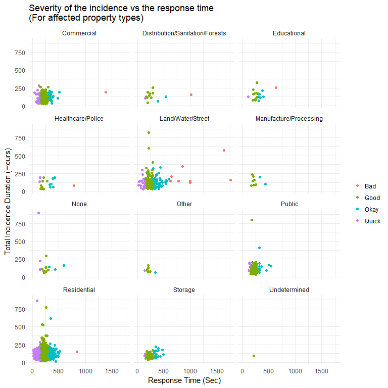

Fires in NYC and FDNY Response
================================

## Tasks

#### 1. Location of Severe Fires

Provide a `leaflet` map of the severe fires contained in the file `severe_incidents.csv`. Ignore locations that fall outside the five boroughs of New York City. Provide at least three pieces of information on the incident in a popup.

#### Solution:

Following map displays the geographical locations of the severe fire incidents occurred in five boroughs of New York City. Click on the circles on the map for more information about the incidence

<!--html_preserve-->

<script type="application/json" data-for="htmlwidget-1a0a0be66143dc04ac15">{"x":{"options":{"crs":{"crsClass":"L.CRS.EPSG3857","code":null,"proj4def":null,"projectedBounds":null,"options":{}}},"calls":[{"method":"addTiles","args":["https://{s}.tile.openstreetmap.org/{z}/{x}/{y}.png",null,null,{"minZoom":0,"maxZoom":18,"maxNativeZoom":null,"tileSize":256,"subdomains":"abc","errorTileUrl":"","tms":false,"continuousWorld":false,"noWrap":false,"zoomOffset":0,"zoomReverse":false,"opacity":1,"zIndex":null,"unloadInvisibleTiles":null,"updateWhenIdle":null,"detectRetina":false,"reuseTiles":false,"attribution":"&copy; <a href=\"http://openstreetmap.org\">OpenStreetMap<\/a> contributors, <a href=\"http://creativecommons.org/licenses/by-sa/2.0/\">CC-BY-SA<\/a>"}]},{"method":"addCircles","args":[[40.7896311,40.6537806,40.8376726,40.75533,40.7475915,40.713269,40.8145029,40.6255401,40.8365982,40.5741456,40.7530101,40.6909905,40.693022,40.830181,40.6846619,40.8228961,40.8253285,40.7161881,40.5778906,40.6271013,40.6915487,40.6277816,40.8547742,40.8376726,40.83306,40.8068287,40.6785715,40.683317,40.680294,40.8272518,40.7609205,40.6909686,40.6157166,40.66307,40.7087988,40.6431272,40.7120711,40.8520482,40.6580404,40.6891808,40.892043,40.650969,40.6688844,40.611838,40.7747911,40.629294,40.7123586,40.6325086,40.7518389,40.6938168,40.6785162,40.7792193,40.696354,40.8640865,40.6440977,40.6497724,40.6256834,40.6656761,40.6586479,40.7074026,40.7124464,40.767267,40.7995653,40.7293961,40.798945,40.8341233,40.7482299,40.684389,40.8750651,40.6760051,40.7005923,40.6125807,40.8312965,40.5898361,40.697747,40.8736964,40.7601572,40.8515529,40.678848,40.6440977,40.6981779,40.6832555,40.5977813,40.689161,40.6375197,40.7600597,40.6127771,40.767267,40.6675125,40.6911099,40.8343783,40.6022332,40.6824413,40.7232838,40.7362842,40.8200893,40.8463347,40.6532915,40.7972632,40.694572,40.5898389,40.6462579,40.6468818,40.6965612,40.7672719,40.7667646,40.8802474,40.694746,40.711801,40.681758,40.7021768,40.5987408,40.8272518,40.8956007,40.8252681,40.5925568,40.8660651,40.68221,40.593487,40.7736925,40.7176171,40.6192922,40.6341186,null,40.6695654,40.6644738,40.763368,40.704881,40.7428947,40.8360928,40.69195,40.828552,40.765359,40.6083482,40.6233405,40.664997,40.662835,40.6978113,40.6821237,40.7756059,40.680385,40.7133423,40.8310945,40.5954985,40.6115795,40.6764516,40.675037,40.8411102,40.8259061,40.6250008,40.7660942,40.6813005,40.767267,40.6997926,40.7477997,40.5890391,40.7157032,40.7370037,40.6902272,40.6429175,40.7412434,40.695845,40.7183857,40.8245652,40.6947808,40.75533,40.8283767,40.6263234,40.5689688,40.7064678,40.8445717,40.6288924,40.6234886,40.6798838,40.6331944,40.6580404,40.8062714,40.6331944,40.7507757,40.6366274,40.618243,40.6624144,40.8376036,40.8263483,40.6385162,40.7178006,40.8444033,40.8706786,40.6697368,40.8443458,40.8878455,40.6975765,40.7908156,40.6159856,40.8681819,40.6817799,40.6536517,40.6879578,40.5936492,40.8339028,40.7591376,40.8864651,40.808055,40.6879475,40.7416224,40.830575,40.8696771,40.6799111,40.6911099,40.628564,40.6698156,40.712734,40.8402557,40.8714368,40.6323294,null,40.720046,40.6263679,40.6719316,40.8252492,40.7494974,40.7027385,40.7005923,40.7988378,40.7403608,40.726162,40.8624708,40.8043683,40.623915,40.8231519,40.620722,40.6644957,40.67763,40.7851039,40.8415353,40.6762072,40.797988,40.6709946,40.759637,40.6323136,40.6656761,40.7175758,40.6736824,40.8652023,40.7149319,40.7704844,40.7512121,40.6664226,40.6878827,40.8785105,40.7431861,40.8003236,40.731623,40.6672244,40.6414276,40.7320289,40.8789858,40.6903067,40.6775066,40.7190683,40.764625,40.5955409,40.8852213,40.7217896,40.664997,40.6673735,40.890244,40.7620774,40.766016,40.6386713,40.643285,40.794316,40.7334788,40.8272518,40.8450485,40.6759771,40.7240626,40.7206075,40.7426633,40.7817204,40.6795789,40.69541,40.645458,40.617534,40.8514876,40.6644957,40.7883666,40.6492793,40.7152154,40.7859096,40.678758,40.7458025,40.647344,40.6155781,40.6498807,40.79725,40.7148199,40.690334,40.79935,40.6715889,40.7589541,40.8322246,40.745063,40.8161056,40.7381375,40.5954985,40.7597616,40.8167638,40.7385115,40.6639572,40.7709869,40.7838194,40.679317,40.7636563,40.7896311,40.6735749,40.6166187,40.5885832,40.7040377,40.752913,40.8684188,40.5834881,40.7294057,40.692968,40.8514876,40.7432938,40.6714824,40.6696857,40.6289688,40.8459533,40.697053,40.6733229,40.8262866,40.703688,40.682232,40.6431288,40.8650373,40.6959468,40.5351171,40.6602674,40.7654129,40.7019871,40.6715773,40.6792777,40.5754975,40.5839354,40.603877,40.7390042,40.7047981,40.7004948,40.7498942,40.7678433,40.7564494,40.8339028,40.6027214,40.6032709,40.8789203,40.5859899,40.6859721,40.6706614,40.7144349,40.705253,40.7737724,40.810014,40.8272518,40.669217,40.70689,40.6142588,40.6325086,40.8395224,40.728672,40.728672,40.6945993,40.8424821,40.773813,40.7678433,40.7641402,40.6654891,40.690405,40.6699273,40.6294744,40.6672244,40.7942847,40.675828,40.8578912,40.67087,40.685806,40.7936179,40.6431272,40.765359,40.688928,40.7367202,40.7090269,40.686619,40.6468818,40.705534,40.6826611,40.7037981,40.7584332,40.8299163,40.8603573,40.7123672,40.8624708,40.7621935,40.8610395,40.7250728,40.647905,40.7320289,40.5986499,40.708944,40.711757,40.7352956,40.7088212,40.6257285,40.828552,40.8525255,40.5955794,40.7954774,40.6763835,40.8519846,40.7175486,40.831622,40.6318492,40.6387292,40.697801,40.8296624,40.7504266,40.6487614,40.6674677,40.6589793,40.8231982,40.8517966,40.695139,40.645106,40.767267,40.7306517,40.7507095,40.6975388,40.6764563,40.7245847,40.6504055,40.8465512,40.699736,40.8641484,40.798945,40.6254938,40.7641402,40.7305359,40.6810973,40.7697512,40.7747911,40.834184,40.6537806,40.664827,40.680236,40.6911686,40.6995541,40.7311286,40.7275967,40.704876,40.655555,40.8129648,40.828552,40.6761071,40.654427,40.6689702,40.6761749,40.5449269,40.8145502,40.618243,40.630023,40.6806645,40.6710418,40.7722387,null,40.8179282,40.688535,40.6412196,40.7812786,40.7915751,40.6368996,40.7654129,40.7654129,40.684358,40.6043649,40.7469705,null,40.7314293,40.6976238,40.750294,40.7457829,40.5938867,40.8488503,40.8448026,40.6979208,40.7658305,40.7271055,40.639854,40.7427209,40.6682201,40.7076534,40.5971315,40.559889,40.6832555,40.6913821,40.8084815,40.7523188,40.5487711,40.6263234,40.6935602,40.6953611,40.7015019,40.813845,40.8939239,40.7250601,40.8798952,40.614782,40.699808,40.7272605,40.8211329,40.6329817,40.750276,40.7994739,40.6887901,40.7517421,40.8425918,40.6982354,40.6045554,40.8561652,40.6644869,40.7398435,40.8531747,40.8430514,40.7906046,40.6439853,40.6634371,40.848957,40.7272842,40.6745504,40.6385162,40.6883972,40.798781,40.8721708,40.7869987,40.8871345,40.6675125,40.8084815,40.8206448,40.8180736,40.7020844,40.7875785,40.7464661,40.7988378,40.6717858,40.7857376,40.8156548,40.6674798,40.6663616,40.6551346,40.8312965,null,40.7947798,40.7473337,40.6472084,40.6930761,40.8098689,40.6498807,40.6320152,40.5822632,40.7378448,40.6333991,40.705413,40.8457618,40.6815494,40.6638578,40.747196,40.5643669,40.6768203,40.7717443,40.7623502,40.6117127,40.5504971,40.5765475,40.8157688,40.7024398,40.6698261,40.5826684,40.6486479,40.6690587,40.7001484,40.605946,40.8486926,40.713269,40.6717858,40.869135,40.8514908,40.5883873,40.6012563,40.6385162,40.7041269,40.68024,40.5558469,40.6099786,40.7501752,40.5971315,40.6947925,40.6698261,40.8482605,40.79935,40.8222748,40.671774,40.69394,40.6488379,40.7507757,40.7055303,40.849323,40.6352975,40.7173989,40.8303174,40.7988378,40.743778,40.738445,40.6424793,40.646738,40.6941104,40.6541536,40.7073943,40.7462516,40.763368,40.7092667,40.729446,40.7293685,40.8469612,40.8743665,40.6617965,40.6493774,40.857538,40.6261768,40.7169701,40.8344303,40.733398,40.6686015,40.8256843,40.70303,40.7173109,40.8111677,40.7376317,40.6556633,40.6430688,40.8182115,40.7641402,40.8421711,40.8253285,40.6389001,40.7235068,40.702313,40.8516539,40.6643667,40.752857,40.8369441,40.8339028,40.7250728,40.8395224,40.8365951,40.7584332,40.7636234,40.5878084,40.8023095,40.8253285,40.8253285,40.8404447,40.6989682,40.6208557,40.6704332,40.6779802,40.7058722,40.766016,40.6808089,40.6879475,40.831137,40.8096932,40.657945,40.747243,40.6647137,40.5950465,40.6329817,40.6736824,40.8283767,40.8030321,40.6276706,40.6576614,40.847287,40.6360225,40.8272518,40.593149,40.697053,40.6775334,40.858386,40.6795789,40.7927713,40.7259303,40.745952,null,40.6639572,40.6643667,40.6941331,40.7792193,40.831622,40.6794385,40.8029919,40.8258196,40.7679183,40.7263608,40.7153245,40.806408,40.8241559,40.6708734,40.742261,40.8150973,40.6690558,40.673916,40.712734,40.5643721,40.6233405,40.5558534,40.6886668,40.7123906,40.592559,40.663069,40.7654129,40.6797237,40.786213,40.8557533,40.6785162,40.680569,40.8885459,null,40.6072025,40.6973197,40.6081078,40.62206,40.6423101,40.8285133,40.8870855,40.7280972,40.8387288,40.6598588,40.8489321,40.8895068,40.7657168,40.6870006,40.8224895,40.708214,40.5930865,40.7520899,40.760861,40.6148089,40.7412434,40.7362903,40.8166377,40.608797,40.74655,40.703543,40.8472474,40.9179949,40.8285133,40.8285133,40.828641,40.8523427,40.8145502,40.7634937,40.6720265,40.6598384,40.8477599,40.6441019,40.7046077,40.7487467,40.7095145,40.672837,40.672667,40.6490992,40.7656661,40.643285,40.5485488,40.5870827,40.8743242,40.8595729,40.6988892,40.8145029,40.838928,40.8841897,40.766016,40.670589,40.706237,40.7345398,40.688535,40.7329588,40.7032599,40.6046529,40.8714368,40.683771,40.6211937,40.8087289,40.6407044,40.7714126,40.6914285,40.6232075,40.8977024,40.7024398,40.8600348,40.7242841,40.8387288,40.5444206,40.714069,40.6730326,40.7669761,40.6691924,40.8159328,40.6723159,40.633516,40.699801,40.5794801,40.7370037,40.5998457,40.7472355,40.5826684,40.7383645,40.6806645,40.8487726,40.604486,40.5825499,40.6333453,40.6134788,40.7128658,40.7280054,40.752381,40.7115017,40.680294,40.7656661,40.8236587,40.7718639,40.5906398,40.6227937,40.8741761,40.6467217,40.5700062,40.8743665,40.7011587,40.692902,40.8056135,40.763368,40.6653055,40.684001,40.622585,40.8382585,40.587104,40.824944,40.767267,40.6648752,40.7278553,40.6028516,40.7994169,40.695289,40.8260012,null,40.7417814,40.7432937,40.72866,40.8182385,40.8118668,40.7747911,40.7362278,40.7117748,40.7120711,40.6462657,40.8451638,40.6900255,40.6902493,40.699819,40.790896,40.7657168,40.6720828,40.6374242,40.6933574,40.7040438,40.6752022,40.7261938,40.7019274,40.6688844,40.718648,40.8435424,40.8703483,40.6980091,40.6443876,40.8426459,40.7646961,40.6900255,40.7246172,40.6624144,40.7353898,40.7157032,40.682584,40.637755,40.8517966,40.7360172,40.6782401,40.7168029,40.8289769,40.8624708,40.8707745,40.8593361,40.6255924,40.652109,40.703747,40.8317579,40.7041208,40.7631584,40.7743404,40.7765182,40.749791,40.6997926,40.729446,40.8344303,40.8261291,40.718941,40.7194779,40.6607154,40.6342269,40.7100676,40.6372235,40.7136408,40.683154,40.6300412,40.830575,40.7609205,40.6257285,40.7010602,40.8163934,40.6362546,40.8275641,40.6074203,40.714295,40.7185365,40.7781416,40.8451505,40.7184121,40.7161881,40.8489876,40.6681067,40.7524816,40.7184892,40.740787,40.7789217,40.5837297,40.8411102,40.8697672,40.7608261,40.8627963,40.8298737,40.8538777,40.6879475,40.7609205,40.6872234,40.6955795,40.8203177,40.8516688,40.7665848,40.6916468,40.6904832,40.857538,40.6432112,40.7320369,40.8428815,40.692889,40.790896,40.67921,40.713269,40.664827,40.8456993,40.794316,40.7328809,40.6644957,40.7869151,40.6109061,40.618113,40.8273936,40.6768991,40.6710418,40.8115224,40.6321936,40.6886668,40.8134276,40.5839688,40.820536,40.6848064,40.8739816,40.7384705,40.8053365,40.8231982,40.6150916,40.7422562,40.7534898,40.748801,40.7849942,40.7329221,40.6216239,40.686323,40.8376726,40.7432937,40.870562,40.7064935,40.7164701,40.7804359,40.7581416,40.7273161,40.7126574,40.7209004,40.713269,40.6093424,40.6909905,40.6551008,40.6768236,40.6759771,40.5792193,40.7267622,40.7050871,40.7507757,40.7118647,40.7301456,40.7789952,40.8305358,40.6769442,40.6390582,40.646738,40.683038,40.715766,40.767532,40.8272518,40.833213,40.6864673,40.7543987,40.897626,40.596324,40.6301639,40.68024,40.6647137,40.8231295,40.7261134,40.6921695,40.7101324,40.828296,40.7275248,40.7772491,40.8341233,40.6461399,40.7248137,40.5857119,40.7032286,40.765874,40.6727524,40.7634937,40.830181,40.7599095,40.6955497,40.631034,40.644514,40.6353312,40.6112501,40.7076534,40.6461346,40.7538674,40.790998,40.6366274,40.8216621,40.8663153,40.7174081,40.677303,40.7066508,40.8267557,40.6094882,40.6749963,40.8432448,40.8652468,40.5610776,40.6796276,40.7757218,40.8415353,40.6356541,40.7507095,40.59973,40.706758,40.6063299,40.7075969,40.6835961,40.7115017,40.6706903,40.8139962,40.6564949,40.682308,40.8446428,40.7054161,40.7092667,40.7751216,40.5525017,40.6598217,40.5952746,40.8176818,40.636097,40.8268321,40.747765,40.8106086,40.7240626,40.539421,40.7048245,40.7328746,40.6739875,40.6646102,40.699736,40.8496021,40.8373589,40.7837168,40.7293685,40.7146301,40.8477319,40.7497177,40.6713087,40.8376726,40.6638578,40.8376726,40.7583563,40.6350203,40.8520482,40.7540642,40.641745,40.7060006,40.7313474,40.70968,40.6064816,40.8555207,40.6796276,40.6387292,40.8663153,40.8001992,40.6168401,40.6234544,40.762107,40.8406087,40.7023572,40.701404,40.729446,40.681211,40.8278208,40.8259447,40.6389508,40.6772872,40.6333453,40.605069,40.6766472,40.7132956,40.8221704,40.6321887,40.8669013,40.6879475,40.7267125,40.6768203,40.8672693,40.8154643,40.5780091,40.8504173,40.7752992,40.871423,40.7527625,40.6416829,40.7554039,40.7550402,40.5552269,40.858386,40.8290247,40.684001,40.704825,40.6885626,40.6706903,40.627833,40.6107365,40.818462,40.7554773,40.8122959,40.8320331,40.589285,40.6959468,40.767532,40.695956,40.7124318,40.7362278,40.8349665,40.683154,40.7486451,40.7749409,40.67301,40.7032959,40.8241065,40.8277784,40.7506175,40.7095639,40.7335212,40.7208775,40.838014,40.689354,40.6981779,40.7187073,40.8438329,40.7405375,40.8182115,40.6333101,40.8044031,40.5792193,40.764077,40.8557533,40.6973134,40.7396527,40.682077,40.6512331,40.6516145,40.6674798,40.8377179,40.6204,40.673916,40.7588646,40.603877,40.6770756,40.6189018,40.7779595,40.6320152,40.6267789,40.6663103,40.8023095,40.7579032,40.663818,40.7161,40.8432448,40.7320289,40.6630258,40.6568598,40.834009,40.8392298,40.680312,40.8392298,40.8264347,40.7896311,40.6303834,40.7736925,40.6462657,40.8459533,40.7770587,40.7145257,40.7131237,40.7852539,40.6996768,40.587976,40.6134331,40.8560877,40.840195,40.7152403,40.7059678,40.7339528,40.6735145,40.6597606,40.6389001,40.620131,40.652192,40.7299553,40.690405,40.6044395,40.69538,40.8268321,40.9035599,40.6411325,40.6064568,40.7591565,40.8661734,40.708542,40.5457563,40.6064568,40.7284627,40.6897086,40.6643667,40.6501766,40.6267789,40.8119081,40.5741456,40.7326097,40.6536036,40.8461516,40.8408568,40.7563257,40.6191944,40.6914285,40.733016,40.6369565,40.7230614,40.571728,40.7736925,40.8239304,40.7374733,40.7163828,40.6753358,40.8799393,40.6063299,40.7583563,40.7116977,40.7736711,40.6841283,40.6374784,40.7292376,40.7217267,40.6846619,40.8704351,40.6748242,40.6064568,40.7010204,40.8129648,40.6655332,40.5748797,40.6061616,40.7169131,40.7168212,40.773813,40.6874929,40.6874929,40.6784022,40.7022571,40.618585,40.7782237,40.830503,40.8883378,40.6761024,40.7263496,40.6287633,40.6360425,40.6685763,40.7279634,40.8989352,40.7135157,40.7779595,40.6751974,40.7628454,40.6840453,40.6867667,40.740787,40.629385,40.7390042,40.7601784,40.7235064,40.7019274,40.5806558,40.688245,40.6122987,40.6956898,40.7040202,40.7030717,40.580723,40.6913821,40.7255879,40.8068287,40.7033756,40.6586479,40.706597,40.6888543,40.713655,40.84147,40.8428815,40.798945,40.7025075,40.6508471,40.7908156,40.6323644,40.7608224,40.7591565,40.7802844,40.6490992,40.5926796,40.5560714,40.683742,40.8663153,40.6648458,40.7616323,40.7293685,40.646738,40.6885626,40.8684188,40.635318,40.618644,40.6287633,40.7804471,40.6485533,40.810843,40.6659664,40.6208304,40.6368786,40.6359604,40.6193242,40.6331944,40.7349548,40.6701536,40.6522995,40.6780731,40.6441151,40.8842045,40.703115,40.669543,40.7772491,40.7437594,40.6955795,40.8395224,40.7453976,40.708127,40.8557565,40.7110193,40.6334757,40.6574649,40.8637976,40.8287372,40.6978195,40.7002225,40.7331191,40.7145257,40.679097,40.6689702,40.6562894,40.6760371,40.6072025,40.700187,40.8200893,40.7096559,40.8030321,40.6392915,40.8409932,40.6597606,40.8245652,40.8043683,40.6502296,40.68323,40.8929633,40.7281603,40.7634937,40.6785162,40.831624,40.6706903,40.8312965,40.5955794,40.7197594,40.6720265,40.7458918,40.8275641,40.8130561,40.7927713,40.6471387,40.5497768,40.7020412,40.6635409,40.7482299,40.7326097,40.7361492,40.6411723,40.7024398,40.7653898,40.8884724,40.7466763,40.7082657,40.6516145,40.85277,40.8784403,40.704881,40.6223666,40.8478503,40.5451312,40.701553,40.8287552,40.8285984,40.744031,40.8531747,40.7348847,40.7073943,40.5010869,40.8741761,40.8107804,40.6481094,40.6296178,40.6420002,40.8353918,40.6680968,40.7890023,40.8259021,40.6337817,40.6468818,40.6609752,40.7101325,40.7233958,40.6255401,40.6580417,40.773813,40.7559092,40.667653,40.57654,40.7507757,40.5673593,40.7075969,40.5625625,40.7258739,40.806408,40.752857,40.625115,40.7191315,40.7624101,40.70823,40.7534898,40.8253285,40.7187442,40.7583563,40.8273936,40.6696791,40.8025058,40.6960035,40.8003236,40.7288781,40.6508249,40.7293961,40.7184755,40.6202587,40.699028,40.7262313,40.7589541,40.7777048,40.8362532,40.702705,40.7365564,40.6078381,40.8157958,40.7815475,40.7143082,40.6022332,40.8770007,40.846506,40.6078078,40.7092667,null,40.7992319,40.7190145,40.6512331,40.8140898,40.5552269,40.6705445,40.8167638,40.8455046,40.680294,40.7355638,40.6431272,40.8626711,null,40.6866976,40.6382714,40.7501276,40.7104657,40.6458021,40.6315493,40.654196,40.5507875,40.702259,40.695956,40.699736,40.7739746,40.7326097,40.605069,40.6695654,40.6562187,40.616488,40.6313073,40.7665848,40.6374784,40.6349248,40.6420339,40.7638942,40.6685356,40.7271043,40.7167367,40.7233561,40.602048,40.6221837,40.7053865,40.7002048,40.6485533,40.69321,40.5826684,40.7638942,40.6261555,40.7381375,40.7583563,40.7608924,40.7386908,40.8275641,40.752857,40.709534,40.8134932,40.608797,40.6681067,40.530183,40.8852213,40.813727,40.678694,40.699736,40.7171876,40.7149514,40.7128658,40.8277062,40.6785113,40.7608924,40.790998,40.7597616,40.7352119,40.5973925,40.6664226,40.7817476,40.6923953,40.6044712,40.8341875,40.753474,40.6263679,40.7367202,40.8584228,40.8842749,40.7145257,40.5961147,40.743688,40.8915118,40.8626711,40.6797237,40.70908,40.6320152,40.6959468,40.6006927,40.7255915,40.700169,40.6752372,40.643285,40.8209947,40.8054183,40.608797,40.7048055,40.618243,40.7616404,40.8228961,40.7126587,40.7742944,40.7630596,40.6159856,40.6639572,40.618243,40.8627253,40.5987408,40.767532,40.5987408,40.6424292,40.605946,40.6785162,40.7403608,40.865449,40.706237,40.6427988,40.5952418,40.6888543,40.621032,40.6466888,40.6332284,40.7462516,40.5741456,40.674757,40.7132217,40.7200386,40.6256834,40.6751974,40.6823907,40.5765475,40.8268321,40.7938457,40.7580838,40.7560558,null,40.8526857,40.6190599,40.7559092,40.6690587,40.5489726,40.8341875,40.7143082,40.7396689,40.6447554,null,40.6808948,40.593149,40.8441394,40.8488465,40.626886,40.60032,40.7654129,40.6255401,40.6913821,40.7608261,40.618794,40.8044031,40.8075129,40.8180594,40.712734,40.6431288,40.7155738,null,40.8203235,40.5583359,40.711801,40.7405375,40.6891808,40.8196006,40.688535,40.7896482,40.8628472,40.63581,40.8558189,40.8332882,40.7705947,40.6981779,40.6329817,40.683086,40.6695262,40.5953639,40.8127206,40.8362187,40.8681819,40.692831,40.6659664,40.637755,40.6325086,40.7490692,40.6675125,40.8360928,40.5814726,40.6316525,40.8313939,40.650706,40.6608871,40.6301015,40.70621,40.8241559,40.8217268,40.6318701,40.8552648,40.6956898,40.7267977,40.8256524,40.8283281,40.7082522,40.8584038,40.8313035,40.8341233,40.5643669,40.5390227,40.7065725,40.6879827,40.7778563,40.629006,40.5899815,40.6653055,40.6447554,40.7082284,40.6775066,40.6630185,40.5935963,40.6093424,40.7458471,40.7781416,40.5961734,40.7717443,40.7739133,40.6028314,40.6012266,40.8727853,40.6743731,40.7410705,40.6709946,40.6413111,40.8310945,40.6082574,40.6664954,40.6498807,40.6885422,40.6823907,40.7045598,40.5992839,40.810843,40.660826,40.83363,40.8111677,40.699736,40.8684188,40.6096202,40.676449,40.79725,40.6726018,40.7683708,40.6516145,40.808055,40.760861,40.7069436,40.6609752,40.7169291,40.6345952,40.713269,40.7808121,40.7679106,40.7531456,40.7642415,40.7675028,40.5874526,40.8341233,40.6301639,40.695791,40.7120892,40.693823,40.612487,40.6316969,40.7625684,40.77818,40.6027499,40.7745134,40.8068287,40.7371882,40.7115017,null,40.692902,40.6773215,40.6447451,40.7308661,40.7529668,40.8461516,40.8446428,40.8663153,40.7355638,40.748484,40.809098,40.695587,40.6905434,40.824889,40.6420002,40.6879475,40.629735,40.6826611,40.5935637,40.6755331,40.759478,40.666259,40.6536517,40.6233405,40.6792777,40.8452162,40.8272518,40.835502,40.7658562,40.766016,40.6221146,40.6870422,40.7615144,40.670001,40.6708992,null,40.8259021,40.7942847,40.8672693,40.682914,40.7239497,40.7532711,40.703234,40.7101325,40.608309,40.6616371,40.7285977,40.7620774,40.8511229,40.745156,40.6416461,40.618254,40.6762072,40.7378077,40.7262882,40.689161,40.8158845,40.6496021,40.7410673,40.7851039,40.7113899,40.6726114,40.7204318,40.6655332,40.6889575,40.6516145,40.6221146,40.8714368,40.692346,40.7005049,40.6738334,40.6042819,40.7213974,40.6996768,40.7305597,40.6799111,40.8092586,40.7299748,40.695719,40.708127,40.6146394,40.6516546,40.7095639,40.7168847,40.6255924,40.6738334,40.7987854,40.7278553,40.7406196,40.6553516,40.6229985,40.6165191,40.8667868,40.752913,40.7190145,40.777504,40.6784022,40.899206,40.8451638,40.7607892,40.681521,40.63496,40.8751735,40.619249,40.8824932,40.8172698,40.7292376,40.6863928,40.691737,40.6522995,40.750276,40.6629444,40.6720669,40.8244569,40.683751,40.7082375,40.8849782,40.7339528,40.6300412,40.7536531,40.6461346,40.7875785,40.6685763,40.6062222,40.6016326,40.8211329,40.6532915,40.6639572,40.8426459,40.8377179,40.6691924,40.712798,40.613613,40.7789085,40.8516539,40.72441,40.7641748,40.6245355,40.7916801,40.6387181,40.5520911,40.5520911,40.6340272,40.8659738,40.6502296,40.6609752,40.537285,40.7804359,40.5569742,40.6263519,40.700548,40.7230124,40.8884769,40.6624144,40.6654891,40.5910174,40.7576055,40.7404792,40.7168847,40.8939239,40.684668,40.7421612,40.7602267,40.6405477,40.7432937,40.6934375,40.658504,40.8211329,40.7280054,40.6687934,40.8377728,40.5992839,40.6255401,40.754091,40.8328527,40.8650996,40.731644,40.6423101,40.8241065,40.7636234,40.5782396,40.7548147,40.8272518,40.6430097,40.733398,40.8520482,40.7040202,40.6727437,40.6102789,40.5984009,40.688245,40.6242551,40.8268559,40.7653068,40.7000492,40.7272456,40.6817799,40.7096644,40.5946224,40.7271055,40.7064761,40.8023804,40.7524986,40.8780219,40.8145029,40.7088522,40.6640832,40.6127771,40.7352119,40.8484295,40.6013708,40.689354,40.875393,40.672818,40.7123672,40.7503043,40.8654142,40.7439539,40.8882255,40.6839015,40.8433825,40.6995541,40.6537806,40.6313026,40.693573,40.6941104,40.693161,40.6190599,40.6250705,40.7164701,40.6793184,40.705046,40.8068287,40.696376,40.7175758,40.5545781,40.6941661,40.6654394,40.7340911,40.7069168,40.6287633,40.618553,40.6046104,40.8320331,40.6262732,40.7178343,40.6682201,40.8115341,40.6287633,40.8401202,40.6851356,40.5761121,40.6915487,40.769164,40.730722,40.8904293,40.6955501,40.681521,40.7450136,40.5103735,40.681842,40.7890023,40.6749963,40.8738176,40.757517,40.9035599,40.5940322,40.8073044,40.6191944,40.6502893,40.75814,40.7922522,40.7114079,40.8660651,40.7267125,40.7167288,40.6988381,40.8000771,40.8672693,40.620299,40.5285001,40.7205088,40.70303,40.7507757,40.6763001,40.6954644,40.8470225,40.6738334,40.722338,40.6631068,40.7058634,40.662835,40.7770587,40.6496021,40.6331944,40.7355362,40.7458762,40.7153934,40.6321887,40.6580404,40.9055337,40.6866044,40.7140602,40.6786643,40.6493774,40.6516145,40.824283,40.7581251,40.8551175,40.7454534,40.7253112,40.9055337,40.790998,40.6123951,40.753474,40.7628658,40.630336,40.760446,40.6793184,40.762801,40.6720828,40.69691,40.7593502,40.6622426,40.5914496,40.8272518,40.6316969,40.806408,40.7500842,40.6675125,40.6928842,40.6237545,40.7608224,40.643152,40.7628658,40.580222,40.6127252,40.7588061,40.6474779,40.8182385,40.7792665,40.5959518,40.8421837,40.6620054,40.8301514,40.7096559,40.7646896,40.626711,40.6287633,40.6368996,40.815846,40.6426696,40.6644957,40.6951507,40.6586479,40.8006353,40.7124464,40.7099525,40.6072025,40.8843959,40.6709931,40.7988378,40.6523754,40.7545714,40.6357624,40.6407044,40.680294,40.848957,40.6280227,40.722181,40.6100814,40.7660682,40.7685007,40.6646417,40.6155986,40.6424292,40.6989682,40.7301735,40.6904108,40.899455,40.7457167,40.6324248,40.8663153,40.7868424,40.7146555,40.8529008,40.6213905,40.8774778,40.8342393,40.5938517,40.8339028,40.641745,40.6086933,40.7238572,40.7588061,40.852119,40.5525375,40.7750344,40.763524,40.7915751,40.6766939,40.8295571,40.6731881,40.7315386,40.744009,40.8663153,40.6741919,40.5808716,40.6728948,40.8171409,40.6236767,40.783266,40.6768236,40.8175144,40.8216621,40.7728489,40.7006937,40.712734,40.830181,40.6487614,40.790998,40.8477319,40.8654374,40.704082,40.734791,40.6785162,40.832374,40.655555,40.6537806,40.6768236,40.6102703,40.7295445,40.6306844,40.6708734,40.628564,40.7361492,40.6340272,40.6545334,40.6611692,40.6674061,40.6917829,40.6852363,40.7001484,40.7707671,40.6639572,40.6745829,40.798945,40.790896,40.7187073,40.7646405,40.7493631,40.767267,40.7048245,40.8075129,40.859157,40.6690242,40.5267669,40.8885497,40.802373,40.8284364,40.7540172,40.7649838,40.628263,40.8447807,40.6257285,40.8416518,40.744009,40.5868744,40.8471956,null,40.6946376,40.6328349,40.6343884,40.6874929,40.608797,40.6697915,40.754707,40.6395331,40.694968,40.7598871,40.8401258,40.7773266,40.6244003,40.8286684,40.6955795,40.663189,40.6629444,40.831622,40.75533,40.7115625,40.8290547,40.7584749],[-73.94006,-73.956165,-73.8654793,-73.991177,-73.9980082,-73.962081,-73.9554427,-74.0925066,-73.9431735,-73.9891318,-73.8773249,-73.9351495,-73.916257,-73.86406,-73.9790047,-73.9509114,-73.9438167,-73.9865604,-73.9609477,-73.932626,-73.9367547,-74.1211208,-73.8504053,-73.8654793,-73.848147,-73.9174895,-73.9162994,-73.7774044,-73.7545931,-73.9386949,-73.9886647,-73.8143855,-73.9091408,-73.8946201,-73.852385,-73.9054201,-73.7764355,-73.9224459,-73.8901334,-73.9095042,-73.858116,-73.976976,-73.8931265,-74.1384478,-73.9089965,-74.028678,-73.8917096,-74.1374066,-73.9946789,-73.7860061,-73.9639049,-73.9809561,-73.9406945,-73.8924176,-73.9668924,-73.9233941,-74.0301806,-73.8932513,-73.923936,-73.9599578,-73.7398097,-73.9841435,-73.9657474,-73.9980108,-73.9423635,-73.9166594,-73.8634053,-73.986564,-73.8847428,-73.7761177,-73.9428911,-73.9357927,-73.8817387,-73.9296076,-73.754669,-73.9040198,-73.8194193,-73.8620863,-73.866083,-73.9668924,-73.9869842,-73.9845664,-73.7835231,-73.992623,-74.0842046,-73.8233077,-73.939683,-73.9841435,-73.8642554,-73.9169362,-73.8906495,-73.7541611,-73.8804866,-73.9825451,-73.9181725,-73.8561946,-73.8608071,-73.9387889,-73.940519,-73.9561384,-73.8045878,-73.9308123,-73.949147,-73.8280562,-73.9210862,-73.9388098,-73.8549625,-73.785671,-73.942228,-73.816943,-73.8163559,-73.7660256,-73.9386949,-73.8389915,-73.8566642,-73.9879849,-73.9224986,-73.9057905,-73.943484,-73.9456902,-73.8117522,-73.9483698,-73.945864,null,-73.8831719,-73.9051748,-73.95924,-73.944389,-73.8828342,-73.9159082,-73.730665,-73.9422999,-73.9875868,-74.0905372,-73.9559516,-73.9881325,-73.9261458,-73.908023,-73.864994,-73.80379,-73.7578529,-74.0129181,-73.9070236,-73.7782169,-73.9945951,-73.9741058,-73.8699132,-73.9398447,-73.9393239,-74.0304542,-73.9077028,-73.9556916,-73.9841435,-73.7785755,-73.9029142,-73.9445784,-73.9858054,-73.8249982,-73.9072915,-74.083768,-73.8694985,-73.908799,-73.9928301,-73.9480977,-73.8477376,-73.991177,-73.9028321,-74.0328637,-74.1339733,-73.9607713,-73.9153079,-74.118532,-74.0851262,-73.8078643,-73.995162,-73.8901334,-73.9201784,-73.995162,-73.9744533,-74.0241926,-73.9840732,-73.9098626,-73.9275652,-73.9146987,-74.0099788,-73.9852709,-73.8829191,-73.9182743,-73.9874678,-73.9011339,-73.855372,-73.9496477,-73.9764719,-74.0814171,-73.8887972,-73.9238936,-73.933049,-73.9419305,-74.1001259,-73.908766,-73.9902683,-73.8510567,-73.929314,-73.825011,-73.99375,-73.9415003,-73.8850215,-73.9141379,-73.9169362,-74.028976,-73.9841189,-73.9890414,-73.8877444,-73.867155,-74.0942439,null,-73.9553481,-74.0298737,-73.9141333,-73.94761,-73.7755853,-73.744143,-73.9428911,-73.9538699,-73.8973652,-73.8214161,-73.9224251,-73.9353288,-74.00726,-73.8948779,-74.020296,-73.9769418,-73.894388,-73.9769031,-73.8807245,-74.0069476,-73.961981,-73.9847943,-73.8823053,-74.1603606,-73.8932513,-73.7524538,-74.0043837,-73.8238286,-73.8166315,-73.7401518,-73.7630287,-73.9368983,-73.9072304,-73.8710001,-73.778728,-73.9322644,-73.856597,-73.9224614,-74.086807,-73.8158011,-73.8616449,-73.9682473,-73.9470022,-74.0064401,-73.871773,-73.7582909,-73.8793521,-73.9998669,-73.9881325,-73.98781,-73.860298,-73.9186877,-73.9852394,-74.0745703,-73.8924971,-73.96276,-73.9974473,-73.9386949,-73.9130614,-73.8949325,-73.7967066,-73.9047847,-73.9320841,-73.9490041,-73.9783093,-73.741002,-74.006368,-74.0807883,-73.9144786,-73.9769418,-73.9745459,-73.9436024,-73.8066231,-73.7844452,-73.813461,-73.8854808,-74.007988,-74.0337281,-73.9340916,-73.968038,-73.9980331,-73.9920503,-73.9474324,-73.88019,-73.8428948,-73.9445251,-73.9786216,-73.9142894,-74.0060301,-73.7782169,-73.9898077,-73.8647469,-73.9844382,-73.9102483,-73.986982,-73.9799099,-73.787288,-73.8808847,-73.94006,-73.952937,-74.1004474,-74.1463682,-74.0115969,-73.9061839,-73.8925258,-73.9708328,-73.7873784,-73.825103,-73.9144786,-73.9001059,-73.9475632,-73.882362,-74.1371852,-73.8986402,-73.75733,-73.7757158,-73.925671,-73.885026,-73.89486,-73.9506703,-73.9269562,-73.9376266,-74.2383854,-73.8682244,-73.889979,-73.8099833,-73.7517409,-73.955294,-73.9910583,-73.9484803,-73.995429,-73.7337013,-73.9618598,-73.7441142,-73.8549676,-73.7731953,-73.8587667,-73.908766,-74.0025837,-73.9960724,-73.8750607,-73.81657,-73.9266708,-73.7480597,-73.759986,-73.925335,-73.9120261,-73.804705,-73.9386949,-73.9846192,-73.759894,-73.9688702,-74.1374066,-73.8833435,-73.9984634,-73.9984634,-73.9750276,-73.8875485,-73.9561806,-73.7731953,-73.9866172,-73.7523447,-73.805741,-73.8806939,-73.9444744,-73.9224614,-73.951114,-73.9165529,-73.8910777,-73.781422,-73.832577,-73.9494987,-73.9054201,-73.9875868,-73.836346,-73.9857331,-73.7578318,-73.869155,-73.949147,-73.738038,-73.9100217,-73.8234535,-73.9688967,-73.8984806,-73.9015992,-73.9849007,-73.9224251,-73.9936126,-73.8309465,-73.9812178,-74.007405,-73.8158011,-73.978934,-73.941759,-73.7956319,-73.987819,-73.8004512,-73.9276178,-73.9422999,-73.9000091,-73.7645918,-73.965616,-73.85177,-73.9101781,-73.9993157,-73.847812,-74.152217,-74.0133644,-73.8081373,-73.94437,-73.9691367,-73.9349125,-73.9395878,-73.7272481,-73.8894936,-73.9092138,-73.740136,-74.010319,-73.9841435,-73.9830602,-73.9176667,-73.8877695,-73.9585526,-73.8503228,-73.9253925,-73.9015238,-73.9096327,-73.8985704,-73.9423635,-73.9585374,-73.9866172,-74.0017279,-73.808211,-73.9605925,-73.9089965,-73.878572,-73.956165,-73.767003,-73.750831,-73.8636772,-73.8324548,-73.91812,-73.9852947,-73.955704,-73.8840548,-73.9498725,-73.9422999,-73.8488327,-73.7367681,-73.906674,-73.9513004,-74.1485346,-73.886497,-73.9840732,-74.02838,-73.9496252,-73.9392515,-73.9259369,null,-73.9381524,-73.9434948,-73.9644311,-73.9779421,-73.9446725,-73.9110521,-73.889979,-73.889979,-73.832112,-74.1667368,-73.7571222,null,-73.738295,-73.9849705,-73.9967693,-73.9996309,-73.7963187,-73.9083114,-73.8609559,-73.8406704,-73.9819269,-73.9467217,-74.0121899,-73.9845919,-73.9871039,-74.0117945,-73.952211,-74.1069421,-73.9845664,-73.9253448,-73.9448985,-73.739344,-74.1874717,-74.0328637,-73.9649995,-73.7940565,-73.9859472,-73.8021306,-73.8497765,-73.8048103,-73.8805823,-73.9106038,-73.768584,-73.8532226,-73.9088655,-73.9978155,-73.8187618,-73.9553784,-73.9835656,-73.9707907,-73.8523022,-73.9029918,-73.7418829,-73.8975291,-73.8959198,-74.000602,-73.9056095,-73.8828574,-73.946429,-74.0114771,-73.8975741,-73.8904375,-73.993628,-73.8036154,-74.0099788,-73.9511754,-73.9379413,-73.8631858,-73.8091359,-73.8557585,-73.8642554,-73.9448985,-73.9177149,-73.9253907,-74.0126306,-73.9788249,-73.9439002,-73.9538699,-73.9054393,-73.9764445,-73.9062439,-73.9562295,-73.9522086,-73.9163354,-73.8817387,null,-73.9766245,-73.8693524,-73.9557204,-73.9091696,-73.9030954,-73.9340916,-73.941755,-73.8208159,-73.8761959,-73.9109175,-73.73413,-73.8798454,-73.8622574,-73.9517458,-73.86032,-74.1319105,-73.900047,-73.9632455,-73.9151518,-74.1607133,-74.1750834,-73.9999077,-73.8171714,-73.9871631,-73.8867682,-74.0842712,-73.9223355,-73.9366628,-73.912192,-74.0004772,-73.9032682,-73.962081,-73.9054393,-73.865281,-73.9391197,-73.9505275,-73.9993631,-74.0099788,-73.9099238,-73.946749,-74.2016273,-73.9624499,-73.8952934,-73.952211,-73.8477427,-73.8867682,-73.9097514,-73.9474324,-73.8424933,-73.9364146,-73.858108,-73.9330007,-73.9744533,-73.9636908,-73.8594304,-73.9156034,-73.7589493,-73.8717897,-73.9538699,-73.8862069,-73.878235,-73.900729,-73.909434,-73.960156,-73.9499329,-73.968393,-74.0015494,-73.95924,-73.7754397,-73.8610772,-73.8477683,-73.918635,-73.863791,-73.766833,-73.9055537,-73.9096246,-73.9218433,-73.9418146,-73.9266205,-73.87507,-73.7451,-73.8991314,-73.9038982,-73.8492715,-73.9614732,-73.9851673,-73.9598737,-73.9516563,-73.8541532,-73.9866172,-73.9429382,-73.9438167,-74.0167625,-73.9811917,-73.784775,-73.9156201,-73.9074554,-73.9929789,-73.9271227,-73.908766,-73.9812178,-73.8833435,-73.9393254,-73.9688967,-73.9636868,-74.1923175,-73.9532967,-73.9438167,-73.9438167,-73.9403262,-73.944096,-73.9036911,-73.9281875,-73.7840498,-73.9653437,-73.9852394,-73.8748741,-73.825011,-73.9174546,-73.9253951,-73.9368599,-73.8310566,-73.899803,-73.7845305,-73.9978155,-74.0043837,-73.9028321,-73.936328,-74.0832664,-73.9532225,-73.8993097,-74.1443499,-73.9386949,-73.925472,-73.75733,-73.9637207,-73.8906237,-73.9783093,-73.97133,-73.8164878,-73.998009,null,-73.9102483,-73.9074554,-73.9057844,-73.9809561,-73.847812,-73.8682313,-73.9638477,-73.9157313,-73.9284808,-73.983319,-73.8008252,-73.9186323,-73.891913,-73.91979,-73.890698,-73.9194287,-73.87667,-73.873115,-73.9890414,-74.1159703,-73.9559516,-74.1346215,-73.9619203,-73.8037852,-73.9715673,-73.985893,-73.889979,-74.0101098,-73.9496313,-73.8854348,-73.9639049,-73.892328,-73.8549785,null,-73.8208033,-73.7620707,-73.7541296,-73.967572,-74.0132276,-73.8801113,-73.9041614,-73.9864832,-73.9270824,-73.8313889,-73.9422581,-73.8452362,-73.9761894,-73.8283597,-73.8110266,-73.959679,-73.7982003,-73.8818841,-73.9668663,-74.0799652,-73.8694985,-73.9371233,-73.9428531,-74.1536392,-73.864903,-73.922331,-73.9368648,-73.8956178,-73.8801113,-73.8801113,-73.853429,-73.8644105,-73.886497,-73.9889648,-73.8605755,-73.91878,-73.895621,-73.9565748,-73.8101685,-73.7085711,-73.9433319,-73.7483755,-73.77737,-73.9464782,-73.8374283,-73.8924971,-74.1577963,-73.8138691,-73.8245523,-73.8874273,-73.796048,-73.9554427,-73.87623,-73.8336069,-73.9852394,-73.9476457,-73.9641218,-73.8106947,-73.9434948,-73.801258,-73.8901156,-73.9465472,-73.867155,-73.9262221,-74.0290066,-73.8849627,-73.9523828,-73.8178092,-73.8126799,-73.9571409,-73.872719,-73.9871631,-73.9086178,-73.898448,-73.9270824,-74.1739916,-73.9900165,-73.9057506,-73.9168932,-73.8856896,-73.9431183,-73.8930328,-74.026951,-73.746775,-73.9419211,-73.8249982,-73.9682156,-73.9991249,-74.0842712,-73.9820398,-73.9496252,-73.8939852,-73.9749052,-73.9636141,-74.0947318,-74.1030323,-73.8014838,-73.8481715,-73.9742534,-73.7909874,-73.7545931,-73.8374283,-73.8938913,-73.9576012,-73.94975,-74.1652396,-73.8258419,-73.9081822,-73.8644731,-73.863791,-73.8052658,-73.805504,-73.9255888,-73.95924,-73.9931399,-73.950299,-73.962796,-73.8365619,-74.091681,-73.820508,-73.9841435,-73.7834447,-73.9761186,-73.9629869,-73.9374899,-73.943388,-73.9005191,null,-73.9823575,-73.9211468,-73.9095655,-73.9168002,-73.8954395,-73.9089965,-73.722525,-73.9997,-73.7764355,-73.8965501,-73.9075203,-73.9304732,-73.9481901,-73.9848612,-73.9451536,-73.9761894,-73.9419418,-73.8972198,-73.9341197,-73.8964732,-73.9194087,-73.9586676,-73.881,-73.8931265,-73.7955234,-73.8432577,-73.8555654,-73.744023,-73.8797637,-73.9104556,-73.7261973,-73.9304732,-73.8910095,-73.9098626,-73.7597707,-73.9858054,-73.788854,-74.007206,-73.9092138,-73.997813,-73.9405515,-73.8200282,-73.8764098,-73.9224251,-73.8944343,-73.8552809,-73.9314961,-74.017381,-73.954442,-73.8180132,-73.9158559,-73.7861669,-73.8431696,-73.9528276,-73.9084766,-73.7785755,-73.8610772,-73.9266205,-73.8218713,-73.956535,-73.9863391,-73.9466908,-74.0847179,-73.7843173,-74.0185115,-73.796534,-73.9792436,-73.982368,-73.9415003,-73.9886647,-73.9276178,-73.9465648,-73.9483483,-74.0794912,-73.8671927,-74.1175832,-73.9939834,-73.9477009,-73.9544957,-73.8851481,-73.9882771,-73.9865604,-73.8503429,-73.7339739,-73.756081,-73.9223613,-73.7134989,-73.8223106,-73.9605921,-73.9398447,-73.8415662,-73.8039109,-73.9084559,-73.8552757,-73.9147369,-73.825011,-73.9886647,-73.8275399,-73.9327595,-73.9399316,-73.9160001,-73.9846419,-73.9239143,-73.9878747,-73.9096246,-73.903066,-74.0024827,-73.8785713,-73.753752,-73.9451536,-73.9280339,-73.962081,-73.767003,-73.8894105,-73.96276,-73.7994597,-73.9769418,-73.9775615,-74.0090295,-73.959107,-73.9251143,-73.9359257,-73.9392515,-73.9034522,-73.9389225,-73.9619203,-73.88524,-74.0871212,-73.8470898,-73.7313459,-73.9027462,-73.8737046,-73.9356786,-73.8894936,-73.9643849,-73.8531958,-73.9729575,-73.750442,-73.9151081,-73.800377,-74.0886167,-73.9744535,-73.8654793,-73.9211468,-73.8449961,-73.7847092,-73.9570296,-73.949897,-73.8165257,-74.0071492,-73.7638008,-73.995751,-73.962081,-74.006085,-73.9351495,-73.9346418,-73.8683964,-73.8949325,-73.9819464,-73.8487465,-73.7741562,-73.9744533,-73.7996071,-74.0058883,-73.7822193,-73.9032431,-73.7541352,-73.955985,-73.909434,-73.926095,-73.7377386,-73.8270488,-73.9386949,-73.8994401,-73.8158142,-73.9732125,-73.85624,-74.0671162,-74.0007419,-73.946749,-73.899803,-73.9505135,-73.9984096,-73.9824974,-73.8408388,-73.861717,-73.9978625,-73.9824378,-73.9166594,-73.9327156,-74.0111217,-73.8088963,-73.8071528,-73.9573957,-73.7693911,-73.9889648,-73.86406,-73.8316067,-73.7438898,-73.9094074,-73.7473579,-74.1253614,-74.1341889,-74.0117945,-73.9591952,-73.8720535,-73.9421653,-74.0241926,-73.861132,-73.8927783,-73.9339369,-73.80456,-73.7392285,-73.9375027,-74.0842439,-73.808538,-73.9391899,-73.8679186,-74.1613512,-73.9356355,-73.9338854,-73.8807245,-74.0768859,-73.9176667,-73.9691316,-73.941399,-73.9964726,-73.8165963,-73.8268178,-73.7909874,-73.8907167,-73.909835,-73.9530996,-73.925946,-73.93872,-73.9022465,-73.7754397,-73.8474545,-74.1542458,-73.9264759,-74.1042493,-73.898521,-74.0010439,-73.9415319,-73.982957,-73.8534618,-73.7967066,-74.1652642,-73.812774,-73.9563918,-73.8010598,-73.8950177,-73.9096327,-73.9326296,-73.8876616,-73.9141864,-73.8477683,-74.0096768,-73.9162128,-73.9973251,-73.7828401,-73.8654793,-73.9517458,-73.8654793,-73.9903747,-74.1382819,-73.9224459,-73.9152771,-74.013814,-74.008801,-73.9825664,-74.010962,-73.7552298,-73.8406395,-73.9356355,-74.0133644,-73.8927783,-73.9650421,-74.0349011,-73.9549182,-73.9274975,-73.8296706,-73.8187541,-73.918572,-73.8610772,-73.922406,-73.9259438,-73.8859034,-73.9880308,-73.7716985,-74.0947318,-73.942771,-73.9181996,-73.958356,-73.9521101,-74.1167513,-73.8500285,-73.825011,-73.8986573,-73.900047,-73.8692022,-73.904374,-73.9530931,-73.8569959,-73.9536403,-73.866145,-73.9751147,-74.0805481,-73.9794756,-73.9708212,-74.1120594,-73.8906237,-73.9448489,-73.950299,-73.924586,-73.9301862,-73.8907167,-74.029275,-74.1440399,-73.9433135,-73.8246999,-73.909427,-73.9159057,-73.9319934,-73.9376266,-73.8270488,-73.742734,-73.7481101,-73.722525,-73.9190264,-73.9792436,-73.9707525,-73.8135847,-73.8133274,-74.00625,-73.8210246,-73.9457596,-73.9871896,-73.7911422,-73.7976207,-73.986555,-73.868236,-73.936321,-73.9869842,-73.9908008,-73.8879061,-73.759221,-73.8541532,-74.1616495,-73.9372212,-73.9819464,-73.8670503,-73.8854348,-73.9322753,-73.7921397,-73.777614,-74.0106468,-73.9333061,-73.9562295,-73.9399956,-73.960486,-73.873115,-73.8168597,-73.995429,-73.793166,-73.9002097,-73.9880174,-73.941755,-73.946878,-73.7796281,-73.9532967,-73.8604253,-73.9111661,-73.79374,-73.9391899,-73.8158011,-73.9400108,-73.8851687,-73.84098,-73.8666681,-73.83713,-73.8666681,-73.9405896,-73.94006,-73.943491,-73.9456902,-73.8965501,-73.8986402,-73.9890502,-73.9443863,-73.7674396,-73.8411689,-73.8111353,-73.7947956,-73.971261,-73.8861202,-73.8305555,-74.0054243,-73.9421261,-73.9546438,-73.8758792,-73.9199635,-74.0167625,-73.985693,-73.732086,-73.9880663,-73.805741,-74.1337851,-73.830581,-73.9415319,-73.8548211,-73.9046734,-73.9745974,-73.9670062,-73.88731,-73.927407,-74.1788737,-73.9745974,-74.0053451,-73.8034796,-73.9074554,-73.9291978,-73.946878,-73.9101925,-73.9891318,-73.9876848,-74.0032573,-73.8418832,-73.9397731,-73.9699991,-74.1066624,-73.8126799,-73.9935743,-74.0832479,-73.9115834,-74.0907441,-73.9456902,-73.8948616,-73.9198446,-74.0012118,-73.7337986,-73.8662446,-73.9964726,-73.9903747,-73.8170316,-73.9837235,-73.8156274,-73.9931614,-73.9771539,-73.9848505,-73.9790047,-73.8432277,-73.8936743,-73.9745974,-73.9481277,-73.9498725,-73.9370026,-73.9941892,-73.9051746,-73.7417196,-73.9977594,-73.9561806,-73.9329582,-73.9329582,-73.9486606,-73.7489872,-73.9424109,-73.9041558,-73.861619,-73.8517116,-73.7458197,-73.8229783,-73.9182572,-73.9125377,-73.9868078,-73.9881305,-73.897094,-73.9886069,-73.9880174,-73.8734214,-73.9389158,-73.8467911,-73.8291877,-73.7134989,-74.13033,-73.7337013,-73.967329,-73.9792916,-73.881,-74.1343856,-73.8239836,-74.0341134,-73.967345,-73.9397347,-73.9569864,-73.958303,-73.9253448,-73.989893,-73.9174895,-73.8126296,-73.923936,-73.943086,-73.8466225,-73.8196712,-73.7863905,-73.8785713,-73.9423635,-73.956354,-73.9485975,-73.9764719,-73.9952509,-73.8307509,-73.9670062,-73.9514614,-73.9464782,-74.0802896,-74.2006578,-73.7695642,-73.8927783,-73.8988837,-73.9101826,-73.8477683,-73.909434,-73.9301862,-73.8925258,-74.023235,-73.974866,-73.9182572,-73.7849674,-73.9240781,-73.95068,-73.9020319,-74.0818995,-74.1163111,-74.1214836,-73.9206184,-73.995162,-73.8997711,-73.9821898,-73.9401333,-73.9441766,-73.8774771,-73.8660899,-73.92158,-73.911662,-73.9824378,-73.706747,-73.9327595,-73.8833435,-73.9794201,-73.9111765,-73.9316556,-73.7942482,-74.1634122,-73.9445257,-73.9025314,-73.9101751,-73.8956825,-73.8086661,-73.9758174,-73.9443863,-73.798215,-73.906674,-73.9357175,-73.8720675,-73.8208033,-73.9908136,-73.8561946,-73.9963521,-73.936328,-73.984101,-73.8307544,-73.9199635,-73.9480977,-73.9353288,-73.9282622,-73.907126,-73.861014,-73.739311,-73.9889648,-73.9639049,-73.867258,-73.8907167,-73.8817387,-73.7645918,-73.8436824,-73.8605755,-73.9869224,-73.8671927,-73.9081702,-73.97133,-74.0046192,-74.1397897,-73.8886348,-73.9335647,-73.8634053,-73.9876848,-73.9790623,-73.9857061,-73.9871631,-73.9857026,-73.8303507,-73.8748906,-73.9551147,-73.9333061,-73.892167,-73.8803897,-73.944389,-73.9647787,-73.8903989,-74.1666178,-73.8771045,-73.8772968,-73.8791716,-73.858681,-73.9056095,-73.8066038,-73.968393,-74.2516134,-73.8258419,-73.9525943,-74.0107685,-73.9424768,-73.8988312,-73.9178637,-73.9735839,-73.9740865,-73.8887809,-74.1230263,-73.949147,-73.889199,-73.9445168,-73.9340362,-74.0925066,-73.920597,-73.9561806,-73.9944915,-73.885297,-73.9572673,-73.9744533,-74.0990361,-73.8165963,-73.9139053,-73.9416896,-73.9186323,-73.9929789,-74.0807339,-73.8520791,-73.7951972,-73.94164,-73.9729575,-73.9438167,-73.7779405,-73.9903747,-73.9251143,-73.7498377,-73.9088066,-73.9464199,-73.9322644,-73.8220439,-73.94909,-73.9980108,-74.0021904,-73.9417836,-73.916223,-73.9317814,-73.8428948,-73.9183219,-73.853219,-73.9500199,-74.0058348,-73.9619154,-73.9389112,-73.9583152,-73.7819783,-73.7541611,-73.8991768,-73.8856209,-73.759194,-73.7754397,null,-73.9558284,-74.0008184,-74.0106468,-73.9020286,-74.1120594,-73.8208667,-73.8647469,-73.9029302,-73.7545931,-73.7165515,-73.9054201,-73.9076505,null,-73.9268351,-74.1350888,-73.9461276,-73.7372871,-73.9601883,-73.9957317,-73.9220305,-74.1501518,-73.920075,-73.742734,-73.9096327,-73.9310472,-73.9876848,-73.942771,-73.8831719,-73.9187743,-74.022815,-74.1552634,-73.9846419,-73.9931614,-73.994962,-74.0877116,-73.9149929,-73.7419254,-73.8631165,-73.9589105,-73.9957261,-73.9480171,-73.9038005,-73.938755,-73.9538913,-73.9240781,-73.971872,-74.0842712,-73.9149929,-73.9819445,-74.0060301,-73.9903747,-73.9085946,-73.8046086,-73.8671927,-73.9929789,-73.964027,-73.9588772,-74.1536392,-73.7339739,-74.1862199,-73.8793521,-73.9595814,-74.013527,-73.9096327,-73.9801753,-74.0096945,-73.8014838,-73.9114894,-73.9970691,-73.9085946,-73.9421653,-73.9898077,-73.8738251,-74.1622274,-73.9368983,-73.9510075,-73.7314507,-73.9087335,-73.9095987,-73.992528,-74.0298737,-73.9857331,-73.8556336,-73.8624273,-73.9443863,-73.7766028,-73.8870833,-73.836454,-73.9076505,-74.0101098,-73.957488,-73.941755,-73.9376266,-73.9603651,-73.8996058,-73.909204,-73.8008646,-73.8924971,-73.8958907,-73.9656807,-74.1536392,-73.7727391,-73.9840732,-73.9884489,-73.9509114,-73.9900231,-73.9832222,-73.8379593,-74.0814171,-73.9102483,-73.9840732,-73.9022948,-73.7660256,-73.8270488,-73.7660256,-73.9617419,-74.0004772,-73.9639049,-73.8973652,-73.866342,-73.9641218,-73.9794365,-73.7637309,-73.8466225,-74.010257,-73.9541271,-74.1652068,-74.0015494,-73.9891318,-73.9110633,-73.7357705,-73.7575102,-74.0301806,-73.8734214,-73.8766171,-73.9999077,-73.9415319,-73.9440652,-73.9241548,-73.9616049,null,-73.9191233,-74.0348057,-73.9944915,-73.9366628,-74.1801811,-73.9095987,-73.7819783,-73.8517331,-74.0142628,null,-73.8713531,-73.925472,-73.8203651,-73.9320295,-73.945877,-73.9428862,-73.889979,-74.0925066,-73.9253448,-73.8039109,-74.012584,-73.9372212,-73.9170241,-73.8621871,-73.9890414,-73.9506703,-74.0093595,null,-73.9228924,-74.1175218,-73.942228,-73.759221,-73.9095042,-73.9217582,-73.9434948,-73.9717387,-73.8472741,-73.9017542,-73.8826742,-73.9140965,-73.9585348,-73.9869842,-73.9978155,-73.854148,-73.788894,-73.8009353,-73.9019618,-73.9073341,-73.8887972,-73.79516,-73.9020319,-74.007206,-74.1374066,-73.9969217,-73.8642554,-73.9159082,-73.9757493,-74.1467554,-73.8681616,-74.00449,-73.9094681,-73.9712955,-73.939598,-73.891913,-73.8210105,-74.075993,-73.8922573,-73.967345,-73.7857489,-73.8813605,-73.9509245,-73.7486147,-73.892996,-73.9290391,-73.9166594,-74.1319105,-74.2348102,-73.8065597,-73.8052879,-73.7506781,-73.991212,-73.9556725,-73.9931399,-74.0142628,-74.0065358,-73.9470022,-73.839801,-73.7766513,-74.006085,-74.0018474,-73.9544957,-73.7757824,-73.9632455,-73.9842913,-73.7657504,-73.9131273,-73.8634266,-73.843092,-73.9997129,-73.9847943,-73.7781391,-73.9070236,-73.7492286,-73.7694337,-73.9340916,-73.8229309,-73.8766171,-73.9165969,-73.9780191,-73.95068,-73.9506442,-73.9261465,-73.9614732,-73.9096327,-73.8925258,-73.74895,-73.864537,-73.968038,-73.9627541,-73.9821294,-73.9333061,-73.929314,-73.9668663,-73.8753751,-73.889199,-74.0091299,-74.1819311,-73.962081,-73.9274086,-73.9813036,-73.8726024,-73.7753371,-73.9030605,-73.8120701,-73.9166594,-74.0007419,-73.759278,-73.9884895,-73.9431,-74.1663941,-74.1622558,-73.949366,-73.956546,-73.9639138,-73.9158084,-73.9174895,-73.9056081,-73.7909874,null,-73.805504,-73.807595,-74.0991567,-73.8605118,-73.8605253,-73.8418832,-73.93872,-73.8927783,-73.7165515,-73.860989,-73.9526499,-73.920767,-73.8239196,-73.9114049,-73.8988312,-73.825011,-73.940538,-73.9100217,-73.9286448,-73.8173588,-73.866012,-73.876953,-73.933049,-73.9559516,-73.955294,-73.8212543,-73.9386949,-73.8846664,-73.9632002,-73.9852394,-73.8261492,-73.8580115,-73.883592,-73.778586,-73.9531942,null,-73.8887809,-73.951114,-73.8692022,-73.946727,-73.8386716,-73.9749084,-73.7362094,-73.9445168,-73.7551537,-73.9647487,-73.9876718,-73.9186877,-73.8443778,-73.8732963,-73.9780257,-74.02636,-74.0069476,-73.8783059,-73.9803296,-73.992623,-73.855145,-73.9679311,-73.9978679,-73.9769031,-73.9827281,-73.9190887,-73.9998628,-73.9370026,-73.7620478,-73.9333061,-73.8261492,-73.867155,-73.804688,-73.7811834,-73.9083822,-74.1227489,-73.9837535,-73.8111353,-73.8905585,-73.9141379,-73.9474577,-73.726885,-73.753759,-73.9111765,-73.9367995,-74.0045464,-73.7911422,-74.0107864,-73.9314961,-73.9083822,-73.9658493,-73.9761186,-73.7213241,-73.8308366,-73.9590505,-74.141602,-73.9084389,-73.9061839,-74.0008184,-73.9549428,-73.9486606,-73.865092,-73.9075203,-73.9734963,-73.8923275,-73.892354,-73.8375024,-73.970936,-73.8802141,-73.9424014,-73.9771539,-73.7824434,-73.914002,-73.9401333,-73.8187618,-73.953778,-73.9905279,-73.9497648,-73.8397945,-73.843987,-73.8620357,-73.9546438,-73.982368,-73.8629677,-73.9591952,-73.9788249,-73.9868078,-73.7597779,-73.9518433,-73.9088655,-73.9387889,-73.9102483,-73.9104556,-73.9399956,-73.8856896,-73.9586624,-73.9119031,-73.9582618,-73.9156201,-73.9958677,-73.9847444,-74.077031,-73.8398577,-74.1687633,-74.114892,-74.114892,-73.9502225,-73.9200805,-73.9282622,-73.889199,-74.1505721,-73.949897,-74.1043011,-73.9190132,-73.917068,-74.0050623,-73.9100416,-73.9098626,-73.7523447,-73.8906091,-73.7708644,-74.0001448,-74.0107864,-73.8497765,-73.964033,-73.9870435,-73.8118521,-73.9556779,-73.9211468,-73.9967044,-73.844548,-73.9088655,-73.8481715,-73.8775764,-73.9420692,-73.9780191,-74.0925066,-73.992079,-73.8744441,-73.9218805,-74.0060051,-74.0132276,-73.8210246,-73.9636868,-73.9521495,-73.9758316,-73.9386949,-73.963828,-73.87507,-73.9224459,-73.9397347,-73.8720436,-74.183492,-73.9601849,-73.8239836,-74.1382653,-73.9225509,-73.9638425,-73.7413534,-74.0006983,-73.9238936,-74.0048258,-74.0702163,-73.9467217,-74.0082297,-73.9525956,-73.8269005,-73.832023,-73.9554427,-73.8596335,-73.8881241,-73.939683,-73.8738251,-73.9060276,-73.9764678,-73.936321,-73.8733905,-73.781826,-73.9849007,-73.8095799,-73.8529114,-73.8574583,-73.8332194,-73.9609365,-73.9049591,-73.8324548,-73.956165,-73.999565,-73.922748,-73.960156,-73.8091556,-74.0348057,-74.0736698,-73.9570296,-73.7478869,-73.903031,-73.9174895,-73.789004,-73.7524538,-74.1706409,-73.7862636,-73.8190077,-74.0084927,-73.8618987,-73.9182572,-74.080001,-73.9982719,-73.9159057,-74.1169076,-73.7515977,-73.9871039,-73.9426533,-73.9182572,-73.8887858,-73.8205948,-74.1905191,-73.9367547,-73.9962592,-73.880061,-73.903948,-73.7856609,-73.8923275,-73.7866227,-74.2496876,-73.783577,-73.9740865,-73.808538,-73.8186586,-73.9689605,-73.8548211,-74.0947051,-73.9542245,-74.1066624,-73.9273025,-73.9937104,-73.9462817,-73.796432,-73.9224986,-73.8986573,-73.9438923,-73.914072,-73.9371189,-73.8692022,-73.9614276,-74.1583158,-73.9051991,-73.9038982,-73.9744533,-73.8081024,-73.734883,-73.8980633,-73.9083822,-73.8098604,-73.915875,-73.8317036,-73.9261458,-73.9890502,-73.9679311,-73.995162,-73.986602,-73.9121398,-74.0026315,-74.1167513,-73.8901334,-73.9002214,-73.973511,-73.7947411,-73.7717716,-73.9055537,-73.9333061,-73.8242494,-73.9891415,-73.892836,-73.9814397,-73.7496537,-73.9002214,-73.9421653,-74.0659469,-73.992528,-73.9894109,-73.993413,-73.9050667,-73.7478869,-73.965671,-73.9419418,-73.78701,-73.9198034,-73.8771981,-74.0929217,-73.9386949,-74.1622558,-73.9186323,-73.8352436,-73.8642554,-73.9210812,-73.9341323,-73.8307509,-73.975467,-73.9894109,-73.957523,-74.0850018,-73.872541,-73.9704907,-73.9168002,-73.9151287,-73.7389265,-73.9096429,-73.9126937,-73.8918607,-73.9963521,-73.9643068,-74.00435,-73.9182572,-73.9110521,-73.952868,-73.9086747,-73.9769418,-73.97422,-73.923936,-73.9543231,-73.7398097,-73.9280086,-73.8208033,-73.8523717,-73.8737632,-73.9538699,-73.8913823,-73.9716804,-73.9948506,-73.9523828,-73.7545931,-73.8904375,-74.0763857,-74.0066904,-74.0073163,-73.977029,-73.8937881,-73.9370796,-74.0248288,-73.9617419,-73.944096,-73.9944561,-73.813223,-73.8725896,-73.9781195,-73.9983981,-73.8927783,-73.9452772,-73.8429015,-73.9327519,-74.0801616,-73.8425883,-73.8739309,-73.7591081,-73.908766,-74.013814,-74.0243203,-73.9173028,-73.872541,-73.849422,-74.1995509,-73.9665424,-73.9870734,-73.9446725,-73.996828,-73.8687206,-73.8142346,-73.8261657,-73.999422,-73.8927783,-73.8620833,-74.1619244,-73.9782437,-73.947877,-73.9254354,-73.9507404,-73.8683964,-73.9529521,-73.861132,-73.7391109,-73.7832084,-73.9890414,-73.86406,-73.9349125,-73.9421653,-73.9162128,-73.8538268,-73.738118,-73.7201577,-73.9639049,-73.8926669,-73.8840548,-73.956165,-73.8683964,-74.0017501,-73.8985441,-73.9454015,-73.91979,-74.028976,-73.9790623,-73.9502225,-73.8768171,-73.9183129,-73.9861278,-73.9412407,-73.7607673,-73.912192,-73.923291,-73.9102483,-73.7560793,-73.9423635,-73.9451536,-73.9908008,-73.9322383,-73.9193699,-73.9841435,-73.812774,-73.9170241,-73.9275303,-73.7707948,-74.1682465,-73.8322822,-73.964301,-73.8810511,-73.9483979,-73.7668941,-73.999149,-73.9084777,-73.9276178,-73.8722181,-73.999422,-73.9569745,-73.8317639,null,-73.9807197,-74.0059408,-74.0917326,-73.9329582,-74.1536392,-73.8924047,-73.991633,-74.1194925,-73.808341,-73.7247821,-73.8870326,-73.9862967,-74.0802696,-73.8782345,-73.9327595,-73.9372943,-73.953778,-73.847812,-73.991177,-73.9447527,-73.874445,-73.8221195],10,null,null,{"lineCap":null,"lineJoin":null,"clickable":true,"pointerEvents":null,"className":"","stroke":true,"color":"#03F","weight":5,"opacity":0.5,"fill":true,"fillColor":"#03F","fillOpacity":0.2,"dashArray":null},["What: 100 - Fire, other   When: 01/01/2015 12:03:05 AM   Where: 429 - Multifamily dwelling   Duration(sec): 1919   No. of Units: 6  ","What: 117 - Commercial Compactor fire, confined to rubbish   When: 01/01/2015 12:05:10 AM   Where: 429 - Multifamily dwelling   Duration(sec): 4642   No. of Units: 8  ","What: 111 - Building fire   When: 01/01/2015 01:06:28 AM   Where: 429 - Multifamily dwelling   Duration(sec): 8099   No. of Units: 9  ","What: 111 - Building fire   When: 01/01/2015 04:51:50 AM   Where: 162 - Bar or nightclub   Duration(sec): 2968   No. of Units: 6  ","What: 100 - Fire, other   When: 01/01/2015 08:37:18 AM   Where: 429 - Multifamily dwelling   Duration(sec): 5898   No. of Units: 14  ","What: 100 - Fire, other   When: 01/01/2015 09:04:34 AM   Where: 429 - Multifamily dwelling   Duration(sec): 3767   No. of Units: 5  ","What: 117 - Commercial Compactor fire, confined to rubbish   When: 01/01/2015 12:58:33 PM   Where: 429 - Multifamily dwelling   Duration(sec): 3792   No. of Units: 6  ","What: 111 - Building fire   When: 01/01/2015 02:26:47 PM   Where: 429 - Multifamily dwelling   Duration(sec): 6045   No. of Units: 16  ","What: 111 - Building fire   When: 01/01/2015 04:24:36 PM   Where: 429 - Multifamily dwelling   Duration(sec): 11378   No. of Units: 10  ","What: 117 - Commercial Compactor fire, confined to rubbish   When: 01/01/2015 05:00:31 PM   Where: 429 - Multifamily dwelling   Duration(sec): 3163   No. of Units: 7  ","What: 111 - Building fire   When: 01/01/2015 05:48:23 PM   Where: 429 - Multifamily dwelling   Duration(sec): 7649   No. of Units: 11  ","What: 111 - Building fire   When: 01/02/2015 01:22:25 AM   Where: 429 - Multifamily dwelling   Duration(sec): 3949   No. of Units: 11  ","What: 111 - Building fire   When: 01/02/2015 07:35:52 AM   Where: 500 - Mercantile, business, other   Duration(sec): 7843   No. of Units: 12  ","What: 111 - Building fire   When: 01/02/2015 09:07:54 AM   Where: 419 - 1 or 2 family dwelling   Duration(sec): 8224   No. of Units: 9  ","What: 131 - Passenger vehicle fire   When: 01/02/2015 11:28:27 AM   Where: 965 - Vehicle parking area   Duration(sec): 4855   No. of Units: 9  ","What: 111 - Building fire   When: 01/02/2015 05:11:50 PM   Where: 429 - Multifamily dwelling   Duration(sec): 10451   No. of Units: 14  ","What: 111 - Building fire   When: 01/02/2015 06:41:28 PM   Where: 429 - Multifamily dwelling   Duration(sec): 9373   No. of Units: 11  ","What: 111 - Building fire   When: 01/02/2015 09:00:42 PM   Where: 500 - Mercantile, business, other   Duration(sec): 7671   No. of Units: 14  ","What: 350 - Extrication, rescue, other   When: 01/02/2015 11:20:51 PM   Where: 174 - Rapid transit station   Duration(sec): 4285   No. of Units: 10  ","What: 111 - Building fire   When: 01/03/2015 03:40:12 PM   Where: 419 - 1 or 2 family dwelling   Duration(sec): 5592   No. of Units: 10  ","What: 111 - Building fire   When: 01/03/2015 11:05:29 PM   Where: 429 - Multifamily dwelling   Duration(sec): 4233   No. of Units: 11  ","What: 111 - Building fire   When: 01/03/2015 11:19:38 PM   Where: 429 - Multifamily dwelling   Duration(sec): 4515   No. of Units: 14  ","What: 111 - Building fire   When: 01/04/2015 07:03:07 AM   Where: 419 - 1 or 2 family dwelling   Duration(sec): 12197   No. of Units: 12  ","What: 111 - Building fire   When: 01/04/2015 11:11:46 AM   Where: 500 - Mercantile, business, other   Duration(sec): 2853   No. of Units: 5  ","What: 111 - Building fire   When: 01/04/2015 11:56:18 AM   Where: 419 - 1 or 2 family dwelling   Duration(sec): 15587   No. of Units: 12  ","What: 111 - Building fire   When: 01/04/2015 08:34:35 PM   Where: 419 - 1 or 2 family dwelling   Duration(sec): 8586   No. of Units: 11  ","What: 111 - Building fire   When: 01/05/2015 02:41:27 AM   Where: 429 - Multifamily dwelling   Duration(sec): 2555   No. of Units: 11  ","What: 111 - Building fire   When: 01/05/2015 03:39:45 AM   Where: 419 - 1 or 2 family dwelling   Duration(sec): 13021   No. of Units: 15  ","What: 130 - Mobile property (vehicle) fire, other   When: 01/05/2015 04:25:39 AM   Where: 900 - Outside or special property, other   Duration(sec): 3604   No. of Units: 6  ","What: 117 - Commercial Compactor fire, confined to rubbish   When: 01/05/2015 08:22:55 AM   Where: 429 - Multifamily dwelling   Duration(sec): 9542   No. of Units: 6  ","What: 111 - Building fire   When: 01/05/2015 09:48:06 AM   Where: 449 - Hotel/motel, commercial   Duration(sec): 7936   No. of Units: 16  ","What: 111 - Building fire   When: 01/05/2015 10:20:03 AM   Where: 419 - 1 or 2 family dwelling   Duration(sec): 3116   No. of Units: 10  ","What: 111 - Building fire   When: 01/05/2015 03:52:45 PM   Where: 419 - 1 or 2 family dwelling   Duration(sec): 2867   No. of Units: 10  ","What: 111 - Building fire   When: 01/06/2015 12:08:49 AM   Where: 429 - Multifamily dwelling   Duration(sec): 8184   No. of Units: 13  ","What: 111 - Building fire   When: 01/06/2015 01:32:43 AM   Where: 419 - 1 or 2 family dwelling   Duration(sec): 2655   No. of Units: 12  ","What: 111 - Building fire   When: 01/06/2015 09:43:23 AM   Where: 500 - Mercantile, business, other   Duration(sec): 10626   No. of Units: 12  ","What: 111 - Building fire   When: 01/06/2015 12:26:22 PM   Where: 419 - 1 or 2 family dwelling   Duration(sec): 6728   No. of Units: 12  ","What: 111 - Building fire   When: 01/06/2015 01:28:46 PM   Where: 429 - Multifamily dwelling   Duration(sec): 6508   No. of Units: 17  ","What: 111 - Building fire   When: 01/06/2015 01:43:29 PM   Where: 500 - Mercantile, business, other   Duration(sec): 3586   No. of Units: 8  ","What: 111 - Building fire   When: 01/06/2015 04:53:18 PM   Where: 419 - 1 or 2 family dwelling   Duration(sec): 7952   No. of Units: 13  ","What: 111 - Building fire   When: 01/06/2015 07:27:18 PM   Where: 519 - Food and beverage sales, grocery store   Duration(sec): 10736   No. of Units: 12  ","What: 111 - Building fire   When: 01/06/2015 09:22:45 PM   Where: 429 - Multifamily dwelling   Duration(sec): 8652   No. of Units: 20  ","What: 111 - Building fire   When: 01/06/2015 10:21:19 PM   Where: 429 - Multifamily dwelling   Duration(sec): 7492   No. of Units: 12  ","What: 100 - Fire, other   When: 01/06/2015 10:29:00 PM   Where: 700 - Manufacturing, processing   Duration(sec): 6107   No. of Units: 6  ","What: 100 - Fire, other   When: 01/07/2015 10:48:43 AM   Where: 429 - Multifamily dwelling   Duration(sec): 8465   No. of Units: 13  ","What: 111 - Building fire   When: 01/07/2015 11:13:14 AM   Where: 429 - Multifamily dwelling   Duration(sec): 6241   No. of Units: 9  ","What: 111 - Building fire   When: 01/07/2015 12:02:25 PM   Where: 900 - Outside or special property, other   Duration(sec): 9177   No. of Units: 13  ","What: 111 - Building fire   When: 01/07/2015 05:00:45 PM   Where: 429 - Multifamily dwelling   Duration(sec): 9347   No. of Units: 12  ","What: 651 - Smoke scare, odor of smoke   When: 01/07/2015 05:21:08 PM   Where: 161 - Restaurant or cafeteria   Duration(sec): 9935   No. of Units: 23  ","What: 111 - Building fire   When: 01/07/2015 05:40:18 PM   Where: 419 - 1 or 2 family dwelling   Duration(sec): 2742   No. of Units: 9  ","What: 111 - Building fire   When: 01/07/2015 07:48:39 PM   Where: 900 - Outside or special property, other   Duration(sec): 4886   No. of Units: 9  ","What: 111 - Building fire   When: 01/08/2015 04:45:22 AM   Where: 160 - Eating, drinking places, other   Duration(sec): 6574   No. of Units: 12  ","What: 111 - Building fire   When: 01/08/2015 04:48:35 AM   Where: 429 - Multifamily dwelling   Duration(sec): 3893   No. of Units: 12  ","What: 100 - Fire, other   When: 01/08/2015 04:57:13 AM   Where: 429 - Multifamily dwelling   Duration(sec): 8031   No. of Units: 11  ","What: 111 - Building fire   When: 01/08/2015 11:09:26 AM   Where: 419 - 1 or 2 family dwelling   Duration(sec): 10088   No. of Units: 14  ","What: 111 - Building fire   When: 01/08/2015 04:07:14 PM   Where: 419 - 1 or 2 family dwelling   Duration(sec): 8394   No. of Units: 14  ","What: 111 - Building fire   When: 01/08/2015 04:35:30 PM   Where: 419 - 1 or 2 family dwelling   Duration(sec): 6421   No. of Units: 12  ","What: 111 - Building fire   When: 01/08/2015 08:54:04 PM   Where: 429 - Multifamily dwelling   Duration(sec): 5090   No. of Units: 13  ","What: 111 - Building fire   When: 01/09/2015 05:35:16 AM   Where: 429 - Multifamily dwelling   Duration(sec): 7949   No. of Units: 14  ","What: 111 - Building fire   When: 01/09/2015 08:57:28 AM   Where: 429 - Multifamily dwelling   Duration(sec): 3274   No. of Units: 11  ","What: 111 - Building fire   When: 01/09/2015 12:36:14 PM   Where: 419 - 1 or 2 family dwelling   Duration(sec): 8301   No. of Units: 10  ","What: 111 - Building fire   When: 01/09/2015 02:38:32 PM   Where: 429 - Multifamily dwelling   Duration(sec): 7286   No. of Units: 20  ","What: 111 - Building fire   When: 01/09/2015 03:17:10 PM   Where: 429 - Multifamily dwelling   Duration(sec): 9018   No. of Units: 11  ","What: 111 - Building fire   When: 01/09/2015 06:09:44 PM   Where: 429 - Multifamily dwelling   Duration(sec): 2990   No. of Units: 11  ","What: 111 - Building fire   When: 01/10/2015 01:12:02 AM   Where: 429 - Multifamily dwelling   Duration(sec): 46010   No. of Units: 12  ","What: 111 - Building fire   When: 01/10/2015 06:03:43 AM   Where: 519 - Food and beverage sales, grocery store   Duration(sec): 10042   No. of Units: 13  ","What: 111 - Building fire   When: 01/10/2015 09:00:37 AM   Where: 419 - 1 or 2 family dwelling   Duration(sec): 9109   No. of Units: 12  ","What: 111 - Building fire   When: 01/10/2015 12:30:47 PM   Where: 429 - Multifamily dwelling   Duration(sec): 5244   No. of Units: 14  ","What: 111 - Building fire   When: 01/10/2015 02:55:31 PM   Where: 429 - Multifamily dwelling   Duration(sec): 7428   No. of Units: 11  ","What: 111 - Building fire   When: 01/10/2015 05:16:50 PM   Where: 419 - 1 or 2 family dwelling   Duration(sec): 8109   No. of Units: 13  ","What: 111 - Building fire   When: 01/10/2015 06:55:56 PM   Where: 429 - Multifamily dwelling   Duration(sec): 1959   No. of Units: 6  ","What: 111 - Building fire   When: 01/10/2015 07:09:00 PM   Where: 419 - 1 or 2 family dwelling   Duration(sec): 9151   No. of Units: 13  ","What: 111 - Building fire   When: 01/10/2015 09:30:46 PM   Where: 429 - Multifamily dwelling   Duration(sec): 7285   No. of Units: 19  ","What: 134 - Water vehicle fire   When: 01/11/2015 10:21:03 AM   Where: 898 - Dock, marina, pier, wharf   Duration(sec): 9369   No. of Units: 14  ","What: 111 - Building fire   When: 01/11/2015 12:31:49 PM   Where: 419 - 1 or 2 family dwelling   Duration(sec): 16442   No. of Units: 8  ","What: 100 - Fire, other   When: 01/11/2015 06:19:10 PM   Where: 419 - 1 or 2 family dwelling   Duration(sec): 7257   No. of Units: 9  ","What: 111 - Building fire   When: 01/11/2015 09:58:36 PM   Where: 429 - Multifamily dwelling   Duration(sec): 1753   No. of Units: 6  ","What: 111 - Building fire   When: 01/11/2015 11:28:59 PM   Where: 429 - Multifamily dwelling   Duration(sec): 5465   No. of Units: 10  ","What: 111 - Building fire   When: 01/12/2015 12:26:33 AM   Where: 429 - Multifamily dwelling   Duration(sec): 9687   No. of Units: 13  ","What: 111 - Building fire   When: 01/12/2015 12:45:30 AM   Where: 419 - 1 or 2 family dwelling   Duration(sec): 4770   No. of Units: 11  ","What: 111 - Building fire   When: 01/12/2015 07:45:37 AM   Where: 000 - Property Use, other   Duration(sec): 6285   No. of Units: 12  ","What: 117 - Commercial Compactor fire, confined to rubbish   When: 01/12/2015 10:42:00 AM   Where: 429 - Multifamily dwelling   Duration(sec): 1460   No. of Units: 6  ","What: 741 - Sprinkler activation, no fire - unintentional   When: 01/12/2015 11:15:03 AM   Where: 429 - Multifamily dwelling   Duration(sec): 4076   No. of Units: 6  ","What: 111 - Building fire   When: 01/12/2015 12:27:09 PM   Where: 161 - Restaurant or cafeteria   Duration(sec): 4986   No. of Units: 11  ","What: 111 - Building fire   When: 01/12/2015 01:09:08 PM   Where: 419 - 1 or 2 family dwelling   Duration(sec): 5588   No. of Units: 11  ","What: 111 - Building fire   When: 01/12/2015 03:03:30 PM   Where: 419 - 1 or 2 family dwelling   Duration(sec): 5395   No. of Units: 10  ","What: 111 - Building fire   When: 01/12/2015 03:31:37 PM   Where: 419 - 1 or 2 family dwelling   Duration(sec): 5431   No. of Units: 8  ","What: 111 - Building fire   When: 01/12/2015 03:31:58 PM   Where: 962 - Residential street, road or residential driveway   Duration(sec): 3637   No. of Units: 6  ","What: 111 - Building fire   When: 01/12/2015 05:02:53 PM   Where: 429 - Multifamily dwelling   Duration(sec): 8000   No. of Units: 10  ","What: 355 - Confined space rescue   When: 01/12/2015 09:29:44 PM   Where: 429 - Multifamily dwelling   Duration(sec): 4152   No. of Units: 14  ","What: 111 - Building fire   When: 01/13/2015 06:25:40 AM   Where: 419 - 1 or 2 family dwelling   Duration(sec): 9401   No. of Units: 12  ","What: 111 - Building fire   When: 01/13/2015 07:57:33 AM   Where: 500 - Mercantile, business, other   Duration(sec): 5699   No. of Units: 8  ","What: 111 - Building fire   When: 01/13/2015 08:49:06 AM   Where: 419 - 1 or 2 family dwelling   Duration(sec): 7061   No. of Units: 13  ","What: 111 - Building fire   When: 01/13/2015 10:48:16 AM   Where: 429 - Multifamily dwelling   Duration(sec): 8159   No. of Units: 13  ","What: 111 - Building fire   When: 01/13/2015 11:42:02 AM   Where: 429 - Multifamily dwelling   Duration(sec): 8702   No. of Units: 11  ","What: 111 - Building fire   When: 01/13/2015 01:04:52 PM   Where: 429 - Multifamily dwelling   Duration(sec): 7587   No. of Units: 12  ","What: 111 - Building fire   When: 01/13/2015 01:50:27 PM   Where: 429 - Multifamily dwelling   Duration(sec): 5559   No. of Units: 9  ","What: 111 - Building fire   When: 01/13/2015 05:37:42 PM   Where: 419 - 1 or 2 family dwelling   Duration(sec): 8083   No. of Units: 11  ","What: 117 - Commercial Compactor fire, confined to rubbish   When: 01/13/2015 05:39:07 PM   Where: 429 - Multifamily dwelling   Duration(sec): 6611   No. of Units: 10  ","What: 111 - Building fire   When: 01/13/2015 07:30:09 PM   Where: 500 - Mercantile, business, other   Duration(sec): 3048   No. of Units: 6  ","What: 117 - Commercial Compactor fire, confined to rubbish   When: 01/13/2015 08:13:53 PM   Where: 429 - Multifamily dwelling   Duration(sec): 3497   No. of Units: 4  ","What: 111 - Building fire   When: 01/13/2015 09:51:12 PM   Where: 419 - 1 or 2 family dwelling   Duration(sec): 7418   No. of Units: 12  ","What: 111 - Building fire   When: 01/14/2015 04:46:42 AM   Where: 429 - Multifamily dwelling   Duration(sec): 4047   No. of Units: 11  ","What: 132 - Road freight or transport vehicle fire   When: 01/14/2015 09:43:27 AM   Where: 900 - Outside or special property, other   Duration(sec): 4701   No. of Units: 7  ","What: 111 - Building fire   When: 01/14/2015 10:18:02 AM   Where: 429 - Multifamily dwelling   Duration(sec): 6173   No. of Units: 12  ","What: 111 - Building fire   When: 01/14/2015 08:57:50 PM   Where: 519 - Food and beverage sales, grocery store   Duration(sec): 11339   No. of Units: 12  ","What: 111 - Building fire   When: 01/14/2015 09:12:32 PM   Where: 419 - 1 or 2 family dwelling   Duration(sec): 9874   No. of Units: 14  ","What: 111 - Building fire   When: 01/14/2015 10:19:56 PM   Where: 419 - 1 or 2 family dwelling   Duration(sec): 3916   No. of Units: 12  ","What: 111 - Building fire   When: 01/15/2015 08:25:21 AM   Where: 429 - Multifamily dwelling   Duration(sec): 9251   No. of Units: 15  ","What: 111 - Building fire   When: 01/15/2015 01:56:14 PM   Where: 419 - 1 or 2 family dwelling   Duration(sec): 11096   No. of Units: 13  ","What: 100 - Fire, other   When: 01/15/2015 07:36:59 PM   Where: 322 - Alcohol or substance abuse recovery center   Duration(sec): 1658   No. of Units: 9  ","What: 111 - Building fire   When: 01/15/2015 09:49:14 PM   Where: 429 - Multifamily dwelling   Duration(sec): 6477   No. of Units: 10  ","What: 117 - Commercial Compactor fire, confined to rubbish   When: 01/16/2015 03:27:55 AM   Where: 419 - 1 or 2 family dwelling   Duration(sec): 7985   No. of Units: 7  ","What: 111 - Building fire   When: 01/16/2015 11:02:34 AM   Where: 419 - 1 or 2 family dwelling   Duration(sec): 8999   No. of Units: 10  ","What: 111 - Building fire   When: 01/16/2015 11:32:58 AM   Where: 429 - Multifamily dwelling   Duration(sec): 4205   No. of Units: 11  ","What: 142 - Brush or brush-and-grass mixture fire   When: 01/16/2015 12:41:17 PM   Where: 931 - Open land or field   Duration(sec): 6424   No. of Units: 8  ","What: 111 - Building fire   When: 01/16/2015 02:49:17 PM   Where: 429 - Multifamily dwelling   Duration(sec): 12333   No. of Units: 11  ","What: 112 - Fires in structure other than in a building   When: 01/16/2015 05:35:53 PM   Where: 899 - Residential or self-storage units   Duration(sec): 5374   No. of Units: 12  ","What: 142 - Brush or brush-and-grass mixture fire   When: 01/16/2015 06:22:49 PM   Where: 669 - Forest, timberland, woodland   Duration(sec): 10236   No. of Units: 13  ","What: 111 - Building fire   When: 01/16/2015 09:33:43 PM   Where: 429 - Multifamily dwelling   Duration(sec): 5223   No. of Units: 18  ","What: 111 - Building fire   When: 01/17/2015 01:02:34 AM   Where: 429 - Multifamily dwelling   Duration(sec): 9469   No. of Units: 13  ","What: 111 - Building fire   When: 01/17/2015 03:55:20 AM   Where: 500 - Mercantile, business, other   Duration(sec): 9630   No. of Units: 13  ","What: 111 - Building fire   When: 01/17/2015 05:37:15 AM   Where: 419 - 1 or 2 family dwelling   Duration(sec): 8072   No. of Units: 14  ","What: 111 - Building fire   When: 01/17/2015 09:46:04 AM   Where: 162 - Bar or nightclub   Duration(sec): 4897   No. of Units: 14  ","What: 111 - Building fire   When: 01/17/2015 11:26:52 AM   Where: 419 - 1 or 2 family dwelling   Duration(sec): 5434   No. of Units: 9  ","What: 111 - Building fire   When: 01/17/2015 12:47:59 PM   Where: 564 - Laundry, dry cleaning   Duration(sec): 3847   No. of Units: 14  ","What: 111 - Building fire   When: 01/17/2015 01:17:24 PM   Where: 429 - Multifamily dwelling   Duration(sec): 4411   No. of Units: 10  ","What: 111 - Building fire   When: 01/17/2015 01:57:05 PM   Where: 429 - Multifamily dwelling   Duration(sec): 7476   No. of Units: 12  ","What: 100 - Fire, other   When: 01/17/2015 04:51:27 PM   Where: 161 - Restaurant or cafeteria   Duration(sec): 3277   No. of Units: 11  ","What: 111 - Building fire   When: 01/17/2015 05:06:02 PM   Where: 429 - Multifamily dwelling   Duration(sec): 3679   No. of Units: 8  ","What: 111 - Building fire   When: 01/17/2015 08:25:51 PM   Where: 419 - 1 or 2 family dwelling   Duration(sec): 6905   No. of Units: 12  ","What: 111 - Building fire   When: 01/17/2015 10:42:43 PM   Where: 429 - Multifamily dwelling   Duration(sec): 8386   No. of Units: 11  ","What: 111 - Building fire   When: 01/18/2015 06:52:17 AM   Where: 429 - Multifamily dwelling   Duration(sec): 5952   No. of Units: 11  ","What: 322 - Motor vehicle accident with injuries   When: 01/18/2015 07:15:57 AM   Where: 960 - Street, other   Duration(sec): 6779   No. of Units: 7  ","What: 111 - Building fire   When: 01/18/2015 06:11:38 PM   Where: 429 - Multifamily dwelling   Duration(sec): 6535   No. of Units: 10  ","What: 111 - Building fire   When: 01/18/2015 09:41:00 PM   Where: 419 - 1 or 2 family dwelling   Duration(sec): 3522   No. of Units: 6  ","What: 111 - Building fire   When: 01/18/2015 10:58:58 PM   Where: 131 - Church, mosque, synagogue, temple, chapel   Duration(sec): 7734   No. of Units: 14  ","What: 111 - Building fire   When: 01/19/2015 12:39:30 AM   Where: 419 - 1 or 2 family dwelling   Duration(sec): 6188   No. of Units: 11  ","What: 111 - Building fire   When: 01/19/2015 11:59:03 AM   Where: 419 - 1 or 2 family dwelling   Duration(sec): 4262   No. of Units: 9  ","What: 111 - Building fire   When: 01/19/2015 01:22:06 PM   Where: 419 - 1 or 2 family dwelling   Duration(sec): 4618   No. of Units: 10  ","What: 111 - Building fire   When: 01/19/2015 10:53:37 PM   Where: 599 - Business office   Duration(sec): 2353   No. of Units: 5  ","What: 111 - Building fire   When: 01/20/2015 12:26:33 AM   Where: 599 - Business office   Duration(sec): 2529   No. of Units: 9  ","What: 111 - Building fire   When: 01/20/2015 04:30:22 AM   Where: 429 - Multifamily dwelling   Duration(sec): 16531   No. of Units: 18  ","What: 111 - Building fire   When: 01/20/2015 11:11:28 AM   Where: 419 - 1 or 2 family dwelling   Duration(sec): 9389   No. of Units: 11  ","What: 111 - Building fire   When: 01/20/2015 11:38:39 AM   Where: 419 - 1 or 2 family dwelling   Duration(sec): 7714   No. of Units: 9  ","What: 111 - Building fire   When: 01/20/2015 05:31:13 PM   Where: 429 - Multifamily dwelling   Duration(sec): 7873   No. of Units: 12  ","What: 100 - Fire, other   When: 01/20/2015 06:05:56 PM   Where: 564 - Laundry, dry cleaning   Duration(sec): 2689   No. of Units: 6  ","What: 111 - Building fire   When: 01/20/2015 06:22:07 PM   Where: 599 - Business office   Duration(sec): 8138   No. of Units: 10  ","What: 100 - Fire, other   When: 01/20/2015 07:47:51 PM   Where: 419 - 1 or 2 family dwelling   Duration(sec): 3088   No. of Units: 6  ","What: 100 - Fire, other   When: 01/20/2015 07:56:50 PM   Where: 429 - Multifamily dwelling   Duration(sec): 3559   No. of Units: 11  ","What: 111 - Building fire   When: 01/20/2015 08:07:51 PM   Where: 419 - 1 or 2 family dwelling   Duration(sec): 2923   No. of Units: 12  ","What: 111 - Building fire   When: 01/20/2015 11:55:51 PM   Where: 429 - Multifamily dwelling   Duration(sec): 7648   No. of Units: 14  ","What: 111 - Building fire   When: 01/21/2015 02:31:40 AM   Where: 429 - Multifamily dwelling   Duration(sec): 5363   No. of Units: 15  ","What: 111 - Building fire   When: 01/21/2015 03:21:54 AM   Where: 419 - 1 or 2 family dwelling   Duration(sec): 4361   No. of Units: 11  ","What: 111 - Building fire   When: 01/21/2015 08:46:07 AM   Where: 429 - Multifamily dwelling   Duration(sec): 6581   No. of Units: 13  ","What: 111 - Building fire   When: 01/21/2015 10:48:24 AM   Where: 429 - Multifamily dwelling   Duration(sec): 7761   No. of Units: 13  ","What: 354 - Trench/below-grade rescue   When: 01/21/2015 04:07:37 PM   Where: 429 - Multifamily dwelling   Duration(sec): 8879   No. of Units: 22  ","What: 111 - Building fire   When: 01/21/2015 07:58:01 PM   Where: 180 - Studio/theater, other   Duration(sec): 4714   No. of Units: 8  ","What: 111 - Building fire   When: 01/21/2015 09:07:10 PM   Where: 599 - Business office   Duration(sec): 6573   No. of Units: 12  ","What: 111 - Building fire   When: 01/21/2015 11:36:57 PM   Where: 419 - 1 or 2 family dwelling   Duration(sec): 5601   No. of Units: 15  ","What: 111 - Building fire   When: 01/22/2015 03:22:24 PM   Where: 419 - 1 or 2 family dwelling   Duration(sec): 9436   No. of Units: 12  ","What: 111 - Building fire   When: 01/22/2015 04:06:11 PM   Where: 419 - 1 or 2 family dwelling   Duration(sec): 4622   No. of Units: 12  ","What: 111 - Building fire   When: 01/22/2015 09:22:35 PM   Where: 429 - Multifamily dwelling   Duration(sec): 7260   No. of Units: 13  ","What: 111 - Building fire   When: 01/23/2015 03:17:39 AM   Where: 429 - Multifamily dwelling   Duration(sec): 9746   No. of Units: 13  ","What: 111 - Building fire   When: 01/23/2015 09:07:29 AM   Where: 419 - 1 or 2 family dwelling   Duration(sec): 4769   No. of Units: 10  ","What: 111 - Building fire   When: 01/23/2015 12:56:52 PM   Where: 449 - Hotel/motel, commercial   Duration(sec): 3284   No. of Units: 5  ","What: 111 - Building fire   When: 01/23/2015 01:17:29 PM   Where: 419 - 1 or 2 family dwelling   Duration(sec): 6364   No. of Units: 11  ","What: 111 - Building fire   When: 01/23/2015 02:45:02 PM   Where: 429 - Multifamily dwelling   Duration(sec): 8620   No. of Units: 12  ","What: 111 - Building fire   When: 01/23/2015 04:44:43 PM   Where: 419 - 1 or 2 family dwelling   Duration(sec): 10530   No. of Units: 12  ","What: 111 - Building fire   When: 01/23/2015 09:41:54 PM   Where: 429 - Multifamily dwelling   Duration(sec): 9298   No. of Units: 12  ","What: 111 - Building fire   When: 01/24/2015 11:38:39 AM   Where: 429 - Multifamily dwelling   Duration(sec): 4684   No. of Units: 12  ","What: 111 - Building fire   When: 01/24/2015 12:20:19 PM   Where: 161 - Restaurant or cafeteria   Duration(sec): 2383   No. of Units: 9  ","What: 111 - Building fire   When: 01/24/2015 12:57:17 PM   Where: 579 - Motor vehicle or boat sales, services, repair   Duration(sec): 10955   No. of Units: 17  ","What: 111 - Building fire   When: 01/24/2015 02:07:11 PM   Where: 419 - 1 or 2 family dwelling   Duration(sec): 4221   No. of Units: 11  ","What: 111 - Building fire   When: 01/25/2015 01:32:28 AM   Where: 162 - Bar or nightclub   Duration(sec): 8161   No. of Units: 5  ","What: 111 - Building fire   When: 01/25/2015 04:09:37 AM   Where: 429 - Multifamily dwelling   Duration(sec): 5830   No. of Units: 11  ","What: 111 - Building fire   When: 01/25/2015 04:52:47 AM   Where: 429 - Multifamily dwelling   Duration(sec): 5100   No. of Units: 12  ","What: 111 - Building fire   When: 01/25/2015 06:08:32 AM   Where: 162 - Bar or nightclub   Duration(sec): 10766   No. of Units: 14  ","What: 111 - Building fire   When: 01/25/2015 02:35:00 PM   Where: 599 - Business office   Duration(sec): 7331   No. of Units: 28  ","What: 111 - Building fire   When: 01/25/2015 03:27:20 PM   Where: 429 - Multifamily dwelling   Duration(sec): 7628   No. of Units: 15  ","What: 111 - Building fire   When: 01/26/2015 05:05:30 AM   Where: 419 - 1 or 2 family dwelling   Duration(sec): 5343   No. of Units: 9  ","What: 118 - Trash or rubbish fire, contained   When: 01/26/2015 06:37:04 AM   Where: 429 - Multifamily dwelling   Duration(sec): 2315   No. of Units: 5  ","What: 111 - Building fire   When: 01/26/2015 01:36:44 PM   Where: 419 - 1 or 2 family dwelling   Duration(sec): 8504   No. of Units: 12  ","What: 111 - Building fire   When: 01/26/2015 08:35:25 PM   Where: 429 - Multifamily dwelling   Duration(sec): 9914   No. of Units: 12  ","What: 111 - Building fire   When: 01/26/2015 09:56:37 PM   Where: 419 - 1 or 2 family dwelling   Duration(sec): 5828   No. of Units: 10  ","What: 111 - Building fire   When: 01/26/2015 10:49:17 PM   Where: 162 - Bar or nightclub   Duration(sec): 4344   No. of Units: 9  ","What: 111 - Building fire   When: 01/27/2015 10:48:50 AM   Where: 429 - Multifamily dwelling   Duration(sec): 11274   No. of Units: 9  ","What: 111 - Building fire   When: 01/27/2015 12:50:27 PM   Where: 429 - Multifamily dwelling   Duration(sec): 11199   No. of Units: 13  ","What: 112 - Fires in structure other than in a building   When: 01/27/2015 01:22:22 PM   Where: 429 - Multifamily dwelling   Duration(sec): 6581   No. of Units: 8  ","What: 111 - Building fire   When: 01/27/2015 02:02:49 PM   Where: 429 - Multifamily dwelling   Duration(sec): 4264   No. of Units: 5  ","What: 111 - Building fire   When: 01/27/2015 05:15:26 PM   Where: 429 - Multifamily dwelling   Duration(sec): 10918   No. of Units: 13  ","What: 111 - Building fire   When: 01/28/2015 03:50:58 AM   Where: 429 - Multifamily dwelling   Duration(sec): 7880   No. of Units: 13  ","What: 111 - Building fire   When: 01/28/2015 08:10:38 AM   Where: 429 - Multifamily dwelling   Duration(sec): 7870   No. of Units: 17  ","What: 111 - Building fire   When: 01/28/2015 09:47:24 AM   Where: 429 - Multifamily dwelling   Duration(sec): 6612   No. of Units: 12  ","What: 111 - Building fire   When: 01/28/2015 12:05:41 PM   Where: 429 - Multifamily dwelling   Duration(sec): 8758   No. of Units: 7  ","What: 111 - Building fire   When: 01/28/2015 01:44:21 PM   Where: 429 - Multifamily dwelling   Duration(sec): 1712   No. of Units: 5  ","What: 111 - Building fire   When: 01/28/2015 02:54:13 PM   Where: 429 - Multifamily dwelling   Duration(sec): 2897   No. of Units: 10  ","What: 111 - Building fire   When: 01/28/2015 08:35:50 PM   Where: 429 - Multifamily dwelling   Duration(sec): 4057   No. of Units: 11  ","What: 111 - Building fire   When: 01/28/2015 11:16:17 PM   Where: 429 - Multifamily dwelling   Duration(sec): 5331   No. of Units: 13  ","What: 111 - Building fire   When: 01/28/2015 11:19:05 PM   Where: 429 - Multifamily dwelling   Duration(sec): 9067   No. of Units: 18  ","What: 111 - Building fire   When: 01/29/2015 01:52:12 AM   Where: 599 - Business office   Duration(sec): 7797   No. of Units: 23  ","What: 111 - Building fire   When: 01/29/2015 05:09:49 AM   Where: 419 - 1 or 2 family dwelling   Duration(sec): 7391   No. of Units: 13  ","What: 130 - Mobile property (vehicle) fire, other   When: 01/29/2015 05:13:04 AM   Where: 700 - Manufacturing, processing   Duration(sec): 12245   No. of Units: 9  ","What: 111 - Building fire   When: 01/29/2015 06:02:23 AM   Where: 419 - 1 or 2 family dwelling   Duration(sec): 4702   No. of Units: 10  ","What: 112 - Fires in structure other than in a building   When: 01/29/2015 08:51:01 AM   Where: 599 - Business office   Duration(sec): 3826   No. of Units: 5  ","What: 111 - Building fire   When: 01/29/2015 07:29:23 PM   Where: 429 - Multifamily dwelling   Duration(sec): 6602   No. of Units: 11  ","What: 111 - Building fire   When: 01/30/2015 12:01:38 AM   Where: 500 - Mercantile, business, other   Duration(sec): 11638   No. of Units: 12  ","What: 111 - Building fire   When: 01/30/2015 08:11:38 AM   Where: 419 - 1 or 2 family dwelling   Duration(sec): 3757   No. of Units: 9  ","What: 100 - Fire, other   When: 01/30/2015 01:17:12 PM   Where: 429 - Multifamily dwelling   Duration(sec): 6135   No. of Units: 6  ","What: 111 - Building fire   When: 01/30/2015 03:20:58 PM   Where: 419 - 1 or 2 family dwelling   Duration(sec): 5531   No. of Units: 15  ","What: 111 - Building fire   When: 01/30/2015 04:31:25 PM   Where: 419 - 1 or 2 family dwelling   Duration(sec): 6859   No. of Units: 8  ","What: 111 - Building fire   When: 01/30/2015 06:47:05 PM   Where: 429 - Multifamily dwelling   Duration(sec): 5219   No. of Units: 5  ","What: 111 - Building fire   When: 01/30/2015 10:29:48 PM   Where: 419 - 1 or 2 family dwelling   Duration(sec): 3650   No. of Units: 6  ","What: 111 - Building fire   When: 01/31/2015 12:58:38 AM   Where: 429 - Multifamily dwelling   Duration(sec): 5433   No. of Units: 12  ","What: 111 - Building fire   When: 01/31/2015 02:42:44 AM   Where: 419 - 1 or 2 family dwelling   Duration(sec): 6574   No. of Units: 12  ","What: 441 - Heat from short circuit (wiring), defective/worn   When: 01/31/2015 03:30:24 AM   Where: 174 - Rapid transit station   Duration(sec): 4240   No. of Units: 6  ","What: 111 - Building fire   When: 01/31/2015 04:29:01 AM   Where: 800 - Storage, other   Duration(sec): 4942   No. of Units: 6  ","What: 611 - Dispatched & canceled en route   When: 01/31/2015 10:25:43 AM   Where: UUU - Undetermined   Duration(sec): 7998   No. of Units: 6  ","What: 111 - Building fire   When: 01/31/2015 10:46:52 AM   Where: 500 - Mercantile, business, other   Duration(sec): 4562   No. of Units: 13  ","What: 111 - Building fire   When: 01/31/2015 12:58:08 PM   Where: 429 - Multifamily dwelling   Duration(sec): 9299   No. of Units: 10  ","What: 111 - Building fire   When: 01/31/2015 04:54:43 PM   Where: 419 - 1 or 2 family dwelling   Duration(sec): 8511   No. of Units: 14  ","What: 111 - Building fire   When: 01/31/2015 06:45:29 PM   Where: 419 - 1 or 2 family dwelling   Duration(sec): 3585   No. of Units: 8  ","What: 111 - Building fire   When: 01/31/2015 08:13:18 PM   Where: 429 - Multifamily dwelling   Duration(sec): 2180   No. of Units: 6  ","What: 111 - Building fire   When: 02/01/2015 12:34:40 AM   Where: 429 - Multifamily dwelling   Duration(sec): 3550   No. of Units: 12  ","What: 111 - Building fire   When: 02/01/2015 03:35:56 AM   Where: 592 - Bank   Duration(sec): 5625   No. of Units: 13  ","What: 111 - Building fire   When: 02/01/2015 09:14:21 AM   Where: 429 - Multifamily dwelling   Duration(sec): 6793   No. of Units: 8  ","What: 111 - Building fire   When: 02/01/2015 11:41:57 AM   Where: 429 - Multifamily dwelling   Duration(sec): 6301   No. of Units: 17  ","What: 111 - Building fire   When: 02/01/2015 04:17:23 PM   Where: 429 - Multifamily dwelling   Duration(sec): 10775   No. of Units: 16  ","What: 111 - Building fire   When: 02/01/2015 04:43:52 PM   Where: 429 - Multifamily dwelling   Duration(sec): 6655   No. of Units: 10  ","What: 151 - Outside rubbish, trash or waste fire   When: 02/01/2015 07:55:06 PM   Where: 429 - Multifamily dwelling   Duration(sec): 5323   No. of Units: 7  ","What: 111 - Building fire   When: 02/01/2015 09:11:21 PM   Where: 419 - 1 or 2 family dwelling   Duration(sec): 1848   No. of Units: 7  ","What: 200 - Overpressure rupture, explosion, overheat other   When: 02/02/2015 11:20:01 AM   Where: 960 - Street, other   Duration(sec): 11628   No. of Units: 14  ","What: 111 - Building fire   When: 02/02/2015 03:58:50 PM   Where: 429 - Multifamily dwelling   Duration(sec): 7861   No. of Units: 12  ","What: 112 - Fires in structure other than in a building   When: 02/02/2015 05:08:06 PM   Where: UUU - Undetermined   Duration(sec): 4297   No. of Units: 5  ","What: 100 - Fire, other   When: 02/02/2015 07:51:10 PM   Where: 429 - Multifamily dwelling   Duration(sec): 6966   No. of Units: 6  ","What: 111 - Building fire   When: 02/03/2015 12:39:12 AM   Where: 500 - Mercantile, business, other   Duration(sec): 8361   No. of Units: 15  ","What: 111 - Building fire   When: 02/03/2015 03:13:37 AM   Where: 429 - Multifamily dwelling   Duration(sec): 10844   No. of Units: 13  ","What: 112 - Fires in structure other than in a building   When: 02/03/2015 04:18:21 AM   Where: 960 - Street, other   Duration(sec): 19067   No. of Units: 10  ","What: 111 - Building fire   When: 02/03/2015 10:34:20 AM   Where: 419 - 1 or 2 family dwelling   Duration(sec): 10880   No. of Units: 13  ","What: 111 - Building fire   When: 02/03/2015 01:48:20 PM   Where: 419 - 1 or 2 family dwelling   Duration(sec): 3268   No. of Units: 11  ","What: 111 - Building fire   When: 02/03/2015 03:12:42 PM   Where: 419 - 1 or 2 family dwelling   Duration(sec): 10824   No. of Units: 11  ","What: 111 - Building fire   When: 02/03/2015 04:12:19 PM   Where: 419 - 1 or 2 family dwelling   Duration(sec): 8427   No. of Units: 10  ","What: 111 - Building fire   When: 02/03/2015 09:40:15 PM   Where: 000 - Property Use, other   Duration(sec): 3732   No. of Units: 10  ","What: 111 - Building fire   When: 02/04/2015 01:01:29 AM   Where: 429 - Multifamily dwelling   Duration(sec): 4973   No. of Units: 11  ","What: 111 - Building fire   When: 02/04/2015 02:07:14 AM   Where: 419 - 1 or 2 family dwelling   Duration(sec): 7237   No. of Units: 12  ","What: 111 - Building fire   When: 02/04/2015 11:42:29 AM   Where: 419 - 1 or 2 family dwelling   Duration(sec): 4278   No. of Units: 9  ","What: 111 - Building fire   When: 02/04/2015 12:37:47 PM   Where: 419 - 1 or 2 family dwelling   Duration(sec): 2362   No. of Units: 6  ","What: 111 - Building fire   When: 02/04/2015 02:03:38 PM   Where: 429 - Multifamily dwelling   Duration(sec): 6029   No. of Units: 12  ","What: 111 - Building fire   When: 02/04/2015 03:32:44 PM   Where: 429 - Multifamily dwelling   Duration(sec): 3676   No. of Units: 10  ","What: 111 - Building fire   When: 02/04/2015 10:09:27 PM   Where: 429 - Multifamily dwelling   Duration(sec): 7799   No. of Units: 18  ","What: 111 - Building fire   When: 02/05/2015 12:50:32 PM   Where: 419 - 1 or 2 family dwelling   Duration(sec): 428335   No. of Units: 7  ","What: 111 - Building fire   When: 02/05/2015 01:52:23 PM   Where: 429 - Multifamily dwelling   Duration(sec): 9191   No. of Units: 14  ","What: 111 - Building fire   When: 02/05/2015 02:47:53 PM   Where: 429 - Multifamily dwelling   Duration(sec): 7859   No. of Units: 12  ","What: 111 - Building fire   When: 02/05/2015 04:39:33 PM   Where: 429 - Multifamily dwelling   Duration(sec): 2399   No. of Units: 6  ","What: 115 - Incinerator overload or malfunction, fire confined   When: 02/05/2015 05:37:39 PM   Where: 429 - Multifamily dwelling   Duration(sec): 1441   No. of Units: 5  ","What: 111 - Building fire   When: 02/05/2015 07:06:43 PM   Where: 419 - 1 or 2 family dwelling   Duration(sec): 6268   No. of Units: 12  ","What: 111 - Building fire   When: 02/05/2015 07:59:37 PM   Where: 429 - Multifamily dwelling   Duration(sec): 2477   No. of Units: 9  ","What: 111 - Building fire   When: 02/05/2015 11:56:04 PM   Where: 429 - Multifamily dwelling   Duration(sec): 6644   No. of Units: 12  ","What: 100 - Fire, other   When: 02/06/2015 10:45:07 AM   Where: 419 - 1 or 2 family dwelling   Duration(sec): 2539   No. of Units: 13  ","What: 111 - Building fire   When: 02/06/2015 11:03:42 AM   Where: 419 - 1 or 2 family dwelling   Duration(sec): 8702   No. of Units: 8  ","What: 111 - Building fire   When: 02/06/2015 11:10:12 AM   Where: 419 - 1 or 2 family dwelling   Duration(sec): 8503   No. of Units: 11  ","What: 412 - Gas leak (natural gas or LPG)   When: 02/06/2015 01:11:54 PM   Where: 960 - Street, other   Duration(sec): 4544   No. of Units: 6  ","What: 100 - Fire, other   When: 02/06/2015 02:41:53 PM   Where: 808 - Outbuilding or shed   Duration(sec): 12008   No. of Units: 12  ","What: 111 - Building fire   When: 02/06/2015 06:44:04 PM   Where: 400 - Residential, other   Duration(sec): 7798   No. of Units: 10  ","What: 111 - Building fire   When: 02/06/2015 09:51:10 PM   Where: 419 - 1 or 2 family dwelling   Duration(sec): 5566   No. of Units: 14  ","What: 111 - Building fire   When: 02/07/2015 12:23:47 PM   Where: 880 - Vehicle storage, other   Duration(sec): 7280   No. of Units: 9  ","What: 111 - Building fire   When: 02/07/2015 02:21:21 PM   Where: 419 - 1 or 2 family dwelling   Duration(sec): 10359   No. of Units: 11  ","What: 111 - Building fire   When: 02/07/2015 05:26:39 PM   Where: 429 - Multifamily dwelling   Duration(sec): 9109   No. of Units: 13  ","What: 111 - Building fire   When: 02/07/2015 06:50:33 PM   Where: 429 - Multifamily dwelling   Duration(sec): 4086   No. of Units: 10  ","What: 111 - Building fire   When: 02/07/2015 10:53:27 PM   Where: 429 - Multifamily dwelling   Duration(sec): 8682   No. of Units: 9  ","What: 117 - Commercial Compactor fire, confined to rubbish   When: 02/08/2015 08:13:43 AM   Where: 429 - Multifamily dwelling   Duration(sec): 3477   No. of Units: 6  ","What: 111 - Building fire   When: 02/08/2015 11:53:42 AM   Where: 429 - Multifamily dwelling   Duration(sec): 2571   No. of Units: 9  ","What: 111 - Building fire   When: 02/08/2015 01:19:10 PM   Where: 429 - Multifamily dwelling   Duration(sec): 6608   No. of Units: 12  ","What: 117 - Commercial Compactor fire, confined to rubbish   When: 02/08/2015 08:21:09 PM   Where: 429 - Multifamily dwelling   Duration(sec): 3547   No. of Units: 5  ","What: 111 - Building fire   When: 02/09/2015 03:41:59 AM   Where: 419 - 1 or 2 family dwelling   Duration(sec): 8919   No. of Units: 9  ","What: 118 - Trash or rubbish fire, contained   When: 02/09/2015 09:25:26 AM   Where: 891 - Warehouse   Duration(sec): 1966   No. of Units: 6  ","What: 422 - Chemical spill or leak   When: 02/09/2015 10:33:35 AM   Where: 629 - Laboratory or science lababoratory   Duration(sec): 15495   No. of Units: 8  ","What: 100 - Fire, other   When: 02/09/2015 01:59:53 PM   Where: 500 - Mercantile, business, other   Duration(sec): 4978   No. of Units: 14  ","What: 111 - Building fire   When: 02/09/2015 04:19:20 PM   Where: 700 - Manufacturing, processing   Duration(sec): 8826   No. of Units: 12  ","What: 111 - Building fire   When: 02/09/2015 04:37:28 PM   Where: 429 - Multifamily dwelling   Duration(sec): 5350   No. of Units: 11  ","What: 111 - Building fire   When: 02/09/2015 05:27:25 PM   Where: 564 - Laundry, dry cleaning   Duration(sec): 3306   No. of Units: 11  ","What: 111 - Building fire   When: 02/09/2015 07:01:01 PM   Where: 419 - 1 or 2 family dwelling   Duration(sec): 4386   No. of Units: 9  ","What: 200 - Overpressure rupture, explosion, overheat other   When: 02/09/2015 10:19:26 PM   Where: 960 - Street, other   Duration(sec): 7148   No. of Units: 8  ","What: 111 - Building fire   When: 02/10/2015 12:11:39 AM   Where: 419 - 1 or 2 family dwelling   Duration(sec): 3660   No. of Units: 13  ","What: 111 - Building fire   When: 02/10/2015 12:45:13 AM   Where: 500 - Mercantile, business, other   Duration(sec): 6603   No. of Units: 12  ","What: 111 - Building fire   When: 02/10/2015 11:35:35 AM   Where: 429 - Multifamily dwelling   Duration(sec): 9005   No. of Units: 11  ","What: 111 - Building fire   When: 02/10/2015 03:23:21 PM   Where: 429 - Multifamily dwelling   Duration(sec): 5266   No. of Units: 8  ","What: 111 - Building fire   When: 02/10/2015 04:01:56 PM   Where: 419 - 1 or 2 family dwelling   Duration(sec): 6743   No. of Units: 11  ","What: 111 - Building fire   When: 02/10/2015 06:34:31 PM   Where: 419 - 1 or 2 family dwelling   Duration(sec): 6319   No. of Units: 12  ","What: 111 - Building fire   When: 02/11/2015 07:18:43 AM   Where: 419 - 1 or 2 family dwelling   Duration(sec): 5979   No. of Units: 8  ","What: 111 - Building fire   When: 02/11/2015 01:01:09 PM   Where: 419 - 1 or 2 family dwelling   Duration(sec): 6038   No. of Units: 12  ","What: 111 - Building fire   When: 02/11/2015 03:04:55 PM   Where: 429 - Multifamily dwelling   Duration(sec): 8602   No. of Units: 13  ","What: 445 - Arcing, shorted electrical equipment   When: 02/11/2015 04:38:25 PM   Where: 429 - Multifamily dwelling   Duration(sec): 5130   No. of Units: 7  ","What: 111 - Building fire   When: 02/11/2015 07:27:23 PM   Where: 429 - Multifamily dwelling   Duration(sec): 5612   No. of Units: 12  ","What: 111 - Building fire   When: 02/11/2015 08:09:46 PM   Where: 419 - 1 or 2 family dwelling   Duration(sec): 6353   No. of Units: 12  ","What: 111 - Building fire   When: 02/11/2015 10:03:48 PM   Where: 439 - Boarding/rooming house, residential hotels   Duration(sec): 3863   No. of Units: 8  ","What: 111 - Building fire   When: 02/12/2015 12:36:00 AM   Where: 519 - Food and beverage sales, grocery store   Duration(sec): 6404   No. of Units: 11  ","What: 111 - Building fire   When: 02/12/2015 03:41:29 AM   Where: 419 - 1 or 2 family dwelling   Duration(sec): 10767   No. of Units: 14  ","What: 100 - Fire, other   When: 02/12/2015 05:50:36 AM   Where: 429 - Multifamily dwelling   Duration(sec): 7100   No. of Units: 20  ","What: 111 - Building fire   When: 02/12/2015 05:50:37 AM   Where: 419 - 1 or 2 family dwelling   Duration(sec): 3376   No. of Units: 12  ","What: 111 - Building fire   When: 02/12/2015 08:37:10 AM   Where: 419 - 1 or 2 family dwelling   Duration(sec): 9647   No. of Units: 10  ","What: 111 - Building fire   When: 02/12/2015 09:59:47 AM   Where: 429 - Multifamily dwelling   Duration(sec): 6326   No. of Units: 10  ","What: 412 - Gas leak (natural gas or LPG)   When: 02/12/2015 05:28:38 PM   Where: 963 - Street or road in commercial area   Duration(sec): 5013   No. of Units: 11  ","What: 111 - Building fire   When: 02/12/2015 06:00:13 PM   Where: 429 - Multifamily dwelling   Duration(sec): 2993   No. of Units: 10  ","What: 111 - Building fire   When: 02/12/2015 09:23:24 PM   Where: 419 - 1 or 2 family dwelling   Duration(sec): 7138   No. of Units: 11  ","What: 112 - Fires in structure other than in a building   When: 02/13/2015 03:18:43 AM   Where: 881 - Parking garage, (detached residential garage)   Duration(sec): 5025   No. of Units: 9  ","What: 111 - Building fire   When: 02/13/2015 07:12:28 AM   Where: 500 - Mercantile, business, other   Duration(sec): 2053   No. of Units: 6  ","What: 111 - Building fire   When: 02/13/2015 07:18:13 PM   Where: 419 - 1 or 2 family dwelling   Duration(sec): 5385   No. of Units: 11  ","What: 111 - Building fire   When: 02/13/2015 08:37:14 PM   Where: 419 - 1 or 2 family dwelling   Duration(sec): 7170   No. of Units: 10  ","What: 111 - Building fire   When: 02/13/2015 11:27:41 PM   Where: 419 - 1 or 2 family dwelling   Duration(sec): 5523   No. of Units: 13  ","What: 111 - Building fire   When: 02/13/2015 11:40:15 PM   Where: 429 - Multifamily dwelling   Duration(sec): 4353   No. of Units: 5  ","What: 111 - Building fire   When: 02/14/2015 03:12:13 AM   Where: 429 - Multifamily dwelling   Duration(sec): 9431   No. of Units: 18  ","What: 111 - Building fire   When: 02/14/2015 05:40:44 AM   Where: 419 - 1 or 2 family dwelling   Duration(sec): 15392   No. of Units: 11  ","What: 111 - Building fire   When: 02/14/2015 07:55:29 AM   Where: 419 - 1 or 2 family dwelling   Duration(sec): 8333   No. of Units: 13  ","What: 100 - Fire, other   When: 02/14/2015 08:52:31 AM   Where: 429 - Multifamily dwelling   Duration(sec): 7313   No. of Units: 16  ","What: 111 - Building fire   When: 02/14/2015 11:47:50 AM   Where: 429 - Multifamily dwelling   Duration(sec): 2626   No. of Units: 9  ","What: 111 - Building fire   When: 02/14/2015 01:11:29 PM   Where: 419 - 1 or 2 family dwelling   Duration(sec): 5433   No. of Units: 12  ","What: 111 - Building fire   When: 02/14/2015 03:00:58 PM   Where: 429 - Multifamily dwelling   Duration(sec): 11689   No. of Units: 11  ","What: 111 - Building fire   When: 02/14/2015 10:25:53 PM   Where: 449 - Hotel/motel, commercial   Duration(sec): 7164   No. of Units: 18  ","What: 111 - Building fire   When: 02/15/2015 02:41:24 AM   Where: 429 - Multifamily dwelling   Duration(sec): 8709   No. of Units: 12  ","What: 111 - Building fire   When: 02/15/2015 03:32:04 AM   Where: 429 - Multifamily dwelling   Duration(sec): 7690   No. of Units: 8  ","What: 111 - Building fire   When: 02/15/2015 09:26:02 AM   Where: 429 - Multifamily dwelling   Duration(sec): 7519   No. of Units: 9  ","What: 111 - Building fire   When: 02/15/2015 11:54:34 AM   Where: 419 - 1 or 2 family dwelling   Duration(sec): 8814   No. of Units: 10  ","What: 111 - Building fire   When: 02/15/2015 02:38:29 PM   Where: 419 - 1 or 2 family dwelling   Duration(sec): 2783   No. of Units: 6  ","What: 111 - Building fire   When: 02/15/2015 06:02:29 PM   Where: 429 - Multifamily dwelling   Duration(sec): 3422   No. of Units: 6  ","What: 111 - Building fire   When: 02/15/2015 08:58:56 PM   Where: 429 - Multifamily dwelling   Duration(sec): 6503   No. of Units: 10  ","What: 111 - Building fire   When: 02/16/2015 01:47:59 AM   Where: 429 - Multifamily dwelling   Duration(sec): 4303   No. of Units: 9  ","What: 111 - Building fire   When: 02/16/2015 02:03:37 AM   Where: 419 - 1 or 2 family dwelling   Duration(sec): 3896   No. of Units: 10  ","What: 111 - Building fire   When: 02/16/2015 03:45:19 AM   Where: 419 - 1 or 2 family dwelling   Duration(sec): 2649   No. of Units: 8  ","What: 100 - Fire, other   When: 02/16/2015 06:25:49 AM   Where: 429 - Multifamily dwelling   Duration(sec): 2539   No. of Units: 10  ","What: 111 - Building fire   When: 02/16/2015 07:36:48 AM   Where: 419 - 1 or 2 family dwelling   Duration(sec): 7208   No. of Units: 10  ","What: 111 - Building fire   When: 02/16/2015 08:50:36 AM   Where: 500 - Mercantile, business, other   Duration(sec): 7374   No. of Units: 12  ","What: 111 - Building fire   When: 02/16/2015 08:53:12 AM   Where: 429 - Multifamily dwelling   Duration(sec): 7513   No. of Units: 11  ","What: 111 - Building fire   When: 02/16/2015 09:34:11 AM   Where: 419 - 1 or 2 family dwelling   Duration(sec): 3226   No. of Units: 6  ","What: 111 - Building fire   When: 02/16/2015 10:08:26 AM   Where: 419 - 1 or 2 family dwelling   Duration(sec): 3901   No. of Units: 11  ","What: 111 - Building fire   When: 02/16/2015 11:21:55 AM   Where: 419 - 1 or 2 family dwelling   Duration(sec): 5039   No. of Units: 12  ","What: 111 - Building fire   When: 02/16/2015 11:49:08 AM   Where: 429 - Multifamily dwelling   Duration(sec): 12229   No. of Units: 15  ","What: 111 - Building fire   When: 02/16/2015 12:13:56 PM   Where: 429 - Multifamily dwelling   Duration(sec): 4885   No. of Units: 18  ","What: 112 - Fires in structure other than in a building   When: 02/16/2015 12:21:51 PM   Where: 808 - Outbuilding or shed   Duration(sec): 10215   No. of Units: 15  ","What: 100 - Fire, other   When: 02/16/2015 12:55:28 PM   Where: 599 - Business office   Duration(sec): 2874   No. of Units: 8  ","What: 100 - Fire, other   When: 02/16/2015 01:11:29 PM   Where: 500 - Mercantile, business, other   Duration(sec): 5118   No. of Units: 12  ","What: 111 - Building fire   When: 02/16/2015 01:41:03 PM   Where: 365 - Police station   Duration(sec): 8749   No. of Units: 12  ","What: 111 - Building fire   When: 02/16/2015 08:16:18 PM   Where: 419 - 1 or 2 family dwelling   Duration(sec): 3281   No. of Units: 7  ","What: 111 - Building fire   When: 02/16/2015 10:04:15 PM   Where: 429 - Multifamily dwelling   Duration(sec): 4171   No. of Units: 10  ","What: 117 - Commercial Compactor fire, confined to rubbish   When: 02/17/2015 02:26:43 AM   Where: 429 - Multifamily dwelling   Duration(sec): 5460   No. of Units: 9  ","What: 111 - Building fire   When: 02/17/2015 04:16:49 AM   Where: 429 - Multifamily dwelling   Duration(sec): 9918   No. of Units: 12  ","What: 111 - Building fire   When: 02/17/2015 07:16:21 AM   Where: 419 - 1 or 2 family dwelling   Duration(sec): 12368   No. of Units: 12  ","What: 111 - Building fire   When: 02/17/2015 07:41:48 AM   Where: 331 - Hospital - medical or psychiatric   Duration(sec): 8718   No. of Units: 10  ","What: 111 - Building fire   When: 02/17/2015 08:13:17 AM   Where: 429 - Multifamily dwelling   Duration(sec): 5960   No. of Units: 12  ","What: 111 - Building fire   When: 02/17/2015 09:00:34 AM   Where: 419 - 1 or 2 family dwelling   Duration(sec): 6692   No. of Units: 9  ","What: 100 - Fire, other   When: 02/17/2015 09:15:55 AM   Where: 161 - Restaurant or cafeteria   Duration(sec): 6695   No. of Units: 13  ","What: 111 - Building fire   When: 02/17/2015 10:39:11 AM   Where: 161 - Restaurant or cafeteria   Duration(sec): 11402   No. of Units: 15  ","What: 100 - Fire, other   When: 02/17/2015 02:09:31 PM   Where: 419 - 1 or 2 family dwelling   Duration(sec): 3680   No. of Units: 7  ","What: 100 - Fire, other   When: 02/17/2015 02:50:06 PM   Where: 429 - Multifamily dwelling   Duration(sec): 8992   No. of Units: 18  ","What: 111 - Building fire   When: 02/17/2015 03:14:24 PM   Where: 419 - 1 or 2 family dwelling   Duration(sec): 4009   No. of Units: 10  ","What: 111 - Building fire   When: 02/17/2015 11:38:07 PM   Where: 161 - Restaurant or cafeteria   Duration(sec): 4994   No. of Units: 12  ","What: 111 - Building fire   When: 02/18/2015 12:27:47 AM   Where: 419 - 1 or 2 family dwelling   Duration(sec): 11349   No. of Units: 13  ","What: 111 - Building fire   When: 02/18/2015 03:23:31 AM   Where: 429 - Multifamily dwelling   Duration(sec): 8581   No. of Units: 9  ","What: 111 - Building fire   When: 02/18/2015 10:37:34 AM   Where: 429 - Multifamily dwelling   Duration(sec): 4082   No. of Units: 11  ","What: 111 - Building fire   When: 02/18/2015 10:40:42 AM   Where: 419 - 1 or 2 family dwelling   Duration(sec): 10386   No. of Units: 9  ","What: 111 - Building fire   When: 02/18/2015 12:15:01 PM   Where: 419 - 1 or 2 family dwelling   Duration(sec): 4723   No. of Units: 10  ","What: 111 - Building fire   When: 02/18/2015 12:33:27 PM   Where: 429 - Multifamily dwelling   Duration(sec): 1915   No. of Units: 9  ","What: 111 - Building fire   When: 02/18/2015 02:33:45 PM   Where: 500 - Mercantile, business, other   Duration(sec): 5939   No. of Units: 10  ","What: 111 - Building fire   When: 02/18/2015 03:08:34 PM   Where: 419 - 1 or 2 family dwelling   Duration(sec): 10573   No. of Units: 9  ","What: 117 - Commercial Compactor fire, confined to rubbish   When: 02/18/2015 07:31:50 PM   Where: 429 - Multifamily dwelling   Duration(sec): 7770   No. of Units: 7  ","What: 100 - Fire, other   When: 02/18/2015 07:54:27 PM   Where: 429 - Multifamily dwelling   Duration(sec): 5788   No. of Units: 11  ","What: 100 - Fire, other   When: 02/19/2015 01:17:29 AM   Where: 419 - 1 or 2 family dwelling   Duration(sec): 5685   No. of Units: 4  ","What: 111 - Building fire   When: 02/19/2015 01:20:12 AM   Where: 429 - Multifamily dwelling   Duration(sec): 4786   No. of Units: 11  ","What: 111 - Building fire   When: 02/19/2015 01:22:14 AM   Where: 571 - Service station, gas station   Duration(sec): 5614   No. of Units: 14  ","What: 111 - Building fire   When: 02/19/2015 05:39:30 AM   Where: 519 - Food and beverage sales, grocery store   Duration(sec): 11011   No. of Units: 14  ","What: 111 - Building fire   When: 02/19/2015 06:20:46 AM   Where: 161 - Restaurant or cafeteria   Duration(sec): 5569   No. of Units: 6  ","What: 111 - Building fire   When: 02/19/2015 08:32:03 AM   Where: 500 - Mercantile, business, other   Duration(sec): 13024   No. of Units: 16  ","What: 111 - Building fire   When: 02/19/2015 10:10:06 AM   Where: 429 - Multifamily dwelling   Duration(sec): 6386   No. of Units: 19  ","What: 111 - Building fire   When: 02/19/2015 10:12:17 AM   Where: 419 - 1 or 2 family dwelling   Duration(sec): 7351   No. of Units: 11  ","What: 111 - Building fire   When: 02/19/2015 11:38:53 AM   Where: 429 - Multifamily dwelling   Duration(sec): 14580   No. of Units: 22  ","What: 100 - Fire, other   When: 02/19/2015 01:21:41 PM   Where: 564 - Laundry, dry cleaning   Duration(sec): 2140   No. of Units: 7  ","What: 111 - Building fire   When: 02/19/2015 01:38:09 PM   Where: 429 - Multifamily dwelling   Duration(sec): 8027   No. of Units: 13  ","What: 111 - Building fire   When: 02/19/2015 02:45:01 PM   Where: 579 - Motor vehicle or boat sales, services, repair   Duration(sec): 3256   No. of Units: 8  ","What: 111 - Building fire   When: 02/19/2015 06:04:30 PM   Where: 419 - 1 or 2 family dwelling   Duration(sec): 6131   No. of Units: 10  ","What: 111 - Building fire   When: 02/19/2015 09:01:02 PM   Where: 429 - Multifamily dwelling   Duration(sec): 7158   No. of Units: 10  ","What: 100 - Fire, other   When: 02/20/2015 03:03:54 AM   Where: 429 - Multifamily dwelling   Duration(sec): 2843   No. of Units: 7  ","What: 111 - Building fire   When: 02/20/2015 08:05:27 AM   Where: 429 - Multifamily dwelling   Duration(sec): 4485   No. of Units: 8  ","What: 111 - Building fire   When: 02/20/2015 09:29:27 AM   Where: 210 - Schools, non-adult, other   Duration(sec): 4725   No. of Units: 8  ","What: 111 - Building fire   When: 02/20/2015 10:15:52 AM   Where: 429 - Multifamily dwelling   Duration(sec): 8315   No. of Units: 12  ","What: 111 - Building fire   When: 02/20/2015 10:43:58 AM   Where: 429 - Multifamily dwelling   Duration(sec): 9053   No. of Units: 13  ","What: 111 - Building fire   When: 02/20/2015 02:44:00 PM   Where: 419 - 1 or 2 family dwelling   Duration(sec): 7070   No. of Units: 11  ","What: 111 - Building fire   When: 02/20/2015 05:42:20 PM   Where: 419 - 1 or 2 family dwelling   Duration(sec): 5147   No. of Units: 9  ","What: 240 - Explosion (no fire), other   When: 02/20/2015 05:43:01 PM   Where: 629 - Laboratory or science lababoratory   Duration(sec): 7714   No. of Units: 16  ","What: 111 - Building fire   When: 02/20/2015 07:46:23 PM   Where: 429 - Multifamily dwelling   Duration(sec): 8155   No. of Units: 14  ","What: 111 - Building fire   When: 02/20/2015 09:23:38 PM   Where: 161 - Restaurant or cafeteria   Duration(sec): 7785   No. of Units: 6  ","What: 111 - Building fire   When: 02/20/2015 09:43:40 PM   Where: 419 - 1 or 2 family dwelling   Duration(sec): 6132   No. of Units: 12  ","What: 111 - Building fire   When: 02/20/2015 11:10:57 PM   Where: 161 - Restaurant or cafeteria   Duration(sec): 4456   No. of Units: 12  ","What: 111 - Building fire   When: 02/20/2015 11:23:09 PM   Where: 419 - 1 or 2 family dwelling   Duration(sec): 9920   No. of Units: 14  ","What: 111 - Building fire   When: 02/21/2015 02:13:39 AM   Where: 419 - 1 or 2 family dwelling   Duration(sec): 4893   No. of Units: 9  ","What: 100 - Fire, other   When: 02/21/2015 02:48:55 AM   Where: 599 - Business office   Duration(sec): 8097   No. of Units: 14  ","What: 111 - Building fire   When: 02/21/2015 03:53:48 AM   Where: 419 - 1 or 2 family dwelling   Duration(sec): 5422   No. of Units: 9  ","What: 111 - Building fire   When: 02/21/2015 11:50:02 AM   Where: 564 - Laundry, dry cleaning   Duration(sec): 2346   No. of Units: 12  ","What: 111 - Building fire   When: 02/21/2015 01:53:52 PM   Where: 419 - 1 or 2 family dwelling   Duration(sec): 3502   No. of Units: 7  ","What: 112 - Fires in structure other than in a building   When: 02/21/2015 04:30:48 PM   Where: 962 - Residential street, road or residential driveway   Duration(sec): 6400   No. of Units: 7  ","What: 111 - Building fire   When: 02/21/2015 04:33:13 PM   Where: 419 - 1 or 2 family dwelling   Duration(sec): 8299   No. of Units: 9  ","What: 111 - Building fire   When: 02/21/2015 05:53:38 PM   Where: 429 - Multifamily dwelling   Duration(sec): 3894   No. of Units: 9  ","What: 111 - Building fire   When: 02/21/2015 06:28:06 PM   Where: 429 - Multifamily dwelling   Duration(sec): 6652   No. of Units: 15  ","What: 100 - Fire, other   When: 02/21/2015 07:58:17 PM   Where: 429 - Multifamily dwelling   Duration(sec): 5092   No. of Units: 6  ","What: 111 - Building fire   When: 02/22/2015 09:44:58 AM   Where: 429 - Multifamily dwelling   Duration(sec): 10957   No. of Units: 23  ","What: 111 - Building fire   When: 02/22/2015 10:51:38 AM   Where: 419 - 1 or 2 family dwelling   Duration(sec): 10576   No. of Units: 14  ","What: 111 - Building fire   When: 02/22/2015 03:58:59 PM   Where: 161 - Restaurant or cafeteria   Duration(sec): 3808   No. of Units: 11  ","What: 441 - Heat from short circuit (wiring), defective/worn   When: 02/22/2015 06:48:13 PM   Where: 161 - Restaurant or cafeteria   Duration(sec): 47852   No. of Units: 13  ","What: 111 - Building fire   When: 02/22/2015 07:00:46 PM   Where: 419 - 1 or 2 family dwelling   Duration(sec): 9447   No. of Units: 11  ","What: 100 - Fire, other   When: 02/22/2015 07:24:23 PM   Where: 900 - Outside or special property, other   Duration(sec): 6049   No. of Units: 10  ","What: 112 - Fires in structure other than in a building   When: 02/22/2015 10:17:55 PM   Where: 962 - Residential street, road or residential driveway   Duration(sec): 8524   No. of Units: 7  ","What: 111 - Building fire   When: 02/22/2015 11:43:03 PM   Where: 429 - Multifamily dwelling   Duration(sec): 5591   No. of Units: 11  ","What: 111 - Building fire   When: 02/23/2015 12:06:59 AM   Where: 429 - Multifamily dwelling   Duration(sec): 10989   No. of Units: 19  ","What: 111 - Building fire   When: 02/23/2015 02:01:01 AM   Where: 419 - 1 or 2 family dwelling   Duration(sec): 5040   No. of Units: 9  ","What: 111 - Building fire   When: 02/23/2015 04:24:15 AM   Where: 579 - Motor vehicle or boat sales, services, repair   Duration(sec): 8581   No. of Units: 13  ","What: 111 - Building fire   When: 02/23/2015 08:15:18 AM   Where: 429 - Multifamily dwelling   Duration(sec): 9830   No. of Units: 14  ","What: 111 - Building fire   When: 02/23/2015 11:01:56 AM   Where: 419 - 1 or 2 family dwelling   Duration(sec): 2745   No. of Units: 5  ","What: 111 - Building fire   When: 02/23/2015 02:34:52 PM   Where: 419 - 1 or 2 family dwelling   Duration(sec): 6780   No. of Units: 8  ","What: 117 - Commercial Compactor fire, confined to rubbish   When: 02/23/2015 02:51:50 PM   Where: 429 - Multifamily dwelling   Duration(sec): 5919   No. of Units: 6  ","What: 111 - Building fire   When: 02/23/2015 03:18:40 PM   Where: 419 - 1 or 2 family dwelling   Duration(sec): 3522   No. of Units: 10  ","What: 111 - Building fire   When: 02/23/2015 03:20:26 PM   Where: 429 - Multifamily dwelling   Duration(sec): 10007   No. of Units: 9  ","What: 111 - Building fire   When: 02/23/2015 04:42:50 PM   Where: 182 - Auditorium, concert hall   Duration(sec): 9697   No. of Units: 8  ","What: 100 - Fire, other   When: 02/23/2015 06:52:16 PM   Where: 419 - 1 or 2 family dwelling   Duration(sec): 4488   No. of Units: 5  ","What: 111 - Building fire   When: 02/24/2015 07:17:43 AM   Where: 419 - 1 or 2 family dwelling   Duration(sec): 13703   No. of Units: 13  ","What: 112 - Fires in structure other than in a building   When: 02/24/2015 07:45:18 AM   Where: 960 - Street, other   Duration(sec): 7744   No. of Units: 8  ","What: 111 - Building fire   When: 02/24/2015 08:11:28 AM   Where: 419 - 1 or 2 family dwelling   Duration(sec): 7541   No. of Units: 13  ","What: 111 - Building fire   When: 02/24/2015 10:39:31 AM   Where: 429 - Multifamily dwelling   Duration(sec): 10281   No. of Units: 12  ","What: 111 - Building fire   When: 02/24/2015 01:18:46 PM   Where: 429 - Multifamily dwelling   Duration(sec): 9339   No. of Units: 18  ","What: 112 - Fires in structure other than in a building   When: 02/24/2015 03:15:07 PM   Where: 881 - Parking garage, (detached residential garage)   Duration(sec): 3272   No. of Units: 10  ","What: 111 - Building fire   When: 02/24/2015 04:16:16 PM   Where: 419 - 1 or 2 family dwelling   Duration(sec): 7623   No. of Units: 12  ","What: 111 - Building fire   When: 02/24/2015 05:18:31 PM   Where: 419 - 1 or 2 family dwelling   Duration(sec): 2738   No. of Units: 5  ","What: 111 - Building fire   When: 02/24/2015 06:08:32 PM   Where: 210 - Schools, non-adult, other   Duration(sec): 12814   No. of Units: 14  ","What: 111 - Building fire   When: 02/24/2015 07:40:33 PM   Where: 549 - Specialty shop   Duration(sec): 11395   No. of Units: 14  ","What: 111 - Building fire   When: 02/24/2015 09:04:28 PM   Where: 419 - 1 or 2 family dwelling   Duration(sec): 9461   No. of Units: 14  ","What: 111 - Building fire   When: 02/25/2015 10:27:32 AM   Where: 429 - Multifamily dwelling   Duration(sec): 9921   No. of Units: 13  ","What: 461 - Building or structure weakened or collapsed   When: 02/25/2015 02:32:35 PM   Where: UUU - Undetermined   Duration(sec): 17784   No. of Units: 27  ","What: 100 - Fire, other   When: 02/25/2015 02:51:12 PM   Where: 429 - Multifamily dwelling   Duration(sec): 5638   No. of Units: 8  ","What: 111 - Building fire   When: 02/25/2015 05:11:32 PM   Where: 579 - Motor vehicle or boat sales, services, repair   Duration(sec): 9238   No. of Units: 11  ","What: 111 - Building fire   When: 02/25/2015 07:07:41 PM   Where: 500 - Mercantile, business, other   Duration(sec): 3386   No. of Units: 10  ","What: 111 - Building fire   When: 02/26/2015 01:32:48 AM   Where: 429 - Multifamily dwelling   Duration(sec): 10639   No. of Units: 9  ","What: 111 - Building fire   When: 02/26/2015 05:09:03 AM   Where: 429 - Multifamily dwelling   Duration(sec): 5529   No. of Units: 11  ","What: 111 - Building fire   When: 02/26/2015 07:00:48 AM   Where: 419 - 1 or 2 family dwelling   Duration(sec): 9019   No. of Units: 11  ","What: 111 - Building fire   When: 02/26/2015 08:59:27 AM   Where: 500 - Mercantile, business, other   Duration(sec): 13028   No. of Units: 6  ","What: 111 - Building fire   When: 02/26/2015 12:00:42 PM   Where: 429 - Multifamily dwelling   Duration(sec): 7311   No. of Units: 11  ","What: 111 - Building fire   When: 02/26/2015 03:21:27 PM   Where: 429 - Multifamily dwelling   Duration(sec): 6712   No. of Units: 7  ","What: 111 - Building fire   When: 02/26/2015 09:08:49 PM   Where: 429 - Multifamily dwelling   Duration(sec): 7529   No. of Units: 12  ","What: 111 - Building fire   When: 02/26/2015 10:22:03 PM   Where: 131 - Church, mosque, synagogue, temple, chapel   Duration(sec): 8614   No. of Units: 13  ","What: 111 - Building fire   When: 02/26/2015 11:11:44 PM   Where: 429 - Multifamily dwelling   Duration(sec): 8332   No. of Units: 12  ","What: 111 - Building fire   When: 02/27/2015 09:13:20 AM   Where: 511 - Convenience store   Duration(sec): 5583   No. of Units: 6  ","What: 112 - Fires in structure other than in a building   When: 02/27/2015 10:11:51 AM   Where: 900 - Outside or special property, other   Duration(sec): 8538   No. of Units: 7  ","What: 100 - Fire, other   When: 02/27/2015 04:20:01 PM   Where: 429 - Multifamily dwelling   Duration(sec): 7137   No. of Units: 18  ","What: 111 - Building fire   When: 02/27/2015 07:38:04 PM   Where: 429 - Multifamily dwelling   Duration(sec): 7578   No. of Units: 13  ","What: 111 - Building fire   When: 02/28/2015 10:48:24 AM   Where: 429 - Multifamily dwelling   Duration(sec): 10906   No. of Units: 6  ","What: 111 - Building fire   When: 02/28/2015 10:55:29 AM   Where: 429 - Multifamily dwelling   Duration(sec): 7560   No. of Units: 17  ","What: 111 - Building fire   When: 02/28/2015 11:37:53 AM   Where: 419 - 1 or 2 family dwelling   Duration(sec): 1674   No. of Units: 6  ","What: 111 - Building fire   When: 02/28/2015 12:18:23 PM   Where: 419 - 1 or 2 family dwelling   Duration(sec): 4473   No. of Units: 7  ","What: 112 - Fires in structure other than in a building   When: 02/28/2015 12:57:46 PM   Where: 881 - Parking garage, (detached residential garage)   Duration(sec): 4599   No. of Units: 8  ","What: 111 - Building fire   When: 02/28/2015 02:02:47 PM   Where: 500 - Mercantile, business, other   Duration(sec): 4053   No. of Units: 10  ","What: 100 - Fire, other   When: 02/28/2015 02:31:26 PM   Where: 961 - Highway or divided highway   Duration(sec): 4595   No. of Units: 5  ","What: 111 - Building fire   When: 02/28/2015 06:52:14 PM   Where: 429 - Multifamily dwelling   Duration(sec): 5830   No. of Units: 12  ","What: 111 - Building fire   When: 02/28/2015 08:38:57 PM   Where: 429 - Multifamily dwelling   Duration(sec): 2142   No. of Units: 6  ","What: 117 - Commercial Compactor fire, confined to rubbish   When: 02/28/2015 08:45:28 PM   Where: 429 - Multifamily dwelling   Duration(sec): 4329   No. of Units: 7  ","What: 117 - Commercial Compactor fire, confined to rubbish   When: 02/28/2015 09:55:59 PM   Where: 429 - Multifamily dwelling   Duration(sec): 3760   No. of Units: 12  ","What: 117 - Commercial Compactor fire, confined to rubbish   When: 02/28/2015 10:41:10 PM   Where: 429 - Multifamily dwelling   Duration(sec): 7524   No. of Units: 17  ","What: 111 - Building fire   When: 02/28/2015 10:41:45 PM   Where: 419 - 1 or 2 family dwelling   Duration(sec): 5553   No. of Units: 11  ","What: 111 - Building fire   When: 02/28/2015 11:05:46 PM   Where: 419 - 1 or 2 family dwelling   Duration(sec): 8626   No. of Units: 13  ","What: 111 - Building fire   When: 02/28/2015 11:45:51 PM   Where: 429 - Multifamily dwelling   Duration(sec): 4516   No. of Units: 12  ","What: 117 - Commercial Compactor fire, confined to rubbish   When: 03/01/2015 02:59:03 AM   Where: 429 - Multifamily dwelling   Duration(sec): 2812   No. of Units: 7  ","What: 111 - Building fire   When: 03/01/2015 07:11:55 AM   Where: 419 - 1 or 2 family dwelling   Duration(sec): 3957   No. of Units: 6  ","What: 111 - Building fire   When: 03/01/2015 02:25:32 PM   Where: 429 - Multifamily dwelling   Duration(sec): 8641   No. of Units: 8  ","What: 111 - Building fire   When: 03/01/2015 03:25:23 PM   Where: 429 - Multifamily dwelling   Duration(sec): 3334   No. of Units: 7  ","What: 111 - Building fire   When: 03/01/2015 08:00:55 PM   Where: 419 - 1 or 2 family dwelling   Duration(sec): 14420   No. of Units: 11  ","What: 111 - Building fire   When: 03/02/2015 12:28:32 AM   Where: 519 - Food and beverage sales, grocery store   Duration(sec): 3182   No. of Units: 11  ","What: 117 - Commercial Compactor fire, confined to rubbish   When: 03/02/2015 07:56:40 AM   Where: 429 - Multifamily dwelling   Duration(sec): 3918   No. of Units: 12  ","What: 445 - Arcing, shorted electrical equipment   When: 03/02/2015 10:20:05 AM   Where: 960 - Street, other   Duration(sec): 5780   No. of Units: 6  ","What: 111 - Building fire   When: 03/02/2015 12:22:45 PM   Where: 429 - Multifamily dwelling   Duration(sec): 4080   No. of Units: 5  ","What: 111 - Building fire   When: 03/02/2015 01:31:40 PM   Where: 429 - Multifamily dwelling   Duration(sec): 8075   No. of Units: 18  ","What: 111 - Building fire   When: 03/02/2015 03:05:32 PM   Where: 419 - 1 or 2 family dwelling   Duration(sec): 10067   No. of Units: 11  ","What: 111 - Building fire   When: 03/02/2015 04:57:05 PM   Where: 419 - 1 or 2 family dwelling   Duration(sec): 1858   No. of Units: 8  ","What: 111 - Building fire   When: 03/02/2015 05:54:09 PM   Where: 429 - Multifamily dwelling   Duration(sec): 8367   No. of Units: 11  ","What: 111 - Building fire   When: 03/02/2015 05:56:07 PM   Where: 429 - Multifamily dwelling   Duration(sec): 10443   No. of Units: 12  ","What: 111 - Building fire   When: 03/02/2015 08:47:02 PM   Where: 419 - 1 or 2 family dwelling   Duration(sec): 2852   No. of Units: 6  ","What: 111 - Building fire   When: 03/03/2015 08:02:57 AM   Where: 429 - Multifamily dwelling   Duration(sec): 4791   No. of Units: 11  ","What: 118 - Trash or rubbish fire, contained   When: 03/03/2015 09:21:16 AM   Where: 429 - Multifamily dwelling   Duration(sec): 8283   No. of Units: 9  ","What: 111 - Building fire   When: 03/03/2015 11:08:22 AM   Where: 419 - 1 or 2 family dwelling   Duration(sec): 6075   No. of Units: 13  ","What: 111 - Building fire   When: 03/03/2015 03:55:31 PM   Where: 419 - 1 or 2 family dwelling   Duration(sec): 2728   No. of Units: 9  ","What: 111 - Building fire   When: 03/04/2015 12:21:15 AM   Where: 419 - 1 or 2 family dwelling   Duration(sec): 5699   No. of Units: 10  ","What: 111 - Building fire   When: 03/04/2015 02:20:07 AM   Where: 800 - Storage, other   Duration(sec): 4363   No. of Units: 14  ","What: 111 - Building fire   When: 03/04/2015 07:54:38 AM   Where: 419 - 1 or 2 family dwelling   Duration(sec): 7373   No. of Units: 6  ","What: 100 - Fire, other   When: 03/04/2015 10:02:06 AM   Where: 429 - Multifamily dwelling   Duration(sec): 6985   No. of Units: 11  ","What: 111 - Building fire   When: 03/04/2015 03:00:31 PM   Where: 429 - Multifamily dwelling   Duration(sec): 11457   No. of Units: 11  ","What: 112 - Fires in structure other than in a building   When: 03/04/2015 03:46:51 PM   Where: 960 - Street, other   Duration(sec): 9665   No. of Units: 3  ","What: 111 - Building fire   When: 03/04/2015 06:28:07 PM   Where: 419 - 1 or 2 family dwelling   Duration(sec): 11509   No. of Units: 11  ","What: 111 - Building fire   When: 03/04/2015 06:59:29 PM   Where: 429 - Multifamily dwelling   Duration(sec): 6060   No. of Units: 13  ","What: 111 - Building fire   When: 03/04/2015 07:44:58 PM   Where: 419 - 1 or 2 family dwelling   Duration(sec): 51582   No. of Units: 13  ","What: 111 - Building fire   When: 03/04/2015 11:52:33 PM   Where: 419 - 1 or 2 family dwelling   Duration(sec): 10729   No. of Units: 12  ","What: 111 - Building fire   When: 03/05/2015 12:14:04 AM   Where: 599 - Business office   Duration(sec): 6948   No. of Units: 23  ","What: 200 - Overpressure rupture, explosion, overheat other   When: 03/05/2015 02:43:56 AM   Where: 960 - Street, other   Duration(sec): 13293   No. of Units: 11  ","What: 200 - Overpressure rupture, explosion, overheat other   When: 03/05/2015 03:39:17 PM   Where: 599 - Business office   Duration(sec): 4692   No. of Units: 6  ","What: 424 - Carbon monoxide incident   When: 03/05/2015 03:43:07 PM   Where: 599 - Business office   Duration(sec): 11396   No. of Units: 5  ","What: 112 - Fires in structure other than in a building   When: 03/05/2015 05:37:23 PM   Where: 962 - Residential street, road or residential driveway   Duration(sec): 10449   No. of Units: 14  ","What: 445 - Arcing, shorted electrical equipment   When: 03/05/2015 06:03:22 PM   Where: 161 - Restaurant or cafeteria   Duration(sec): 9308   No. of Units: 12  ","What: 111 - Building fire   When: 03/05/2015 06:53:00 PM   Where: 579 - Motor vehicle or boat sales, services, repair   Duration(sec): 8216   No. of Units: 13  ","What: 111 - Building fire   When: 03/05/2015 08:23:16 PM   Where: 419 - 1 or 2 family dwelling   Duration(sec): 7323   No. of Units: 11  ","What: 112 - Fires in structure other than in a building   When: 03/05/2015 08:44:09 PM   Where: 960 - Street, other   Duration(sec): 49519   No. of Units: 20  ","What: 200 - Overpressure rupture, explosion, overheat other   When: 03/05/2015 09:49:15 PM   Where: 963 - Street or road in commercial area   Duration(sec): 14031   No. of Units: 13  ","What: 111 - Building fire   When: 03/06/2015 12:25:51 AM   Where: 429 - Multifamily dwelling   Duration(sec): 7641   No. of Units: 9  ","What: 111 - Building fire   When: 03/06/2015 07:58:12 PM   Where: 419 - 1 or 2 family dwelling   Duration(sec): 11626   No. of Units: 14  ","What: 111 - Building fire   When: 03/07/2015 03:07:36 AM   Where: 419 - 1 or 2 family dwelling   Duration(sec): 5363   No. of Units: 9  ","What: 111 - Building fire   When: 03/07/2015 08:05:18 AM   Where: 429 - Multifamily dwelling   Duration(sec): 7343   No. of Units: 10  ","What: 112 - Fires in structure other than in a building   When: 03/07/2015 10:16:47 AM   Where: 808 - Outbuilding or shed   Duration(sec): 3092   No. of Units: 7  ","What: 111 - Building fire   When: 03/07/2015 11:34:22 AM   Where: 429 - Multifamily dwelling   Duration(sec): 4326   No. of Units: 5  ","What: 113 - Cooking fire, confined to container   When: 03/07/2015 05:38:33 PM   Where: 429 - Multifamily dwelling   Duration(sec): 2420   No. of Units: 6  ","What: 111 - Building fire   When: 03/07/2015 09:49:58 PM   Where: 419 - 1 or 2 family dwelling   Duration(sec): 6916   No. of Units: 11  ","What: 111 - Building fire   When: 03/07/2015 11:49:03 PM   Where: 419 - 1 or 2 family dwelling   Duration(sec): 8552   No. of Units: 11  ","What: 100 - Fire, other   When: 03/08/2015 07:49:24 AM   Where: 500 - Mercantile, business, other   Duration(sec): 4304   No. of Units: 4  ","What: 112 - Fires in structure other than in a building   When: 03/08/2015 01:51:26 PM   Where: 965 - Vehicle parking area   Duration(sec): 9014   No. of Units: 15  ","What: 112 - Fires in structure other than in a building   When: 03/08/2015 05:17:21 PM   Where: 419 - 1 or 2 family dwelling   Duration(sec): 7090   No. of Units: 9  ","What: 111 - Building fire   When: 03/08/2015 06:34:42 PM   Where: 419 - 1 or 2 family dwelling   Duration(sec): 3100   No. of Units: 11  ","What: 111 - Building fire   When: 03/08/2015 10:26:01 PM   Where: 429 - Multifamily dwelling   Duration(sec): 4731   No. of Units: 14  ","What: 111 - Building fire   When: 03/08/2015 10:28:10 PM   Where: 429 - Multifamily dwelling   Duration(sec): 11167   No. of Units: 13  ","What: 200 - Overpressure rupture, explosion, overheat other   When: 03/08/2015 10:40:23 PM   Where: 960 - Street, other   Duration(sec): 6633   No. of Units: 6  ","What: 111 - Building fire   When: 03/09/2015 09:02:08 AM   Where: 429 - Multifamily dwelling   Duration(sec): 9141   No. of Units: 11  ","What: 118 - Trash or rubbish fire, contained   When: 03/09/2015 10:10:10 AM   Where: 439 - Boarding/rooming house, residential hotels   Duration(sec): 5777   No. of Units: 4  ","What: 100 - Fire, other   When: 03/09/2015 11:34:24 AM   Where: 900 - Outside or special property, other   Duration(sec): 5535   No. of Units: 11  ","What: 100 - Fire, other   When: 03/09/2015 02:11:58 PM   Where: 599 - Business office   Duration(sec): 3945   No. of Units: 6  ","What: 111 - Building fire   When: 03/09/2015 02:12:29 PM   Where: 599 - Business office   Duration(sec): 8138   No. of Units: 13  ","What: 112 - Fires in structure other than in a building   When: 03/09/2015 03:06:39 PM   Where: 962 - Residential street, road or residential driveway   Duration(sec): 15793   No. of Units: 8  ","What: 111 - Building fire   When: 03/09/2015 04:52:51 PM   Where: 419 - 1 or 2 family dwelling   Duration(sec): 5369   No. of Units: 8  ","What: 111 - Building fire   When: 03/09/2015 06:29:50 PM   Where: 429 - Multifamily dwelling   Duration(sec): 14198   No. of Units: 13  ","What: 117 - Commercial Compactor fire, confined to rubbish   When: 03/09/2015 09:04:00 PM   Where: 429 - Multifamily dwelling   Duration(sec): 2293   No. of Units: 6  ","What: 111 - Building fire   When: 03/10/2015 01:05:42 AM   Where: 564 - Laundry, dry cleaning   Duration(sec): 2997   No. of Units: 12  ","What: 111 - Building fire   When: 03/10/2015 02:49:27 AM   Where: 511 - Convenience store   Duration(sec): 12277   No. of Units: 14  ","What: 111 - Building fire   When: 03/10/2015 11:30:07 AM   Where: 419 - 1 or 2 family dwelling   Duration(sec): 10663   No. of Units: 9  ","What: 111 - Building fire   When: 03/10/2015 01:11:33 PM   Where: 429 - Multifamily dwelling   Duration(sec): 11169   No. of Units: 11  ","What: 111 - Building fire   When: 03/10/2015 01:21:39 PM   Where: 419 - 1 or 2 family dwelling   Duration(sec): 10185   No. of Units: 11  ","What: 111 - Building fire   When: 03/10/2015 04:43:05 PM   Where: 429 - Multifamily dwelling   Duration(sec): 5808   No. of Units: 12  ","What: 111 - Building fire   When: 03/10/2015 05:40:56 PM   Where: 419 - 1 or 2 family dwelling   Duration(sec): 6396   No. of Units: 7  ","What: 100 - Fire, other   When: 03/11/2015 12:06:21 AM   Where: 500 - Mercantile, business, other   Duration(sec): 5003   No. of Units: 3  ","What: 111 - Building fire   When: 03/11/2015 02:43:50 AM   Where: 880 - Vehicle storage, other   Duration(sec): 2806   No. of Units: 9  ","What: 112 - Fires in structure other than in a building   When: 03/11/2015 08:08:38 AM   Where: 960 - Street, other   Duration(sec): 11071   No. of Units: 5  ","What: 111 - Building fire   When: 03/11/2015 08:45:46 AM   Where: 429 - Multifamily dwelling   Duration(sec): 5890   No. of Units: 7  ","What: 111 - Building fire   When: 03/11/2015 10:25:28 AM   Where: 429 - Multifamily dwelling   Duration(sec): 8804   No. of Units: 11  ","What: 111 - Building fire   When: 03/11/2015 11:58:09 AM   Where: 429 - Multifamily dwelling   Duration(sec): 8362   No. of Units: 11  ","What: 116 - Fuel burner/boiler malfunction, fire confined   When: 03/11/2015 02:41:26 PM   Where: 429 - Multifamily dwelling   Duration(sec): 3156   No. of Units: 6  ","What: 111 - Building fire   When: 03/11/2015 04:57:40 PM   Where: 419 - 1 or 2 family dwelling   Duration(sec): 18459   No. of Units: 17  ","What: 115 - Incinerator overload or malfunction, fire confined   When: 03/11/2015 05:16:54 PM   Where: 429 - Multifamily dwelling   Duration(sec): 4070   No. of Units: 4  ","What: 111 - Building fire   When: 03/11/2015 06:09:23 PM   Where: 400 - Residential, other   Duration(sec): 11226   No. of Units: 10  ","What: 111 - Building fire   When: 03/11/2015 08:12:47 PM   Where: 429 - Multifamily dwelling   Duration(sec): 3055   No. of Units: 8  ","What: 118 - Trash or rubbish fire, contained   When: 03/11/2015 09:55:12 PM   Where: 429 - Multifamily dwelling   Duration(sec): 2049   No. of Units: 5  ","What: 300 - Rescue, EMS incident, other   When: 03/12/2015 06:41:19 AM   Where: 898 - Dock, marina, pier, wharf   Duration(sec): 5189   No. of Units: 14  ","What: 111 - Building fire   When: 03/12/2015 09:14:53 AM   Where: 429 - Multifamily dwelling   Duration(sec): 9528   No. of Units: 17  ","What: 111 - Building fire   When: 03/12/2015 04:21:06 PM   Where: 599 - Business office   Duration(sec): 9194   No. of Units: 13  ","What: 111 - Building fire   When: 03/12/2015 04:50:44 PM   Where: 429 - Multifamily dwelling   Duration(sec): 5452   No. of Units: 11  ","What: 114 - Chimney or flue fire, confined to chimney or flue   When: 03/12/2015 07:05:02 PM   Where: 429 - Multifamily dwelling   Duration(sec): 2251   No. of Units: 6  ","What: 111 - Building fire   When: 03/12/2015 08:25:30 PM   Where: 500 - Mercantile, business, other   Duration(sec): 5756   No. of Units: 12  ","What: 111 - Building fire   When: 03/13/2015 12:01:11 AM   Where: 429 - Multifamily dwelling   Duration(sec): 4572   No. of Units: 6  ","What: 111 - Building fire   When: 03/13/2015 06:02:48 AM   Where: 429 - Multifamily dwelling   Duration(sec): 6958   No. of Units: 13  ","What: 111 - Building fire   When: 03/13/2015 09:27:32 AM   Where: 215 - High school/junior high school/middle school   Duration(sec): 6764   No. of Units: 9  ","What: 100 - Fire, other   When: 03/13/2015 11:32:16 AM   Where: 519 - Food and beverage sales, grocery store   Duration(sec): 3859   No. of Units: 6  ","What: 118 - Trash or rubbish fire, contained   When: 03/13/2015 04:56:18 PM   Where: 961 - Highway or divided highway   Duration(sec): 6178   No. of Units: 14  ","What: 111 - Building fire   When: 03/13/2015 08:23:08 PM   Where: 400 - Residential, other   Duration(sec): 3827   No. of Units: 13  ","What: 111 - Building fire   When: 03/13/2015 10:26:33 PM   Where: 429 - Multifamily dwelling   Duration(sec): 8708   No. of Units: 17  ","What: 111 - Building fire   When: 03/14/2015 12:12:14 AM   Where: 429 - Multifamily dwelling   Duration(sec): 7768   No. of Units: 13  ","What: 113 - Cooking fire, confined to container   When: 03/14/2015 03:19:42 AM   Where: 429 - Multifamily dwelling   Duration(sec): 3551   No. of Units: 6  ","What: 111 - Building fire   When: 03/14/2015 09:22:21 AM   Where: 429 - Multifamily dwelling   Duration(sec): 5246   No. of Units: 10  ","What: 111 - Building fire   When: 03/14/2015 10:02:51 AM   Where: 429 - Multifamily dwelling   Duration(sec): 9499   No. of Units: 16  ","What: 111 - Building fire   When: 03/14/2015 10:46:35 AM   Where: 419 - 1 or 2 family dwelling   Duration(sec): 4871   No. of Units: 10  ","What: 111 - Building fire   When: 03/14/2015 12:02:06 PM   Where: 429 - Multifamily dwelling   Duration(sec): 7367   No. of Units: 12  ","What: 111 - Building fire   When: 03/14/2015 01:36:52 PM   Where: 429 - Multifamily dwelling   Duration(sec): 8679   No. of Units: 15  ","What: 111 - Building fire   When: 03/14/2015 03:47:23 PM   Where: 429 - Multifamily dwelling   Duration(sec): 6760   No. of Units: 10  ","What: 111 - Building fire   When: 03/14/2015 04:39:40 PM   Where: 419 - 1 or 2 family dwelling   Duration(sec): 4458   No. of Units: 11  ","What: 111 - Building fire   When: 03/14/2015 07:43:55 PM   Where: 419 - 1 or 2 family dwelling   Duration(sec): 5600   No. of Units: 8  ","What: 111 - Building fire   When: 03/15/2015 07:46:34 AM   Where: 429 - Multifamily dwelling   Duration(sec): 5080   No. of Units: 6  ","What: 111 - Building fire   When: 03/15/2015 02:50:34 PM   Where: 419 - 1 or 2 family dwelling   Duration(sec): 3104   No. of Units: 8  ","What: 100 - Fire, other   When: 03/15/2015 07:56:20 PM   Where: 500 - Mercantile, business, other   Duration(sec): 3401   No. of Units: 12  ","What: 111 - Building fire   When: 03/15/2015 11:53:25 PM   Where: 210 - Schools, non-adult, other   Duration(sec): 7707   No. of Units: 12  ","What: 111 - Building fire   When: 03/16/2015 06:07:05 AM   Where: 571 - Service station, gas station   Duration(sec): 7953   No. of Units: 10  ","What: 111 - Building fire   When: 03/17/2015 06:00:51 AM   Where: 449 - Hotel/motel, commercial   Duration(sec): 4781   No. of Units: 5  ","What: 111 - Building fire   When: 03/17/2015 04:33:59 PM   Where: 429 - Multifamily dwelling   Duration(sec): 12026   No. of Units: 23  ","What: 461 - Building or structure weakened or collapsed   When: 03/17/2015 06:18:13 PM   Where: 419 - 1 or 2 family dwelling   Duration(sec): 8360   No. of Units: 18  ","What: 111 - Building fire   When: 03/17/2015 08:46:10 PM   Where: 419 - 1 or 2 family dwelling   Duration(sec): 4973   No. of Units: 11  ","What: 111 - Building fire   When: 03/17/2015 10:42:19 PM   Where: 419 - 1 or 2 family dwelling   Duration(sec): 8767   No. of Units: 15  ","What: 100 - Fire, other   When: 03/17/2015 11:04:58 PM   Where: 429 - Multifamily dwelling   Duration(sec): 3621   No. of Units: 14  ","What: 111 - Building fire   When: 03/18/2015 02:19:24 AM   Where: 429 - Multifamily dwelling   Duration(sec): 4297   No. of Units: 8  ","What: 134 - Water vehicle fire   When: 03/18/2015 11:09:51 AM   Where: 898 - Dock, marina, pier, wharf   Duration(sec): 100565   No. of Units: 52  ","What: 111 - Building fire   When: 03/18/2015 11:23:07 AM   Where: 419 - 1 or 2 family dwelling   Duration(sec): 4636   No. of Units: 11  ","What: 112 - Fires in structure other than in a building   When: 03/18/2015 12:17:23 PM   Where: 800 - Storage, other   Duration(sec): 7025   No. of Units: 8  ","What: 111 - Building fire   When: 03/18/2015 02:01:16 PM   Where: 419 - 1 or 2 family dwelling   Duration(sec): 2987   No. of Units: 9  ","What: 111 - Building fire   When: 03/18/2015 02:01:26 PM   Where: 429 - Multifamily dwelling   Duration(sec): 7557   No. of Units: 9  ","What: 445 - Arcing, shorted electrical equipment   When: 03/18/2015 03:46:20 PM   Where: 429 - Multifamily dwelling   Duration(sec): 7249   No. of Units: 7  ","What: 111 - Building fire   When: 03/18/2015 07:37:09 PM   Where: 429 - Multifamily dwelling   Duration(sec): 13034   No. of Units: 12  ","What: 111 - Building fire   When: 03/19/2015 04:09:38 AM   Where: 419 - 1 or 2 family dwelling   Duration(sec): 11351   No. of Units: 12  ","What: 111 - Building fire   When: 03/19/2015 07:43:44 AM   Where: 429 - Multifamily dwelling   Duration(sec): 31637   No. of Units: 10  ","What: 117 - Commercial Compactor fire, confined to rubbish   When: 03/19/2015 08:42:08 AM   Where: 429 - Multifamily dwelling   Duration(sec): 3352   No. of Units: 6  ","What: 111 - Building fire   When: 03/19/2015 09:33:41 AM   Where: 429 - Multifamily dwelling   Duration(sec): 5690   No. of Units: 13  ","What: 111 - Building fire   When: 03/19/2015 11:37:17 AM   Where: 429 - Multifamily dwelling   Duration(sec): 5874   No. of Units: 11  ","What: 111 - Building fire   When: 03/19/2015 01:12:33 PM   Where: 419 - 1 or 2 family dwelling   Duration(sec): 2824   No. of Units: 8  ","What: 111 - Building fire   When: 03/19/2015 02:44:11 PM   Where: 429 - Multifamily dwelling   Duration(sec): 6606   No. of Units: 11  ","What: 111 - Building fire   When: 03/19/2015 11:10:55 PM   Where: 519 - Food and beverage sales, grocery store   Duration(sec): 4928   No. of Units: 12  ","What: 151 - Outside rubbish, trash or waste fire   When: 03/19/2015 11:18:53 PM   Where: 419 - 1 or 2 family dwelling   Duration(sec): 2338   No. of Units: 6  ","What: 111 - Building fire   When: 03/20/2015 04:49:48 AM   Where: 429 - Multifamily dwelling   Duration(sec): 22535   No. of Units: 12  ","What: 352 - Extrication of victim(s) from vehicle   When: 03/20/2015 04:51:39 AM   Where: 961 - Highway or divided highway   Duration(sec): 7598   No. of Units: 9  ","What: 111 - Building fire   When: 03/20/2015 11:05:05 AM   Where: 419 - 1 or 2 family dwelling   Duration(sec): 10197   No. of Units: 11  ","What: 111 - Building fire   When: 03/20/2015 03:34:00 PM   Where: 429 - Multifamily dwelling   Duration(sec): 9467   No. of Units: 13  ","What: 111 - Building fire   When: 03/20/2015 04:46:35 PM   Where: 419 - 1 or 2 family dwelling   Duration(sec): 8441   No. of Units: 13  ","What: 111 - Building fire   When: 03/20/2015 07:24:10 PM   Where: 419 - 1 or 2 family dwelling   Duration(sec): 6346   No. of Units: 13  ","What: 111 - Building fire   When: 03/21/2015 05:25:22 PM   Where: 419 - 1 or 2 family dwelling   Duration(sec): 7187   No. of Units: 12  ","What: 111 - Building fire   When: 03/21/2015 10:38:57 PM   Where: 429 - Multifamily dwelling   Duration(sec): 7499   No. of Units: 12  ","What: 113 - Cooking fire, confined to container   When: 03/22/2015 05:01:58 AM   Where: 419 - 1 or 2 family dwelling   Duration(sec): 2058   No. of Units: 6  ","What: 111 - Building fire   When: 03/22/2015 07:51:17 AM   Where: 429 - Multifamily dwelling   Duration(sec): 13534   No. of Units: 14  ","What: 111 - Building fire   When: 03/22/2015 12:46:12 PM   Where: 429 - Multifamily dwelling   Duration(sec): 2657   No. of Units: 12  ","What: 111 - Building fire   When: 03/22/2015 02:48:05 PM   Where: 419 - 1 or 2 family dwelling   Duration(sec): 6894   No. of Units: 13  ","What: 100 - Fire, other   When: 03/22/2015 05:58:43 PM   Where: 429 - Multifamily dwelling   Duration(sec): 3890   No. of Units: 6  ","What: 111 - Building fire   When: 03/22/2015 06:28:36 PM   Where: 150 - Public or government, other   Duration(sec): 4181   No. of Units: 11  ","What: 117 - Commercial Compactor fire, confined to rubbish   When: 03/22/2015 07:58:26 PM   Where: 429 - Multifamily dwelling   Duration(sec): 2715   No. of Units: 6  ","What: 111 - Building fire   When: 03/22/2015 08:13:42 PM   Where: 419 - 1 or 2 family dwelling   Duration(sec): 2563   No. of Units: 9  ","What: 111 - Building fire   When: 03/22/2015 08:44:01 PM   Where: 419 - 1 or 2 family dwelling   Duration(sec): 6639   No. of Units: 11  ","What: 111 - Building fire   When: 03/23/2015 02:10:29 AM   Where: 419 - 1 or 2 family dwelling   Duration(sec): 8340   No. of Units: 11  ","What: 111 - Building fire   When: 03/23/2015 06:43:10 AM   Where: 419 - 1 or 2 family dwelling   Duration(sec): 8146   No. of Units: 13  ","What: 111 - Building fire   When: 03/23/2015 09:25:33 PM   Where: 429 - Multifamily dwelling   Duration(sec): 10067   No. of Units: 11  ","What: 111 - Building fire   When: 03/23/2015 10:29:17 PM   Where: 419 - 1 or 2 family dwelling   Duration(sec): 3800   No. of Units: 11  ","What: 111 - Building fire   When: 03/23/2015 10:32:37 PM   Where: 429 - Multifamily dwelling   Duration(sec): 5978   No. of Units: 14  ","What: 111 - Building fire   When: 03/23/2015 11:21:58 PM   Where: 881 - Parking garage, (detached residential garage)   Duration(sec): 4769   No. of Units: 9  ","What: 111 - Building fire   When: 03/24/2015 01:11:44 AM   Where: 419 - 1 or 2 family dwelling   Duration(sec): 3171   No. of Units: 9  ","What: 111 - Building fire   When: 03/24/2015 07:11:46 AM   Where: 429 - Multifamily dwelling   Duration(sec): 3809   No. of Units: 10  ","What: 117 - Commercial Compactor fire, confined to rubbish   When: 03/24/2015 08:01:14 AM   Where: 429 - Multifamily dwelling   Duration(sec): 4083   No. of Units: 6  ","What: 114 - Chimney or flue fire, confined to chimney or flue   When: 03/24/2015 10:53:27 AM   Where: 161 - Restaurant or cafeteria   Duration(sec): 6002   No. of Units: 6  ","What: 111 - Building fire   When: 03/24/2015 11:29:57 AM   Where: 429 - Multifamily dwelling   Duration(sec): 4057   No. of Units: 11  ","What: 111 - Building fire   When: 03/24/2015 08:16:13 PM   Where: 429 - Multifamily dwelling   Duration(sec): 2651   No. of Units: 6  ","What: 111 - Building fire   When: 03/24/2015 10:31:43 PM   Where: 564 - Laundry, dry cleaning   Duration(sec): 3036   No. of Units: 10  ","What: 111 - Building fire   When: 03/25/2015 03:25:38 AM   Where: 581 - Department or discount store   Duration(sec): 3567   No. of Units: 12  ","What: 111 - Building fire   When: 03/25/2015 08:40:39 AM   Where: 161 - Restaurant or cafeteria   Duration(sec): 4087   No. of Units: 12  ","What: 111 - Building fire   When: 03/25/2015 11:52:31 AM   Where: 429 - Multifamily dwelling   Duration(sec): 11871   No. of Units: 18  ","What: 111 - Building fire   When: 03/25/2015 01:05:57 PM   Where: 429 - Multifamily dwelling   Duration(sec): 4850   No. of Units: 8  ","What: 111 - Building fire   When: 03/25/2015 05:04:35 PM   Where: 419 - 1 or 2 family dwelling   Duration(sec): 6780   No. of Units: 10  ","What: 111 - Building fire   When: 03/25/2015 05:10:33 PM   Where: 419 - 1 or 2 family dwelling   Duration(sec): 5507   No. of Units: 11  ","What: 100 - Fire, other   When: 03/25/2015 10:15:32 PM   Where: 429 - Multifamily dwelling   Duration(sec): 7318   No. of Units: 12  ","What: 111 - Building fire   When: 03/26/2015 01:18:31 AM   Where: 419 - 1 or 2 family dwelling   Duration(sec): 9000   No. of Units: 12  ","What: 111 - Building fire   When: 03/26/2015 01:34:30 AM   Where: 429 - Multifamily dwelling   Duration(sec): 2622   No. of Units: 6  ","What: 111 - Building fire   When: 03/26/2015 08:44:18 AM   Where: 429 - Multifamily dwelling   Duration(sec): 9024   No. of Units: 11  ","What: 117 - Commercial Compactor fire, confined to rubbish   When: 03/26/2015 12:49:56 PM   Where: 429 - Multifamily dwelling   Duration(sec): 5499   No. of Units: 7  ","What: 111 - Building fire   When: 03/26/2015 05:02:18 PM   Where: 419 - 1 or 2 family dwelling   Duration(sec): 7090   No. of Units: 8  ","What: 111 - Building fire   When: 03/27/2015 01:10:36 AM   Where: 429 - Multifamily dwelling   Duration(sec): 4268   No. of Units: 11  ","What: 100 - Fire, other   When: 03/27/2015 10:56:15 AM   Where: 900 - Outside or special property, other   Duration(sec): 6381   No. of Units: 6  ","What: 112 - Fires in structure other than in a building   When: 03/27/2015 11:21:30 AM   Where: 962 - Residential street, road or residential driveway   Duration(sec): 15969   No. of Units: 8  ","What: 300 - Rescue, EMS incident, other   When: 03/27/2015 05:23:26 PM   Where: 174 - Rapid transit station   Duration(sec): 3121   No. of Units: 8  ","What: 111 - Building fire   When: 03/27/2015 06:29:22 PM   Where: 429 - Multifamily dwelling   Duration(sec): 3407   No. of Units: 9  ","What: 111 - Building fire   When: 03/27/2015 09:46:39 PM   Where: 429 - Multifamily dwelling   Duration(sec): 5364   No. of Units: 12  ","What: 111 - Building fire   When: 03/28/2015 09:15:56 AM   Where: 429 - Multifamily dwelling   Duration(sec): 10069   No. of Units: 16  ","What: 111 - Building fire   When: 03/28/2015 06:51:02 PM   Where: 429 - Multifamily dwelling   Duration(sec): 5681   No. of Units: 6  ","What: 111 - Building fire   When: 03/28/2015 07:08:29 PM   Where: 161 - Restaurant or cafeteria   Duration(sec): 2356   No. of Units: 11  ","What: 111 - Building fire   When: 03/28/2015 07:12:16 PM   Where: 174 - Rapid transit station   Duration(sec): 6615   No. of Units: 13  ","What: 111 - Building fire   When: 03/29/2015 01:40:20 AM   Where: 429 - Multifamily dwelling   Duration(sec): 6652   No. of Units: 14  ","What: 111 - Building fire   When: 03/29/2015 04:13:56 AM   Where: 419 - 1 or 2 family dwelling   Duration(sec): 4699   No. of Units: 11  ","What: 111 - Building fire   When: 03/29/2015 09:39:41 AM   Where: 161 - Restaurant or cafeteria   Duration(sec): 6879   No. of Units: 10  ","What: 111 - Building fire   When: 03/29/2015 11:38:03 AM   Where: 419 - 1 or 2 family dwelling   Duration(sec): 2622   No. of Units: 7  ","What: 111 - Building fire   When: 03/29/2015 01:18:31 PM   Where: 429 - Multifamily dwelling   Duration(sec): 9530   No. of Units: 10  ","What: 111 - Building fire   When: 03/29/2015 01:42:57 PM   Where: 429 - Multifamily dwelling   Duration(sec): 7424   No. of Units: 11  ","What: 111 - Building fire   When: 03/29/2015 03:52:04 PM   Where: 599 - Business office   Duration(sec): 8601   No. of Units: 11  ","What: 111 - Building fire   When: 03/29/2015 05:07:23 PM   Where: 429 - Multifamily dwelling   Duration(sec): 5682   No. of Units: 11  ","What: 111 - Building fire   When: 03/29/2015 06:24:07 PM   Where: 500 - Mercantile, business, other   Duration(sec): 16863   No. of Units: 9  ","What: 111 - Building fire   When: 03/29/2015 06:25:29 PM   Where: 429 - Multifamily dwelling   Duration(sec): 5213   No. of Units: 9  ","What: 100 - Fire, other   When: 03/29/2015 11:11:24 PM   Where: 429 - Multifamily dwelling   Duration(sec): 2274   No. of Units: 4  ","What: 111 - Building fire   When: 03/30/2015 04:22:19 AM   Where: 429 - Multifamily dwelling   Duration(sec): 8363   No. of Units: 13  ","What: 740A - Unnecessary alarm/construction activities   When: 03/30/2015 01:27:53 PM   Where: UUU - Undetermined   Duration(sec): 6206   No. of Units: 6  ","What: 111 - Building fire   When: 03/30/2015 02:46:48 PM   Where: 429 - Multifamily dwelling   Duration(sec): 6494   No. of Units: 16  ","What: 142 - Brush or brush-and-grass mixture fire   When: 03/30/2015 06:14:21 PM   Where: 931 - Open land or field   Duration(sec): 9188   No. of Units: 22  ","What: 111 - Building fire   When: 03/30/2015 10:35:11 PM   Where: 429 - Multifamily dwelling   Duration(sec): 3852   No. of Units: 13  ","What: 111 - Building fire   When: 03/31/2015 10:55:45 AM   Where: 429 - Multifamily dwelling   Duration(sec): 3002   No. of Units: 6  ","What: 111 - Building fire   When: 03/31/2015 11:44:22 AM   Where: 429 - Multifamily dwelling   Duration(sec): 4520   No. of Units: 8  ","What: 118 - Trash or rubbish fire, contained   When: 03/31/2015 01:05:24 PM   Where: 173 - Bus station   Duration(sec): 8594   No. of Units: 6  ","What: 111 - Building fire   When: 03/31/2015 01:46:58 PM   Where: 429 - Multifamily dwelling   Duration(sec): 3926   No. of Units: 6  ","What: 111 - Building fire   When: 03/31/2015 03:34:38 PM   Where: 419 - 1 or 2 family dwelling   Duration(sec): 2190   No. of Units: 7  ","What: 111 - Building fire   When: 03/31/2015 03:43:56 PM   Where: 429 - Multifamily dwelling   Duration(sec): 3835   No. of Units: 12  ","What: 111 - Building fire   When: 03/31/2015 07:02:35 PM   Where: 808 - Outbuilding or shed   Duration(sec): 3638   No. of Units: 9  ","What: 100 - Fire, other   When: 03/31/2015 10:47:01 PM   Where: 419 - 1 or 2 family dwelling   Duration(sec): 2709   No. of Units: 6  ","What: 111 - Building fire   When: 04/01/2015 12:32:32 AM   Where: 429 - Multifamily dwelling   Duration(sec): 3822   No. of Units: 8  ","What: 111 - Building fire   When: 04/01/2015 12:45:59 AM   Where: 419 - 1 or 2 family dwelling   Duration(sec): 5925   No. of Units: 10  ","What: 111 - Building fire   When: 04/01/2015 01:17:08 AM   Where: 419 - 1 or 2 family dwelling   Duration(sec): 9578   No. of Units: 13  ","What: 111 - Building fire   When: 04/01/2015 01:56:55 AM   Where: 429 - Multifamily dwelling   Duration(sec): 5741   No. of Units: 13  ","What: 111 - Building fire   When: 04/01/2015 03:36:01 AM   Where: 429 - Multifamily dwelling   Duration(sec): 7843   No. of Units: 12  ","What: 111 - Building fire   When: 04/01/2015 06:15:53 AM   Where: 429 - Multifamily dwelling   Duration(sec): 6465   No. of Units: 10  ","What: 111 - Building fire   When: 04/01/2015 09:13:20 AM   Where: 419 - 1 or 2 family dwelling   Duration(sec): 8566   No. of Units: 12  ","What: 111 - Building fire   When: 04/01/2015 09:24:09 AM   Where: 419 - 1 or 2 family dwelling   Duration(sec): 3271   No. of Units: 6  ","What: 100 - Fire, other   When: 04/01/2015 11:29:32 AM   Where: 429 - Multifamily dwelling   Duration(sec): 3973   No. of Units: 5  ","What: 111 - Building fire   When: 04/01/2015 07:21:04 PM   Where: 429 - Multifamily dwelling   Duration(sec): 8273   No. of Units: 11  ","What: 111 - Building fire   When: 04/01/2015 08:29:14 PM   Where: 429 - Multifamily dwelling   Duration(sec): 4179   No. of Units: 12  ","What: 111 - Building fire   When: 04/02/2015 07:00:31 AM   Where: 419 - 1 or 2 family dwelling   Duration(sec): 7874   No. of Units: 12  ","What: 111 - Building fire   When: 04/02/2015 08:04:16 AM   Where: 429 - Multifamily dwelling   Duration(sec): 8681   No. of Units: 16  ","What: 151 - Outside rubbish, trash or waste fire   When: 04/02/2015 12:45:47 PM   Where: 962 - Residential street, road or residential driveway   Duration(sec): 2123   No. of Units: 6  ","What: 151 - Outside rubbish, trash or waste fire   When: 04/02/2015 03:08:31 PM   Where: 931 - Open land or field   Duration(sec): 3912   No. of Units: 7  ","What: 111 - Building fire   When: 04/02/2015 04:45:14 PM   Where: 839 - Refrigerated storage   Duration(sec): 8036   No. of Units: 11  ","What: 142 - Brush or brush-and-grass mixture fire   When: 04/02/2015 09:10:25 PM   Where: 419 - 1 or 2 family dwelling   Duration(sec): 2672   No. of Units: 8  ","What: 111 - Building fire   When: 04/02/2015 09:35:15 PM   Where: 419 - 1 or 2 family dwelling   Duration(sec): 7672   No. of Units: 19  ","What: 143 - Grass fire   When: 04/02/2015 11:20:52 PM   Where: 931 - Open land or field   Duration(sec): 6530   No. of Units: 5  ","What: 100 - Fire, other   When: 04/03/2015 12:39:04 AM   Where: 419 - 1 or 2 family dwelling   Duration(sec): 2425   No. of Units: 11  ","What: 111 - Building fire   When: 04/03/2015 07:36:04 AM   Where: 500 - Mercantile, business, other   Duration(sec): 4590   No. of Units: 11  ","What: 111 - Building fire   When: 04/03/2015 08:21:02 AM   Where: 429 - Multifamily dwelling   Duration(sec): 4987   No. of Units: 10  ","What: 111 - Building fire   When: 04/03/2015 10:10:34 AM   Where: 429 - Multifamily dwelling   Duration(sec): 7047   No. of Units: 10  ","What: 111 - Building fire   When: 04/03/2015 10:58:36 AM   Where: 429 - Multifamily dwelling   Duration(sec): 4069   No. of Units: 11  ","What: 111 - Building fire   When: 04/03/2015 02:12:09 PM   Where: 429 - Multifamily dwelling   Duration(sec): 5176   No. of Units: 9  ","What: 461 - Building or structure weakened or collapsed   When: 04/03/2015 02:34:37 PM   Where: 419 - 1 or 2 family dwelling   Duration(sec): 6656   No. of Units: 7  ","What: 111 - Building fire   When: 04/03/2015 08:24:00 PM   Where: 419 - 1 or 2 family dwelling   Duration(sec): 3312   No. of Units: 9  ","What: 111 - Building fire   When: 04/03/2015 10:44:11 PM   Where: 429 - Multifamily dwelling   Duration(sec): 6531   No. of Units: 11  ","What: 111 - Building fire   When: 04/04/2015 12:40:58 AM   Where: 429 - Multifamily dwelling   Duration(sec): 5493   No. of Units: 13  ","What: 111 - Building fire   When: 04/04/2015 12:42:10 AM   Where: 429 - Multifamily dwelling   Duration(sec): 3473   No. of Units: 11  ","What: 111 - Building fire   When: 04/04/2015 03:11:16 AM   Where: 429 - Multifamily dwelling   Duration(sec): 5110   No. of Units: 12  ","What: 111 - Building fire   When: 04/04/2015 03:38:44 AM   Where: 429 - Multifamily dwelling   Duration(sec): 6424   No. of Units: 15  ","What: 111 - Building fire   When: 04/04/2015 11:45:29 AM   Where: 429 - Multifamily dwelling   Duration(sec): 3474   No. of Units: 17  ","What: 111 - Building fire   When: 04/04/2015 02:05:52 PM   Where: 429 - Multifamily dwelling   Duration(sec): 5070   No. of Units: 13  ","What: 111 - Building fire   When: 04/04/2015 03:20:18 PM   Where: 429 - Multifamily dwelling   Duration(sec): 9824   No. of Units: 12  ","What: 111 - Building fire   When: 04/04/2015 04:53:09 PM   Where: 429 - Multifamily dwelling   Duration(sec): 8366   No. of Units: 11  ","What: 111 - Building fire   When: 04/04/2015 09:38:52 PM   Where: 429 - Multifamily dwelling   Duration(sec): 2512   No. of Units: 11  ","What: 131 - Passenger vehicle fire   When: 04/05/2015 04:27:27 AM   Where: 961 - Highway or divided highway   Duration(sec): 4929   No. of Units: 12  ","What: 111 - Building fire   When: 04/05/2015 11:46:32 AM   Where: 429 - Multifamily dwelling   Duration(sec): 7639   No. of Units: 20  ","What: 111 - Building fire   When: 04/05/2015 11:58:00 AM   Where: 511 - Convenience store   Duration(sec): 6555   No. of Units: 13  ","What: 111 - Building fire   When: 04/05/2015 12:39:17 PM   Where: 429 - Multifamily dwelling   Duration(sec): 7425   No. of Units: 12  ","What: 151 - Outside rubbish, trash or waste fire   When: 04/05/2015 04:16:54 PM   Where: 951 - Railroad right-of-way   Duration(sec): 3958   No. of Units: 8  ","What: 111 - Building fire   When: 04/05/2015 07:54:26 PM   Where: 429 - Multifamily dwelling   Duration(sec): 9611   No. of Units: 11  ","What: 111 - Building fire   When: 04/05/2015 09:31:52 PM   Where: 419 - 1 or 2 family dwelling   Duration(sec): 3037   No. of Units: 13  ","What: 111 - Building fire   When: 04/06/2015 01:32:01 AM   Where: 429 - Multifamily dwelling   Duration(sec): 6029   No. of Units: 12  ","What: 111 - Building fire   When: 04/06/2015 06:34:47 AM   Where: 429 - Multifamily dwelling   Duration(sec): 7166   No. of Units: 11  ","What: 111 - Building fire   When: 04/06/2015 11:14:42 AM   Where: 429 - Multifamily dwelling   Duration(sec): 3226   No. of Units: 10  ","What: 111 - Building fire   When: 04/06/2015 01:52:15 PM   Where: 429 - Multifamily dwelling   Duration(sec): 9434   No. of Units: 13  ","What: 111 - Building fire   When: 04/06/2015 02:50:59 PM   Where: 419 - 1 or 2 family dwelling   Duration(sec): 6022   No. of Units: 10  ","What: 100 - Fire, other   When: 04/06/2015 04:47:14 PM   Where: 429 - Multifamily dwelling   Duration(sec): 5009   No. of Units: 9  ","What: 111 - Building fire   When: 04/06/2015 05:34:14 PM   Where: 419 - 1 or 2 family dwelling   Duration(sec): 6349   No. of Units: 11  ","What: 111 - Building fire   When: 04/06/2015 08:10:59 PM   Where: 419 - 1 or 2 family dwelling   Duration(sec): 6011   No. of Units: 11  ","What: 142 - Brush or brush-and-grass mixture fire   When: 04/06/2015 08:20:56 PM   Where: 931 - Open land or field   Duration(sec): 7047   No. of Units: 6  ","What: 111 - Building fire   When: 04/06/2015 08:42:52 PM   Where: 121 - Ballroom, gymnasium   Duration(sec): 3643   No. of Units: 6  ","What: 111 - Building fire   When: 04/07/2015 12:29:37 AM   Where: 891 - Warehouse   Duration(sec): 7037   No. of Units: 12  ","What: 111 - Building fire   When: 04/07/2015 03:03:16 AM   Where: 429 - Multifamily dwelling   Duration(sec): 6771   No. of Units: 10  ","What: 111 - Building fire   When: 04/07/2015 05:30:50 AM   Where: 429 - Multifamily dwelling   Duration(sec): 10152   No. of Units: 12  ","What: 117 - Commercial Compactor fire, confined to rubbish   When: 04/07/2015 09:55:00 AM   Where: 429 - Multifamily dwelling   Duration(sec): 4857   No. of Units: 9  ","What: 111 - Building fire   When: 04/07/2015 08:15:52 PM   Where: 173 - Bus station   Duration(sec): 5030   No. of Units: 9  ","What: 112 - Fires in structure other than in a building   When: 04/07/2015 11:34:15 PM   Where: 962 - Residential street, road or residential driveway   Duration(sec): 10094   No. of Units: 5  ","What: 111 - Building fire   When: 04/08/2015 05:41:07 AM   Where: 419 - 1 or 2 family dwelling   Duration(sec): 12354   No. of Units: 11  ","What: 111 - Building fire   When: 04/08/2015 06:11:10 AM   Where: 419 - 1 or 2 family dwelling   Duration(sec): 5654   No. of Units: 8  ","What: 111 - Building fire   When: 04/08/2015 12:10:45 PM   Where: 419 - 1 or 2 family dwelling   Duration(sec): 3376   No. of Units: 5  ","What: 111 - Building fire   When: 04/08/2015 01:53:54 PM   Where: 419 - 1 or 2 family dwelling   Duration(sec): 7518   No. of Units: 10  ","What: 111 - Building fire   When: 04/08/2015 02:28:55 PM   Where: 419 - 1 or 2 family dwelling   Duration(sec): 6998   No. of Units: 12  ","What: 111 - Building fire   When: 04/08/2015 04:12:47 PM   Where: 419 - 1 or 2 family dwelling   Duration(sec): 2484   No. of Units: 9  ","What: 111 - Building fire   When: 04/09/2015 08:22:36 AM   Where: 429 - Multifamily dwelling   Duration(sec): 7965   No. of Units: 12  ","What: 111 - Building fire   When: 04/09/2015 03:53:59 PM   Where: 500 - Mercantile, business, other   Duration(sec): 7983   No. of Units: 10  ","What: 111 - Building fire   When: 04/09/2015 09:02:50 PM   Where: 429 - Multifamily dwelling   Duration(sec): 4107   No. of Units: 12  ","What: 111 - Building fire   When: 04/09/2015 09:03:02 PM   Where: 429 - Multifamily dwelling   Duration(sec): 9446   No. of Units: 10  ","What: 111 - Building fire   When: 04/10/2015 03:39:32 AM   Where: 419 - 1 or 2 family dwelling   Duration(sec): 6125   No. of Units: 12  ","What: 322 - Motor vehicle accident with injuries   When: 04/10/2015 03:39:48 PM   Where: UUU - Undetermined   Duration(sec): 9640   No. of Units: 7  ","What: 111 - Building fire   When: 04/10/2015 11:42:24 PM   Where: 429 - Multifamily dwelling   Duration(sec): 6904   No. of Units: 12  ","What: 111 - Building fire   When: 04/11/2015 11:42:44 AM   Where: 599 - Business office   Duration(sec): 12870   No. of Units: 23  ","What: 111 - Building fire   When: 04/11/2015 01:11:23 PM   Where: 419 - 1 or 2 family dwelling   Duration(sec): 6535   No. of Units: 10  ","What: 111 - Building fire   When: 04/11/2015 03:07:37 PM   Where: 419 - 1 or 2 family dwelling   Duration(sec): 6012   No. of Units: 12  ","What: 151 - Outside rubbish, trash or waste fire   When: 04/11/2015 06:57:42 PM   Where: 429 - Multifamily dwelling   Duration(sec): 1720   No. of Units: 7  ","What: 111 - Building fire   When: 04/12/2015 12:36:56 AM   Where: 429 - Multifamily dwelling   Duration(sec): 3954   No. of Units: 9  ","What: 111 - Building fire   When: 04/12/2015 08:09:49 AM   Where: 429 - Multifamily dwelling   Duration(sec): 7290   No. of Units: 11  ","What: 111 - Building fire   When: 04/12/2015 10:04:52 AM   Where: 429 - Multifamily dwelling   Duration(sec): 5396   No. of Units: 11  ","What: 111 - Building fire   When: 04/12/2015 12:04:41 PM   Where: 419 - 1 or 2 family dwelling   Duration(sec): 3088   No. of Units: 7  ","What: 111 - Building fire   When: 04/12/2015 02:23:24 PM   Where: 429 - Multifamily dwelling   Duration(sec): 11187   No. of Units: 11  ","What: 111 - Building fire   When: 04/12/2015 07:12:14 PM   Where: 891 - Warehouse   Duration(sec): 8676   No. of Units: 12  ","What: 111 - Building fire   When: 04/12/2015 09:05:25 PM   Where: 429 - Multifamily dwelling   Duration(sec): 7006   No. of Units: 10  ","What: 352 - Extrication of victim(s) from vehicle   When: 04/13/2015 03:06:59 AM   Where: 500 - Mercantile, business, other   Duration(sec): 3314   No. of Units: 7  ","What: 100 - Fire, other   When: 04/13/2015 04:55:34 AM   Where: 419 - 1 or 2 family dwelling   Duration(sec): 5155   No. of Units: 11  ","What: 111 - Building fire   When: 04/13/2015 10:06:05 AM   Where: 429 - Multifamily dwelling   Duration(sec): 8430   No. of Units: 11  ","What: 111 - Building fire   When: 04/13/2015 11:32:28 AM   Where: 429 - Multifamily dwelling   Duration(sec): 9833   No. of Units: 12  ","What: 142 - Brush or brush-and-grass mixture fire   When: 04/13/2015 06:52:07 PM   Where: 931 - Open land or field   Duration(sec): 4420   No. of Units: 6  ","What: 111 - Building fire   When: 04/13/2015 10:58:05 PM   Where: 429 - Multifamily dwelling   Duration(sec): 9238   No. of Units: 13  ","What: 111 - Building fire   When: 04/14/2015 01:18:45 AM   Where: 419 - 1 or 2 family dwelling   Duration(sec): 7557   No. of Units: 12  ","What: 111 - Building fire   When: 04/14/2015 04:29:03 AM   Where: 881 - Parking garage, (detached residential garage)   Duration(sec): 4371   No. of Units: 6  ","What: 111 - Building fire   When: 04/14/2015 11:40:11 AM   Where: 429 - Multifamily dwelling   Duration(sec): 11329   No. of Units: 11  ","What: 111 - Building fire   When: 04/14/2015 11:53:56 AM   Where: 419 - 1 or 2 family dwelling   Duration(sec): 10448   No. of Units: 11  ","What: 100 - Fire, other   When: 04/14/2015 02:39:27 PM   Where: 429 - Multifamily dwelling   Duration(sec): 2611   No. of Units: 4  ","What: 111 - Building fire   When: 04/14/2015 04:02:10 PM   Where: 429 - Multifamily dwelling   Duration(sec): 4034   No. of Units: 8  ","What: 111 - Building fire   When: 04/14/2015 04:08:29 PM   Where: 429 - Multifamily dwelling   Duration(sec): 10161   No. of Units: 11  ","What: 111 - Building fire   When: 04/14/2015 04:54:48 PM   Where: 429 - Multifamily dwelling   Duration(sec): 7588   No. of Units: 11  ","What: 111 - Building fire   When: 04/14/2015 06:44:46 PM   Where: 429 - Multifamily dwelling   Duration(sec): 7474   No. of Units: 14  ","What: 111 - Building fire   When: 04/14/2015 08:10:07 PM   Where: 429 - Multifamily dwelling   Duration(sec): 8358   No. of Units: 10  ","What: 111 - Building fire   When: 04/15/2015 10:36:08 AM   Where: 419 - 1 or 2 family dwelling   Duration(sec): 7710   No. of Units: 5  ","What: 111 - Building fire   When: 04/15/2015 02:47:45 PM   Where: 429 - Multifamily dwelling   Duration(sec): 2050   No. of Units: 1  ","What: 111 - Building fire   When: 04/15/2015 07:33:56 PM   Where: 419 - 1 or 2 family dwelling   Duration(sec): 9202   No. of Units: 11  ","What: 111 - Building fire   When: 04/15/2015 08:39:52 PM   Where: 419 - 1 or 2 family dwelling   Duration(sec): 4072   No. of Units: 12  ","What: 111 - Building fire   When: 04/15/2015 10:01:29 PM   Where: 419 - 1 or 2 family dwelling   Duration(sec): 5188   No. of Units: 10  ","What: 117 - Commercial Compactor fire, confined to rubbish   When: 04/16/2015 01:00:46 AM   Where: 429 - Multifamily dwelling   Duration(sec): 3938   No. of Units: 7  ","What: 111 - Building fire   When: 04/16/2015 07:23:10 AM   Where: 419 - 1 or 2 family dwelling   Duration(sec): 3256   No. of Units: 8  ","What: 100 - Fire, other   When: 04/16/2015 08:42:23 AM   Where: 419 - 1 or 2 family dwelling   Duration(sec): 1913   No. of Units: 6  ","What: 111 - Building fire   When: 04/16/2015 11:05:32 AM   Where: 419 - 1 or 2 family dwelling   Duration(sec): 8381   No. of Units: 10  ","What: 445 - Arcing, shorted electrical equipment   When: 04/17/2015 01:08:07 AM   Where: 642 - Electrical distribution   Duration(sec): 8539   No. of Units: 8  ","What: 111 - Building fire   When: 04/17/2015 03:00:58 AM   Where: 500 - Mercantile, business, other   Duration(sec): 13785   No. of Units: 13  ","What: 100 - Fire, other   When: 04/17/2015 01:50:13 PM   Where: 700 - Manufacturing, processing   Duration(sec): 5779   No. of Units: 6  ","What: 111 - Building fire   When: 04/17/2015 07:28:27 PM   Where: 429 - Multifamily dwelling   Duration(sec): 8290   No. of Units: 19  ","What: 111 - Building fire   When: 04/17/2015 11:14:15 PM   Where: 429 - Multifamily dwelling   Duration(sec): 8242   No. of Units: 10  ","What: 111 - Building fire   When: 04/18/2015 01:35:15 AM   Where: 500 - Mercantile, business, other   Duration(sec): 8796   No. of Units: 11  ","What: 111 - Building fire   When: 04/18/2015 07:31:57 AM   Where: 429 - Multifamily dwelling   Duration(sec): 8533   No. of Units: 20  ","What: 111 - Building fire   When: 04/18/2015 10:15:15 AM   Where: 429 - Multifamily dwelling   Duration(sec): 5082   No. of Units: 12  ","What: 111 - Building fire   When: 04/18/2015 11:42:55 AM   Where: 429 - Multifamily dwelling   Duration(sec): 6792   No. of Units: 8  ","What: 111 - Building fire   When: 04/18/2015 12:01:53 PM   Where: 429 - Multifamily dwelling   Duration(sec): 5349   No. of Units: 14  ","What: 111 - Building fire   When: 04/18/2015 12:41:01 PM   Where: 429 - Multifamily dwelling   Duration(sec): 5615   No. of Units: 10  ","What: 142 - Brush or brush-and-grass mixture fire   When: 04/18/2015 01:02:38 PM   Where: 931 - Open land or field   Duration(sec): 9553   No. of Units: 12  ","What: 142 - Brush or brush-and-grass mixture fire   When: 04/18/2015 02:14:35 PM   Where: 900 - Outside or special property, other   Duration(sec): 7219   No. of Units: 6  ","What: 111 - Building fire   When: 04/18/2015 05:44:03 PM   Where: 419 - 1 or 2 family dwelling   Duration(sec): 7100   No. of Units: 11  ","What: 111 - Building fire   When: 04/18/2015 06:25:57 PM   Where: 429 - Multifamily dwelling   Duration(sec): 10516   No. of Units: 10  ","What: 111 - Building fire   When: 04/18/2015 09:22:23 PM   Where: 429 - Multifamily dwelling   Duration(sec): 3734   No. of Units: 12  ","What: 100 - Fire, other   When: 04/18/2015 09:38:17 PM   Where: 429 - Multifamily dwelling   Duration(sec): 4499   No. of Units: 6  ","What: 111 - Building fire   When: 04/18/2015 11:58:20 PM   Where: 880 - Vehicle storage, other   Duration(sec): 10137   No. of Units: 15  ","What: 111 - Building fire   When: 04/19/2015 12:14:45 AM   Where: 419 - 1 or 2 family dwelling   Duration(sec): 6792   No. of Units: 13  ","What: 111 - Building fire   When: 04/19/2015 10:18:24 AM   Where: 419 - 1 or 2 family dwelling   Duration(sec): 6284   No. of Units: 11  ","What: 111 - Building fire   When: 04/19/2015 01:31:32 PM   Where: 500 - Mercantile, business, other   Duration(sec): 6974   No. of Units: 11  ","What: 111 - Building fire   When: 04/19/2015 03:45:56 PM   Where: 419 - 1 or 2 family dwelling   Duration(sec): 6047   No. of Units: 14  ","What: 142 - Brush or brush-and-grass mixture fire   When: 04/19/2015 04:47:45 PM   Where: 931 - Open land or field   Duration(sec): 12460   No. of Units: 9  ","What: 100 - Fire, other   When: 04/19/2015 04:59:22 PM   Where: 937 - Beach   Duration(sec): 4717   No. of Units: 7  ","What: 111 - Building fire   When: 04/19/2015 05:08:25 PM   Where: 429 - Multifamily dwelling   Duration(sec): 12102   No. of Units: 13  ","What: 111 - Building fire   When: 04/19/2015 07:55:51 PM   Where: 419 - 1 or 2 family dwelling   Duration(sec): 5004   No. of Units: 11  ","What: 118 - Trash or rubbish fire, contained   When: 04/19/2015 10:57:00 PM   Where: 429 - Multifamily dwelling   Duration(sec): 4122   No. of Units: 10  ","What: 100 - Fire, other   When: 04/19/2015 11:55:03 PM   Where: 419 - 1 or 2 family dwelling   Duration(sec): 4515   No. of Units: 9  ","What: 111 - Building fire   When: 04/20/2015 10:35:14 AM   Where: 429 - Multifamily dwelling   Duration(sec): 8235   No. of Units: 11  ","What: 111 - Building fire   When: 04/20/2015 03:58:06 PM   Where: 429 - Multifamily dwelling   Duration(sec): 8537   No. of Units: 13  ","What: 111 - Building fire   When: 04/20/2015 08:27:36 PM   Where: 808 - Outbuilding or shed   Duration(sec): 6379   No. of Units: 10  ","What: 111 - Building fire   When: 04/20/2015 08:33:10 PM   Where: 429 - Multifamily dwelling   Duration(sec): 3798   No. of Units: 9  ","What: 111 - Building fire   When: 04/21/2015 02:34:56 AM   Where: 429 - Multifamily dwelling   Duration(sec): 9315   No. of Units: 12  ","What: 111 - Building fire   When: 04/21/2015 05:18:40 AM   Where: 429 - Multifamily dwelling   Duration(sec): 8733   No. of Units: 11  ","What: 111 - Building fire   When: 04/21/2015 11:12:05 AM   Where: 429 - Multifamily dwelling   Duration(sec): 6577   No. of Units: 9  ","What: 111 - Building fire   When: 04/21/2015 12:11:51 PM   Where: 419 - 1 or 2 family dwelling   Duration(sec): 8720   No. of Units: 9  ","What: 111 - Building fire   When: 04/22/2015 05:35:17 AM   Where: 419 - 1 or 2 family dwelling   Duration(sec): 7517   No. of Units: 11  ","What: 111 - Building fire   When: 04/22/2015 08:45:55 AM   Where: 419 - 1 or 2 family dwelling   Duration(sec): 8001   No. of Units: 11  ","What: 111 - Building fire   When: 04/22/2015 09:45:58 AM   Where: 419 - 1 or 2 family dwelling   Duration(sec): 6246   No. of Units: 10  ","What: 100 - Fire, other   When: 04/22/2015 05:55:42 PM   Where: 429 - Multifamily dwelling   Duration(sec): 6235   No. of Units: 8  ","What: 111 - Building fire   When: 04/22/2015 06:54:21 PM   Where: 419 - 1 or 2 family dwelling   Duration(sec): 8357   No. of Units: 12  ","What: 111 - Building fire   When: 04/22/2015 09:00:51 PM   Where: 112 - Billiard center, pool hall   Duration(sec): 3015   No. of Units: 5  ","What: 111 - Building fire   When: 04/23/2015 12:00:45 AM   Where: 429 - Multifamily dwelling   Duration(sec): 6166   No. of Units: 12  ","What: 111 - Building fire   When: 04/23/2015 10:34:19 AM   Where: 429 - Multifamily dwelling   Duration(sec): 3931   No. of Units: 4  ","What: 118 - Trash or rubbish fire, contained   When: 04/23/2015 06:42:58 PM   Where: 500 - Mercantile, business, other   Duration(sec): 1777   No. of Units: 6  ","What: 413 - Oil or other combustible liquid spill   When: 04/23/2015 07:56:40 PM   Where: 960 - Street, other   Duration(sec): 8866   No. of Units: 10  ","What: 111 - Building fire   When: 04/23/2015 08:32:29 PM   Where: NNN - None   Duration(sec): 5351   No. of Units: 11  ","What: 111 - Building fire   When: 04/24/2015 03:08:45 AM   Where: 419 - 1 or 2 family dwelling   Duration(sec): 5286   No. of Units: 17  ","What: 412 - Gas leak (natural gas or LPG)   When: 04/24/2015 10:14:23 AM   Where: 981 - Construction site   Duration(sec): 5515   No. of Units: 14  ","What: 111 - Building fire   When: 04/24/2015 11:05:40 AM   Where: 429 - Multifamily dwelling   Duration(sec): 10921   No. of Units: 13  ","What: 350 - Extrication, rescue, other   When: 04/24/2015 11:44:15 AM   Where: UUU - Undetermined   Duration(sec): 8315   No. of Units: 13  ","What: 111 - Building fire   When: 04/25/2015 12:27:18 AM   Where: 429 - Multifamily dwelling   Duration(sec): 3608   No. of Units: 9  ","What: 111 - Building fire   When: 04/25/2015 12:30:45 AM   Where: 500 - Mercantile, business, other   Duration(sec): 6743   No. of Units: 13  ","What: 111 - Building fire   When: 04/25/2015 02:48:19 AM   Where: 800 - Storage, other   Duration(sec): 8233   No. of Units: 15  ","What: 111 - Building fire   When: 04/25/2015 05:32:25 AM   Where: 429 - Multifamily dwelling   Duration(sec): 7673   No. of Units: 10  ","What: 111 - Building fire   When: 04/25/2015 09:48:51 AM   Where: 429 - Multifamily dwelling   Duration(sec): 7426   No. of Units: 19  ","What: 111 - Building fire   When: 04/25/2015 12:21:47 PM   Where: 419 - 1 or 2 family dwelling   Duration(sec): 10086   No. of Units: 13  ","What: 142 - Brush or brush-and-grass mixture fire   When: 04/25/2015 02:01:24 PM   Where: 931 - Open land or field   Duration(sec): 8234   No. of Units: 6  ","What: 112 - Fires in structure other than in a building   When: 04/25/2015 03:56:56 PM   Where: 922 - Tunnel   Duration(sec): 7728   No. of Units: 6  ","What: 111 - Building fire   When: 04/25/2015 06:00:38 PM   Where: 419 - 1 or 2 family dwelling   Duration(sec): 3253   No. of Units: 8  ","What: 142 - Brush or brush-and-grass mixture fire   When: 04/25/2015 07:21:09 PM   Where: 931 - Open land or field   Duration(sec): 4667   No. of Units: 9  ","What: 111 - Building fire   When: 04/25/2015 09:49:29 PM   Where: 429 - Multifamily dwelling   Duration(sec): 6262   No. of Units: 10  ","What: 100 - Fire, other   When: 04/25/2015 10:32:07 PM   Where: 429 - Multifamily dwelling   Duration(sec): 1802   No. of Units: 6  ","What: 111 - Building fire   When: 04/26/2015 02:39:17 AM   Where: 419 - 1 or 2 family dwelling   Duration(sec): 5148   No. of Units: 9  ","What: 111 - Building fire   When: 04/26/2015 02:55:07 AM   Where: 429 - Multifamily dwelling   Duration(sec): 8226   No. of Units: 11  ","What: 111 - Building fire   When: 04/26/2015 02:56:08 AM   Where: 429 - Multifamily dwelling   Duration(sec): 6413   No. of Units: 11  ","What: 100 - Fire, other   When: 04/26/2015 07:20:04 AM   Where: 700 - Manufacturing, processing   Duration(sec): 5115   No. of Units: 11  ","What: 111 - Building fire   When: 04/26/2015 10:37:04 AM   Where: 419 - 1 or 2 family dwelling   Duration(sec): 2872   No. of Units: 6  ","What: 111 - Building fire   When: 04/26/2015 11:46:01 AM   Where: 429 - Multifamily dwelling   Duration(sec): 6504   No. of Units: 10  ","What: 111 - Building fire   When: 04/26/2015 01:48:50 PM   Where: 419 - 1 or 2 family dwelling   Duration(sec): 1710   No. of Units: 5  ","What: 111 - Building fire   When: 04/26/2015 03:35:10 PM   Where: 419 - 1 or 2 family dwelling   Duration(sec): 3640   No. of Units: 11  ","What: 111 - Building fire   When: 04/26/2015 06:07:58 PM   Where: 429 - Multifamily dwelling   Duration(sec): 11931   No. of Units: 12  ","What: 111 - Building fire   When: 04/26/2015 07:39:45 PM   Where: 429 - Multifamily dwelling   Duration(sec): 3143   No. of Units: 11  ","What: 151 - Outside rubbish, trash or waste fire   When: 04/26/2015 10:23:57 PM   Where: 419 - 1 or 2 family dwelling   Duration(sec): 2268   No. of Units: 6  ","What: 111 - Building fire   When: 04/27/2015 01:25:30 AM   Where: 429 - Multifamily dwelling   Duration(sec): 2784   No. of Units: 8  ","What: 111 - Building fire   When: 04/27/2015 04:02:15 AM   Where: 419 - 1 or 2 family dwelling   Duration(sec): 6877   No. of Units: 12  ","What: 111 - Building fire   When: 04/27/2015 12:45:04 PM   Where: 429 - Multifamily dwelling   Duration(sec): 6960   No. of Units: 10  ","What: 111 - Building fire   When: 04/28/2015 12:02:58 PM   Where: 429 - Multifamily dwelling   Duration(sec): 7622   No. of Units: 12  ","What: 111 - Building fire   When: 04/28/2015 12:08:02 PM   Where: 429 - Multifamily dwelling   Duration(sec): 5878   No. of Units: 12  ","What: 111 - Building fire   When: 04/28/2015 01:54:43 PM   Where: 429 - Multifamily dwelling   Duration(sec): 9913   No. of Units: 12  ","What: 111 - Building fire   When: 04/28/2015 05:07:54 PM   Where: 429 - Multifamily dwelling   Duration(sec): 8814   No. of Units: 14  ","What: 111 - Building fire   When: 04/28/2015 05:48:39 PM   Where: 160 - Eating, drinking places, other   Duration(sec): 5844   No. of Units: 10  ","What: 100 - Fire, other   When: 04/28/2015 08:15:57 PM   Where: 419 - 1 or 2 family dwelling   Duration(sec): 5628   No. of Units: 11  ","What: 111 - Building fire   When: 04/28/2015 09:50:17 PM   Where: 580 - General retail, other   Duration(sec): 9554   No. of Units: 14  ","What: 133 - Rail vehicle fire   When: 04/29/2015 09:14:46 AM   Where: 951 - Railroad right-of-way   Duration(sec): 10019   No. of Units: 7  ","What: 111 - Building fire   When: 04/29/2015 11:23:31 AM   Where: 429 - Multifamily dwelling   Duration(sec): 8884   No. of Units: 11  ","What: 142 - Brush or brush-and-grass mixture fire   When: 04/29/2015 01:45:08 PM   Where: 931 - Open land or field   Duration(sec): 6620   No. of Units: 6  ","What: 111 - Building fire   When: 04/29/2015 02:27:17 PM   Where: 429 - Multifamily dwelling   Duration(sec): 4613   No. of Units: 6  ","What: 100 - Fire, other   When: 04/29/2015 05:01:10 PM   Where: 419 - 1 or 2 family dwelling   Duration(sec): 9793   No. of Units: 9  ","What: 100 - Fire, other   When: 04/29/2015 10:13:00 PM   Where: 564 - Laundry, dry cleaning   Duration(sec): 3126   No. of Units: 6  ","What: 111 - Building fire   When: 04/29/2015 10:50:50 PM   Where: 429 - Multifamily dwelling   Duration(sec): 7509   No. of Units: 9  ","What: 111 - Building fire   When: 04/30/2015 03:18:08 AM   Where: 429 - Multifamily dwelling   Duration(sec): 9223   No. of Units: 12  ","What: 111 - Building fire   When: 04/30/2015 03:42:01 AM   Where: 400 - Residential, other   Duration(sec): 7145   No. of Units: 10  ","What: 111 - Building fire   When: 04/30/2015 08:27:40 AM   Where: 429 - Multifamily dwelling   Duration(sec): 1994   No. of Units: 5  ","What: 111 - Building fire   When: 04/30/2015 08:29:13 AM   Where: 429 - Multifamily dwelling   Duration(sec): 11987   No. of Units: 17  ","What: 112 - Fires in structure other than in a building   When: 04/30/2015 09:29:47 AM   Where: 599 - Business office   Duration(sec): 9345   No. of Units: 10  ","What: 118 - Trash or rubbish fire, contained   When: 04/30/2015 12:19:56 PM   Where: 429 - Multifamily dwelling   Duration(sec): 4546   No. of Units: 5  ","What: 111 - Building fire   When: 04/30/2015 02:29:05 PM   Where: 599 - Business office   Duration(sec): 2491   No. of Units: 7  ","What: 111 - Building fire   When: 04/30/2015 02:51:09 PM   Where: 429 - Multifamily dwelling   Duration(sec): 3973   No. of Units: 11  ","What: 111 - Building fire   When: 04/30/2015 05:59:48 PM   Where: 419 - 1 or 2 family dwelling   Duration(sec): 4884   No. of Units: 10  ","What: 354 - Trench/below-grade rescue   When: 05/01/2015 08:59:19 AM   Where: 429 - Multifamily dwelling   Duration(sec): 9405   No. of Units: 23  ","What: 118 - Trash or rubbish fire, contained   When: 05/01/2015 10:10:33 AM   Where: 429 - Multifamily dwelling   Duration(sec): 7750   No. of Units: 8  ","What: 111 - Building fire   When: 05/01/2015 10:18:41 AM   Where: 000 - Property Use, other   Duration(sec): 7494   No. of Units: 9  ","What: 100 - Fire, other   When: 05/01/2015 01:24:28 PM   Where: 419 - 1 or 2 family dwelling   Duration(sec): 6093   No. of Units: 7  ","What: 111 - Building fire   When: 05/01/2015 02:01:15 PM   Where: 419 - 1 or 2 family dwelling   Duration(sec): 9533   No. of Units: 14  ","What: 111 - Building fire   When: 05/01/2015 03:36:04 PM   Where: 579 - Motor vehicle or boat sales, services, repair   Duration(sec): 4155   No. of Units: 7  ","What: 111 - Building fire   When: 05/01/2015 09:47:40 PM   Where: 419 - 1 or 2 family dwelling   Duration(sec): 8515   No. of Units: 10  ","What: 111 - Building fire   When: 05/01/2015 10:56:59 PM   Where: 419 - 1 or 2 family dwelling   Duration(sec): 8636   No. of Units: 10  ","What: 131 - Passenger vehicle fire   When: 05/02/2015 05:40:09 AM   Where: 965 - Vehicle parking area   Duration(sec): 2214   No. of Units: 6  ","What: 111 - Building fire   When: 05/02/2015 08:12:21 AM   Where: 429 - Multifamily dwelling   Duration(sec): 9131   No. of Units: 13  ","What: 131 - Passenger vehicle fire   When: 05/02/2015 10:48:25 AM   Where: 961 - Highway or divided highway   Duration(sec): 6931   No. of Units: 7  ","What: 111 - Building fire   When: 05/02/2015 02:47:24 PM   Where: 429 - Multifamily dwelling   Duration(sec): 9679   No. of Units: 12  ","What: 111 - Building fire   When: 05/02/2015 06:06:20 PM   Where: 419 - 1 or 2 family dwelling   Duration(sec): 4534   No. of Units: 7  ","What: 111 - Building fire   When: 05/02/2015 08:22:28 PM   Where: 429 - Multifamily dwelling   Duration(sec): 2083   No. of Units: 6  ","What: 111 - Building fire   When: 05/02/2015 10:37:00 PM   Where: 419 - 1 or 2 family dwelling   Duration(sec): 10087   No. of Units: 13  ","What: 114 - Chimney or flue fire, confined to chimney or flue   When: 05/02/2015 10:56:23 PM   Where: 400 - Residential, other   Duration(sec): 3110   No. of Units: 4  ","What: 111 - Building fire   When: 05/03/2015 12:48:33 AM   Where: 419 - 1 or 2 family dwelling   Duration(sec): 7715   No. of Units: 12  ","What: 111 - Building fire   When: 05/03/2015 02:03:17 AM   Where: 429 - Multifamily dwelling   Duration(sec): 7201   No. of Units: 12  ","What: 131 - Passenger vehicle fire   When: 05/03/2015 10:32:11 AM   Where: 579 - Motor vehicle or boat sales, services, repair   Duration(sec): 6742   No. of Units: 9  ","What: 111 - Building fire   When: 05/03/2015 11:09:07 AM   Where: 429 - Multifamily dwelling   Duration(sec): 4869   No. of Units: 8  ","What: 112 - Fires in structure other than in a building   When: 05/03/2015 01:03:11 PM   Where: 400 - Residential, other   Duration(sec): 2951   No. of Units: 8  ","What: 142 - Brush or brush-and-grass mixture fire   When: 05/03/2015 06:08:51 PM   Where: 931 - Open land or field   Duration(sec): 8524   No. of Units: 3  ","What: 111 - Building fire   When: 05/04/2015 12:18:31 AM   Where: 419 - 1 or 2 family dwelling   Duration(sec): 2061   No. of Units: 11  ","What: 111 - Building fire   When: 05/04/2015 06:54:40 AM   Where: 429 - Multifamily dwelling   Duration(sec): 10288   No. of Units: 17  ","What: 112 - Fires in structure other than in a building   When: 05/04/2015 07:36:08 AM   Where: 500 - Mercantile, business, other   Duration(sec): 9433   No. of Units: 14  ","What: 111 - Building fire   When: 05/04/2015 03:09:18 PM   Where: 419 - 1 or 2 family dwelling   Duration(sec): 7485   No. of Units: 12  ","What: 151 - Outside rubbish, trash or waste fire   When: 05/04/2015 03:11:35 PM   Where: 419 - 1 or 2 family dwelling   Duration(sec): 2266   No. of Units: 7  ","What: 4004 - Scaffold Incident   When: 05/04/2015 03:57:03 PM   Where: 900 - Outside or special property, other   Duration(sec): 5164   No. of Units: 8  ","What: 111 - Building fire   When: 05/04/2015 06:22:58 PM   Where: 000 - Property Use, other   Duration(sec): 5349   No. of Units: 7  ","What: 111 - Building fire   When: 05/04/2015 07:00:27 PM   Where: 419 - 1 or 2 family dwelling   Duration(sec): 11059   No. of Units: 15  ","What: 111 - Building fire   When: 05/05/2015 01:07:50 AM   Where: 161 - Restaurant or cafeteria   Duration(sec): 11814   No. of Units: 16  ","What: 111 - Building fire   When: 05/05/2015 03:42:10 PM   Where: 419 - 1 or 2 family dwelling   Duration(sec): 9086   No. of Units: 11  ","What: 111 - Building fire   When: 05/05/2015 05:19:17 PM   Where: 419 - 1 or 2 family dwelling   Duration(sec): 7562   No. of Units: 8  ","What: 111 - Building fire   When: 05/05/2015 06:51:26 PM   Where: 429 - Multifamily dwelling   Duration(sec): 9717   No. of Units: 11  ","What: 412 - Gas leak (natural gas or LPG)   When: 05/05/2015 08:07:48 PM   Where: 981 - Construction site   Duration(sec): 13099   No. of Units: 6  ","What: 111 - Building fire   When: 05/05/2015 09:11:33 PM   Where: 500 - Mercantile, business, other   Duration(sec): 1769   No. of Units: 6  ","What: 111 - Building fire   When: 05/06/2015 01:56:07 AM   Where: 460 - Dormitory-type residence, other   Duration(sec): 4452   No. of Units: 12  ","What: 111 - Building fire   When: 05/06/2015 03:46:07 AM   Where: 429 - Multifamily dwelling   Duration(sec): 7229   No. of Units: 11  ","What: 111 - Building fire   When: 05/06/2015 04:33:50 AM   Where: 419 - 1 or 2 family dwelling   Duration(sec): 9214   No. of Units: 11  ","What: 111 - Building fire   When: 05/06/2015 10:26:06 AM   Where: 500 - Mercantile, business, other   Duration(sec): 5820   No. of Units: 12  ","What: 111 - Building fire   When: 05/06/2015 11:08:40 AM   Where: 429 - Multifamily dwelling   Duration(sec): 7374   No. of Units: 11  ","What: 111 - Building fire   When: 05/06/2015 01:04:53 PM   Where: 419 - 1 or 2 family dwelling   Duration(sec): 4594   No. of Units: 8  ","What: 111 - Building fire   When: 05/06/2015 01:20:50 PM   Where: 419 - 1 or 2 family dwelling   Duration(sec): 2647   No. of Units: 4  ","What: 111 - Building fire   When: 05/06/2015 03:02:43 PM   Where: 419 - 1 or 2 family dwelling   Duration(sec): 2549   No. of Units: 6  ","What: 111 - Building fire   When: 05/06/2015 04:34:12 PM   Where: 429 - Multifamily dwelling   Duration(sec): 10595   No. of Units: 11  ","What: 111 - Building fire   When: 05/06/2015 04:55:25 PM   Where: 419 - 1 or 2 family dwelling   Duration(sec): 6722   No. of Units: 11  ","What: 111 - Building fire   When: 05/06/2015 08:16:30 PM   Where: 429 - Multifamily dwelling   Duration(sec): 3829   No. of Units: 9  ","What: 112 - Fires in structure other than in a building   When: 05/06/2015 11:00:00 PM   Where: 429 - Multifamily dwelling   Duration(sec): 6046   No. of Units: 6  ","What: 111 - Building fire   When: 05/07/2015 08:28:13 AM   Where: 161 - Restaurant or cafeteria   Duration(sec): 11083   No. of Units: 12  ","What: 111 - Building fire   When: 05/07/2015 08:37:52 AM   Where: 429 - Multifamily dwelling   Duration(sec): 2606   No. of Units: 7  ","What: 100 - Fire, other   When: 05/07/2015 11:42:40 AM   Where: 500 - Mercantile, business, other   Duration(sec): 3315   No. of Units: 5  ","What: 111 - Building fire   When: 05/07/2015 01:03:20 PM   Where: 429 - Multifamily dwelling   Duration(sec): 4891   No. of Units: 12  ","What: 671 - HazMat release investigation w/no HazMat   When: 05/07/2015 02:39:56 PM   Where: 213 - Elementary school, including kindergarten   Duration(sec): 5603   No. of Units: 9  ","What: 111 - Building fire   When: 05/08/2015 10:48:32 AM   Where: 419 - 1 or 2 family dwelling   Duration(sec): 5319   No. of Units: 10  ","What: 111 - Building fire   When: 05/08/2015 11:37:52 AM   Where: 419 - 1 or 2 family dwelling   Duration(sec): 11478   No. of Units: 10  ","What: 111 - Building fire   When: 05/08/2015 12:18:10 PM   Where: 419 - 1 or 2 family dwelling   Duration(sec): 5593   No. of Units: 10  ","What: 461 - Building or structure weakened or collapsed   When: 05/08/2015 01:31:22 PM   Where: 429 - Multifamily dwelling   Duration(sec): 3316   No. of Units: 9  ","What: 111 - Building fire   When: 05/08/2015 02:16:10 PM   Where: 429 - Multifamily dwelling   Duration(sec): 11399   No. of Units: 9  ","What: 100 - Fire, other   When: 05/08/2015 02:58:23 PM   Where: 429 - Multifamily dwelling   Duration(sec): 6796   No. of Units: 6  ","What: 111 - Building fire   When: 05/08/2015 04:54:16 PM   Where: 429 - Multifamily dwelling   Duration(sec): 10702   No. of Units: 16  ","What: 111 - Building fire   When: 05/08/2015 07:43:30 PM   Where: 429 - Multifamily dwelling   Duration(sec): 5485   No. of Units: 8  ","What: 111 - Building fire   When: 05/08/2015 09:08:27 PM   Where: 511 - Convenience store   Duration(sec): 7531   No. of Units: 11  ","What: 111 - Building fire   When: 05/08/2015 09:21:32 PM   Where: 160 - Eating, drinking places, other   Duration(sec): 8948   No. of Units: 17  ","What: 111 - Building fire   When: 05/09/2015 01:33:37 AM   Where: 162 - Bar or nightclub   Duration(sec): 4860   No. of Units: 8  ","What: 111 - Building fire   When: 05/09/2015 12:37:16 PM   Where: 962 - Residential street, road or residential driveway   Duration(sec): 3042   No. of Units: 8  ","What: 100 - Fire, other   When: 05/09/2015 03:35:10 PM   Where: 900 - Outside or special property, other   Duration(sec): 10145   No. of Units: 9  ","What: 111 - Building fire   When: 05/09/2015 09:10:36 PM   Where: 419 - 1 or 2 family dwelling   Duration(sec): 7653   No. of Units: 8  ","What: 111 - Building fire   When: 05/09/2015 09:21:40 PM   Where: 419 - 1 or 2 family dwelling   Duration(sec): 8167   No. of Units: 10  ","What: 111 - Building fire   When: 05/09/2015 09:45:14 PM   Where: 160 - Eating, drinking places, other   Duration(sec): 8421   No. of Units: 12  ","What: 111 - Building fire   When: 05/09/2015 10:43:18 PM   Where: 241 - Adult education center, college classroom   Duration(sec): 7640   No. of Units: 10  ","What: 111 - Building fire   When: 05/10/2015 05:35:24 AM   Where: 419 - 1 or 2 family dwelling   Duration(sec): 5419   No. of Units: 12  ","What: 112 - Fires in structure other than in a building   When: 05/10/2015 12:01:53 PM   Where: 900 - Outside or special property, other   Duration(sec): 2382   No. of Units: 6  ","What: 111 - Building fire   When: 05/10/2015 01:11:38 PM   Where: 519 - Food and beverage sales, grocery store   Duration(sec): 7576   No. of Units: 10  ","What: 111 - Building fire   When: 05/10/2015 02:40:22 PM   Where: 429 - Multifamily dwelling   Duration(sec): 4283   No. of Units: 6  ","What: 111 - Building fire   When: 05/10/2015 07:03:37 PM   Where: 419 - 1 or 2 family dwelling   Duration(sec): 11141   No. of Units: 13  ","What: 111 - Building fire   When: 05/10/2015 09:41:21 PM   Where: 419 - 1 or 2 family dwelling   Duration(sec): 7371   No. of Units: 7  ","What: 111 - Building fire   When: 05/10/2015 11:39:46 PM   Where: 500 - Mercantile, business, other   Duration(sec): 6550   No. of Units: 6  ","What: 111 - Building fire   When: 05/11/2015 04:12:11 AM   Where: 429 - Multifamily dwelling   Duration(sec): 4972   No. of Units: 9  ","What: 111 - Building fire   When: 05/11/2015 10:49:34 AM   Where: 342 - Doctor, dentist or oral surgeon office   Duration(sec): 8036   No. of Units: 11  ","What: 100 - Fire, other   When: 05/11/2015 12:05:15 PM   Where: 962 - Residential street, road or residential driveway   Duration(sec): 17872   No. of Units: 15  ","What: 111 - Building fire   When: 05/11/2015 01:50:44 PM   Where: 429 - Multifamily dwelling   Duration(sec): 8094   No. of Units: 11  ","What: 111 - Building fire   When: 05/11/2015 03:17:54 PM   Where: 161 - Restaurant or cafeteria   Duration(sec): 3357   No. of Units: 10  ","What: 111 - Building fire   When: 05/11/2015 04:33:54 PM   Where: 400 - Residential, other   Duration(sec): 5448   No. of Units: 11  ","What: 111 - Building fire   When: 05/11/2015 04:42:11 PM   Where: 429 - Multifamily dwelling   Duration(sec): 6837   No. of Units: 11  ","What: 111 - Building fire   When: 05/11/2015 05:45:27 PM   Where: 429 - Multifamily dwelling   Duration(sec): 4423   No. of Units: 12  ","What: 100 - Fire, other   When: 05/11/2015 11:48:27 PM   Where: 429 - Multifamily dwelling   Duration(sec): 2125   No. of Units: 6  ","What: 111 - Building fire   When: 05/12/2015 08:30:30 AM   Where: 429 - Multifamily dwelling   Duration(sec): 6679   No. of Units: 12  ","What: 111 - Building fire   When: 05/12/2015 08:52:13 AM   Where: 429 - Multifamily dwelling   Duration(sec): 8287   No. of Units: 10  ","What: 111 - Building fire   When: 05/12/2015 12:34:43 PM   Where: 419 - 1 or 2 family dwelling   Duration(sec): 7714   No. of Units: 7  ","What: 111 - Building fire   When: 05/12/2015 12:59:39 PM   Where: 429 - Multifamily dwelling   Duration(sec): 12156   No. of Units: 13  ","What: 111 - Building fire   When: 05/12/2015 02:09:10 PM   Where: 161 - Restaurant or cafeteria   Duration(sec): 7358   No. of Units: 12  ","What: 111 - Building fire   When: 05/12/2015 04:29:24 PM   Where: 210 - Schools, non-adult, other   Duration(sec): 10282   No. of Units: 11  ","What: 111 - Building fire   When: 05/13/2015 12:38:14 AM   Where: 419 - 1 or 2 family dwelling   Duration(sec): 5927   No. of Units: 11  ","What: 111 - Building fire   When: 05/13/2015 01:51:54 AM   Where: 429 - Multifamily dwelling   Duration(sec): 10333   No. of Units: 9  ","What: 111 - Building fire   When: 05/13/2015 03:03:15 AM   Where: 429 - Multifamily dwelling   Duration(sec): 6966   No. of Units: 18  ","What: 300 - Rescue, EMS incident, other   When: 05/13/2015 10:09:22 AM   Where: UUU - Undetermined   Duration(sec): 5094   No. of Units: 10  ","What: 111 - Building fire   When: 05/13/2015 10:49:14 AM   Where: 429 - Multifamily dwelling   Duration(sec): 4305   No. of Units: 5  ","What: 111 - Building fire   When: 05/13/2015 11:53:04 AM   Where: 429 - Multifamily dwelling   Duration(sec): 14261   No. of Units: 18  ","What: 142 - Brush or brush-and-grass mixture fire   When: 05/13/2015 12:20:57 PM   Where: 931 - Open land or field   Duration(sec): 8794   No. of Units: 8  ","What: 142 - Brush or brush-and-grass mixture fire   When: 05/13/2015 12:30:16 PM   Where: 900 - Outside or special property, other   Duration(sec): 4213   No. of Units: 5  ","What: 111 - Building fire   When: 05/13/2015 01:26:44 PM   Where: 429 - Multifamily dwelling   Duration(sec): 10003   No. of Units: 11  ","What: 111 - Building fire   When: 05/13/2015 01:30:01 PM   Where: 429 - Multifamily dwelling   Duration(sec): 4435   No. of Units: 10  ","What: 111 - Building fire   When: 05/13/2015 05:06:30 PM   Where: 429 - Multifamily dwelling   Duration(sec): 8421   No. of Units: 12  ","What: 111 - Building fire   When: 05/13/2015 08:50:22 PM   Where: 429 - Multifamily dwelling   Duration(sec): 6293   No. of Units: 8  ","What: 111 - Building fire   When: 05/13/2015 09:44:15 PM   Where: 419 - 1 or 2 family dwelling   Duration(sec): 5661   No. of Units: 12  ","What: 111 - Building fire   When: 05/14/2015 03:06:55 AM   Where: 429 - Multifamily dwelling   Duration(sec): 8184   No. of Units: 11  ","What: 111 - Building fire   When: 05/14/2015 12:57:49 PM   Where: 429 - Multifamily dwelling   Duration(sec): 8528   No. of Units: 11  ","What: 142 - Brush or brush-and-grass mixture fire   When: 05/14/2015 01:54:32 PM   Where: 931 - Open land or field   Duration(sec): 8508   No. of Units: 11  ","What: 111 - Building fire   When: 05/14/2015 04:10:04 PM   Where: 429 - Multifamily dwelling   Duration(sec): 11287   No. of Units: 12  ","What: 111 - Building fire   When: 05/15/2015 02:11:46 AM   Where: 419 - 1 or 2 family dwelling   Duration(sec): 10059   No. of Units: 10  ","What: 111 - Building fire   When: 05/15/2015 04:26:03 AM   Where: 429 - Multifamily dwelling   Duration(sec): 7567   No. of Units: 13  ","What: 111 - Building fire   When: 05/15/2015 06:10:42 AM   Where: 419 - 1 or 2 family dwelling   Duration(sec): 5333   No. of Units: 11  ","What: 111 - Building fire   When: 05/15/2015 09:46:45 AM   Where: 429 - Multifamily dwelling   Duration(sec): 10715   No. of Units: 12  ","What: 111 - Building fire   When: 05/15/2015 09:55:34 AM   Where: 429 - Multifamily dwelling   Duration(sec): 9776   No. of Units: 13  ","What: 111 - Building fire   When: 05/15/2015 11:35:03 AM   Where: 429 - Multifamily dwelling   Duration(sec): 6700   No. of Units: 11  ","What: 111 - Building fire   When: 05/15/2015 01:39:11 PM   Where: 419 - 1 or 2 family dwelling   Duration(sec): 7808   No. of Units: 12  ","What: 100 - Fire, other   When: 05/15/2015 03:19:12 PM   Where: 449 - Hotel/motel, commercial   Duration(sec): 3400   No. of Units: 6  ","What: 142 - Brush or brush-and-grass mixture fire   When: 05/15/2015 09:39:51 PM   Where: 900 - Outside or special property, other   Duration(sec): 8540   No. of Units: 5  ","What: 111 - Building fire   When: 05/16/2015 07:50:23 AM   Where: 429 - Multifamily dwelling   Duration(sec): 8805   No. of Units: 11  ","What: 111 - Building fire   When: 05/16/2015 08:15:38 PM   Where: 429 - Multifamily dwelling   Duration(sec): 5764   No. of Units: 8  ","What: 162 - Outside equipment fire   When: 05/16/2015 08:49:36 PM   Where: 241 - Adult education center, college classroom   Duration(sec): 15311   No. of Units: 18  ","What: 111 - Building fire   When: 05/17/2015 08:05:43 AM   Where: 429 - Multifamily dwelling   Duration(sec): 2758   No. of Units: 10  ","What: 100 - Fire, other   When: 05/17/2015 09:58:36 AM   Where: 962 - Residential street, road or residential driveway   Duration(sec): 13378   No. of Units: 6  ","What: 111 - Building fire   When: 05/17/2015 10:13:18 AM   Where: 511 - Convenience store   Duration(sec): 8778   No. of Units: 7  ","What: 111 - Building fire   When: 05/17/2015 12:38:01 PM   Where: 419 - 1 or 2 family dwelling   Duration(sec): 4296   No. of Units: 11  ","What: 111 - Building fire   When: 05/17/2015 06:51:57 PM   Where: 419 - 1 or 2 family dwelling   Duration(sec): 5108   No. of Units: 11  ","What: 111 - Building fire   When: 05/17/2015 10:23:43 PM   Where: 429 - Multifamily dwelling   Duration(sec): 10554   No. of Units: 15  ","What: 111 - Building fire   When: 05/17/2015 11:01:31 PM   Where: 429 - Multifamily dwelling   Duration(sec): 7180   No. of Units: 10  ","What: 131 - Passenger vehicle fire   When: 05/18/2015 09:34:56 AM   Where: 965 - Vehicle parking area   Duration(sec): 4457   No. of Units: 6  ","What: 112 - Fires in structure other than in a building   When: 05/18/2015 09:37:44 AM   Where: 981 - Construction site   Duration(sec): 5909   No. of Units: 10  ","What: 111 - Building fire   When: 05/18/2015 12:04:10 PM   Where: 419 - 1 or 2 family dwelling   Duration(sec): 10082   No. of Units: 8  ","What: 111 - Building fire   When: 05/18/2015 03:00:24 PM   Where: 429 - Multifamily dwelling   Duration(sec): 8795   No. of Units: 9  ","What: 111 - Building fire   When: 05/18/2015 03:14:08 PM   Where: 429 - Multifamily dwelling   Duration(sec): 6957   No. of Units: 6  ","What: 111 - Building fire   When: 05/18/2015 04:38:29 PM   Where: 419 - 1 or 2 family dwelling   Duration(sec): 8478   No. of Units: 14  ","What: 111 - Building fire   When: 05/19/2015 12:56:30 AM   Where: 429 - Multifamily dwelling   Duration(sec): 4424   No. of Units: 12  ","What: 111 - Building fire   When: 05/19/2015 01:27:13 PM   Where: 419 - 1 or 2 family dwelling   Duration(sec): 6520   No. of Units: 9  ","What: 111 - Building fire   When: 05/20/2015 02:35:05 AM   Where: 419 - 1 or 2 family dwelling   Duration(sec): 2649   No. of Units: 7  ","What: 112 - Fires in structure other than in a building   When: 05/20/2015 10:16:11 AM   Where: 564 - Laundry, dry cleaning   Duration(sec): 5588   No. of Units: 11  ","What: 111 - Building fire   When: 05/20/2015 01:46:36 PM   Where: 419 - 1 or 2 family dwelling   Duration(sec): 10558   No. of Units: 13  ","What: 111 - Building fire   When: 05/20/2015 04:18:39 PM   Where: 429 - Multifamily dwelling   Duration(sec): 10703   No. of Units: 14  ","What: 111 - Building fire   When: 05/20/2015 08:14:59 PM   Where: 419 - 1 or 2 family dwelling   Duration(sec): 8085   No. of Units: 9  ","What: 300 - Rescue, EMS incident, other   When: 05/21/2015 07:47:40 AM   Where: 174 - Rapid transit station   Duration(sec): 5265   No. of Units: 8  ","What: 412 - Gas leak (natural gas or LPG)   When: 05/21/2015 10:40:59 AM   Where: 210 - Schools, non-adult, other   Duration(sec): 4427   No. of Units: 6  ","What: 111 - Building fire   When: 05/21/2015 01:25:23 PM   Where: 419 - 1 or 2 family dwelling   Duration(sec): 10332   No. of Units: 11  ","What: 100 - Fire, other   When: 05/21/2015 05:42:21 PM   Where: 419 - 1 or 2 family dwelling   Duration(sec): 4381   No. of Units: 6  ","What: 111 - Building fire   When: 05/22/2015 12:33:31 AM   Where: 419 - 1 or 2 family dwelling   Duration(sec): 8816   No. of Units: 13  ","What: 111 - Building fire   When: 05/22/2015 12:46:17 AM   Where: 419 - 1 or 2 family dwelling   Duration(sec): 13071   No. of Units: 11  ","What: 111 - Building fire   When: 05/22/2015 03:59:30 AM   Where: 340 - Clinics, doctors offices, hemodialysis cntr, other   Duration(sec): 5004   No. of Units: 2  ","What: 111 - Building fire   When: 05/22/2015 04:37:39 AM   Where: 429 - Multifamily dwelling   Duration(sec): 7702   No. of Units: 10  ","What: 111 - Building fire   When: 05/22/2015 05:43:09 AM   Where: UUU - Undetermined   Duration(sec): 6493   No. of Units: 8  ","What: 111 - Building fire   When: 05/22/2015 06:21:35 AM   Where: 142 - Clubhouse   Duration(sec): 11271   No. of Units: 15  ","What: 112 - Fires in structure other than in a building   When: 05/22/2015 07:27:14 AM   Where: 981 - Construction site   Duration(sec): 20025   No. of Units: 13  ","What: 111 - Building fire   When: 05/22/2015 12:46:46 PM   Where: 429 - Multifamily dwelling   Duration(sec): 9073   No. of Units: 17  ","What: 111 - Building fire   When: 05/22/2015 01:32:54 PM   Where: 419 - 1 or 2 family dwelling   Duration(sec): 10325   No. of Units: 13  ","What: 111 - Building fire   When: 05/22/2015 01:50:21 PM   Where: 419 - 1 or 2 family dwelling   Duration(sec): 7740   No. of Units: 13  ","What: 111 - Building fire   When: 05/22/2015 05:04:56 PM   Where: 429 - Multifamily dwelling   Duration(sec): 5589   No. of Units: 14  ","What: 111 - Building fire   When: 05/22/2015 06:38:18 PM   Where: 419 - 1 or 2 family dwelling   Duration(sec): 8051   No. of Units: 13  ","What: 111 - Building fire   When: 05/22/2015 08:41:45 PM   Where: 419 - 1 or 2 family dwelling   Duration(sec): 3171   No. of Units: 11  ","What: 111 - Building fire   When: 05/22/2015 11:01:02 PM   Where: 400 - Residential, other   Duration(sec): 10941   No. of Units: 12  ","What: 151 - Outside rubbish, trash or waste fire   When: 05/23/2015 12:37:12 AM   Where: 429 - Multifamily dwelling   Duration(sec): 1991   No. of Units: 6  ","What: 111 - Building fire   When: 05/23/2015 01:44:01 AM   Where: 429 - Multifamily dwelling   Duration(sec): 6234   No. of Units: 10  ","What: 111 - Building fire   When: 05/23/2015 01:54:39 AM   Where: 439 - Boarding/rooming house, residential hotels   Duration(sec): 7516   No. of Units: 11  ","What: 111 - Building fire   When: 05/23/2015 03:16:42 AM   Where: 429 - Multifamily dwelling   Duration(sec): 4657   No. of Units: 13  ","What: 311 - Medical assist, assist EMS crew   When: 05/23/2015 07:05:28 AM   Where: 951 - Railroad right-of-way   Duration(sec): 2644   No. of Units: 10  ","What: 142 - Brush or brush-and-grass mixture fire   When: 05/23/2015 04:13:05 PM   Where: 931 - Open land or field   Duration(sec): 8472   No. of Units: 8  ","What: 100 - Fire, other   When: 05/23/2015 06:17:22 PM   Where: 429 - Multifamily dwelling   Duration(sec): 3671   No. of Units: 6  ","What: 111 - Building fire   When: 05/23/2015 07:38:50 PM   Where: 429 - Multifamily dwelling   Duration(sec): 6224   No. of Units: 16  ","What: 111 - Building fire   When: 05/23/2015 08:00:35 PM   Where: 429 - Multifamily dwelling   Duration(sec): 9867   No. of Units: 11  ","What: 111 - Building fire   When: 05/23/2015 08:44:15 PM   Where: 429 - Multifamily dwelling   Duration(sec): 11318   No. of Units: 12  ","What: 100 - Fire, other   When: 05/23/2015 10:44:23 PM   Where: 419 - 1 or 2 family dwelling   Duration(sec): 2982   No. of Units: 10  ","What: 112 - Fires in structure other than in a building   When: 05/23/2015 10:50:13 PM   Where: 898 - Dock, marina, pier, wharf   Duration(sec): 3994   No. of Units: 8  ","What: 111 - Building fire   When: 05/24/2015 01:01:01 AM   Where: 429 - Multifamily dwelling   Duration(sec): 5005   No. of Units: 11  ","What: 111 - Building fire   When: 05/24/2015 03:42:41 AM   Where: 419 - 1 or 2 family dwelling   Duration(sec): 8785   No. of Units: 12  ","What: 111 - Building fire   When: 05/24/2015 05:17:01 AM   Where: 162 - Bar or nightclub   Duration(sec): 11483   No. of Units: 11  ","What: 111 - Building fire   When: 05/24/2015 10:46:53 AM   Where: 419 - 1 or 2 family dwelling   Duration(sec): 3201   No. of Units: 6  ","What: 117 - Commercial Compactor fire, confined to rubbish   When: 05/24/2015 11:28:25 AM   Where: 429 - Multifamily dwelling   Duration(sec): 2752   No. of Units: 6  ","What: 111 - Building fire   When: 05/24/2015 04:10:10 PM   Where: 419 - 1 or 2 family dwelling   Duration(sec): 3096   No. of Units: 5  ","What: 111 - Building fire   When: 05/24/2015 04:23:39 PM   Where: 599 - Business office   Duration(sec): 7363   No. of Units: 12  ","What: 111 - Building fire   When: 05/24/2015 04:49:59 PM   Where: 419 - 1 or 2 family dwelling   Duration(sec): 4642   No. of Units: 12  ","What: 111 - Building fire   When: 05/24/2015 05:08:37 PM   Where: 419 - 1 or 2 family dwelling   Duration(sec): 5501   No. of Units: 10  ","What: 142 - Brush or brush-and-grass mixture fire   When: 05/24/2015 05:15:12 PM   Where: 931 - Open land or field   Duration(sec): 5639   No. of Units: 9  ","What: 100 - Fire, other   When: 05/24/2015 05:37:43 PM   Where: 419 - 1 or 2 family dwelling   Duration(sec): 2495   No. of Units: 6  ","What: 112 - Fires in structure other than in a building   When: 05/24/2015 05:47:17 PM   Where: 419 - 1 or 2 family dwelling   Duration(sec): 2166   No. of Units: 6  ","What: 111 - Building fire   When: 05/24/2015 06:15:14 PM   Where: 599 - Business office   Duration(sec): 7238   No. of Units: 12  ","What: 111 - Building fire   When: 05/24/2015 06:20:01 PM   Where: 429 - Multifamily dwelling   Duration(sec): 5514   No. of Units: 10  ","What: 100 - Fire, other   When: 05/25/2015 12:08:25 AM   Where: 429 - Multifamily dwelling   Duration(sec): 2619   No. of Units: 6  ","What: 111 - Building fire   When: 05/25/2015 02:15:49 AM   Where: 429 - Multifamily dwelling   Duration(sec): 4517   No. of Units: 10  ","What: 111 - Building fire   When: 05/25/2015 07:03:45 AM   Where: 419 - 1 or 2 family dwelling   Duration(sec): 4148   No. of Units: 6  ","What: 412 - Gas leak (natural gas or LPG)   When: 05/25/2015 07:40:59 AM   Where: 429 - Multifamily dwelling   Duration(sec): 10652   No. of Units: 6  ","What: 100 - Fire, other   When: 05/25/2015 09:01:38 AM   Where: 429 - Multifamily dwelling   Duration(sec): 9491   No. of Units: 11  ","What: 118 - Trash or rubbish fire, contained   When: 05/25/2015 02:14:44 PM   Where: 984 - Industrial plant yard - area   Duration(sec): 7760   No. of Units: 6  ","What: 111 - Building fire   When: 05/25/2015 02:16:08 PM   Where: 419 - 1 or 2 family dwelling   Duration(sec): 5087   No. of Units: 11  ","What: 111 - Building fire   When: 05/25/2015 06:25:49 PM   Where: 881 - Parking garage, (detached residential garage)   Duration(sec): 6054   No. of Units: 9  ","What: 111 - Building fire   When: 05/25/2015 07:52:57 PM   Where: 419 - 1 or 2 family dwelling   Duration(sec): 9154   No. of Units: 9  ","What: 142 - Brush or brush-and-grass mixture fire   When: 05/25/2015 08:52:40 PM   Where: 900 - Outside or special property, other   Duration(sec): 5492   No. of Units: 11  ","What: 352 - Extrication of victim(s) from vehicle   When: 05/26/2015 07:17:38 AM   Where: 963 - Street or road in commercial area   Duration(sec): 5938   No. of Units: 7  ","What: 111 - Building fire   When: 05/26/2015 10:36:46 AM   Where: 429 - Multifamily dwelling   Duration(sec): 9546   No. of Units: 8  ","What: 142 - Brush or brush-and-grass mixture fire   When: 05/26/2015 04:25:34 PM   Where: 174 - Rapid transit station   Duration(sec): 8231   No. of Units: 8  ","What: 100 - Fire, other   When: 05/26/2015 10:09:49 PM   Where: 419 - 1 or 2 family dwelling   Duration(sec): 3489   No. of Units: 9  ","What: 111 - Building fire   When: 05/26/2015 11:17:13 PM   Where: 429 - Multifamily dwelling   Duration(sec): 3954   No. of Units: 12  ","What: 111 - Building fire   When: 05/27/2015 03:20:14 PM   Where: 881 - Parking garage, (detached residential garage)   Duration(sec): 9552   No. of Units: 11  ","What: 111 - Building fire   When: 05/27/2015 04:28:22 PM   Where: 429 - Multifamily dwelling   Duration(sec): 9258   No. of Units: 12  ","What: 111 - Building fire   When: 05/27/2015 05:07:07 PM   Where: 419 - 1 or 2 family dwelling   Duration(sec): 8269   No. of Units: 7  ","What: 111 - Building fire   When: 05/27/2015 07:22:30 PM   Where: 599 - Business office   Duration(sec): 10910   No. of Units: 13  ","What: 111 - Building fire   When: 05/27/2015 10:22:31 PM   Where: 429 - Multifamily dwelling   Duration(sec): 2139   No. of Units: 6  ","What: 111 - Building fire   When: 05/27/2015 10:31:27 PM   Where: 429 - Multifamily dwelling   Duration(sec): 2871   No. of Units: 6  ","What: 111 - Building fire   When: 05/28/2015 02:54:23 AM   Where: 419 - 1 or 2 family dwelling   Duration(sec): 2885   No. of Units: 5  ","What: 111 - Building fire   When: 05/28/2015 03:09:33 AM   Where: 419 - 1 or 2 family dwelling   Duration(sec): 3101   No. of Units: 12  ","What: 111 - Building fire   When: 05/28/2015 07:24:04 AM   Where: 419 - 1 or 2 family dwelling   Duration(sec): 7800   No. of Units: 10  ","What: 111 - Building fire   When: 05/28/2015 10:20:07 AM   Where: 419 - 1 or 2 family dwelling   Duration(sec): 6241   No. of Units: 10  ","What: 111 - Building fire   When: 05/28/2015 01:51:10 PM   Where: 429 - Multifamily dwelling   Duration(sec): 4558   No. of Units: 6  ","What: 111 - Building fire   When: 05/28/2015 02:14:40 PM   Where: 429 - Multifamily dwelling   Duration(sec): 9731   No. of Units: 14  ","What: 111 - Building fire   When: 05/29/2015 10:10:35 AM   Where: 429 - Multifamily dwelling   Duration(sec): 9057   No. of Units: 13  ","What: 111 - Building fire   When: 05/29/2015 03:53:14 PM   Where: 419 - 1 or 2 family dwelling   Duration(sec): 3324   No. of Units: 11  ","What: 142 - Brush or brush-and-grass mixture fire   When: 05/29/2015 03:53:17 PM   Where: 669 - Forest, timberland, woodland   Duration(sec): 6647   No. of Units: 6  ","What: 150 - Outside rubbish fire, other   When: 05/29/2015 05:35:13 PM   Where: 429 - Multifamily dwelling   Duration(sec): 7717   No. of Units: 6  ","What: 111 - Building fire   When: 05/29/2015 07:53:28 PM   Where: 419 - 1 or 2 family dwelling   Duration(sec): 3058   No. of Units: 7  ","What: 111 - Building fire   When: 05/29/2015 11:33:48 PM   Where: 419 - 1 or 2 family dwelling   Duration(sec): 8091   No. of Units: 13  ","What: 111 - Building fire   When: 05/30/2015 05:29:56 AM   Where: 419 - 1 or 2 family dwelling   Duration(sec): 3922   No. of Units: 8  ","What: 111 - Building fire   When: 05/30/2015 11:50:29 AM   Where: 429 - Multifamily dwelling   Duration(sec): 5478   No. of Units: 10  ","What: 142 - Brush or brush-and-grass mixture fire   When: 05/30/2015 09:38:00 PM   Where: 669 - Forest, timberland, woodland   Duration(sec): 9368   No. of Units: 9  ","What: 111 - Building fire   When: 05/30/2015 11:47:19 PM   Where: 500 - Mercantile, business, other   Duration(sec): 11513   No. of Units: 15  ","What: 111 - Building fire   When: 05/31/2015 03:10:16 AM   Where: 519 - Food and beverage sales, grocery store   Duration(sec): 5241   No. of Units: 11  ","What: 111 - Building fire   When: 05/31/2015 09:42:43 AM   Where: 429 - Multifamily dwelling   Duration(sec): 10411   No. of Units: 10  ","What: 300 - Rescue, EMS incident, other   When: 05/31/2015 10:43:42 AM   Where: UUU - Undetermined   Duration(sec): 53746   No. of Units: 54  ","What: 111 - Building fire   When: 05/31/2015 12:45:40 PM   Where: 419 - 1 or 2 family dwelling   Duration(sec): 6098   No. of Units: 11  ","What: 131 - Passenger vehicle fire   When: 05/31/2015 04:16:36 PM   Where: 965 - Vehicle parking area   Duration(sec): 2544   No. of Units: 5  ","What: 111 - Building fire   When: 05/31/2015 08:35:33 PM   Where: 419 - 1 or 2 family dwelling   Duration(sec): 10476   No. of Units: 15  ","What: 111 - Building fire   When: 05/31/2015 08:38:17 PM   Where: 419 - 1 or 2 family dwelling   Duration(sec): 3223   No. of Units: 8  ","What: 111 - Building fire   When: 06/01/2015 05:08:19 AM   Where: 500 - Mercantile, business, other   Duration(sec): 5533   No. of Units: 13  ","What: 111 - Building fire   When: 06/01/2015 10:43:17 AM   Where: 419 - 1 or 2 family dwelling   Duration(sec): 8099   No. of Units: 7  ","What: 111 - Building fire   When: 06/01/2015 12:32:34 PM   Where: 429 - Multifamily dwelling   Duration(sec): 3036   No. of Units: 12  ","What: 111 - Building fire   When: 06/01/2015 12:33:00 PM   Where: 161 - Restaurant or cafeteria   Duration(sec): 6415   No. of Units: 10  ","What: 111 - Building fire   When: 06/01/2015 03:04:39 PM   Where: 429 - Multifamily dwelling   Duration(sec): 6273   No. of Units: 14  ","What: 111 - Building fire   When: 06/01/2015 11:36:11 PM   Where: 429 - Multifamily dwelling   Duration(sec): 9954   No. of Units: 10  ","What: 111 - Building fire   When: 06/02/2015 01:17:02 AM   Where: 429 - Multifamily dwelling   Duration(sec): 5600   No. of Units: 11  ","What: 111 - Building fire   When: 06/02/2015 03:42:55 AM   Where: 429 - Multifamily dwelling   Duration(sec): 4884   No. of Units: 12  ","What: 111 - Building fire   When: 06/02/2015 09:49:11 AM   Where: 429 - Multifamily dwelling   Duration(sec): 5829   No. of Units: 10  ","What: 111 - Building fire   When: 06/02/2015 11:37:45 AM   Where: 429 - Multifamily dwelling   Duration(sec): 8466   No. of Units: 11  ","What: 111 - Building fire   When: 06/03/2015 03:29:16 AM   Where: 599 - Business office   Duration(sec): 8427   No. of Units: 24  ","What: 111 - Building fire   When: 06/03/2015 05:08:19 AM   Where: 419 - 1 or 2 family dwelling   Duration(sec): 5175   No. of Units: 11  ","What: 111 - Building fire   When: 06/03/2015 05:40:54 AM   Where: 500 - Mercantile, business, other   Duration(sec): 10484   No. of Units: 9  ","What: 111 - Building fire   When: 06/03/2015 08:02:42 AM   Where: 429 - Multifamily dwelling   Duration(sec): 12272   No. of Units: 15  ","What: 111 - Building fire   When: 06/03/2015 10:43:04 AM   Where: 580 - General retail, other   Duration(sec): 13551   No. of Units: 12  ","What: 111 - Building fire   When: 06/03/2015 11:06:15 AM   Where: 140 - Clubs, other   Duration(sec): 9083   No. of Units: 5  ","What: 111 - Building fire   When: 06/03/2015 03:50:43 PM   Where: 429 - Multifamily dwelling   Duration(sec): 9245   No. of Units: 16  ","What: 111 - Building fire   When: 06/03/2015 04:02:32 PM   Where: 429 - Multifamily dwelling   Duration(sec): 7474   No. of Units: 15  ","What: 111 - Building fire   When: 06/03/2015 05:35:03 PM   Where: 419 - 1 or 2 family dwelling   Duration(sec): 8402   No. of Units: 11  ","What: 111 - Building fire   When: 06/03/2015 08:26:06 PM   Where: 429 - Multifamily dwelling   Duration(sec): 3515   No. of Units: 6  ","What: 412 - Gas leak (natural gas or LPG)   When: 06/03/2015 08:36:55 PM   Where: 599 - Business office   Duration(sec): 8633   No. of Units: 7  ","What: 111 - Building fire   When: 06/03/2015 11:11:59 PM   Where: 429 - Multifamily dwelling   Duration(sec): 6503   No. of Units: 10  ","What: 111 - Building fire   When: 06/03/2015 11:12:01 PM   Where: 599 - Business office   Duration(sec): 8487   No. of Units: 18  ","What: 111 - Building fire   When: 06/05/2015 02:39:53 AM   Where: 429 - Multifamily dwelling   Duration(sec): 5637   No. of Units: 8  ","What: 111 - Building fire   When: 06/06/2015 12:08:46 AM   Where: 579 - Motor vehicle or boat sales, services, repair   Duration(sec): 7912   No. of Units: 13  ","What: 111 - Building fire   When: 06/06/2015 11:01:24 AM   Where: 429 - Multifamily dwelling   Duration(sec): 4323   No. of Units: 5  ","What: 111 - Building fire   When: 06/06/2015 12:25:30 PM   Where: 429 - Multifamily dwelling   Duration(sec): 7988   No. of Units: 12  ","What: 111 - Building fire   When: 06/06/2015 02:22:51 PM   Where: 429 - Multifamily dwelling   Duration(sec): 5859   No. of Units: 12  ","What: 100 - Fire, other   When: 06/06/2015 06:58:07 PM   Where: 429 - Multifamily dwelling   Duration(sec): 7602   No. of Units: 14  ","What: 111 - Building fire   When: 06/06/2015 10:16:49 PM   Where: 429 - Multifamily dwelling   Duration(sec): 4228   No. of Units: 10  ","What: 111 - Building fire   When: 06/06/2015 11:43:11 PM   Where: 419 - 1 or 2 family dwelling   Duration(sec): 3983   No. of Units: 12  ","What: 111 - Building fire   When: 06/07/2015 07:09:15 AM   Where: 419 - 1 or 2 family dwelling   Duration(sec): 4083   No. of Units: 11  ","What: 111 - Building fire   When: 06/07/2015 08:47:57 AM   Where: 419 - 1 or 2 family dwelling   Duration(sec): 9138   No. of Units: 10  ","What: 111 - Building fire   When: 06/07/2015 12:14:19 PM   Where: 419 - 1 or 2 family dwelling   Duration(sec): 3880   No. of Units: 8  ","What: 100 - Fire, other   When: 06/07/2015 06:25:21 PM   Where: 419 - 1 or 2 family dwelling   Duration(sec): 3007   No. of Units: 6  ","What: 522 - Water or steam leak   When: 06/07/2015 06:53:48 PM   Where: 580 - General retail, other   Duration(sec): 9643   No. of Units: 5  ","What: 111 - Building fire   When: 06/07/2015 07:14:56 PM   Where: 429 - Multifamily dwelling   Duration(sec): 8356   No. of Units: 12  ","What: 300 - Rescue, EMS incident, other   When: 06/07/2015 07:19:42 PM   Where: 951 - Railroad right-of-way   Duration(sec): 8743   No. of Units: 13  ","What: 111 - Building fire   When: 06/07/2015 11:47:09 PM   Where: 579 - Motor vehicle or boat sales, services, repair   Duration(sec): 10843   No. of Units: 12  ","What: 111 - Building fire   When: 06/08/2015 05:53:06 AM   Where: 429 - Multifamily dwelling   Duration(sec): 9769   No. of Units: 11  ","What: 111 - Building fire   When: 06/08/2015 11:16:03 AM   Where: 429 - Multifamily dwelling   Duration(sec): 6363   No. of Units: 13  ","What: 111 - Building fire   When: 06/08/2015 03:54:58 PM   Where: 331 - Hospital - medical or psychiatric   Duration(sec): 3687   No. of Units: 13  ","What: 111 - Building fire   When: 06/08/2015 05:22:25 PM   Where: 962 - Residential street, road or residential driveway   Duration(sec): 6474   No. of Units: 10  ","What: 111 - Building fire   When: 06/09/2015 06:31:58 AM   Where: 519 - Food and beverage sales, grocery store   Duration(sec): 6113   No. of Units: 6  ","What: 412 - Gas leak (natural gas or LPG)   When: 06/09/2015 10:39:12 AM   Where: 963 - Street or road in commercial area   Duration(sec): 3819   No. of Units: 6  ","What: 111 - Building fire   When: 06/09/2015 01:07:28 PM   Where: 429 - Multifamily dwelling   Duration(sec): 7713   No. of Units: 11  ","What: 111 - Building fire   When: 06/09/2015 03:12:59 PM   Where: 419 - 1 or 2 family dwelling   Duration(sec): 5288   No. of Units: 13  ","What: 111 - Building fire   When: 06/10/2015 03:53:17 AM   Where: 419 - 1 or 2 family dwelling   Duration(sec): 5788   No. of Units: 11  ","What: 111 - Building fire   When: 06/10/2015 08:50:11 AM   Where: 881 - Parking garage, (detached residential garage)   Duration(sec): 5504   No. of Units: 9  ","What: 111 - Building fire   When: 06/10/2015 02:36:08 PM   Where: 419 - 1 or 2 family dwelling   Duration(sec): 8732   No. of Units: 7  ","What: 111 - Building fire   When: 06/10/2015 04:56:16 PM   Where: 599 - Business office   Duration(sec): 8279   No. of Units: 19  ","What: 111 - Building fire   When: 06/10/2015 06:14:35 PM   Where: 429 - Multifamily dwelling   Duration(sec): 5996   No. of Units: 11  ","What: 118 - Trash or rubbish fire, contained   When: 06/10/2015 06:16:10 PM   Where: 429 - Multifamily dwelling   Duration(sec): 1767   No. of Units: 4  ","What: 111 - Building fire   When: 06/10/2015 07:22:43 PM   Where: 429 - Multifamily dwelling   Duration(sec): 3383   No. of Units: 5  ","What: 111 - Building fire   When: 06/11/2015 01:29:46 AM   Where: 419 - 1 or 2 family dwelling   Duration(sec): 9738   No. of Units: 12  ","What: 111 - Building fire   When: 06/11/2015 01:51:21 AM   Where: 429 - Multifamily dwelling   Duration(sec): 4291   No. of Units: 10  ","What: 111 - Building fire   When: 06/11/2015 08:08:08 PM   Where: 429 - Multifamily dwelling   Duration(sec): 6501   No. of Units: 11  ","What: 111 - Building fire   When: 06/11/2015 08:11:46 PM   Where: 599 - Business office   Duration(sec): 12344   No. of Units: 14  ","What: 111 - Building fire   When: 06/12/2015 05:44:42 AM   Where: 519 - Food and beverage sales, grocery store   Duration(sec): 9281   No. of Units: 12  ","What: 112 - Fires in structure other than in a building   When: 06/12/2015 07:08:04 AM   Where: 960 - Street, other   Duration(sec): 13568   No. of Units: 7  ","What: 111 - Building fire   When: 06/12/2015 03:43:52 PM   Where: 161 - Restaurant or cafeteria   Duration(sec): 10546   No. of Units: 12  ","What: 111 - Building fire   When: 06/12/2015 06:22:27 PM   Where: 419 - 1 or 2 family dwelling   Duration(sec): 9681   No. of Units: 10  ","What: 112 - Fires in structure other than in a building   When: 06/12/2015 08:09:41 PM   Where: 960 - Street, other   Duration(sec): 17464   No. of Units: 10  ","What: 111 - Building fire   When: 06/13/2015 12:09:35 AM   Where: 429 - Multifamily dwelling   Duration(sec): 7616   No. of Units: 11  ","What: 111 - Building fire   When: 06/13/2015 02:51:26 PM   Where: 429 - Multifamily dwelling   Duration(sec): 4809   No. of Units: 11  ","What: 111 - Building fire   When: 06/13/2015 03:25:37 PM   Where: 419 - 1 or 2 family dwelling   Duration(sec): 9164   No. of Units: 13  ","What: 111 - Building fire   When: 06/13/2015 03:51:04 PM   Where: 429 - Multifamily dwelling   Duration(sec): 12322   No. of Units: 15  ","What: 111 - Building fire   When: 06/13/2015 10:18:46 PM   Where: 429 - Multifamily dwelling   Duration(sec): 6499   No. of Units: 11  ","What: 111 - Building fire   When: 06/14/2015 12:58:28 AM   Where: 419 - 1 or 2 family dwelling   Duration(sec): 11815   No. of Units: 14  ","What: 111 - Building fire   When: 06/14/2015 03:00:40 PM   Where: 419 - 1 or 2 family dwelling   Duration(sec): 3613   No. of Units: 5  ","What: 118 - Trash or rubbish fire, contained   When: 06/14/2015 05:42:47 PM   Where: 429 - Multifamily dwelling   Duration(sec): 3665   No. of Units: 5  ","What: 100 - Fire, other   When: 06/14/2015 05:55:41 PM   Where: 900 - Outside or special property, other   Duration(sec): 4771   No. of Units: 8  ","What: 111 - Building fire   When: 06/14/2015 09:30:46 PM   Where: 429 - Multifamily dwelling   Duration(sec): 6213   No. of Units: 11  ","What: 111 - Building fire   When: 06/14/2015 10:12:29 PM   Where: 429 - Multifamily dwelling   Duration(sec): 8203   No. of Units: 11  ","What: 111 - Building fire   When: 06/15/2015 03:03:23 AM   Where: 579 - Motor vehicle or boat sales, services, repair   Duration(sec): 6544   No. of Units: 13  ","What: 111 - Building fire   When: 06/15/2015 05:50:52 AM   Where: 429 - Multifamily dwelling   Duration(sec): 9355   No. of Units: 19  ","What: 112 - Fires in structure other than in a building   When: 06/15/2015 02:14:52 PM   Where: 981 - Construction site   Duration(sec): 15420   No. of Units: 13  ","What: 111 - Building fire   When: 06/15/2015 03:03:48 PM   Where: 419 - 1 or 2 family dwelling   Duration(sec): 7261   No. of Units: 12  ","What: 111 - Building fire   When: 06/16/2015 08:21:08 PM   Where: 419 - 1 or 2 family dwelling   Duration(sec): 5375   No. of Units: 10  ","What: 111 - Building fire   When: 06/16/2015 11:07:16 PM   Where: 419 - 1 or 2 family dwelling   Duration(sec): 7493   No. of Units: 9  ","What: 111 - Building fire   When: 06/17/2015 12:31:41 AM   Where: 429 - Multifamily dwelling   Duration(sec): 8969   No. of Units: 12  ","What: 115 - Incinerator overload or malfunction, fire confined   When: 06/17/2015 01:05:12 PM   Where: 210 - Schools, non-adult, other   Duration(sec): 19366   No. of Units: 16  ","What: 111 - Building fire   When: 06/17/2015 02:33:53 PM   Where: 429 - Multifamily dwelling   Duration(sec): 6233   No. of Units: 10  ","What: 111 - Building fire   When: 06/17/2015 08:36:30 PM   Where: 419 - 1 or 2 family dwelling   Duration(sec): 6952   No. of Units: 14  ","What: 111 - Building fire   When: 06/18/2015 02:16:01 AM   Where: 881 - Parking garage, (detached residential garage)   Duration(sec): 3605   No. of Units: 12  ","What: 134 - Water vehicle fire   When: 06/18/2015 07:47:58 AM   Where: 898 - Dock, marina, pier, wharf   Duration(sec): 9633   No. of Units: 10  ","What: 111 - Building fire   When: 06/18/2015 12:24:24 PM   Where: 429 - Multifamily dwelling   Duration(sec): 11208   No. of Units: 10  ","What: 111 - Building fire   When: 06/18/2015 03:04:19 PM   Where: 419 - 1 or 2 family dwelling   Duration(sec): 8387   No. of Units: 11  ","What: 112 - Fires in structure other than in a building   When: 06/18/2015 04:04:18 PM   Where: 882 - Parking garage, general vehicle   Duration(sec): 3807   No. of Units: 5  ","What: 111 - Building fire   When: 06/18/2015 05:02:11 PM   Where: 429 - Multifamily dwelling   Duration(sec): 9944   No. of Units: 9  ","What: 111 - Building fire   When: 06/18/2015 07:39:10 PM   Where: 419 - 1 or 2 family dwelling   Duration(sec): 4861   No. of Units: 9  ","What: 111 - Building fire   When: 06/18/2015 11:52:27 PM   Where: 210 - Schools, non-adult, other   Duration(sec): 13644   No. of Units: 14  ","What: 111 - Building fire   When: 06/19/2015 12:23:54 AM   Where: 419 - 1 or 2 family dwelling   Duration(sec): 9542   No. of Units: 5  ","What: 111 - Building fire   When: 06/19/2015 02:08:25 AM   Where: 429 - Multifamily dwelling   Duration(sec): 4224   No. of Units: 10  ","What: 111 - Building fire   When: 06/19/2015 06:36:44 AM   Where: 160 - Eating, drinking places, other   Duration(sec): 2505   No. of Units: 6  ","What: 111 - Building fire   When: 06/19/2015 01:50:53 PM   Where: 429 - Multifamily dwelling   Duration(sec): 6529   No. of Units: 11  ","What: 111 - Building fire   When: 06/19/2015 05:52:31 PM   Where: 599 - Business office   Duration(sec): 5380   No. of Units: 11  ","What: 111 - Building fire   When: 06/19/2015 06:17:19 PM   Where: 419 - 1 or 2 family dwelling   Duration(sec): 6417   No. of Units: 10  ","What: 111 - Building fire   When: 06/19/2015 09:23:02 PM   Where: 429 - Multifamily dwelling   Duration(sec): 14119   No. of Units: 17  ","What: 111 - Building fire   When: 06/20/2015 04:40:27 AM   Where: 419 - 1 or 2 family dwelling   Duration(sec): 5561   No. of Units: 12  ","What: 352 - Extrication of victim(s) from vehicle   When: 06/20/2015 02:15:59 PM   Where: 951 - Railroad right-of-way   Duration(sec): 10362   No. of Units: 6  ","What: 111 - Building fire   When: 06/20/2015 04:02:52 PM   Where: 161 - Restaurant or cafeteria   Duration(sec): 7557   No. of Units: 11  ","What: 111 - Building fire   When: 06/21/2015 01:54:55 PM   Where: 419 - 1 or 2 family dwelling   Duration(sec): 8387   No. of Units: 11  ","What: 111 - Building fire   When: 06/21/2015 02:24:38 PM   Where: 429 - Multifamily dwelling   Duration(sec): 8160   No. of Units: 11  ","What: 118 - Trash or rubbish fire, contained   When: 06/21/2015 05:06:57 PM   Where: 429 - Multifamily dwelling   Duration(sec): 3589   No. of Units: 6  ","What: 111 - Building fire   When: 06/21/2015 05:22:27 PM   Where: 161 - Restaurant or cafeteria   Duration(sec): 5172   No. of Units: 7  ","What: 111 - Building fire   When: 06/22/2015 11:31:07 AM   Where: 419 - 1 or 2 family dwelling   Duration(sec): 4130   No. of Units: 9  ","What: 111 - Building fire   When: 06/22/2015 01:38:56 PM   Where: 891 - Warehouse   Duration(sec): 9872   No. of Units: 12  ","What: 111 - Building fire   When: 06/22/2015 04:18:53 PM   Where: 564 - Laundry, dry cleaning   Duration(sec): 8093   No. of Units: 12  ","What: 100 - Fire, other   When: 06/22/2015 11:12:40 PM   Where: 429 - Multifamily dwelling   Duration(sec): 3147   No. of Units: 6  ","What: 111 - Building fire   When: 06/23/2015 03:39:42 AM   Where: 429 - Multifamily dwelling   Duration(sec): 9468   No. of Units: 9  ","What: 111 - Building fire   When: 06/23/2015 02:26:31 PM   Where: 429 - Multifamily dwelling   Duration(sec): 5664   No. of Units: 10  ","What: 111 - Building fire   When: 06/23/2015 05:56:07 PM   Where: 419 - 1 or 2 family dwelling   Duration(sec): 7318   No. of Units: 12  ","What: 111 - Building fire   When: 06/23/2015 07:37:36 PM   Where: UUU - Undetermined   Duration(sec): 13425   No. of Units: 11  ","What: 200 - Overpressure rupture, explosion, overheat other   When: 06/23/2015 08:55:10 PM   Where: 962 - Residential street, road or residential driveway   Duration(sec): 1670   No. of Units: 6  ","What: 111 - Building fire   When: 06/23/2015 10:31:12 PM   Where: 419 - 1 or 2 family dwelling   Duration(sec): 5203   No. of Units: 5  ","What: 111 - Building fire   When: 06/24/2015 01:34:17 AM   Where: 429 - Multifamily dwelling   Duration(sec): 4203   No. of Units: 10  ","What: 111 - Building fire   When: 06/24/2015 10:43:00 AM   Where: 429 - Multifamily dwelling   Duration(sec): 9984   No. of Units: 13  ","What: 111 - Building fire   When: 06/24/2015 11:25:37 AM   Where: 429 - Multifamily dwelling   Duration(sec): 6963   No. of Units: 12  ","What: 111 - Building fire   When: 06/24/2015 01:19:01 PM   Where: 429 - Multifamily dwelling   Duration(sec): 7659   No. of Units: 13  ","What: 111 - Building fire   When: 06/25/2015 12:42:57 AM   Where: 419 - 1 or 2 family dwelling   Duration(sec): 9097   No. of Units: 14  ","What: 111 - Building fire   When: 06/25/2015 08:30:25 AM   Where: 429 - Multifamily dwelling   Duration(sec): 11445   No. of Units: 12  ","What: 112 - Fires in structure other than in a building   When: 06/25/2015 10:31:51 AM   Where: 963 - Street or road in commercial area   Duration(sec): 12340   No. of Units: 9  ","What: 111 - Building fire   When: 06/25/2015 12:50:41 PM   Where: 569 - Professional supplies, services   Duration(sec): 3605   No. of Units: 4  ","What: 111 - Building fire   When: 06/25/2015 02:06:10 PM   Where: 419 - 1 or 2 family dwelling   Duration(sec): 5368   No. of Units: 12  ","What: 111 - Building fire   When: 06/25/2015 04:37:09 PM   Where: 429 - Multifamily dwelling   Duration(sec): 7785   No. of Units: 10  ","What: 100 - Fire, other   When: 06/25/2015 08:22:30 PM   Where: 429 - Multifamily dwelling   Duration(sec): 3692   No. of Units: 6  ","What: 100 - Fire, other   When: 06/25/2015 08:47:45 PM   Where: 429 - Multifamily dwelling   Duration(sec): 2267   No. of Units: 6  ","What: 111 - Building fire   When: 06/26/2015 08:32:46 AM   Where: 429 - Multifamily dwelling   Duration(sec): 7792   No. of Units: 15  ","What: 111 - Building fire   When: 06/26/2015 02:46:42 PM   Where: 500 - Mercantile, business, other   Duration(sec): 3529   No. of Units: 8  ","What: 111 - Building fire   When: 06/26/2015 03:29:29 PM   Where: 429 - Multifamily dwelling   Duration(sec): 9591   No. of Units: 17  ","What: 440 - Electrical  wiring/equipment problem, other   When: 06/26/2015 04:30:56 PM   Where: 419 - 1 or 2 family dwelling   Duration(sec): 5955   No. of Units: 10  ","What: 116 - Fuel burner/boiler malfunction, fire confined   When: 06/26/2015 06:09:25 PM   Where: 429 - Multifamily dwelling   Duration(sec): 7348   No. of Units: 9  ","What: 111 - Building fire   When: 06/26/2015 09:46:00 PM   Where: 429 - Multifamily dwelling   Duration(sec): 12012   No. of Units: 13  ","What: 111 - Building fire   When: 06/26/2015 10:29:27 PM   Where: 429 - Multifamily dwelling   Duration(sec): 8820   No. of Units: 12  ","What: 111 - Building fire   When: 06/26/2015 10:30:20 PM   Where: 419 - 1 or 2 family dwelling   Duration(sec): 4991   No. of Units: 11  ","What: 111 - Building fire   When: 06/27/2015 03:42:40 AM   Where: 429 - Multifamily dwelling   Duration(sec): 5881   No. of Units: 17  ","What: 111 - Building fire   When: 06/27/2015 10:03:14 AM   Where: 599 - Business office   Duration(sec): 7944   No. of Units: 10  ","What: 111 - Building fire   When: 06/27/2015 10:50:53 AM   Where: 419 - 1 or 2 family dwelling   Duration(sec): 7419   No. of Units: 11  ","What: 111 - Building fire   When: 06/27/2015 12:21:15 PM   Where: 429 - Multifamily dwelling   Duration(sec): 9370   No. of Units: 20  ","What: 111 - Building fire   When: 06/27/2015 02:04:05 PM   Where: 429 - Multifamily dwelling   Duration(sec): 3018   No. of Units: 8  ","What: 111 - Building fire   When: 06/27/2015 04:45:26 PM   Where: 429 - Multifamily dwelling   Duration(sec): 3929   No. of Units: 6  ","What: 111 - Building fire   When: 06/28/2015 09:57:45 AM   Where: 419 - 1 or 2 family dwelling   Duration(sec): 6903   No. of Units: 11  ","What: 451 - Biological hazard, confirmed or suspected   When: 06/28/2015 10:24:19 AM   Where: 174 - Rapid transit station   Duration(sec): 7650   No. of Units: 13  ","What: 111 - Building fire   When: 06/28/2015 10:56:33 AM   Where: 419 - 1 or 2 family dwelling   Duration(sec): 6249   No. of Units: 8  ","What: 111 - Building fire   When: 06/28/2015 11:10:31 AM   Where: 419 - 1 or 2 family dwelling   Duration(sec): 3993   No. of Units: 6  ","What: 111 - Building fire   When: 06/28/2015 12:03:36 PM   Where: 429 - Multifamily dwelling   Duration(sec): 3703   No. of Units: 10  ","What: 111 - Building fire   When: 06/30/2015 08:11:09 AM   Where: 419 - 1 or 2 family dwelling   Duration(sec): 11567   No. of Units: 9  ","What: 100 - Fire, other   When: 06/30/2015 10:51:42 PM   Where: 599 - Business office   Duration(sec): 4584   No. of Units: 11  ","What: 111 - Building fire   When: 07/01/2015 06:06:44 AM   Where: 429 - Multifamily dwelling   Duration(sec): 2780   No. of Units: 6  ","What: 111 - Building fire   When: 07/01/2015 03:00:42 PM   Where: 429 - Multifamily dwelling   Duration(sec): 9166   No. of Units: 11  ","What: 100 - Fire, other   When: 07/01/2015 08:55:45 PM   Where: 419 - 1 or 2 family dwelling   Duration(sec): 2340   No. of Units: 6  ","What: 111 - Building fire   When: 07/02/2015 05:56:52 AM   Where: 429 - Multifamily dwelling   Duration(sec): 11591   No. of Units: 12  ","What: 111 - Building fire   When: 07/02/2015 11:20:31 AM   Where: 429 - Multifamily dwelling   Duration(sec): 4932   No. of Units: 7  ","What: 111 - Building fire   When: 07/02/2015 05:02:12 PM   Where: 419 - 1 or 2 family dwelling   Duration(sec): 7945   No. of Units: 10  ","What: 111 - Building fire   When: 07/02/2015 06:04:17 PM   Where: 419 - 1 or 2 family dwelling   Duration(sec): 10734   No. of Units: 11  ","What: 111 - Building fire   When: 07/02/2015 08:09:28 PM   Where: 419 - 1 or 2 family dwelling   Duration(sec): 8347   No. of Units: 11  ","What: 111 - Building fire   When: 07/03/2015 08:52:30 AM   Where: 419 - 1 or 2 family dwelling   Duration(sec): 5995   No. of Units: 8  ","What: 111 - Building fire   When: 07/03/2015 02:30:07 PM   Where: 419 - 1 or 2 family dwelling   Duration(sec): 14451   No. of Units: 12  ","What: 111 - Building fire   When: 07/03/2015 05:01:36 PM   Where: 419 - 1 or 2 family dwelling   Duration(sec): 2094   No. of Units: 5  ","What: 111 - Building fire   When: 07/03/2015 07:34:52 PM   Where: 429 - Multifamily dwelling   Duration(sec): 4929   No. of Units: 11  ","What: 111 - Building fire   When: 07/03/2015 09:36:22 PM   Where: 419 - 1 or 2 family dwelling   Duration(sec): 5968   No. of Units: 10  ","What: 111 - Building fire   When: 07/04/2015 01:23:54 AM   Where: 419 - 1 or 2 family dwelling   Duration(sec): 3478   No. of Units: 12  ","What: 111 - Building fire   When: 07/04/2015 04:17:27 PM   Where: 429 - Multifamily dwelling   Duration(sec): 5316   No. of Units: 7  ","What: 111 - Building fire   When: 07/04/2015 07:39:49 PM   Where: 429 - Multifamily dwelling   Duration(sec): 9891   No. of Units: 15  ","What: 111 - Building fire   When: 07/04/2015 09:45:29 PM   Where: 429 - Multifamily dwelling   Duration(sec): 10844   No. of Units: 10  ","What: 111 - Building fire   When: 07/04/2015 09:49:57 PM   Where: 599 - Business office   Duration(sec): 4064   No. of Units: 10  ","What: 111 - Building fire   When: 07/05/2015 03:23:05 AM   Where: 419 - 1 or 2 family dwelling   Duration(sec): 6532   No. of Units: 9  ","What: 111 - Building fire   When: 07/05/2015 11:11:07 AM   Where: 599 - Business office   Duration(sec): 7162   No. of Units: 10  ","What: 111 - Building fire   When: 07/05/2015 03:55:01 PM   Where: 599 - Business office   Duration(sec): 6308   No. of Units: 11  ","What: 111 - Building fire   When: 07/05/2015 04:45:39 PM   Where: 419 - 1 or 2 family dwelling   Duration(sec): 9666   No. of Units: 12  ","What: 142 - Brush or brush-and-grass mixture fire   When: 07/05/2015 05:24:53 PM   Where: 419 - 1 or 2 family dwelling   Duration(sec): 1997   No. of Units: 7  ","What: 111 - Building fire   When: 07/05/2015 10:29:08 PM   Where: 429 - Multifamily dwelling   Duration(sec): 7972   No. of Units: 14  ","What: 111 - Building fire   When: 07/06/2015 01:46:00 AM   Where: 429 - Multifamily dwelling   Duration(sec): 8768   No. of Units: 15  ","What: 111 - Building fire   When: 07/06/2015 08:42:16 AM   Where: 419 - 1 or 2 family dwelling   Duration(sec): 11959   No. of Units: 14  ","What: 111 - Building fire   When: 07/06/2015 10:12:11 AM   Where: 429 - Multifamily dwelling   Duration(sec): 5337   No. of Units: 8  ","What: 111 - Building fire   When: 07/06/2015 03:00:27 PM   Where: 429 - Multifamily dwelling   Duration(sec): 5962   No. of Units: 9  ","What: 112 - Fires in structure other than in a building   When: 07/06/2015 03:30:19 PM   Where: 808 - Outbuilding or shed   Duration(sec): 3359   No. of Units: 6  ","What: 111 - Building fire   When: 07/06/2015 05:06:13 PM   Where: 331 - Hospital - medical or psychiatric   Duration(sec): 11666   No. of Units: 20  ","What: 300 - Rescue, EMS incident, other   When: 07/06/2015 06:22:44 PM   Where: 174 - Rapid transit station   Duration(sec): 7655   No. of Units: 10  ","What: 111 - Building fire   When: 07/06/2015 11:00:52 PM   Where: 599 - Business office   Duration(sec): 9839   No. of Units: 12  ","What: 111 - Building fire   When: 07/07/2015 01:13:42 AM   Where: 419 - 1 or 2 family dwelling   Duration(sec): 11523   No. of Units: 16  ","What: 444 - Power line down   When: 07/07/2015 08:39:43 AM   Where: 960 - Street, other   Duration(sec): 7904   No. of Units: 10  ","What: 111 - Building fire   When: 07/07/2015 08:26:07 PM   Where: 429 - Multifamily dwelling   Duration(sec): 5415   No. of Units: 9  ","What: 111 - Building fire   When: 07/07/2015 10:33:26 PM   Where: 419 - 1 or 2 family dwelling   Duration(sec): 1997   No. of Units: 9  ","What: 132 - Road freight or transport vehicle fire   When: 07/08/2015 12:38:57 AM   Where: 951 - Railroad right-of-way   Duration(sec): 10161   No. of Units: 18  ","What: 120 - Fire in mobile prop. used as a fixed struc., other   When: 07/08/2015 04:34:51 AM   Where: 931 - Open land or field   Duration(sec): 3905   No. of Units: 8  ","What: 111 - Building fire   When: 07/08/2015 02:13:03 PM   Where: 210 - Schools, non-adult, other   Duration(sec): 9973   No. of Units: 11  ","What: 151 - Outside rubbish, trash or waste fire   When: 07/08/2015 03:44:44 PM   Where: 961 - Highway or divided highway   Duration(sec): 8364   No. of Units: 6  ","What: 111 - Building fire   When: 07/08/2015 03:58:03 PM   Where: 429 - Multifamily dwelling   Duration(sec): 7312   No. of Units: 8  ","What: 111 - Building fire   When: 07/08/2015 04:30:45 PM   Where: 599 - Business office   Duration(sec): 11519   No. of Units: 10  ","What: 111 - Building fire   When: 07/08/2015 05:20:06 PM   Where: 429 - Multifamily dwelling   Duration(sec): 6121   No. of Units: 8  ","What: 111 - Building fire   When: 07/08/2015 11:00:59 PM   Where: 429 - Multifamily dwelling   Duration(sec): 7006   No. of Units: 14  ","What: 111 - Building fire   When: 07/09/2015 08:51:16 AM   Where: 419 - 1 or 2 family dwelling   Duration(sec): 20776   No. of Units: 14  ","What: 111 - Building fire   When: 07/09/2015 08:08:01 PM   Where: 429 - Multifamily dwelling   Duration(sec): 7850   No. of Units: 17  ","What: 444 - Power line down   When: 07/09/2015 09:17:00 PM   Where: 962 - Residential street, road or residential driveway   Duration(sec): 8416   No. of Units: 6  ","What: 111 - Building fire   When: 07/10/2015 02:54:28 AM   Where: 429 - Multifamily dwelling   Duration(sec): 11040   No. of Units: 11  ","What: 111 - Building fire   When: 07/10/2015 07:11:05 AM   Where: 419 - 1 or 2 family dwelling   Duration(sec): 6775   No. of Units: 10  ","What: 111 - Building fire   When: 07/10/2015 10:59:23 AM   Where: 429 - Multifamily dwelling   Duration(sec): 9856   No. of Units: 12  ","What: 111 - Building fire   When: 07/10/2015 09:54:26 PM   Where: 429 - Multifamily dwelling   Duration(sec): 6520   No. of Units: 6  ","What: 112 - Fires in structure other than in a building   When: 07/11/2015 04:12:22 AM   Where: 900 - Outside or special property, other   Duration(sec): 4760   No. of Units: 5  ","What: 111 - Building fire   When: 07/11/2015 10:40:49 AM   Where: 439 - Boarding/rooming house, residential hotels   Duration(sec): 6865   No. of Units: 10  ","What: 111 - Building fire   When: 07/11/2015 12:10:56 PM   Where: 419 - 1 or 2 family dwelling   Duration(sec): 4462   No. of Units: 6  ","What: 111 - Building fire   When: 07/11/2015 12:19:18 PM   Where: 419 - 1 or 2 family dwelling   Duration(sec): 2602   No. of Units: 6  ","What: 111 - Building fire   When: 07/11/2015 04:19:09 PM   Where: 419 - 1 or 2 family dwelling   Duration(sec): 8490   No. of Units: 13  ","What: 100 - Fire, other   When: 07/11/2015 11:12:45 PM   Where: 429 - Multifamily dwelling   Duration(sec): 6588   No. of Units: 6  ","What: 111 - Building fire   When: 07/11/2015 11:36:32 PM   Where: 429 - Multifamily dwelling   Duration(sec): 5795   No. of Units: 12  ","What: 111 - Building fire   When: 07/12/2015 12:31:06 AM   Where: 429 - Multifamily dwelling   Duration(sec): 3123   No. of Units: 12  ","What: 111 - Building fire   When: 07/12/2015 03:57:02 AM   Where: 429 - Multifamily dwelling   Duration(sec): 5968   No. of Units: 13  ","What: 134 - Water vehicle fire   When: 07/12/2015 07:58:06 AM   Where: 898 - Dock, marina, pier, wharf   Duration(sec): 6877   No. of Units: 16  ","What: 111 - Building fire   When: 07/12/2015 08:25:45 PM   Where: 429 - Multifamily dwelling   Duration(sec): 2356   No. of Units: 8  ","What: 111 - Building fire   When: 07/12/2015 08:59:20 PM   Where: 429 - Multifamily dwelling   Duration(sec): 6890   No. of Units: 11  ","What: 100 - Fire, other   When: 07/12/2015 10:25:25 PM   Where: 429 - Multifamily dwelling   Duration(sec): 3578   No. of Units: 6  ","What: 111 - Building fire   When: 07/13/2015 12:25:11 PM   Where: 419 - 1 or 2 family dwelling   Duration(sec): 6763   No. of Units: 13  ","What: 111 - Building fire   When: 07/13/2015 01:22:44 PM   Where: 419 - 1 or 2 family dwelling   Duration(sec): 7653   No. of Units: 12  ","What: 111 - Building fire   When: 07/13/2015 09:23:57 PM   Where: 429 - Multifamily dwelling   Duration(sec): 3918   No. of Units: 10  ","What: 445 - Arcing, shorted electrical equipment   When: 07/14/2015 12:55:21 AM   Where: 519 - Food and beverage sales, grocery store   Duration(sec): 4415   No. of Units: 6  ","What: 111 - Building fire   When: 07/14/2015 02:19:30 AM   Where: 881 - Parking garage, (detached residential garage)   Duration(sec): 6594   No. of Units: 11  ","What: 112 - Fires in structure other than in a building   When: 07/14/2015 02:52:45 PM   Where: 500 - Mercantile, business, other   Duration(sec): 5857   No. of Units: 6  ","What: 111 - Building fire   When: 07/15/2015 04:17:42 PM   Where: 429 - Multifamily dwelling   Duration(sec): 9188   No. of Units: 12  ","What: 111 - Building fire   When: 07/15/2015 05:32:25 PM   Where: 429 - Multifamily dwelling   Duration(sec): 5702   No. of Units: 11  ","What: 111 - Building fire   When: 07/15/2015 05:51:22 PM   Where: 419 - 1 or 2 family dwelling   Duration(sec): 6665   No. of Units: 8  ","What: 461 - Building or structure weakened or collapsed   When: 07/16/2015 09:54:35 AM   Where: 965 - Vehicle parking area   Duration(sec): 36168   No. of Units: 20  ","What: 111 - Building fire   When: 07/16/2015 11:27:49 AM   Where: 519 - Food and beverage sales, grocery store   Duration(sec): 3675   No. of Units: 7  ","What: 111 - Building fire   When: 07/16/2015 12:48:44 PM   Where: 419 - 1 or 2 family dwelling   Duration(sec): 2502   No. of Units: 5  ","What: 111 - Building fire   When: 07/16/2015 01:39:33 PM   Where: 429 - Multifamily dwelling   Duration(sec): 9256   No. of Units: 12  ","What: 118 - Trash or rubbish fire, contained   When: 07/16/2015 07:44:55 PM   Where: 429 - Multifamily dwelling   Duration(sec): 5848   No. of Units: 4  ","What: 445 - Arcing, shorted electrical equipment   When: 07/17/2015 11:16:01 AM   Where: 960 - Street, other   Duration(sec): 6575   No. of Units: 8  ","What: 111 - Building fire   When: 07/17/2015 11:52:55 AM   Where: 429 - Multifamily dwelling   Duration(sec): 7388   No. of Units: 10  ","What: 111 - Building fire   When: 07/17/2015 11:39:40 PM   Where: 429 - Multifamily dwelling   Duration(sec): 14883   No. of Units: 10  ","What: 111 - Building fire   When: 07/18/2015 12:03:25 AM   Where: 429 - Multifamily dwelling   Duration(sec): 2046   No. of Units: 7  ","What: 111 - Building fire   When: 07/18/2015 05:12:40 AM   Where: 419 - 1 or 2 family dwelling   Duration(sec): 5315   No. of Units: 12  ","What: 111 - Building fire   When: 07/18/2015 02:42:36 PM   Where: 400 - Residential, other   Duration(sec): 3432   No. of Units: 5  ","What: 100 - Fire, other   When: 07/18/2015 05:33:52 PM   Where: 962 - Residential street, road or residential driveway   Duration(sec): 10842   No. of Units: 10  ","What: 111 - Building fire   When: 07/18/2015 08:12:26 PM   Where: 419 - 1 or 2 family dwelling   Duration(sec): 11069   No. of Units: 14  ","What: 111 - Building fire   When: 07/18/2015 10:35:25 PM   Where: 429 - Multifamily dwelling   Duration(sec): 5699   No. of Units: 11  ","What: 111 - Building fire   When: 07/18/2015 11:53:34 PM   Where: 331 - Hospital - medical or psychiatric   Duration(sec): 6246   No. of Units: 13  ","What: 424 - Carbon monoxide incident   When: 07/19/2015 12:42:24 PM   Where: 449 - Hotel/motel, commercial   Duration(sec): 9044   No. of Units: 8  ","What: 111 - Building fire   When: 07/19/2015 01:01:50 PM   Where: 429 - Multifamily dwelling   Duration(sec): 13637   No. of Units: 16  ","What: 111 - Building fire   When: 07/19/2015 02:20:08 PM   Where: 400 - Residential, other   Duration(sec): 4628   No. of Units: 10  ","What: 100 - Fire, other   When: 07/19/2015 03:22:00 PM   Where: 962 - Residential street, road or residential driveway   Duration(sec): 20894   No. of Units: 7  ","What: 111 - Building fire   When: 07/19/2015 03:23:41 PM   Where: 549 - Specialty shop   Duration(sec): 10677   No. of Units: 14  ","What: 100 - Fire, other   When: 07/19/2015 10:54:11 PM   Where: 429 - Multifamily dwelling   Duration(sec): 6644   No. of Units: 8  ","What: 445 - Arcing, shorted electrical equipment   When: 07/19/2015 11:22:56 PM   Where: 962 - Residential street, road or residential driveway   Duration(sec): 5272   No. of Units: 7  ","What: 111 - Building fire   When: 07/20/2015 10:05:58 AM   Where: 429 - Multifamily dwelling   Duration(sec): 8053   No. of Units: 9  ","What: 111 - Building fire   When: 07/20/2015 12:21:27 PM   Where: 429 - Multifamily dwelling   Duration(sec): 4915   No. of Units: 11  ","What: 111 - Building fire   When: 07/20/2015 02:58:39 PM   Where: 419 - 1 or 2 family dwelling   Duration(sec): 11214   No. of Units: 7  ","What: 111 - Building fire   When: 07/20/2015 03:00:58 PM   Where: 519 - Food and beverage sales, grocery store   Duration(sec): 3871   No. of Units: 13  ","What: 111 - Building fire   When: 07/20/2015 06:35:36 PM   Where: 429 - Multifamily dwelling   Duration(sec): 4581   No. of Units: 6  ","What: 111 - Building fire   When: 07/20/2015 09:21:48 PM   Where: 429 - Multifamily dwelling   Duration(sec): 7924   No. of Units: 12  ","What: 111 - Building fire   When: 07/20/2015 09:40:37 PM   Where: 419 - 1 or 2 family dwelling   Duration(sec): 8146   No. of Units: 10  ","What: 111 - Building fire   When: 07/21/2015 02:52:37 AM   Where: 429 - Multifamily dwelling   Duration(sec): 5292   No. of Units: 11  ","What: 111 - Building fire   When: 07/21/2015 04:35:27 AM   Where: 963 - Street or road in commercial area   Duration(sec): 3350   No. of Units: 8  ","What: 111 - Building fire   When: 07/21/2015 04:06:49 PM   Where: 429 - Multifamily dwelling   Duration(sec): 5960   No. of Units: 10  ","What: 111 - Building fire   When: 07/22/2015 02:23:36 AM   Where: 419 - 1 or 2 family dwelling   Duration(sec): 5946   No. of Units: 11  ","What: 111 - Building fire   When: 07/22/2015 03:03:08 AM   Where: 419 - 1 or 2 family dwelling   Duration(sec): 8774   No. of Units: 12  ","What: 100 - Fire, other   When: 07/22/2015 04:10:46 PM   Where: 429 - Multifamily dwelling   Duration(sec): 2001   No. of Units: 5  ","What: 111 - Building fire   When: 07/22/2015 08:51:47 PM   Where: 429 - Multifamily dwelling   Duration(sec): 10675   No. of Units: 14  ","What: 111 - Building fire   When: 07/22/2015 10:37:51 PM   Where: 419 - 1 or 2 family dwelling   Duration(sec): 1757   No. of Units: 8  ","What: 100 - Fire, other   When: 07/23/2015 03:04:23 AM   Where: 960 - Street, other   Duration(sec): 4051   No. of Units: 12  ","What: 111 - Building fire   When: 07/23/2015 11:08:58 AM   Where: 429 - Multifamily dwelling   Duration(sec): 10982   No. of Units: 21  ","What: 111 - Building fire   When: 07/23/2015 01:58:33 PM   Where: 419 - 1 or 2 family dwelling   Duration(sec): 7545   No. of Units: 3  ","What: 100 - Fire, other   When: 07/23/2015 03:26:44 PM   Where: 500 - Mercantile, business, other   Duration(sec): 9810   No. of Units: 10  ","What: 111 - Building fire   When: 07/23/2015 06:51:21 PM   Where: 429 - Multifamily dwelling   Duration(sec): 11383   No. of Units: 16  ","What: 111 - Building fire   When: 07/23/2015 09:11:30 PM   Where: 429 - Multifamily dwelling   Duration(sec): 6549   No. of Units: 19  ","What: 111 - Building fire   When: 07/24/2015 12:24:16 AM   Where: 419 - 1 or 2 family dwelling   Duration(sec): 4034   No. of Units: 12  ","What: 111 - Building fire   When: 07/24/2015 10:10:15 AM   Where: 419 - 1 or 2 family dwelling   Duration(sec): 5814   No. of Units: 11  ","What: 142 - Brush or brush-and-grass mixture fire   When: 07/24/2015 08:54:25 PM   Where: 931 - Open land or field   Duration(sec): 9188   No. of Units: 11  ","What: 111 - Building fire   When: 07/24/2015 11:35:21 PM   Where: 571 - Service station, gas station   Duration(sec): 3881   No. of Units: 11  ","What: 111 - Building fire   When: 07/25/2015 02:26:54 PM   Where: 429 - Multifamily dwelling   Duration(sec): 6618   No. of Units: 12  ","What: 111 - Building fire   When: 07/25/2015 03:34:31 PM   Where: 419 - 1 or 2 family dwelling   Duration(sec): 4498   No. of Units: 9  ","What: 111 - Building fire   When: 07/25/2015 08:51:32 PM   Where: 549 - Specialty shop   Duration(sec): 7700   No. of Units: 13  ","What: 100 - Fire, other   When: 07/25/2015 11:12:40 PM   Where: 500 - Mercantile, business, other   Duration(sec): 4580   No. of Units: 6  ","What: 111 - Building fire   When: 07/25/2015 11:12:42 PM   Where: 419 - 1 or 2 family dwelling   Duration(sec): 6103   No. of Units: 14  ","What: 111 - Building fire   When: 07/26/2015 03:41:25 AM   Where: 429 - Multifamily dwelling   Duration(sec): 3876   No. of Units: 6  ","What: 111 - Building fire   When: 07/26/2015 04:24:40 AM   Where: 429 - Multifamily dwelling   Duration(sec): 9153   No. of Units: 13  ","What: 111 - Building fire   When: 07/26/2015 02:01:54 PM   Where: 881 - Parking garage, (detached residential garage)   Duration(sec): 3369   No. of Units: 7  ","What: 111 - Building fire   When: 07/27/2015 02:27:20 AM   Where: 579 - Motor vehicle or boat sales, services, repair   Duration(sec): 9691   No. of Units: 14  ","What: 111 - Building fire   When: 07/27/2015 09:28:24 AM   Where: 124 - Playground   Duration(sec): 9437   No. of Units: 13  ","What: 142 - Brush or brush-and-grass mixture fire   When: 07/27/2015 03:15:11 PM   Where: 961 - Highway or divided highway   Duration(sec): 7593   No. of Units: 6  ","What: 111 - Building fire   When: 07/27/2015 05:30:23 PM   Where: 429 - Multifamily dwelling   Duration(sec): 9306   No. of Units: 14  ","What: 100 - Fire, other   When: 07/27/2015 08:15:08 PM   Where: 429 - Multifamily dwelling   Duration(sec): 5720   No. of Units: 6  ","What: 111 - Building fire   When: 07/27/2015 09:46:58 PM   Where: 429 - Multifamily dwelling   Duration(sec): 4900   No. of Units: 10  ","What: 117 - Commercial Compactor fire, confined to rubbish   When: 07/27/2015 11:30:51 PM   Where: 429 - Multifamily dwelling   Duration(sec): 2712   No. of Units: 6  ","What: 111 - Building fire   When: 07/28/2015 04:28:51 PM   Where: 419 - 1 or 2 family dwelling   Duration(sec): 2979   No. of Units: 5  ","What: 111 - Building fire   When: 07/28/2015 06:20:18 PM   Where: 419 - 1 or 2 family dwelling   Duration(sec): 4946   No. of Units: 10  ","What: 111 - Building fire   When: 07/28/2015 06:34:17 PM   Where: 161 - Restaurant or cafeteria   Duration(sec): 12081   No. of Units: 15  ","What: 111 - Building fire   When: 07/28/2015 06:40:03 PM   Where: 429 - Multifamily dwelling   Duration(sec): 5716   No. of Units: 10  ","What: 111 - Building fire   When: 07/28/2015 08:20:55 PM   Where: 429 - Multifamily dwelling   Duration(sec): 4119   No. of Units: 7  ","What: 200 - Overpressure rupture, explosion, overheat other   When: 07/28/2015 10:26:24 PM   Where: 960 - Street, other   Duration(sec): 5447   No. of Units: 6  ","What: 111 - Building fire   When: 07/29/2015 02:31:08 AM   Where: 419 - 1 or 2 family dwelling   Duration(sec): 5648   No. of Units: 12  ","What: 111 - Building fire   When: 07/29/2015 09:09:27 AM   Where: 419 - 1 or 2 family dwelling   Duration(sec): 9656   No. of Units: 13  ","What: 111 - Building fire   When: 07/29/2015 11:13:27 AM   Where: 429 - Multifamily dwelling   Duration(sec): 6045   No. of Units: 12  ","What: 111 - Building fire   When: 07/29/2015 04:35:31 PM   Where: 429 - Multifamily dwelling   Duration(sec): 10467   No. of Units: 12  ","What: 112 - Fires in structure other than in a building   When: 07/29/2015 04:36:27 PM   Where: 419 - 1 or 2 family dwelling   Duration(sec): 2963   No. of Units: 6  ","What: 111 - Building fire   When: 07/29/2015 04:58:33 PM   Where: 429 - Multifamily dwelling   Duration(sec): 6821   No. of Units: 14  ","What: 111 - Building fire   When: 07/29/2015 06:15:34 PM   Where: 429 - Multifamily dwelling   Duration(sec): 7263   No. of Units: 14  ","What: 111 - Building fire   When: 07/29/2015 11:46:44 PM   Where: 419 - 1 or 2 family dwelling   Duration(sec): 6272   No. of Units: 12  ","What: 111 - Building fire   When: 07/30/2015 01:08:31 AM   Where: 429 - Multifamily dwelling   Duration(sec): 5053   No. of Units: 6  ","What: 111 - Building fire   When: 07/30/2015 03:12:37 AM   Where: 429 - Multifamily dwelling   Duration(sec): 3002   No. of Units: 5  ","What: 111 - Building fire   When: 07/30/2015 04:03:52 AM   Where: 429 - Multifamily dwelling   Duration(sec): 6284   No. of Units: 12  ","What: 100 - Fire, other   When: 07/30/2015 04:19:55 AM   Where: 900 - Outside or special property, other   Duration(sec): 4454   No. of Units: 6  ","What: 112 - Fires in structure other than in a building   When: 07/30/2015 05:51:37 AM   Where: 960 - Street, other   Duration(sec): 10078   No. of Units: 7  ","What: 111 - Building fire   When: 07/30/2015 12:22:49 PM   Where: 419 - 1 or 2 family dwelling   Duration(sec): 10034   No. of Units: 9  ","What: 111 - Building fire   When: 07/30/2015 01:54:15 PM   Where: 429 - Multifamily dwelling   Duration(sec): 7268   No. of Units: 11  ","What: 111 - Building fire   When: 07/30/2015 04:09:20 PM   Where: 429 - Multifamily dwelling   Duration(sec): 6651   No. of Units: 13  ","What: 111 - Building fire   When: 07/30/2015 08:30:57 PM   Where: 429 - Multifamily dwelling   Duration(sec): 11738   No. of Units: 11  ","What: 111 - Building fire   When: 07/31/2015 12:31:27 AM   Where: 429 - Multifamily dwelling   Duration(sec): 8541   No. of Units: 11  ","What: 111 - Building fire   When: 07/31/2015 04:34:42 AM   Where: 429 - Multifamily dwelling   Duration(sec): 6134   No. of Units: 10  ","What: 111 - Building fire   When: 07/31/2015 04:36:08 PM   Where: 596 - Post office or mailing firms   Duration(sec): 2309   No. of Units: 6  ","What: 111 - Building fire   When: 07/31/2015 05:13:10 PM   Where: 429 - Multifamily dwelling   Duration(sec): 7525   No. of Units: 13  ","What: 111 - Building fire   When: 07/31/2015 11:11:45 PM   Where: 429 - Multifamily dwelling   Duration(sec): 4879   No. of Units: 6  ","What: 111 - Building fire   When: 08/01/2015 12:34:09 AM   Where: 519 - Food and beverage sales, grocery store   Duration(sec): 4145   No. of Units: 12  ","What: 111 - Building fire   When: 08/01/2015 03:00:36 AM   Where: 429 - Multifamily dwelling   Duration(sec): 6278   No. of Units: 16  ","What: 100 - Fire, other   When: 08/01/2015 05:20:34 PM   Where: 331 - Hospital - medical or psychiatric   Duration(sec): 5663   No. of Units: 5  ","What: 111 - Building fire   When: 08/01/2015 06:28:38 PM   Where: 429 - Multifamily dwelling   Duration(sec): 5711   No. of Units: 13  ","What: 300 - Rescue, EMS incident, other   When: 08/01/2015 07:08:30 PM   Where: UUU - Undetermined   Duration(sec): 6255   No. of Units: 13  ","What: 100 - Fire, other   When: 08/01/2015 09:46:02 PM   Where: 961 - Highway or divided highway   Duration(sec): 2943   No. of Units: 7  ","What: 111 - Building fire   When: 08/01/2015 10:16:27 PM   Where: 429 - Multifamily dwelling   Duration(sec): 6993   No. of Units: 11  ","What: 111 - Building fire   When: 08/02/2015 03:14:11 AM   Where: 429 - Multifamily dwelling   Duration(sec): 9505   No. of Units: 16  ","What: 111 - Building fire   When: 08/02/2015 05:49:17 AM   Where: 429 - Multifamily dwelling   Duration(sec): 13617   No. of Units: 21  ","What: 111 - Building fire   When: 08/02/2015 08:18:52 AM   Where: 419 - 1 or 2 family dwelling   Duration(sec): 8753   No. of Units: 11  ","What: 111 - Building fire   When: 08/02/2015 09:20:06 AM   Where: 429 - Multifamily dwelling   Duration(sec): 6856   No. of Units: 12  ","What: 111 - Building fire   When: 08/02/2015 12:33:41 PM   Where: 429 - Multifamily dwelling   Duration(sec): 8842   No. of Units: 12  ","What: 111 - Building fire   When: 08/02/2015 01:09:22 PM   Where: 429 - Multifamily dwelling   Duration(sec): 7888   No. of Units: 10  ","What: 111 - Building fire   When: 08/02/2015 02:01:44 PM   Where: 800 - Storage, other   Duration(sec): 9365   No. of Units: 12  ","What: 111 - Building fire   When: 08/02/2015 04:26:02 PM   Where: 700 - Manufacturing, processing   Duration(sec): 9626   No. of Units: 11  ","What: 111 - Building fire   When: 08/02/2015 05:56:27 PM   Where: 429 - Multifamily dwelling   Duration(sec): 7656   No. of Units: 11  ","What: 111 - Building fire   When: 08/02/2015 07:46:30 PM   Where: 419 - 1 or 2 family dwelling   Duration(sec): 9560   No. of Units: 13  ","What: 111 - Building fire   When: 08/03/2015 09:19:13 AM   Where: 419 - 1 or 2 family dwelling   Duration(sec): 8047   No. of Units: 10  ","What: 111 - Building fire   When: 08/03/2015 11:23:04 AM   Where: 400 - Residential, other   Duration(sec): 7200   No. of Units: 10  ","What: 111 - Building fire   When: 08/03/2015 01:34:29 PM   Where: 429 - Multifamily dwelling   Duration(sec): 6779   No. of Units: 11  ","What: 111 - Building fire   When: 08/03/2015 01:52:31 PM   Where: 419 - 1 or 2 family dwelling   Duration(sec): 11068   No. of Units: 12  ","What: 111 - Building fire   When: 08/03/2015 09:54:56 PM   Where: 419 - 1 or 2 family dwelling   Duration(sec): 6018   No. of Units: 12  ","What: 111 - Building fire   When: 08/03/2015 10:16:09 PM   Where: 511 - Convenience store   Duration(sec): 10414   No. of Units: 14  ","What: 111 - Building fire   When: 08/04/2015 02:27:40 AM   Where: 419 - 1 or 2 family dwelling   Duration(sec): 6665   No. of Units: 6  ","What: 100 - Fire, other   When: 08/04/2015 03:12:28 AM   Where: 000 - Property Use, other   Duration(sec): 4166   No. of Units: 9  ","What: 111 - Building fire   When: 08/04/2015 04:42:50 AM   Where: 429 - Multifamily dwelling   Duration(sec): 4131   No. of Units: 6  ","What: 112 - Fires in structure other than in a building   When: 08/04/2015 12:14:30 PM   Where: 419 - 1 or 2 family dwelling   Duration(sec): 6874   No. of Units: 9  ","What: 111 - Building fire   When: 08/04/2015 02:46:30 PM   Where: 429 - Multifamily dwelling   Duration(sec): 6989   No. of Units: 10  ","What: 111 - Building fire   When: 08/04/2015 06:12:29 PM   Where: 429 - Multifamily dwelling   Duration(sec): 7295   No. of Units: 12  ","What: 111 - Building fire   When: 08/05/2015 01:44:06 PM   Where: 439 - Boarding/rooming house, residential hotels   Duration(sec): 2673   No. of Units: 5  ","What: 111 - Building fire   When: 08/05/2015 02:03:51 PM   Where: 700 - Manufacturing, processing   Duration(sec): 14169   No. of Units: 19  ","What: 111 - Building fire   When: 08/05/2015 04:39:21 PM   Where: 419 - 1 or 2 family dwelling   Duration(sec): 5595   No. of Units: 9  ","What: 111 - Building fire   When: 08/05/2015 07:16:13 PM   Where: 429 - Multifamily dwelling   Duration(sec): 13384   No. of Units: 10  ","What: 111 - Building fire   When: 08/05/2015 11:16:17 PM   Where: 429 - Multifamily dwelling   Duration(sec): 5937   No. of Units: 14  ","What: 111 - Building fire   When: 08/06/2015 04:38:22 AM   Where: 429 - Multifamily dwelling   Duration(sec): 3272   No. of Units: 8  ","What: 4004 - Scaffold Incident   When: 08/06/2015 09:22:38 AM   Where: 460 - Dormitory-type residence, other   Duration(sec): 3470   No. of Units: 5  ","What: 112 - Fires in structure other than in a building   When: 08/06/2015 03:43:17 PM   Where: 900 - Outside or special property, other   Duration(sec): 15343   No. of Units: 24  ","What: 111 - Building fire   When: 08/07/2015 12:11:45 AM   Where: 599 - Business office   Duration(sec): 4394   No. of Units: 10  ","What: 111 - Building fire   When: 08/07/2015 02:04:44 AM   Where: 161 - Restaurant or cafeteria   Duration(sec): 7050   No. of Units: 12  ","What: 111 - Building fire   When: 08/07/2015 04:42:36 PM   Where: 579 - Motor vehicle or boat sales, services, repair   Duration(sec): 4802   No. of Units: 10  ","What: 111 - Building fire   When: 08/07/2015 08:53:20 PM   Where: 419 - 1 or 2 family dwelling   Duration(sec): 7465   No. of Units: 7  ","What: 111 - Building fire   When: 08/08/2015 09:31:19 AM   Where: 429 - Multifamily dwelling   Duration(sec): 6667   No. of Units: 14  ","What: 111 - Building fire   When: 08/08/2015 11:44:31 AM   Where: 429 - Multifamily dwelling   Duration(sec): 2397   No. of Units: 6  ","What: 112 - Fires in structure other than in a building   When: 08/08/2015 04:36:16 PM   Where: 429 - Multifamily dwelling   Duration(sec): 6995   No. of Units: 11  ","What: 111 - Building fire   When: 08/09/2015 10:35:38 AM   Where: 429 - Multifamily dwelling   Duration(sec): 6746   No. of Units: 10  ","What: 111 - Building fire   When: 08/09/2015 01:45:22 PM   Where: 429 - Multifamily dwelling   Duration(sec): 7790   No. of Units: 12  ","What: 111 - Building fire   When: 08/09/2015 04:41:18 PM   Where: 429 - Multifamily dwelling   Duration(sec): 7557   No. of Units: 15  ","What: 111 - Building fire   When: 08/09/2015 06:53:51 PM   Where: 419 - 1 or 2 family dwelling   Duration(sec): 7409   No. of Units: 9  ","What: 100 - Fire, other   When: 08/09/2015 09:26:23 PM   Where: 419 - 1 or 2 family dwelling   Duration(sec): 5231   No. of Units: 3  ","What: 111 - Building fire   When: 08/10/2015 09:56:39 PM   Where: 419 - 1 or 2 family dwelling   Duration(sec): 7034   No. of Units: 13  ","What: 142 - Brush or brush-and-grass mixture fire   When: 08/11/2015 12:41:01 AM   Where: 952 - Railroad yard   Duration(sec): 5481   No. of Units: 6  ","What: 111 - Building fire   When: 08/11/2015 05:45:28 AM   Where: 500 - Mercantile, business, other   Duration(sec): 7402   No. of Units: 9  ","What: 111 - Building fire   When: 08/11/2015 12:34:26 PM   Where: 429 - Multifamily dwelling   Duration(sec): 14884   No. of Units: 11  ","What: 111 - Building fire   When: 08/11/2015 02:57:58 PM   Where: 429 - Multifamily dwelling   Duration(sec): 6414   No. of Units: 12  ","What: 112 - Fires in structure other than in a building   When: 08/11/2015 10:50:18 PM   Where: 429 - Multifamily dwelling   Duration(sec): 6077   No. of Units: 8  ","What: 111 - Building fire   When: 08/11/2015 11:41:31 PM   Where: 429 - Multifamily dwelling   Duration(sec): 8633   No. of Units: 12  ","What: 112 - Fires in structure other than in a building   When: 08/12/2015 12:27:23 AM   Where: 931 - Open land or field   Duration(sec): 7316   No. of Units: 6  ","What: 142 - Brush or brush-and-grass mixture fire   When: 08/12/2015 12:15:48 PM   Where: 931 - Open land or field   Duration(sec): 9434   No. of Units: 8  ","What: 111 - Building fire   When: 08/12/2015 01:02:52 PM   Where: 429 - Multifamily dwelling   Duration(sec): 8825   No. of Units: 16  ","What: 111 - Building fire   When: 08/12/2015 02:18:46 PM   Where: 429 - Multifamily dwelling   Duration(sec): 7258   No. of Units: 20  ","What: 412 - Gas leak (natural gas or LPG)   When: 08/12/2015 02:25:18 PM   Where: 981 - Construction site   Duration(sec): 2403   No. of Units: 6  ","What: 355 - Confined space rescue   When: 08/12/2015 09:16:19 PM   Where: 962 - Residential street, road or residential driveway   Duration(sec): 10516   No. of Units: 22  ","What: 111 - Building fire   When: 08/12/2015 11:55:19 PM   Where: 429 - Multifamily dwelling   Duration(sec): 7614   No. of Units: 12  ","What: 111 - Building fire   When: 08/13/2015 02:22:57 AM   Where: 429 - Multifamily dwelling   Duration(sec): 6489   No. of Units: 14  ","What: 111 - Building fire   When: 08/13/2015 07:34:57 AM   Where: 419 - 1 or 2 family dwelling   Duration(sec): 6245   No. of Units: 10  ","What: 111 - Building fire   When: 08/13/2015 07:26:19 PM   Where: 429 - Multifamily dwelling   Duration(sec): 9621   No. of Units: 12  ","What: 111 - Building fire   When: 08/14/2015 07:48:57 AM   Where: 519 - Food and beverage sales, grocery store   Duration(sec): 12862   No. of Units: 13  ","What: 111 - Building fire   When: 08/14/2015 09:26:12 AM   Where: 419 - 1 or 2 family dwelling   Duration(sec): 5121   No. of Units: 10  ","What: 111 - Building fire   When: 08/14/2015 10:37:25 AM   Where: 429 - Multifamily dwelling   Duration(sec): 7236   No. of Units: 12  ","What: 111 - Building fire   When: 08/14/2015 03:56:14 PM   Where: 419 - 1 or 2 family dwelling   Duration(sec): 6776   No. of Units: 9  ","What: 111 - Building fire   When: 08/14/2015 03:58:28 PM   Where: 429 - Multifamily dwelling   Duration(sec): 4226   No. of Units: 5  ","What: 100 - Fire, other   When: 08/14/2015 05:32:25 PM   Where: 419 - 1 or 2 family dwelling   Duration(sec): 7391   No. of Units: 2  ","What: 111 - Building fire   When: 08/14/2015 06:42:09 PM   Where: 419 - 1 or 2 family dwelling   Duration(sec): 5888   No. of Units: 12  ","What: 111 - Building fire   When: 08/14/2015 08:57:13 PM   Where: 419 - 1 or 2 family dwelling   Duration(sec): 6539   No. of Units: 14  ","What: 100 - Fire, other   When: 08/14/2015 09:21:28 PM   Where: 429 - Multifamily dwelling   Duration(sec): 3345   No. of Units: 5  ","What: 412 - Gas leak (natural gas or LPG)   When: 08/15/2015 09:37:02 AM   Where: 963 - Street or road in commercial area   Duration(sec): 4609   No. of Units: 7  ","What: 100 - Fire, other   When: 08/15/2015 05:40:00 PM   Where: 429 - Multifamily dwelling   Duration(sec): 4852   No. of Units: 5  ","What: 111 - Building fire   When: 08/15/2015 08:29:07 PM   Where: 429 - Multifamily dwelling   Duration(sec): 6959   No. of Units: 9  ","What: 111 - Building fire   When: 08/15/2015 08:30:15 PM   Where: 429 - Multifamily dwelling   Duration(sec): 9981   No. of Units: 22  ","What: 100 - Fire, other   When: 08/16/2015 07:23:46 PM   Where: 000 - Property Use, other   Duration(sec): 4359   No. of Units: 10  ","What: 111 - Building fire   When: 08/16/2015 07:32:45 PM   Where: 429 - Multifamily dwelling   Duration(sec): 5861   No. of Units: 6  ","What: 111 - Building fire   When: 08/16/2015 07:58:29 PM   Where: 419 - 1 or 2 family dwelling   Duration(sec): 7797   No. of Units: 7  ","What: 118 - Trash or rubbish fire, contained   When: 08/16/2015 08:39:12 PM   Where: 429 - Multifamily dwelling   Duration(sec): 2771   No. of Units: 5  ","What: 111 - Building fire   When: 08/16/2015 08:59:54 PM   Where: 429 - Multifamily dwelling   Duration(sec): 10544   No. of Units: 17  ","What: 111 - Building fire   When: 08/16/2015 11:18:41 PM   Where: 500 - Mercantile, business, other   Duration(sec): 10867   No. of Units: 26  ","What: 111 - Building fire   When: 08/17/2015 11:59:39 AM   Where: 419 - 1 or 2 family dwelling   Duration(sec): 4116   No. of Units: 6  ","What: 111 - Building fire   When: 08/17/2015 09:27:30 PM   Where: 419 - 1 or 2 family dwelling   Duration(sec): 7444   No. of Units: 9  ","What: 111 - Building fire   When: 08/17/2015 09:53:19 PM   Where: 881 - Parking garage, (detached residential garage)   Duration(sec): 5728   No. of Units: 9  ","What: 111 - Building fire   When: 08/18/2015 12:38:46 AM   Where: 429 - Multifamily dwelling   Duration(sec): 4282   No. of Units: 5  ","What: 111 - Building fire   When: 08/18/2015 03:42:48 AM   Where: 500 - Mercantile, business, other   Duration(sec): 6692   No. of Units: 12  ","What: 111 - Building fire   When: 08/18/2015 08:18:03 AM   Where: 429 - Multifamily dwelling   Duration(sec): 10609   No. of Units: 9  ","What: 111 - Building fire   When: 08/18/2015 11:30:45 AM   Where: 419 - 1 or 2 family dwelling   Duration(sec): 7232   No. of Units: 10  ","What: 111 - Building fire   When: 08/18/2015 04:52:22 PM   Where: 449 - Hotel/motel, commercial   Duration(sec): 5837   No. of Units: 6  ","What: 111 - Building fire   When: 08/18/2015 05:58:29 PM   Where: 429 - Multifamily dwelling   Duration(sec): 12168   No. of Units: 12  ","What: 100 - Fire, other   When: 08/18/2015 09:42:15 PM   Where: 419 - 1 or 2 family dwelling   Duration(sec): 8797   No. of Units: 9  ","What: 118 - Trash or rubbish fire, contained   When: 08/19/2015 05:20:04 AM   Where: 965 - Vehicle parking area   Duration(sec): 5979   No. of Units: 6  ","What: 111 - Building fire   When: 08/19/2015 09:18:58 AM   Where: 429 - Multifamily dwelling   Duration(sec): 4606   No. of Units: 13  ","What: 400 - Hazardous condition, other   When: 08/19/2015 11:59:33 AM   Where: 429 - Multifamily dwelling   Duration(sec): 4399   No. of Units: 6  ","What: 111 - Building fire   When: 08/19/2015 02:12:06 PM   Where: 419 - 1 or 2 family dwelling   Duration(sec): 8007   No. of Units: 13  ","What: 350 - Extrication, rescue, other   When: 08/19/2015 04:12:57 PM   Where: 951 - Railroad right-of-way   Duration(sec): 3902   No. of Units: 9  ","What: 522 - Water or steam leak   When: 08/19/2015 05:56:01 PM   Where: 963 - Street or road in commercial area   Duration(sec): 7512   No. of Units: 13  ","What: 111 - Building fire   When: 08/19/2015 08:19:03 PM   Where: 429 - Multifamily dwelling   Duration(sec): 7227   No. of Units: 12  ","What: 300 - Rescue, EMS incident, other   When: 08/19/2015 10:25:14 PM   Where: 174 - Rapid transit station   Duration(sec): 4943   No. of Units: 7  ","What: 100 - Fire, other   When: 08/20/2015 12:51:54 AM   Where: 900 - Outside or special property, other   Duration(sec): 3653   No. of Units: 6  ","What: 111 - Building fire   When: 08/20/2015 03:28:19 PM   Where: 800 - Storage, other   Duration(sec): 10535   No. of Units: 14  ","What: 111 - Building fire   When: 08/20/2015 07:16:24 PM   Where: 500 - Mercantile, business, other   Duration(sec): 3421   No. of Units: 9  ","What: 111 - Building fire   When: 08/20/2015 11:46:31 PM   Where: 881 - Parking garage, (detached residential garage)   Duration(sec): 6653   No. of Units: 10  ","What: 111 - Building fire   When: 08/21/2015 08:15:17 PM   Where: 429 - Multifamily dwelling   Duration(sec): 9253   No. of Units: 10  ","What: 111 - Building fire   When: 08/21/2015 09:07:51 PM   Where: 429 - Multifamily dwelling   Duration(sec): 3712   No. of Units: 10  ","What: 111 - Building fire   When: 08/21/2015 11:14:01 PM   Where: 429 - Multifamily dwelling   Duration(sec): 10761   No. of Units: 12  ","What: 100 - Fire, other   When: 08/22/2015 12:29:06 AM   Where: 900 - Outside or special property, other   Duration(sec): 2999   No. of Units: 5  ","What: 111 - Building fire   When: 08/22/2015 10:49:45 PM   Where: 419 - 1 or 2 family dwelling   Duration(sec): 4663   No. of Units: 10  ","What: 111 - Building fire   When: 08/22/2015 11:59:17 PM   Where: 429 - Multifamily dwelling   Duration(sec): 4236   No. of Units: 12  ","What: 111 - Building fire   When: 08/23/2015 06:33:57 AM   Where: 419 - 1 or 2 family dwelling   Duration(sec): 3443   No. of Units: 10  ","What: 111 - Building fire   When: 08/23/2015 01:06:21 PM   Where: 419 - 1 or 2 family dwelling   Duration(sec): 18602   No. of Units: 16  ","What: 111 - Building fire   When: 08/23/2015 08:23:30 PM   Where: 429 - Multifamily dwelling   Duration(sec): 7825   No. of Units: 10  ","What: 111 - Building fire   When: 08/23/2015 09:18:15 PM   Where: 419 - 1 or 2 family dwelling   Duration(sec): 9495   No. of Units: 13  ","What: 111 - Building fire   When: 08/23/2015 10:19:25 PM   Where: 419 - 1 or 2 family dwelling   Duration(sec): 7087   No. of Units: 7  ","What: 111 - Building fire   When: 08/23/2015 11:51:16 PM   Where: 429 - Multifamily dwelling   Duration(sec): 3802   No. of Units: 11  ","What: 111 - Building fire   When: 08/24/2015 01:13:15 AM   Where: 419 - 1 or 2 family dwelling   Duration(sec): 9313   No. of Units: 12  ","What: 111 - Building fire   When: 08/24/2015 03:36:21 AM   Where: 500 - Mercantile, business, other   Duration(sec): 10578   No. of Units: 13  ","What: 118 - Trash or rubbish fire, contained   When: 08/24/2015 07:48:11 AM   Where: 429 - Multifamily dwelling   Duration(sec): 3546   No. of Units: 6  ","What: 100 - Fire, other   When: 08/24/2015 09:52:38 AM   Where: 569 - Professional supplies, services   Duration(sec): 5843   No. of Units: 4  ","What: 111 - Building fire   When: 08/24/2015 10:44:49 AM   Where: 429 - Multifamily dwelling   Duration(sec): 8205   No. of Units: 12  ","What: 111 - Building fire   When: 08/24/2015 12:34:33 PM   Where: 419 - 1 or 2 family dwelling   Duration(sec): 6920   No. of Units: 12  ","What: 111 - Building fire   When: 08/24/2015 12:51:54 PM   Where: 419 - 1 or 2 family dwelling   Duration(sec): 5196   No. of Units: 7  ","What: 111 - Building fire   When: 08/24/2015 05:15:35 PM   Where: 419 - 1 or 2 family dwelling   Duration(sec): 7268   No. of Units: 5  ","What: 111 - Building fire   When: 08/24/2015 06:55:43 PM   Where: 400 - Residential, other   Duration(sec): 11364   No. of Units: 15  ","What: 111 - Building fire   When: 08/24/2015 07:29:15 PM   Where: 891 - Warehouse   Duration(sec): 5875   No. of Units: 9  ","What: 111 - Building fire   When: 08/24/2015 08:34:39 PM   Where: 419 - 1 or 2 family dwelling   Duration(sec): 5774   No. of Units: 14  ","What: 111 - Building fire   When: 08/25/2015 05:21:46 AM   Where: 429 - Multifamily dwelling   Duration(sec): 1786   No. of Units: 6  ","What: 111 - Building fire   When: 08/25/2015 09:43:07 AM   Where: 429 - Multifamily dwelling   Duration(sec): 4049   No. of Units: 11  ","What: 111 - Building fire   When: 08/25/2015 10:03:29 AM   Where: 500 - Mercantile, business, other   Duration(sec): 9223   No. of Units: 10  ","What: 111 - Building fire   When: 08/25/2015 11:15:40 AM   Where: 429 - Multifamily dwelling   Duration(sec): 5676   No. of Units: 14  ","What: 111 - Building fire   When: 08/25/2015 04:43:53 PM   Where: 429 - Multifamily dwelling   Duration(sec): 5885   No. of Units: 12  ","What: 131 - Passenger vehicle fire   When: 08/25/2015 06:39:22 PM   Where: 965 - Vehicle parking area   Duration(sec): 5318   No. of Units: 6  ","What: 111 - Building fire   When: 08/25/2015 07:49:07 PM   Where: 161 - Restaurant or cafeteria   Duration(sec): 8596   No. of Units: 10  ","What: 111 - Building fire   When: 08/25/2015 08:25:45 PM   Where: 429 - Multifamily dwelling   Duration(sec): 2098   No. of Units: 7  ","What: 100 - Fire, other   When: 08/25/2015 08:56:31 PM   Where: 429 - Multifamily dwelling   Duration(sec): 3411   No. of Units: 6  ","What: 111 - Building fire   When: 08/25/2015 09:11:24 PM   Where: 419 - 1 or 2 family dwelling   Duration(sec): 5833   No. of Units: 11  ","What: 111 - Building fire   When: 08/25/2015 09:12:04 PM   Where: 419 - 1 or 2 family dwelling   Duration(sec): 4995   No. of Units: 14  ","What: 100 - Fire, other   When: 08/26/2015 09:36:46 AM   Where: 331 - Hospital - medical or psychiatric   Duration(sec): 2383   No. of Units: 7  ","What: 111 - Building fire   When: 08/26/2015 03:46:40 PM   Where: 419 - 1 or 2 family dwelling   Duration(sec): 5577   No. of Units: 9  ","What: 117 - Commercial Compactor fire, confined to rubbish   When: 08/26/2015 11:51:28 PM   Where: 429 - Multifamily dwelling   Duration(sec): 2166   No. of Units: 6  ","What: 111 - Building fire   When: 08/27/2015 07:56:03 AM   Where: 429 - Multifamily dwelling   Duration(sec): 10505   No. of Units: 13  ","What: 111 - Building fire   When: 08/27/2015 03:41:43 PM   Where: 429 - Multifamily dwelling   Duration(sec): 9310   No. of Units: 10  ","What: 100 - Fire, other   When: 08/27/2015 04:49:54 PM   Where: 419 - 1 or 2 family dwelling   Duration(sec): 2043   No. of Units: 6  ","What: 111 - Building fire   When: 08/27/2015 06:17:18 PM   Where: 419 - 1 or 2 family dwelling   Duration(sec): 6347   No. of Units: 12  ","What: 111 - Building fire   When: 08/27/2015 11:03:10 PM   Where: 429 - Multifamily dwelling   Duration(sec): 5678   No. of Units: 9  ","What: 111 - Building fire   When: 08/28/2015 01:58:27 AM   Where: 429 - Multifamily dwelling   Duration(sec): 8368   No. of Units: 12  ","What: 461 - Building or structure weakened or collapsed   When: 08/28/2015 09:46:58 AM   Where: 419 - 1 or 2 family dwelling   Duration(sec): 15679   No. of Units: 15  ","What: 111 - Building fire   When: 08/28/2015 11:42:24 AM   Where: 429 - Multifamily dwelling   Duration(sec): 5410   No. of Units: 15  ","What: 111 - Building fire   When: 08/28/2015 12:45:18 PM   Where: 130 - Places of worship, funeral parlors, other   Duration(sec): 12632   No. of Units: 9  ","What: 111 - Building fire   When: 08/28/2015 04:14:25 PM   Where: 419 - 1 or 2 family dwelling   Duration(sec): 8432   No. of Units: 10  ","What: 111 - Building fire   When: 08/28/2015 10:23:38 PM   Where: 419 - 1 or 2 family dwelling   Duration(sec): 2274   No. of Units: 6  ","What: 111 - Building fire   When: 08/29/2015 12:26:16 AM   Where: 429 - Multifamily dwelling   Duration(sec): 10787   No. of Units: 11  ","What: 111 - Building fire   When: 08/29/2015 02:43:21 PM   Where: 419 - 1 or 2 family dwelling   Duration(sec): 11138   No. of Units: 12  ","What: 111 - Building fire   When: 08/29/2015 10:07:20 PM   Where: 580 - General retail, other   Duration(sec): 7665   No. of Units: 13  ","What: 360 - Water & ice-related rescue, other   When: 08/30/2015 12:07:19 AM   Where: 946 - Lake, river, stream   Duration(sec): 3602   No. of Units: 13  ","What: 111 - Building fire   When: 08/30/2015 09:03:51 AM   Where: 429 - Multifamily dwelling   Duration(sec): 8847   No. of Units: 13  ","What: 111 - Building fire   When: 08/30/2015 10:04:58 PM   Where: 419 - 1 or 2 family dwelling   Duration(sec): 4860   No. of Units: 10  ","What: 134 - Water vehicle fire   When: 08/31/2015 12:18:12 AM   Where: 143 - Yacht Club   Duration(sec): 5578   No. of Units: 10  ","What: 111 - Building fire   When: 08/31/2015 04:09:39 PM   Where: 429 - Multifamily dwelling   Duration(sec): 6874   No. of Units: 10  ","What: 100 - Fire, other   When: 08/31/2015 04:40:37 PM   Where: 962 - Residential street, road or residential driveway   Duration(sec): 5582   No. of Units: 6  ","What: 111 - Building fire   When: 08/31/2015 04:43:32 PM   Where: 419 - 1 or 2 family dwelling   Duration(sec): 1872   No. of Units: 7  ","What: 111 - Building fire   When: 08/31/2015 07:42:08 PM   Where: 419 - 1 or 2 family dwelling   Duration(sec): 4057   No. of Units: 13  ","What: 142 - Brush or brush-and-grass mixture fire   When: 08/31/2015 09:42:43 PM   Where: 931 - Open land or field   Duration(sec): 3267   No. of Units: 6  ","What: 111 - Building fire   When: 08/31/2015 09:51:54 PM   Where: 161 - Restaurant or cafeteria   Duration(sec): 9358   No. of Units: 10  ","What: 111 - Building fire   When: 09/01/2015 08:09:15 AM   Where: 429 - Multifamily dwelling   Duration(sec): 6934   No. of Units: 13  ","What: 111 - Building fire   When: 09/01/2015 01:23:35 PM   Where: 429 - Multifamily dwelling   Duration(sec): 9030   No. of Units: 11  ","What: 111 - Building fire   When: 09/01/2015 04:23:53 PM   Where: 429 - Multifamily dwelling   Duration(sec): 15341   No. of Units: 15  ","What: 111 - Building fire   When: 09/01/2015 06:07:03 PM   Where: 429 - Multifamily dwelling   Duration(sec): 7239   No. of Units: 11  ","What: 111 - Building fire   When: 09/01/2015 08:33:30 PM   Where: 419 - 1 or 2 family dwelling   Duration(sec): 5729   No. of Units: 10  ","What: 111 - Building fire   When: 09/02/2015 06:05:10 AM   Where: 429 - Multifamily dwelling   Duration(sec): 5244   No. of Units: 10  ","What: 111 - Building fire   When: 09/02/2015 10:03:42 PM   Where: 599 - Business office   Duration(sec): 3982   No. of Units: 6  ","What: 111 - Building fire   When: 09/02/2015 11:11:55 PM   Where: 500 - Mercantile, business, other   Duration(sec): 10531   No. of Units: 10  ","What: 111 - Building fire   When: 09/03/2015 02:51:00 AM   Where: 429 - Multifamily dwelling   Duration(sec): 22283   No. of Units: 15  ","What: 111 - Building fire   When: 09/03/2015 03:11:31 AM   Where: 161 - Restaurant or cafeteria   Duration(sec): 4679   No. of Units: 7  ","What: 111 - Building fire   When: 09/03/2015 06:58:23 AM   Where: 419 - 1 or 2 family dwelling   Duration(sec): 7836   No. of Units: 10  ","What: 111 - Building fire   When: 09/03/2015 09:11:10 AM   Where: 419 - 1 or 2 family dwelling   Duration(sec): 19778   No. of Units: 12  ","What: 521 - Water evacuation   When: 09/03/2015 09:31:01 AM   Where: 981 - Construction site   Duration(sec): 8839   No. of Units: 12  ","What: 422 - Chemical spill or leak   When: 09/03/2015 10:38:48 AM   Where: 241 - Adult education center, college classroom   Duration(sec): 7489   No. of Units: 13  ","What: 111 - Building fire   When: 09/03/2015 11:13:10 AM   Where: 429 - Multifamily dwelling   Duration(sec): 4488   No. of Units: 6  ","What: 461 - Building or structure weakened or collapsed   When: 09/03/2015 11:37:24 AM   Where: 962 - Residential street, road or residential driveway   Duration(sec): 10776   No. of Units: 12  ","What: 111 - Building fire   When: 09/03/2015 05:42:17 PM   Where: 429 - Multifamily dwelling   Duration(sec): 13478   No. of Units: 11  ","What: 111 - Building fire   When: 09/03/2015 05:55:44 PM   Where: 429 - Multifamily dwelling   Duration(sec): 16816   No. of Units: 13  ","What: 111 - Building fire   When: 09/03/2015 08:48:48 PM   Where: 419 - 1 or 2 family dwelling   Duration(sec): 7582   No. of Units: 10  ","What: 111 - Building fire   When: 09/03/2015 09:37:13 PM   Where: 429 - Multifamily dwelling   Duration(sec): 14409   No. of Units: 11  ","What: 111 - Building fire   When: 09/03/2015 09:59:33 PM   Where: 429 - Multifamily dwelling   Duration(sec): 6195   No. of Units: 11  ","What: 111 - Building fire   When: 09/03/2015 10:00:44 PM   Where: 429 - Multifamily dwelling   Duration(sec): 10841   No. of Units: 14  ","What: 116 - Fuel burner/boiler malfunction, fire confined   When: 09/03/2015 11:49:13 PM   Where: 429 - Multifamily dwelling   Duration(sec): 8543   No. of Units: 6  ","What: 111 - Building fire   When: 09/04/2015 03:06:20 AM   Where: 429 - Multifamily dwelling   Duration(sec): 4595   No. of Units: 11  ","What: 111 - Building fire   When: 09/04/2015 07:46:44 AM   Where: 419 - 1 or 2 family dwelling   Duration(sec): 6001   No. of Units: 12  ","What: 400 - Hazardous condition, other   When: 09/04/2015 09:54:53 AM   Where: 210 - Schools, non-adult, other   Duration(sec): 10702   No. of Units: 10  ","What: 111 - Building fire   When: 09/04/2015 11:32:14 AM   Where: 419 - 1 or 2 family dwelling   Duration(sec): 4336   No. of Units: 8  ","What: 111 - Building fire   When: 09/04/2015 05:44:51 PM   Where: 419 - 1 or 2 family dwelling   Duration(sec): 8743   No. of Units: 13  ","What: 111 - Building fire   When: 09/04/2015 06:39:33 PM   Where: 419 - 1 or 2 family dwelling   Duration(sec): 10866   No. of Units: 11  ","What: 111 - Building fire   When: 09/05/2015 11:04:56 AM   Where: 419 - 1 or 2 family dwelling   Duration(sec): 10379   No. of Units: 9  ","What: 111 - Building fire   When: 09/05/2015 02:38:11 PM   Where: 429 - Multifamily dwelling   Duration(sec): 9138   No. of Units: 11  ","What: 200 - Overpressure rupture, explosion, overheat other   When: 09/05/2015 03:01:46 PM   Where: 963 - Street or road in commercial area   Duration(sec): 18046   No. of Units: 10  ","What: 111 - Building fire   When: 09/05/2015 05:03:47 PM   Where: 429 - Multifamily dwelling   Duration(sec): 8447   No. of Units: 11  ","What: 111 - Building fire   When: 09/05/2015 06:31:00 PM   Where: 981 - Construction site   Duration(sec): 5847   No. of Units: 9  ","What: 111 - Building fire   When: 09/05/2015 09:53:29 PM   Where: 429 - Multifamily dwelling   Duration(sec): 5237   No. of Units: 11  ","What: 111 - Building fire   When: 09/05/2015 11:03:38 PM   Where: 419 - 1 or 2 family dwelling   Duration(sec): 6520   No. of Units: 12  ","What: 111 - Building fire   When: 09/06/2015 03:13:51 AM   Where: 429 - Multifamily dwelling   Duration(sec): 6015   No. of Units: 10  ","What: 111 - Building fire   When: 09/06/2015 11:46:34 AM   Where: 000 - Property Use, other   Duration(sec): 5438   No. of Units: 7  ","What: 111 - Building fire   When: 09/06/2015 12:24:24 PM   Where: 419 - 1 or 2 family dwelling   Duration(sec): 9554   No. of Units: 11  ","What: 111 - Building fire   When: 09/06/2015 01:34:20 PM   Where: 808 - Outbuilding or shed   Duration(sec): 4876   No. of Units: 6  ","What: 111 - Building fire   When: 09/06/2015 03:00:20 PM   Where: 429 - Multifamily dwelling   Duration(sec): 9435   No. of Units: 10  ","What: 111 - Building fire   When: 09/06/2015 03:39:17 PM   Where: 161 - Restaurant or cafeteria   Duration(sec): 3725   No. of Units: 11  ","What: 111 - Building fire   When: 09/06/2015 04:41:48 PM   Where: 419 - 1 or 2 family dwelling   Duration(sec): 4767   No. of Units: 6  ","What: 111 - Building fire   When: 09/06/2015 06:19:45 PM   Where: 429 - Multifamily dwelling   Duration(sec): 6470   No. of Units: 5  ","What: 111 - Building fire   When: 09/06/2015 06:42:05 PM   Where: 429 - Multifamily dwelling   Duration(sec): 5116   No. of Units: 7  ","What: 422 - Chemical spill or leak   When: 09/06/2015 11:26:40 PM   Where: 429 - Multifamily dwelling   Duration(sec): 4881   No. of Units: 10  ","What: 111 - Building fire   When: 09/06/2015 11:42:22 PM   Where: 419 - 1 or 2 family dwelling   Duration(sec): 3643   No. of Units: 10  ","What: 131 - Passenger vehicle fire   When: 09/07/2015 02:04:43 AM   Where: 962 - Residential street, road or residential driveway   Duration(sec): 3050   No. of Units: 6  ","What: 100 - Fire, other   When: 09/07/2015 03:28:44 PM   Where: 419 - 1 or 2 family dwelling   Duration(sec): 4129   No. of Units: 7  ","What: 111 - Building fire   When: 09/07/2015 07:47:17 PM   Where: 429 - Multifamily dwelling   Duration(sec): 1686   No. of Units: 6  ","What: 111 - Building fire   When: 09/07/2015 11:39:05 PM   Where: 429 - Multifamily dwelling   Duration(sec): 10252   No. of Units: 13  ","What: 111 - Building fire   When: 09/08/2015 12:39:32 AM   Where: 429 - Multifamily dwelling   Duration(sec): 7386   No. of Units: 12  ","What: 111 - Building fire   When: 09/08/2015 08:28:16 AM   Where: 161 - Restaurant or cafeteria   Duration(sec): 5233   No. of Units: 6  ","What: 111 - Building fire   When: 09/08/2015 11:31:49 AM   Where: 419 - 1 or 2 family dwelling   Duration(sec): 8017   No. of Units: 12  ","What: 111 - Building fire   When: 09/08/2015 01:29:05 PM   Where: 419 - 1 or 2 family dwelling   Duration(sec): 5951   No. of Units: 9  ","What: 111 - Building fire   When: 09/08/2015 02:48:33 PM   Where: 429 - Multifamily dwelling   Duration(sec): 7448   No. of Units: 12  ","What: 111 - Building fire   When: 09/09/2015 06:27:54 AM   Where: 519 - Food and beverage sales, grocery store   Duration(sec): 12583   No. of Units: 14  ","What: 111 - Building fire   When: 09/09/2015 07:18:52 AM   Where: 564 - Laundry, dry cleaning   Duration(sec): 9283   No. of Units: 13  ","What: 111 - Building fire   When: 09/09/2015 08:24:25 AM   Where: 429 - Multifamily dwelling   Duration(sec): 9138   No. of Units: 19  ","What: 111 - Building fire   When: 09/09/2015 10:51:16 AM   Where: 500 - Mercantile, business, other   Duration(sec): 12714   No. of Units: 12  ","What: 111 - Building fire   When: 09/09/2015 04:25:03 PM   Where: 419 - 1 or 2 family dwelling   Duration(sec): 5950   No. of Units: 14  ","What: 111 - Building fire   When: 09/09/2015 05:25:00 PM   Where: 429 - Multifamily dwelling   Duration(sec): 3645   No. of Units: 10  ","What: 112 - Fires in structure other than in a building   When: 09/09/2015 05:43:37 PM   Where: 960 - Street, other   Duration(sec): 13240   No. of Units: 9  ","What: 111 - Building fire   When: 09/09/2015 06:35:24 PM   Where: 429 - Multifamily dwelling   Duration(sec): 9443   No. of Units: 6  ","What: 111 - Building fire   When: 09/09/2015 07:52:45 PM   Where: 429 - Multifamily dwelling   Duration(sec): 8624   No. of Units: 8  ","What: 111 - Building fire   When: 09/09/2015 10:00:57 PM   Where: 429 - Multifamily dwelling   Duration(sec): 8069   No. of Units: 11  ","What: 111 - Building fire   When: 09/09/2015 07:52:45 PM   Where: 429 - Multifamily dwelling   Duration(sec): 8164   No. of Units: 8  ","What: 111 - Building fire   When: 09/10/2015 04:01:07 AM   Where: 429 - Multifamily dwelling   Duration(sec): 8481   No. of Units: 11  ","What: 111 - Building fire   When: 09/10/2015 06:50:29 AM   Where: 419 - 1 or 2 family dwelling   Duration(sec): 4946   No. of Units: 9  ","What: 111 - Building fire   When: 09/10/2015 08:30:36 AM   Where: 429 - Multifamily dwelling   Duration(sec): 6338   No. of Units: 12  ","What: 322 - Motor vehicle accident with injuries   When: 09/10/2015 09:21:24 AM   Where: 599 - Business office   Duration(sec): 4852   No. of Units: 13  ","What: 100 - Fire, other   When: 09/10/2015 11:32:12 AM   Where: 429 - Multifamily dwelling   Duration(sec): 5262   No. of Units: 10  ","What: 111 - Building fire   When: 09/11/2015 02:09:20 PM   Where: 130 - Places of worship, funeral parlors, other   Duration(sec): 4099   No. of Units: 6  ","What: 111 - Building fire   When: 09/11/2015 09:08:28 PM   Where: 500 - Mercantile, business, other   Duration(sec): 8534   No. of Units: 15  ","What: 111 - Building fire   When: 09/12/2015 04:41:24 AM   Where: 429 - Multifamily dwelling   Duration(sec): 10223   No. of Units: 23  ","What: 130 - Mobile property (vehicle) fire, other   When: 09/12/2015 09:11:34 AM   Where: 880 - Vehicle storage, other   Duration(sec): 7069   No. of Units: 11  ","What: 100 - Fire, other   When: 09/12/2015 04:27:54 PM   Where: 419 - 1 or 2 family dwelling   Duration(sec): 3192   No. of Units: 9  ","What: 111 - Building fire   When: 09/12/2015 09:10:02 PM   Where: 419 - 1 or 2 family dwelling   Duration(sec): 5780   No. of Units: 12  ","What: 111 - Building fire   When: 09/13/2015 12:07:12 AM   Where: 419 - 1 or 2 family dwelling   Duration(sec): 10044   No. of Units: 16  ","What: 111 - Building fire   When: 09/13/2015 10:04:27 AM   Where: 500 - Mercantile, business, other   Duration(sec): 7501   No. of Units: 12  ","What: 111 - Building fire   When: 09/13/2015 12:20:49 PM   Where: 429 - Multifamily dwelling   Duration(sec): 5631   No. of Units: 17  ","What: 111 - Building fire   When: 09/14/2015 06:09:59 AM   Where: 564 - Laundry, dry cleaning   Duration(sec): 10758   No. of Units: 11  ","What: 111 - Building fire   When: 09/14/2015 01:14:08 PM   Where: 419 - 1 or 2 family dwelling   Duration(sec): 6300   No. of Units: 12  ","What: 111 - Building fire   When: 09/14/2015 01:26:35 PM   Where: 419 - 1 or 2 family dwelling   Duration(sec): 9239   No. of Units: 11  ","What: 111 - Building fire   When: 09/14/2015 03:14:02 PM   Where: 419 - 1 or 2 family dwelling   Duration(sec): 9415   No. of Units: 14  ","What: 111 - Building fire   When: 09/14/2015 03:52:22 PM   Where: 700 - Manufacturing, processing   Duration(sec): 12664   No. of Units: 17  ","What: 151 - Outside rubbish, trash or waste fire   When: 09/14/2015 08:00:59 PM   Where: 900 - Outside or special property, other   Duration(sec): 6012   No. of Units: 5  ","What: 111 - Building fire   When: 09/14/2015 11:03:41 PM   Where: 429 - Multifamily dwelling   Duration(sec): 5364   No. of Units: 19  ","What: 111 - Building fire   When: 09/15/2015 12:28:35 AM   Where: 429 - Multifamily dwelling   Duration(sec): 10815   No. of Units: 12  ","What: 100 - Fire, other   When: 09/15/2015 10:45:01 AM   Where: 210 - Schools, non-adult, other   Duration(sec): 10350   No. of Units: 5  ","What: 111 - Building fire   When: 09/15/2015 11:04:32 AM   Where: 429 - Multifamily dwelling   Duration(sec): 8008   No. of Units: 14  ","What: 111 - Building fire   When: 09/15/2015 02:03:28 PM   Where: 429 - Multifamily dwelling   Duration(sec): 11302   No. of Units: 27  ","What: 151 - Outside rubbish, trash or waste fire   When: 09/15/2015 04:41:19 PM   Where: 984 - Industrial plant yard - area   Duration(sec): 6581   No. of Units: 5  ","What: 111 - Building fire   When: 09/15/2015 09:50:05 PM   Where: 429 - Multifamily dwelling   Duration(sec): 9122   No. of Units: 16  ","What: 111 - Building fire   When: 09/15/2015 10:18:47 PM   Where: 429 - Multifamily dwelling   Duration(sec): 7823   No. of Units: 14  ","What: 111 - Building fire   When: 09/16/2015 10:51:47 AM   Where: 429 - Multifamily dwelling   Duration(sec): 12454   No. of Units: 14  ","What: 111 - Building fire   When: 09/16/2015 12:29:08 PM   Where: 429 - Multifamily dwelling   Duration(sec): 10604   No. of Units: 13  ","What: 100 - Fire, other   When: 09/17/2015 10:02:35 AM   Where: 419 - 1 or 2 family dwelling   Duration(sec): 5919   No. of Units: 11  ","What: 111 - Building fire   When: 09/17/2015 03:50:25 PM   Where: 429 - Multifamily dwelling   Duration(sec): 8120   No. of Units: 11  ","What: 111 - Building fire   When: 09/17/2015 05:16:55 PM   Where: 419 - 1 or 2 family dwelling   Duration(sec): 10324   No. of Units: 13  ","What: 111 - Building fire   When: 09/17/2015 06:17:17 PM   Where: 429 - Multifamily dwelling   Duration(sec): 6735   No. of Units: 13  ","What: 111 - Building fire   When: 09/17/2015 08:15:10 PM   Where: 419 - 1 or 2 family dwelling   Duration(sec): 3574   No. of Units: 11  ","What: 444 - Power line down   When: 09/18/2015 12:14:21 PM   Where: 960 - Street, other   Duration(sec): 14798   No. of Units: 7  ","What: 111 - Building fire   When: 09/18/2015 01:26:17 PM   Where: 419 - 1 or 2 family dwelling   Duration(sec): 5208   No. of Units: 10  ","What: 142 - Brush or brush-and-grass mixture fire   When: 09/18/2015 02:08:16 PM   Where: 931 - Open land or field   Duration(sec): 9133   No. of Units: 13  ","What: 111 - Building fire   When: 09/18/2015 02:15:07 PM   Where: 419 - 1 or 2 family dwelling   Duration(sec): 8968   No. of Units: 9  ","What: 142 - Brush or brush-and-grass mixture fire   When: 09/18/2015 02:40:16 PM   Where: 931 - Open land or field   Duration(sec): 7786   No. of Units: 7  ","What: 111 - Building fire   When: 09/18/2015 06:58:44 PM   Where: 419 - 1 or 2 family dwelling   Duration(sec): 3083   No. of Units: 6  ","What: 111 - Building fire   When: 09/19/2015 10:21:17 AM   Where: 500 - Mercantile, business, other   Duration(sec): 6032   No. of Units: 12  ","What: 100 - Fire, other   When: 09/19/2015 05:25:56 PM   Where: 174 - Rapid transit station   Duration(sec): 5181   No. of Units: 6  ","What: 111 - Building fire   When: 09/19/2015 07:25:47 PM   Where: 419 - 1 or 2 family dwelling   Duration(sec): 6132   No. of Units: 11  ","What: 111 - Building fire   When: 09/19/2015 10:35:07 PM   Where: 429 - Multifamily dwelling   Duration(sec): 3881   No. of Units: 12  ","What: 111 - Building fire   When: 09/19/2015 10:37:39 PM   Where: 569 - Professional supplies, services   Duration(sec): 6797   No. of Units: 10  ","What: 100 - Fire, other   When: 09/20/2015 03:08:17 AM   Where: 419 - 1 or 2 family dwelling   Duration(sec): 4442   No. of Units: 4  ","What: 350 - Extrication, rescue, other   When: 09/20/2015 04:51:37 AM   Where: 174 - Rapid transit station   Duration(sec): 6050   No. of Units: 9  ","What: 111 - Building fire   When: 09/20/2015 06:44:12 AM   Where: 564 - Laundry, dry cleaning   Duration(sec): 7475   No. of Units: 12  ","What: 111 - Building fire   When: 09/20/2015 07:29:29 AM   Where: 419 - 1 or 2 family dwelling   Duration(sec): 7457   No. of Units: 13  ","What: 111 - Building fire   When: 09/20/2015 02:32:49 PM   Where: 429 - Multifamily dwelling   Duration(sec): 6018   No. of Units: 10  ","What: 111 - Building fire   When: 09/20/2015 03:21:25 PM   Where: 419 - 1 or 2 family dwelling   Duration(sec): 5740   No. of Units: 14  ","What: 111 - Building fire   When: 09/20/2015 05:05:27 PM   Where: 429 - Multifamily dwelling   Duration(sec): 6238   No. of Units: 12  ","What: 100 - Fire, other   When: 09/20/2015 06:27:21 PM   Where: 174 - Rapid transit station   Duration(sec): 2848   No. of Units: 6  ","What: 117 - Commercial Compactor fire, confined to rubbish   When: 09/20/2015 06:40:19 PM   Where: 429 - Multifamily dwelling   Duration(sec): 4393   No. of Units: 7  ","What: 111 - Building fire   When: 09/20/2015 11:06:54 PM   Where: 419 - 1 or 2 family dwelling   Duration(sec): 9123   No. of Units: 16  ","What: 111 - Building fire   When: 09/21/2015 05:51:51 AM   Where: 500 - Mercantile, business, other   Duration(sec): 4063   No. of Units: 12  ","What: 111 - Building fire   When: 09/21/2015 08:45:14 AM   Where: 564 - Laundry, dry cleaning   Duration(sec): 4723   No. of Units: 7  ","What: 111 - Building fire   When: 09/21/2015 01:05:19 PM   Where: 429 - Multifamily dwelling   Duration(sec): 2140   No. of Units: 4  ","What: 111 - Building fire   When: 09/21/2015 02:23:14 PM   Where: 429 - Multifamily dwelling   Duration(sec): 14519   No. of Units: 13  ","What: 111 - Building fire   When: 09/21/2015 09:03:42 PM   Where: 419 - 1 or 2 family dwelling   Duration(sec): 4446   No. of Units: 12  ","What: 360 - Water & ice-related rescue, other   When: 09/22/2015 01:08:13 PM   Where: 940 - Water area, other   Duration(sec): 5845   No. of Units: 9  ","What: 111 - Building fire   When: 09/22/2015 01:08:37 PM   Where: 419 - 1 or 2 family dwelling   Duration(sec): 7106   No. of Units: 10  ","What: 111 - Building fire   When: 09/22/2015 06:16:14 PM   Where: 419 - 1 or 2 family dwelling   Duration(sec): 4672   No. of Units: 7  ","What: 111 - Building fire   When: 09/22/2015 07:04:59 PM   Where: 429 - Multifamily dwelling   Duration(sec): 5972   No. of Units: 11  ","What: 111 - Building fire   When: 09/23/2015 12:04:18 AM   Where: 419 - 1 or 2 family dwelling   Duration(sec): 5022   No. of Units: 6  ","What: 111 - Building fire   When: 09/23/2015 06:15:55 AM   Where: 419 - 1 or 2 family dwelling   Duration(sec): 4469   No. of Units: 10  ","What: 111 - Building fire   When: 09/23/2015 09:39:04 AM   Where: 981 - Construction site   Duration(sec): 8795   No. of Units: 8  ","What: 461 - Building or structure weakened or collapsed   When: 09/23/2015 12:10:33 PM   Where: 419 - 1 or 2 family dwelling   Duration(sec): 11917   No. of Units: 15  ","What: 111 - Building fire   When: 09/23/2015 01:16:39 PM   Where: 419 - 1 or 2 family dwelling   Duration(sec): 7234   No. of Units: 10  ","What: 111 - Building fire   When: 09/23/2015 04:17:23 PM   Where: 419 - 1 or 2 family dwelling   Duration(sec): 6720   No. of Units: 12  ","What: 111 - Building fire   When: 09/24/2015 02:37:08 AM   Where: 419 - 1 or 2 family dwelling   Duration(sec): 5932   No. of Units: 6  ","What: 111 - Building fire   When: 09/24/2015 05:48:58 AM   Where: 500 - Mercantile, business, other   Duration(sec): 7639   No. of Units: 13  ","What: 111 - Building fire   When: 09/24/2015 06:04:59 AM   Where: 429 - Multifamily dwelling   Duration(sec): 6329   No. of Units: 12  ","What: 111 - Building fire   When: 09/24/2015 12:48:51 PM   Where: 429 - Multifamily dwelling   Duration(sec): 4487   No. of Units: 9  ","What: 111 - Building fire   When: 09/24/2015 03:57:52 PM   Where: 579 - Motor vehicle or boat sales, services, repair   Duration(sec): 4105   No. of Units: 9  ","What: 111 - Building fire   When: 09/24/2015 04:33:30 PM   Where: 439 - Boarding/rooming house, residential hotels   Duration(sec): 7164   No. of Units: 10  ","What: 111 - Building fire   When: 09/24/2015 06:15:21 PM   Where: 161 - Restaurant or cafeteria   Duration(sec): 9061   No. of Units: 14  ","What: 111 - Building fire   When: 09/24/2015 06:23:38 PM   Where: 519 - Food and beverage sales, grocery store   Duration(sec): 2638   No. of Units: 9  ","What: 151 - Outside rubbish, trash or waste fire   When: 09/24/2015 06:35:49 PM   Where: 500 - Mercantile, business, other   Duration(sec): 6560   No. of Units: 6  ","What: 111 - Building fire   When: 09/24/2015 09:41:53 PM   Where: 429 - Multifamily dwelling   Duration(sec): 13173   No. of Units: 11  ","What: 111 - Building fire   When: 09/24/2015 11:20:31 PM   Where: 429 - Multifamily dwelling   Duration(sec): 6204   No. of Units: 6  ","What: 100 - Fire, other   When: 09/25/2015 02:25:44 AM   Where: 900 - Outside or special property, other   Duration(sec): 6031   No. of Units: 11  ","What: 111 - Building fire   When: 09/25/2015 07:24:02 AM   Where: 419 - 1 or 2 family dwelling   Duration(sec): 5434   No. of Units: 11  ","What: 111 - Building fire   When: 09/25/2015 01:59:25 PM   Where: 429 - Multifamily dwelling   Duration(sec): 9348   No. of Units: 12  ","What: 111 - Building fire   When: 09/25/2015 03:23:09 PM   Where: 429 - Multifamily dwelling   Duration(sec): 3119   No. of Units: 8  ","What: 300 - Rescue, EMS incident, other   When: 09/25/2015 06:04:04 PM   Where: 210 - Schools, non-adult, other   Duration(sec): 6047   No. of Units: 10  ","What: 111 - Building fire   When: 09/25/2015 06:58:03 PM   Where: 429 - Multifamily dwelling   Duration(sec): 8135   No. of Units: 10  ","What: 111 - Building fire   When: 09/25/2015 10:36:21 PM   Where: 429 - Multifamily dwelling   Duration(sec): 6436   No. of Units: 9  ","What: 111 - Building fire   When: 09/26/2015 08:02:16 AM   Where: 429 - Multifamily dwelling   Duration(sec): 4761   No. of Units: 5  ","What: 111 - Building fire   When: 09/26/2015 08:51:02 AM   Where: 429 - Multifamily dwelling   Duration(sec): 3968   No. of Units: 6  ","What: 111 - Building fire   When: 09/26/2015 12:58:02 PM   Where: 599 - Business office   Duration(sec): 4445   No. of Units: 14  ","What: 111 - Building fire   When: 09/26/2015 03:31:29 PM   Where: 419 - 1 or 2 family dwelling   Duration(sec): 11863   No. of Units: 13  ","What: 111 - Building fire   When: 09/26/2015 06:11:03 PM   Where: 429 - Multifamily dwelling   Duration(sec): 12036   No. of Units: 12  ","What: 114 - Chimney or flue fire, confined to chimney or flue   When: 09/26/2015 08:48:52 PM   Where: 419 - 1 or 2 family dwelling   Duration(sec): 5321   No. of Units: 6  ","What: 111 - Building fire   When: 09/27/2015 04:40:51 AM   Where: 429 - Multifamily dwelling   Duration(sec): 8150   No. of Units: 11  ","What: 111 - Building fire   When: 09/27/2015 05:21:53 AM   Where: 429 - Multifamily dwelling   Duration(sec): 11171   No. of Units: 12  ","What: 111 - Building fire   When: 09/27/2015 07:18:57 AM   Where: 882 - Parking garage, general vehicle   Duration(sec): 13051   No. of Units: 13  ","What: 111 - Building fire   When: 09/27/2015 01:06:49 PM   Where: 429 - Multifamily dwelling   Duration(sec): 5965   No. of Units: 13  ","What: 111 - Building fire   When: 09/27/2015 01:07:27 PM   Where: 429 - Multifamily dwelling   Duration(sec): 8197   No. of Units: 12  ","What: 111 - Building fire   When: 09/29/2015 08:21:11 AM   Where: 429 - Multifamily dwelling   Duration(sec): 9667   No. of Units: 9  ","What: 131 - Passenger vehicle fire   When: 09/29/2015 08:56:28 AM   Where: 571 - Service station, gas station   Duration(sec): 7337   No. of Units: 6  ","What: 111 - Building fire   When: 09/29/2015 10:37:53 AM   Where: 579 - Motor vehicle or boat sales, services, repair   Duration(sec): 15832   No. of Units: 17  ","What: 112 - Fires in structure other than in a building   When: 09/29/2015 03:19:21 PM   Where: 500 - Mercantile, business, other   Duration(sec): 3389   No. of Units: 6  ","What: 111 - Building fire   When: 09/29/2015 07:15:09 PM   Where: 419 - 1 or 2 family dwelling   Duration(sec): 10388   No. of Units: 11  ","What: 111 - Building fire   When: 09/29/2015 07:51:01 PM   Where: 419 - 1 or 2 family dwelling   Duration(sec): 6935   No. of Units: 8  ","What: 112 - Fires in structure other than in a building   When: 09/29/2015 09:44:07 PM   Where: 962 - Residential street, road or residential driveway   Duration(sec): 9752   No. of Units: 15  ","What: 111 - Building fire   When: 09/30/2015 02:48:52 AM   Where: 419 - 1 or 2 family dwelling   Duration(sec): 7017   No. of Units: 9  ","What: 111 - Building fire   When: 09/30/2015 05:44:00 AM   Where: 519 - Food and beverage sales, grocery store   Duration(sec): 12910   No. of Units: 10  ","What: 111 - Building fire   When: 09/30/2015 09:56:18 AM   Where: 419 - 1 or 2 family dwelling   Duration(sec): 3438   No. of Units: 6  ","What: 111 - Building fire   When: 09/30/2015 07:39:48 PM   Where: 429 - Multifamily dwelling   Duration(sec): 7180   No. of Units: 19  ","What: 111 - Building fire   When: 10/01/2015 02:13:06 AM   Where: 429 - Multifamily dwelling   Duration(sec): 6894   No. of Units: 13  ","What: 118 - Trash or rubbish fire, contained   When: 10/01/2015 09:31:15 AM   Where: 419 - 1 or 2 family dwelling   Duration(sec): 6027   No. of Units: 11  ","What: 412 - Gas leak (natural gas or LPG)   When: 10/01/2015 09:39:45 AM   Where: 960 - Street, other   Duration(sec): 11373   No. of Units: 5  ","What: 111 - Building fire   When: 10/02/2015 02:26:24 AM   Where: 419 - 1 or 2 family dwelling   Duration(sec): 3931   No. of Units: 12  ","What: 111 - Building fire   When: 10/02/2015 02:46:31 AM   Where: 429 - Multifamily dwelling   Duration(sec): 9045   No. of Units: 10  ","What: 111 - Building fire   When: 10/02/2015 04:21:25 AM   Where: 429 - Multifamily dwelling   Duration(sec): 5792   No. of Units: 12  ","What: 111 - Building fire   When: 10/02/2015 08:23:12 AM   Where: 419 - 1 or 2 family dwelling   Duration(sec): 6481   No. of Units: 11  ","What: 111 - Building fire   When: 10/02/2015 12:46:22 PM   Where: 429 - Multifamily dwelling   Duration(sec): 9306   No. of Units: 19  ","What: 111 - Building fire   When: 10/02/2015 01:19:14 PM   Where: 599 - Business office   Duration(sec): 9414   No. of Units: 13  ","What: 111 - Building fire   When: 10/02/2015 07:28:05 PM   Where: 429 - Multifamily dwelling   Duration(sec): 2859   No. of Units: 7  ","What: 300 - Rescue, EMS incident, other   When: 10/02/2015 07:45:34 PM   Where: 669 - Forest, timberland, woodland   Duration(sec): 7848   No. of Units: 12  ","What: 111 - Building fire   When: 10/02/2015 09:25:48 PM   Where: 419 - 1 or 2 family dwelling   Duration(sec): 7972   No. of Units: 9  ","What: 111 - Building fire   When: 10/03/2015 05:10:10 AM   Where: 519 - Food and beverage sales, grocery store   Duration(sec): 5725   No. of Units: 13  ","What: 111 - Building fire   When: 10/03/2015 07:26:24 AM   Where: 429 - Multifamily dwelling   Duration(sec): 3728   No. of Units: 16  ","What: 111 - Building fire   When: 10/03/2015 09:41:34 AM   Where: 000 - Property Use, other   Duration(sec): 4760   No. of Units: 12  ","What: 131 - Passenger vehicle fire   When: 10/03/2015 09:50:15 AM   Where: 965 - Vehicle parking area   Duration(sec): 8692   No. of Units: 6  ","What: 111 - Building fire   When: 10/03/2015 10:42:34 AM   Where: 429 - Multifamily dwelling   Duration(sec): 5601   No. of Units: 11  ","What: 111 - Building fire   When: 10/03/2015 04:10:03 PM   Where: 419 - 1 or 2 family dwelling   Duration(sec): 7647   No. of Units: 9  ","What: 352 - Extrication of victim(s) from vehicle   When: 10/03/2015 09:35:49 PM   Where: 419 - 1 or 2 family dwelling   Duration(sec): 4710   No. of Units: 8  ","What: 111 - Building fire   When: 10/04/2015 05:19:17 AM   Where: 419 - 1 or 2 family dwelling   Duration(sec): 6950   No. of Units: 11  ","What: 111 - Building fire   When: 10/04/2015 08:56:46 AM   Where: 429 - Multifamily dwelling   Duration(sec): 5668   No. of Units: 11  ","What: 100 - Fire, other   When: 10/04/2015 11:52:01 AM   Where: 419 - 1 or 2 family dwelling   Duration(sec): 2596   No. of Units: 5  ","What: 111 - Building fire   When: 10/04/2015 05:06:09 PM   Where: 400 - Residential, other   Duration(sec): 3603   No. of Units: 11  ","What: 111 - Building fire   When: 10/04/2015 05:52:21 PM   Where: 429 - Multifamily dwelling   Duration(sec): 9167   No. of Units: 12  ","What: 117 - Commercial Compactor fire, confined to rubbish   When: 10/04/2015 10:42:38 PM   Where: 429 - Multifamily dwelling   Duration(sec): 3133   No. of Units: 7  ","What: 111 - Building fire   When: 10/05/2015 11:37:13 AM   Where: 419 - 1 or 2 family dwelling   Duration(sec): 10370   No. of Units: 13  ","What: 111 - Building fire   When: 10/05/2015 06:09:13 PM   Where: 429 - Multifamily dwelling   Duration(sec): 11569   No. of Units: 12  ","What: 112 - Fires in structure other than in a building   When: 10/05/2015 09:34:55 PM   Where: 599 - Business office   Duration(sec): 4101   No. of Units: 7  ","What: 721 - Bomb scare - no bomb   When: 10/06/2015 12:47:56 PM   Where: 439 - Boarding/rooming house, residential hotels   Duration(sec): 5799   No. of Units: 6  ","What: 111 - Building fire   When: 10/06/2015 01:49:43 PM   Where: 429 - Multifamily dwelling   Duration(sec): 8638   No. of Units: 14  ","What: 111 - Building fire   When: 10/06/2015 03:17:56 PM   Where: 419 - 1 or 2 family dwelling   Duration(sec): 8935   No. of Units: 7  ","What: 117 - Commercial Compactor fire, confined to rubbish   When: 10/06/2015 06:11:29 PM   Where: 429 - Multifamily dwelling   Duration(sec): 3740   No. of Units: 5  ","What: 111 - Building fire   When: 10/06/2015 07:23:37 PM   Where: 429 - Multifamily dwelling   Duration(sec): 12053   No. of Units: 22  ","What: 111 - Building fire   When: 10/06/2015 08:33:36 PM   Where: 500 - Mercantile, business, other   Duration(sec): 3984   No. of Units: 7  ","What: 111 - Building fire   When: 10/06/2015 11:27:47 PM   Where: 599 - Business office   Duration(sec): 5159   No. of Units: 3  ","What: 111 - Building fire   When: 10/07/2015 02:59:55 PM   Where: 429 - Multifamily dwelling   Duration(sec): 6340   No. of Units: 12  ","What: 111 - Building fire   When: 10/07/2015 09:14:29 PM   Where: 429 - Multifamily dwelling   Duration(sec): 7238   No. of Units: 18  ","What: 111 - Building fire   When: 10/08/2015 07:41:51 PM   Where: 500 - Mercantile, business, other   Duration(sec): 10712   No. of Units: 10  ","What: 100 - Fire, other   When: 10/09/2015 01:00:17 AM   Where: 900 - Outside or special property, other   Duration(sec): 3181   No. of Units: 6  ","What: 111 - Building fire   When: 10/09/2015 07:03:32 AM   Where: 429 - Multifamily dwelling   Duration(sec): 15011   No. of Units: 12  ","What: 111 - Building fire   When: 10/09/2015 10:57:01 AM   Where: 419 - 1 or 2 family dwelling   Duration(sec): 5222   No. of Units: 12  ","What: 322 - Motor vehicle accident with injuries   When: 10/09/2015 02:18:09 PM   Where: 807 - Outside material storage area   Duration(sec): 6816   No. of Units: 7  ","What: 111 - Building fire   When: 10/09/2015 03:38:44 PM   Where: 429 - Multifamily dwelling   Duration(sec): 3266   No. of Units: 6  ","What: 463 - Vehicle accident, general cleanup   When: 10/09/2015 07:59:42 PM   Where: 921 - Bridge, trestle   Duration(sec): 10444   No. of Units: 8  ","What: 111 - Building fire   When: 10/10/2015 01:56:10 PM   Where: 429 - Multifamily dwelling   Duration(sec): 6528   No. of Units: 15  ","What: 111 - Building fire   When: 10/10/2015 04:13:43 PM   Where: 429 - Multifamily dwelling   Duration(sec): 9526   No. of Units: 15  ","What: 100 - Fire, other   When: 10/10/2015 04:55:21 PM   Where: 419 - 1 or 2 family dwelling   Duration(sec): 5725   No. of Units: 9  ","What: 111 - Building fire   When: 10/10/2015 06:51:25 PM   Where: 571 - Service station, gas station   Duration(sec): 1938   No. of Units: 6  ","What: 111 - Building fire   When: 10/11/2015 12:05:51 PM   Where: 429 - Multifamily dwelling   Duration(sec): 5423   No. of Units: 7  ","What: 111 - Building fire   When: 10/11/2015 12:16:32 PM   Where: 429 - Multifamily dwelling   Duration(sec): 8531   No. of Units: 12  ","What: 100 - Fire, other   When: 10/11/2015 01:32:29 PM   Where: 429 - Multifamily dwelling   Duration(sec): 3569   No. of Units: 8  ","What: 111 - Building fire   When: 10/11/2015 01:43:43 PM   Where: 419 - 1 or 2 family dwelling   Duration(sec): 5900   No. of Units: 10  ","What: 111 - Building fire   When: 10/11/2015 03:38:12 PM   Where: 429 - Multifamily dwelling   Duration(sec): 8637   No. of Units: 16  ","What: 111 - Building fire   When: 10/11/2015 04:45:09 PM   Where: 429 - Multifamily dwelling   Duration(sec): 6298   No. of Units: 12  ","What: 111 - Building fire   When: 10/11/2015 09:57:42 PM   Where: 419 - 1 or 2 family dwelling   Duration(sec): 7318   No. of Units: 12  ","What: 111 - Building fire   When: 10/11/2015 11:52:43 PM   Where: 429 - Multifamily dwelling   Duration(sec): 7645   No. of Units: 14  ","What: 111 - Building fire   When: 10/12/2015 03:46:23 AM   Where: 429 - Multifamily dwelling   Duration(sec): 6004   No. of Units: 21  ","What: 111 - Building fire   When: 10/12/2015 05:17:33 AM   Where: 429 - Multifamily dwelling   Duration(sec): 9495   No. of Units: 9  ","What: 111 - Building fire   When: 10/12/2015 05:38:57 AM   Where: 419 - 1 or 2 family dwelling   Duration(sec): 4882   No. of Units: 13  ","What: 111 - Building fire   When: 10/12/2015 02:24:40 PM   Where: 429 - Multifamily dwelling   Duration(sec): 6944   No. of Units: 14  ","What: 323 - Motor vehicle/pedestrian accident (MV Ped)   When: 10/12/2015 03:20:01 PM   Where: 962 - Residential street, road or residential driveway   Duration(sec): 19590   No. of Units: 10  ","What: 111 - Building fire   When: 10/12/2015 05:01:41 PM   Where: 429 - Multifamily dwelling   Duration(sec): 5839   No. of Units: 12  ","What: 111 - Building fire   When: 10/12/2015 06:14:39 PM   Where: 429 - Multifamily dwelling   Duration(sec): 5261   No. of Units: 9  ","What: 160 - Special outside fire, other   When: 10/12/2015 10:38:56 PM   Where: 951 - Railroad right-of-way   Duration(sec): 2543   No. of Units: 6  ","What: 111 - Building fire   When: 10/12/2015 11:27:56 PM   Where: 419 - 1 or 2 family dwelling   Duration(sec): 7240   No. of Units: 12  ","What: 412 - Gas leak (natural gas or LPG)   When: 10/12/2015 11:34:18 PM   Where: 419 - 1 or 2 family dwelling   Duration(sec): 767   No. of Units: 3  ","What: 424 - Carbon monoxide incident   When: 10/13/2015 10:54:47 AM   Where: 150 - Public or government, other   Duration(sec): 8570   No. of Units: 8  ","What: 112 - Fires in structure other than in a building   When: 10/14/2015 10:45:10 PM   Where: 174 - Rapid transit station   Duration(sec): 5680   No. of Units: 8  ","What: 111 - Building fire   When: 10/14/2015 10:59:57 PM   Where: 419 - 1 or 2 family dwelling   Duration(sec): 3795   No. of Units: 11  ","What: 131 - Passenger vehicle fire   When: 10/15/2015 09:17:14 AM   Where: 965 - Vehicle parking area   Duration(sec): 6213   No. of Units: 6  ","What: 111 - Building fire   When: 10/15/2015 10:10:01 AM   Where: 429 - Multifamily dwelling   Duration(sec): 12011   No. of Units: 9  ","What: 111 - Building fire   When: 10/15/2015 10:10:03 AM   Where: 429 - Multifamily dwelling   Duration(sec): 5859   No. of Units: 12  ","What: 111 - Building fire   When: 10/15/2015 11:13:15 AM   Where: 419 - 1 or 2 family dwelling   Duration(sec): 13795   No. of Units: 13  ","What: 111 - Building fire   When: 10/15/2015 04:47:21 PM   Where: 429 - Multifamily dwelling   Duration(sec): 8597   No. of Units: 10  ","What: 111 - Building fire   When: 10/15/2015 08:14:32 PM   Where: 429 - Multifamily dwelling   Duration(sec): 13992   No. of Units: 20  ","What: 100 - Fire, other   When: 10/15/2015 08:21:43 PM   Where: 900 - Outside or special property, other   Duration(sec): 6892   No. of Units: 12  ","What: 111 - Building fire   When: 10/16/2015 01:03:09 AM   Where: 500 - Mercantile, business, other   Duration(sec): 6253   No. of Units: 11  ","What: 111 - Building fire   When: 10/16/2015 08:36:04 AM   Where: 429 - Multifamily dwelling   Duration(sec): 9177   No. of Units: 12  ","What: 111 - Building fire   When: 10/16/2015 09:53:16 AM   Where: 419 - 1 or 2 family dwelling   Duration(sec): 9488   No. of Units: 14  ","What: 111 - Building fire   When: 10/16/2015 02:56:49 PM   Where: 419 - 1 or 2 family dwelling   Duration(sec): 6469   No. of Units: 12  ","What: 111 - Building fire   When: 10/17/2015 12:03:04 AM   Where: 429 - Multifamily dwelling   Duration(sec): 2735   No. of Units: 12  ","What: 100 - Fire, other   When: 10/17/2015 02:14:39 PM   Where: 564 - Laundry, dry cleaning   Duration(sec): 2005   No. of Units: 6  ","What: 111 - Building fire   When: 10/17/2015 03:58:07 PM   Where: 419 - 1 or 2 family dwelling   Duration(sec): 9219   No. of Units: 12  ","What: 111 - Building fire   When: 10/18/2015 05:55:33 AM   Where: 419 - 1 or 2 family dwelling   Duration(sec): 10723   No. of Units: 11  ","What: 111 - Building fire   When: 10/18/2015 01:17:22 PM   Where: 419 - 1 or 2 family dwelling   Duration(sec): 8789   No. of Units: 13  ","What: 111 - Building fire   When: 10/19/2015 12:15:07 AM   Where: 419 - 1 or 2 family dwelling   Duration(sec): 3127   No. of Units: 13  ","What: 111 - Building fire   When: 10/19/2015 02:30:19 PM   Where: 429 - Multifamily dwelling   Duration(sec): 3673   No. of Units: 14  ","What: 111 - Building fire   When: 10/19/2015 03:14:36 PM   Where: 429 - Multifamily dwelling   Duration(sec): 6966   No. of Units: 10  ","What: 111 - Building fire   When: 10/19/2015 04:34:23 PM   Where: 161 - Restaurant or cafeteria   Duration(sec): 5495   No. of Units: 12  ","What: 111 - Building fire   When: 10/19/2015 06:07:35 PM   Where: 419 - 1 or 2 family dwelling   Duration(sec): 6973   No. of Units: 11  ","What: 111 - Building fire   When: 10/19/2015 07:56:56 PM   Where: 429 - Multifamily dwelling   Duration(sec): 4668   No. of Units: 14  ","What: 116 - Fuel burner/boiler malfunction, fire confined   When: 10/19/2015 08:46:51 PM   Where: 429 - Multifamily dwelling   Duration(sec): 2213   No. of Units: 6  ","What: 111 - Building fire   When: 10/19/2015 09:30:33 PM   Where: 429 - Multifamily dwelling   Duration(sec): 6981   No. of Units: 6  ","What: 111 - Building fire   When: 10/20/2015 12:12:37 AM   Where: 429 - Multifamily dwelling   Duration(sec): 4767   No. of Units: 20  ","What: 111 - Building fire   When: 10/20/2015 03:02:10 AM   Where: 419 - 1 or 2 family dwelling   Duration(sec): 6678   No. of Units: 11  ","What: 111 - Building fire   When: 10/20/2015 09:32:37 AM   Where: 419 - 1 or 2 family dwelling   Duration(sec): 7046   No. of Units: 11  ","What: 111 - Building fire   When: 10/20/2015 11:11:36 AM   Where: 419 - 1 or 2 family dwelling   Duration(sec): 5916   No. of Units: 7  ","What: 111 - Building fire   When: 10/20/2015 01:12:05 PM   Where: 429 - Multifamily dwelling   Duration(sec): 5567   No. of Units: 12  ","What: 111 - Building fire   When: 10/20/2015 01:18:25 PM   Where: 429 - Multifamily dwelling   Duration(sec): 4003   No. of Units: 11  ","What: 131 - Passenger vehicle fire   When: 10/20/2015 04:59:21 PM   Where: 961 - Highway or divided highway   Duration(sec): 7292   No. of Units: 8  ","What: 114 - Chimney or flue fire, confined to chimney or flue   When: 10/20/2015 06:16:45 PM   Where: 429 - Multifamily dwelling   Duration(sec): 4200   No. of Units: 5  ","What: 112 - Fires in structure other than in a building   When: 10/20/2015 07:20:24 PM   Where: 900 - Outside or special property, other   Duration(sec): 8708   No. of Units: 10  ","What: 111 - Building fire   When: 10/20/2015 09:37:03 PM   Where: 429 - Multifamily dwelling   Duration(sec): 7954   No. of Units: 12  ","What: 111 - Building fire   When: 10/20/2015 09:43:15 PM   Where: 419 - 1 or 2 family dwelling   Duration(sec): 12745   No. of Units: 14  ","What: 111 - Building fire   When: 10/20/2015 10:27:21 PM   Where: 331 - Hospital - medical or psychiatric   Duration(sec): 10719   No. of Units: 16  ","What: 510 - Person in distress, other   When: 10/21/2015 10:14:22 AM   Where: 951 - Railroad right-of-way   Duration(sec): 7161   No. of Units: 10  ","What: 111 - Building fire   When: 10/21/2015 10:36:46 AM   Where: 419 - 1 or 2 family dwelling   Duration(sec): 5768   No. of Units: 8  ","What: 111 - Building fire   When: 10/21/2015 01:30:51 PM   Where: 429 - Multifamily dwelling   Duration(sec): 5691   No. of Units: 8  ","What: 142 - Brush or brush-and-grass mixture fire   When: 10/21/2015 04:39:58 PM   Where: 931 - Open land or field   Duration(sec): 1947   No. of Units: 6  ","What: 422 - Chemical spill or leak   When: 10/21/2015 07:17:45 PM   Where: 114 - Ice rink: indoor, outdoor   Duration(sec): 24442   No. of Units: 14  ","What: 118 - Trash or rubbish fire, contained   When: 10/22/2015 02:08:34 AM   Where: 429 - Multifamily dwelling   Duration(sec): 4060   No. of Units: 5  ","What: 111 - Building fire   When: 10/22/2015 02:29:53 AM   Where: 160 - Eating, drinking places, other   Duration(sec): 11170   No. of Units: 13  ","What: 111 - Building fire   When: 10/22/2015 02:08:53 PM   Where: 429 - Multifamily dwelling   Duration(sec): 36660   No. of Units: 32  ","What: 111 - Building fire   When: 10/22/2015 02:46:49 PM   Where: 429 - Multifamily dwelling   Duration(sec): 7203   No. of Units: 9  ","What: 111 - Building fire   When: 10/22/2015 04:05:20 PM   Where: 419 - 1 or 2 family dwelling   Duration(sec): 7695   No. of Units: 13  ","What: 111 - Building fire   When: 10/22/2015 06:57:04 PM   Where: 429 - Multifamily dwelling   Duration(sec): 6236   No. of Units: 12  ","What: 117 - Commercial Compactor fire, confined to rubbish   When: 10/23/2015 02:37:35 AM   Where: 429 - Multifamily dwelling   Duration(sec): 2586   No. of Units: 6  ","What: 522 - Water or steam leak   When: 10/23/2015 08:03:15 AM   Where: 981 - Construction site   Duration(sec): 34569   No. of Units: 23  ","What: 111 - Building fire   When: 10/23/2015 09:38:03 PM   Where: 429 - Multifamily dwelling   Duration(sec): 6234   No. of Units: 10  ","What: 111 - Building fire   When: 10/23/2015 10:00:06 PM   Where: 419 - 1 or 2 family dwelling   Duration(sec): 3410   No. of Units: 12  ","What: 111 - Building fire   When: 10/24/2015 01:04:43 AM   Where: 419 - 1 or 2 family dwelling   Duration(sec): 6958   No. of Units: 10  ","What: 100 - Fire, other   When: 10/24/2015 03:17:39 AM   Where: 429 - Multifamily dwelling   Duration(sec): 5078   No. of Units: 11  ","What: 111 - Building fire   When: 10/24/2015 05:13:52 PM   Where: 511 - Convenience store   Duration(sec): 5542   No. of Units: 12  ","What: 116 - Fuel burner/boiler malfunction, fire confined   When: 10/24/2015 05:23:04 PM   Where: 429 - Multifamily dwelling   Duration(sec): 3332   No. of Units: 10  ","What: 111 - Building fire   When: 10/24/2015 06:21:43 PM   Where: 419 - 1 or 2 family dwelling   Duration(sec): 10256   No. of Units: 10  ","What: 111 - Building fire   When: 10/24/2015 07:45:30 PM   Where: 429 - Multifamily dwelling   Duration(sec): 7139   No. of Units: 11  ","What: 111 - Building fire   When: 10/24/2015 11:24:32 PM   Where: 429 - Multifamily dwelling   Duration(sec): 31417   No. of Units: 10  ","What: 111 - Building fire   When: 10/25/2015 02:00:37 AM   Where: 429 - Multifamily dwelling   Duration(sec): 2804   No. of Units: 11  ","What: 111 - Building fire   When: 10/25/2015 03:24:27 AM   Where: 419 - 1 or 2 family dwelling   Duration(sec): 8133   No. of Units: 13  ","What: 111 - Building fire   When: 10/25/2015 06:44:08 AM   Where: 564 - Laundry, dry cleaning   Duration(sec): 3516   No. of Units: 10  ","What: 111 - Building fire   When: 10/25/2015 07:32:43 AM   Where: 419 - 1 or 2 family dwelling   Duration(sec): 6868   No. of Units: 10  ","What: 111 - Building fire   When: 10/25/2015 11:11:33 AM   Where: 429 - Multifamily dwelling   Duration(sec): 3023   No. of Units: 7  ","What: 111 - Building fire   When: 10/25/2015 12:03:06 PM   Where: 881 - Parking garage, (detached residential garage)   Duration(sec): 5367   No. of Units: 10  ","What: 111 - Building fire   When: 10/25/2015 04:21:20 PM   Where: 419 - 1 or 2 family dwelling   Duration(sec): 2915   No. of Units: 6  ","What: 111 - Building fire   When: 10/25/2015 09:51:36 PM   Where: 429 - Multifamily dwelling   Duration(sec): 6815   No. of Units: 11  ","What: 111 - Building fire   When: 10/26/2015 12:20:34 AM   Where: 311 - 24-hour care Nursing homes, 4 or more persons   Duration(sec): 3659   No. of Units: 10  ","What: 111 - Building fire   When: 10/26/2015 08:59:28 AM   Where: 429 - Multifamily dwelling   Duration(sec): 7460   No. of Units: 15  ","What: 300 - Rescue, EMS incident, other   When: 10/26/2015 09:50:59 AM   Where: UUU - Undetermined   Duration(sec): 3151   No. of Units: 8  ","What: 412 - Gas leak (natural gas or LPG)   When: 10/26/2015 10:22:30 AM   Where: 962 - Residential street, road or residential driveway   Duration(sec): 16308   No. of Units: 7  ","What: 111 - Building fire   When: 10/26/2015 11:26:31 AM   Where: 429 - Multifamily dwelling   Duration(sec): 4944   No. of Units: 11  ","What: 142 - Brush or brush-and-grass mixture fire   When: 10/26/2015 04:22:01 PM   Where: 951 - Railroad right-of-way   Duration(sec): 5725   No. of Units: 6  ","What: 111 - Building fire   When: 10/26/2015 08:11:56 PM   Where: 419 - 1 or 2 family dwelling   Duration(sec): 8353   No. of Units: 7  ","What: 111 - Building fire   When: 10/27/2015 02:02:10 AM   Where: 881 - Parking garage, (detached residential garage)   Duration(sec): 7653   No. of Units: 11  ","What: 112 - Fires in structure other than in a building   When: 10/27/2015 08:38:09 AM   Where: 960 - Street, other   Duration(sec): 7368   No. of Units: 7  ","What: 111 - Building fire   When: 10/27/2015 09:56:40 AM   Where: 161 - Restaurant or cafeteria   Duration(sec): 10853   No. of Units: 13  ","What: 111 - Building fire   When: 10/27/2015 02:04:50 PM   Where: 700 - Manufacturing, processing   Duration(sec): 4858   No. of Units: 11  ","What: 111 - Building fire   When: 10/27/2015 03:39:06 PM   Where: 429 - Multifamily dwelling   Duration(sec): 1701   No. of Units: 6  ","What: 111 - Building fire   When: 10/27/2015 05:35:08 PM   Where: 429 - Multifamily dwelling   Duration(sec): 9705   No. of Units: 12  ","What: 111 - Building fire   When: 10/27/2015 11:13:04 PM   Where: 419 - 1 or 2 family dwelling   Duration(sec): 7745   No. of Units: 13  ","What: 100 - Fire, other   When: 10/27/2015 11:34:22 PM   Where: 429 - Multifamily dwelling   Duration(sec): 6393   No. of Units: 22  ","What: 111 - Building fire   When: 10/28/2015 02:53:27 AM   Where: 429 - Multifamily dwelling   Duration(sec): 12372   No. of Units: 20  ","What: 111 - Building fire   When: 10/28/2015 07:32:00 AM   Where: 965 - Vehicle parking area   Duration(sec): 3097   No. of Units: 6  ","What: 111 - Building fire   When: 10/28/2015 05:01:59 PM   Where: 419 - 1 or 2 family dwelling   Duration(sec): 5515   No. of Units: 7  ","What: 111 - Building fire   When: 10/28/2015 05:14:41 PM   Where: 419 - 1 or 2 family dwelling   Duration(sec): 4651   No. of Units: 9  ","What: 111 - Building fire   When: 10/28/2015 05:22:07 PM   Where: 881 - Parking garage, (detached residential garage)   Duration(sec): 8229   No. of Units: 12  ","What: 111 - Building fire   When: 10/29/2015 05:09:59 AM   Where: 419 - 1 or 2 family dwelling   Duration(sec): 5229   No. of Units: 12  ","What: 412 - Gas leak (natural gas or LPG)   When: 10/29/2015 09:53:40 AM   Where: 429 - Multifamily dwelling   Duration(sec): 20672   No. of Units: 15  ","What: 300 - Rescue, EMS incident, other   When: 10/29/2015 10:03:41 AM   Where: UUU - Undetermined   Duration(sec): 7952   No. of Units: 12  ","What: 111 - Building fire   When: 10/29/2015 01:51:01 PM   Where: 429 - Multifamily dwelling   Duration(sec): 7105   No. of Units: 17  ","What: 522 - Water or steam leak   When: 10/29/2015 02:57:19 PM   Where: 963 - Street or road in commercial area   Duration(sec): 8440   No. of Units: 6  ","What: 111 - Building fire   When: 10/29/2015 03:10:31 PM   Where: 599 - Business office   Duration(sec): 7071   No. of Units: 10  ","What: 111 - Building fire   When: 10/29/2015 07:32:50 PM   Where: 419 - 1 or 2 family dwelling   Duration(sec): 8728   No. of Units: 11  ","What: 111 - Building fire   When: 10/29/2015 08:08:29 PM   Where: 429 - Multifamily dwelling   Duration(sec): 10701   No. of Units: 12  ","What: 111 - Building fire   When: 10/29/2015 08:59:05 PM   Where: 449 - Hotel/motel, commercial   Duration(sec): 4438   No. of Units: 6  ","What: 111 - Building fire   When: 10/30/2015 07:52:15 AM   Where: 419 - 1 or 2 family dwelling   Duration(sec): 4416   No. of Units: 13  ","What: 100 - Fire, other   When: 10/30/2015 10:13:23 AM   Where: 419 - 1 or 2 family dwelling   Duration(sec): 3932   No. of Units: 5  ","What: 111 - Building fire   When: 10/30/2015 01:15:53 PM   Where: 419 - 1 or 2 family dwelling   Duration(sec): 4325   No. of Units: 10  ","What: 100 - Fire, other   When: 10/30/2015 05:37:07 PM   Where: 419 - 1 or 2 family dwelling   Duration(sec): 4433   No. of Units: 5  ","What: 111 - Building fire   When: 10/30/2015 06:50:20 PM   Where: 429 - Multifamily dwelling   Duration(sec): 12685   No. of Units: 7  ","What: 111 - Building fire   When: 10/30/2015 11:30:16 PM   Where: 429 - Multifamily dwelling   Duration(sec): 7366   No. of Units: 11  ","What: 111 - Building fire   When: 10/31/2015 12:09:30 AM   Where: 429 - Multifamily dwelling   Duration(sec): 7752   No. of Units: 10  ","What: 100 - Fire, other   When: 10/31/2015 12:23:48 AM   Where: 419 - 1 or 2 family dwelling   Duration(sec): 4304   No. of Units: 11  ","What: 118 - Trash or rubbish fire, contained   When: 10/31/2015 02:29:11 AM   Where: 429 - Multifamily dwelling   Duration(sec): 4234   No. of Units: 10  ","What: 111 - Building fire   When: 10/31/2015 09:46:35 AM   Where: 419 - 1 or 2 family dwelling   Duration(sec): 8728   No. of Units: 12  ","What: 111 - Building fire   When: 10/31/2015 11:00:53 AM   Where: 500 - Mercantile, business, other   Duration(sec): 6800   No. of Units: 6  ","What: 111 - Building fire   When: 10/31/2015 11:18:32 AM   Where: 419 - 1 or 2 family dwelling   Duration(sec): 9076   No. of Units: 14  ","What: 111 - Building fire   When: 10/31/2015 02:17:10 PM   Where: 549 - Specialty shop   Duration(sec): 4853   No. of Units: 10  ","What: 111 - Building fire   When: 10/31/2015 11:42:03 PM   Where: 215 - High school/junior high school/middle school   Duration(sec): 9967   No. of Units: 6  ","What: 100 - Fire, other   When: 11/01/2015 02:05:21 AM   Where: 419 - 1 or 2 family dwelling   Duration(sec): 1888   No. of Units: 10  ","What: 111 - Building fire   When: 11/01/2015 02:43:12 AM   Where: 161 - Restaurant or cafeteria   Duration(sec): 3579   No. of Units: 10  ","What: 111 - Building fire   When: 11/01/2015 03:52:20 AM   Where: 419 - 1 or 2 family dwelling   Duration(sec): 7553   No. of Units: 9  ","What: 111 - Building fire   When: 11/01/2015 05:31:56 AM   Where: 429 - Multifamily dwelling   Duration(sec): 5133   No. of Units: 13  ","What: 111 - Building fire   When: 11/01/2015 12:31:20 PM   Where: 419 - 1 or 2 family dwelling   Duration(sec): 3847   No. of Units: 8  ","What: 111 - Building fire   When: 11/01/2015 04:40:12 PM   Where: 579 - Motor vehicle or boat sales, services, repair   Duration(sec): 6394   No. of Units: 6  ","What: 111 - Building fire   When: 11/01/2015 06:17:15 PM   Where: 429 - Multifamily dwelling   Duration(sec): 9747   No. of Units: 11  ","What: 461 - Building or structure weakened or collapsed   When: 11/02/2015 07:23:27 AM   Where: 210 - Schools, non-adult, other   Duration(sec): 7403   No. of Units: 14  ","What: 111 - Building fire   When: 11/02/2015 03:30:23 PM   Where: 429 - Multifamily dwelling   Duration(sec): 8339   No. of Units: 21  ","What: 111 - Building fire   When: 11/02/2015 06:57:49 PM   Where: 429 - Multifamily dwelling   Duration(sec): 3394   No. of Units: 6  ","What: 111 - Building fire   When: 11/02/2015 08:13:59 PM   Where: 429 - Multifamily dwelling   Duration(sec): 3099   No. of Units: 7  ","What: 111 - Building fire   When: 11/03/2015 03:13:32 AM   Where: 429 - Multifamily dwelling   Duration(sec): 10411   No. of Units: 12  ","What: 111 - Building fire   When: 11/03/2015 02:27:11 PM   Where: 363 - Reformatory, juvenile detention center   Duration(sec): 3598   No. of Units: 5  ","What: 111 - Building fire   When: 11/03/2015 04:14:03 PM   Where: 429 - Multifamily dwelling   Duration(sec): 6671   No. of Units: 11  ","What: 111 - Building fire   When: 11/03/2015 07:50:03 PM   Where: 429 - Multifamily dwelling   Duration(sec): 5598   No. of Units: 9  ","What: 111 - Building fire   When: 11/04/2015 10:06:46 AM   Where: 429 - Multifamily dwelling   Duration(sec): 7627   No. of Units: 11  ","What: 111 - Building fire   When: 11/04/2015 12:41:46 PM   Where: 419 - 1 or 2 family dwelling   Duration(sec): 5401   No. of Units: 11  ","What: 111 - Building fire   When: 11/04/2015 04:01:24 PM   Where: 429 - Multifamily dwelling   Duration(sec): 3025   No. of Units: 9  ","What: 111 - Building fire   When: 11/04/2015 07:06:49 PM   Where: 419 - 1 or 2 family dwelling   Duration(sec): 7017   No. of Units: 14  ","What: 111 - Building fire   When: 11/04/2015 08:00:28 PM   Where: 429 - Multifamily dwelling   Duration(sec): 5398   No. of Units: 6  ","What: 111 - Building fire   When: 11/04/2015 09:53:19 PM   Where: 429 - Multifamily dwelling   Duration(sec): 6286   No. of Units: 9  ","What: 111 - Building fire   When: 11/05/2015 02:13:43 AM   Where: 500 - Mercantile, business, other   Duration(sec): 9479   No. of Units: 13  ","What: 112 - Fires in structure other than in a building   When: 11/05/2015 08:36:51 AM   Where: 429 - Multifamily dwelling   Duration(sec): 10751   No. of Units: 12  ","What: 122 - Fire in motor home, camper, recreational vehicle   When: 11/05/2015 09:38:08 AM   Where: 900 - Outside or special property, other   Duration(sec): 2636   No. of Units: 12  ","What: 111 - Building fire   When: 11/05/2015 10:54:15 AM   Where: 419 - 1 or 2 family dwelling   Duration(sec): 6252   No. of Units: 8  ","What: 111 - Building fire   When: 11/05/2015 12:57:35 PM   Where: 419 - 1 or 2 family dwelling   Duration(sec): 7468   No. of Units: 8  ","What: 111 - Building fire   When: 11/05/2015 05:26:21 PM   Where: 419 - 1 or 2 family dwelling   Duration(sec): 5295   No. of Units: 9  ","What: 111 - Building fire   When: 11/05/2015 09:43:53 PM   Where: 419 - 1 or 2 family dwelling   Duration(sec): 6134   No. of Units: 11  ","What: 111 - Building fire   When: 11/06/2015 05:31:33 AM   Where: 429 - Multifamily dwelling   Duration(sec): 3648   No. of Units: 9  ","What: 111 - Building fire   When: 11/06/2015 12:05:30 PM   Where: 519 - Food and beverage sales, grocery store   Duration(sec): 12495   No. of Units: 15  ","What: 111 - Building fire   When: 11/06/2015 12:44:51 PM   Where: 891 - Warehouse   Duration(sec): 4698   No. of Units: 11  ","What: 111 - Building fire   When: 11/06/2015 01:49:22 PM   Where: 429 - Multifamily dwelling   Duration(sec): 4465   No. of Units: 10  ","What: 100 - Fire, other   When: 11/06/2015 02:23:31 PM   Where: 161 - Restaurant or cafeteria   Duration(sec): 5516   No. of Units: 9  ","What: 111 - Building fire   When: 11/06/2015 04:50:41 PM   Where: 429 - Multifamily dwelling   Duration(sec): 8431   No. of Units: 19  ","What: 111 - Building fire   When: 11/06/2015 05:09:24 PM   Where: 974 - Aircraft loading area   Duration(sec): 6002   No. of Units: 9  ","What: 111 - Building fire   When: 11/07/2015 02:21:48 AM   Where: 419 - 1 or 2 family dwelling   Duration(sec): 10929   No. of Units: 10  ","What: 100 - Fire, other   When: 11/07/2015 03:11:06 AM   Where: 429 - Multifamily dwelling   Duration(sec): 3360   No. of Units: 9  ","What: 111 - Building fire   When: 11/07/2015 09:14:34 AM   Where: 599 - Business office   Duration(sec): 8317   No. of Units: 24  ","What: 111 - Building fire   When: 11/07/2015 09:57:16 AM   Where: 429 - Multifamily dwelling   Duration(sec): 11747   No. of Units: 8  ","What: 111 - Building fire   When: 11/07/2015 12:16:58 PM   Where: 429 - Multifamily dwelling   Duration(sec): 2515   No. of Units: 8  ","What: 111 - Building fire   When: 11/07/2015 01:28:40 PM   Where: 519 - Food and beverage sales, grocery store   Duration(sec): 5663   No. of Units: 8  ","What: 423 - Refrigeration leak   When: 11/07/2015 02:00:11 PM   Where: 114 - Ice rink: indoor, outdoor   Duration(sec): 9928   No. of Units: 10  ","What: 100 - Fire, other   When: 11/07/2015 03:36:02 PM   Where: 429 - Multifamily dwelling   Duration(sec): 7542   No. of Units: 12  ","What: 111 - Building fire   When: 11/07/2015 05:16:01 PM   Where: 429 - Multifamily dwelling   Duration(sec): 6441   No. of Units: 9  ","What: 111 - Building fire   When: 11/08/2015 03:03:50 AM   Where: 599 - Business office   Duration(sec): 6296   No. of Units: 10  ","What: 111 - Building fire   When: 11/08/2015 12:54:23 PM   Where: 419 - 1 or 2 family dwelling   Duration(sec): 2211   No. of Units: 7  ","What: 111 - Building fire   When: 11/09/2015 04:03:18 AM   Where: 429 - Multifamily dwelling   Duration(sec): 3557   No. of Units: 5  ","What: 112 - Fires in structure other than in a building   When: 11/09/2015 06:01:35 AM   Where: 960 - Street, other   Duration(sec): 24336   No. of Units: 12  ","What: 111 - Building fire   When: 11/09/2015 10:24:03 AM   Where: 419 - 1 or 2 family dwelling   Duration(sec): 8817   No. of Units: 10  ","What: 322 - Motor vehicle accident with injuries   When: 11/09/2015 05:27:35 PM   Where: 960 - Street, other   Duration(sec): 4498   No. of Units: 6  ","What: 111 - Building fire   When: 11/09/2015 06:40:48 PM   Where: 161 - Restaurant or cafeteria   Duration(sec): 5704   No. of Units: 6  ","What: 111 - Building fire   When: 11/09/2015 09:17:32 PM   Where: 429 - Multifamily dwelling   Duration(sec): 6476   No. of Units: 11  ","What: 111 - Building fire   When: 11/10/2015 04:06:34 AM   Where: 429 - Multifamily dwelling   Duration(sec): 7636   No. of Units: 12  ","What: 111 - Building fire   When: 11/10/2015 04:35:14 AM   Where: 429 - Multifamily dwelling   Duration(sec): 10728   No. of Units: 13  ","What: 111 - Building fire   When: 11/10/2015 08:01:25 PM   Where: 419 - 1 or 2 family dwelling   Duration(sec): 9885   No. of Units: 13  ","What: 111 - Building fire   When: 11/12/2015 06:13:31 AM   Where: 419 - 1 or 2 family dwelling   Duration(sec): 11949   No. of Units: 11  ","What: 111 - Building fire   When: 11/12/2015 09:32:32 AM   Where: 429 - Multifamily dwelling   Duration(sec): 11448   No. of Units: 13  ","What: 100 - Fire, other   When: 11/12/2015 04:22:28 PM   Where: 963 - Street or road in commercial area   Duration(sec): 13989   No. of Units: 14  ","What: 111 - Building fire   When: 11/12/2015 06:57:14 PM   Where: 429 - Multifamily dwelling   Duration(sec): 10349   No. of Units: 14  ","What: 651 - Smoke scare, odor of smoke   When: 11/13/2015 08:35:47 AM   Where: UUU - Undetermined   Duration(sec): 5779   No. of Units: 11  ","What: 111 - Building fire   When: 11/13/2015 09:34:14 AM   Where: 429 - Multifamily dwelling   Duration(sec): 2301   No. of Units: 6  ","What: 111 - Building fire   When: 11/13/2015 10:36:27 AM   Where: 429 - Multifamily dwelling   Duration(sec): 6587   No. of Units: 12  ","What: 111 - Building fire   When: 11/13/2015 10:56:24 AM   Where: 429 - Multifamily dwelling   Duration(sec): 8740   No. of Units: 10  ","What: 444 - Power line down   When: 11/13/2015 11:28:31 AM   Where: 962 - Residential street, road or residential driveway   Duration(sec): 11389   No. of Units: 7  ","What: 142 - Brush or brush-and-grass mixture fire   When: 11/13/2015 12:50:37 PM   Where: 900 - Outside or special property, other   Duration(sec): 3863   No. of Units: 5  ","What: 111 - Building fire   When: 11/13/2015 05:30:41 PM   Where: 429 - Multifamily dwelling   Duration(sec): 9413   No. of Units: 21  ","What: 111 - Building fire   When: 11/13/2015 05:33:05 PM   Where: 419 - 1 or 2 family dwelling   Duration(sec): 6590   No. of Units: 11  ","What: 111 - Building fire   When: 11/13/2015 07:49:30 PM   Where: 599 - Business office   Duration(sec): 8764   No. of Units: 24  ","What: 111 - Building fire   When: 11/13/2015 09:24:10 PM   Where: 429 - Multifamily dwelling   Duration(sec): 7298   No. of Units: 16  ","What: 111 - Building fire   When: 11/13/2015 09:37:07 PM   Where: 429 - Multifamily dwelling   Duration(sec): 8439   No. of Units: 12  ","What: 100 - Fire, other   When: 11/14/2015 12:27:39 AM   Where: 429 - Multifamily dwelling   Duration(sec): 7390   No. of Units: 16  ","What: 117 - Commercial Compactor fire, confined to rubbish   When: 11/14/2015 12:30:57 AM   Where: 429 - Multifamily dwelling   Duration(sec): 4452   No. of Units: 7  ","What: 111 - Building fire   When: 11/14/2015 07:26:44 AM   Where: 429 - Multifamily dwelling   Duration(sec): 6997   No. of Units: 12  ","What: 111 - Building fire   When: 11/14/2015 11:47:07 AM   Where: 419 - 1 or 2 family dwelling   Duration(sec): 5773   No. of Units: 10  ","What: 142 - Brush or brush-and-grass mixture fire   When: 11/14/2015 02:48:39 PM   Where: 931 - Open land or field   Duration(sec): 2913   No. of Units: 7  ","What: 111 - Building fire   When: 11/14/2015 03:41:45 PM   Where: 419 - 1 or 2 family dwelling   Duration(sec): 3693   No. of Units: 13  ","What: 111 - Building fire   When: 11/14/2015 04:58:33 PM   Where: 419 - 1 or 2 family dwelling   Duration(sec): 3169   No. of Units: 9  ","What: 111 - Building fire   When: 11/14/2015 05:35:42 PM   Where: 519 - Food and beverage sales, grocery store   Duration(sec): 3922   No. of Units: 5  ","What: 111 - Building fire   When: 11/14/2015 07:20:30 PM   Where: 429 - Multifamily dwelling   Duration(sec): 9229   No. of Units: 13  ","What: 100 - Fire, other   When: 11/14/2015 08:54:48 PM   Where: 429 - Multifamily dwelling   Duration(sec): 3743   No. of Units: 11  ","What: 111 - Building fire   When: 11/14/2015 11:29:27 PM   Where: 419 - 1 or 2 family dwelling   Duration(sec): 5712   No. of Units: 14  ","What: 111 - Building fire   When: 11/15/2015 05:05:01 PM   Where: 429 - Multifamily dwelling   Duration(sec): 5925   No. of Units: 12  ","What: 111 - Building fire   When: 11/15/2015 08:39:34 PM   Where: 429 - Multifamily dwelling   Duration(sec): 2898   No. of Units: 9  ","What: 111 - Building fire   When: 11/16/2015 01:58:09 AM   Where: 464 - Barracks, dormitory   Duration(sec): 7900   No. of Units: 18  ","What: 412 - Gas leak (natural gas or LPG)   When: 11/16/2015 07:49:55 AM   Where: 962 - Residential street, road or residential driveway   Duration(sec): 5328   No. of Units: 9  ","What: 100 - Fire, other   When: 11/16/2015 08:56:42 AM   Where: 429 - Multifamily dwelling   Duration(sec): 7965   No. of Units: 12  ","What: 400 - Hazardous condition, other   When: 11/16/2015 01:54:05 PM   Where: 429 - Multifamily dwelling   Duration(sec): 9862   No. of Units: 14  ","What: 111 - Building fire   When: 11/16/2015 01:56:55 PM   Where: 429 - Multifamily dwelling   Duration(sec): 14809   No. of Units: 11  ","What: 142 - Brush or brush-and-grass mixture fire   When: 11/16/2015 03:10:55 PM   Where: 931 - Open land or field   Duration(sec): 2303   No. of Units: 5  ","What: 100 - Fire, other   When: 11/16/2015 05:50:06 PM   Where: 429 - Multifamily dwelling   Duration(sec): 12111   No. of Units: 6  ","What: 111 - Building fire   When: 11/16/2015 05:51:06 PM   Where: 460 - Dormitory-type residence, other   Duration(sec): 7318   No. of Units: 5  ","What: 111 - Building fire   When: 11/16/2015 07:29:40 PM   Where: 599 - Business office   Duration(sec): 3608   No. of Units: 12  ","What: 111 - Building fire   When: 11/16/2015 08:37:43 PM   Where: 419 - 1 or 2 family dwelling   Duration(sec): 5574   No. of Units: 10  ","What: 100 - Fire, other   When: 11/16/2015 11:54:16 PM   Where: 419 - 1 or 2 family dwelling   Duration(sec): 3046   No. of Units: 6  ","What: 111 - Building fire   When: 11/17/2015 12:01:39 AM   Where: 429 - Multifamily dwelling   Duration(sec): 6067   No. of Units: 12  ","What: 111 - Building fire   When: 11/17/2015 01:22:51 AM   Where: 429 - Multifamily dwelling   Duration(sec): 4696   No. of Units: 10  ","What: 111 - Building fire   When: 11/17/2015 09:12:06 AM   Where: 419 - 1 or 2 family dwelling   Duration(sec): 4278   No. of Units: 6  ","What: 111 - Building fire   When: 11/17/2015 10:00:44 AM   Where: 429 - Multifamily dwelling   Duration(sec): 6530   No. of Units: 12  ","What: 111 - Building fire   When: 11/17/2015 11:08:35 AM   Where: 429 - Multifamily dwelling   Duration(sec): 7695   No. of Units: 10  ","What: 111 - Building fire   When: 11/17/2015 01:35:44 PM   Where: 419 - 1 or 2 family dwelling   Duration(sec): 5369   No. of Units: 6  ","What: 111 - Building fire   When: 11/17/2015 07:49:15 PM   Where: 429 - Multifamily dwelling   Duration(sec): 6657   No. of Units: 11  ","What: 111 - Building fire   When: 11/17/2015 08:39:12 PM   Where: 419 - 1 or 2 family dwelling   Duration(sec): 6608   No. of Units: 12  ","What: 111 - Building fire   When: 11/17/2015 08:40:38 PM   Where: 419 - 1 or 2 family dwelling   Duration(sec): 9123   No. of Units: 12  ","What: 111 - Building fire   When: 11/17/2015 09:31:40 PM   Where: 419 - 1 or 2 family dwelling   Duration(sec): 8599   No. of Units: 12  ","What: 111 - Building fire   When: 11/17/2015 10:10:57 PM   Where: 419 - 1 or 2 family dwelling   Duration(sec): 6063   No. of Units: 9  ","What: 354 - Trench/below-grade rescue   When: 11/18/2015 11:20:16 AM   Where: 642 - Electrical distribution   Duration(sec): 6276   No. of Units: 16  ","What: 111 - Building fire   When: 11/18/2015 06:49:16 PM   Where: 429 - Multifamily dwelling   Duration(sec): 9745   No. of Units: 10  ","What: 100 - Fire, other   When: 11/19/2015 02:41:30 PM   Where: 161 - Restaurant or cafeteria   Duration(sec): 4913   No. of Units: 6  ","What: 111 - Building fire   When: 11/19/2015 05:31:07 PM   Where: 519 - Food and beverage sales, grocery store   Duration(sec): 4088   No. of Units: 6  ","What: 111 - Building fire   When: 11/20/2015 12:38:44 AM   Where: 419 - 1 or 2 family dwelling   Duration(sec): 11187   No. of Units: 10  ","What: 111 - Building fire   When: 11/20/2015 11:39:52 AM   Where: 429 - Multifamily dwelling   Duration(sec): 9352   No. of Units: 9  ","What: 111 - Building fire   When: 11/20/2015 12:23:09 PM   Where: 429 - Multifamily dwelling   Duration(sec): 10846   No. of Units: 12  ","What: 322 - Motor vehicle accident with injuries   When: 11/20/2015 03:08:15 PM   Where: 963 - Street or road in commercial area   Duration(sec): 2460   No. of Units: 6  ","What: 111 - Building fire   When: 11/20/2015 04:54:10 PM   Where: 429 - Multifamily dwelling   Duration(sec): 7982   No. of Units: 13  ","What: 118 - Trash or rubbish fire, contained   When: 11/20/2015 08:17:10 PM   Where: 900 - Outside or special property, other   Duration(sec): 2709   No. of Units: 5  ","What: 111 - Building fire   When: 11/21/2015 03:56:28 AM   Where: 429 - Multifamily dwelling   Duration(sec): 4255   No. of Units: 11  ","What: 111 - Building fire   When: 11/21/2015 10:01:38 AM   Where: 419 - 1 or 2 family dwelling   Duration(sec): 5720   No. of Units: 8  ","What: 111 - Building fire   When: 11/21/2015 11:32:12 AM   Where: 429 - Multifamily dwelling   Duration(sec): 8149   No. of Units: 13  ","What: 111 - Building fire   When: 11/21/2015 11:36:10 AM   Where: 429 - Multifamily dwelling   Duration(sec): 10370   No. of Units: 11  ","What: 111 - Building fire   When: 11/21/2015 11:48:42 AM   Where: 419 - 1 or 2 family dwelling   Duration(sec): 6838   No. of Units: 11  ","What: 111 - Building fire   When: 11/21/2015 04:26:15 PM   Where: 419 - 1 or 2 family dwelling   Duration(sec): 3157   No. of Units: 6  ","What: 111 - Building fire   When: 11/22/2015 01:11:14 AM   Where: 419 - 1 or 2 family dwelling   Duration(sec): 5311   No. of Units: 9  ","What: 111 - Building fire   When: 11/22/2015 03:09:34 AM   Where: 419 - 1 or 2 family dwelling   Duration(sec): 8488   No. of Units: 14  ","What: 352 - Extrication of victim(s) from vehicle   When: 11/22/2015 03:21:27 AM   Where: 962 - Residential street, road or residential driveway   Duration(sec): 3256   No. of Units: 7  ","What: 111 - Building fire   When: 11/22/2015 10:25:15 AM   Where: 161 - Restaurant or cafeteria   Duration(sec): 2000   No. of Units: 4  ","What: 111 - Building fire   When: 11/22/2015 10:28:55 AM   Where: 419 - 1 or 2 family dwelling   Duration(sec): 8613   No. of Units: 14  ","What: 111 - Building fire   When: 11/22/2015 05:23:45 PM   Where: 519 - Food and beverage sales, grocery store   Duration(sec): 9845   No. of Units: 17  ","What: 111 - Building fire   When: 11/22/2015 09:11:34 PM   Where: 419 - 1 or 2 family dwelling   Duration(sec): 6012   No. of Units: 15  ","What: 111 - Building fire   When: 11/22/2015 09:43:46 PM   Where: 429 - Multifamily dwelling   Duration(sec): 7105   No. of Units: 13  ","What: 111 - Building fire   When: 11/22/2015 10:27:19 PM   Where: 429 - Multifamily dwelling   Duration(sec): 5646   No. of Units: 10  ","What: 141 - Forest, woods or wildland fire   When: 11/22/2015 11:34:51 PM   Where: 931 - Open land or field   Duration(sec): 2197   No. of Units: 6  ","What: 111 - Building fire   When: 11/23/2015 05:04:41 PM   Where: 419 - 1 or 2 family dwelling   Duration(sec): 6907   No. of Units: 11  ","What: 111 - Building fire   When: 11/23/2015 09:26:35 PM   Where: 161 - Restaurant or cafeteria   Duration(sec): 2461   No. of Units: 6  ","What: 111 - Building fire   When: 11/23/2015 09:56:43 PM   Where: 419 - 1 or 2 family dwelling   Duration(sec): 7873   No. of Units: 12  ","What: 111 - Building fire   When: 11/23/2015 10:24:32 PM   Where: 429 - Multifamily dwelling   Duration(sec): 5808   No. of Units: 12  ","What: 111 - Building fire   When: 11/24/2015 07:19:33 AM   Where: 429 - Multifamily dwelling   Duration(sec): 4079   No. of Units: 9  ","What: 111 - Building fire   When: 11/24/2015 09:57:53 AM   Where: 419 - 1 or 2 family dwelling   Duration(sec): 9174   No. of Units: 11  ","What: 322 - Motor vehicle accident with injuries   When: 11/24/2015 01:24:37 PM   Where: 961 - Highway or divided highway   Duration(sec): 5905   No. of Units: 9  ","What: 111 - Building fire   When: 11/24/2015 01:48:53 PM   Where: 429 - Multifamily dwelling   Duration(sec): 2301   No. of Units: 6  ","What: 111 - Building fire   When: 11/24/2015 02:36:35 PM   Where: 900 - Outside or special property, other   Duration(sec): 5421   No. of Units: 8  ","What: 111 - Building fire   When: 11/24/2015 08:36:12 PM   Where: 419 - 1 or 2 family dwelling   Duration(sec): 9676   No. of Units: 12  ","What: 111 - Building fire   When: 11/24/2015 08:42:58 PM   Where: 429 - Multifamily dwelling   Duration(sec): 7621   No. of Units: 11  ","What: 111 - Building fire   When: 11/24/2015 09:06:57 PM   Where: 419 - 1 or 2 family dwelling   Duration(sec): 3352   No. of Units: 9  ","What: 111 - Building fire   When: 11/24/2015 11:18:32 PM   Where: 419 - 1 or 2 family dwelling   Duration(sec): 2569   No. of Units: 6  ","What: 111 - Building fire   When: 11/25/2015 10:56:08 AM   Where: 419 - 1 or 2 family dwelling   Duration(sec): 7733   No. of Units: 12  ","What: 111 - Building fire   When: 11/25/2015 03:45:33 PM   Where: 419 - 1 or 2 family dwelling   Duration(sec): 8553   No. of Units: 10  ","What: 111 - Building fire   When: 11/25/2015 03:49:31 PM   Where: 419 - 1 or 2 family dwelling   Duration(sec): 6473   No. of Units: 8  ","What: 111 - Building fire   When: 11/26/2015 01:11:29 AM   Where: 429 - Multifamily dwelling   Duration(sec): 10222   No. of Units: 14  ","What: 111 - Building fire   When: 11/26/2015 08:45:50 AM   Where: 419 - 1 or 2 family dwelling   Duration(sec): 5429   No. of Units: 9  ","What: 352 - Extrication of victim(s) from vehicle   When: 11/26/2015 10:41:38 AM   Where: 961 - Highway or divided highway   Duration(sec): 4033   No. of Units: 8  ","What: 118 - Trash or rubbish fire, contained   When: 11/26/2015 10:47:02 AM   Where: 439 - Boarding/rooming house, residential hotels   Duration(sec): 5504   No. of Units: 6  ","What: 111 - Building fire   When: 11/26/2015 01:15:32 PM   Where: 419 - 1 or 2 family dwelling   Duration(sec): 2420   No. of Units: 6  ","What: 111 - Building fire   When: 11/26/2015 02:48:35 PM   Where: 881 - Parking garage, (detached residential garage)   Duration(sec): 3781   No. of Units: 11  ","What: 111 - Building fire   When: 11/26/2015 03:08:09 PM   Where: 429 - Multifamily dwelling   Duration(sec): 7285   No. of Units: 10  ","What: 118 - Trash or rubbish fire, contained   When: 11/26/2015 06:05:24 PM   Where: 564 - Laundry, dry cleaning   Duration(sec): 2392   No. of Units: 5  ","What: 111 - Building fire   When: 11/26/2015 06:53:56 PM   Where: 419 - 1 or 2 family dwelling   Duration(sec): 5229   No. of Units: 15  ","What: 111 - Building fire   When: 11/26/2015 07:32:26 PM   Where: 322 - Alcohol or substance abuse recovery center   Duration(sec): 11646   No. of Units: 18  ","What: 111 - Building fire   When: 11/27/2015 09:32:13 AM   Where: 429 - Multifamily dwelling   Duration(sec): 6337   No. of Units: 18  ","What: 100 - Fire, other   When: 11/27/2015 12:46:20 PM   Where: 419 - 1 or 2 family dwelling   Duration(sec): 2866   No. of Units: 6  ","What: 111 - Building fire   When: 11/27/2015 03:50:01 PM   Where: 429 - Multifamily dwelling   Duration(sec): 7426   No. of Units: 12  ","What: 111 - Building fire   When: 11/27/2015 05:59:01 PM   Where: 419 - 1 or 2 family dwelling   Duration(sec): 8564   No. of Units: 14  ","What: 111 - Building fire   When: 11/27/2015 10:42:28 PM   Where: 429 - Multifamily dwelling   Duration(sec): 6018   No. of Units: 17  ","What: 111 - Building fire   When: 11/28/2015 02:19:57 AM   Where: 429 - Multifamily dwelling   Duration(sec): 3748   No. of Units: 9  ","What: 111 - Building fire   When: 11/28/2015 03:47:36 AM   Where: 429 - Multifamily dwelling   Duration(sec): 10137   No. of Units: 17  ","What: 111 - Building fire   When: 11/28/2015 05:41:11 AM   Where: 419 - 1 or 2 family dwelling   Duration(sec): 3605   No. of Units: 12  ","What: 111 - Building fire   When: 11/28/2015 09:23:04 AM   Where: 429 - Multifamily dwelling   Duration(sec): 12122   No. of Units: 12  ","What: 114 - Chimney or flue fire, confined to chimney or flue   When: 11/28/2015 07:54:16 PM   Where: 419 - 1 or 2 family dwelling   Duration(sec): 7579   No. of Units: 5  ","What: 111 - Building fire   When: 11/28/2015 08:40:14 PM   Where: 419 - 1 or 2 family dwelling   Duration(sec): 6350   No. of Units: 11  ","What: 111 - Building fire   When: 11/29/2015 02:50:23 AM   Where: 419 - 1 or 2 family dwelling   Duration(sec): 7870   No. of Units: 14  ","What: 111 - Building fire   When: 11/29/2015 04:29:25 AM   Where: 519 - Food and beverage sales, grocery store   Duration(sec): 11541   No. of Units: 11  ","What: 111 - Building fire   When: 11/29/2015 05:19:18 PM   Where: 419 - 1 or 2 family dwelling   Duration(sec): 6555   No. of Units: 13  ","What: 111 - Building fire   When: 11/29/2015 06:55:39 PM   Where: 419 - 1 or 2 family dwelling   Duration(sec): 6393   No. of Units: 11  ","What: 111 - Building fire   When: 11/30/2015 10:24:11 AM   Where: 519 - Food and beverage sales, grocery store   Duration(sec): 4676   No. of Units: 6  ","What: 111 - Building fire   When: 11/30/2015 12:20:41 PM   Where: 429 - Multifamily dwelling   Duration(sec): 8717   No. of Units: 16  ","What: 111 - Building fire   When: 11/30/2015 01:23:04 PM   Where: 599 - Business office   Duration(sec): 2622   No. of Units: 6  ","What: 111 - Building fire   When: 11/30/2015 05:24:09 PM   Where: 419 - 1 or 2 family dwelling   Duration(sec): 10963   No. of Units: 12  ","What: 111 - Building fire   When: 11/30/2015 06:06:40 PM   Where: 419 - 1 or 2 family dwelling   Duration(sec): 8194   No. of Units: 14  ","What: 100 - Fire, other   When: 11/30/2015 06:33:58 PM   Where: 429 - Multifamily dwelling   Duration(sec): 2928   No. of Units: 6  ","What: 111 - Building fire   When: 11/30/2015 07:13:12 PM   Where: 429 - Multifamily dwelling   Duration(sec): 5706   No. of Units: 17  ","What: 111 - Building fire   When: 11/30/2015 07:27:50 PM   Where: 429 - Multifamily dwelling   Duration(sec): 9424   No. of Units: 16  ","What: 118 - Trash or rubbish fire, contained   When: 11/30/2015 09:38:57 PM   Where: 599 - Business office   Duration(sec): 3470   No. of Units: 5  ","What: 111 - Building fire   When: 11/30/2015 11:54:48 PM   Where: 429 - Multifamily dwelling   Duration(sec): 3359   No. of Units: 6  ","What: 111 - Building fire   When: 12/01/2015 03:58:03 PM   Where: 429 - Multifamily dwelling   Duration(sec): 8141   No. of Units: 12  ","What: 112 - Fires in structure other than in a building   When: 12/01/2015 05:18:48 PM   Where: 429 - Multifamily dwelling   Duration(sec): 8883   No. of Units: 9  ","What: 324 - Motor vehicle accident with no injuries.   When: 12/01/2015 06:43:39 PM   Where: 419 - 1 or 2 family dwelling   Duration(sec): 12125   No. of Units: 12  ","What: 111 - Building fire   When: 12/01/2015 11:18:20 PM   Where: 419 - 1 or 2 family dwelling   Duration(sec): 6247   No. of Units: 12  ","What: 111 - Building fire   When: 12/02/2015 09:33:14 AM   Where: 419 - 1 or 2 family dwelling   Duration(sec): 7590   No. of Units: 10  ","What: 412 - Gas leak (natural gas or LPG)   When: 12/02/2015 11:49:37 AM   Where: 981 - Construction site   Duration(sec): 4512   No. of Units: 6  ","What: 100 - Fire, other   When: 12/02/2015 12:51:31 PM   Where: 340 - Clinics, doctors offices, hemodialysis cntr, other   Duration(sec): 2324   No. of Units: 6  ","What: 111 - Building fire   When: 12/02/2015 12:59:11 PM   Where: 419 - 1 or 2 family dwelling   Duration(sec): 5099   No. of Units: 9  ","What: 111 - Building fire   When: 12/02/2015 03:13:21 PM   Where: 419 - 1 or 2 family dwelling   Duration(sec): 3755   No. of Units: 9  ","What: 111 - Building fire   When: 12/02/2015 03:24:48 PM   Where: 162 - Bar or nightclub   Duration(sec): 3922   No. of Units: 12  ","What: 352 - Extrication of victim(s) from vehicle   When: 12/02/2015 04:04:34 PM   Where: 961 - Highway or divided highway   Duration(sec): 3392   No. of Units: 7  ","What: 111 - Building fire   When: 12/02/2015 04:42:31 PM   Where: 599 - Business office   Duration(sec): 5430   No. of Units: 8  ","What: 111 - Building fire   When: 12/02/2015 04:51:03 PM   Where: 429 - Multifamily dwelling   Duration(sec): 10182   No. of Units: 12  ","What: 111 - Building fire   When: 12/02/2015 11:27:38 PM   Where: 449 - Hotel/motel, commercial   Duration(sec): 7024   No. of Units: 18  ","What: 111 - Building fire   When: 12/03/2015 03:49:18 AM   Where: 419 - 1 or 2 family dwelling   Duration(sec): 5447   No. of Units: 12  ","What: 111 - Building fire   When: 12/03/2015 07:51:00 AM   Where: 419 - 1 or 2 family dwelling   Duration(sec): 14094   No. of Units: 17  ","What: 100 - Fire, other   When: 12/03/2015 08:10:45 AM   Where: 640 - Utility or Distribution system, other   Duration(sec): 10584   No. of Units: 7  ","What: 111 - Building fire   When: 12/03/2015 10:15:33 AM   Where: 419 - 1 or 2 family dwelling   Duration(sec): 2775   No. of Units: 6  ","What: 100 - Fire, other   When: 12/03/2015 01:43:27 PM   Where: 210 - Schools, non-adult, other   Duration(sec): 5223   No. of Units: 8  ","What: 111 - Building fire   When: 12/04/2015 02:42:13 AM   Where: 429 - Multifamily dwelling   Duration(sec): 3710   No. of Units: 11  ","What: 111 - Building fire   When: 12/04/2015 08:08:05 AM   Where: 519 - Food and beverage sales, grocery store   Duration(sec): 8848   No. of Units: 11  ","What: 111 - Building fire   When: 12/04/2015 11:01:13 AM   Where: 419 - 1 or 2 family dwelling   Duration(sec): 6773   No. of Units: 12  ","What: 112 - Fires in structure other than in a building   When: 12/04/2015 04:34:10 PM   Where: 962 - Residential street, road or residential driveway   Duration(sec): 6968   No. of Units: 6  ","What: 111 - Building fire   When: 12/04/2015 06:23:50 PM   Where: 500 - Mercantile, business, other   Duration(sec): 3241   No. of Units: 11  ","What: 111 - Building fire   When: 12/04/2015 06:50:16 PM   Where: 500 - Mercantile, business, other   Duration(sec): 3646   No. of Units: 11  ","What: 112 - Fires in structure other than in a building   When: 12/04/2015 11:27:51 PM   Where: 808 - Outbuilding or shed   Duration(sec): 3904   No. of Units: 6  ","What: 111 - Building fire   When: 12/04/2015 11:55:13 PM   Where: 161 - Restaurant or cafeteria   Duration(sec): 3839   No. of Units: 11  ","What: 118 - Trash or rubbish fire, contained   When: 12/05/2015 12:34:52 AM   Where: 648 - Sanitation utility   Duration(sec): 2536   No. of Units: 10  ","What: 111 - Building fire   When: 12/05/2015 07:11:02 AM   Where: 419 - 1 or 2 family dwelling   Duration(sec): 5564   No. of Units: 11  ","What: 117 - Commercial Compactor fire, confined to rubbish   When: 12/05/2015 11:34:43 AM   Where: 429 - Multifamily dwelling   Duration(sec): 7413   No. of Units: 5  ","What: 117 - Commercial Compactor fire, confined to rubbish   When: 12/05/2015 01:21:11 PM   Where: 429 - Multifamily dwelling   Duration(sec): 3578   No. of Units: 8  ","What: 111 - Building fire   When: 12/05/2015 02:37:54 PM   Where: 429 - Multifamily dwelling   Duration(sec): 6019   No. of Units: 21  ","What: 111 - Building fire   When: 12/05/2015 03:57:55 PM   Where: 500 - Mercantile, business, other   Duration(sec): 8899   No. of Units: 12  ","What: 111 - Building fire   When: 12/05/2015 07:08:43 PM   Where: 429 - Multifamily dwelling   Duration(sec): 5448   No. of Units: 11  ","What: 111 - Building fire   When: 12/05/2015 10:59:06 PM   Where: 429 - Multifamily dwelling   Duration(sec): 1762   No. of Units: 5  ","What: 111 - Building fire   When: 12/06/2015 02:31:43 AM   Where: 429 - Multifamily dwelling   Duration(sec): 6892   No. of Units: 14  ","What: 111 - Building fire   When: 12/06/2015 05:47:21 AM   Where: 635 - Computer center   Duration(sec): 11598   No. of Units: 15  ","What: 111 - Building fire   When: 12/06/2015 10:03:26 AM   Where: 429 - Multifamily dwelling   Duration(sec): 5882   No. of Units: 12  ","What: 111 - Building fire   When: 12/06/2015 10:22:21 AM   Where: 439 - Boarding/rooming house, residential hotels   Duration(sec): 8895   No. of Units: 17  ","What: 111 - Building fire   When: 12/06/2015 12:00:55 PM   Where: 429 - Multifamily dwelling   Duration(sec): 5706   No. of Units: 10  ","What: 111 - Building fire   When: 12/06/2015 07:47:33 PM   Where: 419 - 1 or 2 family dwelling   Duration(sec): 6678   No. of Units: 12  ","What: 111 - Building fire   When: 12/07/2015 12:44:59 AM   Where: 808 - Outbuilding or shed   Duration(sec): 4352   No. of Units: 10  ","What: 111 - Building fire   When: 12/07/2015 03:10:17 AM   Where: 419 - 1 or 2 family dwelling   Duration(sec): 3093   No. of Units: 13  ","What: 111 - Building fire   When: 12/07/2015 07:25:15 AM   Where: 429 - Multifamily dwelling   Duration(sec): 11835   No. of Units: 14  ","What: 111 - Building fire   When: 12/07/2015 01:47:04 PM   Where: 419 - 1 or 2 family dwelling   Duration(sec): 8059   No. of Units: 12  ","What: 100 - Fire, other   When: 12/07/2015 03:49:26 PM   Where: 419 - 1 or 2 family dwelling   Duration(sec): 3408   No. of Units: 5  ","What: 111 - Building fire   When: 12/07/2015 05:04:05 PM   Where: 429 - Multifamily dwelling   Duration(sec): 5460   No. of Units: 7  ","What: 111 - Building fire   When: 12/07/2015 07:14:12 PM   Where: 429 - Multifamily dwelling   Duration(sec): 6755   No. of Units: 11  ","What: 111 - Building fire   When: 12/07/2015 07:50:46 PM   Where: 429 - Multifamily dwelling   Duration(sec): 3716   No. of Units: 13  ","What: 117 - Commercial Compactor fire, confined to rubbish   When: 12/07/2015 08:20:58 PM   Where: 429 - Multifamily dwelling   Duration(sec): 3839   No. of Units: 6  ","What: 461 - Building or structure weakened or collapsed   When: 12/07/2015 09:55:39 PM   Where: 429 - Multifamily dwelling   Duration(sec): 16442   No. of Units: 22  ","What: 111 - Building fire   When: 12/07/2015 10:52:39 PM   Where: 419 - 1 or 2 family dwelling   Duration(sec): 5435   No. of Units: 12  ","What: 100 - Fire, other   When: 12/08/2015 06:54:17 AM   Where: 500 - Mercantile, business, other   Duration(sec): 2226   No. of Units: 5  ","What: 111 - Building fire   When: 12/08/2015 09:14:53 AM   Where: 419 - 1 or 2 family dwelling   Duration(sec): 10485   No. of Units: 12  ","What: 111 - Building fire   When: 12/08/2015 09:31:19 AM   Where: 429 - Multifamily dwelling   Duration(sec): 13362   No. of Units: 14  ","What: 111 - Building fire   When: 12/08/2015 01:51:12 PM   Where: 429 - Multifamily dwelling   Duration(sec): 6515   No. of Units: 14  ","What: 111 - Building fire   When: 12/08/2015 06:49:50 PM   Where: 419 - 1 or 2 family dwelling   Duration(sec): 5865   No. of Units: 14  ","What: 111 - Building fire   When: 12/09/2015 09:28:42 AM   Where: 429 - Multifamily dwelling   Duration(sec): 8989   No. of Units: 15  ","What: 111 - Building fire   When: 12/09/2015 11:19:35 AM   Where: 429 - Multifamily dwelling   Duration(sec): 3446   No. of Units: 11  ","What: 111 - Building fire   When: 12/09/2015 11:33:51 AM   Where: 429 - Multifamily dwelling   Duration(sec): 7124   No. of Units: 10  ","What: 111 - Building fire   When: 12/09/2015 03:55:11 PM   Where: 459 - Residential board and care   Duration(sec): 4260   No. of Units: 6  ","What: 100 - Fire, other   When: 12/09/2015 08:36:04 PM   Where: 963 - Street or road in commercial area   Duration(sec): 6921   No. of Units: 14  ","What: 412 - Gas leak (natural gas or LPG)   When: 12/10/2015 10:00:36 AM   Where: 962 - Residential street, road or residential driveway   Duration(sec): 8335   No. of Units: 5  ","What: 111 - Building fire   When: 12/10/2015 11:11:46 AM   Where: 419 - 1 or 2 family dwelling   Duration(sec): 8472   No. of Units: 14  ","What: 100 - Fire, other   When: 12/11/2015 10:08:51 AM   Where: 500 - Mercantile, business, other   Duration(sec): 15597   No. of Units: 14  ","What: 100 - Fire, other   When: 12/11/2015 11:11:12 AM   Where: 429 - Multifamily dwelling   Duration(sec): 4223   No. of Units: 4  ","What: 100 - Fire, other   When: 12/11/2015 01:38:22 PM   Where: 880 - Vehicle storage, other   Duration(sec): 3573   No. of Units: 7  ","What: 118 - Trash or rubbish fire, contained   When: 12/11/2015 02:05:00 PM   Where: 449 - Hotel/motel, commercial   Duration(sec): 4830   No. of Units: 7  ","What: 111 - Building fire   When: 12/11/2015 05:15:19 PM   Where: 419 - 1 or 2 family dwelling   Duration(sec): 11095   No. of Units: 15  ","What: 100 - Fire, other   When: 12/11/2015 09:43:08 PM   Where: 419 - 1 or 2 family dwelling   Duration(sec): 7588   No. of Units: 11  ","What: 111 - Building fire   When: 12/12/2015 03:40:36 AM   Where: 500 - Mercantile, business, other   Duration(sec): 15748   No. of Units: 12  ","What: 111 - Building fire   When: 12/12/2015 10:11:51 AM   Where: 429 - Multifamily dwelling   Duration(sec): 4478   No. of Units: 6  ","What: 111 - Building fire   When: 12/12/2015 10:13:14 AM   Where: 519 - Food and beverage sales, grocery store   Duration(sec): 11068   No. of Units: 15  ","What: 111 - Building fire   When: 12/12/2015 01:41:54 PM   Where: 981 - Construction site   Duration(sec): 5736   No. of Units: 6  ","What: 100 - Fire, other   When: 12/12/2015 01:48:54 PM   Where: 429 - Multifamily dwelling   Duration(sec): 2802   No. of Units: 6  ","What: 111 - Building fire   When: 12/12/2015 06:19:23 PM   Where: 500 - Mercantile, business, other   Duration(sec): 5422   No. of Units: 17  ","What: 111 - Building fire   When: 12/12/2015 08:21:27 PM   Where: 419 - 1 or 2 family dwelling   Duration(sec): 5577   No. of Units: 13  ","What: 111 - Building fire   When: 12/12/2015 10:01:45 PM   Where: 429 - Multifamily dwelling   Duration(sec): 2762   No. of Units: 11  ","What: 111 - Building fire   When: 12/13/2015 01:59:39 AM   Where: 419 - 1 or 2 family dwelling   Duration(sec): 3110   No. of Units: 11  ","What: 111 - Building fire   When: 12/13/2015 02:19:50 AM   Where: 429 - Multifamily dwelling   Duration(sec): 3263   No. of Units: 6  ","What: 111 - Building fire   When: 12/13/2015 08:59:15 AM   Where: 429 - Multifamily dwelling   Duration(sec): 4754   No. of Units: 9  ","What: 111 - Building fire   When: 12/13/2015 05:31:14 PM   Where: 429 - Multifamily dwelling   Duration(sec): 5807   No. of Units: 17  ","What: 150 - Outside rubbish fire, other   When: 12/13/2015 05:31:30 PM   Where: 931 - Open land or field   Duration(sec): 4652   No. of Units: 10  ","What: 142 - Brush or brush-and-grass mixture fire   When: 12/13/2015 05:38:26 PM   Where: 669 - Forest, timberland, woodland   Duration(sec): 3733   No. of Units: 7  ","What: 111 - Building fire   When: 12/13/2015 06:09:58 PM   Where: 429 - Multifamily dwelling   Duration(sec): 7202   No. of Units: 9  ","What: 111 - Building fire   When: 12/13/2015 06:20:18 PM   Where: 419 - 1 or 2 family dwelling   Duration(sec): 4170   No. of Units: 11  ","What: 111 - Building fire   When: 12/13/2015 10:04:47 PM   Where: 419 - 1 or 2 family dwelling   Duration(sec): 8547   No. of Units: 13  ","What: 111 - Building fire   When: 12/14/2015 12:45:25 AM   Where: 429 - Multifamily dwelling   Duration(sec): 8240   No. of Units: 9  ","What: 400 - Hazardous condition, other   When: 12/14/2015 10:02:43 AM   Where: 960 - Street, other   Duration(sec): 4288   No. of Units: 8  ","What: 111 - Building fire   When: 12/14/2015 10:22:07 AM   Where: 429 - Multifamily dwelling   Duration(sec): 6691   No. of Units: 9  ","What: 111 - Building fire   When: 12/14/2015 02:13:22 PM   Where: 429 - Multifamily dwelling   Duration(sec): 6740   No. of Units: 14  ","What: 111 - Building fire   When: 12/15/2015 02:00:55 PM   Where: 419 - 1 or 2 family dwelling   Duration(sec): 7099   No. of Units: 12  ","What: 111 - Building fire   When: 12/15/2015 02:40:02 PM   Where: 429 - Multifamily dwelling   Duration(sec): 8547   No. of Units: 22  ","What: 111 - Building fire   When: 12/15/2015 03:26:51 PM   Where: 419 - 1 or 2 family dwelling   Duration(sec): 3606   No. of Units: 6  ","What: 111 - Building fire   When: 12/15/2015 03:43:23 PM   Where: 131 - Church, mosque, synagogue, temple, chapel   Duration(sec): 4379   No. of Units: 10  ","What: 111 - Building fire   When: 12/15/2015 11:24:19 PM   Where: 429 - Multifamily dwelling   Duration(sec): 6098   No. of Units: 13  ","What: 111 - Building fire   When: 12/15/2015 11:51:39 PM   Where: 419 - 1 or 2 family dwelling   Duration(sec): 5988   No. of Units: 14  ","What: 160 - Special outside fire, other   When: 12/16/2015 08:25:24 AM   Where: 984 - Industrial plant yard - area   Duration(sec): 14002   No. of Units: 5  ","What: 111 - Building fire   When: 12/16/2015 11:23:38 AM   Where: 419 - 1 or 2 family dwelling   Duration(sec): 5591   No. of Units: 12  ","What: 111 - Building fire   When: 12/16/2015 12:10:00 PM   Where: 419 - 1 or 2 family dwelling   Duration(sec): 8206   No. of Units: 11  ","What: 111 - Building fire   When: 12/16/2015 12:15:42 PM   Where: 419 - 1 or 2 family dwelling   Duration(sec): 6010   No. of Units: 10  ","What: 142 - Brush or brush-and-grass mixture fire   When: 12/16/2015 02:53:58 PM   Where: 931 - Open land or field   Duration(sec): 6390   No. of Units: 7  ","What: 111 - Building fire   When: 12/16/2015 04:32:43 PM   Where: 429 - Multifamily dwelling   Duration(sec): 9073   No. of Units: 10  ","What: 117 - Commercial Compactor fire, confined to rubbish   When: 12/16/2015 05:13:34 PM   Where: 429 - Multifamily dwelling   Duration(sec): 2024   No. of Units: 6  ","What: 111 - Building fire   When: 12/16/2015 05:22:20 PM   Where: 564 - Laundry, dry cleaning   Duration(sec): 7631   No. of Units: 11  ","What: 111 - Building fire   When: 12/16/2015 05:24:10 PM   Where: 429 - Multifamily dwelling   Duration(sec): 19781   No. of Units: 9  ","What: 111 - Building fire   When: 12/17/2015 05:01:14 AM   Where: 419 - 1 or 2 family dwelling   Duration(sec): 5868   No. of Units: 14  ","What: 111 - Building fire   When: 12/17/2015 04:42:18 PM   Where: 429 - Multifamily dwelling   Duration(sec): 6563   No. of Units: 8  ","What: 100 - Fire, other   When: 12/18/2015 01:53:49 AM   Where: 429 - Multifamily dwelling   Duration(sec): 8984   No. of Units: 12  ","What: 111 - Building fire   When: 12/18/2015 10:06:49 AM   Where: 429 - Multifamily dwelling   Duration(sec): 8602   No. of Units: 11  ","What: 111 - Building fire   When: 12/18/2015 09:26:55 PM   Where: 429 - Multifamily dwelling   Duration(sec): 4592   No. of Units: 10  ","What: 111 - Building fire   When: 12/18/2015 11:37:15 PM   Where: 429 - Multifamily dwelling   Duration(sec): 4641   No. of Units: 10  ","What: 111 - Building fire   When: 12/19/2015 04:30:50 AM   Where: 419 - 1 or 2 family dwelling   Duration(sec): 3655   No. of Units: 13  ","What: 111 - Building fire   When: 12/19/2015 09:07:44 AM   Where: 429 - Multifamily dwelling   Duration(sec): 4180   No. of Units: 10  ","What: 111 - Building fire   When: 12/19/2015 10:16:15 AM   Where: 419 - 1 or 2 family dwelling   Duration(sec): 9852   No. of Units: 11  ","What: 111 - Building fire   When: 12/19/2015 12:03:20 PM   Where: 429 - Multifamily dwelling   Duration(sec): 9250   No. of Units: 20  ","What: 111 - Building fire   When: 12/19/2015 06:08:45 PM   Where: 429 - Multifamily dwelling   Duration(sec): 3243   No. of Units: 8  ","What: 111 - Building fire   When: 12/19/2015 06:18:00 PM   Where: 429 - Multifamily dwelling   Duration(sec): 3638   No. of Units: 9  ","What: 111 - Building fire   When: 12/20/2015 02:14:40 AM   Where: 429 - Multifamily dwelling   Duration(sec): 9246   No. of Units: 15  ","What: 111 - Building fire   When: 12/20/2015 04:54:39 AM   Where: 419 - 1 or 2 family dwelling   Duration(sec): 7952   No. of Units: 12  ","What: 111 - Building fire   When: 12/20/2015 06:25:58 AM   Where: 419 - 1 or 2 family dwelling   Duration(sec): 6655   No. of Units: 8  ","What: 111 - Building fire   When: 12/20/2015 07:30:48 AM   Where: 429 - Multifamily dwelling   Duration(sec): 6072   No. of Units: 7  ","What: 111 - Building fire   When: 12/20/2015 08:45:32 AM   Where: 419 - 1 or 2 family dwelling   Duration(sec): 9601   No. of Units: 10  ","What: 111 - Building fire   When: 12/20/2015 12:31:20 PM   Where: 419 - 1 or 2 family dwelling   Duration(sec): 3019   No. of Units: 6  ","What: 117 - Commercial Compactor fire, confined to rubbish   When: 12/20/2015 02:28:16 PM   Where: 429 - Multifamily dwelling   Duration(sec): 2310   No. of Units: 6  ","What: 111 - Building fire   When: 12/20/2015 02:49:38 PM   Where: 429 - Multifamily dwelling   Duration(sec): 4859   No. of Units: 11  ","What: 111 - Building fire   When: 12/20/2015 10:57:42 PM   Where: 429 - Multifamily dwelling   Duration(sec): 8330   No. of Units: 13  ","What: 111 - Building fire   When: 12/21/2015 03:07:00 AM   Where: 419 - 1 or 2 family dwelling   Duration(sec): 3012   No. of Units: 9  ","What: 111 - Building fire   When: 12/21/2015 07:13:25 AM   Where: 419 - 1 or 2 family dwelling   Duration(sec): 9506   No. of Units: 12  ","What: 111 - Building fire   When: 12/21/2015 07:51:41 AM   Where: 429 - Multifamily dwelling   Duration(sec): 3291   No. of Units: 9  ","What: 111 - Building fire   When: 12/21/2015 08:05:50 AM   Where: 419 - 1 or 2 family dwelling   Duration(sec): 12265   No. of Units: 14  ","What: 117 - Commercial Compactor fire, confined to rubbish   When: 12/21/2015 12:43:34 PM   Where: 429 - Multifamily dwelling   Duration(sec): 2347   No. of Units: 6  ","What: 118 - Trash or rubbish fire, contained   When: 12/21/2015 02:28:08 PM   Where: 429 - Multifamily dwelling   Duration(sec): 1432   No. of Units: 6  ","What: 111 - Building fire   When: 12/21/2015 02:44:09 PM   Where: 429 - Multifamily dwelling   Duration(sec): 7307   No. of Units: 12  ","What: 111 - Building fire   When: 12/21/2015 05:56:53 PM   Where: 429 - Multifamily dwelling   Duration(sec): 5539   No. of Units: 13  ","What: 111 - Building fire   When: 12/21/2015 06:02:57 PM   Where: 419 - 1 or 2 family dwelling   Duration(sec): 6899   No. of Units: 10  ","What: 111 - Building fire   When: 12/21/2015 10:15:58 PM   Where: 429 - Multifamily dwelling   Duration(sec): 2368   No. of Units: 6  ","What: 111 - Building fire   When: 12/21/2015 11:34:16 PM   Where: 429 - Multifamily dwelling   Duration(sec): 5959   No. of Units: 13  ","What: 111 - Building fire   When: 12/22/2015 01:34:11 AM   Where: 429 - Multifamily dwelling   Duration(sec): 8540   No. of Units: 10  ","What: 111 - Building fire   When: 12/22/2015 11:46:35 AM   Where: 331 - Hospital - medical or psychiatric   Duration(sec): 11760   No. of Units: 18  ","What: 111 - Building fire   When: 12/22/2015 03:36:08 PM   Where: 419 - 1 or 2 family dwelling   Duration(sec): 5995   No. of Units: 10  ","What: 111 - Building fire   When: 12/22/2015 04:27:08 PM   Where: 429 - Multifamily dwelling   Duration(sec): 8826   No. of Units: 19  ","What: 111 - Building fire   When: 12/22/2015 06:33:34 PM   Where: 429 - Multifamily dwelling   Duration(sec): 3264   No. of Units: 13  ","What: 111 - Building fire   When: 12/22/2015 10:39:55 PM   Where: 981 - Construction site   Duration(sec): 2584   No. of Units: 11  ","What: 111 - Building fire   When: 12/23/2015 05:30:12 PM   Where: 429 - Multifamily dwelling   Duration(sec): 4135   No. of Units: 10  ","What: 440 - Electrical  wiring/equipment problem, other   When: 12/23/2015 07:21:03 PM   Where: 500 - Mercantile, business, other   Duration(sec): 2281   No. of Units: 8  ","What: 111 - Building fire   When: 12/23/2015 08:49:28 PM   Where: 000 - Property Use, other   Duration(sec): 9528   No. of Units: 11  ","What: 111 - Building fire   When: 12/23/2015 11:03:20 PM   Where: 429 - Multifamily dwelling   Duration(sec): 6037   No. of Units: 11  ","What: 111 - Building fire   When: 12/24/2015 04:19:10 AM   Where: 429 - Multifamily dwelling   Duration(sec): 7256   No. of Units: 19  ","What: 111 - Building fire   When: 12/24/2015 05:39:15 AM   Where: 599 - Business office   Duration(sec): 7980   No. of Units: 12  ","What: 111 - Building fire   When: 12/24/2015 03:42:34 PM   Where: 500 - Mercantile, business, other   Duration(sec): 5284   No. of Units: 11  ","What: 111 - Building fire   When: 12/24/2015 04:46:21 PM   Where: 429 - Multifamily dwelling   Duration(sec): 8591   No. of Units: 10  ","What: 111 - Building fire   When: 12/24/2015 05:20:55 PM   Where: 429 - Multifamily dwelling   Duration(sec): 7446   No. of Units: 11  ","What: 111 - Building fire   When: 12/24/2015 06:17:05 PM   Where: 429 - Multifamily dwelling   Duration(sec): 5832   No. of Units: 10  ","What: 111 - Building fire   When: 12/24/2015 06:50:25 PM   Where: 429 - Multifamily dwelling   Duration(sec): 4747   No. of Units: 11  ","What: 113 - Cooking fire, confined to container   When: 12/25/2015 03:58:35 AM   Where: 429 - Multifamily dwelling   Duration(sec): 2819   No. of Units: 12  ","What: 111 - Building fire   When: 12/25/2015 07:54:18 PM   Where: 419 - 1 or 2 family dwelling   Duration(sec): 8499   No. of Units: 11  ","What: 111 - Building fire   When: 12/26/2015 06:26:59 AM   Where: 564 - Laundry, dry cleaning   Duration(sec): 5718   No. of Units: 13  ","What: 111 - Building fire   When: 12/26/2015 07:21:23 AM   Where: 429 - Multifamily dwelling   Duration(sec): 9860   No. of Units: 9  ","What: 111 - Building fire   When: 12/26/2015 01:09:18 PM   Where: 419 - 1 or 2 family dwelling   Duration(sec): 4461   No. of Units: 6  ","What: 111 - Building fire   When: 12/26/2015 01:39:01 PM   Where: 419 - 1 or 2 family dwelling   Duration(sec): 3609   No. of Units: 9  ","What: 111 - Building fire   When: 12/26/2015 05:10:09 PM   Where: 419 - 1 or 2 family dwelling   Duration(sec): 8134   No. of Units: 12  ","What: 111 - Building fire   When: 12/26/2015 07:00:00 PM   Where: 429 - Multifamily dwelling   Duration(sec): 4770   No. of Units: 14  ","What: 111 - Building fire   When: 12/27/2015 04:37:25 AM   Where: 419 - 1 or 2 family dwelling   Duration(sec): 7411   No. of Units: 13  ","What: 111 - Building fire   When: 12/27/2015 11:18:44 AM   Where: 419 - 1 or 2 family dwelling   Duration(sec): 2341   No. of Units: 6  ","What: 111 - Building fire   When: 12/27/2015 03:24:35 PM   Where: 419 - 1 or 2 family dwelling   Duration(sec): 8052   No. of Units: 13  ","What: 100 - Fire, other   When: 12/27/2015 04:10:22 PM   Where: 500 - Mercantile, business, other   Duration(sec): 10270   No. of Units: 8  ","What: 111 - Building fire   When: 12/28/2015 03:26:03 AM   Where: 429 - Multifamily dwelling   Duration(sec): 7279   No. of Units: 13  ","What: 111 - Building fire   When: 12/28/2015 07:56:18 AM   Where: 500 - Mercantile, business, other   Duration(sec): 5026   No. of Units: 10  ","What: 111 - Building fire   When: 12/28/2015 12:33:44 PM   Where: 429 - Multifamily dwelling   Duration(sec): 11880   No. of Units: 13  ","What: 111 - Building fire   When: 12/28/2015 02:01:33 PM   Where: 429 - Multifamily dwelling   Duration(sec): 10179   No. of Units: 11  ","What: 111 - Building fire   When: 12/28/2015 02:11:16 PM   Where: 429 - Multifamily dwelling   Duration(sec): 5549   No. of Units: 10  ","What: 111 - Building fire   When: 12/28/2015 02:13:50 PM   Where: 429 - Multifamily dwelling   Duration(sec): 10410   No. of Units: 12  ","What: 100 - Fire, other   When: 12/28/2015 02:41:20 PM   Where: 500 - Mercantile, business, other   Duration(sec): 2775   No. of Units: 5  ","What: 111 - Building fire   When: 12/28/2015 04:37:05 PM   Where: 429 - Multifamily dwelling   Duration(sec): 3213   No. of Units: 6  ","What: 100 - Fire, other   When: 12/28/2015 05:15:26 PM   Where: 564 - Laundry, dry cleaning   Duration(sec): 2971   No. of Units: 6  ","What: 111 - Building fire   When: 12/28/2015 10:32:43 PM   Where: 419 - 1 or 2 family dwelling   Duration(sec): 3599   No. of Units: 6  ","What: 111 - Building fire   When: 12/29/2015 12:29:11 AM   Where: 419 - 1 or 2 family dwelling   Duration(sec): 5967   No. of Units: 13  ","What: 132 - Road freight or transport vehicle fire   When: 12/29/2015 12:39:59 AM   Where: 931 - Open land or field   Duration(sec): 4586   No. of Units: 10  ","What: 111 - Building fire   When: 12/29/2015 06:58:01 AM   Where: 429 - Multifamily dwelling   Duration(sec): 8265   No. of Units: 14  ","What: 111 - Building fire   When: 12/29/2015 09:48:19 AM   Where: 449 - Hotel/motel, commercial   Duration(sec): 9045   No. of Units: 12  ","What: 132 - Road freight or transport vehicle fire   When: 12/29/2015 09:58:24 AM   Where: 648 - Sanitation utility   Duration(sec): 6992   No. of Units: 6  ","What: 111 - Building fire   When: 12/29/2015 11:53:35 AM   Where: 211 - Preschool   Duration(sec): 4558   No. of Units: 7  ","What: 100 - Fire, other   When: 12/29/2015 12:06:24 PM   Where: 419 - 1 or 2 family dwelling   Duration(sec): 3471   No. of Units: 6  ","What: 111 - Building fire   When: 12/29/2015 04:42:14 PM   Where: 419 - 1 or 2 family dwelling   Duration(sec): 8303   No. of Units: 10  ","What: 111 - Building fire   When: 12/29/2015 06:03:23 PM   Where: 311 - 24-hour care Nursing homes, 4 or more persons   Duration(sec): 4897   No. of Units: 5  ","What: 111 - Building fire   When: 12/29/2015 11:54:39 PM   Where: 419 - 1 or 2 family dwelling   Duration(sec): 2433   No. of Units: 6  ","What: 111 - Building fire   When: 12/30/2015 12:07:06 AM   Where: 419 - 1 or 2 family dwelling   Duration(sec): 6279   No. of Units: 11  ","What: 111 - Building fire   When: 12/30/2015 07:20:01 AM   Where: 500 - Mercantile, business, other   Duration(sec): 7425   No. of Units: 11  ","What: 111 - Building fire   When: 12/30/2015 10:23:50 AM   Where: 429 - Multifamily dwelling   Duration(sec): 7287   No. of Units: 13  ","What: 111 - Building fire   When: 12/30/2015 03:35:33 PM   Where: 419 - 1 or 2 family dwelling   Duration(sec): 6262   No. of Units: 7  ","What: 111 - Building fire   When: 12/30/2015 05:08:30 PM   Where: 419 - 1 or 2 family dwelling   Duration(sec): 7442   No. of Units: 17  ","What: 111 - Building fire   When: 12/30/2015 06:18:38 PM   Where: 161 - Restaurant or cafeteria   Duration(sec): 3516   No. of Units: 4  ","What: 111 - Building fire   When: 12/30/2015 07:41:00 PM   Where: 429 - Multifamily dwelling   Duration(sec): 8248   No. of Units: 12  ","What: 111 - Building fire   When: 12/30/2015 10:59:08 PM   Where: 429 - Multifamily dwelling   Duration(sec): 4676   No. of Units: 11  ","What: 111 - Building fire   When: 12/31/2015 10:09:03 PM   Where: 429 - Multifamily dwelling   Duration(sec): 7325   No. of Units: 10  "],null,null,null,null,null]},{"method":"addProviderTiles","args":["Esri.NatGeoWorldMap",null,null,{"errorTileUrl":"","noWrap":false,"zIndex":null,"unloadInvisibleTiles":null,"updateWhenIdle":null,"detectRetina":false,"reuseTiles":false}]}],"limits":{"lat":[40.5010869,40.9179949],"lng":[-74.2516134,-73.706747]},"setView":[[40.7128,-74.006],11,[]]},"evals":[],"jsHooks":[]}</script><!--/html_preserve-->

#### 2. Layers and Clusters

##### a) Color by Type of Property

Start with the previous map. Now, distinguish the markers of the fire locations by `PROPERTY_USE_DESC`, i.e. what kind of property was affected. If there are too many categories, collapse some categories. Choose an appropriate coloring scheme to map the locations by type of affected property. Add a legend informing the user about the color scheme. Also make sure that the information about the type of affected property is now contained in the popup information. Show this map.

#### Solution:

The properties affected are differentiated in 12 different categories mentioned in the legend. Click on the circles on the map for more information about the incidence and the affected property.

<!--html_preserve-->

<script type="application/json" data-for="htmlwidget-5271573d72a48b977f64">{"x":{"options":{"crs":{"crsClass":"L.CRS.EPSG3857","code":null,"proj4def":null,"projectedBounds":null,"options":{}}},"calls":[{"method":"addTiles","args":["https://{s}.tile.openstreetmap.org/{z}/{x}/{y}.png",null,null,{"minZoom":0,"maxZoom":18,"maxNativeZoom":null,"tileSize":256,"subdomains":"abc","errorTileUrl":"","tms":false,"continuousWorld":false,"noWrap":false,"zoomOffset":0,"zoomReverse":false,"opacity":1,"zIndex":null,"unloadInvisibleTiles":null,"updateWhenIdle":null,"detectRetina":false,"reuseTiles":false,"attribution":"&copy; <a href=\"http://openstreetmap.org\">OpenStreetMap<\/a> contributors, <a href=\"http://creativecommons.org/licenses/by-sa/2.0/\">CC-BY-SA<\/a>"}]},{"method":"addCircles","args":[[40.7896311,40.6537806,40.8376726,40.75533,40.7475915,40.713269,40.8145029,40.6255401,40.8365982,40.5741456,40.7530101,40.6909905,40.693022,40.830181,40.6846619,40.8228961,40.8253285,40.7161881,40.5778906,40.6271013,40.6915487,40.6277816,40.8547742,40.8376726,40.83306,40.8068287,40.6785715,40.683317,40.680294,40.8272518,40.7609205,40.6909686,40.6157166,40.66307,40.7087988,40.6431272,40.7120711,40.8520482,40.6580404,40.6891808,40.892043,40.650969,40.6688844,40.611838,40.7747911,40.629294,40.7123586,40.6325086,40.7518389,40.6938168,40.6785162,40.7792193,40.696354,40.8640865,40.6440977,40.6497724,40.6256834,40.6656761,40.6586479,40.7074026,40.7124464,40.767267,40.7995653,40.7293961,40.798945,40.8341233,40.7482299,40.684389,40.8750651,40.6760051,40.7005923,40.6125807,40.8312965,40.5898361,40.697747,40.8736964,40.7601572,40.8515529,40.678848,40.6440977,40.6981779,40.6832555,40.5977813,40.689161,40.6375197,40.7600597,40.6127771,40.767267,40.6675125,40.6911099,40.8343783,40.6022332,40.6824413,40.7232838,40.7362842,40.8200893,40.8463347,40.6532915,40.7972632,40.694572,40.5898389,40.6462579,40.6468818,40.6965612,40.7672719,40.7667646,40.8802474,40.694746,40.711801,40.681758,40.7021768,40.5987408,40.8272518,40.8956007,40.8252681,40.5925568,40.8660651,40.68221,40.593487,40.7736925,40.7176171,40.6192922,40.6341186,null,40.6695654,40.6644738,40.763368,40.704881,40.7428947,40.8360928,40.69195,40.828552,40.765359,40.6083482,40.6233405,40.664997,40.662835,40.6978113,40.6821237,40.7756059,40.680385,40.7133423,40.8310945,40.5954985,40.6115795,40.6764516,40.675037,40.8411102,40.8259061,40.6250008,40.7660942,40.6813005,40.767267,40.6997926,40.7477997,40.5890391,40.7157032,40.7370037,40.6902272,40.6429175,40.7412434,40.695845,40.7183857,40.8245652,40.6947808,40.75533,40.8283767,40.6263234,40.5689688,40.7064678,40.8445717,40.6288924,40.6234886,40.6798838,40.6331944,40.6580404,40.8062714,40.6331944,40.7507757,40.6366274,40.618243,40.6624144,40.8376036,40.8263483,40.6385162,40.7178006,40.8444033,40.8706786,40.6697368,40.8443458,40.8878455,40.6975765,40.7908156,40.6159856,40.8681819,40.6817799,40.6536517,40.6879578,40.5936492,40.8339028,40.7591376,40.8864651,40.808055,40.6879475,40.7416224,40.830575,40.8696771,40.6799111,40.6911099,40.628564,40.6698156,40.712734,40.8402557,40.8714368,40.6323294,null,40.720046,40.6263679,40.6719316,40.8252492,40.7494974,40.7027385,40.7005923,40.7988378,40.7403608,40.726162,40.8624708,40.8043683,40.623915,40.8231519,40.620722,40.6644957,40.67763,40.7851039,40.8415353,40.6762072,40.797988,40.6709946,40.759637,40.6323136,40.6656761,40.7175758,40.6736824,40.8652023,40.7149319,40.7704844,40.7512121,40.6664226,40.6878827,40.8785105,40.7431861,40.8003236,40.731623,40.6672244,40.6414276,40.7320289,40.8789858,40.6903067,40.6775066,40.7190683,40.764625,40.5955409,40.8852213,40.7217896,40.664997,40.6673735,40.890244,40.7620774,40.766016,40.6386713,40.643285,40.794316,40.7334788,40.8272518,40.8450485,40.6759771,40.7240626,40.7206075,40.7426633,40.7817204,40.6795789,40.69541,40.645458,40.617534,40.8514876,40.6644957,40.7883666,40.6492793,40.7152154,40.7859096,40.678758,40.7458025,40.647344,40.6155781,40.6498807,40.79725,40.7148199,40.690334,40.79935,40.6715889,40.7589541,40.8322246,40.745063,40.8161056,40.7381375,40.5954985,40.7597616,40.8167638,40.7385115,40.6639572,40.7709869,40.7838194,40.679317,40.7636563,40.7896311,40.6735749,40.6166187,40.5885832,40.7040377,40.752913,40.8684188,40.5834881,40.7294057,40.692968,40.8514876,40.7432938,40.6714824,40.6696857,40.6289688,40.8459533,40.697053,40.6733229,40.8262866,40.703688,40.682232,40.6431288,40.8650373,40.6959468,40.5351171,40.6602674,40.7654129,40.7019871,40.6715773,40.6792777,40.5754975,40.5839354,40.603877,40.7390042,40.7047981,40.7004948,40.7498942,40.7678433,40.7564494,40.8339028,40.6027214,40.6032709,40.8789203,40.5859899,40.6859721,40.6706614,40.7144349,40.705253,40.7737724,40.810014,40.8272518,40.669217,40.70689,40.6142588,40.6325086,40.8395224,40.728672,40.728672,40.6945993,40.8424821,40.773813,40.7678433,40.7641402,40.6654891,40.690405,40.6699273,40.6294744,40.6672244,40.7942847,40.675828,40.8578912,40.67087,40.685806,40.7936179,40.6431272,40.765359,40.688928,40.7367202,40.7090269,40.686619,40.6468818,40.705534,40.6826611,40.7037981,40.7584332,40.8299163,40.8603573,40.7123672,40.8624708,40.7621935,40.8610395,40.7250728,40.647905,40.7320289,40.5986499,40.708944,40.711757,40.7352956,40.7088212,40.6257285,40.828552,40.8525255,40.5955794,40.7954774,40.6763835,40.8519846,40.7175486,40.831622,40.6318492,40.6387292,40.697801,40.8296624,40.7504266,40.6487614,40.6674677,40.6589793,40.8231982,40.8517966,40.695139,40.645106,40.767267,40.7306517,40.7507095,40.6975388,40.6764563,40.7245847,40.6504055,40.8465512,40.699736,40.8641484,40.798945,40.6254938,40.7641402,40.7305359,40.6810973,40.7697512,40.7747911,40.834184,40.6537806,40.664827,40.680236,40.6911686,40.6995541,40.7311286,40.7275967,40.704876,40.655555,40.8129648,40.828552,40.6761071,40.654427,40.6689702,40.6761749,40.5449269,40.8145502,40.618243,40.630023,40.6806645,40.6710418,40.7722387,null,40.8179282,40.688535,40.6412196,40.7812786,40.7915751,40.6368996,40.7654129,40.7654129,40.684358,40.6043649,40.7469705,null,40.7314293,40.6976238,40.750294,40.7457829,40.5938867,40.8488503,40.8448026,40.6979208,40.7658305,40.7271055,40.639854,40.7427209,40.6682201,40.7076534,40.5971315,40.559889,40.6832555,40.6913821,40.8084815,40.7523188,40.5487711,40.6263234,40.6935602,40.6953611,40.7015019,40.813845,40.8939239,40.7250601,40.8798952,40.614782,40.699808,40.7272605,40.8211329,40.6329817,40.750276,40.7994739,40.6887901,40.7517421,40.8425918,40.6982354,40.6045554,40.8561652,40.6644869,40.7398435,40.8531747,40.8430514,40.7906046,40.6439853,40.6634371,40.848957,40.7272842,40.6745504,40.6385162,40.6883972,40.798781,40.8721708,40.7869987,40.8871345,40.6675125,40.8084815,40.8206448,40.8180736,40.7020844,40.7875785,40.7464661,40.7988378,40.6717858,40.7857376,40.8156548,40.6674798,40.6663616,40.6551346,40.8312965,null,40.7947798,40.7473337,40.6472084,40.6930761,40.8098689,40.6498807,40.6320152,40.5822632,40.7378448,40.6333991,40.705413,40.8457618,40.6815494,40.6638578,40.747196,40.5643669,40.6768203,40.7717443,40.7623502,40.6117127,40.5504971,40.5765475,40.8157688,40.7024398,40.6698261,40.5826684,40.6486479,40.6690587,40.7001484,40.605946,40.8486926,40.713269,40.6717858,40.869135,40.8514908,40.5883873,40.6012563,40.6385162,40.7041269,40.68024,40.5558469,40.6099786,40.7501752,40.5971315,40.6947925,40.6698261,40.8482605,40.79935,40.8222748,40.671774,40.69394,40.6488379,40.7507757,40.7055303,40.849323,40.6352975,40.7173989,40.8303174,40.7988378,40.743778,40.738445,40.6424793,40.646738,40.6941104,40.6541536,40.7073943,40.7462516,40.763368,40.7092667,40.729446,40.7293685,40.8469612,40.8743665,40.6617965,40.6493774,40.857538,40.6261768,40.7169701,40.8344303,40.733398,40.6686015,40.8256843,40.70303,40.7173109,40.8111677,40.7376317,40.6556633,40.6430688,40.8182115,40.7641402,40.8421711,40.8253285,40.6389001,40.7235068,40.702313,40.8516539,40.6643667,40.752857,40.8369441,40.8339028,40.7250728,40.8395224,40.8365951,40.7584332,40.7636234,40.5878084,40.8023095,40.8253285,40.8253285,40.8404447,40.6989682,40.6208557,40.6704332,40.6779802,40.7058722,40.766016,40.6808089,40.6879475,40.831137,40.8096932,40.657945,40.747243,40.6647137,40.5950465,40.6329817,40.6736824,40.8283767,40.8030321,40.6276706,40.6576614,40.847287,40.6360225,40.8272518,40.593149,40.697053,40.6775334,40.858386,40.6795789,40.7927713,40.7259303,40.745952,null,40.6639572,40.6643667,40.6941331,40.7792193,40.831622,40.6794385,40.8029919,40.8258196,40.7679183,40.7263608,40.7153245,40.806408,40.8241559,40.6708734,40.742261,40.8150973,40.6690558,40.673916,40.712734,40.5643721,40.6233405,40.5558534,40.6886668,40.7123906,40.592559,40.663069,40.7654129,40.6797237,40.786213,40.8557533,40.6785162,40.680569,40.8885459,null,40.6072025,40.6973197,40.6081078,40.62206,40.6423101,40.8285133,40.8870855,40.7280972,40.8387288,40.6598588,40.8489321,40.8895068,40.7657168,40.6870006,40.8224895,40.708214,40.5930865,40.7520899,40.760861,40.6148089,40.7412434,40.7362903,40.8166377,40.608797,40.74655,40.703543,40.8472474,40.9179949,40.8285133,40.8285133,40.828641,40.8523427,40.8145502,40.7634937,40.6720265,40.6598384,40.8477599,40.6441019,40.7046077,40.7487467,40.7095145,40.672837,40.672667,40.6490992,40.7656661,40.643285,40.5485488,40.5870827,40.8743242,40.8595729,40.6988892,40.8145029,40.838928,40.8841897,40.766016,40.670589,40.706237,40.7345398,40.688535,40.7329588,40.7032599,40.6046529,40.8714368,40.683771,40.6211937,40.8087289,40.6407044,40.7714126,40.6914285,40.6232075,40.8977024,40.7024398,40.8600348,40.7242841,40.8387288,40.5444206,40.714069,40.6730326,40.7669761,40.6691924,40.8159328,40.6723159,40.633516,40.699801,40.5794801,40.7370037,40.5998457,40.7472355,40.5826684,40.7383645,40.6806645,40.8487726,40.604486,40.5825499,40.6333453,40.6134788,40.7128658,40.7280054,40.752381,40.7115017,40.680294,40.7656661,40.8236587,40.7718639,40.5906398,40.6227937,40.8741761,40.6467217,40.5700062,40.8743665,40.7011587,40.692902,40.8056135,40.763368,40.6653055,40.684001,40.622585,40.8382585,40.587104,40.824944,40.767267,40.6648752,40.7278553,40.6028516,40.7994169,40.695289,40.8260012,null,40.7417814,40.7432937,40.72866,40.8182385,40.8118668,40.7747911,40.7362278,40.7117748,40.7120711,40.6462657,40.8451638,40.6900255,40.6902493,40.699819,40.790896,40.7657168,40.6720828,40.6374242,40.6933574,40.7040438,40.6752022,40.7261938,40.7019274,40.6688844,40.718648,40.8435424,40.8703483,40.6980091,40.6443876,40.8426459,40.7646961,40.6900255,40.7246172,40.6624144,40.7353898,40.7157032,40.682584,40.637755,40.8517966,40.7360172,40.6782401,40.7168029,40.8289769,40.8624708,40.8707745,40.8593361,40.6255924,40.652109,40.703747,40.8317579,40.7041208,40.7631584,40.7743404,40.7765182,40.749791,40.6997926,40.729446,40.8344303,40.8261291,40.718941,40.7194779,40.6607154,40.6342269,40.7100676,40.6372235,40.7136408,40.683154,40.6300412,40.830575,40.7609205,40.6257285,40.7010602,40.8163934,40.6362546,40.8275641,40.6074203,40.714295,40.7185365,40.7781416,40.8451505,40.7184121,40.7161881,40.8489876,40.6681067,40.7524816,40.7184892,40.740787,40.7789217,40.5837297,40.8411102,40.8697672,40.7608261,40.8627963,40.8298737,40.8538777,40.6879475,40.7609205,40.6872234,40.6955795,40.8203177,40.8516688,40.7665848,40.6916468,40.6904832,40.857538,40.6432112,40.7320369,40.8428815,40.692889,40.790896,40.67921,40.713269,40.664827,40.8456993,40.794316,40.7328809,40.6644957,40.7869151,40.6109061,40.618113,40.8273936,40.6768991,40.6710418,40.8115224,40.6321936,40.6886668,40.8134276,40.5839688,40.820536,40.6848064,40.8739816,40.7384705,40.8053365,40.8231982,40.6150916,40.7422562,40.7534898,40.748801,40.7849942,40.7329221,40.6216239,40.686323,40.8376726,40.7432937,40.870562,40.7064935,40.7164701,40.7804359,40.7581416,40.7273161,40.7126574,40.7209004,40.713269,40.6093424,40.6909905,40.6551008,40.6768236,40.6759771,40.5792193,40.7267622,40.7050871,40.7507757,40.7118647,40.7301456,40.7789952,40.8305358,40.6769442,40.6390582,40.646738,40.683038,40.715766,40.767532,40.8272518,40.833213,40.6864673,40.7543987,40.897626,40.596324,40.6301639,40.68024,40.6647137,40.8231295,40.7261134,40.6921695,40.7101324,40.828296,40.7275248,40.7772491,40.8341233,40.6461399,40.7248137,40.5857119,40.7032286,40.765874,40.6727524,40.7634937,40.830181,40.7599095,40.6955497,40.631034,40.644514,40.6353312,40.6112501,40.7076534,40.6461346,40.7538674,40.790998,40.6366274,40.8216621,40.8663153,40.7174081,40.677303,40.7066508,40.8267557,40.6094882,40.6749963,40.8432448,40.8652468,40.5610776,40.6796276,40.7757218,40.8415353,40.6356541,40.7507095,40.59973,40.706758,40.6063299,40.7075969,40.6835961,40.7115017,40.6706903,40.8139962,40.6564949,40.682308,40.8446428,40.7054161,40.7092667,40.7751216,40.5525017,40.6598217,40.5952746,40.8176818,40.636097,40.8268321,40.747765,40.8106086,40.7240626,40.539421,40.7048245,40.7328746,40.6739875,40.6646102,40.699736,40.8496021,40.8373589,40.7837168,40.7293685,40.7146301,40.8477319,40.7497177,40.6713087,40.8376726,40.6638578,40.8376726,40.7583563,40.6350203,40.8520482,40.7540642,40.641745,40.7060006,40.7313474,40.70968,40.6064816,40.8555207,40.6796276,40.6387292,40.8663153,40.8001992,40.6168401,40.6234544,40.762107,40.8406087,40.7023572,40.701404,40.729446,40.681211,40.8278208,40.8259447,40.6389508,40.6772872,40.6333453,40.605069,40.6766472,40.7132956,40.8221704,40.6321887,40.8669013,40.6879475,40.7267125,40.6768203,40.8672693,40.8154643,40.5780091,40.8504173,40.7752992,40.871423,40.7527625,40.6416829,40.7554039,40.7550402,40.5552269,40.858386,40.8290247,40.684001,40.704825,40.6885626,40.6706903,40.627833,40.6107365,40.818462,40.7554773,40.8122959,40.8320331,40.589285,40.6959468,40.767532,40.695956,40.7124318,40.7362278,40.8349665,40.683154,40.7486451,40.7749409,40.67301,40.7032959,40.8241065,40.8277784,40.7506175,40.7095639,40.7335212,40.7208775,40.838014,40.689354,40.6981779,40.7187073,40.8438329,40.7405375,40.8182115,40.6333101,40.8044031,40.5792193,40.764077,40.8557533,40.6973134,40.7396527,40.682077,40.6512331,40.6516145,40.6674798,40.8377179,40.6204,40.673916,40.7588646,40.603877,40.6770756,40.6189018,40.7779595,40.6320152,40.6267789,40.6663103,40.8023095,40.7579032,40.663818,40.7161,40.8432448,40.7320289,40.6630258,40.6568598,40.834009,40.8392298,40.680312,40.8392298,40.8264347,40.7896311,40.6303834,40.7736925,40.6462657,40.8459533,40.7770587,40.7145257,40.7131237,40.7852539,40.6996768,40.587976,40.6134331,40.8560877,40.840195,40.7152403,40.7059678,40.7339528,40.6735145,40.6597606,40.6389001,40.620131,40.652192,40.7299553,40.690405,40.6044395,40.69538,40.8268321,40.9035599,40.6411325,40.6064568,40.7591565,40.8661734,40.708542,40.5457563,40.6064568,40.7284627,40.6897086,40.6643667,40.6501766,40.6267789,40.8119081,40.5741456,40.7326097,40.6536036,40.8461516,40.8408568,40.7563257,40.6191944,40.6914285,40.733016,40.6369565,40.7230614,40.571728,40.7736925,40.8239304,40.7374733,40.7163828,40.6753358,40.8799393,40.6063299,40.7583563,40.7116977,40.7736711,40.6841283,40.6374784,40.7292376,40.7217267,40.6846619,40.8704351,40.6748242,40.6064568,40.7010204,40.8129648,40.6655332,40.5748797,40.6061616,40.7169131,40.7168212,40.773813,40.6874929,40.6874929,40.6784022,40.7022571,40.618585,40.7782237,40.830503,40.8883378,40.6761024,40.7263496,40.6287633,40.6360425,40.6685763,40.7279634,40.8989352,40.7135157,40.7779595,40.6751974,40.7628454,40.6840453,40.6867667,40.740787,40.629385,40.7390042,40.7601784,40.7235064,40.7019274,40.5806558,40.688245,40.6122987,40.6956898,40.7040202,40.7030717,40.580723,40.6913821,40.7255879,40.8068287,40.7033756,40.6586479,40.706597,40.6888543,40.713655,40.84147,40.8428815,40.798945,40.7025075,40.6508471,40.7908156,40.6323644,40.7608224,40.7591565,40.7802844,40.6490992,40.5926796,40.5560714,40.683742,40.8663153,40.6648458,40.7616323,40.7293685,40.646738,40.6885626,40.8684188,40.635318,40.618644,40.6287633,40.7804471,40.6485533,40.810843,40.6659664,40.6208304,40.6368786,40.6359604,40.6193242,40.6331944,40.7349548,40.6701536,40.6522995,40.6780731,40.6441151,40.8842045,40.703115,40.669543,40.7772491,40.7437594,40.6955795,40.8395224,40.7453976,40.708127,40.8557565,40.7110193,40.6334757,40.6574649,40.8637976,40.8287372,40.6978195,40.7002225,40.7331191,40.7145257,40.679097,40.6689702,40.6562894,40.6760371,40.6072025,40.700187,40.8200893,40.7096559,40.8030321,40.6392915,40.8409932,40.6597606,40.8245652,40.8043683,40.6502296,40.68323,40.8929633,40.7281603,40.7634937,40.6785162,40.831624,40.6706903,40.8312965,40.5955794,40.7197594,40.6720265,40.7458918,40.8275641,40.8130561,40.7927713,40.6471387,40.5497768,40.7020412,40.6635409,40.7482299,40.7326097,40.7361492,40.6411723,40.7024398,40.7653898,40.8884724,40.7466763,40.7082657,40.6516145,40.85277,40.8784403,40.704881,40.6223666,40.8478503,40.5451312,40.701553,40.8287552,40.8285984,40.744031,40.8531747,40.7348847,40.7073943,40.5010869,40.8741761,40.8107804,40.6481094,40.6296178,40.6420002,40.8353918,40.6680968,40.7890023,40.8259021,40.6337817,40.6468818,40.6609752,40.7101325,40.7233958,40.6255401,40.6580417,40.773813,40.7559092,40.667653,40.57654,40.7507757,40.5673593,40.7075969,40.5625625,40.7258739,40.806408,40.752857,40.625115,40.7191315,40.7624101,40.70823,40.7534898,40.8253285,40.7187442,40.7583563,40.8273936,40.6696791,40.8025058,40.6960035,40.8003236,40.7288781,40.6508249,40.7293961,40.7184755,40.6202587,40.699028,40.7262313,40.7589541,40.7777048,40.8362532,40.702705,40.7365564,40.6078381,40.8157958,40.7815475,40.7143082,40.6022332,40.8770007,40.846506,40.6078078,40.7092667,null,40.7992319,40.7190145,40.6512331,40.8140898,40.5552269,40.6705445,40.8167638,40.8455046,40.680294,40.7355638,40.6431272,40.8626711,null,40.6866976,40.6382714,40.7501276,40.7104657,40.6458021,40.6315493,40.654196,40.5507875,40.702259,40.695956,40.699736,40.7739746,40.7326097,40.605069,40.6695654,40.6562187,40.616488,40.6313073,40.7665848,40.6374784,40.6349248,40.6420339,40.7638942,40.6685356,40.7271043,40.7167367,40.7233561,40.602048,40.6221837,40.7053865,40.7002048,40.6485533,40.69321,40.5826684,40.7638942,40.6261555,40.7381375,40.7583563,40.7608924,40.7386908,40.8275641,40.752857,40.709534,40.8134932,40.608797,40.6681067,40.530183,40.8852213,40.813727,40.678694,40.699736,40.7171876,40.7149514,40.7128658,40.8277062,40.6785113,40.7608924,40.790998,40.7597616,40.7352119,40.5973925,40.6664226,40.7817476,40.6923953,40.6044712,40.8341875,40.753474,40.6263679,40.7367202,40.8584228,40.8842749,40.7145257,40.5961147,40.743688,40.8915118,40.8626711,40.6797237,40.70908,40.6320152,40.6959468,40.6006927,40.7255915,40.700169,40.6752372,40.643285,40.8209947,40.8054183,40.608797,40.7048055,40.618243,40.7616404,40.8228961,40.7126587,40.7742944,40.7630596,40.6159856,40.6639572,40.618243,40.8627253,40.5987408,40.767532,40.5987408,40.6424292,40.605946,40.6785162,40.7403608,40.865449,40.706237,40.6427988,40.5952418,40.6888543,40.621032,40.6466888,40.6332284,40.7462516,40.5741456,40.674757,40.7132217,40.7200386,40.6256834,40.6751974,40.6823907,40.5765475,40.8268321,40.7938457,40.7580838,40.7560558,null,40.8526857,40.6190599,40.7559092,40.6690587,40.5489726,40.8341875,40.7143082,40.7396689,40.6447554,null,40.6808948,40.593149,40.8441394,40.8488465,40.626886,40.60032,40.7654129,40.6255401,40.6913821,40.7608261,40.618794,40.8044031,40.8075129,40.8180594,40.712734,40.6431288,40.7155738,null,40.8203235,40.5583359,40.711801,40.7405375,40.6891808,40.8196006,40.688535,40.7896482,40.8628472,40.63581,40.8558189,40.8332882,40.7705947,40.6981779,40.6329817,40.683086,40.6695262,40.5953639,40.8127206,40.8362187,40.8681819,40.692831,40.6659664,40.637755,40.6325086,40.7490692,40.6675125,40.8360928,40.5814726,40.6316525,40.8313939,40.650706,40.6608871,40.6301015,40.70621,40.8241559,40.8217268,40.6318701,40.8552648,40.6956898,40.7267977,40.8256524,40.8283281,40.7082522,40.8584038,40.8313035,40.8341233,40.5643669,40.5390227,40.7065725,40.6879827,40.7778563,40.629006,40.5899815,40.6653055,40.6447554,40.7082284,40.6775066,40.6630185,40.5935963,40.6093424,40.7458471,40.7781416,40.5961734,40.7717443,40.7739133,40.6028314,40.6012266,40.8727853,40.6743731,40.7410705,40.6709946,40.6413111,40.8310945,40.6082574,40.6664954,40.6498807,40.6885422,40.6823907,40.7045598,40.5992839,40.810843,40.660826,40.83363,40.8111677,40.699736,40.8684188,40.6096202,40.676449,40.79725,40.6726018,40.7683708,40.6516145,40.808055,40.760861,40.7069436,40.6609752,40.7169291,40.6345952,40.713269,40.7808121,40.7679106,40.7531456,40.7642415,40.7675028,40.5874526,40.8341233,40.6301639,40.695791,40.7120892,40.693823,40.612487,40.6316969,40.7625684,40.77818,40.6027499,40.7745134,40.8068287,40.7371882,40.7115017,null,40.692902,40.6773215,40.6447451,40.7308661,40.7529668,40.8461516,40.8446428,40.8663153,40.7355638,40.748484,40.809098,40.695587,40.6905434,40.824889,40.6420002,40.6879475,40.629735,40.6826611,40.5935637,40.6755331,40.759478,40.666259,40.6536517,40.6233405,40.6792777,40.8452162,40.8272518,40.835502,40.7658562,40.766016,40.6221146,40.6870422,40.7615144,40.670001,40.6708992,null,40.8259021,40.7942847,40.8672693,40.682914,40.7239497,40.7532711,40.703234,40.7101325,40.608309,40.6616371,40.7285977,40.7620774,40.8511229,40.745156,40.6416461,40.618254,40.6762072,40.7378077,40.7262882,40.689161,40.8158845,40.6496021,40.7410673,40.7851039,40.7113899,40.6726114,40.7204318,40.6655332,40.6889575,40.6516145,40.6221146,40.8714368,40.692346,40.7005049,40.6738334,40.6042819,40.7213974,40.6996768,40.7305597,40.6799111,40.8092586,40.7299748,40.695719,40.708127,40.6146394,40.6516546,40.7095639,40.7168847,40.6255924,40.6738334,40.7987854,40.7278553,40.7406196,40.6553516,40.6229985,40.6165191,40.8667868,40.752913,40.7190145,40.777504,40.6784022,40.899206,40.8451638,40.7607892,40.681521,40.63496,40.8751735,40.619249,40.8824932,40.8172698,40.7292376,40.6863928,40.691737,40.6522995,40.750276,40.6629444,40.6720669,40.8244569,40.683751,40.7082375,40.8849782,40.7339528,40.6300412,40.7536531,40.6461346,40.7875785,40.6685763,40.6062222,40.6016326,40.8211329,40.6532915,40.6639572,40.8426459,40.8377179,40.6691924,40.712798,40.613613,40.7789085,40.8516539,40.72441,40.7641748,40.6245355,40.7916801,40.6387181,40.5520911,40.5520911,40.6340272,40.8659738,40.6502296,40.6609752,40.537285,40.7804359,40.5569742,40.6263519,40.700548,40.7230124,40.8884769,40.6624144,40.6654891,40.5910174,40.7576055,40.7404792,40.7168847,40.8939239,40.684668,40.7421612,40.7602267,40.6405477,40.7432937,40.6934375,40.658504,40.8211329,40.7280054,40.6687934,40.8377728,40.5992839,40.6255401,40.754091,40.8328527,40.8650996,40.731644,40.6423101,40.8241065,40.7636234,40.5782396,40.7548147,40.8272518,40.6430097,40.733398,40.8520482,40.7040202,40.6727437,40.6102789,40.5984009,40.688245,40.6242551,40.8268559,40.7653068,40.7000492,40.7272456,40.6817799,40.7096644,40.5946224,40.7271055,40.7064761,40.8023804,40.7524986,40.8780219,40.8145029,40.7088522,40.6640832,40.6127771,40.7352119,40.8484295,40.6013708,40.689354,40.875393,40.672818,40.7123672,40.7503043,40.8654142,40.7439539,40.8882255,40.6839015,40.8433825,40.6995541,40.6537806,40.6313026,40.693573,40.6941104,40.693161,40.6190599,40.6250705,40.7164701,40.6793184,40.705046,40.8068287,40.696376,40.7175758,40.5545781,40.6941661,40.6654394,40.7340911,40.7069168,40.6287633,40.618553,40.6046104,40.8320331,40.6262732,40.7178343,40.6682201,40.8115341,40.6287633,40.8401202,40.6851356,40.5761121,40.6915487,40.769164,40.730722,40.8904293,40.6955501,40.681521,40.7450136,40.5103735,40.681842,40.7890023,40.6749963,40.8738176,40.757517,40.9035599,40.5940322,40.8073044,40.6191944,40.6502893,40.75814,40.7922522,40.7114079,40.8660651,40.7267125,40.7167288,40.6988381,40.8000771,40.8672693,40.620299,40.5285001,40.7205088,40.70303,40.7507757,40.6763001,40.6954644,40.8470225,40.6738334,40.722338,40.6631068,40.7058634,40.662835,40.7770587,40.6496021,40.6331944,40.7355362,40.7458762,40.7153934,40.6321887,40.6580404,40.9055337,40.6866044,40.7140602,40.6786643,40.6493774,40.6516145,40.824283,40.7581251,40.8551175,40.7454534,40.7253112,40.9055337,40.790998,40.6123951,40.753474,40.7628658,40.630336,40.760446,40.6793184,40.762801,40.6720828,40.69691,40.7593502,40.6622426,40.5914496,40.8272518,40.6316969,40.806408,40.7500842,40.6675125,40.6928842,40.6237545,40.7608224,40.643152,40.7628658,40.580222,40.6127252,40.7588061,40.6474779,40.8182385,40.7792665,40.5959518,40.8421837,40.6620054,40.8301514,40.7096559,40.7646896,40.626711,40.6287633,40.6368996,40.815846,40.6426696,40.6644957,40.6951507,40.6586479,40.8006353,40.7124464,40.7099525,40.6072025,40.8843959,40.6709931,40.7988378,40.6523754,40.7545714,40.6357624,40.6407044,40.680294,40.848957,40.6280227,40.722181,40.6100814,40.7660682,40.7685007,40.6646417,40.6155986,40.6424292,40.6989682,40.7301735,40.6904108,40.899455,40.7457167,40.6324248,40.8663153,40.7868424,40.7146555,40.8529008,40.6213905,40.8774778,40.8342393,40.5938517,40.8339028,40.641745,40.6086933,40.7238572,40.7588061,40.852119,40.5525375,40.7750344,40.763524,40.7915751,40.6766939,40.8295571,40.6731881,40.7315386,40.744009,40.8663153,40.6741919,40.5808716,40.6728948,40.8171409,40.6236767,40.783266,40.6768236,40.8175144,40.8216621,40.7728489,40.7006937,40.712734,40.830181,40.6487614,40.790998,40.8477319,40.8654374,40.704082,40.734791,40.6785162,40.832374,40.655555,40.6537806,40.6768236,40.6102703,40.7295445,40.6306844,40.6708734,40.628564,40.7361492,40.6340272,40.6545334,40.6611692,40.6674061,40.6917829,40.6852363,40.7001484,40.7707671,40.6639572,40.6745829,40.798945,40.790896,40.7187073,40.7646405,40.7493631,40.767267,40.7048245,40.8075129,40.859157,40.6690242,40.5267669,40.8885497,40.802373,40.8284364,40.7540172,40.7649838,40.628263,40.8447807,40.6257285,40.8416518,40.744009,40.5868744,40.8471956,null,40.6946376,40.6328349,40.6343884,40.6874929,40.608797,40.6697915,40.754707,40.6395331,40.694968,40.7598871,40.8401258,40.7773266,40.6244003,40.8286684,40.6955795,40.663189,40.6629444,40.831622,40.75533,40.7115625,40.8290547,40.7584749],[-73.94006,-73.956165,-73.8654793,-73.991177,-73.9980082,-73.962081,-73.9554427,-74.0925066,-73.9431735,-73.9891318,-73.8773249,-73.9351495,-73.916257,-73.86406,-73.9790047,-73.9509114,-73.9438167,-73.9865604,-73.9609477,-73.932626,-73.9367547,-74.1211208,-73.8504053,-73.8654793,-73.848147,-73.9174895,-73.9162994,-73.7774044,-73.7545931,-73.9386949,-73.9886647,-73.8143855,-73.9091408,-73.8946201,-73.852385,-73.9054201,-73.7764355,-73.9224459,-73.8901334,-73.9095042,-73.858116,-73.976976,-73.8931265,-74.1384478,-73.9089965,-74.028678,-73.8917096,-74.1374066,-73.9946789,-73.7860061,-73.9639049,-73.9809561,-73.9406945,-73.8924176,-73.9668924,-73.9233941,-74.0301806,-73.8932513,-73.923936,-73.9599578,-73.7398097,-73.9841435,-73.9657474,-73.9980108,-73.9423635,-73.9166594,-73.8634053,-73.986564,-73.8847428,-73.7761177,-73.9428911,-73.9357927,-73.8817387,-73.9296076,-73.754669,-73.9040198,-73.8194193,-73.8620863,-73.866083,-73.9668924,-73.9869842,-73.9845664,-73.7835231,-73.992623,-74.0842046,-73.8233077,-73.939683,-73.9841435,-73.8642554,-73.9169362,-73.8906495,-73.7541611,-73.8804866,-73.9825451,-73.9181725,-73.8561946,-73.8608071,-73.9387889,-73.940519,-73.9561384,-73.8045878,-73.9308123,-73.949147,-73.8280562,-73.9210862,-73.9388098,-73.8549625,-73.785671,-73.942228,-73.816943,-73.8163559,-73.7660256,-73.9386949,-73.8389915,-73.8566642,-73.9879849,-73.9224986,-73.9057905,-73.943484,-73.9456902,-73.8117522,-73.9483698,-73.945864,null,-73.8831719,-73.9051748,-73.95924,-73.944389,-73.8828342,-73.9159082,-73.730665,-73.9422999,-73.9875868,-74.0905372,-73.9559516,-73.9881325,-73.9261458,-73.908023,-73.864994,-73.80379,-73.7578529,-74.0129181,-73.9070236,-73.7782169,-73.9945951,-73.9741058,-73.8699132,-73.9398447,-73.9393239,-74.0304542,-73.9077028,-73.9556916,-73.9841435,-73.7785755,-73.9029142,-73.9445784,-73.9858054,-73.8249982,-73.9072915,-74.083768,-73.8694985,-73.908799,-73.9928301,-73.9480977,-73.8477376,-73.991177,-73.9028321,-74.0328637,-74.1339733,-73.9607713,-73.9153079,-74.118532,-74.0851262,-73.8078643,-73.995162,-73.8901334,-73.9201784,-73.995162,-73.9744533,-74.0241926,-73.9840732,-73.9098626,-73.9275652,-73.9146987,-74.0099788,-73.9852709,-73.8829191,-73.9182743,-73.9874678,-73.9011339,-73.855372,-73.9496477,-73.9764719,-74.0814171,-73.8887972,-73.9238936,-73.933049,-73.9419305,-74.1001259,-73.908766,-73.9902683,-73.8510567,-73.929314,-73.825011,-73.99375,-73.9415003,-73.8850215,-73.9141379,-73.9169362,-74.028976,-73.9841189,-73.9890414,-73.8877444,-73.867155,-74.0942439,null,-73.9553481,-74.0298737,-73.9141333,-73.94761,-73.7755853,-73.744143,-73.9428911,-73.9538699,-73.8973652,-73.8214161,-73.9224251,-73.9353288,-74.00726,-73.8948779,-74.020296,-73.9769418,-73.894388,-73.9769031,-73.8807245,-74.0069476,-73.961981,-73.9847943,-73.8823053,-74.1603606,-73.8932513,-73.7524538,-74.0043837,-73.8238286,-73.8166315,-73.7401518,-73.7630287,-73.9368983,-73.9072304,-73.8710001,-73.778728,-73.9322644,-73.856597,-73.9224614,-74.086807,-73.8158011,-73.8616449,-73.9682473,-73.9470022,-74.0064401,-73.871773,-73.7582909,-73.8793521,-73.9998669,-73.9881325,-73.98781,-73.860298,-73.9186877,-73.9852394,-74.0745703,-73.8924971,-73.96276,-73.9974473,-73.9386949,-73.9130614,-73.8949325,-73.7967066,-73.9047847,-73.9320841,-73.9490041,-73.9783093,-73.741002,-74.006368,-74.0807883,-73.9144786,-73.9769418,-73.9745459,-73.9436024,-73.8066231,-73.7844452,-73.813461,-73.8854808,-74.007988,-74.0337281,-73.9340916,-73.968038,-73.9980331,-73.9920503,-73.9474324,-73.88019,-73.8428948,-73.9445251,-73.9786216,-73.9142894,-74.0060301,-73.7782169,-73.9898077,-73.8647469,-73.9844382,-73.9102483,-73.986982,-73.9799099,-73.787288,-73.8808847,-73.94006,-73.952937,-74.1004474,-74.1463682,-74.0115969,-73.9061839,-73.8925258,-73.9708328,-73.7873784,-73.825103,-73.9144786,-73.9001059,-73.9475632,-73.882362,-74.1371852,-73.8986402,-73.75733,-73.7757158,-73.925671,-73.885026,-73.89486,-73.9506703,-73.9269562,-73.9376266,-74.2383854,-73.8682244,-73.889979,-73.8099833,-73.7517409,-73.955294,-73.9910583,-73.9484803,-73.995429,-73.7337013,-73.9618598,-73.7441142,-73.8549676,-73.7731953,-73.8587667,-73.908766,-74.0025837,-73.9960724,-73.8750607,-73.81657,-73.9266708,-73.7480597,-73.759986,-73.925335,-73.9120261,-73.804705,-73.9386949,-73.9846192,-73.759894,-73.9688702,-74.1374066,-73.8833435,-73.9984634,-73.9984634,-73.9750276,-73.8875485,-73.9561806,-73.7731953,-73.9866172,-73.7523447,-73.805741,-73.8806939,-73.9444744,-73.9224614,-73.951114,-73.9165529,-73.8910777,-73.781422,-73.832577,-73.9494987,-73.9054201,-73.9875868,-73.836346,-73.9857331,-73.7578318,-73.869155,-73.949147,-73.738038,-73.9100217,-73.8234535,-73.9688967,-73.8984806,-73.9015992,-73.9849007,-73.9224251,-73.9936126,-73.8309465,-73.9812178,-74.007405,-73.8158011,-73.978934,-73.941759,-73.7956319,-73.987819,-73.8004512,-73.9276178,-73.9422999,-73.9000091,-73.7645918,-73.965616,-73.85177,-73.9101781,-73.9993157,-73.847812,-74.152217,-74.0133644,-73.8081373,-73.94437,-73.9691367,-73.9349125,-73.9395878,-73.7272481,-73.8894936,-73.9092138,-73.740136,-74.010319,-73.9841435,-73.9830602,-73.9176667,-73.8877695,-73.9585526,-73.8503228,-73.9253925,-73.9015238,-73.9096327,-73.8985704,-73.9423635,-73.9585374,-73.9866172,-74.0017279,-73.808211,-73.9605925,-73.9089965,-73.878572,-73.956165,-73.767003,-73.750831,-73.8636772,-73.8324548,-73.91812,-73.9852947,-73.955704,-73.8840548,-73.9498725,-73.9422999,-73.8488327,-73.7367681,-73.906674,-73.9513004,-74.1485346,-73.886497,-73.9840732,-74.02838,-73.9496252,-73.9392515,-73.9259369,null,-73.9381524,-73.9434948,-73.9644311,-73.9779421,-73.9446725,-73.9110521,-73.889979,-73.889979,-73.832112,-74.1667368,-73.7571222,null,-73.738295,-73.9849705,-73.9967693,-73.9996309,-73.7963187,-73.9083114,-73.8609559,-73.8406704,-73.9819269,-73.9467217,-74.0121899,-73.9845919,-73.9871039,-74.0117945,-73.952211,-74.1069421,-73.9845664,-73.9253448,-73.9448985,-73.739344,-74.1874717,-74.0328637,-73.9649995,-73.7940565,-73.9859472,-73.8021306,-73.8497765,-73.8048103,-73.8805823,-73.9106038,-73.768584,-73.8532226,-73.9088655,-73.9978155,-73.8187618,-73.9553784,-73.9835656,-73.9707907,-73.8523022,-73.9029918,-73.7418829,-73.8975291,-73.8959198,-74.000602,-73.9056095,-73.8828574,-73.946429,-74.0114771,-73.8975741,-73.8904375,-73.993628,-73.8036154,-74.0099788,-73.9511754,-73.9379413,-73.8631858,-73.8091359,-73.8557585,-73.8642554,-73.9448985,-73.9177149,-73.9253907,-74.0126306,-73.9788249,-73.9439002,-73.9538699,-73.9054393,-73.9764445,-73.9062439,-73.9562295,-73.9522086,-73.9163354,-73.8817387,null,-73.9766245,-73.8693524,-73.9557204,-73.9091696,-73.9030954,-73.9340916,-73.941755,-73.8208159,-73.8761959,-73.9109175,-73.73413,-73.8798454,-73.8622574,-73.9517458,-73.86032,-74.1319105,-73.900047,-73.9632455,-73.9151518,-74.1607133,-74.1750834,-73.9999077,-73.8171714,-73.9871631,-73.8867682,-74.0842712,-73.9223355,-73.9366628,-73.912192,-74.0004772,-73.9032682,-73.962081,-73.9054393,-73.865281,-73.9391197,-73.9505275,-73.9993631,-74.0099788,-73.9099238,-73.946749,-74.2016273,-73.9624499,-73.8952934,-73.952211,-73.8477427,-73.8867682,-73.9097514,-73.9474324,-73.8424933,-73.9364146,-73.858108,-73.9330007,-73.9744533,-73.9636908,-73.8594304,-73.9156034,-73.7589493,-73.8717897,-73.9538699,-73.8862069,-73.878235,-73.900729,-73.909434,-73.960156,-73.9499329,-73.968393,-74.0015494,-73.95924,-73.7754397,-73.8610772,-73.8477683,-73.918635,-73.863791,-73.766833,-73.9055537,-73.9096246,-73.9218433,-73.9418146,-73.9266205,-73.87507,-73.7451,-73.8991314,-73.9038982,-73.8492715,-73.9614732,-73.9851673,-73.9598737,-73.9516563,-73.8541532,-73.9866172,-73.9429382,-73.9438167,-74.0167625,-73.9811917,-73.784775,-73.9156201,-73.9074554,-73.9929789,-73.9271227,-73.908766,-73.9812178,-73.8833435,-73.9393254,-73.9688967,-73.9636868,-74.1923175,-73.9532967,-73.9438167,-73.9438167,-73.9403262,-73.944096,-73.9036911,-73.9281875,-73.7840498,-73.9653437,-73.9852394,-73.8748741,-73.825011,-73.9174546,-73.9253951,-73.9368599,-73.8310566,-73.899803,-73.7845305,-73.9978155,-74.0043837,-73.9028321,-73.936328,-74.0832664,-73.9532225,-73.8993097,-74.1443499,-73.9386949,-73.925472,-73.75733,-73.9637207,-73.8906237,-73.9783093,-73.97133,-73.8164878,-73.998009,null,-73.9102483,-73.9074554,-73.9057844,-73.9809561,-73.847812,-73.8682313,-73.9638477,-73.9157313,-73.9284808,-73.983319,-73.8008252,-73.9186323,-73.891913,-73.91979,-73.890698,-73.9194287,-73.87667,-73.873115,-73.9890414,-74.1159703,-73.9559516,-74.1346215,-73.9619203,-73.8037852,-73.9715673,-73.985893,-73.889979,-74.0101098,-73.9496313,-73.8854348,-73.9639049,-73.892328,-73.8549785,null,-73.8208033,-73.7620707,-73.7541296,-73.967572,-74.0132276,-73.8801113,-73.9041614,-73.9864832,-73.9270824,-73.8313889,-73.9422581,-73.8452362,-73.9761894,-73.8283597,-73.8110266,-73.959679,-73.7982003,-73.8818841,-73.9668663,-74.0799652,-73.8694985,-73.9371233,-73.9428531,-74.1536392,-73.864903,-73.922331,-73.9368648,-73.8956178,-73.8801113,-73.8801113,-73.853429,-73.8644105,-73.886497,-73.9889648,-73.8605755,-73.91878,-73.895621,-73.9565748,-73.8101685,-73.7085711,-73.9433319,-73.7483755,-73.77737,-73.9464782,-73.8374283,-73.8924971,-74.1577963,-73.8138691,-73.8245523,-73.8874273,-73.796048,-73.9554427,-73.87623,-73.8336069,-73.9852394,-73.9476457,-73.9641218,-73.8106947,-73.9434948,-73.801258,-73.8901156,-73.9465472,-73.867155,-73.9262221,-74.0290066,-73.8849627,-73.9523828,-73.8178092,-73.8126799,-73.9571409,-73.872719,-73.9871631,-73.9086178,-73.898448,-73.9270824,-74.1739916,-73.9900165,-73.9057506,-73.9168932,-73.8856896,-73.9431183,-73.8930328,-74.026951,-73.746775,-73.9419211,-73.8249982,-73.9682156,-73.9991249,-74.0842712,-73.9820398,-73.9496252,-73.8939852,-73.9749052,-73.9636141,-74.0947318,-74.1030323,-73.8014838,-73.8481715,-73.9742534,-73.7909874,-73.7545931,-73.8374283,-73.8938913,-73.9576012,-73.94975,-74.1652396,-73.8258419,-73.9081822,-73.8644731,-73.863791,-73.8052658,-73.805504,-73.9255888,-73.95924,-73.9931399,-73.950299,-73.962796,-73.8365619,-74.091681,-73.820508,-73.9841435,-73.7834447,-73.9761186,-73.9629869,-73.9374899,-73.943388,-73.9005191,null,-73.9823575,-73.9211468,-73.9095655,-73.9168002,-73.8954395,-73.9089965,-73.722525,-73.9997,-73.7764355,-73.8965501,-73.9075203,-73.9304732,-73.9481901,-73.9848612,-73.9451536,-73.9761894,-73.9419418,-73.8972198,-73.9341197,-73.8964732,-73.9194087,-73.9586676,-73.881,-73.8931265,-73.7955234,-73.8432577,-73.8555654,-73.744023,-73.8797637,-73.9104556,-73.7261973,-73.9304732,-73.8910095,-73.9098626,-73.7597707,-73.9858054,-73.788854,-74.007206,-73.9092138,-73.997813,-73.9405515,-73.8200282,-73.8764098,-73.9224251,-73.8944343,-73.8552809,-73.9314961,-74.017381,-73.954442,-73.8180132,-73.9158559,-73.7861669,-73.8431696,-73.9528276,-73.9084766,-73.7785755,-73.8610772,-73.9266205,-73.8218713,-73.956535,-73.9863391,-73.9466908,-74.0847179,-73.7843173,-74.0185115,-73.796534,-73.9792436,-73.982368,-73.9415003,-73.9886647,-73.9276178,-73.9465648,-73.9483483,-74.0794912,-73.8671927,-74.1175832,-73.9939834,-73.9477009,-73.9544957,-73.8851481,-73.9882771,-73.9865604,-73.8503429,-73.7339739,-73.756081,-73.9223613,-73.7134989,-73.8223106,-73.9605921,-73.9398447,-73.8415662,-73.8039109,-73.9084559,-73.8552757,-73.9147369,-73.825011,-73.9886647,-73.8275399,-73.9327595,-73.9399316,-73.9160001,-73.9846419,-73.9239143,-73.9878747,-73.9096246,-73.903066,-74.0024827,-73.8785713,-73.753752,-73.9451536,-73.9280339,-73.962081,-73.767003,-73.8894105,-73.96276,-73.7994597,-73.9769418,-73.9775615,-74.0090295,-73.959107,-73.9251143,-73.9359257,-73.9392515,-73.9034522,-73.9389225,-73.9619203,-73.88524,-74.0871212,-73.8470898,-73.7313459,-73.9027462,-73.8737046,-73.9356786,-73.8894936,-73.9643849,-73.8531958,-73.9729575,-73.750442,-73.9151081,-73.800377,-74.0886167,-73.9744535,-73.8654793,-73.9211468,-73.8449961,-73.7847092,-73.9570296,-73.949897,-73.8165257,-74.0071492,-73.7638008,-73.995751,-73.962081,-74.006085,-73.9351495,-73.9346418,-73.8683964,-73.8949325,-73.9819464,-73.8487465,-73.7741562,-73.9744533,-73.7996071,-74.0058883,-73.7822193,-73.9032431,-73.7541352,-73.955985,-73.909434,-73.926095,-73.7377386,-73.8270488,-73.9386949,-73.8994401,-73.8158142,-73.9732125,-73.85624,-74.0671162,-74.0007419,-73.946749,-73.899803,-73.9505135,-73.9984096,-73.9824974,-73.8408388,-73.861717,-73.9978625,-73.9824378,-73.9166594,-73.9327156,-74.0111217,-73.8088963,-73.8071528,-73.9573957,-73.7693911,-73.9889648,-73.86406,-73.8316067,-73.7438898,-73.9094074,-73.7473579,-74.1253614,-74.1341889,-74.0117945,-73.9591952,-73.8720535,-73.9421653,-74.0241926,-73.861132,-73.8927783,-73.9339369,-73.80456,-73.7392285,-73.9375027,-74.0842439,-73.808538,-73.9391899,-73.8679186,-74.1613512,-73.9356355,-73.9338854,-73.8807245,-74.0768859,-73.9176667,-73.9691316,-73.941399,-73.9964726,-73.8165963,-73.8268178,-73.7909874,-73.8907167,-73.909835,-73.9530996,-73.925946,-73.93872,-73.9022465,-73.7754397,-73.8474545,-74.1542458,-73.9264759,-74.1042493,-73.898521,-74.0010439,-73.9415319,-73.982957,-73.8534618,-73.7967066,-74.1652642,-73.812774,-73.9563918,-73.8010598,-73.8950177,-73.9096327,-73.9326296,-73.8876616,-73.9141864,-73.8477683,-74.0096768,-73.9162128,-73.9973251,-73.7828401,-73.8654793,-73.9517458,-73.8654793,-73.9903747,-74.1382819,-73.9224459,-73.9152771,-74.013814,-74.008801,-73.9825664,-74.010962,-73.7552298,-73.8406395,-73.9356355,-74.0133644,-73.8927783,-73.9650421,-74.0349011,-73.9549182,-73.9274975,-73.8296706,-73.8187541,-73.918572,-73.8610772,-73.922406,-73.9259438,-73.8859034,-73.9880308,-73.7716985,-74.0947318,-73.942771,-73.9181996,-73.958356,-73.9521101,-74.1167513,-73.8500285,-73.825011,-73.8986573,-73.900047,-73.8692022,-73.904374,-73.9530931,-73.8569959,-73.9536403,-73.866145,-73.9751147,-74.0805481,-73.9794756,-73.9708212,-74.1120594,-73.8906237,-73.9448489,-73.950299,-73.924586,-73.9301862,-73.8907167,-74.029275,-74.1440399,-73.9433135,-73.8246999,-73.909427,-73.9159057,-73.9319934,-73.9376266,-73.8270488,-73.742734,-73.7481101,-73.722525,-73.9190264,-73.9792436,-73.9707525,-73.8135847,-73.8133274,-74.00625,-73.8210246,-73.9457596,-73.9871896,-73.7911422,-73.7976207,-73.986555,-73.868236,-73.936321,-73.9869842,-73.9908008,-73.8879061,-73.759221,-73.8541532,-74.1616495,-73.9372212,-73.9819464,-73.8670503,-73.8854348,-73.9322753,-73.7921397,-73.777614,-74.0106468,-73.9333061,-73.9562295,-73.9399956,-73.960486,-73.873115,-73.8168597,-73.995429,-73.793166,-73.9002097,-73.9880174,-73.941755,-73.946878,-73.7796281,-73.9532967,-73.8604253,-73.9111661,-73.79374,-73.9391899,-73.8158011,-73.9400108,-73.8851687,-73.84098,-73.8666681,-73.83713,-73.8666681,-73.9405896,-73.94006,-73.943491,-73.9456902,-73.8965501,-73.8986402,-73.9890502,-73.9443863,-73.7674396,-73.8411689,-73.8111353,-73.7947956,-73.971261,-73.8861202,-73.8305555,-74.0054243,-73.9421261,-73.9546438,-73.8758792,-73.9199635,-74.0167625,-73.985693,-73.732086,-73.9880663,-73.805741,-74.1337851,-73.830581,-73.9415319,-73.8548211,-73.9046734,-73.9745974,-73.9670062,-73.88731,-73.927407,-74.1788737,-73.9745974,-74.0053451,-73.8034796,-73.9074554,-73.9291978,-73.946878,-73.9101925,-73.9891318,-73.9876848,-74.0032573,-73.8418832,-73.9397731,-73.9699991,-74.1066624,-73.8126799,-73.9935743,-74.0832479,-73.9115834,-74.0907441,-73.9456902,-73.8948616,-73.9198446,-74.0012118,-73.7337986,-73.8662446,-73.9964726,-73.9903747,-73.8170316,-73.9837235,-73.8156274,-73.9931614,-73.9771539,-73.9848505,-73.9790047,-73.8432277,-73.8936743,-73.9745974,-73.9481277,-73.9498725,-73.9370026,-73.9941892,-73.9051746,-73.7417196,-73.9977594,-73.9561806,-73.9329582,-73.9329582,-73.9486606,-73.7489872,-73.9424109,-73.9041558,-73.861619,-73.8517116,-73.7458197,-73.8229783,-73.9182572,-73.9125377,-73.9868078,-73.9881305,-73.897094,-73.9886069,-73.9880174,-73.8734214,-73.9389158,-73.8467911,-73.8291877,-73.7134989,-74.13033,-73.7337013,-73.967329,-73.9792916,-73.881,-74.1343856,-73.8239836,-74.0341134,-73.967345,-73.9397347,-73.9569864,-73.958303,-73.9253448,-73.989893,-73.9174895,-73.8126296,-73.923936,-73.943086,-73.8466225,-73.8196712,-73.7863905,-73.8785713,-73.9423635,-73.956354,-73.9485975,-73.9764719,-73.9952509,-73.8307509,-73.9670062,-73.9514614,-73.9464782,-74.0802896,-74.2006578,-73.7695642,-73.8927783,-73.8988837,-73.9101826,-73.8477683,-73.909434,-73.9301862,-73.8925258,-74.023235,-73.974866,-73.9182572,-73.7849674,-73.9240781,-73.95068,-73.9020319,-74.0818995,-74.1163111,-74.1214836,-73.9206184,-73.995162,-73.8997711,-73.9821898,-73.9401333,-73.9441766,-73.8774771,-73.8660899,-73.92158,-73.911662,-73.9824378,-73.706747,-73.9327595,-73.8833435,-73.9794201,-73.9111765,-73.9316556,-73.7942482,-74.1634122,-73.9445257,-73.9025314,-73.9101751,-73.8956825,-73.8086661,-73.9758174,-73.9443863,-73.798215,-73.906674,-73.9357175,-73.8720675,-73.8208033,-73.9908136,-73.8561946,-73.9963521,-73.936328,-73.984101,-73.8307544,-73.9199635,-73.9480977,-73.9353288,-73.9282622,-73.907126,-73.861014,-73.739311,-73.9889648,-73.9639049,-73.867258,-73.8907167,-73.8817387,-73.7645918,-73.8436824,-73.8605755,-73.9869224,-73.8671927,-73.9081702,-73.97133,-74.0046192,-74.1397897,-73.8886348,-73.9335647,-73.8634053,-73.9876848,-73.9790623,-73.9857061,-73.9871631,-73.9857026,-73.8303507,-73.8748906,-73.9551147,-73.9333061,-73.892167,-73.8803897,-73.944389,-73.9647787,-73.8903989,-74.1666178,-73.8771045,-73.8772968,-73.8791716,-73.858681,-73.9056095,-73.8066038,-73.968393,-74.2516134,-73.8258419,-73.9525943,-74.0107685,-73.9424768,-73.8988312,-73.9178637,-73.9735839,-73.9740865,-73.8887809,-74.1230263,-73.949147,-73.889199,-73.9445168,-73.9340362,-74.0925066,-73.920597,-73.9561806,-73.9944915,-73.885297,-73.9572673,-73.9744533,-74.0990361,-73.8165963,-73.9139053,-73.9416896,-73.9186323,-73.9929789,-74.0807339,-73.8520791,-73.7951972,-73.94164,-73.9729575,-73.9438167,-73.7779405,-73.9903747,-73.9251143,-73.7498377,-73.9088066,-73.9464199,-73.9322644,-73.8220439,-73.94909,-73.9980108,-74.0021904,-73.9417836,-73.916223,-73.9317814,-73.8428948,-73.9183219,-73.853219,-73.9500199,-74.0058348,-73.9619154,-73.9389112,-73.9583152,-73.7819783,-73.7541611,-73.8991768,-73.8856209,-73.759194,-73.7754397,null,-73.9558284,-74.0008184,-74.0106468,-73.9020286,-74.1120594,-73.8208667,-73.8647469,-73.9029302,-73.7545931,-73.7165515,-73.9054201,-73.9076505,null,-73.9268351,-74.1350888,-73.9461276,-73.7372871,-73.9601883,-73.9957317,-73.9220305,-74.1501518,-73.920075,-73.742734,-73.9096327,-73.9310472,-73.9876848,-73.942771,-73.8831719,-73.9187743,-74.022815,-74.1552634,-73.9846419,-73.9931614,-73.994962,-74.0877116,-73.9149929,-73.7419254,-73.8631165,-73.9589105,-73.9957261,-73.9480171,-73.9038005,-73.938755,-73.9538913,-73.9240781,-73.971872,-74.0842712,-73.9149929,-73.9819445,-74.0060301,-73.9903747,-73.9085946,-73.8046086,-73.8671927,-73.9929789,-73.964027,-73.9588772,-74.1536392,-73.7339739,-74.1862199,-73.8793521,-73.9595814,-74.013527,-73.9096327,-73.9801753,-74.0096945,-73.8014838,-73.9114894,-73.9970691,-73.9085946,-73.9421653,-73.9898077,-73.8738251,-74.1622274,-73.9368983,-73.9510075,-73.7314507,-73.9087335,-73.9095987,-73.992528,-74.0298737,-73.9857331,-73.8556336,-73.8624273,-73.9443863,-73.7766028,-73.8870833,-73.836454,-73.9076505,-74.0101098,-73.957488,-73.941755,-73.9376266,-73.9603651,-73.8996058,-73.909204,-73.8008646,-73.8924971,-73.8958907,-73.9656807,-74.1536392,-73.7727391,-73.9840732,-73.9884489,-73.9509114,-73.9900231,-73.9832222,-73.8379593,-74.0814171,-73.9102483,-73.9840732,-73.9022948,-73.7660256,-73.8270488,-73.7660256,-73.9617419,-74.0004772,-73.9639049,-73.8973652,-73.866342,-73.9641218,-73.9794365,-73.7637309,-73.8466225,-74.010257,-73.9541271,-74.1652068,-74.0015494,-73.9891318,-73.9110633,-73.7357705,-73.7575102,-74.0301806,-73.8734214,-73.8766171,-73.9999077,-73.9415319,-73.9440652,-73.9241548,-73.9616049,null,-73.9191233,-74.0348057,-73.9944915,-73.9366628,-74.1801811,-73.9095987,-73.7819783,-73.8517331,-74.0142628,null,-73.8713531,-73.925472,-73.8203651,-73.9320295,-73.945877,-73.9428862,-73.889979,-74.0925066,-73.9253448,-73.8039109,-74.012584,-73.9372212,-73.9170241,-73.8621871,-73.9890414,-73.9506703,-74.0093595,null,-73.9228924,-74.1175218,-73.942228,-73.759221,-73.9095042,-73.9217582,-73.9434948,-73.9717387,-73.8472741,-73.9017542,-73.8826742,-73.9140965,-73.9585348,-73.9869842,-73.9978155,-73.854148,-73.788894,-73.8009353,-73.9019618,-73.9073341,-73.8887972,-73.79516,-73.9020319,-74.007206,-74.1374066,-73.9969217,-73.8642554,-73.9159082,-73.9757493,-74.1467554,-73.8681616,-74.00449,-73.9094681,-73.9712955,-73.939598,-73.891913,-73.8210105,-74.075993,-73.8922573,-73.967345,-73.7857489,-73.8813605,-73.9509245,-73.7486147,-73.892996,-73.9290391,-73.9166594,-74.1319105,-74.2348102,-73.8065597,-73.8052879,-73.7506781,-73.991212,-73.9556725,-73.9931399,-74.0142628,-74.0065358,-73.9470022,-73.839801,-73.7766513,-74.006085,-74.0018474,-73.9544957,-73.7757824,-73.9632455,-73.9842913,-73.7657504,-73.9131273,-73.8634266,-73.843092,-73.9997129,-73.9847943,-73.7781391,-73.9070236,-73.7492286,-73.7694337,-73.9340916,-73.8229309,-73.8766171,-73.9165969,-73.9780191,-73.95068,-73.9506442,-73.9261465,-73.9614732,-73.9096327,-73.8925258,-73.74895,-73.864537,-73.968038,-73.9627541,-73.9821294,-73.9333061,-73.929314,-73.9668663,-73.8753751,-73.889199,-74.0091299,-74.1819311,-73.962081,-73.9274086,-73.9813036,-73.8726024,-73.7753371,-73.9030605,-73.8120701,-73.9166594,-74.0007419,-73.759278,-73.9884895,-73.9431,-74.1663941,-74.1622558,-73.949366,-73.956546,-73.9639138,-73.9158084,-73.9174895,-73.9056081,-73.7909874,null,-73.805504,-73.807595,-74.0991567,-73.8605118,-73.8605253,-73.8418832,-73.93872,-73.8927783,-73.7165515,-73.860989,-73.9526499,-73.920767,-73.8239196,-73.9114049,-73.8988312,-73.825011,-73.940538,-73.9100217,-73.9286448,-73.8173588,-73.866012,-73.876953,-73.933049,-73.9559516,-73.955294,-73.8212543,-73.9386949,-73.8846664,-73.9632002,-73.9852394,-73.8261492,-73.8580115,-73.883592,-73.778586,-73.9531942,null,-73.8887809,-73.951114,-73.8692022,-73.946727,-73.8386716,-73.9749084,-73.7362094,-73.9445168,-73.7551537,-73.9647487,-73.9876718,-73.9186877,-73.8443778,-73.8732963,-73.9780257,-74.02636,-74.0069476,-73.8783059,-73.9803296,-73.992623,-73.855145,-73.9679311,-73.9978679,-73.9769031,-73.9827281,-73.9190887,-73.9998628,-73.9370026,-73.7620478,-73.9333061,-73.8261492,-73.867155,-73.804688,-73.7811834,-73.9083822,-74.1227489,-73.9837535,-73.8111353,-73.8905585,-73.9141379,-73.9474577,-73.726885,-73.753759,-73.9111765,-73.9367995,-74.0045464,-73.7911422,-74.0107864,-73.9314961,-73.9083822,-73.9658493,-73.9761186,-73.7213241,-73.8308366,-73.9590505,-74.141602,-73.9084389,-73.9061839,-74.0008184,-73.9549428,-73.9486606,-73.865092,-73.9075203,-73.9734963,-73.8923275,-73.892354,-73.8375024,-73.970936,-73.8802141,-73.9424014,-73.9771539,-73.7824434,-73.914002,-73.9401333,-73.8187618,-73.953778,-73.9905279,-73.9497648,-73.8397945,-73.843987,-73.8620357,-73.9546438,-73.982368,-73.8629677,-73.9591952,-73.9788249,-73.9868078,-73.7597779,-73.9518433,-73.9088655,-73.9387889,-73.9102483,-73.9104556,-73.9399956,-73.8856896,-73.9586624,-73.9119031,-73.9582618,-73.9156201,-73.9958677,-73.9847444,-74.077031,-73.8398577,-74.1687633,-74.114892,-74.114892,-73.9502225,-73.9200805,-73.9282622,-73.889199,-74.1505721,-73.949897,-74.1043011,-73.9190132,-73.917068,-74.0050623,-73.9100416,-73.9098626,-73.7523447,-73.8906091,-73.7708644,-74.0001448,-74.0107864,-73.8497765,-73.964033,-73.9870435,-73.8118521,-73.9556779,-73.9211468,-73.9967044,-73.844548,-73.9088655,-73.8481715,-73.8775764,-73.9420692,-73.9780191,-74.0925066,-73.992079,-73.8744441,-73.9218805,-74.0060051,-74.0132276,-73.8210246,-73.9636868,-73.9521495,-73.9758316,-73.9386949,-73.963828,-73.87507,-73.9224459,-73.9397347,-73.8720436,-74.183492,-73.9601849,-73.8239836,-74.1382653,-73.9225509,-73.9638425,-73.7413534,-74.0006983,-73.9238936,-74.0048258,-74.0702163,-73.9467217,-74.0082297,-73.9525956,-73.8269005,-73.832023,-73.9554427,-73.8596335,-73.8881241,-73.939683,-73.8738251,-73.9060276,-73.9764678,-73.936321,-73.8733905,-73.781826,-73.9849007,-73.8095799,-73.8529114,-73.8574583,-73.8332194,-73.9609365,-73.9049591,-73.8324548,-73.956165,-73.999565,-73.922748,-73.960156,-73.8091556,-74.0348057,-74.0736698,-73.9570296,-73.7478869,-73.903031,-73.9174895,-73.789004,-73.7524538,-74.1706409,-73.7862636,-73.8190077,-74.0084927,-73.8618987,-73.9182572,-74.080001,-73.9982719,-73.9159057,-74.1169076,-73.7515977,-73.9871039,-73.9426533,-73.9182572,-73.8887858,-73.8205948,-74.1905191,-73.9367547,-73.9962592,-73.880061,-73.903948,-73.7856609,-73.8923275,-73.7866227,-74.2496876,-73.783577,-73.9740865,-73.808538,-73.8186586,-73.9689605,-73.8548211,-74.0947051,-73.9542245,-74.1066624,-73.9273025,-73.9937104,-73.9462817,-73.796432,-73.9224986,-73.8986573,-73.9438923,-73.914072,-73.9371189,-73.8692022,-73.9614276,-74.1583158,-73.9051991,-73.9038982,-73.9744533,-73.8081024,-73.734883,-73.8980633,-73.9083822,-73.8098604,-73.915875,-73.8317036,-73.9261458,-73.9890502,-73.9679311,-73.995162,-73.986602,-73.9121398,-74.0026315,-74.1167513,-73.8901334,-73.9002214,-73.973511,-73.7947411,-73.7717716,-73.9055537,-73.9333061,-73.8242494,-73.9891415,-73.892836,-73.9814397,-73.7496537,-73.9002214,-73.9421653,-74.0659469,-73.992528,-73.9894109,-73.993413,-73.9050667,-73.7478869,-73.965671,-73.9419418,-73.78701,-73.9198034,-73.8771981,-74.0929217,-73.9386949,-74.1622558,-73.9186323,-73.8352436,-73.8642554,-73.9210812,-73.9341323,-73.8307509,-73.975467,-73.9894109,-73.957523,-74.0850018,-73.872541,-73.9704907,-73.9168002,-73.9151287,-73.7389265,-73.9096429,-73.9126937,-73.8918607,-73.9963521,-73.9643068,-74.00435,-73.9182572,-73.9110521,-73.952868,-73.9086747,-73.9769418,-73.97422,-73.923936,-73.9543231,-73.7398097,-73.9280086,-73.8208033,-73.8523717,-73.8737632,-73.9538699,-73.8913823,-73.9716804,-73.9948506,-73.9523828,-73.7545931,-73.8904375,-74.0763857,-74.0066904,-74.0073163,-73.977029,-73.8937881,-73.9370796,-74.0248288,-73.9617419,-73.944096,-73.9944561,-73.813223,-73.8725896,-73.9781195,-73.9983981,-73.8927783,-73.9452772,-73.8429015,-73.9327519,-74.0801616,-73.8425883,-73.8739309,-73.7591081,-73.908766,-74.013814,-74.0243203,-73.9173028,-73.872541,-73.849422,-74.1995509,-73.9665424,-73.9870734,-73.9446725,-73.996828,-73.8687206,-73.8142346,-73.8261657,-73.999422,-73.8927783,-73.8620833,-74.1619244,-73.9782437,-73.947877,-73.9254354,-73.9507404,-73.8683964,-73.9529521,-73.861132,-73.7391109,-73.7832084,-73.9890414,-73.86406,-73.9349125,-73.9421653,-73.9162128,-73.8538268,-73.738118,-73.7201577,-73.9639049,-73.8926669,-73.8840548,-73.956165,-73.8683964,-74.0017501,-73.8985441,-73.9454015,-73.91979,-74.028976,-73.9790623,-73.9502225,-73.8768171,-73.9183129,-73.9861278,-73.9412407,-73.7607673,-73.912192,-73.923291,-73.9102483,-73.7560793,-73.9423635,-73.9451536,-73.9908008,-73.9322383,-73.9193699,-73.9841435,-73.812774,-73.9170241,-73.9275303,-73.7707948,-74.1682465,-73.8322822,-73.964301,-73.8810511,-73.9483979,-73.7668941,-73.999149,-73.9084777,-73.9276178,-73.8722181,-73.999422,-73.9569745,-73.8317639,null,-73.9807197,-74.0059408,-74.0917326,-73.9329582,-74.1536392,-73.8924047,-73.991633,-74.1194925,-73.808341,-73.7247821,-73.8870326,-73.9862967,-74.0802696,-73.8782345,-73.9327595,-73.9372943,-73.953778,-73.847812,-73.991177,-73.9447527,-73.874445,-73.8221195],10,null,null,{"lineCap":null,"lineJoin":null,"clickable":true,"pointerEvents":null,"className":"","stroke":true,"color":["#D46D79","#D46D79","#D46D79","#B7742C","#D46D79","#D46D79","#D46D79","#D46D79","#D46D79","#D46D79","#D46D79","#D46D79","#E41A1C","#D46D79","#95599C","#D46D79","#D46D79","#E41A1C","#B7742C","#D46D79","#D46D79","#D46D79","#D46D79","#E41A1C","#D46D79","#D46D79","#D46D79","#D46D79","#95599C","#D46D79","#D46D79","#D46D79","#D46D79","#D46D79","#D46D79","#E41A1C","#D46D79","#D46D79","#E41A1C","#D46D79","#E41A1C","#D46D79","#D46D79","#E06B53","#D46D79","#D46D79","#95599C","#D46D79","#B7742C","#D46D79","#95599C","#B7742C","#D46D79","#D46D79","#D46D79","#D46D79","#D46D79","#D46D79","#D46D79","#D46D79","#D46D79","#D46D79","#D46D79","#D46D79","#D46D79","#E41A1C","#D46D79","#D46D79","#D46D79","#D46D79","#D46D79","#D46D79","#D46D79","#DF8AB5","#D46D79","#D46D79","#D46D79","#D46D79","#D46D79","#D46D79","#F7EF33","#D46D79","#D46D79","#B7742C","#D46D79","#D46D79","#D46D79","#95599C","#D46D79","#D46D79","#D46D79","#E41A1C","#D46D79","#D46D79","#D46D79","#D46D79","#D46D79","#D46D79","#D46D79","#E41A1C","#D46D79","#D46D79","#D46D79","#95599C","#D46D79","#E41A1C","#D46D79","#D46D79","#D46D79","#D46D79","#67A05D","#D46D79","#D46D79","#D46D79","#D46D79","#95599C","#D46D79","#DF8AB5","#8B6E8D","#D46D79","#D46D79","#E41A1C","#D46D79","#B7742C","#D46D79","#E41A1C","#D46D79","#D46D79","#B7742C","#D46D79","#D46D79","#D46D79","#D46D79","#95599C","#D46D79","#D46D79","#B7742C","#D46D79","#D46D79","#D46D79","#E41A1C","#E41A1C","#D46D79","#D46D79","#D46D79","#D46D79","#E41A1C","#E41A1C","#D46D79","#D46D79","#D46D79","#D46D79","#D46D79","#D46D79","#D46D79","#D46D79","#D46D79","#B7742C","#E41A1C","#D46D79","#D46D79","#D46D79","#D46D79","#D46D79","#D46D79","#D46D79","#D46D79","#D46D79","#D46D79","#D46D79","#D46D79","#B7742C","#E41A1C","#D46D79","#B7742C","#D46D79","#D46D79","#B7742C","#E41A1C","#D46D79","#D46D79","#D46D79","#D46D79","#D46D79","#D46D79","#B7742C","#D46D79","#D46D79","#D46D79","#D46D79","#D46D79","#D46D79","#D46D79","#D46D79","#D46D79","#D46D79","#D46D79","#D46D79","#D46D79","#D46D79","#E41A1C","#D46D79","#E06B53","#D46D79","#E41A1C","#D46D79","#E41A1C","#D46D79","#D46D79","#D46D79","#D46D79","#D46D79","#D46D79","#D46D79","#D46D79","#B7742C","#DF8AB5","#FFB013","#E41A1C","#D46D79","#D46D79","#D46D79","#D46D79","#D46D79","#E41A1C","#D46D79","#D46D79","#D46D79","#D46D79","#D46D79","#D46D79","#95599C","#D46D79","#FFB013","#D46D79","#E41A1C","#D46D79","#95599C","#D46D79","#D46D79","#D46D79","#D46D79","#F7EF33","#D46D79","#D46D79","#D46D79","#D46D79","#D46D79","#D46D79","#D46D79","#D46D79","#D46D79","#D46D79","#D46D79","#D46D79","#D46D79","#D46D79","#D46D79","#D46D79","#D46D79","#D46D79","#95599C","#DF8AB5","#D46D79","#D46D79","#DF8AB5","#D46D79","#D46D79","#D46D79","#D46D79","#D46D79","#D46D79","#D46D79","#D46D79","#D46D79","#DF8AB5","#8B6E8D","#E41A1C","#E06B53","#D46D79","#E41A1C","#D46D79","#95599C","#D46D79","#E41A1C","#D46D79","#D46D79","#D46D79","#D46D79","#D46D79","#D46D79","#D46D79","#D46D79","#D46D79","#D46D79","#D46D79","#E41A1C","#D46D79","#D46D79","#D46D79","#D46D79","#D46D79","#95599C","#D46D79","#D46D79","#DF8AB5","#E41A1C","#D46D79","#D46D79","#D46D79","#D46D79","#D46D79","#D46D79","#D46D79","#D46D79","#D46D79","#D46D79","#D46D79","#D46D79","#D46D79","#D46D79","#D46D79","#D46D79","#D46D79","#D46D79","#D46D79","#D46D79","#D46D79","#D46D79","#D46D79","#D46D79","#E41A1C","#D46D79","#D46D79","#D46D79","#D46D79","#D46D79","#D46D79","#DF8AB5","#E41A1C","#E41A1C","#67A05D","#D46D79","#D46D79","#D46D79","#D46D79","#D46D79","#67A05D","#D46D79","#D46D79","#B7742C","#B7742C","#D46D79","#D46D79","#D46D79","#B7742C","#D46D79","#D46D79","#D46D79","#D46D79","#D46D79","#D46D79","#E41A1C","#D46D79","#D46D79","#D46D79","#D46D79","#D46D79","#E41A1C","#E41A1C","#B7742C","#E41A1C","#D46D79","#D46D79","#D46D79","#E41A1C","#D46D79","#E41A1C","#D46D79","#D46D79","#D46D79","#D46D79","#519489","#D46D79","#D46D79","#D46D79","#D46D79","#8B6E8D","#D46D79","#B7742C","#D46D79","#B7742C","#D46D79","#D46D79","#E41A1C","#D46D79","#E41A1C","#D46D79","#95599C","#D46D79","#D46D79","#D46D79","#D46D79","#D46D79","#D46D79","#B7742C","#B7742C","#D46D79","#95599C","#95599C","#D46D79","#D46D79","#D46D79","#E41A1C","#D46D79","#D46D79","#D46D79","#D46D79","#D46D79","#D46D79","#B7742C","#D46D79","#D46D79","#95599C","#D46D79","#D46D79","#D46D79","#DF8AB5","#D46D79","#D46D79","#519489","#E41A1C","#D46D79","#D46D79","#FFB013","#D46D79","#E41A1C","#E41A1C","#D46D79","#D46D79","#D46D79","#E41A1C","#D46D79","#D46D79","#D46D79","#B7742C","#D46D79","#E41A1C","#95599C","#D46D79","#D46D79","#D46D79","#D46D79","#D46D79","#D46D79","#DF8AB5","#E41A1C","#95599C","#D46D79","#D46D79","#D46D79","#D46D79","#D46D79","#D46D79","#D46D79","#D46D79","#D46D79","#D46D79","#D46D79","#D46D79","#D46D79","#E41A1C","#D46D79","#95599C","#D46D79","#D46D79","#D46D79","#D46D79","#D46D79","#D46D79","#D46D79","#D46D79","#D46D79","#D46D79","#D46D79","#D46D79","#DF8AB5","#D46D79","#D46D79","#D46D79","#95599C","#D46D79","#D46D79","#D46D79","#D46D79","#E41A1C","#95599C","#E41A1C","#E41A1C","#95599C","#B7742C","#E41A1C","#D46D79","#95599C","#95599C","#D46D79","#D46D79","#D46D79","#D46D79","#DF8AB5","#D46D79","#D46D79","#D46D79","#D46D79","#E41A1C","#95599C","#D46D79","#D46D79","#D46D79","#D46D79","#95599C","#D46D79","#D46D79","#95599C","#E41A1C","#E41A1C","#95599C","#D46D79","#D46D79","#D46D79","#E41A1C","#E41A1C","#D46D79","#D46D79","#D46D79","#D46D79","#D46D79","#E41A1C","#DF8AB5","#95599C","#D46D79","#D46D79","#D46D79","#D46D79","#D46D79","#D46D79","#D46D79","#D46D79","#D46D79","#DF8AB5","#D46D79","#E41A1C","#D46D79","#D46D79","#E41A1C","#D46D79","#D46D79","#519489","#E41A1C","#95599C","#D46D79","#D46D79","#D46D79","#D46D79","#D46D79","#D46D79","#D46D79","#D46D79","#D46D79","#D46D79","#D46D79","#D46D79","#D46D79","#D46D79","#E41A1C","#519489","#E41A1C","#D46D79","#D46D79","#D46D79","#D46D79","#D46D79","#D46D79","#D46D79","#DF8AB5","#D46D79","#DF8AB5","#D46D79","#D46D79","#D46D79","#D46D79","#D46D79","#D46D79","#D46D79","#D46D79","#D46D79","#D46D79","#D46D79","#E41A1C","#D46D79","#D46D79","#95599C","#D46D79","#D46D79","#D46D79","#D46D79","#D46D79","#D46D79","#D46D79","#D46D79","#D46D79","#D46D79","#D46D79","#B7742C","#D46D79","#D46D79","#D46D79","#D46D79","#D46D79","#D46D79","#D46D79","#D46D79","#DF8AB5","#D46D79","#D46D79","#D46D79","#B7742C","#D46D79","#D46D79","#E41A1C","#E41A1C","#B7742C","#D46D79","#D46D79","#D46D79","#D46D79","#D46D79","#D46D79","#D46D79","#D46D79","#D46D79","#D46D79","#D46D79","#95599C","#95599C","#B7742C","#D46D79","#D46D79","#D46D79","#D46D79","#B7742C","#B7742C","#D46D79","#D46D79","#B7742C","#D46D79","#D46D79","#D46D79","#E41A1C","#D46D79","#E41A1C","#D46D79","#D46D79","#D46D79","#FFB013","#D46D79","#95599C","#D46D79","#D46D79","#D46D79","#B7742C","#D46D79","#D46D79","#D46D79","#DF8AB5","#D46D79","#D46D79","#D46D79","#D46D79","#D46D79","#D46D79","#D46D79","#D46D79","#D46D79","#D46D79","#D46D79","#D46D79","#D46D79","#D46D79","#95599C","#95599C","#DF8AB5","#D46D79","#D46D79","#95599C","#D46D79","#E41A1C","#D46D79","#D46D79","#D46D79","#D46D79","#D46D79","#D46D79","#D46D79","#D46D79","#D46D79","#D46D79","#D46D79","#D46D79","#D46D79","#D46D79","#D46D79","#D46D79","#95599C","#D46D79","#E41A1C","#D46D79","#95599C","#D46D79","#D46D79","#D46D79","#D46D79","#D46D79","#D46D79","#D46D79","#D46D79","#D46D79","#D46D79","#95599C","#B7742C","#DF8AB5","#D46D79","#D46D79","#D46D79","#B7742C","#95599C","#D46D79","#D46D79","#D46D79","#D46D79","#D46D79","#D46D79","#D46D79","#E41A1C","#D46D79","#D46D79","#D46D79","#FFB013","#D46D79","#E41A1C","#D46D79","#D46D79","#D46D79","#D46D79","#D46D79","#D46D79","#D46D79","#D46D79","#DF8AB5","#D46D79","#E41A1C","#D46D79","#D46D79","#D46D79","#95599C","#D46D79","#D46D79","#DF8AB5","#D46D79","#D46D79","#D46D79","#D46D79","#D46D79","#D46D79","#D46D79","#D46D79","#D46D79","#D46D79","#D46D79","#D46D79","#D46D79","#D46D79","#D46D79","#D46D79","#D46D79","#8B6E8D","#E41A1C","#E06B53","#D46D79","#D46D79","#E41A1C","#D46D79","#D46D79","#D46D79","#D46D79","#D46D79","#95599C","#95599C","#D46D79","#D46D79","#D46D79","#D46D79","#DF8AB5","#D46D79","#D46D79","#E41A1C","#D46D79","#95599C","#95599C","#D46D79","#D46D79","#D46D79","#D46D79","#D46D79","#D46D79","#DF8AB5","#D46D79","#D46D79","#D46D79","#D46D79","#D46D79","#D46D79","#D46D79","#D46D79","#D46D79","#D46D79","#B7742C","#D46D79","#D46D79","#E41A1C","#95599C","#999999","#D46D79","#95599C","#D46D79","#FFB013","#D46D79","#E41A1C","#DF8AB5","#D46D79","#D46D79","#D46D79","#95599C","#95599C","#D46D79","#95599C","#D46D79","#D46D79","#D46D79","#D46D79","#D46D79","#E06B53","#D46D79","#D46D79","#D46D79","#D46D79","#D46D79","#D46D79","#D46D79","#D46D79","#D46D79","#D46D79","#D46D79","#D46D79","#D46D79","#D46D79","#B7742C","#D46D79","#E41A1C","#95599C","#D46D79","#95599C","#D46D79","#D46D79","#E41A1C","#D46D79","#D46D79","#D46D79","#D46D79","#D46D79","#E41A1C","#D46D79","#E41A1C","#D46D79","#D46D79","#D46D79","#D46D79","#F7EF33","#D46D79","#D46D79","#E41A1C","#D46D79","#D46D79","#95599C","#D46D79","#95599C","#D46D79","#D46D79","#D46D79","#D46D79","#D46D79","#D46D79","#D46D79","#E41A1C","#D46D79","#D46D79","#95599C","#D46D79","#D46D79","#E41A1C","#D46D79","#D46D79","#95599C","#F7EF33","#D46D79","#B7742C","#D46D79","#D46D79","#D46D79","#95599C","#E41A1C","#D46D79","#D46D79","#D46D79","#E41A1C","#D46D79","#D46D79","#D46D79","#D46D79","#D46D79","#D46D79","#D46D79","#D46D79","#B7742C","#D46D79","#E41A1C","#D46D79","#519489","#D46D79","#D46D79","#D46D79","#D46D79","#D46D79","#D46D79","#D46D79","#D46D79","#E41A1C","#B7742C","#B7742C","#95599C","#95599C","#D46D79","#D46D79","#B7742C","#519489","#D46D79","#95599C","#E41A1C","#D46D79","#D46D79","#D46D79","#E41A1C","#D46D79","#67A05D","#95599C","#D46D79","#B7742C","#D46D79","#D46D79","#D46D79","#D46D79","#D46D79","#D46D79","#D46D79","#D46D79","#B7742C","#519489","#D46D79","#D46D79","#D46D79","#FFB013","#D46D79","#D46D79","#95599C","#95599C","#D46D79","#D46D79","#D46D79","#D46D79","#D46D79","#D46D79","#D46D79","#95599C","#D46D79","#D46D79","#D46D79","#D46D79","#D46D79","#D46D79","#D46D79","#D46D79","#D46D79","#95599C","#D46D79","#D46D79","#519489","#D46D79","#95599C","#E41A1C","#D46D79","#D46D79","#D46D79","#D46D79","#95599C","#95599C","#D46D79","#D46D79","#D46D79","#D46D79","#D46D79","#D46D79","#D46D79","#E41A1C","#D46D79","#D46D79","#D46D79","#B7742C","#519489","#D46D79","#D46D79","#D46D79","#D46D79","#67A05D","#D46D79","#FFB013","#B7742C","#95599C","#D46D79","#D46D79","#D46D79","#D46D79","#D46D79","#D46D79","#D46D79","#D46D79","#D46D79","#D46D79","#D46D79","#95599C","#95599C","#D46D79","#D46D79","#D46D79","#D46D79","#D46D79","#DF8AB5","#D46D79","#D46D79","#B7742C","#D46D79","#D46D79","#D46D79","#E41A1C","#D46D79","#D46D79","#95599C","#D46D79","#D46D79","#E41A1C","#D46D79","#D46D79","#D46D79","#D46D79","#D46D79","#D46D79","#95599C","#D46D79","#DF8AB5","#D46D79","#95599C","#95599C","#D46D79","#B7742C","#D46D79","#D46D79","#DF8AB5","#D46D79","#D46D79","#E41A1C","#D46D79","#D46D79","#D46D79","#D46D79","#D46D79","#D46D79","#D46D79","#D46D79","#D46D79","#D46D79","#8B6E8D","#D46D79","#D46D79","#D46D79","#D46D79","#D46D79","#8B6E8D","#E41A1C","#E41A1C","#D46D79","#FFB013","#D46D79","#95599C","#D46D79","#D46D79","#E41A1C","#D46D79","#D46D79","#B7742C","#D46D79","#D46D79","#D46D79","#D46D79","#D46D79","#D46D79","#E41A1C","#D46D79","#E41A1C","#D46D79","#E41A1C","#B7742C","#D46D79","#D46D79","#D46D79","#D46D79","#E41A1C","#D46D79","#E41A1C","#D46D79","#E41A1C","#D46D79","#D46D79","#D46D79","#D46D79","#D46D79","#D46D79","#D46D79","#D46D79","#D46D79","#D46D79","#E41A1C","#D46D79","#95599C","#E41A1C","#D46D79","#D46D79","#67A05D","#95599C","#E41A1C","#95599C","#D46D79","#D46D79","#D46D79","#DF8AB5","#D46D79","#E41A1C","#D46D79","#D46D79","#D46D79","#D46D79","#D46D79","#D46D79","#E41A1C","#E41A1C","#95599C","#B7742C","#D46D79","#95599C","#D46D79","#D46D79","#D46D79","#D46D79","#D46D79","#D46D79","#D46D79","#D46D79","#95599C","#D46D79","#D46D79","#E41A1C","#D46D79","#95599C","#D46D79","#D46D79","#D46D79","#D46D79","#519489","#D46D79","#D46D79","#DF8AB5","#DF8AB5","#D46D79","#D46D79","#DF8AB5","#D46D79","#D46D79","#519489","#D46D79","#D46D79","#B7742C","#D46D79","#E41A1C","#D46D79","#D46D79","#D46D79","#95599C","#B7742C","#D46D79","#D46D79","#D46D79","#B7742C","#D46D79","#DF8AB5","#E41A1C","#D46D79","#D46D79","#D46D79","#D46D79","#FFB013","#95599C","#D46D79","#D46D79","#D46D79","#D46D79","#D46D79","#D46D79","#D46D79","#95599C","#E41A1C","#D46D79","#D46D79","#D46D79","#D46D79","#D46D79","#E41A1C","#D46D79","#D46D79","#D46D79","#D46D79","#D46D79","#D46D79","#D46D79","#E41A1C","#D46D79","#D46D79","#D46D79","#D46D79","#D46D79","#B7742C","#D46D79","#D46D79","#D46D79","#D46D79","#E41A1C","#D46D79","#D46D79","#D46D79","#D46D79","#D46D79","#D46D79","#D46D79","#D46D79","#D46D79","#D46D79","#D46D79","#D46D79","#D46D79","#D46D79","#D46D79","#D46D79","#D46D79","#E41A1C","#D46D79","#E41A1C","#E41A1C","#D46D79","#D46D79","#D46D79","#D46D79","#D46D79","#D46D79","#D46D79","#DF8AB5","#67A05D","#B7742C","#E41A1C","#D46D79","#95599C","#D46D79","#D46D79","#95599C","#95599C","#519489","#95599C","#D46D79","#E41A1C","#D46D79","#D46D79","#D46D79","#D46D79","#95599C","#D46D79","#D46D79","#D46D79","#D46D79","#95599C","#D46D79","#D46D79","#D46D79","#D46D79","#D46D79","#D46D79","#D46D79","#D46D79","#DF8AB5","#D46D79","#D46D79","#D46D79","#D46D79","#D46D79","#D46D79","#E41A1C","#DF8AB5","#E41A1C","#D46D79","#D46D79","#D46D79","#95599C","#E41A1C","#D46D79","#D46D79","#D46D79","#95599C","#D46D79","#D46D79","#D46D79","#D46D79","#D46D79","#95599C","#D46D79","#D46D79","#67A05D","#D46D79","#D46D79","#D46D79","#95599C","#E41A1C","#D46D79","#95599C","#D46D79","#D46D79","#D46D79","#E41A1C","#D46D79","#D46D79","#D46D79","#D46D79","#95599C","#D46D79","#D46D79","#D46D79","#D46D79","#D46D79","#D46D79","#95599C","#D46D79","#D46D79","#E41A1C","#D46D79","#D46D79","#D46D79","#D46D79","#95599C","#E41A1C","#D46D79","#D46D79","#E41A1C","#E41A1C","#D46D79","#D46D79","#D46D79","#DF8AB5","#E41A1C","#B7742C","#95599C","#D46D79","#D46D79","#D46D79","#D46D79","#D46D79","#D46D79","#B7742C","#D46D79","#D46D79","#95599C","#D46D79","#D46D79","#D46D79","#D46D79","#D46D79","#D46D79","#D46D79","#D46D79","#D46D79","#D46D79","#D46D79","#95599C","#95599C","#D46D79","#D46D79","#D46D79","#D46D79","#D46D79","#D46D79","#E41A1C","#D46D79","#D46D79","#E41A1C","#D46D79","#67A05D","#D46D79","#FFB013","#95599C","#D46D79","#D46D79","#D46D79","#D46D79","#D46D79","#D46D79","#D46D79","#DF8AB5","#E06B53","#D46D79","#D46D79","#D46D79","#D46D79","#D46D79","#D46D79","#D46D79","#E41A1C","#D46D79","#F7EF33","#D46D79","#D46D79","#D46D79","#D46D79","#D46D79","#E06B53","#D46D79","#D46D79","#D46D79","#D46D79","#D46D79","#95599C","#E41A1C","#B7742C","#E41A1C","#D46D79","#D46D79","#D46D79","#D46D79","#D46D79","#D46D79","#D46D79","#D46D79","#D46D79","#D46D79","#95599C","#E41A1C","#D46D79","#D46D79","#D46D79","#D46D79","#95599C","#95599C","#D46D79","#D46D79","#95599C","#95599C","#D46D79","#D46D79","#D46D79","#D46D79","#E41A1C","#D46D79","#D46D79","#D46D79","#D46D79","#D46D79","#D46D79","#D46D79","#D46D79","#95599C","#D46D79","#D46D79","#D46D79","#F7EF33","#D46D79","#D46D79","#D46D79","#D46D79","#E41A1C","#D46D79","#D46D79","#DF8AB5","#D46D79","#E41A1C","#D46D79","#D46D79","#D46D79","#D46D79","#D46D79","#95599C","#D46D79","#D46D79","#D46D79","#95599C","#95599C","#D46D79","#B7742C","#95599C","#DF8AB5","#E41A1C","#DF8AB5","#D46D79","#D46D79","#D46D79","#95599C","#D46D79","#D46D79","#D46D79","#D46D79","#D46D79","#D46D79","#D46D79","#D46D79","#D46D79","#E41A1C","#D46D79","#E41A1C","#D46D79","#D46D79","#D46D79","#D46D79","#D46D79","#DF8AB5","#D46D79","#D46D79","#D46D79","#E41A1C","#D46D79","#D46D79","#95599C","#B7742C","#D46D79","#D46D79","#D46D79","#D46D79","#67A05D","#D46D79","#D46D79","#D46D79","#D46D79","#D46D79","#D46D79","#D46D79","#D46D79","#D46D79","#D46D79","#B7742C","#D46D79","#D46D79","#D46D79","#D46D79","#E41A1C","#95599C","#D46D79","#D46D79","#B7742C","#D46D79","#95599C","#D46D79","#D46D79","#95599C","#B7742C","#D46D79","#D46D79","#D46D79","#D46D79","#D46D79","#D46D79","#E41A1C","#E41A1C","#D46D79","#B7742C","#D46D79","#D46D79","#95599C","#519489","#D46D79","#95599C","#D46D79","#D46D79","#D46D79","#D46D79","#D46D79","#D46D79","#D46D79","#D46D79","#D46D79","#519489","#D46D79","#D46D79","#D46D79","#D46D79","#D46D79","#95599C","#D46D79","#95599C","#D46D79","#D46D79","#D46D79","#F7EF33","#D46D79","#DF8AB5","#D46D79","#B7742C","#D46D79","#D46D79","#D46D79","#D46D79","#D46D79","#95599C","#D46D79","#D46D79","#D46D79","#D46D79","#B7742C","#D46D79","#D46D79","#D46D79","#E41A1C","#E41A1C","#D46D79","#E41A1C","#D46D79","#D46D79","#95599C","#D46D79","#D46D79","#D46D79","#D46D79","#D46D79","#D46D79","#D46D79","#E41A1C","#D46D79","#B7742C","#E41A1C","#D46D79","#DF8AB5","#D46D79","#D46D79","#D46D79","#E41A1C","#D46D79","#E41A1C","#D46D79","#D46D79","#D46D79","#E06B53","#95599C","#D46D79","#D46D79","#519489","#D46D79","#D46D79","#95599C","#D46D79","#D46D79","#D46D79","#D46D79","#D46D79","#D46D79","#D46D79","#D46D79","#D46D79","#95599C","#D46D79","#95599C","#D46D79","#95599C","#D46D79","#E41A1C","#B7742C","#D46D79","#D46D79","#E41A1C","#D46D79","#B7742C","#E41A1C","#D46D79","#D46D79","#D46D79","#D46D79","#B7742C","#D46D79","#D46D79","#E41A1C","#E41A1C","#D46D79","#D46D79","#D46D79","#95599C","#D46D79","#D46D79","#D46D79","#D46D79","#D46D79","#95599C","#D46D79","#D46D79","#D46D79","#D46D79","#E41A1C","#D46D79","#D46D79","#E41A1C","#D46D79","#B7742C","#E41A1C","#E41A1C","#D46D79","#D46D79","#95599C","#D46D79","#D46D79","#D46D79","#519489","#D46D79","#D46D79","#D46D79","#D46D79","#E41A1C","#D46D79","#D46D79","#D46D79","#D46D79","#D46D79","#DF8AB5","#D46D79","#D46D79","#D46D79","#E41A1C","#E41A1C","#E41A1C","#D46D79","#D46D79","#95599C","#D46D79","#E41A1C","#D46D79","#D46D79","#D46D79","#D46D79","#95599C","#D46D79","#D46D79","#D46D79","#D46D79","#D46D79","#E41A1C","#D46D79","#8B6E8D","#D46D79","#E41A1C","#D46D79","#F7EF33","#95599C","#D46D79","#D46D79","#D46D79","#D46D79","#D46D79","#D46D79","#D46D79","#D46D79","#D46D79","#D46D79","#D46D79","#E41A1C","#D46D79","#D46D79","#D46D79","#D46D79","#D46D79","#E41A1C","#E41A1C","#D46D79","#D46D79","#E41A1C","#95599C","#D46D79","#D46D79","#DF8AB5","#D46D79","#95599C","#D46D79","#D46D79","#D46D79","#E41A1C","#D46D79","#D46D79","#D46D79","#D46D79","#D46D79","#D46D79","#D46D79","#D46D79","#D46D79","#D46D79","#D46D79","#D46D79","#95599C","#D46D79","#D46D79","#95599C","#D46D79","#D46D79","#B7742C","#B7742C","#D46D79","#95599C","#D46D79","#D46D79","#D46D79","#D46D79","#D46D79","#95599C","#E41A1C","#D46D79","#D46D79","#D46D79","#D46D79","#E41A1C","#D46D79","#D46D79","#D46D79","#D46D79","#D46D79","#D46D79","#B7742C","#D46D79","#D46D79","#D46D79","#D46D79","#D46D79","#D46D79","#D46D79","#D46D79","#D46D79","#D46D79","#95599C","#D46D79","#95599C","#D46D79","#D46D79","#67A05D","#95599C","#D46D79","#D46D79","#95599C","#B7742C","#D46D79","#B7742C","#D46D79","#D46D79","#D46D79","#D46D79","#D46D79","#95599C","#D46D79","#D46D79","#D46D79","#D46D79","#E41A1C","#D46D79","#D46D79","#D46D79","#D46D79","#D46D79","#D46D79","#E41A1C","#D46D79","#D46D79","#DF8AB5","#D46D79","#D46D79","#67A05D","#D46D79","#FFB013","#95599C","#D46D79","#95599C","#D46D79","#DF8AB5","#95599C","#B7742C","#E06B53","#D46D79","#D46D79","#D46D79","#D46D79","#D46D79","#95599C","#D46D79","#D46D79","#DF8AB5","#D46D79","#D46D79","#FFB013","#D46D79","#95599C","#E41A1C","#D46D79","#D46D79","#D46D79","#D46D79","#D46D79","#D46D79","#D46D79","#D46D79","#D46D79","#D46D79","#D46D79","#D46D79","#D46D79","#E41A1C","#D46D79","#E41A1C","#519489","#D46D79","#B7742C","#D46D79","#D46D79","#D46D79","#E41A1C","#D46D79","#519489","#D46D79","#D46D79","#D46D79","#D46D79","#67A05D","#D46D79","#D46D79","#D46D79","#D46D79","#D46D79","#D46D79","#D46D79","#D46D79","#E41A1C","#D46D79","#95599C","#D46D79","#D46D79","#D46D79","#D46D79","#D46D79","#E41A1C","#DF8AB5","#D46D79","#B7742C","#D46D79","#95599C","#D46D79","#D46D79","#E41A1C","#D46D79","#D46D79","#E41A1C","#B7742C","#D46D79","#D46D79","#E41A1C","#D46D79","#D46D79","#95599C","#D46D79","#95599C","#B7742C","#D46D79","#D46D79","#D46D79","#D46D79","#D46D79","#D46D79","#95599C","#D46D79","#FFB013","#D46D79","#D46D79","#D46D79","#95599C","#95599C","#D46D79","#D46D79","#E41A1C","#D46D79","#D46D79","#D46D79","#D46D79","#D46D79","#D46D79","#95599C","#D46D79","#D46D79","#E41A1C","#D46D79","#D46D79","#D46D79","#D46D79","#D46D79","#D46D79","#95599C","#D46D79","#D46D79","#D46D79","#95599C","#D46D79","#D46D79","#E41A1C","#D46D79","#D46D79","#D46D79","#D46D79","#D46D79","#D46D79","#D46D79","#D46D79","#D46D79","#D46D79","#D46D79","#D46D79","#D46D79","#8B6E8D","#D46D79","#B7742C","#E41A1C","#D46D79","#D46D79","#D46D79","#95599C","#D46D79","#95599C","#D46D79","#D46D79","#D46D79","#D46D79","#D46D79","#D46D79","#D46D79","#D46D79","#95599C","#B7742C","#D46D79","#E41A1C","#D46D79","#D46D79","#D46D79","#95599C","#D46D79","#B7742C","#D46D79","#D46D79","#D46D79","#D46D79","#95599C","#D46D79","#95599C","#D46D79","#D46D79","#D46D79","#D46D79","#D46D79","#D46D79","#D46D79","#D46D79","#D46D79","#95599C","#D46D79","#D46D79","#DF8AB5","#D46D79","#E41A1C","#D46D79","#67A05D","#D46D79","#D46D79","#D46D79","#D46D79","#D46D79","#D46D79","#D46D79","#D46D79","#D46D79","#D46D79","#D46D79","#D46D79","#E41A1C","#D46D79","#D46D79","#E41A1C","#D46D79","#E41A1C","#D46D79","#D46D79","#D46D79","#D46D79","#D46D79","#E41A1C","#D46D79","#D46D79","#D46D79","#D46D79","#D46D79","#D46D79","#95599C","#67A05D","#D46D79","#D46D79","#B7742C","#95599C","#E41A1C","#D46D79","#D46D79","#D46D79","#D46D79","#8B6E8D","#D46D79","#519489","#D46D79","#E41A1C","#D46D79","#95599C","#E41A1C","#E41A1C","#DF8AB5","#B7742C","#8B6E8D","#D46D79","#D46D79","#D46D79","#D46D79","#E41A1C","#D46D79","#D46D79","#D46D79","#8B6E8D","#D46D79","#D46D79","#D46D79","#D46D79","#DF8AB5","#D46D79","#D46D79","#D46D79","#D46D79","#D46D79","#D46D79","#D46D79","#D46D79","#D46D79","#D46D79","#E41A1C","#D46D79","#D46D79","#D46D79","#D46D79","#D46D79","#D46D79","#D46D79","#D46D79","#95599C","#95599C","#D46D79","#E41A1C","#D46D79","#DF8AB5","#D46D79","#D46D79","#D46D79","#E41A1C","#D46D79","#E41A1C","#95599C","#D46D79","#E41A1C","#D46D79","#D46D79","#D46D79","#D46D79","#D46D79","#D46D79","#95599C","#8B6E8D","#D46D79","#D46D79","#D46D79","#D46D79","#95599C","#D46D79","#D46D79","#D46D79","#D46D79","#D46D79","#B7742C","#D46D79","#D46D79","#95599C","#D46D79","#D46D79","#D46D79","#95599C","#D46D79","#D46D79","#E41A1C","#D46D79","#D46D79","#D46D79","#D46D79","#D46D79","#D46D79","#D46D79","#D46D79","#D46D79","#D46D79","#D46D79","#D46D79","#D46D79","#D46D79","#D46D79","#D46D79","#D46D79","#D46D79","#D46D79","#D46D79","#D46D79","#D46D79","#D46D79","#D46D79","#D46D79","#D46D79","#D46D79","#D46D79","#D46D79","#D46D79","#D46D79","#D46D79","#D46D79","#D46D79","#67A05D","#D46D79","#D46D79","#D46D79","#95599C","#D46D79","#E41A1C","#F7EF33","#D46D79","#D46D79","#E41A1C","#E41A1C","#D46D79","#D46D79","#D46D79","#D46D79","#D46D79","#D46D79","#E41A1C","#D46D79","#D46D79","#D46D79","#D46D79","#D46D79","#D46D79","#D46D79","#D46D79","#E41A1C","#D46D79","#E41A1C","#D46D79","#D46D79","#D46D79","#D46D79","#E41A1C","#D46D79","#E41A1C","#D46D79","#D46D79","#95599C","#D46D79","#D46D79","#8B6E8D","#519489","#D46D79","#D46D79","#67A05D","#D46D79","#D46D79","#E41A1C","#D46D79","#D46D79","#D46D79","#B7742C","#D46D79","#D46D79","#D46D79"],"weight":5,"opacity":0.5,"fill":true,"fillColor":["#D46D79","#D46D79","#D46D79","#B7742C","#D46D79","#D46D79","#D46D79","#D46D79","#D46D79","#D46D79","#D46D79","#D46D79","#E41A1C","#D46D79","#95599C","#D46D79","#D46D79","#E41A1C","#B7742C","#D46D79","#D46D79","#D46D79","#D46D79","#E41A1C","#D46D79","#D46D79","#D46D79","#D46D79","#95599C","#D46D79","#D46D79","#D46D79","#D46D79","#D46D79","#D46D79","#E41A1C","#D46D79","#D46D79","#E41A1C","#D46D79","#E41A1C","#D46D79","#D46D79","#E06B53","#D46D79","#D46D79","#95599C","#D46D79","#B7742C","#D46D79","#95599C","#B7742C","#D46D79","#D46D79","#D46D79","#D46D79","#D46D79","#D46D79","#D46D79","#D46D79","#D46D79","#D46D79","#D46D79","#D46D79","#D46D79","#E41A1C","#D46D79","#D46D79","#D46D79","#D46D79","#D46D79","#D46D79","#D46D79","#DF8AB5","#D46D79","#D46D79","#D46D79","#D46D79","#D46D79","#D46D79","#F7EF33","#D46D79","#D46D79","#B7742C","#D46D79","#D46D79","#D46D79","#95599C","#D46D79","#D46D79","#D46D79","#E41A1C","#D46D79","#D46D79","#D46D79","#D46D79","#D46D79","#D46D79","#D46D79","#E41A1C","#D46D79","#D46D79","#D46D79","#95599C","#D46D79","#E41A1C","#D46D79","#D46D79","#D46D79","#D46D79","#67A05D","#D46D79","#D46D79","#D46D79","#D46D79","#95599C","#D46D79","#DF8AB5","#8B6E8D","#D46D79","#D46D79","#E41A1C","#D46D79","#B7742C","#D46D79","#E41A1C","#D46D79","#D46D79","#B7742C","#D46D79","#D46D79","#D46D79","#D46D79","#95599C","#D46D79","#D46D79","#B7742C","#D46D79","#D46D79","#D46D79","#E41A1C","#E41A1C","#D46D79","#D46D79","#D46D79","#D46D79","#E41A1C","#E41A1C","#D46D79","#D46D79","#D46D79","#D46D79","#D46D79","#D46D79","#D46D79","#D46D79","#D46D79","#B7742C","#E41A1C","#D46D79","#D46D79","#D46D79","#D46D79","#D46D79","#D46D79","#D46D79","#D46D79","#D46D79","#D46D79","#D46D79","#D46D79","#B7742C","#E41A1C","#D46D79","#B7742C","#D46D79","#D46D79","#B7742C","#E41A1C","#D46D79","#D46D79","#D46D79","#D46D79","#D46D79","#D46D79","#B7742C","#D46D79","#D46D79","#D46D79","#D46D79","#D46D79","#D46D79","#D46D79","#D46D79","#D46D79","#D46D79","#D46D79","#D46D79","#D46D79","#D46D79","#E41A1C","#D46D79","#E06B53","#D46D79","#E41A1C","#D46D79","#E41A1C","#D46D79","#D46D79","#D46D79","#D46D79","#D46D79","#D46D79","#D46D79","#D46D79","#B7742C","#DF8AB5","#FFB013","#E41A1C","#D46D79","#D46D79","#D46D79","#D46D79","#D46D79","#E41A1C","#D46D79","#D46D79","#D46D79","#D46D79","#D46D79","#D46D79","#95599C","#D46D79","#FFB013","#D46D79","#E41A1C","#D46D79","#95599C","#D46D79","#D46D79","#D46D79","#D46D79","#F7EF33","#D46D79","#D46D79","#D46D79","#D46D79","#D46D79","#D46D79","#D46D79","#D46D79","#D46D79","#D46D79","#D46D79","#D46D79","#D46D79","#D46D79","#D46D79","#D46D79","#D46D79","#D46D79","#95599C","#DF8AB5","#D46D79","#D46D79","#DF8AB5","#D46D79","#D46D79","#D46D79","#D46D79","#D46D79","#D46D79","#D46D79","#D46D79","#D46D79","#DF8AB5","#8B6E8D","#E41A1C","#E06B53","#D46D79","#E41A1C","#D46D79","#95599C","#D46D79","#E41A1C","#D46D79","#D46D79","#D46D79","#D46D79","#D46D79","#D46D79","#D46D79","#D46D79","#D46D79","#D46D79","#D46D79","#E41A1C","#D46D79","#D46D79","#D46D79","#D46D79","#D46D79","#95599C","#D46D79","#D46D79","#DF8AB5","#E41A1C","#D46D79","#D46D79","#D46D79","#D46D79","#D46D79","#D46D79","#D46D79","#D46D79","#D46D79","#D46D79","#D46D79","#D46D79","#D46D79","#D46D79","#D46D79","#D46D79","#D46D79","#D46D79","#D46D79","#D46D79","#D46D79","#D46D79","#D46D79","#D46D79","#E41A1C","#D46D79","#D46D79","#D46D79","#D46D79","#D46D79","#D46D79","#DF8AB5","#E41A1C","#E41A1C","#67A05D","#D46D79","#D46D79","#D46D79","#D46D79","#D46D79","#67A05D","#D46D79","#D46D79","#B7742C","#B7742C","#D46D79","#D46D79","#D46D79","#B7742C","#D46D79","#D46D79","#D46D79","#D46D79","#D46D79","#D46D79","#E41A1C","#D46D79","#D46D79","#D46D79","#D46D79","#D46D79","#E41A1C","#E41A1C","#B7742C","#E41A1C","#D46D79","#D46D79","#D46D79","#E41A1C","#D46D79","#E41A1C","#D46D79","#D46D79","#D46D79","#D46D79","#519489","#D46D79","#D46D79","#D46D79","#D46D79","#8B6E8D","#D46D79","#B7742C","#D46D79","#B7742C","#D46D79","#D46D79","#E41A1C","#D46D79","#E41A1C","#D46D79","#95599C","#D46D79","#D46D79","#D46D79","#D46D79","#D46D79","#D46D79","#B7742C","#B7742C","#D46D79","#95599C","#95599C","#D46D79","#D46D79","#D46D79","#E41A1C","#D46D79","#D46D79","#D46D79","#D46D79","#D46D79","#D46D79","#B7742C","#D46D79","#D46D79","#95599C","#D46D79","#D46D79","#D46D79","#DF8AB5","#D46D79","#D46D79","#519489","#E41A1C","#D46D79","#D46D79","#FFB013","#D46D79","#E41A1C","#E41A1C","#D46D79","#D46D79","#D46D79","#E41A1C","#D46D79","#D46D79","#D46D79","#B7742C","#D46D79","#E41A1C","#95599C","#D46D79","#D46D79","#D46D79","#D46D79","#D46D79","#D46D79","#DF8AB5","#E41A1C","#95599C","#D46D79","#D46D79","#D46D79","#D46D79","#D46D79","#D46D79","#D46D79","#D46D79","#D46D79","#D46D79","#D46D79","#D46D79","#D46D79","#E41A1C","#D46D79","#95599C","#D46D79","#D46D79","#D46D79","#D46D79","#D46D79","#D46D79","#D46D79","#D46D79","#D46D79","#D46D79","#D46D79","#D46D79","#DF8AB5","#D46D79","#D46D79","#D46D79","#95599C","#D46D79","#D46D79","#D46D79","#D46D79","#E41A1C","#95599C","#E41A1C","#E41A1C","#95599C","#B7742C","#E41A1C","#D46D79","#95599C","#95599C","#D46D79","#D46D79","#D46D79","#D46D79","#DF8AB5","#D46D79","#D46D79","#D46D79","#D46D79","#E41A1C","#95599C","#D46D79","#D46D79","#D46D79","#D46D79","#95599C","#D46D79","#D46D79","#95599C","#E41A1C","#E41A1C","#95599C","#D46D79","#D46D79","#D46D79","#E41A1C","#E41A1C","#D46D79","#D46D79","#D46D79","#D46D79","#D46D79","#E41A1C","#DF8AB5","#95599C","#D46D79","#D46D79","#D46D79","#D46D79","#D46D79","#D46D79","#D46D79","#D46D79","#D46D79","#DF8AB5","#D46D79","#E41A1C","#D46D79","#D46D79","#E41A1C","#D46D79","#D46D79","#519489","#E41A1C","#95599C","#D46D79","#D46D79","#D46D79","#D46D79","#D46D79","#D46D79","#D46D79","#D46D79","#D46D79","#D46D79","#D46D79","#D46D79","#D46D79","#D46D79","#E41A1C","#519489","#E41A1C","#D46D79","#D46D79","#D46D79","#D46D79","#D46D79","#D46D79","#D46D79","#DF8AB5","#D46D79","#DF8AB5","#D46D79","#D46D79","#D46D79","#D46D79","#D46D79","#D46D79","#D46D79","#D46D79","#D46D79","#D46D79","#D46D79","#E41A1C","#D46D79","#D46D79","#95599C","#D46D79","#D46D79","#D46D79","#D46D79","#D46D79","#D46D79","#D46D79","#D46D79","#D46D79","#D46D79","#D46D79","#B7742C","#D46D79","#D46D79","#D46D79","#D46D79","#D46D79","#D46D79","#D46D79","#D46D79","#DF8AB5","#D46D79","#D46D79","#D46D79","#B7742C","#D46D79","#D46D79","#E41A1C","#E41A1C","#B7742C","#D46D79","#D46D79","#D46D79","#D46D79","#D46D79","#D46D79","#D46D79","#D46D79","#D46D79","#D46D79","#D46D79","#95599C","#95599C","#B7742C","#D46D79","#D46D79","#D46D79","#D46D79","#B7742C","#B7742C","#D46D79","#D46D79","#B7742C","#D46D79","#D46D79","#D46D79","#E41A1C","#D46D79","#E41A1C","#D46D79","#D46D79","#D46D79","#FFB013","#D46D79","#95599C","#D46D79","#D46D79","#D46D79","#B7742C","#D46D79","#D46D79","#D46D79","#DF8AB5","#D46D79","#D46D79","#D46D79","#D46D79","#D46D79","#D46D79","#D46D79","#D46D79","#D46D79","#D46D79","#D46D79","#D46D79","#D46D79","#D46D79","#95599C","#95599C","#DF8AB5","#D46D79","#D46D79","#95599C","#D46D79","#E41A1C","#D46D79","#D46D79","#D46D79","#D46D79","#D46D79","#D46D79","#D46D79","#D46D79","#D46D79","#D46D79","#D46D79","#D46D79","#D46D79","#D46D79","#D46D79","#D46D79","#95599C","#D46D79","#E41A1C","#D46D79","#95599C","#D46D79","#D46D79","#D46D79","#D46D79","#D46D79","#D46D79","#D46D79","#D46D79","#D46D79","#D46D79","#95599C","#B7742C","#DF8AB5","#D46D79","#D46D79","#D46D79","#B7742C","#95599C","#D46D79","#D46D79","#D46D79","#D46D79","#D46D79","#D46D79","#D46D79","#E41A1C","#D46D79","#D46D79","#D46D79","#FFB013","#D46D79","#E41A1C","#D46D79","#D46D79","#D46D79","#D46D79","#D46D79","#D46D79","#D46D79","#D46D79","#DF8AB5","#D46D79","#E41A1C","#D46D79","#D46D79","#D46D79","#95599C","#D46D79","#D46D79","#DF8AB5","#D46D79","#D46D79","#D46D79","#D46D79","#D46D79","#D46D79","#D46D79","#D46D79","#D46D79","#D46D79","#D46D79","#D46D79","#D46D79","#D46D79","#D46D79","#D46D79","#D46D79","#8B6E8D","#E41A1C","#E06B53","#D46D79","#D46D79","#E41A1C","#D46D79","#D46D79","#D46D79","#D46D79","#D46D79","#95599C","#95599C","#D46D79","#D46D79","#D46D79","#D46D79","#DF8AB5","#D46D79","#D46D79","#E41A1C","#D46D79","#95599C","#95599C","#D46D79","#D46D79","#D46D79","#D46D79","#D46D79","#D46D79","#DF8AB5","#D46D79","#D46D79","#D46D79","#D46D79","#D46D79","#D46D79","#D46D79","#D46D79","#D46D79","#D46D79","#B7742C","#D46D79","#D46D79","#E41A1C","#95599C","#999999","#D46D79","#95599C","#D46D79","#FFB013","#D46D79","#E41A1C","#DF8AB5","#D46D79","#D46D79","#D46D79","#95599C","#95599C","#D46D79","#95599C","#D46D79","#D46D79","#D46D79","#D46D79","#D46D79","#E06B53","#D46D79","#D46D79","#D46D79","#D46D79","#D46D79","#D46D79","#D46D79","#D46D79","#D46D79","#D46D79","#D46D79","#D46D79","#D46D79","#D46D79","#B7742C","#D46D79","#E41A1C","#95599C","#D46D79","#95599C","#D46D79","#D46D79","#E41A1C","#D46D79","#D46D79","#D46D79","#D46D79","#D46D79","#E41A1C","#D46D79","#E41A1C","#D46D79","#D46D79","#D46D79","#D46D79","#F7EF33","#D46D79","#D46D79","#E41A1C","#D46D79","#D46D79","#95599C","#D46D79","#95599C","#D46D79","#D46D79","#D46D79","#D46D79","#D46D79","#D46D79","#D46D79","#E41A1C","#D46D79","#D46D79","#95599C","#D46D79","#D46D79","#E41A1C","#D46D79","#D46D79","#95599C","#F7EF33","#D46D79","#B7742C","#D46D79","#D46D79","#D46D79","#95599C","#E41A1C","#D46D79","#D46D79","#D46D79","#E41A1C","#D46D79","#D46D79","#D46D79","#D46D79","#D46D79","#D46D79","#D46D79","#D46D79","#B7742C","#D46D79","#E41A1C","#D46D79","#519489","#D46D79","#D46D79","#D46D79","#D46D79","#D46D79","#D46D79","#D46D79","#D46D79","#E41A1C","#B7742C","#B7742C","#95599C","#95599C","#D46D79","#D46D79","#B7742C","#519489","#D46D79","#95599C","#E41A1C","#D46D79","#D46D79","#D46D79","#E41A1C","#D46D79","#67A05D","#95599C","#D46D79","#B7742C","#D46D79","#D46D79","#D46D79","#D46D79","#D46D79","#D46D79","#D46D79","#D46D79","#B7742C","#519489","#D46D79","#D46D79","#D46D79","#FFB013","#D46D79","#D46D79","#95599C","#95599C","#D46D79","#D46D79","#D46D79","#D46D79","#D46D79","#D46D79","#D46D79","#95599C","#D46D79","#D46D79","#D46D79","#D46D79","#D46D79","#D46D79","#D46D79","#D46D79","#D46D79","#95599C","#D46D79","#D46D79","#519489","#D46D79","#95599C","#E41A1C","#D46D79","#D46D79","#D46D79","#D46D79","#95599C","#95599C","#D46D79","#D46D79","#D46D79","#D46D79","#D46D79","#D46D79","#D46D79","#E41A1C","#D46D79","#D46D79","#D46D79","#B7742C","#519489","#D46D79","#D46D79","#D46D79","#D46D79","#67A05D","#D46D79","#FFB013","#B7742C","#95599C","#D46D79","#D46D79","#D46D79","#D46D79","#D46D79","#D46D79","#D46D79","#D46D79","#D46D79","#D46D79","#D46D79","#95599C","#95599C","#D46D79","#D46D79","#D46D79","#D46D79","#D46D79","#DF8AB5","#D46D79","#D46D79","#B7742C","#D46D79","#D46D79","#D46D79","#E41A1C","#D46D79","#D46D79","#95599C","#D46D79","#D46D79","#E41A1C","#D46D79","#D46D79","#D46D79","#D46D79","#D46D79","#D46D79","#95599C","#D46D79","#DF8AB5","#D46D79","#95599C","#95599C","#D46D79","#B7742C","#D46D79","#D46D79","#DF8AB5","#D46D79","#D46D79","#E41A1C","#D46D79","#D46D79","#D46D79","#D46D79","#D46D79","#D46D79","#D46D79","#D46D79","#D46D79","#D46D79","#8B6E8D","#D46D79","#D46D79","#D46D79","#D46D79","#D46D79","#8B6E8D","#E41A1C","#E41A1C","#D46D79","#FFB013","#D46D79","#95599C","#D46D79","#D46D79","#E41A1C","#D46D79","#D46D79","#B7742C","#D46D79","#D46D79","#D46D79","#D46D79","#D46D79","#D46D79","#E41A1C","#D46D79","#E41A1C","#D46D79","#E41A1C","#B7742C","#D46D79","#D46D79","#D46D79","#D46D79","#E41A1C","#D46D79","#E41A1C","#D46D79","#E41A1C","#D46D79","#D46D79","#D46D79","#D46D79","#D46D79","#D46D79","#D46D79","#D46D79","#D46D79","#D46D79","#E41A1C","#D46D79","#95599C","#E41A1C","#D46D79","#D46D79","#67A05D","#95599C","#E41A1C","#95599C","#D46D79","#D46D79","#D46D79","#DF8AB5","#D46D79","#E41A1C","#D46D79","#D46D79","#D46D79","#D46D79","#D46D79","#D46D79","#E41A1C","#E41A1C","#95599C","#B7742C","#D46D79","#95599C","#D46D79","#D46D79","#D46D79","#D46D79","#D46D79","#D46D79","#D46D79","#D46D79","#95599C","#D46D79","#D46D79","#E41A1C","#D46D79","#95599C","#D46D79","#D46D79","#D46D79","#D46D79","#519489","#D46D79","#D46D79","#DF8AB5","#DF8AB5","#D46D79","#D46D79","#DF8AB5","#D46D79","#D46D79","#519489","#D46D79","#D46D79","#B7742C","#D46D79","#E41A1C","#D46D79","#D46D79","#D46D79","#95599C","#B7742C","#D46D79","#D46D79","#D46D79","#B7742C","#D46D79","#DF8AB5","#E41A1C","#D46D79","#D46D79","#D46D79","#D46D79","#FFB013","#95599C","#D46D79","#D46D79","#D46D79","#D46D79","#D46D79","#D46D79","#D46D79","#95599C","#E41A1C","#D46D79","#D46D79","#D46D79","#D46D79","#D46D79","#E41A1C","#D46D79","#D46D79","#D46D79","#D46D79","#D46D79","#D46D79","#D46D79","#E41A1C","#D46D79","#D46D79","#D46D79","#D46D79","#D46D79","#B7742C","#D46D79","#D46D79","#D46D79","#D46D79","#E41A1C","#D46D79","#D46D79","#D46D79","#D46D79","#D46D79","#D46D79","#D46D79","#D46D79","#D46D79","#D46D79","#D46D79","#D46D79","#D46D79","#D46D79","#D46D79","#D46D79","#D46D79","#E41A1C","#D46D79","#E41A1C","#E41A1C","#D46D79","#D46D79","#D46D79","#D46D79","#D46D79","#D46D79","#D46D79","#DF8AB5","#67A05D","#B7742C","#E41A1C","#D46D79","#95599C","#D46D79","#D46D79","#95599C","#95599C","#519489","#95599C","#D46D79","#E41A1C","#D46D79","#D46D79","#D46D79","#D46D79","#95599C","#D46D79","#D46D79","#D46D79","#D46D79","#95599C","#D46D79","#D46D79","#D46D79","#D46D79","#D46D79","#D46D79","#D46D79","#D46D79","#DF8AB5","#D46D79","#D46D79","#D46D79","#D46D79","#D46D79","#D46D79","#E41A1C","#DF8AB5","#E41A1C","#D46D79","#D46D79","#D46D79","#95599C","#E41A1C","#D46D79","#D46D79","#D46D79","#95599C","#D46D79","#D46D79","#D46D79","#D46D79","#D46D79","#95599C","#D46D79","#D46D79","#67A05D","#D46D79","#D46D79","#D46D79","#95599C","#E41A1C","#D46D79","#95599C","#D46D79","#D46D79","#D46D79","#E41A1C","#D46D79","#D46D79","#D46D79","#D46D79","#95599C","#D46D79","#D46D79","#D46D79","#D46D79","#D46D79","#D46D79","#95599C","#D46D79","#D46D79","#E41A1C","#D46D79","#D46D79","#D46D79","#D46D79","#95599C","#E41A1C","#D46D79","#D46D79","#E41A1C","#E41A1C","#D46D79","#D46D79","#D46D79","#DF8AB5","#E41A1C","#B7742C","#95599C","#D46D79","#D46D79","#D46D79","#D46D79","#D46D79","#D46D79","#B7742C","#D46D79","#D46D79","#95599C","#D46D79","#D46D79","#D46D79","#D46D79","#D46D79","#D46D79","#D46D79","#D46D79","#D46D79","#D46D79","#D46D79","#95599C","#95599C","#D46D79","#D46D79","#D46D79","#D46D79","#D46D79","#D46D79","#E41A1C","#D46D79","#D46D79","#E41A1C","#D46D79","#67A05D","#D46D79","#FFB013","#95599C","#D46D79","#D46D79","#D46D79","#D46D79","#D46D79","#D46D79","#D46D79","#DF8AB5","#E06B53","#D46D79","#D46D79","#D46D79","#D46D79","#D46D79","#D46D79","#D46D79","#E41A1C","#D46D79","#F7EF33","#D46D79","#D46D79","#D46D79","#D46D79","#D46D79","#E06B53","#D46D79","#D46D79","#D46D79","#D46D79","#D46D79","#95599C","#E41A1C","#B7742C","#E41A1C","#D46D79","#D46D79","#D46D79","#D46D79","#D46D79","#D46D79","#D46D79","#D46D79","#D46D79","#D46D79","#95599C","#E41A1C","#D46D79","#D46D79","#D46D79","#D46D79","#95599C","#95599C","#D46D79","#D46D79","#95599C","#95599C","#D46D79","#D46D79","#D46D79","#D46D79","#E41A1C","#D46D79","#D46D79","#D46D79","#D46D79","#D46D79","#D46D79","#D46D79","#D46D79","#95599C","#D46D79","#D46D79","#D46D79","#F7EF33","#D46D79","#D46D79","#D46D79","#D46D79","#E41A1C","#D46D79","#D46D79","#DF8AB5","#D46D79","#E41A1C","#D46D79","#D46D79","#D46D79","#D46D79","#D46D79","#95599C","#D46D79","#D46D79","#D46D79","#95599C","#95599C","#D46D79","#B7742C","#95599C","#DF8AB5","#E41A1C","#DF8AB5","#D46D79","#D46D79","#D46D79","#95599C","#D46D79","#D46D79","#D46D79","#D46D79","#D46D79","#D46D79","#D46D79","#D46D79","#D46D79","#E41A1C","#D46D79","#E41A1C","#D46D79","#D46D79","#D46D79","#D46D79","#D46D79","#DF8AB5","#D46D79","#D46D79","#D46D79","#E41A1C","#D46D79","#D46D79","#95599C","#B7742C","#D46D79","#D46D79","#D46D79","#D46D79","#67A05D","#D46D79","#D46D79","#D46D79","#D46D79","#D46D79","#D46D79","#D46D79","#D46D79","#D46D79","#D46D79","#B7742C","#D46D79","#D46D79","#D46D79","#D46D79","#E41A1C","#95599C","#D46D79","#D46D79","#B7742C","#D46D79","#95599C","#D46D79","#D46D79","#95599C","#B7742C","#D46D79","#D46D79","#D46D79","#D46D79","#D46D79","#D46D79","#E41A1C","#E41A1C","#D46D79","#B7742C","#D46D79","#D46D79","#95599C","#519489","#D46D79","#95599C","#D46D79","#D46D79","#D46D79","#D46D79","#D46D79","#D46D79","#D46D79","#D46D79","#D46D79","#519489","#D46D79","#D46D79","#D46D79","#D46D79","#D46D79","#95599C","#D46D79","#95599C","#D46D79","#D46D79","#D46D79","#F7EF33","#D46D79","#DF8AB5","#D46D79","#B7742C","#D46D79","#D46D79","#D46D79","#D46D79","#D46D79","#95599C","#D46D79","#D46D79","#D46D79","#D46D79","#B7742C","#D46D79","#D46D79","#D46D79","#E41A1C","#E41A1C","#D46D79","#E41A1C","#D46D79","#D46D79","#95599C","#D46D79","#D46D79","#D46D79","#D46D79","#D46D79","#D46D79","#D46D79","#E41A1C","#D46D79","#B7742C","#E41A1C","#D46D79","#DF8AB5","#D46D79","#D46D79","#D46D79","#E41A1C","#D46D79","#E41A1C","#D46D79","#D46D79","#D46D79","#E06B53","#95599C","#D46D79","#D46D79","#519489","#D46D79","#D46D79","#95599C","#D46D79","#D46D79","#D46D79","#D46D79","#D46D79","#D46D79","#D46D79","#D46D79","#D46D79","#95599C","#D46D79","#95599C","#D46D79","#95599C","#D46D79","#E41A1C","#B7742C","#D46D79","#D46D79","#E41A1C","#D46D79","#B7742C","#E41A1C","#D46D79","#D46D79","#D46D79","#D46D79","#B7742C","#D46D79","#D46D79","#E41A1C","#E41A1C","#D46D79","#D46D79","#D46D79","#95599C","#D46D79","#D46D79","#D46D79","#D46D79","#D46D79","#95599C","#D46D79","#D46D79","#D46D79","#D46D79","#E41A1C","#D46D79","#D46D79","#E41A1C","#D46D79","#B7742C","#E41A1C","#E41A1C","#D46D79","#D46D79","#95599C","#D46D79","#D46D79","#D46D79","#519489","#D46D79","#D46D79","#D46D79","#D46D79","#E41A1C","#D46D79","#D46D79","#D46D79","#D46D79","#D46D79","#DF8AB5","#D46D79","#D46D79","#D46D79","#E41A1C","#E41A1C","#E41A1C","#D46D79","#D46D79","#95599C","#D46D79","#E41A1C","#D46D79","#D46D79","#D46D79","#D46D79","#95599C","#D46D79","#D46D79","#D46D79","#D46D79","#D46D79","#E41A1C","#D46D79","#8B6E8D","#D46D79","#E41A1C","#D46D79","#F7EF33","#95599C","#D46D79","#D46D79","#D46D79","#D46D79","#D46D79","#D46D79","#D46D79","#D46D79","#D46D79","#D46D79","#D46D79","#E41A1C","#D46D79","#D46D79","#D46D79","#D46D79","#D46D79","#E41A1C","#E41A1C","#D46D79","#D46D79","#E41A1C","#95599C","#D46D79","#D46D79","#DF8AB5","#D46D79","#95599C","#D46D79","#D46D79","#D46D79","#E41A1C","#D46D79","#D46D79","#D46D79","#D46D79","#D46D79","#D46D79","#D46D79","#D46D79","#D46D79","#D46D79","#D46D79","#D46D79","#95599C","#D46D79","#D46D79","#95599C","#D46D79","#D46D79","#B7742C","#B7742C","#D46D79","#95599C","#D46D79","#D46D79","#D46D79","#D46D79","#D46D79","#95599C","#E41A1C","#D46D79","#D46D79","#D46D79","#D46D79","#E41A1C","#D46D79","#D46D79","#D46D79","#D46D79","#D46D79","#D46D79","#B7742C","#D46D79","#D46D79","#D46D79","#D46D79","#D46D79","#D46D79","#D46D79","#D46D79","#D46D79","#D46D79","#95599C","#D46D79","#95599C","#D46D79","#D46D79","#67A05D","#95599C","#D46D79","#D46D79","#95599C","#B7742C","#D46D79","#B7742C","#D46D79","#D46D79","#D46D79","#D46D79","#D46D79","#95599C","#D46D79","#D46D79","#D46D79","#D46D79","#E41A1C","#D46D79","#D46D79","#D46D79","#D46D79","#D46D79","#D46D79","#E41A1C","#D46D79","#D46D79","#DF8AB5","#D46D79","#D46D79","#67A05D","#D46D79","#FFB013","#95599C","#D46D79","#95599C","#D46D79","#DF8AB5","#95599C","#B7742C","#E06B53","#D46D79","#D46D79","#D46D79","#D46D79","#D46D79","#95599C","#D46D79","#D46D79","#DF8AB5","#D46D79","#D46D79","#FFB013","#D46D79","#95599C","#E41A1C","#D46D79","#D46D79","#D46D79","#D46D79","#D46D79","#D46D79","#D46D79","#D46D79","#D46D79","#D46D79","#D46D79","#D46D79","#D46D79","#E41A1C","#D46D79","#E41A1C","#519489","#D46D79","#B7742C","#D46D79","#D46D79","#D46D79","#E41A1C","#D46D79","#519489","#D46D79","#D46D79","#D46D79","#D46D79","#67A05D","#D46D79","#D46D79","#D46D79","#D46D79","#D46D79","#D46D79","#D46D79","#D46D79","#E41A1C","#D46D79","#95599C","#D46D79","#D46D79","#D46D79","#D46D79","#D46D79","#E41A1C","#DF8AB5","#D46D79","#B7742C","#D46D79","#95599C","#D46D79","#D46D79","#E41A1C","#D46D79","#D46D79","#E41A1C","#B7742C","#D46D79","#D46D79","#E41A1C","#D46D79","#D46D79","#95599C","#D46D79","#95599C","#B7742C","#D46D79","#D46D79","#D46D79","#D46D79","#D46D79","#D46D79","#95599C","#D46D79","#FFB013","#D46D79","#D46D79","#D46D79","#95599C","#95599C","#D46D79","#D46D79","#E41A1C","#D46D79","#D46D79","#D46D79","#D46D79","#D46D79","#D46D79","#95599C","#D46D79","#D46D79","#E41A1C","#D46D79","#D46D79","#D46D79","#D46D79","#D46D79","#D46D79","#95599C","#D46D79","#D46D79","#D46D79","#95599C","#D46D79","#D46D79","#E41A1C","#D46D79","#D46D79","#D46D79","#D46D79","#D46D79","#D46D79","#D46D79","#D46D79","#D46D79","#D46D79","#D46D79","#D46D79","#D46D79","#8B6E8D","#D46D79","#B7742C","#E41A1C","#D46D79","#D46D79","#D46D79","#95599C","#D46D79","#95599C","#D46D79","#D46D79","#D46D79","#D46D79","#D46D79","#D46D79","#D46D79","#D46D79","#95599C","#B7742C","#D46D79","#E41A1C","#D46D79","#D46D79","#D46D79","#95599C","#D46D79","#B7742C","#D46D79","#D46D79","#D46D79","#D46D79","#95599C","#D46D79","#95599C","#D46D79","#D46D79","#D46D79","#D46D79","#D46D79","#D46D79","#D46D79","#D46D79","#D46D79","#95599C","#D46D79","#D46D79","#DF8AB5","#D46D79","#E41A1C","#D46D79","#67A05D","#D46D79","#D46D79","#D46D79","#D46D79","#D46D79","#D46D79","#D46D79","#D46D79","#D46D79","#D46D79","#D46D79","#D46D79","#E41A1C","#D46D79","#D46D79","#E41A1C","#D46D79","#E41A1C","#D46D79","#D46D79","#D46D79","#D46D79","#D46D79","#E41A1C","#D46D79","#D46D79","#D46D79","#D46D79","#D46D79","#D46D79","#95599C","#67A05D","#D46D79","#D46D79","#B7742C","#95599C","#E41A1C","#D46D79","#D46D79","#D46D79","#D46D79","#8B6E8D","#D46D79","#519489","#D46D79","#E41A1C","#D46D79","#95599C","#E41A1C","#E41A1C","#DF8AB5","#B7742C","#8B6E8D","#D46D79","#D46D79","#D46D79","#D46D79","#E41A1C","#D46D79","#D46D79","#D46D79","#8B6E8D","#D46D79","#D46D79","#D46D79","#D46D79","#DF8AB5","#D46D79","#D46D79","#D46D79","#D46D79","#D46D79","#D46D79","#D46D79","#D46D79","#D46D79","#D46D79","#E41A1C","#D46D79","#D46D79","#D46D79","#D46D79","#D46D79","#D46D79","#D46D79","#D46D79","#95599C","#95599C","#D46D79","#E41A1C","#D46D79","#DF8AB5","#D46D79","#D46D79","#D46D79","#E41A1C","#D46D79","#E41A1C","#95599C","#D46D79","#E41A1C","#D46D79","#D46D79","#D46D79","#D46D79","#D46D79","#D46D79","#95599C","#8B6E8D","#D46D79","#D46D79","#D46D79","#D46D79","#95599C","#D46D79","#D46D79","#D46D79","#D46D79","#D46D79","#B7742C","#D46D79","#D46D79","#95599C","#D46D79","#D46D79","#D46D79","#95599C","#D46D79","#D46D79","#E41A1C","#D46D79","#D46D79","#D46D79","#D46D79","#D46D79","#D46D79","#D46D79","#D46D79","#D46D79","#D46D79","#D46D79","#D46D79","#D46D79","#D46D79","#D46D79","#D46D79","#D46D79","#D46D79","#D46D79","#D46D79","#D46D79","#D46D79","#D46D79","#D46D79","#D46D79","#D46D79","#D46D79","#D46D79","#D46D79","#D46D79","#D46D79","#D46D79","#D46D79","#D46D79","#67A05D","#D46D79","#D46D79","#D46D79","#95599C","#D46D79","#E41A1C","#F7EF33","#D46D79","#D46D79","#E41A1C","#E41A1C","#D46D79","#D46D79","#D46D79","#D46D79","#D46D79","#D46D79","#E41A1C","#D46D79","#D46D79","#D46D79","#D46D79","#D46D79","#D46D79","#D46D79","#D46D79","#E41A1C","#D46D79","#E41A1C","#D46D79","#D46D79","#D46D79","#D46D79","#E41A1C","#D46D79","#E41A1C","#D46D79","#D46D79","#95599C","#D46D79","#D46D79","#8B6E8D","#519489","#D46D79","#D46D79","#67A05D","#D46D79","#D46D79","#E41A1C","#D46D79","#D46D79","#D46D79","#B7742C","#D46D79","#D46D79","#D46D79"],"fillOpacity":0.2,"dashArray":null},["What: 100 - Fire, other   When: 01/01/2015 12:03:05 AM   Where: 429 - Multifamily dwelling   Duration(sec): 1919   No. of Units: 6  ","What: 117 - Commercial Compactor fire, confined to rubbish   When: 01/01/2015 12:05:10 AM   Where: 429 - Multifamily dwelling   Duration(sec): 4642   No. of Units: 8  ","What: 111 - Building fire   When: 01/01/2015 01:06:28 AM   Where: 429 - Multifamily dwelling   Duration(sec): 8099   No. of Units: 9  ","What: 111 - Building fire   When: 01/01/2015 04:51:50 AM   Where: 162 - Bar or nightclub   Duration(sec): 2968   No. of Units: 6  ","What: 100 - Fire, other   When: 01/01/2015 08:37:18 AM   Where: 429 - Multifamily dwelling   Duration(sec): 5898   No. of Units: 14  ","What: 100 - Fire, other   When: 01/01/2015 09:04:34 AM   Where: 429 - Multifamily dwelling   Duration(sec): 3767   No. of Units: 5  ","What: 117 - Commercial Compactor fire, confined to rubbish   When: 01/01/2015 12:58:33 PM   Where: 429 - Multifamily dwelling   Duration(sec): 3792   No. of Units: 6  ","What: 111 - Building fire   When: 01/01/2015 02:26:47 PM   Where: 429 - Multifamily dwelling   Duration(sec): 6045   No. of Units: 16  ","What: 111 - Building fire   When: 01/01/2015 04:24:36 PM   Where: 429 - Multifamily dwelling   Duration(sec): 11378   No. of Units: 10  ","What: 117 - Commercial Compactor fire, confined to rubbish   When: 01/01/2015 05:00:31 PM   Where: 429 - Multifamily dwelling   Duration(sec): 3163   No. of Units: 7  ","What: 111 - Building fire   When: 01/01/2015 05:48:23 PM   Where: 429 - Multifamily dwelling   Duration(sec): 7649   No. of Units: 11  ","What: 111 - Building fire   When: 01/02/2015 01:22:25 AM   Where: 429 - Multifamily dwelling   Duration(sec): 3949   No. of Units: 11  ","What: 111 - Building fire   When: 01/02/2015 07:35:52 AM   Where: 500 - Mercantile, business, other   Duration(sec): 7843   No. of Units: 12  ","What: 111 - Building fire   When: 01/02/2015 09:07:54 AM   Where: 419 - 1 or 2 family dwelling   Duration(sec): 8224   No. of Units: 9  ","What: 131 - Passenger vehicle fire   When: 01/02/2015 11:28:27 AM   Where: 965 - Vehicle parking area   Duration(sec): 4855   No. of Units: 9  ","What: 111 - Building fire   When: 01/02/2015 05:11:50 PM   Where: 429 - Multifamily dwelling   Duration(sec): 10451   No. of Units: 14  ","What: 111 - Building fire   When: 01/02/2015 06:41:28 PM   Where: 429 - Multifamily dwelling   Duration(sec): 9373   No. of Units: 11  ","What: 111 - Building fire   When: 01/02/2015 09:00:42 PM   Where: 500 - Mercantile, business, other   Duration(sec): 7671   No. of Units: 14  ","What: 350 - Extrication, rescue, other   When: 01/02/2015 11:20:51 PM   Where: 174 - Rapid transit station   Duration(sec): 4285   No. of Units: 10  ","What: 111 - Building fire   When: 01/03/2015 03:40:12 PM   Where: 419 - 1 or 2 family dwelling   Duration(sec): 5592   No. of Units: 10  ","What: 111 - Building fire   When: 01/03/2015 11:05:29 PM   Where: 429 - Multifamily dwelling   Duration(sec): 4233   No. of Units: 11  ","What: 111 - Building fire   When: 01/03/2015 11:19:38 PM   Where: 429 - Multifamily dwelling   Duration(sec): 4515   No. of Units: 14  ","What: 111 - Building fire   When: 01/04/2015 07:03:07 AM   Where: 419 - 1 or 2 family dwelling   Duration(sec): 12197   No. of Units: 12  ","What: 111 - Building fire   When: 01/04/2015 11:11:46 AM   Where: 500 - Mercantile, business, other   Duration(sec): 2853   No. of Units: 5  ","What: 111 - Building fire   When: 01/04/2015 11:56:18 AM   Where: 419 - 1 or 2 family dwelling   Duration(sec): 15587   No. of Units: 12  ","What: 111 - Building fire   When: 01/04/2015 08:34:35 PM   Where: 419 - 1 or 2 family dwelling   Duration(sec): 8586   No. of Units: 11  ","What: 111 - Building fire   When: 01/05/2015 02:41:27 AM   Where: 429 - Multifamily dwelling   Duration(sec): 2555   No. of Units: 11  ","What: 111 - Building fire   When: 01/05/2015 03:39:45 AM   Where: 419 - 1 or 2 family dwelling   Duration(sec): 13021   No. of Units: 15  ","What: 130 - Mobile property (vehicle) fire, other   When: 01/05/2015 04:25:39 AM   Where: 900 - Outside or special property, other   Duration(sec): 3604   No. of Units: 6  ","What: 117 - Commercial Compactor fire, confined to rubbish   When: 01/05/2015 08:22:55 AM   Where: 429 - Multifamily dwelling   Duration(sec): 9542   No. of Units: 6  ","What: 111 - Building fire   When: 01/05/2015 09:48:06 AM   Where: 449 - Hotel/motel, commercial   Duration(sec): 7936   No. of Units: 16  ","What: 111 - Building fire   When: 01/05/2015 10:20:03 AM   Where: 419 - 1 or 2 family dwelling   Duration(sec): 3116   No. of Units: 10  ","What: 111 - Building fire   When: 01/05/2015 03:52:45 PM   Where: 419 - 1 or 2 family dwelling   Duration(sec): 2867   No. of Units: 10  ","What: 111 - Building fire   When: 01/06/2015 12:08:49 AM   Where: 429 - Multifamily dwelling   Duration(sec): 8184   No. of Units: 13  ","What: 111 - Building fire   When: 01/06/2015 01:32:43 AM   Where: 419 - 1 or 2 family dwelling   Duration(sec): 2655   No. of Units: 12  ","What: 111 - Building fire   When: 01/06/2015 09:43:23 AM   Where: 500 - Mercantile, business, other   Duration(sec): 10626   No. of Units: 12  ","What: 111 - Building fire   When: 01/06/2015 12:26:22 PM   Where: 419 - 1 or 2 family dwelling   Duration(sec): 6728   No. of Units: 12  ","What: 111 - Building fire   When: 01/06/2015 01:28:46 PM   Where: 429 - Multifamily dwelling   Duration(sec): 6508   No. of Units: 17  ","What: 111 - Building fire   When: 01/06/2015 01:43:29 PM   Where: 500 - Mercantile, business, other   Duration(sec): 3586   No. of Units: 8  ","What: 111 - Building fire   When: 01/06/2015 04:53:18 PM   Where: 419 - 1 or 2 family dwelling   Duration(sec): 7952   No. of Units: 13  ","What: 111 - Building fire   When: 01/06/2015 07:27:18 PM   Where: 519 - Food and beverage sales, grocery store   Duration(sec): 10736   No. of Units: 12  ","What: 111 - Building fire   When: 01/06/2015 09:22:45 PM   Where: 429 - Multifamily dwelling   Duration(sec): 8652   No. of Units: 20  ","What: 111 - Building fire   When: 01/06/2015 10:21:19 PM   Where: 429 - Multifamily dwelling   Duration(sec): 7492   No. of Units: 12  ","What: 100 - Fire, other   When: 01/06/2015 10:29:00 PM   Where: 700 - Manufacturing, processing   Duration(sec): 6107   No. of Units: 6  ","What: 100 - Fire, other   When: 01/07/2015 10:48:43 AM   Where: 429 - Multifamily dwelling   Duration(sec): 8465   No. of Units: 13  ","What: 111 - Building fire   When: 01/07/2015 11:13:14 AM   Where: 429 - Multifamily dwelling   Duration(sec): 6241   No. of Units: 9  ","What: 111 - Building fire   When: 01/07/2015 12:02:25 PM   Where: 900 - Outside or special property, other   Duration(sec): 9177   No. of Units: 13  ","What: 111 - Building fire   When: 01/07/2015 05:00:45 PM   Where: 429 - Multifamily dwelling   Duration(sec): 9347   No. of Units: 12  ","What: 651 - Smoke scare, odor of smoke   When: 01/07/2015 05:21:08 PM   Where: 161 - Restaurant or cafeteria   Duration(sec): 9935   No. of Units: 23  ","What: 111 - Building fire   When: 01/07/2015 05:40:18 PM   Where: 419 - 1 or 2 family dwelling   Duration(sec): 2742   No. of Units: 9  ","What: 111 - Building fire   When: 01/07/2015 07:48:39 PM   Where: 900 - Outside or special property, other   Duration(sec): 4886   No. of Units: 9  ","What: 111 - Building fire   When: 01/08/2015 04:45:22 AM   Where: 160 - Eating, drinking places, other   Duration(sec): 6574   No. of Units: 12  ","What: 111 - Building fire   When: 01/08/2015 04:48:35 AM   Where: 429 - Multifamily dwelling   Duration(sec): 3893   No. of Units: 12  ","What: 100 - Fire, other   When: 01/08/2015 04:57:13 AM   Where: 429 - Multifamily dwelling   Duration(sec): 8031   No. of Units: 11  ","What: 111 - Building fire   When: 01/08/2015 11:09:26 AM   Where: 419 - 1 or 2 family dwelling   Duration(sec): 10088   No. of Units: 14  ","What: 111 - Building fire   When: 01/08/2015 04:07:14 PM   Where: 419 - 1 or 2 family dwelling   Duration(sec): 8394   No. of Units: 14  ","What: 111 - Building fire   When: 01/08/2015 04:35:30 PM   Where: 419 - 1 or 2 family dwelling   Duration(sec): 6421   No. of Units: 12  ","What: 111 - Building fire   When: 01/08/2015 08:54:04 PM   Where: 429 - Multifamily dwelling   Duration(sec): 5090   No. of Units: 13  ","What: 111 - Building fire   When: 01/09/2015 05:35:16 AM   Where: 429 - Multifamily dwelling   Duration(sec): 7949   No. of Units: 14  ","What: 111 - Building fire   When: 01/09/2015 08:57:28 AM   Where: 429 - Multifamily dwelling   Duration(sec): 3274   No. of Units: 11  ","What: 111 - Building fire   When: 01/09/2015 12:36:14 PM   Where: 419 - 1 or 2 family dwelling   Duration(sec): 8301   No. of Units: 10  ","What: 111 - Building fire   When: 01/09/2015 02:38:32 PM   Where: 429 - Multifamily dwelling   Duration(sec): 7286   No. of Units: 20  ","What: 111 - Building fire   When: 01/09/2015 03:17:10 PM   Where: 429 - Multifamily dwelling   Duration(sec): 9018   No. of Units: 11  ","What: 111 - Building fire   When: 01/09/2015 06:09:44 PM   Where: 429 - Multifamily dwelling   Duration(sec): 2990   No. of Units: 11  ","What: 111 - Building fire   When: 01/10/2015 01:12:02 AM   Where: 429 - Multifamily dwelling   Duration(sec): 46010   No. of Units: 12  ","What: 111 - Building fire   When: 01/10/2015 06:03:43 AM   Where: 519 - Food and beverage sales, grocery store   Duration(sec): 10042   No. of Units: 13  ","What: 111 - Building fire   When: 01/10/2015 09:00:37 AM   Where: 419 - 1 or 2 family dwelling   Duration(sec): 9109   No. of Units: 12  ","What: 111 - Building fire   When: 01/10/2015 12:30:47 PM   Where: 429 - Multifamily dwelling   Duration(sec): 5244   No. of Units: 14  ","What: 111 - Building fire   When: 01/10/2015 02:55:31 PM   Where: 429 - Multifamily dwelling   Duration(sec): 7428   No. of Units: 11  ","What: 111 - Building fire   When: 01/10/2015 05:16:50 PM   Where: 419 - 1 or 2 family dwelling   Duration(sec): 8109   No. of Units: 13  ","What: 111 - Building fire   When: 01/10/2015 06:55:56 PM   Where: 429 - Multifamily dwelling   Duration(sec): 1959   No. of Units: 6  ","What: 111 - Building fire   When: 01/10/2015 07:09:00 PM   Where: 419 - 1 or 2 family dwelling   Duration(sec): 9151   No. of Units: 13  ","What: 111 - Building fire   When: 01/10/2015 09:30:46 PM   Where: 429 - Multifamily dwelling   Duration(sec): 7285   No. of Units: 19  ","What: 134 - Water vehicle fire   When: 01/11/2015 10:21:03 AM   Where: 898 - Dock, marina, pier, wharf   Duration(sec): 9369   No. of Units: 14  ","What: 111 - Building fire   When: 01/11/2015 12:31:49 PM   Where: 419 - 1 or 2 family dwelling   Duration(sec): 16442   No. of Units: 8  ","What: 100 - Fire, other   When: 01/11/2015 06:19:10 PM   Where: 419 - 1 or 2 family dwelling   Duration(sec): 7257   No. of Units: 9  ","What: 111 - Building fire   When: 01/11/2015 09:58:36 PM   Where: 429 - Multifamily dwelling   Duration(sec): 1753   No. of Units: 6  ","What: 111 - Building fire   When: 01/11/2015 11:28:59 PM   Where: 429 - Multifamily dwelling   Duration(sec): 5465   No. of Units: 10  ","What: 111 - Building fire   When: 01/12/2015 12:26:33 AM   Where: 429 - Multifamily dwelling   Duration(sec): 9687   No. of Units: 13  ","What: 111 - Building fire   When: 01/12/2015 12:45:30 AM   Where: 419 - 1 or 2 family dwelling   Duration(sec): 4770   No. of Units: 11  ","What: 111 - Building fire   When: 01/12/2015 07:45:37 AM   Where: 000 - Property Use, other   Duration(sec): 6285   No. of Units: 12  ","What: 117 - Commercial Compactor fire, confined to rubbish   When: 01/12/2015 10:42:00 AM   Where: 429 - Multifamily dwelling   Duration(sec): 1460   No. of Units: 6  ","What: 741 - Sprinkler activation, no fire - unintentional   When: 01/12/2015 11:15:03 AM   Where: 429 - Multifamily dwelling   Duration(sec): 4076   No. of Units: 6  ","What: 111 - Building fire   When: 01/12/2015 12:27:09 PM   Where: 161 - Restaurant or cafeteria   Duration(sec): 4986   No. of Units: 11  ","What: 111 - Building fire   When: 01/12/2015 01:09:08 PM   Where: 419 - 1 or 2 family dwelling   Duration(sec): 5588   No. of Units: 11  ","What: 111 - Building fire   When: 01/12/2015 03:03:30 PM   Where: 419 - 1 or 2 family dwelling   Duration(sec): 5395   No. of Units: 10  ","What: 111 - Building fire   When: 01/12/2015 03:31:37 PM   Where: 419 - 1 or 2 family dwelling   Duration(sec): 5431   No. of Units: 8  ","What: 111 - Building fire   When: 01/12/2015 03:31:58 PM   Where: 962 - Residential street, road or residential driveway   Duration(sec): 3637   No. of Units: 6  ","What: 111 - Building fire   When: 01/12/2015 05:02:53 PM   Where: 429 - Multifamily dwelling   Duration(sec): 8000   No. of Units: 10  ","What: 355 - Confined space rescue   When: 01/12/2015 09:29:44 PM   Where: 429 - Multifamily dwelling   Duration(sec): 4152   No. of Units: 14  ","What: 111 - Building fire   When: 01/13/2015 06:25:40 AM   Where: 419 - 1 or 2 family dwelling   Duration(sec): 9401   No. of Units: 12  ","What: 111 - Building fire   When: 01/13/2015 07:57:33 AM   Where: 500 - Mercantile, business, other   Duration(sec): 5699   No. of Units: 8  ","What: 111 - Building fire   When: 01/13/2015 08:49:06 AM   Where: 419 - 1 or 2 family dwelling   Duration(sec): 7061   No. of Units: 13  ","What: 111 - Building fire   When: 01/13/2015 10:48:16 AM   Where: 429 - Multifamily dwelling   Duration(sec): 8159   No. of Units: 13  ","What: 111 - Building fire   When: 01/13/2015 11:42:02 AM   Where: 429 - Multifamily dwelling   Duration(sec): 8702   No. of Units: 11  ","What: 111 - Building fire   When: 01/13/2015 01:04:52 PM   Where: 429 - Multifamily dwelling   Duration(sec): 7587   No. of Units: 12  ","What: 111 - Building fire   When: 01/13/2015 01:50:27 PM   Where: 429 - Multifamily dwelling   Duration(sec): 5559   No. of Units: 9  ","What: 111 - Building fire   When: 01/13/2015 05:37:42 PM   Where: 419 - 1 or 2 family dwelling   Duration(sec): 8083   No. of Units: 11  ","What: 117 - Commercial Compactor fire, confined to rubbish   When: 01/13/2015 05:39:07 PM   Where: 429 - Multifamily dwelling   Duration(sec): 6611   No. of Units: 10  ","What: 111 - Building fire   When: 01/13/2015 07:30:09 PM   Where: 500 - Mercantile, business, other   Duration(sec): 3048   No. of Units: 6  ","What: 117 - Commercial Compactor fire, confined to rubbish   When: 01/13/2015 08:13:53 PM   Where: 429 - Multifamily dwelling   Duration(sec): 3497   No. of Units: 4  ","What: 111 - Building fire   When: 01/13/2015 09:51:12 PM   Where: 419 - 1 or 2 family dwelling   Duration(sec): 7418   No. of Units: 12  ","What: 111 - Building fire   When: 01/14/2015 04:46:42 AM   Where: 429 - Multifamily dwelling   Duration(sec): 4047   No. of Units: 11  ","What: 132 - Road freight or transport vehicle fire   When: 01/14/2015 09:43:27 AM   Where: 900 - Outside or special property, other   Duration(sec): 4701   No. of Units: 7  ","What: 111 - Building fire   When: 01/14/2015 10:18:02 AM   Where: 429 - Multifamily dwelling   Duration(sec): 6173   No. of Units: 12  ","What: 111 - Building fire   When: 01/14/2015 08:57:50 PM   Where: 519 - Food and beverage sales, grocery store   Duration(sec): 11339   No. of Units: 12  ","What: 111 - Building fire   When: 01/14/2015 09:12:32 PM   Where: 419 - 1 or 2 family dwelling   Duration(sec): 9874   No. of Units: 14  ","What: 111 - Building fire   When: 01/14/2015 10:19:56 PM   Where: 419 - 1 or 2 family dwelling   Duration(sec): 3916   No. of Units: 12  ","What: 111 - Building fire   When: 01/15/2015 08:25:21 AM   Where: 429 - Multifamily dwelling   Duration(sec): 9251   No. of Units: 15  ","What: 111 - Building fire   When: 01/15/2015 01:56:14 PM   Where: 419 - 1 or 2 family dwelling   Duration(sec): 11096   No. of Units: 13  ","What: 100 - Fire, other   When: 01/15/2015 07:36:59 PM   Where: 322 - Alcohol or substance abuse recovery center   Duration(sec): 1658   No. of Units: 9  ","What: 111 - Building fire   When: 01/15/2015 09:49:14 PM   Where: 429 - Multifamily dwelling   Duration(sec): 6477   No. of Units: 10  ","What: 117 - Commercial Compactor fire, confined to rubbish   When: 01/16/2015 03:27:55 AM   Where: 419 - 1 or 2 family dwelling   Duration(sec): 7985   No. of Units: 7  ","What: 111 - Building fire   When: 01/16/2015 11:02:34 AM   Where: 419 - 1 or 2 family dwelling   Duration(sec): 8999   No. of Units: 10  ","What: 111 - Building fire   When: 01/16/2015 11:32:58 AM   Where: 429 - Multifamily dwelling   Duration(sec): 4205   No. of Units: 11  ","What: 142 - Brush or brush-and-grass mixture fire   When: 01/16/2015 12:41:17 PM   Where: 931 - Open land or field   Duration(sec): 6424   No. of Units: 8  ","What: 111 - Building fire   When: 01/16/2015 02:49:17 PM   Where: 429 - Multifamily dwelling   Duration(sec): 12333   No. of Units: 11  ","What: 112 - Fires in structure other than in a building   When: 01/16/2015 05:35:53 PM   Where: 899 - Residential or self-storage units   Duration(sec): 5374   No. of Units: 12  ","What: 142 - Brush or brush-and-grass mixture fire   When: 01/16/2015 06:22:49 PM   Where: 669 - Forest, timberland, woodland   Duration(sec): 10236   No. of Units: 13  ","What: 111 - Building fire   When: 01/16/2015 09:33:43 PM   Where: 429 - Multifamily dwelling   Duration(sec): 5223   No. of Units: 18  ","What: 111 - Building fire   When: 01/17/2015 01:02:34 AM   Where: 429 - Multifamily dwelling   Duration(sec): 9469   No. of Units: 13  ","What: 111 - Building fire   When: 01/17/2015 03:55:20 AM   Where: 500 - Mercantile, business, other   Duration(sec): 9630   No. of Units: 13  ","What: 111 - Building fire   When: 01/17/2015 05:37:15 AM   Where: 419 - 1 or 2 family dwelling   Duration(sec): 8072   No. of Units: 14  ","What: 111 - Building fire   When: 01/17/2015 09:46:04 AM   Where: 162 - Bar or nightclub   Duration(sec): 4897   No. of Units: 14  ","What: 111 - Building fire   When: 01/17/2015 11:26:52 AM   Where: 419 - 1 or 2 family dwelling   Duration(sec): 5434   No. of Units: 9  ","What: 111 - Building fire   When: 01/17/2015 12:47:59 PM   Where: 564 - Laundry, dry cleaning   Duration(sec): 3847   No. of Units: 14  ","What: 111 - Building fire   When: 01/17/2015 01:17:24 PM   Where: 429 - Multifamily dwelling   Duration(sec): 4411   No. of Units: 10  ","What: 111 - Building fire   When: 01/17/2015 01:57:05 PM   Where: 429 - Multifamily dwelling   Duration(sec): 7476   No. of Units: 12  ","What: 100 - Fire, other   When: 01/17/2015 04:51:27 PM   Where: 161 - Restaurant or cafeteria   Duration(sec): 3277   No. of Units: 11  ","What: 111 - Building fire   When: 01/17/2015 05:06:02 PM   Where: 429 - Multifamily dwelling   Duration(sec): 3679   No. of Units: 8  ","What: 111 - Building fire   When: 01/17/2015 08:25:51 PM   Where: 419 - 1 or 2 family dwelling   Duration(sec): 6905   No. of Units: 12  ","What: 111 - Building fire   When: 01/17/2015 10:42:43 PM   Where: 429 - Multifamily dwelling   Duration(sec): 8386   No. of Units: 11  ","What: 111 - Building fire   When: 01/18/2015 06:52:17 AM   Where: 429 - Multifamily dwelling   Duration(sec): 5952   No. of Units: 11  ","What: 322 - Motor vehicle accident with injuries   When: 01/18/2015 07:15:57 AM   Where: 960 - Street, other   Duration(sec): 6779   No. of Units: 7  ","What: 111 - Building fire   When: 01/18/2015 06:11:38 PM   Where: 429 - Multifamily dwelling   Duration(sec): 6535   No. of Units: 10  ","What: 111 - Building fire   When: 01/18/2015 09:41:00 PM   Where: 419 - 1 or 2 family dwelling   Duration(sec): 3522   No. of Units: 6  ","What: 111 - Building fire   When: 01/18/2015 10:58:58 PM   Where: 131 - Church, mosque, synagogue, temple, chapel   Duration(sec): 7734   No. of Units: 14  ","What: 111 - Building fire   When: 01/19/2015 12:39:30 AM   Where: 419 - 1 or 2 family dwelling   Duration(sec): 6188   No. of Units: 11  ","What: 111 - Building fire   When: 01/19/2015 11:59:03 AM   Where: 419 - 1 or 2 family dwelling   Duration(sec): 4262   No. of Units: 9  ","What: 111 - Building fire   When: 01/19/2015 01:22:06 PM   Where: 419 - 1 or 2 family dwelling   Duration(sec): 4618   No. of Units: 10  ","What: 111 - Building fire   When: 01/19/2015 10:53:37 PM   Where: 599 - Business office   Duration(sec): 2353   No. of Units: 5  ","What: 111 - Building fire   When: 01/20/2015 12:26:33 AM   Where: 599 - Business office   Duration(sec): 2529   No. of Units: 9  ","What: 111 - Building fire   When: 01/20/2015 04:30:22 AM   Where: 429 - Multifamily dwelling   Duration(sec): 16531   No. of Units: 18  ","What: 111 - Building fire   When: 01/20/2015 11:11:28 AM   Where: 419 - 1 or 2 family dwelling   Duration(sec): 9389   No. of Units: 11  ","What: 111 - Building fire   When: 01/20/2015 11:38:39 AM   Where: 419 - 1 or 2 family dwelling   Duration(sec): 7714   No. of Units: 9  ","What: 111 - Building fire   When: 01/20/2015 05:31:13 PM   Where: 429 - Multifamily dwelling   Duration(sec): 7873   No. of Units: 12  ","What: 100 - Fire, other   When: 01/20/2015 06:05:56 PM   Where: 564 - Laundry, dry cleaning   Duration(sec): 2689   No. of Units: 6  ","What: 111 - Building fire   When: 01/20/2015 06:22:07 PM   Where: 599 - Business office   Duration(sec): 8138   No. of Units: 10  ","What: 100 - Fire, other   When: 01/20/2015 07:47:51 PM   Where: 419 - 1 or 2 family dwelling   Duration(sec): 3088   No. of Units: 6  ","What: 100 - Fire, other   When: 01/20/2015 07:56:50 PM   Where: 429 - Multifamily dwelling   Duration(sec): 3559   No. of Units: 11  ","What: 111 - Building fire   When: 01/20/2015 08:07:51 PM   Where: 419 - 1 or 2 family dwelling   Duration(sec): 2923   No. of Units: 12  ","What: 111 - Building fire   When: 01/20/2015 11:55:51 PM   Where: 429 - Multifamily dwelling   Duration(sec): 7648   No. of Units: 14  ","What: 111 - Building fire   When: 01/21/2015 02:31:40 AM   Where: 429 - Multifamily dwelling   Duration(sec): 5363   No. of Units: 15  ","What: 111 - Building fire   When: 01/21/2015 03:21:54 AM   Where: 419 - 1 or 2 family dwelling   Duration(sec): 4361   No. of Units: 11  ","What: 111 - Building fire   When: 01/21/2015 08:46:07 AM   Where: 429 - Multifamily dwelling   Duration(sec): 6581   No. of Units: 13  ","What: 111 - Building fire   When: 01/21/2015 10:48:24 AM   Where: 429 - Multifamily dwelling   Duration(sec): 7761   No. of Units: 13  ","What: 354 - Trench/below-grade rescue   When: 01/21/2015 04:07:37 PM   Where: 429 - Multifamily dwelling   Duration(sec): 8879   No. of Units: 22  ","What: 111 - Building fire   When: 01/21/2015 07:58:01 PM   Where: 180 - Studio/theater, other   Duration(sec): 4714   No. of Units: 8  ","What: 111 - Building fire   When: 01/21/2015 09:07:10 PM   Where: 599 - Business office   Duration(sec): 6573   No. of Units: 12  ","What: 111 - Building fire   When: 01/21/2015 11:36:57 PM   Where: 419 - 1 or 2 family dwelling   Duration(sec): 5601   No. of Units: 15  ","What: 111 - Building fire   When: 01/22/2015 03:22:24 PM   Where: 419 - 1 or 2 family dwelling   Duration(sec): 9436   No. of Units: 12  ","What: 111 - Building fire   When: 01/22/2015 04:06:11 PM   Where: 419 - 1 or 2 family dwelling   Duration(sec): 4622   No. of Units: 12  ","What: 111 - Building fire   When: 01/22/2015 09:22:35 PM   Where: 429 - Multifamily dwelling   Duration(sec): 7260   No. of Units: 13  ","What: 111 - Building fire   When: 01/23/2015 03:17:39 AM   Where: 429 - Multifamily dwelling   Duration(sec): 9746   No. of Units: 13  ","What: 111 - Building fire   When: 01/23/2015 09:07:29 AM   Where: 419 - 1 or 2 family dwelling   Duration(sec): 4769   No. of Units: 10  ","What: 111 - Building fire   When: 01/23/2015 12:56:52 PM   Where: 449 - Hotel/motel, commercial   Duration(sec): 3284   No. of Units: 5  ","What: 111 - Building fire   When: 01/23/2015 01:17:29 PM   Where: 419 - 1 or 2 family dwelling   Duration(sec): 6364   No. of Units: 11  ","What: 111 - Building fire   When: 01/23/2015 02:45:02 PM   Where: 429 - Multifamily dwelling   Duration(sec): 8620   No. of Units: 12  ","What: 111 - Building fire   When: 01/23/2015 04:44:43 PM   Where: 419 - 1 or 2 family dwelling   Duration(sec): 10530   No. of Units: 12  ","What: 111 - Building fire   When: 01/23/2015 09:41:54 PM   Where: 429 - Multifamily dwelling   Duration(sec): 9298   No. of Units: 12  ","What: 111 - Building fire   When: 01/24/2015 11:38:39 AM   Where: 429 - Multifamily dwelling   Duration(sec): 4684   No. of Units: 12  ","What: 111 - Building fire   When: 01/24/2015 12:20:19 PM   Where: 161 - Restaurant or cafeteria   Duration(sec): 2383   No. of Units: 9  ","What: 111 - Building fire   When: 01/24/2015 12:57:17 PM   Where: 579 - Motor vehicle or boat sales, services, repair   Duration(sec): 10955   No. of Units: 17  ","What: 111 - Building fire   When: 01/24/2015 02:07:11 PM   Where: 419 - 1 or 2 family dwelling   Duration(sec): 4221   No. of Units: 11  ","What: 111 - Building fire   When: 01/25/2015 01:32:28 AM   Where: 162 - Bar or nightclub   Duration(sec): 8161   No. of Units: 5  ","What: 111 - Building fire   When: 01/25/2015 04:09:37 AM   Where: 429 - Multifamily dwelling   Duration(sec): 5830   No. of Units: 11  ","What: 111 - Building fire   When: 01/25/2015 04:52:47 AM   Where: 429 - Multifamily dwelling   Duration(sec): 5100   No. of Units: 12  ","What: 111 - Building fire   When: 01/25/2015 06:08:32 AM   Where: 162 - Bar or nightclub   Duration(sec): 10766   No. of Units: 14  ","What: 111 - Building fire   When: 01/25/2015 02:35:00 PM   Where: 599 - Business office   Duration(sec): 7331   No. of Units: 28  ","What: 111 - Building fire   When: 01/25/2015 03:27:20 PM   Where: 429 - Multifamily dwelling   Duration(sec): 7628   No. of Units: 15  ","What: 111 - Building fire   When: 01/26/2015 05:05:30 AM   Where: 419 - 1 or 2 family dwelling   Duration(sec): 5343   No. of Units: 9  ","What: 118 - Trash or rubbish fire, contained   When: 01/26/2015 06:37:04 AM   Where: 429 - Multifamily dwelling   Duration(sec): 2315   No. of Units: 5  ","What: 111 - Building fire   When: 01/26/2015 01:36:44 PM   Where: 419 - 1 or 2 family dwelling   Duration(sec): 8504   No. of Units: 12  ","What: 111 - Building fire   When: 01/26/2015 08:35:25 PM   Where: 429 - Multifamily dwelling   Duration(sec): 9914   No. of Units: 12  ","What: 111 - Building fire   When: 01/26/2015 09:56:37 PM   Where: 419 - 1 or 2 family dwelling   Duration(sec): 5828   No. of Units: 10  ","What: 111 - Building fire   When: 01/26/2015 10:49:17 PM   Where: 162 - Bar or nightclub   Duration(sec): 4344   No. of Units: 9  ","What: 111 - Building fire   When: 01/27/2015 10:48:50 AM   Where: 429 - Multifamily dwelling   Duration(sec): 11274   No. of Units: 9  ","What: 111 - Building fire   When: 01/27/2015 12:50:27 PM   Where: 429 - Multifamily dwelling   Duration(sec): 11199   No. of Units: 13  ","What: 112 - Fires in structure other than in a building   When: 01/27/2015 01:22:22 PM   Where: 429 - Multifamily dwelling   Duration(sec): 6581   No. of Units: 8  ","What: 111 - Building fire   When: 01/27/2015 02:02:49 PM   Where: 429 - Multifamily dwelling   Duration(sec): 4264   No. of Units: 5  ","What: 111 - Building fire   When: 01/27/2015 05:15:26 PM   Where: 429 - Multifamily dwelling   Duration(sec): 10918   No. of Units: 13  ","What: 111 - Building fire   When: 01/28/2015 03:50:58 AM   Where: 429 - Multifamily dwelling   Duration(sec): 7880   No. of Units: 13  ","What: 111 - Building fire   When: 01/28/2015 08:10:38 AM   Where: 429 - Multifamily dwelling   Duration(sec): 7870   No. of Units: 17  ","What: 111 - Building fire   When: 01/28/2015 09:47:24 AM   Where: 429 - Multifamily dwelling   Duration(sec): 6612   No. of Units: 12  ","What: 111 - Building fire   When: 01/28/2015 12:05:41 PM   Where: 429 - Multifamily dwelling   Duration(sec): 8758   No. of Units: 7  ","What: 111 - Building fire   When: 01/28/2015 01:44:21 PM   Where: 429 - Multifamily dwelling   Duration(sec): 1712   No. of Units: 5  ","What: 111 - Building fire   When: 01/28/2015 02:54:13 PM   Where: 429 - Multifamily dwelling   Duration(sec): 2897   No. of Units: 10  ","What: 111 - Building fire   When: 01/28/2015 08:35:50 PM   Where: 429 - Multifamily dwelling   Duration(sec): 4057   No. of Units: 11  ","What: 111 - Building fire   When: 01/28/2015 11:16:17 PM   Where: 429 - Multifamily dwelling   Duration(sec): 5331   No. of Units: 13  ","What: 111 - Building fire   When: 01/28/2015 11:19:05 PM   Where: 429 - Multifamily dwelling   Duration(sec): 9067   No. of Units: 18  ","What: 111 - Building fire   When: 01/29/2015 01:52:12 AM   Where: 599 - Business office   Duration(sec): 7797   No. of Units: 23  ","What: 111 - Building fire   When: 01/29/2015 05:09:49 AM   Where: 419 - 1 or 2 family dwelling   Duration(sec): 7391   No. of Units: 13  ","What: 130 - Mobile property (vehicle) fire, other   When: 01/29/2015 05:13:04 AM   Where: 700 - Manufacturing, processing   Duration(sec): 12245   No. of Units: 9  ","What: 111 - Building fire   When: 01/29/2015 06:02:23 AM   Where: 419 - 1 or 2 family dwelling   Duration(sec): 4702   No. of Units: 10  ","What: 112 - Fires in structure other than in a building   When: 01/29/2015 08:51:01 AM   Where: 599 - Business office   Duration(sec): 3826   No. of Units: 5  ","What: 111 - Building fire   When: 01/29/2015 07:29:23 PM   Where: 429 - Multifamily dwelling   Duration(sec): 6602   No. of Units: 11  ","What: 111 - Building fire   When: 01/30/2015 12:01:38 AM   Where: 500 - Mercantile, business, other   Duration(sec): 11638   No. of Units: 12  ","What: 111 - Building fire   When: 01/30/2015 08:11:38 AM   Where: 419 - 1 or 2 family dwelling   Duration(sec): 3757   No. of Units: 9  ","What: 100 - Fire, other   When: 01/30/2015 01:17:12 PM   Where: 429 - Multifamily dwelling   Duration(sec): 6135   No. of Units: 6  ","What: 111 - Building fire   When: 01/30/2015 03:20:58 PM   Where: 419 - 1 or 2 family dwelling   Duration(sec): 5531   No. of Units: 15  ","What: 111 - Building fire   When: 01/30/2015 04:31:25 PM   Where: 419 - 1 or 2 family dwelling   Duration(sec): 6859   No. of Units: 8  ","What: 111 - Building fire   When: 01/30/2015 06:47:05 PM   Where: 429 - Multifamily dwelling   Duration(sec): 5219   No. of Units: 5  ","What: 111 - Building fire   When: 01/30/2015 10:29:48 PM   Where: 419 - 1 or 2 family dwelling   Duration(sec): 3650   No. of Units: 6  ","What: 111 - Building fire   When: 01/31/2015 12:58:38 AM   Where: 429 - Multifamily dwelling   Duration(sec): 5433   No. of Units: 12  ","What: 111 - Building fire   When: 01/31/2015 02:42:44 AM   Where: 419 - 1 or 2 family dwelling   Duration(sec): 6574   No. of Units: 12  ","What: 441 - Heat from short circuit (wiring), defective/worn   When: 01/31/2015 03:30:24 AM   Where: 174 - Rapid transit station   Duration(sec): 4240   No. of Units: 6  ","What: 111 - Building fire   When: 01/31/2015 04:29:01 AM   Where: 800 - Storage, other   Duration(sec): 4942   No. of Units: 6  ","What: 611 - Dispatched & canceled en route   When: 01/31/2015 10:25:43 AM   Where: UUU - Undetermined   Duration(sec): 7998   No. of Units: 6  ","What: 111 - Building fire   When: 01/31/2015 10:46:52 AM   Where: 500 - Mercantile, business, other   Duration(sec): 4562   No. of Units: 13  ","What: 111 - Building fire   When: 01/31/2015 12:58:08 PM   Where: 429 - Multifamily dwelling   Duration(sec): 9299   No. of Units: 10  ","What: 111 - Building fire   When: 01/31/2015 04:54:43 PM   Where: 419 - 1 or 2 family dwelling   Duration(sec): 8511   No. of Units: 14  ","What: 111 - Building fire   When: 01/31/2015 06:45:29 PM   Where: 419 - 1 or 2 family dwelling   Duration(sec): 3585   No. of Units: 8  ","What: 111 - Building fire   When: 01/31/2015 08:13:18 PM   Where: 429 - Multifamily dwelling   Duration(sec): 2180   No. of Units: 6  ","What: 111 - Building fire   When: 02/01/2015 12:34:40 AM   Where: 429 - Multifamily dwelling   Duration(sec): 3550   No. of Units: 12  ","What: 111 - Building fire   When: 02/01/2015 03:35:56 AM   Where: 592 - Bank   Duration(sec): 5625   No. of Units: 13  ","What: 111 - Building fire   When: 02/01/2015 09:14:21 AM   Where: 429 - Multifamily dwelling   Duration(sec): 6793   No. of Units: 8  ","What: 111 - Building fire   When: 02/01/2015 11:41:57 AM   Where: 429 - Multifamily dwelling   Duration(sec): 6301   No. of Units: 17  ","What: 111 - Building fire   When: 02/01/2015 04:17:23 PM   Where: 429 - Multifamily dwelling   Duration(sec): 10775   No. of Units: 16  ","What: 111 - Building fire   When: 02/01/2015 04:43:52 PM   Where: 429 - Multifamily dwelling   Duration(sec): 6655   No. of Units: 10  ","What: 151 - Outside rubbish, trash or waste fire   When: 02/01/2015 07:55:06 PM   Where: 429 - Multifamily dwelling   Duration(sec): 5323   No. of Units: 7  ","What: 111 - Building fire   When: 02/01/2015 09:11:21 PM   Where: 419 - 1 or 2 family dwelling   Duration(sec): 1848   No. of Units: 7  ","What: 200 - Overpressure rupture, explosion, overheat other   When: 02/02/2015 11:20:01 AM   Where: 960 - Street, other   Duration(sec): 11628   No. of Units: 14  ","What: 111 - Building fire   When: 02/02/2015 03:58:50 PM   Where: 429 - Multifamily dwelling   Duration(sec): 7861   No. of Units: 12  ","What: 112 - Fires in structure other than in a building   When: 02/02/2015 05:08:06 PM   Where: UUU - Undetermined   Duration(sec): 4297   No. of Units: 5  ","What: 100 - Fire, other   When: 02/02/2015 07:51:10 PM   Where: 429 - Multifamily dwelling   Duration(sec): 6966   No. of Units: 6  ","What: 111 - Building fire   When: 02/03/2015 12:39:12 AM   Where: 500 - Mercantile, business, other   Duration(sec): 8361   No. of Units: 15  ","What: 111 - Building fire   When: 02/03/2015 03:13:37 AM   Where: 429 - Multifamily dwelling   Duration(sec): 10844   No. of Units: 13  ","What: 112 - Fires in structure other than in a building   When: 02/03/2015 04:18:21 AM   Where: 960 - Street, other   Duration(sec): 19067   No. of Units: 10  ","What: 111 - Building fire   When: 02/03/2015 10:34:20 AM   Where: 419 - 1 or 2 family dwelling   Duration(sec): 10880   No. of Units: 13  ","What: 111 - Building fire   When: 02/03/2015 01:48:20 PM   Where: 419 - 1 or 2 family dwelling   Duration(sec): 3268   No. of Units: 11  ","What: 111 - Building fire   When: 02/03/2015 03:12:42 PM   Where: 419 - 1 or 2 family dwelling   Duration(sec): 10824   No. of Units: 11  ","What: 111 - Building fire   When: 02/03/2015 04:12:19 PM   Where: 419 - 1 or 2 family dwelling   Duration(sec): 8427   No. of Units: 10  ","What: 111 - Building fire   When: 02/03/2015 09:40:15 PM   Where: 000 - Property Use, other   Duration(sec): 3732   No. of Units: 10  ","What: 111 - Building fire   When: 02/04/2015 01:01:29 AM   Where: 429 - Multifamily dwelling   Duration(sec): 4973   No. of Units: 11  ","What: 111 - Building fire   When: 02/04/2015 02:07:14 AM   Where: 419 - 1 or 2 family dwelling   Duration(sec): 7237   No. of Units: 12  ","What: 111 - Building fire   When: 02/04/2015 11:42:29 AM   Where: 419 - 1 or 2 family dwelling   Duration(sec): 4278   No. of Units: 9  ","What: 111 - Building fire   When: 02/04/2015 12:37:47 PM   Where: 419 - 1 or 2 family dwelling   Duration(sec): 2362   No. of Units: 6  ","What: 111 - Building fire   When: 02/04/2015 02:03:38 PM   Where: 429 - Multifamily dwelling   Duration(sec): 6029   No. of Units: 12  ","What: 111 - Building fire   When: 02/04/2015 03:32:44 PM   Where: 429 - Multifamily dwelling   Duration(sec): 3676   No. of Units: 10  ","What: 111 - Building fire   When: 02/04/2015 10:09:27 PM   Where: 429 - Multifamily dwelling   Duration(sec): 7799   No. of Units: 18  ","What: 111 - Building fire   When: 02/05/2015 12:50:32 PM   Where: 419 - 1 or 2 family dwelling   Duration(sec): 428335   No. of Units: 7  ","What: 111 - Building fire   When: 02/05/2015 01:52:23 PM   Where: 429 - Multifamily dwelling   Duration(sec): 9191   No. of Units: 14  ","What: 111 - Building fire   When: 02/05/2015 02:47:53 PM   Where: 429 - Multifamily dwelling   Duration(sec): 7859   No. of Units: 12  ","What: 111 - Building fire   When: 02/05/2015 04:39:33 PM   Where: 429 - Multifamily dwelling   Duration(sec): 2399   No. of Units: 6  ","What: 115 - Incinerator overload or malfunction, fire confined   When: 02/05/2015 05:37:39 PM   Where: 429 - Multifamily dwelling   Duration(sec): 1441   No. of Units: 5  ","What: 111 - Building fire   When: 02/05/2015 07:06:43 PM   Where: 419 - 1 or 2 family dwelling   Duration(sec): 6268   No. of Units: 12  ","What: 111 - Building fire   When: 02/05/2015 07:59:37 PM   Where: 429 - Multifamily dwelling   Duration(sec): 2477   No. of Units: 9  ","What: 111 - Building fire   When: 02/05/2015 11:56:04 PM   Where: 429 - Multifamily dwelling   Duration(sec): 6644   No. of Units: 12  ","What: 100 - Fire, other   When: 02/06/2015 10:45:07 AM   Where: 419 - 1 or 2 family dwelling   Duration(sec): 2539   No. of Units: 13  ","What: 111 - Building fire   When: 02/06/2015 11:03:42 AM   Where: 419 - 1 or 2 family dwelling   Duration(sec): 8702   No. of Units: 8  ","What: 111 - Building fire   When: 02/06/2015 11:10:12 AM   Where: 419 - 1 or 2 family dwelling   Duration(sec): 8503   No. of Units: 11  ","What: 412 - Gas leak (natural gas or LPG)   When: 02/06/2015 01:11:54 PM   Where: 960 - Street, other   Duration(sec): 4544   No. of Units: 6  ","What: 100 - Fire, other   When: 02/06/2015 02:41:53 PM   Where: 808 - Outbuilding or shed   Duration(sec): 12008   No. of Units: 12  ","What: 111 - Building fire   When: 02/06/2015 06:44:04 PM   Where: 400 - Residential, other   Duration(sec): 7798   No. of Units: 10  ","What: 111 - Building fire   When: 02/06/2015 09:51:10 PM   Where: 419 - 1 or 2 family dwelling   Duration(sec): 5566   No. of Units: 14  ","What: 111 - Building fire   When: 02/07/2015 12:23:47 PM   Where: 880 - Vehicle storage, other   Duration(sec): 7280   No. of Units: 9  ","What: 111 - Building fire   When: 02/07/2015 02:21:21 PM   Where: 419 - 1 or 2 family dwelling   Duration(sec): 10359   No. of Units: 11  ","What: 111 - Building fire   When: 02/07/2015 05:26:39 PM   Where: 429 - Multifamily dwelling   Duration(sec): 9109   No. of Units: 13  ","What: 111 - Building fire   When: 02/07/2015 06:50:33 PM   Where: 429 - Multifamily dwelling   Duration(sec): 4086   No. of Units: 10  ","What: 111 - Building fire   When: 02/07/2015 10:53:27 PM   Where: 429 - Multifamily dwelling   Duration(sec): 8682   No. of Units: 9  ","What: 117 - Commercial Compactor fire, confined to rubbish   When: 02/08/2015 08:13:43 AM   Where: 429 - Multifamily dwelling   Duration(sec): 3477   No. of Units: 6  ","What: 111 - Building fire   When: 02/08/2015 11:53:42 AM   Where: 429 - Multifamily dwelling   Duration(sec): 2571   No. of Units: 9  ","What: 111 - Building fire   When: 02/08/2015 01:19:10 PM   Where: 429 - Multifamily dwelling   Duration(sec): 6608   No. of Units: 12  ","What: 117 - Commercial Compactor fire, confined to rubbish   When: 02/08/2015 08:21:09 PM   Where: 429 - Multifamily dwelling   Duration(sec): 3547   No. of Units: 5  ","What: 111 - Building fire   When: 02/09/2015 03:41:59 AM   Where: 419 - 1 or 2 family dwelling   Duration(sec): 8919   No. of Units: 9  ","What: 118 - Trash or rubbish fire, contained   When: 02/09/2015 09:25:26 AM   Where: 891 - Warehouse   Duration(sec): 1966   No. of Units: 6  ","What: 422 - Chemical spill or leak   When: 02/09/2015 10:33:35 AM   Where: 629 - Laboratory or science lababoratory   Duration(sec): 15495   No. of Units: 8  ","What: 100 - Fire, other   When: 02/09/2015 01:59:53 PM   Where: 500 - Mercantile, business, other   Duration(sec): 4978   No. of Units: 14  ","What: 111 - Building fire   When: 02/09/2015 04:19:20 PM   Where: 700 - Manufacturing, processing   Duration(sec): 8826   No. of Units: 12  ","What: 111 - Building fire   When: 02/09/2015 04:37:28 PM   Where: 429 - Multifamily dwelling   Duration(sec): 5350   No. of Units: 11  ","What: 111 - Building fire   When: 02/09/2015 05:27:25 PM   Where: 564 - Laundry, dry cleaning   Duration(sec): 3306   No. of Units: 11  ","What: 111 - Building fire   When: 02/09/2015 07:01:01 PM   Where: 419 - 1 or 2 family dwelling   Duration(sec): 4386   No. of Units: 9  ","What: 200 - Overpressure rupture, explosion, overheat other   When: 02/09/2015 10:19:26 PM   Where: 960 - Street, other   Duration(sec): 7148   No. of Units: 8  ","What: 111 - Building fire   When: 02/10/2015 12:11:39 AM   Where: 419 - 1 or 2 family dwelling   Duration(sec): 3660   No. of Units: 13  ","What: 111 - Building fire   When: 02/10/2015 12:45:13 AM   Where: 500 - Mercantile, business, other   Duration(sec): 6603   No. of Units: 12  ","What: 111 - Building fire   When: 02/10/2015 11:35:35 AM   Where: 429 - Multifamily dwelling   Duration(sec): 9005   No. of Units: 11  ","What: 111 - Building fire   When: 02/10/2015 03:23:21 PM   Where: 429 - Multifamily dwelling   Duration(sec): 5266   No. of Units: 8  ","What: 111 - Building fire   When: 02/10/2015 04:01:56 PM   Where: 419 - 1 or 2 family dwelling   Duration(sec): 6743   No. of Units: 11  ","What: 111 - Building fire   When: 02/10/2015 06:34:31 PM   Where: 419 - 1 or 2 family dwelling   Duration(sec): 6319   No. of Units: 12  ","What: 111 - Building fire   When: 02/11/2015 07:18:43 AM   Where: 419 - 1 or 2 family dwelling   Duration(sec): 5979   No. of Units: 8  ","What: 111 - Building fire   When: 02/11/2015 01:01:09 PM   Where: 419 - 1 or 2 family dwelling   Duration(sec): 6038   No. of Units: 12  ","What: 111 - Building fire   When: 02/11/2015 03:04:55 PM   Where: 429 - Multifamily dwelling   Duration(sec): 8602   No. of Units: 13  ","What: 445 - Arcing, shorted electrical equipment   When: 02/11/2015 04:38:25 PM   Where: 429 - Multifamily dwelling   Duration(sec): 5130   No. of Units: 7  ","What: 111 - Building fire   When: 02/11/2015 07:27:23 PM   Where: 429 - Multifamily dwelling   Duration(sec): 5612   No. of Units: 12  ","What: 111 - Building fire   When: 02/11/2015 08:09:46 PM   Where: 419 - 1 or 2 family dwelling   Duration(sec): 6353   No. of Units: 12  ","What: 111 - Building fire   When: 02/11/2015 10:03:48 PM   Where: 439 - Boarding/rooming house, residential hotels   Duration(sec): 3863   No. of Units: 8  ","What: 111 - Building fire   When: 02/12/2015 12:36:00 AM   Where: 519 - Food and beverage sales, grocery store   Duration(sec): 6404   No. of Units: 11  ","What: 111 - Building fire   When: 02/12/2015 03:41:29 AM   Where: 419 - 1 or 2 family dwelling   Duration(sec): 10767   No. of Units: 14  ","What: 100 - Fire, other   When: 02/12/2015 05:50:36 AM   Where: 429 - Multifamily dwelling   Duration(sec): 7100   No. of Units: 20  ","What: 111 - Building fire   When: 02/12/2015 05:50:37 AM   Where: 419 - 1 or 2 family dwelling   Duration(sec): 3376   No. of Units: 12  ","What: 111 - Building fire   When: 02/12/2015 08:37:10 AM   Where: 419 - 1 or 2 family dwelling   Duration(sec): 9647   No. of Units: 10  ","What: 111 - Building fire   When: 02/12/2015 09:59:47 AM   Where: 429 - Multifamily dwelling   Duration(sec): 6326   No. of Units: 10  ","What: 412 - Gas leak (natural gas or LPG)   When: 02/12/2015 05:28:38 PM   Where: 963 - Street or road in commercial area   Duration(sec): 5013   No. of Units: 11  ","What: 111 - Building fire   When: 02/12/2015 06:00:13 PM   Where: 429 - Multifamily dwelling   Duration(sec): 2993   No. of Units: 10  ","What: 111 - Building fire   When: 02/12/2015 09:23:24 PM   Where: 419 - 1 or 2 family dwelling   Duration(sec): 7138   No. of Units: 11  ","What: 112 - Fires in structure other than in a building   When: 02/13/2015 03:18:43 AM   Where: 881 - Parking garage, (detached residential garage)   Duration(sec): 5025   No. of Units: 9  ","What: 111 - Building fire   When: 02/13/2015 07:12:28 AM   Where: 500 - Mercantile, business, other   Duration(sec): 2053   No. of Units: 6  ","What: 111 - Building fire   When: 02/13/2015 07:18:13 PM   Where: 419 - 1 or 2 family dwelling   Duration(sec): 5385   No. of Units: 11  ","What: 111 - Building fire   When: 02/13/2015 08:37:14 PM   Where: 419 - 1 or 2 family dwelling   Duration(sec): 7170   No. of Units: 10  ","What: 111 - Building fire   When: 02/13/2015 11:27:41 PM   Where: 419 - 1 or 2 family dwelling   Duration(sec): 5523   No. of Units: 13  ","What: 111 - Building fire   When: 02/13/2015 11:40:15 PM   Where: 429 - Multifamily dwelling   Duration(sec): 4353   No. of Units: 5  ","What: 111 - Building fire   When: 02/14/2015 03:12:13 AM   Where: 429 - Multifamily dwelling   Duration(sec): 9431   No. of Units: 18  ","What: 111 - Building fire   When: 02/14/2015 05:40:44 AM   Where: 419 - 1 or 2 family dwelling   Duration(sec): 15392   No. of Units: 11  ","What: 111 - Building fire   When: 02/14/2015 07:55:29 AM   Where: 419 - 1 or 2 family dwelling   Duration(sec): 8333   No. of Units: 13  ","What: 100 - Fire, other   When: 02/14/2015 08:52:31 AM   Where: 429 - Multifamily dwelling   Duration(sec): 7313   No. of Units: 16  ","What: 111 - Building fire   When: 02/14/2015 11:47:50 AM   Where: 429 - Multifamily dwelling   Duration(sec): 2626   No. of Units: 9  ","What: 111 - Building fire   When: 02/14/2015 01:11:29 PM   Where: 419 - 1 or 2 family dwelling   Duration(sec): 5433   No. of Units: 12  ","What: 111 - Building fire   When: 02/14/2015 03:00:58 PM   Where: 429 - Multifamily dwelling   Duration(sec): 11689   No. of Units: 11  ","What: 111 - Building fire   When: 02/14/2015 10:25:53 PM   Where: 449 - Hotel/motel, commercial   Duration(sec): 7164   No. of Units: 18  ","What: 111 - Building fire   When: 02/15/2015 02:41:24 AM   Where: 429 - Multifamily dwelling   Duration(sec): 8709   No. of Units: 12  ","What: 111 - Building fire   When: 02/15/2015 03:32:04 AM   Where: 429 - Multifamily dwelling   Duration(sec): 7690   No. of Units: 8  ","What: 111 - Building fire   When: 02/15/2015 09:26:02 AM   Where: 429 - Multifamily dwelling   Duration(sec): 7519   No. of Units: 9  ","What: 111 - Building fire   When: 02/15/2015 11:54:34 AM   Where: 419 - 1 or 2 family dwelling   Duration(sec): 8814   No. of Units: 10  ","What: 111 - Building fire   When: 02/15/2015 02:38:29 PM   Where: 419 - 1 or 2 family dwelling   Duration(sec): 2783   No. of Units: 6  ","What: 111 - Building fire   When: 02/15/2015 06:02:29 PM   Where: 429 - Multifamily dwelling   Duration(sec): 3422   No. of Units: 6  ","What: 111 - Building fire   When: 02/15/2015 08:58:56 PM   Where: 429 - Multifamily dwelling   Duration(sec): 6503   No. of Units: 10  ","What: 111 - Building fire   When: 02/16/2015 01:47:59 AM   Where: 429 - Multifamily dwelling   Duration(sec): 4303   No. of Units: 9  ","What: 111 - Building fire   When: 02/16/2015 02:03:37 AM   Where: 419 - 1 or 2 family dwelling   Duration(sec): 3896   No. of Units: 10  ","What: 111 - Building fire   When: 02/16/2015 03:45:19 AM   Where: 419 - 1 or 2 family dwelling   Duration(sec): 2649   No. of Units: 8  ","What: 100 - Fire, other   When: 02/16/2015 06:25:49 AM   Where: 429 - Multifamily dwelling   Duration(sec): 2539   No. of Units: 10  ","What: 111 - Building fire   When: 02/16/2015 07:36:48 AM   Where: 419 - 1 or 2 family dwelling   Duration(sec): 7208   No. of Units: 10  ","What: 111 - Building fire   When: 02/16/2015 08:50:36 AM   Where: 500 - Mercantile, business, other   Duration(sec): 7374   No. of Units: 12  ","What: 111 - Building fire   When: 02/16/2015 08:53:12 AM   Where: 429 - Multifamily dwelling   Duration(sec): 7513   No. of Units: 11  ","What: 111 - Building fire   When: 02/16/2015 09:34:11 AM   Where: 419 - 1 or 2 family dwelling   Duration(sec): 3226   No. of Units: 6  ","What: 111 - Building fire   When: 02/16/2015 10:08:26 AM   Where: 419 - 1 or 2 family dwelling   Duration(sec): 3901   No. of Units: 11  ","What: 111 - Building fire   When: 02/16/2015 11:21:55 AM   Where: 419 - 1 or 2 family dwelling   Duration(sec): 5039   No. of Units: 12  ","What: 111 - Building fire   When: 02/16/2015 11:49:08 AM   Where: 429 - Multifamily dwelling   Duration(sec): 12229   No. of Units: 15  ","What: 111 - Building fire   When: 02/16/2015 12:13:56 PM   Where: 429 - Multifamily dwelling   Duration(sec): 4885   No. of Units: 18  ","What: 112 - Fires in structure other than in a building   When: 02/16/2015 12:21:51 PM   Where: 808 - Outbuilding or shed   Duration(sec): 10215   No. of Units: 15  ","What: 100 - Fire, other   When: 02/16/2015 12:55:28 PM   Where: 599 - Business office   Duration(sec): 2874   No. of Units: 8  ","What: 100 - Fire, other   When: 02/16/2015 01:11:29 PM   Where: 500 - Mercantile, business, other   Duration(sec): 5118   No. of Units: 12  ","What: 111 - Building fire   When: 02/16/2015 01:41:03 PM   Where: 365 - Police station   Duration(sec): 8749   No. of Units: 12  ","What: 111 - Building fire   When: 02/16/2015 08:16:18 PM   Where: 419 - 1 or 2 family dwelling   Duration(sec): 3281   No. of Units: 7  ","What: 111 - Building fire   When: 02/16/2015 10:04:15 PM   Where: 429 - Multifamily dwelling   Duration(sec): 4171   No. of Units: 10  ","What: 117 - Commercial Compactor fire, confined to rubbish   When: 02/17/2015 02:26:43 AM   Where: 429 - Multifamily dwelling   Duration(sec): 5460   No. of Units: 9  ","What: 111 - Building fire   When: 02/17/2015 04:16:49 AM   Where: 429 - Multifamily dwelling   Duration(sec): 9918   No. of Units: 12  ","What: 111 - Building fire   When: 02/17/2015 07:16:21 AM   Where: 419 - 1 or 2 family dwelling   Duration(sec): 12368   No. of Units: 12  ","What: 111 - Building fire   When: 02/17/2015 07:41:48 AM   Where: 331 - Hospital - medical or psychiatric   Duration(sec): 8718   No. of Units: 10  ","What: 111 - Building fire   When: 02/17/2015 08:13:17 AM   Where: 429 - Multifamily dwelling   Duration(sec): 5960   No. of Units: 12  ","What: 111 - Building fire   When: 02/17/2015 09:00:34 AM   Where: 419 - 1 or 2 family dwelling   Duration(sec): 6692   No. of Units: 9  ","What: 100 - Fire, other   When: 02/17/2015 09:15:55 AM   Where: 161 - Restaurant or cafeteria   Duration(sec): 6695   No. of Units: 13  ","What: 111 - Building fire   When: 02/17/2015 10:39:11 AM   Where: 161 - Restaurant or cafeteria   Duration(sec): 11402   No. of Units: 15  ","What: 100 - Fire, other   When: 02/17/2015 02:09:31 PM   Where: 419 - 1 or 2 family dwelling   Duration(sec): 3680   No. of Units: 7  ","What: 100 - Fire, other   When: 02/17/2015 02:50:06 PM   Where: 429 - Multifamily dwelling   Duration(sec): 8992   No. of Units: 18  ","What: 111 - Building fire   When: 02/17/2015 03:14:24 PM   Where: 419 - 1 or 2 family dwelling   Duration(sec): 4009   No. of Units: 10  ","What: 111 - Building fire   When: 02/17/2015 11:38:07 PM   Where: 161 - Restaurant or cafeteria   Duration(sec): 4994   No. of Units: 12  ","What: 111 - Building fire   When: 02/18/2015 12:27:47 AM   Where: 419 - 1 or 2 family dwelling   Duration(sec): 11349   No. of Units: 13  ","What: 111 - Building fire   When: 02/18/2015 03:23:31 AM   Where: 429 - Multifamily dwelling   Duration(sec): 8581   No. of Units: 9  ","What: 111 - Building fire   When: 02/18/2015 10:37:34 AM   Where: 429 - Multifamily dwelling   Duration(sec): 4082   No. of Units: 11  ","What: 111 - Building fire   When: 02/18/2015 10:40:42 AM   Where: 419 - 1 or 2 family dwelling   Duration(sec): 10386   No. of Units: 9  ","What: 111 - Building fire   When: 02/18/2015 12:15:01 PM   Where: 419 - 1 or 2 family dwelling   Duration(sec): 4723   No. of Units: 10  ","What: 111 - Building fire   When: 02/18/2015 12:33:27 PM   Where: 429 - Multifamily dwelling   Duration(sec): 1915   No. of Units: 9  ","What: 111 - Building fire   When: 02/18/2015 02:33:45 PM   Where: 500 - Mercantile, business, other   Duration(sec): 5939   No. of Units: 10  ","What: 111 - Building fire   When: 02/18/2015 03:08:34 PM   Where: 419 - 1 or 2 family dwelling   Duration(sec): 10573   No. of Units: 9  ","What: 117 - Commercial Compactor fire, confined to rubbish   When: 02/18/2015 07:31:50 PM   Where: 429 - Multifamily dwelling   Duration(sec): 7770   No. of Units: 7  ","What: 100 - Fire, other   When: 02/18/2015 07:54:27 PM   Where: 429 - Multifamily dwelling   Duration(sec): 5788   No. of Units: 11  ","What: 100 - Fire, other   When: 02/19/2015 01:17:29 AM   Where: 419 - 1 or 2 family dwelling   Duration(sec): 5685   No. of Units: 4  ","What: 111 - Building fire   When: 02/19/2015 01:20:12 AM   Where: 429 - Multifamily dwelling   Duration(sec): 4786   No. of Units: 11  ","What: 111 - Building fire   When: 02/19/2015 01:22:14 AM   Where: 571 - Service station, gas station   Duration(sec): 5614   No. of Units: 14  ","What: 111 - Building fire   When: 02/19/2015 05:39:30 AM   Where: 519 - Food and beverage sales, grocery store   Duration(sec): 11011   No. of Units: 14  ","What: 111 - Building fire   When: 02/19/2015 06:20:46 AM   Where: 161 - Restaurant or cafeteria   Duration(sec): 5569   No. of Units: 6  ","What: 111 - Building fire   When: 02/19/2015 08:32:03 AM   Where: 500 - Mercantile, business, other   Duration(sec): 13024   No. of Units: 16  ","What: 111 - Building fire   When: 02/19/2015 10:10:06 AM   Where: 429 - Multifamily dwelling   Duration(sec): 6386   No. of Units: 19  ","What: 111 - Building fire   When: 02/19/2015 10:12:17 AM   Where: 419 - 1 or 2 family dwelling   Duration(sec): 7351   No. of Units: 11  ","What: 111 - Building fire   When: 02/19/2015 11:38:53 AM   Where: 429 - Multifamily dwelling   Duration(sec): 14580   No. of Units: 22  ","What: 100 - Fire, other   When: 02/19/2015 01:21:41 PM   Where: 564 - Laundry, dry cleaning   Duration(sec): 2140   No. of Units: 7  ","What: 111 - Building fire   When: 02/19/2015 01:38:09 PM   Where: 429 - Multifamily dwelling   Duration(sec): 8027   No. of Units: 13  ","What: 111 - Building fire   When: 02/19/2015 02:45:01 PM   Where: 579 - Motor vehicle or boat sales, services, repair   Duration(sec): 3256   No. of Units: 8  ","What: 111 - Building fire   When: 02/19/2015 06:04:30 PM   Where: 419 - 1 or 2 family dwelling   Duration(sec): 6131   No. of Units: 10  ","What: 111 - Building fire   When: 02/19/2015 09:01:02 PM   Where: 429 - Multifamily dwelling   Duration(sec): 7158   No. of Units: 10  ","What: 100 - Fire, other   When: 02/20/2015 03:03:54 AM   Where: 429 - Multifamily dwelling   Duration(sec): 2843   No. of Units: 7  ","What: 111 - Building fire   When: 02/20/2015 08:05:27 AM   Where: 429 - Multifamily dwelling   Duration(sec): 4485   No. of Units: 8  ","What: 111 - Building fire   When: 02/20/2015 09:29:27 AM   Where: 210 - Schools, non-adult, other   Duration(sec): 4725   No. of Units: 8  ","What: 111 - Building fire   When: 02/20/2015 10:15:52 AM   Where: 429 - Multifamily dwelling   Duration(sec): 8315   No. of Units: 12  ","What: 111 - Building fire   When: 02/20/2015 10:43:58 AM   Where: 429 - Multifamily dwelling   Duration(sec): 9053   No. of Units: 13  ","What: 111 - Building fire   When: 02/20/2015 02:44:00 PM   Where: 419 - 1 or 2 family dwelling   Duration(sec): 7070   No. of Units: 11  ","What: 111 - Building fire   When: 02/20/2015 05:42:20 PM   Where: 419 - 1 or 2 family dwelling   Duration(sec): 5147   No. of Units: 9  ","What: 240 - Explosion (no fire), other   When: 02/20/2015 05:43:01 PM   Where: 629 - Laboratory or science lababoratory   Duration(sec): 7714   No. of Units: 16  ","What: 111 - Building fire   When: 02/20/2015 07:46:23 PM   Where: 429 - Multifamily dwelling   Duration(sec): 8155   No. of Units: 14  ","What: 111 - Building fire   When: 02/20/2015 09:23:38 PM   Where: 161 - Restaurant or cafeteria   Duration(sec): 7785   No. of Units: 6  ","What: 111 - Building fire   When: 02/20/2015 09:43:40 PM   Where: 419 - 1 or 2 family dwelling   Duration(sec): 6132   No. of Units: 12  ","What: 111 - Building fire   When: 02/20/2015 11:10:57 PM   Where: 161 - Restaurant or cafeteria   Duration(sec): 4456   No. of Units: 12  ","What: 111 - Building fire   When: 02/20/2015 11:23:09 PM   Where: 419 - 1 or 2 family dwelling   Duration(sec): 9920   No. of Units: 14  ","What: 111 - Building fire   When: 02/21/2015 02:13:39 AM   Where: 419 - 1 or 2 family dwelling   Duration(sec): 4893   No. of Units: 9  ","What: 100 - Fire, other   When: 02/21/2015 02:48:55 AM   Where: 599 - Business office   Duration(sec): 8097   No. of Units: 14  ","What: 111 - Building fire   When: 02/21/2015 03:53:48 AM   Where: 419 - 1 or 2 family dwelling   Duration(sec): 5422   No. of Units: 9  ","What: 111 - Building fire   When: 02/21/2015 11:50:02 AM   Where: 564 - Laundry, dry cleaning   Duration(sec): 2346   No. of Units: 12  ","What: 111 - Building fire   When: 02/21/2015 01:53:52 PM   Where: 419 - 1 or 2 family dwelling   Duration(sec): 3502   No. of Units: 7  ","What: 112 - Fires in structure other than in a building   When: 02/21/2015 04:30:48 PM   Where: 962 - Residential street, road or residential driveway   Duration(sec): 6400   No. of Units: 7  ","What: 111 - Building fire   When: 02/21/2015 04:33:13 PM   Where: 419 - 1 or 2 family dwelling   Duration(sec): 8299   No. of Units: 9  ","What: 111 - Building fire   When: 02/21/2015 05:53:38 PM   Where: 429 - Multifamily dwelling   Duration(sec): 3894   No. of Units: 9  ","What: 111 - Building fire   When: 02/21/2015 06:28:06 PM   Where: 429 - Multifamily dwelling   Duration(sec): 6652   No. of Units: 15  ","What: 100 - Fire, other   When: 02/21/2015 07:58:17 PM   Where: 429 - Multifamily dwelling   Duration(sec): 5092   No. of Units: 6  ","What: 111 - Building fire   When: 02/22/2015 09:44:58 AM   Where: 429 - Multifamily dwelling   Duration(sec): 10957   No. of Units: 23  ","What: 111 - Building fire   When: 02/22/2015 10:51:38 AM   Where: 419 - 1 or 2 family dwelling   Duration(sec): 10576   No. of Units: 14  ","What: 111 - Building fire   When: 02/22/2015 03:58:59 PM   Where: 161 - Restaurant or cafeteria   Duration(sec): 3808   No. of Units: 11  ","What: 441 - Heat from short circuit (wiring), defective/worn   When: 02/22/2015 06:48:13 PM   Where: 161 - Restaurant or cafeteria   Duration(sec): 47852   No. of Units: 13  ","What: 111 - Building fire   When: 02/22/2015 07:00:46 PM   Where: 419 - 1 or 2 family dwelling   Duration(sec): 9447   No. of Units: 11  ","What: 100 - Fire, other   When: 02/22/2015 07:24:23 PM   Where: 900 - Outside or special property, other   Duration(sec): 6049   No. of Units: 10  ","What: 112 - Fires in structure other than in a building   When: 02/22/2015 10:17:55 PM   Where: 962 - Residential street, road or residential driveway   Duration(sec): 8524   No. of Units: 7  ","What: 111 - Building fire   When: 02/22/2015 11:43:03 PM   Where: 429 - Multifamily dwelling   Duration(sec): 5591   No. of Units: 11  ","What: 111 - Building fire   When: 02/23/2015 12:06:59 AM   Where: 429 - Multifamily dwelling   Duration(sec): 10989   No. of Units: 19  ","What: 111 - Building fire   When: 02/23/2015 02:01:01 AM   Where: 419 - 1 or 2 family dwelling   Duration(sec): 5040   No. of Units: 9  ","What: 111 - Building fire   When: 02/23/2015 04:24:15 AM   Where: 579 - Motor vehicle or boat sales, services, repair   Duration(sec): 8581   No. of Units: 13  ","What: 111 - Building fire   When: 02/23/2015 08:15:18 AM   Where: 429 - Multifamily dwelling   Duration(sec): 9830   No. of Units: 14  ","What: 111 - Building fire   When: 02/23/2015 11:01:56 AM   Where: 419 - 1 or 2 family dwelling   Duration(sec): 2745   No. of Units: 5  ","What: 111 - Building fire   When: 02/23/2015 02:34:52 PM   Where: 419 - 1 or 2 family dwelling   Duration(sec): 6780   No. of Units: 8  ","What: 117 - Commercial Compactor fire, confined to rubbish   When: 02/23/2015 02:51:50 PM   Where: 429 - Multifamily dwelling   Duration(sec): 5919   No. of Units: 6  ","What: 111 - Building fire   When: 02/23/2015 03:18:40 PM   Where: 419 - 1 or 2 family dwelling   Duration(sec): 3522   No. of Units: 10  ","What: 111 - Building fire   When: 02/23/2015 03:20:26 PM   Where: 429 - Multifamily dwelling   Duration(sec): 10007   No. of Units: 9  ","What: 111 - Building fire   When: 02/23/2015 04:42:50 PM   Where: 182 - Auditorium, concert hall   Duration(sec): 9697   No. of Units: 8  ","What: 100 - Fire, other   When: 02/23/2015 06:52:16 PM   Where: 419 - 1 or 2 family dwelling   Duration(sec): 4488   No. of Units: 5  ","What: 111 - Building fire   When: 02/24/2015 07:17:43 AM   Where: 419 - 1 or 2 family dwelling   Duration(sec): 13703   No. of Units: 13  ","What: 112 - Fires in structure other than in a building   When: 02/24/2015 07:45:18 AM   Where: 960 - Street, other   Duration(sec): 7744   No. of Units: 8  ","What: 111 - Building fire   When: 02/24/2015 08:11:28 AM   Where: 419 - 1 or 2 family dwelling   Duration(sec): 7541   No. of Units: 13  ","What: 111 - Building fire   When: 02/24/2015 10:39:31 AM   Where: 429 - Multifamily dwelling   Duration(sec): 10281   No. of Units: 12  ","What: 111 - Building fire   When: 02/24/2015 01:18:46 PM   Where: 429 - Multifamily dwelling   Duration(sec): 9339   No. of Units: 18  ","What: 112 - Fires in structure other than in a building   When: 02/24/2015 03:15:07 PM   Where: 881 - Parking garage, (detached residential garage)   Duration(sec): 3272   No. of Units: 10  ","What: 111 - Building fire   When: 02/24/2015 04:16:16 PM   Where: 419 - 1 or 2 family dwelling   Duration(sec): 7623   No. of Units: 12  ","What: 111 - Building fire   When: 02/24/2015 05:18:31 PM   Where: 419 - 1 or 2 family dwelling   Duration(sec): 2738   No. of Units: 5  ","What: 111 - Building fire   When: 02/24/2015 06:08:32 PM   Where: 210 - Schools, non-adult, other   Duration(sec): 12814   No. of Units: 14  ","What: 111 - Building fire   When: 02/24/2015 07:40:33 PM   Where: 549 - Specialty shop   Duration(sec): 11395   No. of Units: 14  ","What: 111 - Building fire   When: 02/24/2015 09:04:28 PM   Where: 419 - 1 or 2 family dwelling   Duration(sec): 9461   No. of Units: 14  ","What: 111 - Building fire   When: 02/25/2015 10:27:32 AM   Where: 429 - Multifamily dwelling   Duration(sec): 9921   No. of Units: 13  ","What: 461 - Building or structure weakened or collapsed   When: 02/25/2015 02:32:35 PM   Where: UUU - Undetermined   Duration(sec): 17784   No. of Units: 27  ","What: 100 - Fire, other   When: 02/25/2015 02:51:12 PM   Where: 429 - Multifamily dwelling   Duration(sec): 5638   No. of Units: 8  ","What: 111 - Building fire   When: 02/25/2015 05:11:32 PM   Where: 579 - Motor vehicle or boat sales, services, repair   Duration(sec): 9238   No. of Units: 11  ","What: 111 - Building fire   When: 02/25/2015 07:07:41 PM   Where: 500 - Mercantile, business, other   Duration(sec): 3386   No. of Units: 10  ","What: 111 - Building fire   When: 02/26/2015 01:32:48 AM   Where: 429 - Multifamily dwelling   Duration(sec): 10639   No. of Units: 9  ","What: 111 - Building fire   When: 02/26/2015 05:09:03 AM   Where: 429 - Multifamily dwelling   Duration(sec): 5529   No. of Units: 11  ","What: 111 - Building fire   When: 02/26/2015 07:00:48 AM   Where: 419 - 1 or 2 family dwelling   Duration(sec): 9019   No. of Units: 11  ","What: 111 - Building fire   When: 02/26/2015 08:59:27 AM   Where: 500 - Mercantile, business, other   Duration(sec): 13028   No. of Units: 6  ","What: 111 - Building fire   When: 02/26/2015 12:00:42 PM   Where: 429 - Multifamily dwelling   Duration(sec): 7311   No. of Units: 11  ","What: 111 - Building fire   When: 02/26/2015 03:21:27 PM   Where: 429 - Multifamily dwelling   Duration(sec): 6712   No. of Units: 7  ","What: 111 - Building fire   When: 02/26/2015 09:08:49 PM   Where: 429 - Multifamily dwelling   Duration(sec): 7529   No. of Units: 12  ","What: 111 - Building fire   When: 02/26/2015 10:22:03 PM   Where: 131 - Church, mosque, synagogue, temple, chapel   Duration(sec): 8614   No. of Units: 13  ","What: 111 - Building fire   When: 02/26/2015 11:11:44 PM   Where: 429 - Multifamily dwelling   Duration(sec): 8332   No. of Units: 12  ","What: 111 - Building fire   When: 02/27/2015 09:13:20 AM   Where: 511 - Convenience store   Duration(sec): 5583   No. of Units: 6  ","What: 112 - Fires in structure other than in a building   When: 02/27/2015 10:11:51 AM   Where: 900 - Outside or special property, other   Duration(sec): 8538   No. of Units: 7  ","What: 100 - Fire, other   When: 02/27/2015 04:20:01 PM   Where: 429 - Multifamily dwelling   Duration(sec): 7137   No. of Units: 18  ","What: 111 - Building fire   When: 02/27/2015 07:38:04 PM   Where: 429 - Multifamily dwelling   Duration(sec): 7578   No. of Units: 13  ","What: 111 - Building fire   When: 02/28/2015 10:48:24 AM   Where: 429 - Multifamily dwelling   Duration(sec): 10906   No. of Units: 6  ","What: 111 - Building fire   When: 02/28/2015 10:55:29 AM   Where: 429 - Multifamily dwelling   Duration(sec): 7560   No. of Units: 17  ","What: 111 - Building fire   When: 02/28/2015 11:37:53 AM   Where: 419 - 1 or 2 family dwelling   Duration(sec): 1674   No. of Units: 6  ","What: 111 - Building fire   When: 02/28/2015 12:18:23 PM   Where: 419 - 1 or 2 family dwelling   Duration(sec): 4473   No. of Units: 7  ","What: 112 - Fires in structure other than in a building   When: 02/28/2015 12:57:46 PM   Where: 881 - Parking garage, (detached residential garage)   Duration(sec): 4599   No. of Units: 8  ","What: 111 - Building fire   When: 02/28/2015 02:02:47 PM   Where: 500 - Mercantile, business, other   Duration(sec): 4053   No. of Units: 10  ","What: 100 - Fire, other   When: 02/28/2015 02:31:26 PM   Where: 961 - Highway or divided highway   Duration(sec): 4595   No. of Units: 5  ","What: 111 - Building fire   When: 02/28/2015 06:52:14 PM   Where: 429 - Multifamily dwelling   Duration(sec): 5830   No. of Units: 12  ","What: 111 - Building fire   When: 02/28/2015 08:38:57 PM   Where: 429 - Multifamily dwelling   Duration(sec): 2142   No. of Units: 6  ","What: 117 - Commercial Compactor fire, confined to rubbish   When: 02/28/2015 08:45:28 PM   Where: 429 - Multifamily dwelling   Duration(sec): 4329   No. of Units: 7  ","What: 117 - Commercial Compactor fire, confined to rubbish   When: 02/28/2015 09:55:59 PM   Where: 429 - Multifamily dwelling   Duration(sec): 3760   No. of Units: 12  ","What: 117 - Commercial Compactor fire, confined to rubbish   When: 02/28/2015 10:41:10 PM   Where: 429 - Multifamily dwelling   Duration(sec): 7524   No. of Units: 17  ","What: 111 - Building fire   When: 02/28/2015 10:41:45 PM   Where: 419 - 1 or 2 family dwelling   Duration(sec): 5553   No. of Units: 11  ","What: 111 - Building fire   When: 02/28/2015 11:05:46 PM   Where: 419 - 1 or 2 family dwelling   Duration(sec): 8626   No. of Units: 13  ","What: 111 - Building fire   When: 02/28/2015 11:45:51 PM   Where: 429 - Multifamily dwelling   Duration(sec): 4516   No. of Units: 12  ","What: 117 - Commercial Compactor fire, confined to rubbish   When: 03/01/2015 02:59:03 AM   Where: 429 - Multifamily dwelling   Duration(sec): 2812   No. of Units: 7  ","What: 111 - Building fire   When: 03/01/2015 07:11:55 AM   Where: 419 - 1 or 2 family dwelling   Duration(sec): 3957   No. of Units: 6  ","What: 111 - Building fire   When: 03/01/2015 02:25:32 PM   Where: 429 - Multifamily dwelling   Duration(sec): 8641   No. of Units: 8  ","What: 111 - Building fire   When: 03/01/2015 03:25:23 PM   Where: 429 - Multifamily dwelling   Duration(sec): 3334   No. of Units: 7  ","What: 111 - Building fire   When: 03/01/2015 08:00:55 PM   Where: 419 - 1 or 2 family dwelling   Duration(sec): 14420   No. of Units: 11  ","What: 111 - Building fire   When: 03/02/2015 12:28:32 AM   Where: 519 - Food and beverage sales, grocery store   Duration(sec): 3182   No. of Units: 11  ","What: 117 - Commercial Compactor fire, confined to rubbish   When: 03/02/2015 07:56:40 AM   Where: 429 - Multifamily dwelling   Duration(sec): 3918   No. of Units: 12  ","What: 445 - Arcing, shorted electrical equipment   When: 03/02/2015 10:20:05 AM   Where: 960 - Street, other   Duration(sec): 5780   No. of Units: 6  ","What: 111 - Building fire   When: 03/02/2015 12:22:45 PM   Where: 429 - Multifamily dwelling   Duration(sec): 4080   No. of Units: 5  ","What: 111 - Building fire   When: 03/02/2015 01:31:40 PM   Where: 429 - Multifamily dwelling   Duration(sec): 8075   No. of Units: 18  ","What: 111 - Building fire   When: 03/02/2015 03:05:32 PM   Where: 419 - 1 or 2 family dwelling   Duration(sec): 10067   No. of Units: 11  ","What: 111 - Building fire   When: 03/02/2015 04:57:05 PM   Where: 419 - 1 or 2 family dwelling   Duration(sec): 1858   No. of Units: 8  ","What: 111 - Building fire   When: 03/02/2015 05:54:09 PM   Where: 429 - Multifamily dwelling   Duration(sec): 8367   No. of Units: 11  ","What: 111 - Building fire   When: 03/02/2015 05:56:07 PM   Where: 429 - Multifamily dwelling   Duration(sec): 10443   No. of Units: 12  ","What: 111 - Building fire   When: 03/02/2015 08:47:02 PM   Where: 419 - 1 or 2 family dwelling   Duration(sec): 2852   No. of Units: 6  ","What: 111 - Building fire   When: 03/03/2015 08:02:57 AM   Where: 429 - Multifamily dwelling   Duration(sec): 4791   No. of Units: 11  ","What: 118 - Trash or rubbish fire, contained   When: 03/03/2015 09:21:16 AM   Where: 429 - Multifamily dwelling   Duration(sec): 8283   No. of Units: 9  ","What: 111 - Building fire   When: 03/03/2015 11:08:22 AM   Where: 419 - 1 or 2 family dwelling   Duration(sec): 6075   No. of Units: 13  ","What: 111 - Building fire   When: 03/03/2015 03:55:31 PM   Where: 419 - 1 or 2 family dwelling   Duration(sec): 2728   No. of Units: 9  ","What: 111 - Building fire   When: 03/04/2015 12:21:15 AM   Where: 419 - 1 or 2 family dwelling   Duration(sec): 5699   No. of Units: 10  ","What: 111 - Building fire   When: 03/04/2015 02:20:07 AM   Where: 800 - Storage, other   Duration(sec): 4363   No. of Units: 14  ","What: 111 - Building fire   When: 03/04/2015 07:54:38 AM   Where: 419 - 1 or 2 family dwelling   Duration(sec): 7373   No. of Units: 6  ","What: 100 - Fire, other   When: 03/04/2015 10:02:06 AM   Where: 429 - Multifamily dwelling   Duration(sec): 6985   No. of Units: 11  ","What: 111 - Building fire   When: 03/04/2015 03:00:31 PM   Where: 429 - Multifamily dwelling   Duration(sec): 11457   No. of Units: 11  ","What: 112 - Fires in structure other than in a building   When: 03/04/2015 03:46:51 PM   Where: 960 - Street, other   Duration(sec): 9665   No. of Units: 3  ","What: 111 - Building fire   When: 03/04/2015 06:28:07 PM   Where: 419 - 1 or 2 family dwelling   Duration(sec): 11509   No. of Units: 11  ","What: 111 - Building fire   When: 03/04/2015 06:59:29 PM   Where: 429 - Multifamily dwelling   Duration(sec): 6060   No. of Units: 13  ","What: 111 - Building fire   When: 03/04/2015 07:44:58 PM   Where: 419 - 1 or 2 family dwelling   Duration(sec): 51582   No. of Units: 13  ","What: 111 - Building fire   When: 03/04/2015 11:52:33 PM   Where: 419 - 1 or 2 family dwelling   Duration(sec): 10729   No. of Units: 12  ","What: 111 - Building fire   When: 03/05/2015 12:14:04 AM   Where: 599 - Business office   Duration(sec): 6948   No. of Units: 23  ","What: 200 - Overpressure rupture, explosion, overheat other   When: 03/05/2015 02:43:56 AM   Where: 960 - Street, other   Duration(sec): 13293   No. of Units: 11  ","What: 200 - Overpressure rupture, explosion, overheat other   When: 03/05/2015 03:39:17 PM   Where: 599 - Business office   Duration(sec): 4692   No. of Units: 6  ","What: 424 - Carbon monoxide incident   When: 03/05/2015 03:43:07 PM   Where: 599 - Business office   Duration(sec): 11396   No. of Units: 5  ","What: 112 - Fires in structure other than in a building   When: 03/05/2015 05:37:23 PM   Where: 962 - Residential street, road or residential driveway   Duration(sec): 10449   No. of Units: 14  ","What: 445 - Arcing, shorted electrical equipment   When: 03/05/2015 06:03:22 PM   Where: 161 - Restaurant or cafeteria   Duration(sec): 9308   No. of Units: 12  ","What: 111 - Building fire   When: 03/05/2015 06:53:00 PM   Where: 579 - Motor vehicle or boat sales, services, repair   Duration(sec): 8216   No. of Units: 13  ","What: 111 - Building fire   When: 03/05/2015 08:23:16 PM   Where: 419 - 1 or 2 family dwelling   Duration(sec): 7323   No. of Units: 11  ","What: 112 - Fires in structure other than in a building   When: 03/05/2015 08:44:09 PM   Where: 960 - Street, other   Duration(sec): 49519   No. of Units: 20  ","What: 200 - Overpressure rupture, explosion, overheat other   When: 03/05/2015 09:49:15 PM   Where: 963 - Street or road in commercial area   Duration(sec): 14031   No. of Units: 13  ","What: 111 - Building fire   When: 03/06/2015 12:25:51 AM   Where: 429 - Multifamily dwelling   Duration(sec): 7641   No. of Units: 9  ","What: 111 - Building fire   When: 03/06/2015 07:58:12 PM   Where: 419 - 1 or 2 family dwelling   Duration(sec): 11626   No. of Units: 14  ","What: 111 - Building fire   When: 03/07/2015 03:07:36 AM   Where: 419 - 1 or 2 family dwelling   Duration(sec): 5363   No. of Units: 9  ","What: 111 - Building fire   When: 03/07/2015 08:05:18 AM   Where: 429 - Multifamily dwelling   Duration(sec): 7343   No. of Units: 10  ","What: 112 - Fires in structure other than in a building   When: 03/07/2015 10:16:47 AM   Where: 808 - Outbuilding or shed   Duration(sec): 3092   No. of Units: 7  ","What: 111 - Building fire   When: 03/07/2015 11:34:22 AM   Where: 429 - Multifamily dwelling   Duration(sec): 4326   No. of Units: 5  ","What: 113 - Cooking fire, confined to container   When: 03/07/2015 05:38:33 PM   Where: 429 - Multifamily dwelling   Duration(sec): 2420   No. of Units: 6  ","What: 111 - Building fire   When: 03/07/2015 09:49:58 PM   Where: 419 - 1 or 2 family dwelling   Duration(sec): 6916   No. of Units: 11  ","What: 111 - Building fire   When: 03/07/2015 11:49:03 PM   Where: 419 - 1 or 2 family dwelling   Duration(sec): 8552   No. of Units: 11  ","What: 100 - Fire, other   When: 03/08/2015 07:49:24 AM   Where: 500 - Mercantile, business, other   Duration(sec): 4304   No. of Units: 4  ","What: 112 - Fires in structure other than in a building   When: 03/08/2015 01:51:26 PM   Where: 965 - Vehicle parking area   Duration(sec): 9014   No. of Units: 15  ","What: 112 - Fires in structure other than in a building   When: 03/08/2015 05:17:21 PM   Where: 419 - 1 or 2 family dwelling   Duration(sec): 7090   No. of Units: 9  ","What: 111 - Building fire   When: 03/08/2015 06:34:42 PM   Where: 419 - 1 or 2 family dwelling   Duration(sec): 3100   No. of Units: 11  ","What: 111 - Building fire   When: 03/08/2015 10:26:01 PM   Where: 429 - Multifamily dwelling   Duration(sec): 4731   No. of Units: 14  ","What: 111 - Building fire   When: 03/08/2015 10:28:10 PM   Where: 429 - Multifamily dwelling   Duration(sec): 11167   No. of Units: 13  ","What: 200 - Overpressure rupture, explosion, overheat other   When: 03/08/2015 10:40:23 PM   Where: 960 - Street, other   Duration(sec): 6633   No. of Units: 6  ","What: 111 - Building fire   When: 03/09/2015 09:02:08 AM   Where: 429 - Multifamily dwelling   Duration(sec): 9141   No. of Units: 11  ","What: 118 - Trash or rubbish fire, contained   When: 03/09/2015 10:10:10 AM   Where: 439 - Boarding/rooming house, residential hotels   Duration(sec): 5777   No. of Units: 4  ","What: 100 - Fire, other   When: 03/09/2015 11:34:24 AM   Where: 900 - Outside or special property, other   Duration(sec): 5535   No. of Units: 11  ","What: 100 - Fire, other   When: 03/09/2015 02:11:58 PM   Where: 599 - Business office   Duration(sec): 3945   No. of Units: 6  ","What: 111 - Building fire   When: 03/09/2015 02:12:29 PM   Where: 599 - Business office   Duration(sec): 8138   No. of Units: 13  ","What: 112 - Fires in structure other than in a building   When: 03/09/2015 03:06:39 PM   Where: 962 - Residential street, road or residential driveway   Duration(sec): 15793   No. of Units: 8  ","What: 111 - Building fire   When: 03/09/2015 04:52:51 PM   Where: 419 - 1 or 2 family dwelling   Duration(sec): 5369   No. of Units: 8  ","What: 111 - Building fire   When: 03/09/2015 06:29:50 PM   Where: 429 - Multifamily dwelling   Duration(sec): 14198   No. of Units: 13  ","What: 117 - Commercial Compactor fire, confined to rubbish   When: 03/09/2015 09:04:00 PM   Where: 429 - Multifamily dwelling   Duration(sec): 2293   No. of Units: 6  ","What: 111 - Building fire   When: 03/10/2015 01:05:42 AM   Where: 564 - Laundry, dry cleaning   Duration(sec): 2997   No. of Units: 12  ","What: 111 - Building fire   When: 03/10/2015 02:49:27 AM   Where: 511 - Convenience store   Duration(sec): 12277   No. of Units: 14  ","What: 111 - Building fire   When: 03/10/2015 11:30:07 AM   Where: 419 - 1 or 2 family dwelling   Duration(sec): 10663   No. of Units: 9  ","What: 111 - Building fire   When: 03/10/2015 01:11:33 PM   Where: 429 - Multifamily dwelling   Duration(sec): 11169   No. of Units: 11  ","What: 111 - Building fire   When: 03/10/2015 01:21:39 PM   Where: 419 - 1 or 2 family dwelling   Duration(sec): 10185   No. of Units: 11  ","What: 111 - Building fire   When: 03/10/2015 04:43:05 PM   Where: 429 - Multifamily dwelling   Duration(sec): 5808   No. of Units: 12  ","What: 111 - Building fire   When: 03/10/2015 05:40:56 PM   Where: 419 - 1 or 2 family dwelling   Duration(sec): 6396   No. of Units: 7  ","What: 100 - Fire, other   When: 03/11/2015 12:06:21 AM   Where: 500 - Mercantile, business, other   Duration(sec): 5003   No. of Units: 3  ","What: 111 - Building fire   When: 03/11/2015 02:43:50 AM   Where: 880 - Vehicle storage, other   Duration(sec): 2806   No. of Units: 9  ","What: 112 - Fires in structure other than in a building   When: 03/11/2015 08:08:38 AM   Where: 960 - Street, other   Duration(sec): 11071   No. of Units: 5  ","What: 111 - Building fire   When: 03/11/2015 08:45:46 AM   Where: 429 - Multifamily dwelling   Duration(sec): 5890   No. of Units: 7  ","What: 111 - Building fire   When: 03/11/2015 10:25:28 AM   Where: 429 - Multifamily dwelling   Duration(sec): 8804   No. of Units: 11  ","What: 111 - Building fire   When: 03/11/2015 11:58:09 AM   Where: 429 - Multifamily dwelling   Duration(sec): 8362   No. of Units: 11  ","What: 116 - Fuel burner/boiler malfunction, fire confined   When: 03/11/2015 02:41:26 PM   Where: 429 - Multifamily dwelling   Duration(sec): 3156   No. of Units: 6  ","What: 111 - Building fire   When: 03/11/2015 04:57:40 PM   Where: 419 - 1 or 2 family dwelling   Duration(sec): 18459   No. of Units: 17  ","What: 115 - Incinerator overload or malfunction, fire confined   When: 03/11/2015 05:16:54 PM   Where: 429 - Multifamily dwelling   Duration(sec): 4070   No. of Units: 4  ","What: 111 - Building fire   When: 03/11/2015 06:09:23 PM   Where: 400 - Residential, other   Duration(sec): 11226   No. of Units: 10  ","What: 111 - Building fire   When: 03/11/2015 08:12:47 PM   Where: 429 - Multifamily dwelling   Duration(sec): 3055   No. of Units: 8  ","What: 118 - Trash or rubbish fire, contained   When: 03/11/2015 09:55:12 PM   Where: 429 - Multifamily dwelling   Duration(sec): 2049   No. of Units: 5  ","What: 300 - Rescue, EMS incident, other   When: 03/12/2015 06:41:19 AM   Where: 898 - Dock, marina, pier, wharf   Duration(sec): 5189   No. of Units: 14  ","What: 111 - Building fire   When: 03/12/2015 09:14:53 AM   Where: 429 - Multifamily dwelling   Duration(sec): 9528   No. of Units: 17  ","What: 111 - Building fire   When: 03/12/2015 04:21:06 PM   Where: 599 - Business office   Duration(sec): 9194   No. of Units: 13  ","What: 111 - Building fire   When: 03/12/2015 04:50:44 PM   Where: 429 - Multifamily dwelling   Duration(sec): 5452   No. of Units: 11  ","What: 114 - Chimney or flue fire, confined to chimney or flue   When: 03/12/2015 07:05:02 PM   Where: 429 - Multifamily dwelling   Duration(sec): 2251   No. of Units: 6  ","What: 111 - Building fire   When: 03/12/2015 08:25:30 PM   Where: 500 - Mercantile, business, other   Duration(sec): 5756   No. of Units: 12  ","What: 111 - Building fire   When: 03/13/2015 12:01:11 AM   Where: 429 - Multifamily dwelling   Duration(sec): 4572   No. of Units: 6  ","What: 111 - Building fire   When: 03/13/2015 06:02:48 AM   Where: 429 - Multifamily dwelling   Duration(sec): 6958   No. of Units: 13  ","What: 111 - Building fire   When: 03/13/2015 09:27:32 AM   Where: 215 - High school/junior high school/middle school   Duration(sec): 6764   No. of Units: 9  ","What: 100 - Fire, other   When: 03/13/2015 11:32:16 AM   Where: 519 - Food and beverage sales, grocery store   Duration(sec): 3859   No. of Units: 6  ","What: 118 - Trash or rubbish fire, contained   When: 03/13/2015 04:56:18 PM   Where: 961 - Highway or divided highway   Duration(sec): 6178   No. of Units: 14  ","What: 111 - Building fire   When: 03/13/2015 08:23:08 PM   Where: 400 - Residential, other   Duration(sec): 3827   No. of Units: 13  ","What: 111 - Building fire   When: 03/13/2015 10:26:33 PM   Where: 429 - Multifamily dwelling   Duration(sec): 8708   No. of Units: 17  ","What: 111 - Building fire   When: 03/14/2015 12:12:14 AM   Where: 429 - Multifamily dwelling   Duration(sec): 7768   No. of Units: 13  ","What: 113 - Cooking fire, confined to container   When: 03/14/2015 03:19:42 AM   Where: 429 - Multifamily dwelling   Duration(sec): 3551   No. of Units: 6  ","What: 111 - Building fire   When: 03/14/2015 09:22:21 AM   Where: 429 - Multifamily dwelling   Duration(sec): 5246   No. of Units: 10  ","What: 111 - Building fire   When: 03/14/2015 10:02:51 AM   Where: 429 - Multifamily dwelling   Duration(sec): 9499   No. of Units: 16  ","What: 111 - Building fire   When: 03/14/2015 10:46:35 AM   Where: 419 - 1 or 2 family dwelling   Duration(sec): 4871   No. of Units: 10  ","What: 111 - Building fire   When: 03/14/2015 12:02:06 PM   Where: 429 - Multifamily dwelling   Duration(sec): 7367   No. of Units: 12  ","What: 111 - Building fire   When: 03/14/2015 01:36:52 PM   Where: 429 - Multifamily dwelling   Duration(sec): 8679   No. of Units: 15  ","What: 111 - Building fire   When: 03/14/2015 03:47:23 PM   Where: 429 - Multifamily dwelling   Duration(sec): 6760   No. of Units: 10  ","What: 111 - Building fire   When: 03/14/2015 04:39:40 PM   Where: 419 - 1 or 2 family dwelling   Duration(sec): 4458   No. of Units: 11  ","What: 111 - Building fire   When: 03/14/2015 07:43:55 PM   Where: 419 - 1 or 2 family dwelling   Duration(sec): 5600   No. of Units: 8  ","What: 111 - Building fire   When: 03/15/2015 07:46:34 AM   Where: 429 - Multifamily dwelling   Duration(sec): 5080   No. of Units: 6  ","What: 111 - Building fire   When: 03/15/2015 02:50:34 PM   Where: 419 - 1 or 2 family dwelling   Duration(sec): 3104   No. of Units: 8  ","What: 100 - Fire, other   When: 03/15/2015 07:56:20 PM   Where: 500 - Mercantile, business, other   Duration(sec): 3401   No. of Units: 12  ","What: 111 - Building fire   When: 03/15/2015 11:53:25 PM   Where: 210 - Schools, non-adult, other   Duration(sec): 7707   No. of Units: 12  ","What: 111 - Building fire   When: 03/16/2015 06:07:05 AM   Where: 571 - Service station, gas station   Duration(sec): 7953   No. of Units: 10  ","What: 111 - Building fire   When: 03/17/2015 06:00:51 AM   Where: 449 - Hotel/motel, commercial   Duration(sec): 4781   No. of Units: 5  ","What: 111 - Building fire   When: 03/17/2015 04:33:59 PM   Where: 429 - Multifamily dwelling   Duration(sec): 12026   No. of Units: 23  ","What: 461 - Building or structure weakened or collapsed   When: 03/17/2015 06:18:13 PM   Where: 419 - 1 or 2 family dwelling   Duration(sec): 8360   No. of Units: 18  ","What: 111 - Building fire   When: 03/17/2015 08:46:10 PM   Where: 419 - 1 or 2 family dwelling   Duration(sec): 4973   No. of Units: 11  ","What: 111 - Building fire   When: 03/17/2015 10:42:19 PM   Where: 419 - 1 or 2 family dwelling   Duration(sec): 8767   No. of Units: 15  ","What: 100 - Fire, other   When: 03/17/2015 11:04:58 PM   Where: 429 - Multifamily dwelling   Duration(sec): 3621   No. of Units: 14  ","What: 111 - Building fire   When: 03/18/2015 02:19:24 AM   Where: 429 - Multifamily dwelling   Duration(sec): 4297   No. of Units: 8  ","What: 134 - Water vehicle fire   When: 03/18/2015 11:09:51 AM   Where: 898 - Dock, marina, pier, wharf   Duration(sec): 100565   No. of Units: 52  ","What: 111 - Building fire   When: 03/18/2015 11:23:07 AM   Where: 419 - 1 or 2 family dwelling   Duration(sec): 4636   No. of Units: 11  ","What: 112 - Fires in structure other than in a building   When: 03/18/2015 12:17:23 PM   Where: 800 - Storage, other   Duration(sec): 7025   No. of Units: 8  ","What: 111 - Building fire   When: 03/18/2015 02:01:16 PM   Where: 419 - 1 or 2 family dwelling   Duration(sec): 2987   No. of Units: 9  ","What: 111 - Building fire   When: 03/18/2015 02:01:26 PM   Where: 429 - Multifamily dwelling   Duration(sec): 7557   No. of Units: 9  ","What: 445 - Arcing, shorted electrical equipment   When: 03/18/2015 03:46:20 PM   Where: 429 - Multifamily dwelling   Duration(sec): 7249   No. of Units: 7  ","What: 111 - Building fire   When: 03/18/2015 07:37:09 PM   Where: 429 - Multifamily dwelling   Duration(sec): 13034   No. of Units: 12  ","What: 111 - Building fire   When: 03/19/2015 04:09:38 AM   Where: 419 - 1 or 2 family dwelling   Duration(sec): 11351   No. of Units: 12  ","What: 111 - Building fire   When: 03/19/2015 07:43:44 AM   Where: 429 - Multifamily dwelling   Duration(sec): 31637   No. of Units: 10  ","What: 117 - Commercial Compactor fire, confined to rubbish   When: 03/19/2015 08:42:08 AM   Where: 429 - Multifamily dwelling   Duration(sec): 3352   No. of Units: 6  ","What: 111 - Building fire   When: 03/19/2015 09:33:41 AM   Where: 429 - Multifamily dwelling   Duration(sec): 5690   No. of Units: 13  ","What: 111 - Building fire   When: 03/19/2015 11:37:17 AM   Where: 429 - Multifamily dwelling   Duration(sec): 5874   No. of Units: 11  ","What: 111 - Building fire   When: 03/19/2015 01:12:33 PM   Where: 419 - 1 or 2 family dwelling   Duration(sec): 2824   No. of Units: 8  ","What: 111 - Building fire   When: 03/19/2015 02:44:11 PM   Where: 429 - Multifamily dwelling   Duration(sec): 6606   No. of Units: 11  ","What: 111 - Building fire   When: 03/19/2015 11:10:55 PM   Where: 519 - Food and beverage sales, grocery store   Duration(sec): 4928   No. of Units: 12  ","What: 151 - Outside rubbish, trash or waste fire   When: 03/19/2015 11:18:53 PM   Where: 419 - 1 or 2 family dwelling   Duration(sec): 2338   No. of Units: 6  ","What: 111 - Building fire   When: 03/20/2015 04:49:48 AM   Where: 429 - Multifamily dwelling   Duration(sec): 22535   No. of Units: 12  ","What: 352 - Extrication of victim(s) from vehicle   When: 03/20/2015 04:51:39 AM   Where: 961 - Highway or divided highway   Duration(sec): 7598   No. of Units: 9  ","What: 111 - Building fire   When: 03/20/2015 11:05:05 AM   Where: 419 - 1 or 2 family dwelling   Duration(sec): 10197   No. of Units: 11  ","What: 111 - Building fire   When: 03/20/2015 03:34:00 PM   Where: 429 - Multifamily dwelling   Duration(sec): 9467   No. of Units: 13  ","What: 111 - Building fire   When: 03/20/2015 04:46:35 PM   Where: 419 - 1 or 2 family dwelling   Duration(sec): 8441   No. of Units: 13  ","What: 111 - Building fire   When: 03/20/2015 07:24:10 PM   Where: 419 - 1 or 2 family dwelling   Duration(sec): 6346   No. of Units: 13  ","What: 111 - Building fire   When: 03/21/2015 05:25:22 PM   Where: 419 - 1 or 2 family dwelling   Duration(sec): 7187   No. of Units: 12  ","What: 111 - Building fire   When: 03/21/2015 10:38:57 PM   Where: 429 - Multifamily dwelling   Duration(sec): 7499   No. of Units: 12  ","What: 113 - Cooking fire, confined to container   When: 03/22/2015 05:01:58 AM   Where: 419 - 1 or 2 family dwelling   Duration(sec): 2058   No. of Units: 6  ","What: 111 - Building fire   When: 03/22/2015 07:51:17 AM   Where: 429 - Multifamily dwelling   Duration(sec): 13534   No. of Units: 14  ","What: 111 - Building fire   When: 03/22/2015 12:46:12 PM   Where: 429 - Multifamily dwelling   Duration(sec): 2657   No. of Units: 12  ","What: 111 - Building fire   When: 03/22/2015 02:48:05 PM   Where: 419 - 1 or 2 family dwelling   Duration(sec): 6894   No. of Units: 13  ","What: 100 - Fire, other   When: 03/22/2015 05:58:43 PM   Where: 429 - Multifamily dwelling   Duration(sec): 3890   No. of Units: 6  ","What: 111 - Building fire   When: 03/22/2015 06:28:36 PM   Where: 150 - Public or government, other   Duration(sec): 4181   No. of Units: 11  ","What: 117 - Commercial Compactor fire, confined to rubbish   When: 03/22/2015 07:58:26 PM   Where: 429 - Multifamily dwelling   Duration(sec): 2715   No. of Units: 6  ","What: 111 - Building fire   When: 03/22/2015 08:13:42 PM   Where: 419 - 1 or 2 family dwelling   Duration(sec): 2563   No. of Units: 9  ","What: 111 - Building fire   When: 03/22/2015 08:44:01 PM   Where: 419 - 1 or 2 family dwelling   Duration(sec): 6639   No. of Units: 11  ","What: 111 - Building fire   When: 03/23/2015 02:10:29 AM   Where: 419 - 1 or 2 family dwelling   Duration(sec): 8340   No. of Units: 11  ","What: 111 - Building fire   When: 03/23/2015 06:43:10 AM   Where: 419 - 1 or 2 family dwelling   Duration(sec): 8146   No. of Units: 13  ","What: 111 - Building fire   When: 03/23/2015 09:25:33 PM   Where: 429 - Multifamily dwelling   Duration(sec): 10067   No. of Units: 11  ","What: 111 - Building fire   When: 03/23/2015 10:29:17 PM   Where: 419 - 1 or 2 family dwelling   Duration(sec): 3800   No. of Units: 11  ","What: 111 - Building fire   When: 03/23/2015 10:32:37 PM   Where: 429 - Multifamily dwelling   Duration(sec): 5978   No. of Units: 14  ","What: 111 - Building fire   When: 03/23/2015 11:21:58 PM   Where: 881 - Parking garage, (detached residential garage)   Duration(sec): 4769   No. of Units: 9  ","What: 111 - Building fire   When: 03/24/2015 01:11:44 AM   Where: 419 - 1 or 2 family dwelling   Duration(sec): 3171   No. of Units: 9  ","What: 111 - Building fire   When: 03/24/2015 07:11:46 AM   Where: 429 - Multifamily dwelling   Duration(sec): 3809   No. of Units: 10  ","What: 117 - Commercial Compactor fire, confined to rubbish   When: 03/24/2015 08:01:14 AM   Where: 429 - Multifamily dwelling   Duration(sec): 4083   No. of Units: 6  ","What: 114 - Chimney or flue fire, confined to chimney or flue   When: 03/24/2015 10:53:27 AM   Where: 161 - Restaurant or cafeteria   Duration(sec): 6002   No. of Units: 6  ","What: 111 - Building fire   When: 03/24/2015 11:29:57 AM   Where: 429 - Multifamily dwelling   Duration(sec): 4057   No. of Units: 11  ","What: 111 - Building fire   When: 03/24/2015 08:16:13 PM   Where: 429 - Multifamily dwelling   Duration(sec): 2651   No. of Units: 6  ","What: 111 - Building fire   When: 03/24/2015 10:31:43 PM   Where: 564 - Laundry, dry cleaning   Duration(sec): 3036   No. of Units: 10  ","What: 111 - Building fire   When: 03/25/2015 03:25:38 AM   Where: 581 - Department or discount store   Duration(sec): 3567   No. of Units: 12  ","What: 111 - Building fire   When: 03/25/2015 08:40:39 AM   Where: 161 - Restaurant or cafeteria   Duration(sec): 4087   No. of Units: 12  ","What: 111 - Building fire   When: 03/25/2015 11:52:31 AM   Where: 429 - Multifamily dwelling   Duration(sec): 11871   No. of Units: 18  ","What: 111 - Building fire   When: 03/25/2015 01:05:57 PM   Where: 429 - Multifamily dwelling   Duration(sec): 4850   No. of Units: 8  ","What: 111 - Building fire   When: 03/25/2015 05:04:35 PM   Where: 419 - 1 or 2 family dwelling   Duration(sec): 6780   No. of Units: 10  ","What: 111 - Building fire   When: 03/25/2015 05:10:33 PM   Where: 419 - 1 or 2 family dwelling   Duration(sec): 5507   No. of Units: 11  ","What: 100 - Fire, other   When: 03/25/2015 10:15:32 PM   Where: 429 - Multifamily dwelling   Duration(sec): 7318   No. of Units: 12  ","What: 111 - Building fire   When: 03/26/2015 01:18:31 AM   Where: 419 - 1 or 2 family dwelling   Duration(sec): 9000   No. of Units: 12  ","What: 111 - Building fire   When: 03/26/2015 01:34:30 AM   Where: 429 - Multifamily dwelling   Duration(sec): 2622   No. of Units: 6  ","What: 111 - Building fire   When: 03/26/2015 08:44:18 AM   Where: 429 - Multifamily dwelling   Duration(sec): 9024   No. of Units: 11  ","What: 117 - Commercial Compactor fire, confined to rubbish   When: 03/26/2015 12:49:56 PM   Where: 429 - Multifamily dwelling   Duration(sec): 5499   No. of Units: 7  ","What: 111 - Building fire   When: 03/26/2015 05:02:18 PM   Where: 419 - 1 or 2 family dwelling   Duration(sec): 7090   No. of Units: 8  ","What: 111 - Building fire   When: 03/27/2015 01:10:36 AM   Where: 429 - Multifamily dwelling   Duration(sec): 4268   No. of Units: 11  ","What: 100 - Fire, other   When: 03/27/2015 10:56:15 AM   Where: 900 - Outside or special property, other   Duration(sec): 6381   No. of Units: 6  ","What: 112 - Fires in structure other than in a building   When: 03/27/2015 11:21:30 AM   Where: 962 - Residential street, road or residential driveway   Duration(sec): 15969   No. of Units: 8  ","What: 300 - Rescue, EMS incident, other   When: 03/27/2015 05:23:26 PM   Where: 174 - Rapid transit station   Duration(sec): 3121   No. of Units: 8  ","What: 111 - Building fire   When: 03/27/2015 06:29:22 PM   Where: 429 - Multifamily dwelling   Duration(sec): 3407   No. of Units: 9  ","What: 111 - Building fire   When: 03/27/2015 09:46:39 PM   Where: 429 - Multifamily dwelling   Duration(sec): 5364   No. of Units: 12  ","What: 111 - Building fire   When: 03/28/2015 09:15:56 AM   Where: 429 - Multifamily dwelling   Duration(sec): 10069   No. of Units: 16  ","What: 111 - Building fire   When: 03/28/2015 06:51:02 PM   Where: 429 - Multifamily dwelling   Duration(sec): 5681   No. of Units: 6  ","What: 111 - Building fire   When: 03/28/2015 07:08:29 PM   Where: 161 - Restaurant or cafeteria   Duration(sec): 2356   No. of Units: 11  ","What: 111 - Building fire   When: 03/28/2015 07:12:16 PM   Where: 174 - Rapid transit station   Duration(sec): 6615   No. of Units: 13  ","What: 111 - Building fire   When: 03/29/2015 01:40:20 AM   Where: 429 - Multifamily dwelling   Duration(sec): 6652   No. of Units: 14  ","What: 111 - Building fire   When: 03/29/2015 04:13:56 AM   Where: 419 - 1 or 2 family dwelling   Duration(sec): 4699   No. of Units: 11  ","What: 111 - Building fire   When: 03/29/2015 09:39:41 AM   Where: 161 - Restaurant or cafeteria   Duration(sec): 6879   No. of Units: 10  ","What: 111 - Building fire   When: 03/29/2015 11:38:03 AM   Where: 419 - 1 or 2 family dwelling   Duration(sec): 2622   No. of Units: 7  ","What: 111 - Building fire   When: 03/29/2015 01:18:31 PM   Where: 429 - Multifamily dwelling   Duration(sec): 9530   No. of Units: 10  ","What: 111 - Building fire   When: 03/29/2015 01:42:57 PM   Where: 429 - Multifamily dwelling   Duration(sec): 7424   No. of Units: 11  ","What: 111 - Building fire   When: 03/29/2015 03:52:04 PM   Where: 599 - Business office   Duration(sec): 8601   No. of Units: 11  ","What: 111 - Building fire   When: 03/29/2015 05:07:23 PM   Where: 429 - Multifamily dwelling   Duration(sec): 5682   No. of Units: 11  ","What: 111 - Building fire   When: 03/29/2015 06:24:07 PM   Where: 500 - Mercantile, business, other   Duration(sec): 16863   No. of Units: 9  ","What: 111 - Building fire   When: 03/29/2015 06:25:29 PM   Where: 429 - Multifamily dwelling   Duration(sec): 5213   No. of Units: 9  ","What: 100 - Fire, other   When: 03/29/2015 11:11:24 PM   Where: 429 - Multifamily dwelling   Duration(sec): 2274   No. of Units: 4  ","What: 111 - Building fire   When: 03/30/2015 04:22:19 AM   Where: 429 - Multifamily dwelling   Duration(sec): 8363   No. of Units: 13  ","What: 740A - Unnecessary alarm/construction activities   When: 03/30/2015 01:27:53 PM   Where: UUU - Undetermined   Duration(sec): 6206   No. of Units: 6  ","What: 111 - Building fire   When: 03/30/2015 02:46:48 PM   Where: 429 - Multifamily dwelling   Duration(sec): 6494   No. of Units: 16  ","What: 142 - Brush or brush-and-grass mixture fire   When: 03/30/2015 06:14:21 PM   Where: 931 - Open land or field   Duration(sec): 9188   No. of Units: 22  ","What: 111 - Building fire   When: 03/30/2015 10:35:11 PM   Where: 429 - Multifamily dwelling   Duration(sec): 3852   No. of Units: 13  ","What: 111 - Building fire   When: 03/31/2015 10:55:45 AM   Where: 429 - Multifamily dwelling   Duration(sec): 3002   No. of Units: 6  ","What: 111 - Building fire   When: 03/31/2015 11:44:22 AM   Where: 429 - Multifamily dwelling   Duration(sec): 4520   No. of Units: 8  ","What: 118 - Trash or rubbish fire, contained   When: 03/31/2015 01:05:24 PM   Where: 173 - Bus station   Duration(sec): 8594   No. of Units: 6  ","What: 111 - Building fire   When: 03/31/2015 01:46:58 PM   Where: 429 - Multifamily dwelling   Duration(sec): 3926   No. of Units: 6  ","What: 111 - Building fire   When: 03/31/2015 03:34:38 PM   Where: 419 - 1 or 2 family dwelling   Duration(sec): 2190   No. of Units: 7  ","What: 111 - Building fire   When: 03/31/2015 03:43:56 PM   Where: 429 - Multifamily dwelling   Duration(sec): 3835   No. of Units: 12  ","What: 111 - Building fire   When: 03/31/2015 07:02:35 PM   Where: 808 - Outbuilding or shed   Duration(sec): 3638   No. of Units: 9  ","What: 100 - Fire, other   When: 03/31/2015 10:47:01 PM   Where: 419 - 1 or 2 family dwelling   Duration(sec): 2709   No. of Units: 6  ","What: 111 - Building fire   When: 04/01/2015 12:32:32 AM   Where: 429 - Multifamily dwelling   Duration(sec): 3822   No. of Units: 8  ","What: 111 - Building fire   When: 04/01/2015 12:45:59 AM   Where: 419 - 1 or 2 family dwelling   Duration(sec): 5925   No. of Units: 10  ","What: 111 - Building fire   When: 04/01/2015 01:17:08 AM   Where: 419 - 1 or 2 family dwelling   Duration(sec): 9578   No. of Units: 13  ","What: 111 - Building fire   When: 04/01/2015 01:56:55 AM   Where: 429 - Multifamily dwelling   Duration(sec): 5741   No. of Units: 13  ","What: 111 - Building fire   When: 04/01/2015 03:36:01 AM   Where: 429 - Multifamily dwelling   Duration(sec): 7843   No. of Units: 12  ","What: 111 - Building fire   When: 04/01/2015 06:15:53 AM   Where: 429 - Multifamily dwelling   Duration(sec): 6465   No. of Units: 10  ","What: 111 - Building fire   When: 04/01/2015 09:13:20 AM   Where: 419 - 1 or 2 family dwelling   Duration(sec): 8566   No. of Units: 12  ","What: 111 - Building fire   When: 04/01/2015 09:24:09 AM   Where: 419 - 1 or 2 family dwelling   Duration(sec): 3271   No. of Units: 6  ","What: 100 - Fire, other   When: 04/01/2015 11:29:32 AM   Where: 429 - Multifamily dwelling   Duration(sec): 3973   No. of Units: 5  ","What: 111 - Building fire   When: 04/01/2015 07:21:04 PM   Where: 429 - Multifamily dwelling   Duration(sec): 8273   No. of Units: 11  ","What: 111 - Building fire   When: 04/01/2015 08:29:14 PM   Where: 429 - Multifamily dwelling   Duration(sec): 4179   No. of Units: 12  ","What: 111 - Building fire   When: 04/02/2015 07:00:31 AM   Where: 419 - 1 or 2 family dwelling   Duration(sec): 7874   No. of Units: 12  ","What: 111 - Building fire   When: 04/02/2015 08:04:16 AM   Where: 429 - Multifamily dwelling   Duration(sec): 8681   No. of Units: 16  ","What: 151 - Outside rubbish, trash or waste fire   When: 04/02/2015 12:45:47 PM   Where: 962 - Residential street, road or residential driveway   Duration(sec): 2123   No. of Units: 6  ","What: 151 - Outside rubbish, trash or waste fire   When: 04/02/2015 03:08:31 PM   Where: 931 - Open land or field   Duration(sec): 3912   No. of Units: 7  ","What: 111 - Building fire   When: 04/02/2015 04:45:14 PM   Where: 839 - Refrigerated storage   Duration(sec): 8036   No. of Units: 11  ","What: 142 - Brush or brush-and-grass mixture fire   When: 04/02/2015 09:10:25 PM   Where: 419 - 1 or 2 family dwelling   Duration(sec): 2672   No. of Units: 8  ","What: 111 - Building fire   When: 04/02/2015 09:35:15 PM   Where: 419 - 1 or 2 family dwelling   Duration(sec): 7672   No. of Units: 19  ","What: 143 - Grass fire   When: 04/02/2015 11:20:52 PM   Where: 931 - Open land or field   Duration(sec): 6530   No. of Units: 5  ","What: 100 - Fire, other   When: 04/03/2015 12:39:04 AM   Where: 419 - 1 or 2 family dwelling   Duration(sec): 2425   No. of Units: 11  ","What: 111 - Building fire   When: 04/03/2015 07:36:04 AM   Where: 500 - Mercantile, business, other   Duration(sec): 4590   No. of Units: 11  ","What: 111 - Building fire   When: 04/03/2015 08:21:02 AM   Where: 429 - Multifamily dwelling   Duration(sec): 4987   No. of Units: 10  ","What: 111 - Building fire   When: 04/03/2015 10:10:34 AM   Where: 429 - Multifamily dwelling   Duration(sec): 7047   No. of Units: 10  ","What: 111 - Building fire   When: 04/03/2015 10:58:36 AM   Where: 429 - Multifamily dwelling   Duration(sec): 4069   No. of Units: 11  ","What: 111 - Building fire   When: 04/03/2015 02:12:09 PM   Where: 429 - Multifamily dwelling   Duration(sec): 5176   No. of Units: 9  ","What: 461 - Building or structure weakened or collapsed   When: 04/03/2015 02:34:37 PM   Where: 419 - 1 or 2 family dwelling   Duration(sec): 6656   No. of Units: 7  ","What: 111 - Building fire   When: 04/03/2015 08:24:00 PM   Where: 419 - 1 or 2 family dwelling   Duration(sec): 3312   No. of Units: 9  ","What: 111 - Building fire   When: 04/03/2015 10:44:11 PM   Where: 429 - Multifamily dwelling   Duration(sec): 6531   No. of Units: 11  ","What: 111 - Building fire   When: 04/04/2015 12:40:58 AM   Where: 429 - Multifamily dwelling   Duration(sec): 5493   No. of Units: 13  ","What: 111 - Building fire   When: 04/04/2015 12:42:10 AM   Where: 429 - Multifamily dwelling   Duration(sec): 3473   No. of Units: 11  ","What: 111 - Building fire   When: 04/04/2015 03:11:16 AM   Where: 429 - Multifamily dwelling   Duration(sec): 5110   No. of Units: 12  ","What: 111 - Building fire   When: 04/04/2015 03:38:44 AM   Where: 429 - Multifamily dwelling   Duration(sec): 6424   No. of Units: 15  ","What: 111 - Building fire   When: 04/04/2015 11:45:29 AM   Where: 429 - Multifamily dwelling   Duration(sec): 3474   No. of Units: 17  ","What: 111 - Building fire   When: 04/04/2015 02:05:52 PM   Where: 429 - Multifamily dwelling   Duration(sec): 5070   No. of Units: 13  ","What: 111 - Building fire   When: 04/04/2015 03:20:18 PM   Where: 429 - Multifamily dwelling   Duration(sec): 9824   No. of Units: 12  ","What: 111 - Building fire   When: 04/04/2015 04:53:09 PM   Where: 429 - Multifamily dwelling   Duration(sec): 8366   No. of Units: 11  ","What: 111 - Building fire   When: 04/04/2015 09:38:52 PM   Where: 429 - Multifamily dwelling   Duration(sec): 2512   No. of Units: 11  ","What: 131 - Passenger vehicle fire   When: 04/05/2015 04:27:27 AM   Where: 961 - Highway or divided highway   Duration(sec): 4929   No. of Units: 12  ","What: 111 - Building fire   When: 04/05/2015 11:46:32 AM   Where: 429 - Multifamily dwelling   Duration(sec): 7639   No. of Units: 20  ","What: 111 - Building fire   When: 04/05/2015 11:58:00 AM   Where: 511 - Convenience store   Duration(sec): 6555   No. of Units: 13  ","What: 111 - Building fire   When: 04/05/2015 12:39:17 PM   Where: 429 - Multifamily dwelling   Duration(sec): 7425   No. of Units: 12  ","What: 151 - Outside rubbish, trash or waste fire   When: 04/05/2015 04:16:54 PM   Where: 951 - Railroad right-of-way   Duration(sec): 3958   No. of Units: 8  ","What: 111 - Building fire   When: 04/05/2015 07:54:26 PM   Where: 429 - Multifamily dwelling   Duration(sec): 9611   No. of Units: 11  ","What: 111 - Building fire   When: 04/05/2015 09:31:52 PM   Where: 419 - 1 or 2 family dwelling   Duration(sec): 3037   No. of Units: 13  ","What: 111 - Building fire   When: 04/06/2015 01:32:01 AM   Where: 429 - Multifamily dwelling   Duration(sec): 6029   No. of Units: 12  ","What: 111 - Building fire   When: 04/06/2015 06:34:47 AM   Where: 429 - Multifamily dwelling   Duration(sec): 7166   No. of Units: 11  ","What: 111 - Building fire   When: 04/06/2015 11:14:42 AM   Where: 429 - Multifamily dwelling   Duration(sec): 3226   No. of Units: 10  ","What: 111 - Building fire   When: 04/06/2015 01:52:15 PM   Where: 429 - Multifamily dwelling   Duration(sec): 9434   No. of Units: 13  ","What: 111 - Building fire   When: 04/06/2015 02:50:59 PM   Where: 419 - 1 or 2 family dwelling   Duration(sec): 6022   No. of Units: 10  ","What: 100 - Fire, other   When: 04/06/2015 04:47:14 PM   Where: 429 - Multifamily dwelling   Duration(sec): 5009   No. of Units: 9  ","What: 111 - Building fire   When: 04/06/2015 05:34:14 PM   Where: 419 - 1 or 2 family dwelling   Duration(sec): 6349   No. of Units: 11  ","What: 111 - Building fire   When: 04/06/2015 08:10:59 PM   Where: 419 - 1 or 2 family dwelling   Duration(sec): 6011   No. of Units: 11  ","What: 142 - Brush or brush-and-grass mixture fire   When: 04/06/2015 08:20:56 PM   Where: 931 - Open land or field   Duration(sec): 7047   No. of Units: 6  ","What: 111 - Building fire   When: 04/06/2015 08:42:52 PM   Where: 121 - Ballroom, gymnasium   Duration(sec): 3643   No. of Units: 6  ","What: 111 - Building fire   When: 04/07/2015 12:29:37 AM   Where: 891 - Warehouse   Duration(sec): 7037   No. of Units: 12  ","What: 111 - Building fire   When: 04/07/2015 03:03:16 AM   Where: 429 - Multifamily dwelling   Duration(sec): 6771   No. of Units: 10  ","What: 111 - Building fire   When: 04/07/2015 05:30:50 AM   Where: 429 - Multifamily dwelling   Duration(sec): 10152   No. of Units: 12  ","What: 117 - Commercial Compactor fire, confined to rubbish   When: 04/07/2015 09:55:00 AM   Where: 429 - Multifamily dwelling   Duration(sec): 4857   No. of Units: 9  ","What: 111 - Building fire   When: 04/07/2015 08:15:52 PM   Where: 173 - Bus station   Duration(sec): 5030   No. of Units: 9  ","What: 112 - Fires in structure other than in a building   When: 04/07/2015 11:34:15 PM   Where: 962 - Residential street, road or residential driveway   Duration(sec): 10094   No. of Units: 5  ","What: 111 - Building fire   When: 04/08/2015 05:41:07 AM   Where: 419 - 1 or 2 family dwelling   Duration(sec): 12354   No. of Units: 11  ","What: 111 - Building fire   When: 04/08/2015 06:11:10 AM   Where: 419 - 1 or 2 family dwelling   Duration(sec): 5654   No. of Units: 8  ","What: 111 - Building fire   When: 04/08/2015 12:10:45 PM   Where: 419 - 1 or 2 family dwelling   Duration(sec): 3376   No. of Units: 5  ","What: 111 - Building fire   When: 04/08/2015 01:53:54 PM   Where: 419 - 1 or 2 family dwelling   Duration(sec): 7518   No. of Units: 10  ","What: 111 - Building fire   When: 04/08/2015 02:28:55 PM   Where: 419 - 1 or 2 family dwelling   Duration(sec): 6998   No. of Units: 12  ","What: 111 - Building fire   When: 04/08/2015 04:12:47 PM   Where: 419 - 1 or 2 family dwelling   Duration(sec): 2484   No. of Units: 9  ","What: 111 - Building fire   When: 04/09/2015 08:22:36 AM   Where: 429 - Multifamily dwelling   Duration(sec): 7965   No. of Units: 12  ","What: 111 - Building fire   When: 04/09/2015 03:53:59 PM   Where: 500 - Mercantile, business, other   Duration(sec): 7983   No. of Units: 10  ","What: 111 - Building fire   When: 04/09/2015 09:02:50 PM   Where: 429 - Multifamily dwelling   Duration(sec): 4107   No. of Units: 12  ","What: 111 - Building fire   When: 04/09/2015 09:03:02 PM   Where: 429 - Multifamily dwelling   Duration(sec): 9446   No. of Units: 10  ","What: 111 - Building fire   When: 04/10/2015 03:39:32 AM   Where: 419 - 1 or 2 family dwelling   Duration(sec): 6125   No. of Units: 12  ","What: 322 - Motor vehicle accident with injuries   When: 04/10/2015 03:39:48 PM   Where: UUU - Undetermined   Duration(sec): 9640   No. of Units: 7  ","What: 111 - Building fire   When: 04/10/2015 11:42:24 PM   Where: 429 - Multifamily dwelling   Duration(sec): 6904   No. of Units: 12  ","What: 111 - Building fire   When: 04/11/2015 11:42:44 AM   Where: 599 - Business office   Duration(sec): 12870   No. of Units: 23  ","What: 111 - Building fire   When: 04/11/2015 01:11:23 PM   Where: 419 - 1 or 2 family dwelling   Duration(sec): 6535   No. of Units: 10  ","What: 111 - Building fire   When: 04/11/2015 03:07:37 PM   Where: 419 - 1 or 2 family dwelling   Duration(sec): 6012   No. of Units: 12  ","What: 151 - Outside rubbish, trash or waste fire   When: 04/11/2015 06:57:42 PM   Where: 429 - Multifamily dwelling   Duration(sec): 1720   No. of Units: 7  ","What: 111 - Building fire   When: 04/12/2015 12:36:56 AM   Where: 429 - Multifamily dwelling   Duration(sec): 3954   No. of Units: 9  ","What: 111 - Building fire   When: 04/12/2015 08:09:49 AM   Where: 429 - Multifamily dwelling   Duration(sec): 7290   No. of Units: 11  ","What: 111 - Building fire   When: 04/12/2015 10:04:52 AM   Where: 429 - Multifamily dwelling   Duration(sec): 5396   No. of Units: 11  ","What: 111 - Building fire   When: 04/12/2015 12:04:41 PM   Where: 419 - 1 or 2 family dwelling   Duration(sec): 3088   No. of Units: 7  ","What: 111 - Building fire   When: 04/12/2015 02:23:24 PM   Where: 429 - Multifamily dwelling   Duration(sec): 11187   No. of Units: 11  ","What: 111 - Building fire   When: 04/12/2015 07:12:14 PM   Where: 891 - Warehouse   Duration(sec): 8676   No. of Units: 12  ","What: 111 - Building fire   When: 04/12/2015 09:05:25 PM   Where: 429 - Multifamily dwelling   Duration(sec): 7006   No. of Units: 10  ","What: 352 - Extrication of victim(s) from vehicle   When: 04/13/2015 03:06:59 AM   Where: 500 - Mercantile, business, other   Duration(sec): 3314   No. of Units: 7  ","What: 100 - Fire, other   When: 04/13/2015 04:55:34 AM   Where: 419 - 1 or 2 family dwelling   Duration(sec): 5155   No. of Units: 11  ","What: 111 - Building fire   When: 04/13/2015 10:06:05 AM   Where: 429 - Multifamily dwelling   Duration(sec): 8430   No. of Units: 11  ","What: 111 - Building fire   When: 04/13/2015 11:32:28 AM   Where: 429 - Multifamily dwelling   Duration(sec): 9833   No. of Units: 12  ","What: 142 - Brush or brush-and-grass mixture fire   When: 04/13/2015 06:52:07 PM   Where: 931 - Open land or field   Duration(sec): 4420   No. of Units: 6  ","What: 111 - Building fire   When: 04/13/2015 10:58:05 PM   Where: 429 - Multifamily dwelling   Duration(sec): 9238   No. of Units: 13  ","What: 111 - Building fire   When: 04/14/2015 01:18:45 AM   Where: 419 - 1 or 2 family dwelling   Duration(sec): 7557   No. of Units: 12  ","What: 111 - Building fire   When: 04/14/2015 04:29:03 AM   Where: 881 - Parking garage, (detached residential garage)   Duration(sec): 4371   No. of Units: 6  ","What: 111 - Building fire   When: 04/14/2015 11:40:11 AM   Where: 429 - Multifamily dwelling   Duration(sec): 11329   No. of Units: 11  ","What: 111 - Building fire   When: 04/14/2015 11:53:56 AM   Where: 419 - 1 or 2 family dwelling   Duration(sec): 10448   No. of Units: 11  ","What: 100 - Fire, other   When: 04/14/2015 02:39:27 PM   Where: 429 - Multifamily dwelling   Duration(sec): 2611   No. of Units: 4  ","What: 111 - Building fire   When: 04/14/2015 04:02:10 PM   Where: 429 - Multifamily dwelling   Duration(sec): 4034   No. of Units: 8  ","What: 111 - Building fire   When: 04/14/2015 04:08:29 PM   Where: 429 - Multifamily dwelling   Duration(sec): 10161   No. of Units: 11  ","What: 111 - Building fire   When: 04/14/2015 04:54:48 PM   Where: 429 - Multifamily dwelling   Duration(sec): 7588   No. of Units: 11  ","What: 111 - Building fire   When: 04/14/2015 06:44:46 PM   Where: 429 - Multifamily dwelling   Duration(sec): 7474   No. of Units: 14  ","What: 111 - Building fire   When: 04/14/2015 08:10:07 PM   Where: 429 - Multifamily dwelling   Duration(sec): 8358   No. of Units: 10  ","What: 111 - Building fire   When: 04/15/2015 10:36:08 AM   Where: 419 - 1 or 2 family dwelling   Duration(sec): 7710   No. of Units: 5  ","What: 111 - Building fire   When: 04/15/2015 02:47:45 PM   Where: 429 - Multifamily dwelling   Duration(sec): 2050   No. of Units: 1  ","What: 111 - Building fire   When: 04/15/2015 07:33:56 PM   Where: 419 - 1 or 2 family dwelling   Duration(sec): 9202   No. of Units: 11  ","What: 111 - Building fire   When: 04/15/2015 08:39:52 PM   Where: 419 - 1 or 2 family dwelling   Duration(sec): 4072   No. of Units: 12  ","What: 111 - Building fire   When: 04/15/2015 10:01:29 PM   Where: 419 - 1 or 2 family dwelling   Duration(sec): 5188   No. of Units: 10  ","What: 117 - Commercial Compactor fire, confined to rubbish   When: 04/16/2015 01:00:46 AM   Where: 429 - Multifamily dwelling   Duration(sec): 3938   No. of Units: 7  ","What: 111 - Building fire   When: 04/16/2015 07:23:10 AM   Where: 419 - 1 or 2 family dwelling   Duration(sec): 3256   No. of Units: 8  ","What: 100 - Fire, other   When: 04/16/2015 08:42:23 AM   Where: 419 - 1 or 2 family dwelling   Duration(sec): 1913   No. of Units: 6  ","What: 111 - Building fire   When: 04/16/2015 11:05:32 AM   Where: 419 - 1 or 2 family dwelling   Duration(sec): 8381   No. of Units: 10  ","What: 445 - Arcing, shorted electrical equipment   When: 04/17/2015 01:08:07 AM   Where: 642 - Electrical distribution   Duration(sec): 8539   No. of Units: 8  ","What: 111 - Building fire   When: 04/17/2015 03:00:58 AM   Where: 500 - Mercantile, business, other   Duration(sec): 13785   No. of Units: 13  ","What: 100 - Fire, other   When: 04/17/2015 01:50:13 PM   Where: 700 - Manufacturing, processing   Duration(sec): 5779   No. of Units: 6  ","What: 111 - Building fire   When: 04/17/2015 07:28:27 PM   Where: 429 - Multifamily dwelling   Duration(sec): 8290   No. of Units: 19  ","What: 111 - Building fire   When: 04/17/2015 11:14:15 PM   Where: 429 - Multifamily dwelling   Duration(sec): 8242   No. of Units: 10  ","What: 111 - Building fire   When: 04/18/2015 01:35:15 AM   Where: 500 - Mercantile, business, other   Duration(sec): 8796   No. of Units: 11  ","What: 111 - Building fire   When: 04/18/2015 07:31:57 AM   Where: 429 - Multifamily dwelling   Duration(sec): 8533   No. of Units: 20  ","What: 111 - Building fire   When: 04/18/2015 10:15:15 AM   Where: 429 - Multifamily dwelling   Duration(sec): 5082   No. of Units: 12  ","What: 111 - Building fire   When: 04/18/2015 11:42:55 AM   Where: 429 - Multifamily dwelling   Duration(sec): 6792   No. of Units: 8  ","What: 111 - Building fire   When: 04/18/2015 12:01:53 PM   Where: 429 - Multifamily dwelling   Duration(sec): 5349   No. of Units: 14  ","What: 111 - Building fire   When: 04/18/2015 12:41:01 PM   Where: 429 - Multifamily dwelling   Duration(sec): 5615   No. of Units: 10  ","What: 142 - Brush or brush-and-grass mixture fire   When: 04/18/2015 01:02:38 PM   Where: 931 - Open land or field   Duration(sec): 9553   No. of Units: 12  ","What: 142 - Brush or brush-and-grass mixture fire   When: 04/18/2015 02:14:35 PM   Where: 900 - Outside or special property, other   Duration(sec): 7219   No. of Units: 6  ","What: 111 - Building fire   When: 04/18/2015 05:44:03 PM   Where: 419 - 1 or 2 family dwelling   Duration(sec): 7100   No. of Units: 11  ","What: 111 - Building fire   When: 04/18/2015 06:25:57 PM   Where: 429 - Multifamily dwelling   Duration(sec): 10516   No. of Units: 10  ","What: 111 - Building fire   When: 04/18/2015 09:22:23 PM   Where: 429 - Multifamily dwelling   Duration(sec): 3734   No. of Units: 12  ","What: 100 - Fire, other   When: 04/18/2015 09:38:17 PM   Where: 429 - Multifamily dwelling   Duration(sec): 4499   No. of Units: 6  ","What: 111 - Building fire   When: 04/18/2015 11:58:20 PM   Where: 880 - Vehicle storage, other   Duration(sec): 10137   No. of Units: 15  ","What: 111 - Building fire   When: 04/19/2015 12:14:45 AM   Where: 419 - 1 or 2 family dwelling   Duration(sec): 6792   No. of Units: 13  ","What: 111 - Building fire   When: 04/19/2015 10:18:24 AM   Where: 419 - 1 or 2 family dwelling   Duration(sec): 6284   No. of Units: 11  ","What: 111 - Building fire   When: 04/19/2015 01:31:32 PM   Where: 500 - Mercantile, business, other   Duration(sec): 6974   No. of Units: 11  ","What: 111 - Building fire   When: 04/19/2015 03:45:56 PM   Where: 419 - 1 or 2 family dwelling   Duration(sec): 6047   No. of Units: 14  ","What: 142 - Brush or brush-and-grass mixture fire   When: 04/19/2015 04:47:45 PM   Where: 931 - Open land or field   Duration(sec): 12460   No. of Units: 9  ","What: 100 - Fire, other   When: 04/19/2015 04:59:22 PM   Where: 937 - Beach   Duration(sec): 4717   No. of Units: 7  ","What: 111 - Building fire   When: 04/19/2015 05:08:25 PM   Where: 429 - Multifamily dwelling   Duration(sec): 12102   No. of Units: 13  ","What: 111 - Building fire   When: 04/19/2015 07:55:51 PM   Where: 419 - 1 or 2 family dwelling   Duration(sec): 5004   No. of Units: 11  ","What: 118 - Trash or rubbish fire, contained   When: 04/19/2015 10:57:00 PM   Where: 429 - Multifamily dwelling   Duration(sec): 4122   No. of Units: 10  ","What: 100 - Fire, other   When: 04/19/2015 11:55:03 PM   Where: 419 - 1 or 2 family dwelling   Duration(sec): 4515   No. of Units: 9  ","What: 111 - Building fire   When: 04/20/2015 10:35:14 AM   Where: 429 - Multifamily dwelling   Duration(sec): 8235   No. of Units: 11  ","What: 111 - Building fire   When: 04/20/2015 03:58:06 PM   Where: 429 - Multifamily dwelling   Duration(sec): 8537   No. of Units: 13  ","What: 111 - Building fire   When: 04/20/2015 08:27:36 PM   Where: 808 - Outbuilding or shed   Duration(sec): 6379   No. of Units: 10  ","What: 111 - Building fire   When: 04/20/2015 08:33:10 PM   Where: 429 - Multifamily dwelling   Duration(sec): 3798   No. of Units: 9  ","What: 111 - Building fire   When: 04/21/2015 02:34:56 AM   Where: 429 - Multifamily dwelling   Duration(sec): 9315   No. of Units: 12  ","What: 111 - Building fire   When: 04/21/2015 05:18:40 AM   Where: 429 - Multifamily dwelling   Duration(sec): 8733   No. of Units: 11  ","What: 111 - Building fire   When: 04/21/2015 11:12:05 AM   Where: 429 - Multifamily dwelling   Duration(sec): 6577   No. of Units: 9  ","What: 111 - Building fire   When: 04/21/2015 12:11:51 PM   Where: 419 - 1 or 2 family dwelling   Duration(sec): 8720   No. of Units: 9  ","What: 111 - Building fire   When: 04/22/2015 05:35:17 AM   Where: 419 - 1 or 2 family dwelling   Duration(sec): 7517   No. of Units: 11  ","What: 111 - Building fire   When: 04/22/2015 08:45:55 AM   Where: 419 - 1 or 2 family dwelling   Duration(sec): 8001   No. of Units: 11  ","What: 111 - Building fire   When: 04/22/2015 09:45:58 AM   Where: 419 - 1 or 2 family dwelling   Duration(sec): 6246   No. of Units: 10  ","What: 100 - Fire, other   When: 04/22/2015 05:55:42 PM   Where: 429 - Multifamily dwelling   Duration(sec): 6235   No. of Units: 8  ","What: 111 - Building fire   When: 04/22/2015 06:54:21 PM   Where: 419 - 1 or 2 family dwelling   Duration(sec): 8357   No. of Units: 12  ","What: 111 - Building fire   When: 04/22/2015 09:00:51 PM   Where: 112 - Billiard center, pool hall   Duration(sec): 3015   No. of Units: 5  ","What: 111 - Building fire   When: 04/23/2015 12:00:45 AM   Where: 429 - Multifamily dwelling   Duration(sec): 6166   No. of Units: 12  ","What: 111 - Building fire   When: 04/23/2015 10:34:19 AM   Where: 429 - Multifamily dwelling   Duration(sec): 3931   No. of Units: 4  ","What: 118 - Trash or rubbish fire, contained   When: 04/23/2015 06:42:58 PM   Where: 500 - Mercantile, business, other   Duration(sec): 1777   No. of Units: 6  ","What: 413 - Oil or other combustible liquid spill   When: 04/23/2015 07:56:40 PM   Where: 960 - Street, other   Duration(sec): 8866   No. of Units: 10  ","What: 111 - Building fire   When: 04/23/2015 08:32:29 PM   Where: NNN - None   Duration(sec): 5351   No. of Units: 11  ","What: 111 - Building fire   When: 04/24/2015 03:08:45 AM   Where: 419 - 1 or 2 family dwelling   Duration(sec): 5286   No. of Units: 17  ","What: 412 - Gas leak (natural gas or LPG)   When: 04/24/2015 10:14:23 AM   Where: 981 - Construction site   Duration(sec): 5515   No. of Units: 14  ","What: 111 - Building fire   When: 04/24/2015 11:05:40 AM   Where: 429 - Multifamily dwelling   Duration(sec): 10921   No. of Units: 13  ","What: 350 - Extrication, rescue, other   When: 04/24/2015 11:44:15 AM   Where: UUU - Undetermined   Duration(sec): 8315   No. of Units: 13  ","What: 111 - Building fire   When: 04/25/2015 12:27:18 AM   Where: 429 - Multifamily dwelling   Duration(sec): 3608   No. of Units: 9  ","What: 111 - Building fire   When: 04/25/2015 12:30:45 AM   Where: 500 - Mercantile, business, other   Duration(sec): 6743   No. of Units: 13  ","What: 111 - Building fire   When: 04/25/2015 02:48:19 AM   Where: 800 - Storage, other   Duration(sec): 8233   No. of Units: 15  ","What: 111 - Building fire   When: 04/25/2015 05:32:25 AM   Where: 429 - Multifamily dwelling   Duration(sec): 7673   No. of Units: 10  ","What: 111 - Building fire   When: 04/25/2015 09:48:51 AM   Where: 429 - Multifamily dwelling   Duration(sec): 7426   No. of Units: 19  ","What: 111 - Building fire   When: 04/25/2015 12:21:47 PM   Where: 419 - 1 or 2 family dwelling   Duration(sec): 10086   No. of Units: 13  ","What: 142 - Brush or brush-and-grass mixture fire   When: 04/25/2015 02:01:24 PM   Where: 931 - Open land or field   Duration(sec): 8234   No. of Units: 6  ","What: 112 - Fires in structure other than in a building   When: 04/25/2015 03:56:56 PM   Where: 922 - Tunnel   Duration(sec): 7728   No. of Units: 6  ","What: 111 - Building fire   When: 04/25/2015 06:00:38 PM   Where: 419 - 1 or 2 family dwelling   Duration(sec): 3253   No. of Units: 8  ","What: 142 - Brush or brush-and-grass mixture fire   When: 04/25/2015 07:21:09 PM   Where: 931 - Open land or field   Duration(sec): 4667   No. of Units: 9  ","What: 111 - Building fire   When: 04/25/2015 09:49:29 PM   Where: 429 - Multifamily dwelling   Duration(sec): 6262   No. of Units: 10  ","What: 100 - Fire, other   When: 04/25/2015 10:32:07 PM   Where: 429 - Multifamily dwelling   Duration(sec): 1802   No. of Units: 6  ","What: 111 - Building fire   When: 04/26/2015 02:39:17 AM   Where: 419 - 1 or 2 family dwelling   Duration(sec): 5148   No. of Units: 9  ","What: 111 - Building fire   When: 04/26/2015 02:55:07 AM   Where: 429 - Multifamily dwelling   Duration(sec): 8226   No. of Units: 11  ","What: 111 - Building fire   When: 04/26/2015 02:56:08 AM   Where: 429 - Multifamily dwelling   Duration(sec): 6413   No. of Units: 11  ","What: 100 - Fire, other   When: 04/26/2015 07:20:04 AM   Where: 700 - Manufacturing, processing   Duration(sec): 5115   No. of Units: 11  ","What: 111 - Building fire   When: 04/26/2015 10:37:04 AM   Where: 419 - 1 or 2 family dwelling   Duration(sec): 2872   No. of Units: 6  ","What: 111 - Building fire   When: 04/26/2015 11:46:01 AM   Where: 429 - Multifamily dwelling   Duration(sec): 6504   No. of Units: 10  ","What: 111 - Building fire   When: 04/26/2015 01:48:50 PM   Where: 419 - 1 or 2 family dwelling   Duration(sec): 1710   No. of Units: 5  ","What: 111 - Building fire   When: 04/26/2015 03:35:10 PM   Where: 419 - 1 or 2 family dwelling   Duration(sec): 3640   No. of Units: 11  ","What: 111 - Building fire   When: 04/26/2015 06:07:58 PM   Where: 429 - Multifamily dwelling   Duration(sec): 11931   No. of Units: 12  ","What: 111 - Building fire   When: 04/26/2015 07:39:45 PM   Where: 429 - Multifamily dwelling   Duration(sec): 3143   No. of Units: 11  ","What: 151 - Outside rubbish, trash or waste fire   When: 04/26/2015 10:23:57 PM   Where: 419 - 1 or 2 family dwelling   Duration(sec): 2268   No. of Units: 6  ","What: 111 - Building fire   When: 04/27/2015 01:25:30 AM   Where: 429 - Multifamily dwelling   Duration(sec): 2784   No. of Units: 8  ","What: 111 - Building fire   When: 04/27/2015 04:02:15 AM   Where: 419 - 1 or 2 family dwelling   Duration(sec): 6877   No. of Units: 12  ","What: 111 - Building fire   When: 04/27/2015 12:45:04 PM   Where: 429 - Multifamily dwelling   Duration(sec): 6960   No. of Units: 10  ","What: 111 - Building fire   When: 04/28/2015 12:02:58 PM   Where: 429 - Multifamily dwelling   Duration(sec): 7622   No. of Units: 12  ","What: 111 - Building fire   When: 04/28/2015 12:08:02 PM   Where: 429 - Multifamily dwelling   Duration(sec): 5878   No. of Units: 12  ","What: 111 - Building fire   When: 04/28/2015 01:54:43 PM   Where: 429 - Multifamily dwelling   Duration(sec): 9913   No. of Units: 12  ","What: 111 - Building fire   When: 04/28/2015 05:07:54 PM   Where: 429 - Multifamily dwelling   Duration(sec): 8814   No. of Units: 14  ","What: 111 - Building fire   When: 04/28/2015 05:48:39 PM   Where: 160 - Eating, drinking places, other   Duration(sec): 5844   No. of Units: 10  ","What: 100 - Fire, other   When: 04/28/2015 08:15:57 PM   Where: 419 - 1 or 2 family dwelling   Duration(sec): 5628   No. of Units: 11  ","What: 111 - Building fire   When: 04/28/2015 09:50:17 PM   Where: 580 - General retail, other   Duration(sec): 9554   No. of Units: 14  ","What: 133 - Rail vehicle fire   When: 04/29/2015 09:14:46 AM   Where: 951 - Railroad right-of-way   Duration(sec): 10019   No. of Units: 7  ","What: 111 - Building fire   When: 04/29/2015 11:23:31 AM   Where: 429 - Multifamily dwelling   Duration(sec): 8884   No. of Units: 11  ","What: 142 - Brush or brush-and-grass mixture fire   When: 04/29/2015 01:45:08 PM   Where: 931 - Open land or field   Duration(sec): 6620   No. of Units: 6  ","What: 111 - Building fire   When: 04/29/2015 02:27:17 PM   Where: 429 - Multifamily dwelling   Duration(sec): 4613   No. of Units: 6  ","What: 100 - Fire, other   When: 04/29/2015 05:01:10 PM   Where: 419 - 1 or 2 family dwelling   Duration(sec): 9793   No. of Units: 9  ","What: 100 - Fire, other   When: 04/29/2015 10:13:00 PM   Where: 564 - Laundry, dry cleaning   Duration(sec): 3126   No. of Units: 6  ","What: 111 - Building fire   When: 04/29/2015 10:50:50 PM   Where: 429 - Multifamily dwelling   Duration(sec): 7509   No. of Units: 9  ","What: 111 - Building fire   When: 04/30/2015 03:18:08 AM   Where: 429 - Multifamily dwelling   Duration(sec): 9223   No. of Units: 12  ","What: 111 - Building fire   When: 04/30/2015 03:42:01 AM   Where: 400 - Residential, other   Duration(sec): 7145   No. of Units: 10  ","What: 111 - Building fire   When: 04/30/2015 08:27:40 AM   Where: 429 - Multifamily dwelling   Duration(sec): 1994   No. of Units: 5  ","What: 111 - Building fire   When: 04/30/2015 08:29:13 AM   Where: 429 - Multifamily dwelling   Duration(sec): 11987   No. of Units: 17  ","What: 112 - Fires in structure other than in a building   When: 04/30/2015 09:29:47 AM   Where: 599 - Business office   Duration(sec): 9345   No. of Units: 10  ","What: 118 - Trash or rubbish fire, contained   When: 04/30/2015 12:19:56 PM   Where: 429 - Multifamily dwelling   Duration(sec): 4546   No. of Units: 5  ","What: 111 - Building fire   When: 04/30/2015 02:29:05 PM   Where: 599 - Business office   Duration(sec): 2491   No. of Units: 7  ","What: 111 - Building fire   When: 04/30/2015 02:51:09 PM   Where: 429 - Multifamily dwelling   Duration(sec): 3973   No. of Units: 11  ","What: 111 - Building fire   When: 04/30/2015 05:59:48 PM   Where: 419 - 1 or 2 family dwelling   Duration(sec): 4884   No. of Units: 10  ","What: 354 - Trench/below-grade rescue   When: 05/01/2015 08:59:19 AM   Where: 429 - Multifamily dwelling   Duration(sec): 9405   No. of Units: 23  ","What: 118 - Trash or rubbish fire, contained   When: 05/01/2015 10:10:33 AM   Where: 429 - Multifamily dwelling   Duration(sec): 7750   No. of Units: 8  ","What: 111 - Building fire   When: 05/01/2015 10:18:41 AM   Where: 000 - Property Use, other   Duration(sec): 7494   No. of Units: 9  ","What: 100 - Fire, other   When: 05/01/2015 01:24:28 PM   Where: 419 - 1 or 2 family dwelling   Duration(sec): 6093   No. of Units: 7  ","What: 111 - Building fire   When: 05/01/2015 02:01:15 PM   Where: 419 - 1 or 2 family dwelling   Duration(sec): 9533   No. of Units: 14  ","What: 111 - Building fire   When: 05/01/2015 03:36:04 PM   Where: 579 - Motor vehicle or boat sales, services, repair   Duration(sec): 4155   No. of Units: 7  ","What: 111 - Building fire   When: 05/01/2015 09:47:40 PM   Where: 419 - 1 or 2 family dwelling   Duration(sec): 8515   No. of Units: 10  ","What: 111 - Building fire   When: 05/01/2015 10:56:59 PM   Where: 419 - 1 or 2 family dwelling   Duration(sec): 8636   No. of Units: 10  ","What: 131 - Passenger vehicle fire   When: 05/02/2015 05:40:09 AM   Where: 965 - Vehicle parking area   Duration(sec): 2214   No. of Units: 6  ","What: 111 - Building fire   When: 05/02/2015 08:12:21 AM   Where: 429 - Multifamily dwelling   Duration(sec): 9131   No. of Units: 13  ","What: 131 - Passenger vehicle fire   When: 05/02/2015 10:48:25 AM   Where: 961 - Highway or divided highway   Duration(sec): 6931   No. of Units: 7  ","What: 111 - Building fire   When: 05/02/2015 02:47:24 PM   Where: 429 - Multifamily dwelling   Duration(sec): 9679   No. of Units: 12  ","What: 111 - Building fire   When: 05/02/2015 06:06:20 PM   Where: 419 - 1 or 2 family dwelling   Duration(sec): 4534   No. of Units: 7  ","What: 111 - Building fire   When: 05/02/2015 08:22:28 PM   Where: 429 - Multifamily dwelling   Duration(sec): 2083   No. of Units: 6  ","What: 111 - Building fire   When: 05/02/2015 10:37:00 PM   Where: 419 - 1 or 2 family dwelling   Duration(sec): 10087   No. of Units: 13  ","What: 114 - Chimney or flue fire, confined to chimney or flue   When: 05/02/2015 10:56:23 PM   Where: 400 - Residential, other   Duration(sec): 3110   No. of Units: 4  ","What: 111 - Building fire   When: 05/03/2015 12:48:33 AM   Where: 419 - 1 or 2 family dwelling   Duration(sec): 7715   No. of Units: 12  ","What: 111 - Building fire   When: 05/03/2015 02:03:17 AM   Where: 429 - Multifamily dwelling   Duration(sec): 7201   No. of Units: 12  ","What: 131 - Passenger vehicle fire   When: 05/03/2015 10:32:11 AM   Where: 579 - Motor vehicle or boat sales, services, repair   Duration(sec): 6742   No. of Units: 9  ","What: 111 - Building fire   When: 05/03/2015 11:09:07 AM   Where: 429 - Multifamily dwelling   Duration(sec): 4869   No. of Units: 8  ","What: 112 - Fires in structure other than in a building   When: 05/03/2015 01:03:11 PM   Where: 400 - Residential, other   Duration(sec): 2951   No. of Units: 8  ","What: 142 - Brush or brush-and-grass mixture fire   When: 05/03/2015 06:08:51 PM   Where: 931 - Open land or field   Duration(sec): 8524   No. of Units: 3  ","What: 111 - Building fire   When: 05/04/2015 12:18:31 AM   Where: 419 - 1 or 2 family dwelling   Duration(sec): 2061   No. of Units: 11  ","What: 111 - Building fire   When: 05/04/2015 06:54:40 AM   Where: 429 - Multifamily dwelling   Duration(sec): 10288   No. of Units: 17  ","What: 112 - Fires in structure other than in a building   When: 05/04/2015 07:36:08 AM   Where: 500 - Mercantile, business, other   Duration(sec): 9433   No. of Units: 14  ","What: 111 - Building fire   When: 05/04/2015 03:09:18 PM   Where: 419 - 1 or 2 family dwelling   Duration(sec): 7485   No. of Units: 12  ","What: 151 - Outside rubbish, trash or waste fire   When: 05/04/2015 03:11:35 PM   Where: 419 - 1 or 2 family dwelling   Duration(sec): 2266   No. of Units: 7  ","What: 4004 - Scaffold Incident   When: 05/04/2015 03:57:03 PM   Where: 900 - Outside or special property, other   Duration(sec): 5164   No. of Units: 8  ","What: 111 - Building fire   When: 05/04/2015 06:22:58 PM   Where: 000 - Property Use, other   Duration(sec): 5349   No. of Units: 7  ","What: 111 - Building fire   When: 05/04/2015 07:00:27 PM   Where: 419 - 1 or 2 family dwelling   Duration(sec): 11059   No. of Units: 15  ","What: 111 - Building fire   When: 05/05/2015 01:07:50 AM   Where: 161 - Restaurant or cafeteria   Duration(sec): 11814   No. of Units: 16  ","What: 111 - Building fire   When: 05/05/2015 03:42:10 PM   Where: 419 - 1 or 2 family dwelling   Duration(sec): 9086   No. of Units: 11  ","What: 111 - Building fire   When: 05/05/2015 05:19:17 PM   Where: 419 - 1 or 2 family dwelling   Duration(sec): 7562   No. of Units: 8  ","What: 111 - Building fire   When: 05/05/2015 06:51:26 PM   Where: 429 - Multifamily dwelling   Duration(sec): 9717   No. of Units: 11  ","What: 412 - Gas leak (natural gas or LPG)   When: 05/05/2015 08:07:48 PM   Where: 981 - Construction site   Duration(sec): 13099   No. of Units: 6  ","What: 111 - Building fire   When: 05/05/2015 09:11:33 PM   Where: 500 - Mercantile, business, other   Duration(sec): 1769   No. of Units: 6  ","What: 111 - Building fire   When: 05/06/2015 01:56:07 AM   Where: 460 - Dormitory-type residence, other   Duration(sec): 4452   No. of Units: 12  ","What: 111 - Building fire   When: 05/06/2015 03:46:07 AM   Where: 429 - Multifamily dwelling   Duration(sec): 7229   No. of Units: 11  ","What: 111 - Building fire   When: 05/06/2015 04:33:50 AM   Where: 419 - 1 or 2 family dwelling   Duration(sec): 9214   No. of Units: 11  ","What: 111 - Building fire   When: 05/06/2015 10:26:06 AM   Where: 500 - Mercantile, business, other   Duration(sec): 5820   No. of Units: 12  ","What: 111 - Building fire   When: 05/06/2015 11:08:40 AM   Where: 429 - Multifamily dwelling   Duration(sec): 7374   No. of Units: 11  ","What: 111 - Building fire   When: 05/06/2015 01:04:53 PM   Where: 419 - 1 or 2 family dwelling   Duration(sec): 4594   No. of Units: 8  ","What: 111 - Building fire   When: 05/06/2015 01:20:50 PM   Where: 419 - 1 or 2 family dwelling   Duration(sec): 2647   No. of Units: 4  ","What: 111 - Building fire   When: 05/06/2015 03:02:43 PM   Where: 419 - 1 or 2 family dwelling   Duration(sec): 2549   No. of Units: 6  ","What: 111 - Building fire   When: 05/06/2015 04:34:12 PM   Where: 429 - Multifamily dwelling   Duration(sec): 10595   No. of Units: 11  ","What: 111 - Building fire   When: 05/06/2015 04:55:25 PM   Where: 419 - 1 or 2 family dwelling   Duration(sec): 6722   No. of Units: 11  ","What: 111 - Building fire   When: 05/06/2015 08:16:30 PM   Where: 429 - Multifamily dwelling   Duration(sec): 3829   No. of Units: 9  ","What: 112 - Fires in structure other than in a building   When: 05/06/2015 11:00:00 PM   Where: 429 - Multifamily dwelling   Duration(sec): 6046   No. of Units: 6  ","What: 111 - Building fire   When: 05/07/2015 08:28:13 AM   Where: 161 - Restaurant or cafeteria   Duration(sec): 11083   No. of Units: 12  ","What: 111 - Building fire   When: 05/07/2015 08:37:52 AM   Where: 429 - Multifamily dwelling   Duration(sec): 2606   No. of Units: 7  ","What: 100 - Fire, other   When: 05/07/2015 11:42:40 AM   Where: 500 - Mercantile, business, other   Duration(sec): 3315   No. of Units: 5  ","What: 111 - Building fire   When: 05/07/2015 01:03:20 PM   Where: 429 - Multifamily dwelling   Duration(sec): 4891   No. of Units: 12  ","What: 671 - HazMat release investigation w/no HazMat   When: 05/07/2015 02:39:56 PM   Where: 213 - Elementary school, including kindergarten   Duration(sec): 5603   No. of Units: 9  ","What: 111 - Building fire   When: 05/08/2015 10:48:32 AM   Where: 419 - 1 or 2 family dwelling   Duration(sec): 5319   No. of Units: 10  ","What: 111 - Building fire   When: 05/08/2015 11:37:52 AM   Where: 419 - 1 or 2 family dwelling   Duration(sec): 11478   No. of Units: 10  ","What: 111 - Building fire   When: 05/08/2015 12:18:10 PM   Where: 419 - 1 or 2 family dwelling   Duration(sec): 5593   No. of Units: 10  ","What: 461 - Building or structure weakened or collapsed   When: 05/08/2015 01:31:22 PM   Where: 429 - Multifamily dwelling   Duration(sec): 3316   No. of Units: 9  ","What: 111 - Building fire   When: 05/08/2015 02:16:10 PM   Where: 429 - Multifamily dwelling   Duration(sec): 11399   No. of Units: 9  ","What: 100 - Fire, other   When: 05/08/2015 02:58:23 PM   Where: 429 - Multifamily dwelling   Duration(sec): 6796   No. of Units: 6  ","What: 111 - Building fire   When: 05/08/2015 04:54:16 PM   Where: 429 - Multifamily dwelling   Duration(sec): 10702   No. of Units: 16  ","What: 111 - Building fire   When: 05/08/2015 07:43:30 PM   Where: 429 - Multifamily dwelling   Duration(sec): 5485   No. of Units: 8  ","What: 111 - Building fire   When: 05/08/2015 09:08:27 PM   Where: 511 - Convenience store   Duration(sec): 7531   No. of Units: 11  ","What: 111 - Building fire   When: 05/08/2015 09:21:32 PM   Where: 160 - Eating, drinking places, other   Duration(sec): 8948   No. of Units: 17  ","What: 111 - Building fire   When: 05/09/2015 01:33:37 AM   Where: 162 - Bar or nightclub   Duration(sec): 4860   No. of Units: 8  ","What: 111 - Building fire   When: 05/09/2015 12:37:16 PM   Where: 962 - Residential street, road or residential driveway   Duration(sec): 3042   No. of Units: 8  ","What: 100 - Fire, other   When: 05/09/2015 03:35:10 PM   Where: 900 - Outside or special property, other   Duration(sec): 10145   No. of Units: 9  ","What: 111 - Building fire   When: 05/09/2015 09:10:36 PM   Where: 419 - 1 or 2 family dwelling   Duration(sec): 7653   No. of Units: 8  ","What: 111 - Building fire   When: 05/09/2015 09:21:40 PM   Where: 419 - 1 or 2 family dwelling   Duration(sec): 8167   No. of Units: 10  ","What: 111 - Building fire   When: 05/09/2015 09:45:14 PM   Where: 160 - Eating, drinking places, other   Duration(sec): 8421   No. of Units: 12  ","What: 111 - Building fire   When: 05/09/2015 10:43:18 PM   Where: 241 - Adult education center, college classroom   Duration(sec): 7640   No. of Units: 10  ","What: 111 - Building fire   When: 05/10/2015 05:35:24 AM   Where: 419 - 1 or 2 family dwelling   Duration(sec): 5419   No. of Units: 12  ","What: 112 - Fires in structure other than in a building   When: 05/10/2015 12:01:53 PM   Where: 900 - Outside or special property, other   Duration(sec): 2382   No. of Units: 6  ","What: 111 - Building fire   When: 05/10/2015 01:11:38 PM   Where: 519 - Food and beverage sales, grocery store   Duration(sec): 7576   No. of Units: 10  ","What: 111 - Building fire   When: 05/10/2015 02:40:22 PM   Where: 429 - Multifamily dwelling   Duration(sec): 4283   No. of Units: 6  ","What: 111 - Building fire   When: 05/10/2015 07:03:37 PM   Where: 419 - 1 or 2 family dwelling   Duration(sec): 11141   No. of Units: 13  ","What: 111 - Building fire   When: 05/10/2015 09:41:21 PM   Where: 419 - 1 or 2 family dwelling   Duration(sec): 7371   No. of Units: 7  ","What: 111 - Building fire   When: 05/10/2015 11:39:46 PM   Where: 500 - Mercantile, business, other   Duration(sec): 6550   No. of Units: 6  ","What: 111 - Building fire   When: 05/11/2015 04:12:11 AM   Where: 429 - Multifamily dwelling   Duration(sec): 4972   No. of Units: 9  ","What: 111 - Building fire   When: 05/11/2015 10:49:34 AM   Where: 342 - Doctor, dentist or oral surgeon office   Duration(sec): 8036   No. of Units: 11  ","What: 100 - Fire, other   When: 05/11/2015 12:05:15 PM   Where: 962 - Residential street, road or residential driveway   Duration(sec): 17872   No. of Units: 15  ","What: 111 - Building fire   When: 05/11/2015 01:50:44 PM   Where: 429 - Multifamily dwelling   Duration(sec): 8094   No. of Units: 11  ","What: 111 - Building fire   When: 05/11/2015 03:17:54 PM   Where: 161 - Restaurant or cafeteria   Duration(sec): 3357   No. of Units: 10  ","What: 111 - Building fire   When: 05/11/2015 04:33:54 PM   Where: 400 - Residential, other   Duration(sec): 5448   No. of Units: 11  ","What: 111 - Building fire   When: 05/11/2015 04:42:11 PM   Where: 429 - Multifamily dwelling   Duration(sec): 6837   No. of Units: 11  ","What: 111 - Building fire   When: 05/11/2015 05:45:27 PM   Where: 429 - Multifamily dwelling   Duration(sec): 4423   No. of Units: 12  ","What: 100 - Fire, other   When: 05/11/2015 11:48:27 PM   Where: 429 - Multifamily dwelling   Duration(sec): 2125   No. of Units: 6  ","What: 111 - Building fire   When: 05/12/2015 08:30:30 AM   Where: 429 - Multifamily dwelling   Duration(sec): 6679   No. of Units: 12  ","What: 111 - Building fire   When: 05/12/2015 08:52:13 AM   Where: 429 - Multifamily dwelling   Duration(sec): 8287   No. of Units: 10  ","What: 111 - Building fire   When: 05/12/2015 12:34:43 PM   Where: 419 - 1 or 2 family dwelling   Duration(sec): 7714   No. of Units: 7  ","What: 111 - Building fire   When: 05/12/2015 12:59:39 PM   Where: 429 - Multifamily dwelling   Duration(sec): 12156   No. of Units: 13  ","What: 111 - Building fire   When: 05/12/2015 02:09:10 PM   Where: 161 - Restaurant or cafeteria   Duration(sec): 7358   No. of Units: 12  ","What: 111 - Building fire   When: 05/12/2015 04:29:24 PM   Where: 210 - Schools, non-adult, other   Duration(sec): 10282   No. of Units: 11  ","What: 111 - Building fire   When: 05/13/2015 12:38:14 AM   Where: 419 - 1 or 2 family dwelling   Duration(sec): 5927   No. of Units: 11  ","What: 111 - Building fire   When: 05/13/2015 01:51:54 AM   Where: 429 - Multifamily dwelling   Duration(sec): 10333   No. of Units: 9  ","What: 111 - Building fire   When: 05/13/2015 03:03:15 AM   Where: 429 - Multifamily dwelling   Duration(sec): 6966   No. of Units: 18  ","What: 300 - Rescue, EMS incident, other   When: 05/13/2015 10:09:22 AM   Where: UUU - Undetermined   Duration(sec): 5094   No. of Units: 10  ","What: 111 - Building fire   When: 05/13/2015 10:49:14 AM   Where: 429 - Multifamily dwelling   Duration(sec): 4305   No. of Units: 5  ","What: 111 - Building fire   When: 05/13/2015 11:53:04 AM   Where: 429 - Multifamily dwelling   Duration(sec): 14261   No. of Units: 18  ","What: 142 - Brush or brush-and-grass mixture fire   When: 05/13/2015 12:20:57 PM   Where: 931 - Open land or field   Duration(sec): 8794   No. of Units: 8  ","What: 142 - Brush or brush-and-grass mixture fire   When: 05/13/2015 12:30:16 PM   Where: 900 - Outside or special property, other   Duration(sec): 4213   No. of Units: 5  ","What: 111 - Building fire   When: 05/13/2015 01:26:44 PM   Where: 429 - Multifamily dwelling   Duration(sec): 10003   No. of Units: 11  ","What: 111 - Building fire   When: 05/13/2015 01:30:01 PM   Where: 429 - Multifamily dwelling   Duration(sec): 4435   No. of Units: 10  ","What: 111 - Building fire   When: 05/13/2015 05:06:30 PM   Where: 429 - Multifamily dwelling   Duration(sec): 8421   No. of Units: 12  ","What: 111 - Building fire   When: 05/13/2015 08:50:22 PM   Where: 429 - Multifamily dwelling   Duration(sec): 6293   No. of Units: 8  ","What: 111 - Building fire   When: 05/13/2015 09:44:15 PM   Where: 419 - 1 or 2 family dwelling   Duration(sec): 5661   No. of Units: 12  ","What: 111 - Building fire   When: 05/14/2015 03:06:55 AM   Where: 429 - Multifamily dwelling   Duration(sec): 8184   No. of Units: 11  ","What: 111 - Building fire   When: 05/14/2015 12:57:49 PM   Where: 429 - Multifamily dwelling   Duration(sec): 8528   No. of Units: 11  ","What: 142 - Brush or brush-and-grass mixture fire   When: 05/14/2015 01:54:32 PM   Where: 931 - Open land or field   Duration(sec): 8508   No. of Units: 11  ","What: 111 - Building fire   When: 05/14/2015 04:10:04 PM   Where: 429 - Multifamily dwelling   Duration(sec): 11287   No. of Units: 12  ","What: 111 - Building fire   When: 05/15/2015 02:11:46 AM   Where: 419 - 1 or 2 family dwelling   Duration(sec): 10059   No. of Units: 10  ","What: 111 - Building fire   When: 05/15/2015 04:26:03 AM   Where: 429 - Multifamily dwelling   Duration(sec): 7567   No. of Units: 13  ","What: 111 - Building fire   When: 05/15/2015 06:10:42 AM   Where: 419 - 1 or 2 family dwelling   Duration(sec): 5333   No. of Units: 11  ","What: 111 - Building fire   When: 05/15/2015 09:46:45 AM   Where: 429 - Multifamily dwelling   Duration(sec): 10715   No. of Units: 12  ","What: 111 - Building fire   When: 05/15/2015 09:55:34 AM   Where: 429 - Multifamily dwelling   Duration(sec): 9776   No. of Units: 13  ","What: 111 - Building fire   When: 05/15/2015 11:35:03 AM   Where: 429 - Multifamily dwelling   Duration(sec): 6700   No. of Units: 11  ","What: 111 - Building fire   When: 05/15/2015 01:39:11 PM   Where: 419 - 1 or 2 family dwelling   Duration(sec): 7808   No. of Units: 12  ","What: 100 - Fire, other   When: 05/15/2015 03:19:12 PM   Where: 449 - Hotel/motel, commercial   Duration(sec): 3400   No. of Units: 6  ","What: 142 - Brush or brush-and-grass mixture fire   When: 05/15/2015 09:39:51 PM   Where: 900 - Outside or special property, other   Duration(sec): 8540   No. of Units: 5  ","What: 111 - Building fire   When: 05/16/2015 07:50:23 AM   Where: 429 - Multifamily dwelling   Duration(sec): 8805   No. of Units: 11  ","What: 111 - Building fire   When: 05/16/2015 08:15:38 PM   Where: 429 - Multifamily dwelling   Duration(sec): 5764   No. of Units: 8  ","What: 162 - Outside equipment fire   When: 05/16/2015 08:49:36 PM   Where: 241 - Adult education center, college classroom   Duration(sec): 15311   No. of Units: 18  ","What: 111 - Building fire   When: 05/17/2015 08:05:43 AM   Where: 429 - Multifamily dwelling   Duration(sec): 2758   No. of Units: 10  ","What: 100 - Fire, other   When: 05/17/2015 09:58:36 AM   Where: 962 - Residential street, road or residential driveway   Duration(sec): 13378   No. of Units: 6  ","What: 111 - Building fire   When: 05/17/2015 10:13:18 AM   Where: 511 - Convenience store   Duration(sec): 8778   No. of Units: 7  ","What: 111 - Building fire   When: 05/17/2015 12:38:01 PM   Where: 419 - 1 or 2 family dwelling   Duration(sec): 4296   No. of Units: 11  ","What: 111 - Building fire   When: 05/17/2015 06:51:57 PM   Where: 419 - 1 or 2 family dwelling   Duration(sec): 5108   No. of Units: 11  ","What: 111 - Building fire   When: 05/17/2015 10:23:43 PM   Where: 429 - Multifamily dwelling   Duration(sec): 10554   No. of Units: 15  ","What: 111 - Building fire   When: 05/17/2015 11:01:31 PM   Where: 429 - Multifamily dwelling   Duration(sec): 7180   No. of Units: 10  ","What: 131 - Passenger vehicle fire   When: 05/18/2015 09:34:56 AM   Where: 965 - Vehicle parking area   Duration(sec): 4457   No. of Units: 6  ","What: 112 - Fires in structure other than in a building   When: 05/18/2015 09:37:44 AM   Where: 981 - Construction site   Duration(sec): 5909   No. of Units: 10  ","What: 111 - Building fire   When: 05/18/2015 12:04:10 PM   Where: 419 - 1 or 2 family dwelling   Duration(sec): 10082   No. of Units: 8  ","What: 111 - Building fire   When: 05/18/2015 03:00:24 PM   Where: 429 - Multifamily dwelling   Duration(sec): 8795   No. of Units: 9  ","What: 111 - Building fire   When: 05/18/2015 03:14:08 PM   Where: 429 - Multifamily dwelling   Duration(sec): 6957   No. of Units: 6  ","What: 111 - Building fire   When: 05/18/2015 04:38:29 PM   Where: 419 - 1 or 2 family dwelling   Duration(sec): 8478   No. of Units: 14  ","What: 111 - Building fire   When: 05/19/2015 12:56:30 AM   Where: 429 - Multifamily dwelling   Duration(sec): 4424   No. of Units: 12  ","What: 111 - Building fire   When: 05/19/2015 01:27:13 PM   Where: 419 - 1 or 2 family dwelling   Duration(sec): 6520   No. of Units: 9  ","What: 111 - Building fire   When: 05/20/2015 02:35:05 AM   Where: 419 - 1 or 2 family dwelling   Duration(sec): 2649   No. of Units: 7  ","What: 112 - Fires in structure other than in a building   When: 05/20/2015 10:16:11 AM   Where: 564 - Laundry, dry cleaning   Duration(sec): 5588   No. of Units: 11  ","What: 111 - Building fire   When: 05/20/2015 01:46:36 PM   Where: 419 - 1 or 2 family dwelling   Duration(sec): 10558   No. of Units: 13  ","What: 111 - Building fire   When: 05/20/2015 04:18:39 PM   Where: 429 - Multifamily dwelling   Duration(sec): 10703   No. of Units: 14  ","What: 111 - Building fire   When: 05/20/2015 08:14:59 PM   Where: 419 - 1 or 2 family dwelling   Duration(sec): 8085   No. of Units: 9  ","What: 300 - Rescue, EMS incident, other   When: 05/21/2015 07:47:40 AM   Where: 174 - Rapid transit station   Duration(sec): 5265   No. of Units: 8  ","What: 412 - Gas leak (natural gas or LPG)   When: 05/21/2015 10:40:59 AM   Where: 210 - Schools, non-adult, other   Duration(sec): 4427   No. of Units: 6  ","What: 111 - Building fire   When: 05/21/2015 01:25:23 PM   Where: 419 - 1 or 2 family dwelling   Duration(sec): 10332   No. of Units: 11  ","What: 100 - Fire, other   When: 05/21/2015 05:42:21 PM   Where: 419 - 1 or 2 family dwelling   Duration(sec): 4381   No. of Units: 6  ","What: 111 - Building fire   When: 05/22/2015 12:33:31 AM   Where: 419 - 1 or 2 family dwelling   Duration(sec): 8816   No. of Units: 13  ","What: 111 - Building fire   When: 05/22/2015 12:46:17 AM   Where: 419 - 1 or 2 family dwelling   Duration(sec): 13071   No. of Units: 11  ","What: 111 - Building fire   When: 05/22/2015 03:59:30 AM   Where: 340 - Clinics, doctors offices, hemodialysis cntr, other   Duration(sec): 5004   No. of Units: 2  ","What: 111 - Building fire   When: 05/22/2015 04:37:39 AM   Where: 429 - Multifamily dwelling   Duration(sec): 7702   No. of Units: 10  ","What: 111 - Building fire   When: 05/22/2015 05:43:09 AM   Where: UUU - Undetermined   Duration(sec): 6493   No. of Units: 8  ","What: 111 - Building fire   When: 05/22/2015 06:21:35 AM   Where: 142 - Clubhouse   Duration(sec): 11271   No. of Units: 15  ","What: 112 - Fires in structure other than in a building   When: 05/22/2015 07:27:14 AM   Where: 981 - Construction site   Duration(sec): 20025   No. of Units: 13  ","What: 111 - Building fire   When: 05/22/2015 12:46:46 PM   Where: 429 - Multifamily dwelling   Duration(sec): 9073   No. of Units: 17  ","What: 111 - Building fire   When: 05/22/2015 01:32:54 PM   Where: 419 - 1 or 2 family dwelling   Duration(sec): 10325   No. of Units: 13  ","What: 111 - Building fire   When: 05/22/2015 01:50:21 PM   Where: 419 - 1 or 2 family dwelling   Duration(sec): 7740   No. of Units: 13  ","What: 111 - Building fire   When: 05/22/2015 05:04:56 PM   Where: 429 - Multifamily dwelling   Duration(sec): 5589   No. of Units: 14  ","What: 111 - Building fire   When: 05/22/2015 06:38:18 PM   Where: 419 - 1 or 2 family dwelling   Duration(sec): 8051   No. of Units: 13  ","What: 111 - Building fire   When: 05/22/2015 08:41:45 PM   Where: 419 - 1 or 2 family dwelling   Duration(sec): 3171   No. of Units: 11  ","What: 111 - Building fire   When: 05/22/2015 11:01:02 PM   Where: 400 - Residential, other   Duration(sec): 10941   No. of Units: 12  ","What: 151 - Outside rubbish, trash or waste fire   When: 05/23/2015 12:37:12 AM   Where: 429 - Multifamily dwelling   Duration(sec): 1991   No. of Units: 6  ","What: 111 - Building fire   When: 05/23/2015 01:44:01 AM   Where: 429 - Multifamily dwelling   Duration(sec): 6234   No. of Units: 10  ","What: 111 - Building fire   When: 05/23/2015 01:54:39 AM   Where: 439 - Boarding/rooming house, residential hotels   Duration(sec): 7516   No. of Units: 11  ","What: 111 - Building fire   When: 05/23/2015 03:16:42 AM   Where: 429 - Multifamily dwelling   Duration(sec): 4657   No. of Units: 13  ","What: 311 - Medical assist, assist EMS crew   When: 05/23/2015 07:05:28 AM   Where: 951 - Railroad right-of-way   Duration(sec): 2644   No. of Units: 10  ","What: 142 - Brush or brush-and-grass mixture fire   When: 05/23/2015 04:13:05 PM   Where: 931 - Open land or field   Duration(sec): 8472   No. of Units: 8  ","What: 100 - Fire, other   When: 05/23/2015 06:17:22 PM   Where: 429 - Multifamily dwelling   Duration(sec): 3671   No. of Units: 6  ","What: 111 - Building fire   When: 05/23/2015 07:38:50 PM   Where: 429 - Multifamily dwelling   Duration(sec): 6224   No. of Units: 16  ","What: 111 - Building fire   When: 05/23/2015 08:00:35 PM   Where: 429 - Multifamily dwelling   Duration(sec): 9867   No. of Units: 11  ","What: 111 - Building fire   When: 05/23/2015 08:44:15 PM   Where: 429 - Multifamily dwelling   Duration(sec): 11318   No. of Units: 12  ","What: 100 - Fire, other   When: 05/23/2015 10:44:23 PM   Where: 419 - 1 or 2 family dwelling   Duration(sec): 2982   No. of Units: 10  ","What: 112 - Fires in structure other than in a building   When: 05/23/2015 10:50:13 PM   Where: 898 - Dock, marina, pier, wharf   Duration(sec): 3994   No. of Units: 8  ","What: 111 - Building fire   When: 05/24/2015 01:01:01 AM   Where: 429 - Multifamily dwelling   Duration(sec): 5005   No. of Units: 11  ","What: 111 - Building fire   When: 05/24/2015 03:42:41 AM   Where: 419 - 1 or 2 family dwelling   Duration(sec): 8785   No. of Units: 12  ","What: 111 - Building fire   When: 05/24/2015 05:17:01 AM   Where: 162 - Bar or nightclub   Duration(sec): 11483   No. of Units: 11  ","What: 111 - Building fire   When: 05/24/2015 10:46:53 AM   Where: 419 - 1 or 2 family dwelling   Duration(sec): 3201   No. of Units: 6  ","What: 117 - Commercial Compactor fire, confined to rubbish   When: 05/24/2015 11:28:25 AM   Where: 429 - Multifamily dwelling   Duration(sec): 2752   No. of Units: 6  ","What: 111 - Building fire   When: 05/24/2015 04:10:10 PM   Where: 419 - 1 or 2 family dwelling   Duration(sec): 3096   No. of Units: 5  ","What: 111 - Building fire   When: 05/24/2015 04:23:39 PM   Where: 599 - Business office   Duration(sec): 7363   No. of Units: 12  ","What: 111 - Building fire   When: 05/24/2015 04:49:59 PM   Where: 419 - 1 or 2 family dwelling   Duration(sec): 4642   No. of Units: 12  ","What: 111 - Building fire   When: 05/24/2015 05:08:37 PM   Where: 419 - 1 or 2 family dwelling   Duration(sec): 5501   No. of Units: 10  ","What: 142 - Brush or brush-and-grass mixture fire   When: 05/24/2015 05:15:12 PM   Where: 931 - Open land or field   Duration(sec): 5639   No. of Units: 9  ","What: 100 - Fire, other   When: 05/24/2015 05:37:43 PM   Where: 419 - 1 or 2 family dwelling   Duration(sec): 2495   No. of Units: 6  ","What: 112 - Fires in structure other than in a building   When: 05/24/2015 05:47:17 PM   Where: 419 - 1 or 2 family dwelling   Duration(sec): 2166   No. of Units: 6  ","What: 111 - Building fire   When: 05/24/2015 06:15:14 PM   Where: 599 - Business office   Duration(sec): 7238   No. of Units: 12  ","What: 111 - Building fire   When: 05/24/2015 06:20:01 PM   Where: 429 - Multifamily dwelling   Duration(sec): 5514   No. of Units: 10  ","What: 100 - Fire, other   When: 05/25/2015 12:08:25 AM   Where: 429 - Multifamily dwelling   Duration(sec): 2619   No. of Units: 6  ","What: 111 - Building fire   When: 05/25/2015 02:15:49 AM   Where: 429 - Multifamily dwelling   Duration(sec): 4517   No. of Units: 10  ","What: 111 - Building fire   When: 05/25/2015 07:03:45 AM   Where: 419 - 1 or 2 family dwelling   Duration(sec): 4148   No. of Units: 6  ","What: 412 - Gas leak (natural gas or LPG)   When: 05/25/2015 07:40:59 AM   Where: 429 - Multifamily dwelling   Duration(sec): 10652   No. of Units: 6  ","What: 100 - Fire, other   When: 05/25/2015 09:01:38 AM   Where: 429 - Multifamily dwelling   Duration(sec): 9491   No. of Units: 11  ","What: 118 - Trash or rubbish fire, contained   When: 05/25/2015 02:14:44 PM   Where: 984 - Industrial plant yard - area   Duration(sec): 7760   No. of Units: 6  ","What: 111 - Building fire   When: 05/25/2015 02:16:08 PM   Where: 419 - 1 or 2 family dwelling   Duration(sec): 5087   No. of Units: 11  ","What: 111 - Building fire   When: 05/25/2015 06:25:49 PM   Where: 881 - Parking garage, (detached residential garage)   Duration(sec): 6054   No. of Units: 9  ","What: 111 - Building fire   When: 05/25/2015 07:52:57 PM   Where: 419 - 1 or 2 family dwelling   Duration(sec): 9154   No. of Units: 9  ","What: 142 - Brush or brush-and-grass mixture fire   When: 05/25/2015 08:52:40 PM   Where: 900 - Outside or special property, other   Duration(sec): 5492   No. of Units: 11  ","What: 352 - Extrication of victim(s) from vehicle   When: 05/26/2015 07:17:38 AM   Where: 963 - Street or road in commercial area   Duration(sec): 5938   No. of Units: 7  ","What: 111 - Building fire   When: 05/26/2015 10:36:46 AM   Where: 429 - Multifamily dwelling   Duration(sec): 9546   No. of Units: 8  ","What: 142 - Brush or brush-and-grass mixture fire   When: 05/26/2015 04:25:34 PM   Where: 174 - Rapid transit station   Duration(sec): 8231   No. of Units: 8  ","What: 100 - Fire, other   When: 05/26/2015 10:09:49 PM   Where: 419 - 1 or 2 family dwelling   Duration(sec): 3489   No. of Units: 9  ","What: 111 - Building fire   When: 05/26/2015 11:17:13 PM   Where: 429 - Multifamily dwelling   Duration(sec): 3954   No. of Units: 12  ","What: 111 - Building fire   When: 05/27/2015 03:20:14 PM   Where: 881 - Parking garage, (detached residential garage)   Duration(sec): 9552   No. of Units: 11  ","What: 111 - Building fire   When: 05/27/2015 04:28:22 PM   Where: 429 - Multifamily dwelling   Duration(sec): 9258   No. of Units: 12  ","What: 111 - Building fire   When: 05/27/2015 05:07:07 PM   Where: 419 - 1 or 2 family dwelling   Duration(sec): 8269   No. of Units: 7  ","What: 111 - Building fire   When: 05/27/2015 07:22:30 PM   Where: 599 - Business office   Duration(sec): 10910   No. of Units: 13  ","What: 111 - Building fire   When: 05/27/2015 10:22:31 PM   Where: 429 - Multifamily dwelling   Duration(sec): 2139   No. of Units: 6  ","What: 111 - Building fire   When: 05/27/2015 10:31:27 PM   Where: 429 - Multifamily dwelling   Duration(sec): 2871   No. of Units: 6  ","What: 111 - Building fire   When: 05/28/2015 02:54:23 AM   Where: 419 - 1 or 2 family dwelling   Duration(sec): 2885   No. of Units: 5  ","What: 111 - Building fire   When: 05/28/2015 03:09:33 AM   Where: 419 - 1 or 2 family dwelling   Duration(sec): 3101   No. of Units: 12  ","What: 111 - Building fire   When: 05/28/2015 07:24:04 AM   Where: 419 - 1 or 2 family dwelling   Duration(sec): 7800   No. of Units: 10  ","What: 111 - Building fire   When: 05/28/2015 10:20:07 AM   Where: 419 - 1 or 2 family dwelling   Duration(sec): 6241   No. of Units: 10  ","What: 111 - Building fire   When: 05/28/2015 01:51:10 PM   Where: 429 - Multifamily dwelling   Duration(sec): 4558   No. of Units: 6  ","What: 111 - Building fire   When: 05/28/2015 02:14:40 PM   Where: 429 - Multifamily dwelling   Duration(sec): 9731   No. of Units: 14  ","What: 111 - Building fire   When: 05/29/2015 10:10:35 AM   Where: 429 - Multifamily dwelling   Duration(sec): 9057   No. of Units: 13  ","What: 111 - Building fire   When: 05/29/2015 03:53:14 PM   Where: 419 - 1 or 2 family dwelling   Duration(sec): 3324   No. of Units: 11  ","What: 142 - Brush or brush-and-grass mixture fire   When: 05/29/2015 03:53:17 PM   Where: 669 - Forest, timberland, woodland   Duration(sec): 6647   No. of Units: 6  ","What: 150 - Outside rubbish fire, other   When: 05/29/2015 05:35:13 PM   Where: 429 - Multifamily dwelling   Duration(sec): 7717   No. of Units: 6  ","What: 111 - Building fire   When: 05/29/2015 07:53:28 PM   Where: 419 - 1 or 2 family dwelling   Duration(sec): 3058   No. of Units: 7  ","What: 111 - Building fire   When: 05/29/2015 11:33:48 PM   Where: 419 - 1 or 2 family dwelling   Duration(sec): 8091   No. of Units: 13  ","What: 111 - Building fire   When: 05/30/2015 05:29:56 AM   Where: 419 - 1 or 2 family dwelling   Duration(sec): 3922   No. of Units: 8  ","What: 111 - Building fire   When: 05/30/2015 11:50:29 AM   Where: 429 - Multifamily dwelling   Duration(sec): 5478   No. of Units: 10  ","What: 142 - Brush or brush-and-grass mixture fire   When: 05/30/2015 09:38:00 PM   Where: 669 - Forest, timberland, woodland   Duration(sec): 9368   No. of Units: 9  ","What: 111 - Building fire   When: 05/30/2015 11:47:19 PM   Where: 500 - Mercantile, business, other   Duration(sec): 11513   No. of Units: 15  ","What: 111 - Building fire   When: 05/31/2015 03:10:16 AM   Where: 519 - Food and beverage sales, grocery store   Duration(sec): 5241   No. of Units: 11  ","What: 111 - Building fire   When: 05/31/2015 09:42:43 AM   Where: 429 - Multifamily dwelling   Duration(sec): 10411   No. of Units: 10  ","What: 300 - Rescue, EMS incident, other   When: 05/31/2015 10:43:42 AM   Where: UUU - Undetermined   Duration(sec): 53746   No. of Units: 54  ","What: 111 - Building fire   When: 05/31/2015 12:45:40 PM   Where: 419 - 1 or 2 family dwelling   Duration(sec): 6098   No. of Units: 11  ","What: 131 - Passenger vehicle fire   When: 05/31/2015 04:16:36 PM   Where: 965 - Vehicle parking area   Duration(sec): 2544   No. of Units: 5  ","What: 111 - Building fire   When: 05/31/2015 08:35:33 PM   Where: 419 - 1 or 2 family dwelling   Duration(sec): 10476   No. of Units: 15  ","What: 111 - Building fire   When: 05/31/2015 08:38:17 PM   Where: 419 - 1 or 2 family dwelling   Duration(sec): 3223   No. of Units: 8  ","What: 111 - Building fire   When: 06/01/2015 05:08:19 AM   Where: 500 - Mercantile, business, other   Duration(sec): 5533   No. of Units: 13  ","What: 111 - Building fire   When: 06/01/2015 10:43:17 AM   Where: 419 - 1 or 2 family dwelling   Duration(sec): 8099   No. of Units: 7  ","What: 111 - Building fire   When: 06/01/2015 12:32:34 PM   Where: 429 - Multifamily dwelling   Duration(sec): 3036   No. of Units: 12  ","What: 111 - Building fire   When: 06/01/2015 12:33:00 PM   Where: 161 - Restaurant or cafeteria   Duration(sec): 6415   No. of Units: 10  ","What: 111 - Building fire   When: 06/01/2015 03:04:39 PM   Where: 429 - Multifamily dwelling   Duration(sec): 6273   No. of Units: 14  ","What: 111 - Building fire   When: 06/01/2015 11:36:11 PM   Where: 429 - Multifamily dwelling   Duration(sec): 9954   No. of Units: 10  ","What: 111 - Building fire   When: 06/02/2015 01:17:02 AM   Where: 429 - Multifamily dwelling   Duration(sec): 5600   No. of Units: 11  ","What: 111 - Building fire   When: 06/02/2015 03:42:55 AM   Where: 429 - Multifamily dwelling   Duration(sec): 4884   No. of Units: 12  ","What: 111 - Building fire   When: 06/02/2015 09:49:11 AM   Where: 429 - Multifamily dwelling   Duration(sec): 5829   No. of Units: 10  ","What: 111 - Building fire   When: 06/02/2015 11:37:45 AM   Where: 429 - Multifamily dwelling   Duration(sec): 8466   No. of Units: 11  ","What: 111 - Building fire   When: 06/03/2015 03:29:16 AM   Where: 599 - Business office   Duration(sec): 8427   No. of Units: 24  ","What: 111 - Building fire   When: 06/03/2015 05:08:19 AM   Where: 419 - 1 or 2 family dwelling   Duration(sec): 5175   No. of Units: 11  ","What: 111 - Building fire   When: 06/03/2015 05:40:54 AM   Where: 500 - Mercantile, business, other   Duration(sec): 10484   No. of Units: 9  ","What: 111 - Building fire   When: 06/03/2015 08:02:42 AM   Where: 429 - Multifamily dwelling   Duration(sec): 12272   No. of Units: 15  ","What: 111 - Building fire   When: 06/03/2015 10:43:04 AM   Where: 580 - General retail, other   Duration(sec): 13551   No. of Units: 12  ","What: 111 - Building fire   When: 06/03/2015 11:06:15 AM   Where: 140 - Clubs, other   Duration(sec): 9083   No. of Units: 5  ","What: 111 - Building fire   When: 06/03/2015 03:50:43 PM   Where: 429 - Multifamily dwelling   Duration(sec): 9245   No. of Units: 16  ","What: 111 - Building fire   When: 06/03/2015 04:02:32 PM   Where: 429 - Multifamily dwelling   Duration(sec): 7474   No. of Units: 15  ","What: 111 - Building fire   When: 06/03/2015 05:35:03 PM   Where: 419 - 1 or 2 family dwelling   Duration(sec): 8402   No. of Units: 11  ","What: 111 - Building fire   When: 06/03/2015 08:26:06 PM   Where: 429 - Multifamily dwelling   Duration(sec): 3515   No. of Units: 6  ","What: 412 - Gas leak (natural gas or LPG)   When: 06/03/2015 08:36:55 PM   Where: 599 - Business office   Duration(sec): 8633   No. of Units: 7  ","What: 111 - Building fire   When: 06/03/2015 11:11:59 PM   Where: 429 - Multifamily dwelling   Duration(sec): 6503   No. of Units: 10  ","What: 111 - Building fire   When: 06/03/2015 11:12:01 PM   Where: 599 - Business office   Duration(sec): 8487   No. of Units: 18  ","What: 111 - Building fire   When: 06/05/2015 02:39:53 AM   Where: 429 - Multifamily dwelling   Duration(sec): 5637   No. of Units: 8  ","What: 111 - Building fire   When: 06/06/2015 12:08:46 AM   Where: 579 - Motor vehicle or boat sales, services, repair   Duration(sec): 7912   No. of Units: 13  ","What: 111 - Building fire   When: 06/06/2015 11:01:24 AM   Where: 429 - Multifamily dwelling   Duration(sec): 4323   No. of Units: 5  ","What: 111 - Building fire   When: 06/06/2015 12:25:30 PM   Where: 429 - Multifamily dwelling   Duration(sec): 7988   No. of Units: 12  ","What: 111 - Building fire   When: 06/06/2015 02:22:51 PM   Where: 429 - Multifamily dwelling   Duration(sec): 5859   No. of Units: 12  ","What: 100 - Fire, other   When: 06/06/2015 06:58:07 PM   Where: 429 - Multifamily dwelling   Duration(sec): 7602   No. of Units: 14  ","What: 111 - Building fire   When: 06/06/2015 10:16:49 PM   Where: 429 - Multifamily dwelling   Duration(sec): 4228   No. of Units: 10  ","What: 111 - Building fire   When: 06/06/2015 11:43:11 PM   Where: 419 - 1 or 2 family dwelling   Duration(sec): 3983   No. of Units: 12  ","What: 111 - Building fire   When: 06/07/2015 07:09:15 AM   Where: 419 - 1 or 2 family dwelling   Duration(sec): 4083   No. of Units: 11  ","What: 111 - Building fire   When: 06/07/2015 08:47:57 AM   Where: 419 - 1 or 2 family dwelling   Duration(sec): 9138   No. of Units: 10  ","What: 111 - Building fire   When: 06/07/2015 12:14:19 PM   Where: 419 - 1 or 2 family dwelling   Duration(sec): 3880   No. of Units: 8  ","What: 100 - Fire, other   When: 06/07/2015 06:25:21 PM   Where: 419 - 1 or 2 family dwelling   Duration(sec): 3007   No. of Units: 6  ","What: 522 - Water or steam leak   When: 06/07/2015 06:53:48 PM   Where: 580 - General retail, other   Duration(sec): 9643   No. of Units: 5  ","What: 111 - Building fire   When: 06/07/2015 07:14:56 PM   Where: 429 - Multifamily dwelling   Duration(sec): 8356   No. of Units: 12  ","What: 300 - Rescue, EMS incident, other   When: 06/07/2015 07:19:42 PM   Where: 951 - Railroad right-of-way   Duration(sec): 8743   No. of Units: 13  ","What: 111 - Building fire   When: 06/07/2015 11:47:09 PM   Where: 579 - Motor vehicle or boat sales, services, repair   Duration(sec): 10843   No. of Units: 12  ","What: 111 - Building fire   When: 06/08/2015 05:53:06 AM   Where: 429 - Multifamily dwelling   Duration(sec): 9769   No. of Units: 11  ","What: 111 - Building fire   When: 06/08/2015 11:16:03 AM   Where: 429 - Multifamily dwelling   Duration(sec): 6363   No. of Units: 13  ","What: 111 - Building fire   When: 06/08/2015 03:54:58 PM   Where: 331 - Hospital - medical or psychiatric   Duration(sec): 3687   No. of Units: 13  ","What: 111 - Building fire   When: 06/08/2015 05:22:25 PM   Where: 962 - Residential street, road or residential driveway   Duration(sec): 6474   No. of Units: 10  ","What: 111 - Building fire   When: 06/09/2015 06:31:58 AM   Where: 519 - Food and beverage sales, grocery store   Duration(sec): 6113   No. of Units: 6  ","What: 412 - Gas leak (natural gas or LPG)   When: 06/09/2015 10:39:12 AM   Where: 963 - Street or road in commercial area   Duration(sec): 3819   No. of Units: 6  ","What: 111 - Building fire   When: 06/09/2015 01:07:28 PM   Where: 429 - Multifamily dwelling   Duration(sec): 7713   No. of Units: 11  ","What: 111 - Building fire   When: 06/09/2015 03:12:59 PM   Where: 419 - 1 or 2 family dwelling   Duration(sec): 5288   No. of Units: 13  ","What: 111 - Building fire   When: 06/10/2015 03:53:17 AM   Where: 419 - 1 or 2 family dwelling   Duration(sec): 5788   No. of Units: 11  ","What: 111 - Building fire   When: 06/10/2015 08:50:11 AM   Where: 881 - Parking garage, (detached residential garage)   Duration(sec): 5504   No. of Units: 9  ","What: 111 - Building fire   When: 06/10/2015 02:36:08 PM   Where: 419 - 1 or 2 family dwelling   Duration(sec): 8732   No. of Units: 7  ","What: 111 - Building fire   When: 06/10/2015 04:56:16 PM   Where: 599 - Business office   Duration(sec): 8279   No. of Units: 19  ","What: 111 - Building fire   When: 06/10/2015 06:14:35 PM   Where: 429 - Multifamily dwelling   Duration(sec): 5996   No. of Units: 11  ","What: 118 - Trash or rubbish fire, contained   When: 06/10/2015 06:16:10 PM   Where: 429 - Multifamily dwelling   Duration(sec): 1767   No. of Units: 4  ","What: 111 - Building fire   When: 06/10/2015 07:22:43 PM   Where: 429 - Multifamily dwelling   Duration(sec): 3383   No. of Units: 5  ","What: 111 - Building fire   When: 06/11/2015 01:29:46 AM   Where: 419 - 1 or 2 family dwelling   Duration(sec): 9738   No. of Units: 12  ","What: 111 - Building fire   When: 06/11/2015 01:51:21 AM   Where: 429 - Multifamily dwelling   Duration(sec): 4291   No. of Units: 10  ","What: 111 - Building fire   When: 06/11/2015 08:08:08 PM   Where: 429 - Multifamily dwelling   Duration(sec): 6501   No. of Units: 11  ","What: 111 - Building fire   When: 06/11/2015 08:11:46 PM   Where: 599 - Business office   Duration(sec): 12344   No. of Units: 14  ","What: 111 - Building fire   When: 06/12/2015 05:44:42 AM   Where: 519 - Food and beverage sales, grocery store   Duration(sec): 9281   No. of Units: 12  ","What: 112 - Fires in structure other than in a building   When: 06/12/2015 07:08:04 AM   Where: 960 - Street, other   Duration(sec): 13568   No. of Units: 7  ","What: 111 - Building fire   When: 06/12/2015 03:43:52 PM   Where: 161 - Restaurant or cafeteria   Duration(sec): 10546   No. of Units: 12  ","What: 111 - Building fire   When: 06/12/2015 06:22:27 PM   Where: 419 - 1 or 2 family dwelling   Duration(sec): 9681   No. of Units: 10  ","What: 112 - Fires in structure other than in a building   When: 06/12/2015 08:09:41 PM   Where: 960 - Street, other   Duration(sec): 17464   No. of Units: 10  ","What: 111 - Building fire   When: 06/13/2015 12:09:35 AM   Where: 429 - Multifamily dwelling   Duration(sec): 7616   No. of Units: 11  ","What: 111 - Building fire   When: 06/13/2015 02:51:26 PM   Where: 429 - Multifamily dwelling   Duration(sec): 4809   No. of Units: 11  ","What: 111 - Building fire   When: 06/13/2015 03:25:37 PM   Where: 419 - 1 or 2 family dwelling   Duration(sec): 9164   No. of Units: 13  ","What: 111 - Building fire   When: 06/13/2015 03:51:04 PM   Where: 429 - Multifamily dwelling   Duration(sec): 12322   No. of Units: 15  ","What: 111 - Building fire   When: 06/13/2015 10:18:46 PM   Where: 429 - Multifamily dwelling   Duration(sec): 6499   No. of Units: 11  ","What: 111 - Building fire   When: 06/14/2015 12:58:28 AM   Where: 419 - 1 or 2 family dwelling   Duration(sec): 11815   No. of Units: 14  ","What: 111 - Building fire   When: 06/14/2015 03:00:40 PM   Where: 419 - 1 or 2 family dwelling   Duration(sec): 3613   No. of Units: 5  ","What: 118 - Trash or rubbish fire, contained   When: 06/14/2015 05:42:47 PM   Where: 429 - Multifamily dwelling   Duration(sec): 3665   No. of Units: 5  ","What: 100 - Fire, other   When: 06/14/2015 05:55:41 PM   Where: 900 - Outside or special property, other   Duration(sec): 4771   No. of Units: 8  ","What: 111 - Building fire   When: 06/14/2015 09:30:46 PM   Where: 429 - Multifamily dwelling   Duration(sec): 6213   No. of Units: 11  ","What: 111 - Building fire   When: 06/14/2015 10:12:29 PM   Where: 429 - Multifamily dwelling   Duration(sec): 8203   No. of Units: 11  ","What: 111 - Building fire   When: 06/15/2015 03:03:23 AM   Where: 579 - Motor vehicle or boat sales, services, repair   Duration(sec): 6544   No. of Units: 13  ","What: 111 - Building fire   When: 06/15/2015 05:50:52 AM   Where: 429 - Multifamily dwelling   Duration(sec): 9355   No. of Units: 19  ","What: 112 - Fires in structure other than in a building   When: 06/15/2015 02:14:52 PM   Where: 981 - Construction site   Duration(sec): 15420   No. of Units: 13  ","What: 111 - Building fire   When: 06/15/2015 03:03:48 PM   Where: 419 - 1 or 2 family dwelling   Duration(sec): 7261   No. of Units: 12  ","What: 111 - Building fire   When: 06/16/2015 08:21:08 PM   Where: 419 - 1 or 2 family dwelling   Duration(sec): 5375   No. of Units: 10  ","What: 111 - Building fire   When: 06/16/2015 11:07:16 PM   Where: 419 - 1 or 2 family dwelling   Duration(sec): 7493   No. of Units: 9  ","What: 111 - Building fire   When: 06/17/2015 12:31:41 AM   Where: 429 - Multifamily dwelling   Duration(sec): 8969   No. of Units: 12  ","What: 115 - Incinerator overload or malfunction, fire confined   When: 06/17/2015 01:05:12 PM   Where: 210 - Schools, non-adult, other   Duration(sec): 19366   No. of Units: 16  ","What: 111 - Building fire   When: 06/17/2015 02:33:53 PM   Where: 429 - Multifamily dwelling   Duration(sec): 6233   No. of Units: 10  ","What: 111 - Building fire   When: 06/17/2015 08:36:30 PM   Where: 419 - 1 or 2 family dwelling   Duration(sec): 6952   No. of Units: 14  ","What: 111 - Building fire   When: 06/18/2015 02:16:01 AM   Where: 881 - Parking garage, (detached residential garage)   Duration(sec): 3605   No. of Units: 12  ","What: 134 - Water vehicle fire   When: 06/18/2015 07:47:58 AM   Where: 898 - Dock, marina, pier, wharf   Duration(sec): 9633   No. of Units: 10  ","What: 111 - Building fire   When: 06/18/2015 12:24:24 PM   Where: 429 - Multifamily dwelling   Duration(sec): 11208   No. of Units: 10  ","What: 111 - Building fire   When: 06/18/2015 03:04:19 PM   Where: 419 - 1 or 2 family dwelling   Duration(sec): 8387   No. of Units: 11  ","What: 112 - Fires in structure other than in a building   When: 06/18/2015 04:04:18 PM   Where: 882 - Parking garage, general vehicle   Duration(sec): 3807   No. of Units: 5  ","What: 111 - Building fire   When: 06/18/2015 05:02:11 PM   Where: 429 - Multifamily dwelling   Duration(sec): 9944   No. of Units: 9  ","What: 111 - Building fire   When: 06/18/2015 07:39:10 PM   Where: 419 - 1 or 2 family dwelling   Duration(sec): 4861   No. of Units: 9  ","What: 111 - Building fire   When: 06/18/2015 11:52:27 PM   Where: 210 - Schools, non-adult, other   Duration(sec): 13644   No. of Units: 14  ","What: 111 - Building fire   When: 06/19/2015 12:23:54 AM   Where: 419 - 1 or 2 family dwelling   Duration(sec): 9542   No. of Units: 5  ","What: 111 - Building fire   When: 06/19/2015 02:08:25 AM   Where: 429 - Multifamily dwelling   Duration(sec): 4224   No. of Units: 10  ","What: 111 - Building fire   When: 06/19/2015 06:36:44 AM   Where: 160 - Eating, drinking places, other   Duration(sec): 2505   No. of Units: 6  ","What: 111 - Building fire   When: 06/19/2015 01:50:53 PM   Where: 429 - Multifamily dwelling   Duration(sec): 6529   No. of Units: 11  ","What: 111 - Building fire   When: 06/19/2015 05:52:31 PM   Where: 599 - Business office   Duration(sec): 5380   No. of Units: 11  ","What: 111 - Building fire   When: 06/19/2015 06:17:19 PM   Where: 419 - 1 or 2 family dwelling   Duration(sec): 6417   No. of Units: 10  ","What: 111 - Building fire   When: 06/19/2015 09:23:02 PM   Where: 429 - Multifamily dwelling   Duration(sec): 14119   No. of Units: 17  ","What: 111 - Building fire   When: 06/20/2015 04:40:27 AM   Where: 419 - 1 or 2 family dwelling   Duration(sec): 5561   No. of Units: 12  ","What: 352 - Extrication of victim(s) from vehicle   When: 06/20/2015 02:15:59 PM   Where: 951 - Railroad right-of-way   Duration(sec): 10362   No. of Units: 6  ","What: 111 - Building fire   When: 06/20/2015 04:02:52 PM   Where: 161 - Restaurant or cafeteria   Duration(sec): 7557   No. of Units: 11  ","What: 111 - Building fire   When: 06/21/2015 01:54:55 PM   Where: 419 - 1 or 2 family dwelling   Duration(sec): 8387   No. of Units: 11  ","What: 111 - Building fire   When: 06/21/2015 02:24:38 PM   Where: 429 - Multifamily dwelling   Duration(sec): 8160   No. of Units: 11  ","What: 118 - Trash or rubbish fire, contained   When: 06/21/2015 05:06:57 PM   Where: 429 - Multifamily dwelling   Duration(sec): 3589   No. of Units: 6  ","What: 111 - Building fire   When: 06/21/2015 05:22:27 PM   Where: 161 - Restaurant or cafeteria   Duration(sec): 5172   No. of Units: 7  ","What: 111 - Building fire   When: 06/22/2015 11:31:07 AM   Where: 419 - 1 or 2 family dwelling   Duration(sec): 4130   No. of Units: 9  ","What: 111 - Building fire   When: 06/22/2015 01:38:56 PM   Where: 891 - Warehouse   Duration(sec): 9872   No. of Units: 12  ","What: 111 - Building fire   When: 06/22/2015 04:18:53 PM   Where: 564 - Laundry, dry cleaning   Duration(sec): 8093   No. of Units: 12  ","What: 100 - Fire, other   When: 06/22/2015 11:12:40 PM   Where: 429 - Multifamily dwelling   Duration(sec): 3147   No. of Units: 6  ","What: 111 - Building fire   When: 06/23/2015 03:39:42 AM   Where: 429 - Multifamily dwelling   Duration(sec): 9468   No. of Units: 9  ","What: 111 - Building fire   When: 06/23/2015 02:26:31 PM   Where: 429 - Multifamily dwelling   Duration(sec): 5664   No. of Units: 10  ","What: 111 - Building fire   When: 06/23/2015 05:56:07 PM   Where: 419 - 1 or 2 family dwelling   Duration(sec): 7318   No. of Units: 12  ","What: 111 - Building fire   When: 06/23/2015 07:37:36 PM   Where: UUU - Undetermined   Duration(sec): 13425   No. of Units: 11  ","What: 200 - Overpressure rupture, explosion, overheat other   When: 06/23/2015 08:55:10 PM   Where: 962 - Residential street, road or residential driveway   Duration(sec): 1670   No. of Units: 6  ","What: 111 - Building fire   When: 06/23/2015 10:31:12 PM   Where: 419 - 1 or 2 family dwelling   Duration(sec): 5203   No. of Units: 5  ","What: 111 - Building fire   When: 06/24/2015 01:34:17 AM   Where: 429 - Multifamily dwelling   Duration(sec): 4203   No. of Units: 10  ","What: 111 - Building fire   When: 06/24/2015 10:43:00 AM   Where: 429 - Multifamily dwelling   Duration(sec): 9984   No. of Units: 13  ","What: 111 - Building fire   When: 06/24/2015 11:25:37 AM   Where: 429 - Multifamily dwelling   Duration(sec): 6963   No. of Units: 12  ","What: 111 - Building fire   When: 06/24/2015 01:19:01 PM   Where: 429 - Multifamily dwelling   Duration(sec): 7659   No. of Units: 13  ","What: 111 - Building fire   When: 06/25/2015 12:42:57 AM   Where: 419 - 1 or 2 family dwelling   Duration(sec): 9097   No. of Units: 14  ","What: 111 - Building fire   When: 06/25/2015 08:30:25 AM   Where: 429 - Multifamily dwelling   Duration(sec): 11445   No. of Units: 12  ","What: 112 - Fires in structure other than in a building   When: 06/25/2015 10:31:51 AM   Where: 963 - Street or road in commercial area   Duration(sec): 12340   No. of Units: 9  ","What: 111 - Building fire   When: 06/25/2015 12:50:41 PM   Where: 569 - Professional supplies, services   Duration(sec): 3605   No. of Units: 4  ","What: 111 - Building fire   When: 06/25/2015 02:06:10 PM   Where: 419 - 1 or 2 family dwelling   Duration(sec): 5368   No. of Units: 12  ","What: 111 - Building fire   When: 06/25/2015 04:37:09 PM   Where: 429 - Multifamily dwelling   Duration(sec): 7785   No. of Units: 10  ","What: 100 - Fire, other   When: 06/25/2015 08:22:30 PM   Where: 429 - Multifamily dwelling   Duration(sec): 3692   No. of Units: 6  ","What: 100 - Fire, other   When: 06/25/2015 08:47:45 PM   Where: 429 - Multifamily dwelling   Duration(sec): 2267   No. of Units: 6  ","What: 111 - Building fire   When: 06/26/2015 08:32:46 AM   Where: 429 - Multifamily dwelling   Duration(sec): 7792   No. of Units: 15  ","What: 111 - Building fire   When: 06/26/2015 02:46:42 PM   Where: 500 - Mercantile, business, other   Duration(sec): 3529   No. of Units: 8  ","What: 111 - Building fire   When: 06/26/2015 03:29:29 PM   Where: 429 - Multifamily dwelling   Duration(sec): 9591   No. of Units: 17  ","What: 440 - Electrical  wiring/equipment problem, other   When: 06/26/2015 04:30:56 PM   Where: 419 - 1 or 2 family dwelling   Duration(sec): 5955   No. of Units: 10  ","What: 116 - Fuel burner/boiler malfunction, fire confined   When: 06/26/2015 06:09:25 PM   Where: 429 - Multifamily dwelling   Duration(sec): 7348   No. of Units: 9  ","What: 111 - Building fire   When: 06/26/2015 09:46:00 PM   Where: 429 - Multifamily dwelling   Duration(sec): 12012   No. of Units: 13  ","What: 111 - Building fire   When: 06/26/2015 10:29:27 PM   Where: 429 - Multifamily dwelling   Duration(sec): 8820   No. of Units: 12  ","What: 111 - Building fire   When: 06/26/2015 10:30:20 PM   Where: 419 - 1 or 2 family dwelling   Duration(sec): 4991   No. of Units: 11  ","What: 111 - Building fire   When: 06/27/2015 03:42:40 AM   Where: 429 - Multifamily dwelling   Duration(sec): 5881   No. of Units: 17  ","What: 111 - Building fire   When: 06/27/2015 10:03:14 AM   Where: 599 - Business office   Duration(sec): 7944   No. of Units: 10  ","What: 111 - Building fire   When: 06/27/2015 10:50:53 AM   Where: 419 - 1 or 2 family dwelling   Duration(sec): 7419   No. of Units: 11  ","What: 111 - Building fire   When: 06/27/2015 12:21:15 PM   Where: 429 - Multifamily dwelling   Duration(sec): 9370   No. of Units: 20  ","What: 111 - Building fire   When: 06/27/2015 02:04:05 PM   Where: 429 - Multifamily dwelling   Duration(sec): 3018   No. of Units: 8  ","What: 111 - Building fire   When: 06/27/2015 04:45:26 PM   Where: 429 - Multifamily dwelling   Duration(sec): 3929   No. of Units: 6  ","What: 111 - Building fire   When: 06/28/2015 09:57:45 AM   Where: 419 - 1 or 2 family dwelling   Duration(sec): 6903   No. of Units: 11  ","What: 451 - Biological hazard, confirmed or suspected   When: 06/28/2015 10:24:19 AM   Where: 174 - Rapid transit station   Duration(sec): 7650   No. of Units: 13  ","What: 111 - Building fire   When: 06/28/2015 10:56:33 AM   Where: 419 - 1 or 2 family dwelling   Duration(sec): 6249   No. of Units: 8  ","What: 111 - Building fire   When: 06/28/2015 11:10:31 AM   Where: 419 - 1 or 2 family dwelling   Duration(sec): 3993   No. of Units: 6  ","What: 111 - Building fire   When: 06/28/2015 12:03:36 PM   Where: 429 - Multifamily dwelling   Duration(sec): 3703   No. of Units: 10  ","What: 111 - Building fire   When: 06/30/2015 08:11:09 AM   Where: 419 - 1 or 2 family dwelling   Duration(sec): 11567   No. of Units: 9  ","What: 100 - Fire, other   When: 06/30/2015 10:51:42 PM   Where: 599 - Business office   Duration(sec): 4584   No. of Units: 11  ","What: 111 - Building fire   When: 07/01/2015 06:06:44 AM   Where: 429 - Multifamily dwelling   Duration(sec): 2780   No. of Units: 6  ","What: 111 - Building fire   When: 07/01/2015 03:00:42 PM   Where: 429 - Multifamily dwelling   Duration(sec): 9166   No. of Units: 11  ","What: 100 - Fire, other   When: 07/01/2015 08:55:45 PM   Where: 419 - 1 or 2 family dwelling   Duration(sec): 2340   No. of Units: 6  ","What: 111 - Building fire   When: 07/02/2015 05:56:52 AM   Where: 429 - Multifamily dwelling   Duration(sec): 11591   No. of Units: 12  ","What: 111 - Building fire   When: 07/02/2015 11:20:31 AM   Where: 429 - Multifamily dwelling   Duration(sec): 4932   No. of Units: 7  ","What: 111 - Building fire   When: 07/02/2015 05:02:12 PM   Where: 419 - 1 or 2 family dwelling   Duration(sec): 7945   No. of Units: 10  ","What: 111 - Building fire   When: 07/02/2015 06:04:17 PM   Where: 419 - 1 or 2 family dwelling   Duration(sec): 10734   No. of Units: 11  ","What: 111 - Building fire   When: 07/02/2015 08:09:28 PM   Where: 419 - 1 or 2 family dwelling   Duration(sec): 8347   No. of Units: 11  ","What: 111 - Building fire   When: 07/03/2015 08:52:30 AM   Where: 419 - 1 or 2 family dwelling   Duration(sec): 5995   No. of Units: 8  ","What: 111 - Building fire   When: 07/03/2015 02:30:07 PM   Where: 419 - 1 or 2 family dwelling   Duration(sec): 14451   No. of Units: 12  ","What: 111 - Building fire   When: 07/03/2015 05:01:36 PM   Where: 419 - 1 or 2 family dwelling   Duration(sec): 2094   No. of Units: 5  ","What: 111 - Building fire   When: 07/03/2015 07:34:52 PM   Where: 429 - Multifamily dwelling   Duration(sec): 4929   No. of Units: 11  ","What: 111 - Building fire   When: 07/03/2015 09:36:22 PM   Where: 419 - 1 or 2 family dwelling   Duration(sec): 5968   No. of Units: 10  ","What: 111 - Building fire   When: 07/04/2015 01:23:54 AM   Where: 419 - 1 or 2 family dwelling   Duration(sec): 3478   No. of Units: 12  ","What: 111 - Building fire   When: 07/04/2015 04:17:27 PM   Where: 429 - Multifamily dwelling   Duration(sec): 5316   No. of Units: 7  ","What: 111 - Building fire   When: 07/04/2015 07:39:49 PM   Where: 429 - Multifamily dwelling   Duration(sec): 9891   No. of Units: 15  ","What: 111 - Building fire   When: 07/04/2015 09:45:29 PM   Where: 429 - Multifamily dwelling   Duration(sec): 10844   No. of Units: 10  ","What: 111 - Building fire   When: 07/04/2015 09:49:57 PM   Where: 599 - Business office   Duration(sec): 4064   No. of Units: 10  ","What: 111 - Building fire   When: 07/05/2015 03:23:05 AM   Where: 419 - 1 or 2 family dwelling   Duration(sec): 6532   No. of Units: 9  ","What: 111 - Building fire   When: 07/05/2015 11:11:07 AM   Where: 599 - Business office   Duration(sec): 7162   No. of Units: 10  ","What: 111 - Building fire   When: 07/05/2015 03:55:01 PM   Where: 599 - Business office   Duration(sec): 6308   No. of Units: 11  ","What: 111 - Building fire   When: 07/05/2015 04:45:39 PM   Where: 419 - 1 or 2 family dwelling   Duration(sec): 9666   No. of Units: 12  ","What: 142 - Brush or brush-and-grass mixture fire   When: 07/05/2015 05:24:53 PM   Where: 419 - 1 or 2 family dwelling   Duration(sec): 1997   No. of Units: 7  ","What: 111 - Building fire   When: 07/05/2015 10:29:08 PM   Where: 429 - Multifamily dwelling   Duration(sec): 7972   No. of Units: 14  ","What: 111 - Building fire   When: 07/06/2015 01:46:00 AM   Where: 429 - Multifamily dwelling   Duration(sec): 8768   No. of Units: 15  ","What: 111 - Building fire   When: 07/06/2015 08:42:16 AM   Where: 419 - 1 or 2 family dwelling   Duration(sec): 11959   No. of Units: 14  ","What: 111 - Building fire   When: 07/06/2015 10:12:11 AM   Where: 429 - Multifamily dwelling   Duration(sec): 5337   No. of Units: 8  ","What: 111 - Building fire   When: 07/06/2015 03:00:27 PM   Where: 429 - Multifamily dwelling   Duration(sec): 5962   No. of Units: 9  ","What: 112 - Fires in structure other than in a building   When: 07/06/2015 03:30:19 PM   Where: 808 - Outbuilding or shed   Duration(sec): 3359   No. of Units: 6  ","What: 111 - Building fire   When: 07/06/2015 05:06:13 PM   Where: 331 - Hospital - medical or psychiatric   Duration(sec): 11666   No. of Units: 20  ","What: 300 - Rescue, EMS incident, other   When: 07/06/2015 06:22:44 PM   Where: 174 - Rapid transit station   Duration(sec): 7655   No. of Units: 10  ","What: 111 - Building fire   When: 07/06/2015 11:00:52 PM   Where: 599 - Business office   Duration(sec): 9839   No. of Units: 12  ","What: 111 - Building fire   When: 07/07/2015 01:13:42 AM   Where: 419 - 1 or 2 family dwelling   Duration(sec): 11523   No. of Units: 16  ","What: 444 - Power line down   When: 07/07/2015 08:39:43 AM   Where: 960 - Street, other   Duration(sec): 7904   No. of Units: 10  ","What: 111 - Building fire   When: 07/07/2015 08:26:07 PM   Where: 429 - Multifamily dwelling   Duration(sec): 5415   No. of Units: 9  ","What: 111 - Building fire   When: 07/07/2015 10:33:26 PM   Where: 419 - 1 or 2 family dwelling   Duration(sec): 1997   No. of Units: 9  ","What: 132 - Road freight or transport vehicle fire   When: 07/08/2015 12:38:57 AM   Where: 951 - Railroad right-of-way   Duration(sec): 10161   No. of Units: 18  ","What: 120 - Fire in mobile prop. used as a fixed struc., other   When: 07/08/2015 04:34:51 AM   Where: 931 - Open land or field   Duration(sec): 3905   No. of Units: 8  ","What: 111 - Building fire   When: 07/08/2015 02:13:03 PM   Where: 210 - Schools, non-adult, other   Duration(sec): 9973   No. of Units: 11  ","What: 151 - Outside rubbish, trash or waste fire   When: 07/08/2015 03:44:44 PM   Where: 961 - Highway or divided highway   Duration(sec): 8364   No. of Units: 6  ","What: 111 - Building fire   When: 07/08/2015 03:58:03 PM   Where: 429 - Multifamily dwelling   Duration(sec): 7312   No. of Units: 8  ","What: 111 - Building fire   When: 07/08/2015 04:30:45 PM   Where: 599 - Business office   Duration(sec): 11519   No. of Units: 10  ","What: 111 - Building fire   When: 07/08/2015 05:20:06 PM   Where: 429 - Multifamily dwelling   Duration(sec): 6121   No. of Units: 8  ","What: 111 - Building fire   When: 07/08/2015 11:00:59 PM   Where: 429 - Multifamily dwelling   Duration(sec): 7006   No. of Units: 14  ","What: 111 - Building fire   When: 07/09/2015 08:51:16 AM   Where: 419 - 1 or 2 family dwelling   Duration(sec): 20776   No. of Units: 14  ","What: 111 - Building fire   When: 07/09/2015 08:08:01 PM   Where: 429 - Multifamily dwelling   Duration(sec): 7850   No. of Units: 17  ","What: 444 - Power line down   When: 07/09/2015 09:17:00 PM   Where: 962 - Residential street, road or residential driveway   Duration(sec): 8416   No. of Units: 6  ","What: 111 - Building fire   When: 07/10/2015 02:54:28 AM   Where: 429 - Multifamily dwelling   Duration(sec): 11040   No. of Units: 11  ","What: 111 - Building fire   When: 07/10/2015 07:11:05 AM   Where: 419 - 1 or 2 family dwelling   Duration(sec): 6775   No. of Units: 10  ","What: 111 - Building fire   When: 07/10/2015 10:59:23 AM   Where: 429 - Multifamily dwelling   Duration(sec): 9856   No. of Units: 12  ","What: 111 - Building fire   When: 07/10/2015 09:54:26 PM   Where: 429 - Multifamily dwelling   Duration(sec): 6520   No. of Units: 6  ","What: 112 - Fires in structure other than in a building   When: 07/11/2015 04:12:22 AM   Where: 900 - Outside or special property, other   Duration(sec): 4760   No. of Units: 5  ","What: 111 - Building fire   When: 07/11/2015 10:40:49 AM   Where: 439 - Boarding/rooming house, residential hotels   Duration(sec): 6865   No. of Units: 10  ","What: 111 - Building fire   When: 07/11/2015 12:10:56 PM   Where: 419 - 1 or 2 family dwelling   Duration(sec): 4462   No. of Units: 6  ","What: 111 - Building fire   When: 07/11/2015 12:19:18 PM   Where: 419 - 1 or 2 family dwelling   Duration(sec): 2602   No. of Units: 6  ","What: 111 - Building fire   When: 07/11/2015 04:19:09 PM   Where: 419 - 1 or 2 family dwelling   Duration(sec): 8490   No. of Units: 13  ","What: 100 - Fire, other   When: 07/11/2015 11:12:45 PM   Where: 429 - Multifamily dwelling   Duration(sec): 6588   No. of Units: 6  ","What: 111 - Building fire   When: 07/11/2015 11:36:32 PM   Where: 429 - Multifamily dwelling   Duration(sec): 5795   No. of Units: 12  ","What: 111 - Building fire   When: 07/12/2015 12:31:06 AM   Where: 429 - Multifamily dwelling   Duration(sec): 3123   No. of Units: 12  ","What: 111 - Building fire   When: 07/12/2015 03:57:02 AM   Where: 429 - Multifamily dwelling   Duration(sec): 5968   No. of Units: 13  ","What: 134 - Water vehicle fire   When: 07/12/2015 07:58:06 AM   Where: 898 - Dock, marina, pier, wharf   Duration(sec): 6877   No. of Units: 16  ","What: 111 - Building fire   When: 07/12/2015 08:25:45 PM   Where: 429 - Multifamily dwelling   Duration(sec): 2356   No. of Units: 8  ","What: 111 - Building fire   When: 07/12/2015 08:59:20 PM   Where: 429 - Multifamily dwelling   Duration(sec): 6890   No. of Units: 11  ","What: 100 - Fire, other   When: 07/12/2015 10:25:25 PM   Where: 429 - Multifamily dwelling   Duration(sec): 3578   No. of Units: 6  ","What: 111 - Building fire   When: 07/13/2015 12:25:11 PM   Where: 419 - 1 or 2 family dwelling   Duration(sec): 6763   No. of Units: 13  ","What: 111 - Building fire   When: 07/13/2015 01:22:44 PM   Where: 419 - 1 or 2 family dwelling   Duration(sec): 7653   No. of Units: 12  ","What: 111 - Building fire   When: 07/13/2015 09:23:57 PM   Where: 429 - Multifamily dwelling   Duration(sec): 3918   No. of Units: 10  ","What: 445 - Arcing, shorted electrical equipment   When: 07/14/2015 12:55:21 AM   Where: 519 - Food and beverage sales, grocery store   Duration(sec): 4415   No. of Units: 6  ","What: 111 - Building fire   When: 07/14/2015 02:19:30 AM   Where: 881 - Parking garage, (detached residential garage)   Duration(sec): 6594   No. of Units: 11  ","What: 112 - Fires in structure other than in a building   When: 07/14/2015 02:52:45 PM   Where: 500 - Mercantile, business, other   Duration(sec): 5857   No. of Units: 6  ","What: 111 - Building fire   When: 07/15/2015 04:17:42 PM   Where: 429 - Multifamily dwelling   Duration(sec): 9188   No. of Units: 12  ","What: 111 - Building fire   When: 07/15/2015 05:32:25 PM   Where: 429 - Multifamily dwelling   Duration(sec): 5702   No. of Units: 11  ","What: 111 - Building fire   When: 07/15/2015 05:51:22 PM   Where: 419 - 1 or 2 family dwelling   Duration(sec): 6665   No. of Units: 8  ","What: 461 - Building or structure weakened or collapsed   When: 07/16/2015 09:54:35 AM   Where: 965 - Vehicle parking area   Duration(sec): 36168   No. of Units: 20  ","What: 111 - Building fire   When: 07/16/2015 11:27:49 AM   Where: 519 - Food and beverage sales, grocery store   Duration(sec): 3675   No. of Units: 7  ","What: 111 - Building fire   When: 07/16/2015 12:48:44 PM   Where: 419 - 1 or 2 family dwelling   Duration(sec): 2502   No. of Units: 5  ","What: 111 - Building fire   When: 07/16/2015 01:39:33 PM   Where: 429 - Multifamily dwelling   Duration(sec): 9256   No. of Units: 12  ","What: 118 - Trash or rubbish fire, contained   When: 07/16/2015 07:44:55 PM   Where: 429 - Multifamily dwelling   Duration(sec): 5848   No. of Units: 4  ","What: 445 - Arcing, shorted electrical equipment   When: 07/17/2015 11:16:01 AM   Where: 960 - Street, other   Duration(sec): 6575   No. of Units: 8  ","What: 111 - Building fire   When: 07/17/2015 11:52:55 AM   Where: 429 - Multifamily dwelling   Duration(sec): 7388   No. of Units: 10  ","What: 111 - Building fire   When: 07/17/2015 11:39:40 PM   Where: 429 - Multifamily dwelling   Duration(sec): 14883   No. of Units: 10  ","What: 111 - Building fire   When: 07/18/2015 12:03:25 AM   Where: 429 - Multifamily dwelling   Duration(sec): 2046   No. of Units: 7  ","What: 111 - Building fire   When: 07/18/2015 05:12:40 AM   Where: 419 - 1 or 2 family dwelling   Duration(sec): 5315   No. of Units: 12  ","What: 111 - Building fire   When: 07/18/2015 02:42:36 PM   Where: 400 - Residential, other   Duration(sec): 3432   No. of Units: 5  ","What: 100 - Fire, other   When: 07/18/2015 05:33:52 PM   Where: 962 - Residential street, road or residential driveway   Duration(sec): 10842   No. of Units: 10  ","What: 111 - Building fire   When: 07/18/2015 08:12:26 PM   Where: 419 - 1 or 2 family dwelling   Duration(sec): 11069   No. of Units: 14  ","What: 111 - Building fire   When: 07/18/2015 10:35:25 PM   Where: 429 - Multifamily dwelling   Duration(sec): 5699   No. of Units: 11  ","What: 111 - Building fire   When: 07/18/2015 11:53:34 PM   Where: 331 - Hospital - medical or psychiatric   Duration(sec): 6246   No. of Units: 13  ","What: 424 - Carbon monoxide incident   When: 07/19/2015 12:42:24 PM   Where: 449 - Hotel/motel, commercial   Duration(sec): 9044   No. of Units: 8  ","What: 111 - Building fire   When: 07/19/2015 01:01:50 PM   Where: 429 - Multifamily dwelling   Duration(sec): 13637   No. of Units: 16  ","What: 111 - Building fire   When: 07/19/2015 02:20:08 PM   Where: 400 - Residential, other   Duration(sec): 4628   No. of Units: 10  ","What: 100 - Fire, other   When: 07/19/2015 03:22:00 PM   Where: 962 - Residential street, road or residential driveway   Duration(sec): 20894   No. of Units: 7  ","What: 111 - Building fire   When: 07/19/2015 03:23:41 PM   Where: 549 - Specialty shop   Duration(sec): 10677   No. of Units: 14  ","What: 100 - Fire, other   When: 07/19/2015 10:54:11 PM   Where: 429 - Multifamily dwelling   Duration(sec): 6644   No. of Units: 8  ","What: 445 - Arcing, shorted electrical equipment   When: 07/19/2015 11:22:56 PM   Where: 962 - Residential street, road or residential driveway   Duration(sec): 5272   No. of Units: 7  ","What: 111 - Building fire   When: 07/20/2015 10:05:58 AM   Where: 429 - Multifamily dwelling   Duration(sec): 8053   No. of Units: 9  ","What: 111 - Building fire   When: 07/20/2015 12:21:27 PM   Where: 429 - Multifamily dwelling   Duration(sec): 4915   No. of Units: 11  ","What: 111 - Building fire   When: 07/20/2015 02:58:39 PM   Where: 419 - 1 or 2 family dwelling   Duration(sec): 11214   No. of Units: 7  ","What: 111 - Building fire   When: 07/20/2015 03:00:58 PM   Where: 519 - Food and beverage sales, grocery store   Duration(sec): 3871   No. of Units: 13  ","What: 111 - Building fire   When: 07/20/2015 06:35:36 PM   Where: 429 - Multifamily dwelling   Duration(sec): 4581   No. of Units: 6  ","What: 111 - Building fire   When: 07/20/2015 09:21:48 PM   Where: 429 - Multifamily dwelling   Duration(sec): 7924   No. of Units: 12  ","What: 111 - Building fire   When: 07/20/2015 09:40:37 PM   Where: 419 - 1 or 2 family dwelling   Duration(sec): 8146   No. of Units: 10  ","What: 111 - Building fire   When: 07/21/2015 02:52:37 AM   Where: 429 - Multifamily dwelling   Duration(sec): 5292   No. of Units: 11  ","What: 111 - Building fire   When: 07/21/2015 04:35:27 AM   Where: 963 - Street or road in commercial area   Duration(sec): 3350   No. of Units: 8  ","What: 111 - Building fire   When: 07/21/2015 04:06:49 PM   Where: 429 - Multifamily dwelling   Duration(sec): 5960   No. of Units: 10  ","What: 111 - Building fire   When: 07/22/2015 02:23:36 AM   Where: 419 - 1 or 2 family dwelling   Duration(sec): 5946   No. of Units: 11  ","What: 111 - Building fire   When: 07/22/2015 03:03:08 AM   Where: 419 - 1 or 2 family dwelling   Duration(sec): 8774   No. of Units: 12  ","What: 100 - Fire, other   When: 07/22/2015 04:10:46 PM   Where: 429 - Multifamily dwelling   Duration(sec): 2001   No. of Units: 5  ","What: 111 - Building fire   When: 07/22/2015 08:51:47 PM   Where: 429 - Multifamily dwelling   Duration(sec): 10675   No. of Units: 14  ","What: 111 - Building fire   When: 07/22/2015 10:37:51 PM   Where: 419 - 1 or 2 family dwelling   Duration(sec): 1757   No. of Units: 8  ","What: 100 - Fire, other   When: 07/23/2015 03:04:23 AM   Where: 960 - Street, other   Duration(sec): 4051   No. of Units: 12  ","What: 111 - Building fire   When: 07/23/2015 11:08:58 AM   Where: 429 - Multifamily dwelling   Duration(sec): 10982   No. of Units: 21  ","What: 111 - Building fire   When: 07/23/2015 01:58:33 PM   Where: 419 - 1 or 2 family dwelling   Duration(sec): 7545   No. of Units: 3  ","What: 100 - Fire, other   When: 07/23/2015 03:26:44 PM   Where: 500 - Mercantile, business, other   Duration(sec): 9810   No. of Units: 10  ","What: 111 - Building fire   When: 07/23/2015 06:51:21 PM   Where: 429 - Multifamily dwelling   Duration(sec): 11383   No. of Units: 16  ","What: 111 - Building fire   When: 07/23/2015 09:11:30 PM   Where: 429 - Multifamily dwelling   Duration(sec): 6549   No. of Units: 19  ","What: 111 - Building fire   When: 07/24/2015 12:24:16 AM   Where: 419 - 1 or 2 family dwelling   Duration(sec): 4034   No. of Units: 12  ","What: 111 - Building fire   When: 07/24/2015 10:10:15 AM   Where: 419 - 1 or 2 family dwelling   Duration(sec): 5814   No. of Units: 11  ","What: 142 - Brush or brush-and-grass mixture fire   When: 07/24/2015 08:54:25 PM   Where: 931 - Open land or field   Duration(sec): 9188   No. of Units: 11  ","What: 111 - Building fire   When: 07/24/2015 11:35:21 PM   Where: 571 - Service station, gas station   Duration(sec): 3881   No. of Units: 11  ","What: 111 - Building fire   When: 07/25/2015 02:26:54 PM   Where: 429 - Multifamily dwelling   Duration(sec): 6618   No. of Units: 12  ","What: 111 - Building fire   When: 07/25/2015 03:34:31 PM   Where: 419 - 1 or 2 family dwelling   Duration(sec): 4498   No. of Units: 9  ","What: 111 - Building fire   When: 07/25/2015 08:51:32 PM   Where: 549 - Specialty shop   Duration(sec): 7700   No. of Units: 13  ","What: 100 - Fire, other   When: 07/25/2015 11:12:40 PM   Where: 500 - Mercantile, business, other   Duration(sec): 4580   No. of Units: 6  ","What: 111 - Building fire   When: 07/25/2015 11:12:42 PM   Where: 419 - 1 or 2 family dwelling   Duration(sec): 6103   No. of Units: 14  ","What: 111 - Building fire   When: 07/26/2015 03:41:25 AM   Where: 429 - Multifamily dwelling   Duration(sec): 3876   No. of Units: 6  ","What: 111 - Building fire   When: 07/26/2015 04:24:40 AM   Where: 429 - Multifamily dwelling   Duration(sec): 9153   No. of Units: 13  ","What: 111 - Building fire   When: 07/26/2015 02:01:54 PM   Where: 881 - Parking garage, (detached residential garage)   Duration(sec): 3369   No. of Units: 7  ","What: 111 - Building fire   When: 07/27/2015 02:27:20 AM   Where: 579 - Motor vehicle or boat sales, services, repair   Duration(sec): 9691   No. of Units: 14  ","What: 111 - Building fire   When: 07/27/2015 09:28:24 AM   Where: 124 - Playground   Duration(sec): 9437   No. of Units: 13  ","What: 142 - Brush or brush-and-grass mixture fire   When: 07/27/2015 03:15:11 PM   Where: 961 - Highway or divided highway   Duration(sec): 7593   No. of Units: 6  ","What: 111 - Building fire   When: 07/27/2015 05:30:23 PM   Where: 429 - Multifamily dwelling   Duration(sec): 9306   No. of Units: 14  ","What: 100 - Fire, other   When: 07/27/2015 08:15:08 PM   Where: 429 - Multifamily dwelling   Duration(sec): 5720   No. of Units: 6  ","What: 111 - Building fire   When: 07/27/2015 09:46:58 PM   Where: 429 - Multifamily dwelling   Duration(sec): 4900   No. of Units: 10  ","What: 117 - Commercial Compactor fire, confined to rubbish   When: 07/27/2015 11:30:51 PM   Where: 429 - Multifamily dwelling   Duration(sec): 2712   No. of Units: 6  ","What: 111 - Building fire   When: 07/28/2015 04:28:51 PM   Where: 419 - 1 or 2 family dwelling   Duration(sec): 2979   No. of Units: 5  ","What: 111 - Building fire   When: 07/28/2015 06:20:18 PM   Where: 419 - 1 or 2 family dwelling   Duration(sec): 4946   No. of Units: 10  ","What: 111 - Building fire   When: 07/28/2015 06:34:17 PM   Where: 161 - Restaurant or cafeteria   Duration(sec): 12081   No. of Units: 15  ","What: 111 - Building fire   When: 07/28/2015 06:40:03 PM   Where: 429 - Multifamily dwelling   Duration(sec): 5716   No. of Units: 10  ","What: 111 - Building fire   When: 07/28/2015 08:20:55 PM   Where: 429 - Multifamily dwelling   Duration(sec): 4119   No. of Units: 7  ","What: 200 - Overpressure rupture, explosion, overheat other   When: 07/28/2015 10:26:24 PM   Where: 960 - Street, other   Duration(sec): 5447   No. of Units: 6  ","What: 111 - Building fire   When: 07/29/2015 02:31:08 AM   Where: 419 - 1 or 2 family dwelling   Duration(sec): 5648   No. of Units: 12  ","What: 111 - Building fire   When: 07/29/2015 09:09:27 AM   Where: 419 - 1 or 2 family dwelling   Duration(sec): 9656   No. of Units: 13  ","What: 111 - Building fire   When: 07/29/2015 11:13:27 AM   Where: 429 - Multifamily dwelling   Duration(sec): 6045   No. of Units: 12  ","What: 111 - Building fire   When: 07/29/2015 04:35:31 PM   Where: 429 - Multifamily dwelling   Duration(sec): 10467   No. of Units: 12  ","What: 112 - Fires in structure other than in a building   When: 07/29/2015 04:36:27 PM   Where: 419 - 1 or 2 family dwelling   Duration(sec): 2963   No. of Units: 6  ","What: 111 - Building fire   When: 07/29/2015 04:58:33 PM   Where: 429 - Multifamily dwelling   Duration(sec): 6821   No. of Units: 14  ","What: 111 - Building fire   When: 07/29/2015 06:15:34 PM   Where: 429 - Multifamily dwelling   Duration(sec): 7263   No. of Units: 14  ","What: 111 - Building fire   When: 07/29/2015 11:46:44 PM   Where: 419 - 1 or 2 family dwelling   Duration(sec): 6272   No. of Units: 12  ","What: 111 - Building fire   When: 07/30/2015 01:08:31 AM   Where: 429 - Multifamily dwelling   Duration(sec): 5053   No. of Units: 6  ","What: 111 - Building fire   When: 07/30/2015 03:12:37 AM   Where: 429 - Multifamily dwelling   Duration(sec): 3002   No. of Units: 5  ","What: 111 - Building fire   When: 07/30/2015 04:03:52 AM   Where: 429 - Multifamily dwelling   Duration(sec): 6284   No. of Units: 12  ","What: 100 - Fire, other   When: 07/30/2015 04:19:55 AM   Where: 900 - Outside or special property, other   Duration(sec): 4454   No. of Units: 6  ","What: 112 - Fires in structure other than in a building   When: 07/30/2015 05:51:37 AM   Where: 960 - Street, other   Duration(sec): 10078   No. of Units: 7  ","What: 111 - Building fire   When: 07/30/2015 12:22:49 PM   Where: 419 - 1 or 2 family dwelling   Duration(sec): 10034   No. of Units: 9  ","What: 111 - Building fire   When: 07/30/2015 01:54:15 PM   Where: 429 - Multifamily dwelling   Duration(sec): 7268   No. of Units: 11  ","What: 111 - Building fire   When: 07/30/2015 04:09:20 PM   Where: 429 - Multifamily dwelling   Duration(sec): 6651   No. of Units: 13  ","What: 111 - Building fire   When: 07/30/2015 08:30:57 PM   Where: 429 - Multifamily dwelling   Duration(sec): 11738   No. of Units: 11  ","What: 111 - Building fire   When: 07/31/2015 12:31:27 AM   Where: 429 - Multifamily dwelling   Duration(sec): 8541   No. of Units: 11  ","What: 111 - Building fire   When: 07/31/2015 04:34:42 AM   Where: 429 - Multifamily dwelling   Duration(sec): 6134   No. of Units: 10  ","What: 111 - Building fire   When: 07/31/2015 04:36:08 PM   Where: 596 - Post office or mailing firms   Duration(sec): 2309   No. of Units: 6  ","What: 111 - Building fire   When: 07/31/2015 05:13:10 PM   Where: 429 - Multifamily dwelling   Duration(sec): 7525   No. of Units: 13  ","What: 111 - Building fire   When: 07/31/2015 11:11:45 PM   Where: 429 - Multifamily dwelling   Duration(sec): 4879   No. of Units: 6  ","What: 111 - Building fire   When: 08/01/2015 12:34:09 AM   Where: 519 - Food and beverage sales, grocery store   Duration(sec): 4145   No. of Units: 12  ","What: 111 - Building fire   When: 08/01/2015 03:00:36 AM   Where: 429 - Multifamily dwelling   Duration(sec): 6278   No. of Units: 16  ","What: 100 - Fire, other   When: 08/01/2015 05:20:34 PM   Where: 331 - Hospital - medical or psychiatric   Duration(sec): 5663   No. of Units: 5  ","What: 111 - Building fire   When: 08/01/2015 06:28:38 PM   Where: 429 - Multifamily dwelling   Duration(sec): 5711   No. of Units: 13  ","What: 300 - Rescue, EMS incident, other   When: 08/01/2015 07:08:30 PM   Where: UUU - Undetermined   Duration(sec): 6255   No. of Units: 13  ","What: 100 - Fire, other   When: 08/01/2015 09:46:02 PM   Where: 961 - Highway or divided highway   Duration(sec): 2943   No. of Units: 7  ","What: 111 - Building fire   When: 08/01/2015 10:16:27 PM   Where: 429 - Multifamily dwelling   Duration(sec): 6993   No. of Units: 11  ","What: 111 - Building fire   When: 08/02/2015 03:14:11 AM   Where: 429 - Multifamily dwelling   Duration(sec): 9505   No. of Units: 16  ","What: 111 - Building fire   When: 08/02/2015 05:49:17 AM   Where: 429 - Multifamily dwelling   Duration(sec): 13617   No. of Units: 21  ","What: 111 - Building fire   When: 08/02/2015 08:18:52 AM   Where: 419 - 1 or 2 family dwelling   Duration(sec): 8753   No. of Units: 11  ","What: 111 - Building fire   When: 08/02/2015 09:20:06 AM   Where: 429 - Multifamily dwelling   Duration(sec): 6856   No. of Units: 12  ","What: 111 - Building fire   When: 08/02/2015 12:33:41 PM   Where: 429 - Multifamily dwelling   Duration(sec): 8842   No. of Units: 12  ","What: 111 - Building fire   When: 08/02/2015 01:09:22 PM   Where: 429 - Multifamily dwelling   Duration(sec): 7888   No. of Units: 10  ","What: 111 - Building fire   When: 08/02/2015 02:01:44 PM   Where: 800 - Storage, other   Duration(sec): 9365   No. of Units: 12  ","What: 111 - Building fire   When: 08/02/2015 04:26:02 PM   Where: 700 - Manufacturing, processing   Duration(sec): 9626   No. of Units: 11  ","What: 111 - Building fire   When: 08/02/2015 05:56:27 PM   Where: 429 - Multifamily dwelling   Duration(sec): 7656   No. of Units: 11  ","What: 111 - Building fire   When: 08/02/2015 07:46:30 PM   Where: 419 - 1 or 2 family dwelling   Duration(sec): 9560   No. of Units: 13  ","What: 111 - Building fire   When: 08/03/2015 09:19:13 AM   Where: 419 - 1 or 2 family dwelling   Duration(sec): 8047   No. of Units: 10  ","What: 111 - Building fire   When: 08/03/2015 11:23:04 AM   Where: 400 - Residential, other   Duration(sec): 7200   No. of Units: 10  ","What: 111 - Building fire   When: 08/03/2015 01:34:29 PM   Where: 429 - Multifamily dwelling   Duration(sec): 6779   No. of Units: 11  ","What: 111 - Building fire   When: 08/03/2015 01:52:31 PM   Where: 419 - 1 or 2 family dwelling   Duration(sec): 11068   No. of Units: 12  ","What: 111 - Building fire   When: 08/03/2015 09:54:56 PM   Where: 419 - 1 or 2 family dwelling   Duration(sec): 6018   No. of Units: 12  ","What: 111 - Building fire   When: 08/03/2015 10:16:09 PM   Where: 511 - Convenience store   Duration(sec): 10414   No. of Units: 14  ","What: 111 - Building fire   When: 08/04/2015 02:27:40 AM   Where: 419 - 1 or 2 family dwelling   Duration(sec): 6665   No. of Units: 6  ","What: 100 - Fire, other   When: 08/04/2015 03:12:28 AM   Where: 000 - Property Use, other   Duration(sec): 4166   No. of Units: 9  ","What: 111 - Building fire   When: 08/04/2015 04:42:50 AM   Where: 429 - Multifamily dwelling   Duration(sec): 4131   No. of Units: 6  ","What: 112 - Fires in structure other than in a building   When: 08/04/2015 12:14:30 PM   Where: 419 - 1 or 2 family dwelling   Duration(sec): 6874   No. of Units: 9  ","What: 111 - Building fire   When: 08/04/2015 02:46:30 PM   Where: 429 - Multifamily dwelling   Duration(sec): 6989   No. of Units: 10  ","What: 111 - Building fire   When: 08/04/2015 06:12:29 PM   Where: 429 - Multifamily dwelling   Duration(sec): 7295   No. of Units: 12  ","What: 111 - Building fire   When: 08/05/2015 01:44:06 PM   Where: 439 - Boarding/rooming house, residential hotels   Duration(sec): 2673   No. of Units: 5  ","What: 111 - Building fire   When: 08/05/2015 02:03:51 PM   Where: 700 - Manufacturing, processing   Duration(sec): 14169   No. of Units: 19  ","What: 111 - Building fire   When: 08/05/2015 04:39:21 PM   Where: 419 - 1 or 2 family dwelling   Duration(sec): 5595   No. of Units: 9  ","What: 111 - Building fire   When: 08/05/2015 07:16:13 PM   Where: 429 - Multifamily dwelling   Duration(sec): 13384   No. of Units: 10  ","What: 111 - Building fire   When: 08/05/2015 11:16:17 PM   Where: 429 - Multifamily dwelling   Duration(sec): 5937   No. of Units: 14  ","What: 111 - Building fire   When: 08/06/2015 04:38:22 AM   Where: 429 - Multifamily dwelling   Duration(sec): 3272   No. of Units: 8  ","What: 4004 - Scaffold Incident   When: 08/06/2015 09:22:38 AM   Where: 460 - Dormitory-type residence, other   Duration(sec): 3470   No. of Units: 5  ","What: 112 - Fires in structure other than in a building   When: 08/06/2015 03:43:17 PM   Where: 900 - Outside or special property, other   Duration(sec): 15343   No. of Units: 24  ","What: 111 - Building fire   When: 08/07/2015 12:11:45 AM   Where: 599 - Business office   Duration(sec): 4394   No. of Units: 10  ","What: 111 - Building fire   When: 08/07/2015 02:04:44 AM   Where: 161 - Restaurant or cafeteria   Duration(sec): 7050   No. of Units: 12  ","What: 111 - Building fire   When: 08/07/2015 04:42:36 PM   Where: 579 - Motor vehicle or boat sales, services, repair   Duration(sec): 4802   No. of Units: 10  ","What: 111 - Building fire   When: 08/07/2015 08:53:20 PM   Where: 419 - 1 or 2 family dwelling   Duration(sec): 7465   No. of Units: 7  ","What: 111 - Building fire   When: 08/08/2015 09:31:19 AM   Where: 429 - Multifamily dwelling   Duration(sec): 6667   No. of Units: 14  ","What: 111 - Building fire   When: 08/08/2015 11:44:31 AM   Where: 429 - Multifamily dwelling   Duration(sec): 2397   No. of Units: 6  ","What: 112 - Fires in structure other than in a building   When: 08/08/2015 04:36:16 PM   Where: 429 - Multifamily dwelling   Duration(sec): 6995   No. of Units: 11  ","What: 111 - Building fire   When: 08/09/2015 10:35:38 AM   Where: 429 - Multifamily dwelling   Duration(sec): 6746   No. of Units: 10  ","What: 111 - Building fire   When: 08/09/2015 01:45:22 PM   Where: 429 - Multifamily dwelling   Duration(sec): 7790   No. of Units: 12  ","What: 111 - Building fire   When: 08/09/2015 04:41:18 PM   Where: 429 - Multifamily dwelling   Duration(sec): 7557   No. of Units: 15  ","What: 111 - Building fire   When: 08/09/2015 06:53:51 PM   Where: 419 - 1 or 2 family dwelling   Duration(sec): 7409   No. of Units: 9  ","What: 100 - Fire, other   When: 08/09/2015 09:26:23 PM   Where: 419 - 1 or 2 family dwelling   Duration(sec): 5231   No. of Units: 3  ","What: 111 - Building fire   When: 08/10/2015 09:56:39 PM   Where: 419 - 1 or 2 family dwelling   Duration(sec): 7034   No. of Units: 13  ","What: 142 - Brush or brush-and-grass mixture fire   When: 08/11/2015 12:41:01 AM   Where: 952 - Railroad yard   Duration(sec): 5481   No. of Units: 6  ","What: 111 - Building fire   When: 08/11/2015 05:45:28 AM   Where: 500 - Mercantile, business, other   Duration(sec): 7402   No. of Units: 9  ","What: 111 - Building fire   When: 08/11/2015 12:34:26 PM   Where: 429 - Multifamily dwelling   Duration(sec): 14884   No. of Units: 11  ","What: 111 - Building fire   When: 08/11/2015 02:57:58 PM   Where: 429 - Multifamily dwelling   Duration(sec): 6414   No. of Units: 12  ","What: 112 - Fires in structure other than in a building   When: 08/11/2015 10:50:18 PM   Where: 429 - Multifamily dwelling   Duration(sec): 6077   No. of Units: 8  ","What: 111 - Building fire   When: 08/11/2015 11:41:31 PM   Where: 429 - Multifamily dwelling   Duration(sec): 8633   No. of Units: 12  ","What: 112 - Fires in structure other than in a building   When: 08/12/2015 12:27:23 AM   Where: 931 - Open land or field   Duration(sec): 7316   No. of Units: 6  ","What: 142 - Brush or brush-and-grass mixture fire   When: 08/12/2015 12:15:48 PM   Where: 931 - Open land or field   Duration(sec): 9434   No. of Units: 8  ","What: 111 - Building fire   When: 08/12/2015 01:02:52 PM   Where: 429 - Multifamily dwelling   Duration(sec): 8825   No. of Units: 16  ","What: 111 - Building fire   When: 08/12/2015 02:18:46 PM   Where: 429 - Multifamily dwelling   Duration(sec): 7258   No. of Units: 20  ","What: 412 - Gas leak (natural gas or LPG)   When: 08/12/2015 02:25:18 PM   Where: 981 - Construction site   Duration(sec): 2403   No. of Units: 6  ","What: 355 - Confined space rescue   When: 08/12/2015 09:16:19 PM   Where: 962 - Residential street, road or residential driveway   Duration(sec): 10516   No. of Units: 22  ","What: 111 - Building fire   When: 08/12/2015 11:55:19 PM   Where: 429 - Multifamily dwelling   Duration(sec): 7614   No. of Units: 12  ","What: 111 - Building fire   When: 08/13/2015 02:22:57 AM   Where: 429 - Multifamily dwelling   Duration(sec): 6489   No. of Units: 14  ","What: 111 - Building fire   When: 08/13/2015 07:34:57 AM   Where: 419 - 1 or 2 family dwelling   Duration(sec): 6245   No. of Units: 10  ","What: 111 - Building fire   When: 08/13/2015 07:26:19 PM   Where: 429 - Multifamily dwelling   Duration(sec): 9621   No. of Units: 12  ","What: 111 - Building fire   When: 08/14/2015 07:48:57 AM   Where: 519 - Food and beverage sales, grocery store   Duration(sec): 12862   No. of Units: 13  ","What: 111 - Building fire   When: 08/14/2015 09:26:12 AM   Where: 419 - 1 or 2 family dwelling   Duration(sec): 5121   No. of Units: 10  ","What: 111 - Building fire   When: 08/14/2015 10:37:25 AM   Where: 429 - Multifamily dwelling   Duration(sec): 7236   No. of Units: 12  ","What: 111 - Building fire   When: 08/14/2015 03:56:14 PM   Where: 419 - 1 or 2 family dwelling   Duration(sec): 6776   No. of Units: 9  ","What: 111 - Building fire   When: 08/14/2015 03:58:28 PM   Where: 429 - Multifamily dwelling   Duration(sec): 4226   No. of Units: 5  ","What: 100 - Fire, other   When: 08/14/2015 05:32:25 PM   Where: 419 - 1 or 2 family dwelling   Duration(sec): 7391   No. of Units: 2  ","What: 111 - Building fire   When: 08/14/2015 06:42:09 PM   Where: 419 - 1 or 2 family dwelling   Duration(sec): 5888   No. of Units: 12  ","What: 111 - Building fire   When: 08/14/2015 08:57:13 PM   Where: 419 - 1 or 2 family dwelling   Duration(sec): 6539   No. of Units: 14  ","What: 100 - Fire, other   When: 08/14/2015 09:21:28 PM   Where: 429 - Multifamily dwelling   Duration(sec): 3345   No. of Units: 5  ","What: 412 - Gas leak (natural gas or LPG)   When: 08/15/2015 09:37:02 AM   Where: 963 - Street or road in commercial area   Duration(sec): 4609   No. of Units: 7  ","What: 100 - Fire, other   When: 08/15/2015 05:40:00 PM   Where: 429 - Multifamily dwelling   Duration(sec): 4852   No. of Units: 5  ","What: 111 - Building fire   When: 08/15/2015 08:29:07 PM   Where: 429 - Multifamily dwelling   Duration(sec): 6959   No. of Units: 9  ","What: 111 - Building fire   When: 08/15/2015 08:30:15 PM   Where: 429 - Multifamily dwelling   Duration(sec): 9981   No. of Units: 22  ","What: 100 - Fire, other   When: 08/16/2015 07:23:46 PM   Where: 000 - Property Use, other   Duration(sec): 4359   No. of Units: 10  ","What: 111 - Building fire   When: 08/16/2015 07:32:45 PM   Where: 429 - Multifamily dwelling   Duration(sec): 5861   No. of Units: 6  ","What: 111 - Building fire   When: 08/16/2015 07:58:29 PM   Where: 419 - 1 or 2 family dwelling   Duration(sec): 7797   No. of Units: 7  ","What: 118 - Trash or rubbish fire, contained   When: 08/16/2015 08:39:12 PM   Where: 429 - Multifamily dwelling   Duration(sec): 2771   No. of Units: 5  ","What: 111 - Building fire   When: 08/16/2015 08:59:54 PM   Where: 429 - Multifamily dwelling   Duration(sec): 10544   No. of Units: 17  ","What: 111 - Building fire   When: 08/16/2015 11:18:41 PM   Where: 500 - Mercantile, business, other   Duration(sec): 10867   No. of Units: 26  ","What: 111 - Building fire   When: 08/17/2015 11:59:39 AM   Where: 419 - 1 or 2 family dwelling   Duration(sec): 4116   No. of Units: 6  ","What: 111 - Building fire   When: 08/17/2015 09:27:30 PM   Where: 419 - 1 or 2 family dwelling   Duration(sec): 7444   No. of Units: 9  ","What: 111 - Building fire   When: 08/17/2015 09:53:19 PM   Where: 881 - Parking garage, (detached residential garage)   Duration(sec): 5728   No. of Units: 9  ","What: 111 - Building fire   When: 08/18/2015 12:38:46 AM   Where: 429 - Multifamily dwelling   Duration(sec): 4282   No. of Units: 5  ","What: 111 - Building fire   When: 08/18/2015 03:42:48 AM   Where: 500 - Mercantile, business, other   Duration(sec): 6692   No. of Units: 12  ","What: 111 - Building fire   When: 08/18/2015 08:18:03 AM   Where: 429 - Multifamily dwelling   Duration(sec): 10609   No. of Units: 9  ","What: 111 - Building fire   When: 08/18/2015 11:30:45 AM   Where: 419 - 1 or 2 family dwelling   Duration(sec): 7232   No. of Units: 10  ","What: 111 - Building fire   When: 08/18/2015 04:52:22 PM   Where: 449 - Hotel/motel, commercial   Duration(sec): 5837   No. of Units: 6  ","What: 111 - Building fire   When: 08/18/2015 05:58:29 PM   Where: 429 - Multifamily dwelling   Duration(sec): 12168   No. of Units: 12  ","What: 100 - Fire, other   When: 08/18/2015 09:42:15 PM   Where: 419 - 1 or 2 family dwelling   Duration(sec): 8797   No. of Units: 9  ","What: 118 - Trash or rubbish fire, contained   When: 08/19/2015 05:20:04 AM   Where: 965 - Vehicle parking area   Duration(sec): 5979   No. of Units: 6  ","What: 111 - Building fire   When: 08/19/2015 09:18:58 AM   Where: 429 - Multifamily dwelling   Duration(sec): 4606   No. of Units: 13  ","What: 400 - Hazardous condition, other   When: 08/19/2015 11:59:33 AM   Where: 429 - Multifamily dwelling   Duration(sec): 4399   No. of Units: 6  ","What: 111 - Building fire   When: 08/19/2015 02:12:06 PM   Where: 419 - 1 or 2 family dwelling   Duration(sec): 8007   No. of Units: 13  ","What: 350 - Extrication, rescue, other   When: 08/19/2015 04:12:57 PM   Where: 951 - Railroad right-of-way   Duration(sec): 3902   No. of Units: 9  ","What: 522 - Water or steam leak   When: 08/19/2015 05:56:01 PM   Where: 963 - Street or road in commercial area   Duration(sec): 7512   No. of Units: 13  ","What: 111 - Building fire   When: 08/19/2015 08:19:03 PM   Where: 429 - Multifamily dwelling   Duration(sec): 7227   No. of Units: 12  ","What: 300 - Rescue, EMS incident, other   When: 08/19/2015 10:25:14 PM   Where: 174 - Rapid transit station   Duration(sec): 4943   No. of Units: 7  ","What: 100 - Fire, other   When: 08/20/2015 12:51:54 AM   Where: 900 - Outside or special property, other   Duration(sec): 3653   No. of Units: 6  ","What: 111 - Building fire   When: 08/20/2015 03:28:19 PM   Where: 800 - Storage, other   Duration(sec): 10535   No. of Units: 14  ","What: 111 - Building fire   When: 08/20/2015 07:16:24 PM   Where: 500 - Mercantile, business, other   Duration(sec): 3421   No. of Units: 9  ","What: 111 - Building fire   When: 08/20/2015 11:46:31 PM   Where: 881 - Parking garage, (detached residential garage)   Duration(sec): 6653   No. of Units: 10  ","What: 111 - Building fire   When: 08/21/2015 08:15:17 PM   Where: 429 - Multifamily dwelling   Duration(sec): 9253   No. of Units: 10  ","What: 111 - Building fire   When: 08/21/2015 09:07:51 PM   Where: 429 - Multifamily dwelling   Duration(sec): 3712   No. of Units: 10  ","What: 111 - Building fire   When: 08/21/2015 11:14:01 PM   Where: 429 - Multifamily dwelling   Duration(sec): 10761   No. of Units: 12  ","What: 100 - Fire, other   When: 08/22/2015 12:29:06 AM   Where: 900 - Outside or special property, other   Duration(sec): 2999   No. of Units: 5  ","What: 111 - Building fire   When: 08/22/2015 10:49:45 PM   Where: 419 - 1 or 2 family dwelling   Duration(sec): 4663   No. of Units: 10  ","What: 111 - Building fire   When: 08/22/2015 11:59:17 PM   Where: 429 - Multifamily dwelling   Duration(sec): 4236   No. of Units: 12  ","What: 111 - Building fire   When: 08/23/2015 06:33:57 AM   Where: 419 - 1 or 2 family dwelling   Duration(sec): 3443   No. of Units: 10  ","What: 111 - Building fire   When: 08/23/2015 01:06:21 PM   Where: 419 - 1 or 2 family dwelling   Duration(sec): 18602   No. of Units: 16  ","What: 111 - Building fire   When: 08/23/2015 08:23:30 PM   Where: 429 - Multifamily dwelling   Duration(sec): 7825   No. of Units: 10  ","What: 111 - Building fire   When: 08/23/2015 09:18:15 PM   Where: 419 - 1 or 2 family dwelling   Duration(sec): 9495   No. of Units: 13  ","What: 111 - Building fire   When: 08/23/2015 10:19:25 PM   Where: 419 - 1 or 2 family dwelling   Duration(sec): 7087   No. of Units: 7  ","What: 111 - Building fire   When: 08/23/2015 11:51:16 PM   Where: 429 - Multifamily dwelling   Duration(sec): 3802   No. of Units: 11  ","What: 111 - Building fire   When: 08/24/2015 01:13:15 AM   Where: 419 - 1 or 2 family dwelling   Duration(sec): 9313   No. of Units: 12  ","What: 111 - Building fire   When: 08/24/2015 03:36:21 AM   Where: 500 - Mercantile, business, other   Duration(sec): 10578   No. of Units: 13  ","What: 118 - Trash or rubbish fire, contained   When: 08/24/2015 07:48:11 AM   Where: 429 - Multifamily dwelling   Duration(sec): 3546   No. of Units: 6  ","What: 100 - Fire, other   When: 08/24/2015 09:52:38 AM   Where: 569 - Professional supplies, services   Duration(sec): 5843   No. of Units: 4  ","What: 111 - Building fire   When: 08/24/2015 10:44:49 AM   Where: 429 - Multifamily dwelling   Duration(sec): 8205   No. of Units: 12  ","What: 111 - Building fire   When: 08/24/2015 12:34:33 PM   Where: 419 - 1 or 2 family dwelling   Duration(sec): 6920   No. of Units: 12  ","What: 111 - Building fire   When: 08/24/2015 12:51:54 PM   Where: 419 - 1 or 2 family dwelling   Duration(sec): 5196   No. of Units: 7  ","What: 111 - Building fire   When: 08/24/2015 05:15:35 PM   Where: 419 - 1 or 2 family dwelling   Duration(sec): 7268   No. of Units: 5  ","What: 111 - Building fire   When: 08/24/2015 06:55:43 PM   Where: 400 - Residential, other   Duration(sec): 11364   No. of Units: 15  ","What: 111 - Building fire   When: 08/24/2015 07:29:15 PM   Where: 891 - Warehouse   Duration(sec): 5875   No. of Units: 9  ","What: 111 - Building fire   When: 08/24/2015 08:34:39 PM   Where: 419 - 1 or 2 family dwelling   Duration(sec): 5774   No. of Units: 14  ","What: 111 - Building fire   When: 08/25/2015 05:21:46 AM   Where: 429 - Multifamily dwelling   Duration(sec): 1786   No. of Units: 6  ","What: 111 - Building fire   When: 08/25/2015 09:43:07 AM   Where: 429 - Multifamily dwelling   Duration(sec): 4049   No. of Units: 11  ","What: 111 - Building fire   When: 08/25/2015 10:03:29 AM   Where: 500 - Mercantile, business, other   Duration(sec): 9223   No. of Units: 10  ","What: 111 - Building fire   When: 08/25/2015 11:15:40 AM   Where: 429 - Multifamily dwelling   Duration(sec): 5676   No. of Units: 14  ","What: 111 - Building fire   When: 08/25/2015 04:43:53 PM   Where: 429 - Multifamily dwelling   Duration(sec): 5885   No. of Units: 12  ","What: 131 - Passenger vehicle fire   When: 08/25/2015 06:39:22 PM   Where: 965 - Vehicle parking area   Duration(sec): 5318   No. of Units: 6  ","What: 111 - Building fire   When: 08/25/2015 07:49:07 PM   Where: 161 - Restaurant or cafeteria   Duration(sec): 8596   No. of Units: 10  ","What: 111 - Building fire   When: 08/25/2015 08:25:45 PM   Where: 429 - Multifamily dwelling   Duration(sec): 2098   No. of Units: 7  ","What: 100 - Fire, other   When: 08/25/2015 08:56:31 PM   Where: 429 - Multifamily dwelling   Duration(sec): 3411   No. of Units: 6  ","What: 111 - Building fire   When: 08/25/2015 09:11:24 PM   Where: 419 - 1 or 2 family dwelling   Duration(sec): 5833   No. of Units: 11  ","What: 111 - Building fire   When: 08/25/2015 09:12:04 PM   Where: 419 - 1 or 2 family dwelling   Duration(sec): 4995   No. of Units: 14  ","What: 100 - Fire, other   When: 08/26/2015 09:36:46 AM   Where: 331 - Hospital - medical or psychiatric   Duration(sec): 2383   No. of Units: 7  ","What: 111 - Building fire   When: 08/26/2015 03:46:40 PM   Where: 419 - 1 or 2 family dwelling   Duration(sec): 5577   No. of Units: 9  ","What: 117 - Commercial Compactor fire, confined to rubbish   When: 08/26/2015 11:51:28 PM   Where: 429 - Multifamily dwelling   Duration(sec): 2166   No. of Units: 6  ","What: 111 - Building fire   When: 08/27/2015 07:56:03 AM   Where: 429 - Multifamily dwelling   Duration(sec): 10505   No. of Units: 13  ","What: 111 - Building fire   When: 08/27/2015 03:41:43 PM   Where: 429 - Multifamily dwelling   Duration(sec): 9310   No. of Units: 10  ","What: 100 - Fire, other   When: 08/27/2015 04:49:54 PM   Where: 419 - 1 or 2 family dwelling   Duration(sec): 2043   No. of Units: 6  ","What: 111 - Building fire   When: 08/27/2015 06:17:18 PM   Where: 419 - 1 or 2 family dwelling   Duration(sec): 6347   No. of Units: 12  ","What: 111 - Building fire   When: 08/27/2015 11:03:10 PM   Where: 429 - Multifamily dwelling   Duration(sec): 5678   No. of Units: 9  ","What: 111 - Building fire   When: 08/28/2015 01:58:27 AM   Where: 429 - Multifamily dwelling   Duration(sec): 8368   No. of Units: 12  ","What: 461 - Building or structure weakened or collapsed   When: 08/28/2015 09:46:58 AM   Where: 419 - 1 or 2 family dwelling   Duration(sec): 15679   No. of Units: 15  ","What: 111 - Building fire   When: 08/28/2015 11:42:24 AM   Where: 429 - Multifamily dwelling   Duration(sec): 5410   No. of Units: 15  ","What: 111 - Building fire   When: 08/28/2015 12:45:18 PM   Where: 130 - Places of worship, funeral parlors, other   Duration(sec): 12632   No. of Units: 9  ","What: 111 - Building fire   When: 08/28/2015 04:14:25 PM   Where: 419 - 1 or 2 family dwelling   Duration(sec): 8432   No. of Units: 10  ","What: 111 - Building fire   When: 08/28/2015 10:23:38 PM   Where: 419 - 1 or 2 family dwelling   Duration(sec): 2274   No. of Units: 6  ","What: 111 - Building fire   When: 08/29/2015 12:26:16 AM   Where: 429 - Multifamily dwelling   Duration(sec): 10787   No. of Units: 11  ","What: 111 - Building fire   When: 08/29/2015 02:43:21 PM   Where: 419 - 1 or 2 family dwelling   Duration(sec): 11138   No. of Units: 12  ","What: 111 - Building fire   When: 08/29/2015 10:07:20 PM   Where: 580 - General retail, other   Duration(sec): 7665   No. of Units: 13  ","What: 360 - Water & ice-related rescue, other   When: 08/30/2015 12:07:19 AM   Where: 946 - Lake, river, stream   Duration(sec): 3602   No. of Units: 13  ","What: 111 - Building fire   When: 08/30/2015 09:03:51 AM   Where: 429 - Multifamily dwelling   Duration(sec): 8847   No. of Units: 13  ","What: 111 - Building fire   When: 08/30/2015 10:04:58 PM   Where: 419 - 1 or 2 family dwelling   Duration(sec): 4860   No. of Units: 10  ","What: 134 - Water vehicle fire   When: 08/31/2015 12:18:12 AM   Where: 143 - Yacht Club   Duration(sec): 5578   No. of Units: 10  ","What: 111 - Building fire   When: 08/31/2015 04:09:39 PM   Where: 429 - Multifamily dwelling   Duration(sec): 6874   No. of Units: 10  ","What: 100 - Fire, other   When: 08/31/2015 04:40:37 PM   Where: 962 - Residential street, road or residential driveway   Duration(sec): 5582   No. of Units: 6  ","What: 111 - Building fire   When: 08/31/2015 04:43:32 PM   Where: 419 - 1 or 2 family dwelling   Duration(sec): 1872   No. of Units: 7  ","What: 111 - Building fire   When: 08/31/2015 07:42:08 PM   Where: 419 - 1 or 2 family dwelling   Duration(sec): 4057   No. of Units: 13  ","What: 142 - Brush or brush-and-grass mixture fire   When: 08/31/2015 09:42:43 PM   Where: 931 - Open land or field   Duration(sec): 3267   No. of Units: 6  ","What: 111 - Building fire   When: 08/31/2015 09:51:54 PM   Where: 161 - Restaurant or cafeteria   Duration(sec): 9358   No. of Units: 10  ","What: 111 - Building fire   When: 09/01/2015 08:09:15 AM   Where: 429 - Multifamily dwelling   Duration(sec): 6934   No. of Units: 13  ","What: 111 - Building fire   When: 09/01/2015 01:23:35 PM   Where: 429 - Multifamily dwelling   Duration(sec): 9030   No. of Units: 11  ","What: 111 - Building fire   When: 09/01/2015 04:23:53 PM   Where: 429 - Multifamily dwelling   Duration(sec): 15341   No. of Units: 15  ","What: 111 - Building fire   When: 09/01/2015 06:07:03 PM   Where: 429 - Multifamily dwelling   Duration(sec): 7239   No. of Units: 11  ","What: 111 - Building fire   When: 09/01/2015 08:33:30 PM   Where: 419 - 1 or 2 family dwelling   Duration(sec): 5729   No. of Units: 10  ","What: 111 - Building fire   When: 09/02/2015 06:05:10 AM   Where: 429 - Multifamily dwelling   Duration(sec): 5244   No. of Units: 10  ","What: 111 - Building fire   When: 09/02/2015 10:03:42 PM   Where: 599 - Business office   Duration(sec): 3982   No. of Units: 6  ","What: 111 - Building fire   When: 09/02/2015 11:11:55 PM   Where: 500 - Mercantile, business, other   Duration(sec): 10531   No. of Units: 10  ","What: 111 - Building fire   When: 09/03/2015 02:51:00 AM   Where: 429 - Multifamily dwelling   Duration(sec): 22283   No. of Units: 15  ","What: 111 - Building fire   When: 09/03/2015 03:11:31 AM   Where: 161 - Restaurant or cafeteria   Duration(sec): 4679   No. of Units: 7  ","What: 111 - Building fire   When: 09/03/2015 06:58:23 AM   Where: 419 - 1 or 2 family dwelling   Duration(sec): 7836   No. of Units: 10  ","What: 111 - Building fire   When: 09/03/2015 09:11:10 AM   Where: 419 - 1 or 2 family dwelling   Duration(sec): 19778   No. of Units: 12  ","What: 521 - Water evacuation   When: 09/03/2015 09:31:01 AM   Where: 981 - Construction site   Duration(sec): 8839   No. of Units: 12  ","What: 422 - Chemical spill or leak   When: 09/03/2015 10:38:48 AM   Where: 241 - Adult education center, college classroom   Duration(sec): 7489   No. of Units: 13  ","What: 111 - Building fire   When: 09/03/2015 11:13:10 AM   Where: 429 - Multifamily dwelling   Duration(sec): 4488   No. of Units: 6  ","What: 461 - Building or structure weakened or collapsed   When: 09/03/2015 11:37:24 AM   Where: 962 - Residential street, road or residential driveway   Duration(sec): 10776   No. of Units: 12  ","What: 111 - Building fire   When: 09/03/2015 05:42:17 PM   Where: 429 - Multifamily dwelling   Duration(sec): 13478   No. of Units: 11  ","What: 111 - Building fire   When: 09/03/2015 05:55:44 PM   Where: 429 - Multifamily dwelling   Duration(sec): 16816   No. of Units: 13  ","What: 111 - Building fire   When: 09/03/2015 08:48:48 PM   Where: 419 - 1 or 2 family dwelling   Duration(sec): 7582   No. of Units: 10  ","What: 111 - Building fire   When: 09/03/2015 09:37:13 PM   Where: 429 - Multifamily dwelling   Duration(sec): 14409   No. of Units: 11  ","What: 111 - Building fire   When: 09/03/2015 09:59:33 PM   Where: 429 - Multifamily dwelling   Duration(sec): 6195   No. of Units: 11  ","What: 111 - Building fire   When: 09/03/2015 10:00:44 PM   Where: 429 - Multifamily dwelling   Duration(sec): 10841   No. of Units: 14  ","What: 116 - Fuel burner/boiler malfunction, fire confined   When: 09/03/2015 11:49:13 PM   Where: 429 - Multifamily dwelling   Duration(sec): 8543   No. of Units: 6  ","What: 111 - Building fire   When: 09/04/2015 03:06:20 AM   Where: 429 - Multifamily dwelling   Duration(sec): 4595   No. of Units: 11  ","What: 111 - Building fire   When: 09/04/2015 07:46:44 AM   Where: 419 - 1 or 2 family dwelling   Duration(sec): 6001   No. of Units: 12  ","What: 400 - Hazardous condition, other   When: 09/04/2015 09:54:53 AM   Where: 210 - Schools, non-adult, other   Duration(sec): 10702   No. of Units: 10  ","What: 111 - Building fire   When: 09/04/2015 11:32:14 AM   Where: 419 - 1 or 2 family dwelling   Duration(sec): 4336   No. of Units: 8  ","What: 111 - Building fire   When: 09/04/2015 05:44:51 PM   Where: 419 - 1 or 2 family dwelling   Duration(sec): 8743   No. of Units: 13  ","What: 111 - Building fire   When: 09/04/2015 06:39:33 PM   Where: 419 - 1 or 2 family dwelling   Duration(sec): 10866   No. of Units: 11  ","What: 111 - Building fire   When: 09/05/2015 11:04:56 AM   Where: 419 - 1 or 2 family dwelling   Duration(sec): 10379   No. of Units: 9  ","What: 111 - Building fire   When: 09/05/2015 02:38:11 PM   Where: 429 - Multifamily dwelling   Duration(sec): 9138   No. of Units: 11  ","What: 200 - Overpressure rupture, explosion, overheat other   When: 09/05/2015 03:01:46 PM   Where: 963 - Street or road in commercial area   Duration(sec): 18046   No. of Units: 10  ","What: 111 - Building fire   When: 09/05/2015 05:03:47 PM   Where: 429 - Multifamily dwelling   Duration(sec): 8447   No. of Units: 11  ","What: 111 - Building fire   When: 09/05/2015 06:31:00 PM   Where: 981 - Construction site   Duration(sec): 5847   No. of Units: 9  ","What: 111 - Building fire   When: 09/05/2015 09:53:29 PM   Where: 429 - Multifamily dwelling   Duration(sec): 5237   No. of Units: 11  ","What: 111 - Building fire   When: 09/05/2015 11:03:38 PM   Where: 419 - 1 or 2 family dwelling   Duration(sec): 6520   No. of Units: 12  ","What: 111 - Building fire   When: 09/06/2015 03:13:51 AM   Where: 429 - Multifamily dwelling   Duration(sec): 6015   No. of Units: 10  ","What: 111 - Building fire   When: 09/06/2015 11:46:34 AM   Where: 000 - Property Use, other   Duration(sec): 5438   No. of Units: 7  ","What: 111 - Building fire   When: 09/06/2015 12:24:24 PM   Where: 419 - 1 or 2 family dwelling   Duration(sec): 9554   No. of Units: 11  ","What: 111 - Building fire   When: 09/06/2015 01:34:20 PM   Where: 808 - Outbuilding or shed   Duration(sec): 4876   No. of Units: 6  ","What: 111 - Building fire   When: 09/06/2015 03:00:20 PM   Where: 429 - Multifamily dwelling   Duration(sec): 9435   No. of Units: 10  ","What: 111 - Building fire   When: 09/06/2015 03:39:17 PM   Where: 161 - Restaurant or cafeteria   Duration(sec): 3725   No. of Units: 11  ","What: 111 - Building fire   When: 09/06/2015 04:41:48 PM   Where: 419 - 1 or 2 family dwelling   Duration(sec): 4767   No. of Units: 6  ","What: 111 - Building fire   When: 09/06/2015 06:19:45 PM   Where: 429 - Multifamily dwelling   Duration(sec): 6470   No. of Units: 5  ","What: 111 - Building fire   When: 09/06/2015 06:42:05 PM   Where: 429 - Multifamily dwelling   Duration(sec): 5116   No. of Units: 7  ","What: 422 - Chemical spill or leak   When: 09/06/2015 11:26:40 PM   Where: 429 - Multifamily dwelling   Duration(sec): 4881   No. of Units: 10  ","What: 111 - Building fire   When: 09/06/2015 11:42:22 PM   Where: 419 - 1 or 2 family dwelling   Duration(sec): 3643   No. of Units: 10  ","What: 131 - Passenger vehicle fire   When: 09/07/2015 02:04:43 AM   Where: 962 - Residential street, road or residential driveway   Duration(sec): 3050   No. of Units: 6  ","What: 100 - Fire, other   When: 09/07/2015 03:28:44 PM   Where: 419 - 1 or 2 family dwelling   Duration(sec): 4129   No. of Units: 7  ","What: 111 - Building fire   When: 09/07/2015 07:47:17 PM   Where: 429 - Multifamily dwelling   Duration(sec): 1686   No. of Units: 6  ","What: 111 - Building fire   When: 09/07/2015 11:39:05 PM   Where: 429 - Multifamily dwelling   Duration(sec): 10252   No. of Units: 13  ","What: 111 - Building fire   When: 09/08/2015 12:39:32 AM   Where: 429 - Multifamily dwelling   Duration(sec): 7386   No. of Units: 12  ","What: 111 - Building fire   When: 09/08/2015 08:28:16 AM   Where: 161 - Restaurant or cafeteria   Duration(sec): 5233   No. of Units: 6  ","What: 111 - Building fire   When: 09/08/2015 11:31:49 AM   Where: 419 - 1 or 2 family dwelling   Duration(sec): 8017   No. of Units: 12  ","What: 111 - Building fire   When: 09/08/2015 01:29:05 PM   Where: 419 - 1 or 2 family dwelling   Duration(sec): 5951   No. of Units: 9  ","What: 111 - Building fire   When: 09/08/2015 02:48:33 PM   Where: 429 - Multifamily dwelling   Duration(sec): 7448   No. of Units: 12  ","What: 111 - Building fire   When: 09/09/2015 06:27:54 AM   Where: 519 - Food and beverage sales, grocery store   Duration(sec): 12583   No. of Units: 14  ","What: 111 - Building fire   When: 09/09/2015 07:18:52 AM   Where: 564 - Laundry, dry cleaning   Duration(sec): 9283   No. of Units: 13  ","What: 111 - Building fire   When: 09/09/2015 08:24:25 AM   Where: 429 - Multifamily dwelling   Duration(sec): 9138   No. of Units: 19  ","What: 111 - Building fire   When: 09/09/2015 10:51:16 AM   Where: 500 - Mercantile, business, other   Duration(sec): 12714   No. of Units: 12  ","What: 111 - Building fire   When: 09/09/2015 04:25:03 PM   Where: 419 - 1 or 2 family dwelling   Duration(sec): 5950   No. of Units: 14  ","What: 111 - Building fire   When: 09/09/2015 05:25:00 PM   Where: 429 - Multifamily dwelling   Duration(sec): 3645   No. of Units: 10  ","What: 112 - Fires in structure other than in a building   When: 09/09/2015 05:43:37 PM   Where: 960 - Street, other   Duration(sec): 13240   No. of Units: 9  ","What: 111 - Building fire   When: 09/09/2015 06:35:24 PM   Where: 429 - Multifamily dwelling   Duration(sec): 9443   No. of Units: 6  ","What: 111 - Building fire   When: 09/09/2015 07:52:45 PM   Where: 429 - Multifamily dwelling   Duration(sec): 8624   No. of Units: 8  ","What: 111 - Building fire   When: 09/09/2015 10:00:57 PM   Where: 429 - Multifamily dwelling   Duration(sec): 8069   No. of Units: 11  ","What: 111 - Building fire   When: 09/09/2015 07:52:45 PM   Where: 429 - Multifamily dwelling   Duration(sec): 8164   No. of Units: 8  ","What: 111 - Building fire   When: 09/10/2015 04:01:07 AM   Where: 429 - Multifamily dwelling   Duration(sec): 8481   No. of Units: 11  ","What: 111 - Building fire   When: 09/10/2015 06:50:29 AM   Where: 419 - 1 or 2 family dwelling   Duration(sec): 4946   No. of Units: 9  ","What: 111 - Building fire   When: 09/10/2015 08:30:36 AM   Where: 429 - Multifamily dwelling   Duration(sec): 6338   No. of Units: 12  ","What: 322 - Motor vehicle accident with injuries   When: 09/10/2015 09:21:24 AM   Where: 599 - Business office   Duration(sec): 4852   No. of Units: 13  ","What: 100 - Fire, other   When: 09/10/2015 11:32:12 AM   Where: 429 - Multifamily dwelling   Duration(sec): 5262   No. of Units: 10  ","What: 111 - Building fire   When: 09/11/2015 02:09:20 PM   Where: 130 - Places of worship, funeral parlors, other   Duration(sec): 4099   No. of Units: 6  ","What: 111 - Building fire   When: 09/11/2015 09:08:28 PM   Where: 500 - Mercantile, business, other   Duration(sec): 8534   No. of Units: 15  ","What: 111 - Building fire   When: 09/12/2015 04:41:24 AM   Where: 429 - Multifamily dwelling   Duration(sec): 10223   No. of Units: 23  ","What: 130 - Mobile property (vehicle) fire, other   When: 09/12/2015 09:11:34 AM   Where: 880 - Vehicle storage, other   Duration(sec): 7069   No. of Units: 11  ","What: 100 - Fire, other   When: 09/12/2015 04:27:54 PM   Where: 419 - 1 or 2 family dwelling   Duration(sec): 3192   No. of Units: 9  ","What: 111 - Building fire   When: 09/12/2015 09:10:02 PM   Where: 419 - 1 or 2 family dwelling   Duration(sec): 5780   No. of Units: 12  ","What: 111 - Building fire   When: 09/13/2015 12:07:12 AM   Where: 419 - 1 or 2 family dwelling   Duration(sec): 10044   No. of Units: 16  ","What: 111 - Building fire   When: 09/13/2015 10:04:27 AM   Where: 500 - Mercantile, business, other   Duration(sec): 7501   No. of Units: 12  ","What: 111 - Building fire   When: 09/13/2015 12:20:49 PM   Where: 429 - Multifamily dwelling   Duration(sec): 5631   No. of Units: 17  ","What: 111 - Building fire   When: 09/14/2015 06:09:59 AM   Where: 564 - Laundry, dry cleaning   Duration(sec): 10758   No. of Units: 11  ","What: 111 - Building fire   When: 09/14/2015 01:14:08 PM   Where: 419 - 1 or 2 family dwelling   Duration(sec): 6300   No. of Units: 12  ","What: 111 - Building fire   When: 09/14/2015 01:26:35 PM   Where: 419 - 1 or 2 family dwelling   Duration(sec): 9239   No. of Units: 11  ","What: 111 - Building fire   When: 09/14/2015 03:14:02 PM   Where: 419 - 1 or 2 family dwelling   Duration(sec): 9415   No. of Units: 14  ","What: 111 - Building fire   When: 09/14/2015 03:52:22 PM   Where: 700 - Manufacturing, processing   Duration(sec): 12664   No. of Units: 17  ","What: 151 - Outside rubbish, trash or waste fire   When: 09/14/2015 08:00:59 PM   Where: 900 - Outside or special property, other   Duration(sec): 6012   No. of Units: 5  ","What: 111 - Building fire   When: 09/14/2015 11:03:41 PM   Where: 429 - Multifamily dwelling   Duration(sec): 5364   No. of Units: 19  ","What: 111 - Building fire   When: 09/15/2015 12:28:35 AM   Where: 429 - Multifamily dwelling   Duration(sec): 10815   No. of Units: 12  ","What: 100 - Fire, other   When: 09/15/2015 10:45:01 AM   Where: 210 - Schools, non-adult, other   Duration(sec): 10350   No. of Units: 5  ","What: 111 - Building fire   When: 09/15/2015 11:04:32 AM   Where: 429 - Multifamily dwelling   Duration(sec): 8008   No. of Units: 14  ","What: 111 - Building fire   When: 09/15/2015 02:03:28 PM   Where: 429 - Multifamily dwelling   Duration(sec): 11302   No. of Units: 27  ","What: 151 - Outside rubbish, trash or waste fire   When: 09/15/2015 04:41:19 PM   Where: 984 - Industrial plant yard - area   Duration(sec): 6581   No. of Units: 5  ","What: 111 - Building fire   When: 09/15/2015 09:50:05 PM   Where: 429 - Multifamily dwelling   Duration(sec): 9122   No. of Units: 16  ","What: 111 - Building fire   When: 09/15/2015 10:18:47 PM   Where: 429 - Multifamily dwelling   Duration(sec): 7823   No. of Units: 14  ","What: 111 - Building fire   When: 09/16/2015 10:51:47 AM   Where: 429 - Multifamily dwelling   Duration(sec): 12454   No. of Units: 14  ","What: 111 - Building fire   When: 09/16/2015 12:29:08 PM   Where: 429 - Multifamily dwelling   Duration(sec): 10604   No. of Units: 13  ","What: 100 - Fire, other   When: 09/17/2015 10:02:35 AM   Where: 419 - 1 or 2 family dwelling   Duration(sec): 5919   No. of Units: 11  ","What: 111 - Building fire   When: 09/17/2015 03:50:25 PM   Where: 429 - Multifamily dwelling   Duration(sec): 8120   No. of Units: 11  ","What: 111 - Building fire   When: 09/17/2015 05:16:55 PM   Where: 419 - 1 or 2 family dwelling   Duration(sec): 10324   No. of Units: 13  ","What: 111 - Building fire   When: 09/17/2015 06:17:17 PM   Where: 429 - Multifamily dwelling   Duration(sec): 6735   No. of Units: 13  ","What: 111 - Building fire   When: 09/17/2015 08:15:10 PM   Where: 419 - 1 or 2 family dwelling   Duration(sec): 3574   No. of Units: 11  ","What: 444 - Power line down   When: 09/18/2015 12:14:21 PM   Where: 960 - Street, other   Duration(sec): 14798   No. of Units: 7  ","What: 111 - Building fire   When: 09/18/2015 01:26:17 PM   Where: 419 - 1 or 2 family dwelling   Duration(sec): 5208   No. of Units: 10  ","What: 142 - Brush or brush-and-grass mixture fire   When: 09/18/2015 02:08:16 PM   Where: 931 - Open land or field   Duration(sec): 9133   No. of Units: 13  ","What: 111 - Building fire   When: 09/18/2015 02:15:07 PM   Where: 419 - 1 or 2 family dwelling   Duration(sec): 8968   No. of Units: 9  ","What: 142 - Brush or brush-and-grass mixture fire   When: 09/18/2015 02:40:16 PM   Where: 931 - Open land or field   Duration(sec): 7786   No. of Units: 7  ","What: 111 - Building fire   When: 09/18/2015 06:58:44 PM   Where: 419 - 1 or 2 family dwelling   Duration(sec): 3083   No. of Units: 6  ","What: 111 - Building fire   When: 09/19/2015 10:21:17 AM   Where: 500 - Mercantile, business, other   Duration(sec): 6032   No. of Units: 12  ","What: 100 - Fire, other   When: 09/19/2015 05:25:56 PM   Where: 174 - Rapid transit station   Duration(sec): 5181   No. of Units: 6  ","What: 111 - Building fire   When: 09/19/2015 07:25:47 PM   Where: 419 - 1 or 2 family dwelling   Duration(sec): 6132   No. of Units: 11  ","What: 111 - Building fire   When: 09/19/2015 10:35:07 PM   Where: 429 - Multifamily dwelling   Duration(sec): 3881   No. of Units: 12  ","What: 111 - Building fire   When: 09/19/2015 10:37:39 PM   Where: 569 - Professional supplies, services   Duration(sec): 6797   No. of Units: 10  ","What: 100 - Fire, other   When: 09/20/2015 03:08:17 AM   Where: 419 - 1 or 2 family dwelling   Duration(sec): 4442   No. of Units: 4  ","What: 350 - Extrication, rescue, other   When: 09/20/2015 04:51:37 AM   Where: 174 - Rapid transit station   Duration(sec): 6050   No. of Units: 9  ","What: 111 - Building fire   When: 09/20/2015 06:44:12 AM   Where: 564 - Laundry, dry cleaning   Duration(sec): 7475   No. of Units: 12  ","What: 111 - Building fire   When: 09/20/2015 07:29:29 AM   Where: 419 - 1 or 2 family dwelling   Duration(sec): 7457   No. of Units: 13  ","What: 111 - Building fire   When: 09/20/2015 02:32:49 PM   Where: 429 - Multifamily dwelling   Duration(sec): 6018   No. of Units: 10  ","What: 111 - Building fire   When: 09/20/2015 03:21:25 PM   Where: 419 - 1 or 2 family dwelling   Duration(sec): 5740   No. of Units: 14  ","What: 111 - Building fire   When: 09/20/2015 05:05:27 PM   Where: 429 - Multifamily dwelling   Duration(sec): 6238   No. of Units: 12  ","What: 100 - Fire, other   When: 09/20/2015 06:27:21 PM   Where: 174 - Rapid transit station   Duration(sec): 2848   No. of Units: 6  ","What: 117 - Commercial Compactor fire, confined to rubbish   When: 09/20/2015 06:40:19 PM   Where: 429 - Multifamily dwelling   Duration(sec): 4393   No. of Units: 7  ","What: 111 - Building fire   When: 09/20/2015 11:06:54 PM   Where: 419 - 1 or 2 family dwelling   Duration(sec): 9123   No. of Units: 16  ","What: 111 - Building fire   When: 09/21/2015 05:51:51 AM   Where: 500 - Mercantile, business, other   Duration(sec): 4063   No. of Units: 12  ","What: 111 - Building fire   When: 09/21/2015 08:45:14 AM   Where: 564 - Laundry, dry cleaning   Duration(sec): 4723   No. of Units: 7  ","What: 111 - Building fire   When: 09/21/2015 01:05:19 PM   Where: 429 - Multifamily dwelling   Duration(sec): 2140   No. of Units: 4  ","What: 111 - Building fire   When: 09/21/2015 02:23:14 PM   Where: 429 - Multifamily dwelling   Duration(sec): 14519   No. of Units: 13  ","What: 111 - Building fire   When: 09/21/2015 09:03:42 PM   Where: 419 - 1 or 2 family dwelling   Duration(sec): 4446   No. of Units: 12  ","What: 360 - Water & ice-related rescue, other   When: 09/22/2015 01:08:13 PM   Where: 940 - Water area, other   Duration(sec): 5845   No. of Units: 9  ","What: 111 - Building fire   When: 09/22/2015 01:08:37 PM   Where: 419 - 1 or 2 family dwelling   Duration(sec): 7106   No. of Units: 10  ","What: 111 - Building fire   When: 09/22/2015 06:16:14 PM   Where: 419 - 1 or 2 family dwelling   Duration(sec): 4672   No. of Units: 7  ","What: 111 - Building fire   When: 09/22/2015 07:04:59 PM   Where: 429 - Multifamily dwelling   Duration(sec): 5972   No. of Units: 11  ","What: 111 - Building fire   When: 09/23/2015 12:04:18 AM   Where: 419 - 1 or 2 family dwelling   Duration(sec): 5022   No. of Units: 6  ","What: 111 - Building fire   When: 09/23/2015 06:15:55 AM   Where: 419 - 1 or 2 family dwelling   Duration(sec): 4469   No. of Units: 10  ","What: 111 - Building fire   When: 09/23/2015 09:39:04 AM   Where: 981 - Construction site   Duration(sec): 8795   No. of Units: 8  ","What: 461 - Building or structure weakened or collapsed   When: 09/23/2015 12:10:33 PM   Where: 419 - 1 or 2 family dwelling   Duration(sec): 11917   No. of Units: 15  ","What: 111 - Building fire   When: 09/23/2015 01:16:39 PM   Where: 419 - 1 or 2 family dwelling   Duration(sec): 7234   No. of Units: 10  ","What: 111 - Building fire   When: 09/23/2015 04:17:23 PM   Where: 419 - 1 or 2 family dwelling   Duration(sec): 6720   No. of Units: 12  ","What: 111 - Building fire   When: 09/24/2015 02:37:08 AM   Where: 419 - 1 or 2 family dwelling   Duration(sec): 5932   No. of Units: 6  ","What: 111 - Building fire   When: 09/24/2015 05:48:58 AM   Where: 500 - Mercantile, business, other   Duration(sec): 7639   No. of Units: 13  ","What: 111 - Building fire   When: 09/24/2015 06:04:59 AM   Where: 429 - Multifamily dwelling   Duration(sec): 6329   No. of Units: 12  ","What: 111 - Building fire   When: 09/24/2015 12:48:51 PM   Where: 429 - Multifamily dwelling   Duration(sec): 4487   No. of Units: 9  ","What: 111 - Building fire   When: 09/24/2015 03:57:52 PM   Where: 579 - Motor vehicle or boat sales, services, repair   Duration(sec): 4105   No. of Units: 9  ","What: 111 - Building fire   When: 09/24/2015 04:33:30 PM   Where: 439 - Boarding/rooming house, residential hotels   Duration(sec): 7164   No. of Units: 10  ","What: 111 - Building fire   When: 09/24/2015 06:15:21 PM   Where: 161 - Restaurant or cafeteria   Duration(sec): 9061   No. of Units: 14  ","What: 111 - Building fire   When: 09/24/2015 06:23:38 PM   Where: 519 - Food and beverage sales, grocery store   Duration(sec): 2638   No. of Units: 9  ","What: 151 - Outside rubbish, trash or waste fire   When: 09/24/2015 06:35:49 PM   Where: 500 - Mercantile, business, other   Duration(sec): 6560   No. of Units: 6  ","What: 111 - Building fire   When: 09/24/2015 09:41:53 PM   Where: 429 - Multifamily dwelling   Duration(sec): 13173   No. of Units: 11  ","What: 111 - Building fire   When: 09/24/2015 11:20:31 PM   Where: 429 - Multifamily dwelling   Duration(sec): 6204   No. of Units: 6  ","What: 100 - Fire, other   When: 09/25/2015 02:25:44 AM   Where: 900 - Outside or special property, other   Duration(sec): 6031   No. of Units: 11  ","What: 111 - Building fire   When: 09/25/2015 07:24:02 AM   Where: 419 - 1 or 2 family dwelling   Duration(sec): 5434   No. of Units: 11  ","What: 111 - Building fire   When: 09/25/2015 01:59:25 PM   Where: 429 - Multifamily dwelling   Duration(sec): 9348   No. of Units: 12  ","What: 111 - Building fire   When: 09/25/2015 03:23:09 PM   Where: 429 - Multifamily dwelling   Duration(sec): 3119   No. of Units: 8  ","What: 300 - Rescue, EMS incident, other   When: 09/25/2015 06:04:04 PM   Where: 210 - Schools, non-adult, other   Duration(sec): 6047   No. of Units: 10  ","What: 111 - Building fire   When: 09/25/2015 06:58:03 PM   Where: 429 - Multifamily dwelling   Duration(sec): 8135   No. of Units: 10  ","What: 111 - Building fire   When: 09/25/2015 10:36:21 PM   Where: 429 - Multifamily dwelling   Duration(sec): 6436   No. of Units: 9  ","What: 111 - Building fire   When: 09/26/2015 08:02:16 AM   Where: 429 - Multifamily dwelling   Duration(sec): 4761   No. of Units: 5  ","What: 111 - Building fire   When: 09/26/2015 08:51:02 AM   Where: 429 - Multifamily dwelling   Duration(sec): 3968   No. of Units: 6  ","What: 111 - Building fire   When: 09/26/2015 12:58:02 PM   Where: 599 - Business office   Duration(sec): 4445   No. of Units: 14  ","What: 111 - Building fire   When: 09/26/2015 03:31:29 PM   Where: 419 - 1 or 2 family dwelling   Duration(sec): 11863   No. of Units: 13  ","What: 111 - Building fire   When: 09/26/2015 06:11:03 PM   Where: 429 - Multifamily dwelling   Duration(sec): 12036   No. of Units: 12  ","What: 114 - Chimney or flue fire, confined to chimney or flue   When: 09/26/2015 08:48:52 PM   Where: 419 - 1 or 2 family dwelling   Duration(sec): 5321   No. of Units: 6  ","What: 111 - Building fire   When: 09/27/2015 04:40:51 AM   Where: 429 - Multifamily dwelling   Duration(sec): 8150   No. of Units: 11  ","What: 111 - Building fire   When: 09/27/2015 05:21:53 AM   Where: 429 - Multifamily dwelling   Duration(sec): 11171   No. of Units: 12  ","What: 111 - Building fire   When: 09/27/2015 07:18:57 AM   Where: 882 - Parking garage, general vehicle   Duration(sec): 13051   No. of Units: 13  ","What: 111 - Building fire   When: 09/27/2015 01:06:49 PM   Where: 429 - Multifamily dwelling   Duration(sec): 5965   No. of Units: 13  ","What: 111 - Building fire   When: 09/27/2015 01:07:27 PM   Where: 429 - Multifamily dwelling   Duration(sec): 8197   No. of Units: 12  ","What: 111 - Building fire   When: 09/29/2015 08:21:11 AM   Where: 429 - Multifamily dwelling   Duration(sec): 9667   No. of Units: 9  ","What: 131 - Passenger vehicle fire   When: 09/29/2015 08:56:28 AM   Where: 571 - Service station, gas station   Duration(sec): 7337   No. of Units: 6  ","What: 111 - Building fire   When: 09/29/2015 10:37:53 AM   Where: 579 - Motor vehicle or boat sales, services, repair   Duration(sec): 15832   No. of Units: 17  ","What: 112 - Fires in structure other than in a building   When: 09/29/2015 03:19:21 PM   Where: 500 - Mercantile, business, other   Duration(sec): 3389   No. of Units: 6  ","What: 111 - Building fire   When: 09/29/2015 07:15:09 PM   Where: 419 - 1 or 2 family dwelling   Duration(sec): 10388   No. of Units: 11  ","What: 111 - Building fire   When: 09/29/2015 07:51:01 PM   Where: 419 - 1 or 2 family dwelling   Duration(sec): 6935   No. of Units: 8  ","What: 112 - Fires in structure other than in a building   When: 09/29/2015 09:44:07 PM   Where: 962 - Residential street, road or residential driveway   Duration(sec): 9752   No. of Units: 15  ","What: 111 - Building fire   When: 09/30/2015 02:48:52 AM   Where: 419 - 1 or 2 family dwelling   Duration(sec): 7017   No. of Units: 9  ","What: 111 - Building fire   When: 09/30/2015 05:44:00 AM   Where: 519 - Food and beverage sales, grocery store   Duration(sec): 12910   No. of Units: 10  ","What: 111 - Building fire   When: 09/30/2015 09:56:18 AM   Where: 419 - 1 or 2 family dwelling   Duration(sec): 3438   No. of Units: 6  ","What: 111 - Building fire   When: 09/30/2015 07:39:48 PM   Where: 429 - Multifamily dwelling   Duration(sec): 7180   No. of Units: 19  ","What: 111 - Building fire   When: 10/01/2015 02:13:06 AM   Where: 429 - Multifamily dwelling   Duration(sec): 6894   No. of Units: 13  ","What: 118 - Trash or rubbish fire, contained   When: 10/01/2015 09:31:15 AM   Where: 419 - 1 or 2 family dwelling   Duration(sec): 6027   No. of Units: 11  ","What: 412 - Gas leak (natural gas or LPG)   When: 10/01/2015 09:39:45 AM   Where: 960 - Street, other   Duration(sec): 11373   No. of Units: 5  ","What: 111 - Building fire   When: 10/02/2015 02:26:24 AM   Where: 419 - 1 or 2 family dwelling   Duration(sec): 3931   No. of Units: 12  ","What: 111 - Building fire   When: 10/02/2015 02:46:31 AM   Where: 429 - Multifamily dwelling   Duration(sec): 9045   No. of Units: 10  ","What: 111 - Building fire   When: 10/02/2015 04:21:25 AM   Where: 429 - Multifamily dwelling   Duration(sec): 5792   No. of Units: 12  ","What: 111 - Building fire   When: 10/02/2015 08:23:12 AM   Where: 419 - 1 or 2 family dwelling   Duration(sec): 6481   No. of Units: 11  ","What: 111 - Building fire   When: 10/02/2015 12:46:22 PM   Where: 429 - Multifamily dwelling   Duration(sec): 9306   No. of Units: 19  ","What: 111 - Building fire   When: 10/02/2015 01:19:14 PM   Where: 599 - Business office   Duration(sec): 9414   No. of Units: 13  ","What: 111 - Building fire   When: 10/02/2015 07:28:05 PM   Where: 429 - Multifamily dwelling   Duration(sec): 2859   No. of Units: 7  ","What: 300 - Rescue, EMS incident, other   When: 10/02/2015 07:45:34 PM   Where: 669 - Forest, timberland, woodland   Duration(sec): 7848   No. of Units: 12  ","What: 111 - Building fire   When: 10/02/2015 09:25:48 PM   Where: 419 - 1 or 2 family dwelling   Duration(sec): 7972   No. of Units: 9  ","What: 111 - Building fire   When: 10/03/2015 05:10:10 AM   Where: 519 - Food and beverage sales, grocery store   Duration(sec): 5725   No. of Units: 13  ","What: 111 - Building fire   When: 10/03/2015 07:26:24 AM   Where: 429 - Multifamily dwelling   Duration(sec): 3728   No. of Units: 16  ","What: 111 - Building fire   When: 10/03/2015 09:41:34 AM   Where: 000 - Property Use, other   Duration(sec): 4760   No. of Units: 12  ","What: 131 - Passenger vehicle fire   When: 10/03/2015 09:50:15 AM   Where: 965 - Vehicle parking area   Duration(sec): 8692   No. of Units: 6  ","What: 111 - Building fire   When: 10/03/2015 10:42:34 AM   Where: 429 - Multifamily dwelling   Duration(sec): 5601   No. of Units: 11  ","What: 111 - Building fire   When: 10/03/2015 04:10:03 PM   Where: 419 - 1 or 2 family dwelling   Duration(sec): 7647   No. of Units: 9  ","What: 352 - Extrication of victim(s) from vehicle   When: 10/03/2015 09:35:49 PM   Where: 419 - 1 or 2 family dwelling   Duration(sec): 4710   No. of Units: 8  ","What: 111 - Building fire   When: 10/04/2015 05:19:17 AM   Where: 419 - 1 or 2 family dwelling   Duration(sec): 6950   No. of Units: 11  ","What: 111 - Building fire   When: 10/04/2015 08:56:46 AM   Where: 429 - Multifamily dwelling   Duration(sec): 5668   No. of Units: 11  ","What: 100 - Fire, other   When: 10/04/2015 11:52:01 AM   Where: 419 - 1 or 2 family dwelling   Duration(sec): 2596   No. of Units: 5  ","What: 111 - Building fire   When: 10/04/2015 05:06:09 PM   Where: 400 - Residential, other   Duration(sec): 3603   No. of Units: 11  ","What: 111 - Building fire   When: 10/04/2015 05:52:21 PM   Where: 429 - Multifamily dwelling   Duration(sec): 9167   No. of Units: 12  ","What: 117 - Commercial Compactor fire, confined to rubbish   When: 10/04/2015 10:42:38 PM   Where: 429 - Multifamily dwelling   Duration(sec): 3133   No. of Units: 7  ","What: 111 - Building fire   When: 10/05/2015 11:37:13 AM   Where: 419 - 1 or 2 family dwelling   Duration(sec): 10370   No. of Units: 13  ","What: 111 - Building fire   When: 10/05/2015 06:09:13 PM   Where: 429 - Multifamily dwelling   Duration(sec): 11569   No. of Units: 12  ","What: 112 - Fires in structure other than in a building   When: 10/05/2015 09:34:55 PM   Where: 599 - Business office   Duration(sec): 4101   No. of Units: 7  ","What: 721 - Bomb scare - no bomb   When: 10/06/2015 12:47:56 PM   Where: 439 - Boarding/rooming house, residential hotels   Duration(sec): 5799   No. of Units: 6  ","What: 111 - Building fire   When: 10/06/2015 01:49:43 PM   Where: 429 - Multifamily dwelling   Duration(sec): 8638   No. of Units: 14  ","What: 111 - Building fire   When: 10/06/2015 03:17:56 PM   Where: 419 - 1 or 2 family dwelling   Duration(sec): 8935   No. of Units: 7  ","What: 117 - Commercial Compactor fire, confined to rubbish   When: 10/06/2015 06:11:29 PM   Where: 429 - Multifamily dwelling   Duration(sec): 3740   No. of Units: 5  ","What: 111 - Building fire   When: 10/06/2015 07:23:37 PM   Where: 429 - Multifamily dwelling   Duration(sec): 12053   No. of Units: 22  ","What: 111 - Building fire   When: 10/06/2015 08:33:36 PM   Where: 500 - Mercantile, business, other   Duration(sec): 3984   No. of Units: 7  ","What: 111 - Building fire   When: 10/06/2015 11:27:47 PM   Where: 599 - Business office   Duration(sec): 5159   No. of Units: 3  ","What: 111 - Building fire   When: 10/07/2015 02:59:55 PM   Where: 429 - Multifamily dwelling   Duration(sec): 6340   No. of Units: 12  ","What: 111 - Building fire   When: 10/07/2015 09:14:29 PM   Where: 429 - Multifamily dwelling   Duration(sec): 7238   No. of Units: 18  ","What: 111 - Building fire   When: 10/08/2015 07:41:51 PM   Where: 500 - Mercantile, business, other   Duration(sec): 10712   No. of Units: 10  ","What: 100 - Fire, other   When: 10/09/2015 01:00:17 AM   Where: 900 - Outside or special property, other   Duration(sec): 3181   No. of Units: 6  ","What: 111 - Building fire   When: 10/09/2015 07:03:32 AM   Where: 429 - Multifamily dwelling   Duration(sec): 15011   No. of Units: 12  ","What: 111 - Building fire   When: 10/09/2015 10:57:01 AM   Where: 419 - 1 or 2 family dwelling   Duration(sec): 5222   No. of Units: 12  ","What: 322 - Motor vehicle accident with injuries   When: 10/09/2015 02:18:09 PM   Where: 807 - Outside material storage area   Duration(sec): 6816   No. of Units: 7  ","What: 111 - Building fire   When: 10/09/2015 03:38:44 PM   Where: 429 - Multifamily dwelling   Duration(sec): 3266   No. of Units: 6  ","What: 463 - Vehicle accident, general cleanup   When: 10/09/2015 07:59:42 PM   Where: 921 - Bridge, trestle   Duration(sec): 10444   No. of Units: 8  ","What: 111 - Building fire   When: 10/10/2015 01:56:10 PM   Where: 429 - Multifamily dwelling   Duration(sec): 6528   No. of Units: 15  ","What: 111 - Building fire   When: 10/10/2015 04:13:43 PM   Where: 429 - Multifamily dwelling   Duration(sec): 9526   No. of Units: 15  ","What: 100 - Fire, other   When: 10/10/2015 04:55:21 PM   Where: 419 - 1 or 2 family dwelling   Duration(sec): 5725   No. of Units: 9  ","What: 111 - Building fire   When: 10/10/2015 06:51:25 PM   Where: 571 - Service station, gas station   Duration(sec): 1938   No. of Units: 6  ","What: 111 - Building fire   When: 10/11/2015 12:05:51 PM   Where: 429 - Multifamily dwelling   Duration(sec): 5423   No. of Units: 7  ","What: 111 - Building fire   When: 10/11/2015 12:16:32 PM   Where: 429 - Multifamily dwelling   Duration(sec): 8531   No. of Units: 12  ","What: 100 - Fire, other   When: 10/11/2015 01:32:29 PM   Where: 429 - Multifamily dwelling   Duration(sec): 3569   No. of Units: 8  ","What: 111 - Building fire   When: 10/11/2015 01:43:43 PM   Where: 419 - 1 or 2 family dwelling   Duration(sec): 5900   No. of Units: 10  ","What: 111 - Building fire   When: 10/11/2015 03:38:12 PM   Where: 429 - Multifamily dwelling   Duration(sec): 8637   No. of Units: 16  ","What: 111 - Building fire   When: 10/11/2015 04:45:09 PM   Where: 429 - Multifamily dwelling   Duration(sec): 6298   No. of Units: 12  ","What: 111 - Building fire   When: 10/11/2015 09:57:42 PM   Where: 419 - 1 or 2 family dwelling   Duration(sec): 7318   No. of Units: 12  ","What: 111 - Building fire   When: 10/11/2015 11:52:43 PM   Where: 429 - Multifamily dwelling   Duration(sec): 7645   No. of Units: 14  ","What: 111 - Building fire   When: 10/12/2015 03:46:23 AM   Where: 429 - Multifamily dwelling   Duration(sec): 6004   No. of Units: 21  ","What: 111 - Building fire   When: 10/12/2015 05:17:33 AM   Where: 429 - Multifamily dwelling   Duration(sec): 9495   No. of Units: 9  ","What: 111 - Building fire   When: 10/12/2015 05:38:57 AM   Where: 419 - 1 or 2 family dwelling   Duration(sec): 4882   No. of Units: 13  ","What: 111 - Building fire   When: 10/12/2015 02:24:40 PM   Where: 429 - Multifamily dwelling   Duration(sec): 6944   No. of Units: 14  ","What: 323 - Motor vehicle/pedestrian accident (MV Ped)   When: 10/12/2015 03:20:01 PM   Where: 962 - Residential street, road or residential driveway   Duration(sec): 19590   No. of Units: 10  ","What: 111 - Building fire   When: 10/12/2015 05:01:41 PM   Where: 429 - Multifamily dwelling   Duration(sec): 5839   No. of Units: 12  ","What: 111 - Building fire   When: 10/12/2015 06:14:39 PM   Where: 429 - Multifamily dwelling   Duration(sec): 5261   No. of Units: 9  ","What: 160 - Special outside fire, other   When: 10/12/2015 10:38:56 PM   Where: 951 - Railroad right-of-way   Duration(sec): 2543   No. of Units: 6  ","What: 111 - Building fire   When: 10/12/2015 11:27:56 PM   Where: 419 - 1 or 2 family dwelling   Duration(sec): 7240   No. of Units: 12  ","What: 412 - Gas leak (natural gas or LPG)   When: 10/12/2015 11:34:18 PM   Where: 419 - 1 or 2 family dwelling   Duration(sec): 767   No. of Units: 3  ","What: 424 - Carbon monoxide incident   When: 10/13/2015 10:54:47 AM   Where: 150 - Public or government, other   Duration(sec): 8570   No. of Units: 8  ","What: 112 - Fires in structure other than in a building   When: 10/14/2015 10:45:10 PM   Where: 174 - Rapid transit station   Duration(sec): 5680   No. of Units: 8  ","What: 111 - Building fire   When: 10/14/2015 10:59:57 PM   Where: 419 - 1 or 2 family dwelling   Duration(sec): 3795   No. of Units: 11  ","What: 131 - Passenger vehicle fire   When: 10/15/2015 09:17:14 AM   Where: 965 - Vehicle parking area   Duration(sec): 6213   No. of Units: 6  ","What: 111 - Building fire   When: 10/15/2015 10:10:01 AM   Where: 429 - Multifamily dwelling   Duration(sec): 12011   No. of Units: 9  ","What: 111 - Building fire   When: 10/15/2015 10:10:03 AM   Where: 429 - Multifamily dwelling   Duration(sec): 5859   No. of Units: 12  ","What: 111 - Building fire   When: 10/15/2015 11:13:15 AM   Where: 419 - 1 or 2 family dwelling   Duration(sec): 13795   No. of Units: 13  ","What: 111 - Building fire   When: 10/15/2015 04:47:21 PM   Where: 429 - Multifamily dwelling   Duration(sec): 8597   No. of Units: 10  ","What: 111 - Building fire   When: 10/15/2015 08:14:32 PM   Where: 429 - Multifamily dwelling   Duration(sec): 13992   No. of Units: 20  ","What: 100 - Fire, other   When: 10/15/2015 08:21:43 PM   Where: 900 - Outside or special property, other   Duration(sec): 6892   No. of Units: 12  ","What: 111 - Building fire   When: 10/16/2015 01:03:09 AM   Where: 500 - Mercantile, business, other   Duration(sec): 6253   No. of Units: 11  ","What: 111 - Building fire   When: 10/16/2015 08:36:04 AM   Where: 429 - Multifamily dwelling   Duration(sec): 9177   No. of Units: 12  ","What: 111 - Building fire   When: 10/16/2015 09:53:16 AM   Where: 419 - 1 or 2 family dwelling   Duration(sec): 9488   No. of Units: 14  ","What: 111 - Building fire   When: 10/16/2015 02:56:49 PM   Where: 419 - 1 or 2 family dwelling   Duration(sec): 6469   No. of Units: 12  ","What: 111 - Building fire   When: 10/17/2015 12:03:04 AM   Where: 429 - Multifamily dwelling   Duration(sec): 2735   No. of Units: 12  ","What: 100 - Fire, other   When: 10/17/2015 02:14:39 PM   Where: 564 - Laundry, dry cleaning   Duration(sec): 2005   No. of Units: 6  ","What: 111 - Building fire   When: 10/17/2015 03:58:07 PM   Where: 419 - 1 or 2 family dwelling   Duration(sec): 9219   No. of Units: 12  ","What: 111 - Building fire   When: 10/18/2015 05:55:33 AM   Where: 419 - 1 or 2 family dwelling   Duration(sec): 10723   No. of Units: 11  ","What: 111 - Building fire   When: 10/18/2015 01:17:22 PM   Where: 419 - 1 or 2 family dwelling   Duration(sec): 8789   No. of Units: 13  ","What: 111 - Building fire   When: 10/19/2015 12:15:07 AM   Where: 419 - 1 or 2 family dwelling   Duration(sec): 3127   No. of Units: 13  ","What: 111 - Building fire   When: 10/19/2015 02:30:19 PM   Where: 429 - Multifamily dwelling   Duration(sec): 3673   No. of Units: 14  ","What: 111 - Building fire   When: 10/19/2015 03:14:36 PM   Where: 429 - Multifamily dwelling   Duration(sec): 6966   No. of Units: 10  ","What: 111 - Building fire   When: 10/19/2015 04:34:23 PM   Where: 161 - Restaurant or cafeteria   Duration(sec): 5495   No. of Units: 12  ","What: 111 - Building fire   When: 10/19/2015 06:07:35 PM   Where: 419 - 1 or 2 family dwelling   Duration(sec): 6973   No. of Units: 11  ","What: 111 - Building fire   When: 10/19/2015 07:56:56 PM   Where: 429 - Multifamily dwelling   Duration(sec): 4668   No. of Units: 14  ","What: 116 - Fuel burner/boiler malfunction, fire confined   When: 10/19/2015 08:46:51 PM   Where: 429 - Multifamily dwelling   Duration(sec): 2213   No. of Units: 6  ","What: 111 - Building fire   When: 10/19/2015 09:30:33 PM   Where: 429 - Multifamily dwelling   Duration(sec): 6981   No. of Units: 6  ","What: 111 - Building fire   When: 10/20/2015 12:12:37 AM   Where: 429 - Multifamily dwelling   Duration(sec): 4767   No. of Units: 20  ","What: 111 - Building fire   When: 10/20/2015 03:02:10 AM   Where: 419 - 1 or 2 family dwelling   Duration(sec): 6678   No. of Units: 11  ","What: 111 - Building fire   When: 10/20/2015 09:32:37 AM   Where: 419 - 1 or 2 family dwelling   Duration(sec): 7046   No. of Units: 11  ","What: 111 - Building fire   When: 10/20/2015 11:11:36 AM   Where: 419 - 1 or 2 family dwelling   Duration(sec): 5916   No. of Units: 7  ","What: 111 - Building fire   When: 10/20/2015 01:12:05 PM   Where: 429 - Multifamily dwelling   Duration(sec): 5567   No. of Units: 12  ","What: 111 - Building fire   When: 10/20/2015 01:18:25 PM   Where: 429 - Multifamily dwelling   Duration(sec): 4003   No. of Units: 11  ","What: 131 - Passenger vehicle fire   When: 10/20/2015 04:59:21 PM   Where: 961 - Highway or divided highway   Duration(sec): 7292   No. of Units: 8  ","What: 114 - Chimney or flue fire, confined to chimney or flue   When: 10/20/2015 06:16:45 PM   Where: 429 - Multifamily dwelling   Duration(sec): 4200   No. of Units: 5  ","What: 112 - Fires in structure other than in a building   When: 10/20/2015 07:20:24 PM   Where: 900 - Outside or special property, other   Duration(sec): 8708   No. of Units: 10  ","What: 111 - Building fire   When: 10/20/2015 09:37:03 PM   Where: 429 - Multifamily dwelling   Duration(sec): 7954   No. of Units: 12  ","What: 111 - Building fire   When: 10/20/2015 09:43:15 PM   Where: 419 - 1 or 2 family dwelling   Duration(sec): 12745   No. of Units: 14  ","What: 111 - Building fire   When: 10/20/2015 10:27:21 PM   Where: 331 - Hospital - medical or psychiatric   Duration(sec): 10719   No. of Units: 16  ","What: 510 - Person in distress, other   When: 10/21/2015 10:14:22 AM   Where: 951 - Railroad right-of-way   Duration(sec): 7161   No. of Units: 10  ","What: 111 - Building fire   When: 10/21/2015 10:36:46 AM   Where: 419 - 1 or 2 family dwelling   Duration(sec): 5768   No. of Units: 8  ","What: 111 - Building fire   When: 10/21/2015 01:30:51 PM   Where: 429 - Multifamily dwelling   Duration(sec): 5691   No. of Units: 8  ","What: 142 - Brush or brush-and-grass mixture fire   When: 10/21/2015 04:39:58 PM   Where: 931 - Open land or field   Duration(sec): 1947   No. of Units: 6  ","What: 422 - Chemical spill or leak   When: 10/21/2015 07:17:45 PM   Where: 114 - Ice rink: indoor, outdoor   Duration(sec): 24442   No. of Units: 14  ","What: 118 - Trash or rubbish fire, contained   When: 10/22/2015 02:08:34 AM   Where: 429 - Multifamily dwelling   Duration(sec): 4060   No. of Units: 5  ","What: 111 - Building fire   When: 10/22/2015 02:29:53 AM   Where: 160 - Eating, drinking places, other   Duration(sec): 11170   No. of Units: 13  ","What: 111 - Building fire   When: 10/22/2015 02:08:53 PM   Where: 429 - Multifamily dwelling   Duration(sec): 36660   No. of Units: 32  ","What: 111 - Building fire   When: 10/22/2015 02:46:49 PM   Where: 429 - Multifamily dwelling   Duration(sec): 7203   No. of Units: 9  ","What: 111 - Building fire   When: 10/22/2015 04:05:20 PM   Where: 419 - 1 or 2 family dwelling   Duration(sec): 7695   No. of Units: 13  ","What: 111 - Building fire   When: 10/22/2015 06:57:04 PM   Where: 429 - Multifamily dwelling   Duration(sec): 6236   No. of Units: 12  ","What: 117 - Commercial Compactor fire, confined to rubbish   When: 10/23/2015 02:37:35 AM   Where: 429 - Multifamily dwelling   Duration(sec): 2586   No. of Units: 6  ","What: 522 - Water or steam leak   When: 10/23/2015 08:03:15 AM   Where: 981 - Construction site   Duration(sec): 34569   No. of Units: 23  ","What: 111 - Building fire   When: 10/23/2015 09:38:03 PM   Where: 429 - Multifamily dwelling   Duration(sec): 6234   No. of Units: 10  ","What: 111 - Building fire   When: 10/23/2015 10:00:06 PM   Where: 419 - 1 or 2 family dwelling   Duration(sec): 3410   No. of Units: 12  ","What: 111 - Building fire   When: 10/24/2015 01:04:43 AM   Where: 419 - 1 or 2 family dwelling   Duration(sec): 6958   No. of Units: 10  ","What: 100 - Fire, other   When: 10/24/2015 03:17:39 AM   Where: 429 - Multifamily dwelling   Duration(sec): 5078   No. of Units: 11  ","What: 111 - Building fire   When: 10/24/2015 05:13:52 PM   Where: 511 - Convenience store   Duration(sec): 5542   No. of Units: 12  ","What: 116 - Fuel burner/boiler malfunction, fire confined   When: 10/24/2015 05:23:04 PM   Where: 429 - Multifamily dwelling   Duration(sec): 3332   No. of Units: 10  ","What: 111 - Building fire   When: 10/24/2015 06:21:43 PM   Where: 419 - 1 or 2 family dwelling   Duration(sec): 10256   No. of Units: 10  ","What: 111 - Building fire   When: 10/24/2015 07:45:30 PM   Where: 429 - Multifamily dwelling   Duration(sec): 7139   No. of Units: 11  ","What: 111 - Building fire   When: 10/24/2015 11:24:32 PM   Where: 429 - Multifamily dwelling   Duration(sec): 31417   No. of Units: 10  ","What: 111 - Building fire   When: 10/25/2015 02:00:37 AM   Where: 429 - Multifamily dwelling   Duration(sec): 2804   No. of Units: 11  ","What: 111 - Building fire   When: 10/25/2015 03:24:27 AM   Where: 419 - 1 or 2 family dwelling   Duration(sec): 8133   No. of Units: 13  ","What: 111 - Building fire   When: 10/25/2015 06:44:08 AM   Where: 564 - Laundry, dry cleaning   Duration(sec): 3516   No. of Units: 10  ","What: 111 - Building fire   When: 10/25/2015 07:32:43 AM   Where: 419 - 1 or 2 family dwelling   Duration(sec): 6868   No. of Units: 10  ","What: 111 - Building fire   When: 10/25/2015 11:11:33 AM   Where: 429 - Multifamily dwelling   Duration(sec): 3023   No. of Units: 7  ","What: 111 - Building fire   When: 10/25/2015 12:03:06 PM   Where: 881 - Parking garage, (detached residential garage)   Duration(sec): 5367   No. of Units: 10  ","What: 111 - Building fire   When: 10/25/2015 04:21:20 PM   Where: 419 - 1 or 2 family dwelling   Duration(sec): 2915   No. of Units: 6  ","What: 111 - Building fire   When: 10/25/2015 09:51:36 PM   Where: 429 - Multifamily dwelling   Duration(sec): 6815   No. of Units: 11  ","What: 111 - Building fire   When: 10/26/2015 12:20:34 AM   Where: 311 - 24-hour care Nursing homes, 4 or more persons   Duration(sec): 3659   No. of Units: 10  ","What: 111 - Building fire   When: 10/26/2015 08:59:28 AM   Where: 429 - Multifamily dwelling   Duration(sec): 7460   No. of Units: 15  ","What: 300 - Rescue, EMS incident, other   When: 10/26/2015 09:50:59 AM   Where: UUU - Undetermined   Duration(sec): 3151   No. of Units: 8  ","What: 412 - Gas leak (natural gas or LPG)   When: 10/26/2015 10:22:30 AM   Where: 962 - Residential street, road or residential driveway   Duration(sec): 16308   No. of Units: 7  ","What: 111 - Building fire   When: 10/26/2015 11:26:31 AM   Where: 429 - Multifamily dwelling   Duration(sec): 4944   No. of Units: 11  ","What: 142 - Brush or brush-and-grass mixture fire   When: 10/26/2015 04:22:01 PM   Where: 951 - Railroad right-of-way   Duration(sec): 5725   No. of Units: 6  ","What: 111 - Building fire   When: 10/26/2015 08:11:56 PM   Where: 419 - 1 or 2 family dwelling   Duration(sec): 8353   No. of Units: 7  ","What: 111 - Building fire   When: 10/27/2015 02:02:10 AM   Where: 881 - Parking garage, (detached residential garage)   Duration(sec): 7653   No. of Units: 11  ","What: 112 - Fires in structure other than in a building   When: 10/27/2015 08:38:09 AM   Where: 960 - Street, other   Duration(sec): 7368   No. of Units: 7  ","What: 111 - Building fire   When: 10/27/2015 09:56:40 AM   Where: 161 - Restaurant or cafeteria   Duration(sec): 10853   No. of Units: 13  ","What: 111 - Building fire   When: 10/27/2015 02:04:50 PM   Where: 700 - Manufacturing, processing   Duration(sec): 4858   No. of Units: 11  ","What: 111 - Building fire   When: 10/27/2015 03:39:06 PM   Where: 429 - Multifamily dwelling   Duration(sec): 1701   No. of Units: 6  ","What: 111 - Building fire   When: 10/27/2015 05:35:08 PM   Where: 429 - Multifamily dwelling   Duration(sec): 9705   No. of Units: 12  ","What: 111 - Building fire   When: 10/27/2015 11:13:04 PM   Where: 419 - 1 or 2 family dwelling   Duration(sec): 7745   No. of Units: 13  ","What: 100 - Fire, other   When: 10/27/2015 11:34:22 PM   Where: 429 - Multifamily dwelling   Duration(sec): 6393   No. of Units: 22  ","What: 111 - Building fire   When: 10/28/2015 02:53:27 AM   Where: 429 - Multifamily dwelling   Duration(sec): 12372   No. of Units: 20  ","What: 111 - Building fire   When: 10/28/2015 07:32:00 AM   Where: 965 - Vehicle parking area   Duration(sec): 3097   No. of Units: 6  ","What: 111 - Building fire   When: 10/28/2015 05:01:59 PM   Where: 419 - 1 or 2 family dwelling   Duration(sec): 5515   No. of Units: 7  ","What: 111 - Building fire   When: 10/28/2015 05:14:41 PM   Where: 419 - 1 or 2 family dwelling   Duration(sec): 4651   No. of Units: 9  ","What: 111 - Building fire   When: 10/28/2015 05:22:07 PM   Where: 881 - Parking garage, (detached residential garage)   Duration(sec): 8229   No. of Units: 12  ","What: 111 - Building fire   When: 10/29/2015 05:09:59 AM   Where: 419 - 1 or 2 family dwelling   Duration(sec): 5229   No. of Units: 12  ","What: 412 - Gas leak (natural gas or LPG)   When: 10/29/2015 09:53:40 AM   Where: 429 - Multifamily dwelling   Duration(sec): 20672   No. of Units: 15  ","What: 300 - Rescue, EMS incident, other   When: 10/29/2015 10:03:41 AM   Where: UUU - Undetermined   Duration(sec): 7952   No. of Units: 12  ","What: 111 - Building fire   When: 10/29/2015 01:51:01 PM   Where: 429 - Multifamily dwelling   Duration(sec): 7105   No. of Units: 17  ","What: 522 - Water or steam leak   When: 10/29/2015 02:57:19 PM   Where: 963 - Street or road in commercial area   Duration(sec): 8440   No. of Units: 6  ","What: 111 - Building fire   When: 10/29/2015 03:10:31 PM   Where: 599 - Business office   Duration(sec): 7071   No. of Units: 10  ","What: 111 - Building fire   When: 10/29/2015 07:32:50 PM   Where: 419 - 1 or 2 family dwelling   Duration(sec): 8728   No. of Units: 11  ","What: 111 - Building fire   When: 10/29/2015 08:08:29 PM   Where: 429 - Multifamily dwelling   Duration(sec): 10701   No. of Units: 12  ","What: 111 - Building fire   When: 10/29/2015 08:59:05 PM   Where: 449 - Hotel/motel, commercial   Duration(sec): 4438   No. of Units: 6  ","What: 111 - Building fire   When: 10/30/2015 07:52:15 AM   Where: 419 - 1 or 2 family dwelling   Duration(sec): 4416   No. of Units: 13  ","What: 100 - Fire, other   When: 10/30/2015 10:13:23 AM   Where: 419 - 1 or 2 family dwelling   Duration(sec): 3932   No. of Units: 5  ","What: 111 - Building fire   When: 10/30/2015 01:15:53 PM   Where: 419 - 1 or 2 family dwelling   Duration(sec): 4325   No. of Units: 10  ","What: 100 - Fire, other   When: 10/30/2015 05:37:07 PM   Where: 419 - 1 or 2 family dwelling   Duration(sec): 4433   No. of Units: 5  ","What: 111 - Building fire   When: 10/30/2015 06:50:20 PM   Where: 429 - Multifamily dwelling   Duration(sec): 12685   No. of Units: 7  ","What: 111 - Building fire   When: 10/30/2015 11:30:16 PM   Where: 429 - Multifamily dwelling   Duration(sec): 7366   No. of Units: 11  ","What: 111 - Building fire   When: 10/31/2015 12:09:30 AM   Where: 429 - Multifamily dwelling   Duration(sec): 7752   No. of Units: 10  ","What: 100 - Fire, other   When: 10/31/2015 12:23:48 AM   Where: 419 - 1 or 2 family dwelling   Duration(sec): 4304   No. of Units: 11  ","What: 118 - Trash or rubbish fire, contained   When: 10/31/2015 02:29:11 AM   Where: 429 - Multifamily dwelling   Duration(sec): 4234   No. of Units: 10  ","What: 111 - Building fire   When: 10/31/2015 09:46:35 AM   Where: 419 - 1 or 2 family dwelling   Duration(sec): 8728   No. of Units: 12  ","What: 111 - Building fire   When: 10/31/2015 11:00:53 AM   Where: 500 - Mercantile, business, other   Duration(sec): 6800   No. of Units: 6  ","What: 111 - Building fire   When: 10/31/2015 11:18:32 AM   Where: 419 - 1 or 2 family dwelling   Duration(sec): 9076   No. of Units: 14  ","What: 111 - Building fire   When: 10/31/2015 02:17:10 PM   Where: 549 - Specialty shop   Duration(sec): 4853   No. of Units: 10  ","What: 111 - Building fire   When: 10/31/2015 11:42:03 PM   Where: 215 - High school/junior high school/middle school   Duration(sec): 9967   No. of Units: 6  ","What: 100 - Fire, other   When: 11/01/2015 02:05:21 AM   Where: 419 - 1 or 2 family dwelling   Duration(sec): 1888   No. of Units: 10  ","What: 111 - Building fire   When: 11/01/2015 02:43:12 AM   Where: 161 - Restaurant or cafeteria   Duration(sec): 3579   No. of Units: 10  ","What: 111 - Building fire   When: 11/01/2015 03:52:20 AM   Where: 419 - 1 or 2 family dwelling   Duration(sec): 7553   No. of Units: 9  ","What: 111 - Building fire   When: 11/01/2015 05:31:56 AM   Where: 429 - Multifamily dwelling   Duration(sec): 5133   No. of Units: 13  ","What: 111 - Building fire   When: 11/01/2015 12:31:20 PM   Where: 419 - 1 or 2 family dwelling   Duration(sec): 3847   No. of Units: 8  ","What: 111 - Building fire   When: 11/01/2015 04:40:12 PM   Where: 579 - Motor vehicle or boat sales, services, repair   Duration(sec): 6394   No. of Units: 6  ","What: 111 - Building fire   When: 11/01/2015 06:17:15 PM   Where: 429 - Multifamily dwelling   Duration(sec): 9747   No. of Units: 11  ","What: 461 - Building or structure weakened or collapsed   When: 11/02/2015 07:23:27 AM   Where: 210 - Schools, non-adult, other   Duration(sec): 7403   No. of Units: 14  ","What: 111 - Building fire   When: 11/02/2015 03:30:23 PM   Where: 429 - Multifamily dwelling   Duration(sec): 8339   No. of Units: 21  ","What: 111 - Building fire   When: 11/02/2015 06:57:49 PM   Where: 429 - Multifamily dwelling   Duration(sec): 3394   No. of Units: 6  ","What: 111 - Building fire   When: 11/02/2015 08:13:59 PM   Where: 429 - Multifamily dwelling   Duration(sec): 3099   No. of Units: 7  ","What: 111 - Building fire   When: 11/03/2015 03:13:32 AM   Where: 429 - Multifamily dwelling   Duration(sec): 10411   No. of Units: 12  ","What: 111 - Building fire   When: 11/03/2015 02:27:11 PM   Where: 363 - Reformatory, juvenile detention center   Duration(sec): 3598   No. of Units: 5  ","What: 111 - Building fire   When: 11/03/2015 04:14:03 PM   Where: 429 - Multifamily dwelling   Duration(sec): 6671   No. of Units: 11  ","What: 111 - Building fire   When: 11/03/2015 07:50:03 PM   Where: 429 - Multifamily dwelling   Duration(sec): 5598   No. of Units: 9  ","What: 111 - Building fire   When: 11/04/2015 10:06:46 AM   Where: 429 - Multifamily dwelling   Duration(sec): 7627   No. of Units: 11  ","What: 111 - Building fire   When: 11/04/2015 12:41:46 PM   Where: 419 - 1 or 2 family dwelling   Duration(sec): 5401   No. of Units: 11  ","What: 111 - Building fire   When: 11/04/2015 04:01:24 PM   Where: 429 - Multifamily dwelling   Duration(sec): 3025   No. of Units: 9  ","What: 111 - Building fire   When: 11/04/2015 07:06:49 PM   Where: 419 - 1 or 2 family dwelling   Duration(sec): 7017   No. of Units: 14  ","What: 111 - Building fire   When: 11/04/2015 08:00:28 PM   Where: 429 - Multifamily dwelling   Duration(sec): 5398   No. of Units: 6  ","What: 111 - Building fire   When: 11/04/2015 09:53:19 PM   Where: 429 - Multifamily dwelling   Duration(sec): 6286   No. of Units: 9  ","What: 111 - Building fire   When: 11/05/2015 02:13:43 AM   Where: 500 - Mercantile, business, other   Duration(sec): 9479   No. of Units: 13  ","What: 112 - Fires in structure other than in a building   When: 11/05/2015 08:36:51 AM   Where: 429 - Multifamily dwelling   Duration(sec): 10751   No. of Units: 12  ","What: 122 - Fire in motor home, camper, recreational vehicle   When: 11/05/2015 09:38:08 AM   Where: 900 - Outside or special property, other   Duration(sec): 2636   No. of Units: 12  ","What: 111 - Building fire   When: 11/05/2015 10:54:15 AM   Where: 419 - 1 or 2 family dwelling   Duration(sec): 6252   No. of Units: 8  ","What: 111 - Building fire   When: 11/05/2015 12:57:35 PM   Where: 419 - 1 or 2 family dwelling   Duration(sec): 7468   No. of Units: 8  ","What: 111 - Building fire   When: 11/05/2015 05:26:21 PM   Where: 419 - 1 or 2 family dwelling   Duration(sec): 5295   No. of Units: 9  ","What: 111 - Building fire   When: 11/05/2015 09:43:53 PM   Where: 419 - 1 or 2 family dwelling   Duration(sec): 6134   No. of Units: 11  ","What: 111 - Building fire   When: 11/06/2015 05:31:33 AM   Where: 429 - Multifamily dwelling   Duration(sec): 3648   No. of Units: 9  ","What: 111 - Building fire   When: 11/06/2015 12:05:30 PM   Where: 519 - Food and beverage sales, grocery store   Duration(sec): 12495   No. of Units: 15  ","What: 111 - Building fire   When: 11/06/2015 12:44:51 PM   Where: 891 - Warehouse   Duration(sec): 4698   No. of Units: 11  ","What: 111 - Building fire   When: 11/06/2015 01:49:22 PM   Where: 429 - Multifamily dwelling   Duration(sec): 4465   No. of Units: 10  ","What: 100 - Fire, other   When: 11/06/2015 02:23:31 PM   Where: 161 - Restaurant or cafeteria   Duration(sec): 5516   No. of Units: 9  ","What: 111 - Building fire   When: 11/06/2015 04:50:41 PM   Where: 429 - Multifamily dwelling   Duration(sec): 8431   No. of Units: 19  ","What: 111 - Building fire   When: 11/06/2015 05:09:24 PM   Where: 974 - Aircraft loading area   Duration(sec): 6002   No. of Units: 9  ","What: 111 - Building fire   When: 11/07/2015 02:21:48 AM   Where: 419 - 1 or 2 family dwelling   Duration(sec): 10929   No. of Units: 10  ","What: 100 - Fire, other   When: 11/07/2015 03:11:06 AM   Where: 429 - Multifamily dwelling   Duration(sec): 3360   No. of Units: 9  ","What: 111 - Building fire   When: 11/07/2015 09:14:34 AM   Where: 599 - Business office   Duration(sec): 8317   No. of Units: 24  ","What: 111 - Building fire   When: 11/07/2015 09:57:16 AM   Where: 429 - Multifamily dwelling   Duration(sec): 11747   No. of Units: 8  ","What: 111 - Building fire   When: 11/07/2015 12:16:58 PM   Where: 429 - Multifamily dwelling   Duration(sec): 2515   No. of Units: 8  ","What: 111 - Building fire   When: 11/07/2015 01:28:40 PM   Where: 519 - Food and beverage sales, grocery store   Duration(sec): 5663   No. of Units: 8  ","What: 423 - Refrigeration leak   When: 11/07/2015 02:00:11 PM   Where: 114 - Ice rink: indoor, outdoor   Duration(sec): 9928   No. of Units: 10  ","What: 100 - Fire, other   When: 11/07/2015 03:36:02 PM   Where: 429 - Multifamily dwelling   Duration(sec): 7542   No. of Units: 12  ","What: 111 - Building fire   When: 11/07/2015 05:16:01 PM   Where: 429 - Multifamily dwelling   Duration(sec): 6441   No. of Units: 9  ","What: 111 - Building fire   When: 11/08/2015 03:03:50 AM   Where: 599 - Business office   Duration(sec): 6296   No. of Units: 10  ","What: 111 - Building fire   When: 11/08/2015 12:54:23 PM   Where: 419 - 1 or 2 family dwelling   Duration(sec): 2211   No. of Units: 7  ","What: 111 - Building fire   When: 11/09/2015 04:03:18 AM   Where: 429 - Multifamily dwelling   Duration(sec): 3557   No. of Units: 5  ","What: 112 - Fires in structure other than in a building   When: 11/09/2015 06:01:35 AM   Where: 960 - Street, other   Duration(sec): 24336   No. of Units: 12  ","What: 111 - Building fire   When: 11/09/2015 10:24:03 AM   Where: 419 - 1 or 2 family dwelling   Duration(sec): 8817   No. of Units: 10  ","What: 322 - Motor vehicle accident with injuries   When: 11/09/2015 05:27:35 PM   Where: 960 - Street, other   Duration(sec): 4498   No. of Units: 6  ","What: 111 - Building fire   When: 11/09/2015 06:40:48 PM   Where: 161 - Restaurant or cafeteria   Duration(sec): 5704   No. of Units: 6  ","What: 111 - Building fire   When: 11/09/2015 09:17:32 PM   Where: 429 - Multifamily dwelling   Duration(sec): 6476   No. of Units: 11  ","What: 111 - Building fire   When: 11/10/2015 04:06:34 AM   Where: 429 - Multifamily dwelling   Duration(sec): 7636   No. of Units: 12  ","What: 111 - Building fire   When: 11/10/2015 04:35:14 AM   Where: 429 - Multifamily dwelling   Duration(sec): 10728   No. of Units: 13  ","What: 111 - Building fire   When: 11/10/2015 08:01:25 PM   Where: 419 - 1 or 2 family dwelling   Duration(sec): 9885   No. of Units: 13  ","What: 111 - Building fire   When: 11/12/2015 06:13:31 AM   Where: 419 - 1 or 2 family dwelling   Duration(sec): 11949   No. of Units: 11  ","What: 111 - Building fire   When: 11/12/2015 09:32:32 AM   Where: 429 - Multifamily dwelling   Duration(sec): 11448   No. of Units: 13  ","What: 100 - Fire, other   When: 11/12/2015 04:22:28 PM   Where: 963 - Street or road in commercial area   Duration(sec): 13989   No. of Units: 14  ","What: 111 - Building fire   When: 11/12/2015 06:57:14 PM   Where: 429 - Multifamily dwelling   Duration(sec): 10349   No. of Units: 14  ","What: 651 - Smoke scare, odor of smoke   When: 11/13/2015 08:35:47 AM   Where: UUU - Undetermined   Duration(sec): 5779   No. of Units: 11  ","What: 111 - Building fire   When: 11/13/2015 09:34:14 AM   Where: 429 - Multifamily dwelling   Duration(sec): 2301   No. of Units: 6  ","What: 111 - Building fire   When: 11/13/2015 10:36:27 AM   Where: 429 - Multifamily dwelling   Duration(sec): 6587   No. of Units: 12  ","What: 111 - Building fire   When: 11/13/2015 10:56:24 AM   Where: 429 - Multifamily dwelling   Duration(sec): 8740   No. of Units: 10  ","What: 444 - Power line down   When: 11/13/2015 11:28:31 AM   Where: 962 - Residential street, road or residential driveway   Duration(sec): 11389   No. of Units: 7  ","What: 142 - Brush or brush-and-grass mixture fire   When: 11/13/2015 12:50:37 PM   Where: 900 - Outside or special property, other   Duration(sec): 3863   No. of Units: 5  ","What: 111 - Building fire   When: 11/13/2015 05:30:41 PM   Where: 429 - Multifamily dwelling   Duration(sec): 9413   No. of Units: 21  ","What: 111 - Building fire   When: 11/13/2015 05:33:05 PM   Where: 419 - 1 or 2 family dwelling   Duration(sec): 6590   No. of Units: 11  ","What: 111 - Building fire   When: 11/13/2015 07:49:30 PM   Where: 599 - Business office   Duration(sec): 8764   No. of Units: 24  ","What: 111 - Building fire   When: 11/13/2015 09:24:10 PM   Where: 429 - Multifamily dwelling   Duration(sec): 7298   No. of Units: 16  ","What: 111 - Building fire   When: 11/13/2015 09:37:07 PM   Where: 429 - Multifamily dwelling   Duration(sec): 8439   No. of Units: 12  ","What: 100 - Fire, other   When: 11/14/2015 12:27:39 AM   Where: 429 - Multifamily dwelling   Duration(sec): 7390   No. of Units: 16  ","What: 117 - Commercial Compactor fire, confined to rubbish   When: 11/14/2015 12:30:57 AM   Where: 429 - Multifamily dwelling   Duration(sec): 4452   No. of Units: 7  ","What: 111 - Building fire   When: 11/14/2015 07:26:44 AM   Where: 429 - Multifamily dwelling   Duration(sec): 6997   No. of Units: 12  ","What: 111 - Building fire   When: 11/14/2015 11:47:07 AM   Where: 419 - 1 or 2 family dwelling   Duration(sec): 5773   No. of Units: 10  ","What: 142 - Brush or brush-and-grass mixture fire   When: 11/14/2015 02:48:39 PM   Where: 931 - Open land or field   Duration(sec): 2913   No. of Units: 7  ","What: 111 - Building fire   When: 11/14/2015 03:41:45 PM   Where: 419 - 1 or 2 family dwelling   Duration(sec): 3693   No. of Units: 13  ","What: 111 - Building fire   When: 11/14/2015 04:58:33 PM   Where: 419 - 1 or 2 family dwelling   Duration(sec): 3169   No. of Units: 9  ","What: 111 - Building fire   When: 11/14/2015 05:35:42 PM   Where: 519 - Food and beverage sales, grocery store   Duration(sec): 3922   No. of Units: 5  ","What: 111 - Building fire   When: 11/14/2015 07:20:30 PM   Where: 429 - Multifamily dwelling   Duration(sec): 9229   No. of Units: 13  ","What: 100 - Fire, other   When: 11/14/2015 08:54:48 PM   Where: 429 - Multifamily dwelling   Duration(sec): 3743   No. of Units: 11  ","What: 111 - Building fire   When: 11/14/2015 11:29:27 PM   Where: 419 - 1 or 2 family dwelling   Duration(sec): 5712   No. of Units: 14  ","What: 111 - Building fire   When: 11/15/2015 05:05:01 PM   Where: 429 - Multifamily dwelling   Duration(sec): 5925   No. of Units: 12  ","What: 111 - Building fire   When: 11/15/2015 08:39:34 PM   Where: 429 - Multifamily dwelling   Duration(sec): 2898   No. of Units: 9  ","What: 111 - Building fire   When: 11/16/2015 01:58:09 AM   Where: 464 - Barracks, dormitory   Duration(sec): 7900   No. of Units: 18  ","What: 412 - Gas leak (natural gas or LPG)   When: 11/16/2015 07:49:55 AM   Where: 962 - Residential street, road or residential driveway   Duration(sec): 5328   No. of Units: 9  ","What: 100 - Fire, other   When: 11/16/2015 08:56:42 AM   Where: 429 - Multifamily dwelling   Duration(sec): 7965   No. of Units: 12  ","What: 400 - Hazardous condition, other   When: 11/16/2015 01:54:05 PM   Where: 429 - Multifamily dwelling   Duration(sec): 9862   No. of Units: 14  ","What: 111 - Building fire   When: 11/16/2015 01:56:55 PM   Where: 429 - Multifamily dwelling   Duration(sec): 14809   No. of Units: 11  ","What: 142 - Brush or brush-and-grass mixture fire   When: 11/16/2015 03:10:55 PM   Where: 931 - Open land or field   Duration(sec): 2303   No. of Units: 5  ","What: 100 - Fire, other   When: 11/16/2015 05:50:06 PM   Where: 429 - Multifamily dwelling   Duration(sec): 12111   No. of Units: 6  ","What: 111 - Building fire   When: 11/16/2015 05:51:06 PM   Where: 460 - Dormitory-type residence, other   Duration(sec): 7318   No. of Units: 5  ","What: 111 - Building fire   When: 11/16/2015 07:29:40 PM   Where: 599 - Business office   Duration(sec): 3608   No. of Units: 12  ","What: 111 - Building fire   When: 11/16/2015 08:37:43 PM   Where: 419 - 1 or 2 family dwelling   Duration(sec): 5574   No. of Units: 10  ","What: 100 - Fire, other   When: 11/16/2015 11:54:16 PM   Where: 419 - 1 or 2 family dwelling   Duration(sec): 3046   No. of Units: 6  ","What: 111 - Building fire   When: 11/17/2015 12:01:39 AM   Where: 429 - Multifamily dwelling   Duration(sec): 6067   No. of Units: 12  ","What: 111 - Building fire   When: 11/17/2015 01:22:51 AM   Where: 429 - Multifamily dwelling   Duration(sec): 4696   No. of Units: 10  ","What: 111 - Building fire   When: 11/17/2015 09:12:06 AM   Where: 419 - 1 or 2 family dwelling   Duration(sec): 4278   No. of Units: 6  ","What: 111 - Building fire   When: 11/17/2015 10:00:44 AM   Where: 429 - Multifamily dwelling   Duration(sec): 6530   No. of Units: 12  ","What: 111 - Building fire   When: 11/17/2015 11:08:35 AM   Where: 429 - Multifamily dwelling   Duration(sec): 7695   No. of Units: 10  ","What: 111 - Building fire   When: 11/17/2015 01:35:44 PM   Where: 419 - 1 or 2 family dwelling   Duration(sec): 5369   No. of Units: 6  ","What: 111 - Building fire   When: 11/17/2015 07:49:15 PM   Where: 429 - Multifamily dwelling   Duration(sec): 6657   No. of Units: 11  ","What: 111 - Building fire   When: 11/17/2015 08:39:12 PM   Where: 419 - 1 or 2 family dwelling   Duration(sec): 6608   No. of Units: 12  ","What: 111 - Building fire   When: 11/17/2015 08:40:38 PM   Where: 419 - 1 or 2 family dwelling   Duration(sec): 9123   No. of Units: 12  ","What: 111 - Building fire   When: 11/17/2015 09:31:40 PM   Where: 419 - 1 or 2 family dwelling   Duration(sec): 8599   No. of Units: 12  ","What: 111 - Building fire   When: 11/17/2015 10:10:57 PM   Where: 419 - 1 or 2 family dwelling   Duration(sec): 6063   No. of Units: 9  ","What: 354 - Trench/below-grade rescue   When: 11/18/2015 11:20:16 AM   Where: 642 - Electrical distribution   Duration(sec): 6276   No. of Units: 16  ","What: 111 - Building fire   When: 11/18/2015 06:49:16 PM   Where: 429 - Multifamily dwelling   Duration(sec): 9745   No. of Units: 10  ","What: 100 - Fire, other   When: 11/19/2015 02:41:30 PM   Where: 161 - Restaurant or cafeteria   Duration(sec): 4913   No. of Units: 6  ","What: 111 - Building fire   When: 11/19/2015 05:31:07 PM   Where: 519 - Food and beverage sales, grocery store   Duration(sec): 4088   No. of Units: 6  ","What: 111 - Building fire   When: 11/20/2015 12:38:44 AM   Where: 419 - 1 or 2 family dwelling   Duration(sec): 11187   No. of Units: 10  ","What: 111 - Building fire   When: 11/20/2015 11:39:52 AM   Where: 429 - Multifamily dwelling   Duration(sec): 9352   No. of Units: 9  ","What: 111 - Building fire   When: 11/20/2015 12:23:09 PM   Where: 429 - Multifamily dwelling   Duration(sec): 10846   No. of Units: 12  ","What: 322 - Motor vehicle accident with injuries   When: 11/20/2015 03:08:15 PM   Where: 963 - Street or road in commercial area   Duration(sec): 2460   No. of Units: 6  ","What: 111 - Building fire   When: 11/20/2015 04:54:10 PM   Where: 429 - Multifamily dwelling   Duration(sec): 7982   No. of Units: 13  ","What: 118 - Trash or rubbish fire, contained   When: 11/20/2015 08:17:10 PM   Where: 900 - Outside or special property, other   Duration(sec): 2709   No. of Units: 5  ","What: 111 - Building fire   When: 11/21/2015 03:56:28 AM   Where: 429 - Multifamily dwelling   Duration(sec): 4255   No. of Units: 11  ","What: 111 - Building fire   When: 11/21/2015 10:01:38 AM   Where: 419 - 1 or 2 family dwelling   Duration(sec): 5720   No. of Units: 8  ","What: 111 - Building fire   When: 11/21/2015 11:32:12 AM   Where: 429 - Multifamily dwelling   Duration(sec): 8149   No. of Units: 13  ","What: 111 - Building fire   When: 11/21/2015 11:36:10 AM   Where: 429 - Multifamily dwelling   Duration(sec): 10370   No. of Units: 11  ","What: 111 - Building fire   When: 11/21/2015 11:48:42 AM   Where: 419 - 1 or 2 family dwelling   Duration(sec): 6838   No. of Units: 11  ","What: 111 - Building fire   When: 11/21/2015 04:26:15 PM   Where: 419 - 1 or 2 family dwelling   Duration(sec): 3157   No. of Units: 6  ","What: 111 - Building fire   When: 11/22/2015 01:11:14 AM   Where: 419 - 1 or 2 family dwelling   Duration(sec): 5311   No. of Units: 9  ","What: 111 - Building fire   When: 11/22/2015 03:09:34 AM   Where: 419 - 1 or 2 family dwelling   Duration(sec): 8488   No. of Units: 14  ","What: 352 - Extrication of victim(s) from vehicle   When: 11/22/2015 03:21:27 AM   Where: 962 - Residential street, road or residential driveway   Duration(sec): 3256   No. of Units: 7  ","What: 111 - Building fire   When: 11/22/2015 10:25:15 AM   Where: 161 - Restaurant or cafeteria   Duration(sec): 2000   No. of Units: 4  ","What: 111 - Building fire   When: 11/22/2015 10:28:55 AM   Where: 419 - 1 or 2 family dwelling   Duration(sec): 8613   No. of Units: 14  ","What: 111 - Building fire   When: 11/22/2015 05:23:45 PM   Where: 519 - Food and beverage sales, grocery store   Duration(sec): 9845   No. of Units: 17  ","What: 111 - Building fire   When: 11/22/2015 09:11:34 PM   Where: 419 - 1 or 2 family dwelling   Duration(sec): 6012   No. of Units: 15  ","What: 111 - Building fire   When: 11/22/2015 09:43:46 PM   Where: 429 - Multifamily dwelling   Duration(sec): 7105   No. of Units: 13  ","What: 111 - Building fire   When: 11/22/2015 10:27:19 PM   Where: 429 - Multifamily dwelling   Duration(sec): 5646   No. of Units: 10  ","What: 141 - Forest, woods or wildland fire   When: 11/22/2015 11:34:51 PM   Where: 931 - Open land or field   Duration(sec): 2197   No. of Units: 6  ","What: 111 - Building fire   When: 11/23/2015 05:04:41 PM   Where: 419 - 1 or 2 family dwelling   Duration(sec): 6907   No. of Units: 11  ","What: 111 - Building fire   When: 11/23/2015 09:26:35 PM   Where: 161 - Restaurant or cafeteria   Duration(sec): 2461   No. of Units: 6  ","What: 111 - Building fire   When: 11/23/2015 09:56:43 PM   Where: 419 - 1 or 2 family dwelling   Duration(sec): 7873   No. of Units: 12  ","What: 111 - Building fire   When: 11/23/2015 10:24:32 PM   Where: 429 - Multifamily dwelling   Duration(sec): 5808   No. of Units: 12  ","What: 111 - Building fire   When: 11/24/2015 07:19:33 AM   Where: 429 - Multifamily dwelling   Duration(sec): 4079   No. of Units: 9  ","What: 111 - Building fire   When: 11/24/2015 09:57:53 AM   Where: 419 - 1 or 2 family dwelling   Duration(sec): 9174   No. of Units: 11  ","What: 322 - Motor vehicle accident with injuries   When: 11/24/2015 01:24:37 PM   Where: 961 - Highway or divided highway   Duration(sec): 5905   No. of Units: 9  ","What: 111 - Building fire   When: 11/24/2015 01:48:53 PM   Where: 429 - Multifamily dwelling   Duration(sec): 2301   No. of Units: 6  ","What: 111 - Building fire   When: 11/24/2015 02:36:35 PM   Where: 900 - Outside or special property, other   Duration(sec): 5421   No. of Units: 8  ","What: 111 - Building fire   When: 11/24/2015 08:36:12 PM   Where: 419 - 1 or 2 family dwelling   Duration(sec): 9676   No. of Units: 12  ","What: 111 - Building fire   When: 11/24/2015 08:42:58 PM   Where: 429 - Multifamily dwelling   Duration(sec): 7621   No. of Units: 11  ","What: 111 - Building fire   When: 11/24/2015 09:06:57 PM   Where: 419 - 1 or 2 family dwelling   Duration(sec): 3352   No. of Units: 9  ","What: 111 - Building fire   When: 11/24/2015 11:18:32 PM   Where: 419 - 1 or 2 family dwelling   Duration(sec): 2569   No. of Units: 6  ","What: 111 - Building fire   When: 11/25/2015 10:56:08 AM   Where: 419 - 1 or 2 family dwelling   Duration(sec): 7733   No. of Units: 12  ","What: 111 - Building fire   When: 11/25/2015 03:45:33 PM   Where: 419 - 1 or 2 family dwelling   Duration(sec): 8553   No. of Units: 10  ","What: 111 - Building fire   When: 11/25/2015 03:49:31 PM   Where: 419 - 1 or 2 family dwelling   Duration(sec): 6473   No. of Units: 8  ","What: 111 - Building fire   When: 11/26/2015 01:11:29 AM   Where: 429 - Multifamily dwelling   Duration(sec): 10222   No. of Units: 14  ","What: 111 - Building fire   When: 11/26/2015 08:45:50 AM   Where: 419 - 1 or 2 family dwelling   Duration(sec): 5429   No. of Units: 9  ","What: 352 - Extrication of victim(s) from vehicle   When: 11/26/2015 10:41:38 AM   Where: 961 - Highway or divided highway   Duration(sec): 4033   No. of Units: 8  ","What: 118 - Trash or rubbish fire, contained   When: 11/26/2015 10:47:02 AM   Where: 439 - Boarding/rooming house, residential hotels   Duration(sec): 5504   No. of Units: 6  ","What: 111 - Building fire   When: 11/26/2015 01:15:32 PM   Where: 419 - 1 or 2 family dwelling   Duration(sec): 2420   No. of Units: 6  ","What: 111 - Building fire   When: 11/26/2015 02:48:35 PM   Where: 881 - Parking garage, (detached residential garage)   Duration(sec): 3781   No. of Units: 11  ","What: 111 - Building fire   When: 11/26/2015 03:08:09 PM   Where: 429 - Multifamily dwelling   Duration(sec): 7285   No. of Units: 10  ","What: 118 - Trash or rubbish fire, contained   When: 11/26/2015 06:05:24 PM   Where: 564 - Laundry, dry cleaning   Duration(sec): 2392   No. of Units: 5  ","What: 111 - Building fire   When: 11/26/2015 06:53:56 PM   Where: 419 - 1 or 2 family dwelling   Duration(sec): 5229   No. of Units: 15  ","What: 111 - Building fire   When: 11/26/2015 07:32:26 PM   Where: 322 - Alcohol or substance abuse recovery center   Duration(sec): 11646   No. of Units: 18  ","What: 111 - Building fire   When: 11/27/2015 09:32:13 AM   Where: 429 - Multifamily dwelling   Duration(sec): 6337   No. of Units: 18  ","What: 100 - Fire, other   When: 11/27/2015 12:46:20 PM   Where: 419 - 1 or 2 family dwelling   Duration(sec): 2866   No. of Units: 6  ","What: 111 - Building fire   When: 11/27/2015 03:50:01 PM   Where: 429 - Multifamily dwelling   Duration(sec): 7426   No. of Units: 12  ","What: 111 - Building fire   When: 11/27/2015 05:59:01 PM   Where: 419 - 1 or 2 family dwelling   Duration(sec): 8564   No. of Units: 14  ","What: 111 - Building fire   When: 11/27/2015 10:42:28 PM   Where: 429 - Multifamily dwelling   Duration(sec): 6018   No. of Units: 17  ","What: 111 - Building fire   When: 11/28/2015 02:19:57 AM   Where: 429 - Multifamily dwelling   Duration(sec): 3748   No. of Units: 9  ","What: 111 - Building fire   When: 11/28/2015 03:47:36 AM   Where: 429 - Multifamily dwelling   Duration(sec): 10137   No. of Units: 17  ","What: 111 - Building fire   When: 11/28/2015 05:41:11 AM   Where: 419 - 1 or 2 family dwelling   Duration(sec): 3605   No. of Units: 12  ","What: 111 - Building fire   When: 11/28/2015 09:23:04 AM   Where: 429 - Multifamily dwelling   Duration(sec): 12122   No. of Units: 12  ","What: 114 - Chimney or flue fire, confined to chimney or flue   When: 11/28/2015 07:54:16 PM   Where: 419 - 1 or 2 family dwelling   Duration(sec): 7579   No. of Units: 5  ","What: 111 - Building fire   When: 11/28/2015 08:40:14 PM   Where: 419 - 1 or 2 family dwelling   Duration(sec): 6350   No. of Units: 11  ","What: 111 - Building fire   When: 11/29/2015 02:50:23 AM   Where: 419 - 1 or 2 family dwelling   Duration(sec): 7870   No. of Units: 14  ","What: 111 - Building fire   When: 11/29/2015 04:29:25 AM   Where: 519 - Food and beverage sales, grocery store   Duration(sec): 11541   No. of Units: 11  ","What: 111 - Building fire   When: 11/29/2015 05:19:18 PM   Where: 419 - 1 or 2 family dwelling   Duration(sec): 6555   No. of Units: 13  ","What: 111 - Building fire   When: 11/29/2015 06:55:39 PM   Where: 419 - 1 or 2 family dwelling   Duration(sec): 6393   No. of Units: 11  ","What: 111 - Building fire   When: 11/30/2015 10:24:11 AM   Where: 519 - Food and beverage sales, grocery store   Duration(sec): 4676   No. of Units: 6  ","What: 111 - Building fire   When: 11/30/2015 12:20:41 PM   Where: 429 - Multifamily dwelling   Duration(sec): 8717   No. of Units: 16  ","What: 111 - Building fire   When: 11/30/2015 01:23:04 PM   Where: 599 - Business office   Duration(sec): 2622   No. of Units: 6  ","What: 111 - Building fire   When: 11/30/2015 05:24:09 PM   Where: 419 - 1 or 2 family dwelling   Duration(sec): 10963   No. of Units: 12  ","What: 111 - Building fire   When: 11/30/2015 06:06:40 PM   Where: 419 - 1 or 2 family dwelling   Duration(sec): 8194   No. of Units: 14  ","What: 100 - Fire, other   When: 11/30/2015 06:33:58 PM   Where: 429 - Multifamily dwelling   Duration(sec): 2928   No. of Units: 6  ","What: 111 - Building fire   When: 11/30/2015 07:13:12 PM   Where: 429 - Multifamily dwelling   Duration(sec): 5706   No. of Units: 17  ","What: 111 - Building fire   When: 11/30/2015 07:27:50 PM   Where: 429 - Multifamily dwelling   Duration(sec): 9424   No. of Units: 16  ","What: 118 - Trash or rubbish fire, contained   When: 11/30/2015 09:38:57 PM   Where: 599 - Business office   Duration(sec): 3470   No. of Units: 5  ","What: 111 - Building fire   When: 11/30/2015 11:54:48 PM   Where: 429 - Multifamily dwelling   Duration(sec): 3359   No. of Units: 6  ","What: 111 - Building fire   When: 12/01/2015 03:58:03 PM   Where: 429 - Multifamily dwelling   Duration(sec): 8141   No. of Units: 12  ","What: 112 - Fires in structure other than in a building   When: 12/01/2015 05:18:48 PM   Where: 429 - Multifamily dwelling   Duration(sec): 8883   No. of Units: 9  ","What: 324 - Motor vehicle accident with no injuries.   When: 12/01/2015 06:43:39 PM   Where: 419 - 1 or 2 family dwelling   Duration(sec): 12125   No. of Units: 12  ","What: 111 - Building fire   When: 12/01/2015 11:18:20 PM   Where: 419 - 1 or 2 family dwelling   Duration(sec): 6247   No. of Units: 12  ","What: 111 - Building fire   When: 12/02/2015 09:33:14 AM   Where: 419 - 1 or 2 family dwelling   Duration(sec): 7590   No. of Units: 10  ","What: 412 - Gas leak (natural gas or LPG)   When: 12/02/2015 11:49:37 AM   Where: 981 - Construction site   Duration(sec): 4512   No. of Units: 6  ","What: 100 - Fire, other   When: 12/02/2015 12:51:31 PM   Where: 340 - Clinics, doctors offices, hemodialysis cntr, other   Duration(sec): 2324   No. of Units: 6  ","What: 111 - Building fire   When: 12/02/2015 12:59:11 PM   Where: 419 - 1 or 2 family dwelling   Duration(sec): 5099   No. of Units: 9  ","What: 111 - Building fire   When: 12/02/2015 03:13:21 PM   Where: 419 - 1 or 2 family dwelling   Duration(sec): 3755   No. of Units: 9  ","What: 111 - Building fire   When: 12/02/2015 03:24:48 PM   Where: 162 - Bar or nightclub   Duration(sec): 3922   No. of Units: 12  ","What: 352 - Extrication of victim(s) from vehicle   When: 12/02/2015 04:04:34 PM   Where: 961 - Highway or divided highway   Duration(sec): 3392   No. of Units: 7  ","What: 111 - Building fire   When: 12/02/2015 04:42:31 PM   Where: 599 - Business office   Duration(sec): 5430   No. of Units: 8  ","What: 111 - Building fire   When: 12/02/2015 04:51:03 PM   Where: 429 - Multifamily dwelling   Duration(sec): 10182   No. of Units: 12  ","What: 111 - Building fire   When: 12/02/2015 11:27:38 PM   Where: 449 - Hotel/motel, commercial   Duration(sec): 7024   No. of Units: 18  ","What: 111 - Building fire   When: 12/03/2015 03:49:18 AM   Where: 419 - 1 or 2 family dwelling   Duration(sec): 5447   No. of Units: 12  ","What: 111 - Building fire   When: 12/03/2015 07:51:00 AM   Where: 419 - 1 or 2 family dwelling   Duration(sec): 14094   No. of Units: 17  ","What: 100 - Fire, other   When: 12/03/2015 08:10:45 AM   Where: 640 - Utility or Distribution system, other   Duration(sec): 10584   No. of Units: 7  ","What: 111 - Building fire   When: 12/03/2015 10:15:33 AM   Where: 419 - 1 or 2 family dwelling   Duration(sec): 2775   No. of Units: 6  ","What: 100 - Fire, other   When: 12/03/2015 01:43:27 PM   Where: 210 - Schools, non-adult, other   Duration(sec): 5223   No. of Units: 8  ","What: 111 - Building fire   When: 12/04/2015 02:42:13 AM   Where: 429 - Multifamily dwelling   Duration(sec): 3710   No. of Units: 11  ","What: 111 - Building fire   When: 12/04/2015 08:08:05 AM   Where: 519 - Food and beverage sales, grocery store   Duration(sec): 8848   No. of Units: 11  ","What: 111 - Building fire   When: 12/04/2015 11:01:13 AM   Where: 419 - 1 or 2 family dwelling   Duration(sec): 6773   No. of Units: 12  ","What: 112 - Fires in structure other than in a building   When: 12/04/2015 04:34:10 PM   Where: 962 - Residential street, road or residential driveway   Duration(sec): 6968   No. of Units: 6  ","What: 111 - Building fire   When: 12/04/2015 06:23:50 PM   Where: 500 - Mercantile, business, other   Duration(sec): 3241   No. of Units: 11  ","What: 111 - Building fire   When: 12/04/2015 06:50:16 PM   Where: 500 - Mercantile, business, other   Duration(sec): 3646   No. of Units: 11  ","What: 112 - Fires in structure other than in a building   When: 12/04/2015 11:27:51 PM   Where: 808 - Outbuilding or shed   Duration(sec): 3904   No. of Units: 6  ","What: 111 - Building fire   When: 12/04/2015 11:55:13 PM   Where: 161 - Restaurant or cafeteria   Duration(sec): 3839   No. of Units: 11  ","What: 118 - Trash or rubbish fire, contained   When: 12/05/2015 12:34:52 AM   Where: 648 - Sanitation utility   Duration(sec): 2536   No. of Units: 10  ","What: 111 - Building fire   When: 12/05/2015 07:11:02 AM   Where: 419 - 1 or 2 family dwelling   Duration(sec): 5564   No. of Units: 11  ","What: 117 - Commercial Compactor fire, confined to rubbish   When: 12/05/2015 11:34:43 AM   Where: 429 - Multifamily dwelling   Duration(sec): 7413   No. of Units: 5  ","What: 117 - Commercial Compactor fire, confined to rubbish   When: 12/05/2015 01:21:11 PM   Where: 429 - Multifamily dwelling   Duration(sec): 3578   No. of Units: 8  ","What: 111 - Building fire   When: 12/05/2015 02:37:54 PM   Where: 429 - Multifamily dwelling   Duration(sec): 6019   No. of Units: 21  ","What: 111 - Building fire   When: 12/05/2015 03:57:55 PM   Where: 500 - Mercantile, business, other   Duration(sec): 8899   No. of Units: 12  ","What: 111 - Building fire   When: 12/05/2015 07:08:43 PM   Where: 429 - Multifamily dwelling   Duration(sec): 5448   No. of Units: 11  ","What: 111 - Building fire   When: 12/05/2015 10:59:06 PM   Where: 429 - Multifamily dwelling   Duration(sec): 1762   No. of Units: 5  ","What: 111 - Building fire   When: 12/06/2015 02:31:43 AM   Where: 429 - Multifamily dwelling   Duration(sec): 6892   No. of Units: 14  ","What: 111 - Building fire   When: 12/06/2015 05:47:21 AM   Where: 635 - Computer center   Duration(sec): 11598   No. of Units: 15  ","What: 111 - Building fire   When: 12/06/2015 10:03:26 AM   Where: 429 - Multifamily dwelling   Duration(sec): 5882   No. of Units: 12  ","What: 111 - Building fire   When: 12/06/2015 10:22:21 AM   Where: 439 - Boarding/rooming house, residential hotels   Duration(sec): 8895   No. of Units: 17  ","What: 111 - Building fire   When: 12/06/2015 12:00:55 PM   Where: 429 - Multifamily dwelling   Duration(sec): 5706   No. of Units: 10  ","What: 111 - Building fire   When: 12/06/2015 07:47:33 PM   Where: 419 - 1 or 2 family dwelling   Duration(sec): 6678   No. of Units: 12  ","What: 111 - Building fire   When: 12/07/2015 12:44:59 AM   Where: 808 - Outbuilding or shed   Duration(sec): 4352   No. of Units: 10  ","What: 111 - Building fire   When: 12/07/2015 03:10:17 AM   Where: 419 - 1 or 2 family dwelling   Duration(sec): 3093   No. of Units: 13  ","What: 111 - Building fire   When: 12/07/2015 07:25:15 AM   Where: 429 - Multifamily dwelling   Duration(sec): 11835   No. of Units: 14  ","What: 111 - Building fire   When: 12/07/2015 01:47:04 PM   Where: 419 - 1 or 2 family dwelling   Duration(sec): 8059   No. of Units: 12  ","What: 100 - Fire, other   When: 12/07/2015 03:49:26 PM   Where: 419 - 1 or 2 family dwelling   Duration(sec): 3408   No. of Units: 5  ","What: 111 - Building fire   When: 12/07/2015 05:04:05 PM   Where: 429 - Multifamily dwelling   Duration(sec): 5460   No. of Units: 7  ","What: 111 - Building fire   When: 12/07/2015 07:14:12 PM   Where: 429 - Multifamily dwelling   Duration(sec): 6755   No. of Units: 11  ","What: 111 - Building fire   When: 12/07/2015 07:50:46 PM   Where: 429 - Multifamily dwelling   Duration(sec): 3716   No. of Units: 13  ","What: 117 - Commercial Compactor fire, confined to rubbish   When: 12/07/2015 08:20:58 PM   Where: 429 - Multifamily dwelling   Duration(sec): 3839   No. of Units: 6  ","What: 461 - Building or structure weakened or collapsed   When: 12/07/2015 09:55:39 PM   Where: 429 - Multifamily dwelling   Duration(sec): 16442   No. of Units: 22  ","What: 111 - Building fire   When: 12/07/2015 10:52:39 PM   Where: 419 - 1 or 2 family dwelling   Duration(sec): 5435   No. of Units: 12  ","What: 100 - Fire, other   When: 12/08/2015 06:54:17 AM   Where: 500 - Mercantile, business, other   Duration(sec): 2226   No. of Units: 5  ","What: 111 - Building fire   When: 12/08/2015 09:14:53 AM   Where: 419 - 1 or 2 family dwelling   Duration(sec): 10485   No. of Units: 12  ","What: 111 - Building fire   When: 12/08/2015 09:31:19 AM   Where: 429 - Multifamily dwelling   Duration(sec): 13362   No. of Units: 14  ","What: 111 - Building fire   When: 12/08/2015 01:51:12 PM   Where: 429 - Multifamily dwelling   Duration(sec): 6515   No. of Units: 14  ","What: 111 - Building fire   When: 12/08/2015 06:49:50 PM   Where: 419 - 1 or 2 family dwelling   Duration(sec): 5865   No. of Units: 14  ","What: 111 - Building fire   When: 12/09/2015 09:28:42 AM   Where: 429 - Multifamily dwelling   Duration(sec): 8989   No. of Units: 15  ","What: 111 - Building fire   When: 12/09/2015 11:19:35 AM   Where: 429 - Multifamily dwelling   Duration(sec): 3446   No. of Units: 11  ","What: 111 - Building fire   When: 12/09/2015 11:33:51 AM   Where: 429 - Multifamily dwelling   Duration(sec): 7124   No. of Units: 10  ","What: 111 - Building fire   When: 12/09/2015 03:55:11 PM   Where: 459 - Residential board and care   Duration(sec): 4260   No. of Units: 6  ","What: 100 - Fire, other   When: 12/09/2015 08:36:04 PM   Where: 963 - Street or road in commercial area   Duration(sec): 6921   No. of Units: 14  ","What: 412 - Gas leak (natural gas or LPG)   When: 12/10/2015 10:00:36 AM   Where: 962 - Residential street, road or residential driveway   Duration(sec): 8335   No. of Units: 5  ","What: 111 - Building fire   When: 12/10/2015 11:11:46 AM   Where: 419 - 1 or 2 family dwelling   Duration(sec): 8472   No. of Units: 14  ","What: 100 - Fire, other   When: 12/11/2015 10:08:51 AM   Where: 500 - Mercantile, business, other   Duration(sec): 15597   No. of Units: 14  ","What: 100 - Fire, other   When: 12/11/2015 11:11:12 AM   Where: 429 - Multifamily dwelling   Duration(sec): 4223   No. of Units: 4  ","What: 100 - Fire, other   When: 12/11/2015 01:38:22 PM   Where: 880 - Vehicle storage, other   Duration(sec): 3573   No. of Units: 7  ","What: 118 - Trash or rubbish fire, contained   When: 12/11/2015 02:05:00 PM   Where: 449 - Hotel/motel, commercial   Duration(sec): 4830   No. of Units: 7  ","What: 111 - Building fire   When: 12/11/2015 05:15:19 PM   Where: 419 - 1 or 2 family dwelling   Duration(sec): 11095   No. of Units: 15  ","What: 100 - Fire, other   When: 12/11/2015 09:43:08 PM   Where: 419 - 1 or 2 family dwelling   Duration(sec): 7588   No. of Units: 11  ","What: 111 - Building fire   When: 12/12/2015 03:40:36 AM   Where: 500 - Mercantile, business, other   Duration(sec): 15748   No. of Units: 12  ","What: 111 - Building fire   When: 12/12/2015 10:11:51 AM   Where: 429 - Multifamily dwelling   Duration(sec): 4478   No. of Units: 6  ","What: 111 - Building fire   When: 12/12/2015 10:13:14 AM   Where: 519 - Food and beverage sales, grocery store   Duration(sec): 11068   No. of Units: 15  ","What: 111 - Building fire   When: 12/12/2015 01:41:54 PM   Where: 981 - Construction site   Duration(sec): 5736   No. of Units: 6  ","What: 100 - Fire, other   When: 12/12/2015 01:48:54 PM   Where: 429 - Multifamily dwelling   Duration(sec): 2802   No. of Units: 6  ","What: 111 - Building fire   When: 12/12/2015 06:19:23 PM   Where: 500 - Mercantile, business, other   Duration(sec): 5422   No. of Units: 17  ","What: 111 - Building fire   When: 12/12/2015 08:21:27 PM   Where: 419 - 1 or 2 family dwelling   Duration(sec): 5577   No. of Units: 13  ","What: 111 - Building fire   When: 12/12/2015 10:01:45 PM   Where: 429 - Multifamily dwelling   Duration(sec): 2762   No. of Units: 11  ","What: 111 - Building fire   When: 12/13/2015 01:59:39 AM   Where: 419 - 1 or 2 family dwelling   Duration(sec): 3110   No. of Units: 11  ","What: 111 - Building fire   When: 12/13/2015 02:19:50 AM   Where: 429 - Multifamily dwelling   Duration(sec): 3263   No. of Units: 6  ","What: 111 - Building fire   When: 12/13/2015 08:59:15 AM   Where: 429 - Multifamily dwelling   Duration(sec): 4754   No. of Units: 9  ","What: 111 - Building fire   When: 12/13/2015 05:31:14 PM   Where: 429 - Multifamily dwelling   Duration(sec): 5807   No. of Units: 17  ","What: 150 - Outside rubbish fire, other   When: 12/13/2015 05:31:30 PM   Where: 931 - Open land or field   Duration(sec): 4652   No. of Units: 10  ","What: 142 - Brush or brush-and-grass mixture fire   When: 12/13/2015 05:38:26 PM   Where: 669 - Forest, timberland, woodland   Duration(sec): 3733   No. of Units: 7  ","What: 111 - Building fire   When: 12/13/2015 06:09:58 PM   Where: 429 - Multifamily dwelling   Duration(sec): 7202   No. of Units: 9  ","What: 111 - Building fire   When: 12/13/2015 06:20:18 PM   Where: 419 - 1 or 2 family dwelling   Duration(sec): 4170   No. of Units: 11  ","What: 111 - Building fire   When: 12/13/2015 10:04:47 PM   Where: 419 - 1 or 2 family dwelling   Duration(sec): 8547   No. of Units: 13  ","What: 111 - Building fire   When: 12/14/2015 12:45:25 AM   Where: 429 - Multifamily dwelling   Duration(sec): 8240   No. of Units: 9  ","What: 400 - Hazardous condition, other   When: 12/14/2015 10:02:43 AM   Where: 960 - Street, other   Duration(sec): 4288   No. of Units: 8  ","What: 111 - Building fire   When: 12/14/2015 10:22:07 AM   Where: 429 - Multifamily dwelling   Duration(sec): 6691   No. of Units: 9  ","What: 111 - Building fire   When: 12/14/2015 02:13:22 PM   Where: 429 - Multifamily dwelling   Duration(sec): 6740   No. of Units: 14  ","What: 111 - Building fire   When: 12/15/2015 02:00:55 PM   Where: 419 - 1 or 2 family dwelling   Duration(sec): 7099   No. of Units: 12  ","What: 111 - Building fire   When: 12/15/2015 02:40:02 PM   Where: 429 - Multifamily dwelling   Duration(sec): 8547   No. of Units: 22  ","What: 111 - Building fire   When: 12/15/2015 03:26:51 PM   Where: 419 - 1 or 2 family dwelling   Duration(sec): 3606   No. of Units: 6  ","What: 111 - Building fire   When: 12/15/2015 03:43:23 PM   Where: 131 - Church, mosque, synagogue, temple, chapel   Duration(sec): 4379   No. of Units: 10  ","What: 111 - Building fire   When: 12/15/2015 11:24:19 PM   Where: 429 - Multifamily dwelling   Duration(sec): 6098   No. of Units: 13  ","What: 111 - Building fire   When: 12/15/2015 11:51:39 PM   Where: 419 - 1 or 2 family dwelling   Duration(sec): 5988   No. of Units: 14  ","What: 160 - Special outside fire, other   When: 12/16/2015 08:25:24 AM   Where: 984 - Industrial plant yard - area   Duration(sec): 14002   No. of Units: 5  ","What: 111 - Building fire   When: 12/16/2015 11:23:38 AM   Where: 419 - 1 or 2 family dwelling   Duration(sec): 5591   No. of Units: 12  ","What: 111 - Building fire   When: 12/16/2015 12:10:00 PM   Where: 419 - 1 or 2 family dwelling   Duration(sec): 8206   No. of Units: 11  ","What: 111 - Building fire   When: 12/16/2015 12:15:42 PM   Where: 419 - 1 or 2 family dwelling   Duration(sec): 6010   No. of Units: 10  ","What: 142 - Brush or brush-and-grass mixture fire   When: 12/16/2015 02:53:58 PM   Where: 931 - Open land or field   Duration(sec): 6390   No. of Units: 7  ","What: 111 - Building fire   When: 12/16/2015 04:32:43 PM   Where: 429 - Multifamily dwelling   Duration(sec): 9073   No. of Units: 10  ","What: 117 - Commercial Compactor fire, confined to rubbish   When: 12/16/2015 05:13:34 PM   Where: 429 - Multifamily dwelling   Duration(sec): 2024   No. of Units: 6  ","What: 111 - Building fire   When: 12/16/2015 05:22:20 PM   Where: 564 - Laundry, dry cleaning   Duration(sec): 7631   No. of Units: 11  ","What: 111 - Building fire   When: 12/16/2015 05:24:10 PM   Where: 429 - Multifamily dwelling   Duration(sec): 19781   No. of Units: 9  ","What: 111 - Building fire   When: 12/17/2015 05:01:14 AM   Where: 419 - 1 or 2 family dwelling   Duration(sec): 5868   No. of Units: 14  ","What: 111 - Building fire   When: 12/17/2015 04:42:18 PM   Where: 429 - Multifamily dwelling   Duration(sec): 6563   No. of Units: 8  ","What: 100 - Fire, other   When: 12/18/2015 01:53:49 AM   Where: 429 - Multifamily dwelling   Duration(sec): 8984   No. of Units: 12  ","What: 111 - Building fire   When: 12/18/2015 10:06:49 AM   Where: 429 - Multifamily dwelling   Duration(sec): 8602   No. of Units: 11  ","What: 111 - Building fire   When: 12/18/2015 09:26:55 PM   Where: 429 - Multifamily dwelling   Duration(sec): 4592   No. of Units: 10  ","What: 111 - Building fire   When: 12/18/2015 11:37:15 PM   Where: 429 - Multifamily dwelling   Duration(sec): 4641   No. of Units: 10  ","What: 111 - Building fire   When: 12/19/2015 04:30:50 AM   Where: 419 - 1 or 2 family dwelling   Duration(sec): 3655   No. of Units: 13  ","What: 111 - Building fire   When: 12/19/2015 09:07:44 AM   Where: 429 - Multifamily dwelling   Duration(sec): 4180   No. of Units: 10  ","What: 111 - Building fire   When: 12/19/2015 10:16:15 AM   Where: 419 - 1 or 2 family dwelling   Duration(sec): 9852   No. of Units: 11  ","What: 111 - Building fire   When: 12/19/2015 12:03:20 PM   Where: 429 - Multifamily dwelling   Duration(sec): 9250   No. of Units: 20  ","What: 111 - Building fire   When: 12/19/2015 06:08:45 PM   Where: 429 - Multifamily dwelling   Duration(sec): 3243   No. of Units: 8  ","What: 111 - Building fire   When: 12/19/2015 06:18:00 PM   Where: 429 - Multifamily dwelling   Duration(sec): 3638   No. of Units: 9  ","What: 111 - Building fire   When: 12/20/2015 02:14:40 AM   Where: 429 - Multifamily dwelling   Duration(sec): 9246   No. of Units: 15  ","What: 111 - Building fire   When: 12/20/2015 04:54:39 AM   Where: 419 - 1 or 2 family dwelling   Duration(sec): 7952   No. of Units: 12  ","What: 111 - Building fire   When: 12/20/2015 06:25:58 AM   Where: 419 - 1 or 2 family dwelling   Duration(sec): 6655   No. of Units: 8  ","What: 111 - Building fire   When: 12/20/2015 07:30:48 AM   Where: 429 - Multifamily dwelling   Duration(sec): 6072   No. of Units: 7  ","What: 111 - Building fire   When: 12/20/2015 08:45:32 AM   Where: 419 - 1 or 2 family dwelling   Duration(sec): 9601   No. of Units: 10  ","What: 111 - Building fire   When: 12/20/2015 12:31:20 PM   Where: 419 - 1 or 2 family dwelling   Duration(sec): 3019   No. of Units: 6  ","What: 117 - Commercial Compactor fire, confined to rubbish   When: 12/20/2015 02:28:16 PM   Where: 429 - Multifamily dwelling   Duration(sec): 2310   No. of Units: 6  ","What: 111 - Building fire   When: 12/20/2015 02:49:38 PM   Where: 429 - Multifamily dwelling   Duration(sec): 4859   No. of Units: 11  ","What: 111 - Building fire   When: 12/20/2015 10:57:42 PM   Where: 429 - Multifamily dwelling   Duration(sec): 8330   No. of Units: 13  ","What: 111 - Building fire   When: 12/21/2015 03:07:00 AM   Where: 419 - 1 or 2 family dwelling   Duration(sec): 3012   No. of Units: 9  ","What: 111 - Building fire   When: 12/21/2015 07:13:25 AM   Where: 419 - 1 or 2 family dwelling   Duration(sec): 9506   No. of Units: 12  ","What: 111 - Building fire   When: 12/21/2015 07:51:41 AM   Where: 429 - Multifamily dwelling   Duration(sec): 3291   No. of Units: 9  ","What: 111 - Building fire   When: 12/21/2015 08:05:50 AM   Where: 419 - 1 or 2 family dwelling   Duration(sec): 12265   No. of Units: 14  ","What: 117 - Commercial Compactor fire, confined to rubbish   When: 12/21/2015 12:43:34 PM   Where: 429 - Multifamily dwelling   Duration(sec): 2347   No. of Units: 6  ","What: 118 - Trash or rubbish fire, contained   When: 12/21/2015 02:28:08 PM   Where: 429 - Multifamily dwelling   Duration(sec): 1432   No. of Units: 6  ","What: 111 - Building fire   When: 12/21/2015 02:44:09 PM   Where: 429 - Multifamily dwelling   Duration(sec): 7307   No. of Units: 12  ","What: 111 - Building fire   When: 12/21/2015 05:56:53 PM   Where: 429 - Multifamily dwelling   Duration(sec): 5539   No. of Units: 13  ","What: 111 - Building fire   When: 12/21/2015 06:02:57 PM   Where: 419 - 1 or 2 family dwelling   Duration(sec): 6899   No. of Units: 10  ","What: 111 - Building fire   When: 12/21/2015 10:15:58 PM   Where: 429 - Multifamily dwelling   Duration(sec): 2368   No. of Units: 6  ","What: 111 - Building fire   When: 12/21/2015 11:34:16 PM   Where: 429 - Multifamily dwelling   Duration(sec): 5959   No. of Units: 13  ","What: 111 - Building fire   When: 12/22/2015 01:34:11 AM   Where: 429 - Multifamily dwelling   Duration(sec): 8540   No. of Units: 10  ","What: 111 - Building fire   When: 12/22/2015 11:46:35 AM   Where: 331 - Hospital - medical or psychiatric   Duration(sec): 11760   No. of Units: 18  ","What: 111 - Building fire   When: 12/22/2015 03:36:08 PM   Where: 419 - 1 or 2 family dwelling   Duration(sec): 5995   No. of Units: 10  ","What: 111 - Building fire   When: 12/22/2015 04:27:08 PM   Where: 429 - Multifamily dwelling   Duration(sec): 8826   No. of Units: 19  ","What: 111 - Building fire   When: 12/22/2015 06:33:34 PM   Where: 429 - Multifamily dwelling   Duration(sec): 3264   No. of Units: 13  ","What: 111 - Building fire   When: 12/22/2015 10:39:55 PM   Where: 981 - Construction site   Duration(sec): 2584   No. of Units: 11  ","What: 111 - Building fire   When: 12/23/2015 05:30:12 PM   Where: 429 - Multifamily dwelling   Duration(sec): 4135   No. of Units: 10  ","What: 440 - Electrical  wiring/equipment problem, other   When: 12/23/2015 07:21:03 PM   Where: 500 - Mercantile, business, other   Duration(sec): 2281   No. of Units: 8  ","What: 111 - Building fire   When: 12/23/2015 08:49:28 PM   Where: 000 - Property Use, other   Duration(sec): 9528   No. of Units: 11  ","What: 111 - Building fire   When: 12/23/2015 11:03:20 PM   Where: 429 - Multifamily dwelling   Duration(sec): 6037   No. of Units: 11  ","What: 111 - Building fire   When: 12/24/2015 04:19:10 AM   Where: 429 - Multifamily dwelling   Duration(sec): 7256   No. of Units: 19  ","What: 111 - Building fire   When: 12/24/2015 05:39:15 AM   Where: 599 - Business office   Duration(sec): 7980   No. of Units: 12  ","What: 111 - Building fire   When: 12/24/2015 03:42:34 PM   Where: 500 - Mercantile, business, other   Duration(sec): 5284   No. of Units: 11  ","What: 111 - Building fire   When: 12/24/2015 04:46:21 PM   Where: 429 - Multifamily dwelling   Duration(sec): 8591   No. of Units: 10  ","What: 111 - Building fire   When: 12/24/2015 05:20:55 PM   Where: 429 - Multifamily dwelling   Duration(sec): 7446   No. of Units: 11  ","What: 111 - Building fire   When: 12/24/2015 06:17:05 PM   Where: 429 - Multifamily dwelling   Duration(sec): 5832   No. of Units: 10  ","What: 111 - Building fire   When: 12/24/2015 06:50:25 PM   Where: 429 - Multifamily dwelling   Duration(sec): 4747   No. of Units: 11  ","What: 113 - Cooking fire, confined to container   When: 12/25/2015 03:58:35 AM   Where: 429 - Multifamily dwelling   Duration(sec): 2819   No. of Units: 12  ","What: 111 - Building fire   When: 12/25/2015 07:54:18 PM   Where: 419 - 1 or 2 family dwelling   Duration(sec): 8499   No. of Units: 11  ","What: 111 - Building fire   When: 12/26/2015 06:26:59 AM   Where: 564 - Laundry, dry cleaning   Duration(sec): 5718   No. of Units: 13  ","What: 111 - Building fire   When: 12/26/2015 07:21:23 AM   Where: 429 - Multifamily dwelling   Duration(sec): 9860   No. of Units: 9  ","What: 111 - Building fire   When: 12/26/2015 01:09:18 PM   Where: 419 - 1 or 2 family dwelling   Duration(sec): 4461   No. of Units: 6  ","What: 111 - Building fire   When: 12/26/2015 01:39:01 PM   Where: 419 - 1 or 2 family dwelling   Duration(sec): 3609   No. of Units: 9  ","What: 111 - Building fire   When: 12/26/2015 05:10:09 PM   Where: 419 - 1 or 2 family dwelling   Duration(sec): 8134   No. of Units: 12  ","What: 111 - Building fire   When: 12/26/2015 07:00:00 PM   Where: 429 - Multifamily dwelling   Duration(sec): 4770   No. of Units: 14  ","What: 111 - Building fire   When: 12/27/2015 04:37:25 AM   Where: 419 - 1 or 2 family dwelling   Duration(sec): 7411   No. of Units: 13  ","What: 111 - Building fire   When: 12/27/2015 11:18:44 AM   Where: 419 - 1 or 2 family dwelling   Duration(sec): 2341   No. of Units: 6  ","What: 111 - Building fire   When: 12/27/2015 03:24:35 PM   Where: 419 - 1 or 2 family dwelling   Duration(sec): 8052   No. of Units: 13  ","What: 100 - Fire, other   When: 12/27/2015 04:10:22 PM   Where: 500 - Mercantile, business, other   Duration(sec): 10270   No. of Units: 8  ","What: 111 - Building fire   When: 12/28/2015 03:26:03 AM   Where: 429 - Multifamily dwelling   Duration(sec): 7279   No. of Units: 13  ","What: 111 - Building fire   When: 12/28/2015 07:56:18 AM   Where: 500 - Mercantile, business, other   Duration(sec): 5026   No. of Units: 10  ","What: 111 - Building fire   When: 12/28/2015 12:33:44 PM   Where: 429 - Multifamily dwelling   Duration(sec): 11880   No. of Units: 13  ","What: 111 - Building fire   When: 12/28/2015 02:01:33 PM   Where: 429 - Multifamily dwelling   Duration(sec): 10179   No. of Units: 11  ","What: 111 - Building fire   When: 12/28/2015 02:11:16 PM   Where: 429 - Multifamily dwelling   Duration(sec): 5549   No. of Units: 10  ","What: 111 - Building fire   When: 12/28/2015 02:13:50 PM   Where: 429 - Multifamily dwelling   Duration(sec): 10410   No. of Units: 12  ","What: 100 - Fire, other   When: 12/28/2015 02:41:20 PM   Where: 500 - Mercantile, business, other   Duration(sec): 2775   No. of Units: 5  ","What: 111 - Building fire   When: 12/28/2015 04:37:05 PM   Where: 429 - Multifamily dwelling   Duration(sec): 3213   No. of Units: 6  ","What: 100 - Fire, other   When: 12/28/2015 05:15:26 PM   Where: 564 - Laundry, dry cleaning   Duration(sec): 2971   No. of Units: 6  ","What: 111 - Building fire   When: 12/28/2015 10:32:43 PM   Where: 419 - 1 or 2 family dwelling   Duration(sec): 3599   No. of Units: 6  ","What: 111 - Building fire   When: 12/29/2015 12:29:11 AM   Where: 419 - 1 or 2 family dwelling   Duration(sec): 5967   No. of Units: 13  ","What: 132 - Road freight or transport vehicle fire   When: 12/29/2015 12:39:59 AM   Where: 931 - Open land or field   Duration(sec): 4586   No. of Units: 10  ","What: 111 - Building fire   When: 12/29/2015 06:58:01 AM   Where: 429 - Multifamily dwelling   Duration(sec): 8265   No. of Units: 14  ","What: 111 - Building fire   When: 12/29/2015 09:48:19 AM   Where: 449 - Hotel/motel, commercial   Duration(sec): 9045   No. of Units: 12  ","What: 132 - Road freight or transport vehicle fire   When: 12/29/2015 09:58:24 AM   Where: 648 - Sanitation utility   Duration(sec): 6992   No. of Units: 6  ","What: 111 - Building fire   When: 12/29/2015 11:53:35 AM   Where: 211 - Preschool   Duration(sec): 4558   No. of Units: 7  ","What: 100 - Fire, other   When: 12/29/2015 12:06:24 PM   Where: 419 - 1 or 2 family dwelling   Duration(sec): 3471   No. of Units: 6  ","What: 111 - Building fire   When: 12/29/2015 04:42:14 PM   Where: 419 - 1 or 2 family dwelling   Duration(sec): 8303   No. of Units: 10  ","What: 111 - Building fire   When: 12/29/2015 06:03:23 PM   Where: 311 - 24-hour care Nursing homes, 4 or more persons   Duration(sec): 4897   No. of Units: 5  ","What: 111 - Building fire   When: 12/29/2015 11:54:39 PM   Where: 419 - 1 or 2 family dwelling   Duration(sec): 2433   No. of Units: 6  ","What: 111 - Building fire   When: 12/30/2015 12:07:06 AM   Where: 419 - 1 or 2 family dwelling   Duration(sec): 6279   No. of Units: 11  ","What: 111 - Building fire   When: 12/30/2015 07:20:01 AM   Where: 500 - Mercantile, business, other   Duration(sec): 7425   No. of Units: 11  ","What: 111 - Building fire   When: 12/30/2015 10:23:50 AM   Where: 429 - Multifamily dwelling   Duration(sec): 7287   No. of Units: 13  ","What: 111 - Building fire   When: 12/30/2015 03:35:33 PM   Where: 419 - 1 or 2 family dwelling   Duration(sec): 6262   No. of Units: 7  ","What: 111 - Building fire   When: 12/30/2015 05:08:30 PM   Where: 419 - 1 or 2 family dwelling   Duration(sec): 7442   No. of Units: 17  ","What: 111 - Building fire   When: 12/30/2015 06:18:38 PM   Where: 161 - Restaurant or cafeteria   Duration(sec): 3516   No. of Units: 4  ","What: 111 - Building fire   When: 12/30/2015 07:41:00 PM   Where: 429 - Multifamily dwelling   Duration(sec): 8248   No. of Units: 12  ","What: 111 - Building fire   When: 12/30/2015 10:59:08 PM   Where: 429 - Multifamily dwelling   Duration(sec): 4676   No. of Units: 11  ","What: 111 - Building fire   When: 12/31/2015 10:09:03 PM   Where: 429 - Multifamily dwelling   Duration(sec): 7325   No. of Units: 10  "],null,null,null,null,null]},{"method":"addProviderTiles","args":["Esri.NatGeoWorldMap",null,null,{"errorTileUrl":"","noWrap":false,"zIndex":null,"unloadInvisibleTiles":null,"updateWhenIdle":null,"detectRetina":false,"reuseTiles":false}]},{"method":"addLegend","args":[{"colors":["#E41A1C","#8B6E8D","#519489","#67A05D","#95599C","#E06B53","#FFB013","#F7EF33","#B7742C","#D46D79","#DF8AB5","#999999"],"labels":["Commercial","Distribution/Sanitation/Forests","Educational","Healthcare/Police","Land/Water/Street","Manufacture/Processing","None","Other","Public","Residential","Storage","Undetermined"],"na_color":null,"na_label":"NA","opacity":0.5,"position":"topright","type":"factor","title":"Property Type","extra":null,"layerId":null,"className":"info legend","group":null}]}],"limits":{"lat":[40.5010869,40.9179949],"lng":[-74.2516134,-73.706747]},"setView":[[40.7128,-74.006],11,[]]},"evals":[],"jsHooks":[]}</script><!--/html_preserve-->

##### b) Cluster

Add marker clustering, so that zooming in will reveal the individual locations but the zoomed out map only shows the clusters. Show the map with clusters.

#### Solution:

The nearby incidence are clustered together. When you zoom in smaller clusters and then eventually individual locations will be revealed.

<!--html_preserve-->

<script type="application/json" data-for="htmlwidget-1c6cc0df6d0d8241a2a6">{"x":{"options":{"crs":{"crsClass":"L.CRS.EPSG3857","code":null,"proj4def":null,"projectedBounds":null,"options":{}}},"calls":[{"method":"addTiles","args":["https://{s}.tile.openstreetmap.org/{z}/{x}/{y}.png",null,null,{"minZoom":0,"maxZoom":18,"maxNativeZoom":null,"tileSize":256,"subdomains":"abc","errorTileUrl":"","tms":false,"continuousWorld":false,"noWrap":false,"zoomOffset":0,"zoomReverse":false,"opacity":1,"zIndex":null,"unloadInvisibleTiles":null,"updateWhenIdle":null,"detectRetina":false,"reuseTiles":false,"attribution":"&copy; <a href=\"http://openstreetmap.org\">OpenStreetMap<\/a> contributors, <a href=\"http://creativecommons.org/licenses/by-sa/2.0/\">CC-BY-SA<\/a>"}]},{"method":"addCircles","args":[[40.7896311,40.6537806,40.8376726,40.75533,40.7475915,40.713269,40.8145029,40.6255401,40.8365982,40.5741456,40.7530101,40.6909905,40.693022,40.830181,40.6846619,40.8228961,40.8253285,40.7161881,40.5778906,40.6271013,40.6915487,40.6277816,40.8547742,40.8376726,40.83306,40.8068287,40.6785715,40.683317,40.680294,40.8272518,40.7609205,40.6909686,40.6157166,40.66307,40.7087988,40.6431272,40.7120711,40.8520482,40.6580404,40.6891808,40.892043,40.650969,40.6688844,40.611838,40.7747911,40.629294,40.7123586,40.6325086,40.7518389,40.6938168,40.6785162,40.7792193,40.696354,40.8640865,40.6440977,40.6497724,40.6256834,40.6656761,40.6586479,40.7074026,40.7124464,40.767267,40.7995653,40.7293961,40.798945,40.8341233,40.7482299,40.684389,40.8750651,40.6760051,40.7005923,40.6125807,40.8312965,40.5898361,40.697747,40.8736964,40.7601572,40.8515529,40.678848,40.6440977,40.6981779,40.6832555,40.5977813,40.689161,40.6375197,40.7600597,40.6127771,40.767267,40.6675125,40.6911099,40.8343783,40.6022332,40.6824413,40.7232838,40.7362842,40.8200893,40.8463347,40.6532915,40.7972632,40.694572,40.5898389,40.6462579,40.6468818,40.6965612,40.7672719,40.7667646,40.8802474,40.694746,40.711801,40.681758,40.7021768,40.5987408,40.8272518,40.8956007,40.8252681,40.5925568,40.8660651,40.68221,40.593487,40.7736925,40.7176171,40.6192922,40.6341186,null,40.6695654,40.6644738,40.763368,40.704881,40.7428947,40.8360928,40.69195,40.828552,40.765359,40.6083482,40.6233405,40.664997,40.662835,40.6978113,40.6821237,40.7756059,40.680385,40.7133423,40.8310945,40.5954985,40.6115795,40.6764516,40.675037,40.8411102,40.8259061,40.6250008,40.7660942,40.6813005,40.767267,40.6997926,40.7477997,40.5890391,40.7157032,40.7370037,40.6902272,40.6429175,40.7412434,40.695845,40.7183857,40.8245652,40.6947808,40.75533,40.8283767,40.6263234,40.5689688,40.7064678,40.8445717,40.6288924,40.6234886,40.6798838,40.6331944,40.6580404,40.8062714,40.6331944,40.7507757,40.6366274,40.618243,40.6624144,40.8376036,40.8263483,40.6385162,40.7178006,40.8444033,40.8706786,40.6697368,40.8443458,40.8878455,40.6975765,40.7908156,40.6159856,40.8681819,40.6817799,40.6536517,40.6879578,40.5936492,40.8339028,40.7591376,40.8864651,40.808055,40.6879475,40.7416224,40.830575,40.8696771,40.6799111,40.6911099,40.628564,40.6698156,40.712734,40.8402557,40.8714368,40.6323294,null,40.720046,40.6263679,40.6719316,40.8252492,40.7494974,40.7027385,40.7005923,40.7988378,40.7403608,40.726162,40.8624708,40.8043683,40.623915,40.8231519,40.620722,40.6644957,40.67763,40.7851039,40.8415353,40.6762072,40.797988,40.6709946,40.759637,40.6323136,40.6656761,40.7175758,40.6736824,40.8652023,40.7149319,40.7704844,40.7512121,40.6664226,40.6878827,40.8785105,40.7431861,40.8003236,40.731623,40.6672244,40.6414276,40.7320289,40.8789858,40.6903067,40.6775066,40.7190683,40.764625,40.5955409,40.8852213,40.7217896,40.664997,40.6673735,40.890244,40.7620774,40.766016,40.6386713,40.643285,40.794316,40.7334788,40.8272518,40.8450485,40.6759771,40.7240626,40.7206075,40.7426633,40.7817204,40.6795789,40.69541,40.645458,40.617534,40.8514876,40.6644957,40.7883666,40.6492793,40.7152154,40.7859096,40.678758,40.7458025,40.647344,40.6155781,40.6498807,40.79725,40.7148199,40.690334,40.79935,40.6715889,40.7589541,40.8322246,40.745063,40.8161056,40.7381375,40.5954985,40.7597616,40.8167638,40.7385115,40.6639572,40.7709869,40.7838194,40.679317,40.7636563,40.7896311,40.6735749,40.6166187,40.5885832,40.7040377,40.752913,40.8684188,40.5834881,40.7294057,40.692968,40.8514876,40.7432938,40.6714824,40.6696857,40.6289688,40.8459533,40.697053,40.6733229,40.8262866,40.703688,40.682232,40.6431288,40.8650373,40.6959468,40.5351171,40.6602674,40.7654129,40.7019871,40.6715773,40.6792777,40.5754975,40.5839354,40.603877,40.7390042,40.7047981,40.7004948,40.7498942,40.7678433,40.7564494,40.8339028,40.6027214,40.6032709,40.8789203,40.5859899,40.6859721,40.6706614,40.7144349,40.705253,40.7737724,40.810014,40.8272518,40.669217,40.70689,40.6142588,40.6325086,40.8395224,40.728672,40.728672,40.6945993,40.8424821,40.773813,40.7678433,40.7641402,40.6654891,40.690405,40.6699273,40.6294744,40.6672244,40.7942847,40.675828,40.8578912,40.67087,40.685806,40.7936179,40.6431272,40.765359,40.688928,40.7367202,40.7090269,40.686619,40.6468818,40.705534,40.6826611,40.7037981,40.7584332,40.8299163,40.8603573,40.7123672,40.8624708,40.7621935,40.8610395,40.7250728,40.647905,40.7320289,40.5986499,40.708944,40.711757,40.7352956,40.7088212,40.6257285,40.828552,40.8525255,40.5955794,40.7954774,40.6763835,40.8519846,40.7175486,40.831622,40.6318492,40.6387292,40.697801,40.8296624,40.7504266,40.6487614,40.6674677,40.6589793,40.8231982,40.8517966,40.695139,40.645106,40.767267,40.7306517,40.7507095,40.6975388,40.6764563,40.7245847,40.6504055,40.8465512,40.699736,40.8641484,40.798945,40.6254938,40.7641402,40.7305359,40.6810973,40.7697512,40.7747911,40.834184,40.6537806,40.664827,40.680236,40.6911686,40.6995541,40.7311286,40.7275967,40.704876,40.655555,40.8129648,40.828552,40.6761071,40.654427,40.6689702,40.6761749,40.5449269,40.8145502,40.618243,40.630023,40.6806645,40.6710418,40.7722387,null,40.8179282,40.688535,40.6412196,40.7812786,40.7915751,40.6368996,40.7654129,40.7654129,40.684358,40.6043649,40.7469705,null,40.7314293,40.6976238,40.750294,40.7457829,40.5938867,40.8488503,40.8448026,40.6979208,40.7658305,40.7271055,40.639854,40.7427209,40.6682201,40.7076534,40.5971315,40.559889,40.6832555,40.6913821,40.8084815,40.7523188,40.5487711,40.6263234,40.6935602,40.6953611,40.7015019,40.813845,40.8939239,40.7250601,40.8798952,40.614782,40.699808,40.7272605,40.8211329,40.6329817,40.750276,40.7994739,40.6887901,40.7517421,40.8425918,40.6982354,40.6045554,40.8561652,40.6644869,40.7398435,40.8531747,40.8430514,40.7906046,40.6439853,40.6634371,40.848957,40.7272842,40.6745504,40.6385162,40.6883972,40.798781,40.8721708,40.7869987,40.8871345,40.6675125,40.8084815,40.8206448,40.8180736,40.7020844,40.7875785,40.7464661,40.7988378,40.6717858,40.7857376,40.8156548,40.6674798,40.6663616,40.6551346,40.8312965,null,40.7947798,40.7473337,40.6472084,40.6930761,40.8098689,40.6498807,40.6320152,40.5822632,40.7378448,40.6333991,40.705413,40.8457618,40.6815494,40.6638578,40.747196,40.5643669,40.6768203,40.7717443,40.7623502,40.6117127,40.5504971,40.5765475,40.8157688,40.7024398,40.6698261,40.5826684,40.6486479,40.6690587,40.7001484,40.605946,40.8486926,40.713269,40.6717858,40.869135,40.8514908,40.5883873,40.6012563,40.6385162,40.7041269,40.68024,40.5558469,40.6099786,40.7501752,40.5971315,40.6947925,40.6698261,40.8482605,40.79935,40.8222748,40.671774,40.69394,40.6488379,40.7507757,40.7055303,40.849323,40.6352975,40.7173989,40.8303174,40.7988378,40.743778,40.738445,40.6424793,40.646738,40.6941104,40.6541536,40.7073943,40.7462516,40.763368,40.7092667,40.729446,40.7293685,40.8469612,40.8743665,40.6617965,40.6493774,40.857538,40.6261768,40.7169701,40.8344303,40.733398,40.6686015,40.8256843,40.70303,40.7173109,40.8111677,40.7376317,40.6556633,40.6430688,40.8182115,40.7641402,40.8421711,40.8253285,40.6389001,40.7235068,40.702313,40.8516539,40.6643667,40.752857,40.8369441,40.8339028,40.7250728,40.8395224,40.8365951,40.7584332,40.7636234,40.5878084,40.8023095,40.8253285,40.8253285,40.8404447,40.6989682,40.6208557,40.6704332,40.6779802,40.7058722,40.766016,40.6808089,40.6879475,40.831137,40.8096932,40.657945,40.747243,40.6647137,40.5950465,40.6329817,40.6736824,40.8283767,40.8030321,40.6276706,40.6576614,40.847287,40.6360225,40.8272518,40.593149,40.697053,40.6775334,40.858386,40.6795789,40.7927713,40.7259303,40.745952,null,40.6639572,40.6643667,40.6941331,40.7792193,40.831622,40.6794385,40.8029919,40.8258196,40.7679183,40.7263608,40.7153245,40.806408,40.8241559,40.6708734,40.742261,40.8150973,40.6690558,40.673916,40.712734,40.5643721,40.6233405,40.5558534,40.6886668,40.7123906,40.592559,40.663069,40.7654129,40.6797237,40.786213,40.8557533,40.6785162,40.680569,40.8885459,null,40.6072025,40.6973197,40.6081078,40.62206,40.6423101,40.8285133,40.8870855,40.7280972,40.8387288,40.6598588,40.8489321,40.8895068,40.7657168,40.6870006,40.8224895,40.708214,40.5930865,40.7520899,40.760861,40.6148089,40.7412434,40.7362903,40.8166377,40.608797,40.74655,40.703543,40.8472474,40.9179949,40.8285133,40.8285133,40.828641,40.8523427,40.8145502,40.7634937,40.6720265,40.6598384,40.8477599,40.6441019,40.7046077,40.7487467,40.7095145,40.672837,40.672667,40.6490992,40.7656661,40.643285,40.5485488,40.5870827,40.8743242,40.8595729,40.6988892,40.8145029,40.838928,40.8841897,40.766016,40.670589,40.706237,40.7345398,40.688535,40.7329588,40.7032599,40.6046529,40.8714368,40.683771,40.6211937,40.8087289,40.6407044,40.7714126,40.6914285,40.6232075,40.8977024,40.7024398,40.8600348,40.7242841,40.8387288,40.5444206,40.714069,40.6730326,40.7669761,40.6691924,40.8159328,40.6723159,40.633516,40.699801,40.5794801,40.7370037,40.5998457,40.7472355,40.5826684,40.7383645,40.6806645,40.8487726,40.604486,40.5825499,40.6333453,40.6134788,40.7128658,40.7280054,40.752381,40.7115017,40.680294,40.7656661,40.8236587,40.7718639,40.5906398,40.6227937,40.8741761,40.6467217,40.5700062,40.8743665,40.7011587,40.692902,40.8056135,40.763368,40.6653055,40.684001,40.622585,40.8382585,40.587104,40.824944,40.767267,40.6648752,40.7278553,40.6028516,40.7994169,40.695289,40.8260012,null,40.7417814,40.7432937,40.72866,40.8182385,40.8118668,40.7747911,40.7362278,40.7117748,40.7120711,40.6462657,40.8451638,40.6900255,40.6902493,40.699819,40.790896,40.7657168,40.6720828,40.6374242,40.6933574,40.7040438,40.6752022,40.7261938,40.7019274,40.6688844,40.718648,40.8435424,40.8703483,40.6980091,40.6443876,40.8426459,40.7646961,40.6900255,40.7246172,40.6624144,40.7353898,40.7157032,40.682584,40.637755,40.8517966,40.7360172,40.6782401,40.7168029,40.8289769,40.8624708,40.8707745,40.8593361,40.6255924,40.652109,40.703747,40.8317579,40.7041208,40.7631584,40.7743404,40.7765182,40.749791,40.6997926,40.729446,40.8344303,40.8261291,40.718941,40.7194779,40.6607154,40.6342269,40.7100676,40.6372235,40.7136408,40.683154,40.6300412,40.830575,40.7609205,40.6257285,40.7010602,40.8163934,40.6362546,40.8275641,40.6074203,40.714295,40.7185365,40.7781416,40.8451505,40.7184121,40.7161881,40.8489876,40.6681067,40.7524816,40.7184892,40.740787,40.7789217,40.5837297,40.8411102,40.8697672,40.7608261,40.8627963,40.8298737,40.8538777,40.6879475,40.7609205,40.6872234,40.6955795,40.8203177,40.8516688,40.7665848,40.6916468,40.6904832,40.857538,40.6432112,40.7320369,40.8428815,40.692889,40.790896,40.67921,40.713269,40.664827,40.8456993,40.794316,40.7328809,40.6644957,40.7869151,40.6109061,40.618113,40.8273936,40.6768991,40.6710418,40.8115224,40.6321936,40.6886668,40.8134276,40.5839688,40.820536,40.6848064,40.8739816,40.7384705,40.8053365,40.8231982,40.6150916,40.7422562,40.7534898,40.748801,40.7849942,40.7329221,40.6216239,40.686323,40.8376726,40.7432937,40.870562,40.7064935,40.7164701,40.7804359,40.7581416,40.7273161,40.7126574,40.7209004,40.713269,40.6093424,40.6909905,40.6551008,40.6768236,40.6759771,40.5792193,40.7267622,40.7050871,40.7507757,40.7118647,40.7301456,40.7789952,40.8305358,40.6769442,40.6390582,40.646738,40.683038,40.715766,40.767532,40.8272518,40.833213,40.6864673,40.7543987,40.897626,40.596324,40.6301639,40.68024,40.6647137,40.8231295,40.7261134,40.6921695,40.7101324,40.828296,40.7275248,40.7772491,40.8341233,40.6461399,40.7248137,40.5857119,40.7032286,40.765874,40.6727524,40.7634937,40.830181,40.7599095,40.6955497,40.631034,40.644514,40.6353312,40.6112501,40.7076534,40.6461346,40.7538674,40.790998,40.6366274,40.8216621,40.8663153,40.7174081,40.677303,40.7066508,40.8267557,40.6094882,40.6749963,40.8432448,40.8652468,40.5610776,40.6796276,40.7757218,40.8415353,40.6356541,40.7507095,40.59973,40.706758,40.6063299,40.7075969,40.6835961,40.7115017,40.6706903,40.8139962,40.6564949,40.682308,40.8446428,40.7054161,40.7092667,40.7751216,40.5525017,40.6598217,40.5952746,40.8176818,40.636097,40.8268321,40.747765,40.8106086,40.7240626,40.539421,40.7048245,40.7328746,40.6739875,40.6646102,40.699736,40.8496021,40.8373589,40.7837168,40.7293685,40.7146301,40.8477319,40.7497177,40.6713087,40.8376726,40.6638578,40.8376726,40.7583563,40.6350203,40.8520482,40.7540642,40.641745,40.7060006,40.7313474,40.70968,40.6064816,40.8555207,40.6796276,40.6387292,40.8663153,40.8001992,40.6168401,40.6234544,40.762107,40.8406087,40.7023572,40.701404,40.729446,40.681211,40.8278208,40.8259447,40.6389508,40.6772872,40.6333453,40.605069,40.6766472,40.7132956,40.8221704,40.6321887,40.8669013,40.6879475,40.7267125,40.6768203,40.8672693,40.8154643,40.5780091,40.8504173,40.7752992,40.871423,40.7527625,40.6416829,40.7554039,40.7550402,40.5552269,40.858386,40.8290247,40.684001,40.704825,40.6885626,40.6706903,40.627833,40.6107365,40.818462,40.7554773,40.8122959,40.8320331,40.589285,40.6959468,40.767532,40.695956,40.7124318,40.7362278,40.8349665,40.683154,40.7486451,40.7749409,40.67301,40.7032959,40.8241065,40.8277784,40.7506175,40.7095639,40.7335212,40.7208775,40.838014,40.689354,40.6981779,40.7187073,40.8438329,40.7405375,40.8182115,40.6333101,40.8044031,40.5792193,40.764077,40.8557533,40.6973134,40.7396527,40.682077,40.6512331,40.6516145,40.6674798,40.8377179,40.6204,40.673916,40.7588646,40.603877,40.6770756,40.6189018,40.7779595,40.6320152,40.6267789,40.6663103,40.8023095,40.7579032,40.663818,40.7161,40.8432448,40.7320289,40.6630258,40.6568598,40.834009,40.8392298,40.680312,40.8392298,40.8264347,40.7896311,40.6303834,40.7736925,40.6462657,40.8459533,40.7770587,40.7145257,40.7131237,40.7852539,40.6996768,40.587976,40.6134331,40.8560877,40.840195,40.7152403,40.7059678,40.7339528,40.6735145,40.6597606,40.6389001,40.620131,40.652192,40.7299553,40.690405,40.6044395,40.69538,40.8268321,40.9035599,40.6411325,40.6064568,40.7591565,40.8661734,40.708542,40.5457563,40.6064568,40.7284627,40.6897086,40.6643667,40.6501766,40.6267789,40.8119081,40.5741456,40.7326097,40.6536036,40.8461516,40.8408568,40.7563257,40.6191944,40.6914285,40.733016,40.6369565,40.7230614,40.571728,40.7736925,40.8239304,40.7374733,40.7163828,40.6753358,40.8799393,40.6063299,40.7583563,40.7116977,40.7736711,40.6841283,40.6374784,40.7292376,40.7217267,40.6846619,40.8704351,40.6748242,40.6064568,40.7010204,40.8129648,40.6655332,40.5748797,40.6061616,40.7169131,40.7168212,40.773813,40.6874929,40.6874929,40.6784022,40.7022571,40.618585,40.7782237,40.830503,40.8883378,40.6761024,40.7263496,40.6287633,40.6360425,40.6685763,40.7279634,40.8989352,40.7135157,40.7779595,40.6751974,40.7628454,40.6840453,40.6867667,40.740787,40.629385,40.7390042,40.7601784,40.7235064,40.7019274,40.5806558,40.688245,40.6122987,40.6956898,40.7040202,40.7030717,40.580723,40.6913821,40.7255879,40.8068287,40.7033756,40.6586479,40.706597,40.6888543,40.713655,40.84147,40.8428815,40.798945,40.7025075,40.6508471,40.7908156,40.6323644,40.7608224,40.7591565,40.7802844,40.6490992,40.5926796,40.5560714,40.683742,40.8663153,40.6648458,40.7616323,40.7293685,40.646738,40.6885626,40.8684188,40.635318,40.618644,40.6287633,40.7804471,40.6485533,40.810843,40.6659664,40.6208304,40.6368786,40.6359604,40.6193242,40.6331944,40.7349548,40.6701536,40.6522995,40.6780731,40.6441151,40.8842045,40.703115,40.669543,40.7772491,40.7437594,40.6955795,40.8395224,40.7453976,40.708127,40.8557565,40.7110193,40.6334757,40.6574649,40.8637976,40.8287372,40.6978195,40.7002225,40.7331191,40.7145257,40.679097,40.6689702,40.6562894,40.6760371,40.6072025,40.700187,40.8200893,40.7096559,40.8030321,40.6392915,40.8409932,40.6597606,40.8245652,40.8043683,40.6502296,40.68323,40.8929633,40.7281603,40.7634937,40.6785162,40.831624,40.6706903,40.8312965,40.5955794,40.7197594,40.6720265,40.7458918,40.8275641,40.8130561,40.7927713,40.6471387,40.5497768,40.7020412,40.6635409,40.7482299,40.7326097,40.7361492,40.6411723,40.7024398,40.7653898,40.8884724,40.7466763,40.7082657,40.6516145,40.85277,40.8784403,40.704881,40.6223666,40.8478503,40.5451312,40.701553,40.8287552,40.8285984,40.744031,40.8531747,40.7348847,40.7073943,40.5010869,40.8741761,40.8107804,40.6481094,40.6296178,40.6420002,40.8353918,40.6680968,40.7890023,40.8259021,40.6337817,40.6468818,40.6609752,40.7101325,40.7233958,40.6255401,40.6580417,40.773813,40.7559092,40.667653,40.57654,40.7507757,40.5673593,40.7075969,40.5625625,40.7258739,40.806408,40.752857,40.625115,40.7191315,40.7624101,40.70823,40.7534898,40.8253285,40.7187442,40.7583563,40.8273936,40.6696791,40.8025058,40.6960035,40.8003236,40.7288781,40.6508249,40.7293961,40.7184755,40.6202587,40.699028,40.7262313,40.7589541,40.7777048,40.8362532,40.702705,40.7365564,40.6078381,40.8157958,40.7815475,40.7143082,40.6022332,40.8770007,40.846506,40.6078078,40.7092667,null,40.7992319,40.7190145,40.6512331,40.8140898,40.5552269,40.6705445,40.8167638,40.8455046,40.680294,40.7355638,40.6431272,40.8626711,null,40.6866976,40.6382714,40.7501276,40.7104657,40.6458021,40.6315493,40.654196,40.5507875,40.702259,40.695956,40.699736,40.7739746,40.7326097,40.605069,40.6695654,40.6562187,40.616488,40.6313073,40.7665848,40.6374784,40.6349248,40.6420339,40.7638942,40.6685356,40.7271043,40.7167367,40.7233561,40.602048,40.6221837,40.7053865,40.7002048,40.6485533,40.69321,40.5826684,40.7638942,40.6261555,40.7381375,40.7583563,40.7608924,40.7386908,40.8275641,40.752857,40.709534,40.8134932,40.608797,40.6681067,40.530183,40.8852213,40.813727,40.678694,40.699736,40.7171876,40.7149514,40.7128658,40.8277062,40.6785113,40.7608924,40.790998,40.7597616,40.7352119,40.5973925,40.6664226,40.7817476,40.6923953,40.6044712,40.8341875,40.753474,40.6263679,40.7367202,40.8584228,40.8842749,40.7145257,40.5961147,40.743688,40.8915118,40.8626711,40.6797237,40.70908,40.6320152,40.6959468,40.6006927,40.7255915,40.700169,40.6752372,40.643285,40.8209947,40.8054183,40.608797,40.7048055,40.618243,40.7616404,40.8228961,40.7126587,40.7742944,40.7630596,40.6159856,40.6639572,40.618243,40.8627253,40.5987408,40.767532,40.5987408,40.6424292,40.605946,40.6785162,40.7403608,40.865449,40.706237,40.6427988,40.5952418,40.6888543,40.621032,40.6466888,40.6332284,40.7462516,40.5741456,40.674757,40.7132217,40.7200386,40.6256834,40.6751974,40.6823907,40.5765475,40.8268321,40.7938457,40.7580838,40.7560558,null,40.8526857,40.6190599,40.7559092,40.6690587,40.5489726,40.8341875,40.7143082,40.7396689,40.6447554,null,40.6808948,40.593149,40.8441394,40.8488465,40.626886,40.60032,40.7654129,40.6255401,40.6913821,40.7608261,40.618794,40.8044031,40.8075129,40.8180594,40.712734,40.6431288,40.7155738,null,40.8203235,40.5583359,40.711801,40.7405375,40.6891808,40.8196006,40.688535,40.7896482,40.8628472,40.63581,40.8558189,40.8332882,40.7705947,40.6981779,40.6329817,40.683086,40.6695262,40.5953639,40.8127206,40.8362187,40.8681819,40.692831,40.6659664,40.637755,40.6325086,40.7490692,40.6675125,40.8360928,40.5814726,40.6316525,40.8313939,40.650706,40.6608871,40.6301015,40.70621,40.8241559,40.8217268,40.6318701,40.8552648,40.6956898,40.7267977,40.8256524,40.8283281,40.7082522,40.8584038,40.8313035,40.8341233,40.5643669,40.5390227,40.7065725,40.6879827,40.7778563,40.629006,40.5899815,40.6653055,40.6447554,40.7082284,40.6775066,40.6630185,40.5935963,40.6093424,40.7458471,40.7781416,40.5961734,40.7717443,40.7739133,40.6028314,40.6012266,40.8727853,40.6743731,40.7410705,40.6709946,40.6413111,40.8310945,40.6082574,40.6664954,40.6498807,40.6885422,40.6823907,40.7045598,40.5992839,40.810843,40.660826,40.83363,40.8111677,40.699736,40.8684188,40.6096202,40.676449,40.79725,40.6726018,40.7683708,40.6516145,40.808055,40.760861,40.7069436,40.6609752,40.7169291,40.6345952,40.713269,40.7808121,40.7679106,40.7531456,40.7642415,40.7675028,40.5874526,40.8341233,40.6301639,40.695791,40.7120892,40.693823,40.612487,40.6316969,40.7625684,40.77818,40.6027499,40.7745134,40.8068287,40.7371882,40.7115017,null,40.692902,40.6773215,40.6447451,40.7308661,40.7529668,40.8461516,40.8446428,40.8663153,40.7355638,40.748484,40.809098,40.695587,40.6905434,40.824889,40.6420002,40.6879475,40.629735,40.6826611,40.5935637,40.6755331,40.759478,40.666259,40.6536517,40.6233405,40.6792777,40.8452162,40.8272518,40.835502,40.7658562,40.766016,40.6221146,40.6870422,40.7615144,40.670001,40.6708992,null,40.8259021,40.7942847,40.8672693,40.682914,40.7239497,40.7532711,40.703234,40.7101325,40.608309,40.6616371,40.7285977,40.7620774,40.8511229,40.745156,40.6416461,40.618254,40.6762072,40.7378077,40.7262882,40.689161,40.8158845,40.6496021,40.7410673,40.7851039,40.7113899,40.6726114,40.7204318,40.6655332,40.6889575,40.6516145,40.6221146,40.8714368,40.692346,40.7005049,40.6738334,40.6042819,40.7213974,40.6996768,40.7305597,40.6799111,40.8092586,40.7299748,40.695719,40.708127,40.6146394,40.6516546,40.7095639,40.7168847,40.6255924,40.6738334,40.7987854,40.7278553,40.7406196,40.6553516,40.6229985,40.6165191,40.8667868,40.752913,40.7190145,40.777504,40.6784022,40.899206,40.8451638,40.7607892,40.681521,40.63496,40.8751735,40.619249,40.8824932,40.8172698,40.7292376,40.6863928,40.691737,40.6522995,40.750276,40.6629444,40.6720669,40.8244569,40.683751,40.7082375,40.8849782,40.7339528,40.6300412,40.7536531,40.6461346,40.7875785,40.6685763,40.6062222,40.6016326,40.8211329,40.6532915,40.6639572,40.8426459,40.8377179,40.6691924,40.712798,40.613613,40.7789085,40.8516539,40.72441,40.7641748,40.6245355,40.7916801,40.6387181,40.5520911,40.5520911,40.6340272,40.8659738,40.6502296,40.6609752,40.537285,40.7804359,40.5569742,40.6263519,40.700548,40.7230124,40.8884769,40.6624144,40.6654891,40.5910174,40.7576055,40.7404792,40.7168847,40.8939239,40.684668,40.7421612,40.7602267,40.6405477,40.7432937,40.6934375,40.658504,40.8211329,40.7280054,40.6687934,40.8377728,40.5992839,40.6255401,40.754091,40.8328527,40.8650996,40.731644,40.6423101,40.8241065,40.7636234,40.5782396,40.7548147,40.8272518,40.6430097,40.733398,40.8520482,40.7040202,40.6727437,40.6102789,40.5984009,40.688245,40.6242551,40.8268559,40.7653068,40.7000492,40.7272456,40.6817799,40.7096644,40.5946224,40.7271055,40.7064761,40.8023804,40.7524986,40.8780219,40.8145029,40.7088522,40.6640832,40.6127771,40.7352119,40.8484295,40.6013708,40.689354,40.875393,40.672818,40.7123672,40.7503043,40.8654142,40.7439539,40.8882255,40.6839015,40.8433825,40.6995541,40.6537806,40.6313026,40.693573,40.6941104,40.693161,40.6190599,40.6250705,40.7164701,40.6793184,40.705046,40.8068287,40.696376,40.7175758,40.5545781,40.6941661,40.6654394,40.7340911,40.7069168,40.6287633,40.618553,40.6046104,40.8320331,40.6262732,40.7178343,40.6682201,40.8115341,40.6287633,40.8401202,40.6851356,40.5761121,40.6915487,40.769164,40.730722,40.8904293,40.6955501,40.681521,40.7450136,40.5103735,40.681842,40.7890023,40.6749963,40.8738176,40.757517,40.9035599,40.5940322,40.8073044,40.6191944,40.6502893,40.75814,40.7922522,40.7114079,40.8660651,40.7267125,40.7167288,40.6988381,40.8000771,40.8672693,40.620299,40.5285001,40.7205088,40.70303,40.7507757,40.6763001,40.6954644,40.8470225,40.6738334,40.722338,40.6631068,40.7058634,40.662835,40.7770587,40.6496021,40.6331944,40.7355362,40.7458762,40.7153934,40.6321887,40.6580404,40.9055337,40.6866044,40.7140602,40.6786643,40.6493774,40.6516145,40.824283,40.7581251,40.8551175,40.7454534,40.7253112,40.9055337,40.790998,40.6123951,40.753474,40.7628658,40.630336,40.760446,40.6793184,40.762801,40.6720828,40.69691,40.7593502,40.6622426,40.5914496,40.8272518,40.6316969,40.806408,40.7500842,40.6675125,40.6928842,40.6237545,40.7608224,40.643152,40.7628658,40.580222,40.6127252,40.7588061,40.6474779,40.8182385,40.7792665,40.5959518,40.8421837,40.6620054,40.8301514,40.7096559,40.7646896,40.626711,40.6287633,40.6368996,40.815846,40.6426696,40.6644957,40.6951507,40.6586479,40.8006353,40.7124464,40.7099525,40.6072025,40.8843959,40.6709931,40.7988378,40.6523754,40.7545714,40.6357624,40.6407044,40.680294,40.848957,40.6280227,40.722181,40.6100814,40.7660682,40.7685007,40.6646417,40.6155986,40.6424292,40.6989682,40.7301735,40.6904108,40.899455,40.7457167,40.6324248,40.8663153,40.7868424,40.7146555,40.8529008,40.6213905,40.8774778,40.8342393,40.5938517,40.8339028,40.641745,40.6086933,40.7238572,40.7588061,40.852119,40.5525375,40.7750344,40.763524,40.7915751,40.6766939,40.8295571,40.6731881,40.7315386,40.744009,40.8663153,40.6741919,40.5808716,40.6728948,40.8171409,40.6236767,40.783266,40.6768236,40.8175144,40.8216621,40.7728489,40.7006937,40.712734,40.830181,40.6487614,40.790998,40.8477319,40.8654374,40.704082,40.734791,40.6785162,40.832374,40.655555,40.6537806,40.6768236,40.6102703,40.7295445,40.6306844,40.6708734,40.628564,40.7361492,40.6340272,40.6545334,40.6611692,40.6674061,40.6917829,40.6852363,40.7001484,40.7707671,40.6639572,40.6745829,40.798945,40.790896,40.7187073,40.7646405,40.7493631,40.767267,40.7048245,40.8075129,40.859157,40.6690242,40.5267669,40.8885497,40.802373,40.8284364,40.7540172,40.7649838,40.628263,40.8447807,40.6257285,40.8416518,40.744009,40.5868744,40.8471956,null,40.6946376,40.6328349,40.6343884,40.6874929,40.608797,40.6697915,40.754707,40.6395331,40.694968,40.7598871,40.8401258,40.7773266,40.6244003,40.8286684,40.6955795,40.663189,40.6629444,40.831622,40.75533,40.7115625,40.8290547,40.7584749],[-73.94006,-73.956165,-73.8654793,-73.991177,-73.9980082,-73.962081,-73.9554427,-74.0925066,-73.9431735,-73.9891318,-73.8773249,-73.9351495,-73.916257,-73.86406,-73.9790047,-73.9509114,-73.9438167,-73.9865604,-73.9609477,-73.932626,-73.9367547,-74.1211208,-73.8504053,-73.8654793,-73.848147,-73.9174895,-73.9162994,-73.7774044,-73.7545931,-73.9386949,-73.9886647,-73.8143855,-73.9091408,-73.8946201,-73.852385,-73.9054201,-73.7764355,-73.9224459,-73.8901334,-73.9095042,-73.858116,-73.976976,-73.8931265,-74.1384478,-73.9089965,-74.028678,-73.8917096,-74.1374066,-73.9946789,-73.7860061,-73.9639049,-73.9809561,-73.9406945,-73.8924176,-73.9668924,-73.9233941,-74.0301806,-73.8932513,-73.923936,-73.9599578,-73.7398097,-73.9841435,-73.9657474,-73.9980108,-73.9423635,-73.9166594,-73.8634053,-73.986564,-73.8847428,-73.7761177,-73.9428911,-73.9357927,-73.8817387,-73.9296076,-73.754669,-73.9040198,-73.8194193,-73.8620863,-73.866083,-73.9668924,-73.9869842,-73.9845664,-73.7835231,-73.992623,-74.0842046,-73.8233077,-73.939683,-73.9841435,-73.8642554,-73.9169362,-73.8906495,-73.7541611,-73.8804866,-73.9825451,-73.9181725,-73.8561946,-73.8608071,-73.9387889,-73.940519,-73.9561384,-73.8045878,-73.9308123,-73.949147,-73.8280562,-73.9210862,-73.9388098,-73.8549625,-73.785671,-73.942228,-73.816943,-73.8163559,-73.7660256,-73.9386949,-73.8389915,-73.8566642,-73.9879849,-73.9224986,-73.9057905,-73.943484,-73.9456902,-73.8117522,-73.9483698,-73.945864,null,-73.8831719,-73.9051748,-73.95924,-73.944389,-73.8828342,-73.9159082,-73.730665,-73.9422999,-73.9875868,-74.0905372,-73.9559516,-73.9881325,-73.9261458,-73.908023,-73.864994,-73.80379,-73.7578529,-74.0129181,-73.9070236,-73.7782169,-73.9945951,-73.9741058,-73.8699132,-73.9398447,-73.9393239,-74.0304542,-73.9077028,-73.9556916,-73.9841435,-73.7785755,-73.9029142,-73.9445784,-73.9858054,-73.8249982,-73.9072915,-74.083768,-73.8694985,-73.908799,-73.9928301,-73.9480977,-73.8477376,-73.991177,-73.9028321,-74.0328637,-74.1339733,-73.9607713,-73.9153079,-74.118532,-74.0851262,-73.8078643,-73.995162,-73.8901334,-73.9201784,-73.995162,-73.9744533,-74.0241926,-73.9840732,-73.9098626,-73.9275652,-73.9146987,-74.0099788,-73.9852709,-73.8829191,-73.9182743,-73.9874678,-73.9011339,-73.855372,-73.9496477,-73.9764719,-74.0814171,-73.8887972,-73.9238936,-73.933049,-73.9419305,-74.1001259,-73.908766,-73.9902683,-73.8510567,-73.929314,-73.825011,-73.99375,-73.9415003,-73.8850215,-73.9141379,-73.9169362,-74.028976,-73.9841189,-73.9890414,-73.8877444,-73.867155,-74.0942439,null,-73.9553481,-74.0298737,-73.9141333,-73.94761,-73.7755853,-73.744143,-73.9428911,-73.9538699,-73.8973652,-73.8214161,-73.9224251,-73.9353288,-74.00726,-73.8948779,-74.020296,-73.9769418,-73.894388,-73.9769031,-73.8807245,-74.0069476,-73.961981,-73.9847943,-73.8823053,-74.1603606,-73.8932513,-73.7524538,-74.0043837,-73.8238286,-73.8166315,-73.7401518,-73.7630287,-73.9368983,-73.9072304,-73.8710001,-73.778728,-73.9322644,-73.856597,-73.9224614,-74.086807,-73.8158011,-73.8616449,-73.9682473,-73.9470022,-74.0064401,-73.871773,-73.7582909,-73.8793521,-73.9998669,-73.9881325,-73.98781,-73.860298,-73.9186877,-73.9852394,-74.0745703,-73.8924971,-73.96276,-73.9974473,-73.9386949,-73.9130614,-73.8949325,-73.7967066,-73.9047847,-73.9320841,-73.9490041,-73.9783093,-73.741002,-74.006368,-74.0807883,-73.9144786,-73.9769418,-73.9745459,-73.9436024,-73.8066231,-73.7844452,-73.813461,-73.8854808,-74.007988,-74.0337281,-73.9340916,-73.968038,-73.9980331,-73.9920503,-73.9474324,-73.88019,-73.8428948,-73.9445251,-73.9786216,-73.9142894,-74.0060301,-73.7782169,-73.9898077,-73.8647469,-73.9844382,-73.9102483,-73.986982,-73.9799099,-73.787288,-73.8808847,-73.94006,-73.952937,-74.1004474,-74.1463682,-74.0115969,-73.9061839,-73.8925258,-73.9708328,-73.7873784,-73.825103,-73.9144786,-73.9001059,-73.9475632,-73.882362,-74.1371852,-73.8986402,-73.75733,-73.7757158,-73.925671,-73.885026,-73.89486,-73.9506703,-73.9269562,-73.9376266,-74.2383854,-73.8682244,-73.889979,-73.8099833,-73.7517409,-73.955294,-73.9910583,-73.9484803,-73.995429,-73.7337013,-73.9618598,-73.7441142,-73.8549676,-73.7731953,-73.8587667,-73.908766,-74.0025837,-73.9960724,-73.8750607,-73.81657,-73.9266708,-73.7480597,-73.759986,-73.925335,-73.9120261,-73.804705,-73.9386949,-73.9846192,-73.759894,-73.9688702,-74.1374066,-73.8833435,-73.9984634,-73.9984634,-73.9750276,-73.8875485,-73.9561806,-73.7731953,-73.9866172,-73.7523447,-73.805741,-73.8806939,-73.9444744,-73.9224614,-73.951114,-73.9165529,-73.8910777,-73.781422,-73.832577,-73.9494987,-73.9054201,-73.9875868,-73.836346,-73.9857331,-73.7578318,-73.869155,-73.949147,-73.738038,-73.9100217,-73.8234535,-73.9688967,-73.8984806,-73.9015992,-73.9849007,-73.9224251,-73.9936126,-73.8309465,-73.9812178,-74.007405,-73.8158011,-73.978934,-73.941759,-73.7956319,-73.987819,-73.8004512,-73.9276178,-73.9422999,-73.9000091,-73.7645918,-73.965616,-73.85177,-73.9101781,-73.9993157,-73.847812,-74.152217,-74.0133644,-73.8081373,-73.94437,-73.9691367,-73.9349125,-73.9395878,-73.7272481,-73.8894936,-73.9092138,-73.740136,-74.010319,-73.9841435,-73.9830602,-73.9176667,-73.8877695,-73.9585526,-73.8503228,-73.9253925,-73.9015238,-73.9096327,-73.8985704,-73.9423635,-73.9585374,-73.9866172,-74.0017279,-73.808211,-73.9605925,-73.9089965,-73.878572,-73.956165,-73.767003,-73.750831,-73.8636772,-73.8324548,-73.91812,-73.9852947,-73.955704,-73.8840548,-73.9498725,-73.9422999,-73.8488327,-73.7367681,-73.906674,-73.9513004,-74.1485346,-73.886497,-73.9840732,-74.02838,-73.9496252,-73.9392515,-73.9259369,null,-73.9381524,-73.9434948,-73.9644311,-73.9779421,-73.9446725,-73.9110521,-73.889979,-73.889979,-73.832112,-74.1667368,-73.7571222,null,-73.738295,-73.9849705,-73.9967693,-73.9996309,-73.7963187,-73.9083114,-73.8609559,-73.8406704,-73.9819269,-73.9467217,-74.0121899,-73.9845919,-73.9871039,-74.0117945,-73.952211,-74.1069421,-73.9845664,-73.9253448,-73.9448985,-73.739344,-74.1874717,-74.0328637,-73.9649995,-73.7940565,-73.9859472,-73.8021306,-73.8497765,-73.8048103,-73.8805823,-73.9106038,-73.768584,-73.8532226,-73.9088655,-73.9978155,-73.8187618,-73.9553784,-73.9835656,-73.9707907,-73.8523022,-73.9029918,-73.7418829,-73.8975291,-73.8959198,-74.000602,-73.9056095,-73.8828574,-73.946429,-74.0114771,-73.8975741,-73.8904375,-73.993628,-73.8036154,-74.0099788,-73.9511754,-73.9379413,-73.8631858,-73.8091359,-73.8557585,-73.8642554,-73.9448985,-73.9177149,-73.9253907,-74.0126306,-73.9788249,-73.9439002,-73.9538699,-73.9054393,-73.9764445,-73.9062439,-73.9562295,-73.9522086,-73.9163354,-73.8817387,null,-73.9766245,-73.8693524,-73.9557204,-73.9091696,-73.9030954,-73.9340916,-73.941755,-73.8208159,-73.8761959,-73.9109175,-73.73413,-73.8798454,-73.8622574,-73.9517458,-73.86032,-74.1319105,-73.900047,-73.9632455,-73.9151518,-74.1607133,-74.1750834,-73.9999077,-73.8171714,-73.9871631,-73.8867682,-74.0842712,-73.9223355,-73.9366628,-73.912192,-74.0004772,-73.9032682,-73.962081,-73.9054393,-73.865281,-73.9391197,-73.9505275,-73.9993631,-74.0099788,-73.9099238,-73.946749,-74.2016273,-73.9624499,-73.8952934,-73.952211,-73.8477427,-73.8867682,-73.9097514,-73.9474324,-73.8424933,-73.9364146,-73.858108,-73.9330007,-73.9744533,-73.9636908,-73.8594304,-73.9156034,-73.7589493,-73.8717897,-73.9538699,-73.8862069,-73.878235,-73.900729,-73.909434,-73.960156,-73.9499329,-73.968393,-74.0015494,-73.95924,-73.7754397,-73.8610772,-73.8477683,-73.918635,-73.863791,-73.766833,-73.9055537,-73.9096246,-73.9218433,-73.9418146,-73.9266205,-73.87507,-73.7451,-73.8991314,-73.9038982,-73.8492715,-73.9614732,-73.9851673,-73.9598737,-73.9516563,-73.8541532,-73.9866172,-73.9429382,-73.9438167,-74.0167625,-73.9811917,-73.784775,-73.9156201,-73.9074554,-73.9929789,-73.9271227,-73.908766,-73.9812178,-73.8833435,-73.9393254,-73.9688967,-73.9636868,-74.1923175,-73.9532967,-73.9438167,-73.9438167,-73.9403262,-73.944096,-73.9036911,-73.9281875,-73.7840498,-73.9653437,-73.9852394,-73.8748741,-73.825011,-73.9174546,-73.9253951,-73.9368599,-73.8310566,-73.899803,-73.7845305,-73.9978155,-74.0043837,-73.9028321,-73.936328,-74.0832664,-73.9532225,-73.8993097,-74.1443499,-73.9386949,-73.925472,-73.75733,-73.9637207,-73.8906237,-73.9783093,-73.97133,-73.8164878,-73.998009,null,-73.9102483,-73.9074554,-73.9057844,-73.9809561,-73.847812,-73.8682313,-73.9638477,-73.9157313,-73.9284808,-73.983319,-73.8008252,-73.9186323,-73.891913,-73.91979,-73.890698,-73.9194287,-73.87667,-73.873115,-73.9890414,-74.1159703,-73.9559516,-74.1346215,-73.9619203,-73.8037852,-73.9715673,-73.985893,-73.889979,-74.0101098,-73.9496313,-73.8854348,-73.9639049,-73.892328,-73.8549785,null,-73.8208033,-73.7620707,-73.7541296,-73.967572,-74.0132276,-73.8801113,-73.9041614,-73.9864832,-73.9270824,-73.8313889,-73.9422581,-73.8452362,-73.9761894,-73.8283597,-73.8110266,-73.959679,-73.7982003,-73.8818841,-73.9668663,-74.0799652,-73.8694985,-73.9371233,-73.9428531,-74.1536392,-73.864903,-73.922331,-73.9368648,-73.8956178,-73.8801113,-73.8801113,-73.853429,-73.8644105,-73.886497,-73.9889648,-73.8605755,-73.91878,-73.895621,-73.9565748,-73.8101685,-73.7085711,-73.9433319,-73.7483755,-73.77737,-73.9464782,-73.8374283,-73.8924971,-74.1577963,-73.8138691,-73.8245523,-73.8874273,-73.796048,-73.9554427,-73.87623,-73.8336069,-73.9852394,-73.9476457,-73.9641218,-73.8106947,-73.9434948,-73.801258,-73.8901156,-73.9465472,-73.867155,-73.9262221,-74.0290066,-73.8849627,-73.9523828,-73.8178092,-73.8126799,-73.9571409,-73.872719,-73.9871631,-73.9086178,-73.898448,-73.9270824,-74.1739916,-73.9900165,-73.9057506,-73.9168932,-73.8856896,-73.9431183,-73.8930328,-74.026951,-73.746775,-73.9419211,-73.8249982,-73.9682156,-73.9991249,-74.0842712,-73.9820398,-73.9496252,-73.8939852,-73.9749052,-73.9636141,-74.0947318,-74.1030323,-73.8014838,-73.8481715,-73.9742534,-73.7909874,-73.7545931,-73.8374283,-73.8938913,-73.9576012,-73.94975,-74.1652396,-73.8258419,-73.9081822,-73.8644731,-73.863791,-73.8052658,-73.805504,-73.9255888,-73.95924,-73.9931399,-73.950299,-73.962796,-73.8365619,-74.091681,-73.820508,-73.9841435,-73.7834447,-73.9761186,-73.9629869,-73.9374899,-73.943388,-73.9005191,null,-73.9823575,-73.9211468,-73.9095655,-73.9168002,-73.8954395,-73.9089965,-73.722525,-73.9997,-73.7764355,-73.8965501,-73.9075203,-73.9304732,-73.9481901,-73.9848612,-73.9451536,-73.9761894,-73.9419418,-73.8972198,-73.9341197,-73.8964732,-73.9194087,-73.9586676,-73.881,-73.8931265,-73.7955234,-73.8432577,-73.8555654,-73.744023,-73.8797637,-73.9104556,-73.7261973,-73.9304732,-73.8910095,-73.9098626,-73.7597707,-73.9858054,-73.788854,-74.007206,-73.9092138,-73.997813,-73.9405515,-73.8200282,-73.8764098,-73.9224251,-73.8944343,-73.8552809,-73.9314961,-74.017381,-73.954442,-73.8180132,-73.9158559,-73.7861669,-73.8431696,-73.9528276,-73.9084766,-73.7785755,-73.8610772,-73.9266205,-73.8218713,-73.956535,-73.9863391,-73.9466908,-74.0847179,-73.7843173,-74.0185115,-73.796534,-73.9792436,-73.982368,-73.9415003,-73.9886647,-73.9276178,-73.9465648,-73.9483483,-74.0794912,-73.8671927,-74.1175832,-73.9939834,-73.9477009,-73.9544957,-73.8851481,-73.9882771,-73.9865604,-73.8503429,-73.7339739,-73.756081,-73.9223613,-73.7134989,-73.8223106,-73.9605921,-73.9398447,-73.8415662,-73.8039109,-73.9084559,-73.8552757,-73.9147369,-73.825011,-73.9886647,-73.8275399,-73.9327595,-73.9399316,-73.9160001,-73.9846419,-73.9239143,-73.9878747,-73.9096246,-73.903066,-74.0024827,-73.8785713,-73.753752,-73.9451536,-73.9280339,-73.962081,-73.767003,-73.8894105,-73.96276,-73.7994597,-73.9769418,-73.9775615,-74.0090295,-73.959107,-73.9251143,-73.9359257,-73.9392515,-73.9034522,-73.9389225,-73.9619203,-73.88524,-74.0871212,-73.8470898,-73.7313459,-73.9027462,-73.8737046,-73.9356786,-73.8894936,-73.9643849,-73.8531958,-73.9729575,-73.750442,-73.9151081,-73.800377,-74.0886167,-73.9744535,-73.8654793,-73.9211468,-73.8449961,-73.7847092,-73.9570296,-73.949897,-73.8165257,-74.0071492,-73.7638008,-73.995751,-73.962081,-74.006085,-73.9351495,-73.9346418,-73.8683964,-73.8949325,-73.9819464,-73.8487465,-73.7741562,-73.9744533,-73.7996071,-74.0058883,-73.7822193,-73.9032431,-73.7541352,-73.955985,-73.909434,-73.926095,-73.7377386,-73.8270488,-73.9386949,-73.8994401,-73.8158142,-73.9732125,-73.85624,-74.0671162,-74.0007419,-73.946749,-73.899803,-73.9505135,-73.9984096,-73.9824974,-73.8408388,-73.861717,-73.9978625,-73.9824378,-73.9166594,-73.9327156,-74.0111217,-73.8088963,-73.8071528,-73.9573957,-73.7693911,-73.9889648,-73.86406,-73.8316067,-73.7438898,-73.9094074,-73.7473579,-74.1253614,-74.1341889,-74.0117945,-73.9591952,-73.8720535,-73.9421653,-74.0241926,-73.861132,-73.8927783,-73.9339369,-73.80456,-73.7392285,-73.9375027,-74.0842439,-73.808538,-73.9391899,-73.8679186,-74.1613512,-73.9356355,-73.9338854,-73.8807245,-74.0768859,-73.9176667,-73.9691316,-73.941399,-73.9964726,-73.8165963,-73.8268178,-73.7909874,-73.8907167,-73.909835,-73.9530996,-73.925946,-73.93872,-73.9022465,-73.7754397,-73.8474545,-74.1542458,-73.9264759,-74.1042493,-73.898521,-74.0010439,-73.9415319,-73.982957,-73.8534618,-73.7967066,-74.1652642,-73.812774,-73.9563918,-73.8010598,-73.8950177,-73.9096327,-73.9326296,-73.8876616,-73.9141864,-73.8477683,-74.0096768,-73.9162128,-73.9973251,-73.7828401,-73.8654793,-73.9517458,-73.8654793,-73.9903747,-74.1382819,-73.9224459,-73.9152771,-74.013814,-74.008801,-73.9825664,-74.010962,-73.7552298,-73.8406395,-73.9356355,-74.0133644,-73.8927783,-73.9650421,-74.0349011,-73.9549182,-73.9274975,-73.8296706,-73.8187541,-73.918572,-73.8610772,-73.922406,-73.9259438,-73.8859034,-73.9880308,-73.7716985,-74.0947318,-73.942771,-73.9181996,-73.958356,-73.9521101,-74.1167513,-73.8500285,-73.825011,-73.8986573,-73.900047,-73.8692022,-73.904374,-73.9530931,-73.8569959,-73.9536403,-73.866145,-73.9751147,-74.0805481,-73.9794756,-73.9708212,-74.1120594,-73.8906237,-73.9448489,-73.950299,-73.924586,-73.9301862,-73.8907167,-74.029275,-74.1440399,-73.9433135,-73.8246999,-73.909427,-73.9159057,-73.9319934,-73.9376266,-73.8270488,-73.742734,-73.7481101,-73.722525,-73.9190264,-73.9792436,-73.9707525,-73.8135847,-73.8133274,-74.00625,-73.8210246,-73.9457596,-73.9871896,-73.7911422,-73.7976207,-73.986555,-73.868236,-73.936321,-73.9869842,-73.9908008,-73.8879061,-73.759221,-73.8541532,-74.1616495,-73.9372212,-73.9819464,-73.8670503,-73.8854348,-73.9322753,-73.7921397,-73.777614,-74.0106468,-73.9333061,-73.9562295,-73.9399956,-73.960486,-73.873115,-73.8168597,-73.995429,-73.793166,-73.9002097,-73.9880174,-73.941755,-73.946878,-73.7796281,-73.9532967,-73.8604253,-73.9111661,-73.79374,-73.9391899,-73.8158011,-73.9400108,-73.8851687,-73.84098,-73.8666681,-73.83713,-73.8666681,-73.9405896,-73.94006,-73.943491,-73.9456902,-73.8965501,-73.8986402,-73.9890502,-73.9443863,-73.7674396,-73.8411689,-73.8111353,-73.7947956,-73.971261,-73.8861202,-73.8305555,-74.0054243,-73.9421261,-73.9546438,-73.8758792,-73.9199635,-74.0167625,-73.985693,-73.732086,-73.9880663,-73.805741,-74.1337851,-73.830581,-73.9415319,-73.8548211,-73.9046734,-73.9745974,-73.9670062,-73.88731,-73.927407,-74.1788737,-73.9745974,-74.0053451,-73.8034796,-73.9074554,-73.9291978,-73.946878,-73.9101925,-73.9891318,-73.9876848,-74.0032573,-73.8418832,-73.9397731,-73.9699991,-74.1066624,-73.8126799,-73.9935743,-74.0832479,-73.9115834,-74.0907441,-73.9456902,-73.8948616,-73.9198446,-74.0012118,-73.7337986,-73.8662446,-73.9964726,-73.9903747,-73.8170316,-73.9837235,-73.8156274,-73.9931614,-73.9771539,-73.9848505,-73.9790047,-73.8432277,-73.8936743,-73.9745974,-73.9481277,-73.9498725,-73.9370026,-73.9941892,-73.9051746,-73.7417196,-73.9977594,-73.9561806,-73.9329582,-73.9329582,-73.9486606,-73.7489872,-73.9424109,-73.9041558,-73.861619,-73.8517116,-73.7458197,-73.8229783,-73.9182572,-73.9125377,-73.9868078,-73.9881305,-73.897094,-73.9886069,-73.9880174,-73.8734214,-73.9389158,-73.8467911,-73.8291877,-73.7134989,-74.13033,-73.7337013,-73.967329,-73.9792916,-73.881,-74.1343856,-73.8239836,-74.0341134,-73.967345,-73.9397347,-73.9569864,-73.958303,-73.9253448,-73.989893,-73.9174895,-73.8126296,-73.923936,-73.943086,-73.8466225,-73.8196712,-73.7863905,-73.8785713,-73.9423635,-73.956354,-73.9485975,-73.9764719,-73.9952509,-73.8307509,-73.9670062,-73.9514614,-73.9464782,-74.0802896,-74.2006578,-73.7695642,-73.8927783,-73.8988837,-73.9101826,-73.8477683,-73.909434,-73.9301862,-73.8925258,-74.023235,-73.974866,-73.9182572,-73.7849674,-73.9240781,-73.95068,-73.9020319,-74.0818995,-74.1163111,-74.1214836,-73.9206184,-73.995162,-73.8997711,-73.9821898,-73.9401333,-73.9441766,-73.8774771,-73.8660899,-73.92158,-73.911662,-73.9824378,-73.706747,-73.9327595,-73.8833435,-73.9794201,-73.9111765,-73.9316556,-73.7942482,-74.1634122,-73.9445257,-73.9025314,-73.9101751,-73.8956825,-73.8086661,-73.9758174,-73.9443863,-73.798215,-73.906674,-73.9357175,-73.8720675,-73.8208033,-73.9908136,-73.8561946,-73.9963521,-73.936328,-73.984101,-73.8307544,-73.9199635,-73.9480977,-73.9353288,-73.9282622,-73.907126,-73.861014,-73.739311,-73.9889648,-73.9639049,-73.867258,-73.8907167,-73.8817387,-73.7645918,-73.8436824,-73.8605755,-73.9869224,-73.8671927,-73.9081702,-73.97133,-74.0046192,-74.1397897,-73.8886348,-73.9335647,-73.8634053,-73.9876848,-73.9790623,-73.9857061,-73.9871631,-73.9857026,-73.8303507,-73.8748906,-73.9551147,-73.9333061,-73.892167,-73.8803897,-73.944389,-73.9647787,-73.8903989,-74.1666178,-73.8771045,-73.8772968,-73.8791716,-73.858681,-73.9056095,-73.8066038,-73.968393,-74.2516134,-73.8258419,-73.9525943,-74.0107685,-73.9424768,-73.8988312,-73.9178637,-73.9735839,-73.9740865,-73.8887809,-74.1230263,-73.949147,-73.889199,-73.9445168,-73.9340362,-74.0925066,-73.920597,-73.9561806,-73.9944915,-73.885297,-73.9572673,-73.9744533,-74.0990361,-73.8165963,-73.9139053,-73.9416896,-73.9186323,-73.9929789,-74.0807339,-73.8520791,-73.7951972,-73.94164,-73.9729575,-73.9438167,-73.7779405,-73.9903747,-73.9251143,-73.7498377,-73.9088066,-73.9464199,-73.9322644,-73.8220439,-73.94909,-73.9980108,-74.0021904,-73.9417836,-73.916223,-73.9317814,-73.8428948,-73.9183219,-73.853219,-73.9500199,-74.0058348,-73.9619154,-73.9389112,-73.9583152,-73.7819783,-73.7541611,-73.8991768,-73.8856209,-73.759194,-73.7754397,null,-73.9558284,-74.0008184,-74.0106468,-73.9020286,-74.1120594,-73.8208667,-73.8647469,-73.9029302,-73.7545931,-73.7165515,-73.9054201,-73.9076505,null,-73.9268351,-74.1350888,-73.9461276,-73.7372871,-73.9601883,-73.9957317,-73.9220305,-74.1501518,-73.920075,-73.742734,-73.9096327,-73.9310472,-73.9876848,-73.942771,-73.8831719,-73.9187743,-74.022815,-74.1552634,-73.9846419,-73.9931614,-73.994962,-74.0877116,-73.9149929,-73.7419254,-73.8631165,-73.9589105,-73.9957261,-73.9480171,-73.9038005,-73.938755,-73.9538913,-73.9240781,-73.971872,-74.0842712,-73.9149929,-73.9819445,-74.0060301,-73.9903747,-73.9085946,-73.8046086,-73.8671927,-73.9929789,-73.964027,-73.9588772,-74.1536392,-73.7339739,-74.1862199,-73.8793521,-73.9595814,-74.013527,-73.9096327,-73.9801753,-74.0096945,-73.8014838,-73.9114894,-73.9970691,-73.9085946,-73.9421653,-73.9898077,-73.8738251,-74.1622274,-73.9368983,-73.9510075,-73.7314507,-73.9087335,-73.9095987,-73.992528,-74.0298737,-73.9857331,-73.8556336,-73.8624273,-73.9443863,-73.7766028,-73.8870833,-73.836454,-73.9076505,-74.0101098,-73.957488,-73.941755,-73.9376266,-73.9603651,-73.8996058,-73.909204,-73.8008646,-73.8924971,-73.8958907,-73.9656807,-74.1536392,-73.7727391,-73.9840732,-73.9884489,-73.9509114,-73.9900231,-73.9832222,-73.8379593,-74.0814171,-73.9102483,-73.9840732,-73.9022948,-73.7660256,-73.8270488,-73.7660256,-73.9617419,-74.0004772,-73.9639049,-73.8973652,-73.866342,-73.9641218,-73.9794365,-73.7637309,-73.8466225,-74.010257,-73.9541271,-74.1652068,-74.0015494,-73.9891318,-73.9110633,-73.7357705,-73.7575102,-74.0301806,-73.8734214,-73.8766171,-73.9999077,-73.9415319,-73.9440652,-73.9241548,-73.9616049,null,-73.9191233,-74.0348057,-73.9944915,-73.9366628,-74.1801811,-73.9095987,-73.7819783,-73.8517331,-74.0142628,null,-73.8713531,-73.925472,-73.8203651,-73.9320295,-73.945877,-73.9428862,-73.889979,-74.0925066,-73.9253448,-73.8039109,-74.012584,-73.9372212,-73.9170241,-73.8621871,-73.9890414,-73.9506703,-74.0093595,null,-73.9228924,-74.1175218,-73.942228,-73.759221,-73.9095042,-73.9217582,-73.9434948,-73.9717387,-73.8472741,-73.9017542,-73.8826742,-73.9140965,-73.9585348,-73.9869842,-73.9978155,-73.854148,-73.788894,-73.8009353,-73.9019618,-73.9073341,-73.8887972,-73.79516,-73.9020319,-74.007206,-74.1374066,-73.9969217,-73.8642554,-73.9159082,-73.9757493,-74.1467554,-73.8681616,-74.00449,-73.9094681,-73.9712955,-73.939598,-73.891913,-73.8210105,-74.075993,-73.8922573,-73.967345,-73.7857489,-73.8813605,-73.9509245,-73.7486147,-73.892996,-73.9290391,-73.9166594,-74.1319105,-74.2348102,-73.8065597,-73.8052879,-73.7506781,-73.991212,-73.9556725,-73.9931399,-74.0142628,-74.0065358,-73.9470022,-73.839801,-73.7766513,-74.006085,-74.0018474,-73.9544957,-73.7757824,-73.9632455,-73.9842913,-73.7657504,-73.9131273,-73.8634266,-73.843092,-73.9997129,-73.9847943,-73.7781391,-73.9070236,-73.7492286,-73.7694337,-73.9340916,-73.8229309,-73.8766171,-73.9165969,-73.9780191,-73.95068,-73.9506442,-73.9261465,-73.9614732,-73.9096327,-73.8925258,-73.74895,-73.864537,-73.968038,-73.9627541,-73.9821294,-73.9333061,-73.929314,-73.9668663,-73.8753751,-73.889199,-74.0091299,-74.1819311,-73.962081,-73.9274086,-73.9813036,-73.8726024,-73.7753371,-73.9030605,-73.8120701,-73.9166594,-74.0007419,-73.759278,-73.9884895,-73.9431,-74.1663941,-74.1622558,-73.949366,-73.956546,-73.9639138,-73.9158084,-73.9174895,-73.9056081,-73.7909874,null,-73.805504,-73.807595,-74.0991567,-73.8605118,-73.8605253,-73.8418832,-73.93872,-73.8927783,-73.7165515,-73.860989,-73.9526499,-73.920767,-73.8239196,-73.9114049,-73.8988312,-73.825011,-73.940538,-73.9100217,-73.9286448,-73.8173588,-73.866012,-73.876953,-73.933049,-73.9559516,-73.955294,-73.8212543,-73.9386949,-73.8846664,-73.9632002,-73.9852394,-73.8261492,-73.8580115,-73.883592,-73.778586,-73.9531942,null,-73.8887809,-73.951114,-73.8692022,-73.946727,-73.8386716,-73.9749084,-73.7362094,-73.9445168,-73.7551537,-73.9647487,-73.9876718,-73.9186877,-73.8443778,-73.8732963,-73.9780257,-74.02636,-74.0069476,-73.8783059,-73.9803296,-73.992623,-73.855145,-73.9679311,-73.9978679,-73.9769031,-73.9827281,-73.9190887,-73.9998628,-73.9370026,-73.7620478,-73.9333061,-73.8261492,-73.867155,-73.804688,-73.7811834,-73.9083822,-74.1227489,-73.9837535,-73.8111353,-73.8905585,-73.9141379,-73.9474577,-73.726885,-73.753759,-73.9111765,-73.9367995,-74.0045464,-73.7911422,-74.0107864,-73.9314961,-73.9083822,-73.9658493,-73.9761186,-73.7213241,-73.8308366,-73.9590505,-74.141602,-73.9084389,-73.9061839,-74.0008184,-73.9549428,-73.9486606,-73.865092,-73.9075203,-73.9734963,-73.8923275,-73.892354,-73.8375024,-73.970936,-73.8802141,-73.9424014,-73.9771539,-73.7824434,-73.914002,-73.9401333,-73.8187618,-73.953778,-73.9905279,-73.9497648,-73.8397945,-73.843987,-73.8620357,-73.9546438,-73.982368,-73.8629677,-73.9591952,-73.9788249,-73.9868078,-73.7597779,-73.9518433,-73.9088655,-73.9387889,-73.9102483,-73.9104556,-73.9399956,-73.8856896,-73.9586624,-73.9119031,-73.9582618,-73.9156201,-73.9958677,-73.9847444,-74.077031,-73.8398577,-74.1687633,-74.114892,-74.114892,-73.9502225,-73.9200805,-73.9282622,-73.889199,-74.1505721,-73.949897,-74.1043011,-73.9190132,-73.917068,-74.0050623,-73.9100416,-73.9098626,-73.7523447,-73.8906091,-73.7708644,-74.0001448,-74.0107864,-73.8497765,-73.964033,-73.9870435,-73.8118521,-73.9556779,-73.9211468,-73.9967044,-73.844548,-73.9088655,-73.8481715,-73.8775764,-73.9420692,-73.9780191,-74.0925066,-73.992079,-73.8744441,-73.9218805,-74.0060051,-74.0132276,-73.8210246,-73.9636868,-73.9521495,-73.9758316,-73.9386949,-73.963828,-73.87507,-73.9224459,-73.9397347,-73.8720436,-74.183492,-73.9601849,-73.8239836,-74.1382653,-73.9225509,-73.9638425,-73.7413534,-74.0006983,-73.9238936,-74.0048258,-74.0702163,-73.9467217,-74.0082297,-73.9525956,-73.8269005,-73.832023,-73.9554427,-73.8596335,-73.8881241,-73.939683,-73.8738251,-73.9060276,-73.9764678,-73.936321,-73.8733905,-73.781826,-73.9849007,-73.8095799,-73.8529114,-73.8574583,-73.8332194,-73.9609365,-73.9049591,-73.8324548,-73.956165,-73.999565,-73.922748,-73.960156,-73.8091556,-74.0348057,-74.0736698,-73.9570296,-73.7478869,-73.903031,-73.9174895,-73.789004,-73.7524538,-74.1706409,-73.7862636,-73.8190077,-74.0084927,-73.8618987,-73.9182572,-74.080001,-73.9982719,-73.9159057,-74.1169076,-73.7515977,-73.9871039,-73.9426533,-73.9182572,-73.8887858,-73.8205948,-74.1905191,-73.9367547,-73.9962592,-73.880061,-73.903948,-73.7856609,-73.8923275,-73.7866227,-74.2496876,-73.783577,-73.9740865,-73.808538,-73.8186586,-73.9689605,-73.8548211,-74.0947051,-73.9542245,-74.1066624,-73.9273025,-73.9937104,-73.9462817,-73.796432,-73.9224986,-73.8986573,-73.9438923,-73.914072,-73.9371189,-73.8692022,-73.9614276,-74.1583158,-73.9051991,-73.9038982,-73.9744533,-73.8081024,-73.734883,-73.8980633,-73.9083822,-73.8098604,-73.915875,-73.8317036,-73.9261458,-73.9890502,-73.9679311,-73.995162,-73.986602,-73.9121398,-74.0026315,-74.1167513,-73.8901334,-73.9002214,-73.973511,-73.7947411,-73.7717716,-73.9055537,-73.9333061,-73.8242494,-73.9891415,-73.892836,-73.9814397,-73.7496537,-73.9002214,-73.9421653,-74.0659469,-73.992528,-73.9894109,-73.993413,-73.9050667,-73.7478869,-73.965671,-73.9419418,-73.78701,-73.9198034,-73.8771981,-74.0929217,-73.9386949,-74.1622558,-73.9186323,-73.8352436,-73.8642554,-73.9210812,-73.9341323,-73.8307509,-73.975467,-73.9894109,-73.957523,-74.0850018,-73.872541,-73.9704907,-73.9168002,-73.9151287,-73.7389265,-73.9096429,-73.9126937,-73.8918607,-73.9963521,-73.9643068,-74.00435,-73.9182572,-73.9110521,-73.952868,-73.9086747,-73.9769418,-73.97422,-73.923936,-73.9543231,-73.7398097,-73.9280086,-73.8208033,-73.8523717,-73.8737632,-73.9538699,-73.8913823,-73.9716804,-73.9948506,-73.9523828,-73.7545931,-73.8904375,-74.0763857,-74.0066904,-74.0073163,-73.977029,-73.8937881,-73.9370796,-74.0248288,-73.9617419,-73.944096,-73.9944561,-73.813223,-73.8725896,-73.9781195,-73.9983981,-73.8927783,-73.9452772,-73.8429015,-73.9327519,-74.0801616,-73.8425883,-73.8739309,-73.7591081,-73.908766,-74.013814,-74.0243203,-73.9173028,-73.872541,-73.849422,-74.1995509,-73.9665424,-73.9870734,-73.9446725,-73.996828,-73.8687206,-73.8142346,-73.8261657,-73.999422,-73.8927783,-73.8620833,-74.1619244,-73.9782437,-73.947877,-73.9254354,-73.9507404,-73.8683964,-73.9529521,-73.861132,-73.7391109,-73.7832084,-73.9890414,-73.86406,-73.9349125,-73.9421653,-73.9162128,-73.8538268,-73.738118,-73.7201577,-73.9639049,-73.8926669,-73.8840548,-73.956165,-73.8683964,-74.0017501,-73.8985441,-73.9454015,-73.91979,-74.028976,-73.9790623,-73.9502225,-73.8768171,-73.9183129,-73.9861278,-73.9412407,-73.7607673,-73.912192,-73.923291,-73.9102483,-73.7560793,-73.9423635,-73.9451536,-73.9908008,-73.9322383,-73.9193699,-73.9841435,-73.812774,-73.9170241,-73.9275303,-73.7707948,-74.1682465,-73.8322822,-73.964301,-73.8810511,-73.9483979,-73.7668941,-73.999149,-73.9084777,-73.9276178,-73.8722181,-73.999422,-73.9569745,-73.8317639,null,-73.9807197,-74.0059408,-74.0917326,-73.9329582,-74.1536392,-73.8924047,-73.991633,-74.1194925,-73.808341,-73.7247821,-73.8870326,-73.9862967,-74.0802696,-73.8782345,-73.9327595,-73.9372943,-73.953778,-73.847812,-73.991177,-73.9447527,-73.874445,-73.8221195],10,null,null,{"lineCap":null,"lineJoin":null,"clickable":true,"pointerEvents":null,"className":"","stroke":true,"color":["#D46D79","#D46D79","#D46D79","#B7742C","#D46D79","#D46D79","#D46D79","#D46D79","#D46D79","#D46D79","#D46D79","#D46D79","#E41A1C","#D46D79","#95599C","#D46D79","#D46D79","#E41A1C","#B7742C","#D46D79","#D46D79","#D46D79","#D46D79","#E41A1C","#D46D79","#D46D79","#D46D79","#D46D79","#95599C","#D46D79","#D46D79","#D46D79","#D46D79","#D46D79","#D46D79","#E41A1C","#D46D79","#D46D79","#E41A1C","#D46D79","#E41A1C","#D46D79","#D46D79","#E06B53","#D46D79","#D46D79","#95599C","#D46D79","#B7742C","#D46D79","#95599C","#B7742C","#D46D79","#D46D79","#D46D79","#D46D79","#D46D79","#D46D79","#D46D79","#D46D79","#D46D79","#D46D79","#D46D79","#D46D79","#D46D79","#E41A1C","#D46D79","#D46D79","#D46D79","#D46D79","#D46D79","#D46D79","#D46D79","#DF8AB5","#D46D79","#D46D79","#D46D79","#D46D79","#D46D79","#D46D79","#F7EF33","#D46D79","#D46D79","#B7742C","#D46D79","#D46D79","#D46D79","#95599C","#D46D79","#D46D79","#D46D79","#E41A1C","#D46D79","#D46D79","#D46D79","#D46D79","#D46D79","#D46D79","#D46D79","#E41A1C","#D46D79","#D46D79","#D46D79","#95599C","#D46D79","#E41A1C","#D46D79","#D46D79","#D46D79","#D46D79","#67A05D","#D46D79","#D46D79","#D46D79","#D46D79","#95599C","#D46D79","#DF8AB5","#8B6E8D","#D46D79","#D46D79","#E41A1C","#D46D79","#B7742C","#D46D79","#E41A1C","#D46D79","#D46D79","#B7742C","#D46D79","#D46D79","#D46D79","#D46D79","#95599C","#D46D79","#D46D79","#B7742C","#D46D79","#D46D79","#D46D79","#E41A1C","#E41A1C","#D46D79","#D46D79","#D46D79","#D46D79","#E41A1C","#E41A1C","#D46D79","#D46D79","#D46D79","#D46D79","#D46D79","#D46D79","#D46D79","#D46D79","#D46D79","#B7742C","#E41A1C","#D46D79","#D46D79","#D46D79","#D46D79","#D46D79","#D46D79","#D46D79","#D46D79","#D46D79","#D46D79","#D46D79","#D46D79","#B7742C","#E41A1C","#D46D79","#B7742C","#D46D79","#D46D79","#B7742C","#E41A1C","#D46D79","#D46D79","#D46D79","#D46D79","#D46D79","#D46D79","#B7742C","#D46D79","#D46D79","#D46D79","#D46D79","#D46D79","#D46D79","#D46D79","#D46D79","#D46D79","#D46D79","#D46D79","#D46D79","#D46D79","#D46D79","#E41A1C","#D46D79","#E06B53","#D46D79","#E41A1C","#D46D79","#E41A1C","#D46D79","#D46D79","#D46D79","#D46D79","#D46D79","#D46D79","#D46D79","#D46D79","#B7742C","#DF8AB5","#FFB013","#E41A1C","#D46D79","#D46D79","#D46D79","#D46D79","#D46D79","#E41A1C","#D46D79","#D46D79","#D46D79","#D46D79","#D46D79","#D46D79","#95599C","#D46D79","#FFB013","#D46D79","#E41A1C","#D46D79","#95599C","#D46D79","#D46D79","#D46D79","#D46D79","#F7EF33","#D46D79","#D46D79","#D46D79","#D46D79","#D46D79","#D46D79","#D46D79","#D46D79","#D46D79","#D46D79","#D46D79","#D46D79","#D46D79","#D46D79","#D46D79","#D46D79","#D46D79","#D46D79","#95599C","#DF8AB5","#D46D79","#D46D79","#DF8AB5","#D46D79","#D46D79","#D46D79","#D46D79","#D46D79","#D46D79","#D46D79","#D46D79","#D46D79","#DF8AB5","#8B6E8D","#E41A1C","#E06B53","#D46D79","#E41A1C","#D46D79","#95599C","#D46D79","#E41A1C","#D46D79","#D46D79","#D46D79","#D46D79","#D46D79","#D46D79","#D46D79","#D46D79","#D46D79","#D46D79","#D46D79","#E41A1C","#D46D79","#D46D79","#D46D79","#D46D79","#D46D79","#95599C","#D46D79","#D46D79","#DF8AB5","#E41A1C","#D46D79","#D46D79","#D46D79","#D46D79","#D46D79","#D46D79","#D46D79","#D46D79","#D46D79","#D46D79","#D46D79","#D46D79","#D46D79","#D46D79","#D46D79","#D46D79","#D46D79","#D46D79","#D46D79","#D46D79","#D46D79","#D46D79","#D46D79","#D46D79","#E41A1C","#D46D79","#D46D79","#D46D79","#D46D79","#D46D79","#D46D79","#DF8AB5","#E41A1C","#E41A1C","#67A05D","#D46D79","#D46D79","#D46D79","#D46D79","#D46D79","#67A05D","#D46D79","#D46D79","#B7742C","#B7742C","#D46D79","#D46D79","#D46D79","#B7742C","#D46D79","#D46D79","#D46D79","#D46D79","#D46D79","#D46D79","#E41A1C","#D46D79","#D46D79","#D46D79","#D46D79","#D46D79","#E41A1C","#E41A1C","#B7742C","#E41A1C","#D46D79","#D46D79","#D46D79","#E41A1C","#D46D79","#E41A1C","#D46D79","#D46D79","#D46D79","#D46D79","#519489","#D46D79","#D46D79","#D46D79","#D46D79","#8B6E8D","#D46D79","#B7742C","#D46D79","#B7742C","#D46D79","#D46D79","#E41A1C","#D46D79","#E41A1C","#D46D79","#95599C","#D46D79","#D46D79","#D46D79","#D46D79","#D46D79","#D46D79","#B7742C","#B7742C","#D46D79","#95599C","#95599C","#D46D79","#D46D79","#D46D79","#E41A1C","#D46D79","#D46D79","#D46D79","#D46D79","#D46D79","#D46D79","#B7742C","#D46D79","#D46D79","#95599C","#D46D79","#D46D79","#D46D79","#DF8AB5","#D46D79","#D46D79","#519489","#E41A1C","#D46D79","#D46D79","#FFB013","#D46D79","#E41A1C","#E41A1C","#D46D79","#D46D79","#D46D79","#E41A1C","#D46D79","#D46D79","#D46D79","#B7742C","#D46D79","#E41A1C","#95599C","#D46D79","#D46D79","#D46D79","#D46D79","#D46D79","#D46D79","#DF8AB5","#E41A1C","#95599C","#D46D79","#D46D79","#D46D79","#D46D79","#D46D79","#D46D79","#D46D79","#D46D79","#D46D79","#D46D79","#D46D79","#D46D79","#D46D79","#E41A1C","#D46D79","#95599C","#D46D79","#D46D79","#D46D79","#D46D79","#D46D79","#D46D79","#D46D79","#D46D79","#D46D79","#D46D79","#D46D79","#D46D79","#DF8AB5","#D46D79","#D46D79","#D46D79","#95599C","#D46D79","#D46D79","#D46D79","#D46D79","#E41A1C","#95599C","#E41A1C","#E41A1C","#95599C","#B7742C","#E41A1C","#D46D79","#95599C","#95599C","#D46D79","#D46D79","#D46D79","#D46D79","#DF8AB5","#D46D79","#D46D79","#D46D79","#D46D79","#E41A1C","#95599C","#D46D79","#D46D79","#D46D79","#D46D79","#95599C","#D46D79","#D46D79","#95599C","#E41A1C","#E41A1C","#95599C","#D46D79","#D46D79","#D46D79","#E41A1C","#E41A1C","#D46D79","#D46D79","#D46D79","#D46D79","#D46D79","#E41A1C","#DF8AB5","#95599C","#D46D79","#D46D79","#D46D79","#D46D79","#D46D79","#D46D79","#D46D79","#D46D79","#D46D79","#DF8AB5","#D46D79","#E41A1C","#D46D79","#D46D79","#E41A1C","#D46D79","#D46D79","#519489","#E41A1C","#95599C","#D46D79","#D46D79","#D46D79","#D46D79","#D46D79","#D46D79","#D46D79","#D46D79","#D46D79","#D46D79","#D46D79","#D46D79","#D46D79","#D46D79","#E41A1C","#519489","#E41A1C","#D46D79","#D46D79","#D46D79","#D46D79","#D46D79","#D46D79","#D46D79","#DF8AB5","#D46D79","#DF8AB5","#D46D79","#D46D79","#D46D79","#D46D79","#D46D79","#D46D79","#D46D79","#D46D79","#D46D79","#D46D79","#D46D79","#E41A1C","#D46D79","#D46D79","#95599C","#D46D79","#D46D79","#D46D79","#D46D79","#D46D79","#D46D79","#D46D79","#D46D79","#D46D79","#D46D79","#D46D79","#B7742C","#D46D79","#D46D79","#D46D79","#D46D79","#D46D79","#D46D79","#D46D79","#D46D79","#DF8AB5","#D46D79","#D46D79","#D46D79","#B7742C","#D46D79","#D46D79","#E41A1C","#E41A1C","#B7742C","#D46D79","#D46D79","#D46D79","#D46D79","#D46D79","#D46D79","#D46D79","#D46D79","#D46D79","#D46D79","#D46D79","#95599C","#95599C","#B7742C","#D46D79","#D46D79","#D46D79","#D46D79","#B7742C","#B7742C","#D46D79","#D46D79","#B7742C","#D46D79","#D46D79","#D46D79","#E41A1C","#D46D79","#E41A1C","#D46D79","#D46D79","#D46D79","#FFB013","#D46D79","#95599C","#D46D79","#D46D79","#D46D79","#B7742C","#D46D79","#D46D79","#D46D79","#DF8AB5","#D46D79","#D46D79","#D46D79","#D46D79","#D46D79","#D46D79","#D46D79","#D46D79","#D46D79","#D46D79","#D46D79","#D46D79","#D46D79","#D46D79","#95599C","#95599C","#DF8AB5","#D46D79","#D46D79","#95599C","#D46D79","#E41A1C","#D46D79","#D46D79","#D46D79","#D46D79","#D46D79","#D46D79","#D46D79","#D46D79","#D46D79","#D46D79","#D46D79","#D46D79","#D46D79","#D46D79","#D46D79","#D46D79","#95599C","#D46D79","#E41A1C","#D46D79","#95599C","#D46D79","#D46D79","#D46D79","#D46D79","#D46D79","#D46D79","#D46D79","#D46D79","#D46D79","#D46D79","#95599C","#B7742C","#DF8AB5","#D46D79","#D46D79","#D46D79","#B7742C","#95599C","#D46D79","#D46D79","#D46D79","#D46D79","#D46D79","#D46D79","#D46D79","#E41A1C","#D46D79","#D46D79","#D46D79","#FFB013","#D46D79","#E41A1C","#D46D79","#D46D79","#D46D79","#D46D79","#D46D79","#D46D79","#D46D79","#D46D79","#DF8AB5","#D46D79","#E41A1C","#D46D79","#D46D79","#D46D79","#95599C","#D46D79","#D46D79","#DF8AB5","#D46D79","#D46D79","#D46D79","#D46D79","#D46D79","#D46D79","#D46D79","#D46D79","#D46D79","#D46D79","#D46D79","#D46D79","#D46D79","#D46D79","#D46D79","#D46D79","#D46D79","#8B6E8D","#E41A1C","#E06B53","#D46D79","#D46D79","#E41A1C","#D46D79","#D46D79","#D46D79","#D46D79","#D46D79","#95599C","#95599C","#D46D79","#D46D79","#D46D79","#D46D79","#DF8AB5","#D46D79","#D46D79","#E41A1C","#D46D79","#95599C","#95599C","#D46D79","#D46D79","#D46D79","#D46D79","#D46D79","#D46D79","#DF8AB5","#D46D79","#D46D79","#D46D79","#D46D79","#D46D79","#D46D79","#D46D79","#D46D79","#D46D79","#D46D79","#B7742C","#D46D79","#D46D79","#E41A1C","#95599C","#999999","#D46D79","#95599C","#D46D79","#FFB013","#D46D79","#E41A1C","#DF8AB5","#D46D79","#D46D79","#D46D79","#95599C","#95599C","#D46D79","#95599C","#D46D79","#D46D79","#D46D79","#D46D79","#D46D79","#E06B53","#D46D79","#D46D79","#D46D79","#D46D79","#D46D79","#D46D79","#D46D79","#D46D79","#D46D79","#D46D79","#D46D79","#D46D79","#D46D79","#D46D79","#B7742C","#D46D79","#E41A1C","#95599C","#D46D79","#95599C","#D46D79","#D46D79","#E41A1C","#D46D79","#D46D79","#D46D79","#D46D79","#D46D79","#E41A1C","#D46D79","#E41A1C","#D46D79","#D46D79","#D46D79","#D46D79","#F7EF33","#D46D79","#D46D79","#E41A1C","#D46D79","#D46D79","#95599C","#D46D79","#95599C","#D46D79","#D46D79","#D46D79","#D46D79","#D46D79","#D46D79","#D46D79","#E41A1C","#D46D79","#D46D79","#95599C","#D46D79","#D46D79","#E41A1C","#D46D79","#D46D79","#95599C","#F7EF33","#D46D79","#B7742C","#D46D79","#D46D79","#D46D79","#95599C","#E41A1C","#D46D79","#D46D79","#D46D79","#E41A1C","#D46D79","#D46D79","#D46D79","#D46D79","#D46D79","#D46D79","#D46D79","#D46D79","#B7742C","#D46D79","#E41A1C","#D46D79","#519489","#D46D79","#D46D79","#D46D79","#D46D79","#D46D79","#D46D79","#D46D79","#D46D79","#E41A1C","#B7742C","#B7742C","#95599C","#95599C","#D46D79","#D46D79","#B7742C","#519489","#D46D79","#95599C","#E41A1C","#D46D79","#D46D79","#D46D79","#E41A1C","#D46D79","#67A05D","#95599C","#D46D79","#B7742C","#D46D79","#D46D79","#D46D79","#D46D79","#D46D79","#D46D79","#D46D79","#D46D79","#B7742C","#519489","#D46D79","#D46D79","#D46D79","#FFB013","#D46D79","#D46D79","#95599C","#95599C","#D46D79","#D46D79","#D46D79","#D46D79","#D46D79","#D46D79","#D46D79","#95599C","#D46D79","#D46D79","#D46D79","#D46D79","#D46D79","#D46D79","#D46D79","#D46D79","#D46D79","#95599C","#D46D79","#D46D79","#519489","#D46D79","#95599C","#E41A1C","#D46D79","#D46D79","#D46D79","#D46D79","#95599C","#95599C","#D46D79","#D46D79","#D46D79","#D46D79","#D46D79","#D46D79","#D46D79","#E41A1C","#D46D79","#D46D79","#D46D79","#B7742C","#519489","#D46D79","#D46D79","#D46D79","#D46D79","#67A05D","#D46D79","#FFB013","#B7742C","#95599C","#D46D79","#D46D79","#D46D79","#D46D79","#D46D79","#D46D79","#D46D79","#D46D79","#D46D79","#D46D79","#D46D79","#95599C","#95599C","#D46D79","#D46D79","#D46D79","#D46D79","#D46D79","#DF8AB5","#D46D79","#D46D79","#B7742C","#D46D79","#D46D79","#D46D79","#E41A1C","#D46D79","#D46D79","#95599C","#D46D79","#D46D79","#E41A1C","#D46D79","#D46D79","#D46D79","#D46D79","#D46D79","#D46D79","#95599C","#D46D79","#DF8AB5","#D46D79","#95599C","#95599C","#D46D79","#B7742C","#D46D79","#D46D79","#DF8AB5","#D46D79","#D46D79","#E41A1C","#D46D79","#D46D79","#D46D79","#D46D79","#D46D79","#D46D79","#D46D79","#D46D79","#D46D79","#D46D79","#8B6E8D","#D46D79","#D46D79","#D46D79","#D46D79","#D46D79","#8B6E8D","#E41A1C","#E41A1C","#D46D79","#FFB013","#D46D79","#95599C","#D46D79","#D46D79","#E41A1C","#D46D79","#D46D79","#B7742C","#D46D79","#D46D79","#D46D79","#D46D79","#D46D79","#D46D79","#E41A1C","#D46D79","#E41A1C","#D46D79","#E41A1C","#B7742C","#D46D79","#D46D79","#D46D79","#D46D79","#E41A1C","#D46D79","#E41A1C","#D46D79","#E41A1C","#D46D79","#D46D79","#D46D79","#D46D79","#D46D79","#D46D79","#D46D79","#D46D79","#D46D79","#D46D79","#E41A1C","#D46D79","#95599C","#E41A1C","#D46D79","#D46D79","#67A05D","#95599C","#E41A1C","#95599C","#D46D79","#D46D79","#D46D79","#DF8AB5","#D46D79","#E41A1C","#D46D79","#D46D79","#D46D79","#D46D79","#D46D79","#D46D79","#E41A1C","#E41A1C","#95599C","#B7742C","#D46D79","#95599C","#D46D79","#D46D79","#D46D79","#D46D79","#D46D79","#D46D79","#D46D79","#D46D79","#95599C","#D46D79","#D46D79","#E41A1C","#D46D79","#95599C","#D46D79","#D46D79","#D46D79","#D46D79","#519489","#D46D79","#D46D79","#DF8AB5","#DF8AB5","#D46D79","#D46D79","#DF8AB5","#D46D79","#D46D79","#519489","#D46D79","#D46D79","#B7742C","#D46D79","#E41A1C","#D46D79","#D46D79","#D46D79","#95599C","#B7742C","#D46D79","#D46D79","#D46D79","#B7742C","#D46D79","#DF8AB5","#E41A1C","#D46D79","#D46D79","#D46D79","#D46D79","#FFB013","#95599C","#D46D79","#D46D79","#D46D79","#D46D79","#D46D79","#D46D79","#D46D79","#95599C","#E41A1C","#D46D79","#D46D79","#D46D79","#D46D79","#D46D79","#E41A1C","#D46D79","#D46D79","#D46D79","#D46D79","#D46D79","#D46D79","#D46D79","#E41A1C","#D46D79","#D46D79","#D46D79","#D46D79","#D46D79","#B7742C","#D46D79","#D46D79","#D46D79","#D46D79","#E41A1C","#D46D79","#D46D79","#D46D79","#D46D79","#D46D79","#D46D79","#D46D79","#D46D79","#D46D79","#D46D79","#D46D79","#D46D79","#D46D79","#D46D79","#D46D79","#D46D79","#D46D79","#E41A1C","#D46D79","#E41A1C","#E41A1C","#D46D79","#D46D79","#D46D79","#D46D79","#D46D79","#D46D79","#D46D79","#DF8AB5","#67A05D","#B7742C","#E41A1C","#D46D79","#95599C","#D46D79","#D46D79","#95599C","#95599C","#519489","#95599C","#D46D79","#E41A1C","#D46D79","#D46D79","#D46D79","#D46D79","#95599C","#D46D79","#D46D79","#D46D79","#D46D79","#95599C","#D46D79","#D46D79","#D46D79","#D46D79","#D46D79","#D46D79","#D46D79","#D46D79","#DF8AB5","#D46D79","#D46D79","#D46D79","#D46D79","#D46D79","#D46D79","#E41A1C","#DF8AB5","#E41A1C","#D46D79","#D46D79","#D46D79","#95599C","#E41A1C","#D46D79","#D46D79","#D46D79","#95599C","#D46D79","#D46D79","#D46D79","#D46D79","#D46D79","#95599C","#D46D79","#D46D79","#67A05D","#D46D79","#D46D79","#D46D79","#95599C","#E41A1C","#D46D79","#95599C","#D46D79","#D46D79","#D46D79","#E41A1C","#D46D79","#D46D79","#D46D79","#D46D79","#95599C","#D46D79","#D46D79","#D46D79","#D46D79","#D46D79","#D46D79","#95599C","#D46D79","#D46D79","#E41A1C","#D46D79","#D46D79","#D46D79","#D46D79","#95599C","#E41A1C","#D46D79","#D46D79","#E41A1C","#E41A1C","#D46D79","#D46D79","#D46D79","#DF8AB5","#E41A1C","#B7742C","#95599C","#D46D79","#D46D79","#D46D79","#D46D79","#D46D79","#D46D79","#B7742C","#D46D79","#D46D79","#95599C","#D46D79","#D46D79","#D46D79","#D46D79","#D46D79","#D46D79","#D46D79","#D46D79","#D46D79","#D46D79","#D46D79","#95599C","#95599C","#D46D79","#D46D79","#D46D79","#D46D79","#D46D79","#D46D79","#E41A1C","#D46D79","#D46D79","#E41A1C","#D46D79","#67A05D","#D46D79","#FFB013","#95599C","#D46D79","#D46D79","#D46D79","#D46D79","#D46D79","#D46D79","#D46D79","#DF8AB5","#E06B53","#D46D79","#D46D79","#D46D79","#D46D79","#D46D79","#D46D79","#D46D79","#E41A1C","#D46D79","#F7EF33","#D46D79","#D46D79","#D46D79","#D46D79","#D46D79","#E06B53","#D46D79","#D46D79","#D46D79","#D46D79","#D46D79","#95599C","#E41A1C","#B7742C","#E41A1C","#D46D79","#D46D79","#D46D79","#D46D79","#D46D79","#D46D79","#D46D79","#D46D79","#D46D79","#D46D79","#95599C","#E41A1C","#D46D79","#D46D79","#D46D79","#D46D79","#95599C","#95599C","#D46D79","#D46D79","#95599C","#95599C","#D46D79","#D46D79","#D46D79","#D46D79","#E41A1C","#D46D79","#D46D79","#D46D79","#D46D79","#D46D79","#D46D79","#D46D79","#D46D79","#95599C","#D46D79","#D46D79","#D46D79","#F7EF33","#D46D79","#D46D79","#D46D79","#D46D79","#E41A1C","#D46D79","#D46D79","#DF8AB5","#D46D79","#E41A1C","#D46D79","#D46D79","#D46D79","#D46D79","#D46D79","#95599C","#D46D79","#D46D79","#D46D79","#95599C","#95599C","#D46D79","#B7742C","#95599C","#DF8AB5","#E41A1C","#DF8AB5","#D46D79","#D46D79","#D46D79","#95599C","#D46D79","#D46D79","#D46D79","#D46D79","#D46D79","#D46D79","#D46D79","#D46D79","#D46D79","#E41A1C","#D46D79","#E41A1C","#D46D79","#D46D79","#D46D79","#D46D79","#D46D79","#DF8AB5","#D46D79","#D46D79","#D46D79","#E41A1C","#D46D79","#D46D79","#95599C","#B7742C","#D46D79","#D46D79","#D46D79","#D46D79","#67A05D","#D46D79","#D46D79","#D46D79","#D46D79","#D46D79","#D46D79","#D46D79","#D46D79","#D46D79","#D46D79","#B7742C","#D46D79","#D46D79","#D46D79","#D46D79","#E41A1C","#95599C","#D46D79","#D46D79","#B7742C","#D46D79","#95599C","#D46D79","#D46D79","#95599C","#B7742C","#D46D79","#D46D79","#D46D79","#D46D79","#D46D79","#D46D79","#E41A1C","#E41A1C","#D46D79","#B7742C","#D46D79","#D46D79","#95599C","#519489","#D46D79","#95599C","#D46D79","#D46D79","#D46D79","#D46D79","#D46D79","#D46D79","#D46D79","#D46D79","#D46D79","#519489","#D46D79","#D46D79","#D46D79","#D46D79","#D46D79","#95599C","#D46D79","#95599C","#D46D79","#D46D79","#D46D79","#F7EF33","#D46D79","#DF8AB5","#D46D79","#B7742C","#D46D79","#D46D79","#D46D79","#D46D79","#D46D79","#95599C","#D46D79","#D46D79","#D46D79","#D46D79","#B7742C","#D46D79","#D46D79","#D46D79","#E41A1C","#E41A1C","#D46D79","#E41A1C","#D46D79","#D46D79","#95599C","#D46D79","#D46D79","#D46D79","#D46D79","#D46D79","#D46D79","#D46D79","#E41A1C","#D46D79","#B7742C","#E41A1C","#D46D79","#DF8AB5","#D46D79","#D46D79","#D46D79","#E41A1C","#D46D79","#E41A1C","#D46D79","#D46D79","#D46D79","#E06B53","#95599C","#D46D79","#D46D79","#519489","#D46D79","#D46D79","#95599C","#D46D79","#D46D79","#D46D79","#D46D79","#D46D79","#D46D79","#D46D79","#D46D79","#D46D79","#95599C","#D46D79","#95599C","#D46D79","#95599C","#D46D79","#E41A1C","#B7742C","#D46D79","#D46D79","#E41A1C","#D46D79","#B7742C","#E41A1C","#D46D79","#D46D79","#D46D79","#D46D79","#B7742C","#D46D79","#D46D79","#E41A1C","#E41A1C","#D46D79","#D46D79","#D46D79","#95599C","#D46D79","#D46D79","#D46D79","#D46D79","#D46D79","#95599C","#D46D79","#D46D79","#D46D79","#D46D79","#E41A1C","#D46D79","#D46D79","#E41A1C","#D46D79","#B7742C","#E41A1C","#E41A1C","#D46D79","#D46D79","#95599C","#D46D79","#D46D79","#D46D79","#519489","#D46D79","#D46D79","#D46D79","#D46D79","#E41A1C","#D46D79","#D46D79","#D46D79","#D46D79","#D46D79","#DF8AB5","#D46D79","#D46D79","#D46D79","#E41A1C","#E41A1C","#E41A1C","#D46D79","#D46D79","#95599C","#D46D79","#E41A1C","#D46D79","#D46D79","#D46D79","#D46D79","#95599C","#D46D79","#D46D79","#D46D79","#D46D79","#D46D79","#E41A1C","#D46D79","#8B6E8D","#D46D79","#E41A1C","#D46D79","#F7EF33","#95599C","#D46D79","#D46D79","#D46D79","#D46D79","#D46D79","#D46D79","#D46D79","#D46D79","#D46D79","#D46D79","#D46D79","#E41A1C","#D46D79","#D46D79","#D46D79","#D46D79","#D46D79","#E41A1C","#E41A1C","#D46D79","#D46D79","#E41A1C","#95599C","#D46D79","#D46D79","#DF8AB5","#D46D79","#95599C","#D46D79","#D46D79","#D46D79","#E41A1C","#D46D79","#D46D79","#D46D79","#D46D79","#D46D79","#D46D79","#D46D79","#D46D79","#D46D79","#D46D79","#D46D79","#D46D79","#95599C","#D46D79","#D46D79","#95599C","#D46D79","#D46D79","#B7742C","#B7742C","#D46D79","#95599C","#D46D79","#D46D79","#D46D79","#D46D79","#D46D79","#95599C","#E41A1C","#D46D79","#D46D79","#D46D79","#D46D79","#E41A1C","#D46D79","#D46D79","#D46D79","#D46D79","#D46D79","#D46D79","#B7742C","#D46D79","#D46D79","#D46D79","#D46D79","#D46D79","#D46D79","#D46D79","#D46D79","#D46D79","#D46D79","#95599C","#D46D79","#95599C","#D46D79","#D46D79","#67A05D","#95599C","#D46D79","#D46D79","#95599C","#B7742C","#D46D79","#B7742C","#D46D79","#D46D79","#D46D79","#D46D79","#D46D79","#95599C","#D46D79","#D46D79","#D46D79","#D46D79","#E41A1C","#D46D79","#D46D79","#D46D79","#D46D79","#D46D79","#D46D79","#E41A1C","#D46D79","#D46D79","#DF8AB5","#D46D79","#D46D79","#67A05D","#D46D79","#FFB013","#95599C","#D46D79","#95599C","#D46D79","#DF8AB5","#95599C","#B7742C","#E06B53","#D46D79","#D46D79","#D46D79","#D46D79","#D46D79","#95599C","#D46D79","#D46D79","#DF8AB5","#D46D79","#D46D79","#FFB013","#D46D79","#95599C","#E41A1C","#D46D79","#D46D79","#D46D79","#D46D79","#D46D79","#D46D79","#D46D79","#D46D79","#D46D79","#D46D79","#D46D79","#D46D79","#D46D79","#E41A1C","#D46D79","#E41A1C","#519489","#D46D79","#B7742C","#D46D79","#D46D79","#D46D79","#E41A1C","#D46D79","#519489","#D46D79","#D46D79","#D46D79","#D46D79","#67A05D","#D46D79","#D46D79","#D46D79","#D46D79","#D46D79","#D46D79","#D46D79","#D46D79","#E41A1C","#D46D79","#95599C","#D46D79","#D46D79","#D46D79","#D46D79","#D46D79","#E41A1C","#DF8AB5","#D46D79","#B7742C","#D46D79","#95599C","#D46D79","#D46D79","#E41A1C","#D46D79","#D46D79","#E41A1C","#B7742C","#D46D79","#D46D79","#E41A1C","#D46D79","#D46D79","#95599C","#D46D79","#95599C","#B7742C","#D46D79","#D46D79","#D46D79","#D46D79","#D46D79","#D46D79","#95599C","#D46D79","#FFB013","#D46D79","#D46D79","#D46D79","#95599C","#95599C","#D46D79","#D46D79","#E41A1C","#D46D79","#D46D79","#D46D79","#D46D79","#D46D79","#D46D79","#95599C","#D46D79","#D46D79","#E41A1C","#D46D79","#D46D79","#D46D79","#D46D79","#D46D79","#D46D79","#95599C","#D46D79","#D46D79","#D46D79","#95599C","#D46D79","#D46D79","#E41A1C","#D46D79","#D46D79","#D46D79","#D46D79","#D46D79","#D46D79","#D46D79","#D46D79","#D46D79","#D46D79","#D46D79","#D46D79","#D46D79","#8B6E8D","#D46D79","#B7742C","#E41A1C","#D46D79","#D46D79","#D46D79","#95599C","#D46D79","#95599C","#D46D79","#D46D79","#D46D79","#D46D79","#D46D79","#D46D79","#D46D79","#D46D79","#95599C","#B7742C","#D46D79","#E41A1C","#D46D79","#D46D79","#D46D79","#95599C","#D46D79","#B7742C","#D46D79","#D46D79","#D46D79","#D46D79","#95599C","#D46D79","#95599C","#D46D79","#D46D79","#D46D79","#D46D79","#D46D79","#D46D79","#D46D79","#D46D79","#D46D79","#95599C","#D46D79","#D46D79","#DF8AB5","#D46D79","#E41A1C","#D46D79","#67A05D","#D46D79","#D46D79","#D46D79","#D46D79","#D46D79","#D46D79","#D46D79","#D46D79","#D46D79","#D46D79","#D46D79","#D46D79","#E41A1C","#D46D79","#D46D79","#E41A1C","#D46D79","#E41A1C","#D46D79","#D46D79","#D46D79","#D46D79","#D46D79","#E41A1C","#D46D79","#D46D79","#D46D79","#D46D79","#D46D79","#D46D79","#95599C","#67A05D","#D46D79","#D46D79","#B7742C","#95599C","#E41A1C","#D46D79","#D46D79","#D46D79","#D46D79","#8B6E8D","#D46D79","#519489","#D46D79","#E41A1C","#D46D79","#95599C","#E41A1C","#E41A1C","#DF8AB5","#B7742C","#8B6E8D","#D46D79","#D46D79","#D46D79","#D46D79","#E41A1C","#D46D79","#D46D79","#D46D79","#8B6E8D","#D46D79","#D46D79","#D46D79","#D46D79","#DF8AB5","#D46D79","#D46D79","#D46D79","#D46D79","#D46D79","#D46D79","#D46D79","#D46D79","#D46D79","#D46D79","#E41A1C","#D46D79","#D46D79","#D46D79","#D46D79","#D46D79","#D46D79","#D46D79","#D46D79","#95599C","#95599C","#D46D79","#E41A1C","#D46D79","#DF8AB5","#D46D79","#D46D79","#D46D79","#E41A1C","#D46D79","#E41A1C","#95599C","#D46D79","#E41A1C","#D46D79","#D46D79","#D46D79","#D46D79","#D46D79","#D46D79","#95599C","#8B6E8D","#D46D79","#D46D79","#D46D79","#D46D79","#95599C","#D46D79","#D46D79","#D46D79","#D46D79","#D46D79","#B7742C","#D46D79","#D46D79","#95599C","#D46D79","#D46D79","#D46D79","#95599C","#D46D79","#D46D79","#E41A1C","#D46D79","#D46D79","#D46D79","#D46D79","#D46D79","#D46D79","#D46D79","#D46D79","#D46D79","#D46D79","#D46D79","#D46D79","#D46D79","#D46D79","#D46D79","#D46D79","#D46D79","#D46D79","#D46D79","#D46D79","#D46D79","#D46D79","#D46D79","#D46D79","#D46D79","#D46D79","#D46D79","#D46D79","#D46D79","#D46D79","#D46D79","#D46D79","#D46D79","#D46D79","#67A05D","#D46D79","#D46D79","#D46D79","#95599C","#D46D79","#E41A1C","#F7EF33","#D46D79","#D46D79","#E41A1C","#E41A1C","#D46D79","#D46D79","#D46D79","#D46D79","#D46D79","#D46D79","#E41A1C","#D46D79","#D46D79","#D46D79","#D46D79","#D46D79","#D46D79","#D46D79","#D46D79","#E41A1C","#D46D79","#E41A1C","#D46D79","#D46D79","#D46D79","#D46D79","#E41A1C","#D46D79","#E41A1C","#D46D79","#D46D79","#95599C","#D46D79","#D46D79","#8B6E8D","#519489","#D46D79","#D46D79","#67A05D","#D46D79","#D46D79","#E41A1C","#D46D79","#D46D79","#D46D79","#B7742C","#D46D79","#D46D79","#D46D79"],"weight":5,"opacity":0.5,"fill":true,"fillColor":["#D46D79","#D46D79","#D46D79","#B7742C","#D46D79","#D46D79","#D46D79","#D46D79","#D46D79","#D46D79","#D46D79","#D46D79","#E41A1C","#D46D79","#95599C","#D46D79","#D46D79","#E41A1C","#B7742C","#D46D79","#D46D79","#D46D79","#D46D79","#E41A1C","#D46D79","#D46D79","#D46D79","#D46D79","#95599C","#D46D79","#D46D79","#D46D79","#D46D79","#D46D79","#D46D79","#E41A1C","#D46D79","#D46D79","#E41A1C","#D46D79","#E41A1C","#D46D79","#D46D79","#E06B53","#D46D79","#D46D79","#95599C","#D46D79","#B7742C","#D46D79","#95599C","#B7742C","#D46D79","#D46D79","#D46D79","#D46D79","#D46D79","#D46D79","#D46D79","#D46D79","#D46D79","#D46D79","#D46D79","#D46D79","#D46D79","#E41A1C","#D46D79","#D46D79","#D46D79","#D46D79","#D46D79","#D46D79","#D46D79","#DF8AB5","#D46D79","#D46D79","#D46D79","#D46D79","#D46D79","#D46D79","#F7EF33","#D46D79","#D46D79","#B7742C","#D46D79","#D46D79","#D46D79","#95599C","#D46D79","#D46D79","#D46D79","#E41A1C","#D46D79","#D46D79","#D46D79","#D46D79","#D46D79","#D46D79","#D46D79","#E41A1C","#D46D79","#D46D79","#D46D79","#95599C","#D46D79","#E41A1C","#D46D79","#D46D79","#D46D79","#D46D79","#67A05D","#D46D79","#D46D79","#D46D79","#D46D79","#95599C","#D46D79","#DF8AB5","#8B6E8D","#D46D79","#D46D79","#E41A1C","#D46D79","#B7742C","#D46D79","#E41A1C","#D46D79","#D46D79","#B7742C","#D46D79","#D46D79","#D46D79","#D46D79","#95599C","#D46D79","#D46D79","#B7742C","#D46D79","#D46D79","#D46D79","#E41A1C","#E41A1C","#D46D79","#D46D79","#D46D79","#D46D79","#E41A1C","#E41A1C","#D46D79","#D46D79","#D46D79","#D46D79","#D46D79","#D46D79","#D46D79","#D46D79","#D46D79","#B7742C","#E41A1C","#D46D79","#D46D79","#D46D79","#D46D79","#D46D79","#D46D79","#D46D79","#D46D79","#D46D79","#D46D79","#D46D79","#D46D79","#B7742C","#E41A1C","#D46D79","#B7742C","#D46D79","#D46D79","#B7742C","#E41A1C","#D46D79","#D46D79","#D46D79","#D46D79","#D46D79","#D46D79","#B7742C","#D46D79","#D46D79","#D46D79","#D46D79","#D46D79","#D46D79","#D46D79","#D46D79","#D46D79","#D46D79","#D46D79","#D46D79","#D46D79","#D46D79","#E41A1C","#D46D79","#E06B53","#D46D79","#E41A1C","#D46D79","#E41A1C","#D46D79","#D46D79","#D46D79","#D46D79","#D46D79","#D46D79","#D46D79","#D46D79","#B7742C","#DF8AB5","#FFB013","#E41A1C","#D46D79","#D46D79","#D46D79","#D46D79","#D46D79","#E41A1C","#D46D79","#D46D79","#D46D79","#D46D79","#D46D79","#D46D79","#95599C","#D46D79","#FFB013","#D46D79","#E41A1C","#D46D79","#95599C","#D46D79","#D46D79","#D46D79","#D46D79","#F7EF33","#D46D79","#D46D79","#D46D79","#D46D79","#D46D79","#D46D79","#D46D79","#D46D79","#D46D79","#D46D79","#D46D79","#D46D79","#D46D79","#D46D79","#D46D79","#D46D79","#D46D79","#D46D79","#95599C","#DF8AB5","#D46D79","#D46D79","#DF8AB5","#D46D79","#D46D79","#D46D79","#D46D79","#D46D79","#D46D79","#D46D79","#D46D79","#D46D79","#DF8AB5","#8B6E8D","#E41A1C","#E06B53","#D46D79","#E41A1C","#D46D79","#95599C","#D46D79","#E41A1C","#D46D79","#D46D79","#D46D79","#D46D79","#D46D79","#D46D79","#D46D79","#D46D79","#D46D79","#D46D79","#D46D79","#E41A1C","#D46D79","#D46D79","#D46D79","#D46D79","#D46D79","#95599C","#D46D79","#D46D79","#DF8AB5","#E41A1C","#D46D79","#D46D79","#D46D79","#D46D79","#D46D79","#D46D79","#D46D79","#D46D79","#D46D79","#D46D79","#D46D79","#D46D79","#D46D79","#D46D79","#D46D79","#D46D79","#D46D79","#D46D79","#D46D79","#D46D79","#D46D79","#D46D79","#D46D79","#D46D79","#E41A1C","#D46D79","#D46D79","#D46D79","#D46D79","#D46D79","#D46D79","#DF8AB5","#E41A1C","#E41A1C","#67A05D","#D46D79","#D46D79","#D46D79","#D46D79","#D46D79","#67A05D","#D46D79","#D46D79","#B7742C","#B7742C","#D46D79","#D46D79","#D46D79","#B7742C","#D46D79","#D46D79","#D46D79","#D46D79","#D46D79","#D46D79","#E41A1C","#D46D79","#D46D79","#D46D79","#D46D79","#D46D79","#E41A1C","#E41A1C","#B7742C","#E41A1C","#D46D79","#D46D79","#D46D79","#E41A1C","#D46D79","#E41A1C","#D46D79","#D46D79","#D46D79","#D46D79","#519489","#D46D79","#D46D79","#D46D79","#D46D79","#8B6E8D","#D46D79","#B7742C","#D46D79","#B7742C","#D46D79","#D46D79","#E41A1C","#D46D79","#E41A1C","#D46D79","#95599C","#D46D79","#D46D79","#D46D79","#D46D79","#D46D79","#D46D79","#B7742C","#B7742C","#D46D79","#95599C","#95599C","#D46D79","#D46D79","#D46D79","#E41A1C","#D46D79","#D46D79","#D46D79","#D46D79","#D46D79","#D46D79","#B7742C","#D46D79","#D46D79","#95599C","#D46D79","#D46D79","#D46D79","#DF8AB5","#D46D79","#D46D79","#519489","#E41A1C","#D46D79","#D46D79","#FFB013","#D46D79","#E41A1C","#E41A1C","#D46D79","#D46D79","#D46D79","#E41A1C","#D46D79","#D46D79","#D46D79","#B7742C","#D46D79","#E41A1C","#95599C","#D46D79","#D46D79","#D46D79","#D46D79","#D46D79","#D46D79","#DF8AB5","#E41A1C","#95599C","#D46D79","#D46D79","#D46D79","#D46D79","#D46D79","#D46D79","#D46D79","#D46D79","#D46D79","#D46D79","#D46D79","#D46D79","#D46D79","#E41A1C","#D46D79","#95599C","#D46D79","#D46D79","#D46D79","#D46D79","#D46D79","#D46D79","#D46D79","#D46D79","#D46D79","#D46D79","#D46D79","#D46D79","#DF8AB5","#D46D79","#D46D79","#D46D79","#95599C","#D46D79","#D46D79","#D46D79","#D46D79","#E41A1C","#95599C","#E41A1C","#E41A1C","#95599C","#B7742C","#E41A1C","#D46D79","#95599C","#95599C","#D46D79","#D46D79","#D46D79","#D46D79","#DF8AB5","#D46D79","#D46D79","#D46D79","#D46D79","#E41A1C","#95599C","#D46D79","#D46D79","#D46D79","#D46D79","#95599C","#D46D79","#D46D79","#95599C","#E41A1C","#E41A1C","#95599C","#D46D79","#D46D79","#D46D79","#E41A1C","#E41A1C","#D46D79","#D46D79","#D46D79","#D46D79","#D46D79","#E41A1C","#DF8AB5","#95599C","#D46D79","#D46D79","#D46D79","#D46D79","#D46D79","#D46D79","#D46D79","#D46D79","#D46D79","#DF8AB5","#D46D79","#E41A1C","#D46D79","#D46D79","#E41A1C","#D46D79","#D46D79","#519489","#E41A1C","#95599C","#D46D79","#D46D79","#D46D79","#D46D79","#D46D79","#D46D79","#D46D79","#D46D79","#D46D79","#D46D79","#D46D79","#D46D79","#D46D79","#D46D79","#E41A1C","#519489","#E41A1C","#D46D79","#D46D79","#D46D79","#D46D79","#D46D79","#D46D79","#D46D79","#DF8AB5","#D46D79","#DF8AB5","#D46D79","#D46D79","#D46D79","#D46D79","#D46D79","#D46D79","#D46D79","#D46D79","#D46D79","#D46D79","#D46D79","#E41A1C","#D46D79","#D46D79","#95599C","#D46D79","#D46D79","#D46D79","#D46D79","#D46D79","#D46D79","#D46D79","#D46D79","#D46D79","#D46D79","#D46D79","#B7742C","#D46D79","#D46D79","#D46D79","#D46D79","#D46D79","#D46D79","#D46D79","#D46D79","#DF8AB5","#D46D79","#D46D79","#D46D79","#B7742C","#D46D79","#D46D79","#E41A1C","#E41A1C","#B7742C","#D46D79","#D46D79","#D46D79","#D46D79","#D46D79","#D46D79","#D46D79","#D46D79","#D46D79","#D46D79","#D46D79","#95599C","#95599C","#B7742C","#D46D79","#D46D79","#D46D79","#D46D79","#B7742C","#B7742C","#D46D79","#D46D79","#B7742C","#D46D79","#D46D79","#D46D79","#E41A1C","#D46D79","#E41A1C","#D46D79","#D46D79","#D46D79","#FFB013","#D46D79","#95599C","#D46D79","#D46D79","#D46D79","#B7742C","#D46D79","#D46D79","#D46D79","#DF8AB5","#D46D79","#D46D79","#D46D79","#D46D79","#D46D79","#D46D79","#D46D79","#D46D79","#D46D79","#D46D79","#D46D79","#D46D79","#D46D79","#D46D79","#95599C","#95599C","#DF8AB5","#D46D79","#D46D79","#95599C","#D46D79","#E41A1C","#D46D79","#D46D79","#D46D79","#D46D79","#D46D79","#D46D79","#D46D79","#D46D79","#D46D79","#D46D79","#D46D79","#D46D79","#D46D79","#D46D79","#D46D79","#D46D79","#95599C","#D46D79","#E41A1C","#D46D79","#95599C","#D46D79","#D46D79","#D46D79","#D46D79","#D46D79","#D46D79","#D46D79","#D46D79","#D46D79","#D46D79","#95599C","#B7742C","#DF8AB5","#D46D79","#D46D79","#D46D79","#B7742C","#95599C","#D46D79","#D46D79","#D46D79","#D46D79","#D46D79","#D46D79","#D46D79","#E41A1C","#D46D79","#D46D79","#D46D79","#FFB013","#D46D79","#E41A1C","#D46D79","#D46D79","#D46D79","#D46D79","#D46D79","#D46D79","#D46D79","#D46D79","#DF8AB5","#D46D79","#E41A1C","#D46D79","#D46D79","#D46D79","#95599C","#D46D79","#D46D79","#DF8AB5","#D46D79","#D46D79","#D46D79","#D46D79","#D46D79","#D46D79","#D46D79","#D46D79","#D46D79","#D46D79","#D46D79","#D46D79","#D46D79","#D46D79","#D46D79","#D46D79","#D46D79","#8B6E8D","#E41A1C","#E06B53","#D46D79","#D46D79","#E41A1C","#D46D79","#D46D79","#D46D79","#D46D79","#D46D79","#95599C","#95599C","#D46D79","#D46D79","#D46D79","#D46D79","#DF8AB5","#D46D79","#D46D79","#E41A1C","#D46D79","#95599C","#95599C","#D46D79","#D46D79","#D46D79","#D46D79","#D46D79","#D46D79","#DF8AB5","#D46D79","#D46D79","#D46D79","#D46D79","#D46D79","#D46D79","#D46D79","#D46D79","#D46D79","#D46D79","#B7742C","#D46D79","#D46D79","#E41A1C","#95599C","#999999","#D46D79","#95599C","#D46D79","#FFB013","#D46D79","#E41A1C","#DF8AB5","#D46D79","#D46D79","#D46D79","#95599C","#95599C","#D46D79","#95599C","#D46D79","#D46D79","#D46D79","#D46D79","#D46D79","#E06B53","#D46D79","#D46D79","#D46D79","#D46D79","#D46D79","#D46D79","#D46D79","#D46D79","#D46D79","#D46D79","#D46D79","#D46D79","#D46D79","#D46D79","#B7742C","#D46D79","#E41A1C","#95599C","#D46D79","#95599C","#D46D79","#D46D79","#E41A1C","#D46D79","#D46D79","#D46D79","#D46D79","#D46D79","#E41A1C","#D46D79","#E41A1C","#D46D79","#D46D79","#D46D79","#D46D79","#F7EF33","#D46D79","#D46D79","#E41A1C","#D46D79","#D46D79","#95599C","#D46D79","#95599C","#D46D79","#D46D79","#D46D79","#D46D79","#D46D79","#D46D79","#D46D79","#E41A1C","#D46D79","#D46D79","#95599C","#D46D79","#D46D79","#E41A1C","#D46D79","#D46D79","#95599C","#F7EF33","#D46D79","#B7742C","#D46D79","#D46D79","#D46D79","#95599C","#E41A1C","#D46D79","#D46D79","#D46D79","#E41A1C","#D46D79","#D46D79","#D46D79","#D46D79","#D46D79","#D46D79","#D46D79","#D46D79","#B7742C","#D46D79","#E41A1C","#D46D79","#519489","#D46D79","#D46D79","#D46D79","#D46D79","#D46D79","#D46D79","#D46D79","#D46D79","#E41A1C","#B7742C","#B7742C","#95599C","#95599C","#D46D79","#D46D79","#B7742C","#519489","#D46D79","#95599C","#E41A1C","#D46D79","#D46D79","#D46D79","#E41A1C","#D46D79","#67A05D","#95599C","#D46D79","#B7742C","#D46D79","#D46D79","#D46D79","#D46D79","#D46D79","#D46D79","#D46D79","#D46D79","#B7742C","#519489","#D46D79","#D46D79","#D46D79","#FFB013","#D46D79","#D46D79","#95599C","#95599C","#D46D79","#D46D79","#D46D79","#D46D79","#D46D79","#D46D79","#D46D79","#95599C","#D46D79","#D46D79","#D46D79","#D46D79","#D46D79","#D46D79","#D46D79","#D46D79","#D46D79","#95599C","#D46D79","#D46D79","#519489","#D46D79","#95599C","#E41A1C","#D46D79","#D46D79","#D46D79","#D46D79","#95599C","#95599C","#D46D79","#D46D79","#D46D79","#D46D79","#D46D79","#D46D79","#D46D79","#E41A1C","#D46D79","#D46D79","#D46D79","#B7742C","#519489","#D46D79","#D46D79","#D46D79","#D46D79","#67A05D","#D46D79","#FFB013","#B7742C","#95599C","#D46D79","#D46D79","#D46D79","#D46D79","#D46D79","#D46D79","#D46D79","#D46D79","#D46D79","#D46D79","#D46D79","#95599C","#95599C","#D46D79","#D46D79","#D46D79","#D46D79","#D46D79","#DF8AB5","#D46D79","#D46D79","#B7742C","#D46D79","#D46D79","#D46D79","#E41A1C","#D46D79","#D46D79","#95599C","#D46D79","#D46D79","#E41A1C","#D46D79","#D46D79","#D46D79","#D46D79","#D46D79","#D46D79","#95599C","#D46D79","#DF8AB5","#D46D79","#95599C","#95599C","#D46D79","#B7742C","#D46D79","#D46D79","#DF8AB5","#D46D79","#D46D79","#E41A1C","#D46D79","#D46D79","#D46D79","#D46D79","#D46D79","#D46D79","#D46D79","#D46D79","#D46D79","#D46D79","#8B6E8D","#D46D79","#D46D79","#D46D79","#D46D79","#D46D79","#8B6E8D","#E41A1C","#E41A1C","#D46D79","#FFB013","#D46D79","#95599C","#D46D79","#D46D79","#E41A1C","#D46D79","#D46D79","#B7742C","#D46D79","#D46D79","#D46D79","#D46D79","#D46D79","#D46D79","#E41A1C","#D46D79","#E41A1C","#D46D79","#E41A1C","#B7742C","#D46D79","#D46D79","#D46D79","#D46D79","#E41A1C","#D46D79","#E41A1C","#D46D79","#E41A1C","#D46D79","#D46D79","#D46D79","#D46D79","#D46D79","#D46D79","#D46D79","#D46D79","#D46D79","#D46D79","#E41A1C","#D46D79","#95599C","#E41A1C","#D46D79","#D46D79","#67A05D","#95599C","#E41A1C","#95599C","#D46D79","#D46D79","#D46D79","#DF8AB5","#D46D79","#E41A1C","#D46D79","#D46D79","#D46D79","#D46D79","#D46D79","#D46D79","#E41A1C","#E41A1C","#95599C","#B7742C","#D46D79","#95599C","#D46D79","#D46D79","#D46D79","#D46D79","#D46D79","#D46D79","#D46D79","#D46D79","#95599C","#D46D79","#D46D79","#E41A1C","#D46D79","#95599C","#D46D79","#D46D79","#D46D79","#D46D79","#519489","#D46D79","#D46D79","#DF8AB5","#DF8AB5","#D46D79","#D46D79","#DF8AB5","#D46D79","#D46D79","#519489","#D46D79","#D46D79","#B7742C","#D46D79","#E41A1C","#D46D79","#D46D79","#D46D79","#95599C","#B7742C","#D46D79","#D46D79","#D46D79","#B7742C","#D46D79","#DF8AB5","#E41A1C","#D46D79","#D46D79","#D46D79","#D46D79","#FFB013","#95599C","#D46D79","#D46D79","#D46D79","#D46D79","#D46D79","#D46D79","#D46D79","#95599C","#E41A1C","#D46D79","#D46D79","#D46D79","#D46D79","#D46D79","#E41A1C","#D46D79","#D46D79","#D46D79","#D46D79","#D46D79","#D46D79","#D46D79","#E41A1C","#D46D79","#D46D79","#D46D79","#D46D79","#D46D79","#B7742C","#D46D79","#D46D79","#D46D79","#D46D79","#E41A1C","#D46D79","#D46D79","#D46D79","#D46D79","#D46D79","#D46D79","#D46D79","#D46D79","#D46D79","#D46D79","#D46D79","#D46D79","#D46D79","#D46D79","#D46D79","#D46D79","#D46D79","#E41A1C","#D46D79","#E41A1C","#E41A1C","#D46D79","#D46D79","#D46D79","#D46D79","#D46D79","#D46D79","#D46D79","#DF8AB5","#67A05D","#B7742C","#E41A1C","#D46D79","#95599C","#D46D79","#D46D79","#95599C","#95599C","#519489","#95599C","#D46D79","#E41A1C","#D46D79","#D46D79","#D46D79","#D46D79","#95599C","#D46D79","#D46D79","#D46D79","#D46D79","#95599C","#D46D79","#D46D79","#D46D79","#D46D79","#D46D79","#D46D79","#D46D79","#D46D79","#DF8AB5","#D46D79","#D46D79","#D46D79","#D46D79","#D46D79","#D46D79","#E41A1C","#DF8AB5","#E41A1C","#D46D79","#D46D79","#D46D79","#95599C","#E41A1C","#D46D79","#D46D79","#D46D79","#95599C","#D46D79","#D46D79","#D46D79","#D46D79","#D46D79","#95599C","#D46D79","#D46D79","#67A05D","#D46D79","#D46D79","#D46D79","#95599C","#E41A1C","#D46D79","#95599C","#D46D79","#D46D79","#D46D79","#E41A1C","#D46D79","#D46D79","#D46D79","#D46D79","#95599C","#D46D79","#D46D79","#D46D79","#D46D79","#D46D79","#D46D79","#95599C","#D46D79","#D46D79","#E41A1C","#D46D79","#D46D79","#D46D79","#D46D79","#95599C","#E41A1C","#D46D79","#D46D79","#E41A1C","#E41A1C","#D46D79","#D46D79","#D46D79","#DF8AB5","#E41A1C","#B7742C","#95599C","#D46D79","#D46D79","#D46D79","#D46D79","#D46D79","#D46D79","#B7742C","#D46D79","#D46D79","#95599C","#D46D79","#D46D79","#D46D79","#D46D79","#D46D79","#D46D79","#D46D79","#D46D79","#D46D79","#D46D79","#D46D79","#95599C","#95599C","#D46D79","#D46D79","#D46D79","#D46D79","#D46D79","#D46D79","#E41A1C","#D46D79","#D46D79","#E41A1C","#D46D79","#67A05D","#D46D79","#FFB013","#95599C","#D46D79","#D46D79","#D46D79","#D46D79","#D46D79","#D46D79","#D46D79","#DF8AB5","#E06B53","#D46D79","#D46D79","#D46D79","#D46D79","#D46D79","#D46D79","#D46D79","#E41A1C","#D46D79","#F7EF33","#D46D79","#D46D79","#D46D79","#D46D79","#D46D79","#E06B53","#D46D79","#D46D79","#D46D79","#D46D79","#D46D79","#95599C","#E41A1C","#B7742C","#E41A1C","#D46D79","#D46D79","#D46D79","#D46D79","#D46D79","#D46D79","#D46D79","#D46D79","#D46D79","#D46D79","#95599C","#E41A1C","#D46D79","#D46D79","#D46D79","#D46D79","#95599C","#95599C","#D46D79","#D46D79","#95599C","#95599C","#D46D79","#D46D79","#D46D79","#D46D79","#E41A1C","#D46D79","#D46D79","#D46D79","#D46D79","#D46D79","#D46D79","#D46D79","#D46D79","#95599C","#D46D79","#D46D79","#D46D79","#F7EF33","#D46D79","#D46D79","#D46D79","#D46D79","#E41A1C","#D46D79","#D46D79","#DF8AB5","#D46D79","#E41A1C","#D46D79","#D46D79","#D46D79","#D46D79","#D46D79","#95599C","#D46D79","#D46D79","#D46D79","#95599C","#95599C","#D46D79","#B7742C","#95599C","#DF8AB5","#E41A1C","#DF8AB5","#D46D79","#D46D79","#D46D79","#95599C","#D46D79","#D46D79","#D46D79","#D46D79","#D46D79","#D46D79","#D46D79","#D46D79","#D46D79","#E41A1C","#D46D79","#E41A1C","#D46D79","#D46D79","#D46D79","#D46D79","#D46D79","#DF8AB5","#D46D79","#D46D79","#D46D79","#E41A1C","#D46D79","#D46D79","#95599C","#B7742C","#D46D79","#D46D79","#D46D79","#D46D79","#67A05D","#D46D79","#D46D79","#D46D79","#D46D79","#D46D79","#D46D79","#D46D79","#D46D79","#D46D79","#D46D79","#B7742C","#D46D79","#D46D79","#D46D79","#D46D79","#E41A1C","#95599C","#D46D79","#D46D79","#B7742C","#D46D79","#95599C","#D46D79","#D46D79","#95599C","#B7742C","#D46D79","#D46D79","#D46D79","#D46D79","#D46D79","#D46D79","#E41A1C","#E41A1C","#D46D79","#B7742C","#D46D79","#D46D79","#95599C","#519489","#D46D79","#95599C","#D46D79","#D46D79","#D46D79","#D46D79","#D46D79","#D46D79","#D46D79","#D46D79","#D46D79","#519489","#D46D79","#D46D79","#D46D79","#D46D79","#D46D79","#95599C","#D46D79","#95599C","#D46D79","#D46D79","#D46D79","#F7EF33","#D46D79","#DF8AB5","#D46D79","#B7742C","#D46D79","#D46D79","#D46D79","#D46D79","#D46D79","#95599C","#D46D79","#D46D79","#D46D79","#D46D79","#B7742C","#D46D79","#D46D79","#D46D79","#E41A1C","#E41A1C","#D46D79","#E41A1C","#D46D79","#D46D79","#95599C","#D46D79","#D46D79","#D46D79","#D46D79","#D46D79","#D46D79","#D46D79","#E41A1C","#D46D79","#B7742C","#E41A1C","#D46D79","#DF8AB5","#D46D79","#D46D79","#D46D79","#E41A1C","#D46D79","#E41A1C","#D46D79","#D46D79","#D46D79","#E06B53","#95599C","#D46D79","#D46D79","#519489","#D46D79","#D46D79","#95599C","#D46D79","#D46D79","#D46D79","#D46D79","#D46D79","#D46D79","#D46D79","#D46D79","#D46D79","#95599C","#D46D79","#95599C","#D46D79","#95599C","#D46D79","#E41A1C","#B7742C","#D46D79","#D46D79","#E41A1C","#D46D79","#B7742C","#E41A1C","#D46D79","#D46D79","#D46D79","#D46D79","#B7742C","#D46D79","#D46D79","#E41A1C","#E41A1C","#D46D79","#D46D79","#D46D79","#95599C","#D46D79","#D46D79","#D46D79","#D46D79","#D46D79","#95599C","#D46D79","#D46D79","#D46D79","#D46D79","#E41A1C","#D46D79","#D46D79","#E41A1C","#D46D79","#B7742C","#E41A1C","#E41A1C","#D46D79","#D46D79","#95599C","#D46D79","#D46D79","#D46D79","#519489","#D46D79","#D46D79","#D46D79","#D46D79","#E41A1C","#D46D79","#D46D79","#D46D79","#D46D79","#D46D79","#DF8AB5","#D46D79","#D46D79","#D46D79","#E41A1C","#E41A1C","#E41A1C","#D46D79","#D46D79","#95599C","#D46D79","#E41A1C","#D46D79","#D46D79","#D46D79","#D46D79","#95599C","#D46D79","#D46D79","#D46D79","#D46D79","#D46D79","#E41A1C","#D46D79","#8B6E8D","#D46D79","#E41A1C","#D46D79","#F7EF33","#95599C","#D46D79","#D46D79","#D46D79","#D46D79","#D46D79","#D46D79","#D46D79","#D46D79","#D46D79","#D46D79","#D46D79","#E41A1C","#D46D79","#D46D79","#D46D79","#D46D79","#D46D79","#E41A1C","#E41A1C","#D46D79","#D46D79","#E41A1C","#95599C","#D46D79","#D46D79","#DF8AB5","#D46D79","#95599C","#D46D79","#D46D79","#D46D79","#E41A1C","#D46D79","#D46D79","#D46D79","#D46D79","#D46D79","#D46D79","#D46D79","#D46D79","#D46D79","#D46D79","#D46D79","#D46D79","#95599C","#D46D79","#D46D79","#95599C","#D46D79","#D46D79","#B7742C","#B7742C","#D46D79","#95599C","#D46D79","#D46D79","#D46D79","#D46D79","#D46D79","#95599C","#E41A1C","#D46D79","#D46D79","#D46D79","#D46D79","#E41A1C","#D46D79","#D46D79","#D46D79","#D46D79","#D46D79","#D46D79","#B7742C","#D46D79","#D46D79","#D46D79","#D46D79","#D46D79","#D46D79","#D46D79","#D46D79","#D46D79","#D46D79","#95599C","#D46D79","#95599C","#D46D79","#D46D79","#67A05D","#95599C","#D46D79","#D46D79","#95599C","#B7742C","#D46D79","#B7742C","#D46D79","#D46D79","#D46D79","#D46D79","#D46D79","#95599C","#D46D79","#D46D79","#D46D79","#D46D79","#E41A1C","#D46D79","#D46D79","#D46D79","#D46D79","#D46D79","#D46D79","#E41A1C","#D46D79","#D46D79","#DF8AB5","#D46D79","#D46D79","#67A05D","#D46D79","#FFB013","#95599C","#D46D79","#95599C","#D46D79","#DF8AB5","#95599C","#B7742C","#E06B53","#D46D79","#D46D79","#D46D79","#D46D79","#D46D79","#95599C","#D46D79","#D46D79","#DF8AB5","#D46D79","#D46D79","#FFB013","#D46D79","#95599C","#E41A1C","#D46D79","#D46D79","#D46D79","#D46D79","#D46D79","#D46D79","#D46D79","#D46D79","#D46D79","#D46D79","#D46D79","#D46D79","#D46D79","#E41A1C","#D46D79","#E41A1C","#519489","#D46D79","#B7742C","#D46D79","#D46D79","#D46D79","#E41A1C","#D46D79","#519489","#D46D79","#D46D79","#D46D79","#D46D79","#67A05D","#D46D79","#D46D79","#D46D79","#D46D79","#D46D79","#D46D79","#D46D79","#D46D79","#E41A1C","#D46D79","#95599C","#D46D79","#D46D79","#D46D79","#D46D79","#D46D79","#E41A1C","#DF8AB5","#D46D79","#B7742C","#D46D79","#95599C","#D46D79","#D46D79","#E41A1C","#D46D79","#D46D79","#E41A1C","#B7742C","#D46D79","#D46D79","#E41A1C","#D46D79","#D46D79","#95599C","#D46D79","#95599C","#B7742C","#D46D79","#D46D79","#D46D79","#D46D79","#D46D79","#D46D79","#95599C","#D46D79","#FFB013","#D46D79","#D46D79","#D46D79","#95599C","#95599C","#D46D79","#D46D79","#E41A1C","#D46D79","#D46D79","#D46D79","#D46D79","#D46D79","#D46D79","#95599C","#D46D79","#D46D79","#E41A1C","#D46D79","#D46D79","#D46D79","#D46D79","#D46D79","#D46D79","#95599C","#D46D79","#D46D79","#D46D79","#95599C","#D46D79","#D46D79","#E41A1C","#D46D79","#D46D79","#D46D79","#D46D79","#D46D79","#D46D79","#D46D79","#D46D79","#D46D79","#D46D79","#D46D79","#D46D79","#D46D79","#8B6E8D","#D46D79","#B7742C","#E41A1C","#D46D79","#D46D79","#D46D79","#95599C","#D46D79","#95599C","#D46D79","#D46D79","#D46D79","#D46D79","#D46D79","#D46D79","#D46D79","#D46D79","#95599C","#B7742C","#D46D79","#E41A1C","#D46D79","#D46D79","#D46D79","#95599C","#D46D79","#B7742C","#D46D79","#D46D79","#D46D79","#D46D79","#95599C","#D46D79","#95599C","#D46D79","#D46D79","#D46D79","#D46D79","#D46D79","#D46D79","#D46D79","#D46D79","#D46D79","#95599C","#D46D79","#D46D79","#DF8AB5","#D46D79","#E41A1C","#D46D79","#67A05D","#D46D79","#D46D79","#D46D79","#D46D79","#D46D79","#D46D79","#D46D79","#D46D79","#D46D79","#D46D79","#D46D79","#D46D79","#E41A1C","#D46D79","#D46D79","#E41A1C","#D46D79","#E41A1C","#D46D79","#D46D79","#D46D79","#D46D79","#D46D79","#E41A1C","#D46D79","#D46D79","#D46D79","#D46D79","#D46D79","#D46D79","#95599C","#67A05D","#D46D79","#D46D79","#B7742C","#95599C","#E41A1C","#D46D79","#D46D79","#D46D79","#D46D79","#8B6E8D","#D46D79","#519489","#D46D79","#E41A1C","#D46D79","#95599C","#E41A1C","#E41A1C","#DF8AB5","#B7742C","#8B6E8D","#D46D79","#D46D79","#D46D79","#D46D79","#E41A1C","#D46D79","#D46D79","#D46D79","#8B6E8D","#D46D79","#D46D79","#D46D79","#D46D79","#DF8AB5","#D46D79","#D46D79","#D46D79","#D46D79","#D46D79","#D46D79","#D46D79","#D46D79","#D46D79","#D46D79","#E41A1C","#D46D79","#D46D79","#D46D79","#D46D79","#D46D79","#D46D79","#D46D79","#D46D79","#95599C","#95599C","#D46D79","#E41A1C","#D46D79","#DF8AB5","#D46D79","#D46D79","#D46D79","#E41A1C","#D46D79","#E41A1C","#95599C","#D46D79","#E41A1C","#D46D79","#D46D79","#D46D79","#D46D79","#D46D79","#D46D79","#95599C","#8B6E8D","#D46D79","#D46D79","#D46D79","#D46D79","#95599C","#D46D79","#D46D79","#D46D79","#D46D79","#D46D79","#B7742C","#D46D79","#D46D79","#95599C","#D46D79","#D46D79","#D46D79","#95599C","#D46D79","#D46D79","#E41A1C","#D46D79","#D46D79","#D46D79","#D46D79","#D46D79","#D46D79","#D46D79","#D46D79","#D46D79","#D46D79","#D46D79","#D46D79","#D46D79","#D46D79","#D46D79","#D46D79","#D46D79","#D46D79","#D46D79","#D46D79","#D46D79","#D46D79","#D46D79","#D46D79","#D46D79","#D46D79","#D46D79","#D46D79","#D46D79","#D46D79","#D46D79","#D46D79","#D46D79","#D46D79","#67A05D","#D46D79","#D46D79","#D46D79","#95599C","#D46D79","#E41A1C","#F7EF33","#D46D79","#D46D79","#E41A1C","#E41A1C","#D46D79","#D46D79","#D46D79","#D46D79","#D46D79","#D46D79","#E41A1C","#D46D79","#D46D79","#D46D79","#D46D79","#D46D79","#D46D79","#D46D79","#D46D79","#E41A1C","#D46D79","#E41A1C","#D46D79","#D46D79","#D46D79","#D46D79","#E41A1C","#D46D79","#E41A1C","#D46D79","#D46D79","#95599C","#D46D79","#D46D79","#8B6E8D","#519489","#D46D79","#D46D79","#67A05D","#D46D79","#D46D79","#E41A1C","#D46D79","#D46D79","#D46D79","#B7742C","#D46D79","#D46D79","#D46D79"],"fillOpacity":0.2,"dashArray":null},["What: 100 - Fire, other   When: 01/01/2015 12:03:05 AM   Where: 429 - Multifamily dwelling   Duration(sec): 1919   No. of Units: 6  ","What: 117 - Commercial Compactor fire, confined to rubbish   When: 01/01/2015 12:05:10 AM   Where: 429 - Multifamily dwelling   Duration(sec): 4642   No. of Units: 8  ","What: 111 - Building fire   When: 01/01/2015 01:06:28 AM   Where: 429 - Multifamily dwelling   Duration(sec): 8099   No. of Units: 9  ","What: 111 - Building fire   When: 01/01/2015 04:51:50 AM   Where: 162 - Bar or nightclub   Duration(sec): 2968   No. of Units: 6  ","What: 100 - Fire, other   When: 01/01/2015 08:37:18 AM   Where: 429 - Multifamily dwelling   Duration(sec): 5898   No. of Units: 14  ","What: 100 - Fire, other   When: 01/01/2015 09:04:34 AM   Where: 429 - Multifamily dwelling   Duration(sec): 3767   No. of Units: 5  ","What: 117 - Commercial Compactor fire, confined to rubbish   When: 01/01/2015 12:58:33 PM   Where: 429 - Multifamily dwelling   Duration(sec): 3792   No. of Units: 6  ","What: 111 - Building fire   When: 01/01/2015 02:26:47 PM   Where: 429 - Multifamily dwelling   Duration(sec): 6045   No. of Units: 16  ","What: 111 - Building fire   When: 01/01/2015 04:24:36 PM   Where: 429 - Multifamily dwelling   Duration(sec): 11378   No. of Units: 10  ","What: 117 - Commercial Compactor fire, confined to rubbish   When: 01/01/2015 05:00:31 PM   Where: 429 - Multifamily dwelling   Duration(sec): 3163   No. of Units: 7  ","What: 111 - Building fire   When: 01/01/2015 05:48:23 PM   Where: 429 - Multifamily dwelling   Duration(sec): 7649   No. of Units: 11  ","What: 111 - Building fire   When: 01/02/2015 01:22:25 AM   Where: 429 - Multifamily dwelling   Duration(sec): 3949   No. of Units: 11  ","What: 111 - Building fire   When: 01/02/2015 07:35:52 AM   Where: 500 - Mercantile, business, other   Duration(sec): 7843   No. of Units: 12  ","What: 111 - Building fire   When: 01/02/2015 09:07:54 AM   Where: 419 - 1 or 2 family dwelling   Duration(sec): 8224   No. of Units: 9  ","What: 131 - Passenger vehicle fire   When: 01/02/2015 11:28:27 AM   Where: 965 - Vehicle parking area   Duration(sec): 4855   No. of Units: 9  ","What: 111 - Building fire   When: 01/02/2015 05:11:50 PM   Where: 429 - Multifamily dwelling   Duration(sec): 10451   No. of Units: 14  ","What: 111 - Building fire   When: 01/02/2015 06:41:28 PM   Where: 429 - Multifamily dwelling   Duration(sec): 9373   No. of Units: 11  ","What: 111 - Building fire   When: 01/02/2015 09:00:42 PM   Where: 500 - Mercantile, business, other   Duration(sec): 7671   No. of Units: 14  ","What: 350 - Extrication, rescue, other   When: 01/02/2015 11:20:51 PM   Where: 174 - Rapid transit station   Duration(sec): 4285   No. of Units: 10  ","What: 111 - Building fire   When: 01/03/2015 03:40:12 PM   Where: 419 - 1 or 2 family dwelling   Duration(sec): 5592   No. of Units: 10  ","What: 111 - Building fire   When: 01/03/2015 11:05:29 PM   Where: 429 - Multifamily dwelling   Duration(sec): 4233   No. of Units: 11  ","What: 111 - Building fire   When: 01/03/2015 11:19:38 PM   Where: 429 - Multifamily dwelling   Duration(sec): 4515   No. of Units: 14  ","What: 111 - Building fire   When: 01/04/2015 07:03:07 AM   Where: 419 - 1 or 2 family dwelling   Duration(sec): 12197   No. of Units: 12  ","What: 111 - Building fire   When: 01/04/2015 11:11:46 AM   Where: 500 - Mercantile, business, other   Duration(sec): 2853   No. of Units: 5  ","What: 111 - Building fire   When: 01/04/2015 11:56:18 AM   Where: 419 - 1 or 2 family dwelling   Duration(sec): 15587   No. of Units: 12  ","What: 111 - Building fire   When: 01/04/2015 08:34:35 PM   Where: 419 - 1 or 2 family dwelling   Duration(sec): 8586   No. of Units: 11  ","What: 111 - Building fire   When: 01/05/2015 02:41:27 AM   Where: 429 - Multifamily dwelling   Duration(sec): 2555   No. of Units: 11  ","What: 111 - Building fire   When: 01/05/2015 03:39:45 AM   Where: 419 - 1 or 2 family dwelling   Duration(sec): 13021   No. of Units: 15  ","What: 130 - Mobile property (vehicle) fire, other   When: 01/05/2015 04:25:39 AM   Where: 900 - Outside or special property, other   Duration(sec): 3604   No. of Units: 6  ","What: 117 - Commercial Compactor fire, confined to rubbish   When: 01/05/2015 08:22:55 AM   Where: 429 - Multifamily dwelling   Duration(sec): 9542   No. of Units: 6  ","What: 111 - Building fire   When: 01/05/2015 09:48:06 AM   Where: 449 - Hotel/motel, commercial   Duration(sec): 7936   No. of Units: 16  ","What: 111 - Building fire   When: 01/05/2015 10:20:03 AM   Where: 419 - 1 or 2 family dwelling   Duration(sec): 3116   No. of Units: 10  ","What: 111 - Building fire   When: 01/05/2015 03:52:45 PM   Where: 419 - 1 or 2 family dwelling   Duration(sec): 2867   No. of Units: 10  ","What: 111 - Building fire   When: 01/06/2015 12:08:49 AM   Where: 429 - Multifamily dwelling   Duration(sec): 8184   No. of Units: 13  ","What: 111 - Building fire   When: 01/06/2015 01:32:43 AM   Where: 419 - 1 or 2 family dwelling   Duration(sec): 2655   No. of Units: 12  ","What: 111 - Building fire   When: 01/06/2015 09:43:23 AM   Where: 500 - Mercantile, business, other   Duration(sec): 10626   No. of Units: 12  ","What: 111 - Building fire   When: 01/06/2015 12:26:22 PM   Where: 419 - 1 or 2 family dwelling   Duration(sec): 6728   No. of Units: 12  ","What: 111 - Building fire   When: 01/06/2015 01:28:46 PM   Where: 429 - Multifamily dwelling   Duration(sec): 6508   No. of Units: 17  ","What: 111 - Building fire   When: 01/06/2015 01:43:29 PM   Where: 500 - Mercantile, business, other   Duration(sec): 3586   No. of Units: 8  ","What: 111 - Building fire   When: 01/06/2015 04:53:18 PM   Where: 419 - 1 or 2 family dwelling   Duration(sec): 7952   No. of Units: 13  ","What: 111 - Building fire   When: 01/06/2015 07:27:18 PM   Where: 519 - Food and beverage sales, grocery store   Duration(sec): 10736   No. of Units: 12  ","What: 111 - Building fire   When: 01/06/2015 09:22:45 PM   Where: 429 - Multifamily dwelling   Duration(sec): 8652   No. of Units: 20  ","What: 111 - Building fire   When: 01/06/2015 10:21:19 PM   Where: 429 - Multifamily dwelling   Duration(sec): 7492   No. of Units: 12  ","What: 100 - Fire, other   When: 01/06/2015 10:29:00 PM   Where: 700 - Manufacturing, processing   Duration(sec): 6107   No. of Units: 6  ","What: 100 - Fire, other   When: 01/07/2015 10:48:43 AM   Where: 429 - Multifamily dwelling   Duration(sec): 8465   No. of Units: 13  ","What: 111 - Building fire   When: 01/07/2015 11:13:14 AM   Where: 429 - Multifamily dwelling   Duration(sec): 6241   No. of Units: 9  ","What: 111 - Building fire   When: 01/07/2015 12:02:25 PM   Where: 900 - Outside or special property, other   Duration(sec): 9177   No. of Units: 13  ","What: 111 - Building fire   When: 01/07/2015 05:00:45 PM   Where: 429 - Multifamily dwelling   Duration(sec): 9347   No. of Units: 12  ","What: 651 - Smoke scare, odor of smoke   When: 01/07/2015 05:21:08 PM   Where: 161 - Restaurant or cafeteria   Duration(sec): 9935   No. of Units: 23  ","What: 111 - Building fire   When: 01/07/2015 05:40:18 PM   Where: 419 - 1 or 2 family dwelling   Duration(sec): 2742   No. of Units: 9  ","What: 111 - Building fire   When: 01/07/2015 07:48:39 PM   Where: 900 - Outside or special property, other   Duration(sec): 4886   No. of Units: 9  ","What: 111 - Building fire   When: 01/08/2015 04:45:22 AM   Where: 160 - Eating, drinking places, other   Duration(sec): 6574   No. of Units: 12  ","What: 111 - Building fire   When: 01/08/2015 04:48:35 AM   Where: 429 - Multifamily dwelling   Duration(sec): 3893   No. of Units: 12  ","What: 100 - Fire, other   When: 01/08/2015 04:57:13 AM   Where: 429 - Multifamily dwelling   Duration(sec): 8031   No. of Units: 11  ","What: 111 - Building fire   When: 01/08/2015 11:09:26 AM   Where: 419 - 1 or 2 family dwelling   Duration(sec): 10088   No. of Units: 14  ","What: 111 - Building fire   When: 01/08/2015 04:07:14 PM   Where: 419 - 1 or 2 family dwelling   Duration(sec): 8394   No. of Units: 14  ","What: 111 - Building fire   When: 01/08/2015 04:35:30 PM   Where: 419 - 1 or 2 family dwelling   Duration(sec): 6421   No. of Units: 12  ","What: 111 - Building fire   When: 01/08/2015 08:54:04 PM   Where: 429 - Multifamily dwelling   Duration(sec): 5090   No. of Units: 13  ","What: 111 - Building fire   When: 01/09/2015 05:35:16 AM   Where: 429 - Multifamily dwelling   Duration(sec): 7949   No. of Units: 14  ","What: 111 - Building fire   When: 01/09/2015 08:57:28 AM   Where: 429 - Multifamily dwelling   Duration(sec): 3274   No. of Units: 11  ","What: 111 - Building fire   When: 01/09/2015 12:36:14 PM   Where: 419 - 1 or 2 family dwelling   Duration(sec): 8301   No. of Units: 10  ","What: 111 - Building fire   When: 01/09/2015 02:38:32 PM   Where: 429 - Multifamily dwelling   Duration(sec): 7286   No. of Units: 20  ","What: 111 - Building fire   When: 01/09/2015 03:17:10 PM   Where: 429 - Multifamily dwelling   Duration(sec): 9018   No. of Units: 11  ","What: 111 - Building fire   When: 01/09/2015 06:09:44 PM   Where: 429 - Multifamily dwelling   Duration(sec): 2990   No. of Units: 11  ","What: 111 - Building fire   When: 01/10/2015 01:12:02 AM   Where: 429 - Multifamily dwelling   Duration(sec): 46010   No. of Units: 12  ","What: 111 - Building fire   When: 01/10/2015 06:03:43 AM   Where: 519 - Food and beverage sales, grocery store   Duration(sec): 10042   No. of Units: 13  ","What: 111 - Building fire   When: 01/10/2015 09:00:37 AM   Where: 419 - 1 or 2 family dwelling   Duration(sec): 9109   No. of Units: 12  ","What: 111 - Building fire   When: 01/10/2015 12:30:47 PM   Where: 429 - Multifamily dwelling   Duration(sec): 5244   No. of Units: 14  ","What: 111 - Building fire   When: 01/10/2015 02:55:31 PM   Where: 429 - Multifamily dwelling   Duration(sec): 7428   No. of Units: 11  ","What: 111 - Building fire   When: 01/10/2015 05:16:50 PM   Where: 419 - 1 or 2 family dwelling   Duration(sec): 8109   No. of Units: 13  ","What: 111 - Building fire   When: 01/10/2015 06:55:56 PM   Where: 429 - Multifamily dwelling   Duration(sec): 1959   No. of Units: 6  ","What: 111 - Building fire   When: 01/10/2015 07:09:00 PM   Where: 419 - 1 or 2 family dwelling   Duration(sec): 9151   No. of Units: 13  ","What: 111 - Building fire   When: 01/10/2015 09:30:46 PM   Where: 429 - Multifamily dwelling   Duration(sec): 7285   No. of Units: 19  ","What: 134 - Water vehicle fire   When: 01/11/2015 10:21:03 AM   Where: 898 - Dock, marina, pier, wharf   Duration(sec): 9369   No. of Units: 14  ","What: 111 - Building fire   When: 01/11/2015 12:31:49 PM   Where: 419 - 1 or 2 family dwelling   Duration(sec): 16442   No. of Units: 8  ","What: 100 - Fire, other   When: 01/11/2015 06:19:10 PM   Where: 419 - 1 or 2 family dwelling   Duration(sec): 7257   No. of Units: 9  ","What: 111 - Building fire   When: 01/11/2015 09:58:36 PM   Where: 429 - Multifamily dwelling   Duration(sec): 1753   No. of Units: 6  ","What: 111 - Building fire   When: 01/11/2015 11:28:59 PM   Where: 429 - Multifamily dwelling   Duration(sec): 5465   No. of Units: 10  ","What: 111 - Building fire   When: 01/12/2015 12:26:33 AM   Where: 429 - Multifamily dwelling   Duration(sec): 9687   No. of Units: 13  ","What: 111 - Building fire   When: 01/12/2015 12:45:30 AM   Where: 419 - 1 or 2 family dwelling   Duration(sec): 4770   No. of Units: 11  ","What: 111 - Building fire   When: 01/12/2015 07:45:37 AM   Where: 000 - Property Use, other   Duration(sec): 6285   No. of Units: 12  ","What: 117 - Commercial Compactor fire, confined to rubbish   When: 01/12/2015 10:42:00 AM   Where: 429 - Multifamily dwelling   Duration(sec): 1460   No. of Units: 6  ","What: 741 - Sprinkler activation, no fire - unintentional   When: 01/12/2015 11:15:03 AM   Where: 429 - Multifamily dwelling   Duration(sec): 4076   No. of Units: 6  ","What: 111 - Building fire   When: 01/12/2015 12:27:09 PM   Where: 161 - Restaurant or cafeteria   Duration(sec): 4986   No. of Units: 11  ","What: 111 - Building fire   When: 01/12/2015 01:09:08 PM   Where: 419 - 1 or 2 family dwelling   Duration(sec): 5588   No. of Units: 11  ","What: 111 - Building fire   When: 01/12/2015 03:03:30 PM   Where: 419 - 1 or 2 family dwelling   Duration(sec): 5395   No. of Units: 10  ","What: 111 - Building fire   When: 01/12/2015 03:31:37 PM   Where: 419 - 1 or 2 family dwelling   Duration(sec): 5431   No. of Units: 8  ","What: 111 - Building fire   When: 01/12/2015 03:31:58 PM   Where: 962 - Residential street, road or residential driveway   Duration(sec): 3637   No. of Units: 6  ","What: 111 - Building fire   When: 01/12/2015 05:02:53 PM   Where: 429 - Multifamily dwelling   Duration(sec): 8000   No. of Units: 10  ","What: 355 - Confined space rescue   When: 01/12/2015 09:29:44 PM   Where: 429 - Multifamily dwelling   Duration(sec): 4152   No. of Units: 14  ","What: 111 - Building fire   When: 01/13/2015 06:25:40 AM   Where: 419 - 1 or 2 family dwelling   Duration(sec): 9401   No. of Units: 12  ","What: 111 - Building fire   When: 01/13/2015 07:57:33 AM   Where: 500 - Mercantile, business, other   Duration(sec): 5699   No. of Units: 8  ","What: 111 - Building fire   When: 01/13/2015 08:49:06 AM   Where: 419 - 1 or 2 family dwelling   Duration(sec): 7061   No. of Units: 13  ","What: 111 - Building fire   When: 01/13/2015 10:48:16 AM   Where: 429 - Multifamily dwelling   Duration(sec): 8159   No. of Units: 13  ","What: 111 - Building fire   When: 01/13/2015 11:42:02 AM   Where: 429 - Multifamily dwelling   Duration(sec): 8702   No. of Units: 11  ","What: 111 - Building fire   When: 01/13/2015 01:04:52 PM   Where: 429 - Multifamily dwelling   Duration(sec): 7587   No. of Units: 12  ","What: 111 - Building fire   When: 01/13/2015 01:50:27 PM   Where: 429 - Multifamily dwelling   Duration(sec): 5559   No. of Units: 9  ","What: 111 - Building fire   When: 01/13/2015 05:37:42 PM   Where: 419 - 1 or 2 family dwelling   Duration(sec): 8083   No. of Units: 11  ","What: 117 - Commercial Compactor fire, confined to rubbish   When: 01/13/2015 05:39:07 PM   Where: 429 - Multifamily dwelling   Duration(sec): 6611   No. of Units: 10  ","What: 111 - Building fire   When: 01/13/2015 07:30:09 PM   Where: 500 - Mercantile, business, other   Duration(sec): 3048   No. of Units: 6  ","What: 117 - Commercial Compactor fire, confined to rubbish   When: 01/13/2015 08:13:53 PM   Where: 429 - Multifamily dwelling   Duration(sec): 3497   No. of Units: 4  ","What: 111 - Building fire   When: 01/13/2015 09:51:12 PM   Where: 419 - 1 or 2 family dwelling   Duration(sec): 7418   No. of Units: 12  ","What: 111 - Building fire   When: 01/14/2015 04:46:42 AM   Where: 429 - Multifamily dwelling   Duration(sec): 4047   No. of Units: 11  ","What: 132 - Road freight or transport vehicle fire   When: 01/14/2015 09:43:27 AM   Where: 900 - Outside or special property, other   Duration(sec): 4701   No. of Units: 7  ","What: 111 - Building fire   When: 01/14/2015 10:18:02 AM   Where: 429 - Multifamily dwelling   Duration(sec): 6173   No. of Units: 12  ","What: 111 - Building fire   When: 01/14/2015 08:57:50 PM   Where: 519 - Food and beverage sales, grocery store   Duration(sec): 11339   No. of Units: 12  ","What: 111 - Building fire   When: 01/14/2015 09:12:32 PM   Where: 419 - 1 or 2 family dwelling   Duration(sec): 9874   No. of Units: 14  ","What: 111 - Building fire   When: 01/14/2015 10:19:56 PM   Where: 419 - 1 or 2 family dwelling   Duration(sec): 3916   No. of Units: 12  ","What: 111 - Building fire   When: 01/15/2015 08:25:21 AM   Where: 429 - Multifamily dwelling   Duration(sec): 9251   No. of Units: 15  ","What: 111 - Building fire   When: 01/15/2015 01:56:14 PM   Where: 419 - 1 or 2 family dwelling   Duration(sec): 11096   No. of Units: 13  ","What: 100 - Fire, other   When: 01/15/2015 07:36:59 PM   Where: 322 - Alcohol or substance abuse recovery center   Duration(sec): 1658   No. of Units: 9  ","What: 111 - Building fire   When: 01/15/2015 09:49:14 PM   Where: 429 - Multifamily dwelling   Duration(sec): 6477   No. of Units: 10  ","What: 117 - Commercial Compactor fire, confined to rubbish   When: 01/16/2015 03:27:55 AM   Where: 419 - 1 or 2 family dwelling   Duration(sec): 7985   No. of Units: 7  ","What: 111 - Building fire   When: 01/16/2015 11:02:34 AM   Where: 419 - 1 or 2 family dwelling   Duration(sec): 8999   No. of Units: 10  ","What: 111 - Building fire   When: 01/16/2015 11:32:58 AM   Where: 429 - Multifamily dwelling   Duration(sec): 4205   No. of Units: 11  ","What: 142 - Brush or brush-and-grass mixture fire   When: 01/16/2015 12:41:17 PM   Where: 931 - Open land or field   Duration(sec): 6424   No. of Units: 8  ","What: 111 - Building fire   When: 01/16/2015 02:49:17 PM   Where: 429 - Multifamily dwelling   Duration(sec): 12333   No. of Units: 11  ","What: 112 - Fires in structure other than in a building   When: 01/16/2015 05:35:53 PM   Where: 899 - Residential or self-storage units   Duration(sec): 5374   No. of Units: 12  ","What: 142 - Brush or brush-and-grass mixture fire   When: 01/16/2015 06:22:49 PM   Where: 669 - Forest, timberland, woodland   Duration(sec): 10236   No. of Units: 13  ","What: 111 - Building fire   When: 01/16/2015 09:33:43 PM   Where: 429 - Multifamily dwelling   Duration(sec): 5223   No. of Units: 18  ","What: 111 - Building fire   When: 01/17/2015 01:02:34 AM   Where: 429 - Multifamily dwelling   Duration(sec): 9469   No. of Units: 13  ","What: 111 - Building fire   When: 01/17/2015 03:55:20 AM   Where: 500 - Mercantile, business, other   Duration(sec): 9630   No. of Units: 13  ","What: 111 - Building fire   When: 01/17/2015 05:37:15 AM   Where: 419 - 1 or 2 family dwelling   Duration(sec): 8072   No. of Units: 14  ","What: 111 - Building fire   When: 01/17/2015 09:46:04 AM   Where: 162 - Bar or nightclub   Duration(sec): 4897   No. of Units: 14  ","What: 111 - Building fire   When: 01/17/2015 11:26:52 AM   Where: 419 - 1 or 2 family dwelling   Duration(sec): 5434   No. of Units: 9  ","What: 111 - Building fire   When: 01/17/2015 12:47:59 PM   Where: 564 - Laundry, dry cleaning   Duration(sec): 3847   No. of Units: 14  ","What: 111 - Building fire   When: 01/17/2015 01:17:24 PM   Where: 429 - Multifamily dwelling   Duration(sec): 4411   No. of Units: 10  ","What: 111 - Building fire   When: 01/17/2015 01:57:05 PM   Where: 429 - Multifamily dwelling   Duration(sec): 7476   No. of Units: 12  ","What: 100 - Fire, other   When: 01/17/2015 04:51:27 PM   Where: 161 - Restaurant or cafeteria   Duration(sec): 3277   No. of Units: 11  ","What: 111 - Building fire   When: 01/17/2015 05:06:02 PM   Where: 429 - Multifamily dwelling   Duration(sec): 3679   No. of Units: 8  ","What: 111 - Building fire   When: 01/17/2015 08:25:51 PM   Where: 419 - 1 or 2 family dwelling   Duration(sec): 6905   No. of Units: 12  ","What: 111 - Building fire   When: 01/17/2015 10:42:43 PM   Where: 429 - Multifamily dwelling   Duration(sec): 8386   No. of Units: 11  ","What: 111 - Building fire   When: 01/18/2015 06:52:17 AM   Where: 429 - Multifamily dwelling   Duration(sec): 5952   No. of Units: 11  ","What: 322 - Motor vehicle accident with injuries   When: 01/18/2015 07:15:57 AM   Where: 960 - Street, other   Duration(sec): 6779   No. of Units: 7  ","What: 111 - Building fire   When: 01/18/2015 06:11:38 PM   Where: 429 - Multifamily dwelling   Duration(sec): 6535   No. of Units: 10  ","What: 111 - Building fire   When: 01/18/2015 09:41:00 PM   Where: 419 - 1 or 2 family dwelling   Duration(sec): 3522   No. of Units: 6  ","What: 111 - Building fire   When: 01/18/2015 10:58:58 PM   Where: 131 - Church, mosque, synagogue, temple, chapel   Duration(sec): 7734   No. of Units: 14  ","What: 111 - Building fire   When: 01/19/2015 12:39:30 AM   Where: 419 - 1 or 2 family dwelling   Duration(sec): 6188   No. of Units: 11  ","What: 111 - Building fire   When: 01/19/2015 11:59:03 AM   Where: 419 - 1 or 2 family dwelling   Duration(sec): 4262   No. of Units: 9  ","What: 111 - Building fire   When: 01/19/2015 01:22:06 PM   Where: 419 - 1 or 2 family dwelling   Duration(sec): 4618   No. of Units: 10  ","What: 111 - Building fire   When: 01/19/2015 10:53:37 PM   Where: 599 - Business office   Duration(sec): 2353   No. of Units: 5  ","What: 111 - Building fire   When: 01/20/2015 12:26:33 AM   Where: 599 - Business office   Duration(sec): 2529   No. of Units: 9  ","What: 111 - Building fire   When: 01/20/2015 04:30:22 AM   Where: 429 - Multifamily dwelling   Duration(sec): 16531   No. of Units: 18  ","What: 111 - Building fire   When: 01/20/2015 11:11:28 AM   Where: 419 - 1 or 2 family dwelling   Duration(sec): 9389   No. of Units: 11  ","What: 111 - Building fire   When: 01/20/2015 11:38:39 AM   Where: 419 - 1 or 2 family dwelling   Duration(sec): 7714   No. of Units: 9  ","What: 111 - Building fire   When: 01/20/2015 05:31:13 PM   Where: 429 - Multifamily dwelling   Duration(sec): 7873   No. of Units: 12  ","What: 100 - Fire, other   When: 01/20/2015 06:05:56 PM   Where: 564 - Laundry, dry cleaning   Duration(sec): 2689   No. of Units: 6  ","What: 111 - Building fire   When: 01/20/2015 06:22:07 PM   Where: 599 - Business office   Duration(sec): 8138   No. of Units: 10  ","What: 100 - Fire, other   When: 01/20/2015 07:47:51 PM   Where: 419 - 1 or 2 family dwelling   Duration(sec): 3088   No. of Units: 6  ","What: 100 - Fire, other   When: 01/20/2015 07:56:50 PM   Where: 429 - Multifamily dwelling   Duration(sec): 3559   No. of Units: 11  ","What: 111 - Building fire   When: 01/20/2015 08:07:51 PM   Where: 419 - 1 or 2 family dwelling   Duration(sec): 2923   No. of Units: 12  ","What: 111 - Building fire   When: 01/20/2015 11:55:51 PM   Where: 429 - Multifamily dwelling   Duration(sec): 7648   No. of Units: 14  ","What: 111 - Building fire   When: 01/21/2015 02:31:40 AM   Where: 429 - Multifamily dwelling   Duration(sec): 5363   No. of Units: 15  ","What: 111 - Building fire   When: 01/21/2015 03:21:54 AM   Where: 419 - 1 or 2 family dwelling   Duration(sec): 4361   No. of Units: 11  ","What: 111 - Building fire   When: 01/21/2015 08:46:07 AM   Where: 429 - Multifamily dwelling   Duration(sec): 6581   No. of Units: 13  ","What: 111 - Building fire   When: 01/21/2015 10:48:24 AM   Where: 429 - Multifamily dwelling   Duration(sec): 7761   No. of Units: 13  ","What: 354 - Trench/below-grade rescue   When: 01/21/2015 04:07:37 PM   Where: 429 - Multifamily dwelling   Duration(sec): 8879   No. of Units: 22  ","What: 111 - Building fire   When: 01/21/2015 07:58:01 PM   Where: 180 - Studio/theater, other   Duration(sec): 4714   No. of Units: 8  ","What: 111 - Building fire   When: 01/21/2015 09:07:10 PM   Where: 599 - Business office   Duration(sec): 6573   No. of Units: 12  ","What: 111 - Building fire   When: 01/21/2015 11:36:57 PM   Where: 419 - 1 or 2 family dwelling   Duration(sec): 5601   No. of Units: 15  ","What: 111 - Building fire   When: 01/22/2015 03:22:24 PM   Where: 419 - 1 or 2 family dwelling   Duration(sec): 9436   No. of Units: 12  ","What: 111 - Building fire   When: 01/22/2015 04:06:11 PM   Where: 419 - 1 or 2 family dwelling   Duration(sec): 4622   No. of Units: 12  ","What: 111 - Building fire   When: 01/22/2015 09:22:35 PM   Where: 429 - Multifamily dwelling   Duration(sec): 7260   No. of Units: 13  ","What: 111 - Building fire   When: 01/23/2015 03:17:39 AM   Where: 429 - Multifamily dwelling   Duration(sec): 9746   No. of Units: 13  ","What: 111 - Building fire   When: 01/23/2015 09:07:29 AM   Where: 419 - 1 or 2 family dwelling   Duration(sec): 4769   No. of Units: 10  ","What: 111 - Building fire   When: 01/23/2015 12:56:52 PM   Where: 449 - Hotel/motel, commercial   Duration(sec): 3284   No. of Units: 5  ","What: 111 - Building fire   When: 01/23/2015 01:17:29 PM   Where: 419 - 1 or 2 family dwelling   Duration(sec): 6364   No. of Units: 11  ","What: 111 - Building fire   When: 01/23/2015 02:45:02 PM   Where: 429 - Multifamily dwelling   Duration(sec): 8620   No. of Units: 12  ","What: 111 - Building fire   When: 01/23/2015 04:44:43 PM   Where: 419 - 1 or 2 family dwelling   Duration(sec): 10530   No. of Units: 12  ","What: 111 - Building fire   When: 01/23/2015 09:41:54 PM   Where: 429 - Multifamily dwelling   Duration(sec): 9298   No. of Units: 12  ","What: 111 - Building fire   When: 01/24/2015 11:38:39 AM   Where: 429 - Multifamily dwelling   Duration(sec): 4684   No. of Units: 12  ","What: 111 - Building fire   When: 01/24/2015 12:20:19 PM   Where: 161 - Restaurant or cafeteria   Duration(sec): 2383   No. of Units: 9  ","What: 111 - Building fire   When: 01/24/2015 12:57:17 PM   Where: 579 - Motor vehicle or boat sales, services, repair   Duration(sec): 10955   No. of Units: 17  ","What: 111 - Building fire   When: 01/24/2015 02:07:11 PM   Where: 419 - 1 or 2 family dwelling   Duration(sec): 4221   No. of Units: 11  ","What: 111 - Building fire   When: 01/25/2015 01:32:28 AM   Where: 162 - Bar or nightclub   Duration(sec): 8161   No. of Units: 5  ","What: 111 - Building fire   When: 01/25/2015 04:09:37 AM   Where: 429 - Multifamily dwelling   Duration(sec): 5830   No. of Units: 11  ","What: 111 - Building fire   When: 01/25/2015 04:52:47 AM   Where: 429 - Multifamily dwelling   Duration(sec): 5100   No. of Units: 12  ","What: 111 - Building fire   When: 01/25/2015 06:08:32 AM   Where: 162 - Bar or nightclub   Duration(sec): 10766   No. of Units: 14  ","What: 111 - Building fire   When: 01/25/2015 02:35:00 PM   Where: 599 - Business office   Duration(sec): 7331   No. of Units: 28  ","What: 111 - Building fire   When: 01/25/2015 03:27:20 PM   Where: 429 - Multifamily dwelling   Duration(sec): 7628   No. of Units: 15  ","What: 111 - Building fire   When: 01/26/2015 05:05:30 AM   Where: 419 - 1 or 2 family dwelling   Duration(sec): 5343   No. of Units: 9  ","What: 118 - Trash or rubbish fire, contained   When: 01/26/2015 06:37:04 AM   Where: 429 - Multifamily dwelling   Duration(sec): 2315   No. of Units: 5  ","What: 111 - Building fire   When: 01/26/2015 01:36:44 PM   Where: 419 - 1 or 2 family dwelling   Duration(sec): 8504   No. of Units: 12  ","What: 111 - Building fire   When: 01/26/2015 08:35:25 PM   Where: 429 - Multifamily dwelling   Duration(sec): 9914   No. of Units: 12  ","What: 111 - Building fire   When: 01/26/2015 09:56:37 PM   Where: 419 - 1 or 2 family dwelling   Duration(sec): 5828   No. of Units: 10  ","What: 111 - Building fire   When: 01/26/2015 10:49:17 PM   Where: 162 - Bar or nightclub   Duration(sec): 4344   No. of Units: 9  ","What: 111 - Building fire   When: 01/27/2015 10:48:50 AM   Where: 429 - Multifamily dwelling   Duration(sec): 11274   No. of Units: 9  ","What: 111 - Building fire   When: 01/27/2015 12:50:27 PM   Where: 429 - Multifamily dwelling   Duration(sec): 11199   No. of Units: 13  ","What: 112 - Fires in structure other than in a building   When: 01/27/2015 01:22:22 PM   Where: 429 - Multifamily dwelling   Duration(sec): 6581   No. of Units: 8  ","What: 111 - Building fire   When: 01/27/2015 02:02:49 PM   Where: 429 - Multifamily dwelling   Duration(sec): 4264   No. of Units: 5  ","What: 111 - Building fire   When: 01/27/2015 05:15:26 PM   Where: 429 - Multifamily dwelling   Duration(sec): 10918   No. of Units: 13  ","What: 111 - Building fire   When: 01/28/2015 03:50:58 AM   Where: 429 - Multifamily dwelling   Duration(sec): 7880   No. of Units: 13  ","What: 111 - Building fire   When: 01/28/2015 08:10:38 AM   Where: 429 - Multifamily dwelling   Duration(sec): 7870   No. of Units: 17  ","What: 111 - Building fire   When: 01/28/2015 09:47:24 AM   Where: 429 - Multifamily dwelling   Duration(sec): 6612   No. of Units: 12  ","What: 111 - Building fire   When: 01/28/2015 12:05:41 PM   Where: 429 - Multifamily dwelling   Duration(sec): 8758   No. of Units: 7  ","What: 111 - Building fire   When: 01/28/2015 01:44:21 PM   Where: 429 - Multifamily dwelling   Duration(sec): 1712   No. of Units: 5  ","What: 111 - Building fire   When: 01/28/2015 02:54:13 PM   Where: 429 - Multifamily dwelling   Duration(sec): 2897   No. of Units: 10  ","What: 111 - Building fire   When: 01/28/2015 08:35:50 PM   Where: 429 - Multifamily dwelling   Duration(sec): 4057   No. of Units: 11  ","What: 111 - Building fire   When: 01/28/2015 11:16:17 PM   Where: 429 - Multifamily dwelling   Duration(sec): 5331   No. of Units: 13  ","What: 111 - Building fire   When: 01/28/2015 11:19:05 PM   Where: 429 - Multifamily dwelling   Duration(sec): 9067   No. of Units: 18  ","What: 111 - Building fire   When: 01/29/2015 01:52:12 AM   Where: 599 - Business office   Duration(sec): 7797   No. of Units: 23  ","What: 111 - Building fire   When: 01/29/2015 05:09:49 AM   Where: 419 - 1 or 2 family dwelling   Duration(sec): 7391   No. of Units: 13  ","What: 130 - Mobile property (vehicle) fire, other   When: 01/29/2015 05:13:04 AM   Where: 700 - Manufacturing, processing   Duration(sec): 12245   No. of Units: 9  ","What: 111 - Building fire   When: 01/29/2015 06:02:23 AM   Where: 419 - 1 or 2 family dwelling   Duration(sec): 4702   No. of Units: 10  ","What: 112 - Fires in structure other than in a building   When: 01/29/2015 08:51:01 AM   Where: 599 - Business office   Duration(sec): 3826   No. of Units: 5  ","What: 111 - Building fire   When: 01/29/2015 07:29:23 PM   Where: 429 - Multifamily dwelling   Duration(sec): 6602   No. of Units: 11  ","What: 111 - Building fire   When: 01/30/2015 12:01:38 AM   Where: 500 - Mercantile, business, other   Duration(sec): 11638   No. of Units: 12  ","What: 111 - Building fire   When: 01/30/2015 08:11:38 AM   Where: 419 - 1 or 2 family dwelling   Duration(sec): 3757   No. of Units: 9  ","What: 100 - Fire, other   When: 01/30/2015 01:17:12 PM   Where: 429 - Multifamily dwelling   Duration(sec): 6135   No. of Units: 6  ","What: 111 - Building fire   When: 01/30/2015 03:20:58 PM   Where: 419 - 1 or 2 family dwelling   Duration(sec): 5531   No. of Units: 15  ","What: 111 - Building fire   When: 01/30/2015 04:31:25 PM   Where: 419 - 1 or 2 family dwelling   Duration(sec): 6859   No. of Units: 8  ","What: 111 - Building fire   When: 01/30/2015 06:47:05 PM   Where: 429 - Multifamily dwelling   Duration(sec): 5219   No. of Units: 5  ","What: 111 - Building fire   When: 01/30/2015 10:29:48 PM   Where: 419 - 1 or 2 family dwelling   Duration(sec): 3650   No. of Units: 6  ","What: 111 - Building fire   When: 01/31/2015 12:58:38 AM   Where: 429 - Multifamily dwelling   Duration(sec): 5433   No. of Units: 12  ","What: 111 - Building fire   When: 01/31/2015 02:42:44 AM   Where: 419 - 1 or 2 family dwelling   Duration(sec): 6574   No. of Units: 12  ","What: 441 - Heat from short circuit (wiring), defective/worn   When: 01/31/2015 03:30:24 AM   Where: 174 - Rapid transit station   Duration(sec): 4240   No. of Units: 6  ","What: 111 - Building fire   When: 01/31/2015 04:29:01 AM   Where: 800 - Storage, other   Duration(sec): 4942   No. of Units: 6  ","What: 611 - Dispatched & canceled en route   When: 01/31/2015 10:25:43 AM   Where: UUU - Undetermined   Duration(sec): 7998   No. of Units: 6  ","What: 111 - Building fire   When: 01/31/2015 10:46:52 AM   Where: 500 - Mercantile, business, other   Duration(sec): 4562   No. of Units: 13  ","What: 111 - Building fire   When: 01/31/2015 12:58:08 PM   Where: 429 - Multifamily dwelling   Duration(sec): 9299   No. of Units: 10  ","What: 111 - Building fire   When: 01/31/2015 04:54:43 PM   Where: 419 - 1 or 2 family dwelling   Duration(sec): 8511   No. of Units: 14  ","What: 111 - Building fire   When: 01/31/2015 06:45:29 PM   Where: 419 - 1 or 2 family dwelling   Duration(sec): 3585   No. of Units: 8  ","What: 111 - Building fire   When: 01/31/2015 08:13:18 PM   Where: 429 - Multifamily dwelling   Duration(sec): 2180   No. of Units: 6  ","What: 111 - Building fire   When: 02/01/2015 12:34:40 AM   Where: 429 - Multifamily dwelling   Duration(sec): 3550   No. of Units: 12  ","What: 111 - Building fire   When: 02/01/2015 03:35:56 AM   Where: 592 - Bank   Duration(sec): 5625   No. of Units: 13  ","What: 111 - Building fire   When: 02/01/2015 09:14:21 AM   Where: 429 - Multifamily dwelling   Duration(sec): 6793   No. of Units: 8  ","What: 111 - Building fire   When: 02/01/2015 11:41:57 AM   Where: 429 - Multifamily dwelling   Duration(sec): 6301   No. of Units: 17  ","What: 111 - Building fire   When: 02/01/2015 04:17:23 PM   Where: 429 - Multifamily dwelling   Duration(sec): 10775   No. of Units: 16  ","What: 111 - Building fire   When: 02/01/2015 04:43:52 PM   Where: 429 - Multifamily dwelling   Duration(sec): 6655   No. of Units: 10  ","What: 151 - Outside rubbish, trash or waste fire   When: 02/01/2015 07:55:06 PM   Where: 429 - Multifamily dwelling   Duration(sec): 5323   No. of Units: 7  ","What: 111 - Building fire   When: 02/01/2015 09:11:21 PM   Where: 419 - 1 or 2 family dwelling   Duration(sec): 1848   No. of Units: 7  ","What: 200 - Overpressure rupture, explosion, overheat other   When: 02/02/2015 11:20:01 AM   Where: 960 - Street, other   Duration(sec): 11628   No. of Units: 14  ","What: 111 - Building fire   When: 02/02/2015 03:58:50 PM   Where: 429 - Multifamily dwelling   Duration(sec): 7861   No. of Units: 12  ","What: 112 - Fires in structure other than in a building   When: 02/02/2015 05:08:06 PM   Where: UUU - Undetermined   Duration(sec): 4297   No. of Units: 5  ","What: 100 - Fire, other   When: 02/02/2015 07:51:10 PM   Where: 429 - Multifamily dwelling   Duration(sec): 6966   No. of Units: 6  ","What: 111 - Building fire   When: 02/03/2015 12:39:12 AM   Where: 500 - Mercantile, business, other   Duration(sec): 8361   No. of Units: 15  ","What: 111 - Building fire   When: 02/03/2015 03:13:37 AM   Where: 429 - Multifamily dwelling   Duration(sec): 10844   No. of Units: 13  ","What: 112 - Fires in structure other than in a building   When: 02/03/2015 04:18:21 AM   Where: 960 - Street, other   Duration(sec): 19067   No. of Units: 10  ","What: 111 - Building fire   When: 02/03/2015 10:34:20 AM   Where: 419 - 1 or 2 family dwelling   Duration(sec): 10880   No. of Units: 13  ","What: 111 - Building fire   When: 02/03/2015 01:48:20 PM   Where: 419 - 1 or 2 family dwelling   Duration(sec): 3268   No. of Units: 11  ","What: 111 - Building fire   When: 02/03/2015 03:12:42 PM   Where: 419 - 1 or 2 family dwelling   Duration(sec): 10824   No. of Units: 11  ","What: 111 - Building fire   When: 02/03/2015 04:12:19 PM   Where: 419 - 1 or 2 family dwelling   Duration(sec): 8427   No. of Units: 10  ","What: 111 - Building fire   When: 02/03/2015 09:40:15 PM   Where: 000 - Property Use, other   Duration(sec): 3732   No. of Units: 10  ","What: 111 - Building fire   When: 02/04/2015 01:01:29 AM   Where: 429 - Multifamily dwelling   Duration(sec): 4973   No. of Units: 11  ","What: 111 - Building fire   When: 02/04/2015 02:07:14 AM   Where: 419 - 1 or 2 family dwelling   Duration(sec): 7237   No. of Units: 12  ","What: 111 - Building fire   When: 02/04/2015 11:42:29 AM   Where: 419 - 1 or 2 family dwelling   Duration(sec): 4278   No. of Units: 9  ","What: 111 - Building fire   When: 02/04/2015 12:37:47 PM   Where: 419 - 1 or 2 family dwelling   Duration(sec): 2362   No. of Units: 6  ","What: 111 - Building fire   When: 02/04/2015 02:03:38 PM   Where: 429 - Multifamily dwelling   Duration(sec): 6029   No. of Units: 12  ","What: 111 - Building fire   When: 02/04/2015 03:32:44 PM   Where: 429 - Multifamily dwelling   Duration(sec): 3676   No. of Units: 10  ","What: 111 - Building fire   When: 02/04/2015 10:09:27 PM   Where: 429 - Multifamily dwelling   Duration(sec): 7799   No. of Units: 18  ","What: 111 - Building fire   When: 02/05/2015 12:50:32 PM   Where: 419 - 1 or 2 family dwelling   Duration(sec): 428335   No. of Units: 7  ","What: 111 - Building fire   When: 02/05/2015 01:52:23 PM   Where: 429 - Multifamily dwelling   Duration(sec): 9191   No. of Units: 14  ","What: 111 - Building fire   When: 02/05/2015 02:47:53 PM   Where: 429 - Multifamily dwelling   Duration(sec): 7859   No. of Units: 12  ","What: 111 - Building fire   When: 02/05/2015 04:39:33 PM   Where: 429 - Multifamily dwelling   Duration(sec): 2399   No. of Units: 6  ","What: 115 - Incinerator overload or malfunction, fire confined   When: 02/05/2015 05:37:39 PM   Where: 429 - Multifamily dwelling   Duration(sec): 1441   No. of Units: 5  ","What: 111 - Building fire   When: 02/05/2015 07:06:43 PM   Where: 419 - 1 or 2 family dwelling   Duration(sec): 6268   No. of Units: 12  ","What: 111 - Building fire   When: 02/05/2015 07:59:37 PM   Where: 429 - Multifamily dwelling   Duration(sec): 2477   No. of Units: 9  ","What: 111 - Building fire   When: 02/05/2015 11:56:04 PM   Where: 429 - Multifamily dwelling   Duration(sec): 6644   No. of Units: 12  ","What: 100 - Fire, other   When: 02/06/2015 10:45:07 AM   Where: 419 - 1 or 2 family dwelling   Duration(sec): 2539   No. of Units: 13  ","What: 111 - Building fire   When: 02/06/2015 11:03:42 AM   Where: 419 - 1 or 2 family dwelling   Duration(sec): 8702   No. of Units: 8  ","What: 111 - Building fire   When: 02/06/2015 11:10:12 AM   Where: 419 - 1 or 2 family dwelling   Duration(sec): 8503   No. of Units: 11  ","What: 412 - Gas leak (natural gas or LPG)   When: 02/06/2015 01:11:54 PM   Where: 960 - Street, other   Duration(sec): 4544   No. of Units: 6  ","What: 100 - Fire, other   When: 02/06/2015 02:41:53 PM   Where: 808 - Outbuilding or shed   Duration(sec): 12008   No. of Units: 12  ","What: 111 - Building fire   When: 02/06/2015 06:44:04 PM   Where: 400 - Residential, other   Duration(sec): 7798   No. of Units: 10  ","What: 111 - Building fire   When: 02/06/2015 09:51:10 PM   Where: 419 - 1 or 2 family dwelling   Duration(sec): 5566   No. of Units: 14  ","What: 111 - Building fire   When: 02/07/2015 12:23:47 PM   Where: 880 - Vehicle storage, other   Duration(sec): 7280   No. of Units: 9  ","What: 111 - Building fire   When: 02/07/2015 02:21:21 PM   Where: 419 - 1 or 2 family dwelling   Duration(sec): 10359   No. of Units: 11  ","What: 111 - Building fire   When: 02/07/2015 05:26:39 PM   Where: 429 - Multifamily dwelling   Duration(sec): 9109   No. of Units: 13  ","What: 111 - Building fire   When: 02/07/2015 06:50:33 PM   Where: 429 - Multifamily dwelling   Duration(sec): 4086   No. of Units: 10  ","What: 111 - Building fire   When: 02/07/2015 10:53:27 PM   Where: 429 - Multifamily dwelling   Duration(sec): 8682   No. of Units: 9  ","What: 117 - Commercial Compactor fire, confined to rubbish   When: 02/08/2015 08:13:43 AM   Where: 429 - Multifamily dwelling   Duration(sec): 3477   No. of Units: 6  ","What: 111 - Building fire   When: 02/08/2015 11:53:42 AM   Where: 429 - Multifamily dwelling   Duration(sec): 2571   No. of Units: 9  ","What: 111 - Building fire   When: 02/08/2015 01:19:10 PM   Where: 429 - Multifamily dwelling   Duration(sec): 6608   No. of Units: 12  ","What: 117 - Commercial Compactor fire, confined to rubbish   When: 02/08/2015 08:21:09 PM   Where: 429 - Multifamily dwelling   Duration(sec): 3547   No. of Units: 5  ","What: 111 - Building fire   When: 02/09/2015 03:41:59 AM   Where: 419 - 1 or 2 family dwelling   Duration(sec): 8919   No. of Units: 9  ","What: 118 - Trash or rubbish fire, contained   When: 02/09/2015 09:25:26 AM   Where: 891 - Warehouse   Duration(sec): 1966   No. of Units: 6  ","What: 422 - Chemical spill or leak   When: 02/09/2015 10:33:35 AM   Where: 629 - Laboratory or science lababoratory   Duration(sec): 15495   No. of Units: 8  ","What: 100 - Fire, other   When: 02/09/2015 01:59:53 PM   Where: 500 - Mercantile, business, other   Duration(sec): 4978   No. of Units: 14  ","What: 111 - Building fire   When: 02/09/2015 04:19:20 PM   Where: 700 - Manufacturing, processing   Duration(sec): 8826   No. of Units: 12  ","What: 111 - Building fire   When: 02/09/2015 04:37:28 PM   Where: 429 - Multifamily dwelling   Duration(sec): 5350   No. of Units: 11  ","What: 111 - Building fire   When: 02/09/2015 05:27:25 PM   Where: 564 - Laundry, dry cleaning   Duration(sec): 3306   No. of Units: 11  ","What: 111 - Building fire   When: 02/09/2015 07:01:01 PM   Where: 419 - 1 or 2 family dwelling   Duration(sec): 4386   No. of Units: 9  ","What: 200 - Overpressure rupture, explosion, overheat other   When: 02/09/2015 10:19:26 PM   Where: 960 - Street, other   Duration(sec): 7148   No. of Units: 8  ","What: 111 - Building fire   When: 02/10/2015 12:11:39 AM   Where: 419 - 1 or 2 family dwelling   Duration(sec): 3660   No. of Units: 13  ","What: 111 - Building fire   When: 02/10/2015 12:45:13 AM   Where: 500 - Mercantile, business, other   Duration(sec): 6603   No. of Units: 12  ","What: 111 - Building fire   When: 02/10/2015 11:35:35 AM   Where: 429 - Multifamily dwelling   Duration(sec): 9005   No. of Units: 11  ","What: 111 - Building fire   When: 02/10/2015 03:23:21 PM   Where: 429 - Multifamily dwelling   Duration(sec): 5266   No. of Units: 8  ","What: 111 - Building fire   When: 02/10/2015 04:01:56 PM   Where: 419 - 1 or 2 family dwelling   Duration(sec): 6743   No. of Units: 11  ","What: 111 - Building fire   When: 02/10/2015 06:34:31 PM   Where: 419 - 1 or 2 family dwelling   Duration(sec): 6319   No. of Units: 12  ","What: 111 - Building fire   When: 02/11/2015 07:18:43 AM   Where: 419 - 1 or 2 family dwelling   Duration(sec): 5979   No. of Units: 8  ","What: 111 - Building fire   When: 02/11/2015 01:01:09 PM   Where: 419 - 1 or 2 family dwelling   Duration(sec): 6038   No. of Units: 12  ","What: 111 - Building fire   When: 02/11/2015 03:04:55 PM   Where: 429 - Multifamily dwelling   Duration(sec): 8602   No. of Units: 13  ","What: 445 - Arcing, shorted electrical equipment   When: 02/11/2015 04:38:25 PM   Where: 429 - Multifamily dwelling   Duration(sec): 5130   No. of Units: 7  ","What: 111 - Building fire   When: 02/11/2015 07:27:23 PM   Where: 429 - Multifamily dwelling   Duration(sec): 5612   No. of Units: 12  ","What: 111 - Building fire   When: 02/11/2015 08:09:46 PM   Where: 419 - 1 or 2 family dwelling   Duration(sec): 6353   No. of Units: 12  ","What: 111 - Building fire   When: 02/11/2015 10:03:48 PM   Where: 439 - Boarding/rooming house, residential hotels   Duration(sec): 3863   No. of Units: 8  ","What: 111 - Building fire   When: 02/12/2015 12:36:00 AM   Where: 519 - Food and beverage sales, grocery store   Duration(sec): 6404   No. of Units: 11  ","What: 111 - Building fire   When: 02/12/2015 03:41:29 AM   Where: 419 - 1 or 2 family dwelling   Duration(sec): 10767   No. of Units: 14  ","What: 100 - Fire, other   When: 02/12/2015 05:50:36 AM   Where: 429 - Multifamily dwelling   Duration(sec): 7100   No. of Units: 20  ","What: 111 - Building fire   When: 02/12/2015 05:50:37 AM   Where: 419 - 1 or 2 family dwelling   Duration(sec): 3376   No. of Units: 12  ","What: 111 - Building fire   When: 02/12/2015 08:37:10 AM   Where: 419 - 1 or 2 family dwelling   Duration(sec): 9647   No. of Units: 10  ","What: 111 - Building fire   When: 02/12/2015 09:59:47 AM   Where: 429 - Multifamily dwelling   Duration(sec): 6326   No. of Units: 10  ","What: 412 - Gas leak (natural gas or LPG)   When: 02/12/2015 05:28:38 PM   Where: 963 - Street or road in commercial area   Duration(sec): 5013   No. of Units: 11  ","What: 111 - Building fire   When: 02/12/2015 06:00:13 PM   Where: 429 - Multifamily dwelling   Duration(sec): 2993   No. of Units: 10  ","What: 111 - Building fire   When: 02/12/2015 09:23:24 PM   Where: 419 - 1 or 2 family dwelling   Duration(sec): 7138   No. of Units: 11  ","What: 112 - Fires in structure other than in a building   When: 02/13/2015 03:18:43 AM   Where: 881 - Parking garage, (detached residential garage)   Duration(sec): 5025   No. of Units: 9  ","What: 111 - Building fire   When: 02/13/2015 07:12:28 AM   Where: 500 - Mercantile, business, other   Duration(sec): 2053   No. of Units: 6  ","What: 111 - Building fire   When: 02/13/2015 07:18:13 PM   Where: 419 - 1 or 2 family dwelling   Duration(sec): 5385   No. of Units: 11  ","What: 111 - Building fire   When: 02/13/2015 08:37:14 PM   Where: 419 - 1 or 2 family dwelling   Duration(sec): 7170   No. of Units: 10  ","What: 111 - Building fire   When: 02/13/2015 11:27:41 PM   Where: 419 - 1 or 2 family dwelling   Duration(sec): 5523   No. of Units: 13  ","What: 111 - Building fire   When: 02/13/2015 11:40:15 PM   Where: 429 - Multifamily dwelling   Duration(sec): 4353   No. of Units: 5  ","What: 111 - Building fire   When: 02/14/2015 03:12:13 AM   Where: 429 - Multifamily dwelling   Duration(sec): 9431   No. of Units: 18  ","What: 111 - Building fire   When: 02/14/2015 05:40:44 AM   Where: 419 - 1 or 2 family dwelling   Duration(sec): 15392   No. of Units: 11  ","What: 111 - Building fire   When: 02/14/2015 07:55:29 AM   Where: 419 - 1 or 2 family dwelling   Duration(sec): 8333   No. of Units: 13  ","What: 100 - Fire, other   When: 02/14/2015 08:52:31 AM   Where: 429 - Multifamily dwelling   Duration(sec): 7313   No. of Units: 16  ","What: 111 - Building fire   When: 02/14/2015 11:47:50 AM   Where: 429 - Multifamily dwelling   Duration(sec): 2626   No. of Units: 9  ","What: 111 - Building fire   When: 02/14/2015 01:11:29 PM   Where: 419 - 1 or 2 family dwelling   Duration(sec): 5433   No. of Units: 12  ","What: 111 - Building fire   When: 02/14/2015 03:00:58 PM   Where: 429 - Multifamily dwelling   Duration(sec): 11689   No. of Units: 11  ","What: 111 - Building fire   When: 02/14/2015 10:25:53 PM   Where: 449 - Hotel/motel, commercial   Duration(sec): 7164   No. of Units: 18  ","What: 111 - Building fire   When: 02/15/2015 02:41:24 AM   Where: 429 - Multifamily dwelling   Duration(sec): 8709   No. of Units: 12  ","What: 111 - Building fire   When: 02/15/2015 03:32:04 AM   Where: 429 - Multifamily dwelling   Duration(sec): 7690   No. of Units: 8  ","What: 111 - Building fire   When: 02/15/2015 09:26:02 AM   Where: 429 - Multifamily dwelling   Duration(sec): 7519   No. of Units: 9  ","What: 111 - Building fire   When: 02/15/2015 11:54:34 AM   Where: 419 - 1 or 2 family dwelling   Duration(sec): 8814   No. of Units: 10  ","What: 111 - Building fire   When: 02/15/2015 02:38:29 PM   Where: 419 - 1 or 2 family dwelling   Duration(sec): 2783   No. of Units: 6  ","What: 111 - Building fire   When: 02/15/2015 06:02:29 PM   Where: 429 - Multifamily dwelling   Duration(sec): 3422   No. of Units: 6  ","What: 111 - Building fire   When: 02/15/2015 08:58:56 PM   Where: 429 - Multifamily dwelling   Duration(sec): 6503   No. of Units: 10  ","What: 111 - Building fire   When: 02/16/2015 01:47:59 AM   Where: 429 - Multifamily dwelling   Duration(sec): 4303   No. of Units: 9  ","What: 111 - Building fire   When: 02/16/2015 02:03:37 AM   Where: 419 - 1 or 2 family dwelling   Duration(sec): 3896   No. of Units: 10  ","What: 111 - Building fire   When: 02/16/2015 03:45:19 AM   Where: 419 - 1 or 2 family dwelling   Duration(sec): 2649   No. of Units: 8  ","What: 100 - Fire, other   When: 02/16/2015 06:25:49 AM   Where: 429 - Multifamily dwelling   Duration(sec): 2539   No. of Units: 10  ","What: 111 - Building fire   When: 02/16/2015 07:36:48 AM   Where: 419 - 1 or 2 family dwelling   Duration(sec): 7208   No. of Units: 10  ","What: 111 - Building fire   When: 02/16/2015 08:50:36 AM   Where: 500 - Mercantile, business, other   Duration(sec): 7374   No. of Units: 12  ","What: 111 - Building fire   When: 02/16/2015 08:53:12 AM   Where: 429 - Multifamily dwelling   Duration(sec): 7513   No. of Units: 11  ","What: 111 - Building fire   When: 02/16/2015 09:34:11 AM   Where: 419 - 1 or 2 family dwelling   Duration(sec): 3226   No. of Units: 6  ","What: 111 - Building fire   When: 02/16/2015 10:08:26 AM   Where: 419 - 1 or 2 family dwelling   Duration(sec): 3901   No. of Units: 11  ","What: 111 - Building fire   When: 02/16/2015 11:21:55 AM   Where: 419 - 1 or 2 family dwelling   Duration(sec): 5039   No. of Units: 12  ","What: 111 - Building fire   When: 02/16/2015 11:49:08 AM   Where: 429 - Multifamily dwelling   Duration(sec): 12229   No. of Units: 15  ","What: 111 - Building fire   When: 02/16/2015 12:13:56 PM   Where: 429 - Multifamily dwelling   Duration(sec): 4885   No. of Units: 18  ","What: 112 - Fires in structure other than in a building   When: 02/16/2015 12:21:51 PM   Where: 808 - Outbuilding or shed   Duration(sec): 10215   No. of Units: 15  ","What: 100 - Fire, other   When: 02/16/2015 12:55:28 PM   Where: 599 - Business office   Duration(sec): 2874   No. of Units: 8  ","What: 100 - Fire, other   When: 02/16/2015 01:11:29 PM   Where: 500 - Mercantile, business, other   Duration(sec): 5118   No. of Units: 12  ","What: 111 - Building fire   When: 02/16/2015 01:41:03 PM   Where: 365 - Police station   Duration(sec): 8749   No. of Units: 12  ","What: 111 - Building fire   When: 02/16/2015 08:16:18 PM   Where: 419 - 1 or 2 family dwelling   Duration(sec): 3281   No. of Units: 7  ","What: 111 - Building fire   When: 02/16/2015 10:04:15 PM   Where: 429 - Multifamily dwelling   Duration(sec): 4171   No. of Units: 10  ","What: 117 - Commercial Compactor fire, confined to rubbish   When: 02/17/2015 02:26:43 AM   Where: 429 - Multifamily dwelling   Duration(sec): 5460   No. of Units: 9  ","What: 111 - Building fire   When: 02/17/2015 04:16:49 AM   Where: 429 - Multifamily dwelling   Duration(sec): 9918   No. of Units: 12  ","What: 111 - Building fire   When: 02/17/2015 07:16:21 AM   Where: 419 - 1 or 2 family dwelling   Duration(sec): 12368   No. of Units: 12  ","What: 111 - Building fire   When: 02/17/2015 07:41:48 AM   Where: 331 - Hospital - medical or psychiatric   Duration(sec): 8718   No. of Units: 10  ","What: 111 - Building fire   When: 02/17/2015 08:13:17 AM   Where: 429 - Multifamily dwelling   Duration(sec): 5960   No. of Units: 12  ","What: 111 - Building fire   When: 02/17/2015 09:00:34 AM   Where: 419 - 1 or 2 family dwelling   Duration(sec): 6692   No. of Units: 9  ","What: 100 - Fire, other   When: 02/17/2015 09:15:55 AM   Where: 161 - Restaurant or cafeteria   Duration(sec): 6695   No. of Units: 13  ","What: 111 - Building fire   When: 02/17/2015 10:39:11 AM   Where: 161 - Restaurant or cafeteria   Duration(sec): 11402   No. of Units: 15  ","What: 100 - Fire, other   When: 02/17/2015 02:09:31 PM   Where: 419 - 1 or 2 family dwelling   Duration(sec): 3680   No. of Units: 7  ","What: 100 - Fire, other   When: 02/17/2015 02:50:06 PM   Where: 429 - Multifamily dwelling   Duration(sec): 8992   No. of Units: 18  ","What: 111 - Building fire   When: 02/17/2015 03:14:24 PM   Where: 419 - 1 or 2 family dwelling   Duration(sec): 4009   No. of Units: 10  ","What: 111 - Building fire   When: 02/17/2015 11:38:07 PM   Where: 161 - Restaurant or cafeteria   Duration(sec): 4994   No. of Units: 12  ","What: 111 - Building fire   When: 02/18/2015 12:27:47 AM   Where: 419 - 1 or 2 family dwelling   Duration(sec): 11349   No. of Units: 13  ","What: 111 - Building fire   When: 02/18/2015 03:23:31 AM   Where: 429 - Multifamily dwelling   Duration(sec): 8581   No. of Units: 9  ","What: 111 - Building fire   When: 02/18/2015 10:37:34 AM   Where: 429 - Multifamily dwelling   Duration(sec): 4082   No. of Units: 11  ","What: 111 - Building fire   When: 02/18/2015 10:40:42 AM   Where: 419 - 1 or 2 family dwelling   Duration(sec): 10386   No. of Units: 9  ","What: 111 - Building fire   When: 02/18/2015 12:15:01 PM   Where: 419 - 1 or 2 family dwelling   Duration(sec): 4723   No. of Units: 10  ","What: 111 - Building fire   When: 02/18/2015 12:33:27 PM   Where: 429 - Multifamily dwelling   Duration(sec): 1915   No. of Units: 9  ","What: 111 - Building fire   When: 02/18/2015 02:33:45 PM   Where: 500 - Mercantile, business, other   Duration(sec): 5939   No. of Units: 10  ","What: 111 - Building fire   When: 02/18/2015 03:08:34 PM   Where: 419 - 1 or 2 family dwelling   Duration(sec): 10573   No. of Units: 9  ","What: 117 - Commercial Compactor fire, confined to rubbish   When: 02/18/2015 07:31:50 PM   Where: 429 - Multifamily dwelling   Duration(sec): 7770   No. of Units: 7  ","What: 100 - Fire, other   When: 02/18/2015 07:54:27 PM   Where: 429 - Multifamily dwelling   Duration(sec): 5788   No. of Units: 11  ","What: 100 - Fire, other   When: 02/19/2015 01:17:29 AM   Where: 419 - 1 or 2 family dwelling   Duration(sec): 5685   No. of Units: 4  ","What: 111 - Building fire   When: 02/19/2015 01:20:12 AM   Where: 429 - Multifamily dwelling   Duration(sec): 4786   No. of Units: 11  ","What: 111 - Building fire   When: 02/19/2015 01:22:14 AM   Where: 571 - Service station, gas station   Duration(sec): 5614   No. of Units: 14  ","What: 111 - Building fire   When: 02/19/2015 05:39:30 AM   Where: 519 - Food and beverage sales, grocery store   Duration(sec): 11011   No. of Units: 14  ","What: 111 - Building fire   When: 02/19/2015 06:20:46 AM   Where: 161 - Restaurant or cafeteria   Duration(sec): 5569   No. of Units: 6  ","What: 111 - Building fire   When: 02/19/2015 08:32:03 AM   Where: 500 - Mercantile, business, other   Duration(sec): 13024   No. of Units: 16  ","What: 111 - Building fire   When: 02/19/2015 10:10:06 AM   Where: 429 - Multifamily dwelling   Duration(sec): 6386   No. of Units: 19  ","What: 111 - Building fire   When: 02/19/2015 10:12:17 AM   Where: 419 - 1 or 2 family dwelling   Duration(sec): 7351   No. of Units: 11  ","What: 111 - Building fire   When: 02/19/2015 11:38:53 AM   Where: 429 - Multifamily dwelling   Duration(sec): 14580   No. of Units: 22  ","What: 100 - Fire, other   When: 02/19/2015 01:21:41 PM   Where: 564 - Laundry, dry cleaning   Duration(sec): 2140   No. of Units: 7  ","What: 111 - Building fire   When: 02/19/2015 01:38:09 PM   Where: 429 - Multifamily dwelling   Duration(sec): 8027   No. of Units: 13  ","What: 111 - Building fire   When: 02/19/2015 02:45:01 PM   Where: 579 - Motor vehicle or boat sales, services, repair   Duration(sec): 3256   No. of Units: 8  ","What: 111 - Building fire   When: 02/19/2015 06:04:30 PM   Where: 419 - 1 or 2 family dwelling   Duration(sec): 6131   No. of Units: 10  ","What: 111 - Building fire   When: 02/19/2015 09:01:02 PM   Where: 429 - Multifamily dwelling   Duration(sec): 7158   No. of Units: 10  ","What: 100 - Fire, other   When: 02/20/2015 03:03:54 AM   Where: 429 - Multifamily dwelling   Duration(sec): 2843   No. of Units: 7  ","What: 111 - Building fire   When: 02/20/2015 08:05:27 AM   Where: 429 - Multifamily dwelling   Duration(sec): 4485   No. of Units: 8  ","What: 111 - Building fire   When: 02/20/2015 09:29:27 AM   Where: 210 - Schools, non-adult, other   Duration(sec): 4725   No. of Units: 8  ","What: 111 - Building fire   When: 02/20/2015 10:15:52 AM   Where: 429 - Multifamily dwelling   Duration(sec): 8315   No. of Units: 12  ","What: 111 - Building fire   When: 02/20/2015 10:43:58 AM   Where: 429 - Multifamily dwelling   Duration(sec): 9053   No. of Units: 13  ","What: 111 - Building fire   When: 02/20/2015 02:44:00 PM   Where: 419 - 1 or 2 family dwelling   Duration(sec): 7070   No. of Units: 11  ","What: 111 - Building fire   When: 02/20/2015 05:42:20 PM   Where: 419 - 1 or 2 family dwelling   Duration(sec): 5147   No. of Units: 9  ","What: 240 - Explosion (no fire), other   When: 02/20/2015 05:43:01 PM   Where: 629 - Laboratory or science lababoratory   Duration(sec): 7714   No. of Units: 16  ","What: 111 - Building fire   When: 02/20/2015 07:46:23 PM   Where: 429 - Multifamily dwelling   Duration(sec): 8155   No. of Units: 14  ","What: 111 - Building fire   When: 02/20/2015 09:23:38 PM   Where: 161 - Restaurant or cafeteria   Duration(sec): 7785   No. of Units: 6  ","What: 111 - Building fire   When: 02/20/2015 09:43:40 PM   Where: 419 - 1 or 2 family dwelling   Duration(sec): 6132   No. of Units: 12  ","What: 111 - Building fire   When: 02/20/2015 11:10:57 PM   Where: 161 - Restaurant or cafeteria   Duration(sec): 4456   No. of Units: 12  ","What: 111 - Building fire   When: 02/20/2015 11:23:09 PM   Where: 419 - 1 or 2 family dwelling   Duration(sec): 9920   No. of Units: 14  ","What: 111 - Building fire   When: 02/21/2015 02:13:39 AM   Where: 419 - 1 or 2 family dwelling   Duration(sec): 4893   No. of Units: 9  ","What: 100 - Fire, other   When: 02/21/2015 02:48:55 AM   Where: 599 - Business office   Duration(sec): 8097   No. of Units: 14  ","What: 111 - Building fire   When: 02/21/2015 03:53:48 AM   Where: 419 - 1 or 2 family dwelling   Duration(sec): 5422   No. of Units: 9  ","What: 111 - Building fire   When: 02/21/2015 11:50:02 AM   Where: 564 - Laundry, dry cleaning   Duration(sec): 2346   No. of Units: 12  ","What: 111 - Building fire   When: 02/21/2015 01:53:52 PM   Where: 419 - 1 or 2 family dwelling   Duration(sec): 3502   No. of Units: 7  ","What: 112 - Fires in structure other than in a building   When: 02/21/2015 04:30:48 PM   Where: 962 - Residential street, road or residential driveway   Duration(sec): 6400   No. of Units: 7  ","What: 111 - Building fire   When: 02/21/2015 04:33:13 PM   Where: 419 - 1 or 2 family dwelling   Duration(sec): 8299   No. of Units: 9  ","What: 111 - Building fire   When: 02/21/2015 05:53:38 PM   Where: 429 - Multifamily dwelling   Duration(sec): 3894   No. of Units: 9  ","What: 111 - Building fire   When: 02/21/2015 06:28:06 PM   Where: 429 - Multifamily dwelling   Duration(sec): 6652   No. of Units: 15  ","What: 100 - Fire, other   When: 02/21/2015 07:58:17 PM   Where: 429 - Multifamily dwelling   Duration(sec): 5092   No. of Units: 6  ","What: 111 - Building fire   When: 02/22/2015 09:44:58 AM   Where: 429 - Multifamily dwelling   Duration(sec): 10957   No. of Units: 23  ","What: 111 - Building fire   When: 02/22/2015 10:51:38 AM   Where: 419 - 1 or 2 family dwelling   Duration(sec): 10576   No. of Units: 14  ","What: 111 - Building fire   When: 02/22/2015 03:58:59 PM   Where: 161 - Restaurant or cafeteria   Duration(sec): 3808   No. of Units: 11  ","What: 441 - Heat from short circuit (wiring), defective/worn   When: 02/22/2015 06:48:13 PM   Where: 161 - Restaurant or cafeteria   Duration(sec): 47852   No. of Units: 13  ","What: 111 - Building fire   When: 02/22/2015 07:00:46 PM   Where: 419 - 1 or 2 family dwelling   Duration(sec): 9447   No. of Units: 11  ","What: 100 - Fire, other   When: 02/22/2015 07:24:23 PM   Where: 900 - Outside or special property, other   Duration(sec): 6049   No. of Units: 10  ","What: 112 - Fires in structure other than in a building   When: 02/22/2015 10:17:55 PM   Where: 962 - Residential street, road or residential driveway   Duration(sec): 8524   No. of Units: 7  ","What: 111 - Building fire   When: 02/22/2015 11:43:03 PM   Where: 429 - Multifamily dwelling   Duration(sec): 5591   No. of Units: 11  ","What: 111 - Building fire   When: 02/23/2015 12:06:59 AM   Where: 429 - Multifamily dwelling   Duration(sec): 10989   No. of Units: 19  ","What: 111 - Building fire   When: 02/23/2015 02:01:01 AM   Where: 419 - 1 or 2 family dwelling   Duration(sec): 5040   No. of Units: 9  ","What: 111 - Building fire   When: 02/23/2015 04:24:15 AM   Where: 579 - Motor vehicle or boat sales, services, repair   Duration(sec): 8581   No. of Units: 13  ","What: 111 - Building fire   When: 02/23/2015 08:15:18 AM   Where: 429 - Multifamily dwelling   Duration(sec): 9830   No. of Units: 14  ","What: 111 - Building fire   When: 02/23/2015 11:01:56 AM   Where: 419 - 1 or 2 family dwelling   Duration(sec): 2745   No. of Units: 5  ","What: 111 - Building fire   When: 02/23/2015 02:34:52 PM   Where: 419 - 1 or 2 family dwelling   Duration(sec): 6780   No. of Units: 8  ","What: 117 - Commercial Compactor fire, confined to rubbish   When: 02/23/2015 02:51:50 PM   Where: 429 - Multifamily dwelling   Duration(sec): 5919   No. of Units: 6  ","What: 111 - Building fire   When: 02/23/2015 03:18:40 PM   Where: 419 - 1 or 2 family dwelling   Duration(sec): 3522   No. of Units: 10  ","What: 111 - Building fire   When: 02/23/2015 03:20:26 PM   Where: 429 - Multifamily dwelling   Duration(sec): 10007   No. of Units: 9  ","What: 111 - Building fire   When: 02/23/2015 04:42:50 PM   Where: 182 - Auditorium, concert hall   Duration(sec): 9697   No. of Units: 8  ","What: 100 - Fire, other   When: 02/23/2015 06:52:16 PM   Where: 419 - 1 or 2 family dwelling   Duration(sec): 4488   No. of Units: 5  ","What: 111 - Building fire   When: 02/24/2015 07:17:43 AM   Where: 419 - 1 or 2 family dwelling   Duration(sec): 13703   No. of Units: 13  ","What: 112 - Fires in structure other than in a building   When: 02/24/2015 07:45:18 AM   Where: 960 - Street, other   Duration(sec): 7744   No. of Units: 8  ","What: 111 - Building fire   When: 02/24/2015 08:11:28 AM   Where: 419 - 1 or 2 family dwelling   Duration(sec): 7541   No. of Units: 13  ","What: 111 - Building fire   When: 02/24/2015 10:39:31 AM   Where: 429 - Multifamily dwelling   Duration(sec): 10281   No. of Units: 12  ","What: 111 - Building fire   When: 02/24/2015 01:18:46 PM   Where: 429 - Multifamily dwelling   Duration(sec): 9339   No. of Units: 18  ","What: 112 - Fires in structure other than in a building   When: 02/24/2015 03:15:07 PM   Where: 881 - Parking garage, (detached residential garage)   Duration(sec): 3272   No. of Units: 10  ","What: 111 - Building fire   When: 02/24/2015 04:16:16 PM   Where: 419 - 1 or 2 family dwelling   Duration(sec): 7623   No. of Units: 12  ","What: 111 - Building fire   When: 02/24/2015 05:18:31 PM   Where: 419 - 1 or 2 family dwelling   Duration(sec): 2738   No. of Units: 5  ","What: 111 - Building fire   When: 02/24/2015 06:08:32 PM   Where: 210 - Schools, non-adult, other   Duration(sec): 12814   No. of Units: 14  ","What: 111 - Building fire   When: 02/24/2015 07:40:33 PM   Where: 549 - Specialty shop   Duration(sec): 11395   No. of Units: 14  ","What: 111 - Building fire   When: 02/24/2015 09:04:28 PM   Where: 419 - 1 or 2 family dwelling   Duration(sec): 9461   No. of Units: 14  ","What: 111 - Building fire   When: 02/25/2015 10:27:32 AM   Where: 429 - Multifamily dwelling   Duration(sec): 9921   No. of Units: 13  ","What: 461 - Building or structure weakened or collapsed   When: 02/25/2015 02:32:35 PM   Where: UUU - Undetermined   Duration(sec): 17784   No. of Units: 27  ","What: 100 - Fire, other   When: 02/25/2015 02:51:12 PM   Where: 429 - Multifamily dwelling   Duration(sec): 5638   No. of Units: 8  ","What: 111 - Building fire   When: 02/25/2015 05:11:32 PM   Where: 579 - Motor vehicle or boat sales, services, repair   Duration(sec): 9238   No. of Units: 11  ","What: 111 - Building fire   When: 02/25/2015 07:07:41 PM   Where: 500 - Mercantile, business, other   Duration(sec): 3386   No. of Units: 10  ","What: 111 - Building fire   When: 02/26/2015 01:32:48 AM   Where: 429 - Multifamily dwelling   Duration(sec): 10639   No. of Units: 9  ","What: 111 - Building fire   When: 02/26/2015 05:09:03 AM   Where: 429 - Multifamily dwelling   Duration(sec): 5529   No. of Units: 11  ","What: 111 - Building fire   When: 02/26/2015 07:00:48 AM   Where: 419 - 1 or 2 family dwelling   Duration(sec): 9019   No. of Units: 11  ","What: 111 - Building fire   When: 02/26/2015 08:59:27 AM   Where: 500 - Mercantile, business, other   Duration(sec): 13028   No. of Units: 6  ","What: 111 - Building fire   When: 02/26/2015 12:00:42 PM   Where: 429 - Multifamily dwelling   Duration(sec): 7311   No. of Units: 11  ","What: 111 - Building fire   When: 02/26/2015 03:21:27 PM   Where: 429 - Multifamily dwelling   Duration(sec): 6712   No. of Units: 7  ","What: 111 - Building fire   When: 02/26/2015 09:08:49 PM   Where: 429 - Multifamily dwelling   Duration(sec): 7529   No. of Units: 12  ","What: 111 - Building fire   When: 02/26/2015 10:22:03 PM   Where: 131 - Church, mosque, synagogue, temple, chapel   Duration(sec): 8614   No. of Units: 13  ","What: 111 - Building fire   When: 02/26/2015 11:11:44 PM   Where: 429 - Multifamily dwelling   Duration(sec): 8332   No. of Units: 12  ","What: 111 - Building fire   When: 02/27/2015 09:13:20 AM   Where: 511 - Convenience store   Duration(sec): 5583   No. of Units: 6  ","What: 112 - Fires in structure other than in a building   When: 02/27/2015 10:11:51 AM   Where: 900 - Outside or special property, other   Duration(sec): 8538   No. of Units: 7  ","What: 100 - Fire, other   When: 02/27/2015 04:20:01 PM   Where: 429 - Multifamily dwelling   Duration(sec): 7137   No. of Units: 18  ","What: 111 - Building fire   When: 02/27/2015 07:38:04 PM   Where: 429 - Multifamily dwelling   Duration(sec): 7578   No. of Units: 13  ","What: 111 - Building fire   When: 02/28/2015 10:48:24 AM   Where: 429 - Multifamily dwelling   Duration(sec): 10906   No. of Units: 6  ","What: 111 - Building fire   When: 02/28/2015 10:55:29 AM   Where: 429 - Multifamily dwelling   Duration(sec): 7560   No. of Units: 17  ","What: 111 - Building fire   When: 02/28/2015 11:37:53 AM   Where: 419 - 1 or 2 family dwelling   Duration(sec): 1674   No. of Units: 6  ","What: 111 - Building fire   When: 02/28/2015 12:18:23 PM   Where: 419 - 1 or 2 family dwelling   Duration(sec): 4473   No. of Units: 7  ","What: 112 - Fires in structure other than in a building   When: 02/28/2015 12:57:46 PM   Where: 881 - Parking garage, (detached residential garage)   Duration(sec): 4599   No. of Units: 8  ","What: 111 - Building fire   When: 02/28/2015 02:02:47 PM   Where: 500 - Mercantile, business, other   Duration(sec): 4053   No. of Units: 10  ","What: 100 - Fire, other   When: 02/28/2015 02:31:26 PM   Where: 961 - Highway or divided highway   Duration(sec): 4595   No. of Units: 5  ","What: 111 - Building fire   When: 02/28/2015 06:52:14 PM   Where: 429 - Multifamily dwelling   Duration(sec): 5830   No. of Units: 12  ","What: 111 - Building fire   When: 02/28/2015 08:38:57 PM   Where: 429 - Multifamily dwelling   Duration(sec): 2142   No. of Units: 6  ","What: 117 - Commercial Compactor fire, confined to rubbish   When: 02/28/2015 08:45:28 PM   Where: 429 - Multifamily dwelling   Duration(sec): 4329   No. of Units: 7  ","What: 117 - Commercial Compactor fire, confined to rubbish   When: 02/28/2015 09:55:59 PM   Where: 429 - Multifamily dwelling   Duration(sec): 3760   No. of Units: 12  ","What: 117 - Commercial Compactor fire, confined to rubbish   When: 02/28/2015 10:41:10 PM   Where: 429 - Multifamily dwelling   Duration(sec): 7524   No. of Units: 17  ","What: 111 - Building fire   When: 02/28/2015 10:41:45 PM   Where: 419 - 1 or 2 family dwelling   Duration(sec): 5553   No. of Units: 11  ","What: 111 - Building fire   When: 02/28/2015 11:05:46 PM   Where: 419 - 1 or 2 family dwelling   Duration(sec): 8626   No. of Units: 13  ","What: 111 - Building fire   When: 02/28/2015 11:45:51 PM   Where: 429 - Multifamily dwelling   Duration(sec): 4516   No. of Units: 12  ","What: 117 - Commercial Compactor fire, confined to rubbish   When: 03/01/2015 02:59:03 AM   Where: 429 - Multifamily dwelling   Duration(sec): 2812   No. of Units: 7  ","What: 111 - Building fire   When: 03/01/2015 07:11:55 AM   Where: 419 - 1 or 2 family dwelling   Duration(sec): 3957   No. of Units: 6  ","What: 111 - Building fire   When: 03/01/2015 02:25:32 PM   Where: 429 - Multifamily dwelling   Duration(sec): 8641   No. of Units: 8  ","What: 111 - Building fire   When: 03/01/2015 03:25:23 PM   Where: 429 - Multifamily dwelling   Duration(sec): 3334   No. of Units: 7  ","What: 111 - Building fire   When: 03/01/2015 08:00:55 PM   Where: 419 - 1 or 2 family dwelling   Duration(sec): 14420   No. of Units: 11  ","What: 111 - Building fire   When: 03/02/2015 12:28:32 AM   Where: 519 - Food and beverage sales, grocery store   Duration(sec): 3182   No. of Units: 11  ","What: 117 - Commercial Compactor fire, confined to rubbish   When: 03/02/2015 07:56:40 AM   Where: 429 - Multifamily dwelling   Duration(sec): 3918   No. of Units: 12  ","What: 445 - Arcing, shorted electrical equipment   When: 03/02/2015 10:20:05 AM   Where: 960 - Street, other   Duration(sec): 5780   No. of Units: 6  ","What: 111 - Building fire   When: 03/02/2015 12:22:45 PM   Where: 429 - Multifamily dwelling   Duration(sec): 4080   No. of Units: 5  ","What: 111 - Building fire   When: 03/02/2015 01:31:40 PM   Where: 429 - Multifamily dwelling   Duration(sec): 8075   No. of Units: 18  ","What: 111 - Building fire   When: 03/02/2015 03:05:32 PM   Where: 419 - 1 or 2 family dwelling   Duration(sec): 10067   No. of Units: 11  ","What: 111 - Building fire   When: 03/02/2015 04:57:05 PM   Where: 419 - 1 or 2 family dwelling   Duration(sec): 1858   No. of Units: 8  ","What: 111 - Building fire   When: 03/02/2015 05:54:09 PM   Where: 429 - Multifamily dwelling   Duration(sec): 8367   No. of Units: 11  ","What: 111 - Building fire   When: 03/02/2015 05:56:07 PM   Where: 429 - Multifamily dwelling   Duration(sec): 10443   No. of Units: 12  ","What: 111 - Building fire   When: 03/02/2015 08:47:02 PM   Where: 419 - 1 or 2 family dwelling   Duration(sec): 2852   No. of Units: 6  ","What: 111 - Building fire   When: 03/03/2015 08:02:57 AM   Where: 429 - Multifamily dwelling   Duration(sec): 4791   No. of Units: 11  ","What: 118 - Trash or rubbish fire, contained   When: 03/03/2015 09:21:16 AM   Where: 429 - Multifamily dwelling   Duration(sec): 8283   No. of Units: 9  ","What: 111 - Building fire   When: 03/03/2015 11:08:22 AM   Where: 419 - 1 or 2 family dwelling   Duration(sec): 6075   No. of Units: 13  ","What: 111 - Building fire   When: 03/03/2015 03:55:31 PM   Where: 419 - 1 or 2 family dwelling   Duration(sec): 2728   No. of Units: 9  ","What: 111 - Building fire   When: 03/04/2015 12:21:15 AM   Where: 419 - 1 or 2 family dwelling   Duration(sec): 5699   No. of Units: 10  ","What: 111 - Building fire   When: 03/04/2015 02:20:07 AM   Where: 800 - Storage, other   Duration(sec): 4363   No. of Units: 14  ","What: 111 - Building fire   When: 03/04/2015 07:54:38 AM   Where: 419 - 1 or 2 family dwelling   Duration(sec): 7373   No. of Units: 6  ","What: 100 - Fire, other   When: 03/04/2015 10:02:06 AM   Where: 429 - Multifamily dwelling   Duration(sec): 6985   No. of Units: 11  ","What: 111 - Building fire   When: 03/04/2015 03:00:31 PM   Where: 429 - Multifamily dwelling   Duration(sec): 11457   No. of Units: 11  ","What: 112 - Fires in structure other than in a building   When: 03/04/2015 03:46:51 PM   Where: 960 - Street, other   Duration(sec): 9665   No. of Units: 3  ","What: 111 - Building fire   When: 03/04/2015 06:28:07 PM   Where: 419 - 1 or 2 family dwelling   Duration(sec): 11509   No. of Units: 11  ","What: 111 - Building fire   When: 03/04/2015 06:59:29 PM   Where: 429 - Multifamily dwelling   Duration(sec): 6060   No. of Units: 13  ","What: 111 - Building fire   When: 03/04/2015 07:44:58 PM   Where: 419 - 1 or 2 family dwelling   Duration(sec): 51582   No. of Units: 13  ","What: 111 - Building fire   When: 03/04/2015 11:52:33 PM   Where: 419 - 1 or 2 family dwelling   Duration(sec): 10729   No. of Units: 12  ","What: 111 - Building fire   When: 03/05/2015 12:14:04 AM   Where: 599 - Business office   Duration(sec): 6948   No. of Units: 23  ","What: 200 - Overpressure rupture, explosion, overheat other   When: 03/05/2015 02:43:56 AM   Where: 960 - Street, other   Duration(sec): 13293   No. of Units: 11  ","What: 200 - Overpressure rupture, explosion, overheat other   When: 03/05/2015 03:39:17 PM   Where: 599 - Business office   Duration(sec): 4692   No. of Units: 6  ","What: 424 - Carbon monoxide incident   When: 03/05/2015 03:43:07 PM   Where: 599 - Business office   Duration(sec): 11396   No. of Units: 5  ","What: 112 - Fires in structure other than in a building   When: 03/05/2015 05:37:23 PM   Where: 962 - Residential street, road or residential driveway   Duration(sec): 10449   No. of Units: 14  ","What: 445 - Arcing, shorted electrical equipment   When: 03/05/2015 06:03:22 PM   Where: 161 - Restaurant or cafeteria   Duration(sec): 9308   No. of Units: 12  ","What: 111 - Building fire   When: 03/05/2015 06:53:00 PM   Where: 579 - Motor vehicle or boat sales, services, repair   Duration(sec): 8216   No. of Units: 13  ","What: 111 - Building fire   When: 03/05/2015 08:23:16 PM   Where: 419 - 1 or 2 family dwelling   Duration(sec): 7323   No. of Units: 11  ","What: 112 - Fires in structure other than in a building   When: 03/05/2015 08:44:09 PM   Where: 960 - Street, other   Duration(sec): 49519   No. of Units: 20  ","What: 200 - Overpressure rupture, explosion, overheat other   When: 03/05/2015 09:49:15 PM   Where: 963 - Street or road in commercial area   Duration(sec): 14031   No. of Units: 13  ","What: 111 - Building fire   When: 03/06/2015 12:25:51 AM   Where: 429 - Multifamily dwelling   Duration(sec): 7641   No. of Units: 9  ","What: 111 - Building fire   When: 03/06/2015 07:58:12 PM   Where: 419 - 1 or 2 family dwelling   Duration(sec): 11626   No. of Units: 14  ","What: 111 - Building fire   When: 03/07/2015 03:07:36 AM   Where: 419 - 1 or 2 family dwelling   Duration(sec): 5363   No. of Units: 9  ","What: 111 - Building fire   When: 03/07/2015 08:05:18 AM   Where: 429 - Multifamily dwelling   Duration(sec): 7343   No. of Units: 10  ","What: 112 - Fires in structure other than in a building   When: 03/07/2015 10:16:47 AM   Where: 808 - Outbuilding or shed   Duration(sec): 3092   No. of Units: 7  ","What: 111 - Building fire   When: 03/07/2015 11:34:22 AM   Where: 429 - Multifamily dwelling   Duration(sec): 4326   No. of Units: 5  ","What: 113 - Cooking fire, confined to container   When: 03/07/2015 05:38:33 PM   Where: 429 - Multifamily dwelling   Duration(sec): 2420   No. of Units: 6  ","What: 111 - Building fire   When: 03/07/2015 09:49:58 PM   Where: 419 - 1 or 2 family dwelling   Duration(sec): 6916   No. of Units: 11  ","What: 111 - Building fire   When: 03/07/2015 11:49:03 PM   Where: 419 - 1 or 2 family dwelling   Duration(sec): 8552   No. of Units: 11  ","What: 100 - Fire, other   When: 03/08/2015 07:49:24 AM   Where: 500 - Mercantile, business, other   Duration(sec): 4304   No. of Units: 4  ","What: 112 - Fires in structure other than in a building   When: 03/08/2015 01:51:26 PM   Where: 965 - Vehicle parking area   Duration(sec): 9014   No. of Units: 15  ","What: 112 - Fires in structure other than in a building   When: 03/08/2015 05:17:21 PM   Where: 419 - 1 or 2 family dwelling   Duration(sec): 7090   No. of Units: 9  ","What: 111 - Building fire   When: 03/08/2015 06:34:42 PM   Where: 419 - 1 or 2 family dwelling   Duration(sec): 3100   No. of Units: 11  ","What: 111 - Building fire   When: 03/08/2015 10:26:01 PM   Where: 429 - Multifamily dwelling   Duration(sec): 4731   No. of Units: 14  ","What: 111 - Building fire   When: 03/08/2015 10:28:10 PM   Where: 429 - Multifamily dwelling   Duration(sec): 11167   No. of Units: 13  ","What: 200 - Overpressure rupture, explosion, overheat other   When: 03/08/2015 10:40:23 PM   Where: 960 - Street, other   Duration(sec): 6633   No. of Units: 6  ","What: 111 - Building fire   When: 03/09/2015 09:02:08 AM   Where: 429 - Multifamily dwelling   Duration(sec): 9141   No. of Units: 11  ","What: 118 - Trash or rubbish fire, contained   When: 03/09/2015 10:10:10 AM   Where: 439 - Boarding/rooming house, residential hotels   Duration(sec): 5777   No. of Units: 4  ","What: 100 - Fire, other   When: 03/09/2015 11:34:24 AM   Where: 900 - Outside or special property, other   Duration(sec): 5535   No. of Units: 11  ","What: 100 - Fire, other   When: 03/09/2015 02:11:58 PM   Where: 599 - Business office   Duration(sec): 3945   No. of Units: 6  ","What: 111 - Building fire   When: 03/09/2015 02:12:29 PM   Where: 599 - Business office   Duration(sec): 8138   No. of Units: 13  ","What: 112 - Fires in structure other than in a building   When: 03/09/2015 03:06:39 PM   Where: 962 - Residential street, road or residential driveway   Duration(sec): 15793   No. of Units: 8  ","What: 111 - Building fire   When: 03/09/2015 04:52:51 PM   Where: 419 - 1 or 2 family dwelling   Duration(sec): 5369   No. of Units: 8  ","What: 111 - Building fire   When: 03/09/2015 06:29:50 PM   Where: 429 - Multifamily dwelling   Duration(sec): 14198   No. of Units: 13  ","What: 117 - Commercial Compactor fire, confined to rubbish   When: 03/09/2015 09:04:00 PM   Where: 429 - Multifamily dwelling   Duration(sec): 2293   No. of Units: 6  ","What: 111 - Building fire   When: 03/10/2015 01:05:42 AM   Where: 564 - Laundry, dry cleaning   Duration(sec): 2997   No. of Units: 12  ","What: 111 - Building fire   When: 03/10/2015 02:49:27 AM   Where: 511 - Convenience store   Duration(sec): 12277   No. of Units: 14  ","What: 111 - Building fire   When: 03/10/2015 11:30:07 AM   Where: 419 - 1 or 2 family dwelling   Duration(sec): 10663   No. of Units: 9  ","What: 111 - Building fire   When: 03/10/2015 01:11:33 PM   Where: 429 - Multifamily dwelling   Duration(sec): 11169   No. of Units: 11  ","What: 111 - Building fire   When: 03/10/2015 01:21:39 PM   Where: 419 - 1 or 2 family dwelling   Duration(sec): 10185   No. of Units: 11  ","What: 111 - Building fire   When: 03/10/2015 04:43:05 PM   Where: 429 - Multifamily dwelling   Duration(sec): 5808   No. of Units: 12  ","What: 111 - Building fire   When: 03/10/2015 05:40:56 PM   Where: 419 - 1 or 2 family dwelling   Duration(sec): 6396   No. of Units: 7  ","What: 100 - Fire, other   When: 03/11/2015 12:06:21 AM   Where: 500 - Mercantile, business, other   Duration(sec): 5003   No. of Units: 3  ","What: 111 - Building fire   When: 03/11/2015 02:43:50 AM   Where: 880 - Vehicle storage, other   Duration(sec): 2806   No. of Units: 9  ","What: 112 - Fires in structure other than in a building   When: 03/11/2015 08:08:38 AM   Where: 960 - Street, other   Duration(sec): 11071   No. of Units: 5  ","What: 111 - Building fire   When: 03/11/2015 08:45:46 AM   Where: 429 - Multifamily dwelling   Duration(sec): 5890   No. of Units: 7  ","What: 111 - Building fire   When: 03/11/2015 10:25:28 AM   Where: 429 - Multifamily dwelling   Duration(sec): 8804   No. of Units: 11  ","What: 111 - Building fire   When: 03/11/2015 11:58:09 AM   Where: 429 - Multifamily dwelling   Duration(sec): 8362   No. of Units: 11  ","What: 116 - Fuel burner/boiler malfunction, fire confined   When: 03/11/2015 02:41:26 PM   Where: 429 - Multifamily dwelling   Duration(sec): 3156   No. of Units: 6  ","What: 111 - Building fire   When: 03/11/2015 04:57:40 PM   Where: 419 - 1 or 2 family dwelling   Duration(sec): 18459   No. of Units: 17  ","What: 115 - Incinerator overload or malfunction, fire confined   When: 03/11/2015 05:16:54 PM   Where: 429 - Multifamily dwelling   Duration(sec): 4070   No. of Units: 4  ","What: 111 - Building fire   When: 03/11/2015 06:09:23 PM   Where: 400 - Residential, other   Duration(sec): 11226   No. of Units: 10  ","What: 111 - Building fire   When: 03/11/2015 08:12:47 PM   Where: 429 - Multifamily dwelling   Duration(sec): 3055   No. of Units: 8  ","What: 118 - Trash or rubbish fire, contained   When: 03/11/2015 09:55:12 PM   Where: 429 - Multifamily dwelling   Duration(sec): 2049   No. of Units: 5  ","What: 300 - Rescue, EMS incident, other   When: 03/12/2015 06:41:19 AM   Where: 898 - Dock, marina, pier, wharf   Duration(sec): 5189   No. of Units: 14  ","What: 111 - Building fire   When: 03/12/2015 09:14:53 AM   Where: 429 - Multifamily dwelling   Duration(sec): 9528   No. of Units: 17  ","What: 111 - Building fire   When: 03/12/2015 04:21:06 PM   Where: 599 - Business office   Duration(sec): 9194   No. of Units: 13  ","What: 111 - Building fire   When: 03/12/2015 04:50:44 PM   Where: 429 - Multifamily dwelling   Duration(sec): 5452   No. of Units: 11  ","What: 114 - Chimney or flue fire, confined to chimney or flue   When: 03/12/2015 07:05:02 PM   Where: 429 - Multifamily dwelling   Duration(sec): 2251   No. of Units: 6  ","What: 111 - Building fire   When: 03/12/2015 08:25:30 PM   Where: 500 - Mercantile, business, other   Duration(sec): 5756   No. of Units: 12  ","What: 111 - Building fire   When: 03/13/2015 12:01:11 AM   Where: 429 - Multifamily dwelling   Duration(sec): 4572   No. of Units: 6  ","What: 111 - Building fire   When: 03/13/2015 06:02:48 AM   Where: 429 - Multifamily dwelling   Duration(sec): 6958   No. of Units: 13  ","What: 111 - Building fire   When: 03/13/2015 09:27:32 AM   Where: 215 - High school/junior high school/middle school   Duration(sec): 6764   No. of Units: 9  ","What: 100 - Fire, other   When: 03/13/2015 11:32:16 AM   Where: 519 - Food and beverage sales, grocery store   Duration(sec): 3859   No. of Units: 6  ","What: 118 - Trash or rubbish fire, contained   When: 03/13/2015 04:56:18 PM   Where: 961 - Highway or divided highway   Duration(sec): 6178   No. of Units: 14  ","What: 111 - Building fire   When: 03/13/2015 08:23:08 PM   Where: 400 - Residential, other   Duration(sec): 3827   No. of Units: 13  ","What: 111 - Building fire   When: 03/13/2015 10:26:33 PM   Where: 429 - Multifamily dwelling   Duration(sec): 8708   No. of Units: 17  ","What: 111 - Building fire   When: 03/14/2015 12:12:14 AM   Where: 429 - Multifamily dwelling   Duration(sec): 7768   No. of Units: 13  ","What: 113 - Cooking fire, confined to container   When: 03/14/2015 03:19:42 AM   Where: 429 - Multifamily dwelling   Duration(sec): 3551   No. of Units: 6  ","What: 111 - Building fire   When: 03/14/2015 09:22:21 AM   Where: 429 - Multifamily dwelling   Duration(sec): 5246   No. of Units: 10  ","What: 111 - Building fire   When: 03/14/2015 10:02:51 AM   Where: 429 - Multifamily dwelling   Duration(sec): 9499   No. of Units: 16  ","What: 111 - Building fire   When: 03/14/2015 10:46:35 AM   Where: 419 - 1 or 2 family dwelling   Duration(sec): 4871   No. of Units: 10  ","What: 111 - Building fire   When: 03/14/2015 12:02:06 PM   Where: 429 - Multifamily dwelling   Duration(sec): 7367   No. of Units: 12  ","What: 111 - Building fire   When: 03/14/2015 01:36:52 PM   Where: 429 - Multifamily dwelling   Duration(sec): 8679   No. of Units: 15  ","What: 111 - Building fire   When: 03/14/2015 03:47:23 PM   Where: 429 - Multifamily dwelling   Duration(sec): 6760   No. of Units: 10  ","What: 111 - Building fire   When: 03/14/2015 04:39:40 PM   Where: 419 - 1 or 2 family dwelling   Duration(sec): 4458   No. of Units: 11  ","What: 111 - Building fire   When: 03/14/2015 07:43:55 PM   Where: 419 - 1 or 2 family dwelling   Duration(sec): 5600   No. of Units: 8  ","What: 111 - Building fire   When: 03/15/2015 07:46:34 AM   Where: 429 - Multifamily dwelling   Duration(sec): 5080   No. of Units: 6  ","What: 111 - Building fire   When: 03/15/2015 02:50:34 PM   Where: 419 - 1 or 2 family dwelling   Duration(sec): 3104   No. of Units: 8  ","What: 100 - Fire, other   When: 03/15/2015 07:56:20 PM   Where: 500 - Mercantile, business, other   Duration(sec): 3401   No. of Units: 12  ","What: 111 - Building fire   When: 03/15/2015 11:53:25 PM   Where: 210 - Schools, non-adult, other   Duration(sec): 7707   No. of Units: 12  ","What: 111 - Building fire   When: 03/16/2015 06:07:05 AM   Where: 571 - Service station, gas station   Duration(sec): 7953   No. of Units: 10  ","What: 111 - Building fire   When: 03/17/2015 06:00:51 AM   Where: 449 - Hotel/motel, commercial   Duration(sec): 4781   No. of Units: 5  ","What: 111 - Building fire   When: 03/17/2015 04:33:59 PM   Where: 429 - Multifamily dwelling   Duration(sec): 12026   No. of Units: 23  ","What: 461 - Building or structure weakened or collapsed   When: 03/17/2015 06:18:13 PM   Where: 419 - 1 or 2 family dwelling   Duration(sec): 8360   No. of Units: 18  ","What: 111 - Building fire   When: 03/17/2015 08:46:10 PM   Where: 419 - 1 or 2 family dwelling   Duration(sec): 4973   No. of Units: 11  ","What: 111 - Building fire   When: 03/17/2015 10:42:19 PM   Where: 419 - 1 or 2 family dwelling   Duration(sec): 8767   No. of Units: 15  ","What: 100 - Fire, other   When: 03/17/2015 11:04:58 PM   Where: 429 - Multifamily dwelling   Duration(sec): 3621   No. of Units: 14  ","What: 111 - Building fire   When: 03/18/2015 02:19:24 AM   Where: 429 - Multifamily dwelling   Duration(sec): 4297   No. of Units: 8  ","What: 134 - Water vehicle fire   When: 03/18/2015 11:09:51 AM   Where: 898 - Dock, marina, pier, wharf   Duration(sec): 100565   No. of Units: 52  ","What: 111 - Building fire   When: 03/18/2015 11:23:07 AM   Where: 419 - 1 or 2 family dwelling   Duration(sec): 4636   No. of Units: 11  ","What: 112 - Fires in structure other than in a building   When: 03/18/2015 12:17:23 PM   Where: 800 - Storage, other   Duration(sec): 7025   No. of Units: 8  ","What: 111 - Building fire   When: 03/18/2015 02:01:16 PM   Where: 419 - 1 or 2 family dwelling   Duration(sec): 2987   No. of Units: 9  ","What: 111 - Building fire   When: 03/18/2015 02:01:26 PM   Where: 429 - Multifamily dwelling   Duration(sec): 7557   No. of Units: 9  ","What: 445 - Arcing, shorted electrical equipment   When: 03/18/2015 03:46:20 PM   Where: 429 - Multifamily dwelling   Duration(sec): 7249   No. of Units: 7  ","What: 111 - Building fire   When: 03/18/2015 07:37:09 PM   Where: 429 - Multifamily dwelling   Duration(sec): 13034   No. of Units: 12  ","What: 111 - Building fire   When: 03/19/2015 04:09:38 AM   Where: 419 - 1 or 2 family dwelling   Duration(sec): 11351   No. of Units: 12  ","What: 111 - Building fire   When: 03/19/2015 07:43:44 AM   Where: 429 - Multifamily dwelling   Duration(sec): 31637   No. of Units: 10  ","What: 117 - Commercial Compactor fire, confined to rubbish   When: 03/19/2015 08:42:08 AM   Where: 429 - Multifamily dwelling   Duration(sec): 3352   No. of Units: 6  ","What: 111 - Building fire   When: 03/19/2015 09:33:41 AM   Where: 429 - Multifamily dwelling   Duration(sec): 5690   No. of Units: 13  ","What: 111 - Building fire   When: 03/19/2015 11:37:17 AM   Where: 429 - Multifamily dwelling   Duration(sec): 5874   No. of Units: 11  ","What: 111 - Building fire   When: 03/19/2015 01:12:33 PM   Where: 419 - 1 or 2 family dwelling   Duration(sec): 2824   No. of Units: 8  ","What: 111 - Building fire   When: 03/19/2015 02:44:11 PM   Where: 429 - Multifamily dwelling   Duration(sec): 6606   No. of Units: 11  ","What: 111 - Building fire   When: 03/19/2015 11:10:55 PM   Where: 519 - Food and beverage sales, grocery store   Duration(sec): 4928   No. of Units: 12  ","What: 151 - Outside rubbish, trash or waste fire   When: 03/19/2015 11:18:53 PM   Where: 419 - 1 or 2 family dwelling   Duration(sec): 2338   No. of Units: 6  ","What: 111 - Building fire   When: 03/20/2015 04:49:48 AM   Where: 429 - Multifamily dwelling   Duration(sec): 22535   No. of Units: 12  ","What: 352 - Extrication of victim(s) from vehicle   When: 03/20/2015 04:51:39 AM   Where: 961 - Highway or divided highway   Duration(sec): 7598   No. of Units: 9  ","What: 111 - Building fire   When: 03/20/2015 11:05:05 AM   Where: 419 - 1 or 2 family dwelling   Duration(sec): 10197   No. of Units: 11  ","What: 111 - Building fire   When: 03/20/2015 03:34:00 PM   Where: 429 - Multifamily dwelling   Duration(sec): 9467   No. of Units: 13  ","What: 111 - Building fire   When: 03/20/2015 04:46:35 PM   Where: 419 - 1 or 2 family dwelling   Duration(sec): 8441   No. of Units: 13  ","What: 111 - Building fire   When: 03/20/2015 07:24:10 PM   Where: 419 - 1 or 2 family dwelling   Duration(sec): 6346   No. of Units: 13  ","What: 111 - Building fire   When: 03/21/2015 05:25:22 PM   Where: 419 - 1 or 2 family dwelling   Duration(sec): 7187   No. of Units: 12  ","What: 111 - Building fire   When: 03/21/2015 10:38:57 PM   Where: 429 - Multifamily dwelling   Duration(sec): 7499   No. of Units: 12  ","What: 113 - Cooking fire, confined to container   When: 03/22/2015 05:01:58 AM   Where: 419 - 1 or 2 family dwelling   Duration(sec): 2058   No. of Units: 6  ","What: 111 - Building fire   When: 03/22/2015 07:51:17 AM   Where: 429 - Multifamily dwelling   Duration(sec): 13534   No. of Units: 14  ","What: 111 - Building fire   When: 03/22/2015 12:46:12 PM   Where: 429 - Multifamily dwelling   Duration(sec): 2657   No. of Units: 12  ","What: 111 - Building fire   When: 03/22/2015 02:48:05 PM   Where: 419 - 1 or 2 family dwelling   Duration(sec): 6894   No. of Units: 13  ","What: 100 - Fire, other   When: 03/22/2015 05:58:43 PM   Where: 429 - Multifamily dwelling   Duration(sec): 3890   No. of Units: 6  ","What: 111 - Building fire   When: 03/22/2015 06:28:36 PM   Where: 150 - Public or government, other   Duration(sec): 4181   No. of Units: 11  ","What: 117 - Commercial Compactor fire, confined to rubbish   When: 03/22/2015 07:58:26 PM   Where: 429 - Multifamily dwelling   Duration(sec): 2715   No. of Units: 6  ","What: 111 - Building fire   When: 03/22/2015 08:13:42 PM   Where: 419 - 1 or 2 family dwelling   Duration(sec): 2563   No. of Units: 9  ","What: 111 - Building fire   When: 03/22/2015 08:44:01 PM   Where: 419 - 1 or 2 family dwelling   Duration(sec): 6639   No. of Units: 11  ","What: 111 - Building fire   When: 03/23/2015 02:10:29 AM   Where: 419 - 1 or 2 family dwelling   Duration(sec): 8340   No. of Units: 11  ","What: 111 - Building fire   When: 03/23/2015 06:43:10 AM   Where: 419 - 1 or 2 family dwelling   Duration(sec): 8146   No. of Units: 13  ","What: 111 - Building fire   When: 03/23/2015 09:25:33 PM   Where: 429 - Multifamily dwelling   Duration(sec): 10067   No. of Units: 11  ","What: 111 - Building fire   When: 03/23/2015 10:29:17 PM   Where: 419 - 1 or 2 family dwelling   Duration(sec): 3800   No. of Units: 11  ","What: 111 - Building fire   When: 03/23/2015 10:32:37 PM   Where: 429 - Multifamily dwelling   Duration(sec): 5978   No. of Units: 14  ","What: 111 - Building fire   When: 03/23/2015 11:21:58 PM   Where: 881 - Parking garage, (detached residential garage)   Duration(sec): 4769   No. of Units: 9  ","What: 111 - Building fire   When: 03/24/2015 01:11:44 AM   Where: 419 - 1 or 2 family dwelling   Duration(sec): 3171   No. of Units: 9  ","What: 111 - Building fire   When: 03/24/2015 07:11:46 AM   Where: 429 - Multifamily dwelling   Duration(sec): 3809   No. of Units: 10  ","What: 117 - Commercial Compactor fire, confined to rubbish   When: 03/24/2015 08:01:14 AM   Where: 429 - Multifamily dwelling   Duration(sec): 4083   No. of Units: 6  ","What: 114 - Chimney or flue fire, confined to chimney or flue   When: 03/24/2015 10:53:27 AM   Where: 161 - Restaurant or cafeteria   Duration(sec): 6002   No. of Units: 6  ","What: 111 - Building fire   When: 03/24/2015 11:29:57 AM   Where: 429 - Multifamily dwelling   Duration(sec): 4057   No. of Units: 11  ","What: 111 - Building fire   When: 03/24/2015 08:16:13 PM   Where: 429 - Multifamily dwelling   Duration(sec): 2651   No. of Units: 6  ","What: 111 - Building fire   When: 03/24/2015 10:31:43 PM   Where: 564 - Laundry, dry cleaning   Duration(sec): 3036   No. of Units: 10  ","What: 111 - Building fire   When: 03/25/2015 03:25:38 AM   Where: 581 - Department or discount store   Duration(sec): 3567   No. of Units: 12  ","What: 111 - Building fire   When: 03/25/2015 08:40:39 AM   Where: 161 - Restaurant or cafeteria   Duration(sec): 4087   No. of Units: 12  ","What: 111 - Building fire   When: 03/25/2015 11:52:31 AM   Where: 429 - Multifamily dwelling   Duration(sec): 11871   No. of Units: 18  ","What: 111 - Building fire   When: 03/25/2015 01:05:57 PM   Where: 429 - Multifamily dwelling   Duration(sec): 4850   No. of Units: 8  ","What: 111 - Building fire   When: 03/25/2015 05:04:35 PM   Where: 419 - 1 or 2 family dwelling   Duration(sec): 6780   No. of Units: 10  ","What: 111 - Building fire   When: 03/25/2015 05:10:33 PM   Where: 419 - 1 or 2 family dwelling   Duration(sec): 5507   No. of Units: 11  ","What: 100 - Fire, other   When: 03/25/2015 10:15:32 PM   Where: 429 - Multifamily dwelling   Duration(sec): 7318   No. of Units: 12  ","What: 111 - Building fire   When: 03/26/2015 01:18:31 AM   Where: 419 - 1 or 2 family dwelling   Duration(sec): 9000   No. of Units: 12  ","What: 111 - Building fire   When: 03/26/2015 01:34:30 AM   Where: 429 - Multifamily dwelling   Duration(sec): 2622   No. of Units: 6  ","What: 111 - Building fire   When: 03/26/2015 08:44:18 AM   Where: 429 - Multifamily dwelling   Duration(sec): 9024   No. of Units: 11  ","What: 117 - Commercial Compactor fire, confined to rubbish   When: 03/26/2015 12:49:56 PM   Where: 429 - Multifamily dwelling   Duration(sec): 5499   No. of Units: 7  ","What: 111 - Building fire   When: 03/26/2015 05:02:18 PM   Where: 419 - 1 or 2 family dwelling   Duration(sec): 7090   No. of Units: 8  ","What: 111 - Building fire   When: 03/27/2015 01:10:36 AM   Where: 429 - Multifamily dwelling   Duration(sec): 4268   No. of Units: 11  ","What: 100 - Fire, other   When: 03/27/2015 10:56:15 AM   Where: 900 - Outside or special property, other   Duration(sec): 6381   No. of Units: 6  ","What: 112 - Fires in structure other than in a building   When: 03/27/2015 11:21:30 AM   Where: 962 - Residential street, road or residential driveway   Duration(sec): 15969   No. of Units: 8  ","What: 300 - Rescue, EMS incident, other   When: 03/27/2015 05:23:26 PM   Where: 174 - Rapid transit station   Duration(sec): 3121   No. of Units: 8  ","What: 111 - Building fire   When: 03/27/2015 06:29:22 PM   Where: 429 - Multifamily dwelling   Duration(sec): 3407   No. of Units: 9  ","What: 111 - Building fire   When: 03/27/2015 09:46:39 PM   Where: 429 - Multifamily dwelling   Duration(sec): 5364   No. of Units: 12  ","What: 111 - Building fire   When: 03/28/2015 09:15:56 AM   Where: 429 - Multifamily dwelling   Duration(sec): 10069   No. of Units: 16  ","What: 111 - Building fire   When: 03/28/2015 06:51:02 PM   Where: 429 - Multifamily dwelling   Duration(sec): 5681   No. of Units: 6  ","What: 111 - Building fire   When: 03/28/2015 07:08:29 PM   Where: 161 - Restaurant or cafeteria   Duration(sec): 2356   No. of Units: 11  ","What: 111 - Building fire   When: 03/28/2015 07:12:16 PM   Where: 174 - Rapid transit station   Duration(sec): 6615   No. of Units: 13  ","What: 111 - Building fire   When: 03/29/2015 01:40:20 AM   Where: 429 - Multifamily dwelling   Duration(sec): 6652   No. of Units: 14  ","What: 111 - Building fire   When: 03/29/2015 04:13:56 AM   Where: 419 - 1 or 2 family dwelling   Duration(sec): 4699   No. of Units: 11  ","What: 111 - Building fire   When: 03/29/2015 09:39:41 AM   Where: 161 - Restaurant or cafeteria   Duration(sec): 6879   No. of Units: 10  ","What: 111 - Building fire   When: 03/29/2015 11:38:03 AM   Where: 419 - 1 or 2 family dwelling   Duration(sec): 2622   No. of Units: 7  ","What: 111 - Building fire   When: 03/29/2015 01:18:31 PM   Where: 429 - Multifamily dwelling   Duration(sec): 9530   No. of Units: 10  ","What: 111 - Building fire   When: 03/29/2015 01:42:57 PM   Where: 429 - Multifamily dwelling   Duration(sec): 7424   No. of Units: 11  ","What: 111 - Building fire   When: 03/29/2015 03:52:04 PM   Where: 599 - Business office   Duration(sec): 8601   No. of Units: 11  ","What: 111 - Building fire   When: 03/29/2015 05:07:23 PM   Where: 429 - Multifamily dwelling   Duration(sec): 5682   No. of Units: 11  ","What: 111 - Building fire   When: 03/29/2015 06:24:07 PM   Where: 500 - Mercantile, business, other   Duration(sec): 16863   No. of Units: 9  ","What: 111 - Building fire   When: 03/29/2015 06:25:29 PM   Where: 429 - Multifamily dwelling   Duration(sec): 5213   No. of Units: 9  ","What: 100 - Fire, other   When: 03/29/2015 11:11:24 PM   Where: 429 - Multifamily dwelling   Duration(sec): 2274   No. of Units: 4  ","What: 111 - Building fire   When: 03/30/2015 04:22:19 AM   Where: 429 - Multifamily dwelling   Duration(sec): 8363   No. of Units: 13  ","What: 740A - Unnecessary alarm/construction activities   When: 03/30/2015 01:27:53 PM   Where: UUU - Undetermined   Duration(sec): 6206   No. of Units: 6  ","What: 111 - Building fire   When: 03/30/2015 02:46:48 PM   Where: 429 - Multifamily dwelling   Duration(sec): 6494   No. of Units: 16  ","What: 142 - Brush or brush-and-grass mixture fire   When: 03/30/2015 06:14:21 PM   Where: 931 - Open land or field   Duration(sec): 9188   No. of Units: 22  ","What: 111 - Building fire   When: 03/30/2015 10:35:11 PM   Where: 429 - Multifamily dwelling   Duration(sec): 3852   No. of Units: 13  ","What: 111 - Building fire   When: 03/31/2015 10:55:45 AM   Where: 429 - Multifamily dwelling   Duration(sec): 3002   No. of Units: 6  ","What: 111 - Building fire   When: 03/31/2015 11:44:22 AM   Where: 429 - Multifamily dwelling   Duration(sec): 4520   No. of Units: 8  ","What: 118 - Trash or rubbish fire, contained   When: 03/31/2015 01:05:24 PM   Where: 173 - Bus station   Duration(sec): 8594   No. of Units: 6  ","What: 111 - Building fire   When: 03/31/2015 01:46:58 PM   Where: 429 - Multifamily dwelling   Duration(sec): 3926   No. of Units: 6  ","What: 111 - Building fire   When: 03/31/2015 03:34:38 PM   Where: 419 - 1 or 2 family dwelling   Duration(sec): 2190   No. of Units: 7  ","What: 111 - Building fire   When: 03/31/2015 03:43:56 PM   Where: 429 - Multifamily dwelling   Duration(sec): 3835   No. of Units: 12  ","What: 111 - Building fire   When: 03/31/2015 07:02:35 PM   Where: 808 - Outbuilding or shed   Duration(sec): 3638   No. of Units: 9  ","What: 100 - Fire, other   When: 03/31/2015 10:47:01 PM   Where: 419 - 1 or 2 family dwelling   Duration(sec): 2709   No. of Units: 6  ","What: 111 - Building fire   When: 04/01/2015 12:32:32 AM   Where: 429 - Multifamily dwelling   Duration(sec): 3822   No. of Units: 8  ","What: 111 - Building fire   When: 04/01/2015 12:45:59 AM   Where: 419 - 1 or 2 family dwelling   Duration(sec): 5925   No. of Units: 10  ","What: 111 - Building fire   When: 04/01/2015 01:17:08 AM   Where: 419 - 1 or 2 family dwelling   Duration(sec): 9578   No. of Units: 13  ","What: 111 - Building fire   When: 04/01/2015 01:56:55 AM   Where: 429 - Multifamily dwelling   Duration(sec): 5741   No. of Units: 13  ","What: 111 - Building fire   When: 04/01/2015 03:36:01 AM   Where: 429 - Multifamily dwelling   Duration(sec): 7843   No. of Units: 12  ","What: 111 - Building fire   When: 04/01/2015 06:15:53 AM   Where: 429 - Multifamily dwelling   Duration(sec): 6465   No. of Units: 10  ","What: 111 - Building fire   When: 04/01/2015 09:13:20 AM   Where: 419 - 1 or 2 family dwelling   Duration(sec): 8566   No. of Units: 12  ","What: 111 - Building fire   When: 04/01/2015 09:24:09 AM   Where: 419 - 1 or 2 family dwelling   Duration(sec): 3271   No. of Units: 6  ","What: 100 - Fire, other   When: 04/01/2015 11:29:32 AM   Where: 429 - Multifamily dwelling   Duration(sec): 3973   No. of Units: 5  ","What: 111 - Building fire   When: 04/01/2015 07:21:04 PM   Where: 429 - Multifamily dwelling   Duration(sec): 8273   No. of Units: 11  ","What: 111 - Building fire   When: 04/01/2015 08:29:14 PM   Where: 429 - Multifamily dwelling   Duration(sec): 4179   No. of Units: 12  ","What: 111 - Building fire   When: 04/02/2015 07:00:31 AM   Where: 419 - 1 or 2 family dwelling   Duration(sec): 7874   No. of Units: 12  ","What: 111 - Building fire   When: 04/02/2015 08:04:16 AM   Where: 429 - Multifamily dwelling   Duration(sec): 8681   No. of Units: 16  ","What: 151 - Outside rubbish, trash or waste fire   When: 04/02/2015 12:45:47 PM   Where: 962 - Residential street, road or residential driveway   Duration(sec): 2123   No. of Units: 6  ","What: 151 - Outside rubbish, trash or waste fire   When: 04/02/2015 03:08:31 PM   Where: 931 - Open land or field   Duration(sec): 3912   No. of Units: 7  ","What: 111 - Building fire   When: 04/02/2015 04:45:14 PM   Where: 839 - Refrigerated storage   Duration(sec): 8036   No. of Units: 11  ","What: 142 - Brush or brush-and-grass mixture fire   When: 04/02/2015 09:10:25 PM   Where: 419 - 1 or 2 family dwelling   Duration(sec): 2672   No. of Units: 8  ","What: 111 - Building fire   When: 04/02/2015 09:35:15 PM   Where: 419 - 1 or 2 family dwelling   Duration(sec): 7672   No. of Units: 19  ","What: 143 - Grass fire   When: 04/02/2015 11:20:52 PM   Where: 931 - Open land or field   Duration(sec): 6530   No. of Units: 5  ","What: 100 - Fire, other   When: 04/03/2015 12:39:04 AM   Where: 419 - 1 or 2 family dwelling   Duration(sec): 2425   No. of Units: 11  ","What: 111 - Building fire   When: 04/03/2015 07:36:04 AM   Where: 500 - Mercantile, business, other   Duration(sec): 4590   No. of Units: 11  ","What: 111 - Building fire   When: 04/03/2015 08:21:02 AM   Where: 429 - Multifamily dwelling   Duration(sec): 4987   No. of Units: 10  ","What: 111 - Building fire   When: 04/03/2015 10:10:34 AM   Where: 429 - Multifamily dwelling   Duration(sec): 7047   No. of Units: 10  ","What: 111 - Building fire   When: 04/03/2015 10:58:36 AM   Where: 429 - Multifamily dwelling   Duration(sec): 4069   No. of Units: 11  ","What: 111 - Building fire   When: 04/03/2015 02:12:09 PM   Where: 429 - Multifamily dwelling   Duration(sec): 5176   No. of Units: 9  ","What: 461 - Building or structure weakened or collapsed   When: 04/03/2015 02:34:37 PM   Where: 419 - 1 or 2 family dwelling   Duration(sec): 6656   No. of Units: 7  ","What: 111 - Building fire   When: 04/03/2015 08:24:00 PM   Where: 419 - 1 or 2 family dwelling   Duration(sec): 3312   No. of Units: 9  ","What: 111 - Building fire   When: 04/03/2015 10:44:11 PM   Where: 429 - Multifamily dwelling   Duration(sec): 6531   No. of Units: 11  ","What: 111 - Building fire   When: 04/04/2015 12:40:58 AM   Where: 429 - Multifamily dwelling   Duration(sec): 5493   No. of Units: 13  ","What: 111 - Building fire   When: 04/04/2015 12:42:10 AM   Where: 429 - Multifamily dwelling   Duration(sec): 3473   No. of Units: 11  ","What: 111 - Building fire   When: 04/04/2015 03:11:16 AM   Where: 429 - Multifamily dwelling   Duration(sec): 5110   No. of Units: 12  ","What: 111 - Building fire   When: 04/04/2015 03:38:44 AM   Where: 429 - Multifamily dwelling   Duration(sec): 6424   No. of Units: 15  ","What: 111 - Building fire   When: 04/04/2015 11:45:29 AM   Where: 429 - Multifamily dwelling   Duration(sec): 3474   No. of Units: 17  ","What: 111 - Building fire   When: 04/04/2015 02:05:52 PM   Where: 429 - Multifamily dwelling   Duration(sec): 5070   No. of Units: 13  ","What: 111 - Building fire   When: 04/04/2015 03:20:18 PM   Where: 429 - Multifamily dwelling   Duration(sec): 9824   No. of Units: 12  ","What: 111 - Building fire   When: 04/04/2015 04:53:09 PM   Where: 429 - Multifamily dwelling   Duration(sec): 8366   No. of Units: 11  ","What: 111 - Building fire   When: 04/04/2015 09:38:52 PM   Where: 429 - Multifamily dwelling   Duration(sec): 2512   No. of Units: 11  ","What: 131 - Passenger vehicle fire   When: 04/05/2015 04:27:27 AM   Where: 961 - Highway or divided highway   Duration(sec): 4929   No. of Units: 12  ","What: 111 - Building fire   When: 04/05/2015 11:46:32 AM   Where: 429 - Multifamily dwelling   Duration(sec): 7639   No. of Units: 20  ","What: 111 - Building fire   When: 04/05/2015 11:58:00 AM   Where: 511 - Convenience store   Duration(sec): 6555   No. of Units: 13  ","What: 111 - Building fire   When: 04/05/2015 12:39:17 PM   Where: 429 - Multifamily dwelling   Duration(sec): 7425   No. of Units: 12  ","What: 151 - Outside rubbish, trash or waste fire   When: 04/05/2015 04:16:54 PM   Where: 951 - Railroad right-of-way   Duration(sec): 3958   No. of Units: 8  ","What: 111 - Building fire   When: 04/05/2015 07:54:26 PM   Where: 429 - Multifamily dwelling   Duration(sec): 9611   No. of Units: 11  ","What: 111 - Building fire   When: 04/05/2015 09:31:52 PM   Where: 419 - 1 or 2 family dwelling   Duration(sec): 3037   No. of Units: 13  ","What: 111 - Building fire   When: 04/06/2015 01:32:01 AM   Where: 429 - Multifamily dwelling   Duration(sec): 6029   No. of Units: 12  ","What: 111 - Building fire   When: 04/06/2015 06:34:47 AM   Where: 429 - Multifamily dwelling   Duration(sec): 7166   No. of Units: 11  ","What: 111 - Building fire   When: 04/06/2015 11:14:42 AM   Where: 429 - Multifamily dwelling   Duration(sec): 3226   No. of Units: 10  ","What: 111 - Building fire   When: 04/06/2015 01:52:15 PM   Where: 429 - Multifamily dwelling   Duration(sec): 9434   No. of Units: 13  ","What: 111 - Building fire   When: 04/06/2015 02:50:59 PM   Where: 419 - 1 or 2 family dwelling   Duration(sec): 6022   No. of Units: 10  ","What: 100 - Fire, other   When: 04/06/2015 04:47:14 PM   Where: 429 - Multifamily dwelling   Duration(sec): 5009   No. of Units: 9  ","What: 111 - Building fire   When: 04/06/2015 05:34:14 PM   Where: 419 - 1 or 2 family dwelling   Duration(sec): 6349   No. of Units: 11  ","What: 111 - Building fire   When: 04/06/2015 08:10:59 PM   Where: 419 - 1 or 2 family dwelling   Duration(sec): 6011   No. of Units: 11  ","What: 142 - Brush or brush-and-grass mixture fire   When: 04/06/2015 08:20:56 PM   Where: 931 - Open land or field   Duration(sec): 7047   No. of Units: 6  ","What: 111 - Building fire   When: 04/06/2015 08:42:52 PM   Where: 121 - Ballroom, gymnasium   Duration(sec): 3643   No. of Units: 6  ","What: 111 - Building fire   When: 04/07/2015 12:29:37 AM   Where: 891 - Warehouse   Duration(sec): 7037   No. of Units: 12  ","What: 111 - Building fire   When: 04/07/2015 03:03:16 AM   Where: 429 - Multifamily dwelling   Duration(sec): 6771   No. of Units: 10  ","What: 111 - Building fire   When: 04/07/2015 05:30:50 AM   Where: 429 - Multifamily dwelling   Duration(sec): 10152   No. of Units: 12  ","What: 117 - Commercial Compactor fire, confined to rubbish   When: 04/07/2015 09:55:00 AM   Where: 429 - Multifamily dwelling   Duration(sec): 4857   No. of Units: 9  ","What: 111 - Building fire   When: 04/07/2015 08:15:52 PM   Where: 173 - Bus station   Duration(sec): 5030   No. of Units: 9  ","What: 112 - Fires in structure other than in a building   When: 04/07/2015 11:34:15 PM   Where: 962 - Residential street, road or residential driveway   Duration(sec): 10094   No. of Units: 5  ","What: 111 - Building fire   When: 04/08/2015 05:41:07 AM   Where: 419 - 1 or 2 family dwelling   Duration(sec): 12354   No. of Units: 11  ","What: 111 - Building fire   When: 04/08/2015 06:11:10 AM   Where: 419 - 1 or 2 family dwelling   Duration(sec): 5654   No. of Units: 8  ","What: 111 - Building fire   When: 04/08/2015 12:10:45 PM   Where: 419 - 1 or 2 family dwelling   Duration(sec): 3376   No. of Units: 5  ","What: 111 - Building fire   When: 04/08/2015 01:53:54 PM   Where: 419 - 1 or 2 family dwelling   Duration(sec): 7518   No. of Units: 10  ","What: 111 - Building fire   When: 04/08/2015 02:28:55 PM   Where: 419 - 1 or 2 family dwelling   Duration(sec): 6998   No. of Units: 12  ","What: 111 - Building fire   When: 04/08/2015 04:12:47 PM   Where: 419 - 1 or 2 family dwelling   Duration(sec): 2484   No. of Units: 9  ","What: 111 - Building fire   When: 04/09/2015 08:22:36 AM   Where: 429 - Multifamily dwelling   Duration(sec): 7965   No. of Units: 12  ","What: 111 - Building fire   When: 04/09/2015 03:53:59 PM   Where: 500 - Mercantile, business, other   Duration(sec): 7983   No. of Units: 10  ","What: 111 - Building fire   When: 04/09/2015 09:02:50 PM   Where: 429 - Multifamily dwelling   Duration(sec): 4107   No. of Units: 12  ","What: 111 - Building fire   When: 04/09/2015 09:03:02 PM   Where: 429 - Multifamily dwelling   Duration(sec): 9446   No. of Units: 10  ","What: 111 - Building fire   When: 04/10/2015 03:39:32 AM   Where: 419 - 1 or 2 family dwelling   Duration(sec): 6125   No. of Units: 12  ","What: 322 - Motor vehicle accident with injuries   When: 04/10/2015 03:39:48 PM   Where: UUU - Undetermined   Duration(sec): 9640   No. of Units: 7  ","What: 111 - Building fire   When: 04/10/2015 11:42:24 PM   Where: 429 - Multifamily dwelling   Duration(sec): 6904   No. of Units: 12  ","What: 111 - Building fire   When: 04/11/2015 11:42:44 AM   Where: 599 - Business office   Duration(sec): 12870   No. of Units: 23  ","What: 111 - Building fire   When: 04/11/2015 01:11:23 PM   Where: 419 - 1 or 2 family dwelling   Duration(sec): 6535   No. of Units: 10  ","What: 111 - Building fire   When: 04/11/2015 03:07:37 PM   Where: 419 - 1 or 2 family dwelling   Duration(sec): 6012   No. of Units: 12  ","What: 151 - Outside rubbish, trash or waste fire   When: 04/11/2015 06:57:42 PM   Where: 429 - Multifamily dwelling   Duration(sec): 1720   No. of Units: 7  ","What: 111 - Building fire   When: 04/12/2015 12:36:56 AM   Where: 429 - Multifamily dwelling   Duration(sec): 3954   No. of Units: 9  ","What: 111 - Building fire   When: 04/12/2015 08:09:49 AM   Where: 429 - Multifamily dwelling   Duration(sec): 7290   No. of Units: 11  ","What: 111 - Building fire   When: 04/12/2015 10:04:52 AM   Where: 429 - Multifamily dwelling   Duration(sec): 5396   No. of Units: 11  ","What: 111 - Building fire   When: 04/12/2015 12:04:41 PM   Where: 419 - 1 or 2 family dwelling   Duration(sec): 3088   No. of Units: 7  ","What: 111 - Building fire   When: 04/12/2015 02:23:24 PM   Where: 429 - Multifamily dwelling   Duration(sec): 11187   No. of Units: 11  ","What: 111 - Building fire   When: 04/12/2015 07:12:14 PM   Where: 891 - Warehouse   Duration(sec): 8676   No. of Units: 12  ","What: 111 - Building fire   When: 04/12/2015 09:05:25 PM   Where: 429 - Multifamily dwelling   Duration(sec): 7006   No. of Units: 10  ","What: 352 - Extrication of victim(s) from vehicle   When: 04/13/2015 03:06:59 AM   Where: 500 - Mercantile, business, other   Duration(sec): 3314   No. of Units: 7  ","What: 100 - Fire, other   When: 04/13/2015 04:55:34 AM   Where: 419 - 1 or 2 family dwelling   Duration(sec): 5155   No. of Units: 11  ","What: 111 - Building fire   When: 04/13/2015 10:06:05 AM   Where: 429 - Multifamily dwelling   Duration(sec): 8430   No. of Units: 11  ","What: 111 - Building fire   When: 04/13/2015 11:32:28 AM   Where: 429 - Multifamily dwelling   Duration(sec): 9833   No. of Units: 12  ","What: 142 - Brush or brush-and-grass mixture fire   When: 04/13/2015 06:52:07 PM   Where: 931 - Open land or field   Duration(sec): 4420   No. of Units: 6  ","What: 111 - Building fire   When: 04/13/2015 10:58:05 PM   Where: 429 - Multifamily dwelling   Duration(sec): 9238   No. of Units: 13  ","What: 111 - Building fire   When: 04/14/2015 01:18:45 AM   Where: 419 - 1 or 2 family dwelling   Duration(sec): 7557   No. of Units: 12  ","What: 111 - Building fire   When: 04/14/2015 04:29:03 AM   Where: 881 - Parking garage, (detached residential garage)   Duration(sec): 4371   No. of Units: 6  ","What: 111 - Building fire   When: 04/14/2015 11:40:11 AM   Where: 429 - Multifamily dwelling   Duration(sec): 11329   No. of Units: 11  ","What: 111 - Building fire   When: 04/14/2015 11:53:56 AM   Where: 419 - 1 or 2 family dwelling   Duration(sec): 10448   No. of Units: 11  ","What: 100 - Fire, other   When: 04/14/2015 02:39:27 PM   Where: 429 - Multifamily dwelling   Duration(sec): 2611   No. of Units: 4  ","What: 111 - Building fire   When: 04/14/2015 04:02:10 PM   Where: 429 - Multifamily dwelling   Duration(sec): 4034   No. of Units: 8  ","What: 111 - Building fire   When: 04/14/2015 04:08:29 PM   Where: 429 - Multifamily dwelling   Duration(sec): 10161   No. of Units: 11  ","What: 111 - Building fire   When: 04/14/2015 04:54:48 PM   Where: 429 - Multifamily dwelling   Duration(sec): 7588   No. of Units: 11  ","What: 111 - Building fire   When: 04/14/2015 06:44:46 PM   Where: 429 - Multifamily dwelling   Duration(sec): 7474   No. of Units: 14  ","What: 111 - Building fire   When: 04/14/2015 08:10:07 PM   Where: 429 - Multifamily dwelling   Duration(sec): 8358   No. of Units: 10  ","What: 111 - Building fire   When: 04/15/2015 10:36:08 AM   Where: 419 - 1 or 2 family dwelling   Duration(sec): 7710   No. of Units: 5  ","What: 111 - Building fire   When: 04/15/2015 02:47:45 PM   Where: 429 - Multifamily dwelling   Duration(sec): 2050   No. of Units: 1  ","What: 111 - Building fire   When: 04/15/2015 07:33:56 PM   Where: 419 - 1 or 2 family dwelling   Duration(sec): 9202   No. of Units: 11  ","What: 111 - Building fire   When: 04/15/2015 08:39:52 PM   Where: 419 - 1 or 2 family dwelling   Duration(sec): 4072   No. of Units: 12  ","What: 111 - Building fire   When: 04/15/2015 10:01:29 PM   Where: 419 - 1 or 2 family dwelling   Duration(sec): 5188   No. of Units: 10  ","What: 117 - Commercial Compactor fire, confined to rubbish   When: 04/16/2015 01:00:46 AM   Where: 429 - Multifamily dwelling   Duration(sec): 3938   No. of Units: 7  ","What: 111 - Building fire   When: 04/16/2015 07:23:10 AM   Where: 419 - 1 or 2 family dwelling   Duration(sec): 3256   No. of Units: 8  ","What: 100 - Fire, other   When: 04/16/2015 08:42:23 AM   Where: 419 - 1 or 2 family dwelling   Duration(sec): 1913   No. of Units: 6  ","What: 111 - Building fire   When: 04/16/2015 11:05:32 AM   Where: 419 - 1 or 2 family dwelling   Duration(sec): 8381   No. of Units: 10  ","What: 445 - Arcing, shorted electrical equipment   When: 04/17/2015 01:08:07 AM   Where: 642 - Electrical distribution   Duration(sec): 8539   No. of Units: 8  ","What: 111 - Building fire   When: 04/17/2015 03:00:58 AM   Where: 500 - Mercantile, business, other   Duration(sec): 13785   No. of Units: 13  ","What: 100 - Fire, other   When: 04/17/2015 01:50:13 PM   Where: 700 - Manufacturing, processing   Duration(sec): 5779   No. of Units: 6  ","What: 111 - Building fire   When: 04/17/2015 07:28:27 PM   Where: 429 - Multifamily dwelling   Duration(sec): 8290   No. of Units: 19  ","What: 111 - Building fire   When: 04/17/2015 11:14:15 PM   Where: 429 - Multifamily dwelling   Duration(sec): 8242   No. of Units: 10  ","What: 111 - Building fire   When: 04/18/2015 01:35:15 AM   Where: 500 - Mercantile, business, other   Duration(sec): 8796   No. of Units: 11  ","What: 111 - Building fire   When: 04/18/2015 07:31:57 AM   Where: 429 - Multifamily dwelling   Duration(sec): 8533   No. of Units: 20  ","What: 111 - Building fire   When: 04/18/2015 10:15:15 AM   Where: 429 - Multifamily dwelling   Duration(sec): 5082   No. of Units: 12  ","What: 111 - Building fire   When: 04/18/2015 11:42:55 AM   Where: 429 - Multifamily dwelling   Duration(sec): 6792   No. of Units: 8  ","What: 111 - Building fire   When: 04/18/2015 12:01:53 PM   Where: 429 - Multifamily dwelling   Duration(sec): 5349   No. of Units: 14  ","What: 111 - Building fire   When: 04/18/2015 12:41:01 PM   Where: 429 - Multifamily dwelling   Duration(sec): 5615   No. of Units: 10  ","What: 142 - Brush or brush-and-grass mixture fire   When: 04/18/2015 01:02:38 PM   Where: 931 - Open land or field   Duration(sec): 9553   No. of Units: 12  ","What: 142 - Brush or brush-and-grass mixture fire   When: 04/18/2015 02:14:35 PM   Where: 900 - Outside or special property, other   Duration(sec): 7219   No. of Units: 6  ","What: 111 - Building fire   When: 04/18/2015 05:44:03 PM   Where: 419 - 1 or 2 family dwelling   Duration(sec): 7100   No. of Units: 11  ","What: 111 - Building fire   When: 04/18/2015 06:25:57 PM   Where: 429 - Multifamily dwelling   Duration(sec): 10516   No. of Units: 10  ","What: 111 - Building fire   When: 04/18/2015 09:22:23 PM   Where: 429 - Multifamily dwelling   Duration(sec): 3734   No. of Units: 12  ","What: 100 - Fire, other   When: 04/18/2015 09:38:17 PM   Where: 429 - Multifamily dwelling   Duration(sec): 4499   No. of Units: 6  ","What: 111 - Building fire   When: 04/18/2015 11:58:20 PM   Where: 880 - Vehicle storage, other   Duration(sec): 10137   No. of Units: 15  ","What: 111 - Building fire   When: 04/19/2015 12:14:45 AM   Where: 419 - 1 or 2 family dwelling   Duration(sec): 6792   No. of Units: 13  ","What: 111 - Building fire   When: 04/19/2015 10:18:24 AM   Where: 419 - 1 or 2 family dwelling   Duration(sec): 6284   No. of Units: 11  ","What: 111 - Building fire   When: 04/19/2015 01:31:32 PM   Where: 500 - Mercantile, business, other   Duration(sec): 6974   No. of Units: 11  ","What: 111 - Building fire   When: 04/19/2015 03:45:56 PM   Where: 419 - 1 or 2 family dwelling   Duration(sec): 6047   No. of Units: 14  ","What: 142 - Brush or brush-and-grass mixture fire   When: 04/19/2015 04:47:45 PM   Where: 931 - Open land or field   Duration(sec): 12460   No. of Units: 9  ","What: 100 - Fire, other   When: 04/19/2015 04:59:22 PM   Where: 937 - Beach   Duration(sec): 4717   No. of Units: 7  ","What: 111 - Building fire   When: 04/19/2015 05:08:25 PM   Where: 429 - Multifamily dwelling   Duration(sec): 12102   No. of Units: 13  ","What: 111 - Building fire   When: 04/19/2015 07:55:51 PM   Where: 419 - 1 or 2 family dwelling   Duration(sec): 5004   No. of Units: 11  ","What: 118 - Trash or rubbish fire, contained   When: 04/19/2015 10:57:00 PM   Where: 429 - Multifamily dwelling   Duration(sec): 4122   No. of Units: 10  ","What: 100 - Fire, other   When: 04/19/2015 11:55:03 PM   Where: 419 - 1 or 2 family dwelling   Duration(sec): 4515   No. of Units: 9  ","What: 111 - Building fire   When: 04/20/2015 10:35:14 AM   Where: 429 - Multifamily dwelling   Duration(sec): 8235   No. of Units: 11  ","What: 111 - Building fire   When: 04/20/2015 03:58:06 PM   Where: 429 - Multifamily dwelling   Duration(sec): 8537   No. of Units: 13  ","What: 111 - Building fire   When: 04/20/2015 08:27:36 PM   Where: 808 - Outbuilding or shed   Duration(sec): 6379   No. of Units: 10  ","What: 111 - Building fire   When: 04/20/2015 08:33:10 PM   Where: 429 - Multifamily dwelling   Duration(sec): 3798   No. of Units: 9  ","What: 111 - Building fire   When: 04/21/2015 02:34:56 AM   Where: 429 - Multifamily dwelling   Duration(sec): 9315   No. of Units: 12  ","What: 111 - Building fire   When: 04/21/2015 05:18:40 AM   Where: 429 - Multifamily dwelling   Duration(sec): 8733   No. of Units: 11  ","What: 111 - Building fire   When: 04/21/2015 11:12:05 AM   Where: 429 - Multifamily dwelling   Duration(sec): 6577   No. of Units: 9  ","What: 111 - Building fire   When: 04/21/2015 12:11:51 PM   Where: 419 - 1 or 2 family dwelling   Duration(sec): 8720   No. of Units: 9  ","What: 111 - Building fire   When: 04/22/2015 05:35:17 AM   Where: 419 - 1 or 2 family dwelling   Duration(sec): 7517   No. of Units: 11  ","What: 111 - Building fire   When: 04/22/2015 08:45:55 AM   Where: 419 - 1 or 2 family dwelling   Duration(sec): 8001   No. of Units: 11  ","What: 111 - Building fire   When: 04/22/2015 09:45:58 AM   Where: 419 - 1 or 2 family dwelling   Duration(sec): 6246   No. of Units: 10  ","What: 100 - Fire, other   When: 04/22/2015 05:55:42 PM   Where: 429 - Multifamily dwelling   Duration(sec): 6235   No. of Units: 8  ","What: 111 - Building fire   When: 04/22/2015 06:54:21 PM   Where: 419 - 1 or 2 family dwelling   Duration(sec): 8357   No. of Units: 12  ","What: 111 - Building fire   When: 04/22/2015 09:00:51 PM   Where: 112 - Billiard center, pool hall   Duration(sec): 3015   No. of Units: 5  ","What: 111 - Building fire   When: 04/23/2015 12:00:45 AM   Where: 429 - Multifamily dwelling   Duration(sec): 6166   No. of Units: 12  ","What: 111 - Building fire   When: 04/23/2015 10:34:19 AM   Where: 429 - Multifamily dwelling   Duration(sec): 3931   No. of Units: 4  ","What: 118 - Trash or rubbish fire, contained   When: 04/23/2015 06:42:58 PM   Where: 500 - Mercantile, business, other   Duration(sec): 1777   No. of Units: 6  ","What: 413 - Oil or other combustible liquid spill   When: 04/23/2015 07:56:40 PM   Where: 960 - Street, other   Duration(sec): 8866   No. of Units: 10  ","What: 111 - Building fire   When: 04/23/2015 08:32:29 PM   Where: NNN - None   Duration(sec): 5351   No. of Units: 11  ","What: 111 - Building fire   When: 04/24/2015 03:08:45 AM   Where: 419 - 1 or 2 family dwelling   Duration(sec): 5286   No. of Units: 17  ","What: 412 - Gas leak (natural gas or LPG)   When: 04/24/2015 10:14:23 AM   Where: 981 - Construction site   Duration(sec): 5515   No. of Units: 14  ","What: 111 - Building fire   When: 04/24/2015 11:05:40 AM   Where: 429 - Multifamily dwelling   Duration(sec): 10921   No. of Units: 13  ","What: 350 - Extrication, rescue, other   When: 04/24/2015 11:44:15 AM   Where: UUU - Undetermined   Duration(sec): 8315   No. of Units: 13  ","What: 111 - Building fire   When: 04/25/2015 12:27:18 AM   Where: 429 - Multifamily dwelling   Duration(sec): 3608   No. of Units: 9  ","What: 111 - Building fire   When: 04/25/2015 12:30:45 AM   Where: 500 - Mercantile, business, other   Duration(sec): 6743   No. of Units: 13  ","What: 111 - Building fire   When: 04/25/2015 02:48:19 AM   Where: 800 - Storage, other   Duration(sec): 8233   No. of Units: 15  ","What: 111 - Building fire   When: 04/25/2015 05:32:25 AM   Where: 429 - Multifamily dwelling   Duration(sec): 7673   No. of Units: 10  ","What: 111 - Building fire   When: 04/25/2015 09:48:51 AM   Where: 429 - Multifamily dwelling   Duration(sec): 7426   No. of Units: 19  ","What: 111 - Building fire   When: 04/25/2015 12:21:47 PM   Where: 419 - 1 or 2 family dwelling   Duration(sec): 10086   No. of Units: 13  ","What: 142 - Brush or brush-and-grass mixture fire   When: 04/25/2015 02:01:24 PM   Where: 931 - Open land or field   Duration(sec): 8234   No. of Units: 6  ","What: 112 - Fires in structure other than in a building   When: 04/25/2015 03:56:56 PM   Where: 922 - Tunnel   Duration(sec): 7728   No. of Units: 6  ","What: 111 - Building fire   When: 04/25/2015 06:00:38 PM   Where: 419 - 1 or 2 family dwelling   Duration(sec): 3253   No. of Units: 8  ","What: 142 - Brush or brush-and-grass mixture fire   When: 04/25/2015 07:21:09 PM   Where: 931 - Open land or field   Duration(sec): 4667   No. of Units: 9  ","What: 111 - Building fire   When: 04/25/2015 09:49:29 PM   Where: 429 - Multifamily dwelling   Duration(sec): 6262   No. of Units: 10  ","What: 100 - Fire, other   When: 04/25/2015 10:32:07 PM   Where: 429 - Multifamily dwelling   Duration(sec): 1802   No. of Units: 6  ","What: 111 - Building fire   When: 04/26/2015 02:39:17 AM   Where: 419 - 1 or 2 family dwelling   Duration(sec): 5148   No. of Units: 9  ","What: 111 - Building fire   When: 04/26/2015 02:55:07 AM   Where: 429 - Multifamily dwelling   Duration(sec): 8226   No. of Units: 11  ","What: 111 - Building fire   When: 04/26/2015 02:56:08 AM   Where: 429 - Multifamily dwelling   Duration(sec): 6413   No. of Units: 11  ","What: 100 - Fire, other   When: 04/26/2015 07:20:04 AM   Where: 700 - Manufacturing, processing   Duration(sec): 5115   No. of Units: 11  ","What: 111 - Building fire   When: 04/26/2015 10:37:04 AM   Where: 419 - 1 or 2 family dwelling   Duration(sec): 2872   No. of Units: 6  ","What: 111 - Building fire   When: 04/26/2015 11:46:01 AM   Where: 429 - Multifamily dwelling   Duration(sec): 6504   No. of Units: 10  ","What: 111 - Building fire   When: 04/26/2015 01:48:50 PM   Where: 419 - 1 or 2 family dwelling   Duration(sec): 1710   No. of Units: 5  ","What: 111 - Building fire   When: 04/26/2015 03:35:10 PM   Where: 419 - 1 or 2 family dwelling   Duration(sec): 3640   No. of Units: 11  ","What: 111 - Building fire   When: 04/26/2015 06:07:58 PM   Where: 429 - Multifamily dwelling   Duration(sec): 11931   No. of Units: 12  ","What: 111 - Building fire   When: 04/26/2015 07:39:45 PM   Where: 429 - Multifamily dwelling   Duration(sec): 3143   No. of Units: 11  ","What: 151 - Outside rubbish, trash or waste fire   When: 04/26/2015 10:23:57 PM   Where: 419 - 1 or 2 family dwelling   Duration(sec): 2268   No. of Units: 6  ","What: 111 - Building fire   When: 04/27/2015 01:25:30 AM   Where: 429 - Multifamily dwelling   Duration(sec): 2784   No. of Units: 8  ","What: 111 - Building fire   When: 04/27/2015 04:02:15 AM   Where: 419 - 1 or 2 family dwelling   Duration(sec): 6877   No. of Units: 12  ","What: 111 - Building fire   When: 04/27/2015 12:45:04 PM   Where: 429 - Multifamily dwelling   Duration(sec): 6960   No. of Units: 10  ","What: 111 - Building fire   When: 04/28/2015 12:02:58 PM   Where: 429 - Multifamily dwelling   Duration(sec): 7622   No. of Units: 12  ","What: 111 - Building fire   When: 04/28/2015 12:08:02 PM   Where: 429 - Multifamily dwelling   Duration(sec): 5878   No. of Units: 12  ","What: 111 - Building fire   When: 04/28/2015 01:54:43 PM   Where: 429 - Multifamily dwelling   Duration(sec): 9913   No. of Units: 12  ","What: 111 - Building fire   When: 04/28/2015 05:07:54 PM   Where: 429 - Multifamily dwelling   Duration(sec): 8814   No. of Units: 14  ","What: 111 - Building fire   When: 04/28/2015 05:48:39 PM   Where: 160 - Eating, drinking places, other   Duration(sec): 5844   No. of Units: 10  ","What: 100 - Fire, other   When: 04/28/2015 08:15:57 PM   Where: 419 - 1 or 2 family dwelling   Duration(sec): 5628   No. of Units: 11  ","What: 111 - Building fire   When: 04/28/2015 09:50:17 PM   Where: 580 - General retail, other   Duration(sec): 9554   No. of Units: 14  ","What: 133 - Rail vehicle fire   When: 04/29/2015 09:14:46 AM   Where: 951 - Railroad right-of-way   Duration(sec): 10019   No. of Units: 7  ","What: 111 - Building fire   When: 04/29/2015 11:23:31 AM   Where: 429 - Multifamily dwelling   Duration(sec): 8884   No. of Units: 11  ","What: 142 - Brush or brush-and-grass mixture fire   When: 04/29/2015 01:45:08 PM   Where: 931 - Open land or field   Duration(sec): 6620   No. of Units: 6  ","What: 111 - Building fire   When: 04/29/2015 02:27:17 PM   Where: 429 - Multifamily dwelling   Duration(sec): 4613   No. of Units: 6  ","What: 100 - Fire, other   When: 04/29/2015 05:01:10 PM   Where: 419 - 1 or 2 family dwelling   Duration(sec): 9793   No. of Units: 9  ","What: 100 - Fire, other   When: 04/29/2015 10:13:00 PM   Where: 564 - Laundry, dry cleaning   Duration(sec): 3126   No. of Units: 6  ","What: 111 - Building fire   When: 04/29/2015 10:50:50 PM   Where: 429 - Multifamily dwelling   Duration(sec): 7509   No. of Units: 9  ","What: 111 - Building fire   When: 04/30/2015 03:18:08 AM   Where: 429 - Multifamily dwelling   Duration(sec): 9223   No. of Units: 12  ","What: 111 - Building fire   When: 04/30/2015 03:42:01 AM   Where: 400 - Residential, other   Duration(sec): 7145   No. of Units: 10  ","What: 111 - Building fire   When: 04/30/2015 08:27:40 AM   Where: 429 - Multifamily dwelling   Duration(sec): 1994   No. of Units: 5  ","What: 111 - Building fire   When: 04/30/2015 08:29:13 AM   Where: 429 - Multifamily dwelling   Duration(sec): 11987   No. of Units: 17  ","What: 112 - Fires in structure other than in a building   When: 04/30/2015 09:29:47 AM   Where: 599 - Business office   Duration(sec): 9345   No. of Units: 10  ","What: 118 - Trash or rubbish fire, contained   When: 04/30/2015 12:19:56 PM   Where: 429 - Multifamily dwelling   Duration(sec): 4546   No. of Units: 5  ","What: 111 - Building fire   When: 04/30/2015 02:29:05 PM   Where: 599 - Business office   Duration(sec): 2491   No. of Units: 7  ","What: 111 - Building fire   When: 04/30/2015 02:51:09 PM   Where: 429 - Multifamily dwelling   Duration(sec): 3973   No. of Units: 11  ","What: 111 - Building fire   When: 04/30/2015 05:59:48 PM   Where: 419 - 1 or 2 family dwelling   Duration(sec): 4884   No. of Units: 10  ","What: 354 - Trench/below-grade rescue   When: 05/01/2015 08:59:19 AM   Where: 429 - Multifamily dwelling   Duration(sec): 9405   No. of Units: 23  ","What: 118 - Trash or rubbish fire, contained   When: 05/01/2015 10:10:33 AM   Where: 429 - Multifamily dwelling   Duration(sec): 7750   No. of Units: 8  ","What: 111 - Building fire   When: 05/01/2015 10:18:41 AM   Where: 000 - Property Use, other   Duration(sec): 7494   No. of Units: 9  ","What: 100 - Fire, other   When: 05/01/2015 01:24:28 PM   Where: 419 - 1 or 2 family dwelling   Duration(sec): 6093   No. of Units: 7  ","What: 111 - Building fire   When: 05/01/2015 02:01:15 PM   Where: 419 - 1 or 2 family dwelling   Duration(sec): 9533   No. of Units: 14  ","What: 111 - Building fire   When: 05/01/2015 03:36:04 PM   Where: 579 - Motor vehicle or boat sales, services, repair   Duration(sec): 4155   No. of Units: 7  ","What: 111 - Building fire   When: 05/01/2015 09:47:40 PM   Where: 419 - 1 or 2 family dwelling   Duration(sec): 8515   No. of Units: 10  ","What: 111 - Building fire   When: 05/01/2015 10:56:59 PM   Where: 419 - 1 or 2 family dwelling   Duration(sec): 8636   No. of Units: 10  ","What: 131 - Passenger vehicle fire   When: 05/02/2015 05:40:09 AM   Where: 965 - Vehicle parking area   Duration(sec): 2214   No. of Units: 6  ","What: 111 - Building fire   When: 05/02/2015 08:12:21 AM   Where: 429 - Multifamily dwelling   Duration(sec): 9131   No. of Units: 13  ","What: 131 - Passenger vehicle fire   When: 05/02/2015 10:48:25 AM   Where: 961 - Highway or divided highway   Duration(sec): 6931   No. of Units: 7  ","What: 111 - Building fire   When: 05/02/2015 02:47:24 PM   Where: 429 - Multifamily dwelling   Duration(sec): 9679   No. of Units: 12  ","What: 111 - Building fire   When: 05/02/2015 06:06:20 PM   Where: 419 - 1 or 2 family dwelling   Duration(sec): 4534   No. of Units: 7  ","What: 111 - Building fire   When: 05/02/2015 08:22:28 PM   Where: 429 - Multifamily dwelling   Duration(sec): 2083   No. of Units: 6  ","What: 111 - Building fire   When: 05/02/2015 10:37:00 PM   Where: 419 - 1 or 2 family dwelling   Duration(sec): 10087   No. of Units: 13  ","What: 114 - Chimney or flue fire, confined to chimney or flue   When: 05/02/2015 10:56:23 PM   Where: 400 - Residential, other   Duration(sec): 3110   No. of Units: 4  ","What: 111 - Building fire   When: 05/03/2015 12:48:33 AM   Where: 419 - 1 or 2 family dwelling   Duration(sec): 7715   No. of Units: 12  ","What: 111 - Building fire   When: 05/03/2015 02:03:17 AM   Where: 429 - Multifamily dwelling   Duration(sec): 7201   No. of Units: 12  ","What: 131 - Passenger vehicle fire   When: 05/03/2015 10:32:11 AM   Where: 579 - Motor vehicle or boat sales, services, repair   Duration(sec): 6742   No. of Units: 9  ","What: 111 - Building fire   When: 05/03/2015 11:09:07 AM   Where: 429 - Multifamily dwelling   Duration(sec): 4869   No. of Units: 8  ","What: 112 - Fires in structure other than in a building   When: 05/03/2015 01:03:11 PM   Where: 400 - Residential, other   Duration(sec): 2951   No. of Units: 8  ","What: 142 - Brush or brush-and-grass mixture fire   When: 05/03/2015 06:08:51 PM   Where: 931 - Open land or field   Duration(sec): 8524   No. of Units: 3  ","What: 111 - Building fire   When: 05/04/2015 12:18:31 AM   Where: 419 - 1 or 2 family dwelling   Duration(sec): 2061   No. of Units: 11  ","What: 111 - Building fire   When: 05/04/2015 06:54:40 AM   Where: 429 - Multifamily dwelling   Duration(sec): 10288   No. of Units: 17  ","What: 112 - Fires in structure other than in a building   When: 05/04/2015 07:36:08 AM   Where: 500 - Mercantile, business, other   Duration(sec): 9433   No. of Units: 14  ","What: 111 - Building fire   When: 05/04/2015 03:09:18 PM   Where: 419 - 1 or 2 family dwelling   Duration(sec): 7485   No. of Units: 12  ","What: 151 - Outside rubbish, trash or waste fire   When: 05/04/2015 03:11:35 PM   Where: 419 - 1 or 2 family dwelling   Duration(sec): 2266   No. of Units: 7  ","What: 4004 - Scaffold Incident   When: 05/04/2015 03:57:03 PM   Where: 900 - Outside or special property, other   Duration(sec): 5164   No. of Units: 8  ","What: 111 - Building fire   When: 05/04/2015 06:22:58 PM   Where: 000 - Property Use, other   Duration(sec): 5349   No. of Units: 7  ","What: 111 - Building fire   When: 05/04/2015 07:00:27 PM   Where: 419 - 1 or 2 family dwelling   Duration(sec): 11059   No. of Units: 15  ","What: 111 - Building fire   When: 05/05/2015 01:07:50 AM   Where: 161 - Restaurant or cafeteria   Duration(sec): 11814   No. of Units: 16  ","What: 111 - Building fire   When: 05/05/2015 03:42:10 PM   Where: 419 - 1 or 2 family dwelling   Duration(sec): 9086   No. of Units: 11  ","What: 111 - Building fire   When: 05/05/2015 05:19:17 PM   Where: 419 - 1 or 2 family dwelling   Duration(sec): 7562   No. of Units: 8  ","What: 111 - Building fire   When: 05/05/2015 06:51:26 PM   Where: 429 - Multifamily dwelling   Duration(sec): 9717   No. of Units: 11  ","What: 412 - Gas leak (natural gas or LPG)   When: 05/05/2015 08:07:48 PM   Where: 981 - Construction site   Duration(sec): 13099   No. of Units: 6  ","What: 111 - Building fire   When: 05/05/2015 09:11:33 PM   Where: 500 - Mercantile, business, other   Duration(sec): 1769   No. of Units: 6  ","What: 111 - Building fire   When: 05/06/2015 01:56:07 AM   Where: 460 - Dormitory-type residence, other   Duration(sec): 4452   No. of Units: 12  ","What: 111 - Building fire   When: 05/06/2015 03:46:07 AM   Where: 429 - Multifamily dwelling   Duration(sec): 7229   No. of Units: 11  ","What: 111 - Building fire   When: 05/06/2015 04:33:50 AM   Where: 419 - 1 or 2 family dwelling   Duration(sec): 9214   No. of Units: 11  ","What: 111 - Building fire   When: 05/06/2015 10:26:06 AM   Where: 500 - Mercantile, business, other   Duration(sec): 5820   No. of Units: 12  ","What: 111 - Building fire   When: 05/06/2015 11:08:40 AM   Where: 429 - Multifamily dwelling   Duration(sec): 7374   No. of Units: 11  ","What: 111 - Building fire   When: 05/06/2015 01:04:53 PM   Where: 419 - 1 or 2 family dwelling   Duration(sec): 4594   No. of Units: 8  ","What: 111 - Building fire   When: 05/06/2015 01:20:50 PM   Where: 419 - 1 or 2 family dwelling   Duration(sec): 2647   No. of Units: 4  ","What: 111 - Building fire   When: 05/06/2015 03:02:43 PM   Where: 419 - 1 or 2 family dwelling   Duration(sec): 2549   No. of Units: 6  ","What: 111 - Building fire   When: 05/06/2015 04:34:12 PM   Where: 429 - Multifamily dwelling   Duration(sec): 10595   No. of Units: 11  ","What: 111 - Building fire   When: 05/06/2015 04:55:25 PM   Where: 419 - 1 or 2 family dwelling   Duration(sec): 6722   No. of Units: 11  ","What: 111 - Building fire   When: 05/06/2015 08:16:30 PM   Where: 429 - Multifamily dwelling   Duration(sec): 3829   No. of Units: 9  ","What: 112 - Fires in structure other than in a building   When: 05/06/2015 11:00:00 PM   Where: 429 - Multifamily dwelling   Duration(sec): 6046   No. of Units: 6  ","What: 111 - Building fire   When: 05/07/2015 08:28:13 AM   Where: 161 - Restaurant or cafeteria   Duration(sec): 11083   No. of Units: 12  ","What: 111 - Building fire   When: 05/07/2015 08:37:52 AM   Where: 429 - Multifamily dwelling   Duration(sec): 2606   No. of Units: 7  ","What: 100 - Fire, other   When: 05/07/2015 11:42:40 AM   Where: 500 - Mercantile, business, other   Duration(sec): 3315   No. of Units: 5  ","What: 111 - Building fire   When: 05/07/2015 01:03:20 PM   Where: 429 - Multifamily dwelling   Duration(sec): 4891   No. of Units: 12  ","What: 671 - HazMat release investigation w/no HazMat   When: 05/07/2015 02:39:56 PM   Where: 213 - Elementary school, including kindergarten   Duration(sec): 5603   No. of Units: 9  ","What: 111 - Building fire   When: 05/08/2015 10:48:32 AM   Where: 419 - 1 or 2 family dwelling   Duration(sec): 5319   No. of Units: 10  ","What: 111 - Building fire   When: 05/08/2015 11:37:52 AM   Where: 419 - 1 or 2 family dwelling   Duration(sec): 11478   No. of Units: 10  ","What: 111 - Building fire   When: 05/08/2015 12:18:10 PM   Where: 419 - 1 or 2 family dwelling   Duration(sec): 5593   No. of Units: 10  ","What: 461 - Building or structure weakened or collapsed   When: 05/08/2015 01:31:22 PM   Where: 429 - Multifamily dwelling   Duration(sec): 3316   No. of Units: 9  ","What: 111 - Building fire   When: 05/08/2015 02:16:10 PM   Where: 429 - Multifamily dwelling   Duration(sec): 11399   No. of Units: 9  ","What: 100 - Fire, other   When: 05/08/2015 02:58:23 PM   Where: 429 - Multifamily dwelling   Duration(sec): 6796   No. of Units: 6  ","What: 111 - Building fire   When: 05/08/2015 04:54:16 PM   Where: 429 - Multifamily dwelling   Duration(sec): 10702   No. of Units: 16  ","What: 111 - Building fire   When: 05/08/2015 07:43:30 PM   Where: 429 - Multifamily dwelling   Duration(sec): 5485   No. of Units: 8  ","What: 111 - Building fire   When: 05/08/2015 09:08:27 PM   Where: 511 - Convenience store   Duration(sec): 7531   No. of Units: 11  ","What: 111 - Building fire   When: 05/08/2015 09:21:32 PM   Where: 160 - Eating, drinking places, other   Duration(sec): 8948   No. of Units: 17  ","What: 111 - Building fire   When: 05/09/2015 01:33:37 AM   Where: 162 - Bar or nightclub   Duration(sec): 4860   No. of Units: 8  ","What: 111 - Building fire   When: 05/09/2015 12:37:16 PM   Where: 962 - Residential street, road or residential driveway   Duration(sec): 3042   No. of Units: 8  ","What: 100 - Fire, other   When: 05/09/2015 03:35:10 PM   Where: 900 - Outside or special property, other   Duration(sec): 10145   No. of Units: 9  ","What: 111 - Building fire   When: 05/09/2015 09:10:36 PM   Where: 419 - 1 or 2 family dwelling   Duration(sec): 7653   No. of Units: 8  ","What: 111 - Building fire   When: 05/09/2015 09:21:40 PM   Where: 419 - 1 or 2 family dwelling   Duration(sec): 8167   No. of Units: 10  ","What: 111 - Building fire   When: 05/09/2015 09:45:14 PM   Where: 160 - Eating, drinking places, other   Duration(sec): 8421   No. of Units: 12  ","What: 111 - Building fire   When: 05/09/2015 10:43:18 PM   Where: 241 - Adult education center, college classroom   Duration(sec): 7640   No. of Units: 10  ","What: 111 - Building fire   When: 05/10/2015 05:35:24 AM   Where: 419 - 1 or 2 family dwelling   Duration(sec): 5419   No. of Units: 12  ","What: 112 - Fires in structure other than in a building   When: 05/10/2015 12:01:53 PM   Where: 900 - Outside or special property, other   Duration(sec): 2382   No. of Units: 6  ","What: 111 - Building fire   When: 05/10/2015 01:11:38 PM   Where: 519 - Food and beverage sales, grocery store   Duration(sec): 7576   No. of Units: 10  ","What: 111 - Building fire   When: 05/10/2015 02:40:22 PM   Where: 429 - Multifamily dwelling   Duration(sec): 4283   No. of Units: 6  ","What: 111 - Building fire   When: 05/10/2015 07:03:37 PM   Where: 419 - 1 or 2 family dwelling   Duration(sec): 11141   No. of Units: 13  ","What: 111 - Building fire   When: 05/10/2015 09:41:21 PM   Where: 419 - 1 or 2 family dwelling   Duration(sec): 7371   No. of Units: 7  ","What: 111 - Building fire   When: 05/10/2015 11:39:46 PM   Where: 500 - Mercantile, business, other   Duration(sec): 6550   No. of Units: 6  ","What: 111 - Building fire   When: 05/11/2015 04:12:11 AM   Where: 429 - Multifamily dwelling   Duration(sec): 4972   No. of Units: 9  ","What: 111 - Building fire   When: 05/11/2015 10:49:34 AM   Where: 342 - Doctor, dentist or oral surgeon office   Duration(sec): 8036   No. of Units: 11  ","What: 100 - Fire, other   When: 05/11/2015 12:05:15 PM   Where: 962 - Residential street, road or residential driveway   Duration(sec): 17872   No. of Units: 15  ","What: 111 - Building fire   When: 05/11/2015 01:50:44 PM   Where: 429 - Multifamily dwelling   Duration(sec): 8094   No. of Units: 11  ","What: 111 - Building fire   When: 05/11/2015 03:17:54 PM   Where: 161 - Restaurant or cafeteria   Duration(sec): 3357   No. of Units: 10  ","What: 111 - Building fire   When: 05/11/2015 04:33:54 PM   Where: 400 - Residential, other   Duration(sec): 5448   No. of Units: 11  ","What: 111 - Building fire   When: 05/11/2015 04:42:11 PM   Where: 429 - Multifamily dwelling   Duration(sec): 6837   No. of Units: 11  ","What: 111 - Building fire   When: 05/11/2015 05:45:27 PM   Where: 429 - Multifamily dwelling   Duration(sec): 4423   No. of Units: 12  ","What: 100 - Fire, other   When: 05/11/2015 11:48:27 PM   Where: 429 - Multifamily dwelling   Duration(sec): 2125   No. of Units: 6  ","What: 111 - Building fire   When: 05/12/2015 08:30:30 AM   Where: 429 - Multifamily dwelling   Duration(sec): 6679   No. of Units: 12  ","What: 111 - Building fire   When: 05/12/2015 08:52:13 AM   Where: 429 - Multifamily dwelling   Duration(sec): 8287   No. of Units: 10  ","What: 111 - Building fire   When: 05/12/2015 12:34:43 PM   Where: 419 - 1 or 2 family dwelling   Duration(sec): 7714   No. of Units: 7  ","What: 111 - Building fire   When: 05/12/2015 12:59:39 PM   Where: 429 - Multifamily dwelling   Duration(sec): 12156   No. of Units: 13  ","What: 111 - Building fire   When: 05/12/2015 02:09:10 PM   Where: 161 - Restaurant or cafeteria   Duration(sec): 7358   No. of Units: 12  ","What: 111 - Building fire   When: 05/12/2015 04:29:24 PM   Where: 210 - Schools, non-adult, other   Duration(sec): 10282   No. of Units: 11  ","What: 111 - Building fire   When: 05/13/2015 12:38:14 AM   Where: 419 - 1 or 2 family dwelling   Duration(sec): 5927   No. of Units: 11  ","What: 111 - Building fire   When: 05/13/2015 01:51:54 AM   Where: 429 - Multifamily dwelling   Duration(sec): 10333   No. of Units: 9  ","What: 111 - Building fire   When: 05/13/2015 03:03:15 AM   Where: 429 - Multifamily dwelling   Duration(sec): 6966   No. of Units: 18  ","What: 300 - Rescue, EMS incident, other   When: 05/13/2015 10:09:22 AM   Where: UUU - Undetermined   Duration(sec): 5094   No. of Units: 10  ","What: 111 - Building fire   When: 05/13/2015 10:49:14 AM   Where: 429 - Multifamily dwelling   Duration(sec): 4305   No. of Units: 5  ","What: 111 - Building fire   When: 05/13/2015 11:53:04 AM   Where: 429 - Multifamily dwelling   Duration(sec): 14261   No. of Units: 18  ","What: 142 - Brush or brush-and-grass mixture fire   When: 05/13/2015 12:20:57 PM   Where: 931 - Open land or field   Duration(sec): 8794   No. of Units: 8  ","What: 142 - Brush or brush-and-grass mixture fire   When: 05/13/2015 12:30:16 PM   Where: 900 - Outside or special property, other   Duration(sec): 4213   No. of Units: 5  ","What: 111 - Building fire   When: 05/13/2015 01:26:44 PM   Where: 429 - Multifamily dwelling   Duration(sec): 10003   No. of Units: 11  ","What: 111 - Building fire   When: 05/13/2015 01:30:01 PM   Where: 429 - Multifamily dwelling   Duration(sec): 4435   No. of Units: 10  ","What: 111 - Building fire   When: 05/13/2015 05:06:30 PM   Where: 429 - Multifamily dwelling   Duration(sec): 8421   No. of Units: 12  ","What: 111 - Building fire   When: 05/13/2015 08:50:22 PM   Where: 429 - Multifamily dwelling   Duration(sec): 6293   No. of Units: 8  ","What: 111 - Building fire   When: 05/13/2015 09:44:15 PM   Where: 419 - 1 or 2 family dwelling   Duration(sec): 5661   No. of Units: 12  ","What: 111 - Building fire   When: 05/14/2015 03:06:55 AM   Where: 429 - Multifamily dwelling   Duration(sec): 8184   No. of Units: 11  ","What: 111 - Building fire   When: 05/14/2015 12:57:49 PM   Where: 429 - Multifamily dwelling   Duration(sec): 8528   No. of Units: 11  ","What: 142 - Brush or brush-and-grass mixture fire   When: 05/14/2015 01:54:32 PM   Where: 931 - Open land or field   Duration(sec): 8508   No. of Units: 11  ","What: 111 - Building fire   When: 05/14/2015 04:10:04 PM   Where: 429 - Multifamily dwelling   Duration(sec): 11287   No. of Units: 12  ","What: 111 - Building fire   When: 05/15/2015 02:11:46 AM   Where: 419 - 1 or 2 family dwelling   Duration(sec): 10059   No. of Units: 10  ","What: 111 - Building fire   When: 05/15/2015 04:26:03 AM   Where: 429 - Multifamily dwelling   Duration(sec): 7567   No. of Units: 13  ","What: 111 - Building fire   When: 05/15/2015 06:10:42 AM   Where: 419 - 1 or 2 family dwelling   Duration(sec): 5333   No. of Units: 11  ","What: 111 - Building fire   When: 05/15/2015 09:46:45 AM   Where: 429 - Multifamily dwelling   Duration(sec): 10715   No. of Units: 12  ","What: 111 - Building fire   When: 05/15/2015 09:55:34 AM   Where: 429 - Multifamily dwelling   Duration(sec): 9776   No. of Units: 13  ","What: 111 - Building fire   When: 05/15/2015 11:35:03 AM   Where: 429 - Multifamily dwelling   Duration(sec): 6700   No. of Units: 11  ","What: 111 - Building fire   When: 05/15/2015 01:39:11 PM   Where: 419 - 1 or 2 family dwelling   Duration(sec): 7808   No. of Units: 12  ","What: 100 - Fire, other   When: 05/15/2015 03:19:12 PM   Where: 449 - Hotel/motel, commercial   Duration(sec): 3400   No. of Units: 6  ","What: 142 - Brush or brush-and-grass mixture fire   When: 05/15/2015 09:39:51 PM   Where: 900 - Outside or special property, other   Duration(sec): 8540   No. of Units: 5  ","What: 111 - Building fire   When: 05/16/2015 07:50:23 AM   Where: 429 - Multifamily dwelling   Duration(sec): 8805   No. of Units: 11  ","What: 111 - Building fire   When: 05/16/2015 08:15:38 PM   Where: 429 - Multifamily dwelling   Duration(sec): 5764   No. of Units: 8  ","What: 162 - Outside equipment fire   When: 05/16/2015 08:49:36 PM   Where: 241 - Adult education center, college classroom   Duration(sec): 15311   No. of Units: 18  ","What: 111 - Building fire   When: 05/17/2015 08:05:43 AM   Where: 429 - Multifamily dwelling   Duration(sec): 2758   No. of Units: 10  ","What: 100 - Fire, other   When: 05/17/2015 09:58:36 AM   Where: 962 - Residential street, road or residential driveway   Duration(sec): 13378   No. of Units: 6  ","What: 111 - Building fire   When: 05/17/2015 10:13:18 AM   Where: 511 - Convenience store   Duration(sec): 8778   No. of Units: 7  ","What: 111 - Building fire   When: 05/17/2015 12:38:01 PM   Where: 419 - 1 or 2 family dwelling   Duration(sec): 4296   No. of Units: 11  ","What: 111 - Building fire   When: 05/17/2015 06:51:57 PM   Where: 419 - 1 or 2 family dwelling   Duration(sec): 5108   No. of Units: 11  ","What: 111 - Building fire   When: 05/17/2015 10:23:43 PM   Where: 429 - Multifamily dwelling   Duration(sec): 10554   No. of Units: 15  ","What: 111 - Building fire   When: 05/17/2015 11:01:31 PM   Where: 429 - Multifamily dwelling   Duration(sec): 7180   No. of Units: 10  ","What: 131 - Passenger vehicle fire   When: 05/18/2015 09:34:56 AM   Where: 965 - Vehicle parking area   Duration(sec): 4457   No. of Units: 6  ","What: 112 - Fires in structure other than in a building   When: 05/18/2015 09:37:44 AM   Where: 981 - Construction site   Duration(sec): 5909   No. of Units: 10  ","What: 111 - Building fire   When: 05/18/2015 12:04:10 PM   Where: 419 - 1 or 2 family dwelling   Duration(sec): 10082   No. of Units: 8  ","What: 111 - Building fire   When: 05/18/2015 03:00:24 PM   Where: 429 - Multifamily dwelling   Duration(sec): 8795   No. of Units: 9  ","What: 111 - Building fire   When: 05/18/2015 03:14:08 PM   Where: 429 - Multifamily dwelling   Duration(sec): 6957   No. of Units: 6  ","What: 111 - Building fire   When: 05/18/2015 04:38:29 PM   Where: 419 - 1 or 2 family dwelling   Duration(sec): 8478   No. of Units: 14  ","What: 111 - Building fire   When: 05/19/2015 12:56:30 AM   Where: 429 - Multifamily dwelling   Duration(sec): 4424   No. of Units: 12  ","What: 111 - Building fire   When: 05/19/2015 01:27:13 PM   Where: 419 - 1 or 2 family dwelling   Duration(sec): 6520   No. of Units: 9  ","What: 111 - Building fire   When: 05/20/2015 02:35:05 AM   Where: 419 - 1 or 2 family dwelling   Duration(sec): 2649   No. of Units: 7  ","What: 112 - Fires in structure other than in a building   When: 05/20/2015 10:16:11 AM   Where: 564 - Laundry, dry cleaning   Duration(sec): 5588   No. of Units: 11  ","What: 111 - Building fire   When: 05/20/2015 01:46:36 PM   Where: 419 - 1 or 2 family dwelling   Duration(sec): 10558   No. of Units: 13  ","What: 111 - Building fire   When: 05/20/2015 04:18:39 PM   Where: 429 - Multifamily dwelling   Duration(sec): 10703   No. of Units: 14  ","What: 111 - Building fire   When: 05/20/2015 08:14:59 PM   Where: 419 - 1 or 2 family dwelling   Duration(sec): 8085   No. of Units: 9  ","What: 300 - Rescue, EMS incident, other   When: 05/21/2015 07:47:40 AM   Where: 174 - Rapid transit station   Duration(sec): 5265   No. of Units: 8  ","What: 412 - Gas leak (natural gas or LPG)   When: 05/21/2015 10:40:59 AM   Where: 210 - Schools, non-adult, other   Duration(sec): 4427   No. of Units: 6  ","What: 111 - Building fire   When: 05/21/2015 01:25:23 PM   Where: 419 - 1 or 2 family dwelling   Duration(sec): 10332   No. of Units: 11  ","What: 100 - Fire, other   When: 05/21/2015 05:42:21 PM   Where: 419 - 1 or 2 family dwelling   Duration(sec): 4381   No. of Units: 6  ","What: 111 - Building fire   When: 05/22/2015 12:33:31 AM   Where: 419 - 1 or 2 family dwelling   Duration(sec): 8816   No. of Units: 13  ","What: 111 - Building fire   When: 05/22/2015 12:46:17 AM   Where: 419 - 1 or 2 family dwelling   Duration(sec): 13071   No. of Units: 11  ","What: 111 - Building fire   When: 05/22/2015 03:59:30 AM   Where: 340 - Clinics, doctors offices, hemodialysis cntr, other   Duration(sec): 5004   No. of Units: 2  ","What: 111 - Building fire   When: 05/22/2015 04:37:39 AM   Where: 429 - Multifamily dwelling   Duration(sec): 7702   No. of Units: 10  ","What: 111 - Building fire   When: 05/22/2015 05:43:09 AM   Where: UUU - Undetermined   Duration(sec): 6493   No. of Units: 8  ","What: 111 - Building fire   When: 05/22/2015 06:21:35 AM   Where: 142 - Clubhouse   Duration(sec): 11271   No. of Units: 15  ","What: 112 - Fires in structure other than in a building   When: 05/22/2015 07:27:14 AM   Where: 981 - Construction site   Duration(sec): 20025   No. of Units: 13  ","What: 111 - Building fire   When: 05/22/2015 12:46:46 PM   Where: 429 - Multifamily dwelling   Duration(sec): 9073   No. of Units: 17  ","What: 111 - Building fire   When: 05/22/2015 01:32:54 PM   Where: 419 - 1 or 2 family dwelling   Duration(sec): 10325   No. of Units: 13  ","What: 111 - Building fire   When: 05/22/2015 01:50:21 PM   Where: 419 - 1 or 2 family dwelling   Duration(sec): 7740   No. of Units: 13  ","What: 111 - Building fire   When: 05/22/2015 05:04:56 PM   Where: 429 - Multifamily dwelling   Duration(sec): 5589   No. of Units: 14  ","What: 111 - Building fire   When: 05/22/2015 06:38:18 PM   Where: 419 - 1 or 2 family dwelling   Duration(sec): 8051   No. of Units: 13  ","What: 111 - Building fire   When: 05/22/2015 08:41:45 PM   Where: 419 - 1 or 2 family dwelling   Duration(sec): 3171   No. of Units: 11  ","What: 111 - Building fire   When: 05/22/2015 11:01:02 PM   Where: 400 - Residential, other   Duration(sec): 10941   No. of Units: 12  ","What: 151 - Outside rubbish, trash or waste fire   When: 05/23/2015 12:37:12 AM   Where: 429 - Multifamily dwelling   Duration(sec): 1991   No. of Units: 6  ","What: 111 - Building fire   When: 05/23/2015 01:44:01 AM   Where: 429 - Multifamily dwelling   Duration(sec): 6234   No. of Units: 10  ","What: 111 - Building fire   When: 05/23/2015 01:54:39 AM   Where: 439 - Boarding/rooming house, residential hotels   Duration(sec): 7516   No. of Units: 11  ","What: 111 - Building fire   When: 05/23/2015 03:16:42 AM   Where: 429 - Multifamily dwelling   Duration(sec): 4657   No. of Units: 13  ","What: 311 - Medical assist, assist EMS crew   When: 05/23/2015 07:05:28 AM   Where: 951 - Railroad right-of-way   Duration(sec): 2644   No. of Units: 10  ","What: 142 - Brush or brush-and-grass mixture fire   When: 05/23/2015 04:13:05 PM   Where: 931 - Open land or field   Duration(sec): 8472   No. of Units: 8  ","What: 100 - Fire, other   When: 05/23/2015 06:17:22 PM   Where: 429 - Multifamily dwelling   Duration(sec): 3671   No. of Units: 6  ","What: 111 - Building fire   When: 05/23/2015 07:38:50 PM   Where: 429 - Multifamily dwelling   Duration(sec): 6224   No. of Units: 16  ","What: 111 - Building fire   When: 05/23/2015 08:00:35 PM   Where: 429 - Multifamily dwelling   Duration(sec): 9867   No. of Units: 11  ","What: 111 - Building fire   When: 05/23/2015 08:44:15 PM   Where: 429 - Multifamily dwelling   Duration(sec): 11318   No. of Units: 12  ","What: 100 - Fire, other   When: 05/23/2015 10:44:23 PM   Where: 419 - 1 or 2 family dwelling   Duration(sec): 2982   No. of Units: 10  ","What: 112 - Fires in structure other than in a building   When: 05/23/2015 10:50:13 PM   Where: 898 - Dock, marina, pier, wharf   Duration(sec): 3994   No. of Units: 8  ","What: 111 - Building fire   When: 05/24/2015 01:01:01 AM   Where: 429 - Multifamily dwelling   Duration(sec): 5005   No. of Units: 11  ","What: 111 - Building fire   When: 05/24/2015 03:42:41 AM   Where: 419 - 1 or 2 family dwelling   Duration(sec): 8785   No. of Units: 12  ","What: 111 - Building fire   When: 05/24/2015 05:17:01 AM   Where: 162 - Bar or nightclub   Duration(sec): 11483   No. of Units: 11  ","What: 111 - Building fire   When: 05/24/2015 10:46:53 AM   Where: 419 - 1 or 2 family dwelling   Duration(sec): 3201   No. of Units: 6  ","What: 117 - Commercial Compactor fire, confined to rubbish   When: 05/24/2015 11:28:25 AM   Where: 429 - Multifamily dwelling   Duration(sec): 2752   No. of Units: 6  ","What: 111 - Building fire   When: 05/24/2015 04:10:10 PM   Where: 419 - 1 or 2 family dwelling   Duration(sec): 3096   No. of Units: 5  ","What: 111 - Building fire   When: 05/24/2015 04:23:39 PM   Where: 599 - Business office   Duration(sec): 7363   No. of Units: 12  ","What: 111 - Building fire   When: 05/24/2015 04:49:59 PM   Where: 419 - 1 or 2 family dwelling   Duration(sec): 4642   No. of Units: 12  ","What: 111 - Building fire   When: 05/24/2015 05:08:37 PM   Where: 419 - 1 or 2 family dwelling   Duration(sec): 5501   No. of Units: 10  ","What: 142 - Brush or brush-and-grass mixture fire   When: 05/24/2015 05:15:12 PM   Where: 931 - Open land or field   Duration(sec): 5639   No. of Units: 9  ","What: 100 - Fire, other   When: 05/24/2015 05:37:43 PM   Where: 419 - 1 or 2 family dwelling   Duration(sec): 2495   No. of Units: 6  ","What: 112 - Fires in structure other than in a building   When: 05/24/2015 05:47:17 PM   Where: 419 - 1 or 2 family dwelling   Duration(sec): 2166   No. of Units: 6  ","What: 111 - Building fire   When: 05/24/2015 06:15:14 PM   Where: 599 - Business office   Duration(sec): 7238   No. of Units: 12  ","What: 111 - Building fire   When: 05/24/2015 06:20:01 PM   Where: 429 - Multifamily dwelling   Duration(sec): 5514   No. of Units: 10  ","What: 100 - Fire, other   When: 05/25/2015 12:08:25 AM   Where: 429 - Multifamily dwelling   Duration(sec): 2619   No. of Units: 6  ","What: 111 - Building fire   When: 05/25/2015 02:15:49 AM   Where: 429 - Multifamily dwelling   Duration(sec): 4517   No. of Units: 10  ","What: 111 - Building fire   When: 05/25/2015 07:03:45 AM   Where: 419 - 1 or 2 family dwelling   Duration(sec): 4148   No. of Units: 6  ","What: 412 - Gas leak (natural gas or LPG)   When: 05/25/2015 07:40:59 AM   Where: 429 - Multifamily dwelling   Duration(sec): 10652   No. of Units: 6  ","What: 100 - Fire, other   When: 05/25/2015 09:01:38 AM   Where: 429 - Multifamily dwelling   Duration(sec): 9491   No. of Units: 11  ","What: 118 - Trash or rubbish fire, contained   When: 05/25/2015 02:14:44 PM   Where: 984 - Industrial plant yard - area   Duration(sec): 7760   No. of Units: 6  ","What: 111 - Building fire   When: 05/25/2015 02:16:08 PM   Where: 419 - 1 or 2 family dwelling   Duration(sec): 5087   No. of Units: 11  ","What: 111 - Building fire   When: 05/25/2015 06:25:49 PM   Where: 881 - Parking garage, (detached residential garage)   Duration(sec): 6054   No. of Units: 9  ","What: 111 - Building fire   When: 05/25/2015 07:52:57 PM   Where: 419 - 1 or 2 family dwelling   Duration(sec): 9154   No. of Units: 9  ","What: 142 - Brush or brush-and-grass mixture fire   When: 05/25/2015 08:52:40 PM   Where: 900 - Outside or special property, other   Duration(sec): 5492   No. of Units: 11  ","What: 352 - Extrication of victim(s) from vehicle   When: 05/26/2015 07:17:38 AM   Where: 963 - Street or road in commercial area   Duration(sec): 5938   No. of Units: 7  ","What: 111 - Building fire   When: 05/26/2015 10:36:46 AM   Where: 429 - Multifamily dwelling   Duration(sec): 9546   No. of Units: 8  ","What: 142 - Brush or brush-and-grass mixture fire   When: 05/26/2015 04:25:34 PM   Where: 174 - Rapid transit station   Duration(sec): 8231   No. of Units: 8  ","What: 100 - Fire, other   When: 05/26/2015 10:09:49 PM   Where: 419 - 1 or 2 family dwelling   Duration(sec): 3489   No. of Units: 9  ","What: 111 - Building fire   When: 05/26/2015 11:17:13 PM   Where: 429 - Multifamily dwelling   Duration(sec): 3954   No. of Units: 12  ","What: 111 - Building fire   When: 05/27/2015 03:20:14 PM   Where: 881 - Parking garage, (detached residential garage)   Duration(sec): 9552   No. of Units: 11  ","What: 111 - Building fire   When: 05/27/2015 04:28:22 PM   Where: 429 - Multifamily dwelling   Duration(sec): 9258   No. of Units: 12  ","What: 111 - Building fire   When: 05/27/2015 05:07:07 PM   Where: 419 - 1 or 2 family dwelling   Duration(sec): 8269   No. of Units: 7  ","What: 111 - Building fire   When: 05/27/2015 07:22:30 PM   Where: 599 - Business office   Duration(sec): 10910   No. of Units: 13  ","What: 111 - Building fire   When: 05/27/2015 10:22:31 PM   Where: 429 - Multifamily dwelling   Duration(sec): 2139   No. of Units: 6  ","What: 111 - Building fire   When: 05/27/2015 10:31:27 PM   Where: 429 - Multifamily dwelling   Duration(sec): 2871   No. of Units: 6  ","What: 111 - Building fire   When: 05/28/2015 02:54:23 AM   Where: 419 - 1 or 2 family dwelling   Duration(sec): 2885   No. of Units: 5  ","What: 111 - Building fire   When: 05/28/2015 03:09:33 AM   Where: 419 - 1 or 2 family dwelling   Duration(sec): 3101   No. of Units: 12  ","What: 111 - Building fire   When: 05/28/2015 07:24:04 AM   Where: 419 - 1 or 2 family dwelling   Duration(sec): 7800   No. of Units: 10  ","What: 111 - Building fire   When: 05/28/2015 10:20:07 AM   Where: 419 - 1 or 2 family dwelling   Duration(sec): 6241   No. of Units: 10  ","What: 111 - Building fire   When: 05/28/2015 01:51:10 PM   Where: 429 - Multifamily dwelling   Duration(sec): 4558   No. of Units: 6  ","What: 111 - Building fire   When: 05/28/2015 02:14:40 PM   Where: 429 - Multifamily dwelling   Duration(sec): 9731   No. of Units: 14  ","What: 111 - Building fire   When: 05/29/2015 10:10:35 AM   Where: 429 - Multifamily dwelling   Duration(sec): 9057   No. of Units: 13  ","What: 111 - Building fire   When: 05/29/2015 03:53:14 PM   Where: 419 - 1 or 2 family dwelling   Duration(sec): 3324   No. of Units: 11  ","What: 142 - Brush or brush-and-grass mixture fire   When: 05/29/2015 03:53:17 PM   Where: 669 - Forest, timberland, woodland   Duration(sec): 6647   No. of Units: 6  ","What: 150 - Outside rubbish fire, other   When: 05/29/2015 05:35:13 PM   Where: 429 - Multifamily dwelling   Duration(sec): 7717   No. of Units: 6  ","What: 111 - Building fire   When: 05/29/2015 07:53:28 PM   Where: 419 - 1 or 2 family dwelling   Duration(sec): 3058   No. of Units: 7  ","What: 111 - Building fire   When: 05/29/2015 11:33:48 PM   Where: 419 - 1 or 2 family dwelling   Duration(sec): 8091   No. of Units: 13  ","What: 111 - Building fire   When: 05/30/2015 05:29:56 AM   Where: 419 - 1 or 2 family dwelling   Duration(sec): 3922   No. of Units: 8  ","What: 111 - Building fire   When: 05/30/2015 11:50:29 AM   Where: 429 - Multifamily dwelling   Duration(sec): 5478   No. of Units: 10  ","What: 142 - Brush or brush-and-grass mixture fire   When: 05/30/2015 09:38:00 PM   Where: 669 - Forest, timberland, woodland   Duration(sec): 9368   No. of Units: 9  ","What: 111 - Building fire   When: 05/30/2015 11:47:19 PM   Where: 500 - Mercantile, business, other   Duration(sec): 11513   No. of Units: 15  ","What: 111 - Building fire   When: 05/31/2015 03:10:16 AM   Where: 519 - Food and beverage sales, grocery store   Duration(sec): 5241   No. of Units: 11  ","What: 111 - Building fire   When: 05/31/2015 09:42:43 AM   Where: 429 - Multifamily dwelling   Duration(sec): 10411   No. of Units: 10  ","What: 300 - Rescue, EMS incident, other   When: 05/31/2015 10:43:42 AM   Where: UUU - Undetermined   Duration(sec): 53746   No. of Units: 54  ","What: 111 - Building fire   When: 05/31/2015 12:45:40 PM   Where: 419 - 1 or 2 family dwelling   Duration(sec): 6098   No. of Units: 11  ","What: 131 - Passenger vehicle fire   When: 05/31/2015 04:16:36 PM   Where: 965 - Vehicle parking area   Duration(sec): 2544   No. of Units: 5  ","What: 111 - Building fire   When: 05/31/2015 08:35:33 PM   Where: 419 - 1 or 2 family dwelling   Duration(sec): 10476   No. of Units: 15  ","What: 111 - Building fire   When: 05/31/2015 08:38:17 PM   Where: 419 - 1 or 2 family dwelling   Duration(sec): 3223   No. of Units: 8  ","What: 111 - Building fire   When: 06/01/2015 05:08:19 AM   Where: 500 - Mercantile, business, other   Duration(sec): 5533   No. of Units: 13  ","What: 111 - Building fire   When: 06/01/2015 10:43:17 AM   Where: 419 - 1 or 2 family dwelling   Duration(sec): 8099   No. of Units: 7  ","What: 111 - Building fire   When: 06/01/2015 12:32:34 PM   Where: 429 - Multifamily dwelling   Duration(sec): 3036   No. of Units: 12  ","What: 111 - Building fire   When: 06/01/2015 12:33:00 PM   Where: 161 - Restaurant or cafeteria   Duration(sec): 6415   No. of Units: 10  ","What: 111 - Building fire   When: 06/01/2015 03:04:39 PM   Where: 429 - Multifamily dwelling   Duration(sec): 6273   No. of Units: 14  ","What: 111 - Building fire   When: 06/01/2015 11:36:11 PM   Where: 429 - Multifamily dwelling   Duration(sec): 9954   No. of Units: 10  ","What: 111 - Building fire   When: 06/02/2015 01:17:02 AM   Where: 429 - Multifamily dwelling   Duration(sec): 5600   No. of Units: 11  ","What: 111 - Building fire   When: 06/02/2015 03:42:55 AM   Where: 429 - Multifamily dwelling   Duration(sec): 4884   No. of Units: 12  ","What: 111 - Building fire   When: 06/02/2015 09:49:11 AM   Where: 429 - Multifamily dwelling   Duration(sec): 5829   No. of Units: 10  ","What: 111 - Building fire   When: 06/02/2015 11:37:45 AM   Where: 429 - Multifamily dwelling   Duration(sec): 8466   No. of Units: 11  ","What: 111 - Building fire   When: 06/03/2015 03:29:16 AM   Where: 599 - Business office   Duration(sec): 8427   No. of Units: 24  ","What: 111 - Building fire   When: 06/03/2015 05:08:19 AM   Where: 419 - 1 or 2 family dwelling   Duration(sec): 5175   No. of Units: 11  ","What: 111 - Building fire   When: 06/03/2015 05:40:54 AM   Where: 500 - Mercantile, business, other   Duration(sec): 10484   No. of Units: 9  ","What: 111 - Building fire   When: 06/03/2015 08:02:42 AM   Where: 429 - Multifamily dwelling   Duration(sec): 12272   No. of Units: 15  ","What: 111 - Building fire   When: 06/03/2015 10:43:04 AM   Where: 580 - General retail, other   Duration(sec): 13551   No. of Units: 12  ","What: 111 - Building fire   When: 06/03/2015 11:06:15 AM   Where: 140 - Clubs, other   Duration(sec): 9083   No. of Units: 5  ","What: 111 - Building fire   When: 06/03/2015 03:50:43 PM   Where: 429 - Multifamily dwelling   Duration(sec): 9245   No. of Units: 16  ","What: 111 - Building fire   When: 06/03/2015 04:02:32 PM   Where: 429 - Multifamily dwelling   Duration(sec): 7474   No. of Units: 15  ","What: 111 - Building fire   When: 06/03/2015 05:35:03 PM   Where: 419 - 1 or 2 family dwelling   Duration(sec): 8402   No. of Units: 11  ","What: 111 - Building fire   When: 06/03/2015 08:26:06 PM   Where: 429 - Multifamily dwelling   Duration(sec): 3515   No. of Units: 6  ","What: 412 - Gas leak (natural gas or LPG)   When: 06/03/2015 08:36:55 PM   Where: 599 - Business office   Duration(sec): 8633   No. of Units: 7  ","What: 111 - Building fire   When: 06/03/2015 11:11:59 PM   Where: 429 - Multifamily dwelling   Duration(sec): 6503   No. of Units: 10  ","What: 111 - Building fire   When: 06/03/2015 11:12:01 PM   Where: 599 - Business office   Duration(sec): 8487   No. of Units: 18  ","What: 111 - Building fire   When: 06/05/2015 02:39:53 AM   Where: 429 - Multifamily dwelling   Duration(sec): 5637   No. of Units: 8  ","What: 111 - Building fire   When: 06/06/2015 12:08:46 AM   Where: 579 - Motor vehicle or boat sales, services, repair   Duration(sec): 7912   No. of Units: 13  ","What: 111 - Building fire   When: 06/06/2015 11:01:24 AM   Where: 429 - Multifamily dwelling   Duration(sec): 4323   No. of Units: 5  ","What: 111 - Building fire   When: 06/06/2015 12:25:30 PM   Where: 429 - Multifamily dwelling   Duration(sec): 7988   No. of Units: 12  ","What: 111 - Building fire   When: 06/06/2015 02:22:51 PM   Where: 429 - Multifamily dwelling   Duration(sec): 5859   No. of Units: 12  ","What: 100 - Fire, other   When: 06/06/2015 06:58:07 PM   Where: 429 - Multifamily dwelling   Duration(sec): 7602   No. of Units: 14  ","What: 111 - Building fire   When: 06/06/2015 10:16:49 PM   Where: 429 - Multifamily dwelling   Duration(sec): 4228   No. of Units: 10  ","What: 111 - Building fire   When: 06/06/2015 11:43:11 PM   Where: 419 - 1 or 2 family dwelling   Duration(sec): 3983   No. of Units: 12  ","What: 111 - Building fire   When: 06/07/2015 07:09:15 AM   Where: 419 - 1 or 2 family dwelling   Duration(sec): 4083   No. of Units: 11  ","What: 111 - Building fire   When: 06/07/2015 08:47:57 AM   Where: 419 - 1 or 2 family dwelling   Duration(sec): 9138   No. of Units: 10  ","What: 111 - Building fire   When: 06/07/2015 12:14:19 PM   Where: 419 - 1 or 2 family dwelling   Duration(sec): 3880   No. of Units: 8  ","What: 100 - Fire, other   When: 06/07/2015 06:25:21 PM   Where: 419 - 1 or 2 family dwelling   Duration(sec): 3007   No. of Units: 6  ","What: 522 - Water or steam leak   When: 06/07/2015 06:53:48 PM   Where: 580 - General retail, other   Duration(sec): 9643   No. of Units: 5  ","What: 111 - Building fire   When: 06/07/2015 07:14:56 PM   Where: 429 - Multifamily dwelling   Duration(sec): 8356   No. of Units: 12  ","What: 300 - Rescue, EMS incident, other   When: 06/07/2015 07:19:42 PM   Where: 951 - Railroad right-of-way   Duration(sec): 8743   No. of Units: 13  ","What: 111 - Building fire   When: 06/07/2015 11:47:09 PM   Where: 579 - Motor vehicle or boat sales, services, repair   Duration(sec): 10843   No. of Units: 12  ","What: 111 - Building fire   When: 06/08/2015 05:53:06 AM   Where: 429 - Multifamily dwelling   Duration(sec): 9769   No. of Units: 11  ","What: 111 - Building fire   When: 06/08/2015 11:16:03 AM   Where: 429 - Multifamily dwelling   Duration(sec): 6363   No. of Units: 13  ","What: 111 - Building fire   When: 06/08/2015 03:54:58 PM   Where: 331 - Hospital - medical or psychiatric   Duration(sec): 3687   No. of Units: 13  ","What: 111 - Building fire   When: 06/08/2015 05:22:25 PM   Where: 962 - Residential street, road or residential driveway   Duration(sec): 6474   No. of Units: 10  ","What: 111 - Building fire   When: 06/09/2015 06:31:58 AM   Where: 519 - Food and beverage sales, grocery store   Duration(sec): 6113   No. of Units: 6  ","What: 412 - Gas leak (natural gas or LPG)   When: 06/09/2015 10:39:12 AM   Where: 963 - Street or road in commercial area   Duration(sec): 3819   No. of Units: 6  ","What: 111 - Building fire   When: 06/09/2015 01:07:28 PM   Where: 429 - Multifamily dwelling   Duration(sec): 7713   No. of Units: 11  ","What: 111 - Building fire   When: 06/09/2015 03:12:59 PM   Where: 419 - 1 or 2 family dwelling   Duration(sec): 5288   No. of Units: 13  ","What: 111 - Building fire   When: 06/10/2015 03:53:17 AM   Where: 419 - 1 or 2 family dwelling   Duration(sec): 5788   No. of Units: 11  ","What: 111 - Building fire   When: 06/10/2015 08:50:11 AM   Where: 881 - Parking garage, (detached residential garage)   Duration(sec): 5504   No. of Units: 9  ","What: 111 - Building fire   When: 06/10/2015 02:36:08 PM   Where: 419 - 1 or 2 family dwelling   Duration(sec): 8732   No. of Units: 7  ","What: 111 - Building fire   When: 06/10/2015 04:56:16 PM   Where: 599 - Business office   Duration(sec): 8279   No. of Units: 19  ","What: 111 - Building fire   When: 06/10/2015 06:14:35 PM   Where: 429 - Multifamily dwelling   Duration(sec): 5996   No. of Units: 11  ","What: 118 - Trash or rubbish fire, contained   When: 06/10/2015 06:16:10 PM   Where: 429 - Multifamily dwelling   Duration(sec): 1767   No. of Units: 4  ","What: 111 - Building fire   When: 06/10/2015 07:22:43 PM   Where: 429 - Multifamily dwelling   Duration(sec): 3383   No. of Units: 5  ","What: 111 - Building fire   When: 06/11/2015 01:29:46 AM   Where: 419 - 1 or 2 family dwelling   Duration(sec): 9738   No. of Units: 12  ","What: 111 - Building fire   When: 06/11/2015 01:51:21 AM   Where: 429 - Multifamily dwelling   Duration(sec): 4291   No. of Units: 10  ","What: 111 - Building fire   When: 06/11/2015 08:08:08 PM   Where: 429 - Multifamily dwelling   Duration(sec): 6501   No. of Units: 11  ","What: 111 - Building fire   When: 06/11/2015 08:11:46 PM   Where: 599 - Business office   Duration(sec): 12344   No. of Units: 14  ","What: 111 - Building fire   When: 06/12/2015 05:44:42 AM   Where: 519 - Food and beverage sales, grocery store   Duration(sec): 9281   No. of Units: 12  ","What: 112 - Fires in structure other than in a building   When: 06/12/2015 07:08:04 AM   Where: 960 - Street, other   Duration(sec): 13568   No. of Units: 7  ","What: 111 - Building fire   When: 06/12/2015 03:43:52 PM   Where: 161 - Restaurant or cafeteria   Duration(sec): 10546   No. of Units: 12  ","What: 111 - Building fire   When: 06/12/2015 06:22:27 PM   Where: 419 - 1 or 2 family dwelling   Duration(sec): 9681   No. of Units: 10  ","What: 112 - Fires in structure other than in a building   When: 06/12/2015 08:09:41 PM   Where: 960 - Street, other   Duration(sec): 17464   No. of Units: 10  ","What: 111 - Building fire   When: 06/13/2015 12:09:35 AM   Where: 429 - Multifamily dwelling   Duration(sec): 7616   No. of Units: 11  ","What: 111 - Building fire   When: 06/13/2015 02:51:26 PM   Where: 429 - Multifamily dwelling   Duration(sec): 4809   No. of Units: 11  ","What: 111 - Building fire   When: 06/13/2015 03:25:37 PM   Where: 419 - 1 or 2 family dwelling   Duration(sec): 9164   No. of Units: 13  ","What: 111 - Building fire   When: 06/13/2015 03:51:04 PM   Where: 429 - Multifamily dwelling   Duration(sec): 12322   No. of Units: 15  ","What: 111 - Building fire   When: 06/13/2015 10:18:46 PM   Where: 429 - Multifamily dwelling   Duration(sec): 6499   No. of Units: 11  ","What: 111 - Building fire   When: 06/14/2015 12:58:28 AM   Where: 419 - 1 or 2 family dwelling   Duration(sec): 11815   No. of Units: 14  ","What: 111 - Building fire   When: 06/14/2015 03:00:40 PM   Where: 419 - 1 or 2 family dwelling   Duration(sec): 3613   No. of Units: 5  ","What: 118 - Trash or rubbish fire, contained   When: 06/14/2015 05:42:47 PM   Where: 429 - Multifamily dwelling   Duration(sec): 3665   No. of Units: 5  ","What: 100 - Fire, other   When: 06/14/2015 05:55:41 PM   Where: 900 - Outside or special property, other   Duration(sec): 4771   No. of Units: 8  ","What: 111 - Building fire   When: 06/14/2015 09:30:46 PM   Where: 429 - Multifamily dwelling   Duration(sec): 6213   No. of Units: 11  ","What: 111 - Building fire   When: 06/14/2015 10:12:29 PM   Where: 429 - Multifamily dwelling   Duration(sec): 8203   No. of Units: 11  ","What: 111 - Building fire   When: 06/15/2015 03:03:23 AM   Where: 579 - Motor vehicle or boat sales, services, repair   Duration(sec): 6544   No. of Units: 13  ","What: 111 - Building fire   When: 06/15/2015 05:50:52 AM   Where: 429 - Multifamily dwelling   Duration(sec): 9355   No. of Units: 19  ","What: 112 - Fires in structure other than in a building   When: 06/15/2015 02:14:52 PM   Where: 981 - Construction site   Duration(sec): 15420   No. of Units: 13  ","What: 111 - Building fire   When: 06/15/2015 03:03:48 PM   Where: 419 - 1 or 2 family dwelling   Duration(sec): 7261   No. of Units: 12  ","What: 111 - Building fire   When: 06/16/2015 08:21:08 PM   Where: 419 - 1 or 2 family dwelling   Duration(sec): 5375   No. of Units: 10  ","What: 111 - Building fire   When: 06/16/2015 11:07:16 PM   Where: 419 - 1 or 2 family dwelling   Duration(sec): 7493   No. of Units: 9  ","What: 111 - Building fire   When: 06/17/2015 12:31:41 AM   Where: 429 - Multifamily dwelling   Duration(sec): 8969   No. of Units: 12  ","What: 115 - Incinerator overload or malfunction, fire confined   When: 06/17/2015 01:05:12 PM   Where: 210 - Schools, non-adult, other   Duration(sec): 19366   No. of Units: 16  ","What: 111 - Building fire   When: 06/17/2015 02:33:53 PM   Where: 429 - Multifamily dwelling   Duration(sec): 6233   No. of Units: 10  ","What: 111 - Building fire   When: 06/17/2015 08:36:30 PM   Where: 419 - 1 or 2 family dwelling   Duration(sec): 6952   No. of Units: 14  ","What: 111 - Building fire   When: 06/18/2015 02:16:01 AM   Where: 881 - Parking garage, (detached residential garage)   Duration(sec): 3605   No. of Units: 12  ","What: 134 - Water vehicle fire   When: 06/18/2015 07:47:58 AM   Where: 898 - Dock, marina, pier, wharf   Duration(sec): 9633   No. of Units: 10  ","What: 111 - Building fire   When: 06/18/2015 12:24:24 PM   Where: 429 - Multifamily dwelling   Duration(sec): 11208   No. of Units: 10  ","What: 111 - Building fire   When: 06/18/2015 03:04:19 PM   Where: 419 - 1 or 2 family dwelling   Duration(sec): 8387   No. of Units: 11  ","What: 112 - Fires in structure other than in a building   When: 06/18/2015 04:04:18 PM   Where: 882 - Parking garage, general vehicle   Duration(sec): 3807   No. of Units: 5  ","What: 111 - Building fire   When: 06/18/2015 05:02:11 PM   Where: 429 - Multifamily dwelling   Duration(sec): 9944   No. of Units: 9  ","What: 111 - Building fire   When: 06/18/2015 07:39:10 PM   Where: 419 - 1 or 2 family dwelling   Duration(sec): 4861   No. of Units: 9  ","What: 111 - Building fire   When: 06/18/2015 11:52:27 PM   Where: 210 - Schools, non-adult, other   Duration(sec): 13644   No. of Units: 14  ","What: 111 - Building fire   When: 06/19/2015 12:23:54 AM   Where: 419 - 1 or 2 family dwelling   Duration(sec): 9542   No. of Units: 5  ","What: 111 - Building fire   When: 06/19/2015 02:08:25 AM   Where: 429 - Multifamily dwelling   Duration(sec): 4224   No. of Units: 10  ","What: 111 - Building fire   When: 06/19/2015 06:36:44 AM   Where: 160 - Eating, drinking places, other   Duration(sec): 2505   No. of Units: 6  ","What: 111 - Building fire   When: 06/19/2015 01:50:53 PM   Where: 429 - Multifamily dwelling   Duration(sec): 6529   No. of Units: 11  ","What: 111 - Building fire   When: 06/19/2015 05:52:31 PM   Where: 599 - Business office   Duration(sec): 5380   No. of Units: 11  ","What: 111 - Building fire   When: 06/19/2015 06:17:19 PM   Where: 419 - 1 or 2 family dwelling   Duration(sec): 6417   No. of Units: 10  ","What: 111 - Building fire   When: 06/19/2015 09:23:02 PM   Where: 429 - Multifamily dwelling   Duration(sec): 14119   No. of Units: 17  ","What: 111 - Building fire   When: 06/20/2015 04:40:27 AM   Where: 419 - 1 or 2 family dwelling   Duration(sec): 5561   No. of Units: 12  ","What: 352 - Extrication of victim(s) from vehicle   When: 06/20/2015 02:15:59 PM   Where: 951 - Railroad right-of-way   Duration(sec): 10362   No. of Units: 6  ","What: 111 - Building fire   When: 06/20/2015 04:02:52 PM   Where: 161 - Restaurant or cafeteria   Duration(sec): 7557   No. of Units: 11  ","What: 111 - Building fire   When: 06/21/2015 01:54:55 PM   Where: 419 - 1 or 2 family dwelling   Duration(sec): 8387   No. of Units: 11  ","What: 111 - Building fire   When: 06/21/2015 02:24:38 PM   Where: 429 - Multifamily dwelling   Duration(sec): 8160   No. of Units: 11  ","What: 118 - Trash or rubbish fire, contained   When: 06/21/2015 05:06:57 PM   Where: 429 - Multifamily dwelling   Duration(sec): 3589   No. of Units: 6  ","What: 111 - Building fire   When: 06/21/2015 05:22:27 PM   Where: 161 - Restaurant or cafeteria   Duration(sec): 5172   No. of Units: 7  ","What: 111 - Building fire   When: 06/22/2015 11:31:07 AM   Where: 419 - 1 or 2 family dwelling   Duration(sec): 4130   No. of Units: 9  ","What: 111 - Building fire   When: 06/22/2015 01:38:56 PM   Where: 891 - Warehouse   Duration(sec): 9872   No. of Units: 12  ","What: 111 - Building fire   When: 06/22/2015 04:18:53 PM   Where: 564 - Laundry, dry cleaning   Duration(sec): 8093   No. of Units: 12  ","What: 100 - Fire, other   When: 06/22/2015 11:12:40 PM   Where: 429 - Multifamily dwelling   Duration(sec): 3147   No. of Units: 6  ","What: 111 - Building fire   When: 06/23/2015 03:39:42 AM   Where: 429 - Multifamily dwelling   Duration(sec): 9468   No. of Units: 9  ","What: 111 - Building fire   When: 06/23/2015 02:26:31 PM   Where: 429 - Multifamily dwelling   Duration(sec): 5664   No. of Units: 10  ","What: 111 - Building fire   When: 06/23/2015 05:56:07 PM   Where: 419 - 1 or 2 family dwelling   Duration(sec): 7318   No. of Units: 12  ","What: 111 - Building fire   When: 06/23/2015 07:37:36 PM   Where: UUU - Undetermined   Duration(sec): 13425   No. of Units: 11  ","What: 200 - Overpressure rupture, explosion, overheat other   When: 06/23/2015 08:55:10 PM   Where: 962 - Residential street, road or residential driveway   Duration(sec): 1670   No. of Units: 6  ","What: 111 - Building fire   When: 06/23/2015 10:31:12 PM   Where: 419 - 1 or 2 family dwelling   Duration(sec): 5203   No. of Units: 5  ","What: 111 - Building fire   When: 06/24/2015 01:34:17 AM   Where: 429 - Multifamily dwelling   Duration(sec): 4203   No. of Units: 10  ","What: 111 - Building fire   When: 06/24/2015 10:43:00 AM   Where: 429 - Multifamily dwelling   Duration(sec): 9984   No. of Units: 13  ","What: 111 - Building fire   When: 06/24/2015 11:25:37 AM   Where: 429 - Multifamily dwelling   Duration(sec): 6963   No. of Units: 12  ","What: 111 - Building fire   When: 06/24/2015 01:19:01 PM   Where: 429 - Multifamily dwelling   Duration(sec): 7659   No. of Units: 13  ","What: 111 - Building fire   When: 06/25/2015 12:42:57 AM   Where: 419 - 1 or 2 family dwelling   Duration(sec): 9097   No. of Units: 14  ","What: 111 - Building fire   When: 06/25/2015 08:30:25 AM   Where: 429 - Multifamily dwelling   Duration(sec): 11445   No. of Units: 12  ","What: 112 - Fires in structure other than in a building   When: 06/25/2015 10:31:51 AM   Where: 963 - Street or road in commercial area   Duration(sec): 12340   No. of Units: 9  ","What: 111 - Building fire   When: 06/25/2015 12:50:41 PM   Where: 569 - Professional supplies, services   Duration(sec): 3605   No. of Units: 4  ","What: 111 - Building fire   When: 06/25/2015 02:06:10 PM   Where: 419 - 1 or 2 family dwelling   Duration(sec): 5368   No. of Units: 12  ","What: 111 - Building fire   When: 06/25/2015 04:37:09 PM   Where: 429 - Multifamily dwelling   Duration(sec): 7785   No. of Units: 10  ","What: 100 - Fire, other   When: 06/25/2015 08:22:30 PM   Where: 429 - Multifamily dwelling   Duration(sec): 3692   No. of Units: 6  ","What: 100 - Fire, other   When: 06/25/2015 08:47:45 PM   Where: 429 - Multifamily dwelling   Duration(sec): 2267   No. of Units: 6  ","What: 111 - Building fire   When: 06/26/2015 08:32:46 AM   Where: 429 - Multifamily dwelling   Duration(sec): 7792   No. of Units: 15  ","What: 111 - Building fire   When: 06/26/2015 02:46:42 PM   Where: 500 - Mercantile, business, other   Duration(sec): 3529   No. of Units: 8  ","What: 111 - Building fire   When: 06/26/2015 03:29:29 PM   Where: 429 - Multifamily dwelling   Duration(sec): 9591   No. of Units: 17  ","What: 440 - Electrical  wiring/equipment problem, other   When: 06/26/2015 04:30:56 PM   Where: 419 - 1 or 2 family dwelling   Duration(sec): 5955   No. of Units: 10  ","What: 116 - Fuel burner/boiler malfunction, fire confined   When: 06/26/2015 06:09:25 PM   Where: 429 - Multifamily dwelling   Duration(sec): 7348   No. of Units: 9  ","What: 111 - Building fire   When: 06/26/2015 09:46:00 PM   Where: 429 - Multifamily dwelling   Duration(sec): 12012   No. of Units: 13  ","What: 111 - Building fire   When: 06/26/2015 10:29:27 PM   Where: 429 - Multifamily dwelling   Duration(sec): 8820   No. of Units: 12  ","What: 111 - Building fire   When: 06/26/2015 10:30:20 PM   Where: 419 - 1 or 2 family dwelling   Duration(sec): 4991   No. of Units: 11  ","What: 111 - Building fire   When: 06/27/2015 03:42:40 AM   Where: 429 - Multifamily dwelling   Duration(sec): 5881   No. of Units: 17  ","What: 111 - Building fire   When: 06/27/2015 10:03:14 AM   Where: 599 - Business office   Duration(sec): 7944   No. of Units: 10  ","What: 111 - Building fire   When: 06/27/2015 10:50:53 AM   Where: 419 - 1 or 2 family dwelling   Duration(sec): 7419   No. of Units: 11  ","What: 111 - Building fire   When: 06/27/2015 12:21:15 PM   Where: 429 - Multifamily dwelling   Duration(sec): 9370   No. of Units: 20  ","What: 111 - Building fire   When: 06/27/2015 02:04:05 PM   Where: 429 - Multifamily dwelling   Duration(sec): 3018   No. of Units: 8  ","What: 111 - Building fire   When: 06/27/2015 04:45:26 PM   Where: 429 - Multifamily dwelling   Duration(sec): 3929   No. of Units: 6  ","What: 111 - Building fire   When: 06/28/2015 09:57:45 AM   Where: 419 - 1 or 2 family dwelling   Duration(sec): 6903   No. of Units: 11  ","What: 451 - Biological hazard, confirmed or suspected   When: 06/28/2015 10:24:19 AM   Where: 174 - Rapid transit station   Duration(sec): 7650   No. of Units: 13  ","What: 111 - Building fire   When: 06/28/2015 10:56:33 AM   Where: 419 - 1 or 2 family dwelling   Duration(sec): 6249   No. of Units: 8  ","What: 111 - Building fire   When: 06/28/2015 11:10:31 AM   Where: 419 - 1 or 2 family dwelling   Duration(sec): 3993   No. of Units: 6  ","What: 111 - Building fire   When: 06/28/2015 12:03:36 PM   Where: 429 - Multifamily dwelling   Duration(sec): 3703   No. of Units: 10  ","What: 111 - Building fire   When: 06/30/2015 08:11:09 AM   Where: 419 - 1 or 2 family dwelling   Duration(sec): 11567   No. of Units: 9  ","What: 100 - Fire, other   When: 06/30/2015 10:51:42 PM   Where: 599 - Business office   Duration(sec): 4584   No. of Units: 11  ","What: 111 - Building fire   When: 07/01/2015 06:06:44 AM   Where: 429 - Multifamily dwelling   Duration(sec): 2780   No. of Units: 6  ","What: 111 - Building fire   When: 07/01/2015 03:00:42 PM   Where: 429 - Multifamily dwelling   Duration(sec): 9166   No. of Units: 11  ","What: 100 - Fire, other   When: 07/01/2015 08:55:45 PM   Where: 419 - 1 or 2 family dwelling   Duration(sec): 2340   No. of Units: 6  ","What: 111 - Building fire   When: 07/02/2015 05:56:52 AM   Where: 429 - Multifamily dwelling   Duration(sec): 11591   No. of Units: 12  ","What: 111 - Building fire   When: 07/02/2015 11:20:31 AM   Where: 429 - Multifamily dwelling   Duration(sec): 4932   No. of Units: 7  ","What: 111 - Building fire   When: 07/02/2015 05:02:12 PM   Where: 419 - 1 or 2 family dwelling   Duration(sec): 7945   No. of Units: 10  ","What: 111 - Building fire   When: 07/02/2015 06:04:17 PM   Where: 419 - 1 or 2 family dwelling   Duration(sec): 10734   No. of Units: 11  ","What: 111 - Building fire   When: 07/02/2015 08:09:28 PM   Where: 419 - 1 or 2 family dwelling   Duration(sec): 8347   No. of Units: 11  ","What: 111 - Building fire   When: 07/03/2015 08:52:30 AM   Where: 419 - 1 or 2 family dwelling   Duration(sec): 5995   No. of Units: 8  ","What: 111 - Building fire   When: 07/03/2015 02:30:07 PM   Where: 419 - 1 or 2 family dwelling   Duration(sec): 14451   No. of Units: 12  ","What: 111 - Building fire   When: 07/03/2015 05:01:36 PM   Where: 419 - 1 or 2 family dwelling   Duration(sec): 2094   No. of Units: 5  ","What: 111 - Building fire   When: 07/03/2015 07:34:52 PM   Where: 429 - Multifamily dwelling   Duration(sec): 4929   No. of Units: 11  ","What: 111 - Building fire   When: 07/03/2015 09:36:22 PM   Where: 419 - 1 or 2 family dwelling   Duration(sec): 5968   No. of Units: 10  ","What: 111 - Building fire   When: 07/04/2015 01:23:54 AM   Where: 419 - 1 or 2 family dwelling   Duration(sec): 3478   No. of Units: 12  ","What: 111 - Building fire   When: 07/04/2015 04:17:27 PM   Where: 429 - Multifamily dwelling   Duration(sec): 5316   No. of Units: 7  ","What: 111 - Building fire   When: 07/04/2015 07:39:49 PM   Where: 429 - Multifamily dwelling   Duration(sec): 9891   No. of Units: 15  ","What: 111 - Building fire   When: 07/04/2015 09:45:29 PM   Where: 429 - Multifamily dwelling   Duration(sec): 10844   No. of Units: 10  ","What: 111 - Building fire   When: 07/04/2015 09:49:57 PM   Where: 599 - Business office   Duration(sec): 4064   No. of Units: 10  ","What: 111 - Building fire   When: 07/05/2015 03:23:05 AM   Where: 419 - 1 or 2 family dwelling   Duration(sec): 6532   No. of Units: 9  ","What: 111 - Building fire   When: 07/05/2015 11:11:07 AM   Where: 599 - Business office   Duration(sec): 7162   No. of Units: 10  ","What: 111 - Building fire   When: 07/05/2015 03:55:01 PM   Where: 599 - Business office   Duration(sec): 6308   No. of Units: 11  ","What: 111 - Building fire   When: 07/05/2015 04:45:39 PM   Where: 419 - 1 or 2 family dwelling   Duration(sec): 9666   No. of Units: 12  ","What: 142 - Brush or brush-and-grass mixture fire   When: 07/05/2015 05:24:53 PM   Where: 419 - 1 or 2 family dwelling   Duration(sec): 1997   No. of Units: 7  ","What: 111 - Building fire   When: 07/05/2015 10:29:08 PM   Where: 429 - Multifamily dwelling   Duration(sec): 7972   No. of Units: 14  ","What: 111 - Building fire   When: 07/06/2015 01:46:00 AM   Where: 429 - Multifamily dwelling   Duration(sec): 8768   No. of Units: 15  ","What: 111 - Building fire   When: 07/06/2015 08:42:16 AM   Where: 419 - 1 or 2 family dwelling   Duration(sec): 11959   No. of Units: 14  ","What: 111 - Building fire   When: 07/06/2015 10:12:11 AM   Where: 429 - Multifamily dwelling   Duration(sec): 5337   No. of Units: 8  ","What: 111 - Building fire   When: 07/06/2015 03:00:27 PM   Where: 429 - Multifamily dwelling   Duration(sec): 5962   No. of Units: 9  ","What: 112 - Fires in structure other than in a building   When: 07/06/2015 03:30:19 PM   Where: 808 - Outbuilding or shed   Duration(sec): 3359   No. of Units: 6  ","What: 111 - Building fire   When: 07/06/2015 05:06:13 PM   Where: 331 - Hospital - medical or psychiatric   Duration(sec): 11666   No. of Units: 20  ","What: 300 - Rescue, EMS incident, other   When: 07/06/2015 06:22:44 PM   Where: 174 - Rapid transit station   Duration(sec): 7655   No. of Units: 10  ","What: 111 - Building fire   When: 07/06/2015 11:00:52 PM   Where: 599 - Business office   Duration(sec): 9839   No. of Units: 12  ","What: 111 - Building fire   When: 07/07/2015 01:13:42 AM   Where: 419 - 1 or 2 family dwelling   Duration(sec): 11523   No. of Units: 16  ","What: 444 - Power line down   When: 07/07/2015 08:39:43 AM   Where: 960 - Street, other   Duration(sec): 7904   No. of Units: 10  ","What: 111 - Building fire   When: 07/07/2015 08:26:07 PM   Where: 429 - Multifamily dwelling   Duration(sec): 5415   No. of Units: 9  ","What: 111 - Building fire   When: 07/07/2015 10:33:26 PM   Where: 419 - 1 or 2 family dwelling   Duration(sec): 1997   No. of Units: 9  ","What: 132 - Road freight or transport vehicle fire   When: 07/08/2015 12:38:57 AM   Where: 951 - Railroad right-of-way   Duration(sec): 10161   No. of Units: 18  ","What: 120 - Fire in mobile prop. used as a fixed struc., other   When: 07/08/2015 04:34:51 AM   Where: 931 - Open land or field   Duration(sec): 3905   No. of Units: 8  ","What: 111 - Building fire   When: 07/08/2015 02:13:03 PM   Where: 210 - Schools, non-adult, other   Duration(sec): 9973   No. of Units: 11  ","What: 151 - Outside rubbish, trash or waste fire   When: 07/08/2015 03:44:44 PM   Where: 961 - Highway or divided highway   Duration(sec): 8364   No. of Units: 6  ","What: 111 - Building fire   When: 07/08/2015 03:58:03 PM   Where: 429 - Multifamily dwelling   Duration(sec): 7312   No. of Units: 8  ","What: 111 - Building fire   When: 07/08/2015 04:30:45 PM   Where: 599 - Business office   Duration(sec): 11519   No. of Units: 10  ","What: 111 - Building fire   When: 07/08/2015 05:20:06 PM   Where: 429 - Multifamily dwelling   Duration(sec): 6121   No. of Units: 8  ","What: 111 - Building fire   When: 07/08/2015 11:00:59 PM   Where: 429 - Multifamily dwelling   Duration(sec): 7006   No. of Units: 14  ","What: 111 - Building fire   When: 07/09/2015 08:51:16 AM   Where: 419 - 1 or 2 family dwelling   Duration(sec): 20776   No. of Units: 14  ","What: 111 - Building fire   When: 07/09/2015 08:08:01 PM   Where: 429 - Multifamily dwelling   Duration(sec): 7850   No. of Units: 17  ","What: 444 - Power line down   When: 07/09/2015 09:17:00 PM   Where: 962 - Residential street, road or residential driveway   Duration(sec): 8416   No. of Units: 6  ","What: 111 - Building fire   When: 07/10/2015 02:54:28 AM   Where: 429 - Multifamily dwelling   Duration(sec): 11040   No. of Units: 11  ","What: 111 - Building fire   When: 07/10/2015 07:11:05 AM   Where: 419 - 1 or 2 family dwelling   Duration(sec): 6775   No. of Units: 10  ","What: 111 - Building fire   When: 07/10/2015 10:59:23 AM   Where: 429 - Multifamily dwelling   Duration(sec): 9856   No. of Units: 12  ","What: 111 - Building fire   When: 07/10/2015 09:54:26 PM   Where: 429 - Multifamily dwelling   Duration(sec): 6520   No. of Units: 6  ","What: 112 - Fires in structure other than in a building   When: 07/11/2015 04:12:22 AM   Where: 900 - Outside or special property, other   Duration(sec): 4760   No. of Units: 5  ","What: 111 - Building fire   When: 07/11/2015 10:40:49 AM   Where: 439 - Boarding/rooming house, residential hotels   Duration(sec): 6865   No. of Units: 10  ","What: 111 - Building fire   When: 07/11/2015 12:10:56 PM   Where: 419 - 1 or 2 family dwelling   Duration(sec): 4462   No. of Units: 6  ","What: 111 - Building fire   When: 07/11/2015 12:19:18 PM   Where: 419 - 1 or 2 family dwelling   Duration(sec): 2602   No. of Units: 6  ","What: 111 - Building fire   When: 07/11/2015 04:19:09 PM   Where: 419 - 1 or 2 family dwelling   Duration(sec): 8490   No. of Units: 13  ","What: 100 - Fire, other   When: 07/11/2015 11:12:45 PM   Where: 429 - Multifamily dwelling   Duration(sec): 6588   No. of Units: 6  ","What: 111 - Building fire   When: 07/11/2015 11:36:32 PM   Where: 429 - Multifamily dwelling   Duration(sec): 5795   No. of Units: 12  ","What: 111 - Building fire   When: 07/12/2015 12:31:06 AM   Where: 429 - Multifamily dwelling   Duration(sec): 3123   No. of Units: 12  ","What: 111 - Building fire   When: 07/12/2015 03:57:02 AM   Where: 429 - Multifamily dwelling   Duration(sec): 5968   No. of Units: 13  ","What: 134 - Water vehicle fire   When: 07/12/2015 07:58:06 AM   Where: 898 - Dock, marina, pier, wharf   Duration(sec): 6877   No. of Units: 16  ","What: 111 - Building fire   When: 07/12/2015 08:25:45 PM   Where: 429 - Multifamily dwelling   Duration(sec): 2356   No. of Units: 8  ","What: 111 - Building fire   When: 07/12/2015 08:59:20 PM   Where: 429 - Multifamily dwelling   Duration(sec): 6890   No. of Units: 11  ","What: 100 - Fire, other   When: 07/12/2015 10:25:25 PM   Where: 429 - Multifamily dwelling   Duration(sec): 3578   No. of Units: 6  ","What: 111 - Building fire   When: 07/13/2015 12:25:11 PM   Where: 419 - 1 or 2 family dwelling   Duration(sec): 6763   No. of Units: 13  ","What: 111 - Building fire   When: 07/13/2015 01:22:44 PM   Where: 419 - 1 or 2 family dwelling   Duration(sec): 7653   No. of Units: 12  ","What: 111 - Building fire   When: 07/13/2015 09:23:57 PM   Where: 429 - Multifamily dwelling   Duration(sec): 3918   No. of Units: 10  ","What: 445 - Arcing, shorted electrical equipment   When: 07/14/2015 12:55:21 AM   Where: 519 - Food and beverage sales, grocery store   Duration(sec): 4415   No. of Units: 6  ","What: 111 - Building fire   When: 07/14/2015 02:19:30 AM   Where: 881 - Parking garage, (detached residential garage)   Duration(sec): 6594   No. of Units: 11  ","What: 112 - Fires in structure other than in a building   When: 07/14/2015 02:52:45 PM   Where: 500 - Mercantile, business, other   Duration(sec): 5857   No. of Units: 6  ","What: 111 - Building fire   When: 07/15/2015 04:17:42 PM   Where: 429 - Multifamily dwelling   Duration(sec): 9188   No. of Units: 12  ","What: 111 - Building fire   When: 07/15/2015 05:32:25 PM   Where: 429 - Multifamily dwelling   Duration(sec): 5702   No. of Units: 11  ","What: 111 - Building fire   When: 07/15/2015 05:51:22 PM   Where: 419 - 1 or 2 family dwelling   Duration(sec): 6665   No. of Units: 8  ","What: 461 - Building or structure weakened or collapsed   When: 07/16/2015 09:54:35 AM   Where: 965 - Vehicle parking area   Duration(sec): 36168   No. of Units: 20  ","What: 111 - Building fire   When: 07/16/2015 11:27:49 AM   Where: 519 - Food and beverage sales, grocery store   Duration(sec): 3675   No. of Units: 7  ","What: 111 - Building fire   When: 07/16/2015 12:48:44 PM   Where: 419 - 1 or 2 family dwelling   Duration(sec): 2502   No. of Units: 5  ","What: 111 - Building fire   When: 07/16/2015 01:39:33 PM   Where: 429 - Multifamily dwelling   Duration(sec): 9256   No. of Units: 12  ","What: 118 - Trash or rubbish fire, contained   When: 07/16/2015 07:44:55 PM   Where: 429 - Multifamily dwelling   Duration(sec): 5848   No. of Units: 4  ","What: 445 - Arcing, shorted electrical equipment   When: 07/17/2015 11:16:01 AM   Where: 960 - Street, other   Duration(sec): 6575   No. of Units: 8  ","What: 111 - Building fire   When: 07/17/2015 11:52:55 AM   Where: 429 - Multifamily dwelling   Duration(sec): 7388   No. of Units: 10  ","What: 111 - Building fire   When: 07/17/2015 11:39:40 PM   Where: 429 - Multifamily dwelling   Duration(sec): 14883   No. of Units: 10  ","What: 111 - Building fire   When: 07/18/2015 12:03:25 AM   Where: 429 - Multifamily dwelling   Duration(sec): 2046   No. of Units: 7  ","What: 111 - Building fire   When: 07/18/2015 05:12:40 AM   Where: 419 - 1 or 2 family dwelling   Duration(sec): 5315   No. of Units: 12  ","What: 111 - Building fire   When: 07/18/2015 02:42:36 PM   Where: 400 - Residential, other   Duration(sec): 3432   No. of Units: 5  ","What: 100 - Fire, other   When: 07/18/2015 05:33:52 PM   Where: 962 - Residential street, road or residential driveway   Duration(sec): 10842   No. of Units: 10  ","What: 111 - Building fire   When: 07/18/2015 08:12:26 PM   Where: 419 - 1 or 2 family dwelling   Duration(sec): 11069   No. of Units: 14  ","What: 111 - Building fire   When: 07/18/2015 10:35:25 PM   Where: 429 - Multifamily dwelling   Duration(sec): 5699   No. of Units: 11  ","What: 111 - Building fire   When: 07/18/2015 11:53:34 PM   Where: 331 - Hospital - medical or psychiatric   Duration(sec): 6246   No. of Units: 13  ","What: 424 - Carbon monoxide incident   When: 07/19/2015 12:42:24 PM   Where: 449 - Hotel/motel, commercial   Duration(sec): 9044   No. of Units: 8  ","What: 111 - Building fire   When: 07/19/2015 01:01:50 PM   Where: 429 - Multifamily dwelling   Duration(sec): 13637   No. of Units: 16  ","What: 111 - Building fire   When: 07/19/2015 02:20:08 PM   Where: 400 - Residential, other   Duration(sec): 4628   No. of Units: 10  ","What: 100 - Fire, other   When: 07/19/2015 03:22:00 PM   Where: 962 - Residential street, road or residential driveway   Duration(sec): 20894   No. of Units: 7  ","What: 111 - Building fire   When: 07/19/2015 03:23:41 PM   Where: 549 - Specialty shop   Duration(sec): 10677   No. of Units: 14  ","What: 100 - Fire, other   When: 07/19/2015 10:54:11 PM   Where: 429 - Multifamily dwelling   Duration(sec): 6644   No. of Units: 8  ","What: 445 - Arcing, shorted electrical equipment   When: 07/19/2015 11:22:56 PM   Where: 962 - Residential street, road or residential driveway   Duration(sec): 5272   No. of Units: 7  ","What: 111 - Building fire   When: 07/20/2015 10:05:58 AM   Where: 429 - Multifamily dwelling   Duration(sec): 8053   No. of Units: 9  ","What: 111 - Building fire   When: 07/20/2015 12:21:27 PM   Where: 429 - Multifamily dwelling   Duration(sec): 4915   No. of Units: 11  ","What: 111 - Building fire   When: 07/20/2015 02:58:39 PM   Where: 419 - 1 or 2 family dwelling   Duration(sec): 11214   No. of Units: 7  ","What: 111 - Building fire   When: 07/20/2015 03:00:58 PM   Where: 519 - Food and beverage sales, grocery store   Duration(sec): 3871   No. of Units: 13  ","What: 111 - Building fire   When: 07/20/2015 06:35:36 PM   Where: 429 - Multifamily dwelling   Duration(sec): 4581   No. of Units: 6  ","What: 111 - Building fire   When: 07/20/2015 09:21:48 PM   Where: 429 - Multifamily dwelling   Duration(sec): 7924   No. of Units: 12  ","What: 111 - Building fire   When: 07/20/2015 09:40:37 PM   Where: 419 - 1 or 2 family dwelling   Duration(sec): 8146   No. of Units: 10  ","What: 111 - Building fire   When: 07/21/2015 02:52:37 AM   Where: 429 - Multifamily dwelling   Duration(sec): 5292   No. of Units: 11  ","What: 111 - Building fire   When: 07/21/2015 04:35:27 AM   Where: 963 - Street or road in commercial area   Duration(sec): 3350   No. of Units: 8  ","What: 111 - Building fire   When: 07/21/2015 04:06:49 PM   Where: 429 - Multifamily dwelling   Duration(sec): 5960   No. of Units: 10  ","What: 111 - Building fire   When: 07/22/2015 02:23:36 AM   Where: 419 - 1 or 2 family dwelling   Duration(sec): 5946   No. of Units: 11  ","What: 111 - Building fire   When: 07/22/2015 03:03:08 AM   Where: 419 - 1 or 2 family dwelling   Duration(sec): 8774   No. of Units: 12  ","What: 100 - Fire, other   When: 07/22/2015 04:10:46 PM   Where: 429 - Multifamily dwelling   Duration(sec): 2001   No. of Units: 5  ","What: 111 - Building fire   When: 07/22/2015 08:51:47 PM   Where: 429 - Multifamily dwelling   Duration(sec): 10675   No. of Units: 14  ","What: 111 - Building fire   When: 07/22/2015 10:37:51 PM   Where: 419 - 1 or 2 family dwelling   Duration(sec): 1757   No. of Units: 8  ","What: 100 - Fire, other   When: 07/23/2015 03:04:23 AM   Where: 960 - Street, other   Duration(sec): 4051   No. of Units: 12  ","What: 111 - Building fire   When: 07/23/2015 11:08:58 AM   Where: 429 - Multifamily dwelling   Duration(sec): 10982   No. of Units: 21  ","What: 111 - Building fire   When: 07/23/2015 01:58:33 PM   Where: 419 - 1 or 2 family dwelling   Duration(sec): 7545   No. of Units: 3  ","What: 100 - Fire, other   When: 07/23/2015 03:26:44 PM   Where: 500 - Mercantile, business, other   Duration(sec): 9810   No. of Units: 10  ","What: 111 - Building fire   When: 07/23/2015 06:51:21 PM   Where: 429 - Multifamily dwelling   Duration(sec): 11383   No. of Units: 16  ","What: 111 - Building fire   When: 07/23/2015 09:11:30 PM   Where: 429 - Multifamily dwelling   Duration(sec): 6549   No. of Units: 19  ","What: 111 - Building fire   When: 07/24/2015 12:24:16 AM   Where: 419 - 1 or 2 family dwelling   Duration(sec): 4034   No. of Units: 12  ","What: 111 - Building fire   When: 07/24/2015 10:10:15 AM   Where: 419 - 1 or 2 family dwelling   Duration(sec): 5814   No. of Units: 11  ","What: 142 - Brush or brush-and-grass mixture fire   When: 07/24/2015 08:54:25 PM   Where: 931 - Open land or field   Duration(sec): 9188   No. of Units: 11  ","What: 111 - Building fire   When: 07/24/2015 11:35:21 PM   Where: 571 - Service station, gas station   Duration(sec): 3881   No. of Units: 11  ","What: 111 - Building fire   When: 07/25/2015 02:26:54 PM   Where: 429 - Multifamily dwelling   Duration(sec): 6618   No. of Units: 12  ","What: 111 - Building fire   When: 07/25/2015 03:34:31 PM   Where: 419 - 1 or 2 family dwelling   Duration(sec): 4498   No. of Units: 9  ","What: 111 - Building fire   When: 07/25/2015 08:51:32 PM   Where: 549 - Specialty shop   Duration(sec): 7700   No. of Units: 13  ","What: 100 - Fire, other   When: 07/25/2015 11:12:40 PM   Where: 500 - Mercantile, business, other   Duration(sec): 4580   No. of Units: 6  ","What: 111 - Building fire   When: 07/25/2015 11:12:42 PM   Where: 419 - 1 or 2 family dwelling   Duration(sec): 6103   No. of Units: 14  ","What: 111 - Building fire   When: 07/26/2015 03:41:25 AM   Where: 429 - Multifamily dwelling   Duration(sec): 3876   No. of Units: 6  ","What: 111 - Building fire   When: 07/26/2015 04:24:40 AM   Where: 429 - Multifamily dwelling   Duration(sec): 9153   No. of Units: 13  ","What: 111 - Building fire   When: 07/26/2015 02:01:54 PM   Where: 881 - Parking garage, (detached residential garage)   Duration(sec): 3369   No. of Units: 7  ","What: 111 - Building fire   When: 07/27/2015 02:27:20 AM   Where: 579 - Motor vehicle or boat sales, services, repair   Duration(sec): 9691   No. of Units: 14  ","What: 111 - Building fire   When: 07/27/2015 09:28:24 AM   Where: 124 - Playground   Duration(sec): 9437   No. of Units: 13  ","What: 142 - Brush or brush-and-grass mixture fire   When: 07/27/2015 03:15:11 PM   Where: 961 - Highway or divided highway   Duration(sec): 7593   No. of Units: 6  ","What: 111 - Building fire   When: 07/27/2015 05:30:23 PM   Where: 429 - Multifamily dwelling   Duration(sec): 9306   No. of Units: 14  ","What: 100 - Fire, other   When: 07/27/2015 08:15:08 PM   Where: 429 - Multifamily dwelling   Duration(sec): 5720   No. of Units: 6  ","What: 111 - Building fire   When: 07/27/2015 09:46:58 PM   Where: 429 - Multifamily dwelling   Duration(sec): 4900   No. of Units: 10  ","What: 117 - Commercial Compactor fire, confined to rubbish   When: 07/27/2015 11:30:51 PM   Where: 429 - Multifamily dwelling   Duration(sec): 2712   No. of Units: 6  ","What: 111 - Building fire   When: 07/28/2015 04:28:51 PM   Where: 419 - 1 or 2 family dwelling   Duration(sec): 2979   No. of Units: 5  ","What: 111 - Building fire   When: 07/28/2015 06:20:18 PM   Where: 419 - 1 or 2 family dwelling   Duration(sec): 4946   No. of Units: 10  ","What: 111 - Building fire   When: 07/28/2015 06:34:17 PM   Where: 161 - Restaurant or cafeteria   Duration(sec): 12081   No. of Units: 15  ","What: 111 - Building fire   When: 07/28/2015 06:40:03 PM   Where: 429 - Multifamily dwelling   Duration(sec): 5716   No. of Units: 10  ","What: 111 - Building fire   When: 07/28/2015 08:20:55 PM   Where: 429 - Multifamily dwelling   Duration(sec): 4119   No. of Units: 7  ","What: 200 - Overpressure rupture, explosion, overheat other   When: 07/28/2015 10:26:24 PM   Where: 960 - Street, other   Duration(sec): 5447   No. of Units: 6  ","What: 111 - Building fire   When: 07/29/2015 02:31:08 AM   Where: 419 - 1 or 2 family dwelling   Duration(sec): 5648   No. of Units: 12  ","What: 111 - Building fire   When: 07/29/2015 09:09:27 AM   Where: 419 - 1 or 2 family dwelling   Duration(sec): 9656   No. of Units: 13  ","What: 111 - Building fire   When: 07/29/2015 11:13:27 AM   Where: 429 - Multifamily dwelling   Duration(sec): 6045   No. of Units: 12  ","What: 111 - Building fire   When: 07/29/2015 04:35:31 PM   Where: 429 - Multifamily dwelling   Duration(sec): 10467   No. of Units: 12  ","What: 112 - Fires in structure other than in a building   When: 07/29/2015 04:36:27 PM   Where: 419 - 1 or 2 family dwelling   Duration(sec): 2963   No. of Units: 6  ","What: 111 - Building fire   When: 07/29/2015 04:58:33 PM   Where: 429 - Multifamily dwelling   Duration(sec): 6821   No. of Units: 14  ","What: 111 - Building fire   When: 07/29/2015 06:15:34 PM   Where: 429 - Multifamily dwelling   Duration(sec): 7263   No. of Units: 14  ","What: 111 - Building fire   When: 07/29/2015 11:46:44 PM   Where: 419 - 1 or 2 family dwelling   Duration(sec): 6272   No. of Units: 12  ","What: 111 - Building fire   When: 07/30/2015 01:08:31 AM   Where: 429 - Multifamily dwelling   Duration(sec): 5053   No. of Units: 6  ","What: 111 - Building fire   When: 07/30/2015 03:12:37 AM   Where: 429 - Multifamily dwelling   Duration(sec): 3002   No. of Units: 5  ","What: 111 - Building fire   When: 07/30/2015 04:03:52 AM   Where: 429 - Multifamily dwelling   Duration(sec): 6284   No. of Units: 12  ","What: 100 - Fire, other   When: 07/30/2015 04:19:55 AM   Where: 900 - Outside or special property, other   Duration(sec): 4454   No. of Units: 6  ","What: 112 - Fires in structure other than in a building   When: 07/30/2015 05:51:37 AM   Where: 960 - Street, other   Duration(sec): 10078   No. of Units: 7  ","What: 111 - Building fire   When: 07/30/2015 12:22:49 PM   Where: 419 - 1 or 2 family dwelling   Duration(sec): 10034   No. of Units: 9  ","What: 111 - Building fire   When: 07/30/2015 01:54:15 PM   Where: 429 - Multifamily dwelling   Duration(sec): 7268   No. of Units: 11  ","What: 111 - Building fire   When: 07/30/2015 04:09:20 PM   Where: 429 - Multifamily dwelling   Duration(sec): 6651   No. of Units: 13  ","What: 111 - Building fire   When: 07/30/2015 08:30:57 PM   Where: 429 - Multifamily dwelling   Duration(sec): 11738   No. of Units: 11  ","What: 111 - Building fire   When: 07/31/2015 12:31:27 AM   Where: 429 - Multifamily dwelling   Duration(sec): 8541   No. of Units: 11  ","What: 111 - Building fire   When: 07/31/2015 04:34:42 AM   Where: 429 - Multifamily dwelling   Duration(sec): 6134   No. of Units: 10  ","What: 111 - Building fire   When: 07/31/2015 04:36:08 PM   Where: 596 - Post office or mailing firms   Duration(sec): 2309   No. of Units: 6  ","What: 111 - Building fire   When: 07/31/2015 05:13:10 PM   Where: 429 - Multifamily dwelling   Duration(sec): 7525   No. of Units: 13  ","What: 111 - Building fire   When: 07/31/2015 11:11:45 PM   Where: 429 - Multifamily dwelling   Duration(sec): 4879   No. of Units: 6  ","What: 111 - Building fire   When: 08/01/2015 12:34:09 AM   Where: 519 - Food and beverage sales, grocery store   Duration(sec): 4145   No. of Units: 12  ","What: 111 - Building fire   When: 08/01/2015 03:00:36 AM   Where: 429 - Multifamily dwelling   Duration(sec): 6278   No. of Units: 16  ","What: 100 - Fire, other   When: 08/01/2015 05:20:34 PM   Where: 331 - Hospital - medical or psychiatric   Duration(sec): 5663   No. of Units: 5  ","What: 111 - Building fire   When: 08/01/2015 06:28:38 PM   Where: 429 - Multifamily dwelling   Duration(sec): 5711   No. of Units: 13  ","What: 300 - Rescue, EMS incident, other   When: 08/01/2015 07:08:30 PM   Where: UUU - Undetermined   Duration(sec): 6255   No. of Units: 13  ","What: 100 - Fire, other   When: 08/01/2015 09:46:02 PM   Where: 961 - Highway or divided highway   Duration(sec): 2943   No. of Units: 7  ","What: 111 - Building fire   When: 08/01/2015 10:16:27 PM   Where: 429 - Multifamily dwelling   Duration(sec): 6993   No. of Units: 11  ","What: 111 - Building fire   When: 08/02/2015 03:14:11 AM   Where: 429 - Multifamily dwelling   Duration(sec): 9505   No. of Units: 16  ","What: 111 - Building fire   When: 08/02/2015 05:49:17 AM   Where: 429 - Multifamily dwelling   Duration(sec): 13617   No. of Units: 21  ","What: 111 - Building fire   When: 08/02/2015 08:18:52 AM   Where: 419 - 1 or 2 family dwelling   Duration(sec): 8753   No. of Units: 11  ","What: 111 - Building fire   When: 08/02/2015 09:20:06 AM   Where: 429 - Multifamily dwelling   Duration(sec): 6856   No. of Units: 12  ","What: 111 - Building fire   When: 08/02/2015 12:33:41 PM   Where: 429 - Multifamily dwelling   Duration(sec): 8842   No. of Units: 12  ","What: 111 - Building fire   When: 08/02/2015 01:09:22 PM   Where: 429 - Multifamily dwelling   Duration(sec): 7888   No. of Units: 10  ","What: 111 - Building fire   When: 08/02/2015 02:01:44 PM   Where: 800 - Storage, other   Duration(sec): 9365   No. of Units: 12  ","What: 111 - Building fire   When: 08/02/2015 04:26:02 PM   Where: 700 - Manufacturing, processing   Duration(sec): 9626   No. of Units: 11  ","What: 111 - Building fire   When: 08/02/2015 05:56:27 PM   Where: 429 - Multifamily dwelling   Duration(sec): 7656   No. of Units: 11  ","What: 111 - Building fire   When: 08/02/2015 07:46:30 PM   Where: 419 - 1 or 2 family dwelling   Duration(sec): 9560   No. of Units: 13  ","What: 111 - Building fire   When: 08/03/2015 09:19:13 AM   Where: 419 - 1 or 2 family dwelling   Duration(sec): 8047   No. of Units: 10  ","What: 111 - Building fire   When: 08/03/2015 11:23:04 AM   Where: 400 - Residential, other   Duration(sec): 7200   No. of Units: 10  ","What: 111 - Building fire   When: 08/03/2015 01:34:29 PM   Where: 429 - Multifamily dwelling   Duration(sec): 6779   No. of Units: 11  ","What: 111 - Building fire   When: 08/03/2015 01:52:31 PM   Where: 419 - 1 or 2 family dwelling   Duration(sec): 11068   No. of Units: 12  ","What: 111 - Building fire   When: 08/03/2015 09:54:56 PM   Where: 419 - 1 or 2 family dwelling   Duration(sec): 6018   No. of Units: 12  ","What: 111 - Building fire   When: 08/03/2015 10:16:09 PM   Where: 511 - Convenience store   Duration(sec): 10414   No. of Units: 14  ","What: 111 - Building fire   When: 08/04/2015 02:27:40 AM   Where: 419 - 1 or 2 family dwelling   Duration(sec): 6665   No. of Units: 6  ","What: 100 - Fire, other   When: 08/04/2015 03:12:28 AM   Where: 000 - Property Use, other   Duration(sec): 4166   No. of Units: 9  ","What: 111 - Building fire   When: 08/04/2015 04:42:50 AM   Where: 429 - Multifamily dwelling   Duration(sec): 4131   No. of Units: 6  ","What: 112 - Fires in structure other than in a building   When: 08/04/2015 12:14:30 PM   Where: 419 - 1 or 2 family dwelling   Duration(sec): 6874   No. of Units: 9  ","What: 111 - Building fire   When: 08/04/2015 02:46:30 PM   Where: 429 - Multifamily dwelling   Duration(sec): 6989   No. of Units: 10  ","What: 111 - Building fire   When: 08/04/2015 06:12:29 PM   Where: 429 - Multifamily dwelling   Duration(sec): 7295   No. of Units: 12  ","What: 111 - Building fire   When: 08/05/2015 01:44:06 PM   Where: 439 - Boarding/rooming house, residential hotels   Duration(sec): 2673   No. of Units: 5  ","What: 111 - Building fire   When: 08/05/2015 02:03:51 PM   Where: 700 - Manufacturing, processing   Duration(sec): 14169   No. of Units: 19  ","What: 111 - Building fire   When: 08/05/2015 04:39:21 PM   Where: 419 - 1 or 2 family dwelling   Duration(sec): 5595   No. of Units: 9  ","What: 111 - Building fire   When: 08/05/2015 07:16:13 PM   Where: 429 - Multifamily dwelling   Duration(sec): 13384   No. of Units: 10  ","What: 111 - Building fire   When: 08/05/2015 11:16:17 PM   Where: 429 - Multifamily dwelling   Duration(sec): 5937   No. of Units: 14  ","What: 111 - Building fire   When: 08/06/2015 04:38:22 AM   Where: 429 - Multifamily dwelling   Duration(sec): 3272   No. of Units: 8  ","What: 4004 - Scaffold Incident   When: 08/06/2015 09:22:38 AM   Where: 460 - Dormitory-type residence, other   Duration(sec): 3470   No. of Units: 5  ","What: 112 - Fires in structure other than in a building   When: 08/06/2015 03:43:17 PM   Where: 900 - Outside or special property, other   Duration(sec): 15343   No. of Units: 24  ","What: 111 - Building fire   When: 08/07/2015 12:11:45 AM   Where: 599 - Business office   Duration(sec): 4394   No. of Units: 10  ","What: 111 - Building fire   When: 08/07/2015 02:04:44 AM   Where: 161 - Restaurant or cafeteria   Duration(sec): 7050   No. of Units: 12  ","What: 111 - Building fire   When: 08/07/2015 04:42:36 PM   Where: 579 - Motor vehicle or boat sales, services, repair   Duration(sec): 4802   No. of Units: 10  ","What: 111 - Building fire   When: 08/07/2015 08:53:20 PM   Where: 419 - 1 or 2 family dwelling   Duration(sec): 7465   No. of Units: 7  ","What: 111 - Building fire   When: 08/08/2015 09:31:19 AM   Where: 429 - Multifamily dwelling   Duration(sec): 6667   No. of Units: 14  ","What: 111 - Building fire   When: 08/08/2015 11:44:31 AM   Where: 429 - Multifamily dwelling   Duration(sec): 2397   No. of Units: 6  ","What: 112 - Fires in structure other than in a building   When: 08/08/2015 04:36:16 PM   Where: 429 - Multifamily dwelling   Duration(sec): 6995   No. of Units: 11  ","What: 111 - Building fire   When: 08/09/2015 10:35:38 AM   Where: 429 - Multifamily dwelling   Duration(sec): 6746   No. of Units: 10  ","What: 111 - Building fire   When: 08/09/2015 01:45:22 PM   Where: 429 - Multifamily dwelling   Duration(sec): 7790   No. of Units: 12  ","What: 111 - Building fire   When: 08/09/2015 04:41:18 PM   Where: 429 - Multifamily dwelling   Duration(sec): 7557   No. of Units: 15  ","What: 111 - Building fire   When: 08/09/2015 06:53:51 PM   Where: 419 - 1 or 2 family dwelling   Duration(sec): 7409   No. of Units: 9  ","What: 100 - Fire, other   When: 08/09/2015 09:26:23 PM   Where: 419 - 1 or 2 family dwelling   Duration(sec): 5231   No. of Units: 3  ","What: 111 - Building fire   When: 08/10/2015 09:56:39 PM   Where: 419 - 1 or 2 family dwelling   Duration(sec): 7034   No. of Units: 13  ","What: 142 - Brush or brush-and-grass mixture fire   When: 08/11/2015 12:41:01 AM   Where: 952 - Railroad yard   Duration(sec): 5481   No. of Units: 6  ","What: 111 - Building fire   When: 08/11/2015 05:45:28 AM   Where: 500 - Mercantile, business, other   Duration(sec): 7402   No. of Units: 9  ","What: 111 - Building fire   When: 08/11/2015 12:34:26 PM   Where: 429 - Multifamily dwelling   Duration(sec): 14884   No. of Units: 11  ","What: 111 - Building fire   When: 08/11/2015 02:57:58 PM   Where: 429 - Multifamily dwelling   Duration(sec): 6414   No. of Units: 12  ","What: 112 - Fires in structure other than in a building   When: 08/11/2015 10:50:18 PM   Where: 429 - Multifamily dwelling   Duration(sec): 6077   No. of Units: 8  ","What: 111 - Building fire   When: 08/11/2015 11:41:31 PM   Where: 429 - Multifamily dwelling   Duration(sec): 8633   No. of Units: 12  ","What: 112 - Fires in structure other than in a building   When: 08/12/2015 12:27:23 AM   Where: 931 - Open land or field   Duration(sec): 7316   No. of Units: 6  ","What: 142 - Brush or brush-and-grass mixture fire   When: 08/12/2015 12:15:48 PM   Where: 931 - Open land or field   Duration(sec): 9434   No. of Units: 8  ","What: 111 - Building fire   When: 08/12/2015 01:02:52 PM   Where: 429 - Multifamily dwelling   Duration(sec): 8825   No. of Units: 16  ","What: 111 - Building fire   When: 08/12/2015 02:18:46 PM   Where: 429 - Multifamily dwelling   Duration(sec): 7258   No. of Units: 20  ","What: 412 - Gas leak (natural gas or LPG)   When: 08/12/2015 02:25:18 PM   Where: 981 - Construction site   Duration(sec): 2403   No. of Units: 6  ","What: 355 - Confined space rescue   When: 08/12/2015 09:16:19 PM   Where: 962 - Residential street, road or residential driveway   Duration(sec): 10516   No. of Units: 22  ","What: 111 - Building fire   When: 08/12/2015 11:55:19 PM   Where: 429 - Multifamily dwelling   Duration(sec): 7614   No. of Units: 12  ","What: 111 - Building fire   When: 08/13/2015 02:22:57 AM   Where: 429 - Multifamily dwelling   Duration(sec): 6489   No. of Units: 14  ","What: 111 - Building fire   When: 08/13/2015 07:34:57 AM   Where: 419 - 1 or 2 family dwelling   Duration(sec): 6245   No. of Units: 10  ","What: 111 - Building fire   When: 08/13/2015 07:26:19 PM   Where: 429 - Multifamily dwelling   Duration(sec): 9621   No. of Units: 12  ","What: 111 - Building fire   When: 08/14/2015 07:48:57 AM   Where: 519 - Food and beverage sales, grocery store   Duration(sec): 12862   No. of Units: 13  ","What: 111 - Building fire   When: 08/14/2015 09:26:12 AM   Where: 419 - 1 or 2 family dwelling   Duration(sec): 5121   No. of Units: 10  ","What: 111 - Building fire   When: 08/14/2015 10:37:25 AM   Where: 429 - Multifamily dwelling   Duration(sec): 7236   No. of Units: 12  ","What: 111 - Building fire   When: 08/14/2015 03:56:14 PM   Where: 419 - 1 or 2 family dwelling   Duration(sec): 6776   No. of Units: 9  ","What: 111 - Building fire   When: 08/14/2015 03:58:28 PM   Where: 429 - Multifamily dwelling   Duration(sec): 4226   No. of Units: 5  ","What: 100 - Fire, other   When: 08/14/2015 05:32:25 PM   Where: 419 - 1 or 2 family dwelling   Duration(sec): 7391   No. of Units: 2  ","What: 111 - Building fire   When: 08/14/2015 06:42:09 PM   Where: 419 - 1 or 2 family dwelling   Duration(sec): 5888   No. of Units: 12  ","What: 111 - Building fire   When: 08/14/2015 08:57:13 PM   Where: 419 - 1 or 2 family dwelling   Duration(sec): 6539   No. of Units: 14  ","What: 100 - Fire, other   When: 08/14/2015 09:21:28 PM   Where: 429 - Multifamily dwelling   Duration(sec): 3345   No. of Units: 5  ","What: 412 - Gas leak (natural gas or LPG)   When: 08/15/2015 09:37:02 AM   Where: 963 - Street or road in commercial area   Duration(sec): 4609   No. of Units: 7  ","What: 100 - Fire, other   When: 08/15/2015 05:40:00 PM   Where: 429 - Multifamily dwelling   Duration(sec): 4852   No. of Units: 5  ","What: 111 - Building fire   When: 08/15/2015 08:29:07 PM   Where: 429 - Multifamily dwelling   Duration(sec): 6959   No. of Units: 9  ","What: 111 - Building fire   When: 08/15/2015 08:30:15 PM   Where: 429 - Multifamily dwelling   Duration(sec): 9981   No. of Units: 22  ","What: 100 - Fire, other   When: 08/16/2015 07:23:46 PM   Where: 000 - Property Use, other   Duration(sec): 4359   No. of Units: 10  ","What: 111 - Building fire   When: 08/16/2015 07:32:45 PM   Where: 429 - Multifamily dwelling   Duration(sec): 5861   No. of Units: 6  ","What: 111 - Building fire   When: 08/16/2015 07:58:29 PM   Where: 419 - 1 or 2 family dwelling   Duration(sec): 7797   No. of Units: 7  ","What: 118 - Trash or rubbish fire, contained   When: 08/16/2015 08:39:12 PM   Where: 429 - Multifamily dwelling   Duration(sec): 2771   No. of Units: 5  ","What: 111 - Building fire   When: 08/16/2015 08:59:54 PM   Where: 429 - Multifamily dwelling   Duration(sec): 10544   No. of Units: 17  ","What: 111 - Building fire   When: 08/16/2015 11:18:41 PM   Where: 500 - Mercantile, business, other   Duration(sec): 10867   No. of Units: 26  ","What: 111 - Building fire   When: 08/17/2015 11:59:39 AM   Where: 419 - 1 or 2 family dwelling   Duration(sec): 4116   No. of Units: 6  ","What: 111 - Building fire   When: 08/17/2015 09:27:30 PM   Where: 419 - 1 or 2 family dwelling   Duration(sec): 7444   No. of Units: 9  ","What: 111 - Building fire   When: 08/17/2015 09:53:19 PM   Where: 881 - Parking garage, (detached residential garage)   Duration(sec): 5728   No. of Units: 9  ","What: 111 - Building fire   When: 08/18/2015 12:38:46 AM   Where: 429 - Multifamily dwelling   Duration(sec): 4282   No. of Units: 5  ","What: 111 - Building fire   When: 08/18/2015 03:42:48 AM   Where: 500 - Mercantile, business, other   Duration(sec): 6692   No. of Units: 12  ","What: 111 - Building fire   When: 08/18/2015 08:18:03 AM   Where: 429 - Multifamily dwelling   Duration(sec): 10609   No. of Units: 9  ","What: 111 - Building fire   When: 08/18/2015 11:30:45 AM   Where: 419 - 1 or 2 family dwelling   Duration(sec): 7232   No. of Units: 10  ","What: 111 - Building fire   When: 08/18/2015 04:52:22 PM   Where: 449 - Hotel/motel, commercial   Duration(sec): 5837   No. of Units: 6  ","What: 111 - Building fire   When: 08/18/2015 05:58:29 PM   Where: 429 - Multifamily dwelling   Duration(sec): 12168   No. of Units: 12  ","What: 100 - Fire, other   When: 08/18/2015 09:42:15 PM   Where: 419 - 1 or 2 family dwelling   Duration(sec): 8797   No. of Units: 9  ","What: 118 - Trash or rubbish fire, contained   When: 08/19/2015 05:20:04 AM   Where: 965 - Vehicle parking area   Duration(sec): 5979   No. of Units: 6  ","What: 111 - Building fire   When: 08/19/2015 09:18:58 AM   Where: 429 - Multifamily dwelling   Duration(sec): 4606   No. of Units: 13  ","What: 400 - Hazardous condition, other   When: 08/19/2015 11:59:33 AM   Where: 429 - Multifamily dwelling   Duration(sec): 4399   No. of Units: 6  ","What: 111 - Building fire   When: 08/19/2015 02:12:06 PM   Where: 419 - 1 or 2 family dwelling   Duration(sec): 8007   No. of Units: 13  ","What: 350 - Extrication, rescue, other   When: 08/19/2015 04:12:57 PM   Where: 951 - Railroad right-of-way   Duration(sec): 3902   No. of Units: 9  ","What: 522 - Water or steam leak   When: 08/19/2015 05:56:01 PM   Where: 963 - Street or road in commercial area   Duration(sec): 7512   No. of Units: 13  ","What: 111 - Building fire   When: 08/19/2015 08:19:03 PM   Where: 429 - Multifamily dwelling   Duration(sec): 7227   No. of Units: 12  ","What: 300 - Rescue, EMS incident, other   When: 08/19/2015 10:25:14 PM   Where: 174 - Rapid transit station   Duration(sec): 4943   No. of Units: 7  ","What: 100 - Fire, other   When: 08/20/2015 12:51:54 AM   Where: 900 - Outside or special property, other   Duration(sec): 3653   No. of Units: 6  ","What: 111 - Building fire   When: 08/20/2015 03:28:19 PM   Where: 800 - Storage, other   Duration(sec): 10535   No. of Units: 14  ","What: 111 - Building fire   When: 08/20/2015 07:16:24 PM   Where: 500 - Mercantile, business, other   Duration(sec): 3421   No. of Units: 9  ","What: 111 - Building fire   When: 08/20/2015 11:46:31 PM   Where: 881 - Parking garage, (detached residential garage)   Duration(sec): 6653   No. of Units: 10  ","What: 111 - Building fire   When: 08/21/2015 08:15:17 PM   Where: 429 - Multifamily dwelling   Duration(sec): 9253   No. of Units: 10  ","What: 111 - Building fire   When: 08/21/2015 09:07:51 PM   Where: 429 - Multifamily dwelling   Duration(sec): 3712   No. of Units: 10  ","What: 111 - Building fire   When: 08/21/2015 11:14:01 PM   Where: 429 - Multifamily dwelling   Duration(sec): 10761   No. of Units: 12  ","What: 100 - Fire, other   When: 08/22/2015 12:29:06 AM   Where: 900 - Outside or special property, other   Duration(sec): 2999   No. of Units: 5  ","What: 111 - Building fire   When: 08/22/2015 10:49:45 PM   Where: 419 - 1 or 2 family dwelling   Duration(sec): 4663   No. of Units: 10  ","What: 111 - Building fire   When: 08/22/2015 11:59:17 PM   Where: 429 - Multifamily dwelling   Duration(sec): 4236   No. of Units: 12  ","What: 111 - Building fire   When: 08/23/2015 06:33:57 AM   Where: 419 - 1 or 2 family dwelling   Duration(sec): 3443   No. of Units: 10  ","What: 111 - Building fire   When: 08/23/2015 01:06:21 PM   Where: 419 - 1 or 2 family dwelling   Duration(sec): 18602   No. of Units: 16  ","What: 111 - Building fire   When: 08/23/2015 08:23:30 PM   Where: 429 - Multifamily dwelling   Duration(sec): 7825   No. of Units: 10  ","What: 111 - Building fire   When: 08/23/2015 09:18:15 PM   Where: 419 - 1 or 2 family dwelling   Duration(sec): 9495   No. of Units: 13  ","What: 111 - Building fire   When: 08/23/2015 10:19:25 PM   Where: 419 - 1 or 2 family dwelling   Duration(sec): 7087   No. of Units: 7  ","What: 111 - Building fire   When: 08/23/2015 11:51:16 PM   Where: 429 - Multifamily dwelling   Duration(sec): 3802   No. of Units: 11  ","What: 111 - Building fire   When: 08/24/2015 01:13:15 AM   Where: 419 - 1 or 2 family dwelling   Duration(sec): 9313   No. of Units: 12  ","What: 111 - Building fire   When: 08/24/2015 03:36:21 AM   Where: 500 - Mercantile, business, other   Duration(sec): 10578   No. of Units: 13  ","What: 118 - Trash or rubbish fire, contained   When: 08/24/2015 07:48:11 AM   Where: 429 - Multifamily dwelling   Duration(sec): 3546   No. of Units: 6  ","What: 100 - Fire, other   When: 08/24/2015 09:52:38 AM   Where: 569 - Professional supplies, services   Duration(sec): 5843   No. of Units: 4  ","What: 111 - Building fire   When: 08/24/2015 10:44:49 AM   Where: 429 - Multifamily dwelling   Duration(sec): 8205   No. of Units: 12  ","What: 111 - Building fire   When: 08/24/2015 12:34:33 PM   Where: 419 - 1 or 2 family dwelling   Duration(sec): 6920   No. of Units: 12  ","What: 111 - Building fire   When: 08/24/2015 12:51:54 PM   Where: 419 - 1 or 2 family dwelling   Duration(sec): 5196   No. of Units: 7  ","What: 111 - Building fire   When: 08/24/2015 05:15:35 PM   Where: 419 - 1 or 2 family dwelling   Duration(sec): 7268   No. of Units: 5  ","What: 111 - Building fire   When: 08/24/2015 06:55:43 PM   Where: 400 - Residential, other   Duration(sec): 11364   No. of Units: 15  ","What: 111 - Building fire   When: 08/24/2015 07:29:15 PM   Where: 891 - Warehouse   Duration(sec): 5875   No. of Units: 9  ","What: 111 - Building fire   When: 08/24/2015 08:34:39 PM   Where: 419 - 1 or 2 family dwelling   Duration(sec): 5774   No. of Units: 14  ","What: 111 - Building fire   When: 08/25/2015 05:21:46 AM   Where: 429 - Multifamily dwelling   Duration(sec): 1786   No. of Units: 6  ","What: 111 - Building fire   When: 08/25/2015 09:43:07 AM   Where: 429 - Multifamily dwelling   Duration(sec): 4049   No. of Units: 11  ","What: 111 - Building fire   When: 08/25/2015 10:03:29 AM   Where: 500 - Mercantile, business, other   Duration(sec): 9223   No. of Units: 10  ","What: 111 - Building fire   When: 08/25/2015 11:15:40 AM   Where: 429 - Multifamily dwelling   Duration(sec): 5676   No. of Units: 14  ","What: 111 - Building fire   When: 08/25/2015 04:43:53 PM   Where: 429 - Multifamily dwelling   Duration(sec): 5885   No. of Units: 12  ","What: 131 - Passenger vehicle fire   When: 08/25/2015 06:39:22 PM   Where: 965 - Vehicle parking area   Duration(sec): 5318   No. of Units: 6  ","What: 111 - Building fire   When: 08/25/2015 07:49:07 PM   Where: 161 - Restaurant or cafeteria   Duration(sec): 8596   No. of Units: 10  ","What: 111 - Building fire   When: 08/25/2015 08:25:45 PM   Where: 429 - Multifamily dwelling   Duration(sec): 2098   No. of Units: 7  ","What: 100 - Fire, other   When: 08/25/2015 08:56:31 PM   Where: 429 - Multifamily dwelling   Duration(sec): 3411   No. of Units: 6  ","What: 111 - Building fire   When: 08/25/2015 09:11:24 PM   Where: 419 - 1 or 2 family dwelling   Duration(sec): 5833   No. of Units: 11  ","What: 111 - Building fire   When: 08/25/2015 09:12:04 PM   Where: 419 - 1 or 2 family dwelling   Duration(sec): 4995   No. of Units: 14  ","What: 100 - Fire, other   When: 08/26/2015 09:36:46 AM   Where: 331 - Hospital - medical or psychiatric   Duration(sec): 2383   No. of Units: 7  ","What: 111 - Building fire   When: 08/26/2015 03:46:40 PM   Where: 419 - 1 or 2 family dwelling   Duration(sec): 5577   No. of Units: 9  ","What: 117 - Commercial Compactor fire, confined to rubbish   When: 08/26/2015 11:51:28 PM   Where: 429 - Multifamily dwelling   Duration(sec): 2166   No. of Units: 6  ","What: 111 - Building fire   When: 08/27/2015 07:56:03 AM   Where: 429 - Multifamily dwelling   Duration(sec): 10505   No. of Units: 13  ","What: 111 - Building fire   When: 08/27/2015 03:41:43 PM   Where: 429 - Multifamily dwelling   Duration(sec): 9310   No. of Units: 10  ","What: 100 - Fire, other   When: 08/27/2015 04:49:54 PM   Where: 419 - 1 or 2 family dwelling   Duration(sec): 2043   No. of Units: 6  ","What: 111 - Building fire   When: 08/27/2015 06:17:18 PM   Where: 419 - 1 or 2 family dwelling   Duration(sec): 6347   No. of Units: 12  ","What: 111 - Building fire   When: 08/27/2015 11:03:10 PM   Where: 429 - Multifamily dwelling   Duration(sec): 5678   No. of Units: 9  ","What: 111 - Building fire   When: 08/28/2015 01:58:27 AM   Where: 429 - Multifamily dwelling   Duration(sec): 8368   No. of Units: 12  ","What: 461 - Building or structure weakened or collapsed   When: 08/28/2015 09:46:58 AM   Where: 419 - 1 or 2 family dwelling   Duration(sec): 15679   No. of Units: 15  ","What: 111 - Building fire   When: 08/28/2015 11:42:24 AM   Where: 429 - Multifamily dwelling   Duration(sec): 5410   No. of Units: 15  ","What: 111 - Building fire   When: 08/28/2015 12:45:18 PM   Where: 130 - Places of worship, funeral parlors, other   Duration(sec): 12632   No. of Units: 9  ","What: 111 - Building fire   When: 08/28/2015 04:14:25 PM   Where: 419 - 1 or 2 family dwelling   Duration(sec): 8432   No. of Units: 10  ","What: 111 - Building fire   When: 08/28/2015 10:23:38 PM   Where: 419 - 1 or 2 family dwelling   Duration(sec): 2274   No. of Units: 6  ","What: 111 - Building fire   When: 08/29/2015 12:26:16 AM   Where: 429 - Multifamily dwelling   Duration(sec): 10787   No. of Units: 11  ","What: 111 - Building fire   When: 08/29/2015 02:43:21 PM   Where: 419 - 1 or 2 family dwelling   Duration(sec): 11138   No. of Units: 12  ","What: 111 - Building fire   When: 08/29/2015 10:07:20 PM   Where: 580 - General retail, other   Duration(sec): 7665   No. of Units: 13  ","What: 360 - Water & ice-related rescue, other   When: 08/30/2015 12:07:19 AM   Where: 946 - Lake, river, stream   Duration(sec): 3602   No. of Units: 13  ","What: 111 - Building fire   When: 08/30/2015 09:03:51 AM   Where: 429 - Multifamily dwelling   Duration(sec): 8847   No. of Units: 13  ","What: 111 - Building fire   When: 08/30/2015 10:04:58 PM   Where: 419 - 1 or 2 family dwelling   Duration(sec): 4860   No. of Units: 10  ","What: 134 - Water vehicle fire   When: 08/31/2015 12:18:12 AM   Where: 143 - Yacht Club   Duration(sec): 5578   No. of Units: 10  ","What: 111 - Building fire   When: 08/31/2015 04:09:39 PM   Where: 429 - Multifamily dwelling   Duration(sec): 6874   No. of Units: 10  ","What: 100 - Fire, other   When: 08/31/2015 04:40:37 PM   Where: 962 - Residential street, road or residential driveway   Duration(sec): 5582   No. of Units: 6  ","What: 111 - Building fire   When: 08/31/2015 04:43:32 PM   Where: 419 - 1 or 2 family dwelling   Duration(sec): 1872   No. of Units: 7  ","What: 111 - Building fire   When: 08/31/2015 07:42:08 PM   Where: 419 - 1 or 2 family dwelling   Duration(sec): 4057   No. of Units: 13  ","What: 142 - Brush or brush-and-grass mixture fire   When: 08/31/2015 09:42:43 PM   Where: 931 - Open land or field   Duration(sec): 3267   No. of Units: 6  ","What: 111 - Building fire   When: 08/31/2015 09:51:54 PM   Where: 161 - Restaurant or cafeteria   Duration(sec): 9358   No. of Units: 10  ","What: 111 - Building fire   When: 09/01/2015 08:09:15 AM   Where: 429 - Multifamily dwelling   Duration(sec): 6934   No. of Units: 13  ","What: 111 - Building fire   When: 09/01/2015 01:23:35 PM   Where: 429 - Multifamily dwelling   Duration(sec): 9030   No. of Units: 11  ","What: 111 - Building fire   When: 09/01/2015 04:23:53 PM   Where: 429 - Multifamily dwelling   Duration(sec): 15341   No. of Units: 15  ","What: 111 - Building fire   When: 09/01/2015 06:07:03 PM   Where: 429 - Multifamily dwelling   Duration(sec): 7239   No. of Units: 11  ","What: 111 - Building fire   When: 09/01/2015 08:33:30 PM   Where: 419 - 1 or 2 family dwelling   Duration(sec): 5729   No. of Units: 10  ","What: 111 - Building fire   When: 09/02/2015 06:05:10 AM   Where: 429 - Multifamily dwelling   Duration(sec): 5244   No. of Units: 10  ","What: 111 - Building fire   When: 09/02/2015 10:03:42 PM   Where: 599 - Business office   Duration(sec): 3982   No. of Units: 6  ","What: 111 - Building fire   When: 09/02/2015 11:11:55 PM   Where: 500 - Mercantile, business, other   Duration(sec): 10531   No. of Units: 10  ","What: 111 - Building fire   When: 09/03/2015 02:51:00 AM   Where: 429 - Multifamily dwelling   Duration(sec): 22283   No. of Units: 15  ","What: 111 - Building fire   When: 09/03/2015 03:11:31 AM   Where: 161 - Restaurant or cafeteria   Duration(sec): 4679   No. of Units: 7  ","What: 111 - Building fire   When: 09/03/2015 06:58:23 AM   Where: 419 - 1 or 2 family dwelling   Duration(sec): 7836   No. of Units: 10  ","What: 111 - Building fire   When: 09/03/2015 09:11:10 AM   Where: 419 - 1 or 2 family dwelling   Duration(sec): 19778   No. of Units: 12  ","What: 521 - Water evacuation   When: 09/03/2015 09:31:01 AM   Where: 981 - Construction site   Duration(sec): 8839   No. of Units: 12  ","What: 422 - Chemical spill or leak   When: 09/03/2015 10:38:48 AM   Where: 241 - Adult education center, college classroom   Duration(sec): 7489   No. of Units: 13  ","What: 111 - Building fire   When: 09/03/2015 11:13:10 AM   Where: 429 - Multifamily dwelling   Duration(sec): 4488   No. of Units: 6  ","What: 461 - Building or structure weakened or collapsed   When: 09/03/2015 11:37:24 AM   Where: 962 - Residential street, road or residential driveway   Duration(sec): 10776   No. of Units: 12  ","What: 111 - Building fire   When: 09/03/2015 05:42:17 PM   Where: 429 - Multifamily dwelling   Duration(sec): 13478   No. of Units: 11  ","What: 111 - Building fire   When: 09/03/2015 05:55:44 PM   Where: 429 - Multifamily dwelling   Duration(sec): 16816   No. of Units: 13  ","What: 111 - Building fire   When: 09/03/2015 08:48:48 PM   Where: 419 - 1 or 2 family dwelling   Duration(sec): 7582   No. of Units: 10  ","What: 111 - Building fire   When: 09/03/2015 09:37:13 PM   Where: 429 - Multifamily dwelling   Duration(sec): 14409   No. of Units: 11  ","What: 111 - Building fire   When: 09/03/2015 09:59:33 PM   Where: 429 - Multifamily dwelling   Duration(sec): 6195   No. of Units: 11  ","What: 111 - Building fire   When: 09/03/2015 10:00:44 PM   Where: 429 - Multifamily dwelling   Duration(sec): 10841   No. of Units: 14  ","What: 116 - Fuel burner/boiler malfunction, fire confined   When: 09/03/2015 11:49:13 PM   Where: 429 - Multifamily dwelling   Duration(sec): 8543   No. of Units: 6  ","What: 111 - Building fire   When: 09/04/2015 03:06:20 AM   Where: 429 - Multifamily dwelling   Duration(sec): 4595   No. of Units: 11  ","What: 111 - Building fire   When: 09/04/2015 07:46:44 AM   Where: 419 - 1 or 2 family dwelling   Duration(sec): 6001   No. of Units: 12  ","What: 400 - Hazardous condition, other   When: 09/04/2015 09:54:53 AM   Where: 210 - Schools, non-adult, other   Duration(sec): 10702   No. of Units: 10  ","What: 111 - Building fire   When: 09/04/2015 11:32:14 AM   Where: 419 - 1 or 2 family dwelling   Duration(sec): 4336   No. of Units: 8  ","What: 111 - Building fire   When: 09/04/2015 05:44:51 PM   Where: 419 - 1 or 2 family dwelling   Duration(sec): 8743   No. of Units: 13  ","What: 111 - Building fire   When: 09/04/2015 06:39:33 PM   Where: 419 - 1 or 2 family dwelling   Duration(sec): 10866   No. of Units: 11  ","What: 111 - Building fire   When: 09/05/2015 11:04:56 AM   Where: 419 - 1 or 2 family dwelling   Duration(sec): 10379   No. of Units: 9  ","What: 111 - Building fire   When: 09/05/2015 02:38:11 PM   Where: 429 - Multifamily dwelling   Duration(sec): 9138   No. of Units: 11  ","What: 200 - Overpressure rupture, explosion, overheat other   When: 09/05/2015 03:01:46 PM   Where: 963 - Street or road in commercial area   Duration(sec): 18046   No. of Units: 10  ","What: 111 - Building fire   When: 09/05/2015 05:03:47 PM   Where: 429 - Multifamily dwelling   Duration(sec): 8447   No. of Units: 11  ","What: 111 - Building fire   When: 09/05/2015 06:31:00 PM   Where: 981 - Construction site   Duration(sec): 5847   No. of Units: 9  ","What: 111 - Building fire   When: 09/05/2015 09:53:29 PM   Where: 429 - Multifamily dwelling   Duration(sec): 5237   No. of Units: 11  ","What: 111 - Building fire   When: 09/05/2015 11:03:38 PM   Where: 419 - 1 or 2 family dwelling   Duration(sec): 6520   No. of Units: 12  ","What: 111 - Building fire   When: 09/06/2015 03:13:51 AM   Where: 429 - Multifamily dwelling   Duration(sec): 6015   No. of Units: 10  ","What: 111 - Building fire   When: 09/06/2015 11:46:34 AM   Where: 000 - Property Use, other   Duration(sec): 5438   No. of Units: 7  ","What: 111 - Building fire   When: 09/06/2015 12:24:24 PM   Where: 419 - 1 or 2 family dwelling   Duration(sec): 9554   No. of Units: 11  ","What: 111 - Building fire   When: 09/06/2015 01:34:20 PM   Where: 808 - Outbuilding or shed   Duration(sec): 4876   No. of Units: 6  ","What: 111 - Building fire   When: 09/06/2015 03:00:20 PM   Where: 429 - Multifamily dwelling   Duration(sec): 9435   No. of Units: 10  ","What: 111 - Building fire   When: 09/06/2015 03:39:17 PM   Where: 161 - Restaurant or cafeteria   Duration(sec): 3725   No. of Units: 11  ","What: 111 - Building fire   When: 09/06/2015 04:41:48 PM   Where: 419 - 1 or 2 family dwelling   Duration(sec): 4767   No. of Units: 6  ","What: 111 - Building fire   When: 09/06/2015 06:19:45 PM   Where: 429 - Multifamily dwelling   Duration(sec): 6470   No. of Units: 5  ","What: 111 - Building fire   When: 09/06/2015 06:42:05 PM   Where: 429 - Multifamily dwelling   Duration(sec): 5116   No. of Units: 7  ","What: 422 - Chemical spill or leak   When: 09/06/2015 11:26:40 PM   Where: 429 - Multifamily dwelling   Duration(sec): 4881   No. of Units: 10  ","What: 111 - Building fire   When: 09/06/2015 11:42:22 PM   Where: 419 - 1 or 2 family dwelling   Duration(sec): 3643   No. of Units: 10  ","What: 131 - Passenger vehicle fire   When: 09/07/2015 02:04:43 AM   Where: 962 - Residential street, road or residential driveway   Duration(sec): 3050   No. of Units: 6  ","What: 100 - Fire, other   When: 09/07/2015 03:28:44 PM   Where: 419 - 1 or 2 family dwelling   Duration(sec): 4129   No. of Units: 7  ","What: 111 - Building fire   When: 09/07/2015 07:47:17 PM   Where: 429 - Multifamily dwelling   Duration(sec): 1686   No. of Units: 6  ","What: 111 - Building fire   When: 09/07/2015 11:39:05 PM   Where: 429 - Multifamily dwelling   Duration(sec): 10252   No. of Units: 13  ","What: 111 - Building fire   When: 09/08/2015 12:39:32 AM   Where: 429 - Multifamily dwelling   Duration(sec): 7386   No. of Units: 12  ","What: 111 - Building fire   When: 09/08/2015 08:28:16 AM   Where: 161 - Restaurant or cafeteria   Duration(sec): 5233   No. of Units: 6  ","What: 111 - Building fire   When: 09/08/2015 11:31:49 AM   Where: 419 - 1 or 2 family dwelling   Duration(sec): 8017   No. of Units: 12  ","What: 111 - Building fire   When: 09/08/2015 01:29:05 PM   Where: 419 - 1 or 2 family dwelling   Duration(sec): 5951   No. of Units: 9  ","What: 111 - Building fire   When: 09/08/2015 02:48:33 PM   Where: 429 - Multifamily dwelling   Duration(sec): 7448   No. of Units: 12  ","What: 111 - Building fire   When: 09/09/2015 06:27:54 AM   Where: 519 - Food and beverage sales, grocery store   Duration(sec): 12583   No. of Units: 14  ","What: 111 - Building fire   When: 09/09/2015 07:18:52 AM   Where: 564 - Laundry, dry cleaning   Duration(sec): 9283   No. of Units: 13  ","What: 111 - Building fire   When: 09/09/2015 08:24:25 AM   Where: 429 - Multifamily dwelling   Duration(sec): 9138   No. of Units: 19  ","What: 111 - Building fire   When: 09/09/2015 10:51:16 AM   Where: 500 - Mercantile, business, other   Duration(sec): 12714   No. of Units: 12  ","What: 111 - Building fire   When: 09/09/2015 04:25:03 PM   Where: 419 - 1 or 2 family dwelling   Duration(sec): 5950   No. of Units: 14  ","What: 111 - Building fire   When: 09/09/2015 05:25:00 PM   Where: 429 - Multifamily dwelling   Duration(sec): 3645   No. of Units: 10  ","What: 112 - Fires in structure other than in a building   When: 09/09/2015 05:43:37 PM   Where: 960 - Street, other   Duration(sec): 13240   No. of Units: 9  ","What: 111 - Building fire   When: 09/09/2015 06:35:24 PM   Where: 429 - Multifamily dwelling   Duration(sec): 9443   No. of Units: 6  ","What: 111 - Building fire   When: 09/09/2015 07:52:45 PM   Where: 429 - Multifamily dwelling   Duration(sec): 8624   No. of Units: 8  ","What: 111 - Building fire   When: 09/09/2015 10:00:57 PM   Where: 429 - Multifamily dwelling   Duration(sec): 8069   No. of Units: 11  ","What: 111 - Building fire   When: 09/09/2015 07:52:45 PM   Where: 429 - Multifamily dwelling   Duration(sec): 8164   No. of Units: 8  ","What: 111 - Building fire   When: 09/10/2015 04:01:07 AM   Where: 429 - Multifamily dwelling   Duration(sec): 8481   No. of Units: 11  ","What: 111 - Building fire   When: 09/10/2015 06:50:29 AM   Where: 419 - 1 or 2 family dwelling   Duration(sec): 4946   No. of Units: 9  ","What: 111 - Building fire   When: 09/10/2015 08:30:36 AM   Where: 429 - Multifamily dwelling   Duration(sec): 6338   No. of Units: 12  ","What: 322 - Motor vehicle accident with injuries   When: 09/10/2015 09:21:24 AM   Where: 599 - Business office   Duration(sec): 4852   No. of Units: 13  ","What: 100 - Fire, other   When: 09/10/2015 11:32:12 AM   Where: 429 - Multifamily dwelling   Duration(sec): 5262   No. of Units: 10  ","What: 111 - Building fire   When: 09/11/2015 02:09:20 PM   Where: 130 - Places of worship, funeral parlors, other   Duration(sec): 4099   No. of Units: 6  ","What: 111 - Building fire   When: 09/11/2015 09:08:28 PM   Where: 500 - Mercantile, business, other   Duration(sec): 8534   No. of Units: 15  ","What: 111 - Building fire   When: 09/12/2015 04:41:24 AM   Where: 429 - Multifamily dwelling   Duration(sec): 10223   No. of Units: 23  ","What: 130 - Mobile property (vehicle) fire, other   When: 09/12/2015 09:11:34 AM   Where: 880 - Vehicle storage, other   Duration(sec): 7069   No. of Units: 11  ","What: 100 - Fire, other   When: 09/12/2015 04:27:54 PM   Where: 419 - 1 or 2 family dwelling   Duration(sec): 3192   No. of Units: 9  ","What: 111 - Building fire   When: 09/12/2015 09:10:02 PM   Where: 419 - 1 or 2 family dwelling   Duration(sec): 5780   No. of Units: 12  ","What: 111 - Building fire   When: 09/13/2015 12:07:12 AM   Where: 419 - 1 or 2 family dwelling   Duration(sec): 10044   No. of Units: 16  ","What: 111 - Building fire   When: 09/13/2015 10:04:27 AM   Where: 500 - Mercantile, business, other   Duration(sec): 7501   No. of Units: 12  ","What: 111 - Building fire   When: 09/13/2015 12:20:49 PM   Where: 429 - Multifamily dwelling   Duration(sec): 5631   No. of Units: 17  ","What: 111 - Building fire   When: 09/14/2015 06:09:59 AM   Where: 564 - Laundry, dry cleaning   Duration(sec): 10758   No. of Units: 11  ","What: 111 - Building fire   When: 09/14/2015 01:14:08 PM   Where: 419 - 1 or 2 family dwelling   Duration(sec): 6300   No. of Units: 12  ","What: 111 - Building fire   When: 09/14/2015 01:26:35 PM   Where: 419 - 1 or 2 family dwelling   Duration(sec): 9239   No. of Units: 11  ","What: 111 - Building fire   When: 09/14/2015 03:14:02 PM   Where: 419 - 1 or 2 family dwelling   Duration(sec): 9415   No. of Units: 14  ","What: 111 - Building fire   When: 09/14/2015 03:52:22 PM   Where: 700 - Manufacturing, processing   Duration(sec): 12664   No. of Units: 17  ","What: 151 - Outside rubbish, trash or waste fire   When: 09/14/2015 08:00:59 PM   Where: 900 - Outside or special property, other   Duration(sec): 6012   No. of Units: 5  ","What: 111 - Building fire   When: 09/14/2015 11:03:41 PM   Where: 429 - Multifamily dwelling   Duration(sec): 5364   No. of Units: 19  ","What: 111 - Building fire   When: 09/15/2015 12:28:35 AM   Where: 429 - Multifamily dwelling   Duration(sec): 10815   No. of Units: 12  ","What: 100 - Fire, other   When: 09/15/2015 10:45:01 AM   Where: 210 - Schools, non-adult, other   Duration(sec): 10350   No. of Units: 5  ","What: 111 - Building fire   When: 09/15/2015 11:04:32 AM   Where: 429 - Multifamily dwelling   Duration(sec): 8008   No. of Units: 14  ","What: 111 - Building fire   When: 09/15/2015 02:03:28 PM   Where: 429 - Multifamily dwelling   Duration(sec): 11302   No. of Units: 27  ","What: 151 - Outside rubbish, trash or waste fire   When: 09/15/2015 04:41:19 PM   Where: 984 - Industrial plant yard - area   Duration(sec): 6581   No. of Units: 5  ","What: 111 - Building fire   When: 09/15/2015 09:50:05 PM   Where: 429 - Multifamily dwelling   Duration(sec): 9122   No. of Units: 16  ","What: 111 - Building fire   When: 09/15/2015 10:18:47 PM   Where: 429 - Multifamily dwelling   Duration(sec): 7823   No. of Units: 14  ","What: 111 - Building fire   When: 09/16/2015 10:51:47 AM   Where: 429 - Multifamily dwelling   Duration(sec): 12454   No. of Units: 14  ","What: 111 - Building fire   When: 09/16/2015 12:29:08 PM   Where: 429 - Multifamily dwelling   Duration(sec): 10604   No. of Units: 13  ","What: 100 - Fire, other   When: 09/17/2015 10:02:35 AM   Where: 419 - 1 or 2 family dwelling   Duration(sec): 5919   No. of Units: 11  ","What: 111 - Building fire   When: 09/17/2015 03:50:25 PM   Where: 429 - Multifamily dwelling   Duration(sec): 8120   No. of Units: 11  ","What: 111 - Building fire   When: 09/17/2015 05:16:55 PM   Where: 419 - 1 or 2 family dwelling   Duration(sec): 10324   No. of Units: 13  ","What: 111 - Building fire   When: 09/17/2015 06:17:17 PM   Where: 429 - Multifamily dwelling   Duration(sec): 6735   No. of Units: 13  ","What: 111 - Building fire   When: 09/17/2015 08:15:10 PM   Where: 419 - 1 or 2 family dwelling   Duration(sec): 3574   No. of Units: 11  ","What: 444 - Power line down   When: 09/18/2015 12:14:21 PM   Where: 960 - Street, other   Duration(sec): 14798   No. of Units: 7  ","What: 111 - Building fire   When: 09/18/2015 01:26:17 PM   Where: 419 - 1 or 2 family dwelling   Duration(sec): 5208   No. of Units: 10  ","What: 142 - Brush or brush-and-grass mixture fire   When: 09/18/2015 02:08:16 PM   Where: 931 - Open land or field   Duration(sec): 9133   No. of Units: 13  ","What: 111 - Building fire   When: 09/18/2015 02:15:07 PM   Where: 419 - 1 or 2 family dwelling   Duration(sec): 8968   No. of Units: 9  ","What: 142 - Brush or brush-and-grass mixture fire   When: 09/18/2015 02:40:16 PM   Where: 931 - Open land or field   Duration(sec): 7786   No. of Units: 7  ","What: 111 - Building fire   When: 09/18/2015 06:58:44 PM   Where: 419 - 1 or 2 family dwelling   Duration(sec): 3083   No. of Units: 6  ","What: 111 - Building fire   When: 09/19/2015 10:21:17 AM   Where: 500 - Mercantile, business, other   Duration(sec): 6032   No. of Units: 12  ","What: 100 - Fire, other   When: 09/19/2015 05:25:56 PM   Where: 174 - Rapid transit station   Duration(sec): 5181   No. of Units: 6  ","What: 111 - Building fire   When: 09/19/2015 07:25:47 PM   Where: 419 - 1 or 2 family dwelling   Duration(sec): 6132   No. of Units: 11  ","What: 111 - Building fire   When: 09/19/2015 10:35:07 PM   Where: 429 - Multifamily dwelling   Duration(sec): 3881   No. of Units: 12  ","What: 111 - Building fire   When: 09/19/2015 10:37:39 PM   Where: 569 - Professional supplies, services   Duration(sec): 6797   No. of Units: 10  ","What: 100 - Fire, other   When: 09/20/2015 03:08:17 AM   Where: 419 - 1 or 2 family dwelling   Duration(sec): 4442   No. of Units: 4  ","What: 350 - Extrication, rescue, other   When: 09/20/2015 04:51:37 AM   Where: 174 - Rapid transit station   Duration(sec): 6050   No. of Units: 9  ","What: 111 - Building fire   When: 09/20/2015 06:44:12 AM   Where: 564 - Laundry, dry cleaning   Duration(sec): 7475   No. of Units: 12  ","What: 111 - Building fire   When: 09/20/2015 07:29:29 AM   Where: 419 - 1 or 2 family dwelling   Duration(sec): 7457   No. of Units: 13  ","What: 111 - Building fire   When: 09/20/2015 02:32:49 PM   Where: 429 - Multifamily dwelling   Duration(sec): 6018   No. of Units: 10  ","What: 111 - Building fire   When: 09/20/2015 03:21:25 PM   Where: 419 - 1 or 2 family dwelling   Duration(sec): 5740   No. of Units: 14  ","What: 111 - Building fire   When: 09/20/2015 05:05:27 PM   Where: 429 - Multifamily dwelling   Duration(sec): 6238   No. of Units: 12  ","What: 100 - Fire, other   When: 09/20/2015 06:27:21 PM   Where: 174 - Rapid transit station   Duration(sec): 2848   No. of Units: 6  ","What: 117 - Commercial Compactor fire, confined to rubbish   When: 09/20/2015 06:40:19 PM   Where: 429 - Multifamily dwelling   Duration(sec): 4393   No. of Units: 7  ","What: 111 - Building fire   When: 09/20/2015 11:06:54 PM   Where: 419 - 1 or 2 family dwelling   Duration(sec): 9123   No. of Units: 16  ","What: 111 - Building fire   When: 09/21/2015 05:51:51 AM   Where: 500 - Mercantile, business, other   Duration(sec): 4063   No. of Units: 12  ","What: 111 - Building fire   When: 09/21/2015 08:45:14 AM   Where: 564 - Laundry, dry cleaning   Duration(sec): 4723   No. of Units: 7  ","What: 111 - Building fire   When: 09/21/2015 01:05:19 PM   Where: 429 - Multifamily dwelling   Duration(sec): 2140   No. of Units: 4  ","What: 111 - Building fire   When: 09/21/2015 02:23:14 PM   Where: 429 - Multifamily dwelling   Duration(sec): 14519   No. of Units: 13  ","What: 111 - Building fire   When: 09/21/2015 09:03:42 PM   Where: 419 - 1 or 2 family dwelling   Duration(sec): 4446   No. of Units: 12  ","What: 360 - Water & ice-related rescue, other   When: 09/22/2015 01:08:13 PM   Where: 940 - Water area, other   Duration(sec): 5845   No. of Units: 9  ","What: 111 - Building fire   When: 09/22/2015 01:08:37 PM   Where: 419 - 1 or 2 family dwelling   Duration(sec): 7106   No. of Units: 10  ","What: 111 - Building fire   When: 09/22/2015 06:16:14 PM   Where: 419 - 1 or 2 family dwelling   Duration(sec): 4672   No. of Units: 7  ","What: 111 - Building fire   When: 09/22/2015 07:04:59 PM   Where: 429 - Multifamily dwelling   Duration(sec): 5972   No. of Units: 11  ","What: 111 - Building fire   When: 09/23/2015 12:04:18 AM   Where: 419 - 1 or 2 family dwelling   Duration(sec): 5022   No. of Units: 6  ","What: 111 - Building fire   When: 09/23/2015 06:15:55 AM   Where: 419 - 1 or 2 family dwelling   Duration(sec): 4469   No. of Units: 10  ","What: 111 - Building fire   When: 09/23/2015 09:39:04 AM   Where: 981 - Construction site   Duration(sec): 8795   No. of Units: 8  ","What: 461 - Building or structure weakened or collapsed   When: 09/23/2015 12:10:33 PM   Where: 419 - 1 or 2 family dwelling   Duration(sec): 11917   No. of Units: 15  ","What: 111 - Building fire   When: 09/23/2015 01:16:39 PM   Where: 419 - 1 or 2 family dwelling   Duration(sec): 7234   No. of Units: 10  ","What: 111 - Building fire   When: 09/23/2015 04:17:23 PM   Where: 419 - 1 or 2 family dwelling   Duration(sec): 6720   No. of Units: 12  ","What: 111 - Building fire   When: 09/24/2015 02:37:08 AM   Where: 419 - 1 or 2 family dwelling   Duration(sec): 5932   No. of Units: 6  ","What: 111 - Building fire   When: 09/24/2015 05:48:58 AM   Where: 500 - Mercantile, business, other   Duration(sec): 7639   No. of Units: 13  ","What: 111 - Building fire   When: 09/24/2015 06:04:59 AM   Where: 429 - Multifamily dwelling   Duration(sec): 6329   No. of Units: 12  ","What: 111 - Building fire   When: 09/24/2015 12:48:51 PM   Where: 429 - Multifamily dwelling   Duration(sec): 4487   No. of Units: 9  ","What: 111 - Building fire   When: 09/24/2015 03:57:52 PM   Where: 579 - Motor vehicle or boat sales, services, repair   Duration(sec): 4105   No. of Units: 9  ","What: 111 - Building fire   When: 09/24/2015 04:33:30 PM   Where: 439 - Boarding/rooming house, residential hotels   Duration(sec): 7164   No. of Units: 10  ","What: 111 - Building fire   When: 09/24/2015 06:15:21 PM   Where: 161 - Restaurant or cafeteria   Duration(sec): 9061   No. of Units: 14  ","What: 111 - Building fire   When: 09/24/2015 06:23:38 PM   Where: 519 - Food and beverage sales, grocery store   Duration(sec): 2638   No. of Units: 9  ","What: 151 - Outside rubbish, trash or waste fire   When: 09/24/2015 06:35:49 PM   Where: 500 - Mercantile, business, other   Duration(sec): 6560   No. of Units: 6  ","What: 111 - Building fire   When: 09/24/2015 09:41:53 PM   Where: 429 - Multifamily dwelling   Duration(sec): 13173   No. of Units: 11  ","What: 111 - Building fire   When: 09/24/2015 11:20:31 PM   Where: 429 - Multifamily dwelling   Duration(sec): 6204   No. of Units: 6  ","What: 100 - Fire, other   When: 09/25/2015 02:25:44 AM   Where: 900 - Outside or special property, other   Duration(sec): 6031   No. of Units: 11  ","What: 111 - Building fire   When: 09/25/2015 07:24:02 AM   Where: 419 - 1 or 2 family dwelling   Duration(sec): 5434   No. of Units: 11  ","What: 111 - Building fire   When: 09/25/2015 01:59:25 PM   Where: 429 - Multifamily dwelling   Duration(sec): 9348   No. of Units: 12  ","What: 111 - Building fire   When: 09/25/2015 03:23:09 PM   Where: 429 - Multifamily dwelling   Duration(sec): 3119   No. of Units: 8  ","What: 300 - Rescue, EMS incident, other   When: 09/25/2015 06:04:04 PM   Where: 210 - Schools, non-adult, other   Duration(sec): 6047   No. of Units: 10  ","What: 111 - Building fire   When: 09/25/2015 06:58:03 PM   Where: 429 - Multifamily dwelling   Duration(sec): 8135   No. of Units: 10  ","What: 111 - Building fire   When: 09/25/2015 10:36:21 PM   Where: 429 - Multifamily dwelling   Duration(sec): 6436   No. of Units: 9  ","What: 111 - Building fire   When: 09/26/2015 08:02:16 AM   Where: 429 - Multifamily dwelling   Duration(sec): 4761   No. of Units: 5  ","What: 111 - Building fire   When: 09/26/2015 08:51:02 AM   Where: 429 - Multifamily dwelling   Duration(sec): 3968   No. of Units: 6  ","What: 111 - Building fire   When: 09/26/2015 12:58:02 PM   Where: 599 - Business office   Duration(sec): 4445   No. of Units: 14  ","What: 111 - Building fire   When: 09/26/2015 03:31:29 PM   Where: 419 - 1 or 2 family dwelling   Duration(sec): 11863   No. of Units: 13  ","What: 111 - Building fire   When: 09/26/2015 06:11:03 PM   Where: 429 - Multifamily dwelling   Duration(sec): 12036   No. of Units: 12  ","What: 114 - Chimney or flue fire, confined to chimney or flue   When: 09/26/2015 08:48:52 PM   Where: 419 - 1 or 2 family dwelling   Duration(sec): 5321   No. of Units: 6  ","What: 111 - Building fire   When: 09/27/2015 04:40:51 AM   Where: 429 - Multifamily dwelling   Duration(sec): 8150   No. of Units: 11  ","What: 111 - Building fire   When: 09/27/2015 05:21:53 AM   Where: 429 - Multifamily dwelling   Duration(sec): 11171   No. of Units: 12  ","What: 111 - Building fire   When: 09/27/2015 07:18:57 AM   Where: 882 - Parking garage, general vehicle   Duration(sec): 13051   No. of Units: 13  ","What: 111 - Building fire   When: 09/27/2015 01:06:49 PM   Where: 429 - Multifamily dwelling   Duration(sec): 5965   No. of Units: 13  ","What: 111 - Building fire   When: 09/27/2015 01:07:27 PM   Where: 429 - Multifamily dwelling   Duration(sec): 8197   No. of Units: 12  ","What: 111 - Building fire   When: 09/29/2015 08:21:11 AM   Where: 429 - Multifamily dwelling   Duration(sec): 9667   No. of Units: 9  ","What: 131 - Passenger vehicle fire   When: 09/29/2015 08:56:28 AM   Where: 571 - Service station, gas station   Duration(sec): 7337   No. of Units: 6  ","What: 111 - Building fire   When: 09/29/2015 10:37:53 AM   Where: 579 - Motor vehicle or boat sales, services, repair   Duration(sec): 15832   No. of Units: 17  ","What: 112 - Fires in structure other than in a building   When: 09/29/2015 03:19:21 PM   Where: 500 - Mercantile, business, other   Duration(sec): 3389   No. of Units: 6  ","What: 111 - Building fire   When: 09/29/2015 07:15:09 PM   Where: 419 - 1 or 2 family dwelling   Duration(sec): 10388   No. of Units: 11  ","What: 111 - Building fire   When: 09/29/2015 07:51:01 PM   Where: 419 - 1 or 2 family dwelling   Duration(sec): 6935   No. of Units: 8  ","What: 112 - Fires in structure other than in a building   When: 09/29/2015 09:44:07 PM   Where: 962 - Residential street, road or residential driveway   Duration(sec): 9752   No. of Units: 15  ","What: 111 - Building fire   When: 09/30/2015 02:48:52 AM   Where: 419 - 1 or 2 family dwelling   Duration(sec): 7017   No. of Units: 9  ","What: 111 - Building fire   When: 09/30/2015 05:44:00 AM   Where: 519 - Food and beverage sales, grocery store   Duration(sec): 12910   No. of Units: 10  ","What: 111 - Building fire   When: 09/30/2015 09:56:18 AM   Where: 419 - 1 or 2 family dwelling   Duration(sec): 3438   No. of Units: 6  ","What: 111 - Building fire   When: 09/30/2015 07:39:48 PM   Where: 429 - Multifamily dwelling   Duration(sec): 7180   No. of Units: 19  ","What: 111 - Building fire   When: 10/01/2015 02:13:06 AM   Where: 429 - Multifamily dwelling   Duration(sec): 6894   No. of Units: 13  ","What: 118 - Trash or rubbish fire, contained   When: 10/01/2015 09:31:15 AM   Where: 419 - 1 or 2 family dwelling   Duration(sec): 6027   No. of Units: 11  ","What: 412 - Gas leak (natural gas or LPG)   When: 10/01/2015 09:39:45 AM   Where: 960 - Street, other   Duration(sec): 11373   No. of Units: 5  ","What: 111 - Building fire   When: 10/02/2015 02:26:24 AM   Where: 419 - 1 or 2 family dwelling   Duration(sec): 3931   No. of Units: 12  ","What: 111 - Building fire   When: 10/02/2015 02:46:31 AM   Where: 429 - Multifamily dwelling   Duration(sec): 9045   No. of Units: 10  ","What: 111 - Building fire   When: 10/02/2015 04:21:25 AM   Where: 429 - Multifamily dwelling   Duration(sec): 5792   No. of Units: 12  ","What: 111 - Building fire   When: 10/02/2015 08:23:12 AM   Where: 419 - 1 or 2 family dwelling   Duration(sec): 6481   No. of Units: 11  ","What: 111 - Building fire   When: 10/02/2015 12:46:22 PM   Where: 429 - Multifamily dwelling   Duration(sec): 9306   No. of Units: 19  ","What: 111 - Building fire   When: 10/02/2015 01:19:14 PM   Where: 599 - Business office   Duration(sec): 9414   No. of Units: 13  ","What: 111 - Building fire   When: 10/02/2015 07:28:05 PM   Where: 429 - Multifamily dwelling   Duration(sec): 2859   No. of Units: 7  ","What: 300 - Rescue, EMS incident, other   When: 10/02/2015 07:45:34 PM   Where: 669 - Forest, timberland, woodland   Duration(sec): 7848   No. of Units: 12  ","What: 111 - Building fire   When: 10/02/2015 09:25:48 PM   Where: 419 - 1 or 2 family dwelling   Duration(sec): 7972   No. of Units: 9  ","What: 111 - Building fire   When: 10/03/2015 05:10:10 AM   Where: 519 - Food and beverage sales, grocery store   Duration(sec): 5725   No. of Units: 13  ","What: 111 - Building fire   When: 10/03/2015 07:26:24 AM   Where: 429 - Multifamily dwelling   Duration(sec): 3728   No. of Units: 16  ","What: 111 - Building fire   When: 10/03/2015 09:41:34 AM   Where: 000 - Property Use, other   Duration(sec): 4760   No. of Units: 12  ","What: 131 - Passenger vehicle fire   When: 10/03/2015 09:50:15 AM   Where: 965 - Vehicle parking area   Duration(sec): 8692   No. of Units: 6  ","What: 111 - Building fire   When: 10/03/2015 10:42:34 AM   Where: 429 - Multifamily dwelling   Duration(sec): 5601   No. of Units: 11  ","What: 111 - Building fire   When: 10/03/2015 04:10:03 PM   Where: 419 - 1 or 2 family dwelling   Duration(sec): 7647   No. of Units: 9  ","What: 352 - Extrication of victim(s) from vehicle   When: 10/03/2015 09:35:49 PM   Where: 419 - 1 or 2 family dwelling   Duration(sec): 4710   No. of Units: 8  ","What: 111 - Building fire   When: 10/04/2015 05:19:17 AM   Where: 419 - 1 or 2 family dwelling   Duration(sec): 6950   No. of Units: 11  ","What: 111 - Building fire   When: 10/04/2015 08:56:46 AM   Where: 429 - Multifamily dwelling   Duration(sec): 5668   No. of Units: 11  ","What: 100 - Fire, other   When: 10/04/2015 11:52:01 AM   Where: 419 - 1 or 2 family dwelling   Duration(sec): 2596   No. of Units: 5  ","What: 111 - Building fire   When: 10/04/2015 05:06:09 PM   Where: 400 - Residential, other   Duration(sec): 3603   No. of Units: 11  ","What: 111 - Building fire   When: 10/04/2015 05:52:21 PM   Where: 429 - Multifamily dwelling   Duration(sec): 9167   No. of Units: 12  ","What: 117 - Commercial Compactor fire, confined to rubbish   When: 10/04/2015 10:42:38 PM   Where: 429 - Multifamily dwelling   Duration(sec): 3133   No. of Units: 7  ","What: 111 - Building fire   When: 10/05/2015 11:37:13 AM   Where: 419 - 1 or 2 family dwelling   Duration(sec): 10370   No. of Units: 13  ","What: 111 - Building fire   When: 10/05/2015 06:09:13 PM   Where: 429 - Multifamily dwelling   Duration(sec): 11569   No. of Units: 12  ","What: 112 - Fires in structure other than in a building   When: 10/05/2015 09:34:55 PM   Where: 599 - Business office   Duration(sec): 4101   No. of Units: 7  ","What: 721 - Bomb scare - no bomb   When: 10/06/2015 12:47:56 PM   Where: 439 - Boarding/rooming house, residential hotels   Duration(sec): 5799   No. of Units: 6  ","What: 111 - Building fire   When: 10/06/2015 01:49:43 PM   Where: 429 - Multifamily dwelling   Duration(sec): 8638   No. of Units: 14  ","What: 111 - Building fire   When: 10/06/2015 03:17:56 PM   Where: 419 - 1 or 2 family dwelling   Duration(sec): 8935   No. of Units: 7  ","What: 117 - Commercial Compactor fire, confined to rubbish   When: 10/06/2015 06:11:29 PM   Where: 429 - Multifamily dwelling   Duration(sec): 3740   No. of Units: 5  ","What: 111 - Building fire   When: 10/06/2015 07:23:37 PM   Where: 429 - Multifamily dwelling   Duration(sec): 12053   No. of Units: 22  ","What: 111 - Building fire   When: 10/06/2015 08:33:36 PM   Where: 500 - Mercantile, business, other   Duration(sec): 3984   No. of Units: 7  ","What: 111 - Building fire   When: 10/06/2015 11:27:47 PM   Where: 599 - Business office   Duration(sec): 5159   No. of Units: 3  ","What: 111 - Building fire   When: 10/07/2015 02:59:55 PM   Where: 429 - Multifamily dwelling   Duration(sec): 6340   No. of Units: 12  ","What: 111 - Building fire   When: 10/07/2015 09:14:29 PM   Where: 429 - Multifamily dwelling   Duration(sec): 7238   No. of Units: 18  ","What: 111 - Building fire   When: 10/08/2015 07:41:51 PM   Where: 500 - Mercantile, business, other   Duration(sec): 10712   No. of Units: 10  ","What: 100 - Fire, other   When: 10/09/2015 01:00:17 AM   Where: 900 - Outside or special property, other   Duration(sec): 3181   No. of Units: 6  ","What: 111 - Building fire   When: 10/09/2015 07:03:32 AM   Where: 429 - Multifamily dwelling   Duration(sec): 15011   No. of Units: 12  ","What: 111 - Building fire   When: 10/09/2015 10:57:01 AM   Where: 419 - 1 or 2 family dwelling   Duration(sec): 5222   No. of Units: 12  ","What: 322 - Motor vehicle accident with injuries   When: 10/09/2015 02:18:09 PM   Where: 807 - Outside material storage area   Duration(sec): 6816   No. of Units: 7  ","What: 111 - Building fire   When: 10/09/2015 03:38:44 PM   Where: 429 - Multifamily dwelling   Duration(sec): 3266   No. of Units: 6  ","What: 463 - Vehicle accident, general cleanup   When: 10/09/2015 07:59:42 PM   Where: 921 - Bridge, trestle   Duration(sec): 10444   No. of Units: 8  ","What: 111 - Building fire   When: 10/10/2015 01:56:10 PM   Where: 429 - Multifamily dwelling   Duration(sec): 6528   No. of Units: 15  ","What: 111 - Building fire   When: 10/10/2015 04:13:43 PM   Where: 429 - Multifamily dwelling   Duration(sec): 9526   No. of Units: 15  ","What: 100 - Fire, other   When: 10/10/2015 04:55:21 PM   Where: 419 - 1 or 2 family dwelling   Duration(sec): 5725   No. of Units: 9  ","What: 111 - Building fire   When: 10/10/2015 06:51:25 PM   Where: 571 - Service station, gas station   Duration(sec): 1938   No. of Units: 6  ","What: 111 - Building fire   When: 10/11/2015 12:05:51 PM   Where: 429 - Multifamily dwelling   Duration(sec): 5423   No. of Units: 7  ","What: 111 - Building fire   When: 10/11/2015 12:16:32 PM   Where: 429 - Multifamily dwelling   Duration(sec): 8531   No. of Units: 12  ","What: 100 - Fire, other   When: 10/11/2015 01:32:29 PM   Where: 429 - Multifamily dwelling   Duration(sec): 3569   No. of Units: 8  ","What: 111 - Building fire   When: 10/11/2015 01:43:43 PM   Where: 419 - 1 or 2 family dwelling   Duration(sec): 5900   No. of Units: 10  ","What: 111 - Building fire   When: 10/11/2015 03:38:12 PM   Where: 429 - Multifamily dwelling   Duration(sec): 8637   No. of Units: 16  ","What: 111 - Building fire   When: 10/11/2015 04:45:09 PM   Where: 429 - Multifamily dwelling   Duration(sec): 6298   No. of Units: 12  ","What: 111 - Building fire   When: 10/11/2015 09:57:42 PM   Where: 419 - 1 or 2 family dwelling   Duration(sec): 7318   No. of Units: 12  ","What: 111 - Building fire   When: 10/11/2015 11:52:43 PM   Where: 429 - Multifamily dwelling   Duration(sec): 7645   No. of Units: 14  ","What: 111 - Building fire   When: 10/12/2015 03:46:23 AM   Where: 429 - Multifamily dwelling   Duration(sec): 6004   No. of Units: 21  ","What: 111 - Building fire   When: 10/12/2015 05:17:33 AM   Where: 429 - Multifamily dwelling   Duration(sec): 9495   No. of Units: 9  ","What: 111 - Building fire   When: 10/12/2015 05:38:57 AM   Where: 419 - 1 or 2 family dwelling   Duration(sec): 4882   No. of Units: 13  ","What: 111 - Building fire   When: 10/12/2015 02:24:40 PM   Where: 429 - Multifamily dwelling   Duration(sec): 6944   No. of Units: 14  ","What: 323 - Motor vehicle/pedestrian accident (MV Ped)   When: 10/12/2015 03:20:01 PM   Where: 962 - Residential street, road or residential driveway   Duration(sec): 19590   No. of Units: 10  ","What: 111 - Building fire   When: 10/12/2015 05:01:41 PM   Where: 429 - Multifamily dwelling   Duration(sec): 5839   No. of Units: 12  ","What: 111 - Building fire   When: 10/12/2015 06:14:39 PM   Where: 429 - Multifamily dwelling   Duration(sec): 5261   No. of Units: 9  ","What: 160 - Special outside fire, other   When: 10/12/2015 10:38:56 PM   Where: 951 - Railroad right-of-way   Duration(sec): 2543   No. of Units: 6  ","What: 111 - Building fire   When: 10/12/2015 11:27:56 PM   Where: 419 - 1 or 2 family dwelling   Duration(sec): 7240   No. of Units: 12  ","What: 412 - Gas leak (natural gas or LPG)   When: 10/12/2015 11:34:18 PM   Where: 419 - 1 or 2 family dwelling   Duration(sec): 767   No. of Units: 3  ","What: 424 - Carbon monoxide incident   When: 10/13/2015 10:54:47 AM   Where: 150 - Public or government, other   Duration(sec): 8570   No. of Units: 8  ","What: 112 - Fires in structure other than in a building   When: 10/14/2015 10:45:10 PM   Where: 174 - Rapid transit station   Duration(sec): 5680   No. of Units: 8  ","What: 111 - Building fire   When: 10/14/2015 10:59:57 PM   Where: 419 - 1 or 2 family dwelling   Duration(sec): 3795   No. of Units: 11  ","What: 131 - Passenger vehicle fire   When: 10/15/2015 09:17:14 AM   Where: 965 - Vehicle parking area   Duration(sec): 6213   No. of Units: 6  ","What: 111 - Building fire   When: 10/15/2015 10:10:01 AM   Where: 429 - Multifamily dwelling   Duration(sec): 12011   No. of Units: 9  ","What: 111 - Building fire   When: 10/15/2015 10:10:03 AM   Where: 429 - Multifamily dwelling   Duration(sec): 5859   No. of Units: 12  ","What: 111 - Building fire   When: 10/15/2015 11:13:15 AM   Where: 419 - 1 or 2 family dwelling   Duration(sec): 13795   No. of Units: 13  ","What: 111 - Building fire   When: 10/15/2015 04:47:21 PM   Where: 429 - Multifamily dwelling   Duration(sec): 8597   No. of Units: 10  ","What: 111 - Building fire   When: 10/15/2015 08:14:32 PM   Where: 429 - Multifamily dwelling   Duration(sec): 13992   No. of Units: 20  ","What: 100 - Fire, other   When: 10/15/2015 08:21:43 PM   Where: 900 - Outside or special property, other   Duration(sec): 6892   No. of Units: 12  ","What: 111 - Building fire   When: 10/16/2015 01:03:09 AM   Where: 500 - Mercantile, business, other   Duration(sec): 6253   No. of Units: 11  ","What: 111 - Building fire   When: 10/16/2015 08:36:04 AM   Where: 429 - Multifamily dwelling   Duration(sec): 9177   No. of Units: 12  ","What: 111 - Building fire   When: 10/16/2015 09:53:16 AM   Where: 419 - 1 or 2 family dwelling   Duration(sec): 9488   No. of Units: 14  ","What: 111 - Building fire   When: 10/16/2015 02:56:49 PM   Where: 419 - 1 or 2 family dwelling   Duration(sec): 6469   No. of Units: 12  ","What: 111 - Building fire   When: 10/17/2015 12:03:04 AM   Where: 429 - Multifamily dwelling   Duration(sec): 2735   No. of Units: 12  ","What: 100 - Fire, other   When: 10/17/2015 02:14:39 PM   Where: 564 - Laundry, dry cleaning   Duration(sec): 2005   No. of Units: 6  ","What: 111 - Building fire   When: 10/17/2015 03:58:07 PM   Where: 419 - 1 or 2 family dwelling   Duration(sec): 9219   No. of Units: 12  ","What: 111 - Building fire   When: 10/18/2015 05:55:33 AM   Where: 419 - 1 or 2 family dwelling   Duration(sec): 10723   No. of Units: 11  ","What: 111 - Building fire   When: 10/18/2015 01:17:22 PM   Where: 419 - 1 or 2 family dwelling   Duration(sec): 8789   No. of Units: 13  ","What: 111 - Building fire   When: 10/19/2015 12:15:07 AM   Where: 419 - 1 or 2 family dwelling   Duration(sec): 3127   No. of Units: 13  ","What: 111 - Building fire   When: 10/19/2015 02:30:19 PM   Where: 429 - Multifamily dwelling   Duration(sec): 3673   No. of Units: 14  ","What: 111 - Building fire   When: 10/19/2015 03:14:36 PM   Where: 429 - Multifamily dwelling   Duration(sec): 6966   No. of Units: 10  ","What: 111 - Building fire   When: 10/19/2015 04:34:23 PM   Where: 161 - Restaurant or cafeteria   Duration(sec): 5495   No. of Units: 12  ","What: 111 - Building fire   When: 10/19/2015 06:07:35 PM   Where: 419 - 1 or 2 family dwelling   Duration(sec): 6973   No. of Units: 11  ","What: 111 - Building fire   When: 10/19/2015 07:56:56 PM   Where: 429 - Multifamily dwelling   Duration(sec): 4668   No. of Units: 14  ","What: 116 - Fuel burner/boiler malfunction, fire confined   When: 10/19/2015 08:46:51 PM   Where: 429 - Multifamily dwelling   Duration(sec): 2213   No. of Units: 6  ","What: 111 - Building fire   When: 10/19/2015 09:30:33 PM   Where: 429 - Multifamily dwelling   Duration(sec): 6981   No. of Units: 6  ","What: 111 - Building fire   When: 10/20/2015 12:12:37 AM   Where: 429 - Multifamily dwelling   Duration(sec): 4767   No. of Units: 20  ","What: 111 - Building fire   When: 10/20/2015 03:02:10 AM   Where: 419 - 1 or 2 family dwelling   Duration(sec): 6678   No. of Units: 11  ","What: 111 - Building fire   When: 10/20/2015 09:32:37 AM   Where: 419 - 1 or 2 family dwelling   Duration(sec): 7046   No. of Units: 11  ","What: 111 - Building fire   When: 10/20/2015 11:11:36 AM   Where: 419 - 1 or 2 family dwelling   Duration(sec): 5916   No. of Units: 7  ","What: 111 - Building fire   When: 10/20/2015 01:12:05 PM   Where: 429 - Multifamily dwelling   Duration(sec): 5567   No. of Units: 12  ","What: 111 - Building fire   When: 10/20/2015 01:18:25 PM   Where: 429 - Multifamily dwelling   Duration(sec): 4003   No. of Units: 11  ","What: 131 - Passenger vehicle fire   When: 10/20/2015 04:59:21 PM   Where: 961 - Highway or divided highway   Duration(sec): 7292   No. of Units: 8  ","What: 114 - Chimney or flue fire, confined to chimney or flue   When: 10/20/2015 06:16:45 PM   Where: 429 - Multifamily dwelling   Duration(sec): 4200   No. of Units: 5  ","What: 112 - Fires in structure other than in a building   When: 10/20/2015 07:20:24 PM   Where: 900 - Outside or special property, other   Duration(sec): 8708   No. of Units: 10  ","What: 111 - Building fire   When: 10/20/2015 09:37:03 PM   Where: 429 - Multifamily dwelling   Duration(sec): 7954   No. of Units: 12  ","What: 111 - Building fire   When: 10/20/2015 09:43:15 PM   Where: 419 - 1 or 2 family dwelling   Duration(sec): 12745   No. of Units: 14  ","What: 111 - Building fire   When: 10/20/2015 10:27:21 PM   Where: 331 - Hospital - medical or psychiatric   Duration(sec): 10719   No. of Units: 16  ","What: 510 - Person in distress, other   When: 10/21/2015 10:14:22 AM   Where: 951 - Railroad right-of-way   Duration(sec): 7161   No. of Units: 10  ","What: 111 - Building fire   When: 10/21/2015 10:36:46 AM   Where: 419 - 1 or 2 family dwelling   Duration(sec): 5768   No. of Units: 8  ","What: 111 - Building fire   When: 10/21/2015 01:30:51 PM   Where: 429 - Multifamily dwelling   Duration(sec): 5691   No. of Units: 8  ","What: 142 - Brush or brush-and-grass mixture fire   When: 10/21/2015 04:39:58 PM   Where: 931 - Open land or field   Duration(sec): 1947   No. of Units: 6  ","What: 422 - Chemical spill or leak   When: 10/21/2015 07:17:45 PM   Where: 114 - Ice rink: indoor, outdoor   Duration(sec): 24442   No. of Units: 14  ","What: 118 - Trash or rubbish fire, contained   When: 10/22/2015 02:08:34 AM   Where: 429 - Multifamily dwelling   Duration(sec): 4060   No. of Units: 5  ","What: 111 - Building fire   When: 10/22/2015 02:29:53 AM   Where: 160 - Eating, drinking places, other   Duration(sec): 11170   No. of Units: 13  ","What: 111 - Building fire   When: 10/22/2015 02:08:53 PM   Where: 429 - Multifamily dwelling   Duration(sec): 36660   No. of Units: 32  ","What: 111 - Building fire   When: 10/22/2015 02:46:49 PM   Where: 429 - Multifamily dwelling   Duration(sec): 7203   No. of Units: 9  ","What: 111 - Building fire   When: 10/22/2015 04:05:20 PM   Where: 419 - 1 or 2 family dwelling   Duration(sec): 7695   No. of Units: 13  ","What: 111 - Building fire   When: 10/22/2015 06:57:04 PM   Where: 429 - Multifamily dwelling   Duration(sec): 6236   No. of Units: 12  ","What: 117 - Commercial Compactor fire, confined to rubbish   When: 10/23/2015 02:37:35 AM   Where: 429 - Multifamily dwelling   Duration(sec): 2586   No. of Units: 6  ","What: 522 - Water or steam leak   When: 10/23/2015 08:03:15 AM   Where: 981 - Construction site   Duration(sec): 34569   No. of Units: 23  ","What: 111 - Building fire   When: 10/23/2015 09:38:03 PM   Where: 429 - Multifamily dwelling   Duration(sec): 6234   No. of Units: 10  ","What: 111 - Building fire   When: 10/23/2015 10:00:06 PM   Where: 419 - 1 or 2 family dwelling   Duration(sec): 3410   No. of Units: 12  ","What: 111 - Building fire   When: 10/24/2015 01:04:43 AM   Where: 419 - 1 or 2 family dwelling   Duration(sec): 6958   No. of Units: 10  ","What: 100 - Fire, other   When: 10/24/2015 03:17:39 AM   Where: 429 - Multifamily dwelling   Duration(sec): 5078   No. of Units: 11  ","What: 111 - Building fire   When: 10/24/2015 05:13:52 PM   Where: 511 - Convenience store   Duration(sec): 5542   No. of Units: 12  ","What: 116 - Fuel burner/boiler malfunction, fire confined   When: 10/24/2015 05:23:04 PM   Where: 429 - Multifamily dwelling   Duration(sec): 3332   No. of Units: 10  ","What: 111 - Building fire   When: 10/24/2015 06:21:43 PM   Where: 419 - 1 or 2 family dwelling   Duration(sec): 10256   No. of Units: 10  ","What: 111 - Building fire   When: 10/24/2015 07:45:30 PM   Where: 429 - Multifamily dwelling   Duration(sec): 7139   No. of Units: 11  ","What: 111 - Building fire   When: 10/24/2015 11:24:32 PM   Where: 429 - Multifamily dwelling   Duration(sec): 31417   No. of Units: 10  ","What: 111 - Building fire   When: 10/25/2015 02:00:37 AM   Where: 429 - Multifamily dwelling   Duration(sec): 2804   No. of Units: 11  ","What: 111 - Building fire   When: 10/25/2015 03:24:27 AM   Where: 419 - 1 or 2 family dwelling   Duration(sec): 8133   No. of Units: 13  ","What: 111 - Building fire   When: 10/25/2015 06:44:08 AM   Where: 564 - Laundry, dry cleaning   Duration(sec): 3516   No. of Units: 10  ","What: 111 - Building fire   When: 10/25/2015 07:32:43 AM   Where: 419 - 1 or 2 family dwelling   Duration(sec): 6868   No. of Units: 10  ","What: 111 - Building fire   When: 10/25/2015 11:11:33 AM   Where: 429 - Multifamily dwelling   Duration(sec): 3023   No. of Units: 7  ","What: 111 - Building fire   When: 10/25/2015 12:03:06 PM   Where: 881 - Parking garage, (detached residential garage)   Duration(sec): 5367   No. of Units: 10  ","What: 111 - Building fire   When: 10/25/2015 04:21:20 PM   Where: 419 - 1 or 2 family dwelling   Duration(sec): 2915   No. of Units: 6  ","What: 111 - Building fire   When: 10/25/2015 09:51:36 PM   Where: 429 - Multifamily dwelling   Duration(sec): 6815   No. of Units: 11  ","What: 111 - Building fire   When: 10/26/2015 12:20:34 AM   Where: 311 - 24-hour care Nursing homes, 4 or more persons   Duration(sec): 3659   No. of Units: 10  ","What: 111 - Building fire   When: 10/26/2015 08:59:28 AM   Where: 429 - Multifamily dwelling   Duration(sec): 7460   No. of Units: 15  ","What: 300 - Rescue, EMS incident, other   When: 10/26/2015 09:50:59 AM   Where: UUU - Undetermined   Duration(sec): 3151   No. of Units: 8  ","What: 412 - Gas leak (natural gas or LPG)   When: 10/26/2015 10:22:30 AM   Where: 962 - Residential street, road or residential driveway   Duration(sec): 16308   No. of Units: 7  ","What: 111 - Building fire   When: 10/26/2015 11:26:31 AM   Where: 429 - Multifamily dwelling   Duration(sec): 4944   No. of Units: 11  ","What: 142 - Brush or brush-and-grass mixture fire   When: 10/26/2015 04:22:01 PM   Where: 951 - Railroad right-of-way   Duration(sec): 5725   No. of Units: 6  ","What: 111 - Building fire   When: 10/26/2015 08:11:56 PM   Where: 419 - 1 or 2 family dwelling   Duration(sec): 8353   No. of Units: 7  ","What: 111 - Building fire   When: 10/27/2015 02:02:10 AM   Where: 881 - Parking garage, (detached residential garage)   Duration(sec): 7653   No. of Units: 11  ","What: 112 - Fires in structure other than in a building   When: 10/27/2015 08:38:09 AM   Where: 960 - Street, other   Duration(sec): 7368   No. of Units: 7  ","What: 111 - Building fire   When: 10/27/2015 09:56:40 AM   Where: 161 - Restaurant or cafeteria   Duration(sec): 10853   No. of Units: 13  ","What: 111 - Building fire   When: 10/27/2015 02:04:50 PM   Where: 700 - Manufacturing, processing   Duration(sec): 4858   No. of Units: 11  ","What: 111 - Building fire   When: 10/27/2015 03:39:06 PM   Where: 429 - Multifamily dwelling   Duration(sec): 1701   No. of Units: 6  ","What: 111 - Building fire   When: 10/27/2015 05:35:08 PM   Where: 429 - Multifamily dwelling   Duration(sec): 9705   No. of Units: 12  ","What: 111 - Building fire   When: 10/27/2015 11:13:04 PM   Where: 419 - 1 or 2 family dwelling   Duration(sec): 7745   No. of Units: 13  ","What: 100 - Fire, other   When: 10/27/2015 11:34:22 PM   Where: 429 - Multifamily dwelling   Duration(sec): 6393   No. of Units: 22  ","What: 111 - Building fire   When: 10/28/2015 02:53:27 AM   Where: 429 - Multifamily dwelling   Duration(sec): 12372   No. of Units: 20  ","What: 111 - Building fire   When: 10/28/2015 07:32:00 AM   Where: 965 - Vehicle parking area   Duration(sec): 3097   No. of Units: 6  ","What: 111 - Building fire   When: 10/28/2015 05:01:59 PM   Where: 419 - 1 or 2 family dwelling   Duration(sec): 5515   No. of Units: 7  ","What: 111 - Building fire   When: 10/28/2015 05:14:41 PM   Where: 419 - 1 or 2 family dwelling   Duration(sec): 4651   No. of Units: 9  ","What: 111 - Building fire   When: 10/28/2015 05:22:07 PM   Where: 881 - Parking garage, (detached residential garage)   Duration(sec): 8229   No. of Units: 12  ","What: 111 - Building fire   When: 10/29/2015 05:09:59 AM   Where: 419 - 1 or 2 family dwelling   Duration(sec): 5229   No. of Units: 12  ","What: 412 - Gas leak (natural gas or LPG)   When: 10/29/2015 09:53:40 AM   Where: 429 - Multifamily dwelling   Duration(sec): 20672   No. of Units: 15  ","What: 300 - Rescue, EMS incident, other   When: 10/29/2015 10:03:41 AM   Where: UUU - Undetermined   Duration(sec): 7952   No. of Units: 12  ","What: 111 - Building fire   When: 10/29/2015 01:51:01 PM   Where: 429 - Multifamily dwelling   Duration(sec): 7105   No. of Units: 17  ","What: 522 - Water or steam leak   When: 10/29/2015 02:57:19 PM   Where: 963 - Street or road in commercial area   Duration(sec): 8440   No. of Units: 6  ","What: 111 - Building fire   When: 10/29/2015 03:10:31 PM   Where: 599 - Business office   Duration(sec): 7071   No. of Units: 10  ","What: 111 - Building fire   When: 10/29/2015 07:32:50 PM   Where: 419 - 1 or 2 family dwelling   Duration(sec): 8728   No. of Units: 11  ","What: 111 - Building fire   When: 10/29/2015 08:08:29 PM   Where: 429 - Multifamily dwelling   Duration(sec): 10701   No. of Units: 12  ","What: 111 - Building fire   When: 10/29/2015 08:59:05 PM   Where: 449 - Hotel/motel, commercial   Duration(sec): 4438   No. of Units: 6  ","What: 111 - Building fire   When: 10/30/2015 07:52:15 AM   Where: 419 - 1 or 2 family dwelling   Duration(sec): 4416   No. of Units: 13  ","What: 100 - Fire, other   When: 10/30/2015 10:13:23 AM   Where: 419 - 1 or 2 family dwelling   Duration(sec): 3932   No. of Units: 5  ","What: 111 - Building fire   When: 10/30/2015 01:15:53 PM   Where: 419 - 1 or 2 family dwelling   Duration(sec): 4325   No. of Units: 10  ","What: 100 - Fire, other   When: 10/30/2015 05:37:07 PM   Where: 419 - 1 or 2 family dwelling   Duration(sec): 4433   No. of Units: 5  ","What: 111 - Building fire   When: 10/30/2015 06:50:20 PM   Where: 429 - Multifamily dwelling   Duration(sec): 12685   No. of Units: 7  ","What: 111 - Building fire   When: 10/30/2015 11:30:16 PM   Where: 429 - Multifamily dwelling   Duration(sec): 7366   No. of Units: 11  ","What: 111 - Building fire   When: 10/31/2015 12:09:30 AM   Where: 429 - Multifamily dwelling   Duration(sec): 7752   No. of Units: 10  ","What: 100 - Fire, other   When: 10/31/2015 12:23:48 AM   Where: 419 - 1 or 2 family dwelling   Duration(sec): 4304   No. of Units: 11  ","What: 118 - Trash or rubbish fire, contained   When: 10/31/2015 02:29:11 AM   Where: 429 - Multifamily dwelling   Duration(sec): 4234   No. of Units: 10  ","What: 111 - Building fire   When: 10/31/2015 09:46:35 AM   Where: 419 - 1 or 2 family dwelling   Duration(sec): 8728   No. of Units: 12  ","What: 111 - Building fire   When: 10/31/2015 11:00:53 AM   Where: 500 - Mercantile, business, other   Duration(sec): 6800   No. of Units: 6  ","What: 111 - Building fire   When: 10/31/2015 11:18:32 AM   Where: 419 - 1 or 2 family dwelling   Duration(sec): 9076   No. of Units: 14  ","What: 111 - Building fire   When: 10/31/2015 02:17:10 PM   Where: 549 - Specialty shop   Duration(sec): 4853   No. of Units: 10  ","What: 111 - Building fire   When: 10/31/2015 11:42:03 PM   Where: 215 - High school/junior high school/middle school   Duration(sec): 9967   No. of Units: 6  ","What: 100 - Fire, other   When: 11/01/2015 02:05:21 AM   Where: 419 - 1 or 2 family dwelling   Duration(sec): 1888   No. of Units: 10  ","What: 111 - Building fire   When: 11/01/2015 02:43:12 AM   Where: 161 - Restaurant or cafeteria   Duration(sec): 3579   No. of Units: 10  ","What: 111 - Building fire   When: 11/01/2015 03:52:20 AM   Where: 419 - 1 or 2 family dwelling   Duration(sec): 7553   No. of Units: 9  ","What: 111 - Building fire   When: 11/01/2015 05:31:56 AM   Where: 429 - Multifamily dwelling   Duration(sec): 5133   No. of Units: 13  ","What: 111 - Building fire   When: 11/01/2015 12:31:20 PM   Where: 419 - 1 or 2 family dwelling   Duration(sec): 3847   No. of Units: 8  ","What: 111 - Building fire   When: 11/01/2015 04:40:12 PM   Where: 579 - Motor vehicle or boat sales, services, repair   Duration(sec): 6394   No. of Units: 6  ","What: 111 - Building fire   When: 11/01/2015 06:17:15 PM   Where: 429 - Multifamily dwelling   Duration(sec): 9747   No. of Units: 11  ","What: 461 - Building or structure weakened or collapsed   When: 11/02/2015 07:23:27 AM   Where: 210 - Schools, non-adult, other   Duration(sec): 7403   No. of Units: 14  ","What: 111 - Building fire   When: 11/02/2015 03:30:23 PM   Where: 429 - Multifamily dwelling   Duration(sec): 8339   No. of Units: 21  ","What: 111 - Building fire   When: 11/02/2015 06:57:49 PM   Where: 429 - Multifamily dwelling   Duration(sec): 3394   No. of Units: 6  ","What: 111 - Building fire   When: 11/02/2015 08:13:59 PM   Where: 429 - Multifamily dwelling   Duration(sec): 3099   No. of Units: 7  ","What: 111 - Building fire   When: 11/03/2015 03:13:32 AM   Where: 429 - Multifamily dwelling   Duration(sec): 10411   No. of Units: 12  ","What: 111 - Building fire   When: 11/03/2015 02:27:11 PM   Where: 363 - Reformatory, juvenile detention center   Duration(sec): 3598   No. of Units: 5  ","What: 111 - Building fire   When: 11/03/2015 04:14:03 PM   Where: 429 - Multifamily dwelling   Duration(sec): 6671   No. of Units: 11  ","What: 111 - Building fire   When: 11/03/2015 07:50:03 PM   Where: 429 - Multifamily dwelling   Duration(sec): 5598   No. of Units: 9  ","What: 111 - Building fire   When: 11/04/2015 10:06:46 AM   Where: 429 - Multifamily dwelling   Duration(sec): 7627   No. of Units: 11  ","What: 111 - Building fire   When: 11/04/2015 12:41:46 PM   Where: 419 - 1 or 2 family dwelling   Duration(sec): 5401   No. of Units: 11  ","What: 111 - Building fire   When: 11/04/2015 04:01:24 PM   Where: 429 - Multifamily dwelling   Duration(sec): 3025   No. of Units: 9  ","What: 111 - Building fire   When: 11/04/2015 07:06:49 PM   Where: 419 - 1 or 2 family dwelling   Duration(sec): 7017   No. of Units: 14  ","What: 111 - Building fire   When: 11/04/2015 08:00:28 PM   Where: 429 - Multifamily dwelling   Duration(sec): 5398   No. of Units: 6  ","What: 111 - Building fire   When: 11/04/2015 09:53:19 PM   Where: 429 - Multifamily dwelling   Duration(sec): 6286   No. of Units: 9  ","What: 111 - Building fire   When: 11/05/2015 02:13:43 AM   Where: 500 - Mercantile, business, other   Duration(sec): 9479   No. of Units: 13  ","What: 112 - Fires in structure other than in a building   When: 11/05/2015 08:36:51 AM   Where: 429 - Multifamily dwelling   Duration(sec): 10751   No. of Units: 12  ","What: 122 - Fire in motor home, camper, recreational vehicle   When: 11/05/2015 09:38:08 AM   Where: 900 - Outside or special property, other   Duration(sec): 2636   No. of Units: 12  ","What: 111 - Building fire   When: 11/05/2015 10:54:15 AM   Where: 419 - 1 or 2 family dwelling   Duration(sec): 6252   No. of Units: 8  ","What: 111 - Building fire   When: 11/05/2015 12:57:35 PM   Where: 419 - 1 or 2 family dwelling   Duration(sec): 7468   No. of Units: 8  ","What: 111 - Building fire   When: 11/05/2015 05:26:21 PM   Where: 419 - 1 or 2 family dwelling   Duration(sec): 5295   No. of Units: 9  ","What: 111 - Building fire   When: 11/05/2015 09:43:53 PM   Where: 419 - 1 or 2 family dwelling   Duration(sec): 6134   No. of Units: 11  ","What: 111 - Building fire   When: 11/06/2015 05:31:33 AM   Where: 429 - Multifamily dwelling   Duration(sec): 3648   No. of Units: 9  ","What: 111 - Building fire   When: 11/06/2015 12:05:30 PM   Where: 519 - Food and beverage sales, grocery store   Duration(sec): 12495   No. of Units: 15  ","What: 111 - Building fire   When: 11/06/2015 12:44:51 PM   Where: 891 - Warehouse   Duration(sec): 4698   No. of Units: 11  ","What: 111 - Building fire   When: 11/06/2015 01:49:22 PM   Where: 429 - Multifamily dwelling   Duration(sec): 4465   No. of Units: 10  ","What: 100 - Fire, other   When: 11/06/2015 02:23:31 PM   Where: 161 - Restaurant or cafeteria   Duration(sec): 5516   No. of Units: 9  ","What: 111 - Building fire   When: 11/06/2015 04:50:41 PM   Where: 429 - Multifamily dwelling   Duration(sec): 8431   No. of Units: 19  ","What: 111 - Building fire   When: 11/06/2015 05:09:24 PM   Where: 974 - Aircraft loading area   Duration(sec): 6002   No. of Units: 9  ","What: 111 - Building fire   When: 11/07/2015 02:21:48 AM   Where: 419 - 1 or 2 family dwelling   Duration(sec): 10929   No. of Units: 10  ","What: 100 - Fire, other   When: 11/07/2015 03:11:06 AM   Where: 429 - Multifamily dwelling   Duration(sec): 3360   No. of Units: 9  ","What: 111 - Building fire   When: 11/07/2015 09:14:34 AM   Where: 599 - Business office   Duration(sec): 8317   No. of Units: 24  ","What: 111 - Building fire   When: 11/07/2015 09:57:16 AM   Where: 429 - Multifamily dwelling   Duration(sec): 11747   No. of Units: 8  ","What: 111 - Building fire   When: 11/07/2015 12:16:58 PM   Where: 429 - Multifamily dwelling   Duration(sec): 2515   No. of Units: 8  ","What: 111 - Building fire   When: 11/07/2015 01:28:40 PM   Where: 519 - Food and beverage sales, grocery store   Duration(sec): 5663   No. of Units: 8  ","What: 423 - Refrigeration leak   When: 11/07/2015 02:00:11 PM   Where: 114 - Ice rink: indoor, outdoor   Duration(sec): 9928   No. of Units: 10  ","What: 100 - Fire, other   When: 11/07/2015 03:36:02 PM   Where: 429 - Multifamily dwelling   Duration(sec): 7542   No. of Units: 12  ","What: 111 - Building fire   When: 11/07/2015 05:16:01 PM   Where: 429 - Multifamily dwelling   Duration(sec): 6441   No. of Units: 9  ","What: 111 - Building fire   When: 11/08/2015 03:03:50 AM   Where: 599 - Business office   Duration(sec): 6296   No. of Units: 10  ","What: 111 - Building fire   When: 11/08/2015 12:54:23 PM   Where: 419 - 1 or 2 family dwelling   Duration(sec): 2211   No. of Units: 7  ","What: 111 - Building fire   When: 11/09/2015 04:03:18 AM   Where: 429 - Multifamily dwelling   Duration(sec): 3557   No. of Units: 5  ","What: 112 - Fires in structure other than in a building   When: 11/09/2015 06:01:35 AM   Where: 960 - Street, other   Duration(sec): 24336   No. of Units: 12  ","What: 111 - Building fire   When: 11/09/2015 10:24:03 AM   Where: 419 - 1 or 2 family dwelling   Duration(sec): 8817   No. of Units: 10  ","What: 322 - Motor vehicle accident with injuries   When: 11/09/2015 05:27:35 PM   Where: 960 - Street, other   Duration(sec): 4498   No. of Units: 6  ","What: 111 - Building fire   When: 11/09/2015 06:40:48 PM   Where: 161 - Restaurant or cafeteria   Duration(sec): 5704   No. of Units: 6  ","What: 111 - Building fire   When: 11/09/2015 09:17:32 PM   Where: 429 - Multifamily dwelling   Duration(sec): 6476   No. of Units: 11  ","What: 111 - Building fire   When: 11/10/2015 04:06:34 AM   Where: 429 - Multifamily dwelling   Duration(sec): 7636   No. of Units: 12  ","What: 111 - Building fire   When: 11/10/2015 04:35:14 AM   Where: 429 - Multifamily dwelling   Duration(sec): 10728   No. of Units: 13  ","What: 111 - Building fire   When: 11/10/2015 08:01:25 PM   Where: 419 - 1 or 2 family dwelling   Duration(sec): 9885   No. of Units: 13  ","What: 111 - Building fire   When: 11/12/2015 06:13:31 AM   Where: 419 - 1 or 2 family dwelling   Duration(sec): 11949   No. of Units: 11  ","What: 111 - Building fire   When: 11/12/2015 09:32:32 AM   Where: 429 - Multifamily dwelling   Duration(sec): 11448   No. of Units: 13  ","What: 100 - Fire, other   When: 11/12/2015 04:22:28 PM   Where: 963 - Street or road in commercial area   Duration(sec): 13989   No. of Units: 14  ","What: 111 - Building fire   When: 11/12/2015 06:57:14 PM   Where: 429 - Multifamily dwelling   Duration(sec): 10349   No. of Units: 14  ","What: 651 - Smoke scare, odor of smoke   When: 11/13/2015 08:35:47 AM   Where: UUU - Undetermined   Duration(sec): 5779   No. of Units: 11  ","What: 111 - Building fire   When: 11/13/2015 09:34:14 AM   Where: 429 - Multifamily dwelling   Duration(sec): 2301   No. of Units: 6  ","What: 111 - Building fire   When: 11/13/2015 10:36:27 AM   Where: 429 - Multifamily dwelling   Duration(sec): 6587   No. of Units: 12  ","What: 111 - Building fire   When: 11/13/2015 10:56:24 AM   Where: 429 - Multifamily dwelling   Duration(sec): 8740   No. of Units: 10  ","What: 444 - Power line down   When: 11/13/2015 11:28:31 AM   Where: 962 - Residential street, road or residential driveway   Duration(sec): 11389   No. of Units: 7  ","What: 142 - Brush or brush-and-grass mixture fire   When: 11/13/2015 12:50:37 PM   Where: 900 - Outside or special property, other   Duration(sec): 3863   No. of Units: 5  ","What: 111 - Building fire   When: 11/13/2015 05:30:41 PM   Where: 429 - Multifamily dwelling   Duration(sec): 9413   No. of Units: 21  ","What: 111 - Building fire   When: 11/13/2015 05:33:05 PM   Where: 419 - 1 or 2 family dwelling   Duration(sec): 6590   No. of Units: 11  ","What: 111 - Building fire   When: 11/13/2015 07:49:30 PM   Where: 599 - Business office   Duration(sec): 8764   No. of Units: 24  ","What: 111 - Building fire   When: 11/13/2015 09:24:10 PM   Where: 429 - Multifamily dwelling   Duration(sec): 7298   No. of Units: 16  ","What: 111 - Building fire   When: 11/13/2015 09:37:07 PM   Where: 429 - Multifamily dwelling   Duration(sec): 8439   No. of Units: 12  ","What: 100 - Fire, other   When: 11/14/2015 12:27:39 AM   Where: 429 - Multifamily dwelling   Duration(sec): 7390   No. of Units: 16  ","What: 117 - Commercial Compactor fire, confined to rubbish   When: 11/14/2015 12:30:57 AM   Where: 429 - Multifamily dwelling   Duration(sec): 4452   No. of Units: 7  ","What: 111 - Building fire   When: 11/14/2015 07:26:44 AM   Where: 429 - Multifamily dwelling   Duration(sec): 6997   No. of Units: 12  ","What: 111 - Building fire   When: 11/14/2015 11:47:07 AM   Where: 419 - 1 or 2 family dwelling   Duration(sec): 5773   No. of Units: 10  ","What: 142 - Brush or brush-and-grass mixture fire   When: 11/14/2015 02:48:39 PM   Where: 931 - Open land or field   Duration(sec): 2913   No. of Units: 7  ","What: 111 - Building fire   When: 11/14/2015 03:41:45 PM   Where: 419 - 1 or 2 family dwelling   Duration(sec): 3693   No. of Units: 13  ","What: 111 - Building fire   When: 11/14/2015 04:58:33 PM   Where: 419 - 1 or 2 family dwelling   Duration(sec): 3169   No. of Units: 9  ","What: 111 - Building fire   When: 11/14/2015 05:35:42 PM   Where: 519 - Food and beverage sales, grocery store   Duration(sec): 3922   No. of Units: 5  ","What: 111 - Building fire   When: 11/14/2015 07:20:30 PM   Where: 429 - Multifamily dwelling   Duration(sec): 9229   No. of Units: 13  ","What: 100 - Fire, other   When: 11/14/2015 08:54:48 PM   Where: 429 - Multifamily dwelling   Duration(sec): 3743   No. of Units: 11  ","What: 111 - Building fire   When: 11/14/2015 11:29:27 PM   Where: 419 - 1 or 2 family dwelling   Duration(sec): 5712   No. of Units: 14  ","What: 111 - Building fire   When: 11/15/2015 05:05:01 PM   Where: 429 - Multifamily dwelling   Duration(sec): 5925   No. of Units: 12  ","What: 111 - Building fire   When: 11/15/2015 08:39:34 PM   Where: 429 - Multifamily dwelling   Duration(sec): 2898   No. of Units: 9  ","What: 111 - Building fire   When: 11/16/2015 01:58:09 AM   Where: 464 - Barracks, dormitory   Duration(sec): 7900   No. of Units: 18  ","What: 412 - Gas leak (natural gas or LPG)   When: 11/16/2015 07:49:55 AM   Where: 962 - Residential street, road or residential driveway   Duration(sec): 5328   No. of Units: 9  ","What: 100 - Fire, other   When: 11/16/2015 08:56:42 AM   Where: 429 - Multifamily dwelling   Duration(sec): 7965   No. of Units: 12  ","What: 400 - Hazardous condition, other   When: 11/16/2015 01:54:05 PM   Where: 429 - Multifamily dwelling   Duration(sec): 9862   No. of Units: 14  ","What: 111 - Building fire   When: 11/16/2015 01:56:55 PM   Where: 429 - Multifamily dwelling   Duration(sec): 14809   No. of Units: 11  ","What: 142 - Brush or brush-and-grass mixture fire   When: 11/16/2015 03:10:55 PM   Where: 931 - Open land or field   Duration(sec): 2303   No. of Units: 5  ","What: 100 - Fire, other   When: 11/16/2015 05:50:06 PM   Where: 429 - Multifamily dwelling   Duration(sec): 12111   No. of Units: 6  ","What: 111 - Building fire   When: 11/16/2015 05:51:06 PM   Where: 460 - Dormitory-type residence, other   Duration(sec): 7318   No. of Units: 5  ","What: 111 - Building fire   When: 11/16/2015 07:29:40 PM   Where: 599 - Business office   Duration(sec): 3608   No. of Units: 12  ","What: 111 - Building fire   When: 11/16/2015 08:37:43 PM   Where: 419 - 1 or 2 family dwelling   Duration(sec): 5574   No. of Units: 10  ","What: 100 - Fire, other   When: 11/16/2015 11:54:16 PM   Where: 419 - 1 or 2 family dwelling   Duration(sec): 3046   No. of Units: 6  ","What: 111 - Building fire   When: 11/17/2015 12:01:39 AM   Where: 429 - Multifamily dwelling   Duration(sec): 6067   No. of Units: 12  ","What: 111 - Building fire   When: 11/17/2015 01:22:51 AM   Where: 429 - Multifamily dwelling   Duration(sec): 4696   No. of Units: 10  ","What: 111 - Building fire   When: 11/17/2015 09:12:06 AM   Where: 419 - 1 or 2 family dwelling   Duration(sec): 4278   No. of Units: 6  ","What: 111 - Building fire   When: 11/17/2015 10:00:44 AM   Where: 429 - Multifamily dwelling   Duration(sec): 6530   No. of Units: 12  ","What: 111 - Building fire   When: 11/17/2015 11:08:35 AM   Where: 429 - Multifamily dwelling   Duration(sec): 7695   No. of Units: 10  ","What: 111 - Building fire   When: 11/17/2015 01:35:44 PM   Where: 419 - 1 or 2 family dwelling   Duration(sec): 5369   No. of Units: 6  ","What: 111 - Building fire   When: 11/17/2015 07:49:15 PM   Where: 429 - Multifamily dwelling   Duration(sec): 6657   No. of Units: 11  ","What: 111 - Building fire   When: 11/17/2015 08:39:12 PM   Where: 419 - 1 or 2 family dwelling   Duration(sec): 6608   No. of Units: 12  ","What: 111 - Building fire   When: 11/17/2015 08:40:38 PM   Where: 419 - 1 or 2 family dwelling   Duration(sec): 9123   No. of Units: 12  ","What: 111 - Building fire   When: 11/17/2015 09:31:40 PM   Where: 419 - 1 or 2 family dwelling   Duration(sec): 8599   No. of Units: 12  ","What: 111 - Building fire   When: 11/17/2015 10:10:57 PM   Where: 419 - 1 or 2 family dwelling   Duration(sec): 6063   No. of Units: 9  ","What: 354 - Trench/below-grade rescue   When: 11/18/2015 11:20:16 AM   Where: 642 - Electrical distribution   Duration(sec): 6276   No. of Units: 16  ","What: 111 - Building fire   When: 11/18/2015 06:49:16 PM   Where: 429 - Multifamily dwelling   Duration(sec): 9745   No. of Units: 10  ","What: 100 - Fire, other   When: 11/19/2015 02:41:30 PM   Where: 161 - Restaurant or cafeteria   Duration(sec): 4913   No. of Units: 6  ","What: 111 - Building fire   When: 11/19/2015 05:31:07 PM   Where: 519 - Food and beverage sales, grocery store   Duration(sec): 4088   No. of Units: 6  ","What: 111 - Building fire   When: 11/20/2015 12:38:44 AM   Where: 419 - 1 or 2 family dwelling   Duration(sec): 11187   No. of Units: 10  ","What: 111 - Building fire   When: 11/20/2015 11:39:52 AM   Where: 429 - Multifamily dwelling   Duration(sec): 9352   No. of Units: 9  ","What: 111 - Building fire   When: 11/20/2015 12:23:09 PM   Where: 429 - Multifamily dwelling   Duration(sec): 10846   No. of Units: 12  ","What: 322 - Motor vehicle accident with injuries   When: 11/20/2015 03:08:15 PM   Where: 963 - Street or road in commercial area   Duration(sec): 2460   No. of Units: 6  ","What: 111 - Building fire   When: 11/20/2015 04:54:10 PM   Where: 429 - Multifamily dwelling   Duration(sec): 7982   No. of Units: 13  ","What: 118 - Trash or rubbish fire, contained   When: 11/20/2015 08:17:10 PM   Where: 900 - Outside or special property, other   Duration(sec): 2709   No. of Units: 5  ","What: 111 - Building fire   When: 11/21/2015 03:56:28 AM   Where: 429 - Multifamily dwelling   Duration(sec): 4255   No. of Units: 11  ","What: 111 - Building fire   When: 11/21/2015 10:01:38 AM   Where: 419 - 1 or 2 family dwelling   Duration(sec): 5720   No. of Units: 8  ","What: 111 - Building fire   When: 11/21/2015 11:32:12 AM   Where: 429 - Multifamily dwelling   Duration(sec): 8149   No. of Units: 13  ","What: 111 - Building fire   When: 11/21/2015 11:36:10 AM   Where: 429 - Multifamily dwelling   Duration(sec): 10370   No. of Units: 11  ","What: 111 - Building fire   When: 11/21/2015 11:48:42 AM   Where: 419 - 1 or 2 family dwelling   Duration(sec): 6838   No. of Units: 11  ","What: 111 - Building fire   When: 11/21/2015 04:26:15 PM   Where: 419 - 1 or 2 family dwelling   Duration(sec): 3157   No. of Units: 6  ","What: 111 - Building fire   When: 11/22/2015 01:11:14 AM   Where: 419 - 1 or 2 family dwelling   Duration(sec): 5311   No. of Units: 9  ","What: 111 - Building fire   When: 11/22/2015 03:09:34 AM   Where: 419 - 1 or 2 family dwelling   Duration(sec): 8488   No. of Units: 14  ","What: 352 - Extrication of victim(s) from vehicle   When: 11/22/2015 03:21:27 AM   Where: 962 - Residential street, road or residential driveway   Duration(sec): 3256   No. of Units: 7  ","What: 111 - Building fire   When: 11/22/2015 10:25:15 AM   Where: 161 - Restaurant or cafeteria   Duration(sec): 2000   No. of Units: 4  ","What: 111 - Building fire   When: 11/22/2015 10:28:55 AM   Where: 419 - 1 or 2 family dwelling   Duration(sec): 8613   No. of Units: 14  ","What: 111 - Building fire   When: 11/22/2015 05:23:45 PM   Where: 519 - Food and beverage sales, grocery store   Duration(sec): 9845   No. of Units: 17  ","What: 111 - Building fire   When: 11/22/2015 09:11:34 PM   Where: 419 - 1 or 2 family dwelling   Duration(sec): 6012   No. of Units: 15  ","What: 111 - Building fire   When: 11/22/2015 09:43:46 PM   Where: 429 - Multifamily dwelling   Duration(sec): 7105   No. of Units: 13  ","What: 111 - Building fire   When: 11/22/2015 10:27:19 PM   Where: 429 - Multifamily dwelling   Duration(sec): 5646   No. of Units: 10  ","What: 141 - Forest, woods or wildland fire   When: 11/22/2015 11:34:51 PM   Where: 931 - Open land or field   Duration(sec): 2197   No. of Units: 6  ","What: 111 - Building fire   When: 11/23/2015 05:04:41 PM   Where: 419 - 1 or 2 family dwelling   Duration(sec): 6907   No. of Units: 11  ","What: 111 - Building fire   When: 11/23/2015 09:26:35 PM   Where: 161 - Restaurant or cafeteria   Duration(sec): 2461   No. of Units: 6  ","What: 111 - Building fire   When: 11/23/2015 09:56:43 PM   Where: 419 - 1 or 2 family dwelling   Duration(sec): 7873   No. of Units: 12  ","What: 111 - Building fire   When: 11/23/2015 10:24:32 PM   Where: 429 - Multifamily dwelling   Duration(sec): 5808   No. of Units: 12  ","What: 111 - Building fire   When: 11/24/2015 07:19:33 AM   Where: 429 - Multifamily dwelling   Duration(sec): 4079   No. of Units: 9  ","What: 111 - Building fire   When: 11/24/2015 09:57:53 AM   Where: 419 - 1 or 2 family dwelling   Duration(sec): 9174   No. of Units: 11  ","What: 322 - Motor vehicle accident with injuries   When: 11/24/2015 01:24:37 PM   Where: 961 - Highway or divided highway   Duration(sec): 5905   No. of Units: 9  ","What: 111 - Building fire   When: 11/24/2015 01:48:53 PM   Where: 429 - Multifamily dwelling   Duration(sec): 2301   No. of Units: 6  ","What: 111 - Building fire   When: 11/24/2015 02:36:35 PM   Where: 900 - Outside or special property, other   Duration(sec): 5421   No. of Units: 8  ","What: 111 - Building fire   When: 11/24/2015 08:36:12 PM   Where: 419 - 1 or 2 family dwelling   Duration(sec): 9676   No. of Units: 12  ","What: 111 - Building fire   When: 11/24/2015 08:42:58 PM   Where: 429 - Multifamily dwelling   Duration(sec): 7621   No. of Units: 11  ","What: 111 - Building fire   When: 11/24/2015 09:06:57 PM   Where: 419 - 1 or 2 family dwelling   Duration(sec): 3352   No. of Units: 9  ","What: 111 - Building fire   When: 11/24/2015 11:18:32 PM   Where: 419 - 1 or 2 family dwelling   Duration(sec): 2569   No. of Units: 6  ","What: 111 - Building fire   When: 11/25/2015 10:56:08 AM   Where: 419 - 1 or 2 family dwelling   Duration(sec): 7733   No. of Units: 12  ","What: 111 - Building fire   When: 11/25/2015 03:45:33 PM   Where: 419 - 1 or 2 family dwelling   Duration(sec): 8553   No. of Units: 10  ","What: 111 - Building fire   When: 11/25/2015 03:49:31 PM   Where: 419 - 1 or 2 family dwelling   Duration(sec): 6473   No. of Units: 8  ","What: 111 - Building fire   When: 11/26/2015 01:11:29 AM   Where: 429 - Multifamily dwelling   Duration(sec): 10222   No. of Units: 14  ","What: 111 - Building fire   When: 11/26/2015 08:45:50 AM   Where: 419 - 1 or 2 family dwelling   Duration(sec): 5429   No. of Units: 9  ","What: 352 - Extrication of victim(s) from vehicle   When: 11/26/2015 10:41:38 AM   Where: 961 - Highway or divided highway   Duration(sec): 4033   No. of Units: 8  ","What: 118 - Trash or rubbish fire, contained   When: 11/26/2015 10:47:02 AM   Where: 439 - Boarding/rooming house, residential hotels   Duration(sec): 5504   No. of Units: 6  ","What: 111 - Building fire   When: 11/26/2015 01:15:32 PM   Where: 419 - 1 or 2 family dwelling   Duration(sec): 2420   No. of Units: 6  ","What: 111 - Building fire   When: 11/26/2015 02:48:35 PM   Where: 881 - Parking garage, (detached residential garage)   Duration(sec): 3781   No. of Units: 11  ","What: 111 - Building fire   When: 11/26/2015 03:08:09 PM   Where: 429 - Multifamily dwelling   Duration(sec): 7285   No. of Units: 10  ","What: 118 - Trash or rubbish fire, contained   When: 11/26/2015 06:05:24 PM   Where: 564 - Laundry, dry cleaning   Duration(sec): 2392   No. of Units: 5  ","What: 111 - Building fire   When: 11/26/2015 06:53:56 PM   Where: 419 - 1 or 2 family dwelling   Duration(sec): 5229   No. of Units: 15  ","What: 111 - Building fire   When: 11/26/2015 07:32:26 PM   Where: 322 - Alcohol or substance abuse recovery center   Duration(sec): 11646   No. of Units: 18  ","What: 111 - Building fire   When: 11/27/2015 09:32:13 AM   Where: 429 - Multifamily dwelling   Duration(sec): 6337   No. of Units: 18  ","What: 100 - Fire, other   When: 11/27/2015 12:46:20 PM   Where: 419 - 1 or 2 family dwelling   Duration(sec): 2866   No. of Units: 6  ","What: 111 - Building fire   When: 11/27/2015 03:50:01 PM   Where: 429 - Multifamily dwelling   Duration(sec): 7426   No. of Units: 12  ","What: 111 - Building fire   When: 11/27/2015 05:59:01 PM   Where: 419 - 1 or 2 family dwelling   Duration(sec): 8564   No. of Units: 14  ","What: 111 - Building fire   When: 11/27/2015 10:42:28 PM   Where: 429 - Multifamily dwelling   Duration(sec): 6018   No. of Units: 17  ","What: 111 - Building fire   When: 11/28/2015 02:19:57 AM   Where: 429 - Multifamily dwelling   Duration(sec): 3748   No. of Units: 9  ","What: 111 - Building fire   When: 11/28/2015 03:47:36 AM   Where: 429 - Multifamily dwelling   Duration(sec): 10137   No. of Units: 17  ","What: 111 - Building fire   When: 11/28/2015 05:41:11 AM   Where: 419 - 1 or 2 family dwelling   Duration(sec): 3605   No. of Units: 12  ","What: 111 - Building fire   When: 11/28/2015 09:23:04 AM   Where: 429 - Multifamily dwelling   Duration(sec): 12122   No. of Units: 12  ","What: 114 - Chimney or flue fire, confined to chimney or flue   When: 11/28/2015 07:54:16 PM   Where: 419 - 1 or 2 family dwelling   Duration(sec): 7579   No. of Units: 5  ","What: 111 - Building fire   When: 11/28/2015 08:40:14 PM   Where: 419 - 1 or 2 family dwelling   Duration(sec): 6350   No. of Units: 11  ","What: 111 - Building fire   When: 11/29/2015 02:50:23 AM   Where: 419 - 1 or 2 family dwelling   Duration(sec): 7870   No. of Units: 14  ","What: 111 - Building fire   When: 11/29/2015 04:29:25 AM   Where: 519 - Food and beverage sales, grocery store   Duration(sec): 11541   No. of Units: 11  ","What: 111 - Building fire   When: 11/29/2015 05:19:18 PM   Where: 419 - 1 or 2 family dwelling   Duration(sec): 6555   No. of Units: 13  ","What: 111 - Building fire   When: 11/29/2015 06:55:39 PM   Where: 419 - 1 or 2 family dwelling   Duration(sec): 6393   No. of Units: 11  ","What: 111 - Building fire   When: 11/30/2015 10:24:11 AM   Where: 519 - Food and beverage sales, grocery store   Duration(sec): 4676   No. of Units: 6  ","What: 111 - Building fire   When: 11/30/2015 12:20:41 PM   Where: 429 - Multifamily dwelling   Duration(sec): 8717   No. of Units: 16  ","What: 111 - Building fire   When: 11/30/2015 01:23:04 PM   Where: 599 - Business office   Duration(sec): 2622   No. of Units: 6  ","What: 111 - Building fire   When: 11/30/2015 05:24:09 PM   Where: 419 - 1 or 2 family dwelling   Duration(sec): 10963   No. of Units: 12  ","What: 111 - Building fire   When: 11/30/2015 06:06:40 PM   Where: 419 - 1 or 2 family dwelling   Duration(sec): 8194   No. of Units: 14  ","What: 100 - Fire, other   When: 11/30/2015 06:33:58 PM   Where: 429 - Multifamily dwelling   Duration(sec): 2928   No. of Units: 6  ","What: 111 - Building fire   When: 11/30/2015 07:13:12 PM   Where: 429 - Multifamily dwelling   Duration(sec): 5706   No. of Units: 17  ","What: 111 - Building fire   When: 11/30/2015 07:27:50 PM   Where: 429 - Multifamily dwelling   Duration(sec): 9424   No. of Units: 16  ","What: 118 - Trash or rubbish fire, contained   When: 11/30/2015 09:38:57 PM   Where: 599 - Business office   Duration(sec): 3470   No. of Units: 5  ","What: 111 - Building fire   When: 11/30/2015 11:54:48 PM   Where: 429 - Multifamily dwelling   Duration(sec): 3359   No. of Units: 6  ","What: 111 - Building fire   When: 12/01/2015 03:58:03 PM   Where: 429 - Multifamily dwelling   Duration(sec): 8141   No. of Units: 12  ","What: 112 - Fires in structure other than in a building   When: 12/01/2015 05:18:48 PM   Where: 429 - Multifamily dwelling   Duration(sec): 8883   No. of Units: 9  ","What: 324 - Motor vehicle accident with no injuries.   When: 12/01/2015 06:43:39 PM   Where: 419 - 1 or 2 family dwelling   Duration(sec): 12125   No. of Units: 12  ","What: 111 - Building fire   When: 12/01/2015 11:18:20 PM   Where: 419 - 1 or 2 family dwelling   Duration(sec): 6247   No. of Units: 12  ","What: 111 - Building fire   When: 12/02/2015 09:33:14 AM   Where: 419 - 1 or 2 family dwelling   Duration(sec): 7590   No. of Units: 10  ","What: 412 - Gas leak (natural gas or LPG)   When: 12/02/2015 11:49:37 AM   Where: 981 - Construction site   Duration(sec): 4512   No. of Units: 6  ","What: 100 - Fire, other   When: 12/02/2015 12:51:31 PM   Where: 340 - Clinics, doctors offices, hemodialysis cntr, other   Duration(sec): 2324   No. of Units: 6  ","What: 111 - Building fire   When: 12/02/2015 12:59:11 PM   Where: 419 - 1 or 2 family dwelling   Duration(sec): 5099   No. of Units: 9  ","What: 111 - Building fire   When: 12/02/2015 03:13:21 PM   Where: 419 - 1 or 2 family dwelling   Duration(sec): 3755   No. of Units: 9  ","What: 111 - Building fire   When: 12/02/2015 03:24:48 PM   Where: 162 - Bar or nightclub   Duration(sec): 3922   No. of Units: 12  ","What: 352 - Extrication of victim(s) from vehicle   When: 12/02/2015 04:04:34 PM   Where: 961 - Highway or divided highway   Duration(sec): 3392   No. of Units: 7  ","What: 111 - Building fire   When: 12/02/2015 04:42:31 PM   Where: 599 - Business office   Duration(sec): 5430   No. of Units: 8  ","What: 111 - Building fire   When: 12/02/2015 04:51:03 PM   Where: 429 - Multifamily dwelling   Duration(sec): 10182   No. of Units: 12  ","What: 111 - Building fire   When: 12/02/2015 11:27:38 PM   Where: 449 - Hotel/motel, commercial   Duration(sec): 7024   No. of Units: 18  ","What: 111 - Building fire   When: 12/03/2015 03:49:18 AM   Where: 419 - 1 or 2 family dwelling   Duration(sec): 5447   No. of Units: 12  ","What: 111 - Building fire   When: 12/03/2015 07:51:00 AM   Where: 419 - 1 or 2 family dwelling   Duration(sec): 14094   No. of Units: 17  ","What: 100 - Fire, other   When: 12/03/2015 08:10:45 AM   Where: 640 - Utility or Distribution system, other   Duration(sec): 10584   No. of Units: 7  ","What: 111 - Building fire   When: 12/03/2015 10:15:33 AM   Where: 419 - 1 or 2 family dwelling   Duration(sec): 2775   No. of Units: 6  ","What: 100 - Fire, other   When: 12/03/2015 01:43:27 PM   Where: 210 - Schools, non-adult, other   Duration(sec): 5223   No. of Units: 8  ","What: 111 - Building fire   When: 12/04/2015 02:42:13 AM   Where: 429 - Multifamily dwelling   Duration(sec): 3710   No. of Units: 11  ","What: 111 - Building fire   When: 12/04/2015 08:08:05 AM   Where: 519 - Food and beverage sales, grocery store   Duration(sec): 8848   No. of Units: 11  ","What: 111 - Building fire   When: 12/04/2015 11:01:13 AM   Where: 419 - 1 or 2 family dwelling   Duration(sec): 6773   No. of Units: 12  ","What: 112 - Fires in structure other than in a building   When: 12/04/2015 04:34:10 PM   Where: 962 - Residential street, road or residential driveway   Duration(sec): 6968   No. of Units: 6  ","What: 111 - Building fire   When: 12/04/2015 06:23:50 PM   Where: 500 - Mercantile, business, other   Duration(sec): 3241   No. of Units: 11  ","What: 111 - Building fire   When: 12/04/2015 06:50:16 PM   Where: 500 - Mercantile, business, other   Duration(sec): 3646   No. of Units: 11  ","What: 112 - Fires in structure other than in a building   When: 12/04/2015 11:27:51 PM   Where: 808 - Outbuilding or shed   Duration(sec): 3904   No. of Units: 6  ","What: 111 - Building fire   When: 12/04/2015 11:55:13 PM   Where: 161 - Restaurant or cafeteria   Duration(sec): 3839   No. of Units: 11  ","What: 118 - Trash or rubbish fire, contained   When: 12/05/2015 12:34:52 AM   Where: 648 - Sanitation utility   Duration(sec): 2536   No. of Units: 10  ","What: 111 - Building fire   When: 12/05/2015 07:11:02 AM   Where: 419 - 1 or 2 family dwelling   Duration(sec): 5564   No. of Units: 11  ","What: 117 - Commercial Compactor fire, confined to rubbish   When: 12/05/2015 11:34:43 AM   Where: 429 - Multifamily dwelling   Duration(sec): 7413   No. of Units: 5  ","What: 117 - Commercial Compactor fire, confined to rubbish   When: 12/05/2015 01:21:11 PM   Where: 429 - Multifamily dwelling   Duration(sec): 3578   No. of Units: 8  ","What: 111 - Building fire   When: 12/05/2015 02:37:54 PM   Where: 429 - Multifamily dwelling   Duration(sec): 6019   No. of Units: 21  ","What: 111 - Building fire   When: 12/05/2015 03:57:55 PM   Where: 500 - Mercantile, business, other   Duration(sec): 8899   No. of Units: 12  ","What: 111 - Building fire   When: 12/05/2015 07:08:43 PM   Where: 429 - Multifamily dwelling   Duration(sec): 5448   No. of Units: 11  ","What: 111 - Building fire   When: 12/05/2015 10:59:06 PM   Where: 429 - Multifamily dwelling   Duration(sec): 1762   No. of Units: 5  ","What: 111 - Building fire   When: 12/06/2015 02:31:43 AM   Where: 429 - Multifamily dwelling   Duration(sec): 6892   No. of Units: 14  ","What: 111 - Building fire   When: 12/06/2015 05:47:21 AM   Where: 635 - Computer center   Duration(sec): 11598   No. of Units: 15  ","What: 111 - Building fire   When: 12/06/2015 10:03:26 AM   Where: 429 - Multifamily dwelling   Duration(sec): 5882   No. of Units: 12  ","What: 111 - Building fire   When: 12/06/2015 10:22:21 AM   Where: 439 - Boarding/rooming house, residential hotels   Duration(sec): 8895   No. of Units: 17  ","What: 111 - Building fire   When: 12/06/2015 12:00:55 PM   Where: 429 - Multifamily dwelling   Duration(sec): 5706   No. of Units: 10  ","What: 111 - Building fire   When: 12/06/2015 07:47:33 PM   Where: 419 - 1 or 2 family dwelling   Duration(sec): 6678   No. of Units: 12  ","What: 111 - Building fire   When: 12/07/2015 12:44:59 AM   Where: 808 - Outbuilding or shed   Duration(sec): 4352   No. of Units: 10  ","What: 111 - Building fire   When: 12/07/2015 03:10:17 AM   Where: 419 - 1 or 2 family dwelling   Duration(sec): 3093   No. of Units: 13  ","What: 111 - Building fire   When: 12/07/2015 07:25:15 AM   Where: 429 - Multifamily dwelling   Duration(sec): 11835   No. of Units: 14  ","What: 111 - Building fire   When: 12/07/2015 01:47:04 PM   Where: 419 - 1 or 2 family dwelling   Duration(sec): 8059   No. of Units: 12  ","What: 100 - Fire, other   When: 12/07/2015 03:49:26 PM   Where: 419 - 1 or 2 family dwelling   Duration(sec): 3408   No. of Units: 5  ","What: 111 - Building fire   When: 12/07/2015 05:04:05 PM   Where: 429 - Multifamily dwelling   Duration(sec): 5460   No. of Units: 7  ","What: 111 - Building fire   When: 12/07/2015 07:14:12 PM   Where: 429 - Multifamily dwelling   Duration(sec): 6755   No. of Units: 11  ","What: 111 - Building fire   When: 12/07/2015 07:50:46 PM   Where: 429 - Multifamily dwelling   Duration(sec): 3716   No. of Units: 13  ","What: 117 - Commercial Compactor fire, confined to rubbish   When: 12/07/2015 08:20:58 PM   Where: 429 - Multifamily dwelling   Duration(sec): 3839   No. of Units: 6  ","What: 461 - Building or structure weakened or collapsed   When: 12/07/2015 09:55:39 PM   Where: 429 - Multifamily dwelling   Duration(sec): 16442   No. of Units: 22  ","What: 111 - Building fire   When: 12/07/2015 10:52:39 PM   Where: 419 - 1 or 2 family dwelling   Duration(sec): 5435   No. of Units: 12  ","What: 100 - Fire, other   When: 12/08/2015 06:54:17 AM   Where: 500 - Mercantile, business, other   Duration(sec): 2226   No. of Units: 5  ","What: 111 - Building fire   When: 12/08/2015 09:14:53 AM   Where: 419 - 1 or 2 family dwelling   Duration(sec): 10485   No. of Units: 12  ","What: 111 - Building fire   When: 12/08/2015 09:31:19 AM   Where: 429 - Multifamily dwelling   Duration(sec): 13362   No. of Units: 14  ","What: 111 - Building fire   When: 12/08/2015 01:51:12 PM   Where: 429 - Multifamily dwelling   Duration(sec): 6515   No. of Units: 14  ","What: 111 - Building fire   When: 12/08/2015 06:49:50 PM   Where: 419 - 1 or 2 family dwelling   Duration(sec): 5865   No. of Units: 14  ","What: 111 - Building fire   When: 12/09/2015 09:28:42 AM   Where: 429 - Multifamily dwelling   Duration(sec): 8989   No. of Units: 15  ","What: 111 - Building fire   When: 12/09/2015 11:19:35 AM   Where: 429 - Multifamily dwelling   Duration(sec): 3446   No. of Units: 11  ","What: 111 - Building fire   When: 12/09/2015 11:33:51 AM   Where: 429 - Multifamily dwelling   Duration(sec): 7124   No. of Units: 10  ","What: 111 - Building fire   When: 12/09/2015 03:55:11 PM   Where: 459 - Residential board and care   Duration(sec): 4260   No. of Units: 6  ","What: 100 - Fire, other   When: 12/09/2015 08:36:04 PM   Where: 963 - Street or road in commercial area   Duration(sec): 6921   No. of Units: 14  ","What: 412 - Gas leak (natural gas or LPG)   When: 12/10/2015 10:00:36 AM   Where: 962 - Residential street, road or residential driveway   Duration(sec): 8335   No. of Units: 5  ","What: 111 - Building fire   When: 12/10/2015 11:11:46 AM   Where: 419 - 1 or 2 family dwelling   Duration(sec): 8472   No. of Units: 14  ","What: 100 - Fire, other   When: 12/11/2015 10:08:51 AM   Where: 500 - Mercantile, business, other   Duration(sec): 15597   No. of Units: 14  ","What: 100 - Fire, other   When: 12/11/2015 11:11:12 AM   Where: 429 - Multifamily dwelling   Duration(sec): 4223   No. of Units: 4  ","What: 100 - Fire, other   When: 12/11/2015 01:38:22 PM   Where: 880 - Vehicle storage, other   Duration(sec): 3573   No. of Units: 7  ","What: 118 - Trash or rubbish fire, contained   When: 12/11/2015 02:05:00 PM   Where: 449 - Hotel/motel, commercial   Duration(sec): 4830   No. of Units: 7  ","What: 111 - Building fire   When: 12/11/2015 05:15:19 PM   Where: 419 - 1 or 2 family dwelling   Duration(sec): 11095   No. of Units: 15  ","What: 100 - Fire, other   When: 12/11/2015 09:43:08 PM   Where: 419 - 1 or 2 family dwelling   Duration(sec): 7588   No. of Units: 11  ","What: 111 - Building fire   When: 12/12/2015 03:40:36 AM   Where: 500 - Mercantile, business, other   Duration(sec): 15748   No. of Units: 12  ","What: 111 - Building fire   When: 12/12/2015 10:11:51 AM   Where: 429 - Multifamily dwelling   Duration(sec): 4478   No. of Units: 6  ","What: 111 - Building fire   When: 12/12/2015 10:13:14 AM   Where: 519 - Food and beverage sales, grocery store   Duration(sec): 11068   No. of Units: 15  ","What: 111 - Building fire   When: 12/12/2015 01:41:54 PM   Where: 981 - Construction site   Duration(sec): 5736   No. of Units: 6  ","What: 100 - Fire, other   When: 12/12/2015 01:48:54 PM   Where: 429 - Multifamily dwelling   Duration(sec): 2802   No. of Units: 6  ","What: 111 - Building fire   When: 12/12/2015 06:19:23 PM   Where: 500 - Mercantile, business, other   Duration(sec): 5422   No. of Units: 17  ","What: 111 - Building fire   When: 12/12/2015 08:21:27 PM   Where: 419 - 1 or 2 family dwelling   Duration(sec): 5577   No. of Units: 13  ","What: 111 - Building fire   When: 12/12/2015 10:01:45 PM   Where: 429 - Multifamily dwelling   Duration(sec): 2762   No. of Units: 11  ","What: 111 - Building fire   When: 12/13/2015 01:59:39 AM   Where: 419 - 1 or 2 family dwelling   Duration(sec): 3110   No. of Units: 11  ","What: 111 - Building fire   When: 12/13/2015 02:19:50 AM   Where: 429 - Multifamily dwelling   Duration(sec): 3263   No. of Units: 6  ","What: 111 - Building fire   When: 12/13/2015 08:59:15 AM   Where: 429 - Multifamily dwelling   Duration(sec): 4754   No. of Units: 9  ","What: 111 - Building fire   When: 12/13/2015 05:31:14 PM   Where: 429 - Multifamily dwelling   Duration(sec): 5807   No. of Units: 17  ","What: 150 - Outside rubbish fire, other   When: 12/13/2015 05:31:30 PM   Where: 931 - Open land or field   Duration(sec): 4652   No. of Units: 10  ","What: 142 - Brush or brush-and-grass mixture fire   When: 12/13/2015 05:38:26 PM   Where: 669 - Forest, timberland, woodland   Duration(sec): 3733   No. of Units: 7  ","What: 111 - Building fire   When: 12/13/2015 06:09:58 PM   Where: 429 - Multifamily dwelling   Duration(sec): 7202   No. of Units: 9  ","What: 111 - Building fire   When: 12/13/2015 06:20:18 PM   Where: 419 - 1 or 2 family dwelling   Duration(sec): 4170   No. of Units: 11  ","What: 111 - Building fire   When: 12/13/2015 10:04:47 PM   Where: 419 - 1 or 2 family dwelling   Duration(sec): 8547   No. of Units: 13  ","What: 111 - Building fire   When: 12/14/2015 12:45:25 AM   Where: 429 - Multifamily dwelling   Duration(sec): 8240   No. of Units: 9  ","What: 400 - Hazardous condition, other   When: 12/14/2015 10:02:43 AM   Where: 960 - Street, other   Duration(sec): 4288   No. of Units: 8  ","What: 111 - Building fire   When: 12/14/2015 10:22:07 AM   Where: 429 - Multifamily dwelling   Duration(sec): 6691   No. of Units: 9  ","What: 111 - Building fire   When: 12/14/2015 02:13:22 PM   Where: 429 - Multifamily dwelling   Duration(sec): 6740   No. of Units: 14  ","What: 111 - Building fire   When: 12/15/2015 02:00:55 PM   Where: 419 - 1 or 2 family dwelling   Duration(sec): 7099   No. of Units: 12  ","What: 111 - Building fire   When: 12/15/2015 02:40:02 PM   Where: 429 - Multifamily dwelling   Duration(sec): 8547   No. of Units: 22  ","What: 111 - Building fire   When: 12/15/2015 03:26:51 PM   Where: 419 - 1 or 2 family dwelling   Duration(sec): 3606   No. of Units: 6  ","What: 111 - Building fire   When: 12/15/2015 03:43:23 PM   Where: 131 - Church, mosque, synagogue, temple, chapel   Duration(sec): 4379   No. of Units: 10  ","What: 111 - Building fire   When: 12/15/2015 11:24:19 PM   Where: 429 - Multifamily dwelling   Duration(sec): 6098   No. of Units: 13  ","What: 111 - Building fire   When: 12/15/2015 11:51:39 PM   Where: 419 - 1 or 2 family dwelling   Duration(sec): 5988   No. of Units: 14  ","What: 160 - Special outside fire, other   When: 12/16/2015 08:25:24 AM   Where: 984 - Industrial plant yard - area   Duration(sec): 14002   No. of Units: 5  ","What: 111 - Building fire   When: 12/16/2015 11:23:38 AM   Where: 419 - 1 or 2 family dwelling   Duration(sec): 5591   No. of Units: 12  ","What: 111 - Building fire   When: 12/16/2015 12:10:00 PM   Where: 419 - 1 or 2 family dwelling   Duration(sec): 8206   No. of Units: 11  ","What: 111 - Building fire   When: 12/16/2015 12:15:42 PM   Where: 419 - 1 or 2 family dwelling   Duration(sec): 6010   No. of Units: 10  ","What: 142 - Brush or brush-and-grass mixture fire   When: 12/16/2015 02:53:58 PM   Where: 931 - Open land or field   Duration(sec): 6390   No. of Units: 7  ","What: 111 - Building fire   When: 12/16/2015 04:32:43 PM   Where: 429 - Multifamily dwelling   Duration(sec): 9073   No. of Units: 10  ","What: 117 - Commercial Compactor fire, confined to rubbish   When: 12/16/2015 05:13:34 PM   Where: 429 - Multifamily dwelling   Duration(sec): 2024   No. of Units: 6  ","What: 111 - Building fire   When: 12/16/2015 05:22:20 PM   Where: 564 - Laundry, dry cleaning   Duration(sec): 7631   No. of Units: 11  ","What: 111 - Building fire   When: 12/16/2015 05:24:10 PM   Where: 429 - Multifamily dwelling   Duration(sec): 19781   No. of Units: 9  ","What: 111 - Building fire   When: 12/17/2015 05:01:14 AM   Where: 419 - 1 or 2 family dwelling   Duration(sec): 5868   No. of Units: 14  ","What: 111 - Building fire   When: 12/17/2015 04:42:18 PM   Where: 429 - Multifamily dwelling   Duration(sec): 6563   No. of Units: 8  ","What: 100 - Fire, other   When: 12/18/2015 01:53:49 AM   Where: 429 - Multifamily dwelling   Duration(sec): 8984   No. of Units: 12  ","What: 111 - Building fire   When: 12/18/2015 10:06:49 AM   Where: 429 - Multifamily dwelling   Duration(sec): 8602   No. of Units: 11  ","What: 111 - Building fire   When: 12/18/2015 09:26:55 PM   Where: 429 - Multifamily dwelling   Duration(sec): 4592   No. of Units: 10  ","What: 111 - Building fire   When: 12/18/2015 11:37:15 PM   Where: 429 - Multifamily dwelling   Duration(sec): 4641   No. of Units: 10  ","What: 111 - Building fire   When: 12/19/2015 04:30:50 AM   Where: 419 - 1 or 2 family dwelling   Duration(sec): 3655   No. of Units: 13  ","What: 111 - Building fire   When: 12/19/2015 09:07:44 AM   Where: 429 - Multifamily dwelling   Duration(sec): 4180   No. of Units: 10  ","What: 111 - Building fire   When: 12/19/2015 10:16:15 AM   Where: 419 - 1 or 2 family dwelling   Duration(sec): 9852   No. of Units: 11  ","What: 111 - Building fire   When: 12/19/2015 12:03:20 PM   Where: 429 - Multifamily dwelling   Duration(sec): 9250   No. of Units: 20  ","What: 111 - Building fire   When: 12/19/2015 06:08:45 PM   Where: 429 - Multifamily dwelling   Duration(sec): 3243   No. of Units: 8  ","What: 111 - Building fire   When: 12/19/2015 06:18:00 PM   Where: 429 - Multifamily dwelling   Duration(sec): 3638   No. of Units: 9  ","What: 111 - Building fire   When: 12/20/2015 02:14:40 AM   Where: 429 - Multifamily dwelling   Duration(sec): 9246   No. of Units: 15  ","What: 111 - Building fire   When: 12/20/2015 04:54:39 AM   Where: 419 - 1 or 2 family dwelling   Duration(sec): 7952   No. of Units: 12  ","What: 111 - Building fire   When: 12/20/2015 06:25:58 AM   Where: 419 - 1 or 2 family dwelling   Duration(sec): 6655   No. of Units: 8  ","What: 111 - Building fire   When: 12/20/2015 07:30:48 AM   Where: 429 - Multifamily dwelling   Duration(sec): 6072   No. of Units: 7  ","What: 111 - Building fire   When: 12/20/2015 08:45:32 AM   Where: 419 - 1 or 2 family dwelling   Duration(sec): 9601   No. of Units: 10  ","What: 111 - Building fire   When: 12/20/2015 12:31:20 PM   Where: 419 - 1 or 2 family dwelling   Duration(sec): 3019   No. of Units: 6  ","What: 117 - Commercial Compactor fire, confined to rubbish   When: 12/20/2015 02:28:16 PM   Where: 429 - Multifamily dwelling   Duration(sec): 2310   No. of Units: 6  ","What: 111 - Building fire   When: 12/20/2015 02:49:38 PM   Where: 429 - Multifamily dwelling   Duration(sec): 4859   No. of Units: 11  ","What: 111 - Building fire   When: 12/20/2015 10:57:42 PM   Where: 429 - Multifamily dwelling   Duration(sec): 8330   No. of Units: 13  ","What: 111 - Building fire   When: 12/21/2015 03:07:00 AM   Where: 419 - 1 or 2 family dwelling   Duration(sec): 3012   No. of Units: 9  ","What: 111 - Building fire   When: 12/21/2015 07:13:25 AM   Where: 419 - 1 or 2 family dwelling   Duration(sec): 9506   No. of Units: 12  ","What: 111 - Building fire   When: 12/21/2015 07:51:41 AM   Where: 429 - Multifamily dwelling   Duration(sec): 3291   No. of Units: 9  ","What: 111 - Building fire   When: 12/21/2015 08:05:50 AM   Where: 419 - 1 or 2 family dwelling   Duration(sec): 12265   No. of Units: 14  ","What: 117 - Commercial Compactor fire, confined to rubbish   When: 12/21/2015 12:43:34 PM   Where: 429 - Multifamily dwelling   Duration(sec): 2347   No. of Units: 6  ","What: 118 - Trash or rubbish fire, contained   When: 12/21/2015 02:28:08 PM   Where: 429 - Multifamily dwelling   Duration(sec): 1432   No. of Units: 6  ","What: 111 - Building fire   When: 12/21/2015 02:44:09 PM   Where: 429 - Multifamily dwelling   Duration(sec): 7307   No. of Units: 12  ","What: 111 - Building fire   When: 12/21/2015 05:56:53 PM   Where: 429 - Multifamily dwelling   Duration(sec): 5539   No. of Units: 13  ","What: 111 - Building fire   When: 12/21/2015 06:02:57 PM   Where: 419 - 1 or 2 family dwelling   Duration(sec): 6899   No. of Units: 10  ","What: 111 - Building fire   When: 12/21/2015 10:15:58 PM   Where: 429 - Multifamily dwelling   Duration(sec): 2368   No. of Units: 6  ","What: 111 - Building fire   When: 12/21/2015 11:34:16 PM   Where: 429 - Multifamily dwelling   Duration(sec): 5959   No. of Units: 13  ","What: 111 - Building fire   When: 12/22/2015 01:34:11 AM   Where: 429 - Multifamily dwelling   Duration(sec): 8540   No. of Units: 10  ","What: 111 - Building fire   When: 12/22/2015 11:46:35 AM   Where: 331 - Hospital - medical or psychiatric   Duration(sec): 11760   No. of Units: 18  ","What: 111 - Building fire   When: 12/22/2015 03:36:08 PM   Where: 419 - 1 or 2 family dwelling   Duration(sec): 5995   No. of Units: 10  ","What: 111 - Building fire   When: 12/22/2015 04:27:08 PM   Where: 429 - Multifamily dwelling   Duration(sec): 8826   No. of Units: 19  ","What: 111 - Building fire   When: 12/22/2015 06:33:34 PM   Where: 429 - Multifamily dwelling   Duration(sec): 3264   No. of Units: 13  ","What: 111 - Building fire   When: 12/22/2015 10:39:55 PM   Where: 981 - Construction site   Duration(sec): 2584   No. of Units: 11  ","What: 111 - Building fire   When: 12/23/2015 05:30:12 PM   Where: 429 - Multifamily dwelling   Duration(sec): 4135   No. of Units: 10  ","What: 440 - Electrical  wiring/equipment problem, other   When: 12/23/2015 07:21:03 PM   Where: 500 - Mercantile, business, other   Duration(sec): 2281   No. of Units: 8  ","What: 111 - Building fire   When: 12/23/2015 08:49:28 PM   Where: 000 - Property Use, other   Duration(sec): 9528   No. of Units: 11  ","What: 111 - Building fire   When: 12/23/2015 11:03:20 PM   Where: 429 - Multifamily dwelling   Duration(sec): 6037   No. of Units: 11  ","What: 111 - Building fire   When: 12/24/2015 04:19:10 AM   Where: 429 - Multifamily dwelling   Duration(sec): 7256   No. of Units: 19  ","What: 111 - Building fire   When: 12/24/2015 05:39:15 AM   Where: 599 - Business office   Duration(sec): 7980   No. of Units: 12  ","What: 111 - Building fire   When: 12/24/2015 03:42:34 PM   Where: 500 - Mercantile, business, other   Duration(sec): 5284   No. of Units: 11  ","What: 111 - Building fire   When: 12/24/2015 04:46:21 PM   Where: 429 - Multifamily dwelling   Duration(sec): 8591   No. of Units: 10  ","What: 111 - Building fire   When: 12/24/2015 05:20:55 PM   Where: 429 - Multifamily dwelling   Duration(sec): 7446   No. of Units: 11  ","What: 111 - Building fire   When: 12/24/2015 06:17:05 PM   Where: 429 - Multifamily dwelling   Duration(sec): 5832   No. of Units: 10  ","What: 111 - Building fire   When: 12/24/2015 06:50:25 PM   Where: 429 - Multifamily dwelling   Duration(sec): 4747   No. of Units: 11  ","What: 113 - Cooking fire, confined to container   When: 12/25/2015 03:58:35 AM   Where: 429 - Multifamily dwelling   Duration(sec): 2819   No. of Units: 12  ","What: 111 - Building fire   When: 12/25/2015 07:54:18 PM   Where: 419 - 1 or 2 family dwelling   Duration(sec): 8499   No. of Units: 11  ","What: 111 - Building fire   When: 12/26/2015 06:26:59 AM   Where: 564 - Laundry, dry cleaning   Duration(sec): 5718   No. of Units: 13  ","What: 111 - Building fire   When: 12/26/2015 07:21:23 AM   Where: 429 - Multifamily dwelling   Duration(sec): 9860   No. of Units: 9  ","What: 111 - Building fire   When: 12/26/2015 01:09:18 PM   Where: 419 - 1 or 2 family dwelling   Duration(sec): 4461   No. of Units: 6  ","What: 111 - Building fire   When: 12/26/2015 01:39:01 PM   Where: 419 - 1 or 2 family dwelling   Duration(sec): 3609   No. of Units: 9  ","What: 111 - Building fire   When: 12/26/2015 05:10:09 PM   Where: 419 - 1 or 2 family dwelling   Duration(sec): 8134   No. of Units: 12  ","What: 111 - Building fire   When: 12/26/2015 07:00:00 PM   Where: 429 - Multifamily dwelling   Duration(sec): 4770   No. of Units: 14  ","What: 111 - Building fire   When: 12/27/2015 04:37:25 AM   Where: 419 - 1 or 2 family dwelling   Duration(sec): 7411   No. of Units: 13  ","What: 111 - Building fire   When: 12/27/2015 11:18:44 AM   Where: 419 - 1 or 2 family dwelling   Duration(sec): 2341   No. of Units: 6  ","What: 111 - Building fire   When: 12/27/2015 03:24:35 PM   Where: 419 - 1 or 2 family dwelling   Duration(sec): 8052   No. of Units: 13  ","What: 100 - Fire, other   When: 12/27/2015 04:10:22 PM   Where: 500 - Mercantile, business, other   Duration(sec): 10270   No. of Units: 8  ","What: 111 - Building fire   When: 12/28/2015 03:26:03 AM   Where: 429 - Multifamily dwelling   Duration(sec): 7279   No. of Units: 13  ","What: 111 - Building fire   When: 12/28/2015 07:56:18 AM   Where: 500 - Mercantile, business, other   Duration(sec): 5026   No. of Units: 10  ","What: 111 - Building fire   When: 12/28/2015 12:33:44 PM   Where: 429 - Multifamily dwelling   Duration(sec): 11880   No. of Units: 13  ","What: 111 - Building fire   When: 12/28/2015 02:01:33 PM   Where: 429 - Multifamily dwelling   Duration(sec): 10179   No. of Units: 11  ","What: 111 - Building fire   When: 12/28/2015 02:11:16 PM   Where: 429 - Multifamily dwelling   Duration(sec): 5549   No. of Units: 10  ","What: 111 - Building fire   When: 12/28/2015 02:13:50 PM   Where: 429 - Multifamily dwelling   Duration(sec): 10410   No. of Units: 12  ","What: 100 - Fire, other   When: 12/28/2015 02:41:20 PM   Where: 500 - Mercantile, business, other   Duration(sec): 2775   No. of Units: 5  ","What: 111 - Building fire   When: 12/28/2015 04:37:05 PM   Where: 429 - Multifamily dwelling   Duration(sec): 3213   No. of Units: 6  ","What: 100 - Fire, other   When: 12/28/2015 05:15:26 PM   Where: 564 - Laundry, dry cleaning   Duration(sec): 2971   No. of Units: 6  ","What: 111 - Building fire   When: 12/28/2015 10:32:43 PM   Where: 419 - 1 or 2 family dwelling   Duration(sec): 3599   No. of Units: 6  ","What: 111 - Building fire   When: 12/29/2015 12:29:11 AM   Where: 419 - 1 or 2 family dwelling   Duration(sec): 5967   No. of Units: 13  ","What: 132 - Road freight or transport vehicle fire   When: 12/29/2015 12:39:59 AM   Where: 931 - Open land or field   Duration(sec): 4586   No. of Units: 10  ","What: 111 - Building fire   When: 12/29/2015 06:58:01 AM   Where: 429 - Multifamily dwelling   Duration(sec): 8265   No. of Units: 14  ","What: 111 - Building fire   When: 12/29/2015 09:48:19 AM   Where: 449 - Hotel/motel, commercial   Duration(sec): 9045   No. of Units: 12  ","What: 132 - Road freight or transport vehicle fire   When: 12/29/2015 09:58:24 AM   Where: 648 - Sanitation utility   Duration(sec): 6992   No. of Units: 6  ","What: 111 - Building fire   When: 12/29/2015 11:53:35 AM   Where: 211 - Preschool   Duration(sec): 4558   No. of Units: 7  ","What: 100 - Fire, other   When: 12/29/2015 12:06:24 PM   Where: 419 - 1 or 2 family dwelling   Duration(sec): 3471   No. of Units: 6  ","What: 111 - Building fire   When: 12/29/2015 04:42:14 PM   Where: 419 - 1 or 2 family dwelling   Duration(sec): 8303   No. of Units: 10  ","What: 111 - Building fire   When: 12/29/2015 06:03:23 PM   Where: 311 - 24-hour care Nursing homes, 4 or more persons   Duration(sec): 4897   No. of Units: 5  ","What: 111 - Building fire   When: 12/29/2015 11:54:39 PM   Where: 419 - 1 or 2 family dwelling   Duration(sec): 2433   No. of Units: 6  ","What: 111 - Building fire   When: 12/30/2015 12:07:06 AM   Where: 419 - 1 or 2 family dwelling   Duration(sec): 6279   No. of Units: 11  ","What: 111 - Building fire   When: 12/30/2015 07:20:01 AM   Where: 500 - Mercantile, business, other   Duration(sec): 7425   No. of Units: 11  ","What: 111 - Building fire   When: 12/30/2015 10:23:50 AM   Where: 429 - Multifamily dwelling   Duration(sec): 7287   No. of Units: 13  ","What: 111 - Building fire   When: 12/30/2015 03:35:33 PM   Where: 419 - 1 or 2 family dwelling   Duration(sec): 6262   No. of Units: 7  ","What: 111 - Building fire   When: 12/30/2015 05:08:30 PM   Where: 419 - 1 or 2 family dwelling   Duration(sec): 7442   No. of Units: 17  ","What: 111 - Building fire   When: 12/30/2015 06:18:38 PM   Where: 161 - Restaurant or cafeteria   Duration(sec): 3516   No. of Units: 4  ","What: 111 - Building fire   When: 12/30/2015 07:41:00 PM   Where: 429 - Multifamily dwelling   Duration(sec): 8248   No. of Units: 12  ","What: 111 - Building fire   When: 12/30/2015 10:59:08 PM   Where: 429 - Multifamily dwelling   Duration(sec): 4676   No. of Units: 11  ","What: 111 - Building fire   When: 12/31/2015 10:09:03 PM   Where: 429 - Multifamily dwelling   Duration(sec): 7325   No. of Units: 10  "],null,null,null,null,null]},{"method":"addProviderTiles","args":["Esri.NatGeoWorldMap",null,null,{"errorTileUrl":"","noWrap":false,"zIndex":null,"unloadInvisibleTiles":null,"updateWhenIdle":null,"detectRetina":false,"reuseTiles":false}]},{"method":"addLegend","args":[{"colors":["#E41A1C","#8B6E8D","#519489","#67A05D","#95599C","#E06B53","#FFB013","#F7EF33","#B7742C","#D46D79","#DF8AB5","#999999"],"labels":["Commercial","Distribution/Sanitation/Forests","Educational","Healthcare/Police","Land/Water/Street","Manufacture/Processing","None","Other","Public","Residential","Storage","Undetermined"],"na_color":null,"na_label":"NA","opacity":0.5,"position":"topright","type":"factor","title":"Property Type","extra":null,"layerId":null,"className":"info legend","group":null}]},{"method":"addCircleMarkers","args":[[40.7896311,40.6537806,40.8376726,40.75533,40.7475915,40.713269,40.8145029,40.6255401,40.8365982,40.5741456,40.7530101,40.6909905,40.693022,40.830181,40.6846619,40.8228961,40.8253285,40.7161881,40.5778906,40.6271013,40.6915487,40.6277816,40.8547742,40.8376726,40.83306,40.8068287,40.6785715,40.683317,40.680294,40.8272518,40.7609205,40.6909686,40.6157166,40.66307,40.7087988,40.6431272,40.7120711,40.8520482,40.6580404,40.6891808,40.892043,40.650969,40.6688844,40.611838,40.7747911,40.629294,40.7123586,40.6325086,40.7518389,40.6938168,40.6785162,40.7792193,40.696354,40.8640865,40.6440977,40.6497724,40.6256834,40.6656761,40.6586479,40.7074026,40.7124464,40.767267,40.7995653,40.7293961,40.798945,40.8341233,40.7482299,40.684389,40.8750651,40.6760051,40.7005923,40.6125807,40.8312965,40.5898361,40.697747,40.8736964,40.7601572,40.8515529,40.678848,40.6440977,40.6981779,40.6832555,40.5977813,40.689161,40.6375197,40.7600597,40.6127771,40.767267,40.6675125,40.6911099,40.8343783,40.6022332,40.6824413,40.7232838,40.7362842,40.8200893,40.8463347,40.6532915,40.7972632,40.694572,40.5898389,40.6462579,40.6468818,40.6965612,40.7672719,40.7667646,40.8802474,40.694746,40.711801,40.681758,40.7021768,40.5987408,40.8272518,40.8956007,40.8252681,40.5925568,40.8660651,40.68221,40.593487,40.7736925,40.7176171,40.6192922,40.6341186,null,40.6695654,40.6644738,40.763368,40.704881,40.7428947,40.8360928,40.69195,40.828552,40.765359,40.6083482,40.6233405,40.664997,40.662835,40.6978113,40.6821237,40.7756059,40.680385,40.7133423,40.8310945,40.5954985,40.6115795,40.6764516,40.675037,40.8411102,40.8259061,40.6250008,40.7660942,40.6813005,40.767267,40.6997926,40.7477997,40.5890391,40.7157032,40.7370037,40.6902272,40.6429175,40.7412434,40.695845,40.7183857,40.8245652,40.6947808,40.75533,40.8283767,40.6263234,40.5689688,40.7064678,40.8445717,40.6288924,40.6234886,40.6798838,40.6331944,40.6580404,40.8062714,40.6331944,40.7507757,40.6366274,40.618243,40.6624144,40.8376036,40.8263483,40.6385162,40.7178006,40.8444033,40.8706786,40.6697368,40.8443458,40.8878455,40.6975765,40.7908156,40.6159856,40.8681819,40.6817799,40.6536517,40.6879578,40.5936492,40.8339028,40.7591376,40.8864651,40.808055,40.6879475,40.7416224,40.830575,40.8696771,40.6799111,40.6911099,40.628564,40.6698156,40.712734,40.8402557,40.8714368,40.6323294,null,40.720046,40.6263679,40.6719316,40.8252492,40.7494974,40.7027385,40.7005923,40.7988378,40.7403608,40.726162,40.8624708,40.8043683,40.623915,40.8231519,40.620722,40.6644957,40.67763,40.7851039,40.8415353,40.6762072,40.797988,40.6709946,40.759637,40.6323136,40.6656761,40.7175758,40.6736824,40.8652023,40.7149319,40.7704844,40.7512121,40.6664226,40.6878827,40.8785105,40.7431861,40.8003236,40.731623,40.6672244,40.6414276,40.7320289,40.8789858,40.6903067,40.6775066,40.7190683,40.764625,40.5955409,40.8852213,40.7217896,40.664997,40.6673735,40.890244,40.7620774,40.766016,40.6386713,40.643285,40.794316,40.7334788,40.8272518,40.8450485,40.6759771,40.7240626,40.7206075,40.7426633,40.7817204,40.6795789,40.69541,40.645458,40.617534,40.8514876,40.6644957,40.7883666,40.6492793,40.7152154,40.7859096,40.678758,40.7458025,40.647344,40.6155781,40.6498807,40.79725,40.7148199,40.690334,40.79935,40.6715889,40.7589541,40.8322246,40.745063,40.8161056,40.7381375,40.5954985,40.7597616,40.8167638,40.7385115,40.6639572,40.7709869,40.7838194,40.679317,40.7636563,40.7896311,40.6735749,40.6166187,40.5885832,40.7040377,40.752913,40.8684188,40.5834881,40.7294057,40.692968,40.8514876,40.7432938,40.6714824,40.6696857,40.6289688,40.8459533,40.697053,40.6733229,40.8262866,40.703688,40.682232,40.6431288,40.8650373,40.6959468,40.5351171,40.6602674,40.7654129,40.7019871,40.6715773,40.6792777,40.5754975,40.5839354,40.603877,40.7390042,40.7047981,40.7004948,40.7498942,40.7678433,40.7564494,40.8339028,40.6027214,40.6032709,40.8789203,40.5859899,40.6859721,40.6706614,40.7144349,40.705253,40.7737724,40.810014,40.8272518,40.669217,40.70689,40.6142588,40.6325086,40.8395224,40.728672,40.728672,40.6945993,40.8424821,40.773813,40.7678433,40.7641402,40.6654891,40.690405,40.6699273,40.6294744,40.6672244,40.7942847,40.675828,40.8578912,40.67087,40.685806,40.7936179,40.6431272,40.765359,40.688928,40.7367202,40.7090269,40.686619,40.6468818,40.705534,40.6826611,40.7037981,40.7584332,40.8299163,40.8603573,40.7123672,40.8624708,40.7621935,40.8610395,40.7250728,40.647905,40.7320289,40.5986499,40.708944,40.711757,40.7352956,40.7088212,40.6257285,40.828552,40.8525255,40.5955794,40.7954774,40.6763835,40.8519846,40.7175486,40.831622,40.6318492,40.6387292,40.697801,40.8296624,40.7504266,40.6487614,40.6674677,40.6589793,40.8231982,40.8517966,40.695139,40.645106,40.767267,40.7306517,40.7507095,40.6975388,40.6764563,40.7245847,40.6504055,40.8465512,40.699736,40.8641484,40.798945,40.6254938,40.7641402,40.7305359,40.6810973,40.7697512,40.7747911,40.834184,40.6537806,40.664827,40.680236,40.6911686,40.6995541,40.7311286,40.7275967,40.704876,40.655555,40.8129648,40.828552,40.6761071,40.654427,40.6689702,40.6761749,40.5449269,40.8145502,40.618243,40.630023,40.6806645,40.6710418,40.7722387,null,40.8179282,40.688535,40.6412196,40.7812786,40.7915751,40.6368996,40.7654129,40.7654129,40.684358,40.6043649,40.7469705,null,40.7314293,40.6976238,40.750294,40.7457829,40.5938867,40.8488503,40.8448026,40.6979208,40.7658305,40.7271055,40.639854,40.7427209,40.6682201,40.7076534,40.5971315,40.559889,40.6832555,40.6913821,40.8084815,40.7523188,40.5487711,40.6263234,40.6935602,40.6953611,40.7015019,40.813845,40.8939239,40.7250601,40.8798952,40.614782,40.699808,40.7272605,40.8211329,40.6329817,40.750276,40.7994739,40.6887901,40.7517421,40.8425918,40.6982354,40.6045554,40.8561652,40.6644869,40.7398435,40.8531747,40.8430514,40.7906046,40.6439853,40.6634371,40.848957,40.7272842,40.6745504,40.6385162,40.6883972,40.798781,40.8721708,40.7869987,40.8871345,40.6675125,40.8084815,40.8206448,40.8180736,40.7020844,40.7875785,40.7464661,40.7988378,40.6717858,40.7857376,40.8156548,40.6674798,40.6663616,40.6551346,40.8312965,null,40.7947798,40.7473337,40.6472084,40.6930761,40.8098689,40.6498807,40.6320152,40.5822632,40.7378448,40.6333991,40.705413,40.8457618,40.6815494,40.6638578,40.747196,40.5643669,40.6768203,40.7717443,40.7623502,40.6117127,40.5504971,40.5765475,40.8157688,40.7024398,40.6698261,40.5826684,40.6486479,40.6690587,40.7001484,40.605946,40.8486926,40.713269,40.6717858,40.869135,40.8514908,40.5883873,40.6012563,40.6385162,40.7041269,40.68024,40.5558469,40.6099786,40.7501752,40.5971315,40.6947925,40.6698261,40.8482605,40.79935,40.8222748,40.671774,40.69394,40.6488379,40.7507757,40.7055303,40.849323,40.6352975,40.7173989,40.8303174,40.7988378,40.743778,40.738445,40.6424793,40.646738,40.6941104,40.6541536,40.7073943,40.7462516,40.763368,40.7092667,40.729446,40.7293685,40.8469612,40.8743665,40.6617965,40.6493774,40.857538,40.6261768,40.7169701,40.8344303,40.733398,40.6686015,40.8256843,40.70303,40.7173109,40.8111677,40.7376317,40.6556633,40.6430688,40.8182115,40.7641402,40.8421711,40.8253285,40.6389001,40.7235068,40.702313,40.8516539,40.6643667,40.752857,40.8369441,40.8339028,40.7250728,40.8395224,40.8365951,40.7584332,40.7636234,40.5878084,40.8023095,40.8253285,40.8253285,40.8404447,40.6989682,40.6208557,40.6704332,40.6779802,40.7058722,40.766016,40.6808089,40.6879475,40.831137,40.8096932,40.657945,40.747243,40.6647137,40.5950465,40.6329817,40.6736824,40.8283767,40.8030321,40.6276706,40.6576614,40.847287,40.6360225,40.8272518,40.593149,40.697053,40.6775334,40.858386,40.6795789,40.7927713,40.7259303,40.745952,null,40.6639572,40.6643667,40.6941331,40.7792193,40.831622,40.6794385,40.8029919,40.8258196,40.7679183,40.7263608,40.7153245,40.806408,40.8241559,40.6708734,40.742261,40.8150973,40.6690558,40.673916,40.712734,40.5643721,40.6233405,40.5558534,40.6886668,40.7123906,40.592559,40.663069,40.7654129,40.6797237,40.786213,40.8557533,40.6785162,40.680569,40.8885459,null,40.6072025,40.6973197,40.6081078,40.62206,40.6423101,40.8285133,40.8870855,40.7280972,40.8387288,40.6598588,40.8489321,40.8895068,40.7657168,40.6870006,40.8224895,40.708214,40.5930865,40.7520899,40.760861,40.6148089,40.7412434,40.7362903,40.8166377,40.608797,40.74655,40.703543,40.8472474,40.9179949,40.8285133,40.8285133,40.828641,40.8523427,40.8145502,40.7634937,40.6720265,40.6598384,40.8477599,40.6441019,40.7046077,40.7487467,40.7095145,40.672837,40.672667,40.6490992,40.7656661,40.643285,40.5485488,40.5870827,40.8743242,40.8595729,40.6988892,40.8145029,40.838928,40.8841897,40.766016,40.670589,40.706237,40.7345398,40.688535,40.7329588,40.7032599,40.6046529,40.8714368,40.683771,40.6211937,40.8087289,40.6407044,40.7714126,40.6914285,40.6232075,40.8977024,40.7024398,40.8600348,40.7242841,40.8387288,40.5444206,40.714069,40.6730326,40.7669761,40.6691924,40.8159328,40.6723159,40.633516,40.699801,40.5794801,40.7370037,40.5998457,40.7472355,40.5826684,40.7383645,40.6806645,40.8487726,40.604486,40.5825499,40.6333453,40.6134788,40.7128658,40.7280054,40.752381,40.7115017,40.680294,40.7656661,40.8236587,40.7718639,40.5906398,40.6227937,40.8741761,40.6467217,40.5700062,40.8743665,40.7011587,40.692902,40.8056135,40.763368,40.6653055,40.684001,40.622585,40.8382585,40.587104,40.824944,40.767267,40.6648752,40.7278553,40.6028516,40.7994169,40.695289,40.8260012,null,40.7417814,40.7432937,40.72866,40.8182385,40.8118668,40.7747911,40.7362278,40.7117748,40.7120711,40.6462657,40.8451638,40.6900255,40.6902493,40.699819,40.790896,40.7657168,40.6720828,40.6374242,40.6933574,40.7040438,40.6752022,40.7261938,40.7019274,40.6688844,40.718648,40.8435424,40.8703483,40.6980091,40.6443876,40.8426459,40.7646961,40.6900255,40.7246172,40.6624144,40.7353898,40.7157032,40.682584,40.637755,40.8517966,40.7360172,40.6782401,40.7168029,40.8289769,40.8624708,40.8707745,40.8593361,40.6255924,40.652109,40.703747,40.8317579,40.7041208,40.7631584,40.7743404,40.7765182,40.749791,40.6997926,40.729446,40.8344303,40.8261291,40.718941,40.7194779,40.6607154,40.6342269,40.7100676,40.6372235,40.7136408,40.683154,40.6300412,40.830575,40.7609205,40.6257285,40.7010602,40.8163934,40.6362546,40.8275641,40.6074203,40.714295,40.7185365,40.7781416,40.8451505,40.7184121,40.7161881,40.8489876,40.6681067,40.7524816,40.7184892,40.740787,40.7789217,40.5837297,40.8411102,40.8697672,40.7608261,40.8627963,40.8298737,40.8538777,40.6879475,40.7609205,40.6872234,40.6955795,40.8203177,40.8516688,40.7665848,40.6916468,40.6904832,40.857538,40.6432112,40.7320369,40.8428815,40.692889,40.790896,40.67921,40.713269,40.664827,40.8456993,40.794316,40.7328809,40.6644957,40.7869151,40.6109061,40.618113,40.8273936,40.6768991,40.6710418,40.8115224,40.6321936,40.6886668,40.8134276,40.5839688,40.820536,40.6848064,40.8739816,40.7384705,40.8053365,40.8231982,40.6150916,40.7422562,40.7534898,40.748801,40.7849942,40.7329221,40.6216239,40.686323,40.8376726,40.7432937,40.870562,40.7064935,40.7164701,40.7804359,40.7581416,40.7273161,40.7126574,40.7209004,40.713269,40.6093424,40.6909905,40.6551008,40.6768236,40.6759771,40.5792193,40.7267622,40.7050871,40.7507757,40.7118647,40.7301456,40.7789952,40.8305358,40.6769442,40.6390582,40.646738,40.683038,40.715766,40.767532,40.8272518,40.833213,40.6864673,40.7543987,40.897626,40.596324,40.6301639,40.68024,40.6647137,40.8231295,40.7261134,40.6921695,40.7101324,40.828296,40.7275248,40.7772491,40.8341233,40.6461399,40.7248137,40.5857119,40.7032286,40.765874,40.6727524,40.7634937,40.830181,40.7599095,40.6955497,40.631034,40.644514,40.6353312,40.6112501,40.7076534,40.6461346,40.7538674,40.790998,40.6366274,40.8216621,40.8663153,40.7174081,40.677303,40.7066508,40.8267557,40.6094882,40.6749963,40.8432448,40.8652468,40.5610776,40.6796276,40.7757218,40.8415353,40.6356541,40.7507095,40.59973,40.706758,40.6063299,40.7075969,40.6835961,40.7115017,40.6706903,40.8139962,40.6564949,40.682308,40.8446428,40.7054161,40.7092667,40.7751216,40.5525017,40.6598217,40.5952746,40.8176818,40.636097,40.8268321,40.747765,40.8106086,40.7240626,40.539421,40.7048245,40.7328746,40.6739875,40.6646102,40.699736,40.8496021,40.8373589,40.7837168,40.7293685,40.7146301,40.8477319,40.7497177,40.6713087,40.8376726,40.6638578,40.8376726,40.7583563,40.6350203,40.8520482,40.7540642,40.641745,40.7060006,40.7313474,40.70968,40.6064816,40.8555207,40.6796276,40.6387292,40.8663153,40.8001992,40.6168401,40.6234544,40.762107,40.8406087,40.7023572,40.701404,40.729446,40.681211,40.8278208,40.8259447,40.6389508,40.6772872,40.6333453,40.605069,40.6766472,40.7132956,40.8221704,40.6321887,40.8669013,40.6879475,40.7267125,40.6768203,40.8672693,40.8154643,40.5780091,40.8504173,40.7752992,40.871423,40.7527625,40.6416829,40.7554039,40.7550402,40.5552269,40.858386,40.8290247,40.684001,40.704825,40.6885626,40.6706903,40.627833,40.6107365,40.818462,40.7554773,40.8122959,40.8320331,40.589285,40.6959468,40.767532,40.695956,40.7124318,40.7362278,40.8349665,40.683154,40.7486451,40.7749409,40.67301,40.7032959,40.8241065,40.8277784,40.7506175,40.7095639,40.7335212,40.7208775,40.838014,40.689354,40.6981779,40.7187073,40.8438329,40.7405375,40.8182115,40.6333101,40.8044031,40.5792193,40.764077,40.8557533,40.6973134,40.7396527,40.682077,40.6512331,40.6516145,40.6674798,40.8377179,40.6204,40.673916,40.7588646,40.603877,40.6770756,40.6189018,40.7779595,40.6320152,40.6267789,40.6663103,40.8023095,40.7579032,40.663818,40.7161,40.8432448,40.7320289,40.6630258,40.6568598,40.834009,40.8392298,40.680312,40.8392298,40.8264347,40.7896311,40.6303834,40.7736925,40.6462657,40.8459533,40.7770587,40.7145257,40.7131237,40.7852539,40.6996768,40.587976,40.6134331,40.8560877,40.840195,40.7152403,40.7059678,40.7339528,40.6735145,40.6597606,40.6389001,40.620131,40.652192,40.7299553,40.690405,40.6044395,40.69538,40.8268321,40.9035599,40.6411325,40.6064568,40.7591565,40.8661734,40.708542,40.5457563,40.6064568,40.7284627,40.6897086,40.6643667,40.6501766,40.6267789,40.8119081,40.5741456,40.7326097,40.6536036,40.8461516,40.8408568,40.7563257,40.6191944,40.6914285,40.733016,40.6369565,40.7230614,40.571728,40.7736925,40.8239304,40.7374733,40.7163828,40.6753358,40.8799393,40.6063299,40.7583563,40.7116977,40.7736711,40.6841283,40.6374784,40.7292376,40.7217267,40.6846619,40.8704351,40.6748242,40.6064568,40.7010204,40.8129648,40.6655332,40.5748797,40.6061616,40.7169131,40.7168212,40.773813,40.6874929,40.6874929,40.6784022,40.7022571,40.618585,40.7782237,40.830503,40.8883378,40.6761024,40.7263496,40.6287633,40.6360425,40.6685763,40.7279634,40.8989352,40.7135157,40.7779595,40.6751974,40.7628454,40.6840453,40.6867667,40.740787,40.629385,40.7390042,40.7601784,40.7235064,40.7019274,40.5806558,40.688245,40.6122987,40.6956898,40.7040202,40.7030717,40.580723,40.6913821,40.7255879,40.8068287,40.7033756,40.6586479,40.706597,40.6888543,40.713655,40.84147,40.8428815,40.798945,40.7025075,40.6508471,40.7908156,40.6323644,40.7608224,40.7591565,40.7802844,40.6490992,40.5926796,40.5560714,40.683742,40.8663153,40.6648458,40.7616323,40.7293685,40.646738,40.6885626,40.8684188,40.635318,40.618644,40.6287633,40.7804471,40.6485533,40.810843,40.6659664,40.6208304,40.6368786,40.6359604,40.6193242,40.6331944,40.7349548,40.6701536,40.6522995,40.6780731,40.6441151,40.8842045,40.703115,40.669543,40.7772491,40.7437594,40.6955795,40.8395224,40.7453976,40.708127,40.8557565,40.7110193,40.6334757,40.6574649,40.8637976,40.8287372,40.6978195,40.7002225,40.7331191,40.7145257,40.679097,40.6689702,40.6562894,40.6760371,40.6072025,40.700187,40.8200893,40.7096559,40.8030321,40.6392915,40.8409932,40.6597606,40.8245652,40.8043683,40.6502296,40.68323,40.8929633,40.7281603,40.7634937,40.6785162,40.831624,40.6706903,40.8312965,40.5955794,40.7197594,40.6720265,40.7458918,40.8275641,40.8130561,40.7927713,40.6471387,40.5497768,40.7020412,40.6635409,40.7482299,40.7326097,40.7361492,40.6411723,40.7024398,40.7653898,40.8884724,40.7466763,40.7082657,40.6516145,40.85277,40.8784403,40.704881,40.6223666,40.8478503,40.5451312,40.701553,40.8287552,40.8285984,40.744031,40.8531747,40.7348847,40.7073943,40.5010869,40.8741761,40.8107804,40.6481094,40.6296178,40.6420002,40.8353918,40.6680968,40.7890023,40.8259021,40.6337817,40.6468818,40.6609752,40.7101325,40.7233958,40.6255401,40.6580417,40.773813,40.7559092,40.667653,40.57654,40.7507757,40.5673593,40.7075969,40.5625625,40.7258739,40.806408,40.752857,40.625115,40.7191315,40.7624101,40.70823,40.7534898,40.8253285,40.7187442,40.7583563,40.8273936,40.6696791,40.8025058,40.6960035,40.8003236,40.7288781,40.6508249,40.7293961,40.7184755,40.6202587,40.699028,40.7262313,40.7589541,40.7777048,40.8362532,40.702705,40.7365564,40.6078381,40.8157958,40.7815475,40.7143082,40.6022332,40.8770007,40.846506,40.6078078,40.7092667,null,40.7992319,40.7190145,40.6512331,40.8140898,40.5552269,40.6705445,40.8167638,40.8455046,40.680294,40.7355638,40.6431272,40.8626711,null,40.6866976,40.6382714,40.7501276,40.7104657,40.6458021,40.6315493,40.654196,40.5507875,40.702259,40.695956,40.699736,40.7739746,40.7326097,40.605069,40.6695654,40.6562187,40.616488,40.6313073,40.7665848,40.6374784,40.6349248,40.6420339,40.7638942,40.6685356,40.7271043,40.7167367,40.7233561,40.602048,40.6221837,40.7053865,40.7002048,40.6485533,40.69321,40.5826684,40.7638942,40.6261555,40.7381375,40.7583563,40.7608924,40.7386908,40.8275641,40.752857,40.709534,40.8134932,40.608797,40.6681067,40.530183,40.8852213,40.813727,40.678694,40.699736,40.7171876,40.7149514,40.7128658,40.8277062,40.6785113,40.7608924,40.790998,40.7597616,40.7352119,40.5973925,40.6664226,40.7817476,40.6923953,40.6044712,40.8341875,40.753474,40.6263679,40.7367202,40.8584228,40.8842749,40.7145257,40.5961147,40.743688,40.8915118,40.8626711,40.6797237,40.70908,40.6320152,40.6959468,40.6006927,40.7255915,40.700169,40.6752372,40.643285,40.8209947,40.8054183,40.608797,40.7048055,40.618243,40.7616404,40.8228961,40.7126587,40.7742944,40.7630596,40.6159856,40.6639572,40.618243,40.8627253,40.5987408,40.767532,40.5987408,40.6424292,40.605946,40.6785162,40.7403608,40.865449,40.706237,40.6427988,40.5952418,40.6888543,40.621032,40.6466888,40.6332284,40.7462516,40.5741456,40.674757,40.7132217,40.7200386,40.6256834,40.6751974,40.6823907,40.5765475,40.8268321,40.7938457,40.7580838,40.7560558,null,40.8526857,40.6190599,40.7559092,40.6690587,40.5489726,40.8341875,40.7143082,40.7396689,40.6447554,null,40.6808948,40.593149,40.8441394,40.8488465,40.626886,40.60032,40.7654129,40.6255401,40.6913821,40.7608261,40.618794,40.8044031,40.8075129,40.8180594,40.712734,40.6431288,40.7155738,null,40.8203235,40.5583359,40.711801,40.7405375,40.6891808,40.8196006,40.688535,40.7896482,40.8628472,40.63581,40.8558189,40.8332882,40.7705947,40.6981779,40.6329817,40.683086,40.6695262,40.5953639,40.8127206,40.8362187,40.8681819,40.692831,40.6659664,40.637755,40.6325086,40.7490692,40.6675125,40.8360928,40.5814726,40.6316525,40.8313939,40.650706,40.6608871,40.6301015,40.70621,40.8241559,40.8217268,40.6318701,40.8552648,40.6956898,40.7267977,40.8256524,40.8283281,40.7082522,40.8584038,40.8313035,40.8341233,40.5643669,40.5390227,40.7065725,40.6879827,40.7778563,40.629006,40.5899815,40.6653055,40.6447554,40.7082284,40.6775066,40.6630185,40.5935963,40.6093424,40.7458471,40.7781416,40.5961734,40.7717443,40.7739133,40.6028314,40.6012266,40.8727853,40.6743731,40.7410705,40.6709946,40.6413111,40.8310945,40.6082574,40.6664954,40.6498807,40.6885422,40.6823907,40.7045598,40.5992839,40.810843,40.660826,40.83363,40.8111677,40.699736,40.8684188,40.6096202,40.676449,40.79725,40.6726018,40.7683708,40.6516145,40.808055,40.760861,40.7069436,40.6609752,40.7169291,40.6345952,40.713269,40.7808121,40.7679106,40.7531456,40.7642415,40.7675028,40.5874526,40.8341233,40.6301639,40.695791,40.7120892,40.693823,40.612487,40.6316969,40.7625684,40.77818,40.6027499,40.7745134,40.8068287,40.7371882,40.7115017,null,40.692902,40.6773215,40.6447451,40.7308661,40.7529668,40.8461516,40.8446428,40.8663153,40.7355638,40.748484,40.809098,40.695587,40.6905434,40.824889,40.6420002,40.6879475,40.629735,40.6826611,40.5935637,40.6755331,40.759478,40.666259,40.6536517,40.6233405,40.6792777,40.8452162,40.8272518,40.835502,40.7658562,40.766016,40.6221146,40.6870422,40.7615144,40.670001,40.6708992,null,40.8259021,40.7942847,40.8672693,40.682914,40.7239497,40.7532711,40.703234,40.7101325,40.608309,40.6616371,40.7285977,40.7620774,40.8511229,40.745156,40.6416461,40.618254,40.6762072,40.7378077,40.7262882,40.689161,40.8158845,40.6496021,40.7410673,40.7851039,40.7113899,40.6726114,40.7204318,40.6655332,40.6889575,40.6516145,40.6221146,40.8714368,40.692346,40.7005049,40.6738334,40.6042819,40.7213974,40.6996768,40.7305597,40.6799111,40.8092586,40.7299748,40.695719,40.708127,40.6146394,40.6516546,40.7095639,40.7168847,40.6255924,40.6738334,40.7987854,40.7278553,40.7406196,40.6553516,40.6229985,40.6165191,40.8667868,40.752913,40.7190145,40.777504,40.6784022,40.899206,40.8451638,40.7607892,40.681521,40.63496,40.8751735,40.619249,40.8824932,40.8172698,40.7292376,40.6863928,40.691737,40.6522995,40.750276,40.6629444,40.6720669,40.8244569,40.683751,40.7082375,40.8849782,40.7339528,40.6300412,40.7536531,40.6461346,40.7875785,40.6685763,40.6062222,40.6016326,40.8211329,40.6532915,40.6639572,40.8426459,40.8377179,40.6691924,40.712798,40.613613,40.7789085,40.8516539,40.72441,40.7641748,40.6245355,40.7916801,40.6387181,40.5520911,40.5520911,40.6340272,40.8659738,40.6502296,40.6609752,40.537285,40.7804359,40.5569742,40.6263519,40.700548,40.7230124,40.8884769,40.6624144,40.6654891,40.5910174,40.7576055,40.7404792,40.7168847,40.8939239,40.684668,40.7421612,40.7602267,40.6405477,40.7432937,40.6934375,40.658504,40.8211329,40.7280054,40.6687934,40.8377728,40.5992839,40.6255401,40.754091,40.8328527,40.8650996,40.731644,40.6423101,40.8241065,40.7636234,40.5782396,40.7548147,40.8272518,40.6430097,40.733398,40.8520482,40.7040202,40.6727437,40.6102789,40.5984009,40.688245,40.6242551,40.8268559,40.7653068,40.7000492,40.7272456,40.6817799,40.7096644,40.5946224,40.7271055,40.7064761,40.8023804,40.7524986,40.8780219,40.8145029,40.7088522,40.6640832,40.6127771,40.7352119,40.8484295,40.6013708,40.689354,40.875393,40.672818,40.7123672,40.7503043,40.8654142,40.7439539,40.8882255,40.6839015,40.8433825,40.6995541,40.6537806,40.6313026,40.693573,40.6941104,40.693161,40.6190599,40.6250705,40.7164701,40.6793184,40.705046,40.8068287,40.696376,40.7175758,40.5545781,40.6941661,40.6654394,40.7340911,40.7069168,40.6287633,40.618553,40.6046104,40.8320331,40.6262732,40.7178343,40.6682201,40.8115341,40.6287633,40.8401202,40.6851356,40.5761121,40.6915487,40.769164,40.730722,40.8904293,40.6955501,40.681521,40.7450136,40.5103735,40.681842,40.7890023,40.6749963,40.8738176,40.757517,40.9035599,40.5940322,40.8073044,40.6191944,40.6502893,40.75814,40.7922522,40.7114079,40.8660651,40.7267125,40.7167288,40.6988381,40.8000771,40.8672693,40.620299,40.5285001,40.7205088,40.70303,40.7507757,40.6763001,40.6954644,40.8470225,40.6738334,40.722338,40.6631068,40.7058634,40.662835,40.7770587,40.6496021,40.6331944,40.7355362,40.7458762,40.7153934,40.6321887,40.6580404,40.9055337,40.6866044,40.7140602,40.6786643,40.6493774,40.6516145,40.824283,40.7581251,40.8551175,40.7454534,40.7253112,40.9055337,40.790998,40.6123951,40.753474,40.7628658,40.630336,40.760446,40.6793184,40.762801,40.6720828,40.69691,40.7593502,40.6622426,40.5914496,40.8272518,40.6316969,40.806408,40.7500842,40.6675125,40.6928842,40.6237545,40.7608224,40.643152,40.7628658,40.580222,40.6127252,40.7588061,40.6474779,40.8182385,40.7792665,40.5959518,40.8421837,40.6620054,40.8301514,40.7096559,40.7646896,40.626711,40.6287633,40.6368996,40.815846,40.6426696,40.6644957,40.6951507,40.6586479,40.8006353,40.7124464,40.7099525,40.6072025,40.8843959,40.6709931,40.7988378,40.6523754,40.7545714,40.6357624,40.6407044,40.680294,40.848957,40.6280227,40.722181,40.6100814,40.7660682,40.7685007,40.6646417,40.6155986,40.6424292,40.6989682,40.7301735,40.6904108,40.899455,40.7457167,40.6324248,40.8663153,40.7868424,40.7146555,40.8529008,40.6213905,40.8774778,40.8342393,40.5938517,40.8339028,40.641745,40.6086933,40.7238572,40.7588061,40.852119,40.5525375,40.7750344,40.763524,40.7915751,40.6766939,40.8295571,40.6731881,40.7315386,40.744009,40.8663153,40.6741919,40.5808716,40.6728948,40.8171409,40.6236767,40.783266,40.6768236,40.8175144,40.8216621,40.7728489,40.7006937,40.712734,40.830181,40.6487614,40.790998,40.8477319,40.8654374,40.704082,40.734791,40.6785162,40.832374,40.655555,40.6537806,40.6768236,40.6102703,40.7295445,40.6306844,40.6708734,40.628564,40.7361492,40.6340272,40.6545334,40.6611692,40.6674061,40.6917829,40.6852363,40.7001484,40.7707671,40.6639572,40.6745829,40.798945,40.790896,40.7187073,40.7646405,40.7493631,40.767267,40.7048245,40.8075129,40.859157,40.6690242,40.5267669,40.8885497,40.802373,40.8284364,40.7540172,40.7649838,40.628263,40.8447807,40.6257285,40.8416518,40.744009,40.5868744,40.8471956,null,40.6946376,40.6328349,40.6343884,40.6874929,40.608797,40.6697915,40.754707,40.6395331,40.694968,40.7598871,40.8401258,40.7773266,40.6244003,40.8286684,40.6955795,40.663189,40.6629444,40.831622,40.75533,40.7115625,40.8290547,40.7584749],[-73.94006,-73.956165,-73.8654793,-73.991177,-73.9980082,-73.962081,-73.9554427,-74.0925066,-73.9431735,-73.9891318,-73.8773249,-73.9351495,-73.916257,-73.86406,-73.9790047,-73.9509114,-73.9438167,-73.9865604,-73.9609477,-73.932626,-73.9367547,-74.1211208,-73.8504053,-73.8654793,-73.848147,-73.9174895,-73.9162994,-73.7774044,-73.7545931,-73.9386949,-73.9886647,-73.8143855,-73.9091408,-73.8946201,-73.852385,-73.9054201,-73.7764355,-73.9224459,-73.8901334,-73.9095042,-73.858116,-73.976976,-73.8931265,-74.1384478,-73.9089965,-74.028678,-73.8917096,-74.1374066,-73.9946789,-73.7860061,-73.9639049,-73.9809561,-73.9406945,-73.8924176,-73.9668924,-73.9233941,-74.0301806,-73.8932513,-73.923936,-73.9599578,-73.7398097,-73.9841435,-73.9657474,-73.9980108,-73.9423635,-73.9166594,-73.8634053,-73.986564,-73.8847428,-73.7761177,-73.9428911,-73.9357927,-73.8817387,-73.9296076,-73.754669,-73.9040198,-73.8194193,-73.8620863,-73.866083,-73.9668924,-73.9869842,-73.9845664,-73.7835231,-73.992623,-74.0842046,-73.8233077,-73.939683,-73.9841435,-73.8642554,-73.9169362,-73.8906495,-73.7541611,-73.8804866,-73.9825451,-73.9181725,-73.8561946,-73.8608071,-73.9387889,-73.940519,-73.9561384,-73.8045878,-73.9308123,-73.949147,-73.8280562,-73.9210862,-73.9388098,-73.8549625,-73.785671,-73.942228,-73.816943,-73.8163559,-73.7660256,-73.9386949,-73.8389915,-73.8566642,-73.9879849,-73.9224986,-73.9057905,-73.943484,-73.9456902,-73.8117522,-73.9483698,-73.945864,null,-73.8831719,-73.9051748,-73.95924,-73.944389,-73.8828342,-73.9159082,-73.730665,-73.9422999,-73.9875868,-74.0905372,-73.9559516,-73.9881325,-73.9261458,-73.908023,-73.864994,-73.80379,-73.7578529,-74.0129181,-73.9070236,-73.7782169,-73.9945951,-73.9741058,-73.8699132,-73.9398447,-73.9393239,-74.0304542,-73.9077028,-73.9556916,-73.9841435,-73.7785755,-73.9029142,-73.9445784,-73.9858054,-73.8249982,-73.9072915,-74.083768,-73.8694985,-73.908799,-73.9928301,-73.9480977,-73.8477376,-73.991177,-73.9028321,-74.0328637,-74.1339733,-73.9607713,-73.9153079,-74.118532,-74.0851262,-73.8078643,-73.995162,-73.8901334,-73.9201784,-73.995162,-73.9744533,-74.0241926,-73.9840732,-73.9098626,-73.9275652,-73.9146987,-74.0099788,-73.9852709,-73.8829191,-73.9182743,-73.9874678,-73.9011339,-73.855372,-73.9496477,-73.9764719,-74.0814171,-73.8887972,-73.9238936,-73.933049,-73.9419305,-74.1001259,-73.908766,-73.9902683,-73.8510567,-73.929314,-73.825011,-73.99375,-73.9415003,-73.8850215,-73.9141379,-73.9169362,-74.028976,-73.9841189,-73.9890414,-73.8877444,-73.867155,-74.0942439,null,-73.9553481,-74.0298737,-73.9141333,-73.94761,-73.7755853,-73.744143,-73.9428911,-73.9538699,-73.8973652,-73.8214161,-73.9224251,-73.9353288,-74.00726,-73.8948779,-74.020296,-73.9769418,-73.894388,-73.9769031,-73.8807245,-74.0069476,-73.961981,-73.9847943,-73.8823053,-74.1603606,-73.8932513,-73.7524538,-74.0043837,-73.8238286,-73.8166315,-73.7401518,-73.7630287,-73.9368983,-73.9072304,-73.8710001,-73.778728,-73.9322644,-73.856597,-73.9224614,-74.086807,-73.8158011,-73.8616449,-73.9682473,-73.9470022,-74.0064401,-73.871773,-73.7582909,-73.8793521,-73.9998669,-73.9881325,-73.98781,-73.860298,-73.9186877,-73.9852394,-74.0745703,-73.8924971,-73.96276,-73.9974473,-73.9386949,-73.9130614,-73.8949325,-73.7967066,-73.9047847,-73.9320841,-73.9490041,-73.9783093,-73.741002,-74.006368,-74.0807883,-73.9144786,-73.9769418,-73.9745459,-73.9436024,-73.8066231,-73.7844452,-73.813461,-73.8854808,-74.007988,-74.0337281,-73.9340916,-73.968038,-73.9980331,-73.9920503,-73.9474324,-73.88019,-73.8428948,-73.9445251,-73.9786216,-73.9142894,-74.0060301,-73.7782169,-73.9898077,-73.8647469,-73.9844382,-73.9102483,-73.986982,-73.9799099,-73.787288,-73.8808847,-73.94006,-73.952937,-74.1004474,-74.1463682,-74.0115969,-73.9061839,-73.8925258,-73.9708328,-73.7873784,-73.825103,-73.9144786,-73.9001059,-73.9475632,-73.882362,-74.1371852,-73.8986402,-73.75733,-73.7757158,-73.925671,-73.885026,-73.89486,-73.9506703,-73.9269562,-73.9376266,-74.2383854,-73.8682244,-73.889979,-73.8099833,-73.7517409,-73.955294,-73.9910583,-73.9484803,-73.995429,-73.7337013,-73.9618598,-73.7441142,-73.8549676,-73.7731953,-73.8587667,-73.908766,-74.0025837,-73.9960724,-73.8750607,-73.81657,-73.9266708,-73.7480597,-73.759986,-73.925335,-73.9120261,-73.804705,-73.9386949,-73.9846192,-73.759894,-73.9688702,-74.1374066,-73.8833435,-73.9984634,-73.9984634,-73.9750276,-73.8875485,-73.9561806,-73.7731953,-73.9866172,-73.7523447,-73.805741,-73.8806939,-73.9444744,-73.9224614,-73.951114,-73.9165529,-73.8910777,-73.781422,-73.832577,-73.9494987,-73.9054201,-73.9875868,-73.836346,-73.9857331,-73.7578318,-73.869155,-73.949147,-73.738038,-73.9100217,-73.8234535,-73.9688967,-73.8984806,-73.9015992,-73.9849007,-73.9224251,-73.9936126,-73.8309465,-73.9812178,-74.007405,-73.8158011,-73.978934,-73.941759,-73.7956319,-73.987819,-73.8004512,-73.9276178,-73.9422999,-73.9000091,-73.7645918,-73.965616,-73.85177,-73.9101781,-73.9993157,-73.847812,-74.152217,-74.0133644,-73.8081373,-73.94437,-73.9691367,-73.9349125,-73.9395878,-73.7272481,-73.8894936,-73.9092138,-73.740136,-74.010319,-73.9841435,-73.9830602,-73.9176667,-73.8877695,-73.9585526,-73.8503228,-73.9253925,-73.9015238,-73.9096327,-73.8985704,-73.9423635,-73.9585374,-73.9866172,-74.0017279,-73.808211,-73.9605925,-73.9089965,-73.878572,-73.956165,-73.767003,-73.750831,-73.8636772,-73.8324548,-73.91812,-73.9852947,-73.955704,-73.8840548,-73.9498725,-73.9422999,-73.8488327,-73.7367681,-73.906674,-73.9513004,-74.1485346,-73.886497,-73.9840732,-74.02838,-73.9496252,-73.9392515,-73.9259369,null,-73.9381524,-73.9434948,-73.9644311,-73.9779421,-73.9446725,-73.9110521,-73.889979,-73.889979,-73.832112,-74.1667368,-73.7571222,null,-73.738295,-73.9849705,-73.9967693,-73.9996309,-73.7963187,-73.9083114,-73.8609559,-73.8406704,-73.9819269,-73.9467217,-74.0121899,-73.9845919,-73.9871039,-74.0117945,-73.952211,-74.1069421,-73.9845664,-73.9253448,-73.9448985,-73.739344,-74.1874717,-74.0328637,-73.9649995,-73.7940565,-73.9859472,-73.8021306,-73.8497765,-73.8048103,-73.8805823,-73.9106038,-73.768584,-73.8532226,-73.9088655,-73.9978155,-73.8187618,-73.9553784,-73.9835656,-73.9707907,-73.8523022,-73.9029918,-73.7418829,-73.8975291,-73.8959198,-74.000602,-73.9056095,-73.8828574,-73.946429,-74.0114771,-73.8975741,-73.8904375,-73.993628,-73.8036154,-74.0099788,-73.9511754,-73.9379413,-73.8631858,-73.8091359,-73.8557585,-73.8642554,-73.9448985,-73.9177149,-73.9253907,-74.0126306,-73.9788249,-73.9439002,-73.9538699,-73.9054393,-73.9764445,-73.9062439,-73.9562295,-73.9522086,-73.9163354,-73.8817387,null,-73.9766245,-73.8693524,-73.9557204,-73.9091696,-73.9030954,-73.9340916,-73.941755,-73.8208159,-73.8761959,-73.9109175,-73.73413,-73.8798454,-73.8622574,-73.9517458,-73.86032,-74.1319105,-73.900047,-73.9632455,-73.9151518,-74.1607133,-74.1750834,-73.9999077,-73.8171714,-73.9871631,-73.8867682,-74.0842712,-73.9223355,-73.9366628,-73.912192,-74.0004772,-73.9032682,-73.962081,-73.9054393,-73.865281,-73.9391197,-73.9505275,-73.9993631,-74.0099788,-73.9099238,-73.946749,-74.2016273,-73.9624499,-73.8952934,-73.952211,-73.8477427,-73.8867682,-73.9097514,-73.9474324,-73.8424933,-73.9364146,-73.858108,-73.9330007,-73.9744533,-73.9636908,-73.8594304,-73.9156034,-73.7589493,-73.8717897,-73.9538699,-73.8862069,-73.878235,-73.900729,-73.909434,-73.960156,-73.9499329,-73.968393,-74.0015494,-73.95924,-73.7754397,-73.8610772,-73.8477683,-73.918635,-73.863791,-73.766833,-73.9055537,-73.9096246,-73.9218433,-73.9418146,-73.9266205,-73.87507,-73.7451,-73.8991314,-73.9038982,-73.8492715,-73.9614732,-73.9851673,-73.9598737,-73.9516563,-73.8541532,-73.9866172,-73.9429382,-73.9438167,-74.0167625,-73.9811917,-73.784775,-73.9156201,-73.9074554,-73.9929789,-73.9271227,-73.908766,-73.9812178,-73.8833435,-73.9393254,-73.9688967,-73.9636868,-74.1923175,-73.9532967,-73.9438167,-73.9438167,-73.9403262,-73.944096,-73.9036911,-73.9281875,-73.7840498,-73.9653437,-73.9852394,-73.8748741,-73.825011,-73.9174546,-73.9253951,-73.9368599,-73.8310566,-73.899803,-73.7845305,-73.9978155,-74.0043837,-73.9028321,-73.936328,-74.0832664,-73.9532225,-73.8993097,-74.1443499,-73.9386949,-73.925472,-73.75733,-73.9637207,-73.8906237,-73.9783093,-73.97133,-73.8164878,-73.998009,null,-73.9102483,-73.9074554,-73.9057844,-73.9809561,-73.847812,-73.8682313,-73.9638477,-73.9157313,-73.9284808,-73.983319,-73.8008252,-73.9186323,-73.891913,-73.91979,-73.890698,-73.9194287,-73.87667,-73.873115,-73.9890414,-74.1159703,-73.9559516,-74.1346215,-73.9619203,-73.8037852,-73.9715673,-73.985893,-73.889979,-74.0101098,-73.9496313,-73.8854348,-73.9639049,-73.892328,-73.8549785,null,-73.8208033,-73.7620707,-73.7541296,-73.967572,-74.0132276,-73.8801113,-73.9041614,-73.9864832,-73.9270824,-73.8313889,-73.9422581,-73.8452362,-73.9761894,-73.8283597,-73.8110266,-73.959679,-73.7982003,-73.8818841,-73.9668663,-74.0799652,-73.8694985,-73.9371233,-73.9428531,-74.1536392,-73.864903,-73.922331,-73.9368648,-73.8956178,-73.8801113,-73.8801113,-73.853429,-73.8644105,-73.886497,-73.9889648,-73.8605755,-73.91878,-73.895621,-73.9565748,-73.8101685,-73.7085711,-73.9433319,-73.7483755,-73.77737,-73.9464782,-73.8374283,-73.8924971,-74.1577963,-73.8138691,-73.8245523,-73.8874273,-73.796048,-73.9554427,-73.87623,-73.8336069,-73.9852394,-73.9476457,-73.9641218,-73.8106947,-73.9434948,-73.801258,-73.8901156,-73.9465472,-73.867155,-73.9262221,-74.0290066,-73.8849627,-73.9523828,-73.8178092,-73.8126799,-73.9571409,-73.872719,-73.9871631,-73.9086178,-73.898448,-73.9270824,-74.1739916,-73.9900165,-73.9057506,-73.9168932,-73.8856896,-73.9431183,-73.8930328,-74.026951,-73.746775,-73.9419211,-73.8249982,-73.9682156,-73.9991249,-74.0842712,-73.9820398,-73.9496252,-73.8939852,-73.9749052,-73.9636141,-74.0947318,-74.1030323,-73.8014838,-73.8481715,-73.9742534,-73.7909874,-73.7545931,-73.8374283,-73.8938913,-73.9576012,-73.94975,-74.1652396,-73.8258419,-73.9081822,-73.8644731,-73.863791,-73.8052658,-73.805504,-73.9255888,-73.95924,-73.9931399,-73.950299,-73.962796,-73.8365619,-74.091681,-73.820508,-73.9841435,-73.7834447,-73.9761186,-73.9629869,-73.9374899,-73.943388,-73.9005191,null,-73.9823575,-73.9211468,-73.9095655,-73.9168002,-73.8954395,-73.9089965,-73.722525,-73.9997,-73.7764355,-73.8965501,-73.9075203,-73.9304732,-73.9481901,-73.9848612,-73.9451536,-73.9761894,-73.9419418,-73.8972198,-73.9341197,-73.8964732,-73.9194087,-73.9586676,-73.881,-73.8931265,-73.7955234,-73.8432577,-73.8555654,-73.744023,-73.8797637,-73.9104556,-73.7261973,-73.9304732,-73.8910095,-73.9098626,-73.7597707,-73.9858054,-73.788854,-74.007206,-73.9092138,-73.997813,-73.9405515,-73.8200282,-73.8764098,-73.9224251,-73.8944343,-73.8552809,-73.9314961,-74.017381,-73.954442,-73.8180132,-73.9158559,-73.7861669,-73.8431696,-73.9528276,-73.9084766,-73.7785755,-73.8610772,-73.9266205,-73.8218713,-73.956535,-73.9863391,-73.9466908,-74.0847179,-73.7843173,-74.0185115,-73.796534,-73.9792436,-73.982368,-73.9415003,-73.9886647,-73.9276178,-73.9465648,-73.9483483,-74.0794912,-73.8671927,-74.1175832,-73.9939834,-73.9477009,-73.9544957,-73.8851481,-73.9882771,-73.9865604,-73.8503429,-73.7339739,-73.756081,-73.9223613,-73.7134989,-73.8223106,-73.9605921,-73.9398447,-73.8415662,-73.8039109,-73.9084559,-73.8552757,-73.9147369,-73.825011,-73.9886647,-73.8275399,-73.9327595,-73.9399316,-73.9160001,-73.9846419,-73.9239143,-73.9878747,-73.9096246,-73.903066,-74.0024827,-73.8785713,-73.753752,-73.9451536,-73.9280339,-73.962081,-73.767003,-73.8894105,-73.96276,-73.7994597,-73.9769418,-73.9775615,-74.0090295,-73.959107,-73.9251143,-73.9359257,-73.9392515,-73.9034522,-73.9389225,-73.9619203,-73.88524,-74.0871212,-73.8470898,-73.7313459,-73.9027462,-73.8737046,-73.9356786,-73.8894936,-73.9643849,-73.8531958,-73.9729575,-73.750442,-73.9151081,-73.800377,-74.0886167,-73.9744535,-73.8654793,-73.9211468,-73.8449961,-73.7847092,-73.9570296,-73.949897,-73.8165257,-74.0071492,-73.7638008,-73.995751,-73.962081,-74.006085,-73.9351495,-73.9346418,-73.8683964,-73.8949325,-73.9819464,-73.8487465,-73.7741562,-73.9744533,-73.7996071,-74.0058883,-73.7822193,-73.9032431,-73.7541352,-73.955985,-73.909434,-73.926095,-73.7377386,-73.8270488,-73.9386949,-73.8994401,-73.8158142,-73.9732125,-73.85624,-74.0671162,-74.0007419,-73.946749,-73.899803,-73.9505135,-73.9984096,-73.9824974,-73.8408388,-73.861717,-73.9978625,-73.9824378,-73.9166594,-73.9327156,-74.0111217,-73.8088963,-73.8071528,-73.9573957,-73.7693911,-73.9889648,-73.86406,-73.8316067,-73.7438898,-73.9094074,-73.7473579,-74.1253614,-74.1341889,-74.0117945,-73.9591952,-73.8720535,-73.9421653,-74.0241926,-73.861132,-73.8927783,-73.9339369,-73.80456,-73.7392285,-73.9375027,-74.0842439,-73.808538,-73.9391899,-73.8679186,-74.1613512,-73.9356355,-73.9338854,-73.8807245,-74.0768859,-73.9176667,-73.9691316,-73.941399,-73.9964726,-73.8165963,-73.8268178,-73.7909874,-73.8907167,-73.909835,-73.9530996,-73.925946,-73.93872,-73.9022465,-73.7754397,-73.8474545,-74.1542458,-73.9264759,-74.1042493,-73.898521,-74.0010439,-73.9415319,-73.982957,-73.8534618,-73.7967066,-74.1652642,-73.812774,-73.9563918,-73.8010598,-73.8950177,-73.9096327,-73.9326296,-73.8876616,-73.9141864,-73.8477683,-74.0096768,-73.9162128,-73.9973251,-73.7828401,-73.8654793,-73.9517458,-73.8654793,-73.9903747,-74.1382819,-73.9224459,-73.9152771,-74.013814,-74.008801,-73.9825664,-74.010962,-73.7552298,-73.8406395,-73.9356355,-74.0133644,-73.8927783,-73.9650421,-74.0349011,-73.9549182,-73.9274975,-73.8296706,-73.8187541,-73.918572,-73.8610772,-73.922406,-73.9259438,-73.8859034,-73.9880308,-73.7716985,-74.0947318,-73.942771,-73.9181996,-73.958356,-73.9521101,-74.1167513,-73.8500285,-73.825011,-73.8986573,-73.900047,-73.8692022,-73.904374,-73.9530931,-73.8569959,-73.9536403,-73.866145,-73.9751147,-74.0805481,-73.9794756,-73.9708212,-74.1120594,-73.8906237,-73.9448489,-73.950299,-73.924586,-73.9301862,-73.8907167,-74.029275,-74.1440399,-73.9433135,-73.8246999,-73.909427,-73.9159057,-73.9319934,-73.9376266,-73.8270488,-73.742734,-73.7481101,-73.722525,-73.9190264,-73.9792436,-73.9707525,-73.8135847,-73.8133274,-74.00625,-73.8210246,-73.9457596,-73.9871896,-73.7911422,-73.7976207,-73.986555,-73.868236,-73.936321,-73.9869842,-73.9908008,-73.8879061,-73.759221,-73.8541532,-74.1616495,-73.9372212,-73.9819464,-73.8670503,-73.8854348,-73.9322753,-73.7921397,-73.777614,-74.0106468,-73.9333061,-73.9562295,-73.9399956,-73.960486,-73.873115,-73.8168597,-73.995429,-73.793166,-73.9002097,-73.9880174,-73.941755,-73.946878,-73.7796281,-73.9532967,-73.8604253,-73.9111661,-73.79374,-73.9391899,-73.8158011,-73.9400108,-73.8851687,-73.84098,-73.8666681,-73.83713,-73.8666681,-73.9405896,-73.94006,-73.943491,-73.9456902,-73.8965501,-73.8986402,-73.9890502,-73.9443863,-73.7674396,-73.8411689,-73.8111353,-73.7947956,-73.971261,-73.8861202,-73.8305555,-74.0054243,-73.9421261,-73.9546438,-73.8758792,-73.9199635,-74.0167625,-73.985693,-73.732086,-73.9880663,-73.805741,-74.1337851,-73.830581,-73.9415319,-73.8548211,-73.9046734,-73.9745974,-73.9670062,-73.88731,-73.927407,-74.1788737,-73.9745974,-74.0053451,-73.8034796,-73.9074554,-73.9291978,-73.946878,-73.9101925,-73.9891318,-73.9876848,-74.0032573,-73.8418832,-73.9397731,-73.9699991,-74.1066624,-73.8126799,-73.9935743,-74.0832479,-73.9115834,-74.0907441,-73.9456902,-73.8948616,-73.9198446,-74.0012118,-73.7337986,-73.8662446,-73.9964726,-73.9903747,-73.8170316,-73.9837235,-73.8156274,-73.9931614,-73.9771539,-73.9848505,-73.9790047,-73.8432277,-73.8936743,-73.9745974,-73.9481277,-73.9498725,-73.9370026,-73.9941892,-73.9051746,-73.7417196,-73.9977594,-73.9561806,-73.9329582,-73.9329582,-73.9486606,-73.7489872,-73.9424109,-73.9041558,-73.861619,-73.8517116,-73.7458197,-73.8229783,-73.9182572,-73.9125377,-73.9868078,-73.9881305,-73.897094,-73.9886069,-73.9880174,-73.8734214,-73.9389158,-73.8467911,-73.8291877,-73.7134989,-74.13033,-73.7337013,-73.967329,-73.9792916,-73.881,-74.1343856,-73.8239836,-74.0341134,-73.967345,-73.9397347,-73.9569864,-73.958303,-73.9253448,-73.989893,-73.9174895,-73.8126296,-73.923936,-73.943086,-73.8466225,-73.8196712,-73.7863905,-73.8785713,-73.9423635,-73.956354,-73.9485975,-73.9764719,-73.9952509,-73.8307509,-73.9670062,-73.9514614,-73.9464782,-74.0802896,-74.2006578,-73.7695642,-73.8927783,-73.8988837,-73.9101826,-73.8477683,-73.909434,-73.9301862,-73.8925258,-74.023235,-73.974866,-73.9182572,-73.7849674,-73.9240781,-73.95068,-73.9020319,-74.0818995,-74.1163111,-74.1214836,-73.9206184,-73.995162,-73.8997711,-73.9821898,-73.9401333,-73.9441766,-73.8774771,-73.8660899,-73.92158,-73.911662,-73.9824378,-73.706747,-73.9327595,-73.8833435,-73.9794201,-73.9111765,-73.9316556,-73.7942482,-74.1634122,-73.9445257,-73.9025314,-73.9101751,-73.8956825,-73.8086661,-73.9758174,-73.9443863,-73.798215,-73.906674,-73.9357175,-73.8720675,-73.8208033,-73.9908136,-73.8561946,-73.9963521,-73.936328,-73.984101,-73.8307544,-73.9199635,-73.9480977,-73.9353288,-73.9282622,-73.907126,-73.861014,-73.739311,-73.9889648,-73.9639049,-73.867258,-73.8907167,-73.8817387,-73.7645918,-73.8436824,-73.8605755,-73.9869224,-73.8671927,-73.9081702,-73.97133,-74.0046192,-74.1397897,-73.8886348,-73.9335647,-73.8634053,-73.9876848,-73.9790623,-73.9857061,-73.9871631,-73.9857026,-73.8303507,-73.8748906,-73.9551147,-73.9333061,-73.892167,-73.8803897,-73.944389,-73.9647787,-73.8903989,-74.1666178,-73.8771045,-73.8772968,-73.8791716,-73.858681,-73.9056095,-73.8066038,-73.968393,-74.2516134,-73.8258419,-73.9525943,-74.0107685,-73.9424768,-73.8988312,-73.9178637,-73.9735839,-73.9740865,-73.8887809,-74.1230263,-73.949147,-73.889199,-73.9445168,-73.9340362,-74.0925066,-73.920597,-73.9561806,-73.9944915,-73.885297,-73.9572673,-73.9744533,-74.0990361,-73.8165963,-73.9139053,-73.9416896,-73.9186323,-73.9929789,-74.0807339,-73.8520791,-73.7951972,-73.94164,-73.9729575,-73.9438167,-73.7779405,-73.9903747,-73.9251143,-73.7498377,-73.9088066,-73.9464199,-73.9322644,-73.8220439,-73.94909,-73.9980108,-74.0021904,-73.9417836,-73.916223,-73.9317814,-73.8428948,-73.9183219,-73.853219,-73.9500199,-74.0058348,-73.9619154,-73.9389112,-73.9583152,-73.7819783,-73.7541611,-73.8991768,-73.8856209,-73.759194,-73.7754397,null,-73.9558284,-74.0008184,-74.0106468,-73.9020286,-74.1120594,-73.8208667,-73.8647469,-73.9029302,-73.7545931,-73.7165515,-73.9054201,-73.9076505,null,-73.9268351,-74.1350888,-73.9461276,-73.7372871,-73.9601883,-73.9957317,-73.9220305,-74.1501518,-73.920075,-73.742734,-73.9096327,-73.9310472,-73.9876848,-73.942771,-73.8831719,-73.9187743,-74.022815,-74.1552634,-73.9846419,-73.9931614,-73.994962,-74.0877116,-73.9149929,-73.7419254,-73.8631165,-73.9589105,-73.9957261,-73.9480171,-73.9038005,-73.938755,-73.9538913,-73.9240781,-73.971872,-74.0842712,-73.9149929,-73.9819445,-74.0060301,-73.9903747,-73.9085946,-73.8046086,-73.8671927,-73.9929789,-73.964027,-73.9588772,-74.1536392,-73.7339739,-74.1862199,-73.8793521,-73.9595814,-74.013527,-73.9096327,-73.9801753,-74.0096945,-73.8014838,-73.9114894,-73.9970691,-73.9085946,-73.9421653,-73.9898077,-73.8738251,-74.1622274,-73.9368983,-73.9510075,-73.7314507,-73.9087335,-73.9095987,-73.992528,-74.0298737,-73.9857331,-73.8556336,-73.8624273,-73.9443863,-73.7766028,-73.8870833,-73.836454,-73.9076505,-74.0101098,-73.957488,-73.941755,-73.9376266,-73.9603651,-73.8996058,-73.909204,-73.8008646,-73.8924971,-73.8958907,-73.9656807,-74.1536392,-73.7727391,-73.9840732,-73.9884489,-73.9509114,-73.9900231,-73.9832222,-73.8379593,-74.0814171,-73.9102483,-73.9840732,-73.9022948,-73.7660256,-73.8270488,-73.7660256,-73.9617419,-74.0004772,-73.9639049,-73.8973652,-73.866342,-73.9641218,-73.9794365,-73.7637309,-73.8466225,-74.010257,-73.9541271,-74.1652068,-74.0015494,-73.9891318,-73.9110633,-73.7357705,-73.7575102,-74.0301806,-73.8734214,-73.8766171,-73.9999077,-73.9415319,-73.9440652,-73.9241548,-73.9616049,null,-73.9191233,-74.0348057,-73.9944915,-73.9366628,-74.1801811,-73.9095987,-73.7819783,-73.8517331,-74.0142628,null,-73.8713531,-73.925472,-73.8203651,-73.9320295,-73.945877,-73.9428862,-73.889979,-74.0925066,-73.9253448,-73.8039109,-74.012584,-73.9372212,-73.9170241,-73.8621871,-73.9890414,-73.9506703,-74.0093595,null,-73.9228924,-74.1175218,-73.942228,-73.759221,-73.9095042,-73.9217582,-73.9434948,-73.9717387,-73.8472741,-73.9017542,-73.8826742,-73.9140965,-73.9585348,-73.9869842,-73.9978155,-73.854148,-73.788894,-73.8009353,-73.9019618,-73.9073341,-73.8887972,-73.79516,-73.9020319,-74.007206,-74.1374066,-73.9969217,-73.8642554,-73.9159082,-73.9757493,-74.1467554,-73.8681616,-74.00449,-73.9094681,-73.9712955,-73.939598,-73.891913,-73.8210105,-74.075993,-73.8922573,-73.967345,-73.7857489,-73.8813605,-73.9509245,-73.7486147,-73.892996,-73.9290391,-73.9166594,-74.1319105,-74.2348102,-73.8065597,-73.8052879,-73.7506781,-73.991212,-73.9556725,-73.9931399,-74.0142628,-74.0065358,-73.9470022,-73.839801,-73.7766513,-74.006085,-74.0018474,-73.9544957,-73.7757824,-73.9632455,-73.9842913,-73.7657504,-73.9131273,-73.8634266,-73.843092,-73.9997129,-73.9847943,-73.7781391,-73.9070236,-73.7492286,-73.7694337,-73.9340916,-73.8229309,-73.8766171,-73.9165969,-73.9780191,-73.95068,-73.9506442,-73.9261465,-73.9614732,-73.9096327,-73.8925258,-73.74895,-73.864537,-73.968038,-73.9627541,-73.9821294,-73.9333061,-73.929314,-73.9668663,-73.8753751,-73.889199,-74.0091299,-74.1819311,-73.962081,-73.9274086,-73.9813036,-73.8726024,-73.7753371,-73.9030605,-73.8120701,-73.9166594,-74.0007419,-73.759278,-73.9884895,-73.9431,-74.1663941,-74.1622558,-73.949366,-73.956546,-73.9639138,-73.9158084,-73.9174895,-73.9056081,-73.7909874,null,-73.805504,-73.807595,-74.0991567,-73.8605118,-73.8605253,-73.8418832,-73.93872,-73.8927783,-73.7165515,-73.860989,-73.9526499,-73.920767,-73.8239196,-73.9114049,-73.8988312,-73.825011,-73.940538,-73.9100217,-73.9286448,-73.8173588,-73.866012,-73.876953,-73.933049,-73.9559516,-73.955294,-73.8212543,-73.9386949,-73.8846664,-73.9632002,-73.9852394,-73.8261492,-73.8580115,-73.883592,-73.778586,-73.9531942,null,-73.8887809,-73.951114,-73.8692022,-73.946727,-73.8386716,-73.9749084,-73.7362094,-73.9445168,-73.7551537,-73.9647487,-73.9876718,-73.9186877,-73.8443778,-73.8732963,-73.9780257,-74.02636,-74.0069476,-73.8783059,-73.9803296,-73.992623,-73.855145,-73.9679311,-73.9978679,-73.9769031,-73.9827281,-73.9190887,-73.9998628,-73.9370026,-73.7620478,-73.9333061,-73.8261492,-73.867155,-73.804688,-73.7811834,-73.9083822,-74.1227489,-73.9837535,-73.8111353,-73.8905585,-73.9141379,-73.9474577,-73.726885,-73.753759,-73.9111765,-73.9367995,-74.0045464,-73.7911422,-74.0107864,-73.9314961,-73.9083822,-73.9658493,-73.9761186,-73.7213241,-73.8308366,-73.9590505,-74.141602,-73.9084389,-73.9061839,-74.0008184,-73.9549428,-73.9486606,-73.865092,-73.9075203,-73.9734963,-73.8923275,-73.892354,-73.8375024,-73.970936,-73.8802141,-73.9424014,-73.9771539,-73.7824434,-73.914002,-73.9401333,-73.8187618,-73.953778,-73.9905279,-73.9497648,-73.8397945,-73.843987,-73.8620357,-73.9546438,-73.982368,-73.8629677,-73.9591952,-73.9788249,-73.9868078,-73.7597779,-73.9518433,-73.9088655,-73.9387889,-73.9102483,-73.9104556,-73.9399956,-73.8856896,-73.9586624,-73.9119031,-73.9582618,-73.9156201,-73.9958677,-73.9847444,-74.077031,-73.8398577,-74.1687633,-74.114892,-74.114892,-73.9502225,-73.9200805,-73.9282622,-73.889199,-74.1505721,-73.949897,-74.1043011,-73.9190132,-73.917068,-74.0050623,-73.9100416,-73.9098626,-73.7523447,-73.8906091,-73.7708644,-74.0001448,-74.0107864,-73.8497765,-73.964033,-73.9870435,-73.8118521,-73.9556779,-73.9211468,-73.9967044,-73.844548,-73.9088655,-73.8481715,-73.8775764,-73.9420692,-73.9780191,-74.0925066,-73.992079,-73.8744441,-73.9218805,-74.0060051,-74.0132276,-73.8210246,-73.9636868,-73.9521495,-73.9758316,-73.9386949,-73.963828,-73.87507,-73.9224459,-73.9397347,-73.8720436,-74.183492,-73.9601849,-73.8239836,-74.1382653,-73.9225509,-73.9638425,-73.7413534,-74.0006983,-73.9238936,-74.0048258,-74.0702163,-73.9467217,-74.0082297,-73.9525956,-73.8269005,-73.832023,-73.9554427,-73.8596335,-73.8881241,-73.939683,-73.8738251,-73.9060276,-73.9764678,-73.936321,-73.8733905,-73.781826,-73.9849007,-73.8095799,-73.8529114,-73.8574583,-73.8332194,-73.9609365,-73.9049591,-73.8324548,-73.956165,-73.999565,-73.922748,-73.960156,-73.8091556,-74.0348057,-74.0736698,-73.9570296,-73.7478869,-73.903031,-73.9174895,-73.789004,-73.7524538,-74.1706409,-73.7862636,-73.8190077,-74.0084927,-73.8618987,-73.9182572,-74.080001,-73.9982719,-73.9159057,-74.1169076,-73.7515977,-73.9871039,-73.9426533,-73.9182572,-73.8887858,-73.8205948,-74.1905191,-73.9367547,-73.9962592,-73.880061,-73.903948,-73.7856609,-73.8923275,-73.7866227,-74.2496876,-73.783577,-73.9740865,-73.808538,-73.8186586,-73.9689605,-73.8548211,-74.0947051,-73.9542245,-74.1066624,-73.9273025,-73.9937104,-73.9462817,-73.796432,-73.9224986,-73.8986573,-73.9438923,-73.914072,-73.9371189,-73.8692022,-73.9614276,-74.1583158,-73.9051991,-73.9038982,-73.9744533,-73.8081024,-73.734883,-73.8980633,-73.9083822,-73.8098604,-73.915875,-73.8317036,-73.9261458,-73.9890502,-73.9679311,-73.995162,-73.986602,-73.9121398,-74.0026315,-74.1167513,-73.8901334,-73.9002214,-73.973511,-73.7947411,-73.7717716,-73.9055537,-73.9333061,-73.8242494,-73.9891415,-73.892836,-73.9814397,-73.7496537,-73.9002214,-73.9421653,-74.0659469,-73.992528,-73.9894109,-73.993413,-73.9050667,-73.7478869,-73.965671,-73.9419418,-73.78701,-73.9198034,-73.8771981,-74.0929217,-73.9386949,-74.1622558,-73.9186323,-73.8352436,-73.8642554,-73.9210812,-73.9341323,-73.8307509,-73.975467,-73.9894109,-73.957523,-74.0850018,-73.872541,-73.9704907,-73.9168002,-73.9151287,-73.7389265,-73.9096429,-73.9126937,-73.8918607,-73.9963521,-73.9643068,-74.00435,-73.9182572,-73.9110521,-73.952868,-73.9086747,-73.9769418,-73.97422,-73.923936,-73.9543231,-73.7398097,-73.9280086,-73.8208033,-73.8523717,-73.8737632,-73.9538699,-73.8913823,-73.9716804,-73.9948506,-73.9523828,-73.7545931,-73.8904375,-74.0763857,-74.0066904,-74.0073163,-73.977029,-73.8937881,-73.9370796,-74.0248288,-73.9617419,-73.944096,-73.9944561,-73.813223,-73.8725896,-73.9781195,-73.9983981,-73.8927783,-73.9452772,-73.8429015,-73.9327519,-74.0801616,-73.8425883,-73.8739309,-73.7591081,-73.908766,-74.013814,-74.0243203,-73.9173028,-73.872541,-73.849422,-74.1995509,-73.9665424,-73.9870734,-73.9446725,-73.996828,-73.8687206,-73.8142346,-73.8261657,-73.999422,-73.8927783,-73.8620833,-74.1619244,-73.9782437,-73.947877,-73.9254354,-73.9507404,-73.8683964,-73.9529521,-73.861132,-73.7391109,-73.7832084,-73.9890414,-73.86406,-73.9349125,-73.9421653,-73.9162128,-73.8538268,-73.738118,-73.7201577,-73.9639049,-73.8926669,-73.8840548,-73.956165,-73.8683964,-74.0017501,-73.8985441,-73.9454015,-73.91979,-74.028976,-73.9790623,-73.9502225,-73.8768171,-73.9183129,-73.9861278,-73.9412407,-73.7607673,-73.912192,-73.923291,-73.9102483,-73.7560793,-73.9423635,-73.9451536,-73.9908008,-73.9322383,-73.9193699,-73.9841435,-73.812774,-73.9170241,-73.9275303,-73.7707948,-74.1682465,-73.8322822,-73.964301,-73.8810511,-73.9483979,-73.7668941,-73.999149,-73.9084777,-73.9276178,-73.8722181,-73.999422,-73.9569745,-73.8317639,null,-73.9807197,-74.0059408,-74.0917326,-73.9329582,-74.1536392,-73.8924047,-73.991633,-74.1194925,-73.808341,-73.7247821,-73.8870326,-73.9862967,-74.0802696,-73.8782345,-73.9327595,-73.9372943,-73.953778,-73.847812,-73.991177,-73.9447527,-73.874445,-73.8221195],10,null,null,{"lineCap":null,"lineJoin":null,"clickable":true,"pointerEvents":null,"className":"","stroke":true,"color":["#D46D79","#D46D79","#D46D79","#B7742C","#D46D79","#D46D79","#D46D79","#D46D79","#D46D79","#D46D79","#D46D79","#D46D79","#E41A1C","#D46D79","#95599C","#D46D79","#D46D79","#E41A1C","#B7742C","#D46D79","#D46D79","#D46D79","#D46D79","#E41A1C","#D46D79","#D46D79","#D46D79","#D46D79","#95599C","#D46D79","#D46D79","#D46D79","#D46D79","#D46D79","#D46D79","#E41A1C","#D46D79","#D46D79","#E41A1C","#D46D79","#E41A1C","#D46D79","#D46D79","#E06B53","#D46D79","#D46D79","#95599C","#D46D79","#B7742C","#D46D79","#95599C","#B7742C","#D46D79","#D46D79","#D46D79","#D46D79","#D46D79","#D46D79","#D46D79","#D46D79","#D46D79","#D46D79","#D46D79","#D46D79","#D46D79","#E41A1C","#D46D79","#D46D79","#D46D79","#D46D79","#D46D79","#D46D79","#D46D79","#DF8AB5","#D46D79","#D46D79","#D46D79","#D46D79","#D46D79","#D46D79","#F7EF33","#D46D79","#D46D79","#B7742C","#D46D79","#D46D79","#D46D79","#95599C","#D46D79","#D46D79","#D46D79","#E41A1C","#D46D79","#D46D79","#D46D79","#D46D79","#D46D79","#D46D79","#D46D79","#E41A1C","#D46D79","#D46D79","#D46D79","#95599C","#D46D79","#E41A1C","#D46D79","#D46D79","#D46D79","#D46D79","#67A05D","#D46D79","#D46D79","#D46D79","#D46D79","#95599C","#D46D79","#DF8AB5","#8B6E8D","#D46D79","#D46D79","#E41A1C","#D46D79","#B7742C","#D46D79","#E41A1C","#D46D79","#D46D79","#B7742C","#D46D79","#D46D79","#D46D79","#D46D79","#95599C","#D46D79","#D46D79","#B7742C","#D46D79","#D46D79","#D46D79","#E41A1C","#E41A1C","#D46D79","#D46D79","#D46D79","#D46D79","#E41A1C","#E41A1C","#D46D79","#D46D79","#D46D79","#D46D79","#D46D79","#D46D79","#D46D79","#D46D79","#D46D79","#B7742C","#E41A1C","#D46D79","#D46D79","#D46D79","#D46D79","#D46D79","#D46D79","#D46D79","#D46D79","#D46D79","#D46D79","#D46D79","#D46D79","#B7742C","#E41A1C","#D46D79","#B7742C","#D46D79","#D46D79","#B7742C","#E41A1C","#D46D79","#D46D79","#D46D79","#D46D79","#D46D79","#D46D79","#B7742C","#D46D79","#D46D79","#D46D79","#D46D79","#D46D79","#D46D79","#D46D79","#D46D79","#D46D79","#D46D79","#D46D79","#D46D79","#D46D79","#D46D79","#E41A1C","#D46D79","#E06B53","#D46D79","#E41A1C","#D46D79","#E41A1C","#D46D79","#D46D79","#D46D79","#D46D79","#D46D79","#D46D79","#D46D79","#D46D79","#B7742C","#DF8AB5","#FFB013","#E41A1C","#D46D79","#D46D79","#D46D79","#D46D79","#D46D79","#E41A1C","#D46D79","#D46D79","#D46D79","#D46D79","#D46D79","#D46D79","#95599C","#D46D79","#FFB013","#D46D79","#E41A1C","#D46D79","#95599C","#D46D79","#D46D79","#D46D79","#D46D79","#F7EF33","#D46D79","#D46D79","#D46D79","#D46D79","#D46D79","#D46D79","#D46D79","#D46D79","#D46D79","#D46D79","#D46D79","#D46D79","#D46D79","#D46D79","#D46D79","#D46D79","#D46D79","#D46D79","#95599C","#DF8AB5","#D46D79","#D46D79","#DF8AB5","#D46D79","#D46D79","#D46D79","#D46D79","#D46D79","#D46D79","#D46D79","#D46D79","#D46D79","#DF8AB5","#8B6E8D","#E41A1C","#E06B53","#D46D79","#E41A1C","#D46D79","#95599C","#D46D79","#E41A1C","#D46D79","#D46D79","#D46D79","#D46D79","#D46D79","#D46D79","#D46D79","#D46D79","#D46D79","#D46D79","#D46D79","#E41A1C","#D46D79","#D46D79","#D46D79","#D46D79","#D46D79","#95599C","#D46D79","#D46D79","#DF8AB5","#E41A1C","#D46D79","#D46D79","#D46D79","#D46D79","#D46D79","#D46D79","#D46D79","#D46D79","#D46D79","#D46D79","#D46D79","#D46D79","#D46D79","#D46D79","#D46D79","#D46D79","#D46D79","#D46D79","#D46D79","#D46D79","#D46D79","#D46D79","#D46D79","#D46D79","#E41A1C","#D46D79","#D46D79","#D46D79","#D46D79","#D46D79","#D46D79","#DF8AB5","#E41A1C","#E41A1C","#67A05D","#D46D79","#D46D79","#D46D79","#D46D79","#D46D79","#67A05D","#D46D79","#D46D79","#B7742C","#B7742C","#D46D79","#D46D79","#D46D79","#B7742C","#D46D79","#D46D79","#D46D79","#D46D79","#D46D79","#D46D79","#E41A1C","#D46D79","#D46D79","#D46D79","#D46D79","#D46D79","#E41A1C","#E41A1C","#B7742C","#E41A1C","#D46D79","#D46D79","#D46D79","#E41A1C","#D46D79","#E41A1C","#D46D79","#D46D79","#D46D79","#D46D79","#519489","#D46D79","#D46D79","#D46D79","#D46D79","#8B6E8D","#D46D79","#B7742C","#D46D79","#B7742C","#D46D79","#D46D79","#E41A1C","#D46D79","#E41A1C","#D46D79","#95599C","#D46D79","#D46D79","#D46D79","#D46D79","#D46D79","#D46D79","#B7742C","#B7742C","#D46D79","#95599C","#95599C","#D46D79","#D46D79","#D46D79","#E41A1C","#D46D79","#D46D79","#D46D79","#D46D79","#D46D79","#D46D79","#B7742C","#D46D79","#D46D79","#95599C","#D46D79","#D46D79","#D46D79","#DF8AB5","#D46D79","#D46D79","#519489","#E41A1C","#D46D79","#D46D79","#FFB013","#D46D79","#E41A1C","#E41A1C","#D46D79","#D46D79","#D46D79","#E41A1C","#D46D79","#D46D79","#D46D79","#B7742C","#D46D79","#E41A1C","#95599C","#D46D79","#D46D79","#D46D79","#D46D79","#D46D79","#D46D79","#DF8AB5","#E41A1C","#95599C","#D46D79","#D46D79","#D46D79","#D46D79","#D46D79","#D46D79","#D46D79","#D46D79","#D46D79","#D46D79","#D46D79","#D46D79","#D46D79","#E41A1C","#D46D79","#95599C","#D46D79","#D46D79","#D46D79","#D46D79","#D46D79","#D46D79","#D46D79","#D46D79","#D46D79","#D46D79","#D46D79","#D46D79","#DF8AB5","#D46D79","#D46D79","#D46D79","#95599C","#D46D79","#D46D79","#D46D79","#D46D79","#E41A1C","#95599C","#E41A1C","#E41A1C","#95599C","#B7742C","#E41A1C","#D46D79","#95599C","#95599C","#D46D79","#D46D79","#D46D79","#D46D79","#DF8AB5","#D46D79","#D46D79","#D46D79","#D46D79","#E41A1C","#95599C","#D46D79","#D46D79","#D46D79","#D46D79","#95599C","#D46D79","#D46D79","#95599C","#E41A1C","#E41A1C","#95599C","#D46D79","#D46D79","#D46D79","#E41A1C","#E41A1C","#D46D79","#D46D79","#D46D79","#D46D79","#D46D79","#E41A1C","#DF8AB5","#95599C","#D46D79","#D46D79","#D46D79","#D46D79","#D46D79","#D46D79","#D46D79","#D46D79","#D46D79","#DF8AB5","#D46D79","#E41A1C","#D46D79","#D46D79","#E41A1C","#D46D79","#D46D79","#519489","#E41A1C","#95599C","#D46D79","#D46D79","#D46D79","#D46D79","#D46D79","#D46D79","#D46D79","#D46D79","#D46D79","#D46D79","#D46D79","#D46D79","#D46D79","#D46D79","#E41A1C","#519489","#E41A1C","#D46D79","#D46D79","#D46D79","#D46D79","#D46D79","#D46D79","#D46D79","#DF8AB5","#D46D79","#DF8AB5","#D46D79","#D46D79","#D46D79","#D46D79","#D46D79","#D46D79","#D46D79","#D46D79","#D46D79","#D46D79","#D46D79","#E41A1C","#D46D79","#D46D79","#95599C","#D46D79","#D46D79","#D46D79","#D46D79","#D46D79","#D46D79","#D46D79","#D46D79","#D46D79","#D46D79","#D46D79","#B7742C","#D46D79","#D46D79","#D46D79","#D46D79","#D46D79","#D46D79","#D46D79","#D46D79","#DF8AB5","#D46D79","#D46D79","#D46D79","#B7742C","#D46D79","#D46D79","#E41A1C","#E41A1C","#B7742C","#D46D79","#D46D79","#D46D79","#D46D79","#D46D79","#D46D79","#D46D79","#D46D79","#D46D79","#D46D79","#D46D79","#95599C","#95599C","#B7742C","#D46D79","#D46D79","#D46D79","#D46D79","#B7742C","#B7742C","#D46D79","#D46D79","#B7742C","#D46D79","#D46D79","#D46D79","#E41A1C","#D46D79","#E41A1C","#D46D79","#D46D79","#D46D79","#FFB013","#D46D79","#95599C","#D46D79","#D46D79","#D46D79","#B7742C","#D46D79","#D46D79","#D46D79","#DF8AB5","#D46D79","#D46D79","#D46D79","#D46D79","#D46D79","#D46D79","#D46D79","#D46D79","#D46D79","#D46D79","#D46D79","#D46D79","#D46D79","#D46D79","#95599C","#95599C","#DF8AB5","#D46D79","#D46D79","#95599C","#D46D79","#E41A1C","#D46D79","#D46D79","#D46D79","#D46D79","#D46D79","#D46D79","#D46D79","#D46D79","#D46D79","#D46D79","#D46D79","#D46D79","#D46D79","#D46D79","#D46D79","#D46D79","#95599C","#D46D79","#E41A1C","#D46D79","#95599C","#D46D79","#D46D79","#D46D79","#D46D79","#D46D79","#D46D79","#D46D79","#D46D79","#D46D79","#D46D79","#95599C","#B7742C","#DF8AB5","#D46D79","#D46D79","#D46D79","#B7742C","#95599C","#D46D79","#D46D79","#D46D79","#D46D79","#D46D79","#D46D79","#D46D79","#E41A1C","#D46D79","#D46D79","#D46D79","#FFB013","#D46D79","#E41A1C","#D46D79","#D46D79","#D46D79","#D46D79","#D46D79","#D46D79","#D46D79","#D46D79","#DF8AB5","#D46D79","#E41A1C","#D46D79","#D46D79","#D46D79","#95599C","#D46D79","#D46D79","#DF8AB5","#D46D79","#D46D79","#D46D79","#D46D79","#D46D79","#D46D79","#D46D79","#D46D79","#D46D79","#D46D79","#D46D79","#D46D79","#D46D79","#D46D79","#D46D79","#D46D79","#D46D79","#8B6E8D","#E41A1C","#E06B53","#D46D79","#D46D79","#E41A1C","#D46D79","#D46D79","#D46D79","#D46D79","#D46D79","#95599C","#95599C","#D46D79","#D46D79","#D46D79","#D46D79","#DF8AB5","#D46D79","#D46D79","#E41A1C","#D46D79","#95599C","#95599C","#D46D79","#D46D79","#D46D79","#D46D79","#D46D79","#D46D79","#DF8AB5","#D46D79","#D46D79","#D46D79","#D46D79","#D46D79","#D46D79","#D46D79","#D46D79","#D46D79","#D46D79","#B7742C","#D46D79","#D46D79","#E41A1C","#95599C","#999999","#D46D79","#95599C","#D46D79","#FFB013","#D46D79","#E41A1C","#DF8AB5","#D46D79","#D46D79","#D46D79","#95599C","#95599C","#D46D79","#95599C","#D46D79","#D46D79","#D46D79","#D46D79","#D46D79","#E06B53","#D46D79","#D46D79","#D46D79","#D46D79","#D46D79","#D46D79","#D46D79","#D46D79","#D46D79","#D46D79","#D46D79","#D46D79","#D46D79","#D46D79","#B7742C","#D46D79","#E41A1C","#95599C","#D46D79","#95599C","#D46D79","#D46D79","#E41A1C","#D46D79","#D46D79","#D46D79","#D46D79","#D46D79","#E41A1C","#D46D79","#E41A1C","#D46D79","#D46D79","#D46D79","#D46D79","#F7EF33","#D46D79","#D46D79","#E41A1C","#D46D79","#D46D79","#95599C","#D46D79","#95599C","#D46D79","#D46D79","#D46D79","#D46D79","#D46D79","#D46D79","#D46D79","#E41A1C","#D46D79","#D46D79","#95599C","#D46D79","#D46D79","#E41A1C","#D46D79","#D46D79","#95599C","#F7EF33","#D46D79","#B7742C","#D46D79","#D46D79","#D46D79","#95599C","#E41A1C","#D46D79","#D46D79","#D46D79","#E41A1C","#D46D79","#D46D79","#D46D79","#D46D79","#D46D79","#D46D79","#D46D79","#D46D79","#B7742C","#D46D79","#E41A1C","#D46D79","#519489","#D46D79","#D46D79","#D46D79","#D46D79","#D46D79","#D46D79","#D46D79","#D46D79","#E41A1C","#B7742C","#B7742C","#95599C","#95599C","#D46D79","#D46D79","#B7742C","#519489","#D46D79","#95599C","#E41A1C","#D46D79","#D46D79","#D46D79","#E41A1C","#D46D79","#67A05D","#95599C","#D46D79","#B7742C","#D46D79","#D46D79","#D46D79","#D46D79","#D46D79","#D46D79","#D46D79","#D46D79","#B7742C","#519489","#D46D79","#D46D79","#D46D79","#FFB013","#D46D79","#D46D79","#95599C","#95599C","#D46D79","#D46D79","#D46D79","#D46D79","#D46D79","#D46D79","#D46D79","#95599C","#D46D79","#D46D79","#D46D79","#D46D79","#D46D79","#D46D79","#D46D79","#D46D79","#D46D79","#95599C","#D46D79","#D46D79","#519489","#D46D79","#95599C","#E41A1C","#D46D79","#D46D79","#D46D79","#D46D79","#95599C","#95599C","#D46D79","#D46D79","#D46D79","#D46D79","#D46D79","#D46D79","#D46D79","#E41A1C","#D46D79","#D46D79","#D46D79","#B7742C","#519489","#D46D79","#D46D79","#D46D79","#D46D79","#67A05D","#D46D79","#FFB013","#B7742C","#95599C","#D46D79","#D46D79","#D46D79","#D46D79","#D46D79","#D46D79","#D46D79","#D46D79","#D46D79","#D46D79","#D46D79","#95599C","#95599C","#D46D79","#D46D79","#D46D79","#D46D79","#D46D79","#DF8AB5","#D46D79","#D46D79","#B7742C","#D46D79","#D46D79","#D46D79","#E41A1C","#D46D79","#D46D79","#95599C","#D46D79","#D46D79","#E41A1C","#D46D79","#D46D79","#D46D79","#D46D79","#D46D79","#D46D79","#95599C","#D46D79","#DF8AB5","#D46D79","#95599C","#95599C","#D46D79","#B7742C","#D46D79","#D46D79","#DF8AB5","#D46D79","#D46D79","#E41A1C","#D46D79","#D46D79","#D46D79","#D46D79","#D46D79","#D46D79","#D46D79","#D46D79","#D46D79","#D46D79","#8B6E8D","#D46D79","#D46D79","#D46D79","#D46D79","#D46D79","#8B6E8D","#E41A1C","#E41A1C","#D46D79","#FFB013","#D46D79","#95599C","#D46D79","#D46D79","#E41A1C","#D46D79","#D46D79","#B7742C","#D46D79","#D46D79","#D46D79","#D46D79","#D46D79","#D46D79","#E41A1C","#D46D79","#E41A1C","#D46D79","#E41A1C","#B7742C","#D46D79","#D46D79","#D46D79","#D46D79","#E41A1C","#D46D79","#E41A1C","#D46D79","#E41A1C","#D46D79","#D46D79","#D46D79","#D46D79","#D46D79","#D46D79","#D46D79","#D46D79","#D46D79","#D46D79","#E41A1C","#D46D79","#95599C","#E41A1C","#D46D79","#D46D79","#67A05D","#95599C","#E41A1C","#95599C","#D46D79","#D46D79","#D46D79","#DF8AB5","#D46D79","#E41A1C","#D46D79","#D46D79","#D46D79","#D46D79","#D46D79","#D46D79","#E41A1C","#E41A1C","#95599C","#B7742C","#D46D79","#95599C","#D46D79","#D46D79","#D46D79","#D46D79","#D46D79","#D46D79","#D46D79","#D46D79","#95599C","#D46D79","#D46D79","#E41A1C","#D46D79","#95599C","#D46D79","#D46D79","#D46D79","#D46D79","#519489","#D46D79","#D46D79","#DF8AB5","#DF8AB5","#D46D79","#D46D79","#DF8AB5","#D46D79","#D46D79","#519489","#D46D79","#D46D79","#B7742C","#D46D79","#E41A1C","#D46D79","#D46D79","#D46D79","#95599C","#B7742C","#D46D79","#D46D79","#D46D79","#B7742C","#D46D79","#DF8AB5","#E41A1C","#D46D79","#D46D79","#D46D79","#D46D79","#FFB013","#95599C","#D46D79","#D46D79","#D46D79","#D46D79","#D46D79","#D46D79","#D46D79","#95599C","#E41A1C","#D46D79","#D46D79","#D46D79","#D46D79","#D46D79","#E41A1C","#D46D79","#D46D79","#D46D79","#D46D79","#D46D79","#D46D79","#D46D79","#E41A1C","#D46D79","#D46D79","#D46D79","#D46D79","#D46D79","#B7742C","#D46D79","#D46D79","#D46D79","#D46D79","#E41A1C","#D46D79","#D46D79","#D46D79","#D46D79","#D46D79","#D46D79","#D46D79","#D46D79","#D46D79","#D46D79","#D46D79","#D46D79","#D46D79","#D46D79","#D46D79","#D46D79","#D46D79","#E41A1C","#D46D79","#E41A1C","#E41A1C","#D46D79","#D46D79","#D46D79","#D46D79","#D46D79","#D46D79","#D46D79","#DF8AB5","#67A05D","#B7742C","#E41A1C","#D46D79","#95599C","#D46D79","#D46D79","#95599C","#95599C","#519489","#95599C","#D46D79","#E41A1C","#D46D79","#D46D79","#D46D79","#D46D79","#95599C","#D46D79","#D46D79","#D46D79","#D46D79","#95599C","#D46D79","#D46D79","#D46D79","#D46D79","#D46D79","#D46D79","#D46D79","#D46D79","#DF8AB5","#D46D79","#D46D79","#D46D79","#D46D79","#D46D79","#D46D79","#E41A1C","#DF8AB5","#E41A1C","#D46D79","#D46D79","#D46D79","#95599C","#E41A1C","#D46D79","#D46D79","#D46D79","#95599C","#D46D79","#D46D79","#D46D79","#D46D79","#D46D79","#95599C","#D46D79","#D46D79","#67A05D","#D46D79","#D46D79","#D46D79","#95599C","#E41A1C","#D46D79","#95599C","#D46D79","#D46D79","#D46D79","#E41A1C","#D46D79","#D46D79","#D46D79","#D46D79","#95599C","#D46D79","#D46D79","#D46D79","#D46D79","#D46D79","#D46D79","#95599C","#D46D79","#D46D79","#E41A1C","#D46D79","#D46D79","#D46D79","#D46D79","#95599C","#E41A1C","#D46D79","#D46D79","#E41A1C","#E41A1C","#D46D79","#D46D79","#D46D79","#DF8AB5","#E41A1C","#B7742C","#95599C","#D46D79","#D46D79","#D46D79","#D46D79","#D46D79","#D46D79","#B7742C","#D46D79","#D46D79","#95599C","#D46D79","#D46D79","#D46D79","#D46D79","#D46D79","#D46D79","#D46D79","#D46D79","#D46D79","#D46D79","#D46D79","#95599C","#95599C","#D46D79","#D46D79","#D46D79","#D46D79","#D46D79","#D46D79","#E41A1C","#D46D79","#D46D79","#E41A1C","#D46D79","#67A05D","#D46D79","#FFB013","#95599C","#D46D79","#D46D79","#D46D79","#D46D79","#D46D79","#D46D79","#D46D79","#DF8AB5","#E06B53","#D46D79","#D46D79","#D46D79","#D46D79","#D46D79","#D46D79","#D46D79","#E41A1C","#D46D79","#F7EF33","#D46D79","#D46D79","#D46D79","#D46D79","#D46D79","#E06B53","#D46D79","#D46D79","#D46D79","#D46D79","#D46D79","#95599C","#E41A1C","#B7742C","#E41A1C","#D46D79","#D46D79","#D46D79","#D46D79","#D46D79","#D46D79","#D46D79","#D46D79","#D46D79","#D46D79","#95599C","#E41A1C","#D46D79","#D46D79","#D46D79","#D46D79","#95599C","#95599C","#D46D79","#D46D79","#95599C","#95599C","#D46D79","#D46D79","#D46D79","#D46D79","#E41A1C","#D46D79","#D46D79","#D46D79","#D46D79","#D46D79","#D46D79","#D46D79","#D46D79","#95599C","#D46D79","#D46D79","#D46D79","#F7EF33","#D46D79","#D46D79","#D46D79","#D46D79","#E41A1C","#D46D79","#D46D79","#DF8AB5","#D46D79","#E41A1C","#D46D79","#D46D79","#D46D79","#D46D79","#D46D79","#95599C","#D46D79","#D46D79","#D46D79","#95599C","#95599C","#D46D79","#B7742C","#95599C","#DF8AB5","#E41A1C","#DF8AB5","#D46D79","#D46D79","#D46D79","#95599C","#D46D79","#D46D79","#D46D79","#D46D79","#D46D79","#D46D79","#D46D79","#D46D79","#D46D79","#E41A1C","#D46D79","#E41A1C","#D46D79","#D46D79","#D46D79","#D46D79","#D46D79","#DF8AB5","#D46D79","#D46D79","#D46D79","#E41A1C","#D46D79","#D46D79","#95599C","#B7742C","#D46D79","#D46D79","#D46D79","#D46D79","#67A05D","#D46D79","#D46D79","#D46D79","#D46D79","#D46D79","#D46D79","#D46D79","#D46D79","#D46D79","#D46D79","#B7742C","#D46D79","#D46D79","#D46D79","#D46D79","#E41A1C","#95599C","#D46D79","#D46D79","#B7742C","#D46D79","#95599C","#D46D79","#D46D79","#95599C","#B7742C","#D46D79","#D46D79","#D46D79","#D46D79","#D46D79","#D46D79","#E41A1C","#E41A1C","#D46D79","#B7742C","#D46D79","#D46D79","#95599C","#519489","#D46D79","#95599C","#D46D79","#D46D79","#D46D79","#D46D79","#D46D79","#D46D79","#D46D79","#D46D79","#D46D79","#519489","#D46D79","#D46D79","#D46D79","#D46D79","#D46D79","#95599C","#D46D79","#95599C","#D46D79","#D46D79","#D46D79","#F7EF33","#D46D79","#DF8AB5","#D46D79","#B7742C","#D46D79","#D46D79","#D46D79","#D46D79","#D46D79","#95599C","#D46D79","#D46D79","#D46D79","#D46D79","#B7742C","#D46D79","#D46D79","#D46D79","#E41A1C","#E41A1C","#D46D79","#E41A1C","#D46D79","#D46D79","#95599C","#D46D79","#D46D79","#D46D79","#D46D79","#D46D79","#D46D79","#D46D79","#E41A1C","#D46D79","#B7742C","#E41A1C","#D46D79","#DF8AB5","#D46D79","#D46D79","#D46D79","#E41A1C","#D46D79","#E41A1C","#D46D79","#D46D79","#D46D79","#E06B53","#95599C","#D46D79","#D46D79","#519489","#D46D79","#D46D79","#95599C","#D46D79","#D46D79","#D46D79","#D46D79","#D46D79","#D46D79","#D46D79","#D46D79","#D46D79","#95599C","#D46D79","#95599C","#D46D79","#95599C","#D46D79","#E41A1C","#B7742C","#D46D79","#D46D79","#E41A1C","#D46D79","#B7742C","#E41A1C","#D46D79","#D46D79","#D46D79","#D46D79","#B7742C","#D46D79","#D46D79","#E41A1C","#E41A1C","#D46D79","#D46D79","#D46D79","#95599C","#D46D79","#D46D79","#D46D79","#D46D79","#D46D79","#95599C","#D46D79","#D46D79","#D46D79","#D46D79","#E41A1C","#D46D79","#D46D79","#E41A1C","#D46D79","#B7742C","#E41A1C","#E41A1C","#D46D79","#D46D79","#95599C","#D46D79","#D46D79","#D46D79","#519489","#D46D79","#D46D79","#D46D79","#D46D79","#E41A1C","#D46D79","#D46D79","#D46D79","#D46D79","#D46D79","#DF8AB5","#D46D79","#D46D79","#D46D79","#E41A1C","#E41A1C","#E41A1C","#D46D79","#D46D79","#95599C","#D46D79","#E41A1C","#D46D79","#D46D79","#D46D79","#D46D79","#95599C","#D46D79","#D46D79","#D46D79","#D46D79","#D46D79","#E41A1C","#D46D79","#8B6E8D","#D46D79","#E41A1C","#D46D79","#F7EF33","#95599C","#D46D79","#D46D79","#D46D79","#D46D79","#D46D79","#D46D79","#D46D79","#D46D79","#D46D79","#D46D79","#D46D79","#E41A1C","#D46D79","#D46D79","#D46D79","#D46D79","#D46D79","#E41A1C","#E41A1C","#D46D79","#D46D79","#E41A1C","#95599C","#D46D79","#D46D79","#DF8AB5","#D46D79","#95599C","#D46D79","#D46D79","#D46D79","#E41A1C","#D46D79","#D46D79","#D46D79","#D46D79","#D46D79","#D46D79","#D46D79","#D46D79","#D46D79","#D46D79","#D46D79","#D46D79","#95599C","#D46D79","#D46D79","#95599C","#D46D79","#D46D79","#B7742C","#B7742C","#D46D79","#95599C","#D46D79","#D46D79","#D46D79","#D46D79","#D46D79","#95599C","#E41A1C","#D46D79","#D46D79","#D46D79","#D46D79","#E41A1C","#D46D79","#D46D79","#D46D79","#D46D79","#D46D79","#D46D79","#B7742C","#D46D79","#D46D79","#D46D79","#D46D79","#D46D79","#D46D79","#D46D79","#D46D79","#D46D79","#D46D79","#95599C","#D46D79","#95599C","#D46D79","#D46D79","#67A05D","#95599C","#D46D79","#D46D79","#95599C","#B7742C","#D46D79","#B7742C","#D46D79","#D46D79","#D46D79","#D46D79","#D46D79","#95599C","#D46D79","#D46D79","#D46D79","#D46D79","#E41A1C","#D46D79","#D46D79","#D46D79","#D46D79","#D46D79","#D46D79","#E41A1C","#D46D79","#D46D79","#DF8AB5","#D46D79","#D46D79","#67A05D","#D46D79","#FFB013","#95599C","#D46D79","#95599C","#D46D79","#DF8AB5","#95599C","#B7742C","#E06B53","#D46D79","#D46D79","#D46D79","#D46D79","#D46D79","#95599C","#D46D79","#D46D79","#DF8AB5","#D46D79","#D46D79","#FFB013","#D46D79","#95599C","#E41A1C","#D46D79","#D46D79","#D46D79","#D46D79","#D46D79","#D46D79","#D46D79","#D46D79","#D46D79","#D46D79","#D46D79","#D46D79","#D46D79","#E41A1C","#D46D79","#E41A1C","#519489","#D46D79","#B7742C","#D46D79","#D46D79","#D46D79","#E41A1C","#D46D79","#519489","#D46D79","#D46D79","#D46D79","#D46D79","#67A05D","#D46D79","#D46D79","#D46D79","#D46D79","#D46D79","#D46D79","#D46D79","#D46D79","#E41A1C","#D46D79","#95599C","#D46D79","#D46D79","#D46D79","#D46D79","#D46D79","#E41A1C","#DF8AB5","#D46D79","#B7742C","#D46D79","#95599C","#D46D79","#D46D79","#E41A1C","#D46D79","#D46D79","#E41A1C","#B7742C","#D46D79","#D46D79","#E41A1C","#D46D79","#D46D79","#95599C","#D46D79","#95599C","#B7742C","#D46D79","#D46D79","#D46D79","#D46D79","#D46D79","#D46D79","#95599C","#D46D79","#FFB013","#D46D79","#D46D79","#D46D79","#95599C","#95599C","#D46D79","#D46D79","#E41A1C","#D46D79","#D46D79","#D46D79","#D46D79","#D46D79","#D46D79","#95599C","#D46D79","#D46D79","#E41A1C","#D46D79","#D46D79","#D46D79","#D46D79","#D46D79","#D46D79","#95599C","#D46D79","#D46D79","#D46D79","#95599C","#D46D79","#D46D79","#E41A1C","#D46D79","#D46D79","#D46D79","#D46D79","#D46D79","#D46D79","#D46D79","#D46D79","#D46D79","#D46D79","#D46D79","#D46D79","#D46D79","#8B6E8D","#D46D79","#B7742C","#E41A1C","#D46D79","#D46D79","#D46D79","#95599C","#D46D79","#95599C","#D46D79","#D46D79","#D46D79","#D46D79","#D46D79","#D46D79","#D46D79","#D46D79","#95599C","#B7742C","#D46D79","#E41A1C","#D46D79","#D46D79","#D46D79","#95599C","#D46D79","#B7742C","#D46D79","#D46D79","#D46D79","#D46D79","#95599C","#D46D79","#95599C","#D46D79","#D46D79","#D46D79","#D46D79","#D46D79","#D46D79","#D46D79","#D46D79","#D46D79","#95599C","#D46D79","#D46D79","#DF8AB5","#D46D79","#E41A1C","#D46D79","#67A05D","#D46D79","#D46D79","#D46D79","#D46D79","#D46D79","#D46D79","#D46D79","#D46D79","#D46D79","#D46D79","#D46D79","#D46D79","#E41A1C","#D46D79","#D46D79","#E41A1C","#D46D79","#E41A1C","#D46D79","#D46D79","#D46D79","#D46D79","#D46D79","#E41A1C","#D46D79","#D46D79","#D46D79","#D46D79","#D46D79","#D46D79","#95599C","#67A05D","#D46D79","#D46D79","#B7742C","#95599C","#E41A1C","#D46D79","#D46D79","#D46D79","#D46D79","#8B6E8D","#D46D79","#519489","#D46D79","#E41A1C","#D46D79","#95599C","#E41A1C","#E41A1C","#DF8AB5","#B7742C","#8B6E8D","#D46D79","#D46D79","#D46D79","#D46D79","#E41A1C","#D46D79","#D46D79","#D46D79","#8B6E8D","#D46D79","#D46D79","#D46D79","#D46D79","#DF8AB5","#D46D79","#D46D79","#D46D79","#D46D79","#D46D79","#D46D79","#D46D79","#D46D79","#D46D79","#D46D79","#E41A1C","#D46D79","#D46D79","#D46D79","#D46D79","#D46D79","#D46D79","#D46D79","#D46D79","#95599C","#95599C","#D46D79","#E41A1C","#D46D79","#DF8AB5","#D46D79","#D46D79","#D46D79","#E41A1C","#D46D79","#E41A1C","#95599C","#D46D79","#E41A1C","#D46D79","#D46D79","#D46D79","#D46D79","#D46D79","#D46D79","#95599C","#8B6E8D","#D46D79","#D46D79","#D46D79","#D46D79","#95599C","#D46D79","#D46D79","#D46D79","#D46D79","#D46D79","#B7742C","#D46D79","#D46D79","#95599C","#D46D79","#D46D79","#D46D79","#95599C","#D46D79","#D46D79","#E41A1C","#D46D79","#D46D79","#D46D79","#D46D79","#D46D79","#D46D79","#D46D79","#D46D79","#D46D79","#D46D79","#D46D79","#D46D79","#D46D79","#D46D79","#D46D79","#D46D79","#D46D79","#D46D79","#D46D79","#D46D79","#D46D79","#D46D79","#D46D79","#D46D79","#D46D79","#D46D79","#D46D79","#D46D79","#D46D79","#D46D79","#D46D79","#D46D79","#D46D79","#D46D79","#67A05D","#D46D79","#D46D79","#D46D79","#95599C","#D46D79","#E41A1C","#F7EF33","#D46D79","#D46D79","#E41A1C","#E41A1C","#D46D79","#D46D79","#D46D79","#D46D79","#D46D79","#D46D79","#E41A1C","#D46D79","#D46D79","#D46D79","#D46D79","#D46D79","#D46D79","#D46D79","#D46D79","#E41A1C","#D46D79","#E41A1C","#D46D79","#D46D79","#D46D79","#D46D79","#E41A1C","#D46D79","#E41A1C","#D46D79","#D46D79","#95599C","#D46D79","#D46D79","#8B6E8D","#519489","#D46D79","#D46D79","#67A05D","#D46D79","#D46D79","#E41A1C","#D46D79","#D46D79","#D46D79","#B7742C","#D46D79","#D46D79","#D46D79"],"weight":5,"opacity":0.5,"fill":true,"fillColor":["#D46D79","#D46D79","#D46D79","#B7742C","#D46D79","#D46D79","#D46D79","#D46D79","#D46D79","#D46D79","#D46D79","#D46D79","#E41A1C","#D46D79","#95599C","#D46D79","#D46D79","#E41A1C","#B7742C","#D46D79","#D46D79","#D46D79","#D46D79","#E41A1C","#D46D79","#D46D79","#D46D79","#D46D79","#95599C","#D46D79","#D46D79","#D46D79","#D46D79","#D46D79","#D46D79","#E41A1C","#D46D79","#D46D79","#E41A1C","#D46D79","#E41A1C","#D46D79","#D46D79","#E06B53","#D46D79","#D46D79","#95599C","#D46D79","#B7742C","#D46D79","#95599C","#B7742C","#D46D79","#D46D79","#D46D79","#D46D79","#D46D79","#D46D79","#D46D79","#D46D79","#D46D79","#D46D79","#D46D79","#D46D79","#D46D79","#E41A1C","#D46D79","#D46D79","#D46D79","#D46D79","#D46D79","#D46D79","#D46D79","#DF8AB5","#D46D79","#D46D79","#D46D79","#D46D79","#D46D79","#D46D79","#F7EF33","#D46D79","#D46D79","#B7742C","#D46D79","#D46D79","#D46D79","#95599C","#D46D79","#D46D79","#D46D79","#E41A1C","#D46D79","#D46D79","#D46D79","#D46D79","#D46D79","#D46D79","#D46D79","#E41A1C","#D46D79","#D46D79","#D46D79","#95599C","#D46D79","#E41A1C","#D46D79","#D46D79","#D46D79","#D46D79","#67A05D","#D46D79","#D46D79","#D46D79","#D46D79","#95599C","#D46D79","#DF8AB5","#8B6E8D","#D46D79","#D46D79","#E41A1C","#D46D79","#B7742C","#D46D79","#E41A1C","#D46D79","#D46D79","#B7742C","#D46D79","#D46D79","#D46D79","#D46D79","#95599C","#D46D79","#D46D79","#B7742C","#D46D79","#D46D79","#D46D79","#E41A1C","#E41A1C","#D46D79","#D46D79","#D46D79","#D46D79","#E41A1C","#E41A1C","#D46D79","#D46D79","#D46D79","#D46D79","#D46D79","#D46D79","#D46D79","#D46D79","#D46D79","#B7742C","#E41A1C","#D46D79","#D46D79","#D46D79","#D46D79","#D46D79","#D46D79","#D46D79","#D46D79","#D46D79","#D46D79","#D46D79","#D46D79","#B7742C","#E41A1C","#D46D79","#B7742C","#D46D79","#D46D79","#B7742C","#E41A1C","#D46D79","#D46D79","#D46D79","#D46D79","#D46D79","#D46D79","#B7742C","#D46D79","#D46D79","#D46D79","#D46D79","#D46D79","#D46D79","#D46D79","#D46D79","#D46D79","#D46D79","#D46D79","#D46D79","#D46D79","#D46D79","#E41A1C","#D46D79","#E06B53","#D46D79","#E41A1C","#D46D79","#E41A1C","#D46D79","#D46D79","#D46D79","#D46D79","#D46D79","#D46D79","#D46D79","#D46D79","#B7742C","#DF8AB5","#FFB013","#E41A1C","#D46D79","#D46D79","#D46D79","#D46D79","#D46D79","#E41A1C","#D46D79","#D46D79","#D46D79","#D46D79","#D46D79","#D46D79","#95599C","#D46D79","#FFB013","#D46D79","#E41A1C","#D46D79","#95599C","#D46D79","#D46D79","#D46D79","#D46D79","#F7EF33","#D46D79","#D46D79","#D46D79","#D46D79","#D46D79","#D46D79","#D46D79","#D46D79","#D46D79","#D46D79","#D46D79","#D46D79","#D46D79","#D46D79","#D46D79","#D46D79","#D46D79","#D46D79","#95599C","#DF8AB5","#D46D79","#D46D79","#DF8AB5","#D46D79","#D46D79","#D46D79","#D46D79","#D46D79","#D46D79","#D46D79","#D46D79","#D46D79","#DF8AB5","#8B6E8D","#E41A1C","#E06B53","#D46D79","#E41A1C","#D46D79","#95599C","#D46D79","#E41A1C","#D46D79","#D46D79","#D46D79","#D46D79","#D46D79","#D46D79","#D46D79","#D46D79","#D46D79","#D46D79","#D46D79","#E41A1C","#D46D79","#D46D79","#D46D79","#D46D79","#D46D79","#95599C","#D46D79","#D46D79","#DF8AB5","#E41A1C","#D46D79","#D46D79","#D46D79","#D46D79","#D46D79","#D46D79","#D46D79","#D46D79","#D46D79","#D46D79","#D46D79","#D46D79","#D46D79","#D46D79","#D46D79","#D46D79","#D46D79","#D46D79","#D46D79","#D46D79","#D46D79","#D46D79","#D46D79","#D46D79","#E41A1C","#D46D79","#D46D79","#D46D79","#D46D79","#D46D79","#D46D79","#DF8AB5","#E41A1C","#E41A1C","#67A05D","#D46D79","#D46D79","#D46D79","#D46D79","#D46D79","#67A05D","#D46D79","#D46D79","#B7742C","#B7742C","#D46D79","#D46D79","#D46D79","#B7742C","#D46D79","#D46D79","#D46D79","#D46D79","#D46D79","#D46D79","#E41A1C","#D46D79","#D46D79","#D46D79","#D46D79","#D46D79","#E41A1C","#E41A1C","#B7742C","#E41A1C","#D46D79","#D46D79","#D46D79","#E41A1C","#D46D79","#E41A1C","#D46D79","#D46D79","#D46D79","#D46D79","#519489","#D46D79","#D46D79","#D46D79","#D46D79","#8B6E8D","#D46D79","#B7742C","#D46D79","#B7742C","#D46D79","#D46D79","#E41A1C","#D46D79","#E41A1C","#D46D79","#95599C","#D46D79","#D46D79","#D46D79","#D46D79","#D46D79","#D46D79","#B7742C","#B7742C","#D46D79","#95599C","#95599C","#D46D79","#D46D79","#D46D79","#E41A1C","#D46D79","#D46D79","#D46D79","#D46D79","#D46D79","#D46D79","#B7742C","#D46D79","#D46D79","#95599C","#D46D79","#D46D79","#D46D79","#DF8AB5","#D46D79","#D46D79","#519489","#E41A1C","#D46D79","#D46D79","#FFB013","#D46D79","#E41A1C","#E41A1C","#D46D79","#D46D79","#D46D79","#E41A1C","#D46D79","#D46D79","#D46D79","#B7742C","#D46D79","#E41A1C","#95599C","#D46D79","#D46D79","#D46D79","#D46D79","#D46D79","#D46D79","#DF8AB5","#E41A1C","#95599C","#D46D79","#D46D79","#D46D79","#D46D79","#D46D79","#D46D79","#D46D79","#D46D79","#D46D79","#D46D79","#D46D79","#D46D79","#D46D79","#E41A1C","#D46D79","#95599C","#D46D79","#D46D79","#D46D79","#D46D79","#D46D79","#D46D79","#D46D79","#D46D79","#D46D79","#D46D79","#D46D79","#D46D79","#DF8AB5","#D46D79","#D46D79","#D46D79","#95599C","#D46D79","#D46D79","#D46D79","#D46D79","#E41A1C","#95599C","#E41A1C","#E41A1C","#95599C","#B7742C","#E41A1C","#D46D79","#95599C","#95599C","#D46D79","#D46D79","#D46D79","#D46D79","#DF8AB5","#D46D79","#D46D79","#D46D79","#D46D79","#E41A1C","#95599C","#D46D79","#D46D79","#D46D79","#D46D79","#95599C","#D46D79","#D46D79","#95599C","#E41A1C","#E41A1C","#95599C","#D46D79","#D46D79","#D46D79","#E41A1C","#E41A1C","#D46D79","#D46D79","#D46D79","#D46D79","#D46D79","#E41A1C","#DF8AB5","#95599C","#D46D79","#D46D79","#D46D79","#D46D79","#D46D79","#D46D79","#D46D79","#D46D79","#D46D79","#DF8AB5","#D46D79","#E41A1C","#D46D79","#D46D79","#E41A1C","#D46D79","#D46D79","#519489","#E41A1C","#95599C","#D46D79","#D46D79","#D46D79","#D46D79","#D46D79","#D46D79","#D46D79","#D46D79","#D46D79","#D46D79","#D46D79","#D46D79","#D46D79","#D46D79","#E41A1C","#519489","#E41A1C","#D46D79","#D46D79","#D46D79","#D46D79","#D46D79","#D46D79","#D46D79","#DF8AB5","#D46D79","#DF8AB5","#D46D79","#D46D79","#D46D79","#D46D79","#D46D79","#D46D79","#D46D79","#D46D79","#D46D79","#D46D79","#D46D79","#E41A1C","#D46D79","#D46D79","#95599C","#D46D79","#D46D79","#D46D79","#D46D79","#D46D79","#D46D79","#D46D79","#D46D79","#D46D79","#D46D79","#D46D79","#B7742C","#D46D79","#D46D79","#D46D79","#D46D79","#D46D79","#D46D79","#D46D79","#D46D79","#DF8AB5","#D46D79","#D46D79","#D46D79","#B7742C","#D46D79","#D46D79","#E41A1C","#E41A1C","#B7742C","#D46D79","#D46D79","#D46D79","#D46D79","#D46D79","#D46D79","#D46D79","#D46D79","#D46D79","#D46D79","#D46D79","#95599C","#95599C","#B7742C","#D46D79","#D46D79","#D46D79","#D46D79","#B7742C","#B7742C","#D46D79","#D46D79","#B7742C","#D46D79","#D46D79","#D46D79","#E41A1C","#D46D79","#E41A1C","#D46D79","#D46D79","#D46D79","#FFB013","#D46D79","#95599C","#D46D79","#D46D79","#D46D79","#B7742C","#D46D79","#D46D79","#D46D79","#DF8AB5","#D46D79","#D46D79","#D46D79","#D46D79","#D46D79","#D46D79","#D46D79","#D46D79","#D46D79","#D46D79","#D46D79","#D46D79","#D46D79","#D46D79","#95599C","#95599C","#DF8AB5","#D46D79","#D46D79","#95599C","#D46D79","#E41A1C","#D46D79","#D46D79","#D46D79","#D46D79","#D46D79","#D46D79","#D46D79","#D46D79","#D46D79","#D46D79","#D46D79","#D46D79","#D46D79","#D46D79","#D46D79","#D46D79","#95599C","#D46D79","#E41A1C","#D46D79","#95599C","#D46D79","#D46D79","#D46D79","#D46D79","#D46D79","#D46D79","#D46D79","#D46D79","#D46D79","#D46D79","#95599C","#B7742C","#DF8AB5","#D46D79","#D46D79","#D46D79","#B7742C","#95599C","#D46D79","#D46D79","#D46D79","#D46D79","#D46D79","#D46D79","#D46D79","#E41A1C","#D46D79","#D46D79","#D46D79","#FFB013","#D46D79","#E41A1C","#D46D79","#D46D79","#D46D79","#D46D79","#D46D79","#D46D79","#D46D79","#D46D79","#DF8AB5","#D46D79","#E41A1C","#D46D79","#D46D79","#D46D79","#95599C","#D46D79","#D46D79","#DF8AB5","#D46D79","#D46D79","#D46D79","#D46D79","#D46D79","#D46D79","#D46D79","#D46D79","#D46D79","#D46D79","#D46D79","#D46D79","#D46D79","#D46D79","#D46D79","#D46D79","#D46D79","#8B6E8D","#E41A1C","#E06B53","#D46D79","#D46D79","#E41A1C","#D46D79","#D46D79","#D46D79","#D46D79","#D46D79","#95599C","#95599C","#D46D79","#D46D79","#D46D79","#D46D79","#DF8AB5","#D46D79","#D46D79","#E41A1C","#D46D79","#95599C","#95599C","#D46D79","#D46D79","#D46D79","#D46D79","#D46D79","#D46D79","#DF8AB5","#D46D79","#D46D79","#D46D79","#D46D79","#D46D79","#D46D79","#D46D79","#D46D79","#D46D79","#D46D79","#B7742C","#D46D79","#D46D79","#E41A1C","#95599C","#999999","#D46D79","#95599C","#D46D79","#FFB013","#D46D79","#E41A1C","#DF8AB5","#D46D79","#D46D79","#D46D79","#95599C","#95599C","#D46D79","#95599C","#D46D79","#D46D79","#D46D79","#D46D79","#D46D79","#E06B53","#D46D79","#D46D79","#D46D79","#D46D79","#D46D79","#D46D79","#D46D79","#D46D79","#D46D79","#D46D79","#D46D79","#D46D79","#D46D79","#D46D79","#B7742C","#D46D79","#E41A1C","#95599C","#D46D79","#95599C","#D46D79","#D46D79","#E41A1C","#D46D79","#D46D79","#D46D79","#D46D79","#D46D79","#E41A1C","#D46D79","#E41A1C","#D46D79","#D46D79","#D46D79","#D46D79","#F7EF33","#D46D79","#D46D79","#E41A1C","#D46D79","#D46D79","#95599C","#D46D79","#95599C","#D46D79","#D46D79","#D46D79","#D46D79","#D46D79","#D46D79","#D46D79","#E41A1C","#D46D79","#D46D79","#95599C","#D46D79","#D46D79","#E41A1C","#D46D79","#D46D79","#95599C","#F7EF33","#D46D79","#B7742C","#D46D79","#D46D79","#D46D79","#95599C","#E41A1C","#D46D79","#D46D79","#D46D79","#E41A1C","#D46D79","#D46D79","#D46D79","#D46D79","#D46D79","#D46D79","#D46D79","#D46D79","#B7742C","#D46D79","#E41A1C","#D46D79","#519489","#D46D79","#D46D79","#D46D79","#D46D79","#D46D79","#D46D79","#D46D79","#D46D79","#E41A1C","#B7742C","#B7742C","#95599C","#95599C","#D46D79","#D46D79","#B7742C","#519489","#D46D79","#95599C","#E41A1C","#D46D79","#D46D79","#D46D79","#E41A1C","#D46D79","#67A05D","#95599C","#D46D79","#B7742C","#D46D79","#D46D79","#D46D79","#D46D79","#D46D79","#D46D79","#D46D79","#D46D79","#B7742C","#519489","#D46D79","#D46D79","#D46D79","#FFB013","#D46D79","#D46D79","#95599C","#95599C","#D46D79","#D46D79","#D46D79","#D46D79","#D46D79","#D46D79","#D46D79","#95599C","#D46D79","#D46D79","#D46D79","#D46D79","#D46D79","#D46D79","#D46D79","#D46D79","#D46D79","#95599C","#D46D79","#D46D79","#519489","#D46D79","#95599C","#E41A1C","#D46D79","#D46D79","#D46D79","#D46D79","#95599C","#95599C","#D46D79","#D46D79","#D46D79","#D46D79","#D46D79","#D46D79","#D46D79","#E41A1C","#D46D79","#D46D79","#D46D79","#B7742C","#519489","#D46D79","#D46D79","#D46D79","#D46D79","#67A05D","#D46D79","#FFB013","#B7742C","#95599C","#D46D79","#D46D79","#D46D79","#D46D79","#D46D79","#D46D79","#D46D79","#D46D79","#D46D79","#D46D79","#D46D79","#95599C","#95599C","#D46D79","#D46D79","#D46D79","#D46D79","#D46D79","#DF8AB5","#D46D79","#D46D79","#B7742C","#D46D79","#D46D79","#D46D79","#E41A1C","#D46D79","#D46D79","#95599C","#D46D79","#D46D79","#E41A1C","#D46D79","#D46D79","#D46D79","#D46D79","#D46D79","#D46D79","#95599C","#D46D79","#DF8AB5","#D46D79","#95599C","#95599C","#D46D79","#B7742C","#D46D79","#D46D79","#DF8AB5","#D46D79","#D46D79","#E41A1C","#D46D79","#D46D79","#D46D79","#D46D79","#D46D79","#D46D79","#D46D79","#D46D79","#D46D79","#D46D79","#8B6E8D","#D46D79","#D46D79","#D46D79","#D46D79","#D46D79","#8B6E8D","#E41A1C","#E41A1C","#D46D79","#FFB013","#D46D79","#95599C","#D46D79","#D46D79","#E41A1C","#D46D79","#D46D79","#B7742C","#D46D79","#D46D79","#D46D79","#D46D79","#D46D79","#D46D79","#E41A1C","#D46D79","#E41A1C","#D46D79","#E41A1C","#B7742C","#D46D79","#D46D79","#D46D79","#D46D79","#E41A1C","#D46D79","#E41A1C","#D46D79","#E41A1C","#D46D79","#D46D79","#D46D79","#D46D79","#D46D79","#D46D79","#D46D79","#D46D79","#D46D79","#D46D79","#E41A1C","#D46D79","#95599C","#E41A1C","#D46D79","#D46D79","#67A05D","#95599C","#E41A1C","#95599C","#D46D79","#D46D79","#D46D79","#DF8AB5","#D46D79","#E41A1C","#D46D79","#D46D79","#D46D79","#D46D79","#D46D79","#D46D79","#E41A1C","#E41A1C","#95599C","#B7742C","#D46D79","#95599C","#D46D79","#D46D79","#D46D79","#D46D79","#D46D79","#D46D79","#D46D79","#D46D79","#95599C","#D46D79","#D46D79","#E41A1C","#D46D79","#95599C","#D46D79","#D46D79","#D46D79","#D46D79","#519489","#D46D79","#D46D79","#DF8AB5","#DF8AB5","#D46D79","#D46D79","#DF8AB5","#D46D79","#D46D79","#519489","#D46D79","#D46D79","#B7742C","#D46D79","#E41A1C","#D46D79","#D46D79","#D46D79","#95599C","#B7742C","#D46D79","#D46D79","#D46D79","#B7742C","#D46D79","#DF8AB5","#E41A1C","#D46D79","#D46D79","#D46D79","#D46D79","#FFB013","#95599C","#D46D79","#D46D79","#D46D79","#D46D79","#D46D79","#D46D79","#D46D79","#95599C","#E41A1C","#D46D79","#D46D79","#D46D79","#D46D79","#D46D79","#E41A1C","#D46D79","#D46D79","#D46D79","#D46D79","#D46D79","#D46D79","#D46D79","#E41A1C","#D46D79","#D46D79","#D46D79","#D46D79","#D46D79","#B7742C","#D46D79","#D46D79","#D46D79","#D46D79","#E41A1C","#D46D79","#D46D79","#D46D79","#D46D79","#D46D79","#D46D79","#D46D79","#D46D79","#D46D79","#D46D79","#D46D79","#D46D79","#D46D79","#D46D79","#D46D79","#D46D79","#D46D79","#E41A1C","#D46D79","#E41A1C","#E41A1C","#D46D79","#D46D79","#D46D79","#D46D79","#D46D79","#D46D79","#D46D79","#DF8AB5","#67A05D","#B7742C","#E41A1C","#D46D79","#95599C","#D46D79","#D46D79","#95599C","#95599C","#519489","#95599C","#D46D79","#E41A1C","#D46D79","#D46D79","#D46D79","#D46D79","#95599C","#D46D79","#D46D79","#D46D79","#D46D79","#95599C","#D46D79","#D46D79","#D46D79","#D46D79","#D46D79","#D46D79","#D46D79","#D46D79","#DF8AB5","#D46D79","#D46D79","#D46D79","#D46D79","#D46D79","#D46D79","#E41A1C","#DF8AB5","#E41A1C","#D46D79","#D46D79","#D46D79","#95599C","#E41A1C","#D46D79","#D46D79","#D46D79","#95599C","#D46D79","#D46D79","#D46D79","#D46D79","#D46D79","#95599C","#D46D79","#D46D79","#67A05D","#D46D79","#D46D79","#D46D79","#95599C","#E41A1C","#D46D79","#95599C","#D46D79","#D46D79","#D46D79","#E41A1C","#D46D79","#D46D79","#D46D79","#D46D79","#95599C","#D46D79","#D46D79","#D46D79","#D46D79","#D46D79","#D46D79","#95599C","#D46D79","#D46D79","#E41A1C","#D46D79","#D46D79","#D46D79","#D46D79","#95599C","#E41A1C","#D46D79","#D46D79","#E41A1C","#E41A1C","#D46D79","#D46D79","#D46D79","#DF8AB5","#E41A1C","#B7742C","#95599C","#D46D79","#D46D79","#D46D79","#D46D79","#D46D79","#D46D79","#B7742C","#D46D79","#D46D79","#95599C","#D46D79","#D46D79","#D46D79","#D46D79","#D46D79","#D46D79","#D46D79","#D46D79","#D46D79","#D46D79","#D46D79","#95599C","#95599C","#D46D79","#D46D79","#D46D79","#D46D79","#D46D79","#D46D79","#E41A1C","#D46D79","#D46D79","#E41A1C","#D46D79","#67A05D","#D46D79","#FFB013","#95599C","#D46D79","#D46D79","#D46D79","#D46D79","#D46D79","#D46D79","#D46D79","#DF8AB5","#E06B53","#D46D79","#D46D79","#D46D79","#D46D79","#D46D79","#D46D79","#D46D79","#E41A1C","#D46D79","#F7EF33","#D46D79","#D46D79","#D46D79","#D46D79","#D46D79","#E06B53","#D46D79","#D46D79","#D46D79","#D46D79","#D46D79","#95599C","#E41A1C","#B7742C","#E41A1C","#D46D79","#D46D79","#D46D79","#D46D79","#D46D79","#D46D79","#D46D79","#D46D79","#D46D79","#D46D79","#95599C","#E41A1C","#D46D79","#D46D79","#D46D79","#D46D79","#95599C","#95599C","#D46D79","#D46D79","#95599C","#95599C","#D46D79","#D46D79","#D46D79","#D46D79","#E41A1C","#D46D79","#D46D79","#D46D79","#D46D79","#D46D79","#D46D79","#D46D79","#D46D79","#95599C","#D46D79","#D46D79","#D46D79","#F7EF33","#D46D79","#D46D79","#D46D79","#D46D79","#E41A1C","#D46D79","#D46D79","#DF8AB5","#D46D79","#E41A1C","#D46D79","#D46D79","#D46D79","#D46D79","#D46D79","#95599C","#D46D79","#D46D79","#D46D79","#95599C","#95599C","#D46D79","#B7742C","#95599C","#DF8AB5","#E41A1C","#DF8AB5","#D46D79","#D46D79","#D46D79","#95599C","#D46D79","#D46D79","#D46D79","#D46D79","#D46D79","#D46D79","#D46D79","#D46D79","#D46D79","#E41A1C","#D46D79","#E41A1C","#D46D79","#D46D79","#D46D79","#D46D79","#D46D79","#DF8AB5","#D46D79","#D46D79","#D46D79","#E41A1C","#D46D79","#D46D79","#95599C","#B7742C","#D46D79","#D46D79","#D46D79","#D46D79","#67A05D","#D46D79","#D46D79","#D46D79","#D46D79","#D46D79","#D46D79","#D46D79","#D46D79","#D46D79","#D46D79","#B7742C","#D46D79","#D46D79","#D46D79","#D46D79","#E41A1C","#95599C","#D46D79","#D46D79","#B7742C","#D46D79","#95599C","#D46D79","#D46D79","#95599C","#B7742C","#D46D79","#D46D79","#D46D79","#D46D79","#D46D79","#D46D79","#E41A1C","#E41A1C","#D46D79","#B7742C","#D46D79","#D46D79","#95599C","#519489","#D46D79","#95599C","#D46D79","#D46D79","#D46D79","#D46D79","#D46D79","#D46D79","#D46D79","#D46D79","#D46D79","#519489","#D46D79","#D46D79","#D46D79","#D46D79","#D46D79","#95599C","#D46D79","#95599C","#D46D79","#D46D79","#D46D79","#F7EF33","#D46D79","#DF8AB5","#D46D79","#B7742C","#D46D79","#D46D79","#D46D79","#D46D79","#D46D79","#95599C","#D46D79","#D46D79","#D46D79","#D46D79","#B7742C","#D46D79","#D46D79","#D46D79","#E41A1C","#E41A1C","#D46D79","#E41A1C","#D46D79","#D46D79","#95599C","#D46D79","#D46D79","#D46D79","#D46D79","#D46D79","#D46D79","#D46D79","#E41A1C","#D46D79","#B7742C","#E41A1C","#D46D79","#DF8AB5","#D46D79","#D46D79","#D46D79","#E41A1C","#D46D79","#E41A1C","#D46D79","#D46D79","#D46D79","#E06B53","#95599C","#D46D79","#D46D79","#519489","#D46D79","#D46D79","#95599C","#D46D79","#D46D79","#D46D79","#D46D79","#D46D79","#D46D79","#D46D79","#D46D79","#D46D79","#95599C","#D46D79","#95599C","#D46D79","#95599C","#D46D79","#E41A1C","#B7742C","#D46D79","#D46D79","#E41A1C","#D46D79","#B7742C","#E41A1C","#D46D79","#D46D79","#D46D79","#D46D79","#B7742C","#D46D79","#D46D79","#E41A1C","#E41A1C","#D46D79","#D46D79","#D46D79","#95599C","#D46D79","#D46D79","#D46D79","#D46D79","#D46D79","#95599C","#D46D79","#D46D79","#D46D79","#D46D79","#E41A1C","#D46D79","#D46D79","#E41A1C","#D46D79","#B7742C","#E41A1C","#E41A1C","#D46D79","#D46D79","#95599C","#D46D79","#D46D79","#D46D79","#519489","#D46D79","#D46D79","#D46D79","#D46D79","#E41A1C","#D46D79","#D46D79","#D46D79","#D46D79","#D46D79","#DF8AB5","#D46D79","#D46D79","#D46D79","#E41A1C","#E41A1C","#E41A1C","#D46D79","#D46D79","#95599C","#D46D79","#E41A1C","#D46D79","#D46D79","#D46D79","#D46D79","#95599C","#D46D79","#D46D79","#D46D79","#D46D79","#D46D79","#E41A1C","#D46D79","#8B6E8D","#D46D79","#E41A1C","#D46D79","#F7EF33","#95599C","#D46D79","#D46D79","#D46D79","#D46D79","#D46D79","#D46D79","#D46D79","#D46D79","#D46D79","#D46D79","#D46D79","#E41A1C","#D46D79","#D46D79","#D46D79","#D46D79","#D46D79","#E41A1C","#E41A1C","#D46D79","#D46D79","#E41A1C","#95599C","#D46D79","#D46D79","#DF8AB5","#D46D79","#95599C","#D46D79","#D46D79","#D46D79","#E41A1C","#D46D79","#D46D79","#D46D79","#D46D79","#D46D79","#D46D79","#D46D79","#D46D79","#D46D79","#D46D79","#D46D79","#D46D79","#95599C","#D46D79","#D46D79","#95599C","#D46D79","#D46D79","#B7742C","#B7742C","#D46D79","#95599C","#D46D79","#D46D79","#D46D79","#D46D79","#D46D79","#95599C","#E41A1C","#D46D79","#D46D79","#D46D79","#D46D79","#E41A1C","#D46D79","#D46D79","#D46D79","#D46D79","#D46D79","#D46D79","#B7742C","#D46D79","#D46D79","#D46D79","#D46D79","#D46D79","#D46D79","#D46D79","#D46D79","#D46D79","#D46D79","#95599C","#D46D79","#95599C","#D46D79","#D46D79","#67A05D","#95599C","#D46D79","#D46D79","#95599C","#B7742C","#D46D79","#B7742C","#D46D79","#D46D79","#D46D79","#D46D79","#D46D79","#95599C","#D46D79","#D46D79","#D46D79","#D46D79","#E41A1C","#D46D79","#D46D79","#D46D79","#D46D79","#D46D79","#D46D79","#E41A1C","#D46D79","#D46D79","#DF8AB5","#D46D79","#D46D79","#67A05D","#D46D79","#FFB013","#95599C","#D46D79","#95599C","#D46D79","#DF8AB5","#95599C","#B7742C","#E06B53","#D46D79","#D46D79","#D46D79","#D46D79","#D46D79","#95599C","#D46D79","#D46D79","#DF8AB5","#D46D79","#D46D79","#FFB013","#D46D79","#95599C","#E41A1C","#D46D79","#D46D79","#D46D79","#D46D79","#D46D79","#D46D79","#D46D79","#D46D79","#D46D79","#D46D79","#D46D79","#D46D79","#D46D79","#E41A1C","#D46D79","#E41A1C","#519489","#D46D79","#B7742C","#D46D79","#D46D79","#D46D79","#E41A1C","#D46D79","#519489","#D46D79","#D46D79","#D46D79","#D46D79","#67A05D","#D46D79","#D46D79","#D46D79","#D46D79","#D46D79","#D46D79","#D46D79","#D46D79","#E41A1C","#D46D79","#95599C","#D46D79","#D46D79","#D46D79","#D46D79","#D46D79","#E41A1C","#DF8AB5","#D46D79","#B7742C","#D46D79","#95599C","#D46D79","#D46D79","#E41A1C","#D46D79","#D46D79","#E41A1C","#B7742C","#D46D79","#D46D79","#E41A1C","#D46D79","#D46D79","#95599C","#D46D79","#95599C","#B7742C","#D46D79","#D46D79","#D46D79","#D46D79","#D46D79","#D46D79","#95599C","#D46D79","#FFB013","#D46D79","#D46D79","#D46D79","#95599C","#95599C","#D46D79","#D46D79","#E41A1C","#D46D79","#D46D79","#D46D79","#D46D79","#D46D79","#D46D79","#95599C","#D46D79","#D46D79","#E41A1C","#D46D79","#D46D79","#D46D79","#D46D79","#D46D79","#D46D79","#95599C","#D46D79","#D46D79","#D46D79","#95599C","#D46D79","#D46D79","#E41A1C","#D46D79","#D46D79","#D46D79","#D46D79","#D46D79","#D46D79","#D46D79","#D46D79","#D46D79","#D46D79","#D46D79","#D46D79","#D46D79","#8B6E8D","#D46D79","#B7742C","#E41A1C","#D46D79","#D46D79","#D46D79","#95599C","#D46D79","#95599C","#D46D79","#D46D79","#D46D79","#D46D79","#D46D79","#D46D79","#D46D79","#D46D79","#95599C","#B7742C","#D46D79","#E41A1C","#D46D79","#D46D79","#D46D79","#95599C","#D46D79","#B7742C","#D46D79","#D46D79","#D46D79","#D46D79","#95599C","#D46D79","#95599C","#D46D79","#D46D79","#D46D79","#D46D79","#D46D79","#D46D79","#D46D79","#D46D79","#D46D79","#95599C","#D46D79","#D46D79","#DF8AB5","#D46D79","#E41A1C","#D46D79","#67A05D","#D46D79","#D46D79","#D46D79","#D46D79","#D46D79","#D46D79","#D46D79","#D46D79","#D46D79","#D46D79","#D46D79","#D46D79","#E41A1C","#D46D79","#D46D79","#E41A1C","#D46D79","#E41A1C","#D46D79","#D46D79","#D46D79","#D46D79","#D46D79","#E41A1C","#D46D79","#D46D79","#D46D79","#D46D79","#D46D79","#D46D79","#95599C","#67A05D","#D46D79","#D46D79","#B7742C","#95599C","#E41A1C","#D46D79","#D46D79","#D46D79","#D46D79","#8B6E8D","#D46D79","#519489","#D46D79","#E41A1C","#D46D79","#95599C","#E41A1C","#E41A1C","#DF8AB5","#B7742C","#8B6E8D","#D46D79","#D46D79","#D46D79","#D46D79","#E41A1C","#D46D79","#D46D79","#D46D79","#8B6E8D","#D46D79","#D46D79","#D46D79","#D46D79","#DF8AB5","#D46D79","#D46D79","#D46D79","#D46D79","#D46D79","#D46D79","#D46D79","#D46D79","#D46D79","#D46D79","#E41A1C","#D46D79","#D46D79","#D46D79","#D46D79","#D46D79","#D46D79","#D46D79","#D46D79","#95599C","#95599C","#D46D79","#E41A1C","#D46D79","#DF8AB5","#D46D79","#D46D79","#D46D79","#E41A1C","#D46D79","#E41A1C","#95599C","#D46D79","#E41A1C","#D46D79","#D46D79","#D46D79","#D46D79","#D46D79","#D46D79","#95599C","#8B6E8D","#D46D79","#D46D79","#D46D79","#D46D79","#95599C","#D46D79","#D46D79","#D46D79","#D46D79","#D46D79","#B7742C","#D46D79","#D46D79","#95599C","#D46D79","#D46D79","#D46D79","#95599C","#D46D79","#D46D79","#E41A1C","#D46D79","#D46D79","#D46D79","#D46D79","#D46D79","#D46D79","#D46D79","#D46D79","#D46D79","#D46D79","#D46D79","#D46D79","#D46D79","#D46D79","#D46D79","#D46D79","#D46D79","#D46D79","#D46D79","#D46D79","#D46D79","#D46D79","#D46D79","#D46D79","#D46D79","#D46D79","#D46D79","#D46D79","#D46D79","#D46D79","#D46D79","#D46D79","#D46D79","#D46D79","#67A05D","#D46D79","#D46D79","#D46D79","#95599C","#D46D79","#E41A1C","#F7EF33","#D46D79","#D46D79","#E41A1C","#E41A1C","#D46D79","#D46D79","#D46D79","#D46D79","#D46D79","#D46D79","#E41A1C","#D46D79","#D46D79","#D46D79","#D46D79","#D46D79","#D46D79","#D46D79","#D46D79","#E41A1C","#D46D79","#E41A1C","#D46D79","#D46D79","#D46D79","#D46D79","#E41A1C","#D46D79","#E41A1C","#D46D79","#D46D79","#95599C","#D46D79","#D46D79","#8B6E8D","#519489","#D46D79","#D46D79","#67A05D","#D46D79","#D46D79","#E41A1C","#D46D79","#D46D79","#D46D79","#B7742C","#D46D79","#D46D79","#D46D79"],"fillOpacity":0.2,"dashArray":null},{"showCoverageOnHover":true,"zoomToBoundsOnClick":true,"spiderfyOnMaxZoom":true,"removeOutsideVisibleBounds":true,"spiderLegPolylineOptions":{"weight":1.5,"color":"#222","opacity":0.5},"freezeAtZoom":false},null,["What: 100 - Fire, other   When: 01/01/2015 12:03:05 AM   Where: 429 - Multifamily dwelling   Duration(sec): 1919   No. of Units: 6  ","What: 117 - Commercial Compactor fire, confined to rubbish   When: 01/01/2015 12:05:10 AM   Where: 429 - Multifamily dwelling   Duration(sec): 4642   No. of Units: 8  ","What: 111 - Building fire   When: 01/01/2015 01:06:28 AM   Where: 429 - Multifamily dwelling   Duration(sec): 8099   No. of Units: 9  ","What: 111 - Building fire   When: 01/01/2015 04:51:50 AM   Where: 162 - Bar or nightclub   Duration(sec): 2968   No. of Units: 6  ","What: 100 - Fire, other   When: 01/01/2015 08:37:18 AM   Where: 429 - Multifamily dwelling   Duration(sec): 5898   No. of Units: 14  ","What: 100 - Fire, other   When: 01/01/2015 09:04:34 AM   Where: 429 - Multifamily dwelling   Duration(sec): 3767   No. of Units: 5  ","What: 117 - Commercial Compactor fire, confined to rubbish   When: 01/01/2015 12:58:33 PM   Where: 429 - Multifamily dwelling   Duration(sec): 3792   No. of Units: 6  ","What: 111 - Building fire   When: 01/01/2015 02:26:47 PM   Where: 429 - Multifamily dwelling   Duration(sec): 6045   No. of Units: 16  ","What: 111 - Building fire   When: 01/01/2015 04:24:36 PM   Where: 429 - Multifamily dwelling   Duration(sec): 11378   No. of Units: 10  ","What: 117 - Commercial Compactor fire, confined to rubbish   When: 01/01/2015 05:00:31 PM   Where: 429 - Multifamily dwelling   Duration(sec): 3163   No. of Units: 7  ","What: 111 - Building fire   When: 01/01/2015 05:48:23 PM   Where: 429 - Multifamily dwelling   Duration(sec): 7649   No. of Units: 11  ","What: 111 - Building fire   When: 01/02/2015 01:22:25 AM   Where: 429 - Multifamily dwelling   Duration(sec): 3949   No. of Units: 11  ","What: 111 - Building fire   When: 01/02/2015 07:35:52 AM   Where: 500 - Mercantile, business, other   Duration(sec): 7843   No. of Units: 12  ","What: 111 - Building fire   When: 01/02/2015 09:07:54 AM   Where: 419 - 1 or 2 family dwelling   Duration(sec): 8224   No. of Units: 9  ","What: 131 - Passenger vehicle fire   When: 01/02/2015 11:28:27 AM   Where: 965 - Vehicle parking area   Duration(sec): 4855   No. of Units: 9  ","What: 111 - Building fire   When: 01/02/2015 05:11:50 PM   Where: 429 - Multifamily dwelling   Duration(sec): 10451   No. of Units: 14  ","What: 111 - Building fire   When: 01/02/2015 06:41:28 PM   Where: 429 - Multifamily dwelling   Duration(sec): 9373   No. of Units: 11  ","What: 111 - Building fire   When: 01/02/2015 09:00:42 PM   Where: 500 - Mercantile, business, other   Duration(sec): 7671   No. of Units: 14  ","What: 350 - Extrication, rescue, other   When: 01/02/2015 11:20:51 PM   Where: 174 - Rapid transit station   Duration(sec): 4285   No. of Units: 10  ","What: 111 - Building fire   When: 01/03/2015 03:40:12 PM   Where: 419 - 1 or 2 family dwelling   Duration(sec): 5592   No. of Units: 10  ","What: 111 - Building fire   When: 01/03/2015 11:05:29 PM   Where: 429 - Multifamily dwelling   Duration(sec): 4233   No. of Units: 11  ","What: 111 - Building fire   When: 01/03/2015 11:19:38 PM   Where: 429 - Multifamily dwelling   Duration(sec): 4515   No. of Units: 14  ","What: 111 - Building fire   When: 01/04/2015 07:03:07 AM   Where: 419 - 1 or 2 family dwelling   Duration(sec): 12197   No. of Units: 12  ","What: 111 - Building fire   When: 01/04/2015 11:11:46 AM   Where: 500 - Mercantile, business, other   Duration(sec): 2853   No. of Units: 5  ","What: 111 - Building fire   When: 01/04/2015 11:56:18 AM   Where: 419 - 1 or 2 family dwelling   Duration(sec): 15587   No. of Units: 12  ","What: 111 - Building fire   When: 01/04/2015 08:34:35 PM   Where: 419 - 1 or 2 family dwelling   Duration(sec): 8586   No. of Units: 11  ","What: 111 - Building fire   When: 01/05/2015 02:41:27 AM   Where: 429 - Multifamily dwelling   Duration(sec): 2555   No. of Units: 11  ","What: 111 - Building fire   When: 01/05/2015 03:39:45 AM   Where: 419 - 1 or 2 family dwelling   Duration(sec): 13021   No. of Units: 15  ","What: 130 - Mobile property (vehicle) fire, other   When: 01/05/2015 04:25:39 AM   Where: 900 - Outside or special property, other   Duration(sec): 3604   No. of Units: 6  ","What: 117 - Commercial Compactor fire, confined to rubbish   When: 01/05/2015 08:22:55 AM   Where: 429 - Multifamily dwelling   Duration(sec): 9542   No. of Units: 6  ","What: 111 - Building fire   When: 01/05/2015 09:48:06 AM   Where: 449 - Hotel/motel, commercial   Duration(sec): 7936   No. of Units: 16  ","What: 111 - Building fire   When: 01/05/2015 10:20:03 AM   Where: 419 - 1 or 2 family dwelling   Duration(sec): 3116   No. of Units: 10  ","What: 111 - Building fire   When: 01/05/2015 03:52:45 PM   Where: 419 - 1 or 2 family dwelling   Duration(sec): 2867   No. of Units: 10  ","What: 111 - Building fire   When: 01/06/2015 12:08:49 AM   Where: 429 - Multifamily dwelling   Duration(sec): 8184   No. of Units: 13  ","What: 111 - Building fire   When: 01/06/2015 01:32:43 AM   Where: 419 - 1 or 2 family dwelling   Duration(sec): 2655   No. of Units: 12  ","What: 111 - Building fire   When: 01/06/2015 09:43:23 AM   Where: 500 - Mercantile, business, other   Duration(sec): 10626   No. of Units: 12  ","What: 111 - Building fire   When: 01/06/2015 12:26:22 PM   Where: 419 - 1 or 2 family dwelling   Duration(sec): 6728   No. of Units: 12  ","What: 111 - Building fire   When: 01/06/2015 01:28:46 PM   Where: 429 - Multifamily dwelling   Duration(sec): 6508   No. of Units: 17  ","What: 111 - Building fire   When: 01/06/2015 01:43:29 PM   Where: 500 - Mercantile, business, other   Duration(sec): 3586   No. of Units: 8  ","What: 111 - Building fire   When: 01/06/2015 04:53:18 PM   Where: 419 - 1 or 2 family dwelling   Duration(sec): 7952   No. of Units: 13  ","What: 111 - Building fire   When: 01/06/2015 07:27:18 PM   Where: 519 - Food and beverage sales, grocery store   Duration(sec): 10736   No. of Units: 12  ","What: 111 - Building fire   When: 01/06/2015 09:22:45 PM   Where: 429 - Multifamily dwelling   Duration(sec): 8652   No. of Units: 20  ","What: 111 - Building fire   When: 01/06/2015 10:21:19 PM   Where: 429 - Multifamily dwelling   Duration(sec): 7492   No. of Units: 12  ","What: 100 - Fire, other   When: 01/06/2015 10:29:00 PM   Where: 700 - Manufacturing, processing   Duration(sec): 6107   No. of Units: 6  ","What: 100 - Fire, other   When: 01/07/2015 10:48:43 AM   Where: 429 - Multifamily dwelling   Duration(sec): 8465   No. of Units: 13  ","What: 111 - Building fire   When: 01/07/2015 11:13:14 AM   Where: 429 - Multifamily dwelling   Duration(sec): 6241   No. of Units: 9  ","What: 111 - Building fire   When: 01/07/2015 12:02:25 PM   Where: 900 - Outside or special property, other   Duration(sec): 9177   No. of Units: 13  ","What: 111 - Building fire   When: 01/07/2015 05:00:45 PM   Where: 429 - Multifamily dwelling   Duration(sec): 9347   No. of Units: 12  ","What: 651 - Smoke scare, odor of smoke   When: 01/07/2015 05:21:08 PM   Where: 161 - Restaurant or cafeteria   Duration(sec): 9935   No. of Units: 23  ","What: 111 - Building fire   When: 01/07/2015 05:40:18 PM   Where: 419 - 1 or 2 family dwelling   Duration(sec): 2742   No. of Units: 9  ","What: 111 - Building fire   When: 01/07/2015 07:48:39 PM   Where: 900 - Outside or special property, other   Duration(sec): 4886   No. of Units: 9  ","What: 111 - Building fire   When: 01/08/2015 04:45:22 AM   Where: 160 - Eating, drinking places, other   Duration(sec): 6574   No. of Units: 12  ","What: 111 - Building fire   When: 01/08/2015 04:48:35 AM   Where: 429 - Multifamily dwelling   Duration(sec): 3893   No. of Units: 12  ","What: 100 - Fire, other   When: 01/08/2015 04:57:13 AM   Where: 429 - Multifamily dwelling   Duration(sec): 8031   No. of Units: 11  ","What: 111 - Building fire   When: 01/08/2015 11:09:26 AM   Where: 419 - 1 or 2 family dwelling   Duration(sec): 10088   No. of Units: 14  ","What: 111 - Building fire   When: 01/08/2015 04:07:14 PM   Where: 419 - 1 or 2 family dwelling   Duration(sec): 8394   No. of Units: 14  ","What: 111 - Building fire   When: 01/08/2015 04:35:30 PM   Where: 419 - 1 or 2 family dwelling   Duration(sec): 6421   No. of Units: 12  ","What: 111 - Building fire   When: 01/08/2015 08:54:04 PM   Where: 429 - Multifamily dwelling   Duration(sec): 5090   No. of Units: 13  ","What: 111 - Building fire   When: 01/09/2015 05:35:16 AM   Where: 429 - Multifamily dwelling   Duration(sec): 7949   No. of Units: 14  ","What: 111 - Building fire   When: 01/09/2015 08:57:28 AM   Where: 429 - Multifamily dwelling   Duration(sec): 3274   No. of Units: 11  ","What: 111 - Building fire   When: 01/09/2015 12:36:14 PM   Where: 419 - 1 or 2 family dwelling   Duration(sec): 8301   No. of Units: 10  ","What: 111 - Building fire   When: 01/09/2015 02:38:32 PM   Where: 429 - Multifamily dwelling   Duration(sec): 7286   No. of Units: 20  ","What: 111 - Building fire   When: 01/09/2015 03:17:10 PM   Where: 429 - Multifamily dwelling   Duration(sec): 9018   No. of Units: 11  ","What: 111 - Building fire   When: 01/09/2015 06:09:44 PM   Where: 429 - Multifamily dwelling   Duration(sec): 2990   No. of Units: 11  ","What: 111 - Building fire   When: 01/10/2015 01:12:02 AM   Where: 429 - Multifamily dwelling   Duration(sec): 46010   No. of Units: 12  ","What: 111 - Building fire   When: 01/10/2015 06:03:43 AM   Where: 519 - Food and beverage sales, grocery store   Duration(sec): 10042   No. of Units: 13  ","What: 111 - Building fire   When: 01/10/2015 09:00:37 AM   Where: 419 - 1 or 2 family dwelling   Duration(sec): 9109   No. of Units: 12  ","What: 111 - Building fire   When: 01/10/2015 12:30:47 PM   Where: 429 - Multifamily dwelling   Duration(sec): 5244   No. of Units: 14  ","What: 111 - Building fire   When: 01/10/2015 02:55:31 PM   Where: 429 - Multifamily dwelling   Duration(sec): 7428   No. of Units: 11  ","What: 111 - Building fire   When: 01/10/2015 05:16:50 PM   Where: 419 - 1 or 2 family dwelling   Duration(sec): 8109   No. of Units: 13  ","What: 111 - Building fire   When: 01/10/2015 06:55:56 PM   Where: 429 - Multifamily dwelling   Duration(sec): 1959   No. of Units: 6  ","What: 111 - Building fire   When: 01/10/2015 07:09:00 PM   Where: 419 - 1 or 2 family dwelling   Duration(sec): 9151   No. of Units: 13  ","What: 111 - Building fire   When: 01/10/2015 09:30:46 PM   Where: 429 - Multifamily dwelling   Duration(sec): 7285   No. of Units: 19  ","What: 134 - Water vehicle fire   When: 01/11/2015 10:21:03 AM   Where: 898 - Dock, marina, pier, wharf   Duration(sec): 9369   No. of Units: 14  ","What: 111 - Building fire   When: 01/11/2015 12:31:49 PM   Where: 419 - 1 or 2 family dwelling   Duration(sec): 16442   No. of Units: 8  ","What: 100 - Fire, other   When: 01/11/2015 06:19:10 PM   Where: 419 - 1 or 2 family dwelling   Duration(sec): 7257   No. of Units: 9  ","What: 111 - Building fire   When: 01/11/2015 09:58:36 PM   Where: 429 - Multifamily dwelling   Duration(sec): 1753   No. of Units: 6  ","What: 111 - Building fire   When: 01/11/2015 11:28:59 PM   Where: 429 - Multifamily dwelling   Duration(sec): 5465   No. of Units: 10  ","What: 111 - Building fire   When: 01/12/2015 12:26:33 AM   Where: 429 - Multifamily dwelling   Duration(sec): 9687   No. of Units: 13  ","What: 111 - Building fire   When: 01/12/2015 12:45:30 AM   Where: 419 - 1 or 2 family dwelling   Duration(sec): 4770   No. of Units: 11  ","What: 111 - Building fire   When: 01/12/2015 07:45:37 AM   Where: 000 - Property Use, other   Duration(sec): 6285   No. of Units: 12  ","What: 117 - Commercial Compactor fire, confined to rubbish   When: 01/12/2015 10:42:00 AM   Where: 429 - Multifamily dwelling   Duration(sec): 1460   No. of Units: 6  ","What: 741 - Sprinkler activation, no fire - unintentional   When: 01/12/2015 11:15:03 AM   Where: 429 - Multifamily dwelling   Duration(sec): 4076   No. of Units: 6  ","What: 111 - Building fire   When: 01/12/2015 12:27:09 PM   Where: 161 - Restaurant or cafeteria   Duration(sec): 4986   No. of Units: 11  ","What: 111 - Building fire   When: 01/12/2015 01:09:08 PM   Where: 419 - 1 or 2 family dwelling   Duration(sec): 5588   No. of Units: 11  ","What: 111 - Building fire   When: 01/12/2015 03:03:30 PM   Where: 419 - 1 or 2 family dwelling   Duration(sec): 5395   No. of Units: 10  ","What: 111 - Building fire   When: 01/12/2015 03:31:37 PM   Where: 419 - 1 or 2 family dwelling   Duration(sec): 5431   No. of Units: 8  ","What: 111 - Building fire   When: 01/12/2015 03:31:58 PM   Where: 962 - Residential street, road or residential driveway   Duration(sec): 3637   No. of Units: 6  ","What: 111 - Building fire   When: 01/12/2015 05:02:53 PM   Where: 429 - Multifamily dwelling   Duration(sec): 8000   No. of Units: 10  ","What: 355 - Confined space rescue   When: 01/12/2015 09:29:44 PM   Where: 429 - Multifamily dwelling   Duration(sec): 4152   No. of Units: 14  ","What: 111 - Building fire   When: 01/13/2015 06:25:40 AM   Where: 419 - 1 or 2 family dwelling   Duration(sec): 9401   No. of Units: 12  ","What: 111 - Building fire   When: 01/13/2015 07:57:33 AM   Where: 500 - Mercantile, business, other   Duration(sec): 5699   No. of Units: 8  ","What: 111 - Building fire   When: 01/13/2015 08:49:06 AM   Where: 419 - 1 or 2 family dwelling   Duration(sec): 7061   No. of Units: 13  ","What: 111 - Building fire   When: 01/13/2015 10:48:16 AM   Where: 429 - Multifamily dwelling   Duration(sec): 8159   No. of Units: 13  ","What: 111 - Building fire   When: 01/13/2015 11:42:02 AM   Where: 429 - Multifamily dwelling   Duration(sec): 8702   No. of Units: 11  ","What: 111 - Building fire   When: 01/13/2015 01:04:52 PM   Where: 429 - Multifamily dwelling   Duration(sec): 7587   No. of Units: 12  ","What: 111 - Building fire   When: 01/13/2015 01:50:27 PM   Where: 429 - Multifamily dwelling   Duration(sec): 5559   No. of Units: 9  ","What: 111 - Building fire   When: 01/13/2015 05:37:42 PM   Where: 419 - 1 or 2 family dwelling   Duration(sec): 8083   No. of Units: 11  ","What: 117 - Commercial Compactor fire, confined to rubbish   When: 01/13/2015 05:39:07 PM   Where: 429 - Multifamily dwelling   Duration(sec): 6611   No. of Units: 10  ","What: 111 - Building fire   When: 01/13/2015 07:30:09 PM   Where: 500 - Mercantile, business, other   Duration(sec): 3048   No. of Units: 6  ","What: 117 - Commercial Compactor fire, confined to rubbish   When: 01/13/2015 08:13:53 PM   Where: 429 - Multifamily dwelling   Duration(sec): 3497   No. of Units: 4  ","What: 111 - Building fire   When: 01/13/2015 09:51:12 PM   Where: 419 - 1 or 2 family dwelling   Duration(sec): 7418   No. of Units: 12  ","What: 111 - Building fire   When: 01/14/2015 04:46:42 AM   Where: 429 - Multifamily dwelling   Duration(sec): 4047   No. of Units: 11  ","What: 132 - Road freight or transport vehicle fire   When: 01/14/2015 09:43:27 AM   Where: 900 - Outside or special property, other   Duration(sec): 4701   No. of Units: 7  ","What: 111 - Building fire   When: 01/14/2015 10:18:02 AM   Where: 429 - Multifamily dwelling   Duration(sec): 6173   No. of Units: 12  ","What: 111 - Building fire   When: 01/14/2015 08:57:50 PM   Where: 519 - Food and beverage sales, grocery store   Duration(sec): 11339   No. of Units: 12  ","What: 111 - Building fire   When: 01/14/2015 09:12:32 PM   Where: 419 - 1 or 2 family dwelling   Duration(sec): 9874   No. of Units: 14  ","What: 111 - Building fire   When: 01/14/2015 10:19:56 PM   Where: 419 - 1 or 2 family dwelling   Duration(sec): 3916   No. of Units: 12  ","What: 111 - Building fire   When: 01/15/2015 08:25:21 AM   Where: 429 - Multifamily dwelling   Duration(sec): 9251   No. of Units: 15  ","What: 111 - Building fire   When: 01/15/2015 01:56:14 PM   Where: 419 - 1 or 2 family dwelling   Duration(sec): 11096   No. of Units: 13  ","What: 100 - Fire, other   When: 01/15/2015 07:36:59 PM   Where: 322 - Alcohol or substance abuse recovery center   Duration(sec): 1658   No. of Units: 9  ","What: 111 - Building fire   When: 01/15/2015 09:49:14 PM   Where: 429 - Multifamily dwelling   Duration(sec): 6477   No. of Units: 10  ","What: 117 - Commercial Compactor fire, confined to rubbish   When: 01/16/2015 03:27:55 AM   Where: 419 - 1 or 2 family dwelling   Duration(sec): 7985   No. of Units: 7  ","What: 111 - Building fire   When: 01/16/2015 11:02:34 AM   Where: 419 - 1 or 2 family dwelling   Duration(sec): 8999   No. of Units: 10  ","What: 111 - Building fire   When: 01/16/2015 11:32:58 AM   Where: 429 - Multifamily dwelling   Duration(sec): 4205   No. of Units: 11  ","What: 142 - Brush or brush-and-grass mixture fire   When: 01/16/2015 12:41:17 PM   Where: 931 - Open land or field   Duration(sec): 6424   No. of Units: 8  ","What: 111 - Building fire   When: 01/16/2015 02:49:17 PM   Where: 429 - Multifamily dwelling   Duration(sec): 12333   No. of Units: 11  ","What: 112 - Fires in structure other than in a building   When: 01/16/2015 05:35:53 PM   Where: 899 - Residential or self-storage units   Duration(sec): 5374   No. of Units: 12  ","What: 142 - Brush or brush-and-grass mixture fire   When: 01/16/2015 06:22:49 PM   Where: 669 - Forest, timberland, woodland   Duration(sec): 10236   No. of Units: 13  ","What: 111 - Building fire   When: 01/16/2015 09:33:43 PM   Where: 429 - Multifamily dwelling   Duration(sec): 5223   No. of Units: 18  ","What: 111 - Building fire   When: 01/17/2015 01:02:34 AM   Where: 429 - Multifamily dwelling   Duration(sec): 9469   No. of Units: 13  ","What: 111 - Building fire   When: 01/17/2015 03:55:20 AM   Where: 500 - Mercantile, business, other   Duration(sec): 9630   No. of Units: 13  ","What: 111 - Building fire   When: 01/17/2015 05:37:15 AM   Where: 419 - 1 or 2 family dwelling   Duration(sec): 8072   No. of Units: 14  ","What: 111 - Building fire   When: 01/17/2015 09:46:04 AM   Where: 162 - Bar or nightclub   Duration(sec): 4897   No. of Units: 14  ","What: 111 - Building fire   When: 01/17/2015 11:26:52 AM   Where: 419 - 1 or 2 family dwelling   Duration(sec): 5434   No. of Units: 9  ","What: 111 - Building fire   When: 01/17/2015 12:47:59 PM   Where: 564 - Laundry, dry cleaning   Duration(sec): 3847   No. of Units: 14  ","What: 111 - Building fire   When: 01/17/2015 01:17:24 PM   Where: 429 - Multifamily dwelling   Duration(sec): 4411   No. of Units: 10  ","What: 111 - Building fire   When: 01/17/2015 01:57:05 PM   Where: 429 - Multifamily dwelling   Duration(sec): 7476   No. of Units: 12  ","What: 100 - Fire, other   When: 01/17/2015 04:51:27 PM   Where: 161 - Restaurant or cafeteria   Duration(sec): 3277   No. of Units: 11  ","What: 111 - Building fire   When: 01/17/2015 05:06:02 PM   Where: 429 - Multifamily dwelling   Duration(sec): 3679   No. of Units: 8  ","What: 111 - Building fire   When: 01/17/2015 08:25:51 PM   Where: 419 - 1 or 2 family dwelling   Duration(sec): 6905   No. of Units: 12  ","What: 111 - Building fire   When: 01/17/2015 10:42:43 PM   Where: 429 - Multifamily dwelling   Duration(sec): 8386   No. of Units: 11  ","What: 111 - Building fire   When: 01/18/2015 06:52:17 AM   Where: 429 - Multifamily dwelling   Duration(sec): 5952   No. of Units: 11  ","What: 322 - Motor vehicle accident with injuries   When: 01/18/2015 07:15:57 AM   Where: 960 - Street, other   Duration(sec): 6779   No. of Units: 7  ","What: 111 - Building fire   When: 01/18/2015 06:11:38 PM   Where: 429 - Multifamily dwelling   Duration(sec): 6535   No. of Units: 10  ","What: 111 - Building fire   When: 01/18/2015 09:41:00 PM   Where: 419 - 1 or 2 family dwelling   Duration(sec): 3522   No. of Units: 6  ","What: 111 - Building fire   When: 01/18/2015 10:58:58 PM   Where: 131 - Church, mosque, synagogue, temple, chapel   Duration(sec): 7734   No. of Units: 14  ","What: 111 - Building fire   When: 01/19/2015 12:39:30 AM   Where: 419 - 1 or 2 family dwelling   Duration(sec): 6188   No. of Units: 11  ","What: 111 - Building fire   When: 01/19/2015 11:59:03 AM   Where: 419 - 1 or 2 family dwelling   Duration(sec): 4262   No. of Units: 9  ","What: 111 - Building fire   When: 01/19/2015 01:22:06 PM   Where: 419 - 1 or 2 family dwelling   Duration(sec): 4618   No. of Units: 10  ","What: 111 - Building fire   When: 01/19/2015 10:53:37 PM   Where: 599 - Business office   Duration(sec): 2353   No. of Units: 5  ","What: 111 - Building fire   When: 01/20/2015 12:26:33 AM   Where: 599 - Business office   Duration(sec): 2529   No. of Units: 9  ","What: 111 - Building fire   When: 01/20/2015 04:30:22 AM   Where: 429 - Multifamily dwelling   Duration(sec): 16531   No. of Units: 18  ","What: 111 - Building fire   When: 01/20/2015 11:11:28 AM   Where: 419 - 1 or 2 family dwelling   Duration(sec): 9389   No. of Units: 11  ","What: 111 - Building fire   When: 01/20/2015 11:38:39 AM   Where: 419 - 1 or 2 family dwelling   Duration(sec): 7714   No. of Units: 9  ","What: 111 - Building fire   When: 01/20/2015 05:31:13 PM   Where: 429 - Multifamily dwelling   Duration(sec): 7873   No. of Units: 12  ","What: 100 - Fire, other   When: 01/20/2015 06:05:56 PM   Where: 564 - Laundry, dry cleaning   Duration(sec): 2689   No. of Units: 6  ","What: 111 - Building fire   When: 01/20/2015 06:22:07 PM   Where: 599 - Business office   Duration(sec): 8138   No. of Units: 10  ","What: 100 - Fire, other   When: 01/20/2015 07:47:51 PM   Where: 419 - 1 or 2 family dwelling   Duration(sec): 3088   No. of Units: 6  ","What: 100 - Fire, other   When: 01/20/2015 07:56:50 PM   Where: 429 - Multifamily dwelling   Duration(sec): 3559   No. of Units: 11  ","What: 111 - Building fire   When: 01/20/2015 08:07:51 PM   Where: 419 - 1 or 2 family dwelling   Duration(sec): 2923   No. of Units: 12  ","What: 111 - Building fire   When: 01/20/2015 11:55:51 PM   Where: 429 - Multifamily dwelling   Duration(sec): 7648   No. of Units: 14  ","What: 111 - Building fire   When: 01/21/2015 02:31:40 AM   Where: 429 - Multifamily dwelling   Duration(sec): 5363   No. of Units: 15  ","What: 111 - Building fire   When: 01/21/2015 03:21:54 AM   Where: 419 - 1 or 2 family dwelling   Duration(sec): 4361   No. of Units: 11  ","What: 111 - Building fire   When: 01/21/2015 08:46:07 AM   Where: 429 - Multifamily dwelling   Duration(sec): 6581   No. of Units: 13  ","What: 111 - Building fire   When: 01/21/2015 10:48:24 AM   Where: 429 - Multifamily dwelling   Duration(sec): 7761   No. of Units: 13  ","What: 354 - Trench/below-grade rescue   When: 01/21/2015 04:07:37 PM   Where: 429 - Multifamily dwelling   Duration(sec): 8879   No. of Units: 22  ","What: 111 - Building fire   When: 01/21/2015 07:58:01 PM   Where: 180 - Studio/theater, other   Duration(sec): 4714   No. of Units: 8  ","What: 111 - Building fire   When: 01/21/2015 09:07:10 PM   Where: 599 - Business office   Duration(sec): 6573   No. of Units: 12  ","What: 111 - Building fire   When: 01/21/2015 11:36:57 PM   Where: 419 - 1 or 2 family dwelling   Duration(sec): 5601   No. of Units: 15  ","What: 111 - Building fire   When: 01/22/2015 03:22:24 PM   Where: 419 - 1 or 2 family dwelling   Duration(sec): 9436   No. of Units: 12  ","What: 111 - Building fire   When: 01/22/2015 04:06:11 PM   Where: 419 - 1 or 2 family dwelling   Duration(sec): 4622   No. of Units: 12  ","What: 111 - Building fire   When: 01/22/2015 09:22:35 PM   Where: 429 - Multifamily dwelling   Duration(sec): 7260   No. of Units: 13  ","What: 111 - Building fire   When: 01/23/2015 03:17:39 AM   Where: 429 - Multifamily dwelling   Duration(sec): 9746   No. of Units: 13  ","What: 111 - Building fire   When: 01/23/2015 09:07:29 AM   Where: 419 - 1 or 2 family dwelling   Duration(sec): 4769   No. of Units: 10  ","What: 111 - Building fire   When: 01/23/2015 12:56:52 PM   Where: 449 - Hotel/motel, commercial   Duration(sec): 3284   No. of Units: 5  ","What: 111 - Building fire   When: 01/23/2015 01:17:29 PM   Where: 419 - 1 or 2 family dwelling   Duration(sec): 6364   No. of Units: 11  ","What: 111 - Building fire   When: 01/23/2015 02:45:02 PM   Where: 429 - Multifamily dwelling   Duration(sec): 8620   No. of Units: 12  ","What: 111 - Building fire   When: 01/23/2015 04:44:43 PM   Where: 419 - 1 or 2 family dwelling   Duration(sec): 10530   No. of Units: 12  ","What: 111 - Building fire   When: 01/23/2015 09:41:54 PM   Where: 429 - Multifamily dwelling   Duration(sec): 9298   No. of Units: 12  ","What: 111 - Building fire   When: 01/24/2015 11:38:39 AM   Where: 429 - Multifamily dwelling   Duration(sec): 4684   No. of Units: 12  ","What: 111 - Building fire   When: 01/24/2015 12:20:19 PM   Where: 161 - Restaurant or cafeteria   Duration(sec): 2383   No. of Units: 9  ","What: 111 - Building fire   When: 01/24/2015 12:57:17 PM   Where: 579 - Motor vehicle or boat sales, services, repair   Duration(sec): 10955   No. of Units: 17  ","What: 111 - Building fire   When: 01/24/2015 02:07:11 PM   Where: 419 - 1 or 2 family dwelling   Duration(sec): 4221   No. of Units: 11  ","What: 111 - Building fire   When: 01/25/2015 01:32:28 AM   Where: 162 - Bar or nightclub   Duration(sec): 8161   No. of Units: 5  ","What: 111 - Building fire   When: 01/25/2015 04:09:37 AM   Where: 429 - Multifamily dwelling   Duration(sec): 5830   No. of Units: 11  ","What: 111 - Building fire   When: 01/25/2015 04:52:47 AM   Where: 429 - Multifamily dwelling   Duration(sec): 5100   No. of Units: 12  ","What: 111 - Building fire   When: 01/25/2015 06:08:32 AM   Where: 162 - Bar or nightclub   Duration(sec): 10766   No. of Units: 14  ","What: 111 - Building fire   When: 01/25/2015 02:35:00 PM   Where: 599 - Business office   Duration(sec): 7331   No. of Units: 28  ","What: 111 - Building fire   When: 01/25/2015 03:27:20 PM   Where: 429 - Multifamily dwelling   Duration(sec): 7628   No. of Units: 15  ","What: 111 - Building fire   When: 01/26/2015 05:05:30 AM   Where: 419 - 1 or 2 family dwelling   Duration(sec): 5343   No. of Units: 9  ","What: 118 - Trash or rubbish fire, contained   When: 01/26/2015 06:37:04 AM   Where: 429 - Multifamily dwelling   Duration(sec): 2315   No. of Units: 5  ","What: 111 - Building fire   When: 01/26/2015 01:36:44 PM   Where: 419 - 1 or 2 family dwelling   Duration(sec): 8504   No. of Units: 12  ","What: 111 - Building fire   When: 01/26/2015 08:35:25 PM   Where: 429 - Multifamily dwelling   Duration(sec): 9914   No. of Units: 12  ","What: 111 - Building fire   When: 01/26/2015 09:56:37 PM   Where: 419 - 1 or 2 family dwelling   Duration(sec): 5828   No. of Units: 10  ","What: 111 - Building fire   When: 01/26/2015 10:49:17 PM   Where: 162 - Bar or nightclub   Duration(sec): 4344   No. of Units: 9  ","What: 111 - Building fire   When: 01/27/2015 10:48:50 AM   Where: 429 - Multifamily dwelling   Duration(sec): 11274   No. of Units: 9  ","What: 111 - Building fire   When: 01/27/2015 12:50:27 PM   Where: 429 - Multifamily dwelling   Duration(sec): 11199   No. of Units: 13  ","What: 112 - Fires in structure other than in a building   When: 01/27/2015 01:22:22 PM   Where: 429 - Multifamily dwelling   Duration(sec): 6581   No. of Units: 8  ","What: 111 - Building fire   When: 01/27/2015 02:02:49 PM   Where: 429 - Multifamily dwelling   Duration(sec): 4264   No. of Units: 5  ","What: 111 - Building fire   When: 01/27/2015 05:15:26 PM   Where: 429 - Multifamily dwelling   Duration(sec): 10918   No. of Units: 13  ","What: 111 - Building fire   When: 01/28/2015 03:50:58 AM   Where: 429 - Multifamily dwelling   Duration(sec): 7880   No. of Units: 13  ","What: 111 - Building fire   When: 01/28/2015 08:10:38 AM   Where: 429 - Multifamily dwelling   Duration(sec): 7870   No. of Units: 17  ","What: 111 - Building fire   When: 01/28/2015 09:47:24 AM   Where: 429 - Multifamily dwelling   Duration(sec): 6612   No. of Units: 12  ","What: 111 - Building fire   When: 01/28/2015 12:05:41 PM   Where: 429 - Multifamily dwelling   Duration(sec): 8758   No. of Units: 7  ","What: 111 - Building fire   When: 01/28/2015 01:44:21 PM   Where: 429 - Multifamily dwelling   Duration(sec): 1712   No. of Units: 5  ","What: 111 - Building fire   When: 01/28/2015 02:54:13 PM   Where: 429 - Multifamily dwelling   Duration(sec): 2897   No. of Units: 10  ","What: 111 - Building fire   When: 01/28/2015 08:35:50 PM   Where: 429 - Multifamily dwelling   Duration(sec): 4057   No. of Units: 11  ","What: 111 - Building fire   When: 01/28/2015 11:16:17 PM   Where: 429 - Multifamily dwelling   Duration(sec): 5331   No. of Units: 13  ","What: 111 - Building fire   When: 01/28/2015 11:19:05 PM   Where: 429 - Multifamily dwelling   Duration(sec): 9067   No. of Units: 18  ","What: 111 - Building fire   When: 01/29/2015 01:52:12 AM   Where: 599 - Business office   Duration(sec): 7797   No. of Units: 23  ","What: 111 - Building fire   When: 01/29/2015 05:09:49 AM   Where: 419 - 1 or 2 family dwelling   Duration(sec): 7391   No. of Units: 13  ","What: 130 - Mobile property (vehicle) fire, other   When: 01/29/2015 05:13:04 AM   Where: 700 - Manufacturing, processing   Duration(sec): 12245   No. of Units: 9  ","What: 111 - Building fire   When: 01/29/2015 06:02:23 AM   Where: 419 - 1 or 2 family dwelling   Duration(sec): 4702   No. of Units: 10  ","What: 112 - Fires in structure other than in a building   When: 01/29/2015 08:51:01 AM   Where: 599 - Business office   Duration(sec): 3826   No. of Units: 5  ","What: 111 - Building fire   When: 01/29/2015 07:29:23 PM   Where: 429 - Multifamily dwelling   Duration(sec): 6602   No. of Units: 11  ","What: 111 - Building fire   When: 01/30/2015 12:01:38 AM   Where: 500 - Mercantile, business, other   Duration(sec): 11638   No. of Units: 12  ","What: 111 - Building fire   When: 01/30/2015 08:11:38 AM   Where: 419 - 1 or 2 family dwelling   Duration(sec): 3757   No. of Units: 9  ","What: 100 - Fire, other   When: 01/30/2015 01:17:12 PM   Where: 429 - Multifamily dwelling   Duration(sec): 6135   No. of Units: 6  ","What: 111 - Building fire   When: 01/30/2015 03:20:58 PM   Where: 419 - 1 or 2 family dwelling   Duration(sec): 5531   No. of Units: 15  ","What: 111 - Building fire   When: 01/30/2015 04:31:25 PM   Where: 419 - 1 or 2 family dwelling   Duration(sec): 6859   No. of Units: 8  ","What: 111 - Building fire   When: 01/30/2015 06:47:05 PM   Where: 429 - Multifamily dwelling   Duration(sec): 5219   No. of Units: 5  ","What: 111 - Building fire   When: 01/30/2015 10:29:48 PM   Where: 419 - 1 or 2 family dwelling   Duration(sec): 3650   No. of Units: 6  ","What: 111 - Building fire   When: 01/31/2015 12:58:38 AM   Where: 429 - Multifamily dwelling   Duration(sec): 5433   No. of Units: 12  ","What: 111 - Building fire   When: 01/31/2015 02:42:44 AM   Where: 419 - 1 or 2 family dwelling   Duration(sec): 6574   No. of Units: 12  ","What: 441 - Heat from short circuit (wiring), defective/worn   When: 01/31/2015 03:30:24 AM   Where: 174 - Rapid transit station   Duration(sec): 4240   No. of Units: 6  ","What: 111 - Building fire   When: 01/31/2015 04:29:01 AM   Where: 800 - Storage, other   Duration(sec): 4942   No. of Units: 6  ","What: 611 - Dispatched & canceled en route   When: 01/31/2015 10:25:43 AM   Where: UUU - Undetermined   Duration(sec): 7998   No. of Units: 6  ","What: 111 - Building fire   When: 01/31/2015 10:46:52 AM   Where: 500 - Mercantile, business, other   Duration(sec): 4562   No. of Units: 13  ","What: 111 - Building fire   When: 01/31/2015 12:58:08 PM   Where: 429 - Multifamily dwelling   Duration(sec): 9299   No. of Units: 10  ","What: 111 - Building fire   When: 01/31/2015 04:54:43 PM   Where: 419 - 1 or 2 family dwelling   Duration(sec): 8511   No. of Units: 14  ","What: 111 - Building fire   When: 01/31/2015 06:45:29 PM   Where: 419 - 1 or 2 family dwelling   Duration(sec): 3585   No. of Units: 8  ","What: 111 - Building fire   When: 01/31/2015 08:13:18 PM   Where: 429 - Multifamily dwelling   Duration(sec): 2180   No. of Units: 6  ","What: 111 - Building fire   When: 02/01/2015 12:34:40 AM   Where: 429 - Multifamily dwelling   Duration(sec): 3550   No. of Units: 12  ","What: 111 - Building fire   When: 02/01/2015 03:35:56 AM   Where: 592 - Bank   Duration(sec): 5625   No. of Units: 13  ","What: 111 - Building fire   When: 02/01/2015 09:14:21 AM   Where: 429 - Multifamily dwelling   Duration(sec): 6793   No. of Units: 8  ","What: 111 - Building fire   When: 02/01/2015 11:41:57 AM   Where: 429 - Multifamily dwelling   Duration(sec): 6301   No. of Units: 17  ","What: 111 - Building fire   When: 02/01/2015 04:17:23 PM   Where: 429 - Multifamily dwelling   Duration(sec): 10775   No. of Units: 16  ","What: 111 - Building fire   When: 02/01/2015 04:43:52 PM   Where: 429 - Multifamily dwelling   Duration(sec): 6655   No. of Units: 10  ","What: 151 - Outside rubbish, trash or waste fire   When: 02/01/2015 07:55:06 PM   Where: 429 - Multifamily dwelling   Duration(sec): 5323   No. of Units: 7  ","What: 111 - Building fire   When: 02/01/2015 09:11:21 PM   Where: 419 - 1 or 2 family dwelling   Duration(sec): 1848   No. of Units: 7  ","What: 200 - Overpressure rupture, explosion, overheat other   When: 02/02/2015 11:20:01 AM   Where: 960 - Street, other   Duration(sec): 11628   No. of Units: 14  ","What: 111 - Building fire   When: 02/02/2015 03:58:50 PM   Where: 429 - Multifamily dwelling   Duration(sec): 7861   No. of Units: 12  ","What: 112 - Fires in structure other than in a building   When: 02/02/2015 05:08:06 PM   Where: UUU - Undetermined   Duration(sec): 4297   No. of Units: 5  ","What: 100 - Fire, other   When: 02/02/2015 07:51:10 PM   Where: 429 - Multifamily dwelling   Duration(sec): 6966   No. of Units: 6  ","What: 111 - Building fire   When: 02/03/2015 12:39:12 AM   Where: 500 - Mercantile, business, other   Duration(sec): 8361   No. of Units: 15  ","What: 111 - Building fire   When: 02/03/2015 03:13:37 AM   Where: 429 - Multifamily dwelling   Duration(sec): 10844   No. of Units: 13  ","What: 112 - Fires in structure other than in a building   When: 02/03/2015 04:18:21 AM   Where: 960 - Street, other   Duration(sec): 19067   No. of Units: 10  ","What: 111 - Building fire   When: 02/03/2015 10:34:20 AM   Where: 419 - 1 or 2 family dwelling   Duration(sec): 10880   No. of Units: 13  ","What: 111 - Building fire   When: 02/03/2015 01:48:20 PM   Where: 419 - 1 or 2 family dwelling   Duration(sec): 3268   No. of Units: 11  ","What: 111 - Building fire   When: 02/03/2015 03:12:42 PM   Where: 419 - 1 or 2 family dwelling   Duration(sec): 10824   No. of Units: 11  ","What: 111 - Building fire   When: 02/03/2015 04:12:19 PM   Where: 419 - 1 or 2 family dwelling   Duration(sec): 8427   No. of Units: 10  ","What: 111 - Building fire   When: 02/03/2015 09:40:15 PM   Where: 000 - Property Use, other   Duration(sec): 3732   No. of Units: 10  ","What: 111 - Building fire   When: 02/04/2015 01:01:29 AM   Where: 429 - Multifamily dwelling   Duration(sec): 4973   No. of Units: 11  ","What: 111 - Building fire   When: 02/04/2015 02:07:14 AM   Where: 419 - 1 or 2 family dwelling   Duration(sec): 7237   No. of Units: 12  ","What: 111 - Building fire   When: 02/04/2015 11:42:29 AM   Where: 419 - 1 or 2 family dwelling   Duration(sec): 4278   No. of Units: 9  ","What: 111 - Building fire   When: 02/04/2015 12:37:47 PM   Where: 419 - 1 or 2 family dwelling   Duration(sec): 2362   No. of Units: 6  ","What: 111 - Building fire   When: 02/04/2015 02:03:38 PM   Where: 429 - Multifamily dwelling   Duration(sec): 6029   No. of Units: 12  ","What: 111 - Building fire   When: 02/04/2015 03:32:44 PM   Where: 429 - Multifamily dwelling   Duration(sec): 3676   No. of Units: 10  ","What: 111 - Building fire   When: 02/04/2015 10:09:27 PM   Where: 429 - Multifamily dwelling   Duration(sec): 7799   No. of Units: 18  ","What: 111 - Building fire   When: 02/05/2015 12:50:32 PM   Where: 419 - 1 or 2 family dwelling   Duration(sec): 428335   No. of Units: 7  ","What: 111 - Building fire   When: 02/05/2015 01:52:23 PM   Where: 429 - Multifamily dwelling   Duration(sec): 9191   No. of Units: 14  ","What: 111 - Building fire   When: 02/05/2015 02:47:53 PM   Where: 429 - Multifamily dwelling   Duration(sec): 7859   No. of Units: 12  ","What: 111 - Building fire   When: 02/05/2015 04:39:33 PM   Where: 429 - Multifamily dwelling   Duration(sec): 2399   No. of Units: 6  ","What: 115 - Incinerator overload or malfunction, fire confined   When: 02/05/2015 05:37:39 PM   Where: 429 - Multifamily dwelling   Duration(sec): 1441   No. of Units: 5  ","What: 111 - Building fire   When: 02/05/2015 07:06:43 PM   Where: 419 - 1 or 2 family dwelling   Duration(sec): 6268   No. of Units: 12  ","What: 111 - Building fire   When: 02/05/2015 07:59:37 PM   Where: 429 - Multifamily dwelling   Duration(sec): 2477   No. of Units: 9  ","What: 111 - Building fire   When: 02/05/2015 11:56:04 PM   Where: 429 - Multifamily dwelling   Duration(sec): 6644   No. of Units: 12  ","What: 100 - Fire, other   When: 02/06/2015 10:45:07 AM   Where: 419 - 1 or 2 family dwelling   Duration(sec): 2539   No. of Units: 13  ","What: 111 - Building fire   When: 02/06/2015 11:03:42 AM   Where: 419 - 1 or 2 family dwelling   Duration(sec): 8702   No. of Units: 8  ","What: 111 - Building fire   When: 02/06/2015 11:10:12 AM   Where: 419 - 1 or 2 family dwelling   Duration(sec): 8503   No. of Units: 11  ","What: 412 - Gas leak (natural gas or LPG)   When: 02/06/2015 01:11:54 PM   Where: 960 - Street, other   Duration(sec): 4544   No. of Units: 6  ","What: 100 - Fire, other   When: 02/06/2015 02:41:53 PM   Where: 808 - Outbuilding or shed   Duration(sec): 12008   No. of Units: 12  ","What: 111 - Building fire   When: 02/06/2015 06:44:04 PM   Where: 400 - Residential, other   Duration(sec): 7798   No. of Units: 10  ","What: 111 - Building fire   When: 02/06/2015 09:51:10 PM   Where: 419 - 1 or 2 family dwelling   Duration(sec): 5566   No. of Units: 14  ","What: 111 - Building fire   When: 02/07/2015 12:23:47 PM   Where: 880 - Vehicle storage, other   Duration(sec): 7280   No. of Units: 9  ","What: 111 - Building fire   When: 02/07/2015 02:21:21 PM   Where: 419 - 1 or 2 family dwelling   Duration(sec): 10359   No. of Units: 11  ","What: 111 - Building fire   When: 02/07/2015 05:26:39 PM   Where: 429 - Multifamily dwelling   Duration(sec): 9109   No. of Units: 13  ","What: 111 - Building fire   When: 02/07/2015 06:50:33 PM   Where: 429 - Multifamily dwelling   Duration(sec): 4086   No. of Units: 10  ","What: 111 - Building fire   When: 02/07/2015 10:53:27 PM   Where: 429 - Multifamily dwelling   Duration(sec): 8682   No. of Units: 9  ","What: 117 - Commercial Compactor fire, confined to rubbish   When: 02/08/2015 08:13:43 AM   Where: 429 - Multifamily dwelling   Duration(sec): 3477   No. of Units: 6  ","What: 111 - Building fire   When: 02/08/2015 11:53:42 AM   Where: 429 - Multifamily dwelling   Duration(sec): 2571   No. of Units: 9  ","What: 111 - Building fire   When: 02/08/2015 01:19:10 PM   Where: 429 - Multifamily dwelling   Duration(sec): 6608   No. of Units: 12  ","What: 117 - Commercial Compactor fire, confined to rubbish   When: 02/08/2015 08:21:09 PM   Where: 429 - Multifamily dwelling   Duration(sec): 3547   No. of Units: 5  ","What: 111 - Building fire   When: 02/09/2015 03:41:59 AM   Where: 419 - 1 or 2 family dwelling   Duration(sec): 8919   No. of Units: 9  ","What: 118 - Trash or rubbish fire, contained   When: 02/09/2015 09:25:26 AM   Where: 891 - Warehouse   Duration(sec): 1966   No. of Units: 6  ","What: 422 - Chemical spill or leak   When: 02/09/2015 10:33:35 AM   Where: 629 - Laboratory or science lababoratory   Duration(sec): 15495   No. of Units: 8  ","What: 100 - Fire, other   When: 02/09/2015 01:59:53 PM   Where: 500 - Mercantile, business, other   Duration(sec): 4978   No. of Units: 14  ","What: 111 - Building fire   When: 02/09/2015 04:19:20 PM   Where: 700 - Manufacturing, processing   Duration(sec): 8826   No. of Units: 12  ","What: 111 - Building fire   When: 02/09/2015 04:37:28 PM   Where: 429 - Multifamily dwelling   Duration(sec): 5350   No. of Units: 11  ","What: 111 - Building fire   When: 02/09/2015 05:27:25 PM   Where: 564 - Laundry, dry cleaning   Duration(sec): 3306   No. of Units: 11  ","What: 111 - Building fire   When: 02/09/2015 07:01:01 PM   Where: 419 - 1 or 2 family dwelling   Duration(sec): 4386   No. of Units: 9  ","What: 200 - Overpressure rupture, explosion, overheat other   When: 02/09/2015 10:19:26 PM   Where: 960 - Street, other   Duration(sec): 7148   No. of Units: 8  ","What: 111 - Building fire   When: 02/10/2015 12:11:39 AM   Where: 419 - 1 or 2 family dwelling   Duration(sec): 3660   No. of Units: 13  ","What: 111 - Building fire   When: 02/10/2015 12:45:13 AM   Where: 500 - Mercantile, business, other   Duration(sec): 6603   No. of Units: 12  ","What: 111 - Building fire   When: 02/10/2015 11:35:35 AM   Where: 429 - Multifamily dwelling   Duration(sec): 9005   No. of Units: 11  ","What: 111 - Building fire   When: 02/10/2015 03:23:21 PM   Where: 429 - Multifamily dwelling   Duration(sec): 5266   No. of Units: 8  ","What: 111 - Building fire   When: 02/10/2015 04:01:56 PM   Where: 419 - 1 or 2 family dwelling   Duration(sec): 6743   No. of Units: 11  ","What: 111 - Building fire   When: 02/10/2015 06:34:31 PM   Where: 419 - 1 or 2 family dwelling   Duration(sec): 6319   No. of Units: 12  ","What: 111 - Building fire   When: 02/11/2015 07:18:43 AM   Where: 419 - 1 or 2 family dwelling   Duration(sec): 5979   No. of Units: 8  ","What: 111 - Building fire   When: 02/11/2015 01:01:09 PM   Where: 419 - 1 or 2 family dwelling   Duration(sec): 6038   No. of Units: 12  ","What: 111 - Building fire   When: 02/11/2015 03:04:55 PM   Where: 429 - Multifamily dwelling   Duration(sec): 8602   No. of Units: 13  ","What: 445 - Arcing, shorted electrical equipment   When: 02/11/2015 04:38:25 PM   Where: 429 - Multifamily dwelling   Duration(sec): 5130   No. of Units: 7  ","What: 111 - Building fire   When: 02/11/2015 07:27:23 PM   Where: 429 - Multifamily dwelling   Duration(sec): 5612   No. of Units: 12  ","What: 111 - Building fire   When: 02/11/2015 08:09:46 PM   Where: 419 - 1 or 2 family dwelling   Duration(sec): 6353   No. of Units: 12  ","What: 111 - Building fire   When: 02/11/2015 10:03:48 PM   Where: 439 - Boarding/rooming house, residential hotels   Duration(sec): 3863   No. of Units: 8  ","What: 111 - Building fire   When: 02/12/2015 12:36:00 AM   Where: 519 - Food and beverage sales, grocery store   Duration(sec): 6404   No. of Units: 11  ","What: 111 - Building fire   When: 02/12/2015 03:41:29 AM   Where: 419 - 1 or 2 family dwelling   Duration(sec): 10767   No. of Units: 14  ","What: 100 - Fire, other   When: 02/12/2015 05:50:36 AM   Where: 429 - Multifamily dwelling   Duration(sec): 7100   No. of Units: 20  ","What: 111 - Building fire   When: 02/12/2015 05:50:37 AM   Where: 419 - 1 or 2 family dwelling   Duration(sec): 3376   No. of Units: 12  ","What: 111 - Building fire   When: 02/12/2015 08:37:10 AM   Where: 419 - 1 or 2 family dwelling   Duration(sec): 9647   No. of Units: 10  ","What: 111 - Building fire   When: 02/12/2015 09:59:47 AM   Where: 429 - Multifamily dwelling   Duration(sec): 6326   No. of Units: 10  ","What: 412 - Gas leak (natural gas or LPG)   When: 02/12/2015 05:28:38 PM   Where: 963 - Street or road in commercial area   Duration(sec): 5013   No. of Units: 11  ","What: 111 - Building fire   When: 02/12/2015 06:00:13 PM   Where: 429 - Multifamily dwelling   Duration(sec): 2993   No. of Units: 10  ","What: 111 - Building fire   When: 02/12/2015 09:23:24 PM   Where: 419 - 1 or 2 family dwelling   Duration(sec): 7138   No. of Units: 11  ","What: 112 - Fires in structure other than in a building   When: 02/13/2015 03:18:43 AM   Where: 881 - Parking garage, (detached residential garage)   Duration(sec): 5025   No. of Units: 9  ","What: 111 - Building fire   When: 02/13/2015 07:12:28 AM   Where: 500 - Mercantile, business, other   Duration(sec): 2053   No. of Units: 6  ","What: 111 - Building fire   When: 02/13/2015 07:18:13 PM   Where: 419 - 1 or 2 family dwelling   Duration(sec): 5385   No. of Units: 11  ","What: 111 - Building fire   When: 02/13/2015 08:37:14 PM   Where: 419 - 1 or 2 family dwelling   Duration(sec): 7170   No. of Units: 10  ","What: 111 - Building fire   When: 02/13/2015 11:27:41 PM   Where: 419 - 1 or 2 family dwelling   Duration(sec): 5523   No. of Units: 13  ","What: 111 - Building fire   When: 02/13/2015 11:40:15 PM   Where: 429 - Multifamily dwelling   Duration(sec): 4353   No. of Units: 5  ","What: 111 - Building fire   When: 02/14/2015 03:12:13 AM   Where: 429 - Multifamily dwelling   Duration(sec): 9431   No. of Units: 18  ","What: 111 - Building fire   When: 02/14/2015 05:40:44 AM   Where: 419 - 1 or 2 family dwelling   Duration(sec): 15392   No. of Units: 11  ","What: 111 - Building fire   When: 02/14/2015 07:55:29 AM   Where: 419 - 1 or 2 family dwelling   Duration(sec): 8333   No. of Units: 13  ","What: 100 - Fire, other   When: 02/14/2015 08:52:31 AM   Where: 429 - Multifamily dwelling   Duration(sec): 7313   No. of Units: 16  ","What: 111 - Building fire   When: 02/14/2015 11:47:50 AM   Where: 429 - Multifamily dwelling   Duration(sec): 2626   No. of Units: 9  ","What: 111 - Building fire   When: 02/14/2015 01:11:29 PM   Where: 419 - 1 or 2 family dwelling   Duration(sec): 5433   No. of Units: 12  ","What: 111 - Building fire   When: 02/14/2015 03:00:58 PM   Where: 429 - Multifamily dwelling   Duration(sec): 11689   No. of Units: 11  ","What: 111 - Building fire   When: 02/14/2015 10:25:53 PM   Where: 449 - Hotel/motel, commercial   Duration(sec): 7164   No. of Units: 18  ","What: 111 - Building fire   When: 02/15/2015 02:41:24 AM   Where: 429 - Multifamily dwelling   Duration(sec): 8709   No. of Units: 12  ","What: 111 - Building fire   When: 02/15/2015 03:32:04 AM   Where: 429 - Multifamily dwelling   Duration(sec): 7690   No. of Units: 8  ","What: 111 - Building fire   When: 02/15/2015 09:26:02 AM   Where: 429 - Multifamily dwelling   Duration(sec): 7519   No. of Units: 9  ","What: 111 - Building fire   When: 02/15/2015 11:54:34 AM   Where: 419 - 1 or 2 family dwelling   Duration(sec): 8814   No. of Units: 10  ","What: 111 - Building fire   When: 02/15/2015 02:38:29 PM   Where: 419 - 1 or 2 family dwelling   Duration(sec): 2783   No. of Units: 6  ","What: 111 - Building fire   When: 02/15/2015 06:02:29 PM   Where: 429 - Multifamily dwelling   Duration(sec): 3422   No. of Units: 6  ","What: 111 - Building fire   When: 02/15/2015 08:58:56 PM   Where: 429 - Multifamily dwelling   Duration(sec): 6503   No. of Units: 10  ","What: 111 - Building fire   When: 02/16/2015 01:47:59 AM   Where: 429 - Multifamily dwelling   Duration(sec): 4303   No. of Units: 9  ","What: 111 - Building fire   When: 02/16/2015 02:03:37 AM   Where: 419 - 1 or 2 family dwelling   Duration(sec): 3896   No. of Units: 10  ","What: 111 - Building fire   When: 02/16/2015 03:45:19 AM   Where: 419 - 1 or 2 family dwelling   Duration(sec): 2649   No. of Units: 8  ","What: 100 - Fire, other   When: 02/16/2015 06:25:49 AM   Where: 429 - Multifamily dwelling   Duration(sec): 2539   No. of Units: 10  ","What: 111 - Building fire   When: 02/16/2015 07:36:48 AM   Where: 419 - 1 or 2 family dwelling   Duration(sec): 7208   No. of Units: 10  ","What: 111 - Building fire   When: 02/16/2015 08:50:36 AM   Where: 500 - Mercantile, business, other   Duration(sec): 7374   No. of Units: 12  ","What: 111 - Building fire   When: 02/16/2015 08:53:12 AM   Where: 429 - Multifamily dwelling   Duration(sec): 7513   No. of Units: 11  ","What: 111 - Building fire   When: 02/16/2015 09:34:11 AM   Where: 419 - 1 or 2 family dwelling   Duration(sec): 3226   No. of Units: 6  ","What: 111 - Building fire   When: 02/16/2015 10:08:26 AM   Where: 419 - 1 or 2 family dwelling   Duration(sec): 3901   No. of Units: 11  ","What: 111 - Building fire   When: 02/16/2015 11:21:55 AM   Where: 419 - 1 or 2 family dwelling   Duration(sec): 5039   No. of Units: 12  ","What: 111 - Building fire   When: 02/16/2015 11:49:08 AM   Where: 429 - Multifamily dwelling   Duration(sec): 12229   No. of Units: 15  ","What: 111 - Building fire   When: 02/16/2015 12:13:56 PM   Where: 429 - Multifamily dwelling   Duration(sec): 4885   No. of Units: 18  ","What: 112 - Fires in structure other than in a building   When: 02/16/2015 12:21:51 PM   Where: 808 - Outbuilding or shed   Duration(sec): 10215   No. of Units: 15  ","What: 100 - Fire, other   When: 02/16/2015 12:55:28 PM   Where: 599 - Business office   Duration(sec): 2874   No. of Units: 8  ","What: 100 - Fire, other   When: 02/16/2015 01:11:29 PM   Where: 500 - Mercantile, business, other   Duration(sec): 5118   No. of Units: 12  ","What: 111 - Building fire   When: 02/16/2015 01:41:03 PM   Where: 365 - Police station   Duration(sec): 8749   No. of Units: 12  ","What: 111 - Building fire   When: 02/16/2015 08:16:18 PM   Where: 419 - 1 or 2 family dwelling   Duration(sec): 3281   No. of Units: 7  ","What: 111 - Building fire   When: 02/16/2015 10:04:15 PM   Where: 429 - Multifamily dwelling   Duration(sec): 4171   No. of Units: 10  ","What: 117 - Commercial Compactor fire, confined to rubbish   When: 02/17/2015 02:26:43 AM   Where: 429 - Multifamily dwelling   Duration(sec): 5460   No. of Units: 9  ","What: 111 - Building fire   When: 02/17/2015 04:16:49 AM   Where: 429 - Multifamily dwelling   Duration(sec): 9918   No. of Units: 12  ","What: 111 - Building fire   When: 02/17/2015 07:16:21 AM   Where: 419 - 1 or 2 family dwelling   Duration(sec): 12368   No. of Units: 12  ","What: 111 - Building fire   When: 02/17/2015 07:41:48 AM   Where: 331 - Hospital - medical or psychiatric   Duration(sec): 8718   No. of Units: 10  ","What: 111 - Building fire   When: 02/17/2015 08:13:17 AM   Where: 429 - Multifamily dwelling   Duration(sec): 5960   No. of Units: 12  ","What: 111 - Building fire   When: 02/17/2015 09:00:34 AM   Where: 419 - 1 or 2 family dwelling   Duration(sec): 6692   No. of Units: 9  ","What: 100 - Fire, other   When: 02/17/2015 09:15:55 AM   Where: 161 - Restaurant or cafeteria   Duration(sec): 6695   No. of Units: 13  ","What: 111 - Building fire   When: 02/17/2015 10:39:11 AM   Where: 161 - Restaurant or cafeteria   Duration(sec): 11402   No. of Units: 15  ","What: 100 - Fire, other   When: 02/17/2015 02:09:31 PM   Where: 419 - 1 or 2 family dwelling   Duration(sec): 3680   No. of Units: 7  ","What: 100 - Fire, other   When: 02/17/2015 02:50:06 PM   Where: 429 - Multifamily dwelling   Duration(sec): 8992   No. of Units: 18  ","What: 111 - Building fire   When: 02/17/2015 03:14:24 PM   Where: 419 - 1 or 2 family dwelling   Duration(sec): 4009   No. of Units: 10  ","What: 111 - Building fire   When: 02/17/2015 11:38:07 PM   Where: 161 - Restaurant or cafeteria   Duration(sec): 4994   No. of Units: 12  ","What: 111 - Building fire   When: 02/18/2015 12:27:47 AM   Where: 419 - 1 or 2 family dwelling   Duration(sec): 11349   No. of Units: 13  ","What: 111 - Building fire   When: 02/18/2015 03:23:31 AM   Where: 429 - Multifamily dwelling   Duration(sec): 8581   No. of Units: 9  ","What: 111 - Building fire   When: 02/18/2015 10:37:34 AM   Where: 429 - Multifamily dwelling   Duration(sec): 4082   No. of Units: 11  ","What: 111 - Building fire   When: 02/18/2015 10:40:42 AM   Where: 419 - 1 or 2 family dwelling   Duration(sec): 10386   No. of Units: 9  ","What: 111 - Building fire   When: 02/18/2015 12:15:01 PM   Where: 419 - 1 or 2 family dwelling   Duration(sec): 4723   No. of Units: 10  ","What: 111 - Building fire   When: 02/18/2015 12:33:27 PM   Where: 429 - Multifamily dwelling   Duration(sec): 1915   No. of Units: 9  ","What: 111 - Building fire   When: 02/18/2015 02:33:45 PM   Where: 500 - Mercantile, business, other   Duration(sec): 5939   No. of Units: 10  ","What: 111 - Building fire   When: 02/18/2015 03:08:34 PM   Where: 419 - 1 or 2 family dwelling   Duration(sec): 10573   No. of Units: 9  ","What: 117 - Commercial Compactor fire, confined to rubbish   When: 02/18/2015 07:31:50 PM   Where: 429 - Multifamily dwelling   Duration(sec): 7770   No. of Units: 7  ","What: 100 - Fire, other   When: 02/18/2015 07:54:27 PM   Where: 429 - Multifamily dwelling   Duration(sec): 5788   No. of Units: 11  ","What: 100 - Fire, other   When: 02/19/2015 01:17:29 AM   Where: 419 - 1 or 2 family dwelling   Duration(sec): 5685   No. of Units: 4  ","What: 111 - Building fire   When: 02/19/2015 01:20:12 AM   Where: 429 - Multifamily dwelling   Duration(sec): 4786   No. of Units: 11  ","What: 111 - Building fire   When: 02/19/2015 01:22:14 AM   Where: 571 - Service station, gas station   Duration(sec): 5614   No. of Units: 14  ","What: 111 - Building fire   When: 02/19/2015 05:39:30 AM   Where: 519 - Food and beverage sales, grocery store   Duration(sec): 11011   No. of Units: 14  ","What: 111 - Building fire   When: 02/19/2015 06:20:46 AM   Where: 161 - Restaurant or cafeteria   Duration(sec): 5569   No. of Units: 6  ","What: 111 - Building fire   When: 02/19/2015 08:32:03 AM   Where: 500 - Mercantile, business, other   Duration(sec): 13024   No. of Units: 16  ","What: 111 - Building fire   When: 02/19/2015 10:10:06 AM   Where: 429 - Multifamily dwelling   Duration(sec): 6386   No. of Units: 19  ","What: 111 - Building fire   When: 02/19/2015 10:12:17 AM   Where: 419 - 1 or 2 family dwelling   Duration(sec): 7351   No. of Units: 11  ","What: 111 - Building fire   When: 02/19/2015 11:38:53 AM   Where: 429 - Multifamily dwelling   Duration(sec): 14580   No. of Units: 22  ","What: 100 - Fire, other   When: 02/19/2015 01:21:41 PM   Where: 564 - Laundry, dry cleaning   Duration(sec): 2140   No. of Units: 7  ","What: 111 - Building fire   When: 02/19/2015 01:38:09 PM   Where: 429 - Multifamily dwelling   Duration(sec): 8027   No. of Units: 13  ","What: 111 - Building fire   When: 02/19/2015 02:45:01 PM   Where: 579 - Motor vehicle or boat sales, services, repair   Duration(sec): 3256   No. of Units: 8  ","What: 111 - Building fire   When: 02/19/2015 06:04:30 PM   Where: 419 - 1 or 2 family dwelling   Duration(sec): 6131   No. of Units: 10  ","What: 111 - Building fire   When: 02/19/2015 09:01:02 PM   Where: 429 - Multifamily dwelling   Duration(sec): 7158   No. of Units: 10  ","What: 100 - Fire, other   When: 02/20/2015 03:03:54 AM   Where: 429 - Multifamily dwelling   Duration(sec): 2843   No. of Units: 7  ","What: 111 - Building fire   When: 02/20/2015 08:05:27 AM   Where: 429 - Multifamily dwelling   Duration(sec): 4485   No. of Units: 8  ","What: 111 - Building fire   When: 02/20/2015 09:29:27 AM   Where: 210 - Schools, non-adult, other   Duration(sec): 4725   No. of Units: 8  ","What: 111 - Building fire   When: 02/20/2015 10:15:52 AM   Where: 429 - Multifamily dwelling   Duration(sec): 8315   No. of Units: 12  ","What: 111 - Building fire   When: 02/20/2015 10:43:58 AM   Where: 429 - Multifamily dwelling   Duration(sec): 9053   No. of Units: 13  ","What: 111 - Building fire   When: 02/20/2015 02:44:00 PM   Where: 419 - 1 or 2 family dwelling   Duration(sec): 7070   No. of Units: 11  ","What: 111 - Building fire   When: 02/20/2015 05:42:20 PM   Where: 419 - 1 or 2 family dwelling   Duration(sec): 5147   No. of Units: 9  ","What: 240 - Explosion (no fire), other   When: 02/20/2015 05:43:01 PM   Where: 629 - Laboratory or science lababoratory   Duration(sec): 7714   No. of Units: 16  ","What: 111 - Building fire   When: 02/20/2015 07:46:23 PM   Where: 429 - Multifamily dwelling   Duration(sec): 8155   No. of Units: 14  ","What: 111 - Building fire   When: 02/20/2015 09:23:38 PM   Where: 161 - Restaurant or cafeteria   Duration(sec): 7785   No. of Units: 6  ","What: 111 - Building fire   When: 02/20/2015 09:43:40 PM   Where: 419 - 1 or 2 family dwelling   Duration(sec): 6132   No. of Units: 12  ","What: 111 - Building fire   When: 02/20/2015 11:10:57 PM   Where: 161 - Restaurant or cafeteria   Duration(sec): 4456   No. of Units: 12  ","What: 111 - Building fire   When: 02/20/2015 11:23:09 PM   Where: 419 - 1 or 2 family dwelling   Duration(sec): 9920   No. of Units: 14  ","What: 111 - Building fire   When: 02/21/2015 02:13:39 AM   Where: 419 - 1 or 2 family dwelling   Duration(sec): 4893   No. of Units: 9  ","What: 100 - Fire, other   When: 02/21/2015 02:48:55 AM   Where: 599 - Business office   Duration(sec): 8097   No. of Units: 14  ","What: 111 - Building fire   When: 02/21/2015 03:53:48 AM   Where: 419 - 1 or 2 family dwelling   Duration(sec): 5422   No. of Units: 9  ","What: 111 - Building fire   When: 02/21/2015 11:50:02 AM   Where: 564 - Laundry, dry cleaning   Duration(sec): 2346   No. of Units: 12  ","What: 111 - Building fire   When: 02/21/2015 01:53:52 PM   Where: 419 - 1 or 2 family dwelling   Duration(sec): 3502   No. of Units: 7  ","What: 112 - Fires in structure other than in a building   When: 02/21/2015 04:30:48 PM   Where: 962 - Residential street, road or residential driveway   Duration(sec): 6400   No. of Units: 7  ","What: 111 - Building fire   When: 02/21/2015 04:33:13 PM   Where: 419 - 1 or 2 family dwelling   Duration(sec): 8299   No. of Units: 9  ","What: 111 - Building fire   When: 02/21/2015 05:53:38 PM   Where: 429 - Multifamily dwelling   Duration(sec): 3894   No. of Units: 9  ","What: 111 - Building fire   When: 02/21/2015 06:28:06 PM   Where: 429 - Multifamily dwelling   Duration(sec): 6652   No. of Units: 15  ","What: 100 - Fire, other   When: 02/21/2015 07:58:17 PM   Where: 429 - Multifamily dwelling   Duration(sec): 5092   No. of Units: 6  ","What: 111 - Building fire   When: 02/22/2015 09:44:58 AM   Where: 429 - Multifamily dwelling   Duration(sec): 10957   No. of Units: 23  ","What: 111 - Building fire   When: 02/22/2015 10:51:38 AM   Where: 419 - 1 or 2 family dwelling   Duration(sec): 10576   No. of Units: 14  ","What: 111 - Building fire   When: 02/22/2015 03:58:59 PM   Where: 161 - Restaurant or cafeteria   Duration(sec): 3808   No. of Units: 11  ","What: 441 - Heat from short circuit (wiring), defective/worn   When: 02/22/2015 06:48:13 PM   Where: 161 - Restaurant or cafeteria   Duration(sec): 47852   No. of Units: 13  ","What: 111 - Building fire   When: 02/22/2015 07:00:46 PM   Where: 419 - 1 or 2 family dwelling   Duration(sec): 9447   No. of Units: 11  ","What: 100 - Fire, other   When: 02/22/2015 07:24:23 PM   Where: 900 - Outside or special property, other   Duration(sec): 6049   No. of Units: 10  ","What: 112 - Fires in structure other than in a building   When: 02/22/2015 10:17:55 PM   Where: 962 - Residential street, road or residential driveway   Duration(sec): 8524   No. of Units: 7  ","What: 111 - Building fire   When: 02/22/2015 11:43:03 PM   Where: 429 - Multifamily dwelling   Duration(sec): 5591   No. of Units: 11  ","What: 111 - Building fire   When: 02/23/2015 12:06:59 AM   Where: 429 - Multifamily dwelling   Duration(sec): 10989   No. of Units: 19  ","What: 111 - Building fire   When: 02/23/2015 02:01:01 AM   Where: 419 - 1 or 2 family dwelling   Duration(sec): 5040   No. of Units: 9  ","What: 111 - Building fire   When: 02/23/2015 04:24:15 AM   Where: 579 - Motor vehicle or boat sales, services, repair   Duration(sec): 8581   No. of Units: 13  ","What: 111 - Building fire   When: 02/23/2015 08:15:18 AM   Where: 429 - Multifamily dwelling   Duration(sec): 9830   No. of Units: 14  ","What: 111 - Building fire   When: 02/23/2015 11:01:56 AM   Where: 419 - 1 or 2 family dwelling   Duration(sec): 2745   No. of Units: 5  ","What: 111 - Building fire   When: 02/23/2015 02:34:52 PM   Where: 419 - 1 or 2 family dwelling   Duration(sec): 6780   No. of Units: 8  ","What: 117 - Commercial Compactor fire, confined to rubbish   When: 02/23/2015 02:51:50 PM   Where: 429 - Multifamily dwelling   Duration(sec): 5919   No. of Units: 6  ","What: 111 - Building fire   When: 02/23/2015 03:18:40 PM   Where: 419 - 1 or 2 family dwelling   Duration(sec): 3522   No. of Units: 10  ","What: 111 - Building fire   When: 02/23/2015 03:20:26 PM   Where: 429 - Multifamily dwelling   Duration(sec): 10007   No. of Units: 9  ","What: 111 - Building fire   When: 02/23/2015 04:42:50 PM   Where: 182 - Auditorium, concert hall   Duration(sec): 9697   No. of Units: 8  ","What: 100 - Fire, other   When: 02/23/2015 06:52:16 PM   Where: 419 - 1 or 2 family dwelling   Duration(sec): 4488   No. of Units: 5  ","What: 111 - Building fire   When: 02/24/2015 07:17:43 AM   Where: 419 - 1 or 2 family dwelling   Duration(sec): 13703   No. of Units: 13  ","What: 112 - Fires in structure other than in a building   When: 02/24/2015 07:45:18 AM   Where: 960 - Street, other   Duration(sec): 7744   No. of Units: 8  ","What: 111 - Building fire   When: 02/24/2015 08:11:28 AM   Where: 419 - 1 or 2 family dwelling   Duration(sec): 7541   No. of Units: 13  ","What: 111 - Building fire   When: 02/24/2015 10:39:31 AM   Where: 429 - Multifamily dwelling   Duration(sec): 10281   No. of Units: 12  ","What: 111 - Building fire   When: 02/24/2015 01:18:46 PM   Where: 429 - Multifamily dwelling   Duration(sec): 9339   No. of Units: 18  ","What: 112 - Fires in structure other than in a building   When: 02/24/2015 03:15:07 PM   Where: 881 - Parking garage, (detached residential garage)   Duration(sec): 3272   No. of Units: 10  ","What: 111 - Building fire   When: 02/24/2015 04:16:16 PM   Where: 419 - 1 or 2 family dwelling   Duration(sec): 7623   No. of Units: 12  ","What: 111 - Building fire   When: 02/24/2015 05:18:31 PM   Where: 419 - 1 or 2 family dwelling   Duration(sec): 2738   No. of Units: 5  ","What: 111 - Building fire   When: 02/24/2015 06:08:32 PM   Where: 210 - Schools, non-adult, other   Duration(sec): 12814   No. of Units: 14  ","What: 111 - Building fire   When: 02/24/2015 07:40:33 PM   Where: 549 - Specialty shop   Duration(sec): 11395   No. of Units: 14  ","What: 111 - Building fire   When: 02/24/2015 09:04:28 PM   Where: 419 - 1 or 2 family dwelling   Duration(sec): 9461   No. of Units: 14  ","What: 111 - Building fire   When: 02/25/2015 10:27:32 AM   Where: 429 - Multifamily dwelling   Duration(sec): 9921   No. of Units: 13  ","What: 461 - Building or structure weakened or collapsed   When: 02/25/2015 02:32:35 PM   Where: UUU - Undetermined   Duration(sec): 17784   No. of Units: 27  ","What: 100 - Fire, other   When: 02/25/2015 02:51:12 PM   Where: 429 - Multifamily dwelling   Duration(sec): 5638   No. of Units: 8  ","What: 111 - Building fire   When: 02/25/2015 05:11:32 PM   Where: 579 - Motor vehicle or boat sales, services, repair   Duration(sec): 9238   No. of Units: 11  ","What: 111 - Building fire   When: 02/25/2015 07:07:41 PM   Where: 500 - Mercantile, business, other   Duration(sec): 3386   No. of Units: 10  ","What: 111 - Building fire   When: 02/26/2015 01:32:48 AM   Where: 429 - Multifamily dwelling   Duration(sec): 10639   No. of Units: 9  ","What: 111 - Building fire   When: 02/26/2015 05:09:03 AM   Where: 429 - Multifamily dwelling   Duration(sec): 5529   No. of Units: 11  ","What: 111 - Building fire   When: 02/26/2015 07:00:48 AM   Where: 419 - 1 or 2 family dwelling   Duration(sec): 9019   No. of Units: 11  ","What: 111 - Building fire   When: 02/26/2015 08:59:27 AM   Where: 500 - Mercantile, business, other   Duration(sec): 13028   No. of Units: 6  ","What: 111 - Building fire   When: 02/26/2015 12:00:42 PM   Where: 429 - Multifamily dwelling   Duration(sec): 7311   No. of Units: 11  ","What: 111 - Building fire   When: 02/26/2015 03:21:27 PM   Where: 429 - Multifamily dwelling   Duration(sec): 6712   No. of Units: 7  ","What: 111 - Building fire   When: 02/26/2015 09:08:49 PM   Where: 429 - Multifamily dwelling   Duration(sec): 7529   No. of Units: 12  ","What: 111 - Building fire   When: 02/26/2015 10:22:03 PM   Where: 131 - Church, mosque, synagogue, temple, chapel   Duration(sec): 8614   No. of Units: 13  ","What: 111 - Building fire   When: 02/26/2015 11:11:44 PM   Where: 429 - Multifamily dwelling   Duration(sec): 8332   No. of Units: 12  ","What: 111 - Building fire   When: 02/27/2015 09:13:20 AM   Where: 511 - Convenience store   Duration(sec): 5583   No. of Units: 6  ","What: 112 - Fires in structure other than in a building   When: 02/27/2015 10:11:51 AM   Where: 900 - Outside or special property, other   Duration(sec): 8538   No. of Units: 7  ","What: 100 - Fire, other   When: 02/27/2015 04:20:01 PM   Where: 429 - Multifamily dwelling   Duration(sec): 7137   No. of Units: 18  ","What: 111 - Building fire   When: 02/27/2015 07:38:04 PM   Where: 429 - Multifamily dwelling   Duration(sec): 7578   No. of Units: 13  ","What: 111 - Building fire   When: 02/28/2015 10:48:24 AM   Where: 429 - Multifamily dwelling   Duration(sec): 10906   No. of Units: 6  ","What: 111 - Building fire   When: 02/28/2015 10:55:29 AM   Where: 429 - Multifamily dwelling   Duration(sec): 7560   No. of Units: 17  ","What: 111 - Building fire   When: 02/28/2015 11:37:53 AM   Where: 419 - 1 or 2 family dwelling   Duration(sec): 1674   No. of Units: 6  ","What: 111 - Building fire   When: 02/28/2015 12:18:23 PM   Where: 419 - 1 or 2 family dwelling   Duration(sec): 4473   No. of Units: 7  ","What: 112 - Fires in structure other than in a building   When: 02/28/2015 12:57:46 PM   Where: 881 - Parking garage, (detached residential garage)   Duration(sec): 4599   No. of Units: 8  ","What: 111 - Building fire   When: 02/28/2015 02:02:47 PM   Where: 500 - Mercantile, business, other   Duration(sec): 4053   No. of Units: 10  ","What: 100 - Fire, other   When: 02/28/2015 02:31:26 PM   Where: 961 - Highway or divided highway   Duration(sec): 4595   No. of Units: 5  ","What: 111 - Building fire   When: 02/28/2015 06:52:14 PM   Where: 429 - Multifamily dwelling   Duration(sec): 5830   No. of Units: 12  ","What: 111 - Building fire   When: 02/28/2015 08:38:57 PM   Where: 429 - Multifamily dwelling   Duration(sec): 2142   No. of Units: 6  ","What: 117 - Commercial Compactor fire, confined to rubbish   When: 02/28/2015 08:45:28 PM   Where: 429 - Multifamily dwelling   Duration(sec): 4329   No. of Units: 7  ","What: 117 - Commercial Compactor fire, confined to rubbish   When: 02/28/2015 09:55:59 PM   Where: 429 - Multifamily dwelling   Duration(sec): 3760   No. of Units: 12  ","What: 117 - Commercial Compactor fire, confined to rubbish   When: 02/28/2015 10:41:10 PM   Where: 429 - Multifamily dwelling   Duration(sec): 7524   No. of Units: 17  ","What: 111 - Building fire   When: 02/28/2015 10:41:45 PM   Where: 419 - 1 or 2 family dwelling   Duration(sec): 5553   No. of Units: 11  ","What: 111 - Building fire   When: 02/28/2015 11:05:46 PM   Where: 419 - 1 or 2 family dwelling   Duration(sec): 8626   No. of Units: 13  ","What: 111 - Building fire   When: 02/28/2015 11:45:51 PM   Where: 429 - Multifamily dwelling   Duration(sec): 4516   No. of Units: 12  ","What: 117 - Commercial Compactor fire, confined to rubbish   When: 03/01/2015 02:59:03 AM   Where: 429 - Multifamily dwelling   Duration(sec): 2812   No. of Units: 7  ","What: 111 - Building fire   When: 03/01/2015 07:11:55 AM   Where: 419 - 1 or 2 family dwelling   Duration(sec): 3957   No. of Units: 6  ","What: 111 - Building fire   When: 03/01/2015 02:25:32 PM   Where: 429 - Multifamily dwelling   Duration(sec): 8641   No. of Units: 8  ","What: 111 - Building fire   When: 03/01/2015 03:25:23 PM   Where: 429 - Multifamily dwelling   Duration(sec): 3334   No. of Units: 7  ","What: 111 - Building fire   When: 03/01/2015 08:00:55 PM   Where: 419 - 1 or 2 family dwelling   Duration(sec): 14420   No. of Units: 11  ","What: 111 - Building fire   When: 03/02/2015 12:28:32 AM   Where: 519 - Food and beverage sales, grocery store   Duration(sec): 3182   No. of Units: 11  ","What: 117 - Commercial Compactor fire, confined to rubbish   When: 03/02/2015 07:56:40 AM   Where: 429 - Multifamily dwelling   Duration(sec): 3918   No. of Units: 12  ","What: 445 - Arcing, shorted electrical equipment   When: 03/02/2015 10:20:05 AM   Where: 960 - Street, other   Duration(sec): 5780   No. of Units: 6  ","What: 111 - Building fire   When: 03/02/2015 12:22:45 PM   Where: 429 - Multifamily dwelling   Duration(sec): 4080   No. of Units: 5  ","What: 111 - Building fire   When: 03/02/2015 01:31:40 PM   Where: 429 - Multifamily dwelling   Duration(sec): 8075   No. of Units: 18  ","What: 111 - Building fire   When: 03/02/2015 03:05:32 PM   Where: 419 - 1 or 2 family dwelling   Duration(sec): 10067   No. of Units: 11  ","What: 111 - Building fire   When: 03/02/2015 04:57:05 PM   Where: 419 - 1 or 2 family dwelling   Duration(sec): 1858   No. of Units: 8  ","What: 111 - Building fire   When: 03/02/2015 05:54:09 PM   Where: 429 - Multifamily dwelling   Duration(sec): 8367   No. of Units: 11  ","What: 111 - Building fire   When: 03/02/2015 05:56:07 PM   Where: 429 - Multifamily dwelling   Duration(sec): 10443   No. of Units: 12  ","What: 111 - Building fire   When: 03/02/2015 08:47:02 PM   Where: 419 - 1 or 2 family dwelling   Duration(sec): 2852   No. of Units: 6  ","What: 111 - Building fire   When: 03/03/2015 08:02:57 AM   Where: 429 - Multifamily dwelling   Duration(sec): 4791   No. of Units: 11  ","What: 118 - Trash or rubbish fire, contained   When: 03/03/2015 09:21:16 AM   Where: 429 - Multifamily dwelling   Duration(sec): 8283   No. of Units: 9  ","What: 111 - Building fire   When: 03/03/2015 11:08:22 AM   Where: 419 - 1 or 2 family dwelling   Duration(sec): 6075   No. of Units: 13  ","What: 111 - Building fire   When: 03/03/2015 03:55:31 PM   Where: 419 - 1 or 2 family dwelling   Duration(sec): 2728   No. of Units: 9  ","What: 111 - Building fire   When: 03/04/2015 12:21:15 AM   Where: 419 - 1 or 2 family dwelling   Duration(sec): 5699   No. of Units: 10  ","What: 111 - Building fire   When: 03/04/2015 02:20:07 AM   Where: 800 - Storage, other   Duration(sec): 4363   No. of Units: 14  ","What: 111 - Building fire   When: 03/04/2015 07:54:38 AM   Where: 419 - 1 or 2 family dwelling   Duration(sec): 7373   No. of Units: 6  ","What: 100 - Fire, other   When: 03/04/2015 10:02:06 AM   Where: 429 - Multifamily dwelling   Duration(sec): 6985   No. of Units: 11  ","What: 111 - Building fire   When: 03/04/2015 03:00:31 PM   Where: 429 - Multifamily dwelling   Duration(sec): 11457   No. of Units: 11  ","What: 112 - Fires in structure other than in a building   When: 03/04/2015 03:46:51 PM   Where: 960 - Street, other   Duration(sec): 9665   No. of Units: 3  ","What: 111 - Building fire   When: 03/04/2015 06:28:07 PM   Where: 419 - 1 or 2 family dwelling   Duration(sec): 11509   No. of Units: 11  ","What: 111 - Building fire   When: 03/04/2015 06:59:29 PM   Where: 429 - Multifamily dwelling   Duration(sec): 6060   No. of Units: 13  ","What: 111 - Building fire   When: 03/04/2015 07:44:58 PM   Where: 419 - 1 or 2 family dwelling   Duration(sec): 51582   No. of Units: 13  ","What: 111 - Building fire   When: 03/04/2015 11:52:33 PM   Where: 419 - 1 or 2 family dwelling   Duration(sec): 10729   No. of Units: 12  ","What: 111 - Building fire   When: 03/05/2015 12:14:04 AM   Where: 599 - Business office   Duration(sec): 6948   No. of Units: 23  ","What: 200 - Overpressure rupture, explosion, overheat other   When: 03/05/2015 02:43:56 AM   Where: 960 - Street, other   Duration(sec): 13293   No. of Units: 11  ","What: 200 - Overpressure rupture, explosion, overheat other   When: 03/05/2015 03:39:17 PM   Where: 599 - Business office   Duration(sec): 4692   No. of Units: 6  ","What: 424 - Carbon monoxide incident   When: 03/05/2015 03:43:07 PM   Where: 599 - Business office   Duration(sec): 11396   No. of Units: 5  ","What: 112 - Fires in structure other than in a building   When: 03/05/2015 05:37:23 PM   Where: 962 - Residential street, road or residential driveway   Duration(sec): 10449   No. of Units: 14  ","What: 445 - Arcing, shorted electrical equipment   When: 03/05/2015 06:03:22 PM   Where: 161 - Restaurant or cafeteria   Duration(sec): 9308   No. of Units: 12  ","What: 111 - Building fire   When: 03/05/2015 06:53:00 PM   Where: 579 - Motor vehicle or boat sales, services, repair   Duration(sec): 8216   No. of Units: 13  ","What: 111 - Building fire   When: 03/05/2015 08:23:16 PM   Where: 419 - 1 or 2 family dwelling   Duration(sec): 7323   No. of Units: 11  ","What: 112 - Fires in structure other than in a building   When: 03/05/2015 08:44:09 PM   Where: 960 - Street, other   Duration(sec): 49519   No. of Units: 20  ","What: 200 - Overpressure rupture, explosion, overheat other   When: 03/05/2015 09:49:15 PM   Where: 963 - Street or road in commercial area   Duration(sec): 14031   No. of Units: 13  ","What: 111 - Building fire   When: 03/06/2015 12:25:51 AM   Where: 429 - Multifamily dwelling   Duration(sec): 7641   No. of Units: 9  ","What: 111 - Building fire   When: 03/06/2015 07:58:12 PM   Where: 419 - 1 or 2 family dwelling   Duration(sec): 11626   No. of Units: 14  ","What: 111 - Building fire   When: 03/07/2015 03:07:36 AM   Where: 419 - 1 or 2 family dwelling   Duration(sec): 5363   No. of Units: 9  ","What: 111 - Building fire   When: 03/07/2015 08:05:18 AM   Where: 429 - Multifamily dwelling   Duration(sec): 7343   No. of Units: 10  ","What: 112 - Fires in structure other than in a building   When: 03/07/2015 10:16:47 AM   Where: 808 - Outbuilding or shed   Duration(sec): 3092   No. of Units: 7  ","What: 111 - Building fire   When: 03/07/2015 11:34:22 AM   Where: 429 - Multifamily dwelling   Duration(sec): 4326   No. of Units: 5  ","What: 113 - Cooking fire, confined to container   When: 03/07/2015 05:38:33 PM   Where: 429 - Multifamily dwelling   Duration(sec): 2420   No. of Units: 6  ","What: 111 - Building fire   When: 03/07/2015 09:49:58 PM   Where: 419 - 1 or 2 family dwelling   Duration(sec): 6916   No. of Units: 11  ","What: 111 - Building fire   When: 03/07/2015 11:49:03 PM   Where: 419 - 1 or 2 family dwelling   Duration(sec): 8552   No. of Units: 11  ","What: 100 - Fire, other   When: 03/08/2015 07:49:24 AM   Where: 500 - Mercantile, business, other   Duration(sec): 4304   No. of Units: 4  ","What: 112 - Fires in structure other than in a building   When: 03/08/2015 01:51:26 PM   Where: 965 - Vehicle parking area   Duration(sec): 9014   No. of Units: 15  ","What: 112 - Fires in structure other than in a building   When: 03/08/2015 05:17:21 PM   Where: 419 - 1 or 2 family dwelling   Duration(sec): 7090   No. of Units: 9  ","What: 111 - Building fire   When: 03/08/2015 06:34:42 PM   Where: 419 - 1 or 2 family dwelling   Duration(sec): 3100   No. of Units: 11  ","What: 111 - Building fire   When: 03/08/2015 10:26:01 PM   Where: 429 - Multifamily dwelling   Duration(sec): 4731   No. of Units: 14  ","What: 111 - Building fire   When: 03/08/2015 10:28:10 PM   Where: 429 - Multifamily dwelling   Duration(sec): 11167   No. of Units: 13  ","What: 200 - Overpressure rupture, explosion, overheat other   When: 03/08/2015 10:40:23 PM   Where: 960 - Street, other   Duration(sec): 6633   No. of Units: 6  ","What: 111 - Building fire   When: 03/09/2015 09:02:08 AM   Where: 429 - Multifamily dwelling   Duration(sec): 9141   No. of Units: 11  ","What: 118 - Trash or rubbish fire, contained   When: 03/09/2015 10:10:10 AM   Where: 439 - Boarding/rooming house, residential hotels   Duration(sec): 5777   No. of Units: 4  ","What: 100 - Fire, other   When: 03/09/2015 11:34:24 AM   Where: 900 - Outside or special property, other   Duration(sec): 5535   No. of Units: 11  ","What: 100 - Fire, other   When: 03/09/2015 02:11:58 PM   Where: 599 - Business office   Duration(sec): 3945   No. of Units: 6  ","What: 111 - Building fire   When: 03/09/2015 02:12:29 PM   Where: 599 - Business office   Duration(sec): 8138   No. of Units: 13  ","What: 112 - Fires in structure other than in a building   When: 03/09/2015 03:06:39 PM   Where: 962 - Residential street, road or residential driveway   Duration(sec): 15793   No. of Units: 8  ","What: 111 - Building fire   When: 03/09/2015 04:52:51 PM   Where: 419 - 1 or 2 family dwelling   Duration(sec): 5369   No. of Units: 8  ","What: 111 - Building fire   When: 03/09/2015 06:29:50 PM   Where: 429 - Multifamily dwelling   Duration(sec): 14198   No. of Units: 13  ","What: 117 - Commercial Compactor fire, confined to rubbish   When: 03/09/2015 09:04:00 PM   Where: 429 - Multifamily dwelling   Duration(sec): 2293   No. of Units: 6  ","What: 111 - Building fire   When: 03/10/2015 01:05:42 AM   Where: 564 - Laundry, dry cleaning   Duration(sec): 2997   No. of Units: 12  ","What: 111 - Building fire   When: 03/10/2015 02:49:27 AM   Where: 511 - Convenience store   Duration(sec): 12277   No. of Units: 14  ","What: 111 - Building fire   When: 03/10/2015 11:30:07 AM   Where: 419 - 1 or 2 family dwelling   Duration(sec): 10663   No. of Units: 9  ","What: 111 - Building fire   When: 03/10/2015 01:11:33 PM   Where: 429 - Multifamily dwelling   Duration(sec): 11169   No. of Units: 11  ","What: 111 - Building fire   When: 03/10/2015 01:21:39 PM   Where: 419 - 1 or 2 family dwelling   Duration(sec): 10185   No. of Units: 11  ","What: 111 - Building fire   When: 03/10/2015 04:43:05 PM   Where: 429 - Multifamily dwelling   Duration(sec): 5808   No. of Units: 12  ","What: 111 - Building fire   When: 03/10/2015 05:40:56 PM   Where: 419 - 1 or 2 family dwelling   Duration(sec): 6396   No. of Units: 7  ","What: 100 - Fire, other   When: 03/11/2015 12:06:21 AM   Where: 500 - Mercantile, business, other   Duration(sec): 5003   No. of Units: 3  ","What: 111 - Building fire   When: 03/11/2015 02:43:50 AM   Where: 880 - Vehicle storage, other   Duration(sec): 2806   No. of Units: 9  ","What: 112 - Fires in structure other than in a building   When: 03/11/2015 08:08:38 AM   Where: 960 - Street, other   Duration(sec): 11071   No. of Units: 5  ","What: 111 - Building fire   When: 03/11/2015 08:45:46 AM   Where: 429 - Multifamily dwelling   Duration(sec): 5890   No. of Units: 7  ","What: 111 - Building fire   When: 03/11/2015 10:25:28 AM   Where: 429 - Multifamily dwelling   Duration(sec): 8804   No. of Units: 11  ","What: 111 - Building fire   When: 03/11/2015 11:58:09 AM   Where: 429 - Multifamily dwelling   Duration(sec): 8362   No. of Units: 11  ","What: 116 - Fuel burner/boiler malfunction, fire confined   When: 03/11/2015 02:41:26 PM   Where: 429 - Multifamily dwelling   Duration(sec): 3156   No. of Units: 6  ","What: 111 - Building fire   When: 03/11/2015 04:57:40 PM   Where: 419 - 1 or 2 family dwelling   Duration(sec): 18459   No. of Units: 17  ","What: 115 - Incinerator overload or malfunction, fire confined   When: 03/11/2015 05:16:54 PM   Where: 429 - Multifamily dwelling   Duration(sec): 4070   No. of Units: 4  ","What: 111 - Building fire   When: 03/11/2015 06:09:23 PM   Where: 400 - Residential, other   Duration(sec): 11226   No. of Units: 10  ","What: 111 - Building fire   When: 03/11/2015 08:12:47 PM   Where: 429 - Multifamily dwelling   Duration(sec): 3055   No. of Units: 8  ","What: 118 - Trash or rubbish fire, contained   When: 03/11/2015 09:55:12 PM   Where: 429 - Multifamily dwelling   Duration(sec): 2049   No. of Units: 5  ","What: 300 - Rescue, EMS incident, other   When: 03/12/2015 06:41:19 AM   Where: 898 - Dock, marina, pier, wharf   Duration(sec): 5189   No. of Units: 14  ","What: 111 - Building fire   When: 03/12/2015 09:14:53 AM   Where: 429 - Multifamily dwelling   Duration(sec): 9528   No. of Units: 17  ","What: 111 - Building fire   When: 03/12/2015 04:21:06 PM   Where: 599 - Business office   Duration(sec): 9194   No. of Units: 13  ","What: 111 - Building fire   When: 03/12/2015 04:50:44 PM   Where: 429 - Multifamily dwelling   Duration(sec): 5452   No. of Units: 11  ","What: 114 - Chimney or flue fire, confined to chimney or flue   When: 03/12/2015 07:05:02 PM   Where: 429 - Multifamily dwelling   Duration(sec): 2251   No. of Units: 6  ","What: 111 - Building fire   When: 03/12/2015 08:25:30 PM   Where: 500 - Mercantile, business, other   Duration(sec): 5756   No. of Units: 12  ","What: 111 - Building fire   When: 03/13/2015 12:01:11 AM   Where: 429 - Multifamily dwelling   Duration(sec): 4572   No. of Units: 6  ","What: 111 - Building fire   When: 03/13/2015 06:02:48 AM   Where: 429 - Multifamily dwelling   Duration(sec): 6958   No. of Units: 13  ","What: 111 - Building fire   When: 03/13/2015 09:27:32 AM   Where: 215 - High school/junior high school/middle school   Duration(sec): 6764   No. of Units: 9  ","What: 100 - Fire, other   When: 03/13/2015 11:32:16 AM   Where: 519 - Food and beverage sales, grocery store   Duration(sec): 3859   No. of Units: 6  ","What: 118 - Trash or rubbish fire, contained   When: 03/13/2015 04:56:18 PM   Where: 961 - Highway or divided highway   Duration(sec): 6178   No. of Units: 14  ","What: 111 - Building fire   When: 03/13/2015 08:23:08 PM   Where: 400 - Residential, other   Duration(sec): 3827   No. of Units: 13  ","What: 111 - Building fire   When: 03/13/2015 10:26:33 PM   Where: 429 - Multifamily dwelling   Duration(sec): 8708   No. of Units: 17  ","What: 111 - Building fire   When: 03/14/2015 12:12:14 AM   Where: 429 - Multifamily dwelling   Duration(sec): 7768   No. of Units: 13  ","What: 113 - Cooking fire, confined to container   When: 03/14/2015 03:19:42 AM   Where: 429 - Multifamily dwelling   Duration(sec): 3551   No. of Units: 6  ","What: 111 - Building fire   When: 03/14/2015 09:22:21 AM   Where: 429 - Multifamily dwelling   Duration(sec): 5246   No. of Units: 10  ","What: 111 - Building fire   When: 03/14/2015 10:02:51 AM   Where: 429 - Multifamily dwelling   Duration(sec): 9499   No. of Units: 16  ","What: 111 - Building fire   When: 03/14/2015 10:46:35 AM   Where: 419 - 1 or 2 family dwelling   Duration(sec): 4871   No. of Units: 10  ","What: 111 - Building fire   When: 03/14/2015 12:02:06 PM   Where: 429 - Multifamily dwelling   Duration(sec): 7367   No. of Units: 12  ","What: 111 - Building fire   When: 03/14/2015 01:36:52 PM   Where: 429 - Multifamily dwelling   Duration(sec): 8679   No. of Units: 15  ","What: 111 - Building fire   When: 03/14/2015 03:47:23 PM   Where: 429 - Multifamily dwelling   Duration(sec): 6760   No. of Units: 10  ","What: 111 - Building fire   When: 03/14/2015 04:39:40 PM   Where: 419 - 1 or 2 family dwelling   Duration(sec): 4458   No. of Units: 11  ","What: 111 - Building fire   When: 03/14/2015 07:43:55 PM   Where: 419 - 1 or 2 family dwelling   Duration(sec): 5600   No. of Units: 8  ","What: 111 - Building fire   When: 03/15/2015 07:46:34 AM   Where: 429 - Multifamily dwelling   Duration(sec): 5080   No. of Units: 6  ","What: 111 - Building fire   When: 03/15/2015 02:50:34 PM   Where: 419 - 1 or 2 family dwelling   Duration(sec): 3104   No. of Units: 8  ","What: 100 - Fire, other   When: 03/15/2015 07:56:20 PM   Where: 500 - Mercantile, business, other   Duration(sec): 3401   No. of Units: 12  ","What: 111 - Building fire   When: 03/15/2015 11:53:25 PM   Where: 210 - Schools, non-adult, other   Duration(sec): 7707   No. of Units: 12  ","What: 111 - Building fire   When: 03/16/2015 06:07:05 AM   Where: 571 - Service station, gas station   Duration(sec): 7953   No. of Units: 10  ","What: 111 - Building fire   When: 03/17/2015 06:00:51 AM   Where: 449 - Hotel/motel, commercial   Duration(sec): 4781   No. of Units: 5  ","What: 111 - Building fire   When: 03/17/2015 04:33:59 PM   Where: 429 - Multifamily dwelling   Duration(sec): 12026   No. of Units: 23  ","What: 461 - Building or structure weakened or collapsed   When: 03/17/2015 06:18:13 PM   Where: 419 - 1 or 2 family dwelling   Duration(sec): 8360   No. of Units: 18  ","What: 111 - Building fire   When: 03/17/2015 08:46:10 PM   Where: 419 - 1 or 2 family dwelling   Duration(sec): 4973   No. of Units: 11  ","What: 111 - Building fire   When: 03/17/2015 10:42:19 PM   Where: 419 - 1 or 2 family dwelling   Duration(sec): 8767   No. of Units: 15  ","What: 100 - Fire, other   When: 03/17/2015 11:04:58 PM   Where: 429 - Multifamily dwelling   Duration(sec): 3621   No. of Units: 14  ","What: 111 - Building fire   When: 03/18/2015 02:19:24 AM   Where: 429 - Multifamily dwelling   Duration(sec): 4297   No. of Units: 8  ","What: 134 - Water vehicle fire   When: 03/18/2015 11:09:51 AM   Where: 898 - Dock, marina, pier, wharf   Duration(sec): 100565   No. of Units: 52  ","What: 111 - Building fire   When: 03/18/2015 11:23:07 AM   Where: 419 - 1 or 2 family dwelling   Duration(sec): 4636   No. of Units: 11  ","What: 112 - Fires in structure other than in a building   When: 03/18/2015 12:17:23 PM   Where: 800 - Storage, other   Duration(sec): 7025   No. of Units: 8  ","What: 111 - Building fire   When: 03/18/2015 02:01:16 PM   Where: 419 - 1 or 2 family dwelling   Duration(sec): 2987   No. of Units: 9  ","What: 111 - Building fire   When: 03/18/2015 02:01:26 PM   Where: 429 - Multifamily dwelling   Duration(sec): 7557   No. of Units: 9  ","What: 445 - Arcing, shorted electrical equipment   When: 03/18/2015 03:46:20 PM   Where: 429 - Multifamily dwelling   Duration(sec): 7249   No. of Units: 7  ","What: 111 - Building fire   When: 03/18/2015 07:37:09 PM   Where: 429 - Multifamily dwelling   Duration(sec): 13034   No. of Units: 12  ","What: 111 - Building fire   When: 03/19/2015 04:09:38 AM   Where: 419 - 1 or 2 family dwelling   Duration(sec): 11351   No. of Units: 12  ","What: 111 - Building fire   When: 03/19/2015 07:43:44 AM   Where: 429 - Multifamily dwelling   Duration(sec): 31637   No. of Units: 10  ","What: 117 - Commercial Compactor fire, confined to rubbish   When: 03/19/2015 08:42:08 AM   Where: 429 - Multifamily dwelling   Duration(sec): 3352   No. of Units: 6  ","What: 111 - Building fire   When: 03/19/2015 09:33:41 AM   Where: 429 - Multifamily dwelling   Duration(sec): 5690   No. of Units: 13  ","What: 111 - Building fire   When: 03/19/2015 11:37:17 AM   Where: 429 - Multifamily dwelling   Duration(sec): 5874   No. of Units: 11  ","What: 111 - Building fire   When: 03/19/2015 01:12:33 PM   Where: 419 - 1 or 2 family dwelling   Duration(sec): 2824   No. of Units: 8  ","What: 111 - Building fire   When: 03/19/2015 02:44:11 PM   Where: 429 - Multifamily dwelling   Duration(sec): 6606   No. of Units: 11  ","What: 111 - Building fire   When: 03/19/2015 11:10:55 PM   Where: 519 - Food and beverage sales, grocery store   Duration(sec): 4928   No. of Units: 12  ","What: 151 - Outside rubbish, trash or waste fire   When: 03/19/2015 11:18:53 PM   Where: 419 - 1 or 2 family dwelling   Duration(sec): 2338   No. of Units: 6  ","What: 111 - Building fire   When: 03/20/2015 04:49:48 AM   Where: 429 - Multifamily dwelling   Duration(sec): 22535   No. of Units: 12  ","What: 352 - Extrication of victim(s) from vehicle   When: 03/20/2015 04:51:39 AM   Where: 961 - Highway or divided highway   Duration(sec): 7598   No. of Units: 9  ","What: 111 - Building fire   When: 03/20/2015 11:05:05 AM   Where: 419 - 1 or 2 family dwelling   Duration(sec): 10197   No. of Units: 11  ","What: 111 - Building fire   When: 03/20/2015 03:34:00 PM   Where: 429 - Multifamily dwelling   Duration(sec): 9467   No. of Units: 13  ","What: 111 - Building fire   When: 03/20/2015 04:46:35 PM   Where: 419 - 1 or 2 family dwelling   Duration(sec): 8441   No. of Units: 13  ","What: 111 - Building fire   When: 03/20/2015 07:24:10 PM   Where: 419 - 1 or 2 family dwelling   Duration(sec): 6346   No. of Units: 13  ","What: 111 - Building fire   When: 03/21/2015 05:25:22 PM   Where: 419 - 1 or 2 family dwelling   Duration(sec): 7187   No. of Units: 12  ","What: 111 - Building fire   When: 03/21/2015 10:38:57 PM   Where: 429 - Multifamily dwelling   Duration(sec): 7499   No. of Units: 12  ","What: 113 - Cooking fire, confined to container   When: 03/22/2015 05:01:58 AM   Where: 419 - 1 or 2 family dwelling   Duration(sec): 2058   No. of Units: 6  ","What: 111 - Building fire   When: 03/22/2015 07:51:17 AM   Where: 429 - Multifamily dwelling   Duration(sec): 13534   No. of Units: 14  ","What: 111 - Building fire   When: 03/22/2015 12:46:12 PM   Where: 429 - Multifamily dwelling   Duration(sec): 2657   No. of Units: 12  ","What: 111 - Building fire   When: 03/22/2015 02:48:05 PM   Where: 419 - 1 or 2 family dwelling   Duration(sec): 6894   No. of Units: 13  ","What: 100 - Fire, other   When: 03/22/2015 05:58:43 PM   Where: 429 - Multifamily dwelling   Duration(sec): 3890   No. of Units: 6  ","What: 111 - Building fire   When: 03/22/2015 06:28:36 PM   Where: 150 - Public or government, other   Duration(sec): 4181   No. of Units: 11  ","What: 117 - Commercial Compactor fire, confined to rubbish   When: 03/22/2015 07:58:26 PM   Where: 429 - Multifamily dwelling   Duration(sec): 2715   No. of Units: 6  ","What: 111 - Building fire   When: 03/22/2015 08:13:42 PM   Where: 419 - 1 or 2 family dwelling   Duration(sec): 2563   No. of Units: 9  ","What: 111 - Building fire   When: 03/22/2015 08:44:01 PM   Where: 419 - 1 or 2 family dwelling   Duration(sec): 6639   No. of Units: 11  ","What: 111 - Building fire   When: 03/23/2015 02:10:29 AM   Where: 419 - 1 or 2 family dwelling   Duration(sec): 8340   No. of Units: 11  ","What: 111 - Building fire   When: 03/23/2015 06:43:10 AM   Where: 419 - 1 or 2 family dwelling   Duration(sec): 8146   No. of Units: 13  ","What: 111 - Building fire   When: 03/23/2015 09:25:33 PM   Where: 429 - Multifamily dwelling   Duration(sec): 10067   No. of Units: 11  ","What: 111 - Building fire   When: 03/23/2015 10:29:17 PM   Where: 419 - 1 or 2 family dwelling   Duration(sec): 3800   No. of Units: 11  ","What: 111 - Building fire   When: 03/23/2015 10:32:37 PM   Where: 429 - Multifamily dwelling   Duration(sec): 5978   No. of Units: 14  ","What: 111 - Building fire   When: 03/23/2015 11:21:58 PM   Where: 881 - Parking garage, (detached residential garage)   Duration(sec): 4769   No. of Units: 9  ","What: 111 - Building fire   When: 03/24/2015 01:11:44 AM   Where: 419 - 1 or 2 family dwelling   Duration(sec): 3171   No. of Units: 9  ","What: 111 - Building fire   When: 03/24/2015 07:11:46 AM   Where: 429 - Multifamily dwelling   Duration(sec): 3809   No. of Units: 10  ","What: 117 - Commercial Compactor fire, confined to rubbish   When: 03/24/2015 08:01:14 AM   Where: 429 - Multifamily dwelling   Duration(sec): 4083   No. of Units: 6  ","What: 114 - Chimney or flue fire, confined to chimney or flue   When: 03/24/2015 10:53:27 AM   Where: 161 - Restaurant or cafeteria   Duration(sec): 6002   No. of Units: 6  ","What: 111 - Building fire   When: 03/24/2015 11:29:57 AM   Where: 429 - Multifamily dwelling   Duration(sec): 4057   No. of Units: 11  ","What: 111 - Building fire   When: 03/24/2015 08:16:13 PM   Where: 429 - Multifamily dwelling   Duration(sec): 2651   No. of Units: 6  ","What: 111 - Building fire   When: 03/24/2015 10:31:43 PM   Where: 564 - Laundry, dry cleaning   Duration(sec): 3036   No. of Units: 10  ","What: 111 - Building fire   When: 03/25/2015 03:25:38 AM   Where: 581 - Department or discount store   Duration(sec): 3567   No. of Units: 12  ","What: 111 - Building fire   When: 03/25/2015 08:40:39 AM   Where: 161 - Restaurant or cafeteria   Duration(sec): 4087   No. of Units: 12  ","What: 111 - Building fire   When: 03/25/2015 11:52:31 AM   Where: 429 - Multifamily dwelling   Duration(sec): 11871   No. of Units: 18  ","What: 111 - Building fire   When: 03/25/2015 01:05:57 PM   Where: 429 - Multifamily dwelling   Duration(sec): 4850   No. of Units: 8  ","What: 111 - Building fire   When: 03/25/2015 05:04:35 PM   Where: 419 - 1 or 2 family dwelling   Duration(sec): 6780   No. of Units: 10  ","What: 111 - Building fire   When: 03/25/2015 05:10:33 PM   Where: 419 - 1 or 2 family dwelling   Duration(sec): 5507   No. of Units: 11  ","What: 100 - Fire, other   When: 03/25/2015 10:15:32 PM   Where: 429 - Multifamily dwelling   Duration(sec): 7318   No. of Units: 12  ","What: 111 - Building fire   When: 03/26/2015 01:18:31 AM   Where: 419 - 1 or 2 family dwelling   Duration(sec): 9000   No. of Units: 12  ","What: 111 - Building fire   When: 03/26/2015 01:34:30 AM   Where: 429 - Multifamily dwelling   Duration(sec): 2622   No. of Units: 6  ","What: 111 - Building fire   When: 03/26/2015 08:44:18 AM   Where: 429 - Multifamily dwelling   Duration(sec): 9024   No. of Units: 11  ","What: 117 - Commercial Compactor fire, confined to rubbish   When: 03/26/2015 12:49:56 PM   Where: 429 - Multifamily dwelling   Duration(sec): 5499   No. of Units: 7  ","What: 111 - Building fire   When: 03/26/2015 05:02:18 PM   Where: 419 - 1 or 2 family dwelling   Duration(sec): 7090   No. of Units: 8  ","What: 111 - Building fire   When: 03/27/2015 01:10:36 AM   Where: 429 - Multifamily dwelling   Duration(sec): 4268   No. of Units: 11  ","What: 100 - Fire, other   When: 03/27/2015 10:56:15 AM   Where: 900 - Outside or special property, other   Duration(sec): 6381   No. of Units: 6  ","What: 112 - Fires in structure other than in a building   When: 03/27/2015 11:21:30 AM   Where: 962 - Residential street, road or residential driveway   Duration(sec): 15969   No. of Units: 8  ","What: 300 - Rescue, EMS incident, other   When: 03/27/2015 05:23:26 PM   Where: 174 - Rapid transit station   Duration(sec): 3121   No. of Units: 8  ","What: 111 - Building fire   When: 03/27/2015 06:29:22 PM   Where: 429 - Multifamily dwelling   Duration(sec): 3407   No. of Units: 9  ","What: 111 - Building fire   When: 03/27/2015 09:46:39 PM   Where: 429 - Multifamily dwelling   Duration(sec): 5364   No. of Units: 12  ","What: 111 - Building fire   When: 03/28/2015 09:15:56 AM   Where: 429 - Multifamily dwelling   Duration(sec): 10069   No. of Units: 16  ","What: 111 - Building fire   When: 03/28/2015 06:51:02 PM   Where: 429 - Multifamily dwelling   Duration(sec): 5681   No. of Units: 6  ","What: 111 - Building fire   When: 03/28/2015 07:08:29 PM   Where: 161 - Restaurant or cafeteria   Duration(sec): 2356   No. of Units: 11  ","What: 111 - Building fire   When: 03/28/2015 07:12:16 PM   Where: 174 - Rapid transit station   Duration(sec): 6615   No. of Units: 13  ","What: 111 - Building fire   When: 03/29/2015 01:40:20 AM   Where: 429 - Multifamily dwelling   Duration(sec): 6652   No. of Units: 14  ","What: 111 - Building fire   When: 03/29/2015 04:13:56 AM   Where: 419 - 1 or 2 family dwelling   Duration(sec): 4699   No. of Units: 11  ","What: 111 - Building fire   When: 03/29/2015 09:39:41 AM   Where: 161 - Restaurant or cafeteria   Duration(sec): 6879   No. of Units: 10  ","What: 111 - Building fire   When: 03/29/2015 11:38:03 AM   Where: 419 - 1 or 2 family dwelling   Duration(sec): 2622   No. of Units: 7  ","What: 111 - Building fire   When: 03/29/2015 01:18:31 PM   Where: 429 - Multifamily dwelling   Duration(sec): 9530   No. of Units: 10  ","What: 111 - Building fire   When: 03/29/2015 01:42:57 PM   Where: 429 - Multifamily dwelling   Duration(sec): 7424   No. of Units: 11  ","What: 111 - Building fire   When: 03/29/2015 03:52:04 PM   Where: 599 - Business office   Duration(sec): 8601   No. of Units: 11  ","What: 111 - Building fire   When: 03/29/2015 05:07:23 PM   Where: 429 - Multifamily dwelling   Duration(sec): 5682   No. of Units: 11  ","What: 111 - Building fire   When: 03/29/2015 06:24:07 PM   Where: 500 - Mercantile, business, other   Duration(sec): 16863   No. of Units: 9  ","What: 111 - Building fire   When: 03/29/2015 06:25:29 PM   Where: 429 - Multifamily dwelling   Duration(sec): 5213   No. of Units: 9  ","What: 100 - Fire, other   When: 03/29/2015 11:11:24 PM   Where: 429 - Multifamily dwelling   Duration(sec): 2274   No. of Units: 4  ","What: 111 - Building fire   When: 03/30/2015 04:22:19 AM   Where: 429 - Multifamily dwelling   Duration(sec): 8363   No. of Units: 13  ","What: 740A - Unnecessary alarm/construction activities   When: 03/30/2015 01:27:53 PM   Where: UUU - Undetermined   Duration(sec): 6206   No. of Units: 6  ","What: 111 - Building fire   When: 03/30/2015 02:46:48 PM   Where: 429 - Multifamily dwelling   Duration(sec): 6494   No. of Units: 16  ","What: 142 - Brush or brush-and-grass mixture fire   When: 03/30/2015 06:14:21 PM   Where: 931 - Open land or field   Duration(sec): 9188   No. of Units: 22  ","What: 111 - Building fire   When: 03/30/2015 10:35:11 PM   Where: 429 - Multifamily dwelling   Duration(sec): 3852   No. of Units: 13  ","What: 111 - Building fire   When: 03/31/2015 10:55:45 AM   Where: 429 - Multifamily dwelling   Duration(sec): 3002   No. of Units: 6  ","What: 111 - Building fire   When: 03/31/2015 11:44:22 AM   Where: 429 - Multifamily dwelling   Duration(sec): 4520   No. of Units: 8  ","What: 118 - Trash or rubbish fire, contained   When: 03/31/2015 01:05:24 PM   Where: 173 - Bus station   Duration(sec): 8594   No. of Units: 6  ","What: 111 - Building fire   When: 03/31/2015 01:46:58 PM   Where: 429 - Multifamily dwelling   Duration(sec): 3926   No. of Units: 6  ","What: 111 - Building fire   When: 03/31/2015 03:34:38 PM   Where: 419 - 1 or 2 family dwelling   Duration(sec): 2190   No. of Units: 7  ","What: 111 - Building fire   When: 03/31/2015 03:43:56 PM   Where: 429 - Multifamily dwelling   Duration(sec): 3835   No. of Units: 12  ","What: 111 - Building fire   When: 03/31/2015 07:02:35 PM   Where: 808 - Outbuilding or shed   Duration(sec): 3638   No. of Units: 9  ","What: 100 - Fire, other   When: 03/31/2015 10:47:01 PM   Where: 419 - 1 or 2 family dwelling   Duration(sec): 2709   No. of Units: 6  ","What: 111 - Building fire   When: 04/01/2015 12:32:32 AM   Where: 429 - Multifamily dwelling   Duration(sec): 3822   No. of Units: 8  ","What: 111 - Building fire   When: 04/01/2015 12:45:59 AM   Where: 419 - 1 or 2 family dwelling   Duration(sec): 5925   No. of Units: 10  ","What: 111 - Building fire   When: 04/01/2015 01:17:08 AM   Where: 419 - 1 or 2 family dwelling   Duration(sec): 9578   No. of Units: 13  ","What: 111 - Building fire   When: 04/01/2015 01:56:55 AM   Where: 429 - Multifamily dwelling   Duration(sec): 5741   No. of Units: 13  ","What: 111 - Building fire   When: 04/01/2015 03:36:01 AM   Where: 429 - Multifamily dwelling   Duration(sec): 7843   No. of Units: 12  ","What: 111 - Building fire   When: 04/01/2015 06:15:53 AM   Where: 429 - Multifamily dwelling   Duration(sec): 6465   No. of Units: 10  ","What: 111 - Building fire   When: 04/01/2015 09:13:20 AM   Where: 419 - 1 or 2 family dwelling   Duration(sec): 8566   No. of Units: 12  ","What: 111 - Building fire   When: 04/01/2015 09:24:09 AM   Where: 419 - 1 or 2 family dwelling   Duration(sec): 3271   No. of Units: 6  ","What: 100 - Fire, other   When: 04/01/2015 11:29:32 AM   Where: 429 - Multifamily dwelling   Duration(sec): 3973   No. of Units: 5  ","What: 111 - Building fire   When: 04/01/2015 07:21:04 PM   Where: 429 - Multifamily dwelling   Duration(sec): 8273   No. of Units: 11  ","What: 111 - Building fire   When: 04/01/2015 08:29:14 PM   Where: 429 - Multifamily dwelling   Duration(sec): 4179   No. of Units: 12  ","What: 111 - Building fire   When: 04/02/2015 07:00:31 AM   Where: 419 - 1 or 2 family dwelling   Duration(sec): 7874   No. of Units: 12  ","What: 111 - Building fire   When: 04/02/2015 08:04:16 AM   Where: 429 - Multifamily dwelling   Duration(sec): 8681   No. of Units: 16  ","What: 151 - Outside rubbish, trash or waste fire   When: 04/02/2015 12:45:47 PM   Where: 962 - Residential street, road or residential driveway   Duration(sec): 2123   No. of Units: 6  ","What: 151 - Outside rubbish, trash or waste fire   When: 04/02/2015 03:08:31 PM   Where: 931 - Open land or field   Duration(sec): 3912   No. of Units: 7  ","What: 111 - Building fire   When: 04/02/2015 04:45:14 PM   Where: 839 - Refrigerated storage   Duration(sec): 8036   No. of Units: 11  ","What: 142 - Brush or brush-and-grass mixture fire   When: 04/02/2015 09:10:25 PM   Where: 419 - 1 or 2 family dwelling   Duration(sec): 2672   No. of Units: 8  ","What: 111 - Building fire   When: 04/02/2015 09:35:15 PM   Where: 419 - 1 or 2 family dwelling   Duration(sec): 7672   No. of Units: 19  ","What: 143 - Grass fire   When: 04/02/2015 11:20:52 PM   Where: 931 - Open land or field   Duration(sec): 6530   No. of Units: 5  ","What: 100 - Fire, other   When: 04/03/2015 12:39:04 AM   Where: 419 - 1 or 2 family dwelling   Duration(sec): 2425   No. of Units: 11  ","What: 111 - Building fire   When: 04/03/2015 07:36:04 AM   Where: 500 - Mercantile, business, other   Duration(sec): 4590   No. of Units: 11  ","What: 111 - Building fire   When: 04/03/2015 08:21:02 AM   Where: 429 - Multifamily dwelling   Duration(sec): 4987   No. of Units: 10  ","What: 111 - Building fire   When: 04/03/2015 10:10:34 AM   Where: 429 - Multifamily dwelling   Duration(sec): 7047   No. of Units: 10  ","What: 111 - Building fire   When: 04/03/2015 10:58:36 AM   Where: 429 - Multifamily dwelling   Duration(sec): 4069   No. of Units: 11  ","What: 111 - Building fire   When: 04/03/2015 02:12:09 PM   Where: 429 - Multifamily dwelling   Duration(sec): 5176   No. of Units: 9  ","What: 461 - Building or structure weakened or collapsed   When: 04/03/2015 02:34:37 PM   Where: 419 - 1 or 2 family dwelling   Duration(sec): 6656   No. of Units: 7  ","What: 111 - Building fire   When: 04/03/2015 08:24:00 PM   Where: 419 - 1 or 2 family dwelling   Duration(sec): 3312   No. of Units: 9  ","What: 111 - Building fire   When: 04/03/2015 10:44:11 PM   Where: 429 - Multifamily dwelling   Duration(sec): 6531   No. of Units: 11  ","What: 111 - Building fire   When: 04/04/2015 12:40:58 AM   Where: 429 - Multifamily dwelling   Duration(sec): 5493   No. of Units: 13  ","What: 111 - Building fire   When: 04/04/2015 12:42:10 AM   Where: 429 - Multifamily dwelling   Duration(sec): 3473   No. of Units: 11  ","What: 111 - Building fire   When: 04/04/2015 03:11:16 AM   Where: 429 - Multifamily dwelling   Duration(sec): 5110   No. of Units: 12  ","What: 111 - Building fire   When: 04/04/2015 03:38:44 AM   Where: 429 - Multifamily dwelling   Duration(sec): 6424   No. of Units: 15  ","What: 111 - Building fire   When: 04/04/2015 11:45:29 AM   Where: 429 - Multifamily dwelling   Duration(sec): 3474   No. of Units: 17  ","What: 111 - Building fire   When: 04/04/2015 02:05:52 PM   Where: 429 - Multifamily dwelling   Duration(sec): 5070   No. of Units: 13  ","What: 111 - Building fire   When: 04/04/2015 03:20:18 PM   Where: 429 - Multifamily dwelling   Duration(sec): 9824   No. of Units: 12  ","What: 111 - Building fire   When: 04/04/2015 04:53:09 PM   Where: 429 - Multifamily dwelling   Duration(sec): 8366   No. of Units: 11  ","What: 111 - Building fire   When: 04/04/2015 09:38:52 PM   Where: 429 - Multifamily dwelling   Duration(sec): 2512   No. of Units: 11  ","What: 131 - Passenger vehicle fire   When: 04/05/2015 04:27:27 AM   Where: 961 - Highway or divided highway   Duration(sec): 4929   No. of Units: 12  ","What: 111 - Building fire   When: 04/05/2015 11:46:32 AM   Where: 429 - Multifamily dwelling   Duration(sec): 7639   No. of Units: 20  ","What: 111 - Building fire   When: 04/05/2015 11:58:00 AM   Where: 511 - Convenience store   Duration(sec): 6555   No. of Units: 13  ","What: 111 - Building fire   When: 04/05/2015 12:39:17 PM   Where: 429 - Multifamily dwelling   Duration(sec): 7425   No. of Units: 12  ","What: 151 - Outside rubbish, trash or waste fire   When: 04/05/2015 04:16:54 PM   Where: 951 - Railroad right-of-way   Duration(sec): 3958   No. of Units: 8  ","What: 111 - Building fire   When: 04/05/2015 07:54:26 PM   Where: 429 - Multifamily dwelling   Duration(sec): 9611   No. of Units: 11  ","What: 111 - Building fire   When: 04/05/2015 09:31:52 PM   Where: 419 - 1 or 2 family dwelling   Duration(sec): 3037   No. of Units: 13  ","What: 111 - Building fire   When: 04/06/2015 01:32:01 AM   Where: 429 - Multifamily dwelling   Duration(sec): 6029   No. of Units: 12  ","What: 111 - Building fire   When: 04/06/2015 06:34:47 AM   Where: 429 - Multifamily dwelling   Duration(sec): 7166   No. of Units: 11  ","What: 111 - Building fire   When: 04/06/2015 11:14:42 AM   Where: 429 - Multifamily dwelling   Duration(sec): 3226   No. of Units: 10  ","What: 111 - Building fire   When: 04/06/2015 01:52:15 PM   Where: 429 - Multifamily dwelling   Duration(sec): 9434   No. of Units: 13  ","What: 111 - Building fire   When: 04/06/2015 02:50:59 PM   Where: 419 - 1 or 2 family dwelling   Duration(sec): 6022   No. of Units: 10  ","What: 100 - Fire, other   When: 04/06/2015 04:47:14 PM   Where: 429 - Multifamily dwelling   Duration(sec): 5009   No. of Units: 9  ","What: 111 - Building fire   When: 04/06/2015 05:34:14 PM   Where: 419 - 1 or 2 family dwelling   Duration(sec): 6349   No. of Units: 11  ","What: 111 - Building fire   When: 04/06/2015 08:10:59 PM   Where: 419 - 1 or 2 family dwelling   Duration(sec): 6011   No. of Units: 11  ","What: 142 - Brush or brush-and-grass mixture fire   When: 04/06/2015 08:20:56 PM   Where: 931 - Open land or field   Duration(sec): 7047   No. of Units: 6  ","What: 111 - Building fire   When: 04/06/2015 08:42:52 PM   Where: 121 - Ballroom, gymnasium   Duration(sec): 3643   No. of Units: 6  ","What: 111 - Building fire   When: 04/07/2015 12:29:37 AM   Where: 891 - Warehouse   Duration(sec): 7037   No. of Units: 12  ","What: 111 - Building fire   When: 04/07/2015 03:03:16 AM   Where: 429 - Multifamily dwelling   Duration(sec): 6771   No. of Units: 10  ","What: 111 - Building fire   When: 04/07/2015 05:30:50 AM   Where: 429 - Multifamily dwelling   Duration(sec): 10152   No. of Units: 12  ","What: 117 - Commercial Compactor fire, confined to rubbish   When: 04/07/2015 09:55:00 AM   Where: 429 - Multifamily dwelling   Duration(sec): 4857   No. of Units: 9  ","What: 111 - Building fire   When: 04/07/2015 08:15:52 PM   Where: 173 - Bus station   Duration(sec): 5030   No. of Units: 9  ","What: 112 - Fires in structure other than in a building   When: 04/07/2015 11:34:15 PM   Where: 962 - Residential street, road or residential driveway   Duration(sec): 10094   No. of Units: 5  ","What: 111 - Building fire   When: 04/08/2015 05:41:07 AM   Where: 419 - 1 or 2 family dwelling   Duration(sec): 12354   No. of Units: 11  ","What: 111 - Building fire   When: 04/08/2015 06:11:10 AM   Where: 419 - 1 or 2 family dwelling   Duration(sec): 5654   No. of Units: 8  ","What: 111 - Building fire   When: 04/08/2015 12:10:45 PM   Where: 419 - 1 or 2 family dwelling   Duration(sec): 3376   No. of Units: 5  ","What: 111 - Building fire   When: 04/08/2015 01:53:54 PM   Where: 419 - 1 or 2 family dwelling   Duration(sec): 7518   No. of Units: 10  ","What: 111 - Building fire   When: 04/08/2015 02:28:55 PM   Where: 419 - 1 or 2 family dwelling   Duration(sec): 6998   No. of Units: 12  ","What: 111 - Building fire   When: 04/08/2015 04:12:47 PM   Where: 419 - 1 or 2 family dwelling   Duration(sec): 2484   No. of Units: 9  ","What: 111 - Building fire   When: 04/09/2015 08:22:36 AM   Where: 429 - Multifamily dwelling   Duration(sec): 7965   No. of Units: 12  ","What: 111 - Building fire   When: 04/09/2015 03:53:59 PM   Where: 500 - Mercantile, business, other   Duration(sec): 7983   No. of Units: 10  ","What: 111 - Building fire   When: 04/09/2015 09:02:50 PM   Where: 429 - Multifamily dwelling   Duration(sec): 4107   No. of Units: 12  ","What: 111 - Building fire   When: 04/09/2015 09:03:02 PM   Where: 429 - Multifamily dwelling   Duration(sec): 9446   No. of Units: 10  ","What: 111 - Building fire   When: 04/10/2015 03:39:32 AM   Where: 419 - 1 or 2 family dwelling   Duration(sec): 6125   No. of Units: 12  ","What: 322 - Motor vehicle accident with injuries   When: 04/10/2015 03:39:48 PM   Where: UUU - Undetermined   Duration(sec): 9640   No. of Units: 7  ","What: 111 - Building fire   When: 04/10/2015 11:42:24 PM   Where: 429 - Multifamily dwelling   Duration(sec): 6904   No. of Units: 12  ","What: 111 - Building fire   When: 04/11/2015 11:42:44 AM   Where: 599 - Business office   Duration(sec): 12870   No. of Units: 23  ","What: 111 - Building fire   When: 04/11/2015 01:11:23 PM   Where: 419 - 1 or 2 family dwelling   Duration(sec): 6535   No. of Units: 10  ","What: 111 - Building fire   When: 04/11/2015 03:07:37 PM   Where: 419 - 1 or 2 family dwelling   Duration(sec): 6012   No. of Units: 12  ","What: 151 - Outside rubbish, trash or waste fire   When: 04/11/2015 06:57:42 PM   Where: 429 - Multifamily dwelling   Duration(sec): 1720   No. of Units: 7  ","What: 111 - Building fire   When: 04/12/2015 12:36:56 AM   Where: 429 - Multifamily dwelling   Duration(sec): 3954   No. of Units: 9  ","What: 111 - Building fire   When: 04/12/2015 08:09:49 AM   Where: 429 - Multifamily dwelling   Duration(sec): 7290   No. of Units: 11  ","What: 111 - Building fire   When: 04/12/2015 10:04:52 AM   Where: 429 - Multifamily dwelling   Duration(sec): 5396   No. of Units: 11  ","What: 111 - Building fire   When: 04/12/2015 12:04:41 PM   Where: 419 - 1 or 2 family dwelling   Duration(sec): 3088   No. of Units: 7  ","What: 111 - Building fire   When: 04/12/2015 02:23:24 PM   Where: 429 - Multifamily dwelling   Duration(sec): 11187   No. of Units: 11  ","What: 111 - Building fire   When: 04/12/2015 07:12:14 PM   Where: 891 - Warehouse   Duration(sec): 8676   No. of Units: 12  ","What: 111 - Building fire   When: 04/12/2015 09:05:25 PM   Where: 429 - Multifamily dwelling   Duration(sec): 7006   No. of Units: 10  ","What: 352 - Extrication of victim(s) from vehicle   When: 04/13/2015 03:06:59 AM   Where: 500 - Mercantile, business, other   Duration(sec): 3314   No. of Units: 7  ","What: 100 - Fire, other   When: 04/13/2015 04:55:34 AM   Where: 419 - 1 or 2 family dwelling   Duration(sec): 5155   No. of Units: 11  ","What: 111 - Building fire   When: 04/13/2015 10:06:05 AM   Where: 429 - Multifamily dwelling   Duration(sec): 8430   No. of Units: 11  ","What: 111 - Building fire   When: 04/13/2015 11:32:28 AM   Where: 429 - Multifamily dwelling   Duration(sec): 9833   No. of Units: 12  ","What: 142 - Brush or brush-and-grass mixture fire   When: 04/13/2015 06:52:07 PM   Where: 931 - Open land or field   Duration(sec): 4420   No. of Units: 6  ","What: 111 - Building fire   When: 04/13/2015 10:58:05 PM   Where: 429 - Multifamily dwelling   Duration(sec): 9238   No. of Units: 13  ","What: 111 - Building fire   When: 04/14/2015 01:18:45 AM   Where: 419 - 1 or 2 family dwelling   Duration(sec): 7557   No. of Units: 12  ","What: 111 - Building fire   When: 04/14/2015 04:29:03 AM   Where: 881 - Parking garage, (detached residential garage)   Duration(sec): 4371   No. of Units: 6  ","What: 111 - Building fire   When: 04/14/2015 11:40:11 AM   Where: 429 - Multifamily dwelling   Duration(sec): 11329   No. of Units: 11  ","What: 111 - Building fire   When: 04/14/2015 11:53:56 AM   Where: 419 - 1 or 2 family dwelling   Duration(sec): 10448   No. of Units: 11  ","What: 100 - Fire, other   When: 04/14/2015 02:39:27 PM   Where: 429 - Multifamily dwelling   Duration(sec): 2611   No. of Units: 4  ","What: 111 - Building fire   When: 04/14/2015 04:02:10 PM   Where: 429 - Multifamily dwelling   Duration(sec): 4034   No. of Units: 8  ","What: 111 - Building fire   When: 04/14/2015 04:08:29 PM   Where: 429 - Multifamily dwelling   Duration(sec): 10161   No. of Units: 11  ","What: 111 - Building fire   When: 04/14/2015 04:54:48 PM   Where: 429 - Multifamily dwelling   Duration(sec): 7588   No. of Units: 11  ","What: 111 - Building fire   When: 04/14/2015 06:44:46 PM   Where: 429 - Multifamily dwelling   Duration(sec): 7474   No. of Units: 14  ","What: 111 - Building fire   When: 04/14/2015 08:10:07 PM   Where: 429 - Multifamily dwelling   Duration(sec): 8358   No. of Units: 10  ","What: 111 - Building fire   When: 04/15/2015 10:36:08 AM   Where: 419 - 1 or 2 family dwelling   Duration(sec): 7710   No. of Units: 5  ","What: 111 - Building fire   When: 04/15/2015 02:47:45 PM   Where: 429 - Multifamily dwelling   Duration(sec): 2050   No. of Units: 1  ","What: 111 - Building fire   When: 04/15/2015 07:33:56 PM   Where: 419 - 1 or 2 family dwelling   Duration(sec): 9202   No. of Units: 11  ","What: 111 - Building fire   When: 04/15/2015 08:39:52 PM   Where: 419 - 1 or 2 family dwelling   Duration(sec): 4072   No. of Units: 12  ","What: 111 - Building fire   When: 04/15/2015 10:01:29 PM   Where: 419 - 1 or 2 family dwelling   Duration(sec): 5188   No. of Units: 10  ","What: 117 - Commercial Compactor fire, confined to rubbish   When: 04/16/2015 01:00:46 AM   Where: 429 - Multifamily dwelling   Duration(sec): 3938   No. of Units: 7  ","What: 111 - Building fire   When: 04/16/2015 07:23:10 AM   Where: 419 - 1 or 2 family dwelling   Duration(sec): 3256   No. of Units: 8  ","What: 100 - Fire, other   When: 04/16/2015 08:42:23 AM   Where: 419 - 1 or 2 family dwelling   Duration(sec): 1913   No. of Units: 6  ","What: 111 - Building fire   When: 04/16/2015 11:05:32 AM   Where: 419 - 1 or 2 family dwelling   Duration(sec): 8381   No. of Units: 10  ","What: 445 - Arcing, shorted electrical equipment   When: 04/17/2015 01:08:07 AM   Where: 642 - Electrical distribution   Duration(sec): 8539   No. of Units: 8  ","What: 111 - Building fire   When: 04/17/2015 03:00:58 AM   Where: 500 - Mercantile, business, other   Duration(sec): 13785   No. of Units: 13  ","What: 100 - Fire, other   When: 04/17/2015 01:50:13 PM   Where: 700 - Manufacturing, processing   Duration(sec): 5779   No. of Units: 6  ","What: 111 - Building fire   When: 04/17/2015 07:28:27 PM   Where: 429 - Multifamily dwelling   Duration(sec): 8290   No. of Units: 19  ","What: 111 - Building fire   When: 04/17/2015 11:14:15 PM   Where: 429 - Multifamily dwelling   Duration(sec): 8242   No. of Units: 10  ","What: 111 - Building fire   When: 04/18/2015 01:35:15 AM   Where: 500 - Mercantile, business, other   Duration(sec): 8796   No. of Units: 11  ","What: 111 - Building fire   When: 04/18/2015 07:31:57 AM   Where: 429 - Multifamily dwelling   Duration(sec): 8533   No. of Units: 20  ","What: 111 - Building fire   When: 04/18/2015 10:15:15 AM   Where: 429 - Multifamily dwelling   Duration(sec): 5082   No. of Units: 12  ","What: 111 - Building fire   When: 04/18/2015 11:42:55 AM   Where: 429 - Multifamily dwelling   Duration(sec): 6792   No. of Units: 8  ","What: 111 - Building fire   When: 04/18/2015 12:01:53 PM   Where: 429 - Multifamily dwelling   Duration(sec): 5349   No. of Units: 14  ","What: 111 - Building fire   When: 04/18/2015 12:41:01 PM   Where: 429 - Multifamily dwelling   Duration(sec): 5615   No. of Units: 10  ","What: 142 - Brush or brush-and-grass mixture fire   When: 04/18/2015 01:02:38 PM   Where: 931 - Open land or field   Duration(sec): 9553   No. of Units: 12  ","What: 142 - Brush or brush-and-grass mixture fire   When: 04/18/2015 02:14:35 PM   Where: 900 - Outside or special property, other   Duration(sec): 7219   No. of Units: 6  ","What: 111 - Building fire   When: 04/18/2015 05:44:03 PM   Where: 419 - 1 or 2 family dwelling   Duration(sec): 7100   No. of Units: 11  ","What: 111 - Building fire   When: 04/18/2015 06:25:57 PM   Where: 429 - Multifamily dwelling   Duration(sec): 10516   No. of Units: 10  ","What: 111 - Building fire   When: 04/18/2015 09:22:23 PM   Where: 429 - Multifamily dwelling   Duration(sec): 3734   No. of Units: 12  ","What: 100 - Fire, other   When: 04/18/2015 09:38:17 PM   Where: 429 - Multifamily dwelling   Duration(sec): 4499   No. of Units: 6  ","What: 111 - Building fire   When: 04/18/2015 11:58:20 PM   Where: 880 - Vehicle storage, other   Duration(sec): 10137   No. of Units: 15  ","What: 111 - Building fire   When: 04/19/2015 12:14:45 AM   Where: 419 - 1 or 2 family dwelling   Duration(sec): 6792   No. of Units: 13  ","What: 111 - Building fire   When: 04/19/2015 10:18:24 AM   Where: 419 - 1 or 2 family dwelling   Duration(sec): 6284   No. of Units: 11  ","What: 111 - Building fire   When: 04/19/2015 01:31:32 PM   Where: 500 - Mercantile, business, other   Duration(sec): 6974   No. of Units: 11  ","What: 111 - Building fire   When: 04/19/2015 03:45:56 PM   Where: 419 - 1 or 2 family dwelling   Duration(sec): 6047   No. of Units: 14  ","What: 142 - Brush or brush-and-grass mixture fire   When: 04/19/2015 04:47:45 PM   Where: 931 - Open land or field   Duration(sec): 12460   No. of Units: 9  ","What: 100 - Fire, other   When: 04/19/2015 04:59:22 PM   Where: 937 - Beach   Duration(sec): 4717   No. of Units: 7  ","What: 111 - Building fire   When: 04/19/2015 05:08:25 PM   Where: 429 - Multifamily dwelling   Duration(sec): 12102   No. of Units: 13  ","What: 111 - Building fire   When: 04/19/2015 07:55:51 PM   Where: 419 - 1 or 2 family dwelling   Duration(sec): 5004   No. of Units: 11  ","What: 118 - Trash or rubbish fire, contained   When: 04/19/2015 10:57:00 PM   Where: 429 - Multifamily dwelling   Duration(sec): 4122   No. of Units: 10  ","What: 100 - Fire, other   When: 04/19/2015 11:55:03 PM   Where: 419 - 1 or 2 family dwelling   Duration(sec): 4515   No. of Units: 9  ","What: 111 - Building fire   When: 04/20/2015 10:35:14 AM   Where: 429 - Multifamily dwelling   Duration(sec): 8235   No. of Units: 11  ","What: 111 - Building fire   When: 04/20/2015 03:58:06 PM   Where: 429 - Multifamily dwelling   Duration(sec): 8537   No. of Units: 13  ","What: 111 - Building fire   When: 04/20/2015 08:27:36 PM   Where: 808 - Outbuilding or shed   Duration(sec): 6379   No. of Units: 10  ","What: 111 - Building fire   When: 04/20/2015 08:33:10 PM   Where: 429 - Multifamily dwelling   Duration(sec): 3798   No. of Units: 9  ","What: 111 - Building fire   When: 04/21/2015 02:34:56 AM   Where: 429 - Multifamily dwelling   Duration(sec): 9315   No. of Units: 12  ","What: 111 - Building fire   When: 04/21/2015 05:18:40 AM   Where: 429 - Multifamily dwelling   Duration(sec): 8733   No. of Units: 11  ","What: 111 - Building fire   When: 04/21/2015 11:12:05 AM   Where: 429 - Multifamily dwelling   Duration(sec): 6577   No. of Units: 9  ","What: 111 - Building fire   When: 04/21/2015 12:11:51 PM   Where: 419 - 1 or 2 family dwelling   Duration(sec): 8720   No. of Units: 9  ","What: 111 - Building fire   When: 04/22/2015 05:35:17 AM   Where: 419 - 1 or 2 family dwelling   Duration(sec): 7517   No. of Units: 11  ","What: 111 - Building fire   When: 04/22/2015 08:45:55 AM   Where: 419 - 1 or 2 family dwelling   Duration(sec): 8001   No. of Units: 11  ","What: 111 - Building fire   When: 04/22/2015 09:45:58 AM   Where: 419 - 1 or 2 family dwelling   Duration(sec): 6246   No. of Units: 10  ","What: 100 - Fire, other   When: 04/22/2015 05:55:42 PM   Where: 429 - Multifamily dwelling   Duration(sec): 6235   No. of Units: 8  ","What: 111 - Building fire   When: 04/22/2015 06:54:21 PM   Where: 419 - 1 or 2 family dwelling   Duration(sec): 8357   No. of Units: 12  ","What: 111 - Building fire   When: 04/22/2015 09:00:51 PM   Where: 112 - Billiard center, pool hall   Duration(sec): 3015   No. of Units: 5  ","What: 111 - Building fire   When: 04/23/2015 12:00:45 AM   Where: 429 - Multifamily dwelling   Duration(sec): 6166   No. of Units: 12  ","What: 111 - Building fire   When: 04/23/2015 10:34:19 AM   Where: 429 - Multifamily dwelling   Duration(sec): 3931   No. of Units: 4  ","What: 118 - Trash or rubbish fire, contained   When: 04/23/2015 06:42:58 PM   Where: 500 - Mercantile, business, other   Duration(sec): 1777   No. of Units: 6  ","What: 413 - Oil or other combustible liquid spill   When: 04/23/2015 07:56:40 PM   Where: 960 - Street, other   Duration(sec): 8866   No. of Units: 10  ","What: 111 - Building fire   When: 04/23/2015 08:32:29 PM   Where: NNN - None   Duration(sec): 5351   No. of Units: 11  ","What: 111 - Building fire   When: 04/24/2015 03:08:45 AM   Where: 419 - 1 or 2 family dwelling   Duration(sec): 5286   No. of Units: 17  ","What: 412 - Gas leak (natural gas or LPG)   When: 04/24/2015 10:14:23 AM   Where: 981 - Construction site   Duration(sec): 5515   No. of Units: 14  ","What: 111 - Building fire   When: 04/24/2015 11:05:40 AM   Where: 429 - Multifamily dwelling   Duration(sec): 10921   No. of Units: 13  ","What: 350 - Extrication, rescue, other   When: 04/24/2015 11:44:15 AM   Where: UUU - Undetermined   Duration(sec): 8315   No. of Units: 13  ","What: 111 - Building fire   When: 04/25/2015 12:27:18 AM   Where: 429 - Multifamily dwelling   Duration(sec): 3608   No. of Units: 9  ","What: 111 - Building fire   When: 04/25/2015 12:30:45 AM   Where: 500 - Mercantile, business, other   Duration(sec): 6743   No. of Units: 13  ","What: 111 - Building fire   When: 04/25/2015 02:48:19 AM   Where: 800 - Storage, other   Duration(sec): 8233   No. of Units: 15  ","What: 111 - Building fire   When: 04/25/2015 05:32:25 AM   Where: 429 - Multifamily dwelling   Duration(sec): 7673   No. of Units: 10  ","What: 111 - Building fire   When: 04/25/2015 09:48:51 AM   Where: 429 - Multifamily dwelling   Duration(sec): 7426   No. of Units: 19  ","What: 111 - Building fire   When: 04/25/2015 12:21:47 PM   Where: 419 - 1 or 2 family dwelling   Duration(sec): 10086   No. of Units: 13  ","What: 142 - Brush or brush-and-grass mixture fire   When: 04/25/2015 02:01:24 PM   Where: 931 - Open land or field   Duration(sec): 8234   No. of Units: 6  ","What: 112 - Fires in structure other than in a building   When: 04/25/2015 03:56:56 PM   Where: 922 - Tunnel   Duration(sec): 7728   No. of Units: 6  ","What: 111 - Building fire   When: 04/25/2015 06:00:38 PM   Where: 419 - 1 or 2 family dwelling   Duration(sec): 3253   No. of Units: 8  ","What: 142 - Brush or brush-and-grass mixture fire   When: 04/25/2015 07:21:09 PM   Where: 931 - Open land or field   Duration(sec): 4667   No. of Units: 9  ","What: 111 - Building fire   When: 04/25/2015 09:49:29 PM   Where: 429 - Multifamily dwelling   Duration(sec): 6262   No. of Units: 10  ","What: 100 - Fire, other   When: 04/25/2015 10:32:07 PM   Where: 429 - Multifamily dwelling   Duration(sec): 1802   No. of Units: 6  ","What: 111 - Building fire   When: 04/26/2015 02:39:17 AM   Where: 419 - 1 or 2 family dwelling   Duration(sec): 5148   No. of Units: 9  ","What: 111 - Building fire   When: 04/26/2015 02:55:07 AM   Where: 429 - Multifamily dwelling   Duration(sec): 8226   No. of Units: 11  ","What: 111 - Building fire   When: 04/26/2015 02:56:08 AM   Where: 429 - Multifamily dwelling   Duration(sec): 6413   No. of Units: 11  ","What: 100 - Fire, other   When: 04/26/2015 07:20:04 AM   Where: 700 - Manufacturing, processing   Duration(sec): 5115   No. of Units: 11  ","What: 111 - Building fire   When: 04/26/2015 10:37:04 AM   Where: 419 - 1 or 2 family dwelling   Duration(sec): 2872   No. of Units: 6  ","What: 111 - Building fire   When: 04/26/2015 11:46:01 AM   Where: 429 - Multifamily dwelling   Duration(sec): 6504   No. of Units: 10  ","What: 111 - Building fire   When: 04/26/2015 01:48:50 PM   Where: 419 - 1 or 2 family dwelling   Duration(sec): 1710   No. of Units: 5  ","What: 111 - Building fire   When: 04/26/2015 03:35:10 PM   Where: 419 - 1 or 2 family dwelling   Duration(sec): 3640   No. of Units: 11  ","What: 111 - Building fire   When: 04/26/2015 06:07:58 PM   Where: 429 - Multifamily dwelling   Duration(sec): 11931   No. of Units: 12  ","What: 111 - Building fire   When: 04/26/2015 07:39:45 PM   Where: 429 - Multifamily dwelling   Duration(sec): 3143   No. of Units: 11  ","What: 151 - Outside rubbish, trash or waste fire   When: 04/26/2015 10:23:57 PM   Where: 419 - 1 or 2 family dwelling   Duration(sec): 2268   No. of Units: 6  ","What: 111 - Building fire   When: 04/27/2015 01:25:30 AM   Where: 429 - Multifamily dwelling   Duration(sec): 2784   No. of Units: 8  ","What: 111 - Building fire   When: 04/27/2015 04:02:15 AM   Where: 419 - 1 or 2 family dwelling   Duration(sec): 6877   No. of Units: 12  ","What: 111 - Building fire   When: 04/27/2015 12:45:04 PM   Where: 429 - Multifamily dwelling   Duration(sec): 6960   No. of Units: 10  ","What: 111 - Building fire   When: 04/28/2015 12:02:58 PM   Where: 429 - Multifamily dwelling   Duration(sec): 7622   No. of Units: 12  ","What: 111 - Building fire   When: 04/28/2015 12:08:02 PM   Where: 429 - Multifamily dwelling   Duration(sec): 5878   No. of Units: 12  ","What: 111 - Building fire   When: 04/28/2015 01:54:43 PM   Where: 429 - Multifamily dwelling   Duration(sec): 9913   No. of Units: 12  ","What: 111 - Building fire   When: 04/28/2015 05:07:54 PM   Where: 429 - Multifamily dwelling   Duration(sec): 8814   No. of Units: 14  ","What: 111 - Building fire   When: 04/28/2015 05:48:39 PM   Where: 160 - Eating, drinking places, other   Duration(sec): 5844   No. of Units: 10  ","What: 100 - Fire, other   When: 04/28/2015 08:15:57 PM   Where: 419 - 1 or 2 family dwelling   Duration(sec): 5628   No. of Units: 11  ","What: 111 - Building fire   When: 04/28/2015 09:50:17 PM   Where: 580 - General retail, other   Duration(sec): 9554   No. of Units: 14  ","What: 133 - Rail vehicle fire   When: 04/29/2015 09:14:46 AM   Where: 951 - Railroad right-of-way   Duration(sec): 10019   No. of Units: 7  ","What: 111 - Building fire   When: 04/29/2015 11:23:31 AM   Where: 429 - Multifamily dwelling   Duration(sec): 8884   No. of Units: 11  ","What: 142 - Brush or brush-and-grass mixture fire   When: 04/29/2015 01:45:08 PM   Where: 931 - Open land or field   Duration(sec): 6620   No. of Units: 6  ","What: 111 - Building fire   When: 04/29/2015 02:27:17 PM   Where: 429 - Multifamily dwelling   Duration(sec): 4613   No. of Units: 6  ","What: 100 - Fire, other   When: 04/29/2015 05:01:10 PM   Where: 419 - 1 or 2 family dwelling   Duration(sec): 9793   No. of Units: 9  ","What: 100 - Fire, other   When: 04/29/2015 10:13:00 PM   Where: 564 - Laundry, dry cleaning   Duration(sec): 3126   No. of Units: 6  ","What: 111 - Building fire   When: 04/29/2015 10:50:50 PM   Where: 429 - Multifamily dwelling   Duration(sec): 7509   No. of Units: 9  ","What: 111 - Building fire   When: 04/30/2015 03:18:08 AM   Where: 429 - Multifamily dwelling   Duration(sec): 9223   No. of Units: 12  ","What: 111 - Building fire   When: 04/30/2015 03:42:01 AM   Where: 400 - Residential, other   Duration(sec): 7145   No. of Units: 10  ","What: 111 - Building fire   When: 04/30/2015 08:27:40 AM   Where: 429 - Multifamily dwelling   Duration(sec): 1994   No. of Units: 5  ","What: 111 - Building fire   When: 04/30/2015 08:29:13 AM   Where: 429 - Multifamily dwelling   Duration(sec): 11987   No. of Units: 17  ","What: 112 - Fires in structure other than in a building   When: 04/30/2015 09:29:47 AM   Where: 599 - Business office   Duration(sec): 9345   No. of Units: 10  ","What: 118 - Trash or rubbish fire, contained   When: 04/30/2015 12:19:56 PM   Where: 429 - Multifamily dwelling   Duration(sec): 4546   No. of Units: 5  ","What: 111 - Building fire   When: 04/30/2015 02:29:05 PM   Where: 599 - Business office   Duration(sec): 2491   No. of Units: 7  ","What: 111 - Building fire   When: 04/30/2015 02:51:09 PM   Where: 429 - Multifamily dwelling   Duration(sec): 3973   No. of Units: 11  ","What: 111 - Building fire   When: 04/30/2015 05:59:48 PM   Where: 419 - 1 or 2 family dwelling   Duration(sec): 4884   No. of Units: 10  ","What: 354 - Trench/below-grade rescue   When: 05/01/2015 08:59:19 AM   Where: 429 - Multifamily dwelling   Duration(sec): 9405   No. of Units: 23  ","What: 118 - Trash or rubbish fire, contained   When: 05/01/2015 10:10:33 AM   Where: 429 - Multifamily dwelling   Duration(sec): 7750   No. of Units: 8  ","What: 111 - Building fire   When: 05/01/2015 10:18:41 AM   Where: 000 - Property Use, other   Duration(sec): 7494   No. of Units: 9  ","What: 100 - Fire, other   When: 05/01/2015 01:24:28 PM   Where: 419 - 1 or 2 family dwelling   Duration(sec): 6093   No. of Units: 7  ","What: 111 - Building fire   When: 05/01/2015 02:01:15 PM   Where: 419 - 1 or 2 family dwelling   Duration(sec): 9533   No. of Units: 14  ","What: 111 - Building fire   When: 05/01/2015 03:36:04 PM   Where: 579 - Motor vehicle or boat sales, services, repair   Duration(sec): 4155   No. of Units: 7  ","What: 111 - Building fire   When: 05/01/2015 09:47:40 PM   Where: 419 - 1 or 2 family dwelling   Duration(sec): 8515   No. of Units: 10  ","What: 111 - Building fire   When: 05/01/2015 10:56:59 PM   Where: 419 - 1 or 2 family dwelling   Duration(sec): 8636   No. of Units: 10  ","What: 131 - Passenger vehicle fire   When: 05/02/2015 05:40:09 AM   Where: 965 - Vehicle parking area   Duration(sec): 2214   No. of Units: 6  ","What: 111 - Building fire   When: 05/02/2015 08:12:21 AM   Where: 429 - Multifamily dwelling   Duration(sec): 9131   No. of Units: 13  ","What: 131 - Passenger vehicle fire   When: 05/02/2015 10:48:25 AM   Where: 961 - Highway or divided highway   Duration(sec): 6931   No. of Units: 7  ","What: 111 - Building fire   When: 05/02/2015 02:47:24 PM   Where: 429 - Multifamily dwelling   Duration(sec): 9679   No. of Units: 12  ","What: 111 - Building fire   When: 05/02/2015 06:06:20 PM   Where: 419 - 1 or 2 family dwelling   Duration(sec): 4534   No. of Units: 7  ","What: 111 - Building fire   When: 05/02/2015 08:22:28 PM   Where: 429 - Multifamily dwelling   Duration(sec): 2083   No. of Units: 6  ","What: 111 - Building fire   When: 05/02/2015 10:37:00 PM   Where: 419 - 1 or 2 family dwelling   Duration(sec): 10087   No. of Units: 13  ","What: 114 - Chimney or flue fire, confined to chimney or flue   When: 05/02/2015 10:56:23 PM   Where: 400 - Residential, other   Duration(sec): 3110   No. of Units: 4  ","What: 111 - Building fire   When: 05/03/2015 12:48:33 AM   Where: 419 - 1 or 2 family dwelling   Duration(sec): 7715   No. of Units: 12  ","What: 111 - Building fire   When: 05/03/2015 02:03:17 AM   Where: 429 - Multifamily dwelling   Duration(sec): 7201   No. of Units: 12  ","What: 131 - Passenger vehicle fire   When: 05/03/2015 10:32:11 AM   Where: 579 - Motor vehicle or boat sales, services, repair   Duration(sec): 6742   No. of Units: 9  ","What: 111 - Building fire   When: 05/03/2015 11:09:07 AM   Where: 429 - Multifamily dwelling   Duration(sec): 4869   No. of Units: 8  ","What: 112 - Fires in structure other than in a building   When: 05/03/2015 01:03:11 PM   Where: 400 - Residential, other   Duration(sec): 2951   No. of Units: 8  ","What: 142 - Brush or brush-and-grass mixture fire   When: 05/03/2015 06:08:51 PM   Where: 931 - Open land or field   Duration(sec): 8524   No. of Units: 3  ","What: 111 - Building fire   When: 05/04/2015 12:18:31 AM   Where: 419 - 1 or 2 family dwelling   Duration(sec): 2061   No. of Units: 11  ","What: 111 - Building fire   When: 05/04/2015 06:54:40 AM   Where: 429 - Multifamily dwelling   Duration(sec): 10288   No. of Units: 17  ","What: 112 - Fires in structure other than in a building   When: 05/04/2015 07:36:08 AM   Where: 500 - Mercantile, business, other   Duration(sec): 9433   No. of Units: 14  ","What: 111 - Building fire   When: 05/04/2015 03:09:18 PM   Where: 419 - 1 or 2 family dwelling   Duration(sec): 7485   No. of Units: 12  ","What: 151 - Outside rubbish, trash or waste fire   When: 05/04/2015 03:11:35 PM   Where: 419 - 1 or 2 family dwelling   Duration(sec): 2266   No. of Units: 7  ","What: 4004 - Scaffold Incident   When: 05/04/2015 03:57:03 PM   Where: 900 - Outside or special property, other   Duration(sec): 5164   No. of Units: 8  ","What: 111 - Building fire   When: 05/04/2015 06:22:58 PM   Where: 000 - Property Use, other   Duration(sec): 5349   No. of Units: 7  ","What: 111 - Building fire   When: 05/04/2015 07:00:27 PM   Where: 419 - 1 or 2 family dwelling   Duration(sec): 11059   No. of Units: 15  ","What: 111 - Building fire   When: 05/05/2015 01:07:50 AM   Where: 161 - Restaurant or cafeteria   Duration(sec): 11814   No. of Units: 16  ","What: 111 - Building fire   When: 05/05/2015 03:42:10 PM   Where: 419 - 1 or 2 family dwelling   Duration(sec): 9086   No. of Units: 11  ","What: 111 - Building fire   When: 05/05/2015 05:19:17 PM   Where: 419 - 1 or 2 family dwelling   Duration(sec): 7562   No. of Units: 8  ","What: 111 - Building fire   When: 05/05/2015 06:51:26 PM   Where: 429 - Multifamily dwelling   Duration(sec): 9717   No. of Units: 11  ","What: 412 - Gas leak (natural gas or LPG)   When: 05/05/2015 08:07:48 PM   Where: 981 - Construction site   Duration(sec): 13099   No. of Units: 6  ","What: 111 - Building fire   When: 05/05/2015 09:11:33 PM   Where: 500 - Mercantile, business, other   Duration(sec): 1769   No. of Units: 6  ","What: 111 - Building fire   When: 05/06/2015 01:56:07 AM   Where: 460 - Dormitory-type residence, other   Duration(sec): 4452   No. of Units: 12  ","What: 111 - Building fire   When: 05/06/2015 03:46:07 AM   Where: 429 - Multifamily dwelling   Duration(sec): 7229   No. of Units: 11  ","What: 111 - Building fire   When: 05/06/2015 04:33:50 AM   Where: 419 - 1 or 2 family dwelling   Duration(sec): 9214   No. of Units: 11  ","What: 111 - Building fire   When: 05/06/2015 10:26:06 AM   Where: 500 - Mercantile, business, other   Duration(sec): 5820   No. of Units: 12  ","What: 111 - Building fire   When: 05/06/2015 11:08:40 AM   Where: 429 - Multifamily dwelling   Duration(sec): 7374   No. of Units: 11  ","What: 111 - Building fire   When: 05/06/2015 01:04:53 PM   Where: 419 - 1 or 2 family dwelling   Duration(sec): 4594   No. of Units: 8  ","What: 111 - Building fire   When: 05/06/2015 01:20:50 PM   Where: 419 - 1 or 2 family dwelling   Duration(sec): 2647   No. of Units: 4  ","What: 111 - Building fire   When: 05/06/2015 03:02:43 PM   Where: 419 - 1 or 2 family dwelling   Duration(sec): 2549   No. of Units: 6  ","What: 111 - Building fire   When: 05/06/2015 04:34:12 PM   Where: 429 - Multifamily dwelling   Duration(sec): 10595   No. of Units: 11  ","What: 111 - Building fire   When: 05/06/2015 04:55:25 PM   Where: 419 - 1 or 2 family dwelling   Duration(sec): 6722   No. of Units: 11  ","What: 111 - Building fire   When: 05/06/2015 08:16:30 PM   Where: 429 - Multifamily dwelling   Duration(sec): 3829   No. of Units: 9  ","What: 112 - Fires in structure other than in a building   When: 05/06/2015 11:00:00 PM   Where: 429 - Multifamily dwelling   Duration(sec): 6046   No. of Units: 6  ","What: 111 - Building fire   When: 05/07/2015 08:28:13 AM   Where: 161 - Restaurant or cafeteria   Duration(sec): 11083   No. of Units: 12  ","What: 111 - Building fire   When: 05/07/2015 08:37:52 AM   Where: 429 - Multifamily dwelling   Duration(sec): 2606   No. of Units: 7  ","What: 100 - Fire, other   When: 05/07/2015 11:42:40 AM   Where: 500 - Mercantile, business, other   Duration(sec): 3315   No. of Units: 5  ","What: 111 - Building fire   When: 05/07/2015 01:03:20 PM   Where: 429 - Multifamily dwelling   Duration(sec): 4891   No. of Units: 12  ","What: 671 - HazMat release investigation w/no HazMat   When: 05/07/2015 02:39:56 PM   Where: 213 - Elementary school, including kindergarten   Duration(sec): 5603   No. of Units: 9  ","What: 111 - Building fire   When: 05/08/2015 10:48:32 AM   Where: 419 - 1 or 2 family dwelling   Duration(sec): 5319   No. of Units: 10  ","What: 111 - Building fire   When: 05/08/2015 11:37:52 AM   Where: 419 - 1 or 2 family dwelling   Duration(sec): 11478   No. of Units: 10  ","What: 111 - Building fire   When: 05/08/2015 12:18:10 PM   Where: 419 - 1 or 2 family dwelling   Duration(sec): 5593   No. of Units: 10  ","What: 461 - Building or structure weakened or collapsed   When: 05/08/2015 01:31:22 PM   Where: 429 - Multifamily dwelling   Duration(sec): 3316   No. of Units: 9  ","What: 111 - Building fire   When: 05/08/2015 02:16:10 PM   Where: 429 - Multifamily dwelling   Duration(sec): 11399   No. of Units: 9  ","What: 100 - Fire, other   When: 05/08/2015 02:58:23 PM   Where: 429 - Multifamily dwelling   Duration(sec): 6796   No. of Units: 6  ","What: 111 - Building fire   When: 05/08/2015 04:54:16 PM   Where: 429 - Multifamily dwelling   Duration(sec): 10702   No. of Units: 16  ","What: 111 - Building fire   When: 05/08/2015 07:43:30 PM   Where: 429 - Multifamily dwelling   Duration(sec): 5485   No. of Units: 8  ","What: 111 - Building fire   When: 05/08/2015 09:08:27 PM   Where: 511 - Convenience store   Duration(sec): 7531   No. of Units: 11  ","What: 111 - Building fire   When: 05/08/2015 09:21:32 PM   Where: 160 - Eating, drinking places, other   Duration(sec): 8948   No. of Units: 17  ","What: 111 - Building fire   When: 05/09/2015 01:33:37 AM   Where: 162 - Bar or nightclub   Duration(sec): 4860   No. of Units: 8  ","What: 111 - Building fire   When: 05/09/2015 12:37:16 PM   Where: 962 - Residential street, road or residential driveway   Duration(sec): 3042   No. of Units: 8  ","What: 100 - Fire, other   When: 05/09/2015 03:35:10 PM   Where: 900 - Outside or special property, other   Duration(sec): 10145   No. of Units: 9  ","What: 111 - Building fire   When: 05/09/2015 09:10:36 PM   Where: 419 - 1 or 2 family dwelling   Duration(sec): 7653   No. of Units: 8  ","What: 111 - Building fire   When: 05/09/2015 09:21:40 PM   Where: 419 - 1 or 2 family dwelling   Duration(sec): 8167   No. of Units: 10  ","What: 111 - Building fire   When: 05/09/2015 09:45:14 PM   Where: 160 - Eating, drinking places, other   Duration(sec): 8421   No. of Units: 12  ","What: 111 - Building fire   When: 05/09/2015 10:43:18 PM   Where: 241 - Adult education center, college classroom   Duration(sec): 7640   No. of Units: 10  ","What: 111 - Building fire   When: 05/10/2015 05:35:24 AM   Where: 419 - 1 or 2 family dwelling   Duration(sec): 5419   No. of Units: 12  ","What: 112 - Fires in structure other than in a building   When: 05/10/2015 12:01:53 PM   Where: 900 - Outside or special property, other   Duration(sec): 2382   No. of Units: 6  ","What: 111 - Building fire   When: 05/10/2015 01:11:38 PM   Where: 519 - Food and beverage sales, grocery store   Duration(sec): 7576   No. of Units: 10  ","What: 111 - Building fire   When: 05/10/2015 02:40:22 PM   Where: 429 - Multifamily dwelling   Duration(sec): 4283   No. of Units: 6  ","What: 111 - Building fire   When: 05/10/2015 07:03:37 PM   Where: 419 - 1 or 2 family dwelling   Duration(sec): 11141   No. of Units: 13  ","What: 111 - Building fire   When: 05/10/2015 09:41:21 PM   Where: 419 - 1 or 2 family dwelling   Duration(sec): 7371   No. of Units: 7  ","What: 111 - Building fire   When: 05/10/2015 11:39:46 PM   Where: 500 - Mercantile, business, other   Duration(sec): 6550   No. of Units: 6  ","What: 111 - Building fire   When: 05/11/2015 04:12:11 AM   Where: 429 - Multifamily dwelling   Duration(sec): 4972   No. of Units: 9  ","What: 111 - Building fire   When: 05/11/2015 10:49:34 AM   Where: 342 - Doctor, dentist or oral surgeon office   Duration(sec): 8036   No. of Units: 11  ","What: 100 - Fire, other   When: 05/11/2015 12:05:15 PM   Where: 962 - Residential street, road or residential driveway   Duration(sec): 17872   No. of Units: 15  ","What: 111 - Building fire   When: 05/11/2015 01:50:44 PM   Where: 429 - Multifamily dwelling   Duration(sec): 8094   No. of Units: 11  ","What: 111 - Building fire   When: 05/11/2015 03:17:54 PM   Where: 161 - Restaurant or cafeteria   Duration(sec): 3357   No. of Units: 10  ","What: 111 - Building fire   When: 05/11/2015 04:33:54 PM   Where: 400 - Residential, other   Duration(sec): 5448   No. of Units: 11  ","What: 111 - Building fire   When: 05/11/2015 04:42:11 PM   Where: 429 - Multifamily dwelling   Duration(sec): 6837   No. of Units: 11  ","What: 111 - Building fire   When: 05/11/2015 05:45:27 PM   Where: 429 - Multifamily dwelling   Duration(sec): 4423   No. of Units: 12  ","What: 100 - Fire, other   When: 05/11/2015 11:48:27 PM   Where: 429 - Multifamily dwelling   Duration(sec): 2125   No. of Units: 6  ","What: 111 - Building fire   When: 05/12/2015 08:30:30 AM   Where: 429 - Multifamily dwelling   Duration(sec): 6679   No. of Units: 12  ","What: 111 - Building fire   When: 05/12/2015 08:52:13 AM   Where: 429 - Multifamily dwelling   Duration(sec): 8287   No. of Units: 10  ","What: 111 - Building fire   When: 05/12/2015 12:34:43 PM   Where: 419 - 1 or 2 family dwelling   Duration(sec): 7714   No. of Units: 7  ","What: 111 - Building fire   When: 05/12/2015 12:59:39 PM   Where: 429 - Multifamily dwelling   Duration(sec): 12156   No. of Units: 13  ","What: 111 - Building fire   When: 05/12/2015 02:09:10 PM   Where: 161 - Restaurant or cafeteria   Duration(sec): 7358   No. of Units: 12  ","What: 111 - Building fire   When: 05/12/2015 04:29:24 PM   Where: 210 - Schools, non-adult, other   Duration(sec): 10282   No. of Units: 11  ","What: 111 - Building fire   When: 05/13/2015 12:38:14 AM   Where: 419 - 1 or 2 family dwelling   Duration(sec): 5927   No. of Units: 11  ","What: 111 - Building fire   When: 05/13/2015 01:51:54 AM   Where: 429 - Multifamily dwelling   Duration(sec): 10333   No. of Units: 9  ","What: 111 - Building fire   When: 05/13/2015 03:03:15 AM   Where: 429 - Multifamily dwelling   Duration(sec): 6966   No. of Units: 18  ","What: 300 - Rescue, EMS incident, other   When: 05/13/2015 10:09:22 AM   Where: UUU - Undetermined   Duration(sec): 5094   No. of Units: 10  ","What: 111 - Building fire   When: 05/13/2015 10:49:14 AM   Where: 429 - Multifamily dwelling   Duration(sec): 4305   No. of Units: 5  ","What: 111 - Building fire   When: 05/13/2015 11:53:04 AM   Where: 429 - Multifamily dwelling   Duration(sec): 14261   No. of Units: 18  ","What: 142 - Brush or brush-and-grass mixture fire   When: 05/13/2015 12:20:57 PM   Where: 931 - Open land or field   Duration(sec): 8794   No. of Units: 8  ","What: 142 - Brush or brush-and-grass mixture fire   When: 05/13/2015 12:30:16 PM   Where: 900 - Outside or special property, other   Duration(sec): 4213   No. of Units: 5  ","What: 111 - Building fire   When: 05/13/2015 01:26:44 PM   Where: 429 - Multifamily dwelling   Duration(sec): 10003   No. of Units: 11  ","What: 111 - Building fire   When: 05/13/2015 01:30:01 PM   Where: 429 - Multifamily dwelling   Duration(sec): 4435   No. of Units: 10  ","What: 111 - Building fire   When: 05/13/2015 05:06:30 PM   Where: 429 - Multifamily dwelling   Duration(sec): 8421   No. of Units: 12  ","What: 111 - Building fire   When: 05/13/2015 08:50:22 PM   Where: 429 - Multifamily dwelling   Duration(sec): 6293   No. of Units: 8  ","What: 111 - Building fire   When: 05/13/2015 09:44:15 PM   Where: 419 - 1 or 2 family dwelling   Duration(sec): 5661   No. of Units: 12  ","What: 111 - Building fire   When: 05/14/2015 03:06:55 AM   Where: 429 - Multifamily dwelling   Duration(sec): 8184   No. of Units: 11  ","What: 111 - Building fire   When: 05/14/2015 12:57:49 PM   Where: 429 - Multifamily dwelling   Duration(sec): 8528   No. of Units: 11  ","What: 142 - Brush or brush-and-grass mixture fire   When: 05/14/2015 01:54:32 PM   Where: 931 - Open land or field   Duration(sec): 8508   No. of Units: 11  ","What: 111 - Building fire   When: 05/14/2015 04:10:04 PM   Where: 429 - Multifamily dwelling   Duration(sec): 11287   No. of Units: 12  ","What: 111 - Building fire   When: 05/15/2015 02:11:46 AM   Where: 419 - 1 or 2 family dwelling   Duration(sec): 10059   No. of Units: 10  ","What: 111 - Building fire   When: 05/15/2015 04:26:03 AM   Where: 429 - Multifamily dwelling   Duration(sec): 7567   No. of Units: 13  ","What: 111 - Building fire   When: 05/15/2015 06:10:42 AM   Where: 419 - 1 or 2 family dwelling   Duration(sec): 5333   No. of Units: 11  ","What: 111 - Building fire   When: 05/15/2015 09:46:45 AM   Where: 429 - Multifamily dwelling   Duration(sec): 10715   No. of Units: 12  ","What: 111 - Building fire   When: 05/15/2015 09:55:34 AM   Where: 429 - Multifamily dwelling   Duration(sec): 9776   No. of Units: 13  ","What: 111 - Building fire   When: 05/15/2015 11:35:03 AM   Where: 429 - Multifamily dwelling   Duration(sec): 6700   No. of Units: 11  ","What: 111 - Building fire   When: 05/15/2015 01:39:11 PM   Where: 419 - 1 or 2 family dwelling   Duration(sec): 7808   No. of Units: 12  ","What: 100 - Fire, other   When: 05/15/2015 03:19:12 PM   Where: 449 - Hotel/motel, commercial   Duration(sec): 3400   No. of Units: 6  ","What: 142 - Brush or brush-and-grass mixture fire   When: 05/15/2015 09:39:51 PM   Where: 900 - Outside or special property, other   Duration(sec): 8540   No. of Units: 5  ","What: 111 - Building fire   When: 05/16/2015 07:50:23 AM   Where: 429 - Multifamily dwelling   Duration(sec): 8805   No. of Units: 11  ","What: 111 - Building fire   When: 05/16/2015 08:15:38 PM   Where: 429 - Multifamily dwelling   Duration(sec): 5764   No. of Units: 8  ","What: 162 - Outside equipment fire   When: 05/16/2015 08:49:36 PM   Where: 241 - Adult education center, college classroom   Duration(sec): 15311   No. of Units: 18  ","What: 111 - Building fire   When: 05/17/2015 08:05:43 AM   Where: 429 - Multifamily dwelling   Duration(sec): 2758   No. of Units: 10  ","What: 100 - Fire, other   When: 05/17/2015 09:58:36 AM   Where: 962 - Residential street, road or residential driveway   Duration(sec): 13378   No. of Units: 6  ","What: 111 - Building fire   When: 05/17/2015 10:13:18 AM   Where: 511 - Convenience store   Duration(sec): 8778   No. of Units: 7  ","What: 111 - Building fire   When: 05/17/2015 12:38:01 PM   Where: 419 - 1 or 2 family dwelling   Duration(sec): 4296   No. of Units: 11  ","What: 111 - Building fire   When: 05/17/2015 06:51:57 PM   Where: 419 - 1 or 2 family dwelling   Duration(sec): 5108   No. of Units: 11  ","What: 111 - Building fire   When: 05/17/2015 10:23:43 PM   Where: 429 - Multifamily dwelling   Duration(sec): 10554   No. of Units: 15  ","What: 111 - Building fire   When: 05/17/2015 11:01:31 PM   Where: 429 - Multifamily dwelling   Duration(sec): 7180   No. of Units: 10  ","What: 131 - Passenger vehicle fire   When: 05/18/2015 09:34:56 AM   Where: 965 - Vehicle parking area   Duration(sec): 4457   No. of Units: 6  ","What: 112 - Fires in structure other than in a building   When: 05/18/2015 09:37:44 AM   Where: 981 - Construction site   Duration(sec): 5909   No. of Units: 10  ","What: 111 - Building fire   When: 05/18/2015 12:04:10 PM   Where: 419 - 1 or 2 family dwelling   Duration(sec): 10082   No. of Units: 8  ","What: 111 - Building fire   When: 05/18/2015 03:00:24 PM   Where: 429 - Multifamily dwelling   Duration(sec): 8795   No. of Units: 9  ","What: 111 - Building fire   When: 05/18/2015 03:14:08 PM   Where: 429 - Multifamily dwelling   Duration(sec): 6957   No. of Units: 6  ","What: 111 - Building fire   When: 05/18/2015 04:38:29 PM   Where: 419 - 1 or 2 family dwelling   Duration(sec): 8478   No. of Units: 14  ","What: 111 - Building fire   When: 05/19/2015 12:56:30 AM   Where: 429 - Multifamily dwelling   Duration(sec): 4424   No. of Units: 12  ","What: 111 - Building fire   When: 05/19/2015 01:27:13 PM   Where: 419 - 1 or 2 family dwelling   Duration(sec): 6520   No. of Units: 9  ","What: 111 - Building fire   When: 05/20/2015 02:35:05 AM   Where: 419 - 1 or 2 family dwelling   Duration(sec): 2649   No. of Units: 7  ","What: 112 - Fires in structure other than in a building   When: 05/20/2015 10:16:11 AM   Where: 564 - Laundry, dry cleaning   Duration(sec): 5588   No. of Units: 11  ","What: 111 - Building fire   When: 05/20/2015 01:46:36 PM   Where: 419 - 1 or 2 family dwelling   Duration(sec): 10558   No. of Units: 13  ","What: 111 - Building fire   When: 05/20/2015 04:18:39 PM   Where: 429 - Multifamily dwelling   Duration(sec): 10703   No. of Units: 14  ","What: 111 - Building fire   When: 05/20/2015 08:14:59 PM   Where: 419 - 1 or 2 family dwelling   Duration(sec): 8085   No. of Units: 9  ","What: 300 - Rescue, EMS incident, other   When: 05/21/2015 07:47:40 AM   Where: 174 - Rapid transit station   Duration(sec): 5265   No. of Units: 8  ","What: 412 - Gas leak (natural gas or LPG)   When: 05/21/2015 10:40:59 AM   Where: 210 - Schools, non-adult, other   Duration(sec): 4427   No. of Units: 6  ","What: 111 - Building fire   When: 05/21/2015 01:25:23 PM   Where: 419 - 1 or 2 family dwelling   Duration(sec): 10332   No. of Units: 11  ","What: 100 - Fire, other   When: 05/21/2015 05:42:21 PM   Where: 419 - 1 or 2 family dwelling   Duration(sec): 4381   No. of Units: 6  ","What: 111 - Building fire   When: 05/22/2015 12:33:31 AM   Where: 419 - 1 or 2 family dwelling   Duration(sec): 8816   No. of Units: 13  ","What: 111 - Building fire   When: 05/22/2015 12:46:17 AM   Where: 419 - 1 or 2 family dwelling   Duration(sec): 13071   No. of Units: 11  ","What: 111 - Building fire   When: 05/22/2015 03:59:30 AM   Where: 340 - Clinics, doctors offices, hemodialysis cntr, other   Duration(sec): 5004   No. of Units: 2  ","What: 111 - Building fire   When: 05/22/2015 04:37:39 AM   Where: 429 - Multifamily dwelling   Duration(sec): 7702   No. of Units: 10  ","What: 111 - Building fire   When: 05/22/2015 05:43:09 AM   Where: UUU - Undetermined   Duration(sec): 6493   No. of Units: 8  ","What: 111 - Building fire   When: 05/22/2015 06:21:35 AM   Where: 142 - Clubhouse   Duration(sec): 11271   No. of Units: 15  ","What: 112 - Fires in structure other than in a building   When: 05/22/2015 07:27:14 AM   Where: 981 - Construction site   Duration(sec): 20025   No. of Units: 13  ","What: 111 - Building fire   When: 05/22/2015 12:46:46 PM   Where: 429 - Multifamily dwelling   Duration(sec): 9073   No. of Units: 17  ","What: 111 - Building fire   When: 05/22/2015 01:32:54 PM   Where: 419 - 1 or 2 family dwelling   Duration(sec): 10325   No. of Units: 13  ","What: 111 - Building fire   When: 05/22/2015 01:50:21 PM   Where: 419 - 1 or 2 family dwelling   Duration(sec): 7740   No. of Units: 13  ","What: 111 - Building fire   When: 05/22/2015 05:04:56 PM   Where: 429 - Multifamily dwelling   Duration(sec): 5589   No. of Units: 14  ","What: 111 - Building fire   When: 05/22/2015 06:38:18 PM   Where: 419 - 1 or 2 family dwelling   Duration(sec): 8051   No. of Units: 13  ","What: 111 - Building fire   When: 05/22/2015 08:41:45 PM   Where: 419 - 1 or 2 family dwelling   Duration(sec): 3171   No. of Units: 11  ","What: 111 - Building fire   When: 05/22/2015 11:01:02 PM   Where: 400 - Residential, other   Duration(sec): 10941   No. of Units: 12  ","What: 151 - Outside rubbish, trash or waste fire   When: 05/23/2015 12:37:12 AM   Where: 429 - Multifamily dwelling   Duration(sec): 1991   No. of Units: 6  ","What: 111 - Building fire   When: 05/23/2015 01:44:01 AM   Where: 429 - Multifamily dwelling   Duration(sec): 6234   No. of Units: 10  ","What: 111 - Building fire   When: 05/23/2015 01:54:39 AM   Where: 439 - Boarding/rooming house, residential hotels   Duration(sec): 7516   No. of Units: 11  ","What: 111 - Building fire   When: 05/23/2015 03:16:42 AM   Where: 429 - Multifamily dwelling   Duration(sec): 4657   No. of Units: 13  ","What: 311 - Medical assist, assist EMS crew   When: 05/23/2015 07:05:28 AM   Where: 951 - Railroad right-of-way   Duration(sec): 2644   No. of Units: 10  ","What: 142 - Brush or brush-and-grass mixture fire   When: 05/23/2015 04:13:05 PM   Where: 931 - Open land or field   Duration(sec): 8472   No. of Units: 8  ","What: 100 - Fire, other   When: 05/23/2015 06:17:22 PM   Where: 429 - Multifamily dwelling   Duration(sec): 3671   No. of Units: 6  ","What: 111 - Building fire   When: 05/23/2015 07:38:50 PM   Where: 429 - Multifamily dwelling   Duration(sec): 6224   No. of Units: 16  ","What: 111 - Building fire   When: 05/23/2015 08:00:35 PM   Where: 429 - Multifamily dwelling   Duration(sec): 9867   No. of Units: 11  ","What: 111 - Building fire   When: 05/23/2015 08:44:15 PM   Where: 429 - Multifamily dwelling   Duration(sec): 11318   No. of Units: 12  ","What: 100 - Fire, other   When: 05/23/2015 10:44:23 PM   Where: 419 - 1 or 2 family dwelling   Duration(sec): 2982   No. of Units: 10  ","What: 112 - Fires in structure other than in a building   When: 05/23/2015 10:50:13 PM   Where: 898 - Dock, marina, pier, wharf   Duration(sec): 3994   No. of Units: 8  ","What: 111 - Building fire   When: 05/24/2015 01:01:01 AM   Where: 429 - Multifamily dwelling   Duration(sec): 5005   No. of Units: 11  ","What: 111 - Building fire   When: 05/24/2015 03:42:41 AM   Where: 419 - 1 or 2 family dwelling   Duration(sec): 8785   No. of Units: 12  ","What: 111 - Building fire   When: 05/24/2015 05:17:01 AM   Where: 162 - Bar or nightclub   Duration(sec): 11483   No. of Units: 11  ","What: 111 - Building fire   When: 05/24/2015 10:46:53 AM   Where: 419 - 1 or 2 family dwelling   Duration(sec): 3201   No. of Units: 6  ","What: 117 - Commercial Compactor fire, confined to rubbish   When: 05/24/2015 11:28:25 AM   Where: 429 - Multifamily dwelling   Duration(sec): 2752   No. of Units: 6  ","What: 111 - Building fire   When: 05/24/2015 04:10:10 PM   Where: 419 - 1 or 2 family dwelling   Duration(sec): 3096   No. of Units: 5  ","What: 111 - Building fire   When: 05/24/2015 04:23:39 PM   Where: 599 - Business office   Duration(sec): 7363   No. of Units: 12  ","What: 111 - Building fire   When: 05/24/2015 04:49:59 PM   Where: 419 - 1 or 2 family dwelling   Duration(sec): 4642   No. of Units: 12  ","What: 111 - Building fire   When: 05/24/2015 05:08:37 PM   Where: 419 - 1 or 2 family dwelling   Duration(sec): 5501   No. of Units: 10  ","What: 142 - Brush or brush-and-grass mixture fire   When: 05/24/2015 05:15:12 PM   Where: 931 - Open land or field   Duration(sec): 5639   No. of Units: 9  ","What: 100 - Fire, other   When: 05/24/2015 05:37:43 PM   Where: 419 - 1 or 2 family dwelling   Duration(sec): 2495   No. of Units: 6  ","What: 112 - Fires in structure other than in a building   When: 05/24/2015 05:47:17 PM   Where: 419 - 1 or 2 family dwelling   Duration(sec): 2166   No. of Units: 6  ","What: 111 - Building fire   When: 05/24/2015 06:15:14 PM   Where: 599 - Business office   Duration(sec): 7238   No. of Units: 12  ","What: 111 - Building fire   When: 05/24/2015 06:20:01 PM   Where: 429 - Multifamily dwelling   Duration(sec): 5514   No. of Units: 10  ","What: 100 - Fire, other   When: 05/25/2015 12:08:25 AM   Where: 429 - Multifamily dwelling   Duration(sec): 2619   No. of Units: 6  ","What: 111 - Building fire   When: 05/25/2015 02:15:49 AM   Where: 429 - Multifamily dwelling   Duration(sec): 4517   No. of Units: 10  ","What: 111 - Building fire   When: 05/25/2015 07:03:45 AM   Where: 419 - 1 or 2 family dwelling   Duration(sec): 4148   No. of Units: 6  ","What: 412 - Gas leak (natural gas or LPG)   When: 05/25/2015 07:40:59 AM   Where: 429 - Multifamily dwelling   Duration(sec): 10652   No. of Units: 6  ","What: 100 - Fire, other   When: 05/25/2015 09:01:38 AM   Where: 429 - Multifamily dwelling   Duration(sec): 9491   No. of Units: 11  ","What: 118 - Trash or rubbish fire, contained   When: 05/25/2015 02:14:44 PM   Where: 984 - Industrial plant yard - area   Duration(sec): 7760   No. of Units: 6  ","What: 111 - Building fire   When: 05/25/2015 02:16:08 PM   Where: 419 - 1 or 2 family dwelling   Duration(sec): 5087   No. of Units: 11  ","What: 111 - Building fire   When: 05/25/2015 06:25:49 PM   Where: 881 - Parking garage, (detached residential garage)   Duration(sec): 6054   No. of Units: 9  ","What: 111 - Building fire   When: 05/25/2015 07:52:57 PM   Where: 419 - 1 or 2 family dwelling   Duration(sec): 9154   No. of Units: 9  ","What: 142 - Brush or brush-and-grass mixture fire   When: 05/25/2015 08:52:40 PM   Where: 900 - Outside or special property, other   Duration(sec): 5492   No. of Units: 11  ","What: 352 - Extrication of victim(s) from vehicle   When: 05/26/2015 07:17:38 AM   Where: 963 - Street or road in commercial area   Duration(sec): 5938   No. of Units: 7  ","What: 111 - Building fire   When: 05/26/2015 10:36:46 AM   Where: 429 - Multifamily dwelling   Duration(sec): 9546   No. of Units: 8  ","What: 142 - Brush or brush-and-grass mixture fire   When: 05/26/2015 04:25:34 PM   Where: 174 - Rapid transit station   Duration(sec): 8231   No. of Units: 8  ","What: 100 - Fire, other   When: 05/26/2015 10:09:49 PM   Where: 419 - 1 or 2 family dwelling   Duration(sec): 3489   No. of Units: 9  ","What: 111 - Building fire   When: 05/26/2015 11:17:13 PM   Where: 429 - Multifamily dwelling   Duration(sec): 3954   No. of Units: 12  ","What: 111 - Building fire   When: 05/27/2015 03:20:14 PM   Where: 881 - Parking garage, (detached residential garage)   Duration(sec): 9552   No. of Units: 11  ","What: 111 - Building fire   When: 05/27/2015 04:28:22 PM   Where: 429 - Multifamily dwelling   Duration(sec): 9258   No. of Units: 12  ","What: 111 - Building fire   When: 05/27/2015 05:07:07 PM   Where: 419 - 1 or 2 family dwelling   Duration(sec): 8269   No. of Units: 7  ","What: 111 - Building fire   When: 05/27/2015 07:22:30 PM   Where: 599 - Business office   Duration(sec): 10910   No. of Units: 13  ","What: 111 - Building fire   When: 05/27/2015 10:22:31 PM   Where: 429 - Multifamily dwelling   Duration(sec): 2139   No. of Units: 6  ","What: 111 - Building fire   When: 05/27/2015 10:31:27 PM   Where: 429 - Multifamily dwelling   Duration(sec): 2871   No. of Units: 6  ","What: 111 - Building fire   When: 05/28/2015 02:54:23 AM   Where: 419 - 1 or 2 family dwelling   Duration(sec): 2885   No. of Units: 5  ","What: 111 - Building fire   When: 05/28/2015 03:09:33 AM   Where: 419 - 1 or 2 family dwelling   Duration(sec): 3101   No. of Units: 12  ","What: 111 - Building fire   When: 05/28/2015 07:24:04 AM   Where: 419 - 1 or 2 family dwelling   Duration(sec): 7800   No. of Units: 10  ","What: 111 - Building fire   When: 05/28/2015 10:20:07 AM   Where: 419 - 1 or 2 family dwelling   Duration(sec): 6241   No. of Units: 10  ","What: 111 - Building fire   When: 05/28/2015 01:51:10 PM   Where: 429 - Multifamily dwelling   Duration(sec): 4558   No. of Units: 6  ","What: 111 - Building fire   When: 05/28/2015 02:14:40 PM   Where: 429 - Multifamily dwelling   Duration(sec): 9731   No. of Units: 14  ","What: 111 - Building fire   When: 05/29/2015 10:10:35 AM   Where: 429 - Multifamily dwelling   Duration(sec): 9057   No. of Units: 13  ","What: 111 - Building fire   When: 05/29/2015 03:53:14 PM   Where: 419 - 1 or 2 family dwelling   Duration(sec): 3324   No. of Units: 11  ","What: 142 - Brush or brush-and-grass mixture fire   When: 05/29/2015 03:53:17 PM   Where: 669 - Forest, timberland, woodland   Duration(sec): 6647   No. of Units: 6  ","What: 150 - Outside rubbish fire, other   When: 05/29/2015 05:35:13 PM   Where: 429 - Multifamily dwelling   Duration(sec): 7717   No. of Units: 6  ","What: 111 - Building fire   When: 05/29/2015 07:53:28 PM   Where: 419 - 1 or 2 family dwelling   Duration(sec): 3058   No. of Units: 7  ","What: 111 - Building fire   When: 05/29/2015 11:33:48 PM   Where: 419 - 1 or 2 family dwelling   Duration(sec): 8091   No. of Units: 13  ","What: 111 - Building fire   When: 05/30/2015 05:29:56 AM   Where: 419 - 1 or 2 family dwelling   Duration(sec): 3922   No. of Units: 8  ","What: 111 - Building fire   When: 05/30/2015 11:50:29 AM   Where: 429 - Multifamily dwelling   Duration(sec): 5478   No. of Units: 10  ","What: 142 - Brush or brush-and-grass mixture fire   When: 05/30/2015 09:38:00 PM   Where: 669 - Forest, timberland, woodland   Duration(sec): 9368   No. of Units: 9  ","What: 111 - Building fire   When: 05/30/2015 11:47:19 PM   Where: 500 - Mercantile, business, other   Duration(sec): 11513   No. of Units: 15  ","What: 111 - Building fire   When: 05/31/2015 03:10:16 AM   Where: 519 - Food and beverage sales, grocery store   Duration(sec): 5241   No. of Units: 11  ","What: 111 - Building fire   When: 05/31/2015 09:42:43 AM   Where: 429 - Multifamily dwelling   Duration(sec): 10411   No. of Units: 10  ","What: 300 - Rescue, EMS incident, other   When: 05/31/2015 10:43:42 AM   Where: UUU - Undetermined   Duration(sec): 53746   No. of Units: 54  ","What: 111 - Building fire   When: 05/31/2015 12:45:40 PM   Where: 419 - 1 or 2 family dwelling   Duration(sec): 6098   No. of Units: 11  ","What: 131 - Passenger vehicle fire   When: 05/31/2015 04:16:36 PM   Where: 965 - Vehicle parking area   Duration(sec): 2544   No. of Units: 5  ","What: 111 - Building fire   When: 05/31/2015 08:35:33 PM   Where: 419 - 1 or 2 family dwelling   Duration(sec): 10476   No. of Units: 15  ","What: 111 - Building fire   When: 05/31/2015 08:38:17 PM   Where: 419 - 1 or 2 family dwelling   Duration(sec): 3223   No. of Units: 8  ","What: 111 - Building fire   When: 06/01/2015 05:08:19 AM   Where: 500 - Mercantile, business, other   Duration(sec): 5533   No. of Units: 13  ","What: 111 - Building fire   When: 06/01/2015 10:43:17 AM   Where: 419 - 1 or 2 family dwelling   Duration(sec): 8099   No. of Units: 7  ","What: 111 - Building fire   When: 06/01/2015 12:32:34 PM   Where: 429 - Multifamily dwelling   Duration(sec): 3036   No. of Units: 12  ","What: 111 - Building fire   When: 06/01/2015 12:33:00 PM   Where: 161 - Restaurant or cafeteria   Duration(sec): 6415   No. of Units: 10  ","What: 111 - Building fire   When: 06/01/2015 03:04:39 PM   Where: 429 - Multifamily dwelling   Duration(sec): 6273   No. of Units: 14  ","What: 111 - Building fire   When: 06/01/2015 11:36:11 PM   Where: 429 - Multifamily dwelling   Duration(sec): 9954   No. of Units: 10  ","What: 111 - Building fire   When: 06/02/2015 01:17:02 AM   Where: 429 - Multifamily dwelling   Duration(sec): 5600   No. of Units: 11  ","What: 111 - Building fire   When: 06/02/2015 03:42:55 AM   Where: 429 - Multifamily dwelling   Duration(sec): 4884   No. of Units: 12  ","What: 111 - Building fire   When: 06/02/2015 09:49:11 AM   Where: 429 - Multifamily dwelling   Duration(sec): 5829   No. of Units: 10  ","What: 111 - Building fire   When: 06/02/2015 11:37:45 AM   Where: 429 - Multifamily dwelling   Duration(sec): 8466   No. of Units: 11  ","What: 111 - Building fire   When: 06/03/2015 03:29:16 AM   Where: 599 - Business office   Duration(sec): 8427   No. of Units: 24  ","What: 111 - Building fire   When: 06/03/2015 05:08:19 AM   Where: 419 - 1 or 2 family dwelling   Duration(sec): 5175   No. of Units: 11  ","What: 111 - Building fire   When: 06/03/2015 05:40:54 AM   Where: 500 - Mercantile, business, other   Duration(sec): 10484   No. of Units: 9  ","What: 111 - Building fire   When: 06/03/2015 08:02:42 AM   Where: 429 - Multifamily dwelling   Duration(sec): 12272   No. of Units: 15  ","What: 111 - Building fire   When: 06/03/2015 10:43:04 AM   Where: 580 - General retail, other   Duration(sec): 13551   No. of Units: 12  ","What: 111 - Building fire   When: 06/03/2015 11:06:15 AM   Where: 140 - Clubs, other   Duration(sec): 9083   No. of Units: 5  ","What: 111 - Building fire   When: 06/03/2015 03:50:43 PM   Where: 429 - Multifamily dwelling   Duration(sec): 9245   No. of Units: 16  ","What: 111 - Building fire   When: 06/03/2015 04:02:32 PM   Where: 429 - Multifamily dwelling   Duration(sec): 7474   No. of Units: 15  ","What: 111 - Building fire   When: 06/03/2015 05:35:03 PM   Where: 419 - 1 or 2 family dwelling   Duration(sec): 8402   No. of Units: 11  ","What: 111 - Building fire   When: 06/03/2015 08:26:06 PM   Where: 429 - Multifamily dwelling   Duration(sec): 3515   No. of Units: 6  ","What: 412 - Gas leak (natural gas or LPG)   When: 06/03/2015 08:36:55 PM   Where: 599 - Business office   Duration(sec): 8633   No. of Units: 7  ","What: 111 - Building fire   When: 06/03/2015 11:11:59 PM   Where: 429 - Multifamily dwelling   Duration(sec): 6503   No. of Units: 10  ","What: 111 - Building fire   When: 06/03/2015 11:12:01 PM   Where: 599 - Business office   Duration(sec): 8487   No. of Units: 18  ","What: 111 - Building fire   When: 06/05/2015 02:39:53 AM   Where: 429 - Multifamily dwelling   Duration(sec): 5637   No. of Units: 8  ","What: 111 - Building fire   When: 06/06/2015 12:08:46 AM   Where: 579 - Motor vehicle or boat sales, services, repair   Duration(sec): 7912   No. of Units: 13  ","What: 111 - Building fire   When: 06/06/2015 11:01:24 AM   Where: 429 - Multifamily dwelling   Duration(sec): 4323   No. of Units: 5  ","What: 111 - Building fire   When: 06/06/2015 12:25:30 PM   Where: 429 - Multifamily dwelling   Duration(sec): 7988   No. of Units: 12  ","What: 111 - Building fire   When: 06/06/2015 02:22:51 PM   Where: 429 - Multifamily dwelling   Duration(sec): 5859   No. of Units: 12  ","What: 100 - Fire, other   When: 06/06/2015 06:58:07 PM   Where: 429 - Multifamily dwelling   Duration(sec): 7602   No. of Units: 14  ","What: 111 - Building fire   When: 06/06/2015 10:16:49 PM   Where: 429 - Multifamily dwelling   Duration(sec): 4228   No. of Units: 10  ","What: 111 - Building fire   When: 06/06/2015 11:43:11 PM   Where: 419 - 1 or 2 family dwelling   Duration(sec): 3983   No. of Units: 12  ","What: 111 - Building fire   When: 06/07/2015 07:09:15 AM   Where: 419 - 1 or 2 family dwelling   Duration(sec): 4083   No. of Units: 11  ","What: 111 - Building fire   When: 06/07/2015 08:47:57 AM   Where: 419 - 1 or 2 family dwelling   Duration(sec): 9138   No. of Units: 10  ","What: 111 - Building fire   When: 06/07/2015 12:14:19 PM   Where: 419 - 1 or 2 family dwelling   Duration(sec): 3880   No. of Units: 8  ","What: 100 - Fire, other   When: 06/07/2015 06:25:21 PM   Where: 419 - 1 or 2 family dwelling   Duration(sec): 3007   No. of Units: 6  ","What: 522 - Water or steam leak   When: 06/07/2015 06:53:48 PM   Where: 580 - General retail, other   Duration(sec): 9643   No. of Units: 5  ","What: 111 - Building fire   When: 06/07/2015 07:14:56 PM   Where: 429 - Multifamily dwelling   Duration(sec): 8356   No. of Units: 12  ","What: 300 - Rescue, EMS incident, other   When: 06/07/2015 07:19:42 PM   Where: 951 - Railroad right-of-way   Duration(sec): 8743   No. of Units: 13  ","What: 111 - Building fire   When: 06/07/2015 11:47:09 PM   Where: 579 - Motor vehicle or boat sales, services, repair   Duration(sec): 10843   No. of Units: 12  ","What: 111 - Building fire   When: 06/08/2015 05:53:06 AM   Where: 429 - Multifamily dwelling   Duration(sec): 9769   No. of Units: 11  ","What: 111 - Building fire   When: 06/08/2015 11:16:03 AM   Where: 429 - Multifamily dwelling   Duration(sec): 6363   No. of Units: 13  ","What: 111 - Building fire   When: 06/08/2015 03:54:58 PM   Where: 331 - Hospital - medical or psychiatric   Duration(sec): 3687   No. of Units: 13  ","What: 111 - Building fire   When: 06/08/2015 05:22:25 PM   Where: 962 - Residential street, road or residential driveway   Duration(sec): 6474   No. of Units: 10  ","What: 111 - Building fire   When: 06/09/2015 06:31:58 AM   Where: 519 - Food and beverage sales, grocery store   Duration(sec): 6113   No. of Units: 6  ","What: 412 - Gas leak (natural gas or LPG)   When: 06/09/2015 10:39:12 AM   Where: 963 - Street or road in commercial area   Duration(sec): 3819   No. of Units: 6  ","What: 111 - Building fire   When: 06/09/2015 01:07:28 PM   Where: 429 - Multifamily dwelling   Duration(sec): 7713   No. of Units: 11  ","What: 111 - Building fire   When: 06/09/2015 03:12:59 PM   Where: 419 - 1 or 2 family dwelling   Duration(sec): 5288   No. of Units: 13  ","What: 111 - Building fire   When: 06/10/2015 03:53:17 AM   Where: 419 - 1 or 2 family dwelling   Duration(sec): 5788   No. of Units: 11  ","What: 111 - Building fire   When: 06/10/2015 08:50:11 AM   Where: 881 - Parking garage, (detached residential garage)   Duration(sec): 5504   No. of Units: 9  ","What: 111 - Building fire   When: 06/10/2015 02:36:08 PM   Where: 419 - 1 or 2 family dwelling   Duration(sec): 8732   No. of Units: 7  ","What: 111 - Building fire   When: 06/10/2015 04:56:16 PM   Where: 599 - Business office   Duration(sec): 8279   No. of Units: 19  ","What: 111 - Building fire   When: 06/10/2015 06:14:35 PM   Where: 429 - Multifamily dwelling   Duration(sec): 5996   No. of Units: 11  ","What: 118 - Trash or rubbish fire, contained   When: 06/10/2015 06:16:10 PM   Where: 429 - Multifamily dwelling   Duration(sec): 1767   No. of Units: 4  ","What: 111 - Building fire   When: 06/10/2015 07:22:43 PM   Where: 429 - Multifamily dwelling   Duration(sec): 3383   No. of Units: 5  ","What: 111 - Building fire   When: 06/11/2015 01:29:46 AM   Where: 419 - 1 or 2 family dwelling   Duration(sec): 9738   No. of Units: 12  ","What: 111 - Building fire   When: 06/11/2015 01:51:21 AM   Where: 429 - Multifamily dwelling   Duration(sec): 4291   No. of Units: 10  ","What: 111 - Building fire   When: 06/11/2015 08:08:08 PM   Where: 429 - Multifamily dwelling   Duration(sec): 6501   No. of Units: 11  ","What: 111 - Building fire   When: 06/11/2015 08:11:46 PM   Where: 599 - Business office   Duration(sec): 12344   No. of Units: 14  ","What: 111 - Building fire   When: 06/12/2015 05:44:42 AM   Where: 519 - Food and beverage sales, grocery store   Duration(sec): 9281   No. of Units: 12  ","What: 112 - Fires in structure other than in a building   When: 06/12/2015 07:08:04 AM   Where: 960 - Street, other   Duration(sec): 13568   No. of Units: 7  ","What: 111 - Building fire   When: 06/12/2015 03:43:52 PM   Where: 161 - Restaurant or cafeteria   Duration(sec): 10546   No. of Units: 12  ","What: 111 - Building fire   When: 06/12/2015 06:22:27 PM   Where: 419 - 1 or 2 family dwelling   Duration(sec): 9681   No. of Units: 10  ","What: 112 - Fires in structure other than in a building   When: 06/12/2015 08:09:41 PM   Where: 960 - Street, other   Duration(sec): 17464   No. of Units: 10  ","What: 111 - Building fire   When: 06/13/2015 12:09:35 AM   Where: 429 - Multifamily dwelling   Duration(sec): 7616   No. of Units: 11  ","What: 111 - Building fire   When: 06/13/2015 02:51:26 PM   Where: 429 - Multifamily dwelling   Duration(sec): 4809   No. of Units: 11  ","What: 111 - Building fire   When: 06/13/2015 03:25:37 PM   Where: 419 - 1 or 2 family dwelling   Duration(sec): 9164   No. of Units: 13  ","What: 111 - Building fire   When: 06/13/2015 03:51:04 PM   Where: 429 - Multifamily dwelling   Duration(sec): 12322   No. of Units: 15  ","What: 111 - Building fire   When: 06/13/2015 10:18:46 PM   Where: 429 - Multifamily dwelling   Duration(sec): 6499   No. of Units: 11  ","What: 111 - Building fire   When: 06/14/2015 12:58:28 AM   Where: 419 - 1 or 2 family dwelling   Duration(sec): 11815   No. of Units: 14  ","What: 111 - Building fire   When: 06/14/2015 03:00:40 PM   Where: 419 - 1 or 2 family dwelling   Duration(sec): 3613   No. of Units: 5  ","What: 118 - Trash or rubbish fire, contained   When: 06/14/2015 05:42:47 PM   Where: 429 - Multifamily dwelling   Duration(sec): 3665   No. of Units: 5  ","What: 100 - Fire, other   When: 06/14/2015 05:55:41 PM   Where: 900 - Outside or special property, other   Duration(sec): 4771   No. of Units: 8  ","What: 111 - Building fire   When: 06/14/2015 09:30:46 PM   Where: 429 - Multifamily dwelling   Duration(sec): 6213   No. of Units: 11  ","What: 111 - Building fire   When: 06/14/2015 10:12:29 PM   Where: 429 - Multifamily dwelling   Duration(sec): 8203   No. of Units: 11  ","What: 111 - Building fire   When: 06/15/2015 03:03:23 AM   Where: 579 - Motor vehicle or boat sales, services, repair   Duration(sec): 6544   No. of Units: 13  ","What: 111 - Building fire   When: 06/15/2015 05:50:52 AM   Where: 429 - Multifamily dwelling   Duration(sec): 9355   No. of Units: 19  ","What: 112 - Fires in structure other than in a building   When: 06/15/2015 02:14:52 PM   Where: 981 - Construction site   Duration(sec): 15420   No. of Units: 13  ","What: 111 - Building fire   When: 06/15/2015 03:03:48 PM   Where: 419 - 1 or 2 family dwelling   Duration(sec): 7261   No. of Units: 12  ","What: 111 - Building fire   When: 06/16/2015 08:21:08 PM   Where: 419 - 1 or 2 family dwelling   Duration(sec): 5375   No. of Units: 10  ","What: 111 - Building fire   When: 06/16/2015 11:07:16 PM   Where: 419 - 1 or 2 family dwelling   Duration(sec): 7493   No. of Units: 9  ","What: 111 - Building fire   When: 06/17/2015 12:31:41 AM   Where: 429 - Multifamily dwelling   Duration(sec): 8969   No. of Units: 12  ","What: 115 - Incinerator overload or malfunction, fire confined   When: 06/17/2015 01:05:12 PM   Where: 210 - Schools, non-adult, other   Duration(sec): 19366   No. of Units: 16  ","What: 111 - Building fire   When: 06/17/2015 02:33:53 PM   Where: 429 - Multifamily dwelling   Duration(sec): 6233   No. of Units: 10  ","What: 111 - Building fire   When: 06/17/2015 08:36:30 PM   Where: 419 - 1 or 2 family dwelling   Duration(sec): 6952   No. of Units: 14  ","What: 111 - Building fire   When: 06/18/2015 02:16:01 AM   Where: 881 - Parking garage, (detached residential garage)   Duration(sec): 3605   No. of Units: 12  ","What: 134 - Water vehicle fire   When: 06/18/2015 07:47:58 AM   Where: 898 - Dock, marina, pier, wharf   Duration(sec): 9633   No. of Units: 10  ","What: 111 - Building fire   When: 06/18/2015 12:24:24 PM   Where: 429 - Multifamily dwelling   Duration(sec): 11208   No. of Units: 10  ","What: 111 - Building fire   When: 06/18/2015 03:04:19 PM   Where: 419 - 1 or 2 family dwelling   Duration(sec): 8387   No. of Units: 11  ","What: 112 - Fires in structure other than in a building   When: 06/18/2015 04:04:18 PM   Where: 882 - Parking garage, general vehicle   Duration(sec): 3807   No. of Units: 5  ","What: 111 - Building fire   When: 06/18/2015 05:02:11 PM   Where: 429 - Multifamily dwelling   Duration(sec): 9944   No. of Units: 9  ","What: 111 - Building fire   When: 06/18/2015 07:39:10 PM   Where: 419 - 1 or 2 family dwelling   Duration(sec): 4861   No. of Units: 9  ","What: 111 - Building fire   When: 06/18/2015 11:52:27 PM   Where: 210 - Schools, non-adult, other   Duration(sec): 13644   No. of Units: 14  ","What: 111 - Building fire   When: 06/19/2015 12:23:54 AM   Where: 419 - 1 or 2 family dwelling   Duration(sec): 9542   No. of Units: 5  ","What: 111 - Building fire   When: 06/19/2015 02:08:25 AM   Where: 429 - Multifamily dwelling   Duration(sec): 4224   No. of Units: 10  ","What: 111 - Building fire   When: 06/19/2015 06:36:44 AM   Where: 160 - Eating, drinking places, other   Duration(sec): 2505   No. of Units: 6  ","What: 111 - Building fire   When: 06/19/2015 01:50:53 PM   Where: 429 - Multifamily dwelling   Duration(sec): 6529   No. of Units: 11  ","What: 111 - Building fire   When: 06/19/2015 05:52:31 PM   Where: 599 - Business office   Duration(sec): 5380   No. of Units: 11  ","What: 111 - Building fire   When: 06/19/2015 06:17:19 PM   Where: 419 - 1 or 2 family dwelling   Duration(sec): 6417   No. of Units: 10  ","What: 111 - Building fire   When: 06/19/2015 09:23:02 PM   Where: 429 - Multifamily dwelling   Duration(sec): 14119   No. of Units: 17  ","What: 111 - Building fire   When: 06/20/2015 04:40:27 AM   Where: 419 - 1 or 2 family dwelling   Duration(sec): 5561   No. of Units: 12  ","What: 352 - Extrication of victim(s) from vehicle   When: 06/20/2015 02:15:59 PM   Where: 951 - Railroad right-of-way   Duration(sec): 10362   No. of Units: 6  ","What: 111 - Building fire   When: 06/20/2015 04:02:52 PM   Where: 161 - Restaurant or cafeteria   Duration(sec): 7557   No. of Units: 11  ","What: 111 - Building fire   When: 06/21/2015 01:54:55 PM   Where: 419 - 1 or 2 family dwelling   Duration(sec): 8387   No. of Units: 11  ","What: 111 - Building fire   When: 06/21/2015 02:24:38 PM   Where: 429 - Multifamily dwelling   Duration(sec): 8160   No. of Units: 11  ","What: 118 - Trash or rubbish fire, contained   When: 06/21/2015 05:06:57 PM   Where: 429 - Multifamily dwelling   Duration(sec): 3589   No. of Units: 6  ","What: 111 - Building fire   When: 06/21/2015 05:22:27 PM   Where: 161 - Restaurant or cafeteria   Duration(sec): 5172   No. of Units: 7  ","What: 111 - Building fire   When: 06/22/2015 11:31:07 AM   Where: 419 - 1 or 2 family dwelling   Duration(sec): 4130   No. of Units: 9  ","What: 111 - Building fire   When: 06/22/2015 01:38:56 PM   Where: 891 - Warehouse   Duration(sec): 9872   No. of Units: 12  ","What: 111 - Building fire   When: 06/22/2015 04:18:53 PM   Where: 564 - Laundry, dry cleaning   Duration(sec): 8093   No. of Units: 12  ","What: 100 - Fire, other   When: 06/22/2015 11:12:40 PM   Where: 429 - Multifamily dwelling   Duration(sec): 3147   No. of Units: 6  ","What: 111 - Building fire   When: 06/23/2015 03:39:42 AM   Where: 429 - Multifamily dwelling   Duration(sec): 9468   No. of Units: 9  ","What: 111 - Building fire   When: 06/23/2015 02:26:31 PM   Where: 429 - Multifamily dwelling   Duration(sec): 5664   No. of Units: 10  ","What: 111 - Building fire   When: 06/23/2015 05:56:07 PM   Where: 419 - 1 or 2 family dwelling   Duration(sec): 7318   No. of Units: 12  ","What: 111 - Building fire   When: 06/23/2015 07:37:36 PM   Where: UUU - Undetermined   Duration(sec): 13425   No. of Units: 11  ","What: 200 - Overpressure rupture, explosion, overheat other   When: 06/23/2015 08:55:10 PM   Where: 962 - Residential street, road or residential driveway   Duration(sec): 1670   No. of Units: 6  ","What: 111 - Building fire   When: 06/23/2015 10:31:12 PM   Where: 419 - 1 or 2 family dwelling   Duration(sec): 5203   No. of Units: 5  ","What: 111 - Building fire   When: 06/24/2015 01:34:17 AM   Where: 429 - Multifamily dwelling   Duration(sec): 4203   No. of Units: 10  ","What: 111 - Building fire   When: 06/24/2015 10:43:00 AM   Where: 429 - Multifamily dwelling   Duration(sec): 9984   No. of Units: 13  ","What: 111 - Building fire   When: 06/24/2015 11:25:37 AM   Where: 429 - Multifamily dwelling   Duration(sec): 6963   No. of Units: 12  ","What: 111 - Building fire   When: 06/24/2015 01:19:01 PM   Where: 429 - Multifamily dwelling   Duration(sec): 7659   No. of Units: 13  ","What: 111 - Building fire   When: 06/25/2015 12:42:57 AM   Where: 419 - 1 or 2 family dwelling   Duration(sec): 9097   No. of Units: 14  ","What: 111 - Building fire   When: 06/25/2015 08:30:25 AM   Where: 429 - Multifamily dwelling   Duration(sec): 11445   No. of Units: 12  ","What: 112 - Fires in structure other than in a building   When: 06/25/2015 10:31:51 AM   Where: 963 - Street or road in commercial area   Duration(sec): 12340   No. of Units: 9  ","What: 111 - Building fire   When: 06/25/2015 12:50:41 PM   Where: 569 - Professional supplies, services   Duration(sec): 3605   No. of Units: 4  ","What: 111 - Building fire   When: 06/25/2015 02:06:10 PM   Where: 419 - 1 or 2 family dwelling   Duration(sec): 5368   No. of Units: 12  ","What: 111 - Building fire   When: 06/25/2015 04:37:09 PM   Where: 429 - Multifamily dwelling   Duration(sec): 7785   No. of Units: 10  ","What: 100 - Fire, other   When: 06/25/2015 08:22:30 PM   Where: 429 - Multifamily dwelling   Duration(sec): 3692   No. of Units: 6  ","What: 100 - Fire, other   When: 06/25/2015 08:47:45 PM   Where: 429 - Multifamily dwelling   Duration(sec): 2267   No. of Units: 6  ","What: 111 - Building fire   When: 06/26/2015 08:32:46 AM   Where: 429 - Multifamily dwelling   Duration(sec): 7792   No. of Units: 15  ","What: 111 - Building fire   When: 06/26/2015 02:46:42 PM   Where: 500 - Mercantile, business, other   Duration(sec): 3529   No. of Units: 8  ","What: 111 - Building fire   When: 06/26/2015 03:29:29 PM   Where: 429 - Multifamily dwelling   Duration(sec): 9591   No. of Units: 17  ","What: 440 - Electrical  wiring/equipment problem, other   When: 06/26/2015 04:30:56 PM   Where: 419 - 1 or 2 family dwelling   Duration(sec): 5955   No. of Units: 10  ","What: 116 - Fuel burner/boiler malfunction, fire confined   When: 06/26/2015 06:09:25 PM   Where: 429 - Multifamily dwelling   Duration(sec): 7348   No. of Units: 9  ","What: 111 - Building fire   When: 06/26/2015 09:46:00 PM   Where: 429 - Multifamily dwelling   Duration(sec): 12012   No. of Units: 13  ","What: 111 - Building fire   When: 06/26/2015 10:29:27 PM   Where: 429 - Multifamily dwelling   Duration(sec): 8820   No. of Units: 12  ","What: 111 - Building fire   When: 06/26/2015 10:30:20 PM   Where: 419 - 1 or 2 family dwelling   Duration(sec): 4991   No. of Units: 11  ","What: 111 - Building fire   When: 06/27/2015 03:42:40 AM   Where: 429 - Multifamily dwelling   Duration(sec): 5881   No. of Units: 17  ","What: 111 - Building fire   When: 06/27/2015 10:03:14 AM   Where: 599 - Business office   Duration(sec): 7944   No. of Units: 10  ","What: 111 - Building fire   When: 06/27/2015 10:50:53 AM   Where: 419 - 1 or 2 family dwelling   Duration(sec): 7419   No. of Units: 11  ","What: 111 - Building fire   When: 06/27/2015 12:21:15 PM   Where: 429 - Multifamily dwelling   Duration(sec): 9370   No. of Units: 20  ","What: 111 - Building fire   When: 06/27/2015 02:04:05 PM   Where: 429 - Multifamily dwelling   Duration(sec): 3018   No. of Units: 8  ","What: 111 - Building fire   When: 06/27/2015 04:45:26 PM   Where: 429 - Multifamily dwelling   Duration(sec): 3929   No. of Units: 6  ","What: 111 - Building fire   When: 06/28/2015 09:57:45 AM   Where: 419 - 1 or 2 family dwelling   Duration(sec): 6903   No. of Units: 11  ","What: 451 - Biological hazard, confirmed or suspected   When: 06/28/2015 10:24:19 AM   Where: 174 - Rapid transit station   Duration(sec): 7650   No. of Units: 13  ","What: 111 - Building fire   When: 06/28/2015 10:56:33 AM   Where: 419 - 1 or 2 family dwelling   Duration(sec): 6249   No. of Units: 8  ","What: 111 - Building fire   When: 06/28/2015 11:10:31 AM   Where: 419 - 1 or 2 family dwelling   Duration(sec): 3993   No. of Units: 6  ","What: 111 - Building fire   When: 06/28/2015 12:03:36 PM   Where: 429 - Multifamily dwelling   Duration(sec): 3703   No. of Units: 10  ","What: 111 - Building fire   When: 06/30/2015 08:11:09 AM   Where: 419 - 1 or 2 family dwelling   Duration(sec): 11567   No. of Units: 9  ","What: 100 - Fire, other   When: 06/30/2015 10:51:42 PM   Where: 599 - Business office   Duration(sec): 4584   No. of Units: 11  ","What: 111 - Building fire   When: 07/01/2015 06:06:44 AM   Where: 429 - Multifamily dwelling   Duration(sec): 2780   No. of Units: 6  ","What: 111 - Building fire   When: 07/01/2015 03:00:42 PM   Where: 429 - Multifamily dwelling   Duration(sec): 9166   No. of Units: 11  ","What: 100 - Fire, other   When: 07/01/2015 08:55:45 PM   Where: 419 - 1 or 2 family dwelling   Duration(sec): 2340   No. of Units: 6  ","What: 111 - Building fire   When: 07/02/2015 05:56:52 AM   Where: 429 - Multifamily dwelling   Duration(sec): 11591   No. of Units: 12  ","What: 111 - Building fire   When: 07/02/2015 11:20:31 AM   Where: 429 - Multifamily dwelling   Duration(sec): 4932   No. of Units: 7  ","What: 111 - Building fire   When: 07/02/2015 05:02:12 PM   Where: 419 - 1 or 2 family dwelling   Duration(sec): 7945   No. of Units: 10  ","What: 111 - Building fire   When: 07/02/2015 06:04:17 PM   Where: 419 - 1 or 2 family dwelling   Duration(sec): 10734   No. of Units: 11  ","What: 111 - Building fire   When: 07/02/2015 08:09:28 PM   Where: 419 - 1 or 2 family dwelling   Duration(sec): 8347   No. of Units: 11  ","What: 111 - Building fire   When: 07/03/2015 08:52:30 AM   Where: 419 - 1 or 2 family dwelling   Duration(sec): 5995   No. of Units: 8  ","What: 111 - Building fire   When: 07/03/2015 02:30:07 PM   Where: 419 - 1 or 2 family dwelling   Duration(sec): 14451   No. of Units: 12  ","What: 111 - Building fire   When: 07/03/2015 05:01:36 PM   Where: 419 - 1 or 2 family dwelling   Duration(sec): 2094   No. of Units: 5  ","What: 111 - Building fire   When: 07/03/2015 07:34:52 PM   Where: 429 - Multifamily dwelling   Duration(sec): 4929   No. of Units: 11  ","What: 111 - Building fire   When: 07/03/2015 09:36:22 PM   Where: 419 - 1 or 2 family dwelling   Duration(sec): 5968   No. of Units: 10  ","What: 111 - Building fire   When: 07/04/2015 01:23:54 AM   Where: 419 - 1 or 2 family dwelling   Duration(sec): 3478   No. of Units: 12  ","What: 111 - Building fire   When: 07/04/2015 04:17:27 PM   Where: 429 - Multifamily dwelling   Duration(sec): 5316   No. of Units: 7  ","What: 111 - Building fire   When: 07/04/2015 07:39:49 PM   Where: 429 - Multifamily dwelling   Duration(sec): 9891   No. of Units: 15  ","What: 111 - Building fire   When: 07/04/2015 09:45:29 PM   Where: 429 - Multifamily dwelling   Duration(sec): 10844   No. of Units: 10  ","What: 111 - Building fire   When: 07/04/2015 09:49:57 PM   Where: 599 - Business office   Duration(sec): 4064   No. of Units: 10  ","What: 111 - Building fire   When: 07/05/2015 03:23:05 AM   Where: 419 - 1 or 2 family dwelling   Duration(sec): 6532   No. of Units: 9  ","What: 111 - Building fire   When: 07/05/2015 11:11:07 AM   Where: 599 - Business office   Duration(sec): 7162   No. of Units: 10  ","What: 111 - Building fire   When: 07/05/2015 03:55:01 PM   Where: 599 - Business office   Duration(sec): 6308   No. of Units: 11  ","What: 111 - Building fire   When: 07/05/2015 04:45:39 PM   Where: 419 - 1 or 2 family dwelling   Duration(sec): 9666   No. of Units: 12  ","What: 142 - Brush or brush-and-grass mixture fire   When: 07/05/2015 05:24:53 PM   Where: 419 - 1 or 2 family dwelling   Duration(sec): 1997   No. of Units: 7  ","What: 111 - Building fire   When: 07/05/2015 10:29:08 PM   Where: 429 - Multifamily dwelling   Duration(sec): 7972   No. of Units: 14  ","What: 111 - Building fire   When: 07/06/2015 01:46:00 AM   Where: 429 - Multifamily dwelling   Duration(sec): 8768   No. of Units: 15  ","What: 111 - Building fire   When: 07/06/2015 08:42:16 AM   Where: 419 - 1 or 2 family dwelling   Duration(sec): 11959   No. of Units: 14  ","What: 111 - Building fire   When: 07/06/2015 10:12:11 AM   Where: 429 - Multifamily dwelling   Duration(sec): 5337   No. of Units: 8  ","What: 111 - Building fire   When: 07/06/2015 03:00:27 PM   Where: 429 - Multifamily dwelling   Duration(sec): 5962   No. of Units: 9  ","What: 112 - Fires in structure other than in a building   When: 07/06/2015 03:30:19 PM   Where: 808 - Outbuilding or shed   Duration(sec): 3359   No. of Units: 6  ","What: 111 - Building fire   When: 07/06/2015 05:06:13 PM   Where: 331 - Hospital - medical or psychiatric   Duration(sec): 11666   No. of Units: 20  ","What: 300 - Rescue, EMS incident, other   When: 07/06/2015 06:22:44 PM   Where: 174 - Rapid transit station   Duration(sec): 7655   No. of Units: 10  ","What: 111 - Building fire   When: 07/06/2015 11:00:52 PM   Where: 599 - Business office   Duration(sec): 9839   No. of Units: 12  ","What: 111 - Building fire   When: 07/07/2015 01:13:42 AM   Where: 419 - 1 or 2 family dwelling   Duration(sec): 11523   No. of Units: 16  ","What: 444 - Power line down   When: 07/07/2015 08:39:43 AM   Where: 960 - Street, other   Duration(sec): 7904   No. of Units: 10  ","What: 111 - Building fire   When: 07/07/2015 08:26:07 PM   Where: 429 - Multifamily dwelling   Duration(sec): 5415   No. of Units: 9  ","What: 111 - Building fire   When: 07/07/2015 10:33:26 PM   Where: 419 - 1 or 2 family dwelling   Duration(sec): 1997   No. of Units: 9  ","What: 132 - Road freight or transport vehicle fire   When: 07/08/2015 12:38:57 AM   Where: 951 - Railroad right-of-way   Duration(sec): 10161   No. of Units: 18  ","What: 120 - Fire in mobile prop. used as a fixed struc., other   When: 07/08/2015 04:34:51 AM   Where: 931 - Open land or field   Duration(sec): 3905   No. of Units: 8  ","What: 111 - Building fire   When: 07/08/2015 02:13:03 PM   Where: 210 - Schools, non-adult, other   Duration(sec): 9973   No. of Units: 11  ","What: 151 - Outside rubbish, trash or waste fire   When: 07/08/2015 03:44:44 PM   Where: 961 - Highway or divided highway   Duration(sec): 8364   No. of Units: 6  ","What: 111 - Building fire   When: 07/08/2015 03:58:03 PM   Where: 429 - Multifamily dwelling   Duration(sec): 7312   No. of Units: 8  ","What: 111 - Building fire   When: 07/08/2015 04:30:45 PM   Where: 599 - Business office   Duration(sec): 11519   No. of Units: 10  ","What: 111 - Building fire   When: 07/08/2015 05:20:06 PM   Where: 429 - Multifamily dwelling   Duration(sec): 6121   No. of Units: 8  ","What: 111 - Building fire   When: 07/08/2015 11:00:59 PM   Where: 429 - Multifamily dwelling   Duration(sec): 7006   No. of Units: 14  ","What: 111 - Building fire   When: 07/09/2015 08:51:16 AM   Where: 419 - 1 or 2 family dwelling   Duration(sec): 20776   No. of Units: 14  ","What: 111 - Building fire   When: 07/09/2015 08:08:01 PM   Where: 429 - Multifamily dwelling   Duration(sec): 7850   No. of Units: 17  ","What: 444 - Power line down   When: 07/09/2015 09:17:00 PM   Where: 962 - Residential street, road or residential driveway   Duration(sec): 8416   No. of Units: 6  ","What: 111 - Building fire   When: 07/10/2015 02:54:28 AM   Where: 429 - Multifamily dwelling   Duration(sec): 11040   No. of Units: 11  ","What: 111 - Building fire   When: 07/10/2015 07:11:05 AM   Where: 419 - 1 or 2 family dwelling   Duration(sec): 6775   No. of Units: 10  ","What: 111 - Building fire   When: 07/10/2015 10:59:23 AM   Where: 429 - Multifamily dwelling   Duration(sec): 9856   No. of Units: 12  ","What: 111 - Building fire   When: 07/10/2015 09:54:26 PM   Where: 429 - Multifamily dwelling   Duration(sec): 6520   No. of Units: 6  ","What: 112 - Fires in structure other than in a building   When: 07/11/2015 04:12:22 AM   Where: 900 - Outside or special property, other   Duration(sec): 4760   No. of Units: 5  ","What: 111 - Building fire   When: 07/11/2015 10:40:49 AM   Where: 439 - Boarding/rooming house, residential hotels   Duration(sec): 6865   No. of Units: 10  ","What: 111 - Building fire   When: 07/11/2015 12:10:56 PM   Where: 419 - 1 or 2 family dwelling   Duration(sec): 4462   No. of Units: 6  ","What: 111 - Building fire   When: 07/11/2015 12:19:18 PM   Where: 419 - 1 or 2 family dwelling   Duration(sec): 2602   No. of Units: 6  ","What: 111 - Building fire   When: 07/11/2015 04:19:09 PM   Where: 419 - 1 or 2 family dwelling   Duration(sec): 8490   No. of Units: 13  ","What: 100 - Fire, other   When: 07/11/2015 11:12:45 PM   Where: 429 - Multifamily dwelling   Duration(sec): 6588   No. of Units: 6  ","What: 111 - Building fire   When: 07/11/2015 11:36:32 PM   Where: 429 - Multifamily dwelling   Duration(sec): 5795   No. of Units: 12  ","What: 111 - Building fire   When: 07/12/2015 12:31:06 AM   Where: 429 - Multifamily dwelling   Duration(sec): 3123   No. of Units: 12  ","What: 111 - Building fire   When: 07/12/2015 03:57:02 AM   Where: 429 - Multifamily dwelling   Duration(sec): 5968   No. of Units: 13  ","What: 134 - Water vehicle fire   When: 07/12/2015 07:58:06 AM   Where: 898 - Dock, marina, pier, wharf   Duration(sec): 6877   No. of Units: 16  ","What: 111 - Building fire   When: 07/12/2015 08:25:45 PM   Where: 429 - Multifamily dwelling   Duration(sec): 2356   No. of Units: 8  ","What: 111 - Building fire   When: 07/12/2015 08:59:20 PM   Where: 429 - Multifamily dwelling   Duration(sec): 6890   No. of Units: 11  ","What: 100 - Fire, other   When: 07/12/2015 10:25:25 PM   Where: 429 - Multifamily dwelling   Duration(sec): 3578   No. of Units: 6  ","What: 111 - Building fire   When: 07/13/2015 12:25:11 PM   Where: 419 - 1 or 2 family dwelling   Duration(sec): 6763   No. of Units: 13  ","What: 111 - Building fire   When: 07/13/2015 01:22:44 PM   Where: 419 - 1 or 2 family dwelling   Duration(sec): 7653   No. of Units: 12  ","What: 111 - Building fire   When: 07/13/2015 09:23:57 PM   Where: 429 - Multifamily dwelling   Duration(sec): 3918   No. of Units: 10  ","What: 445 - Arcing, shorted electrical equipment   When: 07/14/2015 12:55:21 AM   Where: 519 - Food and beverage sales, grocery store   Duration(sec): 4415   No. of Units: 6  ","What: 111 - Building fire   When: 07/14/2015 02:19:30 AM   Where: 881 - Parking garage, (detached residential garage)   Duration(sec): 6594   No. of Units: 11  ","What: 112 - Fires in structure other than in a building   When: 07/14/2015 02:52:45 PM   Where: 500 - Mercantile, business, other   Duration(sec): 5857   No. of Units: 6  ","What: 111 - Building fire   When: 07/15/2015 04:17:42 PM   Where: 429 - Multifamily dwelling   Duration(sec): 9188   No. of Units: 12  ","What: 111 - Building fire   When: 07/15/2015 05:32:25 PM   Where: 429 - Multifamily dwelling   Duration(sec): 5702   No. of Units: 11  ","What: 111 - Building fire   When: 07/15/2015 05:51:22 PM   Where: 419 - 1 or 2 family dwelling   Duration(sec): 6665   No. of Units: 8  ","What: 461 - Building or structure weakened or collapsed   When: 07/16/2015 09:54:35 AM   Where: 965 - Vehicle parking area   Duration(sec): 36168   No. of Units: 20  ","What: 111 - Building fire   When: 07/16/2015 11:27:49 AM   Where: 519 - Food and beverage sales, grocery store   Duration(sec): 3675   No. of Units: 7  ","What: 111 - Building fire   When: 07/16/2015 12:48:44 PM   Where: 419 - 1 or 2 family dwelling   Duration(sec): 2502   No. of Units: 5  ","What: 111 - Building fire   When: 07/16/2015 01:39:33 PM   Where: 429 - Multifamily dwelling   Duration(sec): 9256   No. of Units: 12  ","What: 118 - Trash or rubbish fire, contained   When: 07/16/2015 07:44:55 PM   Where: 429 - Multifamily dwelling   Duration(sec): 5848   No. of Units: 4  ","What: 445 - Arcing, shorted electrical equipment   When: 07/17/2015 11:16:01 AM   Where: 960 - Street, other   Duration(sec): 6575   No. of Units: 8  ","What: 111 - Building fire   When: 07/17/2015 11:52:55 AM   Where: 429 - Multifamily dwelling   Duration(sec): 7388   No. of Units: 10  ","What: 111 - Building fire   When: 07/17/2015 11:39:40 PM   Where: 429 - Multifamily dwelling   Duration(sec): 14883   No. of Units: 10  ","What: 111 - Building fire   When: 07/18/2015 12:03:25 AM   Where: 429 - Multifamily dwelling   Duration(sec): 2046   No. of Units: 7  ","What: 111 - Building fire   When: 07/18/2015 05:12:40 AM   Where: 419 - 1 or 2 family dwelling   Duration(sec): 5315   No. of Units: 12  ","What: 111 - Building fire   When: 07/18/2015 02:42:36 PM   Where: 400 - Residential, other   Duration(sec): 3432   No. of Units: 5  ","What: 100 - Fire, other   When: 07/18/2015 05:33:52 PM   Where: 962 - Residential street, road or residential driveway   Duration(sec): 10842   No. of Units: 10  ","What: 111 - Building fire   When: 07/18/2015 08:12:26 PM   Where: 419 - 1 or 2 family dwelling   Duration(sec): 11069   No. of Units: 14  ","What: 111 - Building fire   When: 07/18/2015 10:35:25 PM   Where: 429 - Multifamily dwelling   Duration(sec): 5699   No. of Units: 11  ","What: 111 - Building fire   When: 07/18/2015 11:53:34 PM   Where: 331 - Hospital - medical or psychiatric   Duration(sec): 6246   No. of Units: 13  ","What: 424 - Carbon monoxide incident   When: 07/19/2015 12:42:24 PM   Where: 449 - Hotel/motel, commercial   Duration(sec): 9044   No. of Units: 8  ","What: 111 - Building fire   When: 07/19/2015 01:01:50 PM   Where: 429 - Multifamily dwelling   Duration(sec): 13637   No. of Units: 16  ","What: 111 - Building fire   When: 07/19/2015 02:20:08 PM   Where: 400 - Residential, other   Duration(sec): 4628   No. of Units: 10  ","What: 100 - Fire, other   When: 07/19/2015 03:22:00 PM   Where: 962 - Residential street, road or residential driveway   Duration(sec): 20894   No. of Units: 7  ","What: 111 - Building fire   When: 07/19/2015 03:23:41 PM   Where: 549 - Specialty shop   Duration(sec): 10677   No. of Units: 14  ","What: 100 - Fire, other   When: 07/19/2015 10:54:11 PM   Where: 429 - Multifamily dwelling   Duration(sec): 6644   No. of Units: 8  ","What: 445 - Arcing, shorted electrical equipment   When: 07/19/2015 11:22:56 PM   Where: 962 - Residential street, road or residential driveway   Duration(sec): 5272   No. of Units: 7  ","What: 111 - Building fire   When: 07/20/2015 10:05:58 AM   Where: 429 - Multifamily dwelling   Duration(sec): 8053   No. of Units: 9  ","What: 111 - Building fire   When: 07/20/2015 12:21:27 PM   Where: 429 - Multifamily dwelling   Duration(sec): 4915   No. of Units: 11  ","What: 111 - Building fire   When: 07/20/2015 02:58:39 PM   Where: 419 - 1 or 2 family dwelling   Duration(sec): 11214   No. of Units: 7  ","What: 111 - Building fire   When: 07/20/2015 03:00:58 PM   Where: 519 - Food and beverage sales, grocery store   Duration(sec): 3871   No. of Units: 13  ","What: 111 - Building fire   When: 07/20/2015 06:35:36 PM   Where: 429 - Multifamily dwelling   Duration(sec): 4581   No. of Units: 6  ","What: 111 - Building fire   When: 07/20/2015 09:21:48 PM   Where: 429 - Multifamily dwelling   Duration(sec): 7924   No. of Units: 12  ","What: 111 - Building fire   When: 07/20/2015 09:40:37 PM   Where: 419 - 1 or 2 family dwelling   Duration(sec): 8146   No. of Units: 10  ","What: 111 - Building fire   When: 07/21/2015 02:52:37 AM   Where: 429 - Multifamily dwelling   Duration(sec): 5292   No. of Units: 11  ","What: 111 - Building fire   When: 07/21/2015 04:35:27 AM   Where: 963 - Street or road in commercial area   Duration(sec): 3350   No. of Units: 8  ","What: 111 - Building fire   When: 07/21/2015 04:06:49 PM   Where: 429 - Multifamily dwelling   Duration(sec): 5960   No. of Units: 10  ","What: 111 - Building fire   When: 07/22/2015 02:23:36 AM   Where: 419 - 1 or 2 family dwelling   Duration(sec): 5946   No. of Units: 11  ","What: 111 - Building fire   When: 07/22/2015 03:03:08 AM   Where: 419 - 1 or 2 family dwelling   Duration(sec): 8774   No. of Units: 12  ","What: 100 - Fire, other   When: 07/22/2015 04:10:46 PM   Where: 429 - Multifamily dwelling   Duration(sec): 2001   No. of Units: 5  ","What: 111 - Building fire   When: 07/22/2015 08:51:47 PM   Where: 429 - Multifamily dwelling   Duration(sec): 10675   No. of Units: 14  ","What: 111 - Building fire   When: 07/22/2015 10:37:51 PM   Where: 419 - 1 or 2 family dwelling   Duration(sec): 1757   No. of Units: 8  ","What: 100 - Fire, other   When: 07/23/2015 03:04:23 AM   Where: 960 - Street, other   Duration(sec): 4051   No. of Units: 12  ","What: 111 - Building fire   When: 07/23/2015 11:08:58 AM   Where: 429 - Multifamily dwelling   Duration(sec): 10982   No. of Units: 21  ","What: 111 - Building fire   When: 07/23/2015 01:58:33 PM   Where: 419 - 1 or 2 family dwelling   Duration(sec): 7545   No. of Units: 3  ","What: 100 - Fire, other   When: 07/23/2015 03:26:44 PM   Where: 500 - Mercantile, business, other   Duration(sec): 9810   No. of Units: 10  ","What: 111 - Building fire   When: 07/23/2015 06:51:21 PM   Where: 429 - Multifamily dwelling   Duration(sec): 11383   No. of Units: 16  ","What: 111 - Building fire   When: 07/23/2015 09:11:30 PM   Where: 429 - Multifamily dwelling   Duration(sec): 6549   No. of Units: 19  ","What: 111 - Building fire   When: 07/24/2015 12:24:16 AM   Where: 419 - 1 or 2 family dwelling   Duration(sec): 4034   No. of Units: 12  ","What: 111 - Building fire   When: 07/24/2015 10:10:15 AM   Where: 419 - 1 or 2 family dwelling   Duration(sec): 5814   No. of Units: 11  ","What: 142 - Brush or brush-and-grass mixture fire   When: 07/24/2015 08:54:25 PM   Where: 931 - Open land or field   Duration(sec): 9188   No. of Units: 11  ","What: 111 - Building fire   When: 07/24/2015 11:35:21 PM   Where: 571 - Service station, gas station   Duration(sec): 3881   No. of Units: 11  ","What: 111 - Building fire   When: 07/25/2015 02:26:54 PM   Where: 429 - Multifamily dwelling   Duration(sec): 6618   No. of Units: 12  ","What: 111 - Building fire   When: 07/25/2015 03:34:31 PM   Where: 419 - 1 or 2 family dwelling   Duration(sec): 4498   No. of Units: 9  ","What: 111 - Building fire   When: 07/25/2015 08:51:32 PM   Where: 549 - Specialty shop   Duration(sec): 7700   No. of Units: 13  ","What: 100 - Fire, other   When: 07/25/2015 11:12:40 PM   Where: 500 - Mercantile, business, other   Duration(sec): 4580   No. of Units: 6  ","What: 111 - Building fire   When: 07/25/2015 11:12:42 PM   Where: 419 - 1 or 2 family dwelling   Duration(sec): 6103   No. of Units: 14  ","What: 111 - Building fire   When: 07/26/2015 03:41:25 AM   Where: 429 - Multifamily dwelling   Duration(sec): 3876   No. of Units: 6  ","What: 111 - Building fire   When: 07/26/2015 04:24:40 AM   Where: 429 - Multifamily dwelling   Duration(sec): 9153   No. of Units: 13  ","What: 111 - Building fire   When: 07/26/2015 02:01:54 PM   Where: 881 - Parking garage, (detached residential garage)   Duration(sec): 3369   No. of Units: 7  ","What: 111 - Building fire   When: 07/27/2015 02:27:20 AM   Where: 579 - Motor vehicle or boat sales, services, repair   Duration(sec): 9691   No. of Units: 14  ","What: 111 - Building fire   When: 07/27/2015 09:28:24 AM   Where: 124 - Playground   Duration(sec): 9437   No. of Units: 13  ","What: 142 - Brush or brush-and-grass mixture fire   When: 07/27/2015 03:15:11 PM   Where: 961 - Highway or divided highway   Duration(sec): 7593   No. of Units: 6  ","What: 111 - Building fire   When: 07/27/2015 05:30:23 PM   Where: 429 - Multifamily dwelling   Duration(sec): 9306   No. of Units: 14  ","What: 100 - Fire, other   When: 07/27/2015 08:15:08 PM   Where: 429 - Multifamily dwelling   Duration(sec): 5720   No. of Units: 6  ","What: 111 - Building fire   When: 07/27/2015 09:46:58 PM   Where: 429 - Multifamily dwelling   Duration(sec): 4900   No. of Units: 10  ","What: 117 - Commercial Compactor fire, confined to rubbish   When: 07/27/2015 11:30:51 PM   Where: 429 - Multifamily dwelling   Duration(sec): 2712   No. of Units: 6  ","What: 111 - Building fire   When: 07/28/2015 04:28:51 PM   Where: 419 - 1 or 2 family dwelling   Duration(sec): 2979   No. of Units: 5  ","What: 111 - Building fire   When: 07/28/2015 06:20:18 PM   Where: 419 - 1 or 2 family dwelling   Duration(sec): 4946   No. of Units: 10  ","What: 111 - Building fire   When: 07/28/2015 06:34:17 PM   Where: 161 - Restaurant or cafeteria   Duration(sec): 12081   No. of Units: 15  ","What: 111 - Building fire   When: 07/28/2015 06:40:03 PM   Where: 429 - Multifamily dwelling   Duration(sec): 5716   No. of Units: 10  ","What: 111 - Building fire   When: 07/28/2015 08:20:55 PM   Where: 429 - Multifamily dwelling   Duration(sec): 4119   No. of Units: 7  ","What: 200 - Overpressure rupture, explosion, overheat other   When: 07/28/2015 10:26:24 PM   Where: 960 - Street, other   Duration(sec): 5447   No. of Units: 6  ","What: 111 - Building fire   When: 07/29/2015 02:31:08 AM   Where: 419 - 1 or 2 family dwelling   Duration(sec): 5648   No. of Units: 12  ","What: 111 - Building fire   When: 07/29/2015 09:09:27 AM   Where: 419 - 1 or 2 family dwelling   Duration(sec): 9656   No. of Units: 13  ","What: 111 - Building fire   When: 07/29/2015 11:13:27 AM   Where: 429 - Multifamily dwelling   Duration(sec): 6045   No. of Units: 12  ","What: 111 - Building fire   When: 07/29/2015 04:35:31 PM   Where: 429 - Multifamily dwelling   Duration(sec): 10467   No. of Units: 12  ","What: 112 - Fires in structure other than in a building   When: 07/29/2015 04:36:27 PM   Where: 419 - 1 or 2 family dwelling   Duration(sec): 2963   No. of Units: 6  ","What: 111 - Building fire   When: 07/29/2015 04:58:33 PM   Where: 429 - Multifamily dwelling   Duration(sec): 6821   No. of Units: 14  ","What: 111 - Building fire   When: 07/29/2015 06:15:34 PM   Where: 429 - Multifamily dwelling   Duration(sec): 7263   No. of Units: 14  ","What: 111 - Building fire   When: 07/29/2015 11:46:44 PM   Where: 419 - 1 or 2 family dwelling   Duration(sec): 6272   No. of Units: 12  ","What: 111 - Building fire   When: 07/30/2015 01:08:31 AM   Where: 429 - Multifamily dwelling   Duration(sec): 5053   No. of Units: 6  ","What: 111 - Building fire   When: 07/30/2015 03:12:37 AM   Where: 429 - Multifamily dwelling   Duration(sec): 3002   No. of Units: 5  ","What: 111 - Building fire   When: 07/30/2015 04:03:52 AM   Where: 429 - Multifamily dwelling   Duration(sec): 6284   No. of Units: 12  ","What: 100 - Fire, other   When: 07/30/2015 04:19:55 AM   Where: 900 - Outside or special property, other   Duration(sec): 4454   No. of Units: 6  ","What: 112 - Fires in structure other than in a building   When: 07/30/2015 05:51:37 AM   Where: 960 - Street, other   Duration(sec): 10078   No. of Units: 7  ","What: 111 - Building fire   When: 07/30/2015 12:22:49 PM   Where: 419 - 1 or 2 family dwelling   Duration(sec): 10034   No. of Units: 9  ","What: 111 - Building fire   When: 07/30/2015 01:54:15 PM   Where: 429 - Multifamily dwelling   Duration(sec): 7268   No. of Units: 11  ","What: 111 - Building fire   When: 07/30/2015 04:09:20 PM   Where: 429 - Multifamily dwelling   Duration(sec): 6651   No. of Units: 13  ","What: 111 - Building fire   When: 07/30/2015 08:30:57 PM   Where: 429 - Multifamily dwelling   Duration(sec): 11738   No. of Units: 11  ","What: 111 - Building fire   When: 07/31/2015 12:31:27 AM   Where: 429 - Multifamily dwelling   Duration(sec): 8541   No. of Units: 11  ","What: 111 - Building fire   When: 07/31/2015 04:34:42 AM   Where: 429 - Multifamily dwelling   Duration(sec): 6134   No. of Units: 10  ","What: 111 - Building fire   When: 07/31/2015 04:36:08 PM   Where: 596 - Post office or mailing firms   Duration(sec): 2309   No. of Units: 6  ","What: 111 - Building fire   When: 07/31/2015 05:13:10 PM   Where: 429 - Multifamily dwelling   Duration(sec): 7525   No. of Units: 13  ","What: 111 - Building fire   When: 07/31/2015 11:11:45 PM   Where: 429 - Multifamily dwelling   Duration(sec): 4879   No. of Units: 6  ","What: 111 - Building fire   When: 08/01/2015 12:34:09 AM   Where: 519 - Food and beverage sales, grocery store   Duration(sec): 4145   No. of Units: 12  ","What: 111 - Building fire   When: 08/01/2015 03:00:36 AM   Where: 429 - Multifamily dwelling   Duration(sec): 6278   No. of Units: 16  ","What: 100 - Fire, other   When: 08/01/2015 05:20:34 PM   Where: 331 - Hospital - medical or psychiatric   Duration(sec): 5663   No. of Units: 5  ","What: 111 - Building fire   When: 08/01/2015 06:28:38 PM   Where: 429 - Multifamily dwelling   Duration(sec): 5711   No. of Units: 13  ","What: 300 - Rescue, EMS incident, other   When: 08/01/2015 07:08:30 PM   Where: UUU - Undetermined   Duration(sec): 6255   No. of Units: 13  ","What: 100 - Fire, other   When: 08/01/2015 09:46:02 PM   Where: 961 - Highway or divided highway   Duration(sec): 2943   No. of Units: 7  ","What: 111 - Building fire   When: 08/01/2015 10:16:27 PM   Where: 429 - Multifamily dwelling   Duration(sec): 6993   No. of Units: 11  ","What: 111 - Building fire   When: 08/02/2015 03:14:11 AM   Where: 429 - Multifamily dwelling   Duration(sec): 9505   No. of Units: 16  ","What: 111 - Building fire   When: 08/02/2015 05:49:17 AM   Where: 429 - Multifamily dwelling   Duration(sec): 13617   No. of Units: 21  ","What: 111 - Building fire   When: 08/02/2015 08:18:52 AM   Where: 419 - 1 or 2 family dwelling   Duration(sec): 8753   No. of Units: 11  ","What: 111 - Building fire   When: 08/02/2015 09:20:06 AM   Where: 429 - Multifamily dwelling   Duration(sec): 6856   No. of Units: 12  ","What: 111 - Building fire   When: 08/02/2015 12:33:41 PM   Where: 429 - Multifamily dwelling   Duration(sec): 8842   No. of Units: 12  ","What: 111 - Building fire   When: 08/02/2015 01:09:22 PM   Where: 429 - Multifamily dwelling   Duration(sec): 7888   No. of Units: 10  ","What: 111 - Building fire   When: 08/02/2015 02:01:44 PM   Where: 800 - Storage, other   Duration(sec): 9365   No. of Units: 12  ","What: 111 - Building fire   When: 08/02/2015 04:26:02 PM   Where: 700 - Manufacturing, processing   Duration(sec): 9626   No. of Units: 11  ","What: 111 - Building fire   When: 08/02/2015 05:56:27 PM   Where: 429 - Multifamily dwelling   Duration(sec): 7656   No. of Units: 11  ","What: 111 - Building fire   When: 08/02/2015 07:46:30 PM   Where: 419 - 1 or 2 family dwelling   Duration(sec): 9560   No. of Units: 13  ","What: 111 - Building fire   When: 08/03/2015 09:19:13 AM   Where: 419 - 1 or 2 family dwelling   Duration(sec): 8047   No. of Units: 10  ","What: 111 - Building fire   When: 08/03/2015 11:23:04 AM   Where: 400 - Residential, other   Duration(sec): 7200   No. of Units: 10  ","What: 111 - Building fire   When: 08/03/2015 01:34:29 PM   Where: 429 - Multifamily dwelling   Duration(sec): 6779   No. of Units: 11  ","What: 111 - Building fire   When: 08/03/2015 01:52:31 PM   Where: 419 - 1 or 2 family dwelling   Duration(sec): 11068   No. of Units: 12  ","What: 111 - Building fire   When: 08/03/2015 09:54:56 PM   Where: 419 - 1 or 2 family dwelling   Duration(sec): 6018   No. of Units: 12  ","What: 111 - Building fire   When: 08/03/2015 10:16:09 PM   Where: 511 - Convenience store   Duration(sec): 10414   No. of Units: 14  ","What: 111 - Building fire   When: 08/04/2015 02:27:40 AM   Where: 419 - 1 or 2 family dwelling   Duration(sec): 6665   No. of Units: 6  ","What: 100 - Fire, other   When: 08/04/2015 03:12:28 AM   Where: 000 - Property Use, other   Duration(sec): 4166   No. of Units: 9  ","What: 111 - Building fire   When: 08/04/2015 04:42:50 AM   Where: 429 - Multifamily dwelling   Duration(sec): 4131   No. of Units: 6  ","What: 112 - Fires in structure other than in a building   When: 08/04/2015 12:14:30 PM   Where: 419 - 1 or 2 family dwelling   Duration(sec): 6874   No. of Units: 9  ","What: 111 - Building fire   When: 08/04/2015 02:46:30 PM   Where: 429 - Multifamily dwelling   Duration(sec): 6989   No. of Units: 10  ","What: 111 - Building fire   When: 08/04/2015 06:12:29 PM   Where: 429 - Multifamily dwelling   Duration(sec): 7295   No. of Units: 12  ","What: 111 - Building fire   When: 08/05/2015 01:44:06 PM   Where: 439 - Boarding/rooming house, residential hotels   Duration(sec): 2673   No. of Units: 5  ","What: 111 - Building fire   When: 08/05/2015 02:03:51 PM   Where: 700 - Manufacturing, processing   Duration(sec): 14169   No. of Units: 19  ","What: 111 - Building fire   When: 08/05/2015 04:39:21 PM   Where: 419 - 1 or 2 family dwelling   Duration(sec): 5595   No. of Units: 9  ","What: 111 - Building fire   When: 08/05/2015 07:16:13 PM   Where: 429 - Multifamily dwelling   Duration(sec): 13384   No. of Units: 10  ","What: 111 - Building fire   When: 08/05/2015 11:16:17 PM   Where: 429 - Multifamily dwelling   Duration(sec): 5937   No. of Units: 14  ","What: 111 - Building fire   When: 08/06/2015 04:38:22 AM   Where: 429 - Multifamily dwelling   Duration(sec): 3272   No. of Units: 8  ","What: 4004 - Scaffold Incident   When: 08/06/2015 09:22:38 AM   Where: 460 - Dormitory-type residence, other   Duration(sec): 3470   No. of Units: 5  ","What: 112 - Fires in structure other than in a building   When: 08/06/2015 03:43:17 PM   Where: 900 - Outside or special property, other   Duration(sec): 15343   No. of Units: 24  ","What: 111 - Building fire   When: 08/07/2015 12:11:45 AM   Where: 599 - Business office   Duration(sec): 4394   No. of Units: 10  ","What: 111 - Building fire   When: 08/07/2015 02:04:44 AM   Where: 161 - Restaurant or cafeteria   Duration(sec): 7050   No. of Units: 12  ","What: 111 - Building fire   When: 08/07/2015 04:42:36 PM   Where: 579 - Motor vehicle or boat sales, services, repair   Duration(sec): 4802   No. of Units: 10  ","What: 111 - Building fire   When: 08/07/2015 08:53:20 PM   Where: 419 - 1 or 2 family dwelling   Duration(sec): 7465   No. of Units: 7  ","What: 111 - Building fire   When: 08/08/2015 09:31:19 AM   Where: 429 - Multifamily dwelling   Duration(sec): 6667   No. of Units: 14  ","What: 111 - Building fire   When: 08/08/2015 11:44:31 AM   Where: 429 - Multifamily dwelling   Duration(sec): 2397   No. of Units: 6  ","What: 112 - Fires in structure other than in a building   When: 08/08/2015 04:36:16 PM   Where: 429 - Multifamily dwelling   Duration(sec): 6995   No. of Units: 11  ","What: 111 - Building fire   When: 08/09/2015 10:35:38 AM   Where: 429 - Multifamily dwelling   Duration(sec): 6746   No. of Units: 10  ","What: 111 - Building fire   When: 08/09/2015 01:45:22 PM   Where: 429 - Multifamily dwelling   Duration(sec): 7790   No. of Units: 12  ","What: 111 - Building fire   When: 08/09/2015 04:41:18 PM   Where: 429 - Multifamily dwelling   Duration(sec): 7557   No. of Units: 15  ","What: 111 - Building fire   When: 08/09/2015 06:53:51 PM   Where: 419 - 1 or 2 family dwelling   Duration(sec): 7409   No. of Units: 9  ","What: 100 - Fire, other   When: 08/09/2015 09:26:23 PM   Where: 419 - 1 or 2 family dwelling   Duration(sec): 5231   No. of Units: 3  ","What: 111 - Building fire   When: 08/10/2015 09:56:39 PM   Where: 419 - 1 or 2 family dwelling   Duration(sec): 7034   No. of Units: 13  ","What: 142 - Brush or brush-and-grass mixture fire   When: 08/11/2015 12:41:01 AM   Where: 952 - Railroad yard   Duration(sec): 5481   No. of Units: 6  ","What: 111 - Building fire   When: 08/11/2015 05:45:28 AM   Where: 500 - Mercantile, business, other   Duration(sec): 7402   No. of Units: 9  ","What: 111 - Building fire   When: 08/11/2015 12:34:26 PM   Where: 429 - Multifamily dwelling   Duration(sec): 14884   No. of Units: 11  ","What: 111 - Building fire   When: 08/11/2015 02:57:58 PM   Where: 429 - Multifamily dwelling   Duration(sec): 6414   No. of Units: 12  ","What: 112 - Fires in structure other than in a building   When: 08/11/2015 10:50:18 PM   Where: 429 - Multifamily dwelling   Duration(sec): 6077   No. of Units: 8  ","What: 111 - Building fire   When: 08/11/2015 11:41:31 PM   Where: 429 - Multifamily dwelling   Duration(sec): 8633   No. of Units: 12  ","What: 112 - Fires in structure other than in a building   When: 08/12/2015 12:27:23 AM   Where: 931 - Open land or field   Duration(sec): 7316   No. of Units: 6  ","What: 142 - Brush or brush-and-grass mixture fire   When: 08/12/2015 12:15:48 PM   Where: 931 - Open land or field   Duration(sec): 9434   No. of Units: 8  ","What: 111 - Building fire   When: 08/12/2015 01:02:52 PM   Where: 429 - Multifamily dwelling   Duration(sec): 8825   No. of Units: 16  ","What: 111 - Building fire   When: 08/12/2015 02:18:46 PM   Where: 429 - Multifamily dwelling   Duration(sec): 7258   No. of Units: 20  ","What: 412 - Gas leak (natural gas or LPG)   When: 08/12/2015 02:25:18 PM   Where: 981 - Construction site   Duration(sec): 2403   No. of Units: 6  ","What: 355 - Confined space rescue   When: 08/12/2015 09:16:19 PM   Where: 962 - Residential street, road or residential driveway   Duration(sec): 10516   No. of Units: 22  ","What: 111 - Building fire   When: 08/12/2015 11:55:19 PM   Where: 429 - Multifamily dwelling   Duration(sec): 7614   No. of Units: 12  ","What: 111 - Building fire   When: 08/13/2015 02:22:57 AM   Where: 429 - Multifamily dwelling   Duration(sec): 6489   No. of Units: 14  ","What: 111 - Building fire   When: 08/13/2015 07:34:57 AM   Where: 419 - 1 or 2 family dwelling   Duration(sec): 6245   No. of Units: 10  ","What: 111 - Building fire   When: 08/13/2015 07:26:19 PM   Where: 429 - Multifamily dwelling   Duration(sec): 9621   No. of Units: 12  ","What: 111 - Building fire   When: 08/14/2015 07:48:57 AM   Where: 519 - Food and beverage sales, grocery store   Duration(sec): 12862   No. of Units: 13  ","What: 111 - Building fire   When: 08/14/2015 09:26:12 AM   Where: 419 - 1 or 2 family dwelling   Duration(sec): 5121   No. of Units: 10  ","What: 111 - Building fire   When: 08/14/2015 10:37:25 AM   Where: 429 - Multifamily dwelling   Duration(sec): 7236   No. of Units: 12  ","What: 111 - Building fire   When: 08/14/2015 03:56:14 PM   Where: 419 - 1 or 2 family dwelling   Duration(sec): 6776   No. of Units: 9  ","What: 111 - Building fire   When: 08/14/2015 03:58:28 PM   Where: 429 - Multifamily dwelling   Duration(sec): 4226   No. of Units: 5  ","What: 100 - Fire, other   When: 08/14/2015 05:32:25 PM   Where: 419 - 1 or 2 family dwelling   Duration(sec): 7391   No. of Units: 2  ","What: 111 - Building fire   When: 08/14/2015 06:42:09 PM   Where: 419 - 1 or 2 family dwelling   Duration(sec): 5888   No. of Units: 12  ","What: 111 - Building fire   When: 08/14/2015 08:57:13 PM   Where: 419 - 1 or 2 family dwelling   Duration(sec): 6539   No. of Units: 14  ","What: 100 - Fire, other   When: 08/14/2015 09:21:28 PM   Where: 429 - Multifamily dwelling   Duration(sec): 3345   No. of Units: 5  ","What: 412 - Gas leak (natural gas or LPG)   When: 08/15/2015 09:37:02 AM   Where: 963 - Street or road in commercial area   Duration(sec): 4609   No. of Units: 7  ","What: 100 - Fire, other   When: 08/15/2015 05:40:00 PM   Where: 429 - Multifamily dwelling   Duration(sec): 4852   No. of Units: 5  ","What: 111 - Building fire   When: 08/15/2015 08:29:07 PM   Where: 429 - Multifamily dwelling   Duration(sec): 6959   No. of Units: 9  ","What: 111 - Building fire   When: 08/15/2015 08:30:15 PM   Where: 429 - Multifamily dwelling   Duration(sec): 9981   No. of Units: 22  ","What: 100 - Fire, other   When: 08/16/2015 07:23:46 PM   Where: 000 - Property Use, other   Duration(sec): 4359   No. of Units: 10  ","What: 111 - Building fire   When: 08/16/2015 07:32:45 PM   Where: 429 - Multifamily dwelling   Duration(sec): 5861   No. of Units: 6  ","What: 111 - Building fire   When: 08/16/2015 07:58:29 PM   Where: 419 - 1 or 2 family dwelling   Duration(sec): 7797   No. of Units: 7  ","What: 118 - Trash or rubbish fire, contained   When: 08/16/2015 08:39:12 PM   Where: 429 - Multifamily dwelling   Duration(sec): 2771   No. of Units: 5  ","What: 111 - Building fire   When: 08/16/2015 08:59:54 PM   Where: 429 - Multifamily dwelling   Duration(sec): 10544   No. of Units: 17  ","What: 111 - Building fire   When: 08/16/2015 11:18:41 PM   Where: 500 - Mercantile, business, other   Duration(sec): 10867   No. of Units: 26  ","What: 111 - Building fire   When: 08/17/2015 11:59:39 AM   Where: 419 - 1 or 2 family dwelling   Duration(sec): 4116   No. of Units: 6  ","What: 111 - Building fire   When: 08/17/2015 09:27:30 PM   Where: 419 - 1 or 2 family dwelling   Duration(sec): 7444   No. of Units: 9  ","What: 111 - Building fire   When: 08/17/2015 09:53:19 PM   Where: 881 - Parking garage, (detached residential garage)   Duration(sec): 5728   No. of Units: 9  ","What: 111 - Building fire   When: 08/18/2015 12:38:46 AM   Where: 429 - Multifamily dwelling   Duration(sec): 4282   No. of Units: 5  ","What: 111 - Building fire   When: 08/18/2015 03:42:48 AM   Where: 500 - Mercantile, business, other   Duration(sec): 6692   No. of Units: 12  ","What: 111 - Building fire   When: 08/18/2015 08:18:03 AM   Where: 429 - Multifamily dwelling   Duration(sec): 10609   No. of Units: 9  ","What: 111 - Building fire   When: 08/18/2015 11:30:45 AM   Where: 419 - 1 or 2 family dwelling   Duration(sec): 7232   No. of Units: 10  ","What: 111 - Building fire   When: 08/18/2015 04:52:22 PM   Where: 449 - Hotel/motel, commercial   Duration(sec): 5837   No. of Units: 6  ","What: 111 - Building fire   When: 08/18/2015 05:58:29 PM   Where: 429 - Multifamily dwelling   Duration(sec): 12168   No. of Units: 12  ","What: 100 - Fire, other   When: 08/18/2015 09:42:15 PM   Where: 419 - 1 or 2 family dwelling   Duration(sec): 8797   No. of Units: 9  ","What: 118 - Trash or rubbish fire, contained   When: 08/19/2015 05:20:04 AM   Where: 965 - Vehicle parking area   Duration(sec): 5979   No. of Units: 6  ","What: 111 - Building fire   When: 08/19/2015 09:18:58 AM   Where: 429 - Multifamily dwelling   Duration(sec): 4606   No. of Units: 13  ","What: 400 - Hazardous condition, other   When: 08/19/2015 11:59:33 AM   Where: 429 - Multifamily dwelling   Duration(sec): 4399   No. of Units: 6  ","What: 111 - Building fire   When: 08/19/2015 02:12:06 PM   Where: 419 - 1 or 2 family dwelling   Duration(sec): 8007   No. of Units: 13  ","What: 350 - Extrication, rescue, other   When: 08/19/2015 04:12:57 PM   Where: 951 - Railroad right-of-way   Duration(sec): 3902   No. of Units: 9  ","What: 522 - Water or steam leak   When: 08/19/2015 05:56:01 PM   Where: 963 - Street or road in commercial area   Duration(sec): 7512   No. of Units: 13  ","What: 111 - Building fire   When: 08/19/2015 08:19:03 PM   Where: 429 - Multifamily dwelling   Duration(sec): 7227   No. of Units: 12  ","What: 300 - Rescue, EMS incident, other   When: 08/19/2015 10:25:14 PM   Where: 174 - Rapid transit station   Duration(sec): 4943   No. of Units: 7  ","What: 100 - Fire, other   When: 08/20/2015 12:51:54 AM   Where: 900 - Outside or special property, other   Duration(sec): 3653   No. of Units: 6  ","What: 111 - Building fire   When: 08/20/2015 03:28:19 PM   Where: 800 - Storage, other   Duration(sec): 10535   No. of Units: 14  ","What: 111 - Building fire   When: 08/20/2015 07:16:24 PM   Where: 500 - Mercantile, business, other   Duration(sec): 3421   No. of Units: 9  ","What: 111 - Building fire   When: 08/20/2015 11:46:31 PM   Where: 881 - Parking garage, (detached residential garage)   Duration(sec): 6653   No. of Units: 10  ","What: 111 - Building fire   When: 08/21/2015 08:15:17 PM   Where: 429 - Multifamily dwelling   Duration(sec): 9253   No. of Units: 10  ","What: 111 - Building fire   When: 08/21/2015 09:07:51 PM   Where: 429 - Multifamily dwelling   Duration(sec): 3712   No. of Units: 10  ","What: 111 - Building fire   When: 08/21/2015 11:14:01 PM   Where: 429 - Multifamily dwelling   Duration(sec): 10761   No. of Units: 12  ","What: 100 - Fire, other   When: 08/22/2015 12:29:06 AM   Where: 900 - Outside or special property, other   Duration(sec): 2999   No. of Units: 5  ","What: 111 - Building fire   When: 08/22/2015 10:49:45 PM   Where: 419 - 1 or 2 family dwelling   Duration(sec): 4663   No. of Units: 10  ","What: 111 - Building fire   When: 08/22/2015 11:59:17 PM   Where: 429 - Multifamily dwelling   Duration(sec): 4236   No. of Units: 12  ","What: 111 - Building fire   When: 08/23/2015 06:33:57 AM   Where: 419 - 1 or 2 family dwelling   Duration(sec): 3443   No. of Units: 10  ","What: 111 - Building fire   When: 08/23/2015 01:06:21 PM   Where: 419 - 1 or 2 family dwelling   Duration(sec): 18602   No. of Units: 16  ","What: 111 - Building fire   When: 08/23/2015 08:23:30 PM   Where: 429 - Multifamily dwelling   Duration(sec): 7825   No. of Units: 10  ","What: 111 - Building fire   When: 08/23/2015 09:18:15 PM   Where: 419 - 1 or 2 family dwelling   Duration(sec): 9495   No. of Units: 13  ","What: 111 - Building fire   When: 08/23/2015 10:19:25 PM   Where: 419 - 1 or 2 family dwelling   Duration(sec): 7087   No. of Units: 7  ","What: 111 - Building fire   When: 08/23/2015 11:51:16 PM   Where: 429 - Multifamily dwelling   Duration(sec): 3802   No. of Units: 11  ","What: 111 - Building fire   When: 08/24/2015 01:13:15 AM   Where: 419 - 1 or 2 family dwelling   Duration(sec): 9313   No. of Units: 12  ","What: 111 - Building fire   When: 08/24/2015 03:36:21 AM   Where: 500 - Mercantile, business, other   Duration(sec): 10578   No. of Units: 13  ","What: 118 - Trash or rubbish fire, contained   When: 08/24/2015 07:48:11 AM   Where: 429 - Multifamily dwelling   Duration(sec): 3546   No. of Units: 6  ","What: 100 - Fire, other   When: 08/24/2015 09:52:38 AM   Where: 569 - Professional supplies, services   Duration(sec): 5843   No. of Units: 4  ","What: 111 - Building fire   When: 08/24/2015 10:44:49 AM   Where: 429 - Multifamily dwelling   Duration(sec): 8205   No. of Units: 12  ","What: 111 - Building fire   When: 08/24/2015 12:34:33 PM   Where: 419 - 1 or 2 family dwelling   Duration(sec): 6920   No. of Units: 12  ","What: 111 - Building fire   When: 08/24/2015 12:51:54 PM   Where: 419 - 1 or 2 family dwelling   Duration(sec): 5196   No. of Units: 7  ","What: 111 - Building fire   When: 08/24/2015 05:15:35 PM   Where: 419 - 1 or 2 family dwelling   Duration(sec): 7268   No. of Units: 5  ","What: 111 - Building fire   When: 08/24/2015 06:55:43 PM   Where: 400 - Residential, other   Duration(sec): 11364   No. of Units: 15  ","What: 111 - Building fire   When: 08/24/2015 07:29:15 PM   Where: 891 - Warehouse   Duration(sec): 5875   No. of Units: 9  ","What: 111 - Building fire   When: 08/24/2015 08:34:39 PM   Where: 419 - 1 or 2 family dwelling   Duration(sec): 5774   No. of Units: 14  ","What: 111 - Building fire   When: 08/25/2015 05:21:46 AM   Where: 429 - Multifamily dwelling   Duration(sec): 1786   No. of Units: 6  ","What: 111 - Building fire   When: 08/25/2015 09:43:07 AM   Where: 429 - Multifamily dwelling   Duration(sec): 4049   No. of Units: 11  ","What: 111 - Building fire   When: 08/25/2015 10:03:29 AM   Where: 500 - Mercantile, business, other   Duration(sec): 9223   No. of Units: 10  ","What: 111 - Building fire   When: 08/25/2015 11:15:40 AM   Where: 429 - Multifamily dwelling   Duration(sec): 5676   No. of Units: 14  ","What: 111 - Building fire   When: 08/25/2015 04:43:53 PM   Where: 429 - Multifamily dwelling   Duration(sec): 5885   No. of Units: 12  ","What: 131 - Passenger vehicle fire   When: 08/25/2015 06:39:22 PM   Where: 965 - Vehicle parking area   Duration(sec): 5318   No. of Units: 6  ","What: 111 - Building fire   When: 08/25/2015 07:49:07 PM   Where: 161 - Restaurant or cafeteria   Duration(sec): 8596   No. of Units: 10  ","What: 111 - Building fire   When: 08/25/2015 08:25:45 PM   Where: 429 - Multifamily dwelling   Duration(sec): 2098   No. of Units: 7  ","What: 100 - Fire, other   When: 08/25/2015 08:56:31 PM   Where: 429 - Multifamily dwelling   Duration(sec): 3411   No. of Units: 6  ","What: 111 - Building fire   When: 08/25/2015 09:11:24 PM   Where: 419 - 1 or 2 family dwelling   Duration(sec): 5833   No. of Units: 11  ","What: 111 - Building fire   When: 08/25/2015 09:12:04 PM   Where: 419 - 1 or 2 family dwelling   Duration(sec): 4995   No. of Units: 14  ","What: 100 - Fire, other   When: 08/26/2015 09:36:46 AM   Where: 331 - Hospital - medical or psychiatric   Duration(sec): 2383   No. of Units: 7  ","What: 111 - Building fire   When: 08/26/2015 03:46:40 PM   Where: 419 - 1 or 2 family dwelling   Duration(sec): 5577   No. of Units: 9  ","What: 117 - Commercial Compactor fire, confined to rubbish   When: 08/26/2015 11:51:28 PM   Where: 429 - Multifamily dwelling   Duration(sec): 2166   No. of Units: 6  ","What: 111 - Building fire   When: 08/27/2015 07:56:03 AM   Where: 429 - Multifamily dwelling   Duration(sec): 10505   No. of Units: 13  ","What: 111 - Building fire   When: 08/27/2015 03:41:43 PM   Where: 429 - Multifamily dwelling   Duration(sec): 9310   No. of Units: 10  ","What: 100 - Fire, other   When: 08/27/2015 04:49:54 PM   Where: 419 - 1 or 2 family dwelling   Duration(sec): 2043   No. of Units: 6  ","What: 111 - Building fire   When: 08/27/2015 06:17:18 PM   Where: 419 - 1 or 2 family dwelling   Duration(sec): 6347   No. of Units: 12  ","What: 111 - Building fire   When: 08/27/2015 11:03:10 PM   Where: 429 - Multifamily dwelling   Duration(sec): 5678   No. of Units: 9  ","What: 111 - Building fire   When: 08/28/2015 01:58:27 AM   Where: 429 - Multifamily dwelling   Duration(sec): 8368   No. of Units: 12  ","What: 461 - Building or structure weakened or collapsed   When: 08/28/2015 09:46:58 AM   Where: 419 - 1 or 2 family dwelling   Duration(sec): 15679   No. of Units: 15  ","What: 111 - Building fire   When: 08/28/2015 11:42:24 AM   Where: 429 - Multifamily dwelling   Duration(sec): 5410   No. of Units: 15  ","What: 111 - Building fire   When: 08/28/2015 12:45:18 PM   Where: 130 - Places of worship, funeral parlors, other   Duration(sec): 12632   No. of Units: 9  ","What: 111 - Building fire   When: 08/28/2015 04:14:25 PM   Where: 419 - 1 or 2 family dwelling   Duration(sec): 8432   No. of Units: 10  ","What: 111 - Building fire   When: 08/28/2015 10:23:38 PM   Where: 419 - 1 or 2 family dwelling   Duration(sec): 2274   No. of Units: 6  ","What: 111 - Building fire   When: 08/29/2015 12:26:16 AM   Where: 429 - Multifamily dwelling   Duration(sec): 10787   No. of Units: 11  ","What: 111 - Building fire   When: 08/29/2015 02:43:21 PM   Where: 419 - 1 or 2 family dwelling   Duration(sec): 11138   No. of Units: 12  ","What: 111 - Building fire   When: 08/29/2015 10:07:20 PM   Where: 580 - General retail, other   Duration(sec): 7665   No. of Units: 13  ","What: 360 - Water & ice-related rescue, other   When: 08/30/2015 12:07:19 AM   Where: 946 - Lake, river, stream   Duration(sec): 3602   No. of Units: 13  ","What: 111 - Building fire   When: 08/30/2015 09:03:51 AM   Where: 429 - Multifamily dwelling   Duration(sec): 8847   No. of Units: 13  ","What: 111 - Building fire   When: 08/30/2015 10:04:58 PM   Where: 419 - 1 or 2 family dwelling   Duration(sec): 4860   No. of Units: 10  ","What: 134 - Water vehicle fire   When: 08/31/2015 12:18:12 AM   Where: 143 - Yacht Club   Duration(sec): 5578   No. of Units: 10  ","What: 111 - Building fire   When: 08/31/2015 04:09:39 PM   Where: 429 - Multifamily dwelling   Duration(sec): 6874   No. of Units: 10  ","What: 100 - Fire, other   When: 08/31/2015 04:40:37 PM   Where: 962 - Residential street, road or residential driveway   Duration(sec): 5582   No. of Units: 6  ","What: 111 - Building fire   When: 08/31/2015 04:43:32 PM   Where: 419 - 1 or 2 family dwelling   Duration(sec): 1872   No. of Units: 7  ","What: 111 - Building fire   When: 08/31/2015 07:42:08 PM   Where: 419 - 1 or 2 family dwelling   Duration(sec): 4057   No. of Units: 13  ","What: 142 - Brush or brush-and-grass mixture fire   When: 08/31/2015 09:42:43 PM   Where: 931 - Open land or field   Duration(sec): 3267   No. of Units: 6  ","What: 111 - Building fire   When: 08/31/2015 09:51:54 PM   Where: 161 - Restaurant or cafeteria   Duration(sec): 9358   No. of Units: 10  ","What: 111 - Building fire   When: 09/01/2015 08:09:15 AM   Where: 429 - Multifamily dwelling   Duration(sec): 6934   No. of Units: 13  ","What: 111 - Building fire   When: 09/01/2015 01:23:35 PM   Where: 429 - Multifamily dwelling   Duration(sec): 9030   No. of Units: 11  ","What: 111 - Building fire   When: 09/01/2015 04:23:53 PM   Where: 429 - Multifamily dwelling   Duration(sec): 15341   No. of Units: 15  ","What: 111 - Building fire   When: 09/01/2015 06:07:03 PM   Where: 429 - Multifamily dwelling   Duration(sec): 7239   No. of Units: 11  ","What: 111 - Building fire   When: 09/01/2015 08:33:30 PM   Where: 419 - 1 or 2 family dwelling   Duration(sec): 5729   No. of Units: 10  ","What: 111 - Building fire   When: 09/02/2015 06:05:10 AM   Where: 429 - Multifamily dwelling   Duration(sec): 5244   No. of Units: 10  ","What: 111 - Building fire   When: 09/02/2015 10:03:42 PM   Where: 599 - Business office   Duration(sec): 3982   No. of Units: 6  ","What: 111 - Building fire   When: 09/02/2015 11:11:55 PM   Where: 500 - Mercantile, business, other   Duration(sec): 10531   No. of Units: 10  ","What: 111 - Building fire   When: 09/03/2015 02:51:00 AM   Where: 429 - Multifamily dwelling   Duration(sec): 22283   No. of Units: 15  ","What: 111 - Building fire   When: 09/03/2015 03:11:31 AM   Where: 161 - Restaurant or cafeteria   Duration(sec): 4679   No. of Units: 7  ","What: 111 - Building fire   When: 09/03/2015 06:58:23 AM   Where: 419 - 1 or 2 family dwelling   Duration(sec): 7836   No. of Units: 10  ","What: 111 - Building fire   When: 09/03/2015 09:11:10 AM   Where: 419 - 1 or 2 family dwelling   Duration(sec): 19778   No. of Units: 12  ","What: 521 - Water evacuation   When: 09/03/2015 09:31:01 AM   Where: 981 - Construction site   Duration(sec): 8839   No. of Units: 12  ","What: 422 - Chemical spill or leak   When: 09/03/2015 10:38:48 AM   Where: 241 - Adult education center, college classroom   Duration(sec): 7489   No. of Units: 13  ","What: 111 - Building fire   When: 09/03/2015 11:13:10 AM   Where: 429 - Multifamily dwelling   Duration(sec): 4488   No. of Units: 6  ","What: 461 - Building or structure weakened or collapsed   When: 09/03/2015 11:37:24 AM   Where: 962 - Residential street, road or residential driveway   Duration(sec): 10776   No. of Units: 12  ","What: 111 - Building fire   When: 09/03/2015 05:42:17 PM   Where: 429 - Multifamily dwelling   Duration(sec): 13478   No. of Units: 11  ","What: 111 - Building fire   When: 09/03/2015 05:55:44 PM   Where: 429 - Multifamily dwelling   Duration(sec): 16816   No. of Units: 13  ","What: 111 - Building fire   When: 09/03/2015 08:48:48 PM   Where: 419 - 1 or 2 family dwelling   Duration(sec): 7582   No. of Units: 10  ","What: 111 - Building fire   When: 09/03/2015 09:37:13 PM   Where: 429 - Multifamily dwelling   Duration(sec): 14409   No. of Units: 11  ","What: 111 - Building fire   When: 09/03/2015 09:59:33 PM   Where: 429 - Multifamily dwelling   Duration(sec): 6195   No. of Units: 11  ","What: 111 - Building fire   When: 09/03/2015 10:00:44 PM   Where: 429 - Multifamily dwelling   Duration(sec): 10841   No. of Units: 14  ","What: 116 - Fuel burner/boiler malfunction, fire confined   When: 09/03/2015 11:49:13 PM   Where: 429 - Multifamily dwelling   Duration(sec): 8543   No. of Units: 6  ","What: 111 - Building fire   When: 09/04/2015 03:06:20 AM   Where: 429 - Multifamily dwelling   Duration(sec): 4595   No. of Units: 11  ","What: 111 - Building fire   When: 09/04/2015 07:46:44 AM   Where: 419 - 1 or 2 family dwelling   Duration(sec): 6001   No. of Units: 12  ","What: 400 - Hazardous condition, other   When: 09/04/2015 09:54:53 AM   Where: 210 - Schools, non-adult, other   Duration(sec): 10702   No. of Units: 10  ","What: 111 - Building fire   When: 09/04/2015 11:32:14 AM   Where: 419 - 1 or 2 family dwelling   Duration(sec): 4336   No. of Units: 8  ","What: 111 - Building fire   When: 09/04/2015 05:44:51 PM   Where: 419 - 1 or 2 family dwelling   Duration(sec): 8743   No. of Units: 13  ","What: 111 - Building fire   When: 09/04/2015 06:39:33 PM   Where: 419 - 1 or 2 family dwelling   Duration(sec): 10866   No. of Units: 11  ","What: 111 - Building fire   When: 09/05/2015 11:04:56 AM   Where: 419 - 1 or 2 family dwelling   Duration(sec): 10379   No. of Units: 9  ","What: 111 - Building fire   When: 09/05/2015 02:38:11 PM   Where: 429 - Multifamily dwelling   Duration(sec): 9138   No. of Units: 11  ","What: 200 - Overpressure rupture, explosion, overheat other   When: 09/05/2015 03:01:46 PM   Where: 963 - Street or road in commercial area   Duration(sec): 18046   No. of Units: 10  ","What: 111 - Building fire   When: 09/05/2015 05:03:47 PM   Where: 429 - Multifamily dwelling   Duration(sec): 8447   No. of Units: 11  ","What: 111 - Building fire   When: 09/05/2015 06:31:00 PM   Where: 981 - Construction site   Duration(sec): 5847   No. of Units: 9  ","What: 111 - Building fire   When: 09/05/2015 09:53:29 PM   Where: 429 - Multifamily dwelling   Duration(sec): 5237   No. of Units: 11  ","What: 111 - Building fire   When: 09/05/2015 11:03:38 PM   Where: 419 - 1 or 2 family dwelling   Duration(sec): 6520   No. of Units: 12  ","What: 111 - Building fire   When: 09/06/2015 03:13:51 AM   Where: 429 - Multifamily dwelling   Duration(sec): 6015   No. of Units: 10  ","What: 111 - Building fire   When: 09/06/2015 11:46:34 AM   Where: 000 - Property Use, other   Duration(sec): 5438   No. of Units: 7  ","What: 111 - Building fire   When: 09/06/2015 12:24:24 PM   Where: 419 - 1 or 2 family dwelling   Duration(sec): 9554   No. of Units: 11  ","What: 111 - Building fire   When: 09/06/2015 01:34:20 PM   Where: 808 - Outbuilding or shed   Duration(sec): 4876   No. of Units: 6  ","What: 111 - Building fire   When: 09/06/2015 03:00:20 PM   Where: 429 - Multifamily dwelling   Duration(sec): 9435   No. of Units: 10  ","What: 111 - Building fire   When: 09/06/2015 03:39:17 PM   Where: 161 - Restaurant or cafeteria   Duration(sec): 3725   No. of Units: 11  ","What: 111 - Building fire   When: 09/06/2015 04:41:48 PM   Where: 419 - 1 or 2 family dwelling   Duration(sec): 4767   No. of Units: 6  ","What: 111 - Building fire   When: 09/06/2015 06:19:45 PM   Where: 429 - Multifamily dwelling   Duration(sec): 6470   No. of Units: 5  ","What: 111 - Building fire   When: 09/06/2015 06:42:05 PM   Where: 429 - Multifamily dwelling   Duration(sec): 5116   No. of Units: 7  ","What: 422 - Chemical spill or leak   When: 09/06/2015 11:26:40 PM   Where: 429 - Multifamily dwelling   Duration(sec): 4881   No. of Units: 10  ","What: 111 - Building fire   When: 09/06/2015 11:42:22 PM   Where: 419 - 1 or 2 family dwelling   Duration(sec): 3643   No. of Units: 10  ","What: 131 - Passenger vehicle fire   When: 09/07/2015 02:04:43 AM   Where: 962 - Residential street, road or residential driveway   Duration(sec): 3050   No. of Units: 6  ","What: 100 - Fire, other   When: 09/07/2015 03:28:44 PM   Where: 419 - 1 or 2 family dwelling   Duration(sec): 4129   No. of Units: 7  ","What: 111 - Building fire   When: 09/07/2015 07:47:17 PM   Where: 429 - Multifamily dwelling   Duration(sec): 1686   No. of Units: 6  ","What: 111 - Building fire   When: 09/07/2015 11:39:05 PM   Where: 429 - Multifamily dwelling   Duration(sec): 10252   No. of Units: 13  ","What: 111 - Building fire   When: 09/08/2015 12:39:32 AM   Where: 429 - Multifamily dwelling   Duration(sec): 7386   No. of Units: 12  ","What: 111 - Building fire   When: 09/08/2015 08:28:16 AM   Where: 161 - Restaurant or cafeteria   Duration(sec): 5233   No. of Units: 6  ","What: 111 - Building fire   When: 09/08/2015 11:31:49 AM   Where: 419 - 1 or 2 family dwelling   Duration(sec): 8017   No. of Units: 12  ","What: 111 - Building fire   When: 09/08/2015 01:29:05 PM   Where: 419 - 1 or 2 family dwelling   Duration(sec): 5951   No. of Units: 9  ","What: 111 - Building fire   When: 09/08/2015 02:48:33 PM   Where: 429 - Multifamily dwelling   Duration(sec): 7448   No. of Units: 12  ","What: 111 - Building fire   When: 09/09/2015 06:27:54 AM   Where: 519 - Food and beverage sales, grocery store   Duration(sec): 12583   No. of Units: 14  ","What: 111 - Building fire   When: 09/09/2015 07:18:52 AM   Where: 564 - Laundry, dry cleaning   Duration(sec): 9283   No. of Units: 13  ","What: 111 - Building fire   When: 09/09/2015 08:24:25 AM   Where: 429 - Multifamily dwelling   Duration(sec): 9138   No. of Units: 19  ","What: 111 - Building fire   When: 09/09/2015 10:51:16 AM   Where: 500 - Mercantile, business, other   Duration(sec): 12714   No. of Units: 12  ","What: 111 - Building fire   When: 09/09/2015 04:25:03 PM   Where: 419 - 1 or 2 family dwelling   Duration(sec): 5950   No. of Units: 14  ","What: 111 - Building fire   When: 09/09/2015 05:25:00 PM   Where: 429 - Multifamily dwelling   Duration(sec): 3645   No. of Units: 10  ","What: 112 - Fires in structure other than in a building   When: 09/09/2015 05:43:37 PM   Where: 960 - Street, other   Duration(sec): 13240   No. of Units: 9  ","What: 111 - Building fire   When: 09/09/2015 06:35:24 PM   Where: 429 - Multifamily dwelling   Duration(sec): 9443   No. of Units: 6  ","What: 111 - Building fire   When: 09/09/2015 07:52:45 PM   Where: 429 - Multifamily dwelling   Duration(sec): 8624   No. of Units: 8  ","What: 111 - Building fire   When: 09/09/2015 10:00:57 PM   Where: 429 - Multifamily dwelling   Duration(sec): 8069   No. of Units: 11  ","What: 111 - Building fire   When: 09/09/2015 07:52:45 PM   Where: 429 - Multifamily dwelling   Duration(sec): 8164   No. of Units: 8  ","What: 111 - Building fire   When: 09/10/2015 04:01:07 AM   Where: 429 - Multifamily dwelling   Duration(sec): 8481   No. of Units: 11  ","What: 111 - Building fire   When: 09/10/2015 06:50:29 AM   Where: 419 - 1 or 2 family dwelling   Duration(sec): 4946   No. of Units: 9  ","What: 111 - Building fire   When: 09/10/2015 08:30:36 AM   Where: 429 - Multifamily dwelling   Duration(sec): 6338   No. of Units: 12  ","What: 322 - Motor vehicle accident with injuries   When: 09/10/2015 09:21:24 AM   Where: 599 - Business office   Duration(sec): 4852   No. of Units: 13  ","What: 100 - Fire, other   When: 09/10/2015 11:32:12 AM   Where: 429 - Multifamily dwelling   Duration(sec): 5262   No. of Units: 10  ","What: 111 - Building fire   When: 09/11/2015 02:09:20 PM   Where: 130 - Places of worship, funeral parlors, other   Duration(sec): 4099   No. of Units: 6  ","What: 111 - Building fire   When: 09/11/2015 09:08:28 PM   Where: 500 - Mercantile, business, other   Duration(sec): 8534   No. of Units: 15  ","What: 111 - Building fire   When: 09/12/2015 04:41:24 AM   Where: 429 - Multifamily dwelling   Duration(sec): 10223   No. of Units: 23  ","What: 130 - Mobile property (vehicle) fire, other   When: 09/12/2015 09:11:34 AM   Where: 880 - Vehicle storage, other   Duration(sec): 7069   No. of Units: 11  ","What: 100 - Fire, other   When: 09/12/2015 04:27:54 PM   Where: 419 - 1 or 2 family dwelling   Duration(sec): 3192   No. of Units: 9  ","What: 111 - Building fire   When: 09/12/2015 09:10:02 PM   Where: 419 - 1 or 2 family dwelling   Duration(sec): 5780   No. of Units: 12  ","What: 111 - Building fire   When: 09/13/2015 12:07:12 AM   Where: 419 - 1 or 2 family dwelling   Duration(sec): 10044   No. of Units: 16  ","What: 111 - Building fire   When: 09/13/2015 10:04:27 AM   Where: 500 - Mercantile, business, other   Duration(sec): 7501   No. of Units: 12  ","What: 111 - Building fire   When: 09/13/2015 12:20:49 PM   Where: 429 - Multifamily dwelling   Duration(sec): 5631   No. of Units: 17  ","What: 111 - Building fire   When: 09/14/2015 06:09:59 AM   Where: 564 - Laundry, dry cleaning   Duration(sec): 10758   No. of Units: 11  ","What: 111 - Building fire   When: 09/14/2015 01:14:08 PM   Where: 419 - 1 or 2 family dwelling   Duration(sec): 6300   No. of Units: 12  ","What: 111 - Building fire   When: 09/14/2015 01:26:35 PM   Where: 419 - 1 or 2 family dwelling   Duration(sec): 9239   No. of Units: 11  ","What: 111 - Building fire   When: 09/14/2015 03:14:02 PM   Where: 419 - 1 or 2 family dwelling   Duration(sec): 9415   No. of Units: 14  ","What: 111 - Building fire   When: 09/14/2015 03:52:22 PM   Where: 700 - Manufacturing, processing   Duration(sec): 12664   No. of Units: 17  ","What: 151 - Outside rubbish, trash or waste fire   When: 09/14/2015 08:00:59 PM   Where: 900 - Outside or special property, other   Duration(sec): 6012   No. of Units: 5  ","What: 111 - Building fire   When: 09/14/2015 11:03:41 PM   Where: 429 - Multifamily dwelling   Duration(sec): 5364   No. of Units: 19  ","What: 111 - Building fire   When: 09/15/2015 12:28:35 AM   Where: 429 - Multifamily dwelling   Duration(sec): 10815   No. of Units: 12  ","What: 100 - Fire, other   When: 09/15/2015 10:45:01 AM   Where: 210 - Schools, non-adult, other   Duration(sec): 10350   No. of Units: 5  ","What: 111 - Building fire   When: 09/15/2015 11:04:32 AM   Where: 429 - Multifamily dwelling   Duration(sec): 8008   No. of Units: 14  ","What: 111 - Building fire   When: 09/15/2015 02:03:28 PM   Where: 429 - Multifamily dwelling   Duration(sec): 11302   No. of Units: 27  ","What: 151 - Outside rubbish, trash or waste fire   When: 09/15/2015 04:41:19 PM   Where: 984 - Industrial plant yard - area   Duration(sec): 6581   No. of Units: 5  ","What: 111 - Building fire   When: 09/15/2015 09:50:05 PM   Where: 429 - Multifamily dwelling   Duration(sec): 9122   No. of Units: 16  ","What: 111 - Building fire   When: 09/15/2015 10:18:47 PM   Where: 429 - Multifamily dwelling   Duration(sec): 7823   No. of Units: 14  ","What: 111 - Building fire   When: 09/16/2015 10:51:47 AM   Where: 429 - Multifamily dwelling   Duration(sec): 12454   No. of Units: 14  ","What: 111 - Building fire   When: 09/16/2015 12:29:08 PM   Where: 429 - Multifamily dwelling   Duration(sec): 10604   No. of Units: 13  ","What: 100 - Fire, other   When: 09/17/2015 10:02:35 AM   Where: 419 - 1 or 2 family dwelling   Duration(sec): 5919   No. of Units: 11  ","What: 111 - Building fire   When: 09/17/2015 03:50:25 PM   Where: 429 - Multifamily dwelling   Duration(sec): 8120   No. of Units: 11  ","What: 111 - Building fire   When: 09/17/2015 05:16:55 PM   Where: 419 - 1 or 2 family dwelling   Duration(sec): 10324   No. of Units: 13  ","What: 111 - Building fire   When: 09/17/2015 06:17:17 PM   Where: 429 - Multifamily dwelling   Duration(sec): 6735   No. of Units: 13  ","What: 111 - Building fire   When: 09/17/2015 08:15:10 PM   Where: 419 - 1 or 2 family dwelling   Duration(sec): 3574   No. of Units: 11  ","What: 444 - Power line down   When: 09/18/2015 12:14:21 PM   Where: 960 - Street, other   Duration(sec): 14798   No. of Units: 7  ","What: 111 - Building fire   When: 09/18/2015 01:26:17 PM   Where: 419 - 1 or 2 family dwelling   Duration(sec): 5208   No. of Units: 10  ","What: 142 - Brush or brush-and-grass mixture fire   When: 09/18/2015 02:08:16 PM   Where: 931 - Open land or field   Duration(sec): 9133   No. of Units: 13  ","What: 111 - Building fire   When: 09/18/2015 02:15:07 PM   Where: 419 - 1 or 2 family dwelling   Duration(sec): 8968   No. of Units: 9  ","What: 142 - Brush or brush-and-grass mixture fire   When: 09/18/2015 02:40:16 PM   Where: 931 - Open land or field   Duration(sec): 7786   No. of Units: 7  ","What: 111 - Building fire   When: 09/18/2015 06:58:44 PM   Where: 419 - 1 or 2 family dwelling   Duration(sec): 3083   No. of Units: 6  ","What: 111 - Building fire   When: 09/19/2015 10:21:17 AM   Where: 500 - Mercantile, business, other   Duration(sec): 6032   No. of Units: 12  ","What: 100 - Fire, other   When: 09/19/2015 05:25:56 PM   Where: 174 - Rapid transit station   Duration(sec): 5181   No. of Units: 6  ","What: 111 - Building fire   When: 09/19/2015 07:25:47 PM   Where: 419 - 1 or 2 family dwelling   Duration(sec): 6132   No. of Units: 11  ","What: 111 - Building fire   When: 09/19/2015 10:35:07 PM   Where: 429 - Multifamily dwelling   Duration(sec): 3881   No. of Units: 12  ","What: 111 - Building fire   When: 09/19/2015 10:37:39 PM   Where: 569 - Professional supplies, services   Duration(sec): 6797   No. of Units: 10  ","What: 100 - Fire, other   When: 09/20/2015 03:08:17 AM   Where: 419 - 1 or 2 family dwelling   Duration(sec): 4442   No. of Units: 4  ","What: 350 - Extrication, rescue, other   When: 09/20/2015 04:51:37 AM   Where: 174 - Rapid transit station   Duration(sec): 6050   No. of Units: 9  ","What: 111 - Building fire   When: 09/20/2015 06:44:12 AM   Where: 564 - Laundry, dry cleaning   Duration(sec): 7475   No. of Units: 12  ","What: 111 - Building fire   When: 09/20/2015 07:29:29 AM   Where: 419 - 1 or 2 family dwelling   Duration(sec): 7457   No. of Units: 13  ","What: 111 - Building fire   When: 09/20/2015 02:32:49 PM   Where: 429 - Multifamily dwelling   Duration(sec): 6018   No. of Units: 10  ","What: 111 - Building fire   When: 09/20/2015 03:21:25 PM   Where: 419 - 1 or 2 family dwelling   Duration(sec): 5740   No. of Units: 14  ","What: 111 - Building fire   When: 09/20/2015 05:05:27 PM   Where: 429 - Multifamily dwelling   Duration(sec): 6238   No. of Units: 12  ","What: 100 - Fire, other   When: 09/20/2015 06:27:21 PM   Where: 174 - Rapid transit station   Duration(sec): 2848   No. of Units: 6  ","What: 117 - Commercial Compactor fire, confined to rubbish   When: 09/20/2015 06:40:19 PM   Where: 429 - Multifamily dwelling   Duration(sec): 4393   No. of Units: 7  ","What: 111 - Building fire   When: 09/20/2015 11:06:54 PM   Where: 419 - 1 or 2 family dwelling   Duration(sec): 9123   No. of Units: 16  ","What: 111 - Building fire   When: 09/21/2015 05:51:51 AM   Where: 500 - Mercantile, business, other   Duration(sec): 4063   No. of Units: 12  ","What: 111 - Building fire   When: 09/21/2015 08:45:14 AM   Where: 564 - Laundry, dry cleaning   Duration(sec): 4723   No. of Units: 7  ","What: 111 - Building fire   When: 09/21/2015 01:05:19 PM   Where: 429 - Multifamily dwelling   Duration(sec): 2140   No. of Units: 4  ","What: 111 - Building fire   When: 09/21/2015 02:23:14 PM   Where: 429 - Multifamily dwelling   Duration(sec): 14519   No. of Units: 13  ","What: 111 - Building fire   When: 09/21/2015 09:03:42 PM   Where: 419 - 1 or 2 family dwelling   Duration(sec): 4446   No. of Units: 12  ","What: 360 - Water & ice-related rescue, other   When: 09/22/2015 01:08:13 PM   Where: 940 - Water area, other   Duration(sec): 5845   No. of Units: 9  ","What: 111 - Building fire   When: 09/22/2015 01:08:37 PM   Where: 419 - 1 or 2 family dwelling   Duration(sec): 7106   No. of Units: 10  ","What: 111 - Building fire   When: 09/22/2015 06:16:14 PM   Where: 419 - 1 or 2 family dwelling   Duration(sec): 4672   No. of Units: 7  ","What: 111 - Building fire   When: 09/22/2015 07:04:59 PM   Where: 429 - Multifamily dwelling   Duration(sec): 5972   No. of Units: 11  ","What: 111 - Building fire   When: 09/23/2015 12:04:18 AM   Where: 419 - 1 or 2 family dwelling   Duration(sec): 5022   No. of Units: 6  ","What: 111 - Building fire   When: 09/23/2015 06:15:55 AM   Where: 419 - 1 or 2 family dwelling   Duration(sec): 4469   No. of Units: 10  ","What: 111 - Building fire   When: 09/23/2015 09:39:04 AM   Where: 981 - Construction site   Duration(sec): 8795   No. of Units: 8  ","What: 461 - Building or structure weakened or collapsed   When: 09/23/2015 12:10:33 PM   Where: 419 - 1 or 2 family dwelling   Duration(sec): 11917   No. of Units: 15  ","What: 111 - Building fire   When: 09/23/2015 01:16:39 PM   Where: 419 - 1 or 2 family dwelling   Duration(sec): 7234   No. of Units: 10  ","What: 111 - Building fire   When: 09/23/2015 04:17:23 PM   Where: 419 - 1 or 2 family dwelling   Duration(sec): 6720   No. of Units: 12  ","What: 111 - Building fire   When: 09/24/2015 02:37:08 AM   Where: 419 - 1 or 2 family dwelling   Duration(sec): 5932   No. of Units: 6  ","What: 111 - Building fire   When: 09/24/2015 05:48:58 AM   Where: 500 - Mercantile, business, other   Duration(sec): 7639   No. of Units: 13  ","What: 111 - Building fire   When: 09/24/2015 06:04:59 AM   Where: 429 - Multifamily dwelling   Duration(sec): 6329   No. of Units: 12  ","What: 111 - Building fire   When: 09/24/2015 12:48:51 PM   Where: 429 - Multifamily dwelling   Duration(sec): 4487   No. of Units: 9  ","What: 111 - Building fire   When: 09/24/2015 03:57:52 PM   Where: 579 - Motor vehicle or boat sales, services, repair   Duration(sec): 4105   No. of Units: 9  ","What: 111 - Building fire   When: 09/24/2015 04:33:30 PM   Where: 439 - Boarding/rooming house, residential hotels   Duration(sec): 7164   No. of Units: 10  ","What: 111 - Building fire   When: 09/24/2015 06:15:21 PM   Where: 161 - Restaurant or cafeteria   Duration(sec): 9061   No. of Units: 14  ","What: 111 - Building fire   When: 09/24/2015 06:23:38 PM   Where: 519 - Food and beverage sales, grocery store   Duration(sec): 2638   No. of Units: 9  ","What: 151 - Outside rubbish, trash or waste fire   When: 09/24/2015 06:35:49 PM   Where: 500 - Mercantile, business, other   Duration(sec): 6560   No. of Units: 6  ","What: 111 - Building fire   When: 09/24/2015 09:41:53 PM   Where: 429 - Multifamily dwelling   Duration(sec): 13173   No. of Units: 11  ","What: 111 - Building fire   When: 09/24/2015 11:20:31 PM   Where: 429 - Multifamily dwelling   Duration(sec): 6204   No. of Units: 6  ","What: 100 - Fire, other   When: 09/25/2015 02:25:44 AM   Where: 900 - Outside or special property, other   Duration(sec): 6031   No. of Units: 11  ","What: 111 - Building fire   When: 09/25/2015 07:24:02 AM   Where: 419 - 1 or 2 family dwelling   Duration(sec): 5434   No. of Units: 11  ","What: 111 - Building fire   When: 09/25/2015 01:59:25 PM   Where: 429 - Multifamily dwelling   Duration(sec): 9348   No. of Units: 12  ","What: 111 - Building fire   When: 09/25/2015 03:23:09 PM   Where: 429 - Multifamily dwelling   Duration(sec): 3119   No. of Units: 8  ","What: 300 - Rescue, EMS incident, other   When: 09/25/2015 06:04:04 PM   Where: 210 - Schools, non-adult, other   Duration(sec): 6047   No. of Units: 10  ","What: 111 - Building fire   When: 09/25/2015 06:58:03 PM   Where: 429 - Multifamily dwelling   Duration(sec): 8135   No. of Units: 10  ","What: 111 - Building fire   When: 09/25/2015 10:36:21 PM   Where: 429 - Multifamily dwelling   Duration(sec): 6436   No. of Units: 9  ","What: 111 - Building fire   When: 09/26/2015 08:02:16 AM   Where: 429 - Multifamily dwelling   Duration(sec): 4761   No. of Units: 5  ","What: 111 - Building fire   When: 09/26/2015 08:51:02 AM   Where: 429 - Multifamily dwelling   Duration(sec): 3968   No. of Units: 6  ","What: 111 - Building fire   When: 09/26/2015 12:58:02 PM   Where: 599 - Business office   Duration(sec): 4445   No. of Units: 14  ","What: 111 - Building fire   When: 09/26/2015 03:31:29 PM   Where: 419 - 1 or 2 family dwelling   Duration(sec): 11863   No. of Units: 13  ","What: 111 - Building fire   When: 09/26/2015 06:11:03 PM   Where: 429 - Multifamily dwelling   Duration(sec): 12036   No. of Units: 12  ","What: 114 - Chimney or flue fire, confined to chimney or flue   When: 09/26/2015 08:48:52 PM   Where: 419 - 1 or 2 family dwelling   Duration(sec): 5321   No. of Units: 6  ","What: 111 - Building fire   When: 09/27/2015 04:40:51 AM   Where: 429 - Multifamily dwelling   Duration(sec): 8150   No. of Units: 11  ","What: 111 - Building fire   When: 09/27/2015 05:21:53 AM   Where: 429 - Multifamily dwelling   Duration(sec): 11171   No. of Units: 12  ","What: 111 - Building fire   When: 09/27/2015 07:18:57 AM   Where: 882 - Parking garage, general vehicle   Duration(sec): 13051   No. of Units: 13  ","What: 111 - Building fire   When: 09/27/2015 01:06:49 PM   Where: 429 - Multifamily dwelling   Duration(sec): 5965   No. of Units: 13  ","What: 111 - Building fire   When: 09/27/2015 01:07:27 PM   Where: 429 - Multifamily dwelling   Duration(sec): 8197   No. of Units: 12  ","What: 111 - Building fire   When: 09/29/2015 08:21:11 AM   Where: 429 - Multifamily dwelling   Duration(sec): 9667   No. of Units: 9  ","What: 131 - Passenger vehicle fire   When: 09/29/2015 08:56:28 AM   Where: 571 - Service station, gas station   Duration(sec): 7337   No. of Units: 6  ","What: 111 - Building fire   When: 09/29/2015 10:37:53 AM   Where: 579 - Motor vehicle or boat sales, services, repair   Duration(sec): 15832   No. of Units: 17  ","What: 112 - Fires in structure other than in a building   When: 09/29/2015 03:19:21 PM   Where: 500 - Mercantile, business, other   Duration(sec): 3389   No. of Units: 6  ","What: 111 - Building fire   When: 09/29/2015 07:15:09 PM   Where: 419 - 1 or 2 family dwelling   Duration(sec): 10388   No. of Units: 11  ","What: 111 - Building fire   When: 09/29/2015 07:51:01 PM   Where: 419 - 1 or 2 family dwelling   Duration(sec): 6935   No. of Units: 8  ","What: 112 - Fires in structure other than in a building   When: 09/29/2015 09:44:07 PM   Where: 962 - Residential street, road or residential driveway   Duration(sec): 9752   No. of Units: 15  ","What: 111 - Building fire   When: 09/30/2015 02:48:52 AM   Where: 419 - 1 or 2 family dwelling   Duration(sec): 7017   No. of Units: 9  ","What: 111 - Building fire   When: 09/30/2015 05:44:00 AM   Where: 519 - Food and beverage sales, grocery store   Duration(sec): 12910   No. of Units: 10  ","What: 111 - Building fire   When: 09/30/2015 09:56:18 AM   Where: 419 - 1 or 2 family dwelling   Duration(sec): 3438   No. of Units: 6  ","What: 111 - Building fire   When: 09/30/2015 07:39:48 PM   Where: 429 - Multifamily dwelling   Duration(sec): 7180   No. of Units: 19  ","What: 111 - Building fire   When: 10/01/2015 02:13:06 AM   Where: 429 - Multifamily dwelling   Duration(sec): 6894   No. of Units: 13  ","What: 118 - Trash or rubbish fire, contained   When: 10/01/2015 09:31:15 AM   Where: 419 - 1 or 2 family dwelling   Duration(sec): 6027   No. of Units: 11  ","What: 412 - Gas leak (natural gas or LPG)   When: 10/01/2015 09:39:45 AM   Where: 960 - Street, other   Duration(sec): 11373   No. of Units: 5  ","What: 111 - Building fire   When: 10/02/2015 02:26:24 AM   Where: 419 - 1 or 2 family dwelling   Duration(sec): 3931   No. of Units: 12  ","What: 111 - Building fire   When: 10/02/2015 02:46:31 AM   Where: 429 - Multifamily dwelling   Duration(sec): 9045   No. of Units: 10  ","What: 111 - Building fire   When: 10/02/2015 04:21:25 AM   Where: 429 - Multifamily dwelling   Duration(sec): 5792   No. of Units: 12  ","What: 111 - Building fire   When: 10/02/2015 08:23:12 AM   Where: 419 - 1 or 2 family dwelling   Duration(sec): 6481   No. of Units: 11  ","What: 111 - Building fire   When: 10/02/2015 12:46:22 PM   Where: 429 - Multifamily dwelling   Duration(sec): 9306   No. of Units: 19  ","What: 111 - Building fire   When: 10/02/2015 01:19:14 PM   Where: 599 - Business office   Duration(sec): 9414   No. of Units: 13  ","What: 111 - Building fire   When: 10/02/2015 07:28:05 PM   Where: 429 - Multifamily dwelling   Duration(sec): 2859   No. of Units: 7  ","What: 300 - Rescue, EMS incident, other   When: 10/02/2015 07:45:34 PM   Where: 669 - Forest, timberland, woodland   Duration(sec): 7848   No. of Units: 12  ","What: 111 - Building fire   When: 10/02/2015 09:25:48 PM   Where: 419 - 1 or 2 family dwelling   Duration(sec): 7972   No. of Units: 9  ","What: 111 - Building fire   When: 10/03/2015 05:10:10 AM   Where: 519 - Food and beverage sales, grocery store   Duration(sec): 5725   No. of Units: 13  ","What: 111 - Building fire   When: 10/03/2015 07:26:24 AM   Where: 429 - Multifamily dwelling   Duration(sec): 3728   No. of Units: 16  ","What: 111 - Building fire   When: 10/03/2015 09:41:34 AM   Where: 000 - Property Use, other   Duration(sec): 4760   No. of Units: 12  ","What: 131 - Passenger vehicle fire   When: 10/03/2015 09:50:15 AM   Where: 965 - Vehicle parking area   Duration(sec): 8692   No. of Units: 6  ","What: 111 - Building fire   When: 10/03/2015 10:42:34 AM   Where: 429 - Multifamily dwelling   Duration(sec): 5601   No. of Units: 11  ","What: 111 - Building fire   When: 10/03/2015 04:10:03 PM   Where: 419 - 1 or 2 family dwelling   Duration(sec): 7647   No. of Units: 9  ","What: 352 - Extrication of victim(s) from vehicle   When: 10/03/2015 09:35:49 PM   Where: 419 - 1 or 2 family dwelling   Duration(sec): 4710   No. of Units: 8  ","What: 111 - Building fire   When: 10/04/2015 05:19:17 AM   Where: 419 - 1 or 2 family dwelling   Duration(sec): 6950   No. of Units: 11  ","What: 111 - Building fire   When: 10/04/2015 08:56:46 AM   Where: 429 - Multifamily dwelling   Duration(sec): 5668   No. of Units: 11  ","What: 100 - Fire, other   When: 10/04/2015 11:52:01 AM   Where: 419 - 1 or 2 family dwelling   Duration(sec): 2596   No. of Units: 5  ","What: 111 - Building fire   When: 10/04/2015 05:06:09 PM   Where: 400 - Residential, other   Duration(sec): 3603   No. of Units: 11  ","What: 111 - Building fire   When: 10/04/2015 05:52:21 PM   Where: 429 - Multifamily dwelling   Duration(sec): 9167   No. of Units: 12  ","What: 117 - Commercial Compactor fire, confined to rubbish   When: 10/04/2015 10:42:38 PM   Where: 429 - Multifamily dwelling   Duration(sec): 3133   No. of Units: 7  ","What: 111 - Building fire   When: 10/05/2015 11:37:13 AM   Where: 419 - 1 or 2 family dwelling   Duration(sec): 10370   No. of Units: 13  ","What: 111 - Building fire   When: 10/05/2015 06:09:13 PM   Where: 429 - Multifamily dwelling   Duration(sec): 11569   No. of Units: 12  ","What: 112 - Fires in structure other than in a building   When: 10/05/2015 09:34:55 PM   Where: 599 - Business office   Duration(sec): 4101   No. of Units: 7  ","What: 721 - Bomb scare - no bomb   When: 10/06/2015 12:47:56 PM   Where: 439 - Boarding/rooming house, residential hotels   Duration(sec): 5799   No. of Units: 6  ","What: 111 - Building fire   When: 10/06/2015 01:49:43 PM   Where: 429 - Multifamily dwelling   Duration(sec): 8638   No. of Units: 14  ","What: 111 - Building fire   When: 10/06/2015 03:17:56 PM   Where: 419 - 1 or 2 family dwelling   Duration(sec): 8935   No. of Units: 7  ","What: 117 - Commercial Compactor fire, confined to rubbish   When: 10/06/2015 06:11:29 PM   Where: 429 - Multifamily dwelling   Duration(sec): 3740   No. of Units: 5  ","What: 111 - Building fire   When: 10/06/2015 07:23:37 PM   Where: 429 - Multifamily dwelling   Duration(sec): 12053   No. of Units: 22  ","What: 111 - Building fire   When: 10/06/2015 08:33:36 PM   Where: 500 - Mercantile, business, other   Duration(sec): 3984   No. of Units: 7  ","What: 111 - Building fire   When: 10/06/2015 11:27:47 PM   Where: 599 - Business office   Duration(sec): 5159   No. of Units: 3  ","What: 111 - Building fire   When: 10/07/2015 02:59:55 PM   Where: 429 - Multifamily dwelling   Duration(sec): 6340   No. of Units: 12  ","What: 111 - Building fire   When: 10/07/2015 09:14:29 PM   Where: 429 - Multifamily dwelling   Duration(sec): 7238   No. of Units: 18  ","What: 111 - Building fire   When: 10/08/2015 07:41:51 PM   Where: 500 - Mercantile, business, other   Duration(sec): 10712   No. of Units: 10  ","What: 100 - Fire, other   When: 10/09/2015 01:00:17 AM   Where: 900 - Outside or special property, other   Duration(sec): 3181   No. of Units: 6  ","What: 111 - Building fire   When: 10/09/2015 07:03:32 AM   Where: 429 - Multifamily dwelling   Duration(sec): 15011   No. of Units: 12  ","What: 111 - Building fire   When: 10/09/2015 10:57:01 AM   Where: 419 - 1 or 2 family dwelling   Duration(sec): 5222   No. of Units: 12  ","What: 322 - Motor vehicle accident with injuries   When: 10/09/2015 02:18:09 PM   Where: 807 - Outside material storage area   Duration(sec): 6816   No. of Units: 7  ","What: 111 - Building fire   When: 10/09/2015 03:38:44 PM   Where: 429 - Multifamily dwelling   Duration(sec): 3266   No. of Units: 6  ","What: 463 - Vehicle accident, general cleanup   When: 10/09/2015 07:59:42 PM   Where: 921 - Bridge, trestle   Duration(sec): 10444   No. of Units: 8  ","What: 111 - Building fire   When: 10/10/2015 01:56:10 PM   Where: 429 - Multifamily dwelling   Duration(sec): 6528   No. of Units: 15  ","What: 111 - Building fire   When: 10/10/2015 04:13:43 PM   Where: 429 - Multifamily dwelling   Duration(sec): 9526   No. of Units: 15  ","What: 100 - Fire, other   When: 10/10/2015 04:55:21 PM   Where: 419 - 1 or 2 family dwelling   Duration(sec): 5725   No. of Units: 9  ","What: 111 - Building fire   When: 10/10/2015 06:51:25 PM   Where: 571 - Service station, gas station   Duration(sec): 1938   No. of Units: 6  ","What: 111 - Building fire   When: 10/11/2015 12:05:51 PM   Where: 429 - Multifamily dwelling   Duration(sec): 5423   No. of Units: 7  ","What: 111 - Building fire   When: 10/11/2015 12:16:32 PM   Where: 429 - Multifamily dwelling   Duration(sec): 8531   No. of Units: 12  ","What: 100 - Fire, other   When: 10/11/2015 01:32:29 PM   Where: 429 - Multifamily dwelling   Duration(sec): 3569   No. of Units: 8  ","What: 111 - Building fire   When: 10/11/2015 01:43:43 PM   Where: 419 - 1 or 2 family dwelling   Duration(sec): 5900   No. of Units: 10  ","What: 111 - Building fire   When: 10/11/2015 03:38:12 PM   Where: 429 - Multifamily dwelling   Duration(sec): 8637   No. of Units: 16  ","What: 111 - Building fire   When: 10/11/2015 04:45:09 PM   Where: 429 - Multifamily dwelling   Duration(sec): 6298   No. of Units: 12  ","What: 111 - Building fire   When: 10/11/2015 09:57:42 PM   Where: 419 - 1 or 2 family dwelling   Duration(sec): 7318   No. of Units: 12  ","What: 111 - Building fire   When: 10/11/2015 11:52:43 PM   Where: 429 - Multifamily dwelling   Duration(sec): 7645   No. of Units: 14  ","What: 111 - Building fire   When: 10/12/2015 03:46:23 AM   Where: 429 - Multifamily dwelling   Duration(sec): 6004   No. of Units: 21  ","What: 111 - Building fire   When: 10/12/2015 05:17:33 AM   Where: 429 - Multifamily dwelling   Duration(sec): 9495   No. of Units: 9  ","What: 111 - Building fire   When: 10/12/2015 05:38:57 AM   Where: 419 - 1 or 2 family dwelling   Duration(sec): 4882   No. of Units: 13  ","What: 111 - Building fire   When: 10/12/2015 02:24:40 PM   Where: 429 - Multifamily dwelling   Duration(sec): 6944   No. of Units: 14  ","What: 323 - Motor vehicle/pedestrian accident (MV Ped)   When: 10/12/2015 03:20:01 PM   Where: 962 - Residential street, road or residential driveway   Duration(sec): 19590   No. of Units: 10  ","What: 111 - Building fire   When: 10/12/2015 05:01:41 PM   Where: 429 - Multifamily dwelling   Duration(sec): 5839   No. of Units: 12  ","What: 111 - Building fire   When: 10/12/2015 06:14:39 PM   Where: 429 - Multifamily dwelling   Duration(sec): 5261   No. of Units: 9  ","What: 160 - Special outside fire, other   When: 10/12/2015 10:38:56 PM   Where: 951 - Railroad right-of-way   Duration(sec): 2543   No. of Units: 6  ","What: 111 - Building fire   When: 10/12/2015 11:27:56 PM   Where: 419 - 1 or 2 family dwelling   Duration(sec): 7240   No. of Units: 12  ","What: 412 - Gas leak (natural gas or LPG)   When: 10/12/2015 11:34:18 PM   Where: 419 - 1 or 2 family dwelling   Duration(sec): 767   No. of Units: 3  ","What: 424 - Carbon monoxide incident   When: 10/13/2015 10:54:47 AM   Where: 150 - Public or government, other   Duration(sec): 8570   No. of Units: 8  ","What: 112 - Fires in structure other than in a building   When: 10/14/2015 10:45:10 PM   Where: 174 - Rapid transit station   Duration(sec): 5680   No. of Units: 8  ","What: 111 - Building fire   When: 10/14/2015 10:59:57 PM   Where: 419 - 1 or 2 family dwelling   Duration(sec): 3795   No. of Units: 11  ","What: 131 - Passenger vehicle fire   When: 10/15/2015 09:17:14 AM   Where: 965 - Vehicle parking area   Duration(sec): 6213   No. of Units: 6  ","What: 111 - Building fire   When: 10/15/2015 10:10:01 AM   Where: 429 - Multifamily dwelling   Duration(sec): 12011   No. of Units: 9  ","What: 111 - Building fire   When: 10/15/2015 10:10:03 AM   Where: 429 - Multifamily dwelling   Duration(sec): 5859   No. of Units: 12  ","What: 111 - Building fire   When: 10/15/2015 11:13:15 AM   Where: 419 - 1 or 2 family dwelling   Duration(sec): 13795   No. of Units: 13  ","What: 111 - Building fire   When: 10/15/2015 04:47:21 PM   Where: 429 - Multifamily dwelling   Duration(sec): 8597   No. of Units: 10  ","What: 111 - Building fire   When: 10/15/2015 08:14:32 PM   Where: 429 - Multifamily dwelling   Duration(sec): 13992   No. of Units: 20  ","What: 100 - Fire, other   When: 10/15/2015 08:21:43 PM   Where: 900 - Outside or special property, other   Duration(sec): 6892   No. of Units: 12  ","What: 111 - Building fire   When: 10/16/2015 01:03:09 AM   Where: 500 - Mercantile, business, other   Duration(sec): 6253   No. of Units: 11  ","What: 111 - Building fire   When: 10/16/2015 08:36:04 AM   Where: 429 - Multifamily dwelling   Duration(sec): 9177   No. of Units: 12  ","What: 111 - Building fire   When: 10/16/2015 09:53:16 AM   Where: 419 - 1 or 2 family dwelling   Duration(sec): 9488   No. of Units: 14  ","What: 111 - Building fire   When: 10/16/2015 02:56:49 PM   Where: 419 - 1 or 2 family dwelling   Duration(sec): 6469   No. of Units: 12  ","What: 111 - Building fire   When: 10/17/2015 12:03:04 AM   Where: 429 - Multifamily dwelling   Duration(sec): 2735   No. of Units: 12  ","What: 100 - Fire, other   When: 10/17/2015 02:14:39 PM   Where: 564 - Laundry, dry cleaning   Duration(sec): 2005   No. of Units: 6  ","What: 111 - Building fire   When: 10/17/2015 03:58:07 PM   Where: 419 - 1 or 2 family dwelling   Duration(sec): 9219   No. of Units: 12  ","What: 111 - Building fire   When: 10/18/2015 05:55:33 AM   Where: 419 - 1 or 2 family dwelling   Duration(sec): 10723   No. of Units: 11  ","What: 111 - Building fire   When: 10/18/2015 01:17:22 PM   Where: 419 - 1 or 2 family dwelling   Duration(sec): 8789   No. of Units: 13  ","What: 111 - Building fire   When: 10/19/2015 12:15:07 AM   Where: 419 - 1 or 2 family dwelling   Duration(sec): 3127   No. of Units: 13  ","What: 111 - Building fire   When: 10/19/2015 02:30:19 PM   Where: 429 - Multifamily dwelling   Duration(sec): 3673   No. of Units: 14  ","What: 111 - Building fire   When: 10/19/2015 03:14:36 PM   Where: 429 - Multifamily dwelling   Duration(sec): 6966   No. of Units: 10  ","What: 111 - Building fire   When: 10/19/2015 04:34:23 PM   Where: 161 - Restaurant or cafeteria   Duration(sec): 5495   No. of Units: 12  ","What: 111 - Building fire   When: 10/19/2015 06:07:35 PM   Where: 419 - 1 or 2 family dwelling   Duration(sec): 6973   No. of Units: 11  ","What: 111 - Building fire   When: 10/19/2015 07:56:56 PM   Where: 429 - Multifamily dwelling   Duration(sec): 4668   No. of Units: 14  ","What: 116 - Fuel burner/boiler malfunction, fire confined   When: 10/19/2015 08:46:51 PM   Where: 429 - Multifamily dwelling   Duration(sec): 2213   No. of Units: 6  ","What: 111 - Building fire   When: 10/19/2015 09:30:33 PM   Where: 429 - Multifamily dwelling   Duration(sec): 6981   No. of Units: 6  ","What: 111 - Building fire   When: 10/20/2015 12:12:37 AM   Where: 429 - Multifamily dwelling   Duration(sec): 4767   No. of Units: 20  ","What: 111 - Building fire   When: 10/20/2015 03:02:10 AM   Where: 419 - 1 or 2 family dwelling   Duration(sec): 6678   No. of Units: 11  ","What: 111 - Building fire   When: 10/20/2015 09:32:37 AM   Where: 419 - 1 or 2 family dwelling   Duration(sec): 7046   No. of Units: 11  ","What: 111 - Building fire   When: 10/20/2015 11:11:36 AM   Where: 419 - 1 or 2 family dwelling   Duration(sec): 5916   No. of Units: 7  ","What: 111 - Building fire   When: 10/20/2015 01:12:05 PM   Where: 429 - Multifamily dwelling   Duration(sec): 5567   No. of Units: 12  ","What: 111 - Building fire   When: 10/20/2015 01:18:25 PM   Where: 429 - Multifamily dwelling   Duration(sec): 4003   No. of Units: 11  ","What: 131 - Passenger vehicle fire   When: 10/20/2015 04:59:21 PM   Where: 961 - Highway or divided highway   Duration(sec): 7292   No. of Units: 8  ","What: 114 - Chimney or flue fire, confined to chimney or flue   When: 10/20/2015 06:16:45 PM   Where: 429 - Multifamily dwelling   Duration(sec): 4200   No. of Units: 5  ","What: 112 - Fires in structure other than in a building   When: 10/20/2015 07:20:24 PM   Where: 900 - Outside or special property, other   Duration(sec): 8708   No. of Units: 10  ","What: 111 - Building fire   When: 10/20/2015 09:37:03 PM   Where: 429 - Multifamily dwelling   Duration(sec): 7954   No. of Units: 12  ","What: 111 - Building fire   When: 10/20/2015 09:43:15 PM   Where: 419 - 1 or 2 family dwelling   Duration(sec): 12745   No. of Units: 14  ","What: 111 - Building fire   When: 10/20/2015 10:27:21 PM   Where: 331 - Hospital - medical or psychiatric   Duration(sec): 10719   No. of Units: 16  ","What: 510 - Person in distress, other   When: 10/21/2015 10:14:22 AM   Where: 951 - Railroad right-of-way   Duration(sec): 7161   No. of Units: 10  ","What: 111 - Building fire   When: 10/21/2015 10:36:46 AM   Where: 419 - 1 or 2 family dwelling   Duration(sec): 5768   No. of Units: 8  ","What: 111 - Building fire   When: 10/21/2015 01:30:51 PM   Where: 429 - Multifamily dwelling   Duration(sec): 5691   No. of Units: 8  ","What: 142 - Brush or brush-and-grass mixture fire   When: 10/21/2015 04:39:58 PM   Where: 931 - Open land or field   Duration(sec): 1947   No. of Units: 6  ","What: 422 - Chemical spill or leak   When: 10/21/2015 07:17:45 PM   Where: 114 - Ice rink: indoor, outdoor   Duration(sec): 24442   No. of Units: 14  ","What: 118 - Trash or rubbish fire, contained   When: 10/22/2015 02:08:34 AM   Where: 429 - Multifamily dwelling   Duration(sec): 4060   No. of Units: 5  ","What: 111 - Building fire   When: 10/22/2015 02:29:53 AM   Where: 160 - Eating, drinking places, other   Duration(sec): 11170   No. of Units: 13  ","What: 111 - Building fire   When: 10/22/2015 02:08:53 PM   Where: 429 - Multifamily dwelling   Duration(sec): 36660   No. of Units: 32  ","What: 111 - Building fire   When: 10/22/2015 02:46:49 PM   Where: 429 - Multifamily dwelling   Duration(sec): 7203   No. of Units: 9  ","What: 111 - Building fire   When: 10/22/2015 04:05:20 PM   Where: 419 - 1 or 2 family dwelling   Duration(sec): 7695   No. of Units: 13  ","What: 111 - Building fire   When: 10/22/2015 06:57:04 PM   Where: 429 - Multifamily dwelling   Duration(sec): 6236   No. of Units: 12  ","What: 117 - Commercial Compactor fire, confined to rubbish   When: 10/23/2015 02:37:35 AM   Where: 429 - Multifamily dwelling   Duration(sec): 2586   No. of Units: 6  ","What: 522 - Water or steam leak   When: 10/23/2015 08:03:15 AM   Where: 981 - Construction site   Duration(sec): 34569   No. of Units: 23  ","What: 111 - Building fire   When: 10/23/2015 09:38:03 PM   Where: 429 - Multifamily dwelling   Duration(sec): 6234   No. of Units: 10  ","What: 111 - Building fire   When: 10/23/2015 10:00:06 PM   Where: 419 - 1 or 2 family dwelling   Duration(sec): 3410   No. of Units: 12  ","What: 111 - Building fire   When: 10/24/2015 01:04:43 AM   Where: 419 - 1 or 2 family dwelling   Duration(sec): 6958   No. of Units: 10  ","What: 100 - Fire, other   When: 10/24/2015 03:17:39 AM   Where: 429 - Multifamily dwelling   Duration(sec): 5078   No. of Units: 11  ","What: 111 - Building fire   When: 10/24/2015 05:13:52 PM   Where: 511 - Convenience store   Duration(sec): 5542   No. of Units: 12  ","What: 116 - Fuel burner/boiler malfunction, fire confined   When: 10/24/2015 05:23:04 PM   Where: 429 - Multifamily dwelling   Duration(sec): 3332   No. of Units: 10  ","What: 111 - Building fire   When: 10/24/2015 06:21:43 PM   Where: 419 - 1 or 2 family dwelling   Duration(sec): 10256   No. of Units: 10  ","What: 111 - Building fire   When: 10/24/2015 07:45:30 PM   Where: 429 - Multifamily dwelling   Duration(sec): 7139   No. of Units: 11  ","What: 111 - Building fire   When: 10/24/2015 11:24:32 PM   Where: 429 - Multifamily dwelling   Duration(sec): 31417   No. of Units: 10  ","What: 111 - Building fire   When: 10/25/2015 02:00:37 AM   Where: 429 - Multifamily dwelling   Duration(sec): 2804   No. of Units: 11  ","What: 111 - Building fire   When: 10/25/2015 03:24:27 AM   Where: 419 - 1 or 2 family dwelling   Duration(sec): 8133   No. of Units: 13  ","What: 111 - Building fire   When: 10/25/2015 06:44:08 AM   Where: 564 - Laundry, dry cleaning   Duration(sec): 3516   No. of Units: 10  ","What: 111 - Building fire   When: 10/25/2015 07:32:43 AM   Where: 419 - 1 or 2 family dwelling   Duration(sec): 6868   No. of Units: 10  ","What: 111 - Building fire   When: 10/25/2015 11:11:33 AM   Where: 429 - Multifamily dwelling   Duration(sec): 3023   No. of Units: 7  ","What: 111 - Building fire   When: 10/25/2015 12:03:06 PM   Where: 881 - Parking garage, (detached residential garage)   Duration(sec): 5367   No. of Units: 10  ","What: 111 - Building fire   When: 10/25/2015 04:21:20 PM   Where: 419 - 1 or 2 family dwelling   Duration(sec): 2915   No. of Units: 6  ","What: 111 - Building fire   When: 10/25/2015 09:51:36 PM   Where: 429 - Multifamily dwelling   Duration(sec): 6815   No. of Units: 11  ","What: 111 - Building fire   When: 10/26/2015 12:20:34 AM   Where: 311 - 24-hour care Nursing homes, 4 or more persons   Duration(sec): 3659   No. of Units: 10  ","What: 111 - Building fire   When: 10/26/2015 08:59:28 AM   Where: 429 - Multifamily dwelling   Duration(sec): 7460   No. of Units: 15  ","What: 300 - Rescue, EMS incident, other   When: 10/26/2015 09:50:59 AM   Where: UUU - Undetermined   Duration(sec): 3151   No. of Units: 8  ","What: 412 - Gas leak (natural gas or LPG)   When: 10/26/2015 10:22:30 AM   Where: 962 - Residential street, road or residential driveway   Duration(sec): 16308   No. of Units: 7  ","What: 111 - Building fire   When: 10/26/2015 11:26:31 AM   Where: 429 - Multifamily dwelling   Duration(sec): 4944   No. of Units: 11  ","What: 142 - Brush or brush-and-grass mixture fire   When: 10/26/2015 04:22:01 PM   Where: 951 - Railroad right-of-way   Duration(sec): 5725   No. of Units: 6  ","What: 111 - Building fire   When: 10/26/2015 08:11:56 PM   Where: 419 - 1 or 2 family dwelling   Duration(sec): 8353   No. of Units: 7  ","What: 111 - Building fire   When: 10/27/2015 02:02:10 AM   Where: 881 - Parking garage, (detached residential garage)   Duration(sec): 7653   No. of Units: 11  ","What: 112 - Fires in structure other than in a building   When: 10/27/2015 08:38:09 AM   Where: 960 - Street, other   Duration(sec): 7368   No. of Units: 7  ","What: 111 - Building fire   When: 10/27/2015 09:56:40 AM   Where: 161 - Restaurant or cafeteria   Duration(sec): 10853   No. of Units: 13  ","What: 111 - Building fire   When: 10/27/2015 02:04:50 PM   Where: 700 - Manufacturing, processing   Duration(sec): 4858   No. of Units: 11  ","What: 111 - Building fire   When: 10/27/2015 03:39:06 PM   Where: 429 - Multifamily dwelling   Duration(sec): 1701   No. of Units: 6  ","What: 111 - Building fire   When: 10/27/2015 05:35:08 PM   Where: 429 - Multifamily dwelling   Duration(sec): 9705   No. of Units: 12  ","What: 111 - Building fire   When: 10/27/2015 11:13:04 PM   Where: 419 - 1 or 2 family dwelling   Duration(sec): 7745   No. of Units: 13  ","What: 100 - Fire, other   When: 10/27/2015 11:34:22 PM   Where: 429 - Multifamily dwelling   Duration(sec): 6393   No. of Units: 22  ","What: 111 - Building fire   When: 10/28/2015 02:53:27 AM   Where: 429 - Multifamily dwelling   Duration(sec): 12372   No. of Units: 20  ","What: 111 - Building fire   When: 10/28/2015 07:32:00 AM   Where: 965 - Vehicle parking area   Duration(sec): 3097   No. of Units: 6  ","What: 111 - Building fire   When: 10/28/2015 05:01:59 PM   Where: 419 - 1 or 2 family dwelling   Duration(sec): 5515   No. of Units: 7  ","What: 111 - Building fire   When: 10/28/2015 05:14:41 PM   Where: 419 - 1 or 2 family dwelling   Duration(sec): 4651   No. of Units: 9  ","What: 111 - Building fire   When: 10/28/2015 05:22:07 PM   Where: 881 - Parking garage, (detached residential garage)   Duration(sec): 8229   No. of Units: 12  ","What: 111 - Building fire   When: 10/29/2015 05:09:59 AM   Where: 419 - 1 or 2 family dwelling   Duration(sec): 5229   No. of Units: 12  ","What: 412 - Gas leak (natural gas or LPG)   When: 10/29/2015 09:53:40 AM   Where: 429 - Multifamily dwelling   Duration(sec): 20672   No. of Units: 15  ","What: 300 - Rescue, EMS incident, other   When: 10/29/2015 10:03:41 AM   Where: UUU - Undetermined   Duration(sec): 7952   No. of Units: 12  ","What: 111 - Building fire   When: 10/29/2015 01:51:01 PM   Where: 429 - Multifamily dwelling   Duration(sec): 7105   No. of Units: 17  ","What: 522 - Water or steam leak   When: 10/29/2015 02:57:19 PM   Where: 963 - Street or road in commercial area   Duration(sec): 8440   No. of Units: 6  ","What: 111 - Building fire   When: 10/29/2015 03:10:31 PM   Where: 599 - Business office   Duration(sec): 7071   No. of Units: 10  ","What: 111 - Building fire   When: 10/29/2015 07:32:50 PM   Where: 419 - 1 or 2 family dwelling   Duration(sec): 8728   No. of Units: 11  ","What: 111 - Building fire   When: 10/29/2015 08:08:29 PM   Where: 429 - Multifamily dwelling   Duration(sec): 10701   No. of Units: 12  ","What: 111 - Building fire   When: 10/29/2015 08:59:05 PM   Where: 449 - Hotel/motel, commercial   Duration(sec): 4438   No. of Units: 6  ","What: 111 - Building fire   When: 10/30/2015 07:52:15 AM   Where: 419 - 1 or 2 family dwelling   Duration(sec): 4416   No. of Units: 13  ","What: 100 - Fire, other   When: 10/30/2015 10:13:23 AM   Where: 419 - 1 or 2 family dwelling   Duration(sec): 3932   No. of Units: 5  ","What: 111 - Building fire   When: 10/30/2015 01:15:53 PM   Where: 419 - 1 or 2 family dwelling   Duration(sec): 4325   No. of Units: 10  ","What: 100 - Fire, other   When: 10/30/2015 05:37:07 PM   Where: 419 - 1 or 2 family dwelling   Duration(sec): 4433   No. of Units: 5  ","What: 111 - Building fire   When: 10/30/2015 06:50:20 PM   Where: 429 - Multifamily dwelling   Duration(sec): 12685   No. of Units: 7  ","What: 111 - Building fire   When: 10/30/2015 11:30:16 PM   Where: 429 - Multifamily dwelling   Duration(sec): 7366   No. of Units: 11  ","What: 111 - Building fire   When: 10/31/2015 12:09:30 AM   Where: 429 - Multifamily dwelling   Duration(sec): 7752   No. of Units: 10  ","What: 100 - Fire, other   When: 10/31/2015 12:23:48 AM   Where: 419 - 1 or 2 family dwelling   Duration(sec): 4304   No. of Units: 11  ","What: 118 - Trash or rubbish fire, contained   When: 10/31/2015 02:29:11 AM   Where: 429 - Multifamily dwelling   Duration(sec): 4234   No. of Units: 10  ","What: 111 - Building fire   When: 10/31/2015 09:46:35 AM   Where: 419 - 1 or 2 family dwelling   Duration(sec): 8728   No. of Units: 12  ","What: 111 - Building fire   When: 10/31/2015 11:00:53 AM   Where: 500 - Mercantile, business, other   Duration(sec): 6800   No. of Units: 6  ","What: 111 - Building fire   When: 10/31/2015 11:18:32 AM   Where: 419 - 1 or 2 family dwelling   Duration(sec): 9076   No. of Units: 14  ","What: 111 - Building fire   When: 10/31/2015 02:17:10 PM   Where: 549 - Specialty shop   Duration(sec): 4853   No. of Units: 10  ","What: 111 - Building fire   When: 10/31/2015 11:42:03 PM   Where: 215 - High school/junior high school/middle school   Duration(sec): 9967   No. of Units: 6  ","What: 100 - Fire, other   When: 11/01/2015 02:05:21 AM   Where: 419 - 1 or 2 family dwelling   Duration(sec): 1888   No. of Units: 10  ","What: 111 - Building fire   When: 11/01/2015 02:43:12 AM   Where: 161 - Restaurant or cafeteria   Duration(sec): 3579   No. of Units: 10  ","What: 111 - Building fire   When: 11/01/2015 03:52:20 AM   Where: 419 - 1 or 2 family dwelling   Duration(sec): 7553   No. of Units: 9  ","What: 111 - Building fire   When: 11/01/2015 05:31:56 AM   Where: 429 - Multifamily dwelling   Duration(sec): 5133   No. of Units: 13  ","What: 111 - Building fire   When: 11/01/2015 12:31:20 PM   Where: 419 - 1 or 2 family dwelling   Duration(sec): 3847   No. of Units: 8  ","What: 111 - Building fire   When: 11/01/2015 04:40:12 PM   Where: 579 - Motor vehicle or boat sales, services, repair   Duration(sec): 6394   No. of Units: 6  ","What: 111 - Building fire   When: 11/01/2015 06:17:15 PM   Where: 429 - Multifamily dwelling   Duration(sec): 9747   No. of Units: 11  ","What: 461 - Building or structure weakened or collapsed   When: 11/02/2015 07:23:27 AM   Where: 210 - Schools, non-adult, other   Duration(sec): 7403   No. of Units: 14  ","What: 111 - Building fire   When: 11/02/2015 03:30:23 PM   Where: 429 - Multifamily dwelling   Duration(sec): 8339   No. of Units: 21  ","What: 111 - Building fire   When: 11/02/2015 06:57:49 PM   Where: 429 - Multifamily dwelling   Duration(sec): 3394   No. of Units: 6  ","What: 111 - Building fire   When: 11/02/2015 08:13:59 PM   Where: 429 - Multifamily dwelling   Duration(sec): 3099   No. of Units: 7  ","What: 111 - Building fire   When: 11/03/2015 03:13:32 AM   Where: 429 - Multifamily dwelling   Duration(sec): 10411   No. of Units: 12  ","What: 111 - Building fire   When: 11/03/2015 02:27:11 PM   Where: 363 - Reformatory, juvenile detention center   Duration(sec): 3598   No. of Units: 5  ","What: 111 - Building fire   When: 11/03/2015 04:14:03 PM   Where: 429 - Multifamily dwelling   Duration(sec): 6671   No. of Units: 11  ","What: 111 - Building fire   When: 11/03/2015 07:50:03 PM   Where: 429 - Multifamily dwelling   Duration(sec): 5598   No. of Units: 9  ","What: 111 - Building fire   When: 11/04/2015 10:06:46 AM   Where: 429 - Multifamily dwelling   Duration(sec): 7627   No. of Units: 11  ","What: 111 - Building fire   When: 11/04/2015 12:41:46 PM   Where: 419 - 1 or 2 family dwelling   Duration(sec): 5401   No. of Units: 11  ","What: 111 - Building fire   When: 11/04/2015 04:01:24 PM   Where: 429 - Multifamily dwelling   Duration(sec): 3025   No. of Units: 9  ","What: 111 - Building fire   When: 11/04/2015 07:06:49 PM   Where: 419 - 1 or 2 family dwelling   Duration(sec): 7017   No. of Units: 14  ","What: 111 - Building fire   When: 11/04/2015 08:00:28 PM   Where: 429 - Multifamily dwelling   Duration(sec): 5398   No. of Units: 6  ","What: 111 - Building fire   When: 11/04/2015 09:53:19 PM   Where: 429 - Multifamily dwelling   Duration(sec): 6286   No. of Units: 9  ","What: 111 - Building fire   When: 11/05/2015 02:13:43 AM   Where: 500 - Mercantile, business, other   Duration(sec): 9479   No. of Units: 13  ","What: 112 - Fires in structure other than in a building   When: 11/05/2015 08:36:51 AM   Where: 429 - Multifamily dwelling   Duration(sec): 10751   No. of Units: 12  ","What: 122 - Fire in motor home, camper, recreational vehicle   When: 11/05/2015 09:38:08 AM   Where: 900 - Outside or special property, other   Duration(sec): 2636   No. of Units: 12  ","What: 111 - Building fire   When: 11/05/2015 10:54:15 AM   Where: 419 - 1 or 2 family dwelling   Duration(sec): 6252   No. of Units: 8  ","What: 111 - Building fire   When: 11/05/2015 12:57:35 PM   Where: 419 - 1 or 2 family dwelling   Duration(sec): 7468   No. of Units: 8  ","What: 111 - Building fire   When: 11/05/2015 05:26:21 PM   Where: 419 - 1 or 2 family dwelling   Duration(sec): 5295   No. of Units: 9  ","What: 111 - Building fire   When: 11/05/2015 09:43:53 PM   Where: 419 - 1 or 2 family dwelling   Duration(sec): 6134   No. of Units: 11  ","What: 111 - Building fire   When: 11/06/2015 05:31:33 AM   Where: 429 - Multifamily dwelling   Duration(sec): 3648   No. of Units: 9  ","What: 111 - Building fire   When: 11/06/2015 12:05:30 PM   Where: 519 - Food and beverage sales, grocery store   Duration(sec): 12495   No. of Units: 15  ","What: 111 - Building fire   When: 11/06/2015 12:44:51 PM   Where: 891 - Warehouse   Duration(sec): 4698   No. of Units: 11  ","What: 111 - Building fire   When: 11/06/2015 01:49:22 PM   Where: 429 - Multifamily dwelling   Duration(sec): 4465   No. of Units: 10  ","What: 100 - Fire, other   When: 11/06/2015 02:23:31 PM   Where: 161 - Restaurant or cafeteria   Duration(sec): 5516   No. of Units: 9  ","What: 111 - Building fire   When: 11/06/2015 04:50:41 PM   Where: 429 - Multifamily dwelling   Duration(sec): 8431   No. of Units: 19  ","What: 111 - Building fire   When: 11/06/2015 05:09:24 PM   Where: 974 - Aircraft loading area   Duration(sec): 6002   No. of Units: 9  ","What: 111 - Building fire   When: 11/07/2015 02:21:48 AM   Where: 419 - 1 or 2 family dwelling   Duration(sec): 10929   No. of Units: 10  ","What: 100 - Fire, other   When: 11/07/2015 03:11:06 AM   Where: 429 - Multifamily dwelling   Duration(sec): 3360   No. of Units: 9  ","What: 111 - Building fire   When: 11/07/2015 09:14:34 AM   Where: 599 - Business office   Duration(sec): 8317   No. of Units: 24  ","What: 111 - Building fire   When: 11/07/2015 09:57:16 AM   Where: 429 - Multifamily dwelling   Duration(sec): 11747   No. of Units: 8  ","What: 111 - Building fire   When: 11/07/2015 12:16:58 PM   Where: 429 - Multifamily dwelling   Duration(sec): 2515   No. of Units: 8  ","What: 111 - Building fire   When: 11/07/2015 01:28:40 PM   Where: 519 - Food and beverage sales, grocery store   Duration(sec): 5663   No. of Units: 8  ","What: 423 - Refrigeration leak   When: 11/07/2015 02:00:11 PM   Where: 114 - Ice rink: indoor, outdoor   Duration(sec): 9928   No. of Units: 10  ","What: 100 - Fire, other   When: 11/07/2015 03:36:02 PM   Where: 429 - Multifamily dwelling   Duration(sec): 7542   No. of Units: 12  ","What: 111 - Building fire   When: 11/07/2015 05:16:01 PM   Where: 429 - Multifamily dwelling   Duration(sec): 6441   No. of Units: 9  ","What: 111 - Building fire   When: 11/08/2015 03:03:50 AM   Where: 599 - Business office   Duration(sec): 6296   No. of Units: 10  ","What: 111 - Building fire   When: 11/08/2015 12:54:23 PM   Where: 419 - 1 or 2 family dwelling   Duration(sec): 2211   No. of Units: 7  ","What: 111 - Building fire   When: 11/09/2015 04:03:18 AM   Where: 429 - Multifamily dwelling   Duration(sec): 3557   No. of Units: 5  ","What: 112 - Fires in structure other than in a building   When: 11/09/2015 06:01:35 AM   Where: 960 - Street, other   Duration(sec): 24336   No. of Units: 12  ","What: 111 - Building fire   When: 11/09/2015 10:24:03 AM   Where: 419 - 1 or 2 family dwelling   Duration(sec): 8817   No. of Units: 10  ","What: 322 - Motor vehicle accident with injuries   When: 11/09/2015 05:27:35 PM   Where: 960 - Street, other   Duration(sec): 4498   No. of Units: 6  ","What: 111 - Building fire   When: 11/09/2015 06:40:48 PM   Where: 161 - Restaurant or cafeteria   Duration(sec): 5704   No. of Units: 6  ","What: 111 - Building fire   When: 11/09/2015 09:17:32 PM   Where: 429 - Multifamily dwelling   Duration(sec): 6476   No. of Units: 11  ","What: 111 - Building fire   When: 11/10/2015 04:06:34 AM   Where: 429 - Multifamily dwelling   Duration(sec): 7636   No. of Units: 12  ","What: 111 - Building fire   When: 11/10/2015 04:35:14 AM   Where: 429 - Multifamily dwelling   Duration(sec): 10728   No. of Units: 13  ","What: 111 - Building fire   When: 11/10/2015 08:01:25 PM   Where: 419 - 1 or 2 family dwelling   Duration(sec): 9885   No. of Units: 13  ","What: 111 - Building fire   When: 11/12/2015 06:13:31 AM   Where: 419 - 1 or 2 family dwelling   Duration(sec): 11949   No. of Units: 11  ","What: 111 - Building fire   When: 11/12/2015 09:32:32 AM   Where: 429 - Multifamily dwelling   Duration(sec): 11448   No. of Units: 13  ","What: 100 - Fire, other   When: 11/12/2015 04:22:28 PM   Where: 963 - Street or road in commercial area   Duration(sec): 13989   No. of Units: 14  ","What: 111 - Building fire   When: 11/12/2015 06:57:14 PM   Where: 429 - Multifamily dwelling   Duration(sec): 10349   No. of Units: 14  ","What: 651 - Smoke scare, odor of smoke   When: 11/13/2015 08:35:47 AM   Where: UUU - Undetermined   Duration(sec): 5779   No. of Units: 11  ","What: 111 - Building fire   When: 11/13/2015 09:34:14 AM   Where: 429 - Multifamily dwelling   Duration(sec): 2301   No. of Units: 6  ","What: 111 - Building fire   When: 11/13/2015 10:36:27 AM   Where: 429 - Multifamily dwelling   Duration(sec): 6587   No. of Units: 12  ","What: 111 - Building fire   When: 11/13/2015 10:56:24 AM   Where: 429 - Multifamily dwelling   Duration(sec): 8740   No. of Units: 10  ","What: 444 - Power line down   When: 11/13/2015 11:28:31 AM   Where: 962 - Residential street, road or residential driveway   Duration(sec): 11389   No. of Units: 7  ","What: 142 - Brush or brush-and-grass mixture fire   When: 11/13/2015 12:50:37 PM   Where: 900 - Outside or special property, other   Duration(sec): 3863   No. of Units: 5  ","What: 111 - Building fire   When: 11/13/2015 05:30:41 PM   Where: 429 - Multifamily dwelling   Duration(sec): 9413   No. of Units: 21  ","What: 111 - Building fire   When: 11/13/2015 05:33:05 PM   Where: 419 - 1 or 2 family dwelling   Duration(sec): 6590   No. of Units: 11  ","What: 111 - Building fire   When: 11/13/2015 07:49:30 PM   Where: 599 - Business office   Duration(sec): 8764   No. of Units: 24  ","What: 111 - Building fire   When: 11/13/2015 09:24:10 PM   Where: 429 - Multifamily dwelling   Duration(sec): 7298   No. of Units: 16  ","What: 111 - Building fire   When: 11/13/2015 09:37:07 PM   Where: 429 - Multifamily dwelling   Duration(sec): 8439   No. of Units: 12  ","What: 100 - Fire, other   When: 11/14/2015 12:27:39 AM   Where: 429 - Multifamily dwelling   Duration(sec): 7390   No. of Units: 16  ","What: 117 - Commercial Compactor fire, confined to rubbish   When: 11/14/2015 12:30:57 AM   Where: 429 - Multifamily dwelling   Duration(sec): 4452   No. of Units: 7  ","What: 111 - Building fire   When: 11/14/2015 07:26:44 AM   Where: 429 - Multifamily dwelling   Duration(sec): 6997   No. of Units: 12  ","What: 111 - Building fire   When: 11/14/2015 11:47:07 AM   Where: 419 - 1 or 2 family dwelling   Duration(sec): 5773   No. of Units: 10  ","What: 142 - Brush or brush-and-grass mixture fire   When: 11/14/2015 02:48:39 PM   Where: 931 - Open land or field   Duration(sec): 2913   No. of Units: 7  ","What: 111 - Building fire   When: 11/14/2015 03:41:45 PM   Where: 419 - 1 or 2 family dwelling   Duration(sec): 3693   No. of Units: 13  ","What: 111 - Building fire   When: 11/14/2015 04:58:33 PM   Where: 419 - 1 or 2 family dwelling   Duration(sec): 3169   No. of Units: 9  ","What: 111 - Building fire   When: 11/14/2015 05:35:42 PM   Where: 519 - Food and beverage sales, grocery store   Duration(sec): 3922   No. of Units: 5  ","What: 111 - Building fire   When: 11/14/2015 07:20:30 PM   Where: 429 - Multifamily dwelling   Duration(sec): 9229   No. of Units: 13  ","What: 100 - Fire, other   When: 11/14/2015 08:54:48 PM   Where: 429 - Multifamily dwelling   Duration(sec): 3743   No. of Units: 11  ","What: 111 - Building fire   When: 11/14/2015 11:29:27 PM   Where: 419 - 1 or 2 family dwelling   Duration(sec): 5712   No. of Units: 14  ","What: 111 - Building fire   When: 11/15/2015 05:05:01 PM   Where: 429 - Multifamily dwelling   Duration(sec): 5925   No. of Units: 12  ","What: 111 - Building fire   When: 11/15/2015 08:39:34 PM   Where: 429 - Multifamily dwelling   Duration(sec): 2898   No. of Units: 9  ","What: 111 - Building fire   When: 11/16/2015 01:58:09 AM   Where: 464 - Barracks, dormitory   Duration(sec): 7900   No. of Units: 18  ","What: 412 - Gas leak (natural gas or LPG)   When: 11/16/2015 07:49:55 AM   Where: 962 - Residential street, road or residential driveway   Duration(sec): 5328   No. of Units: 9  ","What: 100 - Fire, other   When: 11/16/2015 08:56:42 AM   Where: 429 - Multifamily dwelling   Duration(sec): 7965   No. of Units: 12  ","What: 400 - Hazardous condition, other   When: 11/16/2015 01:54:05 PM   Where: 429 - Multifamily dwelling   Duration(sec): 9862   No. of Units: 14  ","What: 111 - Building fire   When: 11/16/2015 01:56:55 PM   Where: 429 - Multifamily dwelling   Duration(sec): 14809   No. of Units: 11  ","What: 142 - Brush or brush-and-grass mixture fire   When: 11/16/2015 03:10:55 PM   Where: 931 - Open land or field   Duration(sec): 2303   No. of Units: 5  ","What: 100 - Fire, other   When: 11/16/2015 05:50:06 PM   Where: 429 - Multifamily dwelling   Duration(sec): 12111   No. of Units: 6  ","What: 111 - Building fire   When: 11/16/2015 05:51:06 PM   Where: 460 - Dormitory-type residence, other   Duration(sec): 7318   No. of Units: 5  ","What: 111 - Building fire   When: 11/16/2015 07:29:40 PM   Where: 599 - Business office   Duration(sec): 3608   No. of Units: 12  ","What: 111 - Building fire   When: 11/16/2015 08:37:43 PM   Where: 419 - 1 or 2 family dwelling   Duration(sec): 5574   No. of Units: 10  ","What: 100 - Fire, other   When: 11/16/2015 11:54:16 PM   Where: 419 - 1 or 2 family dwelling   Duration(sec): 3046   No. of Units: 6  ","What: 111 - Building fire   When: 11/17/2015 12:01:39 AM   Where: 429 - Multifamily dwelling   Duration(sec): 6067   No. of Units: 12  ","What: 111 - Building fire   When: 11/17/2015 01:22:51 AM   Where: 429 - Multifamily dwelling   Duration(sec): 4696   No. of Units: 10  ","What: 111 - Building fire   When: 11/17/2015 09:12:06 AM   Where: 419 - 1 or 2 family dwelling   Duration(sec): 4278   No. of Units: 6  ","What: 111 - Building fire   When: 11/17/2015 10:00:44 AM   Where: 429 - Multifamily dwelling   Duration(sec): 6530   No. of Units: 12  ","What: 111 - Building fire   When: 11/17/2015 11:08:35 AM   Where: 429 - Multifamily dwelling   Duration(sec): 7695   No. of Units: 10  ","What: 111 - Building fire   When: 11/17/2015 01:35:44 PM   Where: 419 - 1 or 2 family dwelling   Duration(sec): 5369   No. of Units: 6  ","What: 111 - Building fire   When: 11/17/2015 07:49:15 PM   Where: 429 - Multifamily dwelling   Duration(sec): 6657   No. of Units: 11  ","What: 111 - Building fire   When: 11/17/2015 08:39:12 PM   Where: 419 - 1 or 2 family dwelling   Duration(sec): 6608   No. of Units: 12  ","What: 111 - Building fire   When: 11/17/2015 08:40:38 PM   Where: 419 - 1 or 2 family dwelling   Duration(sec): 9123   No. of Units: 12  ","What: 111 - Building fire   When: 11/17/2015 09:31:40 PM   Where: 419 - 1 or 2 family dwelling   Duration(sec): 8599   No. of Units: 12  ","What: 111 - Building fire   When: 11/17/2015 10:10:57 PM   Where: 419 - 1 or 2 family dwelling   Duration(sec): 6063   No. of Units: 9  ","What: 354 - Trench/below-grade rescue   When: 11/18/2015 11:20:16 AM   Where: 642 - Electrical distribution   Duration(sec): 6276   No. of Units: 16  ","What: 111 - Building fire   When: 11/18/2015 06:49:16 PM   Where: 429 - Multifamily dwelling   Duration(sec): 9745   No. of Units: 10  ","What: 100 - Fire, other   When: 11/19/2015 02:41:30 PM   Where: 161 - Restaurant or cafeteria   Duration(sec): 4913   No. of Units: 6  ","What: 111 - Building fire   When: 11/19/2015 05:31:07 PM   Where: 519 - Food and beverage sales, grocery store   Duration(sec): 4088   No. of Units: 6  ","What: 111 - Building fire   When: 11/20/2015 12:38:44 AM   Where: 419 - 1 or 2 family dwelling   Duration(sec): 11187   No. of Units: 10  ","What: 111 - Building fire   When: 11/20/2015 11:39:52 AM   Where: 429 - Multifamily dwelling   Duration(sec): 9352   No. of Units: 9  ","What: 111 - Building fire   When: 11/20/2015 12:23:09 PM   Where: 429 - Multifamily dwelling   Duration(sec): 10846   No. of Units: 12  ","What: 322 - Motor vehicle accident with injuries   When: 11/20/2015 03:08:15 PM   Where: 963 - Street or road in commercial area   Duration(sec): 2460   No. of Units: 6  ","What: 111 - Building fire   When: 11/20/2015 04:54:10 PM   Where: 429 - Multifamily dwelling   Duration(sec): 7982   No. of Units: 13  ","What: 118 - Trash or rubbish fire, contained   When: 11/20/2015 08:17:10 PM   Where: 900 - Outside or special property, other   Duration(sec): 2709   No. of Units: 5  ","What: 111 - Building fire   When: 11/21/2015 03:56:28 AM   Where: 429 - Multifamily dwelling   Duration(sec): 4255   No. of Units: 11  ","What: 111 - Building fire   When: 11/21/2015 10:01:38 AM   Where: 419 - 1 or 2 family dwelling   Duration(sec): 5720   No. of Units: 8  ","What: 111 - Building fire   When: 11/21/2015 11:32:12 AM   Where: 429 - Multifamily dwelling   Duration(sec): 8149   No. of Units: 13  ","What: 111 - Building fire   When: 11/21/2015 11:36:10 AM   Where: 429 - Multifamily dwelling   Duration(sec): 10370   No. of Units: 11  ","What: 111 - Building fire   When: 11/21/2015 11:48:42 AM   Where: 419 - 1 or 2 family dwelling   Duration(sec): 6838   No. of Units: 11  ","What: 111 - Building fire   When: 11/21/2015 04:26:15 PM   Where: 419 - 1 or 2 family dwelling   Duration(sec): 3157   No. of Units: 6  ","What: 111 - Building fire   When: 11/22/2015 01:11:14 AM   Where: 419 - 1 or 2 family dwelling   Duration(sec): 5311   No. of Units: 9  ","What: 111 - Building fire   When: 11/22/2015 03:09:34 AM   Where: 419 - 1 or 2 family dwelling   Duration(sec): 8488   No. of Units: 14  ","What: 352 - Extrication of victim(s) from vehicle   When: 11/22/2015 03:21:27 AM   Where: 962 - Residential street, road or residential driveway   Duration(sec): 3256   No. of Units: 7  ","What: 111 - Building fire   When: 11/22/2015 10:25:15 AM   Where: 161 - Restaurant or cafeteria   Duration(sec): 2000   No. of Units: 4  ","What: 111 - Building fire   When: 11/22/2015 10:28:55 AM   Where: 419 - 1 or 2 family dwelling   Duration(sec): 8613   No. of Units: 14  ","What: 111 - Building fire   When: 11/22/2015 05:23:45 PM   Where: 519 - Food and beverage sales, grocery store   Duration(sec): 9845   No. of Units: 17  ","What: 111 - Building fire   When: 11/22/2015 09:11:34 PM   Where: 419 - 1 or 2 family dwelling   Duration(sec): 6012   No. of Units: 15  ","What: 111 - Building fire   When: 11/22/2015 09:43:46 PM   Where: 429 - Multifamily dwelling   Duration(sec): 7105   No. of Units: 13  ","What: 111 - Building fire   When: 11/22/2015 10:27:19 PM   Where: 429 - Multifamily dwelling   Duration(sec): 5646   No. of Units: 10  ","What: 141 - Forest, woods or wildland fire   When: 11/22/2015 11:34:51 PM   Where: 931 - Open land or field   Duration(sec): 2197   No. of Units: 6  ","What: 111 - Building fire   When: 11/23/2015 05:04:41 PM   Where: 419 - 1 or 2 family dwelling   Duration(sec): 6907   No. of Units: 11  ","What: 111 - Building fire   When: 11/23/2015 09:26:35 PM   Where: 161 - Restaurant or cafeteria   Duration(sec): 2461   No. of Units: 6  ","What: 111 - Building fire   When: 11/23/2015 09:56:43 PM   Where: 419 - 1 or 2 family dwelling   Duration(sec): 7873   No. of Units: 12  ","What: 111 - Building fire   When: 11/23/2015 10:24:32 PM   Where: 429 - Multifamily dwelling   Duration(sec): 5808   No. of Units: 12  ","What: 111 - Building fire   When: 11/24/2015 07:19:33 AM   Where: 429 - Multifamily dwelling   Duration(sec): 4079   No. of Units: 9  ","What: 111 - Building fire   When: 11/24/2015 09:57:53 AM   Where: 419 - 1 or 2 family dwelling   Duration(sec): 9174   No. of Units: 11  ","What: 322 - Motor vehicle accident with injuries   When: 11/24/2015 01:24:37 PM   Where: 961 - Highway or divided highway   Duration(sec): 5905   No. of Units: 9  ","What: 111 - Building fire   When: 11/24/2015 01:48:53 PM   Where: 429 - Multifamily dwelling   Duration(sec): 2301   No. of Units: 6  ","What: 111 - Building fire   When: 11/24/2015 02:36:35 PM   Where: 900 - Outside or special property, other   Duration(sec): 5421   No. of Units: 8  ","What: 111 - Building fire   When: 11/24/2015 08:36:12 PM   Where: 419 - 1 or 2 family dwelling   Duration(sec): 9676   No. of Units: 12  ","What: 111 - Building fire   When: 11/24/2015 08:42:58 PM   Where: 429 - Multifamily dwelling   Duration(sec): 7621   No. of Units: 11  ","What: 111 - Building fire   When: 11/24/2015 09:06:57 PM   Where: 419 - 1 or 2 family dwelling   Duration(sec): 3352   No. of Units: 9  ","What: 111 - Building fire   When: 11/24/2015 11:18:32 PM   Where: 419 - 1 or 2 family dwelling   Duration(sec): 2569   No. of Units: 6  ","What: 111 - Building fire   When: 11/25/2015 10:56:08 AM   Where: 419 - 1 or 2 family dwelling   Duration(sec): 7733   No. of Units: 12  ","What: 111 - Building fire   When: 11/25/2015 03:45:33 PM   Where: 419 - 1 or 2 family dwelling   Duration(sec): 8553   No. of Units: 10  ","What: 111 - Building fire   When: 11/25/2015 03:49:31 PM   Where: 419 - 1 or 2 family dwelling   Duration(sec): 6473   No. of Units: 8  ","What: 111 - Building fire   When: 11/26/2015 01:11:29 AM   Where: 429 - Multifamily dwelling   Duration(sec): 10222   No. of Units: 14  ","What: 111 - Building fire   When: 11/26/2015 08:45:50 AM   Where: 419 - 1 or 2 family dwelling   Duration(sec): 5429   No. of Units: 9  ","What: 352 - Extrication of victim(s) from vehicle   When: 11/26/2015 10:41:38 AM   Where: 961 - Highway or divided highway   Duration(sec): 4033   No. of Units: 8  ","What: 118 - Trash or rubbish fire, contained   When: 11/26/2015 10:47:02 AM   Where: 439 - Boarding/rooming house, residential hotels   Duration(sec): 5504   No. of Units: 6  ","What: 111 - Building fire   When: 11/26/2015 01:15:32 PM   Where: 419 - 1 or 2 family dwelling   Duration(sec): 2420   No. of Units: 6  ","What: 111 - Building fire   When: 11/26/2015 02:48:35 PM   Where: 881 - Parking garage, (detached residential garage)   Duration(sec): 3781   No. of Units: 11  ","What: 111 - Building fire   When: 11/26/2015 03:08:09 PM   Where: 429 - Multifamily dwelling   Duration(sec): 7285   No. of Units: 10  ","What: 118 - Trash or rubbish fire, contained   When: 11/26/2015 06:05:24 PM   Where: 564 - Laundry, dry cleaning   Duration(sec): 2392   No. of Units: 5  ","What: 111 - Building fire   When: 11/26/2015 06:53:56 PM   Where: 419 - 1 or 2 family dwelling   Duration(sec): 5229   No. of Units: 15  ","What: 111 - Building fire   When: 11/26/2015 07:32:26 PM   Where: 322 - Alcohol or substance abuse recovery center   Duration(sec): 11646   No. of Units: 18  ","What: 111 - Building fire   When: 11/27/2015 09:32:13 AM   Where: 429 - Multifamily dwelling   Duration(sec): 6337   No. of Units: 18  ","What: 100 - Fire, other   When: 11/27/2015 12:46:20 PM   Where: 419 - 1 or 2 family dwelling   Duration(sec): 2866   No. of Units: 6  ","What: 111 - Building fire   When: 11/27/2015 03:50:01 PM   Where: 429 - Multifamily dwelling   Duration(sec): 7426   No. of Units: 12  ","What: 111 - Building fire   When: 11/27/2015 05:59:01 PM   Where: 419 - 1 or 2 family dwelling   Duration(sec): 8564   No. of Units: 14  ","What: 111 - Building fire   When: 11/27/2015 10:42:28 PM   Where: 429 - Multifamily dwelling   Duration(sec): 6018   No. of Units: 17  ","What: 111 - Building fire   When: 11/28/2015 02:19:57 AM   Where: 429 - Multifamily dwelling   Duration(sec): 3748   No. of Units: 9  ","What: 111 - Building fire   When: 11/28/2015 03:47:36 AM   Where: 429 - Multifamily dwelling   Duration(sec): 10137   No. of Units: 17  ","What: 111 - Building fire   When: 11/28/2015 05:41:11 AM   Where: 419 - 1 or 2 family dwelling   Duration(sec): 3605   No. of Units: 12  ","What: 111 - Building fire   When: 11/28/2015 09:23:04 AM   Where: 429 - Multifamily dwelling   Duration(sec): 12122   No. of Units: 12  ","What: 114 - Chimney or flue fire, confined to chimney or flue   When: 11/28/2015 07:54:16 PM   Where: 419 - 1 or 2 family dwelling   Duration(sec): 7579   No. of Units: 5  ","What: 111 - Building fire   When: 11/28/2015 08:40:14 PM   Where: 419 - 1 or 2 family dwelling   Duration(sec): 6350   No. of Units: 11  ","What: 111 - Building fire   When: 11/29/2015 02:50:23 AM   Where: 419 - 1 or 2 family dwelling   Duration(sec): 7870   No. of Units: 14  ","What: 111 - Building fire   When: 11/29/2015 04:29:25 AM   Where: 519 - Food and beverage sales, grocery store   Duration(sec): 11541   No. of Units: 11  ","What: 111 - Building fire   When: 11/29/2015 05:19:18 PM   Where: 419 - 1 or 2 family dwelling   Duration(sec): 6555   No. of Units: 13  ","What: 111 - Building fire   When: 11/29/2015 06:55:39 PM   Where: 419 - 1 or 2 family dwelling   Duration(sec): 6393   No. of Units: 11  ","What: 111 - Building fire   When: 11/30/2015 10:24:11 AM   Where: 519 - Food and beverage sales, grocery store   Duration(sec): 4676   No. of Units: 6  ","What: 111 - Building fire   When: 11/30/2015 12:20:41 PM   Where: 429 - Multifamily dwelling   Duration(sec): 8717   No. of Units: 16  ","What: 111 - Building fire   When: 11/30/2015 01:23:04 PM   Where: 599 - Business office   Duration(sec): 2622   No. of Units: 6  ","What: 111 - Building fire   When: 11/30/2015 05:24:09 PM   Where: 419 - 1 or 2 family dwelling   Duration(sec): 10963   No. of Units: 12  ","What: 111 - Building fire   When: 11/30/2015 06:06:40 PM   Where: 419 - 1 or 2 family dwelling   Duration(sec): 8194   No. of Units: 14  ","What: 100 - Fire, other   When: 11/30/2015 06:33:58 PM   Where: 429 - Multifamily dwelling   Duration(sec): 2928   No. of Units: 6  ","What: 111 - Building fire   When: 11/30/2015 07:13:12 PM   Where: 429 - Multifamily dwelling   Duration(sec): 5706   No. of Units: 17  ","What: 111 - Building fire   When: 11/30/2015 07:27:50 PM   Where: 429 - Multifamily dwelling   Duration(sec): 9424   No. of Units: 16  ","What: 118 - Trash or rubbish fire, contained   When: 11/30/2015 09:38:57 PM   Where: 599 - Business office   Duration(sec): 3470   No. of Units: 5  ","What: 111 - Building fire   When: 11/30/2015 11:54:48 PM   Where: 429 - Multifamily dwelling   Duration(sec): 3359   No. of Units: 6  ","What: 111 - Building fire   When: 12/01/2015 03:58:03 PM   Where: 429 - Multifamily dwelling   Duration(sec): 8141   No. of Units: 12  ","What: 112 - Fires in structure other than in a building   When: 12/01/2015 05:18:48 PM   Where: 429 - Multifamily dwelling   Duration(sec): 8883   No. of Units: 9  ","What: 324 - Motor vehicle accident with no injuries.   When: 12/01/2015 06:43:39 PM   Where: 419 - 1 or 2 family dwelling   Duration(sec): 12125   No. of Units: 12  ","What: 111 - Building fire   When: 12/01/2015 11:18:20 PM   Where: 419 - 1 or 2 family dwelling   Duration(sec): 6247   No. of Units: 12  ","What: 111 - Building fire   When: 12/02/2015 09:33:14 AM   Where: 419 - 1 or 2 family dwelling   Duration(sec): 7590   No. of Units: 10  ","What: 412 - Gas leak (natural gas or LPG)   When: 12/02/2015 11:49:37 AM   Where: 981 - Construction site   Duration(sec): 4512   No. of Units: 6  ","What: 100 - Fire, other   When: 12/02/2015 12:51:31 PM   Where: 340 - Clinics, doctors offices, hemodialysis cntr, other   Duration(sec): 2324   No. of Units: 6  ","What: 111 - Building fire   When: 12/02/2015 12:59:11 PM   Where: 419 - 1 or 2 family dwelling   Duration(sec): 5099   No. of Units: 9  ","What: 111 - Building fire   When: 12/02/2015 03:13:21 PM   Where: 419 - 1 or 2 family dwelling   Duration(sec): 3755   No. of Units: 9  ","What: 111 - Building fire   When: 12/02/2015 03:24:48 PM   Where: 162 - Bar or nightclub   Duration(sec): 3922   No. of Units: 12  ","What: 352 - Extrication of victim(s) from vehicle   When: 12/02/2015 04:04:34 PM   Where: 961 - Highway or divided highway   Duration(sec): 3392   No. of Units: 7  ","What: 111 - Building fire   When: 12/02/2015 04:42:31 PM   Where: 599 - Business office   Duration(sec): 5430   No. of Units: 8  ","What: 111 - Building fire   When: 12/02/2015 04:51:03 PM   Where: 429 - Multifamily dwelling   Duration(sec): 10182   No. of Units: 12  ","What: 111 - Building fire   When: 12/02/2015 11:27:38 PM   Where: 449 - Hotel/motel, commercial   Duration(sec): 7024   No. of Units: 18  ","What: 111 - Building fire   When: 12/03/2015 03:49:18 AM   Where: 419 - 1 or 2 family dwelling   Duration(sec): 5447   No. of Units: 12  ","What: 111 - Building fire   When: 12/03/2015 07:51:00 AM   Where: 419 - 1 or 2 family dwelling   Duration(sec): 14094   No. of Units: 17  ","What: 100 - Fire, other   When: 12/03/2015 08:10:45 AM   Where: 640 - Utility or Distribution system, other   Duration(sec): 10584   No. of Units: 7  ","What: 111 - Building fire   When: 12/03/2015 10:15:33 AM   Where: 419 - 1 or 2 family dwelling   Duration(sec): 2775   No. of Units: 6  ","What: 100 - Fire, other   When: 12/03/2015 01:43:27 PM   Where: 210 - Schools, non-adult, other   Duration(sec): 5223   No. of Units: 8  ","What: 111 - Building fire   When: 12/04/2015 02:42:13 AM   Where: 429 - Multifamily dwelling   Duration(sec): 3710   No. of Units: 11  ","What: 111 - Building fire   When: 12/04/2015 08:08:05 AM   Where: 519 - Food and beverage sales, grocery store   Duration(sec): 8848   No. of Units: 11  ","What: 111 - Building fire   When: 12/04/2015 11:01:13 AM   Where: 419 - 1 or 2 family dwelling   Duration(sec): 6773   No. of Units: 12  ","What: 112 - Fires in structure other than in a building   When: 12/04/2015 04:34:10 PM   Where: 962 - Residential street, road or residential driveway   Duration(sec): 6968   No. of Units: 6  ","What: 111 - Building fire   When: 12/04/2015 06:23:50 PM   Where: 500 - Mercantile, business, other   Duration(sec): 3241   No. of Units: 11  ","What: 111 - Building fire   When: 12/04/2015 06:50:16 PM   Where: 500 - Mercantile, business, other   Duration(sec): 3646   No. of Units: 11  ","What: 112 - Fires in structure other than in a building   When: 12/04/2015 11:27:51 PM   Where: 808 - Outbuilding or shed   Duration(sec): 3904   No. of Units: 6  ","What: 111 - Building fire   When: 12/04/2015 11:55:13 PM   Where: 161 - Restaurant or cafeteria   Duration(sec): 3839   No. of Units: 11  ","What: 118 - Trash or rubbish fire, contained   When: 12/05/2015 12:34:52 AM   Where: 648 - Sanitation utility   Duration(sec): 2536   No. of Units: 10  ","What: 111 - Building fire   When: 12/05/2015 07:11:02 AM   Where: 419 - 1 or 2 family dwelling   Duration(sec): 5564   No. of Units: 11  ","What: 117 - Commercial Compactor fire, confined to rubbish   When: 12/05/2015 11:34:43 AM   Where: 429 - Multifamily dwelling   Duration(sec): 7413   No. of Units: 5  ","What: 117 - Commercial Compactor fire, confined to rubbish   When: 12/05/2015 01:21:11 PM   Where: 429 - Multifamily dwelling   Duration(sec): 3578   No. of Units: 8  ","What: 111 - Building fire   When: 12/05/2015 02:37:54 PM   Where: 429 - Multifamily dwelling   Duration(sec): 6019   No. of Units: 21  ","What: 111 - Building fire   When: 12/05/2015 03:57:55 PM   Where: 500 - Mercantile, business, other   Duration(sec): 8899   No. of Units: 12  ","What: 111 - Building fire   When: 12/05/2015 07:08:43 PM   Where: 429 - Multifamily dwelling   Duration(sec): 5448   No. of Units: 11  ","What: 111 - Building fire   When: 12/05/2015 10:59:06 PM   Where: 429 - Multifamily dwelling   Duration(sec): 1762   No. of Units: 5  ","What: 111 - Building fire   When: 12/06/2015 02:31:43 AM   Where: 429 - Multifamily dwelling   Duration(sec): 6892   No. of Units: 14  ","What: 111 - Building fire   When: 12/06/2015 05:47:21 AM   Where: 635 - Computer center   Duration(sec): 11598   No. of Units: 15  ","What: 111 - Building fire   When: 12/06/2015 10:03:26 AM   Where: 429 - Multifamily dwelling   Duration(sec): 5882   No. of Units: 12  ","What: 111 - Building fire   When: 12/06/2015 10:22:21 AM   Where: 439 - Boarding/rooming house, residential hotels   Duration(sec): 8895   No. of Units: 17  ","What: 111 - Building fire   When: 12/06/2015 12:00:55 PM   Where: 429 - Multifamily dwelling   Duration(sec): 5706   No. of Units: 10  ","What: 111 - Building fire   When: 12/06/2015 07:47:33 PM   Where: 419 - 1 or 2 family dwelling   Duration(sec): 6678   No. of Units: 12  ","What: 111 - Building fire   When: 12/07/2015 12:44:59 AM   Where: 808 - Outbuilding or shed   Duration(sec): 4352   No. of Units: 10  ","What: 111 - Building fire   When: 12/07/2015 03:10:17 AM   Where: 419 - 1 or 2 family dwelling   Duration(sec): 3093   No. of Units: 13  ","What: 111 - Building fire   When: 12/07/2015 07:25:15 AM   Where: 429 - Multifamily dwelling   Duration(sec): 11835   No. of Units: 14  ","What: 111 - Building fire   When: 12/07/2015 01:47:04 PM   Where: 419 - 1 or 2 family dwelling   Duration(sec): 8059   No. of Units: 12  ","What: 100 - Fire, other   When: 12/07/2015 03:49:26 PM   Where: 419 - 1 or 2 family dwelling   Duration(sec): 3408   No. of Units: 5  ","What: 111 - Building fire   When: 12/07/2015 05:04:05 PM   Where: 429 - Multifamily dwelling   Duration(sec): 5460   No. of Units: 7  ","What: 111 - Building fire   When: 12/07/2015 07:14:12 PM   Where: 429 - Multifamily dwelling   Duration(sec): 6755   No. of Units: 11  ","What: 111 - Building fire   When: 12/07/2015 07:50:46 PM   Where: 429 - Multifamily dwelling   Duration(sec): 3716   No. of Units: 13  ","What: 117 - Commercial Compactor fire, confined to rubbish   When: 12/07/2015 08:20:58 PM   Where: 429 - Multifamily dwelling   Duration(sec): 3839   No. of Units: 6  ","What: 461 - Building or structure weakened or collapsed   When: 12/07/2015 09:55:39 PM   Where: 429 - Multifamily dwelling   Duration(sec): 16442   No. of Units: 22  ","What: 111 - Building fire   When: 12/07/2015 10:52:39 PM   Where: 419 - 1 or 2 family dwelling   Duration(sec): 5435   No. of Units: 12  ","What: 100 - Fire, other   When: 12/08/2015 06:54:17 AM   Where: 500 - Mercantile, business, other   Duration(sec): 2226   No. of Units: 5  ","What: 111 - Building fire   When: 12/08/2015 09:14:53 AM   Where: 419 - 1 or 2 family dwelling   Duration(sec): 10485   No. of Units: 12  ","What: 111 - Building fire   When: 12/08/2015 09:31:19 AM   Where: 429 - Multifamily dwelling   Duration(sec): 13362   No. of Units: 14  ","What: 111 - Building fire   When: 12/08/2015 01:51:12 PM   Where: 429 - Multifamily dwelling   Duration(sec): 6515   No. of Units: 14  ","What: 111 - Building fire   When: 12/08/2015 06:49:50 PM   Where: 419 - 1 or 2 family dwelling   Duration(sec): 5865   No. of Units: 14  ","What: 111 - Building fire   When: 12/09/2015 09:28:42 AM   Where: 429 - Multifamily dwelling   Duration(sec): 8989   No. of Units: 15  ","What: 111 - Building fire   When: 12/09/2015 11:19:35 AM   Where: 429 - Multifamily dwelling   Duration(sec): 3446   No. of Units: 11  ","What: 111 - Building fire   When: 12/09/2015 11:33:51 AM   Where: 429 - Multifamily dwelling   Duration(sec): 7124   No. of Units: 10  ","What: 111 - Building fire   When: 12/09/2015 03:55:11 PM   Where: 459 - Residential board and care   Duration(sec): 4260   No. of Units: 6  ","What: 100 - Fire, other   When: 12/09/2015 08:36:04 PM   Where: 963 - Street or road in commercial area   Duration(sec): 6921   No. of Units: 14  ","What: 412 - Gas leak (natural gas or LPG)   When: 12/10/2015 10:00:36 AM   Where: 962 - Residential street, road or residential driveway   Duration(sec): 8335   No. of Units: 5  ","What: 111 - Building fire   When: 12/10/2015 11:11:46 AM   Where: 419 - 1 or 2 family dwelling   Duration(sec): 8472   No. of Units: 14  ","What: 100 - Fire, other   When: 12/11/2015 10:08:51 AM   Where: 500 - Mercantile, business, other   Duration(sec): 15597   No. of Units: 14  ","What: 100 - Fire, other   When: 12/11/2015 11:11:12 AM   Where: 429 - Multifamily dwelling   Duration(sec): 4223   No. of Units: 4  ","What: 100 - Fire, other   When: 12/11/2015 01:38:22 PM   Where: 880 - Vehicle storage, other   Duration(sec): 3573   No. of Units: 7  ","What: 118 - Trash or rubbish fire, contained   When: 12/11/2015 02:05:00 PM   Where: 449 - Hotel/motel, commercial   Duration(sec): 4830   No. of Units: 7  ","What: 111 - Building fire   When: 12/11/2015 05:15:19 PM   Where: 419 - 1 or 2 family dwelling   Duration(sec): 11095   No. of Units: 15  ","What: 100 - Fire, other   When: 12/11/2015 09:43:08 PM   Where: 419 - 1 or 2 family dwelling   Duration(sec): 7588   No. of Units: 11  ","What: 111 - Building fire   When: 12/12/2015 03:40:36 AM   Where: 500 - Mercantile, business, other   Duration(sec): 15748   No. of Units: 12  ","What: 111 - Building fire   When: 12/12/2015 10:11:51 AM   Where: 429 - Multifamily dwelling   Duration(sec): 4478   No. of Units: 6  ","What: 111 - Building fire   When: 12/12/2015 10:13:14 AM   Where: 519 - Food and beverage sales, grocery store   Duration(sec): 11068   No. of Units: 15  ","What: 111 - Building fire   When: 12/12/2015 01:41:54 PM   Where: 981 - Construction site   Duration(sec): 5736   No. of Units: 6  ","What: 100 - Fire, other   When: 12/12/2015 01:48:54 PM   Where: 429 - Multifamily dwelling   Duration(sec): 2802   No. of Units: 6  ","What: 111 - Building fire   When: 12/12/2015 06:19:23 PM   Where: 500 - Mercantile, business, other   Duration(sec): 5422   No. of Units: 17  ","What: 111 - Building fire   When: 12/12/2015 08:21:27 PM   Where: 419 - 1 or 2 family dwelling   Duration(sec): 5577   No. of Units: 13  ","What: 111 - Building fire   When: 12/12/2015 10:01:45 PM   Where: 429 - Multifamily dwelling   Duration(sec): 2762   No. of Units: 11  ","What: 111 - Building fire   When: 12/13/2015 01:59:39 AM   Where: 419 - 1 or 2 family dwelling   Duration(sec): 3110   No. of Units: 11  ","What: 111 - Building fire   When: 12/13/2015 02:19:50 AM   Where: 429 - Multifamily dwelling   Duration(sec): 3263   No. of Units: 6  ","What: 111 - Building fire   When: 12/13/2015 08:59:15 AM   Where: 429 - Multifamily dwelling   Duration(sec): 4754   No. of Units: 9  ","What: 111 - Building fire   When: 12/13/2015 05:31:14 PM   Where: 429 - Multifamily dwelling   Duration(sec): 5807   No. of Units: 17  ","What: 150 - Outside rubbish fire, other   When: 12/13/2015 05:31:30 PM   Where: 931 - Open land or field   Duration(sec): 4652   No. of Units: 10  ","What: 142 - Brush or brush-and-grass mixture fire   When: 12/13/2015 05:38:26 PM   Where: 669 - Forest, timberland, woodland   Duration(sec): 3733   No. of Units: 7  ","What: 111 - Building fire   When: 12/13/2015 06:09:58 PM   Where: 429 - Multifamily dwelling   Duration(sec): 7202   No. of Units: 9  ","What: 111 - Building fire   When: 12/13/2015 06:20:18 PM   Where: 419 - 1 or 2 family dwelling   Duration(sec): 4170   No. of Units: 11  ","What: 111 - Building fire   When: 12/13/2015 10:04:47 PM   Where: 419 - 1 or 2 family dwelling   Duration(sec): 8547   No. of Units: 13  ","What: 111 - Building fire   When: 12/14/2015 12:45:25 AM   Where: 429 - Multifamily dwelling   Duration(sec): 8240   No. of Units: 9  ","What: 400 - Hazardous condition, other   When: 12/14/2015 10:02:43 AM   Where: 960 - Street, other   Duration(sec): 4288   No. of Units: 8  ","What: 111 - Building fire   When: 12/14/2015 10:22:07 AM   Where: 429 - Multifamily dwelling   Duration(sec): 6691   No. of Units: 9  ","What: 111 - Building fire   When: 12/14/2015 02:13:22 PM   Where: 429 - Multifamily dwelling   Duration(sec): 6740   No. of Units: 14  ","What: 111 - Building fire   When: 12/15/2015 02:00:55 PM   Where: 419 - 1 or 2 family dwelling   Duration(sec): 7099   No. of Units: 12  ","What: 111 - Building fire   When: 12/15/2015 02:40:02 PM   Where: 429 - Multifamily dwelling   Duration(sec): 8547   No. of Units: 22  ","What: 111 - Building fire   When: 12/15/2015 03:26:51 PM   Where: 419 - 1 or 2 family dwelling   Duration(sec): 3606   No. of Units: 6  ","What: 111 - Building fire   When: 12/15/2015 03:43:23 PM   Where: 131 - Church, mosque, synagogue, temple, chapel   Duration(sec): 4379   No. of Units: 10  ","What: 111 - Building fire   When: 12/15/2015 11:24:19 PM   Where: 429 - Multifamily dwelling   Duration(sec): 6098   No. of Units: 13  ","What: 111 - Building fire   When: 12/15/2015 11:51:39 PM   Where: 419 - 1 or 2 family dwelling   Duration(sec): 5988   No. of Units: 14  ","What: 160 - Special outside fire, other   When: 12/16/2015 08:25:24 AM   Where: 984 - Industrial plant yard - area   Duration(sec): 14002   No. of Units: 5  ","What: 111 - Building fire   When: 12/16/2015 11:23:38 AM   Where: 419 - 1 or 2 family dwelling   Duration(sec): 5591   No. of Units: 12  ","What: 111 - Building fire   When: 12/16/2015 12:10:00 PM   Where: 419 - 1 or 2 family dwelling   Duration(sec): 8206   No. of Units: 11  ","What: 111 - Building fire   When: 12/16/2015 12:15:42 PM   Where: 419 - 1 or 2 family dwelling   Duration(sec): 6010   No. of Units: 10  ","What: 142 - Brush or brush-and-grass mixture fire   When: 12/16/2015 02:53:58 PM   Where: 931 - Open land or field   Duration(sec): 6390   No. of Units: 7  ","What: 111 - Building fire   When: 12/16/2015 04:32:43 PM   Where: 429 - Multifamily dwelling   Duration(sec): 9073   No. of Units: 10  ","What: 117 - Commercial Compactor fire, confined to rubbish   When: 12/16/2015 05:13:34 PM   Where: 429 - Multifamily dwelling   Duration(sec): 2024   No. of Units: 6  ","What: 111 - Building fire   When: 12/16/2015 05:22:20 PM   Where: 564 - Laundry, dry cleaning   Duration(sec): 7631   No. of Units: 11  ","What: 111 - Building fire   When: 12/16/2015 05:24:10 PM   Where: 429 - Multifamily dwelling   Duration(sec): 19781   No. of Units: 9  ","What: 111 - Building fire   When: 12/17/2015 05:01:14 AM   Where: 419 - 1 or 2 family dwelling   Duration(sec): 5868   No. of Units: 14  ","What: 111 - Building fire   When: 12/17/2015 04:42:18 PM   Where: 429 - Multifamily dwelling   Duration(sec): 6563   No. of Units: 8  ","What: 100 - Fire, other   When: 12/18/2015 01:53:49 AM   Where: 429 - Multifamily dwelling   Duration(sec): 8984   No. of Units: 12  ","What: 111 - Building fire   When: 12/18/2015 10:06:49 AM   Where: 429 - Multifamily dwelling   Duration(sec): 8602   No. of Units: 11  ","What: 111 - Building fire   When: 12/18/2015 09:26:55 PM   Where: 429 - Multifamily dwelling   Duration(sec): 4592   No. of Units: 10  ","What: 111 - Building fire   When: 12/18/2015 11:37:15 PM   Where: 429 - Multifamily dwelling   Duration(sec): 4641   No. of Units: 10  ","What: 111 - Building fire   When: 12/19/2015 04:30:50 AM   Where: 419 - 1 or 2 family dwelling   Duration(sec): 3655   No. of Units: 13  ","What: 111 - Building fire   When: 12/19/2015 09:07:44 AM   Where: 429 - Multifamily dwelling   Duration(sec): 4180   No. of Units: 10  ","What: 111 - Building fire   When: 12/19/2015 10:16:15 AM   Where: 419 - 1 or 2 family dwelling   Duration(sec): 9852   No. of Units: 11  ","What: 111 - Building fire   When: 12/19/2015 12:03:20 PM   Where: 429 - Multifamily dwelling   Duration(sec): 9250   No. of Units: 20  ","What: 111 - Building fire   When: 12/19/2015 06:08:45 PM   Where: 429 - Multifamily dwelling   Duration(sec): 3243   No. of Units: 8  ","What: 111 - Building fire   When: 12/19/2015 06:18:00 PM   Where: 429 - Multifamily dwelling   Duration(sec): 3638   No. of Units: 9  ","What: 111 - Building fire   When: 12/20/2015 02:14:40 AM   Where: 429 - Multifamily dwelling   Duration(sec): 9246   No. of Units: 15  ","What: 111 - Building fire   When: 12/20/2015 04:54:39 AM   Where: 419 - 1 or 2 family dwelling   Duration(sec): 7952   No. of Units: 12  ","What: 111 - Building fire   When: 12/20/2015 06:25:58 AM   Where: 419 - 1 or 2 family dwelling   Duration(sec): 6655   No. of Units: 8  ","What: 111 - Building fire   When: 12/20/2015 07:30:48 AM   Where: 429 - Multifamily dwelling   Duration(sec): 6072   No. of Units: 7  ","What: 111 - Building fire   When: 12/20/2015 08:45:32 AM   Where: 419 - 1 or 2 family dwelling   Duration(sec): 9601   No. of Units: 10  ","What: 111 - Building fire   When: 12/20/2015 12:31:20 PM   Where: 419 - 1 or 2 family dwelling   Duration(sec): 3019   No. of Units: 6  ","What: 117 - Commercial Compactor fire, confined to rubbish   When: 12/20/2015 02:28:16 PM   Where: 429 - Multifamily dwelling   Duration(sec): 2310   No. of Units: 6  ","What: 111 - Building fire   When: 12/20/2015 02:49:38 PM   Where: 429 - Multifamily dwelling   Duration(sec): 4859   No. of Units: 11  ","What: 111 - Building fire   When: 12/20/2015 10:57:42 PM   Where: 429 - Multifamily dwelling   Duration(sec): 8330   No. of Units: 13  ","What: 111 - Building fire   When: 12/21/2015 03:07:00 AM   Where: 419 - 1 or 2 family dwelling   Duration(sec): 3012   No. of Units: 9  ","What: 111 - Building fire   When: 12/21/2015 07:13:25 AM   Where: 419 - 1 or 2 family dwelling   Duration(sec): 9506   No. of Units: 12  ","What: 111 - Building fire   When: 12/21/2015 07:51:41 AM   Where: 429 - Multifamily dwelling   Duration(sec): 3291   No. of Units: 9  ","What: 111 - Building fire   When: 12/21/2015 08:05:50 AM   Where: 419 - 1 or 2 family dwelling   Duration(sec): 12265   No. of Units: 14  ","What: 117 - Commercial Compactor fire, confined to rubbish   When: 12/21/2015 12:43:34 PM   Where: 429 - Multifamily dwelling   Duration(sec): 2347   No. of Units: 6  ","What: 118 - Trash or rubbish fire, contained   When: 12/21/2015 02:28:08 PM   Where: 429 - Multifamily dwelling   Duration(sec): 1432   No. of Units: 6  ","What: 111 - Building fire   When: 12/21/2015 02:44:09 PM   Where: 429 - Multifamily dwelling   Duration(sec): 7307   No. of Units: 12  ","What: 111 - Building fire   When: 12/21/2015 05:56:53 PM   Where: 429 - Multifamily dwelling   Duration(sec): 5539   No. of Units: 13  ","What: 111 - Building fire   When: 12/21/2015 06:02:57 PM   Where: 419 - 1 or 2 family dwelling   Duration(sec): 6899   No. of Units: 10  ","What: 111 - Building fire   When: 12/21/2015 10:15:58 PM   Where: 429 - Multifamily dwelling   Duration(sec): 2368   No. of Units: 6  ","What: 111 - Building fire   When: 12/21/2015 11:34:16 PM   Where: 429 - Multifamily dwelling   Duration(sec): 5959   No. of Units: 13  ","What: 111 - Building fire   When: 12/22/2015 01:34:11 AM   Where: 429 - Multifamily dwelling   Duration(sec): 8540   No. of Units: 10  ","What: 111 - Building fire   When: 12/22/2015 11:46:35 AM   Where: 331 - Hospital - medical or psychiatric   Duration(sec): 11760   No. of Units: 18  ","What: 111 - Building fire   When: 12/22/2015 03:36:08 PM   Where: 419 - 1 or 2 family dwelling   Duration(sec): 5995   No. of Units: 10  ","What: 111 - Building fire   When: 12/22/2015 04:27:08 PM   Where: 429 - Multifamily dwelling   Duration(sec): 8826   No. of Units: 19  ","What: 111 - Building fire   When: 12/22/2015 06:33:34 PM   Where: 429 - Multifamily dwelling   Duration(sec): 3264   No. of Units: 13  ","What: 111 - Building fire   When: 12/22/2015 10:39:55 PM   Where: 981 - Construction site   Duration(sec): 2584   No. of Units: 11  ","What: 111 - Building fire   When: 12/23/2015 05:30:12 PM   Where: 429 - Multifamily dwelling   Duration(sec): 4135   No. of Units: 10  ","What: 440 - Electrical  wiring/equipment problem, other   When: 12/23/2015 07:21:03 PM   Where: 500 - Mercantile, business, other   Duration(sec): 2281   No. of Units: 8  ","What: 111 - Building fire   When: 12/23/2015 08:49:28 PM   Where: 000 - Property Use, other   Duration(sec): 9528   No. of Units: 11  ","What: 111 - Building fire   When: 12/23/2015 11:03:20 PM   Where: 429 - Multifamily dwelling   Duration(sec): 6037   No. of Units: 11  ","What: 111 - Building fire   When: 12/24/2015 04:19:10 AM   Where: 429 - Multifamily dwelling   Duration(sec): 7256   No. of Units: 19  ","What: 111 - Building fire   When: 12/24/2015 05:39:15 AM   Where: 599 - Business office   Duration(sec): 7980   No. of Units: 12  ","What: 111 - Building fire   When: 12/24/2015 03:42:34 PM   Where: 500 - Mercantile, business, other   Duration(sec): 5284   No. of Units: 11  ","What: 111 - Building fire   When: 12/24/2015 04:46:21 PM   Where: 429 - Multifamily dwelling   Duration(sec): 8591   No. of Units: 10  ","What: 111 - Building fire   When: 12/24/2015 05:20:55 PM   Where: 429 - Multifamily dwelling   Duration(sec): 7446   No. of Units: 11  ","What: 111 - Building fire   When: 12/24/2015 06:17:05 PM   Where: 429 - Multifamily dwelling   Duration(sec): 5832   No. of Units: 10  ","What: 111 - Building fire   When: 12/24/2015 06:50:25 PM   Where: 429 - Multifamily dwelling   Duration(sec): 4747   No. of Units: 11  ","What: 113 - Cooking fire, confined to container   When: 12/25/2015 03:58:35 AM   Where: 429 - Multifamily dwelling   Duration(sec): 2819   No. of Units: 12  ","What: 111 - Building fire   When: 12/25/2015 07:54:18 PM   Where: 419 - 1 or 2 family dwelling   Duration(sec): 8499   No. of Units: 11  ","What: 111 - Building fire   When: 12/26/2015 06:26:59 AM   Where: 564 - Laundry, dry cleaning   Duration(sec): 5718   No. of Units: 13  ","What: 111 - Building fire   When: 12/26/2015 07:21:23 AM   Where: 429 - Multifamily dwelling   Duration(sec): 9860   No. of Units: 9  ","What: 111 - Building fire   When: 12/26/2015 01:09:18 PM   Where: 419 - 1 or 2 family dwelling   Duration(sec): 4461   No. of Units: 6  ","What: 111 - Building fire   When: 12/26/2015 01:39:01 PM   Where: 419 - 1 or 2 family dwelling   Duration(sec): 3609   No. of Units: 9  ","What: 111 - Building fire   When: 12/26/2015 05:10:09 PM   Where: 419 - 1 or 2 family dwelling   Duration(sec): 8134   No. of Units: 12  ","What: 111 - Building fire   When: 12/26/2015 07:00:00 PM   Where: 429 - Multifamily dwelling   Duration(sec): 4770   No. of Units: 14  ","What: 111 - Building fire   When: 12/27/2015 04:37:25 AM   Where: 419 - 1 or 2 family dwelling   Duration(sec): 7411   No. of Units: 13  ","What: 111 - Building fire   When: 12/27/2015 11:18:44 AM   Where: 419 - 1 or 2 family dwelling   Duration(sec): 2341   No. of Units: 6  ","What: 111 - Building fire   When: 12/27/2015 03:24:35 PM   Where: 419 - 1 or 2 family dwelling   Duration(sec): 8052   No. of Units: 13  ","What: 100 - Fire, other   When: 12/27/2015 04:10:22 PM   Where: 500 - Mercantile, business, other   Duration(sec): 10270   No. of Units: 8  ","What: 111 - Building fire   When: 12/28/2015 03:26:03 AM   Where: 429 - Multifamily dwelling   Duration(sec): 7279   No. of Units: 13  ","What: 111 - Building fire   When: 12/28/2015 07:56:18 AM   Where: 500 - Mercantile, business, other   Duration(sec): 5026   No. of Units: 10  ","What: 111 - Building fire   When: 12/28/2015 12:33:44 PM   Where: 429 - Multifamily dwelling   Duration(sec): 11880   No. of Units: 13  ","What: 111 - Building fire   When: 12/28/2015 02:01:33 PM   Where: 429 - Multifamily dwelling   Duration(sec): 10179   No. of Units: 11  ","What: 111 - Building fire   When: 12/28/2015 02:11:16 PM   Where: 429 - Multifamily dwelling   Duration(sec): 5549   No. of Units: 10  ","What: 111 - Building fire   When: 12/28/2015 02:13:50 PM   Where: 429 - Multifamily dwelling   Duration(sec): 10410   No. of Units: 12  ","What: 100 - Fire, other   When: 12/28/2015 02:41:20 PM   Where: 500 - Mercantile, business, other   Duration(sec): 2775   No. of Units: 5  ","What: 111 - Building fire   When: 12/28/2015 04:37:05 PM   Where: 429 - Multifamily dwelling   Duration(sec): 3213   No. of Units: 6  ","What: 100 - Fire, other   When: 12/28/2015 05:15:26 PM   Where: 564 - Laundry, dry cleaning   Duration(sec): 2971   No. of Units: 6  ","What: 111 - Building fire   When: 12/28/2015 10:32:43 PM   Where: 419 - 1 or 2 family dwelling   Duration(sec): 3599   No. of Units: 6  ","What: 111 - Building fire   When: 12/29/2015 12:29:11 AM   Where: 419 - 1 or 2 family dwelling   Duration(sec): 5967   No. of Units: 13  ","What: 132 - Road freight or transport vehicle fire   When: 12/29/2015 12:39:59 AM   Where: 931 - Open land or field   Duration(sec): 4586   No. of Units: 10  ","What: 111 - Building fire   When: 12/29/2015 06:58:01 AM   Where: 429 - Multifamily dwelling   Duration(sec): 8265   No. of Units: 14  ","What: 111 - Building fire   When: 12/29/2015 09:48:19 AM   Where: 449 - Hotel/motel, commercial   Duration(sec): 9045   No. of Units: 12  ","What: 132 - Road freight or transport vehicle fire   When: 12/29/2015 09:58:24 AM   Where: 648 - Sanitation utility   Duration(sec): 6992   No. of Units: 6  ","What: 111 - Building fire   When: 12/29/2015 11:53:35 AM   Where: 211 - Preschool   Duration(sec): 4558   No. of Units: 7  ","What: 100 - Fire, other   When: 12/29/2015 12:06:24 PM   Where: 419 - 1 or 2 family dwelling   Duration(sec): 3471   No. of Units: 6  ","What: 111 - Building fire   When: 12/29/2015 04:42:14 PM   Where: 419 - 1 or 2 family dwelling   Duration(sec): 8303   No. of Units: 10  ","What: 111 - Building fire   When: 12/29/2015 06:03:23 PM   Where: 311 - 24-hour care Nursing homes, 4 or more persons   Duration(sec): 4897   No. of Units: 5  ","What: 111 - Building fire   When: 12/29/2015 11:54:39 PM   Where: 419 - 1 or 2 family dwelling   Duration(sec): 2433   No. of Units: 6  ","What: 111 - Building fire   When: 12/30/2015 12:07:06 AM   Where: 419 - 1 or 2 family dwelling   Duration(sec): 6279   No. of Units: 11  ","What: 111 - Building fire   When: 12/30/2015 07:20:01 AM   Where: 500 - Mercantile, business, other   Duration(sec): 7425   No. of Units: 11  ","What: 111 - Building fire   When: 12/30/2015 10:23:50 AM   Where: 429 - Multifamily dwelling   Duration(sec): 7287   No. of Units: 13  ","What: 111 - Building fire   When: 12/30/2015 03:35:33 PM   Where: 419 - 1 or 2 family dwelling   Duration(sec): 6262   No. of Units: 7  ","What: 111 - Building fire   When: 12/30/2015 05:08:30 PM   Where: 419 - 1 or 2 family dwelling   Duration(sec): 7442   No. of Units: 17  ","What: 111 - Building fire   When: 12/30/2015 06:18:38 PM   Where: 161 - Restaurant or cafeteria   Duration(sec): 3516   No. of Units: 4  ","What: 111 - Building fire   When: 12/30/2015 07:41:00 PM   Where: 429 - Multifamily dwelling   Duration(sec): 8248   No. of Units: 12  ","What: 111 - Building fire   When: 12/30/2015 10:59:08 PM   Where: 429 - Multifamily dwelling   Duration(sec): 4676   No. of Units: 11  ","What: 111 - Building fire   When: 12/31/2015 10:09:03 PM   Where: 429 - Multifamily dwelling   Duration(sec): 7325   No. of Units: 10  "],null,null,null,null]}],"limits":{"lat":[40.5010869,40.9179949],"lng":[-74.2516134,-73.706747]},"setView":[[40.7128,-74.006],11,[]]},"evals":[],"jsHooks":[]}</script><!--/html_preserve-->

#### 3. Fire Houses

The second data file contains the locations of the 218 firehouses in New York City. Start with the non-clustered map (2b) and now adjust the size of the circle markers by severity (`TOTAL_INCIDENT_DURATION` or `UNITS_ONSCENE` seem plausible options). More severe incidents should have larger circles on the map. On the map, also add the locations of the fire houses. Add two layers ("Incidents", "Firehouses") that allow the user to select which information to show. 

#### Solution:

The following map contains multiple layers. You can use the layer controller at the top-right corner of the map to switch between base layers and the data layers. There are three base layers for 3 different tiles for the map and two data layers displaying two different informations, 1)Fire Incidences and 2)Fire Houses. 

<!--html_preserve-->

<script type="application/json" data-for="htmlwidget-c2c65cc0985a3a89508f">{"x":{"options":{"crs":{"crsClass":"L.CRS.EPSG3857","code":null,"proj4def":null,"projectedBounds":null,"options":{}}},"setView":[[40.7128,-74.006],11,[]],"calls":[{"method":"addTiles","args":["https://{s}.tile.openstreetmap.org/{z}/{x}/{y}.png",null,null,{"minZoom":0,"maxZoom":18,"maxNativeZoom":null,"tileSize":256,"subdomains":"abc","errorTileUrl":"","tms":false,"continuousWorld":false,"noWrap":false,"zoomOffset":0,"zoomReverse":false,"opacity":1,"zIndex":null,"unloadInvisibleTiles":null,"updateWhenIdle":null,"detectRetina":false,"reuseTiles":false,"attribution":"&copy; <a href=\"http://openstreetmap.org\">OpenStreetMap<\/a> contributors, <a href=\"http://creativecommons.org/licenses/by-sa/2.0/\">CC-BY-SA<\/a>"}]},{"method":"addProviderTiles","args":["Esri.NatGeoWorldMap",null,"Nat Geo World Map",{"errorTileUrl":"","noWrap":false,"zIndex":null,"unloadInvisibleTiles":null,"updateWhenIdle":null,"detectRetina":false,"reuseTiles":false}]},{"method":"addProviderTiles","args":["Stamen.Toner",null,"Toner",{"errorTileUrl":"","noWrap":false,"zIndex":null,"unloadInvisibleTiles":null,"updateWhenIdle":null,"detectRetina":false,"reuseTiles":false}]},{"method":"addProviderTiles","args":["Stamen.TonerLite",null,"Toner Lite",{"errorTileUrl":"","noWrap":false,"zIndex":null,"unloadInvisibleTiles":null,"updateWhenIdle":null,"detectRetina":false,"reuseTiles":false}]},{"method":"addCircles","args":[[40.7896311,40.6537806,40.8376726,40.75533,40.7475915,40.713269,40.8145029,40.6255401,40.8365982,40.5741456,40.7530101,40.6909905,40.693022,40.830181,40.6846619,40.8228961,40.8253285,40.7161881,40.5778906,40.6271013,40.6915487,40.6277816,40.8547742,40.8376726,40.83306,40.8068287,40.6785715,40.683317,40.680294,40.8272518,40.7609205,40.6909686,40.6157166,40.66307,40.7087988,40.6431272,40.7120711,40.8520482,40.6580404,40.6891808,40.892043,40.650969,40.6688844,40.611838,40.7747911,40.629294,40.7123586,40.6325086,40.7518389,40.6938168,40.6785162,40.7792193,40.696354,40.8640865,40.6440977,40.6497724,40.6256834,40.6656761,40.6586479,40.7074026,40.7124464,40.767267,40.7995653,40.7293961,40.798945,40.8341233,40.7482299,40.684389,40.8750651,40.6760051,40.7005923,40.6125807,40.8312965,40.5898361,40.697747,40.8736964,40.7601572,40.8515529,40.678848,40.6440977,40.6981779,40.6832555,40.5977813,40.689161,40.6375197,40.7600597,40.6127771,40.767267,40.6675125,40.6911099,40.8343783,40.6022332,40.6824413,40.7232838,40.7362842,40.8200893,40.8463347,40.6532915,40.7972632,40.694572,40.5898389,40.6462579,40.6468818,40.6965612,40.7672719,40.7667646,40.8802474,40.694746,40.711801,40.681758,40.7021768,40.5987408,40.8272518,40.8956007,40.8252681,40.5925568,40.8660651,40.68221,40.593487,40.7736925,40.7176171,40.6192922,40.6341186,null,40.6695654,40.6644738,40.763368,40.704881,40.7428947,40.8360928,40.69195,40.828552,40.765359,40.6083482,40.6233405,40.664997,40.662835,40.6978113,40.6821237,40.7756059,40.680385,40.7133423,40.8310945,40.5954985,40.6115795,40.6764516,40.675037,40.8411102,40.8259061,40.6250008,40.7660942,40.6813005,40.767267,40.6997926,40.7477997,40.5890391,40.7157032,40.7370037,40.6902272,40.6429175,40.7412434,40.695845,40.7183857,40.8245652,40.6947808,40.75533,40.8283767,40.6263234,40.5689688,40.7064678,40.8445717,40.6288924,40.6234886,40.6798838,40.6331944,40.6580404,40.8062714,40.6331944,40.7507757,40.6366274,40.618243,40.6624144,40.8376036,40.8263483,40.6385162,40.7178006,40.8444033,40.8706786,40.6697368,40.8443458,40.8878455,40.6975765,40.7908156,40.6159856,40.8681819,40.6817799,40.6536517,40.6879578,40.5936492,40.8339028,40.7591376,40.8864651,40.808055,40.6879475,40.7416224,40.830575,40.8696771,40.6799111,40.6911099,40.628564,40.6698156,40.712734,40.8402557,40.8714368,40.6323294,null,40.720046,40.6263679,40.6719316,40.8252492,40.7494974,40.7027385,40.7005923,40.7988378,40.7403608,40.726162,40.8624708,40.8043683,40.623915,40.8231519,40.620722,40.6644957,40.67763,40.7851039,40.8415353,40.6762072,40.797988,40.6709946,40.759637,40.6323136,40.6656761,40.7175758,40.6736824,40.8652023,40.7149319,40.7704844,40.7512121,40.6664226,40.6878827,40.8785105,40.7431861,40.8003236,40.731623,40.6672244,40.6414276,40.7320289,40.8789858,40.6903067,40.6775066,40.7190683,40.764625,40.5955409,40.8852213,40.7217896,40.664997,40.6673735,40.890244,40.7620774,40.766016,40.6386713,40.643285,40.794316,40.7334788,40.8272518,40.8450485,40.6759771,40.7240626,40.7206075,40.7426633,40.7817204,40.6795789,40.69541,40.645458,40.617534,40.8514876,40.6644957,40.7883666,40.6492793,40.7152154,40.7859096,40.678758,40.7458025,40.647344,40.6155781,40.6498807,40.79725,40.7148199,40.690334,40.79935,40.6715889,40.7589541,40.8322246,40.745063,40.8161056,40.7381375,40.5954985,40.7597616,40.8167638,40.7385115,40.6639572,40.7709869,40.7838194,40.679317,40.7636563,40.7896311,40.6735749,40.6166187,40.5885832,40.7040377,40.752913,40.8684188,40.5834881,40.7294057,40.692968,40.8514876,40.7432938,40.6714824,40.6696857,40.6289688,40.8459533,40.697053,40.6733229,40.8262866,40.703688,40.682232,40.6431288,40.8650373,40.6959468,40.5351171,40.6602674,40.7654129,40.7019871,40.6715773,40.6792777,40.5754975,40.5839354,40.603877,40.7390042,40.7047981,40.7004948,40.7498942,40.7678433,40.7564494,40.8339028,40.6027214,40.6032709,40.8789203,40.5859899,40.6859721,40.6706614,40.7144349,40.705253,40.7737724,40.810014,40.8272518,40.669217,40.70689,40.6142588,40.6325086,40.8395224,40.728672,40.728672,40.6945993,40.8424821,40.773813,40.7678433,40.7641402,40.6654891,40.690405,40.6699273,40.6294744,40.6672244,40.7942847,40.675828,40.8578912,40.67087,40.685806,40.7936179,40.6431272,40.765359,40.688928,40.7367202,40.7090269,40.686619,40.6468818,40.705534,40.6826611,40.7037981,40.7584332,40.8299163,40.8603573,40.7123672,40.8624708,40.7621935,40.8610395,40.7250728,40.647905,40.7320289,40.5986499,40.708944,40.711757,40.7352956,40.7088212,40.6257285,40.828552,40.8525255,40.5955794,40.7954774,40.6763835,40.8519846,40.7175486,40.831622,40.6318492,40.6387292,40.697801,40.8296624,40.7504266,40.6487614,40.6674677,40.6589793,40.8231982,40.8517966,40.695139,40.645106,40.767267,40.7306517,40.7507095,40.6975388,40.6764563,40.7245847,40.6504055,40.8465512,40.699736,40.8641484,40.798945,40.6254938,40.7641402,40.7305359,40.6810973,40.7697512,40.7747911,40.834184,40.6537806,40.664827,40.680236,40.6911686,40.6995541,40.7311286,40.7275967,40.704876,40.655555,40.8129648,40.828552,40.6761071,40.654427,40.6689702,40.6761749,40.5449269,40.8145502,40.618243,40.630023,40.6806645,40.6710418,40.7722387,null,40.8179282,40.688535,40.6412196,40.7812786,40.7915751,40.6368996,40.7654129,40.7654129,40.684358,40.6043649,40.7469705,null,40.7314293,40.6976238,40.750294,40.7457829,40.5938867,40.8488503,40.8448026,40.6979208,40.7658305,40.7271055,40.639854,40.7427209,40.6682201,40.7076534,40.5971315,40.559889,40.6832555,40.6913821,40.8084815,40.7523188,40.5487711,40.6263234,40.6935602,40.6953611,40.7015019,40.813845,40.8939239,40.7250601,40.8798952,40.614782,40.699808,40.7272605,40.8211329,40.6329817,40.750276,40.7994739,40.6887901,40.7517421,40.8425918,40.6982354,40.6045554,40.8561652,40.6644869,40.7398435,40.8531747,40.8430514,40.7906046,40.6439853,40.6634371,40.848957,40.7272842,40.6745504,40.6385162,40.6883972,40.798781,40.8721708,40.7869987,40.8871345,40.6675125,40.8084815,40.8206448,40.8180736,40.7020844,40.7875785,40.7464661,40.7988378,40.6717858,40.7857376,40.8156548,40.6674798,40.6663616,40.6551346,40.8312965,null,40.7947798,40.7473337,40.6472084,40.6930761,40.8098689,40.6498807,40.6320152,40.5822632,40.7378448,40.6333991,40.705413,40.8457618,40.6815494,40.6638578,40.747196,40.5643669,40.6768203,40.7717443,40.7623502,40.6117127,40.5504971,40.5765475,40.8157688,40.7024398,40.6698261,40.5826684,40.6486479,40.6690587,40.7001484,40.605946,40.8486926,40.713269,40.6717858,40.869135,40.8514908,40.5883873,40.6012563,40.6385162,40.7041269,40.68024,40.5558469,40.6099786,40.7501752,40.5971315,40.6947925,40.6698261,40.8482605,40.79935,40.8222748,40.671774,40.69394,40.6488379,40.7507757,40.7055303,40.849323,40.6352975,40.7173989,40.8303174,40.7988378,40.743778,40.738445,40.6424793,40.646738,40.6941104,40.6541536,40.7073943,40.7462516,40.763368,40.7092667,40.729446,40.7293685,40.8469612,40.8743665,40.6617965,40.6493774,40.857538,40.6261768,40.7169701,40.8344303,40.733398,40.6686015,40.8256843,40.70303,40.7173109,40.8111677,40.7376317,40.6556633,40.6430688,40.8182115,40.7641402,40.8421711,40.8253285,40.6389001,40.7235068,40.702313,40.8516539,40.6643667,40.752857,40.8369441,40.8339028,40.7250728,40.8395224,40.8365951,40.7584332,40.7636234,40.5878084,40.8023095,40.8253285,40.8253285,40.8404447,40.6989682,40.6208557,40.6704332,40.6779802,40.7058722,40.766016,40.6808089,40.6879475,40.831137,40.8096932,40.657945,40.747243,40.6647137,40.5950465,40.6329817,40.6736824,40.8283767,40.8030321,40.6276706,40.6576614,40.847287,40.6360225,40.8272518,40.593149,40.697053,40.6775334,40.858386,40.6795789,40.7927713,40.7259303,40.745952,null,40.6639572,40.6643667,40.6941331,40.7792193,40.831622,40.6794385,40.8029919,40.8258196,40.7679183,40.7263608,40.7153245,40.806408,40.8241559,40.6708734,40.742261,40.8150973,40.6690558,40.673916,40.712734,40.5643721,40.6233405,40.5558534,40.6886668,40.7123906,40.592559,40.663069,40.7654129,40.6797237,40.786213,40.8557533,40.6785162,40.680569,40.8885459,null,40.6072025,40.6973197,40.6081078,40.62206,40.6423101,40.8285133,40.8870855,40.7280972,40.8387288,40.6598588,40.8489321,40.8895068,40.7657168,40.6870006,40.8224895,40.708214,40.5930865,40.7520899,40.760861,40.6148089,40.7412434,40.7362903,40.8166377,40.608797,40.74655,40.703543,40.8472474,40.9179949,40.8285133,40.8285133,40.828641,40.8523427,40.8145502,40.7634937,40.6720265,40.6598384,40.8477599,40.6441019,40.7046077,40.7487467,40.7095145,40.672837,40.672667,40.6490992,40.7656661,40.643285,40.5485488,40.5870827,40.8743242,40.8595729,40.6988892,40.8145029,40.838928,40.8841897,40.766016,40.670589,40.706237,40.7345398,40.688535,40.7329588,40.7032599,40.6046529,40.8714368,40.683771,40.6211937,40.8087289,40.6407044,40.7714126,40.6914285,40.6232075,40.8977024,40.7024398,40.8600348,40.7242841,40.8387288,40.5444206,40.714069,40.6730326,40.7669761,40.6691924,40.8159328,40.6723159,40.633516,40.699801,40.5794801,40.7370037,40.5998457,40.7472355,40.5826684,40.7383645,40.6806645,40.8487726,40.604486,40.5825499,40.6333453,40.6134788,40.7128658,40.7280054,40.752381,40.7115017,40.680294,40.7656661,40.8236587,40.7718639,40.5906398,40.6227937,40.8741761,40.6467217,40.5700062,40.8743665,40.7011587,40.692902,40.8056135,40.763368,40.6653055,40.684001,40.622585,40.8382585,40.587104,40.824944,40.767267,40.6648752,40.7278553,40.6028516,40.7994169,40.695289,40.8260012,null,40.7417814,40.7432937,40.72866,40.8182385,40.8118668,40.7747911,40.7362278,40.7117748,40.7120711,40.6462657,40.8451638,40.6900255,40.6902493,40.699819,40.790896,40.7657168,40.6720828,40.6374242,40.6933574,40.7040438,40.6752022,40.7261938,40.7019274,40.6688844,40.718648,40.8435424,40.8703483,40.6980091,40.6443876,40.8426459,40.7646961,40.6900255,40.7246172,40.6624144,40.7353898,40.7157032,40.682584,40.637755,40.8517966,40.7360172,40.6782401,40.7168029,40.8289769,40.8624708,40.8707745,40.8593361,40.6255924,40.652109,40.703747,40.8317579,40.7041208,40.7631584,40.7743404,40.7765182,40.749791,40.6997926,40.729446,40.8344303,40.8261291,40.718941,40.7194779,40.6607154,40.6342269,40.7100676,40.6372235,40.7136408,40.683154,40.6300412,40.830575,40.7609205,40.6257285,40.7010602,40.8163934,40.6362546,40.8275641,40.6074203,40.714295,40.7185365,40.7781416,40.8451505,40.7184121,40.7161881,40.8489876,40.6681067,40.7524816,40.7184892,40.740787,40.7789217,40.5837297,40.8411102,40.8697672,40.7608261,40.8627963,40.8298737,40.8538777,40.6879475,40.7609205,40.6872234,40.6955795,40.8203177,40.8516688,40.7665848,40.6916468,40.6904832,40.857538,40.6432112,40.7320369,40.8428815,40.692889,40.790896,40.67921,40.713269,40.664827,40.8456993,40.794316,40.7328809,40.6644957,40.7869151,40.6109061,40.618113,40.8273936,40.6768991,40.6710418,40.8115224,40.6321936,40.6886668,40.8134276,40.5839688,40.820536,40.6848064,40.8739816,40.7384705,40.8053365,40.8231982,40.6150916,40.7422562,40.7534898,40.748801,40.7849942,40.7329221,40.6216239,40.686323,40.8376726,40.7432937,40.870562,40.7064935,40.7164701,40.7804359,40.7581416,40.7273161,40.7126574,40.7209004,40.713269,40.6093424,40.6909905,40.6551008,40.6768236,40.6759771,40.5792193,40.7267622,40.7050871,40.7507757,40.7118647,40.7301456,40.7789952,40.8305358,40.6769442,40.6390582,40.646738,40.683038,40.715766,40.767532,40.8272518,40.833213,40.6864673,40.7543987,40.897626,40.596324,40.6301639,40.68024,40.6647137,40.8231295,40.7261134,40.6921695,40.7101324,40.828296,40.7275248,40.7772491,40.8341233,40.6461399,40.7248137,40.5857119,40.7032286,40.765874,40.6727524,40.7634937,40.830181,40.7599095,40.6955497,40.631034,40.644514,40.6353312,40.6112501,40.7076534,40.6461346,40.7538674,40.790998,40.6366274,40.8216621,40.8663153,40.7174081,40.677303,40.7066508,40.8267557,40.6094882,40.6749963,40.8432448,40.8652468,40.5610776,40.6796276,40.7757218,40.8415353,40.6356541,40.7507095,40.59973,40.706758,40.6063299,40.7075969,40.6835961,40.7115017,40.6706903,40.8139962,40.6564949,40.682308,40.8446428,40.7054161,40.7092667,40.7751216,40.5525017,40.6598217,40.5952746,40.8176818,40.636097,40.8268321,40.747765,40.8106086,40.7240626,40.539421,40.7048245,40.7328746,40.6739875,40.6646102,40.699736,40.8496021,40.8373589,40.7837168,40.7293685,40.7146301,40.8477319,40.7497177,40.6713087,40.8376726,40.6638578,40.8376726,40.7583563,40.6350203,40.8520482,40.7540642,40.641745,40.7060006,40.7313474,40.70968,40.6064816,40.8555207,40.6796276,40.6387292,40.8663153,40.8001992,40.6168401,40.6234544,40.762107,40.8406087,40.7023572,40.701404,40.729446,40.681211,40.8278208,40.8259447,40.6389508,40.6772872,40.6333453,40.605069,40.6766472,40.7132956,40.8221704,40.6321887,40.8669013,40.6879475,40.7267125,40.6768203,40.8672693,40.8154643,40.5780091,40.8504173,40.7752992,40.871423,40.7527625,40.6416829,40.7554039,40.7550402,40.5552269,40.858386,40.8290247,40.684001,40.704825,40.6885626,40.6706903,40.627833,40.6107365,40.818462,40.7554773,40.8122959,40.8320331,40.589285,40.6959468,40.767532,40.695956,40.7124318,40.7362278,40.8349665,40.683154,40.7486451,40.7749409,40.67301,40.7032959,40.8241065,40.8277784,40.7506175,40.7095639,40.7335212,40.7208775,40.838014,40.689354,40.6981779,40.7187073,40.8438329,40.7405375,40.8182115,40.6333101,40.8044031,40.5792193,40.764077,40.8557533,40.6973134,40.7396527,40.682077,40.6512331,40.6516145,40.6674798,40.8377179,40.6204,40.673916,40.7588646,40.603877,40.6770756,40.6189018,40.7779595,40.6320152,40.6267789,40.6663103,40.8023095,40.7579032,40.663818,40.7161,40.8432448,40.7320289,40.6630258,40.6568598,40.834009,40.8392298,40.680312,40.8392298,40.8264347,40.7896311,40.6303834,40.7736925,40.6462657,40.8459533,40.7770587,40.7145257,40.7131237,40.7852539,40.6996768,40.587976,40.6134331,40.8560877,40.840195,40.7152403,40.7059678,40.7339528,40.6735145,40.6597606,40.6389001,40.620131,40.652192,40.7299553,40.690405,40.6044395,40.69538,40.8268321,40.9035599,40.6411325,40.6064568,40.7591565,40.8661734,40.708542,40.5457563,40.6064568,40.7284627,40.6897086,40.6643667,40.6501766,40.6267789,40.8119081,40.5741456,40.7326097,40.6536036,40.8461516,40.8408568,40.7563257,40.6191944,40.6914285,40.733016,40.6369565,40.7230614,40.571728,40.7736925,40.8239304,40.7374733,40.7163828,40.6753358,40.8799393,40.6063299,40.7583563,40.7116977,40.7736711,40.6841283,40.6374784,40.7292376,40.7217267,40.6846619,40.8704351,40.6748242,40.6064568,40.7010204,40.8129648,40.6655332,40.5748797,40.6061616,40.7169131,40.7168212,40.773813,40.6874929,40.6874929,40.6784022,40.7022571,40.618585,40.7782237,40.830503,40.8883378,40.6761024,40.7263496,40.6287633,40.6360425,40.6685763,40.7279634,40.8989352,40.7135157,40.7779595,40.6751974,40.7628454,40.6840453,40.6867667,40.740787,40.629385,40.7390042,40.7601784,40.7235064,40.7019274,40.5806558,40.688245,40.6122987,40.6956898,40.7040202,40.7030717,40.580723,40.6913821,40.7255879,40.8068287,40.7033756,40.6586479,40.706597,40.6888543,40.713655,40.84147,40.8428815,40.798945,40.7025075,40.6508471,40.7908156,40.6323644,40.7608224,40.7591565,40.7802844,40.6490992,40.5926796,40.5560714,40.683742,40.8663153,40.6648458,40.7616323,40.7293685,40.646738,40.6885626,40.8684188,40.635318,40.618644,40.6287633,40.7804471,40.6485533,40.810843,40.6659664,40.6208304,40.6368786,40.6359604,40.6193242,40.6331944,40.7349548,40.6701536,40.6522995,40.6780731,40.6441151,40.8842045,40.703115,40.669543,40.7772491,40.7437594,40.6955795,40.8395224,40.7453976,40.708127,40.8557565,40.7110193,40.6334757,40.6574649,40.8637976,40.8287372,40.6978195,40.7002225,40.7331191,40.7145257,40.679097,40.6689702,40.6562894,40.6760371,40.6072025,40.700187,40.8200893,40.7096559,40.8030321,40.6392915,40.8409932,40.6597606,40.8245652,40.8043683,40.6502296,40.68323,40.8929633,40.7281603,40.7634937,40.6785162,40.831624,40.6706903,40.8312965,40.5955794,40.7197594,40.6720265,40.7458918,40.8275641,40.8130561,40.7927713,40.6471387,40.5497768,40.7020412,40.6635409,40.7482299,40.7326097,40.7361492,40.6411723,40.7024398,40.7653898,40.8884724,40.7466763,40.7082657,40.6516145,40.85277,40.8784403,40.704881,40.6223666,40.8478503,40.5451312,40.701553,40.8287552,40.8285984,40.744031,40.8531747,40.7348847,40.7073943,40.5010869,40.8741761,40.8107804,40.6481094,40.6296178,40.6420002,40.8353918,40.6680968,40.7890023,40.8259021,40.6337817,40.6468818,40.6609752,40.7101325,40.7233958,40.6255401,40.6580417,40.773813,40.7559092,40.667653,40.57654,40.7507757,40.5673593,40.7075969,40.5625625,40.7258739,40.806408,40.752857,40.625115,40.7191315,40.7624101,40.70823,40.7534898,40.8253285,40.7187442,40.7583563,40.8273936,40.6696791,40.8025058,40.6960035,40.8003236,40.7288781,40.6508249,40.7293961,40.7184755,40.6202587,40.699028,40.7262313,40.7589541,40.7777048,40.8362532,40.702705,40.7365564,40.6078381,40.8157958,40.7815475,40.7143082,40.6022332,40.8770007,40.846506,40.6078078,40.7092667,null,40.7992319,40.7190145,40.6512331,40.8140898,40.5552269,40.6705445,40.8167638,40.8455046,40.680294,40.7355638,40.6431272,40.8626711,null,40.6866976,40.6382714,40.7501276,40.7104657,40.6458021,40.6315493,40.654196,40.5507875,40.702259,40.695956,40.699736,40.7739746,40.7326097,40.605069,40.6695654,40.6562187,40.616488,40.6313073,40.7665848,40.6374784,40.6349248,40.6420339,40.7638942,40.6685356,40.7271043,40.7167367,40.7233561,40.602048,40.6221837,40.7053865,40.7002048,40.6485533,40.69321,40.5826684,40.7638942,40.6261555,40.7381375,40.7583563,40.7608924,40.7386908,40.8275641,40.752857,40.709534,40.8134932,40.608797,40.6681067,40.530183,40.8852213,40.813727,40.678694,40.699736,40.7171876,40.7149514,40.7128658,40.8277062,40.6785113,40.7608924,40.790998,40.7597616,40.7352119,40.5973925,40.6664226,40.7817476,40.6923953,40.6044712,40.8341875,40.753474,40.6263679,40.7367202,40.8584228,40.8842749,40.7145257,40.5961147,40.743688,40.8915118,40.8626711,40.6797237,40.70908,40.6320152,40.6959468,40.6006927,40.7255915,40.700169,40.6752372,40.643285,40.8209947,40.8054183,40.608797,40.7048055,40.618243,40.7616404,40.8228961,40.7126587,40.7742944,40.7630596,40.6159856,40.6639572,40.618243,40.8627253,40.5987408,40.767532,40.5987408,40.6424292,40.605946,40.6785162,40.7403608,40.865449,40.706237,40.6427988,40.5952418,40.6888543,40.621032,40.6466888,40.6332284,40.7462516,40.5741456,40.674757,40.7132217,40.7200386,40.6256834,40.6751974,40.6823907,40.5765475,40.8268321,40.7938457,40.7580838,40.7560558,null,40.8526857,40.6190599,40.7559092,40.6690587,40.5489726,40.8341875,40.7143082,40.7396689,40.6447554,null,40.6808948,40.593149,40.8441394,40.8488465,40.626886,40.60032,40.7654129,40.6255401,40.6913821,40.7608261,40.618794,40.8044031,40.8075129,40.8180594,40.712734,40.6431288,40.7155738,null,40.8203235,40.5583359,40.711801,40.7405375,40.6891808,40.8196006,40.688535,40.7896482,40.8628472,40.63581,40.8558189,40.8332882,40.7705947,40.6981779,40.6329817,40.683086,40.6695262,40.5953639,40.8127206,40.8362187,40.8681819,40.692831,40.6659664,40.637755,40.6325086,40.7490692,40.6675125,40.8360928,40.5814726,40.6316525,40.8313939,40.650706,40.6608871,40.6301015,40.70621,40.8241559,40.8217268,40.6318701,40.8552648,40.6956898,40.7267977,40.8256524,40.8283281,40.7082522,40.8584038,40.8313035,40.8341233,40.5643669,40.5390227,40.7065725,40.6879827,40.7778563,40.629006,40.5899815,40.6653055,40.6447554,40.7082284,40.6775066,40.6630185,40.5935963,40.6093424,40.7458471,40.7781416,40.5961734,40.7717443,40.7739133,40.6028314,40.6012266,40.8727853,40.6743731,40.7410705,40.6709946,40.6413111,40.8310945,40.6082574,40.6664954,40.6498807,40.6885422,40.6823907,40.7045598,40.5992839,40.810843,40.660826,40.83363,40.8111677,40.699736,40.8684188,40.6096202,40.676449,40.79725,40.6726018,40.7683708,40.6516145,40.808055,40.760861,40.7069436,40.6609752,40.7169291,40.6345952,40.713269,40.7808121,40.7679106,40.7531456,40.7642415,40.7675028,40.5874526,40.8341233,40.6301639,40.695791,40.7120892,40.693823,40.612487,40.6316969,40.7625684,40.77818,40.6027499,40.7745134,40.8068287,40.7371882,40.7115017,null,40.692902,40.6773215,40.6447451,40.7308661,40.7529668,40.8461516,40.8446428,40.8663153,40.7355638,40.748484,40.809098,40.695587,40.6905434,40.824889,40.6420002,40.6879475,40.629735,40.6826611,40.5935637,40.6755331,40.759478,40.666259,40.6536517,40.6233405,40.6792777,40.8452162,40.8272518,40.835502,40.7658562,40.766016,40.6221146,40.6870422,40.7615144,40.670001,40.6708992,null,40.8259021,40.7942847,40.8672693,40.682914,40.7239497,40.7532711,40.703234,40.7101325,40.608309,40.6616371,40.7285977,40.7620774,40.8511229,40.745156,40.6416461,40.618254,40.6762072,40.7378077,40.7262882,40.689161,40.8158845,40.6496021,40.7410673,40.7851039,40.7113899,40.6726114,40.7204318,40.6655332,40.6889575,40.6516145,40.6221146,40.8714368,40.692346,40.7005049,40.6738334,40.6042819,40.7213974,40.6996768,40.7305597,40.6799111,40.8092586,40.7299748,40.695719,40.708127,40.6146394,40.6516546,40.7095639,40.7168847,40.6255924,40.6738334,40.7987854,40.7278553,40.7406196,40.6553516,40.6229985,40.6165191,40.8667868,40.752913,40.7190145,40.777504,40.6784022,40.899206,40.8451638,40.7607892,40.681521,40.63496,40.8751735,40.619249,40.8824932,40.8172698,40.7292376,40.6863928,40.691737,40.6522995,40.750276,40.6629444,40.6720669,40.8244569,40.683751,40.7082375,40.8849782,40.7339528,40.6300412,40.7536531,40.6461346,40.7875785,40.6685763,40.6062222,40.6016326,40.8211329,40.6532915,40.6639572,40.8426459,40.8377179,40.6691924,40.712798,40.613613,40.7789085,40.8516539,40.72441,40.7641748,40.6245355,40.7916801,40.6387181,40.5520911,40.5520911,40.6340272,40.8659738,40.6502296,40.6609752,40.537285,40.7804359,40.5569742,40.6263519,40.700548,40.7230124,40.8884769,40.6624144,40.6654891,40.5910174,40.7576055,40.7404792,40.7168847,40.8939239,40.684668,40.7421612,40.7602267,40.6405477,40.7432937,40.6934375,40.658504,40.8211329,40.7280054,40.6687934,40.8377728,40.5992839,40.6255401,40.754091,40.8328527,40.8650996,40.731644,40.6423101,40.8241065,40.7636234,40.5782396,40.7548147,40.8272518,40.6430097,40.733398,40.8520482,40.7040202,40.6727437,40.6102789,40.5984009,40.688245,40.6242551,40.8268559,40.7653068,40.7000492,40.7272456,40.6817799,40.7096644,40.5946224,40.7271055,40.7064761,40.8023804,40.7524986,40.8780219,40.8145029,40.7088522,40.6640832,40.6127771,40.7352119,40.8484295,40.6013708,40.689354,40.875393,40.672818,40.7123672,40.7503043,40.8654142,40.7439539,40.8882255,40.6839015,40.8433825,40.6995541,40.6537806,40.6313026,40.693573,40.6941104,40.693161,40.6190599,40.6250705,40.7164701,40.6793184,40.705046,40.8068287,40.696376,40.7175758,40.5545781,40.6941661,40.6654394,40.7340911,40.7069168,40.6287633,40.618553,40.6046104,40.8320331,40.6262732,40.7178343,40.6682201,40.8115341,40.6287633,40.8401202,40.6851356,40.5761121,40.6915487,40.769164,40.730722,40.8904293,40.6955501,40.681521,40.7450136,40.5103735,40.681842,40.7890023,40.6749963,40.8738176,40.757517,40.9035599,40.5940322,40.8073044,40.6191944,40.6502893,40.75814,40.7922522,40.7114079,40.8660651,40.7267125,40.7167288,40.6988381,40.8000771,40.8672693,40.620299,40.5285001,40.7205088,40.70303,40.7507757,40.6763001,40.6954644,40.8470225,40.6738334,40.722338,40.6631068,40.7058634,40.662835,40.7770587,40.6496021,40.6331944,40.7355362,40.7458762,40.7153934,40.6321887,40.6580404,40.9055337,40.6866044,40.7140602,40.6786643,40.6493774,40.6516145,40.824283,40.7581251,40.8551175,40.7454534,40.7253112,40.9055337,40.790998,40.6123951,40.753474,40.7628658,40.630336,40.760446,40.6793184,40.762801,40.6720828,40.69691,40.7593502,40.6622426,40.5914496,40.8272518,40.6316969,40.806408,40.7500842,40.6675125,40.6928842,40.6237545,40.7608224,40.643152,40.7628658,40.580222,40.6127252,40.7588061,40.6474779,40.8182385,40.7792665,40.5959518,40.8421837,40.6620054,40.8301514,40.7096559,40.7646896,40.626711,40.6287633,40.6368996,40.815846,40.6426696,40.6644957,40.6951507,40.6586479,40.8006353,40.7124464,40.7099525,40.6072025,40.8843959,40.6709931,40.7988378,40.6523754,40.7545714,40.6357624,40.6407044,40.680294,40.848957,40.6280227,40.722181,40.6100814,40.7660682,40.7685007,40.6646417,40.6155986,40.6424292,40.6989682,40.7301735,40.6904108,40.899455,40.7457167,40.6324248,40.8663153,40.7868424,40.7146555,40.8529008,40.6213905,40.8774778,40.8342393,40.5938517,40.8339028,40.641745,40.6086933,40.7238572,40.7588061,40.852119,40.5525375,40.7750344,40.763524,40.7915751,40.6766939,40.8295571,40.6731881,40.7315386,40.744009,40.8663153,40.6741919,40.5808716,40.6728948,40.8171409,40.6236767,40.783266,40.6768236,40.8175144,40.8216621,40.7728489,40.7006937,40.712734,40.830181,40.6487614,40.790998,40.8477319,40.8654374,40.704082,40.734791,40.6785162,40.832374,40.655555,40.6537806,40.6768236,40.6102703,40.7295445,40.6306844,40.6708734,40.628564,40.7361492,40.6340272,40.6545334,40.6611692,40.6674061,40.6917829,40.6852363,40.7001484,40.7707671,40.6639572,40.6745829,40.798945,40.790896,40.7187073,40.7646405,40.7493631,40.767267,40.7048245,40.8075129,40.859157,40.6690242,40.5267669,40.8885497,40.802373,40.8284364,40.7540172,40.7649838,40.628263,40.8447807,40.6257285,40.8416518,40.744009,40.5868744,40.8471956,null,40.6946376,40.6328349,40.6343884,40.6874929,40.608797,40.6697915,40.754707,40.6395331,40.694968,40.7598871,40.8401258,40.7773266,40.6244003,40.8286684,40.6955795,40.663189,40.6629444,40.831622,40.75533,40.7115625,40.8290547,40.7584749],[-73.94006,-73.956165,-73.8654793,-73.991177,-73.9980082,-73.962081,-73.9554427,-74.0925066,-73.9431735,-73.9891318,-73.8773249,-73.9351495,-73.916257,-73.86406,-73.9790047,-73.9509114,-73.9438167,-73.9865604,-73.9609477,-73.932626,-73.9367547,-74.1211208,-73.8504053,-73.8654793,-73.848147,-73.9174895,-73.9162994,-73.7774044,-73.7545931,-73.9386949,-73.9886647,-73.8143855,-73.9091408,-73.8946201,-73.852385,-73.9054201,-73.7764355,-73.9224459,-73.8901334,-73.9095042,-73.858116,-73.976976,-73.8931265,-74.1384478,-73.9089965,-74.028678,-73.8917096,-74.1374066,-73.9946789,-73.7860061,-73.9639049,-73.9809561,-73.9406945,-73.8924176,-73.9668924,-73.9233941,-74.0301806,-73.8932513,-73.923936,-73.9599578,-73.7398097,-73.9841435,-73.9657474,-73.9980108,-73.9423635,-73.9166594,-73.8634053,-73.986564,-73.8847428,-73.7761177,-73.9428911,-73.9357927,-73.8817387,-73.9296076,-73.754669,-73.9040198,-73.8194193,-73.8620863,-73.866083,-73.9668924,-73.9869842,-73.9845664,-73.7835231,-73.992623,-74.0842046,-73.8233077,-73.939683,-73.9841435,-73.8642554,-73.9169362,-73.8906495,-73.7541611,-73.8804866,-73.9825451,-73.9181725,-73.8561946,-73.8608071,-73.9387889,-73.940519,-73.9561384,-73.8045878,-73.9308123,-73.949147,-73.8280562,-73.9210862,-73.9388098,-73.8549625,-73.785671,-73.942228,-73.816943,-73.8163559,-73.7660256,-73.9386949,-73.8389915,-73.8566642,-73.9879849,-73.9224986,-73.9057905,-73.943484,-73.9456902,-73.8117522,-73.9483698,-73.945864,null,-73.8831719,-73.9051748,-73.95924,-73.944389,-73.8828342,-73.9159082,-73.730665,-73.9422999,-73.9875868,-74.0905372,-73.9559516,-73.9881325,-73.9261458,-73.908023,-73.864994,-73.80379,-73.7578529,-74.0129181,-73.9070236,-73.7782169,-73.9945951,-73.9741058,-73.8699132,-73.9398447,-73.9393239,-74.0304542,-73.9077028,-73.9556916,-73.9841435,-73.7785755,-73.9029142,-73.9445784,-73.9858054,-73.8249982,-73.9072915,-74.083768,-73.8694985,-73.908799,-73.9928301,-73.9480977,-73.8477376,-73.991177,-73.9028321,-74.0328637,-74.1339733,-73.9607713,-73.9153079,-74.118532,-74.0851262,-73.8078643,-73.995162,-73.8901334,-73.9201784,-73.995162,-73.9744533,-74.0241926,-73.9840732,-73.9098626,-73.9275652,-73.9146987,-74.0099788,-73.9852709,-73.8829191,-73.9182743,-73.9874678,-73.9011339,-73.855372,-73.9496477,-73.9764719,-74.0814171,-73.8887972,-73.9238936,-73.933049,-73.9419305,-74.1001259,-73.908766,-73.9902683,-73.8510567,-73.929314,-73.825011,-73.99375,-73.9415003,-73.8850215,-73.9141379,-73.9169362,-74.028976,-73.9841189,-73.9890414,-73.8877444,-73.867155,-74.0942439,null,-73.9553481,-74.0298737,-73.9141333,-73.94761,-73.7755853,-73.744143,-73.9428911,-73.9538699,-73.8973652,-73.8214161,-73.9224251,-73.9353288,-74.00726,-73.8948779,-74.020296,-73.9769418,-73.894388,-73.9769031,-73.8807245,-74.0069476,-73.961981,-73.9847943,-73.8823053,-74.1603606,-73.8932513,-73.7524538,-74.0043837,-73.8238286,-73.8166315,-73.7401518,-73.7630287,-73.9368983,-73.9072304,-73.8710001,-73.778728,-73.9322644,-73.856597,-73.9224614,-74.086807,-73.8158011,-73.8616449,-73.9682473,-73.9470022,-74.0064401,-73.871773,-73.7582909,-73.8793521,-73.9998669,-73.9881325,-73.98781,-73.860298,-73.9186877,-73.9852394,-74.0745703,-73.8924971,-73.96276,-73.9974473,-73.9386949,-73.9130614,-73.8949325,-73.7967066,-73.9047847,-73.9320841,-73.9490041,-73.9783093,-73.741002,-74.006368,-74.0807883,-73.9144786,-73.9769418,-73.9745459,-73.9436024,-73.8066231,-73.7844452,-73.813461,-73.8854808,-74.007988,-74.0337281,-73.9340916,-73.968038,-73.9980331,-73.9920503,-73.9474324,-73.88019,-73.8428948,-73.9445251,-73.9786216,-73.9142894,-74.0060301,-73.7782169,-73.9898077,-73.8647469,-73.9844382,-73.9102483,-73.986982,-73.9799099,-73.787288,-73.8808847,-73.94006,-73.952937,-74.1004474,-74.1463682,-74.0115969,-73.9061839,-73.8925258,-73.9708328,-73.7873784,-73.825103,-73.9144786,-73.9001059,-73.9475632,-73.882362,-74.1371852,-73.8986402,-73.75733,-73.7757158,-73.925671,-73.885026,-73.89486,-73.9506703,-73.9269562,-73.9376266,-74.2383854,-73.8682244,-73.889979,-73.8099833,-73.7517409,-73.955294,-73.9910583,-73.9484803,-73.995429,-73.7337013,-73.9618598,-73.7441142,-73.8549676,-73.7731953,-73.8587667,-73.908766,-74.0025837,-73.9960724,-73.8750607,-73.81657,-73.9266708,-73.7480597,-73.759986,-73.925335,-73.9120261,-73.804705,-73.9386949,-73.9846192,-73.759894,-73.9688702,-74.1374066,-73.8833435,-73.9984634,-73.9984634,-73.9750276,-73.8875485,-73.9561806,-73.7731953,-73.9866172,-73.7523447,-73.805741,-73.8806939,-73.9444744,-73.9224614,-73.951114,-73.9165529,-73.8910777,-73.781422,-73.832577,-73.9494987,-73.9054201,-73.9875868,-73.836346,-73.9857331,-73.7578318,-73.869155,-73.949147,-73.738038,-73.9100217,-73.8234535,-73.9688967,-73.8984806,-73.9015992,-73.9849007,-73.9224251,-73.9936126,-73.8309465,-73.9812178,-74.007405,-73.8158011,-73.978934,-73.941759,-73.7956319,-73.987819,-73.8004512,-73.9276178,-73.9422999,-73.9000091,-73.7645918,-73.965616,-73.85177,-73.9101781,-73.9993157,-73.847812,-74.152217,-74.0133644,-73.8081373,-73.94437,-73.9691367,-73.9349125,-73.9395878,-73.7272481,-73.8894936,-73.9092138,-73.740136,-74.010319,-73.9841435,-73.9830602,-73.9176667,-73.8877695,-73.9585526,-73.8503228,-73.9253925,-73.9015238,-73.9096327,-73.8985704,-73.9423635,-73.9585374,-73.9866172,-74.0017279,-73.808211,-73.9605925,-73.9089965,-73.878572,-73.956165,-73.767003,-73.750831,-73.8636772,-73.8324548,-73.91812,-73.9852947,-73.955704,-73.8840548,-73.9498725,-73.9422999,-73.8488327,-73.7367681,-73.906674,-73.9513004,-74.1485346,-73.886497,-73.9840732,-74.02838,-73.9496252,-73.9392515,-73.9259369,null,-73.9381524,-73.9434948,-73.9644311,-73.9779421,-73.9446725,-73.9110521,-73.889979,-73.889979,-73.832112,-74.1667368,-73.7571222,null,-73.738295,-73.9849705,-73.9967693,-73.9996309,-73.7963187,-73.9083114,-73.8609559,-73.8406704,-73.9819269,-73.9467217,-74.0121899,-73.9845919,-73.9871039,-74.0117945,-73.952211,-74.1069421,-73.9845664,-73.9253448,-73.9448985,-73.739344,-74.1874717,-74.0328637,-73.9649995,-73.7940565,-73.9859472,-73.8021306,-73.8497765,-73.8048103,-73.8805823,-73.9106038,-73.768584,-73.8532226,-73.9088655,-73.9978155,-73.8187618,-73.9553784,-73.9835656,-73.9707907,-73.8523022,-73.9029918,-73.7418829,-73.8975291,-73.8959198,-74.000602,-73.9056095,-73.8828574,-73.946429,-74.0114771,-73.8975741,-73.8904375,-73.993628,-73.8036154,-74.0099788,-73.9511754,-73.9379413,-73.8631858,-73.8091359,-73.8557585,-73.8642554,-73.9448985,-73.9177149,-73.9253907,-74.0126306,-73.9788249,-73.9439002,-73.9538699,-73.9054393,-73.9764445,-73.9062439,-73.9562295,-73.9522086,-73.9163354,-73.8817387,null,-73.9766245,-73.8693524,-73.9557204,-73.9091696,-73.9030954,-73.9340916,-73.941755,-73.8208159,-73.8761959,-73.9109175,-73.73413,-73.8798454,-73.8622574,-73.9517458,-73.86032,-74.1319105,-73.900047,-73.9632455,-73.9151518,-74.1607133,-74.1750834,-73.9999077,-73.8171714,-73.9871631,-73.8867682,-74.0842712,-73.9223355,-73.9366628,-73.912192,-74.0004772,-73.9032682,-73.962081,-73.9054393,-73.865281,-73.9391197,-73.9505275,-73.9993631,-74.0099788,-73.9099238,-73.946749,-74.2016273,-73.9624499,-73.8952934,-73.952211,-73.8477427,-73.8867682,-73.9097514,-73.9474324,-73.8424933,-73.9364146,-73.858108,-73.9330007,-73.9744533,-73.9636908,-73.8594304,-73.9156034,-73.7589493,-73.8717897,-73.9538699,-73.8862069,-73.878235,-73.900729,-73.909434,-73.960156,-73.9499329,-73.968393,-74.0015494,-73.95924,-73.7754397,-73.8610772,-73.8477683,-73.918635,-73.863791,-73.766833,-73.9055537,-73.9096246,-73.9218433,-73.9418146,-73.9266205,-73.87507,-73.7451,-73.8991314,-73.9038982,-73.8492715,-73.9614732,-73.9851673,-73.9598737,-73.9516563,-73.8541532,-73.9866172,-73.9429382,-73.9438167,-74.0167625,-73.9811917,-73.784775,-73.9156201,-73.9074554,-73.9929789,-73.9271227,-73.908766,-73.9812178,-73.8833435,-73.9393254,-73.9688967,-73.9636868,-74.1923175,-73.9532967,-73.9438167,-73.9438167,-73.9403262,-73.944096,-73.9036911,-73.9281875,-73.7840498,-73.9653437,-73.9852394,-73.8748741,-73.825011,-73.9174546,-73.9253951,-73.9368599,-73.8310566,-73.899803,-73.7845305,-73.9978155,-74.0043837,-73.9028321,-73.936328,-74.0832664,-73.9532225,-73.8993097,-74.1443499,-73.9386949,-73.925472,-73.75733,-73.9637207,-73.8906237,-73.9783093,-73.97133,-73.8164878,-73.998009,null,-73.9102483,-73.9074554,-73.9057844,-73.9809561,-73.847812,-73.8682313,-73.9638477,-73.9157313,-73.9284808,-73.983319,-73.8008252,-73.9186323,-73.891913,-73.91979,-73.890698,-73.9194287,-73.87667,-73.873115,-73.9890414,-74.1159703,-73.9559516,-74.1346215,-73.9619203,-73.8037852,-73.9715673,-73.985893,-73.889979,-74.0101098,-73.9496313,-73.8854348,-73.9639049,-73.892328,-73.8549785,null,-73.8208033,-73.7620707,-73.7541296,-73.967572,-74.0132276,-73.8801113,-73.9041614,-73.9864832,-73.9270824,-73.8313889,-73.9422581,-73.8452362,-73.9761894,-73.8283597,-73.8110266,-73.959679,-73.7982003,-73.8818841,-73.9668663,-74.0799652,-73.8694985,-73.9371233,-73.9428531,-74.1536392,-73.864903,-73.922331,-73.9368648,-73.8956178,-73.8801113,-73.8801113,-73.853429,-73.8644105,-73.886497,-73.9889648,-73.8605755,-73.91878,-73.895621,-73.9565748,-73.8101685,-73.7085711,-73.9433319,-73.7483755,-73.77737,-73.9464782,-73.8374283,-73.8924971,-74.1577963,-73.8138691,-73.8245523,-73.8874273,-73.796048,-73.9554427,-73.87623,-73.8336069,-73.9852394,-73.9476457,-73.9641218,-73.8106947,-73.9434948,-73.801258,-73.8901156,-73.9465472,-73.867155,-73.9262221,-74.0290066,-73.8849627,-73.9523828,-73.8178092,-73.8126799,-73.9571409,-73.872719,-73.9871631,-73.9086178,-73.898448,-73.9270824,-74.1739916,-73.9900165,-73.9057506,-73.9168932,-73.8856896,-73.9431183,-73.8930328,-74.026951,-73.746775,-73.9419211,-73.8249982,-73.9682156,-73.9991249,-74.0842712,-73.9820398,-73.9496252,-73.8939852,-73.9749052,-73.9636141,-74.0947318,-74.1030323,-73.8014838,-73.8481715,-73.9742534,-73.7909874,-73.7545931,-73.8374283,-73.8938913,-73.9576012,-73.94975,-74.1652396,-73.8258419,-73.9081822,-73.8644731,-73.863791,-73.8052658,-73.805504,-73.9255888,-73.95924,-73.9931399,-73.950299,-73.962796,-73.8365619,-74.091681,-73.820508,-73.9841435,-73.7834447,-73.9761186,-73.9629869,-73.9374899,-73.943388,-73.9005191,null,-73.9823575,-73.9211468,-73.9095655,-73.9168002,-73.8954395,-73.9089965,-73.722525,-73.9997,-73.7764355,-73.8965501,-73.9075203,-73.9304732,-73.9481901,-73.9848612,-73.9451536,-73.9761894,-73.9419418,-73.8972198,-73.9341197,-73.8964732,-73.9194087,-73.9586676,-73.881,-73.8931265,-73.7955234,-73.8432577,-73.8555654,-73.744023,-73.8797637,-73.9104556,-73.7261973,-73.9304732,-73.8910095,-73.9098626,-73.7597707,-73.9858054,-73.788854,-74.007206,-73.9092138,-73.997813,-73.9405515,-73.8200282,-73.8764098,-73.9224251,-73.8944343,-73.8552809,-73.9314961,-74.017381,-73.954442,-73.8180132,-73.9158559,-73.7861669,-73.8431696,-73.9528276,-73.9084766,-73.7785755,-73.8610772,-73.9266205,-73.8218713,-73.956535,-73.9863391,-73.9466908,-74.0847179,-73.7843173,-74.0185115,-73.796534,-73.9792436,-73.982368,-73.9415003,-73.9886647,-73.9276178,-73.9465648,-73.9483483,-74.0794912,-73.8671927,-74.1175832,-73.9939834,-73.9477009,-73.9544957,-73.8851481,-73.9882771,-73.9865604,-73.8503429,-73.7339739,-73.756081,-73.9223613,-73.7134989,-73.8223106,-73.9605921,-73.9398447,-73.8415662,-73.8039109,-73.9084559,-73.8552757,-73.9147369,-73.825011,-73.9886647,-73.8275399,-73.9327595,-73.9399316,-73.9160001,-73.9846419,-73.9239143,-73.9878747,-73.9096246,-73.903066,-74.0024827,-73.8785713,-73.753752,-73.9451536,-73.9280339,-73.962081,-73.767003,-73.8894105,-73.96276,-73.7994597,-73.9769418,-73.9775615,-74.0090295,-73.959107,-73.9251143,-73.9359257,-73.9392515,-73.9034522,-73.9389225,-73.9619203,-73.88524,-74.0871212,-73.8470898,-73.7313459,-73.9027462,-73.8737046,-73.9356786,-73.8894936,-73.9643849,-73.8531958,-73.9729575,-73.750442,-73.9151081,-73.800377,-74.0886167,-73.9744535,-73.8654793,-73.9211468,-73.8449961,-73.7847092,-73.9570296,-73.949897,-73.8165257,-74.0071492,-73.7638008,-73.995751,-73.962081,-74.006085,-73.9351495,-73.9346418,-73.8683964,-73.8949325,-73.9819464,-73.8487465,-73.7741562,-73.9744533,-73.7996071,-74.0058883,-73.7822193,-73.9032431,-73.7541352,-73.955985,-73.909434,-73.926095,-73.7377386,-73.8270488,-73.9386949,-73.8994401,-73.8158142,-73.9732125,-73.85624,-74.0671162,-74.0007419,-73.946749,-73.899803,-73.9505135,-73.9984096,-73.9824974,-73.8408388,-73.861717,-73.9978625,-73.9824378,-73.9166594,-73.9327156,-74.0111217,-73.8088963,-73.8071528,-73.9573957,-73.7693911,-73.9889648,-73.86406,-73.8316067,-73.7438898,-73.9094074,-73.7473579,-74.1253614,-74.1341889,-74.0117945,-73.9591952,-73.8720535,-73.9421653,-74.0241926,-73.861132,-73.8927783,-73.9339369,-73.80456,-73.7392285,-73.9375027,-74.0842439,-73.808538,-73.9391899,-73.8679186,-74.1613512,-73.9356355,-73.9338854,-73.8807245,-74.0768859,-73.9176667,-73.9691316,-73.941399,-73.9964726,-73.8165963,-73.8268178,-73.7909874,-73.8907167,-73.909835,-73.9530996,-73.925946,-73.93872,-73.9022465,-73.7754397,-73.8474545,-74.1542458,-73.9264759,-74.1042493,-73.898521,-74.0010439,-73.9415319,-73.982957,-73.8534618,-73.7967066,-74.1652642,-73.812774,-73.9563918,-73.8010598,-73.8950177,-73.9096327,-73.9326296,-73.8876616,-73.9141864,-73.8477683,-74.0096768,-73.9162128,-73.9973251,-73.7828401,-73.8654793,-73.9517458,-73.8654793,-73.9903747,-74.1382819,-73.9224459,-73.9152771,-74.013814,-74.008801,-73.9825664,-74.010962,-73.7552298,-73.8406395,-73.9356355,-74.0133644,-73.8927783,-73.9650421,-74.0349011,-73.9549182,-73.9274975,-73.8296706,-73.8187541,-73.918572,-73.8610772,-73.922406,-73.9259438,-73.8859034,-73.9880308,-73.7716985,-74.0947318,-73.942771,-73.9181996,-73.958356,-73.9521101,-74.1167513,-73.8500285,-73.825011,-73.8986573,-73.900047,-73.8692022,-73.904374,-73.9530931,-73.8569959,-73.9536403,-73.866145,-73.9751147,-74.0805481,-73.9794756,-73.9708212,-74.1120594,-73.8906237,-73.9448489,-73.950299,-73.924586,-73.9301862,-73.8907167,-74.029275,-74.1440399,-73.9433135,-73.8246999,-73.909427,-73.9159057,-73.9319934,-73.9376266,-73.8270488,-73.742734,-73.7481101,-73.722525,-73.9190264,-73.9792436,-73.9707525,-73.8135847,-73.8133274,-74.00625,-73.8210246,-73.9457596,-73.9871896,-73.7911422,-73.7976207,-73.986555,-73.868236,-73.936321,-73.9869842,-73.9908008,-73.8879061,-73.759221,-73.8541532,-74.1616495,-73.9372212,-73.9819464,-73.8670503,-73.8854348,-73.9322753,-73.7921397,-73.777614,-74.0106468,-73.9333061,-73.9562295,-73.9399956,-73.960486,-73.873115,-73.8168597,-73.995429,-73.793166,-73.9002097,-73.9880174,-73.941755,-73.946878,-73.7796281,-73.9532967,-73.8604253,-73.9111661,-73.79374,-73.9391899,-73.8158011,-73.9400108,-73.8851687,-73.84098,-73.8666681,-73.83713,-73.8666681,-73.9405896,-73.94006,-73.943491,-73.9456902,-73.8965501,-73.8986402,-73.9890502,-73.9443863,-73.7674396,-73.8411689,-73.8111353,-73.7947956,-73.971261,-73.8861202,-73.8305555,-74.0054243,-73.9421261,-73.9546438,-73.8758792,-73.9199635,-74.0167625,-73.985693,-73.732086,-73.9880663,-73.805741,-74.1337851,-73.830581,-73.9415319,-73.8548211,-73.9046734,-73.9745974,-73.9670062,-73.88731,-73.927407,-74.1788737,-73.9745974,-74.0053451,-73.8034796,-73.9074554,-73.9291978,-73.946878,-73.9101925,-73.9891318,-73.9876848,-74.0032573,-73.8418832,-73.9397731,-73.9699991,-74.1066624,-73.8126799,-73.9935743,-74.0832479,-73.9115834,-74.0907441,-73.9456902,-73.8948616,-73.9198446,-74.0012118,-73.7337986,-73.8662446,-73.9964726,-73.9903747,-73.8170316,-73.9837235,-73.8156274,-73.9931614,-73.9771539,-73.9848505,-73.9790047,-73.8432277,-73.8936743,-73.9745974,-73.9481277,-73.9498725,-73.9370026,-73.9941892,-73.9051746,-73.7417196,-73.9977594,-73.9561806,-73.9329582,-73.9329582,-73.9486606,-73.7489872,-73.9424109,-73.9041558,-73.861619,-73.8517116,-73.7458197,-73.8229783,-73.9182572,-73.9125377,-73.9868078,-73.9881305,-73.897094,-73.9886069,-73.9880174,-73.8734214,-73.9389158,-73.8467911,-73.8291877,-73.7134989,-74.13033,-73.7337013,-73.967329,-73.9792916,-73.881,-74.1343856,-73.8239836,-74.0341134,-73.967345,-73.9397347,-73.9569864,-73.958303,-73.9253448,-73.989893,-73.9174895,-73.8126296,-73.923936,-73.943086,-73.8466225,-73.8196712,-73.7863905,-73.8785713,-73.9423635,-73.956354,-73.9485975,-73.9764719,-73.9952509,-73.8307509,-73.9670062,-73.9514614,-73.9464782,-74.0802896,-74.2006578,-73.7695642,-73.8927783,-73.8988837,-73.9101826,-73.8477683,-73.909434,-73.9301862,-73.8925258,-74.023235,-73.974866,-73.9182572,-73.7849674,-73.9240781,-73.95068,-73.9020319,-74.0818995,-74.1163111,-74.1214836,-73.9206184,-73.995162,-73.8997711,-73.9821898,-73.9401333,-73.9441766,-73.8774771,-73.8660899,-73.92158,-73.911662,-73.9824378,-73.706747,-73.9327595,-73.8833435,-73.9794201,-73.9111765,-73.9316556,-73.7942482,-74.1634122,-73.9445257,-73.9025314,-73.9101751,-73.8956825,-73.8086661,-73.9758174,-73.9443863,-73.798215,-73.906674,-73.9357175,-73.8720675,-73.8208033,-73.9908136,-73.8561946,-73.9963521,-73.936328,-73.984101,-73.8307544,-73.9199635,-73.9480977,-73.9353288,-73.9282622,-73.907126,-73.861014,-73.739311,-73.9889648,-73.9639049,-73.867258,-73.8907167,-73.8817387,-73.7645918,-73.8436824,-73.8605755,-73.9869224,-73.8671927,-73.9081702,-73.97133,-74.0046192,-74.1397897,-73.8886348,-73.9335647,-73.8634053,-73.9876848,-73.9790623,-73.9857061,-73.9871631,-73.9857026,-73.8303507,-73.8748906,-73.9551147,-73.9333061,-73.892167,-73.8803897,-73.944389,-73.9647787,-73.8903989,-74.1666178,-73.8771045,-73.8772968,-73.8791716,-73.858681,-73.9056095,-73.8066038,-73.968393,-74.2516134,-73.8258419,-73.9525943,-74.0107685,-73.9424768,-73.8988312,-73.9178637,-73.9735839,-73.9740865,-73.8887809,-74.1230263,-73.949147,-73.889199,-73.9445168,-73.9340362,-74.0925066,-73.920597,-73.9561806,-73.9944915,-73.885297,-73.9572673,-73.9744533,-74.0990361,-73.8165963,-73.9139053,-73.9416896,-73.9186323,-73.9929789,-74.0807339,-73.8520791,-73.7951972,-73.94164,-73.9729575,-73.9438167,-73.7779405,-73.9903747,-73.9251143,-73.7498377,-73.9088066,-73.9464199,-73.9322644,-73.8220439,-73.94909,-73.9980108,-74.0021904,-73.9417836,-73.916223,-73.9317814,-73.8428948,-73.9183219,-73.853219,-73.9500199,-74.0058348,-73.9619154,-73.9389112,-73.9583152,-73.7819783,-73.7541611,-73.8991768,-73.8856209,-73.759194,-73.7754397,null,-73.9558284,-74.0008184,-74.0106468,-73.9020286,-74.1120594,-73.8208667,-73.8647469,-73.9029302,-73.7545931,-73.7165515,-73.9054201,-73.9076505,null,-73.9268351,-74.1350888,-73.9461276,-73.7372871,-73.9601883,-73.9957317,-73.9220305,-74.1501518,-73.920075,-73.742734,-73.9096327,-73.9310472,-73.9876848,-73.942771,-73.8831719,-73.9187743,-74.022815,-74.1552634,-73.9846419,-73.9931614,-73.994962,-74.0877116,-73.9149929,-73.7419254,-73.8631165,-73.9589105,-73.9957261,-73.9480171,-73.9038005,-73.938755,-73.9538913,-73.9240781,-73.971872,-74.0842712,-73.9149929,-73.9819445,-74.0060301,-73.9903747,-73.9085946,-73.8046086,-73.8671927,-73.9929789,-73.964027,-73.9588772,-74.1536392,-73.7339739,-74.1862199,-73.8793521,-73.9595814,-74.013527,-73.9096327,-73.9801753,-74.0096945,-73.8014838,-73.9114894,-73.9970691,-73.9085946,-73.9421653,-73.9898077,-73.8738251,-74.1622274,-73.9368983,-73.9510075,-73.7314507,-73.9087335,-73.9095987,-73.992528,-74.0298737,-73.9857331,-73.8556336,-73.8624273,-73.9443863,-73.7766028,-73.8870833,-73.836454,-73.9076505,-74.0101098,-73.957488,-73.941755,-73.9376266,-73.9603651,-73.8996058,-73.909204,-73.8008646,-73.8924971,-73.8958907,-73.9656807,-74.1536392,-73.7727391,-73.9840732,-73.9884489,-73.9509114,-73.9900231,-73.9832222,-73.8379593,-74.0814171,-73.9102483,-73.9840732,-73.9022948,-73.7660256,-73.8270488,-73.7660256,-73.9617419,-74.0004772,-73.9639049,-73.8973652,-73.866342,-73.9641218,-73.9794365,-73.7637309,-73.8466225,-74.010257,-73.9541271,-74.1652068,-74.0015494,-73.9891318,-73.9110633,-73.7357705,-73.7575102,-74.0301806,-73.8734214,-73.8766171,-73.9999077,-73.9415319,-73.9440652,-73.9241548,-73.9616049,null,-73.9191233,-74.0348057,-73.9944915,-73.9366628,-74.1801811,-73.9095987,-73.7819783,-73.8517331,-74.0142628,null,-73.8713531,-73.925472,-73.8203651,-73.9320295,-73.945877,-73.9428862,-73.889979,-74.0925066,-73.9253448,-73.8039109,-74.012584,-73.9372212,-73.9170241,-73.8621871,-73.9890414,-73.9506703,-74.0093595,null,-73.9228924,-74.1175218,-73.942228,-73.759221,-73.9095042,-73.9217582,-73.9434948,-73.9717387,-73.8472741,-73.9017542,-73.8826742,-73.9140965,-73.9585348,-73.9869842,-73.9978155,-73.854148,-73.788894,-73.8009353,-73.9019618,-73.9073341,-73.8887972,-73.79516,-73.9020319,-74.007206,-74.1374066,-73.9969217,-73.8642554,-73.9159082,-73.9757493,-74.1467554,-73.8681616,-74.00449,-73.9094681,-73.9712955,-73.939598,-73.891913,-73.8210105,-74.075993,-73.8922573,-73.967345,-73.7857489,-73.8813605,-73.9509245,-73.7486147,-73.892996,-73.9290391,-73.9166594,-74.1319105,-74.2348102,-73.8065597,-73.8052879,-73.7506781,-73.991212,-73.9556725,-73.9931399,-74.0142628,-74.0065358,-73.9470022,-73.839801,-73.7766513,-74.006085,-74.0018474,-73.9544957,-73.7757824,-73.9632455,-73.9842913,-73.7657504,-73.9131273,-73.8634266,-73.843092,-73.9997129,-73.9847943,-73.7781391,-73.9070236,-73.7492286,-73.7694337,-73.9340916,-73.8229309,-73.8766171,-73.9165969,-73.9780191,-73.95068,-73.9506442,-73.9261465,-73.9614732,-73.9096327,-73.8925258,-73.74895,-73.864537,-73.968038,-73.9627541,-73.9821294,-73.9333061,-73.929314,-73.9668663,-73.8753751,-73.889199,-74.0091299,-74.1819311,-73.962081,-73.9274086,-73.9813036,-73.8726024,-73.7753371,-73.9030605,-73.8120701,-73.9166594,-74.0007419,-73.759278,-73.9884895,-73.9431,-74.1663941,-74.1622558,-73.949366,-73.956546,-73.9639138,-73.9158084,-73.9174895,-73.9056081,-73.7909874,null,-73.805504,-73.807595,-74.0991567,-73.8605118,-73.8605253,-73.8418832,-73.93872,-73.8927783,-73.7165515,-73.860989,-73.9526499,-73.920767,-73.8239196,-73.9114049,-73.8988312,-73.825011,-73.940538,-73.9100217,-73.9286448,-73.8173588,-73.866012,-73.876953,-73.933049,-73.9559516,-73.955294,-73.8212543,-73.9386949,-73.8846664,-73.9632002,-73.9852394,-73.8261492,-73.8580115,-73.883592,-73.778586,-73.9531942,null,-73.8887809,-73.951114,-73.8692022,-73.946727,-73.8386716,-73.9749084,-73.7362094,-73.9445168,-73.7551537,-73.9647487,-73.9876718,-73.9186877,-73.8443778,-73.8732963,-73.9780257,-74.02636,-74.0069476,-73.8783059,-73.9803296,-73.992623,-73.855145,-73.9679311,-73.9978679,-73.9769031,-73.9827281,-73.9190887,-73.9998628,-73.9370026,-73.7620478,-73.9333061,-73.8261492,-73.867155,-73.804688,-73.7811834,-73.9083822,-74.1227489,-73.9837535,-73.8111353,-73.8905585,-73.9141379,-73.9474577,-73.726885,-73.753759,-73.9111765,-73.9367995,-74.0045464,-73.7911422,-74.0107864,-73.9314961,-73.9083822,-73.9658493,-73.9761186,-73.7213241,-73.8308366,-73.9590505,-74.141602,-73.9084389,-73.9061839,-74.0008184,-73.9549428,-73.9486606,-73.865092,-73.9075203,-73.9734963,-73.8923275,-73.892354,-73.8375024,-73.970936,-73.8802141,-73.9424014,-73.9771539,-73.7824434,-73.914002,-73.9401333,-73.8187618,-73.953778,-73.9905279,-73.9497648,-73.8397945,-73.843987,-73.8620357,-73.9546438,-73.982368,-73.8629677,-73.9591952,-73.9788249,-73.9868078,-73.7597779,-73.9518433,-73.9088655,-73.9387889,-73.9102483,-73.9104556,-73.9399956,-73.8856896,-73.9586624,-73.9119031,-73.9582618,-73.9156201,-73.9958677,-73.9847444,-74.077031,-73.8398577,-74.1687633,-74.114892,-74.114892,-73.9502225,-73.9200805,-73.9282622,-73.889199,-74.1505721,-73.949897,-74.1043011,-73.9190132,-73.917068,-74.0050623,-73.9100416,-73.9098626,-73.7523447,-73.8906091,-73.7708644,-74.0001448,-74.0107864,-73.8497765,-73.964033,-73.9870435,-73.8118521,-73.9556779,-73.9211468,-73.9967044,-73.844548,-73.9088655,-73.8481715,-73.8775764,-73.9420692,-73.9780191,-74.0925066,-73.992079,-73.8744441,-73.9218805,-74.0060051,-74.0132276,-73.8210246,-73.9636868,-73.9521495,-73.9758316,-73.9386949,-73.963828,-73.87507,-73.9224459,-73.9397347,-73.8720436,-74.183492,-73.9601849,-73.8239836,-74.1382653,-73.9225509,-73.9638425,-73.7413534,-74.0006983,-73.9238936,-74.0048258,-74.0702163,-73.9467217,-74.0082297,-73.9525956,-73.8269005,-73.832023,-73.9554427,-73.8596335,-73.8881241,-73.939683,-73.8738251,-73.9060276,-73.9764678,-73.936321,-73.8733905,-73.781826,-73.9849007,-73.8095799,-73.8529114,-73.8574583,-73.8332194,-73.9609365,-73.9049591,-73.8324548,-73.956165,-73.999565,-73.922748,-73.960156,-73.8091556,-74.0348057,-74.0736698,-73.9570296,-73.7478869,-73.903031,-73.9174895,-73.789004,-73.7524538,-74.1706409,-73.7862636,-73.8190077,-74.0084927,-73.8618987,-73.9182572,-74.080001,-73.9982719,-73.9159057,-74.1169076,-73.7515977,-73.9871039,-73.9426533,-73.9182572,-73.8887858,-73.8205948,-74.1905191,-73.9367547,-73.9962592,-73.880061,-73.903948,-73.7856609,-73.8923275,-73.7866227,-74.2496876,-73.783577,-73.9740865,-73.808538,-73.8186586,-73.9689605,-73.8548211,-74.0947051,-73.9542245,-74.1066624,-73.9273025,-73.9937104,-73.9462817,-73.796432,-73.9224986,-73.8986573,-73.9438923,-73.914072,-73.9371189,-73.8692022,-73.9614276,-74.1583158,-73.9051991,-73.9038982,-73.9744533,-73.8081024,-73.734883,-73.8980633,-73.9083822,-73.8098604,-73.915875,-73.8317036,-73.9261458,-73.9890502,-73.9679311,-73.995162,-73.986602,-73.9121398,-74.0026315,-74.1167513,-73.8901334,-73.9002214,-73.973511,-73.7947411,-73.7717716,-73.9055537,-73.9333061,-73.8242494,-73.9891415,-73.892836,-73.9814397,-73.7496537,-73.9002214,-73.9421653,-74.0659469,-73.992528,-73.9894109,-73.993413,-73.9050667,-73.7478869,-73.965671,-73.9419418,-73.78701,-73.9198034,-73.8771981,-74.0929217,-73.9386949,-74.1622558,-73.9186323,-73.8352436,-73.8642554,-73.9210812,-73.9341323,-73.8307509,-73.975467,-73.9894109,-73.957523,-74.0850018,-73.872541,-73.9704907,-73.9168002,-73.9151287,-73.7389265,-73.9096429,-73.9126937,-73.8918607,-73.9963521,-73.9643068,-74.00435,-73.9182572,-73.9110521,-73.952868,-73.9086747,-73.9769418,-73.97422,-73.923936,-73.9543231,-73.7398097,-73.9280086,-73.8208033,-73.8523717,-73.8737632,-73.9538699,-73.8913823,-73.9716804,-73.9948506,-73.9523828,-73.7545931,-73.8904375,-74.0763857,-74.0066904,-74.0073163,-73.977029,-73.8937881,-73.9370796,-74.0248288,-73.9617419,-73.944096,-73.9944561,-73.813223,-73.8725896,-73.9781195,-73.9983981,-73.8927783,-73.9452772,-73.8429015,-73.9327519,-74.0801616,-73.8425883,-73.8739309,-73.7591081,-73.908766,-74.013814,-74.0243203,-73.9173028,-73.872541,-73.849422,-74.1995509,-73.9665424,-73.9870734,-73.9446725,-73.996828,-73.8687206,-73.8142346,-73.8261657,-73.999422,-73.8927783,-73.8620833,-74.1619244,-73.9782437,-73.947877,-73.9254354,-73.9507404,-73.8683964,-73.9529521,-73.861132,-73.7391109,-73.7832084,-73.9890414,-73.86406,-73.9349125,-73.9421653,-73.9162128,-73.8538268,-73.738118,-73.7201577,-73.9639049,-73.8926669,-73.8840548,-73.956165,-73.8683964,-74.0017501,-73.8985441,-73.9454015,-73.91979,-74.028976,-73.9790623,-73.9502225,-73.8768171,-73.9183129,-73.9861278,-73.9412407,-73.7607673,-73.912192,-73.923291,-73.9102483,-73.7560793,-73.9423635,-73.9451536,-73.9908008,-73.9322383,-73.9193699,-73.9841435,-73.812774,-73.9170241,-73.9275303,-73.7707948,-74.1682465,-73.8322822,-73.964301,-73.8810511,-73.9483979,-73.7668941,-73.999149,-73.9084777,-73.9276178,-73.8722181,-73.999422,-73.9569745,-73.8317639,null,-73.9807197,-74.0059408,-74.0917326,-73.9329582,-74.1536392,-73.8924047,-73.991633,-74.1194925,-73.808341,-73.7247821,-73.8870326,-73.9862967,-74.0802696,-73.8782345,-73.9327595,-73.9372943,-73.953778,-73.847812,-73.991177,-73.9447527,-73.874445,-73.8221195],[43.806392227619,68.1322243875833,89.9944442729661,54.4793538875049,76.7984374841051,61.3758910322286,61.5792172733626,77.7495980697007,106.667708328247,56.2405547625555,87.4585616163449,62.8410693734599,88.5607136375944,90.6862723900371,69.6778300465794,102.230132544177,96.8142551487125,87.58424515859,65.4599113962126,74.7796763833597,65.0615093584525,67.1937497093294,110.440028975005,53.4134814442946,124.847907471451,92.660671268883,50.5470078244004,114.109596441316,60.0333240792145,97.6831612920057,89.0842298052803,55.8211429478115,53.5443741209102,90.4654630231891,51.526692111953,103.082491238813,82.0243866176395,80.6721761203948,59.8832196863195,89.1739872384318,103.614670775909,93.0161276338679,86.5563400335296,78.1472968182521,92.0054346220918,79,95.7966596494888,96.6798841538404,99.674470151589,52.3641098463442,69.8999284692052,81.0802072024979,62.393909959226,89.6158468129382,100.439036235918,91.6187753683709,80.1311425102625,71.3442359269479,89.1571646027396,57.2188780036799,91.1098238391448,85.3580693314932,94.9631507480665,54.6808924579693,214.499417248626,100.209779961838,95.4410813015025,72.4154679609267,86.185845705661,90.0499861188218,44.2605919526615,95.6608592894712,85.3522114534826,96.7935948294101,128.226362344098,85.1880273277883,41.8688428309166,73.9256383131049,98.4225583898326,69.065186599328,79.2779919019144,38.2099463490856,63.8435587980495,70.6116137756389,74.752926364123,73.4506637138154,73.6953187115708,60.3075451332584,89.4427190999916,64.4360147743481,96.9587541174081,75.4917214004291,84.0297566341829,90.3271830624646,93.2845110401507,87.1033868457478,74.5587017054348,89.9055059493021,81.3080561814141,55.208694967369,59.1354377678901,86.1278120005379,63.6160357142757,68.5638388656878,78.5684415016615,106.484740690861,99.3680028983173,62.5779513886481,96.1821189203066,105.33755265811,40.7185461430047,80.4798111329792,89.3588272080604,94.8630591958746,64.8459713474939,80.1498596380555,111.054040899015,73.307571232445,101.173118959534,72.2703258606186,97.3087868591526,98.1325634027768,89.8443097808648,69.9785681476836,73.7156699759284,62.0241888298428,66.4153596692813,86.4638652848691,57.2450871254468,60.654760736483,83.0963296421689,91.5751057875447,77.1492060879436,82.3346828499388,80.8393468553526,59.3464404998312,87.9431634636826,78.6638417571885,65.2839949757979,67.955868032128,48.5077313425396,50.2891638427206,128.572936499094,96.8968523740581,87.8293800501859,88.7299273075325,51.8555686498567,90.2108640907513,55.5697759577992,59.6573549530986,54.0647759636531,87.4528444363018,73.2325064435186,66.0378679243962,81.1233628494283,88.0965379569481,94.2284458112305,68.6585755750875,81.0740402348372,74.8398289682706,97.1390755566471,67.9852925271341,85.2056336165632,98.7218314254755,69.0579466824782,57.3061951275776,79.7746827007165,92.8439551074813,102.615788258922,96.4261375354214,68.4397545290747,48.8159809898357,104.666135879758,64.9692234831231,90.3382532485547,76.3544366752843,71.4142842854285,103.759336929261,85.6212590423663,87.3384222435922,73.095827514298,48.1144468948776,92.217135067188,99.569071503153,76.3413387359693,65.9090282131363,106.17909398747,105.825327781207,81.1233628494283,65.299310869258,104.489233895172,88.7693640846886,88.7130204648675,81.3142054010245,93.5841866983947,41.3763217311544,53.8237865631916,63.6945837571767,73.0136973450872,95.2207960479222,88.3006228743603,85.9709253178073,110.657128102983,68.5711309517351,61.8546683767685,81.2526922630875,107.879562475939,61.2943716828878,78.3262408136635,74.3706931526122,82.8190799272728,72.242646684628,60.4152298679729,73.7088868454815,81.0802072024979,65.1152823843988,70.2993598832877,89.4315380612455,67.5425791630731,96.4313227120732,92.255081160877,59.8748695196908,46.690470119715,59.5818764390649,75,82.4196578493262,79.3788384898645,103.802697460133,81.5781833580523,72.9588925354545,42.9883705204094,107.833204533669,88.6622805932715,65.5515064662895,83.4625664594613,91.438503924769,104.134528375559,138.083308187485,104.307238483242,57.1664237118258,104.03845442912,91.7986928011505,61.0900973972051,70.5195008490559,85.0705589496155,65.4064217030713,48.6004115208915,77.6466354712167,60.6300255648965,88.3119470966415,654.473070492591,95.8697032435169,88.6510011223788,48.9795875850338,37.9605057922046,79.1707016515579,49.7694685525172,81.5107354892593,50.3884907493765,93.2845110401507,92.2117129219493,67.4091981854109,109.581020254422,88.3062851670253,74.6056298143779,85.3229160308062,101.779172722124,95.4410813015025,63.9218272579876,93.1772504423692,58.9660919512223,50.7050293363489,81.2896057316063,59.5566956773124,94.4404574321832,44.3395985547907,124.47891387701,70.5549431294505,93.9467934524644,73.143694191639,57.4978260458602,66.2268827591938,84.545845551393,60.4979338490167,81.2588456723328,94.8946784598589,72.5672102261069,82.1157719320716,79.4921379760288,77.3239936888932,77.7045687202497,92.7469676054155,71.6240183178799,74.9132832013122,79.7057087039567,62.1530369330413,80.0249960949702,103.764155660806,84.2614977317636,58.1033561853358,98.2191427370449,79.5361553005927,70.8025423272357,54.7083174663597,84.4866853415377,70.8872343937891,45.3100430368368,73.3825592358293,84.6758525200662,74.3168890629849,65.9772688128267,97.1133358504382,124.064499354167,91.2852671574116,85.5160803591933,51.2445119012758,73.7088868454815,108.115678788971,84.6404158779953,93.3220231242337,87.692645073575,86.7121675429694,93.8829057922687,52.7541467564399,58.4978632088387,80.6411805469141,65.5972560401729,62.4179461373089,51.4684369298311,50.3884907493765,84.8999411071645,85.871997764114,86.6775634175304,56.7978872846517,62.4579858785088,70.9859140956852,110.584809083346,69.8927750200262,101.069283167538,53.6097006147208,71.5401984900797,93.5360892917809,57.2800139664787,64.5832795698701,73.8918128076447,99.589156036187,111.211510195663,93.3702308018996,77.2010362624751,81.8046453448702,81.8229796573065,106.780147967682,60.6630035524124,94.8261567290376,63.3166644731069,70.668238976219,106.531685427388,92.633687176966,63.8905313798532,101.911726508778,68.7240860252066,43.7607129740821,77.0649077077239,102.825094213426,88.1476034841561,76.0789064064409,75.3989389845772,69.1809222257119,74.9266307797168,104.933312155864,74.6257328272225,114.122740941497,79.9124520960282,85.7379729174885,120.747670784989,46.2601340248815,89.5935265518665,57.0613704707484,78.3007024234138,84.6049643933499,53.3197899470731,66.9701426010129,68.7386354243376,91.186621825792,95.1472542956443,84.0832920383116,71.7425954367418,87.8293800501859,90.3050386191158,88.2326470191165,78.3070878018076,66.7532770731145,99.5991967839099,69.9499821300906,89.9833317898376,73.6342311700204,48.4355241532493,59.177698502054,80,91.0988474131259,62.4019230472908,81.5597940164147,71.3582510996451,104.675689632311,102.83968105746,61.708994482166,218.750999997714,97.1956789162975,77.775317421403,92.3255111006703,74.7729897757205,104.828431257937,70.9929573971954,92.633687176966,99.1463564635635,52.3927475897189,82.3407554009556,76.9350375316734,59.3464404998312,100.034993877143,98.4733466477097,66.9925368977769,117.059813770568,88,86.8389313614579,101.39526616169,96.6385016440135,57.2013985843004,87.3097932651315,52.3259018078045,113.198939924365,106.747365307065,97.2676719162127,99.6042167782067,133.356664625357,75.0866166503725,96.1145150328503,58.1893461039046,103.145528259833,74.3572457800852,94.9684158023077,114.140264587042,85.5043858524228,81.9267965930562,86.7698104181403,92.8116372013769,91.2797896579522,74.7194753728906,92.4012986921721,84.4807670419723,87.0517087712815,104.431795924421,86.9482604771366,40.9145450909576,66.8804904288239,67.8159273327439,63.663176169588,67.7864293203293,76.3544366752843,46.2817458616245,65.7951365983839,61.3188388670236,86.7409937688058,74.5184540902453,92.8762617680105,67.2011904656458,53.0282943342514,62.9046898092662,92.9569792968769,57.7408001330082,120.083304418225,56.4092191046818,62.5939294181153,76.0263112349928,63.8748776906852,89.8610037780571,100.334440746934,43.1045241245046,91.4713069765596,102.190997646564,53.4041196912748,69.2170499226888,91.0109883475616,77.9422863405995,52.2302594288024,75.4917214004291,66.0530090154869,85.8661749468322,83.5763124336076,107.037376649468,98.3107318658548,107.280007457121,77.8460018241143,227.116710085366,103.580886267689,83.3546639366988,115.295273103454,68.4981751581748,106.75204916066,102.220350224405,96.4779767615387,90.6421535489973,85.5745289207016,222.528649840869,118.452522134398,87.4128137060008,107.823930553472,73.2325064435186,85.691306443536,55.6057550978314,65.7723346096214,49.1934955049954,83.1624915451672,92.4770241735751,65.6048778674269,94.9420876113434,84.2021377400835,55.6776436283002,68.7822651560706,105.67402708329,81.4432317629894,95.608577021102,76.0065786626395,74.3975806058235,62.8092349897688,90.2108640907513,125.670203310093,73.2734604068895,119.15536076904,47.8852795752515,54.744862772684,110.801624536827,103.261803199441,105.683489722851,100.920760995942,76.2102355330306,79.9749960925288,70.7318881410641,52.9716905525961,105.218819609422,76.7463354173996,93.8296328459192,91.4439719172346,56.1782876207526,135.863902490691,63.7965516309463,105.952819688765,55.2720544217419,45.2658811910251,72.034713853808,97.6114747352994,95.885348202945,73.8376597678989,47.4447046571058,75.8683069535626,67.6165660175079,83.4146270146909,82.2435407798084,62.1208499619894,78.6002544525143,61.8627513128862,93.3166651783056,88.1362581461228,59.5902676617583,72.4292758489273,97.462813421325,69.792549745657,85.8312297476857,93.1611507013519,82.2192191643779,66.7682559304944,74.8331477354788,71.2741187248218,55.7135531087365,58.3180932472933,87.7895210147544,89.1795940784662,69.1447756522501,109.663120510042,91.4330356052997,70.5195008490559,93.6322593981369,60.1747455333215,65.5515064662895,317.119851160409,68.0881781221968,83.815273071201,54.6534536877588,86.9310071263413,85.1410594249332,114.166545012101,106.541071892487,177.867928531256,57.8964593045205,75.4320886625844,76.6420250254389,53.1413210223457,81.2773031048644,70.199715099137,48.3528696149463,150.11662133155,87.1665073293636,100.980196078241,97.2985097522053,91.874914965947,79.6617850666177,84.7761758986568,86.596766683289,45.365184888855,116.335721083423,51.5460958754395,83.0301150185883,62.3698645180507,64.6606526413088,52.1056618804521,50.6260802353886,81.4800589101407,91.323600454647,90.2551937563706,100.334440746934,61.6441400296898,77.3175271203108,69.0579466824782,56.3116329012043,61.7170964968379,63.8983567863838,77.4725757929863,63.6945837571767,51.487862647424,55.0999092558236,59.7243668865564,63.9296488336984,108.954118784009,69.6419413859206,82.3407554009556,74.2091638546076,85.5453096317969,94.8683298050514,51.2054684579684,94.9947366963033,74.1552425658496,84.2021377400835,65.3299318842443,79.8811617341661,126.368508735365,55.8659108938537,58.36951259005,73.2393336944022,100.344406919369,75.3724087448451,48.5386443980464,81.3326502703558,81.5597940164147,68.5492523664555,82.9397371589759,51.2054684579684,97.6217188949262,86.1626369141521,92.7415764368926,75.379042180171,129.857614332006,72.2011080247388,47.6864760702655,91.4494395827552,78.7781695649245,80.5853584716231,95.8540557305741,62.0644825967316,54.7905101272109,67.2309452558864,92.7038294786143,62.6578007912822,46.7974358271904,61.9273768215641,60.3158354000009,52.0480547186924,61.8223260642949,76.9740215917033,97.8672570372747,75.7693869580585,88.5607136375944,80.4052237109008,92.5526876973327,57.1926568713152,63.0317380372777,90.9560333347931,64.6451854355759,88.7355622059161,93.1718841711382,46.0760241340331,62.5459830844476,89.6437393240599,51.6913919332803,87.5899537618328,80.8084154033477,49.2442890089805,67.7495387438173,70.6186944087754,83.9464114777993,63.7887137352682,71.9444229944198,81.5843122174846,57.5499782797526,80.8146026408594,74.1147758547511,58.9321643926303,71.4842640026461,80.1498596380555,58.9406481131655,71.2039324756716,99.1160935469109,91.465840618233,50.1198563445667,70.2068372738724,87.4013729869274,80.9629544915451,86.1684396980704,62.9126378401033,98.0357077803797,55.1089829338194,77.6466354712167,84.6522297402732,56.7978872846517,97.1287804927046,77.6015463763448,70.774289116882,79.6806124474455,77.5306391048081,83.9464114777993,60.3572696532903,83.8868285251028,82.2860863086828,100.75713374248,69.6921803361037,70.9224929059886,100.468900660851,111.148549248292,75.1930847884298,58.1033561853358,86.7064011477815,83.6540495134575,49.8397431775084,89.2468486838611,89.3476356710126,64.0858798800485,97.1905345185425,78.2623792124926,98.1835016690686,83.090312311364,113.446022407134,80.8393468553526,77.5370878999205,41.4728827066554,62.88083968905,85.3814968245462,73.4574706888278,55.5697759577992,105.768615382825,93.1450481775601,83.7018518313663,57.567351858497,71.7983286713556,91.8150314491042,99.1614844584328,66.4830805543786,96.1145150328503,86.9310071263413,66.1135387042624,106.437775249204,102.215458713445,51.0979451641649,63.5137780328017,100.801785698469,87.1091269615303,86.4522989862039,91.4220979851152,87.8066056740608,45.2769256906871,95.9270556204036,63.8122245341753,72.0277724214764,62.7534859589489,57.0613704707484,43.7378554572581,91.5478017212866,92.4067097130939,117.409539646487,76.0197342799881,91.0494371207203,90.785461391128,93.7869927015468,92.3742388331292,71.2881476824865,82.4135911121461,73.1368580129062,74.933303677337,97.7394495585073,84.9646985518103,84.2614977317636,102.547549946354,61.1064644698088,67.074585350936,100.682669809655,82.4135911121461,79.2716847304257,83.5104783844519,77.7624588088623,111.624370099007,68.6804193347711,110.009090533465,70.7389567353096,64.2028036770981,67.1937497093294,90.746900773525,92.3958873543623,79.8686421569817,61.6279157525224,96.5142476528725,93.4505216678858,81.0987052917616,93.38094023943,86.7006343690748,89.4483090952534,79.0316392339169,78.9620161849987,91.4166286842826,54.9090156531694,78.5238817176023,62.6976873576689,42.154477816716,94.1594392506667,73.1505297315064,72.7048829171741,74.2630459919333,104.503588455134,91.186621825792,60.0666296707248,82.1157719320716,90.7358804442873,87.5956619930462,86.1742420912421,100.42907945411,90.7413907762053,87.9090439033436,57.0350769263968,68.3154448130143,79.1327997735452,42.4499705535822,71.7495644586084,90.6972987469859,80.0812087820857,71.5192281837549,53.591044027897,80.6473806146238,41.3521462562707,60.3324125159934,109.229116997255,56.0624651616391,47.6235235991626,52.7636238330917,82.9276793356718,83.4266144584568,87.3040663428686,76.668115928331,99.5640497368403,93.8829057922687,76.4460594144656,75.0199973340442,97.7445650662992,100.094954917818,94.2549733435854,81.363382427232,67.9190694871477,98.9595877113481,55.9106429939775,86.6544863235597,96.0364514129921,84.5281018360166,44.6542271235322,109.485158811594,96.6695401871758,67.4240313241503,49.9099188538711,63.0317380372777,69.8856208386246,96.9793792514677,88.034084308295,86.5678924313166,78.0576709875461,97.6370831190691,64.4592894779333,92.2767576370128,92.9300812439115,47.0531614240744,95.5562661472287,83.2526275861609,98.3819089060585,67.3349834781297,45.6398948289761,100.4340579684,55.7673739743947,87.8350727215501,84.8587060943071,82.1096827420494,69.778220097678,54.3231074221643,92.3255111006703,45.3982378512647,101.429778664848,97.1236325515062,86.5158944934398,47.6025209416476,71.8609768928867,73.1368580129062,105.161780129475,108.69222603296,95.3205119583398,86.9597608092387,98.5748446613029,114.450862818941,42.0594816896262,66.7233092704491,85.0235261559999,95.9895827681317,76.2889244910426,85.871997764114,67.7790528113222,51.4490038776262,50.4876222454574,102.932016399175,81.9878039710785,61.8789140176199,77.756028705175,105.275828184821,51.0489960724009,57.5760366819391,69.9356847396235,74.8531896447974,72.9314746868593,107.135428313887,74.7863623931529,57.5847201955519,106.766099488555,82.4378553820998,103.450471241073,74.0607858451421,86.7813343985906,94.5938687230837,69.7137002317335,55.1543289325507,100.722390757964,87.4814266001647,90.3714556704715,91.7660067781093,87.4070935336486,73.613857391119,48.8057373676497,87.0402205879558,65.4446330878247,105.55093557141,85.8545281275251,80.9320702811932,70.5124102552168,89.6437393240599,133.686199736547,89.9666604915399,57.9396237474839,73.8105683489837,82.6861536171565,66.5056388586712,46.0977222864644,81.7251491280377,91.032961063562,87.8293800501859,110.254251618702,85.7787852560294,101.400197238467,76.9870118916171,101.651364968701,83.4625664594613,71.3722635202219,65.612498809297,119.419428905015,93.7763296360014,64.9076266705231,100.014998875169,66.5957956630897,91.7660067781093,79.328431221095,75.2396172239067,90.4654630231891,92.3471710449216,92.2388204608016,106.240293674293,100.294566153905,86.9885049877281,73.0273921210391,103.513284171646,98.8736567544662,81.8535277187245,88.3628881374981,58.309518948453,92.4121204171834,93.834961501564,75.9210115844092,123.737625643941,52.5166640220035,115.663304466023,93.6909814229737,65.5438784326958,71.4702735408225,102.732662770903,84.7348806572594,66.7607669218981,76.8700201639105,100.40916292849,93.7816613203242,83.4086326467471,92.0760555193368,66.5131565932636,80.7465169527454,51.4684369298311,74.752926364123,102.752128931716,103.455304358936,89.9166280506559,72.5603197346869,66.5357047005591,101.646446076584,66.1891229734916,93.893556754444,114.328474143583,70.7389567353096,87.7610391916595,80.5791536316931,106.164965972773,141.509716980849,95.2522965602405,101.612007164508,87.9772697916911,74.7596147662627,89.7273648337005,56.3116329012043,104.599235178848,44.6206230346462,78.9556837726075,86.694867206773,68.2422156732913,51.4198405287298,92.0434679920308,60.5887778388044,78.8923316932641,99.3327740476425,106.386089316226,54.6076917659042,63.1981012372998,70.746024623296,93.7283308290508,107.15876072445,56.5773806392625,52.459508194416,55.6417109729742,85.8079250419214,68.1322243875833,74.1687265631546,75.093275331417,49.9499749749687,46.5403051128804,85.0764362206128,74.2563128629479,51.1761663276959,67.2086303981862,64.4049687524185,103.208526779525,97.4217634822938,88.090862182181,71.3232080041272,77.8074546557076,95.6765383989199,74.1080292545956,77.0584193972339,97.7036335045939,90.7248587764125,59.0677577024894,62.88083968905,97.7343337829649,96.2185013393994,90.9340420304739,104.450945424156,46.2493243193887,53.5817132984753,53.7121960079831,55.6866231693034,88.3176086632785,79,67.512961718473,98.6458311334037,95.168272023821,57.6541412215983,81.5291358963162,87.8464569575803,55.299186250794,89.9499861033897,62.6258732474047,74.0135122798533,96.7884290605029,107.298648640139,72.3947511909531,102.034307955707,231.831835605035,78.0896920214186,50.438080851674,102.352332655392,56.771471708949,74.3841380940856,89.9944442729661,55.0999092558236,80.0936951326382,79.2022726946645,99.7697348898953,74.8331477354788,69.8856208386246,76.3478879865056,92.0108689231875,91.7986928011505,71.9374728496908,102.391405889362,110.77905939301,116.408762556777,95.3047742770529,96.150923032491,86.4522989862039,91.6624241442479,59.2874354311266,92.9139386744529,80.6411805469141,92.1249151967045,75.0799573787839,88.9494238317483,65.749524713111,89.3756118860173,76.5441049330384,87.1894489029493,65.0230728280354,63.1110133019586,63.8983567863838,95.5928867646542,62.2896460095897,54.8361194834208,98.19877799647,91.4111590562115,93.5040106091712,104.129726783469,98.8382517044894,79.76841480185,60.7206719330411,80.4611707595658,78.1856764375675,61.7980582219215,87.8236870098267,72.7186358507914,76.0789064064409,74.1889479639656,93.4451710897893,90.9890103254234,77.4338427304238,42.0356991139674,58.1635624768635,98.6813052203912,65.5057249406493,80.628778981205,111.103555298649,96.3379468330107,116.481758228488,102.693719379522,98.3920728514244,132.151428293454,87.2696969170857,69.3469537903432,95.7287835501946,111.004504413109,80.6163755077093,108.696826080617,60.1082357085949,60.5392434706612,69.0724257573165,78.8225855957542,90.5704145954958,80.8949936646267,96.7212489580237,124.177292610203,85.2115015710907,73.3143914930759,86.5621164251429,94.7048045243746,139.161776361183,78.9493508523028,83.3786543427033,60.0416522091123,98.1478476585198,105.867842142928,91.5805656239357,61.7008914036094,99.7196068985433,69.7208720542134,116.807534003591,97.6831612920057,64.9923072370877,50.0499750249688,80.802227692063,73.348483283569,80.1061795369121,118.823398369176,74.5721127500086,101.793909444524,86.9310071263413,91.5805656239357,90.3327183250897,59.9082632030006,71.9166183854608,64.2650760522385,99.3579387869938,89.9611027055582,56.098128311023,97.3036484413611,75.2595508889071,85.5453096317969,115.866302262565,40.8656334834051,72.131823767322,64.8305483549229,99.9199679743744,83.4445923951936,87.5157128748889,95.3781945729735,106.981306778334,111.085552615991,60.0416522091123,73.2666363360568,88.2326470191165,60.7618301238533,47.6130234284697,88.2723059628556,59.4053869611166,97.933651009242,77.1686464828819,85.7204759669474,109.599270070562,93.9148550549912,70.6470098447202,76.6876782801514,89.1291198206288,86.1336171305954,96.7987603226405,54.9363267792815,62.6817357768593,83.0842945447574,87.4642784226795,79.0506166958867,63.1901891119183,60.8522801544856,107.549988377498,67.705243519243,52.7257053058563,95.7392291592114,48.3735464897913,107.661506584294,70.2281994643178,89.1347294829574,103.605019183435,91.36191766814,77.4273853361974,120.212312181407,45.7602447545902,70.2068372738724,77.2528316633119,58.9745707911469,72.9109045342327,99.4535067255047,104.134528375559,63.7495098020369,80.820789404707,84.6286003665428,79.4229186066591,98.3158176490436,44.6878059430087,89.2860571421989,93.637599285757,109.357212839392,73.0547739713155,77.2139883699838,57.9568805233684,108.009258862377,87.4928568512882,99.1917335265394,107.345237435109,88.9044430835715,73.5866835779409,44.6878059430087,100.801785698469,62.489999199872,99.8649087517733,91.4549069213894,85.5102333057278,107.326604343937,78.2368199762746,83.7018518313663,144.138821973818,88.6002257333467,91.7387595294377,105.07140429251,82.3103881657716,99.2773891679269,80.7465169527454,68.9927532426414,82.8552955459094,66.7982035686589,51.0098029794274,92.1411959983155,81.1664955508121,76.124897372673,55.8838080305915,77.2528316633119,82.9276793356718,48.5386443980464,83.0060238777885,59.8163857149527,82.2374610503024,87.4814266001647,62.5939294181153,66.4454663615209,81.2034482026472,76.5310394545899,95.8540557305741,75.5115885146114,81.6394512475433,190.178863178851,60.6217782649107,50.0199960015992,96.2081077664456,76.4722171772206,81.0863737011343,85.9534757877772,121.995901570504,45.2327315115946,72.9040465269247,58.5832740635072,104.124924969961,105.209315176937,75.4917214004291,79.0316392339169,95.0999474237499,116.777566338745,68.0294054067798,144.547570024542,103.329569823938,81.5107354892593,72.6085394426854,89.7385090136893,70.1070609853244,105.896175568337,62.2173609212091,67.6830850360709,89.0168523370715,90.2551937563706,72.7461339178928,57.8791845139511,77.2010362624751,77.110310594628,93.669632218772,44.7325384926901,103.319891598859,41.9165838302694,63.6474665638783,104.795038050473,86.8619594529159,99.0454441153151,106.691143025089,80.9258920247408,63.5137780328017,76.249590162833,95.8540557305741,62.2976725086901,81.351090957651,67.0671305484289,87.7496438739212,67.6756972627545,78.1216999303011,62.2575296650935,95.6713123146118,58.0430874437258,98.4428768372806,97.144222679478,87.1378218685778,96.4676111448812,75.6306816047561,70,52.0768662651661,54.5802161959808,70.327803890069,109.913602433912,75.6042326857432,64.1794359588802,73.8037939404202,75.1531769122237,98.264947972306,77.7495980697007,102.30835742988,54.4334456010273,82.5893455598239,85.2232362680507,79.1959594928933,71.0844568101916,54.7905101272109,79.2716847304257,66.7382948538543,100.389242451569,100.169855745129,85.2525659437885,81.5536633144091,108.342050931298,92.4175308044962,78.3198569968051,48.0520551069359,86.7467578644874,69.8498389404013,64.3816744112795,79.2338311581612,75.2529069205968,75.5711585196363,79.0885579587844,54.2494239600754,83.6241591885981,97.4935895328508,116.69190203266,93.5574689696125,82.8009661779378,94.0319094775811,88.8144132446981,96.7729300992793,98.1121806912883,87.4985714169094,97.7752524926425,89.7050723203543,84.8528137423857,82.3346828499388,105.204562638699,77.5757694128779,102.049007834471,81.6394512475433,64.5445582524197,64.2728558568857,82.9095893126965,83.6002392341075,85.4107721543366,51.7010638188423,119.033608699392,74.799732619843,115.689238911837,77.051930540383,57.2013985843004,58.9067059000926,123.866864011325,66.2872536767062,83.9642781187333,69.2964645562817,86.4002314811714,81.65169930871,48.9591666595746,83.6361166004257,82.1340367935243,88.2609766544649,86.9310071263413,86.0755482120213,72.3256524339739,83.868945385047,74.0337760755184,86.0348766489498,122,80.0874522007037,77.9551152907877,92.9139386744529,85.5336191213724,97.1287804927046,93.9414711402797,85.1938964949955,49.0204039151046,102.547549946354,87.2582374334939,80.5543294925853,79.0253124005214,98.0866963456309,113.410757867144,71.5611626512594,85.0646812725469,82.3164625090267,65.00769185258,85.9709253178073,76.7333043730035,80.8640834981761,57.835974963685,67.8896162899747,69.656299069072,83.4206209518965,99.9049548320803,66.0227233609763,76.5571681816928,88.3006228743603,52.6402887530074,102.683981223947,104.244903952184,64.1560597293818,86.278618440492,75.683551713698,65.4369925959315,81.8046453448702,103,85.0411665018772,76.4002617796562,110.308657865101,93.7923237797209,77.3239936888932,67.8675180038286,66.3249575951617,89.481841733393,62.4659907469657,86.6717947200818,85.0117638918285,70.3064719638242,60.4400529450463,102.640148090306,58.489315263559,81.5659242576212,96.1925153013476,60.9261848469113,103.735239913927,54.7631262803723,68.2861625807162,65.0845603810919,58.6770824087224,136.389149128514,88.4590300647707,97.4422906134703,84.1843215806839,61.660360037872,96.5038859321219,102.849404470809,59.5482997238376,76.4395185751454,90.5814550556569,83.1865373723417,72.0832851637604,85.2525659437885,106.602063769891,76.6485485837795,75.9868409660515,42.2610932182309,63.6317530797321,96.0364514129921,75.3392328073494,76.7137536560427,72.9246186140181,92.7146158919941,45.8039299623951,58.4037670017954,76.3740793725201,70.6753139363385,48.8159809898357,74.6793144049944,46.5403051128804,102.493902257647,96.4883412646316,45.1995575199581,79.6680613545981,75.352504935138,91.4767730082342,125.215813697791,73.5527021937332,112.392170545817,91.825922265992,47.6864760702655,103.860483341837,105.536723466289,87.5499857224432,60.0166643524946,94.0584924395453,69.7137002317335,74.6860093993514,82.9095893126965,74.7127833774114,43.2666153055679,63.6945837571767,57.157676649773,96.7367561994922,83.2706430862642,95.0263121456368,123.858790564094,85.0823130856231,75.690157880665,72.4154679609267,63.103090257134,102.620660687797,149.274914168456,68.4032162986507,88.5211839053229,140.634277471746,94.0159560925697,86.5390085452797,66.9925368977769,103.807514178888,116.094788858071,129.676520619579,87.0746805908583,120.037494142455,78.7083223045695,104.120122935002,92.4283506290143,67.7864293203293,77.4661216274573,103.450471241073,65.8483105326173,93.5040106091712,104.240107444304,101.877377272876,95.5928867646542,134.335401142067,91.9075622568676,76.4656785754236,72.3671196055225,80.7465169527454,77.556431067965,73.7427962583465,97.7445650662992,69.8283610003844,97.1339281610705,61.0327780786685,69.0434645712395,80.4363102087608,71.5262189689907,69.8641538988343,60.3572696532903,55.2268050859363,64.2572953056694,41.0609303352956,101.252160470777,85.9418407994616,72.3394774656273,89.5377015563835,77.1427248676115,86.3017960415657,112.1739720256,96.34832639958,95.5928867646542,112.756374542639,77.1362431027076,60.3738353924943,115.06519890914,97.1750996912275,92.8654941299512,89.8276126811795,90.3548559846121,92.0923449587424,70.327803890069,79.6115569499806,69.656299069072,72.5396443332885,64.0234332100365,92.379651439048,101.10885223362,84.0773453434396,56.4977875673021,76.0263112349928,100.21975853094,86.6083136886985,75.0399893390184,103.720779017514,79.3725393319377,96.1197170199746,97.0309229060509,112.534439173082,77.5370878999205,73.2393336944022,103.995192196563,101.734949746879,89.4874292847884,106.310864919819,81.1233628494283,95.5091618641898,88.4477246739564,111.597491011223,102.975725294848,76.9350375316734,90.1110426085505,101.607086367044,82.0670457613773,59.7829407105405,121.647030378879,72.1664742106749,95.5667306126981,94.6995248140137,88.2383136738231,55.524769247607,77.6659513557904,71.9791636517124,78.3070878018076,62.2976725086901,82.4439203337638,66.6483308118065,77.7817459305202,86.4580823289529,86.3539228987311,77.5757694128779,75.7627876995032,78.9810103759125,53.3666562565053,66.2797103192221,95.5143968205841,63.7416661219332,68.7240860252066,46.2601340248815,120.494813166377,66.6783323126786,76.4525996941896,84.2970936628304,68.3520299625402,77.2787163454466,70.8660708661063,66.8505796534331,93.7816613203242,109.165012710117,85.0529246998597,81.9756061276768,77.0194780558788,87.4013729869274,79.5550124127952,66.9850729640567,64.0702739185654,84.6404158779953,95.1892851112981,51.361464153585,80.9938269252663,114.773690364996,78.7654746700609,77.6595132614157,73.7156699759284,96.6850557221746,55.8480080217728,77.7624588088623,90.194234849019,80.2246844805263,69,62.9920629920945,66.6708332031331,108.917399895517,109.70870521522,72.9451848993475,90.2773504263389,105.692951515226,114.240973385209,77.2334124585985,90.5372851371191,98.3209031691634,85.6562899033107,125.825275680207,58.2151183113115,101.921538449927,83.2766473868875,98.7522151650281,83.7675354776539,113.622180933126,58.6344608570762,84.7348806572594,83.0301150185883,77.6337555448659,106.644268481714,62.6976873576689,95.1052049048841,76.1051903617618,80.5046582503149,96.4676111448812,97.0257697727774,53.4696175411794,88.5889383614004,89.2860571421989,75.6637297521078,61.057350089895,68.9927532426414,93.2308961664533,74.8398289682706,87.4471268824768,68.629439747094,83.3666600026653,75.2861208988748,50.950956811428,60.0249947938357,95.7444515363684,55.9732078766261,101.833196944808,107.559285977548,64.0390505863415,76.1511654539837,92.9408413992471,94.5251289340565,61.1555394056826,109.786155775671,63.118935352238,71.8261790714221,79.6241169495775,85.0764362206128,103.498792263485,56.4003546088143,122.51938622112,72.2634070605587,82.5590697622012,57.1489282489182,102.19589032833,80.7960395068966,97.6012295004525,75.6637297521078,44.0227214061103,73.6410211770586,92.3634126697363,59.7411081249754,76.8114574786861,92.9354614773069,79.359939516106,85.5453096317969,87.4356906531881,77.4854825112421,97.4422906134703,69.8713102782537,83.3306666239986,139.96428115773,76.4133496190293,72.5327512231544,50.4281667324919,85.0881895447306,27.6947648482525,92.5742944882649,75.3657747256671,61.6035713250458,78.8225855957542,109.594707901431,76.5441049330384,117.452117903425,92.7200086281273,118.28778466097,83.018070322069,79.0759128938769,95.7966596494888,97.4063652950874,80.4300938703916,52.2972274599715,44.7772263544762,96.0156237286412,103.551919344839,93.7496666660741,55.9195851200633,60.605280298007,83.4625664594613,74.128267212987,83.5044908971967,68.3227634101549,47.0425339453563,83.5523787812172,69.0434645712395,81.7190308312574,83.9404550857332,76.9155380921176,74.612331420483,63.2692658405327,85.3932081608368,64.8074069840786,93.3166651783056,89.1852005660132,112.893755363173,103.532603560424,84.6226919921601,75.9473501841901,75.4387168501692,44.1248229458204,156.339374439071,63.718129288296,105.688220724923,191.468012994338,84.870489570875,87.7211491032807,78.9683480895985,50.8527285403645,185.927405188154,78.9556837726075,58.3952052826257,83.4146270146909,71.2600870052795,74.444610281739,57.7234787586472,101.271911209377,84.4926032265547,177.248413251008,52.9528091794949,90.1831469843451,59.2958683214944,82.8733974204026,54.9818151755651,73.2598116295695,53.9907399467724,82.5530132702617,60.4896685393465,86.3712915267567,56.1337688027448,127.702779922757,70.3135833249878,75.6637297521078,91.3947482079797,87.4814266001647,85.8370549354997,104.177732745534,69.6993543729065,41.2431812546026,98.5139584018427,88.0056816347672,79.9562380305627,111.229492491875,55.6506963119061,74.2630459919333,68.1982404465101,90.7138357694128,72.3118247591637,143.777606044891,89.1739872384318,84.2911620515461,91.8694726228468,84.0892383126402,93.4237657130133,103.4456378974,66.6183157997859,66.4529909033446,62.7056616263635,65.7647321898295,66.5807780068692,112.627705294923,85.8254041645013,88.0454428122206,65.6048778674269,65.0691939399898,93.4237657130133,82.4621125123532,95.2680429105164,69.6634768009751,99.8348636499294,43.4511219648009,59.8247440445841,86.9079973305104,71.6449579523919,62.0241888298428,79.9624912068152,98.726896031426,86.0406880493177,91.3181252545189,58.258046654518,55.6686626388671,102.034307955707,59.9833310178753,81.6761899209311,74.8197834800396,87.332697198701,73.4914961066925,55,83.7675354776539,73.4710827468876,79.2842985716592,97.3601561214853,103.687029082716,51.3419906119737,79.0695896030832,86.4175908018732,72.7667506489056,78.3198569968051,60.398675482166,111.781035958699,68.5419579527752,66.8206554891525,74.2697785105086,91.8204770190179,77.4725757929863,104.541857645634,57.9655069847578,91.1975876873944,108.383578091886,50.1497756724793,75.2529069205968,99.6393496566492,86.8446889567808,80.2558409089332,79.3473376995095,47.021271782035,59.6405902049938,156,93.8988817824792,67.0671305484289,75.5248303539968,80.4735981549228,87.3842090998139,103.576059009792,99.4233373006559,109.311481556148,106.995327000762,118.275103043709,101.730034896288,76.0197342799881,47.9687398208458,81.1603351397713,93.4879671401619,106.719257868484,62.1530369330413,97.0206163658013,81.1788149704096,93.6162379077476,85.4283325366942,91.8640299573233,85.9651092013498,66.7233092704491,83.6480723029527,75.9802605944465,53.9722150740545,60.770058416954,56.2938717801503,62.6258732474047,96.0676844729798,61.1800621117697,75.5777745107647,76.9740215917033,53.8330753347791,88.8819441731559,72.9931503635786,89.2468486838611,99.3076029314976,121.692234756372,47.9895822028073,110.049988641526,85.5453096317969,60.0666296707248,74.6592258197204,55.1905789061865,77.8909494100566,68.5273667960473,65.4064217030713,80.8084154033477,87.7211491032807,73.2734604068895,81.590440616533,81.2896057316063,95.5143968205841,92.7307931595541,77.8652682522831,79.2212092813534,98.7167665596883,70.0927956355002,63.9374694525831,105.768615382825,96.7057392298927,104.144130895601,49.598387070549,89.3420393767682,52.0480547186924,65.2303610292017,75.6306816047561,90.27181176868,101.833196944808,82.6922003577121,56.1871871515206,72.8766080440082,92.1303424502482,57.0613704707484,44.7213595499958,92.8062497895481,99.2219733728371,77.5370878999205,84.2911620515461,75.1398695766768,46.8721665810319,83.1083629967526,49.6084670192499,88.7299273075325,76.2102355330306,63.8670494073431,95.7810002035894,76.8439978137525,47.9687398208458,73.6274405367999,98.3666610188635,87.2983390449097,57.8964593045205,50.6853035898967,87.9374777896205,92.4824307639024,80.4549563420427,101.103906947259,73.6817480791546,63.5059052372297,74.1889479639656,49.1934955049954,61.4898365585728,85.3522114534826,48.9080770425499,72.3118247591637,107.91663449163,79.6052762070455,53.5350352572967,86.1742420912421,92.5418824100742,77.5757694128779,61.2209114600559,100.682669809655,60.0416522091123,110.09995458673,87.0574522944475,79.6868872525461,88.7130204648675,107.429046351534,80.9629544915451,79.9562380305627,68.381283989115,93.3648756224738,51.2054684579684,104.704345659576,90.5207158610668,54.1109970338747,75.538069872085,97.0772887960928,58.9067059000926,57.9568805233684,90.2274902676562,94.24966843443,110.113577727726,79.0379655608619,87.120606058498,67.1714224949867,48.2078831727758,71.4072825417688,61.2780547994141,62.6258732474047,58.2408791142441,73.6885337077622,100.905896755343,83.8093073590279,73.8037939404202,118.718153624456,102.878569196893,52.6782687642637,72.2703258606186,60.9097693313642,94.0638081304388,82.2982381342395,83.4745470188368,56.9297813099611,60.3821165578021,62.4819974072532,61.9596642986387,50.3587132480567,74.5922247958861,86.0987804791682,59.8163857149527,77.5822144566653,94.3345111822815,73.8105683489837,41.9761837236307,83.018070322069,107.694010975541,76.694197955256,94.3133076506174,75.538069872085,81.7190308312574,65.9696900098826,55.6147462459373,108.788786186812,89.7719332531053,58.3780780773057,73.8918128076447,82.1888070238278,60.9590026165127,61.9596642986387,128.226362344098,73.7224524822662,47.1805044483418,102.396288995256,115.594117497388,80.7155499268883,76.5832879941832,94.8103369891701,58.7026404857567,84.4037913840368,65.2686754883229,83.1925477431723,91.2962211704296,92.0434679920308,124.887949778992,64.9846135635198,59.7745765355138,69.4982014155762,105.332805905853,87.1091269615303,125.491035536408,66.9178600972864,105.204562638699,75.7363849150459,52.9339210714642,73.6342311700204,74.6793144049944,52.5547333738836,55.7673739743947,57.1226750073909,68.9492567037528,76.2036744520892,68.2055716199197,61.0982814815605,84.8645980371085,64.5755371638518,92.4499864791769,90.7744457432817,65.4828221749796,81.7985329941803,82.0975030070952,84.2555636145175,92.4499864791769,60.0499791840097,66.1740130262628,78.0896920214186,77.3821684886124,118.33004690272,74.7729897757205,90.5869747811461,77.5241897732572,79.9374755668454,95.2522965602405,44.988887516808,87.3555951270438,140.644943030313,76.6028720088222,81.0123447383175,94.7839648885823,92.7469676054155,67.7642973843897,68.1248853210044,60.4565960007674,64.6529195009785,99.2572415494205,96.1769203083567,56.9473440996154,60.3158354000009,96.1561230499649,89.1739872384318,81.5781833580523,77.9230389551126,97.9846926820715,54.9454274712646,48.0624593627917,69.7065276713738,91.2688336728371,54.881690936049,97.4987179402888,57.3672380370539,110.747460467498,48.4458460551573,37.841775856849,85.4809920391662,74.4244583453585,83.0602191184203,48.6621002423858,77.1945593937811,92.4121204171834,108.443533693808,77.4273853361974,93.9467934524644,57.1314274283428,50.8330601085553,64.3039656630911,47.7598157450382,97.6114747352994,77.6981338257232,85.1821577561874,89.3308457365092,72.691127381545,92.6876475049399,86.2902080192185,76.3675323681471,68.8984760353957,53.0942558098331,92.1900211519663,75.6174583016383,99.2975326984513,66.7907179179862,60.0749531835024,90.1886910870759,69.065186599328,86.0871651293037,48.3838816136118,89.7329370966982,101.341008481266,85.3170557391662,70.8942874990644,108.99541274751,100.891030324801,74.4916102658548,102.029407525478,52.6782687642637,56.6833308830736,54.5068802996466,59.9916660878826,77.2463591375024,67.7200118133481,90.9120454065357,95.1052049048841,83.6181798414675,67.512961718473,58.9151932866217,91.1207989429417,69.9785681476836,49.3254498205541,79.2401413426301,86.1684396980704,85.3639268075222,79.1327997735452,86.2670273047588,59.2958683214944,90.8185003179418,68.381283989115,85.5862138431184],null,"Fire Incidents",{"lineCap":null,"lineJoin":null,"clickable":true,"pointerEvents":null,"className":"","stroke":true,"color":["#D46D79","#D46D79","#D46D79","#B7742C","#D46D79","#D46D79","#D46D79","#D46D79","#D46D79","#D46D79","#D46D79","#D46D79","#E41A1C","#D46D79","#95599C","#D46D79","#D46D79","#E41A1C","#B7742C","#D46D79","#D46D79","#D46D79","#D46D79","#E41A1C","#D46D79","#D46D79","#D46D79","#D46D79","#95599C","#D46D79","#D46D79","#D46D79","#D46D79","#D46D79","#D46D79","#E41A1C","#D46D79","#D46D79","#E41A1C","#D46D79","#E41A1C","#D46D79","#D46D79","#E06B53","#D46D79","#D46D79","#95599C","#D46D79","#B7742C","#D46D79","#95599C","#B7742C","#D46D79","#D46D79","#D46D79","#D46D79","#D46D79","#D46D79","#D46D79","#D46D79","#D46D79","#D46D79","#D46D79","#D46D79","#D46D79","#E41A1C","#D46D79","#D46D79","#D46D79","#D46D79","#D46D79","#D46D79","#D46D79","#DF8AB5","#D46D79","#D46D79","#D46D79","#D46D79","#D46D79","#D46D79","#F7EF33","#D46D79","#D46D79","#B7742C","#D46D79","#D46D79","#D46D79","#95599C","#D46D79","#D46D79","#D46D79","#E41A1C","#D46D79","#D46D79","#D46D79","#D46D79","#D46D79","#D46D79","#D46D79","#E41A1C","#D46D79","#D46D79","#D46D79","#95599C","#D46D79","#E41A1C","#D46D79","#D46D79","#D46D79","#D46D79","#67A05D","#D46D79","#D46D79","#D46D79","#D46D79","#95599C","#D46D79","#DF8AB5","#8B6E8D","#D46D79","#D46D79","#E41A1C","#D46D79","#B7742C","#D46D79","#E41A1C","#D46D79","#D46D79","#B7742C","#D46D79","#D46D79","#D46D79","#D46D79","#95599C","#D46D79","#D46D79","#B7742C","#D46D79","#D46D79","#D46D79","#E41A1C","#E41A1C","#D46D79","#D46D79","#D46D79","#D46D79","#E41A1C","#E41A1C","#D46D79","#D46D79","#D46D79","#D46D79","#D46D79","#D46D79","#D46D79","#D46D79","#D46D79","#B7742C","#E41A1C","#D46D79","#D46D79","#D46D79","#D46D79","#D46D79","#D46D79","#D46D79","#D46D79","#D46D79","#D46D79","#D46D79","#D46D79","#B7742C","#E41A1C","#D46D79","#B7742C","#D46D79","#D46D79","#B7742C","#E41A1C","#D46D79","#D46D79","#D46D79","#D46D79","#D46D79","#D46D79","#B7742C","#D46D79","#D46D79","#D46D79","#D46D79","#D46D79","#D46D79","#D46D79","#D46D79","#D46D79","#D46D79","#D46D79","#D46D79","#D46D79","#D46D79","#E41A1C","#D46D79","#E06B53","#D46D79","#E41A1C","#D46D79","#E41A1C","#D46D79","#D46D79","#D46D79","#D46D79","#D46D79","#D46D79","#D46D79","#D46D79","#B7742C","#DF8AB5","#FFB013","#E41A1C","#D46D79","#D46D79","#D46D79","#D46D79","#D46D79","#E41A1C","#D46D79","#D46D79","#D46D79","#D46D79","#D46D79","#D46D79","#95599C","#D46D79","#FFB013","#D46D79","#E41A1C","#D46D79","#95599C","#D46D79","#D46D79","#D46D79","#D46D79","#F7EF33","#D46D79","#D46D79","#D46D79","#D46D79","#D46D79","#D46D79","#D46D79","#D46D79","#D46D79","#D46D79","#D46D79","#D46D79","#D46D79","#D46D79","#D46D79","#D46D79","#D46D79","#D46D79","#95599C","#DF8AB5","#D46D79","#D46D79","#DF8AB5","#D46D79","#D46D79","#D46D79","#D46D79","#D46D79","#D46D79","#D46D79","#D46D79","#D46D79","#DF8AB5","#8B6E8D","#E41A1C","#E06B53","#D46D79","#E41A1C","#D46D79","#95599C","#D46D79","#E41A1C","#D46D79","#D46D79","#D46D79","#D46D79","#D46D79","#D46D79","#D46D79","#D46D79","#D46D79","#D46D79","#D46D79","#E41A1C","#D46D79","#D46D79","#D46D79","#D46D79","#D46D79","#95599C","#D46D79","#D46D79","#DF8AB5","#E41A1C","#D46D79","#D46D79","#D46D79","#D46D79","#D46D79","#D46D79","#D46D79","#D46D79","#D46D79","#D46D79","#D46D79","#D46D79","#D46D79","#D46D79","#D46D79","#D46D79","#D46D79","#D46D79","#D46D79","#D46D79","#D46D79","#D46D79","#D46D79","#D46D79","#E41A1C","#D46D79","#D46D79","#D46D79","#D46D79","#D46D79","#D46D79","#DF8AB5","#E41A1C","#E41A1C","#67A05D","#D46D79","#D46D79","#D46D79","#D46D79","#D46D79","#67A05D","#D46D79","#D46D79","#B7742C","#B7742C","#D46D79","#D46D79","#D46D79","#B7742C","#D46D79","#D46D79","#D46D79","#D46D79","#D46D79","#D46D79","#E41A1C","#D46D79","#D46D79","#D46D79","#D46D79","#D46D79","#E41A1C","#E41A1C","#B7742C","#E41A1C","#D46D79","#D46D79","#D46D79","#E41A1C","#D46D79","#E41A1C","#D46D79","#D46D79","#D46D79","#D46D79","#519489","#D46D79","#D46D79","#D46D79","#D46D79","#8B6E8D","#D46D79","#B7742C","#D46D79","#B7742C","#D46D79","#D46D79","#E41A1C","#D46D79","#E41A1C","#D46D79","#95599C","#D46D79","#D46D79","#D46D79","#D46D79","#D46D79","#D46D79","#B7742C","#B7742C","#D46D79","#95599C","#95599C","#D46D79","#D46D79","#D46D79","#E41A1C","#D46D79","#D46D79","#D46D79","#D46D79","#D46D79","#D46D79","#B7742C","#D46D79","#D46D79","#95599C","#D46D79","#D46D79","#D46D79","#DF8AB5","#D46D79","#D46D79","#519489","#E41A1C","#D46D79","#D46D79","#FFB013","#D46D79","#E41A1C","#E41A1C","#D46D79","#D46D79","#D46D79","#E41A1C","#D46D79","#D46D79","#D46D79","#B7742C","#D46D79","#E41A1C","#95599C","#D46D79","#D46D79","#D46D79","#D46D79","#D46D79","#D46D79","#DF8AB5","#E41A1C","#95599C","#D46D79","#D46D79","#D46D79","#D46D79","#D46D79","#D46D79","#D46D79","#D46D79","#D46D79","#D46D79","#D46D79","#D46D79","#D46D79","#E41A1C","#D46D79","#95599C","#D46D79","#D46D79","#D46D79","#D46D79","#D46D79","#D46D79","#D46D79","#D46D79","#D46D79","#D46D79","#D46D79","#D46D79","#DF8AB5","#D46D79","#D46D79","#D46D79","#95599C","#D46D79","#D46D79","#D46D79","#D46D79","#E41A1C","#95599C","#E41A1C","#E41A1C","#95599C","#B7742C","#E41A1C","#D46D79","#95599C","#95599C","#D46D79","#D46D79","#D46D79","#D46D79","#DF8AB5","#D46D79","#D46D79","#D46D79","#D46D79","#E41A1C","#95599C","#D46D79","#D46D79","#D46D79","#D46D79","#95599C","#D46D79","#D46D79","#95599C","#E41A1C","#E41A1C","#95599C","#D46D79","#D46D79","#D46D79","#E41A1C","#E41A1C","#D46D79","#D46D79","#D46D79","#D46D79","#D46D79","#E41A1C","#DF8AB5","#95599C","#D46D79","#D46D79","#D46D79","#D46D79","#D46D79","#D46D79","#D46D79","#D46D79","#D46D79","#DF8AB5","#D46D79","#E41A1C","#D46D79","#D46D79","#E41A1C","#D46D79","#D46D79","#519489","#E41A1C","#95599C","#D46D79","#D46D79","#D46D79","#D46D79","#D46D79","#D46D79","#D46D79","#D46D79","#D46D79","#D46D79","#D46D79","#D46D79","#D46D79","#D46D79","#E41A1C","#519489","#E41A1C","#D46D79","#D46D79","#D46D79","#D46D79","#D46D79","#D46D79","#D46D79","#DF8AB5","#D46D79","#DF8AB5","#D46D79","#D46D79","#D46D79","#D46D79","#D46D79","#D46D79","#D46D79","#D46D79","#D46D79","#D46D79","#D46D79","#E41A1C","#D46D79","#D46D79","#95599C","#D46D79","#D46D79","#D46D79","#D46D79","#D46D79","#D46D79","#D46D79","#D46D79","#D46D79","#D46D79","#D46D79","#B7742C","#D46D79","#D46D79","#D46D79","#D46D79","#D46D79","#D46D79","#D46D79","#D46D79","#DF8AB5","#D46D79","#D46D79","#D46D79","#B7742C","#D46D79","#D46D79","#E41A1C","#E41A1C","#B7742C","#D46D79","#D46D79","#D46D79","#D46D79","#D46D79","#D46D79","#D46D79","#D46D79","#D46D79","#D46D79","#D46D79","#95599C","#95599C","#B7742C","#D46D79","#D46D79","#D46D79","#D46D79","#B7742C","#B7742C","#D46D79","#D46D79","#B7742C","#D46D79","#D46D79","#D46D79","#E41A1C","#D46D79","#E41A1C","#D46D79","#D46D79","#D46D79","#FFB013","#D46D79","#95599C","#D46D79","#D46D79","#D46D79","#B7742C","#D46D79","#D46D79","#D46D79","#DF8AB5","#D46D79","#D46D79","#D46D79","#D46D79","#D46D79","#D46D79","#D46D79","#D46D79","#D46D79","#D46D79","#D46D79","#D46D79","#D46D79","#D46D79","#95599C","#95599C","#DF8AB5","#D46D79","#D46D79","#95599C","#D46D79","#E41A1C","#D46D79","#D46D79","#D46D79","#D46D79","#D46D79","#D46D79","#D46D79","#D46D79","#D46D79","#D46D79","#D46D79","#D46D79","#D46D79","#D46D79","#D46D79","#D46D79","#95599C","#D46D79","#E41A1C","#D46D79","#95599C","#D46D79","#D46D79","#D46D79","#D46D79","#D46D79","#D46D79","#D46D79","#D46D79","#D46D79","#D46D79","#95599C","#B7742C","#DF8AB5","#D46D79","#D46D79","#D46D79","#B7742C","#95599C","#D46D79","#D46D79","#D46D79","#D46D79","#D46D79","#D46D79","#D46D79","#E41A1C","#D46D79","#D46D79","#D46D79","#FFB013","#D46D79","#E41A1C","#D46D79","#D46D79","#D46D79","#D46D79","#D46D79","#D46D79","#D46D79","#D46D79","#DF8AB5","#D46D79","#E41A1C","#D46D79","#D46D79","#D46D79","#95599C","#D46D79","#D46D79","#DF8AB5","#D46D79","#D46D79","#D46D79","#D46D79","#D46D79","#D46D79","#D46D79","#D46D79","#D46D79","#D46D79","#D46D79","#D46D79","#D46D79","#D46D79","#D46D79","#D46D79","#D46D79","#8B6E8D","#E41A1C","#E06B53","#D46D79","#D46D79","#E41A1C","#D46D79","#D46D79","#D46D79","#D46D79","#D46D79","#95599C","#95599C","#D46D79","#D46D79","#D46D79","#D46D79","#DF8AB5","#D46D79","#D46D79","#E41A1C","#D46D79","#95599C","#95599C","#D46D79","#D46D79","#D46D79","#D46D79","#D46D79","#D46D79","#DF8AB5","#D46D79","#D46D79","#D46D79","#D46D79","#D46D79","#D46D79","#D46D79","#D46D79","#D46D79","#D46D79","#B7742C","#D46D79","#D46D79","#E41A1C","#95599C","#999999","#D46D79","#95599C","#D46D79","#FFB013","#D46D79","#E41A1C","#DF8AB5","#D46D79","#D46D79","#D46D79","#95599C","#95599C","#D46D79","#95599C","#D46D79","#D46D79","#D46D79","#D46D79","#D46D79","#E06B53","#D46D79","#D46D79","#D46D79","#D46D79","#D46D79","#D46D79","#D46D79","#D46D79","#D46D79","#D46D79","#D46D79","#D46D79","#D46D79","#D46D79","#B7742C","#D46D79","#E41A1C","#95599C","#D46D79","#95599C","#D46D79","#D46D79","#E41A1C","#D46D79","#D46D79","#D46D79","#D46D79","#D46D79","#E41A1C","#D46D79","#E41A1C","#D46D79","#D46D79","#D46D79","#D46D79","#F7EF33","#D46D79","#D46D79","#E41A1C","#D46D79","#D46D79","#95599C","#D46D79","#95599C","#D46D79","#D46D79","#D46D79","#D46D79","#D46D79","#D46D79","#D46D79","#E41A1C","#D46D79","#D46D79","#95599C","#D46D79","#D46D79","#E41A1C","#D46D79","#D46D79","#95599C","#F7EF33","#D46D79","#B7742C","#D46D79","#D46D79","#D46D79","#95599C","#E41A1C","#D46D79","#D46D79","#D46D79","#E41A1C","#D46D79","#D46D79","#D46D79","#D46D79","#D46D79","#D46D79","#D46D79","#D46D79","#B7742C","#D46D79","#E41A1C","#D46D79","#519489","#D46D79","#D46D79","#D46D79","#D46D79","#D46D79","#D46D79","#D46D79","#D46D79","#E41A1C","#B7742C","#B7742C","#95599C","#95599C","#D46D79","#D46D79","#B7742C","#519489","#D46D79","#95599C","#E41A1C","#D46D79","#D46D79","#D46D79","#E41A1C","#D46D79","#67A05D","#95599C","#D46D79","#B7742C","#D46D79","#D46D79","#D46D79","#D46D79","#D46D79","#D46D79","#D46D79","#D46D79","#B7742C","#519489","#D46D79","#D46D79","#D46D79","#FFB013","#D46D79","#D46D79","#95599C","#95599C","#D46D79","#D46D79","#D46D79","#D46D79","#D46D79","#D46D79","#D46D79","#95599C","#D46D79","#D46D79","#D46D79","#D46D79","#D46D79","#D46D79","#D46D79","#D46D79","#D46D79","#95599C","#D46D79","#D46D79","#519489","#D46D79","#95599C","#E41A1C","#D46D79","#D46D79","#D46D79","#D46D79","#95599C","#95599C","#D46D79","#D46D79","#D46D79","#D46D79","#D46D79","#D46D79","#D46D79","#E41A1C","#D46D79","#D46D79","#D46D79","#B7742C","#519489","#D46D79","#D46D79","#D46D79","#D46D79","#67A05D","#D46D79","#FFB013","#B7742C","#95599C","#D46D79","#D46D79","#D46D79","#D46D79","#D46D79","#D46D79","#D46D79","#D46D79","#D46D79","#D46D79","#D46D79","#95599C","#95599C","#D46D79","#D46D79","#D46D79","#D46D79","#D46D79","#DF8AB5","#D46D79","#D46D79","#B7742C","#D46D79","#D46D79","#D46D79","#E41A1C","#D46D79","#D46D79","#95599C","#D46D79","#D46D79","#E41A1C","#D46D79","#D46D79","#D46D79","#D46D79","#D46D79","#D46D79","#95599C","#D46D79","#DF8AB5","#D46D79","#95599C","#95599C","#D46D79","#B7742C","#D46D79","#D46D79","#DF8AB5","#D46D79","#D46D79","#E41A1C","#D46D79","#D46D79","#D46D79","#D46D79","#D46D79","#D46D79","#D46D79","#D46D79","#D46D79","#D46D79","#8B6E8D","#D46D79","#D46D79","#D46D79","#D46D79","#D46D79","#8B6E8D","#E41A1C","#E41A1C","#D46D79","#FFB013","#D46D79","#95599C","#D46D79","#D46D79","#E41A1C","#D46D79","#D46D79","#B7742C","#D46D79","#D46D79","#D46D79","#D46D79","#D46D79","#D46D79","#E41A1C","#D46D79","#E41A1C","#D46D79","#E41A1C","#B7742C","#D46D79","#D46D79","#D46D79","#D46D79","#E41A1C","#D46D79","#E41A1C","#D46D79","#E41A1C","#D46D79","#D46D79","#D46D79","#D46D79","#D46D79","#D46D79","#D46D79","#D46D79","#D46D79","#D46D79","#E41A1C","#D46D79","#95599C","#E41A1C","#D46D79","#D46D79","#67A05D","#95599C","#E41A1C","#95599C","#D46D79","#D46D79","#D46D79","#DF8AB5","#D46D79","#E41A1C","#D46D79","#D46D79","#D46D79","#D46D79","#D46D79","#D46D79","#E41A1C","#E41A1C","#95599C","#B7742C","#D46D79","#95599C","#D46D79","#D46D79","#D46D79","#D46D79","#D46D79","#D46D79","#D46D79","#D46D79","#95599C","#D46D79","#D46D79","#E41A1C","#D46D79","#95599C","#D46D79","#D46D79","#D46D79","#D46D79","#519489","#D46D79","#D46D79","#DF8AB5","#DF8AB5","#D46D79","#D46D79","#DF8AB5","#D46D79","#D46D79","#519489","#D46D79","#D46D79","#B7742C","#D46D79","#E41A1C","#D46D79","#D46D79","#D46D79","#95599C","#B7742C","#D46D79","#D46D79","#D46D79","#B7742C","#D46D79","#DF8AB5","#E41A1C","#D46D79","#D46D79","#D46D79","#D46D79","#FFB013","#95599C","#D46D79","#D46D79","#D46D79","#D46D79","#D46D79","#D46D79","#D46D79","#95599C","#E41A1C","#D46D79","#D46D79","#D46D79","#D46D79","#D46D79","#E41A1C","#D46D79","#D46D79","#D46D79","#D46D79","#D46D79","#D46D79","#D46D79","#E41A1C","#D46D79","#D46D79","#D46D79","#D46D79","#D46D79","#B7742C","#D46D79","#D46D79","#D46D79","#D46D79","#E41A1C","#D46D79","#D46D79","#D46D79","#D46D79","#D46D79","#D46D79","#D46D79","#D46D79","#D46D79","#D46D79","#D46D79","#D46D79","#D46D79","#D46D79","#D46D79","#D46D79","#D46D79","#E41A1C","#D46D79","#E41A1C","#E41A1C","#D46D79","#D46D79","#D46D79","#D46D79","#D46D79","#D46D79","#D46D79","#DF8AB5","#67A05D","#B7742C","#E41A1C","#D46D79","#95599C","#D46D79","#D46D79","#95599C","#95599C","#519489","#95599C","#D46D79","#E41A1C","#D46D79","#D46D79","#D46D79","#D46D79","#95599C","#D46D79","#D46D79","#D46D79","#D46D79","#95599C","#D46D79","#D46D79","#D46D79","#D46D79","#D46D79","#D46D79","#D46D79","#D46D79","#DF8AB5","#D46D79","#D46D79","#D46D79","#D46D79","#D46D79","#D46D79","#E41A1C","#DF8AB5","#E41A1C","#D46D79","#D46D79","#D46D79","#95599C","#E41A1C","#D46D79","#D46D79","#D46D79","#95599C","#D46D79","#D46D79","#D46D79","#D46D79","#D46D79","#95599C","#D46D79","#D46D79","#67A05D","#D46D79","#D46D79","#D46D79","#95599C","#E41A1C","#D46D79","#95599C","#D46D79","#D46D79","#D46D79","#E41A1C","#D46D79","#D46D79","#D46D79","#D46D79","#95599C","#D46D79","#D46D79","#D46D79","#D46D79","#D46D79","#D46D79","#95599C","#D46D79","#D46D79","#E41A1C","#D46D79","#D46D79","#D46D79","#D46D79","#95599C","#E41A1C","#D46D79","#D46D79","#E41A1C","#E41A1C","#D46D79","#D46D79","#D46D79","#DF8AB5","#E41A1C","#B7742C","#95599C","#D46D79","#D46D79","#D46D79","#D46D79","#D46D79","#D46D79","#B7742C","#D46D79","#D46D79","#95599C","#D46D79","#D46D79","#D46D79","#D46D79","#D46D79","#D46D79","#D46D79","#D46D79","#D46D79","#D46D79","#D46D79","#95599C","#95599C","#D46D79","#D46D79","#D46D79","#D46D79","#D46D79","#D46D79","#E41A1C","#D46D79","#D46D79","#E41A1C","#D46D79","#67A05D","#D46D79","#FFB013","#95599C","#D46D79","#D46D79","#D46D79","#D46D79","#D46D79","#D46D79","#D46D79","#DF8AB5","#E06B53","#D46D79","#D46D79","#D46D79","#D46D79","#D46D79","#D46D79","#D46D79","#E41A1C","#D46D79","#F7EF33","#D46D79","#D46D79","#D46D79","#D46D79","#D46D79","#E06B53","#D46D79","#D46D79","#D46D79","#D46D79","#D46D79","#95599C","#E41A1C","#B7742C","#E41A1C","#D46D79","#D46D79","#D46D79","#D46D79","#D46D79","#D46D79","#D46D79","#D46D79","#D46D79","#D46D79","#95599C","#E41A1C","#D46D79","#D46D79","#D46D79","#D46D79","#95599C","#95599C","#D46D79","#D46D79","#95599C","#95599C","#D46D79","#D46D79","#D46D79","#D46D79","#E41A1C","#D46D79","#D46D79","#D46D79","#D46D79","#D46D79","#D46D79","#D46D79","#D46D79","#95599C","#D46D79","#D46D79","#D46D79","#F7EF33","#D46D79","#D46D79","#D46D79","#D46D79","#E41A1C","#D46D79","#D46D79","#DF8AB5","#D46D79","#E41A1C","#D46D79","#D46D79","#D46D79","#D46D79","#D46D79","#95599C","#D46D79","#D46D79","#D46D79","#95599C","#95599C","#D46D79","#B7742C","#95599C","#DF8AB5","#E41A1C","#DF8AB5","#D46D79","#D46D79","#D46D79","#95599C","#D46D79","#D46D79","#D46D79","#D46D79","#D46D79","#D46D79","#D46D79","#D46D79","#D46D79","#E41A1C","#D46D79","#E41A1C","#D46D79","#D46D79","#D46D79","#D46D79","#D46D79","#DF8AB5","#D46D79","#D46D79","#D46D79","#E41A1C","#D46D79","#D46D79","#95599C","#B7742C","#D46D79","#D46D79","#D46D79","#D46D79","#67A05D","#D46D79","#D46D79","#D46D79","#D46D79","#D46D79","#D46D79","#D46D79","#D46D79","#D46D79","#D46D79","#B7742C","#D46D79","#D46D79","#D46D79","#D46D79","#E41A1C","#95599C","#D46D79","#D46D79","#B7742C","#D46D79","#95599C","#D46D79","#D46D79","#95599C","#B7742C","#D46D79","#D46D79","#D46D79","#D46D79","#D46D79","#D46D79","#E41A1C","#E41A1C","#D46D79","#B7742C","#D46D79","#D46D79","#95599C","#519489","#D46D79","#95599C","#D46D79","#D46D79","#D46D79","#D46D79","#D46D79","#D46D79","#D46D79","#D46D79","#D46D79","#519489","#D46D79","#D46D79","#D46D79","#D46D79","#D46D79","#95599C","#D46D79","#95599C","#D46D79","#D46D79","#D46D79","#F7EF33","#D46D79","#DF8AB5","#D46D79","#B7742C","#D46D79","#D46D79","#D46D79","#D46D79","#D46D79","#95599C","#D46D79","#D46D79","#D46D79","#D46D79","#B7742C","#D46D79","#D46D79","#D46D79","#E41A1C","#E41A1C","#D46D79","#E41A1C","#D46D79","#D46D79","#95599C","#D46D79","#D46D79","#D46D79","#D46D79","#D46D79","#D46D79","#D46D79","#E41A1C","#D46D79","#B7742C","#E41A1C","#D46D79","#DF8AB5","#D46D79","#D46D79","#D46D79","#E41A1C","#D46D79","#E41A1C","#D46D79","#D46D79","#D46D79","#E06B53","#95599C","#D46D79","#D46D79","#519489","#D46D79","#D46D79","#95599C","#D46D79","#D46D79","#D46D79","#D46D79","#D46D79","#D46D79","#D46D79","#D46D79","#D46D79","#95599C","#D46D79","#95599C","#D46D79","#95599C","#D46D79","#E41A1C","#B7742C","#D46D79","#D46D79","#E41A1C","#D46D79","#B7742C","#E41A1C","#D46D79","#D46D79","#D46D79","#D46D79","#B7742C","#D46D79","#D46D79","#E41A1C","#E41A1C","#D46D79","#D46D79","#D46D79","#95599C","#D46D79","#D46D79","#D46D79","#D46D79","#D46D79","#95599C","#D46D79","#D46D79","#D46D79","#D46D79","#E41A1C","#D46D79","#D46D79","#E41A1C","#D46D79","#B7742C","#E41A1C","#E41A1C","#D46D79","#D46D79","#95599C","#D46D79","#D46D79","#D46D79","#519489","#D46D79","#D46D79","#D46D79","#D46D79","#E41A1C","#D46D79","#D46D79","#D46D79","#D46D79","#D46D79","#DF8AB5","#D46D79","#D46D79","#D46D79","#E41A1C","#E41A1C","#E41A1C","#D46D79","#D46D79","#95599C","#D46D79","#E41A1C","#D46D79","#D46D79","#D46D79","#D46D79","#95599C","#D46D79","#D46D79","#D46D79","#D46D79","#D46D79","#E41A1C","#D46D79","#8B6E8D","#D46D79","#E41A1C","#D46D79","#F7EF33","#95599C","#D46D79","#D46D79","#D46D79","#D46D79","#D46D79","#D46D79","#D46D79","#D46D79","#D46D79","#D46D79","#D46D79","#E41A1C","#D46D79","#D46D79","#D46D79","#D46D79","#D46D79","#E41A1C","#E41A1C","#D46D79","#D46D79","#E41A1C","#95599C","#D46D79","#D46D79","#DF8AB5","#D46D79","#95599C","#D46D79","#D46D79","#D46D79","#E41A1C","#D46D79","#D46D79","#D46D79","#D46D79","#D46D79","#D46D79","#D46D79","#D46D79","#D46D79","#D46D79","#D46D79","#D46D79","#95599C","#D46D79","#D46D79","#95599C","#D46D79","#D46D79","#B7742C","#B7742C","#D46D79","#95599C","#D46D79","#D46D79","#D46D79","#D46D79","#D46D79","#95599C","#E41A1C","#D46D79","#D46D79","#D46D79","#D46D79","#E41A1C","#D46D79","#D46D79","#D46D79","#D46D79","#D46D79","#D46D79","#B7742C","#D46D79","#D46D79","#D46D79","#D46D79","#D46D79","#D46D79","#D46D79","#D46D79","#D46D79","#D46D79","#95599C","#D46D79","#95599C","#D46D79","#D46D79","#67A05D","#95599C","#D46D79","#D46D79","#95599C","#B7742C","#D46D79","#B7742C","#D46D79","#D46D79","#D46D79","#D46D79","#D46D79","#95599C","#D46D79","#D46D79","#D46D79","#D46D79","#E41A1C","#D46D79","#D46D79","#D46D79","#D46D79","#D46D79","#D46D79","#E41A1C","#D46D79","#D46D79","#DF8AB5","#D46D79","#D46D79","#67A05D","#D46D79","#FFB013","#95599C","#D46D79","#95599C","#D46D79","#DF8AB5","#95599C","#B7742C","#E06B53","#D46D79","#D46D79","#D46D79","#D46D79","#D46D79","#95599C","#D46D79","#D46D79","#DF8AB5","#D46D79","#D46D79","#FFB013","#D46D79","#95599C","#E41A1C","#D46D79","#D46D79","#D46D79","#D46D79","#D46D79","#D46D79","#D46D79","#D46D79","#D46D79","#D46D79","#D46D79","#D46D79","#D46D79","#E41A1C","#D46D79","#E41A1C","#519489","#D46D79","#B7742C","#D46D79","#D46D79","#D46D79","#E41A1C","#D46D79","#519489","#D46D79","#D46D79","#D46D79","#D46D79","#67A05D","#D46D79","#D46D79","#D46D79","#D46D79","#D46D79","#D46D79","#D46D79","#D46D79","#E41A1C","#D46D79","#95599C","#D46D79","#D46D79","#D46D79","#D46D79","#D46D79","#E41A1C","#DF8AB5","#D46D79","#B7742C","#D46D79","#95599C","#D46D79","#D46D79","#E41A1C","#D46D79","#D46D79","#E41A1C","#B7742C","#D46D79","#D46D79","#E41A1C","#D46D79","#D46D79","#95599C","#D46D79","#95599C","#B7742C","#D46D79","#D46D79","#D46D79","#D46D79","#D46D79","#D46D79","#95599C","#D46D79","#FFB013","#D46D79","#D46D79","#D46D79","#95599C","#95599C","#D46D79","#D46D79","#E41A1C","#D46D79","#D46D79","#D46D79","#D46D79","#D46D79","#D46D79","#95599C","#D46D79","#D46D79","#E41A1C","#D46D79","#D46D79","#D46D79","#D46D79","#D46D79","#D46D79","#95599C","#D46D79","#D46D79","#D46D79","#95599C","#D46D79","#D46D79","#E41A1C","#D46D79","#D46D79","#D46D79","#D46D79","#D46D79","#D46D79","#D46D79","#D46D79","#D46D79","#D46D79","#D46D79","#D46D79","#D46D79","#8B6E8D","#D46D79","#B7742C","#E41A1C","#D46D79","#D46D79","#D46D79","#95599C","#D46D79","#95599C","#D46D79","#D46D79","#D46D79","#D46D79","#D46D79","#D46D79","#D46D79","#D46D79","#95599C","#B7742C","#D46D79","#E41A1C","#D46D79","#D46D79","#D46D79","#95599C","#D46D79","#B7742C","#D46D79","#D46D79","#D46D79","#D46D79","#95599C","#D46D79","#95599C","#D46D79","#D46D79","#D46D79","#D46D79","#D46D79","#D46D79","#D46D79","#D46D79","#D46D79","#95599C","#D46D79","#D46D79","#DF8AB5","#D46D79","#E41A1C","#D46D79","#67A05D","#D46D79","#D46D79","#D46D79","#D46D79","#D46D79","#D46D79","#D46D79","#D46D79","#D46D79","#D46D79","#D46D79","#D46D79","#E41A1C","#D46D79","#D46D79","#E41A1C","#D46D79","#E41A1C","#D46D79","#D46D79","#D46D79","#D46D79","#D46D79","#E41A1C","#D46D79","#D46D79","#D46D79","#D46D79","#D46D79","#D46D79","#95599C","#67A05D","#D46D79","#D46D79","#B7742C","#95599C","#E41A1C","#D46D79","#D46D79","#D46D79","#D46D79","#8B6E8D","#D46D79","#519489","#D46D79","#E41A1C","#D46D79","#95599C","#E41A1C","#E41A1C","#DF8AB5","#B7742C","#8B6E8D","#D46D79","#D46D79","#D46D79","#D46D79","#E41A1C","#D46D79","#D46D79","#D46D79","#8B6E8D","#D46D79","#D46D79","#D46D79","#D46D79","#DF8AB5","#D46D79","#D46D79","#D46D79","#D46D79","#D46D79","#D46D79","#D46D79","#D46D79","#D46D79","#D46D79","#E41A1C","#D46D79","#D46D79","#D46D79","#D46D79","#D46D79","#D46D79","#D46D79","#D46D79","#95599C","#95599C","#D46D79","#E41A1C","#D46D79","#DF8AB5","#D46D79","#D46D79","#D46D79","#E41A1C","#D46D79","#E41A1C","#95599C","#D46D79","#E41A1C","#D46D79","#D46D79","#D46D79","#D46D79","#D46D79","#D46D79","#95599C","#8B6E8D","#D46D79","#D46D79","#D46D79","#D46D79","#95599C","#D46D79","#D46D79","#D46D79","#D46D79","#D46D79","#B7742C","#D46D79","#D46D79","#95599C","#D46D79","#D46D79","#D46D79","#95599C","#D46D79","#D46D79","#E41A1C","#D46D79","#D46D79","#D46D79","#D46D79","#D46D79","#D46D79","#D46D79","#D46D79","#D46D79","#D46D79","#D46D79","#D46D79","#D46D79","#D46D79","#D46D79","#D46D79","#D46D79","#D46D79","#D46D79","#D46D79","#D46D79","#D46D79","#D46D79","#D46D79","#D46D79","#D46D79","#D46D79","#D46D79","#D46D79","#D46D79","#D46D79","#D46D79","#D46D79","#D46D79","#67A05D","#D46D79","#D46D79","#D46D79","#95599C","#D46D79","#E41A1C","#F7EF33","#D46D79","#D46D79","#E41A1C","#E41A1C","#D46D79","#D46D79","#D46D79","#D46D79","#D46D79","#D46D79","#E41A1C","#D46D79","#D46D79","#D46D79","#D46D79","#D46D79","#D46D79","#D46D79","#D46D79","#E41A1C","#D46D79","#E41A1C","#D46D79","#D46D79","#D46D79","#D46D79","#E41A1C","#D46D79","#E41A1C","#D46D79","#D46D79","#95599C","#D46D79","#D46D79","#8B6E8D","#519489","#D46D79","#D46D79","#67A05D","#D46D79","#D46D79","#E41A1C","#D46D79","#D46D79","#D46D79","#B7742C","#D46D79","#D46D79","#D46D79"],"weight":5,"opacity":0.5,"fill":true,"fillColor":["#D46D79","#D46D79","#D46D79","#B7742C","#D46D79","#D46D79","#D46D79","#D46D79","#D46D79","#D46D79","#D46D79","#D46D79","#E41A1C","#D46D79","#95599C","#D46D79","#D46D79","#E41A1C","#B7742C","#D46D79","#D46D79","#D46D79","#D46D79","#E41A1C","#D46D79","#D46D79","#D46D79","#D46D79","#95599C","#D46D79","#D46D79","#D46D79","#D46D79","#D46D79","#D46D79","#E41A1C","#D46D79","#D46D79","#E41A1C","#D46D79","#E41A1C","#D46D79","#D46D79","#E06B53","#D46D79","#D46D79","#95599C","#D46D79","#B7742C","#D46D79","#95599C","#B7742C","#D46D79","#D46D79","#D46D79","#D46D79","#D46D79","#D46D79","#D46D79","#D46D79","#D46D79","#D46D79","#D46D79","#D46D79","#D46D79","#E41A1C","#D46D79","#D46D79","#D46D79","#D46D79","#D46D79","#D46D79","#D46D79","#DF8AB5","#D46D79","#D46D79","#D46D79","#D46D79","#D46D79","#D46D79","#F7EF33","#D46D79","#D46D79","#B7742C","#D46D79","#D46D79","#D46D79","#95599C","#D46D79","#D46D79","#D46D79","#E41A1C","#D46D79","#D46D79","#D46D79","#D46D79","#D46D79","#D46D79","#D46D79","#E41A1C","#D46D79","#D46D79","#D46D79","#95599C","#D46D79","#E41A1C","#D46D79","#D46D79","#D46D79","#D46D79","#67A05D","#D46D79","#D46D79","#D46D79","#D46D79","#95599C","#D46D79","#DF8AB5","#8B6E8D","#D46D79","#D46D79","#E41A1C","#D46D79","#B7742C","#D46D79","#E41A1C","#D46D79","#D46D79","#B7742C","#D46D79","#D46D79","#D46D79","#D46D79","#95599C","#D46D79","#D46D79","#B7742C","#D46D79","#D46D79","#D46D79","#E41A1C","#E41A1C","#D46D79","#D46D79","#D46D79","#D46D79","#E41A1C","#E41A1C","#D46D79","#D46D79","#D46D79","#D46D79","#D46D79","#D46D79","#D46D79","#D46D79","#D46D79","#B7742C","#E41A1C","#D46D79","#D46D79","#D46D79","#D46D79","#D46D79","#D46D79","#D46D79","#D46D79","#D46D79","#D46D79","#D46D79","#D46D79","#B7742C","#E41A1C","#D46D79","#B7742C","#D46D79","#D46D79","#B7742C","#E41A1C","#D46D79","#D46D79","#D46D79","#D46D79","#D46D79","#D46D79","#B7742C","#D46D79","#D46D79","#D46D79","#D46D79","#D46D79","#D46D79","#D46D79","#D46D79","#D46D79","#D46D79","#D46D79","#D46D79","#D46D79","#D46D79","#E41A1C","#D46D79","#E06B53","#D46D79","#E41A1C","#D46D79","#E41A1C","#D46D79","#D46D79","#D46D79","#D46D79","#D46D79","#D46D79","#D46D79","#D46D79","#B7742C","#DF8AB5","#FFB013","#E41A1C","#D46D79","#D46D79","#D46D79","#D46D79","#D46D79","#E41A1C","#D46D79","#D46D79","#D46D79","#D46D79","#D46D79","#D46D79","#95599C","#D46D79","#FFB013","#D46D79","#E41A1C","#D46D79","#95599C","#D46D79","#D46D79","#D46D79","#D46D79","#F7EF33","#D46D79","#D46D79","#D46D79","#D46D79","#D46D79","#D46D79","#D46D79","#D46D79","#D46D79","#D46D79","#D46D79","#D46D79","#D46D79","#D46D79","#D46D79","#D46D79","#D46D79","#D46D79","#95599C","#DF8AB5","#D46D79","#D46D79","#DF8AB5","#D46D79","#D46D79","#D46D79","#D46D79","#D46D79","#D46D79","#D46D79","#D46D79","#D46D79","#DF8AB5","#8B6E8D","#E41A1C","#E06B53","#D46D79","#E41A1C","#D46D79","#95599C","#D46D79","#E41A1C","#D46D79","#D46D79","#D46D79","#D46D79","#D46D79","#D46D79","#D46D79","#D46D79","#D46D79","#D46D79","#D46D79","#E41A1C","#D46D79","#D46D79","#D46D79","#D46D79","#D46D79","#95599C","#D46D79","#D46D79","#DF8AB5","#E41A1C","#D46D79","#D46D79","#D46D79","#D46D79","#D46D79","#D46D79","#D46D79","#D46D79","#D46D79","#D46D79","#D46D79","#D46D79","#D46D79","#D46D79","#D46D79","#D46D79","#D46D79","#D46D79","#D46D79","#D46D79","#D46D79","#D46D79","#D46D79","#D46D79","#E41A1C","#D46D79","#D46D79","#D46D79","#D46D79","#D46D79","#D46D79","#DF8AB5","#E41A1C","#E41A1C","#67A05D","#D46D79","#D46D79","#D46D79","#D46D79","#D46D79","#67A05D","#D46D79","#D46D79","#B7742C","#B7742C","#D46D79","#D46D79","#D46D79","#B7742C","#D46D79","#D46D79","#D46D79","#D46D79","#D46D79","#D46D79","#E41A1C","#D46D79","#D46D79","#D46D79","#D46D79","#D46D79","#E41A1C","#E41A1C","#B7742C","#E41A1C","#D46D79","#D46D79","#D46D79","#E41A1C","#D46D79","#E41A1C","#D46D79","#D46D79","#D46D79","#D46D79","#519489","#D46D79","#D46D79","#D46D79","#D46D79","#8B6E8D","#D46D79","#B7742C","#D46D79","#B7742C","#D46D79","#D46D79","#E41A1C","#D46D79","#E41A1C","#D46D79","#95599C","#D46D79","#D46D79","#D46D79","#D46D79","#D46D79","#D46D79","#B7742C","#B7742C","#D46D79","#95599C","#95599C","#D46D79","#D46D79","#D46D79","#E41A1C","#D46D79","#D46D79","#D46D79","#D46D79","#D46D79","#D46D79","#B7742C","#D46D79","#D46D79","#95599C","#D46D79","#D46D79","#D46D79","#DF8AB5","#D46D79","#D46D79","#519489","#E41A1C","#D46D79","#D46D79","#FFB013","#D46D79","#E41A1C","#E41A1C","#D46D79","#D46D79","#D46D79","#E41A1C","#D46D79","#D46D79","#D46D79","#B7742C","#D46D79","#E41A1C","#95599C","#D46D79","#D46D79","#D46D79","#D46D79","#D46D79","#D46D79","#DF8AB5","#E41A1C","#95599C","#D46D79","#D46D79","#D46D79","#D46D79","#D46D79","#D46D79","#D46D79","#D46D79","#D46D79","#D46D79","#D46D79","#D46D79","#D46D79","#E41A1C","#D46D79","#95599C","#D46D79","#D46D79","#D46D79","#D46D79","#D46D79","#D46D79","#D46D79","#D46D79","#D46D79","#D46D79","#D46D79","#D46D79","#DF8AB5","#D46D79","#D46D79","#D46D79","#95599C","#D46D79","#D46D79","#D46D79","#D46D79","#E41A1C","#95599C","#E41A1C","#E41A1C","#95599C","#B7742C","#E41A1C","#D46D79","#95599C","#95599C","#D46D79","#D46D79","#D46D79","#D46D79","#DF8AB5","#D46D79","#D46D79","#D46D79","#D46D79","#E41A1C","#95599C","#D46D79","#D46D79","#D46D79","#D46D79","#95599C","#D46D79","#D46D79","#95599C","#E41A1C","#E41A1C","#95599C","#D46D79","#D46D79","#D46D79","#E41A1C","#E41A1C","#D46D79","#D46D79","#D46D79","#D46D79","#D46D79","#E41A1C","#DF8AB5","#95599C","#D46D79","#D46D79","#D46D79","#D46D79","#D46D79","#D46D79","#D46D79","#D46D79","#D46D79","#DF8AB5","#D46D79","#E41A1C","#D46D79","#D46D79","#E41A1C","#D46D79","#D46D79","#519489","#E41A1C","#95599C","#D46D79","#D46D79","#D46D79","#D46D79","#D46D79","#D46D79","#D46D79","#D46D79","#D46D79","#D46D79","#D46D79","#D46D79","#D46D79","#D46D79","#E41A1C","#519489","#E41A1C","#D46D79","#D46D79","#D46D79","#D46D79","#D46D79","#D46D79","#D46D79","#DF8AB5","#D46D79","#DF8AB5","#D46D79","#D46D79","#D46D79","#D46D79","#D46D79","#D46D79","#D46D79","#D46D79","#D46D79","#D46D79","#D46D79","#E41A1C","#D46D79","#D46D79","#95599C","#D46D79","#D46D79","#D46D79","#D46D79","#D46D79","#D46D79","#D46D79","#D46D79","#D46D79","#D46D79","#D46D79","#B7742C","#D46D79","#D46D79","#D46D79","#D46D79","#D46D79","#D46D79","#D46D79","#D46D79","#DF8AB5","#D46D79","#D46D79","#D46D79","#B7742C","#D46D79","#D46D79","#E41A1C","#E41A1C","#B7742C","#D46D79","#D46D79","#D46D79","#D46D79","#D46D79","#D46D79","#D46D79","#D46D79","#D46D79","#D46D79","#D46D79","#95599C","#95599C","#B7742C","#D46D79","#D46D79","#D46D79","#D46D79","#B7742C","#B7742C","#D46D79","#D46D79","#B7742C","#D46D79","#D46D79","#D46D79","#E41A1C","#D46D79","#E41A1C","#D46D79","#D46D79","#D46D79","#FFB013","#D46D79","#95599C","#D46D79","#D46D79","#D46D79","#B7742C","#D46D79","#D46D79","#D46D79","#DF8AB5","#D46D79","#D46D79","#D46D79","#D46D79","#D46D79","#D46D79","#D46D79","#D46D79","#D46D79","#D46D79","#D46D79","#D46D79","#D46D79","#D46D79","#95599C","#95599C","#DF8AB5","#D46D79","#D46D79","#95599C","#D46D79","#E41A1C","#D46D79","#D46D79","#D46D79","#D46D79","#D46D79","#D46D79","#D46D79","#D46D79","#D46D79","#D46D79","#D46D79","#D46D79","#D46D79","#D46D79","#D46D79","#D46D79","#95599C","#D46D79","#E41A1C","#D46D79","#95599C","#D46D79","#D46D79","#D46D79","#D46D79","#D46D79","#D46D79","#D46D79","#D46D79","#D46D79","#D46D79","#95599C","#B7742C","#DF8AB5","#D46D79","#D46D79","#D46D79","#B7742C","#95599C","#D46D79","#D46D79","#D46D79","#D46D79","#D46D79","#D46D79","#D46D79","#E41A1C","#D46D79","#D46D79","#D46D79","#FFB013","#D46D79","#E41A1C","#D46D79","#D46D79","#D46D79","#D46D79","#D46D79","#D46D79","#D46D79","#D46D79","#DF8AB5","#D46D79","#E41A1C","#D46D79","#D46D79","#D46D79","#95599C","#D46D79","#D46D79","#DF8AB5","#D46D79","#D46D79","#D46D79","#D46D79","#D46D79","#D46D79","#D46D79","#D46D79","#D46D79","#D46D79","#D46D79","#D46D79","#D46D79","#D46D79","#D46D79","#D46D79","#D46D79","#8B6E8D","#E41A1C","#E06B53","#D46D79","#D46D79","#E41A1C","#D46D79","#D46D79","#D46D79","#D46D79","#D46D79","#95599C","#95599C","#D46D79","#D46D79","#D46D79","#D46D79","#DF8AB5","#D46D79","#D46D79","#E41A1C","#D46D79","#95599C","#95599C","#D46D79","#D46D79","#D46D79","#D46D79","#D46D79","#D46D79","#DF8AB5","#D46D79","#D46D79","#D46D79","#D46D79","#D46D79","#D46D79","#D46D79","#D46D79","#D46D79","#D46D79","#B7742C","#D46D79","#D46D79","#E41A1C","#95599C","#999999","#D46D79","#95599C","#D46D79","#FFB013","#D46D79","#E41A1C","#DF8AB5","#D46D79","#D46D79","#D46D79","#95599C","#95599C","#D46D79","#95599C","#D46D79","#D46D79","#D46D79","#D46D79","#D46D79","#E06B53","#D46D79","#D46D79","#D46D79","#D46D79","#D46D79","#D46D79","#D46D79","#D46D79","#D46D79","#D46D79","#D46D79","#D46D79","#D46D79","#D46D79","#B7742C","#D46D79","#E41A1C","#95599C","#D46D79","#95599C","#D46D79","#D46D79","#E41A1C","#D46D79","#D46D79","#D46D79","#D46D79","#D46D79","#E41A1C","#D46D79","#E41A1C","#D46D79","#D46D79","#D46D79","#D46D79","#F7EF33","#D46D79","#D46D79","#E41A1C","#D46D79","#D46D79","#95599C","#D46D79","#95599C","#D46D79","#D46D79","#D46D79","#D46D79","#D46D79","#D46D79","#D46D79","#E41A1C","#D46D79","#D46D79","#95599C","#D46D79","#D46D79","#E41A1C","#D46D79","#D46D79","#95599C","#F7EF33","#D46D79","#B7742C","#D46D79","#D46D79","#D46D79","#95599C","#E41A1C","#D46D79","#D46D79","#D46D79","#E41A1C","#D46D79","#D46D79","#D46D79","#D46D79","#D46D79","#D46D79","#D46D79","#D46D79","#B7742C","#D46D79","#E41A1C","#D46D79","#519489","#D46D79","#D46D79","#D46D79","#D46D79","#D46D79","#D46D79","#D46D79","#D46D79","#E41A1C","#B7742C","#B7742C","#95599C","#95599C","#D46D79","#D46D79","#B7742C","#519489","#D46D79","#95599C","#E41A1C","#D46D79","#D46D79","#D46D79","#E41A1C","#D46D79","#67A05D","#95599C","#D46D79","#B7742C","#D46D79","#D46D79","#D46D79","#D46D79","#D46D79","#D46D79","#D46D79","#D46D79","#B7742C","#519489","#D46D79","#D46D79","#D46D79","#FFB013","#D46D79","#D46D79","#95599C","#95599C","#D46D79","#D46D79","#D46D79","#D46D79","#D46D79","#D46D79","#D46D79","#95599C","#D46D79","#D46D79","#D46D79","#D46D79","#D46D79","#D46D79","#D46D79","#D46D79","#D46D79","#95599C","#D46D79","#D46D79","#519489","#D46D79","#95599C","#E41A1C","#D46D79","#D46D79","#D46D79","#D46D79","#95599C","#95599C","#D46D79","#D46D79","#D46D79","#D46D79","#D46D79","#D46D79","#D46D79","#E41A1C","#D46D79","#D46D79","#D46D79","#B7742C","#519489","#D46D79","#D46D79","#D46D79","#D46D79","#67A05D","#D46D79","#FFB013","#B7742C","#95599C","#D46D79","#D46D79","#D46D79","#D46D79","#D46D79","#D46D79","#D46D79","#D46D79","#D46D79","#D46D79","#D46D79","#95599C","#95599C","#D46D79","#D46D79","#D46D79","#D46D79","#D46D79","#DF8AB5","#D46D79","#D46D79","#B7742C","#D46D79","#D46D79","#D46D79","#E41A1C","#D46D79","#D46D79","#95599C","#D46D79","#D46D79","#E41A1C","#D46D79","#D46D79","#D46D79","#D46D79","#D46D79","#D46D79","#95599C","#D46D79","#DF8AB5","#D46D79","#95599C","#95599C","#D46D79","#B7742C","#D46D79","#D46D79","#DF8AB5","#D46D79","#D46D79","#E41A1C","#D46D79","#D46D79","#D46D79","#D46D79","#D46D79","#D46D79","#D46D79","#D46D79","#D46D79","#D46D79","#8B6E8D","#D46D79","#D46D79","#D46D79","#D46D79","#D46D79","#8B6E8D","#E41A1C","#E41A1C","#D46D79","#FFB013","#D46D79","#95599C","#D46D79","#D46D79","#E41A1C","#D46D79","#D46D79","#B7742C","#D46D79","#D46D79","#D46D79","#D46D79","#D46D79","#D46D79","#E41A1C","#D46D79","#E41A1C","#D46D79","#E41A1C","#B7742C","#D46D79","#D46D79","#D46D79","#D46D79","#E41A1C","#D46D79","#E41A1C","#D46D79","#E41A1C","#D46D79","#D46D79","#D46D79","#D46D79","#D46D79","#D46D79","#D46D79","#D46D79","#D46D79","#D46D79","#E41A1C","#D46D79","#95599C","#E41A1C","#D46D79","#D46D79","#67A05D","#95599C","#E41A1C","#95599C","#D46D79","#D46D79","#D46D79","#DF8AB5","#D46D79","#E41A1C","#D46D79","#D46D79","#D46D79","#D46D79","#D46D79","#D46D79","#E41A1C","#E41A1C","#95599C","#B7742C","#D46D79","#95599C","#D46D79","#D46D79","#D46D79","#D46D79","#D46D79","#D46D79","#D46D79","#D46D79","#95599C","#D46D79","#D46D79","#E41A1C","#D46D79","#95599C","#D46D79","#D46D79","#D46D79","#D46D79","#519489","#D46D79","#D46D79","#DF8AB5","#DF8AB5","#D46D79","#D46D79","#DF8AB5","#D46D79","#D46D79","#519489","#D46D79","#D46D79","#B7742C","#D46D79","#E41A1C","#D46D79","#D46D79","#D46D79","#95599C","#B7742C","#D46D79","#D46D79","#D46D79","#B7742C","#D46D79","#DF8AB5","#E41A1C","#D46D79","#D46D79","#D46D79","#D46D79","#FFB013","#95599C","#D46D79","#D46D79","#D46D79","#D46D79","#D46D79","#D46D79","#D46D79","#95599C","#E41A1C","#D46D79","#D46D79","#D46D79","#D46D79","#D46D79","#E41A1C","#D46D79","#D46D79","#D46D79","#D46D79","#D46D79","#D46D79","#D46D79","#E41A1C","#D46D79","#D46D79","#D46D79","#D46D79","#D46D79","#B7742C","#D46D79","#D46D79","#D46D79","#D46D79","#E41A1C","#D46D79","#D46D79","#D46D79","#D46D79","#D46D79","#D46D79","#D46D79","#D46D79","#D46D79","#D46D79","#D46D79","#D46D79","#D46D79","#D46D79","#D46D79","#D46D79","#D46D79","#E41A1C","#D46D79","#E41A1C","#E41A1C","#D46D79","#D46D79","#D46D79","#D46D79","#D46D79","#D46D79","#D46D79","#DF8AB5","#67A05D","#B7742C","#E41A1C","#D46D79","#95599C","#D46D79","#D46D79","#95599C","#95599C","#519489","#95599C","#D46D79","#E41A1C","#D46D79","#D46D79","#D46D79","#D46D79","#95599C","#D46D79","#D46D79","#D46D79","#D46D79","#95599C","#D46D79","#D46D79","#D46D79","#D46D79","#D46D79","#D46D79","#D46D79","#D46D79","#DF8AB5","#D46D79","#D46D79","#D46D79","#D46D79","#D46D79","#D46D79","#E41A1C","#DF8AB5","#E41A1C","#D46D79","#D46D79","#D46D79","#95599C","#E41A1C","#D46D79","#D46D79","#D46D79","#95599C","#D46D79","#D46D79","#D46D79","#D46D79","#D46D79","#95599C","#D46D79","#D46D79","#67A05D","#D46D79","#D46D79","#D46D79","#95599C","#E41A1C","#D46D79","#95599C","#D46D79","#D46D79","#D46D79","#E41A1C","#D46D79","#D46D79","#D46D79","#D46D79","#95599C","#D46D79","#D46D79","#D46D79","#D46D79","#D46D79","#D46D79","#95599C","#D46D79","#D46D79","#E41A1C","#D46D79","#D46D79","#D46D79","#D46D79","#95599C","#E41A1C","#D46D79","#D46D79","#E41A1C","#E41A1C","#D46D79","#D46D79","#D46D79","#DF8AB5","#E41A1C","#B7742C","#95599C","#D46D79","#D46D79","#D46D79","#D46D79","#D46D79","#D46D79","#B7742C","#D46D79","#D46D79","#95599C","#D46D79","#D46D79","#D46D79","#D46D79","#D46D79","#D46D79","#D46D79","#D46D79","#D46D79","#D46D79","#D46D79","#95599C","#95599C","#D46D79","#D46D79","#D46D79","#D46D79","#D46D79","#D46D79","#E41A1C","#D46D79","#D46D79","#E41A1C","#D46D79","#67A05D","#D46D79","#FFB013","#95599C","#D46D79","#D46D79","#D46D79","#D46D79","#D46D79","#D46D79","#D46D79","#DF8AB5","#E06B53","#D46D79","#D46D79","#D46D79","#D46D79","#D46D79","#D46D79","#D46D79","#E41A1C","#D46D79","#F7EF33","#D46D79","#D46D79","#D46D79","#D46D79","#D46D79","#E06B53","#D46D79","#D46D79","#D46D79","#D46D79","#D46D79","#95599C","#E41A1C","#B7742C","#E41A1C","#D46D79","#D46D79","#D46D79","#D46D79","#D46D79","#D46D79","#D46D79","#D46D79","#D46D79","#D46D79","#95599C","#E41A1C","#D46D79","#D46D79","#D46D79","#D46D79","#95599C","#95599C","#D46D79","#D46D79","#95599C","#95599C","#D46D79","#D46D79","#D46D79","#D46D79","#E41A1C","#D46D79","#D46D79","#D46D79","#D46D79","#D46D79","#D46D79","#D46D79","#D46D79","#95599C","#D46D79","#D46D79","#D46D79","#F7EF33","#D46D79","#D46D79","#D46D79","#D46D79","#E41A1C","#D46D79","#D46D79","#DF8AB5","#D46D79","#E41A1C","#D46D79","#D46D79","#D46D79","#D46D79","#D46D79","#95599C","#D46D79","#D46D79","#D46D79","#95599C","#95599C","#D46D79","#B7742C","#95599C","#DF8AB5","#E41A1C","#DF8AB5","#D46D79","#D46D79","#D46D79","#95599C","#D46D79","#D46D79","#D46D79","#D46D79","#D46D79","#D46D79","#D46D79","#D46D79","#D46D79","#E41A1C","#D46D79","#E41A1C","#D46D79","#D46D79","#D46D79","#D46D79","#D46D79","#DF8AB5","#D46D79","#D46D79","#D46D79","#E41A1C","#D46D79","#D46D79","#95599C","#B7742C","#D46D79","#D46D79","#D46D79","#D46D79","#67A05D","#D46D79","#D46D79","#D46D79","#D46D79","#D46D79","#D46D79","#D46D79","#D46D79","#D46D79","#D46D79","#B7742C","#D46D79","#D46D79","#D46D79","#D46D79","#E41A1C","#95599C","#D46D79","#D46D79","#B7742C","#D46D79","#95599C","#D46D79","#D46D79","#95599C","#B7742C","#D46D79","#D46D79","#D46D79","#D46D79","#D46D79","#D46D79","#E41A1C","#E41A1C","#D46D79","#B7742C","#D46D79","#D46D79","#95599C","#519489","#D46D79","#95599C","#D46D79","#D46D79","#D46D79","#D46D79","#D46D79","#D46D79","#D46D79","#D46D79","#D46D79","#519489","#D46D79","#D46D79","#D46D79","#D46D79","#D46D79","#95599C","#D46D79","#95599C","#D46D79","#D46D79","#D46D79","#F7EF33","#D46D79","#DF8AB5","#D46D79","#B7742C","#D46D79","#D46D79","#D46D79","#D46D79","#D46D79","#95599C","#D46D79","#D46D79","#D46D79","#D46D79","#B7742C","#D46D79","#D46D79","#D46D79","#E41A1C","#E41A1C","#D46D79","#E41A1C","#D46D79","#D46D79","#95599C","#D46D79","#D46D79","#D46D79","#D46D79","#D46D79","#D46D79","#D46D79","#E41A1C","#D46D79","#B7742C","#E41A1C","#D46D79","#DF8AB5","#D46D79","#D46D79","#D46D79","#E41A1C","#D46D79","#E41A1C","#D46D79","#D46D79","#D46D79","#E06B53","#95599C","#D46D79","#D46D79","#519489","#D46D79","#D46D79","#95599C","#D46D79","#D46D79","#D46D79","#D46D79","#D46D79","#D46D79","#D46D79","#D46D79","#D46D79","#95599C","#D46D79","#95599C","#D46D79","#95599C","#D46D79","#E41A1C","#B7742C","#D46D79","#D46D79","#E41A1C","#D46D79","#B7742C","#E41A1C","#D46D79","#D46D79","#D46D79","#D46D79","#B7742C","#D46D79","#D46D79","#E41A1C","#E41A1C","#D46D79","#D46D79","#D46D79","#95599C","#D46D79","#D46D79","#D46D79","#D46D79","#D46D79","#95599C","#D46D79","#D46D79","#D46D79","#D46D79","#E41A1C","#D46D79","#D46D79","#E41A1C","#D46D79","#B7742C","#E41A1C","#E41A1C","#D46D79","#D46D79","#95599C","#D46D79","#D46D79","#D46D79","#519489","#D46D79","#D46D79","#D46D79","#D46D79","#E41A1C","#D46D79","#D46D79","#D46D79","#D46D79","#D46D79","#DF8AB5","#D46D79","#D46D79","#D46D79","#E41A1C","#E41A1C","#E41A1C","#D46D79","#D46D79","#95599C","#D46D79","#E41A1C","#D46D79","#D46D79","#D46D79","#D46D79","#95599C","#D46D79","#D46D79","#D46D79","#D46D79","#D46D79","#E41A1C","#D46D79","#8B6E8D","#D46D79","#E41A1C","#D46D79","#F7EF33","#95599C","#D46D79","#D46D79","#D46D79","#D46D79","#D46D79","#D46D79","#D46D79","#D46D79","#D46D79","#D46D79","#D46D79","#E41A1C","#D46D79","#D46D79","#D46D79","#D46D79","#D46D79","#E41A1C","#E41A1C","#D46D79","#D46D79","#E41A1C","#95599C","#D46D79","#D46D79","#DF8AB5","#D46D79","#95599C","#D46D79","#D46D79","#D46D79","#E41A1C","#D46D79","#D46D79","#D46D79","#D46D79","#D46D79","#D46D79","#D46D79","#D46D79","#D46D79","#D46D79","#D46D79","#D46D79","#95599C","#D46D79","#D46D79","#95599C","#D46D79","#D46D79","#B7742C","#B7742C","#D46D79","#95599C","#D46D79","#D46D79","#D46D79","#D46D79","#D46D79","#95599C","#E41A1C","#D46D79","#D46D79","#D46D79","#D46D79","#E41A1C","#D46D79","#D46D79","#D46D79","#D46D79","#D46D79","#D46D79","#B7742C","#D46D79","#D46D79","#D46D79","#D46D79","#D46D79","#D46D79","#D46D79","#D46D79","#D46D79","#D46D79","#95599C","#D46D79","#95599C","#D46D79","#D46D79","#67A05D","#95599C","#D46D79","#D46D79","#95599C","#B7742C","#D46D79","#B7742C","#D46D79","#D46D79","#D46D79","#D46D79","#D46D79","#95599C","#D46D79","#D46D79","#D46D79","#D46D79","#E41A1C","#D46D79","#D46D79","#D46D79","#D46D79","#D46D79","#D46D79","#E41A1C","#D46D79","#D46D79","#DF8AB5","#D46D79","#D46D79","#67A05D","#D46D79","#FFB013","#95599C","#D46D79","#95599C","#D46D79","#DF8AB5","#95599C","#B7742C","#E06B53","#D46D79","#D46D79","#D46D79","#D46D79","#D46D79","#95599C","#D46D79","#D46D79","#DF8AB5","#D46D79","#D46D79","#FFB013","#D46D79","#95599C","#E41A1C","#D46D79","#D46D79","#D46D79","#D46D79","#D46D79","#D46D79","#D46D79","#D46D79","#D46D79","#D46D79","#D46D79","#D46D79","#D46D79","#E41A1C","#D46D79","#E41A1C","#519489","#D46D79","#B7742C","#D46D79","#D46D79","#D46D79","#E41A1C","#D46D79","#519489","#D46D79","#D46D79","#D46D79","#D46D79","#67A05D","#D46D79","#D46D79","#D46D79","#D46D79","#D46D79","#D46D79","#D46D79","#D46D79","#E41A1C","#D46D79","#95599C","#D46D79","#D46D79","#D46D79","#D46D79","#D46D79","#E41A1C","#DF8AB5","#D46D79","#B7742C","#D46D79","#95599C","#D46D79","#D46D79","#E41A1C","#D46D79","#D46D79","#E41A1C","#B7742C","#D46D79","#D46D79","#E41A1C","#D46D79","#D46D79","#95599C","#D46D79","#95599C","#B7742C","#D46D79","#D46D79","#D46D79","#D46D79","#D46D79","#D46D79","#95599C","#D46D79","#FFB013","#D46D79","#D46D79","#D46D79","#95599C","#95599C","#D46D79","#D46D79","#E41A1C","#D46D79","#D46D79","#D46D79","#D46D79","#D46D79","#D46D79","#95599C","#D46D79","#D46D79","#E41A1C","#D46D79","#D46D79","#D46D79","#D46D79","#D46D79","#D46D79","#95599C","#D46D79","#D46D79","#D46D79","#95599C","#D46D79","#D46D79","#E41A1C","#D46D79","#D46D79","#D46D79","#D46D79","#D46D79","#D46D79","#D46D79","#D46D79","#D46D79","#D46D79","#D46D79","#D46D79","#D46D79","#8B6E8D","#D46D79","#B7742C","#E41A1C","#D46D79","#D46D79","#D46D79","#95599C","#D46D79","#95599C","#D46D79","#D46D79","#D46D79","#D46D79","#D46D79","#D46D79","#D46D79","#D46D79","#95599C","#B7742C","#D46D79","#E41A1C","#D46D79","#D46D79","#D46D79","#95599C","#D46D79","#B7742C","#D46D79","#D46D79","#D46D79","#D46D79","#95599C","#D46D79","#95599C","#D46D79","#D46D79","#D46D79","#D46D79","#D46D79","#D46D79","#D46D79","#D46D79","#D46D79","#95599C","#D46D79","#D46D79","#DF8AB5","#D46D79","#E41A1C","#D46D79","#67A05D","#D46D79","#D46D79","#D46D79","#D46D79","#D46D79","#D46D79","#D46D79","#D46D79","#D46D79","#D46D79","#D46D79","#D46D79","#E41A1C","#D46D79","#D46D79","#E41A1C","#D46D79","#E41A1C","#D46D79","#D46D79","#D46D79","#D46D79","#D46D79","#E41A1C","#D46D79","#D46D79","#D46D79","#D46D79","#D46D79","#D46D79","#95599C","#67A05D","#D46D79","#D46D79","#B7742C","#95599C","#E41A1C","#D46D79","#D46D79","#D46D79","#D46D79","#8B6E8D","#D46D79","#519489","#D46D79","#E41A1C","#D46D79","#95599C","#E41A1C","#E41A1C","#DF8AB5","#B7742C","#8B6E8D","#D46D79","#D46D79","#D46D79","#D46D79","#E41A1C","#D46D79","#D46D79","#D46D79","#8B6E8D","#D46D79","#D46D79","#D46D79","#D46D79","#DF8AB5","#D46D79","#D46D79","#D46D79","#D46D79","#D46D79","#D46D79","#D46D79","#D46D79","#D46D79","#D46D79","#E41A1C","#D46D79","#D46D79","#D46D79","#D46D79","#D46D79","#D46D79","#D46D79","#D46D79","#95599C","#95599C","#D46D79","#E41A1C","#D46D79","#DF8AB5","#D46D79","#D46D79","#D46D79","#E41A1C","#D46D79","#E41A1C","#95599C","#D46D79","#E41A1C","#D46D79","#D46D79","#D46D79","#D46D79","#D46D79","#D46D79","#95599C","#8B6E8D","#D46D79","#D46D79","#D46D79","#D46D79","#95599C","#D46D79","#D46D79","#D46D79","#D46D79","#D46D79","#B7742C","#D46D79","#D46D79","#95599C","#D46D79","#D46D79","#D46D79","#95599C","#D46D79","#D46D79","#E41A1C","#D46D79","#D46D79","#D46D79","#D46D79","#D46D79","#D46D79","#D46D79","#D46D79","#D46D79","#D46D79","#D46D79","#D46D79","#D46D79","#D46D79","#D46D79","#D46D79","#D46D79","#D46D79","#D46D79","#D46D79","#D46D79","#D46D79","#D46D79","#D46D79","#D46D79","#D46D79","#D46D79","#D46D79","#D46D79","#D46D79","#D46D79","#D46D79","#D46D79","#D46D79","#67A05D","#D46D79","#D46D79","#D46D79","#95599C","#D46D79","#E41A1C","#F7EF33","#D46D79","#D46D79","#E41A1C","#E41A1C","#D46D79","#D46D79","#D46D79","#D46D79","#D46D79","#D46D79","#E41A1C","#D46D79","#D46D79","#D46D79","#D46D79","#D46D79","#D46D79","#D46D79","#D46D79","#E41A1C","#D46D79","#E41A1C","#D46D79","#D46D79","#D46D79","#D46D79","#E41A1C","#D46D79","#E41A1C","#D46D79","#D46D79","#95599C","#D46D79","#D46D79","#8B6E8D","#519489","#D46D79","#D46D79","#67A05D","#D46D79","#D46D79","#E41A1C","#D46D79","#D46D79","#D46D79","#B7742C","#D46D79","#D46D79","#D46D79"],"fillOpacity":0.2,"dashArray":null},["What: 100 - Fire, other   When: 01/01/2015 12:03:05 AM   Where: 429 - Multifamily dwelling   Duration(sec): 1919   No. of Units: 6  ","What: 117 - Commercial Compactor fire, confined to rubbish   When: 01/01/2015 12:05:10 AM   Where: 429 - Multifamily dwelling   Duration(sec): 4642   No. of Units: 8  ","What: 111 - Building fire   When: 01/01/2015 01:06:28 AM   Where: 429 - Multifamily dwelling   Duration(sec): 8099   No. of Units: 9  ","What: 111 - Building fire   When: 01/01/2015 04:51:50 AM   Where: 162 - Bar or nightclub   Duration(sec): 2968   No. of Units: 6  ","What: 100 - Fire, other   When: 01/01/2015 08:37:18 AM   Where: 429 - Multifamily dwelling   Duration(sec): 5898   No. of Units: 14  ","What: 100 - Fire, other   When: 01/01/2015 09:04:34 AM   Where: 429 - Multifamily dwelling   Duration(sec): 3767   No. of Units: 5  ","What: 117 - Commercial Compactor fire, confined to rubbish   When: 01/01/2015 12:58:33 PM   Where: 429 - Multifamily dwelling   Duration(sec): 3792   No. of Units: 6  ","What: 111 - Building fire   When: 01/01/2015 02:26:47 PM   Where: 429 - Multifamily dwelling   Duration(sec): 6045   No. of Units: 16  ","What: 111 - Building fire   When: 01/01/2015 04:24:36 PM   Where: 429 - Multifamily dwelling   Duration(sec): 11378   No. of Units: 10  ","What: 117 - Commercial Compactor fire, confined to rubbish   When: 01/01/2015 05:00:31 PM   Where: 429 - Multifamily dwelling   Duration(sec): 3163   No. of Units: 7  ","What: 111 - Building fire   When: 01/01/2015 05:48:23 PM   Where: 429 - Multifamily dwelling   Duration(sec): 7649   No. of Units: 11  ","What: 111 - Building fire   When: 01/02/2015 01:22:25 AM   Where: 429 - Multifamily dwelling   Duration(sec): 3949   No. of Units: 11  ","What: 111 - Building fire   When: 01/02/2015 07:35:52 AM   Where: 500 - Mercantile, business, other   Duration(sec): 7843   No. of Units: 12  ","What: 111 - Building fire   When: 01/02/2015 09:07:54 AM   Where: 419 - 1 or 2 family dwelling   Duration(sec): 8224   No. of Units: 9  ","What: 131 - Passenger vehicle fire   When: 01/02/2015 11:28:27 AM   Where: 965 - Vehicle parking area   Duration(sec): 4855   No. of Units: 9  ","What: 111 - Building fire   When: 01/02/2015 05:11:50 PM   Where: 429 - Multifamily dwelling   Duration(sec): 10451   No. of Units: 14  ","What: 111 - Building fire   When: 01/02/2015 06:41:28 PM   Where: 429 - Multifamily dwelling   Duration(sec): 9373   No. of Units: 11  ","What: 111 - Building fire   When: 01/02/2015 09:00:42 PM   Where: 500 - Mercantile, business, other   Duration(sec): 7671   No. of Units: 14  ","What: 350 - Extrication, rescue, other   When: 01/02/2015 11:20:51 PM   Where: 174 - Rapid transit station   Duration(sec): 4285   No. of Units: 10  ","What: 111 - Building fire   When: 01/03/2015 03:40:12 PM   Where: 419 - 1 or 2 family dwelling   Duration(sec): 5592   No. of Units: 10  ","What: 111 - Building fire   When: 01/03/2015 11:05:29 PM   Where: 429 - Multifamily dwelling   Duration(sec): 4233   No. of Units: 11  ","What: 111 - Building fire   When: 01/03/2015 11:19:38 PM   Where: 429 - Multifamily dwelling   Duration(sec): 4515   No. of Units: 14  ","What: 111 - Building fire   When: 01/04/2015 07:03:07 AM   Where: 419 - 1 or 2 family dwelling   Duration(sec): 12197   No. of Units: 12  ","What: 111 - Building fire   When: 01/04/2015 11:11:46 AM   Where: 500 - Mercantile, business, other   Duration(sec): 2853   No. of Units: 5  ","What: 111 - Building fire   When: 01/04/2015 11:56:18 AM   Where: 419 - 1 or 2 family dwelling   Duration(sec): 15587   No. of Units: 12  ","What: 111 - Building fire   When: 01/04/2015 08:34:35 PM   Where: 419 - 1 or 2 family dwelling   Duration(sec): 8586   No. of Units: 11  ","What: 111 - Building fire   When: 01/05/2015 02:41:27 AM   Where: 429 - Multifamily dwelling   Duration(sec): 2555   No. of Units: 11  ","What: 111 - Building fire   When: 01/05/2015 03:39:45 AM   Where: 419 - 1 or 2 family dwelling   Duration(sec): 13021   No. of Units: 15  ","What: 130 - Mobile property (vehicle) fire, other   When: 01/05/2015 04:25:39 AM   Where: 900 - Outside or special property, other   Duration(sec): 3604   No. of Units: 6  ","What: 117 - Commercial Compactor fire, confined to rubbish   When: 01/05/2015 08:22:55 AM   Where: 429 - Multifamily dwelling   Duration(sec): 9542   No. of Units: 6  ","What: 111 - Building fire   When: 01/05/2015 09:48:06 AM   Where: 449 - Hotel/motel, commercial   Duration(sec): 7936   No. of Units: 16  ","What: 111 - Building fire   When: 01/05/2015 10:20:03 AM   Where: 419 - 1 or 2 family dwelling   Duration(sec): 3116   No. of Units: 10  ","What: 111 - Building fire   When: 01/05/2015 03:52:45 PM   Where: 419 - 1 or 2 family dwelling   Duration(sec): 2867   No. of Units: 10  ","What: 111 - Building fire   When: 01/06/2015 12:08:49 AM   Where: 429 - Multifamily dwelling   Duration(sec): 8184   No. of Units: 13  ","What: 111 - Building fire   When: 01/06/2015 01:32:43 AM   Where: 419 - 1 or 2 family dwelling   Duration(sec): 2655   No. of Units: 12  ","What: 111 - Building fire   When: 01/06/2015 09:43:23 AM   Where: 500 - Mercantile, business, other   Duration(sec): 10626   No. of Units: 12  ","What: 111 - Building fire   When: 01/06/2015 12:26:22 PM   Where: 419 - 1 or 2 family dwelling   Duration(sec): 6728   No. of Units: 12  ","What: 111 - Building fire   When: 01/06/2015 01:28:46 PM   Where: 429 - Multifamily dwelling   Duration(sec): 6508   No. of Units: 17  ","What: 111 - Building fire   When: 01/06/2015 01:43:29 PM   Where: 500 - Mercantile, business, other   Duration(sec): 3586   No. of Units: 8  ","What: 111 - Building fire   When: 01/06/2015 04:53:18 PM   Where: 419 - 1 or 2 family dwelling   Duration(sec): 7952   No. of Units: 13  ","What: 111 - Building fire   When: 01/06/2015 07:27:18 PM   Where: 519 - Food and beverage sales, grocery store   Duration(sec): 10736   No. of Units: 12  ","What: 111 - Building fire   When: 01/06/2015 09:22:45 PM   Where: 429 - Multifamily dwelling   Duration(sec): 8652   No. of Units: 20  ","What: 111 - Building fire   When: 01/06/2015 10:21:19 PM   Where: 429 - Multifamily dwelling   Duration(sec): 7492   No. of Units: 12  ","What: 100 - Fire, other   When: 01/06/2015 10:29:00 PM   Where: 700 - Manufacturing, processing   Duration(sec): 6107   No. of Units: 6  ","What: 100 - Fire, other   When: 01/07/2015 10:48:43 AM   Where: 429 - Multifamily dwelling   Duration(sec): 8465   No. of Units: 13  ","What: 111 - Building fire   When: 01/07/2015 11:13:14 AM   Where: 429 - Multifamily dwelling   Duration(sec): 6241   No. of Units: 9  ","What: 111 - Building fire   When: 01/07/2015 12:02:25 PM   Where: 900 - Outside or special property, other   Duration(sec): 9177   No. of Units: 13  ","What: 111 - Building fire   When: 01/07/2015 05:00:45 PM   Where: 429 - Multifamily dwelling   Duration(sec): 9347   No. of Units: 12  ","What: 651 - Smoke scare, odor of smoke   When: 01/07/2015 05:21:08 PM   Where: 161 - Restaurant or cafeteria   Duration(sec): 9935   No. of Units: 23  ","What: 111 - Building fire   When: 01/07/2015 05:40:18 PM   Where: 419 - 1 or 2 family dwelling   Duration(sec): 2742   No. of Units: 9  ","What: 111 - Building fire   When: 01/07/2015 07:48:39 PM   Where: 900 - Outside or special property, other   Duration(sec): 4886   No. of Units: 9  ","What: 111 - Building fire   When: 01/08/2015 04:45:22 AM   Where: 160 - Eating, drinking places, other   Duration(sec): 6574   No. of Units: 12  ","What: 111 - Building fire   When: 01/08/2015 04:48:35 AM   Where: 429 - Multifamily dwelling   Duration(sec): 3893   No. of Units: 12  ","What: 100 - Fire, other   When: 01/08/2015 04:57:13 AM   Where: 429 - Multifamily dwelling   Duration(sec): 8031   No. of Units: 11  ","What: 111 - Building fire   When: 01/08/2015 11:09:26 AM   Where: 419 - 1 or 2 family dwelling   Duration(sec): 10088   No. of Units: 14  ","What: 111 - Building fire   When: 01/08/2015 04:07:14 PM   Where: 419 - 1 or 2 family dwelling   Duration(sec): 8394   No. of Units: 14  ","What: 111 - Building fire   When: 01/08/2015 04:35:30 PM   Where: 419 - 1 or 2 family dwelling   Duration(sec): 6421   No. of Units: 12  ","What: 111 - Building fire   When: 01/08/2015 08:54:04 PM   Where: 429 - Multifamily dwelling   Duration(sec): 5090   No. of Units: 13  ","What: 111 - Building fire   When: 01/09/2015 05:35:16 AM   Where: 429 - Multifamily dwelling   Duration(sec): 7949   No. of Units: 14  ","What: 111 - Building fire   When: 01/09/2015 08:57:28 AM   Where: 429 - Multifamily dwelling   Duration(sec): 3274   No. of Units: 11  ","What: 111 - Building fire   When: 01/09/2015 12:36:14 PM   Where: 419 - 1 or 2 family dwelling   Duration(sec): 8301   No. of Units: 10  ","What: 111 - Building fire   When: 01/09/2015 02:38:32 PM   Where: 429 - Multifamily dwelling   Duration(sec): 7286   No. of Units: 20  ","What: 111 - Building fire   When: 01/09/2015 03:17:10 PM   Where: 429 - Multifamily dwelling   Duration(sec): 9018   No. of Units: 11  ","What: 111 - Building fire   When: 01/09/2015 06:09:44 PM   Where: 429 - Multifamily dwelling   Duration(sec): 2990   No. of Units: 11  ","What: 111 - Building fire   When: 01/10/2015 01:12:02 AM   Where: 429 - Multifamily dwelling   Duration(sec): 46010   No. of Units: 12  ","What: 111 - Building fire   When: 01/10/2015 06:03:43 AM   Where: 519 - Food and beverage sales, grocery store   Duration(sec): 10042   No. of Units: 13  ","What: 111 - Building fire   When: 01/10/2015 09:00:37 AM   Where: 419 - 1 or 2 family dwelling   Duration(sec): 9109   No. of Units: 12  ","What: 111 - Building fire   When: 01/10/2015 12:30:47 PM   Where: 429 - Multifamily dwelling   Duration(sec): 5244   No. of Units: 14  ","What: 111 - Building fire   When: 01/10/2015 02:55:31 PM   Where: 429 - Multifamily dwelling   Duration(sec): 7428   No. of Units: 11  ","What: 111 - Building fire   When: 01/10/2015 05:16:50 PM   Where: 419 - 1 or 2 family dwelling   Duration(sec): 8109   No. of Units: 13  ","What: 111 - Building fire   When: 01/10/2015 06:55:56 PM   Where: 429 - Multifamily dwelling   Duration(sec): 1959   No. of Units: 6  ","What: 111 - Building fire   When: 01/10/2015 07:09:00 PM   Where: 419 - 1 or 2 family dwelling   Duration(sec): 9151   No. of Units: 13  ","What: 111 - Building fire   When: 01/10/2015 09:30:46 PM   Where: 429 - Multifamily dwelling   Duration(sec): 7285   No. of Units: 19  ","What: 134 - Water vehicle fire   When: 01/11/2015 10:21:03 AM   Where: 898 - Dock, marina, pier, wharf   Duration(sec): 9369   No. of Units: 14  ","What: 111 - Building fire   When: 01/11/2015 12:31:49 PM   Where: 419 - 1 or 2 family dwelling   Duration(sec): 16442   No. of Units: 8  ","What: 100 - Fire, other   When: 01/11/2015 06:19:10 PM   Where: 419 - 1 or 2 family dwelling   Duration(sec): 7257   No. of Units: 9  ","What: 111 - Building fire   When: 01/11/2015 09:58:36 PM   Where: 429 - Multifamily dwelling   Duration(sec): 1753   No. of Units: 6  ","What: 111 - Building fire   When: 01/11/2015 11:28:59 PM   Where: 429 - Multifamily dwelling   Duration(sec): 5465   No. of Units: 10  ","What: 111 - Building fire   When: 01/12/2015 12:26:33 AM   Where: 429 - Multifamily dwelling   Duration(sec): 9687   No. of Units: 13  ","What: 111 - Building fire   When: 01/12/2015 12:45:30 AM   Where: 419 - 1 or 2 family dwelling   Duration(sec): 4770   No. of Units: 11  ","What: 111 - Building fire   When: 01/12/2015 07:45:37 AM   Where: 000 - Property Use, other   Duration(sec): 6285   No. of Units: 12  ","What: 117 - Commercial Compactor fire, confined to rubbish   When: 01/12/2015 10:42:00 AM   Where: 429 - Multifamily dwelling   Duration(sec): 1460   No. of Units: 6  ","What: 741 - Sprinkler activation, no fire - unintentional   When: 01/12/2015 11:15:03 AM   Where: 429 - Multifamily dwelling   Duration(sec): 4076   No. of Units: 6  ","What: 111 - Building fire   When: 01/12/2015 12:27:09 PM   Where: 161 - Restaurant or cafeteria   Duration(sec): 4986   No. of Units: 11  ","What: 111 - Building fire   When: 01/12/2015 01:09:08 PM   Where: 419 - 1 or 2 family dwelling   Duration(sec): 5588   No. of Units: 11  ","What: 111 - Building fire   When: 01/12/2015 03:03:30 PM   Where: 419 - 1 or 2 family dwelling   Duration(sec): 5395   No. of Units: 10  ","What: 111 - Building fire   When: 01/12/2015 03:31:37 PM   Where: 419 - 1 or 2 family dwelling   Duration(sec): 5431   No. of Units: 8  ","What: 111 - Building fire   When: 01/12/2015 03:31:58 PM   Where: 962 - Residential street, road or residential driveway   Duration(sec): 3637   No. of Units: 6  ","What: 111 - Building fire   When: 01/12/2015 05:02:53 PM   Where: 429 - Multifamily dwelling   Duration(sec): 8000   No. of Units: 10  ","What: 355 - Confined space rescue   When: 01/12/2015 09:29:44 PM   Where: 429 - Multifamily dwelling   Duration(sec): 4152   No. of Units: 14  ","What: 111 - Building fire   When: 01/13/2015 06:25:40 AM   Where: 419 - 1 or 2 family dwelling   Duration(sec): 9401   No. of Units: 12  ","What: 111 - Building fire   When: 01/13/2015 07:57:33 AM   Where: 500 - Mercantile, business, other   Duration(sec): 5699   No. of Units: 8  ","What: 111 - Building fire   When: 01/13/2015 08:49:06 AM   Where: 419 - 1 or 2 family dwelling   Duration(sec): 7061   No. of Units: 13  ","What: 111 - Building fire   When: 01/13/2015 10:48:16 AM   Where: 429 - Multifamily dwelling   Duration(sec): 8159   No. of Units: 13  ","What: 111 - Building fire   When: 01/13/2015 11:42:02 AM   Where: 429 - Multifamily dwelling   Duration(sec): 8702   No. of Units: 11  ","What: 111 - Building fire   When: 01/13/2015 01:04:52 PM   Where: 429 - Multifamily dwelling   Duration(sec): 7587   No. of Units: 12  ","What: 111 - Building fire   When: 01/13/2015 01:50:27 PM   Where: 429 - Multifamily dwelling   Duration(sec): 5559   No. of Units: 9  ","What: 111 - Building fire   When: 01/13/2015 05:37:42 PM   Where: 419 - 1 or 2 family dwelling   Duration(sec): 8083   No. of Units: 11  ","What: 117 - Commercial Compactor fire, confined to rubbish   When: 01/13/2015 05:39:07 PM   Where: 429 - Multifamily dwelling   Duration(sec): 6611   No. of Units: 10  ","What: 111 - Building fire   When: 01/13/2015 07:30:09 PM   Where: 500 - Mercantile, business, other   Duration(sec): 3048   No. of Units: 6  ","What: 117 - Commercial Compactor fire, confined to rubbish   When: 01/13/2015 08:13:53 PM   Where: 429 - Multifamily dwelling   Duration(sec): 3497   No. of Units: 4  ","What: 111 - Building fire   When: 01/13/2015 09:51:12 PM   Where: 419 - 1 or 2 family dwelling   Duration(sec): 7418   No. of Units: 12  ","What: 111 - Building fire   When: 01/14/2015 04:46:42 AM   Where: 429 - Multifamily dwelling   Duration(sec): 4047   No. of Units: 11  ","What: 132 - Road freight or transport vehicle fire   When: 01/14/2015 09:43:27 AM   Where: 900 - Outside or special property, other   Duration(sec): 4701   No. of Units: 7  ","What: 111 - Building fire   When: 01/14/2015 10:18:02 AM   Where: 429 - Multifamily dwelling   Duration(sec): 6173   No. of Units: 12  ","What: 111 - Building fire   When: 01/14/2015 08:57:50 PM   Where: 519 - Food and beverage sales, grocery store   Duration(sec): 11339   No. of Units: 12  ","What: 111 - Building fire   When: 01/14/2015 09:12:32 PM   Where: 419 - 1 or 2 family dwelling   Duration(sec): 9874   No. of Units: 14  ","What: 111 - Building fire   When: 01/14/2015 10:19:56 PM   Where: 419 - 1 or 2 family dwelling   Duration(sec): 3916   No. of Units: 12  ","What: 111 - Building fire   When: 01/15/2015 08:25:21 AM   Where: 429 - Multifamily dwelling   Duration(sec): 9251   No. of Units: 15  ","What: 111 - Building fire   When: 01/15/2015 01:56:14 PM   Where: 419 - 1 or 2 family dwelling   Duration(sec): 11096   No. of Units: 13  ","What: 100 - Fire, other   When: 01/15/2015 07:36:59 PM   Where: 322 - Alcohol or substance abuse recovery center   Duration(sec): 1658   No. of Units: 9  ","What: 111 - Building fire   When: 01/15/2015 09:49:14 PM   Where: 429 - Multifamily dwelling   Duration(sec): 6477   No. of Units: 10  ","What: 117 - Commercial Compactor fire, confined to rubbish   When: 01/16/2015 03:27:55 AM   Where: 419 - 1 or 2 family dwelling   Duration(sec): 7985   No. of Units: 7  ","What: 111 - Building fire   When: 01/16/2015 11:02:34 AM   Where: 419 - 1 or 2 family dwelling   Duration(sec): 8999   No. of Units: 10  ","What: 111 - Building fire   When: 01/16/2015 11:32:58 AM   Where: 429 - Multifamily dwelling   Duration(sec): 4205   No. of Units: 11  ","What: 142 - Brush or brush-and-grass mixture fire   When: 01/16/2015 12:41:17 PM   Where: 931 - Open land or field   Duration(sec): 6424   No. of Units: 8  ","What: 111 - Building fire   When: 01/16/2015 02:49:17 PM   Where: 429 - Multifamily dwelling   Duration(sec): 12333   No. of Units: 11  ","What: 112 - Fires in structure other than in a building   When: 01/16/2015 05:35:53 PM   Where: 899 - Residential or self-storage units   Duration(sec): 5374   No. of Units: 12  ","What: 142 - Brush or brush-and-grass mixture fire   When: 01/16/2015 06:22:49 PM   Where: 669 - Forest, timberland, woodland   Duration(sec): 10236   No. of Units: 13  ","What: 111 - Building fire   When: 01/16/2015 09:33:43 PM   Where: 429 - Multifamily dwelling   Duration(sec): 5223   No. of Units: 18  ","What: 111 - Building fire   When: 01/17/2015 01:02:34 AM   Where: 429 - Multifamily dwelling   Duration(sec): 9469   No. of Units: 13  ","What: 111 - Building fire   When: 01/17/2015 03:55:20 AM   Where: 500 - Mercantile, business, other   Duration(sec): 9630   No. of Units: 13  ","What: 111 - Building fire   When: 01/17/2015 05:37:15 AM   Where: 419 - 1 or 2 family dwelling   Duration(sec): 8072   No. of Units: 14  ","What: 111 - Building fire   When: 01/17/2015 09:46:04 AM   Where: 162 - Bar or nightclub   Duration(sec): 4897   No. of Units: 14  ","What: 111 - Building fire   When: 01/17/2015 11:26:52 AM   Where: 419 - 1 or 2 family dwelling   Duration(sec): 5434   No. of Units: 9  ","What: 111 - Building fire   When: 01/17/2015 12:47:59 PM   Where: 564 - Laundry, dry cleaning   Duration(sec): 3847   No. of Units: 14  ","What: 111 - Building fire   When: 01/17/2015 01:17:24 PM   Where: 429 - Multifamily dwelling   Duration(sec): 4411   No. of Units: 10  ","What: 111 - Building fire   When: 01/17/2015 01:57:05 PM   Where: 429 - Multifamily dwelling   Duration(sec): 7476   No. of Units: 12  ","What: 100 - Fire, other   When: 01/17/2015 04:51:27 PM   Where: 161 - Restaurant or cafeteria   Duration(sec): 3277   No. of Units: 11  ","What: 111 - Building fire   When: 01/17/2015 05:06:02 PM   Where: 429 - Multifamily dwelling   Duration(sec): 3679   No. of Units: 8  ","What: 111 - Building fire   When: 01/17/2015 08:25:51 PM   Where: 419 - 1 or 2 family dwelling   Duration(sec): 6905   No. of Units: 12  ","What: 111 - Building fire   When: 01/17/2015 10:42:43 PM   Where: 429 - Multifamily dwelling   Duration(sec): 8386   No. of Units: 11  ","What: 111 - Building fire   When: 01/18/2015 06:52:17 AM   Where: 429 - Multifamily dwelling   Duration(sec): 5952   No. of Units: 11  ","What: 322 - Motor vehicle accident with injuries   When: 01/18/2015 07:15:57 AM   Where: 960 - Street, other   Duration(sec): 6779   No. of Units: 7  ","What: 111 - Building fire   When: 01/18/2015 06:11:38 PM   Where: 429 - Multifamily dwelling   Duration(sec): 6535   No. of Units: 10  ","What: 111 - Building fire   When: 01/18/2015 09:41:00 PM   Where: 419 - 1 or 2 family dwelling   Duration(sec): 3522   No. of Units: 6  ","What: 111 - Building fire   When: 01/18/2015 10:58:58 PM   Where: 131 - Church, mosque, synagogue, temple, chapel   Duration(sec): 7734   No. of Units: 14  ","What: 111 - Building fire   When: 01/19/2015 12:39:30 AM   Where: 419 - 1 or 2 family dwelling   Duration(sec): 6188   No. of Units: 11  ","What: 111 - Building fire   When: 01/19/2015 11:59:03 AM   Where: 419 - 1 or 2 family dwelling   Duration(sec): 4262   No. of Units: 9  ","What: 111 - Building fire   When: 01/19/2015 01:22:06 PM   Where: 419 - 1 or 2 family dwelling   Duration(sec): 4618   No. of Units: 10  ","What: 111 - Building fire   When: 01/19/2015 10:53:37 PM   Where: 599 - Business office   Duration(sec): 2353   No. of Units: 5  ","What: 111 - Building fire   When: 01/20/2015 12:26:33 AM   Where: 599 - Business office   Duration(sec): 2529   No. of Units: 9  ","What: 111 - Building fire   When: 01/20/2015 04:30:22 AM   Where: 429 - Multifamily dwelling   Duration(sec): 16531   No. of Units: 18  ","What: 111 - Building fire   When: 01/20/2015 11:11:28 AM   Where: 419 - 1 or 2 family dwelling   Duration(sec): 9389   No. of Units: 11  ","What: 111 - Building fire   When: 01/20/2015 11:38:39 AM   Where: 419 - 1 or 2 family dwelling   Duration(sec): 7714   No. of Units: 9  ","What: 111 - Building fire   When: 01/20/2015 05:31:13 PM   Where: 429 - Multifamily dwelling   Duration(sec): 7873   No. of Units: 12  ","What: 100 - Fire, other   When: 01/20/2015 06:05:56 PM   Where: 564 - Laundry, dry cleaning   Duration(sec): 2689   No. of Units: 6  ","What: 111 - Building fire   When: 01/20/2015 06:22:07 PM   Where: 599 - Business office   Duration(sec): 8138   No. of Units: 10  ","What: 100 - Fire, other   When: 01/20/2015 07:47:51 PM   Where: 419 - 1 or 2 family dwelling   Duration(sec): 3088   No. of Units: 6  ","What: 100 - Fire, other   When: 01/20/2015 07:56:50 PM   Where: 429 - Multifamily dwelling   Duration(sec): 3559   No. of Units: 11  ","What: 111 - Building fire   When: 01/20/2015 08:07:51 PM   Where: 419 - 1 or 2 family dwelling   Duration(sec): 2923   No. of Units: 12  ","What: 111 - Building fire   When: 01/20/2015 11:55:51 PM   Where: 429 - Multifamily dwelling   Duration(sec): 7648   No. of Units: 14  ","What: 111 - Building fire   When: 01/21/2015 02:31:40 AM   Where: 429 - Multifamily dwelling   Duration(sec): 5363   No. of Units: 15  ","What: 111 - Building fire   When: 01/21/2015 03:21:54 AM   Where: 419 - 1 or 2 family dwelling   Duration(sec): 4361   No. of Units: 11  ","What: 111 - Building fire   When: 01/21/2015 08:46:07 AM   Where: 429 - Multifamily dwelling   Duration(sec): 6581   No. of Units: 13  ","What: 111 - Building fire   When: 01/21/2015 10:48:24 AM   Where: 429 - Multifamily dwelling   Duration(sec): 7761   No. of Units: 13  ","What: 354 - Trench/below-grade rescue   When: 01/21/2015 04:07:37 PM   Where: 429 - Multifamily dwelling   Duration(sec): 8879   No. of Units: 22  ","What: 111 - Building fire   When: 01/21/2015 07:58:01 PM   Where: 180 - Studio/theater, other   Duration(sec): 4714   No. of Units: 8  ","What: 111 - Building fire   When: 01/21/2015 09:07:10 PM   Where: 599 - Business office   Duration(sec): 6573   No. of Units: 12  ","What: 111 - Building fire   When: 01/21/2015 11:36:57 PM   Where: 419 - 1 or 2 family dwelling   Duration(sec): 5601   No. of Units: 15  ","What: 111 - Building fire   When: 01/22/2015 03:22:24 PM   Where: 419 - 1 or 2 family dwelling   Duration(sec): 9436   No. of Units: 12  ","What: 111 - Building fire   When: 01/22/2015 04:06:11 PM   Where: 419 - 1 or 2 family dwelling   Duration(sec): 4622   No. of Units: 12  ","What: 111 - Building fire   When: 01/22/2015 09:22:35 PM   Where: 429 - Multifamily dwelling   Duration(sec): 7260   No. of Units: 13  ","What: 111 - Building fire   When: 01/23/2015 03:17:39 AM   Where: 429 - Multifamily dwelling   Duration(sec): 9746   No. of Units: 13  ","What: 111 - Building fire   When: 01/23/2015 09:07:29 AM   Where: 419 - 1 or 2 family dwelling   Duration(sec): 4769   No. of Units: 10  ","What: 111 - Building fire   When: 01/23/2015 12:56:52 PM   Where: 449 - Hotel/motel, commercial   Duration(sec): 3284   No. of Units: 5  ","What: 111 - Building fire   When: 01/23/2015 01:17:29 PM   Where: 419 - 1 or 2 family dwelling   Duration(sec): 6364   No. of Units: 11  ","What: 111 - Building fire   When: 01/23/2015 02:45:02 PM   Where: 429 - Multifamily dwelling   Duration(sec): 8620   No. of Units: 12  ","What: 111 - Building fire   When: 01/23/2015 04:44:43 PM   Where: 419 - 1 or 2 family dwelling   Duration(sec): 10530   No. of Units: 12  ","What: 111 - Building fire   When: 01/23/2015 09:41:54 PM   Where: 429 - Multifamily dwelling   Duration(sec): 9298   No. of Units: 12  ","What: 111 - Building fire   When: 01/24/2015 11:38:39 AM   Where: 429 - Multifamily dwelling   Duration(sec): 4684   No. of Units: 12  ","What: 111 - Building fire   When: 01/24/2015 12:20:19 PM   Where: 161 - Restaurant or cafeteria   Duration(sec): 2383   No. of Units: 9  ","What: 111 - Building fire   When: 01/24/2015 12:57:17 PM   Where: 579 - Motor vehicle or boat sales, services, repair   Duration(sec): 10955   No. of Units: 17  ","What: 111 - Building fire   When: 01/24/2015 02:07:11 PM   Where: 419 - 1 or 2 family dwelling   Duration(sec): 4221   No. of Units: 11  ","What: 111 - Building fire   When: 01/25/2015 01:32:28 AM   Where: 162 - Bar or nightclub   Duration(sec): 8161   No. of Units: 5  ","What: 111 - Building fire   When: 01/25/2015 04:09:37 AM   Where: 429 - Multifamily dwelling   Duration(sec): 5830   No. of Units: 11  ","What: 111 - Building fire   When: 01/25/2015 04:52:47 AM   Where: 429 - Multifamily dwelling   Duration(sec): 5100   No. of Units: 12  ","What: 111 - Building fire   When: 01/25/2015 06:08:32 AM   Where: 162 - Bar or nightclub   Duration(sec): 10766   No. of Units: 14  ","What: 111 - Building fire   When: 01/25/2015 02:35:00 PM   Where: 599 - Business office   Duration(sec): 7331   No. of Units: 28  ","What: 111 - Building fire   When: 01/25/2015 03:27:20 PM   Where: 429 - Multifamily dwelling   Duration(sec): 7628   No. of Units: 15  ","What: 111 - Building fire   When: 01/26/2015 05:05:30 AM   Where: 419 - 1 or 2 family dwelling   Duration(sec): 5343   No. of Units: 9  ","What: 118 - Trash or rubbish fire, contained   When: 01/26/2015 06:37:04 AM   Where: 429 - Multifamily dwelling   Duration(sec): 2315   No. of Units: 5  ","What: 111 - Building fire   When: 01/26/2015 01:36:44 PM   Where: 419 - 1 or 2 family dwelling   Duration(sec): 8504   No. of Units: 12  ","What: 111 - Building fire   When: 01/26/2015 08:35:25 PM   Where: 429 - Multifamily dwelling   Duration(sec): 9914   No. of Units: 12  ","What: 111 - Building fire   When: 01/26/2015 09:56:37 PM   Where: 419 - 1 or 2 family dwelling   Duration(sec): 5828   No. of Units: 10  ","What: 111 - Building fire   When: 01/26/2015 10:49:17 PM   Where: 162 - Bar or nightclub   Duration(sec): 4344   No. of Units: 9  ","What: 111 - Building fire   When: 01/27/2015 10:48:50 AM   Where: 429 - Multifamily dwelling   Duration(sec): 11274   No. of Units: 9  ","What: 111 - Building fire   When: 01/27/2015 12:50:27 PM   Where: 429 - Multifamily dwelling   Duration(sec): 11199   No. of Units: 13  ","What: 112 - Fires in structure other than in a building   When: 01/27/2015 01:22:22 PM   Where: 429 - Multifamily dwelling   Duration(sec): 6581   No. of Units: 8  ","What: 111 - Building fire   When: 01/27/2015 02:02:49 PM   Where: 429 - Multifamily dwelling   Duration(sec): 4264   No. of Units: 5  ","What: 111 - Building fire   When: 01/27/2015 05:15:26 PM   Where: 429 - Multifamily dwelling   Duration(sec): 10918   No. of Units: 13  ","What: 111 - Building fire   When: 01/28/2015 03:50:58 AM   Where: 429 - Multifamily dwelling   Duration(sec): 7880   No. of Units: 13  ","What: 111 - Building fire   When: 01/28/2015 08:10:38 AM   Where: 429 - Multifamily dwelling   Duration(sec): 7870   No. of Units: 17  ","What: 111 - Building fire   When: 01/28/2015 09:47:24 AM   Where: 429 - Multifamily dwelling   Duration(sec): 6612   No. of Units: 12  ","What: 111 - Building fire   When: 01/28/2015 12:05:41 PM   Where: 429 - Multifamily dwelling   Duration(sec): 8758   No. of Units: 7  ","What: 111 - Building fire   When: 01/28/2015 01:44:21 PM   Where: 429 - Multifamily dwelling   Duration(sec): 1712   No. of Units: 5  ","What: 111 - Building fire   When: 01/28/2015 02:54:13 PM   Where: 429 - Multifamily dwelling   Duration(sec): 2897   No. of Units: 10  ","What: 111 - Building fire   When: 01/28/2015 08:35:50 PM   Where: 429 - Multifamily dwelling   Duration(sec): 4057   No. of Units: 11  ","What: 111 - Building fire   When: 01/28/2015 11:16:17 PM   Where: 429 - Multifamily dwelling   Duration(sec): 5331   No. of Units: 13  ","What: 111 - Building fire   When: 01/28/2015 11:19:05 PM   Where: 429 - Multifamily dwelling   Duration(sec): 9067   No. of Units: 18  ","What: 111 - Building fire   When: 01/29/2015 01:52:12 AM   Where: 599 - Business office   Duration(sec): 7797   No. of Units: 23  ","What: 111 - Building fire   When: 01/29/2015 05:09:49 AM   Where: 419 - 1 or 2 family dwelling   Duration(sec): 7391   No. of Units: 13  ","What: 130 - Mobile property (vehicle) fire, other   When: 01/29/2015 05:13:04 AM   Where: 700 - Manufacturing, processing   Duration(sec): 12245   No. of Units: 9  ","What: 111 - Building fire   When: 01/29/2015 06:02:23 AM   Where: 419 - 1 or 2 family dwelling   Duration(sec): 4702   No. of Units: 10  ","What: 112 - Fires in structure other than in a building   When: 01/29/2015 08:51:01 AM   Where: 599 - Business office   Duration(sec): 3826   No. of Units: 5  ","What: 111 - Building fire   When: 01/29/2015 07:29:23 PM   Where: 429 - Multifamily dwelling   Duration(sec): 6602   No. of Units: 11  ","What: 111 - Building fire   When: 01/30/2015 12:01:38 AM   Where: 500 - Mercantile, business, other   Duration(sec): 11638   No. of Units: 12  ","What: 111 - Building fire   When: 01/30/2015 08:11:38 AM   Where: 419 - 1 or 2 family dwelling   Duration(sec): 3757   No. of Units: 9  ","What: 100 - Fire, other   When: 01/30/2015 01:17:12 PM   Where: 429 - Multifamily dwelling   Duration(sec): 6135   No. of Units: 6  ","What: 111 - Building fire   When: 01/30/2015 03:20:58 PM   Where: 419 - 1 or 2 family dwelling   Duration(sec): 5531   No. of Units: 15  ","What: 111 - Building fire   When: 01/30/2015 04:31:25 PM   Where: 419 - 1 or 2 family dwelling   Duration(sec): 6859   No. of Units: 8  ","What: 111 - Building fire   When: 01/30/2015 06:47:05 PM   Where: 429 - Multifamily dwelling   Duration(sec): 5219   No. of Units: 5  ","What: 111 - Building fire   When: 01/30/2015 10:29:48 PM   Where: 419 - 1 or 2 family dwelling   Duration(sec): 3650   No. of Units: 6  ","What: 111 - Building fire   When: 01/31/2015 12:58:38 AM   Where: 429 - Multifamily dwelling   Duration(sec): 5433   No. of Units: 12  ","What: 111 - Building fire   When: 01/31/2015 02:42:44 AM   Where: 419 - 1 or 2 family dwelling   Duration(sec): 6574   No. of Units: 12  ","What: 441 - Heat from short circuit (wiring), defective/worn   When: 01/31/2015 03:30:24 AM   Where: 174 - Rapid transit station   Duration(sec): 4240   No. of Units: 6  ","What: 111 - Building fire   When: 01/31/2015 04:29:01 AM   Where: 800 - Storage, other   Duration(sec): 4942   No. of Units: 6  ","What: 611 - Dispatched & canceled en route   When: 01/31/2015 10:25:43 AM   Where: UUU - Undetermined   Duration(sec): 7998   No. of Units: 6  ","What: 111 - Building fire   When: 01/31/2015 10:46:52 AM   Where: 500 - Mercantile, business, other   Duration(sec): 4562   No. of Units: 13  ","What: 111 - Building fire   When: 01/31/2015 12:58:08 PM   Where: 429 - Multifamily dwelling   Duration(sec): 9299   No. of Units: 10  ","What: 111 - Building fire   When: 01/31/2015 04:54:43 PM   Where: 419 - 1 or 2 family dwelling   Duration(sec): 8511   No. of Units: 14  ","What: 111 - Building fire   When: 01/31/2015 06:45:29 PM   Where: 419 - 1 or 2 family dwelling   Duration(sec): 3585   No. of Units: 8  ","What: 111 - Building fire   When: 01/31/2015 08:13:18 PM   Where: 429 - Multifamily dwelling   Duration(sec): 2180   No. of Units: 6  ","What: 111 - Building fire   When: 02/01/2015 12:34:40 AM   Where: 429 - Multifamily dwelling   Duration(sec): 3550   No. of Units: 12  ","What: 111 - Building fire   When: 02/01/2015 03:35:56 AM   Where: 592 - Bank   Duration(sec): 5625   No. of Units: 13  ","What: 111 - Building fire   When: 02/01/2015 09:14:21 AM   Where: 429 - Multifamily dwelling   Duration(sec): 6793   No. of Units: 8  ","What: 111 - Building fire   When: 02/01/2015 11:41:57 AM   Where: 429 - Multifamily dwelling   Duration(sec): 6301   No. of Units: 17  ","What: 111 - Building fire   When: 02/01/2015 04:17:23 PM   Where: 429 - Multifamily dwelling   Duration(sec): 10775   No. of Units: 16  ","What: 111 - Building fire   When: 02/01/2015 04:43:52 PM   Where: 429 - Multifamily dwelling   Duration(sec): 6655   No. of Units: 10  ","What: 151 - Outside rubbish, trash or waste fire   When: 02/01/2015 07:55:06 PM   Where: 429 - Multifamily dwelling   Duration(sec): 5323   No. of Units: 7  ","What: 111 - Building fire   When: 02/01/2015 09:11:21 PM   Where: 419 - 1 or 2 family dwelling   Duration(sec): 1848   No. of Units: 7  ","What: 200 - Overpressure rupture, explosion, overheat other   When: 02/02/2015 11:20:01 AM   Where: 960 - Street, other   Duration(sec): 11628   No. of Units: 14  ","What: 111 - Building fire   When: 02/02/2015 03:58:50 PM   Where: 429 - Multifamily dwelling   Duration(sec): 7861   No. of Units: 12  ","What: 112 - Fires in structure other than in a building   When: 02/02/2015 05:08:06 PM   Where: UUU - Undetermined   Duration(sec): 4297   No. of Units: 5  ","What: 100 - Fire, other   When: 02/02/2015 07:51:10 PM   Where: 429 - Multifamily dwelling   Duration(sec): 6966   No. of Units: 6  ","What: 111 - Building fire   When: 02/03/2015 12:39:12 AM   Where: 500 - Mercantile, business, other   Duration(sec): 8361   No. of Units: 15  ","What: 111 - Building fire   When: 02/03/2015 03:13:37 AM   Where: 429 - Multifamily dwelling   Duration(sec): 10844   No. of Units: 13  ","What: 112 - Fires in structure other than in a building   When: 02/03/2015 04:18:21 AM   Where: 960 - Street, other   Duration(sec): 19067   No. of Units: 10  ","What: 111 - Building fire   When: 02/03/2015 10:34:20 AM   Where: 419 - 1 or 2 family dwelling   Duration(sec): 10880   No. of Units: 13  ","What: 111 - Building fire   When: 02/03/2015 01:48:20 PM   Where: 419 - 1 or 2 family dwelling   Duration(sec): 3268   No. of Units: 11  ","What: 111 - Building fire   When: 02/03/2015 03:12:42 PM   Where: 419 - 1 or 2 family dwelling   Duration(sec): 10824   No. of Units: 11  ","What: 111 - Building fire   When: 02/03/2015 04:12:19 PM   Where: 419 - 1 or 2 family dwelling   Duration(sec): 8427   No. of Units: 10  ","What: 111 - Building fire   When: 02/03/2015 09:40:15 PM   Where: 000 - Property Use, other   Duration(sec): 3732   No. of Units: 10  ","What: 111 - Building fire   When: 02/04/2015 01:01:29 AM   Where: 429 - Multifamily dwelling   Duration(sec): 4973   No. of Units: 11  ","What: 111 - Building fire   When: 02/04/2015 02:07:14 AM   Where: 419 - 1 or 2 family dwelling   Duration(sec): 7237   No. of Units: 12  ","What: 111 - Building fire   When: 02/04/2015 11:42:29 AM   Where: 419 - 1 or 2 family dwelling   Duration(sec): 4278   No. of Units: 9  ","What: 111 - Building fire   When: 02/04/2015 12:37:47 PM   Where: 419 - 1 or 2 family dwelling   Duration(sec): 2362   No. of Units: 6  ","What: 111 - Building fire   When: 02/04/2015 02:03:38 PM   Where: 429 - Multifamily dwelling   Duration(sec): 6029   No. of Units: 12  ","What: 111 - Building fire   When: 02/04/2015 03:32:44 PM   Where: 429 - Multifamily dwelling   Duration(sec): 3676   No. of Units: 10  ","What: 111 - Building fire   When: 02/04/2015 10:09:27 PM   Where: 429 - Multifamily dwelling   Duration(sec): 7799   No. of Units: 18  ","What: 111 - Building fire   When: 02/05/2015 12:50:32 PM   Where: 419 - 1 or 2 family dwelling   Duration(sec): 428335   No. of Units: 7  ","What: 111 - Building fire   When: 02/05/2015 01:52:23 PM   Where: 429 - Multifamily dwelling   Duration(sec): 9191   No. of Units: 14  ","What: 111 - Building fire   When: 02/05/2015 02:47:53 PM   Where: 429 - Multifamily dwelling   Duration(sec): 7859   No. of Units: 12  ","What: 111 - Building fire   When: 02/05/2015 04:39:33 PM   Where: 429 - Multifamily dwelling   Duration(sec): 2399   No. of Units: 6  ","What: 115 - Incinerator overload or malfunction, fire confined   When: 02/05/2015 05:37:39 PM   Where: 429 - Multifamily dwelling   Duration(sec): 1441   No. of Units: 5  ","What: 111 - Building fire   When: 02/05/2015 07:06:43 PM   Where: 419 - 1 or 2 family dwelling   Duration(sec): 6268   No. of Units: 12  ","What: 111 - Building fire   When: 02/05/2015 07:59:37 PM   Where: 429 - Multifamily dwelling   Duration(sec): 2477   No. of Units: 9  ","What: 111 - Building fire   When: 02/05/2015 11:56:04 PM   Where: 429 - Multifamily dwelling   Duration(sec): 6644   No. of Units: 12  ","What: 100 - Fire, other   When: 02/06/2015 10:45:07 AM   Where: 419 - 1 or 2 family dwelling   Duration(sec): 2539   No. of Units: 13  ","What: 111 - Building fire   When: 02/06/2015 11:03:42 AM   Where: 419 - 1 or 2 family dwelling   Duration(sec): 8702   No. of Units: 8  ","What: 111 - Building fire   When: 02/06/2015 11:10:12 AM   Where: 419 - 1 or 2 family dwelling   Duration(sec): 8503   No. of Units: 11  ","What: 412 - Gas leak (natural gas or LPG)   When: 02/06/2015 01:11:54 PM   Where: 960 - Street, other   Duration(sec): 4544   No. of Units: 6  ","What: 100 - Fire, other   When: 02/06/2015 02:41:53 PM   Where: 808 - Outbuilding or shed   Duration(sec): 12008   No. of Units: 12  ","What: 111 - Building fire   When: 02/06/2015 06:44:04 PM   Where: 400 - Residential, other   Duration(sec): 7798   No. of Units: 10  ","What: 111 - Building fire   When: 02/06/2015 09:51:10 PM   Where: 419 - 1 or 2 family dwelling   Duration(sec): 5566   No. of Units: 14  ","What: 111 - Building fire   When: 02/07/2015 12:23:47 PM   Where: 880 - Vehicle storage, other   Duration(sec): 7280   No. of Units: 9  ","What: 111 - Building fire   When: 02/07/2015 02:21:21 PM   Where: 419 - 1 or 2 family dwelling   Duration(sec): 10359   No. of Units: 11  ","What: 111 - Building fire   When: 02/07/2015 05:26:39 PM   Where: 429 - Multifamily dwelling   Duration(sec): 9109   No. of Units: 13  ","What: 111 - Building fire   When: 02/07/2015 06:50:33 PM   Where: 429 - Multifamily dwelling   Duration(sec): 4086   No. of Units: 10  ","What: 111 - Building fire   When: 02/07/2015 10:53:27 PM   Where: 429 - Multifamily dwelling   Duration(sec): 8682   No. of Units: 9  ","What: 117 - Commercial Compactor fire, confined to rubbish   When: 02/08/2015 08:13:43 AM   Where: 429 - Multifamily dwelling   Duration(sec): 3477   No. of Units: 6  ","What: 111 - Building fire   When: 02/08/2015 11:53:42 AM   Where: 429 - Multifamily dwelling   Duration(sec): 2571   No. of Units: 9  ","What: 111 - Building fire   When: 02/08/2015 01:19:10 PM   Where: 429 - Multifamily dwelling   Duration(sec): 6608   No. of Units: 12  ","What: 117 - Commercial Compactor fire, confined to rubbish   When: 02/08/2015 08:21:09 PM   Where: 429 - Multifamily dwelling   Duration(sec): 3547   No. of Units: 5  ","What: 111 - Building fire   When: 02/09/2015 03:41:59 AM   Where: 419 - 1 or 2 family dwelling   Duration(sec): 8919   No. of Units: 9  ","What: 118 - Trash or rubbish fire, contained   When: 02/09/2015 09:25:26 AM   Where: 891 - Warehouse   Duration(sec): 1966   No. of Units: 6  ","What: 422 - Chemical spill or leak   When: 02/09/2015 10:33:35 AM   Where: 629 - Laboratory or science lababoratory   Duration(sec): 15495   No. of Units: 8  ","What: 100 - Fire, other   When: 02/09/2015 01:59:53 PM   Where: 500 - Mercantile, business, other   Duration(sec): 4978   No. of Units: 14  ","What: 111 - Building fire   When: 02/09/2015 04:19:20 PM   Where: 700 - Manufacturing, processing   Duration(sec): 8826   No. of Units: 12  ","What: 111 - Building fire   When: 02/09/2015 04:37:28 PM   Where: 429 - Multifamily dwelling   Duration(sec): 5350   No. of Units: 11  ","What: 111 - Building fire   When: 02/09/2015 05:27:25 PM   Where: 564 - Laundry, dry cleaning   Duration(sec): 3306   No. of Units: 11  ","What: 111 - Building fire   When: 02/09/2015 07:01:01 PM   Where: 419 - 1 or 2 family dwelling   Duration(sec): 4386   No. of Units: 9  ","What: 200 - Overpressure rupture, explosion, overheat other   When: 02/09/2015 10:19:26 PM   Where: 960 - Street, other   Duration(sec): 7148   No. of Units: 8  ","What: 111 - Building fire   When: 02/10/2015 12:11:39 AM   Where: 419 - 1 or 2 family dwelling   Duration(sec): 3660   No. of Units: 13  ","What: 111 - Building fire   When: 02/10/2015 12:45:13 AM   Where: 500 - Mercantile, business, other   Duration(sec): 6603   No. of Units: 12  ","What: 111 - Building fire   When: 02/10/2015 11:35:35 AM   Where: 429 - Multifamily dwelling   Duration(sec): 9005   No. of Units: 11  ","What: 111 - Building fire   When: 02/10/2015 03:23:21 PM   Where: 429 - Multifamily dwelling   Duration(sec): 5266   No. of Units: 8  ","What: 111 - Building fire   When: 02/10/2015 04:01:56 PM   Where: 419 - 1 or 2 family dwelling   Duration(sec): 6743   No. of Units: 11  ","What: 111 - Building fire   When: 02/10/2015 06:34:31 PM   Where: 419 - 1 or 2 family dwelling   Duration(sec): 6319   No. of Units: 12  ","What: 111 - Building fire   When: 02/11/2015 07:18:43 AM   Where: 419 - 1 or 2 family dwelling   Duration(sec): 5979   No. of Units: 8  ","What: 111 - Building fire   When: 02/11/2015 01:01:09 PM   Where: 419 - 1 or 2 family dwelling   Duration(sec): 6038   No. of Units: 12  ","What: 111 - Building fire   When: 02/11/2015 03:04:55 PM   Where: 429 - Multifamily dwelling   Duration(sec): 8602   No. of Units: 13  ","What: 445 - Arcing, shorted electrical equipment   When: 02/11/2015 04:38:25 PM   Where: 429 - Multifamily dwelling   Duration(sec): 5130   No. of Units: 7  ","What: 111 - Building fire   When: 02/11/2015 07:27:23 PM   Where: 429 - Multifamily dwelling   Duration(sec): 5612   No. of Units: 12  ","What: 111 - Building fire   When: 02/11/2015 08:09:46 PM   Where: 419 - 1 or 2 family dwelling   Duration(sec): 6353   No. of Units: 12  ","What: 111 - Building fire   When: 02/11/2015 10:03:48 PM   Where: 439 - Boarding/rooming house, residential hotels   Duration(sec): 3863   No. of Units: 8  ","What: 111 - Building fire   When: 02/12/2015 12:36:00 AM   Where: 519 - Food and beverage sales, grocery store   Duration(sec): 6404   No. of Units: 11  ","What: 111 - Building fire   When: 02/12/2015 03:41:29 AM   Where: 419 - 1 or 2 family dwelling   Duration(sec): 10767   No. of Units: 14  ","What: 100 - Fire, other   When: 02/12/2015 05:50:36 AM   Where: 429 - Multifamily dwelling   Duration(sec): 7100   No. of Units: 20  ","What: 111 - Building fire   When: 02/12/2015 05:50:37 AM   Where: 419 - 1 or 2 family dwelling   Duration(sec): 3376   No. of Units: 12  ","What: 111 - Building fire   When: 02/12/2015 08:37:10 AM   Where: 419 - 1 or 2 family dwelling   Duration(sec): 9647   No. of Units: 10  ","What: 111 - Building fire   When: 02/12/2015 09:59:47 AM   Where: 429 - Multifamily dwelling   Duration(sec): 6326   No. of Units: 10  ","What: 412 - Gas leak (natural gas or LPG)   When: 02/12/2015 05:28:38 PM   Where: 963 - Street or road in commercial area   Duration(sec): 5013   No. of Units: 11  ","What: 111 - Building fire   When: 02/12/2015 06:00:13 PM   Where: 429 - Multifamily dwelling   Duration(sec): 2993   No. of Units: 10  ","What: 111 - Building fire   When: 02/12/2015 09:23:24 PM   Where: 419 - 1 or 2 family dwelling   Duration(sec): 7138   No. of Units: 11  ","What: 112 - Fires in structure other than in a building   When: 02/13/2015 03:18:43 AM   Where: 881 - Parking garage, (detached residential garage)   Duration(sec): 5025   No. of Units: 9  ","What: 111 - Building fire   When: 02/13/2015 07:12:28 AM   Where: 500 - Mercantile, business, other   Duration(sec): 2053   No. of Units: 6  ","What: 111 - Building fire   When: 02/13/2015 07:18:13 PM   Where: 419 - 1 or 2 family dwelling   Duration(sec): 5385   No. of Units: 11  ","What: 111 - Building fire   When: 02/13/2015 08:37:14 PM   Where: 419 - 1 or 2 family dwelling   Duration(sec): 7170   No. of Units: 10  ","What: 111 - Building fire   When: 02/13/2015 11:27:41 PM   Where: 419 - 1 or 2 family dwelling   Duration(sec): 5523   No. of Units: 13  ","What: 111 - Building fire   When: 02/13/2015 11:40:15 PM   Where: 429 - Multifamily dwelling   Duration(sec): 4353   No. of Units: 5  ","What: 111 - Building fire   When: 02/14/2015 03:12:13 AM   Where: 429 - Multifamily dwelling   Duration(sec): 9431   No. of Units: 18  ","What: 111 - Building fire   When: 02/14/2015 05:40:44 AM   Where: 419 - 1 or 2 family dwelling   Duration(sec): 15392   No. of Units: 11  ","What: 111 - Building fire   When: 02/14/2015 07:55:29 AM   Where: 419 - 1 or 2 family dwelling   Duration(sec): 8333   No. of Units: 13  ","What: 100 - Fire, other   When: 02/14/2015 08:52:31 AM   Where: 429 - Multifamily dwelling   Duration(sec): 7313   No. of Units: 16  ","What: 111 - Building fire   When: 02/14/2015 11:47:50 AM   Where: 429 - Multifamily dwelling   Duration(sec): 2626   No. of Units: 9  ","What: 111 - Building fire   When: 02/14/2015 01:11:29 PM   Where: 419 - 1 or 2 family dwelling   Duration(sec): 5433   No. of Units: 12  ","What: 111 - Building fire   When: 02/14/2015 03:00:58 PM   Where: 429 - Multifamily dwelling   Duration(sec): 11689   No. of Units: 11  ","What: 111 - Building fire   When: 02/14/2015 10:25:53 PM   Where: 449 - Hotel/motel, commercial   Duration(sec): 7164   No. of Units: 18  ","What: 111 - Building fire   When: 02/15/2015 02:41:24 AM   Where: 429 - Multifamily dwelling   Duration(sec): 8709   No. of Units: 12  ","What: 111 - Building fire   When: 02/15/2015 03:32:04 AM   Where: 429 - Multifamily dwelling   Duration(sec): 7690   No. of Units: 8  ","What: 111 - Building fire   When: 02/15/2015 09:26:02 AM   Where: 429 - Multifamily dwelling   Duration(sec): 7519   No. of Units: 9  ","What: 111 - Building fire   When: 02/15/2015 11:54:34 AM   Where: 419 - 1 or 2 family dwelling   Duration(sec): 8814   No. of Units: 10  ","What: 111 - Building fire   When: 02/15/2015 02:38:29 PM   Where: 419 - 1 or 2 family dwelling   Duration(sec): 2783   No. of Units: 6  ","What: 111 - Building fire   When: 02/15/2015 06:02:29 PM   Where: 429 - Multifamily dwelling   Duration(sec): 3422   No. of Units: 6  ","What: 111 - Building fire   When: 02/15/2015 08:58:56 PM   Where: 429 - Multifamily dwelling   Duration(sec): 6503   No. of Units: 10  ","What: 111 - Building fire   When: 02/16/2015 01:47:59 AM   Where: 429 - Multifamily dwelling   Duration(sec): 4303   No. of Units: 9  ","What: 111 - Building fire   When: 02/16/2015 02:03:37 AM   Where: 419 - 1 or 2 family dwelling   Duration(sec): 3896   No. of Units: 10  ","What: 111 - Building fire   When: 02/16/2015 03:45:19 AM   Where: 419 - 1 or 2 family dwelling   Duration(sec): 2649   No. of Units: 8  ","What: 100 - Fire, other   When: 02/16/2015 06:25:49 AM   Where: 429 - Multifamily dwelling   Duration(sec): 2539   No. of Units: 10  ","What: 111 - Building fire   When: 02/16/2015 07:36:48 AM   Where: 419 - 1 or 2 family dwelling   Duration(sec): 7208   No. of Units: 10  ","What: 111 - Building fire   When: 02/16/2015 08:50:36 AM   Where: 500 - Mercantile, business, other   Duration(sec): 7374   No. of Units: 12  ","What: 111 - Building fire   When: 02/16/2015 08:53:12 AM   Where: 429 - Multifamily dwelling   Duration(sec): 7513   No. of Units: 11  ","What: 111 - Building fire   When: 02/16/2015 09:34:11 AM   Where: 419 - 1 or 2 family dwelling   Duration(sec): 3226   No. of Units: 6  ","What: 111 - Building fire   When: 02/16/2015 10:08:26 AM   Where: 419 - 1 or 2 family dwelling   Duration(sec): 3901   No. of Units: 11  ","What: 111 - Building fire   When: 02/16/2015 11:21:55 AM   Where: 419 - 1 or 2 family dwelling   Duration(sec): 5039   No. of Units: 12  ","What: 111 - Building fire   When: 02/16/2015 11:49:08 AM   Where: 429 - Multifamily dwelling   Duration(sec): 12229   No. of Units: 15  ","What: 111 - Building fire   When: 02/16/2015 12:13:56 PM   Where: 429 - Multifamily dwelling   Duration(sec): 4885   No. of Units: 18  ","What: 112 - Fires in structure other than in a building   When: 02/16/2015 12:21:51 PM   Where: 808 - Outbuilding or shed   Duration(sec): 10215   No. of Units: 15  ","What: 100 - Fire, other   When: 02/16/2015 12:55:28 PM   Where: 599 - Business office   Duration(sec): 2874   No. of Units: 8  ","What: 100 - Fire, other   When: 02/16/2015 01:11:29 PM   Where: 500 - Mercantile, business, other   Duration(sec): 5118   No. of Units: 12  ","What: 111 - Building fire   When: 02/16/2015 01:41:03 PM   Where: 365 - Police station   Duration(sec): 8749   No. of Units: 12  ","What: 111 - Building fire   When: 02/16/2015 08:16:18 PM   Where: 419 - 1 or 2 family dwelling   Duration(sec): 3281   No. of Units: 7  ","What: 111 - Building fire   When: 02/16/2015 10:04:15 PM   Where: 429 - Multifamily dwelling   Duration(sec): 4171   No. of Units: 10  ","What: 117 - Commercial Compactor fire, confined to rubbish   When: 02/17/2015 02:26:43 AM   Where: 429 - Multifamily dwelling   Duration(sec): 5460   No. of Units: 9  ","What: 111 - Building fire   When: 02/17/2015 04:16:49 AM   Where: 429 - Multifamily dwelling   Duration(sec): 9918   No. of Units: 12  ","What: 111 - Building fire   When: 02/17/2015 07:16:21 AM   Where: 419 - 1 or 2 family dwelling   Duration(sec): 12368   No. of Units: 12  ","What: 111 - Building fire   When: 02/17/2015 07:41:48 AM   Where: 331 - Hospital - medical or psychiatric   Duration(sec): 8718   No. of Units: 10  ","What: 111 - Building fire   When: 02/17/2015 08:13:17 AM   Where: 429 - Multifamily dwelling   Duration(sec): 5960   No. of Units: 12  ","What: 111 - Building fire   When: 02/17/2015 09:00:34 AM   Where: 419 - 1 or 2 family dwelling   Duration(sec): 6692   No. of Units: 9  ","What: 100 - Fire, other   When: 02/17/2015 09:15:55 AM   Where: 161 - Restaurant or cafeteria   Duration(sec): 6695   No. of Units: 13  ","What: 111 - Building fire   When: 02/17/2015 10:39:11 AM   Where: 161 - Restaurant or cafeteria   Duration(sec): 11402   No. of Units: 15  ","What: 100 - Fire, other   When: 02/17/2015 02:09:31 PM   Where: 419 - 1 or 2 family dwelling   Duration(sec): 3680   No. of Units: 7  ","What: 100 - Fire, other   When: 02/17/2015 02:50:06 PM   Where: 429 - Multifamily dwelling   Duration(sec): 8992   No. of Units: 18  ","What: 111 - Building fire   When: 02/17/2015 03:14:24 PM   Where: 419 - 1 or 2 family dwelling   Duration(sec): 4009   No. of Units: 10  ","What: 111 - Building fire   When: 02/17/2015 11:38:07 PM   Where: 161 - Restaurant or cafeteria   Duration(sec): 4994   No. of Units: 12  ","What: 111 - Building fire   When: 02/18/2015 12:27:47 AM   Where: 419 - 1 or 2 family dwelling   Duration(sec): 11349   No. of Units: 13  ","What: 111 - Building fire   When: 02/18/2015 03:23:31 AM   Where: 429 - Multifamily dwelling   Duration(sec): 8581   No. of Units: 9  ","What: 111 - Building fire   When: 02/18/2015 10:37:34 AM   Where: 429 - Multifamily dwelling   Duration(sec): 4082   No. of Units: 11  ","What: 111 - Building fire   When: 02/18/2015 10:40:42 AM   Where: 419 - 1 or 2 family dwelling   Duration(sec): 10386   No. of Units: 9  ","What: 111 - Building fire   When: 02/18/2015 12:15:01 PM   Where: 419 - 1 or 2 family dwelling   Duration(sec): 4723   No. of Units: 10  ","What: 111 - Building fire   When: 02/18/2015 12:33:27 PM   Where: 429 - Multifamily dwelling   Duration(sec): 1915   No. of Units: 9  ","What: 111 - Building fire   When: 02/18/2015 02:33:45 PM   Where: 500 - Mercantile, business, other   Duration(sec): 5939   No. of Units: 10  ","What: 111 - Building fire   When: 02/18/2015 03:08:34 PM   Where: 419 - 1 or 2 family dwelling   Duration(sec): 10573   No. of Units: 9  ","What: 117 - Commercial Compactor fire, confined to rubbish   When: 02/18/2015 07:31:50 PM   Where: 429 - Multifamily dwelling   Duration(sec): 7770   No. of Units: 7  ","What: 100 - Fire, other   When: 02/18/2015 07:54:27 PM   Where: 429 - Multifamily dwelling   Duration(sec): 5788   No. of Units: 11  ","What: 100 - Fire, other   When: 02/19/2015 01:17:29 AM   Where: 419 - 1 or 2 family dwelling   Duration(sec): 5685   No. of Units: 4  ","What: 111 - Building fire   When: 02/19/2015 01:20:12 AM   Where: 429 - Multifamily dwelling   Duration(sec): 4786   No. of Units: 11  ","What: 111 - Building fire   When: 02/19/2015 01:22:14 AM   Where: 571 - Service station, gas station   Duration(sec): 5614   No. of Units: 14  ","What: 111 - Building fire   When: 02/19/2015 05:39:30 AM   Where: 519 - Food and beverage sales, grocery store   Duration(sec): 11011   No. of Units: 14  ","What: 111 - Building fire   When: 02/19/2015 06:20:46 AM   Where: 161 - Restaurant or cafeteria   Duration(sec): 5569   No. of Units: 6  ","What: 111 - Building fire   When: 02/19/2015 08:32:03 AM   Where: 500 - Mercantile, business, other   Duration(sec): 13024   No. of Units: 16  ","What: 111 - Building fire   When: 02/19/2015 10:10:06 AM   Where: 429 - Multifamily dwelling   Duration(sec): 6386   No. of Units: 19  ","What: 111 - Building fire   When: 02/19/2015 10:12:17 AM   Where: 419 - 1 or 2 family dwelling   Duration(sec): 7351   No. of Units: 11  ","What: 111 - Building fire   When: 02/19/2015 11:38:53 AM   Where: 429 - Multifamily dwelling   Duration(sec): 14580   No. of Units: 22  ","What: 100 - Fire, other   When: 02/19/2015 01:21:41 PM   Where: 564 - Laundry, dry cleaning   Duration(sec): 2140   No. of Units: 7  ","What: 111 - Building fire   When: 02/19/2015 01:38:09 PM   Where: 429 - Multifamily dwelling   Duration(sec): 8027   No. of Units: 13  ","What: 111 - Building fire   When: 02/19/2015 02:45:01 PM   Where: 579 - Motor vehicle or boat sales, services, repair   Duration(sec): 3256   No. of Units: 8  ","What: 111 - Building fire   When: 02/19/2015 06:04:30 PM   Where: 419 - 1 or 2 family dwelling   Duration(sec): 6131   No. of Units: 10  ","What: 111 - Building fire   When: 02/19/2015 09:01:02 PM   Where: 429 - Multifamily dwelling   Duration(sec): 7158   No. of Units: 10  ","What: 100 - Fire, other   When: 02/20/2015 03:03:54 AM   Where: 429 - Multifamily dwelling   Duration(sec): 2843   No. of Units: 7  ","What: 111 - Building fire   When: 02/20/2015 08:05:27 AM   Where: 429 - Multifamily dwelling   Duration(sec): 4485   No. of Units: 8  ","What: 111 - Building fire   When: 02/20/2015 09:29:27 AM   Where: 210 - Schools, non-adult, other   Duration(sec): 4725   No. of Units: 8  ","What: 111 - Building fire   When: 02/20/2015 10:15:52 AM   Where: 429 - Multifamily dwelling   Duration(sec): 8315   No. of Units: 12  ","What: 111 - Building fire   When: 02/20/2015 10:43:58 AM   Where: 429 - Multifamily dwelling   Duration(sec): 9053   No. of Units: 13  ","What: 111 - Building fire   When: 02/20/2015 02:44:00 PM   Where: 419 - 1 or 2 family dwelling   Duration(sec): 7070   No. of Units: 11  ","What: 111 - Building fire   When: 02/20/2015 05:42:20 PM   Where: 419 - 1 or 2 family dwelling   Duration(sec): 5147   No. of Units: 9  ","What: 240 - Explosion (no fire), other   When: 02/20/2015 05:43:01 PM   Where: 629 - Laboratory or science lababoratory   Duration(sec): 7714   No. of Units: 16  ","What: 111 - Building fire   When: 02/20/2015 07:46:23 PM   Where: 429 - Multifamily dwelling   Duration(sec): 8155   No. of Units: 14  ","What: 111 - Building fire   When: 02/20/2015 09:23:38 PM   Where: 161 - Restaurant or cafeteria   Duration(sec): 7785   No. of Units: 6  ","What: 111 - Building fire   When: 02/20/2015 09:43:40 PM   Where: 419 - 1 or 2 family dwelling   Duration(sec): 6132   No. of Units: 12  ","What: 111 - Building fire   When: 02/20/2015 11:10:57 PM   Where: 161 - Restaurant or cafeteria   Duration(sec): 4456   No. of Units: 12  ","What: 111 - Building fire   When: 02/20/2015 11:23:09 PM   Where: 419 - 1 or 2 family dwelling   Duration(sec): 9920   No. of Units: 14  ","What: 111 - Building fire   When: 02/21/2015 02:13:39 AM   Where: 419 - 1 or 2 family dwelling   Duration(sec): 4893   No. of Units: 9  ","What: 100 - Fire, other   When: 02/21/2015 02:48:55 AM   Where: 599 - Business office   Duration(sec): 8097   No. of Units: 14  ","What: 111 - Building fire   When: 02/21/2015 03:53:48 AM   Where: 419 - 1 or 2 family dwelling   Duration(sec): 5422   No. of Units: 9  ","What: 111 - Building fire   When: 02/21/2015 11:50:02 AM   Where: 564 - Laundry, dry cleaning   Duration(sec): 2346   No. of Units: 12  ","What: 111 - Building fire   When: 02/21/2015 01:53:52 PM   Where: 419 - 1 or 2 family dwelling   Duration(sec): 3502   No. of Units: 7  ","What: 112 - Fires in structure other than in a building   When: 02/21/2015 04:30:48 PM   Where: 962 - Residential street, road or residential driveway   Duration(sec): 6400   No. of Units: 7  ","What: 111 - Building fire   When: 02/21/2015 04:33:13 PM   Where: 419 - 1 or 2 family dwelling   Duration(sec): 8299   No. of Units: 9  ","What: 111 - Building fire   When: 02/21/2015 05:53:38 PM   Where: 429 - Multifamily dwelling   Duration(sec): 3894   No. of Units: 9  ","What: 111 - Building fire   When: 02/21/2015 06:28:06 PM   Where: 429 - Multifamily dwelling   Duration(sec): 6652   No. of Units: 15  ","What: 100 - Fire, other   When: 02/21/2015 07:58:17 PM   Where: 429 - Multifamily dwelling   Duration(sec): 5092   No. of Units: 6  ","What: 111 - Building fire   When: 02/22/2015 09:44:58 AM   Where: 429 - Multifamily dwelling   Duration(sec): 10957   No. of Units: 23  ","What: 111 - Building fire   When: 02/22/2015 10:51:38 AM   Where: 419 - 1 or 2 family dwelling   Duration(sec): 10576   No. of Units: 14  ","What: 111 - Building fire   When: 02/22/2015 03:58:59 PM   Where: 161 - Restaurant or cafeteria   Duration(sec): 3808   No. of Units: 11  ","What: 441 - Heat from short circuit (wiring), defective/worn   When: 02/22/2015 06:48:13 PM   Where: 161 - Restaurant or cafeteria   Duration(sec): 47852   No. of Units: 13  ","What: 111 - Building fire   When: 02/22/2015 07:00:46 PM   Where: 419 - 1 or 2 family dwelling   Duration(sec): 9447   No. of Units: 11  ","What: 100 - Fire, other   When: 02/22/2015 07:24:23 PM   Where: 900 - Outside or special property, other   Duration(sec): 6049   No. of Units: 10  ","What: 112 - Fires in structure other than in a building   When: 02/22/2015 10:17:55 PM   Where: 962 - Residential street, road or residential driveway   Duration(sec): 8524   No. of Units: 7  ","What: 111 - Building fire   When: 02/22/2015 11:43:03 PM   Where: 429 - Multifamily dwelling   Duration(sec): 5591   No. of Units: 11  ","What: 111 - Building fire   When: 02/23/2015 12:06:59 AM   Where: 429 - Multifamily dwelling   Duration(sec): 10989   No. of Units: 19  ","What: 111 - Building fire   When: 02/23/2015 02:01:01 AM   Where: 419 - 1 or 2 family dwelling   Duration(sec): 5040   No. of Units: 9  ","What: 111 - Building fire   When: 02/23/2015 04:24:15 AM   Where: 579 - Motor vehicle or boat sales, services, repair   Duration(sec): 8581   No. of Units: 13  ","What: 111 - Building fire   When: 02/23/2015 08:15:18 AM   Where: 429 - Multifamily dwelling   Duration(sec): 9830   No. of Units: 14  ","What: 111 - Building fire   When: 02/23/2015 11:01:56 AM   Where: 419 - 1 or 2 family dwelling   Duration(sec): 2745   No. of Units: 5  ","What: 111 - Building fire   When: 02/23/2015 02:34:52 PM   Where: 419 - 1 or 2 family dwelling   Duration(sec): 6780   No. of Units: 8  ","What: 117 - Commercial Compactor fire, confined to rubbish   When: 02/23/2015 02:51:50 PM   Where: 429 - Multifamily dwelling   Duration(sec): 5919   No. of Units: 6  ","What: 111 - Building fire   When: 02/23/2015 03:18:40 PM   Where: 419 - 1 or 2 family dwelling   Duration(sec): 3522   No. of Units: 10  ","What: 111 - Building fire   When: 02/23/2015 03:20:26 PM   Where: 429 - Multifamily dwelling   Duration(sec): 10007   No. of Units: 9  ","What: 111 - Building fire   When: 02/23/2015 04:42:50 PM   Where: 182 - Auditorium, concert hall   Duration(sec): 9697   No. of Units: 8  ","What: 100 - Fire, other   When: 02/23/2015 06:52:16 PM   Where: 419 - 1 or 2 family dwelling   Duration(sec): 4488   No. of Units: 5  ","What: 111 - Building fire   When: 02/24/2015 07:17:43 AM   Where: 419 - 1 or 2 family dwelling   Duration(sec): 13703   No. of Units: 13  ","What: 112 - Fires in structure other than in a building   When: 02/24/2015 07:45:18 AM   Where: 960 - Street, other   Duration(sec): 7744   No. of Units: 8  ","What: 111 - Building fire   When: 02/24/2015 08:11:28 AM   Where: 419 - 1 or 2 family dwelling   Duration(sec): 7541   No. of Units: 13  ","What: 111 - Building fire   When: 02/24/2015 10:39:31 AM   Where: 429 - Multifamily dwelling   Duration(sec): 10281   No. of Units: 12  ","What: 111 - Building fire   When: 02/24/2015 01:18:46 PM   Where: 429 - Multifamily dwelling   Duration(sec): 9339   No. of Units: 18  ","What: 112 - Fires in structure other than in a building   When: 02/24/2015 03:15:07 PM   Where: 881 - Parking garage, (detached residential garage)   Duration(sec): 3272   No. of Units: 10  ","What: 111 - Building fire   When: 02/24/2015 04:16:16 PM   Where: 419 - 1 or 2 family dwelling   Duration(sec): 7623   No. of Units: 12  ","What: 111 - Building fire   When: 02/24/2015 05:18:31 PM   Where: 419 - 1 or 2 family dwelling   Duration(sec): 2738   No. of Units: 5  ","What: 111 - Building fire   When: 02/24/2015 06:08:32 PM   Where: 210 - Schools, non-adult, other   Duration(sec): 12814   No. of Units: 14  ","What: 111 - Building fire   When: 02/24/2015 07:40:33 PM   Where: 549 - Specialty shop   Duration(sec): 11395   No. of Units: 14  ","What: 111 - Building fire   When: 02/24/2015 09:04:28 PM   Where: 419 - 1 or 2 family dwelling   Duration(sec): 9461   No. of Units: 14  ","What: 111 - Building fire   When: 02/25/2015 10:27:32 AM   Where: 429 - Multifamily dwelling   Duration(sec): 9921   No. of Units: 13  ","What: 461 - Building or structure weakened or collapsed   When: 02/25/2015 02:32:35 PM   Where: UUU - Undetermined   Duration(sec): 17784   No. of Units: 27  ","What: 100 - Fire, other   When: 02/25/2015 02:51:12 PM   Where: 429 - Multifamily dwelling   Duration(sec): 5638   No. of Units: 8  ","What: 111 - Building fire   When: 02/25/2015 05:11:32 PM   Where: 579 - Motor vehicle or boat sales, services, repair   Duration(sec): 9238   No. of Units: 11  ","What: 111 - Building fire   When: 02/25/2015 07:07:41 PM   Where: 500 - Mercantile, business, other   Duration(sec): 3386   No. of Units: 10  ","What: 111 - Building fire   When: 02/26/2015 01:32:48 AM   Where: 429 - Multifamily dwelling   Duration(sec): 10639   No. of Units: 9  ","What: 111 - Building fire   When: 02/26/2015 05:09:03 AM   Where: 429 - Multifamily dwelling   Duration(sec): 5529   No. of Units: 11  ","What: 111 - Building fire   When: 02/26/2015 07:00:48 AM   Where: 419 - 1 or 2 family dwelling   Duration(sec): 9019   No. of Units: 11  ","What: 111 - Building fire   When: 02/26/2015 08:59:27 AM   Where: 500 - Mercantile, business, other   Duration(sec): 13028   No. of Units: 6  ","What: 111 - Building fire   When: 02/26/2015 12:00:42 PM   Where: 429 - Multifamily dwelling   Duration(sec): 7311   No. of Units: 11  ","What: 111 - Building fire   When: 02/26/2015 03:21:27 PM   Where: 429 - Multifamily dwelling   Duration(sec): 6712   No. of Units: 7  ","What: 111 - Building fire   When: 02/26/2015 09:08:49 PM   Where: 429 - Multifamily dwelling   Duration(sec): 7529   No. of Units: 12  ","What: 111 - Building fire   When: 02/26/2015 10:22:03 PM   Where: 131 - Church, mosque, synagogue, temple, chapel   Duration(sec): 8614   No. of Units: 13  ","What: 111 - Building fire   When: 02/26/2015 11:11:44 PM   Where: 429 - Multifamily dwelling   Duration(sec): 8332   No. of Units: 12  ","What: 111 - Building fire   When: 02/27/2015 09:13:20 AM   Where: 511 - Convenience store   Duration(sec): 5583   No. of Units: 6  ","What: 112 - Fires in structure other than in a building   When: 02/27/2015 10:11:51 AM   Where: 900 - Outside or special property, other   Duration(sec): 8538   No. of Units: 7  ","What: 100 - Fire, other   When: 02/27/2015 04:20:01 PM   Where: 429 - Multifamily dwelling   Duration(sec): 7137   No. of Units: 18  ","What: 111 - Building fire   When: 02/27/2015 07:38:04 PM   Where: 429 - Multifamily dwelling   Duration(sec): 7578   No. of Units: 13  ","What: 111 - Building fire   When: 02/28/2015 10:48:24 AM   Where: 429 - Multifamily dwelling   Duration(sec): 10906   No. of Units: 6  ","What: 111 - Building fire   When: 02/28/2015 10:55:29 AM   Where: 429 - Multifamily dwelling   Duration(sec): 7560   No. of Units: 17  ","What: 111 - Building fire   When: 02/28/2015 11:37:53 AM   Where: 419 - 1 or 2 family dwelling   Duration(sec): 1674   No. of Units: 6  ","What: 111 - Building fire   When: 02/28/2015 12:18:23 PM   Where: 419 - 1 or 2 family dwelling   Duration(sec): 4473   No. of Units: 7  ","What: 112 - Fires in structure other than in a building   When: 02/28/2015 12:57:46 PM   Where: 881 - Parking garage, (detached residential garage)   Duration(sec): 4599   No. of Units: 8  ","What: 111 - Building fire   When: 02/28/2015 02:02:47 PM   Where: 500 - Mercantile, business, other   Duration(sec): 4053   No. of Units: 10  ","What: 100 - Fire, other   When: 02/28/2015 02:31:26 PM   Where: 961 - Highway or divided highway   Duration(sec): 4595   No. of Units: 5  ","What: 111 - Building fire   When: 02/28/2015 06:52:14 PM   Where: 429 - Multifamily dwelling   Duration(sec): 5830   No. of Units: 12  ","What: 111 - Building fire   When: 02/28/2015 08:38:57 PM   Where: 429 - Multifamily dwelling   Duration(sec): 2142   No. of Units: 6  ","What: 117 - Commercial Compactor fire, confined to rubbish   When: 02/28/2015 08:45:28 PM   Where: 429 - Multifamily dwelling   Duration(sec): 4329   No. of Units: 7  ","What: 117 - Commercial Compactor fire, confined to rubbish   When: 02/28/2015 09:55:59 PM   Where: 429 - Multifamily dwelling   Duration(sec): 3760   No. of Units: 12  ","What: 117 - Commercial Compactor fire, confined to rubbish   When: 02/28/2015 10:41:10 PM   Where: 429 - Multifamily dwelling   Duration(sec): 7524   No. of Units: 17  ","What: 111 - Building fire   When: 02/28/2015 10:41:45 PM   Where: 419 - 1 or 2 family dwelling   Duration(sec): 5553   No. of Units: 11  ","What: 111 - Building fire   When: 02/28/2015 11:05:46 PM   Where: 419 - 1 or 2 family dwelling   Duration(sec): 8626   No. of Units: 13  ","What: 111 - Building fire   When: 02/28/2015 11:45:51 PM   Where: 429 - Multifamily dwelling   Duration(sec): 4516   No. of Units: 12  ","What: 117 - Commercial Compactor fire, confined to rubbish   When: 03/01/2015 02:59:03 AM   Where: 429 - Multifamily dwelling   Duration(sec): 2812   No. of Units: 7  ","What: 111 - Building fire   When: 03/01/2015 07:11:55 AM   Where: 419 - 1 or 2 family dwelling   Duration(sec): 3957   No. of Units: 6  ","What: 111 - Building fire   When: 03/01/2015 02:25:32 PM   Where: 429 - Multifamily dwelling   Duration(sec): 8641   No. of Units: 8  ","What: 111 - Building fire   When: 03/01/2015 03:25:23 PM   Where: 429 - Multifamily dwelling   Duration(sec): 3334   No. of Units: 7  ","What: 111 - Building fire   When: 03/01/2015 08:00:55 PM   Where: 419 - 1 or 2 family dwelling   Duration(sec): 14420   No. of Units: 11  ","What: 111 - Building fire   When: 03/02/2015 12:28:32 AM   Where: 519 - Food and beverage sales, grocery store   Duration(sec): 3182   No. of Units: 11  ","What: 117 - Commercial Compactor fire, confined to rubbish   When: 03/02/2015 07:56:40 AM   Where: 429 - Multifamily dwelling   Duration(sec): 3918   No. of Units: 12  ","What: 445 - Arcing, shorted electrical equipment   When: 03/02/2015 10:20:05 AM   Where: 960 - Street, other   Duration(sec): 5780   No. of Units: 6  ","What: 111 - Building fire   When: 03/02/2015 12:22:45 PM   Where: 429 - Multifamily dwelling   Duration(sec): 4080   No. of Units: 5  ","What: 111 - Building fire   When: 03/02/2015 01:31:40 PM   Where: 429 - Multifamily dwelling   Duration(sec): 8075   No. of Units: 18  ","What: 111 - Building fire   When: 03/02/2015 03:05:32 PM   Where: 419 - 1 or 2 family dwelling   Duration(sec): 10067   No. of Units: 11  ","What: 111 - Building fire   When: 03/02/2015 04:57:05 PM   Where: 419 - 1 or 2 family dwelling   Duration(sec): 1858   No. of Units: 8  ","What: 111 - Building fire   When: 03/02/2015 05:54:09 PM   Where: 429 - Multifamily dwelling   Duration(sec): 8367   No. of Units: 11  ","What: 111 - Building fire   When: 03/02/2015 05:56:07 PM   Where: 429 - Multifamily dwelling   Duration(sec): 10443   No. of Units: 12  ","What: 111 - Building fire   When: 03/02/2015 08:47:02 PM   Where: 419 - 1 or 2 family dwelling   Duration(sec): 2852   No. of Units: 6  ","What: 111 - Building fire   When: 03/03/2015 08:02:57 AM   Where: 429 - Multifamily dwelling   Duration(sec): 4791   No. of Units: 11  ","What: 118 - Trash or rubbish fire, contained   When: 03/03/2015 09:21:16 AM   Where: 429 - Multifamily dwelling   Duration(sec): 8283   No. of Units: 9  ","What: 111 - Building fire   When: 03/03/2015 11:08:22 AM   Where: 419 - 1 or 2 family dwelling   Duration(sec): 6075   No. of Units: 13  ","What: 111 - Building fire   When: 03/03/2015 03:55:31 PM   Where: 419 - 1 or 2 family dwelling   Duration(sec): 2728   No. of Units: 9  ","What: 111 - Building fire   When: 03/04/2015 12:21:15 AM   Where: 419 - 1 or 2 family dwelling   Duration(sec): 5699   No. of Units: 10  ","What: 111 - Building fire   When: 03/04/2015 02:20:07 AM   Where: 800 - Storage, other   Duration(sec): 4363   No. of Units: 14  ","What: 111 - Building fire   When: 03/04/2015 07:54:38 AM   Where: 419 - 1 or 2 family dwelling   Duration(sec): 7373   No. of Units: 6  ","What: 100 - Fire, other   When: 03/04/2015 10:02:06 AM   Where: 429 - Multifamily dwelling   Duration(sec): 6985   No. of Units: 11  ","What: 111 - Building fire   When: 03/04/2015 03:00:31 PM   Where: 429 - Multifamily dwelling   Duration(sec): 11457   No. of Units: 11  ","What: 112 - Fires in structure other than in a building   When: 03/04/2015 03:46:51 PM   Where: 960 - Street, other   Duration(sec): 9665   No. of Units: 3  ","What: 111 - Building fire   When: 03/04/2015 06:28:07 PM   Where: 419 - 1 or 2 family dwelling   Duration(sec): 11509   No. of Units: 11  ","What: 111 - Building fire   When: 03/04/2015 06:59:29 PM   Where: 429 - Multifamily dwelling   Duration(sec): 6060   No. of Units: 13  ","What: 111 - Building fire   When: 03/04/2015 07:44:58 PM   Where: 419 - 1 or 2 family dwelling   Duration(sec): 51582   No. of Units: 13  ","What: 111 - Building fire   When: 03/04/2015 11:52:33 PM   Where: 419 - 1 or 2 family dwelling   Duration(sec): 10729   No. of Units: 12  ","What: 111 - Building fire   When: 03/05/2015 12:14:04 AM   Where: 599 - Business office   Duration(sec): 6948   No. of Units: 23  ","What: 200 - Overpressure rupture, explosion, overheat other   When: 03/05/2015 02:43:56 AM   Where: 960 - Street, other   Duration(sec): 13293   No. of Units: 11  ","What: 200 - Overpressure rupture, explosion, overheat other   When: 03/05/2015 03:39:17 PM   Where: 599 - Business office   Duration(sec): 4692   No. of Units: 6  ","What: 424 - Carbon monoxide incident   When: 03/05/2015 03:43:07 PM   Where: 599 - Business office   Duration(sec): 11396   No. of Units: 5  ","What: 112 - Fires in structure other than in a building   When: 03/05/2015 05:37:23 PM   Where: 962 - Residential street, road or residential driveway   Duration(sec): 10449   No. of Units: 14  ","What: 445 - Arcing, shorted electrical equipment   When: 03/05/2015 06:03:22 PM   Where: 161 - Restaurant or cafeteria   Duration(sec): 9308   No. of Units: 12  ","What: 111 - Building fire   When: 03/05/2015 06:53:00 PM   Where: 579 - Motor vehicle or boat sales, services, repair   Duration(sec): 8216   No. of Units: 13  ","What: 111 - Building fire   When: 03/05/2015 08:23:16 PM   Where: 419 - 1 or 2 family dwelling   Duration(sec): 7323   No. of Units: 11  ","What: 112 - Fires in structure other than in a building   When: 03/05/2015 08:44:09 PM   Where: 960 - Street, other   Duration(sec): 49519   No. of Units: 20  ","What: 200 - Overpressure rupture, explosion, overheat other   When: 03/05/2015 09:49:15 PM   Where: 963 - Street or road in commercial area   Duration(sec): 14031   No. of Units: 13  ","What: 111 - Building fire   When: 03/06/2015 12:25:51 AM   Where: 429 - Multifamily dwelling   Duration(sec): 7641   No. of Units: 9  ","What: 111 - Building fire   When: 03/06/2015 07:58:12 PM   Where: 419 - 1 or 2 family dwelling   Duration(sec): 11626   No. of Units: 14  ","What: 111 - Building fire   When: 03/07/2015 03:07:36 AM   Where: 419 - 1 or 2 family dwelling   Duration(sec): 5363   No. of Units: 9  ","What: 111 - Building fire   When: 03/07/2015 08:05:18 AM   Where: 429 - Multifamily dwelling   Duration(sec): 7343   No. of Units: 10  ","What: 112 - Fires in structure other than in a building   When: 03/07/2015 10:16:47 AM   Where: 808 - Outbuilding or shed   Duration(sec): 3092   No. of Units: 7  ","What: 111 - Building fire   When: 03/07/2015 11:34:22 AM   Where: 429 - Multifamily dwelling   Duration(sec): 4326   No. of Units: 5  ","What: 113 - Cooking fire, confined to container   When: 03/07/2015 05:38:33 PM   Where: 429 - Multifamily dwelling   Duration(sec): 2420   No. of Units: 6  ","What: 111 - Building fire   When: 03/07/2015 09:49:58 PM   Where: 419 - 1 or 2 family dwelling   Duration(sec): 6916   No. of Units: 11  ","What: 111 - Building fire   When: 03/07/2015 11:49:03 PM   Where: 419 - 1 or 2 family dwelling   Duration(sec): 8552   No. of Units: 11  ","What: 100 - Fire, other   When: 03/08/2015 07:49:24 AM   Where: 500 - Mercantile, business, other   Duration(sec): 4304   No. of Units: 4  ","What: 112 - Fires in structure other than in a building   When: 03/08/2015 01:51:26 PM   Where: 965 - Vehicle parking area   Duration(sec): 9014   No. of Units: 15  ","What: 112 - Fires in structure other than in a building   When: 03/08/2015 05:17:21 PM   Where: 419 - 1 or 2 family dwelling   Duration(sec): 7090   No. of Units: 9  ","What: 111 - Building fire   When: 03/08/2015 06:34:42 PM   Where: 419 - 1 or 2 family dwelling   Duration(sec): 3100   No. of Units: 11  ","What: 111 - Building fire   When: 03/08/2015 10:26:01 PM   Where: 429 - Multifamily dwelling   Duration(sec): 4731   No. of Units: 14  ","What: 111 - Building fire   When: 03/08/2015 10:28:10 PM   Where: 429 - Multifamily dwelling   Duration(sec): 11167   No. of Units: 13  ","What: 200 - Overpressure rupture, explosion, overheat other   When: 03/08/2015 10:40:23 PM   Where: 960 - Street, other   Duration(sec): 6633   No. of Units: 6  ","What: 111 - Building fire   When: 03/09/2015 09:02:08 AM   Where: 429 - Multifamily dwelling   Duration(sec): 9141   No. of Units: 11  ","What: 118 - Trash or rubbish fire, contained   When: 03/09/2015 10:10:10 AM   Where: 439 - Boarding/rooming house, residential hotels   Duration(sec): 5777   No. of Units: 4  ","What: 100 - Fire, other   When: 03/09/2015 11:34:24 AM   Where: 900 - Outside or special property, other   Duration(sec): 5535   No. of Units: 11  ","What: 100 - Fire, other   When: 03/09/2015 02:11:58 PM   Where: 599 - Business office   Duration(sec): 3945   No. of Units: 6  ","What: 111 - Building fire   When: 03/09/2015 02:12:29 PM   Where: 599 - Business office   Duration(sec): 8138   No. of Units: 13  ","What: 112 - Fires in structure other than in a building   When: 03/09/2015 03:06:39 PM   Where: 962 - Residential street, road or residential driveway   Duration(sec): 15793   No. of Units: 8  ","What: 111 - Building fire   When: 03/09/2015 04:52:51 PM   Where: 419 - 1 or 2 family dwelling   Duration(sec): 5369   No. of Units: 8  ","What: 111 - Building fire   When: 03/09/2015 06:29:50 PM   Where: 429 - Multifamily dwelling   Duration(sec): 14198   No. of Units: 13  ","What: 117 - Commercial Compactor fire, confined to rubbish   When: 03/09/2015 09:04:00 PM   Where: 429 - Multifamily dwelling   Duration(sec): 2293   No. of Units: 6  ","What: 111 - Building fire   When: 03/10/2015 01:05:42 AM   Where: 564 - Laundry, dry cleaning   Duration(sec): 2997   No. of Units: 12  ","What: 111 - Building fire   When: 03/10/2015 02:49:27 AM   Where: 511 - Convenience store   Duration(sec): 12277   No. of Units: 14  ","What: 111 - Building fire   When: 03/10/2015 11:30:07 AM   Where: 419 - 1 or 2 family dwelling   Duration(sec): 10663   No. of Units: 9  ","What: 111 - Building fire   When: 03/10/2015 01:11:33 PM   Where: 429 - Multifamily dwelling   Duration(sec): 11169   No. of Units: 11  ","What: 111 - Building fire   When: 03/10/2015 01:21:39 PM   Where: 419 - 1 or 2 family dwelling   Duration(sec): 10185   No. of Units: 11  ","What: 111 - Building fire   When: 03/10/2015 04:43:05 PM   Where: 429 - Multifamily dwelling   Duration(sec): 5808   No. of Units: 12  ","What: 111 - Building fire   When: 03/10/2015 05:40:56 PM   Where: 419 - 1 or 2 family dwelling   Duration(sec): 6396   No. of Units: 7  ","What: 100 - Fire, other   When: 03/11/2015 12:06:21 AM   Where: 500 - Mercantile, business, other   Duration(sec): 5003   No. of Units: 3  ","What: 111 - Building fire   When: 03/11/2015 02:43:50 AM   Where: 880 - Vehicle storage, other   Duration(sec): 2806   No. of Units: 9  ","What: 112 - Fires in structure other than in a building   When: 03/11/2015 08:08:38 AM   Where: 960 - Street, other   Duration(sec): 11071   No. of Units: 5  ","What: 111 - Building fire   When: 03/11/2015 08:45:46 AM   Where: 429 - Multifamily dwelling   Duration(sec): 5890   No. of Units: 7  ","What: 111 - Building fire   When: 03/11/2015 10:25:28 AM   Where: 429 - Multifamily dwelling   Duration(sec): 8804   No. of Units: 11  ","What: 111 - Building fire   When: 03/11/2015 11:58:09 AM   Where: 429 - Multifamily dwelling   Duration(sec): 8362   No. of Units: 11  ","What: 116 - Fuel burner/boiler malfunction, fire confined   When: 03/11/2015 02:41:26 PM   Where: 429 - Multifamily dwelling   Duration(sec): 3156   No. of Units: 6  ","What: 111 - Building fire   When: 03/11/2015 04:57:40 PM   Where: 419 - 1 or 2 family dwelling   Duration(sec): 18459   No. of Units: 17  ","What: 115 - Incinerator overload or malfunction, fire confined   When: 03/11/2015 05:16:54 PM   Where: 429 - Multifamily dwelling   Duration(sec): 4070   No. of Units: 4  ","What: 111 - Building fire   When: 03/11/2015 06:09:23 PM   Where: 400 - Residential, other   Duration(sec): 11226   No. of Units: 10  ","What: 111 - Building fire   When: 03/11/2015 08:12:47 PM   Where: 429 - Multifamily dwelling   Duration(sec): 3055   No. of Units: 8  ","What: 118 - Trash or rubbish fire, contained   When: 03/11/2015 09:55:12 PM   Where: 429 - Multifamily dwelling   Duration(sec): 2049   No. of Units: 5  ","What: 300 - Rescue, EMS incident, other   When: 03/12/2015 06:41:19 AM   Where: 898 - Dock, marina, pier, wharf   Duration(sec): 5189   No. of Units: 14  ","What: 111 - Building fire   When: 03/12/2015 09:14:53 AM   Where: 429 - Multifamily dwelling   Duration(sec): 9528   No. of Units: 17  ","What: 111 - Building fire   When: 03/12/2015 04:21:06 PM   Where: 599 - Business office   Duration(sec): 9194   No. of Units: 13  ","What: 111 - Building fire   When: 03/12/2015 04:50:44 PM   Where: 429 - Multifamily dwelling   Duration(sec): 5452   No. of Units: 11  ","What: 114 - Chimney or flue fire, confined to chimney or flue   When: 03/12/2015 07:05:02 PM   Where: 429 - Multifamily dwelling   Duration(sec): 2251   No. of Units: 6  ","What: 111 - Building fire   When: 03/12/2015 08:25:30 PM   Where: 500 - Mercantile, business, other   Duration(sec): 5756   No. of Units: 12  ","What: 111 - Building fire   When: 03/13/2015 12:01:11 AM   Where: 429 - Multifamily dwelling   Duration(sec): 4572   No. of Units: 6  ","What: 111 - Building fire   When: 03/13/2015 06:02:48 AM   Where: 429 - Multifamily dwelling   Duration(sec): 6958   No. of Units: 13  ","What: 111 - Building fire   When: 03/13/2015 09:27:32 AM   Where: 215 - High school/junior high school/middle school   Duration(sec): 6764   No. of Units: 9  ","What: 100 - Fire, other   When: 03/13/2015 11:32:16 AM   Where: 519 - Food and beverage sales, grocery store   Duration(sec): 3859   No. of Units: 6  ","What: 118 - Trash or rubbish fire, contained   When: 03/13/2015 04:56:18 PM   Where: 961 - Highway or divided highway   Duration(sec): 6178   No. of Units: 14  ","What: 111 - Building fire   When: 03/13/2015 08:23:08 PM   Where: 400 - Residential, other   Duration(sec): 3827   No. of Units: 13  ","What: 111 - Building fire   When: 03/13/2015 10:26:33 PM   Where: 429 - Multifamily dwelling   Duration(sec): 8708   No. of Units: 17  ","What: 111 - Building fire   When: 03/14/2015 12:12:14 AM   Where: 429 - Multifamily dwelling   Duration(sec): 7768   No. of Units: 13  ","What: 113 - Cooking fire, confined to container   When: 03/14/2015 03:19:42 AM   Where: 429 - Multifamily dwelling   Duration(sec): 3551   No. of Units: 6  ","What: 111 - Building fire   When: 03/14/2015 09:22:21 AM   Where: 429 - Multifamily dwelling   Duration(sec): 5246   No. of Units: 10  ","What: 111 - Building fire   When: 03/14/2015 10:02:51 AM   Where: 429 - Multifamily dwelling   Duration(sec): 9499   No. of Units: 16  ","What: 111 - Building fire   When: 03/14/2015 10:46:35 AM   Where: 419 - 1 or 2 family dwelling   Duration(sec): 4871   No. of Units: 10  ","What: 111 - Building fire   When: 03/14/2015 12:02:06 PM   Where: 429 - Multifamily dwelling   Duration(sec): 7367   No. of Units: 12  ","What: 111 - Building fire   When: 03/14/2015 01:36:52 PM   Where: 429 - Multifamily dwelling   Duration(sec): 8679   No. of Units: 15  ","What: 111 - Building fire   When: 03/14/2015 03:47:23 PM   Where: 429 - Multifamily dwelling   Duration(sec): 6760   No. of Units: 10  ","What: 111 - Building fire   When: 03/14/2015 04:39:40 PM   Where: 419 - 1 or 2 family dwelling   Duration(sec): 4458   No. of Units: 11  ","What: 111 - Building fire   When: 03/14/2015 07:43:55 PM   Where: 419 - 1 or 2 family dwelling   Duration(sec): 5600   No. of Units: 8  ","What: 111 - Building fire   When: 03/15/2015 07:46:34 AM   Where: 429 - Multifamily dwelling   Duration(sec): 5080   No. of Units: 6  ","What: 111 - Building fire   When: 03/15/2015 02:50:34 PM   Where: 419 - 1 or 2 family dwelling   Duration(sec): 3104   No. of Units: 8  ","What: 100 - Fire, other   When: 03/15/2015 07:56:20 PM   Where: 500 - Mercantile, business, other   Duration(sec): 3401   No. of Units: 12  ","What: 111 - Building fire   When: 03/15/2015 11:53:25 PM   Where: 210 - Schools, non-adult, other   Duration(sec): 7707   No. of Units: 12  ","What: 111 - Building fire   When: 03/16/2015 06:07:05 AM   Where: 571 - Service station, gas station   Duration(sec): 7953   No. of Units: 10  ","What: 111 - Building fire   When: 03/17/2015 06:00:51 AM   Where: 449 - Hotel/motel, commercial   Duration(sec): 4781   No. of Units: 5  ","What: 111 - Building fire   When: 03/17/2015 04:33:59 PM   Where: 429 - Multifamily dwelling   Duration(sec): 12026   No. of Units: 23  ","What: 461 - Building or structure weakened or collapsed   When: 03/17/2015 06:18:13 PM   Where: 419 - 1 or 2 family dwelling   Duration(sec): 8360   No. of Units: 18  ","What: 111 - Building fire   When: 03/17/2015 08:46:10 PM   Where: 419 - 1 or 2 family dwelling   Duration(sec): 4973   No. of Units: 11  ","What: 111 - Building fire   When: 03/17/2015 10:42:19 PM   Where: 419 - 1 or 2 family dwelling   Duration(sec): 8767   No. of Units: 15  ","What: 100 - Fire, other   When: 03/17/2015 11:04:58 PM   Where: 429 - Multifamily dwelling   Duration(sec): 3621   No. of Units: 14  ","What: 111 - Building fire   When: 03/18/2015 02:19:24 AM   Where: 429 - Multifamily dwelling   Duration(sec): 4297   No. of Units: 8  ","What: 134 - Water vehicle fire   When: 03/18/2015 11:09:51 AM   Where: 898 - Dock, marina, pier, wharf   Duration(sec): 100565   No. of Units: 52  ","What: 111 - Building fire   When: 03/18/2015 11:23:07 AM   Where: 419 - 1 or 2 family dwelling   Duration(sec): 4636   No. of Units: 11  ","What: 112 - Fires in structure other than in a building   When: 03/18/2015 12:17:23 PM   Where: 800 - Storage, other   Duration(sec): 7025   No. of Units: 8  ","What: 111 - Building fire   When: 03/18/2015 02:01:16 PM   Where: 419 - 1 or 2 family dwelling   Duration(sec): 2987   No. of Units: 9  ","What: 111 - Building fire   When: 03/18/2015 02:01:26 PM   Where: 429 - Multifamily dwelling   Duration(sec): 7557   No. of Units: 9  ","What: 445 - Arcing, shorted electrical equipment   When: 03/18/2015 03:46:20 PM   Where: 429 - Multifamily dwelling   Duration(sec): 7249   No. of Units: 7  ","What: 111 - Building fire   When: 03/18/2015 07:37:09 PM   Where: 429 - Multifamily dwelling   Duration(sec): 13034   No. of Units: 12  ","What: 111 - Building fire   When: 03/19/2015 04:09:38 AM   Where: 419 - 1 or 2 family dwelling   Duration(sec): 11351   No. of Units: 12  ","What: 111 - Building fire   When: 03/19/2015 07:43:44 AM   Where: 429 - Multifamily dwelling   Duration(sec): 31637   No. of Units: 10  ","What: 117 - Commercial Compactor fire, confined to rubbish   When: 03/19/2015 08:42:08 AM   Where: 429 - Multifamily dwelling   Duration(sec): 3352   No. of Units: 6  ","What: 111 - Building fire   When: 03/19/2015 09:33:41 AM   Where: 429 - Multifamily dwelling   Duration(sec): 5690   No. of Units: 13  ","What: 111 - Building fire   When: 03/19/2015 11:37:17 AM   Where: 429 - Multifamily dwelling   Duration(sec): 5874   No. of Units: 11  ","What: 111 - Building fire   When: 03/19/2015 01:12:33 PM   Where: 419 - 1 or 2 family dwelling   Duration(sec): 2824   No. of Units: 8  ","What: 111 - Building fire   When: 03/19/2015 02:44:11 PM   Where: 429 - Multifamily dwelling   Duration(sec): 6606   No. of Units: 11  ","What: 111 - Building fire   When: 03/19/2015 11:10:55 PM   Where: 519 - Food and beverage sales, grocery store   Duration(sec): 4928   No. of Units: 12  ","What: 151 - Outside rubbish, trash or waste fire   When: 03/19/2015 11:18:53 PM   Where: 419 - 1 or 2 family dwelling   Duration(sec): 2338   No. of Units: 6  ","What: 111 - Building fire   When: 03/20/2015 04:49:48 AM   Where: 429 - Multifamily dwelling   Duration(sec): 22535   No. of Units: 12  ","What: 352 - Extrication of victim(s) from vehicle   When: 03/20/2015 04:51:39 AM   Where: 961 - Highway or divided highway   Duration(sec): 7598   No. of Units: 9  ","What: 111 - Building fire   When: 03/20/2015 11:05:05 AM   Where: 419 - 1 or 2 family dwelling   Duration(sec): 10197   No. of Units: 11  ","What: 111 - Building fire   When: 03/20/2015 03:34:00 PM   Where: 429 - Multifamily dwelling   Duration(sec): 9467   No. of Units: 13  ","What: 111 - Building fire   When: 03/20/2015 04:46:35 PM   Where: 419 - 1 or 2 family dwelling   Duration(sec): 8441   No. of Units: 13  ","What: 111 - Building fire   When: 03/20/2015 07:24:10 PM   Where: 419 - 1 or 2 family dwelling   Duration(sec): 6346   No. of Units: 13  ","What: 111 - Building fire   When: 03/21/2015 05:25:22 PM   Where: 419 - 1 or 2 family dwelling   Duration(sec): 7187   No. of Units: 12  ","What: 111 - Building fire   When: 03/21/2015 10:38:57 PM   Where: 429 - Multifamily dwelling   Duration(sec): 7499   No. of Units: 12  ","What: 113 - Cooking fire, confined to container   When: 03/22/2015 05:01:58 AM   Where: 419 - 1 or 2 family dwelling   Duration(sec): 2058   No. of Units: 6  ","What: 111 - Building fire   When: 03/22/2015 07:51:17 AM   Where: 429 - Multifamily dwelling   Duration(sec): 13534   No. of Units: 14  ","What: 111 - Building fire   When: 03/22/2015 12:46:12 PM   Where: 429 - Multifamily dwelling   Duration(sec): 2657   No. of Units: 12  ","What: 111 - Building fire   When: 03/22/2015 02:48:05 PM   Where: 419 - 1 or 2 family dwelling   Duration(sec): 6894   No. of Units: 13  ","What: 100 - Fire, other   When: 03/22/2015 05:58:43 PM   Where: 429 - Multifamily dwelling   Duration(sec): 3890   No. of Units: 6  ","What: 111 - Building fire   When: 03/22/2015 06:28:36 PM   Where: 150 - Public or government, other   Duration(sec): 4181   No. of Units: 11  ","What: 117 - Commercial Compactor fire, confined to rubbish   When: 03/22/2015 07:58:26 PM   Where: 429 - Multifamily dwelling   Duration(sec): 2715   No. of Units: 6  ","What: 111 - Building fire   When: 03/22/2015 08:13:42 PM   Where: 419 - 1 or 2 family dwelling   Duration(sec): 2563   No. of Units: 9  ","What: 111 - Building fire   When: 03/22/2015 08:44:01 PM   Where: 419 - 1 or 2 family dwelling   Duration(sec): 6639   No. of Units: 11  ","What: 111 - Building fire   When: 03/23/2015 02:10:29 AM   Where: 419 - 1 or 2 family dwelling   Duration(sec): 8340   No. of Units: 11  ","What: 111 - Building fire   When: 03/23/2015 06:43:10 AM   Where: 419 - 1 or 2 family dwelling   Duration(sec): 8146   No. of Units: 13  ","What: 111 - Building fire   When: 03/23/2015 09:25:33 PM   Where: 429 - Multifamily dwelling   Duration(sec): 10067   No. of Units: 11  ","What: 111 - Building fire   When: 03/23/2015 10:29:17 PM   Where: 419 - 1 or 2 family dwelling   Duration(sec): 3800   No. of Units: 11  ","What: 111 - Building fire   When: 03/23/2015 10:32:37 PM   Where: 429 - Multifamily dwelling   Duration(sec): 5978   No. of Units: 14  ","What: 111 - Building fire   When: 03/23/2015 11:21:58 PM   Where: 881 - Parking garage, (detached residential garage)   Duration(sec): 4769   No. of Units: 9  ","What: 111 - Building fire   When: 03/24/2015 01:11:44 AM   Where: 419 - 1 or 2 family dwelling   Duration(sec): 3171   No. of Units: 9  ","What: 111 - Building fire   When: 03/24/2015 07:11:46 AM   Where: 429 - Multifamily dwelling   Duration(sec): 3809   No. of Units: 10  ","What: 117 - Commercial Compactor fire, confined to rubbish   When: 03/24/2015 08:01:14 AM   Where: 429 - Multifamily dwelling   Duration(sec): 4083   No. of Units: 6  ","What: 114 - Chimney or flue fire, confined to chimney or flue   When: 03/24/2015 10:53:27 AM   Where: 161 - Restaurant or cafeteria   Duration(sec): 6002   No. of Units: 6  ","What: 111 - Building fire   When: 03/24/2015 11:29:57 AM   Where: 429 - Multifamily dwelling   Duration(sec): 4057   No. of Units: 11  ","What: 111 - Building fire   When: 03/24/2015 08:16:13 PM   Where: 429 - Multifamily dwelling   Duration(sec): 2651   No. of Units: 6  ","What: 111 - Building fire   When: 03/24/2015 10:31:43 PM   Where: 564 - Laundry, dry cleaning   Duration(sec): 3036   No. of Units: 10  ","What: 111 - Building fire   When: 03/25/2015 03:25:38 AM   Where: 581 - Department or discount store   Duration(sec): 3567   No. of Units: 12  ","What: 111 - Building fire   When: 03/25/2015 08:40:39 AM   Where: 161 - Restaurant or cafeteria   Duration(sec): 4087   No. of Units: 12  ","What: 111 - Building fire   When: 03/25/2015 11:52:31 AM   Where: 429 - Multifamily dwelling   Duration(sec): 11871   No. of Units: 18  ","What: 111 - Building fire   When: 03/25/2015 01:05:57 PM   Where: 429 - Multifamily dwelling   Duration(sec): 4850   No. of Units: 8  ","What: 111 - Building fire   When: 03/25/2015 05:04:35 PM   Where: 419 - 1 or 2 family dwelling   Duration(sec): 6780   No. of Units: 10  ","What: 111 - Building fire   When: 03/25/2015 05:10:33 PM   Where: 419 - 1 or 2 family dwelling   Duration(sec): 5507   No. of Units: 11  ","What: 100 - Fire, other   When: 03/25/2015 10:15:32 PM   Where: 429 - Multifamily dwelling   Duration(sec): 7318   No. of Units: 12  ","What: 111 - Building fire   When: 03/26/2015 01:18:31 AM   Where: 419 - 1 or 2 family dwelling   Duration(sec): 9000   No. of Units: 12  ","What: 111 - Building fire   When: 03/26/2015 01:34:30 AM   Where: 429 - Multifamily dwelling   Duration(sec): 2622   No. of Units: 6  ","What: 111 - Building fire   When: 03/26/2015 08:44:18 AM   Where: 429 - Multifamily dwelling   Duration(sec): 9024   No. of Units: 11  ","What: 117 - Commercial Compactor fire, confined to rubbish   When: 03/26/2015 12:49:56 PM   Where: 429 - Multifamily dwelling   Duration(sec): 5499   No. of Units: 7  ","What: 111 - Building fire   When: 03/26/2015 05:02:18 PM   Where: 419 - 1 or 2 family dwelling   Duration(sec): 7090   No. of Units: 8  ","What: 111 - Building fire   When: 03/27/2015 01:10:36 AM   Where: 429 - Multifamily dwelling   Duration(sec): 4268   No. of Units: 11  ","What: 100 - Fire, other   When: 03/27/2015 10:56:15 AM   Where: 900 - Outside or special property, other   Duration(sec): 6381   No. of Units: 6  ","What: 112 - Fires in structure other than in a building   When: 03/27/2015 11:21:30 AM   Where: 962 - Residential street, road or residential driveway   Duration(sec): 15969   No. of Units: 8  ","What: 300 - Rescue, EMS incident, other   When: 03/27/2015 05:23:26 PM   Where: 174 - Rapid transit station   Duration(sec): 3121   No. of Units: 8  ","What: 111 - Building fire   When: 03/27/2015 06:29:22 PM   Where: 429 - Multifamily dwelling   Duration(sec): 3407   No. of Units: 9  ","What: 111 - Building fire   When: 03/27/2015 09:46:39 PM   Where: 429 - Multifamily dwelling   Duration(sec): 5364   No. of Units: 12  ","What: 111 - Building fire   When: 03/28/2015 09:15:56 AM   Where: 429 - Multifamily dwelling   Duration(sec): 10069   No. of Units: 16  ","What: 111 - Building fire   When: 03/28/2015 06:51:02 PM   Where: 429 - Multifamily dwelling   Duration(sec): 5681   No. of Units: 6  ","What: 111 - Building fire   When: 03/28/2015 07:08:29 PM   Where: 161 - Restaurant or cafeteria   Duration(sec): 2356   No. of Units: 11  ","What: 111 - Building fire   When: 03/28/2015 07:12:16 PM   Where: 174 - Rapid transit station   Duration(sec): 6615   No. of Units: 13  ","What: 111 - Building fire   When: 03/29/2015 01:40:20 AM   Where: 429 - Multifamily dwelling   Duration(sec): 6652   No. of Units: 14  ","What: 111 - Building fire   When: 03/29/2015 04:13:56 AM   Where: 419 - 1 or 2 family dwelling   Duration(sec): 4699   No. of Units: 11  ","What: 111 - Building fire   When: 03/29/2015 09:39:41 AM   Where: 161 - Restaurant or cafeteria   Duration(sec): 6879   No. of Units: 10  ","What: 111 - Building fire   When: 03/29/2015 11:38:03 AM   Where: 419 - 1 or 2 family dwelling   Duration(sec): 2622   No. of Units: 7  ","What: 111 - Building fire   When: 03/29/2015 01:18:31 PM   Where: 429 - Multifamily dwelling   Duration(sec): 9530   No. of Units: 10  ","What: 111 - Building fire   When: 03/29/2015 01:42:57 PM   Where: 429 - Multifamily dwelling   Duration(sec): 7424   No. of Units: 11  ","What: 111 - Building fire   When: 03/29/2015 03:52:04 PM   Where: 599 - Business office   Duration(sec): 8601   No. of Units: 11  ","What: 111 - Building fire   When: 03/29/2015 05:07:23 PM   Where: 429 - Multifamily dwelling   Duration(sec): 5682   No. of Units: 11  ","What: 111 - Building fire   When: 03/29/2015 06:24:07 PM   Where: 500 - Mercantile, business, other   Duration(sec): 16863   No. of Units: 9  ","What: 111 - Building fire   When: 03/29/2015 06:25:29 PM   Where: 429 - Multifamily dwelling   Duration(sec): 5213   No. of Units: 9  ","What: 100 - Fire, other   When: 03/29/2015 11:11:24 PM   Where: 429 - Multifamily dwelling   Duration(sec): 2274   No. of Units: 4  ","What: 111 - Building fire   When: 03/30/2015 04:22:19 AM   Where: 429 - Multifamily dwelling   Duration(sec): 8363   No. of Units: 13  ","What: 740A - Unnecessary alarm/construction activities   When: 03/30/2015 01:27:53 PM   Where: UUU - Undetermined   Duration(sec): 6206   No. of Units: 6  ","What: 111 - Building fire   When: 03/30/2015 02:46:48 PM   Where: 429 - Multifamily dwelling   Duration(sec): 6494   No. of Units: 16  ","What: 142 - Brush or brush-and-grass mixture fire   When: 03/30/2015 06:14:21 PM   Where: 931 - Open land or field   Duration(sec): 9188   No. of Units: 22  ","What: 111 - Building fire   When: 03/30/2015 10:35:11 PM   Where: 429 - Multifamily dwelling   Duration(sec): 3852   No. of Units: 13  ","What: 111 - Building fire   When: 03/31/2015 10:55:45 AM   Where: 429 - Multifamily dwelling   Duration(sec): 3002   No. of Units: 6  ","What: 111 - Building fire   When: 03/31/2015 11:44:22 AM   Where: 429 - Multifamily dwelling   Duration(sec): 4520   No. of Units: 8  ","What: 118 - Trash or rubbish fire, contained   When: 03/31/2015 01:05:24 PM   Where: 173 - Bus station   Duration(sec): 8594   No. of Units: 6  ","What: 111 - Building fire   When: 03/31/2015 01:46:58 PM   Where: 429 - Multifamily dwelling   Duration(sec): 3926   No. of Units: 6  ","What: 111 - Building fire   When: 03/31/2015 03:34:38 PM   Where: 419 - 1 or 2 family dwelling   Duration(sec): 2190   No. of Units: 7  ","What: 111 - Building fire   When: 03/31/2015 03:43:56 PM   Where: 429 - Multifamily dwelling   Duration(sec): 3835   No. of Units: 12  ","What: 111 - Building fire   When: 03/31/2015 07:02:35 PM   Where: 808 - Outbuilding or shed   Duration(sec): 3638   No. of Units: 9  ","What: 100 - Fire, other   When: 03/31/2015 10:47:01 PM   Where: 419 - 1 or 2 family dwelling   Duration(sec): 2709   No. of Units: 6  ","What: 111 - Building fire   When: 04/01/2015 12:32:32 AM   Where: 429 - Multifamily dwelling   Duration(sec): 3822   No. of Units: 8  ","What: 111 - Building fire   When: 04/01/2015 12:45:59 AM   Where: 419 - 1 or 2 family dwelling   Duration(sec): 5925   No. of Units: 10  ","What: 111 - Building fire   When: 04/01/2015 01:17:08 AM   Where: 419 - 1 or 2 family dwelling   Duration(sec): 9578   No. of Units: 13  ","What: 111 - Building fire   When: 04/01/2015 01:56:55 AM   Where: 429 - Multifamily dwelling   Duration(sec): 5741   No. of Units: 13  ","What: 111 - Building fire   When: 04/01/2015 03:36:01 AM   Where: 429 - Multifamily dwelling   Duration(sec): 7843   No. of Units: 12  ","What: 111 - Building fire   When: 04/01/2015 06:15:53 AM   Where: 429 - Multifamily dwelling   Duration(sec): 6465   No. of Units: 10  ","What: 111 - Building fire   When: 04/01/2015 09:13:20 AM   Where: 419 - 1 or 2 family dwelling   Duration(sec): 8566   No. of Units: 12  ","What: 111 - Building fire   When: 04/01/2015 09:24:09 AM   Where: 419 - 1 or 2 family dwelling   Duration(sec): 3271   No. of Units: 6  ","What: 100 - Fire, other   When: 04/01/2015 11:29:32 AM   Where: 429 - Multifamily dwelling   Duration(sec): 3973   No. of Units: 5  ","What: 111 - Building fire   When: 04/01/2015 07:21:04 PM   Where: 429 - Multifamily dwelling   Duration(sec): 8273   No. of Units: 11  ","What: 111 - Building fire   When: 04/01/2015 08:29:14 PM   Where: 429 - Multifamily dwelling   Duration(sec): 4179   No. of Units: 12  ","What: 111 - Building fire   When: 04/02/2015 07:00:31 AM   Where: 419 - 1 or 2 family dwelling   Duration(sec): 7874   No. of Units: 12  ","What: 111 - Building fire   When: 04/02/2015 08:04:16 AM   Where: 429 - Multifamily dwelling   Duration(sec): 8681   No. of Units: 16  ","What: 151 - Outside rubbish, trash or waste fire   When: 04/02/2015 12:45:47 PM   Where: 962 - Residential street, road or residential driveway   Duration(sec): 2123   No. of Units: 6  ","What: 151 - Outside rubbish, trash or waste fire   When: 04/02/2015 03:08:31 PM   Where: 931 - Open land or field   Duration(sec): 3912   No. of Units: 7  ","What: 111 - Building fire   When: 04/02/2015 04:45:14 PM   Where: 839 - Refrigerated storage   Duration(sec): 8036   No. of Units: 11  ","What: 142 - Brush or brush-and-grass mixture fire   When: 04/02/2015 09:10:25 PM   Where: 419 - 1 or 2 family dwelling   Duration(sec): 2672   No. of Units: 8  ","What: 111 - Building fire   When: 04/02/2015 09:35:15 PM   Where: 419 - 1 or 2 family dwelling   Duration(sec): 7672   No. of Units: 19  ","What: 143 - Grass fire   When: 04/02/2015 11:20:52 PM   Where: 931 - Open land or field   Duration(sec): 6530   No. of Units: 5  ","What: 100 - Fire, other   When: 04/03/2015 12:39:04 AM   Where: 419 - 1 or 2 family dwelling   Duration(sec): 2425   No. of Units: 11  ","What: 111 - Building fire   When: 04/03/2015 07:36:04 AM   Where: 500 - Mercantile, business, other   Duration(sec): 4590   No. of Units: 11  ","What: 111 - Building fire   When: 04/03/2015 08:21:02 AM   Where: 429 - Multifamily dwelling   Duration(sec): 4987   No. of Units: 10  ","What: 111 - Building fire   When: 04/03/2015 10:10:34 AM   Where: 429 - Multifamily dwelling   Duration(sec): 7047   No. of Units: 10  ","What: 111 - Building fire   When: 04/03/2015 10:58:36 AM   Where: 429 - Multifamily dwelling   Duration(sec): 4069   No. of Units: 11  ","What: 111 - Building fire   When: 04/03/2015 02:12:09 PM   Where: 429 - Multifamily dwelling   Duration(sec): 5176   No. of Units: 9  ","What: 461 - Building or structure weakened or collapsed   When: 04/03/2015 02:34:37 PM   Where: 419 - 1 or 2 family dwelling   Duration(sec): 6656   No. of Units: 7  ","What: 111 - Building fire   When: 04/03/2015 08:24:00 PM   Where: 419 - 1 or 2 family dwelling   Duration(sec): 3312   No. of Units: 9  ","What: 111 - Building fire   When: 04/03/2015 10:44:11 PM   Where: 429 - Multifamily dwelling   Duration(sec): 6531   No. of Units: 11  ","What: 111 - Building fire   When: 04/04/2015 12:40:58 AM   Where: 429 - Multifamily dwelling   Duration(sec): 5493   No. of Units: 13  ","What: 111 - Building fire   When: 04/04/2015 12:42:10 AM   Where: 429 - Multifamily dwelling   Duration(sec): 3473   No. of Units: 11  ","What: 111 - Building fire   When: 04/04/2015 03:11:16 AM   Where: 429 - Multifamily dwelling   Duration(sec): 5110   No. of Units: 12  ","What: 111 - Building fire   When: 04/04/2015 03:38:44 AM   Where: 429 - Multifamily dwelling   Duration(sec): 6424   No. of Units: 15  ","What: 111 - Building fire   When: 04/04/2015 11:45:29 AM   Where: 429 - Multifamily dwelling   Duration(sec): 3474   No. of Units: 17  ","What: 111 - Building fire   When: 04/04/2015 02:05:52 PM   Where: 429 - Multifamily dwelling   Duration(sec): 5070   No. of Units: 13  ","What: 111 - Building fire   When: 04/04/2015 03:20:18 PM   Where: 429 - Multifamily dwelling   Duration(sec): 9824   No. of Units: 12  ","What: 111 - Building fire   When: 04/04/2015 04:53:09 PM   Where: 429 - Multifamily dwelling   Duration(sec): 8366   No. of Units: 11  ","What: 111 - Building fire   When: 04/04/2015 09:38:52 PM   Where: 429 - Multifamily dwelling   Duration(sec): 2512   No. of Units: 11  ","What: 131 - Passenger vehicle fire   When: 04/05/2015 04:27:27 AM   Where: 961 - Highway or divided highway   Duration(sec): 4929   No. of Units: 12  ","What: 111 - Building fire   When: 04/05/2015 11:46:32 AM   Where: 429 - Multifamily dwelling   Duration(sec): 7639   No. of Units: 20  ","What: 111 - Building fire   When: 04/05/2015 11:58:00 AM   Where: 511 - Convenience store   Duration(sec): 6555   No. of Units: 13  ","What: 111 - Building fire   When: 04/05/2015 12:39:17 PM   Where: 429 - Multifamily dwelling   Duration(sec): 7425   No. of Units: 12  ","What: 151 - Outside rubbish, trash or waste fire   When: 04/05/2015 04:16:54 PM   Where: 951 - Railroad right-of-way   Duration(sec): 3958   No. of Units: 8  ","What: 111 - Building fire   When: 04/05/2015 07:54:26 PM   Where: 429 - Multifamily dwelling   Duration(sec): 9611   No. of Units: 11  ","What: 111 - Building fire   When: 04/05/2015 09:31:52 PM   Where: 419 - 1 or 2 family dwelling   Duration(sec): 3037   No. of Units: 13  ","What: 111 - Building fire   When: 04/06/2015 01:32:01 AM   Where: 429 - Multifamily dwelling   Duration(sec): 6029   No. of Units: 12  ","What: 111 - Building fire   When: 04/06/2015 06:34:47 AM   Where: 429 - Multifamily dwelling   Duration(sec): 7166   No. of Units: 11  ","What: 111 - Building fire   When: 04/06/2015 11:14:42 AM   Where: 429 - Multifamily dwelling   Duration(sec): 3226   No. of Units: 10  ","What: 111 - Building fire   When: 04/06/2015 01:52:15 PM   Where: 429 - Multifamily dwelling   Duration(sec): 9434   No. of Units: 13  ","What: 111 - Building fire   When: 04/06/2015 02:50:59 PM   Where: 419 - 1 or 2 family dwelling   Duration(sec): 6022   No. of Units: 10  ","What: 100 - Fire, other   When: 04/06/2015 04:47:14 PM   Where: 429 - Multifamily dwelling   Duration(sec): 5009   No. of Units: 9  ","What: 111 - Building fire   When: 04/06/2015 05:34:14 PM   Where: 419 - 1 or 2 family dwelling   Duration(sec): 6349   No. of Units: 11  ","What: 111 - Building fire   When: 04/06/2015 08:10:59 PM   Where: 419 - 1 or 2 family dwelling   Duration(sec): 6011   No. of Units: 11  ","What: 142 - Brush or brush-and-grass mixture fire   When: 04/06/2015 08:20:56 PM   Where: 931 - Open land or field   Duration(sec): 7047   No. of Units: 6  ","What: 111 - Building fire   When: 04/06/2015 08:42:52 PM   Where: 121 - Ballroom, gymnasium   Duration(sec): 3643   No. of Units: 6  ","What: 111 - Building fire   When: 04/07/2015 12:29:37 AM   Where: 891 - Warehouse   Duration(sec): 7037   No. of Units: 12  ","What: 111 - Building fire   When: 04/07/2015 03:03:16 AM   Where: 429 - Multifamily dwelling   Duration(sec): 6771   No. of Units: 10  ","What: 111 - Building fire   When: 04/07/2015 05:30:50 AM   Where: 429 - Multifamily dwelling   Duration(sec): 10152   No. of Units: 12  ","What: 117 - Commercial Compactor fire, confined to rubbish   When: 04/07/2015 09:55:00 AM   Where: 429 - Multifamily dwelling   Duration(sec): 4857   No. of Units: 9  ","What: 111 - Building fire   When: 04/07/2015 08:15:52 PM   Where: 173 - Bus station   Duration(sec): 5030   No. of Units: 9  ","What: 112 - Fires in structure other than in a building   When: 04/07/2015 11:34:15 PM   Where: 962 - Residential street, road or residential driveway   Duration(sec): 10094   No. of Units: 5  ","What: 111 - Building fire   When: 04/08/2015 05:41:07 AM   Where: 419 - 1 or 2 family dwelling   Duration(sec): 12354   No. of Units: 11  ","What: 111 - Building fire   When: 04/08/2015 06:11:10 AM   Where: 419 - 1 or 2 family dwelling   Duration(sec): 5654   No. of Units: 8  ","What: 111 - Building fire   When: 04/08/2015 12:10:45 PM   Where: 419 - 1 or 2 family dwelling   Duration(sec): 3376   No. of Units: 5  ","What: 111 - Building fire   When: 04/08/2015 01:53:54 PM   Where: 419 - 1 or 2 family dwelling   Duration(sec): 7518   No. of Units: 10  ","What: 111 - Building fire   When: 04/08/2015 02:28:55 PM   Where: 419 - 1 or 2 family dwelling   Duration(sec): 6998   No. of Units: 12  ","What: 111 - Building fire   When: 04/08/2015 04:12:47 PM   Where: 419 - 1 or 2 family dwelling   Duration(sec): 2484   No. of Units: 9  ","What: 111 - Building fire   When: 04/09/2015 08:22:36 AM   Where: 429 - Multifamily dwelling   Duration(sec): 7965   No. of Units: 12  ","What: 111 - Building fire   When: 04/09/2015 03:53:59 PM   Where: 500 - Mercantile, business, other   Duration(sec): 7983   No. of Units: 10  ","What: 111 - Building fire   When: 04/09/2015 09:02:50 PM   Where: 429 - Multifamily dwelling   Duration(sec): 4107   No. of Units: 12  ","What: 111 - Building fire   When: 04/09/2015 09:03:02 PM   Where: 429 - Multifamily dwelling   Duration(sec): 9446   No. of Units: 10  ","What: 111 - Building fire   When: 04/10/2015 03:39:32 AM   Where: 419 - 1 or 2 family dwelling   Duration(sec): 6125   No. of Units: 12  ","What: 322 - Motor vehicle accident with injuries   When: 04/10/2015 03:39:48 PM   Where: UUU - Undetermined   Duration(sec): 9640   No. of Units: 7  ","What: 111 - Building fire   When: 04/10/2015 11:42:24 PM   Where: 429 - Multifamily dwelling   Duration(sec): 6904   No. of Units: 12  ","What: 111 - Building fire   When: 04/11/2015 11:42:44 AM   Where: 599 - Business office   Duration(sec): 12870   No. of Units: 23  ","What: 111 - Building fire   When: 04/11/2015 01:11:23 PM   Where: 419 - 1 or 2 family dwelling   Duration(sec): 6535   No. of Units: 10  ","What: 111 - Building fire   When: 04/11/2015 03:07:37 PM   Where: 419 - 1 or 2 family dwelling   Duration(sec): 6012   No. of Units: 12  ","What: 151 - Outside rubbish, trash or waste fire   When: 04/11/2015 06:57:42 PM   Where: 429 - Multifamily dwelling   Duration(sec): 1720   No. of Units: 7  ","What: 111 - Building fire   When: 04/12/2015 12:36:56 AM   Where: 429 - Multifamily dwelling   Duration(sec): 3954   No. of Units: 9  ","What: 111 - Building fire   When: 04/12/2015 08:09:49 AM   Where: 429 - Multifamily dwelling   Duration(sec): 7290   No. of Units: 11  ","What: 111 - Building fire   When: 04/12/2015 10:04:52 AM   Where: 429 - Multifamily dwelling   Duration(sec): 5396   No. of Units: 11  ","What: 111 - Building fire   When: 04/12/2015 12:04:41 PM   Where: 419 - 1 or 2 family dwelling   Duration(sec): 3088   No. of Units: 7  ","What: 111 - Building fire   When: 04/12/2015 02:23:24 PM   Where: 429 - Multifamily dwelling   Duration(sec): 11187   No. of Units: 11  ","What: 111 - Building fire   When: 04/12/2015 07:12:14 PM   Where: 891 - Warehouse   Duration(sec): 8676   No. of Units: 12  ","What: 111 - Building fire   When: 04/12/2015 09:05:25 PM   Where: 429 - Multifamily dwelling   Duration(sec): 7006   No. of Units: 10  ","What: 352 - Extrication of victim(s) from vehicle   When: 04/13/2015 03:06:59 AM   Where: 500 - Mercantile, business, other   Duration(sec): 3314   No. of Units: 7  ","What: 100 - Fire, other   When: 04/13/2015 04:55:34 AM   Where: 419 - 1 or 2 family dwelling   Duration(sec): 5155   No. of Units: 11  ","What: 111 - Building fire   When: 04/13/2015 10:06:05 AM   Where: 429 - Multifamily dwelling   Duration(sec): 8430   No. of Units: 11  ","What: 111 - Building fire   When: 04/13/2015 11:32:28 AM   Where: 429 - Multifamily dwelling   Duration(sec): 9833   No. of Units: 12  ","What: 142 - Brush or brush-and-grass mixture fire   When: 04/13/2015 06:52:07 PM   Where: 931 - Open land or field   Duration(sec): 4420   No. of Units: 6  ","What: 111 - Building fire   When: 04/13/2015 10:58:05 PM   Where: 429 - Multifamily dwelling   Duration(sec): 9238   No. of Units: 13  ","What: 111 - Building fire   When: 04/14/2015 01:18:45 AM   Where: 419 - 1 or 2 family dwelling   Duration(sec): 7557   No. of Units: 12  ","What: 111 - Building fire   When: 04/14/2015 04:29:03 AM   Where: 881 - Parking garage, (detached residential garage)   Duration(sec): 4371   No. of Units: 6  ","What: 111 - Building fire   When: 04/14/2015 11:40:11 AM   Where: 429 - Multifamily dwelling   Duration(sec): 11329   No. of Units: 11  ","What: 111 - Building fire   When: 04/14/2015 11:53:56 AM   Where: 419 - 1 or 2 family dwelling   Duration(sec): 10448   No. of Units: 11  ","What: 100 - Fire, other   When: 04/14/2015 02:39:27 PM   Where: 429 - Multifamily dwelling   Duration(sec): 2611   No. of Units: 4  ","What: 111 - Building fire   When: 04/14/2015 04:02:10 PM   Where: 429 - Multifamily dwelling   Duration(sec): 4034   No. of Units: 8  ","What: 111 - Building fire   When: 04/14/2015 04:08:29 PM   Where: 429 - Multifamily dwelling   Duration(sec): 10161   No. of Units: 11  ","What: 111 - Building fire   When: 04/14/2015 04:54:48 PM   Where: 429 - Multifamily dwelling   Duration(sec): 7588   No. of Units: 11  ","What: 111 - Building fire   When: 04/14/2015 06:44:46 PM   Where: 429 - Multifamily dwelling   Duration(sec): 7474   No. of Units: 14  ","What: 111 - Building fire   When: 04/14/2015 08:10:07 PM   Where: 429 - Multifamily dwelling   Duration(sec): 8358   No. of Units: 10  ","What: 111 - Building fire   When: 04/15/2015 10:36:08 AM   Where: 419 - 1 or 2 family dwelling   Duration(sec): 7710   No. of Units: 5  ","What: 111 - Building fire   When: 04/15/2015 02:47:45 PM   Where: 429 - Multifamily dwelling   Duration(sec): 2050   No. of Units: 1  ","What: 111 - Building fire   When: 04/15/2015 07:33:56 PM   Where: 419 - 1 or 2 family dwelling   Duration(sec): 9202   No. of Units: 11  ","What: 111 - Building fire   When: 04/15/2015 08:39:52 PM   Where: 419 - 1 or 2 family dwelling   Duration(sec): 4072   No. of Units: 12  ","What: 111 - Building fire   When: 04/15/2015 10:01:29 PM   Where: 419 - 1 or 2 family dwelling   Duration(sec): 5188   No. of Units: 10  ","What: 117 - Commercial Compactor fire, confined to rubbish   When: 04/16/2015 01:00:46 AM   Where: 429 - Multifamily dwelling   Duration(sec): 3938   No. of Units: 7  ","What: 111 - Building fire   When: 04/16/2015 07:23:10 AM   Where: 419 - 1 or 2 family dwelling   Duration(sec): 3256   No. of Units: 8  ","What: 100 - Fire, other   When: 04/16/2015 08:42:23 AM   Where: 419 - 1 or 2 family dwelling   Duration(sec): 1913   No. of Units: 6  ","What: 111 - Building fire   When: 04/16/2015 11:05:32 AM   Where: 419 - 1 or 2 family dwelling   Duration(sec): 8381   No. of Units: 10  ","What: 445 - Arcing, shorted electrical equipment   When: 04/17/2015 01:08:07 AM   Where: 642 - Electrical distribution   Duration(sec): 8539   No. of Units: 8  ","What: 111 - Building fire   When: 04/17/2015 03:00:58 AM   Where: 500 - Mercantile, business, other   Duration(sec): 13785   No. of Units: 13  ","What: 100 - Fire, other   When: 04/17/2015 01:50:13 PM   Where: 700 - Manufacturing, processing   Duration(sec): 5779   No. of Units: 6  ","What: 111 - Building fire   When: 04/17/2015 07:28:27 PM   Where: 429 - Multifamily dwelling   Duration(sec): 8290   No. of Units: 19  ","What: 111 - Building fire   When: 04/17/2015 11:14:15 PM   Where: 429 - Multifamily dwelling   Duration(sec): 8242   No. of Units: 10  ","What: 111 - Building fire   When: 04/18/2015 01:35:15 AM   Where: 500 - Mercantile, business, other   Duration(sec): 8796   No. of Units: 11  ","What: 111 - Building fire   When: 04/18/2015 07:31:57 AM   Where: 429 - Multifamily dwelling   Duration(sec): 8533   No. of Units: 20  ","What: 111 - Building fire   When: 04/18/2015 10:15:15 AM   Where: 429 - Multifamily dwelling   Duration(sec): 5082   No. of Units: 12  ","What: 111 - Building fire   When: 04/18/2015 11:42:55 AM   Where: 429 - Multifamily dwelling   Duration(sec): 6792   No. of Units: 8  ","What: 111 - Building fire   When: 04/18/2015 12:01:53 PM   Where: 429 - Multifamily dwelling   Duration(sec): 5349   No. of Units: 14  ","What: 111 - Building fire   When: 04/18/2015 12:41:01 PM   Where: 429 - Multifamily dwelling   Duration(sec): 5615   No. of Units: 10  ","What: 142 - Brush or brush-and-grass mixture fire   When: 04/18/2015 01:02:38 PM   Where: 931 - Open land or field   Duration(sec): 9553   No. of Units: 12  ","What: 142 - Brush or brush-and-grass mixture fire   When: 04/18/2015 02:14:35 PM   Where: 900 - Outside or special property, other   Duration(sec): 7219   No. of Units: 6  ","What: 111 - Building fire   When: 04/18/2015 05:44:03 PM   Where: 419 - 1 or 2 family dwelling   Duration(sec): 7100   No. of Units: 11  ","What: 111 - Building fire   When: 04/18/2015 06:25:57 PM   Where: 429 - Multifamily dwelling   Duration(sec): 10516   No. of Units: 10  ","What: 111 - Building fire   When: 04/18/2015 09:22:23 PM   Where: 429 - Multifamily dwelling   Duration(sec): 3734   No. of Units: 12  ","What: 100 - Fire, other   When: 04/18/2015 09:38:17 PM   Where: 429 - Multifamily dwelling   Duration(sec): 4499   No. of Units: 6  ","What: 111 - Building fire   When: 04/18/2015 11:58:20 PM   Where: 880 - Vehicle storage, other   Duration(sec): 10137   No. of Units: 15  ","What: 111 - Building fire   When: 04/19/2015 12:14:45 AM   Where: 419 - 1 or 2 family dwelling   Duration(sec): 6792   No. of Units: 13  ","What: 111 - Building fire   When: 04/19/2015 10:18:24 AM   Where: 419 - 1 or 2 family dwelling   Duration(sec): 6284   No. of Units: 11  ","What: 111 - Building fire   When: 04/19/2015 01:31:32 PM   Where: 500 - Mercantile, business, other   Duration(sec): 6974   No. of Units: 11  ","What: 111 - Building fire   When: 04/19/2015 03:45:56 PM   Where: 419 - 1 or 2 family dwelling   Duration(sec): 6047   No. of Units: 14  ","What: 142 - Brush or brush-and-grass mixture fire   When: 04/19/2015 04:47:45 PM   Where: 931 - Open land or field   Duration(sec): 12460   No. of Units: 9  ","What: 100 - Fire, other   When: 04/19/2015 04:59:22 PM   Where: 937 - Beach   Duration(sec): 4717   No. of Units: 7  ","What: 111 - Building fire   When: 04/19/2015 05:08:25 PM   Where: 429 - Multifamily dwelling   Duration(sec): 12102   No. of Units: 13  ","What: 111 - Building fire   When: 04/19/2015 07:55:51 PM   Where: 419 - 1 or 2 family dwelling   Duration(sec): 5004   No. of Units: 11  ","What: 118 - Trash or rubbish fire, contained   When: 04/19/2015 10:57:00 PM   Where: 429 - Multifamily dwelling   Duration(sec): 4122   No. of Units: 10  ","What: 100 - Fire, other   When: 04/19/2015 11:55:03 PM   Where: 419 - 1 or 2 family dwelling   Duration(sec): 4515   No. of Units: 9  ","What: 111 - Building fire   When: 04/20/2015 10:35:14 AM   Where: 429 - Multifamily dwelling   Duration(sec): 8235   No. of Units: 11  ","What: 111 - Building fire   When: 04/20/2015 03:58:06 PM   Where: 429 - Multifamily dwelling   Duration(sec): 8537   No. of Units: 13  ","What: 111 - Building fire   When: 04/20/2015 08:27:36 PM   Where: 808 - Outbuilding or shed   Duration(sec): 6379   No. of Units: 10  ","What: 111 - Building fire   When: 04/20/2015 08:33:10 PM   Where: 429 - Multifamily dwelling   Duration(sec): 3798   No. of Units: 9  ","What: 111 - Building fire   When: 04/21/2015 02:34:56 AM   Where: 429 - Multifamily dwelling   Duration(sec): 9315   No. of Units: 12  ","What: 111 - Building fire   When: 04/21/2015 05:18:40 AM   Where: 429 - Multifamily dwelling   Duration(sec): 8733   No. of Units: 11  ","What: 111 - Building fire   When: 04/21/2015 11:12:05 AM   Where: 429 - Multifamily dwelling   Duration(sec): 6577   No. of Units: 9  ","What: 111 - Building fire   When: 04/21/2015 12:11:51 PM   Where: 419 - 1 or 2 family dwelling   Duration(sec): 8720   No. of Units: 9  ","What: 111 - Building fire   When: 04/22/2015 05:35:17 AM   Where: 419 - 1 or 2 family dwelling   Duration(sec): 7517   No. of Units: 11  ","What: 111 - Building fire   When: 04/22/2015 08:45:55 AM   Where: 419 - 1 or 2 family dwelling   Duration(sec): 8001   No. of Units: 11  ","What: 111 - Building fire   When: 04/22/2015 09:45:58 AM   Where: 419 - 1 or 2 family dwelling   Duration(sec): 6246   No. of Units: 10  ","What: 100 - Fire, other   When: 04/22/2015 05:55:42 PM   Where: 429 - Multifamily dwelling   Duration(sec): 6235   No. of Units: 8  ","What: 111 - Building fire   When: 04/22/2015 06:54:21 PM   Where: 419 - 1 or 2 family dwelling   Duration(sec): 8357   No. of Units: 12  ","What: 111 - Building fire   When: 04/22/2015 09:00:51 PM   Where: 112 - Billiard center, pool hall   Duration(sec): 3015   No. of Units: 5  ","What: 111 - Building fire   When: 04/23/2015 12:00:45 AM   Where: 429 - Multifamily dwelling   Duration(sec): 6166   No. of Units: 12  ","What: 111 - Building fire   When: 04/23/2015 10:34:19 AM   Where: 429 - Multifamily dwelling   Duration(sec): 3931   No. of Units: 4  ","What: 118 - Trash or rubbish fire, contained   When: 04/23/2015 06:42:58 PM   Where: 500 - Mercantile, business, other   Duration(sec): 1777   No. of Units: 6  ","What: 413 - Oil or other combustible liquid spill   When: 04/23/2015 07:56:40 PM   Where: 960 - Street, other   Duration(sec): 8866   No. of Units: 10  ","What: 111 - Building fire   When: 04/23/2015 08:32:29 PM   Where: NNN - None   Duration(sec): 5351   No. of Units: 11  ","What: 111 - Building fire   When: 04/24/2015 03:08:45 AM   Where: 419 - 1 or 2 family dwelling   Duration(sec): 5286   No. of Units: 17  ","What: 412 - Gas leak (natural gas or LPG)   When: 04/24/2015 10:14:23 AM   Where: 981 - Construction site   Duration(sec): 5515   No. of Units: 14  ","What: 111 - Building fire   When: 04/24/2015 11:05:40 AM   Where: 429 - Multifamily dwelling   Duration(sec): 10921   No. of Units: 13  ","What: 350 - Extrication, rescue, other   When: 04/24/2015 11:44:15 AM   Where: UUU - Undetermined   Duration(sec): 8315   No. of Units: 13  ","What: 111 - Building fire   When: 04/25/2015 12:27:18 AM   Where: 429 - Multifamily dwelling   Duration(sec): 3608   No. of Units: 9  ","What: 111 - Building fire   When: 04/25/2015 12:30:45 AM   Where: 500 - Mercantile, business, other   Duration(sec): 6743   No. of Units: 13  ","What: 111 - Building fire   When: 04/25/2015 02:48:19 AM   Where: 800 - Storage, other   Duration(sec): 8233   No. of Units: 15  ","What: 111 - Building fire   When: 04/25/2015 05:32:25 AM   Where: 429 - Multifamily dwelling   Duration(sec): 7673   No. of Units: 10  ","What: 111 - Building fire   When: 04/25/2015 09:48:51 AM   Where: 429 - Multifamily dwelling   Duration(sec): 7426   No. of Units: 19  ","What: 111 - Building fire   When: 04/25/2015 12:21:47 PM   Where: 419 - 1 or 2 family dwelling   Duration(sec): 10086   No. of Units: 13  ","What: 142 - Brush or brush-and-grass mixture fire   When: 04/25/2015 02:01:24 PM   Where: 931 - Open land or field   Duration(sec): 8234   No. of Units: 6  ","What: 112 - Fires in structure other than in a building   When: 04/25/2015 03:56:56 PM   Where: 922 - Tunnel   Duration(sec): 7728   No. of Units: 6  ","What: 111 - Building fire   When: 04/25/2015 06:00:38 PM   Where: 419 - 1 or 2 family dwelling   Duration(sec): 3253   No. of Units: 8  ","What: 142 - Brush or brush-and-grass mixture fire   When: 04/25/2015 07:21:09 PM   Where: 931 - Open land or field   Duration(sec): 4667   No. of Units: 9  ","What: 111 - Building fire   When: 04/25/2015 09:49:29 PM   Where: 429 - Multifamily dwelling   Duration(sec): 6262   No. of Units: 10  ","What: 100 - Fire, other   When: 04/25/2015 10:32:07 PM   Where: 429 - Multifamily dwelling   Duration(sec): 1802   No. of Units: 6  ","What: 111 - Building fire   When: 04/26/2015 02:39:17 AM   Where: 419 - 1 or 2 family dwelling   Duration(sec): 5148   No. of Units: 9  ","What: 111 - Building fire   When: 04/26/2015 02:55:07 AM   Where: 429 - Multifamily dwelling   Duration(sec): 8226   No. of Units: 11  ","What: 111 - Building fire   When: 04/26/2015 02:56:08 AM   Where: 429 - Multifamily dwelling   Duration(sec): 6413   No. of Units: 11  ","What: 100 - Fire, other   When: 04/26/2015 07:20:04 AM   Where: 700 - Manufacturing, processing   Duration(sec): 5115   No. of Units: 11  ","What: 111 - Building fire   When: 04/26/2015 10:37:04 AM   Where: 419 - 1 or 2 family dwelling   Duration(sec): 2872   No. of Units: 6  ","What: 111 - Building fire   When: 04/26/2015 11:46:01 AM   Where: 429 - Multifamily dwelling   Duration(sec): 6504   No. of Units: 10  ","What: 111 - Building fire   When: 04/26/2015 01:48:50 PM   Where: 419 - 1 or 2 family dwelling   Duration(sec): 1710   No. of Units: 5  ","What: 111 - Building fire   When: 04/26/2015 03:35:10 PM   Where: 419 - 1 or 2 family dwelling   Duration(sec): 3640   No. of Units: 11  ","What: 111 - Building fire   When: 04/26/2015 06:07:58 PM   Where: 429 - Multifamily dwelling   Duration(sec): 11931   No. of Units: 12  ","What: 111 - Building fire   When: 04/26/2015 07:39:45 PM   Where: 429 - Multifamily dwelling   Duration(sec): 3143   No. of Units: 11  ","What: 151 - Outside rubbish, trash or waste fire   When: 04/26/2015 10:23:57 PM   Where: 419 - 1 or 2 family dwelling   Duration(sec): 2268   No. of Units: 6  ","What: 111 - Building fire   When: 04/27/2015 01:25:30 AM   Where: 429 - Multifamily dwelling   Duration(sec): 2784   No. of Units: 8  ","What: 111 - Building fire   When: 04/27/2015 04:02:15 AM   Where: 419 - 1 or 2 family dwelling   Duration(sec): 6877   No. of Units: 12  ","What: 111 - Building fire   When: 04/27/2015 12:45:04 PM   Where: 429 - Multifamily dwelling   Duration(sec): 6960   No. of Units: 10  ","What: 111 - Building fire   When: 04/28/2015 12:02:58 PM   Where: 429 - Multifamily dwelling   Duration(sec): 7622   No. of Units: 12  ","What: 111 - Building fire   When: 04/28/2015 12:08:02 PM   Where: 429 - Multifamily dwelling   Duration(sec): 5878   No. of Units: 12  ","What: 111 - Building fire   When: 04/28/2015 01:54:43 PM   Where: 429 - Multifamily dwelling   Duration(sec): 9913   No. of Units: 12  ","What: 111 - Building fire   When: 04/28/2015 05:07:54 PM   Where: 429 - Multifamily dwelling   Duration(sec): 8814   No. of Units: 14  ","What: 111 - Building fire   When: 04/28/2015 05:48:39 PM   Where: 160 - Eating, drinking places, other   Duration(sec): 5844   No. of Units: 10  ","What: 100 - Fire, other   When: 04/28/2015 08:15:57 PM   Where: 419 - 1 or 2 family dwelling   Duration(sec): 5628   No. of Units: 11  ","What: 111 - Building fire   When: 04/28/2015 09:50:17 PM   Where: 580 - General retail, other   Duration(sec): 9554   No. of Units: 14  ","What: 133 - Rail vehicle fire   When: 04/29/2015 09:14:46 AM   Where: 951 - Railroad right-of-way   Duration(sec): 10019   No. of Units: 7  ","What: 111 - Building fire   When: 04/29/2015 11:23:31 AM   Where: 429 - Multifamily dwelling   Duration(sec): 8884   No. of Units: 11  ","What: 142 - Brush or brush-and-grass mixture fire   When: 04/29/2015 01:45:08 PM   Where: 931 - Open land or field   Duration(sec): 6620   No. of Units: 6  ","What: 111 - Building fire   When: 04/29/2015 02:27:17 PM   Where: 429 - Multifamily dwelling   Duration(sec): 4613   No. of Units: 6  ","What: 100 - Fire, other   When: 04/29/2015 05:01:10 PM   Where: 419 - 1 or 2 family dwelling   Duration(sec): 9793   No. of Units: 9  ","What: 100 - Fire, other   When: 04/29/2015 10:13:00 PM   Where: 564 - Laundry, dry cleaning   Duration(sec): 3126   No. of Units: 6  ","What: 111 - Building fire   When: 04/29/2015 10:50:50 PM   Where: 429 - Multifamily dwelling   Duration(sec): 7509   No. of Units: 9  ","What: 111 - Building fire   When: 04/30/2015 03:18:08 AM   Where: 429 - Multifamily dwelling   Duration(sec): 9223   No. of Units: 12  ","What: 111 - Building fire   When: 04/30/2015 03:42:01 AM   Where: 400 - Residential, other   Duration(sec): 7145   No. of Units: 10  ","What: 111 - Building fire   When: 04/30/2015 08:27:40 AM   Where: 429 - Multifamily dwelling   Duration(sec): 1994   No. of Units: 5  ","What: 111 - Building fire   When: 04/30/2015 08:29:13 AM   Where: 429 - Multifamily dwelling   Duration(sec): 11987   No. of Units: 17  ","What: 112 - Fires in structure other than in a building   When: 04/30/2015 09:29:47 AM   Where: 599 - Business office   Duration(sec): 9345   No. of Units: 10  ","What: 118 - Trash or rubbish fire, contained   When: 04/30/2015 12:19:56 PM   Where: 429 - Multifamily dwelling   Duration(sec): 4546   No. of Units: 5  ","What: 111 - Building fire   When: 04/30/2015 02:29:05 PM   Where: 599 - Business office   Duration(sec): 2491   No. of Units: 7  ","What: 111 - Building fire   When: 04/30/2015 02:51:09 PM   Where: 429 - Multifamily dwelling   Duration(sec): 3973   No. of Units: 11  ","What: 111 - Building fire   When: 04/30/2015 05:59:48 PM   Where: 419 - 1 or 2 family dwelling   Duration(sec): 4884   No. of Units: 10  ","What: 354 - Trench/below-grade rescue   When: 05/01/2015 08:59:19 AM   Where: 429 - Multifamily dwelling   Duration(sec): 9405   No. of Units: 23  ","What: 118 - Trash or rubbish fire, contained   When: 05/01/2015 10:10:33 AM   Where: 429 - Multifamily dwelling   Duration(sec): 7750   No. of Units: 8  ","What: 111 - Building fire   When: 05/01/2015 10:18:41 AM   Where: 000 - Property Use, other   Duration(sec): 7494   No. of Units: 9  ","What: 100 - Fire, other   When: 05/01/2015 01:24:28 PM   Where: 419 - 1 or 2 family dwelling   Duration(sec): 6093   No. of Units: 7  ","What: 111 - Building fire   When: 05/01/2015 02:01:15 PM   Where: 419 - 1 or 2 family dwelling   Duration(sec): 9533   No. of Units: 14  ","What: 111 - Building fire   When: 05/01/2015 03:36:04 PM   Where: 579 - Motor vehicle or boat sales, services, repair   Duration(sec): 4155   No. of Units: 7  ","What: 111 - Building fire   When: 05/01/2015 09:47:40 PM   Where: 419 - 1 or 2 family dwelling   Duration(sec): 8515   No. of Units: 10  ","What: 111 - Building fire   When: 05/01/2015 10:56:59 PM   Where: 419 - 1 or 2 family dwelling   Duration(sec): 8636   No. of Units: 10  ","What: 131 - Passenger vehicle fire   When: 05/02/2015 05:40:09 AM   Where: 965 - Vehicle parking area   Duration(sec): 2214   No. of Units: 6  ","What: 111 - Building fire   When: 05/02/2015 08:12:21 AM   Where: 429 - Multifamily dwelling   Duration(sec): 9131   No. of Units: 13  ","What: 131 - Passenger vehicle fire   When: 05/02/2015 10:48:25 AM   Where: 961 - Highway or divided highway   Duration(sec): 6931   No. of Units: 7  ","What: 111 - Building fire   When: 05/02/2015 02:47:24 PM   Where: 429 - Multifamily dwelling   Duration(sec): 9679   No. of Units: 12  ","What: 111 - Building fire   When: 05/02/2015 06:06:20 PM   Where: 419 - 1 or 2 family dwelling   Duration(sec): 4534   No. of Units: 7  ","What: 111 - Building fire   When: 05/02/2015 08:22:28 PM   Where: 429 - Multifamily dwelling   Duration(sec): 2083   No. of Units: 6  ","What: 111 - Building fire   When: 05/02/2015 10:37:00 PM   Where: 419 - 1 or 2 family dwelling   Duration(sec): 10087   No. of Units: 13  ","What: 114 - Chimney or flue fire, confined to chimney or flue   When: 05/02/2015 10:56:23 PM   Where: 400 - Residential, other   Duration(sec): 3110   No. of Units: 4  ","What: 111 - Building fire   When: 05/03/2015 12:48:33 AM   Where: 419 - 1 or 2 family dwelling   Duration(sec): 7715   No. of Units: 12  ","What: 111 - Building fire   When: 05/03/2015 02:03:17 AM   Where: 429 - Multifamily dwelling   Duration(sec): 7201   No. of Units: 12  ","What: 131 - Passenger vehicle fire   When: 05/03/2015 10:32:11 AM   Where: 579 - Motor vehicle or boat sales, services, repair   Duration(sec): 6742   No. of Units: 9  ","What: 111 - Building fire   When: 05/03/2015 11:09:07 AM   Where: 429 - Multifamily dwelling   Duration(sec): 4869   No. of Units: 8  ","What: 112 - Fires in structure other than in a building   When: 05/03/2015 01:03:11 PM   Where: 400 - Residential, other   Duration(sec): 2951   No. of Units: 8  ","What: 142 - Brush or brush-and-grass mixture fire   When: 05/03/2015 06:08:51 PM   Where: 931 - Open land or field   Duration(sec): 8524   No. of Units: 3  ","What: 111 - Building fire   When: 05/04/2015 12:18:31 AM   Where: 419 - 1 or 2 family dwelling   Duration(sec): 2061   No. of Units: 11  ","What: 111 - Building fire   When: 05/04/2015 06:54:40 AM   Where: 429 - Multifamily dwelling   Duration(sec): 10288   No. of Units: 17  ","What: 112 - Fires in structure other than in a building   When: 05/04/2015 07:36:08 AM   Where: 500 - Mercantile, business, other   Duration(sec): 9433   No. of Units: 14  ","What: 111 - Building fire   When: 05/04/2015 03:09:18 PM   Where: 419 - 1 or 2 family dwelling   Duration(sec): 7485   No. of Units: 12  ","What: 151 - Outside rubbish, trash or waste fire   When: 05/04/2015 03:11:35 PM   Where: 419 - 1 or 2 family dwelling   Duration(sec): 2266   No. of Units: 7  ","What: 4004 - Scaffold Incident   When: 05/04/2015 03:57:03 PM   Where: 900 - Outside or special property, other   Duration(sec): 5164   No. of Units: 8  ","What: 111 - Building fire   When: 05/04/2015 06:22:58 PM   Where: 000 - Property Use, other   Duration(sec): 5349   No. of Units: 7  ","What: 111 - Building fire   When: 05/04/2015 07:00:27 PM   Where: 419 - 1 or 2 family dwelling   Duration(sec): 11059   No. of Units: 15  ","What: 111 - Building fire   When: 05/05/2015 01:07:50 AM   Where: 161 - Restaurant or cafeteria   Duration(sec): 11814   No. of Units: 16  ","What: 111 - Building fire   When: 05/05/2015 03:42:10 PM   Where: 419 - 1 or 2 family dwelling   Duration(sec): 9086   No. of Units: 11  ","What: 111 - Building fire   When: 05/05/2015 05:19:17 PM   Where: 419 - 1 or 2 family dwelling   Duration(sec): 7562   No. of Units: 8  ","What: 111 - Building fire   When: 05/05/2015 06:51:26 PM   Where: 429 - Multifamily dwelling   Duration(sec): 9717   No. of Units: 11  ","What: 412 - Gas leak (natural gas or LPG)   When: 05/05/2015 08:07:48 PM   Where: 981 - Construction site   Duration(sec): 13099   No. of Units: 6  ","What: 111 - Building fire   When: 05/05/2015 09:11:33 PM   Where: 500 - Mercantile, business, other   Duration(sec): 1769   No. of Units: 6  ","What: 111 - Building fire   When: 05/06/2015 01:56:07 AM   Where: 460 - Dormitory-type residence, other   Duration(sec): 4452   No. of Units: 12  ","What: 111 - Building fire   When: 05/06/2015 03:46:07 AM   Where: 429 - Multifamily dwelling   Duration(sec): 7229   No. of Units: 11  ","What: 111 - Building fire   When: 05/06/2015 04:33:50 AM   Where: 419 - 1 or 2 family dwelling   Duration(sec): 9214   No. of Units: 11  ","What: 111 - Building fire   When: 05/06/2015 10:26:06 AM   Where: 500 - Mercantile, business, other   Duration(sec): 5820   No. of Units: 12  ","What: 111 - Building fire   When: 05/06/2015 11:08:40 AM   Where: 429 - Multifamily dwelling   Duration(sec): 7374   No. of Units: 11  ","What: 111 - Building fire   When: 05/06/2015 01:04:53 PM   Where: 419 - 1 or 2 family dwelling   Duration(sec): 4594   No. of Units: 8  ","What: 111 - Building fire   When: 05/06/2015 01:20:50 PM   Where: 419 - 1 or 2 family dwelling   Duration(sec): 2647   No. of Units: 4  ","What: 111 - Building fire   When: 05/06/2015 03:02:43 PM   Where: 419 - 1 or 2 family dwelling   Duration(sec): 2549   No. of Units: 6  ","What: 111 - Building fire   When: 05/06/2015 04:34:12 PM   Where: 429 - Multifamily dwelling   Duration(sec): 10595   No. of Units: 11  ","What: 111 - Building fire   When: 05/06/2015 04:55:25 PM   Where: 419 - 1 or 2 family dwelling   Duration(sec): 6722   No. of Units: 11  ","What: 111 - Building fire   When: 05/06/2015 08:16:30 PM   Where: 429 - Multifamily dwelling   Duration(sec): 3829   No. of Units: 9  ","What: 112 - Fires in structure other than in a building   When: 05/06/2015 11:00:00 PM   Where: 429 - Multifamily dwelling   Duration(sec): 6046   No. of Units: 6  ","What: 111 - Building fire   When: 05/07/2015 08:28:13 AM   Where: 161 - Restaurant or cafeteria   Duration(sec): 11083   No. of Units: 12  ","What: 111 - Building fire   When: 05/07/2015 08:37:52 AM   Where: 429 - Multifamily dwelling   Duration(sec): 2606   No. of Units: 7  ","What: 100 - Fire, other   When: 05/07/2015 11:42:40 AM   Where: 500 - Mercantile, business, other   Duration(sec): 3315   No. of Units: 5  ","What: 111 - Building fire   When: 05/07/2015 01:03:20 PM   Where: 429 - Multifamily dwelling   Duration(sec): 4891   No. of Units: 12  ","What: 671 - HazMat release investigation w/no HazMat   When: 05/07/2015 02:39:56 PM   Where: 213 - Elementary school, including kindergarten   Duration(sec): 5603   No. of Units: 9  ","What: 111 - Building fire   When: 05/08/2015 10:48:32 AM   Where: 419 - 1 or 2 family dwelling   Duration(sec): 5319   No. of Units: 10  ","What: 111 - Building fire   When: 05/08/2015 11:37:52 AM   Where: 419 - 1 or 2 family dwelling   Duration(sec): 11478   No. of Units: 10  ","What: 111 - Building fire   When: 05/08/2015 12:18:10 PM   Where: 419 - 1 or 2 family dwelling   Duration(sec): 5593   No. of Units: 10  ","What: 461 - Building or structure weakened or collapsed   When: 05/08/2015 01:31:22 PM   Where: 429 - Multifamily dwelling   Duration(sec): 3316   No. of Units: 9  ","What: 111 - Building fire   When: 05/08/2015 02:16:10 PM   Where: 429 - Multifamily dwelling   Duration(sec): 11399   No. of Units: 9  ","What: 100 - Fire, other   When: 05/08/2015 02:58:23 PM   Where: 429 - Multifamily dwelling   Duration(sec): 6796   No. of Units: 6  ","What: 111 - Building fire   When: 05/08/2015 04:54:16 PM   Where: 429 - Multifamily dwelling   Duration(sec): 10702   No. of Units: 16  ","What: 111 - Building fire   When: 05/08/2015 07:43:30 PM   Where: 429 - Multifamily dwelling   Duration(sec): 5485   No. of Units: 8  ","What: 111 - Building fire   When: 05/08/2015 09:08:27 PM   Where: 511 - Convenience store   Duration(sec): 7531   No. of Units: 11  ","What: 111 - Building fire   When: 05/08/2015 09:21:32 PM   Where: 160 - Eating, drinking places, other   Duration(sec): 8948   No. of Units: 17  ","What: 111 - Building fire   When: 05/09/2015 01:33:37 AM   Where: 162 - Bar or nightclub   Duration(sec): 4860   No. of Units: 8  ","What: 111 - Building fire   When: 05/09/2015 12:37:16 PM   Where: 962 - Residential street, road or residential driveway   Duration(sec): 3042   No. of Units: 8  ","What: 100 - Fire, other   When: 05/09/2015 03:35:10 PM   Where: 900 - Outside or special property, other   Duration(sec): 10145   No. of Units: 9  ","What: 111 - Building fire   When: 05/09/2015 09:10:36 PM   Where: 419 - 1 or 2 family dwelling   Duration(sec): 7653   No. of Units: 8  ","What: 111 - Building fire   When: 05/09/2015 09:21:40 PM   Where: 419 - 1 or 2 family dwelling   Duration(sec): 8167   No. of Units: 10  ","What: 111 - Building fire   When: 05/09/2015 09:45:14 PM   Where: 160 - Eating, drinking places, other   Duration(sec): 8421   No. of Units: 12  ","What: 111 - Building fire   When: 05/09/2015 10:43:18 PM   Where: 241 - Adult education center, college classroom   Duration(sec): 7640   No. of Units: 10  ","What: 111 - Building fire   When: 05/10/2015 05:35:24 AM   Where: 419 - 1 or 2 family dwelling   Duration(sec): 5419   No. of Units: 12  ","What: 112 - Fires in structure other than in a building   When: 05/10/2015 12:01:53 PM   Where: 900 - Outside or special property, other   Duration(sec): 2382   No. of Units: 6  ","What: 111 - Building fire   When: 05/10/2015 01:11:38 PM   Where: 519 - Food and beverage sales, grocery store   Duration(sec): 7576   No. of Units: 10  ","What: 111 - Building fire   When: 05/10/2015 02:40:22 PM   Where: 429 - Multifamily dwelling   Duration(sec): 4283   No. of Units: 6  ","What: 111 - Building fire   When: 05/10/2015 07:03:37 PM   Where: 419 - 1 or 2 family dwelling   Duration(sec): 11141   No. of Units: 13  ","What: 111 - Building fire   When: 05/10/2015 09:41:21 PM   Where: 419 - 1 or 2 family dwelling   Duration(sec): 7371   No. of Units: 7  ","What: 111 - Building fire   When: 05/10/2015 11:39:46 PM   Where: 500 - Mercantile, business, other   Duration(sec): 6550   No. of Units: 6  ","What: 111 - Building fire   When: 05/11/2015 04:12:11 AM   Where: 429 - Multifamily dwelling   Duration(sec): 4972   No. of Units: 9  ","What: 111 - Building fire   When: 05/11/2015 10:49:34 AM   Where: 342 - Doctor, dentist or oral surgeon office   Duration(sec): 8036   No. of Units: 11  ","What: 100 - Fire, other   When: 05/11/2015 12:05:15 PM   Where: 962 - Residential street, road or residential driveway   Duration(sec): 17872   No. of Units: 15  ","What: 111 - Building fire   When: 05/11/2015 01:50:44 PM   Where: 429 - Multifamily dwelling   Duration(sec): 8094   No. of Units: 11  ","What: 111 - Building fire   When: 05/11/2015 03:17:54 PM   Where: 161 - Restaurant or cafeteria   Duration(sec): 3357   No. of Units: 10  ","What: 111 - Building fire   When: 05/11/2015 04:33:54 PM   Where: 400 - Residential, other   Duration(sec): 5448   No. of Units: 11  ","What: 111 - Building fire   When: 05/11/2015 04:42:11 PM   Where: 429 - Multifamily dwelling   Duration(sec): 6837   No. of Units: 11  ","What: 111 - Building fire   When: 05/11/2015 05:45:27 PM   Where: 429 - Multifamily dwelling   Duration(sec): 4423   No. of Units: 12  ","What: 100 - Fire, other   When: 05/11/2015 11:48:27 PM   Where: 429 - Multifamily dwelling   Duration(sec): 2125   No. of Units: 6  ","What: 111 - Building fire   When: 05/12/2015 08:30:30 AM   Where: 429 - Multifamily dwelling   Duration(sec): 6679   No. of Units: 12  ","What: 111 - Building fire   When: 05/12/2015 08:52:13 AM   Where: 429 - Multifamily dwelling   Duration(sec): 8287   No. of Units: 10  ","What: 111 - Building fire   When: 05/12/2015 12:34:43 PM   Where: 419 - 1 or 2 family dwelling   Duration(sec): 7714   No. of Units: 7  ","What: 111 - Building fire   When: 05/12/2015 12:59:39 PM   Where: 429 - Multifamily dwelling   Duration(sec): 12156   No. of Units: 13  ","What: 111 - Building fire   When: 05/12/2015 02:09:10 PM   Where: 161 - Restaurant or cafeteria   Duration(sec): 7358   No. of Units: 12  ","What: 111 - Building fire   When: 05/12/2015 04:29:24 PM   Where: 210 - Schools, non-adult, other   Duration(sec): 10282   No. of Units: 11  ","What: 111 - Building fire   When: 05/13/2015 12:38:14 AM   Where: 419 - 1 or 2 family dwelling   Duration(sec): 5927   No. of Units: 11  ","What: 111 - Building fire   When: 05/13/2015 01:51:54 AM   Where: 429 - Multifamily dwelling   Duration(sec): 10333   No. of Units: 9  ","What: 111 - Building fire   When: 05/13/2015 03:03:15 AM   Where: 429 - Multifamily dwelling   Duration(sec): 6966   No. of Units: 18  ","What: 300 - Rescue, EMS incident, other   When: 05/13/2015 10:09:22 AM   Where: UUU - Undetermined   Duration(sec): 5094   No. of Units: 10  ","What: 111 - Building fire   When: 05/13/2015 10:49:14 AM   Where: 429 - Multifamily dwelling   Duration(sec): 4305   No. of Units: 5  ","What: 111 - Building fire   When: 05/13/2015 11:53:04 AM   Where: 429 - Multifamily dwelling   Duration(sec): 14261   No. of Units: 18  ","What: 142 - Brush or brush-and-grass mixture fire   When: 05/13/2015 12:20:57 PM   Where: 931 - Open land or field   Duration(sec): 8794   No. of Units: 8  ","What: 142 - Brush or brush-and-grass mixture fire   When: 05/13/2015 12:30:16 PM   Where: 900 - Outside or special property, other   Duration(sec): 4213   No. of Units: 5  ","What: 111 - Building fire   When: 05/13/2015 01:26:44 PM   Where: 429 - Multifamily dwelling   Duration(sec): 10003   No. of Units: 11  ","What: 111 - Building fire   When: 05/13/2015 01:30:01 PM   Where: 429 - Multifamily dwelling   Duration(sec): 4435   No. of Units: 10  ","What: 111 - Building fire   When: 05/13/2015 05:06:30 PM   Where: 429 - Multifamily dwelling   Duration(sec): 8421   No. of Units: 12  ","What: 111 - Building fire   When: 05/13/2015 08:50:22 PM   Where: 429 - Multifamily dwelling   Duration(sec): 6293   No. of Units: 8  ","What: 111 - Building fire   When: 05/13/2015 09:44:15 PM   Where: 419 - 1 or 2 family dwelling   Duration(sec): 5661   No. of Units: 12  ","What: 111 - Building fire   When: 05/14/2015 03:06:55 AM   Where: 429 - Multifamily dwelling   Duration(sec): 8184   No. of Units: 11  ","What: 111 - Building fire   When: 05/14/2015 12:57:49 PM   Where: 429 - Multifamily dwelling   Duration(sec): 8528   No. of Units: 11  ","What: 142 - Brush or brush-and-grass mixture fire   When: 05/14/2015 01:54:32 PM   Where: 931 - Open land or field   Duration(sec): 8508   No. of Units: 11  ","What: 111 - Building fire   When: 05/14/2015 04:10:04 PM   Where: 429 - Multifamily dwelling   Duration(sec): 11287   No. of Units: 12  ","What: 111 - Building fire   When: 05/15/2015 02:11:46 AM   Where: 419 - 1 or 2 family dwelling   Duration(sec): 10059   No. of Units: 10  ","What: 111 - Building fire   When: 05/15/2015 04:26:03 AM   Where: 429 - Multifamily dwelling   Duration(sec): 7567   No. of Units: 13  ","What: 111 - Building fire   When: 05/15/2015 06:10:42 AM   Where: 419 - 1 or 2 family dwelling   Duration(sec): 5333   No. of Units: 11  ","What: 111 - Building fire   When: 05/15/2015 09:46:45 AM   Where: 429 - Multifamily dwelling   Duration(sec): 10715   No. of Units: 12  ","What: 111 - Building fire   When: 05/15/2015 09:55:34 AM   Where: 429 - Multifamily dwelling   Duration(sec): 9776   No. of Units: 13  ","What: 111 - Building fire   When: 05/15/2015 11:35:03 AM   Where: 429 - Multifamily dwelling   Duration(sec): 6700   No. of Units: 11  ","What: 111 - Building fire   When: 05/15/2015 01:39:11 PM   Where: 419 - 1 or 2 family dwelling   Duration(sec): 7808   No. of Units: 12  ","What: 100 - Fire, other   When: 05/15/2015 03:19:12 PM   Where: 449 - Hotel/motel, commercial   Duration(sec): 3400   No. of Units: 6  ","What: 142 - Brush or brush-and-grass mixture fire   When: 05/15/2015 09:39:51 PM   Where: 900 - Outside or special property, other   Duration(sec): 8540   No. of Units: 5  ","What: 111 - Building fire   When: 05/16/2015 07:50:23 AM   Where: 429 - Multifamily dwelling   Duration(sec): 8805   No. of Units: 11  ","What: 111 - Building fire   When: 05/16/2015 08:15:38 PM   Where: 429 - Multifamily dwelling   Duration(sec): 5764   No. of Units: 8  ","What: 162 - Outside equipment fire   When: 05/16/2015 08:49:36 PM   Where: 241 - Adult education center, college classroom   Duration(sec): 15311   No. of Units: 18  ","What: 111 - Building fire   When: 05/17/2015 08:05:43 AM   Where: 429 - Multifamily dwelling   Duration(sec): 2758   No. of Units: 10  ","What: 100 - Fire, other   When: 05/17/2015 09:58:36 AM   Where: 962 - Residential street, road or residential driveway   Duration(sec): 13378   No. of Units: 6  ","What: 111 - Building fire   When: 05/17/2015 10:13:18 AM   Where: 511 - Convenience store   Duration(sec): 8778   No. of Units: 7  ","What: 111 - Building fire   When: 05/17/2015 12:38:01 PM   Where: 419 - 1 or 2 family dwelling   Duration(sec): 4296   No. of Units: 11  ","What: 111 - Building fire   When: 05/17/2015 06:51:57 PM   Where: 419 - 1 or 2 family dwelling   Duration(sec): 5108   No. of Units: 11  ","What: 111 - Building fire   When: 05/17/2015 10:23:43 PM   Where: 429 - Multifamily dwelling   Duration(sec): 10554   No. of Units: 15  ","What: 111 - Building fire   When: 05/17/2015 11:01:31 PM   Where: 429 - Multifamily dwelling   Duration(sec): 7180   No. of Units: 10  ","What: 131 - Passenger vehicle fire   When: 05/18/2015 09:34:56 AM   Where: 965 - Vehicle parking area   Duration(sec): 4457   No. of Units: 6  ","What: 112 - Fires in structure other than in a building   When: 05/18/2015 09:37:44 AM   Where: 981 - Construction site   Duration(sec): 5909   No. of Units: 10  ","What: 111 - Building fire   When: 05/18/2015 12:04:10 PM   Where: 419 - 1 or 2 family dwelling   Duration(sec): 10082   No. of Units: 8  ","What: 111 - Building fire   When: 05/18/2015 03:00:24 PM   Where: 429 - Multifamily dwelling   Duration(sec): 8795   No. of Units: 9  ","What: 111 - Building fire   When: 05/18/2015 03:14:08 PM   Where: 429 - Multifamily dwelling   Duration(sec): 6957   No. of Units: 6  ","What: 111 - Building fire   When: 05/18/2015 04:38:29 PM   Where: 419 - 1 or 2 family dwelling   Duration(sec): 8478   No. of Units: 14  ","What: 111 - Building fire   When: 05/19/2015 12:56:30 AM   Where: 429 - Multifamily dwelling   Duration(sec): 4424   No. of Units: 12  ","What: 111 - Building fire   When: 05/19/2015 01:27:13 PM   Where: 419 - 1 or 2 family dwelling   Duration(sec): 6520   No. of Units: 9  ","What: 111 - Building fire   When: 05/20/2015 02:35:05 AM   Where: 419 - 1 or 2 family dwelling   Duration(sec): 2649   No. of Units: 7  ","What: 112 - Fires in structure other than in a building   When: 05/20/2015 10:16:11 AM   Where: 564 - Laundry, dry cleaning   Duration(sec): 5588   No. of Units: 11  ","What: 111 - Building fire   When: 05/20/2015 01:46:36 PM   Where: 419 - 1 or 2 family dwelling   Duration(sec): 10558   No. of Units: 13  ","What: 111 - Building fire   When: 05/20/2015 04:18:39 PM   Where: 429 - Multifamily dwelling   Duration(sec): 10703   No. of Units: 14  ","What: 111 - Building fire   When: 05/20/2015 08:14:59 PM   Where: 419 - 1 or 2 family dwelling   Duration(sec): 8085   No. of Units: 9  ","What: 300 - Rescue, EMS incident, other   When: 05/21/2015 07:47:40 AM   Where: 174 - Rapid transit station   Duration(sec): 5265   No. of Units: 8  ","What: 412 - Gas leak (natural gas or LPG)   When: 05/21/2015 10:40:59 AM   Where: 210 - Schools, non-adult, other   Duration(sec): 4427   No. of Units: 6  ","What: 111 - Building fire   When: 05/21/2015 01:25:23 PM   Where: 419 - 1 or 2 family dwelling   Duration(sec): 10332   No. of Units: 11  ","What: 100 - Fire, other   When: 05/21/2015 05:42:21 PM   Where: 419 - 1 or 2 family dwelling   Duration(sec): 4381   No. of Units: 6  ","What: 111 - Building fire   When: 05/22/2015 12:33:31 AM   Where: 419 - 1 or 2 family dwelling   Duration(sec): 8816   No. of Units: 13  ","What: 111 - Building fire   When: 05/22/2015 12:46:17 AM   Where: 419 - 1 or 2 family dwelling   Duration(sec): 13071   No. of Units: 11  ","What: 111 - Building fire   When: 05/22/2015 03:59:30 AM   Where: 340 - Clinics, doctors offices, hemodialysis cntr, other   Duration(sec): 5004   No. of Units: 2  ","What: 111 - Building fire   When: 05/22/2015 04:37:39 AM   Where: 429 - Multifamily dwelling   Duration(sec): 7702   No. of Units: 10  ","What: 111 - Building fire   When: 05/22/2015 05:43:09 AM   Where: UUU - Undetermined   Duration(sec): 6493   No. of Units: 8  ","What: 111 - Building fire   When: 05/22/2015 06:21:35 AM   Where: 142 - Clubhouse   Duration(sec): 11271   No. of Units: 15  ","What: 112 - Fires in structure other than in a building   When: 05/22/2015 07:27:14 AM   Where: 981 - Construction site   Duration(sec): 20025   No. of Units: 13  ","What: 111 - Building fire   When: 05/22/2015 12:46:46 PM   Where: 429 - Multifamily dwelling   Duration(sec): 9073   No. of Units: 17  ","What: 111 - Building fire   When: 05/22/2015 01:32:54 PM   Where: 419 - 1 or 2 family dwelling   Duration(sec): 10325   No. of Units: 13  ","What: 111 - Building fire   When: 05/22/2015 01:50:21 PM   Where: 419 - 1 or 2 family dwelling   Duration(sec): 7740   No. of Units: 13  ","What: 111 - Building fire   When: 05/22/2015 05:04:56 PM   Where: 429 - Multifamily dwelling   Duration(sec): 5589   No. of Units: 14  ","What: 111 - Building fire   When: 05/22/2015 06:38:18 PM   Where: 419 - 1 or 2 family dwelling   Duration(sec): 8051   No. of Units: 13  ","What: 111 - Building fire   When: 05/22/2015 08:41:45 PM   Where: 419 - 1 or 2 family dwelling   Duration(sec): 3171   No. of Units: 11  ","What: 111 - Building fire   When: 05/22/2015 11:01:02 PM   Where: 400 - Residential, other   Duration(sec): 10941   No. of Units: 12  ","What: 151 - Outside rubbish, trash or waste fire   When: 05/23/2015 12:37:12 AM   Where: 429 - Multifamily dwelling   Duration(sec): 1991   No. of Units: 6  ","What: 111 - Building fire   When: 05/23/2015 01:44:01 AM   Where: 429 - Multifamily dwelling   Duration(sec): 6234   No. of Units: 10  ","What: 111 - Building fire   When: 05/23/2015 01:54:39 AM   Where: 439 - Boarding/rooming house, residential hotels   Duration(sec): 7516   No. of Units: 11  ","What: 111 - Building fire   When: 05/23/2015 03:16:42 AM   Where: 429 - Multifamily dwelling   Duration(sec): 4657   No. of Units: 13  ","What: 311 - Medical assist, assist EMS crew   When: 05/23/2015 07:05:28 AM   Where: 951 - Railroad right-of-way   Duration(sec): 2644   No. of Units: 10  ","What: 142 - Brush or brush-and-grass mixture fire   When: 05/23/2015 04:13:05 PM   Where: 931 - Open land or field   Duration(sec): 8472   No. of Units: 8  ","What: 100 - Fire, other   When: 05/23/2015 06:17:22 PM   Where: 429 - Multifamily dwelling   Duration(sec): 3671   No. of Units: 6  ","What: 111 - Building fire   When: 05/23/2015 07:38:50 PM   Where: 429 - Multifamily dwelling   Duration(sec): 6224   No. of Units: 16  ","What: 111 - Building fire   When: 05/23/2015 08:00:35 PM   Where: 429 - Multifamily dwelling   Duration(sec): 9867   No. of Units: 11  ","What: 111 - Building fire   When: 05/23/2015 08:44:15 PM   Where: 429 - Multifamily dwelling   Duration(sec): 11318   No. of Units: 12  ","What: 100 - Fire, other   When: 05/23/2015 10:44:23 PM   Where: 419 - 1 or 2 family dwelling   Duration(sec): 2982   No. of Units: 10  ","What: 112 - Fires in structure other than in a building   When: 05/23/2015 10:50:13 PM   Where: 898 - Dock, marina, pier, wharf   Duration(sec): 3994   No. of Units: 8  ","What: 111 - Building fire   When: 05/24/2015 01:01:01 AM   Where: 429 - Multifamily dwelling   Duration(sec): 5005   No. of Units: 11  ","What: 111 - Building fire   When: 05/24/2015 03:42:41 AM   Where: 419 - 1 or 2 family dwelling   Duration(sec): 8785   No. of Units: 12  ","What: 111 - Building fire   When: 05/24/2015 05:17:01 AM   Where: 162 - Bar or nightclub   Duration(sec): 11483   No. of Units: 11  ","What: 111 - Building fire   When: 05/24/2015 10:46:53 AM   Where: 419 - 1 or 2 family dwelling   Duration(sec): 3201   No. of Units: 6  ","What: 117 - Commercial Compactor fire, confined to rubbish   When: 05/24/2015 11:28:25 AM   Where: 429 - Multifamily dwelling   Duration(sec): 2752   No. of Units: 6  ","What: 111 - Building fire   When: 05/24/2015 04:10:10 PM   Where: 419 - 1 or 2 family dwelling   Duration(sec): 3096   No. of Units: 5  ","What: 111 - Building fire   When: 05/24/2015 04:23:39 PM   Where: 599 - Business office   Duration(sec): 7363   No. of Units: 12  ","What: 111 - Building fire   When: 05/24/2015 04:49:59 PM   Where: 419 - 1 or 2 family dwelling   Duration(sec): 4642   No. of Units: 12  ","What: 111 - Building fire   When: 05/24/2015 05:08:37 PM   Where: 419 - 1 or 2 family dwelling   Duration(sec): 5501   No. of Units: 10  ","What: 142 - Brush or brush-and-grass mixture fire   When: 05/24/2015 05:15:12 PM   Where: 931 - Open land or field   Duration(sec): 5639   No. of Units: 9  ","What: 100 - Fire, other   When: 05/24/2015 05:37:43 PM   Where: 419 - 1 or 2 family dwelling   Duration(sec): 2495   No. of Units: 6  ","What: 112 - Fires in structure other than in a building   When: 05/24/2015 05:47:17 PM   Where: 419 - 1 or 2 family dwelling   Duration(sec): 2166   No. of Units: 6  ","What: 111 - Building fire   When: 05/24/2015 06:15:14 PM   Where: 599 - Business office   Duration(sec): 7238   No. of Units: 12  ","What: 111 - Building fire   When: 05/24/2015 06:20:01 PM   Where: 429 - Multifamily dwelling   Duration(sec): 5514   No. of Units: 10  ","What: 100 - Fire, other   When: 05/25/2015 12:08:25 AM   Where: 429 - Multifamily dwelling   Duration(sec): 2619   No. of Units: 6  ","What: 111 - Building fire   When: 05/25/2015 02:15:49 AM   Where: 429 - Multifamily dwelling   Duration(sec): 4517   No. of Units: 10  ","What: 111 - Building fire   When: 05/25/2015 07:03:45 AM   Where: 419 - 1 or 2 family dwelling   Duration(sec): 4148   No. of Units: 6  ","What: 412 - Gas leak (natural gas or LPG)   When: 05/25/2015 07:40:59 AM   Where: 429 - Multifamily dwelling   Duration(sec): 10652   No. of Units: 6  ","What: 100 - Fire, other   When: 05/25/2015 09:01:38 AM   Where: 429 - Multifamily dwelling   Duration(sec): 9491   No. of Units: 11  ","What: 118 - Trash or rubbish fire, contained   When: 05/25/2015 02:14:44 PM   Where: 984 - Industrial plant yard - area   Duration(sec): 7760   No. of Units: 6  ","What: 111 - Building fire   When: 05/25/2015 02:16:08 PM   Where: 419 - 1 or 2 family dwelling   Duration(sec): 5087   No. of Units: 11  ","What: 111 - Building fire   When: 05/25/2015 06:25:49 PM   Where: 881 - Parking garage, (detached residential garage)   Duration(sec): 6054   No. of Units: 9  ","What: 111 - Building fire   When: 05/25/2015 07:52:57 PM   Where: 419 - 1 or 2 family dwelling   Duration(sec): 9154   No. of Units: 9  ","What: 142 - Brush or brush-and-grass mixture fire   When: 05/25/2015 08:52:40 PM   Where: 900 - Outside or special property, other   Duration(sec): 5492   No. of Units: 11  ","What: 352 - Extrication of victim(s) from vehicle   When: 05/26/2015 07:17:38 AM   Where: 963 - Street or road in commercial area   Duration(sec): 5938   No. of Units: 7  ","What: 111 - Building fire   When: 05/26/2015 10:36:46 AM   Where: 429 - Multifamily dwelling   Duration(sec): 9546   No. of Units: 8  ","What: 142 - Brush or brush-and-grass mixture fire   When: 05/26/2015 04:25:34 PM   Where: 174 - Rapid transit station   Duration(sec): 8231   No. of Units: 8  ","What: 100 - Fire, other   When: 05/26/2015 10:09:49 PM   Where: 419 - 1 or 2 family dwelling   Duration(sec): 3489   No. of Units: 9  ","What: 111 - Building fire   When: 05/26/2015 11:17:13 PM   Where: 429 - Multifamily dwelling   Duration(sec): 3954   No. of Units: 12  ","What: 111 - Building fire   When: 05/27/2015 03:20:14 PM   Where: 881 - Parking garage, (detached residential garage)   Duration(sec): 9552   No. of Units: 11  ","What: 111 - Building fire   When: 05/27/2015 04:28:22 PM   Where: 429 - Multifamily dwelling   Duration(sec): 9258   No. of Units: 12  ","What: 111 - Building fire   When: 05/27/2015 05:07:07 PM   Where: 419 - 1 or 2 family dwelling   Duration(sec): 8269   No. of Units: 7  ","What: 111 - Building fire   When: 05/27/2015 07:22:30 PM   Where: 599 - Business office   Duration(sec): 10910   No. of Units: 13  ","What: 111 - Building fire   When: 05/27/2015 10:22:31 PM   Where: 429 - Multifamily dwelling   Duration(sec): 2139   No. of Units: 6  ","What: 111 - Building fire   When: 05/27/2015 10:31:27 PM   Where: 429 - Multifamily dwelling   Duration(sec): 2871   No. of Units: 6  ","What: 111 - Building fire   When: 05/28/2015 02:54:23 AM   Where: 419 - 1 or 2 family dwelling   Duration(sec): 2885   No. of Units: 5  ","What: 111 - Building fire   When: 05/28/2015 03:09:33 AM   Where: 419 - 1 or 2 family dwelling   Duration(sec): 3101   No. of Units: 12  ","What: 111 - Building fire   When: 05/28/2015 07:24:04 AM   Where: 419 - 1 or 2 family dwelling   Duration(sec): 7800   No. of Units: 10  ","What: 111 - Building fire   When: 05/28/2015 10:20:07 AM   Where: 419 - 1 or 2 family dwelling   Duration(sec): 6241   No. of Units: 10  ","What: 111 - Building fire   When: 05/28/2015 01:51:10 PM   Where: 429 - Multifamily dwelling   Duration(sec): 4558   No. of Units: 6  ","What: 111 - Building fire   When: 05/28/2015 02:14:40 PM   Where: 429 - Multifamily dwelling   Duration(sec): 9731   No. of Units: 14  ","What: 111 - Building fire   When: 05/29/2015 10:10:35 AM   Where: 429 - Multifamily dwelling   Duration(sec): 9057   No. of Units: 13  ","What: 111 - Building fire   When: 05/29/2015 03:53:14 PM   Where: 419 - 1 or 2 family dwelling   Duration(sec): 3324   No. of Units: 11  ","What: 142 - Brush or brush-and-grass mixture fire   When: 05/29/2015 03:53:17 PM   Where: 669 - Forest, timberland, woodland   Duration(sec): 6647   No. of Units: 6  ","What: 150 - Outside rubbish fire, other   When: 05/29/2015 05:35:13 PM   Where: 429 - Multifamily dwelling   Duration(sec): 7717   No. of Units: 6  ","What: 111 - Building fire   When: 05/29/2015 07:53:28 PM   Where: 419 - 1 or 2 family dwelling   Duration(sec): 3058   No. of Units: 7  ","What: 111 - Building fire   When: 05/29/2015 11:33:48 PM   Where: 419 - 1 or 2 family dwelling   Duration(sec): 8091   No. of Units: 13  ","What: 111 - Building fire   When: 05/30/2015 05:29:56 AM   Where: 419 - 1 or 2 family dwelling   Duration(sec): 3922   No. of Units: 8  ","What: 111 - Building fire   When: 05/30/2015 11:50:29 AM   Where: 429 - Multifamily dwelling   Duration(sec): 5478   No. of Units: 10  ","What: 142 - Brush or brush-and-grass mixture fire   When: 05/30/2015 09:38:00 PM   Where: 669 - Forest, timberland, woodland   Duration(sec): 9368   No. of Units: 9  ","What: 111 - Building fire   When: 05/30/2015 11:47:19 PM   Where: 500 - Mercantile, business, other   Duration(sec): 11513   No. of Units: 15  ","What: 111 - Building fire   When: 05/31/2015 03:10:16 AM   Where: 519 - Food and beverage sales, grocery store   Duration(sec): 5241   No. of Units: 11  ","What: 111 - Building fire   When: 05/31/2015 09:42:43 AM   Where: 429 - Multifamily dwelling   Duration(sec): 10411   No. of Units: 10  ","What: 300 - Rescue, EMS incident, other   When: 05/31/2015 10:43:42 AM   Where: UUU - Undetermined   Duration(sec): 53746   No. of Units: 54  ","What: 111 - Building fire   When: 05/31/2015 12:45:40 PM   Where: 419 - 1 or 2 family dwelling   Duration(sec): 6098   No. of Units: 11  ","What: 131 - Passenger vehicle fire   When: 05/31/2015 04:16:36 PM   Where: 965 - Vehicle parking area   Duration(sec): 2544   No. of Units: 5  ","What: 111 - Building fire   When: 05/31/2015 08:35:33 PM   Where: 419 - 1 or 2 family dwelling   Duration(sec): 10476   No. of Units: 15  ","What: 111 - Building fire   When: 05/31/2015 08:38:17 PM   Where: 419 - 1 or 2 family dwelling   Duration(sec): 3223   No. of Units: 8  ","What: 111 - Building fire   When: 06/01/2015 05:08:19 AM   Where: 500 - Mercantile, business, other   Duration(sec): 5533   No. of Units: 13  ","What: 111 - Building fire   When: 06/01/2015 10:43:17 AM   Where: 419 - 1 or 2 family dwelling   Duration(sec): 8099   No. of Units: 7  ","What: 111 - Building fire   When: 06/01/2015 12:32:34 PM   Where: 429 - Multifamily dwelling   Duration(sec): 3036   No. of Units: 12  ","What: 111 - Building fire   When: 06/01/2015 12:33:00 PM   Where: 161 - Restaurant or cafeteria   Duration(sec): 6415   No. of Units: 10  ","What: 111 - Building fire   When: 06/01/2015 03:04:39 PM   Where: 429 - Multifamily dwelling   Duration(sec): 6273   No. of Units: 14  ","What: 111 - Building fire   When: 06/01/2015 11:36:11 PM   Where: 429 - Multifamily dwelling   Duration(sec): 9954   No. of Units: 10  ","What: 111 - Building fire   When: 06/02/2015 01:17:02 AM   Where: 429 - Multifamily dwelling   Duration(sec): 5600   No. of Units: 11  ","What: 111 - Building fire   When: 06/02/2015 03:42:55 AM   Where: 429 - Multifamily dwelling   Duration(sec): 4884   No. of Units: 12  ","What: 111 - Building fire   When: 06/02/2015 09:49:11 AM   Where: 429 - Multifamily dwelling   Duration(sec): 5829   No. of Units: 10  ","What: 111 - Building fire   When: 06/02/2015 11:37:45 AM   Where: 429 - Multifamily dwelling   Duration(sec): 8466   No. of Units: 11  ","What: 111 - Building fire   When: 06/03/2015 03:29:16 AM   Where: 599 - Business office   Duration(sec): 8427   No. of Units: 24  ","What: 111 - Building fire   When: 06/03/2015 05:08:19 AM   Where: 419 - 1 or 2 family dwelling   Duration(sec): 5175   No. of Units: 11  ","What: 111 - Building fire   When: 06/03/2015 05:40:54 AM   Where: 500 - Mercantile, business, other   Duration(sec): 10484   No. of Units: 9  ","What: 111 - Building fire   When: 06/03/2015 08:02:42 AM   Where: 429 - Multifamily dwelling   Duration(sec): 12272   No. of Units: 15  ","What: 111 - Building fire   When: 06/03/2015 10:43:04 AM   Where: 580 - General retail, other   Duration(sec): 13551   No. of Units: 12  ","What: 111 - Building fire   When: 06/03/2015 11:06:15 AM   Where: 140 - Clubs, other   Duration(sec): 9083   No. of Units: 5  ","What: 111 - Building fire   When: 06/03/2015 03:50:43 PM   Where: 429 - Multifamily dwelling   Duration(sec): 9245   No. of Units: 16  ","What: 111 - Building fire   When: 06/03/2015 04:02:32 PM   Where: 429 - Multifamily dwelling   Duration(sec): 7474   No. of Units: 15  ","What: 111 - Building fire   When: 06/03/2015 05:35:03 PM   Where: 419 - 1 or 2 family dwelling   Duration(sec): 8402   No. of Units: 11  ","What: 111 - Building fire   When: 06/03/2015 08:26:06 PM   Where: 429 - Multifamily dwelling   Duration(sec): 3515   No. of Units: 6  ","What: 412 - Gas leak (natural gas or LPG)   When: 06/03/2015 08:36:55 PM   Where: 599 - Business office   Duration(sec): 8633   No. of Units: 7  ","What: 111 - Building fire   When: 06/03/2015 11:11:59 PM   Where: 429 - Multifamily dwelling   Duration(sec): 6503   No. of Units: 10  ","What: 111 - Building fire   When: 06/03/2015 11:12:01 PM   Where: 599 - Business office   Duration(sec): 8487   No. of Units: 18  ","What: 111 - Building fire   When: 06/05/2015 02:39:53 AM   Where: 429 - Multifamily dwelling   Duration(sec): 5637   No. of Units: 8  ","What: 111 - Building fire   When: 06/06/2015 12:08:46 AM   Where: 579 - Motor vehicle or boat sales, services, repair   Duration(sec): 7912   No. of Units: 13  ","What: 111 - Building fire   When: 06/06/2015 11:01:24 AM   Where: 429 - Multifamily dwelling   Duration(sec): 4323   No. of Units: 5  ","What: 111 - Building fire   When: 06/06/2015 12:25:30 PM   Where: 429 - Multifamily dwelling   Duration(sec): 7988   No. of Units: 12  ","What: 111 - Building fire   When: 06/06/2015 02:22:51 PM   Where: 429 - Multifamily dwelling   Duration(sec): 5859   No. of Units: 12  ","What: 100 - Fire, other   When: 06/06/2015 06:58:07 PM   Where: 429 - Multifamily dwelling   Duration(sec): 7602   No. of Units: 14  ","What: 111 - Building fire   When: 06/06/2015 10:16:49 PM   Where: 429 - Multifamily dwelling   Duration(sec): 4228   No. of Units: 10  ","What: 111 - Building fire   When: 06/06/2015 11:43:11 PM   Where: 419 - 1 or 2 family dwelling   Duration(sec): 3983   No. of Units: 12  ","What: 111 - Building fire   When: 06/07/2015 07:09:15 AM   Where: 419 - 1 or 2 family dwelling   Duration(sec): 4083   No. of Units: 11  ","What: 111 - Building fire   When: 06/07/2015 08:47:57 AM   Where: 419 - 1 or 2 family dwelling   Duration(sec): 9138   No. of Units: 10  ","What: 111 - Building fire   When: 06/07/2015 12:14:19 PM   Where: 419 - 1 or 2 family dwelling   Duration(sec): 3880   No. of Units: 8  ","What: 100 - Fire, other   When: 06/07/2015 06:25:21 PM   Where: 419 - 1 or 2 family dwelling   Duration(sec): 3007   No. of Units: 6  ","What: 522 - Water or steam leak   When: 06/07/2015 06:53:48 PM   Where: 580 - General retail, other   Duration(sec): 9643   No. of Units: 5  ","What: 111 - Building fire   When: 06/07/2015 07:14:56 PM   Where: 429 - Multifamily dwelling   Duration(sec): 8356   No. of Units: 12  ","What: 300 - Rescue, EMS incident, other   When: 06/07/2015 07:19:42 PM   Where: 951 - Railroad right-of-way   Duration(sec): 8743   No. of Units: 13  ","What: 111 - Building fire   When: 06/07/2015 11:47:09 PM   Where: 579 - Motor vehicle or boat sales, services, repair   Duration(sec): 10843   No. of Units: 12  ","What: 111 - Building fire   When: 06/08/2015 05:53:06 AM   Where: 429 - Multifamily dwelling   Duration(sec): 9769   No. of Units: 11  ","What: 111 - Building fire   When: 06/08/2015 11:16:03 AM   Where: 429 - Multifamily dwelling   Duration(sec): 6363   No. of Units: 13  ","What: 111 - Building fire   When: 06/08/2015 03:54:58 PM   Where: 331 - Hospital - medical or psychiatric   Duration(sec): 3687   No. of Units: 13  ","What: 111 - Building fire   When: 06/08/2015 05:22:25 PM   Where: 962 - Residential street, road or residential driveway   Duration(sec): 6474   No. of Units: 10  ","What: 111 - Building fire   When: 06/09/2015 06:31:58 AM   Where: 519 - Food and beverage sales, grocery store   Duration(sec): 6113   No. of Units: 6  ","What: 412 - Gas leak (natural gas or LPG)   When: 06/09/2015 10:39:12 AM   Where: 963 - Street or road in commercial area   Duration(sec): 3819   No. of Units: 6  ","What: 111 - Building fire   When: 06/09/2015 01:07:28 PM   Where: 429 - Multifamily dwelling   Duration(sec): 7713   No. of Units: 11  ","What: 111 - Building fire   When: 06/09/2015 03:12:59 PM   Where: 419 - 1 or 2 family dwelling   Duration(sec): 5288   No. of Units: 13  ","What: 111 - Building fire   When: 06/10/2015 03:53:17 AM   Where: 419 - 1 or 2 family dwelling   Duration(sec): 5788   No. of Units: 11  ","What: 111 - Building fire   When: 06/10/2015 08:50:11 AM   Where: 881 - Parking garage, (detached residential garage)   Duration(sec): 5504   No. of Units: 9  ","What: 111 - Building fire   When: 06/10/2015 02:36:08 PM   Where: 419 - 1 or 2 family dwelling   Duration(sec): 8732   No. of Units: 7  ","What: 111 - Building fire   When: 06/10/2015 04:56:16 PM   Where: 599 - Business office   Duration(sec): 8279   No. of Units: 19  ","What: 111 - Building fire   When: 06/10/2015 06:14:35 PM   Where: 429 - Multifamily dwelling   Duration(sec): 5996   No. of Units: 11  ","What: 118 - Trash or rubbish fire, contained   When: 06/10/2015 06:16:10 PM   Where: 429 - Multifamily dwelling   Duration(sec): 1767   No. of Units: 4  ","What: 111 - Building fire   When: 06/10/2015 07:22:43 PM   Where: 429 - Multifamily dwelling   Duration(sec): 3383   No. of Units: 5  ","What: 111 - Building fire   When: 06/11/2015 01:29:46 AM   Where: 419 - 1 or 2 family dwelling   Duration(sec): 9738   No. of Units: 12  ","What: 111 - Building fire   When: 06/11/2015 01:51:21 AM   Where: 429 - Multifamily dwelling   Duration(sec): 4291   No. of Units: 10  ","What: 111 - Building fire   When: 06/11/2015 08:08:08 PM   Where: 429 - Multifamily dwelling   Duration(sec): 6501   No. of Units: 11  ","What: 111 - Building fire   When: 06/11/2015 08:11:46 PM   Where: 599 - Business office   Duration(sec): 12344   No. of Units: 14  ","What: 111 - Building fire   When: 06/12/2015 05:44:42 AM   Where: 519 - Food and beverage sales, grocery store   Duration(sec): 9281   No. of Units: 12  ","What: 112 - Fires in structure other than in a building   When: 06/12/2015 07:08:04 AM   Where: 960 - Street, other   Duration(sec): 13568   No. of Units: 7  ","What: 111 - Building fire   When: 06/12/2015 03:43:52 PM   Where: 161 - Restaurant or cafeteria   Duration(sec): 10546   No. of Units: 12  ","What: 111 - Building fire   When: 06/12/2015 06:22:27 PM   Where: 419 - 1 or 2 family dwelling   Duration(sec): 9681   No. of Units: 10  ","What: 112 - Fires in structure other than in a building   When: 06/12/2015 08:09:41 PM   Where: 960 - Street, other   Duration(sec): 17464   No. of Units: 10  ","What: 111 - Building fire   When: 06/13/2015 12:09:35 AM   Where: 429 - Multifamily dwelling   Duration(sec): 7616   No. of Units: 11  ","What: 111 - Building fire   When: 06/13/2015 02:51:26 PM   Where: 429 - Multifamily dwelling   Duration(sec): 4809   No. of Units: 11  ","What: 111 - Building fire   When: 06/13/2015 03:25:37 PM   Where: 419 - 1 or 2 family dwelling   Duration(sec): 9164   No. of Units: 13  ","What: 111 - Building fire   When: 06/13/2015 03:51:04 PM   Where: 429 - Multifamily dwelling   Duration(sec): 12322   No. of Units: 15  ","What: 111 - Building fire   When: 06/13/2015 10:18:46 PM   Where: 429 - Multifamily dwelling   Duration(sec): 6499   No. of Units: 11  ","What: 111 - Building fire   When: 06/14/2015 12:58:28 AM   Where: 419 - 1 or 2 family dwelling   Duration(sec): 11815   No. of Units: 14  ","What: 111 - Building fire   When: 06/14/2015 03:00:40 PM   Where: 419 - 1 or 2 family dwelling   Duration(sec): 3613   No. of Units: 5  ","What: 118 - Trash or rubbish fire, contained   When: 06/14/2015 05:42:47 PM   Where: 429 - Multifamily dwelling   Duration(sec): 3665   No. of Units: 5  ","What: 100 - Fire, other   When: 06/14/2015 05:55:41 PM   Where: 900 - Outside or special property, other   Duration(sec): 4771   No. of Units: 8  ","What: 111 - Building fire   When: 06/14/2015 09:30:46 PM   Where: 429 - Multifamily dwelling   Duration(sec): 6213   No. of Units: 11  ","What: 111 - Building fire   When: 06/14/2015 10:12:29 PM   Where: 429 - Multifamily dwelling   Duration(sec): 8203   No. of Units: 11  ","What: 111 - Building fire   When: 06/15/2015 03:03:23 AM   Where: 579 - Motor vehicle or boat sales, services, repair   Duration(sec): 6544   No. of Units: 13  ","What: 111 - Building fire   When: 06/15/2015 05:50:52 AM   Where: 429 - Multifamily dwelling   Duration(sec): 9355   No. of Units: 19  ","What: 112 - Fires in structure other than in a building   When: 06/15/2015 02:14:52 PM   Where: 981 - Construction site   Duration(sec): 15420   No. of Units: 13  ","What: 111 - Building fire   When: 06/15/2015 03:03:48 PM   Where: 419 - 1 or 2 family dwelling   Duration(sec): 7261   No. of Units: 12  ","What: 111 - Building fire   When: 06/16/2015 08:21:08 PM   Where: 419 - 1 or 2 family dwelling   Duration(sec): 5375   No. of Units: 10  ","What: 111 - Building fire   When: 06/16/2015 11:07:16 PM   Where: 419 - 1 or 2 family dwelling   Duration(sec): 7493   No. of Units: 9  ","What: 111 - Building fire   When: 06/17/2015 12:31:41 AM   Where: 429 - Multifamily dwelling   Duration(sec): 8969   No. of Units: 12  ","What: 115 - Incinerator overload or malfunction, fire confined   When: 06/17/2015 01:05:12 PM   Where: 210 - Schools, non-adult, other   Duration(sec): 19366   No. of Units: 16  ","What: 111 - Building fire   When: 06/17/2015 02:33:53 PM   Where: 429 - Multifamily dwelling   Duration(sec): 6233   No. of Units: 10  ","What: 111 - Building fire   When: 06/17/2015 08:36:30 PM   Where: 419 - 1 or 2 family dwelling   Duration(sec): 6952   No. of Units: 14  ","What: 111 - Building fire   When: 06/18/2015 02:16:01 AM   Where: 881 - Parking garage, (detached residential garage)   Duration(sec): 3605   No. of Units: 12  ","What: 134 - Water vehicle fire   When: 06/18/2015 07:47:58 AM   Where: 898 - Dock, marina, pier, wharf   Duration(sec): 9633   No. of Units: 10  ","What: 111 - Building fire   When: 06/18/2015 12:24:24 PM   Where: 429 - Multifamily dwelling   Duration(sec): 11208   No. of Units: 10  ","What: 111 - Building fire   When: 06/18/2015 03:04:19 PM   Where: 419 - 1 or 2 family dwelling   Duration(sec): 8387   No. of Units: 11  ","What: 112 - Fires in structure other than in a building   When: 06/18/2015 04:04:18 PM   Where: 882 - Parking garage, general vehicle   Duration(sec): 3807   No. of Units: 5  ","What: 111 - Building fire   When: 06/18/2015 05:02:11 PM   Where: 429 - Multifamily dwelling   Duration(sec): 9944   No. of Units: 9  ","What: 111 - Building fire   When: 06/18/2015 07:39:10 PM   Where: 419 - 1 or 2 family dwelling   Duration(sec): 4861   No. of Units: 9  ","What: 111 - Building fire   When: 06/18/2015 11:52:27 PM   Where: 210 - Schools, non-adult, other   Duration(sec): 13644   No. of Units: 14  ","What: 111 - Building fire   When: 06/19/2015 12:23:54 AM   Where: 419 - 1 or 2 family dwelling   Duration(sec): 9542   No. of Units: 5  ","What: 111 - Building fire   When: 06/19/2015 02:08:25 AM   Where: 429 - Multifamily dwelling   Duration(sec): 4224   No. of Units: 10  ","What: 111 - Building fire   When: 06/19/2015 06:36:44 AM   Where: 160 - Eating, drinking places, other   Duration(sec): 2505   No. of Units: 6  ","What: 111 - Building fire   When: 06/19/2015 01:50:53 PM   Where: 429 - Multifamily dwelling   Duration(sec): 6529   No. of Units: 11  ","What: 111 - Building fire   When: 06/19/2015 05:52:31 PM   Where: 599 - Business office   Duration(sec): 5380   No. of Units: 11  ","What: 111 - Building fire   When: 06/19/2015 06:17:19 PM   Where: 419 - 1 or 2 family dwelling   Duration(sec): 6417   No. of Units: 10  ","What: 111 - Building fire   When: 06/19/2015 09:23:02 PM   Where: 429 - Multifamily dwelling   Duration(sec): 14119   No. of Units: 17  ","What: 111 - Building fire   When: 06/20/2015 04:40:27 AM   Where: 419 - 1 or 2 family dwelling   Duration(sec): 5561   No. of Units: 12  ","What: 352 - Extrication of victim(s) from vehicle   When: 06/20/2015 02:15:59 PM   Where: 951 - Railroad right-of-way   Duration(sec): 10362   No. of Units: 6  ","What: 111 - Building fire   When: 06/20/2015 04:02:52 PM   Where: 161 - Restaurant or cafeteria   Duration(sec): 7557   No. of Units: 11  ","What: 111 - Building fire   When: 06/21/2015 01:54:55 PM   Where: 419 - 1 or 2 family dwelling   Duration(sec): 8387   No. of Units: 11  ","What: 111 - Building fire   When: 06/21/2015 02:24:38 PM   Where: 429 - Multifamily dwelling   Duration(sec): 8160   No. of Units: 11  ","What: 118 - Trash or rubbish fire, contained   When: 06/21/2015 05:06:57 PM   Where: 429 - Multifamily dwelling   Duration(sec): 3589   No. of Units: 6  ","What: 111 - Building fire   When: 06/21/2015 05:22:27 PM   Where: 161 - Restaurant or cafeteria   Duration(sec): 5172   No. of Units: 7  ","What: 111 - Building fire   When: 06/22/2015 11:31:07 AM   Where: 419 - 1 or 2 family dwelling   Duration(sec): 4130   No. of Units: 9  ","What: 111 - Building fire   When: 06/22/2015 01:38:56 PM   Where: 891 - Warehouse   Duration(sec): 9872   No. of Units: 12  ","What: 111 - Building fire   When: 06/22/2015 04:18:53 PM   Where: 564 - Laundry, dry cleaning   Duration(sec): 8093   No. of Units: 12  ","What: 100 - Fire, other   When: 06/22/2015 11:12:40 PM   Where: 429 - Multifamily dwelling   Duration(sec): 3147   No. of Units: 6  ","What: 111 - Building fire   When: 06/23/2015 03:39:42 AM   Where: 429 - Multifamily dwelling   Duration(sec): 9468   No. of Units: 9  ","What: 111 - Building fire   When: 06/23/2015 02:26:31 PM   Where: 429 - Multifamily dwelling   Duration(sec): 5664   No. of Units: 10  ","What: 111 - Building fire   When: 06/23/2015 05:56:07 PM   Where: 419 - 1 or 2 family dwelling   Duration(sec): 7318   No. of Units: 12  ","What: 111 - Building fire   When: 06/23/2015 07:37:36 PM   Where: UUU - Undetermined   Duration(sec): 13425   No. of Units: 11  ","What: 200 - Overpressure rupture, explosion, overheat other   When: 06/23/2015 08:55:10 PM   Where: 962 - Residential street, road or residential driveway   Duration(sec): 1670   No. of Units: 6  ","What: 111 - Building fire   When: 06/23/2015 10:31:12 PM   Where: 419 - 1 or 2 family dwelling   Duration(sec): 5203   No. of Units: 5  ","What: 111 - Building fire   When: 06/24/2015 01:34:17 AM   Where: 429 - Multifamily dwelling   Duration(sec): 4203   No. of Units: 10  ","What: 111 - Building fire   When: 06/24/2015 10:43:00 AM   Where: 429 - Multifamily dwelling   Duration(sec): 9984   No. of Units: 13  ","What: 111 - Building fire   When: 06/24/2015 11:25:37 AM   Where: 429 - Multifamily dwelling   Duration(sec): 6963   No. of Units: 12  ","What: 111 - Building fire   When: 06/24/2015 01:19:01 PM   Where: 429 - Multifamily dwelling   Duration(sec): 7659   No. of Units: 13  ","What: 111 - Building fire   When: 06/25/2015 12:42:57 AM   Where: 419 - 1 or 2 family dwelling   Duration(sec): 9097   No. of Units: 14  ","What: 111 - Building fire   When: 06/25/2015 08:30:25 AM   Where: 429 - Multifamily dwelling   Duration(sec): 11445   No. of Units: 12  ","What: 112 - Fires in structure other than in a building   When: 06/25/2015 10:31:51 AM   Where: 963 - Street or road in commercial area   Duration(sec): 12340   No. of Units: 9  ","What: 111 - Building fire   When: 06/25/2015 12:50:41 PM   Where: 569 - Professional supplies, services   Duration(sec): 3605   No. of Units: 4  ","What: 111 - Building fire   When: 06/25/2015 02:06:10 PM   Where: 419 - 1 or 2 family dwelling   Duration(sec): 5368   No. of Units: 12  ","What: 111 - Building fire   When: 06/25/2015 04:37:09 PM   Where: 429 - Multifamily dwelling   Duration(sec): 7785   No. of Units: 10  ","What: 100 - Fire, other   When: 06/25/2015 08:22:30 PM   Where: 429 - Multifamily dwelling   Duration(sec): 3692   No. of Units: 6  ","What: 100 - Fire, other   When: 06/25/2015 08:47:45 PM   Where: 429 - Multifamily dwelling   Duration(sec): 2267   No. of Units: 6  ","What: 111 - Building fire   When: 06/26/2015 08:32:46 AM   Where: 429 - Multifamily dwelling   Duration(sec): 7792   No. of Units: 15  ","What: 111 - Building fire   When: 06/26/2015 02:46:42 PM   Where: 500 - Mercantile, business, other   Duration(sec): 3529   No. of Units: 8  ","What: 111 - Building fire   When: 06/26/2015 03:29:29 PM   Where: 429 - Multifamily dwelling   Duration(sec): 9591   No. of Units: 17  ","What: 440 - Electrical  wiring/equipment problem, other   When: 06/26/2015 04:30:56 PM   Where: 419 - 1 or 2 family dwelling   Duration(sec): 5955   No. of Units: 10  ","What: 116 - Fuel burner/boiler malfunction, fire confined   When: 06/26/2015 06:09:25 PM   Where: 429 - Multifamily dwelling   Duration(sec): 7348   No. of Units: 9  ","What: 111 - Building fire   When: 06/26/2015 09:46:00 PM   Where: 429 - Multifamily dwelling   Duration(sec): 12012   No. of Units: 13  ","What: 111 - Building fire   When: 06/26/2015 10:29:27 PM   Where: 429 - Multifamily dwelling   Duration(sec): 8820   No. of Units: 12  ","What: 111 - Building fire   When: 06/26/2015 10:30:20 PM   Where: 419 - 1 or 2 family dwelling   Duration(sec): 4991   No. of Units: 11  ","What: 111 - Building fire   When: 06/27/2015 03:42:40 AM   Where: 429 - Multifamily dwelling   Duration(sec): 5881   No. of Units: 17  ","What: 111 - Building fire   When: 06/27/2015 10:03:14 AM   Where: 599 - Business office   Duration(sec): 7944   No. of Units: 10  ","What: 111 - Building fire   When: 06/27/2015 10:50:53 AM   Where: 419 - 1 or 2 family dwelling   Duration(sec): 7419   No. of Units: 11  ","What: 111 - Building fire   When: 06/27/2015 12:21:15 PM   Where: 429 - Multifamily dwelling   Duration(sec): 9370   No. of Units: 20  ","What: 111 - Building fire   When: 06/27/2015 02:04:05 PM   Where: 429 - Multifamily dwelling   Duration(sec): 3018   No. of Units: 8  ","What: 111 - Building fire   When: 06/27/2015 04:45:26 PM   Where: 429 - Multifamily dwelling   Duration(sec): 3929   No. of Units: 6  ","What: 111 - Building fire   When: 06/28/2015 09:57:45 AM   Where: 419 - 1 or 2 family dwelling   Duration(sec): 6903   No. of Units: 11  ","What: 451 - Biological hazard, confirmed or suspected   When: 06/28/2015 10:24:19 AM   Where: 174 - Rapid transit station   Duration(sec): 7650   No. of Units: 13  ","What: 111 - Building fire   When: 06/28/2015 10:56:33 AM   Where: 419 - 1 or 2 family dwelling   Duration(sec): 6249   No. of Units: 8  ","What: 111 - Building fire   When: 06/28/2015 11:10:31 AM   Where: 419 - 1 or 2 family dwelling   Duration(sec): 3993   No. of Units: 6  ","What: 111 - Building fire   When: 06/28/2015 12:03:36 PM   Where: 429 - Multifamily dwelling   Duration(sec): 3703   No. of Units: 10  ","What: 111 - Building fire   When: 06/30/2015 08:11:09 AM   Where: 419 - 1 or 2 family dwelling   Duration(sec): 11567   No. of Units: 9  ","What: 100 - Fire, other   When: 06/30/2015 10:51:42 PM   Where: 599 - Business office   Duration(sec): 4584   No. of Units: 11  ","What: 111 - Building fire   When: 07/01/2015 06:06:44 AM   Where: 429 - Multifamily dwelling   Duration(sec): 2780   No. of Units: 6  ","What: 111 - Building fire   When: 07/01/2015 03:00:42 PM   Where: 429 - Multifamily dwelling   Duration(sec): 9166   No. of Units: 11  ","What: 100 - Fire, other   When: 07/01/2015 08:55:45 PM   Where: 419 - 1 or 2 family dwelling   Duration(sec): 2340   No. of Units: 6  ","What: 111 - Building fire   When: 07/02/2015 05:56:52 AM   Where: 429 - Multifamily dwelling   Duration(sec): 11591   No. of Units: 12  ","What: 111 - Building fire   When: 07/02/2015 11:20:31 AM   Where: 429 - Multifamily dwelling   Duration(sec): 4932   No. of Units: 7  ","What: 111 - Building fire   When: 07/02/2015 05:02:12 PM   Where: 419 - 1 or 2 family dwelling   Duration(sec): 7945   No. of Units: 10  ","What: 111 - Building fire   When: 07/02/2015 06:04:17 PM   Where: 419 - 1 or 2 family dwelling   Duration(sec): 10734   No. of Units: 11  ","What: 111 - Building fire   When: 07/02/2015 08:09:28 PM   Where: 419 - 1 or 2 family dwelling   Duration(sec): 8347   No. of Units: 11  ","What: 111 - Building fire   When: 07/03/2015 08:52:30 AM   Where: 419 - 1 or 2 family dwelling   Duration(sec): 5995   No. of Units: 8  ","What: 111 - Building fire   When: 07/03/2015 02:30:07 PM   Where: 419 - 1 or 2 family dwelling   Duration(sec): 14451   No. of Units: 12  ","What: 111 - Building fire   When: 07/03/2015 05:01:36 PM   Where: 419 - 1 or 2 family dwelling   Duration(sec): 2094   No. of Units: 5  ","What: 111 - Building fire   When: 07/03/2015 07:34:52 PM   Where: 429 - Multifamily dwelling   Duration(sec): 4929   No. of Units: 11  ","What: 111 - Building fire   When: 07/03/2015 09:36:22 PM   Where: 419 - 1 or 2 family dwelling   Duration(sec): 5968   No. of Units: 10  ","What: 111 - Building fire   When: 07/04/2015 01:23:54 AM   Where: 419 - 1 or 2 family dwelling   Duration(sec): 3478   No. of Units: 12  ","What: 111 - Building fire   When: 07/04/2015 04:17:27 PM   Where: 429 - Multifamily dwelling   Duration(sec): 5316   No. of Units: 7  ","What: 111 - Building fire   When: 07/04/2015 07:39:49 PM   Where: 429 - Multifamily dwelling   Duration(sec): 9891   No. of Units: 15  ","What: 111 - Building fire   When: 07/04/2015 09:45:29 PM   Where: 429 - Multifamily dwelling   Duration(sec): 10844   No. of Units: 10  ","What: 111 - Building fire   When: 07/04/2015 09:49:57 PM   Where: 599 - Business office   Duration(sec): 4064   No. of Units: 10  ","What: 111 - Building fire   When: 07/05/2015 03:23:05 AM   Where: 419 - 1 or 2 family dwelling   Duration(sec): 6532   No. of Units: 9  ","What: 111 - Building fire   When: 07/05/2015 11:11:07 AM   Where: 599 - Business office   Duration(sec): 7162   No. of Units: 10  ","What: 111 - Building fire   When: 07/05/2015 03:55:01 PM   Where: 599 - Business office   Duration(sec): 6308   No. of Units: 11  ","What: 111 - Building fire   When: 07/05/2015 04:45:39 PM   Where: 419 - 1 or 2 family dwelling   Duration(sec): 9666   No. of Units: 12  ","What: 142 - Brush or brush-and-grass mixture fire   When: 07/05/2015 05:24:53 PM   Where: 419 - 1 or 2 family dwelling   Duration(sec): 1997   No. of Units: 7  ","What: 111 - Building fire   When: 07/05/2015 10:29:08 PM   Where: 429 - Multifamily dwelling   Duration(sec): 7972   No. of Units: 14  ","What: 111 - Building fire   When: 07/06/2015 01:46:00 AM   Where: 429 - Multifamily dwelling   Duration(sec): 8768   No. of Units: 15  ","What: 111 - Building fire   When: 07/06/2015 08:42:16 AM   Where: 419 - 1 or 2 family dwelling   Duration(sec): 11959   No. of Units: 14  ","What: 111 - Building fire   When: 07/06/2015 10:12:11 AM   Where: 429 - Multifamily dwelling   Duration(sec): 5337   No. of Units: 8  ","What: 111 - Building fire   When: 07/06/2015 03:00:27 PM   Where: 429 - Multifamily dwelling   Duration(sec): 5962   No. of Units: 9  ","What: 112 - Fires in structure other than in a building   When: 07/06/2015 03:30:19 PM   Where: 808 - Outbuilding or shed   Duration(sec): 3359   No. of Units: 6  ","What: 111 - Building fire   When: 07/06/2015 05:06:13 PM   Where: 331 - Hospital - medical or psychiatric   Duration(sec): 11666   No. of Units: 20  ","What: 300 - Rescue, EMS incident, other   When: 07/06/2015 06:22:44 PM   Where: 174 - Rapid transit station   Duration(sec): 7655   No. of Units: 10  ","What: 111 - Building fire   When: 07/06/2015 11:00:52 PM   Where: 599 - Business office   Duration(sec): 9839   No. of Units: 12  ","What: 111 - Building fire   When: 07/07/2015 01:13:42 AM   Where: 419 - 1 or 2 family dwelling   Duration(sec): 11523   No. of Units: 16  ","What: 444 - Power line down   When: 07/07/2015 08:39:43 AM   Where: 960 - Street, other   Duration(sec): 7904   No. of Units: 10  ","What: 111 - Building fire   When: 07/07/2015 08:26:07 PM   Where: 429 - Multifamily dwelling   Duration(sec): 5415   No. of Units: 9  ","What: 111 - Building fire   When: 07/07/2015 10:33:26 PM   Where: 419 - 1 or 2 family dwelling   Duration(sec): 1997   No. of Units: 9  ","What: 132 - Road freight or transport vehicle fire   When: 07/08/2015 12:38:57 AM   Where: 951 - Railroad right-of-way   Duration(sec): 10161   No. of Units: 18  ","What: 120 - Fire in mobile prop. used as a fixed struc., other   When: 07/08/2015 04:34:51 AM   Where: 931 - Open land or field   Duration(sec): 3905   No. of Units: 8  ","What: 111 - Building fire   When: 07/08/2015 02:13:03 PM   Where: 210 - Schools, non-adult, other   Duration(sec): 9973   No. of Units: 11  ","What: 151 - Outside rubbish, trash or waste fire   When: 07/08/2015 03:44:44 PM   Where: 961 - Highway or divided highway   Duration(sec): 8364   No. of Units: 6  ","What: 111 - Building fire   When: 07/08/2015 03:58:03 PM   Where: 429 - Multifamily dwelling   Duration(sec): 7312   No. of Units: 8  ","What: 111 - Building fire   When: 07/08/2015 04:30:45 PM   Where: 599 - Business office   Duration(sec): 11519   No. of Units: 10  ","What: 111 - Building fire   When: 07/08/2015 05:20:06 PM   Where: 429 - Multifamily dwelling   Duration(sec): 6121   No. of Units: 8  ","What: 111 - Building fire   When: 07/08/2015 11:00:59 PM   Where: 429 - Multifamily dwelling   Duration(sec): 7006   No. of Units: 14  ","What: 111 - Building fire   When: 07/09/2015 08:51:16 AM   Where: 419 - 1 or 2 family dwelling   Duration(sec): 20776   No. of Units: 14  ","What: 111 - Building fire   When: 07/09/2015 08:08:01 PM   Where: 429 - Multifamily dwelling   Duration(sec): 7850   No. of Units: 17  ","What: 444 - Power line down   When: 07/09/2015 09:17:00 PM   Where: 962 - Residential street, road or residential driveway   Duration(sec): 8416   No. of Units: 6  ","What: 111 - Building fire   When: 07/10/2015 02:54:28 AM   Where: 429 - Multifamily dwelling   Duration(sec): 11040   No. of Units: 11  ","What: 111 - Building fire   When: 07/10/2015 07:11:05 AM   Where: 419 - 1 or 2 family dwelling   Duration(sec): 6775   No. of Units: 10  ","What: 111 - Building fire   When: 07/10/2015 10:59:23 AM   Where: 429 - Multifamily dwelling   Duration(sec): 9856   No. of Units: 12  ","What: 111 - Building fire   When: 07/10/2015 09:54:26 PM   Where: 429 - Multifamily dwelling   Duration(sec): 6520   No. of Units: 6  ","What: 112 - Fires in structure other than in a building   When: 07/11/2015 04:12:22 AM   Where: 900 - Outside or special property, other   Duration(sec): 4760   No. of Units: 5  ","What: 111 - Building fire   When: 07/11/2015 10:40:49 AM   Where: 439 - Boarding/rooming house, residential hotels   Duration(sec): 6865   No. of Units: 10  ","What: 111 - Building fire   When: 07/11/2015 12:10:56 PM   Where: 419 - 1 or 2 family dwelling   Duration(sec): 4462   No. of Units: 6  ","What: 111 - Building fire   When: 07/11/2015 12:19:18 PM   Where: 419 - 1 or 2 family dwelling   Duration(sec): 2602   No. of Units: 6  ","What: 111 - Building fire   When: 07/11/2015 04:19:09 PM   Where: 419 - 1 or 2 family dwelling   Duration(sec): 8490   No. of Units: 13  ","What: 100 - Fire, other   When: 07/11/2015 11:12:45 PM   Where: 429 - Multifamily dwelling   Duration(sec): 6588   No. of Units: 6  ","What: 111 - Building fire   When: 07/11/2015 11:36:32 PM   Where: 429 - Multifamily dwelling   Duration(sec): 5795   No. of Units: 12  ","What: 111 - Building fire   When: 07/12/2015 12:31:06 AM   Where: 429 - Multifamily dwelling   Duration(sec): 3123   No. of Units: 12  ","What: 111 - Building fire   When: 07/12/2015 03:57:02 AM   Where: 429 - Multifamily dwelling   Duration(sec): 5968   No. of Units: 13  ","What: 134 - Water vehicle fire   When: 07/12/2015 07:58:06 AM   Where: 898 - Dock, marina, pier, wharf   Duration(sec): 6877   No. of Units: 16  ","What: 111 - Building fire   When: 07/12/2015 08:25:45 PM   Where: 429 - Multifamily dwelling   Duration(sec): 2356   No. of Units: 8  ","What: 111 - Building fire   When: 07/12/2015 08:59:20 PM   Where: 429 - Multifamily dwelling   Duration(sec): 6890   No. of Units: 11  ","What: 100 - Fire, other   When: 07/12/2015 10:25:25 PM   Where: 429 - Multifamily dwelling   Duration(sec): 3578   No. of Units: 6  ","What: 111 - Building fire   When: 07/13/2015 12:25:11 PM   Where: 419 - 1 or 2 family dwelling   Duration(sec): 6763   No. of Units: 13  ","What: 111 - Building fire   When: 07/13/2015 01:22:44 PM   Where: 419 - 1 or 2 family dwelling   Duration(sec): 7653   No. of Units: 12  ","What: 111 - Building fire   When: 07/13/2015 09:23:57 PM   Where: 429 - Multifamily dwelling   Duration(sec): 3918   No. of Units: 10  ","What: 445 - Arcing, shorted electrical equipment   When: 07/14/2015 12:55:21 AM   Where: 519 - Food and beverage sales, grocery store   Duration(sec): 4415   No. of Units: 6  ","What: 111 - Building fire   When: 07/14/2015 02:19:30 AM   Where: 881 - Parking garage, (detached residential garage)   Duration(sec): 6594   No. of Units: 11  ","What: 112 - Fires in structure other than in a building   When: 07/14/2015 02:52:45 PM   Where: 500 - Mercantile, business, other   Duration(sec): 5857   No. of Units: 6  ","What: 111 - Building fire   When: 07/15/2015 04:17:42 PM   Where: 429 - Multifamily dwelling   Duration(sec): 9188   No. of Units: 12  ","What: 111 - Building fire   When: 07/15/2015 05:32:25 PM   Where: 429 - Multifamily dwelling   Duration(sec): 5702   No. of Units: 11  ","What: 111 - Building fire   When: 07/15/2015 05:51:22 PM   Where: 419 - 1 or 2 family dwelling   Duration(sec): 6665   No. of Units: 8  ","What: 461 - Building or structure weakened or collapsed   When: 07/16/2015 09:54:35 AM   Where: 965 - Vehicle parking area   Duration(sec): 36168   No. of Units: 20  ","What: 111 - Building fire   When: 07/16/2015 11:27:49 AM   Where: 519 - Food and beverage sales, grocery store   Duration(sec): 3675   No. of Units: 7  ","What: 111 - Building fire   When: 07/16/2015 12:48:44 PM   Where: 419 - 1 or 2 family dwelling   Duration(sec): 2502   No. of Units: 5  ","What: 111 - Building fire   When: 07/16/2015 01:39:33 PM   Where: 429 - Multifamily dwelling   Duration(sec): 9256   No. of Units: 12  ","What: 118 - Trash or rubbish fire, contained   When: 07/16/2015 07:44:55 PM   Where: 429 - Multifamily dwelling   Duration(sec): 5848   No. of Units: 4  ","What: 445 - Arcing, shorted electrical equipment   When: 07/17/2015 11:16:01 AM   Where: 960 - Street, other   Duration(sec): 6575   No. of Units: 8  ","What: 111 - Building fire   When: 07/17/2015 11:52:55 AM   Where: 429 - Multifamily dwelling   Duration(sec): 7388   No. of Units: 10  ","What: 111 - Building fire   When: 07/17/2015 11:39:40 PM   Where: 429 - Multifamily dwelling   Duration(sec): 14883   No. of Units: 10  ","What: 111 - Building fire   When: 07/18/2015 12:03:25 AM   Where: 429 - Multifamily dwelling   Duration(sec): 2046   No. of Units: 7  ","What: 111 - Building fire   When: 07/18/2015 05:12:40 AM   Where: 419 - 1 or 2 family dwelling   Duration(sec): 5315   No. of Units: 12  ","What: 111 - Building fire   When: 07/18/2015 02:42:36 PM   Where: 400 - Residential, other   Duration(sec): 3432   No. of Units: 5  ","What: 100 - Fire, other   When: 07/18/2015 05:33:52 PM   Where: 962 - Residential street, road or residential driveway   Duration(sec): 10842   No. of Units: 10  ","What: 111 - Building fire   When: 07/18/2015 08:12:26 PM   Where: 419 - 1 or 2 family dwelling   Duration(sec): 11069   No. of Units: 14  ","What: 111 - Building fire   When: 07/18/2015 10:35:25 PM   Where: 429 - Multifamily dwelling   Duration(sec): 5699   No. of Units: 11  ","What: 111 - Building fire   When: 07/18/2015 11:53:34 PM   Where: 331 - Hospital - medical or psychiatric   Duration(sec): 6246   No. of Units: 13  ","What: 424 - Carbon monoxide incident   When: 07/19/2015 12:42:24 PM   Where: 449 - Hotel/motel, commercial   Duration(sec): 9044   No. of Units: 8  ","What: 111 - Building fire   When: 07/19/2015 01:01:50 PM   Where: 429 - Multifamily dwelling   Duration(sec): 13637   No. of Units: 16  ","What: 111 - Building fire   When: 07/19/2015 02:20:08 PM   Where: 400 - Residential, other   Duration(sec): 4628   No. of Units: 10  ","What: 100 - Fire, other   When: 07/19/2015 03:22:00 PM   Where: 962 - Residential street, road or residential driveway   Duration(sec): 20894   No. of Units: 7  ","What: 111 - Building fire   When: 07/19/2015 03:23:41 PM   Where: 549 - Specialty shop   Duration(sec): 10677   No. of Units: 14  ","What: 100 - Fire, other   When: 07/19/2015 10:54:11 PM   Where: 429 - Multifamily dwelling   Duration(sec): 6644   No. of Units: 8  ","What: 445 - Arcing, shorted electrical equipment   When: 07/19/2015 11:22:56 PM   Where: 962 - Residential street, road or residential driveway   Duration(sec): 5272   No. of Units: 7  ","What: 111 - Building fire   When: 07/20/2015 10:05:58 AM   Where: 429 - Multifamily dwelling   Duration(sec): 8053   No. of Units: 9  ","What: 111 - Building fire   When: 07/20/2015 12:21:27 PM   Where: 429 - Multifamily dwelling   Duration(sec): 4915   No. of Units: 11  ","What: 111 - Building fire   When: 07/20/2015 02:58:39 PM   Where: 419 - 1 or 2 family dwelling   Duration(sec): 11214   No. of Units: 7  ","What: 111 - Building fire   When: 07/20/2015 03:00:58 PM   Where: 519 - Food and beverage sales, grocery store   Duration(sec): 3871   No. of Units: 13  ","What: 111 - Building fire   When: 07/20/2015 06:35:36 PM   Where: 429 - Multifamily dwelling   Duration(sec): 4581   No. of Units: 6  ","What: 111 - Building fire   When: 07/20/2015 09:21:48 PM   Where: 429 - Multifamily dwelling   Duration(sec): 7924   No. of Units: 12  ","What: 111 - Building fire   When: 07/20/2015 09:40:37 PM   Where: 419 - 1 or 2 family dwelling   Duration(sec): 8146   No. of Units: 10  ","What: 111 - Building fire   When: 07/21/2015 02:52:37 AM   Where: 429 - Multifamily dwelling   Duration(sec): 5292   No. of Units: 11  ","What: 111 - Building fire   When: 07/21/2015 04:35:27 AM   Where: 963 - Street or road in commercial area   Duration(sec): 3350   No. of Units: 8  ","What: 111 - Building fire   When: 07/21/2015 04:06:49 PM   Where: 429 - Multifamily dwelling   Duration(sec): 5960   No. of Units: 10  ","What: 111 - Building fire   When: 07/22/2015 02:23:36 AM   Where: 419 - 1 or 2 family dwelling   Duration(sec): 5946   No. of Units: 11  ","What: 111 - Building fire   When: 07/22/2015 03:03:08 AM   Where: 419 - 1 or 2 family dwelling   Duration(sec): 8774   No. of Units: 12  ","What: 100 - Fire, other   When: 07/22/2015 04:10:46 PM   Where: 429 - Multifamily dwelling   Duration(sec): 2001   No. of Units: 5  ","What: 111 - Building fire   When: 07/22/2015 08:51:47 PM   Where: 429 - Multifamily dwelling   Duration(sec): 10675   No. of Units: 14  ","What: 111 - Building fire   When: 07/22/2015 10:37:51 PM   Where: 419 - 1 or 2 family dwelling   Duration(sec): 1757   No. of Units: 8  ","What: 100 - Fire, other   When: 07/23/2015 03:04:23 AM   Where: 960 - Street, other   Duration(sec): 4051   No. of Units: 12  ","What: 111 - Building fire   When: 07/23/2015 11:08:58 AM   Where: 429 - Multifamily dwelling   Duration(sec): 10982   No. of Units: 21  ","What: 111 - Building fire   When: 07/23/2015 01:58:33 PM   Where: 419 - 1 or 2 family dwelling   Duration(sec): 7545   No. of Units: 3  ","What: 100 - Fire, other   When: 07/23/2015 03:26:44 PM   Where: 500 - Mercantile, business, other   Duration(sec): 9810   No. of Units: 10  ","What: 111 - Building fire   When: 07/23/2015 06:51:21 PM   Where: 429 - Multifamily dwelling   Duration(sec): 11383   No. of Units: 16  ","What: 111 - Building fire   When: 07/23/2015 09:11:30 PM   Where: 429 - Multifamily dwelling   Duration(sec): 6549   No. of Units: 19  ","What: 111 - Building fire   When: 07/24/2015 12:24:16 AM   Where: 419 - 1 or 2 family dwelling   Duration(sec): 4034   No. of Units: 12  ","What: 111 - Building fire   When: 07/24/2015 10:10:15 AM   Where: 419 - 1 or 2 family dwelling   Duration(sec): 5814   No. of Units: 11  ","What: 142 - Brush or brush-and-grass mixture fire   When: 07/24/2015 08:54:25 PM   Where: 931 - Open land or field   Duration(sec): 9188   No. of Units: 11  ","What: 111 - Building fire   When: 07/24/2015 11:35:21 PM   Where: 571 - Service station, gas station   Duration(sec): 3881   No. of Units: 11  ","What: 111 - Building fire   When: 07/25/2015 02:26:54 PM   Where: 429 - Multifamily dwelling   Duration(sec): 6618   No. of Units: 12  ","What: 111 - Building fire   When: 07/25/2015 03:34:31 PM   Where: 419 - 1 or 2 family dwelling   Duration(sec): 4498   No. of Units: 9  ","What: 111 - Building fire   When: 07/25/2015 08:51:32 PM   Where: 549 - Specialty shop   Duration(sec): 7700   No. of Units: 13  ","What: 100 - Fire, other   When: 07/25/2015 11:12:40 PM   Where: 500 - Mercantile, business, other   Duration(sec): 4580   No. of Units: 6  ","What: 111 - Building fire   When: 07/25/2015 11:12:42 PM   Where: 419 - 1 or 2 family dwelling   Duration(sec): 6103   No. of Units: 14  ","What: 111 - Building fire   When: 07/26/2015 03:41:25 AM   Where: 429 - Multifamily dwelling   Duration(sec): 3876   No. of Units: 6  ","What: 111 - Building fire   When: 07/26/2015 04:24:40 AM   Where: 429 - Multifamily dwelling   Duration(sec): 9153   No. of Units: 13  ","What: 111 - Building fire   When: 07/26/2015 02:01:54 PM   Where: 881 - Parking garage, (detached residential garage)   Duration(sec): 3369   No. of Units: 7  ","What: 111 - Building fire   When: 07/27/2015 02:27:20 AM   Where: 579 - Motor vehicle or boat sales, services, repair   Duration(sec): 9691   No. of Units: 14  ","What: 111 - Building fire   When: 07/27/2015 09:28:24 AM   Where: 124 - Playground   Duration(sec): 9437   No. of Units: 13  ","What: 142 - Brush or brush-and-grass mixture fire   When: 07/27/2015 03:15:11 PM   Where: 961 - Highway or divided highway   Duration(sec): 7593   No. of Units: 6  ","What: 111 - Building fire   When: 07/27/2015 05:30:23 PM   Where: 429 - Multifamily dwelling   Duration(sec): 9306   No. of Units: 14  ","What: 100 - Fire, other   When: 07/27/2015 08:15:08 PM   Where: 429 - Multifamily dwelling   Duration(sec): 5720   No. of Units: 6  ","What: 111 - Building fire   When: 07/27/2015 09:46:58 PM   Where: 429 - Multifamily dwelling   Duration(sec): 4900   No. of Units: 10  ","What: 117 - Commercial Compactor fire, confined to rubbish   When: 07/27/2015 11:30:51 PM   Where: 429 - Multifamily dwelling   Duration(sec): 2712   No. of Units: 6  ","What: 111 - Building fire   When: 07/28/2015 04:28:51 PM   Where: 419 - 1 or 2 family dwelling   Duration(sec): 2979   No. of Units: 5  ","What: 111 - Building fire   When: 07/28/2015 06:20:18 PM   Where: 419 - 1 or 2 family dwelling   Duration(sec): 4946   No. of Units: 10  ","What: 111 - Building fire   When: 07/28/2015 06:34:17 PM   Where: 161 - Restaurant or cafeteria   Duration(sec): 12081   No. of Units: 15  ","What: 111 - Building fire   When: 07/28/2015 06:40:03 PM   Where: 429 - Multifamily dwelling   Duration(sec): 5716   No. of Units: 10  ","What: 111 - Building fire   When: 07/28/2015 08:20:55 PM   Where: 429 - Multifamily dwelling   Duration(sec): 4119   No. of Units: 7  ","What: 200 - Overpressure rupture, explosion, overheat other   When: 07/28/2015 10:26:24 PM   Where: 960 - Street, other   Duration(sec): 5447   No. of Units: 6  ","What: 111 - Building fire   When: 07/29/2015 02:31:08 AM   Where: 419 - 1 or 2 family dwelling   Duration(sec): 5648   No. of Units: 12  ","What: 111 - Building fire   When: 07/29/2015 09:09:27 AM   Where: 419 - 1 or 2 family dwelling   Duration(sec): 9656   No. of Units: 13  ","What: 111 - Building fire   When: 07/29/2015 11:13:27 AM   Where: 429 - Multifamily dwelling   Duration(sec): 6045   No. of Units: 12  ","What: 111 - Building fire   When: 07/29/2015 04:35:31 PM   Where: 429 - Multifamily dwelling   Duration(sec): 10467   No. of Units: 12  ","What: 112 - Fires in structure other than in a building   When: 07/29/2015 04:36:27 PM   Where: 419 - 1 or 2 family dwelling   Duration(sec): 2963   No. of Units: 6  ","What: 111 - Building fire   When: 07/29/2015 04:58:33 PM   Where: 429 - Multifamily dwelling   Duration(sec): 6821   No. of Units: 14  ","What: 111 - Building fire   When: 07/29/2015 06:15:34 PM   Where: 429 - Multifamily dwelling   Duration(sec): 7263   No. of Units: 14  ","What: 111 - Building fire   When: 07/29/2015 11:46:44 PM   Where: 419 - 1 or 2 family dwelling   Duration(sec): 6272   No. of Units: 12  ","What: 111 - Building fire   When: 07/30/2015 01:08:31 AM   Where: 429 - Multifamily dwelling   Duration(sec): 5053   No. of Units: 6  ","What: 111 - Building fire   When: 07/30/2015 03:12:37 AM   Where: 429 - Multifamily dwelling   Duration(sec): 3002   No. of Units: 5  ","What: 111 - Building fire   When: 07/30/2015 04:03:52 AM   Where: 429 - Multifamily dwelling   Duration(sec): 6284   No. of Units: 12  ","What: 100 - Fire, other   When: 07/30/2015 04:19:55 AM   Where: 900 - Outside or special property, other   Duration(sec): 4454   No. of Units: 6  ","What: 112 - Fires in structure other than in a building   When: 07/30/2015 05:51:37 AM   Where: 960 - Street, other   Duration(sec): 10078   No. of Units: 7  ","What: 111 - Building fire   When: 07/30/2015 12:22:49 PM   Where: 419 - 1 or 2 family dwelling   Duration(sec): 10034   No. of Units: 9  ","What: 111 - Building fire   When: 07/30/2015 01:54:15 PM   Where: 429 - Multifamily dwelling   Duration(sec): 7268   No. of Units: 11  ","What: 111 - Building fire   When: 07/30/2015 04:09:20 PM   Where: 429 - Multifamily dwelling   Duration(sec): 6651   No. of Units: 13  ","What: 111 - Building fire   When: 07/30/2015 08:30:57 PM   Where: 429 - Multifamily dwelling   Duration(sec): 11738   No. of Units: 11  ","What: 111 - Building fire   When: 07/31/2015 12:31:27 AM   Where: 429 - Multifamily dwelling   Duration(sec): 8541   No. of Units: 11  ","What: 111 - Building fire   When: 07/31/2015 04:34:42 AM   Where: 429 - Multifamily dwelling   Duration(sec): 6134   No. of Units: 10  ","What: 111 - Building fire   When: 07/31/2015 04:36:08 PM   Where: 596 - Post office or mailing firms   Duration(sec): 2309   No. of Units: 6  ","What: 111 - Building fire   When: 07/31/2015 05:13:10 PM   Where: 429 - Multifamily dwelling   Duration(sec): 7525   No. of Units: 13  ","What: 111 - Building fire   When: 07/31/2015 11:11:45 PM   Where: 429 - Multifamily dwelling   Duration(sec): 4879   No. of Units: 6  ","What: 111 - Building fire   When: 08/01/2015 12:34:09 AM   Where: 519 - Food and beverage sales, grocery store   Duration(sec): 4145   No. of Units: 12  ","What: 111 - Building fire   When: 08/01/2015 03:00:36 AM   Where: 429 - Multifamily dwelling   Duration(sec): 6278   No. of Units: 16  ","What: 100 - Fire, other   When: 08/01/2015 05:20:34 PM   Where: 331 - Hospital - medical or psychiatric   Duration(sec): 5663   No. of Units: 5  ","What: 111 - Building fire   When: 08/01/2015 06:28:38 PM   Where: 429 - Multifamily dwelling   Duration(sec): 5711   No. of Units: 13  ","What: 300 - Rescue, EMS incident, other   When: 08/01/2015 07:08:30 PM   Where: UUU - Undetermined   Duration(sec): 6255   No. of Units: 13  ","What: 100 - Fire, other   When: 08/01/2015 09:46:02 PM   Where: 961 - Highway or divided highway   Duration(sec): 2943   No. of Units: 7  ","What: 111 - Building fire   When: 08/01/2015 10:16:27 PM   Where: 429 - Multifamily dwelling   Duration(sec): 6993   No. of Units: 11  ","What: 111 - Building fire   When: 08/02/2015 03:14:11 AM   Where: 429 - Multifamily dwelling   Duration(sec): 9505   No. of Units: 16  ","What: 111 - Building fire   When: 08/02/2015 05:49:17 AM   Where: 429 - Multifamily dwelling   Duration(sec): 13617   No. of Units: 21  ","What: 111 - Building fire   When: 08/02/2015 08:18:52 AM   Where: 419 - 1 or 2 family dwelling   Duration(sec): 8753   No. of Units: 11  ","What: 111 - Building fire   When: 08/02/2015 09:20:06 AM   Where: 429 - Multifamily dwelling   Duration(sec): 6856   No. of Units: 12  ","What: 111 - Building fire   When: 08/02/2015 12:33:41 PM   Where: 429 - Multifamily dwelling   Duration(sec): 8842   No. of Units: 12  ","What: 111 - Building fire   When: 08/02/2015 01:09:22 PM   Where: 429 - Multifamily dwelling   Duration(sec): 7888   No. of Units: 10  ","What: 111 - Building fire   When: 08/02/2015 02:01:44 PM   Where: 800 - Storage, other   Duration(sec): 9365   No. of Units: 12  ","What: 111 - Building fire   When: 08/02/2015 04:26:02 PM   Where: 700 - Manufacturing, processing   Duration(sec): 9626   No. of Units: 11  ","What: 111 - Building fire   When: 08/02/2015 05:56:27 PM   Where: 429 - Multifamily dwelling   Duration(sec): 7656   No. of Units: 11  ","What: 111 - Building fire   When: 08/02/2015 07:46:30 PM   Where: 419 - 1 or 2 family dwelling   Duration(sec): 9560   No. of Units: 13  ","What: 111 - Building fire   When: 08/03/2015 09:19:13 AM   Where: 419 - 1 or 2 family dwelling   Duration(sec): 8047   No. of Units: 10  ","What: 111 - Building fire   When: 08/03/2015 11:23:04 AM   Where: 400 - Residential, other   Duration(sec): 7200   No. of Units: 10  ","What: 111 - Building fire   When: 08/03/2015 01:34:29 PM   Where: 429 - Multifamily dwelling   Duration(sec): 6779   No. of Units: 11  ","What: 111 - Building fire   When: 08/03/2015 01:52:31 PM   Where: 419 - 1 or 2 family dwelling   Duration(sec): 11068   No. of Units: 12  ","What: 111 - Building fire   When: 08/03/2015 09:54:56 PM   Where: 419 - 1 or 2 family dwelling   Duration(sec): 6018   No. of Units: 12  ","What: 111 - Building fire   When: 08/03/2015 10:16:09 PM   Where: 511 - Convenience store   Duration(sec): 10414   No. of Units: 14  ","What: 111 - Building fire   When: 08/04/2015 02:27:40 AM   Where: 419 - 1 or 2 family dwelling   Duration(sec): 6665   No. of Units: 6  ","What: 100 - Fire, other   When: 08/04/2015 03:12:28 AM   Where: 000 - Property Use, other   Duration(sec): 4166   No. of Units: 9  ","What: 111 - Building fire   When: 08/04/2015 04:42:50 AM   Where: 429 - Multifamily dwelling   Duration(sec): 4131   No. of Units: 6  ","What: 112 - Fires in structure other than in a building   When: 08/04/2015 12:14:30 PM   Where: 419 - 1 or 2 family dwelling   Duration(sec): 6874   No. of Units: 9  ","What: 111 - Building fire   When: 08/04/2015 02:46:30 PM   Where: 429 - Multifamily dwelling   Duration(sec): 6989   No. of Units: 10  ","What: 111 - Building fire   When: 08/04/2015 06:12:29 PM   Where: 429 - Multifamily dwelling   Duration(sec): 7295   No. of Units: 12  ","What: 111 - Building fire   When: 08/05/2015 01:44:06 PM   Where: 439 - Boarding/rooming house, residential hotels   Duration(sec): 2673   No. of Units: 5  ","What: 111 - Building fire   When: 08/05/2015 02:03:51 PM   Where: 700 - Manufacturing, processing   Duration(sec): 14169   No. of Units: 19  ","What: 111 - Building fire   When: 08/05/2015 04:39:21 PM   Where: 419 - 1 or 2 family dwelling   Duration(sec): 5595   No. of Units: 9  ","What: 111 - Building fire   When: 08/05/2015 07:16:13 PM   Where: 429 - Multifamily dwelling   Duration(sec): 13384   No. of Units: 10  ","What: 111 - Building fire   When: 08/05/2015 11:16:17 PM   Where: 429 - Multifamily dwelling   Duration(sec): 5937   No. of Units: 14  ","What: 111 - Building fire   When: 08/06/2015 04:38:22 AM   Where: 429 - Multifamily dwelling   Duration(sec): 3272   No. of Units: 8  ","What: 4004 - Scaffold Incident   When: 08/06/2015 09:22:38 AM   Where: 460 - Dormitory-type residence, other   Duration(sec): 3470   No. of Units: 5  ","What: 112 - Fires in structure other than in a building   When: 08/06/2015 03:43:17 PM   Where: 900 - Outside or special property, other   Duration(sec): 15343   No. of Units: 24  ","What: 111 - Building fire   When: 08/07/2015 12:11:45 AM   Where: 599 - Business office   Duration(sec): 4394   No. of Units: 10  ","What: 111 - Building fire   When: 08/07/2015 02:04:44 AM   Where: 161 - Restaurant or cafeteria   Duration(sec): 7050   No. of Units: 12  ","What: 111 - Building fire   When: 08/07/2015 04:42:36 PM   Where: 579 - Motor vehicle or boat sales, services, repair   Duration(sec): 4802   No. of Units: 10  ","What: 111 - Building fire   When: 08/07/2015 08:53:20 PM   Where: 419 - 1 or 2 family dwelling   Duration(sec): 7465   No. of Units: 7  ","What: 111 - Building fire   When: 08/08/2015 09:31:19 AM   Where: 429 - Multifamily dwelling   Duration(sec): 6667   No. of Units: 14  ","What: 111 - Building fire   When: 08/08/2015 11:44:31 AM   Where: 429 - Multifamily dwelling   Duration(sec): 2397   No. of Units: 6  ","What: 112 - Fires in structure other than in a building   When: 08/08/2015 04:36:16 PM   Where: 429 - Multifamily dwelling   Duration(sec): 6995   No. of Units: 11  ","What: 111 - Building fire   When: 08/09/2015 10:35:38 AM   Where: 429 - Multifamily dwelling   Duration(sec): 6746   No. of Units: 10  ","What: 111 - Building fire   When: 08/09/2015 01:45:22 PM   Where: 429 - Multifamily dwelling   Duration(sec): 7790   No. of Units: 12  ","What: 111 - Building fire   When: 08/09/2015 04:41:18 PM   Where: 429 - Multifamily dwelling   Duration(sec): 7557   No. of Units: 15  ","What: 111 - Building fire   When: 08/09/2015 06:53:51 PM   Where: 419 - 1 or 2 family dwelling   Duration(sec): 7409   No. of Units: 9  ","What: 100 - Fire, other   When: 08/09/2015 09:26:23 PM   Where: 419 - 1 or 2 family dwelling   Duration(sec): 5231   No. of Units: 3  ","What: 111 - Building fire   When: 08/10/2015 09:56:39 PM   Where: 419 - 1 or 2 family dwelling   Duration(sec): 7034   No. of Units: 13  ","What: 142 - Brush or brush-and-grass mixture fire   When: 08/11/2015 12:41:01 AM   Where: 952 - Railroad yard   Duration(sec): 5481   No. of Units: 6  ","What: 111 - Building fire   When: 08/11/2015 05:45:28 AM   Where: 500 - Mercantile, business, other   Duration(sec): 7402   No. of Units: 9  ","What: 111 - Building fire   When: 08/11/2015 12:34:26 PM   Where: 429 - Multifamily dwelling   Duration(sec): 14884   No. of Units: 11  ","What: 111 - Building fire   When: 08/11/2015 02:57:58 PM   Where: 429 - Multifamily dwelling   Duration(sec): 6414   No. of Units: 12  ","What: 112 - Fires in structure other than in a building   When: 08/11/2015 10:50:18 PM   Where: 429 - Multifamily dwelling   Duration(sec): 6077   No. of Units: 8  ","What: 111 - Building fire   When: 08/11/2015 11:41:31 PM   Where: 429 - Multifamily dwelling   Duration(sec): 8633   No. of Units: 12  ","What: 112 - Fires in structure other than in a building   When: 08/12/2015 12:27:23 AM   Where: 931 - Open land or field   Duration(sec): 7316   No. of Units: 6  ","What: 142 - Brush or brush-and-grass mixture fire   When: 08/12/2015 12:15:48 PM   Where: 931 - Open land or field   Duration(sec): 9434   No. of Units: 8  ","What: 111 - Building fire   When: 08/12/2015 01:02:52 PM   Where: 429 - Multifamily dwelling   Duration(sec): 8825   No. of Units: 16  ","What: 111 - Building fire   When: 08/12/2015 02:18:46 PM   Where: 429 - Multifamily dwelling   Duration(sec): 7258   No. of Units: 20  ","What: 412 - Gas leak (natural gas or LPG)   When: 08/12/2015 02:25:18 PM   Where: 981 - Construction site   Duration(sec): 2403   No. of Units: 6  ","What: 355 - Confined space rescue   When: 08/12/2015 09:16:19 PM   Where: 962 - Residential street, road or residential driveway   Duration(sec): 10516   No. of Units: 22  ","What: 111 - Building fire   When: 08/12/2015 11:55:19 PM   Where: 429 - Multifamily dwelling   Duration(sec): 7614   No. of Units: 12  ","What: 111 - Building fire   When: 08/13/2015 02:22:57 AM   Where: 429 - Multifamily dwelling   Duration(sec): 6489   No. of Units: 14  ","What: 111 - Building fire   When: 08/13/2015 07:34:57 AM   Where: 419 - 1 or 2 family dwelling   Duration(sec): 6245   No. of Units: 10  ","What: 111 - Building fire   When: 08/13/2015 07:26:19 PM   Where: 429 - Multifamily dwelling   Duration(sec): 9621   No. of Units: 12  ","What: 111 - Building fire   When: 08/14/2015 07:48:57 AM   Where: 519 - Food and beverage sales, grocery store   Duration(sec): 12862   No. of Units: 13  ","What: 111 - Building fire   When: 08/14/2015 09:26:12 AM   Where: 419 - 1 or 2 family dwelling   Duration(sec): 5121   No. of Units: 10  ","What: 111 - Building fire   When: 08/14/2015 10:37:25 AM   Where: 429 - Multifamily dwelling   Duration(sec): 7236   No. of Units: 12  ","What: 111 - Building fire   When: 08/14/2015 03:56:14 PM   Where: 419 - 1 or 2 family dwelling   Duration(sec): 6776   No. of Units: 9  ","What: 111 - Building fire   When: 08/14/2015 03:58:28 PM   Where: 429 - Multifamily dwelling   Duration(sec): 4226   No. of Units: 5  ","What: 100 - Fire, other   When: 08/14/2015 05:32:25 PM   Where: 419 - 1 or 2 family dwelling   Duration(sec): 7391   No. of Units: 2  ","What: 111 - Building fire   When: 08/14/2015 06:42:09 PM   Where: 419 - 1 or 2 family dwelling   Duration(sec): 5888   No. of Units: 12  ","What: 111 - Building fire   When: 08/14/2015 08:57:13 PM   Where: 419 - 1 or 2 family dwelling   Duration(sec): 6539   No. of Units: 14  ","What: 100 - Fire, other   When: 08/14/2015 09:21:28 PM   Where: 429 - Multifamily dwelling   Duration(sec): 3345   No. of Units: 5  ","What: 412 - Gas leak (natural gas or LPG)   When: 08/15/2015 09:37:02 AM   Where: 963 - Street or road in commercial area   Duration(sec): 4609   No. of Units: 7  ","What: 100 - Fire, other   When: 08/15/2015 05:40:00 PM   Where: 429 - Multifamily dwelling   Duration(sec): 4852   No. of Units: 5  ","What: 111 - Building fire   When: 08/15/2015 08:29:07 PM   Where: 429 - Multifamily dwelling   Duration(sec): 6959   No. of Units: 9  ","What: 111 - Building fire   When: 08/15/2015 08:30:15 PM   Where: 429 - Multifamily dwelling   Duration(sec): 9981   No. of Units: 22  ","What: 100 - Fire, other   When: 08/16/2015 07:23:46 PM   Where: 000 - Property Use, other   Duration(sec): 4359   No. of Units: 10  ","What: 111 - Building fire   When: 08/16/2015 07:32:45 PM   Where: 429 - Multifamily dwelling   Duration(sec): 5861   No. of Units: 6  ","What: 111 - Building fire   When: 08/16/2015 07:58:29 PM   Where: 419 - 1 or 2 family dwelling   Duration(sec): 7797   No. of Units: 7  ","What: 118 - Trash or rubbish fire, contained   When: 08/16/2015 08:39:12 PM   Where: 429 - Multifamily dwelling   Duration(sec): 2771   No. of Units: 5  ","What: 111 - Building fire   When: 08/16/2015 08:59:54 PM   Where: 429 - Multifamily dwelling   Duration(sec): 10544   No. of Units: 17  ","What: 111 - Building fire   When: 08/16/2015 11:18:41 PM   Where: 500 - Mercantile, business, other   Duration(sec): 10867   No. of Units: 26  ","What: 111 - Building fire   When: 08/17/2015 11:59:39 AM   Where: 419 - 1 or 2 family dwelling   Duration(sec): 4116   No. of Units: 6  ","What: 111 - Building fire   When: 08/17/2015 09:27:30 PM   Where: 419 - 1 or 2 family dwelling   Duration(sec): 7444   No. of Units: 9  ","What: 111 - Building fire   When: 08/17/2015 09:53:19 PM   Where: 881 - Parking garage, (detached residential garage)   Duration(sec): 5728   No. of Units: 9  ","What: 111 - Building fire   When: 08/18/2015 12:38:46 AM   Where: 429 - Multifamily dwelling   Duration(sec): 4282   No. of Units: 5  ","What: 111 - Building fire   When: 08/18/2015 03:42:48 AM   Where: 500 - Mercantile, business, other   Duration(sec): 6692   No. of Units: 12  ","What: 111 - Building fire   When: 08/18/2015 08:18:03 AM   Where: 429 - Multifamily dwelling   Duration(sec): 10609   No. of Units: 9  ","What: 111 - Building fire   When: 08/18/2015 11:30:45 AM   Where: 419 - 1 or 2 family dwelling   Duration(sec): 7232   No. of Units: 10  ","What: 111 - Building fire   When: 08/18/2015 04:52:22 PM   Where: 449 - Hotel/motel, commercial   Duration(sec): 5837   No. of Units: 6  ","What: 111 - Building fire   When: 08/18/2015 05:58:29 PM   Where: 429 - Multifamily dwelling   Duration(sec): 12168   No. of Units: 12  ","What: 100 - Fire, other   When: 08/18/2015 09:42:15 PM   Where: 419 - 1 or 2 family dwelling   Duration(sec): 8797   No. of Units: 9  ","What: 118 - Trash or rubbish fire, contained   When: 08/19/2015 05:20:04 AM   Where: 965 - Vehicle parking area   Duration(sec): 5979   No. of Units: 6  ","What: 111 - Building fire   When: 08/19/2015 09:18:58 AM   Where: 429 - Multifamily dwelling   Duration(sec): 4606   No. of Units: 13  ","What: 400 - Hazardous condition, other   When: 08/19/2015 11:59:33 AM   Where: 429 - Multifamily dwelling   Duration(sec): 4399   No. of Units: 6  ","What: 111 - Building fire   When: 08/19/2015 02:12:06 PM   Where: 419 - 1 or 2 family dwelling   Duration(sec): 8007   No. of Units: 13  ","What: 350 - Extrication, rescue, other   When: 08/19/2015 04:12:57 PM   Where: 951 - Railroad right-of-way   Duration(sec): 3902   No. of Units: 9  ","What: 522 - Water or steam leak   When: 08/19/2015 05:56:01 PM   Where: 963 - Street or road in commercial area   Duration(sec): 7512   No. of Units: 13  ","What: 111 - Building fire   When: 08/19/2015 08:19:03 PM   Where: 429 - Multifamily dwelling   Duration(sec): 7227   No. of Units: 12  ","What: 300 - Rescue, EMS incident, other   When: 08/19/2015 10:25:14 PM   Where: 174 - Rapid transit station   Duration(sec): 4943   No. of Units: 7  ","What: 100 - Fire, other   When: 08/20/2015 12:51:54 AM   Where: 900 - Outside or special property, other   Duration(sec): 3653   No. of Units: 6  ","What: 111 - Building fire   When: 08/20/2015 03:28:19 PM   Where: 800 - Storage, other   Duration(sec): 10535   No. of Units: 14  ","What: 111 - Building fire   When: 08/20/2015 07:16:24 PM   Where: 500 - Mercantile, business, other   Duration(sec): 3421   No. of Units: 9  ","What: 111 - Building fire   When: 08/20/2015 11:46:31 PM   Where: 881 - Parking garage, (detached residential garage)   Duration(sec): 6653   No. of Units: 10  ","What: 111 - Building fire   When: 08/21/2015 08:15:17 PM   Where: 429 - Multifamily dwelling   Duration(sec): 9253   No. of Units: 10  ","What: 111 - Building fire   When: 08/21/2015 09:07:51 PM   Where: 429 - Multifamily dwelling   Duration(sec): 3712   No. of Units: 10  ","What: 111 - Building fire   When: 08/21/2015 11:14:01 PM   Where: 429 - Multifamily dwelling   Duration(sec): 10761   No. of Units: 12  ","What: 100 - Fire, other   When: 08/22/2015 12:29:06 AM   Where: 900 - Outside or special property, other   Duration(sec): 2999   No. of Units: 5  ","What: 111 - Building fire   When: 08/22/2015 10:49:45 PM   Where: 419 - 1 or 2 family dwelling   Duration(sec): 4663   No. of Units: 10  ","What: 111 - Building fire   When: 08/22/2015 11:59:17 PM   Where: 429 - Multifamily dwelling   Duration(sec): 4236   No. of Units: 12  ","What: 111 - Building fire   When: 08/23/2015 06:33:57 AM   Where: 419 - 1 or 2 family dwelling   Duration(sec): 3443   No. of Units: 10  ","What: 111 - Building fire   When: 08/23/2015 01:06:21 PM   Where: 419 - 1 or 2 family dwelling   Duration(sec): 18602   No. of Units: 16  ","What: 111 - Building fire   When: 08/23/2015 08:23:30 PM   Where: 429 - Multifamily dwelling   Duration(sec): 7825   No. of Units: 10  ","What: 111 - Building fire   When: 08/23/2015 09:18:15 PM   Where: 419 - 1 or 2 family dwelling   Duration(sec): 9495   No. of Units: 13  ","What: 111 - Building fire   When: 08/23/2015 10:19:25 PM   Where: 419 - 1 or 2 family dwelling   Duration(sec): 7087   No. of Units: 7  ","What: 111 - Building fire   When: 08/23/2015 11:51:16 PM   Where: 429 - Multifamily dwelling   Duration(sec): 3802   No. of Units: 11  ","What: 111 - Building fire   When: 08/24/2015 01:13:15 AM   Where: 419 - 1 or 2 family dwelling   Duration(sec): 9313   No. of Units: 12  ","What: 111 - Building fire   When: 08/24/2015 03:36:21 AM   Where: 500 - Mercantile, business, other   Duration(sec): 10578   No. of Units: 13  ","What: 118 - Trash or rubbish fire, contained   When: 08/24/2015 07:48:11 AM   Where: 429 - Multifamily dwelling   Duration(sec): 3546   No. of Units: 6  ","What: 100 - Fire, other   When: 08/24/2015 09:52:38 AM   Where: 569 - Professional supplies, services   Duration(sec): 5843   No. of Units: 4  ","What: 111 - Building fire   When: 08/24/2015 10:44:49 AM   Where: 429 - Multifamily dwelling   Duration(sec): 8205   No. of Units: 12  ","What: 111 - Building fire   When: 08/24/2015 12:34:33 PM   Where: 419 - 1 or 2 family dwelling   Duration(sec): 6920   No. of Units: 12  ","What: 111 - Building fire   When: 08/24/2015 12:51:54 PM   Where: 419 - 1 or 2 family dwelling   Duration(sec): 5196   No. of Units: 7  ","What: 111 - Building fire   When: 08/24/2015 05:15:35 PM   Where: 419 - 1 or 2 family dwelling   Duration(sec): 7268   No. of Units: 5  ","What: 111 - Building fire   When: 08/24/2015 06:55:43 PM   Where: 400 - Residential, other   Duration(sec): 11364   No. of Units: 15  ","What: 111 - Building fire   When: 08/24/2015 07:29:15 PM   Where: 891 - Warehouse   Duration(sec): 5875   No. of Units: 9  ","What: 111 - Building fire   When: 08/24/2015 08:34:39 PM   Where: 419 - 1 or 2 family dwelling   Duration(sec): 5774   No. of Units: 14  ","What: 111 - Building fire   When: 08/25/2015 05:21:46 AM   Where: 429 - Multifamily dwelling   Duration(sec): 1786   No. of Units: 6  ","What: 111 - Building fire   When: 08/25/2015 09:43:07 AM   Where: 429 - Multifamily dwelling   Duration(sec): 4049   No. of Units: 11  ","What: 111 - Building fire   When: 08/25/2015 10:03:29 AM   Where: 500 - Mercantile, business, other   Duration(sec): 9223   No. of Units: 10  ","What: 111 - Building fire   When: 08/25/2015 11:15:40 AM   Where: 429 - Multifamily dwelling   Duration(sec): 5676   No. of Units: 14  ","What: 111 - Building fire   When: 08/25/2015 04:43:53 PM   Where: 429 - Multifamily dwelling   Duration(sec): 5885   No. of Units: 12  ","What: 131 - Passenger vehicle fire   When: 08/25/2015 06:39:22 PM   Where: 965 - Vehicle parking area   Duration(sec): 5318   No. of Units: 6  ","What: 111 - Building fire   When: 08/25/2015 07:49:07 PM   Where: 161 - Restaurant or cafeteria   Duration(sec): 8596   No. of Units: 10  ","What: 111 - Building fire   When: 08/25/2015 08:25:45 PM   Where: 429 - Multifamily dwelling   Duration(sec): 2098   No. of Units: 7  ","What: 100 - Fire, other   When: 08/25/2015 08:56:31 PM   Where: 429 - Multifamily dwelling   Duration(sec): 3411   No. of Units: 6  ","What: 111 - Building fire   When: 08/25/2015 09:11:24 PM   Where: 419 - 1 or 2 family dwelling   Duration(sec): 5833   No. of Units: 11  ","What: 111 - Building fire   When: 08/25/2015 09:12:04 PM   Where: 419 - 1 or 2 family dwelling   Duration(sec): 4995   No. of Units: 14  ","What: 100 - Fire, other   When: 08/26/2015 09:36:46 AM   Where: 331 - Hospital - medical or psychiatric   Duration(sec): 2383   No. of Units: 7  ","What: 111 - Building fire   When: 08/26/2015 03:46:40 PM   Where: 419 - 1 or 2 family dwelling   Duration(sec): 5577   No. of Units: 9  ","What: 117 - Commercial Compactor fire, confined to rubbish   When: 08/26/2015 11:51:28 PM   Where: 429 - Multifamily dwelling   Duration(sec): 2166   No. of Units: 6  ","What: 111 - Building fire   When: 08/27/2015 07:56:03 AM   Where: 429 - Multifamily dwelling   Duration(sec): 10505   No. of Units: 13  ","What: 111 - Building fire   When: 08/27/2015 03:41:43 PM   Where: 429 - Multifamily dwelling   Duration(sec): 9310   No. of Units: 10  ","What: 100 - Fire, other   When: 08/27/2015 04:49:54 PM   Where: 419 - 1 or 2 family dwelling   Duration(sec): 2043   No. of Units: 6  ","What: 111 - Building fire   When: 08/27/2015 06:17:18 PM   Where: 419 - 1 or 2 family dwelling   Duration(sec): 6347   No. of Units: 12  ","What: 111 - Building fire   When: 08/27/2015 11:03:10 PM   Where: 429 - Multifamily dwelling   Duration(sec): 5678   No. of Units: 9  ","What: 111 - Building fire   When: 08/28/2015 01:58:27 AM   Where: 429 - Multifamily dwelling   Duration(sec): 8368   No. of Units: 12  ","What: 461 - Building or structure weakened or collapsed   When: 08/28/2015 09:46:58 AM   Where: 419 - 1 or 2 family dwelling   Duration(sec): 15679   No. of Units: 15  ","What: 111 - Building fire   When: 08/28/2015 11:42:24 AM   Where: 429 - Multifamily dwelling   Duration(sec): 5410   No. of Units: 15  ","What: 111 - Building fire   When: 08/28/2015 12:45:18 PM   Where: 130 - Places of worship, funeral parlors, other   Duration(sec): 12632   No. of Units: 9  ","What: 111 - Building fire   When: 08/28/2015 04:14:25 PM   Where: 419 - 1 or 2 family dwelling   Duration(sec): 8432   No. of Units: 10  ","What: 111 - Building fire   When: 08/28/2015 10:23:38 PM   Where: 419 - 1 or 2 family dwelling   Duration(sec): 2274   No. of Units: 6  ","What: 111 - Building fire   When: 08/29/2015 12:26:16 AM   Where: 429 - Multifamily dwelling   Duration(sec): 10787   No. of Units: 11  ","What: 111 - Building fire   When: 08/29/2015 02:43:21 PM   Where: 419 - 1 or 2 family dwelling   Duration(sec): 11138   No. of Units: 12  ","What: 111 - Building fire   When: 08/29/2015 10:07:20 PM   Where: 580 - General retail, other   Duration(sec): 7665   No. of Units: 13  ","What: 360 - Water & ice-related rescue, other   When: 08/30/2015 12:07:19 AM   Where: 946 - Lake, river, stream   Duration(sec): 3602   No. of Units: 13  ","What: 111 - Building fire   When: 08/30/2015 09:03:51 AM   Where: 429 - Multifamily dwelling   Duration(sec): 8847   No. of Units: 13  ","What: 111 - Building fire   When: 08/30/2015 10:04:58 PM   Where: 419 - 1 or 2 family dwelling   Duration(sec): 4860   No. of Units: 10  ","What: 134 - Water vehicle fire   When: 08/31/2015 12:18:12 AM   Where: 143 - Yacht Club   Duration(sec): 5578   No. of Units: 10  ","What: 111 - Building fire   When: 08/31/2015 04:09:39 PM   Where: 429 - Multifamily dwelling   Duration(sec): 6874   No. of Units: 10  ","What: 100 - Fire, other   When: 08/31/2015 04:40:37 PM   Where: 962 - Residential street, road or residential driveway   Duration(sec): 5582   No. of Units: 6  ","What: 111 - Building fire   When: 08/31/2015 04:43:32 PM   Where: 419 - 1 or 2 family dwelling   Duration(sec): 1872   No. of Units: 7  ","What: 111 - Building fire   When: 08/31/2015 07:42:08 PM   Where: 419 - 1 or 2 family dwelling   Duration(sec): 4057   No. of Units: 13  ","What: 142 - Brush or brush-and-grass mixture fire   When: 08/31/2015 09:42:43 PM   Where: 931 - Open land or field   Duration(sec): 3267   No. of Units: 6  ","What: 111 - Building fire   When: 08/31/2015 09:51:54 PM   Where: 161 - Restaurant or cafeteria   Duration(sec): 9358   No. of Units: 10  ","What: 111 - Building fire   When: 09/01/2015 08:09:15 AM   Where: 429 - Multifamily dwelling   Duration(sec): 6934   No. of Units: 13  ","What: 111 - Building fire   When: 09/01/2015 01:23:35 PM   Where: 429 - Multifamily dwelling   Duration(sec): 9030   No. of Units: 11  ","What: 111 - Building fire   When: 09/01/2015 04:23:53 PM   Where: 429 - Multifamily dwelling   Duration(sec): 15341   No. of Units: 15  ","What: 111 - Building fire   When: 09/01/2015 06:07:03 PM   Where: 429 - Multifamily dwelling   Duration(sec): 7239   No. of Units: 11  ","What: 111 - Building fire   When: 09/01/2015 08:33:30 PM   Where: 419 - 1 or 2 family dwelling   Duration(sec): 5729   No. of Units: 10  ","What: 111 - Building fire   When: 09/02/2015 06:05:10 AM   Where: 429 - Multifamily dwelling   Duration(sec): 5244   No. of Units: 10  ","What: 111 - Building fire   When: 09/02/2015 10:03:42 PM   Where: 599 - Business office   Duration(sec): 3982   No. of Units: 6  ","What: 111 - Building fire   When: 09/02/2015 11:11:55 PM   Where: 500 - Mercantile, business, other   Duration(sec): 10531   No. of Units: 10  ","What: 111 - Building fire   When: 09/03/2015 02:51:00 AM   Where: 429 - Multifamily dwelling   Duration(sec): 22283   No. of Units: 15  ","What: 111 - Building fire   When: 09/03/2015 03:11:31 AM   Where: 161 - Restaurant or cafeteria   Duration(sec): 4679   No. of Units: 7  ","What: 111 - Building fire   When: 09/03/2015 06:58:23 AM   Where: 419 - 1 or 2 family dwelling   Duration(sec): 7836   No. of Units: 10  ","What: 111 - Building fire   When: 09/03/2015 09:11:10 AM   Where: 419 - 1 or 2 family dwelling   Duration(sec): 19778   No. of Units: 12  ","What: 521 - Water evacuation   When: 09/03/2015 09:31:01 AM   Where: 981 - Construction site   Duration(sec): 8839   No. of Units: 12  ","What: 422 - Chemical spill or leak   When: 09/03/2015 10:38:48 AM   Where: 241 - Adult education center, college classroom   Duration(sec): 7489   No. of Units: 13  ","What: 111 - Building fire   When: 09/03/2015 11:13:10 AM   Where: 429 - Multifamily dwelling   Duration(sec): 4488   No. of Units: 6  ","What: 461 - Building or structure weakened or collapsed   When: 09/03/2015 11:37:24 AM   Where: 962 - Residential street, road or residential driveway   Duration(sec): 10776   No. of Units: 12  ","What: 111 - Building fire   When: 09/03/2015 05:42:17 PM   Where: 429 - Multifamily dwelling   Duration(sec): 13478   No. of Units: 11  ","What: 111 - Building fire   When: 09/03/2015 05:55:44 PM   Where: 429 - Multifamily dwelling   Duration(sec): 16816   No. of Units: 13  ","What: 111 - Building fire   When: 09/03/2015 08:48:48 PM   Where: 419 - 1 or 2 family dwelling   Duration(sec): 7582   No. of Units: 10  ","What: 111 - Building fire   When: 09/03/2015 09:37:13 PM   Where: 429 - Multifamily dwelling   Duration(sec): 14409   No. of Units: 11  ","What: 111 - Building fire   When: 09/03/2015 09:59:33 PM   Where: 429 - Multifamily dwelling   Duration(sec): 6195   No. of Units: 11  ","What: 111 - Building fire   When: 09/03/2015 10:00:44 PM   Where: 429 - Multifamily dwelling   Duration(sec): 10841   No. of Units: 14  ","What: 116 - Fuel burner/boiler malfunction, fire confined   When: 09/03/2015 11:49:13 PM   Where: 429 - Multifamily dwelling   Duration(sec): 8543   No. of Units: 6  ","What: 111 - Building fire   When: 09/04/2015 03:06:20 AM   Where: 429 - Multifamily dwelling   Duration(sec): 4595   No. of Units: 11  ","What: 111 - Building fire   When: 09/04/2015 07:46:44 AM   Where: 419 - 1 or 2 family dwelling   Duration(sec): 6001   No. of Units: 12  ","What: 400 - Hazardous condition, other   When: 09/04/2015 09:54:53 AM   Where: 210 - Schools, non-adult, other   Duration(sec): 10702   No. of Units: 10  ","What: 111 - Building fire   When: 09/04/2015 11:32:14 AM   Where: 419 - 1 or 2 family dwelling   Duration(sec): 4336   No. of Units: 8  ","What: 111 - Building fire   When: 09/04/2015 05:44:51 PM   Where: 419 - 1 or 2 family dwelling   Duration(sec): 8743   No. of Units: 13  ","What: 111 - Building fire   When: 09/04/2015 06:39:33 PM   Where: 419 - 1 or 2 family dwelling   Duration(sec): 10866   No. of Units: 11  ","What: 111 - Building fire   When: 09/05/2015 11:04:56 AM   Where: 419 - 1 or 2 family dwelling   Duration(sec): 10379   No. of Units: 9  ","What: 111 - Building fire   When: 09/05/2015 02:38:11 PM   Where: 429 - Multifamily dwelling   Duration(sec): 9138   No. of Units: 11  ","What: 200 - Overpressure rupture, explosion, overheat other   When: 09/05/2015 03:01:46 PM   Where: 963 - Street or road in commercial area   Duration(sec): 18046   No. of Units: 10  ","What: 111 - Building fire   When: 09/05/2015 05:03:47 PM   Where: 429 - Multifamily dwelling   Duration(sec): 8447   No. of Units: 11  ","What: 111 - Building fire   When: 09/05/2015 06:31:00 PM   Where: 981 - Construction site   Duration(sec): 5847   No. of Units: 9  ","What: 111 - Building fire   When: 09/05/2015 09:53:29 PM   Where: 429 - Multifamily dwelling   Duration(sec): 5237   No. of Units: 11  ","What: 111 - Building fire   When: 09/05/2015 11:03:38 PM   Where: 419 - 1 or 2 family dwelling   Duration(sec): 6520   No. of Units: 12  ","What: 111 - Building fire   When: 09/06/2015 03:13:51 AM   Where: 429 - Multifamily dwelling   Duration(sec): 6015   No. of Units: 10  ","What: 111 - Building fire   When: 09/06/2015 11:46:34 AM   Where: 000 - Property Use, other   Duration(sec): 5438   No. of Units: 7  ","What: 111 - Building fire   When: 09/06/2015 12:24:24 PM   Where: 419 - 1 or 2 family dwelling   Duration(sec): 9554   No. of Units: 11  ","What: 111 - Building fire   When: 09/06/2015 01:34:20 PM   Where: 808 - Outbuilding or shed   Duration(sec): 4876   No. of Units: 6  ","What: 111 - Building fire   When: 09/06/2015 03:00:20 PM   Where: 429 - Multifamily dwelling   Duration(sec): 9435   No. of Units: 10  ","What: 111 - Building fire   When: 09/06/2015 03:39:17 PM   Where: 161 - Restaurant or cafeteria   Duration(sec): 3725   No. of Units: 11  ","What: 111 - Building fire   When: 09/06/2015 04:41:48 PM   Where: 419 - 1 or 2 family dwelling   Duration(sec): 4767   No. of Units: 6  ","What: 111 - Building fire   When: 09/06/2015 06:19:45 PM   Where: 429 - Multifamily dwelling   Duration(sec): 6470   No. of Units: 5  ","What: 111 - Building fire   When: 09/06/2015 06:42:05 PM   Where: 429 - Multifamily dwelling   Duration(sec): 5116   No. of Units: 7  ","What: 422 - Chemical spill or leak   When: 09/06/2015 11:26:40 PM   Where: 429 - Multifamily dwelling   Duration(sec): 4881   No. of Units: 10  ","What: 111 - Building fire   When: 09/06/2015 11:42:22 PM   Where: 419 - 1 or 2 family dwelling   Duration(sec): 3643   No. of Units: 10  ","What: 131 - Passenger vehicle fire   When: 09/07/2015 02:04:43 AM   Where: 962 - Residential street, road or residential driveway   Duration(sec): 3050   No. of Units: 6  ","What: 100 - Fire, other   When: 09/07/2015 03:28:44 PM   Where: 419 - 1 or 2 family dwelling   Duration(sec): 4129   No. of Units: 7  ","What: 111 - Building fire   When: 09/07/2015 07:47:17 PM   Where: 429 - Multifamily dwelling   Duration(sec): 1686   No. of Units: 6  ","What: 111 - Building fire   When: 09/07/2015 11:39:05 PM   Where: 429 - Multifamily dwelling   Duration(sec): 10252   No. of Units: 13  ","What: 111 - Building fire   When: 09/08/2015 12:39:32 AM   Where: 429 - Multifamily dwelling   Duration(sec): 7386   No. of Units: 12  ","What: 111 - Building fire   When: 09/08/2015 08:28:16 AM   Where: 161 - Restaurant or cafeteria   Duration(sec): 5233   No. of Units: 6  ","What: 111 - Building fire   When: 09/08/2015 11:31:49 AM   Where: 419 - 1 or 2 family dwelling   Duration(sec): 8017   No. of Units: 12  ","What: 111 - Building fire   When: 09/08/2015 01:29:05 PM   Where: 419 - 1 or 2 family dwelling   Duration(sec): 5951   No. of Units: 9  ","What: 111 - Building fire   When: 09/08/2015 02:48:33 PM   Where: 429 - Multifamily dwelling   Duration(sec): 7448   No. of Units: 12  ","What: 111 - Building fire   When: 09/09/2015 06:27:54 AM   Where: 519 - Food and beverage sales, grocery store   Duration(sec): 12583   No. of Units: 14  ","What: 111 - Building fire   When: 09/09/2015 07:18:52 AM   Where: 564 - Laundry, dry cleaning   Duration(sec): 9283   No. of Units: 13  ","What: 111 - Building fire   When: 09/09/2015 08:24:25 AM   Where: 429 - Multifamily dwelling   Duration(sec): 9138   No. of Units: 19  ","What: 111 - Building fire   When: 09/09/2015 10:51:16 AM   Where: 500 - Mercantile, business, other   Duration(sec): 12714   No. of Units: 12  ","What: 111 - Building fire   When: 09/09/2015 04:25:03 PM   Where: 419 - 1 or 2 family dwelling   Duration(sec): 5950   No. of Units: 14  ","What: 111 - Building fire   When: 09/09/2015 05:25:00 PM   Where: 429 - Multifamily dwelling   Duration(sec): 3645   No. of Units: 10  ","What: 112 - Fires in structure other than in a building   When: 09/09/2015 05:43:37 PM   Where: 960 - Street, other   Duration(sec): 13240   No. of Units: 9  ","What: 111 - Building fire   When: 09/09/2015 06:35:24 PM   Where: 429 - Multifamily dwelling   Duration(sec): 9443   No. of Units: 6  ","What: 111 - Building fire   When: 09/09/2015 07:52:45 PM   Where: 429 - Multifamily dwelling   Duration(sec): 8624   No. of Units: 8  ","What: 111 - Building fire   When: 09/09/2015 10:00:57 PM   Where: 429 - Multifamily dwelling   Duration(sec): 8069   No. of Units: 11  ","What: 111 - Building fire   When: 09/09/2015 07:52:45 PM   Where: 429 - Multifamily dwelling   Duration(sec): 8164   No. of Units: 8  ","What: 111 - Building fire   When: 09/10/2015 04:01:07 AM   Where: 429 - Multifamily dwelling   Duration(sec): 8481   No. of Units: 11  ","What: 111 - Building fire   When: 09/10/2015 06:50:29 AM   Where: 419 - 1 or 2 family dwelling   Duration(sec): 4946   No. of Units: 9  ","What: 111 - Building fire   When: 09/10/2015 08:30:36 AM   Where: 429 - Multifamily dwelling   Duration(sec): 6338   No. of Units: 12  ","What: 322 - Motor vehicle accident with injuries   When: 09/10/2015 09:21:24 AM   Where: 599 - Business office   Duration(sec): 4852   No. of Units: 13  ","What: 100 - Fire, other   When: 09/10/2015 11:32:12 AM   Where: 429 - Multifamily dwelling   Duration(sec): 5262   No. of Units: 10  ","What: 111 - Building fire   When: 09/11/2015 02:09:20 PM   Where: 130 - Places of worship, funeral parlors, other   Duration(sec): 4099   No. of Units: 6  ","What: 111 - Building fire   When: 09/11/2015 09:08:28 PM   Where: 500 - Mercantile, business, other   Duration(sec): 8534   No. of Units: 15  ","What: 111 - Building fire   When: 09/12/2015 04:41:24 AM   Where: 429 - Multifamily dwelling   Duration(sec): 10223   No. of Units: 23  ","What: 130 - Mobile property (vehicle) fire, other   When: 09/12/2015 09:11:34 AM   Where: 880 - Vehicle storage, other   Duration(sec): 7069   No. of Units: 11  ","What: 100 - Fire, other   When: 09/12/2015 04:27:54 PM   Where: 419 - 1 or 2 family dwelling   Duration(sec): 3192   No. of Units: 9  ","What: 111 - Building fire   When: 09/12/2015 09:10:02 PM   Where: 419 - 1 or 2 family dwelling   Duration(sec): 5780   No. of Units: 12  ","What: 111 - Building fire   When: 09/13/2015 12:07:12 AM   Where: 419 - 1 or 2 family dwelling   Duration(sec): 10044   No. of Units: 16  ","What: 111 - Building fire   When: 09/13/2015 10:04:27 AM   Where: 500 - Mercantile, business, other   Duration(sec): 7501   No. of Units: 12  ","What: 111 - Building fire   When: 09/13/2015 12:20:49 PM   Where: 429 - Multifamily dwelling   Duration(sec): 5631   No. of Units: 17  ","What: 111 - Building fire   When: 09/14/2015 06:09:59 AM   Where: 564 - Laundry, dry cleaning   Duration(sec): 10758   No. of Units: 11  ","What: 111 - Building fire   When: 09/14/2015 01:14:08 PM   Where: 419 - 1 or 2 family dwelling   Duration(sec): 6300   No. of Units: 12  ","What: 111 - Building fire   When: 09/14/2015 01:26:35 PM   Where: 419 - 1 or 2 family dwelling   Duration(sec): 9239   No. of Units: 11  ","What: 111 - Building fire   When: 09/14/2015 03:14:02 PM   Where: 419 - 1 or 2 family dwelling   Duration(sec): 9415   No. of Units: 14  ","What: 111 - Building fire   When: 09/14/2015 03:52:22 PM   Where: 700 - Manufacturing, processing   Duration(sec): 12664   No. of Units: 17  ","What: 151 - Outside rubbish, trash or waste fire   When: 09/14/2015 08:00:59 PM   Where: 900 - Outside or special property, other   Duration(sec): 6012   No. of Units: 5  ","What: 111 - Building fire   When: 09/14/2015 11:03:41 PM   Where: 429 - Multifamily dwelling   Duration(sec): 5364   No. of Units: 19  ","What: 111 - Building fire   When: 09/15/2015 12:28:35 AM   Where: 429 - Multifamily dwelling   Duration(sec): 10815   No. of Units: 12  ","What: 100 - Fire, other   When: 09/15/2015 10:45:01 AM   Where: 210 - Schools, non-adult, other   Duration(sec): 10350   No. of Units: 5  ","What: 111 - Building fire   When: 09/15/2015 11:04:32 AM   Where: 429 - Multifamily dwelling   Duration(sec): 8008   No. of Units: 14  ","What: 111 - Building fire   When: 09/15/2015 02:03:28 PM   Where: 429 - Multifamily dwelling   Duration(sec): 11302   No. of Units: 27  ","What: 151 - Outside rubbish, trash or waste fire   When: 09/15/2015 04:41:19 PM   Where: 984 - Industrial plant yard - area   Duration(sec): 6581   No. of Units: 5  ","What: 111 - Building fire   When: 09/15/2015 09:50:05 PM   Where: 429 - Multifamily dwelling   Duration(sec): 9122   No. of Units: 16  ","What: 111 - Building fire   When: 09/15/2015 10:18:47 PM   Where: 429 - Multifamily dwelling   Duration(sec): 7823   No. of Units: 14  ","What: 111 - Building fire   When: 09/16/2015 10:51:47 AM   Where: 429 - Multifamily dwelling   Duration(sec): 12454   No. of Units: 14  ","What: 111 - Building fire   When: 09/16/2015 12:29:08 PM   Where: 429 - Multifamily dwelling   Duration(sec): 10604   No. of Units: 13  ","What: 100 - Fire, other   When: 09/17/2015 10:02:35 AM   Where: 419 - 1 or 2 family dwelling   Duration(sec): 5919   No. of Units: 11  ","What: 111 - Building fire   When: 09/17/2015 03:50:25 PM   Where: 429 - Multifamily dwelling   Duration(sec): 8120   No. of Units: 11  ","What: 111 - Building fire   When: 09/17/2015 05:16:55 PM   Where: 419 - 1 or 2 family dwelling   Duration(sec): 10324   No. of Units: 13  ","What: 111 - Building fire   When: 09/17/2015 06:17:17 PM   Where: 429 - Multifamily dwelling   Duration(sec): 6735   No. of Units: 13  ","What: 111 - Building fire   When: 09/17/2015 08:15:10 PM   Where: 419 - 1 or 2 family dwelling   Duration(sec): 3574   No. of Units: 11  ","What: 444 - Power line down   When: 09/18/2015 12:14:21 PM   Where: 960 - Street, other   Duration(sec): 14798   No. of Units: 7  ","What: 111 - Building fire   When: 09/18/2015 01:26:17 PM   Where: 419 - 1 or 2 family dwelling   Duration(sec): 5208   No. of Units: 10  ","What: 142 - Brush or brush-and-grass mixture fire   When: 09/18/2015 02:08:16 PM   Where: 931 - Open land or field   Duration(sec): 9133   No. of Units: 13  ","What: 111 - Building fire   When: 09/18/2015 02:15:07 PM   Where: 419 - 1 or 2 family dwelling   Duration(sec): 8968   No. of Units: 9  ","What: 142 - Brush or brush-and-grass mixture fire   When: 09/18/2015 02:40:16 PM   Where: 931 - Open land or field   Duration(sec): 7786   No. of Units: 7  ","What: 111 - Building fire   When: 09/18/2015 06:58:44 PM   Where: 419 - 1 or 2 family dwelling   Duration(sec): 3083   No. of Units: 6  ","What: 111 - Building fire   When: 09/19/2015 10:21:17 AM   Where: 500 - Mercantile, business, other   Duration(sec): 6032   No. of Units: 12  ","What: 100 - Fire, other   When: 09/19/2015 05:25:56 PM   Where: 174 - Rapid transit station   Duration(sec): 5181   No. of Units: 6  ","What: 111 - Building fire   When: 09/19/2015 07:25:47 PM   Where: 419 - 1 or 2 family dwelling   Duration(sec): 6132   No. of Units: 11  ","What: 111 - Building fire   When: 09/19/2015 10:35:07 PM   Where: 429 - Multifamily dwelling   Duration(sec): 3881   No. of Units: 12  ","What: 111 - Building fire   When: 09/19/2015 10:37:39 PM   Where: 569 - Professional supplies, services   Duration(sec): 6797   No. of Units: 10  ","What: 100 - Fire, other   When: 09/20/2015 03:08:17 AM   Where: 419 - 1 or 2 family dwelling   Duration(sec): 4442   No. of Units: 4  ","What: 350 - Extrication, rescue, other   When: 09/20/2015 04:51:37 AM   Where: 174 - Rapid transit station   Duration(sec): 6050   No. of Units: 9  ","What: 111 - Building fire   When: 09/20/2015 06:44:12 AM   Where: 564 - Laundry, dry cleaning   Duration(sec): 7475   No. of Units: 12  ","What: 111 - Building fire   When: 09/20/2015 07:29:29 AM   Where: 419 - 1 or 2 family dwelling   Duration(sec): 7457   No. of Units: 13  ","What: 111 - Building fire   When: 09/20/2015 02:32:49 PM   Where: 429 - Multifamily dwelling   Duration(sec): 6018   No. of Units: 10  ","What: 111 - Building fire   When: 09/20/2015 03:21:25 PM   Where: 419 - 1 or 2 family dwelling   Duration(sec): 5740   No. of Units: 14  ","What: 111 - Building fire   When: 09/20/2015 05:05:27 PM   Where: 429 - Multifamily dwelling   Duration(sec): 6238   No. of Units: 12  ","What: 100 - Fire, other   When: 09/20/2015 06:27:21 PM   Where: 174 - Rapid transit station   Duration(sec): 2848   No. of Units: 6  ","What: 117 - Commercial Compactor fire, confined to rubbish   When: 09/20/2015 06:40:19 PM   Where: 429 - Multifamily dwelling   Duration(sec): 4393   No. of Units: 7  ","What: 111 - Building fire   When: 09/20/2015 11:06:54 PM   Where: 419 - 1 or 2 family dwelling   Duration(sec): 9123   No. of Units: 16  ","What: 111 - Building fire   When: 09/21/2015 05:51:51 AM   Where: 500 - Mercantile, business, other   Duration(sec): 4063   No. of Units: 12  ","What: 111 - Building fire   When: 09/21/2015 08:45:14 AM   Where: 564 - Laundry, dry cleaning   Duration(sec): 4723   No. of Units: 7  ","What: 111 - Building fire   When: 09/21/2015 01:05:19 PM   Where: 429 - Multifamily dwelling   Duration(sec): 2140   No. of Units: 4  ","What: 111 - Building fire   When: 09/21/2015 02:23:14 PM   Where: 429 - Multifamily dwelling   Duration(sec): 14519   No. of Units: 13  ","What: 111 - Building fire   When: 09/21/2015 09:03:42 PM   Where: 419 - 1 or 2 family dwelling   Duration(sec): 4446   No. of Units: 12  ","What: 360 - Water & ice-related rescue, other   When: 09/22/2015 01:08:13 PM   Where: 940 - Water area, other   Duration(sec): 5845   No. of Units: 9  ","What: 111 - Building fire   When: 09/22/2015 01:08:37 PM   Where: 419 - 1 or 2 family dwelling   Duration(sec): 7106   No. of Units: 10  ","What: 111 - Building fire   When: 09/22/2015 06:16:14 PM   Where: 419 - 1 or 2 family dwelling   Duration(sec): 4672   No. of Units: 7  ","What: 111 - Building fire   When: 09/22/2015 07:04:59 PM   Where: 429 - Multifamily dwelling   Duration(sec): 5972   No. of Units: 11  ","What: 111 - Building fire   When: 09/23/2015 12:04:18 AM   Where: 419 - 1 or 2 family dwelling   Duration(sec): 5022   No. of Units: 6  ","What: 111 - Building fire   When: 09/23/2015 06:15:55 AM   Where: 419 - 1 or 2 family dwelling   Duration(sec): 4469   No. of Units: 10  ","What: 111 - Building fire   When: 09/23/2015 09:39:04 AM   Where: 981 - Construction site   Duration(sec): 8795   No. of Units: 8  ","What: 461 - Building or structure weakened or collapsed   When: 09/23/2015 12:10:33 PM   Where: 419 - 1 or 2 family dwelling   Duration(sec): 11917   No. of Units: 15  ","What: 111 - Building fire   When: 09/23/2015 01:16:39 PM   Where: 419 - 1 or 2 family dwelling   Duration(sec): 7234   No. of Units: 10  ","What: 111 - Building fire   When: 09/23/2015 04:17:23 PM   Where: 419 - 1 or 2 family dwelling   Duration(sec): 6720   No. of Units: 12  ","What: 111 - Building fire   When: 09/24/2015 02:37:08 AM   Where: 419 - 1 or 2 family dwelling   Duration(sec): 5932   No. of Units: 6  ","What: 111 - Building fire   When: 09/24/2015 05:48:58 AM   Where: 500 - Mercantile, business, other   Duration(sec): 7639   No. of Units: 13  ","What: 111 - Building fire   When: 09/24/2015 06:04:59 AM   Where: 429 - Multifamily dwelling   Duration(sec): 6329   No. of Units: 12  ","What: 111 - Building fire   When: 09/24/2015 12:48:51 PM   Where: 429 - Multifamily dwelling   Duration(sec): 4487   No. of Units: 9  ","What: 111 - Building fire   When: 09/24/2015 03:57:52 PM   Where: 579 - Motor vehicle or boat sales, services, repair   Duration(sec): 4105   No. of Units: 9  ","What: 111 - Building fire   When: 09/24/2015 04:33:30 PM   Where: 439 - Boarding/rooming house, residential hotels   Duration(sec): 7164   No. of Units: 10  ","What: 111 - Building fire   When: 09/24/2015 06:15:21 PM   Where: 161 - Restaurant or cafeteria   Duration(sec): 9061   No. of Units: 14  ","What: 111 - Building fire   When: 09/24/2015 06:23:38 PM   Where: 519 - Food and beverage sales, grocery store   Duration(sec): 2638   No. of Units: 9  ","What: 151 - Outside rubbish, trash or waste fire   When: 09/24/2015 06:35:49 PM   Where: 500 - Mercantile, business, other   Duration(sec): 6560   No. of Units: 6  ","What: 111 - Building fire   When: 09/24/2015 09:41:53 PM   Where: 429 - Multifamily dwelling   Duration(sec): 13173   No. of Units: 11  ","What: 111 - Building fire   When: 09/24/2015 11:20:31 PM   Where: 429 - Multifamily dwelling   Duration(sec): 6204   No. of Units: 6  ","What: 100 - Fire, other   When: 09/25/2015 02:25:44 AM   Where: 900 - Outside or special property, other   Duration(sec): 6031   No. of Units: 11  ","What: 111 - Building fire   When: 09/25/2015 07:24:02 AM   Where: 419 - 1 or 2 family dwelling   Duration(sec): 5434   No. of Units: 11  ","What: 111 - Building fire   When: 09/25/2015 01:59:25 PM   Where: 429 - Multifamily dwelling   Duration(sec): 9348   No. of Units: 12  ","What: 111 - Building fire   When: 09/25/2015 03:23:09 PM   Where: 429 - Multifamily dwelling   Duration(sec): 3119   No. of Units: 8  ","What: 300 - Rescue, EMS incident, other   When: 09/25/2015 06:04:04 PM   Where: 210 - Schools, non-adult, other   Duration(sec): 6047   No. of Units: 10  ","What: 111 - Building fire   When: 09/25/2015 06:58:03 PM   Where: 429 - Multifamily dwelling   Duration(sec): 8135   No. of Units: 10  ","What: 111 - Building fire   When: 09/25/2015 10:36:21 PM   Where: 429 - Multifamily dwelling   Duration(sec): 6436   No. of Units: 9  ","What: 111 - Building fire   When: 09/26/2015 08:02:16 AM   Where: 429 - Multifamily dwelling   Duration(sec): 4761   No. of Units: 5  ","What: 111 - Building fire   When: 09/26/2015 08:51:02 AM   Where: 429 - Multifamily dwelling   Duration(sec): 3968   No. of Units: 6  ","What: 111 - Building fire   When: 09/26/2015 12:58:02 PM   Where: 599 - Business office   Duration(sec): 4445   No. of Units: 14  ","What: 111 - Building fire   When: 09/26/2015 03:31:29 PM   Where: 419 - 1 or 2 family dwelling   Duration(sec): 11863   No. of Units: 13  ","What: 111 - Building fire   When: 09/26/2015 06:11:03 PM   Where: 429 - Multifamily dwelling   Duration(sec): 12036   No. of Units: 12  ","What: 114 - Chimney or flue fire, confined to chimney or flue   When: 09/26/2015 08:48:52 PM   Where: 419 - 1 or 2 family dwelling   Duration(sec): 5321   No. of Units: 6  ","What: 111 - Building fire   When: 09/27/2015 04:40:51 AM   Where: 429 - Multifamily dwelling   Duration(sec): 8150   No. of Units: 11  ","What: 111 - Building fire   When: 09/27/2015 05:21:53 AM   Where: 429 - Multifamily dwelling   Duration(sec): 11171   No. of Units: 12  ","What: 111 - Building fire   When: 09/27/2015 07:18:57 AM   Where: 882 - Parking garage, general vehicle   Duration(sec): 13051   No. of Units: 13  ","What: 111 - Building fire   When: 09/27/2015 01:06:49 PM   Where: 429 - Multifamily dwelling   Duration(sec): 5965   No. of Units: 13  ","What: 111 - Building fire   When: 09/27/2015 01:07:27 PM   Where: 429 - Multifamily dwelling   Duration(sec): 8197   No. of Units: 12  ","What: 111 - Building fire   When: 09/29/2015 08:21:11 AM   Where: 429 - Multifamily dwelling   Duration(sec): 9667   No. of Units: 9  ","What: 131 - Passenger vehicle fire   When: 09/29/2015 08:56:28 AM   Where: 571 - Service station, gas station   Duration(sec): 7337   No. of Units: 6  ","What: 111 - Building fire   When: 09/29/2015 10:37:53 AM   Where: 579 - Motor vehicle or boat sales, services, repair   Duration(sec): 15832   No. of Units: 17  ","What: 112 - Fires in structure other than in a building   When: 09/29/2015 03:19:21 PM   Where: 500 - Mercantile, business, other   Duration(sec): 3389   No. of Units: 6  ","What: 111 - Building fire   When: 09/29/2015 07:15:09 PM   Where: 419 - 1 or 2 family dwelling   Duration(sec): 10388   No. of Units: 11  ","What: 111 - Building fire   When: 09/29/2015 07:51:01 PM   Where: 419 - 1 or 2 family dwelling   Duration(sec): 6935   No. of Units: 8  ","What: 112 - Fires in structure other than in a building   When: 09/29/2015 09:44:07 PM   Where: 962 - Residential street, road or residential driveway   Duration(sec): 9752   No. of Units: 15  ","What: 111 - Building fire   When: 09/30/2015 02:48:52 AM   Where: 419 - 1 or 2 family dwelling   Duration(sec): 7017   No. of Units: 9  ","What: 111 - Building fire   When: 09/30/2015 05:44:00 AM   Where: 519 - Food and beverage sales, grocery store   Duration(sec): 12910   No. of Units: 10  ","What: 111 - Building fire   When: 09/30/2015 09:56:18 AM   Where: 419 - 1 or 2 family dwelling   Duration(sec): 3438   No. of Units: 6  ","What: 111 - Building fire   When: 09/30/2015 07:39:48 PM   Where: 429 - Multifamily dwelling   Duration(sec): 7180   No. of Units: 19  ","What: 111 - Building fire   When: 10/01/2015 02:13:06 AM   Where: 429 - Multifamily dwelling   Duration(sec): 6894   No. of Units: 13  ","What: 118 - Trash or rubbish fire, contained   When: 10/01/2015 09:31:15 AM   Where: 419 - 1 or 2 family dwelling   Duration(sec): 6027   No. of Units: 11  ","What: 412 - Gas leak (natural gas or LPG)   When: 10/01/2015 09:39:45 AM   Where: 960 - Street, other   Duration(sec): 11373   No. of Units: 5  ","What: 111 - Building fire   When: 10/02/2015 02:26:24 AM   Where: 419 - 1 or 2 family dwelling   Duration(sec): 3931   No. of Units: 12  ","What: 111 - Building fire   When: 10/02/2015 02:46:31 AM   Where: 429 - Multifamily dwelling   Duration(sec): 9045   No. of Units: 10  ","What: 111 - Building fire   When: 10/02/2015 04:21:25 AM   Where: 429 - Multifamily dwelling   Duration(sec): 5792   No. of Units: 12  ","What: 111 - Building fire   When: 10/02/2015 08:23:12 AM   Where: 419 - 1 or 2 family dwelling   Duration(sec): 6481   No. of Units: 11  ","What: 111 - Building fire   When: 10/02/2015 12:46:22 PM   Where: 429 - Multifamily dwelling   Duration(sec): 9306   No. of Units: 19  ","What: 111 - Building fire   When: 10/02/2015 01:19:14 PM   Where: 599 - Business office   Duration(sec): 9414   No. of Units: 13  ","What: 111 - Building fire   When: 10/02/2015 07:28:05 PM   Where: 429 - Multifamily dwelling   Duration(sec): 2859   No. of Units: 7  ","What: 300 - Rescue, EMS incident, other   When: 10/02/2015 07:45:34 PM   Where: 669 - Forest, timberland, woodland   Duration(sec): 7848   No. of Units: 12  ","What: 111 - Building fire   When: 10/02/2015 09:25:48 PM   Where: 419 - 1 or 2 family dwelling   Duration(sec): 7972   No. of Units: 9  ","What: 111 - Building fire   When: 10/03/2015 05:10:10 AM   Where: 519 - Food and beverage sales, grocery store   Duration(sec): 5725   No. of Units: 13  ","What: 111 - Building fire   When: 10/03/2015 07:26:24 AM   Where: 429 - Multifamily dwelling   Duration(sec): 3728   No. of Units: 16  ","What: 111 - Building fire   When: 10/03/2015 09:41:34 AM   Where: 000 - Property Use, other   Duration(sec): 4760   No. of Units: 12  ","What: 131 - Passenger vehicle fire   When: 10/03/2015 09:50:15 AM   Where: 965 - Vehicle parking area   Duration(sec): 8692   No. of Units: 6  ","What: 111 - Building fire   When: 10/03/2015 10:42:34 AM   Where: 429 - Multifamily dwelling   Duration(sec): 5601   No. of Units: 11  ","What: 111 - Building fire   When: 10/03/2015 04:10:03 PM   Where: 419 - 1 or 2 family dwelling   Duration(sec): 7647   No. of Units: 9  ","What: 352 - Extrication of victim(s) from vehicle   When: 10/03/2015 09:35:49 PM   Where: 419 - 1 or 2 family dwelling   Duration(sec): 4710   No. of Units: 8  ","What: 111 - Building fire   When: 10/04/2015 05:19:17 AM   Where: 419 - 1 or 2 family dwelling   Duration(sec): 6950   No. of Units: 11  ","What: 111 - Building fire   When: 10/04/2015 08:56:46 AM   Where: 429 - Multifamily dwelling   Duration(sec): 5668   No. of Units: 11  ","What: 100 - Fire, other   When: 10/04/2015 11:52:01 AM   Where: 419 - 1 or 2 family dwelling   Duration(sec): 2596   No. of Units: 5  ","What: 111 - Building fire   When: 10/04/2015 05:06:09 PM   Where: 400 - Residential, other   Duration(sec): 3603   No. of Units: 11  ","What: 111 - Building fire   When: 10/04/2015 05:52:21 PM   Where: 429 - Multifamily dwelling   Duration(sec): 9167   No. of Units: 12  ","What: 117 - Commercial Compactor fire, confined to rubbish   When: 10/04/2015 10:42:38 PM   Where: 429 - Multifamily dwelling   Duration(sec): 3133   No. of Units: 7  ","What: 111 - Building fire   When: 10/05/2015 11:37:13 AM   Where: 419 - 1 or 2 family dwelling   Duration(sec): 10370   No. of Units: 13  ","What: 111 - Building fire   When: 10/05/2015 06:09:13 PM   Where: 429 - Multifamily dwelling   Duration(sec): 11569   No. of Units: 12  ","What: 112 - Fires in structure other than in a building   When: 10/05/2015 09:34:55 PM   Where: 599 - Business office   Duration(sec): 4101   No. of Units: 7  ","What: 721 - Bomb scare - no bomb   When: 10/06/2015 12:47:56 PM   Where: 439 - Boarding/rooming house, residential hotels   Duration(sec): 5799   No. of Units: 6  ","What: 111 - Building fire   When: 10/06/2015 01:49:43 PM   Where: 429 - Multifamily dwelling   Duration(sec): 8638   No. of Units: 14  ","What: 111 - Building fire   When: 10/06/2015 03:17:56 PM   Where: 419 - 1 or 2 family dwelling   Duration(sec): 8935   No. of Units: 7  ","What: 117 - Commercial Compactor fire, confined to rubbish   When: 10/06/2015 06:11:29 PM   Where: 429 - Multifamily dwelling   Duration(sec): 3740   No. of Units: 5  ","What: 111 - Building fire   When: 10/06/2015 07:23:37 PM   Where: 429 - Multifamily dwelling   Duration(sec): 12053   No. of Units: 22  ","What: 111 - Building fire   When: 10/06/2015 08:33:36 PM   Where: 500 - Mercantile, business, other   Duration(sec): 3984   No. of Units: 7  ","What: 111 - Building fire   When: 10/06/2015 11:27:47 PM   Where: 599 - Business office   Duration(sec): 5159   No. of Units: 3  ","What: 111 - Building fire   When: 10/07/2015 02:59:55 PM   Where: 429 - Multifamily dwelling   Duration(sec): 6340   No. of Units: 12  ","What: 111 - Building fire   When: 10/07/2015 09:14:29 PM   Where: 429 - Multifamily dwelling   Duration(sec): 7238   No. of Units: 18  ","What: 111 - Building fire   When: 10/08/2015 07:41:51 PM   Where: 500 - Mercantile, business, other   Duration(sec): 10712   No. of Units: 10  ","What: 100 - Fire, other   When: 10/09/2015 01:00:17 AM   Where: 900 - Outside or special property, other   Duration(sec): 3181   No. of Units: 6  ","What: 111 - Building fire   When: 10/09/2015 07:03:32 AM   Where: 429 - Multifamily dwelling   Duration(sec): 15011   No. of Units: 12  ","What: 111 - Building fire   When: 10/09/2015 10:57:01 AM   Where: 419 - 1 or 2 family dwelling   Duration(sec): 5222   No. of Units: 12  ","What: 322 - Motor vehicle accident with injuries   When: 10/09/2015 02:18:09 PM   Where: 807 - Outside material storage area   Duration(sec): 6816   No. of Units: 7  ","What: 111 - Building fire   When: 10/09/2015 03:38:44 PM   Where: 429 - Multifamily dwelling   Duration(sec): 3266   No. of Units: 6  ","What: 463 - Vehicle accident, general cleanup   When: 10/09/2015 07:59:42 PM   Where: 921 - Bridge, trestle   Duration(sec): 10444   No. of Units: 8  ","What: 111 - Building fire   When: 10/10/2015 01:56:10 PM   Where: 429 - Multifamily dwelling   Duration(sec): 6528   No. of Units: 15  ","What: 111 - Building fire   When: 10/10/2015 04:13:43 PM   Where: 429 - Multifamily dwelling   Duration(sec): 9526   No. of Units: 15  ","What: 100 - Fire, other   When: 10/10/2015 04:55:21 PM   Where: 419 - 1 or 2 family dwelling   Duration(sec): 5725   No. of Units: 9  ","What: 111 - Building fire   When: 10/10/2015 06:51:25 PM   Where: 571 - Service station, gas station   Duration(sec): 1938   No. of Units: 6  ","What: 111 - Building fire   When: 10/11/2015 12:05:51 PM   Where: 429 - Multifamily dwelling   Duration(sec): 5423   No. of Units: 7  ","What: 111 - Building fire   When: 10/11/2015 12:16:32 PM   Where: 429 - Multifamily dwelling   Duration(sec): 8531   No. of Units: 12  ","What: 100 - Fire, other   When: 10/11/2015 01:32:29 PM   Where: 429 - Multifamily dwelling   Duration(sec): 3569   No. of Units: 8  ","What: 111 - Building fire   When: 10/11/2015 01:43:43 PM   Where: 419 - 1 or 2 family dwelling   Duration(sec): 5900   No. of Units: 10  ","What: 111 - Building fire   When: 10/11/2015 03:38:12 PM   Where: 429 - Multifamily dwelling   Duration(sec): 8637   No. of Units: 16  ","What: 111 - Building fire   When: 10/11/2015 04:45:09 PM   Where: 429 - Multifamily dwelling   Duration(sec): 6298   No. of Units: 12  ","What: 111 - Building fire   When: 10/11/2015 09:57:42 PM   Where: 419 - 1 or 2 family dwelling   Duration(sec): 7318   No. of Units: 12  ","What: 111 - Building fire   When: 10/11/2015 11:52:43 PM   Where: 429 - Multifamily dwelling   Duration(sec): 7645   No. of Units: 14  ","What: 111 - Building fire   When: 10/12/2015 03:46:23 AM   Where: 429 - Multifamily dwelling   Duration(sec): 6004   No. of Units: 21  ","What: 111 - Building fire   When: 10/12/2015 05:17:33 AM   Where: 429 - Multifamily dwelling   Duration(sec): 9495   No. of Units: 9  ","What: 111 - Building fire   When: 10/12/2015 05:38:57 AM   Where: 419 - 1 or 2 family dwelling   Duration(sec): 4882   No. of Units: 13  ","What: 111 - Building fire   When: 10/12/2015 02:24:40 PM   Where: 429 - Multifamily dwelling   Duration(sec): 6944   No. of Units: 14  ","What: 323 - Motor vehicle/pedestrian accident (MV Ped)   When: 10/12/2015 03:20:01 PM   Where: 962 - Residential street, road or residential driveway   Duration(sec): 19590   No. of Units: 10  ","What: 111 - Building fire   When: 10/12/2015 05:01:41 PM   Where: 429 - Multifamily dwelling   Duration(sec): 5839   No. of Units: 12  ","What: 111 - Building fire   When: 10/12/2015 06:14:39 PM   Where: 429 - Multifamily dwelling   Duration(sec): 5261   No. of Units: 9  ","What: 160 - Special outside fire, other   When: 10/12/2015 10:38:56 PM   Where: 951 - Railroad right-of-way   Duration(sec): 2543   No. of Units: 6  ","What: 111 - Building fire   When: 10/12/2015 11:27:56 PM   Where: 419 - 1 or 2 family dwelling   Duration(sec): 7240   No. of Units: 12  ","What: 412 - Gas leak (natural gas or LPG)   When: 10/12/2015 11:34:18 PM   Where: 419 - 1 or 2 family dwelling   Duration(sec): 767   No. of Units: 3  ","What: 424 - Carbon monoxide incident   When: 10/13/2015 10:54:47 AM   Where: 150 - Public or government, other   Duration(sec): 8570   No. of Units: 8  ","What: 112 - Fires in structure other than in a building   When: 10/14/2015 10:45:10 PM   Where: 174 - Rapid transit station   Duration(sec): 5680   No. of Units: 8  ","What: 111 - Building fire   When: 10/14/2015 10:59:57 PM   Where: 419 - 1 or 2 family dwelling   Duration(sec): 3795   No. of Units: 11  ","What: 131 - Passenger vehicle fire   When: 10/15/2015 09:17:14 AM   Where: 965 - Vehicle parking area   Duration(sec): 6213   No. of Units: 6  ","What: 111 - Building fire   When: 10/15/2015 10:10:01 AM   Where: 429 - Multifamily dwelling   Duration(sec): 12011   No. of Units: 9  ","What: 111 - Building fire   When: 10/15/2015 10:10:03 AM   Where: 429 - Multifamily dwelling   Duration(sec): 5859   No. of Units: 12  ","What: 111 - Building fire   When: 10/15/2015 11:13:15 AM   Where: 419 - 1 or 2 family dwelling   Duration(sec): 13795   No. of Units: 13  ","What: 111 - Building fire   When: 10/15/2015 04:47:21 PM   Where: 429 - Multifamily dwelling   Duration(sec): 8597   No. of Units: 10  ","What: 111 - Building fire   When: 10/15/2015 08:14:32 PM   Where: 429 - Multifamily dwelling   Duration(sec): 13992   No. of Units: 20  ","What: 100 - Fire, other   When: 10/15/2015 08:21:43 PM   Where: 900 - Outside or special property, other   Duration(sec): 6892   No. of Units: 12  ","What: 111 - Building fire   When: 10/16/2015 01:03:09 AM   Where: 500 - Mercantile, business, other   Duration(sec): 6253   No. of Units: 11  ","What: 111 - Building fire   When: 10/16/2015 08:36:04 AM   Where: 429 - Multifamily dwelling   Duration(sec): 9177   No. of Units: 12  ","What: 111 - Building fire   When: 10/16/2015 09:53:16 AM   Where: 419 - 1 or 2 family dwelling   Duration(sec): 9488   No. of Units: 14  ","What: 111 - Building fire   When: 10/16/2015 02:56:49 PM   Where: 419 - 1 or 2 family dwelling   Duration(sec): 6469   No. of Units: 12  ","What: 111 - Building fire   When: 10/17/2015 12:03:04 AM   Where: 429 - Multifamily dwelling   Duration(sec): 2735   No. of Units: 12  ","What: 100 - Fire, other   When: 10/17/2015 02:14:39 PM   Where: 564 - Laundry, dry cleaning   Duration(sec): 2005   No. of Units: 6  ","What: 111 - Building fire   When: 10/17/2015 03:58:07 PM   Where: 419 - 1 or 2 family dwelling   Duration(sec): 9219   No. of Units: 12  ","What: 111 - Building fire   When: 10/18/2015 05:55:33 AM   Where: 419 - 1 or 2 family dwelling   Duration(sec): 10723   No. of Units: 11  ","What: 111 - Building fire   When: 10/18/2015 01:17:22 PM   Where: 419 - 1 or 2 family dwelling   Duration(sec): 8789   No. of Units: 13  ","What: 111 - Building fire   When: 10/19/2015 12:15:07 AM   Where: 419 - 1 or 2 family dwelling   Duration(sec): 3127   No. of Units: 13  ","What: 111 - Building fire   When: 10/19/2015 02:30:19 PM   Where: 429 - Multifamily dwelling   Duration(sec): 3673   No. of Units: 14  ","What: 111 - Building fire   When: 10/19/2015 03:14:36 PM   Where: 429 - Multifamily dwelling   Duration(sec): 6966   No. of Units: 10  ","What: 111 - Building fire   When: 10/19/2015 04:34:23 PM   Where: 161 - Restaurant or cafeteria   Duration(sec): 5495   No. of Units: 12  ","What: 111 - Building fire   When: 10/19/2015 06:07:35 PM   Where: 419 - 1 or 2 family dwelling   Duration(sec): 6973   No. of Units: 11  ","What: 111 - Building fire   When: 10/19/2015 07:56:56 PM   Where: 429 - Multifamily dwelling   Duration(sec): 4668   No. of Units: 14  ","What: 116 - Fuel burner/boiler malfunction, fire confined   When: 10/19/2015 08:46:51 PM   Where: 429 - Multifamily dwelling   Duration(sec): 2213   No. of Units: 6  ","What: 111 - Building fire   When: 10/19/2015 09:30:33 PM   Where: 429 - Multifamily dwelling   Duration(sec): 6981   No. of Units: 6  ","What: 111 - Building fire   When: 10/20/2015 12:12:37 AM   Where: 429 - Multifamily dwelling   Duration(sec): 4767   No. of Units: 20  ","What: 111 - Building fire   When: 10/20/2015 03:02:10 AM   Where: 419 - 1 or 2 family dwelling   Duration(sec): 6678   No. of Units: 11  ","What: 111 - Building fire   When: 10/20/2015 09:32:37 AM   Where: 419 - 1 or 2 family dwelling   Duration(sec): 7046   No. of Units: 11  ","What: 111 - Building fire   When: 10/20/2015 11:11:36 AM   Where: 419 - 1 or 2 family dwelling   Duration(sec): 5916   No. of Units: 7  ","What: 111 - Building fire   When: 10/20/2015 01:12:05 PM   Where: 429 - Multifamily dwelling   Duration(sec): 5567   No. of Units: 12  ","What: 111 - Building fire   When: 10/20/2015 01:18:25 PM   Where: 429 - Multifamily dwelling   Duration(sec): 4003   No. of Units: 11  ","What: 131 - Passenger vehicle fire   When: 10/20/2015 04:59:21 PM   Where: 961 - Highway or divided highway   Duration(sec): 7292   No. of Units: 8  ","What: 114 - Chimney or flue fire, confined to chimney or flue   When: 10/20/2015 06:16:45 PM   Where: 429 - Multifamily dwelling   Duration(sec): 4200   No. of Units: 5  ","What: 112 - Fires in structure other than in a building   When: 10/20/2015 07:20:24 PM   Where: 900 - Outside or special property, other   Duration(sec): 8708   No. of Units: 10  ","What: 111 - Building fire   When: 10/20/2015 09:37:03 PM   Where: 429 - Multifamily dwelling   Duration(sec): 7954   No. of Units: 12  ","What: 111 - Building fire   When: 10/20/2015 09:43:15 PM   Where: 419 - 1 or 2 family dwelling   Duration(sec): 12745   No. of Units: 14  ","What: 111 - Building fire   When: 10/20/2015 10:27:21 PM   Where: 331 - Hospital - medical or psychiatric   Duration(sec): 10719   No. of Units: 16  ","What: 510 - Person in distress, other   When: 10/21/2015 10:14:22 AM   Where: 951 - Railroad right-of-way   Duration(sec): 7161   No. of Units: 10  ","What: 111 - Building fire   When: 10/21/2015 10:36:46 AM   Where: 419 - 1 or 2 family dwelling   Duration(sec): 5768   No. of Units: 8  ","What: 111 - Building fire   When: 10/21/2015 01:30:51 PM   Where: 429 - Multifamily dwelling   Duration(sec): 5691   No. of Units: 8  ","What: 142 - Brush or brush-and-grass mixture fire   When: 10/21/2015 04:39:58 PM   Where: 931 - Open land or field   Duration(sec): 1947   No. of Units: 6  ","What: 422 - Chemical spill or leak   When: 10/21/2015 07:17:45 PM   Where: 114 - Ice rink: indoor, outdoor   Duration(sec): 24442   No. of Units: 14  ","What: 118 - Trash or rubbish fire, contained   When: 10/22/2015 02:08:34 AM   Where: 429 - Multifamily dwelling   Duration(sec): 4060   No. of Units: 5  ","What: 111 - Building fire   When: 10/22/2015 02:29:53 AM   Where: 160 - Eating, drinking places, other   Duration(sec): 11170   No. of Units: 13  ","What: 111 - Building fire   When: 10/22/2015 02:08:53 PM   Where: 429 - Multifamily dwelling   Duration(sec): 36660   No. of Units: 32  ","What: 111 - Building fire   When: 10/22/2015 02:46:49 PM   Where: 429 - Multifamily dwelling   Duration(sec): 7203   No. of Units: 9  ","What: 111 - Building fire   When: 10/22/2015 04:05:20 PM   Where: 419 - 1 or 2 family dwelling   Duration(sec): 7695   No. of Units: 13  ","What: 111 - Building fire   When: 10/22/2015 06:57:04 PM   Where: 429 - Multifamily dwelling   Duration(sec): 6236   No. of Units: 12  ","What: 117 - Commercial Compactor fire, confined to rubbish   When: 10/23/2015 02:37:35 AM   Where: 429 - Multifamily dwelling   Duration(sec): 2586   No. of Units: 6  ","What: 522 - Water or steam leak   When: 10/23/2015 08:03:15 AM   Where: 981 - Construction site   Duration(sec): 34569   No. of Units: 23  ","What: 111 - Building fire   When: 10/23/2015 09:38:03 PM   Where: 429 - Multifamily dwelling   Duration(sec): 6234   No. of Units: 10  ","What: 111 - Building fire   When: 10/23/2015 10:00:06 PM   Where: 419 - 1 or 2 family dwelling   Duration(sec): 3410   No. of Units: 12  ","What: 111 - Building fire   When: 10/24/2015 01:04:43 AM   Where: 419 - 1 or 2 family dwelling   Duration(sec): 6958   No. of Units: 10  ","What: 100 - Fire, other   When: 10/24/2015 03:17:39 AM   Where: 429 - Multifamily dwelling   Duration(sec): 5078   No. of Units: 11  ","What: 111 - Building fire   When: 10/24/2015 05:13:52 PM   Where: 511 - Convenience store   Duration(sec): 5542   No. of Units: 12  ","What: 116 - Fuel burner/boiler malfunction, fire confined   When: 10/24/2015 05:23:04 PM   Where: 429 - Multifamily dwelling   Duration(sec): 3332   No. of Units: 10  ","What: 111 - Building fire   When: 10/24/2015 06:21:43 PM   Where: 419 - 1 or 2 family dwelling   Duration(sec): 10256   No. of Units: 10  ","What: 111 - Building fire   When: 10/24/2015 07:45:30 PM   Where: 429 - Multifamily dwelling   Duration(sec): 7139   No. of Units: 11  ","What: 111 - Building fire   When: 10/24/2015 11:24:32 PM   Where: 429 - Multifamily dwelling   Duration(sec): 31417   No. of Units: 10  ","What: 111 - Building fire   When: 10/25/2015 02:00:37 AM   Where: 429 - Multifamily dwelling   Duration(sec): 2804   No. of Units: 11  ","What: 111 - Building fire   When: 10/25/2015 03:24:27 AM   Where: 419 - 1 or 2 family dwelling   Duration(sec): 8133   No. of Units: 13  ","What: 111 - Building fire   When: 10/25/2015 06:44:08 AM   Where: 564 - Laundry, dry cleaning   Duration(sec): 3516   No. of Units: 10  ","What: 111 - Building fire   When: 10/25/2015 07:32:43 AM   Where: 419 - 1 or 2 family dwelling   Duration(sec): 6868   No. of Units: 10  ","What: 111 - Building fire   When: 10/25/2015 11:11:33 AM   Where: 429 - Multifamily dwelling   Duration(sec): 3023   No. of Units: 7  ","What: 111 - Building fire   When: 10/25/2015 12:03:06 PM   Where: 881 - Parking garage, (detached residential garage)   Duration(sec): 5367   No. of Units: 10  ","What: 111 - Building fire   When: 10/25/2015 04:21:20 PM   Where: 419 - 1 or 2 family dwelling   Duration(sec): 2915   No. of Units: 6  ","What: 111 - Building fire   When: 10/25/2015 09:51:36 PM   Where: 429 - Multifamily dwelling   Duration(sec): 6815   No. of Units: 11  ","What: 111 - Building fire   When: 10/26/2015 12:20:34 AM   Where: 311 - 24-hour care Nursing homes, 4 or more persons   Duration(sec): 3659   No. of Units: 10  ","What: 111 - Building fire   When: 10/26/2015 08:59:28 AM   Where: 429 - Multifamily dwelling   Duration(sec): 7460   No. of Units: 15  ","What: 300 - Rescue, EMS incident, other   When: 10/26/2015 09:50:59 AM   Where: UUU - Undetermined   Duration(sec): 3151   No. of Units: 8  ","What: 412 - Gas leak (natural gas or LPG)   When: 10/26/2015 10:22:30 AM   Where: 962 - Residential street, road or residential driveway   Duration(sec): 16308   No. of Units: 7  ","What: 111 - Building fire   When: 10/26/2015 11:26:31 AM   Where: 429 - Multifamily dwelling   Duration(sec): 4944   No. of Units: 11  ","What: 142 - Brush or brush-and-grass mixture fire   When: 10/26/2015 04:22:01 PM   Where: 951 - Railroad right-of-way   Duration(sec): 5725   No. of Units: 6  ","What: 111 - Building fire   When: 10/26/2015 08:11:56 PM   Where: 419 - 1 or 2 family dwelling   Duration(sec): 8353   No. of Units: 7  ","What: 111 - Building fire   When: 10/27/2015 02:02:10 AM   Where: 881 - Parking garage, (detached residential garage)   Duration(sec): 7653   No. of Units: 11  ","What: 112 - Fires in structure other than in a building   When: 10/27/2015 08:38:09 AM   Where: 960 - Street, other   Duration(sec): 7368   No. of Units: 7  ","What: 111 - Building fire   When: 10/27/2015 09:56:40 AM   Where: 161 - Restaurant or cafeteria   Duration(sec): 10853   No. of Units: 13  ","What: 111 - Building fire   When: 10/27/2015 02:04:50 PM   Where: 700 - Manufacturing, processing   Duration(sec): 4858   No. of Units: 11  ","What: 111 - Building fire   When: 10/27/2015 03:39:06 PM   Where: 429 - Multifamily dwelling   Duration(sec): 1701   No. of Units: 6  ","What: 111 - Building fire   When: 10/27/2015 05:35:08 PM   Where: 429 - Multifamily dwelling   Duration(sec): 9705   No. of Units: 12  ","What: 111 - Building fire   When: 10/27/2015 11:13:04 PM   Where: 419 - 1 or 2 family dwelling   Duration(sec): 7745   No. of Units: 13  ","What: 100 - Fire, other   When: 10/27/2015 11:34:22 PM   Where: 429 - Multifamily dwelling   Duration(sec): 6393   No. of Units: 22  ","What: 111 - Building fire   When: 10/28/2015 02:53:27 AM   Where: 429 - Multifamily dwelling   Duration(sec): 12372   No. of Units: 20  ","What: 111 - Building fire   When: 10/28/2015 07:32:00 AM   Where: 965 - Vehicle parking area   Duration(sec): 3097   No. of Units: 6  ","What: 111 - Building fire   When: 10/28/2015 05:01:59 PM   Where: 419 - 1 or 2 family dwelling   Duration(sec): 5515   No. of Units: 7  ","What: 111 - Building fire   When: 10/28/2015 05:14:41 PM   Where: 419 - 1 or 2 family dwelling   Duration(sec): 4651   No. of Units: 9  ","What: 111 - Building fire   When: 10/28/2015 05:22:07 PM   Where: 881 - Parking garage, (detached residential garage)   Duration(sec): 8229   No. of Units: 12  ","What: 111 - Building fire   When: 10/29/2015 05:09:59 AM   Where: 419 - 1 or 2 family dwelling   Duration(sec): 5229   No. of Units: 12  ","What: 412 - Gas leak (natural gas or LPG)   When: 10/29/2015 09:53:40 AM   Where: 429 - Multifamily dwelling   Duration(sec): 20672   No. of Units: 15  ","What: 300 - Rescue, EMS incident, other   When: 10/29/2015 10:03:41 AM   Where: UUU - Undetermined   Duration(sec): 7952   No. of Units: 12  ","What: 111 - Building fire   When: 10/29/2015 01:51:01 PM   Where: 429 - Multifamily dwelling   Duration(sec): 7105   No. of Units: 17  ","What: 522 - Water or steam leak   When: 10/29/2015 02:57:19 PM   Where: 963 - Street or road in commercial area   Duration(sec): 8440   No. of Units: 6  ","What: 111 - Building fire   When: 10/29/2015 03:10:31 PM   Where: 599 - Business office   Duration(sec): 7071   No. of Units: 10  ","What: 111 - Building fire   When: 10/29/2015 07:32:50 PM   Where: 419 - 1 or 2 family dwelling   Duration(sec): 8728   No. of Units: 11  ","What: 111 - Building fire   When: 10/29/2015 08:08:29 PM   Where: 429 - Multifamily dwelling   Duration(sec): 10701   No. of Units: 12  ","What: 111 - Building fire   When: 10/29/2015 08:59:05 PM   Where: 449 - Hotel/motel, commercial   Duration(sec): 4438   No. of Units: 6  ","What: 111 - Building fire   When: 10/30/2015 07:52:15 AM   Where: 419 - 1 or 2 family dwelling   Duration(sec): 4416   No. of Units: 13  ","What: 100 - Fire, other   When: 10/30/2015 10:13:23 AM   Where: 419 - 1 or 2 family dwelling   Duration(sec): 3932   No. of Units: 5  ","What: 111 - Building fire   When: 10/30/2015 01:15:53 PM   Where: 419 - 1 or 2 family dwelling   Duration(sec): 4325   No. of Units: 10  ","What: 100 - Fire, other   When: 10/30/2015 05:37:07 PM   Where: 419 - 1 or 2 family dwelling   Duration(sec): 4433   No. of Units: 5  ","What: 111 - Building fire   When: 10/30/2015 06:50:20 PM   Where: 429 - Multifamily dwelling   Duration(sec): 12685   No. of Units: 7  ","What: 111 - Building fire   When: 10/30/2015 11:30:16 PM   Where: 429 - Multifamily dwelling   Duration(sec): 7366   No. of Units: 11  ","What: 111 - Building fire   When: 10/31/2015 12:09:30 AM   Where: 429 - Multifamily dwelling   Duration(sec): 7752   No. of Units: 10  ","What: 100 - Fire, other   When: 10/31/2015 12:23:48 AM   Where: 419 - 1 or 2 family dwelling   Duration(sec): 4304   No. of Units: 11  ","What: 118 - Trash or rubbish fire, contained   When: 10/31/2015 02:29:11 AM   Where: 429 - Multifamily dwelling   Duration(sec): 4234   No. of Units: 10  ","What: 111 - Building fire   When: 10/31/2015 09:46:35 AM   Where: 419 - 1 or 2 family dwelling   Duration(sec): 8728   No. of Units: 12  ","What: 111 - Building fire   When: 10/31/2015 11:00:53 AM   Where: 500 - Mercantile, business, other   Duration(sec): 6800   No. of Units: 6  ","What: 111 - Building fire   When: 10/31/2015 11:18:32 AM   Where: 419 - 1 or 2 family dwelling   Duration(sec): 9076   No. of Units: 14  ","What: 111 - Building fire   When: 10/31/2015 02:17:10 PM   Where: 549 - Specialty shop   Duration(sec): 4853   No. of Units: 10  ","What: 111 - Building fire   When: 10/31/2015 11:42:03 PM   Where: 215 - High school/junior high school/middle school   Duration(sec): 9967   No. of Units: 6  ","What: 100 - Fire, other   When: 11/01/2015 02:05:21 AM   Where: 419 - 1 or 2 family dwelling   Duration(sec): 1888   No. of Units: 10  ","What: 111 - Building fire   When: 11/01/2015 02:43:12 AM   Where: 161 - Restaurant or cafeteria   Duration(sec): 3579   No. of Units: 10  ","What: 111 - Building fire   When: 11/01/2015 03:52:20 AM   Where: 419 - 1 or 2 family dwelling   Duration(sec): 7553   No. of Units: 9  ","What: 111 - Building fire   When: 11/01/2015 05:31:56 AM   Where: 429 - Multifamily dwelling   Duration(sec): 5133   No. of Units: 13  ","What: 111 - Building fire   When: 11/01/2015 12:31:20 PM   Where: 419 - 1 or 2 family dwelling   Duration(sec): 3847   No. of Units: 8  ","What: 111 - Building fire   When: 11/01/2015 04:40:12 PM   Where: 579 - Motor vehicle or boat sales, services, repair   Duration(sec): 6394   No. of Units: 6  ","What: 111 - Building fire   When: 11/01/2015 06:17:15 PM   Where: 429 - Multifamily dwelling   Duration(sec): 9747   No. of Units: 11  ","What: 461 - Building or structure weakened or collapsed   When: 11/02/2015 07:23:27 AM   Where: 210 - Schools, non-adult, other   Duration(sec): 7403   No. of Units: 14  ","What: 111 - Building fire   When: 11/02/2015 03:30:23 PM   Where: 429 - Multifamily dwelling   Duration(sec): 8339   No. of Units: 21  ","What: 111 - Building fire   When: 11/02/2015 06:57:49 PM   Where: 429 - Multifamily dwelling   Duration(sec): 3394   No. of Units: 6  ","What: 111 - Building fire   When: 11/02/2015 08:13:59 PM   Where: 429 - Multifamily dwelling   Duration(sec): 3099   No. of Units: 7  ","What: 111 - Building fire   When: 11/03/2015 03:13:32 AM   Where: 429 - Multifamily dwelling   Duration(sec): 10411   No. of Units: 12  ","What: 111 - Building fire   When: 11/03/2015 02:27:11 PM   Where: 363 - Reformatory, juvenile detention center   Duration(sec): 3598   No. of Units: 5  ","What: 111 - Building fire   When: 11/03/2015 04:14:03 PM   Where: 429 - Multifamily dwelling   Duration(sec): 6671   No. of Units: 11  ","What: 111 - Building fire   When: 11/03/2015 07:50:03 PM   Where: 429 - Multifamily dwelling   Duration(sec): 5598   No. of Units: 9  ","What: 111 - Building fire   When: 11/04/2015 10:06:46 AM   Where: 429 - Multifamily dwelling   Duration(sec): 7627   No. of Units: 11  ","What: 111 - Building fire   When: 11/04/2015 12:41:46 PM   Where: 419 - 1 or 2 family dwelling   Duration(sec): 5401   No. of Units: 11  ","What: 111 - Building fire   When: 11/04/2015 04:01:24 PM   Where: 429 - Multifamily dwelling   Duration(sec): 3025   No. of Units: 9  ","What: 111 - Building fire   When: 11/04/2015 07:06:49 PM   Where: 419 - 1 or 2 family dwelling   Duration(sec): 7017   No. of Units: 14  ","What: 111 - Building fire   When: 11/04/2015 08:00:28 PM   Where: 429 - Multifamily dwelling   Duration(sec): 5398   No. of Units: 6  ","What: 111 - Building fire   When: 11/04/2015 09:53:19 PM   Where: 429 - Multifamily dwelling   Duration(sec): 6286   No. of Units: 9  ","What: 111 - Building fire   When: 11/05/2015 02:13:43 AM   Where: 500 - Mercantile, business, other   Duration(sec): 9479   No. of Units: 13  ","What: 112 - Fires in structure other than in a building   When: 11/05/2015 08:36:51 AM   Where: 429 - Multifamily dwelling   Duration(sec): 10751   No. of Units: 12  ","What: 122 - Fire in motor home, camper, recreational vehicle   When: 11/05/2015 09:38:08 AM   Where: 900 - Outside or special property, other   Duration(sec): 2636   No. of Units: 12  ","What: 111 - Building fire   When: 11/05/2015 10:54:15 AM   Where: 419 - 1 or 2 family dwelling   Duration(sec): 6252   No. of Units: 8  ","What: 111 - Building fire   When: 11/05/2015 12:57:35 PM   Where: 419 - 1 or 2 family dwelling   Duration(sec): 7468   No. of Units: 8  ","What: 111 - Building fire   When: 11/05/2015 05:26:21 PM   Where: 419 - 1 or 2 family dwelling   Duration(sec): 5295   No. of Units: 9  ","What: 111 - Building fire   When: 11/05/2015 09:43:53 PM   Where: 419 - 1 or 2 family dwelling   Duration(sec): 6134   No. of Units: 11  ","What: 111 - Building fire   When: 11/06/2015 05:31:33 AM   Where: 429 - Multifamily dwelling   Duration(sec): 3648   No. of Units: 9  ","What: 111 - Building fire   When: 11/06/2015 12:05:30 PM   Where: 519 - Food and beverage sales, grocery store   Duration(sec): 12495   No. of Units: 15  ","What: 111 - Building fire   When: 11/06/2015 12:44:51 PM   Where: 891 - Warehouse   Duration(sec): 4698   No. of Units: 11  ","What: 111 - Building fire   When: 11/06/2015 01:49:22 PM   Where: 429 - Multifamily dwelling   Duration(sec): 4465   No. of Units: 10  ","What: 100 - Fire, other   When: 11/06/2015 02:23:31 PM   Where: 161 - Restaurant or cafeteria   Duration(sec): 5516   No. of Units: 9  ","What: 111 - Building fire   When: 11/06/2015 04:50:41 PM   Where: 429 - Multifamily dwelling   Duration(sec): 8431   No. of Units: 19  ","What: 111 - Building fire   When: 11/06/2015 05:09:24 PM   Where: 974 - Aircraft loading area   Duration(sec): 6002   No. of Units: 9  ","What: 111 - Building fire   When: 11/07/2015 02:21:48 AM   Where: 419 - 1 or 2 family dwelling   Duration(sec): 10929   No. of Units: 10  ","What: 100 - Fire, other   When: 11/07/2015 03:11:06 AM   Where: 429 - Multifamily dwelling   Duration(sec): 3360   No. of Units: 9  ","What: 111 - Building fire   When: 11/07/2015 09:14:34 AM   Where: 599 - Business office   Duration(sec): 8317   No. of Units: 24  ","What: 111 - Building fire   When: 11/07/2015 09:57:16 AM   Where: 429 - Multifamily dwelling   Duration(sec): 11747   No. of Units: 8  ","What: 111 - Building fire   When: 11/07/2015 12:16:58 PM   Where: 429 - Multifamily dwelling   Duration(sec): 2515   No. of Units: 8  ","What: 111 - Building fire   When: 11/07/2015 01:28:40 PM   Where: 519 - Food and beverage sales, grocery store   Duration(sec): 5663   No. of Units: 8  ","What: 423 - Refrigeration leak   When: 11/07/2015 02:00:11 PM   Where: 114 - Ice rink: indoor, outdoor   Duration(sec): 9928   No. of Units: 10  ","What: 100 - Fire, other   When: 11/07/2015 03:36:02 PM   Where: 429 - Multifamily dwelling   Duration(sec): 7542   No. of Units: 12  ","What: 111 - Building fire   When: 11/07/2015 05:16:01 PM   Where: 429 - Multifamily dwelling   Duration(sec): 6441   No. of Units: 9  ","What: 111 - Building fire   When: 11/08/2015 03:03:50 AM   Where: 599 - Business office   Duration(sec): 6296   No. of Units: 10  ","What: 111 - Building fire   When: 11/08/2015 12:54:23 PM   Where: 419 - 1 or 2 family dwelling   Duration(sec): 2211   No. of Units: 7  ","What: 111 - Building fire   When: 11/09/2015 04:03:18 AM   Where: 429 - Multifamily dwelling   Duration(sec): 3557   No. of Units: 5  ","What: 112 - Fires in structure other than in a building   When: 11/09/2015 06:01:35 AM   Where: 960 - Street, other   Duration(sec): 24336   No. of Units: 12  ","What: 111 - Building fire   When: 11/09/2015 10:24:03 AM   Where: 419 - 1 or 2 family dwelling   Duration(sec): 8817   No. of Units: 10  ","What: 322 - Motor vehicle accident with injuries   When: 11/09/2015 05:27:35 PM   Where: 960 - Street, other   Duration(sec): 4498   No. of Units: 6  ","What: 111 - Building fire   When: 11/09/2015 06:40:48 PM   Where: 161 - Restaurant or cafeteria   Duration(sec): 5704   No. of Units: 6  ","What: 111 - Building fire   When: 11/09/2015 09:17:32 PM   Where: 429 - Multifamily dwelling   Duration(sec): 6476   No. of Units: 11  ","What: 111 - Building fire   When: 11/10/2015 04:06:34 AM   Where: 429 - Multifamily dwelling   Duration(sec): 7636   No. of Units: 12  ","What: 111 - Building fire   When: 11/10/2015 04:35:14 AM   Where: 429 - Multifamily dwelling   Duration(sec): 10728   No. of Units: 13  ","What: 111 - Building fire   When: 11/10/2015 08:01:25 PM   Where: 419 - 1 or 2 family dwelling   Duration(sec): 9885   No. of Units: 13  ","What: 111 - Building fire   When: 11/12/2015 06:13:31 AM   Where: 419 - 1 or 2 family dwelling   Duration(sec): 11949   No. of Units: 11  ","What: 111 - Building fire   When: 11/12/2015 09:32:32 AM   Where: 429 - Multifamily dwelling   Duration(sec): 11448   No. of Units: 13  ","What: 100 - Fire, other   When: 11/12/2015 04:22:28 PM   Where: 963 - Street or road in commercial area   Duration(sec): 13989   No. of Units: 14  ","What: 111 - Building fire   When: 11/12/2015 06:57:14 PM   Where: 429 - Multifamily dwelling   Duration(sec): 10349   No. of Units: 14  ","What: 651 - Smoke scare, odor of smoke   When: 11/13/2015 08:35:47 AM   Where: UUU - Undetermined   Duration(sec): 5779   No. of Units: 11  ","What: 111 - Building fire   When: 11/13/2015 09:34:14 AM   Where: 429 - Multifamily dwelling   Duration(sec): 2301   No. of Units: 6  ","What: 111 - Building fire   When: 11/13/2015 10:36:27 AM   Where: 429 - Multifamily dwelling   Duration(sec): 6587   No. of Units: 12  ","What: 111 - Building fire   When: 11/13/2015 10:56:24 AM   Where: 429 - Multifamily dwelling   Duration(sec): 8740   No. of Units: 10  ","What: 444 - Power line down   When: 11/13/2015 11:28:31 AM   Where: 962 - Residential street, road or residential driveway   Duration(sec): 11389   No. of Units: 7  ","What: 142 - Brush or brush-and-grass mixture fire   When: 11/13/2015 12:50:37 PM   Where: 900 - Outside or special property, other   Duration(sec): 3863   No. of Units: 5  ","What: 111 - Building fire   When: 11/13/2015 05:30:41 PM   Where: 429 - Multifamily dwelling   Duration(sec): 9413   No. of Units: 21  ","What: 111 - Building fire   When: 11/13/2015 05:33:05 PM   Where: 419 - 1 or 2 family dwelling   Duration(sec): 6590   No. of Units: 11  ","What: 111 - Building fire   When: 11/13/2015 07:49:30 PM   Where: 599 - Business office   Duration(sec): 8764   No. of Units: 24  ","What: 111 - Building fire   When: 11/13/2015 09:24:10 PM   Where: 429 - Multifamily dwelling   Duration(sec): 7298   No. of Units: 16  ","What: 111 - Building fire   When: 11/13/2015 09:37:07 PM   Where: 429 - Multifamily dwelling   Duration(sec): 8439   No. of Units: 12  ","What: 100 - Fire, other   When: 11/14/2015 12:27:39 AM   Where: 429 - Multifamily dwelling   Duration(sec): 7390   No. of Units: 16  ","What: 117 - Commercial Compactor fire, confined to rubbish   When: 11/14/2015 12:30:57 AM   Where: 429 - Multifamily dwelling   Duration(sec): 4452   No. of Units: 7  ","What: 111 - Building fire   When: 11/14/2015 07:26:44 AM   Where: 429 - Multifamily dwelling   Duration(sec): 6997   No. of Units: 12  ","What: 111 - Building fire   When: 11/14/2015 11:47:07 AM   Where: 419 - 1 or 2 family dwelling   Duration(sec): 5773   No. of Units: 10  ","What: 142 - Brush or brush-and-grass mixture fire   When: 11/14/2015 02:48:39 PM   Where: 931 - Open land or field   Duration(sec): 2913   No. of Units: 7  ","What: 111 - Building fire   When: 11/14/2015 03:41:45 PM   Where: 419 - 1 or 2 family dwelling   Duration(sec): 3693   No. of Units: 13  ","What: 111 - Building fire   When: 11/14/2015 04:58:33 PM   Where: 419 - 1 or 2 family dwelling   Duration(sec): 3169   No. of Units: 9  ","What: 111 - Building fire   When: 11/14/2015 05:35:42 PM   Where: 519 - Food and beverage sales, grocery store   Duration(sec): 3922   No. of Units: 5  ","What: 111 - Building fire   When: 11/14/2015 07:20:30 PM   Where: 429 - Multifamily dwelling   Duration(sec): 9229   No. of Units: 13  ","What: 100 - Fire, other   When: 11/14/2015 08:54:48 PM   Where: 429 - Multifamily dwelling   Duration(sec): 3743   No. of Units: 11  ","What: 111 - Building fire   When: 11/14/2015 11:29:27 PM   Where: 419 - 1 or 2 family dwelling   Duration(sec): 5712   No. of Units: 14  ","What: 111 - Building fire   When: 11/15/2015 05:05:01 PM   Where: 429 - Multifamily dwelling   Duration(sec): 5925   No. of Units: 12  ","What: 111 - Building fire   When: 11/15/2015 08:39:34 PM   Where: 429 - Multifamily dwelling   Duration(sec): 2898   No. of Units: 9  ","What: 111 - Building fire   When: 11/16/2015 01:58:09 AM   Where: 464 - Barracks, dormitory   Duration(sec): 7900   No. of Units: 18  ","What: 412 - Gas leak (natural gas or LPG)   When: 11/16/2015 07:49:55 AM   Where: 962 - Residential street, road or residential driveway   Duration(sec): 5328   No. of Units: 9  ","What: 100 - Fire, other   When: 11/16/2015 08:56:42 AM   Where: 429 - Multifamily dwelling   Duration(sec): 7965   No. of Units: 12  ","What: 400 - Hazardous condition, other   When: 11/16/2015 01:54:05 PM   Where: 429 - Multifamily dwelling   Duration(sec): 9862   No. of Units: 14  ","What: 111 - Building fire   When: 11/16/2015 01:56:55 PM   Where: 429 - Multifamily dwelling   Duration(sec): 14809   No. of Units: 11  ","What: 142 - Brush or brush-and-grass mixture fire   When: 11/16/2015 03:10:55 PM   Where: 931 - Open land or field   Duration(sec): 2303   No. of Units: 5  ","What: 100 - Fire, other   When: 11/16/2015 05:50:06 PM   Where: 429 - Multifamily dwelling   Duration(sec): 12111   No. of Units: 6  ","What: 111 - Building fire   When: 11/16/2015 05:51:06 PM   Where: 460 - Dormitory-type residence, other   Duration(sec): 7318   No. of Units: 5  ","What: 111 - Building fire   When: 11/16/2015 07:29:40 PM   Where: 599 - Business office   Duration(sec): 3608   No. of Units: 12  ","What: 111 - Building fire   When: 11/16/2015 08:37:43 PM   Where: 419 - 1 or 2 family dwelling   Duration(sec): 5574   No. of Units: 10  ","What: 100 - Fire, other   When: 11/16/2015 11:54:16 PM   Where: 419 - 1 or 2 family dwelling   Duration(sec): 3046   No. of Units: 6  ","What: 111 - Building fire   When: 11/17/2015 12:01:39 AM   Where: 429 - Multifamily dwelling   Duration(sec): 6067   No. of Units: 12  ","What: 111 - Building fire   When: 11/17/2015 01:22:51 AM   Where: 429 - Multifamily dwelling   Duration(sec): 4696   No. of Units: 10  ","What: 111 - Building fire   When: 11/17/2015 09:12:06 AM   Where: 419 - 1 or 2 family dwelling   Duration(sec): 4278   No. of Units: 6  ","What: 111 - Building fire   When: 11/17/2015 10:00:44 AM   Where: 429 - Multifamily dwelling   Duration(sec): 6530   No. of Units: 12  ","What: 111 - Building fire   When: 11/17/2015 11:08:35 AM   Where: 429 - Multifamily dwelling   Duration(sec): 7695   No. of Units: 10  ","What: 111 - Building fire   When: 11/17/2015 01:35:44 PM   Where: 419 - 1 or 2 family dwelling   Duration(sec): 5369   No. of Units: 6  ","What: 111 - Building fire   When: 11/17/2015 07:49:15 PM   Where: 429 - Multifamily dwelling   Duration(sec): 6657   No. of Units: 11  ","What: 111 - Building fire   When: 11/17/2015 08:39:12 PM   Where: 419 - 1 or 2 family dwelling   Duration(sec): 6608   No. of Units: 12  ","What: 111 - Building fire   When: 11/17/2015 08:40:38 PM   Where: 419 - 1 or 2 family dwelling   Duration(sec): 9123   No. of Units: 12  ","What: 111 - Building fire   When: 11/17/2015 09:31:40 PM   Where: 419 - 1 or 2 family dwelling   Duration(sec): 8599   No. of Units: 12  ","What: 111 - Building fire   When: 11/17/2015 10:10:57 PM   Where: 419 - 1 or 2 family dwelling   Duration(sec): 6063   No. of Units: 9  ","What: 354 - Trench/below-grade rescue   When: 11/18/2015 11:20:16 AM   Where: 642 - Electrical distribution   Duration(sec): 6276   No. of Units: 16  ","What: 111 - Building fire   When: 11/18/2015 06:49:16 PM   Where: 429 - Multifamily dwelling   Duration(sec): 9745   No. of Units: 10  ","What: 100 - Fire, other   When: 11/19/2015 02:41:30 PM   Where: 161 - Restaurant or cafeteria   Duration(sec): 4913   No. of Units: 6  ","What: 111 - Building fire   When: 11/19/2015 05:31:07 PM   Where: 519 - Food and beverage sales, grocery store   Duration(sec): 4088   No. of Units: 6  ","What: 111 - Building fire   When: 11/20/2015 12:38:44 AM   Where: 419 - 1 or 2 family dwelling   Duration(sec): 11187   No. of Units: 10  ","What: 111 - Building fire   When: 11/20/2015 11:39:52 AM   Where: 429 - Multifamily dwelling   Duration(sec): 9352   No. of Units: 9  ","What: 111 - Building fire   When: 11/20/2015 12:23:09 PM   Where: 429 - Multifamily dwelling   Duration(sec): 10846   No. of Units: 12  ","What: 322 - Motor vehicle accident with injuries   When: 11/20/2015 03:08:15 PM   Where: 963 - Street or road in commercial area   Duration(sec): 2460   No. of Units: 6  ","What: 111 - Building fire   When: 11/20/2015 04:54:10 PM   Where: 429 - Multifamily dwelling   Duration(sec): 7982   No. of Units: 13  ","What: 118 - Trash or rubbish fire, contained   When: 11/20/2015 08:17:10 PM   Where: 900 - Outside or special property, other   Duration(sec): 2709   No. of Units: 5  ","What: 111 - Building fire   When: 11/21/2015 03:56:28 AM   Where: 429 - Multifamily dwelling   Duration(sec): 4255   No. of Units: 11  ","What: 111 - Building fire   When: 11/21/2015 10:01:38 AM   Where: 419 - 1 or 2 family dwelling   Duration(sec): 5720   No. of Units: 8  ","What: 111 - Building fire   When: 11/21/2015 11:32:12 AM   Where: 429 - Multifamily dwelling   Duration(sec): 8149   No. of Units: 13  ","What: 111 - Building fire   When: 11/21/2015 11:36:10 AM   Where: 429 - Multifamily dwelling   Duration(sec): 10370   No. of Units: 11  ","What: 111 - Building fire   When: 11/21/2015 11:48:42 AM   Where: 419 - 1 or 2 family dwelling   Duration(sec): 6838   No. of Units: 11  ","What: 111 - Building fire   When: 11/21/2015 04:26:15 PM   Where: 419 - 1 or 2 family dwelling   Duration(sec): 3157   No. of Units: 6  ","What: 111 - Building fire   When: 11/22/2015 01:11:14 AM   Where: 419 - 1 or 2 family dwelling   Duration(sec): 5311   No. of Units: 9  ","What: 111 - Building fire   When: 11/22/2015 03:09:34 AM   Where: 419 - 1 or 2 family dwelling   Duration(sec): 8488   No. of Units: 14  ","What: 352 - Extrication of victim(s) from vehicle   When: 11/22/2015 03:21:27 AM   Where: 962 - Residential street, road or residential driveway   Duration(sec): 3256   No. of Units: 7  ","What: 111 - Building fire   When: 11/22/2015 10:25:15 AM   Where: 161 - Restaurant or cafeteria   Duration(sec): 2000   No. of Units: 4  ","What: 111 - Building fire   When: 11/22/2015 10:28:55 AM   Where: 419 - 1 or 2 family dwelling   Duration(sec): 8613   No. of Units: 14  ","What: 111 - Building fire   When: 11/22/2015 05:23:45 PM   Where: 519 - Food and beverage sales, grocery store   Duration(sec): 9845   No. of Units: 17  ","What: 111 - Building fire   When: 11/22/2015 09:11:34 PM   Where: 419 - 1 or 2 family dwelling   Duration(sec): 6012   No. of Units: 15  ","What: 111 - Building fire   When: 11/22/2015 09:43:46 PM   Where: 429 - Multifamily dwelling   Duration(sec): 7105   No. of Units: 13  ","What: 111 - Building fire   When: 11/22/2015 10:27:19 PM   Where: 429 - Multifamily dwelling   Duration(sec): 5646   No. of Units: 10  ","What: 141 - Forest, woods or wildland fire   When: 11/22/2015 11:34:51 PM   Where: 931 - Open land or field   Duration(sec): 2197   No. of Units: 6  ","What: 111 - Building fire   When: 11/23/2015 05:04:41 PM   Where: 419 - 1 or 2 family dwelling   Duration(sec): 6907   No. of Units: 11  ","What: 111 - Building fire   When: 11/23/2015 09:26:35 PM   Where: 161 - Restaurant or cafeteria   Duration(sec): 2461   No. of Units: 6  ","What: 111 - Building fire   When: 11/23/2015 09:56:43 PM   Where: 419 - 1 or 2 family dwelling   Duration(sec): 7873   No. of Units: 12  ","What: 111 - Building fire   When: 11/23/2015 10:24:32 PM   Where: 429 - Multifamily dwelling   Duration(sec): 5808   No. of Units: 12  ","What: 111 - Building fire   When: 11/24/2015 07:19:33 AM   Where: 429 - Multifamily dwelling   Duration(sec): 4079   No. of Units: 9  ","What: 111 - Building fire   When: 11/24/2015 09:57:53 AM   Where: 419 - 1 or 2 family dwelling   Duration(sec): 9174   No. of Units: 11  ","What: 322 - Motor vehicle accident with injuries   When: 11/24/2015 01:24:37 PM   Where: 961 - Highway or divided highway   Duration(sec): 5905   No. of Units: 9  ","What: 111 - Building fire   When: 11/24/2015 01:48:53 PM   Where: 429 - Multifamily dwelling   Duration(sec): 2301   No. of Units: 6  ","What: 111 - Building fire   When: 11/24/2015 02:36:35 PM   Where: 900 - Outside or special property, other   Duration(sec): 5421   No. of Units: 8  ","What: 111 - Building fire   When: 11/24/2015 08:36:12 PM   Where: 419 - 1 or 2 family dwelling   Duration(sec): 9676   No. of Units: 12  ","What: 111 - Building fire   When: 11/24/2015 08:42:58 PM   Where: 429 - Multifamily dwelling   Duration(sec): 7621   No. of Units: 11  ","What: 111 - Building fire   When: 11/24/2015 09:06:57 PM   Where: 419 - 1 or 2 family dwelling   Duration(sec): 3352   No. of Units: 9  ","What: 111 - Building fire   When: 11/24/2015 11:18:32 PM   Where: 419 - 1 or 2 family dwelling   Duration(sec): 2569   No. of Units: 6  ","What: 111 - Building fire   When: 11/25/2015 10:56:08 AM   Where: 419 - 1 or 2 family dwelling   Duration(sec): 7733   No. of Units: 12  ","What: 111 - Building fire   When: 11/25/2015 03:45:33 PM   Where: 419 - 1 or 2 family dwelling   Duration(sec): 8553   No. of Units: 10  ","What: 111 - Building fire   When: 11/25/2015 03:49:31 PM   Where: 419 - 1 or 2 family dwelling   Duration(sec): 6473   No. of Units: 8  ","What: 111 - Building fire   When: 11/26/2015 01:11:29 AM   Where: 429 - Multifamily dwelling   Duration(sec): 10222   No. of Units: 14  ","What: 111 - Building fire   When: 11/26/2015 08:45:50 AM   Where: 419 - 1 or 2 family dwelling   Duration(sec): 5429   No. of Units: 9  ","What: 352 - Extrication of victim(s) from vehicle   When: 11/26/2015 10:41:38 AM   Where: 961 - Highway or divided highway   Duration(sec): 4033   No. of Units: 8  ","What: 118 - Trash or rubbish fire, contained   When: 11/26/2015 10:47:02 AM   Where: 439 - Boarding/rooming house, residential hotels   Duration(sec): 5504   No. of Units: 6  ","What: 111 - Building fire   When: 11/26/2015 01:15:32 PM   Where: 419 - 1 or 2 family dwelling   Duration(sec): 2420   No. of Units: 6  ","What: 111 - Building fire   When: 11/26/2015 02:48:35 PM   Where: 881 - Parking garage, (detached residential garage)   Duration(sec): 3781   No. of Units: 11  ","What: 111 - Building fire   When: 11/26/2015 03:08:09 PM   Where: 429 - Multifamily dwelling   Duration(sec): 7285   No. of Units: 10  ","What: 118 - Trash or rubbish fire, contained   When: 11/26/2015 06:05:24 PM   Where: 564 - Laundry, dry cleaning   Duration(sec): 2392   No. of Units: 5  ","What: 111 - Building fire   When: 11/26/2015 06:53:56 PM   Where: 419 - 1 or 2 family dwelling   Duration(sec): 5229   No. of Units: 15  ","What: 111 - Building fire   When: 11/26/2015 07:32:26 PM   Where: 322 - Alcohol or substance abuse recovery center   Duration(sec): 11646   No. of Units: 18  ","What: 111 - Building fire   When: 11/27/2015 09:32:13 AM   Where: 429 - Multifamily dwelling   Duration(sec): 6337   No. of Units: 18  ","What: 100 - Fire, other   When: 11/27/2015 12:46:20 PM   Where: 419 - 1 or 2 family dwelling   Duration(sec): 2866   No. of Units: 6  ","What: 111 - Building fire   When: 11/27/2015 03:50:01 PM   Where: 429 - Multifamily dwelling   Duration(sec): 7426   No. of Units: 12  ","What: 111 - Building fire   When: 11/27/2015 05:59:01 PM   Where: 419 - 1 or 2 family dwelling   Duration(sec): 8564   No. of Units: 14  ","What: 111 - Building fire   When: 11/27/2015 10:42:28 PM   Where: 429 - Multifamily dwelling   Duration(sec): 6018   No. of Units: 17  ","What: 111 - Building fire   When: 11/28/2015 02:19:57 AM   Where: 429 - Multifamily dwelling   Duration(sec): 3748   No. of Units: 9  ","What: 111 - Building fire   When: 11/28/2015 03:47:36 AM   Where: 429 - Multifamily dwelling   Duration(sec): 10137   No. of Units: 17  ","What: 111 - Building fire   When: 11/28/2015 05:41:11 AM   Where: 419 - 1 or 2 family dwelling   Duration(sec): 3605   No. of Units: 12  ","What: 111 - Building fire   When: 11/28/2015 09:23:04 AM   Where: 429 - Multifamily dwelling   Duration(sec): 12122   No. of Units: 12  ","What: 114 - Chimney or flue fire, confined to chimney or flue   When: 11/28/2015 07:54:16 PM   Where: 419 - 1 or 2 family dwelling   Duration(sec): 7579   No. of Units: 5  ","What: 111 - Building fire   When: 11/28/2015 08:40:14 PM   Where: 419 - 1 or 2 family dwelling   Duration(sec): 6350   No. of Units: 11  ","What: 111 - Building fire   When: 11/29/2015 02:50:23 AM   Where: 419 - 1 or 2 family dwelling   Duration(sec): 7870   No. of Units: 14  ","What: 111 - Building fire   When: 11/29/2015 04:29:25 AM   Where: 519 - Food and beverage sales, grocery store   Duration(sec): 11541   No. of Units: 11  ","What: 111 - Building fire   When: 11/29/2015 05:19:18 PM   Where: 419 - 1 or 2 family dwelling   Duration(sec): 6555   No. of Units: 13  ","What: 111 - Building fire   When: 11/29/2015 06:55:39 PM   Where: 419 - 1 or 2 family dwelling   Duration(sec): 6393   No. of Units: 11  ","What: 111 - Building fire   When: 11/30/2015 10:24:11 AM   Where: 519 - Food and beverage sales, grocery store   Duration(sec): 4676   No. of Units: 6  ","What: 111 - Building fire   When: 11/30/2015 12:20:41 PM   Where: 429 - Multifamily dwelling   Duration(sec): 8717   No. of Units: 16  ","What: 111 - Building fire   When: 11/30/2015 01:23:04 PM   Where: 599 - Business office   Duration(sec): 2622   No. of Units: 6  ","What: 111 - Building fire   When: 11/30/2015 05:24:09 PM   Where: 419 - 1 or 2 family dwelling   Duration(sec): 10963   No. of Units: 12  ","What: 111 - Building fire   When: 11/30/2015 06:06:40 PM   Where: 419 - 1 or 2 family dwelling   Duration(sec): 8194   No. of Units: 14  ","What: 100 - Fire, other   When: 11/30/2015 06:33:58 PM   Where: 429 - Multifamily dwelling   Duration(sec): 2928   No. of Units: 6  ","What: 111 - Building fire   When: 11/30/2015 07:13:12 PM   Where: 429 - Multifamily dwelling   Duration(sec): 5706   No. of Units: 17  ","What: 111 - Building fire   When: 11/30/2015 07:27:50 PM   Where: 429 - Multifamily dwelling   Duration(sec): 9424   No. of Units: 16  ","What: 118 - Trash or rubbish fire, contained   When: 11/30/2015 09:38:57 PM   Where: 599 - Business office   Duration(sec): 3470   No. of Units: 5  ","What: 111 - Building fire   When: 11/30/2015 11:54:48 PM   Where: 429 - Multifamily dwelling   Duration(sec): 3359   No. of Units: 6  ","What: 111 - Building fire   When: 12/01/2015 03:58:03 PM   Where: 429 - Multifamily dwelling   Duration(sec): 8141   No. of Units: 12  ","What: 112 - Fires in structure other than in a building   When: 12/01/2015 05:18:48 PM   Where: 429 - Multifamily dwelling   Duration(sec): 8883   No. of Units: 9  ","What: 324 - Motor vehicle accident with no injuries.   When: 12/01/2015 06:43:39 PM   Where: 419 - 1 or 2 family dwelling   Duration(sec): 12125   No. of Units: 12  ","What: 111 - Building fire   When: 12/01/2015 11:18:20 PM   Where: 419 - 1 or 2 family dwelling   Duration(sec): 6247   No. of Units: 12  ","What: 111 - Building fire   When: 12/02/2015 09:33:14 AM   Where: 419 - 1 or 2 family dwelling   Duration(sec): 7590   No. of Units: 10  ","What: 412 - Gas leak (natural gas or LPG)   When: 12/02/2015 11:49:37 AM   Where: 981 - Construction site   Duration(sec): 4512   No. of Units: 6  ","What: 100 - Fire, other   When: 12/02/2015 12:51:31 PM   Where: 340 - Clinics, doctors offices, hemodialysis cntr, other   Duration(sec): 2324   No. of Units: 6  ","What: 111 - Building fire   When: 12/02/2015 12:59:11 PM   Where: 419 - 1 or 2 family dwelling   Duration(sec): 5099   No. of Units: 9  ","What: 111 - Building fire   When: 12/02/2015 03:13:21 PM   Where: 419 - 1 or 2 family dwelling   Duration(sec): 3755   No. of Units: 9  ","What: 111 - Building fire   When: 12/02/2015 03:24:48 PM   Where: 162 - Bar or nightclub   Duration(sec): 3922   No. of Units: 12  ","What: 352 - Extrication of victim(s) from vehicle   When: 12/02/2015 04:04:34 PM   Where: 961 - Highway or divided highway   Duration(sec): 3392   No. of Units: 7  ","What: 111 - Building fire   When: 12/02/2015 04:42:31 PM   Where: 599 - Business office   Duration(sec): 5430   No. of Units: 8  ","What: 111 - Building fire   When: 12/02/2015 04:51:03 PM   Where: 429 - Multifamily dwelling   Duration(sec): 10182   No. of Units: 12  ","What: 111 - Building fire   When: 12/02/2015 11:27:38 PM   Where: 449 - Hotel/motel, commercial   Duration(sec): 7024   No. of Units: 18  ","What: 111 - Building fire   When: 12/03/2015 03:49:18 AM   Where: 419 - 1 or 2 family dwelling   Duration(sec): 5447   No. of Units: 12  ","What: 111 - Building fire   When: 12/03/2015 07:51:00 AM   Where: 419 - 1 or 2 family dwelling   Duration(sec): 14094   No. of Units: 17  ","What: 100 - Fire, other   When: 12/03/2015 08:10:45 AM   Where: 640 - Utility or Distribution system, other   Duration(sec): 10584   No. of Units: 7  ","What: 111 - Building fire   When: 12/03/2015 10:15:33 AM   Where: 419 - 1 or 2 family dwelling   Duration(sec): 2775   No. of Units: 6  ","What: 100 - Fire, other   When: 12/03/2015 01:43:27 PM   Where: 210 - Schools, non-adult, other   Duration(sec): 5223   No. of Units: 8  ","What: 111 - Building fire   When: 12/04/2015 02:42:13 AM   Where: 429 - Multifamily dwelling   Duration(sec): 3710   No. of Units: 11  ","What: 111 - Building fire   When: 12/04/2015 08:08:05 AM   Where: 519 - Food and beverage sales, grocery store   Duration(sec): 8848   No. of Units: 11  ","What: 111 - Building fire   When: 12/04/2015 11:01:13 AM   Where: 419 - 1 or 2 family dwelling   Duration(sec): 6773   No. of Units: 12  ","What: 112 - Fires in structure other than in a building   When: 12/04/2015 04:34:10 PM   Where: 962 - Residential street, road or residential driveway   Duration(sec): 6968   No. of Units: 6  ","What: 111 - Building fire   When: 12/04/2015 06:23:50 PM   Where: 500 - Mercantile, business, other   Duration(sec): 3241   No. of Units: 11  ","What: 111 - Building fire   When: 12/04/2015 06:50:16 PM   Where: 500 - Mercantile, business, other   Duration(sec): 3646   No. of Units: 11  ","What: 112 - Fires in structure other than in a building   When: 12/04/2015 11:27:51 PM   Where: 808 - Outbuilding or shed   Duration(sec): 3904   No. of Units: 6  ","What: 111 - Building fire   When: 12/04/2015 11:55:13 PM   Where: 161 - Restaurant or cafeteria   Duration(sec): 3839   No. of Units: 11  ","What: 118 - Trash or rubbish fire, contained   When: 12/05/2015 12:34:52 AM   Where: 648 - Sanitation utility   Duration(sec): 2536   No. of Units: 10  ","What: 111 - Building fire   When: 12/05/2015 07:11:02 AM   Where: 419 - 1 or 2 family dwelling   Duration(sec): 5564   No. of Units: 11  ","What: 117 - Commercial Compactor fire, confined to rubbish   When: 12/05/2015 11:34:43 AM   Where: 429 - Multifamily dwelling   Duration(sec): 7413   No. of Units: 5  ","What: 117 - Commercial Compactor fire, confined to rubbish   When: 12/05/2015 01:21:11 PM   Where: 429 - Multifamily dwelling   Duration(sec): 3578   No. of Units: 8  ","What: 111 - Building fire   When: 12/05/2015 02:37:54 PM   Where: 429 - Multifamily dwelling   Duration(sec): 6019   No. of Units: 21  ","What: 111 - Building fire   When: 12/05/2015 03:57:55 PM   Where: 500 - Mercantile, business, other   Duration(sec): 8899   No. of Units: 12  ","What: 111 - Building fire   When: 12/05/2015 07:08:43 PM   Where: 429 - Multifamily dwelling   Duration(sec): 5448   No. of Units: 11  ","What: 111 - Building fire   When: 12/05/2015 10:59:06 PM   Where: 429 - Multifamily dwelling   Duration(sec): 1762   No. of Units: 5  ","What: 111 - Building fire   When: 12/06/2015 02:31:43 AM   Where: 429 - Multifamily dwelling   Duration(sec): 6892   No. of Units: 14  ","What: 111 - Building fire   When: 12/06/2015 05:47:21 AM   Where: 635 - Computer center   Duration(sec): 11598   No. of Units: 15  ","What: 111 - Building fire   When: 12/06/2015 10:03:26 AM   Where: 429 - Multifamily dwelling   Duration(sec): 5882   No. of Units: 12  ","What: 111 - Building fire   When: 12/06/2015 10:22:21 AM   Where: 439 - Boarding/rooming house, residential hotels   Duration(sec): 8895   No. of Units: 17  ","What: 111 - Building fire   When: 12/06/2015 12:00:55 PM   Where: 429 - Multifamily dwelling   Duration(sec): 5706   No. of Units: 10  ","What: 111 - Building fire   When: 12/06/2015 07:47:33 PM   Where: 419 - 1 or 2 family dwelling   Duration(sec): 6678   No. of Units: 12  ","What: 111 - Building fire   When: 12/07/2015 12:44:59 AM   Where: 808 - Outbuilding or shed   Duration(sec): 4352   No. of Units: 10  ","What: 111 - Building fire   When: 12/07/2015 03:10:17 AM   Where: 419 - 1 or 2 family dwelling   Duration(sec): 3093   No. of Units: 13  ","What: 111 - Building fire   When: 12/07/2015 07:25:15 AM   Where: 429 - Multifamily dwelling   Duration(sec): 11835   No. of Units: 14  ","What: 111 - Building fire   When: 12/07/2015 01:47:04 PM   Where: 419 - 1 or 2 family dwelling   Duration(sec): 8059   No. of Units: 12  ","What: 100 - Fire, other   When: 12/07/2015 03:49:26 PM   Where: 419 - 1 or 2 family dwelling   Duration(sec): 3408   No. of Units: 5  ","What: 111 - Building fire   When: 12/07/2015 05:04:05 PM   Where: 429 - Multifamily dwelling   Duration(sec): 5460   No. of Units: 7  ","What: 111 - Building fire   When: 12/07/2015 07:14:12 PM   Where: 429 - Multifamily dwelling   Duration(sec): 6755   No. of Units: 11  ","What: 111 - Building fire   When: 12/07/2015 07:50:46 PM   Where: 429 - Multifamily dwelling   Duration(sec): 3716   No. of Units: 13  ","What: 117 - Commercial Compactor fire, confined to rubbish   When: 12/07/2015 08:20:58 PM   Where: 429 - Multifamily dwelling   Duration(sec): 3839   No. of Units: 6  ","What: 461 - Building or structure weakened or collapsed   When: 12/07/2015 09:55:39 PM   Where: 429 - Multifamily dwelling   Duration(sec): 16442   No. of Units: 22  ","What: 111 - Building fire   When: 12/07/2015 10:52:39 PM   Where: 419 - 1 or 2 family dwelling   Duration(sec): 5435   No. of Units: 12  ","What: 100 - Fire, other   When: 12/08/2015 06:54:17 AM   Where: 500 - Mercantile, business, other   Duration(sec): 2226   No. of Units: 5  ","What: 111 - Building fire   When: 12/08/2015 09:14:53 AM   Where: 419 - 1 or 2 family dwelling   Duration(sec): 10485   No. of Units: 12  ","What: 111 - Building fire   When: 12/08/2015 09:31:19 AM   Where: 429 - Multifamily dwelling   Duration(sec): 13362   No. of Units: 14  ","What: 111 - Building fire   When: 12/08/2015 01:51:12 PM   Where: 429 - Multifamily dwelling   Duration(sec): 6515   No. of Units: 14  ","What: 111 - Building fire   When: 12/08/2015 06:49:50 PM   Where: 419 - 1 or 2 family dwelling   Duration(sec): 5865   No. of Units: 14  ","What: 111 - Building fire   When: 12/09/2015 09:28:42 AM   Where: 429 - Multifamily dwelling   Duration(sec): 8989   No. of Units: 15  ","What: 111 - Building fire   When: 12/09/2015 11:19:35 AM   Where: 429 - Multifamily dwelling   Duration(sec): 3446   No. of Units: 11  ","What: 111 - Building fire   When: 12/09/2015 11:33:51 AM   Where: 429 - Multifamily dwelling   Duration(sec): 7124   No. of Units: 10  ","What: 111 - Building fire   When: 12/09/2015 03:55:11 PM   Where: 459 - Residential board and care   Duration(sec): 4260   No. of Units: 6  ","What: 100 - Fire, other   When: 12/09/2015 08:36:04 PM   Where: 963 - Street or road in commercial area   Duration(sec): 6921   No. of Units: 14  ","What: 412 - Gas leak (natural gas or LPG)   When: 12/10/2015 10:00:36 AM   Where: 962 - Residential street, road or residential driveway   Duration(sec): 8335   No. of Units: 5  ","What: 111 - Building fire   When: 12/10/2015 11:11:46 AM   Where: 419 - 1 or 2 family dwelling   Duration(sec): 8472   No. of Units: 14  ","What: 100 - Fire, other   When: 12/11/2015 10:08:51 AM   Where: 500 - Mercantile, business, other   Duration(sec): 15597   No. of Units: 14  ","What: 100 - Fire, other   When: 12/11/2015 11:11:12 AM   Where: 429 - Multifamily dwelling   Duration(sec): 4223   No. of Units: 4  ","What: 100 - Fire, other   When: 12/11/2015 01:38:22 PM   Where: 880 - Vehicle storage, other   Duration(sec): 3573   No. of Units: 7  ","What: 118 - Trash or rubbish fire, contained   When: 12/11/2015 02:05:00 PM   Where: 449 - Hotel/motel, commercial   Duration(sec): 4830   No. of Units: 7  ","What: 111 - Building fire   When: 12/11/2015 05:15:19 PM   Where: 419 - 1 or 2 family dwelling   Duration(sec): 11095   No. of Units: 15  ","What: 100 - Fire, other   When: 12/11/2015 09:43:08 PM   Where: 419 - 1 or 2 family dwelling   Duration(sec): 7588   No. of Units: 11  ","What: 111 - Building fire   When: 12/12/2015 03:40:36 AM   Where: 500 - Mercantile, business, other   Duration(sec): 15748   No. of Units: 12  ","What: 111 - Building fire   When: 12/12/2015 10:11:51 AM   Where: 429 - Multifamily dwelling   Duration(sec): 4478   No. of Units: 6  ","What: 111 - Building fire   When: 12/12/2015 10:13:14 AM   Where: 519 - Food and beverage sales, grocery store   Duration(sec): 11068   No. of Units: 15  ","What: 111 - Building fire   When: 12/12/2015 01:41:54 PM   Where: 981 - Construction site   Duration(sec): 5736   No. of Units: 6  ","What: 100 - Fire, other   When: 12/12/2015 01:48:54 PM   Where: 429 - Multifamily dwelling   Duration(sec): 2802   No. of Units: 6  ","What: 111 - Building fire   When: 12/12/2015 06:19:23 PM   Where: 500 - Mercantile, business, other   Duration(sec): 5422   No. of Units: 17  ","What: 111 - Building fire   When: 12/12/2015 08:21:27 PM   Where: 419 - 1 or 2 family dwelling   Duration(sec): 5577   No. of Units: 13  ","What: 111 - Building fire   When: 12/12/2015 10:01:45 PM   Where: 429 - Multifamily dwelling   Duration(sec): 2762   No. of Units: 11  ","What: 111 - Building fire   When: 12/13/2015 01:59:39 AM   Where: 419 - 1 or 2 family dwelling   Duration(sec): 3110   No. of Units: 11  ","What: 111 - Building fire   When: 12/13/2015 02:19:50 AM   Where: 429 - Multifamily dwelling   Duration(sec): 3263   No. of Units: 6  ","What: 111 - Building fire   When: 12/13/2015 08:59:15 AM   Where: 429 - Multifamily dwelling   Duration(sec): 4754   No. of Units: 9  ","What: 111 - Building fire   When: 12/13/2015 05:31:14 PM   Where: 429 - Multifamily dwelling   Duration(sec): 5807   No. of Units: 17  ","What: 150 - Outside rubbish fire, other   When: 12/13/2015 05:31:30 PM   Where: 931 - Open land or field   Duration(sec): 4652   No. of Units: 10  ","What: 142 - Brush or brush-and-grass mixture fire   When: 12/13/2015 05:38:26 PM   Where: 669 - Forest, timberland, woodland   Duration(sec): 3733   No. of Units: 7  ","What: 111 - Building fire   When: 12/13/2015 06:09:58 PM   Where: 429 - Multifamily dwelling   Duration(sec): 7202   No. of Units: 9  ","What: 111 - Building fire   When: 12/13/2015 06:20:18 PM   Where: 419 - 1 or 2 family dwelling   Duration(sec): 4170   No. of Units: 11  ","What: 111 - Building fire   When: 12/13/2015 10:04:47 PM   Where: 419 - 1 or 2 family dwelling   Duration(sec): 8547   No. of Units: 13  ","What: 111 - Building fire   When: 12/14/2015 12:45:25 AM   Where: 429 - Multifamily dwelling   Duration(sec): 8240   No. of Units: 9  ","What: 400 - Hazardous condition, other   When: 12/14/2015 10:02:43 AM   Where: 960 - Street, other   Duration(sec): 4288   No. of Units: 8  ","What: 111 - Building fire   When: 12/14/2015 10:22:07 AM   Where: 429 - Multifamily dwelling   Duration(sec): 6691   No. of Units: 9  ","What: 111 - Building fire   When: 12/14/2015 02:13:22 PM   Where: 429 - Multifamily dwelling   Duration(sec): 6740   No. of Units: 14  ","What: 111 - Building fire   When: 12/15/2015 02:00:55 PM   Where: 419 - 1 or 2 family dwelling   Duration(sec): 7099   No. of Units: 12  ","What: 111 - Building fire   When: 12/15/2015 02:40:02 PM   Where: 429 - Multifamily dwelling   Duration(sec): 8547   No. of Units: 22  ","What: 111 - Building fire   When: 12/15/2015 03:26:51 PM   Where: 419 - 1 or 2 family dwelling   Duration(sec): 3606   No. of Units: 6  ","What: 111 - Building fire   When: 12/15/2015 03:43:23 PM   Where: 131 - Church, mosque, synagogue, temple, chapel   Duration(sec): 4379   No. of Units: 10  ","What: 111 - Building fire   When: 12/15/2015 11:24:19 PM   Where: 429 - Multifamily dwelling   Duration(sec): 6098   No. of Units: 13  ","What: 111 - Building fire   When: 12/15/2015 11:51:39 PM   Where: 419 - 1 or 2 family dwelling   Duration(sec): 5988   No. of Units: 14  ","What: 160 - Special outside fire, other   When: 12/16/2015 08:25:24 AM   Where: 984 - Industrial plant yard - area   Duration(sec): 14002   No. of Units: 5  ","What: 111 - Building fire   When: 12/16/2015 11:23:38 AM   Where: 419 - 1 or 2 family dwelling   Duration(sec): 5591   No. of Units: 12  ","What: 111 - Building fire   When: 12/16/2015 12:10:00 PM   Where: 419 - 1 or 2 family dwelling   Duration(sec): 8206   No. of Units: 11  ","What: 111 - Building fire   When: 12/16/2015 12:15:42 PM   Where: 419 - 1 or 2 family dwelling   Duration(sec): 6010   No. of Units: 10  ","What: 142 - Brush or brush-and-grass mixture fire   When: 12/16/2015 02:53:58 PM   Where: 931 - Open land or field   Duration(sec): 6390   No. of Units: 7  ","What: 111 - Building fire   When: 12/16/2015 04:32:43 PM   Where: 429 - Multifamily dwelling   Duration(sec): 9073   No. of Units: 10  ","What: 117 - Commercial Compactor fire, confined to rubbish   When: 12/16/2015 05:13:34 PM   Where: 429 - Multifamily dwelling   Duration(sec): 2024   No. of Units: 6  ","What: 111 - Building fire   When: 12/16/2015 05:22:20 PM   Where: 564 - Laundry, dry cleaning   Duration(sec): 7631   No. of Units: 11  ","What: 111 - Building fire   When: 12/16/2015 05:24:10 PM   Where: 429 - Multifamily dwelling   Duration(sec): 19781   No. of Units: 9  ","What: 111 - Building fire   When: 12/17/2015 05:01:14 AM   Where: 419 - 1 or 2 family dwelling   Duration(sec): 5868   No. of Units: 14  ","What: 111 - Building fire   When: 12/17/2015 04:42:18 PM   Where: 429 - Multifamily dwelling   Duration(sec): 6563   No. of Units: 8  ","What: 100 - Fire, other   When: 12/18/2015 01:53:49 AM   Where: 429 - Multifamily dwelling   Duration(sec): 8984   No. of Units: 12  ","What: 111 - Building fire   When: 12/18/2015 10:06:49 AM   Where: 429 - Multifamily dwelling   Duration(sec): 8602   No. of Units: 11  ","What: 111 - Building fire   When: 12/18/2015 09:26:55 PM   Where: 429 - Multifamily dwelling   Duration(sec): 4592   No. of Units: 10  ","What: 111 - Building fire   When: 12/18/2015 11:37:15 PM   Where: 429 - Multifamily dwelling   Duration(sec): 4641   No. of Units: 10  ","What: 111 - Building fire   When: 12/19/2015 04:30:50 AM   Where: 419 - 1 or 2 family dwelling   Duration(sec): 3655   No. of Units: 13  ","What: 111 - Building fire   When: 12/19/2015 09:07:44 AM   Where: 429 - Multifamily dwelling   Duration(sec): 4180   No. of Units: 10  ","What: 111 - Building fire   When: 12/19/2015 10:16:15 AM   Where: 419 - 1 or 2 family dwelling   Duration(sec): 9852   No. of Units: 11  ","What: 111 - Building fire   When: 12/19/2015 12:03:20 PM   Where: 429 - Multifamily dwelling   Duration(sec): 9250   No. of Units: 20  ","What: 111 - Building fire   When: 12/19/2015 06:08:45 PM   Where: 429 - Multifamily dwelling   Duration(sec): 3243   No. of Units: 8  ","What: 111 - Building fire   When: 12/19/2015 06:18:00 PM   Where: 429 - Multifamily dwelling   Duration(sec): 3638   No. of Units: 9  ","What: 111 - Building fire   When: 12/20/2015 02:14:40 AM   Where: 429 - Multifamily dwelling   Duration(sec): 9246   No. of Units: 15  ","What: 111 - Building fire   When: 12/20/2015 04:54:39 AM   Where: 419 - 1 or 2 family dwelling   Duration(sec): 7952   No. of Units: 12  ","What: 111 - Building fire   When: 12/20/2015 06:25:58 AM   Where: 419 - 1 or 2 family dwelling   Duration(sec): 6655   No. of Units: 8  ","What: 111 - Building fire   When: 12/20/2015 07:30:48 AM   Where: 429 - Multifamily dwelling   Duration(sec): 6072   No. of Units: 7  ","What: 111 - Building fire   When: 12/20/2015 08:45:32 AM   Where: 419 - 1 or 2 family dwelling   Duration(sec): 9601   No. of Units: 10  ","What: 111 - Building fire   When: 12/20/2015 12:31:20 PM   Where: 419 - 1 or 2 family dwelling   Duration(sec): 3019   No. of Units: 6  ","What: 117 - Commercial Compactor fire, confined to rubbish   When: 12/20/2015 02:28:16 PM   Where: 429 - Multifamily dwelling   Duration(sec): 2310   No. of Units: 6  ","What: 111 - Building fire   When: 12/20/2015 02:49:38 PM   Where: 429 - Multifamily dwelling   Duration(sec): 4859   No. of Units: 11  ","What: 111 - Building fire   When: 12/20/2015 10:57:42 PM   Where: 429 - Multifamily dwelling   Duration(sec): 8330   No. of Units: 13  ","What: 111 - Building fire   When: 12/21/2015 03:07:00 AM   Where: 419 - 1 or 2 family dwelling   Duration(sec): 3012   No. of Units: 9  ","What: 111 - Building fire   When: 12/21/2015 07:13:25 AM   Where: 419 - 1 or 2 family dwelling   Duration(sec): 9506   No. of Units: 12  ","What: 111 - Building fire   When: 12/21/2015 07:51:41 AM   Where: 429 - Multifamily dwelling   Duration(sec): 3291   No. of Units: 9  ","What: 111 - Building fire   When: 12/21/2015 08:05:50 AM   Where: 419 - 1 or 2 family dwelling   Duration(sec): 12265   No. of Units: 14  ","What: 117 - Commercial Compactor fire, confined to rubbish   When: 12/21/2015 12:43:34 PM   Where: 429 - Multifamily dwelling   Duration(sec): 2347   No. of Units: 6  ","What: 118 - Trash or rubbish fire, contained   When: 12/21/2015 02:28:08 PM   Where: 429 - Multifamily dwelling   Duration(sec): 1432   No. of Units: 6  ","What: 111 - Building fire   When: 12/21/2015 02:44:09 PM   Where: 429 - Multifamily dwelling   Duration(sec): 7307   No. of Units: 12  ","What: 111 - Building fire   When: 12/21/2015 05:56:53 PM   Where: 429 - Multifamily dwelling   Duration(sec): 5539   No. of Units: 13  ","What: 111 - Building fire   When: 12/21/2015 06:02:57 PM   Where: 419 - 1 or 2 family dwelling   Duration(sec): 6899   No. of Units: 10  ","What: 111 - Building fire   When: 12/21/2015 10:15:58 PM   Where: 429 - Multifamily dwelling   Duration(sec): 2368   No. of Units: 6  ","What: 111 - Building fire   When: 12/21/2015 11:34:16 PM   Where: 429 - Multifamily dwelling   Duration(sec): 5959   No. of Units: 13  ","What: 111 - Building fire   When: 12/22/2015 01:34:11 AM   Where: 429 - Multifamily dwelling   Duration(sec): 8540   No. of Units: 10  ","What: 111 - Building fire   When: 12/22/2015 11:46:35 AM   Where: 331 - Hospital - medical or psychiatric   Duration(sec): 11760   No. of Units: 18  ","What: 111 - Building fire   When: 12/22/2015 03:36:08 PM   Where: 419 - 1 or 2 family dwelling   Duration(sec): 5995   No. of Units: 10  ","What: 111 - Building fire   When: 12/22/2015 04:27:08 PM   Where: 429 - Multifamily dwelling   Duration(sec): 8826   No. of Units: 19  ","What: 111 - Building fire   When: 12/22/2015 06:33:34 PM   Where: 429 - Multifamily dwelling   Duration(sec): 3264   No. of Units: 13  ","What: 111 - Building fire   When: 12/22/2015 10:39:55 PM   Where: 981 - Construction site   Duration(sec): 2584   No. of Units: 11  ","What: 111 - Building fire   When: 12/23/2015 05:30:12 PM   Where: 429 - Multifamily dwelling   Duration(sec): 4135   No. of Units: 10  ","What: 440 - Electrical  wiring/equipment problem, other   When: 12/23/2015 07:21:03 PM   Where: 500 - Mercantile, business, other   Duration(sec): 2281   No. of Units: 8  ","What: 111 - Building fire   When: 12/23/2015 08:49:28 PM   Where: 000 - Property Use, other   Duration(sec): 9528   No. of Units: 11  ","What: 111 - Building fire   When: 12/23/2015 11:03:20 PM   Where: 429 - Multifamily dwelling   Duration(sec): 6037   No. of Units: 11  ","What: 111 - Building fire   When: 12/24/2015 04:19:10 AM   Where: 429 - Multifamily dwelling   Duration(sec): 7256   No. of Units: 19  ","What: 111 - Building fire   When: 12/24/2015 05:39:15 AM   Where: 599 - Business office   Duration(sec): 7980   No. of Units: 12  ","What: 111 - Building fire   When: 12/24/2015 03:42:34 PM   Where: 500 - Mercantile, business, other   Duration(sec): 5284   No. of Units: 11  ","What: 111 - Building fire   When: 12/24/2015 04:46:21 PM   Where: 429 - Multifamily dwelling   Duration(sec): 8591   No. of Units: 10  ","What: 111 - Building fire   When: 12/24/2015 05:20:55 PM   Where: 429 - Multifamily dwelling   Duration(sec): 7446   No. of Units: 11  ","What: 111 - Building fire   When: 12/24/2015 06:17:05 PM   Where: 429 - Multifamily dwelling   Duration(sec): 5832   No. of Units: 10  ","What: 111 - Building fire   When: 12/24/2015 06:50:25 PM   Where: 429 - Multifamily dwelling   Duration(sec): 4747   No. of Units: 11  ","What: 113 - Cooking fire, confined to container   When: 12/25/2015 03:58:35 AM   Where: 429 - Multifamily dwelling   Duration(sec): 2819   No. of Units: 12  ","What: 111 - Building fire   When: 12/25/2015 07:54:18 PM   Where: 419 - 1 or 2 family dwelling   Duration(sec): 8499   No. of Units: 11  ","What: 111 - Building fire   When: 12/26/2015 06:26:59 AM   Where: 564 - Laundry, dry cleaning   Duration(sec): 5718   No. of Units: 13  ","What: 111 - Building fire   When: 12/26/2015 07:21:23 AM   Where: 429 - Multifamily dwelling   Duration(sec): 9860   No. of Units: 9  ","What: 111 - Building fire   When: 12/26/2015 01:09:18 PM   Where: 419 - 1 or 2 family dwelling   Duration(sec): 4461   No. of Units: 6  ","What: 111 - Building fire   When: 12/26/2015 01:39:01 PM   Where: 419 - 1 or 2 family dwelling   Duration(sec): 3609   No. of Units: 9  ","What: 111 - Building fire   When: 12/26/2015 05:10:09 PM   Where: 419 - 1 or 2 family dwelling   Duration(sec): 8134   No. of Units: 12  ","What: 111 - Building fire   When: 12/26/2015 07:00:00 PM   Where: 429 - Multifamily dwelling   Duration(sec): 4770   No. of Units: 14  ","What: 111 - Building fire   When: 12/27/2015 04:37:25 AM   Where: 419 - 1 or 2 family dwelling   Duration(sec): 7411   No. of Units: 13  ","What: 111 - Building fire   When: 12/27/2015 11:18:44 AM   Where: 419 - 1 or 2 family dwelling   Duration(sec): 2341   No. of Units: 6  ","What: 111 - Building fire   When: 12/27/2015 03:24:35 PM   Where: 419 - 1 or 2 family dwelling   Duration(sec): 8052   No. of Units: 13  ","What: 100 - Fire, other   When: 12/27/2015 04:10:22 PM   Where: 500 - Mercantile, business, other   Duration(sec): 10270   No. of Units: 8  ","What: 111 - Building fire   When: 12/28/2015 03:26:03 AM   Where: 429 - Multifamily dwelling   Duration(sec): 7279   No. of Units: 13  ","What: 111 - Building fire   When: 12/28/2015 07:56:18 AM   Where: 500 - Mercantile, business, other   Duration(sec): 5026   No. of Units: 10  ","What: 111 - Building fire   When: 12/28/2015 12:33:44 PM   Where: 429 - Multifamily dwelling   Duration(sec): 11880   No. of Units: 13  ","What: 111 - Building fire   When: 12/28/2015 02:01:33 PM   Where: 429 - Multifamily dwelling   Duration(sec): 10179   No. of Units: 11  ","What: 111 - Building fire   When: 12/28/2015 02:11:16 PM   Where: 429 - Multifamily dwelling   Duration(sec): 5549   No. of Units: 10  ","What: 111 - Building fire   When: 12/28/2015 02:13:50 PM   Where: 429 - Multifamily dwelling   Duration(sec): 10410   No. of Units: 12  ","What: 100 - Fire, other   When: 12/28/2015 02:41:20 PM   Where: 500 - Mercantile, business, other   Duration(sec): 2775   No. of Units: 5  ","What: 111 - Building fire   When: 12/28/2015 04:37:05 PM   Where: 429 - Multifamily dwelling   Duration(sec): 3213   No. of Units: 6  ","What: 100 - Fire, other   When: 12/28/2015 05:15:26 PM   Where: 564 - Laundry, dry cleaning   Duration(sec): 2971   No. of Units: 6  ","What: 111 - Building fire   When: 12/28/2015 10:32:43 PM   Where: 419 - 1 or 2 family dwelling   Duration(sec): 3599   No. of Units: 6  ","What: 111 - Building fire   When: 12/29/2015 12:29:11 AM   Where: 419 - 1 or 2 family dwelling   Duration(sec): 5967   No. of Units: 13  ","What: 132 - Road freight or transport vehicle fire   When: 12/29/2015 12:39:59 AM   Where: 931 - Open land or field   Duration(sec): 4586   No. of Units: 10  ","What: 111 - Building fire   When: 12/29/2015 06:58:01 AM   Where: 429 - Multifamily dwelling   Duration(sec): 8265   No. of Units: 14  ","What: 111 - Building fire   When: 12/29/2015 09:48:19 AM   Where: 449 - Hotel/motel, commercial   Duration(sec): 9045   No. of Units: 12  ","What: 132 - Road freight or transport vehicle fire   When: 12/29/2015 09:58:24 AM   Where: 648 - Sanitation utility   Duration(sec): 6992   No. of Units: 6  ","What: 111 - Building fire   When: 12/29/2015 11:53:35 AM   Where: 211 - Preschool   Duration(sec): 4558   No. of Units: 7  ","What: 100 - Fire, other   When: 12/29/2015 12:06:24 PM   Where: 419 - 1 or 2 family dwelling   Duration(sec): 3471   No. of Units: 6  ","What: 111 - Building fire   When: 12/29/2015 04:42:14 PM   Where: 419 - 1 or 2 family dwelling   Duration(sec): 8303   No. of Units: 10  ","What: 111 - Building fire   When: 12/29/2015 06:03:23 PM   Where: 311 - 24-hour care Nursing homes, 4 or more persons   Duration(sec): 4897   No. of Units: 5  ","What: 111 - Building fire   When: 12/29/2015 11:54:39 PM   Where: 419 - 1 or 2 family dwelling   Duration(sec): 2433   No. of Units: 6  ","What: 111 - Building fire   When: 12/30/2015 12:07:06 AM   Where: 419 - 1 or 2 family dwelling   Duration(sec): 6279   No. of Units: 11  ","What: 111 - Building fire   When: 12/30/2015 07:20:01 AM   Where: 500 - Mercantile, business, other   Duration(sec): 7425   No. of Units: 11  ","What: 111 - Building fire   When: 12/30/2015 10:23:50 AM   Where: 429 - Multifamily dwelling   Duration(sec): 7287   No. of Units: 13  ","What: 111 - Building fire   When: 12/30/2015 03:35:33 PM   Where: 419 - 1 or 2 family dwelling   Duration(sec): 6262   No. of Units: 7  ","What: 111 - Building fire   When: 12/30/2015 05:08:30 PM   Where: 419 - 1 or 2 family dwelling   Duration(sec): 7442   No. of Units: 17  ","What: 111 - Building fire   When: 12/30/2015 06:18:38 PM   Where: 161 - Restaurant or cafeteria   Duration(sec): 3516   No. of Units: 4  ","What: 111 - Building fire   When: 12/30/2015 07:41:00 PM   Where: 429 - Multifamily dwelling   Duration(sec): 8248   No. of Units: 12  ","What: 111 - Building fire   When: 12/30/2015 10:59:08 PM   Where: 429 - Multifamily dwelling   Duration(sec): 4676   No. of Units: 11  ","What: 111 - Building fire   When: 12/31/2015 10:09:03 PM   Where: 429 - Multifamily dwelling   Duration(sec): 7325   No. of Units: 10  "],null,null,null,null,null]},{"method":"addCircles","args":[[40.703466,40.710072,40.710048,40.715463,40.719759,40.715213,40.716395,40.721682,40.731752,40.720033,40.723072,40.727914,40.726815,40.733329,40.734625,40.756635,40.753239,40.741044,40.74843,40.738143,40.742209,40.748845,40.760792,40.766544,40.760892,40.774505,40.781992,40.784881,40.754676,40.756812,40.76696,40.771427,40.778584,40.798873,40.788714,40.794327,40.803129,40.795924,40.805068,40.813057,40.81177,40.821105,40.821586,40.83564,40.841394,40.848398,40.864975,null,40.813024,40.817502,40.820422,40.829652,40.834627,40.835037,40.836711,40.830637,40.815233,40.818659,40.846283,40.854413,40.841012,40.844121,40.84622,40.828518,40.8594,40.851495,40.84172,40.856116,40.876728,40.870433,40.822794,40.832288,40.846244,40.844894,40.859597,40.876176,40.877627,40.892803,40.870016,40.83332,40.821377,40.845338,40.695983,40.686982,40.700172,40.692948,40.672335,40.680489,40.652045,40.645773,40.674858,40.671829,40.665115,40.681357,null,40.675264,null,40.674798,40.682616,40.692896,40.689385,40.684161,40.697792,40.685357,40.695635,40.702562,40.692758,40.701506,40.712978,40.706024,40.730511,40.718405,40.715147,40.705334,40.698379,40.703721,40.696564,40.688473,40.670374,40.660877,40.675359,40.665206,40.677864,40.669602,40.65019,40.660226,40.648867,40.64012,40.636755,40.651165,40.640157,40.62835,40.638064,40.617597,40.619961,40.606301,40.627771,40.612343,40.609428,40.598744,40.578073,40.59823,40.576795,40.646469,40.619881,40.615732,40.584374,40.602306,40.745286,40.745335,40.735961,40.759696,null,40.767664,40.768508,40.773796,null,40.746168,40.762621,40.737732,40.741049,40.72625,40.736156,40.71295,40.718522,40.701448,40.712445,40.784806,40.789118,40.760003,40.762562,40.763428,40.764348,40.720329,40.738613,40.747071,40.766659,40.744582,40.689493,40.682684,40.695038,40.695411,40.684043,40.70731,40.693876,40.694052,40.714494,40.71706,40.673836,40.69301,40.663404,40.663992,40.65993,40.604897,40.593377,40.58633,40.580627,40.566034,40.644112,40.637734,40.63415,40.631093,40.615251,40.625167,40.575827,40.636052,40.635547,40.614265,40.598213,40.611873,40.596826,40.607485,40.590935,40.543205,40.554174,40.535332,40.553977,40.512518],[-74.007538,-74.012523,-74.005245,-74.005938,-74.006678,-73.992901,-73.983478,-73.982622,-73.983536,-73.995689,-73.996804,-74.003157,-73.992643,-73.989421,-74.000346,-73.996217,-73.990078,-73.996041,-73.990447,-73.990964,-73.979535,-73.973888,-73.987182,-73.98035,-73.996405,-73.984619,-73.979627,-73.974434,-73.98161,-73.971142,-73.963856,-73.958521,-73.955516,-73.947759,-73.946774,-73.941345,-73.936244,-73.966726,-73.962929,-73.942358,-73.954858,-73.941849,-73.950689,-73.940856,-73.936836,-73.931516,-73.925403,null,-73.922395,-73.92037,-73.915778,-73.907831,-73.91331,-73.928176,-73.927231,-73.900986,-73.903418,-73.888853,-73.906532,-73.917148,-73.901458,-73.900366,-73.899437,-73.894951,-73.893546,-73.88775,-73.883628,-73.904179,-73.903539,-73.886796,-73.869368,-73.851115,-73.866503,-73.846663,-73.844218,-73.867003,-73.846678,-73.855483,-73.830873,-73.827418,-73.818597,-73.784737,-73.983159,-73.982876,-73.992239,-73.996971,-73.999611,-74.006522,-74.005218,-74.01329,-73.976491,-73.987476,-73.981408,-73.973561,null,-73.934917,null,-73.922015,-73.911687,-73.938066,-73.924006,-73.935957,-73.947874,-73.951464,-73.956361,-73.972211,-73.972774,-73.962398,-73.961259,-73.950317,-73.951056,-73.949027,-73.927956,-73.93162,-73.926877,-73.916253,-73.914423,-73.908246,-73.908033,-73.918214,-73.892863,-73.895179,-73.872853,-73.865685,-73.929035,-73.953483,-73.950471,-73.966847,-73.950974,-73.975736,-73.990379,-73.997741,-74.024825,-74.029547,-74.012986,-74.003637,-73.976148,-73.978973,-73.959346,-73.988542,-73.992901,-73.961967,-73.976468,-73.903789,-73.915718,-73.928488,-73.959127,-73.935658,-73.95215,-73.913527,-73.933706,-73.940603,null,-73.929574,-73.908822,-73.910194,null,-73.866158,-73.869024,-73.851904,-73.900971,-73.896512,-73.87905,-73.906791,-73.837437,-73.88674,-73.875009,-73.848387,-73.81633,-73.826312,-73.812512,-73.786616,-73.769596,-73.807761,-73.792967,-73.755681,-73.742451,-73.716559,-73.856104,-73.842194,-73.846268,-73.82626,-73.823106,-73.804242,-73.806943,-73.781115,-73.762763,-73.735871,-73.795461,-73.755814,-73.759473,-73.740515,-73.840045,-73.752226,-73.778978,-73.815775,-73.837683,-73.881874,-74.072559,-74.087746,-74.122199,-74.116574,-74.130971,-74.077772,-74.123727,-74.135343,-74.160224,-74.157735,-74.180462,-74.070467,-74.070138,-74.089111,-74.100895,-74.147097,-74.175809,-74.195611,-74.212812,-74.238822],10,null,"Fire Houses",{"lineCap":null,"lineJoin":null,"clickable":true,"pointerEvents":null,"className":"","stroke":true,"color":"#03F","weight":5,"opacity":0.5,"fill":true,"fillColor":"#03F","fillOpacity":0.2,"dashArray":null},["Facility: Engine 4/Ladder 15   Where: 42 South Street  ","Facility: Engine 10/Ladder 10   Where: 124 Liberty Street  ","Facility: Engine 6   Where: 49 Beekman Street  ","Facility: Engine 7/Ladder 1/Battalion 1/Manhattan Borough Command   Where: 100-104 Duane Street  ","Facility: Ladder 8   Where: 14 North Moore Street  ","Facility: Engine 9/Ladder 6   Where: 75 Canal Street  ","Facility: Engine 15/Ladder 18/Battalion 4   Where: 25 Pitt Street  ","Facility: Engine 28/Ladder 11   Where: 222 East 2nd Street  ","Facility: Engine 5   Where: 340 East 14th Street  ","Facility: Engine 55   Where: 363 Broome Street  ","Facility: Ladder 20/Division 1   Where: 253 Lafayette Street  ","Facility: Engine 24/Ladder 5/Battalion 2   Where: 227-29 6th Avenue  ","Facility: Engine 33/Ladder 9   Where: 42 Great Jones Street  ","Facility: Ladder 3/Battalion 6   Where: 108 East 13th Street  ","Facility: Squad 18   Where: 132 West 10th Street  ","Facility: Engine 34/Ladder 21   Where: 440 West 38th Street  ","Facility: Engine 26   Where: 220 West 37th Street  ","Facility: Engine 3/Ladder 12/Battalion 7   Where: 150 West 19th Street  ","Facility: Engine 1/Ladder 24   Where: 142-46 West 31st Street  ","Facility: Engine 14   Where: 14 East 18th Street  ","Facility: Engine 16 / Ladder 7   Where: 234 East 29th Street  ","Facility: Engine 21   Where: 238 East 40th Street  ","Facility: Engine 54/Ladder 4/Battalion 9   Where: 782 8th Avenue  ","Facility: Engine 23   Where: 215 West 58th Street  ","Facility: Rescue 1   Where: 530 West 43rd Street  ","Facility: Engine 40/Ladder 35   Where: 131 Amsterdam Avenue  ","Facility: Ladder 25/District Office 4/Division 3   Where: 205-207 West 77th Street  ","Facility: Engine 74   Where: 120 West 83rd Street  ","Facility: Engine 65   Where: 33 West 43rd Street  ","Facility: Engine 8 / Ladder 2 / Battalion 8   Where: 167 East 51st Street  ","Facility: Engine 39/Ladder 16   Where: 157-59 East 67th Street  ","Facility: Engine 44   Where: 221 East 75th Street  ","Facility: Engine 22/Ladder 13/Battalion 10   Where: 159 East 85th Street  ","Facility: Engine 58/Ladder 26   Where: 1367 5th Avenue  ","Facility: Engine 53/Ladder 43   Where: 1836-46 3rd  Avenue  ","Facility: Engine 91   Where: 242 East 111th Street  ","Facility: Engine 35/Ladder 14   Where: 2282 3rd Avenue  ","Facility: Engine 76/Ladder 22/Battalion 11   Where: 145-51 West 100th Street  ","Facility: Engine 47   Where: 502 West 113th Street  ","Facility: Engine 59/Ladder 30   Where: 111 West 133rd Street  ","Facility: Engine 37/Ladder 40   Where: 415 West 125th Street  ","Facility: Engine 69/Ladder 28/Battalion 16   Where: 248 West 143rd Street  ","Facility: Engine 80/Ladder 23   Where: 503 West 139th Street  ","Facility: Engine 84/Ladder 34   Where: 513 West 161st Street  ","Facility: Engine 67   Where: 518 West 170th Street  ","Facility: Engine 93/Ladder 45/Battalion 13   Where: 515 West 181st Street  ","Facility: Engine 95/Ladder 36   Where: 29 Vermilyea Avenue  ","Facility: Marine 1   Where: Little West 12th Street/Hudson River  ","Facility: Engine 60/Ladder 17/Battalion 14   Where: 341 East 143rd Street  ","Facility: Squad 41   Where: 330 East 150th Street  ","Facility: Engine 71/Ladder 55/Division 6   Where: 720 Melrose Avenue  ","Facility: Engine 50/Ladder 19   Where: 1155 Washington Avenue  ","Facility: Engine 92/Ladder 44/Battalion 17   Where: 1259 Morris Avenue  ","Facility: EMS Station 17   Where: 1080 Ogden Avenue  ","Facility: Engine 68/Ladder 49   Where: 1160 Ogden Avenue  ","Facility: EMS Station 26   Where: 1264 Boston Road  ","Facility: Engine 73/Ladder 42/Battalion 26   Where: 655 Prospect Avenue  ","Facility: Engine 94/Ladder 48/Battalion 3   Where: 1226 Seneca Avenue  ","Facility: Engine 42   Where: 1781 Monroe Avenue  ","Facility: Engine 43/Ladder 59   Where: 1901 Sedgwick Avenue  ","Facility: Rescue 3   Where: 1655 Washington Avenue  ","Facility: Engine 46, Ladder 27   Where: 460 Cross Bronx Expressway  ","Facility: Bronx Borough Command, District Office 6 & 7   Where: 451 East 176th Street  ","Facility: Engine 82/Ladder 31   Where: 1213 Intervale Avenue  ","Facility: Engine 48/Ladder 56/Division 7   Where: 2417 Webster Avenue  ","Facility: Engine 88/Ladder 38   Where: 2225 Belmont Avenue  ","Facility: Engine 45/Ladder 58/Battalion 18   Where: 925 East Tremont Avenue  ","Facility: Engine 75/Ladder 33/Battalion 19   Where: 2175 Walton Avenue  ","Facility: Engine 81/Ladder 46   Where: 3025 Bailey Avenue  ","Facility: Engine 79/Ladder 37/Battalion 27   Where: 2928 Briggs Avenue  ","Facility: Engine 96/Ladder 54   Where: 1689 Story Avenue  ","Facility: Engine 64/Ladder 47/District Office 7   Where: 1214 Castle Hill Avenue  ","Facility: Engine 90/Ladder 41   Where: 1843 White Plains Road  ","Facility: Squad 61/Battalion 20   Where: 1518 Williamsbridge Road  ","Facility: Engine 97   Where: 1454 Astor Avenue  ","Facility: Engine 62/Ladder 32   Where: 3431 White Plains Road  ","Facility: Engine 38/Ladder 51   Where: 3446 Eastchester Road  ","Facility: Engine 63/Ladder 39/Battalion 15   Where: 755 East 233rd Street  ","Facility: Engine 66/Ladder 61   Where: 21 Asch Loop West  ","Facility: Engine 89/Ladder 50   Where: 2924 Bruckner Boulevard  ","Facility: Engine 72   Where: 3929 East Tremont Avenue  ","Facility: Engine 70/Ladder 53   Where: 169 Schofield Street  ","Facility: Engine 207/Ladder 110/Battalion 31/Division 11/Brooklyn Borough Command   Where: 172 Tillary Street  ","Facility: Engine 226   Where: 409 State Street  ","Facility: Engine 205/Ladder 118   Where: 74 Middagh Street  ","Facility: Engine 224   Where: 274 Hicks Street  ","Facility: Engine 279/Ladder 131   Where: 252 Lorraine Street  ","Facility: Engine 202/Ladder 101/Battalion 32   Where: 31 Richards Street  ","Facility: Engine 228   Where: 436 39th Street  ","Facility: Engine 201/Ladder 114/Battalion 40   Where: 5113-5117 4th Avenue  ","Facility: Squad 1   Where: 788 Union Street  ","Facility: Engine 239   Where: 395 4th Avenue  ","Facility: Engine 220/Ladder 122   Where: 530-532 11th Street  ","Facility: Ladder 105   Where: 494 Dean Street  ","Facility: Engine 280/Ladder 132   Where: 489-91 Saint John�s Place  ","Facility: Rescue 2   Where: 1472 Bergen Street  ","Facility: Engine 234/Ladder 123/Battalion 38   Where: 1352 Saint John�s Place  ","Facility: Engine 227   Where: 423-25 Ralph Avenue  ","Facility: Engine 233/Ladder 176   Where: 25 Rockaway Avenue  ","Facility: Engine 217   Where: 940 Dekalb Avenue  ","Facility: Engine 222/Battalion 37   Where: 32 Ralph Avenue  ","Facility: Engine 214/Ladder 111   Where: 495 Hancock Street  ","Facility: Engine 230   Where: 701 Park Avenue  ","Facility: Engine 235/Battalion 57   Where: 206 Monroe Street  ","Facility: Ladder 102   Where: 850-56 Bedford Avenue  ","Facility: Marine 6   Where: Building 292 Brooklyn Navy Yard  ","Facility: Engine 210   Where: 160 Carlton Avenue  ","Facility: Engine 211/Ladder 119   Where: 26 Hooper Street  ","Facility: Engine 221/Ladder 104   Where: 161 South 2nd Street  ","Facility: Engine 216/Ladder 108/Battalion 35   Where: 187 Union Avenue  ","Facility: Engine 238/Ladder 106   Where: 205 Greenpoint Avenue  ","Facility: Engine 229/Ladder 146   Where: 75-77 Richardson Street  ","Facility: Engine 206   Where: 1201 Grand Street  ","Facility: Engine 237   Where: 43 Morgan Avenue  ","Facility: Engine 218   Where: 650 Hart Street  ","Facility: Engine 271/Ladder 124/Battalion 28   Where: 392 Himrod Street  ","Facility: Engine 277/Ladder 112   Where: 582 Knickerbocker Avenue  ","Facility: Squad 252   Where: 617 Central Avenue  ","Facility: Engine 231/Ladder 120/Battalion 44   Where: 107 Watkins Street  ","Facility: Engine 283/Division 15   Where: 885 Howard Avenue  ","Facility: Engine 332/Ladder 175   Where: 165 Bradford Street  ","Facility: Engine 290/Ladder 103   Where: 480 Sheffield Avenue  ","Facility: Engine 236   Where: 998 Liberty Avenue  ","Facility: Engine 225/Ladder 107/Battalion 39   Where: 799 Lincoln Avenue  ","Facility: Engine 310/Ladder 174/Battalion 58   Where: 5105 Snyder Avenue  ","Facility: Engine 249/Ladder 113   Where: 491 Rogers Avenue  ","Facility: Engine 248   Where: 2900 Snyder Avenue  ","Facility: Engine 281/Ladder 147   Where: 1210 Cortelyou Road  ","Facility: Engine 255/Ladder 157   Where: 1367 Rogers Avenue  ","Facility: Engine 240/Battalion 48   Where: 1307 Prospect Avenue  ","Facility: Engine 282/Ladder 148   Where: 4210-12 12th Avenue  ","Facility: Engine 247   Where: 1336 60th Street  ","Facility: Engine 241/Ladder 109   Where: 6630 3rd Avenue  ","Facility: Engine 242   Where: 9219 5th Avenue  ","Facility: Engine 284/Ladder 149   Where: 1157 79th Street  ","Facility: Engine 243/Ladder 168/Battalion 42   Where: 8653 18th Avenue  ","Facility: Engine 250   Where: 126 Foster Avenue  ","Facility: Engine 330/Ladder 172   Where: 2312 65th Street  ","Facility: Engine 276/Ladder 156/Battalion 33   Where: 1635 East 14th Street  ","Facility: Engine 253   Where: 2429 86th Street  ","Facility: Engine 318/Ladder 166   Where: 2510-14 Neptune Avenue  ","Facility: Engine 254/Ladder 153   Where: 901 Avenue U  ","Facility: Engine 245/Ladder 161/Battalion 43   Where: 2929 West 8th Street  ","Facility: Engine 257/Ladder 170   Where: 1361 Rockaway Parkway  ","Facility: Engine 323   Where: 6405 Avenue N  ","Facility: Engine 309/Ladder 159   Where: 1851 East 48th Street  ","Facility: Engine 246/Ladder 169   Where: 2732 East 11th Street  ","Facility: Engine 321   Where: 2165 Gerritsen Avenue  ","Facility: Engine 258/Ladder 115   Where: 10-40 47th Avenue  ","Facility: Engine 325/Ladder 163   Where: 41-24 51st Street  ","Facility: Engine 259/Ladder 128/Battalion 45   Where: 33-51 Greenpoint Avenue  ","Facility: Engine 260   Where: 11-15 37th Avenue  ","Facility: Engine 261/Ladder 116   Where: 3720-22 29th Street  ","Facility: Engine 262   Where: 30-89 21st Street  ","Facility: Engine 263/Ladder 117/Battalion 49   Where: 42-06 Astoria Boulevard  ","Facility: Engine 312   Where: 22-63 35th Street  ","Facility: Engine 307/Ladder 154   Where: 81-17 North Boulevard  ","Facility: Engine 289/Ladder 138   Where: 97-28 43rd Avenue  ","Facility: Engine 316   Where: 27-12 Kearney Street  ","Facility: Engine 324/Division 14   Where: 108-01 Horace Harding Blvd.  ","Facility: Eng 292/Rescue 4   Where: 64-18 Queens Boulevard  ","Facility: Squad 288/Hazmat 1   Where: 56-29 68th Street  ","Facility: Engine 287/Ladder 136/Battalion 46   Where: 86-53 Grand Avenue  ","Facility: Engine 291/Ladder 140   Where: 56-07 Metropolitan Avenue  ","Facility: Engine 305/Ladder 151   Where: 111-02 Queens Boulevard  ","Facility: Engine 286/Ladder 135   Where: 66-44 Myrtle Avenue  ","Facility: Engine 319   Where: 78-11 67th Road  ","Facility: Engine 297/Ladder 130   Where: 119-11 14th Road  ","Facility: Engine 295/Ladder 144   Where: 12-49 149th Street  ","Facility: Engine 273/Ladder 129   Where: 40-18 Union Street  ","Facility: Engine 274/Battalion 52   Where: 41-20 Murray Street  ","Facility: Engine 320/Ladder 167   Where: 36-18 Francis Lewis Boulevard  ","Facility: Engine 306/Battalion 53   Where: 40-18 214th Place  ","Facility: Engine 315/Ladder 125   Where: 159-06 Union Turnpike  ","Facility: Engine 299/Ladder 152   Where: 61-20 Utopia Parkway  ","Facility: Engine 326/Ladder 160   Where: 64-04 Springfield Boulevard  ","Facility: Engine 313/Ladder 164   Where: 44-01 244th Street  ","Facility: Engine 251   Where: 254-20 Union Turnpike  ","Facility: Engine 293   Where: 89-40 87th Street  ","Facility: Engine 285/Ladder 142   Where: 103-17 98th Street  ","Facility: Ladder 143   Where: 101-02 Jamaica Avenue  ","Facility: Squad 270/Division 13   Where: 91-45 121st Street  ","Facility: Engine 308/Battalion 51   Where: 107-12 Lefferts Boulevard  ","Facility: Engine 298/Ladder 127/Battalion 50   Where: 153-11 Hillside Avenue  ","Facility: Engine 303/Ladder 126   Where: 104-12 Princeton Street  ","Facility: Engine 275   Where: 111-36 Merrick Boulevard  ","Facility: Engine 301/Ladder 150   Where: 91-04 197th Street  ","Facility: Engine 304/Ladder 162   Where: 218-44 97th Avenue  ","Facility: Engine 302/Ladder 155   Where: 143-15 Rockaway Boulevard  ","Facility: Engine 317/Ladder 165/Battalion 54   Where: 117-11 196th Street  ","Facility: Engine 311/Ladder 158   Where: 145-50 Springfield Boulevard  ","Facility: Engine 314   Where: 142-04 Brookville Boulevard  ","Facility: Engine 331/Ladder 173   Where: 158-57 Cross Bay Boulevard  ","Facility: Engine 264/Engine 328/Ladder 134   Where: 16-15 Central Avenue  ","Facility: Engine 265/Ladder 121/Battalion 47 EMS Station 47   Where: 48-06 Rockaway Beach Boulevard  ","Facility: Engine 266/Battalion 47   Where: 92-20 Rockaway Beach Boulevard  ","Facility: Engine 268/Ladder 137   Where: 257 Beach 116th Street  ","Facility: Engine 329   Where: 402 Beach 169th Street  ","Facility: Marine 9   Where: Saint George Ferry Terminal  ","Facility: Engine 155/Ladder 78   Where: 14 Brighton Avenue  ","Facility: Ladder 79/Battalion 22   Where: 1189 Castleton Avenue  ","Facility: Engine 156   Where: 412 Broadway  ","Facility: Engine 163/Ladder 83   Where: 875 Jewett Avenue  ","Facility: Engine 153/Ladder 77   Where: 74 Broad Street  ","Facility: Engine 165/Ladder 85   Where: 3067 Richmond Road  ","Facility: Engine 157/Ladder 80   Where: 1573 Castleton Avenue  ","Facility: Engine 158   Where: 65 Harbor Road  ","Facility: Engine 166/Ladder 86   Where: 1400 Richmond Avenue  ","Facility: Engine 154/District Office 8/ Staten Island Borough Command   Where: 3730 Victory Boulevard  ","Facility: Engine 152/Battalion 21   Where: 256 Hylan Boulevard  ","Facility: Engine 161/Ladder 81   Where: 278 Mc Clean Avenue  ","Facility: Engine 160/Rescue 5/Division 8   Where: 1850 Clove Road  ","Facility: Engine 159   Where: 1592 Richmond Road  ","Facility: Engine 162/Ladder 82/Battalion 23   Where: 256 Nelson Avenue  ","Facility: Engine 167/Ladder 87   Where: 345 Annadale Road  ","Facility: Engine 164/Ladder 84   Where: 1560 Drumgoole Road West  ","Facility: Engine 168/EMS Station 23   Where: 1100 Rossville Avenue  ","Facility: Engine 151/Ladder 76   Where: 7219 Amboy Road  "],null,null,null,null,null]},{"method":"addLayersControl","args":[["Nat Geo World Map","Toner","Toner Lite"],["Fire Incidents","Fire Houses"],{"collapsed":true,"autoZIndex":true,"position":"topright"}]}],"limits":{"lat":[40.5010869,40.9179949],"lng":[-74.2516134,-73.706747]}},"evals":[],"jsHooks":[]}</script><!--/html_preserve-->

#### 4. Distance from Firehouse and Response Time

We now want to investigate whether the distance of the incident from the nearest firehouse varies across the city. 

##### a) Calculate Distance

For all incident locations, identify the nearest firehouse and calculate the distance between the firehouse and the incident location. Provide a scatter plot showing the time until the first engine arrived (the variables `INCIDENT_DATE_TIME` and `ARRIVAL_DATE_TIME`) will be helpful. If there are any interesting patterns to highlight, feel free to do so.

#### Solution:

Following scatter plot graph plots the response times against the severity of the fire incidences (duration). Different plots are shown for different property types.

<!-- -->

##### b) Map of Response Times

Provide a map visualization of response times. Feel free to differentiate by incident type / property affected etc. if that is interesting.

#### Solution:

Following map displays the information of response times. Responses to the fire incidences are categorized in four categories mentioned in the legend.

<!--html_preserve-->

<script type="application/json" data-for="htmlwidget-7178018dfaad41e2f67d">{"x":{"options":{"crs":{"crsClass":"L.CRS.EPSG3857","code":null,"proj4def":null,"projectedBounds":null,"options":{}}},"calls":[{"method":"addTiles","args":["https://{s}.tile.openstreetmap.org/{z}/{x}/{y}.png",null,null,{"minZoom":0,"maxZoom":18,"maxNativeZoom":null,"tileSize":256,"subdomains":"abc","errorTileUrl":"","tms":false,"continuousWorld":false,"noWrap":false,"zoomOffset":0,"zoomReverse":false,"opacity":1,"zIndex":null,"unloadInvisibleTiles":null,"updateWhenIdle":null,"detectRetina":false,"reuseTiles":false,"attribution":"&copy; <a href=\"http://openstreetmap.org\">OpenStreetMap<\/a> contributors, <a href=\"http://creativecommons.org/licenses/by-sa/2.0/\">CC-BY-SA<\/a>"}]},{"method":"addCircles","args":[[40.8030321,40.8030321,40.6501766,40.8369441,40.6611692,40.7631584,40.7152403,40.7096644,40.7041208,40.6934375,40.79935,40.79935,40.6502296,40.6502296,40.8488465,40.6646102,40.8443458,40.7739133,40.6516546,40.8459533,40.8459533,40.713269,40.713269,40.713269,40.713269,40.713269,40.5859899,40.7190683,40.6337817,40.8154643,40.6748242,40.69321,40.7718639,40.7705947,40.7313474,40.6245355,40.7233561,40.7679183,40.7209004,40.77818,40.7045598,40.7272842,40.7781416,40.7781416,40.7213974,40.6644869,40.8376036,40.7954774,40.650969,40.6878827,40.7032959,40.7563257,40.7185365,40.74655,40.847287,40.628263,40.7736711,40.694572,40.7742944,40.8584038,40.700187,40.7469705,40.6321887,40.6321887,40.6598384,40.7609205,40.7609205,40.7609205,40.6947808,40.6947925,40.7306517,40.777504,40.8650373,40.7458762,40.6891808,40.6891808,40.618794,40.7658562,40.7396527,40.8221704,40.714295,40.70968,40.6447554,40.6447554,40.6826611,40.6826611,40.7616404,40.5837297,40.8470225,40.6502893,40.8228961,40.8228961,40.8344303,40.8344303,40.8451638,40.8451638,40.7747911,40.7747911,40.7747911,40.6975765,40.5984009,40.7410673,40.6083482,40.7737724,40.7658305,40.8043683,40.8043683,40.650706,40.8430514,40.7812786,40.692902,40.692902,40.8332882,40.8496021,40.8044031,40.8044031,40.8206448,40.7559092,40.7559092,40.7326097,40.7326097,40.7326097,40.8365951,40.72441,40.6366274,40.6366274,40.694968,40.6656761,40.6656761,40.8115341,40.8696771,40.7679106,40.8231295,40.8140898,40.7020412,40.8310945,40.8310945,40.692889,40.7232838,40.8465512,40.684001,40.684001,40.5870827,40.8203177,40.7653068,40.79725,40.79725,40.6915487,40.6915487,40.6759771,40.6759771,40.7217267,40.7267125,40.7267125,40.8305358,40.6597606,40.6597606,40.754091,40.6689702,40.6689702,40.7378077,40.7284627,40.7857376,40.7554039,40.5935963,40.6965612,40.7550402,40.757517,40.6768991,40.693161,40.7416224,40.7838194,40.8217268,40.753474,40.753474,40.754707,40.6887901,40.7851039,40.7851039,40.6359604,40.7157032,40.7157032,40.6902272,40.8538777,40.7065725,40.7906046,40.715766,40.6760371,40.7396689,40.7178006,40.712798,40.7507757,40.7507757,40.7507757,40.7507757,40.7507757,40.8107804,40.7272456,40.8287372,40.7126574,40.8365982,40.6752022,40.8387288,40.8387288,40.8299163,40.5449269,40.6244003,40.7082284,40.83363,40.764077,40.6697368,40.6960035,40.8447807,40.7789085,40.7144349,40.683751,40.8054183,40.7938457,40.7235068,40.892043,40.6412196,40.6976238,40.7649838,40.6389508,40.6536036,40.8377179,40.8377179,40.66307,40.8156548,40.8484295,40.7417814,40.7868424,40.8029919,40.6851356,40.6709946,40.6709946,40.5954985,40.5954985,40.8415353,40.8415353,40.5946224,40.8395224,40.8395224,40.8395224,40.6508249,40.7132956,40.6468818,40.6468818,40.6468818,40.6382714,40.752857,40.752857,40.752857,40.660826,40.7597616,40.7597616,40.6913821,40.6913821,40.6913821,40.8053365,40.625115,40.75533,40.75533,40.75533,40.6439853,40.6916468,40.7683708,40.7600597,40.7545714,40.8526857,40.8408568,40.6946376,40.6988381,40.8411102,40.8411102,40.692346,40.7697512,40.7646896,40.7352956,40.8182385,40.8182385,40.8377728,40.6720669,40.621032,40.7432938,40.7161881,40.7161881,40.8196006,40.596324,40.7584332,40.7584332,40.645106,40.6675125,40.6675125,40.6675125,40.6675125,40.738445,40.6728948,40.7360172,40.83306,40.8455046,40.7486451,40.7602267,40.8578912,40.6764516,40.7255879,40.6099786,40.6717858,40.6717858,40.722181,40.75814,40.605946,40.605946,40.858386,40.858386,40.7255915,40.6508471,40.8660651,40.8660651,40.8360928,40.8360928,40.7242841,40.6350203,40.714069,40.7334788,40.7076534,40.7076534,40.7621935,40.6333101,40.790896,40.790896,40.790896,40.618254,40.7153934,40.8150973,40.6945993,40.6078381,40.6634371,40.67763,40.7660942,40.7660682,40.722338,40.8432448,40.8432448,40.6576614,40.8341233,40.8341233,40.8341233,40.8341233,40.831622,40.831622,40.831622,40.703688,40.7155738,40.692968,40.7362903,40.7171876,40.6951507,40.7217896,40.6917829,40.6288924,40.8283767,40.8283767,40.8650996,40.7628658,40.7628658,40.6353312,40.7473337,40.6375197,40.6751974,40.6751974,40.7060006,40.8681819,40.8681819,40.7183857,40.6629444,40.6629444,40.763524,40.8444033,40.8127206,40.7378448,40.6006927,40.8145029,40.8145029,40.8145029,40.6504055,40.5936492,40.6064816,40.7410705,40.6340272,40.6340272,40.8404447,40.8739816,40.699028,40.7403608,40.7403608,40.6797237,40.6797237,40.7169291,40.833213,40.6648458,40.7305359,40.8341875,40.8341875,40.6870422,40.6631068,40.6835961,40.8301514,40.7591376,40.818462,40.669543,40.7543987,40.8516688,40.802373,40.764625,40.7149514,40.8488503,40.7765182,40.701404,40.8435424,40.6301639,40.6301639,40.6909905,40.6909905,40.5754975,40.7482299,40.7482299,40.8159328,40.745063,40.7987854,40.7792193,40.7792193,40.7146301,40.8244569,40.767267,40.767267,40.767267,40.767267,40.767267,40.767267,40.773813,40.773813,40.773813,40.5868744,40.8516539,40.8516539,40.635318,40.7972632,40.6481094,40.7634937,40.7634937,40.7634937,40.6933574,40.8743665,40.8743665,40.8401258,40.5874526,40.6490992,40.6490992,40.6022332,40.6022332,40.6280227,40.7301456,40.6723159,40.6883972,40.7581251,40.7320369,40.8736964,40.7064761,40.8424821,40.6959468,40.6959468,40.6959468,40.7355362,40.7273161,40.7208775,40.6630185,40.7773266,40.8774778,40.6989682,40.6989682,40.7235064,40.6250705,40.6726114,40.7869151,40.8000771,40.695719,40.7040377,40.8531747,40.8531747,40.8433825,40.7032599,40.8482605,40.809098,40.7404792,40.733016,40.6730326,40.6334757,40.7204318,40.7453976,40.6493774,40.6493774,40.7772491,40.7772491,40.700548,40.7010204,40.6323136,40.6808948,40.702259,40.6698156,40.7088212,40.7665848,40.7665848,40.848957,40.848957,40.8320331,40.8320331,40.6941104,40.6941104,40.7657168,40.7657168,40.6313026,40.8477599,40.7915751,40.7915751,40.7261134,40.69538,40.5961147,40.6799111,40.6799111,40.7133423,40.8241065,40.8241065,40.6685763,40.6685763,40.810843,40.810843,40.7506175,40.6488379,40.6432112,40.786213,40.8770007,40.7047981,40.6808089,40.702705,40.7636234,40.7636234,40.5748797,40.6467217,40.7126587,40.6580417,40.8624708,40.8624708,40.8624708,40.7641402,40.7641402,40.7641402,40.8277062,40.790998,40.790998,40.790998,40.790998,40.669217,40.7628454,40.794316,40.794316,40.8203235,40.6117127,40.6374784,40.6374784,40.7010602,40.7583563,40.7583563,40.7583563,40.7583563,40.6766472,40.6866976,40.8402557,40.6644957,40.6644957,40.6644957,40.6644957,40.8486926,40.7608224,40.7608224,40.6423101,40.6423101,40.6738334,40.6738334,40.6738334,40.6123951,40.7230124,40.7883666,40.8134932,40.6369565,40.7802844,40.68323,40.8339028,40.8339028,40.8339028,40.8339028,40.6081078,40.694746,40.7584749,40.7299553,40.6466888,40.8353918,40.6768236,40.6768236,40.6768236,40.6516145,40.6516145,40.6516145,40.6516145,40.6516145,40.6647137,40.6647137,40.6315493,40.752381,40.8446428,40.8446428,40.7454534,40.7250728,40.7250728,40.8514876,40.8514876,40.7922522,40.6431272,40.6431272,40.6431272,40.6093424,40.6093424,40.8245652,40.8245652,40.7168212,40.85277,40.7194779,40.7752992,40.690405,40.690405,40.7717443,40.7717443,40.7534898,40.7534898,40.8166377,40.675037,40.7279634,40.8451505,40.6682201,40.6682201,40.6211937,40.7301735,40.7646405,40.7184755,40.7295445,40.728672,40.728672,40.6981779,40.6981779,40.6981779,40.7815475,40.7398435,40.6027214,40.7457167,40.671774,40.7135157,40.6770756,40.7458918,40.6430097,40.6411723,40.7163828,40.658504,40.5961734,40.580723,40.7175486,40.8115224,40.7995653,40.6938168,40.5504971,40.7517421,40.766016,40.766016,40.766016,40.766016,40.6846619,40.6846619,40.6564949,40.6840453,40.7518389,40.6955501,40.6193242,40.6155781,40.6414276,40.689354,40.689354,40.8157958,40.8313035,40.7131237,40.693022,40.8799393,40.684389,40.8785105,40.695791,40.8461516,40.8461516,40.7994169,40.712734,40.712734,40.712734,40.712734,40.630336,40.7132217,40.7187073,40.7187073,40.8180736,40.6794385,40.6921695,40.6498807,40.6498807,40.6498807,40.824944,40.7641748,40.8172698,40.6736824,40.6736824,40.6638578,40.6638578,40.8438329,40.5825499,40.7427209,40.703747,40.6325086,40.6325086,40.6325086,40.759478,40.6941661,40.7148199,40.7591565,40.7591565,40.744009,40.744009,40.693823,40.7504266,40.7168847,40.7168847,40.6832555,40.6832555,40.7709869,40.5545781,40.673916,40.673916,40.8129648,40.8129648,40.7001484,40.7001484,40.6859721,40.8298737,40.663069,40.6440977,40.6440977,40.6975388,40.8628472,40.696354,40.6688844,40.6688844,40.8428815,40.8428815,40.7599095,40.6795789,40.6795789,40.7275248,40.7190145,40.7190145,40.7527625,40.697801,40.8096932,40.709534,40.6874929,40.6874929,40.6874929,40.828641,40.699819,40.641745,40.641745,40.6082574,40.7176171,40.84147,40.7352119,40.7352119,40.608309,40.7548147,40.813727,40.703115,40.798945,40.798945,40.798945,40.798945,40.733398,40.733398,40.6407044,40.6407044,40.7173989,40.7020844,40.6155986,40.6485533,40.6485533,40.6324248,40.8003236,40.8003236,40.7890023,40.7890023,40.6168401,40.7055303,40.6928842,40.797988,40.8659738,40.6316969,40.6316969,40.6462579,40.7167367,40.8478503,40.7184121,40.6879475,40.6879475,40.6879475,40.6879475,40.6879475,40.7285977,40.7123672,40.7123672,40.7293961,40.7293961,40.8929633,40.6213905,40.6342269,40.6512331,40.6512331,40.6094882,40.7704844,40.697053,40.697053,40.8130561,40.8472474,40.7367202,40.7367202,40.7653898,40.7770587,40.7770587,40.8401202,40.6903067,40.6102703,40.695289,40.832374,40.6973134,40.8179282,40.7167288,40.704876,40.8256843,40.8552648,40.6739875,40.6674061,40.6190599,40.6190599,40.688245,40.688245,40.675828,40.6708734,40.6708734,40.7082657,40.8362532,40.8885459,40.8661734,40.7875785,40.7875785,40.7280972,40.7383645,40.646738,40.646738,40.646738,40.6762072,40.6762072,40.693573,40.6420339,40.6497724,40.7779595,40.7779595,40.731644,40.8463347,40.7745134,40.6472084,40.8551175,40.647344,40.695845,40.580222,40.748801,40.6752372,40.6620054,40.8727853,40.8349665,40.8252492,40.682914,40.815846,40.6701536,40.7642415,40.857538,40.857538,40.6301015,40.7607892,40.7275967,40.7019274,40.7019274,40.762801,40.7339528,40.7339528,40.7030717,40.6796276,40.6796276,40.8322246,40.6046104,40.8175144,40.8561652,40.7376317,40.7678433,40.7678433,40.7169131,40.7601784,40.6332284,40.8448026,40.6323644,40.8176818,40.6390582,40.740787,40.740787,40.890244,40.8939239,40.8939239,40.647905,40.8161056,40.8001992,40.6673735,40.7024398,40.7024398,40.7024398,40.7675028,40.8253285,40.8253285,40.8253285,40.8253285,40.8253285,40.7246172,40.8145502,40.8145502,40.68221,40.8073044,40.7532711,40.6885422,40.6424292,40.6424292,40.6343884,40.680312,40.708542,40.798781,40.5950465,40.747196,40.7117748,40.748484,40.690334,40.8231982,40.8231982,40.6720265,40.6720265,40.7120892,40.765359,40.765359,40.7365564,40.8239304,40.8529008,40.8557533,40.8557533,40.6536517,40.6536517,40.703543,40.6424793,40.7988378,40.7988378,40.7988378,40.7988378,40.6872234,40.7422562,40.8595729,40.6329817,40.6329817,40.6329817,40.704881,40.704881,40.7032286,40.7804359,40.7804359,40.8260012,40.7588061,40.7588061,40.8520482,40.8520482,40.8520482,40.7817476,40.6930761,40.7384705,40.6685356,40.8603573,40.683154,40.683154,40.6562187,40.8421711,40.6487614,40.6487614,40.7328746,40.6028516,40.6261555,40.7554773,40.6112501,40.6341186,40.7025075,40.831137,40.8426459,40.8426459,40.69394,40.7927713,40.7927713,40.6100814,40.7005923,40.7005923,40.7263608,40.5814726,40.8421837,40.7271055,40.7271055,40.7164701,40.7164701,40.8714368,40.8714368,40.8714368,40.8560877,40.6027499,40.6885626,40.6885626,40.8640865,40.705253,40.8684188,40.8684188,40.8684188,40.8525255,40.6277816,40.8362187,40.7896311,40.7896311,40.7896311,40.871423,40.7041269,40.5792193,40.5792193,40.697747,40.699736,40.699736,40.699736,40.699736,40.699736,40.633516,40.6262732,40.70908,40.6955795,40.6955795,40.6955795,40.691737,40.6392915,40.6766939,40.8425918,40.8487726,40.897626,40.5741456,40.5741456,40.5741456,40.6276706,40.6372235,40.6586479,40.6586479,40.6586479,40.6719316,40.8750651,40.7197594,40.875393,40.8555207,40.6806645,40.6806645,40.7058722,40.695587,40.706237,40.706237,40.708214,40.6735145,40.6461399,40.7262882,40.8236587,40.6897086,40.6471387,40.8171409,40.8789858,40.8241559,40.8241559,40.8721708,40.7002048,40.6706903,40.6706903,40.6706903,40.6900255,40.6900255,40.7490692,40.674757,40.8489876,40.7588646,40.7015019,40.8457618,40.8878455,40.7385115,40.6870006,40.8084815,40.8084815,40.6914285,40.6914285,40.7421612,40.629006,40.6978113,40.8139962,40.686323,40.765874,40.5998457,40.763368,40.763368,40.763368,40.846506,40.689161,40.689161,40.5952746,40.7113899,40.8111677,40.8111677,40.6697915,40.8275641,40.8275641,40.8275641,40.6956898,40.6956898,40.720046,40.7174081,40.8023804,40.830575,40.830575,40.8450485,40.7123906,40.664997,40.664997,40.7064678,40.745952,40.6979208,40.750294,40.6727437,40.6904832,40.8600348,40.8259061,40.6813005,40.824283,40.6607154,40.6905434,40.760861,40.760861,40.7896482,40.7152154,40.7099525,40.681758,40.6782401,40.6405477,40.7371882,40.7601572,40.6331944,40.6331944,40.6331944,40.6331944,40.680569,40.6492793,40.678848,40.616488,40.7250601,40.6368786,40.7145257,40.7145257,40.7145257,40.6300412,40.6300412,40.7046077,40.7942847,40.7942847,40.6866044,40.6659664,40.6659664,40.5857119,40.645458,40.8006353,40.626711,40.8211329,40.8211329,40.8211329,40.8883378,40.6541536,40.69691,40.6426696,40.6486479,40.7936179,40.8373589,40.6096202,40.7722387,40.6741919,40.6785715,40.6208304,40.6710418,40.6710418,40.6823907,40.6823907,40.8259021,40.8259021,40.700169,40.6867667,40.704825,40.8261291,40.7406196,40.7581416,40.8231519,40.7497177,40.8098689,40.6411325,40.8258196,40.7184892,40.7053865,40.8122959,40.8264347,40.8092586,40.7524816,40.8023095,40.8023095,40.6474779,40.6063299,40.6063299,40.7292376,40.7292376,40.7457829,40.6640832,40.824889,40.7852539,40.6902493,40.8163934,40.730722,40.7124464,40.7124464,40.6462657,40.6462657,40.745156,40.7239497,40.7069436,40.706597,40.5765475,40.5765475,40.7412434,40.7412434,40.6357624,40.7361492,40.7361492,40.7381375,40.7381375,40.5822632,40.5977813,40.620722,40.678694,40.5940322,40.6911099,40.6911099,40.7073943,40.7073943,40.8741761,40.8741761,40.6768203,40.6768203,40.59973,40.6386713,40.7169701,40.679097,40.7074026,40.7146555,40.6313073,40.6841283,40.8871345,40.7707671,40.8157688,40.747765,40.718941,40.8268321,40.8268321,40.8268321,40.6431288,40.6431288,40.6879578,40.7118647,40.8517966,40.8517966,40.6395331,40.6686015,40.762107,40.8558189,40.8707745,40.7475915,40.6654891,40.6654891,40.7994739,40.8519846,40.6617965,40.8209947,40.6234886,40.8224895,40.60032,40.6420002,40.6420002,40.7817204,40.7869987,40.708127,40.708127,40.683771,40.6430688,40.749791,40.623915,40.6062222,40.664827,40.664827,40.6904108,40.8134276,40.8456993,40.783266,40.6551346,40.7128658,40.7128658,40.6935602,40.6134331,40.6941331,40.639854,40.6911686,40.8263483,40.7493631,40.688535,40.688535,40.688535,40.6012563,40.6429175,40.7331191,40.7101325,40.7101325,40.6643667,40.6643667,40.6643667,40.6879827,40.859157,40.6864673,40.6078078,40.744031,40.6997926,40.6997926,40.605069,40.605069,40.7248137,40.5914496,40.8641484,40.6127252,40.663818,40.8119081,40.70621,40.8663153,40.8663153,40.8663153,40.8663153,40.8663153,40.8663153,40.7992319,40.7432937,40.7432937,40.7432937,40.6496021,40.6496021,40.7908156,40.7908156,40.7096559,40.7096559,40.7349548,40.6109061,40.5489726,40.849323,40.6389001,40.6389001,40.681521,40.681521,40.6888543,40.6888543,40.5899815,40.7335212,40.7340911,40.7011587,40.5925568,40.6609752,40.6609752,40.6609752,40.6720828,40.6720828,40.7059678,40.6663616,40.7507095,40.7507095,40.6745504,40.6889575,40.7305597,40.68024,40.68024,40.838928,40.6995541,40.6995541,40.835502,40.8515529,40.6349248,40.6709931,40.6644738,40.608797,40.608797,40.608797,40.608797,40.7040202,40.7040202,40.8523427,40.7669761,40.8416518,40.662835,40.662835,40.6122987,40.8216621,40.8216621,40.7095145,40.6690587,40.6690587,40.6909686,40.67921,40.6598217,40.7464661,40.7782237,40.6125807,40.6704332,40.6146394,40.7739746,40.614782,40.6973197,40.696376,40.681211,40.8743242,40.6362546,40.7672719,40.6681067,40.6681067,40.7005049,40.676449,40.8511229,40.6785113,40.7002225,40.537285,40.6032709,40.6551008,40.6157166,40.7458471,40.6624144,40.6624144,40.6624144,40.8514908,40.6416829,40.8267557,40.683038,40.8296624,40.6537806,40.6537806,40.6537806,40.6537806,40.6598588,40.7638942,40.7638942,40.683086,40.7624101,40.6695262,40.8272518,40.8272518,40.8272518,40.8272518,40.8272518,40.8272518,40.8272518,40.8272518,40.8272518,40.6996768,40.6996768,40.7472355,40.7090269,40.611838,40.7792665,40.5778906,40.6639572,40.6639572,40.6639572,40.6639572,40.6639572,40.6608871,40.7466763,40.6680968,40.6441019,40.7501276,40.654196,40.6556633,40.7462516,40.7462516,40.7104657,40.8789203,40.603877,40.603877,40.7728489,40.8343783,40.8477319,40.8477319,40.8547742,40.6792777,40.6792777,40.7608261,40.7608261,40.8283281,40.6064568,40.6064568,40.6064568,40.8627253,40.8295571,40.8802474,40.706758,40.612487,40.7576055,40.7426633,40.7200386,40.618553,40.7006937,40.6150916,40.6360225,40.684358,40.6318701,40.7278553,40.7278553,40.8075129,40.8075129,40.8445717,40.7019871,40.6333453,40.6333453,40.613613,40.7477997,40.8118668,40.7048245,40.7048245,40.6263519,40.70823,40.7512121,40.7616323,40.7439539,40.8062714,40.7115625,40.8167638,40.8167638,40.8392298,40.8392298,40.618644,40.682232,40.6387292,40.6387292,40.7667646,40.652109,40.618243,40.618243,40.618243,40.618243,40.8626711,40.8626711,40.7405375,40.7405375,40.7750344,40.731623,40.6318492,40.708944,40.6672244,40.6672244,40.6817799,40.6817799,40.869135,40.6461346,40.6461346,40.8864651,40.828552,40.828552,40.828552,40.870562,40.8652023,40.8751735,40.808055,40.808055,40.7114079,40.806408,40.806408,40.806408,40.7261938,40.8180594,40.643152,40.6698261,40.6698261,40.6387181,40.6289688,40.8068287,40.8068287,40.8068287,40.8068287,40.682308,40.8277784,40.7625684,40.7153245,40.7560558,40.6784022,40.6784022,40.8290247,40.840195,40.8317579,40.7777048,40.5986499,40.701553,40.8259447,40.6323294,40.7428947,40.6821237,40.6839015,40.6574649,40.8290547,40.7487467,40.8557565,40.6824413,40.685806,40.6306844,40.8278208,40.8627963,40.6250008,40.7033756,40.7437594,40.8406087,40.5971315,40.5971315,40.7524986,40.852119,40.8469612,40.6674798,40.6674798,40.767532,40.767532,40.767532,40.7328809,40.6780731,40.7947798,40.6458021,40.7608924,40.7608924,40.8704351,40.7205088,40.688928,40.5883873,40.6328349,40.629385,40.6385162,40.6385162,40.6385162,40.6978195,40.677303,40.6863928,40.8303174,40.8637976,40.6148089,40.8056135,40.7623502,40.7206075,40.6653055,40.6653055,40.7040438,40.6261768,40.5780091,40.8706786,40.6785162,40.6785162,40.6785162,40.6785162,40.6785162,40.834009,40.6045554,40.7536531,40.742261,40.667653,40.711757,40.6142588,40.70689,40.5507875,40.6562894,40.5834881,40.684668,40.57654,40.617534,40.587104,40.8273936,40.8273936,40.828296,40.7329221,40.7450136,40.5992839,40.5992839,40.8843959,40.6532915,40.6532915,40.7529668,40.7579032,40.8780219,40.8842045,40.8409932,40.8697672,40.5839354,40.6256834,40.6256834,40.5782396,40.6580404,40.6580404,40.6580404,40.636097,40.8489321,40.6886668,40.6886668,40.830503,40.8289769,40.6664954,40.6165191,40.8252681,40.7540172,40.6691924,40.6691924,40.8268559,40.769164,40.679317,40.6236767,40.6761071,40.7054161,40.8504173,40.838014,40.6743731,40.6690558,40.6553516,40.8593361,40.711801,40.711801,40.6775334,40.6715889,40.7175758,40.7175758,40.705046,40.6016326,40.830181,40.830181,40.830181,40.8895068,40.7110193,40.604486,40.6320152,40.6320152,40.6320152,40.834184,40.7329588,40.8287552,40.7258739,40.630023,40.6356541,40.8382585,40.7531456,40.8669013,40.5103735,40.6303834,40.6775066,40.6775066,40.760446,40.6522995,40.6522995,40.6674677,40.6046529,40.5497768,40.8376726,40.8376726,40.8376726,40.8376726,40.8376726,40.7136408,40.6416461,40.7149319,40.6852363,40.8313939,40.7037981,40.6115795,40.62206,40.6616371,40.7259303,40.618113,40.7757218,40.5558469,40.6427988,40.8584228,40.702313,40.5457563,40.5926796,40.6263679,40.6263679,40.7101324,40.8654142,40.6706614,40.6294744,40.530183,40.8842749,40.7386908,40.6982354,40.7540642,40.6815494,40.7538674,40.7736925,40.7736925,40.7736925,40.8286684,40.7293685,40.7293685,40.7293685,40.8262866,40.6216239,40.6664226,40.6664226,40.831624,40.8610395,40.7023572,40.692831,40.6127771,40.6127771,40.8256524,40.7355638,40.7355638,40.678758,40.7636563,40.7173109,40.6687934,40.8672693,40.8672693,40.8672693,40.6696791,40.6263234,40.6263234,40.6287633,40.6287633,40.6287633,40.6287633,40.6287633,40.6237545,40.7178343,40.643285,40.643285,40.643285,40.7240626,40.7240626,40.666259,40.6208557,40.6761749,40.5898389,40.686619,40.7374733,40.619249,40.592559,40.629294,40.637755,40.637755,40.7498942,40.8849782,40.6159856,40.6159856,40.620131,40.8654374,40.6221837,40.7630596,40.743778,40.8784403,40.6695654,40.6695654,40.7075969,40.7075969,40.602048,40.6955497,40.70303,40.70303,40.752913,40.752913,40.8285984,40.718648,40.5806558,40.7916801,40.7233958,40.5560714,40.7308661,40.5906398,40.7362278,40.7362278,40.6602674,40.6013708,40.6755331,40.6779802,40.6763835,40.6296178,40.699801,40.6988892,40.899206,40.743688,40.7751216,40.7362842,40.6316525,40.7714126,40.5485488,40.6086933,40.657945,40.6696857,40.7262313,40.6773215,40.5444206,40.7620774,40.7620774,40.6655332,40.6655332,40.7140602,40.6953611,40.6763001,40.6713087,40.8703483,40.6699273,40.7564494,40.8285133,40.8285133,40.8285133,40.7168029,40.654427,40.6749963,40.6749963,40.8738176,40.628564,40.628564,40.6257285,40.6257285,40.6257285,40.6715773,40.682584,40.7501752,40.7021768,40.6255924,40.6255924,40.7280054,40.7280054,40.7294057,40.7656661,40.7656661,40.734791,40.5525375,40.72866,40.6223666,40.7095639,40.7095639,40.6321936,40.5935637,40.627833,40.6980091,40.6227937,40.6690242,40.6714824,40.6374242,40.8200893,40.8200893,40.695956,40.695956,40.8087289,40.7124318,40.8870855,40.7837168,40.5689688,40.8312965,40.8312965,40.8312965,40.5487711,40.672818,40.6764563,40.7580838,40.5955409,40.6267789,40.6267789,40.6028314,40.8342393,40.8284364,40.759637,40.7272605,40.8798952,40.6242551,40.629735,40.6630258,40.7022571,40.626886,40.8667868,40.593487,40.7116977,40.7120711,40.7120711,40.6726018,40.672837,40.6708992,40.7066508,40.670589,40.865449,40.7230614,40.6646417,40.8328527,40.5525017,40.9035599,40.9035599,40.63581,40.7458025,40.729446,40.729446,40.729446,40.7530101,40.7115017,40.7115017,40.7115017,40.6107365,40.7092667,40.7092667,40.7092667,40.618585,40.8652468,40.7348847,40.620299,40.6204,40.6044395,40.6368996,40.6368996,40.67087,40.6202587,40.7615144,40.683317,40.699808,40.6523754,40.7191315,40.7593502,40.6447451,40.5955794,40.5955794,40.7789217,40.6798838,40.7743404,40.6255401,40.6255401,40.6255401,40.6255401,40.5987408,40.5987408,40.5987408,40.713655,40.7267622,40.7058634,40.6589793,40.6568598,40.750276,40.750276,40.7069168,40.622585,40.7685007,40.7281603,40.7082375,40.6622426,40.5451312,40.7161,40.7123586,40.6745829,40.69541,40.7245847,40.8471956,40.7004948,40.705534,40.6810973,40.7431861,40.705413,40.5952418,40.6635409,40.6271013,40.7849942,40.6189018,40.8824932,40.6735749,40.8841897,40.7238572,40.726162,40.8222748,40.593149,40.593149,40.5890391,40.6727524,40.7500842,40.6043649,40.681842,40.8441394,40.695139,40.7353898,40.631034,40.820536,40.6134788,40.7088522,40.663189,40.5938517,40.7050871,40.7187442,40.682077,40.6102789,40.7048055,40.6360425,40.8182115,40.8182115,40.7749409,40.7082522,40.6753358,40.7503043,40.7646961,40.6166187,40.5839688,40.7589541,40.7589541,40.6042819,40.6254938,40.680385,40.8884769,40.7064935,40.680294,40.680294,40.680294,40.680294,40.7311286,40.6761024,40.6731881,40.8956007,40.8452162,40.6648752,40.8158845,40.7778563,40.655555,40.655555,40.6074203,40.5643721,40.6192922,40.5610776,40.8852213,40.8852213,40.7263496,40.7267977,40.7000492,40.5643669,40.5643669,40.704082,40.7027385,40.587976,40.5938867,40.7320289,40.7320289,40.7320289,40.7808121,40.747243,40.5898361,40.67301,40.7520899,40.7253112,40.589285,40.680236,40.670001,40.8025058,40.652192,40.7523188,40.5959518,40.683742,40.6229985,40.6705445,40.7271043,40.6234544,40.8904293,40.5878084,40.672667,40.7288781,40.5700062,40.703234,40.5973925,40.6232075,40.8977024,40.6233405,40.6233405,40.6233405,40.5794801,40.6333991,40.7345398,40.6191944,40.6191944,40.6769442,40.7390042,40.7390042,40.6663103,40.539421,40.6352975,40.63496,40.8915118,40.5953639,40.7314293,40.7087988,40.899455,40.813845,40.7143082,40.7143082,40.5930865,40.7299748,40.7654129,40.7654129,40.7654129,40.7654129,40.7654129,40.7756059,40.8882255,40.6760051,40.6793184,40.6793184,40.6733229,40.7598871,40.5010869,40.5826684,40.5826684,40.5826684,40.7494974,40.7100676,40.8885497,40.810014,40.7315386,40.5558534,40.6061616,40.7789952,40.6954644,40.6044712,40.8884724,40.6345952,40.6772872,40.6654394,40.6786643,40.5285001,40.7804471,40.8106086,40.6012266,40.6545334,40.5583359,40.6443876,40.6923953,40.69195,40.6441151,40.644514,40.6848064,40.7370037,40.7370037,40.559889,40.5673593,40.571728,40.6072025,40.6072025,40.6072025,40.5885832,40.5808716,40.5552269,40.5552269,40.5390227,40.5267669,40.7859096,40.5351171,40.8989352,40.5761121,40.5569742,40.5625625,40.5520911,40.5520911,40.5910174,40.6413111,40.9055337,40.9055337,40.6221146,40.6221146,40.9179949,null,null,null,null,null,null,null,null,null,null,null,null,null,null,null,null],[-73.936328,-73.936328,-73.9291978,-73.9271227,-73.9183129,-73.7861669,-74.0054243,-74.0048258,-73.9158559,-73.9967044,-73.9474324,-73.9474324,-73.9282622,-73.9282622,-73.9320295,-73.8950177,-73.9011339,-73.9842913,-74.0045464,-73.8986402,-73.8986402,-73.962081,-73.962081,-73.962081,-73.962081,-73.962081,-73.81657,-74.0064401,-74.1230263,-73.904374,-73.8936743,-73.971872,-73.9576012,-73.9585348,-73.9825664,-74.077031,-73.9957261,-73.9284808,-73.995751,-73.956546,-73.9165969,-73.993628,-73.9544957,-73.9544957,-73.9837535,-73.8959198,-73.9275652,-73.965616,-73.976976,-73.9072304,-74.00625,-73.9699991,-73.9477009,-73.864903,-73.8993097,-73.999149,-73.9837235,-73.9561384,-73.9832222,-73.892996,-73.9908136,-73.7571222,-74.1167513,-74.1167513,-73.91878,-73.9886647,-73.9886647,-73.9886647,-73.8477376,-73.8477427,-73.9830602,-73.9549428,-73.9269562,-73.9121398,-73.9095042,-73.9095042,-74.012584,-73.9632002,-73.7921397,-73.9521101,-73.9939834,-74.010962,-74.0142628,-74.0142628,-73.9100217,-73.9100217,-73.9884489,-73.9605921,-73.8980633,-73.9273025,-73.9509114,-73.9509114,-73.9266205,-73.9266205,-73.9075203,-73.9075203,-73.9089965,-73.9089965,-73.9089965,-73.9496477,-73.9601849,-73.9978679,-74.0905372,-73.9120261,-73.9819269,-73.9353288,-73.9353288,-74.00449,-73.8828574,-73.9779421,-73.805504,-73.805504,-73.9140965,-73.9326296,-73.9372212,-73.9372212,-73.9177149,-73.9944915,-73.9944915,-73.9876848,-73.9876848,-73.9876848,-73.9393254,-73.9958677,-74.0241926,-74.0241926,-73.808341,-73.8932513,-73.8932513,-73.9426533,-73.8850215,-73.9813036,-73.9505135,-73.9020286,-73.8886348,-73.9070236,-73.9070236,-73.753752,-73.9825451,-73.9015238,-73.950299,-73.950299,-73.8138691,-73.9399316,-73.9638425,-73.968038,-73.968038,-73.9367547,-73.9367547,-73.8949325,-73.8949325,-73.9848505,-73.8986573,-73.8986573,-73.9032431,-73.9199635,-73.9199635,-73.992079,-73.906674,-73.906674,-73.8783059,-74.0053451,-73.9764445,-73.9794756,-73.7766513,-73.8280562,-73.9708212,-73.9689605,-73.9359257,-73.8091556,-73.99375,-73.9799099,-73.8210105,-73.992528,-73.992528,-73.991633,-73.9835656,-73.9769031,-73.9769031,-74.1214836,-73.9858054,-73.9858054,-73.9072915,-73.9147369,-73.8065597,-73.946429,-73.7377386,-73.8720675,-73.8517331,-73.9852709,-73.9586624,-73.9744533,-73.9744533,-73.9744533,-73.9744533,-73.9744533,-73.9525943,-74.0006983,-73.9101751,-73.7638008,-73.9431735,-73.9194087,-73.9270824,-73.9270824,-73.8984806,-74.1485346,-74.0802696,-74.0065358,-73.9261465,-73.8670503,-73.9874678,-73.9464199,-73.9084777,-73.9582618,-73.759986,-73.8397945,-73.9656807,-73.9440652,-73.9811917,-73.858116,-73.9644311,-73.9849705,-73.7668941,-73.9880308,-74.0032573,-73.9399956,-73.9399956,-73.8946201,-73.9062439,-73.9060276,-73.9823575,-73.9452772,-73.9638477,-73.8205948,-73.9847943,-73.9847943,-73.7782169,-73.7782169,-73.8807245,-73.8807245,-74.0702163,-73.8833435,-73.8833435,-73.8833435,-73.94909,-73.958356,-73.949147,-73.949147,-73.949147,-74.1350888,-73.9929789,-73.9929789,-73.9929789,-73.9506442,-73.9898077,-73.9898077,-73.9253448,-73.9253448,-73.9253448,-73.9356786,-74.0807339,-73.991177,-73.991177,-73.991177,-74.0114771,-73.9239143,-73.9821294,-73.8233077,-73.9716804,-73.9191233,-73.9397731,-73.9807197,-73.914072,-73.9398447,-73.9398447,-73.804688,-73.9605925,-73.9643068,-73.987819,-73.9168002,-73.9168002,-73.9420692,-73.9905279,-74.010257,-73.9001059,-73.9865604,-73.9865604,-73.9217582,-74.0671162,-73.9688967,-73.9688967,-74.010319,-73.8642554,-73.8642554,-73.8642554,-73.8642554,-73.878235,-73.9782437,-73.997813,-73.848147,-73.9029302,-73.9707525,-73.8118521,-73.8910777,-73.9741058,-73.989893,-73.9624499,-73.9054393,-73.9054393,-74.0066904,-73.9937104,-74.0004772,-74.0004772,-73.8906237,-73.8906237,-73.8996058,-73.9485975,-73.9224986,-73.9224986,-73.9159082,-73.9159082,-73.898448,-74.1382819,-73.9900165,-73.9974473,-74.0117945,-74.0117945,-73.9936126,-74.1616495,-73.9451536,-73.9451536,-73.9451536,-74.02636,-74.0026315,-73.9194287,-73.9750276,-73.9619154,-73.8975741,-73.894388,-73.9077028,-73.977029,-73.8098604,-73.9391899,-73.9391899,-73.9532225,-73.9166594,-73.9166594,-73.9166594,-73.9166594,-73.847812,-73.847812,-73.847812,-73.885026,-74.0093595,-73.825103,-73.9371233,-73.9801753,-73.97422,-73.9998669,-73.9412407,-74.118532,-73.9028321,-73.9028321,-73.9218805,-73.9894109,-73.9894109,-74.1253614,-73.8693524,-74.0842046,-73.8734214,-73.8734214,-74.008801,-73.8887972,-73.8887972,-73.9928301,-73.953778,-73.953778,-73.9870734,-73.8829191,-73.9019618,-73.8761959,-73.9603651,-73.9554427,-73.9554427,-73.9554427,-73.9253925,-74.1001259,-73.7552298,-73.9997129,-73.9502225,-73.9502225,-73.9403262,-73.9027462,-73.916223,-73.8973652,-73.8973652,-74.0101098,-74.0101098,-74.0091299,-73.8994401,-73.8988837,-74.0017279,-73.9095987,-73.9095987,-73.8580115,-73.915875,-73.8268178,-73.8918607,-73.9902683,-73.9433135,-73.911662,-73.9732125,-73.9160001,-73.964301,-73.871773,-74.0096945,-73.9083114,-73.9528276,-73.918572,-73.8432577,-74.0007419,-74.0007419,-73.9351495,-73.9351495,-73.9910583,-73.8634053,-73.8634053,-73.9431183,-73.9786216,-73.9658493,-73.9809561,-73.9809561,-74.0096768,-73.9497648,-73.9841435,-73.9841435,-73.9841435,-73.9841435,-73.9841435,-73.9841435,-73.9561806,-73.9561806,-73.9561806,-73.9569745,-73.9156201,-73.9156201,-74.023235,-73.940519,-74.0107685,-73.9889648,-73.9889648,-73.9889648,-73.9341197,-73.863791,-73.863791,-73.8870326,-73.8120701,-73.9464782,-73.9464782,-73.7541611,-73.7541611,-74.0763857,-74.0058883,-73.8930328,-73.9511754,-73.9891415,-74.0024827,-73.9040198,-74.0082297,-73.8875485,-73.9376266,-73.9376266,-73.9376266,-73.986602,-74.0071492,-73.986555,-73.839801,-73.9862967,-73.8425883,-73.944096,-73.944096,-73.9792916,-74.0736698,-73.9190887,-73.9775615,-73.9371189,-73.753759,-74.0115969,-73.9056095,-73.9056095,-73.9049591,-73.8901156,-73.9097514,-73.9526499,-74.0001448,-73.9935743,-73.9057506,-74.1634122,-73.9998628,-73.9794201,-73.9055537,-73.9055537,-73.9824378,-73.9824378,-73.917068,-73.9481277,-74.1603606,-73.8713531,-73.920075,-73.9841189,-73.8004512,-73.9846419,-73.9846419,-73.8904375,-73.8904375,-73.9159057,-73.9159057,-73.960156,-73.960156,-73.9761894,-73.9761894,-73.999565,-73.895621,-73.9446725,-73.9446725,-73.9984096,-73.830581,-73.7766028,-73.9141379,-73.9141379,-74.0129181,-73.8210246,-73.8210246,-73.9868078,-73.9868078,-73.95068,-73.95068,-73.9871896,-73.9330007,-73.903066,-73.9496313,-73.8991768,-73.9618598,-73.8748741,-73.9500199,-73.9636868,-73.9636868,-73.9941892,-73.9081822,-73.9900231,-73.920597,-73.9224251,-73.9224251,-73.9224251,-73.9866172,-73.9866172,-73.9866172,-73.9114894,-73.9421653,-73.9421653,-73.9421653,-73.9421653,-73.9846192,-73.9389158,-73.96276,-73.96276,-73.9228924,-74.1607133,-73.9931614,-73.9931614,-73.9465648,-73.9903747,-73.9903747,-73.9903747,-73.9903747,-73.9181996,-73.9268351,-73.8877444,-73.9769418,-73.9769418,-73.9769418,-73.9769418,-73.9032682,-73.8307509,-73.8307509,-74.0132276,-74.0132276,-73.9083822,-73.9083822,-73.9083822,-74.0659469,-74.0050623,-73.9745459,-73.9588772,-74.0832479,-73.9514614,-73.907126,-73.908766,-73.908766,-73.908766,-73.908766,-73.7541296,-73.785671,-73.8221195,-73.9880663,-73.9541271,-73.9178637,-73.8683964,-73.8683964,-73.8683964,-73.9333061,-73.9333061,-73.9333061,-73.9333061,-73.9333061,-73.899803,-73.899803,-73.9957317,-73.9742534,-73.93872,-73.93872,-73.9814397,-73.9812178,-73.9812178,-73.9144786,-73.9144786,-73.9462817,-73.9054201,-73.9054201,-73.9054201,-74.006085,-74.006085,-73.9480977,-73.9480977,-73.9977594,-73.892167,-73.9863391,-73.9536403,-73.805741,-73.805741,-73.9632455,-73.9632455,-73.9729575,-73.9729575,-73.9428531,-73.8699132,-73.9881305,-73.8851481,-73.9871039,-73.9871039,-74.0290066,-73.9944561,-73.9322383,-74.0021904,-73.8985441,-73.9984634,-73.9984634,-73.9869842,-73.9869842,-73.9869842,-73.9583152,-74.000602,-74.0025837,-73.9781195,-73.9364146,-73.9886069,-73.793166,-73.9869224,-73.963828,-73.9857061,-74.0012118,-73.844548,-73.7757824,-73.958303,-73.9993157,-73.9034522,-73.9657474,-73.7860061,-74.1750834,-73.9707907,-73.9852394,-73.9852394,-73.9852394,-73.9852394,-73.9790047,-73.9790047,-73.9530996,-73.8467911,-73.9946789,-73.7856609,-73.9206184,-74.0337281,-74.086807,-73.936321,-73.936321,-73.9389112,-73.9290391,-73.7674396,-73.916257,-73.8662446,-73.986564,-73.8710001,-73.759278,-73.8418832,-73.8418832,-73.9374899,-73.9890414,-73.9890414,-73.9890414,-73.9890414,-73.993413,-73.7357705,-73.9908008,-73.9908008,-73.9253907,-73.8682313,-73.9824974,-73.9340916,-73.9340916,-73.9340916,-73.820508,-73.9847444,-73.9424014,-74.0043837,-74.0043837,-73.9517458,-73.9517458,-73.8879061,-73.9636141,-73.9845919,-73.954442,-74.1374066,-74.1374066,-74.1374066,-73.866012,-73.7862636,-73.9980331,-73.9670062,-73.9670062,-73.999422,-73.999422,-73.9431,-73.9691367,-74.0107864,-74.0107864,-73.9845664,-73.9845664,-73.986982,-74.1706409,-73.873115,-73.873115,-73.9498725,-73.9498725,-73.912192,-73.912192,-73.9266708,-73.8552757,-73.985893,-73.9668924,-73.9668924,-73.8877695,-73.8472741,-73.9406945,-73.8931265,-73.8931265,-73.8785713,-73.8785713,-73.8316067,-73.9783093,-73.9783093,-73.9978625,-74.0008184,-74.0008184,-73.9751147,-73.8081373,-73.9253951,-73.964027,-73.9329582,-73.9329582,-73.9329582,-73.853429,-73.9848612,-74.013814,-74.013814,-73.7492286,-73.8117522,-73.7863905,-73.8738251,-73.8738251,-73.7551537,-73.9758316,-73.9595814,-73.92158,-73.9423635,-73.9423635,-73.9423635,-73.9423635,-73.87507,-73.87507,-73.9523828,-73.9523828,-73.7589493,-74.0126306,-74.0248288,-73.9240781,-73.9240781,-73.9983981,-73.9322644,-73.9322644,-73.9740865,-73.9740865,-74.0349011,-73.9636908,-73.9210812,-73.961981,-73.9200805,-74.1622558,-74.1622558,-73.9308123,-73.9589105,-73.8903989,-73.9882771,-73.825011,-73.825011,-73.825011,-73.825011,-73.825011,-73.9876718,-73.9849007,-73.9849007,-73.9980108,-73.9980108,-73.861014,-74.0801616,-74.0847179,-74.0106468,-74.0106468,-74.0842439,-73.7401518,-73.75733,-73.75733,-73.9081702,-73.9368648,-73.9857331,-73.9857331,-73.9857026,-73.9890502,-73.9890502,-73.8887858,-73.9682473,-74.0017501,-73.943388,-73.8926669,-73.9322753,-73.9381524,-73.9438923,-73.955704,-73.8991314,-73.8922573,-73.8010598,-73.9861278,-74.0348057,-74.0348057,-73.8239836,-73.8239836,-73.9165529,-73.91979,-73.91979,-73.9551147,-73.853219,-73.8549785,-73.88731,-73.9788249,-73.9788249,-73.9864832,-73.9820398,-73.909434,-73.909434,-73.909434,-74.0069476,-74.0069476,-73.922748,-74.0877116,-73.9233941,-73.9880174,-73.9880174,-74.0060051,-73.8608071,-73.9158084,-73.9557204,-73.892836,-74.007988,-73.908799,-73.957523,-73.750442,-73.8008646,-73.9126937,-73.8634266,-73.9190264,-73.94761,-73.946727,-73.952868,-73.9821898,-73.7753371,-73.9096246,-73.9096246,-73.9712955,-73.9734963,-73.9852947,-73.881,-73.881,-73.965671,-73.9546438,-73.9546438,-73.9569864,-73.9356355,-73.9356355,-73.9445251,-73.9982719,-73.9529521,-73.8975291,-73.9851673,-73.7731953,-73.7731953,-73.7417196,-73.967329,-74.1652068,-73.8609559,-73.9952509,-73.898521,-73.955985,-73.7134989,-73.7134989,-73.860298,-73.8497765,-73.8497765,-74.007405,-73.9142894,-73.9650421,-73.98781,-73.9871631,-73.9871631,-73.9871631,-73.9030605,-73.9438167,-73.9438167,-73.9438167,-73.9438167,-73.9438167,-73.8910095,-73.886497,-73.886497,-73.9057905,-73.9542245,-73.9749084,-73.8229309,-73.9617419,-73.9617419,-74.0917326,-73.83713,-73.927407,-73.9379413,-73.7845305,-73.86032,-73.9997,-73.860989,-73.9920503,-73.8894936,-73.8894936,-73.8605755,-73.8605755,-73.9884895,-73.9875868,-73.9875868,-74.0058348,-73.8948616,-73.9327519,-73.8854348,-73.8854348,-73.933049,-73.933049,-73.922331,-73.900729,-73.9538699,-73.9538699,-73.9538699,-73.9538699,-73.8275399,-73.8531958,-73.8874273,-73.9978155,-73.9978155,-73.9978155,-73.944389,-73.944389,-73.8071528,-73.949897,-73.949897,-73.9005191,-73.872541,-73.872541,-73.9224459,-73.9224459,-73.9224459,-73.9510075,-73.9091696,-73.8737046,-73.7419254,-73.9015992,-73.9792436,-73.9792436,-73.9187743,-73.9429382,-73.9349125,-73.9349125,-73.9563918,-73.9629869,-73.9819445,-73.8246999,-74.1341889,-73.945864,-73.956354,-73.9174546,-73.9104556,-73.9104556,-73.858108,-73.97133,-73.97133,-74.0073163,-73.9428911,-73.9428911,-73.983319,-73.9757493,-73.9096429,-73.9467217,-73.9467217,-73.9570296,-73.9570296,-73.867155,-73.867155,-73.867155,-73.8861202,-73.9639138,-73.9301862,-73.9301862,-73.8924176,-73.925335,-73.8925258,-73.8925258,-73.8925258,-73.9000091,-74.1211208,-73.9073341,-73.94006,-73.94006,-73.94006,-73.866145,-73.9099238,-73.9819464,-73.9819464,-73.754669,-73.9096327,-73.9096327,-73.9096327,-73.9096327,-73.9096327,-74.026951,-74.1169076,-73.957488,-73.9327595,-73.9327595,-73.9327595,-73.914002,-73.984101,-73.996828,-73.8523022,-73.8939852,-73.85624,-73.9891318,-73.9891318,-73.9891318,-74.0832664,-74.0185115,-73.923936,-73.923936,-73.923936,-73.9141333,-73.8847428,-73.8436824,-73.8733905,-73.8406395,-73.9496252,-73.9496252,-73.9653437,-73.920767,-73.9641218,-73.9641218,-73.959679,-73.8758792,-73.9327156,-73.9803296,-73.8938913,-73.8034796,-74.0046192,-73.947877,-73.8616449,-73.891913,-73.891913,-73.8631858,-73.9538913,-73.8907167,-73.8907167,-73.8907167,-73.9304732,-73.9304732,-73.9969217,-73.9110633,-73.8503429,-73.8168597,-73.9859472,-73.8798454,-73.855372,-73.9844382,-73.8283597,-73.9448985,-73.9448985,-73.8126799,-73.8126799,-73.9870435,-73.991212,-73.908023,-73.909835,-73.9744535,-73.9573957,-73.9682156,-73.95924,-73.95924,-73.95924,-73.8856209,-73.992623,-73.992623,-74.1042493,-73.9827281,-73.9614732,-73.9614732,-73.8924047,-73.8671927,-73.8671927,-73.8671927,-73.967345,-73.967345,-73.9553481,-73.9339369,-73.9525956,-73.9415003,-73.9415003,-73.9130614,-73.8037852,-73.9881325,-73.9881325,-73.9607713,-73.998009,-73.8406704,-73.9967693,-73.8720436,-73.9878747,-73.9086178,-73.9393239,-73.9556916,-73.8242494,-73.9466908,-73.8239196,-73.9668663,-73.9668663,-73.9717387,-73.8066231,-73.9280086,-73.816943,-73.9405515,-73.9556779,-73.9056081,-73.8194193,-73.995162,-73.995162,-73.995162,-73.995162,-73.892328,-73.9436024,-73.866083,-74.022815,-73.8048103,-74.1163111,-73.9443863,-73.9443863,-73.9443863,-73.982368,-73.982368,-73.8101685,-73.951114,-73.951114,-73.973511,-73.9020319,-73.9020319,-73.8088963,-74.006368,-73.9543231,-74.00435,-73.9088655,-73.9088655,-73.9088655,-73.8517116,-73.9499329,-73.78701,-73.9086747,-73.9223355,-73.9494987,-73.8876616,-73.74895,-73.9259369,-73.8620833,-73.9162994,-74.0818995,-73.9392515,-73.9392515,-73.8766171,-73.8766171,-73.8887809,-73.8887809,-73.909204,-73.8291877,-73.924586,-73.8218713,-73.7213241,-73.8165257,-73.8948779,-73.9973251,-73.9030954,-73.9046734,-73.9157313,-73.9223613,-73.938755,-73.909427,-73.9405896,-73.9474577,-73.756081,-73.9532967,-73.9532967,-73.9704907,-73.9964726,-73.9964726,-73.9771539,-73.9771539,-73.9996309,-73.8881241,-73.9114049,-73.8411689,-73.9481901,-73.9483483,-73.880061,-73.7398097,-73.7398097,-73.8965501,-73.8965501,-73.8732963,-73.8386716,-73.8753751,-73.943086,-73.9999077,-73.9999077,-73.8694985,-73.8694985,-73.9948506,-73.9790623,-73.9790623,-74.0060301,-74.0060301,-73.8208159,-73.7835231,-74.020296,-74.013527,-74.0947051,-73.9169362,-73.9169362,-73.968393,-73.968393,-73.8258419,-73.8258419,-73.900047,-73.900047,-73.9691316,-74.0745703,-73.9418146,-73.798215,-73.9599578,-73.8429015,-74.1552634,-73.8156274,-73.8557585,-73.923291,-73.8171714,-73.982957,-73.956535,-73.9415319,-73.9415319,-73.9415319,-73.9506703,-73.9506703,-73.9419305,-73.7996071,-73.9092138,-73.9092138,-74.1194925,-73.7451,-73.9274975,-73.8826742,-73.8944343,-73.9980082,-73.7523447,-73.7523447,-73.9553784,-73.9101781,-73.766833,-73.8958907,-74.0851262,-73.8110266,-73.9428862,-73.8988312,-73.8988312,-73.9490041,-73.8091359,-73.9111765,-73.9111765,-73.9262221,-73.9516563,-73.9084766,-74.00726,-73.7597779,-73.767003,-73.767003,-73.813223,-73.88524,-73.8894105,-73.9507404,-73.9163354,-73.8014838,-73.8014838,-73.9649995,-73.971261,-73.9057844,-74.0121899,-73.8636772,-73.9146987,-73.9193699,-73.9434948,-73.9434948,-73.9434948,-73.9993631,-74.083768,-73.9758174,-73.9445168,-73.9445168,-73.9074554,-73.9074554,-73.9074554,-73.8052879,-73.9275303,-73.8158142,-73.759194,-73.858681,-73.7785755,-73.7785755,-73.942771,-73.942771,-74.0111217,-74.0929217,-73.8985704,-74.0850018,-73.9111661,-73.9101925,-73.939598,-73.8927783,-73.8927783,-73.8927783,-73.8927783,-73.8927783,-73.8927783,-73.9558284,-73.9211468,-73.9211468,-73.9211468,-73.9679311,-73.9679311,-73.9764719,-73.9764719,-73.9963521,-73.9963521,-73.8997711,-74.0090295,-74.1801811,-73.8594304,-74.0167625,-74.0167625,-73.8923275,-73.8923275,-73.8466225,-73.8466225,-73.9556725,-73.7976207,-74.0084927,-73.8052658,-73.9879849,-73.889199,-73.889199,-73.889199,-73.9419418,-73.9419418,-73.9421261,-73.9522086,-73.9176667,-73.9176667,-73.8036154,-73.7620478,-73.8905585,-73.946749,-73.946749,-73.87623,-73.8324548,-73.8324548,-73.8846664,-73.8620863,-73.994962,-73.8737632,-73.9051748,-74.1536392,-74.1536392,-74.1536392,-74.1536392,-73.9397347,-73.9397347,-73.8644105,-73.9168932,-73.8722181,-73.9261458,-73.9261458,-74.0341134,-73.861132,-73.861132,-73.9433319,-73.9366628,-73.9366628,-73.8143855,-73.9280339,-73.9264759,-73.9439002,-73.9041558,-73.9357927,-73.9281875,-73.9367995,-73.9310472,-73.9106038,-73.7620707,-73.789004,-73.922406,-73.8245523,-74.0794912,-73.9210862,-73.7339739,-73.7339739,-73.7811834,-73.864537,-73.8443778,-73.9970691,-73.8086661,-74.1505721,-73.9960724,-73.9346418,-73.9091408,-74.0018474,-73.9098626,-73.9098626,-73.9098626,-73.9391197,-74.0805481,-73.9375027,-73.926095,-73.94437,-73.956165,-73.956165,-73.956165,-73.956165,-73.8313889,-73.9149929,-73.9149929,-73.854148,-73.7951972,-73.788894,-73.9386949,-73.9386949,-73.9386949,-73.9386949,-73.9386949,-73.9386949,-73.9386949,-73.9386949,-73.9386949,-73.8111353,-73.8111353,-73.9991249,-73.7578318,-74.1384478,-73.9151287,-73.9609477,-73.9102483,-73.9102483,-73.9102483,-73.9102483,-73.9102483,-73.9094681,-73.8748906,-73.9735839,-73.9565748,-73.9461276,-73.9220305,-73.9598737,-74.0015494,-74.0015494,-73.7372871,-73.8750607,-73.995429,-73.995429,-73.7391109,-73.8906495,-73.9162128,-73.9162128,-73.8504053,-73.955294,-73.955294,-73.8039109,-73.8039109,-73.9509245,-73.9745974,-73.9745974,-73.9745974,-73.9022948,-73.8687206,-73.8549625,-73.941399,-74.1663941,-73.7708644,-73.9320841,-73.7575102,-74.080001,-73.7832084,-73.9643849,-74.1443499,-73.832112,-74.075993,-73.9761186,-73.9761186,-73.9170241,-73.9170241,-73.9153079,-73.8099833,-74.0947318,-74.0947318,-73.9119031,-73.9029142,-73.8954395,-73.812774,-73.812774,-73.9190132,-73.94164,-73.7630287,-73.9101826,-73.8574583,-73.9201784,-73.9447527,-73.8647469,-73.8647469,-73.8666681,-73.8666681,-73.974866,-73.89486,-74.0133644,-74.0133644,-73.9388098,-74.017381,-73.9840732,-73.9840732,-73.9840732,-73.9840732,-73.9076505,-73.9076505,-73.759221,-73.759221,-73.9665424,-73.856597,-74.152217,-73.941759,-73.9224614,-73.9224614,-73.9238936,-73.9238936,-73.865281,-73.9591952,-73.9591952,-73.8510567,-73.9422999,-73.9422999,-73.9422999,-73.8449961,-73.8238286,-73.8375024,-73.929314,-73.929314,-73.796432,-73.9186323,-73.9186323,-73.9186323,-73.9586676,-73.8621871,-73.975467,-73.8867682,-73.8867682,-74.1687633,-74.1371852,-73.9174895,-73.9174895,-73.9174895,-73.9174895,-73.925946,-73.9457596,-73.949366,-73.8008252,-73.9616049,-73.9486606,-73.9486606,-73.9448489,-73.8305555,-73.8180132,-73.9183219,-73.978934,-73.8771045,-73.8859034,-74.0942439,-73.8828342,-73.864994,-73.9609365,-73.9445257,-73.874445,-73.7085711,-73.9316556,-73.8804866,-73.832577,-73.9454015,-73.9259438,-73.9084559,-74.0304542,-73.8126296,-73.706747,-73.8296706,-73.952211,-73.952211,-73.8269005,-73.849422,-73.918635,-73.9562295,-73.9562295,-73.8270488,-73.8270488,-73.8270488,-73.7994597,-73.9441766,-73.9766245,-73.9601883,-73.9085946,-73.9085946,-73.8432277,-73.9051991,-73.836346,-73.9505275,-74.0059408,-74.13033,-74.0099788,-74.0099788,-74.0099788,-73.8956825,-73.80456,-73.7824434,-73.8717897,-73.9025314,-74.0799652,-73.9255888,-73.9151518,-73.9047847,-73.9931399,-73.9931399,-73.8964732,-73.9218433,-73.9530931,-73.9182743,-73.9639049,-73.9639049,-73.9639049,-73.9639049,-73.9639049,-73.84098,-73.7418829,-73.8629677,-73.890698,-73.885297,-73.7956319,-73.9688702,-73.759894,-74.1501518,-73.9357175,-73.9708328,-73.964033,-73.9572673,-74.0807883,-74.091681,-73.9251143,-73.9251143,-73.861717,-73.800377,-73.7866227,-73.9780191,-73.9780191,-73.8523717,-73.9387889,-73.9387889,-73.8605253,-73.8604253,-73.832023,-73.8660899,-73.8307544,-73.8415662,-73.9484803,-74.0301806,-74.0301806,-73.9521495,-73.8901334,-73.8901334,-73.8901334,-74.0010439,-73.9422581,-73.9619203,-73.9619203,-73.861619,-73.8764098,-73.7694337,-74.141602,-73.8566642,-73.9483979,-73.8856896,-73.8856896,-73.9225509,-73.9962592,-73.787288,-73.9254354,-73.8488327,-73.9022465,-73.8569959,-73.868236,-73.843092,-73.87667,-73.8308366,-73.8552809,-73.942228,-73.942228,-73.9637207,-73.88019,-73.7524538,-73.7524538,-73.903031,-73.9518433,-73.86406,-73.86406,-73.86406,-73.8452362,-73.7942482,-73.9749052,-73.941755,-73.941755,-73.941755,-73.878572,-73.801258,-73.8772968,-73.9416896,-74.02838,-74.0768859,-73.8365619,-73.8726024,-73.8500285,-74.2496876,-73.943491,-73.9470022,-73.9470022,-73.9050667,-73.9401333,-73.9401333,-73.9395878,-73.9465472,-74.1397897,-73.8654793,-73.8654793,-73.8654793,-73.8654793,-73.8654793,-73.796534,-73.9780257,-73.8166315,-73.7607673,-73.8681616,-73.8234535,-73.9945951,-73.967572,-73.9647487,-73.8164878,-73.959107,-73.9338854,-74.2016273,-73.9794365,-73.8556336,-73.784775,-74.1788737,-74.0802896,-74.0298737,-74.0298737,-73.8408388,-73.8529114,-73.7480597,-73.9444744,-74.1862199,-73.8624273,-73.8046086,-73.9029918,-73.9152771,-73.8622574,-73.8720535,-73.9456902,-73.9456902,-73.9456902,-73.8782345,-73.8477683,-73.8477683,-73.8477683,-73.925671,-74.0886167,-73.9368983,-73.9368983,-73.867258,-73.8309465,-73.8187541,-73.79516,-73.939683,-73.939683,-73.8813605,-73.7165515,-73.7165515,-73.813461,-73.8808847,-73.8492715,-73.8775764,-73.8692022,-73.8692022,-73.8692022,-73.7498377,-74.0328637,-74.0328637,-73.9182572,-73.9182572,-73.9182572,-73.9182572,-73.9182572,-73.9341323,-73.7515977,-73.8924971,-73.8924971,-73.8924971,-73.7967066,-73.7967066,-73.876953,-73.9036911,-73.9513004,-73.8045878,-73.869155,-73.9198446,-73.970936,-73.9715673,-74.028678,-74.007206,-74.007206,-73.8549676,-73.8620357,-74.0814171,-74.0814171,-73.985693,-73.8538268,-73.9038005,-73.8379593,-73.8862069,-73.8803897,-73.8831719,-73.8831719,-73.8165963,-73.8165963,-73.9480171,-73.7438898,-73.9038982,-73.9038982,-73.9061839,-73.9061839,-73.8791716,-73.7955234,-74.1343856,-73.8398577,-73.9340362,-74.2006578,-73.8605118,-73.94975,-73.722525,-73.722525,-73.8682244,-73.9764678,-73.8173588,-73.7840498,-73.85177,-73.9424768,-73.746775,-73.796048,-73.865092,-73.8870833,-73.8474545,-73.9181725,-74.1467554,-73.8178092,-74.1577963,-74.0243203,-73.9368599,-73.882362,-73.9317814,-73.807595,-74.1739916,-73.9186877,-73.9186877,-73.9370026,-73.9370026,-73.7947411,-73.7940565,-73.8081024,-73.7828401,-73.8555654,-73.8806939,-73.8587667,-73.8801113,-73.8801113,-73.8801113,-73.8200282,-73.7367681,-73.808538,-73.808538,-73.8186586,-74.028976,-74.028976,-73.9276178,-73.9276178,-73.9276178,-73.7517409,-73.788854,-73.8952934,-73.8163559,-73.9314961,-73.9314961,-73.8481715,-73.8481715,-73.7873784,-73.8374283,-73.8374283,-73.7201577,-74.1995509,-73.9095655,-73.9647787,-73.7911422,-73.7911422,-73.9389225,-73.9286448,-74.029275,-73.744023,-74.1652396,-73.7707948,-73.9475632,-73.8972198,-73.8561946,-73.8561946,-73.742734,-73.742734,-73.8849627,-73.7481101,-73.9041614,-73.9141864,-74.1339733,-73.8817387,-73.8817387,-73.8817387,-74.1874717,-73.781826,-73.9585526,-73.9241548,-73.7582909,-73.946878,-73.946878,-73.7657504,-73.8739309,-73.8810511,-73.8823053,-73.8532226,-73.8805823,-74.1382653,-73.940538,-73.9400108,-73.7489872,-73.945877,-73.9084389,-73.943484,-73.8170316,-73.7764355,-73.7764355,-73.9627541,-73.7483755,-73.9531942,-73.7392285,-73.9476457,-73.866342,-73.9115834,-73.9370796,-73.8744441,-74.1542458,-73.8548211,-73.8548211,-73.9017542,-73.8854808,-73.8610772,-73.8610772,-73.8610772,-73.8773249,-73.7909874,-73.7909874,-73.7909874,-74.1440399,-73.7754397,-73.7754397,-73.7754397,-73.9424109,-73.8679186,-73.8066038,-73.9614276,-73.960486,-74.1337851,-73.9110521,-73.9110521,-73.781422,-73.9417836,-73.883592,-73.7774044,-73.768584,-73.8913823,-73.8520791,-73.9198034,-74.0991567,-73.7645918,-73.7645918,-73.8223106,-73.8078643,-73.8431696,-74.0925066,-74.0925066,-74.0925066,-74.0925066,-73.7660256,-73.7660256,-73.7660256,-73.8196712,-73.8487465,-73.8317036,-73.7272481,-73.8851687,-73.8187618,-73.8187618,-73.8618987,-73.962796,-73.8937881,-73.739311,-73.843987,-73.8771981,-74.1666178,-73.79374,-73.8917096,-73.7560793,-73.741002,-73.8503228,-73.8317639,-73.7441142,-73.738038,-73.808211,-73.778728,-73.73413,-73.7637309,-73.9335647,-73.932626,-73.9151081,-73.9002097,-73.8802141,-73.952937,-73.8336069,-73.9173028,-73.8214161,-73.8424933,-73.925472,-73.925472,-73.9445784,-73.7693911,-73.8352436,-74.1667368,-73.783577,-73.8203651,-73.740136,-73.7597707,-73.9094074,-73.8470898,-74.1030323,-73.8596335,-73.9372943,-73.7591081,-73.7741562,-73.7779405,-73.777614,-74.183492,-73.7727391,-73.9125377,-73.8541532,-73.8541532,-73.8135847,-73.7486147,-73.7337986,-73.8095799,-73.7261973,-74.1004474,-74.0871212,-73.8428948,-73.8428948,-74.1227489,-73.9585374,-73.7578529,-73.9100416,-73.7847092,-73.7545931,-73.7545931,-73.7545931,-73.7545931,-73.91812,-73.7458197,-73.8142346,-73.8389915,-73.8212543,-73.7834447,-73.855145,-73.7506781,-73.8840548,-73.8840548,-74.1175832,-74.1159703,-73.9483698,-74.1613512,-73.8793521,-73.8793521,-73.8229783,-73.7857489,-73.7413534,-74.1319105,-74.1319105,-73.738118,-73.744143,-73.7947956,-73.7963187,-73.8158011,-73.8158011,-73.8158011,-73.9274086,-73.8310566,-73.9296076,-73.8133274,-73.8818841,-73.7496537,-73.9319934,-73.750831,-73.778586,-73.9088066,-73.732086,-73.739344,-73.7389265,-73.7695642,-73.9590505,-73.8208667,-73.8631165,-73.9549182,-73.903948,-74.1923175,-73.77737,-73.8220439,-73.8644731,-73.7362094,-74.1622274,-73.9571409,-73.872719,-73.9559516,-73.9559516,-73.9559516,-73.9419211,-73.9109175,-73.8106947,-74.1066624,-74.1066624,-73.7541352,-73.7337013,-73.7337013,-73.7796281,-74.1652642,-73.9156034,-73.892354,-73.836454,-73.8009353,-73.738295,-73.852385,-73.8725896,-73.8021306,-73.7819783,-73.7819783,-73.7982003,-73.726885,-73.889979,-73.889979,-73.889979,-73.889979,-73.889979,-73.80379,-73.8332194,-73.7761177,-73.7478869,-73.7478869,-73.7757158,-73.7247821,-74.2516134,-74.0842712,-74.0842712,-74.0842712,-73.7755853,-73.7843173,-73.8322822,-73.804705,-73.8261657,-74.1346215,-73.9051746,-73.7822193,-73.734883,-73.9087335,-73.8303507,-74.1819311,-73.7716985,-73.8190077,-73.7717716,-74.1583158,-73.7849674,-73.8534618,-73.9131273,-73.8768171,-74.1175218,-73.8797637,-73.7314507,-73.730665,-73.8774771,-73.7473579,-73.7313459,-73.8249982,-73.8249982,-74.1069421,-74.0990361,-74.0907441,-73.8208033,-73.8208033,-73.8208033,-74.1463682,-74.1619244,-74.1120594,-74.1120594,-74.2348102,-74.1682465,-73.7844452,-74.2383854,-73.897094,-74.1905191,-74.1043011,-73.9139053,-74.114892,-74.114892,-73.8906091,-73.7781391,-73.9002214,-73.9002214,-73.8261492,-73.8261492,-73.8956178,null,null,null,null,null,null,null,null,null,null,null,null,null,null,null,null],[93.1718841711382,116.69190203266,89.2860571421989,75.379042180171,57.1314274283428,95.3205119583398,67.705243519243,88.8819441731559,108.69222603296,80.4735981549228,84.2614977317636,45.365184888855,98.1121806912883,68.5419579527752,88.2383136738231,55.0999092558236,65.299310869258,97.0257697727774,69.6993543729065,50.3884907493765,86.1336171305954,61.3758910322286,177.867928531256,101.400197238467,83.4086326467471,57.1489282489182,92.633687176966,93.2845110401507,71.5611626512594,42.0356991139674,51.0098029794274,63.6945837571767,86.1742420912421,66.8505796534331,80.6411805469141,51.3419906119737,94.0584924395453,91.465840618233,93.7816613203242,97.4422906134703,60.0249947938357,70.7318881410641,82.4378553820998,76.1051903617618,86.3712915267567,47.8852795752515,92.217135067188,76.9350375316734,93.0161276338679,60.6300255648965,98.1478476585198,99.1917335265394,106.766099488555,71.7983286713556,89.6437393240599,101.341008481266,105.07140429251,55.208694967369,95.5928867646542,77.2334124585985,54.2494239600754,75.4917214004291,72.7186358507914,110.113577727726,100.801785698469,89.0842298052803,51.0489960724009,80.9320702811932,69.0579466824782,79.6617850666177,75.0866166503725,91.8694726228468,110.584809083346,90.2274902676562,89.1739872384318,46.2601340248815,66.6483308118065,83.5523787812172,71.9166183854608,87.8236870098267,57.5847201955519,92.1249151967045,59.7829407105405,58.6344608570762,48.4355241532493,44.7772263544762,86.3017960415657,91.7660067781093,68.381283989115,72.3118247591637,102.230132544177,112.1739720256,94.9947366963033,85.0235261559999,86.6544863235597,103.4456378974,92.0054346220918,87.0517087712815,94.2549733435854,88.7693640846886,60.770058416954,74.444610281739,82.3346828499388,77.0649077077239,83.3546639366988,103.802697460133,96.7729300992793,55.8480080217728,103.261803199441,91.4713069765596,71.7495644586084,85.0881895447306,70.8660708661063,79.2022726946645,101.793909444524,77.7817459305202,55.2720544217419,67.8896162899747,111.597491011223,77.2139883699838,58.9067059000926,96.4883412646316,91.4494395827552,97.3601561214853,87.3384222435922,64.4049687524185,67.512961718473,71.3442359269479,104.03845442912,88.7299273075325,107.879562475939,80.7960395068966,86.694867206773,90.5814550556569,115.689238911837,128.572936499094,74.8398289682706,87.8293800501859,90.3271830624646,114.140264587042,53.591044027897,69.3469537903432,91.5478017212866,133.686199736547,61.1800621117697,62.1530369330413,109.786155775671,65.0615093584525,47.9687398208458,44.3395985547907,74.752926364123,68.9927532426414,93.4451710897893,92.5418824100742,93.893556754444,107.661506584294,94.0319094775811,76.0197342799881,67.2011904656458,79.2338311581612,185.927405188154,79.4229186066591,75.8683069535626,116.481758228488,106.644268481714,68.5638388656878,102.693719379522,74.1889479639656,66.5957956630897,49.598387070549,61.8546683767685,97.1133358504382,62.9920629920945,134.335401142067,72.2703258606186,95.1052049048841,74.3975806058235,65.5515064662895,57.7234787586472,70.327803890069,94.2284458112305,55.7673739743947,81.0740402348372,105.55093557141,58.2151183113115,105.683489722851,106.164965972773,75.5711585196363,82.0670457613773,65.9090282131363,55,85.6212590423663,64.6606526413088,72.5603197346869,99.9049548320803,107.429046351534,85.1938964949955,76.9740215917033,92.4175308044962,100.40916292849,106.667708328247,96.9793792514677,97.1905345185425,64.2028036770981,91.0988474131259,62.9046898092662,49.3254498205541,84.7348806572594,107.559285977548,91.5805656239357,81.1233628494283,67.8675180038286,85.3170557391662,73.4710827468876,68.7240860252066,43.4511219648009,85.9418407994616,101.734949746879,82.9397371589759,103.614670775909,43.1045241245046,83.5763124336076,89.7329370966982,98.8382517044894,57.9568805233684,97.3036484413611,87.332697198701,90.4654630231891,67.6165660175079,68.5273667960473,93.8829057922687,90.7744457432817,71.2039324756716,95.7810002035894,138.083308187485,68.9927532426414,96.8968523740581,70.8872343937891,83.4625664594613,96.2185013393994,72.9931503635786,104.933312155864,47.6864760702655,54.7905101272109,62.4659907469657,61.7980582219215,63.6160357142757,89.9833317898376,85.0646812725469,76.7137536560427,92.7415764368926,104.244903952184,63.103090257134,101.833196944808,45.3100430368368,67.7864293203293,118.452522134398,62.2173609212091,62.2976725086901,103.513284171646,64.1560597293818,54.4793538875049,57.3061951275776,59.2958683214944,100.920760995942,73.8105683489837,71.8261790714221,73.4506637138154,69.4982014155762,95.5091618641898,87.4928568512882,56.6833308830736,61.2209114600559,90.2108640907513,87.4070935336486,73.2598116295695,84.4807670419723,128.226362344098,104.828431257937,97.7445650662992,108.788786186812,106.995327000762,69.6634768009751,56.4977875673021,80.6411805469141,87.58424515859,86.7813343985906,120.494813166377,56.3116329012043,80,78.7781695649245,99.6042167782067,89.4427190999916,63.7965516309463,114.773690364996,73.8105683489837,77.3175271203108,60.4565960007674,69.778220097678,124.847907471451,106.602063769891,78.9493508523028,93.8988817824792,95.1472542956443,88.7299273075325,67.6830850360709,100.980196078241,47.4447046571058,57.8964593045205,75.7363849150459,107.91663449163,114.166545012101,70.327803890069,70.6186944087754,132.151428293454,60.3572696532903,63.6474665638783,111.054040899015,86.1742420912421,60.654760736483,78.7654746700609,70.7389567353096,96.150923032491,90.746900773525,81.2896057316063,96.4779767615387,85.0764362206128,104.675689632311,74.5721127500086,109.485158811594,110.254251618702,92.6876475049399,78.9683480895985,94.24966843443,98.0357077803797,79.9124520960282,54.7631262803723,76.2102355330306,88.6622805932715,54.0647759636531,73.6342311700204,51.2054684579684,97.7036335045939,88.2326470191165,62.5459830844476,100.209779961838,106.386089316226,98.3209031691634,92.3634126697363,66.9925368977769,80.1498596380555,86.2670273047588,56.7978872846517,78.9810103759125,52.7541467564399,93.1450481775601,116.094788858071,94.8103369891701,88.3062851670253,64.3039656630911,48.8159809898357,79.7746827007165,88.7355622059161,81.1603351397713,60.9097693313642,94.3133076506174,49.9499749749687,88.1362581461228,74.752926364123,45.2327315115946,112.534439173082,92.9139386744529,93.5841866983947,66.9850729640567,85.2056336165632,95.2680429105164,79.1327997735452,95.2522965602405,106.17909398747,87.4013729869274,82.2192191643779,69.8641538988343,61.5792172733626,91.0494371207203,85.5453096317969,94.9684158023077,73.0136973450872,75.0799573787839,61.057350089895,60.398675482166,77.4273853361974,92.7038294786143,86.9885049877281,60.4400529450463,75,69.656299069072,83.8868285251028,61.0327780786685,72.2634070605587,101.612007164508,67.0671305484289,74.7194753728906,95.5928867646542,90.1110426085505,83.9404550857332,104.704345659576,88.3176086632785,60.9590026165127,88.3006228743603,60.5392434706612,82.5893455598239,74.7596147662627,89.9666604915399,69.065186599328,92.2117129219493,129.676520619579,77.8460018241143,98.5748446613029,54.8361194834208,64.4592894779333,104.599235178848,59.7411081249754,62.8410693734599,66.5131565932636,73.8918128076447,95.4410813015025,57.2013985843004,96.5142476528725,70.8025423272357,111.229492491875,81.0802072024979,71.4842640026461,76.3478879865056,99.8348636499294,85.3580693314932,60.3075451332584,73.2325064435186,133.356664625357,56.0624651616391,53.0942558098331,120.747670784989,59.8163857149527,57.835974963685,74.4916102658548,97.6217188949262,79.2842985716592,58.0430874437258,81.3080561814141,49.0204039151046,51.0979451641649,52.459508194416,84.8528137423857,63.0317380372777,69.6419413859206,79.1327997735452,91.1207989429417,73.6410211770586,72.0277724214764,63.5137780328017,75.4917214004291,136.389149128514,105.204562638699,101.646446076584,93.4505216678858,76.7463354173996,73.6885337077622,81.7251491280377,85.1880273277883,99.3076029314976,85.7379729174885,69.8927750200262,96.7212489580237,71.5262189689907,57.9568805233684,76.8700201639105,116.807534003591,77.6337555448659,69.9785681476836,84.2555636145175,62.6578007912822,68.9492567037528,116.777566338745,52.0480547186924,84.4926032265547,119.419428905015,100.682669809655,87.4814266001647,84.6404158779953,110.801624536827,77.9551152907877,98.7167665596883,84.9646985518103,86.596766683289,118.28778466097,80.2558409089332,73.5866835779409,92.3958873543623,85.2525659437885,177.248413251008,79.2716847304257,74.2091638546076,61.2780547994141,99.3327740476425,85.2232362680507,57.9655069847578,81.1664955508121,57.1664237118258,72.1664742106749,48.8159809898357,82.8190799272728,70.9929573971954,57.9396237474839,73.5527021937332,79.9749960925288,66.9178600972864,90.5704145954958,75.1398695766768,61.7170964968379,104.144130895601,113.446022407134,96.6695401871758,105.768615382825,87.1091269615303,102.190997646564,44.988887516808,68.2422156732913,45.7602447545902,73.7427962583465,61.2943716828878,70.3135833249878,50.2891638427206,105.867842142928,62.1530369330413,96.2081077664456,91.3181252545189,75.6306816047561,55.9732078766261,61.7008914036094,62.3698645180507,46.0977222864644,82.2860863086828,88.4590300647707,77.2010362624751,76.9740215917033,60.9261848469113,80.5853584716231,97.0206163658013,77.2528316633119,57.0350769263968,96.34832639958,80.8640834981761,79.3788384898645,71.3582510996451,101.429778664848,89.5935265518665,91.2797896579522,48.5386443980464,120.037494142455,67.2086303981862,92.4283506290143,102.878569196893,48.0624593627917,76.0789064064409,72.9040465269247,50.7050293363489,83.4625664594613,66.2797103192221,70.5195008490559,99.2773891679269,112.392170545817,69.9356847396235,95.3047742770529,88.6002257333467,76.4002617796562,123.858790564094,78.1856764375675,75.3392328073494,60.4152298679729,107.833204533669,94.8946784598589,65.612498809297,76.5832879941832,106.541071892487,99.0454441153151,107.694010975541,49.8397431775084,106.719257868484,82.5530132702617,79.9562380305627,93.3648756224738,52.6782687642637,91.1975876873944,72.5672102261069,149.274914168456,44.6878059430087,80.9258920247408,87.4985714169094,95.2207960479222,94.8261567290376,129.857614332006,66.1740130262628,86.7064011477815,62.5779513886481,85.5862138431184,91.36191766814,76.0263112349928,80.5543294925853,51.4684369298311,56.9473440996154,85.4809920391662,89.9611027055582,83.6361166004257,79.6241169495775,59.2958683214944,62.6258732474047,57.1926568713152,78.9556837726075,58.4037670017954,91.186621825792,81.5291358963162,109.594707901431,83.8093073590279,61.708994482166,72.2011080247388,81.2588456723328,58.4978632088387,79.6052762070455,103.082491238813,90.3050386191158,42.2610932182309,92.0760555193368,62.6976873576689,98.7218314254755,88.8144132446981,83.0060238777885,82.1340367935243,85.871997764114,65.5057249406493,78.3007024234138,77.4273853361974,109.663120510042,96.4676111448812,58.309518948453,81.8046453448702,83.7018518313663,51.8555686498567,76.4722171772206,103.450471241073,102.220350224405,49.6084670192499,67.074585350936,76.2036744520892,76.3675323681471,85.0117638918285,83.0602191184203,74.6257328272225,114.122740941497,79.2779919019144,50.0499750249688,93.7816613203242,65.0845603810919,54.744862772684,63.3166644731069,84.8645980371085,51.5460958754395,85.9534757877772,72.131823767322,82.9095893126965,91.8640299573233,66.2872536767062,107.326604343937,87.3842090998139,80.5046582503149,105.896175568337,98.4733466477097,79.328431221095,94.9631507480665,52.3641098463442,93.6322593981369,62.8092349897688,63.9218272579876,61.8223260642949,92.3742388331292,69.0434645712395,69.6778300465794,82.8552955459094,95.168272023821,58.5832740635072,99.674470151589,57.8964593045205,109.913602433912,74.9132832013122,37.9605057922046,64.9923072370877,80.8084154033477,68.2861625807162,90.5372851371191,62.6817357768593,88.5607136375944,83.7018518313663,72.4154679609267,88.3119470966415,76.8114574786861,108.009258862377,78.8225855957542,83.4266144584568,72.242646684628,84.6522297402732,77.5757694128779,77.9230389551126,94.0638081304388,79.3725393319377,80.802227692063,86.2902080192185,45.2658811910251,58.9406481131655,51.4198405287298,79.7057087039567,69.792549745657,83.3666600026653,109.229116997255,103.687029082716,85.8254041645013,61.0900973972051,64.6451854355759,58.3180932472933,110.77905939301,73.348483283569,94.1594392506667,106.75204916066,73.1368580129062,96.6798841538404,74.9266307797168,51.361464153585,93.7496666660741,92.1303424502482,80.0249960949702,99.4535067255047,106.691143025089,94.7839648885823,100.891030324801,79.359939516106,96.6385016440135,98.5139584018427,79.3473376995095,38.2099463490856,222.528649840869,65.9772688128267,72.8766080440082,77.6466354712167,85.5453096317969,61.3188388670236,76.124897372673,85.1410594249332,97.6114747352994,63.8905313798532,65.4446330878247,83.9464114777993,100.439036235918,69.065186599328,58.1893461039046,84.2970936628304,62.393909959226,86.5563400335296,78.0576709875461,91.032961063562,44.7325384926901,85.8079250419214,57.4978260458602,83.9464114777993,78.8923316932641,59.5482997238376,84.2911620515461,111.103555298649,86.8389313614579,88.5607136375944,102.620660687797,82.2374610503024,87.4814266001647,77.2463591375024,66.1135387042624,44.6542271235322,59.2874354311266,78.0896920214186,87.4471268824768,97.3087868591526,93.669632218772,77.4661216274573,77.8909494100566,44.1248229458204,93.6162379077476,86.5390085452797,54.4334456010273,214.499417248626,86.7698104181403,103.319891598859,72.691127381545,74.1552425658496,85.9651092013498,82.4135911121461,87.1091269615303,91.323600454647,72.034713853808,55.7673739743947,96.4676111448812,43.2666153055679,64.5755371638518,95.8697032435169,66.3249575951617,98.0866963456309,101.103906947259,65.0230728280354,52.1056618804521,41.9761837236307,104.134528375559,111.781035958699,87.4356906531881,59.8163857149527,86.1278120005379,60.0166643524946,72.3256524339739,74.0607858451421,68.5711309517351,97.8672570372747,85.8545281275251,74.1889479639656,80.4300938703916,63.718129288296,81.5597940164147,81.590440616533,54.6808924579693,86.6717947200818,97.7752524926425,82.0975030070952,51.4490038776262,99.3579387869938,76.4395185751454,74.1080292545956,65.4064217030713,84.8999411071645,49.2442890089805,85.4107721543366,99.1614844584328,66.7532770731145,76.4656785754236,69.2964645562817,96.7987603226405,75.538069872085,63.8670494073431,81.5107354892593,74.4244583453585,87.3040663428686,110.747460467498,59.9082632030006,89.8610037780571,77.5757694128779,46.2817458616245,65.3299318842443,108.917399895517,89.9944442729661,50.8330601085553,88.4477246739564,89.3420393767682,103.329569823938,56.2938717801503,91.186621825792,86.1684396980704,77.1945593937811,48.9591666595746,96.1925153013476,100.468900660851,104.134528375559,97.6114747352994,86.0406880493177,64.0858798800485,54.9090156531694,56.3116329012043,87.7610391916595,78.1216999303011,91.438503924769,50.8527285403645,96.7057392298927,47.6864760702655,91.6187753683709,99.9199679743744,121.995901570504,93.4879671401619,74.5587017054348,83.3306666239986,59.5902676617583,100.905896755343,71.6240183178799,67.9852925271341,75.538069872085,92.4121204171834,64.2572953056694,82.1888070238278,89.2860571421989,94.7048045243746,96.4313227120732,112.893755363173,115.594117497388,73.8037939404202,75.6637297521078,85.5453096317969,66.5056388586712,90.194234849019,66.6183157997859,76.3544366752843,86.5678924313166,68.0294054067798,56.9297813099611,95.7392291592114,71.6449579523919,70.1070609853244,62.88083968905,65.749524713111,79.5361553005927,84.2911620515461,60.3158354000009,119.15536076904,58.36951259005,106.780147967682,46.2601340248815,48.5386443980464,95.0999474237499,100.21975853094,227.116710085366,86.8619594529159,107.298648640139,70.7389567353096,87.4814266001647,105.209315176937,101.779172722124,92.4770241735751,47.021271782035,218.750999997714,54.7083174663597,87.1894489029493,85.3229160308062,317.119851160409,68.6804193347711,83.9642781187333,44.0227214061103,96.8142551487125,81.5597940164147,54.7905101272109,67.2309452558864,103,67.3349834781297,92.9569792968769,102.215458713445,73.307571232445,85.3522114534826,84.6226919921601,75.2861208988748,92.0923449587424,57.1226750073909,59.9916660878826,77.1686464828819,63.7495098020369,93.8296328459192,63.0317380372777,87.7895210147544,67.9190694871477,92.7200086281273,103.764155660806,113.198939924365,98.8736567544662,63.5137780328017,64.2728558568857,92.9354614773069,77.1492060879436,88.2326470191165,103.735239913927,91.4549069213894,81.7985329941803,100.75713374248,90.3327183250897,53.8237865631916,60.605280298007,91.8150314491042,69.0579466824782,59.5818764390649,73.8376597678989,100.334440746934,64.9846135635198,70.5124102552168,88.3628881374981,117.409539646487,81.4432317629894,90.9560333347931,109.165012710117,86.4638652848691,86.9310071263413,93.7283308290508,84.7348806572594,91.8204770190179,76.668115928331,65.9696900098826,74.7729897757205,80.6721761203948,86.4522989862039,66.7233092704491,93.5040106091712,72.4292758489273,73.0273921210391,105.536723466289,62.4019230472908,61.8789140176199,139.161776361183,75.352504935138,81.3326502703558,57.2013985843004,54.9454274712646,74.3841380940856,82.9276793356718,83.2706430862642,69.0724257573165,46.5403051128804,89.8443097808648,41.9165838302694,75.7693869580585,95.5562661472287,74.8197834800396,83.0301150185883,63.7887137352682,51.7010638188423,52.9339210714642,44.2605919526615,46.690470119715,50.1198563445667,77.6595132614157,73.8918128076447,115.295273103454,89.2468486838611,102.732662770903,65.2303610292017,73.7088868454815,102.547549946354,54.9818151755651,60.8522801544856,69.8713102782537,111.004504413109,62.2575296650935,89.6158468129382,43.7607129740821,87.692645073575,95.6713123146118,92.9408413992471,52.3927475897189,67.1937497093294,79.5550124127952,43.806392227619,85.5160803591933,93.9148550549912,80.628778981205,48.3528696149463,102.752128931716,86.9310071263413,128.226362344098,85.5043858524228,80.0936951326382,46.5403051128804,103.807514178888,76.1511654539837,81.0987052917616,46.8721665810319,69.0434645712395,89.6437393240599,71.0844568101916,86.1684396980704,65.0691939399898,93.5574689696125,87.3555951270438,90.2108640907513,62.6976873576689,89.7273648337005,56.2405547625555,73.0547739713155,75.0399893390184,46.0760241340331,102.932016399175,89.1571646027396,72.7461339178928,58.7026404857567,67.5425791630731,86.185845705661,64.5445582524197,87.7211491032807,88.9494238317483,56.4092191046818,78.5238817176023,52.0480547186924,83.018070322069,82.4135911121461,64.0234332100365,41.4728827066554,48.3735464897913,54.6076917659042,78.9556837726075,87.5956619930462,98.3158176490436,119.033608699392,64.6529195009785,49.7694685525172,80.9629544915451,69,91.4439719172346,74.7127833774114,67.512961718473,80.6163755077093,77.5757694128779,96.0364514129921,98.3819089060585,80.9938269252663,103.720779017514,94.5938687230837,115.866302262565,49.1934955049954,71.2741187248218,104.489233895172,84.6758525200662,80.8393468553526,87.4128137060008,105.952819688765,83.5104783844519,88.9044430835715,156,98.7522151650281,78.6638417571885,98.6458311334037,52.5166640220035,107.15876072445,79.0316392339169,66.4153596692813,51.487862647424,80.0812087820857,97.4422906134703,70.6116137756389,58.3952052826257,96.7884290605029,101.271911209377,55.8659108938537,64.0390505863415,90.9120454065357,107.135428313887,83.6002392341075,72.4154679609267,72.6085394426854,109.70870521522,70.2993598832877,88.090862182181,121.692234756372,81.2526922630875,105.275828184821,94.4404574321832,79.6806124474455,59.3464404998312,74.6056298143779,96.4261375354214,81.5843122174846,103.580886267689,107.037376649468,75.9802605944465,82.6861536171565,110.009090533465,55.5697759577992,87.4528444363018,58.2408791142441,67.7790528113222,79.0759128938769,73.4574706888278,103.498792263485,76.4525996941896,79.4921379760288,83.1925477431723,105.33755265811,54.3231074221643,67.0671305484289,76.4133496190293,41.8688428309166,90.3382532485547,103.759336929261,75.6042326857432,58.9067059000926,70.9224929059886,82.1157719320716,98.4225583898326,91.4767730082342,65.6048778674269,54.5802161959808,54.9363267792815,69.8498389404013,77.556431067965,77.756028705175,62.0241888298428,91.4220979851152,68.7386354243376,93.3166651783056,67.1714224949867,70,84.6404158779953,70.746024623296,84.545845551393,84.4037913840368,73.7224524822662,105.67402708329,102.034307955707,103.576059009792,75.5115885146114,63.8983567863838,62.4819974072532,80.7155499268883,54.6534536877588,87.8293800501859,99.7697348898953,94.5251289340565,76.0263112349928,67.7642973843897,50.5470078244004,52.0768662651661,62.5939294181153,91.7660067781093,77.5370878999205,50.950956811428,113.410757867144,64.8074069840786,55.2268050859363,104.124924969961,95.7287835501946,95.9895827681317,74.2630459919333,66.7607669218981,72.9588925354545,91.7986928011505,97.462813421325,58.9745707911469,99.1160935469109,100.722390757964,82.9095893126965,78.8225855957542,109.599270070562,75.6637297521078,55.1543289325507,62.0644825967316,106.981306778334,55.6147462459373,53.7121960079831,144.138821973818,80.7465169527454,88.0454428122206,98.3107318658548,74.6592258197204,95.7966596494888,83.0842945447574,84.5281018360166,74.8531896447974,98.3666610188635,91.1098238391448,65.2686754883229,55.9106429939775,89.1291198206288,84.870489570875,103.532603560424,56.4003546088143,57.8791845139511,60.1747455333215,73.2393336944022,97.1390755566471,105.768615382825,105.332805905853,123.866864011325,108.443533693808,84.4866853415377,95.0263121456368,93.1611507013519,63.8435587980495,42.9883705204094,66.9925368977769,61.4898365585728,64.4360147743481,78.3262408136635,77.4725757929863,85.5336191213724,87.9090439033436,93.9414711402797,69.1447756522501,90.9890103254234,46.2493243193887,93.1772504423692,51.2054684579684,64.3816744112795,57.2188780036799,65.4828221749796,125.215813697791,82.3103881657716,135.863902490691,77.6981338257232,65.5515064662895,231.831835605035,76.2889244910426,102.034307955707,70.2068372738724,103.995192196563,70.9859140956852,75.7627876995032,63.6945837571767,66.5357047005591,106.747365307065,82.1096827420494,83.6181798414675,84.2021377400835,63.8983567863838,77.2787163454466,97.1236325515062,76.7984374841051,57.0613704707484,75.2529069205968,76.0065786626395,100.034993877143,82.3407554009556,101.252160470777,104.666135879758,77.5370878999205,77.6659513557904,87.2582374334939,97.4063652950874,73.143694191639,56.1782876207526,66.7382948538543,85.8370549354997,61.1064644698088,100.344406919369,114.450862818941,81.5781833580523,58.258046654518,40.9145450909576,76.9870118916171,68.2055716199197,92.3471710449216,101.651364968701,96.1769203083567,62.1208499619894,74.2630459919333,87.0746805908583,55.6057550978314,63.1901891119183,58.9321643926303,68.4981751581748,67.8159273327439,99.569071503153,68.8984760353957,100.334440746934,74.933303677337,66.6783323126786,81.2773031048644,74.8398289682706,86.7467578644874,65.00769185258,75.4387168501692,86.1626369141521,74.1147758547511,44.6878059430087,101.921538449927,99.2975326984513,87.9772697916911,84.1843215806839,80.0874522007037,66.0378679243962,42.0594816896262,80.4611707595658,45.1995575199581,63.1981012372998,74.5922247958861,81.9267965930562,81.7190308312574,60.0416522091123,109.357212839392,80.2246844805263,97.4217634822938,76.5441049330384,81.351090957651,76.5441049330384,92.4499864791769,92.7469676054155,102.849404470809,76.4460594144656,93.6909814229737,75.5248303539968,71.2600870052795,97.0772887960928,88.7130204648675,104.795038050473,97.4935895328508,61.9596642986387,64.1794359588802,93.7763296360014,76.9350375316734,50.6260802353886,68.5492523664555,70.2281994643178,66.4529909033446,50.6853035898967,77.2010362624751,84.0773453434396,83.7675354776539,69.7208720542134,44.7213595499958,42.4499705535822,80.1498596380555,82.3164625090267,122.51938622112,66.8206554891525,67.4240313241503,60.3821165578021,52.7257053058563,82.2435407798084,96.1145150328503,104.450945424156,52.9716905525961,90.1831469843451,127.702779922757,150.11662133155,44.6206230346462,90.785461391128,63.663176169588,70.0927956355002,47.0425339453563,73.9256383131049,91.825922265992,124.887949778992,62.0241888298428,57.567351858497,68.4032162986507,72.3394774656273,67.7200118133481,89.7385090136893,83.6480723029527,106.437775249204,79.8686421569817,108.99541274751,87.9431634636826,54.1109970338747,81.5107354892593,103.208526779525,96.1561230499649,45.2769256906871,86.9310071263413,102.975725294848,55.8211429478115,85.7787852560294,74.0135122798533,95.885348202945,76.5310394545899,95.6608592894712,61.9273768215641,104.177732745534,102.493902257647,84.2021377400835,58.1033561853358,82.6922003577121,91.4111590562115,92.4067097130939,72.9314746868593,78.5684415016615,69.7137002317335,88.5211839053229,53.9907399467724,61.1555394056826,191.468012994338,78.7083223045695,48.0520551069359,74.2697785105086,70.668238976219,80.7465169527454,53.5443741209102,95.1052049048841,48.1144468948776,45.6398948289761,50.1497756724793,76.6420250254389,96.3379468330107,95.6765383989199,80.5791536316931,101.39526616169,68.1322243875833,86.9482604771366,63.9374694525831,37.841775856849,78.2623792124926,103.860483341837,96.7367561994922,85.0529246998597,75.683551713698,81.9756061276768,97.6831612920057,89.3588272080604,59.5566956773124,88.1476034841561,87.5899537618328,95.2522965602405,68.3227634101549,85.4283325366942,86.0987804791682,87.4642784226795,56.1337688027448,78.9620161849987,99.5991967839099,78.1472968182521,89.7719332531053,65.4599113962126,74.3168890629849,80.8146026408594,60.3738353924943,81.6761899209311,85.1821577561874,77.7624588088623,81.65169930871,79.0253124005214,86.4522989862039,72.9246186140181,76.3740793725201,73.2393336944022,63.6945837571767,86.6083136886985,92.7146158919941,106.531685427388,111.211510195663,40.8656334834051,89.1739872384318,96.9587541174081,92.0108689231875,69.7065276713738,110.440028975005,64.5832795698701,74.128267212987,48.8057373676497,82.4439203337638,105.692951515226,72.9109045342327,84.6286003665428,92.1411959983155,97.1750996912275,140.644943030313,99.3680028983173,53.5817132984753,85.5453096317969,86.8446889567808,93.9467934524644,96.1197170199746,77.5370878999205,81.5781833580523,81.8535277187245,51.6913919332803,77.9422863405995,66.6708332031331,52.7636238330917,55.6506963119061,86.4580823289529,75.6174583016383,68.4397545290747,93.5360892917809,73.1505297315064,60.7206719330411,83.7675354776539,81.1233628494283,100.094954917818,56.771471708949,92.1900211519663,104.541857645634,65.4369925959315,48.6004115208915,87.7496438739212,92.7307931595541,71.4142842854285,90.8185003179418,73.3825592358293,85.2525659437885,97.933651009242,85.7204759669474,98.4428768372806,62.4579858785088,88,89.3756118860173,106.484740690861,71.8609768928867,73.095827514298,57.7408001330082,77.1427248676115,115.06519890914,63.6317530797321,97.1339281610705,80.1061795369121,68.7240860252066,79.9374755668454,88.6510011223788,117.059813770568,92.3255111006703,48.9795875850338,66.9701426010129,41.3763217311544,53.8330753347791,75.4320886625844,74.2563128629479,98.726896031426,85.9709253178073,91.5751057875447,99.1463564635635,86.7409937688058,65.5438784326958,70.5195008490559,65.7647321898295,110.657128102983,85.0764362206128,53.5350352572967,87.4013729869274,102.683981223947,77.5822144566653,88.034084308295,86.3539228987311,76.694197955256,68.0881781221968,84.7761758986568,86.4175908018732,51.4684369298311,92.660671268883,89.0168523370715,139.96428115773,101.833196944808,57.6541412215983,91.5805656239357,77.4854825112421,70.2068372738724,106.310864919819,62.5939294181153,84.0892383126402,87.2696969170857,107.549988377498,105.161780129475,81.5659242576212,77.775317421403,74.0337760755184,104.129726783469,81.0802072024979,57.2450871254468,65.2839949757979,79.2212092813534,81.5536633144091,68.381283989115,87.8066056740608,100.389242451569,84.0297566341829,71.7425954367418,48.6621002423858,93.5040106091712,87.0402205879558,59.6573549530986,90.2551937563706,79.1959594928933,95.5928867646542,90.6421535489973,91.874914965947,47.9895822028073,90.5869747811461,108.954118784009,83.4146270146909,56.098128311023,141.509716980849,124.177292610203,89.8276126811795,71.3722635202219,98.264947972306,93.3166651783056,45.8039299623951,85.0823130856231,104.120122935002,66.7982035686589,79.6868872525461,78.3070878018076,53.1413210223457,54.5068802996466,75.4917214004291,76.3413387359693,105.218819609422,70.199715099137,78.3198569968051,71.3232080041272,65.6048778674269,90.2551937563706,108.342050931298,55.5697759577992,90.6972987469859,91.4330356052997,70.5549431294505,71.5192281837549,113.622180933126,69.8856208386246,94.8683298050514,58.1635624768635,105.825327781207,69.8999284692052,69.6921803361037,82.3346828499388,79.6115569499806,57.3672380370539,59.4053869611166,73.2734604068895,79.9624912068152,62.9126378401033,69.656299069072,74.7729897757205,69.1809222257119,75.3989389845772,70.6753139363385,75.2529069205968,86.7121675429694,59.6405902049938,83.4206209518965,60.4979338490167,60.3324125159934,100.014998875169,110.308657865101,60.5887778388044,75.9210115844092,87.9374777896205,95.7444515363684,118.275103043709,92.0434679920308,89.9055059493021,59.9833310178753,61.6035713250458,111.085552615991,110.049988641526,102.30835742988,82.8009661779378,73.613857391119,99.589156036187,80.1311425102625,97.0309229060509,81.1788149704096,59.8832196863195,76.3544366752843,79.0379655608619,72.3947511909531,98.1835016690686,70.774289116882,90.4654630231891,95.8540557305741,45.3982378512647,68.629439747094,72.3118247591637,64.8459713474939,48.3838816136118,61.6279157525224,73.4914961066925,96.0676844729798,73.6274405367999,124.064499354167,99.2572415494205,74.5184540902453,87.8464569575803,98.6813052203912,97.6831612920057,75.6637297521078,55.1089829338194,68.1982404465101,86.5158944934398,96.1821189203066,63.7416661219332,67.7495387438173,58.1033561853358,91.7986928011505,56.1871871515206,90.27181176868,55.6686626388671,90.6862723900371,55.6417109729742,97.9846926820715,83.090312311364,100.169855745129,42.154477816716,85.8312297476857,83.4445923951936,80.4363102087608,104.431795924421,97.7394495585073,86.0348766489498,52.6402887530074,120.083304418225,90.9340420304739,41.3521462562707,97.6012295004525,76.0789064064409,92.4824307639024,70.6470098447202,50.3884907493765,83.0301150185883,82.2982381342395,75.1531769122237,93.4237657130133,87.3097932651315,84.2614977317636,74.799732619843,89.9944442729661,53.4134814442946,115.663304466023,102.391405889362,116.408762556777,81.9878039710785,87.7211491032807,85.0705589496155,47.7598157450382,96.6850557221746,59.177698502054,87.8293800501859,83.6540495134575,156.339374439071,71.9444229944198,64.9076266705231,97.7343337829649,87.1665073293636,92.379651439048,72.3671196055225,51.2054684579684,80.820789404707,76.249590162833,89.4315380612455,91.9075622568676,92.0434679920308,95.5143968205841,101.911726508778,53.3197899470731,140.634277471746,80.7465169527454,75.690157880665,125.670203310093,91.6624241442479,55.7135531087365,51.1761663276959,72.2703258606186,76.6876782801514,99.8649087517733,79.2401413426301,63.9296488336984,69.8856208386246,67.6756972627545,86.6775634175304,123.737625643941,77.6466354712167,65.8483105326173,105.204562638699,102.83968105746,62.2896460095897,64.0702739185654,73.6953187115708,55.1905789061865,90.2773504263389,75.9868409660515,117.452117903425,77.7045687202497,91.2852671574116,126.368508735365,109.311481556148,77.4338427304238,89.1852005660132,60.0416522091123,93.7923237797209,92.8439551074813,85.691306443536,60.6217782649107,97.144222679478,99.2219733728371,76.2102355330306,47.1805044483418,83.018070322069,83.1083629967526,58.9660919512223,57.0613704707484,41.0609303352956,124.47891387701,50.438080851674,55.9195851200633,46.7974358271904,53.0282943342514,59.1354377678901,69.9499821300906,85.5102333057278,66.5807780068692,77.5306391048081,79,84.8587060943071,95.1892851112981,81.8229796573065,86.9079973305104,81.3142054010245,77.1362431027076,89.1347294829574,91.2688336728371,74.6860093993514,112.756374542639,61.6441400296898,88.2609766544649,73.7156699759284,79.6680613545981,55.6866231693034,76.5571681816928,69.7137002317335,68.1322243875833,79.8811617341661,88.7130204648675,93.3220231242337,89.1739872384318,122,97.6370831190691,144.547570024542,79.0695896030832,85.9709253178073,95.8540557305741,75.3657747256671,100.42907945411,81.363382427232,86.5621164251429,53.6097006147208,65.4064217030713,103.551919344839,60.3158354000009,59.3464404998312,102.547549946354,93.38094023943,76.0197342799881,93.4237657130133,97.7445650662992,89.9499861033897,93.2845110401507,73.7156699759284,79.2716847304257,43.7378554572581,77.3821684886124,80.4052237109008,62.4179461373089,102.640148090306,27.6947648482525,67.1937497093294,95.4410813015025,105.688220724923,55.8838080305915,52.9528091794949,48.2078831727758,65.7723346096214,80.9629544915451,71.9374728496908,92.2767576370128,84.6049643933499,60.6630035524124,89.2468486838611,96.1145150328503,86.9310071263413,92.3255111006703,92.8762617680105,77.0584193972339,73.6817480791546,63.5059052372297,74.3706931526122,92.4121204171834,92.633687176966,57.5760366819391,70.8942874990644,57.2800139664787,87.8350727215501,97.2985097522053,40.7185461430047,47.6025209416476,88.0056816347672,104.503588455134,99.4233373006559,93.8829057922687,62.7534859589489,90.7358804442873,97.4987179402888,77.5241897732572,75.0199973340442,86.0755482120213,99.7196068985433,41.2431812546026,75.2396172239067,96.0156237286412,108.696826080617,92.9300812439115,90.7413907762053,66.7907179179862,65.5972560401729,49.9099188538711,87.1033868457478,83.6241591885981,85.2115015710907,74.6793144049944,100.682669809655,73.3143914930759,89.3476356710126,74.8331477354788,102.615788258922,85.3522114534826,78.6002544525143,102.049007834471,73.2325064435186,73.2734604068895,103.145528259833,89.4874292847884,67.4091981854109,87.5157128748889,93.637599285757,53.4696175411794,92.4499864791769,86.0871651293037,104.307238483242,68.7822651560706,94.9420876113434,62.6258732474047,52.2972274599715,47.6130234284697,66.4454663615209,55.524769247607,143.777606044891,101.173118959534,91.7387595294377,82.0243866176395,98.9595877113481,63.118935352238,95.9270556204036,63.2692658405327,77.8074546557076,71.2881476824865,72.5396443332885,100.801785698469,52.5547333738836,47.9687398208458,62.6258732474047,77.2528316633119,49.1934955049954,68.3520299625402,92.7469676054155,59.7243668865564,66.7233092704491,98.19877799647,87.4585616163449,60.0666296707248,79,72.5327512231544,60.1082357085949,55.0999092558236,55.299186250794,61.660360037872,81.2034482026472,90.7248587764125,92.9139386744529,110.09995458673,75.2595508889071,120.212312181407,53.4041196912748,102.396288995256,84.0832920383116,70.3064719638242,76.9155380921176,114.109596441316,55.6776436283002,59.7745765355138,86.278618440492,61.9596642986387,92.5742944882649,82.3407554009556,81.6394512475433,90.3714556704715,64.9692234831231,86.9597608092387,77.7495980697007,76.7333043730035,78.3070878018076,101.730034896288,80.4798111329792,92.8654941299512,90.3548559846121,77.110310594628,103.455304358936,90.5207158610668,52.3259018078045,88.2723059628556,95.608577021102,82.4621125123532,92.8062497895481,80.6473806146238,74.6793144049944,89.7050723203543,59.8247440445841,50.3587132480567,83.868945385047,73.2666363360568,95.7966596494888,89.3308457365092,66.2268827591938,74.3572457800852,102.029407525478,81.8046453448702,73.6342311700204,92.4012986921721,654.473070492591,74.8331477354788,101.10885223362,77.051930540383,74.7796763833597,93.834961501564,64.8305483549229,112.627705294923,51.2445119012758,93.7869927015468,118.33004690272,82.4196578493262,116.335721083423,80.8084154033477,95.5667306126981,88.0965379569481,56.5773806392625,94.3345111822815,52.2302594288024,80.4549563420427,94.6995248140137,97.2676719162127,100.4340579684,74.1687265631546,106.240293674293,72.7048829171741,60.0666296707248,85.3639268075222,60.0499791840097,89.9166280506559,85.0411665018772,64.2650760522385,53.9722150740545,89.5377015563835,50.0199960015992,75.3724087448451,118.823398369176,83.3786543427033,114.240973385209,78.2368199762746,81.2896057316063,83.2526275861609,73.7088868454815,92.2388204608016,98.2191427370449,58.489315263559,60.4896685393465,92.8116372013769,48.5077313425396,108.383578091886,71.4702735408225,60.0333240792145,82.1157719320716,76.6485485837795,125.491035536408,67.7864293203293,81.6394512475433,76.6028720088222,94.8630591958746,83.5044908971967,47.6235235991626,83.4146270146909,83.2766473868875,65.7951365983839,48.4458460551573,74.7863623931529,56.7978872846517,98.1325634027768,59.0677577024894,109.581020254422,94.0159560925697,190.178863178851,72.9451848993475,75.5777745107647,89.1795940784662,85.6562899033107,54.881690936049,59.8748695196908,79.0506166958867,107.280007457121,79.1707016515579,97.1956789162975,60.7618301238533,102.19589032833,92.5526876973327,96.7935948294101,60.0416522091123,85.3814968245462,73.8037939404202,80.8949936646267,66.8804904288239,74.612331420483,77.3239936888932,103.605019183435,107.823930553472,58.3780780773057,62.2976725086901,90.7138357694128,72.0832851637604,87.5499857224432,63.1110133019586,87.2983390449097,95.8540557305741,63.8122245341753,89.481841733393,68.3154448130143,75.9473501841901,103.450471241073,77.7624588088623,111.624370099007,80.8393468553526,97.1287804927046,83.4625664594613,86.7006343690748,66.7682559304944,73.1368580129062,107.345237435109,48.9080770425499,114.328474143583,93.3702308018996,79.0316392339169,95.3781945729735,102.352332655392,81.4800589101407,62.7056616263635,69.8283610003844,77.0194780558788,85.8661749468322,51.526692111953,61.0982814815605,83.1624915451672,58.6770824087224,101.607086367044,62.88083968905,91.3947482079797,71.5401984900797,69.2170499226888,91.0109883475616,60.3572696532903,71.9791636517124,67.955868032128,77.8652682522831,90.0499861188218,75.6306816047561,83.4745470188368,85.871997764114,58.9151932866217,97.1287804927046,83.815273071201,91.4166286842826,57.157676649773,92.255081160877,50.4876222454574,90.1886910870759,102.825094213426,81.0123447383175,77.6015463763448,82.9276793356718,66.1891229734916,79.9562380305627,101.877377272876,86.4002314811714,82.5590697622012,79.76841480185,57.0613704707484,71.4072825417688,87.0574522944475,87.1378218685778,78.0896920214186,88.5889383614004,93.9467934524644,95.5143968205841,47.0531614240744,104.240107444304,83.0963296421689,77.7495980697007,75.093275331417,100.294566153905,68.6585755750875,89.4483090952534,85.5745289207016,66.0227233609763,62.489999199872,75.1930847884298,79.0885579587844,91.2962211704296,108.115678788971,68.1248853210044,98.3920728514244,83.1865373723417,125.825275680207,60.0749531835024,77.3239936888932,101.069283167538,81.0863737011343,76.8439978137525,77.4725757929863,88.3006228743603,72.7667506489056,78.3198569968051,99.6393496566492,93.2308961664533,87.120606058498,118.718153624456,81.7190308312574,82.8733974204026,66.4830805543786,69.9785681476836,65.1152823843988,63.8748776906852,66.0530090154869,61.8627513128862,57.5499782797526,111.148549248292,99.5640497368403,96.5038859321219,96.0364514129921,81.1233628494283,121.647030378879,53.3666562565053,50.4281667324919,85.3932081608368,52.6782687642637],null,null,{"lineCap":null,"lineJoin":null,"clickable":true,"pointerEvents":null,"className":"","stroke":true,"color":["#377EB8","#377EB8","#377EB8","#377EB8","#377EB8","#377EB8","#377EB8","#377EB8","#984EA3","#984EA3","#377EB8","#377EB8","#377EB8","#377EB8","#377EB8","#377EB8","#377EB8","#984EA3","#377EB8","#377EB8","#984EA3","#377EB8","#377EB8","#377EB8","#377EB8","#377EB8","#4DAF4A","#4DAF4A","#377EB8","#377EB8","#984EA3","#377EB8","#377EB8","#377EB8","#377EB8","#984EA3","#377EB8","#4DAF4A","#984EA3","#377EB8","#984EA3","#984EA3","#377EB8","#377EB8","#377EB8","#984EA3","#984EA3","#377EB8","#377EB8","#984EA3","#4DAF4A","#4DAF4A","#377EB8","#377EB8","#4DAF4A","#984EA3","#377EB8","#377EB8","#377EB8","#377EB8","#377EB8","#4DAF4A","#984EA3","#984EA3","#377EB8","#377EB8","#377EB8","#4DAF4A","#984EA3","#984EA3","#377EB8","#E41A1C","#377EB8","#984EA3","#984EA3","#984EA3","#984EA3","#377EB8","#377EB8","#984EA3","#377EB8","#377EB8","#984EA3","#984EA3","#984EA3","#984EA3","#377EB8","#984EA3","#377EB8","#984EA3","#377EB8","#377EB8","#377EB8","#4DAF4A","#984EA3","#377EB8","#377EB8","#377EB8","#984EA3","#984EA3","#984EA3","#377EB8","#4DAF4A","#377EB8","#4DAF4A","#984EA3","#377EB8","#4DAF4A","#984EA3","#377EB8","#377EB8","#984EA3","#377EB8","#984EA3","#984EA3","#377EB8","#377EB8","#377EB8","#377EB8","#377EB8","#377EB8","#984EA3","#377EB8","#377EB8","#984EA3","#377EB8","#377EB8","#984EA3","#377EB8","#377EB8","#377EB8","#377EB8","#377EB8","#984EA3","#377EB8","#377EB8","#377EB8","#984EA3","#377EB8","#377EB8","#984EA3","#377EB8","#377EB8","#984EA3","#377EB8","#377EB8","#984EA3","#377EB8","#377EB8","#377EB8","#984EA3","#377EB8","#4DAF4A","#377EB8","#984EA3","#377EB8","#377EB8","#377EB8","#984EA3","#377EB8","#E41A1C","#377EB8","#377EB8","#4DAF4A","#377EB8","#377EB8","#377EB8","#377EB8","#377EB8","#4DAF4A","#984EA3","#377EB8","#4DAF4A","#377EB8","#377EB8","#E41A1C","#377EB8","#377EB8","#377EB8","#984EA3","#377EB8","#377EB8","#984EA3","#984EA3","#377EB8","#4DAF4A","#984EA3","#984EA3","#377EB8","#377EB8","#377EB8","#377EB8","#377EB8","#4DAF4A","#377EB8","#4DAF4A","#377EB8","#377EB8","#377EB8","#377EB8","#377EB8","#377EB8","#377EB8","#377EB8","#377EB8","#377EB8","#984EA3","#984EA3","#377EB8","#377EB8","#377EB8","#984EA3","#377EB8","#377EB8","#984EA3","#377EB8","#4DAF4A","#377EB8","#377EB8","#377EB8","#984EA3","#377EB8","#377EB8","#377EB8","#377EB8","#377EB8","#4DAF4A","#984EA3","#377EB8","#377EB8","#377EB8","#377EB8","#4DAF4A","#377EB8","#4DAF4A","#377EB8","#377EB8","#377EB8","#377EB8","#4DAF4A","#377EB8","#377EB8","#377EB8","#377EB8","#377EB8","#377EB8","#377EB8","#377EB8","#377EB8","#984EA3","#377EB8","#4DAF4A","#377EB8","#984EA3","#4DAF4A","#377EB8","#984EA3","#984EA3","#377EB8","#377EB8","#984EA3","#377EB8","#4DAF4A","#377EB8","#984EA3","#984EA3","#377EB8","#4DAF4A","#377EB8","#377EB8","#377EB8","#984EA3","#377EB8","#377EB8","#4DAF4A","#984EA3","#377EB8","#377EB8","#377EB8","#984EA3","#377EB8","#377EB8","#377EB8","#377EB8","#377EB8","#377EB8","#377EB8","#377EB8","#984EA3","#4DAF4A","#4DAF4A","#377EB8","#377EB8","#377EB8","#377EB8","#984EA3","#4DAF4A","#377EB8","#377EB8","#4DAF4A","#377EB8","#377EB8","#377EB8","#984EA3","#984EA3","#377EB8","#377EB8","#984EA3","#984EA3","#4DAF4A","#984EA3","#377EB8","#377EB8","#377EB8","#377EB8","#984EA3","#377EB8","#377EB8","#377EB8","#377EB8","#377EB8","#377EB8","#377EB8","#4DAF4A","#377EB8","#377EB8","#4DAF4A","#377EB8","#377EB8","#377EB8","#377EB8","#377EB8","#984EA3","#4DAF4A","#377EB8","#377EB8","#377EB8","#984EA3","#4DAF4A","#377EB8","#377EB8","#984EA3","#377EB8","#984EA3","#377EB8","#377EB8","#377EB8","#984EA3","#377EB8","#377EB8","#377EB8","#377EB8","#377EB8","#377EB8","#984EA3","#377EB8","#377EB8","#377EB8","#377EB8","#984EA3","#377EB8","#377EB8","#377EB8","#984EA3","#377EB8","#377EB8","#377EB8","#377EB8","#984EA3","#377EB8","#377EB8","#377EB8","#377EB8","#377EB8","#377EB8","#984EA3","#377EB8","#377EB8","#377EB8","#377EB8","#377EB8","#984EA3","#377EB8","#377EB8","#377EB8","#377EB8","#984EA3","#377EB8","#4DAF4A","#984EA3","#4DAF4A","#4DAF4A","#377EB8","#377EB8","#4DAF4A","#377EB8","#377EB8","#377EB8","#377EB8","#377EB8","#377EB8","#377EB8","#984EA3","#377EB8","#377EB8","#377EB8","#377EB8","#377EB8","#377EB8","#377EB8","#984EA3","#4DAF4A","#377EB8","#377EB8","#377EB8","#984EA3","#377EB8","#377EB8","#377EB8","#4DAF4A","#984EA3","#377EB8","#377EB8","#377EB8","#377EB8","#984EA3","#377EB8","#377EB8","#984EA3","#377EB8","#377EB8","#377EB8","#377EB8","#377EB8","#377EB8","#377EB8","#4DAF4A","#377EB8","#377EB8","#377EB8","#984EA3","#377EB8","#377EB8","#984EA3","#984EA3","#377EB8","#377EB8","#377EB8","#377EB8","#377EB8","#377EB8","#984EA3","#984EA3","#377EB8","#377EB8","#377EB8","#984EA3","#377EB8","#984EA3","#377EB8","#377EB8","#984EA3","#377EB8","#984EA3","#377EB8","#377EB8","#377EB8","#377EB8","#4DAF4A","#377EB8","#377EB8","#984EA3","#984EA3","#377EB8","#377EB8","#377EB8","#377EB8","#377EB8","#377EB8","#984EA3","#984EA3","#377EB8","#377EB8","#377EB8","#377EB8","#377EB8","#377EB8","#377EB8","#377EB8","#377EB8","#4DAF4A","#377EB8","#377EB8","#377EB8","#377EB8","#984EA3","#984EA3","#377EB8","#377EB8","#377EB8","#377EB8","#377EB8","#377EB8","#377EB8","#984EA3","#984EA3","#4DAF4A","#377EB8","#377EB8","#377EB8","#377EB8","#377EB8","#377EB8","#377EB8","#984EA3","#377EB8","#377EB8","#377EB8","#377EB8","#377EB8","#4DAF4A","#377EB8","#377EB8","#377EB8","#377EB8","#377EB8","#377EB8","#984EA3","#984EA3","#377EB8","#377EB8","#4DAF4A","#4DAF4A","#377EB8","#377EB8","#377EB8","#377EB8","#4DAF4A","#984EA3","#377EB8","#377EB8","#377EB8","#377EB8","#377EB8","#377EB8","#377EB8","#4DAF4A","#377EB8","#984EA3","#377EB8","#377EB8","#984EA3","#377EB8","#4DAF4A","#377EB8","#377EB8","#377EB8","#377EB8","#377EB8","#377EB8","#377EB8","#377EB8","#984EA3","#377EB8","#377EB8","#377EB8","#984EA3","#984EA3","#377EB8","#377EB8","#377EB8","#4DAF4A","#984EA3","#377EB8","#377EB8","#377EB8","#377EB8","#377EB8","#377EB8","#377EB8","#4DAF4A","#377EB8","#377EB8","#377EB8","#377EB8","#984EA3","#4DAF4A","#984EA3","#984EA3","#984EA3","#377EB8","#377EB8","#377EB8","#377EB8","#984EA3","#377EB8","#984EA3","#377EB8","#984EA3","#984EA3","#377EB8","#377EB8","#377EB8","#377EB8","#4DAF4A","#377EB8","#377EB8","#377EB8","#984EA3","#377EB8","#377EB8","#377EB8","#984EA3","#377EB8","#377EB8","#377EB8","#984EA3","#377EB8","#4DAF4A","#377EB8","#377EB8","#377EB8","#377EB8","#377EB8","#4DAF4A","#377EB8","#377EB8","#377EB8","#377EB8","#377EB8","#377EB8","#377EB8","#377EB8","#377EB8","#377EB8","#984EA3","#377EB8","#377EB8","#984EA3","#377EB8","#377EB8","#377EB8","#377EB8","#377EB8","#377EB8","#377EB8","#377EB8","#377EB8","#377EB8","#377EB8","#984EA3","#377EB8","#377EB8","#377EB8","#377EB8","#377EB8","#984EA3","#377EB8","#377EB8","#377EB8","#377EB8","#377EB8","#4DAF4A","#377EB8","#377EB8","#377EB8","#377EB8","#377EB8","#377EB8","#377EB8","#377EB8","#377EB8","#377EB8","#377EB8","#377EB8","#377EB8","#984EA3","#377EB8","#984EA3","#4DAF4A","#377EB8","#4DAF4A","#377EB8","#377EB8","#377EB8","#377EB8","#984EA3","#984EA3","#377EB8","#984EA3","#377EB8","#377EB8","#377EB8","#377EB8","#377EB8","#377EB8","#377EB8","#377EB8","#377EB8","#984EA3","#377EB8","#984EA3","#377EB8","#4DAF4A","#4DAF4A","#377EB8","#377EB8","#377EB8","#377EB8","#377EB8","#377EB8","#377EB8","#377EB8","#984EA3","#984EA3","#984EA3","#377EB8","#984EA3","#984EA3","#377EB8","#377EB8","#4DAF4A","#377EB8","#4DAF4A","#377EB8","#984EA3","#377EB8","#377EB8","#4DAF4A","#E41A1C","#377EB8","#984EA3","#377EB8","#377EB8","#377EB8","#377EB8","#377EB8","#984EA3","#377EB8","#984EA3","#984EA3","#984EA3","#4DAF4A","#377EB8","#377EB8","#377EB8","#377EB8","#377EB8","#377EB8","#377EB8","#377EB8","#377EB8","#377EB8","#377EB8","#377EB8","#984EA3","#377EB8","#377EB8","#984EA3","#377EB8","#984EA3","#377EB8","#377EB8","#984EA3","#984EA3","#377EB8","#377EB8","#377EB8","#377EB8","#377EB8","#377EB8","#377EB8","#377EB8","#4DAF4A","#377EB8","#377EB8","#377EB8","#377EB8","#377EB8","#984EA3","#377EB8","#984EA3","#377EB8","#984EA3","#377EB8","#377EB8","#377EB8","#377EB8","#377EB8","#377EB8","#4DAF4A","#4DAF4A","#984EA3","#377EB8","#377EB8","#377EB8","#377EB8","#377EB8","#377EB8","#377EB8","#377EB8","#377EB8","#4DAF4A","#377EB8","#377EB8","#984EA3","#377EB8","#377EB8","#4DAF4A","#377EB8","#4DAF4A","#377EB8","#377EB8","#377EB8","#377EB8","#377EB8","#377EB8","#984EA3","#377EB8","#4DAF4A","#377EB8","#377EB8","#377EB8","#377EB8","#377EB8","#984EA3","#984EA3","#377EB8","#377EB8","#984EA3","#377EB8","#4DAF4A","#377EB8","#984EA3","#377EB8","#4DAF4A","#377EB8","#377EB8","#377EB8","#377EB8","#377EB8","#377EB8","#377EB8","#377EB8","#377EB8","#377EB8","#377EB8","#377EB8","#377EB8","#377EB8","#377EB8","#377EB8","#377EB8","#984EA3","#377EB8","#984EA3","#377EB8","#377EB8","#377EB8","#377EB8","#984EA3","#984EA3","#377EB8","#984EA3","#377EB8","#377EB8","#377EB8","#984EA3","#377EB8","#377EB8","#377EB8","#377EB8","#377EB8","#377EB8","#984EA3","#377EB8","#984EA3","#377EB8","#377EB8","#377EB8","#377EB8","#984EA3","#984EA3","#377EB8","#377EB8","#377EB8","#377EB8","#377EB8","#377EB8","#377EB8","#377EB8","#377EB8","#984EA3","#377EB8","#4DAF4A","#377EB8","#377EB8","#377EB8","#377EB8","#377EB8","#984EA3","#377EB8","#377EB8","#377EB8","#377EB8","#377EB8","#377EB8","#377EB8","#377EB8","#377EB8","#984EA3","#377EB8","#377EB8","#377EB8","#984EA3","#377EB8","#377EB8","#377EB8","#984EA3","#377EB8","#377EB8","#377EB8","#377EB8","#377EB8","#377EB8","#4DAF4A","#377EB8","#984EA3","#377EB8","#377EB8","#E41A1C","#984EA3","#377EB8","#377EB8","#377EB8","#377EB8","#377EB8","#377EB8","#377EB8","#984EA3","#E41A1C","#377EB8","#377EB8","#377EB8","#377EB8","#377EB8","#984EA3","#4DAF4A","#377EB8","#377EB8","#984EA3","#377EB8","#984EA3","#377EB8","#4DAF4A","#377EB8","#377EB8","#377EB8","#377EB8","#377EB8","#377EB8","#377EB8","#377EB8","#984EA3","#377EB8","#984EA3","#377EB8","#4DAF4A","#377EB8","#377EB8","#377EB8","#377EB8","#377EB8","#377EB8","#4DAF4A","#984EA3","#377EB8","#377EB8","#377EB8","#377EB8","#377EB8","#377EB8","#377EB8","#377EB8","#377EB8","#377EB8","#377EB8","#377EB8","#377EB8","#377EB8","#377EB8","#377EB8","#377EB8","#377EB8","#377EB8","#377EB8","#377EB8","#377EB8","#377EB8","#4DAF4A","#377EB8","#377EB8","#377EB8","#377EB8","#4DAF4A","#377EB8","#377EB8","#984EA3","#377EB8","#377EB8","#377EB8","#377EB8","#377EB8","#377EB8","#377EB8","#377EB8","#377EB8","#377EB8","#377EB8","#377EB8","#377EB8","#377EB8","#377EB8","#377EB8","#377EB8","#377EB8","#377EB8","#4DAF4A","#377EB8","#377EB8","#377EB8","#377EB8","#377EB8","#377EB8","#4DAF4A","#377EB8","#984EA3","#377EB8","#377EB8","#4DAF4A","#377EB8","#984EA3","#377EB8","#377EB8","#4DAF4A","#377EB8","#377EB8","#377EB8","#377EB8","#984EA3","#377EB8","#377EB8","#377EB8","#377EB8","#377EB8","#4DAF4A","#984EA3","#377EB8","#377EB8","#377EB8","#377EB8","#377EB8","#377EB8","#377EB8","#377EB8","#984EA3","#377EB8","#377EB8","#984EA3","#984EA3","#377EB8","#984EA3","#377EB8","#984EA3","#377EB8","#377EB8","#377EB8","#377EB8","#377EB8","#377EB8","#984EA3","#377EB8","#377EB8","#377EB8","#377EB8","#377EB8","#984EA3","#377EB8","#377EB8","#377EB8","#377EB8","#377EB8","#984EA3","#984EA3","#377EB8","#984EA3","#377EB8","#377EB8","#377EB8","#377EB8","#377EB8","#4DAF4A","#377EB8","#377EB8","#377EB8","#4DAF4A","#377EB8","#377EB8","#377EB8","#377EB8","#984EA3","#377EB8","#984EA3","#984EA3","#984EA3","#984EA3","#377EB8","#984EA3","#984EA3","#377EB8","#984EA3","#377EB8","#377EB8","#377EB8","#377EB8","#377EB8","#377EB8","#377EB8","#377EB8","#377EB8","#984EA3","#377EB8","#377EB8","#377EB8","#377EB8","#377EB8","#377EB8","#377EB8","#377EB8","#377EB8","#377EB8","#E41A1C","#377EB8","#377EB8","#377EB8","#984EA3","#377EB8","#377EB8","#377EB8","#984EA3","#377EB8","#4DAF4A","#377EB8","#377EB8","#377EB8","#377EB8","#377EB8","#377EB8","#377EB8","#377EB8","#377EB8","#377EB8","#377EB8","#4DAF4A","#377EB8","#377EB8","#377EB8","#377EB8","#984EA3","#4DAF4A","#377EB8","#377EB8","#377EB8","#377EB8","#4DAF4A","#377EB8","#377EB8","#377EB8","#984EA3","#377EB8","#377EB8","#377EB8","#377EB8","#377EB8","#377EB8","#377EB8","#377EB8","#377EB8","#984EA3","#377EB8","#377EB8","#377EB8","#377EB8","#377EB8","#377EB8","#377EB8","#377EB8","#377EB8","#377EB8","#984EA3","#4DAF4A","#984EA3","#377EB8","#377EB8","#377EB8","#984EA3","#377EB8","#984EA3","#4DAF4A","#377EB8","#377EB8","#377EB8","#377EB8","#377EB8","#377EB8","#377EB8","#984EA3","#377EB8","#4DAF4A","#377EB8","#377EB8","#377EB8","#377EB8","#377EB8","#377EB8","#377EB8","#377EB8","#377EB8","#377EB8","#984EA3","#984EA3","#377EB8","#377EB8","#377EB8","#377EB8","#4DAF4A","#377EB8","#377EB8","#377EB8","#377EB8","#4DAF4A","#377EB8","#377EB8","#377EB8","#377EB8","#4DAF4A","#377EB8","#377EB8","#377EB8","#377EB8","#377EB8","#377EB8","#4DAF4A","#377EB8","#377EB8","#377EB8","#377EB8","#377EB8","#377EB8","#377EB8","#377EB8","#377EB8","#377EB8","#377EB8","#4DAF4A","#4DAF4A","#377EB8","#377EB8","#377EB8","#377EB8","#377EB8","#377EB8","#4DAF4A","#377EB8","#377EB8","#377EB8","#377EB8","#377EB8","#377EB8","#377EB8","#377EB8","#377EB8","#984EA3","#377EB8","#377EB8","#377EB8","#377EB8","#4DAF4A","#4DAF4A","#377EB8","#4DAF4A","#377EB8","#377EB8","#377EB8","#377EB8","#377EB8","#377EB8","#377EB8","#377EB8","#377EB8","#984EA3","#377EB8","#377EB8","#377EB8","#4DAF4A","#984EA3","#984EA3","#984EA3","#4DAF4A","#377EB8","#377EB8","#377EB8","#377EB8","#377EB8","#377EB8","#4DAF4A","#984EA3","#377EB8","#377EB8","#4DAF4A","#377EB8","#377EB8","#377EB8","#377EB8","#4DAF4A","#984EA3","#377EB8","#377EB8","#4DAF4A","#377EB8","#4DAF4A","#984EA3","#377EB8","#377EB8","#377EB8","#377EB8","#377EB8","#377EB8","#377EB8","#377EB8","#377EB8","#377EB8","#4DAF4A","#984EA3","#4DAF4A","#984EA3","#377EB8","#377EB8","#377EB8","#377EB8","#377EB8","#377EB8","#377EB8","#377EB8","#377EB8","#984EA3","#377EB8","#377EB8","#984EA3","#377EB8","#377EB8","#377EB8","#984EA3","#377EB8","#377EB8","#377EB8","#377EB8","#377EB8","#377EB8","#377EB8","#377EB8","#377EB8","#377EB8","#4DAF4A","#377EB8","#377EB8","#984EA3","#377EB8","#377EB8","#377EB8","#377EB8","#377EB8","#377EB8","#377EB8","#377EB8","#377EB8","#377EB8","#377EB8","#4DAF4A","#377EB8","#377EB8","#377EB8","#377EB8","#377EB8","#377EB8","#377EB8","#377EB8","#377EB8","#377EB8","#377EB8","#377EB8","#377EB8","#377EB8","#377EB8","#377EB8","#377EB8","#377EB8","#377EB8","#377EB8","#377EB8","#4DAF4A","#377EB8","#377EB8","#377EB8","#377EB8","#377EB8","#377EB8","#4DAF4A","#377EB8","#984EA3","#377EB8","#377EB8","#377EB8","#377EB8","#377EB8","#984EA3","#984EA3","#377EB8","#377EB8","#4DAF4A","#377EB8","#377EB8","#377EB8","#377EB8","#377EB8","#377EB8","#984EA3","#377EB8","#377EB8","#377EB8","#377EB8","#377EB8","#377EB8","#377EB8","#377EB8","#377EB8","#377EB8","#4DAF4A","#377EB8","#377EB8","#377EB8","#377EB8","#377EB8","#377EB8","#377EB8","#377EB8","#377EB8","#984EA3","#4DAF4A","#377EB8","#984EA3","#984EA3","#377EB8","#377EB8","#377EB8","#377EB8","#377EB8","#377EB8","#377EB8","#984EA3","#4DAF4A","#377EB8","#377EB8","#377EB8","#377EB8","#984EA3","#377EB8","#377EB8","#377EB8","#984EA3","#377EB8","#4DAF4A","#377EB8","#377EB8","#377EB8","#4DAF4A","#377EB8","#377EB8","#377EB8","#984EA3","#377EB8","#377EB8","#377EB8","#984EA3","#377EB8","#377EB8","#377EB8","#4DAF4A","#377EB8","#377EB8","#377EB8","#377EB8","#377EB8","#4DAF4A","#4DAF4A","#377EB8","#377EB8","#984EA3","#377EB8","#4DAF4A","#377EB8","#377EB8","#984EA3","#984EA3","#377EB8","#377EB8","#377EB8","#377EB8","#377EB8","#377EB8","#984EA3","#4DAF4A","#984EA3","#377EB8","#377EB8","#377EB8","#377EB8","#4DAF4A","#377EB8","#984EA3","#4DAF4A","#377EB8","#984EA3","#377EB8","#377EB8","#984EA3","#984EA3","#377EB8","#377EB8","#4DAF4A","#984EA3","#984EA3","#984EA3","#377EB8","#377EB8","#377EB8","#377EB8","#377EB8","#377EB8","#377EB8","#4DAF4A","#984EA3","#984EA3","#984EA3","#4DAF4A","#377EB8","#377EB8","#377EB8","#377EB8","#4DAF4A","#377EB8","#377EB8","#377EB8","#377EB8","#4DAF4A","#984EA3","#377EB8","#4DAF4A","#377EB8","#377EB8","#377EB8","#377EB8","#4DAF4A","#377EB8","#377EB8","#377EB8","#984EA3","#4DAF4A","#377EB8","#377EB8","#984EA3","#984EA3","#377EB8","#4DAF4A","#377EB8","#4DAF4A","#4DAF4A","#377EB8","#377EB8","#377EB8","#377EB8","#377EB8","#377EB8","#377EB8","#377EB8","#377EB8","#377EB8","#377EB8","#984EA3","#377EB8","#377EB8","#377EB8","#377EB8","#377EB8","#377EB8","#377EB8","#377EB8","#377EB8","#377EB8","#377EB8","#377EB8","#4DAF4A","#377EB8","#4DAF4A","#377EB8","#4DAF4A","#377EB8","#984EA3","#377EB8","#377EB8","#377EB8","#377EB8","#984EA3","#377EB8","#377EB8","#377EB8","#377EB8","#377EB8","#377EB8","#377EB8","#377EB8","#377EB8","#4DAF4A","#377EB8","#4DAF4A","#377EB8","#377EB8","#377EB8","#377EB8","#377EB8","#377EB8","#377EB8","#377EB8","#4DAF4A","#377EB8","#377EB8","#377EB8","#984EA3","#377EB8","#377EB8","#4DAF4A","#4DAF4A","#377EB8","#377EB8","#984EA3","#377EB8","#377EB8","#377EB8","#377EB8","#4DAF4A","#377EB8","#4DAF4A","#377EB8","#4DAF4A","#377EB8","#377EB8","#377EB8","#377EB8","#4DAF4A","#377EB8","#377EB8","#377EB8","#377EB8","#377EB8","#377EB8","#4DAF4A","#377EB8","#984EA3","#377EB8","#984EA3","#377EB8","#377EB8","#377EB8","#377EB8","#4DAF4A","#377EB8","#377EB8","#377EB8","#377EB8","#377EB8","#377EB8","#377EB8","#377EB8","#4DAF4A","#377EB8","#377EB8","#377EB8","#984EA3","#377EB8","#984EA3","#377EB8","#377EB8","#377EB8","#984EA3","#377EB8","#377EB8","#377EB8","#377EB8","#4DAF4A","#984EA3","#377EB8","#377EB8","#377EB8","#377EB8","#377EB8","#4DAF4A","#377EB8","#377EB8","#4DAF4A","#377EB8","#377EB8","#377EB8","#377EB8","#377EB8","#377EB8","#377EB8","#377EB8","#377EB8","#377EB8","#377EB8","#377EB8","#377EB8","#377EB8","#377EB8","#377EB8","#377EB8","#377EB8","#377EB8","#377EB8","#984EA3","#377EB8","#984EA3","#377EB8","#377EB8","#377EB8","#4DAF4A","#377EB8","#377EB8","#377EB8","#377EB8","#377EB8","#377EB8","#984EA3","#377EB8","#377EB8","#377EB8","#377EB8","#377EB8","#377EB8","#377EB8","#377EB8","#377EB8","#377EB8","#4DAF4A","#377EB8","#984EA3","#377EB8","#377EB8","#377EB8","#377EB8","#377EB8","#377EB8","#377EB8","#377EB8","#377EB8","#377EB8","#377EB8","#377EB8","#4DAF4A","#377EB8","#377EB8","#377EB8","#377EB8","#377EB8","#377EB8","#377EB8","#4DAF4A","#4DAF4A","#377EB8","#4DAF4A","#377EB8","#377EB8","#377EB8","#377EB8","#4DAF4A","#377EB8","#377EB8","#377EB8","#377EB8","#377EB8","#377EB8","#377EB8","#377EB8","#377EB8","#377EB8","#377EB8","#377EB8","#4DAF4A","#377EB8","#377EB8","#377EB8","#377EB8","#377EB8","#377EB8","#377EB8","#377EB8","#984EA3","#4DAF4A","#377EB8","#377EB8","#4DAF4A","#4DAF4A","#4DAF4A","#377EB8","#377EB8","#377EB8","#984EA3","#377EB8","#377EB8","#984EA3","#377EB8","#377EB8","#377EB8","#377EB8","#377EB8","#377EB8","#377EB8","#4DAF4A","#377EB8","#377EB8","#377EB8","#377EB8","#4DAF4A","#377EB8","#377EB8","#377EB8","#377EB8","#377EB8","#E41A1C","#377EB8","#377EB8","#377EB8","#377EB8","#377EB8","#377EB8","#377EB8","#377EB8","#377EB8","#377EB8","#377EB8","#377EB8","#377EB8","#377EB8","#377EB8","#377EB8","#377EB8","#377EB8","#377EB8","#984EA3","#377EB8","#377EB8","#377EB8","#377EB8","#377EB8","#377EB8","#377EB8","#377EB8","#984EA3","#377EB8","#377EB8","#377EB8","#377EB8","#377EB8","#377EB8","#377EB8","#4DAF4A","#377EB8","#377EB8","#377EB8","#377EB8","#377EB8","#377EB8","#377EB8","#4DAF4A","#377EB8","#377EB8","#377EB8","#377EB8","#377EB8","#377EB8","#377EB8","#377EB8","#377EB8","#377EB8","#377EB8","#377EB8","#377EB8","#377EB8","#377EB8","#377EB8","#377EB8","#377EB8","#377EB8","#377EB8","#377EB8","#E41A1C","#377EB8","#4DAF4A","#4DAF4A","#4DAF4A","#377EB8","#4DAF4A","#4DAF4A","#984EA3","#4DAF4A","#377EB8","#377EB8","#377EB8","#377EB8","#377EB8","#377EB8","#377EB8","#377EB8","#377EB8","#984EA3","#377EB8","#377EB8","#377EB8","#4DAF4A","#377EB8","#377EB8","#4DAF4A","#4DAF4A","#377EB8","#377EB8","#4DAF4A","#377EB8","#377EB8","#377EB8","#377EB8","#377EB8","#377EB8","#377EB8","#377EB8","#377EB8","#377EB8","#4DAF4A","#4DAF4A","#E41A1C","#377EB8","#377EB8","#377EB8","#4DAF4A","#377EB8","#377EB8","#377EB8","#984EA3","#377EB8","#377EB8","#377EB8","#377EB8","#377EB8","#377EB8","#984EA3","#377EB8","#377EB8","#377EB8","#377EB8","#377EB8","#377EB8","#4DAF4A","#377EB8","#377EB8","#377EB8","#377EB8","#377EB8","#377EB8","#377EB8","#984EA3","#377EB8","#377EB8","#377EB8","#377EB8","#377EB8","#377EB8","#377EB8","#377EB8","#377EB8","#377EB8","#377EB8","#4DAF4A","#377EB8","#377EB8","#4DAF4A","#377EB8","#4DAF4A","#4DAF4A","#377EB8","#377EB8","#377EB8","#984EA3","#377EB8","#377EB8","#377EB8","#4DAF4A","#377EB8","#377EB8","#377EB8","#377EB8","#377EB8","#377EB8","#377EB8","#377EB8","#377EB8","#377EB8","#4DAF4A","#377EB8","#377EB8","#984EA3","#984EA3","#377EB8","#377EB8","#377EB8","#377EB8","#4DAF4A","#377EB8","#377EB8","#377EB8","#377EB8","#377EB8","#4DAF4A","#377EB8","#377EB8","#377EB8","#4DAF4A","#377EB8","#377EB8","#377EB8","#377EB8","#377EB8","#377EB8","#984EA3","#984EA3","#377EB8","#377EB8","#377EB8","#377EB8","#377EB8","#377EB8","#4DAF4A","#377EB8","#377EB8","#377EB8","#377EB8","#377EB8","#377EB8","#377EB8","#377EB8","#4DAF4A","#4DAF4A","#377EB8","#377EB8","#377EB8","#377EB8","#377EB8","#984EA3","#377EB8","#377EB8","#984EA3","#377EB8","#377EB8","#377EB8","#377EB8","#377EB8","#377EB8","#377EB8","#377EB8","#377EB8","#377EB8","#984EA3","#377EB8","#984EA3","#377EB8","#377EB8","#377EB8","#377EB8","#377EB8","#377EB8","#4DAF4A","#377EB8","#377EB8","#377EB8","#377EB8","#377EB8","#377EB8","#377EB8","#377EB8","#377EB8","#984EA3","#377EB8","#377EB8","#377EB8","#4DAF4A","#377EB8","#377EB8","#4DAF4A","#377EB8","#4DAF4A","#377EB8","#4DAF4A","#377EB8","#377EB8","#377EB8","#377EB8","#377EB8","#4DAF4A","#377EB8","#377EB8","#377EB8","#377EB8","#377EB8","#377EB8","#377EB8","#377EB8","#377EB8","#377EB8","#377EB8","#377EB8","#377EB8","#377EB8","#377EB8","#377EB8","#377EB8","#4DAF4A","#377EB8","#377EB8","#4DAF4A","#377EB8","#4DAF4A","#377EB8","#377EB8","#4DAF4A","#377EB8","#377EB8","#4DAF4A","#377EB8","#4DAF4A","#377EB8","#4DAF4A","#377EB8","#4DAF4A","#377EB8","#377EB8","#377EB8","#377EB8","#377EB8","#377EB8","#377EB8","#4DAF4A","#984EA3","#984EA3","#377EB8","#377EB8","#4DAF4A","#4DAF4A","#E41A1C","#377EB8","#377EB8","#377EB8","#377EB8","#4DAF4A","#377EB8","#377EB8","#377EB8","#377EB8","#377EB8","#377EB8","#4DAF4A","#4DAF4A","#377EB8","#4DAF4A","#377EB8","#377EB8","#377EB8","#377EB8","#377EB8","#377EB8","#4DAF4A","#377EB8","#4DAF4A","#4DAF4A","#377EB8","#377EB8","#984EA3","#377EB8","#377EB8","#377EB8","#377EB8","#377EB8","#4DAF4A","#4DAF4A","#377EB8","#377EB8","#4DAF4A","#E41A1C","#377EB8","#377EB8","#377EB8","#377EB8","#377EB8","#377EB8","#4DAF4A","#377EB8","#377EB8","#377EB8","#4DAF4A","#377EB8","#377EB8","#377EB8","#377EB8","#377EB8","#377EB8","#377EB8","#377EB8","#4DAF4A","#4DAF4A","#377EB8","#377EB8","#377EB8","#4DAF4A","#377EB8","#377EB8","#984EA3","#377EB8","#377EB8","#4DAF4A","#377EB8","#377EB8","#984EA3","#377EB8","#377EB8","#377EB8","#E41A1C","#377EB8","#984EA3","#377EB8","#377EB8","#377EB8","#4DAF4A","#4DAF4A","#4DAF4A","#4DAF4A","#4DAF4A","#4DAF4A","#377EB8","#377EB8","#4DAF4A","#4DAF4A","#377EB8","#4DAF4A","#4DAF4A","#377EB8","#377EB8","#377EB8","#4DAF4A","#377EB8","#377EB8","#377EB8","#377EB8","#4DAF4A","#377EB8","#4DAF4A","#377EB8","#377EB8","#377EB8","#4DAF4A","#377EB8","#4DAF4A","#4DAF4A","#984EA3","#377EB8","#377EB8","#4DAF4A","#4DAF4A","#377EB8","#377EB8","#377EB8","#4DAF4A","#4DAF4A","#4DAF4A","#4DAF4A","#4DAF4A","#377EB8","#4DAF4A","#4DAF4A","#4DAF4A","#4DAF4A","#377EB8","#377EB8","#4DAF4A","#4DAF4A","#377EB8","#377EB8","#377EB8","#377EB8","#377EB8","#377EB8","#377EB8","#4DAF4A","#377EB8","#377EB8","#377EB8","#984EA3","#377EB8","#377EB8","#984EA3","#E41A1C","#377EB8"],"weight":5,"opacity":0.5,"fill":true,"fillColor":["#377EB8","#377EB8","#377EB8","#377EB8","#377EB8","#377EB8","#377EB8","#377EB8","#984EA3","#984EA3","#377EB8","#377EB8","#377EB8","#377EB8","#377EB8","#377EB8","#377EB8","#984EA3","#377EB8","#377EB8","#984EA3","#377EB8","#377EB8","#377EB8","#377EB8","#377EB8","#4DAF4A","#4DAF4A","#377EB8","#377EB8","#984EA3","#377EB8","#377EB8","#377EB8","#377EB8","#984EA3","#377EB8","#4DAF4A","#984EA3","#377EB8","#984EA3","#984EA3","#377EB8","#377EB8","#377EB8","#984EA3","#984EA3","#377EB8","#377EB8","#984EA3","#4DAF4A","#4DAF4A","#377EB8","#377EB8","#4DAF4A","#984EA3","#377EB8","#377EB8","#377EB8","#377EB8","#377EB8","#4DAF4A","#984EA3","#984EA3","#377EB8","#377EB8","#377EB8","#4DAF4A","#984EA3","#984EA3","#377EB8","#E41A1C","#377EB8","#984EA3","#984EA3","#984EA3","#984EA3","#377EB8","#377EB8","#984EA3","#377EB8","#377EB8","#984EA3","#984EA3","#984EA3","#984EA3","#377EB8","#984EA3","#377EB8","#984EA3","#377EB8","#377EB8","#377EB8","#4DAF4A","#984EA3","#377EB8","#377EB8","#377EB8","#984EA3","#984EA3","#984EA3","#377EB8","#4DAF4A","#377EB8","#4DAF4A","#984EA3","#377EB8","#4DAF4A","#984EA3","#377EB8","#377EB8","#984EA3","#377EB8","#984EA3","#984EA3","#377EB8","#377EB8","#377EB8","#377EB8","#377EB8","#377EB8","#984EA3","#377EB8","#377EB8","#984EA3","#377EB8","#377EB8","#984EA3","#377EB8","#377EB8","#377EB8","#377EB8","#377EB8","#984EA3","#377EB8","#377EB8","#377EB8","#984EA3","#377EB8","#377EB8","#984EA3","#377EB8","#377EB8","#984EA3","#377EB8","#377EB8","#984EA3","#377EB8","#377EB8","#377EB8","#984EA3","#377EB8","#4DAF4A","#377EB8","#984EA3","#377EB8","#377EB8","#377EB8","#984EA3","#377EB8","#E41A1C","#377EB8","#377EB8","#4DAF4A","#377EB8","#377EB8","#377EB8","#377EB8","#377EB8","#4DAF4A","#984EA3","#377EB8","#4DAF4A","#377EB8","#377EB8","#E41A1C","#377EB8","#377EB8","#377EB8","#984EA3","#377EB8","#377EB8","#984EA3","#984EA3","#377EB8","#4DAF4A","#984EA3","#984EA3","#377EB8","#377EB8","#377EB8","#377EB8","#377EB8","#4DAF4A","#377EB8","#4DAF4A","#377EB8","#377EB8","#377EB8","#377EB8","#377EB8","#377EB8","#377EB8","#377EB8","#377EB8","#377EB8","#984EA3","#984EA3","#377EB8","#377EB8","#377EB8","#984EA3","#377EB8","#377EB8","#984EA3","#377EB8","#4DAF4A","#377EB8","#377EB8","#377EB8","#984EA3","#377EB8","#377EB8","#377EB8","#377EB8","#377EB8","#4DAF4A","#984EA3","#377EB8","#377EB8","#377EB8","#377EB8","#4DAF4A","#377EB8","#4DAF4A","#377EB8","#377EB8","#377EB8","#377EB8","#4DAF4A","#377EB8","#377EB8","#377EB8","#377EB8","#377EB8","#377EB8","#377EB8","#377EB8","#377EB8","#984EA3","#377EB8","#4DAF4A","#377EB8","#984EA3","#4DAF4A","#377EB8","#984EA3","#984EA3","#377EB8","#377EB8","#984EA3","#377EB8","#4DAF4A","#377EB8","#984EA3","#984EA3","#377EB8","#4DAF4A","#377EB8","#377EB8","#377EB8","#984EA3","#377EB8","#377EB8","#4DAF4A","#984EA3","#377EB8","#377EB8","#377EB8","#984EA3","#377EB8","#377EB8","#377EB8","#377EB8","#377EB8","#377EB8","#377EB8","#377EB8","#984EA3","#4DAF4A","#4DAF4A","#377EB8","#377EB8","#377EB8","#377EB8","#984EA3","#4DAF4A","#377EB8","#377EB8","#4DAF4A","#377EB8","#377EB8","#377EB8","#984EA3","#984EA3","#377EB8","#377EB8","#984EA3","#984EA3","#4DAF4A","#984EA3","#377EB8","#377EB8","#377EB8","#377EB8","#984EA3","#377EB8","#377EB8","#377EB8","#377EB8","#377EB8","#377EB8","#377EB8","#4DAF4A","#377EB8","#377EB8","#4DAF4A","#377EB8","#377EB8","#377EB8","#377EB8","#377EB8","#984EA3","#4DAF4A","#377EB8","#377EB8","#377EB8","#984EA3","#4DAF4A","#377EB8","#377EB8","#984EA3","#377EB8","#984EA3","#377EB8","#377EB8","#377EB8","#984EA3","#377EB8","#377EB8","#377EB8","#377EB8","#377EB8","#377EB8","#984EA3","#377EB8","#377EB8","#377EB8","#377EB8","#984EA3","#377EB8","#377EB8","#377EB8","#984EA3","#377EB8","#377EB8","#377EB8","#377EB8","#984EA3","#377EB8","#377EB8","#377EB8","#377EB8","#377EB8","#377EB8","#984EA3","#377EB8","#377EB8","#377EB8","#377EB8","#377EB8","#984EA3","#377EB8","#377EB8","#377EB8","#377EB8","#984EA3","#377EB8","#4DAF4A","#984EA3","#4DAF4A","#4DAF4A","#377EB8","#377EB8","#4DAF4A","#377EB8","#377EB8","#377EB8","#377EB8","#377EB8","#377EB8","#377EB8","#984EA3","#377EB8","#377EB8","#377EB8","#377EB8","#377EB8","#377EB8","#377EB8","#984EA3","#4DAF4A","#377EB8","#377EB8","#377EB8","#984EA3","#377EB8","#377EB8","#377EB8","#4DAF4A","#984EA3","#377EB8","#377EB8","#377EB8","#377EB8","#984EA3","#377EB8","#377EB8","#984EA3","#377EB8","#377EB8","#377EB8","#377EB8","#377EB8","#377EB8","#377EB8","#4DAF4A","#377EB8","#377EB8","#377EB8","#984EA3","#377EB8","#377EB8","#984EA3","#984EA3","#377EB8","#377EB8","#377EB8","#377EB8","#377EB8","#377EB8","#984EA3","#984EA3","#377EB8","#377EB8","#377EB8","#984EA3","#377EB8","#984EA3","#377EB8","#377EB8","#984EA3","#377EB8","#984EA3","#377EB8","#377EB8","#377EB8","#377EB8","#4DAF4A","#377EB8","#377EB8","#984EA3","#984EA3","#377EB8","#377EB8","#377EB8","#377EB8","#377EB8","#377EB8","#984EA3","#984EA3","#377EB8","#377EB8","#377EB8","#377EB8","#377EB8","#377EB8","#377EB8","#377EB8","#377EB8","#4DAF4A","#377EB8","#377EB8","#377EB8","#377EB8","#984EA3","#984EA3","#377EB8","#377EB8","#377EB8","#377EB8","#377EB8","#377EB8","#377EB8","#984EA3","#984EA3","#4DAF4A","#377EB8","#377EB8","#377EB8","#377EB8","#377EB8","#377EB8","#377EB8","#984EA3","#377EB8","#377EB8","#377EB8","#377EB8","#377EB8","#4DAF4A","#377EB8","#377EB8","#377EB8","#377EB8","#377EB8","#377EB8","#984EA3","#984EA3","#377EB8","#377EB8","#4DAF4A","#4DAF4A","#377EB8","#377EB8","#377EB8","#377EB8","#4DAF4A","#984EA3","#377EB8","#377EB8","#377EB8","#377EB8","#377EB8","#377EB8","#377EB8","#4DAF4A","#377EB8","#984EA3","#377EB8","#377EB8","#984EA3","#377EB8","#4DAF4A","#377EB8","#377EB8","#377EB8","#377EB8","#377EB8","#377EB8","#377EB8","#377EB8","#984EA3","#377EB8","#377EB8","#377EB8","#984EA3","#984EA3","#377EB8","#377EB8","#377EB8","#4DAF4A","#984EA3","#377EB8","#377EB8","#377EB8","#377EB8","#377EB8","#377EB8","#377EB8","#4DAF4A","#377EB8","#377EB8","#377EB8","#377EB8","#984EA3","#4DAF4A","#984EA3","#984EA3","#984EA3","#377EB8","#377EB8","#377EB8","#377EB8","#984EA3","#377EB8","#984EA3","#377EB8","#984EA3","#984EA3","#377EB8","#377EB8","#377EB8","#377EB8","#4DAF4A","#377EB8","#377EB8","#377EB8","#984EA3","#377EB8","#377EB8","#377EB8","#984EA3","#377EB8","#377EB8","#377EB8","#984EA3","#377EB8","#4DAF4A","#377EB8","#377EB8","#377EB8","#377EB8","#377EB8","#4DAF4A","#377EB8","#377EB8","#377EB8","#377EB8","#377EB8","#377EB8","#377EB8","#377EB8","#377EB8","#377EB8","#984EA3","#377EB8","#377EB8","#984EA3","#377EB8","#377EB8","#377EB8","#377EB8","#377EB8","#377EB8","#377EB8","#377EB8","#377EB8","#377EB8","#377EB8","#984EA3","#377EB8","#377EB8","#377EB8","#377EB8","#377EB8","#984EA3","#377EB8","#377EB8","#377EB8","#377EB8","#377EB8","#4DAF4A","#377EB8","#377EB8","#377EB8","#377EB8","#377EB8","#377EB8","#377EB8","#377EB8","#377EB8","#377EB8","#377EB8","#377EB8","#377EB8","#984EA3","#377EB8","#984EA3","#4DAF4A","#377EB8","#4DAF4A","#377EB8","#377EB8","#377EB8","#377EB8","#984EA3","#984EA3","#377EB8","#984EA3","#377EB8","#377EB8","#377EB8","#377EB8","#377EB8","#377EB8","#377EB8","#377EB8","#377EB8","#984EA3","#377EB8","#984EA3","#377EB8","#4DAF4A","#4DAF4A","#377EB8","#377EB8","#377EB8","#377EB8","#377EB8","#377EB8","#377EB8","#377EB8","#984EA3","#984EA3","#984EA3","#377EB8","#984EA3","#984EA3","#377EB8","#377EB8","#4DAF4A","#377EB8","#4DAF4A","#377EB8","#984EA3","#377EB8","#377EB8","#4DAF4A","#E41A1C","#377EB8","#984EA3","#377EB8","#377EB8","#377EB8","#377EB8","#377EB8","#984EA3","#377EB8","#984EA3","#984EA3","#984EA3","#4DAF4A","#377EB8","#377EB8","#377EB8","#377EB8","#377EB8","#377EB8","#377EB8","#377EB8","#377EB8","#377EB8","#377EB8","#377EB8","#984EA3","#377EB8","#377EB8","#984EA3","#377EB8","#984EA3","#377EB8","#377EB8","#984EA3","#984EA3","#377EB8","#377EB8","#377EB8","#377EB8","#377EB8","#377EB8","#377EB8","#377EB8","#4DAF4A","#377EB8","#377EB8","#377EB8","#377EB8","#377EB8","#984EA3","#377EB8","#984EA3","#377EB8","#984EA3","#377EB8","#377EB8","#377EB8","#377EB8","#377EB8","#377EB8","#4DAF4A","#4DAF4A","#984EA3","#377EB8","#377EB8","#377EB8","#377EB8","#377EB8","#377EB8","#377EB8","#377EB8","#377EB8","#4DAF4A","#377EB8","#377EB8","#984EA3","#377EB8","#377EB8","#4DAF4A","#377EB8","#4DAF4A","#377EB8","#377EB8","#377EB8","#377EB8","#377EB8","#377EB8","#984EA3","#377EB8","#4DAF4A","#377EB8","#377EB8","#377EB8","#377EB8","#377EB8","#984EA3","#984EA3","#377EB8","#377EB8","#984EA3","#377EB8","#4DAF4A","#377EB8","#984EA3","#377EB8","#4DAF4A","#377EB8","#377EB8","#377EB8","#377EB8","#377EB8","#377EB8","#377EB8","#377EB8","#377EB8","#377EB8","#377EB8","#377EB8","#377EB8","#377EB8","#377EB8","#377EB8","#377EB8","#984EA3","#377EB8","#984EA3","#377EB8","#377EB8","#377EB8","#377EB8","#984EA3","#984EA3","#377EB8","#984EA3","#377EB8","#377EB8","#377EB8","#984EA3","#377EB8","#377EB8","#377EB8","#377EB8","#377EB8","#377EB8","#984EA3","#377EB8","#984EA3","#377EB8","#377EB8","#377EB8","#377EB8","#984EA3","#984EA3","#377EB8","#377EB8","#377EB8","#377EB8","#377EB8","#377EB8","#377EB8","#377EB8","#377EB8","#984EA3","#377EB8","#4DAF4A","#377EB8","#377EB8","#377EB8","#377EB8","#377EB8","#984EA3","#377EB8","#377EB8","#377EB8","#377EB8","#377EB8","#377EB8","#377EB8","#377EB8","#377EB8","#984EA3","#377EB8","#377EB8","#377EB8","#984EA3","#377EB8","#377EB8","#377EB8","#984EA3","#377EB8","#377EB8","#377EB8","#377EB8","#377EB8","#377EB8","#4DAF4A","#377EB8","#984EA3","#377EB8","#377EB8","#E41A1C","#984EA3","#377EB8","#377EB8","#377EB8","#377EB8","#377EB8","#377EB8","#377EB8","#984EA3","#E41A1C","#377EB8","#377EB8","#377EB8","#377EB8","#377EB8","#984EA3","#4DAF4A","#377EB8","#377EB8","#984EA3","#377EB8","#984EA3","#377EB8","#4DAF4A","#377EB8","#377EB8","#377EB8","#377EB8","#377EB8","#377EB8","#377EB8","#377EB8","#984EA3","#377EB8","#984EA3","#377EB8","#4DAF4A","#377EB8","#377EB8","#377EB8","#377EB8","#377EB8","#377EB8","#4DAF4A","#984EA3","#377EB8","#377EB8","#377EB8","#377EB8","#377EB8","#377EB8","#377EB8","#377EB8","#377EB8","#377EB8","#377EB8","#377EB8","#377EB8","#377EB8","#377EB8","#377EB8","#377EB8","#377EB8","#377EB8","#377EB8","#377EB8","#377EB8","#377EB8","#4DAF4A","#377EB8","#377EB8","#377EB8","#377EB8","#4DAF4A","#377EB8","#377EB8","#984EA3","#377EB8","#377EB8","#377EB8","#377EB8","#377EB8","#377EB8","#377EB8","#377EB8","#377EB8","#377EB8","#377EB8","#377EB8","#377EB8","#377EB8","#377EB8","#377EB8","#377EB8","#377EB8","#377EB8","#4DAF4A","#377EB8","#377EB8","#377EB8","#377EB8","#377EB8","#377EB8","#4DAF4A","#377EB8","#984EA3","#377EB8","#377EB8","#4DAF4A","#377EB8","#984EA3","#377EB8","#377EB8","#4DAF4A","#377EB8","#377EB8","#377EB8","#377EB8","#984EA3","#377EB8","#377EB8","#377EB8","#377EB8","#377EB8","#4DAF4A","#984EA3","#377EB8","#377EB8","#377EB8","#377EB8","#377EB8","#377EB8","#377EB8","#377EB8","#984EA3","#377EB8","#377EB8","#984EA3","#984EA3","#377EB8","#984EA3","#377EB8","#984EA3","#377EB8","#377EB8","#377EB8","#377EB8","#377EB8","#377EB8","#984EA3","#377EB8","#377EB8","#377EB8","#377EB8","#377EB8","#984EA3","#377EB8","#377EB8","#377EB8","#377EB8","#377EB8","#984EA3","#984EA3","#377EB8","#984EA3","#377EB8","#377EB8","#377EB8","#377EB8","#377EB8","#4DAF4A","#377EB8","#377EB8","#377EB8","#4DAF4A","#377EB8","#377EB8","#377EB8","#377EB8","#984EA3","#377EB8","#984EA3","#984EA3","#984EA3","#984EA3","#377EB8","#984EA3","#984EA3","#377EB8","#984EA3","#377EB8","#377EB8","#377EB8","#377EB8","#377EB8","#377EB8","#377EB8","#377EB8","#377EB8","#984EA3","#377EB8","#377EB8","#377EB8","#377EB8","#377EB8","#377EB8","#377EB8","#377EB8","#377EB8","#377EB8","#E41A1C","#377EB8","#377EB8","#377EB8","#984EA3","#377EB8","#377EB8","#377EB8","#984EA3","#377EB8","#4DAF4A","#377EB8","#377EB8","#377EB8","#377EB8","#377EB8","#377EB8","#377EB8","#377EB8","#377EB8","#377EB8","#377EB8","#4DAF4A","#377EB8","#377EB8","#377EB8","#377EB8","#984EA3","#4DAF4A","#377EB8","#377EB8","#377EB8","#377EB8","#4DAF4A","#377EB8","#377EB8","#377EB8","#984EA3","#377EB8","#377EB8","#377EB8","#377EB8","#377EB8","#377EB8","#377EB8","#377EB8","#377EB8","#984EA3","#377EB8","#377EB8","#377EB8","#377EB8","#377EB8","#377EB8","#377EB8","#377EB8","#377EB8","#377EB8","#984EA3","#4DAF4A","#984EA3","#377EB8","#377EB8","#377EB8","#984EA3","#377EB8","#984EA3","#4DAF4A","#377EB8","#377EB8","#377EB8","#377EB8","#377EB8","#377EB8","#377EB8","#984EA3","#377EB8","#4DAF4A","#377EB8","#377EB8","#377EB8","#377EB8","#377EB8","#377EB8","#377EB8","#377EB8","#377EB8","#377EB8","#984EA3","#984EA3","#377EB8","#377EB8","#377EB8","#377EB8","#4DAF4A","#377EB8","#377EB8","#377EB8","#377EB8","#4DAF4A","#377EB8","#377EB8","#377EB8","#377EB8","#4DAF4A","#377EB8","#377EB8","#377EB8","#377EB8","#377EB8","#377EB8","#4DAF4A","#377EB8","#377EB8","#377EB8","#377EB8","#377EB8","#377EB8","#377EB8","#377EB8","#377EB8","#377EB8","#377EB8","#4DAF4A","#4DAF4A","#377EB8","#377EB8","#377EB8","#377EB8","#377EB8","#377EB8","#4DAF4A","#377EB8","#377EB8","#377EB8","#377EB8","#377EB8","#377EB8","#377EB8","#377EB8","#377EB8","#984EA3","#377EB8","#377EB8","#377EB8","#377EB8","#4DAF4A","#4DAF4A","#377EB8","#4DAF4A","#377EB8","#377EB8","#377EB8","#377EB8","#377EB8","#377EB8","#377EB8","#377EB8","#377EB8","#984EA3","#377EB8","#377EB8","#377EB8","#4DAF4A","#984EA3","#984EA3","#984EA3","#4DAF4A","#377EB8","#377EB8","#377EB8","#377EB8","#377EB8","#377EB8","#4DAF4A","#984EA3","#377EB8","#377EB8","#4DAF4A","#377EB8","#377EB8","#377EB8","#377EB8","#4DAF4A","#984EA3","#377EB8","#377EB8","#4DAF4A","#377EB8","#4DAF4A","#984EA3","#377EB8","#377EB8","#377EB8","#377EB8","#377EB8","#377EB8","#377EB8","#377EB8","#377EB8","#377EB8","#4DAF4A","#984EA3","#4DAF4A","#984EA3","#377EB8","#377EB8","#377EB8","#377EB8","#377EB8","#377EB8","#377EB8","#377EB8","#377EB8","#984EA3","#377EB8","#377EB8","#984EA3","#377EB8","#377EB8","#377EB8","#984EA3","#377EB8","#377EB8","#377EB8","#377EB8","#377EB8","#377EB8","#377EB8","#377EB8","#377EB8","#377EB8","#4DAF4A","#377EB8","#377EB8","#984EA3","#377EB8","#377EB8","#377EB8","#377EB8","#377EB8","#377EB8","#377EB8","#377EB8","#377EB8","#377EB8","#377EB8","#4DAF4A","#377EB8","#377EB8","#377EB8","#377EB8","#377EB8","#377EB8","#377EB8","#377EB8","#377EB8","#377EB8","#377EB8","#377EB8","#377EB8","#377EB8","#377EB8","#377EB8","#377EB8","#377EB8","#377EB8","#377EB8","#377EB8","#4DAF4A","#377EB8","#377EB8","#377EB8","#377EB8","#377EB8","#377EB8","#4DAF4A","#377EB8","#984EA3","#377EB8","#377EB8","#377EB8","#377EB8","#377EB8","#984EA3","#984EA3","#377EB8","#377EB8","#4DAF4A","#377EB8","#377EB8","#377EB8","#377EB8","#377EB8","#377EB8","#984EA3","#377EB8","#377EB8","#377EB8","#377EB8","#377EB8","#377EB8","#377EB8","#377EB8","#377EB8","#377EB8","#4DAF4A","#377EB8","#377EB8","#377EB8","#377EB8","#377EB8","#377EB8","#377EB8","#377EB8","#377EB8","#984EA3","#4DAF4A","#377EB8","#984EA3","#984EA3","#377EB8","#377EB8","#377EB8","#377EB8","#377EB8","#377EB8","#377EB8","#984EA3","#4DAF4A","#377EB8","#377EB8","#377EB8","#377EB8","#984EA3","#377EB8","#377EB8","#377EB8","#984EA3","#377EB8","#4DAF4A","#377EB8","#377EB8","#377EB8","#4DAF4A","#377EB8","#377EB8","#377EB8","#984EA3","#377EB8","#377EB8","#377EB8","#984EA3","#377EB8","#377EB8","#377EB8","#4DAF4A","#377EB8","#377EB8","#377EB8","#377EB8","#377EB8","#4DAF4A","#4DAF4A","#377EB8","#377EB8","#984EA3","#377EB8","#4DAF4A","#377EB8","#377EB8","#984EA3","#984EA3","#377EB8","#377EB8","#377EB8","#377EB8","#377EB8","#377EB8","#984EA3","#4DAF4A","#984EA3","#377EB8","#377EB8","#377EB8","#377EB8","#4DAF4A","#377EB8","#984EA3","#4DAF4A","#377EB8","#984EA3","#377EB8","#377EB8","#984EA3","#984EA3","#377EB8","#377EB8","#4DAF4A","#984EA3","#984EA3","#984EA3","#377EB8","#377EB8","#377EB8","#377EB8","#377EB8","#377EB8","#377EB8","#4DAF4A","#984EA3","#984EA3","#984EA3","#4DAF4A","#377EB8","#377EB8","#377EB8","#377EB8","#4DAF4A","#377EB8","#377EB8","#377EB8","#377EB8","#4DAF4A","#984EA3","#377EB8","#4DAF4A","#377EB8","#377EB8","#377EB8","#377EB8","#4DAF4A","#377EB8","#377EB8","#377EB8","#984EA3","#4DAF4A","#377EB8","#377EB8","#984EA3","#984EA3","#377EB8","#4DAF4A","#377EB8","#4DAF4A","#4DAF4A","#377EB8","#377EB8","#377EB8","#377EB8","#377EB8","#377EB8","#377EB8","#377EB8","#377EB8","#377EB8","#377EB8","#984EA3","#377EB8","#377EB8","#377EB8","#377EB8","#377EB8","#377EB8","#377EB8","#377EB8","#377EB8","#377EB8","#377EB8","#377EB8","#4DAF4A","#377EB8","#4DAF4A","#377EB8","#4DAF4A","#377EB8","#984EA3","#377EB8","#377EB8","#377EB8","#377EB8","#984EA3","#377EB8","#377EB8","#377EB8","#377EB8","#377EB8","#377EB8","#377EB8","#377EB8","#377EB8","#4DAF4A","#377EB8","#4DAF4A","#377EB8","#377EB8","#377EB8","#377EB8","#377EB8","#377EB8","#377EB8","#377EB8","#4DAF4A","#377EB8","#377EB8","#377EB8","#984EA3","#377EB8","#377EB8","#4DAF4A","#4DAF4A","#377EB8","#377EB8","#984EA3","#377EB8","#377EB8","#377EB8","#377EB8","#4DAF4A","#377EB8","#4DAF4A","#377EB8","#4DAF4A","#377EB8","#377EB8","#377EB8","#377EB8","#4DAF4A","#377EB8","#377EB8","#377EB8","#377EB8","#377EB8","#377EB8","#4DAF4A","#377EB8","#984EA3","#377EB8","#984EA3","#377EB8","#377EB8","#377EB8","#377EB8","#4DAF4A","#377EB8","#377EB8","#377EB8","#377EB8","#377EB8","#377EB8","#377EB8","#377EB8","#4DAF4A","#377EB8","#377EB8","#377EB8","#984EA3","#377EB8","#984EA3","#377EB8","#377EB8","#377EB8","#984EA3","#377EB8","#377EB8","#377EB8","#377EB8","#4DAF4A","#984EA3","#377EB8","#377EB8","#377EB8","#377EB8","#377EB8","#4DAF4A","#377EB8","#377EB8","#4DAF4A","#377EB8","#377EB8","#377EB8","#377EB8","#377EB8","#377EB8","#377EB8","#377EB8","#377EB8","#377EB8","#377EB8","#377EB8","#377EB8","#377EB8","#377EB8","#377EB8","#377EB8","#377EB8","#377EB8","#377EB8","#984EA3","#377EB8","#984EA3","#377EB8","#377EB8","#377EB8","#4DAF4A","#377EB8","#377EB8","#377EB8","#377EB8","#377EB8","#377EB8","#984EA3","#377EB8","#377EB8","#377EB8","#377EB8","#377EB8","#377EB8","#377EB8","#377EB8","#377EB8","#377EB8","#4DAF4A","#377EB8","#984EA3","#377EB8","#377EB8","#377EB8","#377EB8","#377EB8","#377EB8","#377EB8","#377EB8","#377EB8","#377EB8","#377EB8","#377EB8","#4DAF4A","#377EB8","#377EB8","#377EB8","#377EB8","#377EB8","#377EB8","#377EB8","#4DAF4A","#4DAF4A","#377EB8","#4DAF4A","#377EB8","#377EB8","#377EB8","#377EB8","#4DAF4A","#377EB8","#377EB8","#377EB8","#377EB8","#377EB8","#377EB8","#377EB8","#377EB8","#377EB8","#377EB8","#377EB8","#377EB8","#4DAF4A","#377EB8","#377EB8","#377EB8","#377EB8","#377EB8","#377EB8","#377EB8","#377EB8","#984EA3","#4DAF4A","#377EB8","#377EB8","#4DAF4A","#4DAF4A","#4DAF4A","#377EB8","#377EB8","#377EB8","#984EA3","#377EB8","#377EB8","#984EA3","#377EB8","#377EB8","#377EB8","#377EB8","#377EB8","#377EB8","#377EB8","#4DAF4A","#377EB8","#377EB8","#377EB8","#377EB8","#4DAF4A","#377EB8","#377EB8","#377EB8","#377EB8","#377EB8","#E41A1C","#377EB8","#377EB8","#377EB8","#377EB8","#377EB8","#377EB8","#377EB8","#377EB8","#377EB8","#377EB8","#377EB8","#377EB8","#377EB8","#377EB8","#377EB8","#377EB8","#377EB8","#377EB8","#377EB8","#984EA3","#377EB8","#377EB8","#377EB8","#377EB8","#377EB8","#377EB8","#377EB8","#377EB8","#984EA3","#377EB8","#377EB8","#377EB8","#377EB8","#377EB8","#377EB8","#377EB8","#4DAF4A","#377EB8","#377EB8","#377EB8","#377EB8","#377EB8","#377EB8","#377EB8","#4DAF4A","#377EB8","#377EB8","#377EB8","#377EB8","#377EB8","#377EB8","#377EB8","#377EB8","#377EB8","#377EB8","#377EB8","#377EB8","#377EB8","#377EB8","#377EB8","#377EB8","#377EB8","#377EB8","#377EB8","#377EB8","#377EB8","#E41A1C","#377EB8","#4DAF4A","#4DAF4A","#4DAF4A","#377EB8","#4DAF4A","#4DAF4A","#984EA3","#4DAF4A","#377EB8","#377EB8","#377EB8","#377EB8","#377EB8","#377EB8","#377EB8","#377EB8","#377EB8","#984EA3","#377EB8","#377EB8","#377EB8","#4DAF4A","#377EB8","#377EB8","#4DAF4A","#4DAF4A","#377EB8","#377EB8","#4DAF4A","#377EB8","#377EB8","#377EB8","#377EB8","#377EB8","#377EB8","#377EB8","#377EB8","#377EB8","#377EB8","#4DAF4A","#4DAF4A","#E41A1C","#377EB8","#377EB8","#377EB8","#4DAF4A","#377EB8","#377EB8","#377EB8","#984EA3","#377EB8","#377EB8","#377EB8","#377EB8","#377EB8","#377EB8","#984EA3","#377EB8","#377EB8","#377EB8","#377EB8","#377EB8","#377EB8","#4DAF4A","#377EB8","#377EB8","#377EB8","#377EB8","#377EB8","#377EB8","#377EB8","#984EA3","#377EB8","#377EB8","#377EB8","#377EB8","#377EB8","#377EB8","#377EB8","#377EB8","#377EB8","#377EB8","#377EB8","#4DAF4A","#377EB8","#377EB8","#4DAF4A","#377EB8","#4DAF4A","#4DAF4A","#377EB8","#377EB8","#377EB8","#984EA3","#377EB8","#377EB8","#377EB8","#4DAF4A","#377EB8","#377EB8","#377EB8","#377EB8","#377EB8","#377EB8","#377EB8","#377EB8","#377EB8","#377EB8","#4DAF4A","#377EB8","#377EB8","#984EA3","#984EA3","#377EB8","#377EB8","#377EB8","#377EB8","#4DAF4A","#377EB8","#377EB8","#377EB8","#377EB8","#377EB8","#4DAF4A","#377EB8","#377EB8","#377EB8","#4DAF4A","#377EB8","#377EB8","#377EB8","#377EB8","#377EB8","#377EB8","#984EA3","#984EA3","#377EB8","#377EB8","#377EB8","#377EB8","#377EB8","#377EB8","#4DAF4A","#377EB8","#377EB8","#377EB8","#377EB8","#377EB8","#377EB8","#377EB8","#377EB8","#4DAF4A","#4DAF4A","#377EB8","#377EB8","#377EB8","#377EB8","#377EB8","#984EA3","#377EB8","#377EB8","#984EA3","#377EB8","#377EB8","#377EB8","#377EB8","#377EB8","#377EB8","#377EB8","#377EB8","#377EB8","#377EB8","#984EA3","#377EB8","#984EA3","#377EB8","#377EB8","#377EB8","#377EB8","#377EB8","#377EB8","#4DAF4A","#377EB8","#377EB8","#377EB8","#377EB8","#377EB8","#377EB8","#377EB8","#377EB8","#377EB8","#984EA3","#377EB8","#377EB8","#377EB8","#4DAF4A","#377EB8","#377EB8","#4DAF4A","#377EB8","#4DAF4A","#377EB8","#4DAF4A","#377EB8","#377EB8","#377EB8","#377EB8","#377EB8","#4DAF4A","#377EB8","#377EB8","#377EB8","#377EB8","#377EB8","#377EB8","#377EB8","#377EB8","#377EB8","#377EB8","#377EB8","#377EB8","#377EB8","#377EB8","#377EB8","#377EB8","#377EB8","#4DAF4A","#377EB8","#377EB8","#4DAF4A","#377EB8","#4DAF4A","#377EB8","#377EB8","#4DAF4A","#377EB8","#377EB8","#4DAF4A","#377EB8","#4DAF4A","#377EB8","#4DAF4A","#377EB8","#4DAF4A","#377EB8","#377EB8","#377EB8","#377EB8","#377EB8","#377EB8","#377EB8","#4DAF4A","#984EA3","#984EA3","#377EB8","#377EB8","#4DAF4A","#4DAF4A","#E41A1C","#377EB8","#377EB8","#377EB8","#377EB8","#4DAF4A","#377EB8","#377EB8","#377EB8","#377EB8","#377EB8","#377EB8","#4DAF4A","#4DAF4A","#377EB8","#4DAF4A","#377EB8","#377EB8","#377EB8","#377EB8","#377EB8","#377EB8","#4DAF4A","#377EB8","#4DAF4A","#4DAF4A","#377EB8","#377EB8","#984EA3","#377EB8","#377EB8","#377EB8","#377EB8","#377EB8","#4DAF4A","#4DAF4A","#377EB8","#377EB8","#4DAF4A","#E41A1C","#377EB8","#377EB8","#377EB8","#377EB8","#377EB8","#377EB8","#4DAF4A","#377EB8","#377EB8","#377EB8","#4DAF4A","#377EB8","#377EB8","#377EB8","#377EB8","#377EB8","#377EB8","#377EB8","#377EB8","#4DAF4A","#4DAF4A","#377EB8","#377EB8","#377EB8","#4DAF4A","#377EB8","#377EB8","#984EA3","#377EB8","#377EB8","#4DAF4A","#377EB8","#377EB8","#984EA3","#377EB8","#377EB8","#377EB8","#E41A1C","#377EB8","#984EA3","#377EB8","#377EB8","#377EB8","#4DAF4A","#4DAF4A","#4DAF4A","#4DAF4A","#4DAF4A","#4DAF4A","#377EB8","#377EB8","#4DAF4A","#4DAF4A","#377EB8","#4DAF4A","#4DAF4A","#377EB8","#377EB8","#377EB8","#4DAF4A","#377EB8","#377EB8","#377EB8","#377EB8","#4DAF4A","#377EB8","#4DAF4A","#377EB8","#377EB8","#377EB8","#4DAF4A","#377EB8","#4DAF4A","#4DAF4A","#984EA3","#377EB8","#377EB8","#4DAF4A","#4DAF4A","#377EB8","#377EB8","#377EB8","#4DAF4A","#4DAF4A","#4DAF4A","#4DAF4A","#4DAF4A","#377EB8","#4DAF4A","#4DAF4A","#4DAF4A","#4DAF4A","#377EB8","#377EB8","#4DAF4A","#4DAF4A","#377EB8","#377EB8","#377EB8","#377EB8","#377EB8","#377EB8","#377EB8","#4DAF4A","#377EB8","#377EB8","#377EB8","#984EA3","#377EB8","#377EB8","#984EA3","#E41A1C","#377EB8"],"fillOpacity":0.2,"dashArray":null},["What: 111 - Building fire   When: 04/02/2015 08:04:16 AM   Where: 429 - Multifamily dwelling   Duration(sec): 8681   Distance From Nearest FH: 12.9  meters   Response Time: 207  secs  ","What: 111 - Building fire   When: 08/02/2015 05:49:17 AM   Where: 429 - Multifamily dwelling   Duration(sec): 13617   Distance From Nearest FH: 12.9  meters   Response Time: 241  secs  ","What: 111 - Building fire   When: 07/05/2015 10:29:08 PM   Where: 429 - Multifamily dwelling   Duration(sec): 7972   Distance From Nearest FH: 13.83  meters   Response Time: 155  secs  ","What: 111 - Building fire   When: 03/29/2015 05:07:23 PM   Where: 429 - Multifamily dwelling   Duration(sec): 5682   Distance From Nearest FH: 27.5  meters   Response Time: 156  secs  ","What: 111 - Building fire   When: 12/22/2015 06:33:34 PM   Where: 429 - Multifamily dwelling   Duration(sec): 3264   Distance From Nearest FH: 33.58  meters   Response Time: 152  secs  ","What: 111 - Building fire   When: 05/05/2015 03:42:10 PM   Where: 419 - 1 or 2 family dwelling   Duration(sec): 9086   Distance From Nearest FH: 48.32  meters   Response Time: 252  secs  ","What: 100 - Fire, other   When: 06/30/2015 10:51:42 PM   Where: 599 - Business office   Duration(sec): 4584   Distance From Nearest FH: 49.93  meters   Response Time: 202  secs  ","What: 111 - Building fire   When: 11/16/2015 01:58:09 AM   Where: 464 - Barracks, dormitory   Duration(sec): 7900   Distance From Nearest FH: 55.45  meters   Response Time: 217  secs  ","What: 111 - Building fire   When: 05/05/2015 01:07:50 AM   Where: 161 - Restaurant or cafeteria   Duration(sec): 11814   Distance From Nearest FH: 55.71  meters   Response Time: 126  secs  ","What: 111 - Building fire   When: 11/09/2015 09:17:32 PM   Where: 429 - Multifamily dwelling   Duration(sec): 6476   Distance From Nearest FH: 58.95  meters   Response Time: 112  secs  ","What: 100 - Fire, other   When: 02/12/2015 05:50:36 AM   Where: 429 - Multifamily dwelling   Duration(sec): 7100   Distance From Nearest FH: 59.81  meters   Response Time: 284  secs  ","What: 113 - Cooking fire, confined to container   When: 03/22/2015 05:01:58 AM   Where: 419 - 1 or 2 family dwelling   Duration(sec): 2058   Distance From Nearest FH: 59.81  meters   Response Time: 206  secs  ","What: 111 - Building fire   When: 08/02/2015 04:26:02 PM   Where: 700 - Manufacturing, processing   Duration(sec): 9626   Distance From Nearest FH: 65.42  meters   Response Time: 221  secs  ","What: 111 - Building fire   When: 11/06/2015 12:44:51 PM   Where: 891 - Warehouse   Duration(sec): 4698   Distance From Nearest FH: 65.42  meters   Response Time: 190  secs  ","What: 142 - Brush or brush-and-grass mixture fire   When: 09/18/2015 02:40:16 PM   Where: 931 - Open land or field   Duration(sec): 7786   Distance From Nearest FH: 66.05  meters   Response Time: 275  secs  ","What: 111 - Building fire   When: 06/01/2015 12:32:34 PM   Where: 429 - Multifamily dwelling   Duration(sec): 3036   Distance From Nearest FH: 67.71  meters   Response Time: 228  secs  ","What: 111 - Building fire   When: 01/27/2015 02:02:49 PM   Where: 429 - Multifamily dwelling   Duration(sec): 4264   Distance From Nearest FH: 69.34  meters   Response Time: 181  secs  ","What: 111 - Building fire   When: 10/02/2015 01:19:14 PM   Where: 599 - Business office   Duration(sec): 9414   Distance From Nearest FH: 71.43  meters   Response Time: 122  secs  ","What: 111 - Building fire   When: 10/27/2015 02:04:50 PM   Where: 700 - Manufacturing, processing   Duration(sec): 4858   Distance From Nearest FH: 71.46  meters   Response Time: 164  secs  ","What: 100 - Fire, other   When: 02/16/2015 06:25:49 AM   Where: 429 - Multifamily dwelling   Duration(sec): 2539   Distance From Nearest FH: 73.37  meters   Response Time: 278  secs  ","What: 111 - Building fire   When: 06/27/2015 10:50:53 AM   Where: 419 - 1 or 2 family dwelling   Duration(sec): 7419   Distance From Nearest FH: 73.37  meters   Response Time: 148  secs  ","What: 100 - Fire, other   When: 01/01/2015 09:04:34 AM   Where: 429 - Multifamily dwelling   Duration(sec): 3767   Distance From Nearest FH: 76.55  meters   Response Time: 174  secs  ","What: 111 - Building fire   When: 03/19/2015 07:43:44 AM   Where: 429 - Multifamily dwelling   Duration(sec): 31637   Distance From Nearest FH: 76.55  meters   Response Time: 180  secs  ","What: 111 - Building fire   When: 05/12/2015 04:29:24 PM   Where: 210 - Schools, non-adult, other   Duration(sec): 10282   Distance From Nearest FH: 76.55  meters   Response Time: 221  secs  ","What: 111 - Building fire   When: 05/18/2015 03:14:08 PM   Where: 429 - Multifamily dwelling   Duration(sec): 6957   Distance From Nearest FH: 76.55  meters   Response Time: 199  secs  ","What: 111 - Building fire   When: 10/09/2015 03:38:44 PM   Where: 429 - Multifamily dwelling   Duration(sec): 3266   Distance From Nearest FH: 76.55  meters   Response Time: 197  secs  ","What: 111 - Building fire   When: 02/18/2015 03:23:31 AM   Where: 429 - Multifamily dwelling   Duration(sec): 8581   Distance From Nearest FH: 77.14  meters   Response Time: 300  secs  ","What: 111 - Building fire   When: 02/06/2015 11:03:42 AM   Where: 419 - 1 or 2 family dwelling   Duration(sec): 8702   Distance From Nearest FH: 79.47  meters   Response Time: 353  secs  ","What: 111 - Building fire   When: 08/14/2015 09:26:12 AM   Where: 419 - 1 or 2 family dwelling   Duration(sec): 5121   Distance From Nearest FH: 81.03  meters   Response Time: 192  secs  ","What: 118 - Trash or rubbish fire, contained   When: 06/10/2015 06:16:10 PM   Where: 429 - Multifamily dwelling   Duration(sec): 1767   Distance From Nearest FH: 84.56  meters   Response Time: 184  secs  ","What: 111 - Building fire   When: 07/11/2015 12:19:18 PM   Where: 419 - 1 or 2 family dwelling   Duration(sec): 2602   Distance From Nearest FH: 90.75  meters   Response Time: 146  secs  ","What: 111 - Building fire   When: 08/31/2015 07:42:08 PM   Where: 419 - 1 or 2 family dwelling   Duration(sec): 4057   Distance From Nearest FH: 91.26  meters   Response Time: 218  secs  ","What: 111 - Building fire   When: 04/25/2015 09:48:51 AM   Where: 429 - Multifamily dwelling   Duration(sec): 7426   Distance From Nearest FH: 91.53  meters   Response Time: 208  secs  ","What: 111 - Building fire   When: 09/23/2015 06:15:55 AM   Where: 419 - 1 or 2 family dwelling   Duration(sec): 4469   Distance From Nearest FH: 92.66  meters   Response Time: 234  secs  ","What: 111 - Building fire   When: 06/03/2015 11:11:59 PM   Where: 429 - Multifamily dwelling   Duration(sec): 6503   Distance From Nearest FH: 93.37  meters   Response Time: 158  secs  ","What: 122 - Fire in motor home, camper, recreational vehicle   When: 11/05/2015 09:38:08 AM   Where: 900 - Outside or special property, other   Duration(sec): 2636   Distance From Nearest FH: 94.14  meters   Response Time: 127  secs  ","What: 111 - Building fire   When: 08/30/2015 09:03:51 AM   Where: 429 - Multifamily dwelling   Duration(sec): 8847   Distance From Nearest FH: 96.28  meters   Response Time: 184  secs  ","What: 111 - Building fire   When: 04/04/2015 04:53:09 PM   Where: 429 - Multifamily dwelling   Duration(sec): 8366   Distance From Nearest FH: 96.42  meters   Response Time: 301  secs  ","What: 111 - Building fire   When: 05/18/2015 03:00:24 PM   Where: 429 - Multifamily dwelling   Duration(sec): 8795   Distance From Nearest FH: 96.7  meters   Response Time: 119  secs  ","What: 111 - Building fire   When: 10/12/2015 05:17:33 AM   Where: 429 - Multifamily dwelling   Duration(sec): 9495   Distance From Nearest FH: 97.78  meters   Response Time: 189  secs  ","What: 111 - Building fire   When: 10/04/2015 05:06:09 PM   Where: 400 - Residential, other   Duration(sec): 3603   Distance From Nearest FH: 97.78  meters   Response Time: 144  secs  ","What: 100 - Fire, other   When: 03/11/2015 12:06:21 AM   Where: 500 - Mercantile, business, other   Duration(sec): 5003   Distance From Nearest FH: 98.15  meters   Response Time: 110  secs  ","What: 100 - Fire, other   When: 05/08/2015 02:58:23 PM   Where: 429 - Multifamily dwelling   Duration(sec): 6796   Distance From Nearest FH: 99.11  meters   Response Time: 233  secs  ","What: 111 - Building fire   When: 10/02/2015 04:21:25 AM   Where: 429 - Multifamily dwelling   Duration(sec): 5792   Distance From Nearest FH: 99.11  meters   Response Time: 251  secs  ","What: 111 - Building fire   When: 10/26/2015 08:59:28 AM   Where: 429 - Multifamily dwelling   Duration(sec): 7460   Distance From Nearest FH: 100.58  meters   Response Time: 203  secs  ","What: 117 - Commercial Compactor fire, confined to rubbish   When: 03/09/2015 09:04:00 PM   Where: 429 - Multifamily dwelling   Duration(sec): 2293   Distance From Nearest FH: 101.59  meters   Response Time: 134  secs  ","What: 111 - Building fire   When: 01/26/2015 01:36:44 PM   Where: 419 - 1 or 2 family dwelling   Duration(sec): 8504   Distance From Nearest FH: 103.27  meters   Response Time: 130  secs  ","What: 117 - Commercial Compactor fire, confined to rubbish   When: 02/23/2015 02:51:50 PM   Where: 429 - Multifamily dwelling   Duration(sec): 5919   Distance From Nearest FH: 105.93  meters   Response Time: 258  secs  ","What: 111 - Building fire   When: 01/06/2015 09:22:45 PM   Where: 429 - Multifamily dwelling   Duration(sec): 8652   Distance From Nearest FH: 106.98  meters   Response Time: 258  secs  ","What: 111 - Building fire   When: 02/04/2015 03:32:44 PM   Where: 429 - Multifamily dwelling   Duration(sec): 3676   Distance From Nearest FH: 108.01  meters   Response Time: 129  secs  ","What: 134 - Water vehicle fire   When: 06/18/2015 07:47:58 AM   Where: 898 - Dock, marina, pier, wharf   Duration(sec): 9633   Distance From Nearest FH: 110.33  meters   Response Time: 363  secs  ","What: 111 - Building fire   When: 07/06/2015 11:00:52 PM   Where: 599 - Business office   Duration(sec): 9839   Distance From Nearest FH: 110.54  meters   Response Time: 314  secs  ","What: 111 - Building fire   When: 05/08/2015 02:16:10 PM   Where: 429 - Multifamily dwelling   Duration(sec): 11399   Distance From Nearest FH: 112.84  meters   Response Time: 166  secs  ","What: 100 - Fire, other   When: 04/13/2015 04:55:34 AM   Where: 419 - 1 or 2 family dwelling   Duration(sec): 5155   Distance From Nearest FH: 114.07  meters   Response Time: 177  secs  ","What: 111 - Building fire   When: 04/02/2015 04:45:14 PM   Where: 839 - Refrigerated storage   Duration(sec): 8036   Distance From Nearest FH: 119.26  meters   Response Time: 316  secs  ","What: 100 - Fire, other   When: 12/27/2015 04:10:22 PM   Where: 500 - Mercantile, business, other   Duration(sec): 10270   Distance From Nearest FH: 119.35  meters   Response Time: 108  secs  ","What: 111 - Building fire   When: 07/10/2015 02:54:28 AM   Where: 429 - Multifamily dwelling   Duration(sec): 11040   Distance From Nearest FH: 119.65  meters   Response Time: 207  secs  ","What: 111 - Building fire   When: 01/13/2015 07:30:09 PM   Where: 500 - Mercantile, business, other   Duration(sec): 3048   Distance From Nearest FH: 119.81  meters   Response Time: 200  secs  ","What: 111 - Building fire   When: 09/09/2015 08:24:25 AM   Where: 429 - Multifamily dwelling   Duration(sec): 9138   Distance From Nearest FH: 120.06  meters   Response Time: 186  secs  ","What: 111 - Building fire   When: 09/27/2015 01:06:49 PM   Where: 429 - Multifamily dwelling   Duration(sec): 5965   Distance From Nearest FH: 120.18  meters   Response Time: 180  secs  ","What: 100 - Fire, other   When: 08/01/2015 09:46:02 PM   Where: 961 - Highway or divided highway   Duration(sec): 2943   Distance From Nearest FH: 120.31  meters   Response Time: 252  secs  ","What: 111 - Building fire   When: 03/04/2015 12:21:15 AM   Where: 419 - 1 or 2 family dwelling   Duration(sec): 5699   Distance From Nearest FH: 122.06  meters   Response Time: 352  secs  ","What: 111 - Building fire   When: 06/09/2015 03:12:59 PM   Where: 419 - 1 or 2 family dwelling   Duration(sec): 5288   Distance From Nearest FH: 122.89  meters   Response Time: 17  secs  ","What: 324 - Motor vehicle accident with no injuries.   When: 12/01/2015 06:43:39 PM   Where: 419 - 1 or 2 family dwelling   Duration(sec): 12125   Distance From Nearest FH: 122.89  meters   Response Time: 118  secs  ","What: 111 - Building fire   When: 04/14/2015 04:08:29 PM   Where: 429 - Multifamily dwelling   Duration(sec): 10161   Distance From Nearest FH: 125.11  meters   Response Time: 209  secs  ","What: 111 - Building fire   When: 01/05/2015 09:48:06 AM   Where: 449 - Hotel/motel, commercial   Duration(sec): 7936   Distance From Nearest FH: 125.83  meters   Response Time: 235  secs  ","What: 111 - Building fire   When: 05/07/2015 08:37:52 AM   Where: 429 - Multifamily dwelling   Duration(sec): 2606   Distance From Nearest FH: 125.83  meters   Response Time: 204  secs  ","What: 111 - Building fire   When: 05/10/2015 11:39:46 PM   Where: 500 - Mercantile, business, other   Duration(sec): 6550   Distance From Nearest FH: 125.83  meters   Response Time: 476  secs  ","What: 111 - Building fire   When: 01/23/2015 09:07:29 AM   Where: 419 - 1 or 2 family dwelling   Duration(sec): 4769   Distance From Nearest FH: 127.3  meters   Response Time: 149  secs  ","What: 111 - Building fire   When: 03/20/2015 07:24:10 PM   Where: 419 - 1 or 2 family dwelling   Duration(sec): 6346   Distance From Nearest FH: 127.43  meters   Response Time: 140  secs  ","What: 100 - Fire, other   When: 02/25/2015 02:51:12 PM   Where: 429 - Multifamily dwelling   Duration(sec): 5638   Distance From Nearest FH: 128.89  meters   Response Time: 219  secs  ","What: 522 - Water or steam leak   When: 10/29/2015 02:57:19 PM   Where: 963 - Street or road in commercial area   Duration(sec): 8440   Distance From Nearest FH: 129.57  meters   Response Time: 1000  secs  ","What: 111 - Building fire   When: 02/16/2015 11:49:08 AM   Where: 429 - Multifamily dwelling   Duration(sec): 12229   Distance From Nearest FH: 130.94  meters   Response Time: 176  secs  ","What: 111 - Building fire   When: 12/01/2015 03:58:03 PM   Where: 429 - Multifamily dwelling   Duration(sec): 8141   Distance From Nearest FH: 131.59  meters   Response Time: 128  secs  ","What: 111 - Building fire   When: 01/06/2015 04:53:18 PM   Where: 419 - 1 or 2 family dwelling   Duration(sec): 7952   Distance From Nearest FH: 132.24  meters   Response Time: 146  secs  ","What: 111 - Building fire   When: 09/21/2015 01:05:19 PM   Where: 429 - Multifamily dwelling   Duration(sec): 2140   Distance From Nearest FH: 132.24  meters   Response Time: 65  secs  ","What: 100 - Fire, other   When: 09/20/2015 03:08:17 AM   Where: 419 - 1 or 2 family dwelling   Duration(sec): 4442   Distance From Nearest FH: 134.28  meters   Response Time: 130  secs  ","What: 111 - Building fire   When: 10/19/2015 09:30:33 PM   Where: 429 - Multifamily dwelling   Duration(sec): 6981   Distance From Nearest FH: 134.74  meters   Response Time: 262  secs  ","What: 111 - Building fire   When: 06/21/2015 05:22:27 PM   Where: 161 - Restaurant or cafeteria   Duration(sec): 5172   Distance From Nearest FH: 135.15  meters   Response Time: 154  secs  ","What: 111 - Building fire   When: 06/09/2015 01:07:28 PM   Where: 429 - Multifamily dwelling   Duration(sec): 7713   Distance From Nearest FH: 136.25  meters   Response Time: 129  secs  ","What: 461 - Building or structure weakened or collapsed   When: 05/08/2015 01:31:22 PM   Where: 429 - Multifamily dwelling   Duration(sec): 3316   Distance From Nearest FH: 137.05  meters   Response Time: 288  secs  ","What: 111 - Building fire   When: 06/03/2015 11:12:01 PM   Where: 599 - Business office   Duration(sec): 8487   Distance From Nearest FH: 138.76  meters   Response Time: 235  secs  ","What: 111 - Building fire   When: 09/17/2015 08:15:10 PM   Where: 419 - 1 or 2 family dwelling   Duration(sec): 3574   Distance From Nearest FH: 139.94  meters   Response Time: 143  secs  ","What: 111 - Building fire   When: 09/30/2015 09:56:18 AM   Where: 419 - 1 or 2 family dwelling   Duration(sec): 3438   Distance From Nearest FH: 139.94  meters   Response Time: 42  secs  ","What: 111 - Building fire   When: 02/21/2015 11:50:02 AM   Where: 564 - Laundry, dry cleaning   Duration(sec): 2346   Distance From Nearest FH: 140.67  meters   Response Time: 96  secs  ","What: 100 - Fire, other   When: 10/17/2015 02:14:39 PM   Where: 564 - Laundry, dry cleaning   Duration(sec): 2005   Distance From Nearest FH: 140.67  meters   Response Time: 126  secs  ","What: 111 - Building fire   When: 09/08/2015 02:48:33 PM   Where: 429 - Multifamily dwelling   Duration(sec): 7448   Distance From Nearest FH: 142.58  meters   Response Time: 182  secs  ","What: 111 - Building fire   When: 05/09/2015 09:45:14 PM   Where: 160 - Eating, drinking places, other   Duration(sec): 8421   Distance From Nearest FH: 143.13  meters   Response Time: 147  secs  ","What: 111 - Building fire   When: 11/30/2015 10:24:11 AM   Where: 519 - Food and beverage sales, grocery store   Duration(sec): 4676   Distance From Nearest FH: 146.16  meters   Response Time: 156  secs  ","What: 111 - Building fire   When: 11/26/2015 06:53:56 PM   Where: 419 - 1 or 2 family dwelling   Duration(sec): 5229   Distance From Nearest FH: 146.74  meters   Response Time: 125  secs  ","What: 111 - Building fire   When: 01/02/2015 05:11:50 PM   Where: 429 - Multifamily dwelling   Duration(sec): 10451   Distance From Nearest FH: 147.04  meters   Response Time: 226  secs  ","What: 111 - Building fire   When: 09/09/2015 06:27:54 AM   Where: 519 - Food and beverage sales, grocery store   Duration(sec): 12583   Distance From Nearest FH: 147.04  meters   Response Time: 189  secs  ","What: 111 - Building fire   When: 03/26/2015 08:44:18 AM   Where: 429 - Multifamily dwelling   Duration(sec): 9024   Distance From Nearest FH: 147.39  meters   Response Time: 247  secs  ","What: 111 - Building fire   When: 05/06/2015 03:46:07 AM   Where: 429 - Multifamily dwelling   Duration(sec): 7229   Distance From Nearest FH: 147.39  meters   Response Time: 410  secs  ","What: 111 - Building fire   When: 04/29/2015 10:50:50 PM   Where: 429 - Multifamily dwelling   Duration(sec): 7509   Distance From Nearest FH: 149.83  meters   Response Time: 132  secs  ","What: 111 - Building fire   When: 10/29/2015 08:08:29 PM   Where: 429 - Multifamily dwelling   Duration(sec): 10701   Distance From Nearest FH: 149.83  meters   Response Time: 249  secs  ","What: 100 - Fire, other   When: 01/07/2015 10:48:43 AM   Where: 429 - Multifamily dwelling   Duration(sec): 8465   Distance From Nearest FH: 149.87  meters   Response Time: 151  secs  ","What: 111 - Building fire   When: 02/27/2015 07:38:04 PM   Where: 429 - Multifamily dwelling   Duration(sec): 7578   Distance From Nearest FH: 149.87  meters   Response Time: 205  secs  ","What: 111 - Building fire   When: 04/29/2015 11:23:31 AM   Where: 429 - Multifamily dwelling   Duration(sec): 8884   Distance From Nearest FH: 149.87  meters   Response Time: 98  secs  ","What: 111 - Building fire   When: 01/28/2015 03:50:58 AM   Where: 429 - Multifamily dwelling   Duration(sec): 7880   Distance From Nearest FH: 151.61  meters   Response Time: 137  secs  ","What: 111 - Building fire   When: 11/14/2015 03:41:45 PM   Where: 419 - 1 or 2 family dwelling   Duration(sec): 3693   Distance From Nearest FH: 151.83  meters   Response Time: 123  secs  ","What: 111 - Building fire   When: 10/24/2015 05:13:52 PM   Where: 511 - Convenience store   Duration(sec): 5542   Distance From Nearest FH: 154.11  meters   Response Time: 169  secs  ","What: 322 - Motor vehicle accident with injuries   When: 01/18/2015 07:15:57 AM   Where: 960 - Street, other   Duration(sec): 6779   Distance From Nearest FH: 154.15  meters   Response Time: 345  secs  ","What: 111 - Building fire   When: 02/18/2015 02:33:45 PM   Where: 500 - Mercantile, business, other   Duration(sec): 5939   Distance From Nearest FH: 154.47  meters   Response Time: 169  secs  ","What: 111 - Building fire   When: 03/05/2015 12:14:04 AM   Where: 599 - Business office   Duration(sec): 6948   Distance From Nearest FH: 154.87  meters   Response Time: 300  secs  ","What: 111 - Building fire   When: 02/01/2015 04:17:23 PM   Where: 429 - Multifamily dwelling   Duration(sec): 10775   Distance From Nearest FH: 158.05  meters   Response Time: 117  secs  ","What: 111 - Building fire   When: 08/02/2015 02:01:44 PM   Where: 800 - Storage, other   Duration(sec): 9365   Distance From Nearest FH: 158.05  meters   Response Time: 176  secs  ","What: 111 - Building fire   When: 09/25/2015 03:23:09 PM   Where: 429 - Multifamily dwelling   Duration(sec): 3119   Distance From Nearest FH: 161.24  meters   Response Time: 372  secs  ","What: 111 - Building fire   When: 03/10/2015 11:30:07 AM   Where: 419 - 1 or 2 family dwelling   Duration(sec): 10663   Distance From Nearest FH: 161.8  meters   Response Time: 20  secs  ","What: 111 - Building fire   When: 03/02/2015 05:54:09 PM   Where: 429 - Multifamily dwelling   Duration(sec): 8367   Distance From Nearest FH: 162.72  meters   Response Time: 257  secs  ","What: 111 - Building fire   When: 04/26/2015 02:39:17 AM   Where: 419 - 1 or 2 family dwelling   Duration(sec): 5148   Distance From Nearest FH: 162.81  meters   Response Time: 246  secs  ","What: 111 - Building fire   When: 10/12/2015 11:27:56 PM   Where: 419 - 1 or 2 family dwelling   Duration(sec): 7240   Distance From Nearest FH: 162.81  meters   Response Time: 116  secs  ","What: 111 - Building fire   When: 09/23/2015 12:04:18 AM   Where: 419 - 1 or 2 family dwelling   Duration(sec): 5022   Distance From Nearest FH: 163.09  meters   Response Time: 156  secs  ","What: 111 - Building fire   When: 06/01/2015 03:04:39 PM   Where: 429 - Multifamily dwelling   Duration(sec): 6273   Distance From Nearest FH: 163.58  meters   Response Time: 141  secs  ","What: 352 - Extrication of victim(s) from vehicle   When: 06/20/2015 02:15:59 PM   Where: 951 - Railroad right-of-way   Duration(sec): 10362   Distance From Nearest FH: 164  meters   Response Time: 114  secs  ","What: 350 - Extrication, rescue, other   When: 09/20/2015 04:51:37 AM   Where: 174 - Rapid transit station   Duration(sec): 6050   Distance From Nearest FH: 164  meters   Response Time: 239  secs  ","What: 111 - Building fire   When: 03/11/2015 08:12:47 PM   Where: 429 - Multifamily dwelling   Duration(sec): 3055   Distance From Nearest FH: 165.04  meters   Response Time: 172  secs  ","What: 412 - Gas leak (natural gas or LPG)   When: 08/15/2015 09:37:02 AM   Where: 963 - Street or road in commercial area   Duration(sec): 4609   Distance From Nearest FH: 166.43  meters   Response Time: 284  secs  ","What: 111 - Building fire   When: 09/16/2015 10:51:47 AM   Where: 429 - Multifamily dwelling   Duration(sec): 12454   Distance From Nearest FH: 166.43  meters   Response Time: 174  secs  ","What: 111 - Building fire   When: 07/06/2015 03:00:27 PM   Where: 429 - Multifamily dwelling   Duration(sec): 5962   Distance From Nearest FH: 166.91  meters   Response Time: 191  secs  ","What: 4004 - Scaffold Incident   When: 08/06/2015 09:22:38 AM   Where: 460 - Dormitory-type residence, other   Duration(sec): 3470   Distance From Nearest FH: 166.91  meters   Response Time: 152  secs  ","What: 111 - Building fire   When: 08/27/2015 03:41:43 PM   Where: 429 - Multifamily dwelling   Duration(sec): 9310   Distance From Nearest FH: 166.91  meters   Response Time: 123  secs  ","What: 111 - Building fire   When: 03/30/2015 04:22:19 AM   Where: 429 - Multifamily dwelling   Duration(sec): 8363   Distance From Nearest FH: 167.1  meters   Response Time: 208  secs  ","What: 111 - Building fire   When: 11/05/2015 02:13:43 AM   Where: 500 - Mercantile, business, other   Duration(sec): 9479   Distance From Nearest FH: 168.6  meters   Response Time: 166  secs  ","What: 111 - Building fire   When: 01/25/2015 03:27:20 PM   Where: 429 - Multifamily dwelling   Duration(sec): 7628   Distance From Nearest FH: 168.61  meters   Response Time: 136  secs  ","What: 111 - Building fire   When: 05/25/2015 07:03:45 AM   Where: 419 - 1 or 2 family dwelling   Duration(sec): 4148   Distance From Nearest FH: 168.61  meters   Response Time: 207  secs  ","What: 111 - Building fire   When: 12/29/2015 11:53:35 AM   Where: 211 - Preschool   Duration(sec): 4558   Distance From Nearest FH: 169.41  meters   Response Time: 195  secs  ","What: 111 - Building fire   When: 01/08/2015 08:54:04 PM   Where: 429 - Multifamily dwelling   Duration(sec): 5090   Distance From Nearest FH: 170.98  meters   Response Time: 126  secs  ","What: 111 - Building fire   When: 02/03/2015 03:12:42 PM   Where: 419 - 1 or 2 family dwelling   Duration(sec): 10824   Distance From Nearest FH: 170.98  meters   Response Time: 199  secs  ","What: 111 - Building fire   When: 11/23/2015 09:56:43 PM   Where: 419 - 1 or 2 family dwelling   Duration(sec): 7873   Distance From Nearest FH: 171.34  meters   Response Time: 182  secs  ","What: 111 - Building fire   When: 01/30/2015 12:01:38 AM   Where: 500 - Mercantile, business, other   Duration(sec): 11638   Distance From Nearest FH: 171.45  meters   Response Time: 247  secs  ","What: 111 - Building fire   When: 10/10/2015 01:56:10 PM   Where: 429 - Multifamily dwelling   Duration(sec): 6528   Distance From Nearest FH: 172.07  meters   Response Time: 209  secs  ","What: 111 - Building fire   When: 05/23/2015 01:54:39 AM   Where: 439 - Boarding/rooming house, residential hotels   Duration(sec): 7516   Distance From Nearest FH: 172.46  meters   Response Time: 162  secs  ","What: 111 - Building fire   When: 08/24/2015 10:44:49 AM   Where: 429 - Multifamily dwelling   Duration(sec): 8205   Distance From Nearest FH: 172.91  meters   Response Time: 124  secs  ","What: 111 - Building fire   When: 08/05/2015 07:16:13 PM   Where: 429 - Multifamily dwelling   Duration(sec): 13384   Distance From Nearest FH: 173.01  meters   Response Time: 188  secs  ","What: 111 - Building fire   When: 01/20/2015 04:30:22 AM   Where: 429 - Multifamily dwelling   Duration(sec): 16531   Distance From Nearest FH: 174.39  meters   Response Time: 199  secs  ","What: 111 - Building fire   When: 10/03/2015 10:42:34 AM   Where: 429 - Multifamily dwelling   Duration(sec): 5601   Distance From Nearest FH: 174.39  meters   Response Time: 186  secs  ","What: 111 - Building fire   When: 05/12/2015 12:34:43 PM   Where: 419 - 1 or 2 family dwelling   Duration(sec): 7714   Distance From Nearest FH: 174.56  meters   Response Time: 138  secs  ","What: 111 - Building fire   When: 01/13/2015 10:48:16 AM   Where: 429 - Multifamily dwelling   Duration(sec): 8159   Distance From Nearest FH: 178.43  meters   Response Time: 204  secs  ","What: 111 - Building fire   When: 02/26/2015 08:59:27 AM   Where: 500 - Mercantile, business, other   Duration(sec): 13028   Distance From Nearest FH: 179.55  meters   Response Time: 238  secs  ","What: 111 - Building fire   When: 04/26/2015 10:37:04 AM   Where: 419 - 1 or 2 family dwelling   Duration(sec): 2872   Distance From Nearest FH: 180.16  meters   Response Time: 117  secs  ","What: 111 - Building fire   When: 06/13/2015 02:51:26 PM   Where: 429 - Multifamily dwelling   Duration(sec): 4809   Distance From Nearest FH: 180.16  meters   Response Time: 176  secs  ","What: 111 - Building fire   When: 04/16/2015 11:05:32 AM   Where: 419 - 1 or 2 family dwelling   Duration(sec): 8381   Distance From Nearest FH: 181.61  meters   Response Time: 187  secs  ","What: 100 - Fire, other   When: 05/11/2015 12:05:15 PM   Where: 962 - Residential street, road or residential driveway   Duration(sec): 17872   Distance From Nearest FH: 183.77  meters   Response Time: 89  secs  ","What: 100 - Fire, other   When: 11/14/2015 08:54:48 PM   Where: 429 - Multifamily dwelling   Duration(sec): 3743   Distance From Nearest FH: 184.04  meters   Response Time: 171  secs  ","What: 111 - Building fire   When: 02/11/2015 10:03:48 PM   Where: 439 - Boarding/rooming house, residential hotels   Duration(sec): 3863   Distance From Nearest FH: 184.43  meters   Response Time: 223  secs  ","What: 111 - Building fire   When: 10/06/2015 07:23:37 PM   Where: 429 - Multifamily dwelling   Duration(sec): 12053   Distance From Nearest FH: 184.43  meters   Response Time: 88  secs  ","What: 111 - Building fire   When: 01/03/2015 11:05:29 PM   Where: 429 - Multifamily dwelling   Duration(sec): 4233   Distance From Nearest FH: 186.4  meters   Response Time: 181  secs  ","What: 111 - Building fire   When: 11/24/2015 01:48:53 PM   Where: 429 - Multifamily dwelling   Duration(sec): 2301   Distance From Nearest FH: 186.4  meters   Response Time: 150  secs  ","What: 118 - Trash or rubbish fire, contained   When: 02/09/2015 09:25:26 AM   Where: 891 - Warehouse   Duration(sec): 1966   Distance From Nearest FH: 187.78  meters   Response Time: 201  secs  ","What: 112 - Fires in structure other than in a building   When: 05/20/2015 10:16:11 AM   Where: 564 - Laundry, dry cleaning   Duration(sec): 5588   Distance From Nearest FH: 187.78  meters   Response Time: 142  secs  ","What: 112 - Fires in structure other than in a building   When: 07/11/2015 04:12:22 AM   Where: 900 - Outside or special property, other   Duration(sec): 4760   Distance From Nearest FH: 188.08  meters   Response Time: 207  secs  ","What: 111 - Building fire   When: 06/10/2015 02:36:08 PM   Where: 419 - 1 or 2 family dwelling   Duration(sec): 8732   Distance From Nearest FH: 188.16  meters   Response Time: 387  secs  ","What: 111 - Building fire   When: 11/27/2015 05:59:01 PM   Where: 419 - 1 or 2 family dwelling   Duration(sec): 8564   Distance From Nearest FH: 188.16  meters   Response Time: 195  secs  ","What: 111 - Building fire   When: 05/22/2015 12:33:31 AM   Where: 419 - 1 or 2 family dwelling   Duration(sec): 8816   Distance From Nearest FH: 190.45  meters   Response Time: 139  secs  ","What: 111 - Building fire   When: 07/02/2015 05:56:52 AM   Where: 429 - Multifamily dwelling   Duration(sec): 11591   Distance From Nearest FH: 193.06  meters   Response Time: 164  secs  ","What: 111 - Building fire   When: 08/02/2015 12:33:41 PM   Where: 429 - Multifamily dwelling   Duration(sec): 8842   Distance From Nearest FH: 193.06  meters   Response Time: 162  secs  ","What: 651 - Smoke scare, odor of smoke   When: 11/13/2015 08:35:47 AM   Where: UUU - Undetermined   Duration(sec): 5779   Distance From Nearest FH: 193.57  meters   Response Time: 293  secs  ","What: 111 - Building fire   When: 02/28/2015 11:45:51 PM   Where: 429 - Multifamily dwelling   Duration(sec): 4516   Distance From Nearest FH: 193.87  meters   Response Time: 128  secs  ","What: 111 - Building fire   When: 08/01/2015 03:00:36 AM   Where: 429 - Multifamily dwelling   Duration(sec): 6278   Distance From Nearest FH: 193.87  meters   Response Time: 158  secs  ","What: 522 - Water or steam leak   When: 10/23/2015 08:03:15 AM   Where: 981 - Construction site   Duration(sec): 34569   Distance From Nearest FH: 194.28  meters   Response Time: 1639  secs  ","What: 111 - Building fire   When: 07/05/2015 03:55:01 PM   Where: 599 - Business office   Duration(sec): 6308   Distance From Nearest FH: 194.43  meters   Response Time: 222  secs  ","What: 111 - Building fire   When: 03/12/2015 08:25:30 PM   Where: 500 - Mercantile, business, other   Duration(sec): 5756   Distance From Nearest FH: 194.45  meters   Response Time: 152  secs  ","What: 112 - Fires in structure other than in a building   When: 06/12/2015 07:08:04 AM   Where: 960 - Street, other   Duration(sec): 13568   Distance From Nearest FH: 197.38  meters   Response Time: 363  secs  ","What: 412 - Gas leak (natural gas or LPG)   When: 10/01/2015 09:39:45 AM   Where: 960 - Street, other   Duration(sec): 11373   Distance From Nearest FH: 198.19  meters   Response Time: 151  secs  ","What: 132 - Road freight or transport vehicle fire   When: 01/14/2015 09:43:27 AM   Where: 900 - Outside or special property, other   Duration(sec): 4701   Distance From Nearest FH: 198.44  meters   Response Time: 181  secs  ","What: 111 - Building fire   When: 06/12/2015 03:43:52 PM   Where: 161 - Restaurant or cafeteria   Duration(sec): 10546   Distance From Nearest FH: 199.08  meters   Response Time: 267  secs  ","What: 118 - Trash or rubbish fire, contained   When: 11/26/2015 10:47:02 AM   Where: 439 - Boarding/rooming house, residential hotels   Duration(sec): 5504   Distance From Nearest FH: 199.99  meters   Response Time: 208  secs  ","What: 111 - Building fire   When: 05/13/2015 01:30:01 PM   Where: 429 - Multifamily dwelling   Duration(sec): 4435   Distance From Nearest FH: 200.96  meters   Response Time: 165  secs  ","What: 322 - Motor vehicle accident with injuries   When: 11/20/2015 03:08:15 PM   Where: 963 - Street or road in commercial area   Duration(sec): 2460   Distance From Nearest FH: 203  meters   Response Time: 329  secs  ","What: 112 - Fires in structure other than in a building   When: 01/29/2015 08:51:01 AM   Where: 599 - Business office   Duration(sec): 3826   Distance From Nearest FH: 203.67  meters   Response Time: 148  secs  ","What: 111 - Building fire   When: 02/14/2015 03:12:13 AM   Where: 429 - Multifamily dwelling   Duration(sec): 9431   Distance From Nearest FH: 204.82  meters   Response Time: 246  secs  ","What: 111 - Building fire   When: 09/26/2015 08:51:02 AM   Where: 429 - Multifamily dwelling   Duration(sec): 3968   Distance From Nearest FH: 207.01  meters   Response Time: 308  secs  ","What: 200 - Overpressure rupture, explosion, overheat other   When: 09/05/2015 03:01:46 PM   Where: 963 - Street or road in commercial area   Duration(sec): 18046   Distance From Nearest FH: 208.25  meters   Response Time: 274  secs  ","What: 100 - Fire, other   When: 12/03/2015 01:43:27 PM   Where: 210 - Schools, non-adult, other   Duration(sec): 5223   Distance From Nearest FH: 208.25  meters   Response Time: 221  secs  ","What: 111 - Building fire   When: 12/29/2015 09:48:19 AM   Where: 449 - Hotel/motel, commercial   Duration(sec): 9045   Distance From Nearest FH: 209.52  meters   Response Time: 841  secs  ","What: 100 - Fire, other   When: 03/09/2015 11:34:24 AM   Where: 900 - Outside or special property, other   Duration(sec): 5535   Distance From Nearest FH: 209.52  meters   Response Time: 175  secs  ","What: 112 - Fires in structure other than in a building   When: 02/02/2015 05:08:06 PM   Where: UUU - Undetermined   Duration(sec): 4297   Distance From Nearest FH: 209.59  meters   Response Time: 261  secs  ","What: 116 - Fuel burner/boiler malfunction, fire confined   When: 10/24/2015 05:23:04 PM   Where: 429 - Multifamily dwelling   Duration(sec): 3332   Distance From Nearest FH: 209.59  meters   Response Time: 187  secs  ","What: 111 - Building fire   When: 07/28/2015 06:20:18 PM   Where: 419 - 1 or 2 family dwelling   Duration(sec): 4946   Distance From Nearest FH: 210.4  meters   Response Time: 137  secs  ","What: 354 - Trench/below-grade rescue   When: 01/21/2015 04:07:37 PM   Where: 429 - Multifamily dwelling   Duration(sec): 8879   Distance From Nearest FH: 210.93  meters   Response Time: 208  secs  ","What: 114 - Chimney or flue fire, confined to chimney or flue   When: 05/02/2015 10:56:23 PM   Where: 400 - Residential, other   Duration(sec): 3110   Distance From Nearest FH: 210.93  meters   Response Time: 180  secs  ","What: 111 - Building fire   When: 01/21/2015 09:07:10 PM   Where: 599 - Business office   Duration(sec): 6573   Distance From Nearest FH: 211.24  meters   Response Time: 128  secs  ","What: 111 - Building fire   When: 05/10/2015 07:03:37 PM   Where: 419 - 1 or 2 family dwelling   Duration(sec): 11141   Distance From Nearest FH: 211.58  meters   Response Time: 45  secs  ","What: 112 - Fires in structure other than in a building   When: 09/29/2015 03:19:21 PM   Where: 500 - Mercantile, business, other   Duration(sec): 3389   Distance From Nearest FH: 212.11  meters   Response Time: 169  secs  ","What: 111 - Building fire   When: 03/10/2015 01:11:33 PM   Where: 429 - Multifamily dwelling   Duration(sec): 11169   Distance From Nearest FH: 212.46  meters   Response Time: 326  secs  ","What: 111 - Building fire   When: 05/22/2015 06:21:35 AM   Where: 142 - Clubhouse   Duration(sec): 11271   Distance From Nearest FH: 213.5  meters   Response Time: 137  secs  ","What: 111 - Building fire   When: 08/01/2015 06:28:38 PM   Where: 429 - Multifamily dwelling   Duration(sec): 5711   Distance From Nearest FH: 213.91  meters   Response Time: 136  secs  ","What: 111 - Building fire   When: 09/17/2015 06:17:17 PM   Where: 429 - Multifamily dwelling   Duration(sec): 6735   Distance From Nearest FH: 216.1  meters   Response Time: 285  secs  ","What: 111 - Building fire   When: 01/26/2015 10:49:17 PM   Where: 162 - Bar or nightclub   Duration(sec): 4344   Distance From Nearest FH: 217.64  meters   Response Time: 164  secs  ","What: 111 - Building fire   When: 11/04/2015 04:01:24 PM   Where: 429 - Multifamily dwelling   Duration(sec): 3025   Distance From Nearest FH: 220.01  meters   Response Time: 189  secs  ","What: 111 - Building fire   When: 01/25/2015 02:35:00 PM   Where: 599 - Business office   Duration(sec): 7331   Distance From Nearest FH: 220.15  meters   Response Time: 270  secs  ","What: 111 - Building fire   When: 03/22/2015 06:28:36 PM   Where: 150 - Public or government, other   Duration(sec): 4181   Distance From Nearest FH: 220.15  meters   Response Time: 242  secs  ","What: 300 - Rescue, EMS incident, other   When: 05/21/2015 07:47:40 AM   Where: 174 - Rapid transit station   Duration(sec): 5265   Distance From Nearest FH: 220.15  meters   Response Time: 455  secs  ","What: 111 - Building fire   When: 08/15/2015 08:30:15 PM   Where: 429 - Multifamily dwelling   Duration(sec): 9981   Distance From Nearest FH: 220.15  meters   Response Time: 211  secs  ","What: 111 - Building fire   When: 11/29/2015 04:29:25 AM   Where: 519 - Food and beverage sales, grocery store   Duration(sec): 11541   Distance From Nearest FH: 220.15  meters   Response Time: 365  secs  ","What: 111 - Building fire   When: 08/12/2015 02:18:46 PM   Where: 429 - Multifamily dwelling   Duration(sec): 7258   Distance From Nearest FH: 220.25  meters   Response Time: 154  secs  ","What: 111 - Building fire   When: 11/15/2015 05:05:01 PM   Where: 429 - Multifamily dwelling   Duration(sec): 5925   Distance From Nearest FH: 220.36  meters   Response Time: 216  secs  ","What: 111 - Building fire   When: 07/31/2015 12:31:27 AM   Where: 429 - Multifamily dwelling   Duration(sec): 8541   Distance From Nearest FH: 222.16  meters   Response Time: 203  secs  ","What: 111 - Building fire   When: 05/18/2015 12:04:10 PM   Where: 419 - 1 or 2 family dwelling   Duration(sec): 10082   Distance From Nearest FH: 222.41  meters   Response Time: 219  secs  ","What: 111 - Building fire   When: 01/01/2015 04:24:36 PM   Where: 429 - Multifamily dwelling   Duration(sec): 11378   Distance From Nearest FH: 222.43  meters   Response Time: 195  secs  ","What: 354 - Trench/below-grade rescue   When: 05/01/2015 08:59:19 AM   Where: 429 - Multifamily dwelling   Duration(sec): 9405   Distance From Nearest FH: 224.59  meters   Response Time: 182  secs  ","What: 111 - Building fire   When: 04/09/2015 09:03:02 PM   Where: 429 - Multifamily dwelling   Duration(sec): 9446   Distance From Nearest FH: 224.97  meters   Response Time: 266  secs  ","What: 118 - Trash or rubbish fire, contained   When: 04/19/2015 10:57:00 PM   Where: 429 - Multifamily dwelling   Duration(sec): 4122   Distance From Nearest FH: 224.97  meters   Response Time: 274  secs  ","What: 111 - Building fire   When: 02/21/2015 04:33:13 PM   Where: 419 - 1 or 2 family dwelling   Duration(sec): 8299   Distance From Nearest FH: 225.77  meters   Response Time: 163  secs  ","What: 111 - Building fire   When: 03/01/2015 07:11:55 AM   Where: 419 - 1 or 2 family dwelling   Duration(sec): 3957   Distance From Nearest FH: 227  meters   Response Time: 170  secs  ","What: 111 - Building fire   When: 12/29/2015 11:54:39 PM   Where: 419 - 1 or 2 family dwelling   Duration(sec): 2433   Distance From Nearest FH: 227.63  meters   Response Time: 100  secs  ","What: 111 - Building fire   When: 09/30/2015 07:39:48 PM   Where: 429 - Multifamily dwelling   Duration(sec): 7180   Distance From Nearest FH: 229.99  meters   Response Time: 146  secs  ","What: 111 - Building fire   When: 10/05/2015 06:09:13 PM   Where: 429 - Multifamily dwelling   Duration(sec): 11569   Distance From Nearest FH: 231.84  meters   Response Time: 215  secs  ","What: 111 - Building fire   When: 06/21/2015 01:54:55 PM   Where: 419 - 1 or 2 family dwelling   Duration(sec): 8387   Distance From Nearest FH: 232.3  meters   Response Time: 163  secs  ","What: 112 - Fires in structure other than in a building   When: 01/27/2015 01:22:22 PM   Where: 429 - Multifamily dwelling   Duration(sec): 6581   Distance From Nearest FH: 232.9  meters   Response Time: 169  secs  ","What: 111 - Building fire   When: 08/19/2015 09:18:58 AM   Where: 429 - Multifamily dwelling   Duration(sec): 4606   Distance From Nearest FH: 233.88  meters   Response Time: 108  secs  ","What: 111 - Building fire   When: 12/28/2015 03:26:03 AM   Where: 429 - Multifamily dwelling   Duration(sec): 7279   Distance From Nearest FH: 234.12  meters   Response Time: 209  secs  ","What: 111 - Building fire   When: 11/04/2015 08:00:28 PM   Where: 429 - Multifamily dwelling   Duration(sec): 5398   Distance From Nearest FH: 234.26  meters   Response Time: 248  secs  ","What: 111 - Building fire   When: 02/18/2015 12:15:01 PM   Where: 419 - 1 or 2 family dwelling   Duration(sec): 4723   Distance From Nearest FH: 234.41  meters   Response Time: 149  secs  ","What: 100 - Fire, other   When: 11/01/2015 02:05:21 AM   Where: 419 - 1 or 2 family dwelling   Duration(sec): 1888   Distance From Nearest FH: 234.81  meters   Response Time: 189  secs  ","What: 111 - Building fire   When: 09/08/2015 12:39:32 AM   Where: 429 - Multifamily dwelling   Duration(sec): 7386   Distance From Nearest FH: 235.12  meters   Response Time: 336  secs  ","What: 100 - Fire, other   When: 09/15/2015 10:45:01 AM   Where: 210 - Schools, non-adult, other   Duration(sec): 10350   Distance From Nearest FH: 235.42  meters   Response Time: 290  secs  ","What: 111 - Building fire   When: 03/29/2015 09:39:41 AM   Where: 161 - Restaurant or cafeteria   Duration(sec): 6879   Distance From Nearest FH: 236.27  meters   Response Time: 189  secs  ","What: 111 - Building fire   When: 01/06/2015 07:27:18 PM   Where: 519 - Food and beverage sales, grocery store   Duration(sec): 10736   Distance From Nearest FH: 237.17  meters   Response Time: 229  secs  ","What: 111 - Building fire   When: 03/02/2015 04:57:05 PM   Where: 419 - 1 or 2 family dwelling   Duration(sec): 1858   Distance From Nearest FH: 237.97  meters   Response Time: 129  secs  ","What: 100 - Fire, other   When: 03/04/2015 10:02:06 AM   Where: 429 - Multifamily dwelling   Duration(sec): 6985   Distance From Nearest FH: 238.2  meters   Response Time: 200  secs  ","What: 111 - Building fire   When: 12/27/2015 03:24:35 PM   Where: 419 - 1 or 2 family dwelling   Duration(sec): 8052   Distance From Nearest FH: 238.55  meters   Response Time: 281  secs  ","What: 111 - Building fire   When: 06/08/2015 05:53:06 AM   Where: 429 - Multifamily dwelling   Duration(sec): 9769   Distance From Nearest FH: 239.53  meters   Response Time: 243  secs  ","What: 112 - Fires in structure other than in a building   When: 07/06/2015 03:30:19 PM   Where: 808 - Outbuilding or shed   Duration(sec): 3359   Distance From Nearest FH: 239.84  meters   Response Time: 150  secs  ","What: 111 - Building fire   When: 06/23/2015 03:39:42 AM   Where: 429 - Multifamily dwelling   Duration(sec): 9468   Distance From Nearest FH: 242.4  meters   Response Time: 156  secs  ","What: 111 - Building fire   When: 11/04/2015 10:06:46 AM   Where: 429 - Multifamily dwelling   Duration(sec): 7627   Distance From Nearest FH: 242.4  meters   Response Time: 318  secs  ","What: 111 - Building fire   When: 01/06/2015 12:08:49 AM   Where: 429 - Multifamily dwelling   Duration(sec): 8184   Distance From Nearest FH: 242.42  meters   Response Time: 129  secs  ","What: 111 - Building fire   When: 03/13/2015 12:01:11 AM   Where: 429 - Multifamily dwelling   Duration(sec): 4572   Distance From Nearest FH: 242.66  meters   Response Time: 233  secs  ","What: 111 - Building fire   When: 11/17/2015 01:22:51 AM   Where: 429 - Multifamily dwelling   Duration(sec): 4696   Distance From Nearest FH: 242.69  meters   Response Time: 291  secs  ","What: 111 - Building fire   When: 04/28/2015 05:07:54 PM   Where: 429 - Multifamily dwelling   Duration(sec): 8814   Distance From Nearest FH: 242.77  meters   Response Time: 154  secs  ","What: 111 - Building fire   When: 12/14/2015 12:45:25 AM   Where: 429 - Multifamily dwelling   Duration(sec): 8240   Distance From Nearest FH: 243.56  meters   Response Time: 220  secs  ","What: 111 - Building fire   When: 04/04/2015 02:05:52 PM   Where: 429 - Multifamily dwelling   Duration(sec): 5070   Distance From Nearest FH: 243.73  meters   Response Time: 468  secs  ","What: 111 - Building fire   When: 11/24/2015 09:57:53 AM   Where: 419 - 1 or 2 family dwelling   Duration(sec): 9174   Distance From Nearest FH: 244.4  meters   Response Time: 170  secs  ","What: 112 - Fires in structure other than in a building   When: 02/03/2015 04:18:21 AM   Where: 960 - Street, other   Duration(sec): 19067   Distance From Nearest FH: 244.73  meters   Response Time: 300  secs  ","What: 111 - Building fire   When: 10/03/2015 09:41:34 AM   Where: 000 - Property Use, other   Duration(sec): 4760   Distance From Nearest FH: 244.73  meters   Response Time: 188  secs  ","What: 111 - Building fire   When: 01/20/2015 11:11:28 AM   Where: 419 - 1 or 2 family dwelling   Duration(sec): 9389   Distance From Nearest FH: 244.77  meters   Response Time: 230  secs  ","What: 112 - Fires in structure other than in a building   When: 02/13/2015 03:18:43 AM   Where: 881 - Parking garage, (detached residential garage)   Duration(sec): 5025   Distance From Nearest FH: 244.77  meters   Response Time: 237  secs  ","What: 100 - Fire, other   When: 02/02/2015 07:51:10 PM   Where: 429 - Multifamily dwelling   Duration(sec): 6966   Distance From Nearest FH: 245.38  meters   Response Time: 233  secs  ","What: 111 - Building fire   When: 05/27/2015 04:28:22 PM   Where: 429 - Multifamily dwelling   Duration(sec): 9258   Distance From Nearest FH: 245.38  meters   Response Time: 386  secs  ","What: 412 - Gas leak (natural gas or LPG)   When: 11/16/2015 07:49:55 AM   Where: 962 - Residential street, road or residential driveway   Duration(sec): 5328   Distance From Nearest FH: 245.39  meters   Response Time: 165  secs  ","What: 111 - Building fire   When: 02/19/2015 05:39:30 AM   Where: 519 - Food and beverage sales, grocery store   Duration(sec): 11011   Distance From Nearest FH: 245.81  meters   Response Time: 295  secs  ","What: 100 - Fire, other   When: 03/29/2015 11:11:24 PM   Where: 429 - Multifamily dwelling   Duration(sec): 2274   Distance From Nearest FH: 245.81  meters   Response Time: 195  secs  ","What: 111 - Building fire   When: 07/30/2015 03:12:37 AM   Where: 429 - Multifamily dwelling   Duration(sec): 3002   Distance From Nearest FH: 245.81  meters   Response Time: 250  secs  ","What: 350 - Extrication, rescue, other   When: 08/19/2015 04:12:57 PM   Where: 951 - Railroad right-of-way   Duration(sec): 3902   Distance From Nearest FH: 247.2  meters   Response Time: 246  secs  ","What: 412 - Gas leak (natural gas or LPG)   When: 06/09/2015 10:39:12 AM   Where: 963 - Street or road in commercial area   Duration(sec): 3819   Distance From Nearest FH: 247.49  meters   Response Time: 185  secs  ","What: 111 - Building fire   When: 01/14/2015 04:46:42 AM   Where: 429 - Multifamily dwelling   Duration(sec): 4047   Distance From Nearest FH: 247.67  meters   Response Time: 199  secs  ","What: 100 - Fire, other   When: 02/21/2015 02:48:55 AM   Where: 599 - Business office   Duration(sec): 8097   Distance From Nearest FH: 247.67  meters   Response Time: 213  secs  ","What: 111 - Building fire   When: 08/14/2015 10:37:25 AM   Where: 429 - Multifamily dwelling   Duration(sec): 7236   Distance From Nearest FH: 247.67  meters   Response Time: 164  secs  ","What: 111 - Building fire   When: 08/25/2015 04:43:53 PM   Where: 429 - Multifamily dwelling   Duration(sec): 5885   Distance From Nearest FH: 247.99  meters   Response Time: 145  secs  ","What: 111 - Building fire   When: 03/29/2015 03:52:04 PM   Where: 599 - Business office   Duration(sec): 8601   Distance From Nearest FH: 248.3  meters   Response Time: 193  secs  ","What: 111 - Building fire   When: 08/16/2015 11:18:41 PM   Where: 500 - Mercantile, business, other   Duration(sec): 10867   Distance From Nearest FH: 248.3  meters   Response Time: 308  secs  ","What: 111 - Building fire   When: 09/02/2015 10:03:42 PM   Where: 599 - Business office   Duration(sec): 3982   Distance From Nearest FH: 248.3  meters   Response Time: 274  secs  ","What: 111 - Building fire   When: 10/05/2015 11:37:13 AM   Where: 419 - 1 or 2 family dwelling   Duration(sec): 10370   Distance From Nearest FH: 248.85  meters   Response Time: 96  secs  ","What: 111 - Building fire   When: 02/13/2015 07:12:28 AM   Where: 500 - Mercantile, business, other   Duration(sec): 2053   Distance From Nearest FH: 249.35  meters   Response Time: 365  secs  ","What: 111 - Building fire   When: 09/04/2015 03:06:20 AM   Where: 429 - Multifamily dwelling   Duration(sec): 4595   Distance From Nearest FH: 249.35  meters   Response Time: 158  secs  ","What: 200 - Overpressure rupture, explosion, overheat other   When: 03/05/2015 09:49:15 PM   Where: 963 - Street or road in commercial area   Duration(sec): 14031   Distance From Nearest FH: 249.39  meters   Response Time: 98  secs  ","What: 111 - Building fire   When: 07/20/2015 03:00:58 PM   Where: 519 - Food and beverage sales, grocery store   Duration(sec): 3871   Distance From Nearest FH: 249.39  meters   Response Time: 117  secs  ","What: 111 - Building fire   When: 09/19/2015 10:35:07 PM   Where: 429 - Multifamily dwelling   Duration(sec): 3881   Distance From Nearest FH: 249.39  meters   Response Time: 190  secs  ","What: 111 - Building fire   When: 05/15/2015 09:46:45 AM   Where: 429 - Multifamily dwelling   Duration(sec): 10715   Distance From Nearest FH: 250.31  meters   Response Time: 218  secs  ","What: 111 - Building fire   When: 08/17/2015 11:59:39 AM   Where: 419 - 1 or 2 family dwelling   Duration(sec): 4116   Distance From Nearest FH: 250.32  meters   Response Time: 145  secs  ","What: 111 - Building fire   When: 01/01/2015 04:51:50 AM   Where: 162 - Bar or nightclub   Duration(sec): 2968   Distance From Nearest FH: 250.54  meters   Response Time: 248  secs  ","What: 111 - Building fire   When: 01/23/2015 12:56:52 PM   Where: 449 - Hotel/motel, commercial   Duration(sec): 3284   Distance From Nearest FH: 250.54  meters   Response Time: 403  secs  ","What: 111 - Building fire   When: 12/30/2015 06:18:38 PM   Where: 161 - Restaurant or cafeteria   Duration(sec): 3516   Distance From Nearest FH: 250.54  meters   Response Time: 160  secs  ","What: 111 - Building fire   When: 03/10/2015 01:21:39 PM   Where: 419 - 1 or 2 family dwelling   Duration(sec): 10185   Distance From Nearest FH: 251.1  meters   Response Time: 106  secs  ","What: 111 - Building fire   When: 05/11/2015 04:33:54 PM   Where: 400 - Residential, other   Duration(sec): 5448   Distance From Nearest FH: 251.9  meters   Response Time: 118  secs  ","What: 111 - Building fire   When: 10/06/2015 11:27:47 PM   Where: 599 - Business office   Duration(sec): 5159   Distance From Nearest FH: 252.71  meters   Response Time: 260  secs  ","What: 111 - Building fire   When: 01/12/2015 03:03:30 PM   Where: 419 - 1 or 2 family dwelling   Duration(sec): 5395   Distance From Nearest FH: 253.4  meters   Response Time: 419  secs  ","What: 118 - Trash or rubbish fire, contained   When: 12/11/2015 02:05:00 PM   Where: 449 - Hotel/motel, commercial   Duration(sec): 4830   Distance From Nearest FH: 253.52  meters   Response Time: 213  secs  ","What: 111 - Building fire   When: 09/15/2015 09:50:05 PM   Where: 429 - Multifamily dwelling   Duration(sec): 9122   Distance From Nearest FH: 254.23  meters   Response Time: 242  secs  ","What: 300 - Rescue, EMS incident, other   When: 07/06/2015 06:22:44 PM   Where: 174 - Rapid transit station   Duration(sec): 7655   Distance From Nearest FH: 254.48  meters   Response Time: 244  secs  ","What: 111 - Building fire   When: 12/28/2015 04:37:05 PM   Where: 429 - Multifamily dwelling   Duration(sec): 3213   Distance From Nearest FH: 254.59  meters   Response Time: 27  secs  ","What: 111 - Building fire   When: 11/28/2015 02:19:57 AM   Where: 429 - Multifamily dwelling   Duration(sec): 3748   Distance From Nearest FH: 254.88  meters   Response Time: 167  secs  ","What: 111 - Building fire   When: 01/20/2015 06:22:07 PM   Where: 599 - Business office   Duration(sec): 8138   Distance From Nearest FH: 255.34  meters   Response Time: 284  secs  ","What: 111 - Building fire   When: 05/09/2015 10:43:18 PM   Where: 241 - Adult education center, college classroom   Duration(sec): 7640   Distance From Nearest FH: 255.34  meters   Response Time: 302  secs  ","What: 111 - Building fire   When: 10/25/2015 12:03:06 PM   Where: 881 - Parking garage, (detached residential garage)   Duration(sec): 5367   Distance From Nearest FH: 255.41  meters   Response Time: 130  secs  ","What: 100 - Fire, other   When: 02/27/2015 04:20:01 PM   Where: 429 - Multifamily dwelling   Duration(sec): 7137   Distance From Nearest FH: 255.54  meters   Response Time: 231  secs  ","What: 461 - Building or structure weakened or collapsed   When: 12/07/2015 09:55:39 PM   Where: 429 - Multifamily dwelling   Duration(sec): 16442   Distance From Nearest FH: 255.58  meters   Response Time: 250  secs  ","What: 111 - Building fire   When: 02/23/2015 12:06:59 AM   Where: 429 - Multifamily dwelling   Duration(sec): 10989   Distance From Nearest FH: 257.27  meters   Response Time: 165  secs  ","What: 111 - Building fire   When: 04/28/2015 09:50:17 PM   Where: 580 - General retail, other   Duration(sec): 9554   Distance From Nearest FH: 257.87  meters   Response Time: 120  secs  ","What: 111 - Building fire   When: 12/07/2015 07:25:15 AM   Where: 429 - Multifamily dwelling   Duration(sec): 11835   Distance From Nearest FH: 257.87  meters   Response Time: 182  secs  ","What: 111 - Building fire   When: 11/12/2015 09:32:32 AM   Where: 429 - Multifamily dwelling   Duration(sec): 11448   Distance From Nearest FH: 258.48  meters   Response Time: 163  secs  ","What: 111 - Building fire   When: 10/31/2015 02:17:10 PM   Where: 549 - Specialty shop   Duration(sec): 4853   Distance From Nearest FH: 259.03  meters   Response Time: 169  secs  ","What: 100 - Fire, other   When: 09/12/2015 04:27:54 PM   Where: 419 - 1 or 2 family dwelling   Duration(sec): 3192   Distance From Nearest FH: 259.59  meters   Response Time: 200  secs  ","What: 111 - Building fire   When: 02/15/2015 08:58:56 PM   Where: 429 - Multifamily dwelling   Duration(sec): 6503   Distance From Nearest FH: 260.32  meters   Response Time: 152  secs  ","What: 111 - Building fire   When: 01/02/2015 09:00:42 PM   Where: 500 - Mercantile, business, other   Duration(sec): 7671   Distance From Nearest FH: 261.09  meters   Response Time: 180  secs  ","What: 111 - Building fire   When: 05/08/2015 09:08:27 PM   Where: 511 - Convenience store   Duration(sec): 7531   Distance From Nearest FH: 261.09  meters   Response Time: 164  secs  ","What: 111 - Building fire   When: 09/21/2015 02:23:14 PM   Where: 429 - Multifamily dwelling   Duration(sec): 14519   Distance From Nearest FH: 261.25  meters   Response Time: 225  secs  ","What: 111 - Building fire   When: 05/22/2015 08:41:45 PM   Where: 419 - 1 or 2 family dwelling   Duration(sec): 3171   Distance From Nearest FH: 261.46  meters   Response Time: 139  secs  ","What: 112 - Fires in structure other than in a building   When: 02/21/2015 04:30:48 PM   Where: 962 - Residential street, road or residential driveway   Duration(sec): 6400   Distance From Nearest FH: 261.56  meters   Response Time: 406  secs  ","What: 740A - Unnecessary alarm/construction activities   When: 03/30/2015 01:27:53 PM   Where: UUU - Undetermined   Duration(sec): 6206   Distance From Nearest FH: 261.56  meters   Response Time: 434  secs  ","What: 111 - Building fire   When: 02/25/2015 10:27:32 AM   Where: 429 - Multifamily dwelling   Duration(sec): 9921   Distance From Nearest FH: 261.7  meters   Response Time: 196  secs  ","What: 111 - Building fire   When: 01/12/2015 05:02:53 PM   Where: 429 - Multifamily dwelling   Duration(sec): 8000   Distance From Nearest FH: 262.06  meters   Response Time: 293  secs  ","What: 115 - Incinerator overload or malfunction, fire confined   When: 03/11/2015 05:16:54 PM   Where: 429 - Multifamily dwelling   Duration(sec): 4070   Distance From Nearest FH: 262.06  meters   Response Time: 156  secs  ","What: 111 - Building fire   When: 09/24/2015 09:41:53 PM   Where: 429 - Multifamily dwelling   Duration(sec): 13173   Distance From Nearest FH: 262.06  meters   Response Time: 180  secs  ","What: 111 - Building fire   When: 12/05/2015 07:08:43 PM   Where: 429 - Multifamily dwelling   Duration(sec): 5448   Distance From Nearest FH: 262.06  meters   Response Time: 119  secs  ","What: 111 - Building fire   When: 03/23/2015 10:32:37 PM   Where: 429 - Multifamily dwelling   Duration(sec): 5978   Distance From Nearest FH: 263.92  meters   Response Time: 383  secs  ","What: 111 - Building fire   When: 12/19/2015 04:30:50 AM   Where: 419 - 1 or 2 family dwelling   Duration(sec): 3655   Distance From Nearest FH: 263.93  meters   Response Time: 220  secs  ","What: 111 - Building fire   When: 05/03/2015 11:09:07 AM   Where: 429 - Multifamily dwelling   Duration(sec): 4869   Distance From Nearest FH: 263.95  meters   Response Time: 162  secs  ","What: 111 - Building fire   When: 01/04/2015 11:56:18 AM   Where: 419 - 1 or 2 family dwelling   Duration(sec): 15587   Distance From Nearest FH: 264.34  meters   Response Time: 335  secs  ","What: 111 - Building fire   When: 08/24/2015 06:55:43 PM   Where: 400 - Residential, other   Duration(sec): 11364   Distance From Nearest FH: 265.24  meters   Response Time: 158  secs  ","What: 111 - Building fire   When: 06/17/2015 02:33:53 PM   Where: 429 - Multifamily dwelling   Duration(sec): 6233   Distance From Nearest FH: 265.36  meters   Response Time: 255  secs  ","What: 111 - Building fire   When: 11/09/2015 10:24:03 AM   Where: 419 - 1 or 2 family dwelling   Duration(sec): 8817   Distance From Nearest FH: 265.85  meters   Response Time: 174  secs  ","What: 111 - Building fire   When: 02/20/2015 10:43:58 AM   Where: 429 - Multifamily dwelling   Duration(sec): 9053   Distance From Nearest FH: 267.2  meters   Response Time: 144  secs  ","What: 111 - Building fire   When: 01/20/2015 05:31:13 PM   Where: 429 - Multifamily dwelling   Duration(sec): 7873   Distance From Nearest FH: 268.37  meters   Response Time: 145  secs  ","What: 111 - Building fire   When: 07/20/2015 06:35:36 PM   Where: 429 - Multifamily dwelling   Duration(sec): 4581   Distance From Nearest FH: 269.22  meters   Response Time: 223  secs  ","What: 111 - Building fire   When: 03/20/2015 11:05:05 AM   Where: 419 - 1 or 2 family dwelling   Duration(sec): 10197   Distance From Nearest FH: 269.37  meters   Response Time: 167  secs  ","What: 114 - Chimney or flue fire, confined to chimney or flue   When: 03/12/2015 07:05:02 PM   Where: 429 - Multifamily dwelling   Duration(sec): 2251   Distance From Nearest FH: 269.55  meters   Response Time: 136  secs  ","What: 117 - Commercial Compactor fire, confined to rubbish   When: 03/19/2015 08:42:08 AM   Where: 429 - Multifamily dwelling   Duration(sec): 3352   Distance From Nearest FH: 269.55  meters   Response Time: 75  secs  ","What: 111 - Building fire   When: 12/12/2015 01:41:54 PM   Where: 981 - Construction site   Duration(sec): 5736   Distance From Nearest FH: 269.62  meters   Response Time: 313  secs  ","What: 111 - Building fire   When: 11/26/2015 07:32:26 PM   Where: 322 - Alcohol or substance abuse recovery center   Duration(sec): 11646   Distance From Nearest FH: 269.71  meters   Response Time: 141  secs  ","What: 111 - Building fire   When: 03/18/2015 07:37:09 PM   Where: 429 - Multifamily dwelling   Duration(sec): 13034   Distance From Nearest FH: 269.96  meters   Response Time: 211  secs  ","What: 111 - Building fire   When: 09/10/2015 06:50:29 AM   Where: 419 - 1 or 2 family dwelling   Duration(sec): 4946   Distance From Nearest FH: 269.96  meters   Response Time: 202  secs  ","What: 111 - Building fire   When: 04/03/2015 08:21:02 AM   Where: 429 - Multifamily dwelling   Duration(sec): 4987   Distance From Nearest FH: 270.7  meters   Response Time: 179  secs  ","What: 112 - Fires in structure other than in a building   When: 06/12/2015 08:09:41 PM   Where: 960 - Street, other   Duration(sec): 17464   Distance From Nearest FH: 270.7  meters   Response Time: 204  secs  ","What: 111 - Building fire   When: 09/06/2015 11:42:22 PM   Where: 419 - 1 or 2 family dwelling   Duration(sec): 3643   Distance From Nearest FH: 271.1  meters   Response Time: 145  secs  ","What: 100 - Fire, other   When: 07/23/2015 03:04:23 AM   Where: 960 - Street, other   Duration(sec): 4051   Distance From Nearest FH: 271.34  meters   Response Time: 227  secs  ","What: 111 - Building fire   When: 01/16/2015 02:49:17 PM   Where: 429 - Multifamily dwelling   Duration(sec): 12333   Distance From Nearest FH: 272.96  meters   Response Time: 206  secs  ","What: 111 - Building fire   When: 11/27/2015 03:50:01 PM   Where: 429 - Multifamily dwelling   Duration(sec): 7426   Distance From Nearest FH: 272.96  meters   Response Time: 180  secs  ","What: 111 - Building fire   When: 01/17/2015 05:06:02 PM   Where: 429 - Multifamily dwelling   Duration(sec): 3679   Distance From Nearest FH: 272.97  meters   Response Time: 250  secs  ","What: 111 - Building fire   When: 09/24/2015 11:20:31 PM   Where: 429 - Multifamily dwelling   Duration(sec): 6204   Distance From Nearest FH: 272.97  meters   Response Time: 246  secs  ","What: 111 - Building fire   When: 04/19/2015 07:55:51 PM   Where: 419 - 1 or 2 family dwelling   Duration(sec): 5004   Distance From Nearest FH: 273.07  meters   Response Time: 177  secs  ","What: 111 - Building fire   When: 06/03/2015 03:50:43 PM   Where: 429 - Multifamily dwelling   Duration(sec): 9245   Distance From Nearest FH: 273.55  meters   Response Time: 201  secs  ","What: 111 - Building fire   When: 04/20/2015 10:35:14 AM   Where: 429 - Multifamily dwelling   Duration(sec): 8235   Distance From Nearest FH: 274.69  meters   Response Time: 379  secs  ","What: 111 - Building fire   When: 02/08/2015 01:19:10 PM   Where: 429 - Multifamily dwelling   Duration(sec): 6608   Distance From Nearest FH: 275.8  meters   Response Time: 188  secs  ","What: 445 - Arcing, shorted electrical equipment   When: 03/05/2015 06:03:22 PM   Where: 161 - Restaurant or cafeteria   Duration(sec): 9308   Distance From Nearest FH: 276.17  meters   Response Time: 231  secs  ","What: 111 - Building fire   When: 05/24/2015 06:15:14 PM   Where: 599 - Business office   Duration(sec): 7238   Distance From Nearest FH: 276.17  meters   Response Time: 379  secs  ","What: 111 - Building fire   When: 02/22/2015 09:44:58 AM   Where: 429 - Multifamily dwelling   Duration(sec): 10957   Distance From Nearest FH: 276.45  meters   Response Time: 155  secs  ","What: 111 - Building fire   When: 06/20/2015 04:40:27 AM   Where: 419 - 1 or 2 family dwelling   Duration(sec): 5561   Distance From Nearest FH: 276.6  meters   Response Time: 187  secs  ","What: 111 - Building fire   When: 04/30/2015 08:29:13 AM   Where: 429 - Multifamily dwelling   Duration(sec): 11987   Distance From Nearest FH: 278.66  meters   Response Time: 245  secs  ","What: 111 - Building fire   When: 05/12/2015 12:59:39 PM   Where: 429 - Multifamily dwelling   Duration(sec): 12156   Distance From Nearest FH: 278.66  meters   Response Time: 197  secs  ","What: 111 - Building fire   When: 12/24/2015 04:46:21 PM   Where: 429 - Multifamily dwelling   Duration(sec): 8591   Distance From Nearest FH: 278.66  meters   Response Time: 198  secs  ","What: 111 - Building fire   When: 10/22/2015 06:57:04 PM   Where: 429 - Multifamily dwelling   Duration(sec): 6236   Distance From Nearest FH: 279.05  meters   Response Time: 147  secs  ","What: 112 - Fires in structure other than in a building   When: 12/01/2015 05:18:48 PM   Where: 429 - Multifamily dwelling   Duration(sec): 8883   Distance From Nearest FH: 279.1  meters   Response Time: 348  secs  ","What: 111 - Building fire   When: 04/05/2015 07:54:26 PM   Where: 429 - Multifamily dwelling   Duration(sec): 9611   Distance From Nearest FH: 279.19  meters   Response Time: 179  secs  ","What: 111 - Building fire   When: 02/19/2015 10:10:06 AM   Where: 429 - Multifamily dwelling   Duration(sec): 6386   Distance From Nearest FH: 279.63  meters   Response Time: 202  secs  ","What: 100 - Fire, other   When: 08/22/2015 12:29:06 AM   Where: 900 - Outside or special property, other   Duration(sec): 2999   Distance From Nearest FH: 280.13  meters   Response Time: 156  secs  ","What: 111 - Building fire   When: 03/10/2015 04:43:05 PM   Where: 429 - Multifamily dwelling   Duration(sec): 5808   Distance From Nearest FH: 282.27  meters   Response Time: 98  secs  ","What: 111 - Building fire   When: 02/02/2015 03:58:50 PM   Where: 429 - Multifamily dwelling   Duration(sec): 7861   Distance From Nearest FH: 283.7  meters   Response Time: 368  secs  ","What: 111 - Building fire   When: 01/20/2015 08:07:51 PM   Where: 419 - 1 or 2 family dwelling   Duration(sec): 2923   Distance From Nearest FH: 284.79  meters   Response Time: 161  secs  ","What: 111 - Building fire   When: 12/12/2015 06:19:23 PM   Where: 500 - Mercantile, business, other   Duration(sec): 5422   Distance From Nearest FH: 284.96  meters   Response Time: 219  secs  ","What: 111 - Building fire   When: 11/30/2015 01:23:04 PM   Where: 599 - Business office   Duration(sec): 2622   Distance From Nearest FH: 285.29  meters   Response Time: 148  secs  ","What: 111 - Building fire   When: 05/26/2015 10:36:46 AM   Where: 429 - Multifamily dwelling   Duration(sec): 9546   Distance From Nearest FH: 285.91  meters   Response Time: 178  secs  ","What: 111 - Building fire   When: 06/25/2015 04:37:09 PM   Where: 429 - Multifamily dwelling   Duration(sec): 7785   Distance From Nearest FH: 285.91  meters   Response Time: 79  secs  ","What: 151 - Outside rubbish, trash or waste fire   When: 04/02/2015 03:08:31 PM   Where: 931 - Open land or field   Duration(sec): 3912   Distance From Nearest FH: 286.34  meters   Response Time: 207  secs  ","What: 111 - Building fire   When: 01/10/2015 06:03:43 AM   Where: 519 - Food and beverage sales, grocery store   Duration(sec): 10042   Distance From Nearest FH: 287.62  meters   Response Time: 178  secs  ","What: 111 - Building fire   When: 05/23/2015 08:44:15 PM   Where: 429 - Multifamily dwelling   Duration(sec): 11318   Distance From Nearest FH: 287.62  meters   Response Time: 224  secs  ","What: 111 - Building fire   When: 09/29/2015 08:21:11 AM   Where: 429 - Multifamily dwelling   Duration(sec): 9667   Distance From Nearest FH: 287.62  meters   Response Time: 148  secs  ","What: 111 - Building fire   When: 10/11/2015 12:16:32 PM   Where: 429 - Multifamily dwelling   Duration(sec): 8531   Distance From Nearest FH: 287.62  meters   Response Time: 215  secs  ","What: 100 - Fire, other   When: 02/23/2015 06:52:16 PM   Where: 419 - 1 or 2 family dwelling   Duration(sec): 4488   Distance From Nearest FH: 287.91  meters   Response Time: 269  secs  ","What: 111 - Building fire   When: 04/04/2015 03:38:44 AM   Where: 429 - Multifamily dwelling   Duration(sec): 6424   Distance From Nearest FH: 287.91  meters   Response Time: 180  secs  ","What: 111 - Building fire   When: 12/30/2015 05:08:30 PM   Where: 419 - 1 or 2 family dwelling   Duration(sec): 7442   Distance From Nearest FH: 287.91  meters   Response Time: 241  secs  ","What: 111 - Building fire   When: 02/16/2015 09:34:11 AM   Where: 419 - 1 or 2 family dwelling   Duration(sec): 3226   Distance From Nearest FH: 288.27  meters   Response Time: 158  secs  ","What: 111 - Building fire   When: 09/20/2015 05:05:27 PM   Where: 429 - Multifamily dwelling   Duration(sec): 6238   Distance From Nearest FH: 288.95  meters   Response Time: 177  secs  ","What: 111 - Building fire   When: 02/15/2015 02:38:29 PM   Where: 419 - 1 or 2 family dwelling   Duration(sec): 2783   Distance From Nearest FH: 288.95  meters   Response Time: 119  secs  ","What: 111 - Building fire   When: 04/12/2015 07:12:14 PM   Where: 891 - Warehouse   Duration(sec): 8676   Distance From Nearest FH: 290.57  meters   Response Time: 242  secs  ","What: 111 - Building fire   When: 09/03/2015 05:42:17 PM   Where: 429 - Multifamily dwelling   Duration(sec): 13478   Distance From Nearest FH: 292.3  meters   Response Time: 210  secs  ","What: 111 - Building fire   When: 12/09/2015 09:28:42 AM   Where: 429 - Multifamily dwelling   Duration(sec): 8989   Distance From Nearest FH: 292.98  meters   Response Time: 225  secs  ","What: 111 - Building fire   When: 02/06/2015 06:44:04 PM   Where: 400 - Residential, other   Duration(sec): 7798   Distance From Nearest FH: 295.22  meters   Response Time: 233  secs  ","What: 111 - Building fire   When: 12/23/2015 05:30:12 PM   Where: 429 - Multifamily dwelling   Duration(sec): 4135   Distance From Nearest FH: 295.22  meters   Response Time: 117  secs  ","What: 111 - Building fire   When: 01/24/2015 12:20:19 PM   Where: 161 - Restaurant or cafeteria   Duration(sec): 2383   Distance From Nearest FH: 295.59  meters   Response Time: 210  secs  ","What: 111 - Building fire   When: 01/23/2015 01:17:29 PM   Where: 419 - 1 or 2 family dwelling   Duration(sec): 6364   Distance From Nearest FH: 295.79  meters   Response Time: 196  secs  ","What: 111 - Building fire   When: 04/02/2015 07:00:31 AM   Where: 419 - 1 or 2 family dwelling   Duration(sec): 7874   Distance From Nearest FH: 295.79  meters   Response Time: 221  secs  ","What: 111 - Building fire   When: 11/13/2015 10:36:27 AM   Where: 429 - Multifamily dwelling   Duration(sec): 6587   Distance From Nearest FH: 296.87  meters   Response Time: 131  secs  ","What: 111 - Building fire   When: 12/04/2015 02:42:13 AM   Where: 429 - Multifamily dwelling   Duration(sec): 3710   Distance From Nearest FH: 297.68  meters   Response Time: 215  secs  ","What: 111 - Building fire   When: 12/06/2015 10:22:21 AM   Where: 439 - Boarding/rooming house, residential hotels   Duration(sec): 8895   Distance From Nearest FH: 297.68  meters   Response Time: 170  secs  ","What: 100 - Fire, other   When: 05/24/2015 05:37:43 PM   Where: 419 - 1 or 2 family dwelling   Duration(sec): 2495   Distance From Nearest FH: 297.76  meters   Response Time: 187  secs  ","What: 111 - Building fire   When: 03/14/2015 12:12:14 AM   Where: 429 - Multifamily dwelling   Duration(sec): 7768   Distance From Nearest FH: 299.03  meters   Response Time: 256  secs  ","What: 111 - Building fire   When: 01/12/2015 01:09:08 PM   Where: 419 - 1 or 2 family dwelling   Duration(sec): 5588   Distance From Nearest FH: 300.11  meters   Response Time: 124  secs  ","What: 111 - Building fire   When: 07/18/2015 12:03:25 AM   Where: 429 - Multifamily dwelling   Duration(sec): 2046   Distance From Nearest FH: 300.7  meters   Response Time: 230  secs  ","What: 111 - Building fire   When: 09/14/2015 03:52:22 PM   Where: 700 - Manufacturing, processing   Duration(sec): 12664   Distance From Nearest FH: 300.7  meters   Response Time: 198  secs  ","What: 412 - Gas leak (natural gas or LPG)   When: 06/03/2015 08:36:55 PM   Where: 599 - Business office   Duration(sec): 8633   Distance From Nearest FH: 301.61  meters   Response Time: 217  secs  ","What: 111 - Building fire   When: 01/28/2015 12:05:41 PM   Where: 429 - Multifamily dwelling   Duration(sec): 8758   Distance From Nearest FH: 301.95  meters   Response Time: 258  secs  ","What: 111 - Building fire   When: 09/24/2015 12:48:51 PM   Where: 429 - Multifamily dwelling   Duration(sec): 4487   Distance From Nearest FH: 301.95  meters   Response Time: 224  secs  ","What: 111 - Building fire   When: 01/22/2015 09:22:35 PM   Where: 429 - Multifamily dwelling   Duration(sec): 7260   Distance From Nearest FH: 303  meters   Response Time: 198  secs  ","What: 111 - Building fire   When: 10/31/2015 11:18:32 AM   Where: 419 - 1 or 2 family dwelling   Duration(sec): 9076   Distance From Nearest FH: 303.63  meters   Response Time: 146  secs  ","What: 111 - Building fire   When: 12/30/2015 03:35:33 PM   Where: 419 - 1 or 2 family dwelling   Duration(sec): 6262   Distance From Nearest FH: 303.63  meters   Response Time: 167  secs  ","What: 111 - Building fire   When: 12/16/2015 04:32:43 PM   Where: 429 - Multifamily dwelling   Duration(sec): 9073   Distance From Nearest FH: 304.26  meters   Response Time: 161  secs  ","What: 111 - Building fire   When: 01/27/2015 10:48:50 AM   Where: 429 - Multifamily dwelling   Duration(sec): 11274   Distance From Nearest FH: 304.61  meters   Response Time: 215  secs  ","What: 111 - Building fire   When: 09/24/2015 05:48:58 AM   Where: 500 - Mercantile, business, other   Duration(sec): 7639   Distance From Nearest FH: 305.4  meters   Response Time: 221  secs  ","What: 111 - Building fire   When: 03/14/2015 03:47:23 PM   Where: 429 - Multifamily dwelling   Duration(sec): 6760   Distance From Nearest FH: 305.45  meters   Response Time: 180  secs  ","What: 422 - Chemical spill or leak   When: 09/06/2015 11:26:40 PM   Where: 429 - Multifamily dwelling   Duration(sec): 4881   Distance From Nearest FH: 305.76  meters   Response Time: 141  secs  ","What: 117 - Commercial Compactor fire, confined to rubbish   When: 01/01/2015 12:58:33 PM   Where: 429 - Multifamily dwelling   Duration(sec): 3792   Distance From Nearest FH: 308.19  meters   Response Time: 228  secs  ","What: 111 - Building fire   When: 04/17/2015 07:28:27 PM   Where: 429 - Multifamily dwelling   Duration(sec): 8290   Distance From Nearest FH: 308.19  meters   Response Time: 165  secs  ","What: 111 - Building fire   When: 11/16/2015 05:51:06 PM   Where: 460 - Dormitory-type residence, other   Duration(sec): 7318   Distance From Nearest FH: 308.19  meters   Response Time: 263  secs  ","What: 111 - Building fire   When: 02/26/2015 07:00:48 AM   Where: 419 - 1 or 2 family dwelling   Duration(sec): 9019   Distance From Nearest FH: 308.57  meters   Response Time: 151  secs  ","What: 111 - Building fire   When: 01/28/2015 11:16:17 PM   Where: 429 - Multifamily dwelling   Duration(sec): 5331   Distance From Nearest FH: 309.06  meters   Response Time: 148  secs  ","What: 111 - Building fire   When: 06/05/2015 02:39:53 AM   Where: 429 - Multifamily dwelling   Duration(sec): 5637   Distance From Nearest FH: 309.13  meters   Response Time: 257  secs  ","What: 111 - Building fire   When: 10/03/2015 07:26:24 AM   Where: 429 - Multifamily dwelling   Duration(sec): 3728   Distance From Nearest FH: 309.71  meters   Response Time: 309  secs  ","What: 111 - Building fire   When: 11/06/2015 05:31:33 AM   Where: 429 - Multifamily dwelling   Duration(sec): 3648   Distance From Nearest FH: 310.22  meters   Response Time: 145  secs  ","What: 111 - Building fire   When: 12/22/2015 03:36:08 PM   Where: 419 - 1 or 2 family dwelling   Duration(sec): 5995   Distance From Nearest FH: 310.22  meters   Response Time: 349  secs  ","What: 118 - Trash or rubbish fire, contained   When: 03/31/2015 01:05:24 PM   Where: 173 - Bus station   Duration(sec): 8594   Distance From Nearest FH: 312.35  meters   Response Time: 316  secs  ","What: 111 - Building fire   When: 05/15/2015 04:26:03 AM   Where: 429 - Multifamily dwelling   Duration(sec): 7567   Distance From Nearest FH: 312.93  meters   Response Time: 216  secs  ","What: 100 - Fire, other   When: 08/20/2015 12:51:54 AM   Where: 900 - Outside or special property, other   Duration(sec): 3653   Distance From Nearest FH: 313.55  meters   Response Time: 168  secs  ","What: 111 - Building fire   When: 02/01/2015 03:35:56 AM   Where: 592 - Bank   Duration(sec): 5625   Distance From Nearest FH: 313.63  meters   Response Time: 340  secs  ","What: 322 - Motor vehicle accident with injuries   When: 09/10/2015 09:21:24 AM   Where: 599 - Business office   Duration(sec): 4852   Distance From Nearest FH: 313.63  meters   Response Time: 263  secs  ","What: 111 - Building fire   When: 04/07/2015 12:29:37 AM   Where: 891 - Warehouse   Duration(sec): 7037   Distance From Nearest FH: 314.64  meters   Response Time: 152  secs  ","What: 111 - Building fire   When: 09/06/2015 03:39:17 PM   Where: 161 - Restaurant or cafeteria   Duration(sec): 3725   Distance From Nearest FH: 314.64  meters   Response Time: 153  secs  ","What: 111 - Building fire   When: 10/09/2015 10:57:01 AM   Where: 419 - 1 or 2 family dwelling   Duration(sec): 5222   Distance From Nearest FH: 314.91  meters   Response Time: 166  secs  ","What: 111 - Building fire   When: 05/22/2015 01:32:54 PM   Where: 419 - 1 or 2 family dwelling   Duration(sec): 10325   Distance From Nearest FH: 314.94  meters   Response Time: 200  secs  ","What: 111 - Building fire   When: 07/25/2015 03:34:31 PM   Where: 419 - 1 or 2 family dwelling   Duration(sec): 4498   Distance From Nearest FH: 315.38  meters   Response Time: 154  secs  ","What: 111 - Building fire   When: 02/27/2015 09:13:20 AM   Where: 511 - Convenience store   Duration(sec): 5583   Distance From Nearest FH: 315.79  meters   Response Time: 175  secs  ","What: 111 - Building fire   When: 09/05/2015 02:38:11 PM   Where: 429 - Multifamily dwelling   Duration(sec): 9138   Distance From Nearest FH: 316.39  meters   Response Time: 108  secs  ","What: 111 - Building fire   When: 09/17/2015 03:50:25 PM   Where: 429 - Multifamily dwelling   Duration(sec): 8120   Distance From Nearest FH: 316.39  meters   Response Time: 203  secs  ","What: 111 - Building fire   When: 10/20/2015 09:32:37 AM   Where: 419 - 1 or 2 family dwelling   Duration(sec): 7046   Distance From Nearest FH: 316.79  meters   Response Time: 180  secs  ","What: 111 - Building fire   When: 11/30/2015 05:24:09 PM   Where: 419 - 1 or 2 family dwelling   Duration(sec): 10963   Distance From Nearest FH: 317.21  meters   Response Time: 211  secs  ","What: 111 - Building fire   When: 05/28/2015 07:24:04 AM   Where: 419 - 1 or 2 family dwelling   Duration(sec): 7800   Distance From Nearest FH: 317.26  meters   Response Time: 179  secs  ","What: 111 - Building fire   When: 12/07/2015 07:50:46 PM   Where: 429 - Multifamily dwelling   Duration(sec): 3716   Distance From Nearest FH: 317.52  meters   Response Time: 198  secs  ","What: 111 - Building fire   When: 01/29/2015 01:52:12 AM   Where: 599 - Business office   Duration(sec): 7797   Distance From Nearest FH: 318.81  meters   Response Time: 240  secs  ","What: 118 - Trash or rubbish fire, contained   When: 06/14/2015 05:42:47 PM   Where: 429 - Multifamily dwelling   Duration(sec): 3665   Distance From Nearest FH: 319.04  meters   Response Time: 235  secs  ","What: 111 - Building fire   When: 07/29/2015 04:58:33 PM   Where: 429 - Multifamily dwelling   Duration(sec): 6821   Distance From Nearest FH: 320.07  meters   Response Time: 106  secs  ","What: 111 - Building fire   When: 05/22/2015 05:04:56 PM   Where: 429 - Multifamily dwelling   Duration(sec): 5589   Distance From Nearest FH: 320.4  meters   Response Time: 390  secs  ","What: 111 - Building fire   When: 05/11/2015 01:50:44 PM   Where: 429 - Multifamily dwelling   Duration(sec): 8094   Distance From Nearest FH: 320.41  meters   Response Time: 206  secs  ","What: 111 - Building fire   When: 12/26/2015 07:00:00 PM   Where: 429 - Multifamily dwelling   Duration(sec): 4770   Distance From Nearest FH: 321.51  meters   Response Time: 204  secs  ","What: 111 - Building fire   When: 02/06/2015 11:10:12 AM   Where: 419 - 1 or 2 family dwelling   Duration(sec): 8503   Distance From Nearest FH: 321.7  meters   Response Time: 278  secs  ","What: 111 - Building fire   When: 09/03/2015 05:55:44 PM   Where: 429 - Multifamily dwelling   Duration(sec): 16816   Distance From Nearest FH: 322.03  meters   Response Time: 142  secs  ","What: 111 - Building fire   When: 03/04/2015 06:59:29 PM   Where: 429 - Multifamily dwelling   Duration(sec): 6060   Distance From Nearest FH: 322.69  meters   Response Time: 241  secs  ","What: 111 - Building fire   When: 05/05/2015 06:51:26 PM   Where: 429 - Multifamily dwelling   Duration(sec): 9717   Distance From Nearest FH: 322.86  meters   Response Time: 247  secs  ","What: 100 - Fire, other   When: 06/07/2015 06:25:21 PM   Where: 419 - 1 or 2 family dwelling   Duration(sec): 3007   Distance From Nearest FH: 323.77  meters   Response Time: 152  secs  ","What: 111 - Building fire   When: 05/01/2015 03:36:04 PM   Where: 579 - Motor vehicle or boat sales, services, repair   Duration(sec): 4155   Distance From Nearest FH: 323.84  meters   Response Time: 339  secs  ","What: 111 - Building fire   When: 05/22/2015 11:01:02 PM   Where: 400 - Residential, other   Duration(sec): 10941   Distance From Nearest FH: 324.11  meters   Response Time: 111  secs  ","What: 100 - Fire, other   When: 10/11/2015 01:32:29 PM   Where: 429 - Multifamily dwelling   Duration(sec): 3569   Distance From Nearest FH: 324.11  meters   Response Time: 246  secs  ","What: 111 - Building fire   When: 01/02/2015 01:22:25 AM   Where: 429 - Multifamily dwelling   Duration(sec): 3949   Distance From Nearest FH: 324.95  meters   Response Time: 151  secs  ","What: 111 - Building fire   When: 05/19/2015 12:56:30 AM   Where: 429 - Multifamily dwelling   Duration(sec): 4424   Distance From Nearest FH: 324.95  meters   Response Time: 151  secs  ","What: 117 - Commercial Compactor fire, confined to rubbish   When: 02/17/2015 02:26:43 AM   Where: 429 - Multifamily dwelling   Duration(sec): 5460   Distance From Nearest FH: 326.3  meters   Response Time: 226  secs  ","What: 111 - Building fire   When: 01/10/2015 09:00:37 AM   Where: 419 - 1 or 2 family dwelling   Duration(sec): 9109   Distance From Nearest FH: 326.46  meters   Response Time: 127  secs  ","What: 111 - Building fire   When: 08/06/2015 04:38:22 AM   Where: 429 - Multifamily dwelling   Duration(sec): 3272   Distance From Nearest FH: 326.46  meters   Response Time: 299  secs  ","What: 111 - Building fire   When: 04/21/2015 02:34:56 AM   Where: 429 - Multifamily dwelling   Duration(sec): 9315   Distance From Nearest FH: 326.48  meters   Response Time: 220  secs  ","What: 412 - Gas leak (natural gas or LPG)   When: 02/12/2015 05:28:38 PM   Where: 963 - Street or road in commercial area   Duration(sec): 5013   Distance From Nearest FH: 326.91  meters   Response Time: 62  secs  ","What: 111 - Building fire   When: 10/28/2015 02:53:27 AM   Where: 429 - Multifamily dwelling   Duration(sec): 12372   Distance From Nearest FH: 326.99  meters   Response Time: 201  secs  ","What: 111 - Building fire   When: 01/08/2015 04:45:22 AM   Where: 160 - Eating, drinking places, other   Duration(sec): 6574   Distance From Nearest FH: 328.36  meters   Response Time: 227  secs  ","What: 111 - Building fire   When: 04/04/2015 03:11:16 AM   Where: 429 - Multifamily dwelling   Duration(sec): 5110   Distance From Nearest FH: 328.36  meters   Response Time: 195  secs  ","What: 111 - Building fire   When: 06/02/2015 09:49:11 AM   Where: 429 - Multifamily dwelling   Duration(sec): 5829   Distance From Nearest FH: 328.81  meters   Response Time: 278  secs  ","What: 111 - Building fire   When: 10/31/2015 11:42:03 PM   Where: 215 - High school/junior high school/middle school   Duration(sec): 9967   Distance From Nearest FH: 328.93  meters   Response Time: 198  secs  ","What: 111 - Building fire   When: 01/09/2015 02:38:32 PM   Where: 429 - Multifamily dwelling   Duration(sec): 7286   Distance From Nearest FH: 329.8  meters   Response Time: 215  secs  ","What: 111 - Building fire   When: 01/12/2015 03:31:58 PM   Where: 962 - Residential street, road or residential driveway   Duration(sec): 3637   Distance From Nearest FH: 329.8  meters   Response Time: 248  secs  ","What: 111 - Building fire   When: 01/21/2015 02:31:40 AM   Where: 429 - Multifamily dwelling   Duration(sec): 5363   Distance From Nearest FH: 329.8  meters   Response Time: 313  secs  ","What: 461 - Building or structure weakened or collapsed   When: 02/25/2015 02:32:35 PM   Where: UUU - Undetermined   Duration(sec): 17784   Distance From Nearest FH: 329.8  meters   Response Time: 262  secs  ","What: 111 - Building fire   When: 04/26/2015 07:39:45 PM   Where: 429 - Multifamily dwelling   Duration(sec): 3143   Distance From Nearest FH: 329.8  meters   Response Time: 213  secs  ","What: 113 - Cooking fire, confined to container   When: 12/25/2015 03:58:35 AM   Where: 429 - Multifamily dwelling   Duration(sec): 2819   Distance From Nearest FH: 329.8  meters   Response Time: 242  secs  ","What: 111 - Building fire   When: 02/19/2015 11:38:53 AM   Where: 429 - Multifamily dwelling   Duration(sec): 14580   Distance From Nearest FH: 330.87  meters   Response Time: 140  secs  ","What: 100 - Fire, other   When: 07/12/2015 10:25:25 PM   Where: 429 - Multifamily dwelling   Duration(sec): 3578   Distance From Nearest FH: 330.87  meters   Response Time: 261  secs  ","What: 100 - Fire, other   When: 08/14/2015 09:21:28 PM   Where: 429 - Multifamily dwelling   Duration(sec): 3345   Distance From Nearest FH: 330.87  meters   Response Time: 190  secs  ","What: 111 - Building fire   When: 12/28/2015 02:11:16 PM   Where: 429 - Multifamily dwelling   Duration(sec): 5549   Distance From Nearest FH: 332.55  meters   Response Time: 35  secs  ","What: 111 - Building fire   When: 03/29/2015 01:18:31 PM   Where: 429 - Multifamily dwelling   Duration(sec): 9530   Distance From Nearest FH: 333  meters   Response Time: 131  secs  ","What: 111 - Building fire   When: 11/04/2015 09:53:19 PM   Where: 429 - Multifamily dwelling   Duration(sec): 6286   Distance From Nearest FH: 333  meters   Response Time: 191  secs  ","What: 111 - Building fire   When: 07/26/2015 02:01:54 PM   Where: 881 - Parking garage, (detached residential garage)   Duration(sec): 3369   Distance From Nearest FH: 333.89  meters   Response Time: 288  secs  ","What: 117 - Commercial Compactor fire, confined to rubbish   When: 01/13/2015 05:39:07 PM   Where: 429 - Multifamily dwelling   Duration(sec): 6611   Distance From Nearest FH: 334.19  meters   Response Time: 289  secs  ","What: 412 - Gas leak (natural gas or LPG)   When: 08/12/2015 02:25:18 PM   Where: 981 - Construction site   Duration(sec): 2403   Distance From Nearest FH: 336.16  meters   Response Time: 289  secs  ","What: 100 - Fire, other   When: 04/14/2015 02:39:27 PM   Where: 429 - Multifamily dwelling   Duration(sec): 2611   Distance From Nearest FH: 336.23  meters   Response Time: 257  secs  ","What: 117 - Commercial Compactor fire, confined to rubbish   When: 05/24/2015 11:28:25 AM   Where: 429 - Multifamily dwelling   Duration(sec): 2752   Distance From Nearest FH: 336.23  meters   Response Time: 222  secs  ","What: 111 - Building fire   When: 08/03/2015 11:23:04 AM   Where: 400 - Residential, other   Duration(sec): 7200   Distance From Nearest FH: 336.23  meters   Response Time: 106  secs  ","What: 111 - Building fire   When: 04/30/2015 02:51:09 PM   Where: 429 - Multifamily dwelling   Duration(sec): 3973   Distance From Nearest FH: 337.02  meters   Response Time: 119  secs  ","What: 111 - Building fire   When: 03/25/2015 01:05:57 PM   Where: 429 - Multifamily dwelling   Duration(sec): 4850   Distance From Nearest FH: 337.15  meters   Response Time: 287  secs  ","What: 111 - Building fire   When: 04/25/2015 09:49:29 PM   Where: 429 - Multifamily dwelling   Duration(sec): 6262   Distance From Nearest FH: 337.15  meters   Response Time: 244  secs  ","What: 111 - Building fire   When: 12/29/2015 04:42:14 PM   Where: 419 - 1 or 2 family dwelling   Duration(sec): 8303   Distance From Nearest FH: 337.2  meters   Response Time: 186  secs  ","What: 111 - Building fire   When: 10/11/2015 12:05:51 PM   Where: 429 - Multifamily dwelling   Duration(sec): 5423   Distance From Nearest FH: 337.22  meters   Response Time: 136  secs  ","What: 111 - Building fire   When: 04/15/2015 10:01:29 PM   Where: 419 - 1 or 2 family dwelling   Duration(sec): 5188   Distance From Nearest FH: 338.22  meters   Response Time: 152  secs  ","What: 111 - Building fire   When: 07/24/2015 12:24:16 AM   Where: 419 - 1 or 2 family dwelling   Duration(sec): 4034   Distance From Nearest FH: 338.22  meters   Response Time: 141  secs  ","What: 111 - Building fire   When: 01/13/2015 07:57:33 AM   Where: 500 - Mercantile, business, other   Duration(sec): 5699   Distance From Nearest FH: 338.64  meters   Response Time: 193  secs  ","What: 111 - Building fire   When: 08/23/2015 01:06:21 PM   Where: 419 - 1 or 2 family dwelling   Duration(sec): 18602   Distance From Nearest FH: 338.64  meters   Response Time: 195  secs  ","What: 111 - Building fire   When: 12/12/2015 10:13:14 AM   Where: 519 - Food and beverage sales, grocery store   Duration(sec): 11068   Distance From Nearest FH: 338.79  meters   Response Time: 140  secs  ","What: 111 - Building fire   When: 05/21/2015 01:25:23 PM   Where: 419 - 1 or 2 family dwelling   Duration(sec): 10332   Distance From Nearest FH: 338.82  meters   Response Time: 195  secs  ","What: 111 - Building fire   When: 04/21/2015 05:18:40 AM   Where: 429 - Multifamily dwelling   Duration(sec): 8733   Distance From Nearest FH: 339.06  meters   Response Time: 129  secs  ","What: 111 - Building fire   When: 03/11/2015 08:45:46 AM   Where: 429 - Multifamily dwelling   Duration(sec): 5890   Distance From Nearest FH: 339.31  meters   Response Time: 208  secs  ","What: 111 - Building fire   When: 12/02/2015 04:42:31 PM   Where: 599 - Business office   Duration(sec): 5430   Distance From Nearest FH: 339.76  meters   Response Time: 286  secs  ","What: 111 - Building fire   When: 05/12/2015 08:30:30 AM   Where: 429 - Multifamily dwelling   Duration(sec): 6679   Distance From Nearest FH: 339.84  meters   Response Time: 176  secs  ","What: 100 - Fire, other   When: 01/11/2015 06:19:10 PM   Where: 419 - 1 or 2 family dwelling   Duration(sec): 7257   Distance From Nearest FH: 339.89  meters   Response Time: 151  secs  ","What: 400 - Hazardous condition, other   When: 11/16/2015 01:54:05 PM   Where: 429 - Multifamily dwelling   Duration(sec): 9862   Distance From Nearest FH: 340.13  meters   Response Time: 408  secs  ","What: 111 - Building fire   When: 02/19/2015 10:12:17 AM   Where: 419 - 1 or 2 family dwelling   Duration(sec): 7351   Distance From Nearest FH: 340.89  meters   Response Time: 188  secs  ","What: 111 - Building fire   When: 02/16/2015 12:13:56 PM   Where: 429 - Multifamily dwelling   Duration(sec): 4885   Distance From Nearest FH: 341.63  meters   Response Time: 195  secs  ","What: 111 - Building fire   When: 06/15/2015 05:50:52 AM   Where: 429 - Multifamily dwelling   Duration(sec): 9355   Distance From Nearest FH: 341.63  meters   Response Time: 147  secs  ","What: 111 - Building fire   When: 09/06/2015 06:42:05 PM   Where: 429 - Multifamily dwelling   Duration(sec): 5116   Distance From Nearest FH: 341.63  meters   Response Time: 123  secs  ","What: 111 - Building fire   When: 11/30/2015 11:54:48 PM   Where: 429 - Multifamily dwelling   Duration(sec): 3359   Distance From Nearest FH: 341.93  meters   Response Time: 207  secs  ","What: 112 - Fires in structure other than in a building   When: 05/18/2015 09:37:44 AM   Where: 981 - Construction site   Duration(sec): 5909   Distance From Nearest FH: 343.3  meters   Response Time: 241  secs  ","What: 111 - Building fire   When: 06/18/2015 11:52:27 PM   Where: 210 - Schools, non-adult, other   Duration(sec): 13644   Distance From Nearest FH: 343.69  meters   Response Time: 205  secs  ","What: 118 - Trash or rubbish fire, contained   When: 10/01/2015 09:31:15 AM   Where: 419 - 1 or 2 family dwelling   Duration(sec): 6027   Distance From Nearest FH: 344.43  meters   Response Time: 224  secs  ","What: 111 - Building fire   When: 12/29/2015 06:03:23 PM   Where: 311 - 24-hour care Nursing homes, 4 or more persons   Duration(sec): 4897   Distance From Nearest FH: 344.47  meters   Response Time: 160  secs  ","What: 111 - Building fire   When: 12/15/2015 02:00:55 PM   Where: 419 - 1 or 2 family dwelling   Duration(sec): 7099   Distance From Nearest FH: 344.63  meters   Response Time: 231  secs  ","What: 111 - Building fire   When: 03/31/2015 01:46:58 PM   Where: 429 - Multifamily dwelling   Duration(sec): 3926   Distance From Nearest FH: 344.69  meters   Response Time: 98  secs  ","What: 111 - Building fire   When: 12/13/2015 08:59:15 AM   Where: 429 - Multifamily dwelling   Duration(sec): 4754   Distance From Nearest FH: 344.69  meters   Response Time: 113  secs  ","What: 111 - Building fire   When: 07/19/2015 01:01:50 PM   Where: 429 - Multifamily dwelling   Duration(sec): 13637   Distance From Nearest FH: 346.69  meters   Response Time: 242  secs  ","What: 118 - Trash or rubbish fire, contained   When: 11/20/2015 08:17:10 PM   Where: 900 - Outside or special property, other   Duration(sec): 2709   Distance From Nearest FH: 346.76  meters   Response Time: 208  secs  ","What: 111 - Building fire   When: 10/24/2015 07:45:30 PM   Where: 429 - Multifamily dwelling   Duration(sec): 7139   Distance From Nearest FH: 346.83  meters   Response Time: 168  secs  ","What: 111 - Building fire   When: 05/13/2015 11:53:04 AM   Where: 429 - Multifamily dwelling   Duration(sec): 14261   Distance From Nearest FH: 347.51  meters   Response Time: 214  secs  ","What: 111 - Building fire   When: 11/28/2015 03:47:36 AM   Where: 429 - Multifamily dwelling   Duration(sec): 10137   Distance From Nearest FH: 347.64  meters   Response Time: 279  secs  ","What: 111 - Building fire   When: 10/27/2015 02:02:10 AM   Where: 881 - Parking garage, (detached residential garage)   Duration(sec): 7653   Distance From Nearest FH: 347.89  meters   Response Time: 201  secs  ","What: 111 - Building fire   When: 02/14/2015 10:25:53 PM   Where: 449 - Hotel/motel, commercial   Duration(sec): 7164   Distance From Nearest FH: 348.39  meters   Response Time: 241  secs  ","What: 111 - Building fire   When: 03/10/2015 02:49:27 AM   Where: 511 - Convenience store   Duration(sec): 12277   Distance From Nearest FH: 348.88  meters   Response Time: 235  secs  ","What: 112 - Fires in structure other than in a building   When: 08/11/2015 10:50:18 PM   Where: 429 - Multifamily dwelling   Duration(sec): 6077   Distance From Nearest FH: 348.88  meters   Response Time: 248  secs  ","What: 111 - Building fire   When: 11/18/2015 06:49:16 PM   Where: 429 - Multifamily dwelling   Duration(sec): 9745   Distance From Nearest FH: 348.99  meters   Response Time: 307  secs  ","What: 142 - Brush or brush-and-grass mixture fire   When: 04/18/2015 02:14:35 PM   Where: 900 - Outside or special property, other   Duration(sec): 7219   Distance From Nearest FH: 349.05  meters   Response Time: 289  secs  ","What: 111 - Building fire   When: 03/21/2015 10:38:57 PM   Where: 429 - Multifamily dwelling   Duration(sec): 7499   Distance From Nearest FH: 349.22  meters   Response Time: 190  secs  ","What: 111 - Building fire   When: 10/15/2015 08:14:32 PM   Where: 429 - Multifamily dwelling   Duration(sec): 13992   Distance From Nearest FH: 350.84  meters   Response Time: 211  secs  ","What: 111 - Building fire   When: 11/07/2015 05:16:01 PM   Where: 429 - Multifamily dwelling   Duration(sec): 6441   Distance From Nearest FH: 351.79  meters   Response Time: 233  secs  ","What: 111 - Building fire   When: 07/07/2015 08:26:07 PM   Where: 429 - Multifamily dwelling   Duration(sec): 5415   Distance From Nearest FH: 352.07  meters   Response Time: 135  secs  ","What: 111 - Building fire   When: 04/20/2015 03:58:06 PM   Where: 429 - Multifamily dwelling   Duration(sec): 8537   Distance From Nearest FH: 353.16  meters   Response Time: 138  secs  ","What: 111 - Building fire   When: 07/30/2015 01:54:15 PM   Where: 429 - Multifamily dwelling   Duration(sec): 7268   Distance From Nearest FH: 354.55  meters   Response Time: 296  secs  ","What: 111 - Building fire   When: 10/24/2015 11:24:32 PM   Where: 429 - Multifamily dwelling   Duration(sec): 31417   Distance From Nearest FH: 354.93  meters   Response Time: 203  secs  ","What: 111 - Building fire   When: 07/30/2015 04:03:52 AM   Where: 429 - Multifamily dwelling   Duration(sec): 6284   Distance From Nearest FH: 355.09  meters   Response Time: 234  secs  ","What: 111 - Building fire   When: 03/25/2015 05:10:33 PM   Where: 419 - 1 or 2 family dwelling   Duration(sec): 5507   Distance From Nearest FH: 356.42  meters   Response Time: 202  secs  ","What: 111 - Building fire   When: 12/02/2015 03:13:21 PM   Where: 419 - 1 or 2 family dwelling   Duration(sec): 3755   Distance From Nearest FH: 356.42  meters   Response Time: 213  secs  ","What: 111 - Building fire   When: 05/23/2015 08:00:35 PM   Where: 429 - Multifamily dwelling   Duration(sec): 9867   Distance From Nearest FH: 356.54  meters   Response Time: 187  secs  ","What: 111 - Building fire   When: 07/29/2015 06:15:34 PM   Where: 429 - Multifamily dwelling   Duration(sec): 7263   Distance From Nearest FH: 356.54  meters   Response Time: 190  secs  ","What: 100 - Fire, other   When: 11/07/2015 03:11:06 AM   Where: 429 - Multifamily dwelling   Duration(sec): 3360   Distance From Nearest FH: 359.85  meters   Response Time: 143  secs  ","What: 100 - Fire, other   When: 07/11/2015 11:12:45 PM   Where: 429 - Multifamily dwelling   Duration(sec): 6588   Distance From Nearest FH: 360.02  meters   Response Time: 143  secs  ","What: 111 - Building fire   When: 02/03/2015 01:48:20 PM   Where: 419 - 1 or 2 family dwelling   Duration(sec): 3268   Distance From Nearest FH: 360.13  meters   Response Time: 329  secs  ","What: 111 - Building fire   When: 09/18/2015 01:26:17 PM   Where: 419 - 1 or 2 family dwelling   Duration(sec): 5208   Distance From Nearest FH: 360.37  meters   Response Time: 218  secs  ","What: 100 - Fire, other   When: 08/26/2015 09:36:46 AM   Where: 331 - Hospital - medical or psychiatric   Duration(sec): 2383   Distance From Nearest FH: 361.28  meters   Response Time: 155  secs  ","What: 111 - Building fire   When: 01/30/2015 04:31:25 PM   Where: 419 - 1 or 2 family dwelling   Duration(sec): 6859   Distance From Nearest FH: 361.35  meters   Response Time: 154  secs  ","What: 111 - Building fire   When: 02/23/2015 02:01:01 AM   Where: 419 - 1 or 2 family dwelling   Duration(sec): 5040   Distance From Nearest FH: 361.42  meters   Response Time: 168  secs  ","What: 111 - Building fire   When: 05/11/2015 03:17:54 PM   Where: 161 - Restaurant or cafeteria   Duration(sec): 3357   Distance From Nearest FH: 361.88  meters   Response Time: 260  secs  ","What: 111 - Building fire   When: 08/28/2015 11:42:24 AM   Where: 429 - Multifamily dwelling   Duration(sec): 5410   Distance From Nearest FH: 361.88  meters   Response Time: 219  secs  ","What: 111 - Building fire   When: 03/10/2015 05:40:56 PM   Where: 419 - 1 or 2 family dwelling   Duration(sec): 6396   Distance From Nearest FH: 361.99  meters   Response Time: 266  secs  ","What: 111 - Building fire   When: 12/12/2015 10:11:51 AM   Where: 429 - Multifamily dwelling   Duration(sec): 4478   Distance From Nearest FH: 361.99  meters   Response Time: 148  secs  ","What: 111 - Building fire   When: 06/14/2015 10:12:29 PM   Where: 429 - Multifamily dwelling   Duration(sec): 8203   Distance From Nearest FH: 362.18  meters   Response Time: 226  secs  ","What: 111 - Building fire   When: 11/22/2015 10:27:19 PM   Where: 429 - Multifamily dwelling   Duration(sec): 5646   Distance From Nearest FH: 362.18  meters   Response Time: 183  secs  ","What: 111 - Building fire   When: 03/24/2015 07:11:46 AM   Where: 429 - Multifamily dwelling   Duration(sec): 3809   Distance From Nearest FH: 362.49  meters   Response Time: 190  secs  ","What: 111 - Building fire   When: 11/20/2015 12:23:09 PM   Where: 429 - Multifamily dwelling   Duration(sec): 10846   Distance From Nearest FH: 362.49  meters   Response Time: 240  secs  ","What: 111 - Building fire   When: 04/11/2015 11:42:44 AM   Where: 599 - Business office   Duration(sec): 12870   Distance From Nearest FH: 362.67  meters   Response Time: 187  secs  ","What: 112 - Fires in structure other than in a building   When: 04/30/2015 09:29:47 AM   Where: 599 - Business office   Duration(sec): 9345   Distance From Nearest FH: 362.67  meters   Response Time: 346  secs  ","What: 111 - Building fire   When: 11/20/2015 12:38:44 AM   Where: 419 - 1 or 2 family dwelling   Duration(sec): 11187   Distance From Nearest FH: 363.01  meters   Response Time: 202  secs  ","What: 111 - Building fire   When: 04/14/2015 04:54:48 PM   Where: 429 - Multifamily dwelling   Duration(sec): 7588   Distance From Nearest FH: 364.2  meters   Response Time: 197  secs  ","What: 111 - Building fire   When: 03/02/2015 05:56:07 PM   Where: 429 - Multifamily dwelling   Duration(sec): 10443   Distance From Nearest FH: 364.43  meters   Response Time: 174  secs  ","What: 117 - Commercial Compactor fire, confined to rubbish   When: 12/16/2015 05:13:34 PM   Where: 429 - Multifamily dwelling   Duration(sec): 2024   Distance From Nearest FH: 364.43  meters   Response Time: 151  secs  ","What: 111 - Building fire   When: 05/23/2015 03:16:42 AM   Where: 429 - Multifamily dwelling   Duration(sec): 4657   Distance From Nearest FH: 364.66  meters   Response Time: 177  secs  ","What: 111 - Building fire   When: 07/03/2015 05:01:36 PM   Where: 419 - 1 or 2 family dwelling   Duration(sec): 2094   Distance From Nearest FH: 364.71  meters   Response Time: 199  secs  ","What: 111 - Building fire   When: 09/06/2015 11:46:34 AM   Where: 000 - Property Use, other   Duration(sec): 5438   Distance From Nearest FH: 364.95  meters   Response Time: 135  secs  ","What: 111 - Building fire   When: 01/30/2015 08:11:38 AM   Where: 419 - 1 or 2 family dwelling   Duration(sec): 3757   Distance From Nearest FH: 365.34  meters   Response Time: 149  secs  ","What: 111 - Building fire   When: 10/26/2015 11:26:31 AM   Where: 429 - Multifamily dwelling   Duration(sec): 4944   Distance From Nearest FH: 365.34  meters   Response Time: 208  secs  ","What: 111 - Building fire   When: 01/20/2015 12:26:33 AM   Where: 599 - Business office   Duration(sec): 2529   Distance From Nearest FH: 365.57  meters   Response Time: 238  secs  ","What: 111 - Building fire   When: 06/18/2015 12:24:24 PM   Where: 429 - Multifamily dwelling   Duration(sec): 11208   Distance From Nearest FH: 366.26  meters   Response Time: 395  secs  ","What: 142 - Brush or brush-and-grass mixture fire   When: 11/13/2015 12:50:37 PM   Where: 900 - Outside or special property, other   Duration(sec): 3863   Distance From Nearest FH: 366.26  meters   Response Time: 451  secs  ","What: 111 - Building fire   When: 07/16/2015 01:39:33 PM   Where: 429 - Multifamily dwelling   Duration(sec): 9256   Distance From Nearest FH: 366.46  meters   Response Time: 198  secs  ","What: 111 - Building fire   When: 11/02/2015 03:30:23 PM   Where: 429 - Multifamily dwelling   Duration(sec): 8339   Distance From Nearest FH: 366.46  meters   Response Time: 191  secs  ","What: 100 - Fire, other   When: 07/27/2015 08:15:08 PM   Where: 429 - Multifamily dwelling   Duration(sec): 5720   Distance From Nearest FH: 366.83  meters   Response Time: 249  secs  ","What: 117 - Commercial Compactor fire, confined to rubbish   When: 10/04/2015 10:42:38 PM   Where: 429 - Multifamily dwelling   Duration(sec): 3133   Distance From Nearest FH: 366.83  meters   Response Time: 180  secs  ","What: 112 - Fires in structure other than in a building   When: 06/18/2015 04:04:18 PM   Where: 882 - Parking garage, general vehicle   Duration(sec): 3807   Distance From Nearest FH: 367.1  meters   Response Time: 343  secs  ","What: 100 - Fire, other   When: 03/22/2015 05:58:43 PM   Where: 429 - Multifamily dwelling   Duration(sec): 3890   Distance From Nearest FH: 367.2  meters   Response Time: 123  secs  ","What: 100 - Fire, other   When: 05/11/2015 11:48:27 PM   Where: 429 - Multifamily dwelling   Duration(sec): 2125   Distance From Nearest FH: 367.76  meters   Response Time: 195  secs  ","What: 111 - Building fire   When: 04/07/2015 03:03:16 AM   Where: 429 - Multifamily dwelling   Duration(sec): 6771   Distance From Nearest FH: 368.12  meters   Response Time: 291  secs  ","What: 111 - Building fire   When: 08/23/2015 08:23:30 PM   Where: 429 - Multifamily dwelling   Duration(sec): 7825   Distance From Nearest FH: 368.42  meters   Response Time: 253  secs  ","What: 111 - Building fire   When: 02/17/2015 08:13:17 AM   Where: 429 - Multifamily dwelling   Duration(sec): 5960   Distance From Nearest FH: 369.28  meters   Response Time: 155  secs  ","What: 111 - Building fire   When: 04/01/2015 12:45:59 AM   Where: 419 - 1 or 2 family dwelling   Duration(sec): 5925   Distance From Nearest FH: 369.57  meters   Response Time: 150  secs  ","What: 111 - Building fire   When: 08/21/2015 09:07:51 PM   Where: 429 - Multifamily dwelling   Duration(sec): 3712   Distance From Nearest FH: 370.32  meters   Response Time: 162  secs  ","What: 111 - Building fire   When: 03/30/2015 02:46:48 PM   Where: 429 - Multifamily dwelling   Duration(sec): 6494   Distance From Nearest FH: 371.7  meters   Response Time: 222  secs  ","What: 111 - Building fire   When: 11/13/2015 05:30:41 PM   Where: 429 - Multifamily dwelling   Duration(sec): 9413   Distance From Nearest FH: 371.7  meters   Response Time: 344  secs  ","What: 111 - Building fire   When: 07/12/2015 03:57:02 AM   Where: 429 - Multifamily dwelling   Duration(sec): 5968   Distance From Nearest FH: 371.79  meters   Response Time: 231  secs  ","What: 111 - Building fire   When: 04/25/2015 06:00:38 PM   Where: 419 - 1 or 2 family dwelling   Duration(sec): 3253   Distance From Nearest FH: 372.13  meters   Response Time: 97  secs  ","What: 111 - Building fire   When: 09/09/2015 07:18:52 AM   Where: 564 - Laundry, dry cleaning   Duration(sec): 9283   Distance From Nearest FH: 373.92  meters   Response Time: 202  secs  ","What: 111 - Building fire   When: 08/14/2015 08:57:13 PM   Where: 419 - 1 or 2 family dwelling   Duration(sec): 6539   Distance From Nearest FH: 374.32  meters   Response Time: 189  secs  ","What: 111 - Building fire   When: 02/01/2015 11:41:57 AM   Where: 429 - Multifamily dwelling   Duration(sec): 6301   Distance From Nearest FH: 374.92  meters   Response Time: 112  secs  ","What: 100 - Fire, other   When: 02/21/2015 07:58:17 PM   Where: 429 - Multifamily dwelling   Duration(sec): 5092   Distance From Nearest FH: 374.92  meters   Response Time: 204  secs  ","What: 111 - Building fire   When: 05/04/2015 06:54:40 AM   Where: 429 - Multifamily dwelling   Duration(sec): 10288   Distance From Nearest FH: 374.92  meters   Response Time: 335  secs  ","What: 111 - Building fire   When: 02/19/2015 01:38:09 PM   Where: 429 - Multifamily dwelling   Duration(sec): 8027   Distance From Nearest FH: 375.75  meters   Response Time: 224  secs  ","What: 111 - Building fire   When: 02/26/2015 11:11:44 PM   Where: 429 - Multifamily dwelling   Duration(sec): 8332   Distance From Nearest FH: 375.75  meters   Response Time: 204  secs  ","What: 111 - Building fire   When: 03/28/2015 07:08:29 PM   Where: 161 - Restaurant or cafeteria   Duration(sec): 2356   Distance From Nearest FH: 375.75  meters   Response Time: 155  secs  ","What: 111 - Building fire   When: 09/03/2015 09:37:13 PM   Where: 429 - Multifamily dwelling   Duration(sec): 14409   Distance From Nearest FH: 376.67  meters   Response Time: 242  secs  ","What: 111 - Building fire   When: 05/25/2015 02:15:49 AM   Where: 429 - Multifamily dwelling   Duration(sec): 4517   Distance From Nearest FH: 376.98  meters   Response Time: 203  secs  ","What: 116 - Fuel burner/boiler malfunction, fire confined   When: 09/03/2015 11:49:13 PM   Where: 429 - Multifamily dwelling   Duration(sec): 8543   Distance From Nearest FH: 376.98  meters   Response Time: 170  secs  ","What: 100 - Fire, other   When: 12/03/2015 08:10:45 AM   Where: 640 - Utility or Distribution system, other   Duration(sec): 10584   Distance From Nearest FH: 376.98  meters   Response Time: 292  secs  ","What: 117 - Commercial Compactor fire, confined to rubbish   When: 12/20/2015 02:28:16 PM   Where: 429 - Multifamily dwelling   Duration(sec): 2310   Distance From Nearest FH: 376.98  meters   Response Time: 195  secs  ","What: 100 - Fire, other   When: 02/18/2015 07:54:27 PM   Where: 429 - Multifamily dwelling   Duration(sec): 5788   Distance From Nearest FH: 377.79  meters   Response Time: 130  secs  ","What: 111 - Building fire   When: 07/18/2015 05:12:40 AM   Where: 419 - 1 or 2 family dwelling   Duration(sec): 5315   Distance From Nearest FH: 378.35  meters   Response Time: 202  secs  ","What: 111 - Building fire   When: 02/08/2015 11:53:42 AM   Where: 429 - Multifamily dwelling   Duration(sec): 2571   Distance From Nearest FH: 379.15  meters   Response Time: 188  secs  ","What: 111 - Building fire   When: 05/13/2015 03:03:15 AM   Where: 429 - Multifamily dwelling   Duration(sec): 6966   Distance From Nearest FH: 379.15  meters   Response Time: 247  secs  ","What: 117 - Commercial Compactor fire, confined to rubbish   When: 09/20/2015 06:40:19 PM   Where: 429 - Multifamily dwelling   Duration(sec): 4393   Distance From Nearest FH: 379.22  meters   Response Time: 111  secs  ","What: 111 - Building fire   When: 03/17/2015 08:46:10 PM   Where: 419 - 1 or 2 family dwelling   Duration(sec): 4973   Distance From Nearest FH: 379.56  meters   Response Time: 133  secs  ","What: 111 - Building fire   When: 07/10/2015 10:59:23 AM   Where: 429 - Multifamily dwelling   Duration(sec): 9856   Distance From Nearest FH: 379.68  meters   Response Time: 190  secs  ","What: 111 - Building fire   When: 08/28/2015 12:45:18 PM   Where: 130 - Places of worship, funeral parlors, other   Duration(sec): 12632   Distance From Nearest FH: 379.68  meters   Response Time: 249  secs  ","What: 111 - Building fire   When: 05/07/2015 01:03:20 PM   Where: 429 - Multifamily dwelling   Duration(sec): 4891   Distance From Nearest FH: 380.22  meters   Response Time: 190  secs  ","What: 111 - Building fire   When: 06/03/2015 11:06:15 AM   Where: 140 - Clubs, other   Duration(sec): 9083   Distance From Nearest FH: 382.09  meters   Response Time: 540  secs  ","What: 111 - Building fire   When: 07/09/2015 08:08:01 PM   Where: 429 - Multifamily dwelling   Duration(sec): 7850   Distance From Nearest FH: 382.09  meters   Response Time: 133  secs  ","What: 111 - Building fire   When: 08/18/2015 04:52:22 PM   Where: 449 - Hotel/motel, commercial   Duration(sec): 5837   Distance From Nearest FH: 382.09  meters   Response Time: 198  secs  ","What: 111 - Building fire   When: 09/01/2015 04:23:53 PM   Where: 429 - Multifamily dwelling   Duration(sec): 15341   Distance From Nearest FH: 382.09  meters   Response Time: 157  secs  ","What: 111 - Building fire   When: 06/09/2015 06:31:58 AM   Where: 519 - Food and beverage sales, grocery store   Duration(sec): 6113   Distance From Nearest FH: 382.28  meters   Response Time: 202  secs  ","What: 111 - Building fire   When: 08/25/2015 11:15:40 AM   Where: 429 - Multifamily dwelling   Duration(sec): 5676   Distance From Nearest FH: 382.79  meters   Response Time: 186  secs  ","What: 111 - Building fire   When: 01/30/2015 10:29:48 PM   Where: 419 - 1 or 2 family dwelling   Duration(sec): 3650   Distance From Nearest FH: 383.08  meters   Response Time: 265  secs  ","What: 200 - Overpressure rupture, explosion, overheat other   When: 02/02/2015 11:20:01 AM   Where: 960 - Street, other   Duration(sec): 11628   Distance From Nearest FH: 383.37  meters   Response Time: 269  secs  ","What: 111 - Building fire   When: 02/10/2015 11:35:35 AM   Where: 429 - Multifamily dwelling   Duration(sec): 9005   Distance From Nearest FH: 383.37  meters   Response Time: 192  secs  ","What: 111 - Building fire   When: 05/13/2015 10:49:14 AM   Where: 429 - Multifamily dwelling   Duration(sec): 4305   Distance From Nearest FH: 383.37  meters   Response Time: 399  secs  ","What: 111 - Building fire   When: 12/08/2015 06:49:50 PM   Where: 419 - 1 or 2 family dwelling   Duration(sec): 5865   Distance From Nearest FH: 383.37  meters   Response Time: 173  secs  ","What: 111 - Building fire   When: 03/19/2015 04:09:38 AM   Where: 419 - 1 or 2 family dwelling   Duration(sec): 11351   Distance From Nearest FH: 384.04  meters   Response Time: 222  secs  ","What: 100 - Fire, other   When: 07/23/2015 03:26:44 PM   Where: 500 - Mercantile, business, other   Duration(sec): 9810   Distance From Nearest FH: 385.24  meters   Response Time: 192  secs  ","What: 111 - Building fire   When: 12/06/2015 05:47:21 AM   Where: 635 - Computer center   Duration(sec): 11598   Distance From Nearest FH: 385.24  meters   Response Time: 191  secs  ","What: 111 - Building fire   When: 04/08/2015 04:12:47 PM   Where: 419 - 1 or 2 family dwelling   Duration(sec): 2484   Distance From Nearest FH: 385.52  meters   Response Time: 118  secs  ","What: 444 - Power line down   When: 11/13/2015 11:28:31 AM   Where: 962 - Residential street, road or residential driveway   Duration(sec): 11389   Distance From Nearest FH: 385.52  meters   Response Time: 323  secs  ","What: 111 - Building fire   When: 10/25/2015 09:51:36 PM   Where: 429 - Multifamily dwelling   Duration(sec): 6815   Distance From Nearest FH: 386.23  meters   Response Time: 111  secs  ","What: 100 - Fire, other   When: 10/27/2015 11:34:22 PM   Where: 429 - Multifamily dwelling   Duration(sec): 6393   Distance From Nearest FH: 386.23  meters   Response Time: 117  secs  ","What: 111 - Building fire   When: 11/30/2015 12:20:41 PM   Where: 429 - Multifamily dwelling   Duration(sec): 8717   Distance From Nearest FH: 386.23  meters   Response Time: 126  secs  ","What: 111 - Building fire   When: 12/03/2015 10:15:33 AM   Where: 419 - 1 or 2 family dwelling   Duration(sec): 2775   Distance From Nearest FH: 386.37  meters   Response Time: 198  secs  ","What: 111 - Building fire   When: 11/07/2015 09:14:34 AM   Where: 599 - Business office   Duration(sec): 8317   Distance From Nearest FH: 386.97  meters   Response Time: 231  secs  ","What: 111 - Building fire   When: 02/10/2015 03:23:21 PM   Where: 429 - Multifamily dwelling   Duration(sec): 5266   Distance From Nearest FH: 388.13  meters   Response Time: 254  secs  ","What: 111 - Building fire   When: 09/03/2015 02:51:00 AM   Where: 429 - Multifamily dwelling   Duration(sec): 22283   Distance From Nearest FH: 389.19  meters   Response Time: 274  secs  ","What: 111 - Building fire   When: 07/07/2015 10:33:26 PM   Where: 419 - 1 or 2 family dwelling   Duration(sec): 1997   Distance From Nearest FH: 389.71  meters   Response Time: 149  secs  ","What: 111 - Building fire   When: 07/23/2015 09:11:30 PM   Where: 429 - Multifamily dwelling   Duration(sec): 6549   Distance From Nearest FH: 390.7  meters   Response Time: 237  secs  ","What: 111 - Building fire   When: 08/02/2015 05:56:27 PM   Where: 429 - Multifamily dwelling   Duration(sec): 7656   Distance From Nearest FH: 391.04  meters   Response Time: 124  secs  ","What: 111 - Building fire   When: 01/28/2015 11:19:05 PM   Where: 429 - Multifamily dwelling   Duration(sec): 9067   Distance From Nearest FH: 391.12  meters   Response Time: 195  secs  ","What: 100 - Fire, other   When: 02/17/2015 02:50:06 PM   Where: 429 - Multifamily dwelling   Duration(sec): 8992   Distance From Nearest FH: 391.12  meters   Response Time: 140  secs  ","What: 111 - Building fire   When: 03/29/2015 06:24:07 PM   Where: 500 - Mercantile, business, other   Duration(sec): 16863   Distance From Nearest FH: 391.12  meters   Response Time: 123  secs  ","What: 111 - Building fire   When: 12/15/2015 03:43:23 PM   Where: 131 - Church, mosque, synagogue, temple, chapel   Duration(sec): 4379   Distance From Nearest FH: 391.12  meters   Response Time: 217  secs  ","What: 111 - Building fire   When: 04/08/2015 01:53:54 PM   Where: 419 - 1 or 2 family dwelling   Duration(sec): 7518   Distance From Nearest FH: 391.96  meters   Response Time: 201  secs  ","What: 111 - Building fire   When: 01/14/2015 10:19:56 PM   Where: 419 - 1 or 2 family dwelling   Duration(sec): 3916   Distance From Nearest FH: 392.22  meters   Response Time: 196  secs  ","What: 111 - Building fire   When: 12/31/2015 10:09:03 PM   Where: 429 - Multifamily dwelling   Duration(sec): 7325   Distance From Nearest FH: 392.31  meters   Response Time: 196  secs  ","What: 111 - Building fire   When: 07/02/2015 08:09:28 PM   Where: 419 - 1 or 2 family dwelling   Duration(sec): 8347   Distance From Nearest FH: 392.56  meters   Response Time: 317  secs  ","What: 111 - Building fire   When: 09/12/2015 09:10:02 PM   Where: 419 - 1 or 2 family dwelling   Duration(sec): 5780   Distance From Nearest FH: 392.62  meters   Response Time: 179  secs  ","What: 111 - Building fire   When: 08/13/2015 02:22:57 AM   Where: 429 - Multifamily dwelling   Duration(sec): 6489   Distance From Nearest FH: 392.87  meters   Response Time: 240  secs  ","What: 111 - Building fire   When: 05/20/2015 02:35:05 AM   Where: 419 - 1 or 2 family dwelling   Duration(sec): 2649   Distance From Nearest FH: 393.67  meters   Response Time: 191  secs  ","What: 111 - Building fire   When: 12/19/2015 06:08:45 PM   Where: 429 - Multifamily dwelling   Duration(sec): 3243   Distance From Nearest FH: 393.67  meters   Response Time: 145  secs  ","What: 111 - Building fire   When: 12/21/2015 02:44:09 PM   Where: 429 - Multifamily dwelling   Duration(sec): 7307   Distance From Nearest FH: 393.67  meters   Response Time: 187  secs  ","What: 111 - Building fire   When: 06/22/2015 04:18:53 PM   Where: 564 - Laundry, dry cleaning   Duration(sec): 8093   Distance From Nearest FH: 394.04  meters   Response Time: 175  secs  ","What: 112 - Fires in structure other than in a building   When: 08/08/2015 04:36:16 PM   Where: 429 - Multifamily dwelling   Duration(sec): 6995   Distance From Nearest FH: 394.04  meters   Response Time: 179  secs  ","What: 111 - Building fire   When: 10/07/2015 02:59:55 PM   Where: 429 - Multifamily dwelling   Duration(sec): 6340   Distance From Nearest FH: 394.04  meters   Response Time: 125  secs  ","What: 111 - Building fire   When: 10/25/2015 06:44:08 AM   Where: 564 - Laundry, dry cleaning   Duration(sec): 3516   Distance From Nearest FH: 394.04  meters   Response Time: 165  secs  ","What: 111 - Building fire   When: 12/02/2015 03:24:48 PM   Where: 162 - Bar or nightclub   Duration(sec): 3922   Distance From Nearest FH: 394.04  meters   Response Time: 281  secs  ","What: 111 - Building fire   When: 04/01/2015 09:24:09 AM   Where: 419 - 1 or 2 family dwelling   Duration(sec): 3271   Distance From Nearest FH: 394.28  meters   Response Time: 242  secs  ","What: 111 - Building fire   When: 05/23/2015 01:44:01 AM   Where: 429 - Multifamily dwelling   Duration(sec): 6234   Distance From Nearest FH: 394.28  meters   Response Time: 149  secs  ","What: 100 - Fire, other   When: 08/25/2015 08:56:31 PM   Where: 429 - Multifamily dwelling   Duration(sec): 3411   Distance From Nearest FH: 394.53  meters   Response Time: 162  secs  ","What: 350 - Extrication, rescue, other   When: 04/24/2015 11:44:15 AM   Where: UUU - Undetermined   Duration(sec): 8315   Distance From Nearest FH: 394.83  meters   Response Time: 311  secs  ","What: 142 - Brush or brush-and-grass mixture fire   When: 05/29/2015 03:53:17 PM   Where: 669 - Forest, timberland, woodland   Duration(sec): 6647   Distance From Nearest FH: 394.93  meters   Response Time: 258  secs  ","What: 111 - Building fire   When: 10/15/2015 10:10:01 AM   Where: 429 - Multifamily dwelling   Duration(sec): 12011   Distance From Nearest FH: 394.93  meters   Response Time: 214  secs  ","What: 111 - Building fire   When: 12/02/2015 11:27:38 PM   Where: 449 - Hotel/motel, commercial   Duration(sec): 7024   Distance From Nearest FH: 395.28  meters   Response Time: 204  secs  ","What: 111 - Building fire   When: 02/22/2015 03:58:59 PM   Where: 161 - Restaurant or cafeteria   Duration(sec): 3808   Distance From Nearest FH: 395.62  meters   Response Time: 193  secs  ","What: 111 - Building fire   When: 03/29/2015 06:25:29 PM   Where: 429 - Multifamily dwelling   Duration(sec): 5213   Distance From Nearest FH: 395.62  meters   Response Time: 200  secs  ","What: 111 - Building fire   When: 02/10/2015 12:45:13 AM   Where: 500 - Mercantile, business, other   Duration(sec): 6603   Distance From Nearest FH: 395.69  meters   Response Time: 309  secs  ","What: 111 - Building fire   When: 02/15/2015 06:02:29 PM   Where: 429 - Multifamily dwelling   Duration(sec): 3422   Distance From Nearest FH: 395.69  meters   Response Time: 235  secs  ","What: 111 - Building fire   When: 11/27/2015 09:32:13 AM   Where: 429 - Multifamily dwelling   Duration(sec): 6337   Distance From Nearest FH: 396.05  meters   Response Time: 219  secs  ","What: 111 - Building fire   When: 01/06/2015 09:43:23 AM   Where: 500 - Mercantile, business, other   Duration(sec): 10626   Distance From Nearest FH: 396.7  meters   Response Time: 158  secs  ","What: 111 - Building fire   When: 02/20/2015 07:46:23 PM   Where: 429 - Multifamily dwelling   Duration(sec): 8155   Distance From Nearest FH: 396.7  meters   Response Time: 168  secs  ","What: 111 - Building fire   When: 08/25/2015 05:21:46 AM   Where: 429 - Multifamily dwelling   Duration(sec): 1786   Distance From Nearest FH: 396.7  meters   Response Time: 189  secs  ","What: 111 - Building fire   When: 05/18/2015 04:38:29 PM   Where: 419 - 1 or 2 family dwelling   Duration(sec): 8478   Distance From Nearest FH: 396.77  meters   Response Time: 225  secs  ","What: 111 - Building fire   When: 10/02/2015 02:26:24 AM   Where: 419 - 1 or 2 family dwelling   Duration(sec): 3931   Distance From Nearest FH: 396.77  meters   Response Time: 175  secs  ","What: 111 - Building fire   When: 01/23/2015 03:17:39 AM   Where: 429 - Multifamily dwelling   Duration(sec): 9746   Distance From Nearest FH: 397.04  meters   Response Time: 221  secs  ","What: 111 - Building fire   When: 08/02/2015 01:09:22 PM   Where: 429 - Multifamily dwelling   Duration(sec): 7888   Distance From Nearest FH: 397.04  meters   Response Time: 184  secs  ","What: 111 - Building fire   When: 07/12/2015 08:59:20 PM   Where: 429 - Multifamily dwelling   Duration(sec): 6890   Distance From Nearest FH: 397.93  meters   Response Time: 209  secs  ","What: 111 - Building fire   When: 08/09/2015 10:35:38 AM   Where: 429 - Multifamily dwelling   Duration(sec): 6746   Distance From Nearest FH: 398.08  meters   Response Time: 144  secs  ","What: 111 - Building fire   When: 05/06/2015 11:08:40 AM   Where: 429 - Multifamily dwelling   Duration(sec): 7374   Distance From Nearest FH: 398.18  meters   Response Time: 169  secs  ","What: 111 - Building fire   When: 06/11/2015 01:51:21 AM   Where: 429 - Multifamily dwelling   Duration(sec): 4291   Distance From Nearest FH: 398.38  meters   Response Time: 214  secs  ","What: 111 - Building fire   When: 02/19/2015 06:04:30 PM   Where: 419 - 1 or 2 family dwelling   Duration(sec): 6131   Distance From Nearest FH: 399.49  meters   Response Time: 104  secs  ","What: 111 - Building fire   When: 07/03/2015 08:52:30 AM   Where: 419 - 1 or 2 family dwelling   Duration(sec): 5995   Distance From Nearest FH: 399.49  meters   Response Time: 225  secs  ","What: 111 - Building fire   When: 03/17/2015 04:33:59 PM   Where: 429 - Multifamily dwelling   Duration(sec): 12026   Distance From Nearest FH: 399.86  meters   Response Time: 174  secs  ","What: 111 - Building fire   When: 10/02/2015 12:46:22 PM   Where: 429 - Multifamily dwelling   Duration(sec): 9306   Distance From Nearest FH: 399.86  meters   Response Time: 152  secs  ","What: 100 - Fire, other   When: 05/15/2015 03:19:12 PM   Where: 449 - Hotel/motel, commercial   Duration(sec): 3400   Distance From Nearest FH: 400.26  meters   Response Time: 268  secs  ","What: 111 - Building fire   When: 08/18/2015 03:42:48 AM   Where: 500 - Mercantile, business, other   Duration(sec): 6692   Distance From Nearest FH: 400.26  meters   Response Time: 241  secs  ","What: 111 - Building fire   When: 04/12/2015 09:05:25 PM   Where: 429 - Multifamily dwelling   Duration(sec): 7006   Distance From Nearest FH: 400.78  meters   Response Time: 184  secs  ","What: 100 - Fire, other   When: 01/20/2015 06:05:56 PM   Where: 564 - Laundry, dry cleaning   Duration(sec): 2689   Distance From Nearest FH: 400.79  meters   Response Time: 239  secs  ","What: 118 - Trash or rubbish fire, contained   When: 07/16/2015 07:44:55 PM   Where: 429 - Multifamily dwelling   Duration(sec): 5848   Distance From Nearest FH: 401.57  meters   Response Time: 224  secs  ","What: 111 - Building fire   When: 05/08/2015 04:54:16 PM   Where: 429 - Multifamily dwelling   Duration(sec): 10702   Distance From Nearest FH: 402.77  meters   Response Time: 287  secs  ","What: 112 - Fires in structure other than in a building   When: 03/05/2015 05:37:23 PM   Where: 962 - Residential street, road or residential driveway   Duration(sec): 10449   Distance From Nearest FH: 402.97  meters   Response Time: 204  secs  ","What: 111 - Building fire   When: 11/23/2015 09:26:35 PM   Where: 161 - Restaurant or cafeteria   Duration(sec): 2461   Distance From Nearest FH: 402.97  meters   Response Time: 196  secs  ","What: 100 - Fire, other   When: 04/18/2015 09:38:17 PM   Where: 429 - Multifamily dwelling   Duration(sec): 4499   Distance From Nearest FH: 402.98  meters   Response Time: 140  secs  ","What: 111 - Building fire   When: 12/13/2015 05:31:14 PM   Where: 429 - Multifamily dwelling   Duration(sec): 5807   Distance From Nearest FH: 403.94  meters   Response Time: 250  secs  ","What: 111 - Building fire   When: 12/24/2015 06:17:05 PM   Where: 429 - Multifamily dwelling   Duration(sec): 5832   Distance From Nearest FH: 404.65  meters   Response Time: 274  secs  ","What: 111 - Building fire   When: 08/19/2015 08:19:03 PM   Where: 429 - Multifamily dwelling   Duration(sec): 7227   Distance From Nearest FH: 404.68  meters   Response Time: 237  secs  ","What: 111 - Building fire   When: 12/21/2015 06:02:57 PM   Where: 419 - 1 or 2 family dwelling   Duration(sec): 6899   Distance From Nearest FH: 404.83  meters   Response Time: 251  secs  ","What: 111 - Building fire   When: 02/19/2015 06:20:46 AM   Where: 161 - Restaurant or cafeteria   Duration(sec): 5569   Distance From Nearest FH: 404.84  meters   Response Time: 275  secs  ","What: 111 - Building fire   When: 02/19/2015 08:32:03 AM   Where: 500 - Mercantile, business, other   Duration(sec): 13024   Distance From Nearest FH: 404.84  meters   Response Time: 93  secs  ","What: 111 - Building fire   When: 01/12/2015 07:45:37 AM   Where: 000 - Property Use, other   Duration(sec): 6285   Distance From Nearest FH: 404.88  meters   Response Time: 185  secs  ","What: 111 - Building fire   When: 06/19/2015 06:36:44 AM   Where: 160 - Eating, drinking places, other   Duration(sec): 2505   Distance From Nearest FH: 404.88  meters   Response Time: 219  secs  ","What: 111 - Building fire   When: 09/23/2015 09:39:04 AM   Where: 981 - Construction site   Duration(sec): 8795   Distance From Nearest FH: 404.88  meters   Response Time: 211  secs  ","What: 111 - Building fire   When: 08/22/2015 11:59:17 PM   Where: 429 - Multifamily dwelling   Duration(sec): 4236   Distance From Nearest FH: 405.59  meters   Response Time: 245  secs  ","What: 111 - Building fire   When: 03/10/2015 01:05:42 AM   Where: 564 - Laundry, dry cleaning   Duration(sec): 2997   Distance From Nearest FH: 407.24  meters   Response Time: 171  secs  ","What: 111 - Building fire   When: 02/17/2015 03:14:24 PM   Where: 419 - 1 or 2 family dwelling   Duration(sec): 4009   Distance From Nearest FH: 408.3  meters   Response Time: 338  secs  ","What: 111 - Building fire   When: 12/13/2015 06:09:58 PM   Where: 429 - Multifamily dwelling   Duration(sec): 7202   Distance From Nearest FH: 408.32  meters   Response Time: 262  secs  ","What: 111 - Building fire   When: 03/22/2015 12:46:12 PM   Where: 429 - Multifamily dwelling   Duration(sec): 2657   Distance From Nearest FH: 408.56  meters   Response Time: 206  secs  ","What: 111 - Building fire   When: 07/17/2015 11:52:55 AM   Where: 429 - Multifamily dwelling   Duration(sec): 7388   Distance From Nearest FH: 408.63  meters   Response Time: 238  secs  ","What: 111 - Building fire   When: 06/23/2015 10:31:12 PM   Where: 419 - 1 or 2 family dwelling   Duration(sec): 5203   Distance From Nearest FH: 409.39  meters   Response Time: 158  secs  ","What: 112 - Fires in structure other than in a building   When: 08/04/2015 12:14:30 PM   Where: 419 - 1 or 2 family dwelling   Duration(sec): 6874   Distance From Nearest FH: 410.11  meters   Response Time: 167  secs  ","What: 111 - Building fire   When: 11/13/2015 09:37:07 PM   Where: 429 - Multifamily dwelling   Duration(sec): 8439   Distance From Nearest FH: 410.5  meters   Response Time: 180  secs  ","What: 111 - Building fire   When: 08/07/2015 12:11:45 AM   Where: 599 - Business office   Duration(sec): 4394   Distance From Nearest FH: 410.58  meters   Response Time: 169  secs  ","What: 111 - Building fire   When: 07/08/2015 04:30:45 PM   Where: 599 - Business office   Duration(sec): 11519   Distance From Nearest FH: 411.71  meters   Response Time: 220  secs  ","What: 111 - Building fire   When: 11/10/2015 04:06:34 AM   Where: 429 - Multifamily dwelling   Duration(sec): 7636   Distance From Nearest FH: 412.07  meters   Response Time: 233  secs  ","What: 111 - Building fire   When: 10/02/2015 08:23:12 AM   Where: 419 - 1 or 2 family dwelling   Duration(sec): 6481   Distance From Nearest FH: 412.15  meters   Response Time: 177  secs  ","What: 111 - Building fire   When: 07/20/2015 02:58:39 PM   Where: 419 - 1 or 2 family dwelling   Duration(sec): 11214   Distance From Nearest FH: 412.35  meters   Response Time: 186  secs  ","What: 111 - Building fire   When: 02/23/2015 04:42:50 PM   Where: 182 - Auditorium, concert hall   Duration(sec): 9697   Distance From Nearest FH: 412.45  meters   Response Time: 152  secs  ","What: 111 - Building fire   When: 05/13/2015 08:50:22 PM   Where: 429 - Multifamily dwelling   Duration(sec): 6293   Distance From Nearest FH: 413.07  meters   Response Time: 270  secs  ","What: 111 - Building fire   When: 01/09/2015 03:17:10 PM   Where: 429 - Multifamily dwelling   Duration(sec): 9018   Distance From Nearest FH: 413.65  meters   Response Time: 135  secs  ","What: 111 - Building fire   When: 01/07/2015 05:40:18 PM   Where: 419 - 1 or 2 family dwelling   Duration(sec): 2742   Distance From Nearest FH: 413.65  meters   Response Time: 164  secs  ","What: 111 - Building fire   When: 03/17/2015 10:42:19 PM   Where: 419 - 1 or 2 family dwelling   Duration(sec): 8767   Distance From Nearest FH: 413.89  meters   Response Time: 143  secs  ","What: 100 - Fire, other   When: 03/09/2015 02:11:58 PM   Where: 599 - Business office   Duration(sec): 3945   Distance From Nearest FH: 415.01  meters   Response Time: 361  secs  ","What: 111 - Building fire   When: 02/07/2015 06:50:33 PM   Where: 429 - Multifamily dwelling   Duration(sec): 4086   Distance From Nearest FH: 416.4  meters   Response Time: 213  secs  ","What: 111 - Building fire   When: 04/01/2015 12:32:32 AM   Where: 429 - Multifamily dwelling   Duration(sec): 3822   Distance From Nearest FH: 416.4  meters   Response Time: 356  secs  ","What: 111 - Building fire   When: 04/18/2015 07:31:57 AM   Where: 429 - Multifamily dwelling   Duration(sec): 8533   Distance From Nearest FH: 416.4  meters   Response Time: 296  secs  ","What: 111 - Building fire   When: 10/20/2015 12:12:37 AM   Where: 429 - Multifamily dwelling   Duration(sec): 4767   Distance From Nearest FH: 416.4  meters   Response Time: 171  secs  ","What: 131 - Passenger vehicle fire   When: 01/02/2015 11:28:27 AM   Where: 965 - Vehicle parking area   Duration(sec): 4855   Distance From Nearest FH: 416.53  meters   Response Time: 170  secs  ","What: 111 - Building fire   When: 07/11/2015 10:40:49 AM   Where: 439 - Boarding/rooming house, residential hotels   Duration(sec): 6865   Distance From Nearest FH: 416.53  meters   Response Time: 172  secs  ","What: 111 - Building fire   When: 05/29/2015 10:10:35 AM   Where: 429 - Multifamily dwelling   Duration(sec): 9057   Distance From Nearest FH: 416.6  meters   Response Time: 118  secs  ","What: 111 - Building fire   When: 07/18/2015 02:42:36 PM   Where: 400 - Residential, other   Duration(sec): 3432   Distance From Nearest FH: 416.61  meters   Response Time: 131  secs  ","What: 651 - Smoke scare, odor of smoke   When: 01/07/2015 05:21:08 PM   Where: 161 - Restaurant or cafeteria   Duration(sec): 9935   Distance From Nearest FH: 418.12  meters   Response Time: 165  secs  ","What: 111 - Building fire   When: 11/24/2015 09:06:57 PM   Where: 419 - 1 or 2 family dwelling   Duration(sec): 3352   Distance From Nearest FH: 418.36  meters   Response Time: 136  secs  ","What: 111 - Building fire   When: 07/28/2015 06:34:17 PM   Where: 161 - Restaurant or cafeteria   Duration(sec): 12081   Distance From Nearest FH: 418.68  meters   Response Time: 182  secs  ","What: 111 - Building fire   When: 02/11/2015 07:27:23 PM   Where: 429 - Multifamily dwelling   Duration(sec): 5612   Distance From Nearest FH: 418.73  meters   Response Time: 176  secs  ","What: 115 - Incinerator overload or malfunction, fire confined   When: 02/05/2015 05:37:39 PM   Where: 429 - Multifamily dwelling   Duration(sec): 1441   Distance From Nearest FH: 418.75  meters   Response Time: 177  secs  ","What: 111 - Building fire   When: 06/19/2015 02:08:25 AM   Where: 429 - Multifamily dwelling   Duration(sec): 4224   Distance From Nearest FH: 420.91  meters   Response Time: 186  secs  ","What: 111 - Building fire   When: 11/17/2015 10:00:44 AM   Where: 429 - Multifamily dwelling   Duration(sec): 6530   Distance From Nearest FH: 420.91  meters   Response Time: 170  secs  ","What: 111 - Building fire   When: 08/22/2015 10:49:45 PM   Where: 419 - 1 or 2 family dwelling   Duration(sec): 4663   Distance From Nearest FH: 421.05  meters   Response Time: 245  secs  ","What: 111 - Building fire   When: 09/27/2015 01:07:27 PM   Where: 429 - Multifamily dwelling   Duration(sec): 8197   Distance From Nearest FH: 421.92  meters   Response Time: 185  secs  ","What: 111 - Building fire   When: 06/27/2015 04:45:26 PM   Where: 429 - Multifamily dwelling   Duration(sec): 3929   Distance From Nearest FH: 423.06  meters   Response Time: 163  secs  ","What: 111 - Building fire   When: 01/02/2015 07:35:52 AM   Where: 500 - Mercantile, business, other   Duration(sec): 7843   Distance From Nearest FH: 423.59  meters   Response Time: 163  secs  ","What: 111 - Building fire   When: 07/08/2015 11:00:59 PM   Where: 429 - Multifamily dwelling   Duration(sec): 7006   Distance From Nearest FH: 423.76  meters   Response Time: 92  secs  ","What: 111 - Building fire   When: 01/10/2015 12:30:47 PM   Where: 429 - Multifamily dwelling   Duration(sec): 5244   Distance From Nearest FH: 424.54  meters   Response Time: 193  secs  ","What: 111 - Building fire   When: 02/04/2015 10:09:27 PM   Where: 429 - Multifamily dwelling   Duration(sec): 7799   Distance From Nearest FH: 425.12  meters   Response Time: 99  secs  ","What: 111 - Building fire   When: 10/11/2015 01:43:43 PM   Where: 419 - 1 or 2 family dwelling   Duration(sec): 5900   Distance From Nearest FH: 425.82  meters   Response Time: 198  secs  ","What: 111 - Building fire   When: 07/06/2015 05:06:13 PM   Where: 331 - Hospital - medical or psychiatric   Duration(sec): 11666   Distance From Nearest FH: 426.16  meters   Response Time: 418  secs  ","What: 131 - Passenger vehicle fire   When: 10/15/2015 09:17:14 AM   Where: 965 - Vehicle parking area   Duration(sec): 6213   Distance From Nearest FH: 426.16  meters   Response Time: 301  secs  ","What: 111 - Building fire   When: 04/27/2015 12:45:04 PM   Where: 429 - Multifamily dwelling   Duration(sec): 6960   Distance From Nearest FH: 426.36  meters   Response Time: 196  secs  ","What: 111 - Building fire   When: 01/30/2015 06:47:05 PM   Where: 429 - Multifamily dwelling   Duration(sec): 5219   Distance From Nearest FH: 426.86  meters   Response Time: 194  secs  ","What: 111 - Building fire   When: 04/06/2015 06:34:47 AM   Where: 429 - Multifamily dwelling   Duration(sec): 7166   Distance From Nearest FH: 426.86  meters   Response Time: 201  secs  ","What: 111 - Building fire   When: 09/20/2015 02:32:49 PM   Where: 429 - Multifamily dwelling   Duration(sec): 6018   Distance From Nearest FH: 426.86  meters   Response Time: 163  secs  ","What: 111 - Building fire   When: 12/20/2015 07:30:48 AM   Where: 429 - Multifamily dwelling   Duration(sec): 6072   Distance From Nearest FH: 426.86  meters   Response Time: 220  secs  ","What: 111 - Building fire   When: 12/04/2015 08:08:05 AM   Where: 519 - Food and beverage sales, grocery store   Duration(sec): 8848   Distance From Nearest FH: 427.29  meters   Response Time: 242  secs  ","What: 111 - Building fire   When: 09/14/2015 01:14:08 PM   Where: 419 - 1 or 2 family dwelling   Duration(sec): 6300   Distance From Nearest FH: 427.36  meters   Response Time: 162  secs  ","What: 111 - Building fire   When: 06/19/2015 01:50:53 PM   Where: 429 - Multifamily dwelling   Duration(sec): 6529   Distance From Nearest FH: 427.44  meters   Response Time: 176  secs  ","What: 111 - Building fire   When: 12/24/2015 05:20:55 PM   Where: 429 - Multifamily dwelling   Duration(sec): 7446   Distance From Nearest FH: 427.44  meters   Response Time: 124  secs  ","What: 118 - Trash or rubbish fire, contained   When: 03/11/2015 09:55:12 PM   Where: 429 - Multifamily dwelling   Duration(sec): 2049   Distance From Nearest FH: 427.73  meters   Response Time: 144  secs  ","What: 111 - Building fire   When: 04/04/2015 11:45:29 AM   Where: 429 - Multifamily dwelling   Duration(sec): 3474   Distance From Nearest FH: 427.73  meters   Response Time: 109  secs  ","What: 311 - Medical assist, assist EMS crew   When: 05/23/2015 07:05:28 AM   Where: 951 - Railroad right-of-way   Duration(sec): 2644   Distance From Nearest FH: 428.17  meters   Response Time: 289  secs  ","What: 111 - Building fire   When: 02/11/2015 08:09:46 PM   Where: 419 - 1 or 2 family dwelling   Duration(sec): 6353   Distance From Nearest FH: 428.46  meters   Response Time: 115  secs  ","What: 111 - Building fire   When: 03/14/2015 10:46:35 AM   Where: 419 - 1 or 2 family dwelling   Duration(sec): 4871   Distance From Nearest FH: 428.46  meters   Response Time: 118  secs  ","What: 111 - Building fire   When: 10/04/2015 05:19:17 AM   Where: 419 - 1 or 2 family dwelling   Duration(sec): 6950   Distance From Nearest FH: 428.46  meters   Response Time: 197  secs  ","What: 111 - Building fire   When: 04/26/2015 06:07:58 PM   Where: 429 - Multifamily dwelling   Duration(sec): 11931   Distance From Nearest FH: 428.47  meters   Response Time: 250  secs  ","What: 112 - Fires in structure other than in a building   When: 11/05/2015 08:36:51 AM   Where: 429 - Multifamily dwelling   Duration(sec): 10751   Distance From Nearest FH: 429.01  meters   Response Time: 370  secs  ","What: 111 - Building fire   When: 10/30/2015 11:30:16 PM   Where: 429 - Multifamily dwelling   Duration(sec): 7366   Distance From Nearest FH: 429.46  meters   Response Time: 222  secs  ","What: 111 - Building fire   When: 02/03/2015 09:40:15 PM   Where: 000 - Property Use, other   Duration(sec): 3732   Distance From Nearest FH: 429.97  meters   Response Time: 335  secs  ","What: 111 - Building fire   When: 04/01/2015 08:29:14 PM   Where: 429 - Multifamily dwelling   Duration(sec): 4179   Distance From Nearest FH: 429.97  meters   Response Time: 166  secs  ","What: 100 - Fire, other   When: 03/15/2015 07:56:20 PM   Where: 500 - Mercantile, business, other   Duration(sec): 3401   Distance From Nearest FH: 430.08  meters   Response Time: 132  secs  ","What: 111 - Building fire   When: 06/03/2015 08:02:42 AM   Where: 429 - Multifamily dwelling   Duration(sec): 12272   Distance From Nearest FH: 430.08  meters   Response Time: 156  secs  ","What: 111 - Building fire   When: 06/19/2015 05:52:31 PM   Where: 599 - Business office   Duration(sec): 5380   Distance From Nearest FH: 430.26  meters   Response Time: 215  secs  ","What: 413 - Oil or other combustible liquid spill   When: 04/23/2015 07:56:40 PM   Where: 960 - Street, other   Duration(sec): 8866   Distance From Nearest FH: 430.28  meters   Response Time: 363  secs  ","What: 424 - Carbon monoxide incident   When: 03/05/2015 03:43:07 PM   Where: 599 - Business office   Duration(sec): 11396   Distance From Nearest FH: 430.3  meters   Response Time: 1384  secs  ","What: 111 - Building fire   When: 05/04/2015 06:22:58 PM   Where: 000 - Property Use, other   Duration(sec): 5349   Distance From Nearest FH: 430.61  meters   Response Time: 178  secs  ","What: 111 - Building fire   When: 01/07/2015 05:00:45 PM   Where: 429 - Multifamily dwelling   Duration(sec): 9347   Distance From Nearest FH: 431.26  meters   Response Time: 118  secs  ","What: 111 - Building fire   When: 02/19/2015 01:22:14 AM   Where: 571 - Service station, gas station   Duration(sec): 5614   Distance From Nearest FH: 431.26  meters   Response Time: 165  secs  ","What: 111 - Building fire   When: 09/24/2015 06:23:38 PM   Where: 519 - Food and beverage sales, grocery store   Duration(sec): 2638   Distance From Nearest FH: 431.26  meters   Response Time: 191  secs  ","What: 111 - Building fire   When: 10/18/2015 01:17:22 PM   Where: 419 - 1 or 2 family dwelling   Duration(sec): 8789   Distance From Nearest FH: 432.33  meters   Response Time: 269  secs  ","What: 111 - Building fire   When: 11/22/2015 03:09:34 AM   Where: 419 - 1 or 2 family dwelling   Duration(sec): 8488   Distance From Nearest FH: 434.74  meters   Response Time: 159  secs  ","What: 111 - Building fire   When: 02/12/2015 12:36:00 AM   Where: 519 - Food and beverage sales, grocery store   Duration(sec): 6404   Distance From Nearest FH: 435.23  meters   Response Time: 226  secs  ","What: 111 - Building fire   When: 07/04/2015 07:39:49 PM   Where: 429 - Multifamily dwelling   Duration(sec): 9891   Distance From Nearest FH: 435.58  meters   Response Time: 16  secs  ","What: 111 - Building fire   When: 07/23/2015 06:51:21 PM   Where: 429 - Multifamily dwelling   Duration(sec): 11383   Distance From Nearest FH: 435.58  meters   Response Time: 280  secs  ","What: 100 - Fire, other   When: 12/18/2015 01:53:49 AM   Where: 429 - Multifamily dwelling   Duration(sec): 8984   Distance From Nearest FH: 436.18  meters   Response Time: 146  secs  ","What: 111 - Building fire   When: 12/28/2015 02:01:33 PM   Where: 429 - Multifamily dwelling   Duration(sec): 10179   Distance From Nearest FH: 436.18  meters   Response Time: 145  secs  ","What: 111 - Building fire   When: 10/11/2015 04:45:09 PM   Where: 429 - Multifamily dwelling   Duration(sec): 6298   Distance From Nearest FH: 437.24  meters   Response Time: 144  secs  ","What: 111 - Building fire   When: 02/24/2015 01:18:46 PM   Where: 429 - Multifamily dwelling   Duration(sec): 9339   Distance From Nearest FH: 437.66  meters   Response Time: 316  secs  ","What: 111 - Building fire   When: 10/27/2015 05:35:08 PM   Where: 429 - Multifamily dwelling   Duration(sec): 9705   Distance From Nearest FH: 438.63  meters   Response Time: 227  secs  ","What: 111 - Building fire   When: 11/08/2015 03:03:50 AM   Where: 599 - Business office   Duration(sec): 6296   Distance From Nearest FH: 438.63  meters   Response Time: 296  secs  ","What: 117 - Commercial Compactor fire, confined to rubbish   When: 01/12/2015 10:42:00 AM   Where: 429 - Multifamily dwelling   Duration(sec): 1460   Distance From Nearest FH: 438.69  meters   Response Time: 261  secs  ","What: 112 - Fires in structure other than in a building   When: 03/05/2015 08:44:09 PM   Where: 960 - Street, other   Duration(sec): 49519   Distance From Nearest FH: 438.69  meters   Response Time: 215  secs  ","What: 111 - Building fire   When: 02/13/2015 11:40:15 PM   Where: 429 - Multifamily dwelling   Duration(sec): 4353   Distance From Nearest FH: 439.39  meters   Response Time: 237  secs  ","What: 111 - Building fire   When: 11/22/2015 01:11:14 AM   Where: 419 - 1 or 2 family dwelling   Duration(sec): 5311   Distance From Nearest FH: 439.42  meters   Response Time: 158  secs  ","What: 111 - Building fire   When: 04/06/2015 01:32:01 AM   Where: 429 - Multifamily dwelling   Duration(sec): 6029   Distance From Nearest FH: 440.05  meters   Response Time: 157  secs  ","What: 111 - Building fire   When: 06/23/2015 05:56:07 PM   Where: 419 - 1 or 2 family dwelling   Duration(sec): 7318   Distance From Nearest FH: 440.05  meters   Response Time: 170  secs  ","What: 117 - Commercial Compactor fire, confined to rubbish   When: 02/28/2015 09:55:59 PM   Where: 429 - Multifamily dwelling   Duration(sec): 3760   Distance From Nearest FH: 440.6  meters   Response Time: 181  secs  ","What: 111 - Building fire   When: 07/11/2015 11:36:32 PM   Where: 429 - Multifamily dwelling   Duration(sec): 5795   Distance From Nearest FH: 440.6  meters   Response Time: 199  secs  ","What: 445 - Arcing, shorted electrical equipment   When: 03/18/2015 03:46:20 PM   Where: 429 - Multifamily dwelling   Duration(sec): 7249   Distance From Nearest FH: 441.21  meters   Response Time: 151  secs  ","What: 111 - Building fire   When: 12/23/2015 08:49:28 PM   Where: 000 - Property Use, other   Duration(sec): 9528   Distance From Nearest FH: 441.21  meters   Response Time: 204  secs  ","What: 111 - Building fire   When: 02/18/2015 10:37:34 AM   Where: 429 - Multifamily dwelling   Duration(sec): 4082   Distance From Nearest FH: 441.52  meters   Response Time: 112  secs  ","What: 111 - Building fire   When: 05/10/2015 02:40:22 PM   Where: 429 - Multifamily dwelling   Duration(sec): 4283   Distance From Nearest FH: 441.64  meters   Response Time: 182  secs  ","What: 142 - Brush or brush-and-grass mixture fire   When: 04/06/2015 08:20:56 PM   Where: 931 - Open land or field   Duration(sec): 7047   Distance From Nearest FH: 441.93  meters   Response Time: 289  secs  ","What: 111 - Building fire   When: 01/08/2015 11:09:26 AM   Where: 419 - 1 or 2 family dwelling   Duration(sec): 10088   Distance From Nearest FH: 442.81  meters   Response Time: 145  secs  ","What: 111 - Building fire   When: 01/12/2015 12:45:30 AM   Where: 419 - 1 or 2 family dwelling   Duration(sec): 4770   Distance From Nearest FH: 442.81  meters   Response Time: 164  secs  ","What: 111 - Building fire   When: 02/25/2015 07:07:41 PM   Where: 500 - Mercantile, business, other   Duration(sec): 3386   Distance From Nearest FH: 443.76  meters   Response Time: 70  secs  ","What: 111 - Building fire   When: 09/22/2015 01:08:37 PM   Where: 419 - 1 or 2 family dwelling   Duration(sec): 7106   Distance From Nearest FH: 443.97  meters   Response Time: 296  secs  ","What: 111 - Building fire   When: 01/08/2015 04:48:35 AM   Where: 429 - Multifamily dwelling   Duration(sec): 3893   Distance From Nearest FH: 444.3  meters   Response Time: 208  secs  ","What: 111 - Building fire   When: 01/06/2015 10:21:19 PM   Where: 429 - Multifamily dwelling   Duration(sec): 7492   Distance From Nearest FH: 444.64  meters   Response Time: 38  secs  ","What: 100 - Fire, other   When: 05/01/2015 01:24:28 PM   Where: 419 - 1 or 2 family dwelling   Duration(sec): 6093   Distance From Nearest FH: 444.64  meters   Response Time: 146  secs  ","What: 111 - Building fire   When: 05/12/2015 08:52:13 AM   Where: 429 - Multifamily dwelling   Duration(sec): 8287   Distance From Nearest FH: 445.04  meters   Response Time: 227  secs  ","What: 100 - Fire, other   When: 07/22/2015 04:10:46 PM   Where: 429 - Multifamily dwelling   Duration(sec): 2001   Distance From Nearest FH: 445.04  meters   Response Time: 180  secs  ","What: 111 - Building fire   When: 05/24/2015 04:23:39 PM   Where: 599 - Business office   Duration(sec): 7363   Distance From Nearest FH: 446.57  meters   Response Time: 189  secs  ","What: 111 - Building fire   When: 02/09/2015 05:27:25 PM   Where: 564 - Laundry, dry cleaning   Duration(sec): 3306   Distance From Nearest FH: 447.06  meters   Response Time: 161  secs  ","What: 111 - Building fire   When: 04/03/2015 10:10:34 AM   Where: 429 - Multifamily dwelling   Duration(sec): 7047   Distance From Nearest FH: 447.06  meters   Response Time: 176  secs  ","What: 111 - Building fire   When: 05/23/2015 07:38:50 PM   Where: 429 - Multifamily dwelling   Duration(sec): 6224   Distance From Nearest FH: 447.35  meters   Response Time: 168  secs  ","What: 118 - Trash or rubbish fire, contained   When: 08/24/2015 07:48:11 AM   Where: 429 - Multifamily dwelling   Duration(sec): 3546   Distance From Nearest FH: 447.37  meters   Response Time: 272  secs  ","What: 111 - Building fire   When: 10/29/2015 01:51:01 PM   Where: 429 - Multifamily dwelling   Duration(sec): 7105   Distance From Nearest FH: 447.37  meters   Response Time: 214  secs  ","What: 111 - Building fire   When: 06/11/2015 08:11:46 PM   Where: 599 - Business office   Duration(sec): 12344   Distance From Nearest FH: 448.2  meters   Response Time: 321  secs  ","What: 111 - Building fire   When: 02/24/2015 08:11:28 AM   Where: 419 - 1 or 2 family dwelling   Duration(sec): 7541   Distance From Nearest FH: 448.41  meters   Response Time: 243  secs  ","What: 111 - Building fire   When: 04/01/2015 03:36:01 AM   Where: 429 - Multifamily dwelling   Duration(sec): 7843   Distance From Nearest FH: 448.75  meters   Response Time: 205  secs  ","What: 111 - Building fire   When: 09/02/2015 11:11:55 PM   Where: 500 - Mercantile, business, other   Duration(sec): 10531   Distance From Nearest FH: 448.93  meters   Response Time: 167  secs  ","What: 111 - Building fire   When: 07/13/2015 12:25:11 PM   Where: 419 - 1 or 2 family dwelling   Duration(sec): 6763   Distance From Nearest FH: 449.05  meters   Response Time: 150  secs  ","What: 111 - Building fire   When: 07/13/2015 01:22:44 PM   Where: 419 - 1 or 2 family dwelling   Duration(sec): 7653   Distance From Nearest FH: 449.05  meters   Response Time: 298  secs  ","What: 111 - Building fire   When: 12/29/2015 12:29:11 AM   Where: 419 - 1 or 2 family dwelling   Duration(sec): 5967   Distance From Nearest FH: 449.05  meters   Response Time: 126  secs  ","What: 111 - Building fire   When: 04/14/2015 04:29:03 AM   Where: 881 - Parking garage, (detached residential garage)   Duration(sec): 4371   Distance From Nearest FH: 450.34  meters   Response Time: 295  secs  ","What: 111 - Building fire   When: 04/30/2015 08:27:40 AM   Where: 429 - Multifamily dwelling   Duration(sec): 1994   Distance From Nearest FH: 450.54  meters   Response Time: 139  secs  ","What: 111 - Building fire   When: 06/03/2015 08:26:06 PM   Where: 429 - Multifamily dwelling   Duration(sec): 3515   Distance From Nearest FH: 450.57  meters   Response Time: 169  secs  ","What: 111 - Building fire   When: 12/15/2015 11:24:19 PM   Where: 429 - Multifamily dwelling   Duration(sec): 6098   Distance From Nearest FH: 450.57  meters   Response Time: 119  secs  ","What: 111 - Building fire   When: 10/03/2015 04:10:03 PM   Where: 419 - 1 or 2 family dwelling   Duration(sec): 7647   Distance From Nearest FH: 451.78  meters   Response Time: 207  secs  ","What: 111 - Building fire   When: 01/17/2015 01:02:34 AM   Where: 429 - Multifamily dwelling   Duration(sec): 9469   Distance From Nearest FH: 452.25  meters   Response Time: 231  secs  ","What: 111 - Building fire   When: 07/22/2015 03:03:08 AM   Where: 419 - 1 or 2 family dwelling   Duration(sec): 8774   Distance From Nearest FH: 452.54  meters   Response Time: 265  secs  ","What: 111 - Building fire   When: 09/04/2015 07:46:44 AM   Where: 419 - 1 or 2 family dwelling   Duration(sec): 6001   Distance From Nearest FH: 453.08  meters   Response Time: 180  secs  ","What: 111 - Building fire   When: 11/17/2015 12:01:39 AM   Where: 429 - Multifamily dwelling   Duration(sec): 6067   Distance From Nearest FH: 453.08  meters   Response Time: 184  secs  ","What: 142 - Brush or brush-and-grass mixture fire   When: 10/21/2015 04:39:58 PM   Where: 931 - Open land or field   Duration(sec): 1947   Distance From Nearest FH: 453.31  meters   Response Time: 277  secs  ","What: 111 - Building fire   When: 11/13/2015 07:49:30 PM   Where: 599 - Business office   Duration(sec): 8764   Distance From Nearest FH: 453.67  meters   Response Time: 310  secs  ","What: 422 - Chemical spill or leak   When: 09/03/2015 10:38:48 AM   Where: 241 - Adult education center, college classroom   Duration(sec): 7489   Distance From Nearest FH: 453.68  meters   Response Time: 392  secs  ","What: 112 - Fires in structure other than in a building   When: 07/29/2015 04:36:27 PM   Where: 419 - 1 or 2 family dwelling   Duration(sec): 2963   Distance From Nearest FH: 454.58  meters   Response Time: 134  secs  ","What: 111 - Building fire   When: 01/10/2015 01:12:02 AM   Where: 429 - Multifamily dwelling   Duration(sec): 46010   Distance From Nearest FH: 454.75  meters   Response Time: 256  secs  ","What: 111 - Building fire   When: 02/26/2015 09:08:49 PM   Where: 429 - Multifamily dwelling   Duration(sec): 7529   Distance From Nearest FH: 454.75  meters   Response Time: 222  secs  ","What: 111 - Building fire   When: 07/22/2015 08:51:47 PM   Where: 429 - Multifamily dwelling   Duration(sec): 10675   Distance From Nearest FH: 454.75  meters   Response Time: 168  secs  ","What: 111 - Building fire   When: 12/24/2015 03:42:34 PM   Where: 500 - Mercantile, business, other   Duration(sec): 5284   Distance From Nearest FH: 454.75  meters   Response Time: 194  secs  ","What: 117 - Commercial Compactor fire, confined to rubbish   When: 03/26/2015 12:49:56 PM   Where: 429 - Multifamily dwelling   Duration(sec): 5499   Distance From Nearest FH: 454.94  meters   Response Time: 282  secs  ","What: 100 - Fire, other   When: 11/14/2015 12:27:39 AM   Where: 429 - Multifamily dwelling   Duration(sec): 7390   Distance From Nearest FH: 454.94  meters   Response Time: 236  secs  ","What: 111 - Building fire   When: 04/19/2015 12:14:45 AM   Where: 419 - 1 or 2 family dwelling   Duration(sec): 6792   Distance From Nearest FH: 455.47  meters   Response Time: 161  secs  ","What: 100 - Fire, other   When: 12/11/2015 09:43:08 PM   Where: 419 - 1 or 2 family dwelling   Duration(sec): 7588   Distance From Nearest FH: 455.47  meters   Response Time: 157  secs  ","What: 111 - Building fire   When: 03/23/2015 02:10:29 AM   Where: 419 - 1 or 2 family dwelling   Duration(sec): 8340   Distance From Nearest FH: 456.19  meters   Response Time: 161  secs  ","What: 300 - Rescue, EMS incident, other   When: 03/12/2015 06:41:19 AM   Where: 898 - Dock, marina, pier, wharf   Duration(sec): 5189   Distance From Nearest FH: 456.46  meters   Response Time: 389  secs  ","What: 111 - Building fire   When: 12/13/2015 01:59:39 AM   Where: 419 - 1 or 2 family dwelling   Duration(sec): 3110   Distance From Nearest FH: 456.56  meters   Response Time: 271  secs  ","What: 111 - Building fire   When: 07/27/2015 05:30:23 PM   Where: 429 - Multifamily dwelling   Duration(sec): 9306   Distance From Nearest FH: 456.58  meters   Response Time: 174  secs  ","What: 111 - Building fire   When: 08/31/2015 04:43:32 PM   Where: 419 - 1 or 2 family dwelling   Duration(sec): 1872   Distance From Nearest FH: 456.58  meters   Response Time: 147  secs  ","What: 111 - Building fire   When: 12/13/2015 06:20:18 PM   Where: 419 - 1 or 2 family dwelling   Duration(sec): 4170   Distance From Nearest FH: 456.99  meters   Response Time: 170  secs  ","What: 111 - Building fire   When: 02/05/2015 01:52:23 PM   Where: 429 - Multifamily dwelling   Duration(sec): 9191   Distance From Nearest FH: 458.24  meters   Response Time: 184  secs  ","What: 400 - Hazardous condition, other   When: 08/19/2015 11:59:33 AM   Where: 429 - Multifamily dwelling   Duration(sec): 4399   Distance From Nearest FH: 458.24  meters   Response Time: 314  secs  ","What: 111 - Building fire   When: 08/13/2015 07:26:19 PM   Where: 429 - Multifamily dwelling   Duration(sec): 9621   Distance From Nearest FH: 459.71  meters   Response Time: 287  secs  ","What: 111 - Building fire   When: 11/26/2015 01:11:29 AM   Where: 429 - Multifamily dwelling   Duration(sec): 10222   Distance From Nearest FH: 459.71  meters   Response Time: 346  secs  ","What: 111 - Building fire   When: 06/06/2015 10:16:49 PM   Where: 429 - Multifamily dwelling   Duration(sec): 4228   Distance From Nearest FH: 460.2  meters   Response Time: 196  secs  ","What: 117 - Commercial Compactor fire, confined to rubbish   When: 03/22/2015 07:58:26 PM   Where: 429 - Multifamily dwelling   Duration(sec): 2715   Distance From Nearest FH: 461.08  meters   Response Time: 204  secs  ","What: 111 - Building fire   When: 12/05/2015 10:59:06 PM   Where: 429 - Multifamily dwelling   Duration(sec): 1762   Distance From Nearest FH: 461.17  meters   Response Time: 168  secs  ","What: 111 - Building fire   When: 02/03/2015 03:13:37 AM   Where: 429 - Multifamily dwelling   Duration(sec): 10844   Distance From Nearest FH: 461.18  meters   Response Time: 236  secs  ","What: 111 - Building fire   When: 11/06/2015 12:05:30 PM   Where: 519 - Food and beverage sales, grocery store   Duration(sec): 12495   Distance From Nearest FH: 461.66  meters   Response Time: 214  secs  ","What: 111 - Building fire   When: 10/11/2015 11:52:43 PM   Where: 429 - Multifamily dwelling   Duration(sec): 7645   Distance From Nearest FH: 461.68  meters   Response Time: 155  secs  ","What: 117 - Commercial Compactor fire, confined to rubbish   When: 12/05/2015 01:21:11 PM   Where: 429 - Multifamily dwelling   Duration(sec): 3578   Distance From Nearest FH: 461.68  meters   Response Time: 140  secs  ","What: 111 - Building fire   When: 01/13/2015 09:51:12 PM   Where: 419 - 1 or 2 family dwelling   Duration(sec): 7418   Distance From Nearest FH: 462.74  meters   Response Time: 156  secs  ","What: 360 - Water & ice-related rescue, other   When: 08/30/2015 12:07:19 AM   Where: 946 - Lake, river, stream   Duration(sec): 3602   Distance From Nearest FH: 462.97  meters   Response Time: 392  secs  ","What: 100 - Fire, other   When: 08/09/2015 09:26:23 PM   Where: 419 - 1 or 2 family dwelling   Duration(sec): 5231   Distance From Nearest FH: 463  meters   Response Time: 213  secs  ","What: 111 - Building fire   When: 05/08/2015 07:43:30 PM   Where: 429 - Multifamily dwelling   Duration(sec): 5485   Distance From Nearest FH: 463.01  meters   Response Time: 188  secs  ","What: 111 - Building fire   When: 01/29/2015 06:02:23 AM   Where: 419 - 1 or 2 family dwelling   Duration(sec): 4702   Distance From Nearest FH: 463.44  meters   Response Time: 161  secs  ","What: 111 - Building fire   When: 04/01/2015 01:17:08 AM   Where: 419 - 1 or 2 family dwelling   Duration(sec): 9578   Distance From Nearest FH: 463.44  meters   Response Time: 153  secs  ","What: 111 - Building fire   When: 05/10/2015 09:41:21 PM   Where: 419 - 1 or 2 family dwelling   Duration(sec): 7371   Distance From Nearest FH: 463.44  meters   Response Time: 163  secs  ","What: 111 - Building fire   When: 06/10/2015 08:50:11 AM   Where: 881 - Parking garage, (detached residential garage)   Duration(sec): 5504   Distance From Nearest FH: 463.44  meters   Response Time: 130  secs  ","What: 111 - Building fire   When: 10/16/2015 02:56:49 PM   Where: 419 - 1 or 2 family dwelling   Duration(sec): 6469   Distance From Nearest FH: 463.44  meters   Response Time: 135  secs  ","What: 118 - Trash or rubbish fire, contained   When: 10/22/2015 02:08:34 AM   Where: 429 - Multifamily dwelling   Duration(sec): 4060   Distance From Nearest FH: 463.95  meters   Response Time: 187  secs  ","What: 111 - Building fire   When: 02/21/2015 06:28:06 PM   Where: 429 - Multifamily dwelling   Duration(sec): 6652   Distance From Nearest FH: 464.16  meters   Response Time: 206  secs  ","What: 111 - Building fire   When: 11/17/2015 07:49:15 PM   Where: 429 - Multifamily dwelling   Duration(sec): 6657   Distance From Nearest FH: 464.16  meters   Response Time: 140  secs  ","What: 111 - Building fire   When: 01/09/2015 06:09:44 PM   Where: 429 - Multifamily dwelling   Duration(sec): 2990   Distance From Nearest FH: 464.42  meters   Response Time: 182  secs  ","What: 522 - Water or steam leak   When: 08/19/2015 05:56:01 PM   Where: 963 - Street or road in commercial area   Duration(sec): 7512   Distance From Nearest FH: 464.42  meters   Response Time: 315  secs  ","What: 111 - Building fire   When: 08/02/2015 07:46:30 PM   Where: 419 - 1 or 2 family dwelling   Duration(sec): 9560   Distance From Nearest FH: 465.78  meters   Response Time: 180  secs  ","What: 111 - Building fire   When: 12/14/2015 02:13:22 PM   Where: 429 - Multifamily dwelling   Duration(sec): 6740   Distance From Nearest FH: 466.37  meters   Response Time: 148  secs  ","What: 111 - Building fire   When: 05/06/2015 01:20:50 PM   Where: 419 - 1 or 2 family dwelling   Duration(sec): 2647   Distance From Nearest FH: 466.75  meters   Response Time: 211  secs  ","What: 111 - Building fire   When: 06/22/2015 01:38:56 PM   Where: 891 - Warehouse   Duration(sec): 9872   Distance From Nearest FH: 467.32  meters   Response Time: 348  secs  ","What: 100 - Fire, other   When: 08/24/2015 09:52:38 AM   Where: 569 - Professional supplies, services   Duration(sec): 5843   Distance From Nearest FH: 467.32  meters   Response Time: 181  secs  ","What: 142 - Brush or brush-and-grass mixture fire   When: 05/25/2015 08:52:40 PM   Where: 900 - Outside or special property, other   Duration(sec): 5492   Distance From Nearest FH: 467.88  meters   Response Time: 227  secs  ","What: 111 - Building fire   When: 02/04/2015 11:42:29 AM   Where: 419 - 1 or 2 family dwelling   Duration(sec): 4278   Distance From Nearest FH: 467.88  meters   Response Time: 274  secs  ","What: 111 - Building fire   When: 02/16/2015 07:36:48 AM   Where: 419 - 1 or 2 family dwelling   Duration(sec): 7208   Distance From Nearest FH: 467.9  meters   Response Time: 168  secs  ","What: 100 - Fire, other   When: 04/03/2015 12:39:04 AM   Where: 419 - 1 or 2 family dwelling   Duration(sec): 2425   Distance From Nearest FH: 467.9  meters   Response Time: 168  secs  ","What: 111 - Building fire   When: 08/04/2015 06:12:29 PM   Where: 429 - Multifamily dwelling   Duration(sec): 7295   Distance From Nearest FH: 468  meters   Response Time: 168  secs  ","What: 111 - Building fire   When: 04/13/2015 11:32:28 AM   Where: 429 - Multifamily dwelling   Duration(sec): 9833   Distance From Nearest FH: 468.27  meters   Response Time: 189  secs  ","What: 111 - Building fire   When: 02/20/2015 11:10:57 PM   Where: 161 - Restaurant or cafeteria   Duration(sec): 4456   Distance From Nearest FH: 468.78  meters   Response Time: 248  secs  ","What: 111 - Building fire   When: 09/05/2015 06:31:00 PM   Where: 981 - Construction site   Duration(sec): 5847   Distance From Nearest FH: 468.78  meters   Response Time: 169  secs  ","What: 111 - Building fire   When: 08/07/2015 04:42:36 PM   Where: 579 - Motor vehicle or boat sales, services, repair   Duration(sec): 4802   Distance From Nearest FH: 469.22  meters   Response Time: 296  secs  ","What: 111 - Building fire   When: 06/27/2015 12:21:15 PM   Where: 429 - Multifamily dwelling   Duration(sec): 9370   Distance From Nearest FH: 469.41  meters   Response Time: 235  secs  ","What: 111 - Building fire   When: 11/30/2015 07:13:12 PM   Where: 429 - Multifamily dwelling   Duration(sec): 5706   Distance From Nearest FH: 469.41  meters   Response Time: 204  secs  ","What: 111 - Building fire   When: 11/24/2015 07:19:33 AM   Where: 429 - Multifamily dwelling   Duration(sec): 4079   Distance From Nearest FH: 469.46  meters   Response Time: 205  secs  ","What: 111 - Building fire   When: 02/05/2015 11:56:04 PM   Where: 429 - Multifamily dwelling   Duration(sec): 6644   Distance From Nearest FH: 469.52  meters   Response Time: 155  secs  ","What: 111 - Building fire   When: 12/21/2015 05:56:53 PM   Where: 429 - Multifamily dwelling   Duration(sec): 5539   Distance From Nearest FH: 469.75  meters   Response Time: 278  secs  ","What: 111 - Building fire   When: 04/28/2015 12:02:58 PM   Where: 429 - Multifamily dwelling   Duration(sec): 7622   Distance From Nearest FH: 470.09  meters   Response Time: 187  secs  ","What: 111 - Building fire   When: 12/21/2015 08:05:50 AM   Where: 419 - 1 or 2 family dwelling   Duration(sec): 12265   Distance From Nearest FH: 470.39  meters   Response Time: 236  secs  ","What: 118 - Trash or rubbish fire, contained   When: 06/21/2015 05:06:57 PM   Where: 429 - Multifamily dwelling   Duration(sec): 3589   Distance From Nearest FH: 470.79  meters   Response Time: 130  secs  ","What: 111 - Building fire   When: 03/02/2015 01:31:40 PM   Where: 429 - Multifamily dwelling   Duration(sec): 8075   Distance From Nearest FH: 471.21  meters   Response Time: 231  secs  ","What: 111 - Building fire   When: 11/27/2015 10:42:28 PM   Where: 429 - Multifamily dwelling   Duration(sec): 6018   Distance From Nearest FH: 471.7  meters   Response Time: 132  secs  ","What: 111 - Building fire   When: 02/28/2015 08:38:57 PM   Where: 429 - Multifamily dwelling   Duration(sec): 2142   Distance From Nearest FH: 472.22  meters   Response Time: 195  secs  ","What: 111 - Building fire   When: 03/27/2015 01:10:36 AM   Where: 429 - Multifamily dwelling   Duration(sec): 4268   Distance From Nearest FH: 472.76  meters   Response Time: 219  secs  ","What: 111 - Building fire   When: 09/26/2015 03:31:29 PM   Where: 419 - 1 or 2 family dwelling   Duration(sec): 11863   Distance From Nearest FH: 472.94  meters   Response Time: 175  secs  ","What: 111 - Building fire   When: 06/01/2015 10:43:17 AM   Where: 419 - 1 or 2 family dwelling   Duration(sec): 8099   Distance From Nearest FH: 473  meters   Response Time: 204  secs  ","What: 111 - Building fire   When: 12/22/2015 10:39:55 PM   Where: 981 - Construction site   Duration(sec): 2584   Distance From Nearest FH: 473.15  meters   Response Time: 132  secs  ","What: 111 - Building fire   When: 09/15/2015 10:18:47 PM   Where: 429 - Multifamily dwelling   Duration(sec): 7823   Distance From Nearest FH: 473.25  meters   Response Time: 100  secs  ","What: 111 - Building fire   When: 11/20/2015 04:54:10 PM   Where: 429 - Multifamily dwelling   Duration(sec): 7982   Distance From Nearest FH: 473.25  meters   Response Time: 248  secs  ","What: 111 - Building fire   When: 07/19/2015 03:23:41 PM   Where: 549 - Specialty shop   Duration(sec): 10677   Distance From Nearest FH: 473.59  meters   Response Time: 138  secs  ","What: 111 - Building fire   When: 11/14/2015 04:58:33 PM   Where: 419 - 1 or 2 family dwelling   Duration(sec): 3169   Distance From Nearest FH: 473.59  meters   Response Time: 155  secs  ","What: 111 - Building fire   When: 02/20/2015 10:15:52 AM   Where: 429 - Multifamily dwelling   Duration(sec): 8315   Distance From Nearest FH: 475.19  meters   Response Time: 185  secs  ","What: 111 - Building fire   When: 04/05/2015 12:39:17 PM   Where: 429 - Multifamily dwelling   Duration(sec): 7425   Distance From Nearest FH: 475.56  meters   Response Time: 186  secs  ","What: 111 - Building fire   When: 12/21/2015 11:34:16 PM   Where: 429 - Multifamily dwelling   Duration(sec): 5959   Distance From Nearest FH: 475.56  meters   Response Time: 140  secs  ","What: 111 - Building fire   When: 08/08/2015 11:44:31 AM   Where: 429 - Multifamily dwelling   Duration(sec): 2397   Distance From Nearest FH: 475.59  meters   Response Time: 160  secs  ","What: 111 - Building fire   When: 08/21/2015 08:15:17 PM   Where: 429 - Multifamily dwelling   Duration(sec): 9253   Distance From Nearest FH: 475.65  meters   Response Time: 259  secs  ","What: 112 - Fires in structure other than in a building   When: 04/07/2015 11:34:15 PM   Where: 962 - Residential street, road or residential driveway   Duration(sec): 10094   Distance From Nearest FH: 475.8  meters   Response Time: 240  secs  ","What: 111 - Building fire   When: 07/04/2015 09:45:29 PM   Where: 429 - Multifamily dwelling   Duration(sec): 10844   Distance From Nearest FH: 476.15  meters   Response Time: 169  secs  ","What: 111 - Building fire   When: 03/12/2015 09:14:53 AM   Where: 429 - Multifamily dwelling   Duration(sec): 9528   Distance From Nearest FH: 476.59  meters   Response Time: 229  secs  ","What: 461 - Building or structure weakened or collapsed   When: 11/02/2015 07:23:27 AM   Where: 210 - Schools, non-adult, other   Duration(sec): 7403   Distance From Nearest FH: 476.59  meters   Response Time: 266  secs  ","What: 111 - Building fire   When: 04/09/2015 09:02:50 PM   Where: 429 - Multifamily dwelling   Duration(sec): 4107   Distance From Nearest FH: 476.8  meters   Response Time: 130  secs  ","What: 111 - Building fire   When: 04/22/2015 09:00:51 PM   Where: 112 - Billiard center, pool hall   Duration(sec): 3015   Distance From Nearest FH: 477.27  meters   Response Time: 221  secs  ","What: 111 - Building fire   When: 03/24/2015 01:11:44 AM   Where: 419 - 1 or 2 family dwelling   Duration(sec): 3171   Distance From Nearest FH: 477.73  meters   Response Time: 146  secs  ","What: 111 - Building fire   When: 05/22/2015 04:37:39 AM   Where: 429 - Multifamily dwelling   Duration(sec): 7702   Distance From Nearest FH: 477.73  meters   Response Time: 209  secs  ","What: 111 - Building fire   When: 07/25/2015 11:12:42 PM   Where: 419 - 1 or 2 family dwelling   Duration(sec): 6103   Distance From Nearest FH: 477.73  meters   Response Time: 234  secs  ","What: 111 - Building fire   When: 02/03/2015 12:39:12 AM   Where: 500 - Mercantile, business, other   Duration(sec): 8361   Distance From Nearest FH: 478  meters   Response Time: 290  secs  ","What: 117 - Commercial Compactor fire, confined to rubbish   When: 10/23/2015 02:37:35 AM   Where: 429 - Multifamily dwelling   Duration(sec): 2586   Distance From Nearest FH: 478  meters   Response Time: 233  secs  ","What: 111 - Building fire   When: 11/20/2015 11:39:52 AM   Where: 429 - Multifamily dwelling   Duration(sec): 9352   Distance From Nearest FH: 478.15  meters   Response Time: 148  secs  ","What: 111 - Building fire   When: 08/28/2015 10:23:38 PM   Where: 419 - 1 or 2 family dwelling   Duration(sec): 2274   Distance From Nearest FH: 478.67  meters   Response Time: 130  secs  ","What: 111 - Building fire   When: 01/08/2015 04:07:14 PM   Where: 419 - 1 or 2 family dwelling   Duration(sec): 8394   Distance From Nearest FH: 478.68  meters   Response Time: 169  secs  ","What: 111 - Building fire   When: 06/24/2015 10:43:00 AM   Where: 429 - Multifamily dwelling   Duration(sec): 9984   Distance From Nearest FH: 479.53  meters   Response Time: 201  secs  ","What: 111 - Building fire   When: 07/17/2015 11:39:40 PM   Where: 429 - Multifamily dwelling   Duration(sec): 14883   Distance From Nearest FH: 479.53  meters   Response Time: 220  secs  ","What: 111 - Building fire   When: 11/13/2015 10:56:24 AM   Where: 429 - Multifamily dwelling   Duration(sec): 8740   Distance From Nearest FH: 479.72  meters   Response Time: 223  secs  ","What: 111 - Building fire   When: 01/13/2015 01:50:27 PM   Where: 429 - Multifamily dwelling   Duration(sec): 5559   Distance From Nearest FH: 479.76  meters   Response Time: 224  secs  ","What: 111 - Building fire   When: 10/12/2015 02:24:40 PM   Where: 429 - Multifamily dwelling   Duration(sec): 6944   Distance From Nearest FH: 479.99  meters   Response Time: 260  secs  ","What: 113 - Cooking fire, confined to container   When: 03/14/2015 03:19:42 AM   Where: 429 - Multifamily dwelling   Duration(sec): 3551   Distance From Nearest FH: 480.28  meters   Response Time: 215  secs  ","What: 111 - Building fire   When: 12/02/2015 04:51:03 PM   Where: 429 - Multifamily dwelling   Duration(sec): 10182   Distance From Nearest FH: 480.46  meters   Response Time: 255  secs  ","What: 445 - Arcing, shorted electrical equipment   When: 02/11/2015 04:38:25 PM   Where: 429 - Multifamily dwelling   Duration(sec): 5130   Distance From Nearest FH: 480.76  meters   Response Time: 178  secs  ","What: 111 - Building fire   When: 01/22/2015 04:06:11 PM   Where: 419 - 1 or 2 family dwelling   Duration(sec): 4622   Distance From Nearest FH: 481.37  meters   Response Time: 141  secs  ","What: 111 - Building fire   When: 12/06/2015 12:00:55 PM   Where: 429 - Multifamily dwelling   Duration(sec): 5706   Distance From Nearest FH: 481.68  meters   Response Time: 188  secs  ","What: 142 - Brush or brush-and-grass mixture fire   When: 05/15/2015 09:39:51 PM   Where: 900 - Outside or special property, other   Duration(sec): 8540   Distance From Nearest FH: 481.97  meters   Response Time: 302  secs  ","What: 100 - Fire, other   When: 09/07/2015 03:28:44 PM   Where: 419 - 1 or 2 family dwelling   Duration(sec): 4129   Distance From Nearest FH: 482.14  meters   Response Time: 166  secs  ","What: 111 - Building fire   When: 12/07/2015 07:14:12 PM   Where: 429 - Multifamily dwelling   Duration(sec): 6755   Distance From Nearest FH: 482.78  meters   Response Time: 195  secs  ","What: 111 - Building fire   When: 10/02/2015 09:25:48 PM   Where: 419 - 1 or 2 family dwelling   Duration(sec): 7972   Distance From Nearest FH: 482.8  meters   Response Time: 201  secs  ","What: 111 - Building fire   When: 06/17/2015 12:31:41 AM   Where: 429 - Multifamily dwelling   Duration(sec): 8969   Distance From Nearest FH: 482.94  meters   Response Time: 230  secs  ","What: 111 - Building fire   When: 01/31/2015 12:58:08 PM   Where: 429 - Multifamily dwelling   Duration(sec): 9299   Distance From Nearest FH: 483.28  meters   Response Time: 169  secs  ","What: 111 - Building fire   When: 10/20/2015 09:43:15 PM   Where: 419 - 1 or 2 family dwelling   Duration(sec): 12745   Distance From Nearest FH: 483.59  meters   Response Time: 114  secs  ","What: 111 - Building fire   When: 12/08/2015 09:31:19 AM   Where: 429 - Multifamily dwelling   Duration(sec): 13362   Distance From Nearest FH: 483.72  meters   Response Time: 188  secs  ","What: 200 - Overpressure rupture, explosion, overheat other   When: 07/28/2015 10:26:24 PM   Where: 960 - Street, other   Duration(sec): 5447   Distance From Nearest FH: 483.72  meters   Response Time: 234  secs  ","What: 100 - Fire, other   When: 10/10/2015 04:55:21 PM   Where: 419 - 1 or 2 family dwelling   Duration(sec): 5725   Distance From Nearest FH: 484.2  meters   Response Time: 244  secs  ","What: 100 - Fire, other   When: 03/25/2015 10:15:32 PM   Where: 429 - Multifamily dwelling   Duration(sec): 7318   Distance From Nearest FH: 485.06  meters   Response Time: 231  secs  ","What: 111 - Building fire   When: 05/11/2015 05:45:27 PM   Where: 429 - Multifamily dwelling   Duration(sec): 4423   Distance From Nearest FH: 485.06  meters   Response Time: 239  secs  ","What: 111 - Building fire   When: 09/25/2015 06:58:03 PM   Where: 429 - Multifamily dwelling   Duration(sec): 8135   Distance From Nearest FH: 485.15  meters   Response Time: 204  secs  ","What: 111 - Building fire   When: 10/29/2015 08:59:05 PM   Where: 449 - Hotel/motel, commercial   Duration(sec): 4438   Distance From Nearest FH: 485.21  meters   Response Time: 198  secs  ","What: 111 - Building fire   When: 02/28/2015 06:52:14 PM   Where: 429 - Multifamily dwelling   Duration(sec): 5830   Distance From Nearest FH: 485.78  meters   Response Time: 249  secs  ","What: 111 - Building fire   When: 05/01/2015 10:18:41 AM   Where: 000 - Property Use, other   Duration(sec): 7494   Distance From Nearest FH: 487.35  meters   Response Time: 204  secs  ","What: 111 - Building fire   When: 07/19/2015 02:20:08 PM   Where: 400 - Residential, other   Duration(sec): 4628   Distance From Nearest FH: 487.35  meters   Response Time: 148  secs  ","What: 111 - Building fire   When: 12/04/2015 06:23:50 PM   Where: 500 - Mercantile, business, other   Duration(sec): 3241   Distance From Nearest FH: 487.61  meters   Response Time: 179  secs  ","What: 111 - Building fire   When: 07/01/2015 03:00:42 PM   Where: 429 - Multifamily dwelling   Duration(sec): 9166   Distance From Nearest FH: 488.25  meters   Response Time: 151  secs  ","What: 111 - Building fire   When: 11/01/2015 05:31:56 AM   Where: 429 - Multifamily dwelling   Duration(sec): 5133   Distance From Nearest FH: 488.25  meters   Response Time: 191  secs  ","What: 111 - Building fire   When: 07/20/2015 12:21:27 PM   Where: 429 - Multifamily dwelling   Duration(sec): 4915   Distance From Nearest FH: 488.83  meters   Response Time: 147  secs  ","What: 111 - Building fire   When: 05/26/2015 11:17:13 PM   Where: 429 - Multifamily dwelling   Duration(sec): 3954   Distance From Nearest FH: 489.53  meters   Response Time: 162  secs  ","What: 111 - Building fire   When: 06/06/2015 11:01:24 AM   Where: 429 - Multifamily dwelling   Duration(sec): 4323   Distance From Nearest FH: 489.53  meters   Response Time: 177  secs  ","What: 111 - Building fire   When: 02/12/2015 09:59:47 AM   Where: 429 - Multifamily dwelling   Duration(sec): 6326   Distance From Nearest FH: 489.95  meters   Response Time: 183  secs  ","What: 111 - Building fire   When: 11/22/2015 09:43:46 PM   Where: 429 - Multifamily dwelling   Duration(sec): 7105   Distance From Nearest FH: 490.93  meters   Response Time: 112  secs  ","What: 111 - Building fire   When: 12/19/2015 06:18:00 PM   Where: 429 - Multifamily dwelling   Duration(sec): 3638   Distance From Nearest FH: 491.71  meters   Response Time: 220  secs  ","What: 111 - Building fire   When: 03/09/2015 06:29:50 PM   Where: 429 - Multifamily dwelling   Duration(sec): 14198   Distance From Nearest FH: 492.07  meters   Response Time: 172  secs  ","What: 111 - Building fire   When: 03/27/2015 06:29:22 PM   Where: 429 - Multifamily dwelling   Duration(sec): 3407   Distance From Nearest FH: 492.24  meters   Response Time: 293  secs  ","What: 111 - Building fire   When: 02/17/2015 10:39:11 AM   Where: 161 - Restaurant or cafeteria   Duration(sec): 11402   Distance From Nearest FH: 493.44  meters   Response Time: 253  secs  ","What: 100 - Fire, other   When: 02/19/2015 01:21:41 PM   Where: 564 - Laundry, dry cleaning   Duration(sec): 2140   Distance From Nearest FH: 493.44  meters   Response Time: 276  secs  ","What: 111 - Building fire   When: 07/12/2015 08:25:45 PM   Where: 429 - Multifamily dwelling   Duration(sec): 2356   Distance From Nearest FH: 493.74  meters   Response Time: 151  secs  ","What: 424 - Carbon monoxide incident   When: 07/19/2015 12:42:24 PM   Where: 449 - Hotel/motel, commercial   Duration(sec): 9044   Distance From Nearest FH: 493.77  meters   Response Time: 314  secs  ","What: 111 - Building fire   When: 09/13/2015 12:07:12 AM   Where: 419 - 1 or 2 family dwelling   Duration(sec): 10044   Distance From Nearest FH: 493.77  meters   Response Time: 197  secs  ","What: 111 - Building fire   When: 03/04/2015 07:44:58 PM   Where: 419 - 1 or 2 family dwelling   Duration(sec): 51582   Distance From Nearest FH: 493.91  meters   Response Time: 82  secs  ","What: 111 - Building fire   When: 07/23/2015 01:58:33 PM   Where: 419 - 1 or 2 family dwelling   Duration(sec): 7545   Distance From Nearest FH: 493.92  meters   Response Time: 172  secs  ","What: 111 - Building fire   When: 05/30/2015 11:47:19 PM   Where: 500 - Mercantile, business, other   Duration(sec): 11513   Distance From Nearest FH: 494.49  meters   Response Time: 220  secs  ","What: 111 - Building fire   When: 05/22/2015 03:59:30 AM   Where: 340 - Clinics, doctors offices, hemodialysis cntr, other   Duration(sec): 5004   Distance From Nearest FH: 494.89  meters   Response Time: 789  secs  ","What: 111 - Building fire   When: 05/09/2015 09:10:36 PM   Where: 419 - 1 or 2 family dwelling   Duration(sec): 7653   Distance From Nearest FH: 495.06  meters   Response Time: 128  secs  ","What: 111 - Building fire   When: 07/18/2015 08:12:26 PM   Where: 419 - 1 or 2 family dwelling   Duration(sec): 11069   Distance From Nearest FH: 495.06  meters   Response Time: 172  secs  ","What: 111 - Building fire   When: 02/07/2015 02:21:21 PM   Where: 419 - 1 or 2 family dwelling   Duration(sec): 10359   Distance From Nearest FH: 495.31  meters   Response Time: 239  secs  ","What: 111 - Building fire   When: 03/07/2015 11:49:03 PM   Where: 419 - 1 or 2 family dwelling   Duration(sec): 8552   Distance From Nearest FH: 496.15  meters   Response Time: 242  secs  ","What: 111 - Building fire   When: 11/08/2015 12:54:23 PM   Where: 419 - 1 or 2 family dwelling   Duration(sec): 2211   Distance From Nearest FH: 496.15  meters   Response Time: 209  secs  ","What: 441 - Heat from short circuit (wiring), defective/worn   When: 02/22/2015 06:48:13 PM   Where: 161 - Restaurant or cafeteria   Duration(sec): 47852   Distance From Nearest FH: 496.5  meters   Response Time: 173  secs  ","What: 111 - Building fire   When: 02/12/2015 06:00:13 PM   Where: 429 - Multifamily dwelling   Duration(sec): 2993   Distance From Nearest FH: 496.6  meters   Response Time: 185  secs  ","What: 100 - Fire, other   When: 06/06/2015 06:58:07 PM   Where: 429 - Multifamily dwelling   Duration(sec): 7602   Distance From Nearest FH: 496.62  meters   Response Time: 171  secs  ","What: 111 - Building fire   When: 02/07/2015 12:23:47 PM   Where: 880 - Vehicle storage, other   Duration(sec): 7280   Distance From Nearest FH: 496.79  meters   Response Time: 144  secs  ","What: 134 - Water vehicle fire   When: 03/18/2015 11:09:51 AM   Where: 898 - Dock, marina, pier, wharf   Duration(sec): 100565   Distance From Nearest FH: 497.23  meters   Response Time: 4210  secs  ","What: 100 - Fire, other   When: 04/19/2015 04:59:22 PM   Where: 937 - Beach   Duration(sec): 4717   Distance From Nearest FH: 497.23  meters   Response Time: 220  secs  ","What: 111 - Building fire   When: 08/07/2015 02:04:44 AM   Where: 161 - Restaurant or cafeteria   Duration(sec): 7050   Distance From Nearest FH: 497.23  meters   Response Time: 157  secs  ","What: 111 - Building fire   When: 10/10/2015 06:51:25 PM   Where: 571 - Service station, gas station   Duration(sec): 1938   Distance From Nearest FH: 498.47  meters   Response Time: 248  secs  ","What: 111 - Building fire   When: 01/02/2015 06:41:28 PM   Where: 429 - Multifamily dwelling   Duration(sec): 9373   Distance From Nearest FH: 498.52  meters   Response Time: 176  secs  ","What: 111 - Building fire   When: 03/29/2015 01:40:20 AM   Where: 429 - Multifamily dwelling   Duration(sec): 6652   Distance From Nearest FH: 498.52  meters   Response Time: 257  secs  ","What: 111 - Building fire   When: 03/31/2015 10:55:45 AM   Where: 429 - Multifamily dwelling   Duration(sec): 3002   Distance From Nearest FH: 498.52  meters   Response Time: 143  secs  ","What: 111 - Building fire   When: 03/31/2015 11:44:22 AM   Where: 429 - Multifamily dwelling   Duration(sec): 4520   Distance From Nearest FH: 498.52  meters   Response Time: 320  secs  ","What: 111 - Building fire   When: 08/18/2015 08:18:03 AM   Where: 429 - Multifamily dwelling   Duration(sec): 10609   Distance From Nearest FH: 498.52  meters   Response Time: 225  secs  ","What: 111 - Building fire   When: 05/02/2015 06:06:20 PM   Where: 419 - 1 or 2 family dwelling   Duration(sec): 4534   Distance From Nearest FH: 498.52  meters   Response Time: 161  secs  ","What: 111 - Building fire   When: 03/01/2015 02:25:32 PM   Where: 429 - Multifamily dwelling   Duration(sec): 8641   Distance From Nearest FH: 498.6  meters   Response Time: 113  secs  ","What: 111 - Building fire   When: 04/14/2015 11:53:56 AM   Where: 419 - 1 or 2 family dwelling   Duration(sec): 10448   Distance From Nearest FH: 498.6  meters   Response Time: 248  secs  ","What: 112 - Fires in structure other than in a building   When: 01/16/2015 05:35:53 PM   Where: 899 - Residential or self-storage units   Duration(sec): 5374   Distance From Nearest FH: 499.81  meters   Response Time: 145  secs  ","What: 111 - Building fire   When: 11/26/2015 03:08:09 PM   Where: 429 - Multifamily dwelling   Duration(sec): 7285   Distance From Nearest FH: 499.97  meters   Response Time: 198  secs  ","What: 510 - Person in distress, other   When: 10/21/2015 10:14:22 AM   Where: 951 - Railroad right-of-way   Duration(sec): 7161   Distance From Nearest FH: 500.17  meters   Response Time: 470  secs  ","What: 111 - Building fire   When: 10/04/2015 08:56:46 AM   Where: 429 - Multifamily dwelling   Duration(sec): 5668   Distance From Nearest FH: 501.07  meters   Response Time: 160  secs  ","What: 111 - Building fire   When: 09/10/2015 04:01:07 AM   Where: 429 - Multifamily dwelling   Duration(sec): 8481   Distance From Nearest FH: 502.03  meters   Response Time: 251  secs  ","What: 111 - Building fire   When: 12/13/2015 02:19:50 AM   Where: 429 - Multifamily dwelling   Duration(sec): 3263   Distance From Nearest FH: 502.03  meters   Response Time: 206  secs  ","What: 111 - Building fire   When: 12/28/2015 10:32:43 PM   Where: 419 - 1 or 2 family dwelling   Duration(sec): 3599   Distance From Nearest FH: 502.12  meters   Response Time: 247  secs  ","What: 440 - Electrical  wiring/equipment problem, other   When: 06/26/2015 04:30:56 PM   Where: 419 - 1 or 2 family dwelling   Duration(sec): 5955   Distance From Nearest FH: 502.47  meters   Response Time: 189  secs  ","What: 111 - Building fire   When: 07/04/2015 09:49:57 PM   Where: 599 - Business office   Duration(sec): 4064   Distance From Nearest FH: 503.91  meters   Response Time: 262  secs  ","What: 111 - Building fire   When: 03/11/2015 10:25:28 AM   Where: 429 - Multifamily dwelling   Duration(sec): 8804   Distance From Nearest FH: 504.71  meters   Response Time: 192  secs  ","What: 100 - Fire, other   When: 04/01/2015 11:29:32 AM   Where: 429 - Multifamily dwelling   Duration(sec): 3973   Distance From Nearest FH: 504.8  meters   Response Time: 241  secs  ","What: 111 - Building fire   When: 03/15/2015 11:53:25 PM   Where: 210 - Schools, non-adult, other   Duration(sec): 7707   Distance From Nearest FH: 505.48  meters   Response Time: 108  secs  ","What: 111 - Building fire   When: 04/29/2015 02:27:17 PM   Where: 429 - Multifamily dwelling   Duration(sec): 4613   Distance From Nearest FH: 505.84  meters   Response Time: 219  secs  ","What: 111 - Building fire   When: 10/15/2015 04:47:21 PM   Where: 429 - Multifamily dwelling   Duration(sec): 8597   Distance From Nearest FH: 506.46  meters   Response Time: 144  secs  ","What: 111 - Building fire   When: 02/12/2015 03:41:29 AM   Where: 419 - 1 or 2 family dwelling   Duration(sec): 10767   Distance From Nearest FH: 507.13  meters   Response Time: 188  secs  ","What: 111 - Building fire   When: 02/24/2015 06:08:32 PM   Where: 210 - Schools, non-adult, other   Duration(sec): 12814   Distance From Nearest FH: 508.17  meters   Response Time: 378  secs  ","What: 111 - Building fire   When: 05/15/2015 09:55:34 AM   Where: 429 - Multifamily dwelling   Duration(sec): 9776   Distance From Nearest FH: 508.17  meters   Response Time: 215  secs  ","What: 111 - Building fire   When: 04/14/2015 04:02:10 PM   Where: 429 - Multifamily dwelling   Duration(sec): 4034   Distance From Nearest FH: 508.88  meters   Response Time: 174  secs  ","What: 111 - Building fire   When: 08/04/2015 04:42:50 AM   Where: 429 - Multifamily dwelling   Duration(sec): 4131   Distance From Nearest FH: 508.88  meters   Response Time: 176  secs  ","What: 111 - Building fire   When: 10/11/2015 03:38:12 PM   Where: 429 - Multifamily dwelling   Duration(sec): 8637   Distance From Nearest FH: 509.39  meters   Response Time: 226  secs  ","What: 111 - Building fire   When: 01/18/2015 06:52:17 AM   Where: 429 - Multifamily dwelling   Duration(sec): 5952   Distance From Nearest FH: 509.54  meters   Response Time: 199  secs  ","What: 111 - Building fire   When: 02/20/2015 09:23:38 PM   Where: 161 - Restaurant or cafeteria   Duration(sec): 7785   Distance From Nearest FH: 509.54  meters   Response Time: 195  secs  ","What: 111 - Building fire   When: 08/21/2015 11:14:01 PM   Where: 429 - Multifamily dwelling   Duration(sec): 10761   Distance From Nearest FH: 510.47  meters   Response Time: 385  secs  ","What: 151 - Outside rubbish, trash or waste fire   When: 07/08/2015 03:44:44 PM   Where: 961 - Highway or divided highway   Duration(sec): 8364   Distance From Nearest FH: 510.74  meters   Response Time: 25  secs  ","What: 111 - Building fire   When: 12/14/2015 10:22:07 AM   Where: 429 - Multifamily dwelling   Duration(sec): 6691   Distance From Nearest FH: 511.94  meters   Response Time: 165  secs  ","What: 111 - Building fire   When: 04/07/2015 05:30:50 AM   Where: 429 - Multifamily dwelling   Duration(sec): 10152   Distance From Nearest FH: 512.55  meters   Response Time: 180  secs  ","What: 111 - Building fire   When: 06/21/2015 02:24:38 PM   Where: 429 - Multifamily dwelling   Duration(sec): 8160   Distance From Nearest FH: 512.55  meters   Response Time: 287  secs  ","What: 111 - Building fire   When: 01/28/2015 02:54:13 PM   Where: 429 - Multifamily dwelling   Duration(sec): 2897   Distance From Nearest FH: 513.25  meters   Response Time: 200  secs  ","What: 111 - Building fire   When: 10/19/2015 02:30:19 PM   Where: 429 - Multifamily dwelling   Duration(sec): 3673   Distance From Nearest FH: 513.25  meters   Response Time: 208  secs  ","What: 111 - Building fire   When: 04/13/2015 10:06:05 AM   Where: 429 - Multifamily dwelling   Duration(sec): 8430   Distance From Nearest FH: 513.31  meters   Response Time: 183  secs  ","What: 111 - Building fire   When: 03/23/2015 11:21:58 PM   Where: 881 - Parking garage, (detached residential garage)   Duration(sec): 4769   Distance From Nearest FH: 513.86  meters   Response Time: 245  secs  ","What: 111 - Building fire   When: 02/01/2015 12:34:40 AM   Where: 429 - Multifamily dwelling   Duration(sec): 3550   Distance From Nearest FH: 514.98  meters   Response Time: 210  secs  ","What: 111 - Building fire   When: 03/12/2015 04:50:44 PM   Where: 429 - Multifamily dwelling   Duration(sec): 5452   Distance From Nearest FH: 514.98  meters   Response Time: 238  secs  ","What: 111 - Building fire   When: 03/23/2015 09:25:33 PM   Where: 429 - Multifamily dwelling   Duration(sec): 10067   Distance From Nearest FH: 514.98  meters   Response Time: 280  secs  ","What: 100 - Fire, other   When: 12/11/2015 11:11:12 AM   Where: 429 - Multifamily dwelling   Duration(sec): 4223   Distance From Nearest FH: 514.98  meters   Response Time: 262  secs  ","What: 111 - Building fire   When: 05/11/2015 04:12:11 AM   Where: 429 - Multifamily dwelling   Duration(sec): 4972   Distance From Nearest FH: 515.2  meters   Response Time: 192  secs  ","What: 111 - Building fire   When: 05/15/2015 01:39:11 PM   Where: 419 - 1 or 2 family dwelling   Duration(sec): 7808   Distance From Nearest FH: 515.28  meters   Response Time: 175  secs  ","What: 111 - Building fire   When: 04/17/2015 03:00:58 AM   Where: 500 - Mercantile, business, other   Duration(sec): 13785   Distance From Nearest FH: 515.51  meters   Response Time: 249  secs  ","What: 200 - Overpressure rupture, explosion, overheat other   When: 03/08/2015 10:40:23 PM   Where: 960 - Street, other   Duration(sec): 6633   Distance From Nearest FH: 515.64  meters   Response Time: 257  secs  ","What: 111 - Building fire   When: 04/01/2015 07:21:04 PM   Where: 429 - Multifamily dwelling   Duration(sec): 8273   Distance From Nearest FH: 515.64  meters   Response Time: 157  secs  ","What: 461 - Building or structure weakened or collapsed   When: 09/23/2015 12:10:33 PM   Where: 419 - 1 or 2 family dwelling   Duration(sec): 11917   Distance From Nearest FH: 515.64  meters   Response Time: 162  secs  ","What: 111 - Building fire   When: 01/17/2015 01:57:05 PM   Where: 429 - Multifamily dwelling   Duration(sec): 7476   Distance From Nearest FH: 516.18  meters   Response Time: 162  secs  ","What: 111 - Building fire   When: 08/09/2015 04:41:18 PM   Where: 429 - Multifamily dwelling   Duration(sec): 7557   Distance From Nearest FH: 516.18  meters   Response Time: 161  secs  ","What: 111 - Building fire   When: 05/24/2015 03:42:41 AM   Where: 419 - 1 or 2 family dwelling   Duration(sec): 8785   Distance From Nearest FH: 516.49  meters   Response Time: 196  secs  ","What: 111 - Building fire   When: 05/17/2015 11:01:31 PM   Where: 429 - Multifamily dwelling   Duration(sec): 7180   Distance From Nearest FH: 516.57  meters   Response Time: 202  secs  ","What: 111 - Building fire   When: 11/06/2015 04:50:41 PM   Where: 429 - Multifamily dwelling   Duration(sec): 8431   Distance From Nearest FH: 516.57  meters   Response Time: 258  secs  ","What: 111 - Building fire   When: 04/28/2015 12:08:02 PM   Where: 429 - Multifamily dwelling   Duration(sec): 5878   Distance From Nearest FH: 517.55  meters   Response Time: 190  secs  ","What: 111 - Building fire   When: 12/07/2015 12:44:59 AM   Where: 808 - Outbuilding or shed   Duration(sec): 4352   Distance From Nearest FH: 517.96  meters   Response Time: 305  secs  ","What: 111 - Building fire   When: 12/16/2015 11:23:38 AM   Where: 419 - 1 or 2 family dwelling   Duration(sec): 5591   Distance From Nearest FH: 517.96  meters   Response Time: 203  secs  ","What: 111 - Building fire   When: 01/06/2015 01:28:46 PM   Where: 429 - Multifamily dwelling   Duration(sec): 6508   Distance From Nearest FH: 517.97  meters   Response Time: 184  secs  ","What: 111 - Building fire   When: 06/03/2015 04:02:32 PM   Where: 429 - Multifamily dwelling   Duration(sec): 7474   Distance From Nearest FH: 517.97  meters   Response Time: 207  secs  ","What: 117 - Commercial Compactor fire, confined to rubbish   When: 11/14/2015 12:30:57 AM   Where: 429 - Multifamily dwelling   Duration(sec): 4452   Distance From Nearest FH: 517.97  meters   Response Time: 275  secs  ","What: 111 - Building fire   When: 09/04/2015 05:44:51 PM   Where: 419 - 1 or 2 family dwelling   Duration(sec): 8743   Distance From Nearest FH: 518.12  meters   Response Time: 368  secs  ","What: 111 - Building fire   When: 03/14/2015 09:22:21 AM   Where: 429 - Multifamily dwelling   Duration(sec): 5246   Distance From Nearest FH: 518.31  meters   Response Time: 167  secs  ","What: 111 - Building fire   When: 05/15/2015 06:10:42 AM   Where: 419 - 1 or 2 family dwelling   Duration(sec): 5333   Distance From Nearest FH: 519.3  meters   Response Time: 256  secs  ","What: 111 - Building fire   When: 08/29/2015 02:43:21 PM   Where: 419 - 1 or 2 family dwelling   Duration(sec): 11138   Distance From Nearest FH: 519.62  meters   Response Time: 98  secs  ","What: 111 - Building fire   When: 02/21/2015 05:53:38 PM   Where: 429 - Multifamily dwelling   Duration(sec): 3894   Distance From Nearest FH: 519.71  meters   Response Time: 224  secs  ","What: 111 - Building fire   When: 05/06/2015 08:16:30 PM   Where: 429 - Multifamily dwelling   Duration(sec): 3829   Distance From Nearest FH: 519.75  meters   Response Time: 179  secs  ","What: 115 - Incinerator overload or malfunction, fire confined   When: 06/17/2015 01:05:12 PM   Where: 210 - Schools, non-adult, other   Duration(sec): 19366   Distance From Nearest FH: 519.75  meters   Response Time: 272  secs  ","What: 111 - Building fire   When: 08/27/2015 11:03:10 PM   Where: 429 - Multifamily dwelling   Duration(sec): 5678   Distance From Nearest FH: 520.71  meters   Response Time: 153  secs  ","What: 111 - Building fire   When: 03/28/2015 07:12:16 PM   Where: 174 - Rapid transit station   Duration(sec): 6615   Distance From Nearest FH: 521.13  meters   Response Time: 199  secs  ","What: 112 - Fires in structure other than in a building   When: 02/24/2015 03:15:07 PM   Where: 881 - Parking garage, (detached residential garage)   Duration(sec): 3272   Distance From Nearest FH: 521.26  meters   Response Time: 195  secs  ","What: 111 - Building fire   When: 12/20/2015 12:31:20 PM   Where: 419 - 1 or 2 family dwelling   Duration(sec): 3019   Distance From Nearest FH: 521.26  meters   Response Time: 166  secs  ","What: 111 - Building fire   When: 06/01/2015 05:08:19 AM   Where: 500 - Mercantile, business, other   Duration(sec): 5533   Distance From Nearest FH: 521.36  meters   Response Time: 244  secs  ","What: 111 - Building fire   When: 04/27/2015 04:02:15 AM   Where: 419 - 1 or 2 family dwelling   Duration(sec): 6877   Distance From Nearest FH: 521.65  meters   Response Time: 195  secs  ","What: 111 - Building fire   When: 09/01/2015 08:09:15 AM   Where: 429 - Multifamily dwelling   Duration(sec): 6934   Distance From Nearest FH: 521.71  meters   Response Time: 251  secs  ","What: 100 - Fire, other   When: 06/14/2015 05:55:41 PM   Where: 900 - Outside or special property, other   Duration(sec): 4771   Distance From Nearest FH: 521.82  meters   Response Time: 291  secs  ","What: 112 - Fires in structure other than in a building   When: 05/24/2015 05:47:17 PM   Where: 419 - 1 or 2 family dwelling   Duration(sec): 2166   Distance From Nearest FH: 521.83  meters   Response Time: 216  secs  ","What: 111 - Building fire   When: 01/17/2015 05:37:15 AM   Where: 419 - 1 or 2 family dwelling   Duration(sec): 8072   Distance From Nearest FH: 521.99  meters   Response Time: 265  secs  ","What: 111 - Building fire   When: 07/22/2015 10:37:51 PM   Where: 419 - 1 or 2 family dwelling   Duration(sec): 1757   Distance From Nearest FH: 522.11  meters   Response Time: 180  secs  ","What: 111 - Building fire   When: 04/01/2015 01:56:55 AM   Where: 429 - Multifamily dwelling   Duration(sec): 5741   Distance From Nearest FH: 522.3  meters   Response Time: 224  secs  ","What: 111 - Building fire   When: 05/02/2015 08:12:21 AM   Where: 429 - Multifamily dwelling   Duration(sec): 9131   Distance From Nearest FH: 522.59  meters   Response Time: 198  secs  ","What: 111 - Building fire   When: 11/03/2015 07:50:03 PM   Where: 429 - Multifamily dwelling   Duration(sec): 5598   Distance From Nearest FH: 522.59  meters   Response Time: 234  secs  ","What: 111 - Building fire   When: 03/22/2015 02:48:05 PM   Where: 419 - 1 or 2 family dwelling   Duration(sec): 6894   Distance From Nearest FH: 523.14  meters   Response Time: 188  secs  ","What: 111 - Building fire   When: 04/03/2015 10:58:36 AM   Where: 429 - Multifamily dwelling   Duration(sec): 4069   Distance From Nearest FH: 523.18  meters   Response Time: 246  secs  ","What: 111 - Building fire   When: 08/05/2015 01:44:06 PM   Where: 439 - Boarding/rooming house, residential hotels   Duration(sec): 2673   Distance From Nearest FH: 523.18  meters   Response Time: 328  secs  ","What: 100 - Fire, other   When: 12/12/2015 01:48:54 PM   Where: 429 - Multifamily dwelling   Duration(sec): 2802   Distance From Nearest FH: 523.24  meters   Response Time: 158  secs  ","What: 111 - Building fire   When: 01/10/2015 06:55:56 PM   Where: 429 - Multifamily dwelling   Duration(sec): 1959   Distance From Nearest FH: 523.48  meters   Response Time: 163  secs  ","What: 111 - Building fire   When: 01/31/2015 08:13:18 PM   Where: 429 - Multifamily dwelling   Duration(sec): 2180   Distance From Nearest FH: 523.48  meters   Response Time: 207  secs  ","What: 111 - Building fire   When: 04/04/2015 09:38:52 PM   Where: 429 - Multifamily dwelling   Duration(sec): 2512   Distance From Nearest FH: 524.15  meters   Response Time: 212  secs  ","What: 100 - Fire, other   When: 09/25/2015 02:25:44 AM   Where: 900 - Outside or special property, other   Duration(sec): 6031   Distance From Nearest FH: 524.24  meters   Response Time: 251  secs  ","What: 111 - Building fire   When: 12/07/2015 05:04:05 PM   Where: 429 - Multifamily dwelling   Duration(sec): 5460   Distance From Nearest FH: 526.18  meters   Response Time: 206  secs  ","What: 200 - Overpressure rupture, explosion, overheat other   When: 03/05/2015 02:43:56 AM   Where: 960 - Street, other   Duration(sec): 13293   Distance From Nearest FH: 526.69  meters   Response Time: 342  secs  ","What: 100 - Fire, other   When: 11/16/2015 08:56:42 AM   Where: 429 - Multifamily dwelling   Duration(sec): 7965   Distance From Nearest FH: 526.69  meters   Response Time: 170  secs  ","What: 111 - Building fire   When: 05/17/2015 10:23:43 PM   Where: 429 - Multifamily dwelling   Duration(sec): 10554   Distance From Nearest FH: 527.7  meters   Response Time: 139  secs  ","What: 111 - Building fire   When: 11/21/2015 03:56:28 AM   Where: 429 - Multifamily dwelling   Duration(sec): 4255   Distance From Nearest FH: 527.7  meters   Response Time: 213  secs  ","What: 111 - Building fire   When: 01/31/2015 12:58:38 AM   Where: 429 - Multifamily dwelling   Duration(sec): 5433   Distance From Nearest FH: 527.72  meters   Response Time: 250  secs  ","What: 111 - Building fire   When: 04/18/2015 06:25:57 PM   Where: 429 - Multifamily dwelling   Duration(sec): 10516   Distance From Nearest FH: 527.72  meters   Response Time: 344  secs  ","What: 111 - Building fire   When: 10/25/2015 11:11:33 AM   Where: 429 - Multifamily dwelling   Duration(sec): 3023   Distance From Nearest FH: 527.72  meters   Response Time: 257  secs  ","What: 111 - Building fire   When: 06/28/2015 12:03:36 PM   Where: 429 - Multifamily dwelling   Duration(sec): 3703   Distance From Nearest FH: 529.35  meters   Response Time: 116  secs  ","What: 111 - Building fire   When: 10/12/2015 05:38:57 AM   Where: 419 - 1 or 2 family dwelling   Duration(sec): 4882   Distance From Nearest FH: 529.38  meters   Response Time: 174  secs  ","What: 111 - Building fire   When: 06/13/2015 03:51:04 PM   Where: 429 - Multifamily dwelling   Duration(sec): 12322   Distance From Nearest FH: 529.64  meters   Response Time: 158  secs  ","What: 111 - Building fire   When: 07/26/2015 03:41:25 AM   Where: 429 - Multifamily dwelling   Duration(sec): 3876   Distance From Nearest FH: 529.64  meters   Response Time: 358  secs  ","What: 100 - Fire, other   When: 01/08/2015 04:57:13 AM   Where: 429 - Multifamily dwelling   Duration(sec): 8031   Distance From Nearest FH: 530.28  meters   Response Time: 224  secs  ","What: 111 - Building fire   When: 02/18/2015 12:33:27 PM   Where: 429 - Multifamily dwelling   Duration(sec): 1915   Distance From Nearest FH: 530.46  meters   Response Time: 190  secs  ","What: 111 - Building fire   When: 02/15/2015 03:32:04 AM   Where: 429 - Multifamily dwelling   Duration(sec): 7690   Distance From Nearest FH: 531.9  meters   Response Time: 219  secs  ","What: 111 - Building fire   When: 07/26/2015 04:24:40 AM   Where: 429 - Multifamily dwelling   Duration(sec): 9153   Distance From Nearest FH: 531.9  meters   Response Time: 267  secs  ","What: 111 - Building fire   When: 10/06/2015 01:49:43 PM   Where: 429 - Multifamily dwelling   Duration(sec): 8638   Distance From Nearest FH: 531.9  meters   Response Time: 145  secs  ","What: 111 - Building fire   When: 02/23/2015 11:01:56 AM   Where: 419 - 1 or 2 family dwelling   Duration(sec): 2745   Distance From Nearest FH: 532  meters   Response Time: 172  secs  ","What: 111 - Building fire   When: 01/03/2015 11:19:38 PM   Where: 429 - Multifamily dwelling   Duration(sec): 4515   Distance From Nearest FH: 532.39  meters   Response Time: 262  secs  ","What: 111 - Building fire   When: 09/24/2015 06:04:59 AM   Where: 429 - Multifamily dwelling   Duration(sec): 6329   Distance From Nearest FH: 533.59  meters   Response Time: 231  secs  ","What: 100 - Fire, other   When: 01/01/2015 12:03:05 AM   Where: 429 - Multifamily dwelling   Duration(sec): 1919   Distance From Nearest FH: 533.85  meters   Response Time: 187  secs  ","What: 100 - Fire, other   When: 02/14/2015 08:52:31 AM   Where: 429 - Multifamily dwelling   Duration(sec): 7313   Distance From Nearest FH: 533.85  meters   Response Time: 194  secs  ","What: 111 - Building fire   When: 06/26/2015 10:29:27 PM   Where: 429 - Multifamily dwelling   Duration(sec): 8820   Distance From Nearest FH: 533.85  meters   Response Time: 409  secs  ","What: 111 - Building fire   When: 06/11/2015 08:08:08 PM   Where: 429 - Multifamily dwelling   Duration(sec): 6501   Distance From Nearest FH: 534.01  meters   Response Time: 116  secs  ","What: 151 - Outside rubbish, trash or waste fire   When: 03/19/2015 11:18:53 PM   Where: 419 - 1 or 2 family dwelling   Duration(sec): 2338   Distance From Nearest FH: 536.03  meters   Response Time: 179  secs  ","What: 111 - Building fire   When: 05/20/2015 01:46:36 PM   Where: 419 - 1 or 2 family dwelling   Duration(sec): 10558   Distance From Nearest FH: 536.08  meters   Response Time: 168  secs  ","What: 111 - Building fire   When: 06/20/2015 04:02:52 PM   Where: 161 - Restaurant or cafeteria   Duration(sec): 7557   Distance From Nearest FH: 536.08  meters   Response Time: 234  secs  ","What: 111 - Building fire   When: 01/11/2015 12:31:49 PM   Where: 419 - 1 or 2 family dwelling   Duration(sec): 16442   Distance From Nearest FH: 536.1  meters   Response Time: 228  secs  ","What: 111 - Building fire   When: 02/26/2015 12:00:42 PM   Where: 429 - Multifamily dwelling   Duration(sec): 7311   Distance From Nearest FH: 536.78  meters   Response Time: 182  secs  ","What: 111 - Building fire   When: 06/01/2015 12:33:00 PM   Where: 161 - Restaurant or cafeteria   Duration(sec): 6415   Distance From Nearest FH: 536.78  meters   Response Time: 278  secs  ","What: 117 - Commercial Compactor fire, confined to rubbish   When: 08/26/2015 11:51:28 PM   Where: 429 - Multifamily dwelling   Duration(sec): 2166   Distance From Nearest FH: 536.78  meters   Response Time: 161  secs  ","What: 461 - Building or structure weakened or collapsed   When: 09/03/2015 11:37:24 AM   Where: 962 - Residential street, road or residential driveway   Duration(sec): 10776   Distance From Nearest FH: 536.78  meters   Response Time: 195  secs  ","What: 721 - Bomb scare - no bomb   When: 10/06/2015 12:47:56 PM   Where: 439 - Boarding/rooming house, residential hotels   Duration(sec): 5799   Distance From Nearest FH: 536.78  meters   Response Time: 68  secs  ","What: 111 - Building fire   When: 04/21/2015 11:12:05 AM   Where: 429 - Multifamily dwelling   Duration(sec): 6577   Distance From Nearest FH: 537.19  meters   Response Time: 185  secs  ","What: 141 - Forest, woods or wildland fire   When: 11/22/2015 11:34:51 PM   Where: 931 - Open land or field   Duration(sec): 2197   Distance From Nearest FH: 537.28  meters   Response Time: 260  secs  ","What: 111 - Building fire   When: 09/06/2015 04:41:48 PM   Where: 419 - 1 or 2 family dwelling   Duration(sec): 4767   Distance From Nearest FH: 538.09  meters   Response Time: 146  secs  ","What: 111 - Building fire   When: 05/11/2015 10:49:34 AM   Where: 342 - Doctor, dentist or oral surgeon office   Duration(sec): 8036   Distance From Nearest FH: 538.36  meters   Response Time: 133  secs  ","What: 111 - Building fire   When: 07/30/2015 01:08:31 AM   Where: 429 - Multifamily dwelling   Duration(sec): 5053   Distance From Nearest FH: 538.36  meters   Response Time: 176  secs  ","What: 111 - Building fire   When: 12/30/2015 07:20:01 AM   Where: 500 - Mercantile, business, other   Duration(sec): 7425   Distance From Nearest FH: 538.36  meters   Response Time: 145  secs  ","What: 118 - Trash or rubbish fire, contained   When: 10/31/2015 02:29:11 AM   Where: 429 - Multifamily dwelling   Duration(sec): 4234   Distance From Nearest FH: 538.51  meters   Response Time: 192  secs  ","What: 111 - Building fire   When: 08/02/2015 08:18:52 AM   Where: 419 - 1 or 2 family dwelling   Duration(sec): 8753   Distance From Nearest FH: 538.99  meters   Response Time: 140  secs  ","What: 111 - Building fire   When: 12/16/2015 05:22:20 PM   Where: 564 - Laundry, dry cleaning   Duration(sec): 7631   Distance From Nearest FH: 539.12  meters   Response Time: 210  secs  ","What: 111 - Building fire   When: 03/09/2015 02:12:29 PM   Where: 599 - Business office   Duration(sec): 8138   Distance From Nearest FH: 539.63  meters   Response Time: 180  secs  ","What: 111 - Building fire   When: 04/23/2015 10:34:19 AM   Where: 429 - Multifamily dwelling   Duration(sec): 3931   Distance From Nearest FH: 539.91  meters   Response Time: 205  secs  ","What: 111 - Building fire   When: 05/22/2015 06:38:18 PM   Where: 419 - 1 or 2 family dwelling   Duration(sec): 8051   Distance From Nearest FH: 540.66  meters   Response Time: 281  secs  ","What: 117 - Commercial Compactor fire, confined to rubbish   When: 01/01/2015 05:00:31 PM   Where: 429 - Multifamily dwelling   Duration(sec): 3163   Distance From Nearest FH: 541.02  meters   Response Time: 169  secs  ","What: 111 - Building fire   When: 07/06/2015 10:12:11 AM   Where: 429 - Multifamily dwelling   Duration(sec): 5337   Distance From Nearest FH: 541.02  meters   Response Time: 154  secs  ","What: 111 - Building fire   When: 09/13/2015 12:20:49 PM   Where: 429 - Multifamily dwelling   Duration(sec): 5631   Distance From Nearest FH: 541.02  meters   Response Time: 118  secs  ","What: 151 - Outside rubbish, trash or waste fire   When: 04/02/2015 12:45:47 PM   Where: 962 - Residential street, road or residential driveway   Duration(sec): 2123   Distance From Nearest FH: 541.45  meters   Response Time: 197  secs  ","What: 111 - Building fire   When: 05/06/2015 04:34:12 PM   Where: 429 - Multifamily dwelling   Duration(sec): 10595   Distance From Nearest FH: 541.47  meters   Response Time: 206  secs  ","What: 111 - Building fire   When: 01/09/2015 05:35:16 AM   Where: 429 - Multifamily dwelling   Duration(sec): 7949   Distance From Nearest FH: 543.19  meters   Response Time: 206  secs  ","What: 111 - Building fire   When: 07/21/2015 02:52:37 AM   Where: 429 - Multifamily dwelling   Duration(sec): 5292   Distance From Nearest FH: 543.19  meters   Response Time: 228  secs  ","What: 111 - Building fire   When: 12/09/2015 11:19:35 AM   Where: 429 - Multifamily dwelling   Duration(sec): 3446   Distance From Nearest FH: 543.19  meters   Response Time: 211  secs  ","What: 111 - Building fire   When: 01/31/2015 10:46:52 AM   Where: 500 - Mercantile, business, other   Duration(sec): 4562   Distance From Nearest FH: 543.46  meters   Response Time: 124  secs  ","What: 111 - Building fire   When: 01/10/2015 02:55:31 PM   Where: 429 - Multifamily dwelling   Duration(sec): 7428   Distance From Nearest FH: 543.84  meters   Response Time: 213  secs  ","What: 100 - Fire, other   When: 08/04/2015 03:12:28 AM   Where: 000 - Property Use, other   Duration(sec): 4166   Distance From Nearest FH: 544.64  meters   Response Time: 205  secs  ","What: 111 - Building fire   When: 11/17/2015 11:08:35 AM   Where: 429 - Multifamily dwelling   Duration(sec): 7695   Distance From Nearest FH: 544.67  meters   Response Time: 168  secs  ","What: 111 - Building fire   When: 06/06/2015 12:08:46 AM   Where: 579 - Motor vehicle or boat sales, services, repair   Duration(sec): 7912   Distance From Nearest FH: 544.69  meters   Response Time: 196  secs  ","What: 111 - Building fire   When: 03/02/2015 12:28:32 AM   Where: 519 - Food and beverage sales, grocery store   Duration(sec): 3182   Distance From Nearest FH: 544.94  meters   Response Time: 274  secs  ","What: 111 - Building fire   When: 04/23/2015 12:00:45 AM   Where: 429 - Multifamily dwelling   Duration(sec): 6166   Distance From Nearest FH: 544.94  meters   Response Time: 123  secs  ","What: 100 - Fire, other   When: 03/31/2015 10:47:01 PM   Where: 419 - 1 or 2 family dwelling   Duration(sec): 2709   Distance From Nearest FH: 545.93  meters   Response Time: 70  secs  ","What: 100 - Fire, other   When: 10/15/2015 08:21:43 PM   Where: 900 - Outside or special property, other   Duration(sec): 6892   Distance From Nearest FH: 546.37  meters   Response Time: 222  secs  ","What: 111 - Building fire   When: 04/18/2015 11:42:55 AM   Where: 429 - Multifamily dwelling   Duration(sec): 6792   Distance From Nearest FH: 546.37  meters   Response Time: 97  secs  ","What: 111 - Building fire   When: 09/11/2015 02:09:20 PM   Where: 130 - Places of worship, funeral parlors, other   Duration(sec): 4099   Distance From Nearest FH: 546.37  meters   Response Time: 200  secs  ","What: 151 - Outside rubbish, trash or waste fire   When: 04/11/2015 06:57:42 PM   Where: 429 - Multifamily dwelling   Duration(sec): 1720   Distance From Nearest FH: 546.83  meters   Response Time: 160  secs  ","What: 100 - Fire, other   When: 07/01/2015 08:55:45 PM   Where: 419 - 1 or 2 family dwelling   Duration(sec): 2340   Distance From Nearest FH: 547.46  meters   Response Time: 194  secs  ","What: 100 - Fire, other   When: 05/23/2015 10:44:23 PM   Where: 419 - 1 or 2 family dwelling   Duration(sec): 2982   Distance From Nearest FH: 547.64  meters   Response Time: 157  secs  ","What: 111 - Building fire   When: 10/23/2015 09:38:03 PM   Where: 429 - Multifamily dwelling   Duration(sec): 6234   Distance From Nearest FH: 548.02  meters   Response Time: 261  secs  ","What: 111 - Building fire   When: 04/25/2015 05:32:25 AM   Where: 429 - Multifamily dwelling   Duration(sec): 7673   Distance From Nearest FH: 548.25  meters   Response Time: 414  secs  ","What: 111 - Building fire   When: 07/05/2015 04:45:39 PM   Where: 419 - 1 or 2 family dwelling   Duration(sec): 9666   Distance From Nearest FH: 548.34  meters   Response Time: 154  secs  ","What: 111 - Building fire   When: 08/05/2015 02:03:51 PM   Where: 700 - Manufacturing, processing   Duration(sec): 14169   Distance From Nearest FH: 548.5  meters   Response Time: 179  secs  ","What: 111 - Building fire   When: 12/19/2015 09:07:44 AM   Where: 429 - Multifamily dwelling   Duration(sec): 4180   Distance From Nearest FH: 548.61  meters   Response Time: 199  secs  ","What: 111 - Building fire   When: 02/05/2015 07:59:37 PM   Where: 429 - Multifamily dwelling   Duration(sec): 2477   Distance From Nearest FH: 548.84  meters   Response Time: 323  secs  ","What: 111 - Building fire   When: 04/05/2015 11:58:00 AM   Where: 511 - Convenience store   Duration(sec): 6555   Distance From Nearest FH: 548.89  meters   Response Time: 286  secs  ","What: 111 - Building fire   When: 09/26/2015 08:02:16 AM   Where: 429 - Multifamily dwelling   Duration(sec): 4761   Distance From Nearest FH: 548.89  meters   Response Time: 226  secs  ","What: 111 - Building fire   When: 03/11/2015 11:58:09 AM   Where: 429 - Multifamily dwelling   Duration(sec): 8362   Distance From Nearest FH: 549.57  meters   Response Time: 166  secs  ","What: 100 - Fire, other   When: 08/31/2015 04:40:37 PM   Where: 962 - Residential street, road or residential driveway   Duration(sec): 5582   Distance From Nearest FH: 549.75  meters   Response Time: 261  secs  ","What: 111 - Building fire   When: 05/28/2015 01:51:10 PM   Where: 429 - Multifamily dwelling   Duration(sec): 4558   Distance From Nearest FH: 550.4  meters   Response Time: 136  secs  ","What: 111 - Building fire   When: 06/13/2015 10:18:46 PM   Where: 429 - Multifamily dwelling   Duration(sec): 6499   Distance From Nearest FH: 550.4  meters   Response Time: 151  secs  ","What: 111 - Building fire   When: 08/03/2015 09:54:56 PM   Where: 419 - 1 or 2 family dwelling   Duration(sec): 6018   Distance From Nearest FH: 550.4  meters   Response Time: 121  secs  ","What: 111 - Building fire   When: 04/30/2015 03:18:08 AM   Where: 429 - Multifamily dwelling   Duration(sec): 9223   Distance From Nearest FH: 550.52  meters   Response Time: 79  secs  ","What: 111 - Building fire   When: 05/02/2015 02:47:24 PM   Where: 429 - Multifamily dwelling   Duration(sec): 9679   Distance From Nearest FH: 550.52  meters   Response Time: 116  secs  ","What: 151 - Outside rubbish, trash or waste fire   When: 09/24/2015 06:35:49 PM   Where: 500 - Mercantile, business, other   Duration(sec): 6560   Distance From Nearest FH: 550.65  meters   Response Time: 96  secs  ","What: 111 - Building fire   When: 09/14/2015 06:09:59 AM   Where: 564 - Laundry, dry cleaning   Duration(sec): 10758   Distance From Nearest FH: 550.92  meters   Response Time: 159  secs  ","What: 111 - Building fire   When: 05/08/2015 09:21:32 PM   Where: 160 - Eating, drinking places, other   Duration(sec): 8948   Distance From Nearest FH: 551.08  meters   Response Time: 145  secs  ","What: 111 - Building fire   When: 06/23/2015 07:37:36 PM   Where: UUU - Undetermined   Duration(sec): 13425   Distance From Nearest FH: 551.18  meters   Response Time: 138  secs  ","What: 113 - Cooking fire, confined to container   When: 03/07/2015 05:38:33 PM   Where: 429 - Multifamily dwelling   Duration(sec): 2420   Distance From Nearest FH: 551.24  meters   Response Time: 169  secs  ","What: 111 - Building fire   When: 03/15/2015 07:46:34 AM   Where: 429 - Multifamily dwelling   Duration(sec): 5080   Distance From Nearest FH: 551.28  meters   Response Time: 64  secs  ","What: 111 - Building fire   When: 01/27/2015 05:15:26 PM   Where: 429 - Multifamily dwelling   Duration(sec): 10918   Distance From Nearest FH: 551.95  meters   Response Time: 209  secs  ","What: 111 - Building fire   When: 02/13/2015 08:37:14 PM   Where: 419 - 1 or 2 family dwelling   Duration(sec): 7170   Distance From Nearest FH: 551.96  meters   Response Time: 179  secs  ","What: 111 - Building fire   When: 04/11/2015 01:11:23 PM   Where: 419 - 1 or 2 family dwelling   Duration(sec): 6535   Distance From Nearest FH: 552.34  meters   Response Time: 186  secs  ","What: 111 - Building fire   When: 03/06/2015 12:25:51 AM   Where: 429 - Multifamily dwelling   Duration(sec): 7641   Distance From Nearest FH: 552.49  meters   Response Time: 215  secs  ","What: 111 - Building fire   When: 03/11/2015 06:09:23 PM   Where: 400 - Residential, other   Duration(sec): 11226   Distance From Nearest FH: 552.49  meters   Response Time: 265  secs  ","What: 111 - Building fire   When: 04/19/2015 01:31:32 PM   Where: 500 - Mercantile, business, other   Duration(sec): 6974   Distance From Nearest FH: 555.61  meters   Response Time: 185  secs  ","What: 444 - Power line down   When: 07/07/2015 08:39:43 AM   Where: 960 - Street, other   Duration(sec): 7904   Distance From Nearest FH: 555.61  meters   Response Time: 263  secs  ","What: 112 - Fires in structure other than in a building   When: 11/09/2015 06:01:35 AM   Where: 960 - Street, other   Duration(sec): 24336   Distance From Nearest FH: 556.26  meters   Response Time: 283  secs  ","What: 112 - Fires in structure other than in a building   When: 09/29/2015 09:44:07 PM   Where: 962 - Residential street, road or residential driveway   Duration(sec): 9752   Distance From Nearest FH: 556.42  meters   Response Time: 203  secs  ","What: 111 - Building fire   When: 01/19/2015 12:39:30 AM   Where: 419 - 1 or 2 family dwelling   Duration(sec): 6188   Distance From Nearest FH: 557.71  meters   Response Time: 148  secs  ","What: 111 - Building fire   When: 05/28/2015 02:14:40 PM   Where: 429 - Multifamily dwelling   Duration(sec): 9731   Distance From Nearest FH: 557.89  meters   Response Time: 230  secs  ","What: 111 - Building fire   When: 05/17/2015 08:05:43 AM   Where: 429 - Multifamily dwelling   Duration(sec): 2758   Distance From Nearest FH: 557.92  meters   Response Time: 158  secs  ","What: 111 - Building fire   When: 05/24/2015 05:17:01 AM   Where: 162 - Bar or nightclub   Duration(sec): 11483   Distance From Nearest FH: 557.93  meters   Response Time: 218  secs  ","What: 111 - Building fire   When: 04/22/2015 09:45:58 AM   Where: 419 - 1 or 2 family dwelling   Duration(sec): 6246   Distance From Nearest FH: 557.94  meters   Response Time: 162  secs  ","What: 111 - Building fire   When: 01/17/2015 01:17:24 PM   Where: 429 - Multifamily dwelling   Duration(sec): 4411   Distance From Nearest FH: 557.99  meters   Response Time: 174  secs  ","What: 111 - Building fire   When: 03/24/2015 08:16:13 PM   Where: 429 - Multifamily dwelling   Duration(sec): 2651   Distance From Nearest FH: 557.99  meters   Response Time: 212  secs  ","What: 111 - Building fire   When: 04/26/2015 02:56:08 AM   Where: 429 - Multifamily dwelling   Duration(sec): 6413   Distance From Nearest FH: 557.99  meters   Response Time: 199  secs  ","What: 111 - Building fire   When: 08/23/2015 09:18:15 PM   Where: 419 - 1 or 2 family dwelling   Duration(sec): 9495   Distance From Nearest FH: 558.58  meters   Response Time: 160  secs  ","What: 111 - Building fire   When: 01/12/2015 12:27:09 PM   Where: 161 - Restaurant or cafeteria   Duration(sec): 4986   Distance From Nearest FH: 558.93  meters   Response Time: 156  secs  ","What: 111 - Building fire   When: 10/23/2015 10:00:06 PM   Where: 419 - 1 or 2 family dwelling   Duration(sec): 3410   Distance From Nearest FH: 558.93  meters   Response Time: 236  secs  ","What: 142 - Brush or brush-and-grass mixture fire   When: 05/30/2015 09:38:00 PM   Where: 669 - Forest, timberland, woodland   Duration(sec): 9368   Distance From Nearest FH: 560.15  meters   Response Time: 1014  secs  ","What: 111 - Building fire   When: 10/24/2015 06:21:43 PM   Where: 419 - 1 or 2 family dwelling   Duration(sec): 10256   Distance From Nearest FH: 560.75  meters   Response Time: 188  secs  ","What: 300 - Rescue, EMS incident, other   When: 03/27/2015 05:23:26 PM   Where: 174 - Rapid transit station   Duration(sec): 3121   Distance From Nearest FH: 561.37  meters   Response Time: 163  secs  ","What: 112 - Fires in structure other than in a building   When: 10/05/2015 09:34:55 PM   Where: 599 - Business office   Duration(sec): 4101   Distance From Nearest FH: 561.37  meters   Response Time: 203  secs  ","What: 111 - Building fire   When: 12/29/2015 06:58:01 AM   Where: 429 - Multifamily dwelling   Duration(sec): 8265   Distance From Nearest FH: 561.64  meters   Response Time: 149  secs  ","What: 111 - Building fire   When: 05/08/2015 11:37:52 AM   Where: 419 - 1 or 2 family dwelling   Duration(sec): 11478   Distance From Nearest FH: 561.73  meters   Response Time: 166  secs  ","What: 111 - Building fire   When: 08/04/2015 02:46:30 PM   Where: 429 - Multifamily dwelling   Duration(sec): 6989   Distance From Nearest FH: 561.73  meters   Response Time: 202  secs  ","What: 111 - Building fire   When: 09/02/2015 06:05:10 AM   Where: 429 - Multifamily dwelling   Duration(sec): 5244   Distance From Nearest FH: 561.73  meters   Response Time: 276  secs  ","What: 445 - Arcing, shorted electrical equipment   When: 07/19/2015 11:22:56 PM   Where: 962 - Residential street, road or residential driveway   Duration(sec): 5272   Distance From Nearest FH: 562.57  meters   Response Time: 20  secs  ","What: 111 - Building fire   When: 09/26/2015 06:11:03 PM   Where: 429 - Multifamily dwelling   Duration(sec): 12036   Distance From Nearest FH: 562.57  meters   Response Time: 163  secs  ","What: 111 - Building fire   When: 01/31/2015 04:29:01 AM   Where: 800 - Storage, other   Duration(sec): 4942   Distance From Nearest FH: 563.73  meters   Response Time: 429  secs  ","What: 118 - Trash or rubbish fire, contained   When: 05/25/2015 02:14:44 PM   Where: 984 - Industrial plant yard - area   Duration(sec): 7760   Distance From Nearest FH: 563.93  meters   Response Time: 223  secs  ","What: 111 - Building fire   When: 11/16/2015 01:56:55 PM   Where: 429 - Multifamily dwelling   Duration(sec): 14809   Distance From Nearest FH: 564.41  meters   Response Time: 237  secs  ","What: 111 - Building fire   When: 01/29/2015 07:29:23 PM   Where: 429 - Multifamily dwelling   Duration(sec): 6602   Distance From Nearest FH: 566.44  meters   Response Time: 237  secs  ","What: 111 - Building fire   When: 05/07/2015 08:28:13 AM   Where: 161 - Restaurant or cafeteria   Duration(sec): 11083   Distance From Nearest FH: 566.44  meters   Response Time: 243  secs  ","What: 111 - Building fire   When: 02/09/2015 03:41:59 AM   Where: 419 - 1 or 2 family dwelling   Duration(sec): 8919   Distance From Nearest FH: 566.76  meters   Response Time: 265  secs  ","What: 111 - Building fire   When: 04/06/2015 05:34:14 PM   Where: 419 - 1 or 2 family dwelling   Duration(sec): 6349   Distance From Nearest FH: 566.88  meters   Response Time: 210  secs  ","What: 111 - Building fire   When: 01/18/2015 09:41:00 PM   Where: 419 - 1 or 2 family dwelling   Duration(sec): 3522   Distance From Nearest FH: 567.96  meters   Response Time: 176  secs  ","What: 111 - Building fire   When: 02/06/2015 09:51:10 PM   Where: 419 - 1 or 2 family dwelling   Duration(sec): 5566   Distance From Nearest FH: 567.96  meters   Response Time: 180  secs  ","What: 111 - Building fire   When: 01/23/2015 09:41:54 PM   Where: 429 - Multifamily dwelling   Duration(sec): 9298   Distance From Nearest FH: 569.15  meters   Response Time: 164  secs  ","What: 461 - Building or structure weakened or collapsed   When: 04/03/2015 02:34:37 PM   Where: 419 - 1 or 2 family dwelling   Duration(sec): 6656   Distance From Nearest FH: 571.01  meters   Response Time: 177  secs  ","What: 111 - Building fire   When: 03/04/2015 11:52:33 PM   Where: 419 - 1 or 2 family dwelling   Duration(sec): 10729   Distance From Nearest FH: 571.12  meters   Response Time: 154  secs  ","What: 111 - Building fire   When: 03/04/2015 03:00:31 PM   Where: 429 - Multifamily dwelling   Duration(sec): 11457   Distance From Nearest FH: 572.13  meters   Response Time: 369  secs  ","What: 111 - Building fire   When: 11/14/2015 11:47:07 AM   Where: 419 - 1 or 2 family dwelling   Duration(sec): 5773   Distance From Nearest FH: 574.07  meters   Response Time: 174  secs  ","What: 111 - Building fire   When: 05/11/2015 04:42:11 PM   Where: 429 - Multifamily dwelling   Duration(sec): 6837   Distance From Nearest FH: 574.4  meters   Response Time: 220  secs  ","What: 111 - Building fire   When: 04/19/2015 05:08:25 PM   Where: 429 - Multifamily dwelling   Duration(sec): 12102   Distance From Nearest FH: 574.43  meters   Response Time: 249  secs  ","What: 100 - Fire, other   When: 01/20/2015 07:47:51 PM   Where: 419 - 1 or 2 family dwelling   Duration(sec): 3088   Distance From Nearest FH: 575.23  meters   Response Time: 215  secs  ","What: 111 - Building fire   When: 01/20/2015 11:55:51 PM   Where: 429 - Multifamily dwelling   Duration(sec): 7648   Distance From Nearest FH: 575.57  meters   Response Time: 146  secs  ","What: 352 - Extrication of victim(s) from vehicle   When: 12/02/2015 04:04:34 PM   Where: 961 - Highway or divided highway   Duration(sec): 3392   Distance From Nearest FH: 575.65  meters   Response Time: 355  secs  ","What: 111 - Building fire   When: 05/06/2015 01:04:53 PM   Where: 419 - 1 or 2 family dwelling   Duration(sec): 4594   Distance From Nearest FH: 576.15  meters   Response Time: 185  secs  ","What: 111 - Building fire   When: 10/16/2015 01:03:09 AM   Where: 500 - Mercantile, business, other   Duration(sec): 6253   Distance From Nearest FH: 576.74  meters   Response Time: 192  secs  ","What: 111 - Building fire   When: 04/12/2015 10:04:52 AM   Where: 429 - Multifamily dwelling   Duration(sec): 5396   Distance From Nearest FH: 577.18  meters   Response Time: 268  secs  ","What: 111 - Building fire   When: 10/08/2015 07:41:51 PM   Where: 500 - Mercantile, business, other   Duration(sec): 10712   Distance From Nearest FH: 577.18  meters   Response Time: 255  secs  ","What: 360 - Water & ice-related rescue, other   When: 09/22/2015 01:08:13 PM   Where: 940 - Water area, other   Duration(sec): 5845   Distance From Nearest FH: 577.26  meters   Response Time: 417  secs  ","What: 111 - Building fire   When: 02/10/2015 06:34:31 PM   Where: 419 - 1 or 2 family dwelling   Duration(sec): 6319   Distance From Nearest FH: 577.28  meters   Response Time: 225  secs  ","What: 100 - Fire, other   When: 12/09/2015 08:36:04 PM   Where: 963 - Street or road in commercial area   Duration(sec): 6921   Distance From Nearest FH: 578.27  meters   Response Time: 162  secs  ","What: 111 - Building fire   When: 01/15/2015 01:56:14 PM   Where: 419 - 1 or 2 family dwelling   Duration(sec): 11096   Distance From Nearest FH: 579.11  meters   Response Time: 175  secs  ","What: 112 - Fires in structure other than in a building   When: 05/03/2015 01:03:11 PM   Where: 400 - Residential, other   Duration(sec): 2951   Distance From Nearest FH: 579.69  meters   Response Time: 148  secs  ","What: 322 - Motor vehicle accident with injuries   When: 11/09/2015 05:27:35 PM   Where: 960 - Street, other   Duration(sec): 4498   Distance From Nearest FH: 579.78  meters   Response Time: 251  secs  ","What: 111 - Building fire   When: 10/12/2015 05:01:41 PM   Where: 429 - Multifamily dwelling   Duration(sec): 5839   Distance From Nearest FH: 581.11  meters   Response Time: 245  secs  ","What: 111 - Building fire   When: 01/11/2015 09:58:36 PM   Where: 429 - Multifamily dwelling   Duration(sec): 1753   Distance From Nearest FH: 581.44  meters   Response Time: 176  secs  ","What: 111 - Building fire   When: 01/25/2015 01:32:28 AM   Where: 162 - Bar or nightclub   Duration(sec): 8161   Distance From Nearest FH: 581.63  meters   Response Time: 196  secs  ","What: 111 - Building fire   When: 01/25/2015 06:08:32 AM   Where: 162 - Bar or nightclub   Duration(sec): 10766   Distance From Nearest FH: 581.63  meters   Response Time: 223  secs  ","What: 111 - Building fire   When: 07/28/2015 06:40:03 PM   Where: 429 - Multifamily dwelling   Duration(sec): 5716   Distance From Nearest FH: 581.63  meters   Response Time: 222  secs  ","What: 118 - Trash or rubbish fire, contained   When: 11/30/2015 09:38:57 PM   Where: 599 - Business office   Duration(sec): 3470   Distance From Nearest FH: 581.63  meters   Response Time: 211  secs  ","What: 111 - Building fire   When: 04/07/2015 08:15:52 PM   Where: 173 - Bus station   Duration(sec): 5030   Distance From Nearest FH: 581.73  meters   Response Time: 226  secs  ","What: 111 - Building fire   When: 02/10/2015 04:01:56 PM   Where: 419 - 1 or 2 family dwelling   Duration(sec): 6743   Distance From Nearest FH: 581.93  meters   Response Time: 183  secs  ","What: 111 - Building fire   When: 01/12/2015 12:26:33 AM   Where: 429 - Multifamily dwelling   Duration(sec): 9687   Distance From Nearest FH: 581.94  meters   Response Time: 125  secs  ","What: 111 - Building fire   When: 08/28/2015 01:58:27 AM   Where: 429 - Multifamily dwelling   Duration(sec): 8368   Distance From Nearest FH: 582.1  meters   Response Time: 227  secs  ","What: 100 - Fire, other   When: 03/08/2015 07:49:24 AM   Where: 500 - Mercantile, business, other   Duration(sec): 4304   Distance From Nearest FH: 582.53  meters   Response Time: 199  secs  ","What: 111 - Building fire   When: 07/28/2015 04:28:51 PM   Where: 419 - 1 or 2 family dwelling   Duration(sec): 2979   Distance From Nearest FH: 582.8  meters   Response Time: 198  secs  ","What: 111 - Building fire   When: 06/27/2015 02:04:05 PM   Where: 429 - Multifamily dwelling   Duration(sec): 3018   Distance From Nearest FH: 582.93  meters   Response Time: 152  secs  ","What: 111 - Building fire   When: 07/31/2015 11:11:45 PM   Where: 429 - Multifamily dwelling   Duration(sec): 4879   Distance From Nearest FH: 582.93  meters   Response Time: 173  secs  ","What: 111 - Building fire   When: 09/06/2015 03:13:51 AM   Where: 429 - Multifamily dwelling   Duration(sec): 6015   Distance From Nearest FH: 582.93  meters   Response Time: 182  secs  ","What: 112 - Fires in structure other than in a building   When: 05/06/2015 11:00:00 PM   Where: 429 - Multifamily dwelling   Duration(sec): 6046   Distance From Nearest FH: 583.11  meters   Response Time: 235  secs  ","What: 111 - Building fire   When: 11/01/2015 12:31:20 PM   Where: 419 - 1 or 2 family dwelling   Duration(sec): 3847   Distance From Nearest FH: 583.11  meters   Response Time: 285  secs  ","What: 111 - Building fire   When: 04/14/2015 08:10:07 PM   Where: 429 - Multifamily dwelling   Duration(sec): 8358   Distance From Nearest FH: 583.62  meters   Response Time: 182  secs  ","What: 111 - Building fire   When: 02/20/2015 09:29:27 AM   Where: 210 - Schools, non-adult, other   Duration(sec): 4725   Distance From Nearest FH: 583.8  meters   Response Time: 243  secs  ","What: 112 - Fires in structure other than in a building   When: 10/20/2015 07:20:24 PM   Where: 900 - Outside or special property, other   Duration(sec): 8708   Distance From Nearest FH: 583.8  meters   Response Time: 88  secs  ","What: 412 - Gas leak (natural gas or LPG)   When: 12/02/2015 11:49:37 AM   Where: 981 - Construction site   Duration(sec): 4512   Distance From Nearest FH: 584.15  meters   Response Time: 421  secs  ","What: 111 - Building fire   When: 07/27/2015 09:46:58 PM   Where: 429 - Multifamily dwelling   Duration(sec): 4900   Distance From Nearest FH: 584.81  meters   Response Time: 129  secs  ","What: 111 - Building fire   When: 09/24/2015 04:33:30 PM   Where: 439 - Boarding/rooming house, residential hotels   Duration(sec): 7164   Distance From Nearest FH: 584.81  meters   Response Time: 211  secs  ","What: 111 - Building fire   When: 05/24/2015 01:01:01 AM   Where: 429 - Multifamily dwelling   Duration(sec): 5005   Distance From Nearest FH: 585.58  meters   Response Time: 258  secs  ","What: 200 - Overpressure rupture, explosion, overheat other   When: 02/09/2015 10:19:26 PM   Where: 960 - Street, other   Duration(sec): 7148   Distance From Nearest FH: 585.71  meters   Response Time: 176  secs  ","What: 111 - Building fire   When: 12/09/2015 11:33:51 AM   Where: 429 - Multifamily dwelling   Duration(sec): 7124   Distance From Nearest FH: 586.91  meters   Response Time: 65  secs  ","What: 111 - Building fire   When: 12/07/2015 10:52:39 PM   Where: 419 - 1 or 2 family dwelling   Duration(sec): 5435   Distance From Nearest FH: 587.43  meters   Response Time: 150  secs  ","What: 111 - Building fire   When: 03/08/2015 10:28:10 PM   Where: 429 - Multifamily dwelling   Duration(sec): 11167   Distance From Nearest FH: 587.68  meters   Response Time: 103  secs  ","What: 111 - Building fire   When: 11/03/2015 03:13:32 AM   Where: 429 - Multifamily dwelling   Duration(sec): 10411   Distance From Nearest FH: 587.68  meters   Response Time: 369  secs  ","What: 111 - Building fire   When: 11/10/2015 04:35:14 AM   Where: 429 - Multifamily dwelling   Duration(sec): 10728   Distance From Nearest FH: 587.68  meters   Response Time: 257  secs  ","What: 111 - Building fire   When: 07/15/2015 05:32:25 PM   Where: 429 - Multifamily dwelling   Duration(sec): 5702   Distance From Nearest FH: 589.75  meters   Response Time: 270  secs  ","What: 117 - Commercial Compactor fire, confined to rubbish   When: 03/24/2015 08:01:14 AM   Where: 429 - Multifamily dwelling   Duration(sec): 4083   Distance From Nearest FH: 590.25  meters   Response Time: 189  secs  ","What: 112 - Fires in structure other than in a building   When: 12/04/2015 11:27:51 PM   Where: 808 - Outbuilding or shed   Duration(sec): 3904   Distance From Nearest FH: 590.57  meters   Response Time: 164  secs  ","What: 111 - Building fire   When: 12/08/2015 01:51:12 PM   Where: 429 - Multifamily dwelling   Duration(sec): 6515   Distance From Nearest FH: 590.92  meters   Response Time: 207  secs  ","What: 111 - Building fire   When: 03/18/2015 02:01:16 PM   Where: 419 - 1 or 2 family dwelling   Duration(sec): 2987   Distance From Nearest FH: 591.3  meters   Response Time: 150  secs  ","What: 240 - Explosion (no fire), other   When: 02/20/2015 05:43:01 PM   Where: 629 - Laboratory or science lababoratory   Duration(sec): 7714   Distance From Nearest FH: 592.23  meters   Response Time: 164  secs  ","What: 111 - Building fire   When: 06/01/2015 11:36:11 PM   Where: 429 - Multifamily dwelling   Duration(sec): 9954   Distance From Nearest FH: 592.52  meters   Response Time: 142  secs  ","What: 111 - Building fire   When: 10/06/2015 03:17:56 PM   Where: 419 - 1 or 2 family dwelling   Duration(sec): 8935   Distance From Nearest FH: 594.22  meters   Response Time: 241  secs  ","What: 445 - Arcing, shorted electrical equipment   When: 03/02/2015 10:20:05 AM   Where: 960 - Street, other   Duration(sec): 5780   Distance From Nearest FH: 594.44  meters   Response Time: 315  secs  ","What: 111 - Building fire   When: 12/18/2015 09:26:55 PM   Where: 429 - Multifamily dwelling   Duration(sec): 4592   Distance From Nearest FH: 594.59  meters   Response Time: 163  secs  ","What: 111 - Building fire   When: 01/05/2015 02:41:27 AM   Where: 429 - Multifamily dwelling   Duration(sec): 2555   Distance From Nearest FH: 595.25  meters   Response Time: 198  secs  ","What: 117 - Commercial Compactor fire, confined to rubbish   When: 07/27/2015 11:30:51 PM   Where: 429 - Multifamily dwelling   Duration(sec): 2712   Distance From Nearest FH: 595.54  meters   Response Time: 172  secs  ","What: 117 - Commercial Compactor fire, confined to rubbish   When: 03/02/2015 07:56:40 AM   Where: 429 - Multifamily dwelling   Duration(sec): 3918   Distance From Nearest FH: 595.68  meters   Response Time: 239  secs  ","What: 111 - Building fire   When: 05/13/2015 05:06:30 PM   Where: 429 - Multifamily dwelling   Duration(sec): 8421   Distance From Nearest FH: 595.68  meters   Response Time: 210  secs  ","What: 151 - Outside rubbish, trash or waste fire   When: 09/14/2015 08:00:59 PM   Where: 900 - Outside or special property, other   Duration(sec): 6012   Distance From Nearest FH: 595.74  meters   Response Time: 270  secs  ","What: 100 - Fire, other   When: 10/04/2015 11:52:01 AM   Where: 419 - 1 or 2 family dwelling   Duration(sec): 2596   Distance From Nearest FH: 595.74  meters   Response Time: 253  secs  ","What: 111 - Building fire   When: 08/14/2015 07:48:57 AM   Where: 519 - Food and beverage sales, grocery store   Duration(sec): 12862   Distance From Nearest FH: 595.75  meters   Response Time: 252  secs  ","What: 114 - Chimney or flue fire, confined to chimney or flue   When: 10/20/2015 06:16:45 PM   Where: 429 - Multifamily dwelling   Duration(sec): 4200   Distance From Nearest FH: 595.75  meters   Response Time: 240  secs  ","What: 131 - Passenger vehicle fire   When: 09/07/2015 02:04:43 AM   Where: 962 - Residential street, road or residential driveway   Duration(sec): 3050   Distance From Nearest FH: 595.87  meters   Response Time: 294  secs  ","What: 100 - Fire, other   When: 07/18/2015 05:33:52 PM   Where: 962 - Residential street, road or residential driveway   Duration(sec): 10842   Distance From Nearest FH: 596.23  meters   Response Time: 144  secs  ","What: 111 - Building fire   When: 06/13/2015 03:25:37 PM   Where: 419 - 1 or 2 family dwelling   Duration(sec): 9164   Distance From Nearest FH: 596.29  meters   Response Time: 133  secs  ","What: 111 - Building fire   When: 05/06/2015 04:33:50 AM   Where: 419 - 1 or 2 family dwelling   Duration(sec): 9214   Distance From Nearest FH: 596.59  meters   Response Time: 236  secs  ","What: 111 - Building fire   When: 10/28/2015 05:01:59 PM   Where: 419 - 1 or 2 family dwelling   Duration(sec): 5515   Distance From Nearest FH: 596.73  meters   Response Time: 221  secs  ","What: 131 - Passenger vehicle fire   When: 05/18/2015 09:34:56 AM   Where: 965 - Vehicle parking area   Duration(sec): 4457   Distance From Nearest FH: 597.22  meters   Response Time: 220  secs  ","What: 151 - Outside rubbish, trash or waste fire   When: 02/01/2015 07:55:06 PM   Where: 429 - Multifamily dwelling   Duration(sec): 5323   Distance From Nearest FH: 597.38  meters   Response Time: 192  secs  ","What: 111 - Building fire   When: 06/03/2015 03:29:16 AM   Where: 599 - Business office   Duration(sec): 8427   Distance From Nearest FH: 597.5  meters   Response Time: 331  secs  ","What: 111 - Building fire   When: 03/14/2015 10:02:51 AM   Where: 429 - Multifamily dwelling   Duration(sec): 9499   Distance From Nearest FH: 597.75  meters   Response Time: 193  secs  ","What: 111 - Building fire   When: 07/04/2015 01:23:54 AM   Where: 419 - 1 or 2 family dwelling   Duration(sec): 3478   Distance From Nearest FH: 598.73  meters   Response Time: 163  secs  ","What: 111 - Building fire   When: 04/04/2015 03:20:18 PM   Where: 429 - Multifamily dwelling   Duration(sec): 9824   Distance From Nearest FH: 600.87  meters   Response Time: 208  secs  ","What: 100 - Fire, other   When: 05/09/2015 03:35:10 PM   Where: 900 - Outside or special property, other   Duration(sec): 10145   Distance From Nearest FH: 601.04  meters   Response Time: 185  secs  ","What: 111 - Building fire   When: 08/31/2015 04:09:39 PM   Where: 429 - Multifamily dwelling   Duration(sec): 6874   Distance From Nearest FH: 602.14  meters   Response Time: 306  secs  ","What: 111 - Building fire   When: 06/14/2015 09:30:46 PM   Where: 429 - Multifamily dwelling   Duration(sec): 6213   Distance From Nearest FH: 602.66  meters   Response Time: 214  secs  ","What: 111 - Building fire   When: 06/26/2015 09:46:00 PM   Where: 429 - Multifamily dwelling   Duration(sec): 12012   Distance From Nearest FH: 602.71  meters   Response Time: 192  secs  ","What: 142 - Brush or brush-and-grass mixture fire   When: 10/26/2015 04:22:01 PM   Where: 951 - Railroad right-of-way   Duration(sec): 5725   Distance From Nearest FH: 602.83  meters   Response Time: 249  secs  ","What: 111 - Building fire   When: 05/09/2015 12:37:16 PM   Where: 962 - Residential street, road or residential driveway   Duration(sec): 3042   Distance From Nearest FH: 603.25  meters   Response Time: 232  secs  ","What: 111 - Building fire   When: 03/30/2015 10:35:11 PM   Where: 429 - Multifamily dwelling   Duration(sec): 3852   Distance From Nearest FH: 603.41  meters   Response Time: 380  secs  ","What: 111 - Building fire   When: 06/25/2015 08:30:25 AM   Where: 429 - Multifamily dwelling   Duration(sec): 11445   Distance From Nearest FH: 603.41  meters   Response Time: 237  secs  ","What: 111 - Building fire   When: 12/07/2015 03:10:17 AM   Where: 419 - 1 or 2 family dwelling   Duration(sec): 3093   Distance From Nearest FH: 603.93  meters   Response Time: 224  secs  ","What: 111 - Building fire   When: 05/28/2015 02:54:23 AM   Where: 419 - 1 or 2 family dwelling   Duration(sec): 2885   Distance From Nearest FH: 605.5  meters   Response Time: 249  secs  ","What: 111 - Building fire   When: 07/09/2015 08:51:16 AM   Where: 419 - 1 or 2 family dwelling   Duration(sec): 20776   Distance From Nearest FH: 605.5  meters   Response Time: 169  secs  ","What: 111 - Building fire   When: 07/10/2015 09:54:26 PM   Where: 429 - Multifamily dwelling   Duration(sec): 6520   Distance From Nearest FH: 606.79  meters   Response Time: 292  secs  ","What: 111 - Building fire   When: 10/31/2015 12:09:30 AM   Where: 429 - Multifamily dwelling   Duration(sec): 7752   Distance From Nearest FH: 606.79  meters   Response Time: 193  secs  ","What: 112 - Fires in structure other than in a building   When: 03/04/2015 03:46:51 PM   Where: 960 - Street, other   Duration(sec): 9665   Distance From Nearest FH: 608.24  meters   Response Time: 317  secs  ","What: 111 - Building fire   When: 11/16/2015 08:37:43 PM   Where: 419 - 1 or 2 family dwelling   Duration(sec): 5574   Distance From Nearest FH: 608.69  meters   Response Time: 224  secs  ","What: 111 - Building fire   When: 10/16/2015 08:36:04 AM   Where: 429 - Multifamily dwelling   Duration(sec): 9177   Distance From Nearest FH: 609.72  meters   Response Time: 221  secs  ","What: 111 - Building fire   When: 06/28/2015 09:57:45 AM   Where: 419 - 1 or 2 family dwelling   Duration(sec): 6903   Distance From Nearest FH: 610.43  meters   Response Time: 219  secs  ","What: 111 - Building fire   When: 04/30/2015 03:42:01 AM   Where: 400 - Residential, other   Duration(sec): 7145   Distance From Nearest FH: 610.71  meters   Response Time: 180  secs  ","What: 671 - HazMat release investigation w/no HazMat   When: 05/07/2015 02:39:56 PM   Where: 213 - Elementary school, including kindergarten   Duration(sec): 5603   Distance From Nearest FH: 610.75  meters   Response Time: 251  secs  ","What: 111 - Building fire   When: 11/24/2015 08:36:12 PM   Where: 419 - 1 or 2 family dwelling   Duration(sec): 9676   Distance From Nearest FH: 610.89  meters   Response Time: 206  secs  ","What: 111 - Building fire   When: 01/09/2015 12:36:14 PM   Where: 419 - 1 or 2 family dwelling   Duration(sec): 8301   Distance From Nearest FH: 611.73  meters   Response Time: 194  secs  ","What: 111 - Building fire   When: 12/09/2015 03:55:11 PM   Where: 459 - Residential board and care   Duration(sec): 4260   Distance From Nearest FH: 611.73  meters   Response Time: 276  secs  ","What: 100 - Fire, other   When: 04/29/2015 10:13:00 PM   Where: 564 - Laundry, dry cleaning   Duration(sec): 3126   Distance From Nearest FH: 611.84  meters   Response Time: 168  secs  ","What: 111 - Building fire   When: 06/27/2015 10:03:14 AM   Where: 599 - Business office   Duration(sec): 7944   Distance From Nearest FH: 611.84  meters   Response Time: 152  secs  ","What: 111 - Building fire   When: 10/22/2015 02:46:49 PM   Where: 429 - Multifamily dwelling   Duration(sec): 7203   Distance From Nearest FH: 612.47  meters   Response Time: 241  secs  ","What: 111 - Building fire   When: 10/20/2015 10:27:21 PM   Where: 331 - Hospital - medical or psychiatric   Duration(sec): 10719   Distance From Nearest FH: 613.12  meters   Response Time: 379  secs  ","What: 100 - Fire, other   When: 10/09/2015 01:00:17 AM   Where: 900 - Outside or special property, other   Duration(sec): 3181   Distance From Nearest FH: 613.19  meters   Response Time: 329  secs  ","What: 111 - Building fire   When: 07/21/2015 04:35:27 AM   Where: 963 - Street or road in commercial area   Duration(sec): 3350   Distance From Nearest FH: 613.53  meters   Response Time: 197  secs  ","What: 100 - Fire, other   When: 03/17/2015 11:04:58 PM   Where: 429 - Multifamily dwelling   Duration(sec): 3621   Distance From Nearest FH: 616.28  meters   Response Time: 190  secs  ","What: 111 - Building fire   When: 09/14/2015 11:03:41 PM   Where: 429 - Multifamily dwelling   Duration(sec): 5364   Distance From Nearest FH: 616.28  meters   Response Time: 197  secs  ","What: 111 - Building fire   When: 01/22/2015 03:22:24 PM   Where: 419 - 1 or 2 family dwelling   Duration(sec): 9436   Distance From Nearest FH: 616.36  meters   Response Time: 213  secs  ","What: 111 - Building fire   When: 04/12/2015 02:23:24 PM   Where: 429 - Multifamily dwelling   Duration(sec): 11187   Distance From Nearest FH: 616.36  meters   Response Time: 233  secs  ","What: 111 - Building fire   When: 12/11/2015 05:15:19 PM   Where: 419 - 1 or 2 family dwelling   Duration(sec): 11095   Distance From Nearest FH: 618.06  meters   Response Time: 226  secs  ","What: 112 - Fires in structure other than in a building   When: 08/06/2015 03:43:17 PM   Where: 900 - Outside or special property, other   Duration(sec): 15343   Distance From Nearest FH: 618.07  meters   Response Time: 399  secs  ","What: 111 - Building fire   When: 12/22/2015 11:46:35 AM   Where: 331 - Hospital - medical or psychiatric   Duration(sec): 11760   Distance From Nearest FH: 618.07  meters   Response Time: 208  secs  ","What: 111 - Building fire   When: 02/12/2015 09:23:24 PM   Where: 419 - 1 or 2 family dwelling   Duration(sec): 7138   Distance From Nearest FH: 618.68  meters   Response Time: 214  secs  ","What: 111 - Building fire   When: 09/01/2015 01:23:35 PM   Where: 429 - Multifamily dwelling   Duration(sec): 9030   Distance From Nearest FH: 618.68  meters   Response Time: 272  secs  ","What: 111 - Building fire   When: 03/14/2015 01:36:52 PM   Where: 429 - Multifamily dwelling   Duration(sec): 8679   Distance From Nearest FH: 621.75  meters   Response Time: 215  secs  ","What: 741 - Sprinkler activation, no fire - unintentional   When: 01/12/2015 11:15:03 AM   Where: 429 - Multifamily dwelling   Duration(sec): 4076   Distance From Nearest FH: 622.88  meters   Response Time: 215  secs  ","What: 111 - Building fire   When: 02/01/2015 09:11:21 PM   Where: 419 - 1 or 2 family dwelling   Duration(sec): 1848   Distance From Nearest FH: 623.45  meters   Response Time: 227  secs  ","What: 111 - Building fire   When: 09/03/2015 11:13:10 AM   Where: 429 - Multifamily dwelling   Duration(sec): 4488   Distance From Nearest FH: 624.22  meters   Response Time: 196  secs  ","What: 111 - Building fire   When: 11/26/2015 02:48:35 PM   Where: 881 - Parking garage, (detached residential garage)   Duration(sec): 3781   Distance From Nearest FH: 626.62  meters   Response Time: 176  secs  ","What: 355 - Confined space rescue   When: 01/12/2015 09:29:44 PM   Where: 429 - Multifamily dwelling   Duration(sec): 4152   Distance From Nearest FH: 626.88  meters   Response Time: 151  secs  ","What: 100 - Fire, other   When: 01/30/2015 01:17:12 PM   Where: 429 - Multifamily dwelling   Duration(sec): 6135   Distance From Nearest FH: 626.88  meters   Response Time: 149  secs  ","What: 114 - Chimney or flue fire, confined to chimney or flue   When: 03/24/2015 10:53:27 AM   Where: 161 - Restaurant or cafeteria   Duration(sec): 6002   Distance From Nearest FH: 627.04  meters   Response Time: 168  secs  ","What: 112 - Fires in structure other than in a building   When: 08/12/2015 12:27:23 AM   Where: 931 - Open land or field   Duration(sec): 7316   Distance From Nearest FH: 627.04  meters   Response Time: 295  secs  ","What: 112 - Fires in structure other than in a building   When: 04/25/2015 03:56:56 PM   Where: 922 - Tunnel   Duration(sec): 7728   Distance From Nearest FH: 627.55  meters   Response Time: 216  secs  ","What: 111 - Building fire   When: 08/12/2015 01:02:52 PM   Where: 429 - Multifamily dwelling   Duration(sec): 8825   Distance From Nearest FH: 627.55  meters   Response Time: 230  secs  ","What: 111 - Building fire   When: 03/17/2015 06:00:51 AM   Where: 449 - Hotel/motel, commercial   Duration(sec): 4781   Distance From Nearest FH: 627.95  meters   Response Time: 348  secs  ","What: 111 - Building fire   When: 06/10/2015 04:56:16 PM   Where: 599 - Business office   Duration(sec): 8279   Distance From Nearest FH: 627.95  meters   Response Time: 328  secs  ","What: 111 - Building fire   When: 05/27/2015 10:22:31 PM   Where: 429 - Multifamily dwelling   Duration(sec): 2139   Distance From Nearest FH: 628.17  meters   Response Time: 264  secs  ","What: 111 - Building fire   When: 02/07/2015 10:53:27 PM   Where: 429 - Multifamily dwelling   Duration(sec): 8682   Distance From Nearest FH: 629.03  meters   Response Time: 347  secs  ","What: 111 - Building fire   When: 03/26/2015 01:34:30 AM   Where: 429 - Multifamily dwelling   Duration(sec): 2622   Distance From Nearest FH: 629.14  meters   Response Time: 233  secs  ","What: 111 - Building fire   When: 08/01/2015 12:34:09 AM   Where: 519 - Food and beverage sales, grocery store   Duration(sec): 4145   Distance From Nearest FH: 630.12  meters   Response Time: 169  secs  ","What: 111 - Building fire   When: 01/09/2015 08:57:28 AM   Where: 429 - Multifamily dwelling   Duration(sec): 3274   Distance From Nearest FH: 630.29  meters   Response Time: 193  secs  ","What: 400 - Hazardous condition, other   When: 12/14/2015 10:02:43 AM   Where: 960 - Street, other   Duration(sec): 4288   Distance From Nearest FH: 630.74  meters   Response Time: 169  secs  ","What: 461 - Building or structure weakened or collapsed   When: 08/28/2015 09:46:58 AM   Where: 419 - 1 or 2 family dwelling   Duration(sec): 15679   Distance From Nearest FH: 631.16  meters   Response Time: 213  secs  ","What: 111 - Building fire   When: 07/10/2015 07:11:05 AM   Where: 419 - 1 or 2 family dwelling   Duration(sec): 6775   Distance From Nearest FH: 631.38  meters   Response Time: 196  secs  ","What: 111 - Building fire   When: 03/11/2015 04:57:40 PM   Where: 419 - 1 or 2 family dwelling   Duration(sec): 18459   Distance From Nearest FH: 631.44  meters   Response Time: 217  secs  ","What: 111 - Building fire   When: 12/23/2015 11:03:20 PM   Where: 429 - Multifamily dwelling   Duration(sec): 6037   Distance From Nearest FH: 632.39  meters   Response Time: 185  secs  ","What: 111 - Building fire   When: 03/18/2015 02:19:24 AM   Where: 429 - Multifamily dwelling   Duration(sec): 4297   Distance From Nearest FH: 635.75  meters   Response Time: 265  secs  ","What: 300 - Rescue, EMS incident, other   When: 05/31/2015 10:43:42 AM   Where: UUU - Undetermined   Duration(sec): 53746   Distance From Nearest FH: 635.99  meters   Response Time: 112  secs  ","What: 111 - Building fire   When: 05/06/2015 10:26:06 AM   Where: 500 - Mercantile, business, other   Duration(sec): 5820   Distance From Nearest FH: 636.26  meters   Response Time: 287  secs  ","What: 111 - Building fire   When: 05/31/2015 09:42:43 AM   Where: 429 - Multifamily dwelling   Duration(sec): 10411   Distance From Nearest FH: 638.1  meters   Response Time: 277  secs  ","What: 111 - Building fire   When: 07/03/2015 07:34:52 PM   Where: 429 - Multifamily dwelling   Duration(sec): 4929   Distance From Nearest FH: 638.1  meters   Response Time: 159  secs  ","What: 111 - Building fire   When: 09/15/2015 12:28:35 AM   Where: 429 - Multifamily dwelling   Duration(sec): 10815   Distance From Nearest FH: 638.1  meters   Response Time: 356  secs  ","What: 111 - Building fire   When: 02/16/2015 11:21:55 AM   Where: 419 - 1 or 2 family dwelling   Duration(sec): 5039   Distance From Nearest FH: 639  meters   Response Time: 138  secs  ","What: 111 - Building fire   When: 09/20/2015 03:21:25 PM   Where: 419 - 1 or 2 family dwelling   Duration(sec): 5740   Distance From Nearest FH: 639  meters   Response Time: 143  secs  ","What: 111 - Building fire   When: 01/28/2015 08:35:50 PM   Where: 429 - Multifamily dwelling   Duration(sec): 4057   Distance From Nearest FH: 639.21  meters   Response Time: 99  secs  ","What: 412 - Gas leak (natural gas or LPG)   When: 05/21/2015 10:40:59 AM   Where: 210 - Schools, non-adult, other   Duration(sec): 4427   Distance From Nearest FH: 640.34  meters   Response Time: 312  secs  ","What: 111 - Building fire   When: 02/24/2015 07:40:33 PM   Where: 549 - Specialty shop   Duration(sec): 11395   Distance From Nearest FH: 641.03  meters   Response Time: 234  secs  ","What: 131 - Passenger vehicle fire   When: 05/03/2015 10:32:11 AM   Where: 579 - Motor vehicle or boat sales, services, repair   Duration(sec): 6742   Distance From Nearest FH: 641.03  meters   Response Time: 190  secs  ","What: 132 - Road freight or transport vehicle fire   When: 12/29/2015 09:58:24 AM   Where: 648 - Sanitation utility   Duration(sec): 6992   Distance From Nearest FH: 641.38  meters   Response Time: 181  secs  ","What: 111 - Building fire   When: 03/26/2015 05:02:18 PM   Where: 419 - 1 or 2 family dwelling   Duration(sec): 7090   Distance From Nearest FH: 642.79  meters   Response Time: 276  secs  ","What: 111 - Building fire   When: 06/07/2015 07:09:15 AM   Where: 419 - 1 or 2 family dwelling   Duration(sec): 4083   Distance From Nearest FH: 642.9  meters   Response Time: 208  secs  ","What: 111 - Building fire   When: 09/22/2015 07:04:59 PM   Where: 429 - Multifamily dwelling   Duration(sec): 5972   Distance From Nearest FH: 643.69  meters   Response Time: 168  secs  ","What: 112 - Fires in structure other than in a building   When: 05/04/2015 07:36:08 AM   Where: 500 - Mercantile, business, other   Duration(sec): 9433   Distance From Nearest FH: 644.1  meters   Response Time: 311  secs  ","What: 100 - Fire, other   When: 01/01/2015 08:37:18 AM   Where: 429 - Multifamily dwelling   Duration(sec): 5898   Distance From Nearest FH: 644.46  meters   Response Time: 130  secs  ","What: 111 - Building fire   When: 02/19/2015 02:45:01 PM   Where: 579 - Motor vehicle or boat sales, services, repair   Duration(sec): 3256   Distance From Nearest FH: 645.12  meters   Response Time: 244  secs  ","What: 111 - Building fire   When: 11/07/2015 01:28:40 PM   Where: 519 - Food and beverage sales, grocery store   Duration(sec): 5663   Distance From Nearest FH: 645.12  meters   Response Time: 201  secs  ","What: 118 - Trash or rubbish fire, contained   When: 03/09/2015 10:10:10 AM   Where: 439 - Boarding/rooming house, residential hotels   Duration(sec): 5777   Distance From Nearest FH: 645.56  meters   Response Time: 382  secs  ","What: 111 - Building fire   When: 02/23/2015 03:20:26 PM   Where: 429 - Multifamily dwelling   Duration(sec): 10007   Distance From Nearest FH: 646.14  meters   Response Time: 184  secs  ","What: 111 - Building fire   When: 03/25/2015 05:04:35 PM   Where: 419 - 1 or 2 family dwelling   Duration(sec): 6780   Distance From Nearest FH: 646.75  meters   Response Time: 186  secs  ","What: 111 - Building fire   When: 09/07/2015 11:39:05 PM   Where: 429 - Multifamily dwelling   Duration(sec): 10252   Distance From Nearest FH: 647.39  meters   Response Time: 200  secs  ","What: 111 - Building fire   When: 01/24/2015 12:57:17 PM   Where: 579 - Motor vehicle or boat sales, services, repair   Duration(sec): 10955   Distance From Nearest FH: 648.85  meters   Response Time: 174  secs  ","What: 111 - Building fire   When: 04/11/2015 03:07:37 PM   Where: 419 - 1 or 2 family dwelling   Duration(sec): 6012   Distance From Nearest FH: 649.65  meters   Response Time: 370  secs  ","What: 111 - Building fire   When: 09/19/2015 10:21:17 AM   Where: 500 - Mercantile, business, other   Duration(sec): 6032   Distance From Nearest FH: 649.7  meters   Response Time: 104  secs  ","What: 111 - Building fire   When: 08/12/2015 11:55:19 PM   Where: 429 - Multifamily dwelling   Duration(sec): 7614   Distance From Nearest FH: 650.26  meters   Response Time: 233  secs  ","What: 111 - Building fire   When: 10/16/2015 09:53:16 AM   Where: 419 - 1 or 2 family dwelling   Duration(sec): 9488   Distance From Nearest FH: 650.26  meters   Response Time: 166  secs  ","What: 111 - Building fire   When: 02/09/2015 04:37:28 PM   Where: 429 - Multifamily dwelling   Duration(sec): 5350   Distance From Nearest FH: 650.54  meters   Response Time: 305  secs  ","What: 116 - Fuel burner/boiler malfunction, fire confined   When: 03/11/2015 02:41:26 PM   Where: 429 - Multifamily dwelling   Duration(sec): 3156   Distance From Nearest FH: 650.62  meters   Response Time: 267  secs  ","What: 100 - Fire, other   When: 07/30/2015 04:19:55 AM   Where: 900 - Outside or special property, other   Duration(sec): 4454   Distance From Nearest FH: 651.22  meters   Response Time: 339  secs  ","What: 112 - Fires in structure other than in a building   When: 10/27/2015 08:38:09 AM   Where: 960 - Street, other   Duration(sec): 7368   Distance From Nearest FH: 651.22  meters   Response Time: 99  secs  ","What: 111 - Building fire   When: 04/18/2015 09:22:23 PM   Where: 429 - Multifamily dwelling   Duration(sec): 3734   Distance From Nearest FH: 652.34  meters   Response Time: 156  secs  ","What: 111 - Building fire   When: 03/28/2015 09:15:56 AM   Where: 429 - Multifamily dwelling   Duration(sec): 10069   Distance From Nearest FH: 653.17  meters   Response Time: 160  secs  ","What: 412 - Gas leak (natural gas or LPG)   When: 05/05/2015 08:07:48 PM   Where: 981 - Construction site   Duration(sec): 13099   Distance From Nearest FH: 653.81  meters   Response Time: 228  secs  ","What: 111 - Building fire   When: 02/01/2015 04:43:52 PM   Where: 429 - Multifamily dwelling   Duration(sec): 6655   Distance From Nearest FH: 654.07  meters   Response Time: 244  secs  ","What: 111 - Building fire   When: 11/02/2015 06:57:49 PM   Where: 429 - Multifamily dwelling   Duration(sec): 3394   Distance From Nearest FH: 655.07  meters   Response Time: 170  secs  ","What: 111 - Building fire   When: 02/28/2015 11:37:53 AM   Where: 419 - 1 or 2 family dwelling   Duration(sec): 1674   Distance From Nearest FH: 655.27  meters   Response Time: 184  secs  ","What: 111 - Building fire   When: 05/13/2015 12:38:14 AM   Where: 419 - 1 or 2 family dwelling   Duration(sec): 5927   Distance From Nearest FH: 655.27  meters   Response Time: 175  secs  ","What: 150 - Outside rubbish fire, other   When: 12/13/2015 05:31:30 PM   Where: 931 - Open land or field   Duration(sec): 4652   Distance From Nearest FH: 655.57  meters   Response Time: 197  secs  ","What: 111 - Building fire   When: 05/14/2015 12:57:49 PM   Where: 429 - Multifamily dwelling   Duration(sec): 8528   Distance From Nearest FH: 657.11  meters   Response Time: 165  secs  ","What: 111 - Building fire   When: 05/13/2015 01:51:54 AM   Where: 429 - Multifamily dwelling   Duration(sec): 10333   Distance From Nearest FH: 658.3  meters   Response Time: 217  secs  ","What: 111 - Building fire   When: 12/19/2015 12:03:20 PM   Where: 429 - Multifamily dwelling   Duration(sec): 9250   Distance From Nearest FH: 658.55  meters   Response Time: 336  secs  ","What: 100 - Fire, other   When: 03/13/2015 11:32:16 AM   Where: 519 - Food and beverage sales, grocery store   Duration(sec): 3859   Distance From Nearest FH: 658.63  meters   Response Time: 144  secs  ","What: 412 - Gas leak (natural gas or LPG)   When: 04/24/2015 10:14:23 AM   Where: 981 - Construction site   Duration(sec): 5515   Distance From Nearest FH: 660.81  meters   Response Time: 404  secs  ","What: 111 - Building fire   When: 09/03/2015 08:48:48 PM   Where: 419 - 1 or 2 family dwelling   Duration(sec): 7582   Distance From Nearest FH: 660.81  meters   Response Time: 127  secs  ","What: 112 - Fires in structure other than in a building   When: 03/07/2015 10:16:47 AM   Where: 808 - Outbuilding or shed   Duration(sec): 3092   Distance From Nearest FH: 662.25  meters   Response Time: 250  secs  ","What: 111 - Building fire   When: 06/28/2015 11:10:31 AM   Where: 419 - 1 or 2 family dwelling   Duration(sec): 3993   Distance From Nearest FH: 662.91  meters   Response Time: 173  secs  ","What: 111 - Building fire   When: 04/04/2015 12:42:10 AM   Where: 429 - Multifamily dwelling   Duration(sec): 3473   Distance From Nearest FH: 663.45  meters   Response Time: 168  secs  ","What: 200 - Overpressure rupture, explosion, overheat other   When: 03/05/2015 03:39:17 PM   Where: 599 - Business office   Duration(sec): 4692   Distance From Nearest FH: 665.42  meters   Response Time: 167  secs  ","What: 112 - Fires in structure other than in a building   When: 02/28/2015 12:57:46 PM   Where: 881 - Parking garage, (detached residential garage)   Duration(sec): 4599   Distance From Nearest FH: 665.89  meters   Response Time: 298  secs  ","What: 111 - Building fire   When: 01/26/2015 08:35:25 PM   Where: 429 - Multifamily dwelling   Duration(sec): 9914   Distance From Nearest FH: 665.95  meters   Response Time: 211  secs  ","What: 111 - Building fire   When: 12/24/2015 06:50:25 PM   Where: 429 - Multifamily dwelling   Duration(sec): 4747   Distance From Nearest FH: 666.24  meters   Response Time: 150  secs  ","What: 111 - Building fire   When: 03/02/2015 03:05:32 PM   Where: 419 - 1 or 2 family dwelling   Duration(sec): 10067   Distance From Nearest FH: 667.57  meters   Response Time: 186  secs  ","What: 111 - Building fire   When: 04/18/2015 12:41:01 PM   Where: 429 - Multifamily dwelling   Duration(sec): 5615   Distance From Nearest FH: 667.57  meters   Response Time: 177  secs  ","What: 111 - Building fire   When: 09/21/2015 09:03:42 PM   Where: 419 - 1 or 2 family dwelling   Duration(sec): 4446   Distance From Nearest FH: 667.57  meters   Response Time: 141  secs  ","What: 111 - Building fire   When: 03/19/2015 02:44:11 PM   Where: 429 - Multifamily dwelling   Duration(sec): 6606   Distance From Nearest FH: 667.71  meters   Response Time: 232  secs  ","What: 111 - Building fire   When: 01/21/2015 11:36:57 PM   Where: 419 - 1 or 2 family dwelling   Duration(sec): 5601   Distance From Nearest FH: 667.73  meters   Response Time: 178  secs  ","What: 111 - Building fire   When: 07/31/2015 05:13:10 PM   Where: 429 - Multifamily dwelling   Duration(sec): 7525   Distance From Nearest FH: 668.64  meters   Response Time: 22  secs  ","What: 111 - Building fire   When: 08/14/2015 03:58:28 PM   Where: 429 - Multifamily dwelling   Duration(sec): 4226   Distance From Nearest FH: 669.88  meters   Response Time: 162  secs  ","What: 111 - Building fire   When: 10/21/2015 01:30:51 PM   Where: 429 - Multifamily dwelling   Duration(sec): 5691   Distance From Nearest FH: 669.88  meters   Response Time: 171  secs  ","What: 111 - Building fire   When: 03/29/2015 01:42:57 PM   Where: 429 - Multifamily dwelling   Duration(sec): 7424   Distance From Nearest FH: 670.51  meters   Response Time: 195  secs  ","What: 111 - Building fire   When: 04/04/2015 12:40:58 AM   Where: 429 - Multifamily dwelling   Duration(sec): 5493   Distance From Nearest FH: 670.51  meters   Response Time: 109  secs  ","What: 142 - Brush or brush-and-grass mixture fire   When: 07/05/2015 05:24:53 PM   Where: 419 - 1 or 2 family dwelling   Duration(sec): 1997   Distance From Nearest FH: 670.51  meters   Response Time: 253  secs  ","What: 111 - Building fire   When: 09/29/2015 07:15:09 PM   Where: 419 - 1 or 2 family dwelling   Duration(sec): 10388   Distance From Nearest FH: 670.75  meters   Response Time: 161  secs  ","What: 111 - Building fire   When: 12/26/2015 07:21:23 AM   Where: 429 - Multifamily dwelling   Duration(sec): 9860   Distance From Nearest FH: 671.96  meters   Response Time: 255  secs  ","What: 111 - Building fire   When: 05/22/2015 01:50:21 PM   Where: 419 - 1 or 2 family dwelling   Duration(sec): 7740   Distance From Nearest FH: 672.09  meters   Response Time: 163  secs  ","What: 111 - Building fire   When: 08/23/2015 10:19:25 PM   Where: 419 - 1 or 2 family dwelling   Duration(sec): 7087   Distance From Nearest FH: 672.15  meters   Response Time: 246  secs  ","What: 111 - Building fire   When: 08/11/2015 02:57:58 PM   Where: 429 - Multifamily dwelling   Duration(sec): 6414   Distance From Nearest FH: 673.97  meters   Response Time: 254  secs  ","What: 111 - Building fire   When: 01/21/2015 03:21:54 AM   Where: 419 - 1 or 2 family dwelling   Duration(sec): 4361   Distance From Nearest FH: 674.03  meters   Response Time: 179  secs  ","What: 111 - Building fire   When: 05/05/2015 09:11:33 PM   Where: 500 - Mercantile, business, other   Duration(sec): 1769   Distance From Nearest FH: 674.03  meters   Response Time: 210  secs  ","What: 111 - Building fire   When: 06/08/2015 05:22:25 PM   Where: 962 - Residential street, road or residential driveway   Duration(sec): 6474   Distance From Nearest FH: 675.28  meters   Response Time: 171  secs  ","What: 100 - Fire, other   When: 08/27/2015 04:49:54 PM   Where: 419 - 1 or 2 family dwelling   Duration(sec): 2043   Distance From Nearest FH: 675.28  meters   Response Time: 184  secs  ","What: 112 - Fires in structure other than in a building   When: 05/23/2015 10:50:13 PM   Where: 898 - Dock, marina, pier, wharf   Duration(sec): 3994   Distance From Nearest FH: 676.14  meters   Response Time: 355  secs  ","What: 111 - Building fire   When: 12/05/2015 07:11:02 AM   Where: 419 - 1 or 2 family dwelling   Duration(sec): 5564   Distance From Nearest FH: 676.44  meters   Response Time: 250  secs  ","What: 111 - Building fire   When: 02/26/2015 03:21:27 PM   Where: 429 - Multifamily dwelling   Duration(sec): 6712   Distance From Nearest FH: 677.01  meters   Response Time: 247  secs  ","What: 111 - Building fire   When: 12/06/2015 07:47:33 PM   Where: 419 - 1 or 2 family dwelling   Duration(sec): 6678   Distance From Nearest FH: 678.88  meters   Response Time: 145  secs  ","What: 111 - Building fire   When: 06/25/2015 12:50:41 PM   Where: 569 - Professional supplies, services   Duration(sec): 3605   Distance From Nearest FH: 679.25  meters   Response Time: 240  secs  ","What: 111 - Building fire   When: 07/06/2015 08:42:16 AM   Where: 419 - 1 or 2 family dwelling   Duration(sec): 11959   Distance From Nearest FH: 680.26  meters   Response Time: 210  secs  ","What: 111 - Building fire   When: 09/25/2015 10:36:21 PM   Where: 429 - Multifamily dwelling   Duration(sec): 6436   Distance From Nearest FH: 680.27  meters   Response Time: 191  secs  ","What: 100 - Fire, other   When: 05/25/2015 09:01:38 AM   Where: 429 - Multifamily dwelling   Duration(sec): 9491   Distance From Nearest FH: 680.97  meters   Response Time: 210  secs  ","What: 111 - Building fire   When: 06/06/2015 02:22:51 PM   Where: 429 - Multifamily dwelling   Duration(sec): 5859   Distance From Nearest FH: 680.97  meters   Response Time: 224  secs  ","What: 111 - Building fire   When: 07/25/2015 02:26:54 PM   Where: 429 - Multifamily dwelling   Duration(sec): 6618   Distance From Nearest FH: 680.97  meters   Response Time: 161  secs  ","What: 111 - Building fire   When: 10/15/2015 10:10:03 AM   Where: 429 - Multifamily dwelling   Duration(sec): 5859   Distance From Nearest FH: 680.97  meters   Response Time: 185  secs  ","What: 111 - Building fire   When: 12/13/2015 10:04:47 PM   Where: 419 - 1 or 2 family dwelling   Duration(sec): 8547   Distance From Nearest FH: 680.97  meters   Response Time: 155  secs  ","What: 111 - Building fire   When: 12/18/2015 10:06:49 AM   Where: 429 - Multifamily dwelling   Duration(sec): 8602   Distance From Nearest FH: 680.97  meters   Response Time: 188  secs  ","What: 111 - Building fire   When: 08/24/2015 03:36:21 AM   Where: 500 - Mercantile, business, other   Duration(sec): 10578   Distance From Nearest FH: 681.18  meters   Response Time: 197  secs  ","What: 111 - Building fire   When: 04/28/2015 05:48:39 PM   Where: 160 - Eating, drinking places, other   Duration(sec): 5844   Distance From Nearest FH: 681.64  meters   Response Time: 229  secs  ","What: 111 - Building fire   When: 05/17/2015 10:13:18 AM   Where: 511 - Convenience store   Duration(sec): 8778   Distance From Nearest FH: 681.64  meters   Response Time: 307  secs  ","What: 111 - Building fire   When: 11/09/2015 06:40:48 PM   Where: 161 - Restaurant or cafeteria   Duration(sec): 5704   Distance From Nearest FH: 681.64  meters   Response Time: 224  secs  ","What: 100 - Fire, other   When: 10/24/2015 03:17:39 AM   Where: 429 - Multifamily dwelling   Duration(sec): 5078   Distance From Nearest FH: 681.76  meters   Response Time: 208  secs  ","What: 111 - Building fire   When: 11/30/2015 07:27:50 PM   Where: 429 - Multifamily dwelling   Duration(sec): 9424   Distance From Nearest FH: 681.76  meters   Response Time: 172  secs  ","What: 111 - Building fire   When: 01/28/2015 08:10:38 AM   Where: 429 - Multifamily dwelling   Duration(sec): 7870   Distance From Nearest FH: 682.6  meters   Response Time: 219  secs  ","What: 111 - Building fire   When: 07/23/2015 11:08:58 AM   Where: 429 - Multifamily dwelling   Duration(sec): 10982   Distance From Nearest FH: 682.6  meters   Response Time: 177  secs  ","What: 111 - Building fire   When: 08/02/2015 03:14:11 AM   Where: 429 - Multifamily dwelling   Duration(sec): 9505   Distance From Nearest FH: 683.73  meters   Response Time: 274  secs  ","What: 117 - Commercial Compactor fire, confined to rubbish   When: 12/07/2015 08:20:58 PM   Where: 429 - Multifamily dwelling   Duration(sec): 3839   Distance From Nearest FH: 683.73  meters   Response Time: 204  secs  ","What: 111 - Building fire   When: 07/28/2015 08:20:55 PM   Where: 429 - Multifamily dwelling   Duration(sec): 4119   Distance From Nearest FH: 685.91  meters   Response Time: 198  secs  ","What: 142 - Brush or brush-and-grass mixture fire   When: 05/13/2015 12:20:57 PM   Where: 931 - Open land or field   Duration(sec): 8794   Distance From Nearest FH: 685.92  meters   Response Time: 237  secs  ","What: 100 - Fire, other   When: 09/17/2015 10:02:35 AM   Where: 419 - 1 or 2 family dwelling   Duration(sec): 5919   Distance From Nearest FH: 687.03  meters   Response Time: 291  secs  ","What: 111 - Building fire   When: 03/22/2015 08:13:42 PM   Where: 419 - 1 or 2 family dwelling   Duration(sec): 2563   Distance From Nearest FH: 687.15  meters   Response Time: 243  secs  ","What: 111 - Building fire   When: 03/29/2015 04:13:56 AM   Where: 419 - 1 or 2 family dwelling   Duration(sec): 4699   Distance From Nearest FH: 687.39  meters   Response Time: 188  secs  ","What: 111 - Building fire   When: 07/02/2015 11:20:31 AM   Where: 429 - Multifamily dwelling   Duration(sec): 4932   Distance From Nearest FH: 687.39  meters   Response Time: 158  secs  ","What: 111 - Building fire   When: 10/30/2015 07:52:15 AM   Where: 419 - 1 or 2 family dwelling   Duration(sec): 4416   Distance From Nearest FH: 687.44  meters   Response Time: 247  secs  ","What: 111 - Building fire   When: 11/24/2015 11:18:32 PM   Where: 419 - 1 or 2 family dwelling   Duration(sec): 2569   Distance From Nearest FH: 687.44  meters   Response Time: 179  secs  ","What: 111 - Building fire   When: 07/21/2015 04:06:49 PM   Where: 429 - Multifamily dwelling   Duration(sec): 5960   Distance From Nearest FH: 689.02  meters   Response Time: 196  secs  ","What: 130 - Mobile property (vehicle) fire, other   When: 09/12/2015 09:11:34 AM   Where: 880 - Vehicle storage, other   Duration(sec): 7069   Distance From Nearest FH: 689.02  meters   Response Time: 251  secs  ","What: 111 - Building fire   When: 09/30/2015 02:48:52 AM   Where: 419 - 1 or 2 family dwelling   Duration(sec): 7017   Distance From Nearest FH: 689.16  meters   Response Time: 199  secs  ","What: 111 - Building fire   When: 06/18/2015 07:39:10 PM   Where: 419 - 1 or 2 family dwelling   Duration(sec): 4861   Distance From Nearest FH: 689.47  meters   Response Time: 195  secs  ","What: 111 - Building fire   When: 11/22/2015 10:25:15 AM   Where: 161 - Restaurant or cafeteria   Duration(sec): 2000   Distance From Nearest FH: 689.75  meters   Response Time: 248  secs  ","What: 100 - Fire, other   When: 04/25/2015 10:32:07 PM   Where: 429 - Multifamily dwelling   Duration(sec): 1802   Distance From Nearest FH: 690.19  meters   Response Time: 164  secs  ","What: 142 - Brush or brush-and-grass mixture fire   When: 01/16/2015 12:41:17 PM   Where: 931 - Open land or field   Duration(sec): 6424   Distance From Nearest FH: 690.36  meters   Response Time: 532  secs  ","What: 111 - Building fire   When: 08/14/2015 03:56:14 PM   Where: 419 - 1 or 2 family dwelling   Duration(sec): 6776   Distance From Nearest FH: 690.51  meters   Response Time: 251  secs  ","What: 111 - Building fire   When: 10/09/2015 07:03:32 AM   Where: 429 - Multifamily dwelling   Duration(sec): 15011   Distance From Nearest FH: 690.51  meters   Response Time: 208  secs  ","What: 111 - Building fire   When: 11/06/2015 01:49:22 PM   Where: 429 - Multifamily dwelling   Duration(sec): 4465   Distance From Nearest FH: 690.51  meters   Response Time: 160  secs  ","What: 118 - Trash or rubbish fire, contained   When: 04/30/2015 12:19:56 PM   Where: 429 - Multifamily dwelling   Duration(sec): 4546   Distance From Nearest FH: 690.77  meters   Response Time: 248  secs  ","What: 111 - Building fire   When: 12/04/2015 06:50:16 PM   Where: 500 - Mercantile, business, other   Duration(sec): 3646   Distance From Nearest FH: 690.77  meters   Response Time: 190  secs  ","What: 111 - Building fire   When: 07/01/2015 06:06:44 AM   Where: 429 - Multifamily dwelling   Duration(sec): 2780   Distance From Nearest FH: 691.24  meters   Response Time: 150  secs  ","What: 111 - Building fire   When: 03/13/2015 09:27:32 AM   Where: 215 - High school/junior high school/middle school   Duration(sec): 6764   Distance From Nearest FH: 691.44  meters   Response Time: 333  secs  ","What: 111 - Building fire   When: 02/25/2015 05:11:32 PM   Where: 579 - Motor vehicle or boat sales, services, repair   Duration(sec): 9238   Distance From Nearest FH: 692.7  meters   Response Time: 211  secs  ","What: 111 - Building fire   When: 05/27/2015 07:22:30 PM   Where: 599 - Business office   Duration(sec): 10910   Distance From Nearest FH: 692.7  meters   Response Time: 37  secs  ","What: 111 - Building fire   When: 03/11/2015 02:43:50 AM   Where: 880 - Vehicle storage, other   Duration(sec): 2806   Distance From Nearest FH: 693.04  meters   Response Time: 248  secs  ","What: 111 - Building fire   When: 10/25/2015 03:24:27 AM   Where: 419 - 1 or 2 family dwelling   Duration(sec): 8133   Distance From Nearest FH: 693.09  meters   Response Time: 154  secs  ","What: 412 - Gas leak (natural gas or LPG)   When: 10/26/2015 10:22:30 AM   Where: 962 - Residential street, road or residential driveway   Duration(sec): 16308   Distance From Nearest FH: 694.55  meters   Response Time: 200  secs  ","What: 111 - Building fire   When: 03/20/2015 04:49:48 AM   Where: 429 - Multifamily dwelling   Duration(sec): 22535   Distance From Nearest FH: 694.91  meters   Response Time: 245  secs  ","What: 151 - Outside rubbish, trash or waste fire   When: 05/23/2015 12:37:12 AM   Where: 429 - Multifamily dwelling   Duration(sec): 1991   Distance From Nearest FH: 694.91  meters   Response Time: 192  secs  ","What: 111 - Building fire   When: 04/17/2015 11:14:15 PM   Where: 429 - Multifamily dwelling   Duration(sec): 8242   Distance From Nearest FH: 696.26  meters   Response Time: 59  secs  ","What: 111 - Building fire   When: 02/28/2015 02:02:47 PM   Where: 500 - Mercantile, business, other   Duration(sec): 4053   Distance From Nearest FH: 697.18  meters   Response Time: 138  secs  ","What: 100 - Fire, other   When: 11/19/2015 02:41:30 PM   Where: 161 - Restaurant or cafeteria   Duration(sec): 4913   Distance From Nearest FH: 697.18  meters   Response Time: 166  secs  ","What: 116 - Fuel burner/boiler malfunction, fire confined   When: 10/19/2015 08:46:51 PM   Where: 429 - Multifamily dwelling   Duration(sec): 2213   Distance From Nearest FH: 697.69  meters   Response Time: 248  secs  ","What: 111 - Building fire   When: 01/11/2015 11:28:59 PM   Where: 429 - Multifamily dwelling   Duration(sec): 5465   Distance From Nearest FH: 698.27  meters   Response Time: 323  secs  ","What: 111 - Building fire   When: 08/28/2015 04:14:25 PM   Where: 419 - 1 or 2 family dwelling   Duration(sec): 8432   Distance From Nearest FH: 699.37  meters   Response Time: 193  secs  ","What: 100 - Fire, other   When: 12/11/2015 10:08:51 AM   Where: 500 - Mercantile, business, other   Duration(sec): 15597   Distance From Nearest FH: 699.42  meters   Response Time: 151  secs  ","What: 111 - Building fire   When: 01/17/2015 12:47:59 PM   Where: 564 - Laundry, dry cleaning   Duration(sec): 3847   Distance From Nearest FH: 699.74  meters   Response Time: 195  secs  ","What: 352 - Extrication of victim(s) from vehicle   When: 04/13/2015 03:06:59 AM   Where: 500 - Mercantile, business, other   Duration(sec): 3314   Distance From Nearest FH: 700.22  meters   Response Time: 192  secs  ","What: 111 - Building fire   When: 09/03/2015 03:11:31 AM   Where: 161 - Restaurant or cafeteria   Duration(sec): 4679   Distance From Nearest FH: 700.22  meters   Response Time: 296  secs  ","What: 111 - Building fire   When: 09/08/2015 08:28:16 AM   Where: 161 - Restaurant or cafeteria   Duration(sec): 5233   Distance From Nearest FH: 700.22  meters   Response Time: 163  secs  ","What: 132 - Road freight or transport vehicle fire   When: 12/29/2015 12:39:59 AM   Where: 931 - Open land or field   Duration(sec): 4586   Distance From Nearest FH: 700.22  meters   Response Time: 116  secs  ","What: 111 - Building fire   When: 07/20/2015 10:05:58 AM   Where: 429 - Multifamily dwelling   Duration(sec): 8053   Distance From Nearest FH: 700.24  meters   Response Time: 168  secs  ","What: 111 - Building fire   When: 11/14/2015 07:26:44 AM   Where: 429 - Multifamily dwelling   Duration(sec): 6997   Distance From Nearest FH: 700.24  meters   Response Time: 164  secs  ","What: 111 - Building fire   When: 04/14/2015 11:40:11 AM   Where: 429 - Multifamily dwelling   Duration(sec): 11329   Distance From Nearest FH: 701.4  meters   Response Time: 202  secs  ","What: 111 - Building fire   When: 04/20/2015 08:27:36 PM   Where: 808 - Outbuilding or shed   Duration(sec): 6379   Distance From Nearest FH: 701.52  meters   Response Time: 196  secs  ","What: 111 - Building fire   When: 12/28/2015 12:33:44 PM   Where: 429 - Multifamily dwelling   Duration(sec): 11880   Distance From Nearest FH: 702.11  meters   Response Time: 193  secs  ","What: 111 - Building fire   When: 01/18/2015 10:58:58 PM   Where: 131 - Church, mosque, synagogue, temple, chapel   Duration(sec): 7734   Distance From Nearest FH: 704.36  meters   Response Time: 230  secs  ","What: 100 - Fire, other   When: 11/30/2015 06:33:58 PM   Where: 429 - Multifamily dwelling   Duration(sec): 2928   Distance From Nearest FH: 704.36  meters   Response Time: 241  secs  ","What: 100 - Fire, other   When: 07/19/2015 10:54:11 PM   Where: 429 - Multifamily dwelling   Duration(sec): 6644   Distance From Nearest FH: 704.82  meters   Response Time: 171  secs  ","What: 412 - Gas leak (natural gas or LPG)   When: 05/25/2015 07:40:59 AM   Where: 429 - Multifamily dwelling   Duration(sec): 10652   Distance From Nearest FH: 705.15  meters   Response Time: 270  secs  ","What: 111 - Building fire   When: 12/20/2015 02:14:40 AM   Where: 429 - Multifamily dwelling   Duration(sec): 9246   Distance From Nearest FH: 705.15  meters   Response Time: 261  secs  ","What: 111 - Building fire   When: 04/15/2015 02:47:45 PM   Where: 429 - Multifamily dwelling   Duration(sec): 2050   Distance From Nearest FH: 705.99  meters   Response Time: 331  secs  ","What: 111 - Building fire   When: 03/18/2015 02:01:26 PM   Where: 429 - Multifamily dwelling   Duration(sec): 7557   Distance From Nearest FH: 706.32  meters   Response Time: 186  secs  ","What: 111 - Building fire   When: 09/16/2015 12:29:08 PM   Where: 429 - Multifamily dwelling   Duration(sec): 10604   Distance From Nearest FH: 706.32  meters   Response Time: 182  secs  ","What: 111 - Building fire   When: 01/05/2015 10:20:03 AM   Where: 419 - 1 or 2 family dwelling   Duration(sec): 3116   Distance From Nearest FH: 706.66  meters   Response Time: 166  secs  ","What: 111 - Building fire   When: 05/12/2015 02:09:10 PM   Where: 161 - Restaurant or cafeteria   Duration(sec): 7358   Distance From Nearest FH: 706.7  meters   Response Time: 182  secs  ","What: 111 - Building fire   When: 05/30/2015 11:50:29 AM   Where: 429 - Multifamily dwelling   Duration(sec): 5478   Distance From Nearest FH: 707.5  meters   Response Time: 217  secs  ","What: 111 - Building fire   When: 03/12/2015 04:21:06 PM   Where: 599 - Business office   Duration(sec): 9194   Distance From Nearest FH: 708.06  meters   Response Time: 226  secs  ","What: 112 - Fires in structure other than in a building   When: 07/14/2015 02:52:45 PM   Where: 500 - Mercantile, business, other   Duration(sec): 5857   Distance From Nearest FH: 708.54  meters   Response Time: 274  secs  ","What: 111 - Building fire   When: 01/10/2015 07:09:00 PM   Where: 419 - 1 or 2 family dwelling   Duration(sec): 9151   Distance From Nearest FH: 709.99  meters   Response Time: 244  secs  ","What: 111 - Building fire   When: 03/31/2015 03:43:56 PM   Where: 429 - Multifamily dwelling   Duration(sec): 3835   Distance From Nearest FH: 712.51  meters   Response Time: 210  secs  ","What: 111 - Building fire   When: 10/27/2015 09:56:40 AM   Where: 161 - Restaurant or cafeteria   Duration(sec): 10853   Distance From Nearest FH: 712.8  meters   Response Time: 132  secs  ","What: 111 - Building fire   When: 08/27/2015 07:56:03 AM   Where: 429 - Multifamily dwelling   Duration(sec): 10505   Distance From Nearest FH: 713.39  meters   Response Time: 363  secs  ","What: 112 - Fires in structure other than in a building   When: 03/08/2015 05:17:21 PM   Where: 419 - 1 or 2 family dwelling   Duration(sec): 7090   Distance From Nearest FH: 713.4  meters   Response Time: 228  secs  ","What: 111 - Building fire   When: 04/08/2015 12:10:45 PM   Where: 419 - 1 or 2 family dwelling   Duration(sec): 3376   Distance From Nearest FH: 713.46  meters   Response Time: 107  secs  ","What: 111 - Building fire   When: 11/21/2015 11:48:42 AM   Where: 419 - 1 or 2 family dwelling   Duration(sec): 6838   Distance From Nearest FH: 714.33  meters   Response Time: 48  secs  ","What: 111 - Building fire   When: 06/07/2015 07:14:56 PM   Where: 429 - Multifamily dwelling   Duration(sec): 8356   Distance From Nearest FH: 714.65  meters   Response Time: 216  secs  ","What: 445 - Arcing, shorted electrical equipment   When: 04/17/2015 01:08:07 AM   Where: 642 - Electrical distribution   Duration(sec): 8539   Distance From Nearest FH: 716.3  meters   Response Time: 221  secs  ","What: 111 - Building fire   When: 05/08/2015 10:48:32 AM   Where: 419 - 1 or 2 family dwelling   Duration(sec): 5319   Distance From Nearest FH: 716.51  meters   Response Time: 235  secs  ","What: 111 - Building fire   When: 01/14/2015 10:18:02 AM   Where: 429 - Multifamily dwelling   Duration(sec): 6173   Distance From Nearest FH: 716.93  meters   Response Time: 214  secs  ","What: 111 - Building fire   When: 05/09/2015 01:33:37 AM   Where: 162 - Bar or nightclub   Duration(sec): 4860   Distance From Nearest FH: 717.54  meters   Response Time: 290  secs  ","What: 111 - Building fire   When: 09/03/2015 06:58:23 AM   Where: 419 - 1 or 2 family dwelling   Duration(sec): 7836   Distance From Nearest FH: 717.54  meters   Response Time: 180  secs  ","What: 111 - Building fire   When: 10/25/2015 04:21:20 PM   Where: 419 - 1 or 2 family dwelling   Duration(sec): 2915   Distance From Nearest FH: 718.36  meters   Response Time: 170  secs  ","What: 117 - Commercial Compactor fire, confined to rubbish   When: 10/06/2015 06:11:29 PM   Where: 429 - Multifamily dwelling   Duration(sec): 3740   Distance From Nearest FH: 719.52  meters   Response Time: 77  secs  ","What: 111 - Building fire   When: 10/22/2015 02:08:53 PM   Where: 429 - Multifamily dwelling   Duration(sec): 36660   Distance From Nearest FH: 719.6  meters   Response Time: 348  secs  ","What: 111 - Building fire   When: 09/03/2015 09:59:33 PM   Where: 429 - Multifamily dwelling   Duration(sec): 6195   Distance From Nearest FH: 720.26  meters   Response Time: 156  secs  ","What: 111 - Building fire   When: 07/31/2015 04:36:08 PM   Where: 596 - Post office or mailing firms   Duration(sec): 2309   Distance From Nearest FH: 721.3  meters   Response Time: 251  secs  ","What: 100 - Fire, other   When: 11/06/2015 02:23:31 PM   Where: 161 - Restaurant or cafeteria   Duration(sec): 5516   Distance From Nearest FH: 721.61  meters   Response Time: 206  secs  ","What: 111 - Building fire   When: 02/17/2015 11:38:07 PM   Where: 161 - Restaurant or cafeteria   Duration(sec): 4994   Distance From Nearest FH: 722.85  meters   Response Time: 169  secs  ","What: 111 - Building fire   When: 05/19/2015 01:27:13 PM   Where: 419 - 1 or 2 family dwelling   Duration(sec): 6520   Distance From Nearest FH: 723.24  meters   Response Time: 137  secs  ","What: 111 - Building fire   When: 01/05/2015 03:52:45 PM   Where: 419 - 1 or 2 family dwelling   Duration(sec): 2867   Distance From Nearest FH: 723.73  meters   Response Time: 189  secs  ","What: 111 - Building fire   When: 10/02/2015 02:46:31 AM   Where: 429 - Multifamily dwelling   Duration(sec): 9045   Distance From Nearest FH: 725.05  meters   Response Time: 227  secs  ","What: 118 - Trash or rubbish fire, contained   When: 01/26/2015 06:37:04 AM   Where: 429 - Multifamily dwelling   Duration(sec): 2315   Distance From Nearest FH: 725.69  meters   Response Time: 243  secs  ","What: 111 - Building fire   When: 05/02/2015 08:22:28 PM   Where: 429 - Multifamily dwelling   Duration(sec): 2083   Distance From Nearest FH: 725.69  meters   Response Time: 149  secs  ","What: 111 - Building fire   When: 11/07/2015 12:16:58 PM   Where: 429 - Multifamily dwelling   Duration(sec): 2515   Distance From Nearest FH: 725.69  meters   Response Time: 197  secs  ","What: 111 - Building fire   When: 03/19/2015 11:37:17 AM   Where: 429 - Multifamily dwelling   Duration(sec): 5874   Distance From Nearest FH: 726.97  meters   Response Time: 357  secs  ","What: 111 - Building fire   When: 06/12/2015 05:44:42 AM   Where: 519 - Food and beverage sales, grocery store   Duration(sec): 9281   Distance From Nearest FH: 726.98  meters   Response Time: 195  secs  ","What: 111 - Building fire   When: 05/25/2015 07:52:57 PM   Where: 419 - 1 or 2 family dwelling   Duration(sec): 9154   Distance From Nearest FH: 727.82  meters   Response Time: 205  secs  ","What: 111 - Building fire   When: 05/22/2015 05:43:09 AM   Where: UUU - Undetermined   Duration(sec): 6493   Distance From Nearest FH: 728.22  meters   Response Time: 178  secs  ","What: 111 - Building fire   When: 02/24/2015 10:39:31 AM   Where: 429 - Multifamily dwelling   Duration(sec): 10281   Distance From Nearest FH: 728.28  meters   Response Time: 421  secs  ","What: 117 - Commercial Compactor fire, confined to rubbish   When: 01/01/2015 12:05:10 AM   Where: 429 - Multifamily dwelling   Duration(sec): 4642   Distance From Nearest FH: 728.32  meters   Response Time: 188  secs  ","What: 111 - Building fire   When: 02/28/2015 10:55:29 AM   Where: 429 - Multifamily dwelling   Duration(sec): 7560   Distance From Nearest FH: 728.32  meters   Response Time: 155  secs  ","What: 111 - Building fire   When: 11/19/2015 05:31:07 PM   Where: 519 - Food and beverage sales, grocery store   Duration(sec): 4088   Distance From Nearest FH: 728.32  meters   Response Time: 160  secs  ","What: 118 - Trash or rubbish fire, contained   When: 12/21/2015 02:28:08 PM   Where: 429 - Multifamily dwelling   Duration(sec): 1432   Distance From Nearest FH: 728.32  meters   Response Time: 149  secs  ","What: 111 - Building fire   When: 04/10/2015 03:39:32 AM   Where: 419 - 1 or 2 family dwelling   Duration(sec): 6125   Distance From Nearest FH: 731.02  meters   Response Time: 204  secs  ","What: 111 - Building fire   When: 08/29/2015 12:26:16 AM   Where: 429 - Multifamily dwelling   Duration(sec): 10787   Distance From Nearest FH: 731.08  meters   Response Time: 299  secs  ","What: 111 - Building fire   When: 08/31/2015 09:51:54 PM   Where: 161 - Restaurant or cafeteria   Duration(sec): 9358   Distance From Nearest FH: 731.08  meters   Response Time: 196  secs  ","What: 111 - Building fire   When: 09/23/2015 01:16:39 PM   Where: 419 - 1 or 2 family dwelling   Duration(sec): 7234   Distance From Nearest FH: 732.09  meters   Response Time: 148  secs  ","What: 111 - Building fire   When: 08/17/2015 09:53:19 PM   Where: 881 - Parking garage, (detached residential garage)   Duration(sec): 5728   Distance From Nearest FH: 732.35  meters   Response Time: 237  secs  ","What: 111 - Building fire   When: 09/23/2015 04:17:23 PM   Where: 419 - 1 or 2 family dwelling   Duration(sec): 6720   Distance From Nearest FH: 733.21  meters   Response Time: 191  secs  ","What: 117 - Commercial Compactor fire, confined to rubbish   When: 01/05/2015 08:22:55 AM   Where: 429 - Multifamily dwelling   Duration(sec): 9542   Distance From Nearest FH: 734.03  meters   Response Time: 287  secs  ","What: 117 - Commercial Compactor fire, confined to rubbish   When: 01/16/2015 03:27:55 AM   Where: 419 - 1 or 2 family dwelling   Duration(sec): 7985   Distance From Nearest FH: 734.03  meters   Response Time: 345  secs  ","What: 117 - Commercial Compactor fire, confined to rubbish   When: 02/08/2015 08:21:09 PM   Where: 429 - Multifamily dwelling   Duration(sec): 3547   Distance From Nearest FH: 734.03  meters   Response Time: 178  secs  ","What: 117 - Commercial Compactor fire, confined to rubbish   When: 02/18/2015 07:31:50 PM   Where: 429 - Multifamily dwelling   Duration(sec): 7770   Distance From Nearest FH: 734.03  meters   Response Time: 289  secs  ","What: 111 - Building fire   When: 04/02/2015 09:35:15 PM   Where: 419 - 1 or 2 family dwelling   Duration(sec): 7672   Distance From Nearest FH: 734.03  meters   Response Time: 251  secs  ","What: 111 - Building fire   When: 05/22/2015 12:46:46 PM   Where: 429 - Multifamily dwelling   Duration(sec): 9073   Distance From Nearest FH: 734.03  meters   Response Time: 218  secs  ","What: 111 - Building fire   When: 10/19/2015 07:56:56 PM   Where: 429 - Multifamily dwelling   Duration(sec): 4668   Distance From Nearest FH: 734.03  meters   Response Time: 191  secs  ","What: 111 - Building fire   When: 11/13/2015 09:24:10 PM   Where: 429 - Multifamily dwelling   Duration(sec): 7298   Distance From Nearest FH: 734.03  meters   Response Time: 316  secs  ","What: 117 - Commercial Compactor fire, confined to rubbish   When: 12/05/2015 11:34:43 AM   Where: 429 - Multifamily dwelling   Duration(sec): 7413   Distance From Nearest FH: 734.03  meters   Response Time: 325  secs  ","What: 451 - Biological hazard, confirmed or suspected   When: 06/28/2015 10:24:19 AM   Where: 174 - Rapid transit station   Duration(sec): 7650   Distance From Nearest FH: 736.33  meters   Response Time: 271  secs  ","What: 300 - Rescue, EMS incident, other   When: 10/26/2015 09:50:59 AM   Where: UUU - Undetermined   Duration(sec): 3151   Distance From Nearest FH: 736.33  meters   Response Time: 216  secs  ","What: 100 - Fire, other   When: 04/22/2015 05:55:42 PM   Where: 429 - Multifamily dwelling   Duration(sec): 6235   Distance From Nearest FH: 736.68  meters   Response Time: 112  secs  ","What: 111 - Building fire   When: 02/20/2015 11:23:09 PM   Where: 419 - 1 or 2 family dwelling   Duration(sec): 9920   Distance From Nearest FH: 737.24  meters   Response Time: 271  secs  ","What: 100 - Fire, other   When: 01/06/2015 10:29:00 PM   Where: 700 - Manufacturing, processing   Duration(sec): 6107   Distance From Nearest FH: 737.26  meters   Response Time: 428  secs  ","What: 111 - Building fire   When: 12/07/2015 01:47:04 PM   Where: 419 - 1 or 2 family dwelling   Duration(sec): 8059   Distance From Nearest FH: 737.49  meters   Response Time: 232  secs  ","What: 350 - Extrication, rescue, other   When: 01/02/2015 11:20:51 PM   Where: 174 - Rapid transit station   Duration(sec): 4285   Distance From Nearest FH: 737.96  meters   Response Time: 245  secs  ","What: 111 - Building fire   When: 02/13/2015 11:27:41 PM   Where: 419 - 1 or 2 family dwelling   Duration(sec): 5523   Distance From Nearest FH: 738.4  meters   Response Time: 144  secs  ","What: 111 - Building fire   When: 04/03/2015 10:44:11 PM   Where: 429 - Multifamily dwelling   Duration(sec): 6531   Distance From Nearest FH: 738.4  meters   Response Time: 112  secs  ","What: 111 - Building fire   When: 09/09/2015 05:25:00 PM   Where: 429 - Multifamily dwelling   Duration(sec): 3645   Distance From Nearest FH: 738.4  meters   Response Time: 184  secs  ","What: 111 - Building fire   When: 11/03/2015 04:14:03 PM   Where: 429 - Multifamily dwelling   Duration(sec): 6671   Distance From Nearest FH: 738.4  meters   Response Time: 165  secs  ","What: 111 - Building fire   When: 12/24/2015 04:19:10 AM   Where: 429 - Multifamily dwelling   Duration(sec): 7256   Distance From Nearest FH: 738.4  meters   Response Time: 213  secs  ","What: 300 - Rescue, EMS incident, other   When: 09/25/2015 06:04:04 PM   Where: 210 - Schools, non-adult, other   Duration(sec): 6047   Distance From Nearest FH: 738.55  meters   Response Time: 251  secs  ","What: 111 - Building fire   When: 08/08/2015 09:31:19 AM   Where: 429 - Multifamily dwelling   Duration(sec): 6667   Distance From Nearest FH: 738.65  meters   Response Time: 203  secs  ","What: 111 - Building fire   When: 08/13/2015 07:34:57 AM   Where: 419 - 1 or 2 family dwelling   Duration(sec): 6245   Distance From Nearest FH: 739.35  meters   Response Time: 179  secs  ","What: 111 - Building fire   When: 04/14/2015 06:44:46 PM   Where: 429 - Multifamily dwelling   Duration(sec): 7474   Distance From Nearest FH: 739.7  meters   Response Time: 27  secs  ","What: 131 - Passenger vehicle fire   When: 08/25/2015 06:39:22 PM   Where: 965 - Vehicle parking area   Duration(sec): 5318   Distance From Nearest FH: 740.57  meters   Response Time: 309  secs  ","What: 111 - Building fire   When: 08/25/2015 09:11:24 PM   Where: 419 - 1 or 2 family dwelling   Duration(sec): 5833   Distance From Nearest FH: 740.83  meters   Response Time: 93  secs  ","What: 111 - Building fire   When: 03/27/2015 09:46:39 PM   Where: 429 - Multifamily dwelling   Duration(sec): 5364   Distance From Nearest FH: 741.11  meters   Response Time: 188  secs  ","What: 111 - Building fire   When: 03/24/2015 11:29:57 AM   Where: 429 - Multifamily dwelling   Duration(sec): 4057   Distance From Nearest FH: 742.89  meters   Response Time: 258  secs  ","What: 111 - Building fire   When: 09/13/2015 10:04:27 AM   Where: 500 - Mercantile, business, other   Duration(sec): 7501   Distance From Nearest FH: 742.89  meters   Response Time: 187  secs  ","What: 111 - Building fire   When: 08/25/2015 07:49:07 PM   Where: 161 - Restaurant or cafeteria   Duration(sec): 8596   Distance From Nearest FH: 743.74  meters   Response Time: 173  secs  ","What: 111 - Building fire   When: 02/18/2015 12:27:47 AM   Where: 419 - 1 or 2 family dwelling   Duration(sec): 11349   Distance From Nearest FH: 743.84  meters   Response Time: 449  secs  ","What: 111 - Building fire   When: 02/17/2015 07:16:21 AM   Where: 419 - 1 or 2 family dwelling   Duration(sec): 12368   Distance From Nearest FH: 744.33  meters   Response Time: 274  secs  ","What: 200 - Overpressure rupture, explosion, overheat other   When: 06/23/2015 08:55:10 PM   Where: 962 - Residential street, road or residential driveway   Duration(sec): 1670   Distance From Nearest FH: 744.33  meters   Response Time: 103  secs  ","What: 111 - Building fire   When: 12/20/2015 04:54:39 AM   Where: 419 - 1 or 2 family dwelling   Duration(sec): 7952   Distance From Nearest FH: 744.37  meters   Response Time: 323  secs  ","What: 111 - Building fire   When: 01/13/2015 06:25:40 AM   Where: 419 - 1 or 2 family dwelling   Duration(sec): 9401   Distance From Nearest FH: 746.22  meters   Response Time: 265  secs  ","What: 111 - Building fire   When: 06/02/2015 11:37:45 AM   Where: 429 - Multifamily dwelling   Duration(sec): 8466   Distance From Nearest FH: 747.89  meters   Response Time: 58  secs  ","What: 111 - Building fire   When: 12/20/2015 02:49:38 PM   Where: 429 - Multifamily dwelling   Duration(sec): 4859   Distance From Nearest FH: 747.89  meters   Response Time: 215  secs  ","What: 111 - Building fire   When: 01/04/2015 07:03:07 AM   Where: 419 - 1 or 2 family dwelling   Duration(sec): 12197   Distance From Nearest FH: 748.07  meters   Response Time: 258  secs  ","What: 111 - Building fire   When: 02/16/2015 10:04:15 PM   Where: 429 - Multifamily dwelling   Duration(sec): 4171   Distance From Nearest FH: 750.01  meters   Response Time: 143  secs  ","What: 111 - Building fire   When: 10/19/2015 04:34:23 PM   Where: 161 - Restaurant or cafeteria   Duration(sec): 5495   Distance From Nearest FH: 750.01  meters   Response Time: 114  secs  ","What: 112 - Fires in structure other than in a building   When: 05/10/2015 12:01:53 PM   Where: 900 - Outside or special property, other   Duration(sec): 2382   Distance From Nearest FH: 750.52  meters   Response Time: 188  secs  ","What: 111 - Building fire   When: 09/19/2015 10:37:39 PM   Where: 569 - Professional supplies, services   Duration(sec): 6797   Distance From Nearest FH: 750.52  meters   Response Time: 196  secs  ","What: 111 - Building fire   When: 09/27/2015 05:21:53 AM   Where: 429 - Multifamily dwelling   Duration(sec): 11171   Distance From Nearest FH: 750.79  meters   Response Time: 323  secs  ","What: 111 - Building fire   When: 07/04/2015 04:17:27 PM   Where: 429 - Multifamily dwelling   Duration(sec): 5316   Distance From Nearest FH: 752.39  meters   Response Time: 137  secs  ","What: 111 - Building fire   When: 07/05/2015 11:11:07 AM   Where: 599 - Business office   Duration(sec): 7162   Distance From Nearest FH: 752.39  meters   Response Time: 130  secs  ","What: 111 - Building fire   When: 07/11/2015 04:19:09 PM   Where: 419 - 1 or 2 family dwelling   Duration(sec): 8490   Distance From Nearest FH: 752.39  meters   Response Time: 131  secs  ","What: 111 - Building fire   When: 09/09/2015 06:35:24 PM   Where: 429 - Multifamily dwelling   Duration(sec): 9443   Distance From Nearest FH: 752.65  meters   Response Time: 222  secs  ","What: 111 - Building fire   When: 12/16/2015 05:24:10 PM   Where: 429 - Multifamily dwelling   Duration(sec): 19781   Distance From Nearest FH: 754.84  meters   Response Time: 185  secs  ","What: 111 - Building fire   When: 01/14/2015 09:12:32 PM   Where: 419 - 1 or 2 family dwelling   Duration(sec): 9874   Distance From Nearest FH: 755.85  meters   Response Time: 214  secs  ","What: 111 - Building fire   When: 05/27/2015 10:31:27 PM   Where: 429 - Multifamily dwelling   Duration(sec): 2871   Distance From Nearest FH: 756.99  meters   Response Time: 209  secs  ","What: 111 - Building fire   When: 10/11/2015 09:57:42 PM   Where: 419 - 1 or 2 family dwelling   Duration(sec): 7318   Distance From Nearest FH: 758.03  meters   Response Time: 186  secs  ","What: 100 - Fire, other   When: 11/07/2015 03:36:02 PM   Where: 429 - Multifamily dwelling   Duration(sec): 7542   Distance From Nearest FH: 758.15  meters   Response Time: 255  secs  ","What: 111 - Building fire   When: 02/09/2015 04:19:20 PM   Where: 700 - Manufacturing, processing   Duration(sec): 8826   Distance From Nearest FH: 758.53  meters   Response Time: 197  secs  ","What: 111 - Building fire   When: 09/14/2015 01:26:35 PM   Where: 419 - 1 or 2 family dwelling   Duration(sec): 9239   Distance From Nearest FH: 759.86  meters   Response Time: 514  secs  ","What: 111 - Building fire   When: 11/22/2015 09:11:34 PM   Where: 419 - 1 or 2 family dwelling   Duration(sec): 6012   Distance From Nearest FH: 759.97  meters   Response Time: 82  secs  ","What: 111 - Building fire   When: 12/20/2015 06:25:58 AM   Where: 419 - 1 or 2 family dwelling   Duration(sec): 6655   Distance From Nearest FH: 760.17  meters   Response Time: 143  secs  ","What: 111 - Building fire   When: 05/15/2015 11:35:03 AM   Where: 429 - Multifamily dwelling   Duration(sec): 6700   Distance From Nearest FH: 760.8  meters   Response Time: 146  secs  ","What: 142 - Brush or brush-and-grass mixture fire   When: 04/02/2015 09:10:25 PM   Where: 419 - 1 or 2 family dwelling   Duration(sec): 2672   Distance From Nearest FH: 760.87  meters   Response Time: 393  secs  ","What: 111 - Building fire   When: 03/03/2015 11:08:22 AM   Where: 419 - 1 or 2 family dwelling   Duration(sec): 6075   Distance From Nearest FH: 761.05  meters   Response Time: 205  secs  ","What: 111 - Building fire   When: 09/26/2015 12:58:02 PM   Where: 599 - Business office   Duration(sec): 4445   Distance From Nearest FH: 761.17  meters   Response Time: 195  secs  ","What: 111 - Building fire   When: 04/27/2015 01:25:30 AM   Where: 429 - Multifamily dwelling   Duration(sec): 2784   Distance From Nearest FH: 761.37  meters   Response Time: 246  secs  ","What: 111 - Building fire   When: 10/28/2015 07:32:00 AM   Where: 965 - Vehicle parking area   Duration(sec): 3097   Distance From Nearest FH: 761.37  meters   Response Time: 292  secs  ","What: 111 - Building fire   When: 09/20/2015 06:44:12 AM   Where: 564 - Laundry, dry cleaning   Duration(sec): 7475   Distance From Nearest FH: 762.33  meters   Response Time: 302  secs  ","What: 111 - Building fire   When: 12/26/2015 06:26:59 AM   Where: 564 - Laundry, dry cleaning   Duration(sec): 5718   Distance From Nearest FH: 762.33  meters   Response Time: 272  secs  ","What: 111 - Building fire   When: 01/24/2015 11:38:39 AM   Where: 429 - Multifamily dwelling   Duration(sec): 4684   Distance From Nearest FH: 763.18  meters   Response Time: 281  secs  ","What: 111 - Building fire   When: 02/16/2015 01:41:03 PM   Where: 365 - Police station   Duration(sec): 8749   Distance From Nearest FH: 765.41  meters   Response Time: 189  secs  ","What: 111 - Building fire   When: 04/23/2015 08:32:29 PM   Where: NNN - None   Duration(sec): 5351   Distance From Nearest FH: 766.12  meters   Response Time: 215  secs  ","What: 111 - Building fire   When: 06/08/2015 03:54:58 PM   Where: 331 - Hospital - medical or psychiatric   Duration(sec): 3687   Distance From Nearest FH: 766.12  meters   Response Time: 333  secs  ","What: 111 - Building fire   When: 11/04/2015 07:06:49 PM   Where: 419 - 1 or 2 family dwelling   Duration(sec): 7017   Distance From Nearest FH: 768.62  meters   Response Time: 127  secs  ","What: 111 - Building fire   When: 01/21/2015 08:46:07 AM   Where: 429 - Multifamily dwelling   Duration(sec): 6581   Distance From Nearest FH: 769.15  meters   Response Time: 268  secs  ","What: 133 - Rail vehicle fire   When: 04/29/2015 09:14:46 AM   Where: 951 - Railroad right-of-way   Duration(sec): 10019   Distance From Nearest FH: 769.59  meters   Response Time: 306  secs  ","What: 111 - Building fire   When: 05/31/2015 08:38:17 PM   Where: 419 - 1 or 2 family dwelling   Duration(sec): 3223   Distance From Nearest FH: 771.33  meters   Response Time: 295  secs  ","What: 111 - Building fire   When: 12/25/2015 07:54:18 PM   Where: 419 - 1 or 2 family dwelling   Duration(sec): 8499   Distance From Nearest FH: 771.33  meters   Response Time: 155  secs  ","What: 111 - Building fire   When: 11/07/2015 02:21:48 AM   Where: 419 - 1 or 2 family dwelling   Duration(sec): 10929   Distance From Nearest FH: 772.27  meters   Response Time: 208  secs  ","What: 111 - Building fire   When: 08/18/2015 12:38:46 AM   Where: 429 - Multifamily dwelling   Duration(sec): 4282   Distance From Nearest FH: 772.3  meters   Response Time: 193  secs  ","What: 111 - Building fire   When: 02/04/2015 12:37:47 PM   Where: 419 - 1 or 2 family dwelling   Duration(sec): 2362   Distance From Nearest FH: 772.32  meters   Response Time: 345  secs  ","What: 111 - Building fire   When: 07/25/2015 08:51:32 PM   Where: 549 - Specialty shop   Duration(sec): 7700   Distance From Nearest FH: 773.95  meters   Response Time: 262  secs  ","What: 111 - Building fire   When: 11/17/2015 09:31:40 PM   Where: 419 - 1 or 2 family dwelling   Duration(sec): 8599   Distance From Nearest FH: 774.01  meters   Response Time: 212  secs  ","What: 111 - Building fire   When: 01/25/2015 04:52:47 AM   Where: 429 - Multifamily dwelling   Duration(sec): 5100   Distance From Nearest FH: 774.55  meters   Response Time: 250  secs  ","What: 111 - Building fire   When: 12/30/2015 07:41:00 PM   Where: 429 - Multifamily dwelling   Duration(sec): 8248   Distance From Nearest FH: 774.98  meters   Response Time: 123  secs  ","What: 111 - Building fire   When: 02/13/2015 07:18:13 PM   Where: 419 - 1 or 2 family dwelling   Duration(sec): 5385   Distance From Nearest FH: 775.99  meters   Response Time: 371  secs  ","What: 111 - Building fire   When: 08/24/2015 05:15:35 PM   Where: 419 - 1 or 2 family dwelling   Duration(sec): 7268   Distance From Nearest FH: 775.99  meters   Response Time: 216  secs  ","What: 111 - Building fire   When: 06/26/2015 03:29:29 PM   Where: 429 - Multifamily dwelling   Duration(sec): 9591   Distance From Nearest FH: 780.94  meters   Response Time: 243  secs  ","What: 116 - Fuel burner/boiler malfunction, fire confined   When: 06/26/2015 06:09:25 PM   Where: 429 - Multifamily dwelling   Duration(sec): 7348   Distance From Nearest FH: 780.94  meters   Response Time: 74  secs  ","What: 111 - Building fire   When: 07/27/2015 02:27:20 AM   Where: 579 - Motor vehicle or boat sales, services, repair   Duration(sec): 9691   Distance From Nearest FH: 782.59  meters   Response Time: 69  secs  ","What: 111 - Building fire   When: 02/16/2015 10:08:26 AM   Where: 419 - 1 or 2 family dwelling   Duration(sec): 3901   Distance From Nearest FH: 783.45  meters   Response Time: 282  secs  ","What: 112 - Fires in structure other than in a building   When: 02/24/2015 07:45:18 AM   Where: 960 - Street, other   Duration(sec): 7744   Distance From Nearest FH: 784.14  meters   Response Time: 328  secs  ","What: 111 - Building fire   When: 06/06/2015 12:25:30 PM   Where: 429 - Multifamily dwelling   Duration(sec): 7988   Distance From Nearest FH: 784.14  meters   Response Time: 219  secs  ","What: 111 - Building fire   When: 01/14/2015 08:57:50 PM   Where: 519 - Food and beverage sales, grocery store   Duration(sec): 11339   Distance From Nearest FH: 785.08  meters   Response Time: 511  secs  ","What: 4004 - Scaffold Incident   When: 05/04/2015 03:57:03 PM   Where: 900 - Outside or special property, other   Duration(sec): 5164   Distance From Nearest FH: 785.41  meters   Response Time: 311  secs  ","What: 111 - Building fire   When: 01/26/2015 05:05:30 AM   Where: 419 - 1 or 2 family dwelling   Duration(sec): 5343   Distance From Nearest FH: 785.56  meters   Response Time: 223  secs  ","What: 111 - Building fire   When: 03/01/2015 03:25:23 PM   Where: 429 - Multifamily dwelling   Duration(sec): 3334   Distance From Nearest FH: 785.56  meters   Response Time: 232  secs  ","What: 111 - Building fire   When: 09/08/2015 01:29:05 PM   Where: 419 - 1 or 2 family dwelling   Duration(sec): 5951   Distance From Nearest FH: 785.56  meters   Response Time: 208  secs  ","What: 112 - Fires in structure other than in a building   When: 09/09/2015 05:43:37 PM   Where: 960 - Street, other   Duration(sec): 13240   Distance From Nearest FH: 785.56  meters   Response Time: 291  secs  ","What: 111 - Building fire   When: 08/25/2015 09:43:07 AM   Where: 429 - Multifamily dwelling   Duration(sec): 4049   Distance From Nearest FH: 786.07  meters   Response Time: 258  secs  ","What: 111 - Building fire   When: 09/06/2015 03:00:20 PM   Where: 429 - Multifamily dwelling   Duration(sec): 9435   Distance From Nearest FH: 786.07  meters   Response Time: 232  secs  ","What: 111 - Building fire   When: 06/19/2015 06:17:19 PM   Where: 419 - 1 or 2 family dwelling   Duration(sec): 6417   Distance From Nearest FH: 786.2  meters   Response Time: 247  secs  ","What: 111 - Building fire   When: 09/21/2015 08:45:14 AM   Where: 564 - Laundry, dry cleaning   Duration(sec): 4723   Distance From Nearest FH: 786.2  meters   Response Time: 191  secs  ","What: 142 - Brush or brush-and-grass mixture fire   When: 12/16/2015 02:53:58 PM   Where: 931 - Open land or field   Duration(sec): 6390   Distance From Nearest FH: 786.47  meters   Response Time: 264  secs  ","What: 111 - Building fire   When: 02/05/2015 02:47:53 PM   Where: 429 - Multifamily dwelling   Duration(sec): 7859   Distance From Nearest FH: 786.88  meters   Response Time: 254  secs  ","What: 111 - Building fire   When: 02/24/2015 07:17:43 AM   Where: 419 - 1 or 2 family dwelling   Duration(sec): 13703   Distance From Nearest FH: 791.83  meters   Response Time: 264  secs  ","What: 112 - Fires in structure other than in a building   When: 02/22/2015 10:17:55 PM   Where: 962 - Residential street, road or residential driveway   Duration(sec): 8524   Distance From Nearest FH: 791.95  meters   Response Time: 146  secs  ","What: 111 - Building fire   When: 02/05/2015 04:39:33 PM   Where: 429 - Multifamily dwelling   Duration(sec): 2399   Distance From Nearest FH: 792.4  meters   Response Time: 150  secs  ","What: 111 - Building fire   When: 02/20/2015 08:05:27 AM   Where: 429 - Multifamily dwelling   Duration(sec): 4485   Distance From Nearest FH: 792.4  meters   Response Time: 230  secs  ","What: 111 - Building fire   When: 01/28/2015 01:44:21 PM   Where: 429 - Multifamily dwelling   Duration(sec): 1712   Distance From Nearest FH: 793.24  meters   Response Time: 187  secs  ","What: 111 - Building fire   When: 11/15/2015 08:39:34 PM   Where: 429 - Multifamily dwelling   Duration(sec): 2898   Distance From Nearest FH: 793.24  meters   Response Time: 175  secs  ","What: 111 - Building fire   When: 03/19/2015 09:33:41 AM   Where: 429 - Multifamily dwelling   Duration(sec): 5690   Distance From Nearest FH: 797.09  meters   Response Time: 214  secs  ","What: 111 - Building fire   When: 05/24/2015 06:20:01 PM   Where: 429 - Multifamily dwelling   Duration(sec): 5514   Distance From Nearest FH: 797.17  meters   Response Time: 173  secs  ","What: 111 - Building fire   When: 11/01/2015 06:17:15 PM   Where: 429 - Multifamily dwelling   Duration(sec): 9747   Distance From Nearest FH: 797.17  meters   Response Time: 204  secs  ","What: 111 - Building fire   When: 01/29/2015 05:09:49 AM   Where: 419 - 1 or 2 family dwelling   Duration(sec): 7391   Distance From Nearest FH: 797.83  meters   Response Time: 258  secs  ","What: 111 - Building fire   When: 01/17/2015 10:42:43 PM   Where: 429 - Multifamily dwelling   Duration(sec): 8386   Distance From Nearest FH: 798.35  meters   Response Time: 232  secs  ","What: 111 - Building fire   When: 02/23/2015 08:15:18 AM   Where: 429 - Multifamily dwelling   Duration(sec): 9830   Distance From Nearest FH: 798.35  meters   Response Time: 208  secs  ","What: 117 - Commercial Compactor fire, confined to rubbish   When: 02/28/2015 10:41:10 PM   Where: 429 - Multifamily dwelling   Duration(sec): 7524   Distance From Nearest FH: 798.35  meters   Response Time: 246  secs  ","What: 111 - Building fire   When: 05/17/2015 12:38:01 PM   Where: 419 - 1 or 2 family dwelling   Duration(sec): 4296   Distance From Nearest FH: 799.11  meters   Response Time: 258  secs  ","What: 111 - Building fire   When: 02/04/2015 01:01:29 AM   Where: 429 - Multifamily dwelling   Duration(sec): 4973   Distance From Nearest FH: 799.26  meters   Response Time: 325  secs  ","What: 111 - Building fire   When: 10/30/2015 01:15:53 PM   Where: 419 - 1 or 2 family dwelling   Duration(sec): 4325   Distance From Nearest FH: 800.64  meters   Response Time: 224  secs  ","What: 130 - Mobile property (vehicle) fire, other   When: 01/29/2015 05:13:04 AM   Where: 700 - Manufacturing, processing   Duration(sec): 12245   Distance From Nearest FH: 801.04  meters   Response Time: 327  secs  ","What: 111 - Building fire   When: 10/07/2015 09:14:29 PM   Where: 429 - Multifamily dwelling   Duration(sec): 7238   Distance From Nearest FH: 801.04  meters   Response Time: 169  secs  ","What: 100 - Fire, other   When: 11/27/2015 12:46:20 PM   Where: 419 - 1 or 2 family dwelling   Duration(sec): 2866   Distance From Nearest FH: 801.51  meters   Response Time: 303  secs  ","What: 111 - Building fire   When: 04/05/2015 11:46:32 AM   Where: 429 - Multifamily dwelling   Duration(sec): 7639   Distance From Nearest FH: 801.83  meters   Response Time: 176  secs  ","What: 111 - Building fire   When: 08/16/2015 08:59:54 PM   Where: 429 - Multifamily dwelling   Duration(sec): 10544   Distance From Nearest FH: 801.83  meters   Response Time: 147  secs  ","What: 111 - Building fire   When: 12/05/2015 02:37:54 PM   Where: 429 - Multifamily dwelling   Duration(sec): 6019   Distance From Nearest FH: 801.83  meters   Response Time: 175  secs  ","What: 118 - Trash or rubbish fire, contained   When: 05/01/2015 10:10:33 AM   Where: 429 - Multifamily dwelling   Duration(sec): 7750   Distance From Nearest FH: 802.04  meters   Response Time: 210  secs  ","What: 111 - Building fire   When: 09/20/2015 07:29:29 AM   Where: 419 - 1 or 2 family dwelling   Duration(sec): 7457   Distance From Nearest FH: 802.33  meters   Response Time: 280  secs  ","What: 111 - Building fire   When: 12/06/2015 10:03:26 AM   Where: 429 - Multifamily dwelling   Duration(sec): 5882   Distance From Nearest FH: 802.55  meters   Response Time: 193  secs  ","What: 111 - Building fire   When: 03/18/2015 11:23:07 AM   Where: 419 - 1 or 2 family dwelling   Duration(sec): 4636   Distance From Nearest FH: 802.59  meters   Response Time: 120  secs  ","What: 111 - Building fire   When: 03/21/2015 05:25:22 PM   Where: 419 - 1 or 2 family dwelling   Duration(sec): 7187   Distance From Nearest FH: 802.59  meters   Response Time: 222  secs  ","What: 111 - Building fire   When: 11/05/2015 12:57:35 PM   Where: 419 - 1 or 2 family dwelling   Duration(sec): 7468   Distance From Nearest FH: 803.1  meters   Response Time: 204  secs  ","What: 111 - Building fire   When: 02/16/2015 03:45:19 AM   Where: 419 - 1 or 2 family dwelling   Duration(sec): 2649   Distance From Nearest FH: 803.71  meters   Response Time: 242  secs  ","What: 111 - Building fire   When: 01/04/2015 08:34:35 PM   Where: 419 - 1 or 2 family dwelling   Duration(sec): 8586   Distance From Nearest FH: 804.03  meters   Response Time: 185  secs  ","What: 111 - Building fire   When: 07/20/2015 09:21:48 PM   Where: 429 - Multifamily dwelling   Duration(sec): 7924   Distance From Nearest FH: 804.03  meters   Response Time: 191  secs  ","What: 323 - Motor vehicle/pedestrian accident (MV Ped)   When: 10/12/2015 03:20:01 PM   Where: 962 - Residential street, road or residential driveway   Duration(sec): 19590   Distance From Nearest FH: 804.03  meters   Response Time: 162  secs  ","What: 111 - Building fire   When: 11/21/2015 11:36:10 AM   Where: 429 - Multifamily dwelling   Duration(sec): 10370   Distance From Nearest FH: 804.03  meters   Response Time: 160  secs  ","What: 111 - Building fire   When: 05/29/2015 03:53:14 PM   Where: 419 - 1 or 2 family dwelling   Duration(sec): 3324   Distance From Nearest FH: 804.65  meters   Response Time: 154  secs  ","What: 111 - Building fire   When: 06/18/2015 03:04:19 PM   Where: 419 - 1 or 2 family dwelling   Duration(sec): 8387   Distance From Nearest FH: 804.74  meters   Response Time: 220  secs  ","What: 111 - Building fire   When: 10/12/2015 03:46:23 AM   Where: 429 - Multifamily dwelling   Duration(sec): 6004   Distance From Nearest FH: 805.1  meters   Response Time: 319  secs  ","What: 131 - Passenger vehicle fire   When: 04/05/2015 04:27:27 AM   Where: 961 - Highway or divided highway   Duration(sec): 4929   Distance From Nearest FH: 807.96  meters   Response Time: 290  secs  ","What: 111 - Building fire   When: 09/15/2015 02:03:28 PM   Where: 429 - Multifamily dwelling   Duration(sec): 11302   Distance From Nearest FH: 808.6  meters   Response Time: 306  secs  ","What: 111 - Building fire   When: 07/13/2015 09:23:57 PM   Where: 429 - Multifamily dwelling   Duration(sec): 3918   Distance From Nearest FH: 809.57  meters   Response Time: 172  secs  ","What: 111 - Building fire   When: 10/29/2015 03:10:31 PM   Where: 599 - Business office   Duration(sec): 7071   Distance From Nearest FH: 809.57  meters   Response Time: 173  secs  ","What: 111 - Building fire   When: 06/13/2015 12:09:35 AM   Where: 429 - Multifamily dwelling   Duration(sec): 7616   Distance From Nearest FH: 809.57  meters   Response Time: 248  secs  ","What: 111 - Building fire   When: 06/30/2015 08:11:09 AM   Where: 419 - 1 or 2 family dwelling   Duration(sec): 11567   Distance From Nearest FH: 809.66  meters   Response Time: 221  secs  ","What: 111 - Building fire   When: 05/04/2015 07:00:27 PM   Where: 419 - 1 or 2 family dwelling   Duration(sec): 11059   Distance From Nearest FH: 811  meters   Response Time: 187  secs  ","What: 111 - Building fire   When: 08/20/2015 11:46:31 PM   Where: 881 - Parking garage, (detached residential garage)   Duration(sec): 6653   Distance From Nearest FH: 811.66  meters   Response Time: 290  secs  ","What: 100 - Fire, other   When: 02/22/2015 07:24:23 PM   Where: 900 - Outside or special property, other   Duration(sec): 6049   Distance From Nearest FH: 812.17  meters   Response Time: 255  secs  ","What: 142 - Brush or brush-and-grass mixture fire   When: 08/11/2015 12:41:01 AM   Where: 952 - Railroad yard   Duration(sec): 5481   Distance From Nearest FH: 813.25  meters   Response Time: 260  secs  ","What: 111 - Building fire   When: 06/07/2015 11:47:09 PM   Where: 579 - Motor vehicle or boat sales, services, repair   Duration(sec): 10843   Distance From Nearest FH: 814.17  meters   Response Time: 322  secs  ","What: 111 - Building fire   When: 01/31/2015 02:42:44 AM   Where: 419 - 1 or 2 family dwelling   Duration(sec): 6574   Distance From Nearest FH: 814.42  meters   Response Time: 247  secs  ","What: 100 - Fire, other   When: 01/17/2015 04:51:27 PM   Where: 161 - Restaurant or cafeteria   Duration(sec): 3277   Distance From Nearest FH: 815.23  meters   Response Time: 198  secs  ","What: 111 - Building fire   When: 01/19/2015 11:59:03 AM   Where: 419 - 1 or 2 family dwelling   Duration(sec): 4262   Distance From Nearest FH: 815.5  meters   Response Time: 189  secs  ","What: 354 - Trench/below-grade rescue   When: 11/18/2015 11:20:16 AM   Where: 642 - Electrical distribution   Duration(sec): 6276   Distance From Nearest FH: 815.87  meters   Response Time: 141  secs  ","What: 111 - Building fire   When: 07/30/2015 04:09:20 PM   Where: 429 - Multifamily dwelling   Duration(sec): 6651   Distance From Nearest FH: 816.48  meters   Response Time: 165  secs  ","What: 111 - Building fire   When: 12/30/2015 10:59:08 PM   Where: 429 - Multifamily dwelling   Duration(sec): 4676   Distance From Nearest FH: 817.69  meters   Response Time: 233  secs  ","What: 111 - Building fire   When: 04/15/2015 10:36:08 AM   Where: 419 - 1 or 2 family dwelling   Duration(sec): 7710   Distance From Nearest FH: 817.78  meters   Response Time: 493  secs  ","What: 112 - Fires in structure other than in a building   When: 07/30/2015 05:51:37 AM   Where: 960 - Street, other   Duration(sec): 10078   Distance From Nearest FH: 819.23  meters   Response Time: 361  secs  ","What: 111 - Building fire   When: 01/13/2015 08:49:06 AM   Where: 419 - 1 or 2 family dwelling   Duration(sec): 7061   Distance From Nearest FH: 821.54  meters   Response Time: 217  secs  ","What: 111 - Building fire   When: 02/20/2015 05:42:20 PM   Where: 419 - 1 or 2 family dwelling   Duration(sec): 5147   Distance From Nearest FH: 823.22  meters   Response Time: 170  secs  ","What: 111 - Building fire   When: 12/21/2015 10:15:58 PM   Where: 429 - Multifamily dwelling   Duration(sec): 2368   Distance From Nearest FH: 823.58  meters   Response Time: 125  secs  ","What: 300 - Rescue, EMS incident, other   When: 06/07/2015 07:19:42 PM   Where: 951 - Railroad right-of-way   Duration(sec): 8743   Distance From Nearest FH: 825.01  meters   Response Time: 248  secs  ","What: 111 - Building fire   When: 05/10/2015 01:11:38 PM   Where: 519 - Food and beverage sales, grocery store   Duration(sec): 7576   Distance From Nearest FH: 826.24  meters   Response Time: 213  secs  ","What: 100 - Fire, other   When: 01/20/2015 07:56:50 PM   Where: 429 - Multifamily dwelling   Duration(sec): 3559   Distance From Nearest FH: 827.74  meters   Response Time: 157  secs  ","What: 111 - Building fire   When: 07/20/2015 09:40:37 PM   Where: 419 - 1 or 2 family dwelling   Duration(sec): 8146   Distance From Nearest FH: 832.36  meters   Response Time: 228  secs  ","What: 111 - Building fire   When: 07/29/2015 11:46:44 PM   Where: 419 - 1 or 2 family dwelling   Duration(sec): 6272   Distance From Nearest FH: 832.59  meters   Response Time: 369  secs  ","What: 111 - Building fire   When: 06/07/2015 08:47:57 AM   Where: 419 - 1 or 2 family dwelling   Duration(sec): 9138   Distance From Nearest FH: 833.26  meters   Response Time: 247  secs  ","What: 111 - Building fire   When: 03/05/2015 06:53:00 PM   Where: 579 - Motor vehicle or boat sales, services, repair   Duration(sec): 8216   Distance From Nearest FH: 833.64  meters   Response Time: 302  secs  ","What: 111 - Building fire   When: 03/20/2015 04:46:35 PM   Where: 419 - 1 or 2 family dwelling   Duration(sec): 8441   Distance From Nearest FH: 833.64  meters   Response Time: 213  secs  ","What: 142 - Brush or brush-and-grass mixture fire   When: 11/16/2015 03:10:55 PM   Where: 931 - Open land or field   Duration(sec): 2303   Distance From Nearest FH: 836.86  meters   Response Time: 405  secs  ","What: 111 - Building fire   When: 12/16/2015 12:10:00 PM   Where: 419 - 1 or 2 family dwelling   Duration(sec): 8206   Distance From Nearest FH: 837.17  meters   Response Time: 238  secs  ","What: 111 - Building fire   When: 03/25/2015 11:52:31 AM   Where: 429 - Multifamily dwelling   Duration(sec): 11871   Distance From Nearest FH: 838.93  meters   Response Time: 174  secs  ","What: 111 - Building fire   When: 03/13/2015 06:02:48 AM   Where: 429 - Multifamily dwelling   Duration(sec): 6958   Distance From Nearest FH: 840.13  meters   Response Time: 207  secs  ","What: 100 - Fire, other   When: 06/22/2015 11:12:40 PM   Where: 429 - Multifamily dwelling   Duration(sec): 3147   Distance From Nearest FH: 840.13  meters   Response Time: 207  secs  ","What: 112 - Fires in structure other than in a building   When: 05/22/2015 07:27:14 AM   Where: 981 - Construction site   Duration(sec): 20025   Distance From Nearest FH: 840.42  meters   Response Time: 434  secs  ","What: 112 - Fires in structure other than in a building   When: 06/15/2015 02:14:52 PM   Where: 981 - Construction site   Duration(sec): 15420   Distance From Nearest FH: 840.42  meters   Response Time: 272  secs  ","What: 111 - Building fire   When: 09/09/2015 10:00:57 PM   Where: 429 - Multifamily dwelling   Duration(sec): 8069   Distance From Nearest FH: 840.42  meters   Response Time: 297  secs  ","What: 300 - Rescue, EMS incident, other   When: 05/13/2015 10:09:22 AM   Where: UUU - Undetermined   Duration(sec): 5094   Distance From Nearest FH: 840.89  meters   Response Time: 211  secs  ","What: 111 - Building fire   When: 07/29/2015 09:09:27 AM   Where: 419 - 1 or 2 family dwelling   Duration(sec): 9656   Distance From Nearest FH: 841.96  meters   Response Time: 179  secs  ","What: 111 - Building fire   When: 03/13/2015 10:26:33 PM   Where: 429 - Multifamily dwelling   Duration(sec): 8708   Distance From Nearest FH: 843.86  meters   Response Time: 201  secs  ","What: 111 - Building fire   When: 08/25/2015 08:25:45 PM   Where: 429 - Multifamily dwelling   Duration(sec): 2098   Distance From Nearest FH: 846.42  meters   Response Time: 183  secs  ","What: 111 - Building fire   When: 09/01/2015 06:07:03 PM   Where: 429 - Multifamily dwelling   Duration(sec): 7239   Distance From Nearest FH: 847.98  meters   Response Time: 315  secs  ","What: 111 - Building fire   When: 09/03/2015 10:00:44 PM   Where: 429 - Multifamily dwelling   Duration(sec): 10841   Distance From Nearest FH: 847.98  meters   Response Time: 190  secs  ","What: 111 - Building fire   When: 07/11/2015 12:10:56 PM   Where: 419 - 1 or 2 family dwelling   Duration(sec): 4462   Distance From Nearest FH: 851.65  meters   Response Time: 128  secs  ","What: 111 - Building fire   When: 11/28/2015 08:40:14 PM   Where: 419 - 1 or 2 family dwelling   Duration(sec): 6350   Distance From Nearest FH: 852.09  meters   Response Time: 217  secs  ","What: 111 - Building fire   When: 02/20/2015 09:43:40 PM   Where: 419 - 1 or 2 family dwelling   Duration(sec): 6132   Distance From Nearest FH: 852.54  meters   Response Time: 123  secs  ","What: 111 - Building fire   When: 03/19/2015 01:12:33 PM   Where: 419 - 1 or 2 family dwelling   Duration(sec): 2824   Distance From Nearest FH: 853.29  meters   Response Time: 204  secs  ","What: 100 - Fire, other   When: 12/28/2015 05:15:26 PM   Where: 564 - Laundry, dry cleaning   Duration(sec): 2971   Distance From Nearest FH: 853.9  meters   Response Time: 203  secs  ","What: 111 - Building fire   When: 07/18/2015 10:35:25 PM   Where: 429 - Multifamily dwelling   Duration(sec): 5699   Distance From Nearest FH: 854.5  meters   Response Time: 177  secs  ","What: 111 - Building fire   When: 01/26/2015 09:56:37 PM   Where: 419 - 1 or 2 family dwelling   Duration(sec): 5828   Distance From Nearest FH: 854.87  meters   Response Time: 216  secs  ","What: 112 - Fires in structure other than in a building   When: 03/11/2015 08:08:38 AM   Where: 960 - Street, other   Duration(sec): 11071   Distance From Nearest FH: 854.87  meters   Response Time: 421  secs  ","What: 111 - Building fire   When: 03/19/2015 11:10:55 PM   Where: 519 - Food and beverage sales, grocery store   Duration(sec): 4928   Distance From Nearest FH: 854.87  meters   Response Time: 212  secs  ","What: 111 - Building fire   When: 07/31/2015 04:34:42 AM   Where: 429 - Multifamily dwelling   Duration(sec): 6134   Distance From Nearest FH: 856  meters   Response Time: 235  secs  ","What: 111 - Building fire   When: 05/25/2015 02:16:08 PM   Where: 419 - 1 or 2 family dwelling   Duration(sec): 5087   Distance From Nearest FH: 859.69  meters   Response Time: 189  secs  ","What: 100 - Fire, other   When: 10/31/2015 12:23:48 AM   Where: 419 - 1 or 2 family dwelling   Duration(sec): 4304   Distance From Nearest FH: 859.96  meters   Response Time: 226  secs  ","What: 111 - Building fire   When: 03/23/2015 06:43:10 AM   Where: 419 - 1 or 2 family dwelling   Duration(sec): 8146   Distance From Nearest FH: 861.99  meters   Response Time: 279  secs  ","What: 111 - Building fire   When: 07/30/2015 08:30:57 PM   Where: 429 - Multifamily dwelling   Duration(sec): 11738   Distance From Nearest FH: 866.29  meters   Response Time: 251  secs  ","What: 111 - Building fire   When: 04/12/2015 12:04:41 PM   Where: 419 - 1 or 2 family dwelling   Duration(sec): 3088   Distance From Nearest FH: 866.63  meters   Response Time: 269  secs  ","What: 111 - Building fire   When: 04/26/2015 02:55:07 AM   Where: 429 - Multifamily dwelling   Duration(sec): 8226   Distance From Nearest FH: 867.71  meters   Response Time: 196  secs  ","What: 461 - Building or structure weakened or collapsed   When: 03/17/2015 06:18:13 PM   Where: 419 - 1 or 2 family dwelling   Duration(sec): 8360   Distance From Nearest FH: 868.74  meters   Response Time: 400  secs  ","What: 100 - Fire, other   When: 02/09/2015 01:59:53 PM   Where: 500 - Mercantile, business, other   Duration(sec): 4978   Distance From Nearest FH: 869.07  meters   Response Time: 245  secs  ","What: 100 - Fire, other   When: 04/26/2015 07:20:04 AM   Where: 700 - Manufacturing, processing   Duration(sec): 5115   Distance From Nearest FH: 869.52  meters   Response Time: 209  secs  ","What: 111 - Building fire   When: 09/30/2015 05:44:00 AM   Where: 519 - Food and beverage sales, grocery store   Duration(sec): 12910   Distance From Nearest FH: 869.52  meters   Response Time: 174  secs  ","What: 111 - Building fire   When: 04/30/2015 05:59:48 PM   Where: 419 - 1 or 2 family dwelling   Duration(sec): 4884   Distance From Nearest FH: 870.75  meters   Response Time: 146  secs  ","What: 111 - Building fire   When: 03/26/2015 01:18:31 AM   Where: 419 - 1 or 2 family dwelling   Duration(sec): 9000   Distance From Nearest FH: 871.23  meters   Response Time: 168  secs  ","What: 111 - Building fire   When: 06/10/2015 07:22:43 PM   Where: 429 - Multifamily dwelling   Duration(sec): 3383   Distance From Nearest FH: 873.08  meters   Response Time: 112  secs  ","What: 111 - Building fire   When: 01/27/2015 12:50:27 PM   Where: 429 - Multifamily dwelling   Duration(sec): 11199   Distance From Nearest FH: 873.65  meters   Response Time: 260  secs  ","What: 111 - Building fire   When: 01/07/2015 07:48:39 PM   Where: 900 - Outside or special property, other   Duration(sec): 4886   Distance From Nearest FH: 874.36  meters   Response Time: 154  secs  ","What: 117 - Commercial Compactor fire, confined to rubbish   When: 04/07/2015 09:55:00 AM   Where: 429 - Multifamily dwelling   Duration(sec): 4857   Distance From Nearest FH: 874.36  meters   Response Time: 171  secs  ","What: 111 - Building fire   When: 08/03/2015 01:34:29 PM   Where: 429 - Multifamily dwelling   Duration(sec): 6779   Distance From Nearest FH: 874.36  meters   Response Time: 125  secs  ","What: 111 - Building fire   When: 09/10/2015 08:30:36 AM   Where: 429 - Multifamily dwelling   Duration(sec): 6338   Distance From Nearest FH: 874.36  meters   Response Time: 184  secs  ","What: 111 - Building fire   When: 12/21/2015 07:51:41 AM   Where: 429 - Multifamily dwelling   Duration(sec): 3291   Distance From Nearest FH: 874.36  meters   Response Time: 159  secs  ","What: 111 - Building fire   When: 06/26/2015 02:46:42 PM   Where: 500 - Mercantile, business, other   Duration(sec): 3529   Distance From Nearest FH: 874.87  meters   Response Time: 237  secs  ","What: 111 - Building fire   When: 03/09/2015 04:52:51 PM   Where: 419 - 1 or 2 family dwelling   Duration(sec): 5369   Distance From Nearest FH: 874.98  meters   Response Time: 294  secs  ","What: 111 - Building fire   When: 11/01/2015 04:40:12 PM   Where: 579 - Motor vehicle or boat sales, services, repair   Duration(sec): 6394   Distance From Nearest FH: 875.6  meters   Response Time: 304  secs  ","What: 151 - Outside rubbish, trash or waste fire   When: 04/05/2015 04:16:54 PM   Where: 951 - Railroad right-of-way   Duration(sec): 3958   Distance From Nearest FH: 876.89  meters   Response Time: 132  secs  ","What: 100 - Fire, other   When: 08/15/2015 05:40:00 PM   Where: 429 - Multifamily dwelling   Duration(sec): 4852   Distance From Nearest FH: 877.75  meters   Response Time: 214  secs  ","What: 111 - Building fire   When: 02/22/2015 11:43:03 PM   Where: 429 - Multifamily dwelling   Duration(sec): 5591   Distance From Nearest FH: 879.17  meters   Response Time: 181  secs  ","What: 111 - Building fire   When: 02/19/2015 01:20:12 AM   Where: 429 - Multifamily dwelling   Duration(sec): 4786   Distance From Nearest FH: 879.97  meters   Response Time: 221  secs  ","What: 100 - Fire, other   When: 02/19/2015 01:17:29 AM   Where: 419 - 1 or 2 family dwelling   Duration(sec): 5685   Distance From Nearest FH: 880.41  meters   Response Time: 254  secs  ","What: 111 - Building fire   When: 08/25/2015 09:12:04 PM   Where: 419 - 1 or 2 family dwelling   Duration(sec): 4995   Distance From Nearest FH: 882.75  meters   Response Time: 197  secs  ","What: 100 - Fire, other   When: 08/01/2015 05:20:34 PM   Where: 331 - Hospital - medical or psychiatric   Duration(sec): 5663   Distance From Nearest FH: 882.91  meters   Response Time: 327  secs  ","What: 111 - Building fire   When: 02/15/2015 09:26:02 AM   Where: 429 - Multifamily dwelling   Duration(sec): 7519   Distance From Nearest FH: 884.38  meters   Response Time: 215  secs  ","What: 111 - Building fire   When: 11/09/2015 04:03:18 AM   Where: 429 - Multifamily dwelling   Duration(sec): 3557   Distance From Nearest FH: 884.75  meters   Response Time: 223  secs  ","What: 111 - Building fire   When: 08/15/2015 08:29:07 PM   Where: 429 - Multifamily dwelling   Duration(sec): 6959   Distance From Nearest FH: 886.14  meters   Response Time: 305  secs  ","What: 111 - Building fire   When: 02/10/2015 12:11:39 AM   Where: 419 - 1 or 2 family dwelling   Duration(sec): 3660   Distance From Nearest FH: 887.1  meters   Response Time: 211  secs  ","What: 111 - Building fire   When: 04/26/2015 03:35:10 PM   Where: 419 - 1 or 2 family dwelling   Duration(sec): 3640   Distance From Nearest FH: 888.02  meters   Response Time: 187  secs  ","What: 111 - Building fire   When: 05/13/2015 01:26:44 PM   Where: 429 - Multifamily dwelling   Duration(sec): 10003   Distance From Nearest FH: 889.08  meters   Response Time: 211  secs  ","What: 111 - Building fire   When: 08/18/2015 05:58:29 PM   Where: 429 - Multifamily dwelling   Duration(sec): 12168   Distance From Nearest FH: 889.08  meters   Response Time: 236  secs  ","What: 100 - Fire, other   When: 05/23/2015 06:17:22 PM   Where: 429 - Multifamily dwelling   Duration(sec): 3671   Distance From Nearest FH: 889.1  meters   Response Time: 268  secs  ","What: 111 - Building fire   When: 05/16/2015 08:15:38 PM   Where: 429 - Multifamily dwelling   Duration(sec): 5764   Distance From Nearest FH: 889.94  meters   Response Time: 176  secs  ","What: 111 - Building fire   When: 11/25/2015 10:56:08 AM   Where: 419 - 1 or 2 family dwelling   Duration(sec): 7733   Distance From Nearest FH: 891.06  meters   Response Time: 193  secs  ","What: 111 - Building fire   When: 10/04/2015 05:52:21 PM   Where: 429 - Multifamily dwelling   Duration(sec): 9167   Distance From Nearest FH: 891.45  meters   Response Time: 182  secs  ","What: 100 - Fire, other   When: 11/12/2015 04:22:28 PM   Where: 963 - Street or road in commercial area   Duration(sec): 13989   Distance From Nearest FH: 891.45  meters   Response Time: 192  secs  ","What: 111 - Building fire   When: 12/10/2015 11:11:46 AM   Where: 419 - 1 or 2 family dwelling   Duration(sec): 8472   Distance From Nearest FH: 892.99  meters   Response Time: 172  secs  ","What: 111 - Building fire   When: 01/13/2015 05:37:42 PM   Where: 419 - 1 or 2 family dwelling   Duration(sec): 8083   Distance From Nearest FH: 893.2  meters   Response Time: 178  secs  ","What: 111 - Building fire   When: 11/03/2015 02:27:11 PM   Where: 363 - Reformatory, juvenile detention center   Duration(sec): 3598   Distance From Nearest FH: 893.2  meters   Response Time: 182  secs  ","What: 111 - Building fire   When: 10/14/2015 10:59:57 PM   Where: 419 - 1 or 2 family dwelling   Duration(sec): 3795   Distance From Nearest FH: 893.56  meters   Response Time: 197  secs  ","What: 112 - Fires in structure other than in a building   When: 06/25/2015 10:31:51 AM   Where: 963 - Street or road in commercial area   Duration(sec): 12340   Distance From Nearest FH: 895.26  meters   Response Time: 201  secs  ","What: 100 - Fire, other   When: 11/16/2015 05:50:06 PM   Where: 429 - Multifamily dwelling   Duration(sec): 12111   Distance From Nearest FH: 896.45  meters   Response Time: 237  secs  ","What: 111 - Building fire   When: 07/29/2015 04:35:31 PM   Where: 429 - Multifamily dwelling   Duration(sec): 10467   Distance From Nearest FH: 897.03  meters   Response Time: 251  secs  ","What: 111 - Building fire   When: 08/02/2015 09:20:06 AM   Where: 429 - Multifamily dwelling   Duration(sec): 6856   Distance From Nearest FH: 899.21  meters   Response Time: 236  secs  ","What: 111 - Building fire   When: 05/10/2015 05:35:24 AM   Where: 419 - 1 or 2 family dwelling   Duration(sec): 5419   Distance From Nearest FH: 900.57  meters   Response Time: 224  secs  ","What: 111 - Building fire   When: 02/17/2015 04:16:49 AM   Where: 429 - Multifamily dwelling   Duration(sec): 9918   Distance From Nearest FH: 901.41  meters   Response Time: 262  secs  ","What: 111 - Building fire   When: 01/08/2015 04:35:30 PM   Where: 419 - 1 or 2 family dwelling   Duration(sec): 6421   Distance From Nearest FH: 901.76  meters   Response Time: 212  secs  ","What: 111 - Building fire   When: 09/14/2015 03:14:02 PM   Where: 419 - 1 or 2 family dwelling   Duration(sec): 9415   Distance From Nearest FH: 901.76  meters   Response Time: 112  secs  ","What: 111 - Building fire   When: 11/13/2015 05:33:05 PM   Where: 419 - 1 or 2 family dwelling   Duration(sec): 6590   Distance From Nearest FH: 902.4  meters   Response Time: 207  secs  ","What: 111 - Building fire   When: 01/06/2015 01:43:29 PM   Where: 500 - Mercantile, business, other   Duration(sec): 3586   Distance From Nearest FH: 904.33  meters   Response Time: 112  secs  ","What: 111 - Building fire   When: 01/25/2015 04:09:37 AM   Where: 429 - Multifamily dwelling   Duration(sec): 5830   Distance From Nearest FH: 904.33  meters   Response Time: 171  secs  ","What: 111 - Building fire   When: 12/01/2015 11:18:20 PM   Where: 419 - 1 or 2 family dwelling   Duration(sec): 6247   Distance From Nearest FH: 904.33  meters   Response Time: 175  secs  ","What: 111 - Building fire   When: 05/31/2015 03:10:16 AM   Where: 519 - Food and beverage sales, grocery store   Duration(sec): 5241   Distance From Nearest FH: 906.41  meters   Response Time: 253  secs  ","What: 322 - Motor vehicle accident with injuries   When: 04/10/2015 03:39:48 PM   Where: UUU - Undetermined   Duration(sec): 9640   Distance From Nearest FH: 906.51  meters   Response Time: 597  secs  ","What: 100 - Fire, other   When: 04/06/2015 04:47:14 PM   Where: 429 - Multifamily dwelling   Duration(sec): 5009   Distance From Nearest FH: 906.58  meters   Response Time: 206  secs  ","What: 111 - Building fire   When: 05/14/2015 03:06:55 AM   Where: 429 - Multifamily dwelling   Duration(sec): 8184   Distance From Nearest FH: 906.58  meters   Response Time: 172  secs  ","What: 111 - Building fire   When: 07/15/2015 04:17:42 PM   Where: 429 - Multifamily dwelling   Duration(sec): 9188   Distance From Nearest FH: 906.77  meters   Response Time: 189  secs  ","What: 111 - Building fire   When: 05/04/2015 12:18:31 AM   Where: 419 - 1 or 2 family dwelling   Duration(sec): 2061   Distance From Nearest FH: 908.61  meters   Response Time: 282  secs  ","What: 352 - Extrication of victim(s) from vehicle   When: 10/03/2015 09:35:49 PM   Where: 419 - 1 or 2 family dwelling   Duration(sec): 4710   Distance From Nearest FH: 908.76  meters   Response Time: 258  secs  ","What: 111 - Building fire   When: 10/29/2015 05:09:59 AM   Where: 419 - 1 or 2 family dwelling   Duration(sec): 5229   Distance From Nearest FH: 909.36  meters   Response Time: 262  secs  ","What: 111 - Building fire   When: 01/16/2015 11:32:58 AM   Where: 429 - Multifamily dwelling   Duration(sec): 4205   Distance From Nearest FH: 910.58  meters   Response Time: 43  secs  ","What: 111 - Building fire   When: 12/27/2015 11:18:44 AM   Where: 419 - 1 or 2 family dwelling   Duration(sec): 2341   Distance From Nearest FH: 911.95  meters   Response Time: 218  secs  ","What: 111 - Building fire   When: 04/20/2015 08:33:10 PM   Where: 429 - Multifamily dwelling   Duration(sec): 3798   Distance From Nearest FH: 915.45  meters   Response Time: 179  secs  ","What: 111 - Building fire   When: 11/04/2015 12:41:46 PM   Where: 419 - 1 or 2 family dwelling   Duration(sec): 5401   Distance From Nearest FH: 915.45  meters   Response Time: 173  secs  ","What: 111 - Building fire   When: 11/14/2015 07:20:30 PM   Where: 429 - Multifamily dwelling   Duration(sec): 9229   Distance From Nearest FH: 915.69  meters   Response Time: 208  secs  ","What: 111 - Building fire   When: 11/24/2015 02:36:35 PM   Where: 900 - Outside or special property, other   Duration(sec): 5421   Distance From Nearest FH: 920.92  meters   Response Time: 263  secs  ","What: 111 - Building fire   When: 02/14/2015 05:40:44 AM   Where: 419 - 1 or 2 family dwelling   Duration(sec): 15392   Distance From Nearest FH: 921.07  meters   Response Time: 236  secs  ","What: 111 - Building fire   When: 12/19/2015 10:16:15 AM   Where: 419 - 1 or 2 family dwelling   Duration(sec): 9852   Distance From Nearest FH: 921.25  meters   Response Time: 186  secs  ","What: 111 - Building fire   When: 02/28/2015 10:41:45 PM   Where: 419 - 1 or 2 family dwelling   Duration(sec): 5553   Distance From Nearest FH: 922.02  meters   Response Time: 211  secs  ","What: 150 - Outside rubbish fire, other   When: 05/29/2015 05:35:13 PM   Where: 429 - Multifamily dwelling   Duration(sec): 7717   Distance From Nearest FH: 922.18  meters   Response Time: 230  secs  ","What: 111 - Building fire   When: 06/11/2015 01:29:46 AM   Where: 419 - 1 or 2 family dwelling   Duration(sec): 9738   Distance From Nearest FH: 925.6  meters   Response Time: 276  secs  ","What: 111 - Building fire   When: 06/19/2015 12:23:54 AM   Where: 419 - 1 or 2 family dwelling   Duration(sec): 9542   Distance From Nearest FH: 927.71  meters   Response Time: 308  secs  ","What: 111 - Building fire   When: 10/03/2015 05:10:10 AM   Where: 519 - Food and beverage sales, grocery store   Duration(sec): 5725   Distance From Nearest FH: 928.27  meters   Response Time: 227  secs  ","What: 111 - Building fire   When: 04/05/2015 09:31:52 PM   Where: 419 - 1 or 2 family dwelling   Duration(sec): 3037   Distance From Nearest FH: 929.5  meters   Response Time: 126  secs  ","What: 111 - Building fire   When: 10/28/2015 05:14:41 PM   Where: 419 - 1 or 2 family dwelling   Duration(sec): 4651   Distance From Nearest FH: 929.77  meters   Response Time: 290  secs  ","What: 111 - Building fire   When: 05/04/2015 03:09:18 PM   Where: 419 - 1 or 2 family dwelling   Duration(sec): 7485   Distance From Nearest FH: 931.87  meters   Response Time: 208  secs  ","What: 111 - Building fire   When: 01/15/2015 08:25:21 AM   Where: 429 - Multifamily dwelling   Duration(sec): 9251   Distance From Nearest FH: 932.5  meters   Response Time: 153  secs  ","What: 111 - Building fire   When: 09/21/2015 05:51:51 AM   Where: 500 - Mercantile, business, other   Duration(sec): 4063   Distance From Nearest FH: 932.5  meters   Response Time: 179  secs  ","What: 111 - Building fire   When: 04/03/2015 07:36:04 AM   Where: 500 - Mercantile, business, other   Duration(sec): 4590   Distance From Nearest FH: 933.42  meters   Response Time: 180  secs  ","What: 111 - Building fire   When: 02/12/2015 05:50:37 AM   Where: 419 - 1 or 2 family dwelling   Duration(sec): 3376   Distance From Nearest FH: 933.63  meters   Response Time: 225  secs  ","What: 111 - Building fire   When: 02/03/2015 04:12:19 PM   Where: 419 - 1 or 2 family dwelling   Duration(sec): 8427   Distance From Nearest FH: 935.05  meters   Response Time: 295  secs  ","What: 111 - Building fire   When: 11/21/2015 04:26:15 PM   Where: 419 - 1 or 2 family dwelling   Duration(sec): 3157   Distance From Nearest FH: 935.05  meters   Response Time: 184  secs  ","What: 111 - Building fire   When: 11/21/2015 11:32:12 AM   Where: 429 - Multifamily dwelling   Duration(sec): 8149   Distance From Nearest FH: 935.33  meters   Response Time: 263  secs  ","What: 111 - Building fire   When: 11/02/2015 08:13:59 PM   Where: 429 - Multifamily dwelling   Duration(sec): 3099   Distance From Nearest FH: 935.76  meters   Response Time: 179  secs  ","What: 111 - Building fire   When: 01/02/2015 09:07:54 AM   Where: 419 - 1 or 2 family dwelling   Duration(sec): 8224   Distance From Nearest FH: 936.01  meters   Response Time: 249  secs  ","What: 111 - Building fire   When: 05/24/2015 04:10:10 PM   Where: 419 - 1 or 2 family dwelling   Duration(sec): 3096   Distance From Nearest FH: 936.01  meters   Response Time: 200  secs  ","What: 111 - Building fire   When: 12/20/2015 08:45:32 AM   Where: 419 - 1 or 2 family dwelling   Duration(sec): 9601   Distance From Nearest FH: 936.01  meters   Response Time: 322  secs  ","What: 111 - Building fire   When: 04/10/2015 11:42:24 PM   Where: 429 - Multifamily dwelling   Duration(sec): 6904   Distance From Nearest FH: 937.12  meters   Response Time: 171  secs  ","What: 111 - Building fire   When: 07/30/2015 12:22:49 PM   Where: 419 - 1 or 2 family dwelling   Duration(sec): 10034   Distance From Nearest FH: 938.98  meters   Response Time: 277  secs  ","What: 118 - Trash or rubbish fire, contained   When: 04/23/2015 06:42:58 PM   Where: 500 - Mercantile, business, other   Duration(sec): 1777   Distance From Nearest FH: 939.77  meters   Response Time: 175  secs  ","What: 111 - Building fire   When: 03/14/2015 12:02:06 PM   Where: 429 - Multifamily dwelling   Duration(sec): 7367   Distance From Nearest FH: 940.71  meters   Response Time: 166  secs  ","What: 111 - Building fire   When: 06/24/2015 11:25:37 AM   Where: 429 - Multifamily dwelling   Duration(sec): 6963   Distance From Nearest FH: 940.71  meters   Response Time: 265  secs  ","What: 111 - Building fire   When: 09/06/2015 06:19:45 PM   Where: 429 - Multifamily dwelling   Duration(sec): 6470   Distance From Nearest FH: 940.71  meters   Response Time: 165  secs  ","What: 111 - Building fire   When: 02/28/2015 10:48:24 AM   Where: 429 - Multifamily dwelling   Duration(sec): 10906   Distance From Nearest FH: 940.79  meters   Response Time: 227  secs  ","What: 142 - Brush or brush-and-grass mixture fire   When: 04/18/2015 01:02:38 PM   Where: 931 - Open land or field   Duration(sec): 9553   Distance From Nearest FH: 940.88  meters   Response Time: 427  secs  ","What: 111 - Building fire   When: 08/11/2015 05:45:28 AM   Where: 500 - Mercantile, business, other   Duration(sec): 7402   Distance From Nearest FH: 941.51  meters   Response Time: 325  secs  ","What: 118 - Trash or rubbish fire, contained   When: 08/16/2015 08:39:12 PM   Where: 429 - Multifamily dwelling   Duration(sec): 2771   Distance From Nearest FH: 943.82  meters   Response Time: 210  secs  ","What: 111 - Building fire   When: 03/01/2015 08:00:55 PM   Where: 419 - 1 or 2 family dwelling   Duration(sec): 14420   Distance From Nearest FH: 944.16  meters   Response Time: 416  secs  ","What: 111 - Building fire   When: 05/27/2015 05:07:07 PM   Where: 419 - 1 or 2 family dwelling   Duration(sec): 8269   Distance From Nearest FH: 946.18  meters   Response Time: 203  secs  ","What: 111 - Building fire   When: 04/26/2015 01:48:50 PM   Where: 419 - 1 or 2 family dwelling   Duration(sec): 1710   Distance From Nearest FH: 946.21  meters   Response Time: 266  secs  ","What: 111 - Building fire   When: 10/10/2015 04:13:43 PM   Where: 429 - Multifamily dwelling   Duration(sec): 9526   Distance From Nearest FH: 947.99  meters   Response Time: 199  secs  ","What: 111 - Building fire   When: 06/10/2015 03:53:17 AM   Where: 419 - 1 or 2 family dwelling   Duration(sec): 5788   Distance From Nearest FH: 948.92  meters   Response Time: 190  secs  ","What: 111 - Building fire   When: 11/25/2015 03:45:33 PM   Where: 419 - 1 or 2 family dwelling   Duration(sec): 8553   Distance From Nearest FH: 950.08  meters   Response Time: 473  secs  ","What: 111 - Building fire   When: 06/26/2015 10:30:20 PM   Where: 419 - 1 or 2 family dwelling   Duration(sec): 4991   Distance From Nearest FH: 950.11  meters   Response Time: 192  secs  ","What: 100 - Fire, other   When: 02/06/2015 10:45:07 AM   Where: 419 - 1 or 2 family dwelling   Duration(sec): 2539   Distance From Nearest FH: 951.62  meters   Response Time: 215  secs  ","What: 111 - Building fire   When: 10/01/2015 02:13:06 AM   Where: 429 - Multifamily dwelling   Duration(sec): 6894   Distance From Nearest FH: 951.62  meters   Response Time: 198  secs  ","What: 111 - Building fire   When: 12/04/2015 11:01:13 AM   Where: 419 - 1 or 2 family dwelling   Duration(sec): 6773   Distance From Nearest FH: 951.67  meters   Response Time: 244  secs  ","What: 111 - Building fire   When: 07/29/2015 02:31:08 AM   Where: 419 - 1 or 2 family dwelling   Duration(sec): 5648   Distance From Nearest FH: 953.05  meters   Response Time: 242  secs  ","What: 111 - Building fire   When: 10/31/2015 09:46:35 AM   Where: 419 - 1 or 2 family dwelling   Duration(sec): 8728   Distance From Nearest FH: 953.05  meters   Response Time: 289  secs  ","What: 111 - Building fire   When: 02/24/2015 04:16:16 PM   Where: 419 - 1 or 2 family dwelling   Duration(sec): 7623   Distance From Nearest FH: 953.28  meters   Response Time: 240  secs  ","What: 111 - Building fire   When: 04/18/2015 05:44:03 PM   Where: 419 - 1 or 2 family dwelling   Duration(sec): 7100   Distance From Nearest FH: 956.69  meters   Response Time: 208  secs  ","What: 111 - Building fire   When: 08/05/2015 04:39:21 PM   Where: 419 - 1 or 2 family dwelling   Duration(sec): 5595   Distance From Nearest FH: 957.74  meters   Response Time: 190  secs  ","What: 111 - Building fire   When: 01/01/2015 01:06:28 AM   Where: 429 - Multifamily dwelling   Duration(sec): 8099   Distance From Nearest FH: 958.05  meters   Response Time: 285  secs  ","What: 111 - Building fire   When: 01/04/2015 11:11:46 AM   Where: 500 - Mercantile, business, other   Duration(sec): 2853   Distance From Nearest FH: 958.05  meters   Response Time: 191  secs  ","What: 100 - Fire, other   When: 05/17/2015 09:58:36 AM   Where: 962 - Residential street, road or residential driveway   Duration(sec): 13378   Distance From Nearest FH: 958.05  meters   Response Time: 243  secs  ","What: 111 - Building fire   When: 06/03/2015 05:40:54 AM   Where: 500 - Mercantile, business, other   Duration(sec): 10484   Distance From Nearest FH: 958.05  meters   Response Time: 335  secs  ","What: 111 - Building fire   When: 06/03/2015 10:43:04 AM   Where: 580 - General retail, other   Duration(sec): 13551   Distance From Nearest FH: 958.05  meters   Response Time: 187  secs  ","What: 111 - Building fire   When: 05/06/2015 04:55:25 PM   Where: 419 - 1 or 2 family dwelling   Duration(sec): 6722   Distance From Nearest FH: 959.01  meters   Response Time: 180  secs  ","What: 111 - Building fire   When: 10/22/2015 04:05:20 PM   Where: 419 - 1 or 2 family dwelling   Duration(sec): 7695   Distance From Nearest FH: 959.43  meters   Response Time: 227  secs  ","What: 111 - Building fire   When: 02/04/2015 02:07:14 AM   Where: 419 - 1 or 2 family dwelling   Duration(sec): 7237   Distance From Nearest FH: 959.74  meters   Response Time: 224  secs  ","What: 440 - Electrical  wiring/equipment problem, other   When: 12/23/2015 07:21:03 PM   Where: 500 - Mercantile, business, other   Duration(sec): 2281   Distance From Nearest FH: 961.08  meters   Response Time: 233  secs  ","What: 111 - Building fire   When: 09/25/2015 01:59:25 PM   Where: 429 - Multifamily dwelling   Duration(sec): 9348   Distance From Nearest FH: 962.71  meters   Response Time: 284  secs  ","What: 111 - Building fire   When: 02/21/2015 01:53:52 PM   Where: 419 - 1 or 2 family dwelling   Duration(sec): 3502   Distance From Nearest FH: 963.22  meters   Response Time: 207  secs  ","What: 111 - Building fire   When: 01/20/2015 11:38:39 AM   Where: 419 - 1 or 2 family dwelling   Duration(sec): 7714   Distance From Nearest FH: 963.94  meters   Response Time: 158  secs  ","What: 111 - Building fire   When: 04/08/2015 02:28:55 PM   Where: 419 - 1 or 2 family dwelling   Duration(sec): 6998   Distance From Nearest FH: 963.95  meters   Response Time: 149  secs  ","What: 422 - Chemical spill or leak   When: 10/21/2015 07:17:45 PM   Where: 114 - Ice rink: indoor, outdoor   Duration(sec): 24442   Distance From Nearest FH: 964.21  meters   Response Time: 321  secs  ","What: 111 - Building fire   When: 04/03/2015 02:12:09 PM   Where: 429 - Multifamily dwelling   Duration(sec): 5176   Distance From Nearest FH: 964.81  meters   Response Time: 222  secs  ","What: 142 - Brush or brush-and-grass mixture fire   When: 05/13/2015 12:30:16 PM   Where: 900 - Outside or special property, other   Duration(sec): 4213   Distance From Nearest FH: 967.02  meters   Response Time: 254  secs  ","What: 111 - Building fire   When: 05/27/2015 03:20:14 PM   Where: 881 - Parking garage, (detached residential garage)   Duration(sec): 9552   Distance From Nearest FH: 967.83  meters   Response Time: 343  secs  ","What: 352 - Extrication of victim(s) from vehicle   When: 03/20/2015 04:51:39 AM   Where: 961 - Highway or divided highway   Duration(sec): 7598   Distance From Nearest FH: 968.62  meters   Response Time: 525  secs  ","What: 111 - Building fire   When: 09/11/2015 09:08:28 PM   Where: 500 - Mercantile, business, other   Duration(sec): 8534   Distance From Nearest FH: 969.96  meters   Response Time: 337  secs  ","What: 111 - Building fire   When: 09/05/2015 09:53:29 PM   Where: 429 - Multifamily dwelling   Duration(sec): 5237   Distance From Nearest FH: 969.97  meters   Response Time: 275  secs  ","What: 111 - Building fire   When: 03/29/2015 11:38:03 AM   Where: 419 - 1 or 2 family dwelling   Duration(sec): 2622   Distance From Nearest FH: 970.1  meters   Response Time: 202  secs  ","What: 111 - Building fire   When: 07/05/2015 03:23:05 AM   Where: 419 - 1 or 2 family dwelling   Duration(sec): 6532   Distance From Nearest FH: 972.25  meters   Response Time: 281  secs  ","What: 111 - Building fire   When: 07/24/2015 10:10:15 AM   Where: 419 - 1 or 2 family dwelling   Duration(sec): 5814   Distance From Nearest FH: 974.36  meters   Response Time: 143  secs  ","What: 611 - Dispatched & canceled en route   When: 01/31/2015 10:25:43 AM   Where: UUU - Undetermined   Duration(sec): 7998   Distance From Nearest FH: 976.76  meters   Response Time: 247  secs  ","What: 111 - Building fire   When: 09/05/2015 05:03:47 PM   Where: 429 - Multifamily dwelling   Duration(sec): 8447   Distance From Nearest FH: 976.76  meters   Response Time: 205  secs  ","What: 142 - Brush or brush-and-grass mixture fire   When: 05/23/2015 04:13:05 PM   Where: 931 - Open land or field   Duration(sec): 8472   Distance From Nearest FH: 977.04  meters   Response Time: 40  secs  ","What: 111 - Building fire   When: 11/17/2015 08:40:38 PM   Where: 419 - 1 or 2 family dwelling   Duration(sec): 9123   Distance From Nearest FH: 977.24  meters   Response Time: 238  secs  ","What: 111 - Building fire   When: 02/18/2015 10:40:42 AM   Where: 419 - 1 or 2 family dwelling   Duration(sec): 10386   Distance From Nearest FH: 978.28  meters   Response Time: 238  secs  ","What: 100 - Fire, other   When: 02/20/2015 03:03:54 AM   Where: 429 - Multifamily dwelling   Duration(sec): 2843   Distance From Nearest FH: 978.96  meters   Response Time: 187  secs  ","What: 111 - Building fire   When: 09/03/2015 09:11:10 AM   Where: 419 - 1 or 2 family dwelling   Duration(sec): 19778   Distance From Nearest FH: 979.72  meters   Response Time: 205  secs  ","What: 111 - Building fire   When: 09/05/2015 11:03:38 PM   Where: 419 - 1 or 2 family dwelling   Duration(sec): 6520   Distance From Nearest FH: 980.38  meters   Response Time: 212  secs  ","What: 111 - Building fire   When: 09/01/2015 08:33:30 PM   Where: 419 - 1 or 2 family dwelling   Duration(sec): 5729   Distance From Nearest FH: 981.96  meters   Response Time: 192  secs  ","What: 112 - Fires in structure other than in a building   When: 03/09/2015 03:06:39 PM   Where: 962 - Residential street, road or residential driveway   Duration(sec): 15793   Distance From Nearest FH: 982.55  meters   Response Time: 172  secs  ","What: 111 - Building fire   When: 06/03/2015 05:35:03 PM   Where: 419 - 1 or 2 family dwelling   Duration(sec): 8402   Distance From Nearest FH: 982.87  meters   Response Time: 368  secs  ","What: 111 - Building fire   When: 03/15/2015 02:50:34 PM   Where: 419 - 1 or 2 family dwelling   Duration(sec): 3104   Distance From Nearest FH: 984.08  meters   Response Time: 168  secs  ","What: 100 - Fire, other   When: 05/25/2015 12:08:25 AM   Where: 429 - Multifamily dwelling   Duration(sec): 2619   Distance From Nearest FH: 990.86  meters   Response Time: 255  secs  ","What: 111 - Building fire   When: 01/16/2015 09:33:43 PM   Where: 429 - Multifamily dwelling   Duration(sec): 5223   Distance From Nearest FH: 991.25  meters   Response Time: 264  secs  ","What: 111 - Building fire   When: 06/27/2015 03:42:40 AM   Where: 429 - Multifamily dwelling   Duration(sec): 5881   Distance From Nearest FH: 991.25  meters   Response Time: 152  secs  ","What: 111 - Building fire   When: 07/08/2015 02:13:03 PM   Where: 210 - Schools, non-adult, other   Duration(sec): 9973   Distance From Nearest FH: 991.25  meters   Response Time: 320  secs  ","What: 111 - Building fire   When: 12/30/2015 12:07:06 AM   Where: 419 - 1 or 2 family dwelling   Duration(sec): 6279   Distance From Nearest FH: 992.7  meters   Response Time: 185  secs  ","What: 111 - Building fire   When: 03/25/2015 08:40:39 AM   Where: 161 - Restaurant or cafeteria   Duration(sec): 4087   Distance From Nearest FH: 994.23  meters   Response Time: 160  secs  ","What: 111 - Building fire   When: 06/02/2015 03:42:55 AM   Where: 429 - Multifamily dwelling   Duration(sec): 4884   Distance From Nearest FH: 994.23  meters   Response Time: 216  secs  ","What: 100 - Fire, other   When: 07/25/2015 11:12:40 PM   Where: 500 - Mercantile, business, other   Duration(sec): 4580   Distance From Nearest FH: 994.23  meters   Response Time: 237  secs  ","What: 111 - Building fire   When: 02/16/2015 08:53:12 AM   Where: 429 - Multifamily dwelling   Duration(sec): 7513   Distance From Nearest FH: 996.68  meters   Response Time: 213  secs  ","What: 162 - Outside equipment fire   When: 05/16/2015 08:49:36 PM   Where: 241 - Adult education center, college classroom   Duration(sec): 15311   Distance From Nearest FH: 997.57  meters   Response Time: 638  secs  ","What: 111 - Building fire   When: 02/04/2015 02:03:38 PM   Where: 429 - Multifamily dwelling   Duration(sec): 6029   Distance From Nearest FH: 998.34  meters   Response Time: 260  secs  ","What: 111 - Building fire   When: 09/04/2015 11:32:14 AM   Where: 419 - 1 or 2 family dwelling   Duration(sec): 4336   Distance From Nearest FH: 998.34  meters   Response Time: 193  secs  ","What: 111 - Building fire   When: 08/03/2015 01:52:31 PM   Where: 419 - 1 or 2 family dwelling   Duration(sec): 11068   Distance From Nearest FH: 998.89  meters   Response Time: 256  secs  ","What: 111 - Building fire   When: 02/22/2015 10:51:38 AM   Where: 419 - 1 or 2 family dwelling   Duration(sec): 10576   Distance From Nearest FH: 999.28  meters   Response Time: 237  secs  ","What: 111 - Building fire   When: 06/07/2015 12:14:19 PM   Where: 419 - 1 or 2 family dwelling   Duration(sec): 3880   Distance From Nearest FH: 999.6  meters   Response Time: 228  secs  ","What: 111 - Building fire   When: 09/24/2015 03:57:52 PM   Where: 579 - Motor vehicle or boat sales, services, repair   Duration(sec): 4105   Distance From Nearest FH: 1001.31  meters   Response Time: 176  secs  ","What: 111 - Building fire   When: 01/12/2015 03:31:37 PM   Where: 419 - 1 or 2 family dwelling   Duration(sec): 5431   Distance From Nearest FH: 1001.57  meters   Response Time: 217  secs  ","What: 100 - Fire, other   When: 11/16/2015 11:54:16 PM   Where: 419 - 1 or 2 family dwelling   Duration(sec): 3046   Distance From Nearest FH: 1001.57  meters   Response Time: 190  secs  ","What: 111 - Building fire   When: 09/27/2015 04:40:51 AM   Where: 429 - Multifamily dwelling   Duration(sec): 8150   Distance From Nearest FH: 1002.22  meters   Response Time: 286  secs  ","What: 111 - Building fire   When: 08/24/2015 08:34:39 PM   Where: 419 - 1 or 2 family dwelling   Duration(sec): 5774   Distance From Nearest FH: 1003.9  meters   Response Time: 222  secs  ","What: 111 - Building fire   When: 10/15/2015 11:13:15 AM   Where: 419 - 1 or 2 family dwelling   Duration(sec): 13795   Distance From Nearest FH: 1003.9  meters   Response Time: 235  secs  ","What: 111 - Building fire   When: 02/11/2015 01:01:09 PM   Where: 419 - 1 or 2 family dwelling   Duration(sec): 6038   Distance From Nearest FH: 1004.53  meters   Response Time: 206  secs  ","What: 111 - Building fire   When: 02/14/2015 07:55:29 AM   Where: 419 - 1 or 2 family dwelling   Duration(sec): 8333   Distance From Nearest FH: 1006.65  meters   Response Time: 152  secs  ","What: 112 - Fires in structure other than in a building   When: 03/27/2015 11:21:30 AM   Where: 962 - Residential street, road or residential driveway   Duration(sec): 15969   Distance From Nearest FH: 1007.57  meters   Response Time: 203  secs  ","What: 111 - Building fire   When: 11/12/2015 06:13:31 AM   Where: 419 - 1 or 2 family dwelling   Duration(sec): 11949   Distance From Nearest FH: 1008.07  meters   Response Time: 166  secs  ","What: 111 - Building fire   When: 06/10/2015 06:14:35 PM   Where: 429 - Multifamily dwelling   Duration(sec): 5996   Distance From Nearest FH: 1008.62  meters   Response Time: 292  secs  ","What: 111 - Building fire   When: 10/20/2015 09:37:03 PM   Where: 429 - Multifamily dwelling   Duration(sec): 7954   Distance From Nearest FH: 1008.62  meters   Response Time: 208  secs  ","What: 111 - Building fire   When: 11/28/2015 05:41:11 AM   Where: 419 - 1 or 2 family dwelling   Duration(sec): 3605   Distance From Nearest FH: 1008.62  meters   Response Time: 211  secs  ","What: 100 - Fire, other   When: 08/18/2015 09:42:15 PM   Where: 419 - 1 or 2 family dwelling   Duration(sec): 8797   Distance From Nearest FH: 1010.17  meters   Response Time: 242  secs  ","What: 111 - Building fire   When: 01/23/2015 02:45:02 PM   Where: 429 - Multifamily dwelling   Duration(sec): 8620   Distance From Nearest FH: 1011.03  meters   Response Time: 146  secs  ","What: 111 - Building fire   When: 03/07/2015 08:05:18 AM   Where: 429 - Multifamily dwelling   Duration(sec): 7343   Distance From Nearest FH: 1011.03  meters   Response Time: 263  secs  ","What: 111 - Building fire   When: 07/16/2015 11:27:49 AM   Where: 519 - Food and beverage sales, grocery store   Duration(sec): 3675   Distance From Nearest FH: 1011.78  meters   Response Time: 170  secs  ","What: 111 - Building fire   When: 07/27/2015 09:28:24 AM   Where: 124 - Playground   Duration(sec): 9437   Distance From Nearest FH: 1011.78  meters   Response Time: 215  secs  ","What: 111 - Building fire   When: 11/22/2015 05:23:45 PM   Where: 519 - Food and beverage sales, grocery store   Duration(sec): 9845   Distance From Nearest FH: 1011.78  meters   Response Time: 254  secs  ","What: 111 - Building fire   When: 11/23/2015 10:24:32 PM   Where: 429 - Multifamily dwelling   Duration(sec): 5808   Distance From Nearest FH: 1011.78  meters   Response Time: 239  secs  ","What: 100 - Fire, other   When: 12/08/2015 06:54:17 AM   Where: 500 - Mercantile, business, other   Duration(sec): 2226   Distance From Nearest FH: 1011.78  meters   Response Time: 251  secs  ","What: 111 - Building fire   When: 12/06/2015 02:31:43 AM   Where: 429 - Multifamily dwelling   Duration(sec): 6892   Distance From Nearest FH: 1012.43  meters   Response Time: 247  secs  ","What: 111 - Building fire   When: 11/23/2015 05:04:41 PM   Where: 419 - 1 or 2 family dwelling   Duration(sec): 6907   Distance From Nearest FH: 1012.8  meters   Response Time: 262  secs  ","What: 117 - Commercial Compactor fire, confined to rubbish   When: 02/08/2015 08:13:43 AM   Where: 429 - Multifamily dwelling   Duration(sec): 3477   Distance From Nearest FH: 1017.5  meters   Response Time: 145  secs  ","What: 111 - Building fire   When: 04/16/2015 07:23:10 AM   Where: 419 - 1 or 2 family dwelling   Duration(sec): 3256   Distance From Nearest FH: 1017.5  meters   Response Time: 167  secs  ","What: 111 - Building fire   When: 09/07/2015 07:47:17 PM   Where: 429 - Multifamily dwelling   Duration(sec): 1686   Distance From Nearest FH: 1017.5  meters   Response Time: 160  secs  ","What: 422 - Chemical spill or leak   When: 02/09/2015 10:33:35 AM   Where: 629 - Laboratory or science lababoratory   Duration(sec): 15495   Distance From Nearest FH: 1021.05  meters   Response Time: 287  secs  ","What: 131 - Passenger vehicle fire   When: 05/31/2015 04:16:36 PM   Where: 965 - Vehicle parking area   Duration(sec): 2544   Distance From Nearest FH: 1021.05  meters   Response Time: 195  secs  ","What: 111 - Building fire   When: 10/19/2015 12:15:07 AM   Where: 419 - 1 or 2 family dwelling   Duration(sec): 3127   Distance From Nearest FH: 1021.61  meters   Response Time: 203  secs  ","What: 111 - Building fire   When: 03/31/2015 03:34:38 PM   Where: 419 - 1 or 2 family dwelling   Duration(sec): 2190   Distance From Nearest FH: 1022  meters   Response Time: 184  secs  ","What: 117 - Commercial Compactor fire, confined to rubbish   When: 03/01/2015 02:59:03 AM   Where: 429 - Multifamily dwelling   Duration(sec): 2812   Distance From Nearest FH: 1022.24  meters   Response Time: 151  secs  ","What: 117 - Commercial Compactor fire, confined to rubbish   When: 01/13/2015 08:13:53 PM   Where: 429 - Multifamily dwelling   Duration(sec): 3497   Distance From Nearest FH: 1023.22  meters   Response Time: 330  secs  ","What: 111 - Building fire   When: 02/21/2015 02:13:39 AM   Where: 419 - 1 or 2 family dwelling   Duration(sec): 4893   Distance From Nearest FH: 1023.38  meters   Response Time: 178  secs  ","What: 111 - Building fire   When: 07/08/2015 03:58:03 PM   Where: 429 - Multifamily dwelling   Duration(sec): 7312   Distance From Nearest FH: 1024.61  meters   Response Time: 240  secs  ","What: 100 - Fire, other   When: 10/30/2015 05:37:07 PM   Where: 419 - 1 or 2 family dwelling   Duration(sec): 4433   Distance From Nearest FH: 1025.79  meters   Response Time: 234  secs  ","What: 111 - Building fire   When: 04/06/2015 08:10:59 PM   Where: 419 - 1 or 2 family dwelling   Duration(sec): 6011   Distance From Nearest FH: 1028.13  meters   Response Time: 167  secs  ","What: 111 - Building fire   When: 01/07/2015 11:13:14 AM   Where: 429 - Multifamily dwelling   Duration(sec): 6241   Distance From Nearest FH: 1029.1  meters   Response Time: 205  secs  ","What: 111 - Building fire   When: 05/03/2015 02:03:17 AM   Where: 429 - Multifamily dwelling   Duration(sec): 7201   Distance From Nearest FH: 1029.93  meters   Response Time: 220  secs  ","What: 111 - Building fire   When: 09/24/2015 06:15:21 PM   Where: 161 - Restaurant or cafeteria   Duration(sec): 9061   Distance From Nearest FH: 1029.93  meters   Response Time: 202  secs  ","What: 100 - Fire, other   When: 02/17/2015 09:15:55 AM   Where: 161 - Restaurant or cafeteria   Duration(sec): 6695   Distance From Nearest FH: 1030.87  meters   Response Time: 315  secs  ","What: 111 - Building fire   When: 11/01/2015 03:52:20 AM   Where: 419 - 1 or 2 family dwelling   Duration(sec): 7553   Distance From Nearest FH: 1030.93  meters   Response Time: 281  secs  ","What: 111 - Building fire   When: 01/28/2015 09:47:24 AM   Where: 429 - Multifamily dwelling   Duration(sec): 6612   Distance From Nearest FH: 1032.39  meters   Response Time: 197  secs  ","What: 111 - Building fire   When: 09/09/2015 04:25:03 PM   Where: 419 - 1 or 2 family dwelling   Duration(sec): 5950   Distance From Nearest FH: 1032.39  meters   Response Time: 250  secs  ","What: 111 - Building fire   When: 07/02/2015 05:02:12 PM   Where: 419 - 1 or 2 family dwelling   Duration(sec): 7945   Distance From Nearest FH: 1036.37  meters   Response Time: 168  secs  ","What: 111 - Building fire   When: 12/20/2015 10:57:42 PM   Where: 429 - Multifamily dwelling   Duration(sec): 8330   Distance From Nearest FH: 1037.84  meters   Response Time: 219  secs  ","What: 134 - Water vehicle fire   When: 08/31/2015 12:18:12 AM   Where: 143 - Yacht Club   Duration(sec): 5578   Distance From Nearest FH: 1039.08  meters   Response Time: 217  secs  ","What: 111 - Building fire   When: 09/09/2015 10:51:16 AM   Where: 500 - Mercantile, business, other   Duration(sec): 12714   Distance From Nearest FH: 1039.34  meters   Response Time: 234  secs  ","What: 111 - Building fire   When: 03/23/2015 10:29:17 PM   Where: 419 - 1 or 2 family dwelling   Duration(sec): 3800   Distance From Nearest FH: 1041.3  meters   Response Time: 178  secs  ","What: 111 - Building fire   When: 08/09/2015 01:45:22 PM   Where: 429 - Multifamily dwelling   Duration(sec): 7790   Distance From Nearest FH: 1041.79  meters   Response Time: 279  secs  ","What: 111 - Building fire   When: 01/17/2015 11:26:52 AM   Where: 419 - 1 or 2 family dwelling   Duration(sec): 5434   Distance From Nearest FH: 1041.84  meters   Response Time: 189  secs  ","What: 111 - Building fire   When: 08/27/2015 06:17:18 PM   Where: 419 - 1 or 2 family dwelling   Duration(sec): 6347   Distance From Nearest FH: 1041.84  meters   Response Time: 197  secs  ","What: 111 - Building fire   When: 05/28/2015 03:09:33 AM   Where: 419 - 1 or 2 family dwelling   Duration(sec): 3101   Distance From Nearest FH: 1043.02  meters   Response Time: 169  secs  ","What: 111 - Building fire   When: 08/16/2015 07:32:45 PM   Where: 429 - Multifamily dwelling   Duration(sec): 5861   Distance From Nearest FH: 1043.02  meters   Response Time: 227  secs  ","What: 111 - Building fire   When: 08/30/2015 10:04:58 PM   Where: 419 - 1 or 2 family dwelling   Duration(sec): 4860   Distance From Nearest FH: 1044.97  meters   Response Time: 197  secs  ","What: 111 - Building fire   When: 05/24/2015 04:49:59 PM   Where: 419 - 1 or 2 family dwelling   Duration(sec): 4642   Distance From Nearest FH: 1045.39  meters   Response Time: 198  secs  ","What: 100 - Fire, other   When: 03/27/2015 10:56:15 AM   Where: 900 - Outside or special property, other   Duration(sec): 6381   Distance From Nearest FH: 1045.47  meters   Response Time: 267  secs  ","What: 111 - Building fire   When: 11/29/2015 02:50:23 AM   Where: 419 - 1 or 2 family dwelling   Duration(sec): 7870   Distance From Nearest FH: 1045.47  meters   Response Time: 240  secs  ","What: 111 - Building fire   When: 02/15/2015 02:41:24 AM   Where: 429 - Multifamily dwelling   Duration(sec): 8709   Distance From Nearest FH: 1046.48  meters   Response Time: 269  secs  ","What: 300 - Rescue, EMS incident, other   When: 10/29/2015 10:03:41 AM   Where: UUU - Undetermined   Duration(sec): 7952   Distance From Nearest FH: 1046.48  meters   Response Time: 254  secs  ","What: 111 - Building fire   When: 08/11/2015 12:34:26 PM   Where: 429 - Multifamily dwelling   Duration(sec): 14884   Distance From Nearest FH: 1048.55  meters   Response Time: 206  secs  ","What: 111 - Building fire   When: 05/01/2015 02:01:15 PM   Where: 419 - 1 or 2 family dwelling   Duration(sec): 9533   Distance From Nearest FH: 1049.31  meters   Response Time: 287  secs  ","What: 100 - Fire, other   When: 07/19/2015 03:22:00 PM   Where: 962 - Residential street, road or residential driveway   Duration(sec): 20894   Distance From Nearest FH: 1049.32  meters   Response Time: 854  secs  ","What: 111 - Building fire   When: 11/05/2015 10:54:15 AM   Where: 419 - 1 or 2 family dwelling   Duration(sec): 6252   Distance From Nearest FH: 1049.93  meters   Response Time: 228  secs  ","What: 100 - Fire, other   When: 08/14/2015 05:32:25 PM   Where: 419 - 1 or 2 family dwelling   Duration(sec): 7391   Distance From Nearest FH: 1051.83  meters   Response Time: 355  secs  ","What: 142 - Brush or brush-and-grass mixture fire   When: 07/24/2015 08:54:25 PM   Where: 931 - Open land or field   Duration(sec): 9188   Distance From Nearest FH: 1054.09  meters   Response Time: 536  secs  ","What: 112 - Fires in structure other than in a building   When: 10/14/2015 10:45:10 PM   Where: 174 - Rapid transit station   Duration(sec): 5680   Distance From Nearest FH: 1054.21  meters   Response Time: 322  secs  ","What: 111 - Building fire   When: 04/25/2015 12:21:47 PM   Where: 419 - 1 or 2 family dwelling   Duration(sec): 10086   Distance From Nearest FH: 1055.89  meters   Response Time: 245  secs  ","What: 142 - Brush or brush-and-grass mixture fire   When: 04/29/2015 01:45:08 PM   Where: 931 - Open land or field   Duration(sec): 6620   Distance From Nearest FH: 1057.39  meters   Response Time: 318  secs  ","What: 111 - Building fire   When: 06/16/2015 11:07:16 PM   Where: 419 - 1 or 2 family dwelling   Duration(sec): 7493   Distance From Nearest FH: 1057.39  meters   Response Time: 342  secs  ","What: 100 - Fire, other   When: 02/16/2015 12:55:28 PM   Where: 599 - Business office   Duration(sec): 2874   Distance From Nearest FH: 1061.02  meters   Response Time: 123  secs  ","What: 111 - Building fire   When: 11/17/2015 09:12:06 AM   Where: 419 - 1 or 2 family dwelling   Duration(sec): 4278   Distance From Nearest FH: 1061.6  meters   Response Time: 377  secs  ","What: 111 - Building fire   When: 10/18/2015 05:55:33 AM   Where: 419 - 1 or 2 family dwelling   Duration(sec): 10723   Distance From Nearest FH: 1064.34  meters   Response Time: 226  secs  ","What: 111 - Building fire   When: 03/31/2015 07:02:35 PM   Where: 808 - Outbuilding or shed   Duration(sec): 3638   Distance From Nearest FH: 1068.16  meters   Response Time: 164  secs  ","What: 111 - Building fire   When: 02/23/2015 03:18:40 PM   Where: 419 - 1 or 2 family dwelling   Duration(sec): 3522   Distance From Nearest FH: 1070.26  meters   Response Time: 164  secs  ","What: 355 - Confined space rescue   When: 08/12/2015 09:16:19 PM   Where: 962 - Residential street, road or residential driveway   Duration(sec): 10516   Distance From Nearest FH: 1070.77  meters   Response Time: 156  secs  ","What: 111 - Building fire   When: 04/21/2015 12:11:51 PM   Where: 419 - 1 or 2 family dwelling   Duration(sec): 8720   Distance From Nearest FH: 1074.01  meters   Response Time: 207  secs  ","What: 100 - Fire, other   When: 04/17/2015 01:50:13 PM   Where: 700 - Manufacturing, processing   Duration(sec): 5779   Distance From Nearest FH: 1075.63  meters   Response Time: 254  secs  ","What: 111 - Building fire   When: 10/29/2015 07:32:50 PM   Where: 419 - 1 or 2 family dwelling   Duration(sec): 8728   Distance From Nearest FH: 1077.88  meters   Response Time: 260  secs  ","What: 111 - Building fire   When: 09/06/2015 12:24:24 PM   Where: 419 - 1 or 2 family dwelling   Duration(sec): 9554   Distance From Nearest FH: 1078.01  meters   Response Time: 291  secs  ","What: 111 - Building fire   When: 05/29/2015 11:33:48 PM   Where: 419 - 1 or 2 family dwelling   Duration(sec): 8091   Distance From Nearest FH: 1080.92  meters   Response Time: 226  secs  ","What: 111 - Building fire   When: 01/13/2015 11:42:02 AM   Where: 429 - Multifamily dwelling   Duration(sec): 8702   Distance From Nearest FH: 1081.04  meters   Response Time: 144  secs  ","What: 111 - Building fire   When: 09/25/2015 07:24:02 AM   Where: 419 - 1 or 2 family dwelling   Duration(sec): 5434   Distance From Nearest FH: 1081.37  meters   Response Time: 267  secs  ","What: 111 - Building fire   When: 04/19/2015 10:18:24 AM   Where: 419 - 1 or 2 family dwelling   Duration(sec): 6284   Distance From Nearest FH: 1081.74  meters   Response Time: 176  secs  ","What: 100 - Fire, other   When: 04/16/2015 08:42:23 AM   Where: 419 - 1 or 2 family dwelling   Duration(sec): 1913   Distance From Nearest FH: 1083.05  meters   Response Time: 285  secs  ","What: 111 - Building fire   When: 12/15/2015 11:51:39 PM   Where: 419 - 1 or 2 family dwelling   Duration(sec): 5988   Distance From Nearest FH: 1085.11  meters   Response Time: 325  secs  ","What: 111 - Building fire   When: 04/01/2015 06:15:53 AM   Where: 429 - Multifamily dwelling   Duration(sec): 6465   Distance From Nearest FH: 1087.18  meters   Response Time: 236  secs  ","What: 111 - Building fire   When: 02/16/2015 02:03:37 AM   Where: 419 - 1 or 2 family dwelling   Duration(sec): 3896   Distance From Nearest FH: 1088.54  meters   Response Time: 187  secs  ","What: 111 - Building fire   When: 08/20/2015 03:28:19 PM   Where: 800 - Storage, other   Duration(sec): 10535   Distance From Nearest FH: 1095.21  meters   Response Time: 471  secs  ","What: 412 - Gas leak (natural gas or LPG)   When: 10/12/2015 11:34:18 PM   Where: 419 - 1 or 2 family dwelling   Duration(sec): 767   Distance From Nearest FH: 1095.44  meters   Response Time: 439  secs  ","What: 100 - Fire, other   When: 04/19/2015 11:55:03 PM   Where: 419 - 1 or 2 family dwelling   Duration(sec): 4515   Distance From Nearest FH: 1096.57  meters   Response Time: 205  secs  ","What: 111 - Building fire   When: 02/07/2015 05:26:39 PM   Where: 429 - Multifamily dwelling   Duration(sec): 9109   Distance From Nearest FH: 1097.42  meters   Response Time: 240  secs  ","What: 111 - Building fire   When: 10/22/2015 02:29:53 AM   Where: 160 - Eating, drinking places, other   Duration(sec): 11170   Distance From Nearest FH: 1097.42  meters   Response Time: 317  secs  ","What: 111 - Building fire   When: 07/12/2015 12:31:06 AM   Where: 429 - Multifamily dwelling   Duration(sec): 3123   Distance From Nearest FH: 1097.45  meters   Response Time: 178  secs  ","What: 111 - Building fire   When: 10/25/2015 02:00:37 AM   Where: 429 - Multifamily dwelling   Duration(sec): 2804   Distance From Nearest FH: 1097.45  meters   Response Time: 168  secs  ","What: 100 - Fire, other   When: 12/02/2015 12:51:31 PM   Where: 340 - Clinics, doctors offices, hemodialysis cntr, other   Duration(sec): 2324   Distance From Nearest FH: 1098.8  meters   Response Time: 167  secs  ","What: 111 - Building fire   When: 03/07/2015 11:34:22 AM   Where: 429 - Multifamily dwelling   Duration(sec): 4326   Distance From Nearest FH: 1100.14  meters   Response Time: 240  secs  ","What: 111 - Building fire   When: 11/29/2015 05:19:18 PM   Where: 419 - 1 or 2 family dwelling   Duration(sec): 6555   Distance From Nearest FH: 1101.96  meters   Response Time: 203  secs  ","What: 111 - Building fire   When: 06/03/2015 05:08:19 AM   Where: 419 - 1 or 2 family dwelling   Duration(sec): 5175   Distance From Nearest FH: 1102.1  meters   Response Time: 163  secs  ","What: 111 - Building fire   When: 05/01/2015 09:47:40 PM   Where: 419 - 1 or 2 family dwelling   Duration(sec): 8515   Distance From Nearest FH: 1102.8  meters   Response Time: 199  secs  ","What: 111 - Building fire   When: 02/19/2015 09:01:02 PM   Where: 429 - Multifamily dwelling   Duration(sec): 7158   Distance From Nearest FH: 1104  meters   Response Time: 182  secs  ","What: 100 - Fire, other   When: 02/17/2015 02:09:31 PM   Where: 419 - 1 or 2 family dwelling   Duration(sec): 3680   Distance From Nearest FH: 1104.55  meters   Response Time: 271  secs  ","What: 111 - Building fire   When: 04/09/2015 08:22:36 AM   Where: 429 - Multifamily dwelling   Duration(sec): 7965   Distance From Nearest FH: 1106.49  meters   Response Time: 270  secs  ","What: 111 - Building fire   When: 04/13/2015 10:58:05 PM   Where: 429 - Multifamily dwelling   Duration(sec): 9238   Distance From Nearest FH: 1106.49  meters   Response Time: 309  secs  ","What: 111 - Building fire   When: 04/14/2015 01:18:45 AM   Where: 419 - 1 or 2 family dwelling   Duration(sec): 7557   Distance From Nearest FH: 1106.49  meters   Response Time: 349  secs  ","What: 142 - Brush or brush-and-grass mixture fire   When: 05/03/2015 06:08:51 PM   Where: 931 - Open land or field   Duration(sec): 8524   Distance From Nearest FH: 1106.94  meters   Response Time: 775  secs  ","What: 111 - Building fire   When: 02/28/2015 11:05:46 PM   Where: 419 - 1 or 2 family dwelling   Duration(sec): 8626   Distance From Nearest FH: 1110.79  meters   Response Time: 222  secs  ","What: 352 - Extrication of victim(s) from vehicle   When: 05/26/2015 07:17:38 AM   Where: 963 - Street or road in commercial area   Duration(sec): 5938   Distance From Nearest FH: 1111.59  meters   Response Time: 287  secs  ","What: 111 - Building fire   When: 11/26/2015 08:45:50 AM   Where: 419 - 1 or 2 family dwelling   Duration(sec): 5429   Distance From Nearest FH: 1111.59  meters   Response Time: 162  secs  ","What: 352 - Extrication of victim(s) from vehicle   When: 11/26/2015 10:41:38 AM   Where: 961 - Highway or divided highway   Duration(sec): 4033   Distance From Nearest FH: 1111.86  meters   Response Time: 404  secs  ","What: 111 - Building fire   When: 01/30/2015 03:20:58 PM   Where: 419 - 1 or 2 family dwelling   Duration(sec): 5531   Distance From Nearest FH: 1114.16  meters   Response Time: 243  secs  ","What: 111 - Building fire   When: 12/22/2015 01:34:11 AM   Where: 429 - Multifamily dwelling   Duration(sec): 8540   Distance From Nearest FH: 1114.16  meters   Response Time: 195  secs  ","What: 111 - Building fire   When: 02/23/2015 04:24:15 AM   Where: 579 - Motor vehicle or boat sales, services, repair   Duration(sec): 8581   Distance From Nearest FH: 1115.23  meters   Response Time: 254  secs  ","What: 100 - Fire, other   When: 05/07/2015 11:42:40 AM   Where: 500 - Mercantile, business, other   Duration(sec): 3315   Distance From Nearest FH: 1115.23  meters   Response Time: 67  secs  ","What: 111 - Building fire   When: 12/28/2015 07:56:18 AM   Where: 500 - Mercantile, business, other   Duration(sec): 5026   Distance From Nearest FH: 1115.23  meters   Response Time: 243  secs  ","What: 111 - Building fire   When: 02/16/2015 08:16:18 PM   Where: 419 - 1 or 2 family dwelling   Duration(sec): 3281   Distance From Nearest FH: 1119.85  meters   Response Time: 161  secs  ","What: 111 - Building fire   When: 05/03/2015 12:48:33 AM   Where: 419 - 1 or 2 family dwelling   Duration(sec): 7715   Distance From Nearest FH: 1122.25  meters   Response Time: 222  secs  ","What: 111 - Building fire   When: 03/20/2015 03:34:00 PM   Where: 429 - Multifamily dwelling   Duration(sec): 9467   Distance From Nearest FH: 1123.11  meters   Response Time: 277  secs  ","What: 100 - Fire, other   When: 01/15/2015 07:36:59 PM   Where: 322 - Alcohol or substance abuse recovery center   Duration(sec): 1658   Distance From Nearest FH: 1125.14  meters   Response Time: 214  secs  ","What: 151 - Outside rubbish, trash or waste fire   When: 05/04/2015 03:11:35 PM   Where: 419 - 1 or 2 family dwelling   Duration(sec): 2266   Distance From Nearest FH: 1126.7  meters   Response Time: 183  secs  ","What: 111 - Building fire   When: 10/27/2015 11:13:04 PM   Where: 419 - 1 or 2 family dwelling   Duration(sec): 7745   Distance From Nearest FH: 1126.7  meters   Response Time: 148  secs  ","What: 111 - Building fire   When: 04/24/2015 11:05:40 AM   Where: 429 - Multifamily dwelling   Duration(sec): 10921   Distance From Nearest FH: 1127.61  meters   Response Time: 232  secs  ","What: 111 - Building fire   When: 11/10/2015 08:01:25 PM   Where: 419 - 1 or 2 family dwelling   Duration(sec): 9885   Distance From Nearest FH: 1127.61  meters   Response Time: 231  secs  ","What: 111 - Building fire   When: 02/15/2015 11:54:34 AM   Where: 419 - 1 or 2 family dwelling   Duration(sec): 8814   Distance From Nearest FH: 1128.16  meters   Response Time: 172  secs  ","What: 117 - Commercial Compactor fire, confined to rubbish   When: 04/16/2015 01:00:46 AM   Where: 429 - Multifamily dwelling   Duration(sec): 3938   Distance From Nearest FH: 1129.56  meters   Response Time: 230  secs  ","What: 111 - Building fire   When: 04/25/2015 02:48:19 AM   Where: 800 - Storage, other   Duration(sec): 8233   Distance From Nearest FH: 1129.56  meters   Response Time: 213  secs  ","What: 111 - Building fire   When: 12/21/2015 07:13:25 AM   Where: 419 - 1 or 2 family dwelling   Duration(sec): 9506   Distance From Nearest FH: 1131.4  meters   Response Time: 274  secs  ","What: 111 - Building fire   When: 12/16/2015 12:15:42 PM   Where: 419 - 1 or 2 family dwelling   Duration(sec): 6010   Distance From Nearest FH: 1133.02  meters   Response Time: 313  secs  ","What: 100 - Fire, other   When: 04/28/2015 08:15:57 PM   Where: 419 - 1 or 2 family dwelling   Duration(sec): 5628   Distance From Nearest FH: 1133.41  meters   Response Time: 226  secs  ","What: 111 - Building fire   When: 08/09/2015 06:53:51 PM   Where: 419 - 1 or 2 family dwelling   Duration(sec): 7409   Distance From Nearest FH: 1133.44  meters   Response Time: 225  secs  ","What: 111 - Building fire   When: 06/18/2015 05:02:11 PM   Where: 429 - Multifamily dwelling   Duration(sec): 9944   Distance From Nearest FH: 1133.54  meters   Response Time: 251  secs  ","What: 111 - Building fire   When: 10/27/2015 03:39:06 PM   Where: 429 - Multifamily dwelling   Duration(sec): 1701   Distance From Nearest FH: 1133.54  meters   Response Time: 196  secs  ","What: 111 - Building fire   When: 05/13/2015 09:44:15 PM   Where: 419 - 1 or 2 family dwelling   Duration(sec): 5661   Distance From Nearest FH: 1137.69  meters   Response Time: 191  secs  ","What: 111 - Building fire   When: 10/17/2015 03:58:07 PM   Where: 419 - 1 or 2 family dwelling   Duration(sec): 9219   Distance From Nearest FH: 1139.51  meters   Response Time: 220  secs  ","What: 111 - Building fire   When: 06/14/2015 12:58:28 AM   Where: 419 - 1 or 2 family dwelling   Duration(sec): 11815   Distance From Nearest FH: 1139.7  meters   Response Time: 168  secs  ","What: 111 - Building fire   When: 05/01/2015 10:56:59 PM   Where: 419 - 1 or 2 family dwelling   Duration(sec): 8636   Distance From Nearest FH: 1140.2  meters   Response Time: 147  secs  ","What: 142 - Brush or brush-and-grass mixture fire   When: 04/25/2015 02:01:24 PM   Where: 931 - Open land or field   Duration(sec): 8234   Distance From Nearest FH: 1141.71  meters   Response Time: 244  secs  ","What: 111 - Building fire   When: 12/26/2015 01:09:18 PM   Where: 419 - 1 or 2 family dwelling   Duration(sec): 4461   Distance From Nearest FH: 1142.51  meters   Response Time: 241  secs  ","What: 111 - Building fire   When: 02/16/2015 01:47:59 AM   Where: 429 - Multifamily dwelling   Duration(sec): 4303   Distance From Nearest FH: 1147.7  meters   Response Time: 163  secs  ","What: 111 - Building fire   When: 04/30/2015 02:29:05 PM   Where: 599 - Business office   Duration(sec): 2491   Distance From Nearest FH: 1149.64  meters   Response Time: 238  secs  ","What: 111 - Building fire   When: 01/13/2015 01:04:52 PM   Where: 429 - Multifamily dwelling   Duration(sec): 7587   Distance From Nearest FH: 1149.86  meters   Response Time: 248  secs  ","What: 111 - Building fire   When: 08/01/2015 10:16:27 PM   Where: 429 - Multifamily dwelling   Duration(sec): 6993   Distance From Nearest FH: 1149.86  meters   Response Time: 188  secs  ","What: 111 - Building fire   When: 06/15/2015 03:03:48 PM   Where: 419 - 1 or 2 family dwelling   Duration(sec): 7261   Distance From Nearest FH: 1151.66  meters   Response Time: 264  secs  ","What: 111 - Building fire   When: 08/26/2015 03:46:40 PM   Where: 419 - 1 or 2 family dwelling   Duration(sec): 5577   Distance From Nearest FH: 1151.66  meters   Response Time: 220  secs  ","What: 111 - Building fire   When: 04/18/2015 11:58:20 PM   Where: 880 - Vehicle storage, other   Duration(sec): 10137   Distance From Nearest FH: 1152.98  meters   Response Time: 291  secs  ","What: 111 - Building fire   When: 06/16/2015 08:21:08 PM   Where: 419 - 1 or 2 family dwelling   Duration(sec): 5375   Distance From Nearest FH: 1154.08  meters   Response Time: 206  secs  ","What: 111 - Building fire   When: 04/09/2015 03:53:59 PM   Where: 500 - Mercantile, business, other   Duration(sec): 7983   Distance From Nearest FH: 1154.18  meters   Response Time: 223  secs  ","What: 111 - Building fire   When: 06/02/2015 01:17:02 AM   Where: 429 - Multifamily dwelling   Duration(sec): 5600   Distance From Nearest FH: 1154.52  meters   Response Time: 385  secs  ","What: 111 - Building fire   When: 01/23/2015 04:44:43 PM   Where: 419 - 1 or 2 family dwelling   Duration(sec): 10530   Distance From Nearest FH: 1154.77  meters   Response Time: 254  secs  ","What: 111 - Building fire   When: 01/10/2015 09:30:46 PM   Where: 429 - Multifamily dwelling   Duration(sec): 7285   Distance From Nearest FH: 1155.06  meters   Response Time: 214  secs  ","What: 118 - Trash or rubbish fire, contained   When: 03/13/2015 04:56:18 PM   Where: 961 - Highway or divided highway   Duration(sec): 6178   Distance From Nearest FH: 1155.06  meters   Response Time: 305  secs  ","What: 111 - Building fire   When: 08/03/2015 10:16:09 PM   Where: 511 - Convenience store   Duration(sec): 10414   Distance From Nearest FH: 1155.06  meters   Response Time: 215  secs  ","What: 111 - Building fire   When: 03/07/2015 03:07:36 AM   Where: 419 - 1 or 2 family dwelling   Duration(sec): 5363   Distance From Nearest FH: 1155.36  meters   Response Time: 331  secs  ","What: 111 - Building fire   When: 11/17/2015 01:35:44 PM   Where: 419 - 1 or 2 family dwelling   Duration(sec): 5369   Distance From Nearest FH: 1156.75  meters   Response Time: 301  secs  ","What: 111 - Building fire   When: 02/26/2015 01:32:48 AM   Where: 429 - Multifamily dwelling   Duration(sec): 10639   Distance From Nearest FH: 1157.51  meters   Response Time: 220  secs  ","What: 111 - Building fire   When: 09/15/2015 11:04:32 AM   Where: 429 - Multifamily dwelling   Duration(sec): 8008   Distance From Nearest FH: 1160.22  meters   Response Time: 215  secs  ","What: 412 - Gas leak (natural gas or LPG)   When: 02/06/2015 01:11:54 PM   Where: 960 - Street, other   Duration(sec): 4544   Distance From Nearest FH: 1160.83  meters   Response Time: 266  secs  ","What: 111 - Building fire   When: 06/24/2015 01:19:01 PM   Where: 429 - Multifamily dwelling   Duration(sec): 7659   Distance From Nearest FH: 1163.2  meters   Response Time: 118  secs  ","What: 111 - Building fire   When: 07/06/2015 01:46:00 AM   Where: 429 - Multifamily dwelling   Duration(sec): 8768   Distance From Nearest FH: 1163.2  meters   Response Time: 167  secs  ","What: 111 - Building fire   When: 10/02/2015 07:28:05 PM   Where: 429 - Multifamily dwelling   Duration(sec): 2859   Distance From Nearest FH: 1165.94  meters   Response Time: 264  secs  ","What: 111 - Building fire   When: 12/15/2015 02:40:02 PM   Where: 429 - Multifamily dwelling   Duration(sec): 8547   Distance From Nearest FH: 1166.38  meters   Response Time: 211  secs  ","What: 111 - Building fire   When: 12/27/2015 04:37:25 AM   Where: 419 - 1 or 2 family dwelling   Duration(sec): 7411   Distance From Nearest FH: 1167.49  meters   Response Time: 300  secs  ","What: 111 - Building fire   When: 02/03/2015 10:34:20 AM   Where: 419 - 1 or 2 family dwelling   Duration(sec): 10880   Distance From Nearest FH: 1168.08  meters   Response Time: 259  secs  ","What: 111 - Building fire   When: 03/08/2015 10:26:01 PM   Where: 429 - Multifamily dwelling   Duration(sec): 4731   Distance From Nearest FH: 1170.98  meters   Response Time: 216  secs  ","What: 112 - Fires in structure other than in a building   When: 03/08/2015 01:51:26 PM   Where: 965 - Vehicle parking area   Duration(sec): 9014   Distance From Nearest FH: 1176.03  meters   Response Time: 185  secs  ","What: 111 - Building fire   When: 11/14/2015 05:35:42 PM   Where: 519 - Food and beverage sales, grocery store   Duration(sec): 3922   Distance From Nearest FH: 1176.67  meters   Response Time: 228  secs  ","What: 111 - Building fire   When: 10/17/2015 12:03:04 AM   Where: 429 - Multifamily dwelling   Duration(sec): 2735   Distance From Nearest FH: 1178.11  meters   Response Time: 157  secs  ","What: 100 - Fire, other   When: 06/25/2015 08:47:45 PM   Where: 429 - Multifamily dwelling   Duration(sec): 2267   Distance From Nearest FH: 1179.56  meters   Response Time: 241  secs  ","What: 445 - Arcing, shorted electrical equipment   When: 07/14/2015 12:55:21 AM   Where: 519 - Food and beverage sales, grocery store   Duration(sec): 4415   Distance From Nearest FH: 1179.66  meters   Response Time: 196  secs  ","What: 111 - Building fire   When: 09/18/2015 06:58:44 PM   Where: 419 - 1 or 2 family dwelling   Duration(sec): 3083   Distance From Nearest FH: 1179.99  meters   Response Time: 199  secs  ","What: 412 - Gas leak (natural gas or LPG)   When: 10/29/2015 09:53:40 AM   Where: 429 - Multifamily dwelling   Duration(sec): 20672   Distance From Nearest FH: 1181.01  meters   Response Time: 184  secs  ","What: 142 - Brush or brush-and-grass mixture fire   When: 01/16/2015 06:22:49 PM   Where: 669 - Forest, timberland, woodland   Duration(sec): 10236   Distance From Nearest FH: 1183.79  meters   Response Time: 228  secs  ","What: 444 - Power line down   When: 07/09/2015 09:17:00 PM   Where: 962 - Residential street, road or residential driveway   Duration(sec): 8416   Distance From Nearest FH: 1184.61  meters   Response Time: 362  secs  ","What: 111 - Building fire   When: 01/06/2015 12:26:22 PM   Where: 419 - 1 or 2 family dwelling   Duration(sec): 6728   Distance From Nearest FH: 1184.77  meters   Response Time: 259  secs  ","What: 100 - Fire, other   When: 04/29/2015 05:01:10 PM   Where: 419 - 1 or 2 family dwelling   Duration(sec): 9793   Distance From Nearest FH: 1184.77  meters   Response Time: 183  secs  ","What: 111 - Building fire   When: 10/06/2015 08:33:36 PM   Where: 500 - Mercantile, business, other   Duration(sec): 3984   Distance From Nearest FH: 1186.67  meters   Response Time: 87  secs  ","What: 111 - Building fire   When: 04/15/2015 07:33:56 PM   Where: 419 - 1 or 2 family dwelling   Duration(sec): 9202   Distance From Nearest FH: 1187.43  meters   Response Time: 149  secs  ","What: 111 - Building fire   When: 10/20/2015 01:18:25 PM   Where: 429 - Multifamily dwelling   Duration(sec): 4003   Distance From Nearest FH: 1188.39  meters   Response Time: 159  secs  ","What: 111 - Building fire   When: 05/25/2015 06:25:49 PM   Where: 881 - Parking garage, (detached residential garage)   Duration(sec): 6054   Distance From Nearest FH: 1192.88  meters   Response Time: 176  secs  ","What: 111 - Building fire   When: 04/18/2015 10:15:15 AM   Where: 429 - Multifamily dwelling   Duration(sec): 5082   Distance From Nearest FH: 1194.05  meters   Response Time: 207  secs  ","What: 100 - Fire, other   When: 09/10/2015 11:32:12 AM   Where: 429 - Multifamily dwelling   Duration(sec): 5262   Distance From Nearest FH: 1195.42  meters   Response Time: 223  secs  ","What: 132 - Road freight or transport vehicle fire   When: 07/08/2015 12:38:57 AM   Where: 951 - Railroad right-of-way   Duration(sec): 10161   Distance From Nearest FH: 1196.02  meters   Response Time: 301  secs  ","What: 111 - Building fire   When: 12/12/2015 10:01:45 PM   Where: 429 - Multifamily dwelling   Duration(sec): 2762   Distance From Nearest FH: 1196.48  meters   Response Time: 173  secs  ","What: 111 - Building fire   When: 11/13/2015 09:34:14 AM   Where: 429 - Multifamily dwelling   Duration(sec): 2301   Distance From Nearest FH: 1198.59  meters   Response Time: 241  secs  ","What: 111 - Building fire   When: 05/30/2015 05:29:56 AM   Where: 419 - 1 or 2 family dwelling   Duration(sec): 3922   Distance From Nearest FH: 1198.62  meters   Response Time: 219  secs  ","What: 111 - Building fire   When: 07/03/2015 09:36:22 PM   Where: 419 - 1 or 2 family dwelling   Duration(sec): 5968   Distance From Nearest FH: 1198.75  meters   Response Time: 264  secs  ","What: 111 - Building fire   When: 11/26/2015 01:15:32 PM   Where: 419 - 1 or 2 family dwelling   Duration(sec): 2420   Distance From Nearest FH: 1198.75  meters   Response Time: 178  secs  ","What: 111 - Building fire   When: 09/22/2015 06:16:14 PM   Where: 419 - 1 or 2 family dwelling   Duration(sec): 4672   Distance From Nearest FH: 1198.94  meters   Response Time: 351  secs  ","What: 111 - Building fire   When: 02/11/2015 03:04:55 PM   Where: 429 - Multifamily dwelling   Duration(sec): 8602   Distance From Nearest FH: 1203.05  meters   Response Time: 219  secs  ","What: 111 - Building fire   When: 03/25/2015 03:25:38 AM   Where: 581 - Department or discount store   Duration(sec): 3567   Distance From Nearest FH: 1203.97  meters   Response Time: 215  secs  ","What: 111 - Building fire   When: 05/06/2015 01:56:07 AM   Where: 460 - Dormitory-type residence, other   Duration(sec): 4452   Distance From Nearest FH: 1203.97  meters   Response Time: 199  secs  ","What: 522 - Water or steam leak   When: 06/07/2015 06:53:48 PM   Where: 580 - General retail, other   Duration(sec): 9643   Distance From Nearest FH: 1203.97  meters   Response Time: 324  secs  ","What: 111 - Building fire   When: 01/01/2015 05:48:23 PM   Where: 429 - Multifamily dwelling   Duration(sec): 7649   Distance From Nearest FH: 1211.19  meters   Response Time: 181  secs  ","What: 111 - Building fire   When: 04/25/2015 12:27:18 AM   Where: 429 - Multifamily dwelling   Duration(sec): 3608   Distance From Nearest FH: 1211.9  meters   Response Time: 235  secs  ","What: 111 - Building fire   When: 05/28/2015 10:20:07 AM   Where: 419 - 1 or 2 family dwelling   Duration(sec): 6241   Distance From Nearest FH: 1211.9  meters   Response Time: 163  secs  ","What: 111 - Building fire   When: 10/12/2015 06:14:39 PM   Where: 429 - Multifamily dwelling   Duration(sec): 5261   Distance From Nearest FH: 1211.9  meters   Response Time: 249  secs  ","What: 111 - Building fire   When: 06/14/2015 03:00:40 PM   Where: 419 - 1 or 2 family dwelling   Duration(sec): 3613   Distance From Nearest FH: 1213.36  meters   Response Time: 253  secs  ","What: 111 - Building fire   When: 03/24/2015 10:31:43 PM   Where: 564 - Laundry, dry cleaning   Duration(sec): 3036   Distance From Nearest FH: 1217.7  meters   Response Time: 279  secs  ","What: 111 - Building fire   When: 05/29/2015 07:53:28 PM   Where: 419 - 1 or 2 family dwelling   Duration(sec): 3058   Distance From Nearest FH: 1217.7  meters   Response Time: 117  secs  ","What: 111 - Building fire   When: 08/23/2015 11:51:16 PM   Where: 429 - Multifamily dwelling   Duration(sec): 3802   Distance From Nearest FH: 1217.7  meters   Response Time: 138  secs  ","What: 111 - Building fire   When: 07/14/2015 02:19:30 AM   Where: 881 - Parking garage, (detached residential garage)   Duration(sec): 6594   Distance From Nearest FH: 1218.6  meters   Response Time: 255  secs  ","What: 142 - Brush or brush-and-grass mixture fire   When: 05/26/2015 04:25:34 PM   Where: 174 - Rapid transit station   Duration(sec): 8231   Distance From Nearest FH: 1219.07  meters   Response Time: 260  secs  ","What: 111 - Building fire   When: 08/11/2015 11:41:31 PM   Where: 429 - Multifamily dwelling   Duration(sec): 8633   Distance From Nearest FH: 1222.83  meters   Response Time: 298  secs  ","What: 111 - Building fire   When: 11/28/2015 09:23:04 AM   Where: 429 - Multifamily dwelling   Duration(sec): 12122   Distance From Nearest FH: 1222.87  meters   Response Time: 218  secs  ","What: 111 - Building fire   When: 06/23/2015 02:26:31 PM   Where: 429 - Multifamily dwelling   Duration(sec): 5664   Distance From Nearest FH: 1225.19  meters   Response Time: 272  secs  ","What: 111 - Building fire   When: 07/03/2015 02:30:07 PM   Where: 419 - 1 or 2 family dwelling   Duration(sec): 14451   Distance From Nearest FH: 1226.8  meters   Response Time: 273  secs  ","What: 111 - Building fire   When: 03/02/2015 08:47:02 PM   Where: 419 - 1 or 2 family dwelling   Duration(sec): 2852   Distance From Nearest FH: 1229.3  meters   Response Time: 337  secs  ","What: 111 - Building fire   When: 12/08/2015 09:14:53 AM   Where: 419 - 1 or 2 family dwelling   Duration(sec): 10485   Distance From Nearest FH: 1229.3  meters   Response Time: 222  secs  ","What: 111 - Building fire   When: 02/20/2015 02:44:00 PM   Where: 419 - 1 or 2 family dwelling   Duration(sec): 7070   Distance From Nearest FH: 1230.44  meters   Response Time: 188  secs  ","What: 300 - Rescue, EMS incident, other   When: 08/19/2015 10:25:14 PM   Where: 174 - Rapid transit station   Duration(sec): 4943   Distance From Nearest FH: 1231.3  meters   Response Time: 172  secs  ","What: 111 - Building fire   When: 10/20/2015 11:11:36 AM   Where: 419 - 1 or 2 family dwelling   Duration(sec): 5916   Distance From Nearest FH: 1234.48  meters   Response Time: 155  secs  ","What: 111 - Building fire   When: 01/05/2015 03:39:45 AM   Where: 419 - 1 or 2 family dwelling   Duration(sec): 13021   Distance From Nearest FH: 1235.38  meters   Response Time: 217  secs  ","What: 111 - Building fire   When: 03/08/2015 06:34:42 PM   Where: 419 - 1 or 2 family dwelling   Duration(sec): 3100   Distance From Nearest FH: 1236.57  meters   Response Time: 239  secs  ","What: 100 - Fire, other   When: 12/11/2015 01:38:22 PM   Where: 880 - Vehicle storage, other   Duration(sec): 3573   Distance From Nearest FH: 1237.06  meters   Response Time: 245  secs  ","What: 111 - Building fire   When: 08/17/2015 09:27:30 PM   Where: 419 - 1 or 2 family dwelling   Duration(sec): 7444   Distance From Nearest FH: 1237.23  meters   Response Time: 243  secs  ","What: 111 - Building fire   When: 12/04/2015 11:55:13 PM   Where: 161 - Restaurant or cafeteria   Duration(sec): 3839   Distance From Nearest FH: 1239.02  meters   Response Time: 317  secs  ","What: 424 - Carbon monoxide incident   When: 10/13/2015 10:54:47 AM   Where: 150 - Public or government, other   Duration(sec): 8570   Distance From Nearest FH: 1240.22  meters   Response Time: 353  secs  ","What: 111 - Building fire   When: 02/23/2015 02:34:52 PM   Where: 419 - 1 or 2 family dwelling   Duration(sec): 6780   Distance From Nearest FH: 1240.51  meters   Response Time: 262  secs  ","What: 111 - Building fire   When: 08/04/2015 02:27:40 AM   Where: 419 - 1 or 2 family dwelling   Duration(sec): 6665   Distance From Nearest FH: 1240.51  meters   Response Time: 294  secs  ","What: 111 - Building fire   When: 05/09/2015 09:21:40 PM   Where: 419 - 1 or 2 family dwelling   Duration(sec): 8167   Distance From Nearest FH: 1241.95  meters   Response Time: 243  secs  ","What: 111 - Building fire   When: 01/24/2015 02:07:11 PM   Where: 419 - 1 or 2 family dwelling   Duration(sec): 4221   Distance From Nearest FH: 1244.89  meters   Response Time: 206  secs  ","What: 111 - Building fire   When: 05/05/2015 05:19:17 PM   Where: 419 - 1 or 2 family dwelling   Duration(sec): 7562   Distance From Nearest FH: 1245.27  meters   Response Time: 229  secs  ","What: 111 - Building fire   When: 01/01/2015 02:26:47 PM   Where: 429 - Multifamily dwelling   Duration(sec): 6045   Distance From Nearest FH: 1245.61  meters   Response Time: 29  secs  ","What: 111 - Building fire   When: 08/14/2015 06:42:09 PM   Where: 419 - 1 or 2 family dwelling   Duration(sec): 5888   Distance From Nearest FH: 1245.61  meters   Response Time: 226  secs  ","What: 111 - Building fire   When: 09/19/2015 07:25:47 PM   Where: 419 - 1 or 2 family dwelling   Duration(sec): 6132   Distance From Nearest FH: 1245.61  meters   Response Time: 268  secs  ","What: 111 - Building fire   When: 11/12/2015 06:57:14 PM   Where: 429 - Multifamily dwelling   Duration(sec): 10349   Distance From Nearest FH: 1245.61  meters   Response Time: 77  secs  ","What: 111 - Building fire   When: 01/15/2015 09:49:14 PM   Where: 429 - Multifamily dwelling   Duration(sec): 6477   Distance From Nearest FH: 1247.06  meters   Response Time: 208  secs  ","What: 111 - Building fire   When: 09/09/2015 07:52:45 PM   Where: 429 - Multifamily dwelling   Duration(sec): 8624   Distance From Nearest FH: 1247.06  meters   Response Time: 224  secs  ","What: 111 - Building fire   When: 09/09/2015 07:52:45 PM   Where: 429 - Multifamily dwelling   Duration(sec): 8164   Distance From Nearest FH: 1247.06  meters   Response Time: 224  secs  ","What: 111 - Building fire   When: 07/22/2015 02:23:36 AM   Where: 419 - 1 or 2 family dwelling   Duration(sec): 5946   Distance From Nearest FH: 1249.72  meters   Response Time: 284  secs  ","What: 111 - Building fire   When: 05/20/2015 04:18:39 PM   Where: 429 - Multifamily dwelling   Duration(sec): 10703   Distance From Nearest FH: 1249.86  meters   Response Time: 209  secs  ","What: 111 - Building fire   When: 11/30/2015 06:06:40 PM   Where: 419 - 1 or 2 family dwelling   Duration(sec): 8194   Distance From Nearest FH: 1250.97  meters   Response Time: 246  secs  ","What: 111 - Building fire   When: 02/24/2015 05:18:31 PM   Where: 419 - 1 or 2 family dwelling   Duration(sec): 2738   Distance From Nearest FH: 1251.59  meters   Response Time: 267  secs  ","What: 111 - Building fire   When: 06/26/2015 08:32:46 AM   Where: 429 - Multifamily dwelling   Duration(sec): 7792   Distance From Nearest FH: 1256.09  meters   Response Time: 190  secs  ","What: 111 - Building fire   When: 03/09/2015 09:02:08 AM   Where: 429 - Multifamily dwelling   Duration(sec): 9141   Distance From Nearest FH: 1256.11  meters   Response Time: 195  secs  ","What: 111 - Building fire   When: 10/31/2015 11:00:53 AM   Where: 500 - Mercantile, business, other   Duration(sec): 6800   Distance From Nearest FH: 1256.11  meters   Response Time: 216  secs  ","What: 111 - Building fire   When: 11/22/2015 10:28:55 AM   Where: 419 - 1 or 2 family dwelling   Duration(sec): 8613   Distance From Nearest FH: 1265.93  meters   Response Time: 142  secs  ","What: 111 - Building fire   When: 04/26/2015 11:46:01 AM   Where: 429 - Multifamily dwelling   Duration(sec): 6504   Distance From Nearest FH: 1267.24  meters   Response Time: 221  secs  ","What: 111 - Building fire   When: 12/12/2015 08:21:27 PM   Where: 419 - 1 or 2 family dwelling   Duration(sec): 5577   Distance From Nearest FH: 1267.48  meters   Response Time: 145  secs  ","What: 111 - Building fire   When: 08/03/2015 09:19:13 AM   Where: 419 - 1 or 2 family dwelling   Duration(sec): 8047   Distance From Nearest FH: 1269.3  meters   Response Time: 196  secs  ","What: 111 - Building fire   When: 11/01/2015 02:43:12 AM   Where: 161 - Restaurant or cafeteria   Duration(sec): 3579   Distance From Nearest FH: 1271.29  meters   Response Time: 277  secs  ","What: 118 - Trash or rubbish fire, contained   When: 12/05/2015 12:34:52 AM   Where: 648 - Sanitation utility   Duration(sec): 2536   Distance From Nearest FH: 1271.31  meters   Response Time: 196  secs  ","What: 111 - Building fire   When: 08/10/2015 09:56:39 PM   Where: 419 - 1 or 2 family dwelling   Duration(sec): 7034   Distance From Nearest FH: 1271.9  meters   Response Time: 231  secs  ","What: 111 - Building fire   When: 06/25/2015 02:06:10 PM   Where: 419 - 1 or 2 family dwelling   Duration(sec): 5368   Distance From Nearest FH: 1273.21  meters   Response Time: 155  secs  ","What: 111 - Building fire   When: 01/07/2015 12:02:25 PM   Where: 900 - Outside or special property, other   Duration(sec): 9177   Distance From Nearest FH: 1274.26  meters   Response Time: 201  secs  ","What: 111 - Building fire   When: 12/24/2015 05:39:15 AM   Where: 599 - Business office   Duration(sec): 7980   Distance From Nearest FH: 1276.99  meters   Response Time: 393  secs  ","What: 111 - Building fire   When: 02/09/2015 07:01:01 PM   Where: 419 - 1 or 2 family dwelling   Duration(sec): 4386   Distance From Nearest FH: 1278.4  meters   Response Time: 187  secs  ","What: 111 - Building fire   When: 02/26/2015 05:09:03 AM   Where: 429 - Multifamily dwelling   Duration(sec): 5529   Distance From Nearest FH: 1279.6  meters   Response Time: 203  secs  ","What: 111 - Building fire   When: 12/28/2015 02:13:50 PM   Where: 429 - Multifamily dwelling   Duration(sec): 10410   Distance From Nearest FH: 1280.54  meters   Response Time: 294  secs  ","What: 111 - Building fire   When: 02/17/2015 09:00:34 AM   Where: 419 - 1 or 2 family dwelling   Duration(sec): 6692   Distance From Nearest FH: 1292.01  meters   Response Time: 241  secs  ","What: 111 - Building fire   When: 02/21/2015 03:53:48 AM   Where: 419 - 1 or 2 family dwelling   Duration(sec): 5422   Distance From Nearest FH: 1296.03  meters   Response Time: 277  secs  ","What: 112 - Fires in structure other than in a building   When: 02/27/2015 10:11:51 AM   Where: 900 - Outside or special property, other   Duration(sec): 8538   Distance From Nearest FH: 1299.45  meters   Response Time: 201  secs  ","What: 111 - Building fire   When: 02/05/2015 12:50:32 PM   Where: 419 - 1 or 2 family dwelling   Duration(sec): 428335   Distance From Nearest FH: 1304.4  meters   Response Time: 151  secs  ","What: 111 - Building fire   When: 03/14/2015 07:43:55 PM   Where: 419 - 1 or 2 family dwelling   Duration(sec): 5600   Distance From Nearest FH: 1304.83  meters   Response Time: 160  secs  ","What: 111 - Building fire   When: 09/12/2015 04:41:24 AM   Where: 429 - Multifamily dwelling   Duration(sec): 10223   Distance From Nearest FH: 1305.43  meters   Response Time: 241  secs  ","What: 111 - Building fire   When: 08/05/2015 11:16:17 PM   Where: 429 - Multifamily dwelling   Duration(sec): 5937   Distance From Nearest FH: 1310  meters   Response Time: 106  secs  ","What: 111 - Building fire   When: 01/03/2015 03:40:12 PM   Where: 419 - 1 or 2 family dwelling   Duration(sec): 5592   Distance From Nearest FH: 1313.03  meters   Response Time: 239  secs  ","What: 111 - Building fire   When: 05/16/2015 07:50:23 AM   Where: 429 - Multifamily dwelling   Duration(sec): 8805   Distance From Nearest FH: 1313.6  meters   Response Time: 193  secs  ","What: 111 - Building fire   When: 06/24/2015 01:34:17 AM   Where: 429 - Multifamily dwelling   Duration(sec): 4203   Distance From Nearest FH: 1314.93  meters   Response Time: 243  secs  ","What: 111 - Building fire   When: 10/30/2015 06:50:20 PM   Where: 429 - Multifamily dwelling   Duration(sec): 12685   Distance From Nearest FH: 1315.66  meters   Response Time: 323  secs  ","What: 111 - Building fire   When: 02/14/2015 11:47:50 AM   Where: 429 - Multifamily dwelling   Duration(sec): 2626   Distance From Nearest FH: 1317.46  meters   Response Time: 164  secs  ","What: 111 - Building fire   When: 04/18/2015 01:35:15 AM   Where: 500 - Mercantile, business, other   Duration(sec): 8796   Distance From Nearest FH: 1320.61  meters   Response Time: 266  secs  ","What: 160 - Special outside fire, other   When: 12/16/2015 08:25:24 AM   Where: 984 - Industrial plant yard - area   Duration(sec): 14002   Distance From Nearest FH: 1322.13  meters   Response Time: 365  secs  ","What: 111 - Building fire   When: 02/01/2015 09:14:21 AM   Where: 429 - Multifamily dwelling   Duration(sec): 6793   Distance From Nearest FH: 1322.41  meters   Response Time: 235  secs  ","What: 111 - Building fire   When: 03/22/2015 07:51:17 AM   Where: 429 - Multifamily dwelling   Duration(sec): 13534   Distance From Nearest FH: 1330.37  meters   Response Time: 302  secs  ","What: 143 - Grass fire   When: 04/02/2015 11:20:52 PM   Where: 931 - Open land or field   Duration(sec): 6530   Distance From Nearest FH: 1334.3  meters   Response Time: 296  secs  ","What: 142 - Brush or brush-and-grass mixture fire   When: 09/18/2015 02:08:16 PM   Where: 931 - Open land or field   Duration(sec): 9133   Distance From Nearest FH: 1334.3  meters   Response Time: 447  secs  ","What: 111 - Building fire   When: 01/21/2015 10:48:24 AM   Where: 429 - Multifamily dwelling   Duration(sec): 7761   Distance From Nearest FH: 1335.06  meters   Response Time: 232  secs  ","What: 111 - Building fire   When: 05/24/2015 10:46:53 AM   Where: 419 - 1 or 2 family dwelling   Duration(sec): 3201   Distance From Nearest FH: 1335.77  meters   Response Time: 198  secs  ","What: 111 - Building fire   When: 12/05/2015 03:57:55 PM   Where: 500 - Mercantile, business, other   Duration(sec): 8899   Distance From Nearest FH: 1336.57  meters   Response Time: 219  secs  ","What: 111 - Building fire   When: 03/03/2015 03:55:31 PM   Where: 419 - 1 or 2 family dwelling   Duration(sec): 2728   Distance From Nearest FH: 1339.14  meters   Response Time: 229  secs  ","What: 111 - Building fire   When: 11/25/2015 03:49:31 PM   Where: 419 - 1 or 2 family dwelling   Duration(sec): 6473   Distance From Nearest FH: 1341.96  meters   Response Time: 225  secs  ","What: 111 - Building fire   When: 09/18/2015 02:15:07 PM   Where: 419 - 1 or 2 family dwelling   Duration(sec): 8968   Distance From Nearest FH: 1342.92  meters   Response Time: 413  secs  ","What: 111 - Building fire   When: 02/24/2015 09:04:28 PM   Where: 419 - 1 or 2 family dwelling   Duration(sec): 9461   Distance From Nearest FH: 1344.32  meters   Response Time: 206  secs  ","What: 111 - Building fire   When: 05/02/2015 10:37:00 PM   Where: 419 - 1 or 2 family dwelling   Duration(sec): 10087   Distance From Nearest FH: 1345.32  meters   Response Time: 243  secs  ","What: 111 - Building fire   When: 05/24/2015 05:08:37 PM   Where: 419 - 1 or 2 family dwelling   Duration(sec): 5501   Distance From Nearest FH: 1351.19  meters   Response Time: 229  secs  ","What: 111 - Building fire   When: 05/14/2015 04:10:04 PM   Where: 429 - Multifamily dwelling   Duration(sec): 11287   Distance From Nearest FH: 1351.45  meters   Response Time: 250  secs  ","What: 111 - Building fire   When: 04/24/2015 03:08:45 AM   Where: 419 - 1 or 2 family dwelling   Duration(sec): 5286   Distance From Nearest FH: 1352.5  meters   Response Time: 224  secs  ","What: 111 - Building fire   When: 11/16/2015 07:29:40 PM   Where: 599 - Business office   Duration(sec): 3608   Distance From Nearest FH: 1357.66  meters   Response Time: 263  secs  ","What: 111 - Building fire   When: 12/30/2015 10:23:50 AM   Where: 429 - Multifamily dwelling   Duration(sec): 7287   Distance From Nearest FH: 1359.09  meters   Response Time: 219  secs  ","What: 111 - Building fire   When: 12/15/2015 03:26:51 PM   Where: 419 - 1 or 2 family dwelling   Duration(sec): 3606   Distance From Nearest FH: 1360.21  meters   Response Time: 268  secs  ","What: 111 - Building fire   When: 05/20/2015 08:14:59 PM   Where: 419 - 1 or 2 family dwelling   Duration(sec): 8085   Distance From Nearest FH: 1361.59  meters   Response Time: 213  secs  ","What: 111 - Building fire   When: 08/18/2015 11:30:45 AM   Where: 419 - 1 or 2 family dwelling   Duration(sec): 7232   Distance From Nearest FH: 1365.19  meters   Response Time: 257  secs  ","What: 111 - Building fire   When: 06/22/2015 11:31:07 AM   Where: 419 - 1 or 2 family dwelling   Duration(sec): 4130   Distance From Nearest FH: 1365.41  meters   Response Time: 211  secs  ","What: 142 - Brush or brush-and-grass mixture fire   When: 11/14/2015 02:48:39 PM   Where: 931 - Open land or field   Duration(sec): 2913   Distance From Nearest FH: 1367.36  meters   Response Time: 270  secs  ","What: 111 - Building fire   When: 09/08/2015 11:31:49 AM   Where: 419 - 1 or 2 family dwelling   Duration(sec): 8017   Distance From Nearest FH: 1368.16  meters   Response Time: 190  secs  ","What: 111 - Building fire   When: 07/16/2015 12:48:44 PM   Where: 419 - 1 or 2 family dwelling   Duration(sec): 2502   Distance From Nearest FH: 1375.97  meters   Response Time: 232  secs  ","What: 111 - Building fire   When: 03/28/2015 06:51:02 PM   Where: 429 - Multifamily dwelling   Duration(sec): 5681   Distance From Nearest FH: 1379.51  meters   Response Time: 267  secs  ","What: 111 - Building fire   When: 06/19/2015 09:23:02 PM   Where: 429 - Multifamily dwelling   Duration(sec): 14119   Distance From Nearest FH: 1379.51  meters   Response Time: 282  secs  ","What: 111 - Building fire   When: 06/17/2015 08:36:30 PM   Where: 419 - 1 or 2 family dwelling   Duration(sec): 6952   Distance From Nearest FH: 1380.98  meters   Response Time: 265  secs  ","What: 111 - Building fire   When: 09/27/2015 07:18:57 AM   Where: 882 - Parking garage, general vehicle   Duration(sec): 13051   Distance From Nearest FH: 1381.32  meters   Response Time: 348  secs  ","What: 111 - Building fire   When: 07/08/2015 05:20:06 PM   Where: 429 - Multifamily dwelling   Duration(sec): 6121   Distance From Nearest FH: 1384.28  meters   Response Time: 249  secs  ","What: 111 - Building fire   When: 11/17/2015 08:39:12 PM   Where: 419 - 1 or 2 family dwelling   Duration(sec): 6608   Distance From Nearest FH: 1386.74  meters   Response Time: 211  secs  ","What: 131 - Passenger vehicle fire   When: 05/02/2015 10:48:25 AM   Where: 961 - Highway or divided highway   Duration(sec): 6931   Distance From Nearest FH: 1387.69  meters   Response Time: 424  secs  ","What: 111 - Building fire   When: 02/14/2015 01:11:29 PM   Where: 419 - 1 or 2 family dwelling   Duration(sec): 5433   Distance From Nearest FH: 1396.98  meters   Response Time: 254  secs  ","What: 142 - Brush or brush-and-grass mixture fire   When: 05/14/2015 01:54:32 PM   Where: 931 - Open land or field   Duration(sec): 8508   Distance From Nearest FH: 1399  meters   Response Time: 549  secs  ","What: 111 - Building fire   When: 02/12/2015 08:37:10 AM   Where: 419 - 1 or 2 family dwelling   Duration(sec): 9647   Distance From Nearest FH: 1403.12  meters   Response Time: 233  secs  ","What: 111 - Building fire   When: 08/20/2015 07:16:24 PM   Where: 500 - Mercantile, business, other   Duration(sec): 3421   Distance From Nearest FH: 1403.12  meters   Response Time: 239  secs  ","What: 111 - Building fire   When: 10/26/2015 12:20:34 AM   Where: 311 - 24-hour care Nursing homes, 4 or more persons   Duration(sec): 3659   Distance From Nearest FH: 1404.93  meters   Response Time: 390  secs  ","What: 111 - Building fire   When: 02/26/2015 10:22:03 PM   Where: 131 - Church, mosque, synagogue, temple, chapel   Duration(sec): 8614   Distance From Nearest FH: 1407.05  meters   Response Time: 222  secs  ","What: 111 - Building fire   When: 01/19/2015 10:53:37 PM   Where: 599 - Business office   Duration(sec): 2353   Distance From Nearest FH: 1415.91  meters   Response Time: 238  secs  ","What: 111 - Building fire   When: 11/07/2015 09:57:16 AM   Where: 429 - Multifamily dwelling   Duration(sec): 11747   Distance From Nearest FH: 1417.77  meters   Response Time: 356  secs  ","What: 111 - Building fire   When: 05/17/2015 06:51:57 PM   Where: 419 - 1 or 2 family dwelling   Duration(sec): 5108   Distance From Nearest FH: 1417.81  meters   Response Time: 222  secs  ","What: 130 - Mobile property (vehicle) fire, other   When: 01/05/2015 04:25:39 AM   Where: 900 - Outside or special property, other   Duration(sec): 3604   Distance From Nearest FH: 1419.29  meters   Response Time: 376  secs  ","What: 111 - Building fire   When: 04/25/2015 12:30:45 AM   Where: 500 - Mercantile, business, other   Duration(sec): 6743   Distance From Nearest FH: 1419.29  meters   Response Time: 265  secs  ","What: 111 - Building fire   When: 08/24/2015 07:29:15 PM   Where: 891 - Warehouse   Duration(sec): 5875   Distance From Nearest FH: 1419.29  meters   Response Time: 335  secs  ","What: 111 - Building fire   When: 12/12/2015 03:40:36 AM   Where: 500 - Mercantile, business, other   Duration(sec): 15748   Distance From Nearest FH: 1419.29  meters   Response Time: 298  secs  ","What: 100 - Fire, other   When: 02/28/2015 02:31:26 PM   Where: 961 - Highway or divided highway   Duration(sec): 4595   Distance From Nearest FH: 1420.52  meters   Response Time: 320  secs  ","What: 111 - Building fire   When: 07/15/2015 05:51:22 PM   Where: 419 - 1 or 2 family dwelling   Duration(sec): 6665   Distance From Nearest FH: 1420.58  meters   Response Time: 199  secs  ","What: 111 - Building fire   When: 12/17/2015 05:01:14 AM   Where: 419 - 1 or 2 family dwelling   Duration(sec): 5868   Distance From Nearest FH: 1421.64  meters   Response Time: 215  secs  ","What: 111 - Building fire   When: 01/16/2015 11:02:34 AM   Where: 419 - 1 or 2 family dwelling   Duration(sec): 8999   Distance From Nearest FH: 1422.25  meters   Response Time: 289  secs  ","What: 111 - Building fire   When: 10/19/2015 06:07:35 PM   Where: 419 - 1 or 2 family dwelling   Duration(sec): 6973   Distance From Nearest FH: 1422.38  meters   Response Time: 283  secs  ","What: 151 - Outside rubbish, trash or waste fire   When: 04/26/2015 10:23:57 PM   Where: 419 - 1 or 2 family dwelling   Duration(sec): 2268   Distance From Nearest FH: 1422.82  meters   Response Time: 177  secs  ","What: 111 - Building fire   When: 10/24/2015 01:04:43 AM   Where: 419 - 1 or 2 family dwelling   Duration(sec): 6958   Distance From Nearest FH: 1423.83  meters   Response Time: 254  secs  ","What: 111 - Building fire   When: 09/29/2015 07:51:01 PM   Where: 419 - 1 or 2 family dwelling   Duration(sec): 6935   Distance From Nearest FH: 1426.45  meters   Response Time: 284  secs  ","What: 117 - Commercial Compactor fire, confined to rubbish   When: 02/28/2015 08:45:28 PM   Where: 429 - Multifamily dwelling   Duration(sec): 4329   Distance From Nearest FH: 1427.12  meters   Response Time: 323  secs  ","What: 117 - Commercial Compactor fire, confined to rubbish   When: 12/21/2015 12:43:34 PM   Where: 429 - Multifamily dwelling   Duration(sec): 2347   Distance From Nearest FH: 1427.12  meters   Response Time: 140  secs  ","What: 111 - Building fire   When: 05/08/2015 12:18:10 PM   Where: 419 - 1 or 2 family dwelling   Duration(sec): 5593   Distance From Nearest FH: 1428.24  meters   Response Time: 72  secs  ","What: 111 - Building fire   When: 04/06/2015 11:14:42 AM   Where: 429 - Multifamily dwelling   Duration(sec): 3226   Distance From Nearest FH: 1433.95  meters   Response Time: 180  secs  ","What: 111 - Building fire   When: 01/17/2015 03:55:20 AM   Where: 500 - Mercantile, business, other   Duration(sec): 9630   Distance From Nearest FH: 1437.39  meters   Response Time: 236  secs  ","What: 100 - Fire, other   When: 05/26/2015 10:09:49 PM   Where: 419 - 1 or 2 family dwelling   Duration(sec): 3489   Distance From Nearest FH: 1444.22  meters   Response Time: 317  secs  ","What: 100 - Fire, other   When: 02/06/2015 02:41:53 PM   Where: 808 - Outbuilding or shed   Duration(sec): 12008   Distance From Nearest FH: 1447.13  meters   Response Time: 397  secs  ","What: 521 - Water evacuation   When: 09/03/2015 09:31:01 AM   Where: 981 - Construction site   Duration(sec): 8839   Distance From Nearest FH: 1447.13  meters   Response Time: 624  secs  ","What: 461 - Building or structure weakened or collapsed   When: 07/16/2015 09:54:35 AM   Where: 965 - Vehicle parking area   Duration(sec): 36168   Distance From Nearest FH: 1448.23  meters   Response Time: 213  secs  ","What: 114 - Chimney or flue fire, confined to chimney or flue   When: 09/26/2015 08:48:52 PM   Where: 419 - 1 or 2 family dwelling   Duration(sec): 5321   Distance From Nearest FH: 1449.37  meters   Response Time: 271  secs  ","What: 111 - Building fire   When: 11/14/2015 11:29:27 PM   Where: 419 - 1 or 2 family dwelling   Duration(sec): 5712   Distance From Nearest FH: 1450.37  meters   Response Time: 193  secs  ","What: 111 - Building fire   When: 03/16/2015 06:07:05 AM   Where: 571 - Service station, gas station   Duration(sec): 7953   Distance From Nearest FH: 1451.33  meters   Response Time: 279  secs  ","What: 131 - Passenger vehicle fire   When: 09/29/2015 08:56:28 AM   Where: 571 - Service station, gas station   Duration(sec): 7337   Distance From Nearest FH: 1451.33  meters   Response Time: 330  secs  ","What: 111 - Building fire   When: 12/21/2015 03:07:00 AM   Where: 419 - 1 or 2 family dwelling   Duration(sec): 3012   Distance From Nearest FH: 1457.09  meters   Response Time: 243  secs  ","What: 111 - Building fire   When: 01/31/2015 06:45:29 PM   Where: 419 - 1 or 2 family dwelling   Duration(sec): 3585   Distance From Nearest FH: 1463.92  meters   Response Time: 233  secs  ","What: 111 - Building fire   When: 06/28/2015 10:56:33 AM   Where: 419 - 1 or 2 family dwelling   Duration(sec): 6249   Distance From Nearest FH: 1466.07  meters   Response Time: 210  secs  ","What: 111 - Building fire   When: 03/04/2015 06:28:07 PM   Where: 419 - 1 or 2 family dwelling   Duration(sec): 11509   Distance From Nearest FH: 1466.9  meters   Response Time: 289  secs  ","What: 111 - Building fire   When: 02/05/2015 07:06:43 PM   Where: 419 - 1 or 2 family dwelling   Duration(sec): 6268   Distance From Nearest FH: 1468.46  meters   Response Time: 269  secs  ","What: 111 - Building fire   When: 02/22/2015 07:00:46 PM   Where: 419 - 1 or 2 family dwelling   Duration(sec): 9447   Distance From Nearest FH: 1468.46  meters   Response Time: 245  secs  ","What: 100 - Fire, other   When: 06/25/2015 08:22:30 PM   Where: 429 - Multifamily dwelling   Duration(sec): 3692   Distance From Nearest FH: 1468.46  meters   Response Time: 314  secs  ","What: 463 - Vehicle accident, general cleanup   When: 10/09/2015 07:59:42 PM   Where: 921 - Bridge, trestle   Duration(sec): 10444   Distance From Nearest FH: 1474.98  meters   Response Time: 592  secs  ","What: 111 - Building fire   When: 04/01/2015 09:13:20 AM   Where: 419 - 1 or 2 family dwelling   Duration(sec): 8566   Distance From Nearest FH: 1475.71  meters   Response Time: 266  secs  ","What: 134 - Water vehicle fire   When: 01/11/2015 10:21:03 AM   Where: 898 - Dock, marina, pier, wharf   Duration(sec): 9369   Distance From Nearest FH: 1479.36  meters   Response Time: 313  secs  ","What: 111 - Building fire   When: 06/18/2015 02:16:01 AM   Where: 881 - Parking garage, (detached residential garage)   Duration(sec): 3605   Distance From Nearest FH: 1479.85  meters   Response Time: 235  secs  ","What: 111 - Building fire   When: 04/12/2015 08:09:49 AM   Where: 429 - Multifamily dwelling   Duration(sec): 7290   Distance From Nearest FH: 1481.03  meters   Response Time: 205  secs  ","What: 111 - Building fire   When: 12/03/2015 03:49:18 AM   Where: 419 - 1 or 2 family dwelling   Duration(sec): 5447   Distance From Nearest FH: 1481.83  meters   Response Time: 292  secs  ","What: 111 - Building fire   When: 06/15/2015 03:03:23 AM   Where: 579 - Motor vehicle or boat sales, services, repair   Duration(sec): 6544   Distance From Nearest FH: 1482.22  meters   Response Time: 208  secs  ","What: 111 - Building fire   When: 02/28/2015 12:18:23 PM   Where: 419 - 1 or 2 family dwelling   Duration(sec): 4473   Distance From Nearest FH: 1482.9  meters   Response Time: 270  secs  ","What: 111 - Building fire   When: 10/20/2015 01:12:05 PM   Where: 429 - Multifamily dwelling   Duration(sec): 5567   Distance From Nearest FH: 1487.35  meters   Response Time: 226  secs  ","What: 118 - Trash or rubbish fire, contained   When: 08/19/2015 05:20:04 AM   Where: 965 - Vehicle parking area   Duration(sec): 5979   Distance From Nearest FH: 1487.76  meters   Response Time: 395  secs  ","What: 111 - Building fire   When: 07/02/2015 06:04:17 PM   Where: 419 - 1 or 2 family dwelling   Duration(sec): 10734   Distance From Nearest FH: 1494.04  meters   Response Time: 250  secs  ","What: 111 - Building fire   When: 03/06/2015 07:58:12 PM   Where: 419 - 1 or 2 family dwelling   Duration(sec): 11626   Distance From Nearest FH: 1496.47  meters   Response Time: 301  secs  ","What: 100 - Fire, other   When: 12/07/2015 03:49:26 PM   Where: 419 - 1 or 2 family dwelling   Duration(sec): 3408   Distance From Nearest FH: 1501.71  meters   Response Time: 317  secs  ","What: 111 - Building fire   When: 07/24/2015 11:35:21 PM   Where: 571 - Service station, gas station   Duration(sec): 3881   Distance From Nearest FH: 1505.93  meters   Response Time: 197  secs  ","What: 111 - Building fire   When: 10/28/2015 05:22:07 PM   Where: 881 - Parking garage, (detached residential garage)   Duration(sec): 8229   Distance From Nearest FH: 1510.87  meters   Response Time: 233  secs  ","What: 111 - Building fire   When: 08/24/2015 12:51:54 PM   Where: 419 - 1 or 2 family dwelling   Duration(sec): 5196   Distance From Nearest FH: 1514.49  meters   Response Time: 145  secs  ","What: 111 - Building fire   When: 08/29/2015 10:07:20 PM   Where: 580 - General retail, other   Duration(sec): 7665   Distance From Nearest FH: 1514.67  meters   Response Time: 298  secs  ","What: 111 - Building fire   When: 06/06/2015 11:43:11 PM   Where: 419 - 1 or 2 family dwelling   Duration(sec): 3983   Distance From Nearest FH: 1517.65  meters   Response Time: 174  secs  ","What: 111 - Building fire   When: 11/24/2015 08:42:58 PM   Where: 429 - Multifamily dwelling   Duration(sec): 7621   Distance From Nearest FH: 1525.61  meters   Response Time: 234  secs  ","What: 142 - Brush or brush-and-grass mixture fire   When: 03/30/2015 06:14:21 PM   Where: 931 - Open land or field   Duration(sec): 9188   Distance From Nearest FH: 1531.61  meters   Response Time: 254  secs  ","What: 111 - Building fire   When: 04/15/2015 08:39:52 PM   Where: 419 - 1 or 2 family dwelling   Duration(sec): 4072   Distance From Nearest FH: 1532.94  meters   Response Time: 188  secs  ","What: 111 - Building fire   When: 08/19/2015 02:12:06 PM   Where: 419 - 1 or 2 family dwelling   Duration(sec): 8007   Distance From Nearest FH: 1535.46  meters   Response Time: 322  secs  ","What: 142 - Brush or brush-and-grass mixture fire   When: 04/25/2015 07:21:09 PM   Where: 931 - Open land or field   Duration(sec): 4667   Distance From Nearest FH: 1536.46  meters   Response Time: 474  secs  ","What: 111 - Building fire   When: 10/21/2015 10:36:46 AM   Where: 419 - 1 or 2 family dwelling   Duration(sec): 5768   Distance From Nearest FH: 1539.37  meters   Response Time: 265  secs  ","What: 400 - Hazardous condition, other   When: 09/04/2015 09:54:53 AM   Where: 210 - Schools, non-adult, other   Duration(sec): 10702   Distance From Nearest FH: 1543.97  meters   Response Time: 257  secs  ","What: 111 - Building fire   When: 04/19/2015 03:45:56 PM   Where: 419 - 1 or 2 family dwelling   Duration(sec): 6047   Distance From Nearest FH: 1545.2  meters   Response Time: 322  secs  ","What: 142 - Brush or brush-and-grass mixture fire   When: 04/19/2015 04:47:45 PM   Where: 931 - Open land or field   Duration(sec): 12460   Distance From Nearest FH: 1549.52  meters   Response Time: 643  secs  ","What: 111 - Building fire   When: 01/18/2015 06:11:38 PM   Where: 429 - Multifamily dwelling   Duration(sec): 6535   Distance From Nearest FH: 1551.38  meters   Response Time: 160  secs  ","What: 111 - Building fire   When: 04/06/2015 01:52:15 PM   Where: 429 - Multifamily dwelling   Duration(sec): 9434   Distance From Nearest FH: 1551.38  meters   Response Time: 170  secs  ","What: 111 - Building fire   When: 10/19/2015 03:14:36 PM   Where: 429 - Multifamily dwelling   Duration(sec): 6966   Distance From Nearest FH: 1551.38  meters   Response Time: 175  secs  ","What: 111 - Building fire   When: 04/22/2015 05:35:17 AM   Where: 419 - 1 or 2 family dwelling   Duration(sec): 7517   Distance From Nearest FH: 1553.33  meters   Response Time: 254  secs  ","What: 111 - Building fire   When: 03/14/2015 04:39:40 PM   Where: 419 - 1 or 2 family dwelling   Duration(sec): 4458   Distance From Nearest FH: 1558.53  meters   Response Time: 253  secs  ","What: 111 - Building fire   When: 04/18/2015 12:01:53 PM   Where: 429 - Multifamily dwelling   Duration(sec): 5349   Distance From Nearest FH: 1562.54  meters   Response Time: 182  secs  ","What: 111 - Building fire   When: 07/07/2015 01:13:42 AM   Where: 419 - 1 or 2 family dwelling   Duration(sec): 11523   Distance From Nearest FH: 1567.07  meters   Response Time: 355  secs  ","What: 118 - Trash or rubbish fire, contained   When: 11/26/2015 06:05:24 PM   Where: 564 - Laundry, dry cleaning   Duration(sec): 2392   Distance From Nearest FH: 1567.07  meters   Response Time: 204  secs  ","What: 111 - Building fire   When: 05/22/2015 12:46:17 AM   Where: 419 - 1 or 2 family dwelling   Duration(sec): 13071   Distance From Nearest FH: 1573.22  meters   Response Time: 243  secs  ","What: 111 - Building fire   When: 02/17/2015 07:41:48 AM   Where: 331 - Hospital - medical or psychiatric   Duration(sec): 8718   Distance From Nearest FH: 1573.51  meters   Response Time: 273  secs  ","What: 111 - Building fire   When: 07/18/2015 11:53:34 PM   Where: 331 - Hospital - medical or psychiatric   Duration(sec): 6246   Distance From Nearest FH: 1573.51  meters   Response Time: 353  secs  ","What: 111 - Building fire   When: 06/25/2015 12:42:57 AM   Where: 419 - 1 or 2 family dwelling   Duration(sec): 9097   Distance From Nearest FH: 1577.63  meters   Response Time: 232  secs  ","What: 111 - Building fire   When: 05/31/2015 08:35:33 PM   Where: 419 - 1 or 2 family dwelling   Duration(sec): 10476   Distance From Nearest FH: 1593.55  meters   Response Time: 286  secs  ","What: 111 - Building fire   When: 03/22/2015 08:44:01 PM   Where: 419 - 1 or 2 family dwelling   Duration(sec): 6639   Distance From Nearest FH: 1594.52  meters   Response Time: 243  secs  ","What: 100 - Fire, other   When: 10/30/2015 10:13:23 AM   Where: 419 - 1 or 2 family dwelling   Duration(sec): 3932   Distance From Nearest FH: 1604.5  meters   Response Time: 203  secs  ","What: 111 - Building fire   When: 09/06/2015 01:34:20 PM   Where: 808 - Outbuilding or shed   Duration(sec): 4876   Distance From Nearest FH: 1607.75  meters   Response Time: 268  secs  ","What: 111 - Building fire   When: 09/24/2015 02:37:08 AM   Where: 419 - 1 or 2 family dwelling   Duration(sec): 5932   Distance From Nearest FH: 1607.78  meters   Response Time: 268  secs  ","What: 111 - Building fire   When: 03/04/2015 07:54:38 AM   Where: 419 - 1 or 2 family dwelling   Duration(sec): 7373   Distance From Nearest FH: 1612.6  meters   Response Time: 270  secs  ","What: 111 - Building fire   When: 01/06/2015 01:32:43 AM   Where: 419 - 1 or 2 family dwelling   Duration(sec): 2655   Distance From Nearest FH: 1616.49  meters   Response Time: 264  secs  ","What: 142 - Brush or brush-and-grass mixture fire   When: 12/13/2015 05:38:26 PM   Where: 669 - Forest, timberland, woodland   Duration(sec): 3733   Distance From Nearest FH: 1618.75  meters   Response Time: 387  secs  ","What: 111 - Building fire   When: 03/07/2015 09:49:58 PM   Where: 419 - 1 or 2 family dwelling   Duration(sec): 6916   Distance From Nearest FH: 1620.93  meters   Response Time: 303  secs  ","What: 111 - Building fire   When: 08/23/2015 06:33:57 AM   Where: 419 - 1 or 2 family dwelling   Duration(sec): 3443   Distance From Nearest FH: 1621.46  meters   Response Time: 252  secs  ","What: 111 - Building fire   When: 09/17/2015 05:16:55 PM   Where: 419 - 1 or 2 family dwelling   Duration(sec): 10324   Distance From Nearest FH: 1621.46  meters   Response Time: 226  secs  ","What: 111 - Building fire   When: 04/12/2015 12:36:56 AM   Where: 429 - Multifamily dwelling   Duration(sec): 3954   Distance From Nearest FH: 1625.19  meters   Response Time: 258  secs  ","What: 111 - Building fire   When: 10/26/2015 08:11:56 PM   Where: 419 - 1 or 2 family dwelling   Duration(sec): 8353   Distance From Nearest FH: 1625.31  meters   Response Time: 309  secs  ","What: 100 - Fire, other   When: 02/16/2015 01:11:29 PM   Where: 500 - Mercantile, business, other   Duration(sec): 5118   Distance From Nearest FH: 1625.59  meters   Response Time: 230  secs  ","What: 111 - Building fire   When: 03/03/2015 08:02:57 AM   Where: 429 - Multifamily dwelling   Duration(sec): 4791   Distance From Nearest FH: 1625.59  meters   Response Time: 253  secs  ","What: 118 - Trash or rubbish fire, contained   When: 03/03/2015 09:21:16 AM   Where: 429 - Multifamily dwelling   Duration(sec): 8283   Distance From Nearest FH: 1625.59  meters   Response Time: 48  secs  ","What: 111 - Building fire   When: 04/06/2015 08:42:52 PM   Where: 121 - Ballroom, gymnasium   Duration(sec): 3643   Distance From Nearest FH: 1625.59  meters   Response Time: 194  secs  ","What: 100 - Fire, other   When: 09/19/2015 05:25:56 PM   Where: 174 - Rapid transit station   Duration(sec): 5181   Distance From Nearest FH: 1625.59  meters   Response Time: 256  secs  ","What: 111 - Building fire   When: 01/19/2015 01:22:06 PM   Where: 419 - 1 or 2 family dwelling   Duration(sec): 4618   Distance From Nearest FH: 1627.62  meters   Response Time: 436  secs  ","What: 111 - Building fire   When: 11/17/2015 10:10:57 PM   Where: 419 - 1 or 2 family dwelling   Duration(sec): 6063   Distance From Nearest FH: 1635.55  meters   Response Time: 242  secs  ","What: 111 - Building fire   When: 01/10/2015 05:16:50 PM   Where: 419 - 1 or 2 family dwelling   Duration(sec): 8109   Distance From Nearest FH: 1650.85  meters   Response Time: 272  secs  ","What: 111 - Building fire   When: 11/21/2015 10:01:38 AM   Where: 419 - 1 or 2 family dwelling   Duration(sec): 5720   Distance From Nearest FH: 1664.56  meters   Response Time: 132  secs  ","What: 112 - Fires in structure other than in a building   When: 12/04/2015 04:34:10 PM   Where: 962 - Residential street, road or residential driveway   Duration(sec): 6968   Distance From Nearest FH: 1664.56  meters   Response Time: 168  secs  ","What: 111 - Building fire   When: 02/16/2015 08:50:36 AM   Where: 500 - Mercantile, business, other   Duration(sec): 7374   Distance From Nearest FH: 1668.04  meters   Response Time: 243  secs  ","What: 100 - Fire, other   When: 12/29/2015 12:06:24 PM   Where: 419 - 1 or 2 family dwelling   Duration(sec): 3471   Distance From Nearest FH: 1669.62  meters   Response Time: 228  secs  ","What: 142 - Brush or brush-and-grass mixture fire   When: 08/12/2015 12:15:48 PM   Where: 931 - Open land or field   Duration(sec): 9434   Distance From Nearest FH: 1670.75  meters   Response Time: 1763  secs  ","What: 112 - Fires in structure other than in a building   When: 03/18/2015 12:17:23 PM   Where: 800 - Storage, other   Duration(sec): 7025   Distance From Nearest FH: 1679.83  meters   Response Time: 235  secs  ","What: 111 - Building fire   When: 04/22/2015 06:54:21 PM   Where: 419 - 1 or 2 family dwelling   Duration(sec): 8357   Distance From Nearest FH: 1679.83  meters   Response Time: 57  secs  ","What: 142 - Brush or brush-and-grass mixture fire   When: 08/31/2015 09:42:43 PM   Where: 931 - Open land or field   Duration(sec): 3267   Distance From Nearest FH: 1679.83  meters   Response Time: 221  secs  ","What: 111 - Building fire   When: 01/31/2015 04:54:43 PM   Where: 419 - 1 or 2 family dwelling   Duration(sec): 8511   Distance From Nearest FH: 1700.2  meters   Response Time: 266  secs  ","What: 111 - Building fire   When: 05/06/2015 03:02:43 PM   Where: 419 - 1 or 2 family dwelling   Duration(sec): 2549   Distance From Nearest FH: 1709.12  meters   Response Time: 256  secs  ","What: 111 - Building fire   When: 12/26/2015 05:10:09 PM   Where: 419 - 1 or 2 family dwelling   Duration(sec): 8134   Distance From Nearest FH: 1716.5  meters   Response Time: 300  secs  ","What: 111 - Building fire   When: 02/18/2015 03:08:34 PM   Where: 419 - 1 or 2 family dwelling   Duration(sec): 10573   Distance From Nearest FH: 1723.32  meters   Response Time: 434  secs  ","What: 111 - Building fire   When: 12/17/2015 04:42:18 PM   Where: 429 - Multifamily dwelling   Duration(sec): 6563   Distance From Nearest FH: 1733.14  meters   Response Time: 341  secs  ","What: 111 - Building fire   When: 04/06/2015 02:50:59 PM   Where: 419 - 1 or 2 family dwelling   Duration(sec): 6022   Distance From Nearest FH: 1759.56  meters   Response Time: 381  secs  ","What: 134 - Water vehicle fire   When: 07/12/2015 07:58:06 AM   Where: 898 - Dock, marina, pier, wharf   Duration(sec): 6877   Distance From Nearest FH: 1768.13  meters   Response Time: 487  secs  ","What: 100 - Fire, other   When: 05/21/2015 05:42:21 PM   Where: 419 - 1 or 2 family dwelling   Duration(sec): 4381   Distance From Nearest FH: 1772.13  meters   Response Time: 354  secs  ","What: 111 - Building fire   When: 11/29/2015 06:55:39 PM   Where: 419 - 1 or 2 family dwelling   Duration(sec): 6393   Distance From Nearest FH: 1787.63  meters   Response Time: 258  secs  ","What: 111 - Building fire   When: 09/05/2015 11:04:56 AM   Where: 419 - 1 or 2 family dwelling   Duration(sec): 10379   Distance From Nearest FH: 1814.11  meters   Response Time: 216  secs  ","What: 111 - Building fire   When: 08/07/2015 08:53:20 PM   Where: 419 - 1 or 2 family dwelling   Duration(sec): 7465   Distance From Nearest FH: 1829.17  meters   Response Time: 311  secs  ","What: 322 - Motor vehicle accident with injuries   When: 10/09/2015 02:18:09 PM   Where: 807 - Outside material storage area   Duration(sec): 6816   Distance From Nearest FH: 1836.82  meters   Response Time: 358  secs  ","What: 111 - Building fire   When: 06/08/2015 11:16:03 AM   Where: 429 - Multifamily dwelling   Duration(sec): 6363   Distance From Nearest FH: 1858.49  meters   Response Time: 155  secs  ","What: 352 - Extrication of victim(s) from vehicle   When: 11/22/2015 03:21:27 AM   Where: 962 - Residential street, road or residential driveway   Duration(sec): 3256   Distance From Nearest FH: 1879.33  meters   Response Time: 349  secs  ","What: 111 - Building fire   When: 12/02/2015 12:59:11 PM   Where: 419 - 1 or 2 family dwelling   Duration(sec): 5099   Distance From Nearest FH: 1885.8  meters   Response Time: 487  secs  ","What: 114 - Chimney or flue fire, confined to chimney or flue   When: 11/28/2015 07:54:16 PM   Where: 419 - 1 or 2 family dwelling   Duration(sec): 7579   Distance From Nearest FH: 1892.21  meters   Response Time: 271  secs  ","What: 142 - Brush or brush-and-grass mixture fire   When: 07/27/2015 03:15:11 PM   Where: 961 - Highway or divided highway   Duration(sec): 7593   Distance From Nearest FH: 1899.65  meters   Response Time: 284  secs  ","What: 111 - Building fire   When: 05/31/2015 12:45:40 PM   Where: 419 - 1 or 2 family dwelling   Duration(sec): 6098   Distance From Nearest FH: 1906.77  meters   Response Time: 297  secs  ","What: 300 - Rescue, EMS incident, other   When: 10/02/2015 07:45:34 PM   Where: 669 - Forest, timberland, woodland   Duration(sec): 7848   Distance From Nearest FH: 1908.07  meters   Response Time: 538  secs  ","What: 111 - Building fire   When: 12/22/2015 04:27:08 PM   Where: 429 - Multifamily dwelling   Duration(sec): 8826   Distance From Nearest FH: 1922.87  meters   Response Time: 263  secs  ","What: 111 - Building fire   When: 09/20/2015 11:06:54 PM   Where: 419 - 1 or 2 family dwelling   Duration(sec): 9123   Distance From Nearest FH: 2016.57  meters   Response Time: 274  secs  ","What: 131 - Passenger vehicle fire   When: 05/02/2015 05:40:09 AM   Where: 965 - Vehicle parking area   Duration(sec): 2214   Distance From Nearest FH: 2042.46  meters   Response Time: 251  secs  ","What: 111 - Building fire   When: 09/04/2015 06:39:33 PM   Where: 419 - 1 or 2 family dwelling   Duration(sec): 10866   Distance From Nearest FH: 2057.51  meters   Response Time: 253  secs  ","What: 111 - Building fire   When: 01/17/2015 08:25:51 PM   Where: 419 - 1 or 2 family dwelling   Duration(sec): 6905   Distance From Nearest FH: 2125.97  meters   Response Time: 361  secs  ","What: 111 - Building fire   When: 07/29/2015 11:13:27 AM   Where: 429 - Multifamily dwelling   Duration(sec): 6045   Distance From Nearest FH: 2237.81  meters   Response Time: 278  secs  ","What: 142 - Brush or brush-and-grass mixture fire   When: 05/24/2015 05:15:12 PM   Where: 931 - Open land or field   Duration(sec): 5639   Distance From Nearest FH: 2243.97  meters   Response Time: 415  secs  ","What: 111 - Building fire   When: 05/15/2015 02:11:46 AM   Where: 419 - 1 or 2 family dwelling   Duration(sec): 10059   Distance From Nearest FH: 2258.22  meters   Response Time: 227  secs  ","What: 111 - Building fire   When: 01/21/2015 07:58:01 PM   Where: 180 - Studio/theater, other   Duration(sec): 4714   Distance From Nearest FH: 2270.89  meters   Response Time: 208  secs  ","What: 111 - Building fire   When: 04/22/2015 08:45:55 AM   Where: 419 - 1 or 2 family dwelling   Duration(sec): 8001   Distance From Nearest FH: 2270.89  meters   Response Time: 257  secs  ","What: 111 - Building fire   When: 03/05/2015 08:23:16 PM   Where: 419 - 1 or 2 family dwelling   Duration(sec): 7323   Distance From Nearest FH: 2272.1  meters   Response Time: 426  secs  ","What: 100 - Fire, other   When: 08/16/2015 07:23:46 PM   Where: 000 - Property Use, other   Duration(sec): 4359   Distance From Nearest FH: 2290.73  meters   Response Time: 240  secs  ","What: 120 - Fire in mobile prop. used as a fixed struc., other   When: 07/08/2015 04:34:51 AM   Where: 931 - Open land or field   Duration(sec): 3905   Distance From Nearest FH: 2303.92  meters   Response Time: 394  secs  ","What: 111 - Building fire   When: 04/08/2015 06:11:10 AM   Where: 419 - 1 or 2 family dwelling   Duration(sec): 5654   Distance From Nearest FH: 2362.07  meters   Response Time: 312  secs  ","What: 300 - Rescue, EMS incident, other   When: 08/01/2015 07:08:30 PM   Where: UUU - Undetermined   Duration(sec): 6255   Distance From Nearest FH: 2362.07  meters   Response Time: 147  secs  ","What: 412 - Gas leak (natural gas or LPG)   When: 12/10/2015 10:00:36 AM   Where: 962 - Residential street, road or residential driveway   Duration(sec): 8335   Distance From Nearest FH: 2362.07  meters   Response Time: 233  secs  ","What: 111 - Building fire   When: 02/14/2015 03:00:58 PM   Where: 429 - Multifamily dwelling   Duration(sec): 11689   Distance From Nearest FH: 2383.39  meters   Response Time: 254  secs  ","What: 111 - Building fire   When: 12/18/2015 11:37:15 PM   Where: 429 - Multifamily dwelling   Duration(sec): 4641   Distance From Nearest FH: 2486.42  meters   Response Time: 328  secs  ","What: 111 - Building fire   When: 06/12/2015 06:22:27 PM   Where: 419 - 1 or 2 family dwelling   Duration(sec): 9681   Distance From Nearest FH: 2496.45  meters   Response Time: 350  secs  ","What: 111 - Building fire   When: 08/24/2015 12:34:33 PM   Where: 419 - 1 or 2 family dwelling   Duration(sec): 6920   Distance From Nearest FH: 2496.45  meters   Response Time: 236  secs  ","What: 111 - Building fire   When: 09/29/2015 10:37:53 AM   Where: 579 - Motor vehicle or boat sales, services, repair   Duration(sec): 15832   Distance From Nearest FH: 2496.77  meters   Response Time: 298  secs  ","What: 111 - Building fire   When: 12/26/2015 01:39:01 PM   Where: 419 - 1 or 2 family dwelling   Duration(sec): 3609   Distance From Nearest FH: 2503.92  meters   Response Time: 286  secs  ","What: 111 - Building fire   When: 02/11/2015 07:18:43 AM   Where: 419 - 1 or 2 family dwelling   Duration(sec): 5979   Distance From Nearest FH: 2509.32  meters   Response Time: 430  secs  ","What: 112 - Fires in structure other than in a building   When: 02/16/2015 12:21:51 PM   Where: 808 - Outbuilding or shed   Duration(sec): 10215   Distance From Nearest FH: 2515.99  meters   Response Time: 391  secs  ","What: 445 - Arcing, shorted electrical equipment   When: 07/17/2015 11:16:01 AM   Where: 960 - Street, other   Duration(sec): 6575   Distance From Nearest FH: 2530.9  meters   Response Time: 399  secs  ","What: 322 - Motor vehicle accident with injuries   When: 11/24/2015 01:24:37 PM   Where: 961 - Highway or divided highway   Duration(sec): 5905   Distance From Nearest FH: 2603.02  meters   Response Time: 373  secs  ","What: 111 - Building fire   When: 11/06/2015 05:09:24 PM   Where: 974 - Aircraft loading area   Duration(sec): 6002   Distance From Nearest FH: 2665.16  meters   Response Time: 410  secs  ","What: 111 - Building fire   When: 08/16/2015 07:58:29 PM   Where: 419 - 1 or 2 family dwelling   Duration(sec): 7797   Distance From Nearest FH: 2736.21  meters   Response Time: 286  secs  ","What: 111 - Building fire   When: 11/05/2015 05:26:21 PM   Where: 419 - 1 or 2 family dwelling   Duration(sec): 5295   Distance From Nearest FH: 2745.87  meters   Response Time: 385  secs  ","What: 111 - Building fire   When: 11/05/2015 09:43:53 PM   Where: 419 - 1 or 2 family dwelling   Duration(sec): 6134   Distance From Nearest FH: 2745.87  meters   Response Time: 422  secs  ","What: 423 - Refrigeration leak   When: 11/07/2015 02:00:11 PM   Where: 114 - Ice rink: indoor, outdoor   Duration(sec): 9928   Distance From Nearest FH: 2877.53  meters   Response Time: 502  secs  ","What: 131 - Passenger vehicle fire   When: 10/03/2015 09:50:15 AM   Where: 965 - Vehicle parking area   Duration(sec): 8692   Distance From Nearest FH: 2921.25  meters   Response Time: 556  secs  ","What: 111 - Building fire   When: 12/02/2015 09:33:14 AM   Where: 419 - 1 or 2 family dwelling   Duration(sec): 7590   Distance From Nearest FH: 3218.77  meters   Response Time: 237  secs  ","What: 111 - Building fire   When: 12/03/2015 07:51:00 AM   Where: 419 - 1 or 2 family dwelling   Duration(sec): 14094   Distance From Nearest FH: 3218.77  meters   Response Time: 246  secs  ","What: 111 - Building fire   When: 10/20/2015 03:02:10 AM   Where: 419 - 1 or 2 family dwelling   Duration(sec): 6678   Distance From Nearest FH: 4078.87  meters   Response Time: 319  secs  ","What: 111 - Building fire   When: 10/25/2015 07:32:43 AM   Where: 419 - 1 or 2 family dwelling   Duration(sec): 6868   Distance From Nearest FH: 4078.87  meters   Response Time: 301  secs  ","What: 142 - Brush or brush-and-grass mixture fire   When: 04/13/2015 06:52:07 PM   Where: 931 - Open land or field   Duration(sec): 4420   Distance From Nearest FH: 4389.37  meters   Response Time: 290  secs  ","What: 111 - Building fire   When: 01/17/2015 09:46:04 AM   Where: 162 - Bar or nightclub   Duration(sec): 4897   Distance From Nearest FH: NA  meters   Response Time: 217  secs  ","What: 441 - Heat from short circuit (wiring), defective/worn   When: 01/31/2015 03:30:24 AM   Where: 174 - Rapid transit station   Duration(sec): 4240   Distance From Nearest FH: NA  meters   Response Time: 245  secs  ","What: 111 - Building fire   When: 03/02/2015 12:22:45 PM   Where: 429 - Multifamily dwelling   Duration(sec): 4080   Distance From Nearest FH: NA  meters   Response Time: 175  secs  ","What: 111 - Building fire   When: 03/04/2015 02:20:07 AM   Where: 800 - Storage, other   Duration(sec): 4363   Distance From Nearest FH: NA  meters   Response Time: 244  secs  ","What: 111 - Building fire   When: 03/13/2015 08:23:08 PM   Where: 400 - Residential, other   Duration(sec): 3827   Distance From Nearest FH: NA  meters   Response Time: 154  secs  ","What: 111 - Building fire   When: 04/03/2015 08:24:00 PM   Where: 419 - 1 or 2 family dwelling   Duration(sec): 3312   Distance From Nearest FH: NA  meters   Response Time: 257  secs  ","What: 111 - Building fire   When: 04/08/2015 05:41:07 AM   Where: 419 - 1 or 2 family dwelling   Duration(sec): 12354   Distance From Nearest FH: NA  meters   Response Time: 334  secs  ","What: 111 - Building fire   When: 04/28/2015 01:54:43 PM   Where: 429 - Multifamily dwelling   Duration(sec): 9913   Distance From Nearest FH: NA  meters   Response Time: 256  secs  ","What: 111 - Building fire   When: 08/24/2015 01:13:15 AM   Where: 419 - 1 or 2 family dwelling   Duration(sec): 9313   Distance From Nearest FH: NA  meters   Response Time: 174  secs  ","What: 111 - Building fire   When: 08/25/2015 10:03:29 AM   Where: 500 - Mercantile, business, other   Duration(sec): 9223   Distance From Nearest FH: NA  meters   Response Time: 173  secs  ","What: 151 - Outside rubbish, trash or waste fire   When: 09/15/2015 04:41:19 PM   Where: 984 - Industrial plant yard - area   Duration(sec): 6581   Distance From Nearest FH: NA  meters   Response Time: 134  secs  ","What: 444 - Power line down   When: 09/18/2015 12:14:21 PM   Where: 960 - Street, other   Duration(sec): 14798   Distance From Nearest FH: NA  meters   Response Time: 207  secs  ","What: 100 - Fire, other   When: 09/20/2015 06:27:21 PM   Where: 174 - Rapid transit station   Duration(sec): 2848   Distance From Nearest FH: NA  meters   Response Time: 197  secs  ","What: 160 - Special outside fire, other   When: 10/12/2015 10:38:56 PM   Where: 951 - Railroad right-of-way   Duration(sec): 2543   Distance From Nearest FH: NA  meters   Response Time: 67  secs  ","What: 131 - Passenger vehicle fire   When: 10/20/2015 04:59:21 PM   Where: 961 - Highway or divided highway   Duration(sec): 7292   Distance From Nearest FH: NA  meters   Response Time: 998  secs  ","What: 100 - Fire, other   When: 12/28/2015 02:41:20 PM   Where: 500 - Mercantile, business, other   Duration(sec): 2775   Distance From Nearest FH: NA  meters   Response Time: 223  secs  "],null,null,null,null,null]},{"method":"addProviderTiles","args":["Esri.NatGeoWorldMap",null,null,{"errorTileUrl":"","noWrap":false,"zIndex":null,"unloadInvisibleTiles":null,"updateWhenIdle":null,"detectRetina":false,"reuseTiles":false}]},{"method":"addLegend","args":[{"colors":["#E41A1C","#377EB8","#4DAF4A","#984EA3"],"labels":["Bad","Good","Okay","Quick"],"na_color":null,"na_label":"NA","opacity":0.5,"position":"topright","type":"factor","title":"Response","extra":null,"layerId":null,"className":"info legend","group":null}]}],"limits":{"lat":[40.5010869,40.9179949],"lng":[-74.2516134,-73.706747]},"setView":[[40.7128,-74.006],11,[]]},"evals":[],"jsHooks":[]}</script><!--/html_preserve-->

## Thank You
