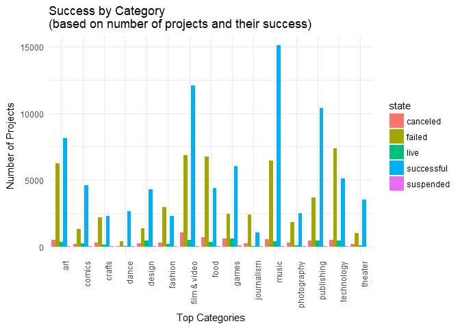
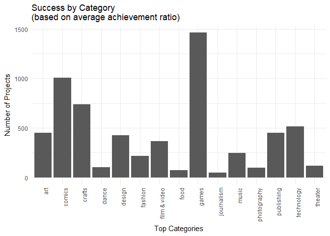
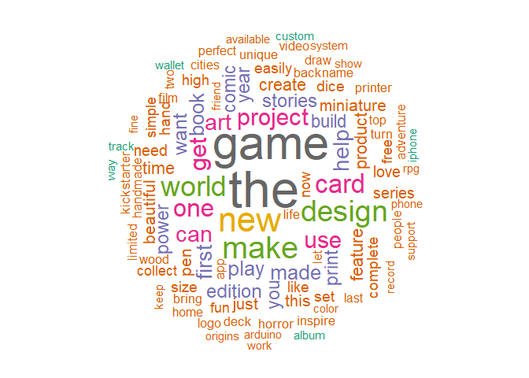
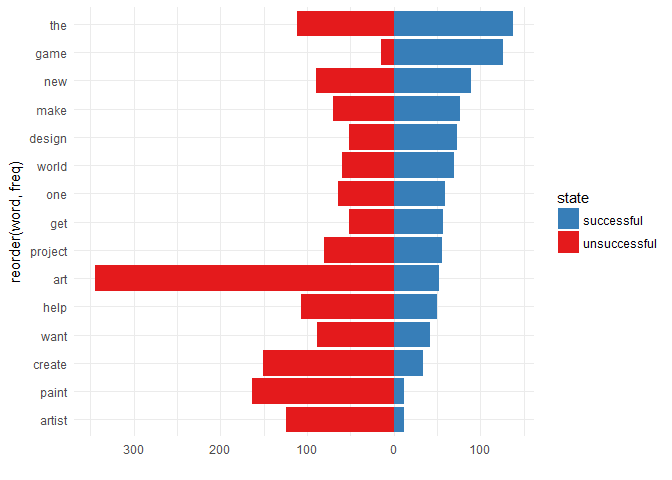
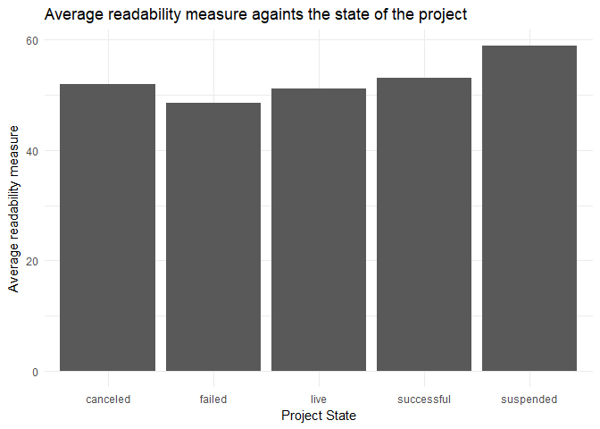
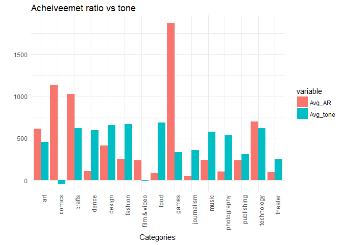
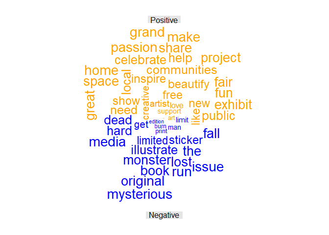
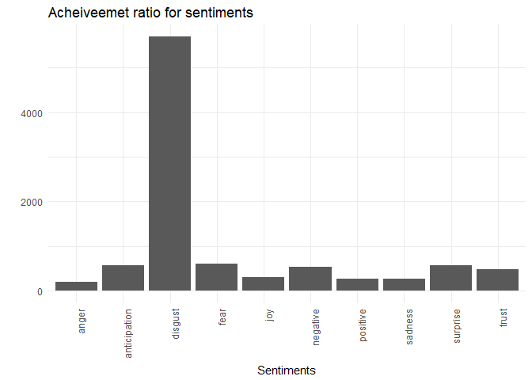

Text Mining Kickstarter Projects
================================


## Overview

Kickstarter is an American public-benefit corporation based in Brooklyn, New York, that maintains a global crowd funding platform focused on creativity.  The company's stated mission is to "help bring creative projects to life". 

Kickstarter has reportedly received more than $1.9 billion in pledges from 9.4 million backers to fund 257,000 creative projects, such as films, music, stage shows, comics, journalism, video games, technology and food-related projects.

For this assignment, I am asking you to analyze the descriptions of kickstarter projects to identify commonalities of successful (and unsuccessful projects) using the text mining techniques we covered in the past two lectures. 

## Data


```r
library(tidyverse)
library(readr)
library(ggplot2)
library(plyr)
library(dplyr)
library(tm) 
library(quanteda)
library(tidytext)
library(SnowballC)
library(wordcloud)
library(RColorBrewer)
library(tidytext)
library(reshape2)

KSP_data <- read_csv("kickstarter_projects.csv")
US_pop <- read_csv("US_Population.csv")
US_lat_lng <- read_csv("US_Long_Lat.csv")
```

## Tasks for the Assignment

### 1. Identifying Successful Projects

#### a) Success by Category

There are several ways to identify success of a project:  
  - State (`state`): Whether a campaign was successful or not.   
  - Pledged Amount (`pledged`)   
  - Achievement Ratio: Create a variable `achievement_ratio` by calculating the percentage of the original monetary `goal` reached by the actual amount `pledged` (that is `pledged`\\`goal` *100).    
  - Number of backers (`backers_count`)  
  - How quickly the goal was reached (difference between `launched_at` and `state_changed_at`) for those campaigns that were successful.  

Use one or more of these measures to visually summarize which categories were most successful in attracting funding on kickstarter. Briefly summarize your findings.
<br><br>
Ans: Two plots are created <br>
1. Success in terms of states of the projects in a particular category
2. Suceess in terms of achievement ratio


```r
TotalByCatState <- group_by(KSP_data, top_category, state) %>%
  tally()

plot_1a_1 <- ggplot(TotalByCatState, aes(x=top_category, y=n, fill=state)) +
  geom_bar(position="dodge", stat="identity") + 
  labs(title="Success by Category \n(based on number of projects and their success)", 
       x = "Top Categories", 
       y = "Number of Projects") + 
  theme_minimal() + 
  theme(axis.text.x = element_text(angle = 90, hjust = 1))

plot_1a_1
```

<!-- -->

```r
KSP_data$achievement_ratio <- (KSP_data$pledged/KSP_data$goal)*100

AvgAR_ByCategory <- KSP_data %>%
  group_by(top_category) %>%
  summarise(avg_AR = mean(achievement_ratio, na.rm=TRUE))

AvgAR_ByCategory <- KSP_data %>%
    group_by(top_category ) %>% 
    do(mutate(., Avg_AR = mean(.$achievement_ratio, na.rm=TRUE)))

plot_1a_2 <- ggplot(AvgAR_ByCategory, aes(x=top_category, y=Avg_AR)) +
  geom_bar(position="dodge", stat="identity") + 
  labs(title="Success by Category \n(based on average achievement ratio)", 
       x = "Top Categories", 
       y = "Number of Projects") + 
  theme_minimal() + 
  theme(axis.text.x = element_text(angle = 90, hjust = 1))

plot_1a_2
```

<!-- -->

<br>
#### **BONUS ONLY:** b) Success by Location

Now, use the location information to calculate the total number of successful projects by state (if you are ambitious, normalize by population). Also, identify the Top 50 "innovative" cities in the U.S. (by whatever measure you find plausible). Provide a leaflet map showing the most innovative states and cities in the U.S. on a single map based on these information.

<br>
Ans: Success of different states is measured after normalizing againts the population of that state to get the fair reflecion of the success. Click on the icon to get the normalized count of successful projects. 


```r
library(leaflet)

KSP_data_US <- filter(KSP_data, country == "USA", state == "successful")
Total_US_States <- group_by(KSP_data_US, location_state) %>%
  tally()
Total_US_States <- merge(x = Total_US_States , 
                         y = US_pop, 
                         by.x = "location_state", 
                         by.y="state_code")
Total_US_States$norm_count <- Total_US_States$n/Total_US_States$population*100000

colnames(Total_US_States) <-c("state", "no_of_proj", "names", "population", "norm_count") 

Total_US_States <- Total_US_States [, c(3,5)]
Total_US_States <- merge(x=Total_US_States, y=US_lat_lng, by="names")

popup_content <- paste("Success Count:",Total_US_States$norm_count,"<br/>")
                       
lf1 <- leaflet(Total_US_States) %>%
  addTiles() %>%
  addMarkers(popup = popup_content) %>%
  setView(lng = -98.5795, lat = 39.8283, zoom = 4) %>%
  addProviderTiles(providers$Stamen.TonerLite)

#lf1
```

<br>
### 2. Writing your success story

Each project contains a `blurb` -- a short description of the project. While not the full description of the project, the short headline is arguably important for inducing interest in the project (and ultimately popularity and success). Let's analyze the text.

#### a) Cleaning the Text and Word Cloud

To reduce the time for analysis, select the 1000 most successful projects and a sample of 1000 unsuccessful projects. Use the cleaning functions introduced in lecture (or write your own in addition) to remove unnecessary words (stop words), syntax, punctuation, numbers, white space etc. Note, that many projects use their own unique brand names in upper cases, so try to remove these fully capitalized words as well (since we are aiming to identify common words across descriptions). Stem the words left and complete the stems. Create a document-term-matrix.

Provide a word cloud of the most frequent or important words (your choice which frequency measure you choose) among the most successful projects.

<br><br>
Ans: Created document term matrix for most successful and unsuccessful projects and a wordcloud representing most used terms in successful projects


```r
KSP_MostSuccesful <- filter(KSP_data, state == "successful")
KSP_MostSuccesful <- head(arrange(KSP_MostSuccesful,desc(achievement_ratio)), n = 1000)

KSP_MostUnsuccessful <- filter(KSP_data, state == "failed")
KSP_MostUnsuccessful <- head(arrange(KSP_MostUnsuccessful,achievement_ratio), n = 1000)


#For most successful projects

KSP_MostSuccesful$blurb <- str_replace_all(KSP_MostSuccesful$blurb,"[[:punct:]\\s]+"," ")

#trimws(gsub("[[:alpha:]][A-Z]+|[A-Z][[:alpha:]]+$", "", "Hello MY21 LOVE L"))

#KSP_MostSuccesful$text <- trimws(gsub("[[:alpha:]][A-Z]+|[A-Z][[:alpha:]]+$", "", KSP_MostSuccesful$text))

KSP_MostSuccesful_blurr <- VCorpus(VectorSource(KSP_MostSuccesful$blurb))

KSP_MostSuccesful_blurr <- tm_map(KSP_MostSuccesful_blurr, removeWords, stopwords("en"))
KSP_MostSuccesful_blurr <- tm_map(KSP_MostSuccesful_blurr, removePunctuation)
KSP_MostSuccesful_blurr <- tm_map(KSP_MostSuccesful_blurr, removeNumbers)
KSP_MostSuccesful_blurr <- tm_map(KSP_MostSuccesful_blurr, stripWhitespace)

dict1 <- KSP_MostSuccesful_blurr
KSP_MostSuccesful_blurr <- tm_map(KSP_MostSuccesful_blurr, stemDocument)

stemCompletion_mod <- function(x,dict=dictCorpus) {
 PlainTextDocument(stripWhitespace(paste(stemCompletion(unlist(strsplit(as.character(x)," ")),dictionary=dict, type="shortest"),sep="", collapse=" ")))
}

KSP_MostSuccesful_blurr_Final <- lapply(KSP_MostSuccesful_blurr, stemCompletion_mod, dict=dict1)

KSP_MostSuccesful_blurr_Final <- VCorpus(VectorSource(KSP_MostSuccesful_blurr_Final))

KSP_Successful_dtm <- DocumentTermMatrix(KSP_MostSuccesful_blurr_Final)
KSP_Successful_m <- as.matrix(KSP_Successful_dtm)
KSP_Successful_v <- sort(colSums(KSP_Successful_m),decreasing=TRUE)
KSP_Successful_d <- data.frame(word=names(KSP_Successful_v),freq=KSP_Successful_v)

# For most unsuccessful projects

KSP_MostUnsuccessful$blurb <- str_replace_all(KSP_MostUnsuccessful$blurb,"[[:punct:]\\s]+"," ")

KSP_MostUnsuccessful$blurb <- str_trim(KSP_MostUnsuccessful$blurb)
KSP_MostUnsuccessful$blurb <- iconv(enc2utf8(KSP_MostUnsuccessful$blurb),sub="byte")

#trimws(gsub("[[:alpha:]][A-Z]+|[A-Z][[:alpha:]]+$", "", "Hello MY21 LOVE L"))

#KSP_MostSuccesful$text <- trimws(gsub("[[:alpha:]][A-Z]+|[A-Z][[:alpha:]]+$", "", KSP_MostSuccesful$text))

KSP_MostUnsuccessful_blurr <- VCorpus(VectorSource(KSP_MostUnsuccessful$blurb))

KSP_MostUnsuccessful_blurr <- tm_map(KSP_MostUnsuccessful_blurr, removeWords, stopwords("en"))
KSP_MostUnsuccessful_blurr <- tm_map(KSP_MostUnsuccessful_blurr, removePunctuation)
KSP_MostUnsuccessful_blurr <- tm_map(KSP_MostUnsuccessful_blurr, removeNumbers)
KSP_MostUnsuccessful_blurr <- tm_map(KSP_MostUnsuccessful_blurr, stripWhitespace)

dict2 <- KSP_MostUnsuccessful_blurr
KSP_MostUnsuccessful_blurr <- tm_map(KSP_MostUnsuccessful_blurr, stemDocument)

KSP_MostUnsuccessful_blurr_Final <- lapply(KSP_MostUnsuccessful_blurr, stemCompletion_mod, dict=dict2)

KSP_MostUnsuccessful_blurr_Final <- VCorpus(VectorSource(KSP_MostUnsuccessful_blurr_Final))

KSP_Unsuccessful_dtm <- DocumentTermMatrix(KSP_MostUnsuccessful_blurr_Final)
KSP_Unsuccessful_m <- as.matrix(KSP_Unsuccessful_dtm)
KSP_Unsuccessful_v <- sort(colSums(KSP_Unsuccessful_m),decreasing=TRUE)
KSP_Unsuccessful_d <- data.frame(word=names(KSP_Unsuccessful_v),freq=KSP_Unsuccessful_v)

# To create word cloud for most successful projects

set.seed(1234)
wordcloud(words = KSP_Successful_d$word, freq = KSP_Successful_d$freq, min.freq = 1,
          max.words=100, random.order=FALSE, rot.per=0.35, 
          colors=brewer.pal(8, "Dark2"))
```

<!-- -->

<br>
#### b) Success in words

Provide a pyramid plot to show how the words between successful and unsuccessful projects differ in frequency. A selection of 10 - 20 top words is sufficient here.  
<br>

Ans: Pyramid plot representing most used terms for sucessful and unsuccessful projects 


```r
head(KSP_Successful_d, 20)
```

```
##            word freq
## the         the  138
## game       game  126
## new         new   89
## make       make   77
## design   design   73
## world     world   70
## card       card   64
## one         one   59
## get         get   57
## project project   56
## use         use   55
## art         art   52
## can         can   52
## help       help   50
## first     first   48
## play       play   45
## book       book   44
## made       made   44
## want       want   42
## stories stories   40
```

```r
head(KSP_Unsuccessful_d, 20)
```

```
##            word freq
## art         art  345
## paint     paint  163
## create   create  151
## artist   artist  124
## the         the  111
## help       help  107
## new         new   89
## want       want   88
## project project   80
## show       show   78
## music     music   74
## make       make   70
## need       need   68
## one         one   64
## like       like   61
## work       work   61
## world     world   60
## print     print   55
## design   design   51
## fund       fund   51
```

```r
colnames(KSP_Successful_d) <- c("word","freq1")
colnames(KSP_Unsuccessful_d) <- c("word","freq2")
merge_df <- merge(x = KSP_Successful_d, y = KSP_Unsuccessful_d, by="word")
merge_df$total_count <- merge_df$freq1 + merge_df$freq2
top15_words <- head(arrange(merge_df, desc(total_count)), n = 15)

top15_words_successful <- KSP_Successful_d[KSP_Successful_d$word %in% top15_words$word, ]
top15_words_unsuccessful <- KSP_Unsuccessful_d[KSP_Unsuccessful_d$word %in% top15_words$word, ]

top15_words_successful$state <- "successful"
top15_words_unsuccessful$state <- "unsuccessful"

colnames(top15_words_successful) <- c("word","freq","state")
colnames(top15_words_unsuccessful) <- c("word","freq","state")

top15_words_unsuccessful$freq <- top15_words_unsuccessful$freq*(-1)
top15_words <- rbind(top15_words_successful, top15_words_unsuccessful)

pyramid_plot <- ggplot(top15_words, aes(x = reorder(word, freq), 
                  y = freq, fill = state)) +
  geom_bar(data = filter(top15_words, state == "successful"), stat = "identity") +  
  geom_bar(data = filter(top15_words, state == "unsuccessful"), stat = "identity") + 
  scale_fill_brewer(palette = "Set1", direction = -1) + coord_flip() + ylab("") +
  scale_y_continuous(breaks = pretty(top15_words$freq), labels = abs(pretty(top15_words$freq))) +
  theme_minimal()

pyramid_plot
```

<!-- -->

<br>
#### c) Simplicity as a virtue

These blurbs are short in length (max. 150 characters) but let's see whether brevity and simplicity still matters. Calculate a readability measure (Flesh Reading Ease, Flesh Kincaid or any other comparable measure) for the texts. Visualize the relationship between the readability measure and one of the measures of success. Briefly comment on your finding.

<br>

Ans: Comparision of the readability measure againts the project state. We can see that suspended and canceled projects tend to be less readble


```r
KSP_Data_Reordered <- arrange(KSP_data, state, desc(achievement_ratio))

KSP_Data_Reordered <- ddply(KSP_Data_Reordered, "state", function(x) head(x, 200))

KSP_Data_Reordered$blurb <- str_replace_all(KSP_Data_Reordered$blurb,"[[:punct:]\\s]+"," ")

KSP_Data_Reordered$blurb <- str_trim(KSP_Data_Reordered$blurb)
KSP_Data_Reordered$blurb <- iconv(enc2utf8(KSP_Data_Reordered$blurb),sub="byte")

names(KSP_Data_Reordered)[2]<-paste("text")
KSP_Data_Reordered$doc_id <- seq.int(nrow(KSP_Data_Reordered))


KSP_Top5EachState <- Corpus(DataframeSource(KSP_Data_Reordered))

KSP_Top5EachState_corpus <- corpus(KSP_Top5EachState)

KSP_Top5EachState_Measure <- textstat_readability(KSP_Top5EachState_corpus, measure=c('Flesch', 'Flesch.Kincaid'))

KSP_Top5EachState_Measure$doc_id <- seq.int(nrow(KSP_Top5EachState_Measure))

KSP_Data_Reordered <- merge(x = KSP_Data_Reordered, y = KSP_Top5EachState_Measure, by="doc_id")

KSP_Data_Reordered <- KSP_Data_Reordered[ , -which(names(KSP_Data_Reordered) %in% c("document"))]

names(KSP_Data_Reordered)[26]<-paste("Flesch")
names(KSP_Data_Reordered)[27]<-paste("Flesch_Kincaid")

KSP_Data_Reordered <- KSP_Data_Reordered %>%
    group_by(state ) %>% 
    do(mutate(., Avg_Flesch = mean(.$Flesch))) %>% 
    do(mutate(., Avg_Flesch_Kincaid = mean(.$Flesch_Kincaid)))

plot_2c <- ggplot(KSP_Data_Reordered, aes(x=state, y=Avg_Flesch)) +
  geom_bar(position="dodge", stat="identity") + 
  labs(title="Average readability measure againts the state of the project", 
       x = "Project State", 
       y = "Average readability measure") + 
  theme_minimal() 
#+ theme(axis.text.x = element_text(angle = 90, hjust = 1))

plot_2c
```

<!-- -->

<br>
### 3. Sentiment

Now, let's check whether the use of positive / negative words or specific emotions helps a project to be successful. 

#### a) Stay positive

Calculate the tone of each text based on the positive and negative words that are being used. You can rely on the Hu & Liu dictionary provided in lecture or use the Bing dictionary contained in the tidytext package (`tidytext::sentiments`). Visualize the relationship between tone of the document and success. Briefly comment.

<br><br>
Ans: Comparing the tone of the description againts the success for all the categories. Average tone seems to be positive for all the categories except comics and films. Comics have achieved high success even with the negative tone. Compared to that films and videos have not been that successful.  


```r
pos <- read.table("positive-words.txt", as.is=T)
neg <- read.table("negative-words.txt", as.is=T)

KSP_Data_New <- KSP_data
KSP_Data_New$doc_id <- seq.int(nrow(KSP_Data_New))
KSP_Data_New$blurb <- str_replace_all(KSP_Data_New$blurb,"[[:punct:]\\s]+"," ")
KSP_Data_New$blurb <- str_trim(KSP_Data_New$blurb)
KSP_Data_New$blurb <- iconv(enc2utf8(KSP_Data_New$blurb),sub="byte")

KSP_Data_New$blurb <- removeWords(KSP_Data_New$blurb, stopwords("en"))
KSP_Data_New$blurb <- removeNumbers(KSP_Data_New$blurb)
KSP_Data_New$blurb <- stripWhitespace(KSP_Data_New$blurb)

names(KSP_Data_New)[2]<-paste("text")

KSP_Data_words <- KSP_Data_New %>%
  unnest_tokens(word, text)

KSP_data_sentiment <- merge(x= KSP_Data_words, y = get_sentiments("bing"), by = "word")

KSP_data_sentiment_Tally <- group_by(KSP_data_sentiment, doc_id, sentiment) %>%
  tally()

KSP_data_sentiment_Tally <- dcast(melt(KSP_data_sentiment_Tally,id.vars = 1:2),doc_id ~ sentiment, fun.aggregate = sum,value.var = "value")

KSP_Data_New_Sentiments <- merge(x=KSP_Data_New, y=KSP_data_sentiment_Tally, by="doc_id")

KSP_Data_New_Sentiments <- KSP_Data_New_Sentiments %>%
  mutate(KSP_Data_New_Sentiments , tone = (positive - negative)/(positive + negative))

KSP_Data_New_Sentiments <- KSP_Data_New_Sentiments %>%
    group_by(top_category ) %>% 
    do(mutate(., Avg_AR = mean(.$achievement_ratio, na.rm = TRUE))) %>% 
    do(mutate(., Avg_tone = mean(.$tone, na.rm = TRUE)))


KSP_dfm <- distinct(KSP_Data_New_Sentiments[,c('top_category','Avg_AR','Avg_tone')])
KSP_dfm$Avg_tone <- KSP_dfm$Avg_tone*1000

KSP_dfm <- melt(distinct(KSP_dfm[,c('top_category','Avg_AR','Avg_tone')]),id.vars = 1)

plot_3a <- ggplot(KSP_dfm, aes(x=top_category, y=value, fill=variable)) +
  geom_bar(position="dodge", stat="identity") + 
  labs(title="Acheiveemet ratio vs tone", 
       x = "Categories", 
       y = "") + 
  theme_minimal() +
  theme(axis.text.x = element_text(angle = 90, hjust = 1))


plot_3a
```

<!-- -->

<br>

#### b) Positive vs negative

Segregate all 2,000 blurbs into positive and negative texts based on their polarity score calculated in step (a). Now, collapse the positive and negative texts into two larger documents. Create a document-term-matrix based on this collapsed set of two documents. Generate a comparison cloud showing the most-frequent positive and negative words.  

<br><br>
Ans: Creating a comparision cloud for words used in successful project and unsuccessful projects


```r
Positive1000 <- head(arrange(KSP_Data_New_Sentiments, desc(tone)), n = 1000)
Negative1000 <- head(arrange(KSP_Data_New_Sentiments, tone), n = 1000)

positive <- paste(Positive1000$text, collapse =" ")
negative <- paste(Negative1000$text, collapse = " ")

PosNeg1000 <- data.frame(texts = c(positive, negative))

# Following code was added to remove strange characters
PosNeg1000$texts <- str_replace_all(PosNeg1000$texts,"[[:punct:]\\s]+"," ")
PosNeg1000$texts <- iconv(enc2utf8(PosNeg1000$texts), "latin1", "ASCII",sub="byte")

#colnames(PosNeg1000) <- c("text", "doc_id")
PosNeg1000_Corpus <- VCorpus(VectorSource(PosNeg1000$texts))

PosNeg1000_Corpus <- tm_map(PosNeg1000_Corpus, removePunctuation)
PosNeg1000_Corpus <- tm_map(PosNeg1000_Corpus, removeNumbers)
PosNeg1000_Corpus <- tm_map(PosNeg1000_Corpus, stripWhitespace)
PosNeg1000_Corpus <- tm_map(PosNeg1000_Corpus, removeWords, stopwords("en"))

dict4 <- PosNeg1000_Corpus
PosNeg1000_Corpus <- tm_map(PosNeg1000_Corpus, stemDocument)

PosNeg1000_Corpus <- lapply(PosNeg1000_Corpus, stemCompletion_mod, dict=dict4)

PosNeg1000_Corpus <- VCorpus(VectorSource(PosNeg1000_Corpus))

PosNeg1000_dtm <- TermDocumentMatrix(PosNeg1000_Corpus)

PosNeg1000_m <- as.matrix(PosNeg1000_dtm)

colnames(PosNeg1000_m) <- c("Positive", "Negative")

comparison.cloud(PosNeg1000_m, colors = c("orange", "blue"), 
                 scale=c(0.1,2), title.size= 1, 
                 max.words = 50)
```

<!-- -->

<br>
#### c) Get in their mind

Now, use the NRC Word-Emotion Association Lexicon in the tidytext package to identify a larger set of emotions (anger, anticipation, disgust, fear, joy, sadness, surprise, trust). Again, visualize the relationship between the use of words from these categories and success. What is your finding?

<br>
Ans: Ploting success againts the sentiments of the project description. Surprisingly disgust sentiment has high success rate. Anger sentiment seems to have lowest success.


```r
get_sentiments("nrc")
```

```
## # A tibble: 13,901 x 2
##    word        sentiment
##    <chr>       <chr>    
##  1 abacus      trust    
##  2 abandon     fear     
##  3 abandon     negative 
##  4 abandon     sadness  
##  5 abandoned   anger    
##  6 abandoned   fear     
##  7 abandoned   negative 
##  8 abandoned   sadness  
##  9 abandonment anger    
## 10 abandonment fear     
## # ... with 13,891 more rows
```

```r
KSP_Data_SenNRC <- KSP_Data_New %>%
  unnest_tokens(word, text)

KSP_Data_SenNRC <- merge(x=KSP_Data_SenNRC, y=get_sentiments("nrc"), by="word")

KSP_Data_TopSent_Doc <- group_by(KSP_Data_SenNRC, doc_id, sentiment) %>%
  tally()

KSP_Data_TopSent_Doc <- arrange(KSP_Data_TopSent_Doc, doc_id, desc(n))

KSP_Data_TopSent_Doc <- ddply(KSP_Data_TopSent_Doc, "doc_id", function(x) head(x, 1))

KSP_Data_New_SentNRC <- merge(x=KSP_Data_New, y=KSP_Data_TopSent_Doc, by="doc_id")

KSP_Data_New_SentNRC <- KSP_Data_New_SentNRC %>%
    group_by(sentiment ) %>% 
    do(mutate(., Avg_AR = mean(.$achievement_ratio, na.rm = TRUE)))

KSP_Orderd_NRC <- arrange(KSP_Data_New_SentNRC, sentiment, desc(Avg_AR))
KSP_Orderd_NRC <- ddply(KSP_Orderd_NRC, "sentiment", function(x) head(x, 1))

plot_3c <- ggplot(KSP_Orderd_NRC, aes(x=sentiment, y=Avg_AR)) +
  geom_bar(position="dodge", stat="identity") + 
  labs(title="Acheiveemet ratio for sentiments", 
       x = "Sentiments", 
       y = "") + 
  theme_minimal() +
  theme(axis.text.x = element_text(angle = 90, hjust = 1))

plot_3c
```

<!-- -->

<br>

## Thank You
