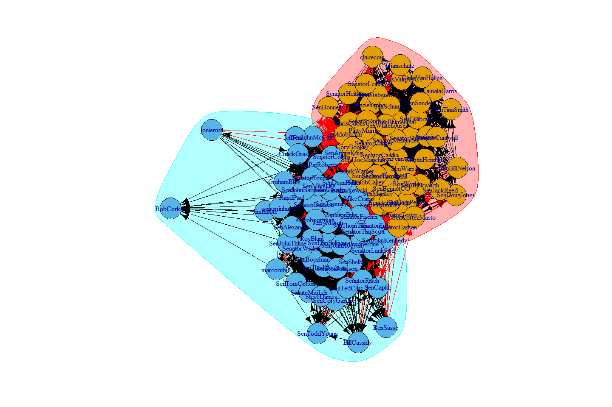

Network Analysis of U.S. Senate Tweets
================================


## Overview

Twitter is a great tool to analyze the public interactions of political actors. For this assignment, I want you to use the information about who follows whom on Twitter as well as past tweets of the current U.S. Senate members to analyze how they interact and what they tweet about. 

## Data

#### Twitter Handles of Senators

Twitter does not allow us to search for past tweets based on keywords, location, or topics (hashtags). However, we are able to obtain the past tweets of users if we specify their Twitter handle. The file `senators_twitter.csv` contains the Twitter handles of the current U.S. Senate members (obtained from [SocialSeer](https://www.socialseer.com/resources/us-senator-twitter-accounts/)). We will focus on the Senators' _official Twitter accounts_ (as opposed to campaign or staff members). I have also added information on the party affiliation of the Senators from [here](https://ballotpedia.org/List_of_current_members_of_the_U.S._Congress).

#### Followers

The file `senators_follow.csv` contains an edge list of connections between each pair of senators who are connected through a follower relationship (this information was obtained using the function `rtweet::lookup_friendships`). The file is encoded such that the `source` is a follower of the `target`. You will need to use the subset of `following = TRUE` to identify the connections for which the `source` follows the `target`.

#### Tweets by Senators

To make your life a bit easier, I have also already downloaded all available tweets for these Twitter accounts using the following code. You **do not need to repeat this step**. Simply rely on the file `senator_tweets.RDS` in the exercise folder.


```r
library(tidyverse)
library(lubridate)
library(dplyr)

# Read in the Senator Data
senate <- read_csv("senators_twitter.csv")

# Get Tweets
senator_tweets <- get_timeline(user = senate$`Official Twitter`,
    n = 3200, ## number of tweets to download (max is 3,200)
    )

saveRDS(senator_tweets, "senator_tweets.RDS")
```


```r
# Read in the Tweets
senator_tweets <- readRDS("senator_tweets.RDS")

# How limiting is the API limit?
senator_tweets %>% 
  group_by(screen_name) %>% 
  summarize(n_tweet = n(),
            oldest_tweet = min(created_at)) %>%
  arrange(desc(oldest_tweet))
```

The data contains about 170k tweets and about 40 variables. Please note, that the API limit of 3,200 tweets per twitter handle actually cuts down the time period we can observe the most prolific Twitter users in the Senate down to only about one year into the past.


```r
library(tidyverse)
library(dplyr)
library(ggplot2)
library(ggraph)
library(kableExtra)
library(GGally)
library(ggnet)
library(network)
library(sna)
library(ggnetwork)
library(widgetframe)
library(DT)
library(igraph)
library(tm)
library(SnowballC)
library(wordcloud)
library(RColorBrewer)
library(plotly)

senators_follow <- read_csv("senators_follow.csv")
senators_twitter <- read_csv("senators_twitter.csv")
senator_tweets <- readRDS("senator_tweets.RDS")
```
## Tasks for the Assignment

### 1. Who follows whom?

#### a) Network of Followers

Read in the edgelist of follower relationships from the file `senators_follow.csv`. Create a directed network graph. Identify the three senators who are followed by the most of their colleagues (i.e. the highest "in-degree") and the three senators who follow the most of their colleagues (i.e. the highest "out-degree"). [Hint: You can get this information simply from the data frame or use `igraph` to calculate the number of in and out connections: `indegree = igraph::degree(g, mode = "in")`.] Visualize the network of senators. In the visualization, highlight the party ID of the senator nodes with an appropriate color (blue = Democrat, red = Republican) and size the nodes by the centrality of the nodes to the network. Briefly comment.

Ans: The two tables list the senators that are followed by most of their colleagues and senators who follow most of their colleagues.


```r
senators_follow1 <- senators_follow[, 1:3] 

senators_follow1 <- filter(senators_follow1, following == "TRUE")

g1 <- graph.data.frame(senators_follow1, directed = TRUE)

V(g1)$followers <- degree(g1, mode="in")
V(g1)$following <- degree(g1, mode="out")

frameWidget(datatable(head(arrange(data_frame(
  Senator = V(g1)$name, 
  Followers = V(g1)$followers), 
  desc(V(g1)$followers)
  ),3), caption =  "Senators followed by the most of their colleaguess"))
```

<!--html_preserve--><div id="htmlwidget-141dc2c5acaa436a8b16" style="width:100%;height:480px;" class="widgetframe html-widget"></div>
<script type="application/json" data-for="htmlwidget-141dc2c5acaa436a8b16">{"x":{"url":"assignment4_senate_twitter_files/figure-html//widgets/widget_task1a.html","options":{"xdomain":"*","allowfullscreen":false,"lazyload":false}},"evals":[],"jsHooks":[]}</script><!--/html_preserve-->

```r
frameWidget(datatable(head(arrange(data_frame(
  Senator = V(g1)$name, 
  Following = V(g1)$following), 
  desc(V(g1)$following)
  ),3), caption =  "Senators who follow the most of their colleagues"))
```

<!--html_preserve--><div id="htmlwidget-2d87df75ee2a6a7a665f" style="width:100%;height:480px;" class="widgetframe html-widget"></div>
<script type="application/json" data-for="htmlwidget-2d87df75ee2a6a7a665f">{"x":{"url":"assignment4_senate_twitter_files/figure-html//widgets/widget_task1a.html","options":{"xdomain":"*","allowfullscreen":false,"lazyload":false}},"evals":[],"jsHooks":[]}</script><!--/html_preserve-->

The network below displays the connections between senators on twitter


```r
g1_matrix <- data.matrix(get.adjacency(g1))
g1_network <- network(g1_matrix, directed = TRUE)
g1_network %v% "followers" <- degree(g1, mode="in")
g1_network %v% "following" <- degree(g1, mode="out")
#g1_network %v% "party" <- V(g1)$Party

set.seed(2505)
g1_network_df <- ggnetwork(g1_network, 
                    layout = "fruchtermanreingold", 
                    cell.jitter = 0.75)

senators_twitter1 <- senators_twitter[,c(3,6)]
colnames(senators_twitter1) <- c("twitterID","Party")

g1_network_df <- merge(x=g1_network_df, y=senators_twitter1, by.x = "vertex.names", by.y= "twitterID", na.rm = FALSE)

g1_network_df$Sum <- g1_network_df$followers + g1_network_df$following

g1_network_df$x <- g1_network_df$x[,1]
g1_network_df$y <- g1_network_df$y[,1]
g1_network_df$xend <- g1_network_df$xend[,1]
g1_network_df$yend <- g1_network_df$yend[,1]

ggplot(g1_network_df, aes(x, y, xend = xend, yend = yend)) +
  geom_edges(alpha = 0.1, size=0.01) +
  geom_nodes(aes(size = Sum, color = Party)) +
  scale_color_manual(values=c("blue", "green", "red")) +
  geom_nodetext(aes(label = vertex.names)) +
    labs(title="Network of Senators\nfollowing each other", 
       size="Centrality",
       colors="Party") +
  theme_blank()
```

<!-- -->


#### b) Communities

Now let's see whether party identification is also recovered by an automated mechanism of cluster identification. Use the `cluster_walktrap` command in the `igraph` package to find densely connected subgraphs. 
Based on the results, visualize how well this automated community detection mechanism recovers the party affiliation of senators. This visualization need not be a network graph. Comment briefly. 

Ans: A cluster graph and for more clear understanding a dendrograph is also created. If we check the party affiliations of closely related senators they seem to be from the same party.
Most of the senators on the left side of the dendrogram (blue cluster in network) are from 'Republican Party', whereas most of the senators on the right side of the dendrogram (red cluster in network) are from 'Democratic Party'


```r
# Sample Code for a graph object "g"
wc <- cluster_walktrap(g1)  # find "communities"
members <- membership(wc)
plot(wc, g1)
```

<!-- -->

```r
plot(as.hclust(wc))
```

<!-- -->

### 2. What are they tweeting about?

From now on, rely on the information from the tweets stored in `senator_tweets.RDS`.


#### a) Most Common Topics over Time

Remove all tweets that are re-tweets (`is_retweet`) and identify which topics the senators tweet about. Rather than a full text analysis, just use the variable `hashtags` and identify the most common hashtags over time. Provide a visual summary.

Ans: Two different plots are provided one showing the most frequently used hashtags and their trend over recent years. Other plot shows most used hashtags in last three years separately.
From the first plot we can see that 'net neutrality' and 'tax reform' are very highly spoken about topics in recent years. From second plot we can find out which topics were most popular in last three years. In 2016 people talked mostly about presidential debates and zika virus. In 2017 people were talking mostly about trumpcare which was introduced on March 20, 2017. In 2018 most talked about topics were net neutrality, sotu, and trumpshutdown.


```r
#senator_tweets <- readRDS("senator_tweets.RDS")

senator_tweets_NoRT <- filter(senator_tweets, is_retweet=="FALSE")

senator_tweets_NoRT_recent <- subset(senator_tweets_NoRT, substr(created_at, 1, 4) =="2018" | substr(created_at, 1, 4) =="2017" | substr(created_at, 1, 4) =="2016")
senator_tweets_NoRT_recent <- head(arrange(senator_tweets_NoRT_recent, desc(favorite_count)), 20000)

#senator_tweets_NoRT_recent <- head(arrange(senator_tweets_NoRT, desc(created_at)), 5000)
senator_tweets_NoRT_recent_Corpus <- VCorpus(VectorSource(senator_tweets_NoRT_recent$hashtags))
senator_tweets_NoRT_recent_dtm <- DocumentTermMatrix(senator_tweets_NoRT_recent_Corpus)
senator_tweets_NoRT_recent_m <- as.matrix(senator_tweets_NoRT_recent_dtm)
senator_tweets_NoRT_recent_v <- sort(colSums(senator_tweets_NoRT_recent_m),decreasing=TRUE)
senator_tweets_NoRT_recent_d <- data.frame(word=names(senator_tweets_NoRT_recent_v),
                                           freq=senator_tweets_NoRT_recent_v)

senator_tweets_NoRT_recent_d_Top <- head(arrange(senator_tweets_NoRT_recent_d, 
                                                 desc(freq)), 20)

senator_tweets_NoRT_hashtags <- senator_tweets_NoRT[,c("created_at","hashtags")]
senator_tweets_NoRT_hashtags$hashtags <- gsub("c\\(|\\)|\"", "",
                                              senator_tweets_NoRT_hashtags$hashtags)

s1 <- strsplit(senator_tweets_NoRT_hashtags$hashtags, split = ",")
senator_tweets_NoRT_hashtags <- data.frame(
  created_at = rep(senator_tweets_NoRT_hashtags$created_at, 
                   sapply(s1, length)), hashtags = unlist(s1))

senator_tweets_NoRT_hashtags <- merge(x=senator_tweets_NoRT_hashtags, 
                                      y=senator_tweets_NoRT_recent_d_Top,
                                      by.x="hashtags",
                                      by.y="word")

senator_tweets_NoRT_hashtags <- subset(senator_tweets_NoRT_hashtags, substr(created_at, 1, 4) =="2018" | substr(created_at, 1, 4) =="2017" | substr(created_at, 1, 4) =="2016")

senator_tweets_NoRT_hashtags$month <- substr(senator_tweets_NoRT_hashtags$created_at, 1, 7)

senator_tweets_NoRT_hashtags <- senator_tweets_NoRT_hashtags %>%
  group_by(hashtags, month) %>%
  summarise(Count = n())

plot_2a <- ggplot(senator_tweets_NoRT_hashtags, aes(x=month, y=Count, group=1)) +
  geom_point(aes(color=hashtags))+
  labs(title="Most frequently used Hashtags over recent years", 
       x = "", 
       y = "") + 
  theme_minimal() +
  theme(axis.text.x = element_text(angle = 90, hjust = 1))
  
sen_NoRT_2018 <- filter(senator_tweets_NoRT, substr(created_at, 1, 4) =="2018")
sen_NoRT_2018 <- head(arrange(sen_NoRT_2018, desc(favorite_count)), 10000)

sen_NoRT_2018_Corpus <- VCorpus(VectorSource(sen_NoRT_2018$hashtags))
sen_NoRT_2018_dtm <- DocumentTermMatrix(sen_NoRT_2018_Corpus)
sen_NoRT_2018_m <- as.matrix(sen_NoRT_2018_dtm)
sen_NoRT_2018_v <- sort(colSums(sen_NoRT_2018_m),decreasing=TRUE)
sen_NoRT_2018_d <- data.frame(word=names(sen_NoRT_2018_v),freq=sen_NoRT_2018_v)

sen_NoRT_2017 <- filter(senator_tweets_NoRT, substr(created_at, 1, 4) =="2017")
sen_NoRT_2017 <- head(arrange(sen_NoRT_2017, desc(favorite_count)), 10000)

sen_NoRT_2017_Corpus <- VCorpus(VectorSource(sen_NoRT_2017$hashtags))
sen_NoRT_2017_dtm <- DocumentTermMatrix(sen_NoRT_2017_Corpus)
sen_NoRT_2017_m <- as.matrix(sen_NoRT_2017_dtm)
sen_NoRT_2017_v <- sort(colSums(sen_NoRT_2017_m),decreasing=TRUE)
sen_NoRT_2017_d <- data.frame(word=names(sen_NoRT_2017_v),freq=sen_NoRT_2017_v)

sen_NoRT_2016 <- filter(senator_tweets_NoRT, substr(created_at, 1, 4) =="2016")
sen_NoRT_2016 <- head(arrange(sen_NoRT_2016, desc(favorite_count)), 10000)

sen_NoRT_2016_Corpus <- VCorpus(VectorSource(sen_NoRT_2016$hashtags))
sen_NoRT_2016_dtm <- DocumentTermMatrix(sen_NoRT_2016_Corpus)
sen_NoRT_2016_m <- as.matrix(sen_NoRT_2016_dtm)
sen_NoRT_2016_v <- sort(colSums(sen_NoRT_2016_m),decreasing=TRUE)
sen_NoRT_2016_d <- data.frame(word=names(sen_NoRT_2016_v),freq=sen_NoRT_2016_v)

sen_NoRT_2018_d_Top <- head(arrange(sen_NoRT_2018_d, desc(freq)), 10)
sen_NoRT_2017_d_Top <- head(arrange(sen_NoRT_2017_d, desc(freq)), 10)
sen_NoRT_2016_d_Top <- head(arrange(sen_NoRT_2016_d, desc(freq)), 10)

plot_2a_1 <- ggplot(sen_NoRT_2018_d_Top, aes(x=word, y=freq)) +
  geom_bar(position="dodge", stat="identity", fill="Red") + 
  labs(title="Most frequently used Hashtags \nby senators in 2018", 
       x = "", 
       y = "") + 
  theme_minimal() + 
  theme(axis.text.x = element_text(angle = 90, hjust = 1))

plot_2a_2 <- ggplot(sen_NoRT_2017_d_Top, aes(x=word, y=freq)) +
  geom_bar(position="dodge", stat="identity", fill="Blue") + 
  labs(title="Most frequently used Hashtags \nby senators in 2017", 
       x = "", 
       y = "") + 
  theme_minimal() + 
  theme(axis.text.x = element_text(angle = 90, hjust = 1))

plot_2a_3 <- ggplot(sen_NoRT_2016_d_Top, aes(x=word, y=freq)) +
  geom_bar(position="dodge", stat="identity", fill="Green") + 
  labs(title="Most frequently used Hashtags \nby senators in 2016", 
       x = "", 
       y = "") + 
  theme_minimal() + 
  theme(axis.text.x = element_text(angle = 90, hjust = 1))

plot_2a
```

<!-- -->

```r
# This function code is taken From 'http://www.cookbook-r.com/Graphs/Multiple_graphs_on_one_page_(ggplot2)/'
multiplot(plot_2a_1, plot_2a_2, plot_2a_3, cols=3)
```

<!-- -->

#### b) Democrats vs. Republicans

Some tweets are as old as 10 years but for some prolific users we observe a much shorter time span of Twitter activity. Feel free to subset the data to only include more recent tweets. Using the party ID variable (`Party affiliation`), identify how the choice of topics tweeted about (again using using hashtags) differs by party and visualize that information.

Ans: The comparision between two topics tweeted about by two different parties is provided. As we can see Republicans are mostly talking about tax reform. Democrats mostly talk about Net Neutrality. They have also tweeted about 'March for Our Lives' which a student-led demonstration in support of tighter gun control. By looking at the given visualization they do not seem to have many topics in common. 


```r
#senator_tweets_NoRT <- filter(senator_tweets, is_retweet=="FALSE")

senator_tweets_NoRT <- merge(x=senator_tweets_NoRT, y=senators_twitter1, by.x = "screen_name", by.y= "twitterID", na.rm = FALSE)

sen_Demo <- filter(senator_tweets_NoRT, Party=="Democratic Party")
sen_Demo <- head(arrange(sen_Demo, desc(created_at)), 10000)
sen_Demo_Corpus <- VCorpus(VectorSource(sen_Demo$hashtags))
sen_Demo_dtm <- DocumentTermMatrix(sen_Demo_Corpus)
sen_Demo_m <- as.matrix(sen_Demo_dtm)
sen_Demo_v <- sort(colSums(sen_Demo_m),decreasing=TRUE)
sen_Demo_d <- data.frame(word=names(sen_Demo_v),freq=sen_Demo_v)

sen_Rep <- filter(senator_tweets_NoRT, Party=="Republican Party")
sen_Rep <- head(arrange(sen_Rep, desc(created_at)), 10000)
sen_Rep_Corpus <- VCorpus(VectorSource(sen_Rep$hashtags))
sen_Rep_dtm <- DocumentTermMatrix(sen_Rep_Corpus)
sen_Rep_m <- as.matrix(sen_Rep_dtm)
sen_Rep_v <- sort(colSums(sen_Rep_m),decreasing=TRUE)
sen_Rep_d <- data.frame(word=names(sen_Rep_v),freq=sen_Rep_v)

sen_Demo_d_Top <- head(arrange(sen_Demo_d, desc(freq)), 10)
sen_Rep_d_Top <- head(arrange(sen_Rep_d, desc(freq)), 10)

plot_2b_1 <- ggplot(sen_Demo_d_Top, aes(x=word, y=freq)) +
  geom_bar(position="dodge", stat="identity", fill="Blue") + 
  labs(title="Most Frequently Used Hashtags\nBy Senators of Democratic Party", 
       x = "", 
       y = "") + 
  theme_minimal() + 
  theme(axis.text.x = element_text(angle = 90, hjust = 1))

plot_2b_2 <- ggplot(sen_Rep_d_Top, aes(x=word, y=freq)) +
  geom_bar(position="dodge", stat="identity", fill="Red") + 
  labs(title="Most Frequently Used Hashtags\nBy Senators of Republican Party", 
       x = "", 
       y = "") + 
  theme_minimal() + 
  theme(axis.text.x = element_text(angle = 90, hjust = 1))

# This function code is taken From 'http://www.cookbook-r.com/Graphs/Multiple_graphs_on_one_page_(ggplot2)/'
multiplot(plot_2b_1, plot_2b_2, cols=2)
```

<!-- -->


#### c) Gun Control I - Dems vs. Reps

The democratic party seems broadly more supportive of gun control legislation. Try to identify a set of 5-10 hashtags that signal support for gun control legislation (e.g. "`NeverAgain`", `#guncontrol`, `#guncontrolnow`, `#Enough`) and others that are expressing support for the right to own guns (e.g. `#2ndamendment`, `#NRA`, `#liberals`). The site [ritetag.com](https://ritetag.com/best-hashtags-for/gun%20control) can help with that task. Using the subset of senator tweets that included these hashtags, show whether and how senators from different parties talk differently about the issue of gun legislation.  

Ans: Two pie charts are provided. We can see that most of the democrats seem to be in favor of gun control legislation whereas most of the republicans are in support of right to own the guns.


```r
pro_gun_hashtags <- c("#2ndamendment", "#NRA", "#nra", "#liberals", "#gunrights", "#progun", "#secondamendment", "#nramember", "#rights")

pro_gun <- filter(senator_tweets_NoRT, grepl(paste(pro_gun_hashtags,collapse="|"), text))

anti_gun_hashtags <- c("#NeverAgain", "#guncontrol", "#guncontrolnow", "#Enough", "#GunReformNow", "#BoycottNRA", "#gunsense" )

anti_gun <- filter(senator_tweets_NoRT, grepl(paste(anti_gun_hashtags,collapse="|"), text))

pro_gun <- pro_gun %>%
  group_by(Party) %>%
  summarise(Count = n())

anti_gun <- anti_gun %>%
  group_by(Party) %>%
  summarise(Count = n())

pro_gun$Percentage <- (pro_gun$Count)/(colSums(pro_gun[,2]))*100
anti_gun$Percentage <- (anti_gun$Count)/(colSums(anti_gun[,2]))*100

#anti_gun$label_pos <- cumsum(anti_gun$Percentage) - perc / 2

#plot_2c_1 <- ggplot(anti_gun, aes(x="", y=Percentage, fill=Party)) +
#  geom_bar(width = 1, stat = "identity") +
#  geom_text(aes(label = Percentage), size=5) +
#  coord_polar("y", start=0)

#plot_2c_2 <- ggplot(pro_gun, aes(x="", y=Percentage, fill=Party)) +
#  geom_bar(width = 1, stat = "identity") +
#  coord_polar("y", start=0)

#plot_2c_1 <- ggplotly(plot_2c_1)
#plot_2c_2 <- ggplotly(plot_2c_2)

plot_2c_1 <- plot_ly(anti_gun, labels = ~Party, values = ~Count, type = 'pie',
                     marker = list(colors = c("dodgerblue", "greenyellow", "red"),
                     line = list(color = '#FFFFFF', width = 1))) %>%
  layout(title = 'Tweets in support for gun control legislation',
         xaxis = list(showgrid = FALSE, zeroline = FALSE, showticklabels = FALSE),
         yaxis = list(showgrid = FALSE, zeroline = FALSE, showticklabels = FALSE))

plot_2c_2 <- plot_ly(pro_gun, labels = ~Party, values = ~Count, type = 'pie',
                     marker = list(colors = c("dodgerblue", "red"),
                     line = list(color = '#FFFFFF', width = 1))) %>%
  layout(title = 'Tweets in support for the right to own guns',
         xaxis = list(showgrid = FALSE, zeroline = FALSE, showticklabels = FALSE),
         yaxis = list(showgrid = FALSE, zeroline = FALSE, showticklabels = FALSE))

plot_2c_1
```

<!--html_preserve--><div id="htmlwidget-75c1194e18560a9214f4" style="width:672px;height:480px;" class="plotly html-widget"></div>
<script type="application/json" data-for="htmlwidget-75c1194e18560a9214f4">{"x":{"visdat":{"2e546aa060cc":["function () ","plotlyVisDat"]},"cur_data":"2e546aa060cc","attrs":{"2e546aa060cc":{"labels":{},"values":{},"marker":{"colors":["dodgerblue","greenyellow","red"],"line":{"color":"#FFFFFF","width":1}},"alpha_stroke":1,"sizes":[10,100],"spans":[1,20],"type":"pie"}},"layout":{"margin":{"b":40,"l":60,"t":25,"r":10},"title":"Tweets in support for gun control legislation","xaxis":{"showgrid":false,"zeroline":false,"showticklabels":false},"yaxis":{"showgrid":false,"zeroline":false,"showticklabels":false},"hovermode":"closest","showlegend":true},"source":"A","config":{"modeBarButtonsToAdd":[{"name":"Collaborate","icon":{"width":1000,"ascent":500,"descent":-50,"path":"M487 375c7-10 9-23 5-36l-79-259c-3-12-11-23-22-31-11-8-22-12-35-12l-263 0c-15 0-29 5-43 15-13 10-23 23-28 37-5 13-5 25-1 37 0 0 0 3 1 7 1 5 1 8 1 11 0 2 0 4-1 6 0 3-1 5-1 6 1 2 2 4 3 6 1 2 2 4 4 6 2 3 4 5 5 7 5 7 9 16 13 26 4 10 7 19 9 26 0 2 0 5 0 9-1 4-1 6 0 8 0 2 2 5 4 8 3 3 5 5 5 7 4 6 8 15 12 26 4 11 7 19 7 26 1 1 0 4 0 9-1 4-1 7 0 8 1 2 3 5 6 8 4 4 6 6 6 7 4 5 8 13 13 24 4 11 7 20 7 28 1 1 0 4 0 7-1 3-1 6-1 7 0 2 1 4 3 6 1 1 3 4 5 6 2 3 3 5 5 6 1 2 3 5 4 9 2 3 3 7 5 10 1 3 2 6 4 10 2 4 4 7 6 9 2 3 4 5 7 7 3 2 7 3 11 3 3 0 8 0 13-1l0-1c7 2 12 2 14 2l218 0c14 0 25-5 32-16 8-10 10-23 6-37l-79-259c-7-22-13-37-20-43-7-7-19-10-37-10l-248 0c-5 0-9-2-11-5-2-3-2-7 0-12 4-13 18-20 41-20l264 0c5 0 10 2 16 5 5 3 8 6 10 11l85 282c2 5 2 10 2 17 7-3 13-7 17-13z m-304 0c-1-3-1-5 0-7 1-1 3-2 6-2l174 0c2 0 4 1 7 2 2 2 4 4 5 7l6 18c0 3 0 5-1 7-1 1-3 2-6 2l-173 0c-3 0-5-1-8-2-2-2-4-4-4-7z m-24-73c-1-3-1-5 0-7 2-2 3-2 6-2l174 0c2 0 5 0 7 2 3 2 4 4 5 7l6 18c1 2 0 5-1 6-1 2-3 3-5 3l-174 0c-3 0-5-1-7-3-3-1-4-4-5-6z"},"click":"function(gd) { \n        // is this being viewed in RStudio?\n        if (location.search == '?viewer_pane=1') {\n          alert('To learn about plotly for collaboration, visit:\\n https://cpsievert.github.io/plotly_book/plot-ly-for-collaboration.html');\n        } else {\n          window.open('https://cpsievert.github.io/plotly_book/plot-ly-for-collaboration.html', '_blank');\n        }\n      }"}],"cloud":false},"data":[{"labels":["Democratic Party","Independent","Republican Party"],"values":[250,4,31],"marker":{"color":"rgba(31,119,180,1)","colors":["dodgerblue","greenyellow","red"],"line":{"color":"#FFFFFF","width":1}},"type":"pie","frame":null}],"highlight":{"on":"plotly_click","persistent":false,"dynamic":false,"selectize":false,"opacityDim":0.2,"selected":{"opacity":1}},"base_url":"https://plot.ly"},"evals":["config.modeBarButtonsToAdd.0.click"],"jsHooks":[]}</script><!--/html_preserve-->

```r
plot_2c_2
```

<!--html_preserve--><div id="htmlwidget-d45ae52fbab81c209f1d" style="width:672px;height:480px;" class="plotly html-widget"></div>
<script type="application/json" data-for="htmlwidget-d45ae52fbab81c209f1d">{"x":{"visdat":{"2e54444d76d7":["function () ","plotlyVisDat"]},"cur_data":"2e54444d76d7","attrs":{"2e54444d76d7":{"labels":{},"values":{},"marker":{"colors":["dodgerblue","red"],"line":{"color":"#FFFFFF","width":1}},"alpha_stroke":1,"sizes":[10,100],"spans":[1,20],"type":"pie"}},"layout":{"margin":{"b":40,"l":60,"t":25,"r":10},"title":"Tweets in support for the right to own guns","xaxis":{"showgrid":false,"zeroline":false,"showticklabels":false},"yaxis":{"showgrid":false,"zeroline":false,"showticklabels":false},"hovermode":"closest","showlegend":true},"source":"A","config":{"modeBarButtonsToAdd":[{"name":"Collaborate","icon":{"width":1000,"ascent":500,"descent":-50,"path":"M487 375c7-10 9-23 5-36l-79-259c-3-12-11-23-22-31-11-8-22-12-35-12l-263 0c-15 0-29 5-43 15-13 10-23 23-28 37-5 13-5 25-1 37 0 0 0 3 1 7 1 5 1 8 1 11 0 2 0 4-1 6 0 3-1 5-1 6 1 2 2 4 3 6 1 2 2 4 4 6 2 3 4 5 5 7 5 7 9 16 13 26 4 10 7 19 9 26 0 2 0 5 0 9-1 4-1 6 0 8 0 2 2 5 4 8 3 3 5 5 5 7 4 6 8 15 12 26 4 11 7 19 7 26 1 1 0 4 0 9-1 4-1 7 0 8 1 2 3 5 6 8 4 4 6 6 6 7 4 5 8 13 13 24 4 11 7 20 7 28 1 1 0 4 0 7-1 3-1 6-1 7 0 2 1 4 3 6 1 1 3 4 5 6 2 3 3 5 5 6 1 2 3 5 4 9 2 3 3 7 5 10 1 3 2 6 4 10 2 4 4 7 6 9 2 3 4 5 7 7 3 2 7 3 11 3 3 0 8 0 13-1l0-1c7 2 12 2 14 2l218 0c14 0 25-5 32-16 8-10 10-23 6-37l-79-259c-7-22-13-37-20-43-7-7-19-10-37-10l-248 0c-5 0-9-2-11-5-2-3-2-7 0-12 4-13 18-20 41-20l264 0c5 0 10 2 16 5 5 3 8 6 10 11l85 282c2 5 2 10 2 17 7-3 13-7 17-13z m-304 0c-1-3-1-5 0-7 1-1 3-2 6-2l174 0c2 0 4 1 7 2 2 2 4 4 5 7l6 18c0 3 0 5-1 7-1 1-3 2-6 2l-173 0c-3 0-5-1-8-2-2-2-4-4-4-7z m-24-73c-1-3-1-5 0-7 2-2 3-2 6-2l174 0c2 0 5 0 7 2 3 2 4 4 5 7l6 18c1 2 0 5-1 6-1 2-3 3-5 3l-174 0c-3 0-5-1-7-3-3-1-4-4-5-6z"},"click":"function(gd) { \n        // is this being viewed in RStudio?\n        if (location.search == '?viewer_pane=1') {\n          alert('To learn about plotly for collaboration, visit:\\n https://cpsievert.github.io/plotly_book/plot-ly-for-collaboration.html');\n        } else {\n          window.open('https://cpsievert.github.io/plotly_book/plot-ly-for-collaboration.html', '_blank');\n        }\n      }"}],"cloud":false},"data":[{"labels":["Democratic Party","Republican Party"],"values":[4,14],"marker":{"color":"rgba(31,119,180,1)","colors":["dodgerblue","red"],"line":{"color":"#FFFFFF","width":1}},"type":"pie","frame":null}],"highlight":{"on":"plotly_click","persistent":false,"dynamic":false,"selectize":false,"opacityDim":0.2,"selected":{"opacity":1}},"base_url":"https://plot.ly"},"evals":["config.modeBarButtonsToAdd.0.click"],"jsHooks":[]}</script><!--/html_preserve-->

#### d) Gun Control II - Parkland Shooting

On February 14, 2018, a mass shooting occurred at Marjory Stoneman Douglas High School in Parkland, Florida. Provide some visualization of how senators responded to the event in their Twitter communication. 

Ans: A comparision cloud is provided to differentiate the terms used by the senators from two different parties in response to the parkland shooting incident. Democrats are talking about topics like 'nra', 'republican', 'Neveragain', and also refering to incident occurred in las vegas which may point towards gun control policies. Democrats are talking about STOP School Violence Act which was introduced on March 15, 2018.


```r
parkland_Tweets <- filter(senator_tweets_NoRT, grepl("parkland|Parkland", text))
parkland_Demo <- filter(parkland_Tweets, Party == "Democratic Party")
parkland_Rep <- filter(parkland_Tweets, Party == "Republican Party")

parklandDemo <- paste(parkland_Demo$text, collapse = " ")
parklandRep <- paste(parkland_Rep$text, collapse = " ")

parkland <- data.frame(texts = c(parklandDemo, parklandRep))

parkland_Corpus <- VCorpus(VectorSource(parkland$texts))
parkland_Corpus <- tm_map(parkland_Corpus, removePunctuation)
parkland_Corpus <- tm_map(parkland_Corpus, removeNumbers)
parkland_Corpus <- tm_map(parkland_Corpus, stripWhitespace)
parkland_Corpus <- tm_map(parkland_Corpus, removeWords, stopwords("en"))

dictionary <- parkland_Corpus
parkland_Corpus <- tm_map(parkland_Corpus, stemDocument)

#Modified stem completion function
stemCompletion_mod <- function(x,dict=dictCorpus) {
 PlainTextDocument(stripWhitespace(paste(stemCompletion(unlist(strsplit(as.character(x)," ")),dictionary=dict, type="shortest"),sep="", collapse=" ")))
}

parkland_Corpus <- lapply(parkland_Corpus, stemCompletion_mod, dict=dictionary)

parkland_Corpus <- VCorpus(VectorSource(parkland_Corpus))

parkland_tdm <- TermDocumentMatrix(parkland_Corpus)

parkland_m <- as.matrix(parkland_tdm)

colnames(parkland_m) <- c("Democratic Party", "Republican Party")

comparison.cloud(parkland_m, colors = c("blue", "red"), 
                 scale=c(0.1,2), title.size= 1, 
                 max.words = 100)
```

<!-- -->

### 3. Are you talking to me?

Often tweets are simply public statements without addressing a specific audience. However, it is possible to interact with a specific person by adding them as a friend, becoming their follower, re-tweeting their messages, and/or mentioning them in a tweet using the `@` symbol. 
#### a) Identifying Re-Tweets

Select the set of re-tweeted messages from other senators and identify the source of the originating message. Calculate by senator the amount of re-tweets they received and from which party these re-tweets came. Essentially, I would like to visualize whether senators largely re-tweet their own party colleagues' messages or whether there are some senators that get re-tweeted on both sides of the aisle. Visualize the result. 

Ans: A pyramid plot comparing the retweets from same party senators vs opposition senators is given. We can see that most of the senators get retweeted by senators from the same party. SenJohnMcCain from Republican Party seems to be the exception here as he gets retweeted by senators from both side of the aisle.


```r
senator_tweets_RT <- filter(senator_tweets, is_retweet=="TRUE")

#gsub('.*@(.*?) *:.*','\\1',"RT @trish_regan: The FBI should be above politics")
senator_tweets_RT$origin <- gsub('.*RT @(.*?) *:.*','\\1', senator_tweets_RT$text)

senator_tweets_RT <- merge(x=senator_tweets_RT, y=senators_twitter1, by.x="screen_name", by.y= "twitterID", na.rm = FALSE)

names(senator_tweets_RT)[44]<-paste("Sen_Party")

senator_tweets_RT <- merge(x=senator_tweets_RT, y=senators_twitter1, by.x="origin", by.y= "twitterID", na.rm = FALSE)

names(senator_tweets_RT)[45]<-paste("origin_Party")

senator_tweets_RT$SameParty <- ifelse(senator_tweets_RT$Sen_Party == senator_tweets_RT$origin_Party, "TRUE", "FALSE")

Top_RT_Senators <- group_by(senator_tweets_RT, origin) %>%
  tally()

Top_RT_Senators <- head(arrange(Top_RT_Senators, desc(n)), 15)

Top_RT_Senators_partywise <- group_by(senator_tweets_RT, origin, SameParty) %>%
  tally()

Top_RT_Senators_partywise <- merge(x=Top_RT_Senators_partywise, y=Top_RT_Senators[,1], by="origin")


ggplot(Top_RT_Senators_partywise, aes(x = origin, y = n, fill = SameParty)) +
  geom_bar(data = filter(Top_RT_Senators_partywise, SameParty == "TRUE"), 
           aes(y=n), 
           stat = "identity") +  
  geom_bar(data = filter(Top_RT_Senators_partywise, SameParty == "FALSE"), 
           aes(y=-n), 
           stat = "identity") + 
  geom_hline(yintercept=0, colour="white", lwd=1) +
  scale_fill_brewer(palette = "Set1", direction = -1) + coord_flip() + labs(x="Senators") +
  scale_y_continuous(breaks=seq(-150,150,50), labels=c(150,100,50,0,50,100,150)) +
  theme_minimal() + 
  theme(legend.position="none") + 
  ggtitle("Senators getting retweeted by \n\n      Opposite Party                         Same Party")
```

<!-- -->

#### b) Identifying Mentions

Identify the tweets in which one senator mentions another senator directly (the variable is `mentions_screen_name`). For this example, please remove simple re-tweets (`is_retweet == FALSE`). Calculate who re-tweets whom among the senate members. Convert the information to an undirected graph object in which the number of mentions is the strength of the relationship between senators. Visualize the network graph using the party identification of the senators as a group variable (use blue for Democrats and red for Republicans) and some graph centrality measure to size the nodes. Comment on what you can see from the visualization.

Ans: Network of senators mentioning each other in the tweets is provided. BobCorker from Republican Party seems to be least involved in the mentions.


```r
senator_mentions <- senator_tweets_NoRT[, c("screen_name", "mentions_screen_name")]
senator_mentions <- senator_mentions %>%
  filter(!is.na(mentions_screen_name))

#g3_a <- graph.data.frame(senator_mentions, directed = TRUE)

senator_mentions$mentions_screen_name <- gsub("c\\(|\\)|\"", "",
                                              senator_mentions$mentions_screen_name)

s <- strsplit(senator_mentions$mentions_screen_name, split = ",")
senator_mentions <- data.frame(screen_name = rep(senator_mentions$screen_name, sapply(s, length)), mentions_screen_name = unlist(s))

senator_mentions <- senator_mentions[senator_mentions$mentions_screen_name %in% senators_twitter1$twitterID, ]

g3_b <- graph.data.frame(senator_mentions, directed = FALSE)

g3_b_matrix <- data.matrix(get.adjacency(g3_b))
g3_b_network <- network(g3_b_matrix, directed = TRUE)
g3_b_network %v% "mentions" <- degree(g3_b)

set.seed(2864)
g3_b_network_df <- ggnetwork(g3_b_network, 
                    layout = "fruchtermanreingold", 
                    cell.jitter = 0.75)

g3_b_network_df <- merge(x=g3_b_network_df, y=senators_twitter1, by.x = "vertex.names", by.y= "twitterID", na.rm = FALSE)

g3_b_network_df$x <- g3_b_network_df$x[,1]
g3_b_network_df$y <- g3_b_network_df$y[,1]
g3_b_network_df$xend <- g3_b_network_df$xend[,1]
g3_b_network_df$yend <- g3_b_network_df$yend[,1]

g3_b_network_df <- g3_b_network_df %>%
  group_by(vertex.names,x,y,xend,yend) %>%
  mutate(weight= n())

ggplot(g3_b_network_df, aes(x, y, xend = xend, yend = yend)) +
  geom_edges(alpha = 0.1, aes(size=weight)) +
  geom_nodes(aes(size = mentions, color = Party)) +
  scale_color_manual(values=c("blue", "green", "red")) +
  geom_nodetext(aes(label = vertex.names)) +
  labs(title="Network of Senators\nmentioning each other in tweets", 
       size="Number of Mentions)",
       colors="Party") +
  theme_blank()
```

<!-- -->


#### c) BONUS ONLY: Who is popular on Twitter?

Using the twitter handles, access the user information of the senators to identify the number of followers they have (obviously, this will require to actually connect to the Twitter server). Re-do the previous graph object but now use the number of followers (or some transformation of that info) to size the nodes. Comment how graph degree centrality (via mentions) and the number of followers are related. 

Ans: Following plot is a network of senators mentioning each other in the tweets. Senators with high number of followers are the ones that get mentioned a lot in the tweets by other senators. 


```r
library(twitteR)
library(ROAuth)
library(rtweet)

#create_token(
#  app = Sys.getenv("TWITTER_APP"),
#  consumer_key = Sys.getenv("TWITTER_CONSUMER_KEY"),
#  consumer_secret = Sys.getenv("TWITTER_CONSUMER_SECRET")
#) -> twitter_token

setup_twitter_oauth(Sys.getenv("TWITTER_CONSUMER_KEY"), Sys.getenv("TWITTER_CONSUMER_SECRET"))
```

```
## [1] "Using browser based authentication"
```

```r
#search.string <- "#nba"
#no.of.tweets <- 100
#tweets <- searchTwitter(search.string, n=no.of.tweets, lang="en")

senators_profile <- twListToDF(lookupUsers(senators_twitter1$twitterID))


g3_c_network_df <- g3_b_network_df
g3_c_network_df <- merge(x=g3_c_network_df, y=senators_profile, 
                       by.x="vertex.names", by.y="screenName")

ggplot(g3_c_network_df, aes(x, y, xend = xend, yend = yend)) +
  geom_edges(alpha = 0.1) +
  geom_nodes(aes(size = followersCount/1000000, color = Party)) +
  scale_color_manual(values=c("blue", "green", "red")) +
  geom_nodetext(aes(label = vertex.names)) +
  labs(title="Network of Senators", 
       size="Followers Count\n(in Millions)",
       colors="Party") +
  theme_blank()
```

<!-- -->


## Thank You


